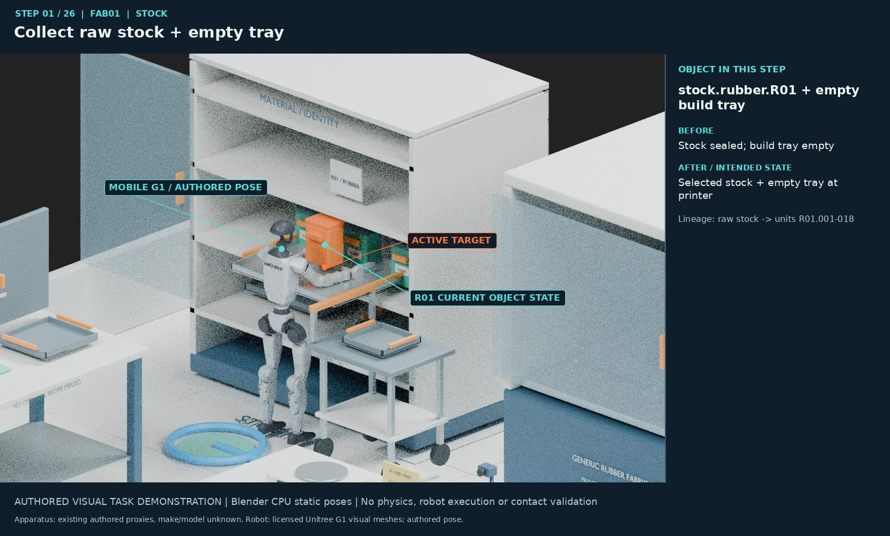
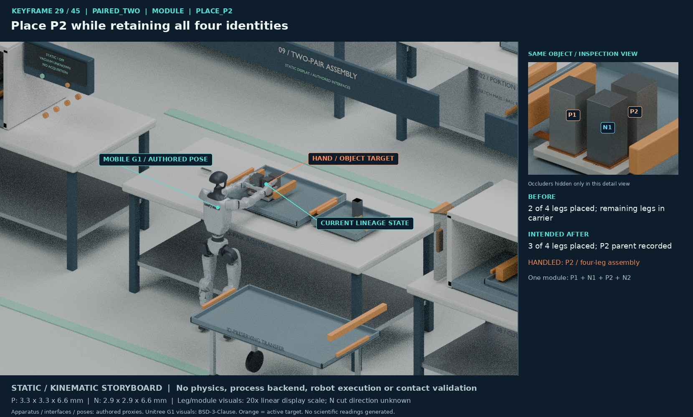
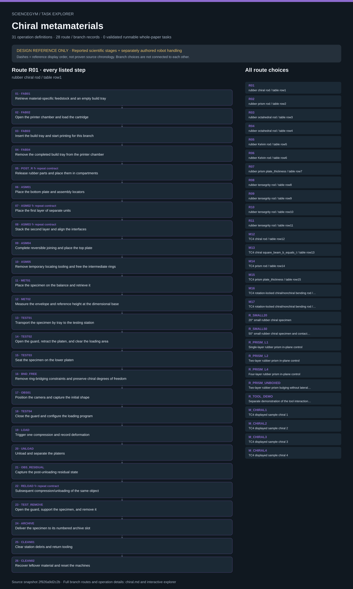

# ScienceGym

**Long-horizon robot research tasks derived from full scientific papers.**

ScienceGym studies how to translate a paper's reported experimental program into tasks for an embodied research agent: preparing materials, moving samples between instruments, assembling apparatus, running controls and repeated measurements, preserving records, recovering from failures, and leaving the laboratory in a defined final state.

The unit of design is a **paper-level task family**. Its branches, dependencies, sample histories and measurement obligations determine what the agent must accomplish. An episode can cover a complete route or a control package; paper-level completion requires the full declared scope.

**Current release: nineteen reviewed task-design drafts; zero validated runnable whole-paper tasks.** The repository currently supports reading and inspecting static specifications. Task execution is future work.

## Contribute a task or asset

Start with [CONTRIBUTING.md](CONTRIBUTING.md) to claim a paper or asset, choose a contribution track and prepare a reviewable pull request. Read the [project vision](docs/PROJECT_VISION.md), [paper task guide](docs/contributing/PAPER_TASK_GUIDE.md), [asset guide](docs/contributing/ASSET_GUIDE.md) and [readiness checklist](docs/contributing/REVIEW_CHECKLIST.md). Task and asset work can proceed in parallel while physical simulation is paused.

## Embodied laboratory task demonstration

The R01 example binds a mobile humanoid, laboratory stations, manipulated objects and sample states to **26 reference-operation keyframes**. It shows stock collection, fabrication handoff, assembly, metrology, two authored loading cycles, archiving and cleanup. [Open the offline visual replay guide](viewer/embodied_r01/README.md).

[](viewer/embodied_r01/README.md)

[Assembly view](viewer/embodied_r01/frames/09_ASM04.jpg) · [Loading and specimen inspection](viewer/embodied_r01/frames/19_LOAD.jpg) · [Archive view](viewer/embodied_r01/frames/24_ARCHIVE.jpg).

This is an authored visual storyboard, not a physics simulation or robot execution. It covers the R01 branch, not all branches of the paper. Repeated unit placements are summarized in layer-completion views, not individual grasp trajectories. Source-supported stages, authored poses and unknowns remain distinguished.

### Thermoelectric module route

The PAIRED_TWO demonstration maps **66 reference-operation occurrences to 45 illustrated keyframes**: separate P/N preparation, cross-device processing, four individually tracked leg placements, module assembly, four measurement-boundary chapters, archiving and cleanup. [Open the offline visual replay guide](viewer/embodied_thermoelectric/README.md).

[](viewer/embodied_thermoelectric/README.md)

[Whole route contact sheet](viewer/embodied_thermoelectric/keyframes_contact_sheet.jpg) · [Laboratory overview](viewer/embodied_thermoelectric/overview.jpg) · [Coverage and limitations](viewer/embodied_thermoelectric/loop_coverage.json).

These are authored static/kinematic states. Millimetre-scale leg geometry is explicitly enlarged 20× for inspection; physical grasp feasibility is not established. Repeated current/acquisition loops remain grouped with unknown grid values and counts. No scientific measurements or controller execution are supplied. This demonstration covers one selected route, not every branch of the paper.

## Explore the paper-level tasks

[Open the offline explorer guide](viewer/task_explorer_v1/README.md) to inspect branches, robot actions, objects, sample states, source evidence and recovery. Download the folder and open index.html locally; GitHub shows HTML as code rather than running it.

Ten visual route maps readable directly on GitHub: [Chiral](viewer/task_explorer_v1/docs/chiral.md) · [Deconwolf](viewer/task_explorer_v1/docs/microscopy.md) · [Fibres](viewer/task_explorer_v1/docs/fibre.md) · [Thermoelectric](viewer/task_explorer_v1/docs/thermoelectric.md) · [diSPIM](viewer/task_explorer_v1/docs/dispim.md) · [Acoustics](viewer/task_explorer_v1/docs/acoustic.md) · [Perovskite](viewer/task_explorer_v1/docs/perovskite.md) · [Prismatic](viewer/task_explorer_v1/docs/prismatic.md) · [EmVP](viewer/task_explorer_v1/docs/emvp.md) · [Directional cooling](viewer/task_explorer_v1/docs/cooling.md).

This author/evaluator logical inspector covers 202 route/configuration records and 1,376 operation definitions. These are task-design references, not executed robot trajectories or a new 3D storyboard. Nested loops, repeated operations and unresolved conditions remain explicit; unknown loops are not expanded. Prismatic operation membership follows partial-order constraints, with nested material/target and thickness/target coverage, independent campaign branches and conditional recovery. [Verification and limitations](viewer/task_explorer_v1/VERIFICATION.md).

## Visual task routes

The first visual route shows every listed R01 operation and the complete chiral branch index. Dashed connectors represent the authored reference order, not an executed trajectory or a recovered author chronology. The ten-paper offline interactive explorer is linked above.

[](docs/visualizations/chiral_r01.svg)

## Why paper-level tasks?

Scientific work connects many individually simple actions across long intervals and multiple devices. A useful task must preserve those connections:

- **Whole reported routes:** preparation and fabrication, intermediate processing, characterization, measurement, archiving and cleanup
- **Branches and dependencies:** alternative material families, shared prerequisites and independent experiments, without inventing a single global chronology
- **Sample lineage:** batches, parent–child specimens, destructive siblings, reused samples and irreversible treatment histories
- **Cross-device manipulation:** carrying, loading, aligning, mounting, connecting and unloading the right object at each station
- **Controls and repetition:** paired conditions, repeated observations and same-specimen cycles kept distinct from independent samples
- **Recovery:** failed attempts remain in the record; damage, contamination or an invalid measurement cannot be erased by relabeling an object

ScienceGym is an independent project whose task layer specifies these obligations. Laboratory scene and asset requirements appear in its task packages; implementing and validating those bindings remains future work. A scene or addressable object alone does not establish an executable task.

## Task design

Each task family connects source evidence to operational requirements. Package schemas are still evolving; their filenames are not yet a uniform runtime API.

1. **Evidence and coverage.** Main text, Methods, figures and available supplementary materials are mapped to reported experimental branches. Theory, simulation and literature comparisons receive explicit dispositions rather than being turned into invented physical experiments.
2. **Goals and initial state.** The agent receives a selected goal, available objects, known constraints and observable interfaces. Preparation routes begin with appropriate starting resources, not silently completed specimens.
3. **Operations and dependencies.** Reference operations define required inputs, object-state transitions, device interactions and dependencies. Authored handling steps bridge gaps in the paper and are labeled separately from source facts.
4. **Lineage and records.** Measurements retain their specimen, condition, instrument and attempt identities. A repeated measurement is not automatically a new sample, and a split sample does not lose its parent history.
5. **Evaluation and recovery.** Evaluator-only reference routes, hidden states and acceptance rules remain separate from agent-facing goals. The intended evaluator accepts equivalent valid routes and checks recorded events and object states, rather than trusting an agent's declaration of success.

For a concrete example, inspect Deconwolf's [goal](tasks/microscopy_operations_v2/agentgoal.json), [initial state](tasks/microscopy_operations_v2/initialstate.json), [reference operations](tasks/microscopy_operations_v2/operation_sequences.json), [recovery design](tasks/microscopy_operations_v2/recovery_design.json) and [evaluator reference](tasks/microscopy_operations_v2/evaluator_reference.json). A future agent-facing loader must not expose the evaluator materials as task instructions.

### Scientific observations and task success

The designs allow explicitly labeled preset or mock scientific observations. This lets future task implementations study long-horizon operation without requiring a simulator to predict a paper's scientific result.

Reported literature values, authored mock outputs and unknown or invalid observations remain distinct. Matching a published number is not sufficient evidence of successful manipulation or acquisition. Conversely, a correctly obtained weak or negative result need not be an operational failure. Current preset contracts are specifications; they do not constitute an implemented scientific backend or a complete set of image fixtures.

## Included task families

The nineteen packages have undergone design review and static consistency checks. These are draft representations of reported scope, not human expert certification or completed robotic reproductions.

| Task family | Reported program represented | Entry point |
| --- | --- | --- |
| Chiral metamaterials | Material preparation and fabrication, assembly, geometry and boundary controls, loading cycles, observation and archiving | [Task design](tasks/chiral_operations_v2/TASK_DESIGN.md) |
| Deconwolf microscopy | Six preparation/imaging branches and seven source-data comparison branches, with paired acquisitions and data lineage | [Task design](tasks/microscopy_operations_v2/TASK_DESIGN.md) |
| Semiconductor fibres | Manufacturing routes, device preparation, characterization, measurement and application branches, including destructive sibling specimens | [Task design](tasks/fibre_operations_v2/TASK_DESIGN.md) |
| Thermoelectric devices | Material routes, interfaces and cutting directions, segmented and single-leg controls, module assembly, contact and thermal/electrical measurements | [Task design](tasks/thermoelectric_operations_v2/TASK_DESIGN.md) |
| diSPIM microscopy | Instrument assembly, three-camera alignment, reference calibration, routine sample preparation, dual-view acquisition and archiving | [Task design](tasks/dispim_operations_v2/TASK_DESIGN.md) |
| Helical acoustic metamaterials | Fabrication, transmission and pulse measurements, 40-cell lens assembly, field scans with and without obstacles, records and reset | [Task design](tasks/acoustic_operations_v2/TASK_DESIGN.md) |
| Perovskite solar modules | Precursor/control preparation, device and module fabrication, molecular/crystal/film assays, electrical measurement and ageing with persistent specimen histories | [Task design](tasks/perovskite_operations_v2/TASK_DESIGN.md) |
| Prismatic metamaterials | Cardboard demonstrators, cyclic compression, reach/release, hinge-material and array-thickness controls, selected configurations and bounded pneumatic work | [Task design](tasks/prismatic_operations_v2/TASK_DESIGN.md) |
| Embedded extrusion-volumetric printing | Material qualification, positive/negative printing, transfer and alignment, cleaning, optical/rheological/CT/mechanical comparisons and immutable sample records | [Task design](tasks/emvp_operations_v2/TASK_DESIGN.md) |
| Directional radiative cooling | Mobile-robot material preparation, assembly, sensor calibration, optical station handoffs, paired outdoor comparisons, modified-assembly checks and cleanup | [Task design](tasks/directional_cooling_operations_v2/TASK_DESIGN.md) |
| Anti-repellent granular assembly | Robot-led substrate and particle preparation, patterning-device handoffs, collision and assembly controls, imaging, material variants and sample recovery | [Task design](tasks/granular_assembly_operations_v2/TASK_DESIGN.md) |
| Origami mechanical memory | Robot fabrication and assembly, geometry and fixture configuration, compression and torque handoffs, one-bit/two-bit switching, sensing and preload release | [Task design](tasks/origami_memory_operations_v2/TASK_DESIGN.md) |
| Beaded metamaterials | Robot component preparation, bead/thread weaving, supported transfer, pretension and fixture setup, compression/dilation/bending comparisons, imaging and recovery | [Task design](tasks/beaded_operations_v2/TASK_DESIGN.md) |
| Thermal jamming | Robot rod and fixture preparation, packing, heated pull-out, cycling and friction controls, calorimetry, XCT and load-hold handoffs | [Task design](tasks/thermal_jamming_operations_v2/TASK_DESIGN.md) |
| Ring origami | Robot facet and crease fabrication, fine-fastener assembly, cardboard-array preparation, reconfiguration, compression, torsion inference and shape measurements | [Task design](tasks/ring_origami_operations_v2/TASK_DESIGN.md) |
| Mechanical backpropagation | Robot lattice fabrication handling, camera calibration, weight and string loading, paired gradient measurements and tests of fabricated trained networks | [Task design](tasks/mechanical_backprop_operations_v2/TASK_DESIGN.md) |
| Acoustic wavefront modulation | Robot sample and array preparation, guide assembly, calibration, reference and transmission measurements, normal/oblique controls, field scans and cleanup | [Task design](tasks/acoustic_wavefront_operations_v2/TASK_DESIGN.md) |
| Bianisotropic acoustic metasurfaces | Robot fabrication handling and panel assembly, guide preparation, calibration and paired reflection/transmission scans, with computational design branches kept separate | [Task design](tasks/bianisotropic_operations_v2/TASK_DESIGN.md) |
| Subwavelength acoustic edge detection | Robot guide fabrication handling, target preparation, four-channel rig assembly and calibration, reference/specimen sweeps, spatial scans and cleanup | [Task design](tasks/acoustic_edge_operations_v2/TASK_DESIGN.md) |

All published task narratives and structured descriptions are in English. Structured specifications and source identifiers accompany each package.

The ten-paper logical explorer includes perovskite, prismatic, EmVP and directional cooling. Prismatic contributes 12 route/configuration records and 49 operation definitions across seven practical families; the earlier paper-level families retain their semantics. Prismatic's [independent contract tests](tasks/prismatic_operations_v2/tests/VALIDATION_REPORT.md) cover 40 public checks plus an optional primary-source-byte check. Embodied visual storyboards currently cover selected chiral and thermoelectric routes only. Configuration, branch and operation counts describe the representation; they are not counts of independent experiments or successful executions.

EmVP is integrated as the ninth family, adding 19 configurations and 53 operation definitions. The logical inspector preserves its 15 comparison packages, 30 unresolved gates, source dependencies and three separately allocated cage-condition routes. Authored viewing order is not a robot action sequence, and comparison states/sites are not independent specimens. Its independent suite has 44 public checks plus one optional source-byte check; all 45 passed with the lawful source packet. Published package status records describe their authoring/validation snapshot, not a robot execution or a live GitHub deployment state.

## Quick start: inspect a task

Start with the [Deconwolf task design](tasks/microscopy_operations_v2/TASK_DESIGN.md), then compare its agent-facing inputs with its coverage and recovery requirements.

From the repository root, Python 3's standard library can inspect the JSON without installing dependencies, downloading sources or changing files:

```sh
python3 -B -m json.tool tasks/microscopy_operations_v2/agentgoal.json
python3 -B -m json.tool tasks/microscopy_operations_v2/initialstate.json
python3 -B -m json.tool tasks/microscopy_operations_v2/paper_coverage.json
python3 -B -m json.tool tasks/microscopy_operations_v2/recovery_design.json
```

Run `python3 scripts/check_english.py` to check for untranslated CJK text, including escaped JSON values. This checks language hygiene, not translation accuracy.

These commands parse and print the specifications. They do not validate source completeness, run an episode or operate equipment. There is no supported whole-paper execution command in this release.

For a second perspective, inspect the fibre family's [lineage contract](tasks/fibre_operations_v2/lineage_contract.json), [control packages](tasks/fibre_operations_v2/control_packages.json) and [granularity gaps](tasks/fibre_operations_v2/granularity_gaps.json).

### Reproduce static release checks

With Python 3.9+ and Node.js available on `PATH`, run from the repository root:

```sh
python3 -B scripts/verify_release.py
```

No third-party Python or Node packages, network access, browser, renderer or hardware are required. The command does not rebuild the viewer or rewrite task files. It exits nonzero for missing prerequisites, missing required files, failed checks or skipped Python tests.

The command checks:

- All repository JSON outside tool/cache directories, including new task drafts, for valid syntax, duplicate keys and non-JSON numeric constants
- The existing English hygiene check and focused verifier regression tests
- The explorer tests with `SCIENCEGYM_TASKS` explicitly bound to this checkout's `tasks` directory, so source-comparison tests cannot silently skip
- JavaScript syntax and the explorer plus both embodied players' mocked-DOM tests
- All 71 storyboard frame images against their published render hashes, any per-frame image hashes, and applicable image-only export checksums, including overview/contact-sheet images

These are static consistency, display-contract and image-byte checks. Parsing a new task's JSON is not full schema or scientific review. Mocked-DOM tests do not test an actual browser, and none of these checks executes a robot task, validates physical feasibility, reproduces scientific results or establishes whole-paper completeness.

The older `scripts/verify_export.py` checks the original `EXPORT_MANIFEST.json` snapshot. That historical manifest is not an inventory of subsequent repository changes. The current release command parses historical receipts and verifies their applicable frozen image hashes, but does not assert that their old text hashes describe the current tree. Historical source-scene, mesh, video and other unbundled asset hashes are not revalidated.

## Status and next steps

The current milestone is **source-grounded task design**. Runtime state transitions, manipulation interfaces, navigation, trusted event logging and end-to-end evaluation still need implementation and validation. Some procedures use closed-service abstractions; their internal human microactions are not fully reconstructed. Missing scientific parameters, geometry, calibration and operational details remain explicit gaps.

Next steps are to implement selected complete episodes, bind the required laboratory assets and interactions, validate initial states and sample histories, and test both successful routes and recovery cases. Only then can executable coverage be assessed separately from design coverage.

Physical simulation is paused. No whole-paper robot execution or physical scientific reproduction is claimed. The work remains an early research prototype and does not establish publication-ready experimental evidence.

## Sources, release scope and licensing

Source locators, provenance and unresolved claims are recorded within each task package. Source-reported facts, interpretations and authored task mechanics must remain distinguishable. Access to a paper does not imply permission to redistribute its text, figures, videos or datasets.

This first public snapshot focuses on authored task specifications. It is not a complete mirror of the development archive: bulk binary scenes, asset exports and the early manuscript are not included while their publication and rights review is pending. Historical provenance references may identify resources that are not bundled. Original publisher source packets and scientific datasets are not supplied by this release.

ScienceGym is licensed under the [Apache License 2.0](LICENSE). Third-party publications, datasets and assets remain subject to their own licenses and notices; the project license does not relicense them. Obtain any required third-party materials from their lawful sources.

These specifications are research task designs, not approved laboratory SOPs or instructions to operate real equipment.

The directional-cooling design adds 56 explicit robot/device operation contracts across 11 physical route leaves. Its 38 static and synthetic-record checks passed independent review. It is integrated as the tenth family in the logical explorer, retaining six symbolic loops, fourteen unresolved input gates, conditional receipt dependencies, sample identities and required physical transport. Physical execution and thermal reproduction remain unverified.

The granular-assembly design contains 26 configurations, 42 robot/device operation templates and 31 explicit input gates. Its 35 author checks and 23 independent checks validate static design contracts only. It is not yet integrated into the ten-family explorer; historical movies/data and missing recipes remain explicit boundaries.

The origami-memory design contains 55 robot/device/analysis operation contracts and ten physical configurations plus a whole-paper campaign. All 29 static contract checks passed independent review. Numerical/proposed branches and unread supplementary movies remain separated from inspected physical evidence. It is not yet integrated into the ten-family explorer.

The beaded-metamaterial design covers 13 practical families, 21 leaf configurations plus a campaign dispatcher, 70 robot/device operation templates, 15 control packages and 35 explicit input gates. Its 42 author checks and 25 independent checks passed. Source tables, geometry and some schedules remain unresolved. It is not yet integrated into the ten-family explorer.

The thermal-jamming design adds 13 configurations, 33 robot-operation contracts and 27 unresolved-input gates. Its 25 author checks and 34 independent checks passed. Geometry conflicts, missing shape-setting inputs and XCT acquisition settings remain explicit. It is not yet integrated into the ten-family explorer.

The ring-origami design adds 14 physical branch templates, three preparation routes and 59 operations. Ten author tests and 48 independent checks passed. Semi-experimental torque remains tied to measured element data, while uninspected assembly-movie choreography and other execution inputs remain explicit gates. It is not yet integrated into the ten-family explorer.

The mechanical-backpropagation design adds nine physical routes plus a campaign, 46 operations, ten explicit transfer contracts and 18 unresolved input gates. Its 43 static/symbolic tests and 37 independent checks passed. Numerical spring-constant updates and retraining remain separate from physical experiments. It is not yet integrated into the ten-family explorer.

The acoustic-wavefront design adds 69 operations, ten physical routes, eight numerical/theoretical dispositions, fourteen transport routes and fifteen unresolved input gates. Its 82 static and synthetic-record tests passed. Historical Figure 3/4 acquisition frequencies remain unconfirmed; the 3000 Hz task reference assignment is explicitly authored. Corrugated coupling remains numerical-only. It is not yet integrated into the ten-family explorer.

The bianisotropic-acoustics design adds 42 operation templates across fourteen design branches, twelve source-coverage families, eighteen unresolved input groups and seven control packages. Its standalone suite passes 48 checks and explicitly skips one optional private-source-byte check; all 49 pass when the lawful source packet is available. Only the 60-degree panel was physically tested in the paper; higher-angle designs and the COMSOL four-probe retrieval stay computational. It is not yet integrated into the ten-family explorer.

The acoustic-edge-detection design adds 46 operation templates, seven physical acquisition branches, three numerical/theoretical branches, fourteen unknown-parameter groups and eight source-conflict records. All 62 static and synthetic-record tests passed. Main article and required supplementary text were inspected, while main-PDF bytes were not obtained and that hash remains null. It is not yet integrated into the ten-family explorer.

These three acoustic packages add authored task contracts and checks, with no new scene, CAD or image assets, embodied visual routes, robot executions or scientific reproductions. Package verification and publication fields record their local authoring/review snapshots; they are not live repository deployment status.
