# ScienceGym

**Long-horizon robot research tasks derived from scientific papers.**

ScienceGym studies how to translate a paper's reported experimental program into tasks for an embodied research agent: preparing materials, moving samples between instruments, assembling apparatus, running controls and repeated measurements, preserving records, recovering from failures, and leaving the laboratory in a defined final state.

The unit of design is a **paper-level task family**. Its branches, dependencies, sample histories and measurement obligations determine what the agent must accomplish. An episode can cover a complete route or a control package; paper-level completion requires the full declared scope.

**Release contents: 41 reviewed paper-level task-design drafts, including partial-source gated drafts, plus 3 bounded nonbiological subsets (44 packages total); zero validated runnable whole-paper tasks.** The repository supports reading and inspecting static specifications. Task execution is future work.

Publication status is established by the repository commit containing these files. Frozen package fields and historical verification receipts describe their authoring and review snapshots, not live publication, deployment or remote CI status.

## Paper discovery candidates

Browse the [paper candidate list](docs/PAPER_CANDIDATES.md) for titles screened for possible robot-laboratory task conversion. These are discovery candidates, not fully reviewed or converted tasks, and are excluded from the reviewed-design counts above.

## Frictional fluid dynamics: paired task and original scene

The [frictional-fluid task](tasks/frictional_operations_v2/README.md), [original static scene](assets/frictional_scene_assets_v1/README.md) and [lossless viewer](viewer/task_explorer_v1/docs/frictional.md) add one paper-level design. The explorer now contains **41 paper-level designs + 3 bounded subsets (44 families)**, **994 inspection records** and **3,262 operation definitions**. Nine source-program branches, twelve authored evidence routes, six stations, eight original asset groups and **32 evidence-only anchors** remain explicit. The inspector provides nine branch views, six reference views including the operation inventory, and a separate default qualification hold. All **twenty physical qualification holds** remain unresolved; no validated runnable whole-paper task is added.

The task and scene retain **55 and 54 exact accepted archive members**. All **38 task JSON and 35 asset JSON documents** remain losslessly inspectable, including source conflicts, required evidence, failure records and native sanitation review. Reciprocal **42-file task and 36-file scene cores** preserve exact shared contracts and accepted pairing. Only the actor-facing task file is eligible for an acting-agent context; the explorer is a read-only author/evaluator inspector.

### Source distinctions and qualification boundaries

The coral-rate conflict remains explicit: the written movie description gives 0.1 ml/min, while displayed movie labels and the main paper give 1.0 ml/min. Neither value becomes an operating command. The apparent printed Boyle-law intermediate sign inconsistency remains unresolved; the package supplies no repaired numerical model. Normalized filling fraction is distinct from absolute volume fraction, reservoir volume from total compliance, pump rate from instantaneous burst flow, and movie playback time from experiment time.

The viscosity-rate scaling control and high-filling granular-fracture extension remain required source branches, with incomplete recipes and conditions held. Granular fracture never means intentionally breaking the glass cell. The borrowed porous-medium comparisons retain external-author provenance and do not become experiments from this paper or additional task families. Sparse illustrated conditions do not imply a complete factorial schedule; twenty local width measurements do not establish twenty independent preparations. Source outcomes, fitted model parameters and theoretical bounds remain reference facts, never generated measurements, qualified defaults or reward thresholds.

Preparation/run identities, immutable raw-parent references, clock/calibration associations, failures and service custody remain exact. Per-job R11 safe closeout can occur while other jobs remain open; R12 is the separate aggregate archive/accounting gate. Passing a metadata receipt check does not authenticate a service or inspect its external raw files. Pressure-cell preparation, loading, measurement and physical closeout remain closed qualified services under **HOLD_QUALIFICATION**. Geometry and anchors establish no pressure rating, safe load, calibrated contact, robot reachability or motion authority.

The original native scene, embedded-only GLB and three CPU renders illustrate source-scale cell context alongside unqualified fixtures and categorical morphology tokens. The tokens were not traced from source figures or calculated from fluid dynamics. No fluid simulation, hardware controller, physical experiment, new scientific measurement or scientific reproduction is supplied.

The accepted upstream source review covers all eight final main pages, five figures, nine equations and both movie descriptions. Both movies were decoded in full and nine/eleven selected frames inspected; continuous playback, raw-time validation, numeric datasets and external cited references remain unreviewed. No separate technical written SI was listed. This integration does not reread publications, reanalyze raw data or independently validate source claims. The source remains **CC BY-NC-SA 3.0**, with separate provenance for borrowed Figure 5 imagery. Apache-2.0 applies only to original authored contracts, code and assets. Publisher PDFs, figures, movies, frames, photographs, source CAD/code and raw data are not bundled.

### Preservation and verification

All **43 previous task packages**, earlier assets, both embodied storyboards, scene bindings, original LICENSE, metadata-maintenance tools and all **172 prior generated family artifacts** remain byte-identical to the preceding microsphere baseline. Historical release sections below retain their snapshot meaning. Archive and per-file hashes identify frozen bytes; the repository commit establishes publication status. ZIPs, native backups, private audit extracts and logs remain outside the Git delta.

[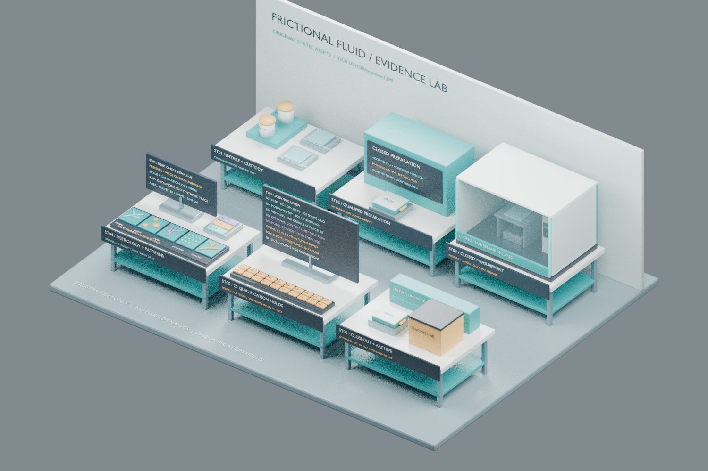](assets/frictional_scene_assets_v1/previews/preview_01_overview.png)

[Editable Blender scene](assets/frictional_scene_assets_v1/geometry/frictional_lab.blend?raw=true) · [Static GLB](assets/frictional_scene_assets_v1/geometry/frictional_lab.glb?raw=true) · [Closed-service illustration](assets/frictional_scene_assets_v1/previews/preview_02_closed_service.png) · [Evidence-review illustration](assets/frictional_scene_assets_v1/previews/preview_03_evidence.png)

```sh
python3 -B scripts/verify_release.py
(cd tasks/frictional_operations_v2 && python3 -B -m unittest discover -s tests -v && python3 -B -m unittest discover -s review -p 'independent_*tests.py' -v)
python3 -B tasks/frictional_operations_v2/verify_pair.py assets/frictional_scene_assets_v1
python3 -B assets/frictional_scene_assets_v1/verify_pair.py tasks/frictional_operations_v2
(cd assets/frictional_scene_assets_v1 && python3 -B -m unittest discover -s tests -v)
```

These checks cover static design, finite synthetic bookkeeping and display/export properties. Native rebuilds, sanitation and exporter tools belong in disposable copies; resaving an accepted scene invalidates its hash and requires renewed review. Exact archive verification uses separately distributed ZIPs. See [viewer verification](viewer/task_explorer_v1/VERIFICATION.md).

## Historical microsphere microscopy integration: 43 families

The [microsphere task](tasks/microsphere_operations_v2/README.md), [original static scene](assets/microsphere_scene_assets_v1/README.md) and [lossless viewer](viewer/task_explorer_v1/docs/microsphere.md) add one paper-level design. At that integration stage, the explorer had **40 paper-level designs + 3 bounded subsets (43 families)**, **978 inspection records** and **3,250 operation definitions**. Microsphere adds thirteen source-scope branch views, six reference views and a separate default qualification hold. All **13 authored stages and 13 source branches**, **7 stations**, **9 original asset groups**, **33 evidence-only anchors** and **16 unresolved qualification gaps** remain explicit. No validated runnable whole-paper task is added.

The task and scene contain **54 and 49 exact accepted archive members**. All **38 task JSON and 30 asset JSON documents** remain losslessly inspectable. Reciprocal **41-file task and 31-file scene cores** and the exact shared binding contract preserve the accepted pairing. Only the actor-facing task file is eligible for an acting-agent context; the explorer is read-only author/evaluator inspection.

### Source evidence and representation limits

The illustrated 50 nm transmission example and the text-only 50 nm reflection claim retain different evidence categories. Four illustrated experimental branches remain distinct from text-only extensions, a proposed array combination, theory/model outputs and speculation. Reported magnification and resolution claims are historical references, never generated measurements, completion receipts or success thresholds. Star-film composition differs between source body and caption, and its sphere size remains unreported. These gaps are not silently repaired. Bare and two SIL comparator branches retain their own source conditions and custody; a coated target never silently restores an uncoated baseline.

Actual-size context and enlarged illustration are separate collections. The source-scale spheres and SIL proxies do not qualify optical geometry. The 4.74 micrometer sphere is illustrated at 40000 times linear size and SIL diagrams at 200 times linear size; these display scales are not optical magnification. Target icons have no length scale and are original category illustrations, not acquired images or copied source figures. Object, virtual, detector and SEM frames remain distinct identities, without measured coordinate transformations.

Target preparation, sphere assembly/contact, optical acquisition, SEM reference and physical closeout remain closed qualified services under **HOLD_QUALIFICATION**. The static scene has no hardware commands, physics, optical solver, animation or generated telemetry. Drawn supports and anchors do not establish physical contact safety, robot reachability, calibrated optics or scientific reproduction. Sixteen source/service input gaps remain unresolved.

The accepted upstream review covers all six main pages and seven supplementary pages, four main figures and six supplementary figures. No movie link was listed; no movie, separate raw-data package or source code package was read. This integration does not reread publications, digitize figures, rerun numerical models or independently verify the paper's scientific claims. The source paper is free to read with **restricted reuse rights**; no unrestricted or Creative Commons source-content grant was established. Apache-2.0 applies to original authored content, not the paper or omitted publisher media, code, CAD or data.

### Preservation and verification

All **42 preceding task packages**, existing assets, both embodied storyboards, scene bindings, metadata-maintenance tools and receipts, historical verification records, the original LICENSE and all **168 previous generated family artifacts** remain byte-identical to the metadata-maintenance baseline. Only the new paired packages and viewer integration are added. Exact hashes describe frozen artifacts; the repository commit establishes publication status. Archives, publisher originals, backups and private evidence are not committed.

[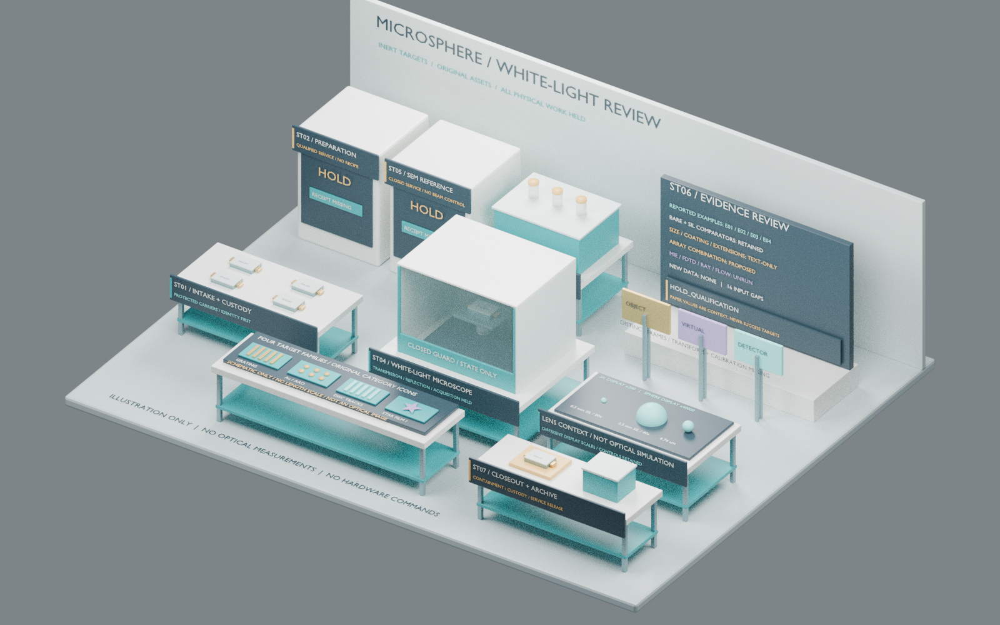](assets/microsphere_scene_assets_v1/previews/preview_01_overview.png)

[Editable Blender scene](assets/microsphere_scene_assets_v1/geometry/microsphere_lab.blend?raw=true) · [Static GLB](assets/microsphere_scene_assets_v1/geometry/microsphere_lab.glb?raw=true) · [Target illustrations](assets/microsphere_scene_assets_v1/previews/preview_02_targets.png) · [Closed-service illustration](assets/microsphere_scene_assets_v1/previews/preview_03_services.png)

```sh
python3 -B scripts/verify_release.py
(cd tasks/microsphere_operations_v2 && python3 -B -m unittest discover -s tests -v && python3 -B -m unittest discover -s review -p 'independent_task*tests.py' -v && python3 -B tests/verify_package.py)
python3 -B tasks/microsphere_operations_v2/verify_pair.py assets/microsphere_scene_assets_v1
python3 -B assets/microsphere_scene_assets_v1/verify_pair.py tasks/microsphere_operations_v2
(cd assets/microsphere_scene_assets_v1 && python3 -B -m unittest discover -s tests -v)
```

Static tests establish scoped software and export properties only. Run rebuild, sanitation and exporter tools in disposable copies; resaving a native file can reintroduce metadata and invalidates its accepted hash. Exact archive verification uses separately distributed ZIPs. See [viewer verification](viewer/task_explorer_v1/VERIFICATION.md) for source-to-display and display-testing limits.

## Historical QHA and thermal meta-device integration: 42 families

The explorer contains **39 paper-level designs + 3 bounded subsets (42 families)**, **958 inspection records** and **3,237 operation definitions**. [Graphene quantum Hall arrays](viewer/task_explorer_v1/docs/qha.md) and [thermal meta-devices](viewer/task_explorer_v1/docs/thermalmeta.md) each add one paper-level design. Metadata cleanup changes no scientific scope or design count. There are **zero validated runnable whole-paper tasks**.

### Graphene quantum Hall arrays

The [QHA task](tasks/qha_operations_v2/README.md) and [original static assets](assets/qha_scene_assets_v1/README.md) contain **53 and 49 exact archive members**. All **40 task JSON and 28 asset JSON documents** are losslessly inspectable, including sanitation and review records. Fifteen authored stages, eleven coverage branches, five reference views and a separate default qualification hold retain **29 source facts, 18 ambiguities, 14 reported outcomes, 14 controls and 20 unresolved-input groups**. Eleven scene groups and 32 anchors retain reciprocal **41-file task and 30-file asset cores**, exact shared binding bytes and archive pins.

Each **118-element parallel subarray is approximately 109 ohm**; the **236-element whole series device is approximately 219 ohm**. These identities stay distinct from the Hall bar and external references. Source inconsistencies, disputed equations and comparison-loop algebra remain held. Five design edges never prove five acquired comparisons; empty, failed and partial acquisition remain possible. Source outcomes are reference facts, never generated measurements, actor rewards or success thresholds. R14 joins every actually started service job after R03, even if analysis fails. Microfabrication, cryogenics, magnetic fields, electrical work and precision instruments stay closed qualified services.

The native metadata-clean revision preserves all 41 task-core files, scientific bindings, geometry semantics, GLB and original PNG pixels. All **6,055 native fixed character buffers** were inspected, including bytes after NUL; complete UI/path buffers were sanitized. This is export hygiene, not new scene geometry, physical qualification or scientific work. The retained internal package identifiers do not imply use of an earlier archive.

### Thermal meta-devices

The [thermal task](tasks/thermalmeta_operations_v2/README.md) and [original static assets](assets/thermalmeta_scene_assets_v1/README.md) contain **43 and 50 exact archive members**. All **29 task JSON and 27 asset JSON documents** remain lossless. Twenty authored stages retain twelve parent coverage families, twelve child scopes, six static condition views, five reference views and separate default/service-custody holds. **Three physical reference device families** (cloak, 45-degree rotator, 1.8 concentrator) retain X/Y conditions. Six cells and views are not six independent specimens. Ten original scene groups and 25 anchors bind all stages; exact reciprocal seals validate **41 task-content files and 48 asset-content files**.

All **15 source facts, nine ambiguities, thirteen unknown groups, six authored control proposals and six symbolic loops** remain explicit. Numerical and analytical branches are unexecuted; proposed controls do not become reported source experiments. The metric norm/squared-ratio discrepancy, residual-index conflict, feature-label inconsistency and physical-unit/absolute-flux gaps remain held. The source method includes numerical iterations. No optimizer, thermal solver or metric computation is implemented. Profile-number-to-X/Y mapping remains an authored visual selector; reported profile-direction relations retain their own provenance.

Preparation requires family/specimen-specific design, lattice, intermediate and final-specimen lineage. Every powered failure at P11–P14 leads to P15 release review; uncertain release keeps service custody. Administrative closure, a stop request, successful capture or the reported 45-minute interval never permits retrieval. Reported temperature context is not a command. Fabrication, casting, thermal, wet and electrical work remain closed qualified services. All **21,306 native fixed character buffers**, including post-NUL padding, passed strict sanitation review with zero residue tails and unchanged scene semantics/preview pixels.

### Shared scope and preservation

Source facts, authored requirements, finite synthetic tests and illustrative geometry remain separate. Neither family supplies hardware control, qualified motion, physical/electrical/thermal simulation, new scientific measurements or scientific reproduction. Nominal geometry and static anchors never qualify contact, grasps, clearances or operating limits. Repeat plans, specimen counts and physical interfaces stay unresolved until qualified evidence exists.

QHA upstream review covered nine main and four SI pages with full page-image inspection; raw data, source code, CAD and optional peer review remain unread. Thermal upstream review covered ten main and twelve SI pages, five main and seven SI figures, nine SI notes, and six sampled frames per movie across three decoded movies. Movies were not continuously reviewed or calibrated to raw acquisition time. The Zenodo README was read; matrices, source code, experimental raw data and optional peer review remain unread. This integration did not reread publications, compute results or resolve scientific discrepancies. Bounded publication-update checks are not exhaustive.

All **40 prior task packages**, earlier assets, both embodied storyboards, scene bindings, original LICENSE and **160 prior generated family artifacts** remain byte-identical to the preceding public baseline. Portable export embeds **364 exact task/asset JSON documents, nine guides and 27 original PNGs** across nine recent families. ZIPs, publisher originals, source arrays/code/CAD, backups, private audit extracts and build logs are outside the Git delta. Archive and per-file hashes establish identity; the repository commit establishes publication status. Frozen authoring/review fields retain their snapshot meaning. See [verification](viewer/task_explorer_v1/VERIFICATION.md).

[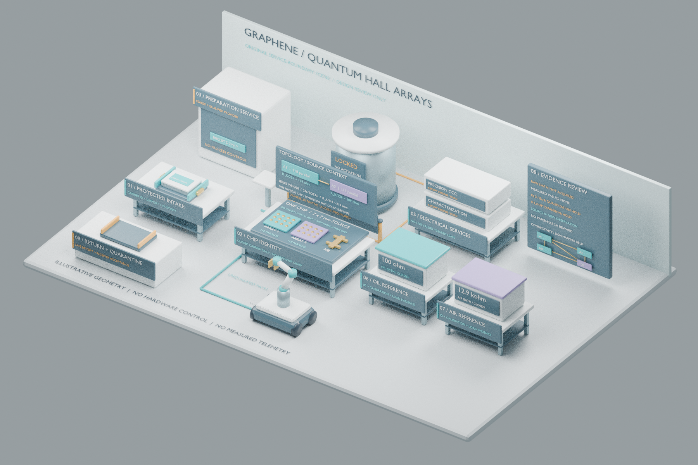](assets/qha_scene_assets_v1/previews/preview_01_overview.png)

[QHA Blender](assets/qha_scene_assets_v1/geometry/qha_lab.blend?raw=true) · [QHA GLB](assets/qha_scene_assets_v1/geometry/qha_lab.glb?raw=true)

[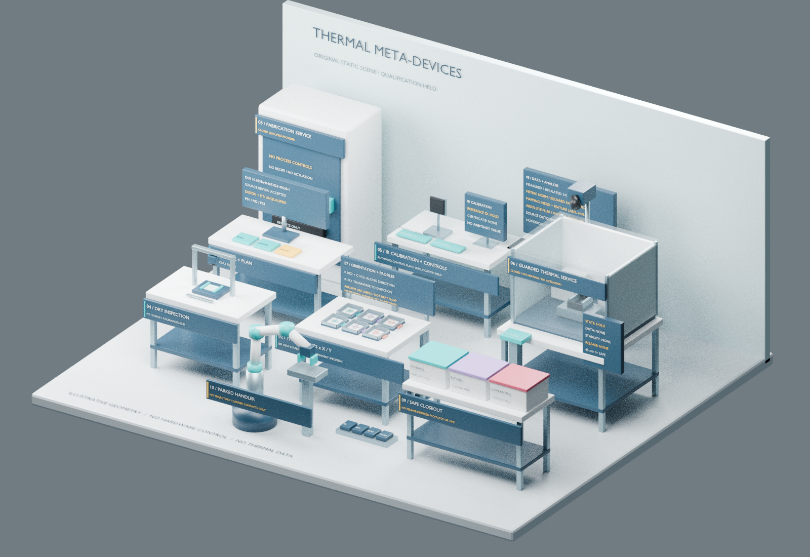](assets/thermalmeta_scene_assets_v1/previews/preview_01_overview.png)

[Thermal Blender](assets/thermalmeta_scene_assets_v1/geometry/thermalmeta_lab.blend?raw=true) · [Thermal GLB](assets/thermalmeta_scene_assets_v1/geometry/thermalmeta_lab.glb?raw=true) · [Condition views](assets/thermalmeta_scene_assets_v1/previews/preview_02_condition_views.png) · [Closed services](assets/thermalmeta_scene_assets_v1/previews/preview_03_guarded_services.png)

```sh
python3 -B scripts/verify_release.py
(cd tasks/qha_operations_v2 && python3 -B -m unittest discover -s tests -v && python3 -B -m unittest discover -s review -v && python3 -B tests/verify_package.py && python3 -B tests/verify_export.py)
python3 -B assets/qha_scene_assets_v1/verify_pair.py tasks/qha_operations_v2
(cd tasks/thermalmeta_operations_v2 && python3 -B -m unittest discover -s tests -v && python3 -B -m unittest discover -s review -v)
python3 -B assets/thermalmeta_scene_assets_v1/verify_pair.py tasks/thermalmeta_operations_v2
(cd assets/qha_scene_assets_v1 && python3 -B -m unittest discover -s tests -v)
(cd assets/thermalmeta_scene_assets_v1 && python3 -B -m unittest discover -s tests -v)
```

Native rebuilds and export scripts belong in disposable copies; later native saves can reintroduce UI metadata and require complete sanitation again. Exact archive checks use separately distributed ZIPs, never Git-committed archives.

## Historical scattering integration: 40 families

The explorer contains **37 paper-level designs + 3 bounded subsets (40 families)**, **904 inspection records** and **3,202 operation definitions**. [Anomalous acoustic scattering](viewer/task_explorer_v1/docs/scattering.md) adds **five experimental branches and four numerical-review extensions**, three separate preparation/calibration records, one authored closeout, four reference views and a metadata-only **HOLD_QUALIFICATION**. Fourteen symbolic operations describe one new paper design. These are static inspection counts; there are **zero validated runnable whole-paper tasks**.

All **27 task JSON documents and 13 static-asset JSON documents** remain losslessly inspectable, including twelve controls, 26 source facts, eight ambiguities and sixteen unknown groups. Source facts, authored requirements, finite synthetic checks and original geometry stay separate. Required receipts and outputs never become observed states. Unit cells, image frames and source conditions are not independent replicates; prospective repeat counts remain null.

The [task package](tasks/scattering_operations_v2/README.md) and [original static asset guide](assets/scattering_scene_assets_v1/README.md) retain **38 task files and 29 asset files**, byte-identical to their reviewed ZIP members. Eleven scene groups and 32 exact anchors bind every operation. Five task-pinned asset files, thirteen reciprocal task-core hashes and the byte-identical shared binding contract remain checked. Original BLEND, GLB and three PNGs are illustrative and unqualified. Fabrication, acoustic actuation, laser calibration, source motion, fault containment and safe release stay closed qualified services.

The reported system is a suspended torsion pendulum, not free-flight levitation. Screen pixels, angles, displacement, force and numerical quantities retain separate identities. Experimental and numerical configurations are distinct; requested commands never prove completion, accepted custody or safe release. No physical execution, acoustic actuation, simulation or scientific reproduction is supplied.

Upstream review covered eight main pages, eight SI pages, the media-description sheet and all five tables with 152 entries. Three movies were decoded and 6/6/5 frames sampled, not continuously visually reviewed. Additional supporting data, code and CAD remain unread. The bounded publication-update check is not exhaustive. This integration did not reread papers, reanalyze source data or prove mathematics.

All 39 prior task packages, earlier assets, both embodied storyboards, scene bindings, original LICENSE and **156 prior generated family artifacts** remain byte-identical. Portable export embeds **240 exact task/asset JSON files, seven guides and 21 original PNGs** across seven recent families. Archive and per-file hashes establish source identity; the repository commit establishes publication status. Frozen authoring/publication fields and historical verification receipts retain their original snapshot meaning. See [verification](viewer/task_explorer_v1/VERIFICATION.md).

[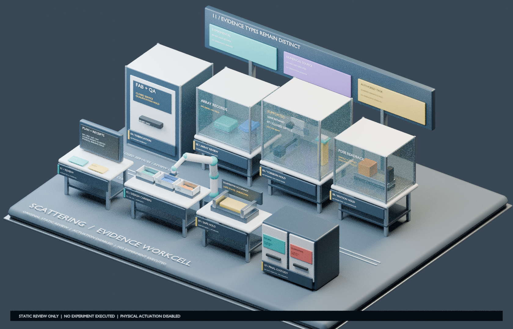](assets/scattering_scene_assets_v1/preview_01_overview.png)

[Editable Blender scene](assets/scattering_scene_assets_v1/scattering_review_scene.blend?raw=true) · [Static GLB](assets/scattering_scene_assets_v1/scattering_review_scene.glb?raw=true) · [Preparation illustration](assets/scattering_scene_assets_v1/preview_02_preparation.png) · [Metrology illustration](assets/scattering_scene_assets_v1/preview_03_metrology.png)

```sh
python3 -B scripts/verify_release.py
(cd tasks/scattering_operations_v2 && python3 -B -m unittest discover -s tests -v && python3 -B -m unittest discover -s review -v && python3 -B tests/verify_package.py)
python3 -B assets/scattering_scene_assets_v1/verify_pair.py --task-root tasks/scattering_operations_v2
```

Run scene guard scripts, native rebuilds and export scripts only in disposable copies because they regenerate receipts or files. The scene checks are test_scene_guards.py (42 cases) and independent_guard_probes.py (479 assertions plus 170 fuzz cases). Exact archive checks use separately distributed archives; archives are not committed to Git.

## Historical conformal integration: 39 families

The [Task Explorer](viewer/task_explorer_v1/index.html) covers **36 paper-level designs and 3 bounded subsets**, with **886 inspection records and 3,188 operation definitions**. The [conformal elasticity map](viewer/task_explorer_v1/docs/conformal.md) adds **16 authored operation templates and nine classified branches from one paper**, plus five reference views and one metadata-only **HOLD_QUALIFICATION**. Only the foot and bridge compression/decompression branches are physical experimental designs. Preparation, analysis and closeout retain their own roles; four numerical/theoretical branches remain documented and unexecuted. These counts describe static design content. There are **zero validated runnable whole-paper tasks**.

The [conformal task](tasks/conformal_operations_v3_compressed/README.md) and [original editable static assets](assets/conformal_scene_assets_v2_compressed/README.md) retain **48 task files and 48 asset files**, exactly as reviewed in the frozen archives. All **34 task JSON documents**, nine controls, 28 source facts, five source conflicts and sixteen execution gaps remain losslessly inspectable. Twelve scene groups and 32 nominal operation anchors retain eleven task-pinned asset hashes, nine reciprocal task hashes and an exact binding-plan snapshot. The native Blender file uses lossless storage compression; this package revision does not add another paper design. The GLB and three original rendered PNGs retain their preceding reviewed bytes.

[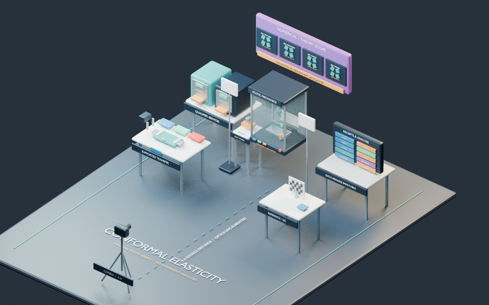](assets/conformal_scene_assets_v2_compressed/evidence/overview.png)

[Editable Blender scene](assets/conformal_scene_assets_v2_compressed/geometry/conformal_lab.blend?raw=true) · [Static GLB](assets/conformal_scene_assets_v2_compressed/geometry/conformal_lab.glb?raw=true) · [Specimen illustration](assets/conformal_scene_assets_v2_compressed/evidence/specimen.png) · [Station illustration](assets/conformal_scene_assets_v2_compressed/evidence/stations.png)

**Source facts, authored robot requirements, finite synthetic tests and illustrative geometry remain separate.** The reported specimen envelope and square count do not determine exact topology, contact geometry or qualified grasp locations. Four hundred frames are not four hundred specimens; 1 fps acquisition and 30 fps movie playback remain distinct. Compression/decompression, nearest conformal fits, boundary-only inference, measured results and numerical predictions retain separate parents. The five scientific conflicts are preserved without silent repairs. Requests are never completion receipts; failed attempts, current calibration, configuration epochs, capture readiness, custody and safe-release obligations remain explicit.

Fabrication, unidentified powder/contact treatment and powered loading remain closed qualified services. Geometry, dimensions, anchors, grasps, camera optics and interfaces are **illustrative and unqualified**. No source-exact CAD, hardware controller, physics simulation, scientific solver, robot execution, safety qualification or scientific reproduction is supplied.

Upstream review read nine main pages, sixteen written supplementary pages and the media-description sheet, with selected figure/equation inspection. Three movies were decoded and five frames each visually sampled; continuous visual review was not performed. **Zenodo archive contents remain unread.** This integration did not reread publications, reanalyze source data or independently prove mathematics. Publisher files, source figures/media, raw data/code/CAD, archives, private paths, caches, backups and build logs are excluded from the added payload.

All **38 prior task packages, earlier assets, both embodied storyboards, the bounded R01 scene binding, original LICENSE and all 152 prior generated family artifacts** remain byte-identical to the baseline. The optional standalone embeds exact JSON and original guide/render bytes for six recent families. Local links and frozen hashes identify provenance; the repository commit establishes publication status. See the [verification scope](viewer/task_explorer_v1/VERIFICATION.md).

```sh
python3 -B scripts/verify_release.py
(cd tasks/conformal_operations_v3_compressed && python3 -B -m unittest discover -s tests -v && python3 -B -m unittest discover -s review -v && python3 -B tests/verify_package.py && python3 -B tests/verify_export.py)
python3 -B tasks/conformal_operations_v3_compressed/tests/verify_pairing.py assets/conformal_scene_assets_v2_compressed
(cd assets/conformal_scene_assets_v2_compressed && python3 -B -m unittest discover -s tests -v)
python3 -B assets/conformal_scene_assets_v2_compressed/verify_pair.py tasks/conformal_operations_v3_compressed
```

Frozen tests that require a separately distributed source-review or sibling-asset layout explicitly skip absent inputs. Independent release verification uses disposable paired copies to exercise those checks without changing frozen package bytes. Run native Blender rebuild/export scripts only in disposable copies because they can regenerate files.

## Historical mid-infrared paired integration


The [Task Explorer](viewer/task_explorer_v1/index.html) covers **35 paper-level designs and 3 bounded subsets**, with **871 inspection records and 3,172 operation definitions**. These are static navigation counts, not completed experiments or physical executions. The [mid-infrared imaging map](viewer/task_explorer_v1/docs/midinfrared.md) adds **eight experimental design branches and 22 authored operation templates**, five separate reference views and a metadata-only **HOLD_QUALIFICATION** default. One source paper remains one paper-level design. All 34 task JSON documents remain losslessly inspectable, including twelve controls, ten source conflicts, fourteen unresolved-input groups, preparation, dependencies, lineage and failed-attempt retention.

The [mid-infrared task](tasks/midinfrared_operations_v2/README.md) and [original editable static assets](assets/midinfrared_scene_assets_v1/README.md) preserve the exact reviewed archive member bytes: **48 task files and 45 asset files**. Thirteen original scene groups and 44 nominal anchors bind all 22 templates. All twelve task-pinned asset hashes, the exact binding-plan snapshot and the asset-pinned task hashes agree. Scene geometry, dimensions, grasps and interfaces remain **illustrative and unqualified**.

[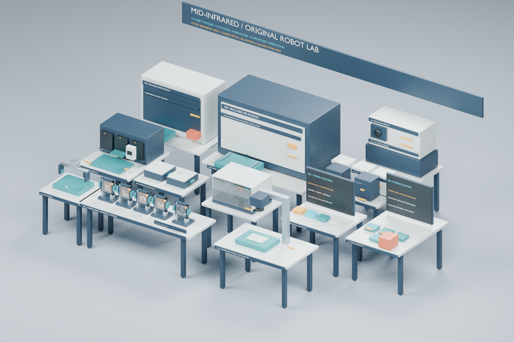](assets/midinfrared_scene_assets_v1/evidence/overview.png)

[Editable Blender scene](assets/midinfrared_scene_assets_v1/geometry/midinfrared_lab.blend?raw=true) · [Static GLB](assets/midinfrared_scene_assets_v1/geometry/midinfrared_lab.glb?raw=true) · [Optical-service illustration](assets/midinfrared_scene_assets_v1/evidence/optics.png) · [Protected-sample illustration](assets/midinfrared_scene_assets_v1/evidence/samples.png)

**Approximately 10 Hz is confined to the source's analog 16×16 dynamic demonstration**; analog 32×32 retains approximately 2.5 Hz. Neither is a photon-counting rate, a hardware default or a measurement from movie playback. Incident photons, detected counts, physical displays, dose and elapsed time stay distinct. B01 requires object-removed spatial diagnostics; B05 detector/exposure policy remains null under U14. Same power is not equal dose. Baseline/denoised comparisons require identical raw parents; copper grid assumptions do not fill missing silicon settings. Prospective repeat counts and qualification cannot be supplied by frame, mask or pulse counts.

Independent receipts, current detector epochs, exclusive station leases, safe access, occupied supported holds and closed-accounting conditions remain explicit. Requests do not prove completion or safe state. Failed and blocked branches remain archived. All fabrication, optical alignment, detector-change and guarded dynamic-target services stay closed, qualified and unimplemented. No real physics, source-exact CAD, validated grasp, hardware controller, robot execution, physical safety qualification or scientific reproduction is supplied.

Upstream review covered nine main pages, twelve written technical SI pages, eleven figures and one media-description page. Movies were fully decoded and sampled, not continuously inspected. **Raw data and modified source code remain unavailable**; this integration did not reread publications, reanalyze source data or independently prove the mathematics. Source facts, original authored task design, finite synthetic checks and original scene geometry remain distinct. Publisher PDFs, article figures/media, source raw data/code/CAD, archives, private paths, caches, backup scenes and build logs are excluded from the added repository payload.

All **37 previous task packages, earlier asset bundles, both embodied storyboards, the bounded R01 scene binding, original LICENSE and all 148 prior generated family artifacts** remain byte-identical to the baseline. New links are repository-relative and hash-bound. The optional standalone export embeds exact local JSON and original guide/render bytes for five recent families. Historical package status and receipts remain review snapshots; the repository commit establishes publication status. See the [verification scope](viewer/task_explorer_v1/VERIFICATION.md).

```sh
python3 -B scripts/verify_release.py
(cd tasks/midinfrared_operations_v2 && python3 -B -m unittest discover -s tests -v && python3 -B -m unittest discover -s review -v && python3 -B tests/verify_package.py && python3 -B tests/verify_export.py)
python3 -B tasks/midinfrared_operations_v2/tests/verify_pairing.py assets/midinfrared_scene_assets_v1
(cd assets/midinfrared_scene_assets_v1 && python3 -B -m unittest discover -s tests -v)
python3 -B assets/midinfrared_scene_assets_v1/verify_pair.py tasks/midinfrared_operations_v2
```

Some frozen task tests depend on a separately distributed source-review or sibling-asset layout; checks requiring absent inputs explicitly skip. Independent release verification uses disposable paired copies without changing frozen package paths. Native Blender rebuild/export scripts can regenerate files and should run only in disposable copies.

## Historical Arc-Morph paired integration

At the Arc-Morph integration stage, the [Task Explorer](viewer/task_explorer_v1/index.html) covered **34 paper-level designs and 3 bounded subsets**, with **857 inspection records and 3,150 operation definitions**. These are static navigation counts, not completed experiments or physical executions. The [Arc-Morph map](viewer/task_explorer_v1/docs/arcmorph.md) adds **seven physical route families and 31 operation templates**, two auxiliary records, six nonmanual dispositions and a separate metadata-only **HOLD_QUALIFICATION** view. This is one paper-level design, not 31 papers. All 33 task JSON documents remain losslessly inspectable, with exact source-listed occurrences, phase bodies, dependencies, controls, lineage, **ten unresolved conflicts and fourteen unresolved-input cards**.

The paired [Arc-Morph task](tasks/arcmorph_operations_v2/README.md) and [original editable static assets](assets/arcmorph_scene_assets_v1/README.md) retain their exact reviewed archive bytes: **46 task files and 42 asset files**. Twelve scene groups and 66 symbolic anchors bind all 31 templates. The task's nine scene-semantic hashes match this asset package and its exact task-binding snapshot. Four cardstock families retain ground, rigid and sheared evidence slots. The polymer quantitative series retains **one specimen, one set and eight configurations**; these are not eight independent specimens or technical repeats. Repeated transport occurrences remain distinct, the state-loop body is shown once, and fixture-specific unmount alternatives remain conditional.

[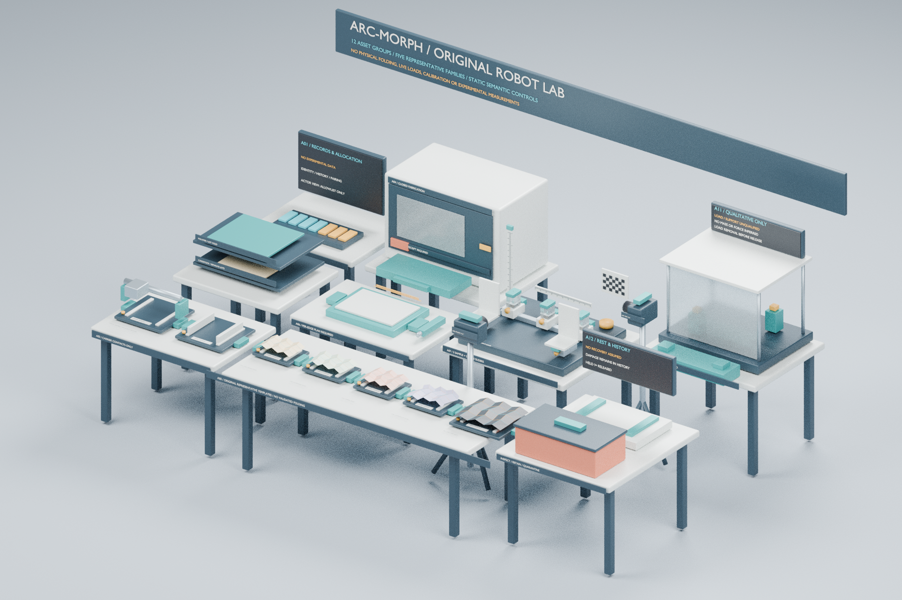](assets/arcmorph_scene_assets_v1/evidence/overview.png)

[Editable Blender scene](assets/arcmorph_scene_assets_v1/geometry/arcmorph_lab.blend?raw=true) · [Static GLB](assets/arcmorph_scene_assets_v1/geometry/arcmorph_lab.glb?raw=true) · [Handling illustration](assets/arcmorph_scene_assets_v1/evidence/handling.png) · [Metrology illustration](assets/arcmorph_scene_assets_v1/evidence/metrology.png)

Scene geometry, nominal dimensions, grasps and interfaces remain **illustrative and unqualified**. The 383.63/383.65 mm source length conflict C01 remains unresolved; theoretical dimensions do not become fabrication defaults. Nominal generator inputs and actual representative surface bounds remain separately documented. Paired camera identities, independent length references, locked capture state, mount leases, safe release and recovery history remain explicit. No real physics, source-exact CAD, validated grasp, hardware control, robot execution, physical safety qualification or scientific reproduction is supplied. Machining and powered/loading operations remain closed external qualified-service boundaries without operating recipes.

Upstream source review covered all twelve main pages, all twenty-two written supplementary pages and main/SI figures. The raw-image/code archive was not acquired or read, notebooks were not run and source mathematics was not independently proved. The upstream [task receipt](tasks/arcmorph_operations_v2/VERIFICATION.json) records 168 synthetic test methods; the [asset review](assets/arcmorph_scene_assets_v1/review/INDEPENDENT_REVIEW.md) records static geometry and semantic checks. These receipts establish only their stated static and synthetic scope. Publisher PDFs, article prose/figures, source raw data/code/CAD, private paths, archives, caches, backups and build logs are excluded from the added repository payload.

All **36 prior task packages, all earlier asset bundles, both embodied storyboards, the bounded R01 scene binding, LICENSE and all 144 earlier generated family artifacts** remain byte-identical to the frozen baseline. New-family links are repository-relative and identify frozen snapshots by local commit and SHA-256; those identifiers establish provenance rather than live publication status. The optional standalone export embeds exact local JSON and original guide/render bytes for four recent families. See the [verification scope](viewer/task_explorer_v1/VERIFICATION.md).

Run the repository checks and the new task/asset checks separately:

```sh
python3 -B scripts/verify_release.py
(cd tasks/arcmorph_operations_v2 && python3 -B -m unittest discover -s tests -v && python3 -B -m unittest discover -s review -v && python3 -B tests/verify_package.py && python3 -B tests/verify_export.py)
(cd assets/arcmorph_scene_assets_v1 && python3 -B -m unittest discover -s tests -v)
```

Some frozen task tests require the separately distributed source-review or sibling-asset layout; they explicitly skip those checks when those external inputs are unavailable. Independent release verification uses disposable paired copies to exercise these checks without changing frozen package paths. Run native Blender rebuild/export scripts only in disposable copies, since they can regenerate files or receipts.

## Historical wetting paired integration

The [wetting-transition map](viewer/task_explorer_v1/docs/wetting.md) retains sixteen design routes, 74 authored contracts and a separate metadata-only qualification hold. Its 33 source JSON documents, ten source conflicts and 25 unresolved inputs remain exact. The [task](tasks/wetting_operations_v2/README.md) and [original assets](assets/wetting_scene_assets_v1/README.md) preserve 46 task files, 40 asset files, twelve groups and 61 anchors. Cadmium/quantum-dot preparation, ink handling and high-voltage patterning remain closed external sealed-receipt boundaries. Upstream main/SI text and figure review did not include continuous movie playback or workbook numerical cells. No hardware, inverse solver, physical qualification or scientific reproduction is supplied.

## Contribute a task or asset

Start with [CONTRIBUTING.md](CONTRIBUTING.md) to claim a paper or asset, choose a contribution track and prepare a reviewable pull request. Read the [project vision](docs/PROJECT_VISION.md), [paper task guide](docs/contributing/PAPER_TASK_GUIDE.md), [asset guide](docs/contributing/ASSET_GUIDE.md) and [readiness checklist](docs/contributing/REVIEW_CHECKLIST.md). Task and asset work can proceed in parallel while physical simulation is paused.

## Paired varactor task design and editable 3D assets

The [whole-available-paper varactor design](tasks/varactor_operations_v2/TASK_DESIGN.md), based on [Quantum paraelectric varactors for radiofrequency measurements at millikelvin temperatures](https://doi.org/10.1038/s41928-024-01214-z), is paired with an [original editable static laboratory](assets/varactor_scene_assets_v1/README.md). Twelve groups represent design records, crystal custody, closed cleanroom and CNT fabrication, assembly, cryogenic and field services, RF/DC record roles, readout, analysis and safe storage. The scene is a generic authored illustration, not the paper's apparatus or a validated electrical model.

[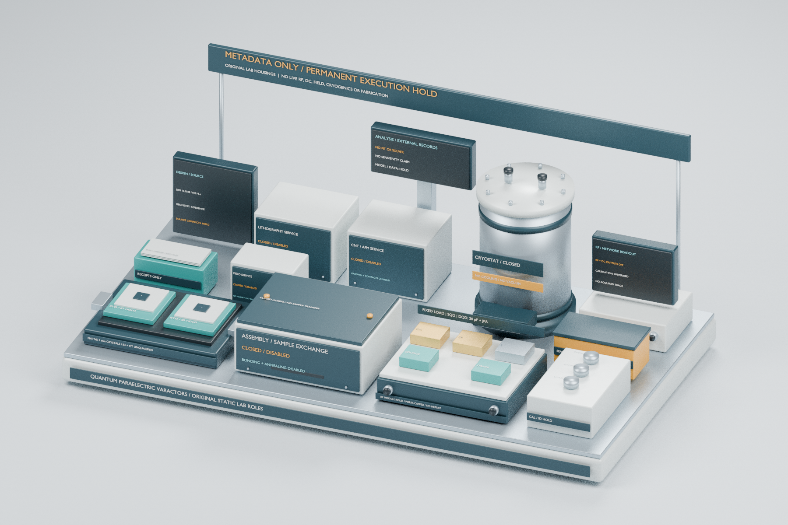](assets/varactor_scene_assets_v1/evidence/overview.png)

[Download the editable Blender scene](assets/varactor_scene_assets_v1/geometry/varactor_lab.blend?raw=true) · [Download the apparatus GLB](assets/varactor_scene_assets_v1/geometry/varactor_lab.glb?raw=true) · [Download the 100-times nominal reference GLB](assets/varactor_scene_assets_v1/geometry/varactor_reference_display.glb?raw=true)

[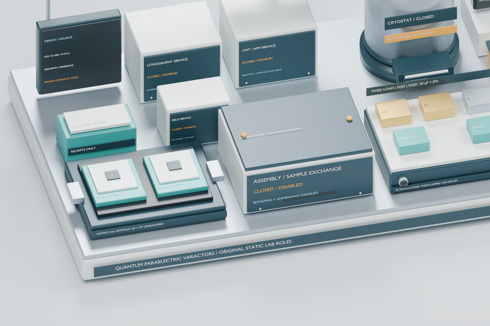](assets/varactor_scene_assets_v1/evidence/handling.png)

[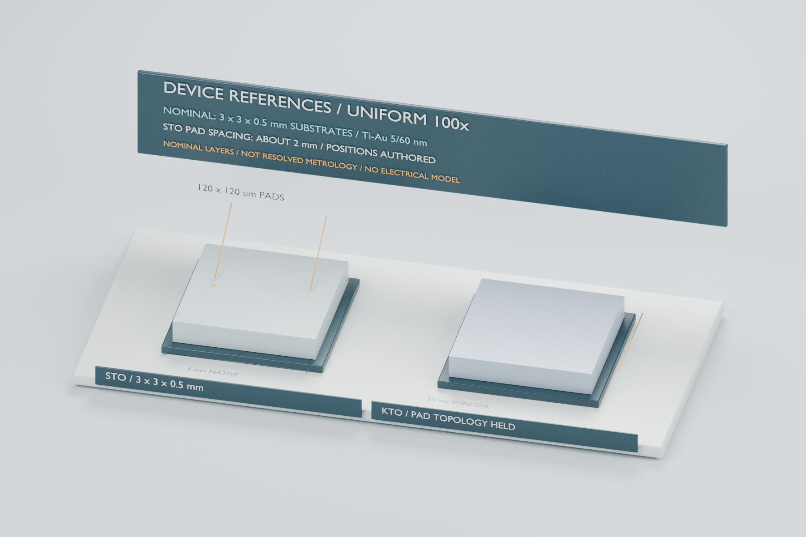](assets/varactor_scene_assets_v1/evidence/dimensions.png)

At its release, this pair added **1 reviewed whole-paper task-design draft**, bringing the repository to **32 paper-level task-design drafts plus 3 bounded nonbiological subsets, 35 task packages total**. Its **28 scientific design routes and 80 symbolic operation definitions** cover crystal identity and full preparation, separate STO/KTO characterization, RF-chain calibration, history and stability, field-dependent measurements, SQD and DQD readout, comparison and separately gated circuit/SNR models. Prepared-specimen entry requires independent ancestry and earns no fabrication credit. The [release boundary](tasks/varactor_operations_v2/RELEASE_BOUNDARY.json) keeps whole-paper execution false; there are still **zero validated runnable whole-paper tasks**. The [read-only explorer](viewer/task_explorer_v1/index.html) at that integration stage included both new designs and covered **35 families: 32 paper-level designs and 3 bounded subsets, 824 inspection records and 3,045 operation definitions**. The [varactor map](viewer/task_explorer_v1/docs/varactor.md) and [lockable-origami map](viewer/task_explorer_v1/docs/lockable_origami.md) preserve their exact source contracts and default qualification holds.

The [source-access audit](tasks/varactor_operations_v2/source_access_audit.json) records complete official-repository JATS, Methods and all five main figures, plus the six supplied supplementary pages and all five supplementary figures. Main-PDF access is not claimed. The supplied supplement contains Sections I–IV although the article advertises I–V; no missing section is invented. No attached videos or main/SI tables were found, the linked raw-data archive was not downloaded, author code was not ingested and source CAD was not provided. **49 source-evidence locators and 12 task conflict or scope records** retain material and substrate wording, supplementary-section/panel/tick discrepancies, filter units, inductor identity, circuit-inclusive loss, fit ambiguity, limited stability evidence, model assumptions and projected rather than demonstrated spin readout. The [asset comparison](assets/varactor_scene_assets_v1/review/source_comparison.json) has its own nine-record numbering; those IDs are not interchangeable with the [task conflicts](tasks/varactor_operations_v2/source_conflicts.json). Source coverage is design evidence, not scientific reproduction or physical qualification.

The [task interface plan](tasks/varactor_operations_v2/asset_binding_plan.json), scene's historical [binding snapshot](assets/varactor_scene_assets_v1/task_binding_snapshot.json) and [operation bindings](assets/varactor_scene_assets_v1/operation_bindings.json) agree on **12 semantic groups, 65 canonical anchors and all 80 operation IDs**. The task plan records delivered static-asset availability and pins the exact asset-archive hash; the earlier scene snapshot retains its pending availability. These files are not byte-identical. Bindings are visual or symbolic metadata, with unqualified transforms and no physical-operation implementation. All **34 prior task packages, eight prior asset bundles, the complete viewer, scene bindings and repository license remain byte-identical**. No deduplicated repository-wide unique-asset total is asserted.

**Nominal dimensions and source-exact device geometry remain distinct.** Two metric Blender scenes separate authored room-scale apparatus from an isolated **uniform 100×** dimensional display. Native references retain **3 × 3 × 0.5 mm substrate envelopes**, a shared-chip STO quantum-dot-use pair with **120 × 120 µm square pads** and source-reported **approximately 2 mm separation**, nominal **Ti/Au 5/60 nm** layers and a **25 µm Au-wire diameter** reference. Pad axial placement and straight wire length are authored; nanoscale solids do not establish resolved metrology, conductivity or validated contact. The separate-chip fixed-load characterization's **100 µm circular pads remain citation-only**. KTO is an unpatterned envelope reference and does not inherit the STO square-pad topology. Source PCB and bond paths, CNT/source/drain/gate layouts, vendor housings, carrier fit and qualified grasp/contact poses remain unbuilt or unknown. See the [dimension ledger](assets/varactor_scene_assets_v1/asset_metadata.json) and [source-to-asset audit](assets/varactor_scene_assets_v1/review/SOURCE_TO_ASSET_AUDIT.md).

The [specimen contract](tasks/varactor_operations_v2/shared_specimen_contract.json) preserves the **same physical STO varactor pair across SQD and DQD**, while device ancestry, circuit/calibration revisions and sweep history remain explicit. Fixed-load, SQD and DQD circuits are separate families; the DQD-only series capacitor and JPA never become universal scene wiring. The generic circuit case's functional labels are not a netlist. Effective fitted loss stays circuit-inclusive, phase evidence is required for near-matching ambiguity, limited stability observations do not establish universal zero drift, and projected spin-readout performance earns no measurement credit.

**All fabrication, heating, gas/chemical processing, lithography, deposition, bonding, cryogenics, vacuum, magnetic field, RF/DC, sample transfer, acquisition and scientific solvers remain closed external services.** No hardware or robot control, thermal/electromagnetic simulation, contact model, source-data fit or scientific result is supplied. The [task's offline contract](tasks/varactor_operations_v2/tests/contract.py) checks **160 finite original synthetic fixtures**, including preparation ancestry, receipt identity, revision/context lineage, history and safe-closure bookkeeping; bounded arithmetic does not reproduce the source models or establish a full scientific campaign. The [scene metadata guard](assets/varactor_scene_assets_v1/semantic_controls.py) accepts only caller-owned labels for review and permanently keeps physical execution and energy disabled. Labels cannot authenticate observations, prove safe isolation or authorize sample removal. Static GLBs do not execute Python controls. Only the task's agent_visible.json is eligible for an acting-agent context; other task files are evaluator/auditor material.

The exact frozen allowlists contain [45 task files](tasks/varactor_operations_v2/EXPORT_ALLOWLIST.json) and [37 asset files](assets/varactor_scene_assets_v1/EXPORT_ALLOWLIST.json), including one editable Blend, two self-contained static GLBs and three original **1800 × 1200 CPU renders**. The [task review](tasks/varactor_operations_v2/review/INDEPENDENT_REVIEW.md) records **66 author tests and 59 independent tests**. Asset checks passed **33 unit tests, 1,219 native assertions and 624 assertions across two actual GLB reimports**, with a separate independent exact-archive review. These checks establish static content, synthetic contracts and byte integrity only. Original assets/code carry Apache 2.0 notices, source attribution and a Blender font notice; no prior meshes earn reuse credit. No duplicate ZIP, publisher figures, source papers/prose/CAD/code/data, private work files, logs, caches or backup scenes are included. PNG text metadata and stored private paths were scrubbed and checked. Frozen review fields describe local snapshots, not live deployment or physical qualification.

From the repository root, run the read-only checks separately:

```sh
python3 -B scripts/verify_release.py
(cd tasks/varactor_operations_v2 && python3 -B -m unittest discover -s tests -v && python3 -B -m unittest discover -s review -v && python3 -B tests/verify_package.py && python3 -B tests/verify_export.py)
(cd assets/varactor_scene_assets_v1 && python3 -B -m unittest discover -s tests -v)
```

Run native Blender checks and the exporter only in disposable copies because they can regenerate receipts or archives. Integration preserves the exact frozen package bytes; no physical simulation or scientific reproduction is established.

## Paired lockable-origami task design and editable 3D assets

The [whole-paper lockable-origami design](tasks/lockable_origami_operations_v2/TASK_DESIGN.md), based on [Rigidly flat-foldable class of lockable origami-inspired metamaterials with topological stiff states](https://doi.org/10.1038/s41467-022-29484-1), is paired with an [original editable static laboratory](assets/lockable_origami_scene_assets_v1/README.md). Eleven groups represent design records, paperboard custody, closed cutting and fold/bond services, reconfiguration, empty tensile/compression fixtures, acquisition, analysis, numerical records and scoped holds.

[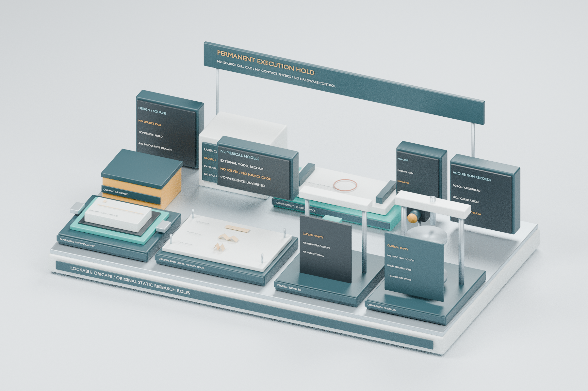](assets/lockable_origami_scene_assets_v1/evidence/overview.png)

[Download the editable Blender scene](assets/lockable_origami_scene_assets_v1/geometry/lockable_origami_lab.blend?raw=true) · [Download the apparatus GLB](assets/lockable_origami_scene_assets_v1/geometry/lockable_origami_lab.glb?raw=true) · [Download the 8-times reference-display GLB](assets/lockable_origami_scene_assets_v1/geometry/paperboard_reference_display.glb?raw=true)

[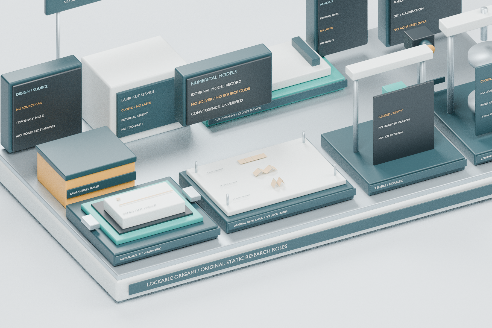](assets/lockable_origami_scene_assets_v1/evidence/handling.png)

[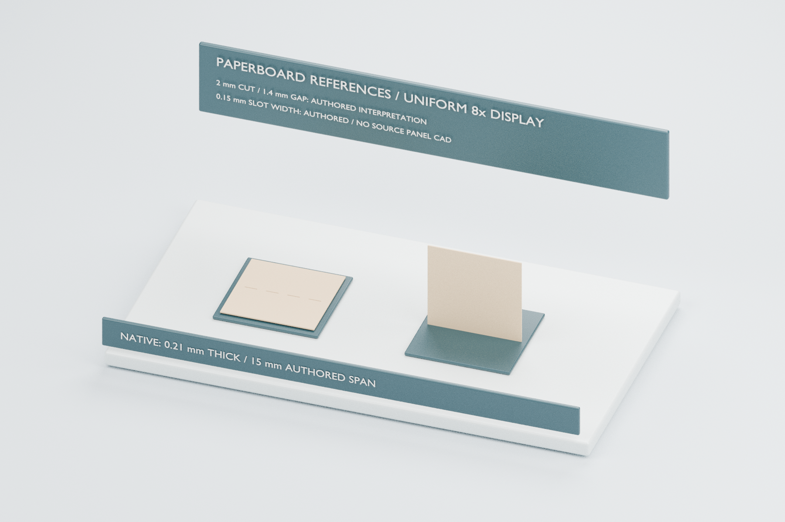](assets/lockable_origami_scene_assets_v1/evidence/dimensions.png)

At its release, this pair added **1 reviewed whole-paper task-design draft**, bringing the repository to **31 paper-level task-design drafts plus 3 bounded nonbiological subsets, 34 task packages total**. Its **30 scientific design routes and 60 symbolic operation definitions** cover design and preparation, base-material tension, finite-size and layer controls, first-cycle compression, cycling, density scaling, multidirectional and mixed-mode comparisons, band-removal control and separately gated analytical/numerical studies. Prepared-specimen entry requires independent upstream ancestry and never earns preparation credit. The [release boundary](tasks/lockable_origami_operations_v2/RELEASE_BOUNDARY.json) keeps whole-paper execution false; there are still **zero validated runnable whole-paper tasks**. At that task/asset release, the explorer still had 33 families. The later [lockable-origami viewer integration](viewer/task_explorer_v1/docs/lockable_origami.md) adds all 30 scientific branches plus four separate hold views; that historical explorer stage had 35 families including varactor.

The [source-access audit](tasks/lockable_origami_operations_v2/source_access_audit.json) records final main text and Methods, six main figures, all 37 supplementary pages, 11 discussions, 14 supplementary figures and three tables. All twelve supplementary descriptions and six timestamp samples per movie were inspected; continuous playback was not performed. The task carries **110 source-evidence locators** and [11 unresolved conflict or scope records](tasks/lockable_origami_operations_v2/source_conflicts.json). These retain lock/flat color and count conventions, the N18 tessellation angle, N4 rigidity counts, distinct layer roles, equation and angle conventions, modulus and force-ratio discrepancies, causal first-cycle reference requirements and cut-interval meaning. Source review is design evidence, not reproducible CAD, validated calculations or execution readiness.

The [task interface plan](tasks/lockable_origami_operations_v2/asset_binding_plan.json), scene's earlier [binding snapshot](assets/lockable_origami_scene_assets_v1/task_binding_snapshot.json) and [operation bindings](assets/lockable_origami_scene_assets_v1/operation_bindings.json) agree on **11 semantic groups, 53 canonical anchors and all 60 operation IDs**. The task plan updates static-asset availability and pins the asset-archive hash; the earlier scene snapshot retains unavailable planning flags. They are not byte-identical. All bindings are visual or symbolic metadata, with unqualified transforms and no implemented physical operations. All 33 prior task packages, seven prior asset bundles, the complete viewer, scene bindings and repository license remain byte-identical. No deduplicated repository-wide unique-asset total is asserted.

**Paper-exact cell geometry is not implemented.** Three authored four-panel open-chain snapshots preserve their own virtual centerline lengths at 0°, 35° and 65°; these angles are not the source dihedral angle. They do not reconstruct A2, AO, A3, A2O, O2 or O3, a closed source cell, a 7 × 7 tessellation, bifurcation, or a contact-supported locked state. The paper's locked rigidity depends on compression and face contact, not autonomous unloaded retention. Native rectangular references separate a **15 × 15 × 0.21 mm authored coupon** from the reported **240 × 5 × 0.21 mm tensile strip**. The display uniformly scales a rectangular coupon, including thickness, by **8×**. Source-reported **2 mm cuts** and **1.4 mm intervals** remain separate from the authored choice of a 1.4 mm uncut gap and 0.15 mm slot width; gap versus pitch is unresolved. Apparatus envelopes, carrier fit, anchor/grasp poses, adhesive/cure conditions, process settings and finite-thickness contact remain unqualified. See the [dimension ledger](assets/lockable_origami_scene_assets_v1/asset_metadata.json) and [source-to-asset audit](assets/lockable_origami_scene_assets_v1/review/SOURCE_TO_ASSET_AUDIT.md).

**All laser cutting, folding, bonding, reconfiguration, loading, band cutting under preload, DIC, scientific solvers and device/robot control remain closed external services.** The source's 12.5 kN load-cell rating is a label, never load permission. The [task's offline contract](tasks/lockable_origami_operations_v2/tests/contract.py) checks **143 finite original synthetic fixtures**, including receipt identity, revision/context lineage, preparation and safe-release bookkeeping; its bounded arithmetic is not a physical result or a general campaign scorer. The [scene metadata guard](assets/lockable_origami_scene_assets_v1/semantic_controls.py) attaches caller-owned record labels and requests review while permanently reporting energy and physical execution disabled and evidence unverified. It cannot authenticate external observations, qualify geometry, actuate hardware or establish scientific success. Static GLBs do not execute Python controls. Only the task's agent_visible.json is eligible for an acting-agent context; the other task files are evaluator/auditor material.

The frozen allowlists contain [43 task files](tasks/lockable_origami_operations_v2/EXPORT_ALLOWLIST.json) and [36 asset files](assets/lockable_origami_scene_assets_v1/EXPORT_ALLOWLIST.json), including one editable Blend, two self-contained static GLBs and three original 1800 × 1200 CPU renders. The [task review](tasks/lockable_origami_operations_v2/review/INDEPENDENT_REVIEW.md) records **64 author tests, 52 independent tests and 612 independent receipt-context mutations**. Asset checks passed **38 unit tests, 965 native assertions, 475 assertions across two actual GLB reimports and 62 independent structural/reimport/archive checks**. These checks establish static content, synthetic contracts and byte integrity only. Original assets/code carry Apache 2.0 notices, with source attribution and a Blender font notice. No prior meshes earn reuse credit. No duplicate ZIP, publisher figures, source papers/prose/movie frames/CAD/code/data, private work files, logs, caches or backup scenes are included. PNG text metadata and stored private paths were scrubbed and checked. Frozen review fields describe local snapshots, not live deployment or physical qualification.

From the repository root, run the read-only checks separately:

```sh
python3 -B scripts/verify_release.py
(cd tasks/lockable_origami_operations_v2 && python3 -B -m unittest discover -s tests -v && python3 -B -m unittest discover -s review -v && python3 -B tests/verify_package.py && python3 -B tests/verify_export.py)
(cd assets/lockable_origami_scene_assets_v1 && python3 -B -m unittest discover -s tests -v)
```

Run native Blender checks and the exporter only in disposable copies because they can regenerate receipts or archives. Integration preserves the exact frozen package bytes; no physical simulation or scientific reproduction is established.

## Paired woven-material task design and editable 3D assets

The [whole-paper woven-material design](tasks/woven_material_operations_v2/TASK_DESIGN.md), based on [Design framework for programmable three-dimensional woven metamaterials](https://doi.org/10.1038/s41467-026-68298-3), is paired with an [original editable static laboratory](assets/woven_scene_assets_v1/README.md). Closed fabrication/development, critical-point-drying, coating and optional scaffold-removal service docks, a sealed carrier, a generic tension fixture, an SEM holder and separate record slots make the declared interfaces inspectable.

[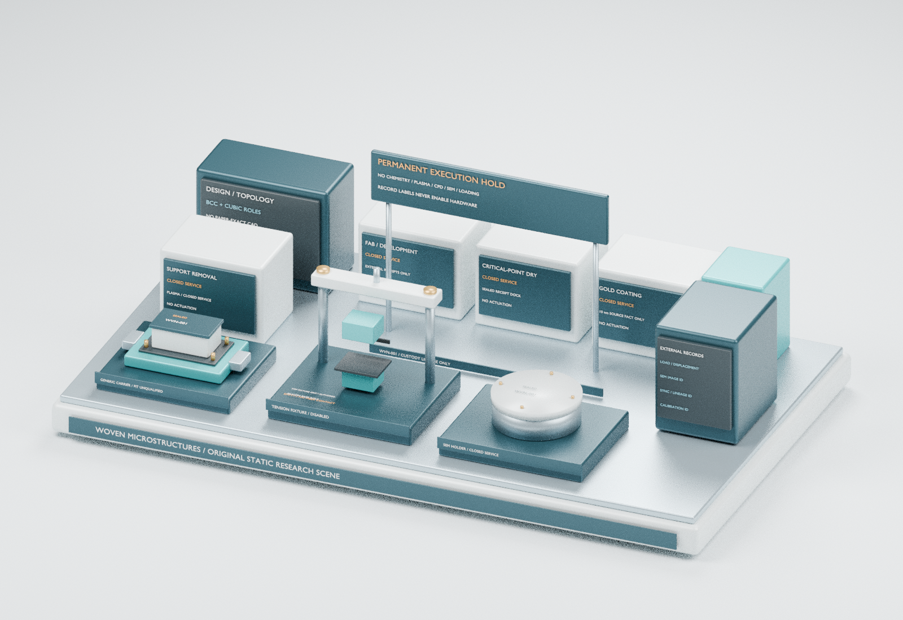](assets/woven_scene_assets_v1/evidence/overview.png)

[Download the editable Blender scene](assets/woven_scene_assets_v1/geometry/woven_material_lab.blend?raw=true) · [Download the apparatus GLB](assets/woven_scene_assets_v1/geometry/woven_material_lab.glb?raw=true) · [Download the explanatory reference GLB](assets/woven_scene_assets_v1/geometry/woven_reference_display.glb?raw=true)

[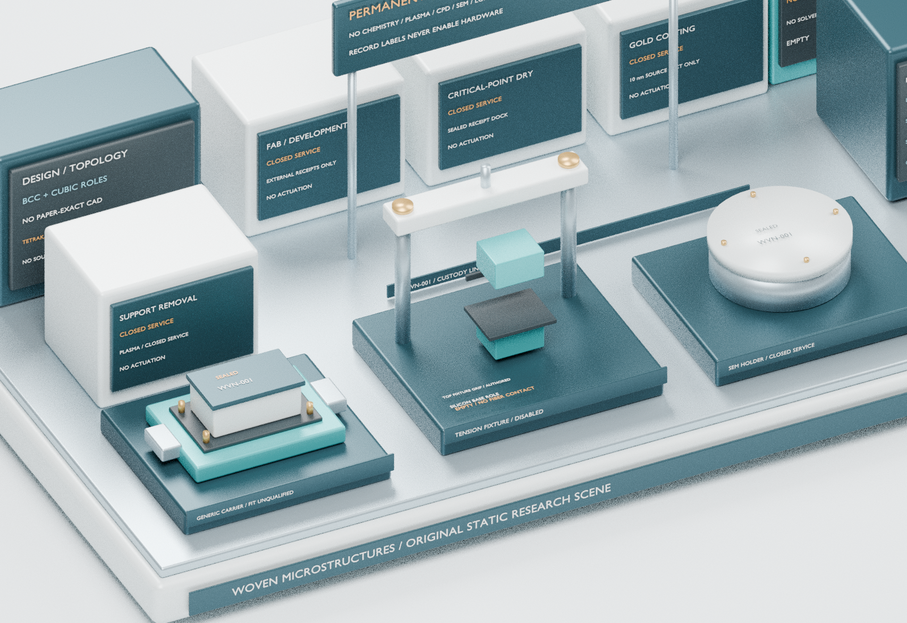](assets/woven_scene_assets_v1/evidence/package_handling.png)

[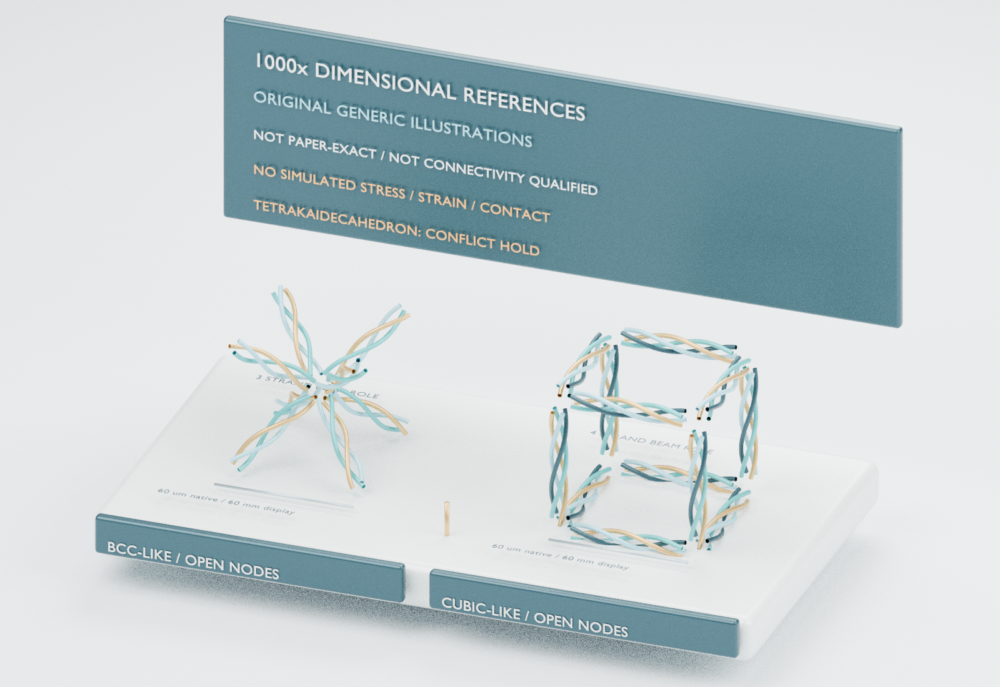](assets/woven_scene_assets_v1/evidence/measurement.png)

At its release, this pair added **1 reviewed whole-paper task-design draft**, bringing the repository to **30 paper-level task-design drafts plus 3 bounded nonbiological subsets, 33 task packages total**. Its **24 scientific design routes and 48 symbolic operation definitions** retain graph and geometry design, complete preparation, optional sacrificial supports, uniform tension, three distinct cyclic branches, graded and physical patterned-failure routes, and separately gated numerical studies. Prepared-specimen entry requires independent ancestry and never earns preparation credit. The [release boundary](tasks/woven_material_operations_v2/RELEASE_BOUNDARY.json) keeps design coverage separate from execution; there are still **zero validated runnable whole-paper tasks**. At the woven integration stage, the [read-only explorer](viewer/task_explorer_v1/index.html) had **33 families: 30 paper-level designs and 3 bounded subsets, 761 inspection records and 2,905 operation definitions**. The [woven route map](viewer/task_explorer_v1/docs/woven.md) and [SVG](viewer/task_explorer_v1/diagrams/woven.svg) expose its 24 scientific design routes plus one separate default qualification-hold inspection, with all 30 source JSON documents retained. Whole-paper DESIGN coverage is not reproduction; 96 synthetic configurations are bookkeeping fixtures, not physical trials.

The [source-access audit](tasks/woven_material_operations_v2/source_access_audit.json) retains the prior verified final main-article and all 22 written supplementary-page coverage, including five main figures, five supplementary notes, 17 supplementary figures and five video captions. Videos were not played, source workbooks were inventoried only, and ancillary peer review was not used as final authority. Source hashes and inspection limits survived recovery; raw source files were not reread or recreated. [Source conflicts](tasks/woven_material_operations_v2/source_conflicts.json) remain unresolved, including tetrakaidecahedron strand count, the modular rule, physical-pattern axes, distinct physical/numerical pattern parameters, failure definitions, normalization conventions and unspecified plasma-versus-coating order. Full-route design coverage never supplies the [missing execution inputs](tasks/woven_material_operations_v2/unknown_parameters.json).

The [task interface plan](tasks/woven_material_operations_v2/asset_binding_plan.json) and the scene's earlier [binding snapshot](assets/woven_scene_assets_v1/task_binding_snapshot.json) declare **the same 11 semantic groups, 43 canonical anchors and 48 operation IDs**. The task plan records static-asset availability and pins the sanitized asset-archive SHA-256; the scene snapshot retains its earlier availability flags and source DOI. They are not byte-identical, and availability does not qualify physical geometry. The [scene bindings](assets/woven_scene_assets_v1/operation_bindings.json) are visual and symbolic associations, not qualified poses or implemented operations. Both exact package snapshots are preserved; delivered static files are described by the asset metadata. Its subsequent viewer-only update left all 33 task packages, all seven asset bundles, both embodied players, scene bindings and repository license byte-identical. The preceding 32 generated viewer family JSON/JS, Markdown and SVG outputs were also unchanged.

**Known dimensions and original representative microgeometry remain distinct.** The source's **60 µm cell size and 1 µm fiber radius** appear only as dimensional references in the authored-metric scene and at **1000×** in the separate explanatory scene: **60 mm cells and a 1 mm-radius reference**. This scale factor does not apply to furniture, typography or source node connections. Original BCC-like and cubic-like open-ended beam illustrations convey three/four-strand roles, using independently authored phases, offsets and deliberate node gaps. They are not paper CAD, a connected woven specimen, a print-ready design or a contact-mechanics model. The conflicted tetrakaidecahedron and exact patterned specimen are held and not drawn. Apparatus dimensions, placements, carrier fit, contacts, grasp poses and source-to-scene axes remain unqualified. See the [dimension and provenance ledger](assets/woven_scene_assets_v1/asset_metadata.json) and [source-to-asset audit](assets/woven_scene_assets_v1/review/SOURCE_TO_ASSET_AUDIT.md).

**All fabrication, chemistry, critical-point drying, coating, plasma, loading, SEM, device I/O and scientific computation remain disabled.** The [task's offline contract](tasks/woven_material_operations_v2/tests/contract.py) checks lineage, independent synthetic observations, safe-release bookkeeping and bounded arithmetic across **96 finite synthetic configurations**; these are not experiments. The [scene's local metadata guard](assets/woven_scene_assets_v1/semantic_controls.py) rejects stale, replayed, mismatched or forged local claims and all physical-service requests. Caller-owned labels and fixtures do not authenticate external evidence, establish chronology or provide hardware safety. Static GLBs do not execute Python controls, and the scene emits no scientific values.

The exact frozen allowlists contain [41 task files](tasks/woven_material_operations_v2/EXPORT_ALLOWLIST.json) and [32 asset files](assets/woven_scene_assets_v1/EXPORT_ALLOWLIST.json), including one editable Blend, two self-contained static GLBs and three original 1600 × 1100 CPU renders. The [task review](tasks/woven_material_operations_v2/review/INDEPENDENT_REVIEW.md) records **46 author tests, 49 independent tests and 576 structural checks**. Fresh recovered-asset review passed **30 author tests, 184 native checks, two GLB imports, 10 independent adversarial methods and 105 independent native/artifact checks**. Both explanatory cell references survive actual GLB import as real meshes with 12 edges. These results establish static content, synthetic contracts and byte integrity only. Frozen review fields describe local snapshots; they do not establish deployment, physical readiness or scientific reproduction.

Original code and geometry carry Apache 2.0 notices; source attribution and the Blender font notice are included. The referenced article is CC BY-NC-ND 4.0, subject to third-party exceptions. No source papers, copied prose, figures, source CAD, exact letter patterns, author code, movies or scientific datasets are redistributed. Eleven semantic groups, repeated meshes, file variants and renders do not establish unique-asset credit; no deduplicated repository-wide asset total is asserted. Only allowlisted files are added: no duplicate ZIP, private metadata, raw source packet, workfile, build log, cache or backup scene. Sanitized native settings and PNG metadata preserve reviewed geometry and decoded image pixels.

From the repository root, run the read-only checks separately:

```sh
python3 -B scripts/verify_release.py
(cd tasks/woven_material_operations_v2 && python3 -B -m unittest discover -s tests -v && python3 -B -m unittest discover -s review -v && python3 -B tests/verify_package.py && python3 -B tests/verify_export.py)
(cd assets/woven_scene_assets_v1 && python3 -B -m unittest discover -s tests -v)
```

Run native Blender checks and exporters only in disposable copies: they can regenerate receipts or archives. No fabrication, robot execution, scientific solver or physical simulation is supplied.

## Paired laser-stabilization task design and editable 3D assets

The [whole-paper laser-stabilization design](tasks/laser_control_operations_v2/TASK_DESIGN.md), based on [Modulation-free laser stabilization technique using integrated cavity-coupled Mach-Zehnder interferometer](https://doi.org/10.1038/s41467-024-46319-3), is paired with an [original editable static laboratory](assets/laser_scene_assets_v1/README.md). Closed PIC-fabrication and PCB-packaging services, a separate sealed package and empty retained carrier, closed alignment and open-loop characterization interfaces, three disabled DFB modules, a TIA/PID records panel, an independent comb-reference heterodyne chain and separate FPGA in-loop records make the declared roles inspectable.

[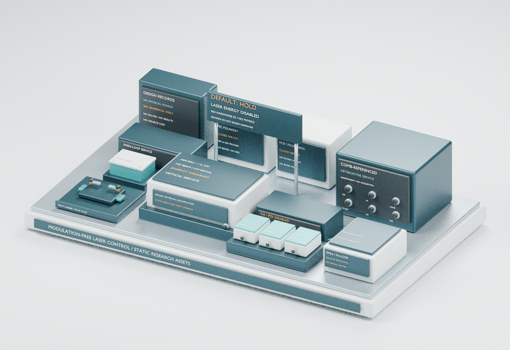](assets/laser_scene_assets_v1/evidence/overview.png)

[Download the editable Blender scene](assets/laser_scene_assets_v1/geometry/laser_control_lab.blend?raw=true) · [Download the apparatus GLB](assets/laser_scene_assets_v1/geometry/laser_control_lab.glb?raw=true) · [Download the explanatory PIC-footprint GLB](assets/laser_scene_assets_v1/geometry/laser_pic_display.glb?raw=true)

[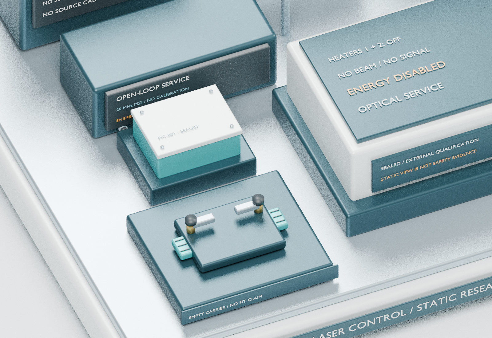](assets/laser_scene_assets_v1/evidence/package_handling.png)

[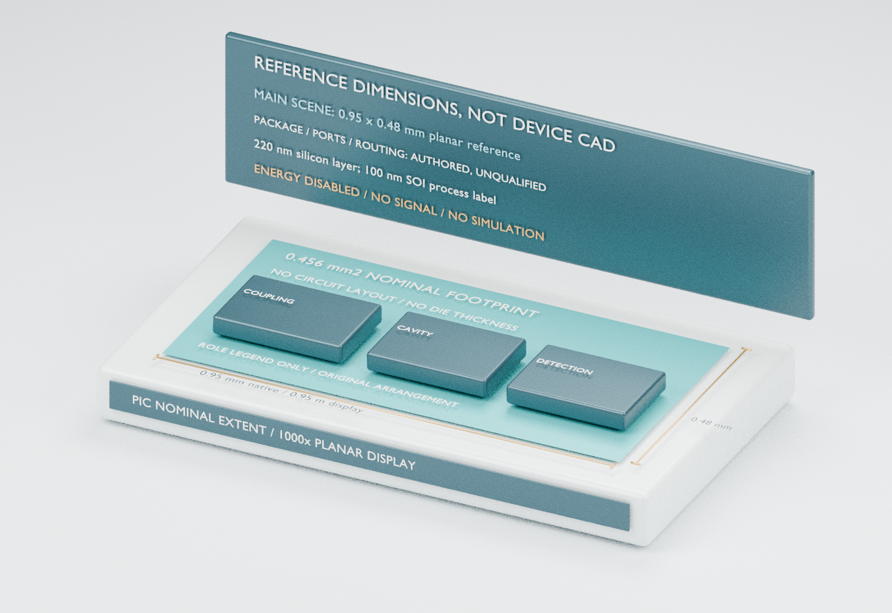](assets/laser_scene_assets_v1/evidence/measurement.png)

At its release, this pair added **1 reviewed whole-paper task-design draft**, bringing the repository to **29 paper-level task-design drafts plus 3 bounded nonbiological subsets, 32 task packages total**. Its **15 scientific design routes and 44 operation definitions** account for system/PIC design, qualified fabrication and packaging, architecture and noise models, characterization, three distinct DFB routes and the numerical-only SiN example. Design coverage includes preparation even when required fabrication inputs are missing; entering with a prepared package never earns preparation credit. The explorer at that release included **32 families explicitly labeled as 29 paper-level designs plus 3 bounded subsets, 736 inspection records and 2,857 operation definitions**. There are still **zero validated runnable whole-paper tasks**.

The [source-access audit](tasks/laser_control_operations_v2/source_access_audit.json) records review of the final scientific narrative, Methods, all six main figures and all 17 supplementary pages, including six notes, eight figures and two tables. Peer-review history is ancillary: its extracted text was read, but not every historical figure pixel was inspected. [Missing execution inputs](tasks/laser_control_operations_v2/unknown_parameters.json), including released PIC/PCB files, foundry and safety qualifications, alignment tolerances, calibration/servo/reference settings, raw spectra, analysis support and replicate counts, remain explicit gates. The [release boundary](tasks/laser_control_operations_v2/RELEASE_BOUNDARY.json) distinguishes full-paper design eligibility from execution eligibility; whole_paper_complete remains false. No fabrication, numerical reproduction, physical simulation or hardware execution is supplied.

The [task interface plan](tasks/laser_control_operations_v2/asset_binding_plan.json) is **byte-identical** to the scene's [binding snapshot](assets/laser_scene_assets_v1/task_binding_snapshot.json). Both declare **10 semantic groups, 46 canonical anchors and the same 44 operation IDs**. The [scene bindings](assets/laser_scene_assets_v1/operation_bindings.json) retain those canonical roles; the scene additionally contains two unqualified visual grasp anchors. Frozen asset_available fields remain false because they describe the plan-time snapshot; delivered static files are documented by the separate asset package. A visual association is not an implemented operation. All 31 prior task packages, the complete viewer, earlier asset packages, scene bindings and repository license remain byte-identical.

**Known source dimensions and authored geometry stay distinct.** The reported nominal PIC footprint is **0.95 × 0.48 mm, or 0.456 mm²**. The native scene represents only that flat, zero-thickness reference extent. A separate explanatory scene enlarges the same two-dimensional footprint **1000× to 0.95 × 0.48 m**; this factor does not apply to furniture, typography or floating role labels. Neither plane is a fabricated die. No source circuit layout, ring, coupling region or die thickness is reconstructed. The **220 nm silicon cross-section** and the **100 nm SOI process label** remain separate factual annotations. Apparatus envelopes, fibers, cables, ports, placement, package geometry, carrier clearances and grasp poses are original unqualified choices. See the [dimension and provenance ledger](assets/laser_scene_assets_v1/asset_metadata.json).

**Laser energy, both heaters, controller execution and all hardware I/O remain disabled in every local state.** The final source's comb-referenced heterodyne measurement stays separate from FPGA in-loop error; the latter cannot establish absolute laser noise or remove cavity thermorefractive noise. Earlier delayed self-heterodyne methods and superseded outcomes are not substituted for the final paper. The source's deliberately changed bias-current-noise condition remains part of each comparison's provenance. The SiN example is numerical only, and its printed density anomaly requires an explicit model-input disposition before any reproduction claim. [Source conflicts and interpretation limits](tasks/laser_control_operations_v2/source_conflicts.json) remain documented rather than silently repaired.

The [task's offline receipt contract](tasks/laser_control_operations_v2/tests/contract.py) checks independently supplied finite synthetic records, configuration and lineage identity, command/observation separation, interruption closure, damage quarantine and bounded spectral arithmetic. Its **55 authored synthetic configurations** are test fixtures, not experiments or measured data. The [scene's local metadata guards](assets/laser_scene_assets_v1/semantic_controls.py) separately bind instance, revision, sample/version, configuration, action, target and payload to single-use symbolic claims. They reject stale or replayed claims, role/record aliasing, incompatible DFB identity/model pairs and all physical-service requests. These public caller-owned fixtures do not authenticate external records, qualify apparatus or provide hardware safety. Static GLBs do not execute Python controls, and no scientific result is emitted by the scene.

Fifteen original AFM carrier/clamp meshes from two families are reused without scaling or topology changes, with identity recorded in the [reuse ledger](assets/laser_scene_assets_v1/geometry/reused_carrier_components.json). They receive **zero new unique-asset credit**; the carrier is empty and separate from the package. Ten semantic groups, three DFB instances, repeated components, file variants and renders do not inflate independent asset counts. No deduplicated repository-wide asset total is asserted. Original code and geometry carry Apache 2.0 notices; article attribution and the Blender font notice are included. No publisher artwork, source CAD, author code or scientific dataset is redistributed.

The exact frozen allowlists contain [41 task files](tasks/laser_control_operations_v2/EXPORT_ALLOWLIST.json) and [36 asset files](assets/laser_scene_assets_v1/EXPORT_ALLOWLIST.json), including one editable Blend, two self-contained static GLBs and three original 1600 × 1100 CPU renders. No duplicate ZIP, source packet, private work file, build log, cache or backup scene is added. The [task review](tasks/laser_control_operations_v2/review/INDEPENDENT_REVIEW.md) records **43 author tests, 45 independent tests and 303 package checks**; 47 pairing checks confirm the exact task/asset snapshot and disabled-interface boundary. The [asset review](assets/laser_scene_assets_v1/review/INDEPENDENT_REVIEW.md) records **68 author tests, 196 native checks and two GLB reimports**; 194 final-archive and path-sanitation checks passed. These checks establish synthetic contracts, static content and file integrity only. Review records are frozen local snapshots, not live deployment or physical-readiness claims; small rendered labels may require the close-up views or metadata.

From the repository root, run the read-only checks separately:

```sh
python3 -B scripts/verify_release.py
(cd tasks/laser_control_operations_v2 && python3 -B -m unittest discover -s tests -v && python3 -B -m unittest discover -s review -v && python3 -B tests/verify_package.py && python3 -B tests/verify_export.py)
(cd assets/laser_scene_assets_v1 && python3 -B -m unittest discover -s tests -v)
```

Run native Blender checks and exporters only in disposable copies: they can regenerate receipts or archives. Passing static checks does not establish actual fabrication, numerical reproduction or a runnable whole-paper task.

## Paired actuator metrology task and editable 3D assets

The [bounded actuator metrology design](tasks/actuator_metrology_operations_v2/TASK_DESIGN.md), based on [Automatic design of mechanical metamaterial actuators](https://doi.org/10.1038/s41467-020-17947-2), is paired with an [original editable static laboratory](assets/actuator_scene_assets_v1/README.md). A generic diamond-lattice specimen, fixed-holder proxy, parked input stage, camera, reference ruler, empty retained carrier, closed fabrication service and records console make the declared task interfaces inspectable.

[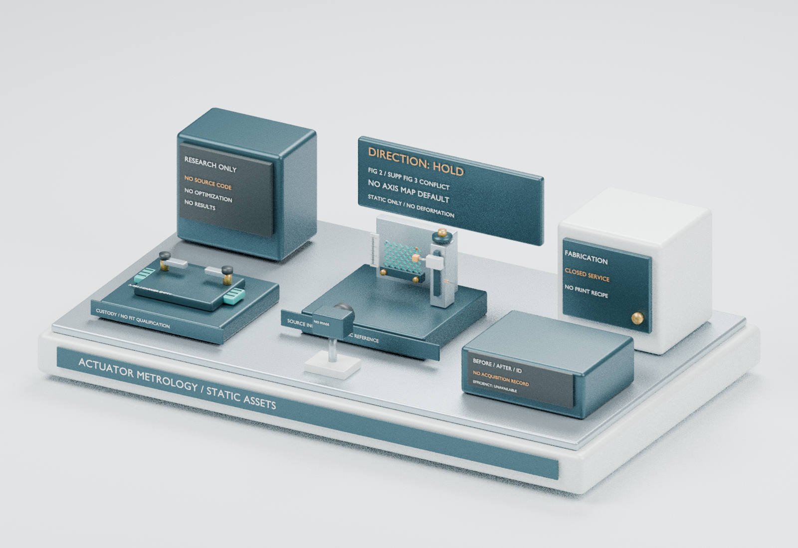](assets/actuator_scene_assets_v1/evidence/overview.png)

[Download the editable Blender scene](assets/actuator_scene_assets_v1/geometry/actuator_metrology_lab.blend?raw=true) · [Download the apparatus GLB](assets/actuator_scene_assets_v1/geometry/actuator_metrology_lab.glb?raw=true) · [Download the explanatory measurement GLB](assets/actuator_scene_assets_v1/geometry/actuator_measurement_display.glb?raw=true)

[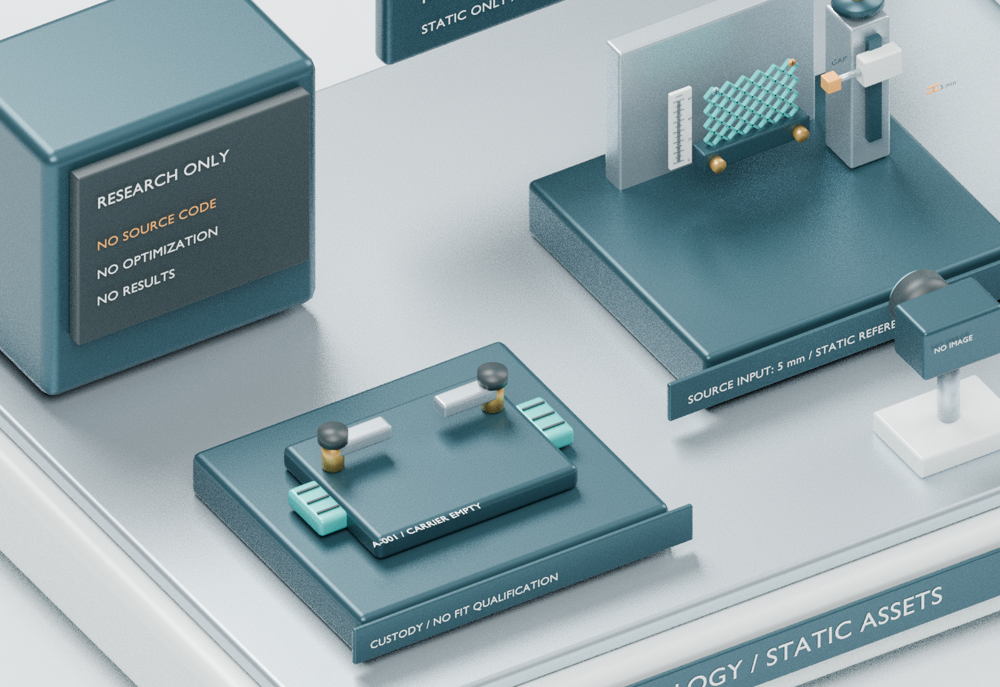](assets/actuator_scene_assets_v1/evidence/sample_handling.png)

[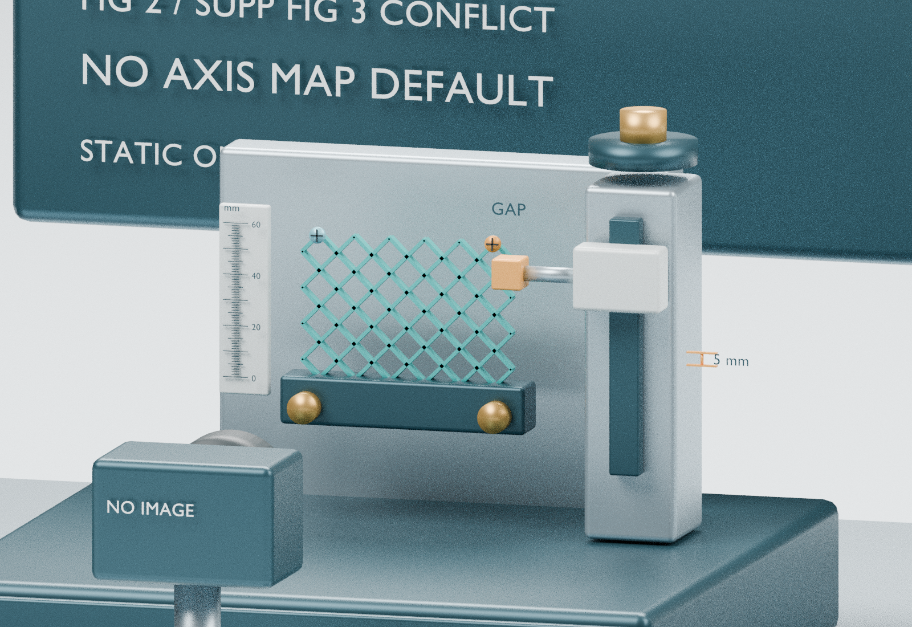](assets/actuator_scene_assets_v1/evidence/measurement.png)

At its release, this pair added **1 bounded nonbiological subset**, bringing the repository to **28 paper-level task-design drafts plus 3 bounded subsets, 31 task packages total**. At that release, the explorer remained at **28 families, 676 inspection records and 2,710 operation definitions**. The new task accounts for **14 scientific route designs plus 1 direction hold**, but executable offline checks cover only **2 prepared-specimen metrology branches and the safe hold**. Numerical design, closed fabrication and prepared-specimen metrology remain separate completion classes. The [release boundary](tasks/actuator_metrology_operations_v2/RELEASE_BOUNDARY.json) keeps whole_paper_complete and full-paper target-count eligibility false; there are still **zero validated runnable whole-paper tasks**.

The [task interface plan](tasks/actuator_metrology_operations_v2/asset_binding_plan.json) and [asset binding snapshot](assets/actuator_scene_assets_v1/task_binding_snapshot.json) cover the same **32 operation IDs, 7 groups and 30 canonical anchors**. The snapshot pins the exact task-plan SHA-256, with explicit static-asset availability/status updates; it is not a byte-identical task file. The [scene bindings](assets/actuator_scene_assets_v1/operation_bindings.json) and all 47 scene metadata anchors are visual associations, not qualified poses or implemented physical operations. Frozen task planning fields remain unchanged. All 30 prior task packages, the complete viewer, earlier asset packages, scene bindings and repository license remain byte-identical.

**Known source facts and authored geometry stay distinct.** The source reports NinjaFlex TPU, a nominal 0.4 mm nozzle, layer height 0.8 times nozzle diameter (derived 0.32 mm), a fixed bottom holder, manually imposed 5 mm input with a caliper and before/after camera images. Only the **5 mm magnitude is drawn as a static reference**. The 6 × 4 diamond lattice, 14 mm pitch, 1.4 mm beams, 4 mm extrusion, apparatus envelopes, contacts and marker positions are original unqualified choices. They are not the paper's optimized structure, source node coordinates, print-ready CAD or a validated mechanism. See the [geometry and scale ledger](assets/actuator_scene_assets_v1/asset_metadata.json).

The editable Blend contains separate native authored-metric and **10× explanatory display scenes**. The display enlarges the same lattice and 5 mm reference gauge, which becomes 50 mm in authored display coordinates; furniture and typography are outside that scale factor. The native and explanatory GLBs remain separate. Authored metres do not establish calibrated physical dimensions, and source-to-scene axis mapping remains null. No deformation, contact, FEM/DEM, optimization, neural-network training, robot trajectory or hardware I/O is implemented.

**All four source discrepancies remain unresolved.** Main prose, figure directions and movie pointers disagree; physical-results and force-panel cross-references also conflict. Direction defaults to HOLD. A reviewed experiment-specific branch disposition and explicit coordinate map do not silently repair the underlying source. The task's n=2 signed displacement-transfer projection is a benchmark choice; the exponent used for the paper's printed efficiencies is unknown. Published outcomes remain evaluator-only references, never live measurements or success thresholds. Only task agent_visible.json is eligible for an acting-agent context.

The [task's offline receipt contract](tasks/actuator_metrology_operations_v2/tests/contract.py) separates command intent from fixture-pinned evidence, binds configuration/branch/scenario/variant identity and rejects stale images, cross-configuration replay and unsafe release sequences. The [scene's local metadata guards](assets/actuator_scene_assets_v1/semantic_controls.py) separately bind specimen, design, carrier, fixture, camera, direction/axis cards, calibration and image-pair/run identities to single-use symbolic claims. A fresh matching unloaded claim is required before unfixing. These public caller-owned synthetic fixtures do not provide production authentication, persistent replay protection, physical qualification or hardware safety. The scene emits an identity manifest with null displacements and null efficiency, and rejects physical/scientific service requests. Static GLBs do not run Python controls.

Fifteen original AFM carrier/clamp meshes from two families are reused with source identity and topology recorded in the [reuse ledger](assets/actuator_scene_assets_v1/geometry/reused_carrier_components.json). They receive **zero new unique-asset credit**; the empty carrier asserts no physical specimen fit. Repeated cells, groups, exports and renders do not inflate independent asset counts, and no deduplicated repository-wide asset total is asserted. Original work carries Apache 2.0 notices. The article's CC BY 4.0 attribution and Blender font notice are included. The separately restricted research-only author code was not used. The article's disclosed patent application has unverified current status; no commercial fabrication or intellectual-property clearance is claimed.

The exact frozen allowlists contain [41 task files](tasks/actuator_metrology_operations_v2/EXPORT_ALLOWLIST.json) and [36 asset files](assets/actuator_scene_assets_v1/EXPORT_ALLOWLIST.json), including one editable Blend, two self-contained static GLBs and three original 1600 × 1100 CPU renders. No duplicate ZIP, source papers/prose/pixels/movies/code/data, private work files, logs, caches or backup scenes are included. The [task review](tasks/actuator_metrology_operations_v2/review/INDEPENDENT_REVIEW.md) records 32 author tests, 33 independent tests and 49 synthetic scenarios. The [asset review](assets/actuator_scene_assets_v1/review/INDEPENDENT_REVIEW.md) records 31 package tests, 351 native checks, two GLB imports, 691 independent geometry/reuse checks and 547 independent guard checks. These checks establish bounded synthetic records, static content and file integrity only. Frozen review/publication fields describe local snapshots, not live deployment status.

From the repository root, run the read-only checks separately:

```sh
python3 -B scripts/verify_release.py
(cd tasks/actuator_metrology_operations_v2 && python3 -B -m unittest discover -s tests -v && python3 -B -m unittest discover -s review -v && python3 -B tests/verify_package.py && python3 -B tests/verify_export.py)
(cd assets/actuator_scene_assets_v1 && python3 -B -m unittest discover -s tests -v)
```

Run native Blender checks and the exporter only in disposable copies: they can regenerate receipts or archives. No scientific reproduction, physical simulation or real laboratory/robot execution is established.

## Editable transistor 3D assets

The [transistor custody and closed-service laboratory](assets/transistor_scene_assets_v1/README.md) adds original editable geometry for the existing [3D transistor task design](tasks/transistor_operations_v2/TASK_DESIGN.md), based on [Three-dimensional integrated metal-oxide transistors](https://doi.org/10.1038/s41928-024-01205-0). Retained sample carriers, a separate PCB handoff, closed probe/readout and gate-control proxies, fabrication/metrology/thermal service boundaries and identity storage make the static task interfaces inspectable.

[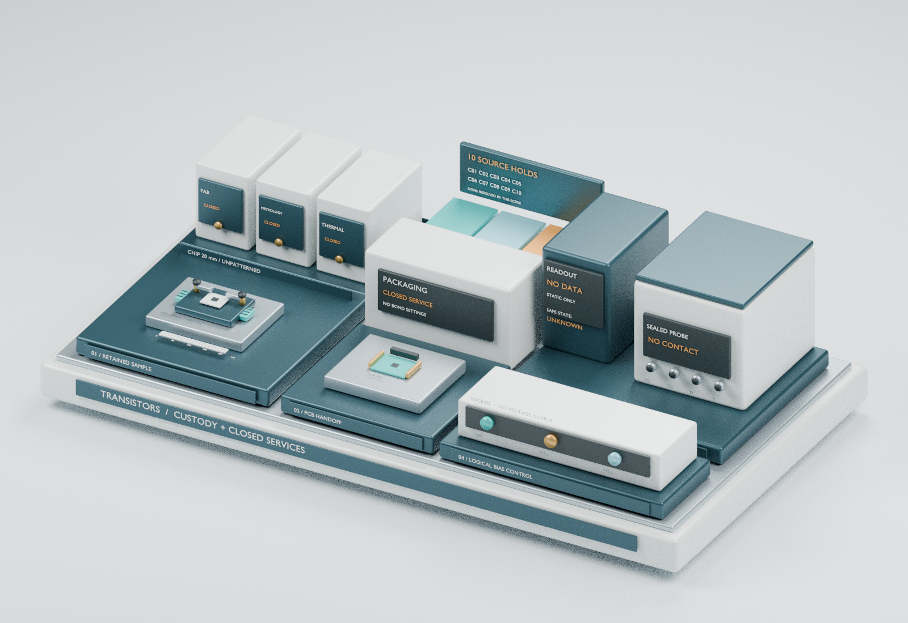](assets/transistor_scene_assets_v1/evidence/overview.png)

[Download the editable Blender scene](assets/transistor_scene_assets_v1/geometry/transistor_operations_lab.blend?raw=true) · [Download the apparatus GLB](assets/transistor_scene_assets_v1/geometry/transistor_operations_lab.glb?raw=true) · [Download the layer-ledger display GLB](assets/transistor_scene_assets_v1/geometry/transistor_layer_ledger_display.glb?raw=true)

[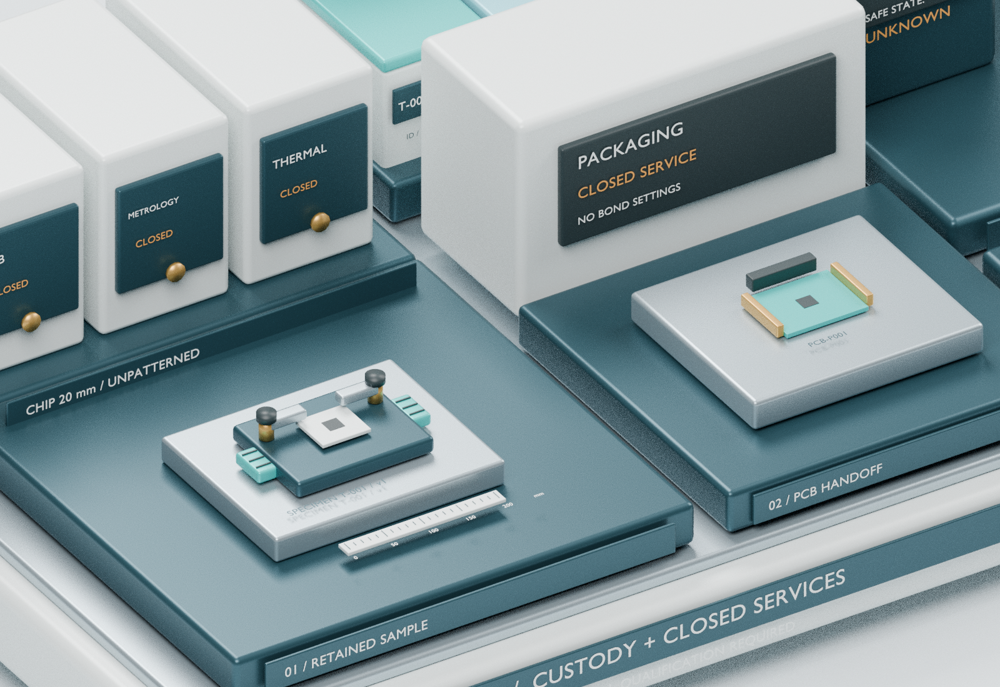](assets/transistor_scene_assets_v1/evidence/sample_handling.png)

[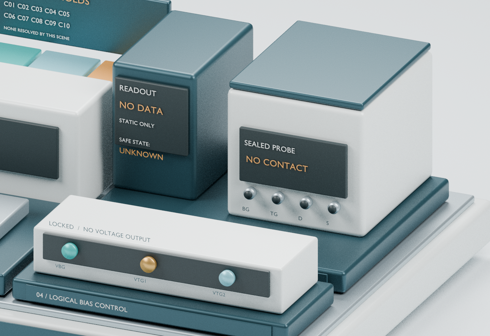](assets/transistor_scene_assets_v1/evidence/equipment_closeup.png)

The [binding ledger](assets/transistor_scene_assets_v1/operation_bindings.json) maps **44 exact task-operation IDs, six source station IDs, six scene groups and 30 authored metadata anchors**. Source stations and scene groups are separate mappings, including explicit HIGHK, thermal, long-term and destructive-section handoff boundaries. The [source-task snapshot](assets/transistor_scene_assets_v1/task_binding_snapshot.json) preserves exact task-file hashes, layer and netlist contracts and unresolved conflicts. These are static visual roles, not implemented laboratory operations. At its release, this asset-only addition left **28 paper-level task-design drafts plus 2 bounded nonbiological subsets, 30 task packages, 28 viewer families, 676 inspection records and 2,710 explorer operation definitions** unchanged; there are still **zero validated runnable whole-paper tasks**.

The editable Blend contains **three separate scenes**. Its native reference retains **72 source-thickness laminae**: Si, SiO2, 60 active layers, nine interstack buffers and a final cap. The Table S1 reference totals **528.7 micrometres**, including the substrate and oxide. The authored unpatterned 20 mm lateral envelopes are neither device masks nor connected circuit geometry; the source's 20 × 20 mm example is a substrate containing four ten-stack systems, not one active-device footprint. The separate explanatory scene uses **equal 3 mm bars and 1.5 mm gaps**, with no common magnification factor and no physical thickness ratios. The native layer scene is not exported to either GLB. See the [dimension and scale ledger](assets/transistor_scene_assets_v1/asset_metadata.json).

The ordinary Fig4 and independently biased S31 inverter maps remain distinct. Their terminal-name cards are logical references, not a PCB netlist, and the incomplete parallel-load map stays gated. **All ten source conflicts C01–C10 remain unresolved**, including the 25 nm versus 50 nm interstack statements; drawing the Table S1 reference never selects a fabrication setting, and execution thickness defaults remain null. Apparatus envelopes, PCB dimensions, connector positions and anchor poses are authored and unqualified. No electrical or thermal physics, device I/O, collision/contact model, robot trajectory, calibrated measurement or scientific result is supplied.

The [local metadata guards](assets/transistor_scene_assets_v1/semantic_controls.py) bind specimen/version/carrier/chip/PCB/cohort/stack identity to fresh safe-zero and continuity markers. Rewiring consumes safe-zero evidence and invalidates continuity; metadata record creation consumes current continuity. Stale, reused, cross-instance and wrong-map markers are rejected. These are caller-owned synthetic markers without authentication or hardware authority. Conflict acknowledgement cannot resolve a conflict or enable any physical service. The saved scene is an illustrative retained-carrier pose; the fixture starts in retained storage with unknown terminal labels and no evidence. The fixture does not move the scene, and static GLBs do not execute Python controls.

Fifteen original AFM carrier/clamp meshes from two families are reused with source identities and topology recorded in the [reuse ledger](assets/transistor_scene_assets_v1/geometry/reused_carrier_components.json). They receive **zero new unique-asset credit**; layers, repeated parts, groups, exports and renders do not inflate asset counts. Earlier asset inventories remain unchanged, and no deduplicated repository-wide total is asserted. Original work carries Apache 2.0 notices. Factual source attribution and the Blender font notice are included; no source PDFs, publisher figures, extracted prose, source screenshots, vendor CAD or logos are redistributed.

The exact [38-file allowlist](assets/transistor_scene_assets_v1/EXPORT_ALLOWLIST.json) includes one editable Blend, two self-contained static GLBs and three original 1600 × 1100 CPU renders. No duplicate ZIP, private papers, author logs, caches or backup scenes are included. The [independent asset review](assets/transistor_scene_assets_v1/review/INDEPENDENT_REVIEW.md) records 75 package tests, 408 native checks, two GLB reimports and 180 independent metadata lifecycles. Passing checks establish static content, synthetic bookkeeping and file integrity only. Small labels may require close-ups or native inspection; frozen review/publication fields are local metadata, not live deployment status.

From the repository root, run the read-only checks separately:

```sh
python3 -B scripts/verify_release.py
(cd assets/transistor_scene_assets_v1 && python3 -B -m unittest discover -s tests -v)
```

Run native Blender checks and the exporter only in a disposable copy: they can regenerate review receipts or archives. Integration verification preserves the frozen asset bytes.

## Paired sucrose metrology task and editable 3D assets

The [bounded sucrose speckle-metrology design](tasks/sucrose_metrology_operations_v2/TASK_DESIGN.md), based on [Nature Communications DOI 10.1038/s41467-026-72281-3](https://doi.org/10.1038/s41467-026-72281-3), is paired with an [original editable enclosed-metrology scene](assets/sucrose_scene_assets_v1/README.md). Seven nonbiological branches and 37 operation definitions cover preparation, fresh reference records, calibration, interpolation, same-sample repeatability, drift/dark records and a safe conflict hold. Three distinct configured station profiles preserve SPP2/1064 nm, SPP5/1064 nm and SPP5/532 nm identities; a changed profile requires a new session.

[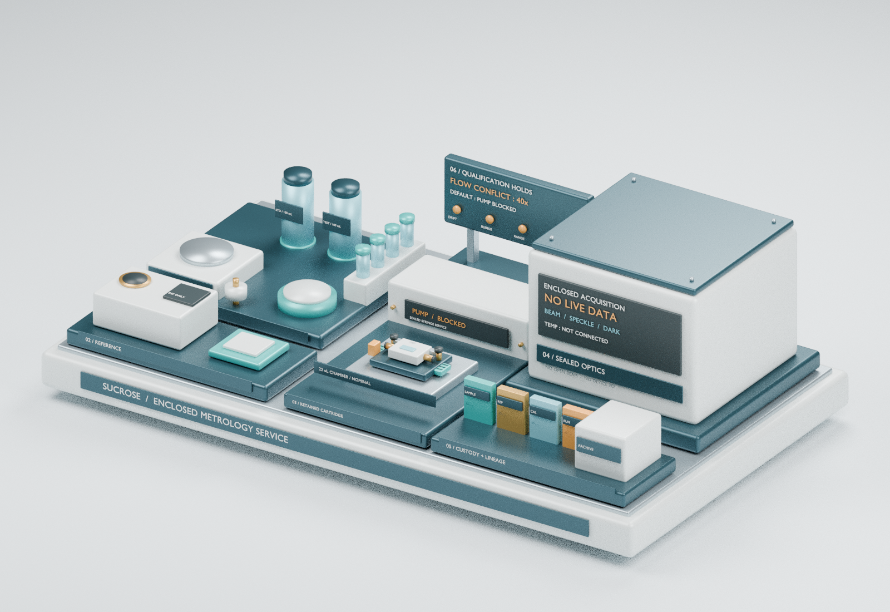](assets/sucrose_scene_assets_v1/evidence/overview.png)

[Download the editable Blender scene](assets/sucrose_scene_assets_v1/geometry/sucrose_operations_lab.blend?raw=true) · [Download the apparatus GLB](assets/sucrose_scene_assets_v1/geometry/sucrose_operations_lab.glb?raw=true) · [Download the volume-lineage display GLB](assets/sucrose_scene_assets_v1/geometry/sucrose_volume_lineage_display.glb?raw=true)

[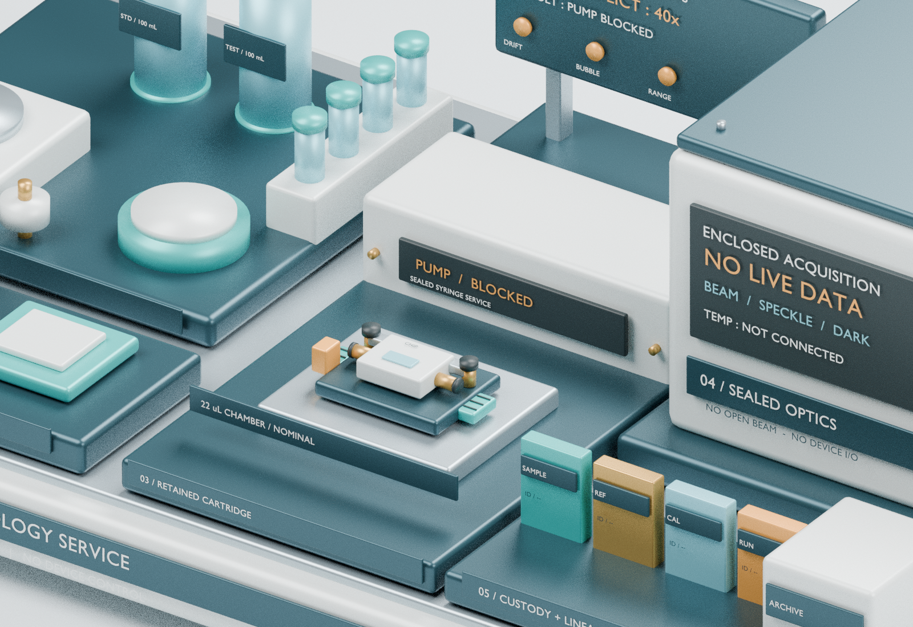](assets/sucrose_scene_assets_v1/evidence/cartridge_service.png)

[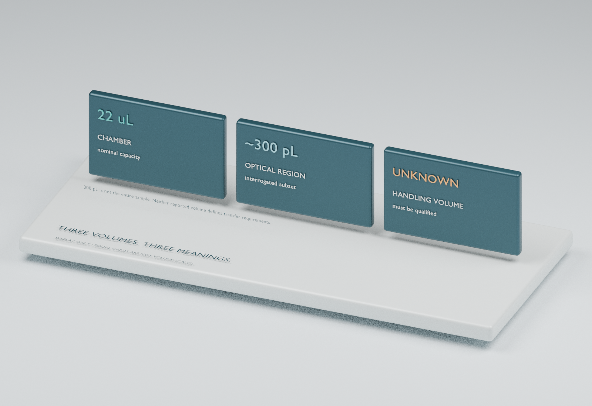](assets/sucrose_scene_assets_v1/evidence/volume_lineage.png)

At its release, this pair added **1 bounded nonbiological subset**, bringing the repository to **28 paper-level task-design drafts plus 2 bounded subsets, 30 task packages total**. At that release it added no whole-paper completion claim or viewer family: the explorer remained at **28 families, 676 inspection records and 2,710 operation definitions**. The [release boundary](tasks/sucrose_metrology_operations_v2/RELEASE_BOUNDARY.json) keeps whole_paper_complete false and physical execution closed. Fabrication, SEM work and open optics remain closed qualified-service dependencies. No biological branch, validated optics, implemented PCA, robot execution or scientific replication is supplied.

The [task interface plan](tasks/sucrose_metrology_operations_v2/asset_binding_plan.json) is byte-identical to the scene's [binding snapshot](assets/sucrose_scene_assets_v1/task_binding_snapshot.json). The [scene bindings](assets/sucrose_scene_assets_v1/operation_bindings.json) cover the same **37 operation IDs, six groups and 31 authored anchors**. These are static visual/semantic associations, not implemented physical operations. Frozen task fields such as asset_available and model_build_assigned describe the reviewed planning snapshot; the linked asset package records the separate scene deliverable. Existing task packages, viewer families and asset inventories remain unchanged; no deduplicated repository-wide asset total is asserted.

The [local metadata guards](assets/sucrose_scene_assets_v1/semantic_controls.py) require a docked cartridge, a fresh CLAMP command and a separate positive VERIFY_CLAMP observation before every sample switch. A successful switch consumes that observation; re-verifying the consumed cycle is rejected. Undocking discards pending observation, and redocking requires a fresh cycle. New sample, reference, calibration, plate, setup, wavelength and frame-role identities remain distinct. These guards implement only the bounded clamp/switch metadata subset, not the complete task evaluator, authenticated observations, persistent replay protection or hardware safety. The saved native scene is a docked illustrative pose; the metadata fixture starts in an undocked reset state. Static GLBs do not execute the Python guards.

**The source's 40-fold flow conflict remains unresolved:** Methods give 2 cc/min while a caption gives approximately 50 microlitres/min. Neither becomes a pump setting. Default flow is a blocking hold; fixture acknowledgement never enables a pump or physical acquisition. The nominal **22 microlitre chamber**, approximately **300 picolitre optical region** and **unknown total handling volume** remain separate facts. Equal-size display cards do not encode relative volume. All apparatus dimensions, anchor poses and clearances are authored and unqualified; no internal microchannel, source-shaped SPP, open-beam geometry or vendor CAD is built.

**Precision is not absolute accuracy.** Same-sample repeatability, independent calibration runs, technical repeats, wavelength-dependent bias, temperature drift and reference accuracy remain distinct. Source count and parameter conflicts are preserved, and literature outcomes never become measurement values or success thresholds. Only the task's agent_visible.json may enter an acting-agent context; other task files are author/evaluator material.

The geometry reuses **15 original AFM carrier/clamp meshes from two families**, with source identity and topology recorded in the [reuse ledger](assets/sucrose_scene_assets_v1/geometry/reused_carrier_components.json). Those families receive **zero new unique-asset credit**. Six scene groups, repeated parts and two GLB exports are not independent new assets. Original code, geometry and renders carry Apache 2.0 notices. The source paper is CC BY-NC-ND 4.0; no source PDF, full-text dump, figure, source artwork, dataset, traced CAD or source-derived rendering is bundled.

The exact frozen allowlists contain [39 task files](tasks/sucrose_metrology_operations_v2/EXPORT_ALLOWLIST.json) and [35 asset files](assets/sucrose_scene_assets_v1/EXPORT_ALLOWLIST.json), including one editable Blend, two static GLBs and three original 1600 × 1100 CPU renders. No duplicate ZIP, logs, caches or backup scenes are included. The [task review](tasks/sucrose_metrology_operations_v2/review/REPORT.md) records 17 author test methods, 5,871 positive traces, 887 rejecting cases and 46 export cases. The corrected [asset review](assets/sucrose_scene_assets_v1/review/independent_review.md) records 38 package tests, 65 native checks and 21 additional lifecycle checks. Passing checks establish static design, synthetic bookkeeping and file integrity only. Small labels may need close-up views or metadata inspection. Publication/review fields remain frozen local metadata rather than live deployment status.

From the repository root, run the root checks and read-only package checks separately:

```sh
python3 -B scripts/verify_release.py
(cd tasks/sucrose_metrology_operations_v2 && python3 -B -m unittest discover -s tests -v && python3 -B tests/verify_package.py && python3 -B tests/verify_export.py && python3 -B review/adversarial_review.py)
(cd assets/sucrose_scene_assets_v1 && python3 -B -m unittest discover -s tests -v)
```

Run the asset package's native Blender checks, semantic demonstration and exporter only in a disposable copy: they can regenerate review receipts or archives. Integration verification uses isolated copies and preserves both frozen package byte sets.

## Editable directional-cooling 3D assets

The [directional-cooling operations lab](assets/cooling_scene_assets_v1/README.md) adds original editable geometry for the [directional-cooling task design](tasks/directional_cooling_operations_v2/TASK_DESIGN.md): paired white/black device displays, a retained carrier and clamps, exploded-film handling views, backside heater/probe inspection, and authored logger/power and optical-instrument envelopes.

[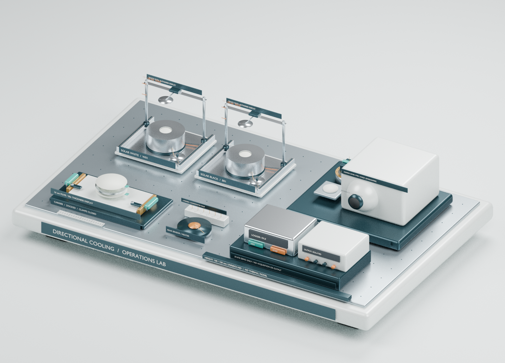](assets/cooling_scene_assets_v1/evidence/overview.png)

[Download the editable Blender scene](assets/cooling_scene_assets_v1/geometry/cooling_operations_lab.blend?raw=true) · [Download the whole-scene GLB](assets/cooling_scene_assets_v1/geometry/cooling_operations_lab.glb?raw=true) · [Download the handling-module GLB](assets/cooling_scene_assets_v1/geometry/cooling_handling_module.glb?raw=true)

[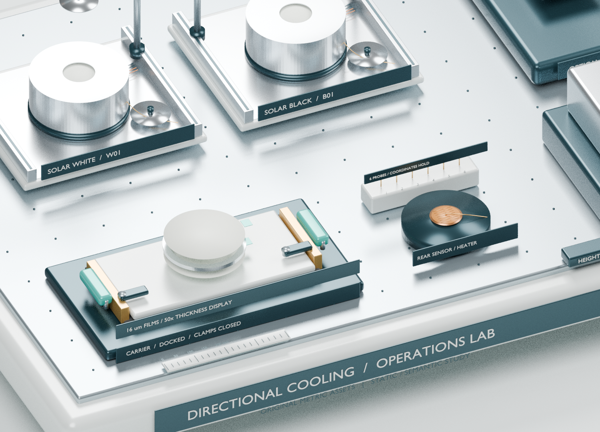](assets/cooling_scene_assets_v1/evidence/sample_handling.png)

[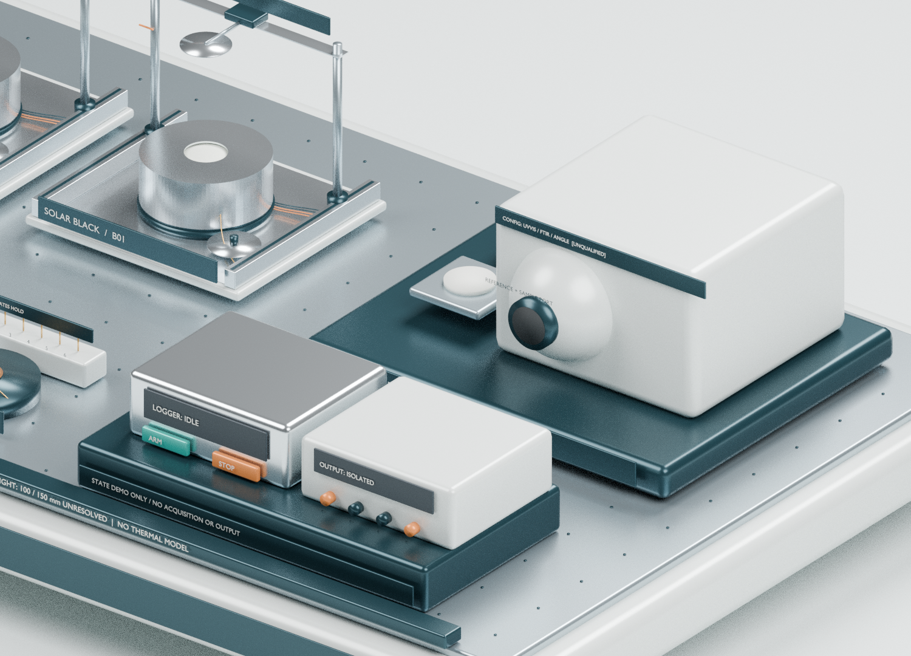](assets/cooling_scene_assets_v1/evidence/equipment_closeup.png)

This package contains **8 distinct asset roots and 438 child parts**, including meshes, curves and text. These are scene-organization counts, not independent devices or collidable meshes; the handling GLB re-exports two existing roots. The [binding ledger](assets/cooling_scene_assets_v1/operation_bindings.json) accounts for all 56 task-operation IDs: **29 partial visual/semantic bindings, 27 not-built entries and zero fully implemented operations**. At the directional-cooling asset release, the existing 28 paper-level designs, one bounded subset and 28 viewer families were unchanged. Earlier asset inventories remain separate; no deduplicated repository-wide asset total is asserted.

The [local semantic controls](assets/cooling_scene_assets_v1/semantic_controls.py) and [native pose binder](assets/cooling_scene_assets_v1/geometry/apply_demo_state.py) demonstrate guarded carrier docking/lifting, coupled clamp and lid poses, handling-film removal/damage/replacement identity, reflector display offsets, demo logger readback, and optical configuration/reference placement. They supply no device I/O, measurements, thermal/radiative/optical/electrical model, collision/contact physics, robot feasibility or scientific execution. Static GLBs do not execute these Python controls.

The [dimension and provenance ledger](assets/cooling_scene_assets_v1/asset_metadata.json) separates reported component dimensions from authored fixtures, fit clearances, straight tracks, display poses and instrument envelopes. The **100 mm versus approximately 150 mm reflector-height conflict remains unresolved**: the physical target is null, while 150 mm is only a display choice. Sensor-position schematics exist, but qualified installation coordinates and tolerances remain unavailable; the six-probe rack is authored storage geometry. Paired-device films retain the reported 16 micrometre thickness at 1×; handling films and the lower torn representation enlarge thickness alone 50×. Display tabs are not qualified grasp tabs. Primitive helper-code reuse establishes no AFM hardware compatibility.

The [30-file publication allowlist](assets/cooling_scene_assets_v1/EXPORT_ALLOWLIST.json) contains one editable Blender scene, two static GLBs, three original CPU renders, scripts, contracts, licenses and review records. [Independent content review](assets/cooling_scene_assets_v1/review/independent_review.md) passed within the stated static-asset/local-state scope. Interiors and parts of the angle fixture are occluded in baseline views, and small captions may require zoom or metadata lookup. No publisher papers, figures, source CAD, private archives, backup scenes or duplicate asset ZIP are included.

## Editable AFM 3D assets

The [cantilever-free AFM operations lab](assets/afm_scene_assets_v1/README.md) adds original editable geometry for the [bounded inert-metrology task design](tasks/afm_metrology_operations_v2/TASK_DESIGN.md): parallel-imaging and characterization apparatus, probe and target assemblies, retained carriers, clamps and an authored grasp/access proxy.

[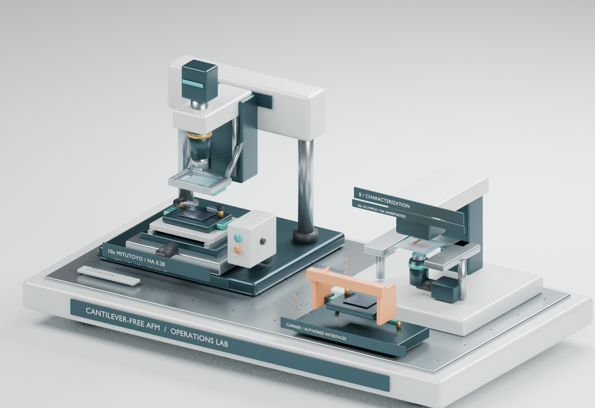](assets/afm_scene_assets_v1/evidence/overview.png)

[Download the editable Blender scene](assets/afm_scene_assets_v1/geometry/afm_operations_lab.blend?raw=true) · [Download the apparatus GLB](assets/afm_scene_assets_v1/geometry/afm_operations_lab.glb?raw=true) · [Download the magnified explainer GLB](assets/afm_scene_assets_v1/geometry/afm_magnified_explainer.glb?raw=true)

[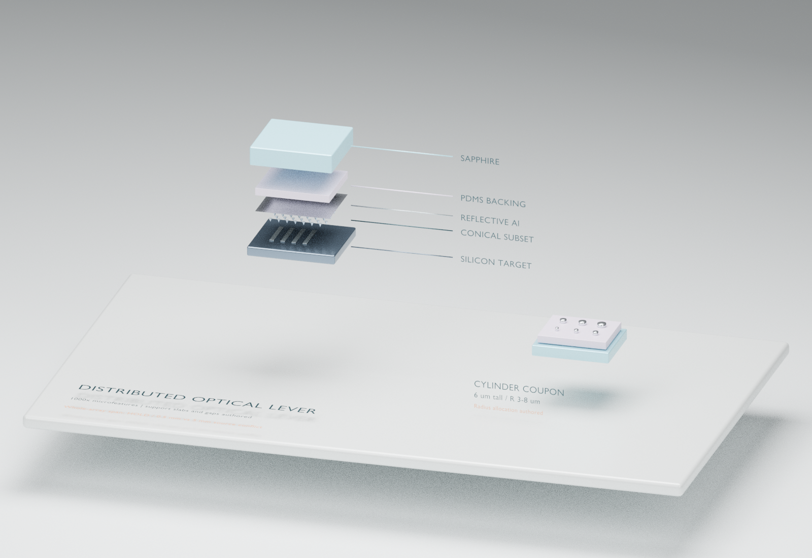](assets/afm_scene_assets_v1/evidence/equipment_closeup.png)

[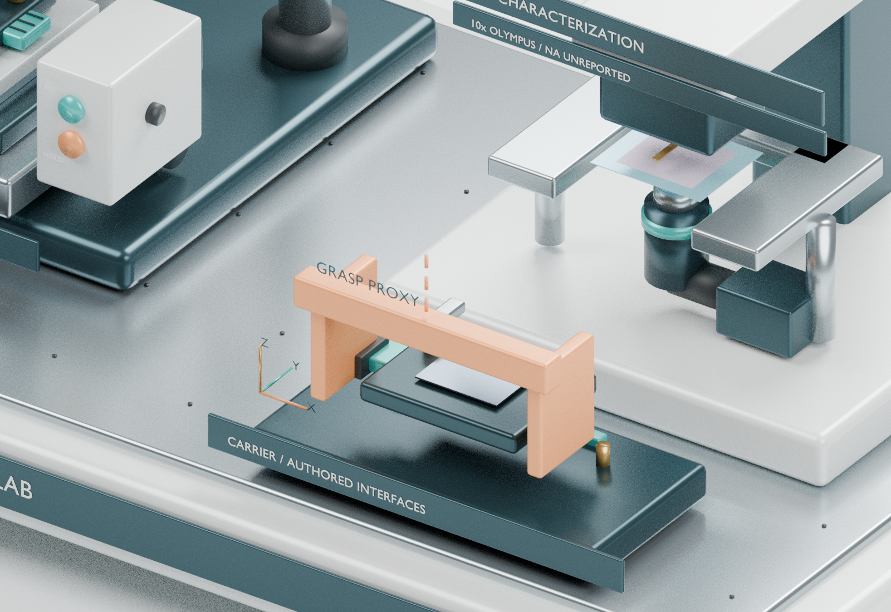](assets/afm_scene_assets_v1/evidence/sample_handling.png)

This package contains **17 asset roots and 348 inventory parts**; these are scene-organization counts, not distinct laboratory devices. Fifteen mapped roots cover **23 distinct task-operation IDs** through [static semantic bindings](assets/afm_scene_assets_v1/operation_bindings.json). The local carrier/clamp guards and demonstration poses do not implement device control, calibrated measurements, collision or contact physics, robot reachability, or a runnable task. The existing paper-design, bounded-subset and viewer counts are unchanged. Earlier asset inventories remain separate; no deduplicated repository-wide asset total is asserted.

The [dimension and provenance ledger](assets/afm_scene_assets_v1/asset_metadata.json) distinguishes reported parameters, numerical-model dimensions and authored geometry. Device housings, fixtures, carriers, clearances and silicon target motifs are authored approximations, not manufacturer CAD or qualified replicas. Native microscopic parts use metres; the separate explainer enlarges cone/cylinder features 1000× while its support slabs, target relief and exploded gaps are authored display geometry. The 49-cone illustration is not the reported 1088-position array. The source's 0.5 mm versus 5 mm whole-array span conflict remains unresolved. The Mitutoyo 10× / NA 0.28 parallel configuration and Olympus 10× / NA unreported characterization configuration remain distinct.

The [30-file publication allowlist](assets/afm_scene_assets_v1/EXPORT_ALLOWLIST.json) contains one editable Blender file, two GLBs, three original CPU renders, scripts, contracts, licenses and review records. [Independent review](assets/afm_scene_assets_v1/review/independent_review.md) passed for static display with declared limitations. Package tests and Blender checks cover static geometry and local semantic/kinematic behavior only. No publisher papers, figures, private archives, backup scenes or duplicate asset ZIP are included.

## Embodied laboratory task demonstration

The R01 example binds a mobile humanoid, laboratory stations, manipulated objects and sample states to **26 reference-operation keyframes**. It shows stock collection, fabrication handoff, assembly, metrology, two authored loading cycles, archiving and cleanup. [Open the offline visual replay guide](viewer/embodied_r01/README.md).

[](viewer/embodied_r01/README.md)

[Assembly view](viewer/embodied_r01/frames/09_ASM04.jpg) · [Loading and specimen inspection](viewer/embodied_r01/frames/19_LOAD.jpg) · [Archive view](viewer/embodied_r01/frames/24_ARCHIVE.jpg).

This is an authored visual storyboard, not a physics simulation or robot execution. It covers the R01 branch, not all branches of the paper. Repeated unit placements are summarized in layer-completion views, not individual grasp trajectories. Source-supported stages, authored poses and unknowns remain distinguished.

### R01 task-scene binding audit

A [bounded mounting, observation and retrieval binding](scene_bindings/r01_mount_observe_retrieve_v1/README.md) now maps eleven R01 reference operations to existing scene objects, metadata ports, object-origin frames and intended sample states. A fresh, fixed-camera Blender CPU source inspection retains all occluding geometry. Static checks cover references, identity, units, display scale and camera declarations; a missing transport clip and unqualified physical/sensor interfaces remain explicit gates. This adds inspection evidence, not a third embodied route or a runnable episode.

### Thermoelectric module route

The PAIRED_TWO demonstration maps **66 reference-operation occurrences to 45 illustrated keyframes**: separate P/N preparation, cross-device processing, four individually tracked leg placements, module assembly, four measurement-boundary chapters, archiving and cleanup. [Open the offline visual replay guide](viewer/embodied_thermoelectric/README.md).

[](viewer/embodied_thermoelectric/README.md)

[Whole route contact sheet](viewer/embodied_thermoelectric/keyframes_contact_sheet.jpg) · [Laboratory overview](viewer/embodied_thermoelectric/overview.jpg) · [Coverage and limitations](viewer/embodied_thermoelectric/loop_coverage.json).

These are authored static/kinematic states. Millimetre-scale leg geometry is explicitly enlarged 20× for inspection; physical grasp feasibility is not established. Repeated current/acquisition loops remain grouped with unknown grid values and counts. No scientific measurements or controller execution are supplied. This demonstration covers one selected route, not every branch of the paper.

## Explore the paper-level tasks

[Open the offline explorer guide](viewer/task_explorer_v1/README.md) to inspect branches, robot actions, objects, sample states, source evidence and recovery. Download the folder and open index.html locally; GitHub shows HTML as code rather than running it.

The explorer labels 32 paper-level designs and 3 bounded subsets across 35 families, including lockable origami and varactor. Their visual route maps are readable directly on GitHub: [Chiral](viewer/task_explorer_v1/docs/chiral.md) · [Deconwolf](viewer/task_explorer_v1/docs/microscopy.md) · [Fibres](viewer/task_explorer_v1/docs/fibre.md) · [Thermoelectric](viewer/task_explorer_v1/docs/thermoelectric.md) · [diSPIM](viewer/task_explorer_v1/docs/dispim.md) · [Acoustics](viewer/task_explorer_v1/docs/acoustic.md) · [Perovskite](viewer/task_explorer_v1/docs/perovskite.md) · [Prismatic](viewer/task_explorer_v1/docs/prismatic.md) · [EmVP](viewer/task_explorer_v1/docs/emvp.md) · [Directional cooling](viewer/task_explorer_v1/docs/cooling.md) · [Wavefront acoustics](viewer/task_explorer_v1/docs/wavefront.md) · [Bianisotropic acoustics](viewer/task_explorer_v1/docs/bianisotropic.md) · [Acoustic edge detection](viewer/task_explorer_v1/docs/edge.md) · [Origami memory](viewer/task_explorer_v1/docs/origami_memory.md) · [Ring origami](viewer/task_explorer_v1/docs/ring_origami.md) · [Mechanical backpropagation](viewer/task_explorer_v1/docs/mechanical_backprop.md) · [Granular assembly](viewer/task_explorer_v1/docs/granular_assembly.md) · [Beaded metamaterials](viewer/task_explorer_v1/docs/beaded.md) · [Thermal jamming](viewer/task_explorer_v1/docs/thermal_jamming.md) · [Horn acoustics](viewer/task_explorer_v1/docs/horn_acoustics.md) · [Reprogrammable mechanical logic](viewer/task_explorer_v1/docs/mechanical_logic.md) · [Cold-programmed shape morphing](viewer/task_explorer_v1/docs/cold_shape.md) · [Gear metamaterials](viewer/task_explorer_v1/docs/gear.md) · [Hydrogel optical metastructures](viewer/task_explorer_v1/docs/hydrogel_optical.md) · [Atmospheric optics](viewer/task_explorer_v1/docs/atmospheric_optics.md) · [Bounded AFM metrology](viewer/task_explorer_v1/docs/afm_metrology.md) · [Martian geophysics](viewer/task_explorer_v1/docs/martian_geophysics.md) · [3D transistor devices](viewer/task_explorer_v1/docs/transistor.md) · [Laser stabilization: paper-level design](viewer/task_explorer_v1/docs/laser_control.md) · [Clean-water solar: bounded subset](viewer/task_explorer_v1/docs/solar_water.md) · [Sucrose optical metrology: bounded subset](viewer/task_explorer_v1/docs/sucrose_metrology.md) · [Actuator displacement metrology: bounded subset](viewer/task_explorer_v1/docs/actuator_metrology.md) · [Woven metamaterials: whole-paper design](viewer/task_explorer_v1/docs/woven.md) · [Lockable origami: whole-paper design](viewer/task_explorer_v1/docs/lockable_origami.md) · [Varactor: whole-paper design](viewer/task_explorer_v1/docs/varactor.md).

Gear and hydrogel add 77 inspection records and 176 operation definitions. Gear retains 18 physical branches, eight separate preparation recipes, seven numerical records, two derived-analysis obligations and two illustrative-only records. Hydrogel retains 36 physical branches and four separate numerical, theory, fit and compatibility dispositions. All 40 unresolved-input groups, 14 controls, 19 source conflicts and 19 gear specimen-family definitions remain explicit. These are representation counts, not specimen counts or completed experiments.

Gear recipes preserve their source-declared authored valid order, including repeated TRANSFER destinations; preparation and per-condition templates are not concatenated into historical specimen traces. The 5×6 micro Taiji build, 4×4 compression specimen, 5×5 actuation specimen and macro video demonstrator remain distinct. Planetary CAD and micro-geometry conflicts stay open. Fit-window variation is not between-specimen SD, finite shear stiffness is not periodic-cell modulus, and impact allocations remain terminal. Numerical operation references remain modeled and illustrative records never gain physical trial credit.

Hydrogel operation lists remain unordered membership under 40 branch-lineage dependencies and the six-phase order within each of 17 closed services. There is no inferred cross-service chronology or automatic Cartesian crossing of condition axes. Four Extended Data image sets remain uninspected, despite caption access. Power/data conflicts and missing cells remain explicit; the heated Fig. 6f record is a single constant, not 361 measured observations. Video 9 is accelerated 20 times and sampled frames are not full playback. Chemical, laser, UV and thermal work remains inside closed qualified services, with no executable hazardous recipes supplied.

Gear and hydrogel source links are pinned to [9e490ae5d3380121df7be1c18d4de35aac8508c5](https://github.com/openags/ScienceGym/tree/9e490ae5d3380121df7be1c18d4de35aac8508c5).

This author/evaluator logical inspector covers 824 inspection records and 3,045 operation definitions. Lockable origami and varactor retain 58 scientific branches plus five separate hold views, all 66 source JSON documents and the aligned original static asset references. The woven view adds 24 source scientific branches and one separate qualification-hold record, retaining all 30 source JSON documents, all 48 operation definitions, eleven source conflicts, qualified-service requirements, controls and sample lineage. Woven source and asset links are pinned to [d62daed913e2ea04f0b7b0a0f20de9f6d42b7df6](https://github.com/openags/ScienceGym/tree/d62daed913e2ea04f0b7b0a0f20de9f6d42b7df6). The preceding paired integration retained 118 source JSON documents across 60 records; separate holds, recovery and teardown views are not new scientific branches. Existing original 3D asset guides/renders are linked where available, without interactive browser physics. These are task-design references, not executed robot trajectories or a new 3D storyboard. Nested loops, repeated operations and unresolved conditions remain explicit; unknown loops are not expanded. Prismatic operation membership follows partial-order constraints, with nested material/target and thickness/target coverage, independent campaign branches and conditional recovery. [Verification and limitations](viewer/task_explorer_v1/VERIFICATION.md).

Assembly views add 78 inspection records and 145 operation definitions: 60 physical configurations, one campaign dispatcher and 17 distinct numerical, analysis, external-input, device-owned or reference-scope records. Granular and thermal memberships preserve scoped causal edges, conditional gates, sample lineage and symbolic repeats. Beaded trees preserve all source sequences, exclusive preparation choices, loops and per-entry bindings. Received parts and preassembled objects do not earn robot fabrication credit. Source constants, numerical packings, cycles and pair comparisons do not supply missing independent physical specimen counts.

## Visual task routes

The first visual route shows every listed R01 operation and the complete chiral branch index. Dashed connectors represent the authored reference order, not an executed trajectory or a recovered author chronology. The 35-family offline logical explorer is linked above, with 32 paper-level designs and 3 bounded subsets separately labeled.

[](docs/visualizations/chiral_r01.svg)

## Why paper-level tasks?

Scientific work connects many individually simple actions across long intervals and multiple devices. A useful task must preserve those connections:

- **Whole reported routes:** preparation and fabrication, intermediate processing, characterization, measurement, archiving and cleanup
- **Branches and dependencies:** alternative material families, shared prerequisites and independent experiments, without inventing a single global chronology
- **Sample lineage:** batches, parent–child specimens, destructive siblings, reused samples and irreversible treatment histories
- **Cross-device manipulation:** carrying, loading, aligning, mounting, connecting and unloading the right object at each station
- **Controls and repetition:** paired conditions, repeated observations and same-specimen cycles kept distinct from independent samples
- **Recovery:** failed attempts remain in the record; damage, contamination or an invalid measurement cannot be erased by relabeling an object

ScienceGym is an independent project whose task layer specifies these obligations. Laboratory scene and asset requirements appear in its task packages. The bounded R01 static binding above is an initial integration check; runtime interactions and physical validation remain future work. A scene or addressable object alone does not establish an executable task.

## Task design

Each task family connects source evidence to operational requirements. Package schemas are still evolving; their filenames are not yet a uniform runtime API.

1. **Evidence and coverage.** Main text, Methods, figures and available supplementary materials are mapped to reported experimental branches. Theory, simulation and literature comparisons receive explicit dispositions rather than being turned into invented physical experiments.
2. **Goals and initial state.** The agent receives a selected goal, available objects, known constraints and observable interfaces. Preparation routes begin with appropriate starting resources, not silently completed specimens.
3. **Operations and dependencies.** Reference operations define required inputs, object-state transitions, device interactions and dependencies. Authored handling steps bridge gaps in the paper and are labeled separately from source facts.
4. **Lineage and records.** Measurements retain their specimen, condition, instrument and attempt identities. A repeated measurement is not automatically a new sample, and a split sample does not lose its parent history.
5. **Evaluation and recovery.** Evaluator-only reference routes, hidden states and acceptance rules remain separate from agent-facing goals. The intended evaluator accepts equivalent valid routes and checks recorded events and object states, rather than trusting an agent's declaration of success.

For a concrete example, inspect Deconwolf's [goal](tasks/microscopy_operations_v2/agentgoal.json), [initial state](tasks/microscopy_operations_v2/initialstate.json), [reference operations](tasks/microscopy_operations_v2/operation_sequences.json), [recovery design](tasks/microscopy_operations_v2/recovery_design.json) and [evaluator reference](tasks/microscopy_operations_v2/evaluator_reference.json). A future agent-facing loader must not expose the evaluator materials as task instructions.

### Scientific observations and task success

The designs allow explicitly labeled preset or mock scientific observations. This lets future task implementations study long-horizon operation without requiring a simulator to predict a paper's scientific result.

Reported literature values, authored mock outputs and unknown or invalid observations remain distinct. Matching a published number is not sufficient evidence of successful manipulation or acquisition. Conversely, a correctly obtained weak or negative result need not be an operational failure. Current preset contracts are specifications; they do not constitute an implemented scientific backend or a complete set of image fixtures.

## Included task families

The thirty-one paper-level packages have undergone design review and static consistency checks. These are draft representations of reported scope, not human expert certification or completed robotic reproductions. The reprogrammable mechanical-logic (ReMM) package is a partial-source gated draft: its main figure panels and all nine supplementary movie contents remain uninspected, so source completeness is false.

| Task family | Reported program represented | Entry point |
| --- | --- | --- |
| Chiral metamaterials | Material preparation and fabrication, assembly, geometry and boundary controls, loading cycles, observation and archiving | [Task design](tasks/chiral_operations_v2/TASK_DESIGN.md) |
| Deconwolf microscopy | Six preparation/imaging branches and seven source-data comparison branches, with paired acquisitions and data lineage | [Task design](tasks/microscopy_operations_v2/TASK_DESIGN.md) |
| Semiconductor fibres | Manufacturing routes, device preparation, characterization, measurement and application branches, including destructive sibling specimens | [Task design](tasks/fibre_operations_v2/TASK_DESIGN.md) |
| Thermoelectric devices | Material routes, interfaces and cutting directions, segmented and single-leg controls, module assembly, contact and thermal/electrical measurements | [Task design](tasks/thermoelectric_operations_v2/TASK_DESIGN.md) |
| diSPIM microscopy | Instrument assembly, three-camera alignment, reference calibration, routine sample preparation, dual-view acquisition and archiving | [Task design](tasks/dispim_operations_v2/TASK_DESIGN.md) |
| Helical acoustic metamaterials | Fabrication, transmission and pulse measurements, 40-cell lens assembly, field scans with and without obstacles, records and reset | [Task design](tasks/acoustic_operations_v2/TASK_DESIGN.md) |
| Perovskite solar modules | Precursor/control preparation, device and module fabrication, molecular/crystal/film assays, electrical measurement and ageing with persistent specimen histories | [Task design](tasks/perovskite_operations_v2/TASK_DESIGN.md) |
| Prismatic metamaterials | Cardboard demonstrators, cyclic compression, reach/release, hinge-material and array-thickness controls, selected configurations and bounded pneumatic work | [Task design](tasks/prismatic_operations_v2/TASK_DESIGN.md) |
| Embedded extrusion-volumetric printing | Material qualification, positive/negative printing, transfer and alignment, cleaning, optical/rheological/CT/mechanical comparisons and immutable sample records | [Task design](tasks/emvp_operations_v2/TASK_DESIGN.md) |
| Directional radiative cooling | Mobile-robot material preparation, assembly, sensor calibration, optical station handoffs, paired outdoor comparisons, modified-assembly checks and cleanup | [Task design](tasks/directional_cooling_operations_v2/TASK_DESIGN.md) |
| Anti-repellent granular assembly | Robot-led substrate and particle preparation, patterning-device handoffs, collision and assembly controls, imaging, material variants and sample recovery | [Task design](tasks/granular_assembly_operations_v2/TASK_DESIGN.md) |
| Origami mechanical memory | Robot fabrication and assembly, geometry and fixture configuration, compression and torque handoffs, one-bit/two-bit switching, sensing and preload release | [Task design](tasks/origami_memory_operations_v2/TASK_DESIGN.md) |
| Beaded metamaterials | Robot component preparation, bead/thread weaving, supported transfer, pretension and fixture setup, compression/dilation/bending comparisons, imaging and recovery | [Task design](tasks/beaded_operations_v2/TASK_DESIGN.md) |
| Thermal jamming | Robot rod and fixture preparation, packing, heated pull-out, cycling and friction controls, calorimetry, XCT and load-hold handoffs | [Task design](tasks/thermal_jamming_operations_v2/TASK_DESIGN.md) |
| Ring origami | Robot facet and crease fabrication, fine-fastener assembly, cardboard-array preparation, reconfiguration, compression, torsion inference and shape measurements | [Task design](tasks/ring_origami_operations_v2/TASK_DESIGN.md) |
| Mechanical backpropagation | Robot lattice fabrication handling, camera calibration, weight and string loading, paired gradient measurements and tests of fabricated trained networks | [Task design](tasks/mechanical_backprop_operations_v2/TASK_DESIGN.md) |
| Acoustic wavefront modulation | Robot sample and array preparation, guide assembly, calibration, reference and transmission measurements, normal/oblique controls, field scans and cleanup | [Task design](tasks/acoustic_wavefront_operations_v2/TASK_DESIGN.md) |
| Bianisotropic acoustic metasurfaces | Robot fabrication handling and panel assembly, guide preparation, calibration and paired reflection/transmission scans, with computational design branches kept separate | [Task design](tasks/bianisotropic_operations_v2/TASK_DESIGN.md) |
| Subwavelength acoustic edge detection | Robot guide fabrication handling, target preparation, four-channel rig assembly and calibration, reference/specimen sweeps, spatial scans and cleanup | [Task design](tasks/acoustic_edge_operations_v2/TASK_DESIGN.md) |
| Horn-like acoustic metasurfaces | Robot horn fabrication handling and mirrored-panel assembly, two-microphone calibration, paired cylindrical-to-plane field mapping, records and cleanup; forward focusing and beam splitting remain numerical | [Task design](tasks/horn_acoustics_operations_v2/TASK_DESIGN.md) |
| Reprogrammable mechanical logic (ReMM; partial-source) | Robot component and circuit preparation, reprogramming, electromagnetic and mechanical logic tests, defective routing, volatile storage and mesoscale fabrication, with uninspected source content and execution inputs explicitly gated | [Task design](tasks/mechanical_logic_operations_v2/TASK_DESIGN.md) |
| Cold-programmed shape morphing | Robot material and specimen custody, qualified-service printing and programming handoffs, mechanical/thermal characterization, shape-memory and hinge cycles, demonstrated shape families, electronics, micro-pipe and alternative-resin branches | [Task design](tasks/cold_shape_operations_v2/TASK_DESIGN.md) |
| Gear metamaterials | Eight preparation routes, nineteen specimen families, physical loading and impact branches, measured hysteresis, controls, immutable specimen lineage and qualified-input gates | [Task design](tasks/gear_operations_v2/TASK_DESIGN.md) |
| Hydrogel optical micro-metastructures | Qualified-service preparation, retained-carrier transfers, mechanical and optical characterization, condition-specific specimen histories, controls, thermal/optical readout, archive and safe closure | [Task design](tasks/hydrogel_optical_operations_v2/TASK_DESIGN.md) |
| Cantilever-free AFM inert metrology | Qualified inert-target and retained-probe custody, calibration, intermittent-contact raster/line imaging, separate cylinder characterization, readout and session teardown | [Task design](tasks/afm_metrology_operations_v2/TASK_DESIGN.md) |
| Atmospheric optics | Protected-component preparation and mount custody, calibrated observational acquisition, frame/data lineage, wavefront analysis and separately gated numerical branches | [Task design](tasks/atmospheric_optics_operations_v2/TASK_DESIGN.md) |
| Martian mineral physics | Qualified specimen and carrier custody, distinct synthesis and in situ/ex situ service branches, independent acoustic and X-ray readout, destructive recovery lineage, composition/mode characterization and separately gated numerical analysis | [Task design](tasks/martian_geophysics_operations_v2/TASK_DESIGN.md) |
| Three-dimensional integrated metal-oxide transistors | Qualified fabrication and carrier custody, source-defined device and failed-control branches, packaging, metrology, distinct electrical and stress histories, inverter netlists, retained readout and cleanup | [Task design](tasks/transistor_operations_v2/TASK_DESIGN.md) |
| Modulation-free laser stabilization | Whole-paper system/PIC design, closed fabrication and packaging, characterization, three DFB comparisons, independent comb heterodyne and in-loop records, numerical-only model routes, safe closure and explicit execution gates | [Task design](tasks/laser_control_operations_v2/TASK_DESIGN.md) |
| Programmable three-dimensional woven metamaterials | Whole-paper graph design, closed full preparation and optional scaffold removal, tension/cyclic/graded/patterned routes, independent record lineage, separately gated numerical studies and safe closure | [Task design](tasks/woven_material_operations_v2/TASK_DESIGN.md) |
| Lockable flat-foldable origami metamaterials | Whole-paper design and closed preparation, base-material and compression/cyclic controls, mode/density comparisons, separate analytical routes, independent lineage and safe closure | [Task design](tasks/lockable_origami_operations_v2/TASK_DESIGN.md) |

All published task narratives and structured descriptions are in English. Structured specifications and source identifiers accompany each package.

The earlier sixteen-paper logical-explorer expansion included perovskite, prismatic, EmVP, directional cooling, three acoustic designs and three mechanical designs. The mechanical views add 60 records and 160 definitions: 33 physical designs, 3 preparation views, 3 campaign records, 15 numerical/theoretical dispositions, 5 proposals/concepts and 1 derived-analysis disposition. Ring macro/concurrency and conditional-preparation trees and backprop forward/adjoint/transfer bindings stay intact. Numerical training is not physical self-updating hardware; ring torque remains semi-experimental, not directly measured. The acoustic views add 46 inspection records: 20 physical routes/leaves, 22 numerical/theoretical dispositions, three shared-preparation records and one source-defined campaign-accounting record. These record types remain separately labeled; campaign closure and mutually exclusive target-preparation choices are not merged into physical specimen histories. Prismatic contributes 12 route/configuration records and 49 operation definitions across seven practical families; the earlier paper-level families retain their semantics. Prismatic's [independent contract tests](tasks/prismatic_operations_v2/tests/VALIDATION_REPORT.md) cover 40 public checks plus an optional primary-source-byte check. Embodied visual storyboards currently cover selected chiral and thermoelectric routes only. Configuration, branch and operation counts describe the representation; they are not counts of independent experiments or successful executions.

EmVP is integrated as the ninth family, adding 19 configurations and 53 operation definitions. The logical inspector preserves its 15 comparison packages, 30 unresolved gates, source dependencies and three separately allocated cage-condition routes. Authored viewing order is not a robot action sequence, and comparison states/sites are not independent specimens. Its independent suite has 44 public checks plus one optional source-byte check; all 45 passed with the lawful source packet. Published package status records describe their authoring/validation snapshot, not a robot execution or a live GitHub deployment state.

## Quick start: inspect a task

Start with the [Deconwolf task design](tasks/microscopy_operations_v2/TASK_DESIGN.md), then compare its agent-facing inputs with its coverage and recovery requirements.

From the repository root, Python 3's standard library can inspect the JSON without installing dependencies, downloading sources or changing files:

```sh
python3 -B -m json.tool tasks/microscopy_operations_v2/agentgoal.json
python3 -B -m json.tool tasks/microscopy_operations_v2/initialstate.json
python3 -B -m json.tool tasks/microscopy_operations_v2/paper_coverage.json
python3 -B -m json.tool tasks/microscopy_operations_v2/recovery_design.json
```

Run `python3 scripts/check_english.py` to check for untranslated CJK text, including escaped JSON values. This checks language hygiene, not translation accuracy.

These commands parse and print the specifications. They do not validate source completeness, run an episode or operate equipment. There is no supported whole-paper execution command in this release.

For a second perspective, inspect the fibre family's [lineage contract](tasks/fibre_operations_v2/lineage_contract.json), [control packages](tasks/fibre_operations_v2/control_packages.json) and [granularity gaps](tasks/fibre_operations_v2/granularity_gaps.json).

### Reproduce static release checks

With Python 3.9+ and Node.js available on `PATH`, run from the repository root:

```sh
python3 -B scripts/verify_release.py
```

No third-party Python or Node packages, network access, browser, renderer or hardware are required. The command does not rebuild the viewer or rewrite task files. It exits nonzero for missing prerequisites, missing required files, failed checks or skipped Python tests.

The command checks:

- All repository JSON outside tool/cache directories, including new task drafts, for valid syntax, duplicate keys and non-JSON numeric constants
- The existing English hygiene check and focused verifier regression tests
- The bounded R01 task-scene binding audit and negative-fixture tests, including frozen source-inventory and CPU-render evidence hashes
- The explorer tests with `SCIENCEGYM_TASKS` explicitly bound to this checkout's `tasks` directory, so source-comparison tests cannot silently skip
- JavaScript syntax and the explorer plus both embodied players' mocked-DOM tests
- All 71 storyboard frame images against their published render hashes, any per-frame image hashes, and applicable image-only export checksums, including overview/contact-sheet images

These are static consistency, display-contract and image-byte checks. Parsing a new task's JSON is not full schema or scientific review. Mocked-DOM tests do not test an actual browser, and none of these checks executes a robot task, validates physical feasibility, reproduces scientific results or establishes whole-paper completeness.

The older `scripts/verify_export.py` checks the original `EXPORT_MANIFEST.json` snapshot. That historical manifest is not an inventory of subsequent repository changes. The current release command parses historical receipts and verifies their applicable frozen image hashes, but does not assert that their old text hashes describe the current tree. Historical source-scene, mesh, video and other unbundled asset hashes are not revalidated.

## Status and next steps

The current milestone is **source-grounded task design**. Runtime state transitions, manipulation interfaces, navigation, trusted event logging and end-to-end evaluation still need implementation and validation. Some procedures use closed-service abstractions; their internal human microactions are not fully reconstructed. Missing scientific parameters, geometry, calibration and operational details remain explicit gaps.

Next steps are to implement selected complete episodes, bind the required laboratory assets and interactions, validate initial states and sample histories, and test both successful routes and recovery cases. Only then can executable coverage be assessed separately from design coverage.

Physical simulation is paused. No whole-paper robot execution or physical scientific reproduction is claimed. The work remains an early research prototype and does not establish publication-ready experimental evidence.

## Sources, release scope and licensing

Source locators, provenance and unresolved claims are recorded within each task package. Source-reported facts, interpretations and authored task mechanics must remain distinguishable. Access to a paper does not imply permission to redistribute its text, figures, videos or datasets.

The original public snapshot focused on authored task specifications. The reviewed AFM, directional-cooling, sucrose, transistor, actuator, laser-stabilization, woven-material and lockable-origami asset packages above now supply bounded sets of original editable geometry and rendered evidence. Other historical bulk scenes, asset exports and the early manuscript remain outside this repository while their publication and rights review is pending. This is not a complete mirror of the development archive; historical provenance references may identify resources that are not bundled. Original publisher source packets and scientific datasets are not supplied by this release.

ScienceGym is licensed under the [Apache License 2.0](LICENSE). Third-party publications, datasets and assets remain subject to their own licenses and notices; the project license does not relicense them. Obtain any required third-party materials from their lawful sources.

These specifications are research task designs, not approved laboratory SOPs or instructions to operate real equipment.

The directional-cooling design adds 56 explicit robot/device operation contracts across 11 physical route leaves. Its 38 static and synthetic-record checks passed independent review. It is integrated as the tenth family in the logical explorer, retaining six symbolic loops, fourteen unresolved input gates, conditional receipt dependencies, sample identities and required physical transport. Physical execution and thermal reproduction remain unverified.

The granular-assembly design contains 26 configurations, 42 robot/device operation templates and 31 explicit input gates. Its 35 author checks and 23 independent checks validate static design contracts only. It is integrated with 26 physical memberships and six separately labeled nonmanual views; historical movies/data and missing recipes remain explicit boundaries.

The origami-memory design contains 55 robot/device/analysis operation contracts and ten physical configurations plus a whole-paper campaign. All 29 static contract checks passed independent review. Numerical/proposed branches and unread supplementary movies remain separated from inspected physical evidence. It is integrated with ten physical views, campaign accounting and four separately labeled nonmanual dispositions.

The beaded-metamaterial design covers 13 practical families, 21 leaf configurations plus a campaign dispatcher, 70 robot/device operation templates, 15 control packages and 35 explicit input gates. Its 42 author checks and 25 independent checks passed. Source tables, geometry and some schedules remain unresolved. It is integrated with 21 physical leaf trees, one campaign dispatcher and eight separately labeled nonmanual views.

The thermal-jamming design adds 13 configurations, 33 robot-operation contracts and 27 unresolved-input gates. Its 25 author checks and 34 independent checks passed. Geometry conflicts, missing shape-setting inputs and XCT acquisition settings remain explicit. It is integrated with 13 physical memberships and three explicitly authored source-section navigation views.

The ring-origami design adds 14 physical branch templates, three preparation routes and 59 operations. Ten author tests and 48 independent checks passed. Semi-experimental torque remains tied to measured element data, while uninspected assembly-movie choreography and other execution inputs remain explicit gates. It is integrated with fourteen physical views, three preparation trees, campaign accounting and separate numerical, proposal and derived-analysis dispositions.

The mechanical-backpropagation design adds nine physical routes plus a campaign, 46 operations, ten explicit transfer contracts and 18 unresolved input gates. Its 43 static/symbolic tests and 37 independent checks passed. Numerical spring-constant updates and retraining remain separate from physical experiments. It is integrated using nine authoritative typed reference trees, independent campaign accounting and fourteen nonmanual dispositions; repeated forward/adjoint bindings remain distinct.

The acoustic-wavefront design adds 69 operations, ten physical routes, eight numerical/theoretical dispositions, fourteen transport routes and fifteen unresolved input gates. Its 82 static and synthetic-record tests passed. Historical Figure 3/4 acquisition frequencies remain unconfirmed; the 3000 Hz task reference assignment is explicitly authored. Corrugated coupling remains numerical-only. It is integrated into the logical explorer with a [source-bound inspection map](viewer/task_explorer_v1/docs/wavefront.md).

The bianisotropic-acoustics design adds 42 operation templates across fourteen design branches, twelve source-coverage families, eighteen unresolved input groups and seven control packages. Its standalone suite passes 48 checks and explicitly skips one optional private-source-byte check; all 49 pass when the lawful source packet is available. Only the 60-degree panel was physically tested in the paper; higher-angle designs and the COMSOL four-probe retrieval stay computational. It is integrated into the logical explorer with a [source-bound inspection map](viewer/task_explorer_v1/docs/bianisotropic.md).

The acoustic-edge-detection design adds 46 operation templates, seven physical acquisition branches, three numerical/theoretical branches, fourteen unknown-parameter groups and eight source-conflict records. All 62 static and synthetic-record tests passed. Main article and required supplementary text were inspected, while main-PDF bytes were not obtained and that hash remains null. It is integrated into the logical explorer with a [source-bound inspection map](viewer/task_explorer_v1/docs/edge.md).

These three acoustic packages add authored task contracts and checks, with no new scene, CAD or image assets, embodied visual routes, robot executions or scientific reproductions. Package verification and publication fields record their local authoring/review snapshots; they are not live repository deployment status.

The horn-like-acoustic-metasurface design adds 44 operation templates across five preparation, physical-measurement and closure branches, nine theory/numerical branches and seventeen unresolved input groups. All 84 static and synthetic-bookkeeping tests passed; independent review also rejected nine adversarial campaign mutations. Physical source evidence is limited to paired cylindrical-to-plane mapping without and with the focusing panel. Forward focusing, beam splitting and model comparisons remain numerical or theoretical. It is integrated with five physical preparation/measurement/closure views and nine separate numerical/theoretical views.

The reprogrammable-mechanical-logic (ReMM) design adds 55 operation contracts, fourteen physical-design routes, twelve nonmanual dispositions and fifteen unresolved execution gates. All 87 static and adversarial synthetic-bookkeeping tests passed independent review. This is a partial-source gated draft: the main narrative, Methods, captions and all seventeen supplementary pages were inspected, but main figure panels and all nine supplementary movie contents remain uninspected. Source completeness is false; passing contract checks does not close that gap. Numerical logic architectures and model settings remain separate from physical tests. It is integrated with fourteen physical memberships and twelve separately typed nonmanual dispositions, retaining the explicit source-completeness gap.

The cold-programmed-shape-morphing design adds 76 operation definitions, 32 physical branches, six numerical/analytical dispositions, nineteen unresolved gates, 24 transport contracts and seven loop types. All 86 author tests, 83 independent static checks and ten independent composition regressions passed. The full main article and twenty-page textual supplement were inspected; eight actual movies and the source-data workbook remain unread. Chemical preparation, printing, thermal/mechanical actuation and liquid-metal filling require closed, qualified services; safe operating cards, geometry and robot interfaces remain execution gates. It is integrated with 32 physical memberships and six numerical/analytical dispositions; two parameter-identification records have explicitly authored derived-fit navigation labels.

The three materials source packages above contain authored task contracts and checks. Their logical explorer integration completes coverage of the earlier 22 task designs. The two Nature Materials designs below subsequently brought the repository to 24 task designs, and their later explorer integration brought it to 24 viewer families. It adds no scene, CAD, image or other binary asset, embodied visual route, robot execution or scientific reproduction. Both embodied storyboards, bounded R01 scene binding and Apache 2.0 license remain unchanged. Source publications and source datasets are not bundled, and package verification fields describe local design-review snapshots rather than live deployment status.

Final material views add 78 inspection records and 175 operation definitions: 51 physical preparation, measurement or closure records, 20 numerical/theoretical records, two derived parameter-fit views, three explanatory references, one future proposal and one source-described extension. All 51 unresolved-input groups, 16 control records and 17 symbolic loop contracts remain intact. These are inspection-record counts, not additional task designs, independent specimens or completed experiments.

ReMM remains explicitly source-incomplete: source_complete is false, main figure panels and all nine movie contents remain uninspected. Cold-shape chemical preparation, printing, thermal/mechanical actuation and liquid-metal filling remain closed, qualified services. Its eight actual movies and source-data workbook remain unread. Derived parameter fits remain numerical/analytical source dispositions and never become independent validation. Horn paired physical maps remain distinct from numerical focusing, splitting and model comparisons; technical readouts do not supply independent replication.

Final material source links use [26f402e4be797a91edce8253e4ed45bed6e01e7c](https://github.com/openags/ScienceGym/tree/26f402e4be797a91edce8253e4ed45bed6e01e7c). Earlier nineteen generated family outputs, every task package, both embodied storyboards, scene bindings and repository LICENSE remain unchanged.


## New Nature Materials task-design packages

The [gear-metamaterials design](tasks/gear_operations_v2/TASK_DESIGN.md), based on [Nature Materials DOI 10.1038/s41563-022-01269-3](https://doi.org/10.1038/s41563-022-01269-3), adds 18 physical branch templates, 19 specimen families, eight preparation routes and 69 operation definitions. Seven numerical branches remain separate from physical scope. Measured hysteresis, controls, material and dimensional conflicts, specimen identity and qualified-input gates remain explicit. Its 65 author tests, 85 independent static checks, 40 adversarial probes and 1,178 structural mutations passed. These are static or synthetic bookkeeping checks only.

The [hydrogel optical micro-metastructure design](tasks/hydrogel_optical_operations_v2/TASK_DESIGN.md), based on [Nature Materials DOI 10.1038/s41563-023-01649-3](https://doi.org/10.1038/s41563-023-01649-3), adds 36 physical branches, 107 operation definitions, 53 source-coverage records, 22 unknown-parameter cards and 17 closed qualified services. Its 17 author unit-test methods and independent suites of 211 static checks, 43 adversarial probes, 158 structural mutations and 17 export-logic probes passed. Formulation, fabrication, solvent handling, UV/laser processing and thermal operations remain closed qualified services. Robot-facing contracts cover carrier movement, loading, handoff, readout and safe unloading; real actuation, trusted production evidence and actor isolation remain unimplemented.

Both designs use complete main text/Methods and written supplementary information inspected in their source audits. This is not complete inspection of all source media. Gear's five videos and hydrogel's nine videos were reviewed through eight sampled temporal keyframes each, not full motion or audio. Hydrogel's audit also inspected six main figure images, 22 supplementary pages with nineteen figures, and parsed seven workbooks; four Extended Data captions were read but their images remain uninspected. Hydrogel's entire-paper source-completeness flag remains false, and its main PDF was not acquired. Video 9 uses twenty-times-accelerated playback and a separate 27,000-unit specimen; clip duration and sampled frames do not establish experimental response time. The Fig. 4l 20/50-mW assignment and Fig. 3j wavelength/amplitude mapping conflicts remain unresolved gates.

The two exact export allowlists contain original authored Markdown, JSON and Python only: [gear](tasks/gear_operations_v2/EXPORT_ALLOWLIST.json) and [hydrogel](tasks/hydrogel_optical_operations_v2/EXPORT_ALLOWLIST.json). No publisher text dump, PDF, figure, movie, workbook, CAD, scene or other new binary asset is included. At the original two-package release, existing task packages, all 22 then-published explorer families, both embodied storyboards, bounded R01 scene binding and Apache 2.0 license were unchanged. The later gear/hydrogel explorer integration is described above; neither stage adds robot execution, physical simulation, numerical reproduction or scientific replication. Package review/publication fields describe local snapshots, not live deployment status.

Run the repository release checks above, then the new packages' read-only checks separately from the repository root:

```sh
(cd tasks/gear_operations_v2 && python3 -B verify_package.py && python3 -B -m unittest discover -s tests -v && python3 -B independent_review/check_static.py && python3 -B independent_review/probe_adversarial.py && python3 -B independent_review/probe_structural_mutations.py)
(cd tasks/hydrogel_optical_operations_v2 && python3 -B -m unittest discover -s tests -v && python3 -B tests/verify_package.py && python3 -B tests/verify_export.py)
```

The root verifier has eleven static/display check groups; its JSON parsing does not substitute for the package-specific checks. Hydrogel review scripts can regenerate receipt files and are therefore not part of the frozen package's read-only verification command. Successful checks preserve source and execution gates; they do not establish scientific completeness or operating safety.


## New AFM metrology and atmospheric-optics task designs

The [cantilever-free AFM inert-metrology design](tasks/afm_metrology_operations_v2/TASK_DESIGN.md), based on [Nature Communications DOI 10.1038/s41467-020-20612-3](https://doi.org/10.1038/s41467-020-20612-3), adds eight bounded physical branches and 27 operation definitions. Qualified prefabricated inert inputs, retained probe versus exchanged target custody, separate imaging and conventional-AFM setups, contact/release guards and final calibration invalidation remain explicit. Its two qualified-service preparation routes do not establish that fabrication occurred. The 0.5 mm/5 mm discrepancy and the printed series-spring denominator-sign conflict remain unresolved. The full retained main text, Methods, captions and fourteen written supplementary pages were inspected; main figure pixels were not verified, and source data and external MATLAB code were not acquired or executed. All 39 author test methods, 15 independent contract methods and seven independent export mutations passed.

The [atmospheric-optics design](tasks/atmospheric_optics_operations_v2/TASK_DESIGN.md), based on [Nature Photonics DOI 10.1038/s41566-024-01466-3](https://doi.org/10.1038/s41566-024-01466-3), adds eight route families, 28 branches, 196 operation definitions and 33 source-coverage records. Protected hardware custody, mounted leases, geometry calibration, timestamp-contiguous captures, chronological train/test partitions and train-only normalization remain distinct from numerical optics. The atmosphere is observed rather than handled as a specimen. Source parameter tensions, unassigned camera settings and the incomplete mapping of historical frame corpora remain open. Main scientific text, Methods, captions and all five written supplementary pages were read; supplementary table pages 3-5 were visually inspected. Main figure pixels remain uninspected and the main-byte identity hold remains active. All 21 author test methods, 18 independent contract methods and seven independent export mutations passed.

Those AFM and atmospheric-optics additions brought the repository to **26 task-design packages and 24 viewer families**, with the existing 541 inspection records and 2,189 viewer operation definitions unchanged. They add no viewer route, scene, CAD, image or other binary asset. Both embodied storyboards, the bounded R01 scene binding, all earlier task packages and the Apache 2.0 license remain byte-identical. Only each package's agent_visible.json may enter an actor context; other package files are author/evaluator material. The exact original-file export lists are [AFM](tasks/afm_metrology_operations_v2/EXPORT_ALLOWLIST.json) and [atmospheric optics](tasks/atmospheric_optics_operations_v2/EXPORT_ALLOWLIST.json). No publisher source file, full-text dump, figure, source dataset or private execution path is included.

From the repository root, run the root release checks and each new package's read-only checks:

```sh
python3 -B scripts/verify_release.py
(cd tasks/afm_metrology_operations_v2 && python3 -B -m unittest discover -s tests -v && python3 -B tests/verify_package.py && python3 -B tests/verify_export.py)
(cd tasks/atmospheric_optics_operations_v2 && python3 -B -m unittest discover -s tests -v && python3 -B tests/verify_package.py && python3 -B tests/verify_export.py)
```

All checks concern static design, exact-file integrity and visibly synthetic bookkeeping. They do not establish whole-paper source completeness, production observation authentication, apparatus safety, robot execution, physical simulation, numerical reproduction or scientific replication. Package review and publication fields remain local snapshot metadata rather than live deployment status.


## New Martian mineral-physics task design

The [Martian mineral-physics design](tasks/martian_geophysics_operations_v2/TASK_DESIGN.md), based on [Nature Geoscience DOI 10.1038/s41561-026-02104-z](https://doi.org/10.1038/s41561-026-02104-z), adds 38 branches and 254 operation definitions across all 13 audited source-route families. These counts describe task representations rather than specimens, successful experiments or executed trajectories. Qualified specimen/carrier custody, independent acoustic and X-ray evidence, destructive sectioning lineage, SEM/EPMA and phase-mode comparisons remain distinct from seven numerical-analysis branches. Pressure, thermal, gas, laser, radiation, cutting and instrument actions remain closed qualified services; the actor cannot supply actuator parameters or qualify a service.

The retained written main article and all 33 supplementary pages were read; six supplementary tables were inspected, with dense model grids traversed structurally rather than independently recomputed. The original main PDF and main/Extended Data figure pixels remain unavailable under the preserved access hold. All ten source discrepancies remain unresolved, including the temperature-correction sign and the disputed H5897/H5898 temperature assignment. Qualified pre-synthesis parent allocation stays an unresolved gate, the graphite route cannot inherit invented glass/pre-synthesis ancestry, and region-, method- and measurement-origin distinctions remain explicit. Published outcomes remain evaluator context and never serve as live measurements or completion targets.

That Martian mineral-physics addition brought the repository to **27 task-design packages and 24 viewer families**. The existing 541 inspection records and 2,189 viewer operation definitions, all 26 earlier packages, both embodied storyboards, bounded R01 scene binding, images, assets and Apache 2.0 license remain unchanged. The package adds no viewer, scene, CAD, image or other binary asset. Its [exact 46-file export allowlist](tasks/martian_geophysics_operations_v2/EXPORT_ALLOWLIST.json) contains only original English task design, contracts, synthetic checks and review records; publisher source files, full-text dumps, workbooks, figures and source datasets are excluded. Only agent_visible.json is eligible for an acting-agent context.

The author suite has 119 passing tests; independent source and contract suites have 12 and 83 passing tests, respectively. Structural and exact-export checks also pass. From the repository root:

```sh
python3 -B scripts/verify_release.py
(cd tasks/martian_geophysics_operations_v2 && python3 -B -m unittest discover -s tests -p 'test*.py' -v && python3 -B tests/verify_package.py && python3 -B review/test_independent_source.py && python3 -B review/test_independent_contract.py && python3 -B tests/verify_export.py)
```

These are static source-grounded design, synthetic bookkeeping and exact-file-integrity checks. They do not establish whole-paper source completeness, production service-signature verification, apparatus safety, robot execution, physical simulation, numerical reproduction or scientific replication. Real execution gates remain closed. Review and publication fields remain local snapshot metadata rather than live deployment status.


## New integrated metal-oxide transistor task design

The [three-dimensional integrated metal-oxide transistor design](tasks/transistor_operations_v2/TASK_DESIGN.md), based on [Nature Electronics DOI 10.1038/s41928-024-01205-0](https://doi.org/10.1038/s41928-024-01205-0), adds 24 branch designs across 17 source-route groups, 44 operation templates and a 72-layer inventory. Preparation and fabrication, failed controls, packaging, metrology, electrical acquisition, distinct stress histories, inverter reconfiguration, readout and cleanup retain their own lineage and prerequisites. These are task-representation counts; the operation templates do not enumerate completed robot trajectories. Chemical preparation, fabrication, deposition, lithography, cutting, ultrasonic bonding, electrical sourcing and thermal control remain closed qualified services.

The nine-page article and all 53 pages of its written supplement were read, with six main figures, 33 supplementary figures, six tables and eight supplementary sections accounted for. Selected equation, netlist, device-symbol, roughness-label and bonder-photograph panels received visual checks; raw experimental data were not acquired. All ten source conflicts remain qualification gates, including the 25/50 nm interstack-buffer discrepancy and printed ON/OFF, mobility and subthreshold-swing equations. No conventional correction or unreported setting is silently supplied. Ordinary and independently biased inverter netlists remain distinct; all 90 ordered inverter pairs are retained. Source observations remain evaluator-only and never prove task completion.

That transistor package addition brought the repository to **28 task-design packages and 24 viewer families**, before the cross-disciplinary viewer integration below. All 27 earlier task packages, 541 viewer inspection records, 2,189 viewer operation definitions, both embodied storyboards, bounded R01 scene binding, existing images/assets and Apache 2.0 license remain unchanged. The [exact 44-file export allowlist](tasks/transistor_operations_v2/EXPORT_ALLOWLIST.json) contains only original task descriptions, contracts, synthetic checks and review records. It adds no viewer, scene, CAD, image, source PDF, prose dump, raw experimental dataset or other binary asset. Only agent_visible.json is eligible for an acting-agent context.

All 81 author tests and 62 independent tests pass: 12 source-design checks, 32 adversarial lifecycle checks and 18 isolated export checks. Structural and exact-export checks also pass. The all-branch fixture accepts 3,994 synthetic events with a virtual clock and deliberately reduced population samples. It retains named controls and all ordered inverter pairs; it is not a long-term ageing experiment, a full source-population reproduction or a hardware safety controller. Numerical analysis remains a separately gated, unimplemented dependency.

From the repository root:

```sh
python3 -B scripts/verify_release.py
(cd tasks/transistor_operations_v2 && python3 -B -m unittest discover -s tests -v && python3 -B -m unittest discover -s review -v && python3 -B tests/verify_package.py && python3 -B tests/verify_export.py)
```

The checks concern original source-grounded design, synthetic schedule/receipt integrity and exact-file export. No real robot actuation, apparatus safety qualification, physics simulation, numerical reproduction or scientific replication is established. Source completeness for robot execution remains false; review/publication fields remain local snapshot metadata rather than live deployment status.

## Cross-disciplinary viewer integration — 2026-10-04

Four cross-disciplinary views add 135 inspection records and 521 operation definitions across 98 original source branches. The explorer now contains 28 families, 676 inspection records and 2,710 operation definitions. All 123 new source JSON documents, 91 unresolved-input groups, 53 control records and 34 source conflicts remain exact. These are representation counts, not additional papers, independent specimens or completed experiments. The prior 24 generated families remain byte-identical at 541 records and 2,189 definitions.

Atmospheric optics separates seven physical branches, thirteen observed-data/analysis branches and eight numerical branches. Mounted camera hardware stays under its lease while acquisition jobs and records move; computational TIS is not a piezo scan. Main figure pixels remain uninspected and the direct-byte identity hold remains active. AFM is bounded inert imaging/metrology, not full fabrication: eight branches retain the installed calibrated probe while exchanging targets, with two incomplete preparation contracts and a separate final session teardown that invalidates calibration. Martian geophysics retains 26 physical, four measurement-analysis, seven numerical and one data-curation branch; all pressure, heat, gas, laser, radiation and cutting operations stay within closed qualified facility services. Transistor operation inventories are explicitly unordered; exact lifecycle contracts preserve safe-zero evidence, separate cohorts and destructive daughters, elapsed-time/cooldown requirements, netlists and damage history. Typed frame, probe, region, stack, configuration, layer, population and numerical-sample counts never supply missing independent replicates. No source conflict, control setting, global chronology or completed service is invented.

All four new source pins use [990f98529182af0ddd03fba53587b0931630de96](https://github.com/openags/ScienceGym/tree/990f98529182af0ddd03fba53587b0931630de96). All 28 task packages, both embodied storyboards, scene bindings and LICENSE remain unchanged. No source assets, binary files, physics engine, actor loader, task runner or real execution is added.


## Bounded solar-water physical-measurement subset

The [solar-water physical-measurement subset](tasks/solar_water_operations_v2/TASK_DESIGN.md), based on [Nature Sustainability DOI 10.1038/s41893-020-0566-x](https://doi.org/10.1038/s41893-020-0566-x), adds 15 bounded branches and 34 operation templates for qualified prefabricated coupons, clean-water assemblies, physical optics, wicking, thermal and mass measurements, orientation, condensation bookkeeping and benign-only qualified maintenance. All 14 source conflicts remain explicit. Fabrication and hazardous chemistry stay within closed qualified-service boundaries without operational recipes.

At its release, this added **1 bounded nonbiological subset alongside the existing 28 paper-level task-design drafts: 29 packages total, not 29 whole-paper designs**. Its full_paper_complete flag is false. Biological operations, environmental or unknown contaminated-water handling, sanitation certification, potability and pathogen-efficacy claims are excluded. Source access or a successful synthetic check does not establish full-paper experimental coverage.

All 55 author tests and 19 independent tests pass. The all-branch fixture accepts 808 visibly synthetic events; it contains no scientific measurement values or physical time. Caller-owned synthetic receipt context does not establish production authentication or persistent retry/exposure-history enforcement. Qualification values, station adapters, geometry and independent experimental evidence remain absent. Literature outcomes remain evaluator annotations and never serve as robot success targets. Only agent_visible.json is eligible for an acting-agent context.

The [exact 40-file export allowlist](tasks/solar_water_operations_v2/EXPORT_ALLOWLIST.json) contains original Markdown, JSON and Python only. Its 39 payload files and manifest are copied unchanged from the independently approved bounded package. Publisher PDFs, source text dumps, figures, videos, datasets and other source assets are not included. Package review/publication fields describe the frozen local review snapshot rather than live deployment status.

The repository retains **28 viewer families, 676 inspection records and 2,710 viewer operation definitions**. This subset adds no explorer family, embodied route, scene, CAD, image or other binary asset. All 28 earlier task packages, the complete existing viewer, both embodied storyboards, bounded R01 scene binding and Apache 2.0 license remain byte-identical. No robot execution, apparatus qualification, physical simulation, numerical reproduction or scientific replication is established.

From the repository root, run the eleven static/display check groups and the bounded package checks separately:

```sh
python3 -B scripts/verify_release.py
(cd tasks/solar_water_operations_v2 && python3 -B -m unittest discover -s tests -v && python3 -B -m unittest discover -s review -v && python3 -B tests/verify_package.py && python3 -B tests/verify_export.py)
```
