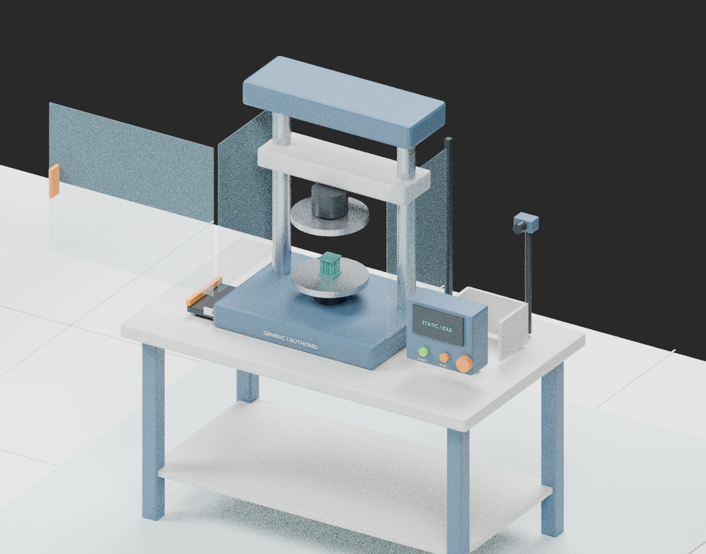

# R01 task-scene binding: mount, observe and retrieve

A bounded **CPU static contract audit**, with real source-scene inspection evidence. It accounts for 11 R01 reference operations, 15 task roles, 14 resolved proxy-role bindings and one explicitly missing transport-clip geometry. It does not make an executable episode, validate a robot view or supply calibrated interaction frames.

ScienceGym remains an independent project. This addition does not change the nineteen task-design drafts, ten explorer families or two embodied storyboard routes.

## What is bound

`binding.json` maps `TEST01` through `TEST_REMOVE`, including free-boundary preparation, observation, loading, unloading and the grouped `RELOAD` reference, to:

- Existing operation IDs, storyboard frame IDs/indices, image paths and source provenance
- The same `obj.R01.001` specimen, `cond.R01`, eighteen authored half-unit lineage IDs and free-internal-rotation condition
- Exact source object names for specimen, fixture, guard, control and camera-proxy roles
- Explicit metadata ports and object-origin frame references, with unsupported physical interfaces left null
- Intended before/after states and the two-cycle authored history, without treating a representative loading pose as a complete repeat trajectory

A `port.*` identifier is an original metadata binding ID, not a new physical connector, robot API or sensor. It maps a task role to existing proxy geometry or a named blocker. `transport_tray`, `transport_support` and `tester_stage` reuse the existing carrier as an authored role choice. `box_walls` maps to the side-box props, while `transport_clip` has no unique source geometry and remains unresolved. Source task station labels are retained; mobile-role origins are not mistaken for their later operating station.

## Real source inspection

The original 15,113,204-byte `.blend` was recovered and matched the historical R01 render receipt:

`bbcf496ca4c1eaa16a56db472e54d944a8d54bc19c7e00073afe32fe9e6ca915`

Blender 4.3.2 inspected 963 source objects and resolved all 215 `WS_TEST` sidecar names. The mounted array contains 173 visual objects. Its measured station-local mesh bounds are approximately 0.065 × 0.065 × 0.072 m, matching the existing physical-reference envelope within a 1 micrometre numerical tolerance. This checks an authored mesh against a stated reference, not manufacturing accuracy or physical calibration.



This is a new genuine Cycles CPU render from a declared fixed human-review camera. A repeated run has identical image bytes. Source geometry, object transforms, materials, lighting and visibility remain unchanged, including potentially occluding apparatus. The translucent guard uses its original authored material. Nothing was hidden to obtain a clearer target view; no x-ray, magnifier or robot sensor was used. See the [inspection evidence and reproduction guide](source_evidence/README.md).

The source is an all-stage exhibit with simultaneous stage props. The side-box and rotation-lock props remain staged in this review, but they are not declared active R01 boundary constraints. This image does not depict the mounted-observation-retrieval sequence, a valid task initial state or a completed manipulation. The small specimen stays at its original display scale.

### Important local-frame limitation

Every `WS_TEST` object has the same station-origin transform because its vertices are baked in station coordinates. The fourteen frame references are therefore fourteen logical anchors to existing object origins, not fourteen distinct contact locations. Actual geometry bounds are recorded separately. A grasp frame, supported seating pose, calibrated optical pose, approach direction and interface tolerances still require authored or measured evidence. None is invented here.

### Existing storyboards are a different evidence class

The existing R01 builder explicitly hides side-box and rotation-lock proxies, uses an inspection magnifier, and applies an authored 0.75 axial visual scale in `LOAD` and `RELOAD`. Those original images remain unchanged. The audit preserves those declarations and keeps the nominal 65 × 65 × 72 mm physical reference separate from display deformation. It does not reinterpret those illustrations as robot visibility, sensor output, measured recovery or grasp validation.

## Run the offline checks

From the repository root, with Python 3.9+ and no third-party packages:

```sh
python3 -B scene_bindings/r01_mount_observe_retrieve_v1/audit.py
python3 -B -m unittest discover -s scene_bindings/r01_mount_observe_retrieve_v1/tests -v
```

Use `audit.py --json` for machine-readable output. The repository-wide `python3 -B scripts/verify_release.py` also runs the binding audit and its regression tests; its existing Node.js requirement remains unchanged.

Exit 0 means the static contract and frozen inspection evidence are consistent **with execution gates still open**. Exit 1 means a broken reference, changed source, unsupported claim or invalid declaration was found. Source byte hashes, exact role/object membership, operation coverage, specimen/condition/lineage/cycle identity, local transforms, units, display scale, camera and occluder declarations are checked. Negative fixtures are deliberate mutations of the public binding or inspection receipt in the test suite. Invalid JSON, missing input and path escape fail closed.

The ordinary audit checks the included inventory/receipt/image hashes. It does not silently rerun Blender, fetch an asset or assert that an unbundled source is present. Reinspection requires the matching lawful source package; follow the separate inspection guide. Different Blender builds may produce different floating-point or image bytes, so a new receipt must be reviewed instead of silently replacing these frozen results.

## Open execution gates

1. Qualify physical interfaces, support/contact poses, tools, tolerances, load limits and interlock readbacks
2. Identify or author the missing transport-clip geometry without substituting the rotation-lock arm
3. Configure and calibrate a real imaging sensor; the source camera body and lens are meshes
4. Test actual robot/sensor visibility and occlusion under intended task states
5. Implement state transitions and single-specimen state instantiation; remove all-stage display semantics through explicit state logic
6. Validate manipulation, reachability, collision/contact and any later physics in a named backend
7. Supply the lawful original source package for independent scene reinspection

No physical simulation, GPU workload, ovrtx/ovphysx installation, SimReady validation, robot/controller execution, scientific measurement or new sensor was performed.

## Sources and attribution

The design pattern follows [NVIDIA's scene-preparation article](https://developer.nvidia.com/blog/how-to-use-ai-agents-to-prepare-3d-scenes-for-simulation/): preserve scene identity, connect task semantics to scene objects and make validation limitations explicit. NVIDIA's [SimReady validation guide](https://github.com/NVIDIA/simready-foundation/blob/main/nv_core/sr_specs/docs/guides/validate_workflow.md) describes a separate OpenUSD/profile-based workflow. This Python audit is not that validator and does not issue a SimReady result. See [provenance.json](provenance.json) for reviewed references and precise local input hashes.

The scientific/task grounding remains the existing reviewed chiral task package, derived from DOI [10.1038/s41586-025-08658-z](https://doi.org/10.1038/s41586-025-08658-z). This work did not repeat a paper-wide source review. Task-authored handling actions, real source-supported stages and unknown parameters are preserved verbatim from the task JSON. The original task specimen identity does not recover the author's historical specimen identity.

All new code, metadata and render evidence are original ScienceGym work. Scene geometry/materials are the recovered first-party authored proxies; no publisher figures, manufacturer CAD or third-party robot geometry is included in the new render. The repository license and all existing Unitree notices are unchanged. NVIDIA references are links, not copied software or assets, and imply no affiliation or endorsement.
