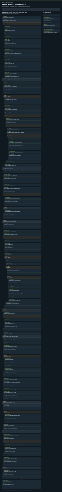

# Helical acoustic metamaterials: task route map



Paper: **Implementation of dispersion-free slow acoustic wave propagation and phase engineering with helical-structured metamaterials** · [DOI](https://doi.org/10.1038/ncomms11731)

Task-design reference; no task execution or scientific reproduction. Counts describe task representation, not experiments or success.

**Reading rule:** numbered rows preserve reference-list occurrences. A loop body is shown once and must be repeated under its original binding, not treated as executed. An unordered obligation group has no inferred chronological edges. Source-reported scientific facts and authored handling are distinct.

[Immutable source task package](https://github.com/openags/ScienceGym/blob/e27d456e2fe99bec9100cc37f7bcd68485504c2b/tasks/acoustic_operations_v2/) · [Interactive inspector](../index.html)

## FAB_FIG1 — Fig1 example-cell manufacture and archiving

Authored phase order with unexpanded nested loops; values and completion rules retained verbatim

[Exact route source](https://github.com/openags/ScienceGym/blob/e27d456e2fe99bec9100cc37f7bcd68485504c2b/tasks/acoustic_operations_v2/branches.json) · JSON pointer: `/branches/0`

- `PRECHECK` Receive the task and check public states
- **GROUP: Generate numbered task samples from raw stock**
  - Binding: {"phase_id":"fabricate","requires_outputs":["raw_stock_available"],"produces_outputs":["identified_cells"]}
  - **LOOP: For each cell_geometry_id**
    - Binding: {"loop_variable":"cell_geometry_id","values":["FIG1"],"completion_rule":"Each work order creates one entity, looping individually; one item per order is authored discretization, not the paper's print-batch count. Conserve remaining symbolic stock and entity-generation events."}
    - `STOCK_SELECT` Take numbered inert stock and an empty tray
    - `TRAY_ID` Bind the build tray to the geometry list
    - `PRINTER_OPEN` Open the stopped printer-proxy chamber
    - `MATERIAL_LOAD` Load the sealed inert-stock cartridge
    - `TRAY_DOCK` Load the build tray
    - `JOB_SELECT` Select the complete geometry work order
    - `PRINTER_CLOSE` Withdraw hands and close the chamber
    - `BUILD_START` Start the numbered build proxy
    - `BUILD_WAIT` Wait for processing completion and independent safe release
    - `PRINT_UNLOAD` Open, unlock and unload the build tray
    - `POST_HANDOFF` Hand off to the closed postprocessing proxy
    - `POST_RETURN` Receive the safely released tray
    - `CELL_RELEASE` Release parts individually from the task fixture
    - `CELL_INSPECT` Inspect identity and geometry
    - `CELL_LABEL` Attach the entity label to its separate carrier
    - `MATERIAL_RETURN` Return unused inert stock and reset the printer proxy
- `DISCONNECT` Disconnect cables after stopping output
- `ARCHIVE` Archive entities by identity and state
- `DATA_ARCHIVE` Save raw/derived-record lineage
- `CLEAN` Return tools and tidy the inert workspace
- `FINAL_CHECK` Check task terminal state

<details><summary>Branch state, choices, lineage and loop obligations</summary>

```json
{
  "initial_state": "labelled_inert_raw_stock_empty_trays_stopped_sample_free_stations",
  "specimen_geometry_ids": [
    "FIG1"
  ],
  "family_ids": [
    "fabrication"
  ],
  "evidence_ids": [
    "a.fig1",
    "a.fabrication"
  ],
  "transport_rule": "Insert MOVE between stations. Loops are reference-expansion rules; one call cannot complete all 40/60/N entity operations.",
  "condition_cards": {
    "frequency_grid_hz": {
      "value": [
        4170
      ],
      "status": "task_authored_required_grid_not_recovered_source_sampling"
    },
    "tube_loads": [
      "open",
      "rubber_sealed"
    ],
    "tube_positions": [
      "x1",
      "x2",
      "x3",
      "x4"
    ],
    "pulse_center_hz": 4170,
    "field_frequency_hz": 4170,
    "source_scan_side_lengths_m": [
      2.3,
      1.0
    ],
    "scan_axis_assignment_origin_step": "unknown_in_source_explicit_authored_card_required",
    "source_operating_domain_note": "The main A/B transmission-spectrum section reports maximum lead below 1/7 of that experiment's shortest incident wavelength; this is not a universal acceptance condition for all lens cells. Retain SI Table1's large leads and do not extrapolate dispersion-free behavior to infinite frequency.",
    "unresolved_input_rule": "Do not expand a loop if its selected stage references a null condition input; report the exact missing input rather than substituting an empty list or default as completion."
  },
  "success": "Complete authorized inert-object operations, lineage, condition records, appropriate analysis and terminal states; record failures/blockers honestly. Episodes lacking required interfaces can evaluate safe blocking only, not experiment completion.",
  "not_claimed": "No robot trajectory execution, acoustic physics simulation, real manufacture, real acoustic output or reproduction of author raw data",
  "resource_policy": {
    "tube_probe": "MIC01 one legacy Type4958 in all tube port measurements",
    "field_probe": "authored reuse MIC01 after tube/pulse removal and transfer; field source does not establish a specific model",
    "exclusivity": "MIC01 has one current location; active tube/pulse/field acquisition is mutually exclusive, without duplicating assets across stations",
    "shared_source_chain": "The same DS345/amplifier chain serves tube and array; stop output and verify/reconnect role ports before changing use, without simultaneously driving two unspecified loads"
  }
}
```

</details>

## TRANSMISSION_PAIR — A/B cell transmission-spectrum comparison

Authored phase order with unexpanded nested loops; values and completion rules retained verbatim

[Exact route source](https://github.com/openags/ScienceGym/blob/e27d456e2fe99bec9100cc37f7bcd68485504c2b/tasks/acoustic_operations_v2/branches.json) · JSON pointer: `/branches/1`

- `PRECHECK` Receive the task and check public states
- **GROUP: Generate numbered task samples from raw stock**
  - Binding: {"phase_id":"fabricate","requires_outputs":["raw_stock_available"],"produces_outputs":["identified_cells"]}
  - **LOOP: For each cell_geometry_id**
    - Binding: {"loop_variable":"cell_geometry_id","values":["A","B"],"completion_rule":"Each work order creates one entity, looping individually; one item per order is authored discretization, not the paper's print-batch count. Conserve remaining symbolic stock and entity-generation events."}
    - `STOCK_SELECT` Take numbered inert stock and an empty tray
    - `TRAY_ID` Bind the build tray to the geometry list
    - `PRINTER_OPEN` Open the stopped printer-proxy chamber
    - `MATERIAL_LOAD` Load the sealed inert-stock cartridge
    - `TRAY_DOCK` Load the build tray
    - `JOB_SELECT` Select the complete geometry work order
    - `PRINTER_CLOSE` Withdraw hands and close the chamber
    - `BUILD_START` Start the numbered build proxy
    - `BUILD_WAIT` Wait for processing completion and independent safe release
    - `PRINT_UNLOAD` Open, unlock and unload the build tray
    - `POST_HANDOFF` Hand off to the closed postprocessing proxy
    - `POST_RETURN` Receive the safely released tray
    - `CELL_RELEASE` Release parts individually from the task fixture
    - `CELL_INSPECT` Inspect identity and geometry
    - `CELL_LABEL` Attach the entity label to its separate carrier
    - `MATERIAL_RETURN` Return unused inert stock and reset the printer proxy
- **GROUP: Per-sample two-load/four-position characterization**
  - Binding: {"phase_id":"tube_spectrum","requires_outputs":["identified_cells"],"produces_outputs":["indexed_characterization"]}
  - `TUBE_OFF` Confirm the tube measurement chain is off
  - `CONNECT_SOURCE` Connect the signal source to the amplifier proxy
  - `CONNECT_TUBE` Connect the amplifier to the tube-end source
  - `CONNECT_MIC` Connect the single tube-measurement microphone
  - **LOOP: For each cell_geometry_id**
    - Binding: {"loop_variable":"cell_geometry_id","values":["A","B"],"completion_rule":"Individually mount each cell, acquire transmission/phase records and return it to its original carrier"}
    - `TUBE_OFF` Confirm the tube measurement chain is off
    - `TUBE_ACCESS` Open the task sample interface
    - `TUBE_INSERT` Insert the numbered cell axially
    - `TUBE_SECURE` Secure the sample and record mounting state
    - `TUBE_CLOSE` Close the sample interface
    - **LOOP: For each frequency_hz**
      - Binding: {"loop_variable":"frequency_hz","values":"condition_card.frequency_grid_hz.value","completion_rule":"At least eight condition-consistent valid records per frequency, or explicit incomplete status"}
      - `SIGNAL_SET` Set frequency and waveform using the keypad
      - `CHECK_CHANNEL` Check channel and phase reference
      - **LOOP: For each load**
        - Binding: {"loop_variable":"load","values":["open","rubber_sealed"],"completion_rule":"A frequency is complete only after records exist for both physical loads"}
        - `TUBE_OFF` Confirm the tube measurement chain is off
        - `LOAD_SET` Physically switch between open and rubber-plug terminations
        - **LOOP: For each port_id**
          - Binding: {"loop_variable":"port_id","values":["x1","x2","x3","x4"],"completion_rule":"Operate the same probe_serial pointwise in four holes, recording each load/frequency separately"}
          - `PROBE_RELEASE` Release the probe while supporting its cable
          - `PORT_PREP` Open the target point and reseal the previous hole
          - `PROBE_INSERT` Insert the same probe to the target-depth proxy stop
          - `PORT_SEAL` Lock the probe and check unused holes
          - `ACQUIRE_PRESSURE` Acquire one pressure record at the current hole/load
          - `SAVE_PRESSURE` Save numbered raw pressure and conditions
          - `PROBE_RETRACT` Withdraw the probe safely and cap the hole
      - `TRANSMISSION_ANALYZE` Derive results from two-load/four-position records
    - `TUBE_UNLOAD` Unload the sample to its numbered carrier
- `DISCONNECT` Disconnect cables after stopping output
- `ARCHIVE` Archive entities by identity and state
- `DATA_ARCHIVE` Save raw/derived-record lineage
- `CLEAN` Return tools and tidy the inert workspace
- `FINAL_CHECK` Check task terminal state

<details><summary>Branch state, choices, lineage and loop obligations</summary>

```json
{
  "initial_state": "labelled_inert_raw_stock_empty_trays_stopped_sample_free_stations",
  "specimen_geometry_ids": [
    "A",
    "B"
  ],
  "family_ids": [
    "fabrication",
    "unit_transmission"
  ],
  "evidence_ids": [
    "a.spectrum",
    "a.tube",
    "a.si_tube"
  ],
  "transport_rule": "Insert MOVE between stations. Loops are reference-expansion rules; one call cannot complete all 40/60/N entity operations.",
  "condition_cards": {
    "frequency_grid_hz": {
      "value": null,
      "status": "task_authored_required_grid_not_recovered_source_sampling"
    },
    "tube_loads": [
      "open",
      "rubber_sealed"
    ],
    "tube_positions": [
      "x1",
      "x2",
      "x3",
      "x4"
    ],
    "pulse_center_hz": 4170,
    "field_frequency_hz": 4170,
    "source_scan_side_lengths_m": [
      2.3,
      1.0
    ],
    "scan_axis_assignment_origin_step": "unknown_in_source_explicit_authored_card_required",
    "source_operating_domain_note": "The main A/B transmission-spectrum section reports maximum lead below 1/7 of that experiment's shortest incident wavelength; this is not a universal acceptance condition for all lens cells. Retain SI Table1's large leads and do not extrapolate dispersion-free behavior to infinite frequency.",
    "unresolved_input_rule": "Do not expand a loop if its selected stage references a null condition input; report the exact missing input rather than substituting an empty list or default as completion."
  },
  "success": "Complete authorized inert-object operations, lineage, condition records, appropriate analysis and terminal states; record failures/blockers honestly. Episodes lacking required interfaces can evaluate safe blocking only, not experiment completion.",
  "not_claimed": "No robot trajectory execution, acoustic physics simulation, real manufacture, real acoustic output or reproduction of author raw data",
  "resource_policy": {
    "tube_probe": "MIC01 one legacy Type4958 in all tube port measurements",
    "field_probe": "authored reuse MIC01 after tube/pulse removal and transfer; field source does not establish a specific model",
    "exclusivity": "MIC01 has one current location; active tube/pulse/field acquisition is mutually exclusive, without duplicating assets across stations",
    "shared_source_chain": "The same DS345/amplifier chain serves tube and array; stop output and verify/reconnect role ports before changing use, without simultaneously driving two unspecified loads"
  }
}
```

</details>

## PULSE_PAIR — Air/A/B pulse-delay comparison

Authored phase order with unexpanded nested loops; values and completion rules retained verbatim

[Exact route source](https://github.com/openags/ScienceGym/blob/e27d456e2fe99bec9100cc37f7bcd68485504c2b/tasks/acoustic_operations_v2/branches.json) · JSON pointer: `/branches/2`

- `PRECHECK` Receive the task and check public states
- **GROUP: Generate numbered task samples from raw stock**
  - Binding: {"phase_id":"fabricate","requires_outputs":["raw_stock_available"],"produces_outputs":["identified_cells"]}
  - **LOOP: For each cell_geometry_id**
    - Binding: {"loop_variable":"cell_geometry_id","values":["A","B"],"completion_rule":"Each work order creates one entity, looping individually; one item per order is authored discretization, not the paper's print-batch count. Conserve remaining symbolic stock and entity-generation events."}
    - `STOCK_SELECT` Take numbered inert stock and an empty tray
    - `TRAY_ID` Bind the build tray to the geometry list
    - `PRINTER_OPEN` Open the stopped printer-proxy chamber
    - `MATERIAL_LOAD` Load the sealed inert-stock cartridge
    - `TRAY_DOCK` Load the build tray
    - `JOB_SELECT` Select the complete geometry work order
    - `PRINTER_CLOSE` Withdraw hands and close the chamber
    - `BUILD_START` Start the numbered build proxy
    - `BUILD_WAIT` Wait for processing completion and independent safe release
    - `PRINT_UNLOAD` Open, unlock and unload the build tray
    - `POST_HANDOFF` Hand off to the closed postprocessing proxy
    - `POST_RETURN` Receive the safely released tray
    - `CELL_RELEASE` Release parts individually from the task fixture
    - `CELL_INSPECT` Inspect identity and geometry
    - `CELL_LABEL` Attach the entity label to its separate carrier
    - `MATERIAL_RETURN` Return unused inert stock and reset the printer proxy
- **GROUP: Empty-path and A/B pulse comparison**
  - Binding: {"phase_id":"pulse_compare","requires_outputs":["identified_cells"],"produces_outputs":["pulse_comparison"]}
  - `TUBE_OFF` Confirm the tube measurement chain is off
  - `CONNECT_SOURCE` Connect the signal source to the amplifier proxy
  - `CONNECT_TUBE` Connect the amplifier to the tube-end source
  - `CONNECT_MIC` Connect the single tube-measurement microphone
  - `PULSE_CLEAR` Establish a genuinely empty-path control
  - `PULSE_RX` Place the receiver probe in the fixed pulse-reception position
  - `PULSE_CONFIG` Enter a shared pulse/trigger condition card
  - **LOOP: For each path_condition**
    - Binding: {"loop_variable":"path_condition","values":["air","A","B"],"completion_rule":"Share receiver fixture and trigger conditions, save separate waveforms and require physical events for sample changes"}
    - `PULSE_SWAP` Switch sample/air conditions without moving the receiver
    - `PULSE_TRIGGER` Trigger and acquire the current pulse condition
    - `PULSE_SAVE` Save a separate air/sample waveform
  - **GROUP: Set condition: air**
    - Binding: {"set_condition":"air"}
    - `PULSE_SWAP` Switch sample/air conditions without moving the receiver
  - `PULSE_ANALYZE` Compare against air and report delays
  - `PULSE_RX_REMOVE` Remove the receiver after completing comparisons
- `DISCONNECT` Disconnect cables after stopping output
- `ARCHIVE` Archive entities by identity and state
- `DATA_ARCHIVE` Save raw/derived-record lineage
- `CLEAN` Return tools and tidy the inert workspace
- `FINAL_CHECK` Check task terminal state

<details><summary>Branch state, choices, lineage and loop obligations</summary>

```json
{
  "initial_state": "labelled_inert_raw_stock_empty_trays_stopped_sample_free_stations",
  "specimen_geometry_ids": [
    "A",
    "B"
  ],
  "family_ids": [
    "fabrication",
    "pulse_control"
  ],
  "evidence_ids": [
    "a.pulse"
  ],
  "transport_rule": "Insert MOVE between stations. Loops are reference-expansion rules; one call cannot complete all 40/60/N entity operations.",
  "condition_cards": {
    "frequency_grid_hz": {
      "value": [
        4170
      ],
      "status": "task_authored_required_grid_not_recovered_source_sampling"
    },
    "tube_loads": [
      "open",
      "rubber_sealed"
    ],
    "tube_positions": [
      "x1",
      "x2",
      "x3",
      "x4"
    ],
    "pulse_center_hz": 4170,
    "field_frequency_hz": 4170,
    "source_scan_side_lengths_m": [
      2.3,
      1.0
    ],
    "scan_axis_assignment_origin_step": "unknown_in_source_explicit_authored_card_required",
    "source_operating_domain_note": "The main A/B transmission-spectrum section reports maximum lead below 1/7 of that experiment's shortest incident wavelength; this is not a universal acceptance condition for all lens cells. Retain SI Table1's large leads and do not extrapolate dispersion-free behavior to infinite frequency.",
    "unresolved_input_rule": "Do not expand a loop if its selected stage references a null condition input; report the exact missing input rather than substituting an empty list or default as completion."
  },
  "success": "Complete authorized inert-object operations, lineage, condition records, appropriate analysis and terminal states; record failures/blockers honestly. Episodes lacking required interfaces can evaluate safe blocking only, not experiment completion.",
  "not_claimed": "No robot trajectory execution, acoustic physics simulation, real manufacture, real acoustic output or reproduction of author raw data",
  "resource_policy": {
    "tube_probe": "MIC01 one legacy Type4958 in all tube port measurements",
    "field_probe": "authored reuse MIC01 after tube/pulse removal and transfer; field source does not establish a specific model",
    "exclusivity": "MIC01 has one current location; active tube/pulse/field acquisition is mutually exclusive, without duplicating assets across stations",
    "shared_source_chain": "The same DS345/amplifier chain serves tube and array; stop output and verify/reconnect role ports before changing use, without simultaneously driving two unspecified loads"
  }
}
```

</details>

## CELL_40_CHARACTERIZATION — Individual transmission/phase characterization of forty distinct cells

Authored phase order with unexpanded nested loops; values and completion rules retained verbatim

[Exact route source](https://github.com/openags/ScienceGym/blob/e27d456e2fe99bec9100cc37f7bcd68485504c2b/tasks/acoustic_operations_v2/branches.json) · JSON pointer: `/branches/3`

- `PRECHECK` Receive the task and check public states
- **GROUP: Generate numbered task samples from raw stock**
  - Binding: {"phase_id":"fabricate","requires_outputs":["raw_stock_available"],"produces_outputs":["identified_cells"]}
  - **LOOP: For each cell_geometry_id**
    - Binding: {"loop_variable":"cell_geometry_id","values":["L01","L02","L03","L04","L05","L06","L07","L08","L09","L10","L11","L12","L13","L14","L15","L16","L17","L18","L19","L20","L21","L22","L23","L24","L25","L26","L27","L28","L29","L30","L31","L32","L33","L34","L35","L36","L37","L38","L39","L40"],"completion_rule":"Each work order creates one entity, looping individually; one item per order is authored discretization, not the paper's print-batch count. Conserve remaining symbolic stock and entity-generation events."}
    - `STOCK_SELECT` Take numbered inert stock and an empty tray
    - `TRAY_ID` Bind the build tray to the geometry list
    - `PRINTER_OPEN` Open the stopped printer-proxy chamber
    - `MATERIAL_LOAD` Load the sealed inert-stock cartridge
    - `TRAY_DOCK` Load the build tray
    - `JOB_SELECT` Select the complete geometry work order
    - `PRINTER_CLOSE` Withdraw hands and close the chamber
    - `BUILD_START` Start the numbered build proxy
    - `BUILD_WAIT` Wait for processing completion and independent safe release
    - `PRINT_UNLOAD` Open, unlock and unload the build tray
    - `POST_HANDOFF` Hand off to the closed postprocessing proxy
    - `POST_RETURN` Receive the safely released tray
    - `CELL_RELEASE` Release parts individually from the task fixture
    - `CELL_INSPECT` Inspect identity and geometry
    - `CELL_LABEL` Attach the entity label to its separate carrier
    - `MATERIAL_RETURN` Return unused inert stock and reset the printer proxy
- **GROUP: Per-sample two-load/four-position characterization**
  - Binding: {"phase_id":"tube_lens_cells","requires_outputs":["identified_cells"],"produces_outputs":["indexed_characterization"]}
  - `TUBE_OFF` Confirm the tube measurement chain is off
  - `CONNECT_SOURCE` Connect the signal source to the amplifier proxy
  - `CONNECT_TUBE` Connect the amplifier to the tube-end source
  - `CONNECT_MIC` Connect the single tube-measurement microphone
  - **LOOP: For each cell_geometry_id**
    - Binding: {"loop_variable":"cell_geometry_id","values":["L01","L02","L03","L04","L05","L06","L07","L08","L09","L10","L11","L12","L13","L14","L15","L16","L17","L18","L19","L20","L21","L22","L23","L24","L25","L26","L27","L28","L29","L30","L31","L32","L33","L34","L35","L36","L37","L38","L39","L40"],"completion_rule":"Individually mount each cell, acquire transmission/phase records and return it to its original carrier"}
    - `TUBE_OFF` Confirm the tube measurement chain is off
    - `TUBE_ACCESS` Open the task sample interface
    - `TUBE_INSERT` Insert the numbered cell axially
    - `TUBE_SECURE` Secure the sample and record mounting state
    - `TUBE_CLOSE` Close the sample interface
    - **LOOP: For each frequency_hz**
      - Binding: {"loop_variable":"frequency_hz","values":[4170],"completion_rule":"At least eight condition-consistent valid records per frequency, or explicit incomplete status"}
      - `SIGNAL_SET` Set frequency and waveform using the keypad
      - `CHECK_CHANNEL` Check channel and phase reference
      - **LOOP: For each load**
        - Binding: {"loop_variable":"load","values":["open","rubber_sealed"],"completion_rule":"A frequency is complete only after records exist for both physical loads"}
        - `TUBE_OFF` Confirm the tube measurement chain is off
        - `LOAD_SET` Physically switch between open and rubber-plug terminations
        - **LOOP: For each port_id**
          - Binding: {"loop_variable":"port_id","values":["x1","x2","x3","x4"],"completion_rule":"Operate the same probe_serial pointwise in four holes, recording each load/frequency separately"}
          - `PROBE_RELEASE` Release the probe while supporting its cable
          - `PORT_PREP` Open the target point and reseal the previous hole
          - `PROBE_INSERT` Insert the same probe to the target-depth proxy stop
          - `PORT_SEAL` Lock the probe and check unused holes
          - `ACQUIRE_PRESSURE` Acquire one pressure record at the current hole/load
          - `SAVE_PRESSURE` Save numbered raw pressure and conditions
          - `PROBE_RETRACT` Withdraw the probe safely and cap the hole
      - `TRANSMISSION_ANALYZE` Derive results from two-load/four-position records
    - `TUBE_UNLOAD` Unload the sample to its numbered carrier
- `DISCONNECT` Disconnect cables after stopping output
- `ARCHIVE` Archive entities by identity and state
- `DATA_ARCHIVE` Save raw/derived-record lineage
- `CLEAN` Return tools and tidy the inert workspace
- `FINAL_CHECK` Check task terminal state

<details><summary>Branch state, choices, lineage and loop obligations</summary>

```json
{
  "initial_state": "labelled_inert_raw_stock_empty_trays_stopped_sample_free_stations",
  "specimen_geometry_ids": [
    "L01",
    "L02",
    "L03",
    "L04",
    "L05",
    "L06",
    "L07",
    "L08",
    "L09",
    "L10",
    "L11",
    "L12",
    "L13",
    "L14",
    "L15",
    "L16",
    "L17",
    "L18",
    "L19",
    "L20",
    "L21",
    "L22",
    "L23",
    "L24",
    "L25",
    "L26",
    "L27",
    "L28",
    "L29",
    "L30",
    "L31",
    "L32",
    "L33",
    "L34",
    "L35",
    "L36",
    "L37",
    "L38",
    "L39",
    "L40"
  ],
  "family_ids": [
    "fabrication",
    "indexed_cell_characterization"
  ],
  "evidence_ids": [
    "a.lens_design",
    "a.si_table",
    "a.tube"
  ],
  "transport_rule": "Insert MOVE between stations. Loops are reference-expansion rules; one call cannot complete all 40/60/N entity operations.",
  "condition_cards": {
    "frequency_grid_hz": {
      "value": [
        4170
      ],
      "status": "task_authored_required_grid_not_recovered_source_sampling"
    },
    "tube_loads": [
      "open",
      "rubber_sealed"
    ],
    "tube_positions": [
      "x1",
      "x2",
      "x3",
      "x4"
    ],
    "pulse_center_hz": 4170,
    "field_frequency_hz": 4170,
    "source_scan_side_lengths_m": [
      2.3,
      1.0
    ],
    "scan_axis_assignment_origin_step": "unknown_in_source_explicit_authored_card_required",
    "source_operating_domain_note": "The main A/B transmission-spectrum section reports maximum lead below 1/7 of that experiment's shortest incident wavelength; this is not a universal acceptance condition for all lens cells. Retain SI Table1's large leads and do not extrapolate dispersion-free behavior to infinite frequency.",
    "unresolved_input_rule": "Do not expand a loop if its selected stage references a null condition input; report the exact missing input rather than substituting an empty list or default as completion."
  },
  "success": "Complete authorized inert-object operations, lineage, condition records, appropriate analysis and terminal states; record failures/blockers honestly. Episodes lacking required interfaces can evaluate safe blocking only, not experiment completion.",
  "not_claimed": "No robot trajectory execution, acoustic physics simulation, real manufacture, real acoustic output or reproduction of author raw data",
  "resource_policy": {
    "tube_probe": "MIC01 one legacy Type4958 in all tube port measurements",
    "field_probe": "authored reuse MIC01 after tube/pulse removal and transfer; field source does not establish a specific model",
    "exclusivity": "MIC01 has one current location; active tube/pulse/field acquisition is mutually exclusive, without duplicating assets across stations",
    "shared_source_chain": "The same DS345/amplifier chain serves tube and array; stop output and verify/reconnect role ports before changing use, without simultaneously driving two unspecified loads"
  }
}
```

</details>

## LENS_BUILD — Forty-cell manufacture, characterization and lens assembly

Authored phase order with unexpanded nested loops; values and completion rules retained verbatim

[Exact route source](https://github.com/openags/ScienceGym/blob/e27d456e2fe99bec9100cc37f7bcd68485504c2b/tasks/acoustic_operations_v2/branches.json) · JSON pointer: `/branches/4`

- `PRECHECK` Receive the task and check public states
- **GROUP: Generate numbered task samples from raw stock**
  - Binding: {"phase_id":"fabricate","requires_outputs":["raw_stock_available"],"produces_outputs":["identified_cells"]}
  - **LOOP: For each cell_geometry_id**
    - Binding: {"loop_variable":"cell_geometry_id","values":["L01","L02","L03","L04","L05","L06","L07","L08","L09","L10","L11","L12","L13","L14","L15","L16","L17","L18","L19","L20","L21","L22","L23","L24","L25","L26","L27","L28","L29","L30","L31","L32","L33","L34","L35","L36","L37","L38","L39","L40"],"completion_rule":"Each work order creates one entity, looping individually; one item per order is authored discretization, not the paper's print-batch count. Conserve remaining symbolic stock and entity-generation events."}
    - `STOCK_SELECT` Take numbered inert stock and an empty tray
    - `TRAY_ID` Bind the build tray to the geometry list
    - `PRINTER_OPEN` Open the stopped printer-proxy chamber
    - `MATERIAL_LOAD` Load the sealed inert-stock cartridge
    - `TRAY_DOCK` Load the build tray
    - `JOB_SELECT` Select the complete geometry work order
    - `PRINTER_CLOSE` Withdraw hands and close the chamber
    - `BUILD_START` Start the numbered build proxy
    - `BUILD_WAIT` Wait for processing completion and independent safe release
    - `PRINT_UNLOAD` Open, unlock and unload the build tray
    - `POST_HANDOFF` Hand off to the closed postprocessing proxy
    - `POST_RETURN` Receive the safely released tray
    - `CELL_RELEASE` Release parts individually from the task fixture
    - `CELL_INSPECT` Inspect identity and geometry
    - `CELL_LABEL` Attach the entity label to its separate carrier
    - `MATERIAL_RETURN` Return unused inert stock and reset the printer proxy
- **GROUP: Per-sample two-load/four-position characterization**
  - Binding: {"phase_id":"tube_lens_cells","requires_outputs":["identified_cells"],"produces_outputs":["indexed_characterization"]}
  - `TUBE_OFF` Confirm the tube measurement chain is off
  - `CONNECT_SOURCE` Connect the signal source to the amplifier proxy
  - `CONNECT_TUBE` Connect the amplifier to the tube-end source
  - `CONNECT_MIC` Connect the single tube-measurement microphone
  - **LOOP: For each cell_geometry_id**
    - Binding: {"loop_variable":"cell_geometry_id","values":["L01","L02","L03","L04","L05","L06","L07","L08","L09","L10","L11","L12","L13","L14","L15","L16","L17","L18","L19","L20","L21","L22","L23","L24","L25","L26","L27","L28","L29","L30","L31","L32","L33","L34","L35","L36","L37","L38","L39","L40"],"completion_rule":"Individually mount each cell, acquire transmission/phase records and return it to its original carrier"}
    - `TUBE_OFF` Confirm the tube measurement chain is off
    - `TUBE_ACCESS` Open the task sample interface
    - `TUBE_INSERT` Insert the numbered cell axially
    - `TUBE_SECURE` Secure the sample and record mounting state
    - `TUBE_CLOSE` Close the sample interface
    - **LOOP: For each frequency_hz**
      - Binding: {"loop_variable":"frequency_hz","values":[4170],"completion_rule":"At least eight condition-consistent valid records per frequency, or explicit incomplete status"}
      - `SIGNAL_SET` Set frequency and waveform using the keypad
      - `CHECK_CHANNEL` Check channel and phase reference
      - **LOOP: For each load**
        - Binding: {"loop_variable":"load","values":["open","rubber_sealed"],"completion_rule":"A frequency is complete only after records exist for both physical loads"}
        - `TUBE_OFF` Confirm the tube measurement chain is off
        - `LOAD_SET` Physically switch between open and rubber-plug terminations
        - **LOOP: For each port_id**
          - Binding: {"loop_variable":"port_id","values":["x1","x2","x3","x4"],"completion_rule":"Operate the same probe_serial pointwise in four holes, recording each load/frequency separately"}
          - `PROBE_RELEASE` Release the probe while supporting its cable
          - `PORT_PREP` Open the target point and reseal the previous hole
          - `PROBE_INSERT` Insert the same probe to the target-depth proxy stop
          - `PORT_SEAL` Lock the probe and check unused holes
          - `ACQUIRE_PRESSURE` Acquire one pressure record at the current hole/load
          - `SAVE_PRESSURE` Save numbered raw pressure and conditions
          - `PROBE_RETRACT` Withdraw the probe safely and cap the hole
      - `TRANSMISSION_ANALYZE` Derive results from two-load/four-position records
    - `TUBE_UNLOAD` Unload the sample to its numbered carrier
- **GROUP: Assemble forty cells into the lens by number**
  - Binding: {"phase_id":"lens_assemble","requires_outputs":["identified_cells","indexed_characterization"],"produces_outputs":["assembled_lens"]}
  - `HOLDER_PREP` Secure the numbered empty lens holder
  - **LOOP: For each slot_number**
    - Binding: {"loop_variable":"slot_number","values":[1,2,3,4,5,6,7,8,9,10,11,12,13,14,15,16,17,18,19,20,21,22,23,24,25,26,27,28,29,30,31,32,33,34,35,36,37,38,39,40],"completion_rule":"Slot k must bind Lk and that entity's characterization records; these are not 40 new tasks"}
    - `CELL_PICK` Select the characterized cell for this slot
    - `LENS_INSERT` Insert into the numbered empty slot
    - `LENS_SEAT` Secure this slot and return the support sleeve
  - `LENS_CHECK` Verify all forty slot identities and phase records
  - `LENS_LOCK` Place the lens in the long carrier
- `DISCONNECT` Disconnect cables after stopping output
- `ARCHIVE` Archive entities by identity and state
- `DATA_ARCHIVE` Save raw/derived-record lineage
- `CLEAN` Return tools and tidy the inert workspace
- `FINAL_CHECK` Check task terminal state

<details><summary>Branch state, choices, lineage and loop obligations</summary>

```json
{
  "initial_state": "labelled_inert_raw_stock_empty_trays_stopped_sample_free_stations",
  "specimen_geometry_ids": [
    "L01",
    "L02",
    "L03",
    "L04",
    "L05",
    "L06",
    "L07",
    "L08",
    "L09",
    "L10",
    "L11",
    "L12",
    "L13",
    "L14",
    "L15",
    "L16",
    "L17",
    "L18",
    "L19",
    "L20",
    "L21",
    "L22",
    "L23",
    "L24",
    "L25",
    "L26",
    "L27",
    "L28",
    "L29",
    "L30",
    "L31",
    "L32",
    "L33",
    "L34",
    "L35",
    "L36",
    "L37",
    "L38",
    "L39",
    "L40"
  ],
  "family_ids": [
    "fabrication",
    "indexed_cell_characterization",
    "lens_assembly"
  ],
  "evidence_ids": [
    "a.lens_assembly",
    "a.si_lens",
    "a.si_table"
  ],
  "transport_rule": "Insert MOVE between stations. Loops are reference-expansion rules; one call cannot complete all 40/60/N entity operations.",
  "condition_cards": {
    "frequency_grid_hz": {
      "value": [
        4170
      ],
      "status": "task_authored_required_grid_not_recovered_source_sampling"
    },
    "tube_loads": [
      "open",
      "rubber_sealed"
    ],
    "tube_positions": [
      "x1",
      "x2",
      "x3",
      "x4"
    ],
    "pulse_center_hz": 4170,
    "field_frequency_hz": 4170,
    "source_scan_side_lengths_m": [
      2.3,
      1.0
    ],
    "scan_axis_assignment_origin_step": "unknown_in_source_explicit_authored_card_required",
    "source_operating_domain_note": "The main A/B transmission-spectrum section reports maximum lead below 1/7 of that experiment's shortest incident wavelength; this is not a universal acceptance condition for all lens cells. Retain SI Table1's large leads and do not extrapolate dispersion-free behavior to infinite frequency.",
    "unresolved_input_rule": "Do not expand a loop if its selected stage references a null condition input; report the exact missing input rather than substituting an empty list or default as completion."
  },
  "success": "Complete authorized inert-object operations, lineage, condition records, appropriate analysis and terminal states; record failures/blockers honestly. Episodes lacking required interfaces can evaluate safe blocking only, not experiment completion.",
  "not_claimed": "No robot trajectory execution, acoustic physics simulation, real manufacture, real acoustic output or reproduction of author raw data",
  "resource_policy": {
    "tube_probe": "MIC01 one legacy Type4958 in all tube port measurements",
    "field_probe": "authored reuse MIC01 after tube/pulse removal and transfer; field source does not establish a specific model",
    "exclusivity": "MIC01 has one current location; active tube/pulse/field acquisition is mutually exclusive, without duplicating assets across stations",
    "shared_source_chain": "The same DS345/amplifier chain serves tube and array; stop output and verify/reconnect role ports before changing use, without simultaneously driving two unspecified loads"
  }
}
```

</details>

## FIELD_BASELINE — Obstacle-free field for the lens and synchronized array

Authored phase order with unexpanded nested loops; values and completion rules retained verbatim

[Exact route source](https://github.com/openags/ScienceGym/blob/e27d456e2fe99bec9100cc37f7bcd68485504c2b/tasks/acoustic_operations_v2/branches.json) · JSON pointer: `/branches/5`

- `PRECHECK` Receive the task and check public states
- **GROUP: Generate numbered task samples from raw stock**
  - Binding: {"phase_id":"fabricate","requires_outputs":["raw_stock_available"],"produces_outputs":["identified_cells"]}
  - **LOOP: For each cell_geometry_id**
    - Binding: {"loop_variable":"cell_geometry_id","values":["L01","L02","L03","L04","L05","L06","L07","L08","L09","L10","L11","L12","L13","L14","L15","L16","L17","L18","L19","L20","L21","L22","L23","L24","L25","L26","L27","L28","L29","L30","L31","L32","L33","L34","L35","L36","L37","L38","L39","L40"],"completion_rule":"Each work order creates one entity, looping individually; one item per order is authored discretization, not the paper's print-batch count. Conserve remaining symbolic stock and entity-generation events."}
    - `STOCK_SELECT` Take numbered inert stock and an empty tray
    - `TRAY_ID` Bind the build tray to the geometry list
    - `PRINTER_OPEN` Open the stopped printer-proxy chamber
    - `MATERIAL_LOAD` Load the sealed inert-stock cartridge
    - `TRAY_DOCK` Load the build tray
    - `JOB_SELECT` Select the complete geometry work order
    - `PRINTER_CLOSE` Withdraw hands and close the chamber
    - `BUILD_START` Start the numbered build proxy
    - `BUILD_WAIT` Wait for processing completion and independent safe release
    - `PRINT_UNLOAD` Open, unlock and unload the build tray
    - `POST_HANDOFF` Hand off to the closed postprocessing proxy
    - `POST_RETURN` Receive the safely released tray
    - `CELL_RELEASE` Release parts individually from the task fixture
    - `CELL_INSPECT` Inspect identity and geometry
    - `CELL_LABEL` Attach the entity label to its separate carrier
    - `MATERIAL_RETURN` Return unused inert stock and reset the printer proxy
- **GROUP: Per-sample two-load/four-position characterization**
  - Binding: {"phase_id":"tube_lens_cells","requires_outputs":["identified_cells"],"produces_outputs":["indexed_characterization"]}
  - `TUBE_OFF` Confirm the tube measurement chain is off
  - `CONNECT_SOURCE` Connect the signal source to the amplifier proxy
  - `CONNECT_TUBE` Connect the amplifier to the tube-end source
  - `CONNECT_MIC` Connect the single tube-measurement microphone
  - **LOOP: For each cell_geometry_id**
    - Binding: {"loop_variable":"cell_geometry_id","values":["L01","L02","L03","L04","L05","L06","L07","L08","L09","L10","L11","L12","L13","L14","L15","L16","L17","L18","L19","L20","L21","L22","L23","L24","L25","L26","L27","L28","L29","L30","L31","L32","L33","L34","L35","L36","L37","L38","L39","L40"],"completion_rule":"Individually mount each cell, acquire transmission/phase records and return it to its original carrier"}
    - `TUBE_OFF` Confirm the tube measurement chain is off
    - `TUBE_ACCESS` Open the task sample interface
    - `TUBE_INSERT` Insert the numbered cell axially
    - `TUBE_SECURE` Secure the sample and record mounting state
    - `TUBE_CLOSE` Close the sample interface
    - **LOOP: For each frequency_hz**
      - Binding: {"loop_variable":"frequency_hz","values":[4170],"completion_rule":"At least eight condition-consistent valid records per frequency, or explicit incomplete status"}
      - `SIGNAL_SET` Set frequency and waveform using the keypad
      - `CHECK_CHANNEL` Check channel and phase reference
      - **LOOP: For each load**
        - Binding: {"loop_variable":"load","values":["open","rubber_sealed"],"completion_rule":"A frequency is complete only after records exist for both physical loads"}
        - `TUBE_OFF` Confirm the tube measurement chain is off
        - `LOAD_SET` Physically switch between open and rubber-plug terminations
        - **LOOP: For each port_id**
          - Binding: {"loop_variable":"port_id","values":["x1","x2","x3","x4"],"completion_rule":"Operate the same probe_serial pointwise in four holes, recording each load/frequency separately"}
          - `PROBE_RELEASE` Release the probe while supporting its cable
          - `PORT_PREP` Open the target point and reseal the previous hole
          - `PROBE_INSERT` Insert the same probe to the target-depth proxy stop
          - `PORT_SEAL` Lock the probe and check unused holes
          - `ACQUIRE_PRESSURE` Acquire one pressure record at the current hole/load
          - `SAVE_PRESSURE` Save numbered raw pressure and conditions
          - `PROBE_RETRACT` Withdraw the probe safely and cap the hole
      - `TRANSMISSION_ANALYZE` Derive results from two-load/four-position records
    - `TUBE_UNLOAD` Unload the sample to its numbered carrier
- **GROUP: Assemble forty cells into the lens by number**
  - Binding: {"phase_id":"lens_assemble","requires_outputs":["identified_cells","indexed_characterization"],"produces_outputs":["assembled_lens"]}
  - `HOLDER_PREP` Secure the numbered empty lens holder
  - **LOOP: For each slot_number**
    - Binding: {"loop_variable":"slot_number","values":[1,2,3,4,5,6,7,8,9,10,11,12,13,14,15,16,17,18,19,20,21,22,23,24,25,26,27,28,29,30,31,32,33,34,35,36,37,38,39,40],"completion_rule":"Slot k must bind Lk and that entity's characterization records; these are not 40 new tasks"}
    - `CELL_PICK` Select the characterized cell for this slot
    - `LENS_INSERT` Insert into the numbered empty slot
    - `LENS_SEAT` Secure this slot and return the support sleeve
  - `LENS_CHECK` Verify all forty slot identities and phase records
  - `LENS_LOCK` Place the lens in the long carrier
- **GROUP: Assemble waveguide boundaries and sixty-source array**
  - Binding: {"phase_id":"guide_array_setup","requires_outputs":["assembled_lens","field_interface_contract_present"],"produces_outputs":["assembled_field_station"]}
  - `GUIDE_PREP` Check waveguide base and large-plate handling interfaces
  - `SPACER_PLACE` Install task spacers and check plate separation
  - `FOAM_PLACE` Secure absorbing-foam proxies at the boundary
  - `LENS_DOCK` Seat the lens in the waveguide locating fixture
  - `ARRAY_RAIL` Secure the empty speaker-array locating rail
  - **LOOP: For each speaker_number**
    - Binding: {"loop_variable":"speaker_number","values":[1,2,3,4,5,6,7,8,9,10,11,12,13,14,15,16,17,18,19,20,21,22,23,24,25,26,27,28,29,30,31,32,33,34,35,36,37,38,39,40,41,42,43,44,45,46,47,48,49,50,51,52,53,54,55,56,57,58,59,60],"completion_rule":"Bind each distinct speaker_id to position and harness channel; do not invent real amplifier-wiring topology"}
    - `SPEAKER_PICK` Select each numbered speaker
    - `SPEAKER_SEAT` Place the speaker in its matching seat
    - `SPEAKER_WIRE` Connect this speaker's inert wiring harness
    - `SPEAKER_CHECK` Check each circuit and position
  - `CONNECT_SOURCE` Connect the signal source to the amplifier proxy
  - `ARRAY_CONNECT` Connect the shared signal chain and narrow-gap adapter
  - `ARRAY_SYNC` Check the same-signal synchronous-drive contract
  - `PROBE_MOUNT` Mount the field probe on the scanner from outside the plates
  - `PROBE_ROUTE` Route probe entry and moving cable
  - `UPPER_CLOSE` Place the upper plate using its support proxy
  - `ACCESS_CHECK` Check reachability inside the closed plate gap
  - `FRAME_REGISTER` Register the source-to-scene coordinate transform
  - `SCAN_PLAN` Bind this run's point table and measured mask
- **GROUP: Obstacle-free scan over the limited main lobe**
  - Binding: {"phase_id":"field_baseline","requires_outputs":["assembled_field_station"],"produces_outputs":["baseline_raw"]}
  - **CONDITION: Verify no_obstacle**
    - Binding: {"verify_condition":"no_obstacle","evidence":"obstacle physically in carrier; lens and source installed"}
  - `FIELD_SOURCE` Start the continuous array-source proxy
  - **LOOP: For each scan_point_id**
    - Binding: {"loop_variable":"scan_point_id","values":"condition_card.scan_point_ids","completion_rule":"Acquire each reachable point independently for this condition; retain masks for unreachable/invalid points without fabricated values"}
    - `SCAN_MOVE` Move the probe stage pointwise from external controls
    - `SCAN_SAMPLE` Acquire local pressure at the current point
    - `SCAN_SAVE` Commit this point's record and mask
  - `FIELD_STOP` Stop array output and dock the probe
  - `FIELD_ANALYZE` Plot pressure magnitude only at measured points
- **GROUP: Unload the field station**
  - Binding: {"phase_id":"field_close","requires_outputs":["baseline_raw"],"produces_outputs":["field_payloads_returned"]}
  - `FIELD_UNLOAD` Release the field station and unload the lens
- `DISCONNECT` Disconnect cables after stopping output
- `ARCHIVE` Archive entities by identity and state
- `DATA_ARCHIVE` Save raw/derived-record lineage
- `CLEAN` Return tools and tidy the inert workspace
- `FINAL_CHECK` Check task terminal state

<details><summary>Branch state, choices, lineage and loop obligations</summary>

```json
{
  "initial_state": "labelled_inert_raw_stock_empty_trays_stopped_sample_free_stations",
  "specimen_geometry_ids": [
    "L01",
    "L02",
    "L03",
    "L04",
    "L05",
    "L06",
    "L07",
    "L08",
    "L09",
    "L10",
    "L11",
    "L12",
    "L13",
    "L14",
    "L15",
    "L16",
    "L17",
    "L18",
    "L19",
    "L20",
    "L21",
    "L22",
    "L23",
    "L24",
    "L25",
    "L26",
    "L27",
    "L28",
    "L29",
    "L30",
    "L31",
    "L32",
    "L33",
    "L34",
    "L35",
    "L36",
    "L37",
    "L38",
    "L39",
    "L40"
  ],
  "family_ids": [
    "fabrication",
    "indexed_cell_characterization",
    "lens_assembly",
    "field_baseline"
  ],
  "evidence_ids": [
    "a.field",
    "a.si_scan"
  ],
  "transport_rule": "Insert MOVE between stations. Loops are reference-expansion rules; one call cannot complete all 40/60/N entity operations.",
  "condition_cards": {
    "frequency_grid_hz": {
      "value": [
        4170
      ],
      "status": "task_authored_required_grid_not_recovered_source_sampling"
    },
    "tube_loads": [
      "open",
      "rubber_sealed"
    ],
    "tube_positions": [
      "x1",
      "x2",
      "x3",
      "x4"
    ],
    "pulse_center_hz": 4170,
    "field_frequency_hz": 4170,
    "source_scan_side_lengths_m": [
      2.3,
      1.0
    ],
    "scan_axis_assignment_origin_step": "unknown_in_source_explicit_authored_card_required",
    "source_operating_domain_note": "The main A/B transmission-spectrum section reports maximum lead below 1/7 of that experiment's shortest incident wavelength; this is not a universal acceptance condition for all lens cells. Retain SI Table1's large leads and do not extrapolate dispersion-free behavior to infinite frequency.",
    "scan_point_ids": null,
    "scan_point_input_requirement": "Authors must first provide a public point table matching these IDs, a source-to-scene transform and a reachability mask. null means absent input and blocks field-loop expansion; do not guess coordinates from display assets or source figures.",
    "unresolved_input_rule": "Do not expand a loop if its selected stage references a null condition input; report the exact missing input rather than substituting an empty list or default as completion."
  },
  "success": "Complete authorized inert-object operations, lineage, condition records, appropriate analysis and terminal states; record failures/blockers honestly. Episodes lacking required interfaces can evaluate safe blocking only, not experiment completion.",
  "not_claimed": "No robot trajectory execution, acoustic physics simulation, real manufacture, real acoustic output or reproduction of author raw data",
  "resource_policy": {
    "tube_probe": "MIC01 one legacy Type4958 in all tube port measurements",
    "field_probe": "authored reuse MIC01 after tube/pulse removal and transfer; field source does not establish a specific model",
    "exclusivity": "MIC01 has one current location; active tube/pulse/field acquisition is mutually exclusive, without duplicating assets across stations",
    "shared_source_chain": "The same DS345/amplifier chain serves tube and array; stop output and verify/reconnect role ports before changing use, without simultaneously driving two unspecified loads"
  }
}
```

</details>

## FIELD_OBSTACLE_COMPARISON — Field comparison with/without an aluminum-alloy obstacle

Authored phase order with unexpanded nested loops; values and completion rules retained verbatim

[Exact route source](https://github.com/openags/ScienceGym/blob/e27d456e2fe99bec9100cc37f7bcd68485504c2b/tasks/acoustic_operations_v2/branches.json) · JSON pointer: `/branches/6`

- `PRECHECK` Receive the task and check public states
- **GROUP: Generate numbered task samples from raw stock**
  - Binding: {"phase_id":"fabricate","requires_outputs":["raw_stock_available"],"produces_outputs":["identified_cells"]}
  - **LOOP: For each cell_geometry_id**
    - Binding: {"loop_variable":"cell_geometry_id","values":["L01","L02","L03","L04","L05","L06","L07","L08","L09","L10","L11","L12","L13","L14","L15","L16","L17","L18","L19","L20","L21","L22","L23","L24","L25","L26","L27","L28","L29","L30","L31","L32","L33","L34","L35","L36","L37","L38","L39","L40"],"completion_rule":"Each work order creates one entity, looping individually; one item per order is authored discretization, not the paper's print-batch count. Conserve remaining symbolic stock and entity-generation events."}
    - `STOCK_SELECT` Take numbered inert stock and an empty tray
    - `TRAY_ID` Bind the build tray to the geometry list
    - `PRINTER_OPEN` Open the stopped printer-proxy chamber
    - `MATERIAL_LOAD` Load the sealed inert-stock cartridge
    - `TRAY_DOCK` Load the build tray
    - `JOB_SELECT` Select the complete geometry work order
    - `PRINTER_CLOSE` Withdraw hands and close the chamber
    - `BUILD_START` Start the numbered build proxy
    - `BUILD_WAIT` Wait for processing completion and independent safe release
    - `PRINT_UNLOAD` Open, unlock and unload the build tray
    - `POST_HANDOFF` Hand off to the closed postprocessing proxy
    - `POST_RETURN` Receive the safely released tray
    - `CELL_RELEASE` Release parts individually from the task fixture
    - `CELL_INSPECT` Inspect identity and geometry
    - `CELL_LABEL` Attach the entity label to its separate carrier
    - `MATERIAL_RETURN` Return unused inert stock and reset the printer proxy
- **GROUP: Per-sample two-load/four-position characterization**
  - Binding: {"phase_id":"tube_lens_cells","requires_outputs":["identified_cells"],"produces_outputs":["indexed_characterization"]}
  - `TUBE_OFF` Confirm the tube measurement chain is off
  - `CONNECT_SOURCE` Connect the signal source to the amplifier proxy
  - `CONNECT_TUBE` Connect the amplifier to the tube-end source
  - `CONNECT_MIC` Connect the single tube-measurement microphone
  - **LOOP: For each cell_geometry_id**
    - Binding: {"loop_variable":"cell_geometry_id","values":["L01","L02","L03","L04","L05","L06","L07","L08","L09","L10","L11","L12","L13","L14","L15","L16","L17","L18","L19","L20","L21","L22","L23","L24","L25","L26","L27","L28","L29","L30","L31","L32","L33","L34","L35","L36","L37","L38","L39","L40"],"completion_rule":"Individually mount each cell, acquire transmission/phase records and return it to its original carrier"}
    - `TUBE_OFF` Confirm the tube measurement chain is off
    - `TUBE_ACCESS` Open the task sample interface
    - `TUBE_INSERT` Insert the numbered cell axially
    - `TUBE_SECURE` Secure the sample and record mounting state
    - `TUBE_CLOSE` Close the sample interface
    - **LOOP: For each frequency_hz**
      - Binding: {"loop_variable":"frequency_hz","values":[4170],"completion_rule":"At least eight condition-consistent valid records per frequency, or explicit incomplete status"}
      - `SIGNAL_SET` Set frequency and waveform using the keypad
      - `CHECK_CHANNEL` Check channel and phase reference
      - **LOOP: For each load**
        - Binding: {"loop_variable":"load","values":["open","rubber_sealed"],"completion_rule":"A frequency is complete only after records exist for both physical loads"}
        - `TUBE_OFF` Confirm the tube measurement chain is off
        - `LOAD_SET` Physically switch between open and rubber-plug terminations
        - **LOOP: For each port_id**
          - Binding: {"loop_variable":"port_id","values":["x1","x2","x3","x4"],"completion_rule":"Operate the same probe_serial pointwise in four holes, recording each load/frequency separately"}
          - `PROBE_RELEASE` Release the probe while supporting its cable
          - `PORT_PREP` Open the target point and reseal the previous hole
          - `PROBE_INSERT` Insert the same probe to the target-depth proxy stop
          - `PORT_SEAL` Lock the probe and check unused holes
          - `ACQUIRE_PRESSURE` Acquire one pressure record at the current hole/load
          - `SAVE_PRESSURE` Save numbered raw pressure and conditions
          - `PROBE_RETRACT` Withdraw the probe safely and cap the hole
      - `TRANSMISSION_ANALYZE` Derive results from two-load/four-position records
    - `TUBE_UNLOAD` Unload the sample to its numbered carrier
- **GROUP: Assemble forty cells into the lens by number**
  - Binding: {"phase_id":"lens_assemble","requires_outputs":["identified_cells","indexed_characterization"],"produces_outputs":["assembled_lens"]}
  - `HOLDER_PREP` Secure the numbered empty lens holder
  - **LOOP: For each slot_number**
    - Binding: {"loop_variable":"slot_number","values":[1,2,3,4,5,6,7,8,9,10,11,12,13,14,15,16,17,18,19,20,21,22,23,24,25,26,27,28,29,30,31,32,33,34,35,36,37,38,39,40],"completion_rule":"Slot k must bind Lk and that entity's characterization records; these are not 40 new tasks"}
    - `CELL_PICK` Select the characterized cell for this slot
    - `LENS_INSERT` Insert into the numbered empty slot
    - `LENS_SEAT` Secure this slot and return the support sleeve
  - `LENS_CHECK` Verify all forty slot identities and phase records
  - `LENS_LOCK` Place the lens in the long carrier
- **GROUP: Assemble waveguide boundaries and sixty-source array**
  - Binding: {"phase_id":"guide_array_setup","requires_outputs":["assembled_lens","field_interface_contract_present"],"produces_outputs":["assembled_field_station"]}
  - `GUIDE_PREP` Check waveguide base and large-plate handling interfaces
  - `SPACER_PLACE` Install task spacers and check plate separation
  - `FOAM_PLACE` Secure absorbing-foam proxies at the boundary
  - `LENS_DOCK` Seat the lens in the waveguide locating fixture
  - `ARRAY_RAIL` Secure the empty speaker-array locating rail
  - **LOOP: For each speaker_number**
    - Binding: {"loop_variable":"speaker_number","values":[1,2,3,4,5,6,7,8,9,10,11,12,13,14,15,16,17,18,19,20,21,22,23,24,25,26,27,28,29,30,31,32,33,34,35,36,37,38,39,40,41,42,43,44,45,46,47,48,49,50,51,52,53,54,55,56,57,58,59,60],"completion_rule":"Bind each distinct speaker_id to position and harness channel; do not invent real amplifier-wiring topology"}
    - `SPEAKER_PICK` Select each numbered speaker
    - `SPEAKER_SEAT` Place the speaker in its matching seat
    - `SPEAKER_WIRE` Connect this speaker's inert wiring harness
    - `SPEAKER_CHECK` Check each circuit and position
  - `CONNECT_SOURCE` Connect the signal source to the amplifier proxy
  - `ARRAY_CONNECT` Connect the shared signal chain and narrow-gap adapter
  - `ARRAY_SYNC` Check the same-signal synchronous-drive contract
  - `PROBE_MOUNT` Mount the field probe on the scanner from outside the plates
  - `PROBE_ROUTE` Route probe entry and moving cable
  - `UPPER_CLOSE` Place the upper plate using its support proxy
  - `ACCESS_CHECK` Check reachability inside the closed plate gap
  - `FRAME_REGISTER` Register the source-to-scene coordinate transform
  - `SCAN_PLAN` Bind this run's point table and measured mask
- **GROUP: Obstacle-free scan over the limited main lobe**
  - Binding: {"phase_id":"field_baseline","requires_outputs":["assembled_field_station"],"produces_outputs":["baseline_raw"]}
  - **CONDITION: Verify no_obstacle**
    - Binding: {"verify_condition":"no_obstacle","evidence":"obstacle physically in carrier; lens and source installed"}
  - `FIELD_SOURCE` Start the continuous array-source proxy
  - **LOOP: For each scan_point_id**
    - Binding: {"loop_variable":"scan_point_id","values":"condition_card.scan_point_ids","completion_rule":"Acquire each reachable point independently for this condition; retain masks for unreachable/invalid points without fabricated values"}
    - `SCAN_MOVE` Move the probe stage pointwise from external controls
    - `SCAN_SAMPLE` Acquire local pressure at the current point
    - `SCAN_SAVE` Commit this point's record and mask
  - `FIELD_STOP` Stop array output and dock the probe
  - `FIELD_ANALYZE` Plot pressure magnitude only at measured points
- **GROUP: Obstacle scan and paired comparison**
  - Binding: {"phase_id":"field_obstacle","requires_outputs":["assembled_field_station","baseline_raw"],"produces_outputs":["paired_field_results"]}
  - `OBSTACLE_INSTALL` Place the numbered aluminum-alloy cylinder condition
  - `FIELD_SOURCE` Start the continuous array-source proxy
  - **LOOP: For each scan_point_id**
    - Binding: {"loop_variable":"scan_point_id","values":"condition_card.scan_point_ids","completion_rule":"Acquire each reachable point independently for this condition; retain masks for unreachable/invalid points without fabricated values"}
    - `SCAN_MOVE` Move the probe stage pointwise from external controls
    - `SCAN_SAMPLE` Acquire local pressure at the current point
    - `SCAN_SAVE` Commit this point's record and mask
  - `FIELD_STOP` Stop array output and dock the probe
  - `FIELD_ANALYZE` Plot pressure magnitude only at measured points
  - `FIELD_COMPARE` Compare obstacle-free and obstacle conditions
  - `OBSTACLE_REMOVE` Remove the obstacle and verify restored conditions
- **GROUP: Unload the field station**
  - Binding: {"phase_id":"field_close","requires_outputs":["paired_field_results"],"produces_outputs":["field_payloads_returned"]}
  - `FIELD_UNLOAD` Release the field station and unload the lens
- `DISCONNECT` Disconnect cables after stopping output
- `ARCHIVE` Archive entities by identity and state
- `DATA_ARCHIVE` Save raw/derived-record lineage
- `CLEAN` Return tools and tidy the inert workspace
- `FINAL_CHECK` Check task terminal state

<details><summary>Branch state, choices, lineage and loop obligations</summary>

```json
{
  "initial_state": "labelled_inert_raw_stock_empty_trays_stopped_sample_free_stations",
  "specimen_geometry_ids": [
    "L01",
    "L02",
    "L03",
    "L04",
    "L05",
    "L06",
    "L07",
    "L08",
    "L09",
    "L10",
    "L11",
    "L12",
    "L13",
    "L14",
    "L15",
    "L16",
    "L17",
    "L18",
    "L19",
    "L20",
    "L21",
    "L22",
    "L23",
    "L24",
    "L25",
    "L26",
    "L27",
    "L28",
    "L29",
    "L30",
    "L31",
    "L32",
    "L33",
    "L34",
    "L35",
    "L36",
    "L37",
    "L38",
    "L39",
    "L40"
  ],
  "family_ids": [
    "fabrication",
    "indexed_cell_characterization",
    "lens_assembly",
    "field_baseline",
    "field_obstacle"
  ],
  "evidence_ids": [
    "a.field",
    "a.obstacle",
    "a.si_scan"
  ],
  "transport_rule": "Insert MOVE between stations. Loops are reference-expansion rules; one call cannot complete all 40/60/N entity operations.",
  "condition_cards": {
    "frequency_grid_hz": {
      "value": [
        4170
      ],
      "status": "task_authored_required_grid_not_recovered_source_sampling"
    },
    "tube_loads": [
      "open",
      "rubber_sealed"
    ],
    "tube_positions": [
      "x1",
      "x2",
      "x3",
      "x4"
    ],
    "pulse_center_hz": 4170,
    "field_frequency_hz": 4170,
    "source_scan_side_lengths_m": [
      2.3,
      1.0
    ],
    "scan_axis_assignment_origin_step": "unknown_in_source_explicit_authored_card_required",
    "source_operating_domain_note": "The main A/B transmission-spectrum section reports maximum lead below 1/7 of that experiment's shortest incident wavelength; this is not a universal acceptance condition for all lens cells. Retain SI Table1's large leads and do not extrapolate dispersion-free behavior to infinite frequency.",
    "scan_point_ids": null,
    "scan_point_input_requirement": "Authors must first provide a public point table matching these IDs, a source-to-scene transform and a reachability mask. null means absent input and blocks field-loop expansion; do not guess coordinates from display assets or source figures.",
    "unresolved_input_rule": "Do not expand a loop if its selected stage references a null condition input; report the exact missing input rather than substituting an empty list or default as completion."
  },
  "success": "Complete authorized inert-object operations, lineage, condition records, appropriate analysis and terminal states; record failures/blockers honestly. Episodes lacking required interfaces can evaluate safe blocking only, not experiment completion.",
  "not_claimed": "No robot trajectory execution, acoustic physics simulation, real manufacture, real acoustic output or reproduction of author raw data",
  "resource_policy": {
    "tube_probe": "MIC01 one legacy Type4958 in all tube port measurements",
    "field_probe": "authored reuse MIC01 after tube/pulse removal and transfer; field source does not establish a specific model",
    "exclusivity": "MIC01 has one current location; active tube/pulse/field acquisition is mutually exclusive, without duplicating assets across stations",
    "shared_source_chain": "The same DS345/amplifier chain serves tube and array; stop output and verify/reconnect role ports before changing use, without simultaneously driving two unspecified loads"
  }
}
```

</details>

## WHOLE_PAPER_PRACTICAL — Whole-paper experimental-operation chain and archiving

Authored phase order with unexpanded nested loops; values and completion rules retained verbatim

[Exact route source](https://github.com/openags/ScienceGym/blob/e27d456e2fe99bec9100cc37f7bcd68485504c2b/tasks/acoustic_operations_v2/branches.json) · JSON pointer: `/branches/7`

- `PRECHECK` Receive the task and check public states
- **GROUP: Generate numbered task samples from raw stock**
  - Binding: {"phase_id":"fabricate","requires_outputs":["raw_stock_available"],"produces_outputs":["identified_cells"]}
  - **LOOP: For each cell_geometry_id**
    - Binding: {"loop_variable":"cell_geometry_id","values":["FIG1","A","B","L01","L02","L03","L04","L05","L06","L07","L08","L09","L10","L11","L12","L13","L14","L15","L16","L17","L18","L19","L20","L21","L22","L23","L24","L25","L26","L27","L28","L29","L30","L31","L32","L33","L34","L35","L36","L37","L38","L39","L40"],"completion_rule":"Each work order creates one entity, looping individually; one item per order is authored discretization, not the paper's print-batch count. Conserve remaining symbolic stock and entity-generation events."}
    - `STOCK_SELECT` Take numbered inert stock and an empty tray
    - `TRAY_ID` Bind the build tray to the geometry list
    - `PRINTER_OPEN` Open the stopped printer-proxy chamber
    - `MATERIAL_LOAD` Load the sealed inert-stock cartridge
    - `TRAY_DOCK` Load the build tray
    - `JOB_SELECT` Select the complete geometry work order
    - `PRINTER_CLOSE` Withdraw hands and close the chamber
    - `BUILD_START` Start the numbered build proxy
    - `BUILD_WAIT` Wait for processing completion and independent safe release
    - `PRINT_UNLOAD` Open, unlock and unload the build tray
    - `POST_HANDOFF` Hand off to the closed postprocessing proxy
    - `POST_RETURN` Receive the safely released tray
    - `CELL_RELEASE` Release parts individually from the task fixture
    - `CELL_INSPECT` Inspect identity and geometry
    - `CELL_LABEL` Attach the entity label to its separate carrier
    - `MATERIAL_RETURN` Return unused inert stock and reset the printer proxy
- **GROUP: Per-sample two-load/four-position characterization**
  - Binding: {"phase_id":"tube_spectrum","requires_outputs":["identified_cells"],"produces_outputs":["indexed_characterization"]}
  - `TUBE_OFF` Confirm the tube measurement chain is off
  - `CONNECT_SOURCE` Connect the signal source to the amplifier proxy
  - `CONNECT_TUBE` Connect the amplifier to the tube-end source
  - `CONNECT_MIC` Connect the single tube-measurement microphone
  - **LOOP: For each cell_geometry_id**
    - Binding: {"loop_variable":"cell_geometry_id","values":["A","B"],"completion_rule":"Individually mount each cell, acquire transmission/phase records and return it to its original carrier"}
    - `TUBE_OFF` Confirm the tube measurement chain is off
    - `TUBE_ACCESS` Open the task sample interface
    - `TUBE_INSERT` Insert the numbered cell axially
    - `TUBE_SECURE` Secure the sample and record mounting state
    - `TUBE_CLOSE` Close the sample interface
    - **LOOP: For each frequency_hz**
      - Binding: {"loop_variable":"frequency_hz","values":"condition_card.frequency_grid_hz.value","completion_rule":"At least eight condition-consistent valid records per frequency, or explicit incomplete status"}
      - `SIGNAL_SET` Set frequency and waveform using the keypad
      - `CHECK_CHANNEL` Check channel and phase reference
      - **LOOP: For each load**
        - Binding: {"loop_variable":"load","values":["open","rubber_sealed"],"completion_rule":"A frequency is complete only after records exist for both physical loads"}
        - `TUBE_OFF` Confirm the tube measurement chain is off
        - `LOAD_SET` Physically switch between open and rubber-plug terminations
        - **LOOP: For each port_id**
          - Binding: {"loop_variable":"port_id","values":["x1","x2","x3","x4"],"completion_rule":"Operate the same probe_serial pointwise in four holes, recording each load/frequency separately"}
          - `PROBE_RELEASE` Release the probe while supporting its cable
          - `PORT_PREP` Open the target point and reseal the previous hole
          - `PROBE_INSERT` Insert the same probe to the target-depth proxy stop
          - `PORT_SEAL` Lock the probe and check unused holes
          - `ACQUIRE_PRESSURE` Acquire one pressure record at the current hole/load
          - `SAVE_PRESSURE` Save numbered raw pressure and conditions
          - `PROBE_RETRACT` Withdraw the probe safely and cap the hole
      - `TRANSMISSION_ANALYZE` Derive results from two-load/four-position records
    - `TUBE_UNLOAD` Unload the sample to its numbered carrier
- **GROUP: Empty-path and A/B pulse comparison**
  - Binding: {"phase_id":"pulse_compare","requires_outputs":["identified_cells"],"produces_outputs":["pulse_comparison"]}
  - `TUBE_OFF` Confirm the tube measurement chain is off
  - `CONNECT_SOURCE` Connect the signal source to the amplifier proxy
  - `CONNECT_TUBE` Connect the amplifier to the tube-end source
  - `CONNECT_MIC` Connect the single tube-measurement microphone
  - `PULSE_CLEAR` Establish a genuinely empty-path control
  - `PULSE_RX` Place the receiver probe in the fixed pulse-reception position
  - `PULSE_CONFIG` Enter a shared pulse/trigger condition card
  - **LOOP: For each path_condition**
    - Binding: {"loop_variable":"path_condition","values":["air","A","B"],"completion_rule":"Share receiver fixture and trigger conditions, save separate waveforms and require physical events for sample changes"}
    - `PULSE_SWAP` Switch sample/air conditions without moving the receiver
    - `PULSE_TRIGGER` Trigger and acquire the current pulse condition
    - `PULSE_SAVE` Save a separate air/sample waveform
  - **GROUP: Set condition: air**
    - Binding: {"set_condition":"air"}
    - `PULSE_SWAP` Switch sample/air conditions without moving the receiver
  - `PULSE_ANALYZE` Compare against air and report delays
  - `PULSE_RX_REMOVE` Remove the receiver after completing comparisons
- **GROUP: Per-sample two-load/four-position characterization**
  - Binding: {"phase_id":"tube_lens_cells","requires_outputs":["identified_cells"],"produces_outputs":["indexed_characterization"]}
  - `TUBE_OFF` Confirm the tube measurement chain is off
  - `CONNECT_SOURCE` Connect the signal source to the amplifier proxy
  - `CONNECT_TUBE` Connect the amplifier to the tube-end source
  - `CONNECT_MIC` Connect the single tube-measurement microphone
  - **LOOP: For each cell_geometry_id**
    - Binding: {"loop_variable":"cell_geometry_id","values":["L01","L02","L03","L04","L05","L06","L07","L08","L09","L10","L11","L12","L13","L14","L15","L16","L17","L18","L19","L20","L21","L22","L23","L24","L25","L26","L27","L28","L29","L30","L31","L32","L33","L34","L35","L36","L37","L38","L39","L40"],"completion_rule":"Individually mount each cell, acquire transmission/phase records and return it to its original carrier"}
    - `TUBE_OFF` Confirm the tube measurement chain is off
    - `TUBE_ACCESS` Open the task sample interface
    - `TUBE_INSERT` Insert the numbered cell axially
    - `TUBE_SECURE` Secure the sample and record mounting state
    - `TUBE_CLOSE` Close the sample interface
    - **LOOP: For each frequency_hz**
      - Binding: {"loop_variable":"frequency_hz","values":[4170],"completion_rule":"At least eight condition-consistent valid records per frequency, or explicit incomplete status"}
      - `SIGNAL_SET` Set frequency and waveform using the keypad
      - `CHECK_CHANNEL` Check channel and phase reference
      - **LOOP: For each load**
        - Binding: {"loop_variable":"load","values":["open","rubber_sealed"],"completion_rule":"A frequency is complete only after records exist for both physical loads"}
        - `TUBE_OFF` Confirm the tube measurement chain is off
        - `LOAD_SET` Physically switch between open and rubber-plug terminations
        - **LOOP: For each port_id**
          - Binding: {"loop_variable":"port_id","values":["x1","x2","x3","x4"],"completion_rule":"Operate the same probe_serial pointwise in four holes, recording each load/frequency separately"}
          - `PROBE_RELEASE` Release the probe while supporting its cable
          - `PORT_PREP` Open the target point and reseal the previous hole
          - `PROBE_INSERT` Insert the same probe to the target-depth proxy stop
          - `PORT_SEAL` Lock the probe and check unused holes
          - `ACQUIRE_PRESSURE` Acquire one pressure record at the current hole/load
          - `SAVE_PRESSURE` Save numbered raw pressure and conditions
          - `PROBE_RETRACT` Withdraw the probe safely and cap the hole
      - `TRANSMISSION_ANALYZE` Derive results from two-load/four-position records
    - `TUBE_UNLOAD` Unload the sample to its numbered carrier
- **GROUP: Assemble forty cells into the lens by number**
  - Binding: {"phase_id":"lens_assemble","requires_outputs":["identified_cells","indexed_characterization"],"produces_outputs":["assembled_lens"]}
  - `HOLDER_PREP` Secure the numbered empty lens holder
  - **LOOP: For each slot_number**
    - Binding: {"loop_variable":"slot_number","values":[1,2,3,4,5,6,7,8,9,10,11,12,13,14,15,16,17,18,19,20,21,22,23,24,25,26,27,28,29,30,31,32,33,34,35,36,37,38,39,40],"completion_rule":"Slot k must bind Lk and that entity's characterization records; these are not 40 new tasks"}
    - `CELL_PICK` Select the characterized cell for this slot
    - `LENS_INSERT` Insert into the numbered empty slot
    - `LENS_SEAT` Secure this slot and return the support sleeve
  - `LENS_CHECK` Verify all forty slot identities and phase records
  - `LENS_LOCK` Place the lens in the long carrier
- **GROUP: Assemble waveguide boundaries and sixty-source array**
  - Binding: {"phase_id":"guide_array_setup","requires_outputs":["assembled_lens","field_interface_contract_present"],"produces_outputs":["assembled_field_station"]}
  - `GUIDE_PREP` Check waveguide base and large-plate handling interfaces
  - `SPACER_PLACE` Install task spacers and check plate separation
  - `FOAM_PLACE` Secure absorbing-foam proxies at the boundary
  - `LENS_DOCK` Seat the lens in the waveguide locating fixture
  - `ARRAY_RAIL` Secure the empty speaker-array locating rail
  - **LOOP: For each speaker_number**
    - Binding: {"loop_variable":"speaker_number","values":[1,2,3,4,5,6,7,8,9,10,11,12,13,14,15,16,17,18,19,20,21,22,23,24,25,26,27,28,29,30,31,32,33,34,35,36,37,38,39,40,41,42,43,44,45,46,47,48,49,50,51,52,53,54,55,56,57,58,59,60],"completion_rule":"Bind each distinct speaker_id to position and harness channel; do not invent real amplifier-wiring topology"}
    - `SPEAKER_PICK` Select each numbered speaker
    - `SPEAKER_SEAT` Place the speaker in its matching seat
    - `SPEAKER_WIRE` Connect this speaker's inert wiring harness
    - `SPEAKER_CHECK` Check each circuit and position
  - `CONNECT_SOURCE` Connect the signal source to the amplifier proxy
  - `ARRAY_CONNECT` Connect the shared signal chain and narrow-gap adapter
  - `ARRAY_SYNC` Check the same-signal synchronous-drive contract
  - `PROBE_MOUNT` Mount the field probe on the scanner from outside the plates
  - `PROBE_ROUTE` Route probe entry and moving cable
  - `UPPER_CLOSE` Place the upper plate using its support proxy
  - `ACCESS_CHECK` Check reachability inside the closed plate gap
  - `FRAME_REGISTER` Register the source-to-scene coordinate transform
  - `SCAN_PLAN` Bind this run's point table and measured mask
- **GROUP: Obstacle-free scan over the limited main lobe**
  - Binding: {"phase_id":"field_baseline","requires_outputs":["assembled_field_station"],"produces_outputs":["baseline_raw"]}
  - **CONDITION: Verify no_obstacle**
    - Binding: {"verify_condition":"no_obstacle","evidence":"obstacle physically in carrier; lens and source installed"}
  - `FIELD_SOURCE` Start the continuous array-source proxy
  - **LOOP: For each scan_point_id**
    - Binding: {"loop_variable":"scan_point_id","values":"condition_card.scan_point_ids","completion_rule":"Acquire each reachable point independently for this condition; retain masks for unreachable/invalid points without fabricated values"}
    - `SCAN_MOVE` Move the probe stage pointwise from external controls
    - `SCAN_SAMPLE` Acquire local pressure at the current point
    - `SCAN_SAVE` Commit this point's record and mask
  - `FIELD_STOP` Stop array output and dock the probe
  - `FIELD_ANALYZE` Plot pressure magnitude only at measured points
- **GROUP: Obstacle scan and paired comparison**
  - Binding: {"phase_id":"field_obstacle","requires_outputs":["assembled_field_station","baseline_raw"],"produces_outputs":["paired_field_results"]}
  - `OBSTACLE_INSTALL` Place the numbered aluminum-alloy cylinder condition
  - `FIELD_SOURCE` Start the continuous array-source proxy
  - **LOOP: For each scan_point_id**
    - Binding: {"loop_variable":"scan_point_id","values":"condition_card.scan_point_ids","completion_rule":"Acquire each reachable point independently for this condition; retain masks for unreachable/invalid points without fabricated values"}
    - `SCAN_MOVE` Move the probe stage pointwise from external controls
    - `SCAN_SAMPLE` Acquire local pressure at the current point
    - `SCAN_SAVE` Commit this point's record and mask
  - `FIELD_STOP` Stop array output and dock the probe
  - `FIELD_ANALYZE` Plot pressure magnitude only at measured points
  - `FIELD_COMPARE` Compare obstacle-free and obstacle conditions
  - `OBSTACLE_REMOVE` Remove the obstacle and verify restored conditions
- **GROUP: Unload the field station**
  - Binding: {"phase_id":"field_close","requires_outputs":["paired_field_results"],"produces_outputs":["field_payloads_returned"]}
  - `FIELD_UNLOAD` Release the field station and unload the lens
- `DISCONNECT` Disconnect cables after stopping output
- `ARCHIVE` Archive entities by identity and state
- `DATA_ARCHIVE` Save raw/derived-record lineage
- `CLEAN` Return tools and tidy the inert workspace
- `FINAL_CHECK` Check task terminal state

<details><summary>Branch state, choices, lineage and loop obligations</summary>

```json
{
  "initial_state": "labelled_inert_raw_stock_empty_trays_stopped_sample_free_stations",
  "specimen_geometry_ids": [
    "FIG1",
    "A",
    "B",
    "L01",
    "L02",
    "L03",
    "L04",
    "L05",
    "L06",
    "L07",
    "L08",
    "L09",
    "L10",
    "L11",
    "L12",
    "L13",
    "L14",
    "L15",
    "L16",
    "L17",
    "L18",
    "L19",
    "L20",
    "L21",
    "L22",
    "L23",
    "L24",
    "L25",
    "L26",
    "L27",
    "L28",
    "L29",
    "L30",
    "L31",
    "L32",
    "L33",
    "L34",
    "L35",
    "L36",
    "L37",
    "L38",
    "L39",
    "L40"
  ],
  "family_ids": [
    "fabrication",
    "unit_transmission",
    "pulse_control",
    "indexed_cell_characterization",
    "lens_assembly",
    "field_baseline",
    "field_obstacle"
  ],
  "evidence_ids": [
    "a.fig1",
    "a.dispersion",
    "a.fabrication",
    "a.spectrum",
    "a.pulse",
    "a.lens_design",
    "a.lens_assembly",
    "a.field",
    "a.obstacle",
    "a.tube",
    "a.numerical",
    "a.data",
    "a.si_tube",
    "a.si_lens",
    "a.si_scan",
    "a.si_table",
    "a.si_limits"
  ],
  "transport_rule": "Insert MOVE between stations. Loops are reference-expansion rules; one call cannot complete all 40/60/N entity operations.",
  "condition_cards": {
    "frequency_grid_hz": {
      "value": null,
      "status": "task_authored_required_grid_not_recovered_source_sampling"
    },
    "tube_loads": [
      "open",
      "rubber_sealed"
    ],
    "tube_positions": [
      "x1",
      "x2",
      "x3",
      "x4"
    ],
    "pulse_center_hz": 4170,
    "field_frequency_hz": 4170,
    "source_scan_side_lengths_m": [
      2.3,
      1.0
    ],
    "scan_axis_assignment_origin_step": "unknown_in_source_explicit_authored_card_required",
    "source_operating_domain_note": "The main A/B transmission-spectrum section reports maximum lead below 1/7 of that experiment's shortest incident wavelength; this is not a universal acceptance condition for all lens cells. Retain SI Table1's large leads and do not extrapolate dispersion-free behavior to infinite frequency.",
    "scan_point_ids": null,
    "scan_point_input_requirement": "Authors must first provide a public point table matching these IDs, a source-to-scene transform and a reachability mask. null means absent input and blocks field-loop expansion; do not guess coordinates from display assets or source figures.",
    "unresolved_input_rule": "Do not expand a loop if its selected stage references a null condition input; report the exact missing input rather than substituting an empty list or default as completion."
  },
  "success": "Complete authorized inert-object operations, lineage, condition records, appropriate analysis and terminal states; record failures/blockers honestly. Episodes lacking required interfaces can evaluate safe blocking only, not experiment completion.",
  "not_claimed": "No robot trajectory execution, acoustic physics simulation, real manufacture, real acoustic output or reproduction of author raw data",
  "resource_policy": {
    "tube_probe": "MIC01 one legacy Type4958 in all tube port measurements",
    "field_probe": "authored reuse MIC01 after tube/pulse removal and transfer; field source does not establish a specific model",
    "exclusivity": "MIC01 has one current location; active tube/pulse/field acquisition is mutually exclusive, without duplicating assets across stations",
    "shared_source_chain": "The same DS345/amplifier chain serves tube and array; stop output and verify/reconnect role ports before changing use, without simultaneously driving two unspecified loads"
  }
}
```

</details>

## Operation contracts

Every operation is clickable in the offline inspector, with robot actions, target objects, pre/post state, provenance, unknowns and acceptance/recovery. Raw task JSON is the source of truth; this visualization is a public evaluator/reference view, not an agent prompt.
