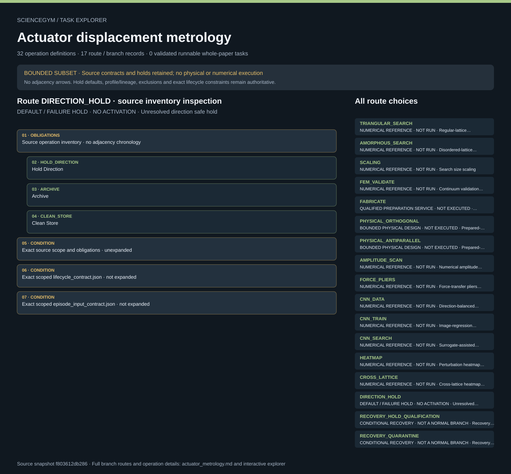

# Actuator displacement metrology: task route map



Paper: **Automatic design of mechanical metamaterial actuators** · [DOI](https://doi.org/10.1038/s41467-020-17947-2)

BOUNDED SUBSET · Read-only author/evaluator reference; no actor loader, task runner, solver, physical simulation, hardware activation or scientific reproduction. Membership is not chronology; exact source contracts remain authoritative. BOUNDED DISPLACEMENT-METROLOGY SUBSET; not a complete whole-paper design. Default DIRECTION_HOLD preserves unresolved specimen/node/world-frame direction qualification. Signed input/output projection never becomes absolute magnitude. Prepared intake earns no fabrication credit. Numerical design, qualified preparation and two physical-metrology designs remain distinct; FEM alternatives are not an AND gate. Sampled movies are not continuous or quantitative inspection. No mechanics solver or physical execution.. Counts describe task representation, not experiments or success.

**Reading rule:** rows show unordered source inventory for inspection. Exact phase, lifecycle and dependency contracts remain authoritative; no loop, specimen, condition or chronology is inferred. An unordered obligation group has no inferred chronological edges. Source-reported scientific facts and authored handling are distinct.

[Immutable source task package](https://github.com/openags/ScienceGym/blob/f803612db28652d2e2dd574d8039c36b7136f399/tasks/actuator_metrology_operations_v2/) · [Interactive inspector](../index.html)

## TRIANGULAR_SEARCH — NUMERICAL REFERENCE · NOT RUN · Regular-lattice displacement design

Read-only author/evaluator reference; no actor loader, task runner, solver, physical simulation, hardware activation or scientific reproduction. Membership is not chronology; exact source contracts remain authoritative.

[Exact route source](https://github.com/openags/ScienceGym/blob/f803612db28652d2e2dd574d8039c36b7136f399/tasks/actuator_metrology_operations_v2/branches.json) · JSON pointer: `/branches/0`

- **OBLIGATIONS: Source operation inventory · no adjacency chronology**
  - Binding: {"order":"Inspection membership only. Conditional recovery remains conditional; exact lifecycle and source causal constraints remain authoritative.","membership_source":"Exact source operation_ids"}
  - `DECLARE_DESIGN` Declare Design
  - `VALIDATE_TOPOLOGY` Validate Topology
  - `REQUEST_DEM` Request Dem
  - `ARCHIVE` Archive
- **CONDITION: Exact source scope and obligations · unexpanded**
  - Binding: {"source_file":"branches.json","source_pointer":"/branches/0","source_contract":{"id":"TRIANGULAR_SEARCH","title":"Regular-lattice displacement design","phase_class":"numerical_design","depends_on":[],"source_evidence_ids":["E_SEARCH","E_MODEL","E_MATERIAL_MODEL"],"operation_ids":["DECLARE_DESIGN","VALIDATE_TOPOLOGY","REQUEST_DEM","ARCHIVE"],"contract":"Select input/output/frozen nodes; protect those nodes from pruning; remove or reinsert beams; rebuild angular neighborhoods; evaluate trial response with independent relaxation; track attempted and accepted moves, seeds and temperature. Default 100 accepted annealing steps is separate from scaling-study schedule.","physical_execution_implemented":false,"numerical_execution_implemented":false,"synthetic_lifecycle_verified":false,"unknown_parameter_ids":["U_NUMERICAL"]}}
- **CONDITION: Exact scoped lifecycle_contract.json · not expanded**
  - Binding: {"source_file":"lifecycle_contract.json","source_pointer":"","source_contract":{"schema_version":"actuator_metrology_task.v1","normal_phases":["VERIFY_SPECIMEN","VERIFY_CARDS","RESOLVE_DIRECTION","DOCK_SPECIMEN","FIX_BASE","VERIFY_BASE","CALIBRATE_IMAGE","CAPTURE_BEFORE","REQUEST_INPUT","VERIFY_INPUT","CAPTURE_AFTER","MEASURE_NODES","COMPUTE_EFFICIENCY","RELEASE_INPUT","VERIFY_UNLOADED","UNFIX_BASE","RETRIEVE_SPECIMEN","INSPECT_SPECIMEN","ARCHIVE","CLEAN_STORE"],"hold_phases":["HOLD_DIRECTION","ARCHIVE","CLEAN_STORE"],"paired_control_specimens":true,"commands_are_not_state_observations":["FIX_BASE","REQUEST_INPUT","RELEASE_INPUT"],"independent_state_observations":["VERIFY_BASE","VERIFY_INPUT","VERIFY_UNLOADED"],"safe_unmount_order":["RELEASE_INPUT","VERIFY_UNLOADED","UNFIX_BASE","RETRIEVE_SPECIMEN"],"cleanup_requires_observation":true,"real_adapter_implemented":false}}
- **CONDITION: Exact scoped episode_input_contract.json · not expanded**
  - Binding: {"source_file":"episode_input_contract.json","source_pointer":"","source_contract":{"schema_version":"actuator_metrology_task.v1","actor_fields":["event_id","operation_id","specimen_id","evidence_id"],"actor_cannot_supply":["measurement","success","efficiency","qualification","frame_coordinates","raw_record_hash","force","source_outcome"],"evaluator_bundle":"Read-only synthetic receipt registry supplied independently of actor events; fixture ID pins its expected contents.","default_mode":"direction_hold","production_authority":false}}

<details><summary>Branch state, choices, lineage and loop obligations</summary>

```json
{
  "id": "TRIANGULAR_SEARCH",
  "title": "Regular-lattice displacement design",
  "phase_class": "numerical_design",
  "depends_on": [],
  "source_evidence_ids": [
    "E_SEARCH",
    "E_MODEL",
    "E_MATERIAL_MODEL"
  ],
  "operation_ids": [
    "DECLARE_DESIGN",
    "VALIDATE_TOPOLOGY",
    "REQUEST_DEM",
    "ARCHIVE"
  ],
  "contract": "Select input/output/frozen nodes; protect those nodes from pruning; remove or reinsert beams; rebuild angular neighborhoods; evaluate trial response with independent relaxation; track attempted and accepted moves, seeds and temperature. Default 100 accepted annealing steps is separate from scaling-study schedule.",
  "physical_execution_implemented": false,
  "numerical_execution_implemented": false,
  "synthetic_lifecycle_verified": false,
  "unknown_parameter_ids": [
    "U_NUMERICAL"
  ]
}
```

</details>

## AMORPHOUS_SEARCH — NUMERICAL REFERENCE · NOT RUN · Disordered-lattice displacement design

Read-only author/evaluator reference; no actor loader, task runner, solver, physical simulation, hardware activation or scientific reproduction. Membership is not chronology; exact source contracts remain authoritative.

[Exact route source](https://github.com/openags/ScienceGym/blob/f803612db28652d2e2dd574d8039c36b7136f399/tasks/actuator_metrology_operations_v2/branches.json) · JSON pointer: `/branches/1`

- **OBLIGATIONS: Source operation inventory · no adjacency chronology**
  - Binding: {"order":"Inspection membership only. Conditional recovery remains conditional; exact lifecycle and source causal constraints remain authoritative.","membership_source":"Exact source operation_ids"}
  - `DECLARE_DESIGN` Declare Design
  - `VALIDATE_TOPOLOGY` Validate Topology
  - `REQUEST_DEM` Request Dem
  - `ARCHIVE` Archive
- **CONDITION: Exact source scope and obligations · unexpanded**
  - Binding: {"source_file":"branches.json","source_pointer":"/branches/1","source_contract":{"id":"AMORPHOUS_SEARCH","title":"Disordered-lattice displacement design","phase_class":"numerical_design","depends_on":[],"source_evidence_ids":["E_MODEL","E_NONLINEAR"],"operation_ids":["DECLARE_DESIGN","VALIDATE_TOPOLOGY","REQUEST_DEM","ARCHIVE"],"contract":"Prepare a mechanically stable jammed-disk contact network through a separate qualified numerical service; do not relabel an arbitrary random graph as jammed. Keep topology and dimensional scaling explicit.","physical_execution_implemented":false,"numerical_execution_implemented":false,"synthetic_lifecycle_verified":false,"unknown_parameter_ids":["U_NUMERICAL"]}}
- **CONDITION: Exact scoped lifecycle_contract.json · not expanded**
  - Binding: {"source_file":"lifecycle_contract.json","source_pointer":"","source_contract":{"schema_version":"actuator_metrology_task.v1","normal_phases":["VERIFY_SPECIMEN","VERIFY_CARDS","RESOLVE_DIRECTION","DOCK_SPECIMEN","FIX_BASE","VERIFY_BASE","CALIBRATE_IMAGE","CAPTURE_BEFORE","REQUEST_INPUT","VERIFY_INPUT","CAPTURE_AFTER","MEASURE_NODES","COMPUTE_EFFICIENCY","RELEASE_INPUT","VERIFY_UNLOADED","UNFIX_BASE","RETRIEVE_SPECIMEN","INSPECT_SPECIMEN","ARCHIVE","CLEAN_STORE"],"hold_phases":["HOLD_DIRECTION","ARCHIVE","CLEAN_STORE"],"paired_control_specimens":true,"commands_are_not_state_observations":["FIX_BASE","REQUEST_INPUT","RELEASE_INPUT"],"independent_state_observations":["VERIFY_BASE","VERIFY_INPUT","VERIFY_UNLOADED"],"safe_unmount_order":["RELEASE_INPUT","VERIFY_UNLOADED","UNFIX_BASE","RETRIEVE_SPECIMEN"],"cleanup_requires_observation":true,"real_adapter_implemented":false}}
- **CONDITION: Exact scoped episode_input_contract.json · not expanded**
  - Binding: {"source_file":"episode_input_contract.json","source_pointer":"","source_contract":{"schema_version":"actuator_metrology_task.v1","actor_fields":["event_id","operation_id","specimen_id","evidence_id"],"actor_cannot_supply":["measurement","success","efficiency","qualification","frame_coordinates","raw_record_hash","force","source_outcome"],"evaluator_bundle":"Read-only synthetic receipt registry supplied independently of actor events; fixture ID pins its expected contents.","default_mode":"direction_hold","production_authority":false}}

<details><summary>Branch state, choices, lineage and loop obligations</summary>

```json
{
  "id": "AMORPHOUS_SEARCH",
  "title": "Disordered-lattice displacement design",
  "phase_class": "numerical_design",
  "depends_on": [],
  "source_evidence_ids": [
    "E_MODEL",
    "E_NONLINEAR"
  ],
  "operation_ids": [
    "DECLARE_DESIGN",
    "VALIDATE_TOPOLOGY",
    "REQUEST_DEM",
    "ARCHIVE"
  ],
  "contract": "Prepare a mechanically stable jammed-disk contact network through a separate qualified numerical service; do not relabel an arbitrary random graph as jammed. Keep topology and dimensional scaling explicit.",
  "physical_execution_implemented": false,
  "numerical_execution_implemented": false,
  "synthetic_lifecycle_verified": false,
  "unknown_parameter_ids": [
    "U_NUMERICAL"
  ]
}
```

</details>

## SCALING — NUMERICAL REFERENCE · NOT RUN · Search size scaling

Read-only author/evaluator reference; no actor loader, task runner, solver, physical simulation, hardware activation or scientific reproduction. Membership is not chronology; exact source contracts remain authoritative.

[Exact route source](https://github.com/openags/ScienceGym/blob/f803612db28652d2e2dd574d8039c36b7136f399/tasks/actuator_metrology_operations_v2/branches.json) · JSON pointer: `/branches/2`

- **OBLIGATIONS: Source operation inventory · no adjacency chronology**
  - Binding: {"order":"Inspection membership only. Conditional recovery remains conditional; exact lifecycle and source causal constraints remain authoritative.","membership_source":"Exact source operation_ids"}
  - `DECLARE_DESIGN` Declare Design
  - `REQUEST_DEM` Request Dem
  - `ARCHIVE` Archive
- **CONDITION: Exact source scope and obligations · unexpanded**
  - Binding: {"source_file":"branches.json","source_pointer":"/branches/2","source_contract":{"id":"SCALING","title":"Search size scaling","phase_class":"numerical_analysis","depends_on":["TRIANGULAR_SEARCH"],"source_evidence_ids":["E_SCALING"],"operation_ids":["DECLARE_DESIGN","REQUEST_DEM","ARCHIVE"],"contract":"Retain six exact bond counts and 100 independent runs each. Measure actual wall-clock times and environment, never synthesize a runtime from bond count. Fit log runtime against log bond count only after raw runs.","physical_execution_implemented":false,"numerical_execution_implemented":false,"synthetic_lifecycle_verified":false,"unknown_parameter_ids":["U_NUMERICAL"]}}
- **CONDITION: Exact scoped lifecycle_contract.json · not expanded**
  - Binding: {"source_file":"lifecycle_contract.json","source_pointer":"","source_contract":{"schema_version":"actuator_metrology_task.v1","normal_phases":["VERIFY_SPECIMEN","VERIFY_CARDS","RESOLVE_DIRECTION","DOCK_SPECIMEN","FIX_BASE","VERIFY_BASE","CALIBRATE_IMAGE","CAPTURE_BEFORE","REQUEST_INPUT","VERIFY_INPUT","CAPTURE_AFTER","MEASURE_NODES","COMPUTE_EFFICIENCY","RELEASE_INPUT","VERIFY_UNLOADED","UNFIX_BASE","RETRIEVE_SPECIMEN","INSPECT_SPECIMEN","ARCHIVE","CLEAN_STORE"],"hold_phases":["HOLD_DIRECTION","ARCHIVE","CLEAN_STORE"],"paired_control_specimens":true,"commands_are_not_state_observations":["FIX_BASE","REQUEST_INPUT","RELEASE_INPUT"],"independent_state_observations":["VERIFY_BASE","VERIFY_INPUT","VERIFY_UNLOADED"],"safe_unmount_order":["RELEASE_INPUT","VERIFY_UNLOADED","UNFIX_BASE","RETRIEVE_SPECIMEN"],"cleanup_requires_observation":true,"real_adapter_implemented":false}}
- **CONDITION: Exact scoped episode_input_contract.json · not expanded**
  - Binding: {"source_file":"episode_input_contract.json","source_pointer":"","source_contract":{"schema_version":"actuator_metrology_task.v1","actor_fields":["event_id","operation_id","specimen_id","evidence_id"],"actor_cannot_supply":["measurement","success","efficiency","qualification","frame_coordinates","raw_record_hash","force","source_outcome"],"evaluator_bundle":"Read-only synthetic receipt registry supplied independently of actor events; fixture ID pins its expected contents.","default_mode":"direction_hold","production_authority":false}}

<details><summary>Branch state, choices, lineage and loop obligations</summary>

```json
{
  "id": "SCALING",
  "title": "Search size scaling",
  "phase_class": "numerical_analysis",
  "depends_on": [
    "TRIANGULAR_SEARCH"
  ],
  "source_evidence_ids": [
    "E_SCALING"
  ],
  "operation_ids": [
    "DECLARE_DESIGN",
    "REQUEST_DEM",
    "ARCHIVE"
  ],
  "contract": "Retain six exact bond counts and 100 independent runs each. Measure actual wall-clock times and environment, never synthesize a runtime from bond count. Fit log runtime against log bond count only after raw runs.",
  "physical_execution_implemented": false,
  "numerical_execution_implemented": false,
  "synthetic_lifecycle_verified": false,
  "unknown_parameter_ids": [
    "U_NUMERICAL"
  ]
}
```

</details>

## FEM_VALIDATE — NUMERICAL REFERENCE · NOT RUN · Continuum validation of selected topology

Read-only author/evaluator reference; no actor loader, task runner, solver, physical simulation, hardware activation or scientific reproduction. Membership is not chronology; exact source contracts remain authoritative.

[Exact route source](https://github.com/openags/ScienceGym/blob/f803612db28652d2e2dd574d8039c36b7136f399/tasks/actuator_metrology_operations_v2/branches.json) · JSON pointer: `/branches/3`

- **OBLIGATIONS: Source operation inventory · no adjacency chronology**
  - Binding: {"order":"Inspection membership only. Conditional recovery remains conditional; exact lifecycle and source causal constraints remain authoritative.","membership_source":"Exact source operation_ids"}
  - `VALIDATE_TOPOLOGY` Validate Topology
  - `REQUEST_FEM` Request Fem
  - `ARCHIVE` Archive
- **CONDITION: Exact source scope and obligations · unexpanded**
  - Binding: {"source_file":"branches.json","source_pointer":"/branches/3","source_contract":{"id":"FEM_VALIDATE","title":"Continuum validation of selected topology","phase_class":"numerical_validation","depends_on":[],"source_evidence_ids":["E_MODEL","E_MATERIAL_MODEL"],"operation_ids":["VALIDATE_TOPOLOGY","REQUEST_FEM","ARCHIVE"],"contract":"Convert selected bond geometry to beam representation with traceable dimensions and measured material properties. Preserve frozen/input/output sets and compare DEM/FEM estimates; source linear-elastic model is not material certification.","physical_execution_implemented":false,"numerical_execution_implemented":false,"synthetic_lifecycle_verified":false,"unknown_parameter_ids":["U_NUMERICAL"],"input_topology_route":"One qualified selected topology: regular search, disordered search or independently frozen human reference; do not require all alternatives","alternative_upstream_branches":["TRIANGULAR_SEARCH","AMORPHOUS_SEARCH"]}}
- **CONDITION: Exact scoped lifecycle_contract.json · not expanded**
  - Binding: {"source_file":"lifecycle_contract.json","source_pointer":"","source_contract":{"schema_version":"actuator_metrology_task.v1","normal_phases":["VERIFY_SPECIMEN","VERIFY_CARDS","RESOLVE_DIRECTION","DOCK_SPECIMEN","FIX_BASE","VERIFY_BASE","CALIBRATE_IMAGE","CAPTURE_BEFORE","REQUEST_INPUT","VERIFY_INPUT","CAPTURE_AFTER","MEASURE_NODES","COMPUTE_EFFICIENCY","RELEASE_INPUT","VERIFY_UNLOADED","UNFIX_BASE","RETRIEVE_SPECIMEN","INSPECT_SPECIMEN","ARCHIVE","CLEAN_STORE"],"hold_phases":["HOLD_DIRECTION","ARCHIVE","CLEAN_STORE"],"paired_control_specimens":true,"commands_are_not_state_observations":["FIX_BASE","REQUEST_INPUT","RELEASE_INPUT"],"independent_state_observations":["VERIFY_BASE","VERIFY_INPUT","VERIFY_UNLOADED"],"safe_unmount_order":["RELEASE_INPUT","VERIFY_UNLOADED","UNFIX_BASE","RETRIEVE_SPECIMEN"],"cleanup_requires_observation":true,"real_adapter_implemented":false}}
- **CONDITION: Exact scoped episode_input_contract.json · not expanded**
  - Binding: {"source_file":"episode_input_contract.json","source_pointer":"","source_contract":{"schema_version":"actuator_metrology_task.v1","actor_fields":["event_id","operation_id","specimen_id","evidence_id"],"actor_cannot_supply":["measurement","success","efficiency","qualification","frame_coordinates","raw_record_hash","force","source_outcome"],"evaluator_bundle":"Read-only synthetic receipt registry supplied independently of actor events; fixture ID pins its expected contents.","default_mode":"direction_hold","production_authority":false}}

<details><summary>Branch state, choices, lineage and loop obligations</summary>

```json
{
  "id": "FEM_VALIDATE",
  "title": "Continuum validation of selected topology",
  "phase_class": "numerical_validation",
  "depends_on": [],
  "source_evidence_ids": [
    "E_MODEL",
    "E_MATERIAL_MODEL"
  ],
  "operation_ids": [
    "VALIDATE_TOPOLOGY",
    "REQUEST_FEM",
    "ARCHIVE"
  ],
  "contract": "Convert selected bond geometry to beam representation with traceable dimensions and measured material properties. Preserve frozen/input/output sets and compare DEM/FEM estimates; source linear-elastic model is not material certification.",
  "physical_execution_implemented": false,
  "numerical_execution_implemented": false,
  "synthetic_lifecycle_verified": false,
  "unknown_parameter_ids": [
    "U_NUMERICAL"
  ],
  "input_topology_route": "One qualified selected topology: regular search, disordered search or independently frozen human reference; do not require all alternatives",
  "alternative_upstream_branches": [
    "TRIANGULAR_SEARCH",
    "AMORPHOUS_SEARCH"
  ]
}
```

</details>

## FABRICATE — QUALIFIED PREPARATION SERVICE · NOT EXECUTED · Fabrication service and specimen intake

Read-only author/evaluator reference; no actor loader, task runner, solver, physical simulation, hardware activation or scientific reproduction. Membership is not chronology; exact source contracts remain authoritative.

[Exact route source](https://github.com/openags/ScienceGym/blob/f803612db28652d2e2dd574d8039c36b7136f399/tasks/actuator_metrology_operations_v2/branches.json) · JSON pointer: `/branches/4`

- **OBLIGATIONS: Source operation inventory · no adjacency chronology**
  - Binding: {"order":"Inspection membership only. Conditional recovery remains conditional; exact lifecycle and source causal constraints remain authoritative.","membership_source":"Exact source operation_ids"}
  - `REQUEST_FABRICATION` Request Fabrication
  - `RECEIVE_SPECIMEN` Receive Specimen
  - `VERIFY_SPECIMEN` Verify Specimen
  - `ARCHIVE` Archive
- **CONDITION: Exact source scope and obligations · unexpanded**
  - Binding: {"source_file":"branches.json","source_pointer":"/branches/4","source_contract":{"id":"FABRICATE","title":"Fabrication service and specimen intake","phase_class":"physical_preparation","depends_on":["FEM_VALIDATE"],"source_evidence_ids":["E_MATERIAL"],"operation_ids":["REQUEST_FABRICATION","RECEIVE_SPECIMEN","VERIFY_SPECIMEN","ARCHIVE"],"contract":"Pass approved independent CAD to qualified FDM service; bind print job, material lot, process card, topology and specimen. No inferred nozzle temperature, speed, infill or constitutive behavior.","physical_execution_implemented":false,"numerical_execution_implemented":false,"synthetic_lifecycle_verified":false,"unknown_parameter_ids":["U_PRINT","U_TOPOLOGY","U_MATERIAL","U_IP"]}}
- **CONDITION: Exact scoped lifecycle_contract.json · not expanded**
  - Binding: {"source_file":"lifecycle_contract.json","source_pointer":"","source_contract":{"schema_version":"actuator_metrology_task.v1","normal_phases":["VERIFY_SPECIMEN","VERIFY_CARDS","RESOLVE_DIRECTION","DOCK_SPECIMEN","FIX_BASE","VERIFY_BASE","CALIBRATE_IMAGE","CAPTURE_BEFORE","REQUEST_INPUT","VERIFY_INPUT","CAPTURE_AFTER","MEASURE_NODES","COMPUTE_EFFICIENCY","RELEASE_INPUT","VERIFY_UNLOADED","UNFIX_BASE","RETRIEVE_SPECIMEN","INSPECT_SPECIMEN","ARCHIVE","CLEAN_STORE"],"hold_phases":["HOLD_DIRECTION","ARCHIVE","CLEAN_STORE"],"paired_control_specimens":true,"commands_are_not_state_observations":["FIX_BASE","REQUEST_INPUT","RELEASE_INPUT"],"independent_state_observations":["VERIFY_BASE","VERIFY_INPUT","VERIFY_UNLOADED"],"safe_unmount_order":["RELEASE_INPUT","VERIFY_UNLOADED","UNFIX_BASE","RETRIEVE_SPECIMEN"],"cleanup_requires_observation":true,"real_adapter_implemented":false}}
- **CONDITION: Exact scoped episode_input_contract.json · not expanded**
  - Binding: {"source_file":"episode_input_contract.json","source_pointer":"","source_contract":{"schema_version":"actuator_metrology_task.v1","actor_fields":["event_id","operation_id","specimen_id","evidence_id"],"actor_cannot_supply":["measurement","success","efficiency","qualification","frame_coordinates","raw_record_hash","force","source_outcome"],"evaluator_bundle":"Read-only synthetic receipt registry supplied independently of actor events; fixture ID pins its expected contents.","default_mode":"direction_hold","production_authority":false}}

<details><summary>Branch state, choices, lineage and loop obligations</summary>

```json
{
  "id": "FABRICATE",
  "title": "Fabrication service and specimen intake",
  "phase_class": "physical_preparation",
  "depends_on": [
    "FEM_VALIDATE"
  ],
  "source_evidence_ids": [
    "E_MATERIAL"
  ],
  "operation_ids": [
    "REQUEST_FABRICATION",
    "RECEIVE_SPECIMEN",
    "VERIFY_SPECIMEN",
    "ARCHIVE"
  ],
  "contract": "Pass approved independent CAD to qualified FDM service; bind print job, material lot, process card, topology and specimen. No inferred nozzle temperature, speed, infill or constitutive behavior.",
  "physical_execution_implemented": false,
  "numerical_execution_implemented": false,
  "synthetic_lifecycle_verified": false,
  "unknown_parameter_ids": [
    "U_PRINT",
    "U_TOPOLOGY",
    "U_MATERIAL",
    "U_IP"
  ]
}
```

</details>

## PHYSICAL_ORTHOGONAL — BOUNDED PHYSICAL DESIGN · NOT EXECUTED · Prepared-specimen orthogonal metrology

Read-only author/evaluator reference; no actor loader, task runner, solver, physical simulation, hardware activation or scientific reproduction. Membership is not chronology; exact source contracts remain authoritative.

[Exact route source](https://github.com/openags/ScienceGym/blob/f803612db28652d2e2dd574d8039c36b7136f399/tasks/actuator_metrology_operations_v2/branches.json) · JSON pointer: `/branches/5`

- **OBLIGATIONS: Source operation inventory · no adjacency chronology**
  - Binding: {"order":"Inspection membership only. Conditional recovery remains conditional; exact lifecycle and source causal constraints remain authoritative.","membership_source":"Exact source operation_ids"}
  - `VERIFY_SPECIMEN` Verify Specimen
  - `VERIFY_CARDS` Verify Cards
  - `RESOLVE_DIRECTION` Resolve Direction
  - `DOCK_SPECIMEN` Dock Specimen
  - `FIX_BASE` Fix Base
  - `VERIFY_BASE` Verify Base
  - `CALIBRATE_IMAGE` Calibrate Image
  - `CAPTURE_BEFORE` Capture Before
  - `REQUEST_INPUT` Request Input
  - `VERIFY_INPUT` Verify Input
  - `CAPTURE_AFTER` Capture After
  - `MEASURE_NODES` Measure Nodes
  - `COMPUTE_EFFICIENCY` Compute Efficiency
  - `RELEASE_INPUT` Release Input
  - `VERIFY_UNLOADED` Verify Unloaded
  - `UNFIX_BASE` Unfix Base
  - `RETRIEVE_SPECIMEN` Retrieve Specimen
  - `INSPECT_SPECIMEN` Inspect Specimen
  - `ARCHIVE` Archive
  - `CLEAN_STORE` Clean Store
- **CONDITION: Exact source scope and obligations · unexpanded**
  - Binding: {"source_file":"branches.json","source_pointer":"/branches/5","source_contract":{"id":"PHYSICAL_ORTHOGONAL","title":"Prepared-specimen orthogonal metrology","phase_class":"physical_metrology","depends_on":[],"source_evidence_ids":["E_MOUNT","E_INPUT","E_IMAGES","E_METRIC","E_ORTHO","E_MOVIES"],"operation_ids":["VERIFY_SPECIMEN","VERIFY_CARDS","RESOLVE_DIRECTION","DOCK_SPECIMEN","FIX_BASE","VERIFY_BASE","CALIBRATE_IMAGE","CAPTURE_BEFORE","REQUEST_INPUT","VERIFY_INPUT","CAPTURE_AFTER","MEASURE_NODES","COMPUTE_EFFICIENCY","RELEASE_INPUT","VERIFY_UNLOADED","UNFIX_BASE","RETRIEVE_SPECIMEN","INSPECT_SPECIMEN","ARCHIVE","CLEAN_STORE"],"contract":"Qualified prepared human-designed and machine-designed control specimens, each with downward input and specimen-frame leftward target output. Whole fabrication is not credited by accepting prepared samples.","physical_execution_implemented":false,"numerical_execution_implemented":false,"synthetic_lifecycle_verified":true,"unknown_parameter_ids":["U_DIRECTION","U_FIXTURE","U_CALIPER","U_CAMERA","U_SEGMENTATION","U_RATE","U_ANGULAR_N","U_CLEANUP"]}}
- **CONDITION: Exact scoped lifecycle_contract.json · not expanded**
  - Binding: {"source_file":"lifecycle_contract.json","source_pointer":"","source_contract":{"schema_version":"actuator_metrology_task.v1","normal_phases":["VERIFY_SPECIMEN","VERIFY_CARDS","RESOLVE_DIRECTION","DOCK_SPECIMEN","FIX_BASE","VERIFY_BASE","CALIBRATE_IMAGE","CAPTURE_BEFORE","REQUEST_INPUT","VERIFY_INPUT","CAPTURE_AFTER","MEASURE_NODES","COMPUTE_EFFICIENCY","RELEASE_INPUT","VERIFY_UNLOADED","UNFIX_BASE","RETRIEVE_SPECIMEN","INSPECT_SPECIMEN","ARCHIVE","CLEAN_STORE"],"hold_phases":["HOLD_DIRECTION","ARCHIVE","CLEAN_STORE"],"paired_control_specimens":true,"commands_are_not_state_observations":["FIX_BASE","REQUEST_INPUT","RELEASE_INPUT"],"independent_state_observations":["VERIFY_BASE","VERIFY_INPUT","VERIFY_UNLOADED"],"safe_unmount_order":["RELEASE_INPUT","VERIFY_UNLOADED","UNFIX_BASE","RETRIEVE_SPECIMEN"],"cleanup_requires_observation":true,"real_adapter_implemented":false}}
- **CONDITION: Exact scoped episode_input_contract.json · not expanded**
  - Binding: {"source_file":"episode_input_contract.json","source_pointer":"","source_contract":{"schema_version":"actuator_metrology_task.v1","actor_fields":["event_id","operation_id","specimen_id","evidence_id"],"actor_cannot_supply":["measurement","success","efficiency","qualification","frame_coordinates","raw_record_hash","force","source_outcome"],"evaluator_bundle":"Read-only synthetic receipt registry supplied independently of actor events; fixture ID pins its expected contents.","default_mode":"direction_hold","production_authority":false}}

<details><summary>Branch state, choices, lineage and loop obligations</summary>

```json
{
  "id": "PHYSICAL_ORTHOGONAL",
  "title": "Prepared-specimen orthogonal metrology",
  "phase_class": "physical_metrology",
  "depends_on": [],
  "source_evidence_ids": [
    "E_MOUNT",
    "E_INPUT",
    "E_IMAGES",
    "E_METRIC",
    "E_ORTHO",
    "E_MOVIES"
  ],
  "operation_ids": [
    "VERIFY_SPECIMEN",
    "VERIFY_CARDS",
    "RESOLVE_DIRECTION",
    "DOCK_SPECIMEN",
    "FIX_BASE",
    "VERIFY_BASE",
    "CALIBRATE_IMAGE",
    "CAPTURE_BEFORE",
    "REQUEST_INPUT",
    "VERIFY_INPUT",
    "CAPTURE_AFTER",
    "MEASURE_NODES",
    "COMPUTE_EFFICIENCY",
    "RELEASE_INPUT",
    "VERIFY_UNLOADED",
    "UNFIX_BASE",
    "RETRIEVE_SPECIMEN",
    "INSPECT_SPECIMEN",
    "ARCHIVE",
    "CLEAN_STORE"
  ],
  "contract": "Qualified prepared human-designed and machine-designed control specimens, each with downward input and specimen-frame leftward target output. Whole fabrication is not credited by accepting prepared samples.",
  "physical_execution_implemented": false,
  "numerical_execution_implemented": false,
  "synthetic_lifecycle_verified": true,
  "unknown_parameter_ids": [
    "U_DIRECTION",
    "U_FIXTURE",
    "U_CALIPER",
    "U_CAMERA",
    "U_SEGMENTATION",
    "U_RATE",
    "U_ANGULAR_N",
    "U_CLEANUP"
  ]
}
```

</details>

## PHYSICAL_ANTIPARALLEL — BOUNDED PHYSICAL DESIGN · NOT EXECUTED · Prepared-specimen anti-parallel metrology

Read-only author/evaluator reference; no actor loader, task runner, solver, physical simulation, hardware activation or scientific reproduction. Membership is not chronology; exact source contracts remain authoritative.

[Exact route source](https://github.com/openags/ScienceGym/blob/f803612db28652d2e2dd574d8039c36b7136f399/tasks/actuator_metrology_operations_v2/branches.json) · JSON pointer: `/branches/6`

- **OBLIGATIONS: Source operation inventory · no adjacency chronology**
  - Binding: {"order":"Inspection membership only. Conditional recovery remains conditional; exact lifecycle and source causal constraints remain authoritative.","membership_source":"Exact source operation_ids"}
  - `VERIFY_SPECIMEN` Verify Specimen
  - `VERIFY_CARDS` Verify Cards
  - `RESOLVE_DIRECTION` Resolve Direction
  - `DOCK_SPECIMEN` Dock Specimen
  - `FIX_BASE` Fix Base
  - `VERIFY_BASE` Verify Base
  - `CALIBRATE_IMAGE` Calibrate Image
  - `CAPTURE_BEFORE` Capture Before
  - `REQUEST_INPUT` Request Input
  - `VERIFY_INPUT` Verify Input
  - `CAPTURE_AFTER` Capture After
  - `MEASURE_NODES` Measure Nodes
  - `COMPUTE_EFFICIENCY` Compute Efficiency
  - `RELEASE_INPUT` Release Input
  - `VERIFY_UNLOADED` Verify Unloaded
  - `UNFIX_BASE` Unfix Base
  - `RETRIEVE_SPECIMEN` Retrieve Specimen
  - `INSPECT_SPECIMEN` Inspect Specimen
  - `ARCHIVE` Archive
  - `CLEAN_STORE` Clean Store
- **CONDITION: Exact source scope and obligations · unexpanded**
  - Binding: {"source_file":"branches.json","source_pointer":"/branches/6","source_contract":{"id":"PHYSICAL_ANTIPARALLEL","title":"Prepared-specimen anti-parallel metrology","phase_class":"physical_metrology","depends_on":[],"source_evidence_ids":["E_MOUNT","E_INPUT","E_IMAGES","E_METRIC","E_ANTI","E_MOVIES"],"operation_ids":["VERIFY_SPECIMEN","VERIFY_CARDS","RESOLVE_DIRECTION","DOCK_SPECIMEN","FIX_BASE","VERIFY_BASE","CALIBRATE_IMAGE","CAPTURE_BEFORE","REQUEST_INPUT","VERIFY_INPUT","CAPTURE_AFTER","MEASURE_NODES","COMPUTE_EFFICIENCY","RELEASE_INPUT","VERIFY_UNLOADED","UNFIX_BASE","RETRIEVE_SPECIMEN","INSPECT_SPECIMEN","ARCHIVE","CLEAN_STORE"],"contract":"Qualified prepared human-designed and machine-designed control specimens, each with downward input and specimen-frame upward target output. Resolve actual specimen identity rather than caption movie pointers.","physical_execution_implemented":false,"numerical_execution_implemented":false,"synthetic_lifecycle_verified":true,"unknown_parameter_ids":["U_DIRECTION","U_FIXTURE","U_CALIPER","U_CAMERA","U_SEGMENTATION","U_RATE","U_ANGULAR_N","U_CLEANUP"]}}
- **CONDITION: Exact scoped lifecycle_contract.json · not expanded**
  - Binding: {"source_file":"lifecycle_contract.json","source_pointer":"","source_contract":{"schema_version":"actuator_metrology_task.v1","normal_phases":["VERIFY_SPECIMEN","VERIFY_CARDS","RESOLVE_DIRECTION","DOCK_SPECIMEN","FIX_BASE","VERIFY_BASE","CALIBRATE_IMAGE","CAPTURE_BEFORE","REQUEST_INPUT","VERIFY_INPUT","CAPTURE_AFTER","MEASURE_NODES","COMPUTE_EFFICIENCY","RELEASE_INPUT","VERIFY_UNLOADED","UNFIX_BASE","RETRIEVE_SPECIMEN","INSPECT_SPECIMEN","ARCHIVE","CLEAN_STORE"],"hold_phases":["HOLD_DIRECTION","ARCHIVE","CLEAN_STORE"],"paired_control_specimens":true,"commands_are_not_state_observations":["FIX_BASE","REQUEST_INPUT","RELEASE_INPUT"],"independent_state_observations":["VERIFY_BASE","VERIFY_INPUT","VERIFY_UNLOADED"],"safe_unmount_order":["RELEASE_INPUT","VERIFY_UNLOADED","UNFIX_BASE","RETRIEVE_SPECIMEN"],"cleanup_requires_observation":true,"real_adapter_implemented":false}}
- **CONDITION: Exact scoped episode_input_contract.json · not expanded**
  - Binding: {"source_file":"episode_input_contract.json","source_pointer":"","source_contract":{"schema_version":"actuator_metrology_task.v1","actor_fields":["event_id","operation_id","specimen_id","evidence_id"],"actor_cannot_supply":["measurement","success","efficiency","qualification","frame_coordinates","raw_record_hash","force","source_outcome"],"evaluator_bundle":"Read-only synthetic receipt registry supplied independently of actor events; fixture ID pins its expected contents.","default_mode":"direction_hold","production_authority":false}}

<details><summary>Branch state, choices, lineage and loop obligations</summary>

```json
{
  "id": "PHYSICAL_ANTIPARALLEL",
  "title": "Prepared-specimen anti-parallel metrology",
  "phase_class": "physical_metrology",
  "depends_on": [],
  "source_evidence_ids": [
    "E_MOUNT",
    "E_INPUT",
    "E_IMAGES",
    "E_METRIC",
    "E_ANTI",
    "E_MOVIES"
  ],
  "operation_ids": [
    "VERIFY_SPECIMEN",
    "VERIFY_CARDS",
    "RESOLVE_DIRECTION",
    "DOCK_SPECIMEN",
    "FIX_BASE",
    "VERIFY_BASE",
    "CALIBRATE_IMAGE",
    "CAPTURE_BEFORE",
    "REQUEST_INPUT",
    "VERIFY_INPUT",
    "CAPTURE_AFTER",
    "MEASURE_NODES",
    "COMPUTE_EFFICIENCY",
    "RELEASE_INPUT",
    "VERIFY_UNLOADED",
    "UNFIX_BASE",
    "RETRIEVE_SPECIMEN",
    "INSPECT_SPECIMEN",
    "ARCHIVE",
    "CLEAN_STORE"
  ],
  "contract": "Qualified prepared human-designed and machine-designed control specimens, each with downward input and specimen-frame upward target output. Resolve actual specimen identity rather than caption movie pointers.",
  "physical_execution_implemented": false,
  "numerical_execution_implemented": false,
  "synthetic_lifecycle_verified": true,
  "unknown_parameter_ids": [
    "U_DIRECTION",
    "U_FIXTURE",
    "U_CALIPER",
    "U_CAMERA",
    "U_SEGMENTATION",
    "U_RATE",
    "U_ANGULAR_N",
    "U_CLEANUP"
  ]
}
```

</details>

## AMPLITUDE_SCAN — NUMERICAL REFERENCE · NOT RUN · Numerical amplitude and topology comparison

Read-only author/evaluator reference; no actor loader, task runner, solver, physical simulation, hardware activation or scientific reproduction. Membership is not chronology; exact source contracts remain authoritative.

[Exact route source](https://github.com/openags/ScienceGym/blob/f803612db28652d2e2dd574d8039c36b7136f399/tasks/actuator_metrology_operations_v2/branches.json) · JSON pointer: `/branches/7`

- **OBLIGATIONS: Source operation inventory · no adjacency chronology**
  - Binding: {"order":"Inspection membership only. Conditional recovery remains conditional; exact lifecycle and source causal constraints remain authoritative.","membership_source":"Exact source operation_ids"}
  - `DECLARE_DESIGN` Declare Design
  - `REQUEST_DEM` Request Dem
  - `ARCHIVE` Archive
- **CONDITION: Exact source scope and obligations · unexpanded**
  - Binding: {"source_file":"branches.json","source_pointer":"/branches/7","source_contract":{"id":"AMPLITUDE_SCAN","title":"Numerical amplitude and topology comparison","phase_class":"numerical_analysis","depends_on":["TRIANGULAR_SEARCH","AMORPHOUS_SEARCH"],"source_evidence_ids":["E_NONLINEAR"],"operation_ids":["DECLARE_DESIGN","REQUEST_DEM","ARCHIVE"],"contract":"Keep matched triangular/amorphous configurations, displacement scan and 100-actuator distributions separate. No physical amplitude sweep or return-to-zero hysteresis measurements are provided.","physical_execution_implemented":false,"numerical_execution_implemented":false,"synthetic_lifecycle_verified":false,"unknown_parameter_ids":["U_NUMERICAL"]}}
- **CONDITION: Exact scoped lifecycle_contract.json · not expanded**
  - Binding: {"source_file":"lifecycle_contract.json","source_pointer":"","source_contract":{"schema_version":"actuator_metrology_task.v1","normal_phases":["VERIFY_SPECIMEN","VERIFY_CARDS","RESOLVE_DIRECTION","DOCK_SPECIMEN","FIX_BASE","VERIFY_BASE","CALIBRATE_IMAGE","CAPTURE_BEFORE","REQUEST_INPUT","VERIFY_INPUT","CAPTURE_AFTER","MEASURE_NODES","COMPUTE_EFFICIENCY","RELEASE_INPUT","VERIFY_UNLOADED","UNFIX_BASE","RETRIEVE_SPECIMEN","INSPECT_SPECIMEN","ARCHIVE","CLEAN_STORE"],"hold_phases":["HOLD_DIRECTION","ARCHIVE","CLEAN_STORE"],"paired_control_specimens":true,"commands_are_not_state_observations":["FIX_BASE","REQUEST_INPUT","RELEASE_INPUT"],"independent_state_observations":["VERIFY_BASE","VERIFY_INPUT","VERIFY_UNLOADED"],"safe_unmount_order":["RELEASE_INPUT","VERIFY_UNLOADED","UNFIX_BASE","RETRIEVE_SPECIMEN"],"cleanup_requires_observation":true,"real_adapter_implemented":false}}
- **CONDITION: Exact scoped episode_input_contract.json · not expanded**
  - Binding: {"source_file":"episode_input_contract.json","source_pointer":"","source_contract":{"schema_version":"actuator_metrology_task.v1","actor_fields":["event_id","operation_id","specimen_id","evidence_id"],"actor_cannot_supply":["measurement","success","efficiency","qualification","frame_coordinates","raw_record_hash","force","source_outcome"],"evaluator_bundle":"Read-only synthetic receipt registry supplied independently of actor events; fixture ID pins its expected contents.","default_mode":"direction_hold","production_authority":false}}

<details><summary>Branch state, choices, lineage and loop obligations</summary>

```json
{
  "id": "AMPLITUDE_SCAN",
  "title": "Numerical amplitude and topology comparison",
  "phase_class": "numerical_analysis",
  "depends_on": [
    "TRIANGULAR_SEARCH",
    "AMORPHOUS_SEARCH"
  ],
  "source_evidence_ids": [
    "E_NONLINEAR"
  ],
  "operation_ids": [
    "DECLARE_DESIGN",
    "REQUEST_DEM",
    "ARCHIVE"
  ],
  "contract": "Keep matched triangular/amorphous configurations, displacement scan and 100-actuator distributions separate. No physical amplitude sweep or return-to-zero hysteresis measurements are provided.",
  "physical_execution_implemented": false,
  "numerical_execution_implemented": false,
  "synthetic_lifecycle_verified": false,
  "unknown_parameter_ids": [
    "U_NUMERICAL"
  ]
}
```

</details>

## FORCE_PLIERS — NUMERICAL REFERENCE · NOT RUN · Force-transfer pliers design

Read-only author/evaluator reference; no actor loader, task runner, solver, physical simulation, hardware activation or scientific reproduction. Membership is not chronology; exact source contracts remain authoritative.

[Exact route source](https://github.com/openags/ScienceGym/blob/f803612db28652d2e2dd574d8039c36b7136f399/tasks/actuator_metrology_operations_v2/branches.json) · JSON pointer: `/branches/8`

- **OBLIGATIONS: Source operation inventory · no adjacency chronology**
  - Binding: {"order":"Inspection membership only. Conditional recovery remains conditional; exact lifecycle and source causal constraints remain authoritative.","membership_source":"Exact source operation_ids"}
  - `DECLARE_DESIGN` Declare Design
  - `VALIDATE_TOPOLOGY` Validate Topology
  - `REQUEST_DEM` Request Dem
  - `ARCHIVE` Archive
- **CONDITION: Exact source scope and obligations · unexpanded**
  - Binding: {"source_file":"branches.json","source_pointer":"/branches/8","source_contract":{"id":"FORCE_PLIERS","title":"Force-transfer pliers design","phase_class":"numerical_design","depends_on":[],"source_evidence_ids":["E_FORCE_SEPARATE"],"operation_ids":["DECLARE_DESIGN","VALIDATE_TOPOLOGY","REQUEST_DEM","ARCHIVE"],"contract":"Keep applied force, gauge-spring stiffness, fixed pivot and symmetry-line y constraints. Simulate upper half then mirror. Evaluation stiffness 10 and visualization stiffness 0.01 cannot be substituted; units are dimensionless model units.","physical_execution_implemented":false,"numerical_execution_implemented":false,"synthetic_lifecycle_verified":false,"unknown_parameter_ids":["U_NUMERICAL"]}}
- **CONDITION: Exact scoped lifecycle_contract.json · not expanded**
  - Binding: {"source_file":"lifecycle_contract.json","source_pointer":"","source_contract":{"schema_version":"actuator_metrology_task.v1","normal_phases":["VERIFY_SPECIMEN","VERIFY_CARDS","RESOLVE_DIRECTION","DOCK_SPECIMEN","FIX_BASE","VERIFY_BASE","CALIBRATE_IMAGE","CAPTURE_BEFORE","REQUEST_INPUT","VERIFY_INPUT","CAPTURE_AFTER","MEASURE_NODES","COMPUTE_EFFICIENCY","RELEASE_INPUT","VERIFY_UNLOADED","UNFIX_BASE","RETRIEVE_SPECIMEN","INSPECT_SPECIMEN","ARCHIVE","CLEAN_STORE"],"hold_phases":["HOLD_DIRECTION","ARCHIVE","CLEAN_STORE"],"paired_control_specimens":true,"commands_are_not_state_observations":["FIX_BASE","REQUEST_INPUT","RELEASE_INPUT"],"independent_state_observations":["VERIFY_BASE","VERIFY_INPUT","VERIFY_UNLOADED"],"safe_unmount_order":["RELEASE_INPUT","VERIFY_UNLOADED","UNFIX_BASE","RETRIEVE_SPECIMEN"],"cleanup_requires_observation":true,"real_adapter_implemented":false}}
- **CONDITION: Exact scoped episode_input_contract.json · not expanded**
  - Binding: {"source_file":"episode_input_contract.json","source_pointer":"","source_contract":{"schema_version":"actuator_metrology_task.v1","actor_fields":["event_id","operation_id","specimen_id","evidence_id"],"actor_cannot_supply":["measurement","success","efficiency","qualification","frame_coordinates","raw_record_hash","force","source_outcome"],"evaluator_bundle":"Read-only synthetic receipt registry supplied independently of actor events; fixture ID pins its expected contents.","default_mode":"direction_hold","production_authority":false}}

<details><summary>Branch state, choices, lineage and loop obligations</summary>

```json
{
  "id": "FORCE_PLIERS",
  "title": "Force-transfer pliers design",
  "phase_class": "numerical_design",
  "depends_on": [],
  "source_evidence_ids": [
    "E_FORCE_SEPARATE"
  ],
  "operation_ids": [
    "DECLARE_DESIGN",
    "VALIDATE_TOPOLOGY",
    "REQUEST_DEM",
    "ARCHIVE"
  ],
  "contract": "Keep applied force, gauge-spring stiffness, fixed pivot and symmetry-line y constraints. Simulate upper half then mirror. Evaluation stiffness 10 and visualization stiffness 0.01 cannot be substituted; units are dimensionless model units.",
  "physical_execution_implemented": false,
  "numerical_execution_implemented": false,
  "synthetic_lifecycle_verified": false,
  "unknown_parameter_ids": [
    "U_NUMERICAL"
  ]
}
```

</details>

## CNN_DATA — NUMERICAL REFERENCE · NOT RUN · Direction-balanced design dataset

Read-only author/evaluator reference; no actor loader, task runner, solver, physical simulation, hardware activation or scientific reproduction. Membership is not chronology; exact source contracts remain authoritative.

[Exact route source](https://github.com/openags/ScienceGym/blob/f803612db28652d2e2dd574d8039c36b7136f399/tasks/actuator_metrology_operations_v2/branches.json) · JSON pointer: `/branches/9`

- **OBLIGATIONS: Source operation inventory · no adjacency chronology**
  - Binding: {"order":"Inspection membership only. Conditional recovery remains conditional; exact lifecycle and source causal constraints remain authoritative.","membership_source":"Exact source operation_ids"}
  - `FREEZE_DATASET` Freeze Dataset
  - `ARCHIVE` Archive
- **CONDITION: Exact source scope and obligations · unexpanded**
  - Binding: {"source_file":"branches.json","source_pointer":"/branches/9","source_contract":{"id":"CNN_DATA","title":"Direction-balanced design dataset","phase_class":"numerical_data","depends_on":["TRIANGULAR_SEARCH"],"source_evidence_ids":["E_CNN"],"operation_ids":["FREEZE_DATASET","ARCHIVE"],"contract":"Accepted and rejected configurations from desired and opposite directions carry signed efficiency. Split by independent simulation run, not adjacent frames, before resampling or fitting.","physical_execution_implemented":false,"numerical_execution_implemented":false,"synthetic_lifecycle_verified":false,"unknown_parameter_ids":["U_NUMERICAL"]}}
- **CONDITION: Exact scoped lifecycle_contract.json · not expanded**
  - Binding: {"source_file":"lifecycle_contract.json","source_pointer":"","source_contract":{"schema_version":"actuator_metrology_task.v1","normal_phases":["VERIFY_SPECIMEN","VERIFY_CARDS","RESOLVE_DIRECTION","DOCK_SPECIMEN","FIX_BASE","VERIFY_BASE","CALIBRATE_IMAGE","CAPTURE_BEFORE","REQUEST_INPUT","VERIFY_INPUT","CAPTURE_AFTER","MEASURE_NODES","COMPUTE_EFFICIENCY","RELEASE_INPUT","VERIFY_UNLOADED","UNFIX_BASE","RETRIEVE_SPECIMEN","INSPECT_SPECIMEN","ARCHIVE","CLEAN_STORE"],"hold_phases":["HOLD_DIRECTION","ARCHIVE","CLEAN_STORE"],"paired_control_specimens":true,"commands_are_not_state_observations":["FIX_BASE","REQUEST_INPUT","RELEASE_INPUT"],"independent_state_observations":["VERIFY_BASE","VERIFY_INPUT","VERIFY_UNLOADED"],"safe_unmount_order":["RELEASE_INPUT","VERIFY_UNLOADED","UNFIX_BASE","RETRIEVE_SPECIMEN"],"cleanup_requires_observation":true,"real_adapter_implemented":false}}
- **CONDITION: Exact scoped episode_input_contract.json · not expanded**
  - Binding: {"source_file":"episode_input_contract.json","source_pointer":"","source_contract":{"schema_version":"actuator_metrology_task.v1","actor_fields":["event_id","operation_id","specimen_id","evidence_id"],"actor_cannot_supply":["measurement","success","efficiency","qualification","frame_coordinates","raw_record_hash","force","source_outcome"],"evaluator_bundle":"Read-only synthetic receipt registry supplied independently of actor events; fixture ID pins its expected contents.","default_mode":"direction_hold","production_authority":false}}

<details><summary>Branch state, choices, lineage and loop obligations</summary>

```json
{
  "id": "CNN_DATA",
  "title": "Direction-balanced design dataset",
  "phase_class": "numerical_data",
  "depends_on": [
    "TRIANGULAR_SEARCH"
  ],
  "source_evidence_ids": [
    "E_CNN"
  ],
  "operation_ids": [
    "FREEZE_DATASET",
    "ARCHIVE"
  ],
  "contract": "Accepted and rejected configurations from desired and opposite directions carry signed efficiency. Split by independent simulation run, not adjacent frames, before resampling or fitting.",
  "physical_execution_implemented": false,
  "numerical_execution_implemented": false,
  "synthetic_lifecycle_verified": false,
  "unknown_parameter_ids": [
    "U_NUMERICAL"
  ]
}
```

</details>

## CNN_TRAIN — NUMERICAL REFERENCE · NOT RUN · Image-regression model training

Read-only author/evaluator reference; no actor loader, task runner, solver, physical simulation, hardware activation or scientific reproduction. Membership is not chronology; exact source contracts remain authoritative.

[Exact route source](https://github.com/openags/ScienceGym/blob/f803612db28652d2e2dd574d8039c36b7136f399/tasks/actuator_metrology_operations_v2/branches.json) · JSON pointer: `/branches/10`

- **OBLIGATIONS: Source operation inventory · no adjacency chronology**
  - Binding: {"order":"Inspection membership only. Conditional recovery remains conditional; exact lifecycle and source causal constraints remain authoritative.","membership_source":"Exact source operation_ids"}
  - `REQUEST_CNN` Request Cnn
  - `ARCHIVE` Archive
- **CONDITION: Exact source scope and obligations · unexpanded**
  - Binding: {"source_file":"branches.json","source_pointer":"/branches/10","source_contract":{"id":"CNN_TRAIN","title":"Image-regression model training","phase_class":"numerical_learning","depends_on":["CNN_DATA"],"source_evidence_ids":["E_CNN"],"operation_ids":["REQUEST_CNN","ARCHIVE"],"contract":"Single-output regression; immutable split IDs, train-only resampling, model/optimizer versions and held-out metrics. No model weights are supplied.","physical_execution_implemented":false,"numerical_execution_implemented":false,"synthetic_lifecycle_verified":false,"unknown_parameter_ids":["U_NUMERICAL"]}}
- **CONDITION: Exact scoped lifecycle_contract.json · not expanded**
  - Binding: {"source_file":"lifecycle_contract.json","source_pointer":"","source_contract":{"schema_version":"actuator_metrology_task.v1","normal_phases":["VERIFY_SPECIMEN","VERIFY_CARDS","RESOLVE_DIRECTION","DOCK_SPECIMEN","FIX_BASE","VERIFY_BASE","CALIBRATE_IMAGE","CAPTURE_BEFORE","REQUEST_INPUT","VERIFY_INPUT","CAPTURE_AFTER","MEASURE_NODES","COMPUTE_EFFICIENCY","RELEASE_INPUT","VERIFY_UNLOADED","UNFIX_BASE","RETRIEVE_SPECIMEN","INSPECT_SPECIMEN","ARCHIVE","CLEAN_STORE"],"hold_phases":["HOLD_DIRECTION","ARCHIVE","CLEAN_STORE"],"paired_control_specimens":true,"commands_are_not_state_observations":["FIX_BASE","REQUEST_INPUT","RELEASE_INPUT"],"independent_state_observations":["VERIFY_BASE","VERIFY_INPUT","VERIFY_UNLOADED"],"safe_unmount_order":["RELEASE_INPUT","VERIFY_UNLOADED","UNFIX_BASE","RETRIEVE_SPECIMEN"],"cleanup_requires_observation":true,"real_adapter_implemented":false}}
- **CONDITION: Exact scoped episode_input_contract.json · not expanded**
  - Binding: {"source_file":"episode_input_contract.json","source_pointer":"","source_contract":{"schema_version":"actuator_metrology_task.v1","actor_fields":["event_id","operation_id","specimen_id","evidence_id"],"actor_cannot_supply":["measurement","success","efficiency","qualification","frame_coordinates","raw_record_hash","force","source_outcome"],"evaluator_bundle":"Read-only synthetic receipt registry supplied independently of actor events; fixture ID pins its expected contents.","default_mode":"direction_hold","production_authority":false}}

<details><summary>Branch state, choices, lineage and loop obligations</summary>

```json
{
  "id": "CNN_TRAIN",
  "title": "Image-regression model training",
  "phase_class": "numerical_learning",
  "depends_on": [
    "CNN_DATA"
  ],
  "source_evidence_ids": [
    "E_CNN"
  ],
  "operation_ids": [
    "REQUEST_CNN",
    "ARCHIVE"
  ],
  "contract": "Single-output regression; immutable split IDs, train-only resampling, model/optimizer versions and held-out metrics. No model weights are supplied.",
  "physical_execution_implemented": false,
  "numerical_execution_implemented": false,
  "synthetic_lifecycle_verified": false,
  "unknown_parameter_ids": [
    "U_NUMERICAL"
  ]
}
```

</details>

## CNN_SEARCH — NUMERICAL REFERENCE · NOT RUN · Surrogate-assisted proposal search

Read-only author/evaluator reference; no actor loader, task runner, solver, physical simulation, hardware activation or scientific reproduction. Membership is not chronology; exact source contracts remain authoritative.

[Exact route source](https://github.com/openags/ScienceGym/blob/f803612db28652d2e2dd574d8039c36b7136f399/tasks/actuator_metrology_operations_v2/branches.json) · JSON pointer: `/branches/11`

- **OBLIGATIONS: Source operation inventory · no adjacency chronology**
  - Binding: {"order":"Inspection membership only. Conditional recovery remains conditional; exact lifecycle and source causal constraints remain authoritative.","membership_source":"Exact source operation_ids"}
  - `DECLARE_DESIGN` Declare Design
  - `REQUEST_CNN` Request Cnn
  - `REQUEST_DEM` Request Dem
  - `ARCHIVE` Archive
- **CONDITION: Exact source scope and obligations · unexpanded**
  - Binding: {"source_file":"branches.json","source_pointer":"/branches/11","source_contract":{"id":"CNN_SEARCH","title":"Surrogate-assisted proposal search","phase_class":"numerical_design","depends_on":["CNN_TRAIN"],"source_evidence_ids":["E_CNN_SEARCH"],"operation_ids":["DECLARE_DESIGN","REQUEST_CNN","REQUEST_DEM","ARCHIVE"],"contract":"CNN efficiency guides search, but DEM separately measures final structures. Preserve minimum bond-distance novelty checks against all training structures. Do not claim speedup from metadata.","physical_execution_implemented":false,"numerical_execution_implemented":false,"synthetic_lifecycle_verified":false,"unknown_parameter_ids":["U_NUMERICAL"]}}
- **CONDITION: Exact scoped lifecycle_contract.json · not expanded**
  - Binding: {"source_file":"lifecycle_contract.json","source_pointer":"","source_contract":{"schema_version":"actuator_metrology_task.v1","normal_phases":["VERIFY_SPECIMEN","VERIFY_CARDS","RESOLVE_DIRECTION","DOCK_SPECIMEN","FIX_BASE","VERIFY_BASE","CALIBRATE_IMAGE","CAPTURE_BEFORE","REQUEST_INPUT","VERIFY_INPUT","CAPTURE_AFTER","MEASURE_NODES","COMPUTE_EFFICIENCY","RELEASE_INPUT","VERIFY_UNLOADED","UNFIX_BASE","RETRIEVE_SPECIMEN","INSPECT_SPECIMEN","ARCHIVE","CLEAN_STORE"],"hold_phases":["HOLD_DIRECTION","ARCHIVE","CLEAN_STORE"],"paired_control_specimens":true,"commands_are_not_state_observations":["FIX_BASE","REQUEST_INPUT","RELEASE_INPUT"],"independent_state_observations":["VERIFY_BASE","VERIFY_INPUT","VERIFY_UNLOADED"],"safe_unmount_order":["RELEASE_INPUT","VERIFY_UNLOADED","UNFIX_BASE","RETRIEVE_SPECIMEN"],"cleanup_requires_observation":true,"real_adapter_implemented":false}}
- **CONDITION: Exact scoped episode_input_contract.json · not expanded**
  - Binding: {"source_file":"episode_input_contract.json","source_pointer":"","source_contract":{"schema_version":"actuator_metrology_task.v1","actor_fields":["event_id","operation_id","specimen_id","evidence_id"],"actor_cannot_supply":["measurement","success","efficiency","qualification","frame_coordinates","raw_record_hash","force","source_outcome"],"evaluator_bundle":"Read-only synthetic receipt registry supplied independently of actor events; fixture ID pins its expected contents.","default_mode":"direction_hold","production_authority":false}}

<details><summary>Branch state, choices, lineage and loop obligations</summary>

```json
{
  "id": "CNN_SEARCH",
  "title": "Surrogate-assisted proposal search",
  "phase_class": "numerical_design",
  "depends_on": [
    "CNN_TRAIN"
  ],
  "source_evidence_ids": [
    "E_CNN_SEARCH"
  ],
  "operation_ids": [
    "DECLARE_DESIGN",
    "REQUEST_CNN",
    "REQUEST_DEM",
    "ARCHIVE"
  ],
  "contract": "CNN efficiency guides search, but DEM separately measures final structures. Preserve minimum bond-distance novelty checks against all training structures. Do not claim speedup from metadata.",
  "physical_execution_implemented": false,
  "numerical_execution_implemented": false,
  "synthetic_lifecycle_verified": false,
  "unknown_parameter_ids": [
    "U_NUMERICAL"
  ]
}
```

</details>

## HEATMAP — NUMERICAL REFERENCE · NOT RUN · Perturbation heatmap validation

Read-only author/evaluator reference; no actor loader, task runner, solver, physical simulation, hardware activation or scientific reproduction. Membership is not chronology; exact source contracts remain authoritative.

[Exact route source](https://github.com/openags/ScienceGym/blob/f803612db28652d2e2dd574d8039c36b7136f399/tasks/actuator_metrology_operations_v2/branches.json) · JSON pointer: `/branches/12`

- **OBLIGATIONS: Source operation inventory · no adjacency chronology**
  - Binding: {"order":"Inspection membership only. Conditional recovery remains conditional; exact lifecycle and source causal constraints remain authoritative.","membership_source":"Exact source operation_ids"}
  - `REQUEST_HEATMAP` Request Heatmap
  - `REQUEST_DEM` Request Dem
  - `ARCHIVE` Archive
- **CONDITION: Exact source scope and obligations · unexpanded**
  - Binding: {"source_file":"branches.json","source_pointer":"/branches/12","source_contract":{"id":"HEATMAP","title":"Perturbation heatmap validation","phase_class":"numerical_analysis","depends_on":["CNN_TRAIN"],"source_evidence_ids":["E_HEATMAP"],"operation_ids":["REQUEST_HEATMAP","REQUEST_DEM","ARCHIVE"],"contract":"Keep black/add and white/remove image perturbations separate; subtract unperturbed prediction; 400 positions on 200 by 200 images; cubic interpolation produces a visualization, not measured mechanics. Integrate over each bond before correlation.","physical_execution_implemented":false,"numerical_execution_implemented":false,"synthetic_lifecycle_verified":false,"unknown_parameter_ids":["U_NUMERICAL"]}}
- **CONDITION: Exact scoped lifecycle_contract.json · not expanded**
  - Binding: {"source_file":"lifecycle_contract.json","source_pointer":"","source_contract":{"schema_version":"actuator_metrology_task.v1","normal_phases":["VERIFY_SPECIMEN","VERIFY_CARDS","RESOLVE_DIRECTION","DOCK_SPECIMEN","FIX_BASE","VERIFY_BASE","CALIBRATE_IMAGE","CAPTURE_BEFORE","REQUEST_INPUT","VERIFY_INPUT","CAPTURE_AFTER","MEASURE_NODES","COMPUTE_EFFICIENCY","RELEASE_INPUT","VERIFY_UNLOADED","UNFIX_BASE","RETRIEVE_SPECIMEN","INSPECT_SPECIMEN","ARCHIVE","CLEAN_STORE"],"hold_phases":["HOLD_DIRECTION","ARCHIVE","CLEAN_STORE"],"paired_control_specimens":true,"commands_are_not_state_observations":["FIX_BASE","REQUEST_INPUT","RELEASE_INPUT"],"independent_state_observations":["VERIFY_BASE","VERIFY_INPUT","VERIFY_UNLOADED"],"safe_unmount_order":["RELEASE_INPUT","VERIFY_UNLOADED","UNFIX_BASE","RETRIEVE_SPECIMEN"],"cleanup_requires_observation":true,"real_adapter_implemented":false}}
- **CONDITION: Exact scoped episode_input_contract.json · not expanded**
  - Binding: {"source_file":"episode_input_contract.json","source_pointer":"","source_contract":{"schema_version":"actuator_metrology_task.v1","actor_fields":["event_id","operation_id","specimen_id","evidence_id"],"actor_cannot_supply":["measurement","success","efficiency","qualification","frame_coordinates","raw_record_hash","force","source_outcome"],"evaluator_bundle":"Read-only synthetic receipt registry supplied independently of actor events; fixture ID pins its expected contents.","default_mode":"direction_hold","production_authority":false}}

<details><summary>Branch state, choices, lineage and loop obligations</summary>

```json
{
  "id": "HEATMAP",
  "title": "Perturbation heatmap validation",
  "phase_class": "numerical_analysis",
  "depends_on": [
    "CNN_TRAIN"
  ],
  "source_evidence_ids": [
    "E_HEATMAP"
  ],
  "operation_ids": [
    "REQUEST_HEATMAP",
    "REQUEST_DEM",
    "ARCHIVE"
  ],
  "contract": "Keep black/add and white/remove image perturbations separate; subtract unperturbed prediction; 400 positions on 200 by 200 images; cubic interpolation produces a visualization, not measured mechanics. Integrate over each bond before correlation.",
  "physical_execution_implemented": false,
  "numerical_execution_implemented": false,
  "synthetic_lifecycle_verified": false,
  "unknown_parameter_ids": [
    "U_NUMERICAL"
  ]
}
```

</details>

## CROSS_LATTICE — NUMERICAL REFERENCE · NOT RUN · Cross-lattice heatmap transfer

Read-only author/evaluator reference; no actor loader, task runner, solver, physical simulation, hardware activation or scientific reproduction. Membership is not chronology; exact source contracts remain authoritative.

[Exact route source](https://github.com/openags/ScienceGym/blob/f803612db28652d2e2dd574d8039c36b7136f399/tasks/actuator_metrology_operations_v2/branches.json) · JSON pointer: `/branches/13`

- **OBLIGATIONS: Source operation inventory · no adjacency chronology**
  - Binding: {"order":"Inspection membership only. Conditional recovery remains conditional; exact lifecycle and source causal constraints remain authoritative.","membership_source":"Exact source operation_ids"}
  - `REQUEST_HEATMAP` Request Heatmap
  - `REQUEST_DEM` Request Dem
  - `ARCHIVE` Archive
- **CONDITION: Exact source scope and obligations · unexpanded**
  - Binding: {"source_file":"branches.json","source_pointer":"/branches/13","source_contract":{"id":"CROSS_LATTICE","title":"Cross-lattice heatmap transfer","phase_class":"numerical_analysis","depends_on":["HEATMAP"],"source_evidence_ids":["E_HEATMAP"],"operation_ids":["REQUEST_HEATMAP","REQUEST_DEM","ARCHIVE"],"contract":"Train on 172-bond lattices and evaluate separate 694-bond configurations; preserve out-of-domain status and DEM ground truth. Same-lattice and transferred-lattice correlations must not be pooled.","physical_execution_implemented":false,"numerical_execution_implemented":false,"synthetic_lifecycle_verified":false,"unknown_parameter_ids":["U_NUMERICAL"]}}
- **CONDITION: Exact scoped lifecycle_contract.json · not expanded**
  - Binding: {"source_file":"lifecycle_contract.json","source_pointer":"","source_contract":{"schema_version":"actuator_metrology_task.v1","normal_phases":["VERIFY_SPECIMEN","VERIFY_CARDS","RESOLVE_DIRECTION","DOCK_SPECIMEN","FIX_BASE","VERIFY_BASE","CALIBRATE_IMAGE","CAPTURE_BEFORE","REQUEST_INPUT","VERIFY_INPUT","CAPTURE_AFTER","MEASURE_NODES","COMPUTE_EFFICIENCY","RELEASE_INPUT","VERIFY_UNLOADED","UNFIX_BASE","RETRIEVE_SPECIMEN","INSPECT_SPECIMEN","ARCHIVE","CLEAN_STORE"],"hold_phases":["HOLD_DIRECTION","ARCHIVE","CLEAN_STORE"],"paired_control_specimens":true,"commands_are_not_state_observations":["FIX_BASE","REQUEST_INPUT","RELEASE_INPUT"],"independent_state_observations":["VERIFY_BASE","VERIFY_INPUT","VERIFY_UNLOADED"],"safe_unmount_order":["RELEASE_INPUT","VERIFY_UNLOADED","UNFIX_BASE","RETRIEVE_SPECIMEN"],"cleanup_requires_observation":true,"real_adapter_implemented":false}}
- **CONDITION: Exact scoped episode_input_contract.json · not expanded**
  - Binding: {"source_file":"episode_input_contract.json","source_pointer":"","source_contract":{"schema_version":"actuator_metrology_task.v1","actor_fields":["event_id","operation_id","specimen_id","evidence_id"],"actor_cannot_supply":["measurement","success","efficiency","qualification","frame_coordinates","raw_record_hash","force","source_outcome"],"evaluator_bundle":"Read-only synthetic receipt registry supplied independently of actor events; fixture ID pins its expected contents.","default_mode":"direction_hold","production_authority":false}}

<details><summary>Branch state, choices, lineage and loop obligations</summary>

```json
{
  "id": "CROSS_LATTICE",
  "title": "Cross-lattice heatmap transfer",
  "phase_class": "numerical_analysis",
  "depends_on": [
    "HEATMAP"
  ],
  "source_evidence_ids": [
    "E_HEATMAP"
  ],
  "operation_ids": [
    "REQUEST_HEATMAP",
    "REQUEST_DEM",
    "ARCHIVE"
  ],
  "contract": "Train on 172-bond lattices and evaluate separate 694-bond configurations; preserve out-of-domain status and DEM ground truth. Same-lattice and transferred-lattice correlations must not be pooled.",
  "physical_execution_implemented": false,
  "numerical_execution_implemented": false,
  "synthetic_lifecycle_verified": false,
  "unknown_parameter_ids": [
    "U_NUMERICAL"
  ]
}
```

</details>

## DIRECTION_HOLD — DEFAULT / FAILURE HOLD · NO ACTIVATION · Unresolved direction safe hold

Read-only author/evaluator reference; no actor loader, task runner, solver, physical simulation, hardware activation or scientific reproduction. Membership is not chronology; exact source contracts remain authoritative.

[Exact route source](https://github.com/openags/ScienceGym/blob/f803612db28652d2e2dd574d8039c36b7136f399/tasks/actuator_metrology_operations_v2/branches.json) · JSON pointer: `/branches/14`

- **OBLIGATIONS: Source operation inventory · no adjacency chronology**
  - Binding: {"order":"Inspection membership only. Conditional recovery remains conditional; exact lifecycle and source causal constraints remain authoritative.","membership_source":"Exact source operation_ids"}
  - `HOLD_DIRECTION` Hold Direction
  - `ARCHIVE` Archive
  - `CLEAN_STORE` Clean Store
- **CONDITION: Exact source scope and obligations · unexpanded**
  - Binding: {"source_file":"branches.json","source_pointer":"/branches/14","source_contract":{"id":"DIRECTION_HOLD","title":"Unresolved direction safe hold","phase_class":"failure_hold","depends_on":[],"source_evidence_ids":["E_MOVIES"],"operation_ids":["HOLD_DIRECTION","ARCHIVE","CLEAN_STORE"],"contract":"No mounting, input request, image result or efficiency calculation is permitted when specimen direction is unresolved.","physical_execution_implemented":false,"numerical_execution_implemented":false,"synthetic_lifecycle_verified":true,"unknown_parameter_ids":["U_DIRECTION"]}}
- **CONDITION: Exact scoped lifecycle_contract.json · not expanded**
  - Binding: {"source_file":"lifecycle_contract.json","source_pointer":"","source_contract":{"schema_version":"actuator_metrology_task.v1","normal_phases":["VERIFY_SPECIMEN","VERIFY_CARDS","RESOLVE_DIRECTION","DOCK_SPECIMEN","FIX_BASE","VERIFY_BASE","CALIBRATE_IMAGE","CAPTURE_BEFORE","REQUEST_INPUT","VERIFY_INPUT","CAPTURE_AFTER","MEASURE_NODES","COMPUTE_EFFICIENCY","RELEASE_INPUT","VERIFY_UNLOADED","UNFIX_BASE","RETRIEVE_SPECIMEN","INSPECT_SPECIMEN","ARCHIVE","CLEAN_STORE"],"hold_phases":["HOLD_DIRECTION","ARCHIVE","CLEAN_STORE"],"paired_control_specimens":true,"commands_are_not_state_observations":["FIX_BASE","REQUEST_INPUT","RELEASE_INPUT"],"independent_state_observations":["VERIFY_BASE","VERIFY_INPUT","VERIFY_UNLOADED"],"safe_unmount_order":["RELEASE_INPUT","VERIFY_UNLOADED","UNFIX_BASE","RETRIEVE_SPECIMEN"],"cleanup_requires_observation":true,"real_adapter_implemented":false}}
- **CONDITION: Exact scoped episode_input_contract.json · not expanded**
  - Binding: {"source_file":"episode_input_contract.json","source_pointer":"","source_contract":{"schema_version":"actuator_metrology_task.v1","actor_fields":["event_id","operation_id","specimen_id","evidence_id"],"actor_cannot_supply":["measurement","success","efficiency","qualification","frame_coordinates","raw_record_hash","force","source_outcome"],"evaluator_bundle":"Read-only synthetic receipt registry supplied independently of actor events; fixture ID pins its expected contents.","default_mode":"direction_hold","production_authority":false}}

<details><summary>Branch state, choices, lineage and loop obligations</summary>

```json
{
  "id": "DIRECTION_HOLD",
  "title": "Unresolved direction safe hold",
  "phase_class": "failure_hold",
  "depends_on": [],
  "source_evidence_ids": [
    "E_MOVIES"
  ],
  "operation_ids": [
    "HOLD_DIRECTION",
    "ARCHIVE",
    "CLEAN_STORE"
  ],
  "contract": "No mounting, input request, image result or efficiency calculation is permitted when specimen direction is unresolved.",
  "physical_execution_implemented": false,
  "numerical_execution_implemented": false,
  "synthetic_lifecycle_verified": true,
  "unknown_parameter_ids": [
    "U_DIRECTION"
  ]
}
```

</details>

## RECOVERY_HOLD_QUALIFICATION — CONDITIONAL RECOVERY · NOT A NORMAL BRANCH · Recovery Hold Qualification

Read-only author/evaluator reference; no actor loader, task runner, solver, physical simulation, hardware activation or scientific reproduction. Membership is not chronology; exact source contracts remain authoritative.

[Exact route source](https://github.com/openags/ScienceGym/blob/f803612db28652d2e2dd574d8039c36b7136f399/tasks/actuator_metrology_operations_v2/operations.json) · JSON pointer: `/operations/11`

- **OBLIGATIONS: Source operation inventory · no adjacency chronology**
  - Binding: {"order":"Inspection membership only. Conditional recovery remains conditional; exact lifecycle and source causal constraints remain authoritative.","membership_source":"Operation-level conditional recovery contract; no mandatory branch placement inferred"}
  - `HOLD_QUALIFICATION` Hold Qualification
- **CONDITION: Exact source scope and obligations · unexpanded**
  - Binding: {"source_file":"operations.json","source_pointer":"/operations/11","source_contract":{"id":"HOLD_QUALIFICATION","asset_ids":["A_HOLD_PANEL"],"origin":"original_authored_contract","precondition":"Qualified independent service input","required_output":"Immutable service receipt, with work and validation scope explicitly bounded","failure":"Missing qualification, lineage or evidence fails closed","device_command_implemented":false,"source_evidence_ids":["E_BOUNDARY"]}}

<details><summary>Branch state, choices, lineage and loop obligations</summary>

```json
{
  "id": "HOLD_QUALIFICATION",
  "asset_ids": [
    "A_HOLD_PANEL"
  ],
  "origin": "original_authored_contract",
  "precondition": "Qualified independent service input",
  "required_output": "Immutable service receipt, with work and validation scope explicitly bounded",
  "failure": "Missing qualification, lineage or evidence fails closed",
  "device_command_implemented": false,
  "source_evidence_ids": [
    "E_BOUNDARY"
  ]
}
```

</details>

## RECOVERY_QUARANTINE — CONDITIONAL RECOVERY · NOT A NORMAL BRANCH · Recovery Quarantine

Read-only author/evaluator reference; no actor loader, task runner, solver, physical simulation, hardware activation or scientific reproduction. Membership is not chronology; exact source contracts remain authoritative.

[Exact route source](https://github.com/openags/ScienceGym/blob/f803612db28652d2e2dd574d8039c36b7136f399/tasks/actuator_metrology_operations_v2/operations.json) · JSON pointer: `/operations/14`

- **OBLIGATIONS: Source operation inventory · no adjacency chronology**
  - Binding: {"order":"Inspection membership only. Conditional recovery remains conditional; exact lifecycle and source causal constraints remain authoritative.","membership_source":"Operation-level conditional recovery contract; no mandatory branch placement inferred"}
  - `QUARANTINE` Quarantine
- **CONDITION: Exact source scope and obligations · unexpanded**
  - Binding: {"source_file":"operations.json","source_pointer":"/operations/14","source_contract":{"id":"QUARANTINE","asset_ids":["A_HOLD_PANEL"],"origin":"original_authored_contract","precondition":"Qualified independent service input","required_output":"Immutable service receipt, with work and validation scope explicitly bounded","failure":"Missing qualification, lineage or evidence fails closed","device_command_implemented":false,"source_evidence_ids":["E_BOUNDARY"]}}

<details><summary>Branch state, choices, lineage and loop obligations</summary>

```json
{
  "id": "QUARANTINE",
  "asset_ids": [
    "A_HOLD_PANEL"
  ],
  "origin": "original_authored_contract",
  "precondition": "Qualified independent service input",
  "required_output": "Immutable service receipt, with work and validation scope explicitly bounded",
  "failure": "Missing qualification, lineage or evidence fails closed",
  "device_command_implemented": false,
  "source_evidence_ids": [
    "E_BOUNDARY"
  ]
}
```

</details>

## Operation contracts

Every operation is clickable in the offline inspector, with robot actions, target objects, pre/post state, provenance, unknowns and acceptance/recovery. Raw task JSON is the source of truth; this visualization is a public evaluator/reference view, not an agent prompt.

## Scope and exact source contracts

**BOUNDED SUBSET**

BOUNDED DISPLACEMENT-METROLOGY SUBSET; not a complete whole-paper design. Default DIRECTION_HOLD preserves unresolved specimen/node/world-frame direction qualification. Signed input/output projection never becomes absolute magnitude. Prepared intake earns no fabrication credit. Numerical design, qualified preparation and two physical-metrology designs remain distinct; FEM alternatives are not an AND gate. Sampled movies are not continuous or quantitative inspection. No mechanics solver or physical execution.

Representation counts: {"numerical_records": 11, "preparation_records": 1, "bounded_physical_records": 2, "failure_hold_records": 1, "conditional_recovery_records": 2, "source_branches": 15, "source_json_documents": 30, "unresolved_input_groups": 14, "control_records": 6}.

Every source JSON document is retained losslessly. Operation details, source branches, preparation, controls, unknowns, exclusions, profiles, lineage and source audits are exact. Navigation labels are authored; missing fields remain explicit absence notices. Required output is an acceptance obligation, never observed state.

Inventories are unordered inspection membership. Separate teardown and conditional recovery views are not new scientific branches or mandatory normal steps. Source lifecycle ordering remains authoritative. Default hold selection never grants qualification or activates a device.

Existing original authored 3D assets and static renders only. These links do not implement interactive browser physics or physical execution.

- [Original 3D asset guide](https://github.com/openags/ScienceGym/blob/f803612db28652d2e2dd574d8039c36b7136f399/assets/actuator_scene_assets_v1/README.md)
- [Static render: measurement](https://github.com/openags/ScienceGym/blob/f803612db28652d2e2dd574d8039c36b7136f399/assets/actuator_scene_assets_v1/evidence/measurement.png)
- [Static render: overview](https://github.com/openags/ScienceGym/blob/f803612db28652d2e2dd574d8039c36b7136f399/assets/actuator_scene_assets_v1/evidence/overview.png)
- [Static render: sample handling](https://github.com/openags/ScienceGym/blob/f803612db28652d2e2dd574d8039c36b7136f399/assets/actuator_scene_assets_v1/evidence/sample_handling.png)

### Immutable source JSON

- [EXPORT_ALLOWLIST.json](https://github.com/openags/ScienceGym/blob/f803612db28652d2e2dd574d8039c36b7136f399/tasks/actuator_metrology_operations_v2/EXPORT_ALLOWLIST.json)
- [RELEASE_BOUNDARY.json](https://github.com/openags/ScienceGym/blob/f803612db28652d2e2dd574d8039c36b7136f399/tasks/actuator_metrology_operations_v2/RELEASE_BOUNDARY.json)
- [STATUS.json](https://github.com/openags/ScienceGym/blob/f803612db28652d2e2dd574d8039c36b7136f399/tasks/actuator_metrology_operations_v2/STATUS.json)
- [VERIFICATION.json](https://github.com/openags/ScienceGym/blob/f803612db28652d2e2dd574d8039c36b7136f399/tasks/actuator_metrology_operations_v2/VERIFICATION.json)
- [adversarial_cases.json](https://github.com/openags/ScienceGym/blob/f803612db28652d2e2dd574d8039c36b7136f399/tasks/actuator_metrology_operations_v2/adversarial_cases.json)
- [agent_visible.json](https://github.com/openags/ScienceGym/blob/f803612db28652d2e2dd574d8039c36b7136f399/tasks/actuator_metrology_operations_v2/agent_visible.json)
- [analysis_contracts.json](https://github.com/openags/ScienceGym/blob/f803612db28652d2e2dd574d8039c36b7136f399/tasks/actuator_metrology_operations_v2/analysis_contracts.json)
- [asset_binding_plan.json](https://github.com/openags/ScienceGym/blob/f803612db28652d2e2dd574d8039c36b7136f399/tasks/actuator_metrology_operations_v2/asset_binding_plan.json)
- [branches.json](https://github.com/openags/ScienceGym/blob/f803612db28652d2e2dd574d8039c36b7136f399/tasks/actuator_metrology_operations_v2/branches.json)
- [control_packages.json](https://github.com/openags/ScienceGym/blob/f803612db28652d2e2dd574d8039c36b7136f399/tasks/actuator_metrology_operations_v2/control_packages.json)
- [coverage_matrix.json](https://github.com/openags/ScienceGym/blob/f803612db28652d2e2dd574d8039c36b7136f399/tasks/actuator_metrology_operations_v2/coverage_matrix.json)
- [design_assumptions.json](https://github.com/openags/ScienceGym/blob/f803612db28652d2e2dd574d8039c36b7136f399/tasks/actuator_metrology_operations_v2/design_assumptions.json)
- [episode_input_contract.json](https://github.com/openags/ScienceGym/blob/f803612db28652d2e2dd574d8039c36b7136f399/tasks/actuator_metrology_operations_v2/episode_input_contract.json)
- [evaluator_reference.json](https://github.com/openags/ScienceGym/blob/f803612db28652d2e2dd574d8039c36b7136f399/tasks/actuator_metrology_operations_v2/evaluator_reference.json)
- [evidence_map.json](https://github.com/openags/ScienceGym/blob/f803612db28652d2e2dd574d8039c36b7136f399/tasks/actuator_metrology_operations_v2/evidence_map.json)
- [lifecycle_contract.json](https://github.com/openags/ScienceGym/blob/f803612db28652d2e2dd574d8039c36b7136f399/tasks/actuator_metrology_operations_v2/lifecycle_contract.json)
- [lineage_contract.json](https://github.com/openags/ScienceGym/blob/f803612db28652d2e2dd574d8039c36b7136f399/tasks/actuator_metrology_operations_v2/lineage_contract.json)
- [material_cards.json](https://github.com/openags/ScienceGym/blob/f803612db28652d2e2dd574d8039c36b7136f399/tasks/actuator_metrology_operations_v2/material_cards.json)
- [mock_contract.json](https://github.com/openags/ScienceGym/blob/f803612db28652d2e2dd574d8039c36b7136f399/tasks/actuator_metrology_operations_v2/mock_contract.json)
- [nonmanual_scope.json](https://github.com/openags/ScienceGym/blob/f803612db28652d2e2dd574d8039c36b7136f399/tasks/actuator_metrology_operations_v2/nonmanual_scope.json)
- [operations.json](https://github.com/openags/ScienceGym/blob/f803612db28652d2e2dd574d8039c36b7136f399/tasks/actuator_metrology_operations_v2/operations.json)
- [preparation_routes.json](https://github.com/openags/ScienceGym/blob/f803612db28652d2e2dd574d8039c36b7136f399/tasks/actuator_metrology_operations_v2/preparation_routes.json)
- [provenance.json](https://github.com/openags/ScienceGym/blob/f803612db28652d2e2dd574d8039c36b7136f399/tasks/actuator_metrology_operations_v2/provenance.json)
- [review/INDEPENDENT_REVIEW.json](https://github.com/openags/ScienceGym/blob/f803612db28652d2e2dd574d8039c36b7136f399/tasks/actuator_metrology_operations_v2/review/INDEPENDENT_REVIEW.json)
- [source_access_audit.json](https://github.com/openags/ScienceGym/blob/f803612db28652d2e2dd574d8039c36b7136f399/tasks/actuator_metrology_operations_v2/source_access_audit.json)
- [source_conflicts.json](https://github.com/openags/ScienceGym/blob/f803612db28652d2e2dd574d8039c36b7136f399/tasks/actuator_metrology_operations_v2/source_conflicts.json)
- [source_outcomes.json](https://github.com/openags/ScienceGym/blob/f803612db28652d2e2dd574d8039c36b7136f399/tasks/actuator_metrology_operations_v2/source_outcomes.json)
- [station_contracts.json](https://github.com/openags/ScienceGym/blob/f803612db28652d2e2dd574d8039c36b7136f399/tasks/actuator_metrology_operations_v2/station_contracts.json)
- [transport_routes.json](https://github.com/openags/ScienceGym/blob/f803612db28652d2e2dd574d8039c36b7136f399/tasks/actuator_metrology_operations_v2/transport_routes.json)
- [unknown_parameters.json](https://github.com/openags/ScienceGym/blob/f803612db28652d2e2dd574d8039c36b7136f399/tasks/actuator_metrology_operations_v2/unknown_parameters.json)
