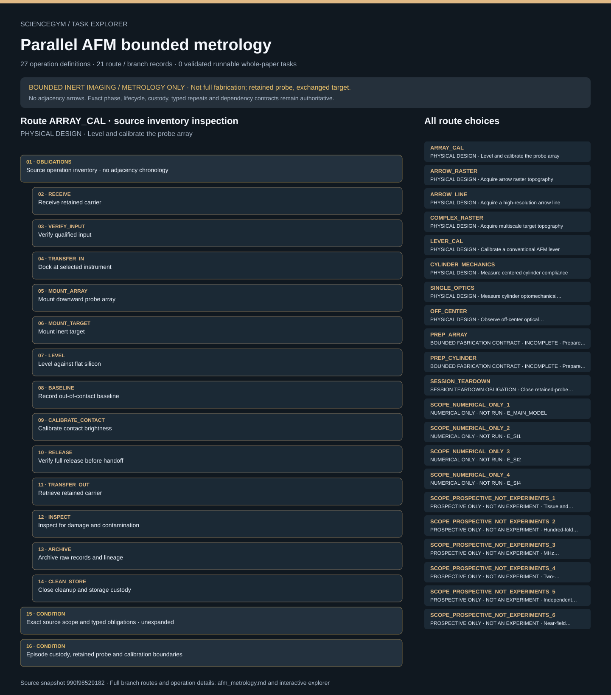

# Parallel AFM bounded metrology: task route map



Paper: **Massively parallel cantilever-free atomic force microscopy** · [DOI](https://doi.org/10.1038/s41467-020-20612-3)

Author/evaluator design reference only; not an actor projection, executable procedure, task runner, solver, physical simulation or execution receipt. Navigation and operation membership do not invent chronology, control settings, specimen counts or completed services. BOUNDED INERT IMAGING / METROLOGY ONLY; not full fabrication. The calibrated array or lever remains installed while targets or coupons are exchanged. Branch tails do not unmount the retained probe. Final session teardown invalidates calibration; calibration cannot be reused between episodes. Two incomplete fabrication preparation contracts remain separately gated. Prefabricated inputs never earn historical fabrication credit. Prospective extensions are not experiments.. Counts describe task representation, not experiments or success.

**Reading rule:** rows show unordered source inventory for inspection. Exact phase, lifecycle and dependency contracts remain authoritative; no loop, specimen, condition or chronology is inferred. An unordered obligation group has no inferred chronological edges. Source-reported scientific facts and authored handling are distinct.

[Immutable source task package](https://github.com/openags/ScienceGym/blob/990f98529182af0ddd03fba53587b0931630de96/tasks/afm_metrology_operations_v2/) · [Interactive inspector](../index.html)

## ARRAY_CAL — PHYSICAL DESIGN · Level and calibrate the probe array

Author/evaluator design reference only; not an actor projection, executable procedure, task runner, solver, physical simulation or execution receipt. Navigation and operation membership do not invent chronology, control settings, specimen counts or completed services. BOUNDED INERT IMAGING / METROLOGY ONLY; not full fabrication. The calibrated array or lever remains installed while targets or coupons are exchanged. Branch tails do not unmount the retained probe. Final session teardown invalidates calibration; calibration cannot be reused between episodes. Two incomplete fabrication preparation contracts remain separately gated. Prefabricated inputs never earn historical fabrication credit. Prospective extensions are not experiments.

[Exact route source](https://github.com/openags/ScienceGym/blob/990f98529182af0ddd03fba53587b0931630de96/tasks/afm_metrology_operations_v2/branches.json) · JSON pointer: `/branches/0`

- **OBLIGATIONS: Source operation inventory · no adjacency chronology**
  - Binding: {"order":"Unordered inspection membership. Apply exact source phase, lifecycle and dependency contracts; no counts or schedule are instantiated."}
  - `RECEIVE` Receive retained carrier
  - `VERIFY_INPUT` Verify qualified input
  - `TRANSFER_IN` Dock at selected instrument
  - `MOUNT_ARRAY` Mount downward probe array
  - `MOUNT_TARGET` Mount inert target
  - `LEVEL` Level against flat silicon
  - `BASELINE` Record out-of-contact baseline
  - `CALIBRATE_CONTACT` Calibrate contact brightness
  - `RELEASE` Verify full release before handoff
  - `TRANSFER_OUT` Retrieve retained carrier
  - `INSPECT` Inspect for damage and contamination
  - `ARCHIVE` Archive raw records and lineage
  - `CLEAN_STORE` Close cleanup and storage custody
- **CONDITION: Exact source scope and typed obligations · unexpanded**
  - Binding: {"source_file":"branches.json","source_pointer":"/branches/0","source_contract":{"id":"ARRAY_CAL","title":"Level and calibrate the probe array","type":"bounded_physical_metrology_design","setup_id":"parallel","specimen_role":"qualified_conical_array","target_role":"flat_silicon","depends_on":[],"source_evidence_ids":["E_ARRAY_CAL","E_SETUP","E_RELEASE"],"unknown_parameter_ids":["U_AUTHORITY","U_CAL_FIT","U_CAMERA","U_CLEAN","U_CONTACT","U_LEVEL","U_LINEAGE","U_MOUNT","U_ROBOT"],"operation_ids":["RECEIVE","VERIFY_INPUT","TRANSFER_IN","MOUNT_ARRAY","MOUNT_TARGET","LEVEL","BASELINE","CALIBRATE_CONTACT","RELEASE","TRANSFER_OUT","INSPECT","ARCHIVE","CLEAN_STORE"],"expected_output":"Per-probe optical-to-height calibration with current mount and optical version","source_independent_repeat_count":null,"default_repeat_count":null,"fabrication_is_precondition":true,"physical_execution_implemented":false,"retained_probe_role":"conical_array","exchange_custody_role":"target_or_coupon","branch_tail_scope":"Only the target or coupon is retrieved at branch tail; installed array/lever remains retained.","session_teardown_required_after_last_setup_branch":true,"calibration_reusable_between_episodes":false,"session_teardown_operation_id":"FINAL_SESSION_TEARDOWN"}}
- **CONDITION: Episode custody, retained probe and calibration boundaries**
  - Binding: {"source_file":"episode_input_contract.json","source_pointer":"","source_contract":{"schema_version":"afm_metrology_task.v1","doi":"10.1038/s41467-020-20612-3","required_initial_inputs":["qualified prefabricated conical array or cylindrical coupon as branch relevant","configured instrument and verified optics","qualified inert target/reference","calibrated force and motion sensor interface","branch-relevant qualified cards","registered specimen/probe/target custody","qualified bounded acquisition schedule"],"defaults_for_missing_cards":null,"production_inputs_accepted_by_mock":false,"array_and_lever_remain_installed_until_final_session_teardown":true,"calibration_reuse_between_episodes":false,"prefabricated_input_does_not_complete_fabrication":true}}

<details><summary>Branch state, choices, lineage and loop obligations</summary>

```json
{
  "id": "ARRAY_CAL",
  "title": "Level and calibrate the probe array",
  "type": "bounded_physical_metrology_design",
  "setup_id": "parallel",
  "specimen_role": "qualified_conical_array",
  "target_role": "flat_silicon",
  "depends_on": [],
  "source_evidence_ids": [
    "E_ARRAY_CAL",
    "E_SETUP",
    "E_RELEASE"
  ],
  "unknown_parameter_ids": [
    "U_AUTHORITY",
    "U_CAL_FIT",
    "U_CAMERA",
    "U_CLEAN",
    "U_CONTACT",
    "U_LEVEL",
    "U_LINEAGE",
    "U_MOUNT",
    "U_ROBOT"
  ],
  "operation_ids": [
    "RECEIVE",
    "VERIFY_INPUT",
    "TRANSFER_IN",
    "MOUNT_ARRAY",
    "MOUNT_TARGET",
    "LEVEL",
    "BASELINE",
    "CALIBRATE_CONTACT",
    "RELEASE",
    "TRANSFER_OUT",
    "INSPECT",
    "ARCHIVE",
    "CLEAN_STORE"
  ],
  "expected_output": "Per-probe optical-to-height calibration with current mount and optical version",
  "source_independent_repeat_count": null,
  "default_repeat_count": null,
  "fabrication_is_precondition": true,
  "physical_execution_implemented": false,
  "retained_probe_role": "conical_array",
  "exchange_custody_role": "target_or_coupon",
  "branch_tail_scope": "Only the target or coupon is retrieved at branch tail; installed array/lever remains retained.",
  "session_teardown_required_after_last_setup_branch": true,
  "calibration_reusable_between_episodes": false,
  "session_teardown_operation_id": "FINAL_SESSION_TEARDOWN"
}
```

</details>

## ARROW_RASTER — PHYSICAL DESIGN · Acquire arrow raster topography

Author/evaluator design reference only; not an actor projection, executable procedure, task runner, solver, physical simulation or execution receipt. Navigation and operation membership do not invent chronology, control settings, specimen counts or completed services. BOUNDED INERT IMAGING / METROLOGY ONLY; not full fabrication. The calibrated array or lever remains installed while targets or coupons are exchanged. Branch tails do not unmount the retained probe. Final session teardown invalidates calibration; calibration cannot be reused between episodes. Two incomplete fabrication preparation contracts remain separately gated. Prefabricated inputs never earn historical fabrication credit. Prospective extensions are not experiments.

[Exact route source](https://github.com/openags/ScienceGym/blob/990f98529182af0ddd03fba53587b0931630de96/tasks/afm_metrology_operations_v2/branches.json) · JSON pointer: `/branches/1`

- **OBLIGATIONS: Source operation inventory · no adjacency chronology**
  - Binding: {"order":"Unordered inspection membership. Apply exact source phase, lifecycle and dependency contracts; no counts or schedule are instantiated."}
  - `RECEIVE` Receive retained carrier
  - `VERIFY_INPUT` Verify qualified input
  - `TRANSFER_IN` Dock at selected instrument
  - `MOUNT_TARGET` Mount inert target
  - `REGISTER_TARGET` Register selected target region
  - `RASTER` Acquire intermittent-contact raster
  - `RELEASE` Verify full release before handoff
  - `TRANSFER_OUT` Retrieve retained carrier
  - `INSPECT` Inspect for damage and contamination
  - `ARCHIVE` Archive raw records and lineage
  - `CLEAN_STORE` Close cleanup and storage custody
- **CONDITION: Exact source scope and typed obligations · unexpanded**
  - Binding: {"source_file":"branches.json","source_pointer":"/branches/1","source_contract":{"id":"ARROW_RASTER","title":"Acquire arrow raster topography","type":"bounded_physical_metrology_design","setup_id":"parallel","specimen_role":"qualified_conical_array","target_role":"arrow_target","depends_on":["ARRAY_CAL"],"source_evidence_ids":["E_ARROW","E_SCAN","E_RELEASE","E_RECON"],"unknown_parameter_ids":["U_ANALYSIS","U_AUTHORITY","U_CAMERA","U_CLEAN","U_CONTACT","U_LINEAGE","U_MOUNT","U_REFERENCE","U_ROBOT","U_SCAN"],"operation_ids":["RECEIVE","VERIFY_INPUT","TRANSFER_IN","MOUNT_TARGET","REGISTER_TARGET","RASTER","RELEASE","TRANSFER_OUT","INSPECT","ARCHIVE","CLEAN_STORE"],"expected_output":"Raw frame sequence and separately analyzed arrow map","source_independent_repeat_count":null,"default_repeat_count":null,"fabrication_is_precondition":true,"physical_execution_implemented":false,"retained_probe_role":"conical_array","exchange_custody_role":"target_or_coupon","branch_tail_scope":"Only the target or coupon is retrieved at branch tail; installed array/lever remains retained.","session_teardown_required_after_last_setup_branch":true,"calibration_reusable_between_episodes":false,"session_teardown_operation_id":"FINAL_SESSION_TEARDOWN"}}
- **CONDITION: Episode custody, retained probe and calibration boundaries**
  - Binding: {"source_file":"episode_input_contract.json","source_pointer":"","source_contract":{"schema_version":"afm_metrology_task.v1","doi":"10.1038/s41467-020-20612-3","required_initial_inputs":["qualified prefabricated conical array or cylindrical coupon as branch relevant","configured instrument and verified optics","qualified inert target/reference","calibrated force and motion sensor interface","branch-relevant qualified cards","registered specimen/probe/target custody","qualified bounded acquisition schedule"],"defaults_for_missing_cards":null,"production_inputs_accepted_by_mock":false,"array_and_lever_remain_installed_until_final_session_teardown":true,"calibration_reuse_between_episodes":false,"prefabricated_input_does_not_complete_fabrication":true}}

<details><summary>Branch state, choices, lineage and loop obligations</summary>

```json
{
  "id": "ARROW_RASTER",
  "title": "Acquire arrow raster topography",
  "type": "bounded_physical_metrology_design",
  "setup_id": "parallel",
  "specimen_role": "qualified_conical_array",
  "target_role": "arrow_target",
  "depends_on": [
    "ARRAY_CAL"
  ],
  "source_evidence_ids": [
    "E_ARROW",
    "E_SCAN",
    "E_RELEASE",
    "E_RECON"
  ],
  "unknown_parameter_ids": [
    "U_ANALYSIS",
    "U_AUTHORITY",
    "U_CAMERA",
    "U_CLEAN",
    "U_CONTACT",
    "U_LINEAGE",
    "U_MOUNT",
    "U_REFERENCE",
    "U_ROBOT",
    "U_SCAN"
  ],
  "operation_ids": [
    "RECEIVE",
    "VERIFY_INPUT",
    "TRANSFER_IN",
    "MOUNT_TARGET",
    "REGISTER_TARGET",
    "RASTER",
    "RELEASE",
    "TRANSFER_OUT",
    "INSPECT",
    "ARCHIVE",
    "CLEAN_STORE"
  ],
  "expected_output": "Raw frame sequence and separately analyzed arrow map",
  "source_independent_repeat_count": null,
  "default_repeat_count": null,
  "fabrication_is_precondition": true,
  "physical_execution_implemented": false,
  "retained_probe_role": "conical_array",
  "exchange_custody_role": "target_or_coupon",
  "branch_tail_scope": "Only the target or coupon is retrieved at branch tail; installed array/lever remains retained.",
  "session_teardown_required_after_last_setup_branch": true,
  "calibration_reusable_between_episodes": false,
  "session_teardown_operation_id": "FINAL_SESSION_TEARDOWN"
}
```

</details>

## ARROW_LINE — PHYSICAL DESIGN · Acquire a high-resolution arrow line

Author/evaluator design reference only; not an actor projection, executable procedure, task runner, solver, physical simulation or execution receipt. Navigation and operation membership do not invent chronology, control settings, specimen counts or completed services. BOUNDED INERT IMAGING / METROLOGY ONLY; not full fabrication. The calibrated array or lever remains installed while targets or coupons are exchanged. Branch tails do not unmount the retained probe. Final session teardown invalidates calibration; calibration cannot be reused between episodes. Two incomplete fabrication preparation contracts remain separately gated. Prefabricated inputs never earn historical fabrication credit. Prospective extensions are not experiments.

[Exact route source](https://github.com/openags/ScienceGym/blob/990f98529182af0ddd03fba53587b0931630de96/tasks/afm_metrology_operations_v2/branches.json) · JSON pointer: `/branches/2`

- **OBLIGATIONS: Source operation inventory · no adjacency chronology**
  - Binding: {"order":"Unordered inspection membership. Apply exact source phase, lifecycle and dependency contracts; no counts or schedule are instantiated."}
  - `RECEIVE` Receive retained carrier
  - `VERIFY_INPUT` Verify qualified input
  - `TRANSFER_IN` Dock at selected instrument
  - `MOUNT_TARGET` Mount inert target
  - `REGISTER_TARGET` Register selected target region
  - `LINE` Acquire intermittent-contact line
  - `RELEASE` Verify full release before handoff
  - `TRANSFER_OUT` Retrieve retained carrier
  - `INSPECT` Inspect for damage and contamination
  - `ARCHIVE` Archive raw records and lineage
  - `CLEAN_STORE` Close cleanup and storage custody
- **CONDITION: Exact source scope and typed obligations · unexpanded**
  - Binding: {"source_file":"branches.json","source_pointer":"/branches/2","source_contract":{"id":"ARROW_LINE","title":"Acquire a high-resolution arrow line","type":"bounded_physical_metrology_design","setup_id":"parallel","specimen_role":"qualified_conical_array","target_role":"arrow_target","depends_on":["ARRAY_CAL"],"source_evidence_ids":["E_LINE","E_SCAN","E_RELEASE"],"unknown_parameter_ids":["U_ANALYSIS","U_AUTHORITY","U_CAMERA","U_CLEAN","U_CONTACT","U_LINEAGE","U_MOUNT","U_REFERENCE","U_ROBOT","U_SCAN"],"operation_ids":["RECEIVE","VERIFY_INPUT","TRANSFER_IN","MOUNT_TARGET","REGISTER_TARGET","LINE","RELEASE","TRANSFER_OUT","INSPECT","ARCHIVE","CLEAN_STORE"],"expected_output":"Raw line frames with 100 nm source step, defined extent and flat-region selection","source_independent_repeat_count":null,"default_repeat_count":null,"fabrication_is_precondition":true,"physical_execution_implemented":false,"retained_probe_role":"conical_array","exchange_custody_role":"target_or_coupon","branch_tail_scope":"Only the target or coupon is retrieved at branch tail; installed array/lever remains retained.","session_teardown_required_after_last_setup_branch":true,"calibration_reusable_between_episodes":false,"session_teardown_operation_id":"FINAL_SESSION_TEARDOWN"}}
- **CONDITION: Episode custody, retained probe and calibration boundaries**
  - Binding: {"source_file":"episode_input_contract.json","source_pointer":"","source_contract":{"schema_version":"afm_metrology_task.v1","doi":"10.1038/s41467-020-20612-3","required_initial_inputs":["qualified prefabricated conical array or cylindrical coupon as branch relevant","configured instrument and verified optics","qualified inert target/reference","calibrated force and motion sensor interface","branch-relevant qualified cards","registered specimen/probe/target custody","qualified bounded acquisition schedule"],"defaults_for_missing_cards":null,"production_inputs_accepted_by_mock":false,"array_and_lever_remain_installed_until_final_session_teardown":true,"calibration_reuse_between_episodes":false,"prefabricated_input_does_not_complete_fabrication":true}}

<details><summary>Branch state, choices, lineage and loop obligations</summary>

```json
{
  "id": "ARROW_LINE",
  "title": "Acquire a high-resolution arrow line",
  "type": "bounded_physical_metrology_design",
  "setup_id": "parallel",
  "specimen_role": "qualified_conical_array",
  "target_role": "arrow_target",
  "depends_on": [
    "ARRAY_CAL"
  ],
  "source_evidence_ids": [
    "E_LINE",
    "E_SCAN",
    "E_RELEASE"
  ],
  "unknown_parameter_ids": [
    "U_ANALYSIS",
    "U_AUTHORITY",
    "U_CAMERA",
    "U_CLEAN",
    "U_CONTACT",
    "U_LINEAGE",
    "U_MOUNT",
    "U_REFERENCE",
    "U_ROBOT",
    "U_SCAN"
  ],
  "operation_ids": [
    "RECEIVE",
    "VERIFY_INPUT",
    "TRANSFER_IN",
    "MOUNT_TARGET",
    "REGISTER_TARGET",
    "LINE",
    "RELEASE",
    "TRANSFER_OUT",
    "INSPECT",
    "ARCHIVE",
    "CLEAN_STORE"
  ],
  "expected_output": "Raw line frames with 100 nm source step, defined extent and flat-region selection",
  "source_independent_repeat_count": null,
  "default_repeat_count": null,
  "fabrication_is_precondition": true,
  "physical_execution_implemented": false,
  "retained_probe_role": "conical_array",
  "exchange_custody_role": "target_or_coupon",
  "branch_tail_scope": "Only the target or coupon is retrieved at branch tail; installed array/lever remains retained.",
  "session_teardown_required_after_last_setup_branch": true,
  "calibration_reusable_between_episodes": false,
  "session_teardown_operation_id": "FINAL_SESSION_TEARDOWN"
}
```

</details>

## COMPLEX_RASTER — PHYSICAL DESIGN · Acquire multiscale target topography

Author/evaluator design reference only; not an actor projection, executable procedure, task runner, solver, physical simulation or execution receipt. Navigation and operation membership do not invent chronology, control settings, specimen counts or completed services. BOUNDED INERT IMAGING / METROLOGY ONLY; not full fabrication. The calibrated array or lever remains installed while targets or coupons are exchanged. Branch tails do not unmount the retained probe. Final session teardown invalidates calibration; calibration cannot be reused between episodes. Two incomplete fabrication preparation contracts remain separately gated. Prefabricated inputs never earn historical fabrication credit. Prospective extensions are not experiments.

[Exact route source](https://github.com/openags/ScienceGym/blob/990f98529182af0ddd03fba53587b0931630de96/tasks/afm_metrology_operations_v2/branches.json) · JSON pointer: `/branches/3`

- **OBLIGATIONS: Source operation inventory · no adjacency chronology**
  - Binding: {"order":"Unordered inspection membership. Apply exact source phase, lifecycle and dependency contracts; no counts or schedule are instantiated."}
  - `RECEIVE` Receive retained carrier
  - `VERIFY_INPUT` Verify qualified input
  - `TRANSFER_IN` Dock at selected instrument
  - `MOUNT_TARGET` Mount inert target
  - `REGISTER_TARGET` Register selected target region
  - `RASTER` Acquire intermittent-contact raster
  - `RELEASE` Verify full release before handoff
  - `TRANSFER_OUT` Retrieve retained carrier
  - `INSPECT` Inspect for damage and contamination
  - `ARCHIVE` Archive raw records and lineage
  - `CLEAN_STORE` Close cleanup and storage custody
- **CONDITION: Exact source scope and typed obligations · unexpanded**
  - Binding: {"source_file":"branches.json","source_pointer":"/branches/3","source_contract":{"id":"COMPLEX_RASTER","title":"Acquire multiscale target topography","type":"bounded_physical_metrology_design","setup_id":"parallel","specimen_role":"qualified_conical_array","target_role":"complex_target","depends_on":["ARRAY_CAL"],"source_evidence_ids":["E_COMPLEX","E_SCAN","E_RELEASE","E_RECON"],"unknown_parameter_ids":["U_ANALYSIS","U_AUTHORITY","U_CAMERA","U_CLEAN","U_CONTACT","U_LINEAGE","U_MOUNT","U_ROBOT","U_SCAN"],"operation_ids":["RECEIVE","VERIFY_INPUT","TRANSFER_IN","MOUNT_TARGET","REGISTER_TARGET","RASTER","RELEASE","TRANSFER_OUT","INSPECT","ARCHIVE","CLEAN_STORE"],"expected_output":"Raw complex-region frames and reconstruction lineage","source_independent_repeat_count":null,"default_repeat_count":null,"fabrication_is_precondition":true,"physical_execution_implemented":false,"retained_probe_role":"conical_array","exchange_custody_role":"target_or_coupon","branch_tail_scope":"Only the target or coupon is retrieved at branch tail; installed array/lever remains retained.","session_teardown_required_after_last_setup_branch":true,"calibration_reusable_between_episodes":false,"session_teardown_operation_id":"FINAL_SESSION_TEARDOWN"}}
- **CONDITION: Episode custody, retained probe and calibration boundaries**
  - Binding: {"source_file":"episode_input_contract.json","source_pointer":"","source_contract":{"schema_version":"afm_metrology_task.v1","doi":"10.1038/s41467-020-20612-3","required_initial_inputs":["qualified prefabricated conical array or cylindrical coupon as branch relevant","configured instrument and verified optics","qualified inert target/reference","calibrated force and motion sensor interface","branch-relevant qualified cards","registered specimen/probe/target custody","qualified bounded acquisition schedule"],"defaults_for_missing_cards":null,"production_inputs_accepted_by_mock":false,"array_and_lever_remain_installed_until_final_session_teardown":true,"calibration_reuse_between_episodes":false,"prefabricated_input_does_not_complete_fabrication":true}}

<details><summary>Branch state, choices, lineage and loop obligations</summary>

```json
{
  "id": "COMPLEX_RASTER",
  "title": "Acquire multiscale target topography",
  "type": "bounded_physical_metrology_design",
  "setup_id": "parallel",
  "specimen_role": "qualified_conical_array",
  "target_role": "complex_target",
  "depends_on": [
    "ARRAY_CAL"
  ],
  "source_evidence_ids": [
    "E_COMPLEX",
    "E_SCAN",
    "E_RELEASE",
    "E_RECON"
  ],
  "unknown_parameter_ids": [
    "U_ANALYSIS",
    "U_AUTHORITY",
    "U_CAMERA",
    "U_CLEAN",
    "U_CONTACT",
    "U_LINEAGE",
    "U_MOUNT",
    "U_ROBOT",
    "U_SCAN"
  ],
  "operation_ids": [
    "RECEIVE",
    "VERIFY_INPUT",
    "TRANSFER_IN",
    "MOUNT_TARGET",
    "REGISTER_TARGET",
    "RASTER",
    "RELEASE",
    "TRANSFER_OUT",
    "INSPECT",
    "ARCHIVE",
    "CLEAN_STORE"
  ],
  "expected_output": "Raw complex-region frames and reconstruction lineage",
  "source_independent_repeat_count": null,
  "default_repeat_count": null,
  "fabrication_is_precondition": true,
  "physical_execution_implemented": false,
  "retained_probe_role": "conical_array",
  "exchange_custody_role": "target_or_coupon",
  "branch_tail_scope": "Only the target or coupon is retrieved at branch tail; installed array/lever remains retained.",
  "session_teardown_required_after_last_setup_branch": true,
  "calibration_reusable_between_episodes": false,
  "session_teardown_operation_id": "FINAL_SESSION_TEARDOWN"
}
```

</details>

## LEVER_CAL — PHYSICAL DESIGN · Calibrate a conventional AFM lever

Author/evaluator design reference only; not an actor projection, executable procedure, task runner, solver, physical simulation or execution receipt. Navigation and operation membership do not invent chronology, control settings, specimen counts or completed services. BOUNDED INERT IMAGING / METROLOGY ONLY; not full fabrication. The calibrated array or lever remains installed while targets or coupons are exchanged. Branch tails do not unmount the retained probe. Final session teardown invalidates calibration; calibration cannot be reused between episodes. Two incomplete fabrication preparation contracts remain separately gated. Prefabricated inputs never earn historical fabrication credit. Prospective extensions are not experiments.

[Exact route source](https://github.com/openags/ScienceGym/blob/990f98529182af0ddd03fba53587b0931630de96/tasks/afm_metrology_operations_v2/branches.json) · JSON pointer: `/branches/4`

- **OBLIGATIONS: Source operation inventory · no adjacency chronology**
  - Binding: {"order":"Unordered inspection membership. Apply exact source phase, lifecycle and dependency contracts; no counts or schedule are instantiated."}
  - `RECEIVE` Receive retained carrier
  - `VERIFY_INPUT` Verify qualified input
  - `TRANSFER_IN` Dock at selected instrument
  - `MOUNT_LEVER` Mount conventional AFM lever
  - `MOUNT_TARGET` Mount inert target
  - `THERMAL_PSD` Record lever thermal response
  - `GLASS_SENSITIVITY` Record rigid-reference sensitivity
  - `RELEASE` Verify full release before handoff
  - `TRANSFER_OUT` Retrieve retained carrier
  - `INSPECT` Inspect for damage and contamination
  - `ARCHIVE` Archive raw records and lineage
  - `CLEAN_STORE` Close cleanup and storage custody
- **CONDITION: Exact source scope and typed obligations · unexpanded**
  - Binding: {"source_file":"branches.json","source_pointer":"/branches/4","source_contract":{"id":"LEVER_CAL","title":"Calibrate a conventional AFM lever","type":"bounded_physical_metrology_design","setup_id":"coupon","specimen_role":"qualified_conventional_lever","target_role":"rigid_glass","depends_on":[],"source_evidence_ids":["E_SI3"],"unknown_parameter_ids":["U_AUTHORITY","U_CLEAN","U_CONTACT","U_LEVER","U_LINEAGE","U_MOUNT","U_ROBOT"],"operation_ids":["RECEIVE","VERIFY_INPUT","TRANSFER_IN","MOUNT_LEVER","MOUNT_TARGET","THERMAL_PSD","GLASS_SENSITIVITY","RELEASE","TRANSFER_OUT","INSPECT","ARCHIVE","CLEAN_STORE"],"expected_output":"Thermal and rigid-glass records for conventional-lever stiffness and sensitivity","source_independent_repeat_count":null,"default_repeat_count":null,"fabrication_is_precondition":true,"physical_execution_implemented":false,"retained_probe_role":"conventional_lever","exchange_custody_role":"target_or_coupon","branch_tail_scope":"Only the target or coupon is retrieved at branch tail; installed array/lever remains retained.","session_teardown_required_after_last_setup_branch":true,"calibration_reusable_between_episodes":false,"session_teardown_operation_id":"FINAL_SESSION_TEARDOWN"}}
- **CONDITION: Episode custody, retained probe and calibration boundaries**
  - Binding: {"source_file":"episode_input_contract.json","source_pointer":"","source_contract":{"schema_version":"afm_metrology_task.v1","doi":"10.1038/s41467-020-20612-3","required_initial_inputs":["qualified prefabricated conical array or cylindrical coupon as branch relevant","configured instrument and verified optics","qualified inert target/reference","calibrated force and motion sensor interface","branch-relevant qualified cards","registered specimen/probe/target custody","qualified bounded acquisition schedule"],"defaults_for_missing_cards":null,"production_inputs_accepted_by_mock":false,"array_and_lever_remain_installed_until_final_session_teardown":true,"calibration_reuse_between_episodes":false,"prefabricated_input_does_not_complete_fabrication":true}}

<details><summary>Branch state, choices, lineage and loop obligations</summary>

```json
{
  "id": "LEVER_CAL",
  "title": "Calibrate a conventional AFM lever",
  "type": "bounded_physical_metrology_design",
  "setup_id": "coupon",
  "specimen_role": "qualified_conventional_lever",
  "target_role": "rigid_glass",
  "depends_on": [],
  "source_evidence_ids": [
    "E_SI3"
  ],
  "unknown_parameter_ids": [
    "U_AUTHORITY",
    "U_CLEAN",
    "U_CONTACT",
    "U_LEVER",
    "U_LINEAGE",
    "U_MOUNT",
    "U_ROBOT"
  ],
  "operation_ids": [
    "RECEIVE",
    "VERIFY_INPUT",
    "TRANSFER_IN",
    "MOUNT_LEVER",
    "MOUNT_TARGET",
    "THERMAL_PSD",
    "GLASS_SENSITIVITY",
    "RELEASE",
    "TRANSFER_OUT",
    "INSPECT",
    "ARCHIVE",
    "CLEAN_STORE"
  ],
  "expected_output": "Thermal and rigid-glass records for conventional-lever stiffness and sensitivity",
  "source_independent_repeat_count": null,
  "default_repeat_count": null,
  "fabrication_is_precondition": true,
  "physical_execution_implemented": false,
  "retained_probe_role": "conventional_lever",
  "exchange_custody_role": "target_or_coupon",
  "branch_tail_scope": "Only the target or coupon is retrieved at branch tail; installed array/lever remains retained.",
  "session_teardown_required_after_last_setup_branch": true,
  "calibration_reusable_between_episodes": false,
  "session_teardown_operation_id": "FINAL_SESSION_TEARDOWN"
}
```

</details>

## CYLINDER_MECHANICS — PHYSICAL DESIGN · Measure centered cylinder compliance

Author/evaluator design reference only; not an actor projection, executable procedure, task runner, solver, physical simulation or execution receipt. Navigation and operation membership do not invent chronology, control settings, specimen counts or completed services. BOUNDED INERT IMAGING / METROLOGY ONLY; not full fabrication. The calibrated array or lever remains installed while targets or coupons are exchanged. Branch tails do not unmount the retained probe. Final session teardown invalidates calibration; calibration cannot be reused between episodes. Two incomplete fabrication preparation contracts remain separately gated. Prefabricated inputs never earn historical fabrication credit. Prospective extensions are not experiments.

[Exact route source](https://github.com/openags/ScienceGym/blob/990f98529182af0ddd03fba53587b0931630de96/tasks/afm_metrology_operations_v2/branches.json) · JSON pointer: `/branches/5`

- **OBLIGATIONS: Source operation inventory · no adjacency chronology**
  - Binding: {"order":"Unordered inspection membership. Apply exact source phase, lifecycle and dependency contracts; no counts or schedule are instantiated."}
  - `RECEIVE` Receive retained carrier
  - `VERIFY_INPUT` Verify qualified input
  - `TRANSFER_IN` Dock at selected instrument
  - `MOUNT_COUPON` Mount cylindrical probe coupon
  - `LOCATE_CENTER` Locate cylinder center
  - `FORCE_DISTANCE` Acquire centered force-distance curves
  - `RELEASE` Verify full release before handoff
  - `TRANSFER_OUT` Retrieve retained carrier
  - `INSPECT` Inspect for damage and contamination
  - `ARCHIVE` Archive raw records and lineage
  - `CLEAN_STORE` Close cleanup and storage custody
- **CONDITION: Exact source scope and typed obligations · unexpanded**
  - Binding: {"source_file":"branches.json","source_pointer":"/branches/5","source_contract":{"id":"CYLINDER_MECHANICS","title":"Measure centered cylinder compliance","type":"bounded_physical_metrology_design","setup_id":"coupon","specimen_role":"qualified_cylinder_coupon","target_role":"cylinder","depends_on":["LEVER_CAL"],"source_evidence_ids":["E_SI3"],"unknown_parameter_ids":["U_ANALYSIS","U_AUTHORITY","U_CLEAN","U_CONTACT","U_CYLINDER","U_LINEAGE","U_MOUNT","U_ROBOT"],"operation_ids":["RECEIVE","VERIFY_INPUT","TRANSFER_IN","MOUNT_COUPON","LOCATE_CENTER","FORCE_DISTANCE","RELEASE","TRANSFER_OUT","INSPECT","ARCHIVE","CLEAN_STORE"],"expected_output":"Force-distance curves indexed by actual cylinder radius and coupon identity","source_independent_repeat_count":null,"default_repeat_count":null,"fabrication_is_precondition":true,"physical_execution_implemented":false,"retained_probe_role":"conventional_lever","exchange_custody_role":"target_or_coupon","branch_tail_scope":"Only the target or coupon is retrieved at branch tail; installed array/lever remains retained.","session_teardown_required_after_last_setup_branch":true,"calibration_reusable_between_episodes":false,"session_teardown_operation_id":"FINAL_SESSION_TEARDOWN"}}
- **CONDITION: Episode custody, retained probe and calibration boundaries**
  - Binding: {"source_file":"episode_input_contract.json","source_pointer":"","source_contract":{"schema_version":"afm_metrology_task.v1","doi":"10.1038/s41467-020-20612-3","required_initial_inputs":["qualified prefabricated conical array or cylindrical coupon as branch relevant","configured instrument and verified optics","qualified inert target/reference","calibrated force and motion sensor interface","branch-relevant qualified cards","registered specimen/probe/target custody","qualified bounded acquisition schedule"],"defaults_for_missing_cards":null,"production_inputs_accepted_by_mock":false,"array_and_lever_remain_installed_until_final_session_teardown":true,"calibration_reuse_between_episodes":false,"prefabricated_input_does_not_complete_fabrication":true}}

<details><summary>Branch state, choices, lineage and loop obligations</summary>

```json
{
  "id": "CYLINDER_MECHANICS",
  "title": "Measure centered cylinder compliance",
  "type": "bounded_physical_metrology_design",
  "setup_id": "coupon",
  "specimen_role": "qualified_cylinder_coupon",
  "target_role": "cylinder",
  "depends_on": [
    "LEVER_CAL"
  ],
  "source_evidence_ids": [
    "E_SI3"
  ],
  "unknown_parameter_ids": [
    "U_ANALYSIS",
    "U_AUTHORITY",
    "U_CLEAN",
    "U_CONTACT",
    "U_CYLINDER",
    "U_LINEAGE",
    "U_MOUNT",
    "U_ROBOT"
  ],
  "operation_ids": [
    "RECEIVE",
    "VERIFY_INPUT",
    "TRANSFER_IN",
    "MOUNT_COUPON",
    "LOCATE_CENTER",
    "FORCE_DISTANCE",
    "RELEASE",
    "TRANSFER_OUT",
    "INSPECT",
    "ARCHIVE",
    "CLEAN_STORE"
  ],
  "expected_output": "Force-distance curves indexed by actual cylinder radius and coupon identity",
  "source_independent_repeat_count": null,
  "default_repeat_count": null,
  "fabrication_is_precondition": true,
  "physical_execution_implemented": false,
  "retained_probe_role": "conventional_lever",
  "exchange_custody_role": "target_or_coupon",
  "branch_tail_scope": "Only the target or coupon is retrieved at branch tail; installed array/lever remains retained.",
  "session_teardown_required_after_last_setup_branch": true,
  "calibration_reusable_between_episodes": false,
  "session_teardown_operation_id": "FINAL_SESSION_TEARDOWN"
}
```

</details>

## SINGLE_OPTICS — PHYSICAL DESIGN · Measure cylinder optomechanical response

Author/evaluator design reference only; not an actor projection, executable procedure, task runner, solver, physical simulation or execution receipt. Navigation and operation membership do not invent chronology, control settings, specimen counts or completed services. BOUNDED INERT IMAGING / METROLOGY ONLY; not full fabrication. The calibrated array or lever remains installed while targets or coupons are exchanged. Branch tails do not unmount the retained probe. Final session teardown invalidates calibration; calibration cannot be reused between episodes. Two incomplete fabrication preparation contracts remain separately gated. Prefabricated inputs never earn historical fabrication credit. Prospective extensions are not experiments.

[Exact route source](https://github.com/openags/ScienceGym/blob/990f98529182af0ddd03fba53587b0931630de96/tasks/afm_metrology_operations_v2/branches.json) · JSON pointer: `/branches/6`

- **OBLIGATIONS: Source operation inventory · no adjacency chronology**
  - Binding: {"order":"Unordered inspection membership. Apply exact source phase, lifecycle and dependency contracts; no counts or schedule are instantiated."}
  - `RECEIVE` Receive retained carrier
  - `VERIFY_INPUT` Verify qualified input
  - `TRANSFER_IN` Dock at selected instrument
  - `MOUNT_COUPON` Mount cylindrical probe coupon
  - `LOCATE_CENTER` Locate cylinder center
  - `BASELINE` Record out-of-contact baseline
  - `SYNCHRONIZED_FORCE_OPTICS` Acquire synchronized force and optics
  - `RELEASE` Verify full release before handoff
  - `TRANSFER_OUT` Retrieve retained carrier
  - `INSPECT` Inspect for damage and contamination
  - `ARCHIVE` Archive raw records and lineage
  - `CLEAN_STORE` Close cleanup and storage custody
- **CONDITION: Exact source scope and typed obligations · unexpanded**
  - Binding: {"source_file":"branches.json","source_pointer":"/branches/6","source_contract":{"id":"SINGLE_OPTICS","title":"Measure cylinder optomechanical response","type":"bounded_physical_metrology_design","setup_id":"coupon","specimen_role":"qualified_cylinder_coupon","target_role":"cylinder","depends_on":["LEVER_CAL"],"source_evidence_ids":["E_SI5","E_SI3"],"unknown_parameter_ids":["U_ANALYSIS","U_AUTHORITY","U_CAMERA","U_CLEAN","U_CONTACT","U_CYLINDER","U_LINEAGE","U_MOUNT","U_ROBOT"],"operation_ids":["RECEIVE","VERIFY_INPUT","TRANSFER_IN","MOUNT_COUPON","LOCATE_CENTER","BASELINE","SYNCHRONIZED_FORCE_OPTICS","RELEASE","TRANSFER_OUT","INSPECT","ARCHIVE","CLEAN_STORE"],"expected_output":"Synchronized force/indentation/brightness records using SI-specific optical metric","source_independent_repeat_count":null,"default_repeat_count":null,"fabrication_is_precondition":true,"physical_execution_implemented":false,"retained_probe_role":"conventional_lever","exchange_custody_role":"target_or_coupon","branch_tail_scope":"Only the target or coupon is retrieved at branch tail; installed array/lever remains retained.","session_teardown_required_after_last_setup_branch":true,"calibration_reusable_between_episodes":false,"session_teardown_operation_id":"FINAL_SESSION_TEARDOWN"}}
- **CONDITION: Episode custody, retained probe and calibration boundaries**
  - Binding: {"source_file":"episode_input_contract.json","source_pointer":"","source_contract":{"schema_version":"afm_metrology_task.v1","doi":"10.1038/s41467-020-20612-3","required_initial_inputs":["qualified prefabricated conical array or cylindrical coupon as branch relevant","configured instrument and verified optics","qualified inert target/reference","calibrated force and motion sensor interface","branch-relevant qualified cards","registered specimen/probe/target custody","qualified bounded acquisition schedule"],"defaults_for_missing_cards":null,"production_inputs_accepted_by_mock":false,"array_and_lever_remain_installed_until_final_session_teardown":true,"calibration_reuse_between_episodes":false,"prefabricated_input_does_not_complete_fabrication":true}}

<details><summary>Branch state, choices, lineage and loop obligations</summary>

```json
{
  "id": "SINGLE_OPTICS",
  "title": "Measure cylinder optomechanical response",
  "type": "bounded_physical_metrology_design",
  "setup_id": "coupon",
  "specimen_role": "qualified_cylinder_coupon",
  "target_role": "cylinder",
  "depends_on": [
    "LEVER_CAL"
  ],
  "source_evidence_ids": [
    "E_SI5",
    "E_SI3"
  ],
  "unknown_parameter_ids": [
    "U_ANALYSIS",
    "U_AUTHORITY",
    "U_CAMERA",
    "U_CLEAN",
    "U_CONTACT",
    "U_CYLINDER",
    "U_LINEAGE",
    "U_MOUNT",
    "U_ROBOT"
  ],
  "operation_ids": [
    "RECEIVE",
    "VERIFY_INPUT",
    "TRANSFER_IN",
    "MOUNT_COUPON",
    "LOCATE_CENTER",
    "BASELINE",
    "SYNCHRONIZED_FORCE_OPTICS",
    "RELEASE",
    "TRANSFER_OUT",
    "INSPECT",
    "ARCHIVE",
    "CLEAN_STORE"
  ],
  "expected_output": "Synchronized force/indentation/brightness records using SI-specific optical metric",
  "source_independent_repeat_count": null,
  "default_repeat_count": null,
  "fabrication_is_precondition": true,
  "physical_execution_implemented": false,
  "retained_probe_role": "conventional_lever",
  "exchange_custody_role": "target_or_coupon",
  "branch_tail_scope": "Only the target or coupon is retrieved at branch tail; installed array/lever remains retained.",
  "session_teardown_required_after_last_setup_branch": true,
  "calibration_reusable_between_episodes": false,
  "session_teardown_operation_id": "FINAL_SESSION_TEARDOWN"
}
```

</details>

## OFF_CENTER — PHYSICAL DESIGN · Observe off-center optical deformation

Author/evaluator design reference only; not an actor projection, executable procedure, task runner, solver, physical simulation or execution receipt. Navigation and operation membership do not invent chronology, control settings, specimen counts or completed services. BOUNDED INERT IMAGING / METROLOGY ONLY; not full fabrication. The calibrated array or lever remains installed while targets or coupons are exchanged. Branch tails do not unmount the retained probe. Final session teardown invalidates calibration; calibration cannot be reused between episodes. Two incomplete fabrication preparation contracts remain separately gated. Prefabricated inputs never earn historical fabrication credit. Prospective extensions are not experiments.

[Exact route source](https://github.com/openags/ScienceGym/blob/990f98529182af0ddd03fba53587b0931630de96/tasks/afm_metrology_operations_v2/branches.json) · JSON pointer: `/branches/7`

- **OBLIGATIONS: Source operation inventory · no adjacency chronology**
  - Binding: {"order":"Unordered inspection membership. Apply exact source phase, lifecycle and dependency contracts; no counts or schedule are instantiated."}
  - `RECEIVE` Receive retained carrier
  - `VERIFY_INPUT` Verify qualified input
  - `TRANSFER_IN` Dock at selected instrument
  - `MOUNT_COUPON` Mount cylindrical probe coupon
  - `LOCATE_CENTER` Locate cylinder center
  - `OFF_CENTER_SCHEDULE` Acquire off-center normal-loading series
  - `RELEASE` Verify full release before handoff
  - `TRANSFER_OUT` Retrieve retained carrier
  - `INSPECT` Inspect for damage and contamination
  - `ARCHIVE` Archive raw records and lineage
  - `CLEAN_STORE` Close cleanup and storage custody
- **CONDITION: Exact source scope and typed obligations · unexpanded**
  - Binding: {"source_file":"branches.json","source_pointer":"/branches/7","source_contract":{"id":"OFF_CENTER","title":"Observe off-center optical deformation","type":"bounded_physical_metrology_design","setup_id":"coupon","specimen_role":"qualified_cylinder_coupon","target_role":"cylinder","depends_on":["LEVER_CAL"],"source_evidence_ids":["E_SI7","E_SI3","E_SI5"],"unknown_parameter_ids":["U_ANALYSIS","U_AUTHORITY","U_CAMERA","U_CLEAN","U_CONTACT","U_CYLINDER","U_LINEAGE","U_MOUNT","U_OFFCENTER","U_ROBOT"],"operation_ids":["RECEIVE","VERIFY_INPUT","TRANSFER_IN","MOUNT_COUPON","LOCATE_CENTER","OFF_CENTER_SCHEDULE","RELEASE","TRANSFER_OUT","INSPECT","ARCHIVE","CLEAN_STORE"],"expected_output":"Offset-normal-loading records and asymmetric optical profiles, without claiming direct gradient measurement","source_independent_repeat_count":null,"default_repeat_count":null,"fabrication_is_precondition":true,"physical_execution_implemented":false,"retained_probe_role":"conventional_lever","exchange_custody_role":"target_or_coupon","branch_tail_scope":"Only the target or coupon is retrieved at branch tail; installed array/lever remains retained.","session_teardown_required_after_last_setup_branch":true,"calibration_reusable_between_episodes":false,"session_teardown_operation_id":"FINAL_SESSION_TEARDOWN"}}
- **CONDITION: Episode custody, retained probe and calibration boundaries**
  - Binding: {"source_file":"episode_input_contract.json","source_pointer":"","source_contract":{"schema_version":"afm_metrology_task.v1","doi":"10.1038/s41467-020-20612-3","required_initial_inputs":["qualified prefabricated conical array or cylindrical coupon as branch relevant","configured instrument and verified optics","qualified inert target/reference","calibrated force and motion sensor interface","branch-relevant qualified cards","registered specimen/probe/target custody","qualified bounded acquisition schedule"],"defaults_for_missing_cards":null,"production_inputs_accepted_by_mock":false,"array_and_lever_remain_installed_until_final_session_teardown":true,"calibration_reuse_between_episodes":false,"prefabricated_input_does_not_complete_fabrication":true}}

<details><summary>Branch state, choices, lineage and loop obligations</summary>

```json
{
  "id": "OFF_CENTER",
  "title": "Observe off-center optical deformation",
  "type": "bounded_physical_metrology_design",
  "setup_id": "coupon",
  "specimen_role": "qualified_cylinder_coupon",
  "target_role": "cylinder",
  "depends_on": [
    "LEVER_CAL"
  ],
  "source_evidence_ids": [
    "E_SI7",
    "E_SI3",
    "E_SI5"
  ],
  "unknown_parameter_ids": [
    "U_ANALYSIS",
    "U_AUTHORITY",
    "U_CAMERA",
    "U_CLEAN",
    "U_CONTACT",
    "U_CYLINDER",
    "U_LINEAGE",
    "U_MOUNT",
    "U_OFFCENTER",
    "U_ROBOT"
  ],
  "operation_ids": [
    "RECEIVE",
    "VERIFY_INPUT",
    "TRANSFER_IN",
    "MOUNT_COUPON",
    "LOCATE_CENTER",
    "OFF_CENTER_SCHEDULE",
    "RELEASE",
    "TRANSFER_OUT",
    "INSPECT",
    "ARCHIVE",
    "CLEAN_STORE"
  ],
  "expected_output": "Offset-normal-loading records and asymmetric optical profiles, without claiming direct gradient measurement",
  "source_independent_repeat_count": null,
  "default_repeat_count": null,
  "fabrication_is_precondition": true,
  "physical_execution_implemented": false,
  "retained_probe_role": "conventional_lever",
  "exchange_custody_role": "target_or_coupon",
  "branch_tail_scope": "Only the target or coupon is retrieved at branch tail; installed array/lever remains retained.",
  "session_teardown_required_after_last_setup_branch": true,
  "calibration_reusable_between_episodes": false,
  "session_teardown_operation_id": "FINAL_SESSION_TEARDOWN"
}
```

</details>

## PREP_ARRAY — BOUNDED FABRICATION CONTRACT · INCOMPLETE · Prepare reflective conical probes on a compliant backing for parallel imaging

Author/evaluator design reference only; not an actor projection, executable procedure, task runner, solver, physical simulation or execution receipt. Navigation and operation membership do not invent chronology, control settings, specimen counts or completed services. BOUNDED INERT IMAGING / METROLOGY ONLY; not full fabrication. The calibrated array or lever remains installed while targets or coupons are exchanged. Branch tails do not unmount the retained probe. Final session teardown invalidates calibration; calibration cannot be reused between episodes. Two incomplete fabrication preparation contracts remain separately gated. Prefabricated inputs never earn historical fabrication credit. Prospective extensions are not experiments.

[Exact route source](https://github.com/openags/ScienceGym/blob/990f98529182af0ddd03fba53587b0931630de96/tasks/afm_metrology_operations_v2/preparation_routes.json) · JSON pointer: `/routes/0`

- **OBLIGATIONS: Source operation inventory · no adjacency chronology**
  - Binding: {"order":"Unordered inspection membership. Apply exact source phase, lifecycle and dependency contracts; no counts or schedule are instantiated."}
  - `FAB_LOAD` Deliver to qualified fabrication boundary
  - `FAB_READOUT` Read qualified fabrication outcome
- **CONDITION: Exact source scope and typed obligations · unexpanded**
  - Binding: {"source_file":"preparation_routes.json","source_pointer":"/routes/0","source_contract":{"id":"PREP_ARRAY","output":"qualified_conical_array","source_evidence_ids":["E_FAB"],"operation_ids":["FAB_LOAD","FAB_READOUT"],"paper_role":"Prepare reflective conical probes on a compliant backing for parallel imaging","closed_qualified_service_is_authored":true,"complete_source_recipe":false,"required_gate_ids":["U_FAB","U_MOUNT","U_LINEAGE"],"historical_route_complete":false}}

<details><summary>Branch state, choices, lineage and loop obligations</summary>

```json
{
  "id": "PREP_ARRAY",
  "output": "qualified_conical_array",
  "source_evidence_ids": [
    "E_FAB"
  ],
  "operation_ids": [
    "FAB_LOAD",
    "FAB_READOUT"
  ],
  "paper_role": "Prepare reflective conical probes on a compliant backing for parallel imaging",
  "closed_qualified_service_is_authored": true,
  "complete_source_recipe": false,
  "required_gate_ids": [
    "U_FAB",
    "U_MOUNT",
    "U_LINEAGE"
  ],
  "historical_route_complete": false
}
```

</details>

## PREP_CYLINDER — BOUNDED FABRICATION CONTRACT · INCOMPLETE · Prepare cylindrical probe coupons for normal-load mechanical and optical characterization

Author/evaluator design reference only; not an actor projection, executable procedure, task runner, solver, physical simulation or execution receipt. Navigation and operation membership do not invent chronology, control settings, specimen counts or completed services. BOUNDED INERT IMAGING / METROLOGY ONLY; not full fabrication. The calibrated array or lever remains installed while targets or coupons are exchanged. Branch tails do not unmount the retained probe. Final session teardown invalidates calibration; calibration cannot be reused between episodes. Two incomplete fabrication preparation contracts remain separately gated. Prefabricated inputs never earn historical fabrication credit. Prospective extensions are not experiments.

[Exact route source](https://github.com/openags/ScienceGym/blob/990f98529182af0ddd03fba53587b0931630de96/tasks/afm_metrology_operations_v2/preparation_routes.json) · JSON pointer: `/routes/1`

- **OBLIGATIONS: Source operation inventory · no adjacency chronology**
  - Binding: {"order":"Unordered inspection membership. Apply exact source phase, lifecycle and dependency contracts; no counts or schedule are instantiated."}
  - `FAB_LOAD` Deliver to qualified fabrication boundary
  - `FAB_READOUT` Read qualified fabrication outcome
- **CONDITION: Exact source scope and typed obligations · unexpanded**
  - Binding: {"source_file":"preparation_routes.json","source_pointer":"/routes/1","source_contract":{"id":"PREP_CYLINDER","output":"qualified_cylinder_coupon","source_evidence_ids":["E_FAB","E_SI3"],"operation_ids":["FAB_LOAD","FAB_READOUT"],"paper_role":"Prepare cylindrical probe coupons for normal-load mechanical and optical characterization","closed_qualified_service_is_authored":true,"complete_source_recipe":false,"required_gate_ids":["U_FAB","U_MOUNT","U_LINEAGE"],"historical_route_complete":false}}

<details><summary>Branch state, choices, lineage and loop obligations</summary>

```json
{
  "id": "PREP_CYLINDER",
  "output": "qualified_cylinder_coupon",
  "source_evidence_ids": [
    "E_FAB",
    "E_SI3"
  ],
  "operation_ids": [
    "FAB_LOAD",
    "FAB_READOUT"
  ],
  "paper_role": "Prepare cylindrical probe coupons for normal-load mechanical and optical characterization",
  "closed_qualified_service_is_authored": true,
  "complete_source_recipe": false,
  "required_gate_ids": [
    "U_FAB",
    "U_MOUNT",
    "U_LINEAGE"
  ],
  "historical_route_complete": false
}
```

</details>

## SESSION_TEARDOWN — SESSION TEARDOWN OBLIGATION · Close retained-probe session

Author/evaluator design reference only; not an actor projection, executable procedure, task runner, solver, physical simulation or execution receipt. Navigation and operation membership do not invent chronology, control settings, specimen counts or completed services. BOUNDED INERT IMAGING / METROLOGY ONLY; not full fabrication. The calibrated array or lever remains installed while targets or coupons are exchanged. Branch tails do not unmount the retained probe. Final session teardown invalidates calibration; calibration cannot be reused between episodes. Two incomplete fabrication preparation contracts remain separately gated. Prefabricated inputs never earn historical fabrication credit. Prospective extensions are not experiments.

[Exact route source](https://github.com/openags/ScienceGym/blob/990f98529182af0ddd03fba53587b0931630de96/tasks/afm_metrology_operations_v2/operations.json) · JSON pointer: `/operations/26`

- **OBLIGATIONS: Source operation inventory · no adjacency chronology**
  - Binding: {"order":"Unordered inspection membership. Apply exact source phase, lifecycle and dependency contracts; no counts or schedule are instantiated."}
  - `FINAL_SESSION_TEARDOWN` Close retained-probe session
- **CONDITION: Exact source scope and typed obligations · unexpanded**
  - Binding: {"source_file":"operations.json","source_pointer":"/operations/26","source_contract":{"id":"FINAL_SESSION_TEARDOWN","title":"Close retained-probe session","phases":["FINAL_SAFE_RELEASE","FINAL_PROBE_RETRIEVE","FINAL_PROBE_INSPECT","FINAL_CAL_INVALIDATE","FINAL_SESSION_ARCHIVE","FINAL_SESSION_CLEAN_STORE"],"robot_actions":["After the final selected branch at this setup, read safe parked/released state","Retrieve the separately identified retained probe carrier","Inspect and quarantine if needed","Invalidate the active calibration before ending the session","Archive final probe custody and qualified cleanup/storage receipts"],"source_vs_authored":"Authored custody and calibration-lifecycle bridge","physical_execution_implemented":false,"kind":"session_teardown","source_evidence_ids":[],"control_thresholds":null,"preconditions":["all selected branches at this instrument have closed","current measured release"],"required_receipt_fields":["probe_id","probe_mount_version","probe_carrier_id","calibration_id","calibration_invalidated","final_custody"],"failure_recovery":"Retain or isolate carrier, preserve records and require qualified safe-state resolution.","execution_mode":"static_design_only"}}

<details><summary>Branch state, choices, lineage and loop obligations</summary>

```json
{
  "id": "FINAL_SESSION_TEARDOWN",
  "title": "Close retained-probe session",
  "phases": [
    "FINAL_SAFE_RELEASE",
    "FINAL_PROBE_RETRIEVE",
    "FINAL_PROBE_INSPECT",
    "FINAL_CAL_INVALIDATE",
    "FINAL_SESSION_ARCHIVE",
    "FINAL_SESSION_CLEAN_STORE"
  ],
  "robot_actions": [
    "After the final selected branch at this setup, read safe parked/released state",
    "Retrieve the separately identified retained probe carrier",
    "Inspect and quarantine if needed",
    "Invalidate the active calibration before ending the session",
    "Archive final probe custody and qualified cleanup/storage receipts"
  ],
  "source_vs_authored": "Authored custody and calibration-lifecycle bridge",
  "physical_execution_implemented": false,
  "kind": "session_teardown",
  "source_evidence_ids": [],
  "control_thresholds": null,
  "preconditions": [
    "all selected branches at this instrument have closed",
    "current measured release"
  ],
  "required_receipt_fields": [
    "probe_id",
    "probe_mount_version",
    "probe_carrier_id",
    "calibration_id",
    "calibration_invalidated",
    "final_custody"
  ],
  "failure_recovery": "Retain or isolate carrier, preserve records and require qualified safe-state resolution.",
  "execution_mode": "static_design_only"
}
```

</details>

## SCOPE_NUMERICAL_ONLY_1 — NUMERICAL ONLY · NOT RUN · E_MAIN_MODEL

Author/evaluator design reference only; not an actor projection, executable procedure, task runner, solver, physical simulation or execution receipt. Navigation and operation membership do not invent chronology, control settings, specimen counts or completed services. BOUNDED INERT IMAGING / METROLOGY ONLY; not full fabrication. The calibrated array or lever remains installed while targets or coupons are exchanged. Branch tails do not unmount the retained probe. Final session teardown invalidates calibration; calibration cannot be reused between episodes. Two incomplete fabrication preparation contracts remain separately gated. Prefabricated inputs never earn historical fabrication credit. Prospective extensions are not experiments.

[Exact route source](https://github.com/openags/ScienceGym/blob/990f98529182af0ddd03fba53587b0931630de96/tasks/afm_metrology_operations_v2/nonmanual_scope.json) · JSON pointer: `/numerical_only/0`

- **CONDITION: Exact source scope and typed obligations · unexpanded**
  - Binding: {"source_file":"nonmanual_scope.json","source_pointer":"/numerical_only/0","source_contract":{"source_evidence_id":"E_MAIN_MODEL","disposition":"Retained as an analysis/model obligation; no extra robot branch and no numerical execution"}}

<details><summary>Branch state, choices, lineage and loop obligations</summary>

```json
{
  "source_evidence_id": "E_MAIN_MODEL",
  "disposition": "Retained as an analysis/model obligation; no extra robot branch and no numerical execution"
}
```

</details>

## SCOPE_NUMERICAL_ONLY_2 — NUMERICAL ONLY · NOT RUN · E_SI1

Author/evaluator design reference only; not an actor projection, executable procedure, task runner, solver, physical simulation or execution receipt. Navigation and operation membership do not invent chronology, control settings, specimen counts or completed services. BOUNDED INERT IMAGING / METROLOGY ONLY; not full fabrication. The calibrated array or lever remains installed while targets or coupons are exchanged. Branch tails do not unmount the retained probe. Final session teardown invalidates calibration; calibration cannot be reused between episodes. Two incomplete fabrication preparation contracts remain separately gated. Prefabricated inputs never earn historical fabrication credit. Prospective extensions are not experiments.

[Exact route source](https://github.com/openags/ScienceGym/blob/990f98529182af0ddd03fba53587b0931630de96/tasks/afm_metrology_operations_v2/nonmanual_scope.json) · JSON pointer: `/numerical_only/1`

- **CONDITION: Exact source scope and typed obligations · unexpanded**
  - Binding: {"source_file":"nonmanual_scope.json","source_pointer":"/numerical_only/1","source_contract":{"source_evidence_id":"E_SI1","disposition":"Retained as an analysis/model obligation; no extra robot branch and no numerical execution"}}

<details><summary>Branch state, choices, lineage and loop obligations</summary>

```json
{
  "source_evidence_id": "E_SI1",
  "disposition": "Retained as an analysis/model obligation; no extra robot branch and no numerical execution"
}
```

</details>

## SCOPE_NUMERICAL_ONLY_3 — NUMERICAL ONLY · NOT RUN · E_SI2

Author/evaluator design reference only; not an actor projection, executable procedure, task runner, solver, physical simulation or execution receipt. Navigation and operation membership do not invent chronology, control settings, specimen counts or completed services. BOUNDED INERT IMAGING / METROLOGY ONLY; not full fabrication. The calibrated array or lever remains installed while targets or coupons are exchanged. Branch tails do not unmount the retained probe. Final session teardown invalidates calibration; calibration cannot be reused between episodes. Two incomplete fabrication preparation contracts remain separately gated. Prefabricated inputs never earn historical fabrication credit. Prospective extensions are not experiments.

[Exact route source](https://github.com/openags/ScienceGym/blob/990f98529182af0ddd03fba53587b0931630de96/tasks/afm_metrology_operations_v2/nonmanual_scope.json) · JSON pointer: `/numerical_only/2`

- **CONDITION: Exact source scope and typed obligations · unexpanded**
  - Binding: {"source_file":"nonmanual_scope.json","source_pointer":"/numerical_only/2","source_contract":{"source_evidence_id":"E_SI2","disposition":"Retained as an analysis/model obligation; no extra robot branch and no numerical execution"}}

<details><summary>Branch state, choices, lineage and loop obligations</summary>

```json
{
  "source_evidence_id": "E_SI2",
  "disposition": "Retained as an analysis/model obligation; no extra robot branch and no numerical execution"
}
```

</details>

## SCOPE_NUMERICAL_ONLY_4 — NUMERICAL ONLY · NOT RUN · E_SI4

Author/evaluator design reference only; not an actor projection, executable procedure, task runner, solver, physical simulation or execution receipt. Navigation and operation membership do not invent chronology, control settings, specimen counts or completed services. BOUNDED INERT IMAGING / METROLOGY ONLY; not full fabrication. The calibrated array or lever remains installed while targets or coupons are exchanged. Branch tails do not unmount the retained probe. Final session teardown invalidates calibration; calibration cannot be reused between episodes. Two incomplete fabrication preparation contracts remain separately gated. Prefabricated inputs never earn historical fabrication credit. Prospective extensions are not experiments.

[Exact route source](https://github.com/openags/ScienceGym/blob/990f98529182af0ddd03fba53587b0931630de96/tasks/afm_metrology_operations_v2/nonmanual_scope.json) · JSON pointer: `/numerical_only/3`

- **CONDITION: Exact source scope and typed obligations · unexpanded**
  - Binding: {"source_file":"nonmanual_scope.json","source_pointer":"/numerical_only/3","source_contract":{"source_evidence_id":"E_SI4","disposition":"Retained as an analysis/model obligation; no extra robot branch and no numerical execution"}}

<details><summary>Branch state, choices, lineage and loop obligations</summary>

```json
{
  "source_evidence_id": "E_SI4",
  "disposition": "Retained as an analysis/model obligation; no extra robot branch and no numerical execution"
}
```

</details>

## SCOPE_PROSPECTIVE_NOT_EXPERIMENTS_1 — PROSPECTIVE ONLY · NOT AN EXPERIMENT · Tissue and soft-sample extensions

Author/evaluator design reference only; not an actor projection, executable procedure, task runner, solver, physical simulation or execution receipt. Navigation and operation membership do not invent chronology, control settings, specimen counts or completed services. BOUNDED INERT IMAGING / METROLOGY ONLY; not full fabrication. The calibrated array or lever remains installed while targets or coupons are exchanged. Branch tails do not unmount the retained probe. Final session teardown invalidates calibration; calibration cannot be reused between episodes. Two incomplete fabrication preparation contracts remain separately gated. Prefabricated inputs never earn historical fabrication credit. Prospective extensions are not experiments.

[Exact route source](https://github.com/openags/ScienceGym/blob/990f98529182af0ddd03fba53587b0931630de96/tasks/afm_metrology_operations_v2/nonmanual_scope.json) · JSON pointer: `/prospective_not_experiments/0`

- **CONDITION: Exact source scope and typed obligations · unexpanded**
  - Binding: {"source_file":"nonmanual_scope.json","source_pointer":"/prospective_not_experiments/0","source_contract":"Tissue and soft-sample extensions"}

<details><summary>Branch state, choices, lineage and loop obligations</summary>

```json
{
  "source_record": "Tissue and soft-sample extensions"
}
```

</details>

## SCOPE_PROSPECTIVE_NOT_EXPERIMENTS_2 — PROSPECTIVE ONLY · NOT AN EXPERIMENT · Hundred-fold larger array area

Author/evaluator design reference only; not an actor projection, executable procedure, task runner, solver, physical simulation or execution receipt. Navigation and operation membership do not invent chronology, control settings, specimen counts or completed services. BOUNDED INERT IMAGING / METROLOGY ONLY; not full fabrication. The calibrated array or lever remains installed while targets or coupons are exchanged. Branch tails do not unmount the retained probe. Final session teardown invalidates calibration; calibration cannot be reused between episodes. Two incomplete fabrication preparation contracts remain separately gated. Prefabricated inputs never earn historical fabrication credit. Prospective extensions are not experiments.

[Exact route source](https://github.com/openags/ScienceGym/blob/990f98529182af0ddd03fba53587b0931630de96/tasks/afm_metrology_operations_v2/nonmanual_scope.json) · JSON pointer: `/prospective_not_experiments/1`

- **CONDITION: Exact source scope and typed obligations · unexpanded**
  - Binding: {"source_file":"nonmanual_scope.json","source_pointer":"/prospective_not_experiments/1","source_contract":"Hundred-fold larger array area"}

<details><summary>Branch state, choices, lineage and loop obligations</summary>

```json
{
  "source_record": "Hundred-fold larger array area"
}
```

</details>

## SCOPE_PROSPECTIVE_NOT_EXPERIMENTS_3 — PROSPECTIVE ONLY · NOT AN EXPERIMENT · MHz measurement bandwidth

Author/evaluator design reference only; not an actor projection, executable procedure, task runner, solver, physical simulation or execution receipt. Navigation and operation membership do not invent chronology, control settings, specimen counts or completed services. BOUNDED INERT IMAGING / METROLOGY ONLY; not full fabrication. The calibrated array or lever remains installed while targets or coupons are exchanged. Branch tails do not unmount the retained probe. Final session teardown invalidates calibration; calibration cannot be reused between episodes. Two incomplete fabrication preparation contracts remain separately gated. Prefabricated inputs never earn historical fabrication credit. Prospective extensions are not experiments.

[Exact route source](https://github.com/openags/ScienceGym/blob/990f98529182af0ddd03fba53587b0931630de96/tasks/afm_metrology_operations_v2/nonmanual_scope.json) · JSON pointer: `/prospective_not_experiments/2`

- **CONDITION: Exact source scope and typed obligations · unexpanded**
  - Binding: {"source_file":"nonmanual_scope.json","source_pointer":"/prospective_not_experiments/2","source_contract":"MHz measurement bandwidth"}

<details><summary>Branch state, choices, lineage and loop obligations</summary>

```json
{
  "source_record": "MHz measurement bandwidth"
}
```

</details>

## SCOPE_PROSPECTIVE_NOT_EXPERIMENTS_4 — PROSPECTIVE ONLY · NOT AN EXPERIMENT · Two-dimensional gradient maps

Author/evaluator design reference only; not an actor projection, executable procedure, task runner, solver, physical simulation or execution receipt. Navigation and operation membership do not invent chronology, control settings, specimen counts or completed services. BOUNDED INERT IMAGING / METROLOGY ONLY; not full fabrication. The calibrated array or lever remains installed while targets or coupons are exchanged. Branch tails do not unmount the retained probe. Final session teardown invalidates calibration; calibration cannot be reused between episodes. Two incomplete fabrication preparation contracts remain separately gated. Prefabricated inputs never earn historical fabrication credit. Prospective extensions are not experiments.

[Exact route source](https://github.com/openags/ScienceGym/blob/990f98529182af0ddd03fba53587b0931630de96/tasks/afm_metrology_operations_v2/nonmanual_scope.json) · JSON pointer: `/prospective_not_experiments/3`

- **CONDITION: Exact source scope and typed obligations · unexpanded**
  - Binding: {"source_file":"nonmanual_scope.json","source_pointer":"/prospective_not_experiments/3","source_contract":"Two-dimensional gradient maps"}

<details><summary>Branch state, choices, lineage and loop obligations</summary>

```json
{
  "source_record": "Two-dimensional gradient maps"
}
```

</details>

## SCOPE_PROSPECTIVE_NOT_EXPERIMENTS_5 — PROSPECTIVE ONLY · NOT AN EXPERIMENT · Independent active modulation of probes

Author/evaluator design reference only; not an actor projection, executable procedure, task runner, solver, physical simulation or execution receipt. Navigation and operation membership do not invent chronology, control settings, specimen counts or completed services. BOUNDED INERT IMAGING / METROLOGY ONLY; not full fabrication. The calibrated array or lever remains installed while targets or coupons are exchanged. Branch tails do not unmount the retained probe. Final session teardown invalidates calibration; calibration cannot be reused between episodes. Two incomplete fabrication preparation contracts remain separately gated. Prefabricated inputs never earn historical fabrication credit. Prospective extensions are not experiments.

[Exact route source](https://github.com/openags/ScienceGym/blob/990f98529182af0ddd03fba53587b0931630de96/tasks/afm_metrology_operations_v2/nonmanual_scope.json) · JSON pointer: `/prospective_not_experiments/4`

- **CONDITION: Exact source scope and typed obligations · unexpanded**
  - Binding: {"source_file":"nonmanual_scope.json","source_pointer":"/prospective_not_experiments/4","source_contract":"Independent active modulation of probes"}

<details><summary>Branch state, choices, lineage and loop obligations</summary>

```json
{
  "source_record": "Independent active modulation of probes"
}
```

</details>

## SCOPE_PROSPECTIVE_NOT_EXPERIMENTS_6 — PROSPECTIVE ONLY · NOT AN EXPERIMENT · Near-field optical microscopy

Author/evaluator design reference only; not an actor projection, executable procedure, task runner, solver, physical simulation or execution receipt. Navigation and operation membership do not invent chronology, control settings, specimen counts or completed services. BOUNDED INERT IMAGING / METROLOGY ONLY; not full fabrication. The calibrated array or lever remains installed while targets or coupons are exchanged. Branch tails do not unmount the retained probe. Final session teardown invalidates calibration; calibration cannot be reused between episodes. Two incomplete fabrication preparation contracts remain separately gated. Prefabricated inputs never earn historical fabrication credit. Prospective extensions are not experiments.

[Exact route source](https://github.com/openags/ScienceGym/blob/990f98529182af0ddd03fba53587b0931630de96/tasks/afm_metrology_operations_v2/nonmanual_scope.json) · JSON pointer: `/prospective_not_experiments/5`

- **CONDITION: Exact source scope and typed obligations · unexpanded**
  - Binding: {"source_file":"nonmanual_scope.json","source_pointer":"/prospective_not_experiments/5","source_contract":"Near-field optical microscopy"}

<details><summary>Branch state, choices, lineage and loop obligations</summary>

```json
{
  "source_record": "Near-field optical microscopy"
}
```

</details>

## Operation contracts

Every operation is clickable in the offline inspector, with robot actions, target objects, pre/post state, provenance, unknowns and acceptance/recovery. Raw task JSON is the source of truth; this visualization is a public evaluator/reference view, not an agent prompt.

## Reference contracts and boundaries

Representation counts: {"physical_records": 8, "bounded_fabrication_records": 2, "session_teardown_records": 1, "numerical_records": 4, "prospective_records": 6, "source_branches": 8, "source_json_documents": 28, "unresolved_input_groups": 17, "control_records": 6}.

BOUNDED INERT IMAGING / METROLOGY ONLY; not full fabrication. The calibrated array or lever remains installed while targets or coupons are exchanged. Branch tails do not unmount the retained probe. Final session teardown invalidates calibration; calibration cannot be reused between episodes. Two incomplete fabrication preparation contracts remain separately gated. Prefabricated inputs never earn historical fabrication credit. Prospective extensions are not experiments.

All source JSON records, operations, branch metadata, source conflicts, unknown inputs, episode contracts, typed replicate distinctions and closed-service ownership remain exact. Each operation detail is its complete original record. Missing display fields are explicit absence notices, never guessed settings or acceptance predicates.

Operation inventories are shown once without adjacency. Source phase order, lifecycle transitions and scoped dependencies remain in exact metadata. No schedules, repetitions, allocation, preparation credit or scientific outcomes are instantiated. Scope navigation IDs are authored labels, not new scientific branches.

No actor loader, solver, physical simulation, new scene, robot controller or scientific execution is implemented.

- [EXPORT_ALLOWLIST.json](https://github.com/openags/ScienceGym/blob/990f98529182af0ddd03fba53587b0931630de96/tasks/afm_metrology_operations_v2/EXPORT_ALLOWLIST.json)
- [RELEASE_BOUNDARY.json](https://github.com/openags/ScienceGym/blob/990f98529182af0ddd03fba53587b0931630de96/tasks/afm_metrology_operations_v2/RELEASE_BOUNDARY.json)
- [STATUS.json](https://github.com/openags/ScienceGym/blob/990f98529182af0ddd03fba53587b0931630de96/tasks/afm_metrology_operations_v2/STATUS.json)
- [VERIFICATION.json](https://github.com/openags/ScienceGym/blob/990f98529182af0ddd03fba53587b0931630de96/tasks/afm_metrology_operations_v2/VERIFICATION.json)
- [adversarial_cases.json](https://github.com/openags/ScienceGym/blob/990f98529182af0ddd03fba53587b0931630de96/tasks/afm_metrology_operations_v2/adversarial_cases.json)
- [agent_visible.json](https://github.com/openags/ScienceGym/blob/990f98529182af0ddd03fba53587b0931630de96/tasks/afm_metrology_operations_v2/agent_visible.json)
- [analysis_contracts.json](https://github.com/openags/ScienceGym/blob/990f98529182af0ddd03fba53587b0931630de96/tasks/afm_metrology_operations_v2/analysis_contracts.json)
- [asset_needs.json](https://github.com/openags/ScienceGym/blob/990f98529182af0ddd03fba53587b0931630de96/tasks/afm_metrology_operations_v2/asset_needs.json)
- [branches.json](https://github.com/openags/ScienceGym/blob/990f98529182af0ddd03fba53587b0931630de96/tasks/afm_metrology_operations_v2/branches.json)
- [control_packages.json](https://github.com/openags/ScienceGym/blob/990f98529182af0ddd03fba53587b0931630de96/tasks/afm_metrology_operations_v2/control_packages.json)
- [coverage_matrix.json](https://github.com/openags/ScienceGym/blob/990f98529182af0ddd03fba53587b0931630de96/tasks/afm_metrology_operations_v2/coverage_matrix.json)
- [design_assumptions.json](https://github.com/openags/ScienceGym/blob/990f98529182af0ddd03fba53587b0931630de96/tasks/afm_metrology_operations_v2/design_assumptions.json)
- [episode_input_contract.json](https://github.com/openags/ScienceGym/blob/990f98529182af0ddd03fba53587b0931630de96/tasks/afm_metrology_operations_v2/episode_input_contract.json)
- [evaluator_reference.json](https://github.com/openags/ScienceGym/blob/990f98529182af0ddd03fba53587b0931630de96/tasks/afm_metrology_operations_v2/evaluator_reference.json)
- [lineage_contract.json](https://github.com/openags/ScienceGym/blob/990f98529182af0ddd03fba53587b0931630de96/tasks/afm_metrology_operations_v2/lineage_contract.json)
- [material_cards.json](https://github.com/openags/ScienceGym/blob/990f98529182af0ddd03fba53587b0931630de96/tasks/afm_metrology_operations_v2/material_cards.json)
- [mock_contract.json](https://github.com/openags/ScienceGym/blob/990f98529182af0ddd03fba53587b0931630de96/tasks/afm_metrology_operations_v2/mock_contract.json)
- [nonmanual_scope.json](https://github.com/openags/ScienceGym/blob/990f98529182af0ddd03fba53587b0931630de96/tasks/afm_metrology_operations_v2/nonmanual_scope.json)
- [operations.json](https://github.com/openags/ScienceGym/blob/990f98529182af0ddd03fba53587b0931630de96/tasks/afm_metrology_operations_v2/operations.json)
- [preparation_routes.json](https://github.com/openags/ScienceGym/blob/990f98529182af0ddd03fba53587b0931630de96/tasks/afm_metrology_operations_v2/preparation_routes.json)
- [provenance.json](https://github.com/openags/ScienceGym/blob/990f98529182af0ddd03fba53587b0931630de96/tasks/afm_metrology_operations_v2/provenance.json)
- [review/audit.json](https://github.com/openags/ScienceGym/blob/990f98529182af0ddd03fba53587b0931630de96/tasks/afm_metrology_operations_v2/review/audit.json)
- [review/export_receipt.json](https://github.com/openags/ScienceGym/blob/990f98529182af0ddd03fba53587b0931630de96/tasks/afm_metrology_operations_v2/review/export_receipt.json)
- [source_access_audit.json](https://github.com/openags/ScienceGym/blob/990f98529182af0ddd03fba53587b0931630de96/tasks/afm_metrology_operations_v2/source_access_audit.json)
- [source_conflicts.json](https://github.com/openags/ScienceGym/blob/990f98529182af0ddd03fba53587b0931630de96/tasks/afm_metrology_operations_v2/source_conflicts.json)
- [station_contracts.json](https://github.com/openags/ScienceGym/blob/990f98529182af0ddd03fba53587b0931630de96/tasks/afm_metrology_operations_v2/station_contracts.json)
- [transport_routes.json](https://github.com/openags/ScienceGym/blob/990f98529182af0ddd03fba53587b0931630de96/tasks/afm_metrology_operations_v2/transport_routes.json)
- [unknown_parameters.json](https://github.com/openags/ScienceGym/blob/990f98529182af0ddd03fba53587b0931630de96/tasks/afm_metrology_operations_v2/unknown_parameters.json)
