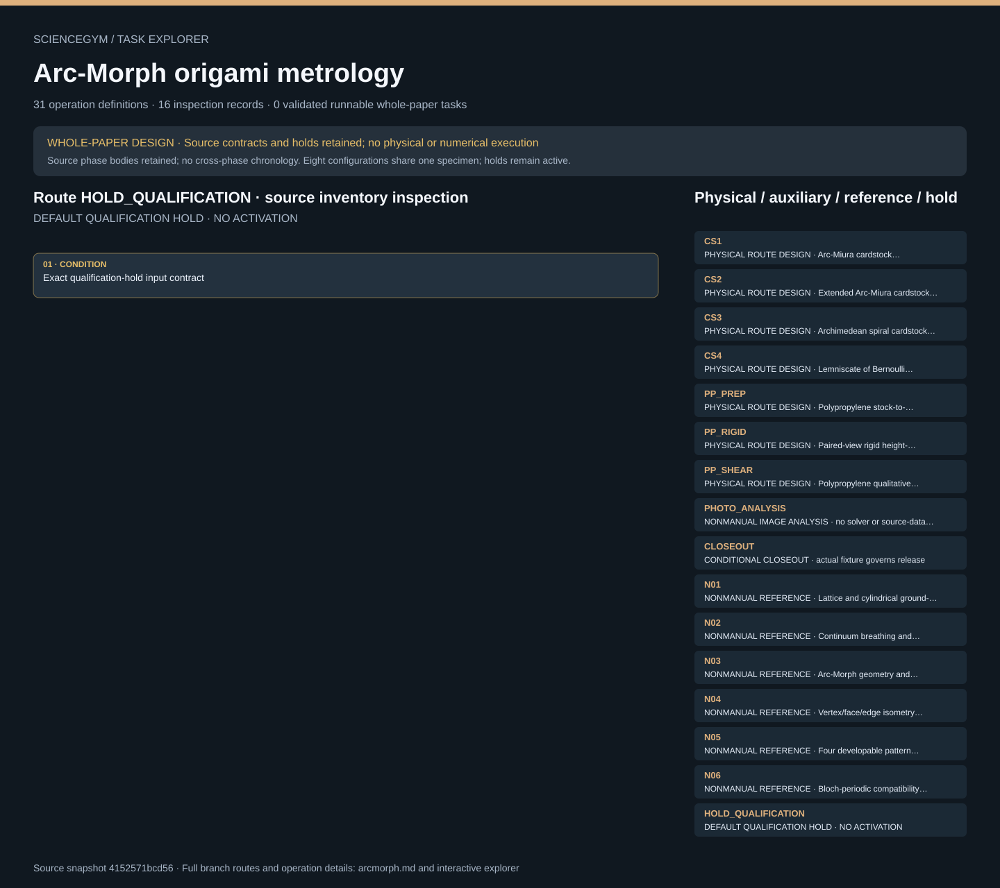

# Arc-Morph origami metrology: task route map



Paper: **Coarse-grained fundamental forms for characterizing isometries of trapezoid-based origami metamaterials** · [DOI](https://doi.org/10.1038/s41467-025-57089-x)

Whole-paper DESIGN only; zero validated runnable whole-paper tasks. Read-only author/evaluator inspection, not an actor context, controller, physical simulation or scientific reproduction. Source facts and independently authored robot contracts remain separate. Source-listed occurrences and phase bodies are retained, but cross-phase display order is not a historical chronology or an executable global sequence. Eight configuration slots remain one unexpanded same-specimen template; no repeats, allocations or successful outcomes are instantiated. Qualification holds remain active and required post-states are design obligations, never observations. Seven physical route families and thirty-one operation templates are one paper-level design, not thirty-one papers. Four cardstock families retain separate ground, rigid and sheared evidence slots; those twelve slots do not supply specimen counts. The polymer quantitative series reports one specimen, one set and eight configurations, not eight independent samples or repeated cycles. Ten source conflicts and fourteen unresolved-input cards remain open and claim-local. C01 keeps the physical geometry unresolved; theoretical dimensions cannot become fabrication defaults. Qualitative shear is not a measured stiffness or force law. Paired cameras, independent length references, locked capture state, mount leases, fixture-specific release and specimen/rest history remain distinct. Machining, powered loading and all physical services stay closed, qualified and unimplemented; nominal anchors are not motion permission. Upstream source review covered twelve main pages, twenty-two written SI pages and main/SI figures. The raw-image/code archive was not acquired or read; notebooks were not run and source mathematics was not independently proved. Original scene geometry, dimensions, grasps and interfaces are illustrative and unqualified; no source-exact CAD, real physics or safe motion is established.. Counts describe task representation, not experiments or success.

**Reading rule:** rows retain exact source-listed occurrences and phase bodies. Local list order is authored; cross-phase chronology is not inferred. The same-specimen loop is shown once and fixture-release alternatives remain conditional. An unordered obligation group has no inferred chronological edges. Source-reported scientific facts and authored handling are distinct.

[Frozen local source task package](../../../tasks/arcmorph_operations_v2/) · [Interactive inspector](../index.html)

## CS1 — PHYSICAL ROUTE DESIGN · Arc-Miura cardstock demonstration family

Whole-paper DESIGN only; zero validated runnable whole-paper tasks. Read-only author/evaluator inspection, not an actor context, controller, physical simulation or scientific reproduction. Source facts and independently authored robot contracts remain separate. Source-listed occurrences and phase bodies are retained, but cross-phase display order is not a historical chronology or an executable global sequence. Eight configuration slots remain one unexpanded same-specimen template; no repeats, allocations or successful outcomes are instantiated. Qualification holds remain active and required post-states are design obligations, never observations.

[Exact route source](../../../tasks/arcmorph_operations_v2/branches.json) · JSON pointer: `/physical_routes/0`

- **OBLIGATIONS: Declared operation prerequisites; route dependencies stay in the exact contract**
  - Binding: {"source_file":"branches.json","source_pointer":"/physical_routes/0/dependencies","source_node":["R00","R01"],"order":"Prerequisites only; no global sequence is inferred"}
  - `R00` Read requested branches and obtain immutable campaign and allocation IDs.
    - Source occurrence binding: {"source_file":"branches.json","source_pointer":"/physical_routes/0/dependencies/0","source_node":"R00","meaning":"Exact source-listed template occurrence; not execution or an independent specimen"}
  - `R01` Resolve family-specific drawing, stock, fold plan and station qualification without inventing values.
    - Source occurrence binding: {"source_file":"branches.json","source_pointer":"/physical_routes/0/dependencies/1","source_node":"R01","meaning":"Exact source-listed template occurrence; not execution or an independent specimen"}
- **OBLIGATIONS: Separate phase bodies; mode order and specimen reuse remain qualified choices**
  - Binding: {"source_file":"branches.json","source_pointer":"/physical_routes/0/operation_groups","source_node":{"prepare":["R02","R03","R04","R05","R06","R03","R07"],"baseline":["R03","R08","R28"],"rigid_demo":["R03","R26","R27","R28","R19","R30","R03","R29"],"shear_demo":["R03","R20","R21","R28","R19","R22","R03","R29"],"closeout":["R23","R24"]},"order":"Baseline precedes load; rigid versus shear ordering is authored and must be declared. Sharing one specimen across modes requires a qualified recovery check and retained history.","state_slots":["ground","rigid","sheared"]}
  - **SEQUENCE: prepare · exact authored body**
    - Binding: {"source_file":"branches.json","source_pointer":"/physical_routes/0/operation_groups/prepare","source_node":["R02","R03","R04","R05","R06","R03","R07"],"order":"Source-declared authored list order only; not historical chronology"}
    - `R02` Read batch/material ID; inspect both supported sheet faces and place accepted sheet on its own carrier.
      - Source occurrence binding: {"source_file":"branches.json","source_pointer":"/physical_routes/0/operation_groups/prepare/0","source_node":"R02","meaning":"Exact source-listed template occurrence; not execution or an independent specimen"}
    - `R03` Lift only an unmounted supported carrier, transport and dock at the nominated station.
      - Source occurrence binding: {"source_file":"branches.json","source_pointer":"/physical_routes/0/operation_groups/prepare/1","source_node":"R03","meaning":"Exact source-listed template occurrence; not execution or an independent specimen"}
    - `R04` Seat stock in the approved loading carrier and bind the exact job ID to stock and drawing revisions.
      - Source occurrence binding: {"source_file":"branches.json","source_pointer":"/physical_routes/0/operation_groups/prepare/2","source_node":"R04","meaning":"Exact source-listed template occurrence; not execution or an independent specimen"}
    - `R05` Run only the prequalified job; robot observes status and waits outside the guarded process.
      - Source occurrence binding: {"source_file":"branches.json","source_pointer":"/physical_routes/0/operation_groups/prepare/3","source_node":"R05","meaning":"Exact source-listed template occurrence; not execution or an independent specimen"}
    - `R06` Unload after safe release; inspect cut boundary, vertex relief, crease map and sheet condition against the approved drawing. Complete the inspection at the safe fabrication handoff and reseat the sheet in its retained supported carrier before transport.
      - Source occurrence binding: {"source_file":"branches.json","source_pointer":"/physical_routes/0/operation_groups/prepare/4","source_node":"R06","meaning":"Exact source-listed template occurrence; not execution or an independent specimen"}
    - `R03` Lift only an unmounted supported carrier, transport and dock at the nominated station.
      - Source occurrence binding: {"source_file":"branches.json","source_pointer":"/physical_routes/0/operation_groups/prepare/5","source_node":"R03","meaning":"Exact source-listed template occurrence; not execution or an independent specimen"}
    - `R07` Support designated panels, engage the allowed contact patch, perform one approved crease motion, release the tool, inspect that edge, and iterate over the supplied dependency-ordered edge plan. Seat the completed folded object in its separately identified supported carrier and verify retention.
      - Source occurrence binding: {"source_file":"branches.json","source_pointer":"/physical_routes/0/operation_groups/prepare/6","source_node":"R07","meaning":"Exact source-listed template occurrence; not execution or an independent specimen"}
  - **SEQUENCE: baseline · exact authored body**
    - Binding: {"source_file":"branches.json","source_pointer":"/physical_routes/0/operation_groups/baseline","source_node":["R03","R08","R28"],"order":"Source-declared authored list order only; not historical chronology"}
    - `R03` Lift only an unmounted supported carrier, transport and dock at the nominated station.
      - Source occurrence binding: {"source_file":"branches.json","source_pointer":"/physical_routes/0/operation_groups/baseline/0","source_node":"R03","meaning":"Exact source-listed template occurrence; not execution or an independent specimen"}
    - `R08` Place specimen in a qualified rest cradle and document its current resting geometry and defects.
      - Source occurrence binding: {"source_file":"branches.json","source_pointer":"/physical_routes/0/operation_groups/baseline/1","source_node":"R08","meaning":"Exact source-listed template occurrence; not execution or an independent specimen"}
    - `R28` Capture identified baseline, rigid or sheared state with its support/loading context and a declared qualitative label.
      - Source occurrence binding: {"source_file":"branches.json","source_pointer":"/physical_routes/0/operation_groups/baseline/2","source_node":"R28","meaning":"Exact source-listed template occurrence; not execution or an independent specimen"}
  - **SEQUENCE: rigid demo · exact authored body**
    - Binding: {"source_file":"branches.json","source_pointer":"/physical_routes/0/operation_groups/rigid_demo","source_node":["R03","R26","R27","R28","R19","R30","R03","R29"],"order":"Source-declared authored list order only; not historical chronology"}
    - `R03` Lift only an unmounted supported carrier, transport and dock at the nominated station.
      - Source occurrence binding: {"source_file":"branches.json","source_pointer":"/physical_routes/0/operation_groups/rigid_demo/0","source_node":"R03","meaning":"Exact source-listed template occurrence; not execution or an independent specimen"}
    - `R26` Register the correct family-specific rigid-mode support and mount the specimen without erasing its baseline.
      - Source occurrence binding: {"source_file":"branches.json","source_pointer":"/physical_routes/0/operation_groups/rigid_demo/1","source_node":"R26","meaning":"Exact source-listed template occurrence; not execution or an independent specimen"}
    - `R27` Apply the supplied bounded rigid-fold motion through permitted contact regions, pause at the authorized state and hold support for observation.
      - Source occurrence binding: {"source_file":"branches.json","source_pointer":"/physical_routes/0/operation_groups/rigid_demo/2","source_node":"R27","meaning":"Exact source-listed template occurrence; not execution or an independent specimen"}
    - `R28` Capture identified baseline, rigid or sheared state with its support/loading context and a declared qualitative label.
      - Source occurrence binding: {"source_file":"branches.json","source_pointer":"/physical_routes/0/operation_groups/rigid_demo/3","source_node":"R28","meaning":"Exact source-listed template occurrence; not execution or an independent specimen"}
    - `R19` Stop acquisition, apply prescribed support, remove applied load through the approved bounded interface and only then release locks.
      - Source occurrence binding: {"source_file":"branches.json","source_pointer":"/physical_routes/0/operation_groups/rigid_demo/4","source_node":"R19","meaning":"Exact source-listed template occurrence; not execution or an independent specimen"}
    - `R30` After load removal, support the specimen in its carrier, release each approved mount, confirm complete separation and close the station lease.
      - Source occurrence binding: {"source_file":"branches.json","source_pointer":"/physical_routes/0/operation_groups/rigid_demo/5","source_node":"R30","meaning":"Exact source-listed template occurrence; not execution or an independent specimen"}
    - `R03` Lift only an unmounted supported carrier, transport and dock at the nominated station.
      - Source occurrence binding: {"source_file":"branches.json","source_pointer":"/physical_routes/0/operation_groups/rigid_demo/6","source_node":"R03","meaning":"Exact source-listed template occurrence; not execution or an independent specimen"}
    - `R29` After the approved recovery interval inspect rest geometry and damage against the preserved baseline.
      - Source occurrence binding: {"source_file":"branches.json","source_pointer":"/physical_routes/0/operation_groups/rigid_demo/7","source_node":"R29","meaning":"Exact source-listed template occurrence; not execution or an independent specimen"}
  - **SEQUENCE: shear demo · exact authored body**
    - Binding: {"source_file":"branches.json","source_pointer":"/physical_routes/0/operation_groups/shear_demo","source_node":["R03","R20","R21","R28","R19","R22","R03","R29"],"order":"Source-declared authored list order only; not historical chronology"}
    - `R03` Lift only an unmounted supported carrier, transport and dock at the nominated station.
      - Source occurrence binding: {"source_file":"branches.json","source_pointer":"/physical_routes/0/operation_groups/shear_demo/0","source_node":"R03","meaning":"Exact source-listed template occurrence; not execution or an independent specimen"}
    - `R20` Confirm family-specific support/attachment map, seat specimen, close guard and bind the approved job to this specimen revision.
      - Source occurrence binding: {"source_file":"branches.json","source_pointer":"/physical_routes/0/operation_groups/shear_demo/1","source_node":"R20","meaning":"Exact source-listed template occurrence; not execution or an independent specimen"}
    - `R21` Apply only the approved qualitative loading job while the robot observes status from outside the guard.
      - Source occurrence binding: {"source_file":"branches.json","source_pointer":"/physical_routes/0/operation_groups/shear_demo/2","source_node":"R21","meaning":"Exact source-listed template occurrence; not execution or an independent specimen"}
    - `R28` Capture identified baseline, rigid or sheared state with its support/loading context and a declared qualitative label.
      - Source occurrence binding: {"source_file":"branches.json","source_pointer":"/physical_routes/0/operation_groups/shear_demo/3","source_node":"R28","meaning":"Exact source-listed template occurrence; not execution or an independent specimen"}
    - `R19` Stop acquisition, apply prescribed support, remove applied load through the approved bounded interface and only then release locks.
      - Source occurrence binding: {"source_file":"branches.json","source_pointer":"/physical_routes/0/operation_groups/shear_demo/4","source_node":"R19","meaning":"Exact source-listed template occurrence; not execution or an independent specimen"}
    - `R22` After R19 confirms load removal and safe release, detach supported specimen and return it to its retained carrier. Confirm the fixture is unoccupied and close its exclusive mount lease.
      - Source occurrence binding: {"source_file":"branches.json","source_pointer":"/physical_routes/0/operation_groups/shear_demo/5","source_node":"R22","meaning":"Exact source-listed template occurrence; not execution or an independent specimen"}
    - `R03` Lift only an unmounted supported carrier, transport and dock at the nominated station.
      - Source occurrence binding: {"source_file":"branches.json","source_pointer":"/physical_routes/0/operation_groups/shear_demo/6","source_node":"R03","meaning":"Exact source-listed template occurrence; not execution or an independent specimen"}
    - `R29` After the approved recovery interval inspect rest geometry and damage against the preserved baseline.
      - Source occurrence binding: {"source_file":"branches.json","source_pointer":"/physical_routes/0/operation_groups/shear_demo/7","source_node":"R29","meaning":"Exact source-listed template occurrence; not execution or an independent specimen"}
  - **SEQUENCE: closeout · exact authored body**
    - Binding: {"source_file":"branches.json","source_pointer":"/physical_routes/0/operation_groups/closeout","source_node":["R23","R24"],"order":"Source-declared authored list order only; not historical chronology"}
    - `R23` Transport only the unmounted specimen to inspection, then to accepted storage or quarantine with its full history.
      - Source occurrence binding: {"source_file":"branches.json","source_pointer":"/physical_routes/0/operation_groups/closeout/0","source_node":"R23","meaning":"Exact source-listed template occurrence; not execution or an independent specimen"}
    - `R24` Check fixtures empty, park controls, account for tools/references and separate retained waste or rejected material through the qualified service policy.
      - Source occurrence binding: {"source_file":"branches.json","source_pointer":"/physical_routes/0/operation_groups/closeout/1","source_node":"R24","meaning":"Exact source-listed template occurrence; not execution or an independent specimen"}
- **CONDITION: Exact source branch/disposition contract**
  - Binding: {"source_file":"branches.json","source_pointer":"/physical_routes/0","source_contract":{"id":"CS1","name":"Arc-Miura cardstock demonstration family","source_fact_ids":["F01"],"starting_material":"Separately identified qualified cardstock stock; not an already-completed specimen.","dependencies":["R00","R01"],"operation_groups":{"prepare":["R02","R03","R04","R05","R06","R03","R07"],"baseline":["R03","R08","R28"],"rigid_demo":["R03","R26","R27","R28","R19","R30","R03","R29"],"shear_demo":["R03","R20","R21","R28","R19","R22","R03","R29"],"closeout":["R23","R24"]},"state_slots":["ground","rigid","sheared"],"repeat_policy":"One route per source family; number of physical samples and repeats not specified by source. Benchmark allocation must declare them.","order_policy":"Baseline precedes load; rigid versus shear ordering is authored and must be declared. Sharing one specimen across modes requires a qualified recovery check and retained history.","execution_gates":["U01","U02","U03","U04","U09","U10","U12","U13"]}}

<details><summary>Branch state, choices, lineage and loop obligations</summary>

```json
{
  "id": "CS1",
  "name": "Arc-Miura cardstock demonstration family",
  "source_fact_ids": [
    "F01"
  ],
  "starting_material": "Separately identified qualified cardstock stock; not an already-completed specimen.",
  "dependencies": [
    "R00",
    "R01"
  ],
  "operation_groups": {
    "prepare": [
      "R02",
      "R03",
      "R04",
      "R05",
      "R06",
      "R03",
      "R07"
    ],
    "baseline": [
      "R03",
      "R08",
      "R28"
    ],
    "rigid_demo": [
      "R03",
      "R26",
      "R27",
      "R28",
      "R19",
      "R30",
      "R03",
      "R29"
    ],
    "shear_demo": [
      "R03",
      "R20",
      "R21",
      "R28",
      "R19",
      "R22",
      "R03",
      "R29"
    ],
    "closeout": [
      "R23",
      "R24"
    ]
  },
  "state_slots": [
    "ground",
    "rigid",
    "sheared"
  ],
  "repeat_policy": "One route per source family; number of physical samples and repeats not specified by source. Benchmark allocation must declare them.",
  "order_policy": "Baseline precedes load; rigid versus shear ordering is authored and must be declared. Sharing one specimen across modes requires a qualified recovery check and retained history.",
  "execution_gates": [
    "U01",
    "U02",
    "U03",
    "U04",
    "U09",
    "U10",
    "U12",
    "U13"
  ]
}
```

</details>

## CS2 — PHYSICAL ROUTE DESIGN · Extended Arc-Miura cardstock demonstration family

Whole-paper DESIGN only; zero validated runnable whole-paper tasks. Read-only author/evaluator inspection, not an actor context, controller, physical simulation or scientific reproduction. Source facts and independently authored robot contracts remain separate. Source-listed occurrences and phase bodies are retained, but cross-phase display order is not a historical chronology or an executable global sequence. Eight configuration slots remain one unexpanded same-specimen template; no repeats, allocations or successful outcomes are instantiated. Qualification holds remain active and required post-states are design obligations, never observations.

[Exact route source](../../../tasks/arcmorph_operations_v2/branches.json) · JSON pointer: `/physical_routes/1`

- **OBLIGATIONS: Declared operation prerequisites; route dependencies stay in the exact contract**
  - Binding: {"source_file":"branches.json","source_pointer":"/physical_routes/1/dependencies","source_node":["R00","R01"],"order":"Prerequisites only; no global sequence is inferred"}
  - `R00` Read requested branches and obtain immutable campaign and allocation IDs.
    - Source occurrence binding: {"source_file":"branches.json","source_pointer":"/physical_routes/1/dependencies/0","source_node":"R00","meaning":"Exact source-listed template occurrence; not execution or an independent specimen"}
  - `R01` Resolve family-specific drawing, stock, fold plan and station qualification without inventing values.
    - Source occurrence binding: {"source_file":"branches.json","source_pointer":"/physical_routes/1/dependencies/1","source_node":"R01","meaning":"Exact source-listed template occurrence; not execution or an independent specimen"}
- **OBLIGATIONS: Separate phase bodies; mode order and specimen reuse remain qualified choices**
  - Binding: {"source_file":"branches.json","source_pointer":"/physical_routes/1/operation_groups","source_node":{"prepare":["R02","R03","R04","R05","R06","R03","R07"],"baseline":["R03","R08","R28"],"rigid_demo":["R03","R26","R27","R28","R19","R30","R03","R29"],"shear_demo":["R03","R20","R21","R28","R19","R22","R03","R29"],"closeout":["R23","R24"]},"order":"Baseline precedes load; rigid versus shear ordering is authored and must be declared. Sharing one specimen across modes requires a qualified recovery check and retained history.","state_slots":["ground","rigid","sheared"]}
  - **SEQUENCE: prepare · exact authored body**
    - Binding: {"source_file":"branches.json","source_pointer":"/physical_routes/1/operation_groups/prepare","source_node":["R02","R03","R04","R05","R06","R03","R07"],"order":"Source-declared authored list order only; not historical chronology"}
    - `R02` Read batch/material ID; inspect both supported sheet faces and place accepted sheet on its own carrier.
      - Source occurrence binding: {"source_file":"branches.json","source_pointer":"/physical_routes/1/operation_groups/prepare/0","source_node":"R02","meaning":"Exact source-listed template occurrence; not execution or an independent specimen"}
    - `R03` Lift only an unmounted supported carrier, transport and dock at the nominated station.
      - Source occurrence binding: {"source_file":"branches.json","source_pointer":"/physical_routes/1/operation_groups/prepare/1","source_node":"R03","meaning":"Exact source-listed template occurrence; not execution or an independent specimen"}
    - `R04` Seat stock in the approved loading carrier and bind the exact job ID to stock and drawing revisions.
      - Source occurrence binding: {"source_file":"branches.json","source_pointer":"/physical_routes/1/operation_groups/prepare/2","source_node":"R04","meaning":"Exact source-listed template occurrence; not execution or an independent specimen"}
    - `R05` Run only the prequalified job; robot observes status and waits outside the guarded process.
      - Source occurrence binding: {"source_file":"branches.json","source_pointer":"/physical_routes/1/operation_groups/prepare/3","source_node":"R05","meaning":"Exact source-listed template occurrence; not execution or an independent specimen"}
    - `R06` Unload after safe release; inspect cut boundary, vertex relief, crease map and sheet condition against the approved drawing. Complete the inspection at the safe fabrication handoff and reseat the sheet in its retained supported carrier before transport.
      - Source occurrence binding: {"source_file":"branches.json","source_pointer":"/physical_routes/1/operation_groups/prepare/4","source_node":"R06","meaning":"Exact source-listed template occurrence; not execution or an independent specimen"}
    - `R03` Lift only an unmounted supported carrier, transport and dock at the nominated station.
      - Source occurrence binding: {"source_file":"branches.json","source_pointer":"/physical_routes/1/operation_groups/prepare/5","source_node":"R03","meaning":"Exact source-listed template occurrence; not execution or an independent specimen"}
    - `R07` Support designated panels, engage the allowed contact patch, perform one approved crease motion, release the tool, inspect that edge, and iterate over the supplied dependency-ordered edge plan. Seat the completed folded object in its separately identified supported carrier and verify retention.
      - Source occurrence binding: {"source_file":"branches.json","source_pointer":"/physical_routes/1/operation_groups/prepare/6","source_node":"R07","meaning":"Exact source-listed template occurrence; not execution or an independent specimen"}
  - **SEQUENCE: baseline · exact authored body**
    - Binding: {"source_file":"branches.json","source_pointer":"/physical_routes/1/operation_groups/baseline","source_node":["R03","R08","R28"],"order":"Source-declared authored list order only; not historical chronology"}
    - `R03` Lift only an unmounted supported carrier, transport and dock at the nominated station.
      - Source occurrence binding: {"source_file":"branches.json","source_pointer":"/physical_routes/1/operation_groups/baseline/0","source_node":"R03","meaning":"Exact source-listed template occurrence; not execution or an independent specimen"}
    - `R08` Place specimen in a qualified rest cradle and document its current resting geometry and defects.
      - Source occurrence binding: {"source_file":"branches.json","source_pointer":"/physical_routes/1/operation_groups/baseline/1","source_node":"R08","meaning":"Exact source-listed template occurrence; not execution or an independent specimen"}
    - `R28` Capture identified baseline, rigid or sheared state with its support/loading context and a declared qualitative label.
      - Source occurrence binding: {"source_file":"branches.json","source_pointer":"/physical_routes/1/operation_groups/baseline/2","source_node":"R28","meaning":"Exact source-listed template occurrence; not execution or an independent specimen"}
  - **SEQUENCE: rigid demo · exact authored body**
    - Binding: {"source_file":"branches.json","source_pointer":"/physical_routes/1/operation_groups/rigid_demo","source_node":["R03","R26","R27","R28","R19","R30","R03","R29"],"order":"Source-declared authored list order only; not historical chronology"}
    - `R03` Lift only an unmounted supported carrier, transport and dock at the nominated station.
      - Source occurrence binding: {"source_file":"branches.json","source_pointer":"/physical_routes/1/operation_groups/rigid_demo/0","source_node":"R03","meaning":"Exact source-listed template occurrence; not execution or an independent specimen"}
    - `R26` Register the correct family-specific rigid-mode support and mount the specimen without erasing its baseline.
      - Source occurrence binding: {"source_file":"branches.json","source_pointer":"/physical_routes/1/operation_groups/rigid_demo/1","source_node":"R26","meaning":"Exact source-listed template occurrence; not execution or an independent specimen"}
    - `R27` Apply the supplied bounded rigid-fold motion through permitted contact regions, pause at the authorized state and hold support for observation.
      - Source occurrence binding: {"source_file":"branches.json","source_pointer":"/physical_routes/1/operation_groups/rigid_demo/2","source_node":"R27","meaning":"Exact source-listed template occurrence; not execution or an independent specimen"}
    - `R28` Capture identified baseline, rigid or sheared state with its support/loading context and a declared qualitative label.
      - Source occurrence binding: {"source_file":"branches.json","source_pointer":"/physical_routes/1/operation_groups/rigid_demo/3","source_node":"R28","meaning":"Exact source-listed template occurrence; not execution or an independent specimen"}
    - `R19` Stop acquisition, apply prescribed support, remove applied load through the approved bounded interface and only then release locks.
      - Source occurrence binding: {"source_file":"branches.json","source_pointer":"/physical_routes/1/operation_groups/rigid_demo/4","source_node":"R19","meaning":"Exact source-listed template occurrence; not execution or an independent specimen"}
    - `R30` After load removal, support the specimen in its carrier, release each approved mount, confirm complete separation and close the station lease.
      - Source occurrence binding: {"source_file":"branches.json","source_pointer":"/physical_routes/1/operation_groups/rigid_demo/5","source_node":"R30","meaning":"Exact source-listed template occurrence; not execution or an independent specimen"}
    - `R03` Lift only an unmounted supported carrier, transport and dock at the nominated station.
      - Source occurrence binding: {"source_file":"branches.json","source_pointer":"/physical_routes/1/operation_groups/rigid_demo/6","source_node":"R03","meaning":"Exact source-listed template occurrence; not execution or an independent specimen"}
    - `R29` After the approved recovery interval inspect rest geometry and damage against the preserved baseline.
      - Source occurrence binding: {"source_file":"branches.json","source_pointer":"/physical_routes/1/operation_groups/rigid_demo/7","source_node":"R29","meaning":"Exact source-listed template occurrence; not execution or an independent specimen"}
  - **SEQUENCE: shear demo · exact authored body**
    - Binding: {"source_file":"branches.json","source_pointer":"/physical_routes/1/operation_groups/shear_demo","source_node":["R03","R20","R21","R28","R19","R22","R03","R29"],"order":"Source-declared authored list order only; not historical chronology"}
    - `R03` Lift only an unmounted supported carrier, transport and dock at the nominated station.
      - Source occurrence binding: {"source_file":"branches.json","source_pointer":"/physical_routes/1/operation_groups/shear_demo/0","source_node":"R03","meaning":"Exact source-listed template occurrence; not execution or an independent specimen"}
    - `R20` Confirm family-specific support/attachment map, seat specimen, close guard and bind the approved job to this specimen revision.
      - Source occurrence binding: {"source_file":"branches.json","source_pointer":"/physical_routes/1/operation_groups/shear_demo/1","source_node":"R20","meaning":"Exact source-listed template occurrence; not execution or an independent specimen"}
    - `R21` Apply only the approved qualitative loading job while the robot observes status from outside the guard.
      - Source occurrence binding: {"source_file":"branches.json","source_pointer":"/physical_routes/1/operation_groups/shear_demo/2","source_node":"R21","meaning":"Exact source-listed template occurrence; not execution or an independent specimen"}
    - `R28` Capture identified baseline, rigid or sheared state with its support/loading context and a declared qualitative label.
      - Source occurrence binding: {"source_file":"branches.json","source_pointer":"/physical_routes/1/operation_groups/shear_demo/3","source_node":"R28","meaning":"Exact source-listed template occurrence; not execution or an independent specimen"}
    - `R19` Stop acquisition, apply prescribed support, remove applied load through the approved bounded interface and only then release locks.
      - Source occurrence binding: {"source_file":"branches.json","source_pointer":"/physical_routes/1/operation_groups/shear_demo/4","source_node":"R19","meaning":"Exact source-listed template occurrence; not execution or an independent specimen"}
    - `R22` After R19 confirms load removal and safe release, detach supported specimen and return it to its retained carrier. Confirm the fixture is unoccupied and close its exclusive mount lease.
      - Source occurrence binding: {"source_file":"branches.json","source_pointer":"/physical_routes/1/operation_groups/shear_demo/5","source_node":"R22","meaning":"Exact source-listed template occurrence; not execution or an independent specimen"}
    - `R03` Lift only an unmounted supported carrier, transport and dock at the nominated station.
      - Source occurrence binding: {"source_file":"branches.json","source_pointer":"/physical_routes/1/operation_groups/shear_demo/6","source_node":"R03","meaning":"Exact source-listed template occurrence; not execution or an independent specimen"}
    - `R29` After the approved recovery interval inspect rest geometry and damage against the preserved baseline.
      - Source occurrence binding: {"source_file":"branches.json","source_pointer":"/physical_routes/1/operation_groups/shear_demo/7","source_node":"R29","meaning":"Exact source-listed template occurrence; not execution or an independent specimen"}
  - **SEQUENCE: closeout · exact authored body**
    - Binding: {"source_file":"branches.json","source_pointer":"/physical_routes/1/operation_groups/closeout","source_node":["R23","R24"],"order":"Source-declared authored list order only; not historical chronology"}
    - `R23` Transport only the unmounted specimen to inspection, then to accepted storage or quarantine with its full history.
      - Source occurrence binding: {"source_file":"branches.json","source_pointer":"/physical_routes/1/operation_groups/closeout/0","source_node":"R23","meaning":"Exact source-listed template occurrence; not execution or an independent specimen"}
    - `R24` Check fixtures empty, park controls, account for tools/references and separate retained waste or rejected material through the qualified service policy.
      - Source occurrence binding: {"source_file":"branches.json","source_pointer":"/physical_routes/1/operation_groups/closeout/1","source_node":"R24","meaning":"Exact source-listed template occurrence; not execution or an independent specimen"}
- **CONDITION: Exact source branch/disposition contract**
  - Binding: {"source_file":"branches.json","source_pointer":"/physical_routes/1","source_contract":{"id":"CS2","name":"Extended Arc-Miura cardstock demonstration family","source_fact_ids":["F01"],"starting_material":"Separately identified qualified cardstock stock; not an already-completed specimen.","dependencies":["R00","R01"],"operation_groups":{"prepare":["R02","R03","R04","R05","R06","R03","R07"],"baseline":["R03","R08","R28"],"rigid_demo":["R03","R26","R27","R28","R19","R30","R03","R29"],"shear_demo":["R03","R20","R21","R28","R19","R22","R03","R29"],"closeout":["R23","R24"]},"state_slots":["ground","rigid","sheared"],"repeat_policy":"One route per source family; number of physical samples and repeats not specified by source. Benchmark allocation must declare them.","order_policy":"Baseline precedes load; rigid versus shear ordering is authored and must be declared. Sharing one specimen across modes requires a qualified recovery check and retained history.","execution_gates":["U01","U02","U03","U04","U09","U10","U12","U13"]}}

<details><summary>Branch state, choices, lineage and loop obligations</summary>

```json
{
  "id": "CS2",
  "name": "Extended Arc-Miura cardstock demonstration family",
  "source_fact_ids": [
    "F01"
  ],
  "starting_material": "Separately identified qualified cardstock stock; not an already-completed specimen.",
  "dependencies": [
    "R00",
    "R01"
  ],
  "operation_groups": {
    "prepare": [
      "R02",
      "R03",
      "R04",
      "R05",
      "R06",
      "R03",
      "R07"
    ],
    "baseline": [
      "R03",
      "R08",
      "R28"
    ],
    "rigid_demo": [
      "R03",
      "R26",
      "R27",
      "R28",
      "R19",
      "R30",
      "R03",
      "R29"
    ],
    "shear_demo": [
      "R03",
      "R20",
      "R21",
      "R28",
      "R19",
      "R22",
      "R03",
      "R29"
    ],
    "closeout": [
      "R23",
      "R24"
    ]
  },
  "state_slots": [
    "ground",
    "rigid",
    "sheared"
  ],
  "repeat_policy": "One route per source family; number of physical samples and repeats not specified by source. Benchmark allocation must declare them.",
  "order_policy": "Baseline precedes load; rigid versus shear ordering is authored and must be declared. Sharing one specimen across modes requires a qualified recovery check and retained history.",
  "execution_gates": [
    "U01",
    "U02",
    "U03",
    "U04",
    "U09",
    "U10",
    "U12",
    "U13"
  ]
}
```

</details>

## CS3 — PHYSICAL ROUTE DESIGN · Archimedean spiral cardstock demonstration family

Whole-paper DESIGN only; zero validated runnable whole-paper tasks. Read-only author/evaluator inspection, not an actor context, controller, physical simulation or scientific reproduction. Source facts and independently authored robot contracts remain separate. Source-listed occurrences and phase bodies are retained, but cross-phase display order is not a historical chronology or an executable global sequence. Eight configuration slots remain one unexpanded same-specimen template; no repeats, allocations or successful outcomes are instantiated. Qualification holds remain active and required post-states are design obligations, never observations.

[Exact route source](../../../tasks/arcmorph_operations_v2/branches.json) · JSON pointer: `/physical_routes/2`

- **OBLIGATIONS: Declared operation prerequisites; route dependencies stay in the exact contract**
  - Binding: {"source_file":"branches.json","source_pointer":"/physical_routes/2/dependencies","source_node":["R00","R01"],"order":"Prerequisites only; no global sequence is inferred"}
  - `R00` Read requested branches and obtain immutable campaign and allocation IDs.
    - Source occurrence binding: {"source_file":"branches.json","source_pointer":"/physical_routes/2/dependencies/0","source_node":"R00","meaning":"Exact source-listed template occurrence; not execution or an independent specimen"}
  - `R01` Resolve family-specific drawing, stock, fold plan and station qualification without inventing values.
    - Source occurrence binding: {"source_file":"branches.json","source_pointer":"/physical_routes/2/dependencies/1","source_node":"R01","meaning":"Exact source-listed template occurrence; not execution or an independent specimen"}
- **OBLIGATIONS: Separate phase bodies; mode order and specimen reuse remain qualified choices**
  - Binding: {"source_file":"branches.json","source_pointer":"/physical_routes/2/operation_groups","source_node":{"prepare":["R02","R03","R04","R05","R06","R03","R07"],"baseline":["R03","R08","R28"],"rigid_demo":["R03","R26","R27","R28","R19","R30","R03","R29"],"shear_demo":["R03","R20","R21","R28","R19","R22","R03","R29"],"closeout":["R23","R24"]},"order":"Baseline precedes load; rigid versus shear ordering is authored and must be declared. Sharing one specimen across modes requires a qualified recovery check and retained history.","state_slots":["ground","rigid","sheared"]}
  - **SEQUENCE: prepare · exact authored body**
    - Binding: {"source_file":"branches.json","source_pointer":"/physical_routes/2/operation_groups/prepare","source_node":["R02","R03","R04","R05","R06","R03","R07"],"order":"Source-declared authored list order only; not historical chronology"}
    - `R02` Read batch/material ID; inspect both supported sheet faces and place accepted sheet on its own carrier.
      - Source occurrence binding: {"source_file":"branches.json","source_pointer":"/physical_routes/2/operation_groups/prepare/0","source_node":"R02","meaning":"Exact source-listed template occurrence; not execution or an independent specimen"}
    - `R03` Lift only an unmounted supported carrier, transport and dock at the nominated station.
      - Source occurrence binding: {"source_file":"branches.json","source_pointer":"/physical_routes/2/operation_groups/prepare/1","source_node":"R03","meaning":"Exact source-listed template occurrence; not execution or an independent specimen"}
    - `R04` Seat stock in the approved loading carrier and bind the exact job ID to stock and drawing revisions.
      - Source occurrence binding: {"source_file":"branches.json","source_pointer":"/physical_routes/2/operation_groups/prepare/2","source_node":"R04","meaning":"Exact source-listed template occurrence; not execution or an independent specimen"}
    - `R05` Run only the prequalified job; robot observes status and waits outside the guarded process.
      - Source occurrence binding: {"source_file":"branches.json","source_pointer":"/physical_routes/2/operation_groups/prepare/3","source_node":"R05","meaning":"Exact source-listed template occurrence; not execution or an independent specimen"}
    - `R06` Unload after safe release; inspect cut boundary, vertex relief, crease map and sheet condition against the approved drawing. Complete the inspection at the safe fabrication handoff and reseat the sheet in its retained supported carrier before transport.
      - Source occurrence binding: {"source_file":"branches.json","source_pointer":"/physical_routes/2/operation_groups/prepare/4","source_node":"R06","meaning":"Exact source-listed template occurrence; not execution or an independent specimen"}
    - `R03` Lift only an unmounted supported carrier, transport and dock at the nominated station.
      - Source occurrence binding: {"source_file":"branches.json","source_pointer":"/physical_routes/2/operation_groups/prepare/5","source_node":"R03","meaning":"Exact source-listed template occurrence; not execution or an independent specimen"}
    - `R07` Support designated panels, engage the allowed contact patch, perform one approved crease motion, release the tool, inspect that edge, and iterate over the supplied dependency-ordered edge plan. Seat the completed folded object in its separately identified supported carrier and verify retention.
      - Source occurrence binding: {"source_file":"branches.json","source_pointer":"/physical_routes/2/operation_groups/prepare/6","source_node":"R07","meaning":"Exact source-listed template occurrence; not execution or an independent specimen"}
  - **SEQUENCE: baseline · exact authored body**
    - Binding: {"source_file":"branches.json","source_pointer":"/physical_routes/2/operation_groups/baseline","source_node":["R03","R08","R28"],"order":"Source-declared authored list order only; not historical chronology"}
    - `R03` Lift only an unmounted supported carrier, transport and dock at the nominated station.
      - Source occurrence binding: {"source_file":"branches.json","source_pointer":"/physical_routes/2/operation_groups/baseline/0","source_node":"R03","meaning":"Exact source-listed template occurrence; not execution or an independent specimen"}
    - `R08` Place specimen in a qualified rest cradle and document its current resting geometry and defects.
      - Source occurrence binding: {"source_file":"branches.json","source_pointer":"/physical_routes/2/operation_groups/baseline/1","source_node":"R08","meaning":"Exact source-listed template occurrence; not execution or an independent specimen"}
    - `R28` Capture identified baseline, rigid or sheared state with its support/loading context and a declared qualitative label.
      - Source occurrence binding: {"source_file":"branches.json","source_pointer":"/physical_routes/2/operation_groups/baseline/2","source_node":"R28","meaning":"Exact source-listed template occurrence; not execution or an independent specimen"}
  - **SEQUENCE: rigid demo · exact authored body**
    - Binding: {"source_file":"branches.json","source_pointer":"/physical_routes/2/operation_groups/rigid_demo","source_node":["R03","R26","R27","R28","R19","R30","R03","R29"],"order":"Source-declared authored list order only; not historical chronology"}
    - `R03` Lift only an unmounted supported carrier, transport and dock at the nominated station.
      - Source occurrence binding: {"source_file":"branches.json","source_pointer":"/physical_routes/2/operation_groups/rigid_demo/0","source_node":"R03","meaning":"Exact source-listed template occurrence; not execution or an independent specimen"}
    - `R26` Register the correct family-specific rigid-mode support and mount the specimen without erasing its baseline.
      - Source occurrence binding: {"source_file":"branches.json","source_pointer":"/physical_routes/2/operation_groups/rigid_demo/1","source_node":"R26","meaning":"Exact source-listed template occurrence; not execution or an independent specimen"}
    - `R27` Apply the supplied bounded rigid-fold motion through permitted contact regions, pause at the authorized state and hold support for observation.
      - Source occurrence binding: {"source_file":"branches.json","source_pointer":"/physical_routes/2/operation_groups/rigid_demo/2","source_node":"R27","meaning":"Exact source-listed template occurrence; not execution or an independent specimen"}
    - `R28` Capture identified baseline, rigid or sheared state with its support/loading context and a declared qualitative label.
      - Source occurrence binding: {"source_file":"branches.json","source_pointer":"/physical_routes/2/operation_groups/rigid_demo/3","source_node":"R28","meaning":"Exact source-listed template occurrence; not execution or an independent specimen"}
    - `R19` Stop acquisition, apply prescribed support, remove applied load through the approved bounded interface and only then release locks.
      - Source occurrence binding: {"source_file":"branches.json","source_pointer":"/physical_routes/2/operation_groups/rigid_demo/4","source_node":"R19","meaning":"Exact source-listed template occurrence; not execution or an independent specimen"}
    - `R30` After load removal, support the specimen in its carrier, release each approved mount, confirm complete separation and close the station lease.
      - Source occurrence binding: {"source_file":"branches.json","source_pointer":"/physical_routes/2/operation_groups/rigid_demo/5","source_node":"R30","meaning":"Exact source-listed template occurrence; not execution or an independent specimen"}
    - `R03` Lift only an unmounted supported carrier, transport and dock at the nominated station.
      - Source occurrence binding: {"source_file":"branches.json","source_pointer":"/physical_routes/2/operation_groups/rigid_demo/6","source_node":"R03","meaning":"Exact source-listed template occurrence; not execution or an independent specimen"}
    - `R29` After the approved recovery interval inspect rest geometry and damage against the preserved baseline.
      - Source occurrence binding: {"source_file":"branches.json","source_pointer":"/physical_routes/2/operation_groups/rigid_demo/7","source_node":"R29","meaning":"Exact source-listed template occurrence; not execution or an independent specimen"}
  - **SEQUENCE: shear demo · exact authored body**
    - Binding: {"source_file":"branches.json","source_pointer":"/physical_routes/2/operation_groups/shear_demo","source_node":["R03","R20","R21","R28","R19","R22","R03","R29"],"order":"Source-declared authored list order only; not historical chronology"}
    - `R03` Lift only an unmounted supported carrier, transport and dock at the nominated station.
      - Source occurrence binding: {"source_file":"branches.json","source_pointer":"/physical_routes/2/operation_groups/shear_demo/0","source_node":"R03","meaning":"Exact source-listed template occurrence; not execution or an independent specimen"}
    - `R20` Confirm family-specific support/attachment map, seat specimen, close guard and bind the approved job to this specimen revision.
      - Source occurrence binding: {"source_file":"branches.json","source_pointer":"/physical_routes/2/operation_groups/shear_demo/1","source_node":"R20","meaning":"Exact source-listed template occurrence; not execution or an independent specimen"}
    - `R21` Apply only the approved qualitative loading job while the robot observes status from outside the guard.
      - Source occurrence binding: {"source_file":"branches.json","source_pointer":"/physical_routes/2/operation_groups/shear_demo/2","source_node":"R21","meaning":"Exact source-listed template occurrence; not execution or an independent specimen"}
    - `R28` Capture identified baseline, rigid or sheared state with its support/loading context and a declared qualitative label.
      - Source occurrence binding: {"source_file":"branches.json","source_pointer":"/physical_routes/2/operation_groups/shear_demo/3","source_node":"R28","meaning":"Exact source-listed template occurrence; not execution or an independent specimen"}
    - `R19` Stop acquisition, apply prescribed support, remove applied load through the approved bounded interface and only then release locks.
      - Source occurrence binding: {"source_file":"branches.json","source_pointer":"/physical_routes/2/operation_groups/shear_demo/4","source_node":"R19","meaning":"Exact source-listed template occurrence; not execution or an independent specimen"}
    - `R22` After R19 confirms load removal and safe release, detach supported specimen and return it to its retained carrier. Confirm the fixture is unoccupied and close its exclusive mount lease.
      - Source occurrence binding: {"source_file":"branches.json","source_pointer":"/physical_routes/2/operation_groups/shear_demo/5","source_node":"R22","meaning":"Exact source-listed template occurrence; not execution or an independent specimen"}
    - `R03` Lift only an unmounted supported carrier, transport and dock at the nominated station.
      - Source occurrence binding: {"source_file":"branches.json","source_pointer":"/physical_routes/2/operation_groups/shear_demo/6","source_node":"R03","meaning":"Exact source-listed template occurrence; not execution or an independent specimen"}
    - `R29` After the approved recovery interval inspect rest geometry and damage against the preserved baseline.
      - Source occurrence binding: {"source_file":"branches.json","source_pointer":"/physical_routes/2/operation_groups/shear_demo/7","source_node":"R29","meaning":"Exact source-listed template occurrence; not execution or an independent specimen"}
  - **SEQUENCE: closeout · exact authored body**
    - Binding: {"source_file":"branches.json","source_pointer":"/physical_routes/2/operation_groups/closeout","source_node":["R23","R24"],"order":"Source-declared authored list order only; not historical chronology"}
    - `R23` Transport only the unmounted specimen to inspection, then to accepted storage or quarantine with its full history.
      - Source occurrence binding: {"source_file":"branches.json","source_pointer":"/physical_routes/2/operation_groups/closeout/0","source_node":"R23","meaning":"Exact source-listed template occurrence; not execution or an independent specimen"}
    - `R24` Check fixtures empty, park controls, account for tools/references and separate retained waste or rejected material through the qualified service policy.
      - Source occurrence binding: {"source_file":"branches.json","source_pointer":"/physical_routes/2/operation_groups/closeout/1","source_node":"R24","meaning":"Exact source-listed template occurrence; not execution or an independent specimen"}
- **CONDITION: Exact source branch/disposition contract**
  - Binding: {"source_file":"branches.json","source_pointer":"/physical_routes/2","source_contract":{"id":"CS3","name":"Archimedean spiral cardstock demonstration family","source_fact_ids":["F01"],"starting_material":"Separately identified qualified cardstock stock; not an already-completed specimen.","dependencies":["R00","R01"],"operation_groups":{"prepare":["R02","R03","R04","R05","R06","R03","R07"],"baseline":["R03","R08","R28"],"rigid_demo":["R03","R26","R27","R28","R19","R30","R03","R29"],"shear_demo":["R03","R20","R21","R28","R19","R22","R03","R29"],"closeout":["R23","R24"]},"state_slots":["ground","rigid","sheared"],"repeat_policy":"One route per source family; number of physical samples and repeats not specified by source. Benchmark allocation must declare them.","order_policy":"Baseline precedes load; rigid versus shear ordering is authored and must be declared. Sharing one specimen across modes requires a qualified recovery check and retained history.","execution_gates":["U01","U02","U03","U04","U09","U10","U12","U13"]}}

<details><summary>Branch state, choices, lineage and loop obligations</summary>

```json
{
  "id": "CS3",
  "name": "Archimedean spiral cardstock demonstration family",
  "source_fact_ids": [
    "F01"
  ],
  "starting_material": "Separately identified qualified cardstock stock; not an already-completed specimen.",
  "dependencies": [
    "R00",
    "R01"
  ],
  "operation_groups": {
    "prepare": [
      "R02",
      "R03",
      "R04",
      "R05",
      "R06",
      "R03",
      "R07"
    ],
    "baseline": [
      "R03",
      "R08",
      "R28"
    ],
    "rigid_demo": [
      "R03",
      "R26",
      "R27",
      "R28",
      "R19",
      "R30",
      "R03",
      "R29"
    ],
    "shear_demo": [
      "R03",
      "R20",
      "R21",
      "R28",
      "R19",
      "R22",
      "R03",
      "R29"
    ],
    "closeout": [
      "R23",
      "R24"
    ]
  },
  "state_slots": [
    "ground",
    "rigid",
    "sheared"
  ],
  "repeat_policy": "One route per source family; number of physical samples and repeats not specified by source. Benchmark allocation must declare them.",
  "order_policy": "Baseline precedes load; rigid versus shear ordering is authored and must be declared. Sharing one specimen across modes requires a qualified recovery check and retained history.",
  "execution_gates": [
    "U01",
    "U02",
    "U03",
    "U04",
    "U09",
    "U10",
    "U12",
    "U13"
  ]
}
```

</details>

## CS4 — PHYSICAL ROUTE DESIGN · Lemniscate of Bernoulli cardstock demonstration family

Whole-paper DESIGN only; zero validated runnable whole-paper tasks. Read-only author/evaluator inspection, not an actor context, controller, physical simulation or scientific reproduction. Source facts and independently authored robot contracts remain separate. Source-listed occurrences and phase bodies are retained, but cross-phase display order is not a historical chronology or an executable global sequence. Eight configuration slots remain one unexpanded same-specimen template; no repeats, allocations or successful outcomes are instantiated. Qualification holds remain active and required post-states are design obligations, never observations.

[Exact route source](../../../tasks/arcmorph_operations_v2/branches.json) · JSON pointer: `/physical_routes/3`

- **OBLIGATIONS: Declared operation prerequisites; route dependencies stay in the exact contract**
  - Binding: {"source_file":"branches.json","source_pointer":"/physical_routes/3/dependencies","source_node":["R00","R01"],"order":"Prerequisites only; no global sequence is inferred"}
  - `R00` Read requested branches and obtain immutable campaign and allocation IDs.
    - Source occurrence binding: {"source_file":"branches.json","source_pointer":"/physical_routes/3/dependencies/0","source_node":"R00","meaning":"Exact source-listed template occurrence; not execution or an independent specimen"}
  - `R01` Resolve family-specific drawing, stock, fold plan and station qualification without inventing values.
    - Source occurrence binding: {"source_file":"branches.json","source_pointer":"/physical_routes/3/dependencies/1","source_node":"R01","meaning":"Exact source-listed template occurrence; not execution or an independent specimen"}
- **OBLIGATIONS: Separate phase bodies; mode order and specimen reuse remain qualified choices**
  - Binding: {"source_file":"branches.json","source_pointer":"/physical_routes/3/operation_groups","source_node":{"prepare":["R02","R03","R04","R05","R06","R03","R07"],"baseline":["R03","R08","R28"],"rigid_demo":["R03","R26","R27","R28","R19","R30","R03","R29"],"shear_demo":["R03","R20","R21","R28","R19","R22","R03","R29"],"closeout":["R23","R24"]},"order":"Baseline precedes load; rigid versus shear ordering is authored and must be declared. Sharing one specimen across modes requires a qualified recovery check and retained history.","state_slots":["ground","rigid","sheared"]}
  - **SEQUENCE: prepare · exact authored body**
    - Binding: {"source_file":"branches.json","source_pointer":"/physical_routes/3/operation_groups/prepare","source_node":["R02","R03","R04","R05","R06","R03","R07"],"order":"Source-declared authored list order only; not historical chronology"}
    - `R02` Read batch/material ID; inspect both supported sheet faces and place accepted sheet on its own carrier.
      - Source occurrence binding: {"source_file":"branches.json","source_pointer":"/physical_routes/3/operation_groups/prepare/0","source_node":"R02","meaning":"Exact source-listed template occurrence; not execution or an independent specimen"}
    - `R03` Lift only an unmounted supported carrier, transport and dock at the nominated station.
      - Source occurrence binding: {"source_file":"branches.json","source_pointer":"/physical_routes/3/operation_groups/prepare/1","source_node":"R03","meaning":"Exact source-listed template occurrence; not execution or an independent specimen"}
    - `R04` Seat stock in the approved loading carrier and bind the exact job ID to stock and drawing revisions.
      - Source occurrence binding: {"source_file":"branches.json","source_pointer":"/physical_routes/3/operation_groups/prepare/2","source_node":"R04","meaning":"Exact source-listed template occurrence; not execution or an independent specimen"}
    - `R05` Run only the prequalified job; robot observes status and waits outside the guarded process.
      - Source occurrence binding: {"source_file":"branches.json","source_pointer":"/physical_routes/3/operation_groups/prepare/3","source_node":"R05","meaning":"Exact source-listed template occurrence; not execution or an independent specimen"}
    - `R06` Unload after safe release; inspect cut boundary, vertex relief, crease map and sheet condition against the approved drawing. Complete the inspection at the safe fabrication handoff and reseat the sheet in its retained supported carrier before transport.
      - Source occurrence binding: {"source_file":"branches.json","source_pointer":"/physical_routes/3/operation_groups/prepare/4","source_node":"R06","meaning":"Exact source-listed template occurrence; not execution or an independent specimen"}
    - `R03` Lift only an unmounted supported carrier, transport and dock at the nominated station.
      - Source occurrence binding: {"source_file":"branches.json","source_pointer":"/physical_routes/3/operation_groups/prepare/5","source_node":"R03","meaning":"Exact source-listed template occurrence; not execution or an independent specimen"}
    - `R07` Support designated panels, engage the allowed contact patch, perform one approved crease motion, release the tool, inspect that edge, and iterate over the supplied dependency-ordered edge plan. Seat the completed folded object in its separately identified supported carrier and verify retention.
      - Source occurrence binding: {"source_file":"branches.json","source_pointer":"/physical_routes/3/operation_groups/prepare/6","source_node":"R07","meaning":"Exact source-listed template occurrence; not execution or an independent specimen"}
  - **SEQUENCE: baseline · exact authored body**
    - Binding: {"source_file":"branches.json","source_pointer":"/physical_routes/3/operation_groups/baseline","source_node":["R03","R08","R28"],"order":"Source-declared authored list order only; not historical chronology"}
    - `R03` Lift only an unmounted supported carrier, transport and dock at the nominated station.
      - Source occurrence binding: {"source_file":"branches.json","source_pointer":"/physical_routes/3/operation_groups/baseline/0","source_node":"R03","meaning":"Exact source-listed template occurrence; not execution or an independent specimen"}
    - `R08` Place specimen in a qualified rest cradle and document its current resting geometry and defects.
      - Source occurrence binding: {"source_file":"branches.json","source_pointer":"/physical_routes/3/operation_groups/baseline/1","source_node":"R08","meaning":"Exact source-listed template occurrence; not execution or an independent specimen"}
    - `R28` Capture identified baseline, rigid or sheared state with its support/loading context and a declared qualitative label.
      - Source occurrence binding: {"source_file":"branches.json","source_pointer":"/physical_routes/3/operation_groups/baseline/2","source_node":"R28","meaning":"Exact source-listed template occurrence; not execution or an independent specimen"}
  - **SEQUENCE: rigid demo · exact authored body**
    - Binding: {"source_file":"branches.json","source_pointer":"/physical_routes/3/operation_groups/rigid_demo","source_node":["R03","R26","R27","R28","R19","R30","R03","R29"],"order":"Source-declared authored list order only; not historical chronology"}
    - `R03` Lift only an unmounted supported carrier, transport and dock at the nominated station.
      - Source occurrence binding: {"source_file":"branches.json","source_pointer":"/physical_routes/3/operation_groups/rigid_demo/0","source_node":"R03","meaning":"Exact source-listed template occurrence; not execution or an independent specimen"}
    - `R26` Register the correct family-specific rigid-mode support and mount the specimen without erasing its baseline.
      - Source occurrence binding: {"source_file":"branches.json","source_pointer":"/physical_routes/3/operation_groups/rigid_demo/1","source_node":"R26","meaning":"Exact source-listed template occurrence; not execution or an independent specimen"}
    - `R27` Apply the supplied bounded rigid-fold motion through permitted contact regions, pause at the authorized state and hold support for observation.
      - Source occurrence binding: {"source_file":"branches.json","source_pointer":"/physical_routes/3/operation_groups/rigid_demo/2","source_node":"R27","meaning":"Exact source-listed template occurrence; not execution or an independent specimen"}
    - `R28` Capture identified baseline, rigid or sheared state with its support/loading context and a declared qualitative label.
      - Source occurrence binding: {"source_file":"branches.json","source_pointer":"/physical_routes/3/operation_groups/rigid_demo/3","source_node":"R28","meaning":"Exact source-listed template occurrence; not execution or an independent specimen"}
    - `R19` Stop acquisition, apply prescribed support, remove applied load through the approved bounded interface and only then release locks.
      - Source occurrence binding: {"source_file":"branches.json","source_pointer":"/physical_routes/3/operation_groups/rigid_demo/4","source_node":"R19","meaning":"Exact source-listed template occurrence; not execution or an independent specimen"}
    - `R30` After load removal, support the specimen in its carrier, release each approved mount, confirm complete separation and close the station lease.
      - Source occurrence binding: {"source_file":"branches.json","source_pointer":"/physical_routes/3/operation_groups/rigid_demo/5","source_node":"R30","meaning":"Exact source-listed template occurrence; not execution or an independent specimen"}
    - `R03` Lift only an unmounted supported carrier, transport and dock at the nominated station.
      - Source occurrence binding: {"source_file":"branches.json","source_pointer":"/physical_routes/3/operation_groups/rigid_demo/6","source_node":"R03","meaning":"Exact source-listed template occurrence; not execution or an independent specimen"}
    - `R29` After the approved recovery interval inspect rest geometry and damage against the preserved baseline.
      - Source occurrence binding: {"source_file":"branches.json","source_pointer":"/physical_routes/3/operation_groups/rigid_demo/7","source_node":"R29","meaning":"Exact source-listed template occurrence; not execution or an independent specimen"}
  - **SEQUENCE: shear demo · exact authored body**
    - Binding: {"source_file":"branches.json","source_pointer":"/physical_routes/3/operation_groups/shear_demo","source_node":["R03","R20","R21","R28","R19","R22","R03","R29"],"order":"Source-declared authored list order only; not historical chronology"}
    - `R03` Lift only an unmounted supported carrier, transport and dock at the nominated station.
      - Source occurrence binding: {"source_file":"branches.json","source_pointer":"/physical_routes/3/operation_groups/shear_demo/0","source_node":"R03","meaning":"Exact source-listed template occurrence; not execution or an independent specimen"}
    - `R20` Confirm family-specific support/attachment map, seat specimen, close guard and bind the approved job to this specimen revision.
      - Source occurrence binding: {"source_file":"branches.json","source_pointer":"/physical_routes/3/operation_groups/shear_demo/1","source_node":"R20","meaning":"Exact source-listed template occurrence; not execution or an independent specimen"}
    - `R21` Apply only the approved qualitative loading job while the robot observes status from outside the guard.
      - Source occurrence binding: {"source_file":"branches.json","source_pointer":"/physical_routes/3/operation_groups/shear_demo/2","source_node":"R21","meaning":"Exact source-listed template occurrence; not execution or an independent specimen"}
    - `R28` Capture identified baseline, rigid or sheared state with its support/loading context and a declared qualitative label.
      - Source occurrence binding: {"source_file":"branches.json","source_pointer":"/physical_routes/3/operation_groups/shear_demo/3","source_node":"R28","meaning":"Exact source-listed template occurrence; not execution or an independent specimen"}
    - `R19` Stop acquisition, apply prescribed support, remove applied load through the approved bounded interface and only then release locks.
      - Source occurrence binding: {"source_file":"branches.json","source_pointer":"/physical_routes/3/operation_groups/shear_demo/4","source_node":"R19","meaning":"Exact source-listed template occurrence; not execution or an independent specimen"}
    - `R22` After R19 confirms load removal and safe release, detach supported specimen and return it to its retained carrier. Confirm the fixture is unoccupied and close its exclusive mount lease.
      - Source occurrence binding: {"source_file":"branches.json","source_pointer":"/physical_routes/3/operation_groups/shear_demo/5","source_node":"R22","meaning":"Exact source-listed template occurrence; not execution or an independent specimen"}
    - `R03` Lift only an unmounted supported carrier, transport and dock at the nominated station.
      - Source occurrence binding: {"source_file":"branches.json","source_pointer":"/physical_routes/3/operation_groups/shear_demo/6","source_node":"R03","meaning":"Exact source-listed template occurrence; not execution or an independent specimen"}
    - `R29` After the approved recovery interval inspect rest geometry and damage against the preserved baseline.
      - Source occurrence binding: {"source_file":"branches.json","source_pointer":"/physical_routes/3/operation_groups/shear_demo/7","source_node":"R29","meaning":"Exact source-listed template occurrence; not execution or an independent specimen"}
  - **SEQUENCE: closeout · exact authored body**
    - Binding: {"source_file":"branches.json","source_pointer":"/physical_routes/3/operation_groups/closeout","source_node":["R23","R24"],"order":"Source-declared authored list order only; not historical chronology"}
    - `R23` Transport only the unmounted specimen to inspection, then to accepted storage or quarantine with its full history.
      - Source occurrence binding: {"source_file":"branches.json","source_pointer":"/physical_routes/3/operation_groups/closeout/0","source_node":"R23","meaning":"Exact source-listed template occurrence; not execution or an independent specimen"}
    - `R24` Check fixtures empty, park controls, account for tools/references and separate retained waste or rejected material through the qualified service policy.
      - Source occurrence binding: {"source_file":"branches.json","source_pointer":"/physical_routes/3/operation_groups/closeout/1","source_node":"R24","meaning":"Exact source-listed template occurrence; not execution or an independent specimen"}
- **CONDITION: Exact source branch/disposition contract**
  - Binding: {"source_file":"branches.json","source_pointer":"/physical_routes/3","source_contract":{"id":"CS4","name":"Lemniscate of Bernoulli cardstock demonstration family","source_fact_ids":["F01"],"starting_material":"Separately identified qualified cardstock stock; not an already-completed specimen.","dependencies":["R00","R01"],"operation_groups":{"prepare":["R02","R03","R04","R05","R06","R03","R07"],"baseline":["R03","R08","R28"],"rigid_demo":["R03","R26","R27","R28","R19","R30","R03","R29"],"shear_demo":["R03","R20","R21","R28","R19","R22","R03","R29"],"closeout":["R23","R24"]},"state_slots":["ground","rigid","sheared"],"repeat_policy":"One route per source family; number of physical samples and repeats not specified by source. Benchmark allocation must declare them.","order_policy":"Baseline precedes load; rigid versus shear ordering is authored and must be declared. Sharing one specimen across modes requires a qualified recovery check and retained history.","execution_gates":["U01","U02","U03","U04","U09","U10","U12","U13"]}}

<details><summary>Branch state, choices, lineage and loop obligations</summary>

```json
{
  "id": "CS4",
  "name": "Lemniscate of Bernoulli cardstock demonstration family",
  "source_fact_ids": [
    "F01"
  ],
  "starting_material": "Separately identified qualified cardstock stock; not an already-completed specimen.",
  "dependencies": [
    "R00",
    "R01"
  ],
  "operation_groups": {
    "prepare": [
      "R02",
      "R03",
      "R04",
      "R05",
      "R06",
      "R03",
      "R07"
    ],
    "baseline": [
      "R03",
      "R08",
      "R28"
    ],
    "rigid_demo": [
      "R03",
      "R26",
      "R27",
      "R28",
      "R19",
      "R30",
      "R03",
      "R29"
    ],
    "shear_demo": [
      "R03",
      "R20",
      "R21",
      "R28",
      "R19",
      "R22",
      "R03",
      "R29"
    ],
    "closeout": [
      "R23",
      "R24"
    ]
  },
  "state_slots": [
    "ground",
    "rigid",
    "sheared"
  ],
  "repeat_policy": "One route per source family; number of physical samples and repeats not specified by source. Benchmark allocation must declare them.",
  "order_policy": "Baseline precedes load; rigid versus shear ordering is authored and must be declared. Sharing one specimen across modes requires a qualified recovery check and retained history.",
  "execution_gates": [
    "U01",
    "U02",
    "U03",
    "U04",
    "U09",
    "U10",
    "U12",
    "U13"
  ]
}
```

</details>

## PP_PREP — PHYSICAL ROUTE DESIGN · Polypropylene stock-to-qualified-specimen preparation

Whole-paper DESIGN only; zero validated runnable whole-paper tasks. Read-only author/evaluator inspection, not an actor context, controller, physical simulation or scientific reproduction. Source facts and independently authored robot contracts remain separate. Source-listed occurrences and phase bodies are retained, but cross-phase display order is not a historical chronology or an executable global sequence. Eight configuration slots remain one unexpanded same-specimen template; no repeats, allocations or successful outcomes are instantiated. Qualification holds remain active and required post-states are design obligations, never observations.

[Exact route source](../../../tasks/arcmorph_operations_v2/branches.json) · JSON pointer: `/physical_routes/4`

- **OBLIGATIONS: Declared operation prerequisites; route dependencies stay in the exact contract**
  - Binding: {"source_file":"branches.json","source_pointer":"/physical_routes/4/dependencies","source_node":["R00","R01"],"order":"Prerequisites only; no global sequence is inferred"}
  - `R00` Read requested branches and obtain immutable campaign and allocation IDs.
    - Source occurrence binding: {"source_file":"branches.json","source_pointer":"/physical_routes/4/dependencies/0","source_node":"R00","meaning":"Exact source-listed template occurrence; not execution or an independent specimen"}
  - `R01` Resolve family-specific drawing, stock, fold plan and station qualification without inventing values.
    - Source occurrence binding: {"source_file":"branches.json","source_pointer":"/physical_routes/4/dependencies/1","source_node":"R01","meaning":"Exact source-listed template occurrence; not execution or an independent specimen"}
- **SEQUENCE: Exact authored operation sequence**
  - Binding: {"source_file":"branches.json","source_pointer":"/physical_routes/4/operation_sequence","source_node":["R02","R03","R04","R05","R06","R03","R07","R03","R08"],"order":"Source-declared authored list order only; not historical chronology"}
  - `R02` Read batch/material ID; inspect both supported sheet faces and place accepted sheet on its own carrier.
    - Source occurrence binding: {"source_file":"branches.json","source_pointer":"/physical_routes/4/operation_sequence/0","source_node":"R02","meaning":"Exact source-listed template occurrence; not execution or an independent specimen"}
  - `R03` Lift only an unmounted supported carrier, transport and dock at the nominated station.
    - Source occurrence binding: {"source_file":"branches.json","source_pointer":"/physical_routes/4/operation_sequence/1","source_node":"R03","meaning":"Exact source-listed template occurrence; not execution or an independent specimen"}
  - `R04` Seat stock in the approved loading carrier and bind the exact job ID to stock and drawing revisions.
    - Source occurrence binding: {"source_file":"branches.json","source_pointer":"/physical_routes/4/operation_sequence/2","source_node":"R04","meaning":"Exact source-listed template occurrence; not execution or an independent specimen"}
  - `R05` Run only the prequalified job; robot observes status and waits outside the guarded process.
    - Source occurrence binding: {"source_file":"branches.json","source_pointer":"/physical_routes/4/operation_sequence/3","source_node":"R05","meaning":"Exact source-listed template occurrence; not execution or an independent specimen"}
  - `R06` Unload after safe release; inspect cut boundary, vertex relief, crease map and sheet condition against the approved drawing. Complete the inspection at the safe fabrication handoff and reseat the sheet in its retained supported carrier before transport.
    - Source occurrence binding: {"source_file":"branches.json","source_pointer":"/physical_routes/4/operation_sequence/4","source_node":"R06","meaning":"Exact source-listed template occurrence; not execution or an independent specimen"}
  - `R03` Lift only an unmounted supported carrier, transport and dock at the nominated station.
    - Source occurrence binding: {"source_file":"branches.json","source_pointer":"/physical_routes/4/operation_sequence/5","source_node":"R03","meaning":"Exact source-listed template occurrence; not execution or an independent specimen"}
  - `R07` Support designated panels, engage the allowed contact patch, perform one approved crease motion, release the tool, inspect that edge, and iterate over the supplied dependency-ordered edge plan. Seat the completed folded object in its separately identified supported carrier and verify retention.
    - Source occurrence binding: {"source_file":"branches.json","source_pointer":"/physical_routes/4/operation_sequence/6","source_node":"R07","meaning":"Exact source-listed template occurrence; not execution or an independent specimen"}
  - `R03` Lift only an unmounted supported carrier, transport and dock at the nominated station.
    - Source occurrence binding: {"source_file":"branches.json","source_pointer":"/physical_routes/4/operation_sequence/7","source_node":"R03","meaning":"Exact source-listed template occurrence; not execution or an independent specimen"}
  - `R08` Place specimen in a qualified rest cradle and document its current resting geometry and defects.
    - Source occurrence binding: {"source_file":"branches.json","source_pointer":"/physical_routes/4/operation_sequence/8","source_node":"R08","meaning":"Exact source-listed template occurrence; not execution or an independent specimen"}
- **CONDITION: Exact source branch/disposition contract**
  - Binding: {"source_file":"branches.json","source_pointer":"/physical_routes/4","source_contract":{"id":"PP_PREP","name":"Polypropylene stock-to-qualified-specimen preparation","source_fact_ids":["F02"],"starting_material":"Identified sheet stock","dependencies":["R00","R01"],"operation_sequence":["R02","R03","R04","R05","R06","R03","R07","R03","R08"],"execution_gates":["C01","U01","U02","U03","U04","U12"],"completion":"Prepared specimen identity, fabrication receipt, complete per-edge fold record and baseline; no manufacturing or folding claimed in this review."}}

<details><summary>Branch state, choices, lineage and loop obligations</summary>

```json
{
  "id": "PP_PREP",
  "name": "Polypropylene stock-to-qualified-specimen preparation",
  "source_fact_ids": [
    "F02"
  ],
  "starting_material": "Identified sheet stock",
  "dependencies": [
    "R00",
    "R01"
  ],
  "operation_sequence": [
    "R02",
    "R03",
    "R04",
    "R05",
    "R06",
    "R03",
    "R07",
    "R03",
    "R08"
  ],
  "execution_gates": [
    "C01",
    "U01",
    "U02",
    "U03",
    "U04",
    "U12"
  ],
  "completion": "Prepared specimen identity, fabrication receipt, complete per-edge fold record and baseline; no manufacturing or folding claimed in this review."
}
```

</details>

## PP_RIGID — PHYSICAL ROUTE DESIGN · Paired-view rigid height-radius series

Whole-paper DESIGN only; zero validated runnable whole-paper tasks. Read-only author/evaluator inspection, not an actor context, controller, physical simulation or scientific reproduction. Source facts and independently authored robot contracts remain separate. Source-listed occurrences and phase bodies are retained, but cross-phase display order is not a historical chronology or an executable global sequence. Eight configuration slots remain one unexpanded same-specimen template; no repeats, allocations or successful outcomes are instantiated. Qualification holds remain active and required post-states are design obligations, never observations.

[Exact route source](../../../tasks/arcmorph_operations_v2/branches.json) · JSON pointer: `/physical_routes/5`

- **OBLIGATIONS: Declared operation prerequisites; route dependencies stay in the exact contract**
  - Binding: {"source_file":"branches.json","source_pointer":"/physical_routes/5/dependencies","source_node":["PP_PREP","R01"],"order":"Prerequisites only; no global sequence is inferred"}
  - `R01` Resolve family-specific drawing, stock, fold plan and station qualification without inventing values.
    - Source occurrence binding: {"source_file":"branches.json","source_pointer":"/physical_routes/5/dependencies/1","source_node":"R01","meaning":"Exact source-listed template occurrence; not execution or an independent specimen"}
- **SEQUENCE: Exact setup body**
  - Binding: {"source_file":"branches.json","source_pointer":"/physical_routes/5/setup","source_node":["R03","R09","R10","R11","R12"],"order":"Source-declared authored list order only; not historical chronology"}
  - `R03` Lift only an unmounted supported carrier, transport and dock at the nominated station.
    - Source occurrence binding: {"source_file":"branches.json","source_pointer":"/physical_routes/5/setup/0","source_node":"R03","meaning":"Exact source-listed template occurrence; not execution or an independent specimen"}
  - `R09` Inspect rail and locks; seat three sample-slider interfaces, two independent plate sliders, approved spacers and plates.
    - Source occurrence binding: {"source_file":"branches.json","source_pointer":"/physical_routes/5/setup/1","source_node":"R09","meaning":"Exact source-listed template occurrence; not execution or an independent specimen"}
  - `R10` Support specimen, connect its designated mounts to the three sample sliders, verify support and retain the now-empty carrier locally.
    - Source occurrence binding: {"source_file":"branches.json","source_pointer":"/physical_routes/5/setup/2","source_node":"R10","meaning":"Exact source-listed template occurrence; not execution or an independent specimen"}
  - `R11` Seat and identify both cameras, align approved views, read back allowed settings and record each mount/configuration revision.
    - Source occurrence binding: {"source_file":"branches.json","source_pointer":"/physical_routes/5/setup/3","source_node":"R11","meaning":"Exact source-listed template occurrence; not execution or an independent specimen"}
  - `R12` Install both distinct scale references; acquire approved calibration evidence and bind it to camera, lens, fixture and reference revisions.
    - Source occurrence binding: {"source_file":"branches.json","source_pointer":"/physical_routes/5/setup/4","source_node":"R12","meaning":"Exact source-listed template occurrence; not execution or an independent specimen"}
- **LOOP: Same specimen · eight configuration slots · body shown once**
  - Binding: {"source_file":"branches.json","source_pointer":"/physical_routes/5/state_loop","source_node":{"instances":[{"id":"H01","source_height_cm":31.5},{"id":"H02","source_height_cm":32},{"id":"H03","source_height_cm":33},{"id":"H04","source_height_cm":34},{"id":"H05","source_height_cm":35},{"id":"H06","source_height_cm":36},{"id":"H07","source_height_cm":37},{"id":"H08","source_height_cm":37.5}],"per_instance":["R13","R14","R15","R16","R17","R18","R19"],"same_specimen_required":true,"state_order":"The listed ascending sequence is an authored episode ordering consistent with the listed targets; it does not establish the historical chronology.","recovery_or_reconfiguration":"Load removal precedes the next lock-release/move cycle. Each new state requires new uniformity and paired images."},"order":"The listed ascending sequence is an authored episode ordering consistent with the listed targets; it does not establish the historical chronology.","count_boundary":"Eight configurations on one source specimen; not eight samples or technical repeats"}
  - `R13` Support the specimen, release permitted motion locks, change configuration using the qualified bounded plate interface and establish the requested height.
    - Source occurrence binding: {"source_file":"branches.json","source_pointer":"/physical_routes/5/state_loop/per_instance/0","source_node":"R13","meaning":"Exact source-listed template occurrence; not execution or an independent specimen"}
  - `R14` Engage each required lock and verify mechanical readback without disturbing the specimen.
    - Source occurrence binding: {"source_file":"branches.json","source_pointer":"/physical_routes/5/state_loop/per_instance/1","source_node":"R14","meaning":"Exact source-listed template occurrence; not execution or an independent specimen"}
  - `R15` Check height at the approved multiple positions; record actual readings and stable-state observations.
    - Source occurrence binding: {"source_file":"branches.json","source_pointer":"/physical_routes/5/state_loop/per_instance/2","source_node":"R15","meaning":"Exact source-listed template occurrence; not execution or an independent specimen"}
  - `R16` Capture the frontal image under the current locked-configuration token and verify file creation and image-quality checks.
    - Source occurrence binding: {"source_file":"branches.json","source_pointer":"/physical_routes/5/state_loop/per_instance/3","source_node":"R16","meaning":"Exact source-listed template occurrence; not execution or an independent specimen"}
  - `R17` Capture the lateral image before the token is invalidated; verify file creation and image quality.
    - Source occurrence binding: {"source_file":"branches.json","source_pointer":"/physical_routes/5/state_loop/per_instance/4","source_node":"R17","meaning":"Exact source-listed template occurrence; not execution or an independent specimen"}
  - `R18` Check camera roles, specimen identity, shared configuration, stable lock interval and calibration coverage; seal the pair.
    - Source occurrence binding: {"source_file":"branches.json","source_pointer":"/physical_routes/5/state_loop/per_instance/5","source_node":"R18","meaning":"Exact source-listed template occurrence; not execution or an independent specimen"}
  - `R19` Stop acquisition, apply prescribed support, remove applied load through the approved bounded interface and only then release locks.
    - Source occurrence binding: {"source_file":"branches.json","source_pointer":"/physical_routes/5/state_loop/per_instance/6","source_node":"R19","meaning":"Exact source-listed template occurrence; not execution or an independent specimen"}
- **SEQUENCE: Exact closeout body**
  - Binding: {"source_file":"branches.json","source_pointer":"/physical_routes/5/closeout","source_node":["R30","R03","R29","R23","R24"],"order":"Source-declared authored list order only; not historical chronology"}
  - `R30` After load removal, support the specimen in its carrier, release each approved mount, confirm complete separation and close the station lease.
    - Source occurrence binding: {"source_file":"branches.json","source_pointer":"/physical_routes/5/closeout/0","source_node":"R30","meaning":"Exact source-listed template occurrence; not execution or an independent specimen"}
  - `R03` Lift only an unmounted supported carrier, transport and dock at the nominated station.
    - Source occurrence binding: {"source_file":"branches.json","source_pointer":"/physical_routes/5/closeout/1","source_node":"R03","meaning":"Exact source-listed template occurrence; not execution or an independent specimen"}
  - `R29` After the approved recovery interval inspect rest geometry and damage against the preserved baseline.
    - Source occurrence binding: {"source_file":"branches.json","source_pointer":"/physical_routes/5/closeout/2","source_node":"R29","meaning":"Exact source-listed template occurrence; not execution or an independent specimen"}
  - `R23` Transport only the unmounted specimen to inspection, then to accepted storage or quarantine with its full history.
    - Source occurrence binding: {"source_file":"branches.json","source_pointer":"/physical_routes/5/closeout/3","source_node":"R23","meaning":"Exact source-listed template occurrence; not execution or an independent specimen"}
  - `R24` Check fixtures empty, park controls, account for tools/references and separate retained waste or rejected material through the qualified service policy.
    - Source occurrence binding: {"source_file":"branches.json","source_pointer":"/physical_routes/5/closeout/4","source_node":"R24","meaning":"Exact source-listed template occurrence; not execution or an independent specimen"}
- **CONDITION: Exact source branch/disposition contract**
  - Binding: {"source_file":"branches.json","source_pointer":"/physical_routes/5","source_contract":{"id":"PP_RIGID","name":"Paired-view rigid height-radius series","source_fact_ids":["F03","F04","F05","F07"],"dependencies":["PP_PREP","R01"],"setup":["R03","R09","R10","R11","R12"],"state_loop":{"instances":[{"id":"H01","source_height_cm":31.5},{"id":"H02","source_height_cm":32},{"id":"H03","source_height_cm":33},{"id":"H04","source_height_cm":34},{"id":"H05","source_height_cm":35},{"id":"H06","source_height_cm":36},{"id":"H07","source_height_cm":37},{"id":"H08","source_height_cm":37.5}],"per_instance":["R13","R14","R15","R16","R17","R18","R19"],"same_specimen_required":true,"state_order":"The listed ascending sequence is an authored episode ordering consistent with the listed targets; it does not establish the historical chronology.","recovery_or_reconfiguration":"Load removal precedes the next lock-release/move cycle. Each new state requires new uniformity and paired images."},"closeout":["R30","R03","R29","R23","R24"],"downstream":"PHOTO_ANALYSIS","execution_gates":["U05","U06","U07","U08","U12","U13"],"repeat_policy":"Eight configurations are not eight specimens or technical repeats. Authored repeats get new capture IDs; replacement specimens start separate series."}}

<details><summary>Branch state, choices, lineage and loop obligations</summary>

```json
{
  "id": "PP_RIGID",
  "name": "Paired-view rigid height-radius series",
  "source_fact_ids": [
    "F03",
    "F04",
    "F05",
    "F07"
  ],
  "dependencies": [
    "PP_PREP",
    "R01"
  ],
  "setup": [
    "R03",
    "R09",
    "R10",
    "R11",
    "R12"
  ],
  "state_loop": {
    "instances": [
      {
        "id": "H01",
        "source_height_cm": 31.5
      },
      {
        "id": "H02",
        "source_height_cm": 32
      },
      {
        "id": "H03",
        "source_height_cm": 33
      },
      {
        "id": "H04",
        "source_height_cm": 34
      },
      {
        "id": "H05",
        "source_height_cm": 35
      },
      {
        "id": "H06",
        "source_height_cm": 36
      },
      {
        "id": "H07",
        "source_height_cm": 37
      },
      {
        "id": "H08",
        "source_height_cm": 37.5
      }
    ],
    "per_instance": [
      "R13",
      "R14",
      "R15",
      "R16",
      "R17",
      "R18",
      "R19"
    ],
    "same_specimen_required": true,
    "state_order": "The listed ascending sequence is an authored episode ordering consistent with the listed targets; it does not establish the historical chronology.",
    "recovery_or_reconfiguration": "Load removal precedes the next lock-release/move cycle. Each new state requires new uniformity and paired images."
  },
  "closeout": [
    "R30",
    "R03",
    "R29",
    "R23",
    "R24"
  ],
  "downstream": "PHOTO_ANALYSIS",
  "execution_gates": [
    "U05",
    "U06",
    "U07",
    "U08",
    "U12",
    "U13"
  ],
  "repeat_policy": "Eight configurations are not eight specimens or technical repeats. Authored repeats get new capture IDs; replacement specimens start separate series."
}
```

</details>

## PP_SHEAR — PHYSICAL ROUTE DESIGN · Polypropylene qualitative nonrigid observation

Whole-paper DESIGN only; zero validated runnable whole-paper tasks. Read-only author/evaluator inspection, not an actor context, controller, physical simulation or scientific reproduction. Source facts and independently authored robot contracts remain separate. Source-listed occurrences and phase bodies are retained, but cross-phase display order is not a historical chronology or an executable global sequence. Eight configuration slots remain one unexpanded same-specimen template; no repeats, allocations or successful outcomes are instantiated. Qualification holds remain active and required post-states are design obligations, never observations.

[Exact route source](../../../tasks/arcmorph_operations_v2/branches.json) · JSON pointer: `/physical_routes/6`

- **OBLIGATIONS: Declared operation prerequisites; route dependencies stay in the exact contract**
  - Binding: {"source_file":"branches.json","source_pointer":"/physical_routes/6/dependencies","source_node":["PP_PREP","R01"],"order":"Prerequisites only; no global sequence is inferred"}
  - `R01` Resolve family-specific drawing, stock, fold plan and station qualification without inventing values.
    - Source occurrence binding: {"source_file":"branches.json","source_pointer":"/physical_routes/6/dependencies/1","source_node":"R01","meaning":"Exact source-listed template occurrence; not execution or an independent specimen"}
- **SEQUENCE: Exact authored operation sequence**
  - Binding: {"source_file":"branches.json","source_pointer":"/physical_routes/6/operation_sequence","source_node":["R03","R20","R21","R28","R19","R22","R03","R29","R23","R24"],"order":"Source-declared authored list order only; not historical chronology"}
  - `R03` Lift only an unmounted supported carrier, transport and dock at the nominated station.
    - Source occurrence binding: {"source_file":"branches.json","source_pointer":"/physical_routes/6/operation_sequence/0","source_node":"R03","meaning":"Exact source-listed template occurrence; not execution or an independent specimen"}
  - `R20` Confirm family-specific support/attachment map, seat specimen, close guard and bind the approved job to this specimen revision.
    - Source occurrence binding: {"source_file":"branches.json","source_pointer":"/physical_routes/6/operation_sequence/1","source_node":"R20","meaning":"Exact source-listed template occurrence; not execution or an independent specimen"}
  - `R21` Apply only the approved qualitative loading job while the robot observes status from outside the guard.
    - Source occurrence binding: {"source_file":"branches.json","source_pointer":"/physical_routes/6/operation_sequence/2","source_node":"R21","meaning":"Exact source-listed template occurrence; not execution or an independent specimen"}
  - `R28` Capture identified baseline, rigid or sheared state with its support/loading context and a declared qualitative label.
    - Source occurrence binding: {"source_file":"branches.json","source_pointer":"/physical_routes/6/operation_sequence/3","source_node":"R28","meaning":"Exact source-listed template occurrence; not execution or an independent specimen"}
  - `R19` Stop acquisition, apply prescribed support, remove applied load through the approved bounded interface and only then release locks.
    - Source occurrence binding: {"source_file":"branches.json","source_pointer":"/physical_routes/6/operation_sequence/4","source_node":"R19","meaning":"Exact source-listed template occurrence; not execution or an independent specimen"}
  - `R22` After R19 confirms load removal and safe release, detach supported specimen and return it to its retained carrier. Confirm the fixture is unoccupied and close its exclusive mount lease.
    - Source occurrence binding: {"source_file":"branches.json","source_pointer":"/physical_routes/6/operation_sequence/5","source_node":"R22","meaning":"Exact source-listed template occurrence; not execution or an independent specimen"}
  - `R03` Lift only an unmounted supported carrier, transport and dock at the nominated station.
    - Source occurrence binding: {"source_file":"branches.json","source_pointer":"/physical_routes/6/operation_sequence/6","source_node":"R03","meaning":"Exact source-listed template occurrence; not execution or an independent specimen"}
  - `R29` After the approved recovery interval inspect rest geometry and damage against the preserved baseline.
    - Source occurrence binding: {"source_file":"branches.json","source_pointer":"/physical_routes/6/operation_sequence/7","source_node":"R29","meaning":"Exact source-listed template occurrence; not execution or an independent specimen"}
  - `R23` Transport only the unmounted specimen to inspection, then to accepted storage or quarantine with its full history.
    - Source occurrence binding: {"source_file":"branches.json","source_pointer":"/physical_routes/6/operation_sequence/8","source_node":"R23","meaning":"Exact source-listed template occurrence; not execution or an independent specimen"}
  - `R24` Check fixtures empty, park controls, account for tools/references and separate retained waste or rejected material through the qualified service policy.
    - Source occurrence binding: {"source_file":"branches.json","source_pointer":"/physical_routes/6/operation_sequence/9","source_node":"R24","meaning":"Exact source-listed template occurrence; not execution or an independent specimen"}
- **CONDITION: Exact source branch/disposition contract**
  - Binding: {"source_file":"branches.json","source_pointer":"/physical_routes/6","source_contract":{"id":"PP_SHEAR","name":"Polypropylene qualitative nonrigid observation","source_fact_ids":["F06"],"dependencies":["PP_PREP","R01"],"operation_sequence":["R03","R20","R21","R28","R19","R22","R03","R29","R23","R24"],"allocation":"May use the quantitative specimen only if the allocation and observed recovery history explicitly allow it; source identity between quantitative and qualitative branches is not inferred.","execution_gates":["U09","U10","U12","U13"],"completion":"Safe, identified qualitative observation and load removal; no numerical shear or stiffness claim."}}

<details><summary>Branch state, choices, lineage and loop obligations</summary>

```json
{
  "id": "PP_SHEAR",
  "name": "Polypropylene qualitative nonrigid observation",
  "source_fact_ids": [
    "F06"
  ],
  "dependencies": [
    "PP_PREP",
    "R01"
  ],
  "operation_sequence": [
    "R03",
    "R20",
    "R21",
    "R28",
    "R19",
    "R22",
    "R03",
    "R29",
    "R23",
    "R24"
  ],
  "allocation": "May use the quantitative specimen only if the allocation and observed recovery history explicitly allow it; source identity between quantitative and qualitative branches is not inferred.",
  "execution_gates": [
    "U09",
    "U10",
    "U12",
    "U13"
  ],
  "completion": "Safe, identified qualitative observation and load removal; no numerical shear or stiffness claim."
}
```

</details>

## PHOTO_ANALYSIS — NONMANUAL IMAGE ANALYSIS · no solver or source-data run

Whole-paper DESIGN only; zero validated runnable whole-paper tasks. Read-only author/evaluator inspection, not an actor context, controller, physical simulation or scientific reproduction. Source facts and independently authored robot contracts remain separate. Source-listed occurrences and phase bodies are retained, but cross-phase display order is not a historical chronology or an executable global sequence. Eight configuration slots remain one unexpanded same-specimen template; no repeats, allocations or successful outcomes are instantiated. Qualification holds remain active and required post-states are design obligations, never observations.

[Exact route source](../../../tasks/arcmorph_operations_v2/branches.json) · JSON pointer: `/auxiliary_routes/0`

- **OBLIGATIONS: Exact nonmanual analysis obligation**
  - Binding: {"source_file":"branches.json","source_pointer":"/auxiliary_routes/0/operations","source_node":["R25"],"order":"Whole-paper DESIGN only; zero validated runnable whole-paper tasks. Read-only author/evaluator inspection, not an actor context, controller, physical simulation or scientific reproduction. Source facts and independently authored robot contracts remain separate. Source-listed occurrences and phase bodies are retained, but cross-phase display order is not a historical chronology or an executable global sequence. Eight configuration slots remain one unexpanded same-specimen template; no repeats, allocations or successful outcomes are instantiated. Qualification holds remain active and required post-states are design obligations, never observations."}
  - `R25` Check input hashes; derive separately named height, inner-radius and outer-radius observations with uncertainty; preserve raw, processed and theoretical records as different data classes.
    - Source occurrence binding: {"source_file":"branches.json","source_pointer":"/auxiliary_routes/0/operations/0","source_node":"R25","meaning":"Exact source-listed template occurrence; not execution or an independent specimen"}
- **CONDITION: Exact source branch/disposition contract**
  - Binding: {"source_file":"branches.json","source_pointer":"/auxiliary_routes/0","source_contract":{"id":"PHOTO_ANALYSIS","type":"nonmanual_analysis","depends_on":["PP_RIGID"],"operations":["R25"],"completion":"All accepted pairs retained, scale/geometry/uncertainty explicit, or declared analysis hold."}}

<details><summary>Branch state, choices, lineage and loop obligations</summary>

```json
{
  "id": "PHOTO_ANALYSIS",
  "type": "nonmanual_analysis",
  "depends_on": [
    "PP_RIGID"
  ],
  "operations": [
    "R25"
  ],
  "completion": "All accepted pairs retained, scale/geometry/uncertainty explicit, or declared analysis hold."
}
```

</details>

## CLOSEOUT — CONDITIONAL CLOSEOUT · actual fixture governs release

Whole-paper DESIGN only; zero validated runnable whole-paper tasks. Read-only author/evaluator inspection, not an actor context, controller, physical simulation or scientific reproduction. Source facts and independently authored robot contracts remain separate. Source-listed occurrences and phase bodies are retained, but cross-phase display order is not a historical chronology or an executable global sequence. Eight configuration slots remain one unexpanded same-specimen template; no repeats, allocations or successful outcomes are instantiated. Qualification holds remain active and required post-states are design obligations, never observations.

[Exact route source](../../../tasks/arcmorph_operations_v2/branches.json) · JSON pointer: `/auxiliary_routes/1`

- **OBLIGATIONS: Conditional safe-closeout obligations**
  - Binding: {"source_file":"branches.json","source_pointer":"/auxiliary_routes/1","source_node":{"id":"CLOSEOUT","type":"authored_operational_requirement","depends_on":"Every selected physical branch has a terminal state.","operations":["R19","R22","R30","R23","R24"],"completion":"No active load, phantom specimen, open station lease or unaccounted record; unresolved safe holds may only produce partial completion.","selection_rule":"Use R22 for corner-load fixture unmounting or R30 for rigid-fixture unmounting, according to actual current mount; never require both on the same mount."},"order":"Use R22 for corner-load fixture unmounting or R30 for rigid-fixture unmounting, according to actual current mount; never require both on the same mount."}
  - `R19` Stop acquisition, apply prescribed support, remove applied load through the approved bounded interface and only then release locks.
    - Source occurrence binding: {"source_file":"branches.json","source_pointer":"/auxiliary_routes/1/operations/0","source_node":"R19","meaning":"Exact source-listed template occurrence; not execution or an independent specimen"}
  - **CHOICE: Fixture-specific unmount alternatives · never both on one mount**
    - Binding: {"source_file":"branches.json","source_pointer":"/auxiliary_routes/1","source_node":{"id":"CLOSEOUT","type":"authored_operational_requirement","depends_on":"Every selected physical branch has a terminal state.","operations":["R19","R22","R30","R23","R24"],"completion":"No active load, phantom specimen, open station lease or unaccounted record; unresolved safe holds may only produce partial completion.","selection_rule":"Use R22 for corner-load fixture unmounting or R30 for rigid-fixture unmounting, according to actual current mount; never require both on the same mount."},"selection_rule":"Use R22 for corner-load fixture unmounting or R30 for rigid-fixture unmounting, according to actual current mount; never require both on the same mount."}
    - `R22` After R19 confirms load removal and safe release, detach supported specimen and return it to its retained carrier. Confirm the fixture is unoccupied and close its exclusive mount lease.
      - Source occurrence binding: {"source_file":"branches.json","source_pointer":"/auxiliary_routes/1/operations/1","source_node":"R22","meaning":"Exact source-listed template occurrence; not execution or an independent specimen"}
    - `R30` After load removal, support the specimen in its carrier, release each approved mount, confirm complete separation and close the station lease.
      - Source occurrence binding: {"source_file":"branches.json","source_pointer":"/auxiliary_routes/1/operations/2","source_node":"R30","meaning":"Exact source-listed template occurrence; not execution or an independent specimen"}
  - `R23` Transport only the unmounted specimen to inspection, then to accepted storage or quarantine with its full history.
    - Source occurrence binding: {"source_file":"branches.json","source_pointer":"/auxiliary_routes/1/operations/3","source_node":"R23","meaning":"Exact source-listed template occurrence; not execution or an independent specimen"}
  - `R24` Check fixtures empty, park controls, account for tools/references and separate retained waste or rejected material through the qualified service policy.
    - Source occurrence binding: {"source_file":"branches.json","source_pointer":"/auxiliary_routes/1/operations/4","source_node":"R24","meaning":"Exact source-listed template occurrence; not execution or an independent specimen"}
- **CONDITION: Exact source branch/disposition contract**
  - Binding: {"source_file":"branches.json","source_pointer":"/auxiliary_routes/1","source_contract":{"id":"CLOSEOUT","type":"authored_operational_requirement","depends_on":"Every selected physical branch has a terminal state.","operations":["R19","R22","R30","R23","R24"],"completion":"No active load, phantom specimen, open station lease or unaccounted record; unresolved safe holds may only produce partial completion.","selection_rule":"Use R22 for corner-load fixture unmounting or R30 for rigid-fixture unmounting, according to actual current mount; never require both on the same mount."}}

<details><summary>Branch state, choices, lineage and loop obligations</summary>

```json
{
  "id": "CLOSEOUT",
  "type": "authored_operational_requirement",
  "depends_on": "Every selected physical branch has a terminal state.",
  "operations": [
    "R19",
    "R22",
    "R30",
    "R23",
    "R24"
  ],
  "completion": "No active load, phantom specimen, open station lease or unaccounted record; unresolved safe holds may only produce partial completion.",
  "selection_rule": "Use R22 for corner-load fixture unmounting or R30 for rigid-fixture unmounting, according to actual current mount; never require both on the same mount."
}
```

</details>

## N01 — NONMANUAL REFERENCE · Lattice and cylindrical ground-state compatibility

Whole-paper DESIGN only; zero validated runnable whole-paper tasks. Read-only author/evaluator inspection, not an actor context, controller, physical simulation or scientific reproduction. Source facts and independently authored robot contracts remain separate. Source-listed occurrences and phase bodies are retained, but cross-phase display order is not a historical chronology or an executable global sequence. Eight configuration slots remain one unexpanded same-specimen template; no repeats, allocations or successful outcomes are instantiated. Qualification holds remain active and required post-states are design obligations, never observations.

[Exact route source](../../../tasks/arcmorph_operations_v2/branches.json) · JSON pointer: `/nonmanual_dispositions/0`

- **CONDITION: Exact source branch/disposition contract**
  - Binding: {"source_file":"branches.json","source_pointer":"/nonmanual_dispositions/0","source_contract":{"id":"N01","subject":"Lattice and cylindrical ground-state compatibility","locators":["MAIN Fig.2 and Results","SI Note1"],"disposition":"Read and mapped; no physical task or code run."}}

<details><summary>Branch state, choices, lineage and loop obligations</summary>

```json
{
  "id": "N01",
  "subject": "Lattice and cylindrical ground-state compatibility",
  "locators": [
    "MAIN Fig.2 and Results",
    "SI Note1"
  ],
  "disposition": "Read and mapped; no physical task or code run."
}
```

</details>

## N02 — NONMANUAL REFERENCE · Continuum breathing and shearing forms

Whole-paper DESIGN only; zero validated runnable whole-paper tasks. Read-only author/evaluator inspection, not an actor context, controller, physical simulation or scientific reproduction. Source facts and independently authored robot contracts remain separate. Source-listed occurrences and phase bodies are retained, but cross-phase display order is not a historical chronology or an executable global sequence. Eight configuration slots remain one unexpanded same-specimen template; no repeats, allocations or successful outcomes are instantiated. Qualification holds remain active and required post-states are design obligations, never observations.

[Exact route source](../../../tasks/arcmorph_operations_v2/branches.json) · JSON pointer: `/nonmanual_dispositions/1`

- **CONDITION: Exact source branch/disposition contract**
  - Binding: {"source_file":"branches.json","source_pointer":"/nonmanual_dispositions/1","source_contract":{"id":"N02","subject":"Continuum breathing and shearing forms","locators":["MAIN Eqs.1-9","SI Note2"],"disposition":"Read; sign/normalization gates preserved."}}

<details><summary>Branch state, choices, lineage and loop obligations</summary>

```json
{
  "id": "N02",
  "subject": "Continuum breathing and shearing forms",
  "locators": [
    "MAIN Eqs.1-9",
    "SI Note2"
  ],
  "disposition": "Read; sign/normalization gates preserved."
}
```

</details>

## N03 — NONMANUAL REFERENCE · Arc-Morph geometry and fundamental forms

Whole-paper DESIGN only; zero validated runnable whole-paper tasks. Read-only author/evaluator inspection, not an actor context, controller, physical simulation or scientific reproduction. Source facts and independently authored robot contracts remain separate. Source-listed occurrences and phase bodies are retained, but cross-phase display order is not a historical chronology or an executable global sequence. Eight configuration slots remain one unexpanded same-specimen template; no repeats, allocations or successful outcomes are instantiated. Qualification holds remain active and required post-states are design obligations, never observations.

[Exact route source](../../../tasks/arcmorph_operations_v2/branches.json) · JSON pointer: `/nonmanual_dispositions/2`

- **CONDITION: Exact source branch/disposition contract**
  - Binding: {"source_file":"branches.json","source_pointer":"/nonmanual_dispositions/2","source_contract":{"id":"N03","subject":"Arc-Morph geometry and fundamental forms","locators":["MAIN Fig.3 and geometry Methods","SI Note5"],"disposition":"Read; no numerical backend; source-model inconsistencies gated."}}

<details><summary>Branch state, choices, lineage and loop obligations</summary>

```json
{
  "id": "N03",
  "subject": "Arc-Morph geometry and fundamental forms",
  "locators": [
    "MAIN Fig.3 and geometry Methods",
    "SI Note5"
  ],
  "disposition": "Read; no numerical backend; source-model inconsistencies gated."
}
```

</details>

## N04 — NONMANUAL REFERENCE · Vertex/face/edge isometry compatibility

Whole-paper DESIGN only; zero validated runnable whole-paper tasks. Read-only author/evaluator inspection, not an actor context, controller, physical simulation or scientific reproduction. Source facts and independently authored robot contracts remain separate. Source-listed occurrences and phase bodies are retained, but cross-phase display order is not a historical chronology or an executable global sequence. Eight configuration slots remain one unexpanded same-specimen template; no repeats, allocations or successful outcomes are instantiated. Qualification holds remain active and required post-states are design obligations, never observations.

[Exact route source](../../../tasks/arcmorph_operations_v2/branches.json) · JSON pointer: `/nonmanual_dispositions/3`

- **CONDITION: Exact source branch/disposition contract**
  - Binding: {"source_file":"branches.json","source_pointer":"/nonmanual_dispositions/3","source_contract":{"id":"N04","subject":"Vertex/face/edge isometry compatibility","locators":["MAIN Linear isometry model","SI Note3"],"disposition":"Read; supports design review, not a robot trial."}}

<details><summary>Branch state, choices, lineage and loop obligations</summary>

```json
{
  "id": "N04",
  "subject": "Vertex/face/edge isometry compatibility",
  "locators": [
    "MAIN Linear isometry model",
    "SI Note3"
  ],
  "disposition": "Read; supports design review, not a robot trial."
}
```

</details>

## N05 — NONMANUAL REFERENCE · Four developable pattern compatibility diagrams

Whole-paper DESIGN only; zero validated runnable whole-paper tasks. Read-only author/evaluator inspection, not an actor context, controller, physical simulation or scientific reproduction. Source facts and independently authored robot contracts remain separate. Source-listed occurrences and phase bodies are retained, but cross-phase display order is not a historical chronology or an executable global sequence. Eight configuration slots remain one unexpanded same-specimen template; no repeats, allocations or successful outcomes are instantiated. Qualification holds remain active and required post-states are design obligations, never observations.

[Exact route source](../../../tasks/arcmorph_operations_v2/branches.json) · JSON pointer: `/nonmanual_dispositions/4`

- **CONDITION: Exact source branch/disposition contract**
  - Binding: {"source_file":"branches.json","source_pointer":"/nonmanual_dispositions/4","source_contract":{"id":"N05","subject":"Four developable pattern compatibility diagrams","locators":["SI Note4"],"disposition":"Read; symbolic definitions do not qualify physical drawings."}}

<details><summary>Branch state, choices, lineage and loop obligations</summary>

```json
{
  "id": "N05",
  "subject": "Four developable pattern compatibility diagrams",
  "locators": [
    "SI Note4"
  ],
  "disposition": "Read; symbolic definitions do not qualify physical drawings."
}
```

</details>

## N06 — NONMANUAL REFERENCE · Bloch-periodic compatibility analysis

Whole-paper DESIGN only; zero validated runnable whole-paper tasks. Read-only author/evaluator inspection, not an actor context, controller, physical simulation or scientific reproduction. Source facts and independently authored robot contracts remain separate. Source-listed occurrences and phase bodies are retained, but cross-phase display order is not a historical chronology or an executable global sequence. Eight configuration slots remain one unexpanded same-specimen template; no repeats, allocations or successful outcomes are instantiated. Qualification holds remain active and required post-states are design obligations, never observations.

[Exact route source](../../../tasks/arcmorph_operations_v2/branches.json) · JSON pointer: `/nonmanual_dispositions/5`

- **CONDITION: Exact source branch/disposition contract**
  - Binding: {"source_file":"branches.json","source_pointer":"/nonmanual_dispositions/5","source_contract":{"id":"N06","subject":"Bloch-periodic compatibility analysis","locators":["SI Note6, Fig.S8"],"disposition":"Read; three theoretical states separated from physical configurations; code not executed."}}

<details><summary>Branch state, choices, lineage and loop obligations</summary>

```json
{
  "id": "N06",
  "subject": "Bloch-periodic compatibility analysis",
  "locators": [
    "SI Note6, Fig.S8"
  ],
  "disposition": "Read; three theoretical states separated from physical configurations; code not executed."
}
```

</details>

## HOLD_QUALIFICATION — DEFAULT QUALIFICATION HOLD · NO ACTIVATION

Whole-paper DESIGN only; zero validated runnable whole-paper tasks. Read-only author/evaluator inspection, not an actor context, controller, physical simulation or scientific reproduction. Source facts and independently authored robot contracts remain separate. Source-listed occurrences and phase bodies are retained, but cross-phase display order is not a historical chronology or an executable global sequence. Eight configuration slots remain one unexpanded same-specimen template; no repeats, allocations or successful outcomes are instantiated. Qualification holds remain active and required post-states are design obligations, never observations.

[Exact route source](../../../tasks/arcmorph_operations_v2/episode_input_contract.json) · JSON pointer: ``

- **CONDITION: Exact qualification-hold input contract**
  - Binding: {"source_file":"episode_input_contract.json","source_pointer":"","source_contract":{"schema_version":"arcmorph_task.v2","mandatory":["selected route IDs","allocation and specimen IDs","stock/material qualification","drawing revision","per-edge fold plan","qualified services and safe-release policy","asset/capability mapping","fixture mounts/limits","calibration and uncertainty method","recovery and damage thresholds"],"nullable_until_qualified":["technical_repeat_count","independent_specimen_count_for_new_study","height_uniformity_tolerance","settling_interval","capture_token_validity","corner_load_job_parameters","fold_motion_limits"],"null_blocks_execution":true,"actor_cannot_authorize_services_or_approve_own_measurements":true,"selected_scope":"Explicit physical branches and evidence slots; unselected branches stay unattempted.","required_context":["campaign_id","episode_id","attempt_id","route_id","family_id","stock_id","material_batch","drawing_revision","prepared_sheet_id","specimen_id","carrier_id","fold_plan_revision","conditioning_history_digest","rest_revision","station_id","fixture_id","fixture_revision","mount_lease_id","configuration_revision","camera_configuration_bundle","calibration_id","reference_revision_bundle","qualification_revision"],"stock_to_specimen_allocation":"A distinct stock, material lot, drawing, prepared sheet and specimen chain for each allocated physical specimen. PP_RIGID must retain one specimen for all eight source-aligned slots.","authorizations":"No service settings, fixture limits, stock specifications or numerical tolerances are inferred by this package.","physical_runtime_available":false,"default":"HOLD_QUALIFICATION"}}

<details><summary>Branch state, choices, lineage and loop obligations</summary>

```json
{
  "schema_version": "arcmorph_task.v2",
  "mandatory": [
    "selected route IDs",
    "allocation and specimen IDs",
    "stock/material qualification",
    "drawing revision",
    "per-edge fold plan",
    "qualified services and safe-release policy",
    "asset/capability mapping",
    "fixture mounts/limits",
    "calibration and uncertainty method",
    "recovery and damage thresholds"
  ],
  "nullable_until_qualified": [
    "technical_repeat_count",
    "independent_specimen_count_for_new_study",
    "height_uniformity_tolerance",
    "settling_interval",
    "capture_token_validity",
    "corner_load_job_parameters",
    "fold_motion_limits"
  ],
  "null_blocks_execution": true,
  "actor_cannot_authorize_services_or_approve_own_measurements": true,
  "selected_scope": "Explicit physical branches and evidence slots; unselected branches stay unattempted.",
  "required_context": [
    "campaign_id",
    "episode_id",
    "attempt_id",
    "route_id",
    "family_id",
    "stock_id",
    "material_batch",
    "drawing_revision",
    "prepared_sheet_id",
    "specimen_id",
    "carrier_id",
    "fold_plan_revision",
    "conditioning_history_digest",
    "rest_revision",
    "station_id",
    "fixture_id",
    "fixture_revision",
    "mount_lease_id",
    "configuration_revision",
    "camera_configuration_bundle",
    "calibration_id",
    "reference_revision_bundle",
    "qualification_revision"
  ],
  "stock_to_specimen_allocation": "A distinct stock, material lot, drawing, prepared sheet and specimen chain for each allocated physical specimen. PP_RIGID must retain one specimen for all eight source-aligned slots.",
  "authorizations": "No service settings, fixture limits, stock specifications or numerical tolerances are inferred by this package.",
  "physical_runtime_available": false,
  "default": "HOLD_QUALIFICATION"
}
```

</details>

## Operation contracts

Every operation is clickable in the offline inspector, with robot actions, target objects, pre/post state, provenance, unknowns and acceptance/recovery. Raw task JSON is the source of truth; this visualization is a public evaluator/reference view, not an agent prompt.

## Scope and exact source contracts

**WHOLE-PAPER DESIGN**

Seven physical route families and thirty-one operation templates are one paper-level design, not thirty-one papers. Four cardstock families retain separate ground, rigid and sheared evidence slots; those twelve slots do not supply specimen counts. The polymer quantitative series reports one specimen, one set and eight configurations, not eight independent samples or repeated cycles. Ten source conflicts and fourteen unresolved-input cards remain open and claim-local. C01 keeps the physical geometry unresolved; theoretical dimensions cannot become fabrication defaults. Qualitative shear is not a measured stiffness or force law. Paired cameras, independent length references, locked capture state, mount leases, fixture-specific release and specimen/rest history remain distinct. Machining, powered loading and all physical services stay closed, qualified and unimplemented; nominal anchors are not motion permission. Upstream source review covered twelve main pages, twenty-two written SI pages and main/SI figures. The raw-image/code archive was not acquired or read; notebooks were not run and source mathematics was not independently proved. Original scene geometry, dimensions, grasps and interfaces are illustrative and unqualified; no source-exact CAD, real physics or safe motion is established.

Representation counts: {"physical_design_records": 7, "analysis_records": 1, "conditional_closeout_records": 1, "nonmanual_reference_records": 6, "qualification_hold_records": 1, "physical_route_families": 7, "source_json_documents": 33, "scene_groups": 12, "symbolic_anchors": 66, "source_evidence_entries": 10, "source_conflicts": 10, "unresolved_input_groups": 14, "source_quantitative_specimens": 1, "source_configurations": 8}.

Every source JSON document is retained losslessly. Operation details, source branches, preparation, controls, unknowns, exclusions, profiles, lineage and source audits are exact. Navigation labels are authored; missing fields remain explicit absence notices. Required output is an acceptance obligation, never observed state.

Phase groups are separate inspection scopes; their bodies retain exact authored list occurrences. Separate teardown and conditional recovery views are not new scientific branches or mandatory normal steps. Source lifecycle ordering remains authoritative. Default hold selection never grants qualification or activates a device.

Original editable static 3D scene and three renders only. All geometry, nominal dimensions, anchors, poses, grasps and handling interfaces remain illustrative and unqualified. No source-exact CAD, contact model, validated motion, real physics or scientific measurement is supplied.

- [Original editable static 3D guide](../../../assets/arcmorph_scene_assets_v1/README.md)
- [Static render: handling](../../../assets/arcmorph_scene_assets_v1/evidence/handling.png)
- [Static render: metrology](../../../assets/arcmorph_scene_assets_v1/evidence/metrology.png)
- [Static render: overview](../../../assets/arcmorph_scene_assets_v1/evidence/overview.png)

### Immutable source JSON

- [EXPORT_ALLOWLIST.json](../../../tasks/arcmorph_operations_v2/EXPORT_ALLOWLIST.json)
- [RELEASE_BOUNDARY.json](../../../tasks/arcmorph_operations_v2/RELEASE_BOUNDARY.json)
- [STATUS.json](../../../tasks/arcmorph_operations_v2/STATUS.json)
- [VERIFICATION.json](../../../tasks/arcmorph_operations_v2/VERIFICATION.json)
- [adversarial_cases.json](../../../tasks/arcmorph_operations_v2/adversarial_cases.json)
- [agent_visible.json](../../../tasks/arcmorph_operations_v2/agent_visible.json)
- [analysis_contracts.json](../../../tasks/arcmorph_operations_v2/analysis_contracts.json)
- [asset_binding_plan.json](../../../tasks/arcmorph_operations_v2/asset_binding_plan.json)
- [branches.json](../../../tasks/arcmorph_operations_v2/branches.json)
- [controls_and_repeats.json](../../../tasks/arcmorph_operations_v2/controls_and_repeats.json)
- [coverage_matrix.json](../../../tasks/arcmorph_operations_v2/coverage_matrix.json)
- [dependencies.json](../../../tasks/arcmorph_operations_v2/dependencies.json)
- [design_assumptions.json](../../../tasks/arcmorph_operations_v2/design_assumptions.json)
- [episode_input_contract.json](../../../tasks/arcmorph_operations_v2/episode_input_contract.json)
- [evaluator_reference.json](../../../tasks/arcmorph_operations_v2/evaluator_reference.json)
- [evidence_map.json](../../../tasks/arcmorph_operations_v2/evidence_map.json)
- [lifecycle_contract.json](../../../tasks/arcmorph_operations_v2/lifecycle_contract.json)
- [lineage_contract.json](../../../tasks/arcmorph_operations_v2/lineage_contract.json)
- [material_cards.json](../../../tasks/arcmorph_operations_v2/material_cards.json)
- [mock_contract.json](../../../tasks/arcmorph_operations_v2/mock_contract.json)
- [nonmanual_scope.json](../../../tasks/arcmorph_operations_v2/nonmanual_scope.json)
- [operations.json](../../../tasks/arcmorph_operations_v2/operations.json)
- [preparation_routes.json](../../../tasks/arcmorph_operations_v2/preparation_routes.json)
- [provenance.json](../../../tasks/arcmorph_operations_v2/provenance.json)
- [recovery_boundaries.json](../../../tasks/arcmorph_operations_v2/recovery_boundaries.json)
- [review/INDEPENDENT_REVIEW.json](../../../tasks/arcmorph_operations_v2/review/INDEPENDENT_REVIEW.json)
- [source_access_audit.json](../../../tasks/arcmorph_operations_v2/source_access_audit.json)
- [source_conflicts.json](../../../tasks/arcmorph_operations_v2/source_conflicts.json)
- [source_outcomes.json](../../../tasks/arcmorph_operations_v2/source_outcomes.json)
- [source_parameters.json](../../../tasks/arcmorph_operations_v2/source_parameters.json)
- [station_contracts.json](../../../tasks/arcmorph_operations_v2/station_contracts.json)
- [transport_routes.json](../../../tasks/arcmorph_operations_v2/transport_routes.json)
- [unknown_parameters.json](../../../tasks/arcmorph_operations_v2/unknown_parameters.json)

Source links are repository-relative. The recorded local commit and file hashes do not assert remote publication.
