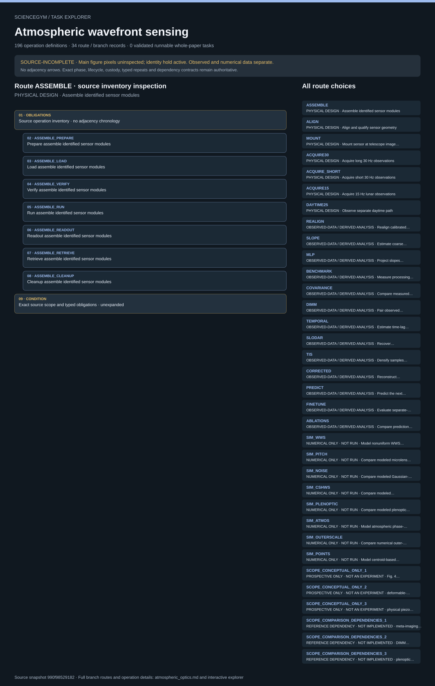

# Atmospheric wavefront sensing: task route map



Paper: **Direct observation of atmospheric turbulence with a video-rate wide-field wavefront sensor** · [DOI](https://doi.org/10.1038/s41566-024-01466-3)

Author/evaluator design reference only; not an actor projection, executable procedure, task runner, solver, physical simulation or execution receipt. Navigation and operation membership do not invent chronology, control settings, specimen counts or completed services. SOURCE-INCOMPLETE: source_complete_for_entire_paper=false; main figure pixels remain uninspected and the direct-byte identity hold remains active. Seven physical branches, thirteen observed-data/analysis branches and eight numerical branches remain distinct. Atmosphere is not a handled sample. Camera acquisition retains the mount lease: jobs and records move, not mounted hardware. TIS is computational, not physical piezo scanning. Frames, windows and inferred layers are not independent specimens. Source conflicts and qualified-card gates remain unresolved.. Counts describe task representation, not experiments or success.

**Reading rule:** rows show unordered source inventory for inspection. Exact phase, lifecycle and dependency contracts remain authoritative; no loop, specimen, condition or chronology is inferred. An unordered obligation group has no inferred chronological edges. Source-reported scientific facts and authored handling are distinct.

[Immutable source task package](https://github.com/openags/ScienceGym/blob/990f98529182af0ddd03fba53587b0931630de96/tasks/atmospheric_optics_operations_v2/) · [Interactive inspector](../index.html)

## ASSEMBLE — PHYSICAL DESIGN · Assemble identified sensor modules

Author/evaluator design reference only; not an actor projection, executable procedure, task runner, solver, physical simulation or execution receipt. Navigation and operation membership do not invent chronology, control settings, specimen counts or completed services. SOURCE-INCOMPLETE: source_complete_for_entire_paper=false; main figure pixels remain uninspected and the direct-byte identity hold remains active. Seven physical branches, thirteen observed-data/analysis branches and eight numerical branches remain distinct. Atmosphere is not a handled sample. Camera acquisition retains the mount lease: jobs and records move, not mounted hardware. TIS is computational, not physical piezo scanning. Frames, windows and inferred layers are not independent specimens. Source conflicts and qualified-card gates remain unresolved.

[Exact route source](https://github.com/openags/ScienceGym/blob/990f98529182af0ddd03fba53587b0931630de96/tasks/atmospheric_optics_operations_v2/branches.json) · JSON pointer: `/branches/0`

- **OBLIGATIONS: Source operation inventory · no adjacency chronology**
  - Binding: {"order":"Unordered inspection membership. Apply exact source phase, lifecycle and dependency contracts; no counts or schedule are instantiated."}
  - `ASSEMBLE_PREPARE` Prepare assemble identified sensor modules
  - `ASSEMBLE_LOAD` Load assemble identified sensor modules
  - `ASSEMBLE_VERIFY` Verify assemble identified sensor modules
  - `ASSEMBLE_RUN` Run assemble identified sensor modules
  - `ASSEMBLE_READOUT` Readout assemble identified sensor modules
  - `ASSEMBLE_RETRIEVE` Retrieve assemble identified sensor modules
  - `ASSEMBLE_CLEANUP` Cleanup assemble identified sensor modules
- **CONDITION: Exact source scope and typed obligations · unexpanded**
  - Binding: {"source_file":"branches.json","source_pointer":"/branches/0","source_contract":{"id":"ASSEMBLE","title":"Assemble identified sensor modules","family_id":"R1","classification":"physical_preparation","station_id":"WS_OPTICS","required_branch_ids":[],"source_evidence_ids":["E_ASSEMBLY"],"unknown_parameter_ids":["U_ASSEMBLY","U_METRICS","U_SAFETY","U_SCENE"],"input_kind":"identified_optical_parts","output_kind":"assembled_sensor","source_parameters":{"camera":"Flare 48M30-CX","sensor_pixels":[7920,6004],"pixel_um":4.6,"microlens_diameter_um":69,"microlens_focal_length_um":690,"microlens_f_number":10,"pixels_per_microlens":[15,15]},"control_ids":["CTRL_IDENTITY"],"operation_ids":["ASSEMBLE_PREPARE","ASSEMBLE_LOAD","ASSEMBLE_VERIFY","ASSEMBLE_RUN","ASSEMBLE_READOUT","ASSEMBLE_RETRIEVE","ASSEMBLE_CLEANUP"],"expected_results_actor_visible":false,"execution_ready":false,"source_independent_replicates":null,"completion":"Require every phase, authentic input lineage, qualified cards and controls, independent readout, retained failures and cleanup. No literary outcome can substitute for evidence."}}

<details><summary>Branch state, choices, lineage and loop obligations</summary>

```json
{
  "id": "ASSEMBLE",
  "title": "Assemble identified sensor modules",
  "family_id": "R1",
  "classification": "physical_preparation",
  "station_id": "WS_OPTICS",
  "required_branch_ids": [],
  "source_evidence_ids": [
    "E_ASSEMBLY"
  ],
  "unknown_parameter_ids": [
    "U_ASSEMBLY",
    "U_METRICS",
    "U_SAFETY",
    "U_SCENE"
  ],
  "input_kind": "identified_optical_parts",
  "output_kind": "assembled_sensor",
  "source_parameters": {
    "camera": "Flare 48M30-CX",
    "sensor_pixels": [
      7920,
      6004
    ],
    "pixel_um": 4.6,
    "microlens_diameter_um": 69,
    "microlens_focal_length_um": 690,
    "microlens_f_number": 10,
    "pixels_per_microlens": [
      15,
      15
    ]
  },
  "control_ids": [
    "CTRL_IDENTITY"
  ],
  "operation_ids": [
    "ASSEMBLE_PREPARE",
    "ASSEMBLE_LOAD",
    "ASSEMBLE_VERIFY",
    "ASSEMBLE_RUN",
    "ASSEMBLE_READOUT",
    "ASSEMBLE_RETRIEVE",
    "ASSEMBLE_CLEANUP"
  ],
  "expected_results_actor_visible": false,
  "execution_ready": false,
  "source_independent_replicates": null,
  "completion": "Require every phase, authentic input lineage, qualified cards and controls, independent readout, retained failures and cleanup. No literary outcome can substitute for evidence."
}
```

</details>

## ALIGN — PHYSICAL DESIGN · Align and qualify sensor geometry

Author/evaluator design reference only; not an actor projection, executable procedure, task runner, solver, physical simulation or execution receipt. Navigation and operation membership do not invent chronology, control settings, specimen counts or completed services. SOURCE-INCOMPLETE: source_complete_for_entire_paper=false; main figure pixels remain uninspected and the direct-byte identity hold remains active. Seven physical branches, thirteen observed-data/analysis branches and eight numerical branches remain distinct. Atmosphere is not a handled sample. Camera acquisition retains the mount lease: jobs and records move, not mounted hardware. TIS is computational, not physical piezo scanning. Frames, windows and inferred layers are not independent specimens. Source conflicts and qualified-card gates remain unresolved.

[Exact route source](https://github.com/openags/ScienceGym/blob/990f98529182af0ddd03fba53587b0931630de96/tasks/atmospheric_optics_operations_v2/branches.json) · JSON pointer: `/branches/1`

- **OBLIGATIONS: Source operation inventory · no adjacency chronology**
  - Binding: {"order":"Unordered inspection membership. Apply exact source phase, lifecycle and dependency contracts; no counts or schedule are instantiated."}
  - `ALIGN_PREPARE` Prepare align and qualify sensor geometry
  - `ALIGN_LOAD` Load align and qualify sensor geometry
  - `ALIGN_VERIFY` Verify align and qualify sensor geometry
  - `ALIGN_RUN` Run align and qualify sensor geometry
  - `ALIGN_READOUT` Readout align and qualify sensor geometry
  - `ALIGN_RETRIEVE` Retrieve align and qualify sensor geometry
  - `ALIGN_CLEANUP` Cleanup align and qualify sensor geometry
- **CONDITION: Exact source scope and typed obligations · unexpanded**
  - Binding: {"source_file":"branches.json","source_pointer":"/branches/1","source_contract":{"id":"ALIGN","title":"Align and qualify sensor geometry","family_id":"R1","classification":"physical_calibration","station_id":"WS_OPTICS","required_branch_ids":["ASSEMBLE"],"source_evidence_ids":["E_ASSEMBLY","E_REALIGN"],"unknown_parameter_ids":["U_ASSEMBLY","U_CAL","U_METRICS","U_SAFETY","U_SCENE"],"input_kind":"assembled_sensor","output_kind":"calibrated_sensor","source_parameters":{"alignment_stage":"Thorlabs PY005","optical_relation":"photosensitive plane at MLA back focal plane"},"control_ids":["CTRL_IDENTITY","CTRL_GEOMETRY"],"operation_ids":["ALIGN_PREPARE","ALIGN_LOAD","ALIGN_VERIFY","ALIGN_RUN","ALIGN_READOUT","ALIGN_RETRIEVE","ALIGN_CLEANUP"],"expected_results_actor_visible":false,"execution_ready":false,"source_independent_replicates":null,"completion":"Require every phase, authentic input lineage, qualified cards and controls, independent readout, retained failures and cleanup. No literary outcome can substitute for evidence."}}

<details><summary>Branch state, choices, lineage and loop obligations</summary>

```json
{
  "id": "ALIGN",
  "title": "Align and qualify sensor geometry",
  "family_id": "R1",
  "classification": "physical_calibration",
  "station_id": "WS_OPTICS",
  "required_branch_ids": [
    "ASSEMBLE"
  ],
  "source_evidence_ids": [
    "E_ASSEMBLY",
    "E_REALIGN"
  ],
  "unknown_parameter_ids": [
    "U_ASSEMBLY",
    "U_CAL",
    "U_METRICS",
    "U_SAFETY",
    "U_SCENE"
  ],
  "input_kind": "assembled_sensor",
  "output_kind": "calibrated_sensor",
  "source_parameters": {
    "alignment_stage": "Thorlabs PY005",
    "optical_relation": "photosensitive plane at MLA back focal plane"
  },
  "control_ids": [
    "CTRL_IDENTITY",
    "CTRL_GEOMETRY"
  ],
  "operation_ids": [
    "ALIGN_PREPARE",
    "ALIGN_LOAD",
    "ALIGN_VERIFY",
    "ALIGN_RUN",
    "ALIGN_READOUT",
    "ALIGN_RETRIEVE",
    "ALIGN_CLEANUP"
  ],
  "expected_results_actor_visible": false,
  "execution_ready": false,
  "source_independent_replicates": null,
  "completion": "Require every phase, authentic input lineage, qualified cards and controls, independent readout, retained failures and cleanup. No literary outcome can substitute for evidence."
}
```

</details>

## MOUNT — PHYSICAL DESIGN · Mount sensor at telescope image plane

Author/evaluator design reference only; not an actor projection, executable procedure, task runner, solver, physical simulation or execution receipt. Navigation and operation membership do not invent chronology, control settings, specimen counts or completed services. SOURCE-INCOMPLETE: source_complete_for_entire_paper=false; main figure pixels remain uninspected and the direct-byte identity hold remains active. Seven physical branches, thirteen observed-data/analysis branches and eight numerical branches remain distinct. Atmosphere is not a handled sample. Camera acquisition retains the mount lease: jobs and records move, not mounted hardware. TIS is computational, not physical piezo scanning. Frames, windows and inferred layers are not independent specimens. Source conflicts and qualified-card gates remain unresolved.

[Exact route source](https://github.com/openags/ScienceGym/blob/990f98529182af0ddd03fba53587b0931630de96/tasks/atmospheric_optics_operations_v2/branches.json) · JSON pointer: `/branches/2`

- **OBLIGATIONS: Source operation inventory · no adjacency chronology**
  - Binding: {"order":"Unordered inspection membership. Apply exact source phase, lifecycle and dependency contracts; no counts or schedule are instantiated."}
  - `MOUNT_PREPARE` Prepare mount sensor at telescope image plane
  - `MOUNT_LOAD` Load mount sensor at telescope image plane
  - `MOUNT_VERIFY` Verify mount sensor at telescope image plane
  - `MOUNT_RUN` Run mount sensor at telescope image plane
  - `MOUNT_READOUT` Readout mount sensor at telescope image plane
  - `MOUNT_RETRIEVE` Retrieve mount sensor at telescope image plane
  - `MOUNT_CLEANUP` Cleanup mount sensor at telescope image plane
- **CONDITION: Exact source scope and typed obligations · unexpanded**
  - Binding: {"source_file":"branches.json","source_pointer":"/branches/2","source_contract":{"id":"MOUNT","title":"Mount sensor at telescope image plane","family_id":"R2","classification":"physical_mount","station_id":"WS_TELESCOPE","required_branch_ids":["ALIGN"],"source_evidence_ids":["E_TELESCOPE"],"unknown_parameter_ids":["U_METRICS","U_MOUNT","U_POINT","U_SAFETY","U_SCENE"],"input_kind":"calibrated_sensor","output_kind":"mounted_sensor","source_parameters":{"telescope_aperture_m":0.8},"control_ids":["CTRL_IDENTITY","CTRL_GEOMETRY","CTRL_MOUNT"],"operation_ids":["MOUNT_PREPARE","MOUNT_LOAD","MOUNT_VERIFY","MOUNT_RUN","MOUNT_READOUT","MOUNT_RETRIEVE","MOUNT_CLEANUP"],"expected_results_actor_visible":false,"execution_ready":false,"source_independent_replicates":null,"completion":"Require every phase, authentic input lineage, qualified cards and controls, independent readout, retained failures and cleanup. No literary outcome can substitute for evidence."}}

<details><summary>Branch state, choices, lineage and loop obligations</summary>

```json
{
  "id": "MOUNT",
  "title": "Mount sensor at telescope image plane",
  "family_id": "R2",
  "classification": "physical_mount",
  "station_id": "WS_TELESCOPE",
  "required_branch_ids": [
    "ALIGN"
  ],
  "source_evidence_ids": [
    "E_TELESCOPE"
  ],
  "unknown_parameter_ids": [
    "U_METRICS",
    "U_MOUNT",
    "U_POINT",
    "U_SAFETY",
    "U_SCENE"
  ],
  "input_kind": "calibrated_sensor",
  "output_kind": "mounted_sensor",
  "source_parameters": {
    "telescope_aperture_m": 0.8
  },
  "control_ids": [
    "CTRL_IDENTITY",
    "CTRL_GEOMETRY",
    "CTRL_MOUNT"
  ],
  "operation_ids": [
    "MOUNT_PREPARE",
    "MOUNT_LOAD",
    "MOUNT_VERIFY",
    "MOUNT_RUN",
    "MOUNT_READOUT",
    "MOUNT_RETRIEVE",
    "MOUNT_CLEANUP"
  ],
  "expected_results_actor_visible": false,
  "execution_ready": false,
  "source_independent_replicates": null,
  "completion": "Require every phase, authentic input lineage, qualified cards and controls, independent readout, retained failures and cleanup. No literary outcome can substitute for evidence."
}
```

</details>

## ACQUIRE30 — PHYSICAL DESIGN · Acquire long 30 Hz observations

Author/evaluator design reference only; not an actor projection, executable procedure, task runner, solver, physical simulation or execution receipt. Navigation and operation membership do not invent chronology, control settings, specimen counts or completed services. SOURCE-INCOMPLETE: source_complete_for_entire_paper=false; main figure pixels remain uninspected and the direct-byte identity hold remains active. Seven physical branches, thirteen observed-data/analysis branches and eight numerical branches remain distinct. Atmosphere is not a handled sample. Camera acquisition retains the mount lease: jobs and records move, not mounted hardware. TIS is computational, not physical piezo scanning. Frames, windows and inferred layers are not independent specimens. Source conflicts and qualified-card gates remain unresolved.

[Exact route source](https://github.com/openags/ScienceGym/blob/990f98529182af0ddd03fba53587b0931630de96/tasks/atmospheric_optics_operations_v2/branches.json) · JSON pointer: `/branches/3`

- **OBLIGATIONS: Source operation inventory · no adjacency chronology**
  - Binding: {"order":"Unordered inspection membership. Apply exact source phase, lifecycle and dependency contracts; no counts or schedule are instantiated."}
  - `ACQUIRE30_PREPARE` Prepare acquire long 30 hz observations
  - `ACQUIRE30_LOAD` Load acquire long 30 hz observations
  - `ACQUIRE30_VERIFY` Verify acquire long 30 hz observations
  - `ACQUIRE30_RUN` Run acquire long 30 hz observations
  - `ACQUIRE30_READOUT` Readout acquire long 30 hz observations
  - `ACQUIRE30_RETRIEVE` Retrieve acquire long 30 hz observations
  - `ACQUIRE30_CLEANUP` Cleanup acquire long 30 hz observations
- **CONDITION: Exact source scope and typed obligations · unexpanded**
  - Binding: {"source_file":"branches.json","source_pointer":"/branches/3","source_contract":{"id":"ACQUIRE30","title":"Acquire long 30 Hz observations","family_id":"R2","classification":"physical_observation","station_id":"WS_TELESCOPE","required_branch_ids":["MOUNT"],"source_evidence_ids":["E_SI1","E_TELESCOPE"],"unknown_parameter_ids":["U_CAL","U_CAMERA","U_DATA","U_METRICS","U_POINT","U_SAFETY"],"input_kind":"mounted_sensor","output_kind":"observed_lightfield","source_parameters":{"sets":[1,2,3,4,5,6,7,8,9,10,11,12,13,14,15,16,17,18,19,20,21,22,23,24,25,26],"frame_count_per_set":1000,"frame_rate_hz":30,"exposure_ms":2},"control_ids":["CTRL_IDENTITY","CTRL_CAMERA","CTRL_TIMESTAMPS"],"operation_ids":["ACQUIRE30_PREPARE","ACQUIRE30_LOAD","ACQUIRE30_VERIFY","ACQUIRE30_RUN","ACQUIRE30_READOUT","ACQUIRE30_RETRIEVE","ACQUIRE30_CLEANUP"],"expected_results_actor_visible":false,"execution_ready":false,"source_independent_replicates":null,"completion":"Require every phase, authentic input lineage, qualified cards and controls, independent readout, retained failures and cleanup. No literary outcome can substitute for evidence."}}

<details><summary>Branch state, choices, lineage and loop obligations</summary>

```json
{
  "id": "ACQUIRE30",
  "title": "Acquire long 30 Hz observations",
  "family_id": "R2",
  "classification": "physical_observation",
  "station_id": "WS_TELESCOPE",
  "required_branch_ids": [
    "MOUNT"
  ],
  "source_evidence_ids": [
    "E_SI1",
    "E_TELESCOPE"
  ],
  "unknown_parameter_ids": [
    "U_CAL",
    "U_CAMERA",
    "U_DATA",
    "U_METRICS",
    "U_POINT",
    "U_SAFETY"
  ],
  "input_kind": "mounted_sensor",
  "output_kind": "observed_lightfield",
  "source_parameters": {
    "sets": [
      1,
      2,
      3,
      4,
      5,
      6,
      7,
      8,
      9,
      10,
      11,
      12,
      13,
      14,
      15,
      16,
      17,
      18,
      19,
      20,
      21,
      22,
      23,
      24,
      25,
      26
    ],
    "frame_count_per_set": 1000,
    "frame_rate_hz": 30,
    "exposure_ms": 2
  },
  "control_ids": [
    "CTRL_IDENTITY",
    "CTRL_CAMERA",
    "CTRL_TIMESTAMPS"
  ],
  "operation_ids": [
    "ACQUIRE30_PREPARE",
    "ACQUIRE30_LOAD",
    "ACQUIRE30_VERIFY",
    "ACQUIRE30_RUN",
    "ACQUIRE30_READOUT",
    "ACQUIRE30_RETRIEVE",
    "ACQUIRE30_CLEANUP"
  ],
  "expected_results_actor_visible": false,
  "execution_ready": false,
  "source_independent_replicates": null,
  "completion": "Require every phase, authentic input lineage, qualified cards and controls, independent readout, retained failures and cleanup. No literary outcome can substitute for evidence."
}
```

</details>

## ACQUIRE_SHORT — PHYSICAL DESIGN · Acquire short 30 Hz observations

Author/evaluator design reference only; not an actor projection, executable procedure, task runner, solver, physical simulation or execution receipt. Navigation and operation membership do not invent chronology, control settings, specimen counts or completed services. SOURCE-INCOMPLETE: source_complete_for_entire_paper=false; main figure pixels remain uninspected and the direct-byte identity hold remains active. Seven physical branches, thirteen observed-data/analysis branches and eight numerical branches remain distinct. Atmosphere is not a handled sample. Camera acquisition retains the mount lease: jobs and records move, not mounted hardware. TIS is computational, not physical piezo scanning. Frames, windows and inferred layers are not independent specimens. Source conflicts and qualified-card gates remain unresolved.

[Exact route source](https://github.com/openags/ScienceGym/blob/990f98529182af0ddd03fba53587b0931630de96/tasks/atmospheric_optics_operations_v2/branches.json) · JSON pointer: `/branches/4`

- **OBLIGATIONS: Source operation inventory · no adjacency chronology**
  - Binding: {"order":"Unordered inspection membership. Apply exact source phase, lifecycle and dependency contracts; no counts or schedule are instantiated."}
  - `ACQUIRE_SHORT_PREPARE` Prepare acquire short 30 hz observations
  - `ACQUIRE_SHORT_LOAD` Load acquire short 30 hz observations
  - `ACQUIRE_SHORT_VERIFY` Verify acquire short 30 hz observations
  - `ACQUIRE_SHORT_RUN` Run acquire short 30 hz observations
  - `ACQUIRE_SHORT_READOUT` Readout acquire short 30 hz observations
  - `ACQUIRE_SHORT_RETRIEVE` Retrieve acquire short 30 hz observations
  - `ACQUIRE_SHORT_CLEANUP` Cleanup acquire short 30 hz observations
- **CONDITION: Exact source scope and typed obligations · unexpanded**
  - Binding: {"source_file":"branches.json","source_pointer":"/branches/4","source_contract":{"id":"ACQUIRE_SHORT","title":"Acquire short 30 Hz observations","family_id":"R2","classification":"physical_observation","station_id":"WS_TELESCOPE","required_branch_ids":["MOUNT"],"source_evidence_ids":["E_SI1","E_TELESCOPE"],"unknown_parameter_ids":["U_CAL","U_CAMERA","U_DATA","U_METRICS","U_POINT","U_SAFETY"],"input_kind":"mounted_sensor","output_kind":"observed_lightfield","source_parameters":{"sets":[27,28],"frame_count_per_set":200,"frame_rate_hz":30,"exposure_ms":2},"control_ids":["CTRL_IDENTITY","CTRL_CAMERA","CTRL_TIMESTAMPS"],"operation_ids":["ACQUIRE_SHORT_PREPARE","ACQUIRE_SHORT_LOAD","ACQUIRE_SHORT_VERIFY","ACQUIRE_SHORT_RUN","ACQUIRE_SHORT_READOUT","ACQUIRE_SHORT_RETRIEVE","ACQUIRE_SHORT_CLEANUP"],"expected_results_actor_visible":false,"execution_ready":false,"source_independent_replicates":null,"completion":"Require every phase, authentic input lineage, qualified cards and controls, independent readout, retained failures and cleanup. No literary outcome can substitute for evidence."}}

<details><summary>Branch state, choices, lineage and loop obligations</summary>

```json
{
  "id": "ACQUIRE_SHORT",
  "title": "Acquire short 30 Hz observations",
  "family_id": "R2",
  "classification": "physical_observation",
  "station_id": "WS_TELESCOPE",
  "required_branch_ids": [
    "MOUNT"
  ],
  "source_evidence_ids": [
    "E_SI1",
    "E_TELESCOPE"
  ],
  "unknown_parameter_ids": [
    "U_CAL",
    "U_CAMERA",
    "U_DATA",
    "U_METRICS",
    "U_POINT",
    "U_SAFETY"
  ],
  "input_kind": "mounted_sensor",
  "output_kind": "observed_lightfield",
  "source_parameters": {
    "sets": [
      27,
      28
    ],
    "frame_count_per_set": 200,
    "frame_rate_hz": 30,
    "exposure_ms": 2
  },
  "control_ids": [
    "CTRL_IDENTITY",
    "CTRL_CAMERA",
    "CTRL_TIMESTAMPS"
  ],
  "operation_ids": [
    "ACQUIRE_SHORT_PREPARE",
    "ACQUIRE_SHORT_LOAD",
    "ACQUIRE_SHORT_VERIFY",
    "ACQUIRE_SHORT_RUN",
    "ACQUIRE_SHORT_READOUT",
    "ACQUIRE_SHORT_RETRIEVE",
    "ACQUIRE_SHORT_CLEANUP"
  ],
  "expected_results_actor_visible": false,
  "execution_ready": false,
  "source_independent_replicates": null,
  "completion": "Require every phase, authentic input lineage, qualified cards and controls, independent readout, retained failures and cleanup. No literary outcome can substitute for evidence."
}
```

</details>

## ACQUIRE15 — PHYSICAL DESIGN · Acquire 15 Hz lunar observations

Author/evaluator design reference only; not an actor projection, executable procedure, task runner, solver, physical simulation or execution receipt. Navigation and operation membership do not invent chronology, control settings, specimen counts or completed services. SOURCE-INCOMPLETE: source_complete_for_entire_paper=false; main figure pixels remain uninspected and the direct-byte identity hold remains active. Seven physical branches, thirteen observed-data/analysis branches and eight numerical branches remain distinct. Atmosphere is not a handled sample. Camera acquisition retains the mount lease: jobs and records move, not mounted hardware. TIS is computational, not physical piezo scanning. Frames, windows and inferred layers are not independent specimens. Source conflicts and qualified-card gates remain unresolved.

[Exact route source](https://github.com/openags/ScienceGym/blob/990f98529182af0ddd03fba53587b0931630de96/tasks/atmospheric_optics_operations_v2/branches.json) · JSON pointer: `/branches/5`

- **OBLIGATIONS: Source operation inventory · no adjacency chronology**
  - Binding: {"order":"Unordered inspection membership. Apply exact source phase, lifecycle and dependency contracts; no counts or schedule are instantiated."}
  - `ACQUIRE15_PREPARE` Prepare acquire 15 hz lunar observations
  - `ACQUIRE15_LOAD` Load acquire 15 hz lunar observations
  - `ACQUIRE15_VERIFY` Verify acquire 15 hz lunar observations
  - `ACQUIRE15_RUN` Run acquire 15 hz lunar observations
  - `ACQUIRE15_READOUT` Readout acquire 15 hz lunar observations
  - `ACQUIRE15_RETRIEVE` Retrieve acquire 15 hz lunar observations
  - `ACQUIRE15_CLEANUP` Cleanup acquire 15 hz lunar observations
- **CONDITION: Exact source scope and typed obligations · unexpanded**
  - Binding: {"source_file":"branches.json","source_pointer":"/branches/5","source_contract":{"id":"ACQUIRE15","title":"Acquire 15 Hz lunar observations","family_id":"R2","classification":"physical_observation","station_id":"WS_TELESCOPE","required_branch_ids":["MOUNT"],"source_evidence_ids":["E_SI1","E_TELESCOPE"],"unknown_parameter_ids":["U_CAL","U_CAMERA","U_DATA","U_METRICS","U_POINT","U_SAFETY"],"input_kind":"mounted_sensor","output_kind":"observed_lightfield","source_parameters":{"sets":[29],"frame_count_per_set":900,"frame_rate_hz":15,"exposure_ms":5},"control_ids":["CTRL_IDENTITY","CTRL_CAMERA","CTRL_TIMESTAMPS"],"operation_ids":["ACQUIRE15_PREPARE","ACQUIRE15_LOAD","ACQUIRE15_VERIFY","ACQUIRE15_RUN","ACQUIRE15_READOUT","ACQUIRE15_RETRIEVE","ACQUIRE15_CLEANUP"],"expected_results_actor_visible":false,"execution_ready":false,"source_independent_replicates":null,"completion":"Require every phase, authentic input lineage, qualified cards and controls, independent readout, retained failures and cleanup. No literary outcome can substitute for evidence."}}

<details><summary>Branch state, choices, lineage and loop obligations</summary>

```json
{
  "id": "ACQUIRE15",
  "title": "Acquire 15 Hz lunar observations",
  "family_id": "R2",
  "classification": "physical_observation",
  "station_id": "WS_TELESCOPE",
  "required_branch_ids": [
    "MOUNT"
  ],
  "source_evidence_ids": [
    "E_SI1",
    "E_TELESCOPE"
  ],
  "unknown_parameter_ids": [
    "U_CAL",
    "U_CAMERA",
    "U_DATA",
    "U_METRICS",
    "U_POINT",
    "U_SAFETY"
  ],
  "input_kind": "mounted_sensor",
  "output_kind": "observed_lightfield",
  "source_parameters": {
    "sets": [
      29
    ],
    "frame_count_per_set": 900,
    "frame_rate_hz": 15,
    "exposure_ms": 5
  },
  "control_ids": [
    "CTRL_IDENTITY",
    "CTRL_CAMERA",
    "CTRL_TIMESTAMPS"
  ],
  "operation_ids": [
    "ACQUIRE15_PREPARE",
    "ACQUIRE15_LOAD",
    "ACQUIRE15_VERIFY",
    "ACQUIRE15_RUN",
    "ACQUIRE15_READOUT",
    "ACQUIRE15_RETRIEVE",
    "ACQUIRE15_CLEANUP"
  ],
  "expected_results_actor_visible": false,
  "execution_ready": false,
  "source_independent_replicates": null,
  "completion": "Require every phase, authentic input lineage, qualified cards and controls, independent readout, retained failures and cleanup. No literary outcome can substitute for evidence."
}
```

</details>

## DAYTIME25 — PHYSICAL DESIGN · Observe separate daytime path

Author/evaluator design reference only; not an actor projection, executable procedure, task runner, solver, physical simulation or execution receipt. Navigation and operation membership do not invent chronology, control settings, specimen counts or completed services. SOURCE-INCOMPLETE: source_complete_for_entire_paper=false; main figure pixels remain uninspected and the direct-byte identity hold remains active. Seven physical branches, thirteen observed-data/analysis branches and eight numerical branches remain distinct. Atmosphere is not a handled sample. Camera acquisition retains the mount lease: jobs and records move, not mounted hardware. TIS is computational, not physical piezo scanning. Frames, windows and inferred layers are not independent specimens. Source conflicts and qualified-card gates remain unresolved.

[Exact route source](https://github.com/openags/ScienceGym/blob/990f98529182af0ddd03fba53587b0931630de96/tasks/atmospheric_optics_operations_v2/branches.json) · JSON pointer: `/branches/6`

- **OBLIGATIONS: Source operation inventory · no adjacency chronology**
  - Binding: {"order":"Unordered inspection membership. Apply exact source phase, lifecycle and dependency contracts; no counts or schedule are instantiated."}
  - `DAYTIME25_PREPARE` Prepare observe separate daytime path
  - `DAYTIME25_LOAD` Load observe separate daytime path
  - `DAYTIME25_VERIFY` Verify observe separate daytime path
  - `DAYTIME25_RUN` Run observe separate daytime path
  - `DAYTIME25_READOUT` Readout observe separate daytime path
  - `DAYTIME25_RETRIEVE` Retrieve observe separate daytime path
  - `DAYTIME25_CLEANUP` Cleanup observe separate daytime path
- **CONDITION: Exact source scope and typed obligations · unexpanded**
  - Binding: {"source_file":"branches.json","source_pointer":"/branches/6","source_contract":{"id":"DAYTIME25","title":"Observe separate daytime path","family_id":"R8","classification":"physical_observation","station_id":"WS_DAYTIME","required_branch_ids":[],"source_evidence_ids":["E_DAY"],"unknown_parameter_ids":["U_CAL","U_CAMERA","U_DATA","U_DAY","U_METRICS","U_POINT","U_SAFETY"],"input_kind":"qualified_daytime_instrument","output_kind":"observed_lightfield","source_parameters":{"approx_path_km":2,"frame_rate_hz":25,"frame_count":null,"exposure_ms":null},"control_ids":["CTRL_IDENTITY","CTRL_CAMERA","CTRL_TIMESTAMPS"],"operation_ids":["DAYTIME25_PREPARE","DAYTIME25_LOAD","DAYTIME25_VERIFY","DAYTIME25_RUN","DAYTIME25_READOUT","DAYTIME25_RETRIEVE","DAYTIME25_CLEANUP"],"expected_results_actor_visible":false,"execution_ready":false,"source_independent_replicates":null,"completion":"Require every phase, authentic input lineage, qualified cards and controls, independent readout, retained failures and cleanup. No literary outcome can substitute for evidence."}}

<details><summary>Branch state, choices, lineage and loop obligations</summary>

```json
{
  "id": "DAYTIME25",
  "title": "Observe separate daytime path",
  "family_id": "R8",
  "classification": "physical_observation",
  "station_id": "WS_DAYTIME",
  "required_branch_ids": [],
  "source_evidence_ids": [
    "E_DAY"
  ],
  "unknown_parameter_ids": [
    "U_CAL",
    "U_CAMERA",
    "U_DATA",
    "U_DAY",
    "U_METRICS",
    "U_POINT",
    "U_SAFETY"
  ],
  "input_kind": "qualified_daytime_instrument",
  "output_kind": "observed_lightfield",
  "source_parameters": {
    "approx_path_km": 2,
    "frame_rate_hz": 25,
    "frame_count": null,
    "exposure_ms": null
  },
  "control_ids": [
    "CTRL_IDENTITY",
    "CTRL_CAMERA",
    "CTRL_TIMESTAMPS"
  ],
  "operation_ids": [
    "DAYTIME25_PREPARE",
    "DAYTIME25_LOAD",
    "DAYTIME25_VERIFY",
    "DAYTIME25_RUN",
    "DAYTIME25_READOUT",
    "DAYTIME25_RETRIEVE",
    "DAYTIME25_CLEANUP"
  ],
  "expected_results_actor_visible": false,
  "execution_ready": false,
  "source_independent_replicates": null,
  "completion": "Require every phase, authentic input lineage, qualified cards and controls, independent readout, retained failures and cleanup. No literary outcome can substitute for evidence."
}
```

</details>

## REALIGN — OBSERVED-DATA / DERIVED ANALYSIS · Realign calibrated light-field pixels

Author/evaluator design reference only; not an actor projection, executable procedure, task runner, solver, physical simulation or execution receipt. Navigation and operation membership do not invent chronology, control settings, specimen counts or completed services. SOURCE-INCOMPLETE: source_complete_for_entire_paper=false; main figure pixels remain uninspected and the direct-byte identity hold remains active. Seven physical branches, thirteen observed-data/analysis branches and eight numerical branches remain distinct. Atmosphere is not a handled sample. Camera acquisition retains the mount lease: jobs and records move, not mounted hardware. TIS is computational, not physical piezo scanning. Frames, windows and inferred layers are not independent specimens. Source conflicts and qualified-card gates remain unresolved.

[Exact route source](https://github.com/openags/ScienceGym/blob/990f98529182af0ddd03fba53587b0931630de96/tasks/atmospheric_optics_operations_v2/branches.json) · JSON pointer: `/branches/7`

- **OBLIGATIONS: Source operation inventory · no adjacency chronology**
  - Binding: {"order":"Unordered inspection membership. Apply exact source phase, lifecycle and dependency contracts; no counts or schedule are instantiated."}
  - `REALIGN_PREPARE` Prepare realign calibrated light-field pixels
  - `REALIGN_LOAD` Load realign calibrated light-field pixels
  - `REALIGN_VERIFY` Verify realign calibrated light-field pixels
  - `REALIGN_RUN` Run realign calibrated light-field pixels
  - `REALIGN_READOUT` Readout realign calibrated light-field pixels
  - `REALIGN_RETRIEVE` Retrieve realign calibrated light-field pixels
  - `REALIGN_CLEANUP` Cleanup realign calibrated light-field pixels
- **CONDITION: Exact source scope and typed obligations · unexpanded**
  - Binding: {"source_file":"branches.json","source_pointer":"/branches/7","source_contract":{"id":"REALIGN","title":"Realign calibrated light-field pixels","family_id":"R3","classification":"computational_on_observed_data","station_id":"WS_COMPUTE","required_branch_ids":[],"source_evidence_ids":["E_REALIGN"],"unknown_parameter_ids":["U_ALGORITHM","U_CAL","U_DATA","U_METRICS"],"input_kind":"observed_lightfield","output_kind":"subaperture_images","source_parameters":{},"control_ids":["CTRL_IDENTITY","CTRL_GEOMETRY"],"operation_ids":["REALIGN_PREPARE","REALIGN_LOAD","REALIGN_VERIFY","REALIGN_RUN","REALIGN_READOUT","REALIGN_RETRIEVE","REALIGN_CLEANUP"],"expected_results_actor_visible":false,"execution_ready":false,"source_independent_replicates":null,"completion":"Require every phase, authentic input lineage, qualified cards and controls, independent readout, retained failures and cleanup. No literary outcome can substitute for evidence."}}

<details><summary>Branch state, choices, lineage and loop obligations</summary>

```json
{
  "id": "REALIGN",
  "title": "Realign calibrated light-field pixels",
  "family_id": "R3",
  "classification": "computational_on_observed_data",
  "station_id": "WS_COMPUTE",
  "required_branch_ids": [],
  "source_evidence_ids": [
    "E_REALIGN"
  ],
  "unknown_parameter_ids": [
    "U_ALGORITHM",
    "U_CAL",
    "U_DATA",
    "U_METRICS"
  ],
  "input_kind": "observed_lightfield",
  "output_kind": "subaperture_images",
  "source_parameters": {},
  "control_ids": [
    "CTRL_IDENTITY",
    "CTRL_GEOMETRY"
  ],
  "operation_ids": [
    "REALIGN_PREPARE",
    "REALIGN_LOAD",
    "REALIGN_VERIFY",
    "REALIGN_RUN",
    "REALIGN_READOUT",
    "REALIGN_RETRIEVE",
    "REALIGN_CLEANUP"
  ],
  "expected_results_actor_visible": false,
  "execution_ready": false,
  "source_independent_replicates": null,
  "completion": "Require every phase, authentic input lineage, qualified cards and controls, independent readout, retained failures and cleanup. No literary outcome can substitute for evidence."
}
```

</details>

## SLOPE — OBSERVED-DATA / DERIVED ANALYSIS · Estimate coarse and refined slopes

Author/evaluator design reference only; not an actor projection, executable procedure, task runner, solver, physical simulation or execution receipt. Navigation and operation membership do not invent chronology, control settings, specimen counts or completed services. SOURCE-INCOMPLETE: source_complete_for_entire_paper=false; main figure pixels remain uninspected and the direct-byte identity hold remains active. Seven physical branches, thirteen observed-data/analysis branches and eight numerical branches remain distinct. Atmosphere is not a handled sample. Camera acquisition retains the mount lease: jobs and records move, not mounted hardware. TIS is computational, not physical piezo scanning. Frames, windows and inferred layers are not independent specimens. Source conflicts and qualified-card gates remain unresolved.

[Exact route source](https://github.com/openags/ScienceGym/blob/990f98529182af0ddd03fba53587b0931630de96/tasks/atmospheric_optics_operations_v2/branches.json) · JSON pointer: `/branches/8`

- **OBLIGATIONS: Source operation inventory · no adjacency chronology**
  - Binding: {"order":"Unordered inspection membership. Apply exact source phase, lifecycle and dependency contracts; no counts or schedule are instantiated."}
  - `SLOPE_PREPARE` Prepare estimate coarse and refined slopes
  - `SLOPE_LOAD` Load estimate coarse and refined slopes
  - `SLOPE_VERIFY` Verify estimate coarse and refined slopes
  - `SLOPE_RUN` Run estimate coarse and refined slopes
  - `SLOPE_READOUT` Readout estimate coarse and refined slopes
  - `SLOPE_RETRIEVE` Retrieve estimate coarse and refined slopes
  - `SLOPE_CLEANUP` Cleanup estimate coarse and refined slopes
- **CONDITION: Exact source scope and typed obligations · unexpanded**
  - Binding: {"source_file":"branches.json","source_pointer":"/branches/8","source_contract":{"id":"SLOPE","title":"Estimate coarse and refined slopes","family_id":"R3","classification":"computational_on_observed_data","station_id":"WS_COMPUTE","required_branch_ids":["REALIGN"],"source_evidence_ids":["E_SLOPE"],"unknown_parameter_ids":["U_ALGORITHM","U_CAL","U_METRICS"],"input_kind":"subaperture_images","output_kind":"slope_maps","source_parameters":{"pool_scale":0.05,"bicubic_scale":20,"coarse_epochs_approx":20,"coarse_learning_rate":0.01,"refinement_epochs_min":10,"refinement_learning_rate":0.001,"loss_central_fraction":0.95},"control_ids":["CTRL_IDENTITY"],"operation_ids":["SLOPE_PREPARE","SLOPE_LOAD","SLOPE_VERIFY","SLOPE_RUN","SLOPE_READOUT","SLOPE_RETRIEVE","SLOPE_CLEANUP"],"expected_results_actor_visible":false,"execution_ready":false,"source_independent_replicates":null,"completion":"Require every phase, authentic input lineage, qualified cards and controls, independent readout, retained failures and cleanup. No literary outcome can substitute for evidence."}}

<details><summary>Branch state, choices, lineage and loop obligations</summary>

```json
{
  "id": "SLOPE",
  "title": "Estimate coarse and refined slopes",
  "family_id": "R3",
  "classification": "computational_on_observed_data",
  "station_id": "WS_COMPUTE",
  "required_branch_ids": [
    "REALIGN"
  ],
  "source_evidence_ids": [
    "E_SLOPE"
  ],
  "unknown_parameter_ids": [
    "U_ALGORITHM",
    "U_CAL",
    "U_METRICS"
  ],
  "input_kind": "subaperture_images",
  "output_kind": "slope_maps",
  "source_parameters": {
    "pool_scale": 0.05,
    "bicubic_scale": 20,
    "coarse_epochs_approx": 20,
    "coarse_learning_rate": 0.01,
    "refinement_epochs_min": 10,
    "refinement_learning_rate": 0.001,
    "loss_central_fraction": 0.95
  },
  "control_ids": [
    "CTRL_IDENTITY"
  ],
  "operation_ids": [
    "SLOPE_PREPARE",
    "SLOPE_LOAD",
    "SLOPE_VERIFY",
    "SLOPE_RUN",
    "SLOPE_READOUT",
    "SLOPE_RETRIEVE",
    "SLOPE_CLEANUP"
  ],
  "expected_results_actor_visible": false,
  "execution_ready": false,
  "source_independent_replicates": null,
  "completion": "Require every phase, authentic input lineage, qualified cards and controls, independent readout, retained failures and cleanup. No literary outcome can substitute for evidence."
}
```

</details>

## MLP — OBSERVED-DATA / DERIVED ANALYSIS · Project slopes into Noll coefficients

Author/evaluator design reference only; not an actor projection, executable procedure, task runner, solver, physical simulation or execution receipt. Navigation and operation membership do not invent chronology, control settings, specimen counts or completed services. SOURCE-INCOMPLETE: source_complete_for_entire_paper=false; main figure pixels remain uninspected and the direct-byte identity hold remains active. Seven physical branches, thirteen observed-data/analysis branches and eight numerical branches remain distinct. Atmosphere is not a handled sample. Camera acquisition retains the mount lease: jobs and records move, not mounted hardware. TIS is computational, not physical piezo scanning. Frames, windows and inferred layers are not independent specimens. Source conflicts and qualified-card gates remain unresolved.

[Exact route source](https://github.com/openags/ScienceGym/blob/990f98529182af0ddd03fba53587b0931630de96/tasks/atmospheric_optics_operations_v2/branches.json) · JSON pointer: `/branches/9`

- **OBLIGATIONS: Source operation inventory · no adjacency chronology**
  - Binding: {"order":"Unordered inspection membership. Apply exact source phase, lifecycle and dependency contracts; no counts or schedule are instantiated."}
  - `MLP_PREPARE` Prepare project slopes into noll coefficients
  - `MLP_LOAD` Load project slopes into noll coefficients
  - `MLP_VERIFY` Verify project slopes into noll coefficients
  - `MLP_RUN` Run project slopes into noll coefficients
  - `MLP_READOUT` Readout project slopes into noll coefficients
  - `MLP_RETRIEVE` Retrieve project slopes into noll coefficients
  - `MLP_CLEANUP` Cleanup project slopes into noll coefficients
- **CONDITION: Exact source scope and typed obligations · unexpanded**
  - Binding: {"source_file":"branches.json","source_pointer":"/branches/9","source_contract":{"id":"MLP","title":"Project slopes into Noll coefficients","family_id":"R3","classification":"computational_on_observed_data","station_id":"WS_COMPUTE","required_branch_ids":["SLOPE"],"source_evidence_ids":["E_MLP"],"unknown_parameter_ids":["U_ALGORITHM","U_CAL","U_METRICS","U_MLP"],"input_kind":"slope_maps","output_kind":"zernike_measurements","source_parameters":{"hidden_nodes":[300,500],"activation":"ReLU","estimated_modes":[1,35]},"control_ids":["CTRL_IDENTITY","CTRL_MODES"],"operation_ids":["MLP_PREPARE","MLP_LOAD","MLP_VERIFY","MLP_RUN","MLP_READOUT","MLP_RETRIEVE","MLP_CLEANUP"],"expected_results_actor_visible":false,"execution_ready":false,"source_independent_replicates":null,"completion":"Require every phase, authentic input lineage, qualified cards and controls, independent readout, retained failures and cleanup. No literary outcome can substitute for evidence."}}

<details><summary>Branch state, choices, lineage and loop obligations</summary>

```json
{
  "id": "MLP",
  "title": "Project slopes into Noll coefficients",
  "family_id": "R3",
  "classification": "computational_on_observed_data",
  "station_id": "WS_COMPUTE",
  "required_branch_ids": [
    "SLOPE"
  ],
  "source_evidence_ids": [
    "E_MLP"
  ],
  "unknown_parameter_ids": [
    "U_ALGORITHM",
    "U_CAL",
    "U_METRICS",
    "U_MLP"
  ],
  "input_kind": "slope_maps",
  "output_kind": "zernike_measurements",
  "source_parameters": {
    "hidden_nodes": [
      300,
      500
    ],
    "activation": "ReLU",
    "estimated_modes": [
      1,
      35
    ]
  },
  "control_ids": [
    "CTRL_IDENTITY",
    "CTRL_MODES"
  ],
  "operation_ids": [
    "MLP_PREPARE",
    "MLP_LOAD",
    "MLP_VERIFY",
    "MLP_RUN",
    "MLP_READOUT",
    "MLP_RETRIEVE",
    "MLP_CLEANUP"
  ],
  "expected_results_actor_visible": false,
  "execution_ready": false,
  "source_independent_replicates": null,
  "completion": "Require every phase, authentic input lineage, qualified cards and controls, independent readout, retained failures and cleanup. No literary outcome can substitute for evidence."
}
```

</details>

## BENCHMARK — OBSERVED-DATA / DERIVED ANALYSIS · Measure processing latency independently

Author/evaluator design reference only; not an actor projection, executable procedure, task runner, solver, physical simulation or execution receipt. Navigation and operation membership do not invent chronology, control settings, specimen counts or completed services. SOURCE-INCOMPLETE: source_complete_for_entire_paper=false; main figure pixels remain uninspected and the direct-byte identity hold remains active. Seven physical branches, thirteen observed-data/analysis branches and eight numerical branches remain distinct. Atmosphere is not a handled sample. Camera acquisition retains the mount lease: jobs and records move, not mounted hardware. TIS is computational, not physical piezo scanning. Frames, windows and inferred layers are not independent specimens. Source conflicts and qualified-card gates remain unresolved.

[Exact route source](https://github.com/openags/ScienceGym/blob/990f98529182af0ddd03fba53587b0931630de96/tasks/atmospheric_optics_operations_v2/branches.json) · JSON pointer: `/branches/10`

- **OBLIGATIONS: Source operation inventory · no adjacency chronology**
  - Binding: {"order":"Unordered inspection membership. Apply exact source phase, lifecycle and dependency contracts; no counts or schedule are instantiated."}
  - `BENCHMARK_PREPARE` Prepare measure processing latency independently
  - `BENCHMARK_LOAD` Load measure processing latency independently
  - `BENCHMARK_VERIFY` Verify measure processing latency independently
  - `BENCHMARK_RUN` Run measure processing latency independently
  - `BENCHMARK_READOUT` Readout measure processing latency independently
  - `BENCHMARK_RETRIEVE` Retrieve measure processing latency independently
  - `BENCHMARK_CLEANUP` Cleanup measure processing latency independently
- **CONDITION: Exact source scope and typed obligations · unexpanded**
  - Binding: {"source_file":"branches.json","source_pointer":"/branches/10","source_contract":{"id":"BENCHMARK","title":"Measure processing latency independently","family_id":"R3","classification":"computational_on_observed_data","station_id":"WS_COMPUTE","required_branch_ids":["MLP"],"source_evidence_ids":["E_MLP"],"unknown_parameter_ids":["U_ALGORITHM","U_DATA","U_METRICS"],"input_kind":"zernike_measurements","output_kind":"timing_records","source_parameters":{"reported_gpu_count":8,"reported_gpu_model":"RTX 4090"},"control_ids":["CTRL_IDENTITY","CTRL_TIMING"],"operation_ids":["BENCHMARK_PREPARE","BENCHMARK_LOAD","BENCHMARK_VERIFY","BENCHMARK_RUN","BENCHMARK_READOUT","BENCHMARK_RETRIEVE","BENCHMARK_CLEANUP"],"expected_results_actor_visible":false,"execution_ready":false,"source_independent_replicates":null,"completion":"Require every phase, authentic input lineage, qualified cards and controls, independent readout, retained failures and cleanup. No literary outcome can substitute for evidence."}}

<details><summary>Branch state, choices, lineage and loop obligations</summary>

```json
{
  "id": "BENCHMARK",
  "title": "Measure processing latency independently",
  "family_id": "R3",
  "classification": "computational_on_observed_data",
  "station_id": "WS_COMPUTE",
  "required_branch_ids": [
    "MLP"
  ],
  "source_evidence_ids": [
    "E_MLP"
  ],
  "unknown_parameter_ids": [
    "U_ALGORITHM",
    "U_DATA",
    "U_METRICS"
  ],
  "input_kind": "zernike_measurements",
  "output_kind": "timing_records",
  "source_parameters": {
    "reported_gpu_count": 8,
    "reported_gpu_model": "RTX 4090"
  },
  "control_ids": [
    "CTRL_IDENTITY",
    "CTRL_TIMING"
  ],
  "operation_ids": [
    "BENCHMARK_PREPARE",
    "BENCHMARK_LOAD",
    "BENCHMARK_VERIFY",
    "BENCHMARK_RUN",
    "BENCHMARK_READOUT",
    "BENCHMARK_RETRIEVE",
    "BENCHMARK_CLEANUP"
  ],
  "expected_results_actor_visible": false,
  "execution_ready": false,
  "source_independent_replicates": null,
  "completion": "Require every phase, authentic input lineage, qualified cards and controls, independent readout, retained failures and cleanup. No literary outcome can substitute for evidence."
}
```

</details>

## COVARIANCE — OBSERVED-DATA / DERIVED ANALYSIS · Compare measured modal covariance

Author/evaluator design reference only; not an actor projection, executable procedure, task runner, solver, physical simulation or execution receipt. Navigation and operation membership do not invent chronology, control settings, specimen counts or completed services. SOURCE-INCOMPLETE: source_complete_for_entire_paper=false; main figure pixels remain uninspected and the direct-byte identity hold remains active. Seven physical branches, thirteen observed-data/analysis branches and eight numerical branches remain distinct. Atmosphere is not a handled sample. Camera acquisition retains the mount lease: jobs and records move, not mounted hardware. TIS is computational, not physical piezo scanning. Frames, windows and inferred layers are not independent specimens. Source conflicts and qualified-card gates remain unresolved.

[Exact route source](https://github.com/openags/ScienceGym/blob/990f98529182af0ddd03fba53587b0931630de96/tasks/atmospheric_optics_operations_v2/branches.json) · JSON pointer: `/branches/11`

- **OBLIGATIONS: Source operation inventory · no adjacency chronology**
  - Binding: {"order":"Unordered inspection membership. Apply exact source phase, lifecycle and dependency contracts; no counts or schedule are instantiated."}
  - `COVARIANCE_PREPARE` Prepare compare measured modal covariance
  - `COVARIANCE_LOAD` Load compare measured modal covariance
  - `COVARIANCE_VERIFY` Verify compare measured modal covariance
  - `COVARIANCE_RUN` Run compare measured modal covariance
  - `COVARIANCE_READOUT` Readout compare measured modal covariance
  - `COVARIANCE_RETRIEVE` Retrieve compare measured modal covariance
  - `COVARIANCE_CLEANUP` Cleanup compare measured modal covariance
- **CONDITION: Exact source scope and typed obligations · unexpanded**
  - Binding: {"source_file":"branches.json","source_pointer":"/branches/11","source_contract":{"id":"COVARIANCE","title":"Compare measured modal covariance","family_id":"R4","classification":"analysis_of_physical_measurement","station_id":"WS_COMPUTE","required_branch_ids":["MLP"],"source_evidence_ids":["E_STAT","E_SIM"],"unknown_parameter_ids":["U_ALGORITHM","U_CONFLICT","U_DATA","U_METRICS"],"input_kind":"zernike_measurements","output_kind":"covariance_analysis","source_parameters":{"noll_modes":[4,35],"frame_scope":"C_COVARIANCE unresolved"},"control_ids":["CTRL_IDENTITY","CTRL_MODES","CTRL_ANALYTIC_REFERENCE"],"operation_ids":["COVARIANCE_PREPARE","COVARIANCE_LOAD","COVARIANCE_VERIFY","COVARIANCE_RUN","COVARIANCE_READOUT","COVARIANCE_RETRIEVE","COVARIANCE_CLEANUP"],"expected_results_actor_visible":false,"execution_ready":false,"source_independent_replicates":null,"completion":"Require every phase, authentic input lineage, qualified cards and controls, independent readout, retained failures and cleanup. No literary outcome can substitute for evidence."}}

<details><summary>Branch state, choices, lineage and loop obligations</summary>

```json
{
  "id": "COVARIANCE",
  "title": "Compare measured modal covariance",
  "family_id": "R4",
  "classification": "analysis_of_physical_measurement",
  "station_id": "WS_COMPUTE",
  "required_branch_ids": [
    "MLP"
  ],
  "source_evidence_ids": [
    "E_STAT",
    "E_SIM"
  ],
  "unknown_parameter_ids": [
    "U_ALGORITHM",
    "U_CONFLICT",
    "U_DATA",
    "U_METRICS"
  ],
  "input_kind": "zernike_measurements",
  "output_kind": "covariance_analysis",
  "source_parameters": {
    "noll_modes": [
      4,
      35
    ],
    "frame_scope": "C_COVARIANCE unresolved"
  },
  "control_ids": [
    "CTRL_IDENTITY",
    "CTRL_MODES",
    "CTRL_ANALYTIC_REFERENCE"
  ],
  "operation_ids": [
    "COVARIANCE_PREPARE",
    "COVARIANCE_LOAD",
    "COVARIANCE_VERIFY",
    "COVARIANCE_RUN",
    "COVARIANCE_READOUT",
    "COVARIANCE_RETRIEVE",
    "COVARIANCE_CLEANUP"
  ],
  "expected_results_actor_visible": false,
  "execution_ready": false,
  "source_independent_replicates": null,
  "completion": "Require every phase, authentic input lineage, qualified cards and controls, independent readout, retained failures and cleanup. No literary outcome can substitute for evidence."
}
```

</details>

## DIMM — OBSERVED-DATA / DERIVED ANALYSIS · Pair observed Fried-parameter records

Author/evaluator design reference only; not an actor projection, executable procedure, task runner, solver, physical simulation or execution receipt. Navigation and operation membership do not invent chronology, control settings, specimen counts or completed services. SOURCE-INCOMPLETE: source_complete_for_entire_paper=false; main figure pixels remain uninspected and the direct-byte identity hold remains active. Seven physical branches, thirteen observed-data/analysis branches and eight numerical branches remain distinct. Atmosphere is not a handled sample. Camera acquisition retains the mount lease: jobs and records move, not mounted hardware. TIS is computational, not physical piezo scanning. Frames, windows and inferred layers are not independent specimens. Source conflicts and qualified-card gates remain unresolved.

[Exact route source](https://github.com/openags/ScienceGym/blob/990f98529182af0ddd03fba53587b0931630de96/tasks/atmospheric_optics_operations_v2/branches.json) · JSON pointer: `/branches/12`

- **OBLIGATIONS: Source operation inventory · no adjacency chronology**
  - Binding: {"order":"Unordered inspection membership. Apply exact source phase, lifecycle and dependency contracts; no counts or schedule are instantiated."}
  - `DIMM_PREPARE` Prepare pair observed fried-parameter records
  - `DIMM_LOAD` Load pair observed fried-parameter records
  - `DIMM_VERIFY` Verify pair observed fried-parameter records
  - `DIMM_RUN` Run pair observed fried-parameter records
  - `DIMM_READOUT` Readout pair observed fried-parameter records
  - `DIMM_RETRIEVE` Retrieve pair observed fried-parameter records
  - `DIMM_CLEANUP` Cleanup pair observed fried-parameter records
- **CONDITION: Exact source scope and typed obligations · unexpanded**
  - Binding: {"source_file":"branches.json","source_pointer":"/branches/12","source_contract":{"id":"DIMM","title":"Pair observed Fried-parameter records","family_id":"R4","classification":"analysis_of_physical_measurement","station_id":"WS_DIMM","required_branch_ids":["MLP"],"source_evidence_ids":["E_STAT"],"unknown_parameter_ids":["U_ALGORITHM","U_DATA","U_DIMM","U_METRICS"],"input_kind":"zernike_measurements","output_kind":"dimm_comparison","source_parameters":{"wws_window_approx_s":30,"dimm_window_minutes":[1,2],"historical_wws_sets":[1,2,3,4,5,6,7,8,9,10,11,12,13,14,15,16,17,18,19]},"control_ids":["CTRL_IDENTITY","CTRL_DIMM_PAIRING"],"operation_ids":["DIMM_PREPARE","DIMM_LOAD","DIMM_VERIFY","DIMM_RUN","DIMM_READOUT","DIMM_RETRIEVE","DIMM_CLEANUP"],"expected_results_actor_visible":false,"execution_ready":false,"source_independent_replicates":null,"completion":"Require every phase, authentic input lineage, qualified cards and controls, independent readout, retained failures and cleanup. No literary outcome can substitute for evidence."}}

<details><summary>Branch state, choices, lineage and loop obligations</summary>

```json
{
  "id": "DIMM",
  "title": "Pair observed Fried-parameter records",
  "family_id": "R4",
  "classification": "analysis_of_physical_measurement",
  "station_id": "WS_DIMM",
  "required_branch_ids": [
    "MLP"
  ],
  "source_evidence_ids": [
    "E_STAT"
  ],
  "unknown_parameter_ids": [
    "U_ALGORITHM",
    "U_DATA",
    "U_DIMM",
    "U_METRICS"
  ],
  "input_kind": "zernike_measurements",
  "output_kind": "dimm_comparison",
  "source_parameters": {
    "wws_window_approx_s": 30,
    "dimm_window_minutes": [
      1,
      2
    ],
    "historical_wws_sets": [
      1,
      2,
      3,
      4,
      5,
      6,
      7,
      8,
      9,
      10,
      11,
      12,
      13,
      14,
      15,
      16,
      17,
      18,
      19
    ]
  },
  "control_ids": [
    "CTRL_IDENTITY",
    "CTRL_DIMM_PAIRING"
  ],
  "operation_ids": [
    "DIMM_PREPARE",
    "DIMM_LOAD",
    "DIMM_VERIFY",
    "DIMM_RUN",
    "DIMM_READOUT",
    "DIMM_RETRIEVE",
    "DIMM_CLEANUP"
  ],
  "expected_results_actor_visible": false,
  "execution_ready": false,
  "source_independent_replicates": null,
  "completion": "Require every phase, authentic input lineage, qualified cards and controls, independent readout, retained failures and cleanup. No literary outcome can substitute for evidence."
}
```

</details>

## TEMPORAL — OBSERVED-DATA / DERIVED ANALYSIS · Estimate time-lag correlations

Author/evaluator design reference only; not an actor projection, executable procedure, task runner, solver, physical simulation or execution receipt. Navigation and operation membership do not invent chronology, control settings, specimen counts or completed services. SOURCE-INCOMPLETE: source_complete_for_entire_paper=false; main figure pixels remain uninspected and the direct-byte identity hold remains active. Seven physical branches, thirteen observed-data/analysis branches and eight numerical branches remain distinct. Atmosphere is not a handled sample. Camera acquisition retains the mount lease: jobs and records move, not mounted hardware. TIS is computational, not physical piezo scanning. Frames, windows and inferred layers are not independent specimens. Source conflicts and qualified-card gates remain unresolved.

[Exact route source](https://github.com/openags/ScienceGym/blob/990f98529182af0ddd03fba53587b0931630de96/tasks/atmospheric_optics_operations_v2/branches.json) · JSON pointer: `/branches/13`

- **OBLIGATIONS: Source operation inventory · no adjacency chronology**
  - Binding: {"order":"Unordered inspection membership. Apply exact source phase, lifecycle and dependency contracts; no counts or schedule are instantiated."}
  - `TEMPORAL_PREPARE` Prepare estimate time-lag correlations
  - `TEMPORAL_LOAD` Load estimate time-lag correlations
  - `TEMPORAL_VERIFY` Verify estimate time-lag correlations
  - `TEMPORAL_RUN` Run estimate time-lag correlations
  - `TEMPORAL_READOUT` Readout estimate time-lag correlations
  - `TEMPORAL_RETRIEVE` Retrieve estimate time-lag correlations
  - `TEMPORAL_CLEANUP` Cleanup estimate time-lag correlations
- **CONDITION: Exact source scope and typed obligations · unexpanded**
  - Binding: {"source_file":"branches.json","source_pointer":"/branches/13","source_contract":{"id":"TEMPORAL","title":"Estimate time-lag correlations","family_id":"R4","classification":"analysis_of_physical_measurement","station_id":"WS_COMPUTE","required_branch_ids":["MLP"],"source_evidence_ids":["E_STAT"],"unknown_parameter_ids":["U_ALGORITHM","U_DATA","U_METRICS"],"input_kind":"zernike_measurements","output_kind":"temporal_correlation","source_parameters":{"sequence_frames":1000,"sliding_window_frames":20,"historical_set":24},"control_ids":["CTRL_IDENTITY","CTRL_TIMESTAMPS"],"operation_ids":["TEMPORAL_PREPARE","TEMPORAL_LOAD","TEMPORAL_VERIFY","TEMPORAL_RUN","TEMPORAL_READOUT","TEMPORAL_RETRIEVE","TEMPORAL_CLEANUP"],"expected_results_actor_visible":false,"execution_ready":false,"source_independent_replicates":null,"completion":"Require every phase, authentic input lineage, qualified cards and controls, independent readout, retained failures and cleanup. No literary outcome can substitute for evidence."}}

<details><summary>Branch state, choices, lineage and loop obligations</summary>

```json
{
  "id": "TEMPORAL",
  "title": "Estimate time-lag correlations",
  "family_id": "R4",
  "classification": "analysis_of_physical_measurement",
  "station_id": "WS_COMPUTE",
  "required_branch_ids": [
    "MLP"
  ],
  "source_evidence_ids": [
    "E_STAT"
  ],
  "unknown_parameter_ids": [
    "U_ALGORITHM",
    "U_DATA",
    "U_METRICS"
  ],
  "input_kind": "zernike_measurements",
  "output_kind": "temporal_correlation",
  "source_parameters": {
    "sequence_frames": 1000,
    "sliding_window_frames": 20,
    "historical_set": 24
  },
  "control_ids": [
    "CTRL_IDENTITY",
    "CTRL_TIMESTAMPS"
  ],
  "operation_ids": [
    "TEMPORAL_PREPARE",
    "TEMPORAL_LOAD",
    "TEMPORAL_VERIFY",
    "TEMPORAL_RUN",
    "TEMPORAL_READOUT",
    "TEMPORAL_RETRIEVE",
    "TEMPORAL_CLEANUP"
  ],
  "expected_results_actor_visible": false,
  "execution_ready": false,
  "source_independent_replicates": null,
  "completion": "Require every phase, authentic input lineage, qualified cards and controls, independent readout, retained failures and cleanup. No literary outcome can substitute for evidence."
}
```

</details>

## SLODAR — OBSERVED-DATA / DERIVED ANALYSIS · Recover correlation-based altitude profiles

Author/evaluator design reference only; not an actor projection, executable procedure, task runner, solver, physical simulation or execution receipt. Navigation and operation membership do not invent chronology, control settings, specimen counts or completed services. SOURCE-INCOMPLETE: source_complete_for_entire_paper=false; main figure pixels remain uninspected and the direct-byte identity hold remains active. Seven physical branches, thirteen observed-data/analysis branches and eight numerical branches remain distinct. Atmosphere is not a handled sample. Camera acquisition retains the mount lease: jobs and records move, not mounted hardware. TIS is computational, not physical piezo scanning. Frames, windows and inferred layers are not independent specimens. Source conflicts and qualified-card gates remain unresolved.

[Exact route source](https://github.com/openags/ScienceGym/blob/990f98529182af0ddd03fba53587b0931630de96/tasks/atmospheric_optics_operations_v2/branches.json) · JSON pointer: `/branches/14`

- **OBLIGATIONS: Source operation inventory · no adjacency chronology**
  - Binding: {"order":"Unordered inspection membership. Apply exact source phase, lifecycle and dependency contracts; no counts or schedule are instantiated."}
  - `SLODAR_PREPARE` Prepare recover correlation-based altitude profiles
  - `SLODAR_LOAD` Load recover correlation-based altitude profiles
  - `SLODAR_VERIFY` Verify recover correlation-based altitude profiles
  - `SLODAR_RUN` Run recover correlation-based altitude profiles
  - `SLODAR_READOUT` Readout recover correlation-based altitude profiles
  - `SLODAR_RETRIEVE` Retrieve recover correlation-based altitude profiles
  - `SLODAR_CLEANUP` Cleanup recover correlation-based altitude profiles
- **CONDITION: Exact source scope and typed obligations · unexpanded**
  - Binding: {"source_file":"branches.json","source_pointer":"/branches/14","source_contract":{"id":"SLODAR","title":"Recover correlation-based altitude profiles","family_id":"R5","classification":"analysis_of_physical_measurement","station_id":"WS_COMPUTE","required_branch_ids":["SLOPE"],"source_evidence_ids":["E_SLODAR"],"unknown_parameter_ids":["U_ALGORITHM","U_CAL","U_CONFLICT","U_METRICS","U_SLODAR"],"input_kind":"slope_maps","output_kind":"inferred_turbulence_profile","source_parameters":{"demonstration_frames":300,"sub_fov_arcsec":[36,36],"pairs_per_separation":40,"largest_reported_separation_arcsec":180,"subaperture_width_expression_m":"0.8/15","zenith_deg":31.65,"pupil_subapertures":15},"control_ids":["CTRL_IDENTITY","CTRL_PAIR_INDEPENDENCE","CTRL_GEOMETRY"],"operation_ids":["SLODAR_PREPARE","SLODAR_LOAD","SLODAR_VERIFY","SLODAR_RUN","SLODAR_READOUT","SLODAR_RETRIEVE","SLODAR_CLEANUP"],"expected_results_actor_visible":false,"execution_ready":false,"source_independent_replicates":null,"completion":"Require every phase, authentic input lineage, qualified cards and controls, independent readout, retained failures and cleanup. No literary outcome can substitute for evidence."}}

<details><summary>Branch state, choices, lineage and loop obligations</summary>

```json
{
  "id": "SLODAR",
  "title": "Recover correlation-based altitude profiles",
  "family_id": "R5",
  "classification": "analysis_of_physical_measurement",
  "station_id": "WS_COMPUTE",
  "required_branch_ids": [
    "SLOPE"
  ],
  "source_evidence_ids": [
    "E_SLODAR"
  ],
  "unknown_parameter_ids": [
    "U_ALGORITHM",
    "U_CAL",
    "U_CONFLICT",
    "U_METRICS",
    "U_SLODAR"
  ],
  "input_kind": "slope_maps",
  "output_kind": "inferred_turbulence_profile",
  "source_parameters": {
    "demonstration_frames": 300,
    "sub_fov_arcsec": [
      36,
      36
    ],
    "pairs_per_separation": 40,
    "largest_reported_separation_arcsec": 180,
    "subaperture_width_expression_m": "0.8/15",
    "zenith_deg": 31.65,
    "pupil_subapertures": 15
  },
  "control_ids": [
    "CTRL_IDENTITY",
    "CTRL_PAIR_INDEPENDENCE",
    "CTRL_GEOMETRY"
  ],
  "operation_ids": [
    "SLODAR_PREPARE",
    "SLODAR_LOAD",
    "SLODAR_VERIFY",
    "SLODAR_RUN",
    "SLODAR_READOUT",
    "SLODAR_RETRIEVE",
    "SLODAR_CLEANUP"
  ],
  "expected_results_actor_visible": false,
  "execution_ready": false,
  "source_independent_replicates": null,
  "completion": "Require every phase, authentic input lineage, qualified cards and controls, independent readout, retained failures and cleanup. No literary outcome can substitute for evidence."
}
```

</details>

## TIS — OBSERVED-DATA / DERIVED ANALYSIS · Densify samples using turbulence motion

Author/evaluator design reference only; not an actor projection, executable procedure, task runner, solver, physical simulation or execution receipt. Navigation and operation membership do not invent chronology, control settings, specimen counts or completed services. SOURCE-INCOMPLETE: source_complete_for_entire_paper=false; main figure pixels remain uninspected and the direct-byte identity hold remains active. Seven physical branches, thirteen observed-data/analysis branches and eight numerical branches remain distinct. Atmosphere is not a handled sample. Camera acquisition retains the mount lease: jobs and records move, not mounted hardware. TIS is computational, not physical piezo scanning. Frames, windows and inferred layers are not independent specimens. Source conflicts and qualified-card gates remain unresolved.

[Exact route source](https://github.com/openags/ScienceGym/blob/990f98529182af0ddd03fba53587b0931630de96/tasks/atmospheric_optics_operations_v2/branches.json) · JSON pointer: `/branches/15`

- **OBLIGATIONS: Source operation inventory · no adjacency chronology**
  - Binding: {"order":"Unordered inspection membership. Apply exact source phase, lifecycle and dependency contracts; no counts or schedule are instantiated."}
  - `TIS_PREPARE` Prepare densify samples using turbulence motion
  - `TIS_LOAD` Load densify samples using turbulence motion
  - `TIS_VERIFY` Verify densify samples using turbulence motion
  - `TIS_RUN` Run densify samples using turbulence motion
  - `TIS_READOUT` Readout densify samples using turbulence motion
  - `TIS_RETRIEVE` Retrieve densify samples using turbulence motion
  - `TIS_CLEANUP` Cleanup densify samples using turbulence motion
- **CONDITION: Exact source scope and typed obligations · unexpanded**
  - Binding: {"source_file":"branches.json","source_pointer":"/branches/15","source_contract":{"id":"TIS","title":"Densify samples using turbulence motion","family_id":"R6","classification":"computational_on_observed_data","station_id":"WS_COMPUTE","required_branch_ids":["REALIGN"],"source_evidence_ids":["E_TIS"],"unknown_parameter_ids":["U_ALGORITHM","U_CAL","U_DATA","U_METRICS","U_TIS"],"input_kind":"subaperture_images","output_kind":"dense_subaperture_images","source_parameters":{"window_frames":9,"reference_frame_1based":5,"active_scan":false},"control_ids":["CTRL_IDENTITY","CTRL_TIMESTAMPS","CTRL_NO_ACTIVE_SCAN"],"operation_ids":["TIS_PREPARE","TIS_LOAD","TIS_VERIFY","TIS_RUN","TIS_READOUT","TIS_RETRIEVE","TIS_CLEANUP"],"expected_results_actor_visible":false,"execution_ready":false,"source_independent_replicates":null,"completion":"Require every phase, authentic input lineage, qualified cards and controls, independent readout, retained failures and cleanup. No literary outcome can substitute for evidence."}}

<details><summary>Branch state, choices, lineage and loop obligations</summary>

```json
{
  "id": "TIS",
  "title": "Densify samples using turbulence motion",
  "family_id": "R6",
  "classification": "computational_on_observed_data",
  "station_id": "WS_COMPUTE",
  "required_branch_ids": [
    "REALIGN"
  ],
  "source_evidence_ids": [
    "E_TIS"
  ],
  "unknown_parameter_ids": [
    "U_ALGORITHM",
    "U_CAL",
    "U_DATA",
    "U_METRICS",
    "U_TIS"
  ],
  "input_kind": "subaperture_images",
  "output_kind": "dense_subaperture_images",
  "source_parameters": {
    "window_frames": 9,
    "reference_frame_1based": 5,
    "active_scan": false
  },
  "control_ids": [
    "CTRL_IDENTITY",
    "CTRL_TIMESTAMPS",
    "CTRL_NO_ACTIVE_SCAN"
  ],
  "operation_ids": [
    "TIS_PREPARE",
    "TIS_LOAD",
    "TIS_VERIFY",
    "TIS_RUN",
    "TIS_READOUT",
    "TIS_RETRIEVE",
    "TIS_CLEANUP"
  ],
  "expected_results_actor_visible": false,
  "execution_ready": false,
  "source_independent_replicates": null,
  "completion": "Require every phase, authentic input lineage, qualified cards and controls, independent readout, retained failures and cleanup. No literary outcome can substitute for evidence."
}
```

</details>

## CORRECTED — OBSERVED-DATA / DERIVED ANALYSIS · Reconstruct corrected lunar images

Author/evaluator design reference only; not an actor projection, executable procedure, task runner, solver, physical simulation or execution receipt. Navigation and operation membership do not invent chronology, control settings, specimen counts or completed services. SOURCE-INCOMPLETE: source_complete_for_entire_paper=false; main figure pixels remain uninspected and the direct-byte identity hold remains active. Seven physical branches, thirteen observed-data/analysis branches and eight numerical branches remain distinct. Atmosphere is not a handled sample. Camera acquisition retains the mount lease: jobs and records move, not mounted hardware. TIS is computational, not physical piezo scanning. Frames, windows and inferred layers are not independent specimens. Source conflicts and qualified-card gates remain unresolved.

[Exact route source](https://github.com/openags/ScienceGym/blob/990f98529182af0ddd03fba53587b0931630de96/tasks/atmospheric_optics_operations_v2/branches.json) · JSON pointer: `/branches/16`

- **OBLIGATIONS: Source operation inventory · no adjacency chronology**
  - Binding: {"order":"Unordered inspection membership. Apply exact source phase, lifecycle and dependency contracts; no counts or schedule are instantiated."}
  - `CORRECTED_PREPARE` Prepare reconstruct corrected lunar images
  - `CORRECTED_LOAD` Load reconstruct corrected lunar images
  - `CORRECTED_VERIFY` Verify reconstruct corrected lunar images
  - `CORRECTED_RUN` Run reconstruct corrected lunar images
  - `CORRECTED_READOUT` Readout reconstruct corrected lunar images
  - `CORRECTED_RETRIEVE` Retrieve reconstruct corrected lunar images
  - `CORRECTED_CLEANUP` Cleanup reconstruct corrected lunar images
- **CONDITION: Exact source scope and typed obligations · unexpanded**
  - Binding: {"source_file":"branches.json","source_pointer":"/branches/16","source_contract":{"id":"CORRECTED","title":"Reconstruct corrected lunar images","family_id":"R6","classification":"computational_on_observed_data","station_id":"WS_COMPUTE","required_branch_ids":["TIS","MLP"],"source_evidence_ids":["E_CORRECT","E_SI1"],"unknown_parameter_ids":["U_ALGORITHM","U_DATA","U_METRICS","U_TIS"],"input_kind":"dense_subaperture_images","output_kind":"reconstructed_images","source_parameters":{"noll_modes":[1,35],"retain_system_aberration":true,"historical_set":29,"sequence_frames":900,"frame_rate_hz":15,"duration_s":60},"control_ids":["CTRL_IDENTITY","CTRL_MODES","CTRL_IMAGE_BASELINES"],"operation_ids":["CORRECTED_PREPARE","CORRECTED_LOAD","CORRECTED_VERIFY","CORRECTED_RUN","CORRECTED_READOUT","CORRECTED_RETRIEVE","CORRECTED_CLEANUP"],"expected_results_actor_visible":false,"execution_ready":false,"source_independent_replicates":null,"completion":"Require every phase, authentic input lineage, qualified cards and controls, independent readout, retained failures and cleanup. No literary outcome can substitute for evidence."}}

<details><summary>Branch state, choices, lineage and loop obligations</summary>

```json
{
  "id": "CORRECTED",
  "title": "Reconstruct corrected lunar images",
  "family_id": "R6",
  "classification": "computational_on_observed_data",
  "station_id": "WS_COMPUTE",
  "required_branch_ids": [
    "TIS",
    "MLP"
  ],
  "source_evidence_ids": [
    "E_CORRECT",
    "E_SI1"
  ],
  "unknown_parameter_ids": [
    "U_ALGORITHM",
    "U_DATA",
    "U_METRICS",
    "U_TIS"
  ],
  "input_kind": "dense_subaperture_images",
  "output_kind": "reconstructed_images",
  "source_parameters": {
    "noll_modes": [
      1,
      35
    ],
    "retain_system_aberration": true,
    "historical_set": 29,
    "sequence_frames": 900,
    "frame_rate_hz": 15,
    "duration_s": 60
  },
  "control_ids": [
    "CTRL_IDENTITY",
    "CTRL_MODES",
    "CTRL_IMAGE_BASELINES"
  ],
  "operation_ids": [
    "CORRECTED_PREPARE",
    "CORRECTED_LOAD",
    "CORRECTED_VERIFY",
    "CORRECTED_RUN",
    "CORRECTED_READOUT",
    "CORRECTED_RETRIEVE",
    "CORRECTED_CLEANUP"
  ],
  "expected_results_actor_visible": false,
  "execution_ready": false,
  "source_independent_replicates": null,
  "completion": "Require every phase, authentic input lineage, qualified cards and controls, independent readout, retained failures and cleanup. No literary outcome can substitute for evidence."
}
```

</details>

## PREDICT — OBSERVED-DATA / DERIVED ANALYSIS · Predict the next measured wavefront

Author/evaluator design reference only; not an actor projection, executable procedure, task runner, solver, physical simulation or execution receipt. Navigation and operation membership do not invent chronology, control settings, specimen counts or completed services. SOURCE-INCOMPLETE: source_complete_for_entire_paper=false; main figure pixels remain uninspected and the direct-byte identity hold remains active. Seven physical branches, thirteen observed-data/analysis branches and eight numerical branches remain distinct. Atmosphere is not a handled sample. Camera acquisition retains the mount lease: jobs and records move, not mounted hardware. TIS is computational, not physical piezo scanning. Frames, windows and inferred layers are not independent specimens. Source conflicts and qualified-card gates remain unresolved.

[Exact route source](https://github.com/openags/ScienceGym/blob/990f98529182af0ddd03fba53587b0931630de96/tasks/atmospheric_optics_operations_v2/branches.json) · JSON pointer: `/branches/17`

- **OBLIGATIONS: Source operation inventory · no adjacency chronology**
  - Binding: {"order":"Unordered inspection membership. Apply exact source phase, lifecycle and dependency contracts; no counts or schedule are instantiated."}
  - `PREDICT_PREPARE` Prepare predict the next measured wavefront
  - `PREDICT_LOAD` Load predict the next measured wavefront
  - `PREDICT_VERIFY` Verify predict the next measured wavefront
  - `PREDICT_RUN` Run predict the next measured wavefront
  - `PREDICT_READOUT` Readout predict the next measured wavefront
  - `PREDICT_RETRIEVE` Retrieve predict the next measured wavefront
  - `PREDICT_CLEANUP` Cleanup predict the next measured wavefront
- **CONDITION: Exact source scope and typed obligations · unexpanded**
  - Binding: {"source_file":"branches.json","source_pointer":"/branches/17","source_contract":{"id":"PREDICT","title":"Predict the next measured wavefront","family_id":"R7","classification":"computational_on_observed_data","station_id":"WS_COMPUTE","required_branch_ids":["MLP"],"source_evidence_ids":["E_PRED"],"unknown_parameter_ids":["U_CONFLICT","U_DATA","U_METRICS","U_SPLIT","U_TRAIN"],"input_kind":"zernike_measurements","output_kind":"predicted_wavefronts","source_parameters":{"noll_modes":[4,35],"remove_system_aberration":true,"input_frames":5,"frame_rate_hz":30,"prediction_steps":1,"horizon_approx_ms":33,"selected_frames":6000,"train_frames":5400,"test_frames":600,"blocks":[{"layers":2,"kernel":5,"channels":128},{"layers":5,"kernel":3,"channels":32}],"loss":"MAE","reported_hardware":{"cpu":"i9-10900X","ram_gb":64,"gpu":"RTX 3090"},"training_input_relative_indices":"[t-L,t-1]","training_loss_relative_indices":"[t-L+1,t]","evaluation_target":"next frame after five inputs"},"control_ids":["CTRL_IDENTITY","CTRL_SPLIT","CTRL_MODES","CTRL_PERSISTENCE_BASELINE"],"operation_ids":["PREDICT_PREPARE","PREDICT_LOAD","PREDICT_VERIFY","PREDICT_RUN","PREDICT_READOUT","PREDICT_RETRIEVE","PREDICT_CLEANUP"],"expected_results_actor_visible":false,"execution_ready":false,"source_independent_replicates":null,"completion":"Require every phase, authentic input lineage, qualified cards and controls, independent readout, retained failures and cleanup. No literary outcome can substitute for evidence."}}

<details><summary>Branch state, choices, lineage and loop obligations</summary>

```json
{
  "id": "PREDICT",
  "title": "Predict the next measured wavefront",
  "family_id": "R7",
  "classification": "computational_on_observed_data",
  "station_id": "WS_COMPUTE",
  "required_branch_ids": [
    "MLP"
  ],
  "source_evidence_ids": [
    "E_PRED"
  ],
  "unknown_parameter_ids": [
    "U_CONFLICT",
    "U_DATA",
    "U_METRICS",
    "U_SPLIT",
    "U_TRAIN"
  ],
  "input_kind": "zernike_measurements",
  "output_kind": "predicted_wavefronts",
  "source_parameters": {
    "noll_modes": [
      4,
      35
    ],
    "remove_system_aberration": true,
    "input_frames": 5,
    "frame_rate_hz": 30,
    "prediction_steps": 1,
    "horizon_approx_ms": 33,
    "selected_frames": 6000,
    "train_frames": 5400,
    "test_frames": 600,
    "blocks": [
      {
        "layers": 2,
        "kernel": 5,
        "channels": 128
      },
      {
        "layers": 5,
        "kernel": 3,
        "channels": 32
      }
    ],
    "loss": "MAE",
    "reported_hardware": {
      "cpu": "i9-10900X",
      "ram_gb": 64,
      "gpu": "RTX 3090"
    },
    "training_input_relative_indices": "[t-L,t-1]",
    "training_loss_relative_indices": "[t-L+1,t]",
    "evaluation_target": "next frame after five inputs"
  },
  "control_ids": [
    "CTRL_IDENTITY",
    "CTRL_SPLIT",
    "CTRL_MODES",
    "CTRL_PERSISTENCE_BASELINE"
  ],
  "operation_ids": [
    "PREDICT_PREPARE",
    "PREDICT_LOAD",
    "PREDICT_VERIFY",
    "PREDICT_RUN",
    "PREDICT_READOUT",
    "PREDICT_RETRIEVE",
    "PREDICT_CLEANUP"
  ],
  "expected_results_actor_visible": false,
  "execution_ready": false,
  "source_independent_replicates": null,
  "completion": "Require every phase, authentic input lineage, qualified cards and controls, independent readout, retained failures and cleanup. No literary outcome can substitute for evidence."
}
```

</details>

## FINETUNE — OBSERVED-DATA / DERIVED ANALYSIS · Evaluate separate-day adaptation

Author/evaluator design reference only; not an actor projection, executable procedure, task runner, solver, physical simulation or execution receipt. Navigation and operation membership do not invent chronology, control settings, specimen counts or completed services. SOURCE-INCOMPLETE: source_complete_for_entire_paper=false; main figure pixels remain uninspected and the direct-byte identity hold remains active. Seven physical branches, thirteen observed-data/analysis branches and eight numerical branches remain distinct. Atmosphere is not a handled sample. Camera acquisition retains the mount lease: jobs and records move, not mounted hardware. TIS is computational, not physical piezo scanning. Frames, windows and inferred layers are not independent specimens. Source conflicts and qualified-card gates remain unresolved.

[Exact route source](https://github.com/openags/ScienceGym/blob/990f98529182af0ddd03fba53587b0931630de96/tasks/atmospheric_optics_operations_v2/branches.json) · JSON pointer: `/branches/18`

- **OBLIGATIONS: Source operation inventory · no adjacency chronology**
  - Binding: {"order":"Unordered inspection membership. Apply exact source phase, lifecycle and dependency contracts; no counts or schedule are instantiated."}
  - `FINETUNE_PREPARE` Prepare evaluate separate-day adaptation
  - `FINETUNE_LOAD` Load evaluate separate-day adaptation
  - `FINETUNE_VERIFY` Verify evaluate separate-day adaptation
  - `FINETUNE_RUN` Run evaluate separate-day adaptation
  - `FINETUNE_READOUT` Readout evaluate separate-day adaptation
  - `FINETUNE_RETRIEVE` Retrieve evaluate separate-day adaptation
  - `FINETUNE_CLEANUP` Cleanup evaluate separate-day adaptation
- **CONDITION: Exact source scope and typed obligations · unexpanded**
  - Binding: {"source_file":"branches.json","source_pointer":"/branches/18","source_contract":{"id":"FINETUNE","title":"Evaluate separate-day adaptation","family_id":"R7","classification":"computational_on_observed_data","station_id":"WS_COMPUTE","required_branch_ids":["PREDICT"],"source_evidence_ids":["E_PRED"],"unknown_parameter_ids":["U_CONFLICT","U_FINETUNE","U_METRICS","U_SPLIT","U_TRAIN"],"input_kind":"predicted_wavefronts","output_kind":"finetune_evaluation","source_parameters":{"separate_total_frames":600,"reported_training_frames":540},"control_ids":["CTRL_IDENTITY","CTRL_SPLIT","CTRL_DAY_SEPARATION"],"operation_ids":["FINETUNE_PREPARE","FINETUNE_LOAD","FINETUNE_VERIFY","FINETUNE_RUN","FINETUNE_READOUT","FINETUNE_RETRIEVE","FINETUNE_CLEANUP"],"expected_results_actor_visible":false,"execution_ready":false,"source_independent_replicates":null,"completion":"Require every phase, authentic input lineage, qualified cards and controls, independent readout, retained failures and cleanup. No literary outcome can substitute for evidence."}}

<details><summary>Branch state, choices, lineage and loop obligations</summary>

```json
{
  "id": "FINETUNE",
  "title": "Evaluate separate-day adaptation",
  "family_id": "R7",
  "classification": "computational_on_observed_data",
  "station_id": "WS_COMPUTE",
  "required_branch_ids": [
    "PREDICT"
  ],
  "source_evidence_ids": [
    "E_PRED"
  ],
  "unknown_parameter_ids": [
    "U_CONFLICT",
    "U_FINETUNE",
    "U_METRICS",
    "U_SPLIT",
    "U_TRAIN"
  ],
  "input_kind": "predicted_wavefronts",
  "output_kind": "finetune_evaluation",
  "source_parameters": {
    "separate_total_frames": 600,
    "reported_training_frames": 540
  },
  "control_ids": [
    "CTRL_IDENTITY",
    "CTRL_SPLIT",
    "CTRL_DAY_SEPARATION"
  ],
  "operation_ids": [
    "FINETUNE_PREPARE",
    "FINETUNE_LOAD",
    "FINETUNE_VERIFY",
    "FINETUNE_RUN",
    "FINETUNE_READOUT",
    "FINETUNE_RETRIEVE",
    "FINETUNE_CLEANUP"
  ],
  "expected_results_actor_visible": false,
  "execution_ready": false,
  "source_independent_replicates": null,
  "completion": "Require every phase, authentic input lineage, qualified cards and controls, independent readout, retained failures and cleanup. No literary outcome can substitute for evidence."
}
```

</details>

## ABLATIONS — OBSERVED-DATA / DERIVED ANALYSIS · Compare prediction input choices

Author/evaluator design reference only; not an actor projection, executable procedure, task runner, solver, physical simulation or execution receipt. Navigation and operation membership do not invent chronology, control settings, specimen counts or completed services. SOURCE-INCOMPLETE: source_complete_for_entire_paper=false; main figure pixels remain uninspected and the direct-byte identity hold remains active. Seven physical branches, thirteen observed-data/analysis branches and eight numerical branches remain distinct. Atmosphere is not a handled sample. Camera acquisition retains the mount lease: jobs and records move, not mounted hardware. TIS is computational, not physical piezo scanning. Frames, windows and inferred layers are not independent specimens. Source conflicts and qualified-card gates remain unresolved.

[Exact route source](https://github.com/openags/ScienceGym/blob/990f98529182af0ddd03fba53587b0931630de96/tasks/atmospheric_optics_operations_v2/branches.json) · JSON pointer: `/branches/19`

- **OBLIGATIONS: Source operation inventory · no adjacency chronology**
  - Binding: {"order":"Unordered inspection membership. Apply exact source phase, lifecycle and dependency contracts; no counts or schedule are instantiated."}
  - `ABLATIONS_PREPARE` Prepare compare prediction input choices
  - `ABLATIONS_LOAD` Load compare prediction input choices
  - `ABLATIONS_VERIFY` Verify compare prediction input choices
  - `ABLATIONS_RUN` Run compare prediction input choices
  - `ABLATIONS_READOUT` Readout compare prediction input choices
  - `ABLATIONS_RETRIEVE` Retrieve compare prediction input choices
  - `ABLATIONS_CLEANUP` Cleanup compare prediction input choices
- **CONDITION: Exact source scope and typed obligations · unexpanded**
  - Binding: {"source_file":"branches.json","source_pointer":"/branches/19","source_contract":{"id":"ABLATIONS","title":"Compare prediction input choices","family_id":"R7","classification":"computational_on_observed_data","station_id":"WS_COMPUTE","required_branch_ids":["PREDICT"],"source_evidence_ids":["E_PRED"],"unknown_parameter_ids":["U_CONFLICT","U_METRICS","U_SPLIT","U_TRAIN"],"input_kind":"predicted_wavefronts","output_kind":"prediction_ablation","source_parameters":{"input_frames_tested":[1,3,5,7,9],"rates_hz":[7.5,10,15,30],"fov_alternatives_arcsec":[856,865]},"control_ids":["CTRL_IDENTITY","CTRL_SPLIT","CTRL_MATCHED_TEST_SET"],"operation_ids":["ABLATIONS_PREPARE","ABLATIONS_LOAD","ABLATIONS_VERIFY","ABLATIONS_RUN","ABLATIONS_READOUT","ABLATIONS_RETRIEVE","ABLATIONS_CLEANUP"],"expected_results_actor_visible":false,"execution_ready":false,"source_independent_replicates":null,"completion":"Require every phase, authentic input lineage, qualified cards and controls, independent readout, retained failures and cleanup. No literary outcome can substitute for evidence."}}

<details><summary>Branch state, choices, lineage and loop obligations</summary>

```json
{
  "id": "ABLATIONS",
  "title": "Compare prediction input choices",
  "family_id": "R7",
  "classification": "computational_on_observed_data",
  "station_id": "WS_COMPUTE",
  "required_branch_ids": [
    "PREDICT"
  ],
  "source_evidence_ids": [
    "E_PRED"
  ],
  "unknown_parameter_ids": [
    "U_CONFLICT",
    "U_METRICS",
    "U_SPLIT",
    "U_TRAIN"
  ],
  "input_kind": "predicted_wavefronts",
  "output_kind": "prediction_ablation",
  "source_parameters": {
    "input_frames_tested": [
      1,
      3,
      5,
      7,
      9
    ],
    "rates_hz": [
      7.5,
      10,
      15,
      30
    ],
    "fov_alternatives_arcsec": [
      856,
      865
    ]
  },
  "control_ids": [
    "CTRL_IDENTITY",
    "CTRL_SPLIT",
    "CTRL_MATCHED_TEST_SET"
  ],
  "operation_ids": [
    "ABLATIONS_PREPARE",
    "ABLATIONS_LOAD",
    "ABLATIONS_VERIFY",
    "ABLATIONS_RUN",
    "ABLATIONS_READOUT",
    "ABLATIONS_RETRIEVE",
    "ABLATIONS_CLEANUP"
  ],
  "expected_results_actor_visible": false,
  "execution_ready": false,
  "source_independent_replicates": null,
  "completion": "Require every phase, authentic input lineage, qualified cards and controls, independent readout, retained failures and cleanup. No literary outcome can substitute for evidence."
}
```

</details>

## SIM_WWS — NUMERICAL ONLY · NOT RUN · Model nonuniform WWS aberrations

Author/evaluator design reference only; not an actor projection, executable procedure, task runner, solver, physical simulation or execution receipt. Navigation and operation membership do not invent chronology, control settings, specimen counts or completed services. SOURCE-INCOMPLETE: source_complete_for_entire_paper=false; main figure pixels remain uninspected and the direct-byte identity hold remains active. Seven physical branches, thirteen observed-data/analysis branches and eight numerical branches remain distinct. Atmosphere is not a handled sample. Camera acquisition retains the mount lease: jobs and records move, not mounted hardware. TIS is computational, not physical piezo scanning. Frames, windows and inferred layers are not independent specimens. Source conflicts and qualified-card gates remain unresolved.

[Exact route source](https://github.com/openags/ScienceGym/blob/990f98529182af0ddd03fba53587b0931630de96/tasks/atmospheric_optics_operations_v2/branches.json) · JSON pointer: `/branches/20`

- **OBLIGATIONS: Source operation inventory · no adjacency chronology**
  - Binding: {"order":"Unordered inspection membership. Apply exact source phase, lifecycle and dependency contracts; no counts or schedule are instantiated."}
  - `SIM_WWS_PREPARE` Prepare model nonuniform wws aberrations
  - `SIM_WWS_LOAD` Load model nonuniform wws aberrations
  - `SIM_WWS_VERIFY` Verify model nonuniform wws aberrations
  - `SIM_WWS_RUN` Run model nonuniform wws aberrations
  - `SIM_WWS_READOUT` Readout model nonuniform wws aberrations
  - `SIM_WWS_RETRIEVE` Retrieve model nonuniform wws aberrations
  - `SIM_WWS_CLEANUP` Cleanup model nonuniform wws aberrations
- **CONDITION: Exact source scope and typed obligations · unexpanded**
  - Binding: {"source_file":"branches.json","source_pointer":"/branches/20","source_contract":{"id":"SIM_WWS","title":"Model nonuniform WWS aberrations","family_id":"R8","classification":"numerical_simulation","station_id":"WS_NUMERICAL","required_branch_ids":[],"source_evidence_ids":["E_SIM"],"unknown_parameter_ids":["U_ALGORITHM","U_DATA","U_METRICS","U_SIM"],"input_kind":"authored_simulation_input","output_kind":"simulated_result","source_parameters":{"spatial_aberration_grid":[7,10],"fov_arcsec":541,"pixel_arcsec":0.12,"noll_modes":[4,35],"sampling_comparisons":[[1,1],[5,5],[15,15]]},"control_ids":["CTRL_IDENTITY","CTRL_SIMULATION_LABEL","CTRL_SEED"],"operation_ids":["SIM_WWS_PREPARE","SIM_WWS_LOAD","SIM_WWS_VERIFY","SIM_WWS_RUN","SIM_WWS_READOUT","SIM_WWS_RETRIEVE","SIM_WWS_CLEANUP"],"expected_results_actor_visible":false,"execution_ready":false,"source_independent_replicates":null,"completion":"Require every phase, authentic input lineage, qualified cards and controls, independent readout, retained failures and cleanup. No literary outcome can substitute for evidence."}}

<details><summary>Branch state, choices, lineage and loop obligations</summary>

```json
{
  "id": "SIM_WWS",
  "title": "Model nonuniform WWS aberrations",
  "family_id": "R8",
  "classification": "numerical_simulation",
  "station_id": "WS_NUMERICAL",
  "required_branch_ids": [],
  "source_evidence_ids": [
    "E_SIM"
  ],
  "unknown_parameter_ids": [
    "U_ALGORITHM",
    "U_DATA",
    "U_METRICS",
    "U_SIM"
  ],
  "input_kind": "authored_simulation_input",
  "output_kind": "simulated_result",
  "source_parameters": {
    "spatial_aberration_grid": [
      7,
      10
    ],
    "fov_arcsec": 541,
    "pixel_arcsec": 0.12,
    "noll_modes": [
      4,
      35
    ],
    "sampling_comparisons": [
      [
        1,
        1
      ],
      [
        5,
        5
      ],
      [
        15,
        15
      ]
    ]
  },
  "control_ids": [
    "CTRL_IDENTITY",
    "CTRL_SIMULATION_LABEL",
    "CTRL_SEED"
  ],
  "operation_ids": [
    "SIM_WWS_PREPARE",
    "SIM_WWS_LOAD",
    "SIM_WWS_VERIFY",
    "SIM_WWS_RUN",
    "SIM_WWS_READOUT",
    "SIM_WWS_RETRIEVE",
    "SIM_WWS_CLEANUP"
  ],
  "expected_results_actor_visible": false,
  "execution_ready": false,
  "source_independent_replicates": null,
  "completion": "Require every phase, authentic input lineage, qualified cards and controls, independent readout, retained failures and cleanup. No literary outcome can substitute for evidence."
}
```

</details>

## SIM_PITCH — NUMERICAL ONLY · NOT RUN · Compare modeled microlens pitches

Author/evaluator design reference only; not an actor projection, executable procedure, task runner, solver, physical simulation or execution receipt. Navigation and operation membership do not invent chronology, control settings, specimen counts or completed services. SOURCE-INCOMPLETE: source_complete_for_entire_paper=false; main figure pixels remain uninspected and the direct-byte identity hold remains active. Seven physical branches, thirteen observed-data/analysis branches and eight numerical branches remain distinct. Atmosphere is not a handled sample. Camera acquisition retains the mount lease: jobs and records move, not mounted hardware. TIS is computational, not physical piezo scanning. Frames, windows and inferred layers are not independent specimens. Source conflicts and qualified-card gates remain unresolved.

[Exact route source](https://github.com/openags/ScienceGym/blob/990f98529182af0ddd03fba53587b0931630de96/tasks/atmospheric_optics_operations_v2/branches.json) · JSON pointer: `/branches/21`

- **OBLIGATIONS: Source operation inventory · no adjacency chronology**
  - Binding: {"order":"Unordered inspection membership. Apply exact source phase, lifecycle and dependency contracts; no counts or schedule are instantiated."}
  - `SIM_PITCH_PREPARE` Prepare compare modeled microlens pitches
  - `SIM_PITCH_LOAD` Load compare modeled microlens pitches
  - `SIM_PITCH_VERIFY` Verify compare modeled microlens pitches
  - `SIM_PITCH_RUN` Run compare modeled microlens pitches
  - `SIM_PITCH_READOUT` Readout compare modeled microlens pitches
  - `SIM_PITCH_RETRIEVE` Retrieve compare modeled microlens pitches
  - `SIM_PITCH_CLEANUP` Cleanup compare modeled microlens pitches
- **CONDITION: Exact source scope and typed obligations · unexpanded**
  - Binding: {"source_file":"branches.json","source_pointer":"/branches/21","source_contract":{"id":"SIM_PITCH","title":"Compare modeled microlens pitches","family_id":"R8","classification":"numerical_simulation","station_id":"WS_NUMERICAL","required_branch_ids":[],"source_evidence_ids":["E_SIM"],"unknown_parameter_ids":["U_ALGORITHM","U_DATA","U_METRICS","U_SIM"],"input_kind":"authored_simulation_input","output_kind":"simulated_result","source_parameters":{"fixed_pixel_um":4.6,"isoplanatic_fov_arcsec":[100,100],"aberrations_per_condition":50},"control_ids":["CTRL_IDENTITY","CTRL_SIMULATION_LABEL","CTRL_SEED"],"operation_ids":["SIM_PITCH_PREPARE","SIM_PITCH_LOAD","SIM_PITCH_VERIFY","SIM_PITCH_RUN","SIM_PITCH_READOUT","SIM_PITCH_RETRIEVE","SIM_PITCH_CLEANUP"],"expected_results_actor_visible":false,"execution_ready":false,"source_independent_replicates":null,"completion":"Require every phase, authentic input lineage, qualified cards and controls, independent readout, retained failures and cleanup. No literary outcome can substitute for evidence."}}

<details><summary>Branch state, choices, lineage and loop obligations</summary>

```json
{
  "id": "SIM_PITCH",
  "title": "Compare modeled microlens pitches",
  "family_id": "R8",
  "classification": "numerical_simulation",
  "station_id": "WS_NUMERICAL",
  "required_branch_ids": [],
  "source_evidence_ids": [
    "E_SIM"
  ],
  "unknown_parameter_ids": [
    "U_ALGORITHM",
    "U_DATA",
    "U_METRICS",
    "U_SIM"
  ],
  "input_kind": "authored_simulation_input",
  "output_kind": "simulated_result",
  "source_parameters": {
    "fixed_pixel_um": 4.6,
    "isoplanatic_fov_arcsec": [
      100,
      100
    ],
    "aberrations_per_condition": 50
  },
  "control_ids": [
    "CTRL_IDENTITY",
    "CTRL_SIMULATION_LABEL",
    "CTRL_SEED"
  ],
  "operation_ids": [
    "SIM_PITCH_PREPARE",
    "SIM_PITCH_LOAD",
    "SIM_PITCH_VERIFY",
    "SIM_PITCH_RUN",
    "SIM_PITCH_READOUT",
    "SIM_PITCH_RETRIEVE",
    "SIM_PITCH_CLEANUP"
  ],
  "expected_results_actor_visible": false,
  "execution_ready": false,
  "source_independent_replicates": null,
  "completion": "Require every phase, authentic input lineage, qualified cards and controls, independent readout, retained failures and cleanup. No literary outcome can substitute for evidence."
}
```

</details>

## SIM_NOISE — NUMERICAL ONLY · NOT RUN · Compare modeled Gaussian-noise cases

Author/evaluator design reference only; not an actor projection, executable procedure, task runner, solver, physical simulation or execution receipt. Navigation and operation membership do not invent chronology, control settings, specimen counts or completed services. SOURCE-INCOMPLETE: source_complete_for_entire_paper=false; main figure pixels remain uninspected and the direct-byte identity hold remains active. Seven physical branches, thirteen observed-data/analysis branches and eight numerical branches remain distinct. Atmosphere is not a handled sample. Camera acquisition retains the mount lease: jobs and records move, not mounted hardware. TIS is computational, not physical piezo scanning. Frames, windows and inferred layers are not independent specimens. Source conflicts and qualified-card gates remain unresolved.

[Exact route source](https://github.com/openags/ScienceGym/blob/990f98529182af0ddd03fba53587b0931630de96/tasks/atmospheric_optics_operations_v2/branches.json) · JSON pointer: `/branches/22`

- **OBLIGATIONS: Source operation inventory · no adjacency chronology**
  - Binding: {"order":"Unordered inspection membership. Apply exact source phase, lifecycle and dependency contracts; no counts or schedule are instantiated."}
  - `SIM_NOISE_PREPARE` Prepare compare modeled gaussian-noise cases
  - `SIM_NOISE_LOAD` Load compare modeled gaussian-noise cases
  - `SIM_NOISE_VERIFY` Verify compare modeled gaussian-noise cases
  - `SIM_NOISE_RUN` Run compare modeled gaussian-noise cases
  - `SIM_NOISE_READOUT` Readout compare modeled gaussian-noise cases
  - `SIM_NOISE_RETRIEVE` Retrieve compare modeled gaussian-noise cases
  - `SIM_NOISE_CLEANUP` Cleanup compare modeled gaussian-noise cases
- **CONDITION: Exact source scope and typed obligations · unexpanded**
  - Binding: {"source_file":"branches.json","source_pointer":"/branches/22","source_contract":{"id":"SIM_NOISE","title":"Compare modeled Gaussian-noise cases","family_id":"R8","classification":"numerical_simulation","station_id":"WS_NUMERICAL","required_branch_ids":[],"source_evidence_ids":["E_SIM"],"unknown_parameter_ids":["U_ALGORITHM","U_DATA","U_METRICS","U_SIM"],"input_kind":"authored_simulation_input","output_kind":"simulated_result","source_parameters":{"noise":"Gaussian added to subaperture images","spatial_aberrations":70},"control_ids":["CTRL_IDENTITY","CTRL_SIMULATION_LABEL","CTRL_SEED"],"operation_ids":["SIM_NOISE_PREPARE","SIM_NOISE_LOAD","SIM_NOISE_VERIFY","SIM_NOISE_RUN","SIM_NOISE_READOUT","SIM_NOISE_RETRIEVE","SIM_NOISE_CLEANUP"],"expected_results_actor_visible":false,"execution_ready":false,"source_independent_replicates":null,"completion":"Require every phase, authentic input lineage, qualified cards and controls, independent readout, retained failures and cleanup. No literary outcome can substitute for evidence."}}

<details><summary>Branch state, choices, lineage and loop obligations</summary>

```json
{
  "id": "SIM_NOISE",
  "title": "Compare modeled Gaussian-noise cases",
  "family_id": "R8",
  "classification": "numerical_simulation",
  "station_id": "WS_NUMERICAL",
  "required_branch_ids": [],
  "source_evidence_ids": [
    "E_SIM"
  ],
  "unknown_parameter_ids": [
    "U_ALGORITHM",
    "U_DATA",
    "U_METRICS",
    "U_SIM"
  ],
  "input_kind": "authored_simulation_input",
  "output_kind": "simulated_result",
  "source_parameters": {
    "noise": "Gaussian added to subaperture images",
    "spatial_aberrations": 70
  },
  "control_ids": [
    "CTRL_IDENTITY",
    "CTRL_SIMULATION_LABEL",
    "CTRL_SEED"
  ],
  "operation_ids": [
    "SIM_NOISE_PREPARE",
    "SIM_NOISE_LOAD",
    "SIM_NOISE_VERIFY",
    "SIM_NOISE_RUN",
    "SIM_NOISE_READOUT",
    "SIM_NOISE_RETRIEVE",
    "SIM_NOISE_CLEANUP"
  ],
  "expected_results_actor_visible": false,
  "execution_ready": false,
  "source_independent_replicates": null,
  "completion": "Require every phase, authentic input lineage, qualified cards and controls, independent readout, retained failures and cleanup. No literary outcome can substitute for evidence."
}
```

</details>

## SIM_CSHWS — NUMERICAL ONLY · NOT RUN · Compare modeled correlating Shack-Hartmann

Author/evaluator design reference only; not an actor projection, executable procedure, task runner, solver, physical simulation or execution receipt. Navigation and operation membership do not invent chronology, control settings, specimen counts or completed services. SOURCE-INCOMPLETE: source_complete_for_entire_paper=false; main figure pixels remain uninspected and the direct-byte identity hold remains active. Seven physical branches, thirteen observed-data/analysis branches and eight numerical branches remain distinct. Atmosphere is not a handled sample. Camera acquisition retains the mount lease: jobs and records move, not mounted hardware. TIS is computational, not physical piezo scanning. Frames, windows and inferred layers are not independent specimens. Source conflicts and qualified-card gates remain unresolved.

[Exact route source](https://github.com/openags/ScienceGym/blob/990f98529182af0ddd03fba53587b0931630de96/tasks/atmospheric_optics_operations_v2/branches.json) · JSON pointer: `/branches/23`

- **OBLIGATIONS: Source operation inventory · no adjacency chronology**
  - Binding: {"order":"Unordered inspection membership. Apply exact source phase, lifecycle and dependency contracts; no counts or schedule are instantiated."}
  - `SIM_CSHWS_PREPARE` Prepare compare modeled correlating shack-hartmann
  - `SIM_CSHWS_LOAD` Load compare modeled correlating shack-hartmann
  - `SIM_CSHWS_VERIFY` Verify compare modeled correlating shack-hartmann
  - `SIM_CSHWS_RUN` Run compare modeled correlating shack-hartmann
  - `SIM_CSHWS_READOUT` Readout compare modeled correlating shack-hartmann
  - `SIM_CSHWS_RETRIEVE` Retrieve compare modeled correlating shack-hartmann
  - `SIM_CSHWS_CLEANUP` Cleanup compare modeled correlating shack-hartmann
- **CONDITION: Exact source scope and typed obligations · unexpanded**
  - Binding: {"source_file":"branches.json","source_pointer":"/branches/23","source_contract":{"id":"SIM_CSHWS","title":"Compare modeled correlating Shack-Hartmann","family_id":"R8","classification":"numerical_simulation","station_id":"WS_NUMERICAL","required_branch_ids":[],"source_evidence_ids":["E_SIM"],"unknown_parameter_ids":["U_ALGORITHM","U_DATA","U_METRICS","U_SIM"],"input_kind":"authored_simulation_input","output_kind":"simulated_result","source_parameters":{"model_reference":"Thorlabs WFS20-70AR specifications","subapertures":[15,15],"pixels_per_subaperture":[15,15],"pixel_arcsec":0.8,"wavelength_nm":525},"control_ids":["CTRL_IDENTITY","CTRL_SIMULATION_LABEL","CTRL_SEED"],"operation_ids":["SIM_CSHWS_PREPARE","SIM_CSHWS_LOAD","SIM_CSHWS_VERIFY","SIM_CSHWS_RUN","SIM_CSHWS_READOUT","SIM_CSHWS_RETRIEVE","SIM_CSHWS_CLEANUP"],"expected_results_actor_visible":false,"execution_ready":false,"source_independent_replicates":null,"completion":"Require every phase, authentic input lineage, qualified cards and controls, independent readout, retained failures and cleanup. No literary outcome can substitute for evidence."}}

<details><summary>Branch state, choices, lineage and loop obligations</summary>

```json
{
  "id": "SIM_CSHWS",
  "title": "Compare modeled correlating Shack-Hartmann",
  "family_id": "R8",
  "classification": "numerical_simulation",
  "station_id": "WS_NUMERICAL",
  "required_branch_ids": [],
  "source_evidence_ids": [
    "E_SIM"
  ],
  "unknown_parameter_ids": [
    "U_ALGORITHM",
    "U_DATA",
    "U_METRICS",
    "U_SIM"
  ],
  "input_kind": "authored_simulation_input",
  "output_kind": "simulated_result",
  "source_parameters": {
    "model_reference": "Thorlabs WFS20-70AR specifications",
    "subapertures": [
      15,
      15
    ],
    "pixels_per_subaperture": [
      15,
      15
    ],
    "pixel_arcsec": 0.8,
    "wavelength_nm": 525
  },
  "control_ids": [
    "CTRL_IDENTITY",
    "CTRL_SIMULATION_LABEL",
    "CTRL_SEED"
  ],
  "operation_ids": [
    "SIM_CSHWS_PREPARE",
    "SIM_CSHWS_LOAD",
    "SIM_CSHWS_VERIFY",
    "SIM_CSHWS_RUN",
    "SIM_CSHWS_READOUT",
    "SIM_CSHWS_RETRIEVE",
    "SIM_CSHWS_CLEANUP"
  ],
  "expected_results_actor_visible": false,
  "execution_ready": false,
  "source_independent_replicates": null,
  "completion": "Require every phase, authentic input lineage, qualified cards and controls, independent readout, retained failures and cleanup. No literary outcome can substitute for evidence."
}
```

</details>

## SIM_PLENOPTIC — NUMERICAL ONLY · NOT RUN · Compare modeled plenoptic sensing

Author/evaluator design reference only; not an actor projection, executable procedure, task runner, solver, physical simulation or execution receipt. Navigation and operation membership do not invent chronology, control settings, specimen counts or completed services. SOURCE-INCOMPLETE: source_complete_for_entire_paper=false; main figure pixels remain uninspected and the direct-byte identity hold remains active. Seven physical branches, thirteen observed-data/analysis branches and eight numerical branches remain distinct. Atmosphere is not a handled sample. Camera acquisition retains the mount lease: jobs and records move, not mounted hardware. TIS is computational, not physical piezo scanning. Frames, windows and inferred layers are not independent specimens. Source conflicts and qualified-card gates remain unresolved.

[Exact route source](https://github.com/openags/ScienceGym/blob/990f98529182af0ddd03fba53587b0931630de96/tasks/atmospheric_optics_operations_v2/branches.json) · JSON pointer: `/branches/24`

- **OBLIGATIONS: Source operation inventory · no adjacency chronology**
  - Binding: {"order":"Unordered inspection membership. Apply exact source phase, lifecycle and dependency contracts; no counts or schedule are instantiated."}
  - `SIM_PLENOPTIC_PREPARE` Prepare compare modeled plenoptic sensing
  - `SIM_PLENOPTIC_LOAD` Load compare modeled plenoptic sensing
  - `SIM_PLENOPTIC_VERIFY` Verify compare modeled plenoptic sensing
  - `SIM_PLENOPTIC_RUN` Run compare modeled plenoptic sensing
  - `SIM_PLENOPTIC_READOUT` Readout compare modeled plenoptic sensing
  - `SIM_PLENOPTIC_RETRIEVE` Retrieve compare modeled plenoptic sensing
  - `SIM_PLENOPTIC_CLEANUP` Cleanup compare modeled plenoptic sensing
- **CONDITION: Exact source scope and typed obligations · unexpanded**
  - Binding: {"source_file":"branches.json","source_pointer":"/branches/24","source_contract":{"id":"SIM_PLENOPTIC","title":"Compare modeled plenoptic sensing","family_id":"R8","classification":"numerical_simulation","station_id":"WS_NUMERICAL","required_branch_ids":[],"source_evidence_ids":["E_MLP"],"unknown_parameter_ids":["U_ALGORITHM","U_DATA","U_METRICS","U_SIM"],"input_kind":"authored_simulation_input","output_kind":"simulated_result","source_parameters":{"aberrations":1000,"max_noll_mode":35,"mean_aberration_rms_wavelengths":1.5},"control_ids":["CTRL_IDENTITY","CTRL_SIMULATION_LABEL","CTRL_SEED"],"operation_ids":["SIM_PLENOPTIC_PREPARE","SIM_PLENOPTIC_LOAD","SIM_PLENOPTIC_VERIFY","SIM_PLENOPTIC_RUN","SIM_PLENOPTIC_READOUT","SIM_PLENOPTIC_RETRIEVE","SIM_PLENOPTIC_CLEANUP"],"expected_results_actor_visible":false,"execution_ready":false,"source_independent_replicates":null,"completion":"Require every phase, authentic input lineage, qualified cards and controls, independent readout, retained failures and cleanup. No literary outcome can substitute for evidence."}}

<details><summary>Branch state, choices, lineage and loop obligations</summary>

```json
{
  "id": "SIM_PLENOPTIC",
  "title": "Compare modeled plenoptic sensing",
  "family_id": "R8",
  "classification": "numerical_simulation",
  "station_id": "WS_NUMERICAL",
  "required_branch_ids": [],
  "source_evidence_ids": [
    "E_MLP"
  ],
  "unknown_parameter_ids": [
    "U_ALGORITHM",
    "U_DATA",
    "U_METRICS",
    "U_SIM"
  ],
  "input_kind": "authored_simulation_input",
  "output_kind": "simulated_result",
  "source_parameters": {
    "aberrations": 1000,
    "max_noll_mode": 35,
    "mean_aberration_rms_wavelengths": 1.5
  },
  "control_ids": [
    "CTRL_IDENTITY",
    "CTRL_SIMULATION_LABEL",
    "CTRL_SEED"
  ],
  "operation_ids": [
    "SIM_PLENOPTIC_PREPARE",
    "SIM_PLENOPTIC_LOAD",
    "SIM_PLENOPTIC_VERIFY",
    "SIM_PLENOPTIC_RUN",
    "SIM_PLENOPTIC_READOUT",
    "SIM_PLENOPTIC_RETRIEVE",
    "SIM_PLENOPTIC_CLEANUP"
  ],
  "expected_results_actor_visible": false,
  "execution_ready": false,
  "source_independent_replicates": null,
  "completion": "Require every phase, authentic input lineage, qualified cards and controls, independent readout, retained failures and cleanup. No literary outcome can substitute for evidence."
}
```

</details>

## SIM_ATMOS — NUMERICAL ONLY · NOT RUN · Model atmospheric phase-screen covariance

Author/evaluator design reference only; not an actor projection, executable procedure, task runner, solver, physical simulation or execution receipt. Navigation and operation membership do not invent chronology, control settings, specimen counts or completed services. SOURCE-INCOMPLETE: source_complete_for_entire_paper=false; main figure pixels remain uninspected and the direct-byte identity hold remains active. Seven physical branches, thirteen observed-data/analysis branches and eight numerical branches remain distinct. Atmosphere is not a handled sample. Camera acquisition retains the mount lease: jobs and records move, not mounted hardware. TIS is computational, not physical piezo scanning. Frames, windows and inferred layers are not independent specimens. Source conflicts and qualified-card gates remain unresolved.

[Exact route source](https://github.com/openags/ScienceGym/blob/990f98529182af0ddd03fba53587b0931630de96/tasks/atmospheric_optics_operations_v2/branches.json) · JSON pointer: `/branches/25`

- **OBLIGATIONS: Source operation inventory · no adjacency chronology**
  - Binding: {"order":"Unordered inspection membership. Apply exact source phase, lifecycle and dependency contracts; no counts or schedule are instantiated."}
  - `SIM_ATMOS_PREPARE` Prepare model atmospheric phase-screen covariance
  - `SIM_ATMOS_LOAD` Load model atmospheric phase-screen covariance
  - `SIM_ATMOS_VERIFY` Verify model atmospheric phase-screen covariance
  - `SIM_ATMOS_RUN` Run model atmospheric phase-screen covariance
  - `SIM_ATMOS_READOUT` Readout model atmospheric phase-screen covariance
  - `SIM_ATMOS_RETRIEVE` Retrieve model atmospheric phase-screen covariance
  - `SIM_ATMOS_CLEANUP` Cleanup model atmospheric phase-screen covariance
- **CONDITION: Exact source scope and typed obligations · unexpanded**
  - Binding: {"source_file":"branches.json","source_pointer":"/branches/25","source_contract":{"id":"SIM_ATMOS","title":"Model atmospheric phase-screen covariance","family_id":"R8","classification":"numerical_simulation","station_id":"WS_NUMERICAL","required_branch_ids":[],"source_evidence_ids":["E_SIM"],"unknown_parameter_ids":["U_ALGORITHM","U_DATA","U_METRICS","U_SIM"],"input_kind":"authored_simulation_input","output_kind":"simulated_result","source_parameters":{"layers":4,"altitude_range_km":[0,10],"r0_cm":3.6,"wavelength_nm":525,"zenith_deg":0,"L0_m":10,"aperture_m":0.8,"central_obstruction_dimensionless":0.3},"control_ids":["CTRL_IDENTITY","CTRL_SIMULATION_LABEL","CTRL_SEED"],"operation_ids":["SIM_ATMOS_PREPARE","SIM_ATMOS_LOAD","SIM_ATMOS_VERIFY","SIM_ATMOS_RUN","SIM_ATMOS_READOUT","SIM_ATMOS_RETRIEVE","SIM_ATMOS_CLEANUP"],"expected_results_actor_visible":false,"execution_ready":false,"source_independent_replicates":null,"completion":"Require every phase, authentic input lineage, qualified cards and controls, independent readout, retained failures and cleanup. No literary outcome can substitute for evidence."}}

<details><summary>Branch state, choices, lineage and loop obligations</summary>

```json
{
  "id": "SIM_ATMOS",
  "title": "Model atmospheric phase-screen covariance",
  "family_id": "R8",
  "classification": "numerical_simulation",
  "station_id": "WS_NUMERICAL",
  "required_branch_ids": [],
  "source_evidence_ids": [
    "E_SIM"
  ],
  "unknown_parameter_ids": [
    "U_ALGORITHM",
    "U_DATA",
    "U_METRICS",
    "U_SIM"
  ],
  "input_kind": "authored_simulation_input",
  "output_kind": "simulated_result",
  "source_parameters": {
    "layers": 4,
    "altitude_range_km": [
      0,
      10
    ],
    "r0_cm": 3.6,
    "wavelength_nm": 525,
    "zenith_deg": 0,
    "L0_m": 10,
    "aperture_m": 0.8,
    "central_obstruction_dimensionless": 0.3
  },
  "control_ids": [
    "CTRL_IDENTITY",
    "CTRL_SIMULATION_LABEL",
    "CTRL_SEED"
  ],
  "operation_ids": [
    "SIM_ATMOS_PREPARE",
    "SIM_ATMOS_LOAD",
    "SIM_ATMOS_VERIFY",
    "SIM_ATMOS_RUN",
    "SIM_ATMOS_READOUT",
    "SIM_ATMOS_RETRIEVE",
    "SIM_ATMOS_CLEANUP"
  ],
  "expected_results_actor_visible": false,
  "execution_ready": false,
  "source_independent_replicates": null,
  "completion": "Require every phase, authentic input lineage, qualified cards and controls, independent readout, retained failures and cleanup. No literary outcome can substitute for evidence."
}
```

</details>

## SIM_OUTERSCALE — NUMERICAL ONLY · NOT RUN · Compare numerical outer-scale alternatives

Author/evaluator design reference only; not an actor projection, executable procedure, task runner, solver, physical simulation or execution receipt. Navigation and operation membership do not invent chronology, control settings, specimen counts or completed services. SOURCE-INCOMPLETE: source_complete_for_entire_paper=false; main figure pixels remain uninspected and the direct-byte identity hold remains active. Seven physical branches, thirteen observed-data/analysis branches and eight numerical branches remain distinct. Atmosphere is not a handled sample. Camera acquisition retains the mount lease: jobs and records move, not mounted hardware. TIS is computational, not physical piezo scanning. Frames, windows and inferred layers are not independent specimens. Source conflicts and qualified-card gates remain unresolved.

[Exact route source](https://github.com/openags/ScienceGym/blob/990f98529182af0ddd03fba53587b0931630de96/tasks/atmospheric_optics_operations_v2/branches.json) · JSON pointer: `/branches/26`

- **OBLIGATIONS: Source operation inventory · no adjacency chronology**
  - Binding: {"order":"Unordered inspection membership. Apply exact source phase, lifecycle and dependency contracts; no counts or schedule are instantiated."}
  - `SIM_OUTERSCALE_PREPARE` Prepare compare numerical outer-scale alternatives
  - `SIM_OUTERSCALE_LOAD` Load compare numerical outer-scale alternatives
  - `SIM_OUTERSCALE_VERIFY` Verify compare numerical outer-scale alternatives
  - `SIM_OUTERSCALE_RUN` Run compare numerical outer-scale alternatives
  - `SIM_OUTERSCALE_READOUT` Readout compare numerical outer-scale alternatives
  - `SIM_OUTERSCALE_RETRIEVE` Retrieve compare numerical outer-scale alternatives
  - `SIM_OUTERSCALE_CLEANUP` Cleanup compare numerical outer-scale alternatives
- **CONDITION: Exact source scope and typed obligations · unexpanded**
  - Binding: {"source_file":"branches.json","source_pointer":"/branches/26","source_contract":{"id":"SIM_OUTERSCALE","title":"Compare numerical outer-scale alternatives","family_id":"R8","classification":"numerical_simulation","station_id":"WS_NUMERICAL","required_branch_ids":[],"source_evidence_ids":["E_SIM"],"unknown_parameter_ids":["U_ALGORITHM","U_DATA","U_METRICS","U_SIM"],"input_kind":"authored_simulation_input","output_kind":"simulated_result","source_parameters":{"alternate_outer_scale_values_complete":null,"noted_distinct_case_m":50},"control_ids":["CTRL_IDENTITY","CTRL_SIMULATION_LABEL","CTRL_SEED"],"operation_ids":["SIM_OUTERSCALE_PREPARE","SIM_OUTERSCALE_LOAD","SIM_OUTERSCALE_VERIFY","SIM_OUTERSCALE_RUN","SIM_OUTERSCALE_READOUT","SIM_OUTERSCALE_RETRIEVE","SIM_OUTERSCALE_CLEANUP"],"expected_results_actor_visible":false,"execution_ready":false,"source_independent_replicates":null,"completion":"Require every phase, authentic input lineage, qualified cards and controls, independent readout, retained failures and cleanup. No literary outcome can substitute for evidence."}}

<details><summary>Branch state, choices, lineage and loop obligations</summary>

```json
{
  "id": "SIM_OUTERSCALE",
  "title": "Compare numerical outer-scale alternatives",
  "family_id": "R8",
  "classification": "numerical_simulation",
  "station_id": "WS_NUMERICAL",
  "required_branch_ids": [],
  "source_evidence_ids": [
    "E_SIM"
  ],
  "unknown_parameter_ids": [
    "U_ALGORITHM",
    "U_DATA",
    "U_METRICS",
    "U_SIM"
  ],
  "input_kind": "authored_simulation_input",
  "output_kind": "simulated_result",
  "source_parameters": {
    "alternate_outer_scale_values_complete": null,
    "noted_distinct_case_m": 50
  },
  "control_ids": [
    "CTRL_IDENTITY",
    "CTRL_SIMULATION_LABEL",
    "CTRL_SEED"
  ],
  "operation_ids": [
    "SIM_OUTERSCALE_PREPARE",
    "SIM_OUTERSCALE_LOAD",
    "SIM_OUTERSCALE_VERIFY",
    "SIM_OUTERSCALE_RUN",
    "SIM_OUTERSCALE_READOUT",
    "SIM_OUTERSCALE_RETRIEVE",
    "SIM_OUTERSCALE_CLEANUP"
  ],
  "expected_results_actor_visible": false,
  "execution_ready": false,
  "source_independent_replicates": null,
  "completion": "Require every phase, authentic input lineage, qualified cards and controls, independent readout, retained failures and cleanup. No literary outcome can substitute for evidence."
}
```

</details>

## SIM_POINTS — NUMERICAL ONLY · NOT RUN · Model centroid-based point-source sensing

Author/evaluator design reference only; not an actor projection, executable procedure, task runner, solver, physical simulation or execution receipt. Navigation and operation membership do not invent chronology, control settings, specimen counts or completed services. SOURCE-INCOMPLETE: source_complete_for_entire_paper=false; main figure pixels remain uninspected and the direct-byte identity hold remains active. Seven physical branches, thirteen observed-data/analysis branches and eight numerical branches remain distinct. Atmosphere is not a handled sample. Camera acquisition retains the mount lease: jobs and records move, not mounted hardware. TIS is computational, not physical piezo scanning. Frames, windows and inferred layers are not independent specimens. Source conflicts and qualified-card gates remain unresolved.

[Exact route source](https://github.com/openags/ScienceGym/blob/990f98529182af0ddd03fba53587b0931630de96/tasks/atmospheric_optics_operations_v2/branches.json) · JSON pointer: `/branches/27`

- **OBLIGATIONS: Source operation inventory · no adjacency chronology**
  - Binding: {"order":"Unordered inspection membership. Apply exact source phase, lifecycle and dependency contracts; no counts or schedule are instantiated."}
  - `SIM_POINTS_PREPARE` Prepare model centroid-based point-source sensing
  - `SIM_POINTS_LOAD` Load model centroid-based point-source sensing
  - `SIM_POINTS_VERIFY` Verify model centroid-based point-source sensing
  - `SIM_POINTS_RUN` Run model centroid-based point-source sensing
  - `SIM_POINTS_READOUT` Readout model centroid-based point-source sensing
  - `SIM_POINTS_RETRIEVE` Retrieve model centroid-based point-source sensing
  - `SIM_POINTS_CLEANUP` Cleanup model centroid-based point-source sensing
- **CONDITION: Exact source scope and typed obligations · unexpanded**
  - Binding: {"source_file":"branches.json","source_pointer":"/branches/27","source_contract":{"id":"SIM_POINTS","title":"Model centroid-based point-source sensing","family_id":"R8","classification":"numerical_simulation","station_id":"WS_NUMERICAL","required_branch_ids":[],"source_evidence_ids":["E_POINTS"],"unknown_parameter_ids":["U_ALGORITHM","U_DATA","U_METRICS","U_SIM"],"input_kind":"authored_simulation_input","output_kind":"simulated_result","source_parameters":{"noll_modes":[4,35],"aberration_rms_wavelengths":0.5,"comparison_points":25,"slope_estimator":"connected-component segmentation and centroid extraction"},"control_ids":["CTRL_IDENTITY","CTRL_SIMULATION_LABEL","CTRL_SEED"],"operation_ids":["SIM_POINTS_PREPARE","SIM_POINTS_LOAD","SIM_POINTS_VERIFY","SIM_POINTS_RUN","SIM_POINTS_READOUT","SIM_POINTS_RETRIEVE","SIM_POINTS_CLEANUP"],"expected_results_actor_visible":false,"execution_ready":false,"source_independent_replicates":null,"completion":"Require every phase, authentic input lineage, qualified cards and controls, independent readout, retained failures and cleanup. No literary outcome can substitute for evidence."}}

<details><summary>Branch state, choices, lineage and loop obligations</summary>

```json
{
  "id": "SIM_POINTS",
  "title": "Model centroid-based point-source sensing",
  "family_id": "R8",
  "classification": "numerical_simulation",
  "station_id": "WS_NUMERICAL",
  "required_branch_ids": [],
  "source_evidence_ids": [
    "E_POINTS"
  ],
  "unknown_parameter_ids": [
    "U_ALGORITHM",
    "U_DATA",
    "U_METRICS",
    "U_SIM"
  ],
  "input_kind": "authored_simulation_input",
  "output_kind": "simulated_result",
  "source_parameters": {
    "noll_modes": [
      4,
      35
    ],
    "aberration_rms_wavelengths": 0.5,
    "comparison_points": 25,
    "slope_estimator": "connected-component segmentation and centroid extraction"
  },
  "control_ids": [
    "CTRL_IDENTITY",
    "CTRL_SIMULATION_LABEL",
    "CTRL_SEED"
  ],
  "operation_ids": [
    "SIM_POINTS_PREPARE",
    "SIM_POINTS_LOAD",
    "SIM_POINTS_VERIFY",
    "SIM_POINTS_RUN",
    "SIM_POINTS_READOUT",
    "SIM_POINTS_RETRIEVE",
    "SIM_POINTS_CLEANUP"
  ],
  "expected_results_actor_visible": false,
  "execution_ready": false,
  "source_independent_replicates": null,
  "completion": "Require every phase, authentic input lineage, qualified cards and controls, independent readout, retained failures and cleanup. No literary outcome can substitute for evidence."
}
```

</details>

## SCOPE_CONCEPTUAL_ONLY_1 — PROSPECTIVE ONLY · NOT AN EXPERIMENT · Fig. 4 downlink/uplink communication and pre-compensation deployment

Author/evaluator design reference only; not an actor projection, executable procedure, task runner, solver, physical simulation or execution receipt. Navigation and operation membership do not invent chronology, control settings, specimen counts or completed services. SOURCE-INCOMPLETE: source_complete_for_entire_paper=false; main figure pixels remain uninspected and the direct-byte identity hold remains active. Seven physical branches, thirteen observed-data/analysis branches and eight numerical branches remain distinct. Atmosphere is not a handled sample. Camera acquisition retains the mount lease: jobs and records move, not mounted hardware. TIS is computational, not physical piezo scanning. Frames, windows and inferred layers are not independent specimens. Source conflicts and qualified-card gates remain unresolved.

[Exact route source](https://github.com/openags/ScienceGym/blob/990f98529182af0ddd03fba53587b0931630de96/tasks/atmospheric_optics_operations_v2/nonmanual_scope.json) · JSON pointer: `/conceptual_only/0`

- **CONDITION: Exact source scope and typed obligations · unexpanded**
  - Binding: {"source_file":"nonmanual_scope.json","source_pointer":"/conceptual_only/0","source_contract":"Fig. 4 downlink/uplink communication and pre-compensation deployment"}

<details><summary>Branch state, choices, lineage and loop obligations</summary>

```json
{
  "source_record": "Fig. 4 downlink/uplink communication and pre-compensation deployment"
}
```

</details>

## SCOPE_CONCEPTUAL_ONLY_2 — PROSPECTIVE ONLY · NOT AN EXPERIMENT · deformable-mirror actuation

Author/evaluator design reference only; not an actor projection, executable procedure, task runner, solver, physical simulation or execution receipt. Navigation and operation membership do not invent chronology, control settings, specimen counts or completed services. SOURCE-INCOMPLETE: source_complete_for_entire_paper=false; main figure pixels remain uninspected and the direct-byte identity hold remains active. Seven physical branches, thirteen observed-data/analysis branches and eight numerical branches remain distinct. Atmosphere is not a handled sample. Camera acquisition retains the mount lease: jobs and records move, not mounted hardware. TIS is computational, not physical piezo scanning. Frames, windows and inferred layers are not independent specimens. Source conflicts and qualified-card gates remain unresolved.

[Exact route source](https://github.com/openags/ScienceGym/blob/990f98529182af0ddd03fba53587b0931630de96/tasks/atmospheric_optics_operations_v2/nonmanual_scope.json) · JSON pointer: `/conceptual_only/1`

- **CONDITION: Exact source scope and typed obligations · unexpanded**
  - Binding: {"source_file":"nonmanual_scope.json","source_pointer":"/conceptual_only/1","source_contract":"deformable-mirror actuation"}

<details><summary>Branch state, choices, lineage and loop obligations</summary>

```json
{
  "source_record": "deformable-mirror actuation"
}
```

</details>

## SCOPE_CONCEPTUAL_ONLY_3 — PROSPECTIVE ONLY · NOT AN EXPERIMENT · physical piezo scan for WWS TIS

Author/evaluator design reference only; not an actor projection, executable procedure, task runner, solver, physical simulation or execution receipt. Navigation and operation membership do not invent chronology, control settings, specimen counts or completed services. SOURCE-INCOMPLETE: source_complete_for_entire_paper=false; main figure pixels remain uninspected and the direct-byte identity hold remains active. Seven physical branches, thirteen observed-data/analysis branches and eight numerical branches remain distinct. Atmosphere is not a handled sample. Camera acquisition retains the mount lease: jobs and records move, not mounted hardware. TIS is computational, not physical piezo scanning. Frames, windows and inferred layers are not independent specimens. Source conflicts and qualified-card gates remain unresolved.

[Exact route source](https://github.com/openags/ScienceGym/blob/990f98529182af0ddd03fba53587b0931630de96/tasks/atmospheric_optics_operations_v2/nonmanual_scope.json) · JSON pointer: `/conceptual_only/2`

- **CONDITION: Exact source scope and typed obligations · unexpanded**
  - Binding: {"source_file":"nonmanual_scope.json","source_pointer":"/conceptual_only/2","source_contract":"physical piezo scan for WWS TIS"}

<details><summary>Branch state, choices, lineage and loop obligations</summary>

```json
{
  "source_record": "physical piezo scan for WWS TIS"
}
```

</details>

## SCOPE_COMPARISON_DEPENDENCIES_1 — REFERENCE DEPENDENCY · NOT IMPLEMENTED · meta-imaging sensor and incoherent synthetic-aperture algorithm

Author/evaluator design reference only; not an actor projection, executable procedure, task runner, solver, physical simulation or execution receipt. Navigation and operation membership do not invent chronology, control settings, specimen counts or completed services. SOURCE-INCOMPLETE: source_complete_for_entire_paper=false; main figure pixels remain uninspected and the direct-byte identity hold remains active. Seven physical branches, thirteen observed-data/analysis branches and eight numerical branches remain distinct. Atmosphere is not a handled sample. Camera acquisition retains the mount lease: jobs and records move, not mounted hardware. TIS is computational, not physical piezo scanning. Frames, windows and inferred layers are not independent specimens. Source conflicts and qualified-card gates remain unresolved.

[Exact route source](https://github.com/openags/ScienceGym/blob/990f98529182af0ddd03fba53587b0931630de96/tasks/atmospheric_optics_operations_v2/nonmanual_scope.json) · JSON pointer: `/comparison_dependencies/0`

- **CONDITION: Exact source scope and typed obligations · unexpanded**
  - Binding: {"source_file":"nonmanual_scope.json","source_pointer":"/comparison_dependencies/0","source_contract":"meta-imaging sensor and incoherent synthetic-aperture algorithm"}

<details><summary>Branch state, choices, lineage and loop obligations</summary>

```json
{
  "source_record": "meta-imaging sensor and incoherent synthetic-aperture algorithm"
}
```

</details>

## SCOPE_COMPARISON_DEPENDENCIES_2 — REFERENCE DEPENDENCY · NOT IMPLEMENTED · DIMM literature

Author/evaluator design reference only; not an actor projection, executable procedure, task runner, solver, physical simulation or execution receipt. Navigation and operation membership do not invent chronology, control settings, specimen counts or completed services. SOURCE-INCOMPLETE: source_complete_for_entire_paper=false; main figure pixels remain uninspected and the direct-byte identity hold remains active. Seven physical branches, thirteen observed-data/analysis branches and eight numerical branches remain distinct. Atmosphere is not a handled sample. Camera acquisition retains the mount lease: jobs and records move, not mounted hardware. TIS is computational, not physical piezo scanning. Frames, windows and inferred layers are not independent specimens. Source conflicts and qualified-card gates remain unresolved.

[Exact route source](https://github.com/openags/ScienceGym/blob/990f98529182af0ddd03fba53587b0931630de96/tasks/atmospheric_optics_operations_v2/nonmanual_scope.json) · JSON pointer: `/comparison_dependencies/1`

- **CONDITION: Exact source scope and typed obligations · unexpanded**
  - Binding: {"source_file":"nonmanual_scope.json","source_pointer":"/comparison_dependencies/1","source_contract":"DIMM literature"}

<details><summary>Branch state, choices, lineage and loop obligations</summary>

```json
{
  "source_record": "DIMM literature"
}
```

</details>

## SCOPE_COMPARISON_DEPENDENCIES_3 — REFERENCE DEPENDENCY · NOT IMPLEMENTED · plenoptic learning architecture

Author/evaluator design reference only; not an actor projection, executable procedure, task runner, solver, physical simulation or execution receipt. Navigation and operation membership do not invent chronology, control settings, specimen counts or completed services. SOURCE-INCOMPLETE: source_complete_for_entire_paper=false; main figure pixels remain uninspected and the direct-byte identity hold remains active. Seven physical branches, thirteen observed-data/analysis branches and eight numerical branches remain distinct. Atmosphere is not a handled sample. Camera acquisition retains the mount lease: jobs and records move, not mounted hardware. TIS is computational, not physical piezo scanning. Frames, windows and inferred layers are not independent specimens. Source conflicts and qualified-card gates remain unresolved.

[Exact route source](https://github.com/openags/ScienceGym/blob/990f98529182af0ddd03fba53587b0931630de96/tasks/atmospheric_optics_operations_v2/nonmanual_scope.json) · JSON pointer: `/comparison_dependencies/2`

- **CONDITION: Exact source scope and typed obligations · unexpanded**
  - Binding: {"source_file":"nonmanual_scope.json","source_pointer":"/comparison_dependencies/2","source_contract":"plenoptic learning architecture"}

<details><summary>Branch state, choices, lineage and loop obligations</summary>

```json
{
  "source_record": "plenoptic learning architecture"
}
```

</details>

## Operation contracts

Every operation is clickable in the offline inspector, with robot actions, target objects, pre/post state, provenance, unknowns and acceptance/recovery. Raw task JSON is the source of truth; this visualization is a public evaluator/reference view, not an agent prompt.

## Reference contracts and boundaries

Representation counts: {"physical_records": 7, "analysis_records": 13, "numerical_records": 8, "prospective_records": 3, "reference_records": 3, "source_branches": 28, "source_json_documents": 30, "unresolved_input_groups": 20, "control_records": 18}.

SOURCE-INCOMPLETE: source_complete_for_entire_paper=false; main figure pixels remain uninspected and the direct-byte identity hold remains active. Seven physical branches, thirteen observed-data/analysis branches and eight numerical branches remain distinct. Atmosphere is not a handled sample. Camera acquisition retains the mount lease: jobs and records move, not mounted hardware. TIS is computational, not physical piezo scanning. Frames, windows and inferred layers are not independent specimens. Source conflicts and qualified-card gates remain unresolved.

All source JSON records, operations, branch metadata, source conflicts, unknown inputs, episode contracts, typed replicate distinctions and closed-service ownership remain exact. Each operation detail is its complete original record. Missing display fields are explicit absence notices, never guessed settings or acceptance predicates.

Operation inventories are shown once without adjacency. Source phase order, lifecycle transitions and scoped dependencies remain in exact metadata. No schedules, repetitions, allocation, preparation credit or scientific outcomes are instantiated. Scope navigation IDs are authored labels, not new scientific branches.

No actor loader, solver, physical simulation, new scene, robot controller or scientific execution is implemented.

- [EXPORT_ALLOWLIST.json](https://github.com/openags/ScienceGym/blob/990f98529182af0ddd03fba53587b0931630de96/tasks/atmospheric_optics_operations_v2/EXPORT_ALLOWLIST.json)
- [RELEASE_BOUNDARY.json](https://github.com/openags/ScienceGym/blob/990f98529182af0ddd03fba53587b0931630de96/tasks/atmospheric_optics_operations_v2/RELEASE_BOUNDARY.json)
- [STATUS.json](https://github.com/openags/ScienceGym/blob/990f98529182af0ddd03fba53587b0931630de96/tasks/atmospheric_optics_operations_v2/STATUS.json)
- [VERIFICATION.json](https://github.com/openags/ScienceGym/blob/990f98529182af0ddd03fba53587b0931630de96/tasks/atmospheric_optics_operations_v2/VERIFICATION.json)
- [adversarial_cases.json](https://github.com/openags/ScienceGym/blob/990f98529182af0ddd03fba53587b0931630de96/tasks/atmospheric_optics_operations_v2/adversarial_cases.json)
- [agent_visible.json](https://github.com/openags/ScienceGym/blob/990f98529182af0ddd03fba53587b0931630de96/tasks/atmospheric_optics_operations_v2/agent_visible.json)
- [asset_needs.json](https://github.com/openags/ScienceGym/blob/990f98529182af0ddd03fba53587b0931630de96/tasks/atmospheric_optics_operations_v2/asset_needs.json)
- [branches.json](https://github.com/openags/ScienceGym/blob/990f98529182af0ddd03fba53587b0931630de96/tasks/atmospheric_optics_operations_v2/branches.json)
- [control_packages.json](https://github.com/openags/ScienceGym/blob/990f98529182af0ddd03fba53587b0931630de96/tasks/atmospheric_optics_operations_v2/control_packages.json)
- [coverage_matrix.json](https://github.com/openags/ScienceGym/blob/990f98529182af0ddd03fba53587b0931630de96/tasks/atmospheric_optics_operations_v2/coverage_matrix.json)
- [dependencies.json](https://github.com/openags/ScienceGym/blob/990f98529182af0ddd03fba53587b0931630de96/tasks/atmospheric_optics_operations_v2/dependencies.json)
- [design_assumptions.json](https://github.com/openags/ScienceGym/blob/990f98529182af0ddd03fba53587b0931630de96/tasks/atmospheric_optics_operations_v2/design_assumptions.json)
- [episode_input_contract.json](https://github.com/openags/ScienceGym/blob/990f98529182af0ddd03fba53587b0931630de96/tasks/atmospheric_optics_operations_v2/episode_input_contract.json)
- [evaluator_reference.json](https://github.com/openags/ScienceGym/blob/990f98529182af0ddd03fba53587b0931630de96/tasks/atmospheric_optics_operations_v2/evaluator_reference.json)
- [lineage_contract.json](https://github.com/openags/ScienceGym/blob/990f98529182af0ddd03fba53587b0931630de96/tasks/atmospheric_optics_operations_v2/lineage_contract.json)
- [material_cards.json](https://github.com/openags/ScienceGym/blob/990f98529182af0ddd03fba53587b0931630de96/tasks/atmospheric_optics_operations_v2/material_cards.json)
- [mock_contract.json](https://github.com/openags/ScienceGym/blob/990f98529182af0ddd03fba53587b0931630de96/tasks/atmospheric_optics_operations_v2/mock_contract.json)
- [mount_lease_contract.json](https://github.com/openags/ScienceGym/blob/990f98529182af0ddd03fba53587b0931630de96/tasks/atmospheric_optics_operations_v2/mount_lease_contract.json)
- [nonmanual_scope.json](https://github.com/openags/ScienceGym/blob/990f98529182af0ddd03fba53587b0931630de96/tasks/atmospheric_optics_operations_v2/nonmanual_scope.json)
- [operations.json](https://github.com/openags/ScienceGym/blob/990f98529182af0ddd03fba53587b0931630de96/tasks/atmospheric_optics_operations_v2/operations.json)
- [provenance.json](https://github.com/openags/ScienceGym/blob/990f98529182af0ddd03fba53587b0931630de96/tasks/atmospheric_optics_operations_v2/provenance.json)
- [review/audit.json](https://github.com/openags/ScienceGym/blob/990f98529182af0ddd03fba53587b0931630de96/tasks/atmospheric_optics_operations_v2/review/audit.json)
- [source_access_audit.json](https://github.com/openags/ScienceGym/blob/990f98529182af0ddd03fba53587b0931630de96/tasks/atmospheric_optics_operations_v2/source_access_audit.json)
- [source_conflicts.json](https://github.com/openags/ScienceGym/blob/990f98529182af0ddd03fba53587b0931630de96/tasks/atmospheric_optics_operations_v2/source_conflicts.json)
- [source_dataset_registry.json](https://github.com/openags/ScienceGym/blob/990f98529182af0ddd03fba53587b0931630de96/tasks/atmospheric_optics_operations_v2/source_dataset_registry.json)
- [source_outcomes.json](https://github.com/openags/ScienceGym/blob/990f98529182af0ddd03fba53587b0931630de96/tasks/atmospheric_optics_operations_v2/source_outcomes.json)
- [state_contract.json](https://github.com/openags/ScienceGym/blob/990f98529182af0ddd03fba53587b0931630de96/tasks/atmospheric_optics_operations_v2/state_contract.json)
- [station_contracts.json](https://github.com/openags/ScienceGym/blob/990f98529182af0ddd03fba53587b0931630de96/tasks/atmospheric_optics_operations_v2/station_contracts.json)
- [transport_routes.json](https://github.com/openags/ScienceGym/blob/990f98529182af0ddd03fba53587b0931630de96/tasks/atmospheric_optics_operations_v2/transport_routes.json)
- [unknown_parameters.json](https://github.com/openags/ScienceGym/blob/990f98529182af0ddd03fba53587b0931630de96/tasks/atmospheric_optics_operations_v2/unknown_parameters.json)
