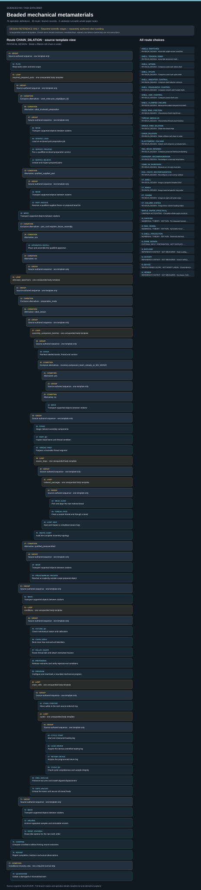

# Beaded mechanical metamaterials: task route map



Paper: **Beaded metamaterials** · [DOI](https://doi.org/10.1038/s41467-025-61809-8)

Author/evaluator design reference only; not an actor projection, task runner, solver, physical simulation or execution receipt. Missing inputs stay blocked. Preparation, device processes, measured data and numerical/reference scope remain distinct.. Counts describe task representation, not experiments or success.

**Reading rule:** rows retain the source display structure only. Membership has no inferred chronology. Where the source supplies a typed body, one unexpanded template is shown; no condition, trial or specimen count is inferred. An unordered obligation group has no inferred chronological edges. Source-reported scientific facts and authored handling are distinct.

[Immutable source task package](https://github.com/openags/ScienceGym/blob/41c4c52cfcf9d5b222404f2fd7ed9d6553f807cb/tasks/beaded_operations_v2/) · [Interactive inspector](../index.html)

## ANGLE_SWATCHES — PHYSICAL DESIGN · Assemble angle-weave swatches

Author/evaluator design reference only; not an actor projection, task runner, solver, physical simulation or execution receipt. Missing inputs stay blocked. Preparation, device processes, measured data and numerical/reference scope remain distinct. Membership lists do not assert chronology. Source-declared typed sequence, choice, loop and dispatch scopes are displayed without selecting alternatives or instantiating counts.

[Exact route source](https://github.com/openags/ScienceGym/blob/41c4c52cfcf9d5b222404f2fd7ed9d6553f807cb/tasks/beaded_operations_v2/branches.json) · JSON pointer: `/branches/0`

- **GROUP: Source-authored sequence · one template only**
  - Binding: {"source_file":"routes.json","source_pointer":"/routes/0/tree","source_attributes":{"type":"sequence"}}
  - `PLAN` Read work order and bind scope
    - Source occurrence binding: {"source_file":"routes.json","source_pointer":"/routes/0/tree/steps/0","source_node":{"type":"operation","operation_id":"PLAN","bindings":{}}}
  - **LOOP: required_prepared_parts · one unexpanded body template**
    - Binding: {"source_file":"routes.json","source_pointer":"/routes/0/tree/steps/1","source_attributes":{"type":"loop","loop_id":"required_prepared_parts","iterator":"part_id","values":null,"values_from":"work_order.required_prepared_part_ids","semantics":"required_source_fixture_platform_or_drilled_stock_roles_not_optional_inventory","order":"work_order","missing_values":"block_affected_loop_never_expand_as_zero_success","evidence_ids":[]}}
    - **GROUP: Source-authored sequence · one template only**
      - Binding: {"source_file":"routes.json","source_pointer":"/routes/0/tree/steps/1/body","source_attributes":{"type":"sequence"}}
      - **CONDITION: Exclusive alternatives · work_order.part_origin[$part_id]**
        - Binding: {"source_file":"routes.json","source_pointer":"/routes/0/tree/steps/1/body/steps/0","source_attributes":{"type":"choice","input":"work_order.part_origin[$part_id]","required":true,"semantics":"Supplied origin closes availability only; it does not earn robot fabrication credit"}}
        - **CONDITION: Alternative: robot_enclosed_preparation**
          - Binding: {"selection":"robot_enclosed_preparation","choice_input":"work_order.part_origin[$part_id]","rule":"Inspect all arms; execute only the selected qualified alternative"}
          - **GROUP: Source-authored sequence · one template only**
            - Binding: {"source_file":"routes.json","source_pointer":"/routes/0/tree/steps/1/body/steps/0/alternatives/robot_enclosed_preparation","source_attributes":{"type":"sequence"}}
            - `MOVE` Transport supported objects between stations
              - Source occurrence binding: {"source_file":"routes.json","source_pointer":"/routes/0/tree/steps/1/body/steps/0/alternatives/robot_enclosed_preparation/steps/0","source_node":{"type":"operation","operation_id":"MOVE","bindings":{"object_ids_from":"part_card.input_stock_ids","source_workstation_from":"inventory.current_location_of_each_input_stock_batch","target_workstation":"WS_PREP","group_by_actual_source_location":true}}}
            - `SERVICE_LOAD` Load an enclosed part-preparation job
              - Source occurrence binding: {"source_file":"routes.json","source_pointer":"/routes/0/tree/steps/1/body/steps/0/alternatives/robot_enclosed_preparation/steps/1","source_node":{"type":"operation","operation_id":"SERVICE_LOAD","bindings":{"input_stock_ids_from":"part_card.input_stock_ids","job_id_from":"part_card.qualified_job_id","output_part_ids_from":"part_card.output_part_ids"}}}
            - `SERVICE_PROCESS` Run a qualified enclosed preparation service
              - Source occurrence binding: {"source_file":"routes.json","source_pointer":"/routes/0/tree/steps/1/body/steps/0/alternatives/robot_enclosed_preparation/steps/2","source_node":{"type":"operation","operation_id":"SERVICE_PROCESS","bindings":{"job_id_from":"part_card.qualified_job_id"}}}
            - `SERVICE_RECEIVE` Unload and inspect prepared parts
              - Source occurrence binding: {"source_file":"routes.json","source_pointer":"/routes/0/tree/steps/1/body/steps/0/alternatives/robot_enclosed_preparation/steps/3","source_node":{"type":"operation","operation_id":"SERVICE_RECEIVE","bindings":{"output_part_ids_from":"part_card.output_part_ids"}}}
        - **CONDITION: Alternative: qualified_supplied_part**
          - Binding: {"selection":"qualified_supplied_part","choice_input":"work_order.part_origin[$part_id]","rule":"Inspect all arms; execute only the selected qualified alternative"}
          - **GROUP: Source-authored sequence · one template only**
            - Binding: {"source_file":"routes.json","source_pointer":"/routes/0/tree/steps/1/body/steps/0/alternatives/qualified_supplied_part","source_attributes":{"type":"sequence"}}
            - `MOVE` Transport supported objects between stations
              - Source occurrence binding: {"source_file":"routes.json","source_pointer":"/routes/0/tree/steps/1/body/steps/0/alternatives/qualified_supplied_part/steps/0","source_node":{"type":"operation","operation_id":"MOVE","bindings":{"object_ids_from":"part_card.supplied_part_ids","source_workstation_from":"inventory.current_location_of_each_supplied_part_batch","target_workstation":"WS_PREP","group_by_actual_source_location":true}}}
            - `PART_RECEIVE` Receive a qualified supplied fixture or prepared bead lot
              - Source occurrence binding: {"source_file":"routes.json","source_pointer":"/routes/0/tree/steps/1/body/steps/0/alternatives/qualified_supplied_part/steps/1","source_node":{"type":"operation","operation_id":"PART_RECEIVE","bindings":{"input_part_ids_from":"part_card.supplied_part_ids","output_part_ids_from":"part_card.output_part_ids","identity_rule":"output IDs are actual same received parts, not recreated copies"}}}
      - `MOVE` Transport supported objects between stations
        - Source occurrence binding: {"source_file":"routes.json","source_pointer":"/routes/0/tree/steps/1/body/steps/1","source_node":{"type":"operation","operation_id":"MOVE","bindings":{"object_ids_from":"part_card.output_part_ids","source_workstation":"WS_PREP","target_workstation_from":"part_card.destination","receipt_from":"current_part_preparation_receipt"}}}
      - **CONDITION: Exclusive alternatives · part_card.requires_fixture_assembly**
        - Binding: {"source_file":"routes.json","source_pointer":"/routes/0/tree/steps/1/body/steps/2","source_attributes":{"type":"choice","input":"part_card.requires_fixture_assembly","required":true,"semantics":"No fixture assembly for an individual prepared bead; its actor weaving remains later"}}
        - **CONDITION: Alternative: yes**
          - Binding: {"selection":"yes","choice_input":"part_card.requires_fixture_assembly","rule":"Inspect all arms; execute only the selected qualified alternative"}
          - `APPARATUS_INSTALL` Place and assemble the qualified apparatus
            - Source occurrence binding: {"source_file":"routes.json","source_pointer":"/routes/0/tree/steps/1/body/steps/2/alternatives/yes","source_node":{"type":"operation","operation_id":"APPARATUS_INSTALL","bindings":{"part_ids_from":"part_card.output_part_ids","target_workstation_from":"part_card.destination"}}}
        - **CONDITION: Alternative: no**
          - Binding: {"selection":"no","choice_input":"part_card.requires_fixture_assembly","rule":"Inspect all arms; execute only the selected qualified alternative"}
          - **GROUP: Source-authored sequence · one template only**
            - Binding: {"source_file":"routes.json","source_pointer":"/routes/0/tree/steps/1/body/steps/2/alternatives/no","source_attributes":{"type":"sequence"}}
  - **LOOP: allocated_specimens · one unexpanded body template**
    - Binding: {"source_file":"routes.json","source_pointer":"/routes/0/tree/steps/2","source_attributes":{"type":"loop","loop_id":"allocated_specimens","iterator":"sample_id","values":null,"values_from":"work_order.allocated_specimen_ids","semantics":"distinct_physical_preparations_or_explicit_reuse_links","order":"work_order","missing_values":"block_affected_loop_never_expand_as_zero_success","evidence_ids":[]}}
    - **GROUP: Source-authored sequence · one template only**
      - Binding: {"source_file":"routes.json","source_pointer":"/routes/0/tree/steps/2/body","source_attributes":{"type":"sequence"}}
      - **CONDITION: Exclusive alternatives · preparation_mode**
        - Binding: {"source_file":"routes.json","source_pointer":"/routes/0/tree/steps/2/body/steps/0","source_attributes":{"type":"choice","input":"preparation_mode","required":true,"semantics":"Preassembled path does not earn actor-weaving credit"}}
        - **CONDITION: Alternative: robot_weave**
          - Binding: {"selection":"robot_weave","choice_input":"preparation_mode","rule":"Inspect all arms; execute only the selected qualified alternative"}
          - **GROUP: Source-authored sequence · one template only**
            - Binding: {"source_file":"routes.json","source_pointer":"/routes/0/tree/steps/2/body/steps/0/alternatives/robot_weave","source_attributes":{"type":"sequence"}}
            - **LOOP: assembly_component_batches · one unexpanded body template**
              - Binding: {"source_file":"routes.json","source_pointer":"/routes/0/tree/steps/2/body/steps/0/alternatives/robot_weave/steps/0","source_attributes":{"type":"loop","loop_id":"assembly_component_batches","iterator":"component_batch_id","values":null,"values_from":"work_order.component_batch_ids_for[$sample_id]","semantics":"actual bill-of-materials batches grouped by recorded source location","order":"work_order","missing_values":"block_affected_loop_never_expand_as_zero_success","evidence_ids":[]}}
              - **GROUP: Source-authored sequence · one template only**
                - Binding: {"source_file":"routes.json","source_pointer":"/routes/0/tree/steps/2/body/steps/0/alternatives/robot_weave/steps/0/body","source_attributes":{"type":"sequence"}}
                - `STOCK` Retrieve labeled beads, thread and carriers
                  - Source occurrence binding: {"source_file":"routes.json","source_pointer":"/routes/0/tree/steps/2/body/steps/0/alternatives/robot_weave/steps/0/body/steps/0","source_node":{"type":"operation","operation_id":"STOCK","bindings":{"object_ids_from":"work_order.component_batches[$component_batch_id].actual_component_ids","source_workstation_from":"inventory.current_location_of_component_batch","target_workstation_from":"inventory.current_location_of_component_batch","selection_scope":"includes actual prepared bead output IDs from required_prepared_parts"}}}
                - **CONDITION: Exclusive alternatives · inventory.component_batch_already_at_WS_WEAVE**
                  - Binding: {"source_file":"routes.json","source_pointer":"/routes/0/tree/steps/2/body/steps/0/alternatives/robot_weave/steps/0/body/steps/1","source_attributes":{"type":"choice","input":"inventory.component_batch_already_at_WS_WEAVE","required":true,"semantics":"Already-present components stay at WS_WEAVE; no fictitious return to storage"}}
                  - **CONDITION: Alternative: yes**
                    - Binding: {"selection":"yes","choice_input":"inventory.component_batch_already_at_WS_WEAVE","rule":"Inspect all arms; execute only the selected qualified alternative"}
                    - **GROUP: Source-authored sequence · one template only**
                      - Binding: {"source_file":"routes.json","source_pointer":"/routes/0/tree/steps/2/body/steps/0/alternatives/robot_weave/steps/0/body/steps/1/alternatives/yes","source_attributes":{"type":"sequence"}}
                  - **CONDITION: Alternative: no**
                    - Binding: {"selection":"no","choice_input":"inventory.component_batch_already_at_WS_WEAVE","rule":"Inspect all arms; execute only the selected qualified alternative"}
                    - `MOVE` Transport supported objects between stations
                      - Source occurrence binding: {"source_file":"routes.json","source_pointer":"/routes/0/tree/steps/2/body/steps/0/alternatives/robot_weave/steps/0/body/steps/1/alternatives/no","source_node":{"type":"operation","operation_id":"MOVE","bindings":{"object_ids_from":"work_order.component_batches[$component_batch_id].actual_component_ids","source_workstation_from":"inventory.current_location_of_component_batch","target_workstation":"WS_WEAVE","carrier_id_from":"component_batch.carrier_id"}}}
            - **GROUP: Source-authored sequence · one template only**
              - Binding: {"source_file":"routes.json","source_pointer":"/routes/0/tree/steps/2/body/steps/0/alternatives/robot_weave/steps/1","source_attributes":{"type":"sequence"}}
              - `STAGE` Stage indexed assembly components
                - Source occurrence binding: {"source_file":"routes.json","source_pointer":"/routes/0/tree/steps/2/body/steps/0/alternatives/robot_weave/steps/1/steps/0","source_node":{"type":"operation","operation_id":"STAGE","bindings":{}}}
              - `PART_QC` Inspect bead bores and thread condition
                - Source occurrence binding: {"source_file":"routes.json","source_pointer":"/routes/0/tree/steps/2/body/steps/0/alternatives/robot_weave/steps/1/steps/1","source_node":{"type":"operation","operation_id":"PART_QC","bindings":{}}}
              - `THREAD_PREP` Prepare a traceable thread segment
                - Source occurrence binding: {"source_file":"routes.json","source_pointer":"/routes/0/tree/steps/2/body/steps/0/alternatives/robot_weave/steps/1/steps/2","source_node":{"type":"operation","operation_id":"THREAD_PREP","bindings":{}}}
              - **LOOP: weave_loops · one unexpanded body template**
                - Binding: {"source_file":"routes.json","source_pointer":"/routes/0/tree/steps/2/body/steps/0/alternatives/robot_weave/steps/1/steps/3","source_attributes":{"type":"loop","loop_id":"weave_loops","iterator":"loop_id","values":null,"values_from":"geometry_card.ordered_loop_ids","semantics":"assembly_loops_not_experimental_repetitions","order":"topology_required","missing_values":"block_affected_loop_never_expand_as_zero_success","evidence_ids":[]}}
                - **GROUP: Source-authored sequence · one template only**
                  - Binding: {"source_file":"routes.json","source_pointer":"/routes/0/tree/steps/2/body/steps/0/alternatives/robot_weave/steps/1/steps/3/body","source_attributes":{"type":"sequence"}}
                  - **LOOP: ordered_passages · one unexpanded body template**
                    - Binding: {"source_file":"routes.json","source_pointer":"/routes/0/tree/steps/2/body/steps/0/alternatives/robot_weave/steps/1/steps/3/body/steps/0","source_attributes":{"type":"loop","loop_id":"ordered_passages","iterator":"passage_id","values":null,"values_from":"geometry_card.loops[$loop_id].ordered_passages","semantics":"thread_passages_not_unique_bead_count","order":"topology_required","missing_values":"block_affected_loop_never_expand_as_zero_success","evidence_ids":[]}}
                    - **GROUP: Source-authored sequence · one template only**
                      - Binding: {"source_file":"routes.json","source_pointer":"/routes/0/tree/steps/2/body/steps/0/alternatives/robot_weave/steps/1/steps/3/body/steps/0/body","source_attributes":{"type":"sequence"}}
                      - `BEAD_ALIGN` Pick and align the next indexed bead
                        - Source occurrence binding: {"source_file":"routes.json","source_pointer":"/routes/0/tree/steps/2/body/steps/0/alternatives/robot_weave/steps/1/steps/3/body/steps/0/body/steps/0","source_node":{"type":"operation","operation_id":"BEAD_ALIGN","bindings":{}}}
                      - `THREAD_PASS` Feed a named thread end through a bead
                        - Source occurrence binding: {"source_file":"routes.json","source_pointer":"/routes/0/tree/steps/2/body/steps/0/alternatives/robot_weave/steps/1/steps/3/body/steps/0/body/steps/1","source_node":{"type":"operation","operation_id":"THREAD_PASS","bindings":{}}}
                  - `LOOP_SEAT` Seat and inspect a completed weave loop
                    - Source occurrence binding: {"source_file":"routes.json","source_pointer":"/routes/0/tree/steps/2/body/steps/0/alternatives/robot_weave/steps/1/steps/3/body/steps/1","source_node":{"type":"operation","operation_id":"LOOP_SEAT","bindings":{}}}
              - `WEAVE_AUDIT` Audit the complete assembly topology
                - Source occurrence binding: {"source_file":"routes.json","source_pointer":"/routes/0/tree/steps/2/body/steps/0/alternatives/robot_weave/steps/1/steps/4","source_node":{"type":"operation","operation_id":"WEAVE_AUDIT","bindings":{}}}
        - **CONDITION: Alternative: qualified_preassembled**
          - Binding: {"selection":"qualified_preassembled","choice_input":"preparation_mode","rule":"Inspect all arms; execute only the selected qualified alternative"}
          - **GROUP: Source-authored sequence · one template only**
            - Binding: {"source_file":"routes.json","source_pointer":"/routes/0/tree/steps/2/body/steps/0/alternatives/qualified_preassembled","source_attributes":{"type":"sequence"}}
            - `MOVE` Transport supported objects between stations
              - Source occurrence binding: {"source_file":"routes.json","source_pointer":"/routes/0/tree/steps/2/body/steps/0/alternatives/qualified_preassembled/steps/0","source_node":{"type":"operation","operation_id":"MOVE","bindings":{"object_id":"$sample_id","source_workstation_from":"inventory.current_location[$sample_id]","target_workstation":"WS_WEAVE"}}}
            - `PREASSEMBLED_RECEIVE` Receive an explicitly outside-scope prepared object
              - Source occurrence binding: {"source_file":"routes.json","source_pointer":"/routes/0/tree/steps/2/body/steps/0/alternatives/qualified_preassembled/steps/1","source_node":{"type":"operation","operation_id":"PREASSEMBLED_RECEIVE","bindings":{}}}
      - **GROUP: Source-authored sequence · one template only**
        - Binding: {"source_file":"routes.json","source_pointer":"/routes/0/tree/steps/2/body/steps/1","source_attributes":{"type":"sequence"}}
        - `MANUAL_TENSION` Apply a qualified manual-like tensioning action
          - Source occurrence binding: {"source_file":"routes.json","source_pointer":"/routes/0/tree/steps/2/body/steps/1/steps/0","source_node":{"type":"operation","operation_id":"MANUAL_TENSION","bindings":{}}}
        - `TERMINATE` Tie, crimp or clamp the selected thread ends
          - Source occurrence binding: {"source_file":"routes.json","source_pointer":"/routes/0/tree/steps/2/body/steps/1/steps/1","source_node":{"type":"operation","operation_id":"TERMINATE","bindings":{}}}
        - `MOVE` Transport supported objects between stations
          - Source occurrence binding: {"source_file":"routes.json","source_pointer":"/routes/0/tree/steps/2/body/steps/1/steps/2","source_node":{"type":"operation","operation_id":"MOVE","bindings":{"source_workstation":"WS_WEAVE","target_workstation":"WS_SHAPE","object_id":"$sample_or_stock_id"}}}
        - **LOOP: targets · one unexpanded body template**
          - Binding: {"source_file":"routes.json","source_pointer":"/routes/0/tree/steps/2/body/steps/1/steps/3","source_attributes":{"type":"loop","loop_id":"targets","iterator":"target_id","values":null,"values_from":"work_order.target_ids","semantics":"target_states_not_specimens","order":"work_order","missing_values":"block_affected_loop_never_expand_as_zero_success","evidence_ids":[]}}
          - **GROUP: Source-authored sequence · one template only**
            - Binding: {"source_file":"routes.json","source_pointer":"/routes/0/tree/steps/2/body/steps/1/steps/3/body","source_attributes":{"type":"sequence"}}
            - `TARGET_STAGE` Stage a supported shape-manipulation target
              - Source occurrence binding: {"source_file":"routes.json","source_pointer":"/routes/0/tree/steps/2/body/steps/1/steps/3/body/steps/0","source_node":{"type":"operation","operation_id":"TARGET_STAGE","bindings":{}}}
            - `SHAPE_ACTUATE` Apply bounded local deformation
              - Source occurrence binding: {"source_file":"routes.json","source_pointer":"/routes/0/tree/steps/2/body/steps/1/steps/3/body/steps/1","source_node":{"type":"operation","operation_id":"SHAPE_ACTUATE","bindings":{}}}
            - `SHAPE_RELEASE` Remove actuation and record load-off shape
              - Source occurrence binding: {"source_file":"routes.json","source_pointer":"/routes/0/tree/steps/2/body/steps/1/steps/3/body/steps/2","source_node":{"type":"operation","operation_id":"SHAPE_RELEASE","bindings":{}}}
            - `SHAPE_RESET` Reset only through a declared path
              - Source occurrence binding: {"source_file":"routes.json","source_pointer":"/routes/0/tree/steps/2/body/steps/1/steps/3/body/steps/3","source_node":{"type":"operation","operation_id":"SHAPE_RESET","bindings":{}}}
        - `SUMMARY` Summarize actual records under a declared model
          - Source occurrence binding: {"source_file":"routes.json","source_pointer":"/routes/0/tree/steps/2/body/steps/1/steps/4","source_node":{"type":"operation","operation_id":"SUMMARY","bindings":{}}}
      - **GROUP: Source-authored sequence · one template only**
        - Binding: {"source_file":"routes.json","source_pointer":"/routes/0/tree/steps/2/body/steps/2","source_attributes":{"type":"sequence"}}
        - `MOVE` Transport supported objects between stations
          - Source occurrence binding: {"source_file":"routes.json","source_pointer":"/routes/0/tree/steps/2/body/steps/2/steps/0","source_node":{"type":"operation","operation_id":"MOVE","bindings":{"source_workstation":"$last_safe_station","target_workstation":"WS_ARCHIVE","object_id":"$sample_or_stock_id"}}}
        - `ARCHIVE` Archive supported samples and immutable records
          - Source occurrence binding: {"source_file":"routes.json","source_pointer":"/routes/0/tree/steps/2/body/steps/2/steps/1","source_node":{"type":"operation","operation_id":"ARCHIVE","bindings":{}}}
        - `RESET_STATIONS` Reset idle stations for the next work order
          - Source occurrence binding: {"source_file":"routes.json","source_pointer":"/routes/0/tree/steps/2/body/steps/2/steps/2","source_node":{"type":"operation","operation_id":"RESET_STATIONS","bindings":{}}}
  - `COMPARE` Compare conditions without forcing source outcomes
    - Source occurrence binding: {"source_file":"routes.json","source_pointer":"/routes/0/tree/steps/3","source_node":{"type":"operation","operation_id":"COMPARE","bindings":{}}}
  - `REPORT` Report completion, blockers and actual observations
    - Source occurrence binding: {"source_file":"routes.json","source_pointer":"/routes/0/tree/steps/4","source_node":{"type":"operation","operation_id":"REPORT","bindings":{}}}
- **CONDITION: Conditional recovery only · not a required normal step**
  - Binding: {"source_file":"branches.json","source_pointer":"/branches/0/conditional_recovery_operation_ids"}
  - `QUARANTINE` Isolate a damaged or mismatched item

<details><summary>Branch state, choices, lineage and loop obligations</summary>

```json
{
  "id": "ANGLE_SWATCHES",
  "title": "Assemble angle-weave swatches",
  "family_ids": [
    "F_SWATCH"
  ],
  "geometry_ids": [
    "qualified_swatch_pattern"
  ],
  "operation_ids": [
    "PLAN",
    "MOVE",
    "SERVICE_LOAD",
    "SERVICE_PROCESS",
    "SERVICE_RECEIVE",
    "PART_RECEIVE",
    "APPARATUS_INSTALL",
    "STOCK",
    "STAGE",
    "PART_QC",
    "THREAD_PREP",
    "BEAD_ALIGN",
    "THREAD_PASS",
    "LOOP_SEAT",
    "WEAVE_AUDIT",
    "PREASSEMBLED_RECEIVE",
    "MANUAL_TENSION",
    "TERMINATE",
    "TARGET_STAGE",
    "SHAPE_ACTUATE",
    "SHAPE_RELEASE",
    "SHAPE_RESET",
    "SUMMARY",
    "ARCHIVE",
    "RESET_STATIONS",
    "COMPARE",
    "REPORT"
  ],
  "loops": [
    {
      "type": "loop",
      "loop_id": "required_prepared_parts",
      "iterator": "part_id",
      "values": null,
      "values_from": "work_order.required_prepared_part_ids",
      "semantics": "required_source_fixture_platform_or_drilled_stock_roles_not_optional_inventory",
      "order": "work_order",
      "missing_values": "block_affected_loop_never_expand_as_zero_success",
      "evidence_ids": [],
      "body_operation_ids": [
        "MOVE",
        "SERVICE_LOAD",
        "SERVICE_PROCESS",
        "SERVICE_RECEIVE",
        "PART_RECEIVE",
        "APPARATUS_INSTALL"
      ]
    },
    {
      "type": "loop",
      "loop_id": "allocated_specimens",
      "iterator": "sample_id",
      "values": null,
      "values_from": "work_order.allocated_specimen_ids",
      "semantics": "distinct_physical_preparations_or_explicit_reuse_links",
      "order": "work_order",
      "missing_values": "block_affected_loop_never_expand_as_zero_success",
      "evidence_ids": [],
      "body_operation_ids": [
        "STOCK",
        "MOVE",
        "STAGE",
        "PART_QC",
        "THREAD_PREP",
        "BEAD_ALIGN",
        "THREAD_PASS",
        "LOOP_SEAT",
        "WEAVE_AUDIT",
        "PREASSEMBLED_RECEIVE",
        "MANUAL_TENSION",
        "TERMINATE",
        "TARGET_STAGE",
        "SHAPE_ACTUATE",
        "SHAPE_RELEASE",
        "SHAPE_RESET",
        "SUMMARY",
        "ARCHIVE",
        "RESET_STATIONS"
      ]
    },
    {
      "type": "loop",
      "loop_id": "assembly_component_batches",
      "iterator": "component_batch_id",
      "values": null,
      "values_from": "work_order.component_batch_ids_for[$sample_id]",
      "semantics": "actual bill-of-materials batches grouped by recorded source location",
      "order": "work_order",
      "missing_values": "block_affected_loop_never_expand_as_zero_success",
      "evidence_ids": [],
      "body_operation_ids": [
        "STOCK",
        "MOVE"
      ]
    },
    {
      "type": "loop",
      "loop_id": "weave_loops",
      "iterator": "loop_id",
      "values": null,
      "values_from": "geometry_card.ordered_loop_ids",
      "semantics": "assembly_loops_not_experimental_repetitions",
      "order": "topology_required",
      "missing_values": "block_affected_loop_never_expand_as_zero_success",
      "evidence_ids": [],
      "body_operation_ids": [
        "BEAD_ALIGN",
        "THREAD_PASS",
        "LOOP_SEAT"
      ]
    },
    {
      "type": "loop",
      "loop_id": "ordered_passages",
      "iterator": "passage_id",
      "values": null,
      "values_from": "geometry_card.loops[$loop_id].ordered_passages",
      "semantics": "thread_passages_not_unique_bead_count",
      "order": "topology_required",
      "missing_values": "block_affected_loop_never_expand_as_zero_success",
      "evidence_ids": [],
      "body_operation_ids": [
        "BEAD_ALIGN",
        "THREAD_PASS"
      ]
    },
    {
      "type": "loop",
      "loop_id": "targets",
      "iterator": "target_id",
      "values": null,
      "values_from": "work_order.target_ids",
      "semantics": "target_states_not_specimens",
      "order": "work_order",
      "missing_values": "block_affected_loop_never_expand_as_zero_success",
      "evidence_ids": [],
      "body_operation_ids": [
        "TARGET_STAGE",
        "SHAPE_ACTUATE",
        "SHAPE_RELEASE",
        "SHAPE_RESET"
      ]
    }
  ],
  "required_input_ids": [
    "U_ALLOCATION",
    "U_ROBOT",
    "U_THREAD",
    "U_BEAD_GEOMETRY",
    "U_TOPOLOGY",
    "U_RELEASE",
    "U_MANUAL_TENSION",
    "U_TERMINATION",
    "U_TARGETS",
    "U_REPEATS",
    "U_PREP_SERVICE",
    "U_FIXTURE"
  ],
  "evidence_ids": [
    "E_SWATCH"
  ],
  "goal": "Build supplied angle-weave patterns and document bounded tension/shape observations.",
  "source_condition_constraints": {
    "loop_n": [
      3,
      4,
      5,
      6,
      7
    ],
    "exact_pattern_required": true,
    "tension_and_termination_detail": "Any preparation tension/termination action is task-authored from a supplied assembly card; no unreported source knot/clamp recipe is asserted."
  },
  "identity_policy": "Allocated preparation IDs are explicit; every reuse retains state, damage, thread path and complete run history. No source historical specimen count inferred.",
  "completion": "All work-order-required conditions have valid records for complete; a blocker remains partial, not an empty successful loop.",
  "count_warning": "Cycles, layers, cells, pictured states and configurations are not independent specimen counts.",
  "conditional_recovery_operation_ids": [
    "QUARANTINE"
  ],
  "loop_expansion": {
    "type": "typed_route_tree",
    "route_id": "ANGLE_SWATCHES",
    "rule": "Use routes.json; do not execute flat operation_ids as chronology or infer Cartesian products."
  },
  "required_preparation_roles": [
    "qualified_weaving_support"
  ],
  "preparation_credit": "Only actual robot_enclosed_preparation plus qualified receipts earns fabrication credit; qualified_supplied_part is explicit received preparation."
}
```

</details>

## SHELL_TENSION_DEMO — PHYSICAL DESIGN · Assemble tensioned shell demonstration

Author/evaluator design reference only; not an actor projection, task runner, solver, physical simulation or execution receipt. Missing inputs stay blocked. Preparation, device processes, measured data and numerical/reference scope remain distinct. Membership lists do not assert chronology. Source-declared typed sequence, choice, loop and dispatch scopes are displayed without selecting alternatives or instantiating counts.

[Exact route source](https://github.com/openags/ScienceGym/blob/41c4c52cfcf9d5b222404f2fd7ed9d6553f807cb/tasks/beaded_operations_v2/branches.json) · JSON pointer: `/branches/1`

- **GROUP: Source-authored sequence · one template only**
  - Binding: {"source_file":"routes.json","source_pointer":"/routes/1/tree","source_attributes":{"type":"sequence"}}
  - `PLAN` Read work order and bind scope
    - Source occurrence binding: {"source_file":"routes.json","source_pointer":"/routes/1/tree/steps/0","source_node":{"type":"operation","operation_id":"PLAN","bindings":{}}}
  - **LOOP: required_prepared_parts · one unexpanded body template**
    - Binding: {"source_file":"routes.json","source_pointer":"/routes/1/tree/steps/1","source_attributes":{"type":"loop","loop_id":"required_prepared_parts","iterator":"part_id","values":null,"values_from":"work_order.required_prepared_part_ids","semantics":"required_source_fixture_platform_or_drilled_stock_roles_not_optional_inventory","order":"work_order","missing_values":"block_affected_loop_never_expand_as_zero_success","evidence_ids":[]}}
    - **GROUP: Source-authored sequence · one template only**
      - Binding: {"source_file":"routes.json","source_pointer":"/routes/1/tree/steps/1/body","source_attributes":{"type":"sequence"}}
      - **CONDITION: Exclusive alternatives · work_order.part_origin[$part_id]**
        - Binding: {"source_file":"routes.json","source_pointer":"/routes/1/tree/steps/1/body/steps/0","source_attributes":{"type":"choice","input":"work_order.part_origin[$part_id]","required":true,"semantics":"Supplied origin closes availability only; it does not earn robot fabrication credit"}}
        - **CONDITION: Alternative: robot_enclosed_preparation**
          - Binding: {"selection":"robot_enclosed_preparation","choice_input":"work_order.part_origin[$part_id]","rule":"Inspect all arms; execute only the selected qualified alternative"}
          - **GROUP: Source-authored sequence · one template only**
            - Binding: {"source_file":"routes.json","source_pointer":"/routes/1/tree/steps/1/body/steps/0/alternatives/robot_enclosed_preparation","source_attributes":{"type":"sequence"}}
            - `MOVE` Transport supported objects between stations
              - Source occurrence binding: {"source_file":"routes.json","source_pointer":"/routes/1/tree/steps/1/body/steps/0/alternatives/robot_enclosed_preparation/steps/0","source_node":{"type":"operation","operation_id":"MOVE","bindings":{"object_ids_from":"part_card.input_stock_ids","source_workstation_from":"inventory.current_location_of_each_input_stock_batch","target_workstation":"WS_PREP","group_by_actual_source_location":true}}}
            - `SERVICE_LOAD` Load an enclosed part-preparation job
              - Source occurrence binding: {"source_file":"routes.json","source_pointer":"/routes/1/tree/steps/1/body/steps/0/alternatives/robot_enclosed_preparation/steps/1","source_node":{"type":"operation","operation_id":"SERVICE_LOAD","bindings":{"input_stock_ids_from":"part_card.input_stock_ids","job_id_from":"part_card.qualified_job_id","output_part_ids_from":"part_card.output_part_ids"}}}
            - `SERVICE_PROCESS` Run a qualified enclosed preparation service
              - Source occurrence binding: {"source_file":"routes.json","source_pointer":"/routes/1/tree/steps/1/body/steps/0/alternatives/robot_enclosed_preparation/steps/2","source_node":{"type":"operation","operation_id":"SERVICE_PROCESS","bindings":{"job_id_from":"part_card.qualified_job_id"}}}
            - `SERVICE_RECEIVE` Unload and inspect prepared parts
              - Source occurrence binding: {"source_file":"routes.json","source_pointer":"/routes/1/tree/steps/1/body/steps/0/alternatives/robot_enclosed_preparation/steps/3","source_node":{"type":"operation","operation_id":"SERVICE_RECEIVE","bindings":{"output_part_ids_from":"part_card.output_part_ids"}}}
        - **CONDITION: Alternative: qualified_supplied_part**
          - Binding: {"selection":"qualified_supplied_part","choice_input":"work_order.part_origin[$part_id]","rule":"Inspect all arms; execute only the selected qualified alternative"}
          - **GROUP: Source-authored sequence · one template only**
            - Binding: {"source_file":"routes.json","source_pointer":"/routes/1/tree/steps/1/body/steps/0/alternatives/qualified_supplied_part","source_attributes":{"type":"sequence"}}
            - `MOVE` Transport supported objects between stations
              - Source occurrence binding: {"source_file":"routes.json","source_pointer":"/routes/1/tree/steps/1/body/steps/0/alternatives/qualified_supplied_part/steps/0","source_node":{"type":"operation","operation_id":"MOVE","bindings":{"object_ids_from":"part_card.supplied_part_ids","source_workstation_from":"inventory.current_location_of_each_supplied_part_batch","target_workstation":"WS_PREP","group_by_actual_source_location":true}}}
            - `PART_RECEIVE` Receive a qualified supplied fixture or prepared bead lot
              - Source occurrence binding: {"source_file":"routes.json","source_pointer":"/routes/1/tree/steps/1/body/steps/0/alternatives/qualified_supplied_part/steps/1","source_node":{"type":"operation","operation_id":"PART_RECEIVE","bindings":{"input_part_ids_from":"part_card.supplied_part_ids","output_part_ids_from":"part_card.output_part_ids","identity_rule":"output IDs are actual same received parts, not recreated copies"}}}
      - `MOVE` Transport supported objects between stations
        - Source occurrence binding: {"source_file":"routes.json","source_pointer":"/routes/1/tree/steps/1/body/steps/1","source_node":{"type":"operation","operation_id":"MOVE","bindings":{"object_ids_from":"part_card.output_part_ids","source_workstation":"WS_PREP","target_workstation_from":"part_card.destination","receipt_from":"current_part_preparation_receipt"}}}
      - **CONDITION: Exclusive alternatives · part_card.requires_fixture_assembly**
        - Binding: {"source_file":"routes.json","source_pointer":"/routes/1/tree/steps/1/body/steps/2","source_attributes":{"type":"choice","input":"part_card.requires_fixture_assembly","required":true,"semantics":"No fixture assembly for an individual prepared bead; its actor weaving remains later"}}
        - **CONDITION: Alternative: yes**
          - Binding: {"selection":"yes","choice_input":"part_card.requires_fixture_assembly","rule":"Inspect all arms; execute only the selected qualified alternative"}
          - `APPARATUS_INSTALL` Place and assemble the qualified apparatus
            - Source occurrence binding: {"source_file":"routes.json","source_pointer":"/routes/1/tree/steps/1/body/steps/2/alternatives/yes","source_node":{"type":"operation","operation_id":"APPARATUS_INSTALL","bindings":{"part_ids_from":"part_card.output_part_ids","target_workstation_from":"part_card.destination"}}}
        - **CONDITION: Alternative: no**
          - Binding: {"selection":"no","choice_input":"part_card.requires_fixture_assembly","rule":"Inspect all arms; execute only the selected qualified alternative"}
          - **GROUP: Source-authored sequence · one template only**
            - Binding: {"source_file":"routes.json","source_pointer":"/routes/1/tree/steps/1/body/steps/2/alternatives/no","source_attributes":{"type":"sequence"}}
  - **LOOP: allocated_specimens · one unexpanded body template**
    - Binding: {"source_file":"routes.json","source_pointer":"/routes/1/tree/steps/2","source_attributes":{"type":"loop","loop_id":"allocated_specimens","iterator":"sample_id","values":null,"values_from":"work_order.allocated_specimen_ids","semantics":"distinct_physical_preparations_or_explicit_reuse_links","order":"work_order","missing_values":"block_affected_loop_never_expand_as_zero_success","evidence_ids":[]}}
    - **GROUP: Source-authored sequence · one template only**
      - Binding: {"source_file":"routes.json","source_pointer":"/routes/1/tree/steps/2/body","source_attributes":{"type":"sequence"}}
      - **CONDITION: Exclusive alternatives · preparation_mode**
        - Binding: {"source_file":"routes.json","source_pointer":"/routes/1/tree/steps/2/body/steps/0","source_attributes":{"type":"choice","input":"preparation_mode","required":true,"semantics":"Preassembled path does not earn actor-weaving credit"}}
        - **CONDITION: Alternative: robot_weave**
          - Binding: {"selection":"robot_weave","choice_input":"preparation_mode","rule":"Inspect all arms; execute only the selected qualified alternative"}
          - **GROUP: Source-authored sequence · one template only**
            - Binding: {"source_file":"routes.json","source_pointer":"/routes/1/tree/steps/2/body/steps/0/alternatives/robot_weave","source_attributes":{"type":"sequence"}}
            - **LOOP: assembly_component_batches · one unexpanded body template**
              - Binding: {"source_file":"routes.json","source_pointer":"/routes/1/tree/steps/2/body/steps/0/alternatives/robot_weave/steps/0","source_attributes":{"type":"loop","loop_id":"assembly_component_batches","iterator":"component_batch_id","values":null,"values_from":"work_order.component_batch_ids_for[$sample_id]","semantics":"actual bill-of-materials batches grouped by recorded source location","order":"work_order","missing_values":"block_affected_loop_never_expand_as_zero_success","evidence_ids":[]}}
              - **GROUP: Source-authored sequence · one template only**
                - Binding: {"source_file":"routes.json","source_pointer":"/routes/1/tree/steps/2/body/steps/0/alternatives/robot_weave/steps/0/body","source_attributes":{"type":"sequence"}}
                - `STOCK` Retrieve labeled beads, thread and carriers
                  - Source occurrence binding: {"source_file":"routes.json","source_pointer":"/routes/1/tree/steps/2/body/steps/0/alternatives/robot_weave/steps/0/body/steps/0","source_node":{"type":"operation","operation_id":"STOCK","bindings":{"object_ids_from":"work_order.component_batches[$component_batch_id].actual_component_ids","source_workstation_from":"inventory.current_location_of_component_batch","target_workstation_from":"inventory.current_location_of_component_batch","selection_scope":"includes actual prepared bead output IDs from required_prepared_parts"}}}
                - **CONDITION: Exclusive alternatives · inventory.component_batch_already_at_WS_WEAVE**
                  - Binding: {"source_file":"routes.json","source_pointer":"/routes/1/tree/steps/2/body/steps/0/alternatives/robot_weave/steps/0/body/steps/1","source_attributes":{"type":"choice","input":"inventory.component_batch_already_at_WS_WEAVE","required":true,"semantics":"Already-present components stay at WS_WEAVE; no fictitious return to storage"}}
                  - **CONDITION: Alternative: yes**
                    - Binding: {"selection":"yes","choice_input":"inventory.component_batch_already_at_WS_WEAVE","rule":"Inspect all arms; execute only the selected qualified alternative"}
                    - **GROUP: Source-authored sequence · one template only**
                      - Binding: {"source_file":"routes.json","source_pointer":"/routes/1/tree/steps/2/body/steps/0/alternatives/robot_weave/steps/0/body/steps/1/alternatives/yes","source_attributes":{"type":"sequence"}}
                  - **CONDITION: Alternative: no**
                    - Binding: {"selection":"no","choice_input":"inventory.component_batch_already_at_WS_WEAVE","rule":"Inspect all arms; execute only the selected qualified alternative"}
                    - `MOVE` Transport supported objects between stations
                      - Source occurrence binding: {"source_file":"routes.json","source_pointer":"/routes/1/tree/steps/2/body/steps/0/alternatives/robot_weave/steps/0/body/steps/1/alternatives/no","source_node":{"type":"operation","operation_id":"MOVE","bindings":{"object_ids_from":"work_order.component_batches[$component_batch_id].actual_component_ids","source_workstation_from":"inventory.current_location_of_component_batch","target_workstation":"WS_WEAVE","carrier_id_from":"component_batch.carrier_id"}}}
            - **GROUP: Source-authored sequence · one template only**
              - Binding: {"source_file":"routes.json","source_pointer":"/routes/1/tree/steps/2/body/steps/0/alternatives/robot_weave/steps/1","source_attributes":{"type":"sequence"}}
              - `STAGE` Stage indexed assembly components
                - Source occurrence binding: {"source_file":"routes.json","source_pointer":"/routes/1/tree/steps/2/body/steps/0/alternatives/robot_weave/steps/1/steps/0","source_node":{"type":"operation","operation_id":"STAGE","bindings":{}}}
              - `PART_QC` Inspect bead bores and thread condition
                - Source occurrence binding: {"source_file":"routes.json","source_pointer":"/routes/1/tree/steps/2/body/steps/0/alternatives/robot_weave/steps/1/steps/1","source_node":{"type":"operation","operation_id":"PART_QC","bindings":{}}}
              - `THREAD_PREP` Prepare a traceable thread segment
                - Source occurrence binding: {"source_file":"routes.json","source_pointer":"/routes/1/tree/steps/2/body/steps/0/alternatives/robot_weave/steps/1/steps/2","source_node":{"type":"operation","operation_id":"THREAD_PREP","bindings":{}}}
              - **LOOP: weave_loops · one unexpanded body template**
                - Binding: {"source_file":"routes.json","source_pointer":"/routes/1/tree/steps/2/body/steps/0/alternatives/robot_weave/steps/1/steps/3","source_attributes":{"type":"loop","loop_id":"weave_loops","iterator":"loop_id","values":null,"values_from":"geometry_card.ordered_loop_ids","semantics":"assembly_loops_not_experimental_repetitions","order":"topology_required","missing_values":"block_affected_loop_never_expand_as_zero_success","evidence_ids":[]}}
                - **GROUP: Source-authored sequence · one template only**
                  - Binding: {"source_file":"routes.json","source_pointer":"/routes/1/tree/steps/2/body/steps/0/alternatives/robot_weave/steps/1/steps/3/body","source_attributes":{"type":"sequence"}}
                  - **LOOP: ordered_passages · one unexpanded body template**
                    - Binding: {"source_file":"routes.json","source_pointer":"/routes/1/tree/steps/2/body/steps/0/alternatives/robot_weave/steps/1/steps/3/body/steps/0","source_attributes":{"type":"loop","loop_id":"ordered_passages","iterator":"passage_id","values":null,"values_from":"geometry_card.loops[$loop_id].ordered_passages","semantics":"thread_passages_not_unique_bead_count","order":"topology_required","missing_values":"block_affected_loop_never_expand_as_zero_success","evidence_ids":[]}}
                    - **GROUP: Source-authored sequence · one template only**
                      - Binding: {"source_file":"routes.json","source_pointer":"/routes/1/tree/steps/2/body/steps/0/alternatives/robot_weave/steps/1/steps/3/body/steps/0/body","source_attributes":{"type":"sequence"}}
                      - `BEAD_ALIGN` Pick and align the next indexed bead
                        - Source occurrence binding: {"source_file":"routes.json","source_pointer":"/routes/1/tree/steps/2/body/steps/0/alternatives/robot_weave/steps/1/steps/3/body/steps/0/body/steps/0","source_node":{"type":"operation","operation_id":"BEAD_ALIGN","bindings":{}}}
                      - `THREAD_PASS` Feed a named thread end through a bead
                        - Source occurrence binding: {"source_file":"routes.json","source_pointer":"/routes/1/tree/steps/2/body/steps/0/alternatives/robot_weave/steps/1/steps/3/body/steps/0/body/steps/1","source_node":{"type":"operation","operation_id":"THREAD_PASS","bindings":{}}}
                  - `LOOP_SEAT` Seat and inspect a completed weave loop
                    - Source occurrence binding: {"source_file":"routes.json","source_pointer":"/routes/1/tree/steps/2/body/steps/0/alternatives/robot_weave/steps/1/steps/3/body/steps/1","source_node":{"type":"operation","operation_id":"LOOP_SEAT","bindings":{}}}
              - `WEAVE_AUDIT` Audit the complete assembly topology
                - Source occurrence binding: {"source_file":"routes.json","source_pointer":"/routes/1/tree/steps/2/body/steps/0/alternatives/robot_weave/steps/1/steps/4","source_node":{"type":"operation","operation_id":"WEAVE_AUDIT","bindings":{}}}
        - **CONDITION: Alternative: qualified_preassembled**
          - Binding: {"selection":"qualified_preassembled","choice_input":"preparation_mode","rule":"Inspect all arms; execute only the selected qualified alternative"}
          - **GROUP: Source-authored sequence · one template only**
            - Binding: {"source_file":"routes.json","source_pointer":"/routes/1/tree/steps/2/body/steps/0/alternatives/qualified_preassembled","source_attributes":{"type":"sequence"}}
            - `MOVE` Transport supported objects between stations
              - Source occurrence binding: {"source_file":"routes.json","source_pointer":"/routes/1/tree/steps/2/body/steps/0/alternatives/qualified_preassembled/steps/0","source_node":{"type":"operation","operation_id":"MOVE","bindings":{"object_id":"$sample_id","source_workstation_from":"inventory.current_location[$sample_id]","target_workstation":"WS_WEAVE"}}}
            - `PREASSEMBLED_RECEIVE` Receive an explicitly outside-scope prepared object
              - Source occurrence binding: {"source_file":"routes.json","source_pointer":"/routes/1/tree/steps/2/body/steps/0/alternatives/qualified_preassembled/steps/1","source_node":{"type":"operation","operation_id":"PREASSEMBLED_RECEIVE","bindings":{}}}
      - **GROUP: Source-authored sequence · one template only**
        - Binding: {"source_file":"routes.json","source_pointer":"/routes/1/tree/steps/2/body/steps/1","source_attributes":{"type":"sequence"}}
        - `MANUAL_TENSION` Apply a qualified manual-like tensioning action
          - Source occurrence binding: {"source_file":"routes.json","source_pointer":"/routes/1/tree/steps/2/body/steps/1/steps/0","source_node":{"type":"operation","operation_id":"MANUAL_TENSION","bindings":{}}}
        - `TERMINATE` Tie, crimp or clamp the selected thread ends
          - Source occurrence binding: {"source_file":"routes.json","source_pointer":"/routes/1/tree/steps/2/body/steps/1/steps/1","source_node":{"type":"operation","operation_id":"TERMINATE","bindings":{}}}
        - `MOVE` Transport supported objects between stations
          - Source occurrence binding: {"source_file":"routes.json","source_pointer":"/routes/1/tree/steps/2/body/steps/1/steps/2","source_node":{"type":"operation","operation_id":"MOVE","bindings":{"source_workstation":"WS_WEAVE","target_workstation":"WS_SHAPE","object_id":"$sample_or_stock_id"}}}
        - **LOOP: targets · one unexpanded body template**
          - Binding: {"source_file":"routes.json","source_pointer":"/routes/1/tree/steps/2/body/steps/1/steps/3","source_attributes":{"type":"loop","loop_id":"targets","iterator":"target_id","values":null,"values_from":"work_order.target_ids","semantics":"target_states_not_specimens","order":"work_order","missing_values":"block_affected_loop_never_expand_as_zero_success","evidence_ids":[]}}
          - **GROUP: Source-authored sequence · one template only**
            - Binding: {"source_file":"routes.json","source_pointer":"/routes/1/tree/steps/2/body/steps/1/steps/3/body","source_attributes":{"type":"sequence"}}
            - `TARGET_STAGE` Stage a supported shape-manipulation target
              - Source occurrence binding: {"source_file":"routes.json","source_pointer":"/routes/1/tree/steps/2/body/steps/1/steps/3/body/steps/0","source_node":{"type":"operation","operation_id":"TARGET_STAGE","bindings":{}}}
            - `SHAPE_ACTUATE` Apply bounded local deformation
              - Source occurrence binding: {"source_file":"routes.json","source_pointer":"/routes/1/tree/steps/2/body/steps/1/steps/3/body/steps/1","source_node":{"type":"operation","operation_id":"SHAPE_ACTUATE","bindings":{}}}
            - `SHAPE_RELEASE` Remove actuation and record load-off shape
              - Source occurrence binding: {"source_file":"routes.json","source_pointer":"/routes/1/tree/steps/2/body/steps/1/steps/3/body/steps/2","source_node":{"type":"operation","operation_id":"SHAPE_RELEASE","bindings":{}}}
            - `SHAPE_RESET` Reset only through a declared path
              - Source occurrence binding: {"source_file":"routes.json","source_pointer":"/routes/1/tree/steps/2/body/steps/1/steps/3/body/steps/3","source_node":{"type":"operation","operation_id":"SHAPE_RESET","bindings":{}}}
        - `SUMMARY` Summarize actual records under a declared model
          - Source occurrence binding: {"source_file":"routes.json","source_pointer":"/routes/1/tree/steps/2/body/steps/1/steps/4","source_node":{"type":"operation","operation_id":"SUMMARY","bindings":{}}}
      - **GROUP: Source-authored sequence · one template only**
        - Binding: {"source_file":"routes.json","source_pointer":"/routes/1/tree/steps/2/body/steps/2","source_attributes":{"type":"sequence"}}
        - `MOVE` Transport supported objects between stations
          - Source occurrence binding: {"source_file":"routes.json","source_pointer":"/routes/1/tree/steps/2/body/steps/2/steps/0","source_node":{"type":"operation","operation_id":"MOVE","bindings":{"source_workstation":"$last_safe_station","target_workstation":"WS_ARCHIVE","object_id":"$sample_or_stock_id"}}}
        - `ARCHIVE` Archive supported samples and immutable records
          - Source occurrence binding: {"source_file":"routes.json","source_pointer":"/routes/1/tree/steps/2/body/steps/2/steps/1","source_node":{"type":"operation","operation_id":"ARCHIVE","bindings":{}}}
        - `RESET_STATIONS` Reset idle stations for the next work order
          - Source occurrence binding: {"source_file":"routes.json","source_pointer":"/routes/1/tree/steps/2/body/steps/2/steps/2","source_node":{"type":"operation","operation_id":"RESET_STATIONS","bindings":{}}}
  - `COMPARE` Compare conditions without forcing source outcomes
    - Source occurrence binding: {"source_file":"routes.json","source_pointer":"/routes/1/tree/steps/3","source_node":{"type":"operation","operation_id":"COMPARE","bindings":{}}}
  - `REPORT` Report completion, blockers and actual observations
    - Source occurrence binding: {"source_file":"routes.json","source_pointer":"/routes/1/tree/steps/4","source_node":{"type":"operation","operation_id":"REPORT","bindings":{}}}
- **CONDITION: Conditional recovery only · not a required normal step**
  - Binding: {"source_file":"branches.json","source_pointer":"/branches/1/conditional_recovery_operation_ids"}
  - `QUARANTINE` Isolate a damaged or mismatched item

<details><summary>Branch state, choices, lineage and loop obligations</summary>

```json
{
  "id": "SHELL_TENSION_DEMO",
  "title": "Assemble tensioned shell demonstration",
  "family_ids": [
    "F_DEMO"
  ],
  "geometry_ids": [
    "half_dodecahedron_demo"
  ],
  "operation_ids": [
    "PLAN",
    "MOVE",
    "SERVICE_LOAD",
    "SERVICE_PROCESS",
    "SERVICE_RECEIVE",
    "PART_RECEIVE",
    "APPARATUS_INSTALL",
    "STOCK",
    "STAGE",
    "PART_QC",
    "THREAD_PREP",
    "BEAD_ALIGN",
    "THREAD_PASS",
    "LOOP_SEAT",
    "WEAVE_AUDIT",
    "PREASSEMBLED_RECEIVE",
    "MANUAL_TENSION",
    "TERMINATE",
    "TARGET_STAGE",
    "SHAPE_ACTUATE",
    "SHAPE_RELEASE",
    "SHAPE_RESET",
    "SUMMARY",
    "ARCHIVE",
    "RESET_STATIONS",
    "COMPARE",
    "REPORT"
  ],
  "loops": [
    {
      "type": "loop",
      "loop_id": "required_prepared_parts",
      "iterator": "part_id",
      "values": null,
      "values_from": "work_order.required_prepared_part_ids",
      "semantics": "required_source_fixture_platform_or_drilled_stock_roles_not_optional_inventory",
      "order": "work_order",
      "missing_values": "block_affected_loop_never_expand_as_zero_success",
      "evidence_ids": [],
      "body_operation_ids": [
        "MOVE",
        "SERVICE_LOAD",
        "SERVICE_PROCESS",
        "SERVICE_RECEIVE",
        "PART_RECEIVE",
        "APPARATUS_INSTALL"
      ]
    },
    {
      "type": "loop",
      "loop_id": "allocated_specimens",
      "iterator": "sample_id",
      "values": null,
      "values_from": "work_order.allocated_specimen_ids",
      "semantics": "distinct_physical_preparations_or_explicit_reuse_links",
      "order": "work_order",
      "missing_values": "block_affected_loop_never_expand_as_zero_success",
      "evidence_ids": [],
      "body_operation_ids": [
        "STOCK",
        "MOVE",
        "STAGE",
        "PART_QC",
        "THREAD_PREP",
        "BEAD_ALIGN",
        "THREAD_PASS",
        "LOOP_SEAT",
        "WEAVE_AUDIT",
        "PREASSEMBLED_RECEIVE",
        "MANUAL_TENSION",
        "TERMINATE",
        "TARGET_STAGE",
        "SHAPE_ACTUATE",
        "SHAPE_RELEASE",
        "SHAPE_RESET",
        "SUMMARY",
        "ARCHIVE",
        "RESET_STATIONS"
      ]
    },
    {
      "type": "loop",
      "loop_id": "assembly_component_batches",
      "iterator": "component_batch_id",
      "values": null,
      "values_from": "work_order.component_batch_ids_for[$sample_id]",
      "semantics": "actual bill-of-materials batches grouped by recorded source location",
      "order": "work_order",
      "missing_values": "block_affected_loop_never_expand_as_zero_success",
      "evidence_ids": [],
      "body_operation_ids": [
        "STOCK",
        "MOVE"
      ]
    },
    {
      "type": "loop",
      "loop_id": "weave_loops",
      "iterator": "loop_id",
      "values": null,
      "values_from": "geometry_card.ordered_loop_ids",
      "semantics": "assembly_loops_not_experimental_repetitions",
      "order": "topology_required",
      "missing_values": "block_affected_loop_never_expand_as_zero_success",
      "evidence_ids": [],
      "body_operation_ids": [
        "BEAD_ALIGN",
        "THREAD_PASS",
        "LOOP_SEAT"
      ]
    },
    {
      "type": "loop",
      "loop_id": "ordered_passages",
      "iterator": "passage_id",
      "values": null,
      "values_from": "geometry_card.loops[$loop_id].ordered_passages",
      "semantics": "thread_passages_not_unique_bead_count",
      "order": "topology_required",
      "missing_values": "block_affected_loop_never_expand_as_zero_success",
      "evidence_ids": [],
      "body_operation_ids": [
        "BEAD_ALIGN",
        "THREAD_PASS"
      ]
    },
    {
      "type": "loop",
      "loop_id": "targets",
      "iterator": "target_id",
      "values": null,
      "values_from": "work_order.target_ids",
      "semantics": "target_states_not_specimens",
      "order": "work_order",
      "missing_values": "block_affected_loop_never_expand_as_zero_success",
      "evidence_ids": [],
      "body_operation_ids": [
        "TARGET_STAGE",
        "SHAPE_ACTUATE",
        "SHAPE_RELEASE",
        "SHAPE_RESET"
      ]
    }
  ],
  "required_input_ids": [
    "U_ALLOCATION",
    "U_ROBOT",
    "U_THREAD",
    "U_BEAD_GEOMETRY",
    "U_TOPOLOGY",
    "U_RELEASE",
    "U_MANUAL_TENSION",
    "U_TERMINATION",
    "U_TARGETS",
    "U_REPEATS",
    "U_PREP_SERVICE",
    "U_FIXTURE"
  ],
  "evidence_ids": [
    "E_DEMO"
  ],
  "goal": "Build and tension the specified demonstrator and record shape without a human-load test.",
  "source_condition_constraints": {
    "photograph_material_case": {
      "bead_diameter_mm": 17,
      "bead_material": "acrylic",
      "thread": "steel rope"
    },
    "human_load_prohibited": true,
    "quantitative_load_surrogate": "optional separately authored condition only"
  },
  "identity_policy": "Allocated preparation IDs are explicit; every reuse retains state, damage, thread path and complete run history. No source historical specimen count inferred.",
  "completion": "All work-order-required conditions have valid records for complete; a blocker remains partial, not an empty successful loop.",
  "count_warning": "Cycles, layers, cells, pictured states and configurations are not independent specimen counts.",
  "conditional_recovery_operation_ids": [
    "QUARANTINE"
  ],
  "loop_expansion": {
    "type": "typed_route_tree",
    "route_id": "SHELL_TENSION_DEMO",
    "rule": "Use routes.json; do not execute flat operation_ids as chronology or infer Cartesian products."
  },
  "required_preparation_roles": [
    "qualified_weaving_support",
    "rigid_end_clamps"
  ],
  "preparation_credit": "Only actual robot_enclosed_preparation plus qualified receipts earns fabrication credit; qualified_supplied_part is explicit received preparation."
}
```

</details>

## SHELL_NITINOL — PHYSICAL DESIGN · Compress and track nitinol shell

Author/evaluator design reference only; not an actor projection, task runner, solver, physical simulation or execution receipt. Missing inputs stay blocked. Preparation, device processes, measured data and numerical/reference scope remain distinct. Membership lists do not assert chronology. Source-declared typed sequence, choice, loop and dispatch scopes are displayed without selecting alternatives or instantiating counts.

[Exact route source](https://github.com/openags/ScienceGym/blob/41c4c52cfcf9d5b222404f2fd7ed9d6553f807cb/tasks/beaded_operations_v2/branches.json) · JSON pointer: `/branches/2`

- **GROUP: Source-authored sequence · one template only**
  - Binding: {"source_file":"routes.json","source_pointer":"/routes/2/tree","source_attributes":{"type":"sequence"}}
  - `PLAN` Read work order and bind scope
    - Source occurrence binding: {"source_file":"routes.json","source_pointer":"/routes/2/tree/steps/0","source_node":{"type":"operation","operation_id":"PLAN","bindings":{}}}
  - **LOOP: required_prepared_parts · one unexpanded body template**
    - Binding: {"source_file":"routes.json","source_pointer":"/routes/2/tree/steps/1","source_attributes":{"type":"loop","loop_id":"required_prepared_parts","iterator":"part_id","values":null,"values_from":"work_order.required_prepared_part_ids","semantics":"required_source_fixture_platform_or_drilled_stock_roles_not_optional_inventory","order":"work_order","missing_values":"block_affected_loop_never_expand_as_zero_success","evidence_ids":[]}}
    - **GROUP: Source-authored sequence · one template only**
      - Binding: {"source_file":"routes.json","source_pointer":"/routes/2/tree/steps/1/body","source_attributes":{"type":"sequence"}}
      - **CONDITION: Exclusive alternatives · work_order.part_origin[$part_id]**
        - Binding: {"source_file":"routes.json","source_pointer":"/routes/2/tree/steps/1/body/steps/0","source_attributes":{"type":"choice","input":"work_order.part_origin[$part_id]","required":true,"semantics":"Supplied origin closes availability only; it does not earn robot fabrication credit"}}
        - **CONDITION: Alternative: robot_enclosed_preparation**
          - Binding: {"selection":"robot_enclosed_preparation","choice_input":"work_order.part_origin[$part_id]","rule":"Inspect all arms; execute only the selected qualified alternative"}
          - **GROUP: Source-authored sequence · one template only**
            - Binding: {"source_file":"routes.json","source_pointer":"/routes/2/tree/steps/1/body/steps/0/alternatives/robot_enclosed_preparation","source_attributes":{"type":"sequence"}}
            - `MOVE` Transport supported objects between stations
              - Source occurrence binding: {"source_file":"routes.json","source_pointer":"/routes/2/tree/steps/1/body/steps/0/alternatives/robot_enclosed_preparation/steps/0","source_node":{"type":"operation","operation_id":"MOVE","bindings":{"object_ids_from":"part_card.input_stock_ids","source_workstation_from":"inventory.current_location_of_each_input_stock_batch","target_workstation":"WS_PREP","group_by_actual_source_location":true}}}
            - `SERVICE_LOAD` Load an enclosed part-preparation job
              - Source occurrence binding: {"source_file":"routes.json","source_pointer":"/routes/2/tree/steps/1/body/steps/0/alternatives/robot_enclosed_preparation/steps/1","source_node":{"type":"operation","operation_id":"SERVICE_LOAD","bindings":{"input_stock_ids_from":"part_card.input_stock_ids","job_id_from":"part_card.qualified_job_id","output_part_ids_from":"part_card.output_part_ids"}}}
            - `SERVICE_PROCESS` Run a qualified enclosed preparation service
              - Source occurrence binding: {"source_file":"routes.json","source_pointer":"/routes/2/tree/steps/1/body/steps/0/alternatives/robot_enclosed_preparation/steps/2","source_node":{"type":"operation","operation_id":"SERVICE_PROCESS","bindings":{"job_id_from":"part_card.qualified_job_id"}}}
            - `SERVICE_RECEIVE` Unload and inspect prepared parts
              - Source occurrence binding: {"source_file":"routes.json","source_pointer":"/routes/2/tree/steps/1/body/steps/0/alternatives/robot_enclosed_preparation/steps/3","source_node":{"type":"operation","operation_id":"SERVICE_RECEIVE","bindings":{"output_part_ids_from":"part_card.output_part_ids"}}}
        - **CONDITION: Alternative: qualified_supplied_part**
          - Binding: {"selection":"qualified_supplied_part","choice_input":"work_order.part_origin[$part_id]","rule":"Inspect all arms; execute only the selected qualified alternative"}
          - **GROUP: Source-authored sequence · one template only**
            - Binding: {"source_file":"routes.json","source_pointer":"/routes/2/tree/steps/1/body/steps/0/alternatives/qualified_supplied_part","source_attributes":{"type":"sequence"}}
            - `MOVE` Transport supported objects between stations
              - Source occurrence binding: {"source_file":"routes.json","source_pointer":"/routes/2/tree/steps/1/body/steps/0/alternatives/qualified_supplied_part/steps/0","source_node":{"type":"operation","operation_id":"MOVE","bindings":{"object_ids_from":"part_card.supplied_part_ids","source_workstation_from":"inventory.current_location_of_each_supplied_part_batch","target_workstation":"WS_PREP","group_by_actual_source_location":true}}}
            - `PART_RECEIVE` Receive a qualified supplied fixture or prepared bead lot
              - Source occurrence binding: {"source_file":"routes.json","source_pointer":"/routes/2/tree/steps/1/body/steps/0/alternatives/qualified_supplied_part/steps/1","source_node":{"type":"operation","operation_id":"PART_RECEIVE","bindings":{"input_part_ids_from":"part_card.supplied_part_ids","output_part_ids_from":"part_card.output_part_ids","identity_rule":"output IDs are actual same received parts, not recreated copies"}}}
      - `MOVE` Transport supported objects between stations
        - Source occurrence binding: {"source_file":"routes.json","source_pointer":"/routes/2/tree/steps/1/body/steps/1","source_node":{"type":"operation","operation_id":"MOVE","bindings":{"object_ids_from":"part_card.output_part_ids","source_workstation":"WS_PREP","target_workstation_from":"part_card.destination","receipt_from":"current_part_preparation_receipt"}}}
      - **CONDITION: Exclusive alternatives · part_card.requires_fixture_assembly**
        - Binding: {"source_file":"routes.json","source_pointer":"/routes/2/tree/steps/1/body/steps/2","source_attributes":{"type":"choice","input":"part_card.requires_fixture_assembly","required":true,"semantics":"No fixture assembly for an individual prepared bead; its actor weaving remains later"}}
        - **CONDITION: Alternative: yes**
          - Binding: {"selection":"yes","choice_input":"part_card.requires_fixture_assembly","rule":"Inspect all arms; execute only the selected qualified alternative"}
          - `APPARATUS_INSTALL` Place and assemble the qualified apparatus
            - Source occurrence binding: {"source_file":"routes.json","source_pointer":"/routes/2/tree/steps/1/body/steps/2/alternatives/yes","source_node":{"type":"operation","operation_id":"APPARATUS_INSTALL","bindings":{"part_ids_from":"part_card.output_part_ids","target_workstation_from":"part_card.destination"}}}
        - **CONDITION: Alternative: no**
          - Binding: {"selection":"no","choice_input":"part_card.requires_fixture_assembly","rule":"Inspect all arms; execute only the selected qualified alternative"}
          - **GROUP: Source-authored sequence · one template only**
            - Binding: {"source_file":"routes.json","source_pointer":"/routes/2/tree/steps/1/body/steps/2/alternatives/no","source_attributes":{"type":"sequence"}}
  - **LOOP: allocated_specimens · one unexpanded body template**
    - Binding: {"source_file":"routes.json","source_pointer":"/routes/2/tree/steps/2","source_attributes":{"type":"loop","loop_id":"allocated_specimens","iterator":"sample_id","values":null,"values_from":"work_order.allocated_specimen_ids","semantics":"distinct_physical_preparations_or_explicit_reuse_links","order":"work_order","missing_values":"block_affected_loop_never_expand_as_zero_success","evidence_ids":[]}}
    - **GROUP: Source-authored sequence · one template only**
      - Binding: {"source_file":"routes.json","source_pointer":"/routes/2/tree/steps/2/body","source_attributes":{"type":"sequence"}}
      - **CONDITION: Exclusive alternatives · preparation_mode**
        - Binding: {"source_file":"routes.json","source_pointer":"/routes/2/tree/steps/2/body/steps/0","source_attributes":{"type":"choice","input":"preparation_mode","required":true,"semantics":"Preassembled path does not earn actor-weaving credit"}}
        - **CONDITION: Alternative: robot_weave**
          - Binding: {"selection":"robot_weave","choice_input":"preparation_mode","rule":"Inspect all arms; execute only the selected qualified alternative"}
          - **GROUP: Source-authored sequence · one template only**
            - Binding: {"source_file":"routes.json","source_pointer":"/routes/2/tree/steps/2/body/steps/0/alternatives/robot_weave","source_attributes":{"type":"sequence"}}
            - **LOOP: assembly_component_batches · one unexpanded body template**
              - Binding: {"source_file":"routes.json","source_pointer":"/routes/2/tree/steps/2/body/steps/0/alternatives/robot_weave/steps/0","source_attributes":{"type":"loop","loop_id":"assembly_component_batches","iterator":"component_batch_id","values":null,"values_from":"work_order.component_batch_ids_for[$sample_id]","semantics":"actual bill-of-materials batches grouped by recorded source location","order":"work_order","missing_values":"block_affected_loop_never_expand_as_zero_success","evidence_ids":[]}}
              - **GROUP: Source-authored sequence · one template only**
                - Binding: {"source_file":"routes.json","source_pointer":"/routes/2/tree/steps/2/body/steps/0/alternatives/robot_weave/steps/0/body","source_attributes":{"type":"sequence"}}
                - `STOCK` Retrieve labeled beads, thread and carriers
                  - Source occurrence binding: {"source_file":"routes.json","source_pointer":"/routes/2/tree/steps/2/body/steps/0/alternatives/robot_weave/steps/0/body/steps/0","source_node":{"type":"operation","operation_id":"STOCK","bindings":{"object_ids_from":"work_order.component_batches[$component_batch_id].actual_component_ids","source_workstation_from":"inventory.current_location_of_component_batch","target_workstation_from":"inventory.current_location_of_component_batch","selection_scope":"includes actual prepared bead output IDs from required_prepared_parts"}}}
                - **CONDITION: Exclusive alternatives · inventory.component_batch_already_at_WS_WEAVE**
                  - Binding: {"source_file":"routes.json","source_pointer":"/routes/2/tree/steps/2/body/steps/0/alternatives/robot_weave/steps/0/body/steps/1","source_attributes":{"type":"choice","input":"inventory.component_batch_already_at_WS_WEAVE","required":true,"semantics":"Already-present components stay at WS_WEAVE; no fictitious return to storage"}}
                  - **CONDITION: Alternative: yes**
                    - Binding: {"selection":"yes","choice_input":"inventory.component_batch_already_at_WS_WEAVE","rule":"Inspect all arms; execute only the selected qualified alternative"}
                    - **GROUP: Source-authored sequence · one template only**
                      - Binding: {"source_file":"routes.json","source_pointer":"/routes/2/tree/steps/2/body/steps/0/alternatives/robot_weave/steps/0/body/steps/1/alternatives/yes","source_attributes":{"type":"sequence"}}
                  - **CONDITION: Alternative: no**
                    - Binding: {"selection":"no","choice_input":"inventory.component_batch_already_at_WS_WEAVE","rule":"Inspect all arms; execute only the selected qualified alternative"}
                    - `MOVE` Transport supported objects between stations
                      - Source occurrence binding: {"source_file":"routes.json","source_pointer":"/routes/2/tree/steps/2/body/steps/0/alternatives/robot_weave/steps/0/body/steps/1/alternatives/no","source_node":{"type":"operation","operation_id":"MOVE","bindings":{"object_ids_from":"work_order.component_batches[$component_batch_id].actual_component_ids","source_workstation_from":"inventory.current_location_of_component_batch","target_workstation":"WS_WEAVE","carrier_id_from":"component_batch.carrier_id"}}}
            - **GROUP: Source-authored sequence · one template only**
              - Binding: {"source_file":"routes.json","source_pointer":"/routes/2/tree/steps/2/body/steps/0/alternatives/robot_weave/steps/1","source_attributes":{"type":"sequence"}}
              - `STAGE` Stage indexed assembly components
                - Source occurrence binding: {"source_file":"routes.json","source_pointer":"/routes/2/tree/steps/2/body/steps/0/alternatives/robot_weave/steps/1/steps/0","source_node":{"type":"operation","operation_id":"STAGE","bindings":{}}}
              - `PART_QC` Inspect bead bores and thread condition
                - Source occurrence binding: {"source_file":"routes.json","source_pointer":"/routes/2/tree/steps/2/body/steps/0/alternatives/robot_weave/steps/1/steps/1","source_node":{"type":"operation","operation_id":"PART_QC","bindings":{}}}
              - `THREAD_PREP` Prepare a traceable thread segment
                - Source occurrence binding: {"source_file":"routes.json","source_pointer":"/routes/2/tree/steps/2/body/steps/0/alternatives/robot_weave/steps/1/steps/2","source_node":{"type":"operation","operation_id":"THREAD_PREP","bindings":{}}}
              - **LOOP: weave_loops · one unexpanded body template**
                - Binding: {"source_file":"routes.json","source_pointer":"/routes/2/tree/steps/2/body/steps/0/alternatives/robot_weave/steps/1/steps/3","source_attributes":{"type":"loop","loop_id":"weave_loops","iterator":"loop_id","values":null,"values_from":"geometry_card.ordered_loop_ids","semantics":"assembly_loops_not_experimental_repetitions","order":"topology_required","missing_values":"block_affected_loop_never_expand_as_zero_success","evidence_ids":[]}}
                - **GROUP: Source-authored sequence · one template only**
                  - Binding: {"source_file":"routes.json","source_pointer":"/routes/2/tree/steps/2/body/steps/0/alternatives/robot_weave/steps/1/steps/3/body","source_attributes":{"type":"sequence"}}
                  - **LOOP: ordered_passages · one unexpanded body template**
                    - Binding: {"source_file":"routes.json","source_pointer":"/routes/2/tree/steps/2/body/steps/0/alternatives/robot_weave/steps/1/steps/3/body/steps/0","source_attributes":{"type":"loop","loop_id":"ordered_passages","iterator":"passage_id","values":null,"values_from":"geometry_card.loops[$loop_id].ordered_passages","semantics":"thread_passages_not_unique_bead_count","order":"topology_required","missing_values":"block_affected_loop_never_expand_as_zero_success","evidence_ids":[]}}
                    - **GROUP: Source-authored sequence · one template only**
                      - Binding: {"source_file":"routes.json","source_pointer":"/routes/2/tree/steps/2/body/steps/0/alternatives/robot_weave/steps/1/steps/3/body/steps/0/body","source_attributes":{"type":"sequence"}}
                      - `BEAD_ALIGN` Pick and align the next indexed bead
                        - Source occurrence binding: {"source_file":"routes.json","source_pointer":"/routes/2/tree/steps/2/body/steps/0/alternatives/robot_weave/steps/1/steps/3/body/steps/0/body/steps/0","source_node":{"type":"operation","operation_id":"BEAD_ALIGN","bindings":{}}}
                      - `THREAD_PASS` Feed a named thread end through a bead
                        - Source occurrence binding: {"source_file":"routes.json","source_pointer":"/routes/2/tree/steps/2/body/steps/0/alternatives/robot_weave/steps/1/steps/3/body/steps/0/body/steps/1","source_node":{"type":"operation","operation_id":"THREAD_PASS","bindings":{}}}
                  - `LOOP_SEAT` Seat and inspect a completed weave loop
                    - Source occurrence binding: {"source_file":"routes.json","source_pointer":"/routes/2/tree/steps/2/body/steps/0/alternatives/robot_weave/steps/1/steps/3/body/steps/1","source_node":{"type":"operation","operation_id":"LOOP_SEAT","bindings":{}}}
              - `WEAVE_AUDIT` Audit the complete assembly topology
                - Source occurrence binding: {"source_file":"routes.json","source_pointer":"/routes/2/tree/steps/2/body/steps/0/alternatives/robot_weave/steps/1/steps/4","source_node":{"type":"operation","operation_id":"WEAVE_AUDIT","bindings":{}}}
        - **CONDITION: Alternative: qualified_preassembled**
          - Binding: {"selection":"qualified_preassembled","choice_input":"preparation_mode","rule":"Inspect all arms; execute only the selected qualified alternative"}
          - **GROUP: Source-authored sequence · one template only**
            - Binding: {"source_file":"routes.json","source_pointer":"/routes/2/tree/steps/2/body/steps/0/alternatives/qualified_preassembled","source_attributes":{"type":"sequence"}}
            - `MOVE` Transport supported objects between stations
              - Source occurrence binding: {"source_file":"routes.json","source_pointer":"/routes/2/tree/steps/2/body/steps/0/alternatives/qualified_preassembled/steps/0","source_node":{"type":"operation","operation_id":"MOVE","bindings":{"object_id":"$sample_id","source_workstation_from":"inventory.current_location[$sample_id]","target_workstation":"WS_WEAVE"}}}
            - `PREASSEMBLED_RECEIVE` Receive an explicitly outside-scope prepared object
              - Source occurrence binding: {"source_file":"routes.json","source_pointer":"/routes/2/tree/steps/2/body/steps/0/alternatives/qualified_preassembled/steps/1","source_node":{"type":"operation","operation_id":"PREASSEMBLED_RECEIVE","bindings":{}}}
      - **GROUP: Source-authored sequence · one template only**
        - Binding: {"source_file":"routes.json","source_pointer":"/routes/2/tree/steps/2/body/steps/1","source_attributes":{"type":"sequence"}}
        - `MOVE` Transport supported objects between stations
          - Source occurrence binding: {"source_file":"routes.json","source_pointer":"/routes/2/tree/steps/2/body/steps/1/steps/0","source_node":{"type":"operation","operation_id":"MOVE","bindings":{"source_workstation":"WS_WEAVE","target_workstation":"WS_MECHANICAL","object_id":"$sample_or_stock_id"}}}
        - **LOOP: conditions · one unexpanded body template**
          - Binding: {"source_file":"routes.json","source_pointer":"/routes/2/tree/steps/2/body/steps/1/steps/1","source_attributes":{"type":"loop","loop_id":"conditions","iterator":"condition_id","values":null,"values_from":"work_order.conditions_for[$sample_id]","semantics":"explicit_condition_rows_not_inferred_full_factorial","order":"declared_chronological","missing_values":"block_affected_loop_never_expand_as_zero_success","evidence_ids":[]}}
          - **GROUP: Source-authored sequence · one template only**
            - Binding: {"source_file":"routes.json","source_pointer":"/routes/2/tree/steps/2/body/steps/1/steps/1/body","source_attributes":{"type":"sequence"}}
            - `FIXTURE_QC` Check mechanical station and calibration
              - Source occurrence binding: {"source_file":"routes.json","source_pointer":"/routes/2/tree/steps/2/body/steps/1/steps/1/body/steps/0","source_node":{"type":"operation","operation_id":"FIXTURE_QC","bindings":{}}}
            - `SHELL_MOUNT` Place shell on the transparent stage
              - Source occurrence binding: {"source_file":"routes.json","source_pointer":"/routes/2/tree/steps/2/body/steps/1/steps/1/body/steps/1","source_node":{"type":"operation","operation_id":"SHELL_MOUNT","bindings":{}}}
            - `PULLEY_ROUTE` Route thread tails and attach restrained masses
              - Source occurrence binding: {"source_file":"routes.json","source_pointer":"/routes/2/tree/steps/2/body/steps/1/steps/1/body/steps/2","source_node":{"type":"operation","operation_id":"PULLEY_ROUTE","bindings":{"end_role_map":{"A":"hanging_mass_via_pulley","B":"hanging_mass_via_pulley"},"hanging_mass_end_count":2,"reported_mass_scope":"per_end"}}}
            - `PRETENSION` Release restraints and verify imposed end conditions
              - Source occurrence binding: {"source_file":"routes.json","source_pointer":"/routes/2/tree/steps/2/body/steps/1/steps/1/body/steps/3","source_node":{"type":"operation","operation_id":"PRETENSION","bindings":{}}}
            - `CAMERA_SETUP` Calibrate front and mirror-mediated bottom views
              - Source occurrence binding: {"source_file":"routes.json","source_pointer":"/routes/2/tree/steps/2/body/steps/1/steps/1/body/steps/4","source_node":{"type":"operation","operation_id":"CAMERA_SETUP","bindings":{}}}
            - `PROGRAM` Configure and read back a bounded mechanical program
              - Source occurrence binding: {"source_file":"routes.json","source_pointer":"/routes/2/tree/steps/2/body/steps/1/steps/1/body/steps/5","source_node":{"type":"operation","operation_id":"PROGRAM","bindings":{}}}
            - **LOOP: cycles · one unexpanded body template**
              - Binding: {"source_file":"routes.json","source_pointer":"/routes/2/tree/steps/2/body/steps/1/steps/1/body/steps/6","source_attributes":{"type":"loop","loop_id":"cycles","iterator":"cycle_index","values":[1,2,3],"values_from":null,"semantics":"within_condition_cycles_not_independent_specimens","order":"ascending_chronological","missing_values":"block_affected_loop_never_expand_as_zero_success","evidence_ids":[]}}
              - **GROUP: Source-authored sequence · one template only**
                - Binding: {"source_file":"routes.json","source_pointer":"/routes/2/tree/steps/2/body/steps/1/steps/1/body/steps/6/body","source_attributes":{"type":"sequence"}}
                - `CYCLE_START` Start one measured loading leg
                  - Source occurrence binding: {"source_file":"routes.json","source_pointer":"/routes/2/tree/steps/2/body/steps/1/steps/1/body/steps/6/body/steps/0","source_node":{"type":"operation","operation_id":"CYCLE_START","bindings":{}}}
                - `LOAD_DEVICE` Acquire the device-controlled loading leg
                  - Source occurrence binding: {"source_file":"routes.json","source_pointer":"/routes/2/tree/steps/2/body/steps/1/steps/1/body/steps/6/body/steps/1","source_node":{"type":"operation","operation_id":"LOAD_DEVICE","bindings":{}}}
                - `RETURN_DEVICE` Acquire the programmed return leg
                  - Source occurrence binding: {"source_file":"routes.json","source_pointer":"/routes/2/tree/steps/2/body/steps/1/steps/1/body/steps/6/body/steps/2","source_node":{"type":"operation","operation_id":"RETURN_DEVICE","bindings":{}}}
                - `CYCLE_QC` Check cycle completeness and sample integrity
                  - Source occurrence binding: {"source_file":"routes.json","source_pointer":"/routes/2/tree/steps/2/body/steps/1/steps/1/body/steps/6/body/steps/3","source_node":{"type":"operation","operation_id":"CYCLE_QC","bindings":{}}}
            - `TRACK` Track the declared cycle without hiding occlusions
              - Source occurrence binding: {"source_file":"routes.json","source_pointer":"/routes/2/tree/steps/2/body/steps/1/steps/1/body/steps/7","source_node":{"type":"operation","operation_id":"TRACK","bindings":{}}}
            - `SHELL_METRICS` Derive shell dilation and angles from raw coordinates
              - Source occurrence binding: {"source_file":"routes.json","source_pointer":"/routes/2/tree/steps/2/body/steps/1/steps/1/body/steps/8","source_node":{"type":"operation","operation_id":"SHELL_METRICS","bindings":{}}}
            - `SUMMARY` Summarize actual records under a declared model
              - Source occurrence binding: {"source_file":"routes.json","source_pointer":"/routes/2/tree/steps/2/body/steps/1/steps/1/body/steps/9","source_node":{"type":"operation","operation_id":"SUMMARY","bindings":{}}}
            - `SAFE_UNLOAD` Unload the tester and secure all stored loads
              - Source occurrence binding: {"source_file":"routes.json","source_pointer":"/routes/2/tree/steps/2/body/steps/1/steps/1/body/steps/10","source_node":{"type":"operation","operation_id":"SAFE_UNLOAD","bindings":{}}}
      - **GROUP: Source-authored sequence · one template only**
        - Binding: {"source_file":"routes.json","source_pointer":"/routes/2/tree/steps/2/body/steps/2","source_attributes":{"type":"sequence"}}
        - `MOVE` Transport supported objects between stations
          - Source occurrence binding: {"source_file":"routes.json","source_pointer":"/routes/2/tree/steps/2/body/steps/2/steps/0","source_node":{"type":"operation","operation_id":"MOVE","bindings":{"source_workstation":"$last_safe_station","target_workstation":"WS_ARCHIVE","object_id":"$sample_or_stock_id"}}}
        - `ARCHIVE` Archive supported samples and immutable records
          - Source occurrence binding: {"source_file":"routes.json","source_pointer":"/routes/2/tree/steps/2/body/steps/2/steps/1","source_node":{"type":"operation","operation_id":"ARCHIVE","bindings":{}}}
        - `RESET_STATIONS` Reset idle stations for the next work order
          - Source occurrence binding: {"source_file":"routes.json","source_pointer":"/routes/2/tree/steps/2/body/steps/2/steps/2","source_node":{"type":"operation","operation_id":"RESET_STATIONS","bindings":{}}}
  - `COMPARE` Compare conditions without forcing source outcomes
    - Source occurrence binding: {"source_file":"routes.json","source_pointer":"/routes/2/tree/steps/3","source_node":{"type":"operation","operation_id":"COMPARE","bindings":{}}}
  - `REPORT` Report completion, blockers and actual observations
    - Source occurrence binding: {"source_file":"routes.json","source_pointer":"/routes/2/tree/steps/4","source_node":{"type":"operation","operation_id":"REPORT","bindings":{}}}
- **CONDITION: Conditional recovery only · not a required normal step**
  - Binding: {"source_file":"branches.json","source_pointer":"/branches/2/conditional_recovery_operation_ids"}
  - `QUARANTINE` Isolate a damaged or mismatched item

<details><summary>Branch state, choices, lineage and loop obligations</summary>

```json
{
  "id": "SHELL_NITINOL",
  "title": "Compress and track nitinol shell",
  "family_ids": [
    "F_SHELL"
  ],
  "geometry_ids": [
    "half_dodecahedron_model"
  ],
  "operation_ids": [
    "PLAN",
    "MOVE",
    "SERVICE_LOAD",
    "SERVICE_PROCESS",
    "SERVICE_RECEIVE",
    "PART_RECEIVE",
    "APPARATUS_INSTALL",
    "STOCK",
    "STAGE",
    "PART_QC",
    "THREAD_PREP",
    "BEAD_ALIGN",
    "THREAD_PASS",
    "LOOP_SEAT",
    "WEAVE_AUDIT",
    "PREASSEMBLED_RECEIVE",
    "FIXTURE_QC",
    "SHELL_MOUNT",
    "PULLEY_ROUTE",
    "PRETENSION",
    "CAMERA_SETUP",
    "PROGRAM",
    "CYCLE_START",
    "LOAD_DEVICE",
    "RETURN_DEVICE",
    "CYCLE_QC",
    "TRACK",
    "SHELL_METRICS",
    "SUMMARY",
    "SAFE_UNLOAD",
    "ARCHIVE",
    "RESET_STATIONS",
    "COMPARE",
    "REPORT"
  ],
  "loops": [
    {
      "type": "loop",
      "loop_id": "required_prepared_parts",
      "iterator": "part_id",
      "values": null,
      "values_from": "work_order.required_prepared_part_ids",
      "semantics": "required_source_fixture_platform_or_drilled_stock_roles_not_optional_inventory",
      "order": "work_order",
      "missing_values": "block_affected_loop_never_expand_as_zero_success",
      "evidence_ids": [],
      "body_operation_ids": [
        "MOVE",
        "SERVICE_LOAD",
        "SERVICE_PROCESS",
        "SERVICE_RECEIVE",
        "PART_RECEIVE",
        "APPARATUS_INSTALL"
      ]
    },
    {
      "type": "loop",
      "loop_id": "allocated_specimens",
      "iterator": "sample_id",
      "values": null,
      "values_from": "work_order.allocated_specimen_ids",
      "semantics": "distinct_physical_preparations_or_explicit_reuse_links",
      "order": "work_order",
      "missing_values": "block_affected_loop_never_expand_as_zero_success",
      "evidence_ids": [],
      "body_operation_ids": [
        "STOCK",
        "MOVE",
        "STAGE",
        "PART_QC",
        "THREAD_PREP",
        "BEAD_ALIGN",
        "THREAD_PASS",
        "LOOP_SEAT",
        "WEAVE_AUDIT",
        "PREASSEMBLED_RECEIVE",
        "FIXTURE_QC",
        "SHELL_MOUNT",
        "PULLEY_ROUTE",
        "PRETENSION",
        "CAMERA_SETUP",
        "PROGRAM",
        "CYCLE_START",
        "LOAD_DEVICE",
        "RETURN_DEVICE",
        "CYCLE_QC",
        "TRACK",
        "SHELL_METRICS",
        "SUMMARY",
        "SAFE_UNLOAD",
        "ARCHIVE",
        "RESET_STATIONS"
      ]
    },
    {
      "type": "loop",
      "loop_id": "assembly_component_batches",
      "iterator": "component_batch_id",
      "values": null,
      "values_from": "work_order.component_batch_ids_for[$sample_id]",
      "semantics": "actual bill-of-materials batches grouped by recorded source location",
      "order": "work_order",
      "missing_values": "block_affected_loop_never_expand_as_zero_success",
      "evidence_ids": [],
      "body_operation_ids": [
        "STOCK",
        "MOVE"
      ]
    },
    {
      "type": "loop",
      "loop_id": "weave_loops",
      "iterator": "loop_id",
      "values": null,
      "values_from": "geometry_card.ordered_loop_ids",
      "semantics": "assembly_loops_not_experimental_repetitions",
      "order": "topology_required",
      "missing_values": "block_affected_loop_never_expand_as_zero_success",
      "evidence_ids": [],
      "body_operation_ids": [
        "BEAD_ALIGN",
        "THREAD_PASS",
        "LOOP_SEAT"
      ]
    },
    {
      "type": "loop",
      "loop_id": "ordered_passages",
      "iterator": "passage_id",
      "values": null,
      "values_from": "geometry_card.loops[$loop_id].ordered_passages",
      "semantics": "thread_passages_not_unique_bead_count",
      "order": "topology_required",
      "missing_values": "block_affected_loop_never_expand_as_zero_success",
      "evidence_ids": [],
      "body_operation_ids": [
        "BEAD_ALIGN",
        "THREAD_PASS"
      ]
    },
    {
      "type": "loop",
      "loop_id": "conditions",
      "iterator": "condition_id",
      "values": null,
      "values_from": "work_order.conditions_for[$sample_id]",
      "semantics": "explicit_condition_rows_not_inferred_full_factorial",
      "order": "declared_chronological",
      "missing_values": "block_affected_loop_never_expand_as_zero_success",
      "evidence_ids": [],
      "body_operation_ids": [
        "FIXTURE_QC",
        "SHELL_MOUNT",
        "PULLEY_ROUTE",
        "PRETENSION",
        "CAMERA_SETUP",
        "PROGRAM",
        "CYCLE_START",
        "LOAD_DEVICE",
        "RETURN_DEVICE",
        "CYCLE_QC",
        "TRACK",
        "SHELL_METRICS",
        "SUMMARY",
        "SAFE_UNLOAD"
      ]
    },
    {
      "type": "loop",
      "loop_id": "cycles",
      "iterator": "cycle_index",
      "values": [
        1,
        2,
        3
      ],
      "values_from": null,
      "semantics": "within_condition_cycles_not_independent_specimens",
      "order": "ascending_chronological",
      "missing_values": "block_affected_loop_never_expand_as_zero_success",
      "evidence_ids": [],
      "body_operation_ids": [
        "CYCLE_START",
        "LOAD_DEVICE",
        "RETURN_DEVICE",
        "CYCLE_QC"
      ]
    }
  ],
  "required_input_ids": [
    "U_ALLOCATION",
    "U_ROBOT",
    "U_THREAD",
    "U_BEAD_GEOMETRY",
    "U_TOPOLOGY",
    "U_RELEASE",
    "U_TENSION",
    "U_TENSION_FIXTURE",
    "U_FIXTURE",
    "U_LOAD_PROGRAM",
    "U_ACQUISITION",
    "U_CAMERA",
    "U_TRACK_CYCLE",
    "U_PROJECTION",
    "U_ANALYSIS",
    "U_PREP_SERVICE"
  ],
  "evidence_ids": [
    "E_SHELL",
    "E_TRACK",
    "E_GEOMETRY"
  ],
  "goal": "Assemble, pretension, compress and image the selected shell, retaining all cycles and motion lineage.",
  "source_condition_constraints": {
    "thread": "nitinol",
    "diameter_mm": 0.25,
    "nylon_conflict_id": null,
    "per_end_mass_range_g": [
      200,
      800
    ],
    "cycles_per_condition": 3,
    "tracked_cycle_count": 1
  },
  "identity_policy": "Allocated preparation IDs are explicit; every reuse retains state, damage, thread path and complete run history. No source historical specimen count inferred.",
  "completion": "All work-order-required conditions have valid records for complete; a blocker remains partial, not an empty successful loop.",
  "count_warning": "Cycles, layers, cells, pictured states and configurations are not independent specimen counts.",
  "conditional_recovery_operation_ids": [
    "QUARANTINE"
  ],
  "loop_expansion": {
    "type": "typed_route_tree",
    "route_id": "SHELL_NITINOL",
    "rule": "Use routes.json; do not execute flat operation_ids as chronology or infer Cartesian products."
  },
  "required_preparation_roles": [
    "PLA_compression_plate",
    "transparent_stage",
    "two_pulley_assembly"
  ],
  "preparation_credit": "Only actual robot_enclosed_preparation plus qualified receipts earns fabrication credit; qualified_supplied_part is explicit received preparation."
}
```

</details>

## SHELL_NYLON — PHYSICAL DESIGN · Compress and track nylon shell

Author/evaluator design reference only; not an actor projection, task runner, solver, physical simulation or execution receipt. Missing inputs stay blocked. Preparation, device processes, measured data and numerical/reference scope remain distinct. Membership lists do not assert chronology. Source-declared typed sequence, choice, loop and dispatch scopes are displayed without selecting alternatives or instantiating counts.

[Exact route source](https://github.com/openags/ScienceGym/blob/41c4c52cfcf9d5b222404f2fd7ed9d6553f807cb/tasks/beaded_operations_v2/branches.json) · JSON pointer: `/branches/3`

- **GROUP: Source-authored sequence · one template only**
  - Binding: {"source_file":"routes.json","source_pointer":"/routes/3/tree","source_attributes":{"type":"sequence"}}
  - `PLAN` Read work order and bind scope
    - Source occurrence binding: {"source_file":"routes.json","source_pointer":"/routes/3/tree/steps/0","source_node":{"type":"operation","operation_id":"PLAN","bindings":{}}}
  - **LOOP: required_prepared_parts · one unexpanded body template**
    - Binding: {"source_file":"routes.json","source_pointer":"/routes/3/tree/steps/1","source_attributes":{"type":"loop","loop_id":"required_prepared_parts","iterator":"part_id","values":null,"values_from":"work_order.required_prepared_part_ids","semantics":"required_source_fixture_platform_or_drilled_stock_roles_not_optional_inventory","order":"work_order","missing_values":"block_affected_loop_never_expand_as_zero_success","evidence_ids":[]}}
    - **GROUP: Source-authored sequence · one template only**
      - Binding: {"source_file":"routes.json","source_pointer":"/routes/3/tree/steps/1/body","source_attributes":{"type":"sequence"}}
      - **CONDITION: Exclusive alternatives · work_order.part_origin[$part_id]**
        - Binding: {"source_file":"routes.json","source_pointer":"/routes/3/tree/steps/1/body/steps/0","source_attributes":{"type":"choice","input":"work_order.part_origin[$part_id]","required":true,"semantics":"Supplied origin closes availability only; it does not earn robot fabrication credit"}}
        - **CONDITION: Alternative: robot_enclosed_preparation**
          - Binding: {"selection":"robot_enclosed_preparation","choice_input":"work_order.part_origin[$part_id]","rule":"Inspect all arms; execute only the selected qualified alternative"}
          - **GROUP: Source-authored sequence · one template only**
            - Binding: {"source_file":"routes.json","source_pointer":"/routes/3/tree/steps/1/body/steps/0/alternatives/robot_enclosed_preparation","source_attributes":{"type":"sequence"}}
            - `MOVE` Transport supported objects between stations
              - Source occurrence binding: {"source_file":"routes.json","source_pointer":"/routes/3/tree/steps/1/body/steps/0/alternatives/robot_enclosed_preparation/steps/0","source_node":{"type":"operation","operation_id":"MOVE","bindings":{"object_ids_from":"part_card.input_stock_ids","source_workstation_from":"inventory.current_location_of_each_input_stock_batch","target_workstation":"WS_PREP","group_by_actual_source_location":true}}}
            - `SERVICE_LOAD` Load an enclosed part-preparation job
              - Source occurrence binding: {"source_file":"routes.json","source_pointer":"/routes/3/tree/steps/1/body/steps/0/alternatives/robot_enclosed_preparation/steps/1","source_node":{"type":"operation","operation_id":"SERVICE_LOAD","bindings":{"input_stock_ids_from":"part_card.input_stock_ids","job_id_from":"part_card.qualified_job_id","output_part_ids_from":"part_card.output_part_ids"}}}
            - `SERVICE_PROCESS` Run a qualified enclosed preparation service
              - Source occurrence binding: {"source_file":"routes.json","source_pointer":"/routes/3/tree/steps/1/body/steps/0/alternatives/robot_enclosed_preparation/steps/2","source_node":{"type":"operation","operation_id":"SERVICE_PROCESS","bindings":{"job_id_from":"part_card.qualified_job_id"}}}
            - `SERVICE_RECEIVE` Unload and inspect prepared parts
              - Source occurrence binding: {"source_file":"routes.json","source_pointer":"/routes/3/tree/steps/1/body/steps/0/alternatives/robot_enclosed_preparation/steps/3","source_node":{"type":"operation","operation_id":"SERVICE_RECEIVE","bindings":{"output_part_ids_from":"part_card.output_part_ids"}}}
        - **CONDITION: Alternative: qualified_supplied_part**
          - Binding: {"selection":"qualified_supplied_part","choice_input":"work_order.part_origin[$part_id]","rule":"Inspect all arms; execute only the selected qualified alternative"}
          - **GROUP: Source-authored sequence · one template only**
            - Binding: {"source_file":"routes.json","source_pointer":"/routes/3/tree/steps/1/body/steps/0/alternatives/qualified_supplied_part","source_attributes":{"type":"sequence"}}
            - `MOVE` Transport supported objects between stations
              - Source occurrence binding: {"source_file":"routes.json","source_pointer":"/routes/3/tree/steps/1/body/steps/0/alternatives/qualified_supplied_part/steps/0","source_node":{"type":"operation","operation_id":"MOVE","bindings":{"object_ids_from":"part_card.supplied_part_ids","source_workstation_from":"inventory.current_location_of_each_supplied_part_batch","target_workstation":"WS_PREP","group_by_actual_source_location":true}}}
            - `PART_RECEIVE` Receive a qualified supplied fixture or prepared bead lot
              - Source occurrence binding: {"source_file":"routes.json","source_pointer":"/routes/3/tree/steps/1/body/steps/0/alternatives/qualified_supplied_part/steps/1","source_node":{"type":"operation","operation_id":"PART_RECEIVE","bindings":{"input_part_ids_from":"part_card.supplied_part_ids","output_part_ids_from":"part_card.output_part_ids","identity_rule":"output IDs are actual same received parts, not recreated copies"}}}
      - `MOVE` Transport supported objects between stations
        - Source occurrence binding: {"source_file":"routes.json","source_pointer":"/routes/3/tree/steps/1/body/steps/1","source_node":{"type":"operation","operation_id":"MOVE","bindings":{"object_ids_from":"part_card.output_part_ids","source_workstation":"WS_PREP","target_workstation_from":"part_card.destination","receipt_from":"current_part_preparation_receipt"}}}
      - **CONDITION: Exclusive alternatives · part_card.requires_fixture_assembly**
        - Binding: {"source_file":"routes.json","source_pointer":"/routes/3/tree/steps/1/body/steps/2","source_attributes":{"type":"choice","input":"part_card.requires_fixture_assembly","required":true,"semantics":"No fixture assembly for an individual prepared bead; its actor weaving remains later"}}
        - **CONDITION: Alternative: yes**
          - Binding: {"selection":"yes","choice_input":"part_card.requires_fixture_assembly","rule":"Inspect all arms; execute only the selected qualified alternative"}
          - `APPARATUS_INSTALL` Place and assemble the qualified apparatus
            - Source occurrence binding: {"source_file":"routes.json","source_pointer":"/routes/3/tree/steps/1/body/steps/2/alternatives/yes","source_node":{"type":"operation","operation_id":"APPARATUS_INSTALL","bindings":{"part_ids_from":"part_card.output_part_ids","target_workstation_from":"part_card.destination"}}}
        - **CONDITION: Alternative: no**
          - Binding: {"selection":"no","choice_input":"part_card.requires_fixture_assembly","rule":"Inspect all arms; execute only the selected qualified alternative"}
          - **GROUP: Source-authored sequence · one template only**
            - Binding: {"source_file":"routes.json","source_pointer":"/routes/3/tree/steps/1/body/steps/2/alternatives/no","source_attributes":{"type":"sequence"}}
  - **LOOP: allocated_specimens · one unexpanded body template**
    - Binding: {"source_file":"routes.json","source_pointer":"/routes/3/tree/steps/2","source_attributes":{"type":"loop","loop_id":"allocated_specimens","iterator":"sample_id","values":null,"values_from":"work_order.allocated_specimen_ids","semantics":"distinct_physical_preparations_or_explicit_reuse_links","order":"work_order","missing_values":"block_affected_loop_never_expand_as_zero_success","evidence_ids":[]}}
    - **GROUP: Source-authored sequence · one template only**
      - Binding: {"source_file":"routes.json","source_pointer":"/routes/3/tree/steps/2/body","source_attributes":{"type":"sequence"}}
      - **CONDITION: Exclusive alternatives · preparation_mode**
        - Binding: {"source_file":"routes.json","source_pointer":"/routes/3/tree/steps/2/body/steps/0","source_attributes":{"type":"choice","input":"preparation_mode","required":true,"semantics":"Preassembled path does not earn actor-weaving credit"}}
        - **CONDITION: Alternative: robot_weave**
          - Binding: {"selection":"robot_weave","choice_input":"preparation_mode","rule":"Inspect all arms; execute only the selected qualified alternative"}
          - **GROUP: Source-authored sequence · one template only**
            - Binding: {"source_file":"routes.json","source_pointer":"/routes/3/tree/steps/2/body/steps/0/alternatives/robot_weave","source_attributes":{"type":"sequence"}}
            - **LOOP: assembly_component_batches · one unexpanded body template**
              - Binding: {"source_file":"routes.json","source_pointer":"/routes/3/tree/steps/2/body/steps/0/alternatives/robot_weave/steps/0","source_attributes":{"type":"loop","loop_id":"assembly_component_batches","iterator":"component_batch_id","values":null,"values_from":"work_order.component_batch_ids_for[$sample_id]","semantics":"actual bill-of-materials batches grouped by recorded source location","order":"work_order","missing_values":"block_affected_loop_never_expand_as_zero_success","evidence_ids":[]}}
              - **GROUP: Source-authored sequence · one template only**
                - Binding: {"source_file":"routes.json","source_pointer":"/routes/3/tree/steps/2/body/steps/0/alternatives/robot_weave/steps/0/body","source_attributes":{"type":"sequence"}}
                - `STOCK` Retrieve labeled beads, thread and carriers
                  - Source occurrence binding: {"source_file":"routes.json","source_pointer":"/routes/3/tree/steps/2/body/steps/0/alternatives/robot_weave/steps/0/body/steps/0","source_node":{"type":"operation","operation_id":"STOCK","bindings":{"object_ids_from":"work_order.component_batches[$component_batch_id].actual_component_ids","source_workstation_from":"inventory.current_location_of_component_batch","target_workstation_from":"inventory.current_location_of_component_batch","selection_scope":"includes actual prepared bead output IDs from required_prepared_parts"}}}
                - **CONDITION: Exclusive alternatives · inventory.component_batch_already_at_WS_WEAVE**
                  - Binding: {"source_file":"routes.json","source_pointer":"/routes/3/tree/steps/2/body/steps/0/alternatives/robot_weave/steps/0/body/steps/1","source_attributes":{"type":"choice","input":"inventory.component_batch_already_at_WS_WEAVE","required":true,"semantics":"Already-present components stay at WS_WEAVE; no fictitious return to storage"}}
                  - **CONDITION: Alternative: yes**
                    - Binding: {"selection":"yes","choice_input":"inventory.component_batch_already_at_WS_WEAVE","rule":"Inspect all arms; execute only the selected qualified alternative"}
                    - **GROUP: Source-authored sequence · one template only**
                      - Binding: {"source_file":"routes.json","source_pointer":"/routes/3/tree/steps/2/body/steps/0/alternatives/robot_weave/steps/0/body/steps/1/alternatives/yes","source_attributes":{"type":"sequence"}}
                  - **CONDITION: Alternative: no**
                    - Binding: {"selection":"no","choice_input":"inventory.component_batch_already_at_WS_WEAVE","rule":"Inspect all arms; execute only the selected qualified alternative"}
                    - `MOVE` Transport supported objects between stations
                      - Source occurrence binding: {"source_file":"routes.json","source_pointer":"/routes/3/tree/steps/2/body/steps/0/alternatives/robot_weave/steps/0/body/steps/1/alternatives/no","source_node":{"type":"operation","operation_id":"MOVE","bindings":{"object_ids_from":"work_order.component_batches[$component_batch_id].actual_component_ids","source_workstation_from":"inventory.current_location_of_component_batch","target_workstation":"WS_WEAVE","carrier_id_from":"component_batch.carrier_id"}}}
            - **GROUP: Source-authored sequence · one template only**
              - Binding: {"source_file":"routes.json","source_pointer":"/routes/3/tree/steps/2/body/steps/0/alternatives/robot_weave/steps/1","source_attributes":{"type":"sequence"}}
              - `STAGE` Stage indexed assembly components
                - Source occurrence binding: {"source_file":"routes.json","source_pointer":"/routes/3/tree/steps/2/body/steps/0/alternatives/robot_weave/steps/1/steps/0","source_node":{"type":"operation","operation_id":"STAGE","bindings":{}}}
              - `PART_QC` Inspect bead bores and thread condition
                - Source occurrence binding: {"source_file":"routes.json","source_pointer":"/routes/3/tree/steps/2/body/steps/0/alternatives/robot_weave/steps/1/steps/1","source_node":{"type":"operation","operation_id":"PART_QC","bindings":{}}}
              - `THREAD_PREP` Prepare a traceable thread segment
                - Source occurrence binding: {"source_file":"routes.json","source_pointer":"/routes/3/tree/steps/2/body/steps/0/alternatives/robot_weave/steps/1/steps/2","source_node":{"type":"operation","operation_id":"THREAD_PREP","bindings":{}}}
              - **LOOP: weave_loops · one unexpanded body template**
                - Binding: {"source_file":"routes.json","source_pointer":"/routes/3/tree/steps/2/body/steps/0/alternatives/robot_weave/steps/1/steps/3","source_attributes":{"type":"loop","loop_id":"weave_loops","iterator":"loop_id","values":null,"values_from":"geometry_card.ordered_loop_ids","semantics":"assembly_loops_not_experimental_repetitions","order":"topology_required","missing_values":"block_affected_loop_never_expand_as_zero_success","evidence_ids":[]}}
                - **GROUP: Source-authored sequence · one template only**
                  - Binding: {"source_file":"routes.json","source_pointer":"/routes/3/tree/steps/2/body/steps/0/alternatives/robot_weave/steps/1/steps/3/body","source_attributes":{"type":"sequence"}}
                  - **LOOP: ordered_passages · one unexpanded body template**
                    - Binding: {"source_file":"routes.json","source_pointer":"/routes/3/tree/steps/2/body/steps/0/alternatives/robot_weave/steps/1/steps/3/body/steps/0","source_attributes":{"type":"loop","loop_id":"ordered_passages","iterator":"passage_id","values":null,"values_from":"geometry_card.loops[$loop_id].ordered_passages","semantics":"thread_passages_not_unique_bead_count","order":"topology_required","missing_values":"block_affected_loop_never_expand_as_zero_success","evidence_ids":[]}}
                    - **GROUP: Source-authored sequence · one template only**
                      - Binding: {"source_file":"routes.json","source_pointer":"/routes/3/tree/steps/2/body/steps/0/alternatives/robot_weave/steps/1/steps/3/body/steps/0/body","source_attributes":{"type":"sequence"}}
                      - `BEAD_ALIGN` Pick and align the next indexed bead
                        - Source occurrence binding: {"source_file":"routes.json","source_pointer":"/routes/3/tree/steps/2/body/steps/0/alternatives/robot_weave/steps/1/steps/3/body/steps/0/body/steps/0","source_node":{"type":"operation","operation_id":"BEAD_ALIGN","bindings":{}}}
                      - `THREAD_PASS` Feed a named thread end through a bead
                        - Source occurrence binding: {"source_file":"routes.json","source_pointer":"/routes/3/tree/steps/2/body/steps/0/alternatives/robot_weave/steps/1/steps/3/body/steps/0/body/steps/1","source_node":{"type":"operation","operation_id":"THREAD_PASS","bindings":{}}}
                  - `LOOP_SEAT` Seat and inspect a completed weave loop
                    - Source occurrence binding: {"source_file":"routes.json","source_pointer":"/routes/3/tree/steps/2/body/steps/0/alternatives/robot_weave/steps/1/steps/3/body/steps/1","source_node":{"type":"operation","operation_id":"LOOP_SEAT","bindings":{}}}
              - `WEAVE_AUDIT` Audit the complete assembly topology
                - Source occurrence binding: {"source_file":"routes.json","source_pointer":"/routes/3/tree/steps/2/body/steps/0/alternatives/robot_weave/steps/1/steps/4","source_node":{"type":"operation","operation_id":"WEAVE_AUDIT","bindings":{}}}
        - **CONDITION: Alternative: qualified_preassembled**
          - Binding: {"selection":"qualified_preassembled","choice_input":"preparation_mode","rule":"Inspect all arms; execute only the selected qualified alternative"}
          - **GROUP: Source-authored sequence · one template only**
            - Binding: {"source_file":"routes.json","source_pointer":"/routes/3/tree/steps/2/body/steps/0/alternatives/qualified_preassembled","source_attributes":{"type":"sequence"}}
            - `MOVE` Transport supported objects between stations
              - Source occurrence binding: {"source_file":"routes.json","source_pointer":"/routes/3/tree/steps/2/body/steps/0/alternatives/qualified_preassembled/steps/0","source_node":{"type":"operation","operation_id":"MOVE","bindings":{"object_id":"$sample_id","source_workstation_from":"inventory.current_location[$sample_id]","target_workstation":"WS_WEAVE"}}}
            - `PREASSEMBLED_RECEIVE` Receive an explicitly outside-scope prepared object
              - Source occurrence binding: {"source_file":"routes.json","source_pointer":"/routes/3/tree/steps/2/body/steps/0/alternatives/qualified_preassembled/steps/1","source_node":{"type":"operation","operation_id":"PREASSEMBLED_RECEIVE","bindings":{}}}
      - **GROUP: Source-authored sequence · one template only**
        - Binding: {"source_file":"routes.json","source_pointer":"/routes/3/tree/steps/2/body/steps/1","source_attributes":{"type":"sequence"}}
        - `MOVE` Transport supported objects between stations
          - Source occurrence binding: {"source_file":"routes.json","source_pointer":"/routes/3/tree/steps/2/body/steps/1/steps/0","source_node":{"type":"operation","operation_id":"MOVE","bindings":{"source_workstation":"WS_WEAVE","target_workstation":"WS_MECHANICAL","object_id":"$sample_or_stock_id"}}}
        - **LOOP: conditions · one unexpanded body template**
          - Binding: {"source_file":"routes.json","source_pointer":"/routes/3/tree/steps/2/body/steps/1/steps/1","source_attributes":{"type":"loop","loop_id":"conditions","iterator":"condition_id","values":null,"values_from":"work_order.conditions_for[$sample_id]","semantics":"explicit_condition_rows_not_inferred_full_factorial","order":"declared_chronological","missing_values":"block_affected_loop_never_expand_as_zero_success","evidence_ids":[]}}
          - **GROUP: Source-authored sequence · one template only**
            - Binding: {"source_file":"routes.json","source_pointer":"/routes/3/tree/steps/2/body/steps/1/steps/1/body","source_attributes":{"type":"sequence"}}
            - `FIXTURE_QC` Check mechanical station and calibration
              - Source occurrence binding: {"source_file":"routes.json","source_pointer":"/routes/3/tree/steps/2/body/steps/1/steps/1/body/steps/0","source_node":{"type":"operation","operation_id":"FIXTURE_QC","bindings":{}}}
            - `SHELL_MOUNT` Place shell on the transparent stage
              - Source occurrence binding: {"source_file":"routes.json","source_pointer":"/routes/3/tree/steps/2/body/steps/1/steps/1/body/steps/1","source_node":{"type":"operation","operation_id":"SHELL_MOUNT","bindings":{}}}
            - `PULLEY_ROUTE` Route thread tails and attach restrained masses
              - Source occurrence binding: {"source_file":"routes.json","source_pointer":"/routes/3/tree/steps/2/body/steps/1/steps/1/body/steps/2","source_node":{"type":"operation","operation_id":"PULLEY_ROUTE","bindings":{"end_role_map":{"A":"hanging_mass_via_pulley","B":"hanging_mass_via_pulley"},"hanging_mass_end_count":2,"reported_mass_scope":"per_end"}}}
            - `PRETENSION` Release restraints and verify imposed end conditions
              - Source occurrence binding: {"source_file":"routes.json","source_pointer":"/routes/3/tree/steps/2/body/steps/1/steps/1/body/steps/3","source_node":{"type":"operation","operation_id":"PRETENSION","bindings":{}}}
            - `CAMERA_SETUP` Calibrate front and mirror-mediated bottom views
              - Source occurrence binding: {"source_file":"routes.json","source_pointer":"/routes/3/tree/steps/2/body/steps/1/steps/1/body/steps/4","source_node":{"type":"operation","operation_id":"CAMERA_SETUP","bindings":{}}}
            - `PROGRAM` Configure and read back a bounded mechanical program
              - Source occurrence binding: {"source_file":"routes.json","source_pointer":"/routes/3/tree/steps/2/body/steps/1/steps/1/body/steps/5","source_node":{"type":"operation","operation_id":"PROGRAM","bindings":{}}}
            - **LOOP: cycles · one unexpanded body template**
              - Binding: {"source_file":"routes.json","source_pointer":"/routes/3/tree/steps/2/body/steps/1/steps/1/body/steps/6","source_attributes":{"type":"loop","loop_id":"cycles","iterator":"cycle_index","values":[1,2,3],"values_from":null,"semantics":"within_condition_cycles_not_independent_specimens","order":"ascending_chronological","missing_values":"block_affected_loop_never_expand_as_zero_success","evidence_ids":[]}}
              - **GROUP: Source-authored sequence · one template only**
                - Binding: {"source_file":"routes.json","source_pointer":"/routes/3/tree/steps/2/body/steps/1/steps/1/body/steps/6/body","source_attributes":{"type":"sequence"}}
                - `CYCLE_START` Start one measured loading leg
                  - Source occurrence binding: {"source_file":"routes.json","source_pointer":"/routes/3/tree/steps/2/body/steps/1/steps/1/body/steps/6/body/steps/0","source_node":{"type":"operation","operation_id":"CYCLE_START","bindings":{}}}
                - `LOAD_DEVICE` Acquire the device-controlled loading leg
                  - Source occurrence binding: {"source_file":"routes.json","source_pointer":"/routes/3/tree/steps/2/body/steps/1/steps/1/body/steps/6/body/steps/1","source_node":{"type":"operation","operation_id":"LOAD_DEVICE","bindings":{}}}
                - `RETURN_DEVICE` Acquire the programmed return leg
                  - Source occurrence binding: {"source_file":"routes.json","source_pointer":"/routes/3/tree/steps/2/body/steps/1/steps/1/body/steps/6/body/steps/2","source_node":{"type":"operation","operation_id":"RETURN_DEVICE","bindings":{}}}
                - `CYCLE_QC` Check cycle completeness and sample integrity
                  - Source occurrence binding: {"source_file":"routes.json","source_pointer":"/routes/3/tree/steps/2/body/steps/1/steps/1/body/steps/6/body/steps/3","source_node":{"type":"operation","operation_id":"CYCLE_QC","bindings":{}}}
            - `TRACK` Track the declared cycle without hiding occlusions
              - Source occurrence binding: {"source_file":"routes.json","source_pointer":"/routes/3/tree/steps/2/body/steps/1/steps/1/body/steps/7","source_node":{"type":"operation","operation_id":"TRACK","bindings":{}}}
            - `SHELL_METRICS` Derive shell dilation and angles from raw coordinates
              - Source occurrence binding: {"source_file":"routes.json","source_pointer":"/routes/3/tree/steps/2/body/steps/1/steps/1/body/steps/8","source_node":{"type":"operation","operation_id":"SHELL_METRICS","bindings":{}}}
            - `SUMMARY` Summarize actual records under a declared model
              - Source occurrence binding: {"source_file":"routes.json","source_pointer":"/routes/3/tree/steps/2/body/steps/1/steps/1/body/steps/9","source_node":{"type":"operation","operation_id":"SUMMARY","bindings":{}}}
            - `SAFE_UNLOAD` Unload the tester and secure all stored loads
              - Source occurrence binding: {"source_file":"routes.json","source_pointer":"/routes/3/tree/steps/2/body/steps/1/steps/1/body/steps/10","source_node":{"type":"operation","operation_id":"SAFE_UNLOAD","bindings":{}}}
      - **GROUP: Source-authored sequence · one template only**
        - Binding: {"source_file":"routes.json","source_pointer":"/routes/3/tree/steps/2/body/steps/2","source_attributes":{"type":"sequence"}}
        - `MOVE` Transport supported objects between stations
          - Source occurrence binding: {"source_file":"routes.json","source_pointer":"/routes/3/tree/steps/2/body/steps/2/steps/0","source_node":{"type":"operation","operation_id":"MOVE","bindings":{"source_workstation":"$last_safe_station","target_workstation":"WS_ARCHIVE","object_id":"$sample_or_stock_id"}}}
        - `ARCHIVE` Archive supported samples and immutable records
          - Source occurrence binding: {"source_file":"routes.json","source_pointer":"/routes/3/tree/steps/2/body/steps/2/steps/1","source_node":{"type":"operation","operation_id":"ARCHIVE","bindings":{}}}
        - `RESET_STATIONS` Reset idle stations for the next work order
          - Source occurrence binding: {"source_file":"routes.json","source_pointer":"/routes/3/tree/steps/2/body/steps/2/steps/2","source_node":{"type":"operation","operation_id":"RESET_STATIONS","bindings":{}}}
  - `COMPARE` Compare conditions without forcing source outcomes
    - Source occurrence binding: {"source_file":"routes.json","source_pointer":"/routes/3/tree/steps/3","source_node":{"type":"operation","operation_id":"COMPARE","bindings":{}}}
  - `REPORT` Report completion, blockers and actual observations
    - Source occurrence binding: {"source_file":"routes.json","source_pointer":"/routes/3/tree/steps/4","source_node":{"type":"operation","operation_id":"REPORT","bindings":{}}}
- **CONDITION: Conditional recovery only · not a required normal step**
  - Binding: {"source_file":"branches.json","source_pointer":"/branches/3/conditional_recovery_operation_ids"}
  - `QUARANTINE` Isolate a damaged or mismatched item

<details><summary>Branch state, choices, lineage and loop obligations</summary>

```json
{
  "id": "SHELL_NYLON",
  "title": "Compress and track nylon shell",
  "family_ids": [
    "F_SHELL"
  ],
  "geometry_ids": [
    "half_dodecahedron_model"
  ],
  "operation_ids": [
    "PLAN",
    "MOVE",
    "SERVICE_LOAD",
    "SERVICE_PROCESS",
    "SERVICE_RECEIVE",
    "PART_RECEIVE",
    "APPARATUS_INSTALL",
    "STOCK",
    "STAGE",
    "PART_QC",
    "THREAD_PREP",
    "BEAD_ALIGN",
    "THREAD_PASS",
    "LOOP_SEAT",
    "WEAVE_AUDIT",
    "PREASSEMBLED_RECEIVE",
    "FIXTURE_QC",
    "SHELL_MOUNT",
    "PULLEY_ROUTE",
    "PRETENSION",
    "CAMERA_SETUP",
    "PROGRAM",
    "CYCLE_START",
    "LOAD_DEVICE",
    "RETURN_DEVICE",
    "CYCLE_QC",
    "TRACK",
    "SHELL_METRICS",
    "SUMMARY",
    "SAFE_UNLOAD",
    "ARCHIVE",
    "RESET_STATIONS",
    "COMPARE",
    "REPORT"
  ],
  "loops": [
    {
      "type": "loop",
      "loop_id": "required_prepared_parts",
      "iterator": "part_id",
      "values": null,
      "values_from": "work_order.required_prepared_part_ids",
      "semantics": "required_source_fixture_platform_or_drilled_stock_roles_not_optional_inventory",
      "order": "work_order",
      "missing_values": "block_affected_loop_never_expand_as_zero_success",
      "evidence_ids": [],
      "body_operation_ids": [
        "MOVE",
        "SERVICE_LOAD",
        "SERVICE_PROCESS",
        "SERVICE_RECEIVE",
        "PART_RECEIVE",
        "APPARATUS_INSTALL"
      ]
    },
    {
      "type": "loop",
      "loop_id": "allocated_specimens",
      "iterator": "sample_id",
      "values": null,
      "values_from": "work_order.allocated_specimen_ids",
      "semantics": "distinct_physical_preparations_or_explicit_reuse_links",
      "order": "work_order",
      "missing_values": "block_affected_loop_never_expand_as_zero_success",
      "evidence_ids": [],
      "body_operation_ids": [
        "STOCK",
        "MOVE",
        "STAGE",
        "PART_QC",
        "THREAD_PREP",
        "BEAD_ALIGN",
        "THREAD_PASS",
        "LOOP_SEAT",
        "WEAVE_AUDIT",
        "PREASSEMBLED_RECEIVE",
        "FIXTURE_QC",
        "SHELL_MOUNT",
        "PULLEY_ROUTE",
        "PRETENSION",
        "CAMERA_SETUP",
        "PROGRAM",
        "CYCLE_START",
        "LOAD_DEVICE",
        "RETURN_DEVICE",
        "CYCLE_QC",
        "TRACK",
        "SHELL_METRICS",
        "SUMMARY",
        "SAFE_UNLOAD",
        "ARCHIVE",
        "RESET_STATIONS"
      ]
    },
    {
      "type": "loop",
      "loop_id": "assembly_component_batches",
      "iterator": "component_batch_id",
      "values": null,
      "values_from": "work_order.component_batch_ids_for[$sample_id]",
      "semantics": "actual bill-of-materials batches grouped by recorded source location",
      "order": "work_order",
      "missing_values": "block_affected_loop_never_expand_as_zero_success",
      "evidence_ids": [],
      "body_operation_ids": [
        "STOCK",
        "MOVE"
      ]
    },
    {
      "type": "loop",
      "loop_id": "weave_loops",
      "iterator": "loop_id",
      "values": null,
      "values_from": "geometry_card.ordered_loop_ids",
      "semantics": "assembly_loops_not_experimental_repetitions",
      "order": "topology_required",
      "missing_values": "block_affected_loop_never_expand_as_zero_success",
      "evidence_ids": [],
      "body_operation_ids": [
        "BEAD_ALIGN",
        "THREAD_PASS",
        "LOOP_SEAT"
      ]
    },
    {
      "type": "loop",
      "loop_id": "ordered_passages",
      "iterator": "passage_id",
      "values": null,
      "values_from": "geometry_card.loops[$loop_id].ordered_passages",
      "semantics": "thread_passages_not_unique_bead_count",
      "order": "topology_required",
      "missing_values": "block_affected_loop_never_expand_as_zero_success",
      "evidence_ids": [],
      "body_operation_ids": [
        "BEAD_ALIGN",
        "THREAD_PASS"
      ]
    },
    {
      "type": "loop",
      "loop_id": "conditions",
      "iterator": "condition_id",
      "values": null,
      "values_from": "work_order.conditions_for[$sample_id]",
      "semantics": "explicit_condition_rows_not_inferred_full_factorial",
      "order": "declared_chronological",
      "missing_values": "block_affected_loop_never_expand_as_zero_success",
      "evidence_ids": [],
      "body_operation_ids": [
        "FIXTURE_QC",
        "SHELL_MOUNT",
        "PULLEY_ROUTE",
        "PRETENSION",
        "CAMERA_SETUP",
        "PROGRAM",
        "CYCLE_START",
        "LOAD_DEVICE",
        "RETURN_DEVICE",
        "CYCLE_QC",
        "TRACK",
        "SHELL_METRICS",
        "SUMMARY",
        "SAFE_UNLOAD"
      ]
    },
    {
      "type": "loop",
      "loop_id": "cycles",
      "iterator": "cycle_index",
      "values": [
        1,
        2,
        3
      ],
      "values_from": null,
      "semantics": "within_condition_cycles_not_independent_specimens",
      "order": "ascending_chronological",
      "missing_values": "block_affected_loop_never_expand_as_zero_success",
      "evidence_ids": [],
      "body_operation_ids": [
        "CYCLE_START",
        "LOAD_DEVICE",
        "RETURN_DEVICE",
        "CYCLE_QC"
      ]
    }
  ],
  "required_input_ids": [
    "U_ALLOCATION",
    "U_ROBOT",
    "U_THREAD",
    "U_BEAD_GEOMETRY",
    "U_TOPOLOGY",
    "U_RELEASE",
    "U_TENSION",
    "U_TENSION_FIXTURE",
    "U_FIXTURE",
    "U_LOAD_PROGRAM",
    "U_ACQUISITION",
    "U_CAMERA",
    "U_TRACK_CYCLE",
    "U_PROJECTION",
    "U_ANALYSIS",
    "U_PREP_SERVICE"
  ],
  "evidence_ids": [
    "E_SHELL",
    "E_TRACK",
    "E_GEOMETRY"
  ],
  "goal": "Assemble, pretension, compress and image the selected shell, retaining all cycles and motion lineage.",
  "source_condition_constraints": {
    "thread": "nylon",
    "diameter_mm": null,
    "nylon_conflict_id": "C_NYLON_DIAMETER",
    "per_end_mass_range_g": [
      200,
      800
    ],
    "cycles_per_condition": 3,
    "tracked_cycle_count": 1
  },
  "identity_policy": "Allocated preparation IDs are explicit; every reuse retains state, damage, thread path and complete run history. No source historical specimen count inferred.",
  "completion": "All work-order-required conditions have valid records for complete; a blocker remains partial, not an empty successful loop.",
  "count_warning": "Cycles, layers, cells, pictured states and configurations are not independent specimen counts.",
  "conditional_recovery_operation_ids": [
    "QUARANTINE"
  ],
  "loop_expansion": {
    "type": "typed_route_tree",
    "route_id": "SHELL_NYLON",
    "rule": "Use routes.json; do not execute flat operation_ids as chronology or infer Cartesian products."
  },
  "required_preparation_roles": [
    "PLA_compression_plate",
    "transparent_stage",
    "two_pulley_assembly"
  ],
  "preparation_credit": "Only actual robot_enclosed_preparation plus qualified receipts earns fabrication credit; qualified_supplied_part is explicit received preparation."
}
```

</details>

## SHELL_INDENTER_CONTROL — PHYSICAL DESIGN · Compare shell indenter contacts

Author/evaluator design reference only; not an actor projection, task runner, solver, physical simulation or execution receipt. Missing inputs stay blocked. Preparation, device processes, measured data and numerical/reference scope remain distinct. Membership lists do not assert chronology. Source-declared typed sequence, choice, loop and dispatch scopes are displayed without selecting alternatives or instantiating counts.

[Exact route source](https://github.com/openags/ScienceGym/blob/41c4c52cfcf9d5b222404f2fd7ed9d6553f807cb/tasks/beaded_operations_v2/branches.json) · JSON pointer: `/branches/4`

- **GROUP: Source-authored sequence · one template only**
  - Binding: {"source_file":"routes.json","source_pointer":"/routes/4/tree","source_attributes":{"type":"sequence"}}
  - `PLAN` Read work order and bind scope
    - Source occurrence binding: {"source_file":"routes.json","source_pointer":"/routes/4/tree/steps/0","source_node":{"type":"operation","operation_id":"PLAN","bindings":{}}}
  - **LOOP: required_prepared_parts · one unexpanded body template**
    - Binding: {"source_file":"routes.json","source_pointer":"/routes/4/tree/steps/1","source_attributes":{"type":"loop","loop_id":"required_prepared_parts","iterator":"part_id","values":null,"values_from":"work_order.required_prepared_part_ids","semantics":"required_source_fixture_platform_or_drilled_stock_roles_not_optional_inventory","order":"work_order","missing_values":"block_affected_loop_never_expand_as_zero_success","evidence_ids":[]}}
    - **GROUP: Source-authored sequence · one template only**
      - Binding: {"source_file":"routes.json","source_pointer":"/routes/4/tree/steps/1/body","source_attributes":{"type":"sequence"}}
      - **CONDITION: Exclusive alternatives · work_order.part_origin[$part_id]**
        - Binding: {"source_file":"routes.json","source_pointer":"/routes/4/tree/steps/1/body/steps/0","source_attributes":{"type":"choice","input":"work_order.part_origin[$part_id]","required":true,"semantics":"Supplied origin closes availability only; it does not earn robot fabrication credit"}}
        - **CONDITION: Alternative: robot_enclosed_preparation**
          - Binding: {"selection":"robot_enclosed_preparation","choice_input":"work_order.part_origin[$part_id]","rule":"Inspect all arms; execute only the selected qualified alternative"}
          - **GROUP: Source-authored sequence · one template only**
            - Binding: {"source_file":"routes.json","source_pointer":"/routes/4/tree/steps/1/body/steps/0/alternatives/robot_enclosed_preparation","source_attributes":{"type":"sequence"}}
            - `MOVE` Transport supported objects between stations
              - Source occurrence binding: {"source_file":"routes.json","source_pointer":"/routes/4/tree/steps/1/body/steps/0/alternatives/robot_enclosed_preparation/steps/0","source_node":{"type":"operation","operation_id":"MOVE","bindings":{"object_ids_from":"part_card.input_stock_ids","source_workstation_from":"inventory.current_location_of_each_input_stock_batch","target_workstation":"WS_PREP","group_by_actual_source_location":true}}}
            - `SERVICE_LOAD` Load an enclosed part-preparation job
              - Source occurrence binding: {"source_file":"routes.json","source_pointer":"/routes/4/tree/steps/1/body/steps/0/alternatives/robot_enclosed_preparation/steps/1","source_node":{"type":"operation","operation_id":"SERVICE_LOAD","bindings":{"input_stock_ids_from":"part_card.input_stock_ids","job_id_from":"part_card.qualified_job_id","output_part_ids_from":"part_card.output_part_ids"}}}
            - `SERVICE_PROCESS` Run a qualified enclosed preparation service
              - Source occurrence binding: {"source_file":"routes.json","source_pointer":"/routes/4/tree/steps/1/body/steps/0/alternatives/robot_enclosed_preparation/steps/2","source_node":{"type":"operation","operation_id":"SERVICE_PROCESS","bindings":{"job_id_from":"part_card.qualified_job_id"}}}
            - `SERVICE_RECEIVE` Unload and inspect prepared parts
              - Source occurrence binding: {"source_file":"routes.json","source_pointer":"/routes/4/tree/steps/1/body/steps/0/alternatives/robot_enclosed_preparation/steps/3","source_node":{"type":"operation","operation_id":"SERVICE_RECEIVE","bindings":{"output_part_ids_from":"part_card.output_part_ids"}}}
        - **CONDITION: Alternative: qualified_supplied_part**
          - Binding: {"selection":"qualified_supplied_part","choice_input":"work_order.part_origin[$part_id]","rule":"Inspect all arms; execute only the selected qualified alternative"}
          - **GROUP: Source-authored sequence · one template only**
            - Binding: {"source_file":"routes.json","source_pointer":"/routes/4/tree/steps/1/body/steps/0/alternatives/qualified_supplied_part","source_attributes":{"type":"sequence"}}
            - `MOVE` Transport supported objects between stations
              - Source occurrence binding: {"source_file":"routes.json","source_pointer":"/routes/4/tree/steps/1/body/steps/0/alternatives/qualified_supplied_part/steps/0","source_node":{"type":"operation","operation_id":"MOVE","bindings":{"object_ids_from":"part_card.supplied_part_ids","source_workstation_from":"inventory.current_location_of_each_supplied_part_batch","target_workstation":"WS_PREP","group_by_actual_source_location":true}}}
            - `PART_RECEIVE` Receive a qualified supplied fixture or prepared bead lot
              - Source occurrence binding: {"source_file":"routes.json","source_pointer":"/routes/4/tree/steps/1/body/steps/0/alternatives/qualified_supplied_part/steps/1","source_node":{"type":"operation","operation_id":"PART_RECEIVE","bindings":{"input_part_ids_from":"part_card.supplied_part_ids","output_part_ids_from":"part_card.output_part_ids","identity_rule":"output IDs are actual same received parts, not recreated copies"}}}
      - `MOVE` Transport supported objects between stations
        - Source occurrence binding: {"source_file":"routes.json","source_pointer":"/routes/4/tree/steps/1/body/steps/1","source_node":{"type":"operation","operation_id":"MOVE","bindings":{"object_ids_from":"part_card.output_part_ids","source_workstation":"WS_PREP","target_workstation_from":"part_card.destination","receipt_from":"current_part_preparation_receipt"}}}
      - **CONDITION: Exclusive alternatives · part_card.requires_fixture_assembly**
        - Binding: {"source_file":"routes.json","source_pointer":"/routes/4/tree/steps/1/body/steps/2","source_attributes":{"type":"choice","input":"part_card.requires_fixture_assembly","required":true,"semantics":"No fixture assembly for an individual prepared bead; its actor weaving remains later"}}
        - **CONDITION: Alternative: yes**
          - Binding: {"selection":"yes","choice_input":"part_card.requires_fixture_assembly","rule":"Inspect all arms; execute only the selected qualified alternative"}
          - `APPARATUS_INSTALL` Place and assemble the qualified apparatus
            - Source occurrence binding: {"source_file":"routes.json","source_pointer":"/routes/4/tree/steps/1/body/steps/2/alternatives/yes","source_node":{"type":"operation","operation_id":"APPARATUS_INSTALL","bindings":{"part_ids_from":"part_card.output_part_ids","target_workstation_from":"part_card.destination"}}}
        - **CONDITION: Alternative: no**
          - Binding: {"selection":"no","choice_input":"part_card.requires_fixture_assembly","rule":"Inspect all arms; execute only the selected qualified alternative"}
          - **GROUP: Source-authored sequence · one template only**
            - Binding: {"source_file":"routes.json","source_pointer":"/routes/4/tree/steps/1/body/steps/2/alternatives/no","source_attributes":{"type":"sequence"}}
  - **LOOP: allocated_specimens · one unexpanded body template**
    - Binding: {"source_file":"routes.json","source_pointer":"/routes/4/tree/steps/2","source_attributes":{"type":"loop","loop_id":"allocated_specimens","iterator":"sample_id","values":null,"values_from":"work_order.allocated_specimen_ids","semantics":"distinct_physical_preparations_or_explicit_reuse_links","order":"work_order","missing_values":"block_affected_loop_never_expand_as_zero_success","evidence_ids":[]}}
    - **GROUP: Source-authored sequence · one template only**
      - Binding: {"source_file":"routes.json","source_pointer":"/routes/4/tree/steps/2/body","source_attributes":{"type":"sequence"}}
      - **CONDITION: Exclusive alternatives · preparation_mode**
        - Binding: {"source_file":"routes.json","source_pointer":"/routes/4/tree/steps/2/body/steps/0","source_attributes":{"type":"choice","input":"preparation_mode","required":true,"semantics":"Preassembled path does not earn actor-weaving credit"}}
        - **CONDITION: Alternative: robot_weave**
          - Binding: {"selection":"robot_weave","choice_input":"preparation_mode","rule":"Inspect all arms; execute only the selected qualified alternative"}
          - **GROUP: Source-authored sequence · one template only**
            - Binding: {"source_file":"routes.json","source_pointer":"/routes/4/tree/steps/2/body/steps/0/alternatives/robot_weave","source_attributes":{"type":"sequence"}}
            - **LOOP: assembly_component_batches · one unexpanded body template**
              - Binding: {"source_file":"routes.json","source_pointer":"/routes/4/tree/steps/2/body/steps/0/alternatives/robot_weave/steps/0","source_attributes":{"type":"loop","loop_id":"assembly_component_batches","iterator":"component_batch_id","values":null,"values_from":"work_order.component_batch_ids_for[$sample_id]","semantics":"actual bill-of-materials batches grouped by recorded source location","order":"work_order","missing_values":"block_affected_loop_never_expand_as_zero_success","evidence_ids":[]}}
              - **GROUP: Source-authored sequence · one template only**
                - Binding: {"source_file":"routes.json","source_pointer":"/routes/4/tree/steps/2/body/steps/0/alternatives/robot_weave/steps/0/body","source_attributes":{"type":"sequence"}}
                - `STOCK` Retrieve labeled beads, thread and carriers
                  - Source occurrence binding: {"source_file":"routes.json","source_pointer":"/routes/4/tree/steps/2/body/steps/0/alternatives/robot_weave/steps/0/body/steps/0","source_node":{"type":"operation","operation_id":"STOCK","bindings":{"object_ids_from":"work_order.component_batches[$component_batch_id].actual_component_ids","source_workstation_from":"inventory.current_location_of_component_batch","target_workstation_from":"inventory.current_location_of_component_batch","selection_scope":"includes actual prepared bead output IDs from required_prepared_parts"}}}
                - **CONDITION: Exclusive alternatives · inventory.component_batch_already_at_WS_WEAVE**
                  - Binding: {"source_file":"routes.json","source_pointer":"/routes/4/tree/steps/2/body/steps/0/alternatives/robot_weave/steps/0/body/steps/1","source_attributes":{"type":"choice","input":"inventory.component_batch_already_at_WS_WEAVE","required":true,"semantics":"Already-present components stay at WS_WEAVE; no fictitious return to storage"}}
                  - **CONDITION: Alternative: yes**
                    - Binding: {"selection":"yes","choice_input":"inventory.component_batch_already_at_WS_WEAVE","rule":"Inspect all arms; execute only the selected qualified alternative"}
                    - **GROUP: Source-authored sequence · one template only**
                      - Binding: {"source_file":"routes.json","source_pointer":"/routes/4/tree/steps/2/body/steps/0/alternatives/robot_weave/steps/0/body/steps/1/alternatives/yes","source_attributes":{"type":"sequence"}}
                  - **CONDITION: Alternative: no**
                    - Binding: {"selection":"no","choice_input":"inventory.component_batch_already_at_WS_WEAVE","rule":"Inspect all arms; execute only the selected qualified alternative"}
                    - `MOVE` Transport supported objects between stations
                      - Source occurrence binding: {"source_file":"routes.json","source_pointer":"/routes/4/tree/steps/2/body/steps/0/alternatives/robot_weave/steps/0/body/steps/1/alternatives/no","source_node":{"type":"operation","operation_id":"MOVE","bindings":{"object_ids_from":"work_order.component_batches[$component_batch_id].actual_component_ids","source_workstation_from":"inventory.current_location_of_component_batch","target_workstation":"WS_WEAVE","carrier_id_from":"component_batch.carrier_id"}}}
            - **GROUP: Source-authored sequence · one template only**
              - Binding: {"source_file":"routes.json","source_pointer":"/routes/4/tree/steps/2/body/steps/0/alternatives/robot_weave/steps/1","source_attributes":{"type":"sequence"}}
              - `STAGE` Stage indexed assembly components
                - Source occurrence binding: {"source_file":"routes.json","source_pointer":"/routes/4/tree/steps/2/body/steps/0/alternatives/robot_weave/steps/1/steps/0","source_node":{"type":"operation","operation_id":"STAGE","bindings":{}}}
              - `PART_QC` Inspect bead bores and thread condition
                - Source occurrence binding: {"source_file":"routes.json","source_pointer":"/routes/4/tree/steps/2/body/steps/0/alternatives/robot_weave/steps/1/steps/1","source_node":{"type":"operation","operation_id":"PART_QC","bindings":{}}}
              - `THREAD_PREP` Prepare a traceable thread segment
                - Source occurrence binding: {"source_file":"routes.json","source_pointer":"/routes/4/tree/steps/2/body/steps/0/alternatives/robot_weave/steps/1/steps/2","source_node":{"type":"operation","operation_id":"THREAD_PREP","bindings":{}}}
              - **LOOP: weave_loops · one unexpanded body template**
                - Binding: {"source_file":"routes.json","source_pointer":"/routes/4/tree/steps/2/body/steps/0/alternatives/robot_weave/steps/1/steps/3","source_attributes":{"type":"loop","loop_id":"weave_loops","iterator":"loop_id","values":null,"values_from":"geometry_card.ordered_loop_ids","semantics":"assembly_loops_not_experimental_repetitions","order":"topology_required","missing_values":"block_affected_loop_never_expand_as_zero_success","evidence_ids":[]}}
                - **GROUP: Source-authored sequence · one template only**
                  - Binding: {"source_file":"routes.json","source_pointer":"/routes/4/tree/steps/2/body/steps/0/alternatives/robot_weave/steps/1/steps/3/body","source_attributes":{"type":"sequence"}}
                  - **LOOP: ordered_passages · one unexpanded body template**
                    - Binding: {"source_file":"routes.json","source_pointer":"/routes/4/tree/steps/2/body/steps/0/alternatives/robot_weave/steps/1/steps/3/body/steps/0","source_attributes":{"type":"loop","loop_id":"ordered_passages","iterator":"passage_id","values":null,"values_from":"geometry_card.loops[$loop_id].ordered_passages","semantics":"thread_passages_not_unique_bead_count","order":"topology_required","missing_values":"block_affected_loop_never_expand_as_zero_success","evidence_ids":[]}}
                    - **GROUP: Source-authored sequence · one template only**
                      - Binding: {"source_file":"routes.json","source_pointer":"/routes/4/tree/steps/2/body/steps/0/alternatives/robot_weave/steps/1/steps/3/body/steps/0/body","source_attributes":{"type":"sequence"}}
                      - `BEAD_ALIGN` Pick and align the next indexed bead
                        - Source occurrence binding: {"source_file":"routes.json","source_pointer":"/routes/4/tree/steps/2/body/steps/0/alternatives/robot_weave/steps/1/steps/3/body/steps/0/body/steps/0","source_node":{"type":"operation","operation_id":"BEAD_ALIGN","bindings":{}}}
                      - `THREAD_PASS` Feed a named thread end through a bead
                        - Source occurrence binding: {"source_file":"routes.json","source_pointer":"/routes/4/tree/steps/2/body/steps/0/alternatives/robot_weave/steps/1/steps/3/body/steps/0/body/steps/1","source_node":{"type":"operation","operation_id":"THREAD_PASS","bindings":{}}}
                  - `LOOP_SEAT` Seat and inspect a completed weave loop
                    - Source occurrence binding: {"source_file":"routes.json","source_pointer":"/routes/4/tree/steps/2/body/steps/0/alternatives/robot_weave/steps/1/steps/3/body/steps/1","source_node":{"type":"operation","operation_id":"LOOP_SEAT","bindings":{}}}
              - `WEAVE_AUDIT` Audit the complete assembly topology
                - Source occurrence binding: {"source_file":"routes.json","source_pointer":"/routes/4/tree/steps/2/body/steps/0/alternatives/robot_weave/steps/1/steps/4","source_node":{"type":"operation","operation_id":"WEAVE_AUDIT","bindings":{}}}
        - **CONDITION: Alternative: qualified_preassembled**
          - Binding: {"selection":"qualified_preassembled","choice_input":"preparation_mode","rule":"Inspect all arms; execute only the selected qualified alternative"}
          - **GROUP: Source-authored sequence · one template only**
            - Binding: {"source_file":"routes.json","source_pointer":"/routes/4/tree/steps/2/body/steps/0/alternatives/qualified_preassembled","source_attributes":{"type":"sequence"}}
            - `MOVE` Transport supported objects between stations
              - Source occurrence binding: {"source_file":"routes.json","source_pointer":"/routes/4/tree/steps/2/body/steps/0/alternatives/qualified_preassembled/steps/0","source_node":{"type":"operation","operation_id":"MOVE","bindings":{"object_id":"$sample_id","source_workstation_from":"inventory.current_location[$sample_id]","target_workstation":"WS_WEAVE"}}}
            - `PREASSEMBLED_RECEIVE` Receive an explicitly outside-scope prepared object
              - Source occurrence binding: {"source_file":"routes.json","source_pointer":"/routes/4/tree/steps/2/body/steps/0/alternatives/qualified_preassembled/steps/1","source_node":{"type":"operation","operation_id":"PREASSEMBLED_RECEIVE","bindings":{}}}
      - **GROUP: Source-authored sequence · one template only**
        - Binding: {"source_file":"routes.json","source_pointer":"/routes/4/tree/steps/2/body/steps/1","source_attributes":{"type":"sequence"}}
        - `MOVE` Transport supported objects between stations
          - Source occurrence binding: {"source_file":"routes.json","source_pointer":"/routes/4/tree/steps/2/body/steps/1/steps/0","source_node":{"type":"operation","operation_id":"MOVE","bindings":{"source_workstation":"WS_WEAVE","target_workstation":"WS_MECHANICAL","object_id":"$sample_or_stock_id"}}}
        - **LOOP: conditions · one unexpanded body template**
          - Binding: {"source_file":"routes.json","source_pointer":"/routes/4/tree/steps/2/body/steps/1/steps/1","source_attributes":{"type":"loop","loop_id":"conditions","iterator":"condition_id","values":null,"values_from":"work_order.conditions_for[$sample_id]","semantics":"explicit_condition_rows_not_inferred_full_factorial","order":"declared_chronological","missing_values":"block_affected_loop_never_expand_as_zero_success","evidence_ids":[]}}
          - **GROUP: Source-authored sequence · one template only**
            - Binding: {"source_file":"routes.json","source_pointer":"/routes/4/tree/steps/2/body/steps/1/steps/1/body","source_attributes":{"type":"sequence"}}
            - `TOOL_CHANGE` Exchange and requalify the indenter
              - Source occurrence binding: {"source_file":"routes.json","source_pointer":"/routes/4/tree/steps/2/body/steps/1/steps/1/body/steps/0","source_node":{"type":"operation","operation_id":"TOOL_CHANGE","bindings":{}}}
            - `FIXTURE_QC` Check mechanical station and calibration
              - Source occurrence binding: {"source_file":"routes.json","source_pointer":"/routes/4/tree/steps/2/body/steps/1/steps/1/body/steps/1","source_node":{"type":"operation","operation_id":"FIXTURE_QC","bindings":{}}}
            - `SHELL_MOUNT` Place shell on the transparent stage
              - Source occurrence binding: {"source_file":"routes.json","source_pointer":"/routes/4/tree/steps/2/body/steps/1/steps/1/body/steps/2","source_node":{"type":"operation","operation_id":"SHELL_MOUNT","bindings":{}}}
            - `PULLEY_ROUTE` Route thread tails and attach restrained masses
              - Source occurrence binding: {"source_file":"routes.json","source_pointer":"/routes/4/tree/steps/2/body/steps/1/steps/1/body/steps/3","source_node":{"type":"operation","operation_id":"PULLEY_ROUTE","bindings":{"end_role_map":{"A":"hanging_mass_via_pulley","B":"hanging_mass_via_pulley"},"hanging_mass_end_count":2,"reported_mass_scope":"per_end"}}}
            - `PRETENSION` Release restraints and verify imposed end conditions
              - Source occurrence binding: {"source_file":"routes.json","source_pointer":"/routes/4/tree/steps/2/body/steps/1/steps/1/body/steps/4","source_node":{"type":"operation","operation_id":"PRETENSION","bindings":{}}}
            - `PROGRAM` Configure and read back a bounded mechanical program
              - Source occurrence binding: {"source_file":"routes.json","source_pointer":"/routes/4/tree/steps/2/body/steps/1/steps/1/body/steps/5","source_node":{"type":"operation","operation_id":"PROGRAM","bindings":{}}}
            - **LOOP: cycles · one unexpanded body template**
              - Binding: {"source_file":"routes.json","source_pointer":"/routes/4/tree/steps/2/body/steps/1/steps/1/body/steps/6","source_attributes":{"type":"loop","loop_id":"cycles","iterator":"cycle_index","values":null,"values_from":"work_order.control_cycle_ids","semantics":"task_input_cycle_count_not_recovered_for_this_SI_control","order":"ascending_chronological","missing_values":"block_affected_loop_never_expand_as_zero_success","evidence_ids":[]}}
              - **GROUP: Source-authored sequence · one template only**
                - Binding: {"source_file":"routes.json","source_pointer":"/routes/4/tree/steps/2/body/steps/1/steps/1/body/steps/6/body","source_attributes":{"type":"sequence"}}
                - `CYCLE_START` Start one measured loading leg
                  - Source occurrence binding: {"source_file":"routes.json","source_pointer":"/routes/4/tree/steps/2/body/steps/1/steps/1/body/steps/6/body/steps/0","source_node":{"type":"operation","operation_id":"CYCLE_START","bindings":{}}}
                - `LOAD_DEVICE` Acquire the device-controlled loading leg
                  - Source occurrence binding: {"source_file":"routes.json","source_pointer":"/routes/4/tree/steps/2/body/steps/1/steps/1/body/steps/6/body/steps/1","source_node":{"type":"operation","operation_id":"LOAD_DEVICE","bindings":{}}}
                - `RETURN_DEVICE` Acquire the programmed return leg
                  - Source occurrence binding: {"source_file":"routes.json","source_pointer":"/routes/4/tree/steps/2/body/steps/1/steps/1/body/steps/6/body/steps/2","source_node":{"type":"operation","operation_id":"RETURN_DEVICE","bindings":{}}}
                - `CYCLE_QC` Check cycle completeness and sample integrity
                  - Source occurrence binding: {"source_file":"routes.json","source_pointer":"/routes/4/tree/steps/2/body/steps/1/steps/1/body/steps/6/body/steps/3","source_node":{"type":"operation","operation_id":"CYCLE_QC","bindings":{}}}
            - `SUMMARY` Summarize actual records under a declared model
              - Source occurrence binding: {"source_file":"routes.json","source_pointer":"/routes/4/tree/steps/2/body/steps/1/steps/1/body/steps/7","source_node":{"type":"operation","operation_id":"SUMMARY","bindings":{}}}
            - `SAFE_UNLOAD` Unload the tester and secure all stored loads
              - Source occurrence binding: {"source_file":"routes.json","source_pointer":"/routes/4/tree/steps/2/body/steps/1/steps/1/body/steps/8","source_node":{"type":"operation","operation_id":"SAFE_UNLOAD","bindings":{}}}
      - **GROUP: Source-authored sequence · one template only**
        - Binding: {"source_file":"routes.json","source_pointer":"/routes/4/tree/steps/2/body/steps/2","source_attributes":{"type":"sequence"}}
        - `MOVE` Transport supported objects between stations
          - Source occurrence binding: {"source_file":"routes.json","source_pointer":"/routes/4/tree/steps/2/body/steps/2/steps/0","source_node":{"type":"operation","operation_id":"MOVE","bindings":{"source_workstation":"$last_safe_station","target_workstation":"WS_ARCHIVE","object_id":"$sample_or_stock_id"}}}
        - `ARCHIVE` Archive supported samples and immutable records
          - Source occurrence binding: {"source_file":"routes.json","source_pointer":"/routes/4/tree/steps/2/body/steps/2/steps/1","source_node":{"type":"operation","operation_id":"ARCHIVE","bindings":{}}}
        - `RESET_STATIONS` Reset idle stations for the next work order
          - Source occurrence binding: {"source_file":"routes.json","source_pointer":"/routes/4/tree/steps/2/body/steps/2/steps/2","source_node":{"type":"operation","operation_id":"RESET_STATIONS","bindings":{}}}
  - `COMPARE` Compare conditions without forcing source outcomes
    - Source occurrence binding: {"source_file":"routes.json","source_pointer":"/routes/4/tree/steps/3","source_node":{"type":"operation","operation_id":"COMPARE","bindings":{}}}
  - `REPORT` Report completion, blockers and actual observations
    - Source occurrence binding: {"source_file":"routes.json","source_pointer":"/routes/4/tree/steps/4","source_node":{"type":"operation","operation_id":"REPORT","bindings":{}}}
- **CONDITION: Conditional recovery only · not a required normal step**
  - Binding: {"source_file":"branches.json","source_pointer":"/branches/4/conditional_recovery_operation_ids"}
  - `QUARANTINE` Isolate a damaged or mismatched item

<details><summary>Branch state, choices, lineage and loop obligations</summary>

```json
{
  "id": "SHELL_INDENTER_CONTROL",
  "title": "Compare shell indenter contacts",
  "family_ids": [
    "F_SHELL_CONTROLS"
  ],
  "geometry_ids": [
    "half_dodecahedron_control"
  ],
  "operation_ids": [
    "PLAN",
    "MOVE",
    "SERVICE_LOAD",
    "SERVICE_PROCESS",
    "SERVICE_RECEIVE",
    "PART_RECEIVE",
    "APPARATUS_INSTALL",
    "STOCK",
    "STAGE",
    "PART_QC",
    "THREAD_PREP",
    "BEAD_ALIGN",
    "THREAD_PASS",
    "LOOP_SEAT",
    "WEAVE_AUDIT",
    "PREASSEMBLED_RECEIVE",
    "TOOL_CHANGE",
    "FIXTURE_QC",
    "SHELL_MOUNT",
    "PULLEY_ROUTE",
    "PRETENSION",
    "PROGRAM",
    "CYCLE_START",
    "LOAD_DEVICE",
    "RETURN_DEVICE",
    "CYCLE_QC",
    "SUMMARY",
    "SAFE_UNLOAD",
    "ARCHIVE",
    "RESET_STATIONS",
    "COMPARE",
    "REPORT"
  ],
  "loops": [
    {
      "type": "loop",
      "loop_id": "required_prepared_parts",
      "iterator": "part_id",
      "values": null,
      "values_from": "work_order.required_prepared_part_ids",
      "semantics": "required_source_fixture_platform_or_drilled_stock_roles_not_optional_inventory",
      "order": "work_order",
      "missing_values": "block_affected_loop_never_expand_as_zero_success",
      "evidence_ids": [],
      "body_operation_ids": [
        "MOVE",
        "SERVICE_LOAD",
        "SERVICE_PROCESS",
        "SERVICE_RECEIVE",
        "PART_RECEIVE",
        "APPARATUS_INSTALL"
      ]
    },
    {
      "type": "loop",
      "loop_id": "allocated_specimens",
      "iterator": "sample_id",
      "values": null,
      "values_from": "work_order.allocated_specimen_ids",
      "semantics": "distinct_physical_preparations_or_explicit_reuse_links",
      "order": "work_order",
      "missing_values": "block_affected_loop_never_expand_as_zero_success",
      "evidence_ids": [],
      "body_operation_ids": [
        "STOCK",
        "MOVE",
        "STAGE",
        "PART_QC",
        "THREAD_PREP",
        "BEAD_ALIGN",
        "THREAD_PASS",
        "LOOP_SEAT",
        "WEAVE_AUDIT",
        "PREASSEMBLED_RECEIVE",
        "TOOL_CHANGE",
        "FIXTURE_QC",
        "SHELL_MOUNT",
        "PULLEY_ROUTE",
        "PRETENSION",
        "PROGRAM",
        "CYCLE_START",
        "LOAD_DEVICE",
        "RETURN_DEVICE",
        "CYCLE_QC",
        "SUMMARY",
        "SAFE_UNLOAD",
        "ARCHIVE",
        "RESET_STATIONS"
      ]
    },
    {
      "type": "loop",
      "loop_id": "assembly_component_batches",
      "iterator": "component_batch_id",
      "values": null,
      "values_from": "work_order.component_batch_ids_for[$sample_id]",
      "semantics": "actual bill-of-materials batches grouped by recorded source location",
      "order": "work_order",
      "missing_values": "block_affected_loop_never_expand_as_zero_success",
      "evidence_ids": [],
      "body_operation_ids": [
        "STOCK",
        "MOVE"
      ]
    },
    {
      "type": "loop",
      "loop_id": "weave_loops",
      "iterator": "loop_id",
      "values": null,
      "values_from": "geometry_card.ordered_loop_ids",
      "semantics": "assembly_loops_not_experimental_repetitions",
      "order": "topology_required",
      "missing_values": "block_affected_loop_never_expand_as_zero_success",
      "evidence_ids": [],
      "body_operation_ids": [
        "BEAD_ALIGN",
        "THREAD_PASS",
        "LOOP_SEAT"
      ]
    },
    {
      "type": "loop",
      "loop_id": "ordered_passages",
      "iterator": "passage_id",
      "values": null,
      "values_from": "geometry_card.loops[$loop_id].ordered_passages",
      "semantics": "thread_passages_not_unique_bead_count",
      "order": "topology_required",
      "missing_values": "block_affected_loop_never_expand_as_zero_success",
      "evidence_ids": [],
      "body_operation_ids": [
        "BEAD_ALIGN",
        "THREAD_PASS"
      ]
    },
    {
      "type": "loop",
      "loop_id": "conditions",
      "iterator": "condition_id",
      "values": null,
      "values_from": "work_order.conditions_for[$sample_id]",
      "semantics": "explicit_condition_rows_not_inferred_full_factorial",
      "order": "declared_chronological",
      "missing_values": "block_affected_loop_never_expand_as_zero_success",
      "evidence_ids": [],
      "body_operation_ids": [
        "TOOL_CHANGE",
        "FIXTURE_QC",
        "SHELL_MOUNT",
        "PULLEY_ROUTE",
        "PRETENSION",
        "PROGRAM",
        "CYCLE_START",
        "LOAD_DEVICE",
        "RETURN_DEVICE",
        "CYCLE_QC",
        "SUMMARY",
        "SAFE_UNLOAD"
      ]
    },
    {
      "type": "loop",
      "loop_id": "cycles",
      "iterator": "cycle_index",
      "values": null,
      "values_from": "work_order.control_cycle_ids",
      "semantics": "task_input_cycle_count_not_recovered_for_this_SI_control",
      "order": "ascending_chronological",
      "missing_values": "block_affected_loop_never_expand_as_zero_success",
      "evidence_ids": [],
      "body_operation_ids": [
        "CYCLE_START",
        "LOAD_DEVICE",
        "RETURN_DEVICE",
        "CYCLE_QC"
      ]
    }
  ],
  "required_input_ids": [
    "U_ALLOCATION",
    "U_ROBOT",
    "U_THREAD",
    "U_BEAD_GEOMETRY",
    "U_TOPOLOGY",
    "U_RELEASE",
    "U_TENSION",
    "U_TENSION_FIXTURE",
    "U_FIXTURE",
    "U_LOAD_PROGRAM",
    "U_ACQUISITION",
    "U_REPEATS",
    "U_ANALYSIS",
    "U_PREP_SERVICE"
  ],
  "evidence_ids": [
    "E_INDENTER"
  ],
  "goal": "Prepare actual matched material/geometry conditions and compare recorded shell responses without inventing a full factorial or replicate count.",
  "source_condition_constraints": {
    "beads": "10 mm frosted acrylic",
    "materials": [
      "nitinol",
      "nylon"
    ],
    "indenter_levels": [
      "plate",
      "17 mm diameter columnar"
    ],
    "T0_range_N": [
      2.0,
      7.8
    ]
  },
  "identity_policy": "Allocated preparation IDs are explicit; every reuse retains state, damage, thread path and complete run history. No source historical specimen count inferred.",
  "completion": "All work-order-required conditions have valid records for complete; a blocker remains partial, not an empty successful loop.",
  "count_warning": "Cycles, layers, cells, pictured states and configurations are not independent specimen counts.",
  "conditional_recovery_operation_ids": [
    "QUARANTINE"
  ],
  "loop_expansion": {
    "type": "typed_route_tree",
    "route_id": "SHELL_INDENTER_CONTROL",
    "rule": "Use routes.json; do not execute flat operation_ids as chronology or infer Cartesian products."
  },
  "required_preparation_roles": [
    "PLA_compression_plate",
    "selected_control_indenter",
    "qualified_stage"
  ],
  "preparation_credit": "Only actual robot_enclosed_preparation plus qualified receipts earns fabrication credit; qualified_supplied_part is explicit received preparation."
}
```

</details>

## SHELL_ROUGHNESS_CONTROL — PHYSICAL DESIGN · Compare smooth and frosted shells

Author/evaluator design reference only; not an actor projection, task runner, solver, physical simulation or execution receipt. Missing inputs stay blocked. Preparation, device processes, measured data and numerical/reference scope remain distinct. Membership lists do not assert chronology. Source-declared typed sequence, choice, loop and dispatch scopes are displayed without selecting alternatives or instantiating counts.

[Exact route source](https://github.com/openags/ScienceGym/blob/41c4c52cfcf9d5b222404f2fd7ed9d6553f807cb/tasks/beaded_operations_v2/branches.json) · JSON pointer: `/branches/5`

- **GROUP: Source-authored sequence · one template only**
  - Binding: {"source_file":"routes.json","source_pointer":"/routes/5/tree","source_attributes":{"type":"sequence"}}
  - `PLAN` Read work order and bind scope
    - Source occurrence binding: {"source_file":"routes.json","source_pointer":"/routes/5/tree/steps/0","source_node":{"type":"operation","operation_id":"PLAN","bindings":{}}}
  - **LOOP: required_prepared_parts · one unexpanded body template**
    - Binding: {"source_file":"routes.json","source_pointer":"/routes/5/tree/steps/1","source_attributes":{"type":"loop","loop_id":"required_prepared_parts","iterator":"part_id","values":null,"values_from":"work_order.required_prepared_part_ids","semantics":"required_source_fixture_platform_or_drilled_stock_roles_not_optional_inventory","order":"work_order","missing_values":"block_affected_loop_never_expand_as_zero_success","evidence_ids":[]}}
    - **GROUP: Source-authored sequence · one template only**
      - Binding: {"source_file":"routes.json","source_pointer":"/routes/5/tree/steps/1/body","source_attributes":{"type":"sequence"}}
      - **CONDITION: Exclusive alternatives · work_order.part_origin[$part_id]**
        - Binding: {"source_file":"routes.json","source_pointer":"/routes/5/tree/steps/1/body/steps/0","source_attributes":{"type":"choice","input":"work_order.part_origin[$part_id]","required":true,"semantics":"Supplied origin closes availability only; it does not earn robot fabrication credit"}}
        - **CONDITION: Alternative: robot_enclosed_preparation**
          - Binding: {"selection":"robot_enclosed_preparation","choice_input":"work_order.part_origin[$part_id]","rule":"Inspect all arms; execute only the selected qualified alternative"}
          - **GROUP: Source-authored sequence · one template only**
            - Binding: {"source_file":"routes.json","source_pointer":"/routes/5/tree/steps/1/body/steps/0/alternatives/robot_enclosed_preparation","source_attributes":{"type":"sequence"}}
            - `MOVE` Transport supported objects between stations
              - Source occurrence binding: {"source_file":"routes.json","source_pointer":"/routes/5/tree/steps/1/body/steps/0/alternatives/robot_enclosed_preparation/steps/0","source_node":{"type":"operation","operation_id":"MOVE","bindings":{"object_ids_from":"part_card.input_stock_ids","source_workstation_from":"inventory.current_location_of_each_input_stock_batch","target_workstation":"WS_PREP","group_by_actual_source_location":true}}}
            - `SERVICE_LOAD` Load an enclosed part-preparation job
              - Source occurrence binding: {"source_file":"routes.json","source_pointer":"/routes/5/tree/steps/1/body/steps/0/alternatives/robot_enclosed_preparation/steps/1","source_node":{"type":"operation","operation_id":"SERVICE_LOAD","bindings":{"input_stock_ids_from":"part_card.input_stock_ids","job_id_from":"part_card.qualified_job_id","output_part_ids_from":"part_card.output_part_ids"}}}
            - `SERVICE_PROCESS` Run a qualified enclosed preparation service
              - Source occurrence binding: {"source_file":"routes.json","source_pointer":"/routes/5/tree/steps/1/body/steps/0/alternatives/robot_enclosed_preparation/steps/2","source_node":{"type":"operation","operation_id":"SERVICE_PROCESS","bindings":{"job_id_from":"part_card.qualified_job_id"}}}
            - `SERVICE_RECEIVE` Unload and inspect prepared parts
              - Source occurrence binding: {"source_file":"routes.json","source_pointer":"/routes/5/tree/steps/1/body/steps/0/alternatives/robot_enclosed_preparation/steps/3","source_node":{"type":"operation","operation_id":"SERVICE_RECEIVE","bindings":{"output_part_ids_from":"part_card.output_part_ids"}}}
        - **CONDITION: Alternative: qualified_supplied_part**
          - Binding: {"selection":"qualified_supplied_part","choice_input":"work_order.part_origin[$part_id]","rule":"Inspect all arms; execute only the selected qualified alternative"}
          - **GROUP: Source-authored sequence · one template only**
            - Binding: {"source_file":"routes.json","source_pointer":"/routes/5/tree/steps/1/body/steps/0/alternatives/qualified_supplied_part","source_attributes":{"type":"sequence"}}
            - `MOVE` Transport supported objects between stations
              - Source occurrence binding: {"source_file":"routes.json","source_pointer":"/routes/5/tree/steps/1/body/steps/0/alternatives/qualified_supplied_part/steps/0","source_node":{"type":"operation","operation_id":"MOVE","bindings":{"object_ids_from":"part_card.supplied_part_ids","source_workstation_from":"inventory.current_location_of_each_supplied_part_batch","target_workstation":"WS_PREP","group_by_actual_source_location":true}}}
            - `PART_RECEIVE` Receive a qualified supplied fixture or prepared bead lot
              - Source occurrence binding: {"source_file":"routes.json","source_pointer":"/routes/5/tree/steps/1/body/steps/0/alternatives/qualified_supplied_part/steps/1","source_node":{"type":"operation","operation_id":"PART_RECEIVE","bindings":{"input_part_ids_from":"part_card.supplied_part_ids","output_part_ids_from":"part_card.output_part_ids","identity_rule":"output IDs are actual same received parts, not recreated copies"}}}
      - `MOVE` Transport supported objects between stations
        - Source occurrence binding: {"source_file":"routes.json","source_pointer":"/routes/5/tree/steps/1/body/steps/1","source_node":{"type":"operation","operation_id":"MOVE","bindings":{"object_ids_from":"part_card.output_part_ids","source_workstation":"WS_PREP","target_workstation_from":"part_card.destination","receipt_from":"current_part_preparation_receipt"}}}
      - **CONDITION: Exclusive alternatives · part_card.requires_fixture_assembly**
        - Binding: {"source_file":"routes.json","source_pointer":"/routes/5/tree/steps/1/body/steps/2","source_attributes":{"type":"choice","input":"part_card.requires_fixture_assembly","required":true,"semantics":"No fixture assembly for an individual prepared bead; its actor weaving remains later"}}
        - **CONDITION: Alternative: yes**
          - Binding: {"selection":"yes","choice_input":"part_card.requires_fixture_assembly","rule":"Inspect all arms; execute only the selected qualified alternative"}
          - `APPARATUS_INSTALL` Place and assemble the qualified apparatus
            - Source occurrence binding: {"source_file":"routes.json","source_pointer":"/routes/5/tree/steps/1/body/steps/2/alternatives/yes","source_node":{"type":"operation","operation_id":"APPARATUS_INSTALL","bindings":{"part_ids_from":"part_card.output_part_ids","target_workstation_from":"part_card.destination"}}}
        - **CONDITION: Alternative: no**
          - Binding: {"selection":"no","choice_input":"part_card.requires_fixture_assembly","rule":"Inspect all arms; execute only the selected qualified alternative"}
          - **GROUP: Source-authored sequence · one template only**
            - Binding: {"source_file":"routes.json","source_pointer":"/routes/5/tree/steps/1/body/steps/2/alternatives/no","source_attributes":{"type":"sequence"}}
  - **LOOP: allocated_specimens · one unexpanded body template**
    - Binding: {"source_file":"routes.json","source_pointer":"/routes/5/tree/steps/2","source_attributes":{"type":"loop","loop_id":"allocated_specimens","iterator":"sample_id","values":null,"values_from":"work_order.allocated_specimen_ids","semantics":"distinct_physical_preparations_or_explicit_reuse_links","order":"work_order","missing_values":"block_affected_loop_never_expand_as_zero_success","evidence_ids":[]}}
    - **GROUP: Source-authored sequence · one template only**
      - Binding: {"source_file":"routes.json","source_pointer":"/routes/5/tree/steps/2/body","source_attributes":{"type":"sequence"}}
      - **CONDITION: Exclusive alternatives · preparation_mode**
        - Binding: {"source_file":"routes.json","source_pointer":"/routes/5/tree/steps/2/body/steps/0","source_attributes":{"type":"choice","input":"preparation_mode","required":true,"semantics":"Preassembled path does not earn actor-weaving credit"}}
        - **CONDITION: Alternative: robot_weave**
          - Binding: {"selection":"robot_weave","choice_input":"preparation_mode","rule":"Inspect all arms; execute only the selected qualified alternative"}
          - **GROUP: Source-authored sequence · one template only**
            - Binding: {"source_file":"routes.json","source_pointer":"/routes/5/tree/steps/2/body/steps/0/alternatives/robot_weave","source_attributes":{"type":"sequence"}}
            - **LOOP: assembly_component_batches · one unexpanded body template**
              - Binding: {"source_file":"routes.json","source_pointer":"/routes/5/tree/steps/2/body/steps/0/alternatives/robot_weave/steps/0","source_attributes":{"type":"loop","loop_id":"assembly_component_batches","iterator":"component_batch_id","values":null,"values_from":"work_order.component_batch_ids_for[$sample_id]","semantics":"actual bill-of-materials batches grouped by recorded source location","order":"work_order","missing_values":"block_affected_loop_never_expand_as_zero_success","evidence_ids":[]}}
              - **GROUP: Source-authored sequence · one template only**
                - Binding: {"source_file":"routes.json","source_pointer":"/routes/5/tree/steps/2/body/steps/0/alternatives/robot_weave/steps/0/body","source_attributes":{"type":"sequence"}}
                - `STOCK` Retrieve labeled beads, thread and carriers
                  - Source occurrence binding: {"source_file":"routes.json","source_pointer":"/routes/5/tree/steps/2/body/steps/0/alternatives/robot_weave/steps/0/body/steps/0","source_node":{"type":"operation","operation_id":"STOCK","bindings":{"object_ids_from":"work_order.component_batches[$component_batch_id].actual_component_ids","source_workstation_from":"inventory.current_location_of_component_batch","target_workstation_from":"inventory.current_location_of_component_batch","selection_scope":"includes actual prepared bead output IDs from required_prepared_parts"}}}
                - **CONDITION: Exclusive alternatives · inventory.component_batch_already_at_WS_WEAVE**
                  - Binding: {"source_file":"routes.json","source_pointer":"/routes/5/tree/steps/2/body/steps/0/alternatives/robot_weave/steps/0/body/steps/1","source_attributes":{"type":"choice","input":"inventory.component_batch_already_at_WS_WEAVE","required":true,"semantics":"Already-present components stay at WS_WEAVE; no fictitious return to storage"}}
                  - **CONDITION: Alternative: yes**
                    - Binding: {"selection":"yes","choice_input":"inventory.component_batch_already_at_WS_WEAVE","rule":"Inspect all arms; execute only the selected qualified alternative"}
                    - **GROUP: Source-authored sequence · one template only**
                      - Binding: {"source_file":"routes.json","source_pointer":"/routes/5/tree/steps/2/body/steps/0/alternatives/robot_weave/steps/0/body/steps/1/alternatives/yes","source_attributes":{"type":"sequence"}}
                  - **CONDITION: Alternative: no**
                    - Binding: {"selection":"no","choice_input":"inventory.component_batch_already_at_WS_WEAVE","rule":"Inspect all arms; execute only the selected qualified alternative"}
                    - `MOVE` Transport supported objects between stations
                      - Source occurrence binding: {"source_file":"routes.json","source_pointer":"/routes/5/tree/steps/2/body/steps/0/alternatives/robot_weave/steps/0/body/steps/1/alternatives/no","source_node":{"type":"operation","operation_id":"MOVE","bindings":{"object_ids_from":"work_order.component_batches[$component_batch_id].actual_component_ids","source_workstation_from":"inventory.current_location_of_component_batch","target_workstation":"WS_WEAVE","carrier_id_from":"component_batch.carrier_id"}}}
            - **GROUP: Source-authored sequence · one template only**
              - Binding: {"source_file":"routes.json","source_pointer":"/routes/5/tree/steps/2/body/steps/0/alternatives/robot_weave/steps/1","source_attributes":{"type":"sequence"}}
              - `STAGE` Stage indexed assembly components
                - Source occurrence binding: {"source_file":"routes.json","source_pointer":"/routes/5/tree/steps/2/body/steps/0/alternatives/robot_weave/steps/1/steps/0","source_node":{"type":"operation","operation_id":"STAGE","bindings":{}}}
              - `PART_QC` Inspect bead bores and thread condition
                - Source occurrence binding: {"source_file":"routes.json","source_pointer":"/routes/5/tree/steps/2/body/steps/0/alternatives/robot_weave/steps/1/steps/1","source_node":{"type":"operation","operation_id":"PART_QC","bindings":{}}}
              - `THREAD_PREP` Prepare a traceable thread segment
                - Source occurrence binding: {"source_file":"routes.json","source_pointer":"/routes/5/tree/steps/2/body/steps/0/alternatives/robot_weave/steps/1/steps/2","source_node":{"type":"operation","operation_id":"THREAD_PREP","bindings":{}}}
              - **LOOP: weave_loops · one unexpanded body template**
                - Binding: {"source_file":"routes.json","source_pointer":"/routes/5/tree/steps/2/body/steps/0/alternatives/robot_weave/steps/1/steps/3","source_attributes":{"type":"loop","loop_id":"weave_loops","iterator":"loop_id","values":null,"values_from":"geometry_card.ordered_loop_ids","semantics":"assembly_loops_not_experimental_repetitions","order":"topology_required","missing_values":"block_affected_loop_never_expand_as_zero_success","evidence_ids":[]}}
                - **GROUP: Source-authored sequence · one template only**
                  - Binding: {"source_file":"routes.json","source_pointer":"/routes/5/tree/steps/2/body/steps/0/alternatives/robot_weave/steps/1/steps/3/body","source_attributes":{"type":"sequence"}}
                  - **LOOP: ordered_passages · one unexpanded body template**
                    - Binding: {"source_file":"routes.json","source_pointer":"/routes/5/tree/steps/2/body/steps/0/alternatives/robot_weave/steps/1/steps/3/body/steps/0","source_attributes":{"type":"loop","loop_id":"ordered_passages","iterator":"passage_id","values":null,"values_from":"geometry_card.loops[$loop_id].ordered_passages","semantics":"thread_passages_not_unique_bead_count","order":"topology_required","missing_values":"block_affected_loop_never_expand_as_zero_success","evidence_ids":[]}}
                    - **GROUP: Source-authored sequence · one template only**
                      - Binding: {"source_file":"routes.json","source_pointer":"/routes/5/tree/steps/2/body/steps/0/alternatives/robot_weave/steps/1/steps/3/body/steps/0/body","source_attributes":{"type":"sequence"}}
                      - `BEAD_ALIGN` Pick and align the next indexed bead
                        - Source occurrence binding: {"source_file":"routes.json","source_pointer":"/routes/5/tree/steps/2/body/steps/0/alternatives/robot_weave/steps/1/steps/3/body/steps/0/body/steps/0","source_node":{"type":"operation","operation_id":"BEAD_ALIGN","bindings":{}}}
                      - `THREAD_PASS` Feed a named thread end through a bead
                        - Source occurrence binding: {"source_file":"routes.json","source_pointer":"/routes/5/tree/steps/2/body/steps/0/alternatives/robot_weave/steps/1/steps/3/body/steps/0/body/steps/1","source_node":{"type":"operation","operation_id":"THREAD_PASS","bindings":{}}}
                  - `LOOP_SEAT` Seat and inspect a completed weave loop
                    - Source occurrence binding: {"source_file":"routes.json","source_pointer":"/routes/5/tree/steps/2/body/steps/0/alternatives/robot_weave/steps/1/steps/3/body/steps/1","source_node":{"type":"operation","operation_id":"LOOP_SEAT","bindings":{}}}
              - `WEAVE_AUDIT` Audit the complete assembly topology
                - Source occurrence binding: {"source_file":"routes.json","source_pointer":"/routes/5/tree/steps/2/body/steps/0/alternatives/robot_weave/steps/1/steps/4","source_node":{"type":"operation","operation_id":"WEAVE_AUDIT","bindings":{}}}
        - **CONDITION: Alternative: qualified_preassembled**
          - Binding: {"selection":"qualified_preassembled","choice_input":"preparation_mode","rule":"Inspect all arms; execute only the selected qualified alternative"}
          - **GROUP: Source-authored sequence · one template only**
            - Binding: {"source_file":"routes.json","source_pointer":"/routes/5/tree/steps/2/body/steps/0/alternatives/qualified_preassembled","source_attributes":{"type":"sequence"}}
            - `MOVE` Transport supported objects between stations
              - Source occurrence binding: {"source_file":"routes.json","source_pointer":"/routes/5/tree/steps/2/body/steps/0/alternatives/qualified_preassembled/steps/0","source_node":{"type":"operation","operation_id":"MOVE","bindings":{"object_id":"$sample_id","source_workstation_from":"inventory.current_location[$sample_id]","target_workstation":"WS_WEAVE"}}}
            - `PREASSEMBLED_RECEIVE` Receive an explicitly outside-scope prepared object
              - Source occurrence binding: {"source_file":"routes.json","source_pointer":"/routes/5/tree/steps/2/body/steps/0/alternatives/qualified_preassembled/steps/1","source_node":{"type":"operation","operation_id":"PREASSEMBLED_RECEIVE","bindings":{}}}
      - **GROUP: Source-authored sequence · one template only**
        - Binding: {"source_file":"routes.json","source_pointer":"/routes/5/tree/steps/2/body/steps/1","source_attributes":{"type":"sequence"}}
        - `MOVE` Transport supported objects between stations
          - Source occurrence binding: {"source_file":"routes.json","source_pointer":"/routes/5/tree/steps/2/body/steps/1/steps/0","source_node":{"type":"operation","operation_id":"MOVE","bindings":{"source_workstation":"WS_WEAVE","target_workstation":"WS_MECHANICAL","object_id":"$sample_or_stock_id"}}}
        - **LOOP: conditions · one unexpanded body template**
          - Binding: {"source_file":"routes.json","source_pointer":"/routes/5/tree/steps/2/body/steps/1/steps/1","source_attributes":{"type":"loop","loop_id":"conditions","iterator":"condition_id","values":null,"values_from":"work_order.conditions_for[$sample_id]","semantics":"explicit_condition_rows_not_inferred_full_factorial","order":"declared_chronological","missing_values":"block_affected_loop_never_expand_as_zero_success","evidence_ids":[]}}
          - **GROUP: Source-authored sequence · one template only**
            - Binding: {"source_file":"routes.json","source_pointer":"/routes/5/tree/steps/2/body/steps/1/steps/1/body","source_attributes":{"type":"sequence"}}
            - `FIXTURE_QC` Check mechanical station and calibration
              - Source occurrence binding: {"source_file":"routes.json","source_pointer":"/routes/5/tree/steps/2/body/steps/1/steps/1/body/steps/0","source_node":{"type":"operation","operation_id":"FIXTURE_QC","bindings":{}}}
            - `SHELL_MOUNT` Place shell on the transparent stage
              - Source occurrence binding: {"source_file":"routes.json","source_pointer":"/routes/5/tree/steps/2/body/steps/1/steps/1/body/steps/1","source_node":{"type":"operation","operation_id":"SHELL_MOUNT","bindings":{}}}
            - `PULLEY_ROUTE` Route thread tails and attach restrained masses
              - Source occurrence binding: {"source_file":"routes.json","source_pointer":"/routes/5/tree/steps/2/body/steps/1/steps/1/body/steps/2","source_node":{"type":"operation","operation_id":"PULLEY_ROUTE","bindings":{"end_role_map":{"A":"hanging_mass_via_pulley","B":"hanging_mass_via_pulley"},"hanging_mass_end_count":2,"reported_mass_scope":"per_end"}}}
            - `PRETENSION` Release restraints and verify imposed end conditions
              - Source occurrence binding: {"source_file":"routes.json","source_pointer":"/routes/5/tree/steps/2/body/steps/1/steps/1/body/steps/3","source_node":{"type":"operation","operation_id":"PRETENSION","bindings":{}}}
            - `PROGRAM` Configure and read back a bounded mechanical program
              - Source occurrence binding: {"source_file":"routes.json","source_pointer":"/routes/5/tree/steps/2/body/steps/1/steps/1/body/steps/4","source_node":{"type":"operation","operation_id":"PROGRAM","bindings":{}}}
            - **LOOP: cycles · one unexpanded body template**
              - Binding: {"source_file":"routes.json","source_pointer":"/routes/5/tree/steps/2/body/steps/1/steps/1/body/steps/5","source_attributes":{"type":"loop","loop_id":"cycles","iterator":"cycle_index","values":null,"values_from":"work_order.control_cycle_ids","semantics":"task_input_cycle_count_not_recovered_for_this_SI_control","order":"ascending_chronological","missing_values":"block_affected_loop_never_expand_as_zero_success","evidence_ids":[]}}
              - **GROUP: Source-authored sequence · one template only**
                - Binding: {"source_file":"routes.json","source_pointer":"/routes/5/tree/steps/2/body/steps/1/steps/1/body/steps/5/body","source_attributes":{"type":"sequence"}}
                - `CYCLE_START` Start one measured loading leg
                  - Source occurrence binding: {"source_file":"routes.json","source_pointer":"/routes/5/tree/steps/2/body/steps/1/steps/1/body/steps/5/body/steps/0","source_node":{"type":"operation","operation_id":"CYCLE_START","bindings":{}}}
                - `LOAD_DEVICE` Acquire the device-controlled loading leg
                  - Source occurrence binding: {"source_file":"routes.json","source_pointer":"/routes/5/tree/steps/2/body/steps/1/steps/1/body/steps/5/body/steps/1","source_node":{"type":"operation","operation_id":"LOAD_DEVICE","bindings":{}}}
                - `RETURN_DEVICE` Acquire the programmed return leg
                  - Source occurrence binding: {"source_file":"routes.json","source_pointer":"/routes/5/tree/steps/2/body/steps/1/steps/1/body/steps/5/body/steps/2","source_node":{"type":"operation","operation_id":"RETURN_DEVICE","bindings":{}}}
                - `CYCLE_QC` Check cycle completeness and sample integrity
                  - Source occurrence binding: {"source_file":"routes.json","source_pointer":"/routes/5/tree/steps/2/body/steps/1/steps/1/body/steps/5/body/steps/3","source_node":{"type":"operation","operation_id":"CYCLE_QC","bindings":{}}}
            - `SUMMARY` Summarize actual records under a declared model
              - Source occurrence binding: {"source_file":"routes.json","source_pointer":"/routes/5/tree/steps/2/body/steps/1/steps/1/body/steps/6","source_node":{"type":"operation","operation_id":"SUMMARY","bindings":{}}}
            - `SAFE_UNLOAD` Unload the tester and secure all stored loads
              - Source occurrence binding: {"source_file":"routes.json","source_pointer":"/routes/5/tree/steps/2/body/steps/1/steps/1/body/steps/7","source_node":{"type":"operation","operation_id":"SAFE_UNLOAD","bindings":{}}}
      - **GROUP: Source-authored sequence · one template only**
        - Binding: {"source_file":"routes.json","source_pointer":"/routes/5/tree/steps/2/body/steps/2","source_attributes":{"type":"sequence"}}
        - `MOVE` Transport supported objects between stations
          - Source occurrence binding: {"source_file":"routes.json","source_pointer":"/routes/5/tree/steps/2/body/steps/2/steps/0","source_node":{"type":"operation","operation_id":"MOVE","bindings":{"source_workstation":"$last_safe_station","target_workstation":"WS_ARCHIVE","object_id":"$sample_or_stock_id"}}}
        - `ARCHIVE` Archive supported samples and immutable records
          - Source occurrence binding: {"source_file":"routes.json","source_pointer":"/routes/5/tree/steps/2/body/steps/2/steps/1","source_node":{"type":"operation","operation_id":"ARCHIVE","bindings":{}}}
        - `RESET_STATIONS` Reset idle stations for the next work order
          - Source occurrence binding: {"source_file":"routes.json","source_pointer":"/routes/5/tree/steps/2/body/steps/2/steps/2","source_node":{"type":"operation","operation_id":"RESET_STATIONS","bindings":{}}}
  - `COMPARE` Compare conditions without forcing source outcomes
    - Source occurrence binding: {"source_file":"routes.json","source_pointer":"/routes/5/tree/steps/3","source_node":{"type":"operation","operation_id":"COMPARE","bindings":{}}}
  - `REPORT` Report completion, blockers and actual observations
    - Source occurrence binding: {"source_file":"routes.json","source_pointer":"/routes/5/tree/steps/4","source_node":{"type":"operation","operation_id":"REPORT","bindings":{}}}
- **CONDITION: Conditional recovery only · not a required normal step**
  - Binding: {"source_file":"branches.json","source_pointer":"/branches/5/conditional_recovery_operation_ids"}
  - `QUARANTINE` Isolate a damaged or mismatched item

<details><summary>Branch state, choices, lineage and loop obligations</summary>

```json
{
  "id": "SHELL_ROUGHNESS_CONTROL",
  "title": "Compare smooth and frosted shells",
  "family_ids": [
    "F_SHELL_CONTROLS"
  ],
  "geometry_ids": [
    "half_dodecahedron_control"
  ],
  "operation_ids": [
    "PLAN",
    "MOVE",
    "SERVICE_LOAD",
    "SERVICE_PROCESS",
    "SERVICE_RECEIVE",
    "PART_RECEIVE",
    "APPARATUS_INSTALL",
    "STOCK",
    "STAGE",
    "PART_QC",
    "THREAD_PREP",
    "BEAD_ALIGN",
    "THREAD_PASS",
    "LOOP_SEAT",
    "WEAVE_AUDIT",
    "PREASSEMBLED_RECEIVE",
    "FIXTURE_QC",
    "SHELL_MOUNT",
    "PULLEY_ROUTE",
    "PRETENSION",
    "PROGRAM",
    "CYCLE_START",
    "LOAD_DEVICE",
    "RETURN_DEVICE",
    "CYCLE_QC",
    "SUMMARY",
    "SAFE_UNLOAD",
    "ARCHIVE",
    "RESET_STATIONS",
    "COMPARE",
    "REPORT"
  ],
  "loops": [
    {
      "type": "loop",
      "loop_id": "required_prepared_parts",
      "iterator": "part_id",
      "values": null,
      "values_from": "work_order.required_prepared_part_ids",
      "semantics": "required_source_fixture_platform_or_drilled_stock_roles_not_optional_inventory",
      "order": "work_order",
      "missing_values": "block_affected_loop_never_expand_as_zero_success",
      "evidence_ids": [],
      "body_operation_ids": [
        "MOVE",
        "SERVICE_LOAD",
        "SERVICE_PROCESS",
        "SERVICE_RECEIVE",
        "PART_RECEIVE",
        "APPARATUS_INSTALL"
      ]
    },
    {
      "type": "loop",
      "loop_id": "allocated_specimens",
      "iterator": "sample_id",
      "values": null,
      "values_from": "work_order.allocated_specimen_ids",
      "semantics": "distinct_physical_preparations_or_explicit_reuse_links",
      "order": "work_order",
      "missing_values": "block_affected_loop_never_expand_as_zero_success",
      "evidence_ids": [],
      "body_operation_ids": [
        "STOCK",
        "MOVE",
        "STAGE",
        "PART_QC",
        "THREAD_PREP",
        "BEAD_ALIGN",
        "THREAD_PASS",
        "LOOP_SEAT",
        "WEAVE_AUDIT",
        "PREASSEMBLED_RECEIVE",
        "FIXTURE_QC",
        "SHELL_MOUNT",
        "PULLEY_ROUTE",
        "PRETENSION",
        "PROGRAM",
        "CYCLE_START",
        "LOAD_DEVICE",
        "RETURN_DEVICE",
        "CYCLE_QC",
        "SUMMARY",
        "SAFE_UNLOAD",
        "ARCHIVE",
        "RESET_STATIONS"
      ]
    },
    {
      "type": "loop",
      "loop_id": "assembly_component_batches",
      "iterator": "component_batch_id",
      "values": null,
      "values_from": "work_order.component_batch_ids_for[$sample_id]",
      "semantics": "actual bill-of-materials batches grouped by recorded source location",
      "order": "work_order",
      "missing_values": "block_affected_loop_never_expand_as_zero_success",
      "evidence_ids": [],
      "body_operation_ids": [
        "STOCK",
        "MOVE"
      ]
    },
    {
      "type": "loop",
      "loop_id": "weave_loops",
      "iterator": "loop_id",
      "values": null,
      "values_from": "geometry_card.ordered_loop_ids",
      "semantics": "assembly_loops_not_experimental_repetitions",
      "order": "topology_required",
      "missing_values": "block_affected_loop_never_expand_as_zero_success",
      "evidence_ids": [],
      "body_operation_ids": [
        "BEAD_ALIGN",
        "THREAD_PASS",
        "LOOP_SEAT"
      ]
    },
    {
      "type": "loop",
      "loop_id": "ordered_passages",
      "iterator": "passage_id",
      "values": null,
      "values_from": "geometry_card.loops[$loop_id].ordered_passages",
      "semantics": "thread_passages_not_unique_bead_count",
      "order": "topology_required",
      "missing_values": "block_affected_loop_never_expand_as_zero_success",
      "evidence_ids": [],
      "body_operation_ids": [
        "BEAD_ALIGN",
        "THREAD_PASS"
      ]
    },
    {
      "type": "loop",
      "loop_id": "conditions",
      "iterator": "condition_id",
      "values": null,
      "values_from": "work_order.conditions_for[$sample_id]",
      "semantics": "explicit_condition_rows_not_inferred_full_factorial",
      "order": "declared_chronological",
      "missing_values": "block_affected_loop_never_expand_as_zero_success",
      "evidence_ids": [],
      "body_operation_ids": [
        "FIXTURE_QC",
        "SHELL_MOUNT",
        "PULLEY_ROUTE",
        "PRETENSION",
        "PROGRAM",
        "CYCLE_START",
        "LOAD_DEVICE",
        "RETURN_DEVICE",
        "CYCLE_QC",
        "SUMMARY",
        "SAFE_UNLOAD"
      ]
    },
    {
      "type": "loop",
      "loop_id": "cycles",
      "iterator": "cycle_index",
      "values": null,
      "values_from": "work_order.control_cycle_ids",
      "semantics": "task_input_cycle_count_not_recovered_for_this_SI_control",
      "order": "ascending_chronological",
      "missing_values": "block_affected_loop_never_expand_as_zero_success",
      "evidence_ids": [],
      "body_operation_ids": [
        "CYCLE_START",
        "LOAD_DEVICE",
        "RETURN_DEVICE",
        "CYCLE_QC"
      ]
    }
  ],
  "required_input_ids": [
    "U_ALLOCATION",
    "U_ROBOT",
    "U_THREAD",
    "U_BEAD_GEOMETRY",
    "U_TOPOLOGY",
    "U_RELEASE",
    "U_TENSION",
    "U_TENSION_FIXTURE",
    "U_FIXTURE",
    "U_LOAD_PROGRAM",
    "U_ACQUISITION",
    "U_REPEATS",
    "U_ANALYSIS",
    "U_PREP_SERVICE"
  ],
  "evidence_ids": [
    "E_ROUGHNESS"
  ],
  "goal": "Prepare actual matched material/geometry conditions and compare recorded shell responses without inventing a full factorial or replicate count.",
  "source_condition_constraints": {
    "bead_diameter_mm": 10,
    "bead_material": "acrylic",
    "materials": [
      "nitinol",
      "nylon"
    ],
    "surface_levels": [
      "smooth",
      "frosted"
    ],
    "indenter": "plate",
    "T0_range_N": [
      2.0,
      7.8
    ]
  },
  "identity_policy": "Allocated preparation IDs are explicit; every reuse retains state, damage, thread path and complete run history. No source historical specimen count inferred.",
  "completion": "All work-order-required conditions have valid records for complete; a blocker remains partial, not an empty successful loop.",
  "count_warning": "Cycles, layers, cells, pictured states and configurations are not independent specimen counts.",
  "conditional_recovery_operation_ids": [
    "QUARANTINE"
  ],
  "loop_expansion": {
    "type": "typed_route_tree",
    "route_id": "SHELL_ROUGHNESS_CONTROL",
    "rule": "Use routes.json; do not execute flat operation_ids as chronology or infer Cartesian products."
  },
  "required_preparation_roles": [
    "PLA_compression_plate",
    "selected_control_indenter",
    "qualified_stage"
  ],
  "preparation_credit": "Only actual robot_enclosed_preparation plus qualified receipts earns fabrication credit; qualified_supplied_part is explicit received preparation."
}
```

</details>

## SHELL_SIZE_CONTROL — PHYSICAL DESIGN · Compare acetal shell sizes

Author/evaluator design reference only; not an actor projection, task runner, solver, physical simulation or execution receipt. Missing inputs stay blocked. Preparation, device processes, measured data and numerical/reference scope remain distinct. Membership lists do not assert chronology. Source-declared typed sequence, choice, loop and dispatch scopes are displayed without selecting alternatives or instantiating counts.

[Exact route source](https://github.com/openags/ScienceGym/blob/41c4c52cfcf9d5b222404f2fd7ed9d6553f807cb/tasks/beaded_operations_v2/branches.json) · JSON pointer: `/branches/6`

- **GROUP: Source-authored sequence · one template only**
  - Binding: {"source_file":"routes.json","source_pointer":"/routes/6/tree","source_attributes":{"type":"sequence"}}
  - `PLAN` Read work order and bind scope
    - Source occurrence binding: {"source_file":"routes.json","source_pointer":"/routes/6/tree/steps/0","source_node":{"type":"operation","operation_id":"PLAN","bindings":{}}}
  - **LOOP: required_prepared_parts · one unexpanded body template**
    - Binding: {"source_file":"routes.json","source_pointer":"/routes/6/tree/steps/1","source_attributes":{"type":"loop","loop_id":"required_prepared_parts","iterator":"part_id","values":null,"values_from":"work_order.required_prepared_part_ids","semantics":"required_source_fixture_platform_or_drilled_stock_roles_not_optional_inventory","order":"work_order","missing_values":"block_affected_loop_never_expand_as_zero_success","evidence_ids":[]}}
    - **GROUP: Source-authored sequence · one template only**
      - Binding: {"source_file":"routes.json","source_pointer":"/routes/6/tree/steps/1/body","source_attributes":{"type":"sequence"}}
      - **CONDITION: Exclusive alternatives · work_order.part_origin[$part_id]**
        - Binding: {"source_file":"routes.json","source_pointer":"/routes/6/tree/steps/1/body/steps/0","source_attributes":{"type":"choice","input":"work_order.part_origin[$part_id]","required":true,"semantics":"Supplied origin closes availability only; it does not earn robot fabrication credit"}}
        - **CONDITION: Alternative: robot_enclosed_preparation**
          - Binding: {"selection":"robot_enclosed_preparation","choice_input":"work_order.part_origin[$part_id]","rule":"Inspect all arms; execute only the selected qualified alternative"}
          - **GROUP: Source-authored sequence · one template only**
            - Binding: {"source_file":"routes.json","source_pointer":"/routes/6/tree/steps/1/body/steps/0/alternatives/robot_enclosed_preparation","source_attributes":{"type":"sequence"}}
            - `MOVE` Transport supported objects between stations
              - Source occurrence binding: {"source_file":"routes.json","source_pointer":"/routes/6/tree/steps/1/body/steps/0/alternatives/robot_enclosed_preparation/steps/0","source_node":{"type":"operation","operation_id":"MOVE","bindings":{"object_ids_from":"part_card.input_stock_ids","source_workstation_from":"inventory.current_location_of_each_input_stock_batch","target_workstation":"WS_PREP","group_by_actual_source_location":true}}}
            - `SERVICE_LOAD` Load an enclosed part-preparation job
              - Source occurrence binding: {"source_file":"routes.json","source_pointer":"/routes/6/tree/steps/1/body/steps/0/alternatives/robot_enclosed_preparation/steps/1","source_node":{"type":"operation","operation_id":"SERVICE_LOAD","bindings":{"input_stock_ids_from":"part_card.input_stock_ids","job_id_from":"part_card.qualified_job_id","output_part_ids_from":"part_card.output_part_ids"}}}
            - `SERVICE_PROCESS` Run a qualified enclosed preparation service
              - Source occurrence binding: {"source_file":"routes.json","source_pointer":"/routes/6/tree/steps/1/body/steps/0/alternatives/robot_enclosed_preparation/steps/2","source_node":{"type":"operation","operation_id":"SERVICE_PROCESS","bindings":{"job_id_from":"part_card.qualified_job_id"}}}
            - `SERVICE_RECEIVE` Unload and inspect prepared parts
              - Source occurrence binding: {"source_file":"routes.json","source_pointer":"/routes/6/tree/steps/1/body/steps/0/alternatives/robot_enclosed_preparation/steps/3","source_node":{"type":"operation","operation_id":"SERVICE_RECEIVE","bindings":{"output_part_ids_from":"part_card.output_part_ids"}}}
        - **CONDITION: Alternative: qualified_supplied_part**
          - Binding: {"selection":"qualified_supplied_part","choice_input":"work_order.part_origin[$part_id]","rule":"Inspect all arms; execute only the selected qualified alternative"}
          - **GROUP: Source-authored sequence · one template only**
            - Binding: {"source_file":"routes.json","source_pointer":"/routes/6/tree/steps/1/body/steps/0/alternatives/qualified_supplied_part","source_attributes":{"type":"sequence"}}
            - `MOVE` Transport supported objects between stations
              - Source occurrence binding: {"source_file":"routes.json","source_pointer":"/routes/6/tree/steps/1/body/steps/0/alternatives/qualified_supplied_part/steps/0","source_node":{"type":"operation","operation_id":"MOVE","bindings":{"object_ids_from":"part_card.supplied_part_ids","source_workstation_from":"inventory.current_location_of_each_supplied_part_batch","target_workstation":"WS_PREP","group_by_actual_source_location":true}}}
            - `PART_RECEIVE` Receive a qualified supplied fixture or prepared bead lot
              - Source occurrence binding: {"source_file":"routes.json","source_pointer":"/routes/6/tree/steps/1/body/steps/0/alternatives/qualified_supplied_part/steps/1","source_node":{"type":"operation","operation_id":"PART_RECEIVE","bindings":{"input_part_ids_from":"part_card.supplied_part_ids","output_part_ids_from":"part_card.output_part_ids","identity_rule":"output IDs are actual same received parts, not recreated copies"}}}
      - `MOVE` Transport supported objects between stations
        - Source occurrence binding: {"source_file":"routes.json","source_pointer":"/routes/6/tree/steps/1/body/steps/1","source_node":{"type":"operation","operation_id":"MOVE","bindings":{"object_ids_from":"part_card.output_part_ids","source_workstation":"WS_PREP","target_workstation_from":"part_card.destination","receipt_from":"current_part_preparation_receipt"}}}
      - **CONDITION: Exclusive alternatives · part_card.requires_fixture_assembly**
        - Binding: {"source_file":"routes.json","source_pointer":"/routes/6/tree/steps/1/body/steps/2","source_attributes":{"type":"choice","input":"part_card.requires_fixture_assembly","required":true,"semantics":"No fixture assembly for an individual prepared bead; its actor weaving remains later"}}
        - **CONDITION: Alternative: yes**
          - Binding: {"selection":"yes","choice_input":"part_card.requires_fixture_assembly","rule":"Inspect all arms; execute only the selected qualified alternative"}
          - `APPARATUS_INSTALL` Place and assemble the qualified apparatus
            - Source occurrence binding: {"source_file":"routes.json","source_pointer":"/routes/6/tree/steps/1/body/steps/2/alternatives/yes","source_node":{"type":"operation","operation_id":"APPARATUS_INSTALL","bindings":{"part_ids_from":"part_card.output_part_ids","target_workstation_from":"part_card.destination"}}}
        - **CONDITION: Alternative: no**
          - Binding: {"selection":"no","choice_input":"part_card.requires_fixture_assembly","rule":"Inspect all arms; execute only the selected qualified alternative"}
          - **GROUP: Source-authored sequence · one template only**
            - Binding: {"source_file":"routes.json","source_pointer":"/routes/6/tree/steps/1/body/steps/2/alternatives/no","source_attributes":{"type":"sequence"}}
  - **LOOP: allocated_specimens · one unexpanded body template**
    - Binding: {"source_file":"routes.json","source_pointer":"/routes/6/tree/steps/2","source_attributes":{"type":"loop","loop_id":"allocated_specimens","iterator":"sample_id","values":null,"values_from":"work_order.allocated_specimen_ids","semantics":"distinct_physical_preparations_or_explicit_reuse_links","order":"work_order","missing_values":"block_affected_loop_never_expand_as_zero_success","evidence_ids":[]}}
    - **GROUP: Source-authored sequence · one template only**
      - Binding: {"source_file":"routes.json","source_pointer":"/routes/6/tree/steps/2/body","source_attributes":{"type":"sequence"}}
      - **CONDITION: Exclusive alternatives · preparation_mode**
        - Binding: {"source_file":"routes.json","source_pointer":"/routes/6/tree/steps/2/body/steps/0","source_attributes":{"type":"choice","input":"preparation_mode","required":true,"semantics":"Preassembled path does not earn actor-weaving credit"}}
        - **CONDITION: Alternative: robot_weave**
          - Binding: {"selection":"robot_weave","choice_input":"preparation_mode","rule":"Inspect all arms; execute only the selected qualified alternative"}
          - **GROUP: Source-authored sequence · one template only**
            - Binding: {"source_file":"routes.json","source_pointer":"/routes/6/tree/steps/2/body/steps/0/alternatives/robot_weave","source_attributes":{"type":"sequence"}}
            - **LOOP: assembly_component_batches · one unexpanded body template**
              - Binding: {"source_file":"routes.json","source_pointer":"/routes/6/tree/steps/2/body/steps/0/alternatives/robot_weave/steps/0","source_attributes":{"type":"loop","loop_id":"assembly_component_batches","iterator":"component_batch_id","values":null,"values_from":"work_order.component_batch_ids_for[$sample_id]","semantics":"actual bill-of-materials batches grouped by recorded source location","order":"work_order","missing_values":"block_affected_loop_never_expand_as_zero_success","evidence_ids":[]}}
              - **GROUP: Source-authored sequence · one template only**
                - Binding: {"source_file":"routes.json","source_pointer":"/routes/6/tree/steps/2/body/steps/0/alternatives/robot_weave/steps/0/body","source_attributes":{"type":"sequence"}}
                - `STOCK` Retrieve labeled beads, thread and carriers
                  - Source occurrence binding: {"source_file":"routes.json","source_pointer":"/routes/6/tree/steps/2/body/steps/0/alternatives/robot_weave/steps/0/body/steps/0","source_node":{"type":"operation","operation_id":"STOCK","bindings":{"object_ids_from":"work_order.component_batches[$component_batch_id].actual_component_ids","source_workstation_from":"inventory.current_location_of_component_batch","target_workstation_from":"inventory.current_location_of_component_batch","selection_scope":"includes actual prepared bead output IDs from required_prepared_parts"}}}
                - **CONDITION: Exclusive alternatives · inventory.component_batch_already_at_WS_WEAVE**
                  - Binding: {"source_file":"routes.json","source_pointer":"/routes/6/tree/steps/2/body/steps/0/alternatives/robot_weave/steps/0/body/steps/1","source_attributes":{"type":"choice","input":"inventory.component_batch_already_at_WS_WEAVE","required":true,"semantics":"Already-present components stay at WS_WEAVE; no fictitious return to storage"}}
                  - **CONDITION: Alternative: yes**
                    - Binding: {"selection":"yes","choice_input":"inventory.component_batch_already_at_WS_WEAVE","rule":"Inspect all arms; execute only the selected qualified alternative"}
                    - **GROUP: Source-authored sequence · one template only**
                      - Binding: {"source_file":"routes.json","source_pointer":"/routes/6/tree/steps/2/body/steps/0/alternatives/robot_weave/steps/0/body/steps/1/alternatives/yes","source_attributes":{"type":"sequence"}}
                  - **CONDITION: Alternative: no**
                    - Binding: {"selection":"no","choice_input":"inventory.component_batch_already_at_WS_WEAVE","rule":"Inspect all arms; execute only the selected qualified alternative"}
                    - `MOVE` Transport supported objects between stations
                      - Source occurrence binding: {"source_file":"routes.json","source_pointer":"/routes/6/tree/steps/2/body/steps/0/alternatives/robot_weave/steps/0/body/steps/1/alternatives/no","source_node":{"type":"operation","operation_id":"MOVE","bindings":{"object_ids_from":"work_order.component_batches[$component_batch_id].actual_component_ids","source_workstation_from":"inventory.current_location_of_component_batch","target_workstation":"WS_WEAVE","carrier_id_from":"component_batch.carrier_id"}}}
            - **GROUP: Source-authored sequence · one template only**
              - Binding: {"source_file":"routes.json","source_pointer":"/routes/6/tree/steps/2/body/steps/0/alternatives/robot_weave/steps/1","source_attributes":{"type":"sequence"}}
              - `STAGE` Stage indexed assembly components
                - Source occurrence binding: {"source_file":"routes.json","source_pointer":"/routes/6/tree/steps/2/body/steps/0/alternatives/robot_weave/steps/1/steps/0","source_node":{"type":"operation","operation_id":"STAGE","bindings":{}}}
              - `PART_QC` Inspect bead bores and thread condition
                - Source occurrence binding: {"source_file":"routes.json","source_pointer":"/routes/6/tree/steps/2/body/steps/0/alternatives/robot_weave/steps/1/steps/1","source_node":{"type":"operation","operation_id":"PART_QC","bindings":{}}}
              - `THREAD_PREP` Prepare a traceable thread segment
                - Source occurrence binding: {"source_file":"routes.json","source_pointer":"/routes/6/tree/steps/2/body/steps/0/alternatives/robot_weave/steps/1/steps/2","source_node":{"type":"operation","operation_id":"THREAD_PREP","bindings":{}}}
              - **LOOP: weave_loops · one unexpanded body template**
                - Binding: {"source_file":"routes.json","source_pointer":"/routes/6/tree/steps/2/body/steps/0/alternatives/robot_weave/steps/1/steps/3","source_attributes":{"type":"loop","loop_id":"weave_loops","iterator":"loop_id","values":null,"values_from":"geometry_card.ordered_loop_ids","semantics":"assembly_loops_not_experimental_repetitions","order":"topology_required","missing_values":"block_affected_loop_never_expand_as_zero_success","evidence_ids":[]}}
                - **GROUP: Source-authored sequence · one template only**
                  - Binding: {"source_file":"routes.json","source_pointer":"/routes/6/tree/steps/2/body/steps/0/alternatives/robot_weave/steps/1/steps/3/body","source_attributes":{"type":"sequence"}}
                  - **LOOP: ordered_passages · one unexpanded body template**
                    - Binding: {"source_file":"routes.json","source_pointer":"/routes/6/tree/steps/2/body/steps/0/alternatives/robot_weave/steps/1/steps/3/body/steps/0","source_attributes":{"type":"loop","loop_id":"ordered_passages","iterator":"passage_id","values":null,"values_from":"geometry_card.loops[$loop_id].ordered_passages","semantics":"thread_passages_not_unique_bead_count","order":"topology_required","missing_values":"block_affected_loop_never_expand_as_zero_success","evidence_ids":[]}}
                    - **GROUP: Source-authored sequence · one template only**
                      - Binding: {"source_file":"routes.json","source_pointer":"/routes/6/tree/steps/2/body/steps/0/alternatives/robot_weave/steps/1/steps/3/body/steps/0/body","source_attributes":{"type":"sequence"}}
                      - `BEAD_ALIGN` Pick and align the next indexed bead
                        - Source occurrence binding: {"source_file":"routes.json","source_pointer":"/routes/6/tree/steps/2/body/steps/0/alternatives/robot_weave/steps/1/steps/3/body/steps/0/body/steps/0","source_node":{"type":"operation","operation_id":"BEAD_ALIGN","bindings":{}}}
                      - `THREAD_PASS` Feed a named thread end through a bead
                        - Source occurrence binding: {"source_file":"routes.json","source_pointer":"/routes/6/tree/steps/2/body/steps/0/alternatives/robot_weave/steps/1/steps/3/body/steps/0/body/steps/1","source_node":{"type":"operation","operation_id":"THREAD_PASS","bindings":{}}}
                  - `LOOP_SEAT` Seat and inspect a completed weave loop
                    - Source occurrence binding: {"source_file":"routes.json","source_pointer":"/routes/6/tree/steps/2/body/steps/0/alternatives/robot_weave/steps/1/steps/3/body/steps/1","source_node":{"type":"operation","operation_id":"LOOP_SEAT","bindings":{}}}
              - `WEAVE_AUDIT` Audit the complete assembly topology
                - Source occurrence binding: {"source_file":"routes.json","source_pointer":"/routes/6/tree/steps/2/body/steps/0/alternatives/robot_weave/steps/1/steps/4","source_node":{"type":"operation","operation_id":"WEAVE_AUDIT","bindings":{}}}
        - **CONDITION: Alternative: qualified_preassembled**
          - Binding: {"selection":"qualified_preassembled","choice_input":"preparation_mode","rule":"Inspect all arms; execute only the selected qualified alternative"}
          - **GROUP: Source-authored sequence · one template only**
            - Binding: {"source_file":"routes.json","source_pointer":"/routes/6/tree/steps/2/body/steps/0/alternatives/qualified_preassembled","source_attributes":{"type":"sequence"}}
            - `MOVE` Transport supported objects between stations
              - Source occurrence binding: {"source_file":"routes.json","source_pointer":"/routes/6/tree/steps/2/body/steps/0/alternatives/qualified_preassembled/steps/0","source_node":{"type":"operation","operation_id":"MOVE","bindings":{"object_id":"$sample_id","source_workstation_from":"inventory.current_location[$sample_id]","target_workstation":"WS_WEAVE"}}}
            - `PREASSEMBLED_RECEIVE` Receive an explicitly outside-scope prepared object
              - Source occurrence binding: {"source_file":"routes.json","source_pointer":"/routes/6/tree/steps/2/body/steps/0/alternatives/qualified_preassembled/steps/1","source_node":{"type":"operation","operation_id":"PREASSEMBLED_RECEIVE","bindings":{}}}
      - **GROUP: Source-authored sequence · one template only**
        - Binding: {"source_file":"routes.json","source_pointer":"/routes/6/tree/steps/2/body/steps/1","source_attributes":{"type":"sequence"}}
        - `MOVE` Transport supported objects between stations
          - Source occurrence binding: {"source_file":"routes.json","source_pointer":"/routes/6/tree/steps/2/body/steps/1/steps/0","source_node":{"type":"operation","operation_id":"MOVE","bindings":{"source_workstation":"WS_WEAVE","target_workstation":"WS_MECHANICAL","object_id":"$sample_or_stock_id"}}}
        - **LOOP: conditions · one unexpanded body template**
          - Binding: {"source_file":"routes.json","source_pointer":"/routes/6/tree/steps/2/body/steps/1/steps/1","source_attributes":{"type":"loop","loop_id":"conditions","iterator":"condition_id","values":null,"values_from":"work_order.conditions_for[$sample_id]","semantics":"explicit_condition_rows_not_inferred_full_factorial","order":"declared_chronological","missing_values":"block_affected_loop_never_expand_as_zero_success","evidence_ids":[]}}
          - **GROUP: Source-authored sequence · one template only**
            - Binding: {"source_file":"routes.json","source_pointer":"/routes/6/tree/steps/2/body/steps/1/steps/1/body","source_attributes":{"type":"sequence"}}
            - `FIXTURE_QC` Check mechanical station and calibration
              - Source occurrence binding: {"source_file":"routes.json","source_pointer":"/routes/6/tree/steps/2/body/steps/1/steps/1/body/steps/0","source_node":{"type":"operation","operation_id":"FIXTURE_QC","bindings":{}}}
            - `SHELL_MOUNT` Place shell on the transparent stage
              - Source occurrence binding: {"source_file":"routes.json","source_pointer":"/routes/6/tree/steps/2/body/steps/1/steps/1/body/steps/1","source_node":{"type":"operation","operation_id":"SHELL_MOUNT","bindings":{}}}
            - `PULLEY_ROUTE` Route thread tails and attach restrained masses
              - Source occurrence binding: {"source_file":"routes.json","source_pointer":"/routes/6/tree/steps/2/body/steps/1/steps/1/body/steps/2","source_node":{"type":"operation","operation_id":"PULLEY_ROUTE","bindings":{"end_role_map":{"A":"hanging_mass_via_pulley","B":"hanging_mass_via_pulley"},"hanging_mass_end_count":2,"reported_mass_scope":"per_end"}}}
            - `PRETENSION` Release restraints and verify imposed end conditions
              - Source occurrence binding: {"source_file":"routes.json","source_pointer":"/routes/6/tree/steps/2/body/steps/1/steps/1/body/steps/3","source_node":{"type":"operation","operation_id":"PRETENSION","bindings":{}}}
            - `PROGRAM` Configure and read back a bounded mechanical program
              - Source occurrence binding: {"source_file":"routes.json","source_pointer":"/routes/6/tree/steps/2/body/steps/1/steps/1/body/steps/4","source_node":{"type":"operation","operation_id":"PROGRAM","bindings":{}}}
            - **LOOP: cycles · one unexpanded body template**
              - Binding: {"source_file":"routes.json","source_pointer":"/routes/6/tree/steps/2/body/steps/1/steps/1/body/steps/5","source_attributes":{"type":"loop","loop_id":"cycles","iterator":"cycle_index","values":null,"values_from":"work_order.control_cycle_ids","semantics":"task_input_cycle_count_not_recovered_for_this_SI_control","order":"ascending_chronological","missing_values":"block_affected_loop_never_expand_as_zero_success","evidence_ids":[]}}
              - **GROUP: Source-authored sequence · one template only**
                - Binding: {"source_file":"routes.json","source_pointer":"/routes/6/tree/steps/2/body/steps/1/steps/1/body/steps/5/body","source_attributes":{"type":"sequence"}}
                - `CYCLE_START` Start one measured loading leg
                  - Source occurrence binding: {"source_file":"routes.json","source_pointer":"/routes/6/tree/steps/2/body/steps/1/steps/1/body/steps/5/body/steps/0","source_node":{"type":"operation","operation_id":"CYCLE_START","bindings":{}}}
                - `LOAD_DEVICE` Acquire the device-controlled loading leg
                  - Source occurrence binding: {"source_file":"routes.json","source_pointer":"/routes/6/tree/steps/2/body/steps/1/steps/1/body/steps/5/body/steps/1","source_node":{"type":"operation","operation_id":"LOAD_DEVICE","bindings":{}}}
                - `RETURN_DEVICE` Acquire the programmed return leg
                  - Source occurrence binding: {"source_file":"routes.json","source_pointer":"/routes/6/tree/steps/2/body/steps/1/steps/1/body/steps/5/body/steps/2","source_node":{"type":"operation","operation_id":"RETURN_DEVICE","bindings":{}}}
                - `CYCLE_QC` Check cycle completeness and sample integrity
                  - Source occurrence binding: {"source_file":"routes.json","source_pointer":"/routes/6/tree/steps/2/body/steps/1/steps/1/body/steps/5/body/steps/3","source_node":{"type":"operation","operation_id":"CYCLE_QC","bindings":{}}}
            - `SUMMARY` Summarize actual records under a declared model
              - Source occurrence binding: {"source_file":"routes.json","source_pointer":"/routes/6/tree/steps/2/body/steps/1/steps/1/body/steps/6","source_node":{"type":"operation","operation_id":"SUMMARY","bindings":{}}}
            - `SAFE_UNLOAD` Unload the tester and secure all stored loads
              - Source occurrence binding: {"source_file":"routes.json","source_pointer":"/routes/6/tree/steps/2/body/steps/1/steps/1/body/steps/7","source_node":{"type":"operation","operation_id":"SAFE_UNLOAD","bindings":{}}}
      - **GROUP: Source-authored sequence · one template only**
        - Binding: {"source_file":"routes.json","source_pointer":"/routes/6/tree/steps/2/body/steps/2","source_attributes":{"type":"sequence"}}
        - `MOVE` Transport supported objects between stations
          - Source occurrence binding: {"source_file":"routes.json","source_pointer":"/routes/6/tree/steps/2/body/steps/2/steps/0","source_node":{"type":"operation","operation_id":"MOVE","bindings":{"source_workstation":"$last_safe_station","target_workstation":"WS_ARCHIVE","object_id":"$sample_or_stock_id"}}}
        - `ARCHIVE` Archive supported samples and immutable records
          - Source occurrence binding: {"source_file":"routes.json","source_pointer":"/routes/6/tree/steps/2/body/steps/2/steps/1","source_node":{"type":"operation","operation_id":"ARCHIVE","bindings":{}}}
        - `RESET_STATIONS` Reset idle stations for the next work order
          - Source occurrence binding: {"source_file":"routes.json","source_pointer":"/routes/6/tree/steps/2/body/steps/2/steps/2","source_node":{"type":"operation","operation_id":"RESET_STATIONS","bindings":{}}}
  - `COMPARE` Compare conditions without forcing source outcomes
    - Source occurrence binding: {"source_file":"routes.json","source_pointer":"/routes/6/tree/steps/3","source_node":{"type":"operation","operation_id":"COMPARE","bindings":{}}}
  - `REPORT` Report completion, blockers and actual observations
    - Source occurrence binding: {"source_file":"routes.json","source_pointer":"/routes/6/tree/steps/4","source_node":{"type":"operation","operation_id":"REPORT","bindings":{}}}
- **CONDITION: Conditional recovery only · not a required normal step**
  - Binding: {"source_file":"branches.json","source_pointer":"/branches/6/conditional_recovery_operation_ids"}
  - `QUARANTINE` Isolate a damaged or mismatched item

<details><summary>Branch state, choices, lineage and loop obligations</summary>

```json
{
  "id": "SHELL_SIZE_CONTROL",
  "title": "Compare acetal shell sizes",
  "family_ids": [
    "F_SHELL_CONTROLS"
  ],
  "geometry_ids": [
    "half_dodecahedron_control"
  ],
  "operation_ids": [
    "PLAN",
    "MOVE",
    "SERVICE_LOAD",
    "SERVICE_PROCESS",
    "SERVICE_RECEIVE",
    "PART_RECEIVE",
    "APPARATUS_INSTALL",
    "STOCK",
    "STAGE",
    "PART_QC",
    "THREAD_PREP",
    "BEAD_ALIGN",
    "THREAD_PASS",
    "LOOP_SEAT",
    "WEAVE_AUDIT",
    "PREASSEMBLED_RECEIVE",
    "FIXTURE_QC",
    "SHELL_MOUNT",
    "PULLEY_ROUTE",
    "PRETENSION",
    "PROGRAM",
    "CYCLE_START",
    "LOAD_DEVICE",
    "RETURN_DEVICE",
    "CYCLE_QC",
    "SUMMARY",
    "SAFE_UNLOAD",
    "ARCHIVE",
    "RESET_STATIONS",
    "COMPARE",
    "REPORT"
  ],
  "loops": [
    {
      "type": "loop",
      "loop_id": "required_prepared_parts",
      "iterator": "part_id",
      "values": null,
      "values_from": "work_order.required_prepared_part_ids",
      "semantics": "required_source_fixture_platform_or_drilled_stock_roles_not_optional_inventory",
      "order": "work_order",
      "missing_values": "block_affected_loop_never_expand_as_zero_success",
      "evidence_ids": [],
      "body_operation_ids": [
        "MOVE",
        "SERVICE_LOAD",
        "SERVICE_PROCESS",
        "SERVICE_RECEIVE",
        "PART_RECEIVE",
        "APPARATUS_INSTALL"
      ]
    },
    {
      "type": "loop",
      "loop_id": "allocated_specimens",
      "iterator": "sample_id",
      "values": null,
      "values_from": "work_order.allocated_specimen_ids",
      "semantics": "distinct_physical_preparations_or_explicit_reuse_links",
      "order": "work_order",
      "missing_values": "block_affected_loop_never_expand_as_zero_success",
      "evidence_ids": [],
      "body_operation_ids": [
        "STOCK",
        "MOVE",
        "STAGE",
        "PART_QC",
        "THREAD_PREP",
        "BEAD_ALIGN",
        "THREAD_PASS",
        "LOOP_SEAT",
        "WEAVE_AUDIT",
        "PREASSEMBLED_RECEIVE",
        "FIXTURE_QC",
        "SHELL_MOUNT",
        "PULLEY_ROUTE",
        "PRETENSION",
        "PROGRAM",
        "CYCLE_START",
        "LOAD_DEVICE",
        "RETURN_DEVICE",
        "CYCLE_QC",
        "SUMMARY",
        "SAFE_UNLOAD",
        "ARCHIVE",
        "RESET_STATIONS"
      ]
    },
    {
      "type": "loop",
      "loop_id": "assembly_component_batches",
      "iterator": "component_batch_id",
      "values": null,
      "values_from": "work_order.component_batch_ids_for[$sample_id]",
      "semantics": "actual bill-of-materials batches grouped by recorded source location",
      "order": "work_order",
      "missing_values": "block_affected_loop_never_expand_as_zero_success",
      "evidence_ids": [],
      "body_operation_ids": [
        "STOCK",
        "MOVE"
      ]
    },
    {
      "type": "loop",
      "loop_id": "weave_loops",
      "iterator": "loop_id",
      "values": null,
      "values_from": "geometry_card.ordered_loop_ids",
      "semantics": "assembly_loops_not_experimental_repetitions",
      "order": "topology_required",
      "missing_values": "block_affected_loop_never_expand_as_zero_success",
      "evidence_ids": [],
      "body_operation_ids": [
        "BEAD_ALIGN",
        "THREAD_PASS",
        "LOOP_SEAT"
      ]
    },
    {
      "type": "loop",
      "loop_id": "ordered_passages",
      "iterator": "passage_id",
      "values": null,
      "values_from": "geometry_card.loops[$loop_id].ordered_passages",
      "semantics": "thread_passages_not_unique_bead_count",
      "order": "topology_required",
      "missing_values": "block_affected_loop_never_expand_as_zero_success",
      "evidence_ids": [],
      "body_operation_ids": [
        "BEAD_ALIGN",
        "THREAD_PASS"
      ]
    },
    {
      "type": "loop",
      "loop_id": "conditions",
      "iterator": "condition_id",
      "values": null,
      "values_from": "work_order.conditions_for[$sample_id]",
      "semantics": "explicit_condition_rows_not_inferred_full_factorial",
      "order": "declared_chronological",
      "missing_values": "block_affected_loop_never_expand_as_zero_success",
      "evidence_ids": [],
      "body_operation_ids": [
        "FIXTURE_QC",
        "SHELL_MOUNT",
        "PULLEY_ROUTE",
        "PRETENSION",
        "PROGRAM",
        "CYCLE_START",
        "LOAD_DEVICE",
        "RETURN_DEVICE",
        "CYCLE_QC",
        "SUMMARY",
        "SAFE_UNLOAD"
      ]
    },
    {
      "type": "loop",
      "loop_id": "cycles",
      "iterator": "cycle_index",
      "values": null,
      "values_from": "work_order.control_cycle_ids",
      "semantics": "task_input_cycle_count_not_recovered_for_this_SI_control",
      "order": "ascending_chronological",
      "missing_values": "block_affected_loop_never_expand_as_zero_success",
      "evidence_ids": [],
      "body_operation_ids": [
        "CYCLE_START",
        "LOAD_DEVICE",
        "RETURN_DEVICE",
        "CYCLE_QC"
      ]
    }
  ],
  "required_input_ids": [
    "U_ALLOCATION",
    "U_ROBOT",
    "U_THREAD",
    "U_BEAD_GEOMETRY",
    "U_TOPOLOGY",
    "U_RELEASE",
    "U_TENSION",
    "U_TENSION_FIXTURE",
    "U_FIXTURE",
    "U_LOAD_PROGRAM",
    "U_ACQUISITION",
    "U_REPEATS",
    "U_SIZE_SET",
    "U_PREP_SERVICE"
  ],
  "evidence_ids": [
    "E_SIZE"
  ],
  "goal": "Prepare actual matched material/geometry conditions and compare recorded shell responses without inventing a full factorial or replicate count.",
  "source_condition_constraints": {
    "bead_material": "smooth acetal",
    "thread": "nitinol",
    "size_levels": null,
    "size_levels_from": "qualified_size_card",
    "hole_geometry": "must be matched and verified",
    "T0_range_N": [
      2.0,
      9.8
    ]
  },
  "identity_policy": "Allocated preparation IDs are explicit; every reuse retains state, damage, thread path and complete run history. No source historical specimen count inferred.",
  "completion": "All work-order-required conditions have valid records for complete; a blocker remains partial, not an empty successful loop.",
  "count_warning": "Cycles, layers, cells, pictured states and configurations are not independent specimen counts.",
  "conditional_recovery_operation_ids": [
    "QUARANTINE"
  ],
  "loop_expansion": {
    "type": "typed_route_tree",
    "route_id": "SHELL_SIZE_CONTROL",
    "rule": "Use routes.json; do not execute flat operation_ids as chronology or infer Cartesian products."
  },
  "required_preparation_roles": [
    "PLA_compression_plate",
    "selected_control_indenter",
    "qualified_stage",
    "acetal_bead_lots_with_matched_drilled_holes"
  ],
  "preparation_credit": "Only actual robot_enclosed_preparation plus qualified receipts earns fabrication credit; qualified_supplied_part is explicit received preparation."
}
```

</details>

## SHELL_CLAMPED_FAILURE — PHYSICAL DESIGN · Measure bounded clamped-end shell response

Author/evaluator design reference only; not an actor projection, task runner, solver, physical simulation or execution receipt. Missing inputs stay blocked. Preparation, device processes, measured data and numerical/reference scope remain distinct. Membership lists do not assert chronology. Source-declared typed sequence, choice, loop and dispatch scopes are displayed without selecting alternatives or instantiating counts.

[Exact route source](https://github.com/openags/ScienceGym/blob/41c4c52cfcf9d5b222404f2fd7ed9d6553f807cb/tasks/beaded_operations_v2/branches.json) · JSON pointer: `/branches/7`

- **GROUP: Source-authored sequence · one template only**
  - Binding: {"source_file":"routes.json","source_pointer":"/routes/7/tree","source_attributes":{"type":"sequence"}}
  - `PLAN` Read work order and bind scope
    - Source occurrence binding: {"source_file":"routes.json","source_pointer":"/routes/7/tree/steps/0","source_node":{"type":"operation","operation_id":"PLAN","bindings":{}}}
  - **LOOP: required_prepared_parts · one unexpanded body template**
    - Binding: {"source_file":"routes.json","source_pointer":"/routes/7/tree/steps/1","source_attributes":{"type":"loop","loop_id":"required_prepared_parts","iterator":"part_id","values":null,"values_from":"work_order.required_prepared_part_ids","semantics":"required_source_fixture_platform_or_drilled_stock_roles_not_optional_inventory","order":"work_order","missing_values":"block_affected_loop_never_expand_as_zero_success","evidence_ids":[]}}
    - **GROUP: Source-authored sequence · one template only**
      - Binding: {"source_file":"routes.json","source_pointer":"/routes/7/tree/steps/1/body","source_attributes":{"type":"sequence"}}
      - **CONDITION: Exclusive alternatives · work_order.part_origin[$part_id]**
        - Binding: {"source_file":"routes.json","source_pointer":"/routes/7/tree/steps/1/body/steps/0","source_attributes":{"type":"choice","input":"work_order.part_origin[$part_id]","required":true,"semantics":"Supplied origin closes availability only; it does not earn robot fabrication credit"}}
        - **CONDITION: Alternative: robot_enclosed_preparation**
          - Binding: {"selection":"robot_enclosed_preparation","choice_input":"work_order.part_origin[$part_id]","rule":"Inspect all arms; execute only the selected qualified alternative"}
          - **GROUP: Source-authored sequence · one template only**
            - Binding: {"source_file":"routes.json","source_pointer":"/routes/7/tree/steps/1/body/steps/0/alternatives/robot_enclosed_preparation","source_attributes":{"type":"sequence"}}
            - `MOVE` Transport supported objects between stations
              - Source occurrence binding: {"source_file":"routes.json","source_pointer":"/routes/7/tree/steps/1/body/steps/0/alternatives/robot_enclosed_preparation/steps/0","source_node":{"type":"operation","operation_id":"MOVE","bindings":{"object_ids_from":"part_card.input_stock_ids","source_workstation_from":"inventory.current_location_of_each_input_stock_batch","target_workstation":"WS_PREP","group_by_actual_source_location":true}}}
            - `SERVICE_LOAD` Load an enclosed part-preparation job
              - Source occurrence binding: {"source_file":"routes.json","source_pointer":"/routes/7/tree/steps/1/body/steps/0/alternatives/robot_enclosed_preparation/steps/1","source_node":{"type":"operation","operation_id":"SERVICE_LOAD","bindings":{"input_stock_ids_from":"part_card.input_stock_ids","job_id_from":"part_card.qualified_job_id","output_part_ids_from":"part_card.output_part_ids"}}}
            - `SERVICE_PROCESS` Run a qualified enclosed preparation service
              - Source occurrence binding: {"source_file":"routes.json","source_pointer":"/routes/7/tree/steps/1/body/steps/0/alternatives/robot_enclosed_preparation/steps/2","source_node":{"type":"operation","operation_id":"SERVICE_PROCESS","bindings":{"job_id_from":"part_card.qualified_job_id"}}}
            - `SERVICE_RECEIVE` Unload and inspect prepared parts
              - Source occurrence binding: {"source_file":"routes.json","source_pointer":"/routes/7/tree/steps/1/body/steps/0/alternatives/robot_enclosed_preparation/steps/3","source_node":{"type":"operation","operation_id":"SERVICE_RECEIVE","bindings":{"output_part_ids_from":"part_card.output_part_ids"}}}
        - **CONDITION: Alternative: qualified_supplied_part**
          - Binding: {"selection":"qualified_supplied_part","choice_input":"work_order.part_origin[$part_id]","rule":"Inspect all arms; execute only the selected qualified alternative"}
          - **GROUP: Source-authored sequence · one template only**
            - Binding: {"source_file":"routes.json","source_pointer":"/routes/7/tree/steps/1/body/steps/0/alternatives/qualified_supplied_part","source_attributes":{"type":"sequence"}}
            - `MOVE` Transport supported objects between stations
              - Source occurrence binding: {"source_file":"routes.json","source_pointer":"/routes/7/tree/steps/1/body/steps/0/alternatives/qualified_supplied_part/steps/0","source_node":{"type":"operation","operation_id":"MOVE","bindings":{"object_ids_from":"part_card.supplied_part_ids","source_workstation_from":"inventory.current_location_of_each_supplied_part_batch","target_workstation":"WS_PREP","group_by_actual_source_location":true}}}
            - `PART_RECEIVE` Receive a qualified supplied fixture or prepared bead lot
              - Source occurrence binding: {"source_file":"routes.json","source_pointer":"/routes/7/tree/steps/1/body/steps/0/alternatives/qualified_supplied_part/steps/1","source_node":{"type":"operation","operation_id":"PART_RECEIVE","bindings":{"input_part_ids_from":"part_card.supplied_part_ids","output_part_ids_from":"part_card.output_part_ids","identity_rule":"output IDs are actual same received parts, not recreated copies"}}}
      - `MOVE` Transport supported objects between stations
        - Source occurrence binding: {"source_file":"routes.json","source_pointer":"/routes/7/tree/steps/1/body/steps/1","source_node":{"type":"operation","operation_id":"MOVE","bindings":{"object_ids_from":"part_card.output_part_ids","source_workstation":"WS_PREP","target_workstation_from":"part_card.destination","receipt_from":"current_part_preparation_receipt"}}}
      - **CONDITION: Exclusive alternatives · part_card.requires_fixture_assembly**
        - Binding: {"source_file":"routes.json","source_pointer":"/routes/7/tree/steps/1/body/steps/2","source_attributes":{"type":"choice","input":"part_card.requires_fixture_assembly","required":true,"semantics":"No fixture assembly for an individual prepared bead; its actor weaving remains later"}}
        - **CONDITION: Alternative: yes**
          - Binding: {"selection":"yes","choice_input":"part_card.requires_fixture_assembly","rule":"Inspect all arms; execute only the selected qualified alternative"}
          - `APPARATUS_INSTALL` Place and assemble the qualified apparatus
            - Source occurrence binding: {"source_file":"routes.json","source_pointer":"/routes/7/tree/steps/1/body/steps/2/alternatives/yes","source_node":{"type":"operation","operation_id":"APPARATUS_INSTALL","bindings":{"part_ids_from":"part_card.output_part_ids","target_workstation_from":"part_card.destination"}}}
        - **CONDITION: Alternative: no**
          - Binding: {"selection":"no","choice_input":"part_card.requires_fixture_assembly","rule":"Inspect all arms; execute only the selected qualified alternative"}
          - **GROUP: Source-authored sequence · one template only**
            - Binding: {"source_file":"routes.json","source_pointer":"/routes/7/tree/steps/1/body/steps/2/alternatives/no","source_attributes":{"type":"sequence"}}
  - **LOOP: allocated_specimens · one unexpanded body template**
    - Binding: {"source_file":"routes.json","source_pointer":"/routes/7/tree/steps/2","source_attributes":{"type":"loop","loop_id":"allocated_specimens","iterator":"sample_id","values":null,"values_from":"work_order.allocated_specimen_ids","semantics":"distinct_physical_preparations_or_explicit_reuse_links","order":"work_order","missing_values":"block_affected_loop_never_expand_as_zero_success","evidence_ids":[]}}
    - **GROUP: Source-authored sequence · one template only**
      - Binding: {"source_file":"routes.json","source_pointer":"/routes/7/tree/steps/2/body","source_attributes":{"type":"sequence"}}
      - **CONDITION: Exclusive alternatives · preparation_mode**
        - Binding: {"source_file":"routes.json","source_pointer":"/routes/7/tree/steps/2/body/steps/0","source_attributes":{"type":"choice","input":"preparation_mode","required":true,"semantics":"Preassembled path does not earn actor-weaving credit"}}
        - **CONDITION: Alternative: robot_weave**
          - Binding: {"selection":"robot_weave","choice_input":"preparation_mode","rule":"Inspect all arms; execute only the selected qualified alternative"}
          - **GROUP: Source-authored sequence · one template only**
            - Binding: {"source_file":"routes.json","source_pointer":"/routes/7/tree/steps/2/body/steps/0/alternatives/robot_weave","source_attributes":{"type":"sequence"}}
            - **LOOP: assembly_component_batches · one unexpanded body template**
              - Binding: {"source_file":"routes.json","source_pointer":"/routes/7/tree/steps/2/body/steps/0/alternatives/robot_weave/steps/0","source_attributes":{"type":"loop","loop_id":"assembly_component_batches","iterator":"component_batch_id","values":null,"values_from":"work_order.component_batch_ids_for[$sample_id]","semantics":"actual bill-of-materials batches grouped by recorded source location","order":"work_order","missing_values":"block_affected_loop_never_expand_as_zero_success","evidence_ids":[]}}
              - **GROUP: Source-authored sequence · one template only**
                - Binding: {"source_file":"routes.json","source_pointer":"/routes/7/tree/steps/2/body/steps/0/alternatives/robot_weave/steps/0/body","source_attributes":{"type":"sequence"}}
                - `STOCK` Retrieve labeled beads, thread and carriers
                  - Source occurrence binding: {"source_file":"routes.json","source_pointer":"/routes/7/tree/steps/2/body/steps/0/alternatives/robot_weave/steps/0/body/steps/0","source_node":{"type":"operation","operation_id":"STOCK","bindings":{"object_ids_from":"work_order.component_batches[$component_batch_id].actual_component_ids","source_workstation_from":"inventory.current_location_of_component_batch","target_workstation_from":"inventory.current_location_of_component_batch","selection_scope":"includes actual prepared bead output IDs from required_prepared_parts"}}}
                - **CONDITION: Exclusive alternatives · inventory.component_batch_already_at_WS_WEAVE**
                  - Binding: {"source_file":"routes.json","source_pointer":"/routes/7/tree/steps/2/body/steps/0/alternatives/robot_weave/steps/0/body/steps/1","source_attributes":{"type":"choice","input":"inventory.component_batch_already_at_WS_WEAVE","required":true,"semantics":"Already-present components stay at WS_WEAVE; no fictitious return to storage"}}
                  - **CONDITION: Alternative: yes**
                    - Binding: {"selection":"yes","choice_input":"inventory.component_batch_already_at_WS_WEAVE","rule":"Inspect all arms; execute only the selected qualified alternative"}
                    - **GROUP: Source-authored sequence · one template only**
                      - Binding: {"source_file":"routes.json","source_pointer":"/routes/7/tree/steps/2/body/steps/0/alternatives/robot_weave/steps/0/body/steps/1/alternatives/yes","source_attributes":{"type":"sequence"}}
                  - **CONDITION: Alternative: no**
                    - Binding: {"selection":"no","choice_input":"inventory.component_batch_already_at_WS_WEAVE","rule":"Inspect all arms; execute only the selected qualified alternative"}
                    - `MOVE` Transport supported objects between stations
                      - Source occurrence binding: {"source_file":"routes.json","source_pointer":"/routes/7/tree/steps/2/body/steps/0/alternatives/robot_weave/steps/0/body/steps/1/alternatives/no","source_node":{"type":"operation","operation_id":"MOVE","bindings":{"object_ids_from":"work_order.component_batches[$component_batch_id].actual_component_ids","source_workstation_from":"inventory.current_location_of_component_batch","target_workstation":"WS_WEAVE","carrier_id_from":"component_batch.carrier_id"}}}
            - **GROUP: Source-authored sequence · one template only**
              - Binding: {"source_file":"routes.json","source_pointer":"/routes/7/tree/steps/2/body/steps/0/alternatives/robot_weave/steps/1","source_attributes":{"type":"sequence"}}
              - `STAGE` Stage indexed assembly components
                - Source occurrence binding: {"source_file":"routes.json","source_pointer":"/routes/7/tree/steps/2/body/steps/0/alternatives/robot_weave/steps/1/steps/0","source_node":{"type":"operation","operation_id":"STAGE","bindings":{}}}
              - `PART_QC` Inspect bead bores and thread condition
                - Source occurrence binding: {"source_file":"routes.json","source_pointer":"/routes/7/tree/steps/2/body/steps/0/alternatives/robot_weave/steps/1/steps/1","source_node":{"type":"operation","operation_id":"PART_QC","bindings":{}}}
              - `THREAD_PREP` Prepare a traceable thread segment
                - Source occurrence binding: {"source_file":"routes.json","source_pointer":"/routes/7/tree/steps/2/body/steps/0/alternatives/robot_weave/steps/1/steps/2","source_node":{"type":"operation","operation_id":"THREAD_PREP","bindings":{}}}
              - **LOOP: weave_loops · one unexpanded body template**
                - Binding: {"source_file":"routes.json","source_pointer":"/routes/7/tree/steps/2/body/steps/0/alternatives/robot_weave/steps/1/steps/3","source_attributes":{"type":"loop","loop_id":"weave_loops","iterator":"loop_id","values":null,"values_from":"geometry_card.ordered_loop_ids","semantics":"assembly_loops_not_experimental_repetitions","order":"topology_required","missing_values":"block_affected_loop_never_expand_as_zero_success","evidence_ids":[]}}
                - **GROUP: Source-authored sequence · one template only**
                  - Binding: {"source_file":"routes.json","source_pointer":"/routes/7/tree/steps/2/body/steps/0/alternatives/robot_weave/steps/1/steps/3/body","source_attributes":{"type":"sequence"}}
                  - **LOOP: ordered_passages · one unexpanded body template**
                    - Binding: {"source_file":"routes.json","source_pointer":"/routes/7/tree/steps/2/body/steps/0/alternatives/robot_weave/steps/1/steps/3/body/steps/0","source_attributes":{"type":"loop","loop_id":"ordered_passages","iterator":"passage_id","values":null,"values_from":"geometry_card.loops[$loop_id].ordered_passages","semantics":"thread_passages_not_unique_bead_count","order":"topology_required","missing_values":"block_affected_loop_never_expand_as_zero_success","evidence_ids":[]}}
                    - **GROUP: Source-authored sequence · one template only**
                      - Binding: {"source_file":"routes.json","source_pointer":"/routes/7/tree/steps/2/body/steps/0/alternatives/robot_weave/steps/1/steps/3/body/steps/0/body","source_attributes":{"type":"sequence"}}
                      - `BEAD_ALIGN` Pick and align the next indexed bead
                        - Source occurrence binding: {"source_file":"routes.json","source_pointer":"/routes/7/tree/steps/2/body/steps/0/alternatives/robot_weave/steps/1/steps/3/body/steps/0/body/steps/0","source_node":{"type":"operation","operation_id":"BEAD_ALIGN","bindings":{}}}
                      - `THREAD_PASS` Feed a named thread end through a bead
                        - Source occurrence binding: {"source_file":"routes.json","source_pointer":"/routes/7/tree/steps/2/body/steps/0/alternatives/robot_weave/steps/1/steps/3/body/steps/0/body/steps/1","source_node":{"type":"operation","operation_id":"THREAD_PASS","bindings":{}}}
                  - `LOOP_SEAT` Seat and inspect a completed weave loop
                    - Source occurrence binding: {"source_file":"routes.json","source_pointer":"/routes/7/tree/steps/2/body/steps/0/alternatives/robot_weave/steps/1/steps/3/body/steps/1","source_node":{"type":"operation","operation_id":"LOOP_SEAT","bindings":{}}}
              - `WEAVE_AUDIT` Audit the complete assembly topology
                - Source occurrence binding: {"source_file":"routes.json","source_pointer":"/routes/7/tree/steps/2/body/steps/0/alternatives/robot_weave/steps/1/steps/4","source_node":{"type":"operation","operation_id":"WEAVE_AUDIT","bindings":{}}}
        - **CONDITION: Alternative: qualified_preassembled**
          - Binding: {"selection":"qualified_preassembled","choice_input":"preparation_mode","rule":"Inspect all arms; execute only the selected qualified alternative"}
          - **GROUP: Source-authored sequence · one template only**
            - Binding: {"source_file":"routes.json","source_pointer":"/routes/7/tree/steps/2/body/steps/0/alternatives/qualified_preassembled","source_attributes":{"type":"sequence"}}
            - `MOVE` Transport supported objects between stations
              - Source occurrence binding: {"source_file":"routes.json","source_pointer":"/routes/7/tree/steps/2/body/steps/0/alternatives/qualified_preassembled/steps/0","source_node":{"type":"operation","operation_id":"MOVE","bindings":{"object_id":"$sample_id","source_workstation_from":"inventory.current_location[$sample_id]","target_workstation":"WS_WEAVE"}}}
            - `PREASSEMBLED_RECEIVE` Receive an explicitly outside-scope prepared object
              - Source occurrence binding: {"source_file":"routes.json","source_pointer":"/routes/7/tree/steps/2/body/steps/0/alternatives/qualified_preassembled/steps/1","source_node":{"type":"operation","operation_id":"PREASSEMBLED_RECEIVE","bindings":{}}}
      - **GROUP: Source-authored sequence · one template only**
        - Binding: {"source_file":"routes.json","source_pointer":"/routes/7/tree/steps/2/body/steps/1","source_attributes":{"type":"sequence"}}
        - `MOVE` Transport supported objects between stations
          - Source occurrence binding: {"source_file":"routes.json","source_pointer":"/routes/7/tree/steps/2/body/steps/1/steps/0","source_node":{"type":"operation","operation_id":"MOVE","bindings":{"source_workstation":"WS_WEAVE","target_workstation":"WS_MECHANICAL","object_id":"$sample_or_stock_id"}}}
        - **LOOP: conditions · one unexpanded body template**
          - Binding: {"source_file":"routes.json","source_pointer":"/routes/7/tree/steps/2/body/steps/1/steps/1","source_attributes":{"type":"loop","loop_id":"conditions","iterator":"condition_id","values":null,"values_from":"work_order.conditions_for[$sample_id]","semantics":"explicit_condition_rows_not_inferred_full_factorial","order":"declared_chronological","missing_values":"block_affected_loop_never_expand_as_zero_success","evidence_ids":[]}}
          - **GROUP: Source-authored sequence · one template only**
            - Binding: {"source_file":"routes.json","source_pointer":"/routes/7/tree/steps/2/body/steps/1/steps/1/body","source_attributes":{"type":"sequence"}}
            - `FIXTURE_QC` Check mechanical station and calibration
              - Source occurrence binding: {"source_file":"routes.json","source_pointer":"/routes/7/tree/steps/2/body/steps/1/steps/1/body/steps/0","source_node":{"type":"operation","operation_id":"FIXTURE_QC","bindings":{}}}
            - `SHELL_MOUNT` Place shell on the transparent stage
              - Source occurrence binding: {"source_file":"routes.json","source_pointer":"/routes/7/tree/steps/2/body/steps/1/steps/1/body/steps/1","source_node":{"type":"operation","operation_id":"SHELL_MOUNT","bindings":{}}}
            - `MANUAL_TENSION` Apply a qualified manual-like tensioning action
              - Source occurrence binding: {"source_file":"routes.json","source_pointer":"/routes/7/tree/steps/2/body/steps/1/steps/1/body/steps/2","source_node":{"type":"operation","operation_id":"MANUAL_TENSION","bindings":{"workstation_override":"WS_MECHANICAL"}}}
            - `CLAMP_ENDS` Transfer pretensioned ends to rigid supports
              - Source occurrence binding: {"source_file":"routes.json","source_pointer":"/routes/7/tree/steps/2/body/steps/1/steps/1/body/steps/3","source_node":{"type":"operation","operation_id":"CLAMP_ENDS","bindings":{}}}
            - `PROGRAM` Configure and read back a bounded mechanical program
              - Source occurrence binding: {"source_file":"routes.json","source_pointer":"/routes/7/tree/steps/2/body/steps/1/steps/1/body/steps/4","source_node":{"type":"operation","operation_id":"PROGRAM","bindings":{}}}
            - **LOOP: failure_attempts · one unexpanded body template**
              - Binding: {"source_file":"routes.json","source_pointer":"/routes/7/tree/steps/2/body/steps/1/steps/1/body/steps/5","source_attributes":{"type":"loop","loop_id":"failure_attempts","iterator":"attempt_index","values":null,"values_from":"work_order.failure_attempt_ids","semantics":"declared_attempts_do_not_reuse_failed_specimen","order":"work_order","missing_values":"block_affected_loop_never_expand_as_zero_success","evidence_ids":[]}}
              - **GROUP: Source-authored sequence · one template only**
                - Binding: {"source_file":"routes.json","source_pointer":"/routes/7/tree/steps/2/body/steps/1/steps/1/body/steps/5/body","source_attributes":{"type":"sequence"}}
                - `CYCLE_START` Start one measured loading leg
                  - Source occurrence binding: {"source_file":"routes.json","source_pointer":"/routes/7/tree/steps/2/body/steps/1/steps/1/body/steps/5/body/steps/0","source_node":{"type":"operation","operation_id":"CYCLE_START","bindings":{}}}
                - `LOAD_DEVICE` Acquire the device-controlled loading leg
                  - Source occurrence binding: {"source_file":"routes.json","source_pointer":"/routes/7/tree/steps/2/body/steps/1/steps/1/body/steps/5/body/steps/1","source_node":{"type":"operation","operation_id":"LOAD_DEVICE","bindings":{}}}
                - `CYCLE_QC` Check cycle completeness and sample integrity
                  - Source occurrence binding: {"source_file":"routes.json","source_pointer":"/routes/7/tree/steps/2/body/steps/1/steps/1/body/steps/5/body/steps/2","source_node":{"type":"operation","operation_id":"CYCLE_QC","bindings":{"return_required":false}}}
            - `SUMMARY` Summarize actual records under a declared model
              - Source occurrence binding: {"source_file":"routes.json","source_pointer":"/routes/7/tree/steps/2/body/steps/1/steps/1/body/steps/6","source_node":{"type":"operation","operation_id":"SUMMARY","bindings":{}}}
            - `SAFE_UNLOAD` Unload the tester and secure all stored loads
              - Source occurrence binding: {"source_file":"routes.json","source_pointer":"/routes/7/tree/steps/2/body/steps/1/steps/1/body/steps/7","source_node":{"type":"operation","operation_id":"SAFE_UNLOAD","bindings":{}}}
      - **GROUP: Source-authored sequence · one template only**
        - Binding: {"source_file":"routes.json","source_pointer":"/routes/7/tree/steps/2/body/steps/2","source_attributes":{"type":"sequence"}}
        - `MOVE` Transport supported objects between stations
          - Source occurrence binding: {"source_file":"routes.json","source_pointer":"/routes/7/tree/steps/2/body/steps/2/steps/0","source_node":{"type":"operation","operation_id":"MOVE","bindings":{"source_workstation":"$last_safe_station","target_workstation":"WS_ARCHIVE","object_id":"$sample_or_stock_id"}}}
        - `ARCHIVE` Archive supported samples and immutable records
          - Source occurrence binding: {"source_file":"routes.json","source_pointer":"/routes/7/tree/steps/2/body/steps/2/steps/1","source_node":{"type":"operation","operation_id":"ARCHIVE","bindings":{}}}
        - `RESET_STATIONS` Reset idle stations for the next work order
          - Source occurrence binding: {"source_file":"routes.json","source_pointer":"/routes/7/tree/steps/2/body/steps/2/steps/2","source_node":{"type":"operation","operation_id":"RESET_STATIONS","bindings":{}}}
  - `COMPARE` Compare conditions without forcing source outcomes
    - Source occurrence binding: {"source_file":"routes.json","source_pointer":"/routes/7/tree/steps/3","source_node":{"type":"operation","operation_id":"COMPARE","bindings":{}}}
  - `REPORT` Report completion, blockers and actual observations
    - Source occurrence binding: {"source_file":"routes.json","source_pointer":"/routes/7/tree/steps/4","source_node":{"type":"operation","operation_id":"REPORT","bindings":{}}}
- **CONDITION: Conditional recovery only · not a required normal step**
  - Binding: {"source_file":"branches.json","source_pointer":"/branches/7/conditional_recovery_operation_ids"}
  - `QUARANTINE` Isolate a damaged or mismatched item

<details><summary>Branch state, choices, lineage and loop obligations</summary>

```json
{
  "id": "SHELL_CLAMPED_FAILURE",
  "title": "Measure bounded clamped-end shell response",
  "family_ids": [
    "F_SHELL_CONTROLS"
  ],
  "geometry_ids": [
    "half_dodecahedron_clamped"
  ],
  "operation_ids": [
    "PLAN",
    "MOVE",
    "SERVICE_LOAD",
    "SERVICE_PROCESS",
    "SERVICE_RECEIVE",
    "PART_RECEIVE",
    "APPARATUS_INSTALL",
    "STOCK",
    "STAGE",
    "PART_QC",
    "THREAD_PREP",
    "BEAD_ALIGN",
    "THREAD_PASS",
    "LOOP_SEAT",
    "WEAVE_AUDIT",
    "PREASSEMBLED_RECEIVE",
    "FIXTURE_QC",
    "SHELL_MOUNT",
    "MANUAL_TENSION",
    "CLAMP_ENDS",
    "PROGRAM",
    "CYCLE_START",
    "LOAD_DEVICE",
    "CYCLE_QC",
    "SUMMARY",
    "SAFE_UNLOAD",
    "ARCHIVE",
    "RESET_STATIONS",
    "COMPARE",
    "REPORT"
  ],
  "loops": [
    {
      "type": "loop",
      "loop_id": "required_prepared_parts",
      "iterator": "part_id",
      "values": null,
      "values_from": "work_order.required_prepared_part_ids",
      "semantics": "required_source_fixture_platform_or_drilled_stock_roles_not_optional_inventory",
      "order": "work_order",
      "missing_values": "block_affected_loop_never_expand_as_zero_success",
      "evidence_ids": [],
      "body_operation_ids": [
        "MOVE",
        "SERVICE_LOAD",
        "SERVICE_PROCESS",
        "SERVICE_RECEIVE",
        "PART_RECEIVE",
        "APPARATUS_INSTALL"
      ]
    },
    {
      "type": "loop",
      "loop_id": "allocated_specimens",
      "iterator": "sample_id",
      "values": null,
      "values_from": "work_order.allocated_specimen_ids",
      "semantics": "distinct_physical_preparations_or_explicit_reuse_links",
      "order": "work_order",
      "missing_values": "block_affected_loop_never_expand_as_zero_success",
      "evidence_ids": [],
      "body_operation_ids": [
        "STOCK",
        "MOVE",
        "STAGE",
        "PART_QC",
        "THREAD_PREP",
        "BEAD_ALIGN",
        "THREAD_PASS",
        "LOOP_SEAT",
        "WEAVE_AUDIT",
        "PREASSEMBLED_RECEIVE",
        "FIXTURE_QC",
        "SHELL_MOUNT",
        "MANUAL_TENSION",
        "CLAMP_ENDS",
        "PROGRAM",
        "CYCLE_START",
        "LOAD_DEVICE",
        "CYCLE_QC",
        "SUMMARY",
        "SAFE_UNLOAD",
        "ARCHIVE",
        "RESET_STATIONS"
      ]
    },
    {
      "type": "loop",
      "loop_id": "assembly_component_batches",
      "iterator": "component_batch_id",
      "values": null,
      "values_from": "work_order.component_batch_ids_for[$sample_id]",
      "semantics": "actual bill-of-materials batches grouped by recorded source location",
      "order": "work_order",
      "missing_values": "block_affected_loop_never_expand_as_zero_success",
      "evidence_ids": [],
      "body_operation_ids": [
        "STOCK",
        "MOVE"
      ]
    },
    {
      "type": "loop",
      "loop_id": "weave_loops",
      "iterator": "loop_id",
      "values": null,
      "values_from": "geometry_card.ordered_loop_ids",
      "semantics": "assembly_loops_not_experimental_repetitions",
      "order": "topology_required",
      "missing_values": "block_affected_loop_never_expand_as_zero_success",
      "evidence_ids": [],
      "body_operation_ids": [
        "BEAD_ALIGN",
        "THREAD_PASS",
        "LOOP_SEAT"
      ]
    },
    {
      "type": "loop",
      "loop_id": "ordered_passages",
      "iterator": "passage_id",
      "values": null,
      "values_from": "geometry_card.loops[$loop_id].ordered_passages",
      "semantics": "thread_passages_not_unique_bead_count",
      "order": "topology_required",
      "missing_values": "block_affected_loop_never_expand_as_zero_success",
      "evidence_ids": [],
      "body_operation_ids": [
        "BEAD_ALIGN",
        "THREAD_PASS"
      ]
    },
    {
      "type": "loop",
      "loop_id": "conditions",
      "iterator": "condition_id",
      "values": null,
      "values_from": "work_order.conditions_for[$sample_id]",
      "semantics": "explicit_condition_rows_not_inferred_full_factorial",
      "order": "declared_chronological",
      "missing_values": "block_affected_loop_never_expand_as_zero_success",
      "evidence_ids": [],
      "body_operation_ids": [
        "FIXTURE_QC",
        "SHELL_MOUNT",
        "MANUAL_TENSION",
        "CLAMP_ENDS",
        "PROGRAM",
        "CYCLE_START",
        "LOAD_DEVICE",
        "CYCLE_QC",
        "SUMMARY",
        "SAFE_UNLOAD"
      ]
    },
    {
      "type": "loop",
      "loop_id": "failure_attempts",
      "iterator": "attempt_index",
      "values": null,
      "values_from": "work_order.failure_attempt_ids",
      "semantics": "declared_attempts_do_not_reuse_failed_specimen",
      "order": "work_order",
      "missing_values": "block_affected_loop_never_expand_as_zero_success",
      "evidence_ids": [],
      "body_operation_ids": [
        "CYCLE_START",
        "LOAD_DEVICE",
        "CYCLE_QC"
      ]
    }
  ],
  "required_input_ids": [
    "U_ALLOCATION",
    "U_ROBOT",
    "U_THREAD",
    "U_BEAD_GEOMETRY",
    "U_TOPOLOGY",
    "U_RELEASE",
    "U_MANUAL_TENSION",
    "U_TERMINATION",
    "U_FAILURE",
    "U_FIXTURE",
    "U_LOAD_PROGRAM",
    "U_ACQUISITION",
    "U_REPEATS",
    "U_PREP_SERVICE"
  ],
  "evidence_ids": [
    "E_CLAMP"
  ],
  "goal": "Prepare clamped-end shells and measure only a qualified bounded loading attempt, preserving damage and incomplete outcomes.",
  "source_condition_constraints": {
    "beads": "10 mm frosted acrylic",
    "materials": [
      "nitinol",
      "nylon"
    ],
    "end_mode": "clamped",
    "initial_T0_N": null,
    "source_endpoint": "failure",
    "execution_requires": "bounded contained endpoint and safe release"
  },
  "identity_policy": "Allocated preparation IDs are explicit; every reuse retains state, damage, thread path and complete run history. No source historical specimen count inferred.",
  "completion": "All work-order-required conditions have valid records for complete; a blocker remains partial, not an empty successful loop.",
  "count_warning": "Cycles, layers, cells, pictured states and configurations are not independent specimen counts.",
  "conditional_recovery_operation_ids": [
    "QUARANTINE"
  ],
  "loop_expansion": {
    "type": "typed_route_tree",
    "route_id": "SHELL_CLAMPED_FAILURE",
    "rule": "Use routes.json; do not execute flat operation_ids as chronology or infer Cartesian products."
  },
  "required_preparation_roles": [
    "PLA_compression_plate",
    "selected_control_indenter",
    "qualified_stage"
  ],
  "preparation_credit": "Only actual robot_enclosed_preparation plus qualified receipts earns fabrication credit; qualified_supplied_part is explicit received preparation."
}
```

</details>

## FIXED_RING_FRICTION — PHYSICAL DESIGN · Characterize fixed-ring thread friction

Author/evaluator design reference only; not an actor projection, task runner, solver, physical simulation or execution receipt. Missing inputs stay blocked. Preparation, device processes, measured data and numerical/reference scope remain distinct. Membership lists do not assert chronology. Source-declared typed sequence, choice, loop and dispatch scopes are displayed without selecting alternatives or instantiating counts.

[Exact route source](https://github.com/openags/ScienceGym/blob/41c4c52cfcf9d5b222404f2fd7ed9d6553f807cb/tasks/beaded_operations_v2/branches.json) · JSON pointer: `/branches/8`

- **GROUP: Source-authored sequence · one template only**
  - Binding: {"source_file":"routes.json","source_pointer":"/routes/8/tree","source_attributes":{"type":"sequence"}}
  - `PLAN` Read work order and bind scope
    - Source occurrence binding: {"source_file":"routes.json","source_pointer":"/routes/8/tree/steps/0","source_node":{"type":"operation","operation_id":"PLAN","bindings":{}}}
  - **LOOP: required_prepared_parts · one unexpanded body template**
    - Binding: {"source_file":"routes.json","source_pointer":"/routes/8/tree/steps/1","source_attributes":{"type":"loop","loop_id":"required_prepared_parts","iterator":"part_id","values":null,"values_from":"work_order.required_prepared_part_ids","semantics":"required_source_fixture_platform_or_drilled_stock_roles_not_optional_inventory","order":"work_order","missing_values":"block_affected_loop_never_expand_as_zero_success","evidence_ids":[]}}
    - **GROUP: Source-authored sequence · one template only**
      - Binding: {"source_file":"routes.json","source_pointer":"/routes/8/tree/steps/1/body","source_attributes":{"type":"sequence"}}
      - **CONDITION: Exclusive alternatives · work_order.part_origin[$part_id]**
        - Binding: {"source_file":"routes.json","source_pointer":"/routes/8/tree/steps/1/body/steps/0","source_attributes":{"type":"choice","input":"work_order.part_origin[$part_id]","required":true,"semantics":"Supplied origin closes availability only; it does not earn robot fabrication credit"}}
        - **CONDITION: Alternative: robot_enclosed_preparation**
          - Binding: {"selection":"robot_enclosed_preparation","choice_input":"work_order.part_origin[$part_id]","rule":"Inspect all arms; execute only the selected qualified alternative"}
          - **GROUP: Source-authored sequence · one template only**
            - Binding: {"source_file":"routes.json","source_pointer":"/routes/8/tree/steps/1/body/steps/0/alternatives/robot_enclosed_preparation","source_attributes":{"type":"sequence"}}
            - `MOVE` Transport supported objects between stations
              - Source occurrence binding: {"source_file":"routes.json","source_pointer":"/routes/8/tree/steps/1/body/steps/0/alternatives/robot_enclosed_preparation/steps/0","source_node":{"type":"operation","operation_id":"MOVE","bindings":{"object_ids_from":"part_card.input_stock_ids","source_workstation_from":"inventory.current_location_of_each_input_stock_batch","target_workstation":"WS_PREP","group_by_actual_source_location":true}}}
            - `SERVICE_LOAD` Load an enclosed part-preparation job
              - Source occurrence binding: {"source_file":"routes.json","source_pointer":"/routes/8/tree/steps/1/body/steps/0/alternatives/robot_enclosed_preparation/steps/1","source_node":{"type":"operation","operation_id":"SERVICE_LOAD","bindings":{"input_stock_ids_from":"part_card.input_stock_ids","job_id_from":"part_card.qualified_job_id","output_part_ids_from":"part_card.output_part_ids"}}}
            - `SERVICE_PROCESS` Run a qualified enclosed preparation service
              - Source occurrence binding: {"source_file":"routes.json","source_pointer":"/routes/8/tree/steps/1/body/steps/0/alternatives/robot_enclosed_preparation/steps/2","source_node":{"type":"operation","operation_id":"SERVICE_PROCESS","bindings":{"job_id_from":"part_card.qualified_job_id"}}}
            - `SERVICE_RECEIVE` Unload and inspect prepared parts
              - Source occurrence binding: {"source_file":"routes.json","source_pointer":"/routes/8/tree/steps/1/body/steps/0/alternatives/robot_enclosed_preparation/steps/3","source_node":{"type":"operation","operation_id":"SERVICE_RECEIVE","bindings":{"output_part_ids_from":"part_card.output_part_ids"}}}
        - **CONDITION: Alternative: qualified_supplied_part**
          - Binding: {"selection":"qualified_supplied_part","choice_input":"work_order.part_origin[$part_id]","rule":"Inspect all arms; execute only the selected qualified alternative"}
          - **GROUP: Source-authored sequence · one template only**
            - Binding: {"source_file":"routes.json","source_pointer":"/routes/8/tree/steps/1/body/steps/0/alternatives/qualified_supplied_part","source_attributes":{"type":"sequence"}}
            - `MOVE` Transport supported objects between stations
              - Source occurrence binding: {"source_file":"routes.json","source_pointer":"/routes/8/tree/steps/1/body/steps/0/alternatives/qualified_supplied_part/steps/0","source_node":{"type":"operation","operation_id":"MOVE","bindings":{"object_ids_from":"part_card.supplied_part_ids","source_workstation_from":"inventory.current_location_of_each_supplied_part_batch","target_workstation":"WS_PREP","group_by_actual_source_location":true}}}
            - `PART_RECEIVE` Receive a qualified supplied fixture or prepared bead lot
              - Source occurrence binding: {"source_file":"routes.json","source_pointer":"/routes/8/tree/steps/1/body/steps/0/alternatives/qualified_supplied_part/steps/1","source_node":{"type":"operation","operation_id":"PART_RECEIVE","bindings":{"input_part_ids_from":"part_card.supplied_part_ids","output_part_ids_from":"part_card.output_part_ids","identity_rule":"output IDs are actual same received parts, not recreated copies"}}}
      - `MOVE` Transport supported objects between stations
        - Source occurrence binding: {"source_file":"routes.json","source_pointer":"/routes/8/tree/steps/1/body/steps/1","source_node":{"type":"operation","operation_id":"MOVE","bindings":{"object_ids_from":"part_card.output_part_ids","source_workstation":"WS_PREP","target_workstation_from":"part_card.destination","receipt_from":"current_part_preparation_receipt"}}}
      - **CONDITION: Exclusive alternatives · part_card.requires_fixture_assembly**
        - Binding: {"source_file":"routes.json","source_pointer":"/routes/8/tree/steps/1/body/steps/2","source_attributes":{"type":"choice","input":"part_card.requires_fixture_assembly","required":true,"semantics":"No fixture assembly for an individual prepared bead; its actor weaving remains later"}}
        - **CONDITION: Alternative: yes**
          - Binding: {"selection":"yes","choice_input":"part_card.requires_fixture_assembly","rule":"Inspect all arms; execute only the selected qualified alternative"}
          - `APPARATUS_INSTALL` Place and assemble the qualified apparatus
            - Source occurrence binding: {"source_file":"routes.json","source_pointer":"/routes/8/tree/steps/1/body/steps/2/alternatives/yes","source_node":{"type":"operation","operation_id":"APPARATUS_INSTALL","bindings":{"part_ids_from":"part_card.output_part_ids","target_workstation_from":"part_card.destination"}}}
        - **CONDITION: Alternative: no**
          - Binding: {"selection":"no","choice_input":"part_card.requires_fixture_assembly","rule":"Inspect all arms; execute only the selected qualified alternative"}
          - **GROUP: Source-authored sequence · one template only**
            - Binding: {"source_file":"routes.json","source_pointer":"/routes/8/tree/steps/1/body/steps/2/alternatives/no","source_attributes":{"type":"sequence"}}
  - **LOOP: allocated_specimens · one unexpanded body template**
    - Binding: {"source_file":"routes.json","source_pointer":"/routes/8/tree/steps/2","source_attributes":{"type":"loop","loop_id":"allocated_specimens","iterator":"sample_id","values":null,"values_from":"work_order.allocated_specimen_ids","semantics":"distinct_physical_preparations_or_explicit_reuse_links","order":"work_order","missing_values":"block_affected_loop_never_expand_as_zero_success","evidence_ids":[]}}
    - **GROUP: Source-authored sequence · one template only**
      - Binding: {"source_file":"routes.json","source_pointer":"/routes/8/tree/steps/2/body","source_attributes":{"type":"sequence"}}
      - **CONDITION: Exclusive alternatives · preparation_mode**
        - Binding: {"source_file":"routes.json","source_pointer":"/routes/8/tree/steps/2/body/steps/0","source_attributes":{"type":"choice","input":"preparation_mode","required":true,"semantics":"Preassembled path does not earn actor-weaving credit"}}
        - **CONDITION: Alternative: robot_weave**
          - Binding: {"selection":"robot_weave","choice_input":"preparation_mode","rule":"Inspect all arms; execute only the selected qualified alternative"}
          - **GROUP: Source-authored sequence · one template only**
            - Binding: {"source_file":"routes.json","source_pointer":"/routes/8/tree/steps/2/body/steps/0/alternatives/robot_weave","source_attributes":{"type":"sequence"}}
            - **LOOP: assembly_component_batches · one unexpanded body template**
              - Binding: {"source_file":"routes.json","source_pointer":"/routes/8/tree/steps/2/body/steps/0/alternatives/robot_weave/steps/0","source_attributes":{"type":"loop","loop_id":"assembly_component_batches","iterator":"component_batch_id","values":null,"values_from":"work_order.component_batch_ids_for[$sample_id]","semantics":"actual bill-of-materials batches grouped by recorded source location","order":"work_order","missing_values":"block_affected_loop_never_expand_as_zero_success","evidence_ids":[]}}
              - **GROUP: Source-authored sequence · one template only**
                - Binding: {"source_file":"routes.json","source_pointer":"/routes/8/tree/steps/2/body/steps/0/alternatives/robot_weave/steps/0/body","source_attributes":{"type":"sequence"}}
                - `STOCK` Retrieve labeled beads, thread and carriers
                  - Source occurrence binding: {"source_file":"routes.json","source_pointer":"/routes/8/tree/steps/2/body/steps/0/alternatives/robot_weave/steps/0/body/steps/0","source_node":{"type":"operation","operation_id":"STOCK","bindings":{"object_ids_from":"work_order.component_batches[$component_batch_id].actual_component_ids","source_workstation_from":"inventory.current_location_of_component_batch","target_workstation_from":"inventory.current_location_of_component_batch","selection_scope":"includes actual prepared bead output IDs from required_prepared_parts"}}}
                - **CONDITION: Exclusive alternatives · inventory.component_batch_already_at_WS_WEAVE**
                  - Binding: {"source_file":"routes.json","source_pointer":"/routes/8/tree/steps/2/body/steps/0/alternatives/robot_weave/steps/0/body/steps/1","source_attributes":{"type":"choice","input":"inventory.component_batch_already_at_WS_WEAVE","required":true,"semantics":"Already-present components stay at WS_WEAVE; no fictitious return to storage"}}
                  - **CONDITION: Alternative: yes**
                    - Binding: {"selection":"yes","choice_input":"inventory.component_batch_already_at_WS_WEAVE","rule":"Inspect all arms; execute only the selected qualified alternative"}
                    - **GROUP: Source-authored sequence · one template only**
                      - Binding: {"source_file":"routes.json","source_pointer":"/routes/8/tree/steps/2/body/steps/0/alternatives/robot_weave/steps/0/body/steps/1/alternatives/yes","source_attributes":{"type":"sequence"}}
                  - **CONDITION: Alternative: no**
                    - Binding: {"selection":"no","choice_input":"inventory.component_batch_already_at_WS_WEAVE","rule":"Inspect all arms; execute only the selected qualified alternative"}
                    - `MOVE` Transport supported objects between stations
                      - Source occurrence binding: {"source_file":"routes.json","source_pointer":"/routes/8/tree/steps/2/body/steps/0/alternatives/robot_weave/steps/0/body/steps/1/alternatives/no","source_node":{"type":"operation","operation_id":"MOVE","bindings":{"object_ids_from":"work_order.component_batches[$component_batch_id].actual_component_ids","source_workstation_from":"inventory.current_location_of_component_batch","target_workstation":"WS_WEAVE","carrier_id_from":"component_batch.carrier_id"}}}
            - **GROUP: Source-authored sequence · one template only**
              - Binding: {"source_file":"routes.json","source_pointer":"/routes/8/tree/steps/2/body/steps/0/alternatives/robot_weave/steps/1","source_attributes":{"type":"sequence"}}
              - `STAGE` Stage indexed assembly components
                - Source occurrence binding: {"source_file":"routes.json","source_pointer":"/routes/8/tree/steps/2/body/steps/0/alternatives/robot_weave/steps/1/steps/0","source_node":{"type":"operation","operation_id":"STAGE","bindings":{}}}
              - `PART_QC` Inspect bead bores and thread condition
                - Source occurrence binding: {"source_file":"routes.json","source_pointer":"/routes/8/tree/steps/2/body/steps/0/alternatives/robot_weave/steps/1/steps/1","source_node":{"type":"operation","operation_id":"PART_QC","bindings":{}}}
              - `THREAD_PREP` Prepare a traceable thread segment
                - Source occurrence binding: {"source_file":"routes.json","source_pointer":"/routes/8/tree/steps/2/body/steps/0/alternatives/robot_weave/steps/1/steps/2","source_node":{"type":"operation","operation_id":"THREAD_PREP","bindings":{}}}
              - **LOOP: weave_loops · one unexpanded body template**
                - Binding: {"source_file":"routes.json","source_pointer":"/routes/8/tree/steps/2/body/steps/0/alternatives/robot_weave/steps/1/steps/3","source_attributes":{"type":"loop","loop_id":"weave_loops","iterator":"loop_id","values":null,"values_from":"geometry_card.ordered_loop_ids","semantics":"assembly_loops_not_experimental_repetitions","order":"topology_required","missing_values":"block_affected_loop_never_expand_as_zero_success","evidence_ids":[]}}
                - **GROUP: Source-authored sequence · one template only**
                  - Binding: {"source_file":"routes.json","source_pointer":"/routes/8/tree/steps/2/body/steps/0/alternatives/robot_weave/steps/1/steps/3/body","source_attributes":{"type":"sequence"}}
                  - **LOOP: ordered_passages · one unexpanded body template**
                    - Binding: {"source_file":"routes.json","source_pointer":"/routes/8/tree/steps/2/body/steps/0/alternatives/robot_weave/steps/1/steps/3/body/steps/0","source_attributes":{"type":"loop","loop_id":"ordered_passages","iterator":"passage_id","values":null,"values_from":"geometry_card.loops[$loop_id].ordered_passages","semantics":"thread_passages_not_unique_bead_count","order":"topology_required","missing_values":"block_affected_loop_never_expand_as_zero_success","evidence_ids":[]}}
                    - **GROUP: Source-authored sequence · one template only**
                      - Binding: {"source_file":"routes.json","source_pointer":"/routes/8/tree/steps/2/body/steps/0/alternatives/robot_weave/steps/1/steps/3/body/steps/0/body","source_attributes":{"type":"sequence"}}
                      - `BEAD_ALIGN` Pick and align the next indexed bead
                        - Source occurrence binding: {"source_file":"routes.json","source_pointer":"/routes/8/tree/steps/2/body/steps/0/alternatives/robot_weave/steps/1/steps/3/body/steps/0/body/steps/0","source_node":{"type":"operation","operation_id":"BEAD_ALIGN","bindings":{}}}
                      - `THREAD_PASS` Feed a named thread end through a bead
                        - Source occurrence binding: {"source_file":"routes.json","source_pointer":"/routes/8/tree/steps/2/body/steps/0/alternatives/robot_weave/steps/1/steps/3/body/steps/0/body/steps/1","source_node":{"type":"operation","operation_id":"THREAD_PASS","bindings":{}}}
                  - `LOOP_SEAT` Seat and inspect a completed weave loop
                    - Source occurrence binding: {"source_file":"routes.json","source_pointer":"/routes/8/tree/steps/2/body/steps/0/alternatives/robot_weave/steps/1/steps/3/body/steps/1","source_node":{"type":"operation","operation_id":"LOOP_SEAT","bindings":{}}}
              - `WEAVE_AUDIT` Audit the complete assembly topology
                - Source occurrence binding: {"source_file":"routes.json","source_pointer":"/routes/8/tree/steps/2/body/steps/0/alternatives/robot_weave/steps/1/steps/4","source_node":{"type":"operation","operation_id":"WEAVE_AUDIT","bindings":{}}}
        - **CONDITION: Alternative: qualified_preassembled**
          - Binding: {"selection":"qualified_preassembled","choice_input":"preparation_mode","rule":"Inspect all arms; execute only the selected qualified alternative"}
          - **GROUP: Source-authored sequence · one template only**
            - Binding: {"source_file":"routes.json","source_pointer":"/routes/8/tree/steps/2/body/steps/0/alternatives/qualified_preassembled","source_attributes":{"type":"sequence"}}
            - `MOVE` Transport supported objects between stations
              - Source occurrence binding: {"source_file":"routes.json","source_pointer":"/routes/8/tree/steps/2/body/steps/0/alternatives/qualified_preassembled/steps/0","source_node":{"type":"operation","operation_id":"MOVE","bindings":{"object_id":"$sample_id","source_workstation_from":"inventory.current_location[$sample_id]","target_workstation":"WS_WEAVE"}}}
            - `PREASSEMBLED_RECEIVE` Receive an explicitly outside-scope prepared object
              - Source occurrence binding: {"source_file":"routes.json","source_pointer":"/routes/8/tree/steps/2/body/steps/0/alternatives/qualified_preassembled/steps/1","source_node":{"type":"operation","operation_id":"PREASSEMBLED_RECEIVE","bindings":{}}}
      - **GROUP: Source-authored sequence · one template only**
        - Binding: {"source_file":"routes.json","source_pointer":"/routes/8/tree/steps/2/body/steps/1","source_attributes":{"type":"sequence"}}
        - `MOVE` Transport supported objects between stations
          - Source occurrence binding: {"source_file":"routes.json","source_pointer":"/routes/8/tree/steps/2/body/steps/1/steps/0","source_node":{"type":"operation","operation_id":"MOVE","bindings":{"source_workstation":"WS_WEAVE","target_workstation":"WS_MECHANICAL","object_id":"$sample_or_stock_id"}}}
        - **LOOP: conditions · one unexpanded body template**
          - Binding: {"source_file":"routes.json","source_pointer":"/routes/8/tree/steps/2/body/steps/1/steps/1","source_attributes":{"type":"loop","loop_id":"conditions","iterator":"condition_id","values":null,"values_from":"work_order.conditions_for[$sample_id]","semantics":"explicit_condition_rows_not_inferred_full_factorial","order":"declared_chronological","missing_values":"block_affected_loop_never_expand_as_zero_success","evidence_ids":[]}}
          - **GROUP: Source-authored sequence · one template only**
            - Binding: {"source_file":"routes.json","source_pointer":"/routes/8/tree/steps/2/body/steps/1/steps/1/body","source_attributes":{"type":"sequence"}}
            - `FIXTURE_QC` Check mechanical station and calibration
              - Source occurrence binding: {"source_file":"routes.json","source_pointer":"/routes/8/tree/steps/2/body/steps/1/steps/1/body/steps/0","source_node":{"type":"operation","operation_id":"FIXTURE_QC","bindings":{}}}
            - `FIXED_RING_MOUNT` Restrain bead ring while leaving thread free
              - Source occurrence binding: {"source_file":"routes.json","source_pointer":"/routes/8/tree/steps/2/body/steps/1/steps/1/body/steps/1","source_node":{"type":"operation","operation_id":"FIXED_RING_MOUNT","bindings":{}}}
            - `PULLEY_ROUTE` Route thread tails and attach restrained masses
              - Source occurrence binding: {"source_file":"routes.json","source_pointer":"/routes/8/tree/steps/2/body/steps/1/steps/1/body/steps/2","source_node":{"type":"operation","operation_id":"PULLEY_ROUTE","bindings":{"end_role_map":{"A":"hanging_mass_via_pulley","B":"tester_sensor_grip_via_pulley"},"hanging_mass_end_count":1}}}
            - `PRETENSION` Release restraints and verify imposed end conditions
              - Source occurrence binding: {"source_file":"routes.json","source_pointer":"/routes/8/tree/steps/2/body/steps/1/steps/1/body/steps/3","source_node":{"type":"operation","operation_id":"PRETENSION","bindings":{}}}
            - `PROGRAM` Configure and read back a bounded mechanical program
              - Source occurrence binding: {"source_file":"routes.json","source_pointer":"/routes/8/tree/steps/2/body/steps/1/steps/1/body/steps/4","source_node":{"type":"operation","operation_id":"PROGRAM","bindings":{}}}
            - **LOOP: friction_attempts · one unexpanded body template**
              - Binding: {"source_file":"routes.json","source_pointer":"/routes/8/tree/steps/2/body/steps/1/steps/1/body/steps/5","source_attributes":{"type":"loop","loop_id":"friction_attempts","iterator":"attempt_id","values":null,"values_from":"work_order.friction_attempt_ids","semantics":"repeat_count_not_reported","order":"work_order","missing_values":"block_affected_loop_never_expand_as_zero_success","evidence_ids":[]}}
              - **GROUP: Source-authored sequence · one template only**
                - Binding: {"source_file":"routes.json","source_pointer":"/routes/8/tree/steps/2/body/steps/1/steps/1/body/steps/5/body","source_attributes":{"type":"sequence"}}
                - `FRICTION_PULL` Run a fixed-ring thread pull
                  - Source occurrence binding: {"source_file":"routes.json","source_pointer":"/routes/8/tree/steps/2/body/steps/1/steps/1/body/steps/5/body/steps/0","source_node":{"type":"operation","operation_id":"FRICTION_PULL","bindings":{}}}
                - `CYCLE_QC` Check cycle completeness and sample integrity
                  - Source occurrence binding: {"source_file":"routes.json","source_pointer":"/routes/8/tree/steps/2/body/steps/1/steps/1/body/steps/5/body/steps/1","source_node":{"type":"operation","operation_id":"CYCLE_QC","bindings":{"return_required":false}}}
            - `FRICTION_ANALYZE` Keep absolute and differential tension distinct
              - Source occurrence binding: {"source_file":"routes.json","source_pointer":"/routes/8/tree/steps/2/body/steps/1/steps/1/body/steps/6","source_node":{"type":"operation","operation_id":"FRICTION_ANALYZE","bindings":{}}}
            - `SAFE_UNLOAD` Unload the tester and secure all stored loads
              - Source occurrence binding: {"source_file":"routes.json","source_pointer":"/routes/8/tree/steps/2/body/steps/1/steps/1/body/steps/7","source_node":{"type":"operation","operation_id":"SAFE_UNLOAD","bindings":{}}}
      - **GROUP: Source-authored sequence · one template only**
        - Binding: {"source_file":"routes.json","source_pointer":"/routes/8/tree/steps/2/body/steps/2","source_attributes":{"type":"sequence"}}
        - `MOVE` Transport supported objects between stations
          - Source occurrence binding: {"source_file":"routes.json","source_pointer":"/routes/8/tree/steps/2/body/steps/2/steps/0","source_node":{"type":"operation","operation_id":"MOVE","bindings":{"source_workstation":"$last_safe_station","target_workstation":"WS_ARCHIVE","object_id":"$sample_or_stock_id"}}}
        - `ARCHIVE` Archive supported samples and immutable records
          - Source occurrence binding: {"source_file":"routes.json","source_pointer":"/routes/8/tree/steps/2/body/steps/2/steps/1","source_node":{"type":"operation","operation_id":"ARCHIVE","bindings":{}}}
        - `RESET_STATIONS` Reset idle stations for the next work order
          - Source occurrence binding: {"source_file":"routes.json","source_pointer":"/routes/8/tree/steps/2/body/steps/2/steps/2","source_node":{"type":"operation","operation_id":"RESET_STATIONS","bindings":{}}}
  - `COMPARE` Compare conditions without forcing source outcomes
    - Source occurrence binding: {"source_file":"routes.json","source_pointer":"/routes/8/tree/steps/3","source_node":{"type":"operation","operation_id":"COMPARE","bindings":{}}}
  - `REPORT` Report completion, blockers and actual observations
    - Source occurrence binding: {"source_file":"routes.json","source_pointer":"/routes/8/tree/steps/4","source_node":{"type":"operation","operation_id":"REPORT","bindings":{}}}
- **CONDITION: Conditional recovery only · not a required normal step**
  - Binding: {"source_file":"branches.json","source_pointer":"/branches/8/conditional_recovery_operation_ids"}
  - `QUARANTINE` Isolate a damaged or mismatched item

<details><summary>Branch state, choices, lineage and loop obligations</summary>

```json
{
  "id": "FIXED_RING_FRICTION",
  "title": "Characterize fixed-ring thread friction",
  "family_ids": [
    "F_FRICTION"
  ],
  "geometry_ids": [
    "fixed_planar_ring"
  ],
  "operation_ids": [
    "PLAN",
    "MOVE",
    "SERVICE_LOAD",
    "SERVICE_PROCESS",
    "SERVICE_RECEIVE",
    "PART_RECEIVE",
    "APPARATUS_INSTALL",
    "STOCK",
    "STAGE",
    "PART_QC",
    "THREAD_PREP",
    "BEAD_ALIGN",
    "THREAD_PASS",
    "LOOP_SEAT",
    "WEAVE_AUDIT",
    "PREASSEMBLED_RECEIVE",
    "FIXTURE_QC",
    "FIXED_RING_MOUNT",
    "PULLEY_ROUTE",
    "PRETENSION",
    "PROGRAM",
    "FRICTION_PULL",
    "CYCLE_QC",
    "FRICTION_ANALYZE",
    "SAFE_UNLOAD",
    "ARCHIVE",
    "RESET_STATIONS",
    "COMPARE",
    "REPORT"
  ],
  "loops": [
    {
      "type": "loop",
      "loop_id": "required_prepared_parts",
      "iterator": "part_id",
      "values": null,
      "values_from": "work_order.required_prepared_part_ids",
      "semantics": "required_source_fixture_platform_or_drilled_stock_roles_not_optional_inventory",
      "order": "work_order",
      "missing_values": "block_affected_loop_never_expand_as_zero_success",
      "evidence_ids": [],
      "body_operation_ids": [
        "MOVE",
        "SERVICE_LOAD",
        "SERVICE_PROCESS",
        "SERVICE_RECEIVE",
        "PART_RECEIVE",
        "APPARATUS_INSTALL"
      ]
    },
    {
      "type": "loop",
      "loop_id": "allocated_specimens",
      "iterator": "sample_id",
      "values": null,
      "values_from": "work_order.allocated_specimen_ids",
      "semantics": "distinct_physical_preparations_or_explicit_reuse_links",
      "order": "work_order",
      "missing_values": "block_affected_loop_never_expand_as_zero_success",
      "evidence_ids": [],
      "body_operation_ids": [
        "STOCK",
        "MOVE",
        "STAGE",
        "PART_QC",
        "THREAD_PREP",
        "BEAD_ALIGN",
        "THREAD_PASS",
        "LOOP_SEAT",
        "WEAVE_AUDIT",
        "PREASSEMBLED_RECEIVE",
        "FIXTURE_QC",
        "FIXED_RING_MOUNT",
        "PULLEY_ROUTE",
        "PRETENSION",
        "PROGRAM",
        "FRICTION_PULL",
        "CYCLE_QC",
        "FRICTION_ANALYZE",
        "SAFE_UNLOAD",
        "ARCHIVE",
        "RESET_STATIONS"
      ]
    },
    {
      "type": "loop",
      "loop_id": "assembly_component_batches",
      "iterator": "component_batch_id",
      "values": null,
      "values_from": "work_order.component_batch_ids_for[$sample_id]",
      "semantics": "actual bill-of-materials batches grouped by recorded source location",
      "order": "work_order",
      "missing_values": "block_affected_loop_never_expand_as_zero_success",
      "evidence_ids": [],
      "body_operation_ids": [
        "STOCK",
        "MOVE"
      ]
    },
    {
      "type": "loop",
      "loop_id": "weave_loops",
      "iterator": "loop_id",
      "values": null,
      "values_from": "geometry_card.ordered_loop_ids",
      "semantics": "assembly_loops_not_experimental_repetitions",
      "order": "topology_required",
      "missing_values": "block_affected_loop_never_expand_as_zero_success",
      "evidence_ids": [],
      "body_operation_ids": [
        "BEAD_ALIGN",
        "THREAD_PASS",
        "LOOP_SEAT"
      ]
    },
    {
      "type": "loop",
      "loop_id": "ordered_passages",
      "iterator": "passage_id",
      "values": null,
      "values_from": "geometry_card.loops[$loop_id].ordered_passages",
      "semantics": "thread_passages_not_unique_bead_count",
      "order": "topology_required",
      "missing_values": "block_affected_loop_never_expand_as_zero_success",
      "evidence_ids": [],
      "body_operation_ids": [
        "BEAD_ALIGN",
        "THREAD_PASS"
      ]
    },
    {
      "type": "loop",
      "loop_id": "conditions",
      "iterator": "condition_id",
      "values": null,
      "values_from": "work_order.conditions_for[$sample_id]",
      "semantics": "explicit_condition_rows_not_inferred_full_factorial",
      "order": "declared_chronological",
      "missing_values": "block_affected_loop_never_expand_as_zero_success",
      "evidence_ids": [],
      "body_operation_ids": [
        "FIXTURE_QC",
        "FIXED_RING_MOUNT",
        "PULLEY_ROUTE",
        "PRETENSION",
        "PROGRAM",
        "FRICTION_PULL",
        "CYCLE_QC",
        "FRICTION_ANALYZE",
        "SAFE_UNLOAD"
      ]
    },
    {
      "type": "loop",
      "loop_id": "friction_attempts",
      "iterator": "attempt_id",
      "values": null,
      "values_from": "work_order.friction_attempt_ids",
      "semantics": "repeat_count_not_reported",
      "order": "work_order",
      "missing_values": "block_affected_loop_never_expand_as_zero_success",
      "evidence_ids": [],
      "body_operation_ids": [
        "FRICTION_PULL",
        "CYCLE_QC"
      ]
    }
  ],
  "required_input_ids": [
    "U_ALLOCATION",
    "U_ROBOT",
    "U_THREAD",
    "U_BEAD_GEOMETRY",
    "U_TOPOLOGY",
    "U_RELEASE",
    "U_TENSION_FIXTURE",
    "U_FIXTURE",
    "U_LOAD_PROGRAM",
    "U_ACQUISITION",
    "U_FRICTION_CONVENTION",
    "U_REPEATS",
    "U_ANALYSIS",
    "U_PREP_SERVICE"
  ],
  "evidence_ids": [
    "E_FRICTION"
  ],
  "goal": "Build each fixed-ring condition, pull the thread through it and retain absolute and differential tension separately.",
  "source_condition_constraints": {
    "ring_n": [
      3,
      4,
      5,
      6
    ],
    "materials": [
      "nitinol",
      "nylon"
    ],
    "mass_g": [
      50,
      100,
      150,
      200,
      250,
      300,
      350,
      400,
      450,
      500
    ],
    "source_pull_speed": {
      "value": 30,
      "unit": "mm/s"
    },
    "fixed_beads": true
  },
  "identity_policy": "Allocated preparation IDs are explicit; every reuse retains state, damage, thread path and complete run history. No source historical specimen count inferred.",
  "completion": "All work-order-required conditions have valid records for complete; a blocker remains partial, not an empty successful loop.",
  "count_warning": "Cycles, layers, cells, pictured states and configurations are not independent specimen counts.",
  "conditional_recovery_operation_ids": [
    "QUARANTINE"
  ],
  "loop_expansion": {
    "type": "typed_route_tree",
    "route_id": "FIXED_RING_FRICTION",
    "rule": "Use routes.json; do not execute flat operation_ids as chronology or infer Cartesian products."
  },
  "required_preparation_roles": [
    "printed_PLA_hemispherical_ring_holder",
    "two_pulley_assembly"
  ],
  "preparation_credit": "Only actual robot_enclosed_preparation plus qualified receipts earns fabrication credit; qualified_supplied_part is explicit received preparation."
}
```

</details>

## THREAD_MODULUS — PHYSICAL DESIGN · Characterize thread axial modulus

Author/evaluator design reference only; not an actor projection, task runner, solver, physical simulation or execution receipt. Missing inputs stay blocked. Preparation, device processes, measured data and numerical/reference scope remain distinct. Membership lists do not assert chronology. Source-declared typed sequence, choice, loop and dispatch scopes are displayed without selecting alternatives or instantiating counts.

[Exact route source](https://github.com/openags/ScienceGym/blob/41c4c52cfcf9d5b222404f2fd7ed9d6553f807cb/tasks/beaded_operations_v2/branches.json) · JSON pointer: `/branches/9`

- **GROUP: Source-authored sequence · one template only**
  - Binding: {"source_file":"routes.json","source_pointer":"/routes/9/tree","source_attributes":{"type":"sequence"}}
  - `PLAN` Read work order and bind scope
    - Source occurrence binding: {"source_file":"routes.json","source_pointer":"/routes/9/tree/steps/0","source_node":{"type":"operation","operation_id":"PLAN","bindings":{}}}
  - **LOOP: required_prepared_parts · one unexpanded body template**
    - Binding: {"source_file":"routes.json","source_pointer":"/routes/9/tree/steps/1","source_attributes":{"type":"loop","loop_id":"required_prepared_parts","iterator":"part_id","values":null,"values_from":"work_order.required_prepared_part_ids","semantics":"required_source_fixture_platform_or_drilled_stock_roles_not_optional_inventory","order":"work_order","missing_values":"block_affected_loop_never_expand_as_zero_success","evidence_ids":[]}}
    - **GROUP: Source-authored sequence · one template only**
      - Binding: {"source_file":"routes.json","source_pointer":"/routes/9/tree/steps/1/body","source_attributes":{"type":"sequence"}}
      - **CONDITION: Exclusive alternatives · work_order.part_origin[$part_id]**
        - Binding: {"source_file":"routes.json","source_pointer":"/routes/9/tree/steps/1/body/steps/0","source_attributes":{"type":"choice","input":"work_order.part_origin[$part_id]","required":true,"semantics":"Supplied origin closes availability only; it does not earn robot fabrication credit"}}
        - **CONDITION: Alternative: robot_enclosed_preparation**
          - Binding: {"selection":"robot_enclosed_preparation","choice_input":"work_order.part_origin[$part_id]","rule":"Inspect all arms; execute only the selected qualified alternative"}
          - **GROUP: Source-authored sequence · one template only**
            - Binding: {"source_file":"routes.json","source_pointer":"/routes/9/tree/steps/1/body/steps/0/alternatives/robot_enclosed_preparation","source_attributes":{"type":"sequence"}}
            - `MOVE` Transport supported objects between stations
              - Source occurrence binding: {"source_file":"routes.json","source_pointer":"/routes/9/tree/steps/1/body/steps/0/alternatives/robot_enclosed_preparation/steps/0","source_node":{"type":"operation","operation_id":"MOVE","bindings":{"object_ids_from":"part_card.input_stock_ids","source_workstation_from":"inventory.current_location_of_each_input_stock_batch","target_workstation":"WS_PREP","group_by_actual_source_location":true}}}
            - `SERVICE_LOAD` Load an enclosed part-preparation job
              - Source occurrence binding: {"source_file":"routes.json","source_pointer":"/routes/9/tree/steps/1/body/steps/0/alternatives/robot_enclosed_preparation/steps/1","source_node":{"type":"operation","operation_id":"SERVICE_LOAD","bindings":{"input_stock_ids_from":"part_card.input_stock_ids","job_id_from":"part_card.qualified_job_id","output_part_ids_from":"part_card.output_part_ids"}}}
            - `SERVICE_PROCESS` Run a qualified enclosed preparation service
              - Source occurrence binding: {"source_file":"routes.json","source_pointer":"/routes/9/tree/steps/1/body/steps/0/alternatives/robot_enclosed_preparation/steps/2","source_node":{"type":"operation","operation_id":"SERVICE_PROCESS","bindings":{"job_id_from":"part_card.qualified_job_id"}}}
            - `SERVICE_RECEIVE` Unload and inspect prepared parts
              - Source occurrence binding: {"source_file":"routes.json","source_pointer":"/routes/9/tree/steps/1/body/steps/0/alternatives/robot_enclosed_preparation/steps/3","source_node":{"type":"operation","operation_id":"SERVICE_RECEIVE","bindings":{"output_part_ids_from":"part_card.output_part_ids"}}}
        - **CONDITION: Alternative: qualified_supplied_part**
          - Binding: {"selection":"qualified_supplied_part","choice_input":"work_order.part_origin[$part_id]","rule":"Inspect all arms; execute only the selected qualified alternative"}
          - **GROUP: Source-authored sequence · one template only**
            - Binding: {"source_file":"routes.json","source_pointer":"/routes/9/tree/steps/1/body/steps/0/alternatives/qualified_supplied_part","source_attributes":{"type":"sequence"}}
            - `MOVE` Transport supported objects between stations
              - Source occurrence binding: {"source_file":"routes.json","source_pointer":"/routes/9/tree/steps/1/body/steps/0/alternatives/qualified_supplied_part/steps/0","source_node":{"type":"operation","operation_id":"MOVE","bindings":{"object_ids_from":"part_card.supplied_part_ids","source_workstation_from":"inventory.current_location_of_each_supplied_part_batch","target_workstation":"WS_PREP","group_by_actual_source_location":true}}}
            - `PART_RECEIVE` Receive a qualified supplied fixture or prepared bead lot
              - Source occurrence binding: {"source_file":"routes.json","source_pointer":"/routes/9/tree/steps/1/body/steps/0/alternatives/qualified_supplied_part/steps/1","source_node":{"type":"operation","operation_id":"PART_RECEIVE","bindings":{"input_part_ids_from":"part_card.supplied_part_ids","output_part_ids_from":"part_card.output_part_ids","identity_rule":"output IDs are actual same received parts, not recreated copies"}}}
      - `MOVE` Transport supported objects between stations
        - Source occurrence binding: {"source_file":"routes.json","source_pointer":"/routes/9/tree/steps/1/body/steps/1","source_node":{"type":"operation","operation_id":"MOVE","bindings":{"object_ids_from":"part_card.output_part_ids","source_workstation":"WS_PREP","target_workstation_from":"part_card.destination","receipt_from":"current_part_preparation_receipt"}}}
      - **CONDITION: Exclusive alternatives · part_card.requires_fixture_assembly**
        - Binding: {"source_file":"routes.json","source_pointer":"/routes/9/tree/steps/1/body/steps/2","source_attributes":{"type":"choice","input":"part_card.requires_fixture_assembly","required":true,"semantics":"No fixture assembly for an individual prepared bead; its actor weaving remains later"}}
        - **CONDITION: Alternative: yes**
          - Binding: {"selection":"yes","choice_input":"part_card.requires_fixture_assembly","rule":"Inspect all arms; execute only the selected qualified alternative"}
          - `APPARATUS_INSTALL` Place and assemble the qualified apparatus
            - Source occurrence binding: {"source_file":"routes.json","source_pointer":"/routes/9/tree/steps/1/body/steps/2/alternatives/yes","source_node":{"type":"operation","operation_id":"APPARATUS_INSTALL","bindings":{"part_ids_from":"part_card.output_part_ids","target_workstation_from":"part_card.destination"}}}
        - **CONDITION: Alternative: no**
          - Binding: {"selection":"no","choice_input":"part_card.requires_fixture_assembly","rule":"Inspect all arms; execute only the selected qualified alternative"}
          - **GROUP: Source-authored sequence · one template only**
            - Binding: {"source_file":"routes.json","source_pointer":"/routes/9/tree/steps/1/body/steps/2/alternatives/no","source_attributes":{"type":"sequence"}}
  - **LOOP: allocated_thread_samples · one unexpanded body template**
    - Binding: {"source_file":"routes.json","source_pointer":"/routes/9/tree/steps/2","source_attributes":{"type":"loop","loop_id":"allocated_thread_samples","iterator":"sample_id","values":null,"values_from":"work_order.allocated_specimen_ids","semantics":"actual_coupon_id_and_reuse_policy_required","order":"work_order","missing_values":"block_affected_loop_never_expand_as_zero_success","evidence_ids":[]}}
    - **GROUP: Source-authored sequence · one template only**
      - Binding: {"source_file":"routes.json","source_pointer":"/routes/9/tree/steps/2/body","source_attributes":{"type":"sequence"}}
      - `STOCK` Retrieve labeled beads, thread and carriers
        - Source occurrence binding: {"source_file":"routes.json","source_pointer":"/routes/9/tree/steps/2/body/steps/0","source_node":{"type":"operation","operation_id":"STOCK","bindings":{}}}
      - `MOVE` Transport supported objects between stations
        - Source occurrence binding: {"source_file":"routes.json","source_pointer":"/routes/9/tree/steps/2/body/steps/1","source_node":{"type":"operation","operation_id":"MOVE","bindings":{"source_workstation":"WS_STOCK","target_workstation":"WS_WEAVE","object_id":"$sample_or_stock_id"}}}
      - `STAGE` Stage indexed assembly components
        - Source occurrence binding: {"source_file":"routes.json","source_pointer":"/routes/9/tree/steps/2/body/steps/2","source_node":{"type":"operation","operation_id":"STAGE","bindings":{"mode":"thread_only"}}}
      - `PART_QC` Inspect bead bores and thread condition
        - Source occurrence binding: {"source_file":"routes.json","source_pointer":"/routes/9/tree/steps/2/body/steps/3","source_node":{"type":"operation","operation_id":"PART_QC","bindings":{"mode":"thread_only"}}}
      - `THREAD_PREP` Prepare a traceable thread segment
        - Source occurrence binding: {"source_file":"routes.json","source_pointer":"/routes/9/tree/steps/2/body/steps/4","source_node":{"type":"operation","operation_id":"THREAD_PREP","bindings":{}}}
      - `MOVE` Transport supported objects between stations
        - Source occurrence binding: {"source_file":"routes.json","source_pointer":"/routes/9/tree/steps/2/body/steps/5","source_node":{"type":"operation","operation_id":"MOVE","bindings":{"source_workstation":"WS_WEAVE","target_workstation":"WS_MECHANICAL","object_id":"$sample_or_stock_id"}}}
      - `FIXTURE_QC` Check mechanical station and calibration
        - Source occurrence binding: {"source_file":"routes.json","source_pointer":"/routes/9/tree/steps/2/body/steps/6","source_node":{"type":"operation","operation_id":"FIXTURE_QC","bindings":{}}}
      - **LOOP: spacings · one unexpanded body template**
        - Binding: {"source_file":"routes.json","source_pointer":"/routes/9/tree/steps/2/body/steps/7","source_attributes":{"type":"loop","loop_id":"spacings","iterator":"spacing_mm","values":[10,25,50,100],"values_from":null,"semantics":"clamp_spacing_conditions_mm","order":"work_order","missing_values":"block_affected_loop_never_expand_as_zero_success","evidence_ids":["E_MODULUS"]}}
        - **GROUP: Source-authored sequence · one template only**
          - Binding: {"source_file":"routes.json","source_pointer":"/routes/9/tree/steps/2/body/steps/7/body","source_attributes":{"type":"sequence"}}
          - `THREAD_GAUGE_MOUNT` Mount a thread at a declared clamp spacing
            - Source occurrence binding: {"source_file":"routes.json","source_pointer":"/routes/9/tree/steps/2/body/steps/7/body/steps/0","source_node":{"type":"operation","operation_id":"THREAD_GAUGE_MOUNT","bindings":{}}}
          - `PROGRAM` Configure and read back a bounded mechanical program
            - Source occurrence binding: {"source_file":"routes.json","source_pointer":"/routes/9/tree/steps/2/body/steps/7/body/steps/1","source_node":{"type":"operation","operation_id":"PROGRAM","bindings":{}}}
          - **LOOP: axial_trials · one unexpanded body template**
            - Binding: {"source_file":"routes.json","source_pointer":"/routes/9/tree/steps/2/body/steps/7/body/steps/2","source_attributes":{"type":"loop","loop_id":"axial_trials","iterator":"trial_index","values":null,"values_from":"work_order.axial_trial_ids[$sample_id][$spacing_mm]","semantics":"assigned_trial_ids_global_three_per_material_spacing_not_per_specimen","order":"work_order","missing_values":"block_affected_loop_never_expand_as_zero_success","evidence_ids":["E_MODULUS"]}}
            - `TENSILE_TRIAL` Acquire one axial thread trial
              - Source occurrence binding: {"source_file":"routes.json","source_pointer":"/routes/9/tree/steps/2/body/steps/7/body/steps/2/body","source_node":{"type":"operation","operation_id":"TENSILE_TRIAL","bindings":{}}}
          - `SAFE_UNLOAD` Unload the tester and secure all stored loads
            - Source occurrence binding: {"source_file":"routes.json","source_pointer":"/routes/9/tree/steps/2/body/steps/7/body/steps/3","source_node":{"type":"operation","operation_id":"SAFE_UNLOAD","bindings":{}}}
      - `MODULUS_ANALYZE` Fit modulus without assuming source clamp calibration
        - Source occurrence binding: {"source_file":"routes.json","source_pointer":"/routes/9/tree/steps/2/body/steps/8","source_node":{"type":"operation","operation_id":"MODULUS_ANALYZE","bindings":{}}}
      - **GROUP: Source-authored sequence · one template only**
        - Binding: {"source_file":"routes.json","source_pointer":"/routes/9/tree/steps/2/body/steps/9","source_attributes":{"type":"sequence"}}
        - `MOVE` Transport supported objects between stations
          - Source occurrence binding: {"source_file":"routes.json","source_pointer":"/routes/9/tree/steps/2/body/steps/9/steps/0","source_node":{"type":"operation","operation_id":"MOVE","bindings":{"source_workstation":"$last_safe_station","target_workstation":"WS_ARCHIVE","object_id":"$sample_or_stock_id"}}}
        - `ARCHIVE` Archive supported samples and immutable records
          - Source occurrence binding: {"source_file":"routes.json","source_pointer":"/routes/9/tree/steps/2/body/steps/9/steps/1","source_node":{"type":"operation","operation_id":"ARCHIVE","bindings":{}}}
        - `RESET_STATIONS` Reset idle stations for the next work order
          - Source occurrence binding: {"source_file":"routes.json","source_pointer":"/routes/9/tree/steps/2/body/steps/9/steps/2","source_node":{"type":"operation","operation_id":"RESET_STATIONS","bindings":{}}}
  - `COMPARE` Compare conditions without forcing source outcomes
    - Source occurrence binding: {"source_file":"routes.json","source_pointer":"/routes/9/tree/steps/3","source_node":{"type":"operation","operation_id":"COMPARE","bindings":{}}}
  - `REPORT` Report completion, blockers and actual observations
    - Source occurrence binding: {"source_file":"routes.json","source_pointer":"/routes/9/tree/steps/4","source_node":{"type":"operation","operation_id":"REPORT","bindings":{}}}
- **CONDITION: Conditional recovery only · not a required normal step**
  - Binding: {"source_file":"branches.json","source_pointer":"/branches/9/conditional_recovery_operation_ids"}
  - `QUARANTINE` Isolate a damaged or mismatched item

<details><summary>Branch state, choices, lineage and loop obligations</summary>

```json
{
  "id": "THREAD_MODULUS",
  "title": "Characterize thread axial modulus",
  "family_ids": [
    "F_MODULUS"
  ],
  "geometry_ids": [
    "thread_coupon"
  ],
  "operation_ids": [
    "PLAN",
    "MOVE",
    "SERVICE_LOAD",
    "SERVICE_PROCESS",
    "SERVICE_RECEIVE",
    "PART_RECEIVE",
    "APPARATUS_INSTALL",
    "STOCK",
    "STAGE",
    "PART_QC",
    "THREAD_PREP",
    "FIXTURE_QC",
    "THREAD_GAUGE_MOUNT",
    "PROGRAM",
    "TENSILE_TRIAL",
    "SAFE_UNLOAD",
    "MODULUS_ANALYZE",
    "ARCHIVE",
    "RESET_STATIONS",
    "COMPARE",
    "REPORT"
  ],
  "loops": [
    {
      "type": "loop",
      "loop_id": "required_prepared_parts",
      "iterator": "part_id",
      "values": null,
      "values_from": "work_order.required_prepared_part_ids",
      "semantics": "required_source_fixture_platform_or_drilled_stock_roles_not_optional_inventory",
      "order": "work_order",
      "missing_values": "block_affected_loop_never_expand_as_zero_success",
      "evidence_ids": [],
      "body_operation_ids": [
        "MOVE",
        "SERVICE_LOAD",
        "SERVICE_PROCESS",
        "SERVICE_RECEIVE",
        "PART_RECEIVE",
        "APPARATUS_INSTALL"
      ]
    },
    {
      "type": "loop",
      "loop_id": "allocated_thread_samples",
      "iterator": "sample_id",
      "values": null,
      "values_from": "work_order.allocated_specimen_ids",
      "semantics": "actual_coupon_id_and_reuse_policy_required",
      "order": "work_order",
      "missing_values": "block_affected_loop_never_expand_as_zero_success",
      "evidence_ids": [],
      "body_operation_ids": [
        "STOCK",
        "MOVE",
        "STAGE",
        "PART_QC",
        "THREAD_PREP",
        "FIXTURE_QC",
        "THREAD_GAUGE_MOUNT",
        "PROGRAM",
        "TENSILE_TRIAL",
        "SAFE_UNLOAD",
        "MODULUS_ANALYZE",
        "ARCHIVE",
        "RESET_STATIONS"
      ]
    },
    {
      "type": "loop",
      "loop_id": "spacings",
      "iterator": "spacing_mm",
      "values": [
        10,
        25,
        50,
        100
      ],
      "values_from": null,
      "semantics": "clamp_spacing_conditions_mm",
      "order": "work_order",
      "missing_values": "block_affected_loop_never_expand_as_zero_success",
      "evidence_ids": [
        "E_MODULUS"
      ],
      "body_operation_ids": [
        "THREAD_GAUGE_MOUNT",
        "PROGRAM",
        "TENSILE_TRIAL",
        "SAFE_UNLOAD"
      ]
    },
    {
      "type": "loop",
      "loop_id": "axial_trials",
      "iterator": "trial_index",
      "values": null,
      "values_from": "work_order.axial_trial_ids[$sample_id][$spacing_mm]",
      "semantics": "assigned_trial_ids_global_three_per_material_spacing_not_per_specimen",
      "order": "work_order",
      "missing_values": "block_affected_loop_never_expand_as_zero_success",
      "evidence_ids": [
        "E_MODULUS"
      ],
      "body_operation_ids": [
        "TENSILE_TRIAL"
      ]
    }
  ],
  "required_input_ids": [
    "U_ALLOCATION",
    "U_ROBOT",
    "U_THREAD",
    "U_RELEASE",
    "U_MODULUS",
    "U_FIXTURE",
    "U_LOAD_PROGRAM",
    "U_ACQUISITION",
    "U_ANALYSIS",
    "U_PREP_SERVICE"
  ],
  "evidence_ids": [
    "E_MODULUS"
  ],
  "goal": "Prepare traceable thread coupons and measure gauge-dependent tensile slopes with explicit area and clamp models.",
  "source_condition_constraints": {
    "materials": [
      "nitinol",
      "nylon"
    ],
    "spacing_mm": [
      10,
      25,
      50,
      100
    ],
    "trials_per_spacing": 3,
    "source_rate": null,
    "trial_total_scope": "Three trials per material and clamp spacing across allocated coupon identities.",
    "preparation_card": "thread coupon card; bead-specific geometry/topology gates are not applicable"
  },
  "identity_policy": "Allocated preparation IDs are explicit; every reuse retains state, damage, thread path and complete run history. No source historical specimen count inferred.",
  "completion": "All work-order-required conditions have valid records for complete; a blocker remains partial, not an empty successful loop.",
  "count_warning": "Cycles, layers, cells, pictured states and configurations are not independent specimen counts.",
  "conditional_recovery_operation_ids": [
    "QUARANTINE"
  ],
  "loop_expansion": {
    "type": "typed_route_tree",
    "route_id": "THREAD_MODULUS",
    "rule": "Use routes.json; do not execute flat operation_ids as chronology or infer Cartesian products."
  },
  "required_preparation_roles": [
    "thread_clamps"
  ],
  "preparation_credit": "Only actual robot_enclosed_preparation plus qualified receipts earns fabrication credit; qualified_supplied_part is explicit received preparation."
}
```

</details>

## SINGLE_RING_DILATION — PHYSICAL DESIGN · Dilate free bead rings

Author/evaluator design reference only; not an actor projection, task runner, solver, physical simulation or execution receipt. Missing inputs stay blocked. Preparation, device processes, measured data and numerical/reference scope remain distinct. Membership lists do not assert chronology. Source-declared typed sequence, choice, loop and dispatch scopes are displayed without selecting alternatives or instantiating counts.

[Exact route source](https://github.com/openags/ScienceGym/blob/41c4c52cfcf9d5b222404f2fd7ed9d6553f807cb/tasks/beaded_operations_v2/branches.json) · JSON pointer: `/branches/10`

- **GROUP: Source-authored sequence · one template only**
  - Binding: {"source_file":"routes.json","source_pointer":"/routes/10/tree","source_attributes":{"type":"sequence"}}
  - `PLAN` Read work order and bind scope
    - Source occurrence binding: {"source_file":"routes.json","source_pointer":"/routes/10/tree/steps/0","source_node":{"type":"operation","operation_id":"PLAN","bindings":{}}}
  - **LOOP: required_prepared_parts · one unexpanded body template**
    - Binding: {"source_file":"routes.json","source_pointer":"/routes/10/tree/steps/1","source_attributes":{"type":"loop","loop_id":"required_prepared_parts","iterator":"part_id","values":null,"values_from":"work_order.required_prepared_part_ids","semantics":"required_source_fixture_platform_or_drilled_stock_roles_not_optional_inventory","order":"work_order","missing_values":"block_affected_loop_never_expand_as_zero_success","evidence_ids":[]}}
    - **GROUP: Source-authored sequence · one template only**
      - Binding: {"source_file":"routes.json","source_pointer":"/routes/10/tree/steps/1/body","source_attributes":{"type":"sequence"}}
      - **CONDITION: Exclusive alternatives · work_order.part_origin[$part_id]**
        - Binding: {"source_file":"routes.json","source_pointer":"/routes/10/tree/steps/1/body/steps/0","source_attributes":{"type":"choice","input":"work_order.part_origin[$part_id]","required":true,"semantics":"Supplied origin closes availability only; it does not earn robot fabrication credit"}}
        - **CONDITION: Alternative: robot_enclosed_preparation**
          - Binding: {"selection":"robot_enclosed_preparation","choice_input":"work_order.part_origin[$part_id]","rule":"Inspect all arms; execute only the selected qualified alternative"}
          - **GROUP: Source-authored sequence · one template only**
            - Binding: {"source_file":"routes.json","source_pointer":"/routes/10/tree/steps/1/body/steps/0/alternatives/robot_enclosed_preparation","source_attributes":{"type":"sequence"}}
            - `MOVE` Transport supported objects between stations
              - Source occurrence binding: {"source_file":"routes.json","source_pointer":"/routes/10/tree/steps/1/body/steps/0/alternatives/robot_enclosed_preparation/steps/0","source_node":{"type":"operation","operation_id":"MOVE","bindings":{"object_ids_from":"part_card.input_stock_ids","source_workstation_from":"inventory.current_location_of_each_input_stock_batch","target_workstation":"WS_PREP","group_by_actual_source_location":true}}}
            - `SERVICE_LOAD` Load an enclosed part-preparation job
              - Source occurrence binding: {"source_file":"routes.json","source_pointer":"/routes/10/tree/steps/1/body/steps/0/alternatives/robot_enclosed_preparation/steps/1","source_node":{"type":"operation","operation_id":"SERVICE_LOAD","bindings":{"input_stock_ids_from":"part_card.input_stock_ids","job_id_from":"part_card.qualified_job_id","output_part_ids_from":"part_card.output_part_ids"}}}
            - `SERVICE_PROCESS` Run a qualified enclosed preparation service
              - Source occurrence binding: {"source_file":"routes.json","source_pointer":"/routes/10/tree/steps/1/body/steps/0/alternatives/robot_enclosed_preparation/steps/2","source_node":{"type":"operation","operation_id":"SERVICE_PROCESS","bindings":{"job_id_from":"part_card.qualified_job_id"}}}
            - `SERVICE_RECEIVE` Unload and inspect prepared parts
              - Source occurrence binding: {"source_file":"routes.json","source_pointer":"/routes/10/tree/steps/1/body/steps/0/alternatives/robot_enclosed_preparation/steps/3","source_node":{"type":"operation","operation_id":"SERVICE_RECEIVE","bindings":{"output_part_ids_from":"part_card.output_part_ids"}}}
        - **CONDITION: Alternative: qualified_supplied_part**
          - Binding: {"selection":"qualified_supplied_part","choice_input":"work_order.part_origin[$part_id]","rule":"Inspect all arms; execute only the selected qualified alternative"}
          - **GROUP: Source-authored sequence · one template only**
            - Binding: {"source_file":"routes.json","source_pointer":"/routes/10/tree/steps/1/body/steps/0/alternatives/qualified_supplied_part","source_attributes":{"type":"sequence"}}
            - `MOVE` Transport supported objects between stations
              - Source occurrence binding: {"source_file":"routes.json","source_pointer":"/routes/10/tree/steps/1/body/steps/0/alternatives/qualified_supplied_part/steps/0","source_node":{"type":"operation","operation_id":"MOVE","bindings":{"object_ids_from":"part_card.supplied_part_ids","source_workstation_from":"inventory.current_location_of_each_supplied_part_batch","target_workstation":"WS_PREP","group_by_actual_source_location":true}}}
            - `PART_RECEIVE` Receive a qualified supplied fixture or prepared bead lot
              - Source occurrence binding: {"source_file":"routes.json","source_pointer":"/routes/10/tree/steps/1/body/steps/0/alternatives/qualified_supplied_part/steps/1","source_node":{"type":"operation","operation_id":"PART_RECEIVE","bindings":{"input_part_ids_from":"part_card.supplied_part_ids","output_part_ids_from":"part_card.output_part_ids","identity_rule":"output IDs are actual same received parts, not recreated copies"}}}
      - `MOVE` Transport supported objects between stations
        - Source occurrence binding: {"source_file":"routes.json","source_pointer":"/routes/10/tree/steps/1/body/steps/1","source_node":{"type":"operation","operation_id":"MOVE","bindings":{"object_ids_from":"part_card.output_part_ids","source_workstation":"WS_PREP","target_workstation_from":"part_card.destination","receipt_from":"current_part_preparation_receipt"}}}
      - **CONDITION: Exclusive alternatives · part_card.requires_fixture_assembly**
        - Binding: {"source_file":"routes.json","source_pointer":"/routes/10/tree/steps/1/body/steps/2","source_attributes":{"type":"choice","input":"part_card.requires_fixture_assembly","required":true,"semantics":"No fixture assembly for an individual prepared bead; its actor weaving remains later"}}
        - **CONDITION: Alternative: yes**
          - Binding: {"selection":"yes","choice_input":"part_card.requires_fixture_assembly","rule":"Inspect all arms; execute only the selected qualified alternative"}
          - `APPARATUS_INSTALL` Place and assemble the qualified apparatus
            - Source occurrence binding: {"source_file":"routes.json","source_pointer":"/routes/10/tree/steps/1/body/steps/2/alternatives/yes","source_node":{"type":"operation","operation_id":"APPARATUS_INSTALL","bindings":{"part_ids_from":"part_card.output_part_ids","target_workstation_from":"part_card.destination"}}}
        - **CONDITION: Alternative: no**
          - Binding: {"selection":"no","choice_input":"part_card.requires_fixture_assembly","rule":"Inspect all arms; execute only the selected qualified alternative"}
          - **GROUP: Source-authored sequence · one template only**
            - Binding: {"source_file":"routes.json","source_pointer":"/routes/10/tree/steps/1/body/steps/2/alternatives/no","source_attributes":{"type":"sequence"}}
  - **LOOP: allocated_specimens · one unexpanded body template**
    - Binding: {"source_file":"routes.json","source_pointer":"/routes/10/tree/steps/2","source_attributes":{"type":"loop","loop_id":"allocated_specimens","iterator":"sample_id","values":null,"values_from":"work_order.allocated_specimen_ids","semantics":"distinct_physical_preparations_or_explicit_reuse_links","order":"work_order","missing_values":"block_affected_loop_never_expand_as_zero_success","evidence_ids":[]}}
    - **GROUP: Source-authored sequence · one template only**
      - Binding: {"source_file":"routes.json","source_pointer":"/routes/10/tree/steps/2/body","source_attributes":{"type":"sequence"}}
      - **CONDITION: Exclusive alternatives · preparation_mode**
        - Binding: {"source_file":"routes.json","source_pointer":"/routes/10/tree/steps/2/body/steps/0","source_attributes":{"type":"choice","input":"preparation_mode","required":true,"semantics":"Preassembled path does not earn actor-weaving credit"}}
        - **CONDITION: Alternative: robot_weave**
          - Binding: {"selection":"robot_weave","choice_input":"preparation_mode","rule":"Inspect all arms; execute only the selected qualified alternative"}
          - **GROUP: Source-authored sequence · one template only**
            - Binding: {"source_file":"routes.json","source_pointer":"/routes/10/tree/steps/2/body/steps/0/alternatives/robot_weave","source_attributes":{"type":"sequence"}}
            - **LOOP: assembly_component_batches · one unexpanded body template**
              - Binding: {"source_file":"routes.json","source_pointer":"/routes/10/tree/steps/2/body/steps/0/alternatives/robot_weave/steps/0","source_attributes":{"type":"loop","loop_id":"assembly_component_batches","iterator":"component_batch_id","values":null,"values_from":"work_order.component_batch_ids_for[$sample_id]","semantics":"actual bill-of-materials batches grouped by recorded source location","order":"work_order","missing_values":"block_affected_loop_never_expand_as_zero_success","evidence_ids":[]}}
              - **GROUP: Source-authored sequence · one template only**
                - Binding: {"source_file":"routes.json","source_pointer":"/routes/10/tree/steps/2/body/steps/0/alternatives/robot_weave/steps/0/body","source_attributes":{"type":"sequence"}}
                - `STOCK` Retrieve labeled beads, thread and carriers
                  - Source occurrence binding: {"source_file":"routes.json","source_pointer":"/routes/10/tree/steps/2/body/steps/0/alternatives/robot_weave/steps/0/body/steps/0","source_node":{"type":"operation","operation_id":"STOCK","bindings":{"object_ids_from":"work_order.component_batches[$component_batch_id].actual_component_ids","source_workstation_from":"inventory.current_location_of_component_batch","target_workstation_from":"inventory.current_location_of_component_batch","selection_scope":"includes actual prepared bead output IDs from required_prepared_parts"}}}
                - **CONDITION: Exclusive alternatives · inventory.component_batch_already_at_WS_WEAVE**
                  - Binding: {"source_file":"routes.json","source_pointer":"/routes/10/tree/steps/2/body/steps/0/alternatives/robot_weave/steps/0/body/steps/1","source_attributes":{"type":"choice","input":"inventory.component_batch_already_at_WS_WEAVE","required":true,"semantics":"Already-present components stay at WS_WEAVE; no fictitious return to storage"}}
                  - **CONDITION: Alternative: yes**
                    - Binding: {"selection":"yes","choice_input":"inventory.component_batch_already_at_WS_WEAVE","rule":"Inspect all arms; execute only the selected qualified alternative"}
                    - **GROUP: Source-authored sequence · one template only**
                      - Binding: {"source_file":"routes.json","source_pointer":"/routes/10/tree/steps/2/body/steps/0/alternatives/robot_weave/steps/0/body/steps/1/alternatives/yes","source_attributes":{"type":"sequence"}}
                  - **CONDITION: Alternative: no**
                    - Binding: {"selection":"no","choice_input":"inventory.component_batch_already_at_WS_WEAVE","rule":"Inspect all arms; execute only the selected qualified alternative"}
                    - `MOVE` Transport supported objects between stations
                      - Source occurrence binding: {"source_file":"routes.json","source_pointer":"/routes/10/tree/steps/2/body/steps/0/alternatives/robot_weave/steps/0/body/steps/1/alternatives/no","source_node":{"type":"operation","operation_id":"MOVE","bindings":{"object_ids_from":"work_order.component_batches[$component_batch_id].actual_component_ids","source_workstation_from":"inventory.current_location_of_component_batch","target_workstation":"WS_WEAVE","carrier_id_from":"component_batch.carrier_id"}}}
            - **GROUP: Source-authored sequence · one template only**
              - Binding: {"source_file":"routes.json","source_pointer":"/routes/10/tree/steps/2/body/steps/0/alternatives/robot_weave/steps/1","source_attributes":{"type":"sequence"}}
              - `STAGE` Stage indexed assembly components
                - Source occurrence binding: {"source_file":"routes.json","source_pointer":"/routes/10/tree/steps/2/body/steps/0/alternatives/robot_weave/steps/1/steps/0","source_node":{"type":"operation","operation_id":"STAGE","bindings":{}}}
              - `PART_QC` Inspect bead bores and thread condition
                - Source occurrence binding: {"source_file":"routes.json","source_pointer":"/routes/10/tree/steps/2/body/steps/0/alternatives/robot_weave/steps/1/steps/1","source_node":{"type":"operation","operation_id":"PART_QC","bindings":{}}}
              - `THREAD_PREP` Prepare a traceable thread segment
                - Source occurrence binding: {"source_file":"routes.json","source_pointer":"/routes/10/tree/steps/2/body/steps/0/alternatives/robot_weave/steps/1/steps/2","source_node":{"type":"operation","operation_id":"THREAD_PREP","bindings":{}}}
              - **LOOP: weave_loops · one unexpanded body template**
                - Binding: {"source_file":"routes.json","source_pointer":"/routes/10/tree/steps/2/body/steps/0/alternatives/robot_weave/steps/1/steps/3","source_attributes":{"type":"loop","loop_id":"weave_loops","iterator":"loop_id","values":null,"values_from":"geometry_card.ordered_loop_ids","semantics":"assembly_loops_not_experimental_repetitions","order":"topology_required","missing_values":"block_affected_loop_never_expand_as_zero_success","evidence_ids":[]}}
                - **GROUP: Source-authored sequence · one template only**
                  - Binding: {"source_file":"routes.json","source_pointer":"/routes/10/tree/steps/2/body/steps/0/alternatives/robot_weave/steps/1/steps/3/body","source_attributes":{"type":"sequence"}}
                  - **LOOP: ordered_passages · one unexpanded body template**
                    - Binding: {"source_file":"routes.json","source_pointer":"/routes/10/tree/steps/2/body/steps/0/alternatives/robot_weave/steps/1/steps/3/body/steps/0","source_attributes":{"type":"loop","loop_id":"ordered_passages","iterator":"passage_id","values":null,"values_from":"geometry_card.loops[$loop_id].ordered_passages","semantics":"thread_passages_not_unique_bead_count","order":"topology_required","missing_values":"block_affected_loop_never_expand_as_zero_success","evidence_ids":[]}}
                    - **GROUP: Source-authored sequence · one template only**
                      - Binding: {"source_file":"routes.json","source_pointer":"/routes/10/tree/steps/2/body/steps/0/alternatives/robot_weave/steps/1/steps/3/body/steps/0/body","source_attributes":{"type":"sequence"}}
                      - `BEAD_ALIGN` Pick and align the next indexed bead
                        - Source occurrence binding: {"source_file":"routes.json","source_pointer":"/routes/10/tree/steps/2/body/steps/0/alternatives/robot_weave/steps/1/steps/3/body/steps/0/body/steps/0","source_node":{"type":"operation","operation_id":"BEAD_ALIGN","bindings":{}}}
                      - `THREAD_PASS` Feed a named thread end through a bead
                        - Source occurrence binding: {"source_file":"routes.json","source_pointer":"/routes/10/tree/steps/2/body/steps/0/alternatives/robot_weave/steps/1/steps/3/body/steps/0/body/steps/1","source_node":{"type":"operation","operation_id":"THREAD_PASS","bindings":{}}}
                  - `LOOP_SEAT` Seat and inspect a completed weave loop
                    - Source occurrence binding: {"source_file":"routes.json","source_pointer":"/routes/10/tree/steps/2/body/steps/0/alternatives/robot_weave/steps/1/steps/3/body/steps/1","source_node":{"type":"operation","operation_id":"LOOP_SEAT","bindings":{}}}
              - `WEAVE_AUDIT` Audit the complete assembly topology
                - Source occurrence binding: {"source_file":"routes.json","source_pointer":"/routes/10/tree/steps/2/body/steps/0/alternatives/robot_weave/steps/1/steps/4","source_node":{"type":"operation","operation_id":"WEAVE_AUDIT","bindings":{}}}
        - **CONDITION: Alternative: qualified_preassembled**
          - Binding: {"selection":"qualified_preassembled","choice_input":"preparation_mode","rule":"Inspect all arms; execute only the selected qualified alternative"}
          - **GROUP: Source-authored sequence · one template only**
            - Binding: {"source_file":"routes.json","source_pointer":"/routes/10/tree/steps/2/body/steps/0/alternatives/qualified_preassembled","source_attributes":{"type":"sequence"}}
            - `MOVE` Transport supported objects between stations
              - Source occurrence binding: {"source_file":"routes.json","source_pointer":"/routes/10/tree/steps/2/body/steps/0/alternatives/qualified_preassembled/steps/0","source_node":{"type":"operation","operation_id":"MOVE","bindings":{"object_id":"$sample_id","source_workstation_from":"inventory.current_location[$sample_id]","target_workstation":"WS_WEAVE"}}}
            - `PREASSEMBLED_RECEIVE` Receive an explicitly outside-scope prepared object
              - Source occurrence binding: {"source_file":"routes.json","source_pointer":"/routes/10/tree/steps/2/body/steps/0/alternatives/qualified_preassembled/steps/1","source_node":{"type":"operation","operation_id":"PREASSEMBLED_RECEIVE","bindings":{}}}
      - **GROUP: Source-authored sequence · one template only**
        - Binding: {"source_file":"routes.json","source_pointer":"/routes/10/tree/steps/2/body/steps/1","source_attributes":{"type":"sequence"}}
        - `MOVE` Transport supported objects between stations
          - Source occurrence binding: {"source_file":"routes.json","source_pointer":"/routes/10/tree/steps/2/body/steps/1/steps/0","source_node":{"type":"operation","operation_id":"MOVE","bindings":{"source_workstation":"WS_WEAVE","target_workstation":"WS_MECHANICAL","object_id":"$sample_or_stock_id"}}}
        - **LOOP: conditions · one unexpanded body template**
          - Binding: {"source_file":"routes.json","source_pointer":"/routes/10/tree/steps/2/body/steps/1/steps/1","source_attributes":{"type":"loop","loop_id":"conditions","iterator":"condition_id","values":null,"values_from":"work_order.conditions_for[$sample_id]","semantics":"explicit_condition_rows_not_inferred_full_factorial","order":"declared_chronological","missing_values":"block_affected_loop_never_expand_as_zero_success","evidence_ids":[]}}
          - **GROUP: Source-authored sequence · one template only**
            - Binding: {"source_file":"routes.json","source_pointer":"/routes/10/tree/steps/2/body/steps/1/steps/1/body","source_attributes":{"type":"sequence"}}
            - `FIXTURE_QC` Check mechanical station and calibration
              - Source occurrence binding: {"source_file":"routes.json","source_pointer":"/routes/10/tree/steps/2/body/steps/1/steps/1/body/steps/0","source_node":{"type":"operation","operation_id":"FIXTURE_QC","bindings":{}}}
            - `FREE_RING_MOUNT` Mount a ring with movable beads
              - Source occurrence binding: {"source_file":"routes.json","source_pointer":"/routes/10/tree/steps/2/body/steps/1/steps/1/body/steps/1","source_node":{"type":"operation","operation_id":"FREE_RING_MOUNT","bindings":{}}}
            - `PULLEY_ROUTE` Route thread tails and attach restrained masses
              - Source occurrence binding: {"source_file":"routes.json","source_pointer":"/routes/10/tree/steps/2/body/steps/1/steps/1/body/steps/2","source_node":{"type":"operation","operation_id":"PULLEY_ROUTE","bindings":{"end_role_map_from":"work_order.end_role_map","no_unreported_mass_count_assumed":true}}}
            - `PRETENSION` Release restraints and verify imposed end conditions
              - Source occurrence binding: {"source_file":"routes.json","source_pointer":"/routes/10/tree/steps/2/body/steps/1/steps/1/body/steps/3","source_node":{"type":"operation","operation_id":"PRETENSION","bindings":{}}}
            - `PROGRAM` Configure and read back a bounded mechanical program
              - Source occurrence binding: {"source_file":"routes.json","source_pointer":"/routes/10/tree/steps/2/body/steps/1/steps/1/body/steps/4","source_node":{"type":"operation","operation_id":"PROGRAM","bindings":{}}}
            - **LOOP: cycles · one unexpanded body template**
              - Binding: {"source_file":"routes.json","source_pointer":"/routes/10/tree/steps/2/body/steps/1/steps/1/body/steps/5","source_attributes":{"type":"loop","loop_id":"cycles","iterator":"cycle_index","values":[1,2,3],"values_from":null,"semantics":"within_condition_cycles_not_independent_specimens","order":"ascending_chronological","missing_values":"block_affected_loop_never_expand_as_zero_success","evidence_ids":[]}}
              - **GROUP: Source-authored sequence · one template only**
                - Binding: {"source_file":"routes.json","source_pointer":"/routes/10/tree/steps/2/body/steps/1/steps/1/body/steps/5/body","source_attributes":{"type":"sequence"}}
                - `CYCLE_START` Start one measured loading leg
                  - Source occurrence binding: {"source_file":"routes.json","source_pointer":"/routes/10/tree/steps/2/body/steps/1/steps/1/body/steps/5/body/steps/0","source_node":{"type":"operation","operation_id":"CYCLE_START","bindings":{}}}
                - `LOAD_DEVICE` Acquire the device-controlled loading leg
                  - Source occurrence binding: {"source_file":"routes.json","source_pointer":"/routes/10/tree/steps/2/body/steps/1/steps/1/body/steps/5/body/steps/1","source_node":{"type":"operation","operation_id":"LOAD_DEVICE","bindings":{}}}
                - `RETURN_DEVICE` Acquire the programmed return leg
                  - Source occurrence binding: {"source_file":"routes.json","source_pointer":"/routes/10/tree/steps/2/body/steps/1/steps/1/body/steps/5/body/steps/2","source_node":{"type":"operation","operation_id":"RETURN_DEVICE","bindings":{}}}
                - `CYCLE_QC` Check cycle completeness and sample integrity
                  - Source occurrence binding: {"source_file":"routes.json","source_pointer":"/routes/10/tree/steps/2/body/steps/1/steps/1/body/steps/5/body/steps/3","source_node":{"type":"operation","operation_id":"CYCLE_QC","bindings":{}}}
            - `RING_ANALYZE` Preserve raw zero and model-aligned displacement
              - Source occurrence binding: {"source_file":"routes.json","source_pointer":"/routes/10/tree/steps/2/body/steps/1/steps/1/body/steps/6","source_node":{"type":"operation","operation_id":"RING_ANALYZE","bindings":{}}}
            - `SAFE_UNLOAD` Unload the tester and secure all stored loads
              - Source occurrence binding: {"source_file":"routes.json","source_pointer":"/routes/10/tree/steps/2/body/steps/1/steps/1/body/steps/7","source_node":{"type":"operation","operation_id":"SAFE_UNLOAD","bindings":{}}}
      - **GROUP: Source-authored sequence · one template only**
        - Binding: {"source_file":"routes.json","source_pointer":"/routes/10/tree/steps/2/body/steps/2","source_attributes":{"type":"sequence"}}
        - `MOVE` Transport supported objects between stations
          - Source occurrence binding: {"source_file":"routes.json","source_pointer":"/routes/10/tree/steps/2/body/steps/2/steps/0","source_node":{"type":"operation","operation_id":"MOVE","bindings":{"source_workstation":"$last_safe_station","target_workstation":"WS_ARCHIVE","object_id":"$sample_or_stock_id"}}}
        - `ARCHIVE` Archive supported samples and immutable records
          - Source occurrence binding: {"source_file":"routes.json","source_pointer":"/routes/10/tree/steps/2/body/steps/2/steps/1","source_node":{"type":"operation","operation_id":"ARCHIVE","bindings":{}}}
        - `RESET_STATIONS` Reset idle stations for the next work order
          - Source occurrence binding: {"source_file":"routes.json","source_pointer":"/routes/10/tree/steps/2/body/steps/2/steps/2","source_node":{"type":"operation","operation_id":"RESET_STATIONS","bindings":{}}}
  - `COMPARE` Compare conditions without forcing source outcomes
    - Source occurrence binding: {"source_file":"routes.json","source_pointer":"/routes/10/tree/steps/3","source_node":{"type":"operation","operation_id":"COMPARE","bindings":{}}}
  - `REPORT` Report completion, blockers and actual observations
    - Source occurrence binding: {"source_file":"routes.json","source_pointer":"/routes/10/tree/steps/4","source_node":{"type":"operation","operation_id":"REPORT","bindings":{}}}
- **CONDITION: Conditional recovery only · not a required normal step**
  - Binding: {"source_file":"branches.json","source_pointer":"/branches/10/conditional_recovery_operation_ids"}
  - `QUARANTINE` Isolate a damaged or mismatched item

<details><summary>Branch state, choices, lineage and loop obligations</summary>

```json
{
  "id": "SINGLE_RING_DILATION",
  "title": "Dilate free bead rings",
  "family_ids": [
    "F_RING"
  ],
  "geometry_ids": [
    "free_planar_ring"
  ],
  "operation_ids": [
    "PLAN",
    "MOVE",
    "SERVICE_LOAD",
    "SERVICE_PROCESS",
    "SERVICE_RECEIVE",
    "PART_RECEIVE",
    "APPARATUS_INSTALL",
    "STOCK",
    "STAGE",
    "PART_QC",
    "THREAD_PREP",
    "BEAD_ALIGN",
    "THREAD_PASS",
    "LOOP_SEAT",
    "WEAVE_AUDIT",
    "PREASSEMBLED_RECEIVE",
    "FIXTURE_QC",
    "FREE_RING_MOUNT",
    "PULLEY_ROUTE",
    "PRETENSION",
    "PROGRAM",
    "CYCLE_START",
    "LOAD_DEVICE",
    "RETURN_DEVICE",
    "CYCLE_QC",
    "RING_ANALYZE",
    "SAFE_UNLOAD",
    "ARCHIVE",
    "RESET_STATIONS",
    "COMPARE",
    "REPORT"
  ],
  "loops": [
    {
      "type": "loop",
      "loop_id": "required_prepared_parts",
      "iterator": "part_id",
      "values": null,
      "values_from": "work_order.required_prepared_part_ids",
      "semantics": "required_source_fixture_platform_or_drilled_stock_roles_not_optional_inventory",
      "order": "work_order",
      "missing_values": "block_affected_loop_never_expand_as_zero_success",
      "evidence_ids": [],
      "body_operation_ids": [
        "MOVE",
        "SERVICE_LOAD",
        "SERVICE_PROCESS",
        "SERVICE_RECEIVE",
        "PART_RECEIVE",
        "APPARATUS_INSTALL"
      ]
    },
    {
      "type": "loop",
      "loop_id": "allocated_specimens",
      "iterator": "sample_id",
      "values": null,
      "values_from": "work_order.allocated_specimen_ids",
      "semantics": "distinct_physical_preparations_or_explicit_reuse_links",
      "order": "work_order",
      "missing_values": "block_affected_loop_never_expand_as_zero_success",
      "evidence_ids": [],
      "body_operation_ids": [
        "STOCK",
        "MOVE",
        "STAGE",
        "PART_QC",
        "THREAD_PREP",
        "BEAD_ALIGN",
        "THREAD_PASS",
        "LOOP_SEAT",
        "WEAVE_AUDIT",
        "PREASSEMBLED_RECEIVE",
        "FIXTURE_QC",
        "FREE_RING_MOUNT",
        "PULLEY_ROUTE",
        "PRETENSION",
        "PROGRAM",
        "CYCLE_START",
        "LOAD_DEVICE",
        "RETURN_DEVICE",
        "CYCLE_QC",
        "RING_ANALYZE",
        "SAFE_UNLOAD",
        "ARCHIVE",
        "RESET_STATIONS"
      ]
    },
    {
      "type": "loop",
      "loop_id": "assembly_component_batches",
      "iterator": "component_batch_id",
      "values": null,
      "values_from": "work_order.component_batch_ids_for[$sample_id]",
      "semantics": "actual bill-of-materials batches grouped by recorded source location",
      "order": "work_order",
      "missing_values": "block_affected_loop_never_expand_as_zero_success",
      "evidence_ids": [],
      "body_operation_ids": [
        "STOCK",
        "MOVE"
      ]
    },
    {
      "type": "loop",
      "loop_id": "weave_loops",
      "iterator": "loop_id",
      "values": null,
      "values_from": "geometry_card.ordered_loop_ids",
      "semantics": "assembly_loops_not_experimental_repetitions",
      "order": "topology_required",
      "missing_values": "block_affected_loop_never_expand_as_zero_success",
      "evidence_ids": [],
      "body_operation_ids": [
        "BEAD_ALIGN",
        "THREAD_PASS",
        "LOOP_SEAT"
      ]
    },
    {
      "type": "loop",
      "loop_id": "ordered_passages",
      "iterator": "passage_id",
      "values": null,
      "values_from": "geometry_card.loops[$loop_id].ordered_passages",
      "semantics": "thread_passages_not_unique_bead_count",
      "order": "topology_required",
      "missing_values": "block_affected_loop_never_expand_as_zero_success",
      "evidence_ids": [],
      "body_operation_ids": [
        "BEAD_ALIGN",
        "THREAD_PASS"
      ]
    },
    {
      "type": "loop",
      "loop_id": "conditions",
      "iterator": "condition_id",
      "values": null,
      "values_from": "work_order.conditions_for[$sample_id]",
      "semantics": "explicit_condition_rows_not_inferred_full_factorial",
      "order": "declared_chronological",
      "missing_values": "block_affected_loop_never_expand_as_zero_success",
      "evidence_ids": [],
      "body_operation_ids": [
        "FIXTURE_QC",
        "FREE_RING_MOUNT",
        "PULLEY_ROUTE",
        "PRETENSION",
        "PROGRAM",
        "CYCLE_START",
        "LOAD_DEVICE",
        "RETURN_DEVICE",
        "CYCLE_QC",
        "RING_ANALYZE",
        "SAFE_UNLOAD"
      ]
    },
    {
      "type": "loop",
      "loop_id": "cycles",
      "iterator": "cycle_index",
      "values": [
        1,
        2,
        3
      ],
      "values_from": null,
      "semantics": "within_condition_cycles_not_independent_specimens",
      "order": "ascending_chronological",
      "missing_values": "block_affected_loop_never_expand_as_zero_success",
      "evidence_ids": [],
      "body_operation_ids": [
        "CYCLE_START",
        "LOAD_DEVICE",
        "RETURN_DEVICE",
        "CYCLE_QC"
      ]
    }
  ],
  "required_input_ids": [
    "U_ALLOCATION",
    "U_ROBOT",
    "U_THREAD",
    "U_BEAD_GEOMETRY",
    "U_TOPOLOGY",
    "U_RELEASE",
    "U_TENSION",
    "U_TENSION_FIXTURE",
    "U_FIXTURE",
    "U_LOAD_PROGRAM",
    "U_ACQUISITION",
    "U_ANALYSIS",
    "U_PREP_SERVICE"
  ],
  "evidence_ids": [
    "E_RING"
  ],
  "goal": "Weave movable rings and measure spherical dilation without using the fixed-ring friction restraint.",
  "source_condition_constraints": {
    "ring_n": [
      3,
      4,
      5
    ],
    "materials": [
      "nitinol",
      "nylon"
    ],
    "T0_range_N": [
      2.0,
      9.8
    ],
    "cycles_per_condition": 3,
    "fixed_beads": false,
    "tip_radius": "matches bead radius"
  },
  "identity_policy": "Allocated preparation IDs are explicit; every reuse retains state, damage, thread path and complete run history. No source historical specimen count inferred.",
  "completion": "All work-order-required conditions have valid records for complete; a blocker remains partial, not an empty successful loop.",
  "count_warning": "Cycles, layers, cells, pictured states and configurations are not independent specimen counts.",
  "conditional_recovery_operation_ids": [
    "QUARANTINE"
  ],
  "loop_expansion": {
    "type": "typed_route_tree",
    "route_id": "SINGLE_RING_DILATION",
    "rule": "Use routes.json; do not execute flat operation_ids as chronology or infer Cartesian products."
  },
  "required_preparation_roles": [
    "spherical_tipped_indenter",
    "free_ring_stage"
  ],
  "preparation_credit": "Only actual robot_enclosed_preparation plus qualified receipts earns fabrication credit; qualified_supplied_part is explicit received preparation."
}
```

</details>

## CHAIN_DILATION — PHYSICAL DESIGN · Dilate a fifteen-cell chain in order

Author/evaluator design reference only; not an actor projection, task runner, solver, physical simulation or execution receipt. Missing inputs stay blocked. Preparation, device processes, measured data and numerical/reference scope remain distinct. Membership lists do not assert chronology. Source-declared typed sequence, choice, loop and dispatch scopes are displayed without selecting alternatives or instantiating counts.

[Exact route source](https://github.com/openags/ScienceGym/blob/41c4c52cfcf9d5b222404f2fd7ed9d6553f807cb/tasks/beaded_operations_v2/branches.json) · JSON pointer: `/branches/11`

- **GROUP: Source-authored sequence · one template only**
  - Binding: {"source_file":"routes.json","source_pointer":"/routes/11/tree","source_attributes":{"type":"sequence"}}
  - `PLAN` Read work order and bind scope
    - Source occurrence binding: {"source_file":"routes.json","source_pointer":"/routes/11/tree/steps/0","source_node":{"type":"operation","operation_id":"PLAN","bindings":{}}}
  - **LOOP: required_prepared_parts · one unexpanded body template**
    - Binding: {"source_file":"routes.json","source_pointer":"/routes/11/tree/steps/1","source_attributes":{"type":"loop","loop_id":"required_prepared_parts","iterator":"part_id","values":null,"values_from":"work_order.required_prepared_part_ids","semantics":"required_source_fixture_platform_or_drilled_stock_roles_not_optional_inventory","order":"work_order","missing_values":"block_affected_loop_never_expand_as_zero_success","evidence_ids":[]}}
    - **GROUP: Source-authored sequence · one template only**
      - Binding: {"source_file":"routes.json","source_pointer":"/routes/11/tree/steps/1/body","source_attributes":{"type":"sequence"}}
      - **CONDITION: Exclusive alternatives · work_order.part_origin[$part_id]**
        - Binding: {"source_file":"routes.json","source_pointer":"/routes/11/tree/steps/1/body/steps/0","source_attributes":{"type":"choice","input":"work_order.part_origin[$part_id]","required":true,"semantics":"Supplied origin closes availability only; it does not earn robot fabrication credit"}}
        - **CONDITION: Alternative: robot_enclosed_preparation**
          - Binding: {"selection":"robot_enclosed_preparation","choice_input":"work_order.part_origin[$part_id]","rule":"Inspect all arms; execute only the selected qualified alternative"}
          - **GROUP: Source-authored sequence · one template only**
            - Binding: {"source_file":"routes.json","source_pointer":"/routes/11/tree/steps/1/body/steps/0/alternatives/robot_enclosed_preparation","source_attributes":{"type":"sequence"}}
            - `MOVE` Transport supported objects between stations
              - Source occurrence binding: {"source_file":"routes.json","source_pointer":"/routes/11/tree/steps/1/body/steps/0/alternatives/robot_enclosed_preparation/steps/0","source_node":{"type":"operation","operation_id":"MOVE","bindings":{"object_ids_from":"part_card.input_stock_ids","source_workstation_from":"inventory.current_location_of_each_input_stock_batch","target_workstation":"WS_PREP","group_by_actual_source_location":true}}}
            - `SERVICE_LOAD` Load an enclosed part-preparation job
              - Source occurrence binding: {"source_file":"routes.json","source_pointer":"/routes/11/tree/steps/1/body/steps/0/alternatives/robot_enclosed_preparation/steps/1","source_node":{"type":"operation","operation_id":"SERVICE_LOAD","bindings":{"input_stock_ids_from":"part_card.input_stock_ids","job_id_from":"part_card.qualified_job_id","output_part_ids_from":"part_card.output_part_ids"}}}
            - `SERVICE_PROCESS` Run a qualified enclosed preparation service
              - Source occurrence binding: {"source_file":"routes.json","source_pointer":"/routes/11/tree/steps/1/body/steps/0/alternatives/robot_enclosed_preparation/steps/2","source_node":{"type":"operation","operation_id":"SERVICE_PROCESS","bindings":{"job_id_from":"part_card.qualified_job_id"}}}
            - `SERVICE_RECEIVE` Unload and inspect prepared parts
              - Source occurrence binding: {"source_file":"routes.json","source_pointer":"/routes/11/tree/steps/1/body/steps/0/alternatives/robot_enclosed_preparation/steps/3","source_node":{"type":"operation","operation_id":"SERVICE_RECEIVE","bindings":{"output_part_ids_from":"part_card.output_part_ids"}}}
        - **CONDITION: Alternative: qualified_supplied_part**
          - Binding: {"selection":"qualified_supplied_part","choice_input":"work_order.part_origin[$part_id]","rule":"Inspect all arms; execute only the selected qualified alternative"}
          - **GROUP: Source-authored sequence · one template only**
            - Binding: {"source_file":"routes.json","source_pointer":"/routes/11/tree/steps/1/body/steps/0/alternatives/qualified_supplied_part","source_attributes":{"type":"sequence"}}
            - `MOVE` Transport supported objects between stations
              - Source occurrence binding: {"source_file":"routes.json","source_pointer":"/routes/11/tree/steps/1/body/steps/0/alternatives/qualified_supplied_part/steps/0","source_node":{"type":"operation","operation_id":"MOVE","bindings":{"object_ids_from":"part_card.supplied_part_ids","source_workstation_from":"inventory.current_location_of_each_supplied_part_batch","target_workstation":"WS_PREP","group_by_actual_source_location":true}}}
            - `PART_RECEIVE` Receive a qualified supplied fixture or prepared bead lot
              - Source occurrence binding: {"source_file":"routes.json","source_pointer":"/routes/11/tree/steps/1/body/steps/0/alternatives/qualified_supplied_part/steps/1","source_node":{"type":"operation","operation_id":"PART_RECEIVE","bindings":{"input_part_ids_from":"part_card.supplied_part_ids","output_part_ids_from":"part_card.output_part_ids","identity_rule":"output IDs are actual same received parts, not recreated copies"}}}
      - `MOVE` Transport supported objects between stations
        - Source occurrence binding: {"source_file":"routes.json","source_pointer":"/routes/11/tree/steps/1/body/steps/1","source_node":{"type":"operation","operation_id":"MOVE","bindings":{"object_ids_from":"part_card.output_part_ids","source_workstation":"WS_PREP","target_workstation_from":"part_card.destination","receipt_from":"current_part_preparation_receipt"}}}
      - **CONDITION: Exclusive alternatives · part_card.requires_fixture_assembly**
        - Binding: {"source_file":"routes.json","source_pointer":"/routes/11/tree/steps/1/body/steps/2","source_attributes":{"type":"choice","input":"part_card.requires_fixture_assembly","required":true,"semantics":"No fixture assembly for an individual prepared bead; its actor weaving remains later"}}
        - **CONDITION: Alternative: yes**
          - Binding: {"selection":"yes","choice_input":"part_card.requires_fixture_assembly","rule":"Inspect all arms; execute only the selected qualified alternative"}
          - `APPARATUS_INSTALL` Place and assemble the qualified apparatus
            - Source occurrence binding: {"source_file":"routes.json","source_pointer":"/routes/11/tree/steps/1/body/steps/2/alternatives/yes","source_node":{"type":"operation","operation_id":"APPARATUS_INSTALL","bindings":{"part_ids_from":"part_card.output_part_ids","target_workstation_from":"part_card.destination"}}}
        - **CONDITION: Alternative: no**
          - Binding: {"selection":"no","choice_input":"part_card.requires_fixture_assembly","rule":"Inspect all arms; execute only the selected qualified alternative"}
          - **GROUP: Source-authored sequence · one template only**
            - Binding: {"source_file":"routes.json","source_pointer":"/routes/11/tree/steps/1/body/steps/2/alternatives/no","source_attributes":{"type":"sequence"}}
  - **LOOP: allocated_specimens · one unexpanded body template**
    - Binding: {"source_file":"routes.json","source_pointer":"/routes/11/tree/steps/2","source_attributes":{"type":"loop","loop_id":"allocated_specimens","iterator":"sample_id","values":null,"values_from":"work_order.allocated_specimen_ids","semantics":"distinct_physical_preparations_or_explicit_reuse_links","order":"work_order","missing_values":"block_affected_loop_never_expand_as_zero_success","evidence_ids":[]}}
    - **GROUP: Source-authored sequence · one template only**
      - Binding: {"source_file":"routes.json","source_pointer":"/routes/11/tree/steps/2/body","source_attributes":{"type":"sequence"}}
      - **CONDITION: Exclusive alternatives · preparation_mode**
        - Binding: {"source_file":"routes.json","source_pointer":"/routes/11/tree/steps/2/body/steps/0","source_attributes":{"type":"choice","input":"preparation_mode","required":true,"semantics":"Preassembled path does not earn actor-weaving credit"}}
        - **CONDITION: Alternative: robot_weave**
          - Binding: {"selection":"robot_weave","choice_input":"preparation_mode","rule":"Inspect all arms; execute only the selected qualified alternative"}
          - **GROUP: Source-authored sequence · one template only**
            - Binding: {"source_file":"routes.json","source_pointer":"/routes/11/tree/steps/2/body/steps/0/alternatives/robot_weave","source_attributes":{"type":"sequence"}}
            - **LOOP: assembly_component_batches · one unexpanded body template**
              - Binding: {"source_file":"routes.json","source_pointer":"/routes/11/tree/steps/2/body/steps/0/alternatives/robot_weave/steps/0","source_attributes":{"type":"loop","loop_id":"assembly_component_batches","iterator":"component_batch_id","values":null,"values_from":"work_order.component_batch_ids_for[$sample_id]","semantics":"actual bill-of-materials batches grouped by recorded source location","order":"work_order","missing_values":"block_affected_loop_never_expand_as_zero_success","evidence_ids":[]}}
              - **GROUP: Source-authored sequence · one template only**
                - Binding: {"source_file":"routes.json","source_pointer":"/routes/11/tree/steps/2/body/steps/0/alternatives/robot_weave/steps/0/body","source_attributes":{"type":"sequence"}}
                - `STOCK` Retrieve labeled beads, thread and carriers
                  - Source occurrence binding: {"source_file":"routes.json","source_pointer":"/routes/11/tree/steps/2/body/steps/0/alternatives/robot_weave/steps/0/body/steps/0","source_node":{"type":"operation","operation_id":"STOCK","bindings":{"object_ids_from":"work_order.component_batches[$component_batch_id].actual_component_ids","source_workstation_from":"inventory.current_location_of_component_batch","target_workstation_from":"inventory.current_location_of_component_batch","selection_scope":"includes actual prepared bead output IDs from required_prepared_parts"}}}
                - **CONDITION: Exclusive alternatives · inventory.component_batch_already_at_WS_WEAVE**
                  - Binding: {"source_file":"routes.json","source_pointer":"/routes/11/tree/steps/2/body/steps/0/alternatives/robot_weave/steps/0/body/steps/1","source_attributes":{"type":"choice","input":"inventory.component_batch_already_at_WS_WEAVE","required":true,"semantics":"Already-present components stay at WS_WEAVE; no fictitious return to storage"}}
                  - **CONDITION: Alternative: yes**
                    - Binding: {"selection":"yes","choice_input":"inventory.component_batch_already_at_WS_WEAVE","rule":"Inspect all arms; execute only the selected qualified alternative"}
                    - **GROUP: Source-authored sequence · one template only**
                      - Binding: {"source_file":"routes.json","source_pointer":"/routes/11/tree/steps/2/body/steps/0/alternatives/robot_weave/steps/0/body/steps/1/alternatives/yes","source_attributes":{"type":"sequence"}}
                  - **CONDITION: Alternative: no**
                    - Binding: {"selection":"no","choice_input":"inventory.component_batch_already_at_WS_WEAVE","rule":"Inspect all arms; execute only the selected qualified alternative"}
                    - `MOVE` Transport supported objects between stations
                      - Source occurrence binding: {"source_file":"routes.json","source_pointer":"/routes/11/tree/steps/2/body/steps/0/alternatives/robot_weave/steps/0/body/steps/1/alternatives/no","source_node":{"type":"operation","operation_id":"MOVE","bindings":{"object_ids_from":"work_order.component_batches[$component_batch_id].actual_component_ids","source_workstation_from":"inventory.current_location_of_component_batch","target_workstation":"WS_WEAVE","carrier_id_from":"component_batch.carrier_id"}}}
            - **GROUP: Source-authored sequence · one template only**
              - Binding: {"source_file":"routes.json","source_pointer":"/routes/11/tree/steps/2/body/steps/0/alternatives/robot_weave/steps/1","source_attributes":{"type":"sequence"}}
              - `STAGE` Stage indexed assembly components
                - Source occurrence binding: {"source_file":"routes.json","source_pointer":"/routes/11/tree/steps/2/body/steps/0/alternatives/robot_weave/steps/1/steps/0","source_node":{"type":"operation","operation_id":"STAGE","bindings":{}}}
              - `PART_QC` Inspect bead bores and thread condition
                - Source occurrence binding: {"source_file":"routes.json","source_pointer":"/routes/11/tree/steps/2/body/steps/0/alternatives/robot_weave/steps/1/steps/1","source_node":{"type":"operation","operation_id":"PART_QC","bindings":{}}}
              - `THREAD_PREP` Prepare a traceable thread segment
                - Source occurrence binding: {"source_file":"routes.json","source_pointer":"/routes/11/tree/steps/2/body/steps/0/alternatives/robot_weave/steps/1/steps/2","source_node":{"type":"operation","operation_id":"THREAD_PREP","bindings":{}}}
              - **LOOP: weave_loops · one unexpanded body template**
                - Binding: {"source_file":"routes.json","source_pointer":"/routes/11/tree/steps/2/body/steps/0/alternatives/robot_weave/steps/1/steps/3","source_attributes":{"type":"loop","loop_id":"weave_loops","iterator":"loop_id","values":null,"values_from":"geometry_card.ordered_loop_ids","semantics":"assembly_loops_not_experimental_repetitions","order":"topology_required","missing_values":"block_affected_loop_never_expand_as_zero_success","evidence_ids":[]}}
                - **GROUP: Source-authored sequence · one template only**
                  - Binding: {"source_file":"routes.json","source_pointer":"/routes/11/tree/steps/2/body/steps/0/alternatives/robot_weave/steps/1/steps/3/body","source_attributes":{"type":"sequence"}}
                  - **LOOP: ordered_passages · one unexpanded body template**
                    - Binding: {"source_file":"routes.json","source_pointer":"/routes/11/tree/steps/2/body/steps/0/alternatives/robot_weave/steps/1/steps/3/body/steps/0","source_attributes":{"type":"loop","loop_id":"ordered_passages","iterator":"passage_id","values":null,"values_from":"geometry_card.loops[$loop_id].ordered_passages","semantics":"thread_passages_not_unique_bead_count","order":"topology_required","missing_values":"block_affected_loop_never_expand_as_zero_success","evidence_ids":[]}}
                    - **GROUP: Source-authored sequence · one template only**
                      - Binding: {"source_file":"routes.json","source_pointer":"/routes/11/tree/steps/2/body/steps/0/alternatives/robot_weave/steps/1/steps/3/body/steps/0/body","source_attributes":{"type":"sequence"}}
                      - `BEAD_ALIGN` Pick and align the next indexed bead
                        - Source occurrence binding: {"source_file":"routes.json","source_pointer":"/routes/11/tree/steps/2/body/steps/0/alternatives/robot_weave/steps/1/steps/3/body/steps/0/body/steps/0","source_node":{"type":"operation","operation_id":"BEAD_ALIGN","bindings":{}}}
                      - `THREAD_PASS` Feed a named thread end through a bead
                        - Source occurrence binding: {"source_file":"routes.json","source_pointer":"/routes/11/tree/steps/2/body/steps/0/alternatives/robot_weave/steps/1/steps/3/body/steps/0/body/steps/1","source_node":{"type":"operation","operation_id":"THREAD_PASS","bindings":{}}}
                  - `LOOP_SEAT` Seat and inspect a completed weave loop
                    - Source occurrence binding: {"source_file":"routes.json","source_pointer":"/routes/11/tree/steps/2/body/steps/0/alternatives/robot_weave/steps/1/steps/3/body/steps/1","source_node":{"type":"operation","operation_id":"LOOP_SEAT","bindings":{}}}
              - `WEAVE_AUDIT` Audit the complete assembly topology
                - Source occurrence binding: {"source_file":"routes.json","source_pointer":"/routes/11/tree/steps/2/body/steps/0/alternatives/robot_weave/steps/1/steps/4","source_node":{"type":"operation","operation_id":"WEAVE_AUDIT","bindings":{}}}
        - **CONDITION: Alternative: qualified_preassembled**
          - Binding: {"selection":"qualified_preassembled","choice_input":"preparation_mode","rule":"Inspect all arms; execute only the selected qualified alternative"}
          - **GROUP: Source-authored sequence · one template only**
            - Binding: {"source_file":"routes.json","source_pointer":"/routes/11/tree/steps/2/body/steps/0/alternatives/qualified_preassembled","source_attributes":{"type":"sequence"}}
            - `MOVE` Transport supported objects between stations
              - Source occurrence binding: {"source_file":"routes.json","source_pointer":"/routes/11/tree/steps/2/body/steps/0/alternatives/qualified_preassembled/steps/0","source_node":{"type":"operation","operation_id":"MOVE","bindings":{"object_id":"$sample_id","source_workstation_from":"inventory.current_location[$sample_id]","target_workstation":"WS_WEAVE"}}}
            - `PREASSEMBLED_RECEIVE` Receive an explicitly outside-scope prepared object
              - Source occurrence binding: {"source_file":"routes.json","source_pointer":"/routes/11/tree/steps/2/body/steps/0/alternatives/qualified_preassembled/steps/1","source_node":{"type":"operation","operation_id":"PREASSEMBLED_RECEIVE","bindings":{}}}
      - **GROUP: Source-authored sequence · one template only**
        - Binding: {"source_file":"routes.json","source_pointer":"/routes/11/tree/steps/2/body/steps/1","source_attributes":{"type":"sequence"}}
        - `MOVE` Transport supported objects between stations
          - Source occurrence binding: {"source_file":"routes.json","source_pointer":"/routes/11/tree/steps/2/body/steps/1/steps/0","source_node":{"type":"operation","operation_id":"MOVE","bindings":{"source_workstation":"WS_WEAVE","target_workstation":"WS_MECHANICAL","object_id":"$sample_or_stock_id"}}}
        - **LOOP: conditions · one unexpanded body template**
          - Binding: {"source_file":"routes.json","source_pointer":"/routes/11/tree/steps/2/body/steps/1/steps/1","source_attributes":{"type":"loop","loop_id":"conditions","iterator":"condition_id","values":null,"values_from":"work_order.conditions_for[$sample_id]","semantics":"explicit_condition_rows_not_inferred_full_factorial","order":"declared_chronological","missing_values":"block_affected_loop_never_expand_as_zero_success","evidence_ids":[]}}
          - **GROUP: Source-authored sequence · one template only**
            - Binding: {"source_file":"routes.json","source_pointer":"/routes/11/tree/steps/2/body/steps/1/steps/1/body","source_attributes":{"type":"sequence"}}
            - `FIXTURE_QC` Check mechanical station and calibration
              - Source occurrence binding: {"source_file":"routes.json","source_pointer":"/routes/11/tree/steps/2/body/steps/1/steps/1/body/steps/0","source_node":{"type":"operation","operation_id":"FIXTURE_QC","bindings":{}}}
            - `CHAIN_INDEX` Bind chain free end and cell identities
              - Source occurrence binding: {"source_file":"routes.json","source_pointer":"/routes/11/tree/steps/2/body/steps/1/steps/1/body/steps/1","source_node":{"type":"operation","operation_id":"CHAIN_INDEX","bindings":{}}}
            - `PULLEY_ROUTE` Route thread tails and attach restrained masses
              - Source occurrence binding: {"source_file":"routes.json","source_pointer":"/routes/11/tree/steps/2/body/steps/1/steps/1/body/steps/2","source_node":{"type":"operation","operation_id":"PULLEY_ROUTE","bindings":{"end_role_map_from":"work_order.end_role_map","no_unreported_mass_count_assumed":true}}}
            - `PRETENSION` Release restraints and verify imposed end conditions
              - Source occurrence binding: {"source_file":"routes.json","source_pointer":"/routes/11/tree/steps/2/body/steps/1/steps/1/body/steps/3","source_node":{"type":"operation","operation_id":"PRETENSION","bindings":{}}}
            - `PROGRAM` Configure and read back a bounded mechanical program
              - Source occurrence binding: {"source_file":"routes.json","source_pointer":"/routes/11/tree/steps/2/body/steps/1/steps/1/body/steps/4","source_node":{"type":"operation","operation_id":"PROGRAM","bindings":{}}}
            - **LOOP: chain_cells · one unexpanded body template**
              - Binding: {"source_file":"routes.json","source_pointer":"/routes/11/tree/steps/2/body/steps/1/steps/1/body/steps/5","source_attributes":{"type":"loop","loop_id":"chain_cells","iterator":"cell_i","values":[1,2,3,4,5,6,7,8,9,10,11,12,13,14,15],"values_from":null,"semantics":"ordered_positions_within_one_chain_not_independent_specimens","order":"ascending_from_free_end_required","missing_values":"block_affected_loop_never_expand_as_zero_success","evidence_ids":["E_CHAIN"]}}
              - **GROUP: Source-authored sequence · one template only**
                - Binding: {"source_file":"routes.json","source_pointer":"/routes/11/tree/steps/2/body/steps/1/steps/1/body/steps/5/body","source_attributes":{"type":"sequence"}}
                - `CHAIN_POSITION` Move safely to the next source-ordered ring
                  - Source occurrence binding: {"source_file":"routes.json","source_pointer":"/routes/11/tree/steps/2/body/steps/1/steps/1/body/steps/5/body/steps/0","source_node":{"type":"operation","operation_id":"CHAIN_POSITION","bindings":{}}}
                - **LOOP: cycles · one unexpanded body template**
                  - Binding: {"source_file":"routes.json","source_pointer":"/routes/11/tree/steps/2/body/steps/1/steps/1/body/steps/5/body/steps/1","source_attributes":{"type":"loop","loop_id":"cycles","iterator":"cycle_index","values":[1,2,3],"values_from":null,"semantics":"within_condition_cycles_not_independent_specimens","order":"ascending_chronological","missing_values":"block_affected_loop_never_expand_as_zero_success","evidence_ids":[]}}
                  - **GROUP: Source-authored sequence · one template only**
                    - Binding: {"source_file":"routes.json","source_pointer":"/routes/11/tree/steps/2/body/steps/1/steps/1/body/steps/5/body/steps/1/body","source_attributes":{"type":"sequence"}}
                    - `CYCLE_START` Start one measured loading leg
                      - Source occurrence binding: {"source_file":"routes.json","source_pointer":"/routes/11/tree/steps/2/body/steps/1/steps/1/body/steps/5/body/steps/1/body/steps/0","source_node":{"type":"operation","operation_id":"CYCLE_START","bindings":{}}}
                    - `LOAD_DEVICE` Acquire the device-controlled loading leg
                      - Source occurrence binding: {"source_file":"routes.json","source_pointer":"/routes/11/tree/steps/2/body/steps/1/steps/1/body/steps/5/body/steps/1/body/steps/1","source_node":{"type":"operation","operation_id":"LOAD_DEVICE","bindings":{}}}
                    - `RETURN_DEVICE` Acquire the programmed return leg
                      - Source occurrence binding: {"source_file":"routes.json","source_pointer":"/routes/11/tree/steps/2/body/steps/1/steps/1/body/steps/5/body/steps/1/body/steps/2","source_node":{"type":"operation","operation_id":"RETURN_DEVICE","bindings":{}}}
                    - `CYCLE_QC` Check cycle completeness and sample integrity
                      - Source occurrence binding: {"source_file":"routes.json","source_pointer":"/routes/11/tree/steps/2/body/steps/1/steps/1/body/steps/5/body/steps/1/body/steps/3","source_node":{"type":"operation","operation_id":"CYCLE_QC","bindings":{}}}
            - `RING_ANALYZE` Preserve raw zero and model-aligned displacement
              - Source occurrence binding: {"source_file":"routes.json","source_pointer":"/routes/11/tree/steps/2/body/steps/1/steps/1/body/steps/6","source_node":{"type":"operation","operation_id":"RING_ANALYZE","bindings":{}}}
            - `SAFE_UNLOAD` Unload the tester and secure all stored loads
              - Source occurrence binding: {"source_file":"routes.json","source_pointer":"/routes/11/tree/steps/2/body/steps/1/steps/1/body/steps/7","source_node":{"type":"operation","operation_id":"SAFE_UNLOAD","bindings":{}}}
      - **GROUP: Source-authored sequence · one template only**
        - Binding: {"source_file":"routes.json","source_pointer":"/routes/11/tree/steps/2/body/steps/2","source_attributes":{"type":"sequence"}}
        - `MOVE` Transport supported objects between stations
          - Source occurrence binding: {"source_file":"routes.json","source_pointer":"/routes/11/tree/steps/2/body/steps/2/steps/0","source_node":{"type":"operation","operation_id":"MOVE","bindings":{"source_workstation":"$last_safe_station","target_workstation":"WS_ARCHIVE","object_id":"$sample_or_stock_id"}}}
        - `ARCHIVE` Archive supported samples and immutable records
          - Source occurrence binding: {"source_file":"routes.json","source_pointer":"/routes/11/tree/steps/2/body/steps/2/steps/1","source_node":{"type":"operation","operation_id":"ARCHIVE","bindings":{}}}
        - `RESET_STATIONS` Reset idle stations for the next work order
          - Source occurrence binding: {"source_file":"routes.json","source_pointer":"/routes/11/tree/steps/2/body/steps/2/steps/2","source_node":{"type":"operation","operation_id":"RESET_STATIONS","bindings":{}}}
  - `COMPARE` Compare conditions without forcing source outcomes
    - Source occurrence binding: {"source_file":"routes.json","source_pointer":"/routes/11/tree/steps/3","source_node":{"type":"operation","operation_id":"COMPARE","bindings":{}}}
  - `REPORT` Report completion, blockers and actual observations
    - Source occurrence binding: {"source_file":"routes.json","source_pointer":"/routes/11/tree/steps/4","source_node":{"type":"operation","operation_id":"REPORT","bindings":{}}}
- **CONDITION: Conditional recovery only · not a required normal step**
  - Binding: {"source_file":"branches.json","source_pointer":"/branches/11/conditional_recovery_operation_ids"}
  - `QUARANTINE` Isolate a damaged or mismatched item

<details><summary>Branch state, choices, lineage and loop obligations</summary>

```json
{
  "id": "CHAIN_DILATION",
  "title": "Dilate a fifteen-cell chain in order",
  "family_ids": [
    "F_CHAIN"
  ],
  "geometry_ids": [
    "RAW_chain_15"
  ],
  "operation_ids": [
    "PLAN",
    "MOVE",
    "SERVICE_LOAD",
    "SERVICE_PROCESS",
    "SERVICE_RECEIVE",
    "PART_RECEIVE",
    "APPARATUS_INSTALL",
    "STOCK",
    "STAGE",
    "PART_QC",
    "THREAD_PREP",
    "BEAD_ALIGN",
    "THREAD_PASS",
    "LOOP_SEAT",
    "WEAVE_AUDIT",
    "PREASSEMBLED_RECEIVE",
    "FIXTURE_QC",
    "CHAIN_INDEX",
    "PULLEY_ROUTE",
    "PRETENSION",
    "PROGRAM",
    "CHAIN_POSITION",
    "CYCLE_START",
    "LOAD_DEVICE",
    "RETURN_DEVICE",
    "CYCLE_QC",
    "RING_ANALYZE",
    "SAFE_UNLOAD",
    "ARCHIVE",
    "RESET_STATIONS",
    "COMPARE",
    "REPORT"
  ],
  "loops": [
    {
      "type": "loop",
      "loop_id": "required_prepared_parts",
      "iterator": "part_id",
      "values": null,
      "values_from": "work_order.required_prepared_part_ids",
      "semantics": "required_source_fixture_platform_or_drilled_stock_roles_not_optional_inventory",
      "order": "work_order",
      "missing_values": "block_affected_loop_never_expand_as_zero_success",
      "evidence_ids": [],
      "body_operation_ids": [
        "MOVE",
        "SERVICE_LOAD",
        "SERVICE_PROCESS",
        "SERVICE_RECEIVE",
        "PART_RECEIVE",
        "APPARATUS_INSTALL"
      ]
    },
    {
      "type": "loop",
      "loop_id": "allocated_specimens",
      "iterator": "sample_id",
      "values": null,
      "values_from": "work_order.allocated_specimen_ids",
      "semantics": "distinct_physical_preparations_or_explicit_reuse_links",
      "order": "work_order",
      "missing_values": "block_affected_loop_never_expand_as_zero_success",
      "evidence_ids": [],
      "body_operation_ids": [
        "STOCK",
        "MOVE",
        "STAGE",
        "PART_QC",
        "THREAD_PREP",
        "BEAD_ALIGN",
        "THREAD_PASS",
        "LOOP_SEAT",
        "WEAVE_AUDIT",
        "PREASSEMBLED_RECEIVE",
        "FIXTURE_QC",
        "CHAIN_INDEX",
        "PULLEY_ROUTE",
        "PRETENSION",
        "PROGRAM",
        "CHAIN_POSITION",
        "CYCLE_START",
        "LOAD_DEVICE",
        "RETURN_DEVICE",
        "CYCLE_QC",
        "RING_ANALYZE",
        "SAFE_UNLOAD",
        "ARCHIVE",
        "RESET_STATIONS"
      ]
    },
    {
      "type": "loop",
      "loop_id": "assembly_component_batches",
      "iterator": "component_batch_id",
      "values": null,
      "values_from": "work_order.component_batch_ids_for[$sample_id]",
      "semantics": "actual bill-of-materials batches grouped by recorded source location",
      "order": "work_order",
      "missing_values": "block_affected_loop_never_expand_as_zero_success",
      "evidence_ids": [],
      "body_operation_ids": [
        "STOCK",
        "MOVE"
      ]
    },
    {
      "type": "loop",
      "loop_id": "weave_loops",
      "iterator": "loop_id",
      "values": null,
      "values_from": "geometry_card.ordered_loop_ids",
      "semantics": "assembly_loops_not_experimental_repetitions",
      "order": "topology_required",
      "missing_values": "block_affected_loop_never_expand_as_zero_success",
      "evidence_ids": [],
      "body_operation_ids": [
        "BEAD_ALIGN",
        "THREAD_PASS",
        "LOOP_SEAT"
      ]
    },
    {
      "type": "loop",
      "loop_id": "ordered_passages",
      "iterator": "passage_id",
      "values": null,
      "values_from": "geometry_card.loops[$loop_id].ordered_passages",
      "semantics": "thread_passages_not_unique_bead_count",
      "order": "topology_required",
      "missing_values": "block_affected_loop_never_expand_as_zero_success",
      "evidence_ids": [],
      "body_operation_ids": [
        "BEAD_ALIGN",
        "THREAD_PASS"
      ]
    },
    {
      "type": "loop",
      "loop_id": "conditions",
      "iterator": "condition_id",
      "values": null,
      "values_from": "work_order.conditions_for[$sample_id]",
      "semantics": "explicit_condition_rows_not_inferred_full_factorial",
      "order": "declared_chronological",
      "missing_values": "block_affected_loop_never_expand_as_zero_success",
      "evidence_ids": [],
      "body_operation_ids": [
        "FIXTURE_QC",
        "CHAIN_INDEX",
        "PULLEY_ROUTE",
        "PRETENSION",
        "PROGRAM",
        "CHAIN_POSITION",
        "CYCLE_START",
        "LOAD_DEVICE",
        "RETURN_DEVICE",
        "CYCLE_QC",
        "RING_ANALYZE",
        "SAFE_UNLOAD"
      ]
    },
    {
      "type": "loop",
      "loop_id": "chain_cells",
      "iterator": "cell_i",
      "values": [
        1,
        2,
        3,
        4,
        5,
        6,
        7,
        8,
        9,
        10,
        11,
        12,
        13,
        14,
        15
      ],
      "values_from": null,
      "semantics": "ordered_positions_within_one_chain_not_independent_specimens",
      "order": "ascending_from_free_end_required",
      "missing_values": "block_affected_loop_never_expand_as_zero_success",
      "evidence_ids": [
        "E_CHAIN"
      ],
      "body_operation_ids": [
        "CHAIN_POSITION",
        "CYCLE_START",
        "LOAD_DEVICE",
        "RETURN_DEVICE",
        "CYCLE_QC"
      ]
    },
    {
      "type": "loop",
      "loop_id": "cycles",
      "iterator": "cycle_index",
      "values": [
        1,
        2,
        3
      ],
      "values_from": null,
      "semantics": "within_condition_cycles_not_independent_specimens",
      "order": "ascending_chronological",
      "missing_values": "block_affected_loop_never_expand_as_zero_success",
      "evidence_ids": [],
      "body_operation_ids": [
        "CYCLE_START",
        "LOAD_DEVICE",
        "RETURN_DEVICE",
        "CYCLE_QC"
      ]
    }
  ],
  "required_input_ids": [
    "U_ALLOCATION",
    "U_ROBOT",
    "U_THREAD",
    "U_BEAD_GEOMETRY",
    "U_TOPOLOGY",
    "U_RELEASE",
    "U_TENSION",
    "U_TENSION_FIXTURE",
    "U_FIXTURE",
    "U_LOAD_PROGRAM",
    "U_ACQUISITION",
    "U_ANALYSIS",
    "U_PREP_SERVICE"
  ],
  "evidence_ids": [
    "E_CHAIN",
    "E_CHAIN_PROJECT"
  ],
  "goal": "Assemble a shared-bead RAW chain and measure every scheduled position in source order while retaining cumulative history.",
  "source_condition_constraints": {
    "cells": 15,
    "ring_n": 4,
    "materials": [
      "nitinol",
      "nylon"
    ],
    "cycles_per_ring": 3,
    "order": "i=1 to i=15",
    "SI_projected_condition_T0_N": 2.0,
    "full_T0_list": null
  },
  "identity_policy": "Allocated preparation IDs are explicit; every reuse retains state, damage, thread path and complete run history. No source historical specimen count inferred.",
  "completion": "All work-order-required conditions have valid records for complete; a blocker remains partial, not an empty successful loop.",
  "count_warning": "Cycles, layers, cells, pictured states and configurations are not independent specimen counts.",
  "conditional_recovery_operation_ids": [
    "QUARANTINE"
  ],
  "loop_expansion": {
    "type": "typed_route_tree",
    "route_id": "CHAIN_DILATION",
    "rule": "Use routes.json; do not execute flat operation_ids as chronology or infer Cartesian products."
  },
  "required_preparation_roles": [
    "spherical_tipped_indenter",
    "chain_stage"
  ],
  "preparation_credit": "Only actual robot_enclosed_preparation plus qualified receipts earns fabrication credit; qualified_supplied_part is explicit received preparation."
}
```

</details>

## ELASTOMERIC_COLUMN — PHYSICAL DESIGN · Stretch and compress an elastomeric column

Author/evaluator design reference only; not an actor projection, task runner, solver, physical simulation or execution receipt. Missing inputs stay blocked. Preparation, device processes, measured data and numerical/reference scope remain distinct. Membership lists do not assert chronology. Source-declared typed sequence, choice, loop and dispatch scopes are displayed without selecting alternatives or instantiating counts.

[Exact route source](https://github.com/openags/ScienceGym/blob/41c4c52cfcf9d5b222404f2fd7ed9d6553f807cb/tasks/beaded_operations_v2/branches.json) · JSON pointer: `/branches/12`

- **GROUP: Source-authored sequence · one template only**
  - Binding: {"source_file":"routes.json","source_pointer":"/routes/12/tree","source_attributes":{"type":"sequence"}}
  - `PLAN` Read work order and bind scope
    - Source occurrence binding: {"source_file":"routes.json","source_pointer":"/routes/12/tree/steps/0","source_node":{"type":"operation","operation_id":"PLAN","bindings":{}}}
  - **LOOP: required_prepared_parts · one unexpanded body template**
    - Binding: {"source_file":"routes.json","source_pointer":"/routes/12/tree/steps/1","source_attributes":{"type":"loop","loop_id":"required_prepared_parts","iterator":"part_id","values":null,"values_from":"work_order.required_prepared_part_ids","semantics":"required_source_fixture_platform_or_drilled_stock_roles_not_optional_inventory","order":"work_order","missing_values":"block_affected_loop_never_expand_as_zero_success","evidence_ids":[]}}
    - **GROUP: Source-authored sequence · one template only**
      - Binding: {"source_file":"routes.json","source_pointer":"/routes/12/tree/steps/1/body","source_attributes":{"type":"sequence"}}
      - **CONDITION: Exclusive alternatives · work_order.part_origin[$part_id]**
        - Binding: {"source_file":"routes.json","source_pointer":"/routes/12/tree/steps/1/body/steps/0","source_attributes":{"type":"choice","input":"work_order.part_origin[$part_id]","required":true,"semantics":"Supplied origin closes availability only; it does not earn robot fabrication credit"}}
        - **CONDITION: Alternative: robot_enclosed_preparation**
          - Binding: {"selection":"robot_enclosed_preparation","choice_input":"work_order.part_origin[$part_id]","rule":"Inspect all arms; execute only the selected qualified alternative"}
          - **GROUP: Source-authored sequence · one template only**
            - Binding: {"source_file":"routes.json","source_pointer":"/routes/12/tree/steps/1/body/steps/0/alternatives/robot_enclosed_preparation","source_attributes":{"type":"sequence"}}
            - `MOVE` Transport supported objects between stations
              - Source occurrence binding: {"source_file":"routes.json","source_pointer":"/routes/12/tree/steps/1/body/steps/0/alternatives/robot_enclosed_preparation/steps/0","source_node":{"type":"operation","operation_id":"MOVE","bindings":{"object_ids_from":"part_card.input_stock_ids","source_workstation_from":"inventory.current_location_of_each_input_stock_batch","target_workstation":"WS_PREP","group_by_actual_source_location":true}}}
            - `SERVICE_LOAD` Load an enclosed part-preparation job
              - Source occurrence binding: {"source_file":"routes.json","source_pointer":"/routes/12/tree/steps/1/body/steps/0/alternatives/robot_enclosed_preparation/steps/1","source_node":{"type":"operation","operation_id":"SERVICE_LOAD","bindings":{"input_stock_ids_from":"part_card.input_stock_ids","job_id_from":"part_card.qualified_job_id","output_part_ids_from":"part_card.output_part_ids"}}}
            - `SERVICE_PROCESS` Run a qualified enclosed preparation service
              - Source occurrence binding: {"source_file":"routes.json","source_pointer":"/routes/12/tree/steps/1/body/steps/0/alternatives/robot_enclosed_preparation/steps/2","source_node":{"type":"operation","operation_id":"SERVICE_PROCESS","bindings":{"job_id_from":"part_card.qualified_job_id"}}}
            - `SERVICE_RECEIVE` Unload and inspect prepared parts
              - Source occurrence binding: {"source_file":"routes.json","source_pointer":"/routes/12/tree/steps/1/body/steps/0/alternatives/robot_enclosed_preparation/steps/3","source_node":{"type":"operation","operation_id":"SERVICE_RECEIVE","bindings":{"output_part_ids_from":"part_card.output_part_ids"}}}
        - **CONDITION: Alternative: qualified_supplied_part**
          - Binding: {"selection":"qualified_supplied_part","choice_input":"work_order.part_origin[$part_id]","rule":"Inspect all arms; execute only the selected qualified alternative"}
          - **GROUP: Source-authored sequence · one template only**
            - Binding: {"source_file":"routes.json","source_pointer":"/routes/12/tree/steps/1/body/steps/0/alternatives/qualified_supplied_part","source_attributes":{"type":"sequence"}}
            - `MOVE` Transport supported objects between stations
              - Source occurrence binding: {"source_file":"routes.json","source_pointer":"/routes/12/tree/steps/1/body/steps/0/alternatives/qualified_supplied_part/steps/0","source_node":{"type":"operation","operation_id":"MOVE","bindings":{"object_ids_from":"part_card.supplied_part_ids","source_workstation_from":"inventory.current_location_of_each_supplied_part_batch","target_workstation":"WS_PREP","group_by_actual_source_location":true}}}
            - `PART_RECEIVE` Receive a qualified supplied fixture or prepared bead lot
              - Source occurrence binding: {"source_file":"routes.json","source_pointer":"/routes/12/tree/steps/1/body/steps/0/alternatives/qualified_supplied_part/steps/1","source_node":{"type":"operation","operation_id":"PART_RECEIVE","bindings":{"input_part_ids_from":"part_card.supplied_part_ids","output_part_ids_from":"part_card.output_part_ids","identity_rule":"output IDs are actual same received parts, not recreated copies"}}}
      - `MOVE` Transport supported objects between stations
        - Source occurrence binding: {"source_file":"routes.json","source_pointer":"/routes/12/tree/steps/1/body/steps/1","source_node":{"type":"operation","operation_id":"MOVE","bindings":{"object_ids_from":"part_card.output_part_ids","source_workstation":"WS_PREP","target_workstation_from":"part_card.destination","receipt_from":"current_part_preparation_receipt"}}}
      - **CONDITION: Exclusive alternatives · part_card.requires_fixture_assembly**
        - Binding: {"source_file":"routes.json","source_pointer":"/routes/12/tree/steps/1/body/steps/2","source_attributes":{"type":"choice","input":"part_card.requires_fixture_assembly","required":true,"semantics":"No fixture assembly for an individual prepared bead; its actor weaving remains later"}}
        - **CONDITION: Alternative: yes**
          - Binding: {"selection":"yes","choice_input":"part_card.requires_fixture_assembly","rule":"Inspect all arms; execute only the selected qualified alternative"}
          - `APPARATUS_INSTALL` Place and assemble the qualified apparatus
            - Source occurrence binding: {"source_file":"routes.json","source_pointer":"/routes/12/tree/steps/1/body/steps/2/alternatives/yes","source_node":{"type":"operation","operation_id":"APPARATUS_INSTALL","bindings":{"part_ids_from":"part_card.output_part_ids","target_workstation_from":"part_card.destination"}}}
        - **CONDITION: Alternative: no**
          - Binding: {"selection":"no","choice_input":"part_card.requires_fixture_assembly","rule":"Inspect all arms; execute only the selected qualified alternative"}
          - **GROUP: Source-authored sequence · one template only**
            - Binding: {"source_file":"routes.json","source_pointer":"/routes/12/tree/steps/1/body/steps/2/alternatives/no","source_attributes":{"type":"sequence"}}
  - **LOOP: allocated_specimens · one unexpanded body template**
    - Binding: {"source_file":"routes.json","source_pointer":"/routes/12/tree/steps/2","source_attributes":{"type":"loop","loop_id":"allocated_specimens","iterator":"sample_id","values":null,"values_from":"work_order.allocated_specimen_ids","semantics":"distinct_physical_preparations_or_explicit_reuse_links","order":"work_order","missing_values":"block_affected_loop_never_expand_as_zero_success","evidence_ids":[]}}
    - **GROUP: Source-authored sequence · one template only**
      - Binding: {"source_file":"routes.json","source_pointer":"/routes/12/tree/steps/2/body","source_attributes":{"type":"sequence"}}
      - **CONDITION: Exclusive alternatives · preparation_mode**
        - Binding: {"source_file":"routes.json","source_pointer":"/routes/12/tree/steps/2/body/steps/0","source_attributes":{"type":"choice","input":"preparation_mode","required":true,"semantics":"Preassembled path does not earn actor-weaving credit"}}
        - **CONDITION: Alternative: robot_weave**
          - Binding: {"selection":"robot_weave","choice_input":"preparation_mode","rule":"Inspect all arms; execute only the selected qualified alternative"}
          - **GROUP: Source-authored sequence · one template only**
            - Binding: {"source_file":"routes.json","source_pointer":"/routes/12/tree/steps/2/body/steps/0/alternatives/robot_weave","source_attributes":{"type":"sequence"}}
            - **LOOP: assembly_component_batches · one unexpanded body template**
              - Binding: {"source_file":"routes.json","source_pointer":"/routes/12/tree/steps/2/body/steps/0/alternatives/robot_weave/steps/0","source_attributes":{"type":"loop","loop_id":"assembly_component_batches","iterator":"component_batch_id","values":null,"values_from":"work_order.component_batch_ids_for[$sample_id]","semantics":"actual bill-of-materials batches grouped by recorded source location","order":"work_order","missing_values":"block_affected_loop_never_expand_as_zero_success","evidence_ids":[]}}
              - **GROUP: Source-authored sequence · one template only**
                - Binding: {"source_file":"routes.json","source_pointer":"/routes/12/tree/steps/2/body/steps/0/alternatives/robot_weave/steps/0/body","source_attributes":{"type":"sequence"}}
                - `STOCK` Retrieve labeled beads, thread and carriers
                  - Source occurrence binding: {"source_file":"routes.json","source_pointer":"/routes/12/tree/steps/2/body/steps/0/alternatives/robot_weave/steps/0/body/steps/0","source_node":{"type":"operation","operation_id":"STOCK","bindings":{"object_ids_from":"work_order.component_batches[$component_batch_id].actual_component_ids","source_workstation_from":"inventory.current_location_of_component_batch","target_workstation_from":"inventory.current_location_of_component_batch","selection_scope":"includes actual prepared bead output IDs from required_prepared_parts"}}}
                - **CONDITION: Exclusive alternatives · inventory.component_batch_already_at_WS_WEAVE**
                  - Binding: {"source_file":"routes.json","source_pointer":"/routes/12/tree/steps/2/body/steps/0/alternatives/robot_weave/steps/0/body/steps/1","source_attributes":{"type":"choice","input":"inventory.component_batch_already_at_WS_WEAVE","required":true,"semantics":"Already-present components stay at WS_WEAVE; no fictitious return to storage"}}
                  - **CONDITION: Alternative: yes**
                    - Binding: {"selection":"yes","choice_input":"inventory.component_batch_already_at_WS_WEAVE","rule":"Inspect all arms; execute only the selected qualified alternative"}
                    - **GROUP: Source-authored sequence · one template only**
                      - Binding: {"source_file":"routes.json","source_pointer":"/routes/12/tree/steps/2/body/steps/0/alternatives/robot_weave/steps/0/body/steps/1/alternatives/yes","source_attributes":{"type":"sequence"}}
                  - **CONDITION: Alternative: no**
                    - Binding: {"selection":"no","choice_input":"inventory.component_batch_already_at_WS_WEAVE","rule":"Inspect all arms; execute only the selected qualified alternative"}
                    - `MOVE` Transport supported objects between stations
                      - Source occurrence binding: {"source_file":"routes.json","source_pointer":"/routes/12/tree/steps/2/body/steps/0/alternatives/robot_weave/steps/0/body/steps/1/alternatives/no","source_node":{"type":"operation","operation_id":"MOVE","bindings":{"object_ids_from":"work_order.component_batches[$component_batch_id].actual_component_ids","source_workstation_from":"inventory.current_location_of_component_batch","target_workstation":"WS_WEAVE","carrier_id_from":"component_batch.carrier_id"}}}
            - **GROUP: Source-authored sequence · one template only**
              - Binding: {"source_file":"routes.json","source_pointer":"/routes/12/tree/steps/2/body/steps/0/alternatives/robot_weave/steps/1","source_attributes":{"type":"sequence"}}
              - `STAGE` Stage indexed assembly components
                - Source occurrence binding: {"source_file":"routes.json","source_pointer":"/routes/12/tree/steps/2/body/steps/0/alternatives/robot_weave/steps/1/steps/0","source_node":{"type":"operation","operation_id":"STAGE","bindings":{}}}
              - `PART_QC` Inspect bead bores and thread condition
                - Source occurrence binding: {"source_file":"routes.json","source_pointer":"/routes/12/tree/steps/2/body/steps/0/alternatives/robot_weave/steps/1/steps/1","source_node":{"type":"operation","operation_id":"PART_QC","bindings":{}}}
              - `THREAD_PREP` Prepare a traceable thread segment
                - Source occurrence binding: {"source_file":"routes.json","source_pointer":"/routes/12/tree/steps/2/body/steps/0/alternatives/robot_weave/steps/1/steps/2","source_node":{"type":"operation","operation_id":"THREAD_PREP","bindings":{}}}
              - **LOOP: weave_loops · one unexpanded body template**
                - Binding: {"source_file":"routes.json","source_pointer":"/routes/12/tree/steps/2/body/steps/0/alternatives/robot_weave/steps/1/steps/3","source_attributes":{"type":"loop","loop_id":"weave_loops","iterator":"loop_id","values":null,"values_from":"geometry_card.ordered_loop_ids","semantics":"assembly_loops_not_experimental_repetitions","order":"topology_required","missing_values":"block_affected_loop_never_expand_as_zero_success","evidence_ids":[]}}
                - **GROUP: Source-authored sequence · one template only**
                  - Binding: {"source_file":"routes.json","source_pointer":"/routes/12/tree/steps/2/body/steps/0/alternatives/robot_weave/steps/1/steps/3/body","source_attributes":{"type":"sequence"}}
                  - **LOOP: ordered_passages · one unexpanded body template**
                    - Binding: {"source_file":"routes.json","source_pointer":"/routes/12/tree/steps/2/body/steps/0/alternatives/robot_weave/steps/1/steps/3/body/steps/0","source_attributes":{"type":"loop","loop_id":"ordered_passages","iterator":"passage_id","values":null,"values_from":"geometry_card.loops[$loop_id].ordered_passages","semantics":"thread_passages_not_unique_bead_count","order":"topology_required","missing_values":"block_affected_loop_never_expand_as_zero_success","evidence_ids":[]}}
                    - **GROUP: Source-authored sequence · one template only**
                      - Binding: {"source_file":"routes.json","source_pointer":"/routes/12/tree/steps/2/body/steps/0/alternatives/robot_weave/steps/1/steps/3/body/steps/0/body","source_attributes":{"type":"sequence"}}
                      - `BEAD_ALIGN` Pick and align the next indexed bead
                        - Source occurrence binding: {"source_file":"routes.json","source_pointer":"/routes/12/tree/steps/2/body/steps/0/alternatives/robot_weave/steps/1/steps/3/body/steps/0/body/steps/0","source_node":{"type":"operation","operation_id":"BEAD_ALIGN","bindings":{}}}
                      - `THREAD_PASS` Feed a named thread end through a bead
                        - Source occurrence binding: {"source_file":"routes.json","source_pointer":"/routes/12/tree/steps/2/body/steps/0/alternatives/robot_weave/steps/1/steps/3/body/steps/0/body/steps/1","source_node":{"type":"operation","operation_id":"THREAD_PASS","bindings":{}}}
                  - `LOOP_SEAT` Seat and inspect a completed weave loop
                    - Source occurrence binding: {"source_file":"routes.json","source_pointer":"/routes/12/tree/steps/2/body/steps/0/alternatives/robot_weave/steps/1/steps/3/body/steps/1","source_node":{"type":"operation","operation_id":"LOOP_SEAT","bindings":{}}}
              - `WEAVE_AUDIT` Audit the complete assembly topology
                - Source occurrence binding: {"source_file":"routes.json","source_pointer":"/routes/12/tree/steps/2/body/steps/0/alternatives/robot_weave/steps/1/steps/4","source_node":{"type":"operation","operation_id":"WEAVE_AUDIT","bindings":{}}}
        - **CONDITION: Alternative: qualified_preassembled**
          - Binding: {"selection":"qualified_preassembled","choice_input":"preparation_mode","rule":"Inspect all arms; execute only the selected qualified alternative"}
          - **GROUP: Source-authored sequence · one template only**
            - Binding: {"source_file":"routes.json","source_pointer":"/routes/12/tree/steps/2/body/steps/0/alternatives/qualified_preassembled","source_attributes":{"type":"sequence"}}
            - `MOVE` Transport supported objects between stations
              - Source occurrence binding: {"source_file":"routes.json","source_pointer":"/routes/12/tree/steps/2/body/steps/0/alternatives/qualified_preassembled/steps/0","source_node":{"type":"operation","operation_id":"MOVE","bindings":{"object_id":"$sample_id","source_workstation_from":"inventory.current_location[$sample_id]","target_workstation":"WS_WEAVE"}}}
            - `PREASSEMBLED_RECEIVE` Receive an explicitly outside-scope prepared object
              - Source occurrence binding: {"source_file":"routes.json","source_pointer":"/routes/12/tree/steps/2/body/steps/0/alternatives/qualified_preassembled/steps/1","source_node":{"type":"operation","operation_id":"PREASSEMBLED_RECEIVE","bindings":{}}}
      - **GROUP: Source-authored sequence · one template only**
        - Binding: {"source_file":"routes.json","source_pointer":"/routes/12/tree/steps/2/body/steps/1","source_attributes":{"type":"sequence"}}
        - `MANUAL_TENSION` Apply a qualified manual-like tensioning action
          - Source occurrence binding: {"source_file":"routes.json","source_pointer":"/routes/12/tree/steps/2/body/steps/1/steps/0","source_node":{"type":"operation","operation_id":"MANUAL_TENSION","bindings":{}}}
        - `TERMINATE` Tie, crimp or clamp the selected thread ends
          - Source occurrence binding: {"source_file":"routes.json","source_pointer":"/routes/12/tree/steps/2/body/steps/1/steps/1","source_node":{"type":"operation","operation_id":"TERMINATE","bindings":{"mode":"knot"}}}
        - `MOVE` Transport supported objects between stations
          - Source occurrence binding: {"source_file":"routes.json","source_pointer":"/routes/12/tree/steps/2/body/steps/1/steps/2","source_node":{"type":"operation","operation_id":"MOVE","bindings":{"source_workstation":"WS_WEAVE","target_workstation":"WS_MECHANICAL","object_id":"$sample_or_stock_id"}}}
        - `FIXTURE_QC` Check mechanical station and calibration
          - Source occurrence binding: {"source_file":"routes.json","source_pointer":"/routes/12/tree/steps/2/body/steps/1/steps/3","source_node":{"type":"operation","operation_id":"FIXTURE_QC","bindings":{}}}
        - `COLUMN_MOUNT` Grip column end beads without clamping thread
          - Source occurrence binding: {"source_file":"routes.json","source_pointer":"/routes/12/tree/steps/2/body/steps/1/steps/4","source_node":{"type":"operation","operation_id":"COLUMN_MOUNT","bindings":{}}}
        - `PROGRAM` Configure and read back a bounded mechanical program
          - Source occurrence binding: {"source_file":"routes.json","source_pointer":"/routes/12/tree/steps/2/body/steps/1/steps/5","source_node":{"type":"operation","operation_id":"PROGRAM","bindings":{}}}
        - **LOOP: column_cycles · one unexpanded body template**
          - Binding: {"source_file":"routes.json","source_pointer":"/routes/12/tree/steps/2/body/steps/1/steps/6","source_attributes":{"type":"loop","loop_id":"column_cycles","iterator":"cycle_index","values":[1,2,3],"values_from":null,"semantics":"cycles_not_columns","order":"work_order","missing_values":"block_affected_loop_never_expand_as_zero_success","evidence_ids":["E_COLUMN"]}}
          - **GROUP: Source-authored sequence · one template only**
            - Binding: {"source_file":"routes.json","source_pointer":"/routes/12/tree/steps/2/body/steps/1/steps/6/body","source_attributes":{"type":"sequence"}}
            - `COLUMN_CYCLE` Request one qualified bidirectional column cycle
              - Source occurrence binding: {"source_file":"routes.json","source_pointer":"/routes/12/tree/steps/2/body/steps/1/steps/6/body/steps/0","source_node":{"type":"operation","operation_id":"COLUMN_CYCLE","bindings":{}}}
            - `CYCLE_QC` Check cycle completeness and sample integrity
              - Source occurrence binding: {"source_file":"routes.json","source_pointer":"/routes/12/tree/steps/2/body/steps/1/steps/6/body/steps/1","source_node":{"type":"operation","operation_id":"CYCLE_QC","bindings":{}}}
        - `SUMMARY` Summarize actual records under a declared model
          - Source occurrence binding: {"source_file":"routes.json","source_pointer":"/routes/12/tree/steps/2/body/steps/1/steps/7","source_node":{"type":"operation","operation_id":"SUMMARY","bindings":{}}}
        - `SAFE_UNLOAD` Unload the tester and secure all stored loads
          - Source occurrence binding: {"source_file":"routes.json","source_pointer":"/routes/12/tree/steps/2/body/steps/1/steps/8","source_node":{"type":"operation","operation_id":"SAFE_UNLOAD","bindings":{}}}
      - **GROUP: Source-authored sequence · one template only**
        - Binding: {"source_file":"routes.json","source_pointer":"/routes/12/tree/steps/2/body/steps/2","source_attributes":{"type":"sequence"}}
        - `MOVE` Transport supported objects between stations
          - Source occurrence binding: {"source_file":"routes.json","source_pointer":"/routes/12/tree/steps/2/body/steps/2/steps/0","source_node":{"type":"operation","operation_id":"MOVE","bindings":{"source_workstation":"$last_safe_station","target_workstation":"WS_ARCHIVE","object_id":"$sample_or_stock_id"}}}
        - `ARCHIVE` Archive supported samples and immutable records
          - Source occurrence binding: {"source_file":"routes.json","source_pointer":"/routes/12/tree/steps/2/body/steps/2/steps/1","source_node":{"type":"operation","operation_id":"ARCHIVE","bindings":{}}}
        - `RESET_STATIONS` Reset idle stations for the next work order
          - Source occurrence binding: {"source_file":"routes.json","source_pointer":"/routes/12/tree/steps/2/body/steps/2/steps/2","source_node":{"type":"operation","operation_id":"RESET_STATIONS","bindings":{}}}
  - `COMPARE` Compare conditions without forcing source outcomes
    - Source occurrence binding: {"source_file":"routes.json","source_pointer":"/routes/12/tree/steps/3","source_node":{"type":"operation","operation_id":"COMPARE","bindings":{}}}
  - `REPORT` Report completion, blockers and actual observations
    - Source occurrence binding: {"source_file":"routes.json","source_pointer":"/routes/12/tree/steps/4","source_node":{"type":"operation","operation_id":"REPORT","bindings":{}}}
- **CONDITION: Conditional recovery only · not a required normal step**
  - Binding: {"source_file":"branches.json","source_pointer":"/branches/12/conditional_recovery_operation_ids"}
  - `QUARANTINE` Isolate a damaged or mismatched item

<details><summary>Branch state, choices, lineage and loop obligations</summary>

```json
{
  "id": "ELASTOMERIC_COLUMN",
  "title": "Stretch and compress an elastomeric column",
  "family_ids": [
    "F_COLUMN"
  ],
  "geometry_ids": [
    "PRAW4_column"
  ],
  "operation_ids": [
    "PLAN",
    "MOVE",
    "SERVICE_LOAD",
    "SERVICE_PROCESS",
    "SERVICE_RECEIVE",
    "PART_RECEIVE",
    "APPARATUS_INSTALL",
    "STOCK",
    "STAGE",
    "PART_QC",
    "THREAD_PREP",
    "BEAD_ALIGN",
    "THREAD_PASS",
    "LOOP_SEAT",
    "WEAVE_AUDIT",
    "PREASSEMBLED_RECEIVE",
    "MANUAL_TENSION",
    "TERMINATE",
    "FIXTURE_QC",
    "COLUMN_MOUNT",
    "PROGRAM",
    "COLUMN_CYCLE",
    "CYCLE_QC",
    "SUMMARY",
    "SAFE_UNLOAD",
    "ARCHIVE",
    "RESET_STATIONS",
    "COMPARE",
    "REPORT"
  ],
  "loops": [
    {
      "type": "loop",
      "loop_id": "required_prepared_parts",
      "iterator": "part_id",
      "values": null,
      "values_from": "work_order.required_prepared_part_ids",
      "semantics": "required_source_fixture_platform_or_drilled_stock_roles_not_optional_inventory",
      "order": "work_order",
      "missing_values": "block_affected_loop_never_expand_as_zero_success",
      "evidence_ids": [],
      "body_operation_ids": [
        "MOVE",
        "SERVICE_LOAD",
        "SERVICE_PROCESS",
        "SERVICE_RECEIVE",
        "PART_RECEIVE",
        "APPARATUS_INSTALL"
      ]
    },
    {
      "type": "loop",
      "loop_id": "allocated_specimens",
      "iterator": "sample_id",
      "values": null,
      "values_from": "work_order.allocated_specimen_ids",
      "semantics": "distinct_physical_preparations_or_explicit_reuse_links",
      "order": "work_order",
      "missing_values": "block_affected_loop_never_expand_as_zero_success",
      "evidence_ids": [],
      "body_operation_ids": [
        "STOCK",
        "MOVE",
        "STAGE",
        "PART_QC",
        "THREAD_PREP",
        "BEAD_ALIGN",
        "THREAD_PASS",
        "LOOP_SEAT",
        "WEAVE_AUDIT",
        "PREASSEMBLED_RECEIVE",
        "MANUAL_TENSION",
        "TERMINATE",
        "FIXTURE_QC",
        "COLUMN_MOUNT",
        "PROGRAM",
        "COLUMN_CYCLE",
        "CYCLE_QC",
        "SUMMARY",
        "SAFE_UNLOAD",
        "ARCHIVE",
        "RESET_STATIONS"
      ]
    },
    {
      "type": "loop",
      "loop_id": "assembly_component_batches",
      "iterator": "component_batch_id",
      "values": null,
      "values_from": "work_order.component_batch_ids_for[$sample_id]",
      "semantics": "actual bill-of-materials batches grouped by recorded source location",
      "order": "work_order",
      "missing_values": "block_affected_loop_never_expand_as_zero_success",
      "evidence_ids": [],
      "body_operation_ids": [
        "STOCK",
        "MOVE"
      ]
    },
    {
      "type": "loop",
      "loop_id": "weave_loops",
      "iterator": "loop_id",
      "values": null,
      "values_from": "geometry_card.ordered_loop_ids",
      "semantics": "assembly_loops_not_experimental_repetitions",
      "order": "topology_required",
      "missing_values": "block_affected_loop_never_expand_as_zero_success",
      "evidence_ids": [],
      "body_operation_ids": [
        "BEAD_ALIGN",
        "THREAD_PASS",
        "LOOP_SEAT"
      ]
    },
    {
      "type": "loop",
      "loop_id": "ordered_passages",
      "iterator": "passage_id",
      "values": null,
      "values_from": "geometry_card.loops[$loop_id].ordered_passages",
      "semantics": "thread_passages_not_unique_bead_count",
      "order": "topology_required",
      "missing_values": "block_affected_loop_never_expand_as_zero_success",
      "evidence_ids": [],
      "body_operation_ids": [
        "BEAD_ALIGN",
        "THREAD_PASS"
      ]
    },
    {
      "type": "loop",
      "loop_id": "column_cycles",
      "iterator": "cycle_index",
      "values": [
        1,
        2,
        3
      ],
      "values_from": null,
      "semantics": "cycles_not_columns",
      "order": "work_order",
      "missing_values": "block_affected_loop_never_expand_as_zero_success",
      "evidence_ids": [
        "E_COLUMN"
      ],
      "body_operation_ids": [
        "COLUMN_CYCLE",
        "CYCLE_QC"
      ]
    }
  ],
  "required_input_ids": [
    "U_ALLOCATION",
    "U_ROBOT",
    "U_THREAD",
    "U_BEAD_GEOMETRY",
    "U_TOPOLOGY",
    "U_RELEASE",
    "U_MANUAL_TENSION",
    "U_TERMINATION",
    "U_COLUMN_PROGRAM",
    "U_FIXTURE",
    "U_ACQUISITION",
    "U_ANALYSIS",
    "U_PREP_SERVICE"
  ],
  "evidence_ids": [
    "E_COLUMN"
  ],
  "goal": "Weave and knot the column, grip only end beads and document both tensile and compressive behavior.",
  "source_condition_constraints": {
    "layers": 11,
    "bead_diameter_mm": 12,
    "rest_length_mm": 92,
    "extension_mm": 35,
    "compression_mm": 23,
    "speed": {
      "value": 30,
      "unit": "mm/min"
    },
    "cycles": 3
  },
  "identity_policy": "Allocated preparation IDs are explicit; every reuse retains state, damage, thread path and complete run history. No source historical specimen count inferred.",
  "completion": "All work-order-required conditions have valid records for complete; a blocker remains partial, not an empty successful loop.",
  "count_warning": "Cycles, layers, cells, pictured states and configurations are not independent specimen counts.",
  "conditional_recovery_operation_ids": [
    "QUARANTINE"
  ],
  "loop_expansion": {
    "type": "typed_route_tree",
    "route_id": "ELASTOMERIC_COLUMN",
    "rule": "Use routes.json; do not execute flat operation_ids as chronology or infer Cartesian products."
  },
  "required_preparation_roles": [
    "PETG_acrylic_hardware_end_bead_clamp"
  ],
  "preparation_credit": "Only actual robot_enclosed_preparation plus qualified receipts earns fabrication credit; qualified_supplied_part is explicit received preparation."
}
```

</details>

## SMA_BEAM_BENDING — PHYSICAL DESIGN · Compare powered SMA beam bending

Author/evaluator design reference only; not an actor projection, task runner, solver, physical simulation or execution receipt. Missing inputs stay blocked. Preparation, device processes, measured data and numerical/reference scope remain distinct. Membership lists do not assert chronology. Source-declared typed sequence, choice, loop and dispatch scopes are displayed without selecting alternatives or instantiating counts.

[Exact route source](https://github.com/openags/ScienceGym/blob/41c4c52cfcf9d5b222404f2fd7ed9d6553f807cb/tasks/beaded_operations_v2/branches.json) · JSON pointer: `/branches/13`

- **GROUP: Source-authored sequence · one template only**
  - Binding: {"source_file":"routes.json","source_pointer":"/routes/13/tree","source_attributes":{"type":"sequence"}}
  - `PLAN` Read work order and bind scope
    - Source occurrence binding: {"source_file":"routes.json","source_pointer":"/routes/13/tree/steps/0","source_node":{"type":"operation","operation_id":"PLAN","bindings":{}}}
  - **LOOP: required_prepared_parts · one unexpanded body template**
    - Binding: {"source_file":"routes.json","source_pointer":"/routes/13/tree/steps/1","source_attributes":{"type":"loop","loop_id":"required_prepared_parts","iterator":"part_id","values":null,"values_from":"work_order.required_prepared_part_ids","semantics":"required_source_fixture_platform_or_drilled_stock_roles_not_optional_inventory","order":"work_order","missing_values":"block_affected_loop_never_expand_as_zero_success","evidence_ids":[]}}
    - **GROUP: Source-authored sequence · one template only**
      - Binding: {"source_file":"routes.json","source_pointer":"/routes/13/tree/steps/1/body","source_attributes":{"type":"sequence"}}
      - **CONDITION: Exclusive alternatives · work_order.part_origin[$part_id]**
        - Binding: {"source_file":"routes.json","source_pointer":"/routes/13/tree/steps/1/body/steps/0","source_attributes":{"type":"choice","input":"work_order.part_origin[$part_id]","required":true,"semantics":"Supplied origin closes availability only; it does not earn robot fabrication credit"}}
        - **CONDITION: Alternative: robot_enclosed_preparation**
          - Binding: {"selection":"robot_enclosed_preparation","choice_input":"work_order.part_origin[$part_id]","rule":"Inspect all arms; execute only the selected qualified alternative"}
          - **GROUP: Source-authored sequence · one template only**
            - Binding: {"source_file":"routes.json","source_pointer":"/routes/13/tree/steps/1/body/steps/0/alternatives/robot_enclosed_preparation","source_attributes":{"type":"sequence"}}
            - `MOVE` Transport supported objects between stations
              - Source occurrence binding: {"source_file":"routes.json","source_pointer":"/routes/13/tree/steps/1/body/steps/0/alternatives/robot_enclosed_preparation/steps/0","source_node":{"type":"operation","operation_id":"MOVE","bindings":{"object_ids_from":"part_card.input_stock_ids","source_workstation_from":"inventory.current_location_of_each_input_stock_batch","target_workstation":"WS_PREP","group_by_actual_source_location":true}}}
            - `SERVICE_LOAD` Load an enclosed part-preparation job
              - Source occurrence binding: {"source_file":"routes.json","source_pointer":"/routes/13/tree/steps/1/body/steps/0/alternatives/robot_enclosed_preparation/steps/1","source_node":{"type":"operation","operation_id":"SERVICE_LOAD","bindings":{"input_stock_ids_from":"part_card.input_stock_ids","job_id_from":"part_card.qualified_job_id","output_part_ids_from":"part_card.output_part_ids"}}}
            - `SERVICE_PROCESS` Run a qualified enclosed preparation service
              - Source occurrence binding: {"source_file":"routes.json","source_pointer":"/routes/13/tree/steps/1/body/steps/0/alternatives/robot_enclosed_preparation/steps/2","source_node":{"type":"operation","operation_id":"SERVICE_PROCESS","bindings":{"job_id_from":"part_card.qualified_job_id"}}}
            - `SERVICE_RECEIVE` Unload and inspect prepared parts
              - Source occurrence binding: {"source_file":"routes.json","source_pointer":"/routes/13/tree/steps/1/body/steps/0/alternatives/robot_enclosed_preparation/steps/3","source_node":{"type":"operation","operation_id":"SERVICE_RECEIVE","bindings":{"output_part_ids_from":"part_card.output_part_ids"}}}
        - **CONDITION: Alternative: qualified_supplied_part**
          - Binding: {"selection":"qualified_supplied_part","choice_input":"work_order.part_origin[$part_id]","rule":"Inspect all arms; execute only the selected qualified alternative"}
          - **GROUP: Source-authored sequence · one template only**
            - Binding: {"source_file":"routes.json","source_pointer":"/routes/13/tree/steps/1/body/steps/0/alternatives/qualified_supplied_part","source_attributes":{"type":"sequence"}}
            - `MOVE` Transport supported objects between stations
              - Source occurrence binding: {"source_file":"routes.json","source_pointer":"/routes/13/tree/steps/1/body/steps/0/alternatives/qualified_supplied_part/steps/0","source_node":{"type":"operation","operation_id":"MOVE","bindings":{"object_ids_from":"part_card.supplied_part_ids","source_workstation_from":"inventory.current_location_of_each_supplied_part_batch","target_workstation":"WS_PREP","group_by_actual_source_location":true}}}
            - `PART_RECEIVE` Receive a qualified supplied fixture or prepared bead lot
              - Source occurrence binding: {"source_file":"routes.json","source_pointer":"/routes/13/tree/steps/1/body/steps/0/alternatives/qualified_supplied_part/steps/1","source_node":{"type":"operation","operation_id":"PART_RECEIVE","bindings":{"input_part_ids_from":"part_card.supplied_part_ids","output_part_ids_from":"part_card.output_part_ids","identity_rule":"output IDs are actual same received parts, not recreated copies"}}}
      - `MOVE` Transport supported objects between stations
        - Source occurrence binding: {"source_file":"routes.json","source_pointer":"/routes/13/tree/steps/1/body/steps/1","source_node":{"type":"operation","operation_id":"MOVE","bindings":{"object_ids_from":"part_card.output_part_ids","source_workstation":"WS_PREP","target_workstation_from":"part_card.destination","receipt_from":"current_part_preparation_receipt"}}}
      - **CONDITION: Exclusive alternatives · part_card.requires_fixture_assembly**
        - Binding: {"source_file":"routes.json","source_pointer":"/routes/13/tree/steps/1/body/steps/2","source_attributes":{"type":"choice","input":"part_card.requires_fixture_assembly","required":true,"semantics":"No fixture assembly for an individual prepared bead; its actor weaving remains later"}}
        - **CONDITION: Alternative: yes**
          - Binding: {"selection":"yes","choice_input":"part_card.requires_fixture_assembly","rule":"Inspect all arms; execute only the selected qualified alternative"}
          - `APPARATUS_INSTALL` Place and assemble the qualified apparatus
            - Source occurrence binding: {"source_file":"routes.json","source_pointer":"/routes/13/tree/steps/1/body/steps/2/alternatives/yes","source_node":{"type":"operation","operation_id":"APPARATUS_INSTALL","bindings":{"part_ids_from":"part_card.output_part_ids","target_workstation_from":"part_card.destination"}}}
        - **CONDITION: Alternative: no**
          - Binding: {"selection":"no","choice_input":"part_card.requires_fixture_assembly","rule":"Inspect all arms; execute only the selected qualified alternative"}
          - **GROUP: Source-authored sequence · one template only**
            - Binding: {"source_file":"routes.json","source_pointer":"/routes/13/tree/steps/1/body/steps/2/alternatives/no","source_attributes":{"type":"sequence"}}
  - **LOOP: allocated_specimens · one unexpanded body template**
    - Binding: {"source_file":"routes.json","source_pointer":"/routes/13/tree/steps/2","source_attributes":{"type":"loop","loop_id":"allocated_specimens","iterator":"sample_id","values":null,"values_from":"work_order.allocated_specimen_ids","semantics":"distinct_physical_preparations_or_explicit_reuse_links","order":"work_order","missing_values":"block_affected_loop_never_expand_as_zero_success","evidence_ids":[]}}
    - **GROUP: Source-authored sequence · one template only**
      - Binding: {"source_file":"routes.json","source_pointer":"/routes/13/tree/steps/2/body","source_attributes":{"type":"sequence"}}
      - **CONDITION: Exclusive alternatives · preparation_mode**
        - Binding: {"source_file":"routes.json","source_pointer":"/routes/13/tree/steps/2/body/steps/0","source_attributes":{"type":"choice","input":"preparation_mode","required":true,"semantics":"Preassembled path does not earn actor-weaving credit"}}
        - **CONDITION: Alternative: robot_weave**
          - Binding: {"selection":"robot_weave","choice_input":"preparation_mode","rule":"Inspect all arms; execute only the selected qualified alternative"}
          - **GROUP: Source-authored sequence · one template only**
            - Binding: {"source_file":"routes.json","source_pointer":"/routes/13/tree/steps/2/body/steps/0/alternatives/robot_weave","source_attributes":{"type":"sequence"}}
            - **LOOP: assembly_component_batches · one unexpanded body template**
              - Binding: {"source_file":"routes.json","source_pointer":"/routes/13/tree/steps/2/body/steps/0/alternatives/robot_weave/steps/0","source_attributes":{"type":"loop","loop_id":"assembly_component_batches","iterator":"component_batch_id","values":null,"values_from":"work_order.component_batch_ids_for[$sample_id]","semantics":"actual bill-of-materials batches grouped by recorded source location","order":"work_order","missing_values":"block_affected_loop_never_expand_as_zero_success","evidence_ids":[]}}
              - **GROUP: Source-authored sequence · one template only**
                - Binding: {"source_file":"routes.json","source_pointer":"/routes/13/tree/steps/2/body/steps/0/alternatives/robot_weave/steps/0/body","source_attributes":{"type":"sequence"}}
                - `STOCK` Retrieve labeled beads, thread and carriers
                  - Source occurrence binding: {"source_file":"routes.json","source_pointer":"/routes/13/tree/steps/2/body/steps/0/alternatives/robot_weave/steps/0/body/steps/0","source_node":{"type":"operation","operation_id":"STOCK","bindings":{"object_ids_from":"work_order.component_batches[$component_batch_id].actual_component_ids","source_workstation_from":"inventory.current_location_of_component_batch","target_workstation_from":"inventory.current_location_of_component_batch","selection_scope":"includes actual prepared bead output IDs from required_prepared_parts"}}}
                - **CONDITION: Exclusive alternatives · inventory.component_batch_already_at_WS_WEAVE**
                  - Binding: {"source_file":"routes.json","source_pointer":"/routes/13/tree/steps/2/body/steps/0/alternatives/robot_weave/steps/0/body/steps/1","source_attributes":{"type":"choice","input":"inventory.component_batch_already_at_WS_WEAVE","required":true,"semantics":"Already-present components stay at WS_WEAVE; no fictitious return to storage"}}
                  - **CONDITION: Alternative: yes**
                    - Binding: {"selection":"yes","choice_input":"inventory.component_batch_already_at_WS_WEAVE","rule":"Inspect all arms; execute only the selected qualified alternative"}
                    - **GROUP: Source-authored sequence · one template only**
                      - Binding: {"source_file":"routes.json","source_pointer":"/routes/13/tree/steps/2/body/steps/0/alternatives/robot_weave/steps/0/body/steps/1/alternatives/yes","source_attributes":{"type":"sequence"}}
                  - **CONDITION: Alternative: no**
                    - Binding: {"selection":"no","choice_input":"inventory.component_batch_already_at_WS_WEAVE","rule":"Inspect all arms; execute only the selected qualified alternative"}
                    - `MOVE` Transport supported objects between stations
                      - Source occurrence binding: {"source_file":"routes.json","source_pointer":"/routes/13/tree/steps/2/body/steps/0/alternatives/robot_weave/steps/0/body/steps/1/alternatives/no","source_node":{"type":"operation","operation_id":"MOVE","bindings":{"object_ids_from":"work_order.component_batches[$component_batch_id].actual_component_ids","source_workstation_from":"inventory.current_location_of_component_batch","target_workstation":"WS_WEAVE","carrier_id_from":"component_batch.carrier_id"}}}
            - **GROUP: Source-authored sequence · one template only**
              - Binding: {"source_file":"routes.json","source_pointer":"/routes/13/tree/steps/2/body/steps/0/alternatives/robot_weave/steps/1","source_attributes":{"type":"sequence"}}
              - `STAGE` Stage indexed assembly components
                - Source occurrence binding: {"source_file":"routes.json","source_pointer":"/routes/13/tree/steps/2/body/steps/0/alternatives/robot_weave/steps/1/steps/0","source_node":{"type":"operation","operation_id":"STAGE","bindings":{}}}
              - `PART_QC` Inspect bead bores and thread condition
                - Source occurrence binding: {"source_file":"routes.json","source_pointer":"/routes/13/tree/steps/2/body/steps/0/alternatives/robot_weave/steps/1/steps/1","source_node":{"type":"operation","operation_id":"PART_QC","bindings":{}}}
              - `THREAD_PREP` Prepare a traceable thread segment
                - Source occurrence binding: {"source_file":"routes.json","source_pointer":"/routes/13/tree/steps/2/body/steps/0/alternatives/robot_weave/steps/1/steps/2","source_node":{"type":"operation","operation_id":"THREAD_PREP","bindings":{}}}
              - **LOOP: weave_loops · one unexpanded body template**
                - Binding: {"source_file":"routes.json","source_pointer":"/routes/13/tree/steps/2/body/steps/0/alternatives/robot_weave/steps/1/steps/3","source_attributes":{"type":"loop","loop_id":"weave_loops","iterator":"loop_id","values":null,"values_from":"geometry_card.ordered_loop_ids","semantics":"assembly_loops_not_experimental_repetitions","order":"topology_required","missing_values":"block_affected_loop_never_expand_as_zero_success","evidence_ids":[]}}
                - **GROUP: Source-authored sequence · one template only**
                  - Binding: {"source_file":"routes.json","source_pointer":"/routes/13/tree/steps/2/body/steps/0/alternatives/robot_weave/steps/1/steps/3/body","source_attributes":{"type":"sequence"}}
                  - **LOOP: ordered_passages · one unexpanded body template**
                    - Binding: {"source_file":"routes.json","source_pointer":"/routes/13/tree/steps/2/body/steps/0/alternatives/robot_weave/steps/1/steps/3/body/steps/0","source_attributes":{"type":"loop","loop_id":"ordered_passages","iterator":"passage_id","values":null,"values_from":"geometry_card.loops[$loop_id].ordered_passages","semantics":"thread_passages_not_unique_bead_count","order":"topology_required","missing_values":"block_affected_loop_never_expand_as_zero_success","evidence_ids":[]}}
                    - **GROUP: Source-authored sequence · one template only**
                      - Binding: {"source_file":"routes.json","source_pointer":"/routes/13/tree/steps/2/body/steps/0/alternatives/robot_weave/steps/1/steps/3/body/steps/0/body","source_attributes":{"type":"sequence"}}
                      - `BEAD_ALIGN` Pick and align the next indexed bead
                        - Source occurrence binding: {"source_file":"routes.json","source_pointer":"/routes/13/tree/steps/2/body/steps/0/alternatives/robot_weave/steps/1/steps/3/body/steps/0/body/steps/0","source_node":{"type":"operation","operation_id":"BEAD_ALIGN","bindings":{}}}
                      - `THREAD_PASS` Feed a named thread end through a bead
                        - Source occurrence binding: {"source_file":"routes.json","source_pointer":"/routes/13/tree/steps/2/body/steps/0/alternatives/robot_weave/steps/1/steps/3/body/steps/0/body/steps/1","source_node":{"type":"operation","operation_id":"THREAD_PASS","bindings":{}}}
                  - `LOOP_SEAT` Seat and inspect a completed weave loop
                    - Source occurrence binding: {"source_file":"routes.json","source_pointer":"/routes/13/tree/steps/2/body/steps/0/alternatives/robot_weave/steps/1/steps/3/body/steps/1","source_node":{"type":"operation","operation_id":"LOOP_SEAT","bindings":{}}}
              - `WEAVE_AUDIT` Audit the complete assembly topology
                - Source occurrence binding: {"source_file":"routes.json","source_pointer":"/routes/13/tree/steps/2/body/steps/0/alternatives/robot_weave/steps/1/steps/4","source_node":{"type":"operation","operation_id":"WEAVE_AUDIT","bindings":{}}}
        - **CONDITION: Alternative: qualified_preassembled**
          - Binding: {"selection":"qualified_preassembled","choice_input":"preparation_mode","rule":"Inspect all arms; execute only the selected qualified alternative"}
          - **GROUP: Source-authored sequence · one template only**
            - Binding: {"source_file":"routes.json","source_pointer":"/routes/13/tree/steps/2/body/steps/0/alternatives/qualified_preassembled","source_attributes":{"type":"sequence"}}
            - `MOVE` Transport supported objects between stations
              - Source occurrence binding: {"source_file":"routes.json","source_pointer":"/routes/13/tree/steps/2/body/steps/0/alternatives/qualified_preassembled/steps/0","source_node":{"type":"operation","operation_id":"MOVE","bindings":{"object_id":"$sample_id","source_workstation_from":"inventory.current_location[$sample_id]","target_workstation":"WS_WEAVE"}}}
            - `PREASSEMBLED_RECEIVE` Receive an explicitly outside-scope prepared object
              - Source occurrence binding: {"source_file":"routes.json","source_pointer":"/routes/13/tree/steps/2/body/steps/0/alternatives/qualified_preassembled/steps/1","source_node":{"type":"operation","operation_id":"PREASSEMBLED_RECEIVE","bindings":{}}}
      - **GROUP: Source-authored sequence · one template only**
        - Binding: {"source_file":"routes.json","source_pointer":"/routes/13/tree/steps/2/body/steps/1","source_attributes":{"type":"sequence"}}
        - `MANUAL_TENSION` Apply a qualified manual-like tensioning action
          - Source occurrence binding: {"source_file":"routes.json","source_pointer":"/routes/13/tree/steps/2/body/steps/1/steps/0","source_node":{"type":"operation","operation_id":"MANUAL_TENSION","bindings":{}}}
        - `TERMINATE` Tie, crimp or clamp the selected thread ends
          - Source occurrence binding: {"source_file":"routes.json","source_pointer":"/routes/13/tree/steps/2/body/steps/1/steps/1","source_node":{"type":"operation","operation_id":"TERMINATE","bindings":{"mode":"metal_crimps"}}}
        - `MOVE` Transport supported objects between stations
          - Source occurrence binding: {"source_file":"routes.json","source_pointer":"/routes/13/tree/steps/2/body/steps/1/steps/2","source_node":{"type":"operation","operation_id":"MOVE","bindings":{"source_workstation":"WS_WEAVE","target_workstation":"WS_ELECTROMECHANICAL","object_id":"$sample_or_stock_id"}}}
        - `SMA_MOUNT` Seat the crimped beam on three-point supports
          - Source occurrence binding: {"source_file":"routes.json","source_pointer":"/routes/13/tree/steps/2/body/steps/1/steps/3","source_node":{"type":"operation","operation_id":"SMA_MOUNT","bindings":{}}}
        - `SMA_PROGRAM` Configure bounded bending and electrical-state controls
          - Source occurrence binding: {"source_file":"routes.json","source_pointer":"/routes/13/tree/steps/2/body/steps/1/steps/4","source_node":{"type":"operation","operation_id":"SMA_PROGRAM","bindings":{}}}
        - `SMA_CONNECT` Connect identified electrical leads with power off
          - Source occurrence binding: {"source_file":"routes.json","source_pointer":"/routes/13/tree/steps/2/body/steps/1/steps/5","source_node":{"type":"operation","operation_id":"SMA_CONNECT","bindings":{}}}
        - **LOOP: electrical_states · one unexpanded body template**
          - Binding: {"source_file":"routes.json","source_pointer":"/routes/13/tree/steps/2/body/steps/1/steps/6","source_attributes":{"type":"loop","loop_id":"electrical_states","iterator":"state_block_id","values":null,"values_from":"work_order.SMA_blocks_for[$sample_id]","semantics":"specimen_assigned_state_blocks_with_global_source_total_accounting","order":"work_order","missing_values":"block_affected_loop_never_expand_as_zero_success","evidence_ids":["E_SMA"]}}
          - **GROUP: Source-authored sequence · one template only**
            - Binding: {"source_file":"routes.json","source_pointer":"/routes/13/tree/steps/2/body/steps/1/steps/6/body","source_attributes":{"type":"sequence"}}
            - `SMA_STATE` Establish the authorized off or on thermal state
              - Source occurrence binding: {"source_file":"routes.json","source_pointer":"/routes/13/tree/steps/2/body/steps/1/steps/6/body/steps/0","source_node":{"type":"operation","operation_id":"SMA_STATE","bindings":{"state_id_from":"work_order.SMA_blocks[$state_block_id].state","source_totals_scope":"campaign_allocation_not_per_beam"}}}
            - **LOOP: state_cycles · one unexpanded body template**
              - Binding: {"source_file":"routes.json","source_pointer":"/routes/13/tree/steps/2/body/steps/1/steps/6/body/steps/1","source_attributes":{"type":"loop","loop_id":"state_cycles","iterator":"cycle_index","values":null,"semantics":"assigned_cycle_ids_global_totals_off9_on12_never_multiplied_by_specimens","order":"chronological","missing_values":"block","values_from":"work_order.SMA_blocks[$state_block_id].cycle_ids"}}
              - `SMA_BEND` Request one state-labeled bending cycle
                - Source occurrence binding: {"source_file":"routes.json","source_pointer":"/routes/13/tree/steps/2/body/steps/1/steps/6/body/steps/1/body","source_node":{"type":"operation","operation_id":"SMA_BEND","bindings":{"state_id_from":"work_order.SMA_blocks[$state_block_id].state","source_totals_scope":"campaign_allocation_not_per_beam"}}}
            - `SMA_COOL` Switch off and verify safe cooled state
              - Source occurrence binding: {"source_file":"routes.json","source_pointer":"/routes/13/tree/steps/2/body/steps/1/steps/6/body/steps/2","source_node":{"type":"operation","operation_id":"SMA_COOL","bindings":{}}}
        - `SUMMARY` Summarize actual records under a declared model
          - Source occurrence binding: {"source_file":"routes.json","source_pointer":"/routes/13/tree/steps/2/body/steps/1/steps/7","source_node":{"type":"operation","operation_id":"SUMMARY","bindings":{}}}
        - `SMA_DISCONNECT` Disconnect cooled beam and return it to carrier
          - Source occurrence binding: {"source_file":"routes.json","source_pointer":"/routes/13/tree/steps/2/body/steps/1/steps/8","source_node":{"type":"operation","operation_id":"SMA_DISCONNECT","bindings":{}}}
      - **GROUP: Source-authored sequence · one template only**
        - Binding: {"source_file":"routes.json","source_pointer":"/routes/13/tree/steps/2/body/steps/2","source_attributes":{"type":"sequence"}}
        - `MOVE` Transport supported objects between stations
          - Source occurrence binding: {"source_file":"routes.json","source_pointer":"/routes/13/tree/steps/2/body/steps/2/steps/0","source_node":{"type":"operation","operation_id":"MOVE","bindings":{"source_workstation":"$last_safe_station","target_workstation":"WS_ARCHIVE","object_id":"$sample_or_stock_id"}}}
        - `ARCHIVE` Archive supported samples and immutable records
          - Source occurrence binding: {"source_file":"routes.json","source_pointer":"/routes/13/tree/steps/2/body/steps/2/steps/1","source_node":{"type":"operation","operation_id":"ARCHIVE","bindings":{}}}
        - `RESET_STATIONS` Reset idle stations for the next work order
          - Source occurrence binding: {"source_file":"routes.json","source_pointer":"/routes/13/tree/steps/2/body/steps/2/steps/2","source_node":{"type":"operation","operation_id":"RESET_STATIONS","bindings":{}}}
  - `COMPARE` Compare conditions without forcing source outcomes
    - Source occurrence binding: {"source_file":"routes.json","source_pointer":"/routes/13/tree/steps/3","source_node":{"type":"operation","operation_id":"COMPARE","bindings":{}}}
  - `REPORT` Report completion, blockers and actual observations
    - Source occurrence binding: {"source_file":"routes.json","source_pointer":"/routes/13/tree/steps/4","source_node":{"type":"operation","operation_id":"REPORT","bindings":{}}}
- **CONDITION: Conditional recovery only · not a required normal step**
  - Binding: {"source_file":"branches.json","source_pointer":"/branches/13/conditional_recovery_operation_ids"}
  - `QUARANTINE` Isolate a damaged or mismatched item

<details><summary>Branch state, choices, lineage and loop obligations</summary>

```json
{
  "id": "SMA_BEAM_BENDING",
  "title": "Compare powered SMA beam bending",
  "family_ids": [
    "F_SMA"
  ],
  "geometry_ids": [
    "PRAW3_beam"
  ],
  "operation_ids": [
    "PLAN",
    "MOVE",
    "SERVICE_LOAD",
    "SERVICE_PROCESS",
    "SERVICE_RECEIVE",
    "PART_RECEIVE",
    "APPARATUS_INSTALL",
    "STOCK",
    "STAGE",
    "PART_QC",
    "THREAD_PREP",
    "BEAD_ALIGN",
    "THREAD_PASS",
    "LOOP_SEAT",
    "WEAVE_AUDIT",
    "PREASSEMBLED_RECEIVE",
    "MANUAL_TENSION",
    "TERMINATE",
    "SMA_MOUNT",
    "SMA_PROGRAM",
    "SMA_CONNECT",
    "SMA_STATE",
    "SMA_BEND",
    "SMA_COOL",
    "SUMMARY",
    "SMA_DISCONNECT",
    "ARCHIVE",
    "RESET_STATIONS",
    "COMPARE",
    "REPORT"
  ],
  "loops": [
    {
      "type": "loop",
      "loop_id": "required_prepared_parts",
      "iterator": "part_id",
      "values": null,
      "values_from": "work_order.required_prepared_part_ids",
      "semantics": "required_source_fixture_platform_or_drilled_stock_roles_not_optional_inventory",
      "order": "work_order",
      "missing_values": "block_affected_loop_never_expand_as_zero_success",
      "evidence_ids": [],
      "body_operation_ids": [
        "MOVE",
        "SERVICE_LOAD",
        "SERVICE_PROCESS",
        "SERVICE_RECEIVE",
        "PART_RECEIVE",
        "APPARATUS_INSTALL"
      ]
    },
    {
      "type": "loop",
      "loop_id": "allocated_specimens",
      "iterator": "sample_id",
      "values": null,
      "values_from": "work_order.allocated_specimen_ids",
      "semantics": "distinct_physical_preparations_or_explicit_reuse_links",
      "order": "work_order",
      "missing_values": "block_affected_loop_never_expand_as_zero_success",
      "evidence_ids": [],
      "body_operation_ids": [
        "STOCK",
        "MOVE",
        "STAGE",
        "PART_QC",
        "THREAD_PREP",
        "BEAD_ALIGN",
        "THREAD_PASS",
        "LOOP_SEAT",
        "WEAVE_AUDIT",
        "PREASSEMBLED_RECEIVE",
        "MANUAL_TENSION",
        "TERMINATE",
        "SMA_MOUNT",
        "SMA_PROGRAM",
        "SMA_CONNECT",
        "SMA_STATE",
        "SMA_BEND",
        "SMA_COOL",
        "SUMMARY",
        "SMA_DISCONNECT",
        "ARCHIVE",
        "RESET_STATIONS"
      ]
    },
    {
      "type": "loop",
      "loop_id": "assembly_component_batches",
      "iterator": "component_batch_id",
      "values": null,
      "values_from": "work_order.component_batch_ids_for[$sample_id]",
      "semantics": "actual bill-of-materials batches grouped by recorded source location",
      "order": "work_order",
      "missing_values": "block_affected_loop_never_expand_as_zero_success",
      "evidence_ids": [],
      "body_operation_ids": [
        "STOCK",
        "MOVE"
      ]
    },
    {
      "type": "loop",
      "loop_id": "weave_loops",
      "iterator": "loop_id",
      "values": null,
      "values_from": "geometry_card.ordered_loop_ids",
      "semantics": "assembly_loops_not_experimental_repetitions",
      "order": "topology_required",
      "missing_values": "block_affected_loop_never_expand_as_zero_success",
      "evidence_ids": [],
      "body_operation_ids": [
        "BEAD_ALIGN",
        "THREAD_PASS",
        "LOOP_SEAT"
      ]
    },
    {
      "type": "loop",
      "loop_id": "ordered_passages",
      "iterator": "passage_id",
      "values": null,
      "values_from": "geometry_card.loops[$loop_id].ordered_passages",
      "semantics": "thread_passages_not_unique_bead_count",
      "order": "topology_required",
      "missing_values": "block_affected_loop_never_expand_as_zero_success",
      "evidence_ids": [],
      "body_operation_ids": [
        "BEAD_ALIGN",
        "THREAD_PASS"
      ]
    },
    {
      "type": "loop",
      "loop_id": "electrical_states",
      "iterator": "state_block_id",
      "values": null,
      "values_from": "work_order.SMA_blocks_for[$sample_id]",
      "semantics": "specimen_assigned_state_blocks_with_global_source_total_accounting",
      "order": "work_order",
      "missing_values": "block_affected_loop_never_expand_as_zero_success",
      "evidence_ids": [
        "E_SMA"
      ],
      "body_operation_ids": [
        "SMA_STATE",
        "SMA_BEND",
        "SMA_COOL"
      ]
    },
    {
      "type": "loop",
      "loop_id": "state_cycles",
      "iterator": "cycle_index",
      "values": null,
      "semantics": "assigned_cycle_ids_global_totals_off9_on12_never_multiplied_by_specimens",
      "order": "chronological",
      "missing_values": "block",
      "values_from": "work_order.SMA_blocks[$state_block_id].cycle_ids",
      "body_operation_ids": [
        "SMA_BEND"
      ]
    }
  ],
  "required_input_ids": [
    "U_ALLOCATION",
    "U_ROBOT",
    "U_THREAD",
    "U_BEAD_GEOMETRY",
    "U_TOPOLOGY",
    "U_RELEASE",
    "U_MANUAL_TENSION",
    "U_TERMINATION",
    "U_SMA_WIRE",
    "U_SMA_THERMAL",
    "U_BENDING",
    "U_ACQUISITION",
    "U_ANALYSIS",
    "U_PREP_SERVICE",
    "U_FIXTURE"
  ],
  "evidence_ids": [
    "E_SMA"
  ],
  "goal": "Weave and crimp the beam, physically connect qualified leads and compare state-labeled bending with safe cooling handoffs.",
  "source_condition_constraints": {
    "layers": 31,
    "bead_diameter_mm": 6,
    "rest_length_mm": 125,
    "speed": {
      "value": 30,
      "unit": "mm/min"
    },
    "source_state_cycle_totals": {
      "off": 9,
      "on": 12
    },
    "source_electrical_report": {
      "V": 6,
      "mA": 660
    },
    "source_electrical_values_are_not_universal_safe_limits": true,
    "cycle_total_scope": "Nine off and twelve on across the selected source-comparison campaign allocation, not multiplied by specimen count."
  },
  "identity_policy": "Allocated preparation IDs are explicit; every reuse retains state, damage, thread path and complete run history. No source historical specimen count inferred.",
  "completion": "All work-order-required conditions have valid records for complete; a blocker remains partial, not an empty successful loop.",
  "count_warning": "Cycles, layers, cells, pictured states and configurations are not independent specimen counts.",
  "conditional_recovery_operation_ids": [
    "QUARANTINE"
  ],
  "loop_expansion": {
    "type": "typed_route_tree",
    "route_id": "SMA_BEAM_BENDING",
    "rule": "Use routes.json; do not execute flat operation_ids as chronology or infer Cartesian products."
  },
  "required_preparation_roles": [
    "three_point_bending_fixture",
    "qualified_power_leads"
  ],
  "preparation_credit": "Only actual robot_enclosed_preparation plus qualified receipts earns fabrication credit; qualified_supplied_part is explicit received preparation."
}
```

</details>

## CATENARY_RECONFIGURATION — PHYSICAL DESIGN · Reconfigure a catenary bead dome

Author/evaluator design reference only; not an actor projection, task runner, solver, physical simulation or execution receipt. Missing inputs stay blocked. Preparation, device processes, measured data and numerical/reference scope remain distinct. Membership lists do not assert chronology. Source-declared typed sequence, choice, loop and dispatch scopes are displayed without selecting alternatives or instantiating counts.

[Exact route source](https://github.com/openags/ScienceGym/blob/41c4c52cfcf9d5b222404f2fd7ed9d6553f807cb/tasks/beaded_operations_v2/branches.json) · JSON pointer: `/branches/14`

- **GROUP: Source-authored sequence · one template only**
  - Binding: {"source_file":"routes.json","source_pointer":"/routes/14/tree","source_attributes":{"type":"sequence"}}
  - `PLAN` Read work order and bind scope
    - Source occurrence binding: {"source_file":"routes.json","source_pointer":"/routes/14/tree/steps/0","source_node":{"type":"operation","operation_id":"PLAN","bindings":{}}}
  - **LOOP: required_prepared_parts · one unexpanded body template**
    - Binding: {"source_file":"routes.json","source_pointer":"/routes/14/tree/steps/1","source_attributes":{"type":"loop","loop_id":"required_prepared_parts","iterator":"part_id","values":null,"values_from":"work_order.required_prepared_part_ids","semantics":"required_source_fixture_platform_or_drilled_stock_roles_not_optional_inventory","order":"work_order","missing_values":"block_affected_loop_never_expand_as_zero_success","evidence_ids":[]}}
    - **GROUP: Source-authored sequence · one template only**
      - Binding: {"source_file":"routes.json","source_pointer":"/routes/14/tree/steps/1/body","source_attributes":{"type":"sequence"}}
      - **CONDITION: Exclusive alternatives · work_order.part_origin[$part_id]**
        - Binding: {"source_file":"routes.json","source_pointer":"/routes/14/tree/steps/1/body/steps/0","source_attributes":{"type":"choice","input":"work_order.part_origin[$part_id]","required":true,"semantics":"Supplied origin closes availability only; it does not earn robot fabrication credit"}}
        - **CONDITION: Alternative: robot_enclosed_preparation**
          - Binding: {"selection":"robot_enclosed_preparation","choice_input":"work_order.part_origin[$part_id]","rule":"Inspect all arms; execute only the selected qualified alternative"}
          - **GROUP: Source-authored sequence · one template only**
            - Binding: {"source_file":"routes.json","source_pointer":"/routes/14/tree/steps/1/body/steps/0/alternatives/robot_enclosed_preparation","source_attributes":{"type":"sequence"}}
            - `MOVE` Transport supported objects between stations
              - Source occurrence binding: {"source_file":"routes.json","source_pointer":"/routes/14/tree/steps/1/body/steps/0/alternatives/robot_enclosed_preparation/steps/0","source_node":{"type":"operation","operation_id":"MOVE","bindings":{"object_ids_from":"part_card.input_stock_ids","source_workstation_from":"inventory.current_location_of_each_input_stock_batch","target_workstation":"WS_PREP","group_by_actual_source_location":true}}}
            - `SERVICE_LOAD` Load an enclosed part-preparation job
              - Source occurrence binding: {"source_file":"routes.json","source_pointer":"/routes/14/tree/steps/1/body/steps/0/alternatives/robot_enclosed_preparation/steps/1","source_node":{"type":"operation","operation_id":"SERVICE_LOAD","bindings":{"input_stock_ids_from":"part_card.input_stock_ids","job_id_from":"part_card.qualified_job_id","output_part_ids_from":"part_card.output_part_ids"}}}
            - `SERVICE_PROCESS` Run a qualified enclosed preparation service
              - Source occurrence binding: {"source_file":"routes.json","source_pointer":"/routes/14/tree/steps/1/body/steps/0/alternatives/robot_enclosed_preparation/steps/2","source_node":{"type":"operation","operation_id":"SERVICE_PROCESS","bindings":{"job_id_from":"part_card.qualified_job_id"}}}
            - `SERVICE_RECEIVE` Unload and inspect prepared parts
              - Source occurrence binding: {"source_file":"routes.json","source_pointer":"/routes/14/tree/steps/1/body/steps/0/alternatives/robot_enclosed_preparation/steps/3","source_node":{"type":"operation","operation_id":"SERVICE_RECEIVE","bindings":{"output_part_ids_from":"part_card.output_part_ids"}}}
        - **CONDITION: Alternative: qualified_supplied_part**
          - Binding: {"selection":"qualified_supplied_part","choice_input":"work_order.part_origin[$part_id]","rule":"Inspect all arms; execute only the selected qualified alternative"}
          - **GROUP: Source-authored sequence · one template only**
            - Binding: {"source_file":"routes.json","source_pointer":"/routes/14/tree/steps/1/body/steps/0/alternatives/qualified_supplied_part","source_attributes":{"type":"sequence"}}
            - `MOVE` Transport supported objects between stations
              - Source occurrence binding: {"source_file":"routes.json","source_pointer":"/routes/14/tree/steps/1/body/steps/0/alternatives/qualified_supplied_part/steps/0","source_node":{"type":"operation","operation_id":"MOVE","bindings":{"object_ids_from":"part_card.supplied_part_ids","source_workstation_from":"inventory.current_location_of_each_supplied_part_batch","target_workstation":"WS_PREP","group_by_actual_source_location":true}}}
            - `PART_RECEIVE` Receive a qualified supplied fixture or prepared bead lot
              - Source occurrence binding: {"source_file":"routes.json","source_pointer":"/routes/14/tree/steps/1/body/steps/0/alternatives/qualified_supplied_part/steps/1","source_node":{"type":"operation","operation_id":"PART_RECEIVE","bindings":{"input_part_ids_from":"part_card.supplied_part_ids","output_part_ids_from":"part_card.output_part_ids","identity_rule":"output IDs are actual same received parts, not recreated copies"}}}
      - `MOVE` Transport supported objects between stations
        - Source occurrence binding: {"source_file":"routes.json","source_pointer":"/routes/14/tree/steps/1/body/steps/1","source_node":{"type":"operation","operation_id":"MOVE","bindings":{"object_ids_from":"part_card.output_part_ids","source_workstation":"WS_PREP","target_workstation_from":"part_card.destination","receipt_from":"current_part_preparation_receipt"}}}
      - **CONDITION: Exclusive alternatives · part_card.requires_fixture_assembly**
        - Binding: {"source_file":"routes.json","source_pointer":"/routes/14/tree/steps/1/body/steps/2","source_attributes":{"type":"choice","input":"part_card.requires_fixture_assembly","required":true,"semantics":"No fixture assembly for an individual prepared bead; its actor weaving remains later"}}
        - **CONDITION: Alternative: yes**
          - Binding: {"selection":"yes","choice_input":"part_card.requires_fixture_assembly","rule":"Inspect all arms; execute only the selected qualified alternative"}
          - `APPARATUS_INSTALL` Place and assemble the qualified apparatus
            - Source occurrence binding: {"source_file":"routes.json","source_pointer":"/routes/14/tree/steps/1/body/steps/2/alternatives/yes","source_node":{"type":"operation","operation_id":"APPARATUS_INSTALL","bindings":{"part_ids_from":"part_card.output_part_ids","target_workstation_from":"part_card.destination"}}}
        - **CONDITION: Alternative: no**
          - Binding: {"selection":"no","choice_input":"part_card.requires_fixture_assembly","rule":"Inspect all arms; execute only the selected qualified alternative"}
          - **GROUP: Source-authored sequence · one template only**
            - Binding: {"source_file":"routes.json","source_pointer":"/routes/14/tree/steps/1/body/steps/2/alternatives/no","source_attributes":{"type":"sequence"}}
  - **LOOP: allocated_specimens · one unexpanded body template**
    - Binding: {"source_file":"routes.json","source_pointer":"/routes/14/tree/steps/2","source_attributes":{"type":"loop","loop_id":"allocated_specimens","iterator":"sample_id","values":null,"values_from":"work_order.allocated_specimen_ids","semantics":"distinct_physical_preparations_or_explicit_reuse_links","order":"work_order","missing_values":"block_affected_loop_never_expand_as_zero_success","evidence_ids":[]}}
    - **GROUP: Source-authored sequence · one template only**
      - Binding: {"source_file":"routes.json","source_pointer":"/routes/14/tree/steps/2/body","source_attributes":{"type":"sequence"}}
      - **CONDITION: Exclusive alternatives · preparation_mode**
        - Binding: {"source_file":"routes.json","source_pointer":"/routes/14/tree/steps/2/body/steps/0","source_attributes":{"type":"choice","input":"preparation_mode","required":true,"semantics":"Preassembled path does not earn actor-weaving credit"}}
        - **CONDITION: Alternative: robot_weave**
          - Binding: {"selection":"robot_weave","choice_input":"preparation_mode","rule":"Inspect all arms; execute only the selected qualified alternative"}
          - **GROUP: Source-authored sequence · one template only**
            - Binding: {"source_file":"routes.json","source_pointer":"/routes/14/tree/steps/2/body/steps/0/alternatives/robot_weave","source_attributes":{"type":"sequence"}}
            - **LOOP: assembly_component_batches · one unexpanded body template**
              - Binding: {"source_file":"routes.json","source_pointer":"/routes/14/tree/steps/2/body/steps/0/alternatives/robot_weave/steps/0","source_attributes":{"type":"loop","loop_id":"assembly_component_batches","iterator":"component_batch_id","values":null,"values_from":"work_order.component_batch_ids_for[$sample_id]","semantics":"actual bill-of-materials batches grouped by recorded source location","order":"work_order","missing_values":"block_affected_loop_never_expand_as_zero_success","evidence_ids":[]}}
              - **GROUP: Source-authored sequence · one template only**
                - Binding: {"source_file":"routes.json","source_pointer":"/routes/14/tree/steps/2/body/steps/0/alternatives/robot_weave/steps/0/body","source_attributes":{"type":"sequence"}}
                - `STOCK` Retrieve labeled beads, thread and carriers
                  - Source occurrence binding: {"source_file":"routes.json","source_pointer":"/routes/14/tree/steps/2/body/steps/0/alternatives/robot_weave/steps/0/body/steps/0","source_node":{"type":"operation","operation_id":"STOCK","bindings":{"object_ids_from":"work_order.component_batches[$component_batch_id].actual_component_ids","source_workstation_from":"inventory.current_location_of_component_batch","target_workstation_from":"inventory.current_location_of_component_batch","selection_scope":"includes actual prepared bead output IDs from required_prepared_parts"}}}
                - **CONDITION: Exclusive alternatives · inventory.component_batch_already_at_WS_WEAVE**
                  - Binding: {"source_file":"routes.json","source_pointer":"/routes/14/tree/steps/2/body/steps/0/alternatives/robot_weave/steps/0/body/steps/1","source_attributes":{"type":"choice","input":"inventory.component_batch_already_at_WS_WEAVE","required":true,"semantics":"Already-present components stay at WS_WEAVE; no fictitious return to storage"}}
                  - **CONDITION: Alternative: yes**
                    - Binding: {"selection":"yes","choice_input":"inventory.component_batch_already_at_WS_WEAVE","rule":"Inspect all arms; execute only the selected qualified alternative"}
                    - **GROUP: Source-authored sequence · one template only**
                      - Binding: {"source_file":"routes.json","source_pointer":"/routes/14/tree/steps/2/body/steps/0/alternatives/robot_weave/steps/0/body/steps/1/alternatives/yes","source_attributes":{"type":"sequence"}}
                  - **CONDITION: Alternative: no**
                    - Binding: {"selection":"no","choice_input":"inventory.component_batch_already_at_WS_WEAVE","rule":"Inspect all arms; execute only the selected qualified alternative"}
                    - `MOVE` Transport supported objects between stations
                      - Source occurrence binding: {"source_file":"routes.json","source_pointer":"/routes/14/tree/steps/2/body/steps/0/alternatives/robot_weave/steps/0/body/steps/1/alternatives/no","source_node":{"type":"operation","operation_id":"MOVE","bindings":{"object_ids_from":"work_order.component_batches[$component_batch_id].actual_component_ids","source_workstation_from":"inventory.current_location_of_component_batch","target_workstation":"WS_WEAVE","carrier_id_from":"component_batch.carrier_id"}}}
            - **GROUP: Source-authored sequence · one template only**
              - Binding: {"source_file":"routes.json","source_pointer":"/routes/14/tree/steps/2/body/steps/0/alternatives/robot_weave/steps/1","source_attributes":{"type":"sequence"}}
              - `STAGE` Stage indexed assembly components
                - Source occurrence binding: {"source_file":"routes.json","source_pointer":"/routes/14/tree/steps/2/body/steps/0/alternatives/robot_weave/steps/1/steps/0","source_node":{"type":"operation","operation_id":"STAGE","bindings":{}}}
              - `PART_QC` Inspect bead bores and thread condition
                - Source occurrence binding: {"source_file":"routes.json","source_pointer":"/routes/14/tree/steps/2/body/steps/0/alternatives/robot_weave/steps/1/steps/1","source_node":{"type":"operation","operation_id":"PART_QC","bindings":{}}}
              - `THREAD_PREP` Prepare a traceable thread segment
                - Source occurrence binding: {"source_file":"routes.json","source_pointer":"/routes/14/tree/steps/2/body/steps/0/alternatives/robot_weave/steps/1/steps/2","source_node":{"type":"operation","operation_id":"THREAD_PREP","bindings":{}}}
              - **LOOP: weave_loops · one unexpanded body template**
                - Binding: {"source_file":"routes.json","source_pointer":"/routes/14/tree/steps/2/body/steps/0/alternatives/robot_weave/steps/1/steps/3","source_attributes":{"type":"loop","loop_id":"weave_loops","iterator":"loop_id","values":null,"values_from":"geometry_card.ordered_loop_ids","semantics":"assembly_loops_not_experimental_repetitions","order":"topology_required","missing_values":"block_affected_loop_never_expand_as_zero_success","evidence_ids":[]}}
                - **GROUP: Source-authored sequence · one template only**
                  - Binding: {"source_file":"routes.json","source_pointer":"/routes/14/tree/steps/2/body/steps/0/alternatives/robot_weave/steps/1/steps/3/body","source_attributes":{"type":"sequence"}}
                  - **LOOP: ordered_passages · one unexpanded body template**
                    - Binding: {"source_file":"routes.json","source_pointer":"/routes/14/tree/steps/2/body/steps/0/alternatives/robot_weave/steps/1/steps/3/body/steps/0","source_attributes":{"type":"loop","loop_id":"ordered_passages","iterator":"passage_id","values":null,"values_from":"geometry_card.loops[$loop_id].ordered_passages","semantics":"thread_passages_not_unique_bead_count","order":"topology_required","missing_values":"block_affected_loop_never_expand_as_zero_success","evidence_ids":[]}}
                    - **GROUP: Source-authored sequence · one template only**
                      - Binding: {"source_file":"routes.json","source_pointer":"/routes/14/tree/steps/2/body/steps/0/alternatives/robot_weave/steps/1/steps/3/body/steps/0/body","source_attributes":{"type":"sequence"}}
                      - `BEAD_ALIGN` Pick and align the next indexed bead
                        - Source occurrence binding: {"source_file":"routes.json","source_pointer":"/routes/14/tree/steps/2/body/steps/0/alternatives/robot_weave/steps/1/steps/3/body/steps/0/body/steps/0","source_node":{"type":"operation","operation_id":"BEAD_ALIGN","bindings":{}}}
                      - `THREAD_PASS` Feed a named thread end through a bead
                        - Source occurrence binding: {"source_file":"routes.json","source_pointer":"/routes/14/tree/steps/2/body/steps/0/alternatives/robot_weave/steps/1/steps/3/body/steps/0/body/steps/1","source_node":{"type":"operation","operation_id":"THREAD_PASS","bindings":{}}}
                  - `LOOP_SEAT` Seat and inspect a completed weave loop
                    - Source occurrence binding: {"source_file":"routes.json","source_pointer":"/routes/14/tree/steps/2/body/steps/0/alternatives/robot_weave/steps/1/steps/3/body/steps/1","source_node":{"type":"operation","operation_id":"LOOP_SEAT","bindings":{}}}
              - `WEAVE_AUDIT` Audit the complete assembly topology
                - Source occurrence binding: {"source_file":"routes.json","source_pointer":"/routes/14/tree/steps/2/body/steps/0/alternatives/robot_weave/steps/1/steps/4","source_node":{"type":"operation","operation_id":"WEAVE_AUDIT","bindings":{}}}
        - **CONDITION: Alternative: qualified_preassembled**
          - Binding: {"selection":"qualified_preassembled","choice_input":"preparation_mode","rule":"Inspect all arms; execute only the selected qualified alternative"}
          - **GROUP: Source-authored sequence · one template only**
            - Binding: {"source_file":"routes.json","source_pointer":"/routes/14/tree/steps/2/body/steps/0/alternatives/qualified_preassembled","source_attributes":{"type":"sequence"}}
            - `MOVE` Transport supported objects between stations
              - Source occurrence binding: {"source_file":"routes.json","source_pointer":"/routes/14/tree/steps/2/body/steps/0/alternatives/qualified_preassembled/steps/0","source_node":{"type":"operation","operation_id":"MOVE","bindings":{"object_id":"$sample_id","source_workstation_from":"inventory.current_location[$sample_id]","target_workstation":"WS_WEAVE"}}}
            - `PREASSEMBLED_RECEIVE` Receive an explicitly outside-scope prepared object
              - Source occurrence binding: {"source_file":"routes.json","source_pointer":"/routes/14/tree/steps/2/body/steps/0/alternatives/qualified_preassembled/steps/1","source_node":{"type":"operation","operation_id":"PREASSEMBLED_RECEIVE","bindings":{}}}
      - **GROUP: Source-authored sequence · one template only**
        - Binding: {"source_file":"routes.json","source_pointer":"/routes/14/tree/steps/2/body/steps/1","source_attributes":{"type":"sequence"}}
        - `MANUAL_TENSION` Apply a qualified manual-like tensioning action
          - Source occurrence binding: {"source_file":"routes.json","source_pointer":"/routes/14/tree/steps/2/body/steps/1/steps/0","source_node":{"type":"operation","operation_id":"MANUAL_TENSION","bindings":{}}}
        - `TERMINATE` Tie, crimp or clamp the selected thread ends
          - Source occurrence binding: {"source_file":"routes.json","source_pointer":"/routes/14/tree/steps/2/body/steps/1/steps/1","source_node":{"type":"operation","operation_id":"TERMINATE","bindings":{}}}
        - `MOVE` Transport supported objects between stations
          - Source occurrence binding: {"source_file":"routes.json","source_pointer":"/routes/14/tree/steps/2/body/steps/1/steps/2","source_node":{"type":"operation","operation_id":"MOVE","bindings":{"source_workstation":"WS_WEAVE","target_workstation":"WS_SHAPE","object_id":"$sample_or_stock_id"}}}
        - **LOOP: targets · one unexpanded body template**
          - Binding: {"source_file":"routes.json","source_pointer":"/routes/14/tree/steps/2/body/steps/1/steps/3","source_attributes":{"type":"loop","loop_id":"targets","iterator":"target_id","values":null,"values_from":"work_order.target_ids","semantics":"target_states_not_specimens","order":"work_order","missing_values":"block_affected_loop_never_expand_as_zero_success","evidence_ids":[]}}
          - **GROUP: Source-authored sequence · one template only**
            - Binding: {"source_file":"routes.json","source_pointer":"/routes/14/tree/steps/2/body/steps/1/steps/3/body","source_attributes":{"type":"sequence"}}
            - `TARGET_STAGE` Stage a supported shape-manipulation target
              - Source occurrence binding: {"source_file":"routes.json","source_pointer":"/routes/14/tree/steps/2/body/steps/1/steps/3/body/steps/0","source_node":{"type":"operation","operation_id":"TARGET_STAGE","bindings":{}}}
            - `SHAPE_ACTUATE` Apply bounded local deformation
              - Source occurrence binding: {"source_file":"routes.json","source_pointer":"/routes/14/tree/steps/2/body/steps/1/steps/3/body/steps/1","source_node":{"type":"operation","operation_id":"SHAPE_ACTUATE","bindings":{}}}
            - `SHAPE_RELEASE` Remove actuation and record load-off shape
              - Source occurrence binding: {"source_file":"routes.json","source_pointer":"/routes/14/tree/steps/2/body/steps/1/steps/3/body/steps/2","source_node":{"type":"operation","operation_id":"SHAPE_RELEASE","bindings":{}}}
            - `SHAPE_RESET` Reset only through a declared path
              - Source occurrence binding: {"source_file":"routes.json","source_pointer":"/routes/14/tree/steps/2/body/steps/1/steps/3/body/steps/3","source_node":{"type":"operation","operation_id":"SHAPE_RESET","bindings":{}}}
        - `SUMMARY` Summarize actual records under a declared model
          - Source occurrence binding: {"source_file":"routes.json","source_pointer":"/routes/14/tree/steps/2/body/steps/1/steps/4","source_node":{"type":"operation","operation_id":"SUMMARY","bindings":{}}}
      - **GROUP: Source-authored sequence · one template only**
        - Binding: {"source_file":"routes.json","source_pointer":"/routes/14/tree/steps/2/body/steps/2","source_attributes":{"type":"sequence"}}
        - `MOVE` Transport supported objects between stations
          - Source occurrence binding: {"source_file":"routes.json","source_pointer":"/routes/14/tree/steps/2/body/steps/2/steps/0","source_node":{"type":"operation","operation_id":"MOVE","bindings":{"source_workstation":"$last_safe_station","target_workstation":"WS_ARCHIVE","object_id":"$sample_or_stock_id"}}}
        - `ARCHIVE` Archive supported samples and immutable records
          - Source occurrence binding: {"source_file":"routes.json","source_pointer":"/routes/14/tree/steps/2/body/steps/2/steps/1","source_node":{"type":"operation","operation_id":"ARCHIVE","bindings":{}}}
        - `RESET_STATIONS` Reset idle stations for the next work order
          - Source occurrence binding: {"source_file":"routes.json","source_pointer":"/routes/14/tree/steps/2/body/steps/2/steps/2","source_node":{"type":"operation","operation_id":"RESET_STATIONS","bindings":{}}}
  - `COMPARE` Compare conditions without forcing source outcomes
    - Source occurrence binding: {"source_file":"routes.json","source_pointer":"/routes/14/tree/steps/3","source_node":{"type":"operation","operation_id":"COMPARE","bindings":{}}}
  - `REPORT` Report completion, blockers and actual observations
    - Source occurrence binding: {"source_file":"routes.json","source_pointer":"/routes/14/tree/steps/4","source_node":{"type":"operation","operation_id":"REPORT","bindings":{}}}
- **CONDITION: Conditional recovery only · not a required normal step**
  - Binding: {"source_file":"branches.json","source_pointer":"/branches/14/conditional_recovery_operation_ids"}
  - `QUARANTINE` Isolate a damaged or mismatched item

<details><summary>Branch state, choices, lineage and loop obligations</summary>

```json
{
  "id": "CATENARY_RECONFIGURATION",
  "title": "Reconfigure a catenary bead dome",
  "family_ids": [
    "F_DOME"
  ],
  "geometry_ids": [
    "qualified_catenary_mesh"
  ],
  "operation_ids": [
    "PLAN",
    "MOVE",
    "SERVICE_LOAD",
    "SERVICE_PROCESS",
    "SERVICE_RECEIVE",
    "PART_RECEIVE",
    "APPARATUS_INSTALL",
    "STOCK",
    "STAGE",
    "PART_QC",
    "THREAD_PREP",
    "BEAD_ALIGN",
    "THREAD_PASS",
    "LOOP_SEAT",
    "WEAVE_AUDIT",
    "PREASSEMBLED_RECEIVE",
    "MANUAL_TENSION",
    "TERMINATE",
    "TARGET_STAGE",
    "SHAPE_ACTUATE",
    "SHAPE_RELEASE",
    "SHAPE_RESET",
    "SUMMARY",
    "ARCHIVE",
    "RESET_STATIONS",
    "COMPARE",
    "REPORT"
  ],
  "loops": [
    {
      "type": "loop",
      "loop_id": "required_prepared_parts",
      "iterator": "part_id",
      "values": null,
      "values_from": "work_order.required_prepared_part_ids",
      "semantics": "required_source_fixture_platform_or_drilled_stock_roles_not_optional_inventory",
      "order": "work_order",
      "missing_values": "block_affected_loop_never_expand_as_zero_success",
      "evidence_ids": [],
      "body_operation_ids": [
        "MOVE",
        "SERVICE_LOAD",
        "SERVICE_PROCESS",
        "SERVICE_RECEIVE",
        "PART_RECEIVE",
        "APPARATUS_INSTALL"
      ]
    },
    {
      "type": "loop",
      "loop_id": "allocated_specimens",
      "iterator": "sample_id",
      "values": null,
      "values_from": "work_order.allocated_specimen_ids",
      "semantics": "distinct_physical_preparations_or_explicit_reuse_links",
      "order": "work_order",
      "missing_values": "block_affected_loop_never_expand_as_zero_success",
      "evidence_ids": [],
      "body_operation_ids": [
        "STOCK",
        "MOVE",
        "STAGE",
        "PART_QC",
        "THREAD_PREP",
        "BEAD_ALIGN",
        "THREAD_PASS",
        "LOOP_SEAT",
        "WEAVE_AUDIT",
        "PREASSEMBLED_RECEIVE",
        "MANUAL_TENSION",
        "TERMINATE",
        "TARGET_STAGE",
        "SHAPE_ACTUATE",
        "SHAPE_RELEASE",
        "SHAPE_RESET",
        "SUMMARY",
        "ARCHIVE",
        "RESET_STATIONS"
      ]
    },
    {
      "type": "loop",
      "loop_id": "assembly_component_batches",
      "iterator": "component_batch_id",
      "values": null,
      "values_from": "work_order.component_batch_ids_for[$sample_id]",
      "semantics": "actual bill-of-materials batches grouped by recorded source location",
      "order": "work_order",
      "missing_values": "block_affected_loop_never_expand_as_zero_success",
      "evidence_ids": [],
      "body_operation_ids": [
        "STOCK",
        "MOVE"
      ]
    },
    {
      "type": "loop",
      "loop_id": "weave_loops",
      "iterator": "loop_id",
      "values": null,
      "values_from": "geometry_card.ordered_loop_ids",
      "semantics": "assembly_loops_not_experimental_repetitions",
      "order": "topology_required",
      "missing_values": "block_affected_loop_never_expand_as_zero_success",
      "evidence_ids": [],
      "body_operation_ids": [
        "BEAD_ALIGN",
        "THREAD_PASS",
        "LOOP_SEAT"
      ]
    },
    {
      "type": "loop",
      "loop_id": "ordered_passages",
      "iterator": "passage_id",
      "values": null,
      "values_from": "geometry_card.loops[$loop_id].ordered_passages",
      "semantics": "thread_passages_not_unique_bead_count",
      "order": "topology_required",
      "missing_values": "block_affected_loop_never_expand_as_zero_success",
      "evidence_ids": [],
      "body_operation_ids": [
        "BEAD_ALIGN",
        "THREAD_PASS"
      ]
    },
    {
      "type": "loop",
      "loop_id": "targets",
      "iterator": "target_id",
      "values": null,
      "values_from": "work_order.target_ids",
      "semantics": "target_states_not_specimens",
      "order": "work_order",
      "missing_values": "block_affected_loop_never_expand_as_zero_success",
      "evidence_ids": [],
      "body_operation_ids": [
        "TARGET_STAGE",
        "SHAPE_ACTUATE",
        "SHAPE_RELEASE",
        "SHAPE_RESET"
      ]
    }
  ],
  "required_input_ids": [
    "U_ALLOCATION",
    "U_ROBOT",
    "U_THREAD",
    "U_BEAD_GEOMETRY",
    "U_TOPOLOGY",
    "U_RELEASE",
    "U_DOME_GEOMETRY",
    "U_DOME_THREAD",
    "U_MANUAL_TENSION",
    "U_TERMINATION",
    "U_TARGETS",
    "U_REPEATS",
    "U_ANALYSIS",
    "U_PREP_SERVICE",
    "U_FIXTURE"
  ],
  "evidence_ids": [
    "E_DOME"
  ],
  "goal": "Assemble the supplied catenary pattern, perform bounded local manipulations and observe actual gravity-supported resting shapes.",
  "source_condition_constraints": {
    "loop_n": [
      5,
      6,
      7
    ],
    "bead_diameter_mm": 20,
    "thread_material": null,
    "conflict_id": "C_DOME_THREAD",
    "state_count": null,
    "tension_and_termination_detail": "Any preparation tension/termination action is task-authored from a supplied assembly card; no unreported source knot/clamp recipe is asserted."
  },
  "identity_policy": "Allocated preparation IDs are explicit; every reuse retains state, damage, thread path and complete run history. No source historical specimen count inferred.",
  "completion": "All work-order-required conditions have valid records for complete; a blocker remains partial, not an empty successful loop.",
  "count_warning": "Cycles, layers, cells, pictured states and configurations are not independent specimen counts.",
  "conditional_recovery_operation_ids": [
    "QUARANTINE"
  ],
  "loop_expansion": {
    "type": "typed_route_tree",
    "route_id": "CATENARY_RECONFIGURATION",
    "rule": "Use routes.json; do not execute flat operation_ids as chronology or infer Cartesian products."
  },
  "required_preparation_roles": [
    "qualified_large_surface_support"
  ],
  "preparation_credit": "Only actual robot_enclosed_preparation plus qualified receipts earns fabrication credit; qualified_supplied_part is explicit received preparation."
}
```

</details>

## CONE_N4_INVERSION — PHYSICAL DESIGN · Measure an n4 cone inversion

Author/evaluator design reference only; not an actor projection, task runner, solver, physical simulation or execution receipt. Missing inputs stay blocked. Preparation, device processes, measured data and numerical/reference scope remain distinct. Membership lists do not assert chronology. Source-declared typed sequence, choice, loop and dispatch scopes are displayed without selecting alternatives or instantiating counts.

[Exact route source](https://github.com/openags/ScienceGym/blob/41c4c52cfcf9d5b222404f2fd7ed9d6553f807cb/tasks/beaded_operations_v2/branches.json) · JSON pointer: `/branches/15`

- **GROUP: Source-authored sequence · one template only**
  - Binding: {"source_file":"routes.json","source_pointer":"/routes/15/tree","source_attributes":{"type":"sequence"}}
  - `PLAN` Read work order and bind scope
    - Source occurrence binding: {"source_file":"routes.json","source_pointer":"/routes/15/tree/steps/0","source_node":{"type":"operation","operation_id":"PLAN","bindings":{}}}
  - **LOOP: required_prepared_parts · one unexpanded body template**
    - Binding: {"source_file":"routes.json","source_pointer":"/routes/15/tree/steps/1","source_attributes":{"type":"loop","loop_id":"required_prepared_parts","iterator":"part_id","values":null,"values_from":"work_order.required_prepared_part_ids","semantics":"required_source_fixture_platform_or_drilled_stock_roles_not_optional_inventory","order":"work_order","missing_values":"block_affected_loop_never_expand_as_zero_success","evidence_ids":[]}}
    - **GROUP: Source-authored sequence · one template only**
      - Binding: {"source_file":"routes.json","source_pointer":"/routes/15/tree/steps/1/body","source_attributes":{"type":"sequence"}}
      - **CONDITION: Exclusive alternatives · work_order.part_origin[$part_id]**
        - Binding: {"source_file":"routes.json","source_pointer":"/routes/15/tree/steps/1/body/steps/0","source_attributes":{"type":"choice","input":"work_order.part_origin[$part_id]","required":true,"semantics":"Supplied origin closes availability only; it does not earn robot fabrication credit"}}
        - **CONDITION: Alternative: robot_enclosed_preparation**
          - Binding: {"selection":"robot_enclosed_preparation","choice_input":"work_order.part_origin[$part_id]","rule":"Inspect all arms; execute only the selected qualified alternative"}
          - **GROUP: Source-authored sequence · one template only**
            - Binding: {"source_file":"routes.json","source_pointer":"/routes/15/tree/steps/1/body/steps/0/alternatives/robot_enclosed_preparation","source_attributes":{"type":"sequence"}}
            - `MOVE` Transport supported objects between stations
              - Source occurrence binding: {"source_file":"routes.json","source_pointer":"/routes/15/tree/steps/1/body/steps/0/alternatives/robot_enclosed_preparation/steps/0","source_node":{"type":"operation","operation_id":"MOVE","bindings":{"object_ids_from":"part_card.input_stock_ids","source_workstation_from":"inventory.current_location_of_each_input_stock_batch","target_workstation":"WS_PREP","group_by_actual_source_location":true}}}
            - `SERVICE_LOAD` Load an enclosed part-preparation job
              - Source occurrence binding: {"source_file":"routes.json","source_pointer":"/routes/15/tree/steps/1/body/steps/0/alternatives/robot_enclosed_preparation/steps/1","source_node":{"type":"operation","operation_id":"SERVICE_LOAD","bindings":{"input_stock_ids_from":"part_card.input_stock_ids","job_id_from":"part_card.qualified_job_id","output_part_ids_from":"part_card.output_part_ids"}}}
            - `SERVICE_PROCESS` Run a qualified enclosed preparation service
              - Source occurrence binding: {"source_file":"routes.json","source_pointer":"/routes/15/tree/steps/1/body/steps/0/alternatives/robot_enclosed_preparation/steps/2","source_node":{"type":"operation","operation_id":"SERVICE_PROCESS","bindings":{"job_id_from":"part_card.qualified_job_id"}}}
            - `SERVICE_RECEIVE` Unload and inspect prepared parts
              - Source occurrence binding: {"source_file":"routes.json","source_pointer":"/routes/15/tree/steps/1/body/steps/0/alternatives/robot_enclosed_preparation/steps/3","source_node":{"type":"operation","operation_id":"SERVICE_RECEIVE","bindings":{"output_part_ids_from":"part_card.output_part_ids"}}}
        - **CONDITION: Alternative: qualified_supplied_part**
          - Binding: {"selection":"qualified_supplied_part","choice_input":"work_order.part_origin[$part_id]","rule":"Inspect all arms; execute only the selected qualified alternative"}
          - **GROUP: Source-authored sequence · one template only**
            - Binding: {"source_file":"routes.json","source_pointer":"/routes/15/tree/steps/1/body/steps/0/alternatives/qualified_supplied_part","source_attributes":{"type":"sequence"}}
            - `MOVE` Transport supported objects between stations
              - Source occurrence binding: {"source_file":"routes.json","source_pointer":"/routes/15/tree/steps/1/body/steps/0/alternatives/qualified_supplied_part/steps/0","source_node":{"type":"operation","operation_id":"MOVE","bindings":{"object_ids_from":"part_card.supplied_part_ids","source_workstation_from":"inventory.current_location_of_each_supplied_part_batch","target_workstation":"WS_PREP","group_by_actual_source_location":true}}}
            - `PART_RECEIVE` Receive a qualified supplied fixture or prepared bead lot
              - Source occurrence binding: {"source_file":"routes.json","source_pointer":"/routes/15/tree/steps/1/body/steps/0/alternatives/qualified_supplied_part/steps/1","source_node":{"type":"operation","operation_id":"PART_RECEIVE","bindings":{"input_part_ids_from":"part_card.supplied_part_ids","output_part_ids_from":"part_card.output_part_ids","identity_rule":"output IDs are actual same received parts, not recreated copies"}}}
      - `MOVE` Transport supported objects between stations
        - Source occurrence binding: {"source_file":"routes.json","source_pointer":"/routes/15/tree/steps/1/body/steps/1","source_node":{"type":"operation","operation_id":"MOVE","bindings":{"object_ids_from":"part_card.output_part_ids","source_workstation":"WS_PREP","target_workstation_from":"part_card.destination","receipt_from":"current_part_preparation_receipt"}}}
      - **CONDITION: Exclusive alternatives · part_card.requires_fixture_assembly**
        - Binding: {"source_file":"routes.json","source_pointer":"/routes/15/tree/steps/1/body/steps/2","source_attributes":{"type":"choice","input":"part_card.requires_fixture_assembly","required":true,"semantics":"No fixture assembly for an individual prepared bead; its actor weaving remains later"}}
        - **CONDITION: Alternative: yes**
          - Binding: {"selection":"yes","choice_input":"part_card.requires_fixture_assembly","rule":"Inspect all arms; execute only the selected qualified alternative"}
          - `APPARATUS_INSTALL` Place and assemble the qualified apparatus
            - Source occurrence binding: {"source_file":"routes.json","source_pointer":"/routes/15/tree/steps/1/body/steps/2/alternatives/yes","source_node":{"type":"operation","operation_id":"APPARATUS_INSTALL","bindings":{"part_ids_from":"part_card.output_part_ids","target_workstation_from":"part_card.destination"}}}
        - **CONDITION: Alternative: no**
          - Binding: {"selection":"no","choice_input":"part_card.requires_fixture_assembly","rule":"Inspect all arms; execute only the selected qualified alternative"}
          - **GROUP: Source-authored sequence · one template only**
            - Binding: {"source_file":"routes.json","source_pointer":"/routes/15/tree/steps/1/body/steps/2/alternatives/no","source_attributes":{"type":"sequence"}}
  - **LOOP: allocated_specimens · one unexpanded body template**
    - Binding: {"source_file":"routes.json","source_pointer":"/routes/15/tree/steps/2","source_attributes":{"type":"loop","loop_id":"allocated_specimens","iterator":"sample_id","values":null,"values_from":"work_order.allocated_specimen_ids","semantics":"distinct_physical_preparations_or_explicit_reuse_links","order":"work_order","missing_values":"block_affected_loop_never_expand_as_zero_success","evidence_ids":[]}}
    - **GROUP: Source-authored sequence · one template only**
      - Binding: {"source_file":"routes.json","source_pointer":"/routes/15/tree/steps/2/body","source_attributes":{"type":"sequence"}}
      - **CONDITION: Exclusive alternatives · preparation_mode**
        - Binding: {"source_file":"routes.json","source_pointer":"/routes/15/tree/steps/2/body/steps/0","source_attributes":{"type":"choice","input":"preparation_mode","required":true,"semantics":"Preassembled path does not earn actor-weaving credit"}}
        - **CONDITION: Alternative: robot_weave**
          - Binding: {"selection":"robot_weave","choice_input":"preparation_mode","rule":"Inspect all arms; execute only the selected qualified alternative"}
          - **GROUP: Source-authored sequence · one template only**
            - Binding: {"source_file":"routes.json","source_pointer":"/routes/15/tree/steps/2/body/steps/0/alternatives/robot_weave","source_attributes":{"type":"sequence"}}
            - **LOOP: assembly_component_batches · one unexpanded body template**
              - Binding: {"source_file":"routes.json","source_pointer":"/routes/15/tree/steps/2/body/steps/0/alternatives/robot_weave/steps/0","source_attributes":{"type":"loop","loop_id":"assembly_component_batches","iterator":"component_batch_id","values":null,"values_from":"work_order.component_batch_ids_for[$sample_id]","semantics":"actual bill-of-materials batches grouped by recorded source location","order":"work_order","missing_values":"block_affected_loop_never_expand_as_zero_success","evidence_ids":[]}}
              - **GROUP: Source-authored sequence · one template only**
                - Binding: {"source_file":"routes.json","source_pointer":"/routes/15/tree/steps/2/body/steps/0/alternatives/robot_weave/steps/0/body","source_attributes":{"type":"sequence"}}
                - `STOCK` Retrieve labeled beads, thread and carriers
                  - Source occurrence binding: {"source_file":"routes.json","source_pointer":"/routes/15/tree/steps/2/body/steps/0/alternatives/robot_weave/steps/0/body/steps/0","source_node":{"type":"operation","operation_id":"STOCK","bindings":{"object_ids_from":"work_order.component_batches[$component_batch_id].actual_component_ids","source_workstation_from":"inventory.current_location_of_component_batch","target_workstation_from":"inventory.current_location_of_component_batch","selection_scope":"includes actual prepared bead output IDs from required_prepared_parts"}}}
                - **CONDITION: Exclusive alternatives · inventory.component_batch_already_at_WS_WEAVE**
                  - Binding: {"source_file":"routes.json","source_pointer":"/routes/15/tree/steps/2/body/steps/0/alternatives/robot_weave/steps/0/body/steps/1","source_attributes":{"type":"choice","input":"inventory.component_batch_already_at_WS_WEAVE","required":true,"semantics":"Already-present components stay at WS_WEAVE; no fictitious return to storage"}}
                  - **CONDITION: Alternative: yes**
                    - Binding: {"selection":"yes","choice_input":"inventory.component_batch_already_at_WS_WEAVE","rule":"Inspect all arms; execute only the selected qualified alternative"}
                    - **GROUP: Source-authored sequence · one template only**
                      - Binding: {"source_file":"routes.json","source_pointer":"/routes/15/tree/steps/2/body/steps/0/alternatives/robot_weave/steps/0/body/steps/1/alternatives/yes","source_attributes":{"type":"sequence"}}
                  - **CONDITION: Alternative: no**
                    - Binding: {"selection":"no","choice_input":"inventory.component_batch_already_at_WS_WEAVE","rule":"Inspect all arms; execute only the selected qualified alternative"}
                    - `MOVE` Transport supported objects between stations
                      - Source occurrence binding: {"source_file":"routes.json","source_pointer":"/routes/15/tree/steps/2/body/steps/0/alternatives/robot_weave/steps/0/body/steps/1/alternatives/no","source_node":{"type":"operation","operation_id":"MOVE","bindings":{"object_ids_from":"work_order.component_batches[$component_batch_id].actual_component_ids","source_workstation_from":"inventory.current_location_of_component_batch","target_workstation":"WS_WEAVE","carrier_id_from":"component_batch.carrier_id"}}}
            - **GROUP: Source-authored sequence · one template only**
              - Binding: {"source_file":"routes.json","source_pointer":"/routes/15/tree/steps/2/body/steps/0/alternatives/robot_weave/steps/1","source_attributes":{"type":"sequence"}}
              - `STAGE` Stage indexed assembly components
                - Source occurrence binding: {"source_file":"routes.json","source_pointer":"/routes/15/tree/steps/2/body/steps/0/alternatives/robot_weave/steps/1/steps/0","source_node":{"type":"operation","operation_id":"STAGE","bindings":{}}}
              - `PART_QC` Inspect bead bores and thread condition
                - Source occurrence binding: {"source_file":"routes.json","source_pointer":"/routes/15/tree/steps/2/body/steps/0/alternatives/robot_weave/steps/1/steps/1","source_node":{"type":"operation","operation_id":"PART_QC","bindings":{}}}
              - `THREAD_PREP` Prepare a traceable thread segment
                - Source occurrence binding: {"source_file":"routes.json","source_pointer":"/routes/15/tree/steps/2/body/steps/0/alternatives/robot_weave/steps/1/steps/2","source_node":{"type":"operation","operation_id":"THREAD_PREP","bindings":{}}}
              - **LOOP: weave_loops · one unexpanded body template**
                - Binding: {"source_file":"routes.json","source_pointer":"/routes/15/tree/steps/2/body/steps/0/alternatives/robot_weave/steps/1/steps/3","source_attributes":{"type":"loop","loop_id":"weave_loops","iterator":"loop_id","values":null,"values_from":"geometry_card.ordered_loop_ids","semantics":"assembly_loops_not_experimental_repetitions","order":"topology_required","missing_values":"block_affected_loop_never_expand_as_zero_success","evidence_ids":[]}}
                - **GROUP: Source-authored sequence · one template only**
                  - Binding: {"source_file":"routes.json","source_pointer":"/routes/15/tree/steps/2/body/steps/0/alternatives/robot_weave/steps/1/steps/3/body","source_attributes":{"type":"sequence"}}
                  - **LOOP: ordered_passages · one unexpanded body template**
                    - Binding: {"source_file":"routes.json","source_pointer":"/routes/15/tree/steps/2/body/steps/0/alternatives/robot_weave/steps/1/steps/3/body/steps/0","source_attributes":{"type":"loop","loop_id":"ordered_passages","iterator":"passage_id","values":null,"values_from":"geometry_card.loops[$loop_id].ordered_passages","semantics":"thread_passages_not_unique_bead_count","order":"topology_required","missing_values":"block_affected_loop_never_expand_as_zero_success","evidence_ids":[]}}
                    - **GROUP: Source-authored sequence · one template only**
                      - Binding: {"source_file":"routes.json","source_pointer":"/routes/15/tree/steps/2/body/steps/0/alternatives/robot_weave/steps/1/steps/3/body/steps/0/body","source_attributes":{"type":"sequence"}}
                      - `BEAD_ALIGN` Pick and align the next indexed bead
                        - Source occurrence binding: {"source_file":"routes.json","source_pointer":"/routes/15/tree/steps/2/body/steps/0/alternatives/robot_weave/steps/1/steps/3/body/steps/0/body/steps/0","source_node":{"type":"operation","operation_id":"BEAD_ALIGN","bindings":{}}}
                      - `THREAD_PASS` Feed a named thread end through a bead
                        - Source occurrence binding: {"source_file":"routes.json","source_pointer":"/routes/15/tree/steps/2/body/steps/0/alternatives/robot_weave/steps/1/steps/3/body/steps/0/body/steps/1","source_node":{"type":"operation","operation_id":"THREAD_PASS","bindings":{}}}
                  - `LOOP_SEAT` Seat and inspect a completed weave loop
                    - Source occurrence binding: {"source_file":"routes.json","source_pointer":"/routes/15/tree/steps/2/body/steps/0/alternatives/robot_weave/steps/1/steps/3/body/steps/1","source_node":{"type":"operation","operation_id":"LOOP_SEAT","bindings":{}}}
              - `WEAVE_AUDIT` Audit the complete assembly topology
                - Source occurrence binding: {"source_file":"routes.json","source_pointer":"/routes/15/tree/steps/2/body/steps/0/alternatives/robot_weave/steps/1/steps/4","source_node":{"type":"operation","operation_id":"WEAVE_AUDIT","bindings":{}}}
        - **CONDITION: Alternative: qualified_preassembled**
          - Binding: {"selection":"qualified_preassembled","choice_input":"preparation_mode","rule":"Inspect all arms; execute only the selected qualified alternative"}
          - **GROUP: Source-authored sequence · one template only**
            - Binding: {"source_file":"routes.json","source_pointer":"/routes/15/tree/steps/2/body/steps/0/alternatives/qualified_preassembled","source_attributes":{"type":"sequence"}}
            - `MOVE` Transport supported objects between stations
              - Source occurrence binding: {"source_file":"routes.json","source_pointer":"/routes/15/tree/steps/2/body/steps/0/alternatives/qualified_preassembled/steps/0","source_node":{"type":"operation","operation_id":"MOVE","bindings":{"object_id":"$sample_id","source_workstation_from":"inventory.current_location[$sample_id]","target_workstation":"WS_WEAVE"}}}
            - `PREASSEMBLED_RECEIVE` Receive an explicitly outside-scope prepared object
              - Source occurrence binding: {"source_file":"routes.json","source_pointer":"/routes/15/tree/steps/2/body/steps/0/alternatives/qualified_preassembled/steps/1","source_node":{"type":"operation","operation_id":"PREASSEMBLED_RECEIVE","bindings":{}}}
      - **GROUP: Source-authored sequence · one template only**
        - Binding: {"source_file":"routes.json","source_pointer":"/routes/15/tree/steps/2/body/steps/1","source_attributes":{"type":"sequence"}}
        - `MANUAL_TENSION` Apply a qualified manual-like tensioning action
          - Source occurrence binding: {"source_file":"routes.json","source_pointer":"/routes/15/tree/steps/2/body/steps/1/steps/0","source_node":{"type":"operation","operation_id":"MANUAL_TENSION","bindings":{}}}
        - `TERMINATE` Tie, crimp or clamp the selected thread ends
          - Source occurrence binding: {"source_file":"routes.json","source_pointer":"/routes/15/tree/steps/2/body/steps/1/steps/1","source_node":{"type":"operation","operation_id":"TERMINATE","bindings":{"mode":"tie"}}}
        - `MOVE` Transport supported objects between stations
          - Source occurrence binding: {"source_file":"routes.json","source_pointer":"/routes/15/tree/steps/2/body/steps/1/steps/2","source_node":{"type":"operation","operation_id":"MOVE","bindings":{"source_workstation":"WS_WEAVE","target_workstation":"WS_MECHANICAL","object_id":"$sample_or_stock_id"}}}
        - `FIXTURE_QC` Check mechanical station and calibration
          - Source occurrence binding: {"source_file":"routes.json","source_pointer":"/routes/15/tree/steps/2/body/steps/1/steps/3","source_node":{"type":"operation","operation_id":"FIXTURE_QC","bindings":{}}}
        - `CONE_MOUNT` Mount the identified cone for central point loading
          - Source occurrence binding: {"source_file":"routes.json","source_pointer":"/routes/15/tree/steps/2/body/steps/1/steps/4","source_node":{"type":"operation","operation_id":"CONE_MOUNT","bindings":{}}}
        - `PROGRAM` Configure and read back a bounded mechanical program
          - Source occurrence binding: {"source_file":"routes.json","source_pointer":"/routes/15/tree/steps/2/body/steps/1/steps/5","source_node":{"type":"operation","operation_id":"PROGRAM","bindings":{}}}
        - **LOOP: cone_cycles · one unexpanded body template**
          - Binding: {"source_file":"routes.json","source_pointer":"/routes/15/tree/steps/2/body/steps/1/steps/6","source_attributes":{"type":"loop","loop_id":"cone_cycles","iterator":"cycle_index","values":[1,2,3,4],"values_from":null,"semantics":"four_cycles_for_SI6_n4_average_not_four_specimens","order":"work_order","missing_values":"block_affected_loop_never_expand_as_zero_success","evidence_ids":["E_CONE4"]}}
          - `CONE_INVERT` Acquire a bounded inversion attempt
            - Source occurrence binding: {"source_file":"routes.json","source_pointer":"/routes/15/tree/steps/2/body/steps/1/steps/6/body","source_node":{"type":"operation","operation_id":"CONE_INVERT","bindings":{}}}
        - `SUMMARY` Summarize actual records under a declared model
          - Source occurrence binding: {"source_file":"routes.json","source_pointer":"/routes/15/tree/steps/2/body/steps/1/steps/7","source_node":{"type":"operation","operation_id":"SUMMARY","bindings":{}}}
        - `SAFE_UNLOAD` Unload the tester and secure all stored loads
          - Source occurrence binding: {"source_file":"routes.json","source_pointer":"/routes/15/tree/steps/2/body/steps/1/steps/8","source_node":{"type":"operation","operation_id":"SAFE_UNLOAD","bindings":{}}}
      - **GROUP: Source-authored sequence · one template only**
        - Binding: {"source_file":"routes.json","source_pointer":"/routes/15/tree/steps/2/body/steps/2","source_attributes":{"type":"sequence"}}
        - `MOVE` Transport supported objects between stations
          - Source occurrence binding: {"source_file":"routes.json","source_pointer":"/routes/15/tree/steps/2/body/steps/2/steps/0","source_node":{"type":"operation","operation_id":"MOVE","bindings":{"source_workstation":"$last_safe_station","target_workstation":"WS_ARCHIVE","object_id":"$sample_or_stock_id"}}}
        - `ARCHIVE` Archive supported samples and immutable records
          - Source occurrence binding: {"source_file":"routes.json","source_pointer":"/routes/15/tree/steps/2/body/steps/2/steps/1","source_node":{"type":"operation","operation_id":"ARCHIVE","bindings":{}}}
        - `RESET_STATIONS` Reset idle stations for the next work order
          - Source occurrence binding: {"source_file":"routes.json","source_pointer":"/routes/15/tree/steps/2/body/steps/2/steps/2","source_node":{"type":"operation","operation_id":"RESET_STATIONS","bindings":{}}}
  - `COMPARE` Compare conditions without forcing source outcomes
    - Source occurrence binding: {"source_file":"routes.json","source_pointer":"/routes/15/tree/steps/3","source_node":{"type":"operation","operation_id":"COMPARE","bindings":{}}}
  - `REPORT` Report completion, blockers and actual observations
    - Source occurrence binding: {"source_file":"routes.json","source_pointer":"/routes/15/tree/steps/4","source_node":{"type":"operation","operation_id":"REPORT","bindings":{}}}
- **CONDITION: Conditional recovery only · not a required normal step**
  - Binding: {"source_file":"branches.json","source_pointer":"/branches/15/conditional_recovery_operation_ids"}
  - `QUARANTINE` Isolate a damaged or mismatched item

<details><summary>Branch state, choices, lineage and loop obligations</summary>

```json
{
  "id": "CONE_N4_INVERSION",
  "title": "Measure an n4 cone inversion",
  "family_ids": [
    "F_CONE_EGG"
  ],
  "geometry_ids": [
    "qualified_n4_cone"
  ],
  "operation_ids": [
    "PLAN",
    "MOVE",
    "SERVICE_LOAD",
    "SERVICE_PROCESS",
    "SERVICE_RECEIVE",
    "PART_RECEIVE",
    "APPARATUS_INSTALL",
    "STOCK",
    "STAGE",
    "PART_QC",
    "THREAD_PREP",
    "BEAD_ALIGN",
    "THREAD_PASS",
    "LOOP_SEAT",
    "WEAVE_AUDIT",
    "PREASSEMBLED_RECEIVE",
    "MANUAL_TENSION",
    "TERMINATE",
    "FIXTURE_QC",
    "CONE_MOUNT",
    "PROGRAM",
    "CONE_INVERT",
    "SUMMARY",
    "SAFE_UNLOAD",
    "ARCHIVE",
    "RESET_STATIONS",
    "COMPARE",
    "REPORT"
  ],
  "loops": [
    {
      "type": "loop",
      "loop_id": "required_prepared_parts",
      "iterator": "part_id",
      "values": null,
      "values_from": "work_order.required_prepared_part_ids",
      "semantics": "required_source_fixture_platform_or_drilled_stock_roles_not_optional_inventory",
      "order": "work_order",
      "missing_values": "block_affected_loop_never_expand_as_zero_success",
      "evidence_ids": [],
      "body_operation_ids": [
        "MOVE",
        "SERVICE_LOAD",
        "SERVICE_PROCESS",
        "SERVICE_RECEIVE",
        "PART_RECEIVE",
        "APPARATUS_INSTALL"
      ]
    },
    {
      "type": "loop",
      "loop_id": "allocated_specimens",
      "iterator": "sample_id",
      "values": null,
      "values_from": "work_order.allocated_specimen_ids",
      "semantics": "distinct_physical_preparations_or_explicit_reuse_links",
      "order": "work_order",
      "missing_values": "block_affected_loop_never_expand_as_zero_success",
      "evidence_ids": [],
      "body_operation_ids": [
        "STOCK",
        "MOVE",
        "STAGE",
        "PART_QC",
        "THREAD_PREP",
        "BEAD_ALIGN",
        "THREAD_PASS",
        "LOOP_SEAT",
        "WEAVE_AUDIT",
        "PREASSEMBLED_RECEIVE",
        "MANUAL_TENSION",
        "TERMINATE",
        "FIXTURE_QC",
        "CONE_MOUNT",
        "PROGRAM",
        "CONE_INVERT",
        "SUMMARY",
        "SAFE_UNLOAD",
        "ARCHIVE",
        "RESET_STATIONS"
      ]
    },
    {
      "type": "loop",
      "loop_id": "assembly_component_batches",
      "iterator": "component_batch_id",
      "values": null,
      "values_from": "work_order.component_batch_ids_for[$sample_id]",
      "semantics": "actual bill-of-materials batches grouped by recorded source location",
      "order": "work_order",
      "missing_values": "block_affected_loop_never_expand_as_zero_success",
      "evidence_ids": [],
      "body_operation_ids": [
        "STOCK",
        "MOVE"
      ]
    },
    {
      "type": "loop",
      "loop_id": "weave_loops",
      "iterator": "loop_id",
      "values": null,
      "values_from": "geometry_card.ordered_loop_ids",
      "semantics": "assembly_loops_not_experimental_repetitions",
      "order": "topology_required",
      "missing_values": "block_affected_loop_never_expand_as_zero_success",
      "evidence_ids": [],
      "body_operation_ids": [
        "BEAD_ALIGN",
        "THREAD_PASS",
        "LOOP_SEAT"
      ]
    },
    {
      "type": "loop",
      "loop_id": "ordered_passages",
      "iterator": "passage_id",
      "values": null,
      "values_from": "geometry_card.loops[$loop_id].ordered_passages",
      "semantics": "thread_passages_not_unique_bead_count",
      "order": "topology_required",
      "missing_values": "block_affected_loop_never_expand_as_zero_success",
      "evidence_ids": [],
      "body_operation_ids": [
        "BEAD_ALIGN",
        "THREAD_PASS"
      ]
    },
    {
      "type": "loop",
      "loop_id": "cone_cycles",
      "iterator": "cycle_index",
      "values": [
        1,
        2,
        3,
        4
      ],
      "values_from": null,
      "semantics": "four_cycles_for_SI6_n4_average_not_four_specimens",
      "order": "work_order",
      "missing_values": "block_affected_loop_never_expand_as_zero_success",
      "evidence_ids": [
        "E_CONE4"
      ],
      "body_operation_ids": [
        "CONE_INVERT"
      ]
    }
  ],
  "required_input_ids": [
    "U_ALLOCATION",
    "U_ROBOT",
    "U_THREAD",
    "U_BEAD_GEOMETRY",
    "U_TOPOLOGY",
    "U_RELEASE",
    "U_CONE_GEOMETRY",
    "U_MANUAL_TENSION",
    "U_TERMINATION",
    "U_FIXTURE",
    "U_LOAD_PROGRAM",
    "U_ACQUISITION",
    "U_ANALYSIS",
    "U_PREP_SERVICE"
  ],
  "evidence_ids": [
    "E_CONE4",
    "E_CONE_FAMILY"
  ],
  "goal": "Build and tie the qualified cone and record four bounded inversion cycles for the specified n4 example.",
  "source_condition_constraints": {
    "central_n": 4,
    "thread": "nylon",
    "source_average_cycles": 4,
    "source_n3_n5": "mentioned but not assigned this quantitative recipe"
  },
  "identity_policy": "Allocated preparation IDs are explicit; every reuse retains state, damage, thread path and complete run history. No source historical specimen count inferred.",
  "completion": "All work-order-required conditions have valid records for complete; a blocker remains partial, not an empty successful loop.",
  "count_warning": "Cycles, layers, cells, pictured states and configurations are not independent specimen counts.",
  "conditional_recovery_operation_ids": [
    "QUARANTINE"
  ],
  "loop_expansion": {
    "type": "typed_route_tree",
    "route_id": "CONE_N4_INVERSION",
    "rule": "Use routes.json; do not execute flat operation_ids as chronology or infer Cartesian products."
  },
  "required_preparation_roles": [
    "qualified_cone_support",
    "selected_contact_tool"
  ],
  "preparation_credit": "Only actual robot_enclosed_preparation plus qualified receipts earns fabrication credit; qualified_supplied_part is explicit received preparation."
}
```

</details>

## EGG_CRATE_RECONFIGURATION — PHYSICAL DESIGN · Reconfigure a cone-array surface

Author/evaluator design reference only; not an actor projection, task runner, solver, physical simulation or execution receipt. Missing inputs stay blocked. Preparation, device processes, measured data and numerical/reference scope remain distinct. Membership lists do not assert chronology. Source-declared typed sequence, choice, loop and dispatch scopes are displayed without selecting alternatives or instantiating counts.

[Exact route source](https://github.com/openags/ScienceGym/blob/41c4c52cfcf9d5b222404f2fd7ed9d6553f807cb/tasks/beaded_operations_v2/branches.json) · JSON pointer: `/branches/16`

- **GROUP: Source-authored sequence · one template only**
  - Binding: {"source_file":"routes.json","source_pointer":"/routes/16/tree","source_attributes":{"type":"sequence"}}
  - `PLAN` Read work order and bind scope
    - Source occurrence binding: {"source_file":"routes.json","source_pointer":"/routes/16/tree/steps/0","source_node":{"type":"operation","operation_id":"PLAN","bindings":{}}}
  - **LOOP: required_prepared_parts · one unexpanded body template**
    - Binding: {"source_file":"routes.json","source_pointer":"/routes/16/tree/steps/1","source_attributes":{"type":"loop","loop_id":"required_prepared_parts","iterator":"part_id","values":null,"values_from":"work_order.required_prepared_part_ids","semantics":"required_source_fixture_platform_or_drilled_stock_roles_not_optional_inventory","order":"work_order","missing_values":"block_affected_loop_never_expand_as_zero_success","evidence_ids":[]}}
    - **GROUP: Source-authored sequence · one template only**
      - Binding: {"source_file":"routes.json","source_pointer":"/routes/16/tree/steps/1/body","source_attributes":{"type":"sequence"}}
      - **CONDITION: Exclusive alternatives · work_order.part_origin[$part_id]**
        - Binding: {"source_file":"routes.json","source_pointer":"/routes/16/tree/steps/1/body/steps/0","source_attributes":{"type":"choice","input":"work_order.part_origin[$part_id]","required":true,"semantics":"Supplied origin closes availability only; it does not earn robot fabrication credit"}}
        - **CONDITION: Alternative: robot_enclosed_preparation**
          - Binding: {"selection":"robot_enclosed_preparation","choice_input":"work_order.part_origin[$part_id]","rule":"Inspect all arms; execute only the selected qualified alternative"}
          - **GROUP: Source-authored sequence · one template only**
            - Binding: {"source_file":"routes.json","source_pointer":"/routes/16/tree/steps/1/body/steps/0/alternatives/robot_enclosed_preparation","source_attributes":{"type":"sequence"}}
            - `MOVE` Transport supported objects between stations
              - Source occurrence binding: {"source_file":"routes.json","source_pointer":"/routes/16/tree/steps/1/body/steps/0/alternatives/robot_enclosed_preparation/steps/0","source_node":{"type":"operation","operation_id":"MOVE","bindings":{"object_ids_from":"part_card.input_stock_ids","source_workstation_from":"inventory.current_location_of_each_input_stock_batch","target_workstation":"WS_PREP","group_by_actual_source_location":true}}}
            - `SERVICE_LOAD` Load an enclosed part-preparation job
              - Source occurrence binding: {"source_file":"routes.json","source_pointer":"/routes/16/tree/steps/1/body/steps/0/alternatives/robot_enclosed_preparation/steps/1","source_node":{"type":"operation","operation_id":"SERVICE_LOAD","bindings":{"input_stock_ids_from":"part_card.input_stock_ids","job_id_from":"part_card.qualified_job_id","output_part_ids_from":"part_card.output_part_ids"}}}
            - `SERVICE_PROCESS` Run a qualified enclosed preparation service
              - Source occurrence binding: {"source_file":"routes.json","source_pointer":"/routes/16/tree/steps/1/body/steps/0/alternatives/robot_enclosed_preparation/steps/2","source_node":{"type":"operation","operation_id":"SERVICE_PROCESS","bindings":{"job_id_from":"part_card.qualified_job_id"}}}
            - `SERVICE_RECEIVE` Unload and inspect prepared parts
              - Source occurrence binding: {"source_file":"routes.json","source_pointer":"/routes/16/tree/steps/1/body/steps/0/alternatives/robot_enclosed_preparation/steps/3","source_node":{"type":"operation","operation_id":"SERVICE_RECEIVE","bindings":{"output_part_ids_from":"part_card.output_part_ids"}}}
        - **CONDITION: Alternative: qualified_supplied_part**
          - Binding: {"selection":"qualified_supplied_part","choice_input":"work_order.part_origin[$part_id]","rule":"Inspect all arms; execute only the selected qualified alternative"}
          - **GROUP: Source-authored sequence · one template only**
            - Binding: {"source_file":"routes.json","source_pointer":"/routes/16/tree/steps/1/body/steps/0/alternatives/qualified_supplied_part","source_attributes":{"type":"sequence"}}
            - `MOVE` Transport supported objects between stations
              - Source occurrence binding: {"source_file":"routes.json","source_pointer":"/routes/16/tree/steps/1/body/steps/0/alternatives/qualified_supplied_part/steps/0","source_node":{"type":"operation","operation_id":"MOVE","bindings":{"object_ids_from":"part_card.supplied_part_ids","source_workstation_from":"inventory.current_location_of_each_supplied_part_batch","target_workstation":"WS_PREP","group_by_actual_source_location":true}}}
            - `PART_RECEIVE` Receive a qualified supplied fixture or prepared bead lot
              - Source occurrence binding: {"source_file":"routes.json","source_pointer":"/routes/16/tree/steps/1/body/steps/0/alternatives/qualified_supplied_part/steps/1","source_node":{"type":"operation","operation_id":"PART_RECEIVE","bindings":{"input_part_ids_from":"part_card.supplied_part_ids","output_part_ids_from":"part_card.output_part_ids","identity_rule":"output IDs are actual same received parts, not recreated copies"}}}
      - `MOVE` Transport supported objects between stations
        - Source occurrence binding: {"source_file":"routes.json","source_pointer":"/routes/16/tree/steps/1/body/steps/1","source_node":{"type":"operation","operation_id":"MOVE","bindings":{"object_ids_from":"part_card.output_part_ids","source_workstation":"WS_PREP","target_workstation_from":"part_card.destination","receipt_from":"current_part_preparation_receipt"}}}
      - **CONDITION: Exclusive alternatives · part_card.requires_fixture_assembly**
        - Binding: {"source_file":"routes.json","source_pointer":"/routes/16/tree/steps/1/body/steps/2","source_attributes":{"type":"choice","input":"part_card.requires_fixture_assembly","required":true,"semantics":"No fixture assembly for an individual prepared bead; its actor weaving remains later"}}
        - **CONDITION: Alternative: yes**
          - Binding: {"selection":"yes","choice_input":"part_card.requires_fixture_assembly","rule":"Inspect all arms; execute only the selected qualified alternative"}
          - `APPARATUS_INSTALL` Place and assemble the qualified apparatus
            - Source occurrence binding: {"source_file":"routes.json","source_pointer":"/routes/16/tree/steps/1/body/steps/2/alternatives/yes","source_node":{"type":"operation","operation_id":"APPARATUS_INSTALL","bindings":{"part_ids_from":"part_card.output_part_ids","target_workstation_from":"part_card.destination"}}}
        - **CONDITION: Alternative: no**
          - Binding: {"selection":"no","choice_input":"part_card.requires_fixture_assembly","rule":"Inspect all arms; execute only the selected qualified alternative"}
          - **GROUP: Source-authored sequence · one template only**
            - Binding: {"source_file":"routes.json","source_pointer":"/routes/16/tree/steps/1/body/steps/2/alternatives/no","source_attributes":{"type":"sequence"}}
  - **LOOP: allocated_specimens · one unexpanded body template**
    - Binding: {"source_file":"routes.json","source_pointer":"/routes/16/tree/steps/2","source_attributes":{"type":"loop","loop_id":"allocated_specimens","iterator":"sample_id","values":null,"values_from":"work_order.allocated_specimen_ids","semantics":"distinct_physical_preparations_or_explicit_reuse_links","order":"work_order","missing_values":"block_affected_loop_never_expand_as_zero_success","evidence_ids":[]}}
    - **GROUP: Source-authored sequence · one template only**
      - Binding: {"source_file":"routes.json","source_pointer":"/routes/16/tree/steps/2/body","source_attributes":{"type":"sequence"}}
      - **CONDITION: Exclusive alternatives · preparation_mode**
        - Binding: {"source_file":"routes.json","source_pointer":"/routes/16/tree/steps/2/body/steps/0","source_attributes":{"type":"choice","input":"preparation_mode","required":true,"semantics":"Preassembled path does not earn actor-weaving credit"}}
        - **CONDITION: Alternative: robot_weave**
          - Binding: {"selection":"robot_weave","choice_input":"preparation_mode","rule":"Inspect all arms; execute only the selected qualified alternative"}
          - **GROUP: Source-authored sequence · one template only**
            - Binding: {"source_file":"routes.json","source_pointer":"/routes/16/tree/steps/2/body/steps/0/alternatives/robot_weave","source_attributes":{"type":"sequence"}}
            - **LOOP: assembly_component_batches · one unexpanded body template**
              - Binding: {"source_file":"routes.json","source_pointer":"/routes/16/tree/steps/2/body/steps/0/alternatives/robot_weave/steps/0","source_attributes":{"type":"loop","loop_id":"assembly_component_batches","iterator":"component_batch_id","values":null,"values_from":"work_order.component_batch_ids_for[$sample_id]","semantics":"actual bill-of-materials batches grouped by recorded source location","order":"work_order","missing_values":"block_affected_loop_never_expand_as_zero_success","evidence_ids":[]}}
              - **GROUP: Source-authored sequence · one template only**
                - Binding: {"source_file":"routes.json","source_pointer":"/routes/16/tree/steps/2/body/steps/0/alternatives/robot_weave/steps/0/body","source_attributes":{"type":"sequence"}}
                - `STOCK` Retrieve labeled beads, thread and carriers
                  - Source occurrence binding: {"source_file":"routes.json","source_pointer":"/routes/16/tree/steps/2/body/steps/0/alternatives/robot_weave/steps/0/body/steps/0","source_node":{"type":"operation","operation_id":"STOCK","bindings":{"object_ids_from":"work_order.component_batches[$component_batch_id].actual_component_ids","source_workstation_from":"inventory.current_location_of_component_batch","target_workstation_from":"inventory.current_location_of_component_batch","selection_scope":"includes actual prepared bead output IDs from required_prepared_parts"}}}
                - **CONDITION: Exclusive alternatives · inventory.component_batch_already_at_WS_WEAVE**
                  - Binding: {"source_file":"routes.json","source_pointer":"/routes/16/tree/steps/2/body/steps/0/alternatives/robot_weave/steps/0/body/steps/1","source_attributes":{"type":"choice","input":"inventory.component_batch_already_at_WS_WEAVE","required":true,"semantics":"Already-present components stay at WS_WEAVE; no fictitious return to storage"}}
                  - **CONDITION: Alternative: yes**
                    - Binding: {"selection":"yes","choice_input":"inventory.component_batch_already_at_WS_WEAVE","rule":"Inspect all arms; execute only the selected qualified alternative"}
                    - **GROUP: Source-authored sequence · one template only**
                      - Binding: {"source_file":"routes.json","source_pointer":"/routes/16/tree/steps/2/body/steps/0/alternatives/robot_weave/steps/0/body/steps/1/alternatives/yes","source_attributes":{"type":"sequence"}}
                  - **CONDITION: Alternative: no**
                    - Binding: {"selection":"no","choice_input":"inventory.component_batch_already_at_WS_WEAVE","rule":"Inspect all arms; execute only the selected qualified alternative"}
                    - `MOVE` Transport supported objects between stations
                      - Source occurrence binding: {"source_file":"routes.json","source_pointer":"/routes/16/tree/steps/2/body/steps/0/alternatives/robot_weave/steps/0/body/steps/1/alternatives/no","source_node":{"type":"operation","operation_id":"MOVE","bindings":{"object_ids_from":"work_order.component_batches[$component_batch_id].actual_component_ids","source_workstation_from":"inventory.current_location_of_component_batch","target_workstation":"WS_WEAVE","carrier_id_from":"component_batch.carrier_id"}}}
            - **GROUP: Source-authored sequence · one template only**
              - Binding: {"source_file":"routes.json","source_pointer":"/routes/16/tree/steps/2/body/steps/0/alternatives/robot_weave/steps/1","source_attributes":{"type":"sequence"}}
              - `STAGE` Stage indexed assembly components
                - Source occurrence binding: {"source_file":"routes.json","source_pointer":"/routes/16/tree/steps/2/body/steps/0/alternatives/robot_weave/steps/1/steps/0","source_node":{"type":"operation","operation_id":"STAGE","bindings":{}}}
              - `PART_QC` Inspect bead bores and thread condition
                - Source occurrence binding: {"source_file":"routes.json","source_pointer":"/routes/16/tree/steps/2/body/steps/0/alternatives/robot_weave/steps/1/steps/1","source_node":{"type":"operation","operation_id":"PART_QC","bindings":{}}}
              - `THREAD_PREP` Prepare a traceable thread segment
                - Source occurrence binding: {"source_file":"routes.json","source_pointer":"/routes/16/tree/steps/2/body/steps/0/alternatives/robot_weave/steps/1/steps/2","source_node":{"type":"operation","operation_id":"THREAD_PREP","bindings":{}}}
              - **LOOP: weave_loops · one unexpanded body template**
                - Binding: {"source_file":"routes.json","source_pointer":"/routes/16/tree/steps/2/body/steps/0/alternatives/robot_weave/steps/1/steps/3","source_attributes":{"type":"loop","loop_id":"weave_loops","iterator":"loop_id","values":null,"values_from":"geometry_card.ordered_loop_ids","semantics":"assembly_loops_not_experimental_repetitions","order":"topology_required","missing_values":"block_affected_loop_never_expand_as_zero_success","evidence_ids":[]}}
                - **GROUP: Source-authored sequence · one template only**
                  - Binding: {"source_file":"routes.json","source_pointer":"/routes/16/tree/steps/2/body/steps/0/alternatives/robot_weave/steps/1/steps/3/body","source_attributes":{"type":"sequence"}}
                  - **LOOP: ordered_passages · one unexpanded body template**
                    - Binding: {"source_file":"routes.json","source_pointer":"/routes/16/tree/steps/2/body/steps/0/alternatives/robot_weave/steps/1/steps/3/body/steps/0","source_attributes":{"type":"loop","loop_id":"ordered_passages","iterator":"passage_id","values":null,"values_from":"geometry_card.loops[$loop_id].ordered_passages","semantics":"thread_passages_not_unique_bead_count","order":"topology_required","missing_values":"block_affected_loop_never_expand_as_zero_success","evidence_ids":[]}}
                    - **GROUP: Source-authored sequence · one template only**
                      - Binding: {"source_file":"routes.json","source_pointer":"/routes/16/tree/steps/2/body/steps/0/alternatives/robot_weave/steps/1/steps/3/body/steps/0/body","source_attributes":{"type":"sequence"}}
                      - `BEAD_ALIGN` Pick and align the next indexed bead
                        - Source occurrence binding: {"source_file":"routes.json","source_pointer":"/routes/16/tree/steps/2/body/steps/0/alternatives/robot_weave/steps/1/steps/3/body/steps/0/body/steps/0","source_node":{"type":"operation","operation_id":"BEAD_ALIGN","bindings":{}}}
                      - `THREAD_PASS` Feed a named thread end through a bead
                        - Source occurrence binding: {"source_file":"routes.json","source_pointer":"/routes/16/tree/steps/2/body/steps/0/alternatives/robot_weave/steps/1/steps/3/body/steps/0/body/steps/1","source_node":{"type":"operation","operation_id":"THREAD_PASS","bindings":{}}}
                  - `LOOP_SEAT` Seat and inspect a completed weave loop
                    - Source occurrence binding: {"source_file":"routes.json","source_pointer":"/routes/16/tree/steps/2/body/steps/0/alternatives/robot_weave/steps/1/steps/3/body/steps/1","source_node":{"type":"operation","operation_id":"LOOP_SEAT","bindings":{}}}
              - `WEAVE_AUDIT` Audit the complete assembly topology
                - Source occurrence binding: {"source_file":"routes.json","source_pointer":"/routes/16/tree/steps/2/body/steps/0/alternatives/robot_weave/steps/1/steps/4","source_node":{"type":"operation","operation_id":"WEAVE_AUDIT","bindings":{}}}
        - **CONDITION: Alternative: qualified_preassembled**
          - Binding: {"selection":"qualified_preassembled","choice_input":"preparation_mode","rule":"Inspect all arms; execute only the selected qualified alternative"}
          - **GROUP: Source-authored sequence · one template only**
            - Binding: {"source_file":"routes.json","source_pointer":"/routes/16/tree/steps/2/body/steps/0/alternatives/qualified_preassembled","source_attributes":{"type":"sequence"}}
            - `MOVE` Transport supported objects between stations
              - Source occurrence binding: {"source_file":"routes.json","source_pointer":"/routes/16/tree/steps/2/body/steps/0/alternatives/qualified_preassembled/steps/0","source_node":{"type":"operation","operation_id":"MOVE","bindings":{"object_id":"$sample_id","source_workstation_from":"inventory.current_location[$sample_id]","target_workstation":"WS_WEAVE"}}}
            - `PREASSEMBLED_RECEIVE` Receive an explicitly outside-scope prepared object
              - Source occurrence binding: {"source_file":"routes.json","source_pointer":"/routes/16/tree/steps/2/body/steps/0/alternatives/qualified_preassembled/steps/1","source_node":{"type":"operation","operation_id":"PREASSEMBLED_RECEIVE","bindings":{}}}
      - **GROUP: Source-authored sequence · one template only**
        - Binding: {"source_file":"routes.json","source_pointer":"/routes/16/tree/steps/2/body/steps/1","source_attributes":{"type":"sequence"}}
        - `MANUAL_TENSION` Apply a qualified manual-like tensioning action
          - Source occurrence binding: {"source_file":"routes.json","source_pointer":"/routes/16/tree/steps/2/body/steps/1/steps/0","source_node":{"type":"operation","operation_id":"MANUAL_TENSION","bindings":{}}}
        - `TERMINATE` Tie, crimp or clamp the selected thread ends
          - Source occurrence binding: {"source_file":"routes.json","source_pointer":"/routes/16/tree/steps/2/body/steps/1/steps/1","source_node":{"type":"operation","operation_id":"TERMINATE","bindings":{}}}
        - `MOVE` Transport supported objects between stations
          - Source occurrence binding: {"source_file":"routes.json","source_pointer":"/routes/16/tree/steps/2/body/steps/1/steps/2","source_node":{"type":"operation","operation_id":"MOVE","bindings":{"source_workstation":"WS_WEAVE","target_workstation":"WS_SHAPE","object_id":"$sample_or_stock_id"}}}
        - **LOOP: targets · one unexpanded body template**
          - Binding: {"source_file":"routes.json","source_pointer":"/routes/16/tree/steps/2/body/steps/1/steps/3","source_attributes":{"type":"loop","loop_id":"targets","iterator":"target_id","values":null,"values_from":"work_order.target_ids","semantics":"target_states_not_specimens","order":"work_order","missing_values":"block_affected_loop_never_expand_as_zero_success","evidence_ids":[]}}
          - **GROUP: Source-authored sequence · one template only**
            - Binding: {"source_file":"routes.json","source_pointer":"/routes/16/tree/steps/2/body/steps/1/steps/3/body","source_attributes":{"type":"sequence"}}
            - `TARGET_STAGE` Stage a supported shape-manipulation target
              - Source occurrence binding: {"source_file":"routes.json","source_pointer":"/routes/16/tree/steps/2/body/steps/1/steps/3/body/steps/0","source_node":{"type":"operation","operation_id":"TARGET_STAGE","bindings":{}}}
            - `SHAPE_ACTUATE` Apply bounded local deformation
              - Source occurrence binding: {"source_file":"routes.json","source_pointer":"/routes/16/tree/steps/2/body/steps/1/steps/3/body/steps/1","source_node":{"type":"operation","operation_id":"SHAPE_ACTUATE","bindings":{}}}
            - `SHAPE_RELEASE` Remove actuation and record load-off shape
              - Source occurrence binding: {"source_file":"routes.json","source_pointer":"/routes/16/tree/steps/2/body/steps/1/steps/3/body/steps/2","source_node":{"type":"operation","operation_id":"SHAPE_RELEASE","bindings":{}}}
            - `SHAPE_RESET` Reset only through a declared path
              - Source occurrence binding: {"source_file":"routes.json","source_pointer":"/routes/16/tree/steps/2/body/steps/1/steps/3/body/steps/3","source_node":{"type":"operation","operation_id":"SHAPE_RESET","bindings":{}}}
        - `SUMMARY` Summarize actual records under a declared model
          - Source occurrence binding: {"source_file":"routes.json","source_pointer":"/routes/16/tree/steps/2/body/steps/1/steps/4","source_node":{"type":"operation","operation_id":"SUMMARY","bindings":{}}}
      - **GROUP: Source-authored sequence · one template only**
        - Binding: {"source_file":"routes.json","source_pointer":"/routes/16/tree/steps/2/body/steps/2","source_attributes":{"type":"sequence"}}
        - `MOVE` Transport supported objects between stations
          - Source occurrence binding: {"source_file":"routes.json","source_pointer":"/routes/16/tree/steps/2/body/steps/2/steps/0","source_node":{"type":"operation","operation_id":"MOVE","bindings":{"source_workstation":"$last_safe_station","target_workstation":"WS_ARCHIVE","object_id":"$sample_or_stock_id"}}}
        - `ARCHIVE` Archive supported samples and immutable records
          - Source occurrence binding: {"source_file":"routes.json","source_pointer":"/routes/16/tree/steps/2/body/steps/2/steps/1","source_node":{"type":"operation","operation_id":"ARCHIVE","bindings":{}}}
        - `RESET_STATIONS` Reset idle stations for the next work order
          - Source occurrence binding: {"source_file":"routes.json","source_pointer":"/routes/16/tree/steps/2/body/steps/2/steps/2","source_node":{"type":"operation","operation_id":"RESET_STATIONS","bindings":{}}}
  - `COMPARE` Compare conditions without forcing source outcomes
    - Source occurrence binding: {"source_file":"routes.json","source_pointer":"/routes/16/tree/steps/3","source_node":{"type":"operation","operation_id":"COMPARE","bindings":{}}}
  - `REPORT` Report completion, blockers and actual observations
    - Source occurrence binding: {"source_file":"routes.json","source_pointer":"/routes/16/tree/steps/4","source_node":{"type":"operation","operation_id":"REPORT","bindings":{}}}
- **CONDITION: Conditional recovery only · not a required normal step**
  - Binding: {"source_file":"branches.json","source_pointer":"/branches/16/conditional_recovery_operation_ids"}
  - `QUARANTINE` Isolate a damaged or mismatched item

<details><summary>Branch state, choices, lineage and loop obligations</summary>

```json
{
  "id": "EGG_CRATE_RECONFIGURATION",
  "title": "Reconfigure a cone-array surface",
  "family_ids": [
    "F_CONE_EGG"
  ],
  "geometry_ids": [
    "qualified_egg_crate_pattern"
  ],
  "operation_ids": [
    "PLAN",
    "MOVE",
    "SERVICE_LOAD",
    "SERVICE_PROCESS",
    "SERVICE_RECEIVE",
    "PART_RECEIVE",
    "APPARATUS_INSTALL",
    "STOCK",
    "STAGE",
    "PART_QC",
    "THREAD_PREP",
    "BEAD_ALIGN",
    "THREAD_PASS",
    "LOOP_SEAT",
    "WEAVE_AUDIT",
    "PREASSEMBLED_RECEIVE",
    "MANUAL_TENSION",
    "TERMINATE",
    "TARGET_STAGE",
    "SHAPE_ACTUATE",
    "SHAPE_RELEASE",
    "SHAPE_RESET",
    "SUMMARY",
    "ARCHIVE",
    "RESET_STATIONS",
    "COMPARE",
    "REPORT"
  ],
  "loops": [
    {
      "type": "loop",
      "loop_id": "required_prepared_parts",
      "iterator": "part_id",
      "values": null,
      "values_from": "work_order.required_prepared_part_ids",
      "semantics": "required_source_fixture_platform_or_drilled_stock_roles_not_optional_inventory",
      "order": "work_order",
      "missing_values": "block_affected_loop_never_expand_as_zero_success",
      "evidence_ids": [],
      "body_operation_ids": [
        "MOVE",
        "SERVICE_LOAD",
        "SERVICE_PROCESS",
        "SERVICE_RECEIVE",
        "PART_RECEIVE",
        "APPARATUS_INSTALL"
      ]
    },
    {
      "type": "loop",
      "loop_id": "allocated_specimens",
      "iterator": "sample_id",
      "values": null,
      "values_from": "work_order.allocated_specimen_ids",
      "semantics": "distinct_physical_preparations_or_explicit_reuse_links",
      "order": "work_order",
      "missing_values": "block_affected_loop_never_expand_as_zero_success",
      "evidence_ids": [],
      "body_operation_ids": [
        "STOCK",
        "MOVE",
        "STAGE",
        "PART_QC",
        "THREAD_PREP",
        "BEAD_ALIGN",
        "THREAD_PASS",
        "LOOP_SEAT",
        "WEAVE_AUDIT",
        "PREASSEMBLED_RECEIVE",
        "MANUAL_TENSION",
        "TERMINATE",
        "TARGET_STAGE",
        "SHAPE_ACTUATE",
        "SHAPE_RELEASE",
        "SHAPE_RESET",
        "SUMMARY",
        "ARCHIVE",
        "RESET_STATIONS"
      ]
    },
    {
      "type": "loop",
      "loop_id": "assembly_component_batches",
      "iterator": "component_batch_id",
      "values": null,
      "values_from": "work_order.component_batch_ids_for[$sample_id]",
      "semantics": "actual bill-of-materials batches grouped by recorded source location",
      "order": "work_order",
      "missing_values": "block_affected_loop_never_expand_as_zero_success",
      "evidence_ids": [],
      "body_operation_ids": [
        "STOCK",
        "MOVE"
      ]
    },
    {
      "type": "loop",
      "loop_id": "weave_loops",
      "iterator": "loop_id",
      "values": null,
      "values_from": "geometry_card.ordered_loop_ids",
      "semantics": "assembly_loops_not_experimental_repetitions",
      "order": "topology_required",
      "missing_values": "block_affected_loop_never_expand_as_zero_success",
      "evidence_ids": [],
      "body_operation_ids": [
        "BEAD_ALIGN",
        "THREAD_PASS",
        "LOOP_SEAT"
      ]
    },
    {
      "type": "loop",
      "loop_id": "ordered_passages",
      "iterator": "passage_id",
      "values": null,
      "values_from": "geometry_card.loops[$loop_id].ordered_passages",
      "semantics": "thread_passages_not_unique_bead_count",
      "order": "topology_required",
      "missing_values": "block_affected_loop_never_expand_as_zero_success",
      "evidence_ids": [],
      "body_operation_ids": [
        "BEAD_ALIGN",
        "THREAD_PASS"
      ]
    },
    {
      "type": "loop",
      "loop_id": "targets",
      "iterator": "target_id",
      "values": null,
      "values_from": "work_order.target_ids",
      "semantics": "target_states_not_specimens",
      "order": "work_order",
      "missing_values": "block_affected_loop_never_expand_as_zero_success",
      "evidence_ids": [],
      "body_operation_ids": [
        "TARGET_STAGE",
        "SHAPE_ACTUATE",
        "SHAPE_RELEASE",
        "SHAPE_RESET"
      ]
    }
  ],
  "required_input_ids": [
    "U_ALLOCATION",
    "U_ROBOT",
    "U_THREAD",
    "U_BEAD_GEOMETRY",
    "U_TOPOLOGY",
    "U_RELEASE",
    "U_CONE_GEOMETRY",
    "U_MANUAL_TENSION",
    "U_TERMINATION",
    "U_TARGETS",
    "U_REPEATS",
    "U_ANALYSIS",
    "U_PREP_SERVICE",
    "U_FIXTURE"
  ],
  "evidence_ids": [
    "E_EGG"
  ],
  "goal": "Weave the supplied surface and record local cone states and neighboring changes after release.",
  "source_condition_constraints": {
    "loop_n": [
      4,
      6,
      8
    ],
    "bead_radius_mm": 6,
    "central_defect_n": 4,
    "total_cones": null,
    "state_count": null,
    "orientation_convention": "measured_normal_not_gray_white",
    "tension_and_termination_detail": "Any preparation tension/termination action is task-authored from a supplied assembly card; no unreported source knot/clamp recipe is asserted."
  },
  "identity_policy": "Allocated preparation IDs are explicit; every reuse retains state, damage, thread path and complete run history. No source historical specimen count inferred.",
  "completion": "All work-order-required conditions have valid records for complete; a blocker remains partial, not an empty successful loop.",
  "count_warning": "Cycles, layers, cells, pictured states and configurations are not independent specimen counts.",
  "conditional_recovery_operation_ids": [
    "QUARANTINE"
  ],
  "loop_expansion": {
    "type": "typed_route_tree",
    "route_id": "EGG_CRATE_RECONFIGURATION",
    "rule": "Use routes.json; do not execute flat operation_ids as chronology or infer Cartesian products."
  },
  "required_preparation_roles": [
    "qualified_cone_support",
    "selected_contact_tool"
  ],
  "preparation_credit": "Only actual robot_enclosed_preparation plus qualified receipts earns fabrication credit; qualified_supplied_part is explicit received preparation."
}
```

</details>

## CT_SHELL — PHYSICAL DESIGN · Image a prepared beaded shell

Author/evaluator design reference only; not an actor projection, task runner, solver, physical simulation or execution receipt. Missing inputs stay blocked. Preparation, device processes, measured data and numerical/reference scope remain distinct. Membership lists do not assert chronology. Source-declared typed sequence, choice, loop and dispatch scopes are displayed without selecting alternatives or instantiating counts.

[Exact route source](https://github.com/openags/ScienceGym/blob/41c4c52cfcf9d5b222404f2fd7ed9d6553f807cb/tasks/beaded_operations_v2/branches.json) · JSON pointer: `/branches/17`

- **GROUP: Source-authored sequence · one template only**
  - Binding: {"source_file":"routes.json","source_pointer":"/routes/17/tree","source_attributes":{"type":"sequence"}}
  - `PLAN` Read work order and bind scope
    - Source occurrence binding: {"source_file":"routes.json","source_pointer":"/routes/17/tree/steps/0","source_node":{"type":"operation","operation_id":"PLAN","bindings":{}}}
  - **LOOP: required_prepared_parts · one unexpanded body template**
    - Binding: {"source_file":"routes.json","source_pointer":"/routes/17/tree/steps/1","source_attributes":{"type":"loop","loop_id":"required_prepared_parts","iterator":"part_id","values":null,"values_from":"work_order.required_prepared_part_ids","semantics":"required_source_fixture_platform_or_drilled_stock_roles_not_optional_inventory","order":"work_order","missing_values":"block_affected_loop_never_expand_as_zero_success","evidence_ids":[]}}
    - **GROUP: Source-authored sequence · one template only**
      - Binding: {"source_file":"routes.json","source_pointer":"/routes/17/tree/steps/1/body","source_attributes":{"type":"sequence"}}
      - **CONDITION: Exclusive alternatives · work_order.part_origin[$part_id]**
        - Binding: {"source_file":"routes.json","source_pointer":"/routes/17/tree/steps/1/body/steps/0","source_attributes":{"type":"choice","input":"work_order.part_origin[$part_id]","required":true,"semantics":"Supplied origin closes availability only; it does not earn robot fabrication credit"}}
        - **CONDITION: Alternative: robot_enclosed_preparation**
          - Binding: {"selection":"robot_enclosed_preparation","choice_input":"work_order.part_origin[$part_id]","rule":"Inspect all arms; execute only the selected qualified alternative"}
          - **GROUP: Source-authored sequence · one template only**
            - Binding: {"source_file":"routes.json","source_pointer":"/routes/17/tree/steps/1/body/steps/0/alternatives/robot_enclosed_preparation","source_attributes":{"type":"sequence"}}
            - `MOVE` Transport supported objects between stations
              - Source occurrence binding: {"source_file":"routes.json","source_pointer":"/routes/17/tree/steps/1/body/steps/0/alternatives/robot_enclosed_preparation/steps/0","source_node":{"type":"operation","operation_id":"MOVE","bindings":{"object_ids_from":"part_card.input_stock_ids","source_workstation_from":"inventory.current_location_of_each_input_stock_batch","target_workstation":"WS_PREP","group_by_actual_source_location":true}}}
            - `SERVICE_LOAD` Load an enclosed part-preparation job
              - Source occurrence binding: {"source_file":"routes.json","source_pointer":"/routes/17/tree/steps/1/body/steps/0/alternatives/robot_enclosed_preparation/steps/1","source_node":{"type":"operation","operation_id":"SERVICE_LOAD","bindings":{"input_stock_ids_from":"part_card.input_stock_ids","job_id_from":"part_card.qualified_job_id","output_part_ids_from":"part_card.output_part_ids"}}}
            - `SERVICE_PROCESS` Run a qualified enclosed preparation service
              - Source occurrence binding: {"source_file":"routes.json","source_pointer":"/routes/17/tree/steps/1/body/steps/0/alternatives/robot_enclosed_preparation/steps/2","source_node":{"type":"operation","operation_id":"SERVICE_PROCESS","bindings":{"job_id_from":"part_card.qualified_job_id"}}}
            - `SERVICE_RECEIVE` Unload and inspect prepared parts
              - Source occurrence binding: {"source_file":"routes.json","source_pointer":"/routes/17/tree/steps/1/body/steps/0/alternatives/robot_enclosed_preparation/steps/3","source_node":{"type":"operation","operation_id":"SERVICE_RECEIVE","bindings":{"output_part_ids_from":"part_card.output_part_ids"}}}
        - **CONDITION: Alternative: qualified_supplied_part**
          - Binding: {"selection":"qualified_supplied_part","choice_input":"work_order.part_origin[$part_id]","rule":"Inspect all arms; execute only the selected qualified alternative"}
          - **GROUP: Source-authored sequence · one template only**
            - Binding: {"source_file":"routes.json","source_pointer":"/routes/17/tree/steps/1/body/steps/0/alternatives/qualified_supplied_part","source_attributes":{"type":"sequence"}}
            - `MOVE` Transport supported objects between stations
              - Source occurrence binding: {"source_file":"routes.json","source_pointer":"/routes/17/tree/steps/1/body/steps/0/alternatives/qualified_supplied_part/steps/0","source_node":{"type":"operation","operation_id":"MOVE","bindings":{"object_ids_from":"part_card.supplied_part_ids","source_workstation_from":"inventory.current_location_of_each_supplied_part_batch","target_workstation":"WS_PREP","group_by_actual_source_location":true}}}
            - `PART_RECEIVE` Receive a qualified supplied fixture or prepared bead lot
              - Source occurrence binding: {"source_file":"routes.json","source_pointer":"/routes/17/tree/steps/1/body/steps/0/alternatives/qualified_supplied_part/steps/1","source_node":{"type":"operation","operation_id":"PART_RECEIVE","bindings":{"input_part_ids_from":"part_card.supplied_part_ids","output_part_ids_from":"part_card.output_part_ids","identity_rule":"output IDs are actual same received parts, not recreated copies"}}}
      - `MOVE` Transport supported objects between stations
        - Source occurrence binding: {"source_file":"routes.json","source_pointer":"/routes/17/tree/steps/1/body/steps/1","source_node":{"type":"operation","operation_id":"MOVE","bindings":{"object_ids_from":"part_card.output_part_ids","source_workstation":"WS_PREP","target_workstation_from":"part_card.destination","receipt_from":"current_part_preparation_receipt"}}}
      - **CONDITION: Exclusive alternatives · part_card.requires_fixture_assembly**
        - Binding: {"source_file":"routes.json","source_pointer":"/routes/17/tree/steps/1/body/steps/2","source_attributes":{"type":"choice","input":"part_card.requires_fixture_assembly","required":true,"semantics":"No fixture assembly for an individual prepared bead; its actor weaving remains later"}}
        - **CONDITION: Alternative: yes**
          - Binding: {"selection":"yes","choice_input":"part_card.requires_fixture_assembly","rule":"Inspect all arms; execute only the selected qualified alternative"}
          - `APPARATUS_INSTALL` Place and assemble the qualified apparatus
            - Source occurrence binding: {"source_file":"routes.json","source_pointer":"/routes/17/tree/steps/1/body/steps/2/alternatives/yes","source_node":{"type":"operation","operation_id":"APPARATUS_INSTALL","bindings":{"part_ids_from":"part_card.output_part_ids","target_workstation_from":"part_card.destination"}}}
        - **CONDITION: Alternative: no**
          - Binding: {"selection":"no","choice_input":"part_card.requires_fixture_assembly","rule":"Inspect all arms; execute only the selected qualified alternative"}
          - **GROUP: Source-authored sequence · one template only**
            - Binding: {"source_file":"routes.json","source_pointer":"/routes/17/tree/steps/1/body/steps/2/alternatives/no","source_attributes":{"type":"sequence"}}
  - **LOOP: allocated_specimens · one unexpanded body template**
    - Binding: {"source_file":"routes.json","source_pointer":"/routes/17/tree/steps/2","source_attributes":{"type":"loop","loop_id":"allocated_specimens","iterator":"sample_id","values":null,"values_from":"work_order.allocated_specimen_ids","semantics":"distinct_physical_preparations_or_explicit_reuse_links","order":"work_order","missing_values":"block_affected_loop_never_expand_as_zero_success","evidence_ids":[]}}
    - **GROUP: Source-authored sequence · one template only**
      - Binding: {"source_file":"routes.json","source_pointer":"/routes/17/tree/steps/2/body","source_attributes":{"type":"sequence"}}
      - **CONDITION: Exclusive alternatives · preparation_mode**
        - Binding: {"source_file":"routes.json","source_pointer":"/routes/17/tree/steps/2/body/steps/0","source_attributes":{"type":"choice","input":"preparation_mode","required":true,"semantics":"Preassembled path does not earn actor-weaving credit"}}
        - **CONDITION: Alternative: robot_weave**
          - Binding: {"selection":"robot_weave","choice_input":"preparation_mode","rule":"Inspect all arms; execute only the selected qualified alternative"}
          - **GROUP: Source-authored sequence · one template only**
            - Binding: {"source_file":"routes.json","source_pointer":"/routes/17/tree/steps/2/body/steps/0/alternatives/robot_weave","source_attributes":{"type":"sequence"}}
            - **LOOP: assembly_component_batches · one unexpanded body template**
              - Binding: {"source_file":"routes.json","source_pointer":"/routes/17/tree/steps/2/body/steps/0/alternatives/robot_weave/steps/0","source_attributes":{"type":"loop","loop_id":"assembly_component_batches","iterator":"component_batch_id","values":null,"values_from":"work_order.component_batch_ids_for[$sample_id]","semantics":"actual bill-of-materials batches grouped by recorded source location","order":"work_order","missing_values":"block_affected_loop_never_expand_as_zero_success","evidence_ids":[]}}
              - **GROUP: Source-authored sequence · one template only**
                - Binding: {"source_file":"routes.json","source_pointer":"/routes/17/tree/steps/2/body/steps/0/alternatives/robot_weave/steps/0/body","source_attributes":{"type":"sequence"}}
                - `STOCK` Retrieve labeled beads, thread and carriers
                  - Source occurrence binding: {"source_file":"routes.json","source_pointer":"/routes/17/tree/steps/2/body/steps/0/alternatives/robot_weave/steps/0/body/steps/0","source_node":{"type":"operation","operation_id":"STOCK","bindings":{"object_ids_from":"work_order.component_batches[$component_batch_id].actual_component_ids","source_workstation_from":"inventory.current_location_of_component_batch","target_workstation_from":"inventory.current_location_of_component_batch","selection_scope":"includes actual prepared bead output IDs from required_prepared_parts"}}}
                - **CONDITION: Exclusive alternatives · inventory.component_batch_already_at_WS_WEAVE**
                  - Binding: {"source_file":"routes.json","source_pointer":"/routes/17/tree/steps/2/body/steps/0/alternatives/robot_weave/steps/0/body/steps/1","source_attributes":{"type":"choice","input":"inventory.component_batch_already_at_WS_WEAVE","required":true,"semantics":"Already-present components stay at WS_WEAVE; no fictitious return to storage"}}
                  - **CONDITION: Alternative: yes**
                    - Binding: {"selection":"yes","choice_input":"inventory.component_batch_already_at_WS_WEAVE","rule":"Inspect all arms; execute only the selected qualified alternative"}
                    - **GROUP: Source-authored sequence · one template only**
                      - Binding: {"source_file":"routes.json","source_pointer":"/routes/17/tree/steps/2/body/steps/0/alternatives/robot_weave/steps/0/body/steps/1/alternatives/yes","source_attributes":{"type":"sequence"}}
                  - **CONDITION: Alternative: no**
                    - Binding: {"selection":"no","choice_input":"inventory.component_batch_already_at_WS_WEAVE","rule":"Inspect all arms; execute only the selected qualified alternative"}
                    - `MOVE` Transport supported objects between stations
                      - Source occurrence binding: {"source_file":"routes.json","source_pointer":"/routes/17/tree/steps/2/body/steps/0/alternatives/robot_weave/steps/0/body/steps/1/alternatives/no","source_node":{"type":"operation","operation_id":"MOVE","bindings":{"object_ids_from":"work_order.component_batches[$component_batch_id].actual_component_ids","source_workstation_from":"inventory.current_location_of_component_batch","target_workstation":"WS_WEAVE","carrier_id_from":"component_batch.carrier_id"}}}
            - **GROUP: Source-authored sequence · one template only**
              - Binding: {"source_file":"routes.json","source_pointer":"/routes/17/tree/steps/2/body/steps/0/alternatives/robot_weave/steps/1","source_attributes":{"type":"sequence"}}
              - `STAGE` Stage indexed assembly components
                - Source occurrence binding: {"source_file":"routes.json","source_pointer":"/routes/17/tree/steps/2/body/steps/0/alternatives/robot_weave/steps/1/steps/0","source_node":{"type":"operation","operation_id":"STAGE","bindings":{}}}
              - `PART_QC` Inspect bead bores and thread condition
                - Source occurrence binding: {"source_file":"routes.json","source_pointer":"/routes/17/tree/steps/2/body/steps/0/alternatives/robot_weave/steps/1/steps/1","source_node":{"type":"operation","operation_id":"PART_QC","bindings":{}}}
              - `THREAD_PREP` Prepare a traceable thread segment
                - Source occurrence binding: {"source_file":"routes.json","source_pointer":"/routes/17/tree/steps/2/body/steps/0/alternatives/robot_weave/steps/1/steps/2","source_node":{"type":"operation","operation_id":"THREAD_PREP","bindings":{}}}
              - **LOOP: weave_loops · one unexpanded body template**
                - Binding: {"source_file":"routes.json","source_pointer":"/routes/17/tree/steps/2/body/steps/0/alternatives/robot_weave/steps/1/steps/3","source_attributes":{"type":"loop","loop_id":"weave_loops","iterator":"loop_id","values":null,"values_from":"geometry_card.ordered_loop_ids","semantics":"assembly_loops_not_experimental_repetitions","order":"topology_required","missing_values":"block_affected_loop_never_expand_as_zero_success","evidence_ids":[]}}
                - **GROUP: Source-authored sequence · one template only**
                  - Binding: {"source_file":"routes.json","source_pointer":"/routes/17/tree/steps/2/body/steps/0/alternatives/robot_weave/steps/1/steps/3/body","source_attributes":{"type":"sequence"}}
                  - **LOOP: ordered_passages · one unexpanded body template**
                    - Binding: {"source_file":"routes.json","source_pointer":"/routes/17/tree/steps/2/body/steps/0/alternatives/robot_weave/steps/1/steps/3/body/steps/0","source_attributes":{"type":"loop","loop_id":"ordered_passages","iterator":"passage_id","values":null,"values_from":"geometry_card.loops[$loop_id].ordered_passages","semantics":"thread_passages_not_unique_bead_count","order":"topology_required","missing_values":"block_affected_loop_never_expand_as_zero_success","evidence_ids":[]}}
                    - **GROUP: Source-authored sequence · one template only**
                      - Binding: {"source_file":"routes.json","source_pointer":"/routes/17/tree/steps/2/body/steps/0/alternatives/robot_weave/steps/1/steps/3/body/steps/0/body","source_attributes":{"type":"sequence"}}
                      - `BEAD_ALIGN` Pick and align the next indexed bead
                        - Source occurrence binding: {"source_file":"routes.json","source_pointer":"/routes/17/tree/steps/2/body/steps/0/alternatives/robot_weave/steps/1/steps/3/body/steps/0/body/steps/0","source_node":{"type":"operation","operation_id":"BEAD_ALIGN","bindings":{}}}
                      - `THREAD_PASS` Feed a named thread end through a bead
                        - Source occurrence binding: {"source_file":"routes.json","source_pointer":"/routes/17/tree/steps/2/body/steps/0/alternatives/robot_weave/steps/1/steps/3/body/steps/0/body/steps/1","source_node":{"type":"operation","operation_id":"THREAD_PASS","bindings":{}}}
                  - `LOOP_SEAT` Seat and inspect a completed weave loop
                    - Source occurrence binding: {"source_file":"routes.json","source_pointer":"/routes/17/tree/steps/2/body/steps/0/alternatives/robot_weave/steps/1/steps/3/body/steps/1","source_node":{"type":"operation","operation_id":"LOOP_SEAT","bindings":{}}}
              - `WEAVE_AUDIT` Audit the complete assembly topology
                - Source occurrence binding: {"source_file":"routes.json","source_pointer":"/routes/17/tree/steps/2/body/steps/0/alternatives/robot_weave/steps/1/steps/4","source_node":{"type":"operation","operation_id":"WEAVE_AUDIT","bindings":{}}}
        - **CONDITION: Alternative: qualified_preassembled**
          - Binding: {"selection":"qualified_preassembled","choice_input":"preparation_mode","rule":"Inspect all arms; execute only the selected qualified alternative"}
          - **GROUP: Source-authored sequence · one template only**
            - Binding: {"source_file":"routes.json","source_pointer":"/routes/17/tree/steps/2/body/steps/0/alternatives/qualified_preassembled","source_attributes":{"type":"sequence"}}
            - `MOVE` Transport supported objects between stations
              - Source occurrence binding: {"source_file":"routes.json","source_pointer":"/routes/17/tree/steps/2/body/steps/0/alternatives/qualified_preassembled/steps/0","source_node":{"type":"operation","operation_id":"MOVE","bindings":{"object_id":"$sample_id","source_workstation_from":"inventory.current_location[$sample_id]","target_workstation":"WS_WEAVE"}}}
            - `PREASSEMBLED_RECEIVE` Receive an explicitly outside-scope prepared object
              - Source occurrence binding: {"source_file":"routes.json","source_pointer":"/routes/17/tree/steps/2/body/steps/0/alternatives/qualified_preassembled/steps/1","source_node":{"type":"operation","operation_id":"PREASSEMBLED_RECEIVE","bindings":{}}}
      - **GROUP: Source-authored sequence · one template only**
        - Binding: {"source_file":"routes.json","source_pointer":"/routes/17/tree/steps/2/body/steps/1","source_attributes":{"type":"sequence"}}
        - `MANUAL_TENSION` Apply a qualified manual-like tensioning action
          - Source occurrence binding: {"source_file":"routes.json","source_pointer":"/routes/17/tree/steps/2/body/steps/1/steps/0","source_node":{"type":"operation","operation_id":"MANUAL_TENSION","bindings":{}}}
        - `MOVE` Transport supported objects between stations
          - Source occurrence binding: {"source_file":"routes.json","source_pointer":"/routes/17/tree/steps/2/body/steps/1/steps/1","source_node":{"type":"operation","operation_id":"MOVE","bindings":{"source_workstation":"WS_WEAVE","target_workstation":"WS_CT_PREP","object_id":"$sample_or_stock_id"}}}
        - `CT_MOUNT` Prepare a material-specific CT platform
          - Source occurrence binding: {"source_file":"routes.json","source_pointer":"/routes/17/tree/steps/2/body/steps/1/steps/2","source_node":{"type":"operation","operation_id":"CT_MOUNT","bindings":{}}}
        - **LOOP: scan_states · one unexpanded body template**
          - Binding: {"source_file":"routes.json","source_pointer":"/routes/17/tree/steps/2/body/steps/1/steps/3","source_attributes":{"type":"loop","loop_id":"scan_states","iterator":"scan_state_id","values":null,"values_from":"work_order.scan_state_ids","semantics":"scan_states_not_independent_specimens","order":"work_order","missing_values":"block_affected_loop_never_expand_as_zero_success","evidence_ids":["E_CT_MAIN","E_CT_PREP","E_DEMO"]}}
          - **GROUP: Source-authored sequence · one template only**
            - Binding: {"source_file":"routes.json","source_pointer":"/routes/17/tree/steps/2/body/steps/1/steps/3/body","source_attributes":{"type":"sequence"}}
            - `CT_STATE` Prepare and document a scan state
              - Source occurrence binding: {"source_file":"routes.json","source_pointer":"/routes/17/tree/steps/2/body/steps/1/steps/3/body/steps/0","source_node":{"type":"operation","operation_id":"CT_STATE","bindings":{}}}
            - `MOVE` Transport supported objects between stations
              - Source occurrence binding: {"source_file":"routes.json","source_pointer":"/routes/17/tree/steps/2/body/steps/1/steps/3/body/steps/1","source_node":{"type":"operation","operation_id":"MOVE","bindings":{"source_workstation":"WS_CT_PREP","target_workstation":"WS_CT_SERVICE","object_id":"$sample_or_stock_id"}}}
            - `CT_HANDOFF` Deliver the supported mount to imaging service
              - Source occurrence binding: {"source_file":"routes.json","source_pointer":"/routes/17/tree/steps/2/body/steps/1/steps/3/body/steps/2","source_node":{"type":"operation","operation_id":"CT_HANDOFF","bindings":{}}}
            - `CT_SCAN` Acquire through a qualified guarded imaging service
              - Source occurrence binding: {"source_file":"routes.json","source_pointer":"/routes/17/tree/steps/2/body/steps/1/steps/3/body/steps/3","source_node":{"type":"operation","operation_id":"CT_SCAN","bindings":{}}}
            - `CT_RECEIVE` Receive imaged specimen and linked records
              - Source occurrence binding: {"source_file":"routes.json","source_pointer":"/routes/17/tree/steps/2/body/steps/1/steps/3/body/steps/4","source_node":{"type":"operation","operation_id":"CT_RECEIVE","bindings":{}}}
            - `CT_ANALYZE` Analyze stated ROIs without confusing slab and voxel size
              - Source occurrence binding: {"source_file":"routes.json","source_pointer":"/routes/17/tree/steps/2/body/steps/1/steps/3/body/steps/5","source_node":{"type":"operation","operation_id":"CT_ANALYZE","bindings":{}}}
            - `MOVE` Transport supported objects between stations
              - Source occurrence binding: {"source_file":"routes.json","source_pointer":"/routes/17/tree/steps/2/body/steps/1/steps/3/body/steps/6","source_node":{"type":"operation","operation_id":"MOVE","bindings":{"source_workstation":"WS_CT_SERVICE","target_workstation":"WS_CT_PREP","object_id":"$sample_or_stock_id"}}}
      - **GROUP: Source-authored sequence · one template only**
        - Binding: {"source_file":"routes.json","source_pointer":"/routes/17/tree/steps/2/body/steps/2","source_attributes":{"type":"sequence"}}
        - `MOVE` Transport supported objects between stations
          - Source occurrence binding: {"source_file":"routes.json","source_pointer":"/routes/17/tree/steps/2/body/steps/2/steps/0","source_node":{"type":"operation","operation_id":"MOVE","bindings":{"source_workstation":"$last_safe_station","target_workstation":"WS_ARCHIVE","object_id":"$sample_or_stock_id"}}}
        - `ARCHIVE` Archive supported samples and immutable records
          - Source occurrence binding: {"source_file":"routes.json","source_pointer":"/routes/17/tree/steps/2/body/steps/2/steps/1","source_node":{"type":"operation","operation_id":"ARCHIVE","bindings":{}}}
        - `RESET_STATIONS` Reset idle stations for the next work order
          - Source occurrence binding: {"source_file":"routes.json","source_pointer":"/routes/17/tree/steps/2/body/steps/2/steps/2","source_node":{"type":"operation","operation_id":"RESET_STATIONS","bindings":{}}}
  - `COMPARE` Compare conditions without forcing source outcomes
    - Source occurrence binding: {"source_file":"routes.json","source_pointer":"/routes/17/tree/steps/3","source_node":{"type":"operation","operation_id":"COMPARE","bindings":{}}}
  - `REPORT` Report completion, blockers and actual observations
    - Source occurrence binding: {"source_file":"routes.json","source_pointer":"/routes/17/tree/steps/4","source_node":{"type":"operation","operation_id":"REPORT","bindings":{}}}
- **CONDITION: Conditional recovery only · not a required normal step**
  - Binding: {"source_file":"branches.json","source_pointer":"/branches/17/conditional_recovery_operation_ids"}
  - `QUARANTINE` Isolate a damaged or mismatched item

<details><summary>Branch state, choices, lineage and loop obligations</summary>

```json
{
  "id": "CT_SHELL",
  "title": "Image a prepared beaded shell",
  "family_ids": [
    "F_CT"
  ],
  "geometry_ids": [
    "half_dodecahedron_CT"
  ],
  "operation_ids": [
    "PLAN",
    "MOVE",
    "SERVICE_LOAD",
    "SERVICE_PROCESS",
    "SERVICE_RECEIVE",
    "PART_RECEIVE",
    "APPARATUS_INSTALL",
    "STOCK",
    "STAGE",
    "PART_QC",
    "THREAD_PREP",
    "BEAD_ALIGN",
    "THREAD_PASS",
    "LOOP_SEAT",
    "WEAVE_AUDIT",
    "PREASSEMBLED_RECEIVE",
    "MANUAL_TENSION",
    "CT_MOUNT",
    "CT_STATE",
    "CT_HANDOFF",
    "CT_SCAN",
    "CT_RECEIVE",
    "CT_ANALYZE",
    "ARCHIVE",
    "RESET_STATIONS",
    "COMPARE",
    "REPORT"
  ],
  "loops": [
    {
      "type": "loop",
      "loop_id": "required_prepared_parts",
      "iterator": "part_id",
      "values": null,
      "values_from": "work_order.required_prepared_part_ids",
      "semantics": "required_source_fixture_platform_or_drilled_stock_roles_not_optional_inventory",
      "order": "work_order",
      "missing_values": "block_affected_loop_never_expand_as_zero_success",
      "evidence_ids": [],
      "body_operation_ids": [
        "MOVE",
        "SERVICE_LOAD",
        "SERVICE_PROCESS",
        "SERVICE_RECEIVE",
        "PART_RECEIVE",
        "APPARATUS_INSTALL"
      ]
    },
    {
      "type": "loop",
      "loop_id": "allocated_specimens",
      "iterator": "sample_id",
      "values": null,
      "values_from": "work_order.allocated_specimen_ids",
      "semantics": "distinct_physical_preparations_or_explicit_reuse_links",
      "order": "work_order",
      "missing_values": "block_affected_loop_never_expand_as_zero_success",
      "evidence_ids": [],
      "body_operation_ids": [
        "STOCK",
        "MOVE",
        "STAGE",
        "PART_QC",
        "THREAD_PREP",
        "BEAD_ALIGN",
        "THREAD_PASS",
        "LOOP_SEAT",
        "WEAVE_AUDIT",
        "PREASSEMBLED_RECEIVE",
        "MANUAL_TENSION",
        "CT_MOUNT",
        "CT_STATE",
        "CT_HANDOFF",
        "CT_SCAN",
        "CT_RECEIVE",
        "CT_ANALYZE",
        "ARCHIVE",
        "RESET_STATIONS"
      ]
    },
    {
      "type": "loop",
      "loop_id": "assembly_component_batches",
      "iterator": "component_batch_id",
      "values": null,
      "values_from": "work_order.component_batch_ids_for[$sample_id]",
      "semantics": "actual bill-of-materials batches grouped by recorded source location",
      "order": "work_order",
      "missing_values": "block_affected_loop_never_expand_as_zero_success",
      "evidence_ids": [],
      "body_operation_ids": [
        "STOCK",
        "MOVE"
      ]
    },
    {
      "type": "loop",
      "loop_id": "weave_loops",
      "iterator": "loop_id",
      "values": null,
      "values_from": "geometry_card.ordered_loop_ids",
      "semantics": "assembly_loops_not_experimental_repetitions",
      "order": "topology_required",
      "missing_values": "block_affected_loop_never_expand_as_zero_success",
      "evidence_ids": [],
      "body_operation_ids": [
        "BEAD_ALIGN",
        "THREAD_PASS",
        "LOOP_SEAT"
      ]
    },
    {
      "type": "loop",
      "loop_id": "ordered_passages",
      "iterator": "passage_id",
      "values": null,
      "values_from": "geometry_card.loops[$loop_id].ordered_passages",
      "semantics": "thread_passages_not_unique_bead_count",
      "order": "topology_required",
      "missing_values": "block_affected_loop_never_expand_as_zero_success",
      "evidence_ids": [],
      "body_operation_ids": [
        "BEAD_ALIGN",
        "THREAD_PASS"
      ]
    },
    {
      "type": "loop",
      "loop_id": "scan_states",
      "iterator": "scan_state_id",
      "values": null,
      "values_from": "work_order.scan_state_ids",
      "semantics": "scan_states_not_independent_specimens",
      "order": "work_order",
      "missing_values": "block_affected_loop_never_expand_as_zero_success",
      "evidence_ids": [
        "E_CT_MAIN",
        "E_CT_PREP",
        "E_DEMO"
      ],
      "body_operation_ids": [
        "CT_STATE",
        "MOVE",
        "CT_HANDOFF",
        "CT_SCAN",
        "CT_RECEIVE",
        "CT_ANALYZE"
      ]
    }
  ],
  "required_input_ids": [
    "U_ALLOCATION",
    "U_ROBOT",
    "U_THREAD",
    "U_BEAD_GEOMETRY",
    "U_TOPOLOGY",
    "U_RELEASE",
    "U_MANUAL_TENSION",
    "U_TERMINATION",
    "U_CT_MOUNT",
    "U_CT_STATE",
    "U_CT_PROGRAM",
    "U_CT_ANALYSIS",
    "U_REPEATS",
    "U_PREP_SERVICE",
    "U_FIXTURE"
  ],
  "evidence_ids": [
    "E_CT_MAIN",
    "E_CT_PREP",
    "E_DEMO"
  ],
  "goal": "Prepare and physically hand off the selected mounted specimen; preserve state and scan lineage through receipt and analysis.",
  "source_condition_constraints": {
    "bead_diameter_mm": 10,
    "thread": "nitinol",
    "thread_diameter_mm": 0.25
  },
  "identity_policy": "Allocated preparation IDs are explicit; every reuse retains state, damage, thread path and complete run history. No source historical specimen count inferred.",
  "completion": "All work-order-required conditions have valid records for complete; a blocker remains partial, not an empty successful loop.",
  "count_warning": "Cycles, layers, cells, pictured states and configurations are not independent specimen counts.",
  "conditional_recovery_operation_ids": [
    "QUARANTINE"
  ],
  "loop_expansion": {
    "type": "typed_route_tree",
    "route_id": "CT_SHELL",
    "rule": "Use routes.json; do not execute flat operation_ids as chronology or infer Cartesian products."
  },
  "required_preparation_roles": [
    "polymeric_CT_platform",
    "qualified_in_situ_state_fixture"
  ],
  "preparation_credit": "Only actual robot_enclosed_preparation plus qualified receipts earns fabrication credit; qualified_supplied_part is explicit received preparation."
}
```

</details>

## CT_RINGS — PHYSICAL DESIGN · Image material-specific ring paths

Author/evaluator design reference only; not an actor projection, task runner, solver, physical simulation or execution receipt. Missing inputs stay blocked. Preparation, device processes, measured data and numerical/reference scope remain distinct. Membership lists do not assert chronology. Source-declared typed sequence, choice, loop and dispatch scopes are displayed without selecting alternatives or instantiating counts.

[Exact route source](https://github.com/openags/ScienceGym/blob/41c4c52cfcf9d5b222404f2fd7ed9d6553f807cb/tasks/beaded_operations_v2/branches.json) · JSON pointer: `/branches/18`

- **GROUP: Source-authored sequence · one template only**
  - Binding: {"source_file":"routes.json","source_pointer":"/routes/18/tree","source_attributes":{"type":"sequence"}}
  - `PLAN` Read work order and bind scope
    - Source occurrence binding: {"source_file":"routes.json","source_pointer":"/routes/18/tree/steps/0","source_node":{"type":"operation","operation_id":"PLAN","bindings":{}}}
  - **LOOP: required_prepared_parts · one unexpanded body template**
    - Binding: {"source_file":"routes.json","source_pointer":"/routes/18/tree/steps/1","source_attributes":{"type":"loop","loop_id":"required_prepared_parts","iterator":"part_id","values":null,"values_from":"work_order.required_prepared_part_ids","semantics":"required_source_fixture_platform_or_drilled_stock_roles_not_optional_inventory","order":"work_order","missing_values":"block_affected_loop_never_expand_as_zero_success","evidence_ids":[]}}
    - **GROUP: Source-authored sequence · one template only**
      - Binding: {"source_file":"routes.json","source_pointer":"/routes/18/tree/steps/1/body","source_attributes":{"type":"sequence"}}
      - **CONDITION: Exclusive alternatives · work_order.part_origin[$part_id]**
        - Binding: {"source_file":"routes.json","source_pointer":"/routes/18/tree/steps/1/body/steps/0","source_attributes":{"type":"choice","input":"work_order.part_origin[$part_id]","required":true,"semantics":"Supplied origin closes availability only; it does not earn robot fabrication credit"}}
        - **CONDITION: Alternative: robot_enclosed_preparation**
          - Binding: {"selection":"robot_enclosed_preparation","choice_input":"work_order.part_origin[$part_id]","rule":"Inspect all arms; execute only the selected qualified alternative"}
          - **GROUP: Source-authored sequence · one template only**
            - Binding: {"source_file":"routes.json","source_pointer":"/routes/18/tree/steps/1/body/steps/0/alternatives/robot_enclosed_preparation","source_attributes":{"type":"sequence"}}
            - `MOVE` Transport supported objects between stations
              - Source occurrence binding: {"source_file":"routes.json","source_pointer":"/routes/18/tree/steps/1/body/steps/0/alternatives/robot_enclosed_preparation/steps/0","source_node":{"type":"operation","operation_id":"MOVE","bindings":{"object_ids_from":"part_card.input_stock_ids","source_workstation_from":"inventory.current_location_of_each_input_stock_batch","target_workstation":"WS_PREP","group_by_actual_source_location":true}}}
            - `SERVICE_LOAD` Load an enclosed part-preparation job
              - Source occurrence binding: {"source_file":"routes.json","source_pointer":"/routes/18/tree/steps/1/body/steps/0/alternatives/robot_enclosed_preparation/steps/1","source_node":{"type":"operation","operation_id":"SERVICE_LOAD","bindings":{"input_stock_ids_from":"part_card.input_stock_ids","job_id_from":"part_card.qualified_job_id","output_part_ids_from":"part_card.output_part_ids"}}}
            - `SERVICE_PROCESS` Run a qualified enclosed preparation service
              - Source occurrence binding: {"source_file":"routes.json","source_pointer":"/routes/18/tree/steps/1/body/steps/0/alternatives/robot_enclosed_preparation/steps/2","source_node":{"type":"operation","operation_id":"SERVICE_PROCESS","bindings":{"job_id_from":"part_card.qualified_job_id"}}}
            - `SERVICE_RECEIVE` Unload and inspect prepared parts
              - Source occurrence binding: {"source_file":"routes.json","source_pointer":"/routes/18/tree/steps/1/body/steps/0/alternatives/robot_enclosed_preparation/steps/3","source_node":{"type":"operation","operation_id":"SERVICE_RECEIVE","bindings":{"output_part_ids_from":"part_card.output_part_ids"}}}
        - **CONDITION: Alternative: qualified_supplied_part**
          - Binding: {"selection":"qualified_supplied_part","choice_input":"work_order.part_origin[$part_id]","rule":"Inspect all arms; execute only the selected qualified alternative"}
          - **GROUP: Source-authored sequence · one template only**
            - Binding: {"source_file":"routes.json","source_pointer":"/routes/18/tree/steps/1/body/steps/0/alternatives/qualified_supplied_part","source_attributes":{"type":"sequence"}}
            - `MOVE` Transport supported objects between stations
              - Source occurrence binding: {"source_file":"routes.json","source_pointer":"/routes/18/tree/steps/1/body/steps/0/alternatives/qualified_supplied_part/steps/0","source_node":{"type":"operation","operation_id":"MOVE","bindings":{"object_ids_from":"part_card.supplied_part_ids","source_workstation_from":"inventory.current_location_of_each_supplied_part_batch","target_workstation":"WS_PREP","group_by_actual_source_location":true}}}
            - `PART_RECEIVE` Receive a qualified supplied fixture or prepared bead lot
              - Source occurrence binding: {"source_file":"routes.json","source_pointer":"/routes/18/tree/steps/1/body/steps/0/alternatives/qualified_supplied_part/steps/1","source_node":{"type":"operation","operation_id":"PART_RECEIVE","bindings":{"input_part_ids_from":"part_card.supplied_part_ids","output_part_ids_from":"part_card.output_part_ids","identity_rule":"output IDs are actual same received parts, not recreated copies"}}}
      - `MOVE` Transport supported objects between stations
        - Source occurrence binding: {"source_file":"routes.json","source_pointer":"/routes/18/tree/steps/1/body/steps/1","source_node":{"type":"operation","operation_id":"MOVE","bindings":{"object_ids_from":"part_card.output_part_ids","source_workstation":"WS_PREP","target_workstation_from":"part_card.destination","receipt_from":"current_part_preparation_receipt"}}}
      - **CONDITION: Exclusive alternatives · part_card.requires_fixture_assembly**
        - Binding: {"source_file":"routes.json","source_pointer":"/routes/18/tree/steps/1/body/steps/2","source_attributes":{"type":"choice","input":"part_card.requires_fixture_assembly","required":true,"semantics":"No fixture assembly for an individual prepared bead; its actor weaving remains later"}}
        - **CONDITION: Alternative: yes**
          - Binding: {"selection":"yes","choice_input":"part_card.requires_fixture_assembly","rule":"Inspect all arms; execute only the selected qualified alternative"}
          - `APPARATUS_INSTALL` Place and assemble the qualified apparatus
            - Source occurrence binding: {"source_file":"routes.json","source_pointer":"/routes/18/tree/steps/1/body/steps/2/alternatives/yes","source_node":{"type":"operation","operation_id":"APPARATUS_INSTALL","bindings":{"part_ids_from":"part_card.output_part_ids","target_workstation_from":"part_card.destination"}}}
        - **CONDITION: Alternative: no**
          - Binding: {"selection":"no","choice_input":"part_card.requires_fixture_assembly","rule":"Inspect all arms; execute only the selected qualified alternative"}
          - **GROUP: Source-authored sequence · one template only**
            - Binding: {"source_file":"routes.json","source_pointer":"/routes/18/tree/steps/1/body/steps/2/alternatives/no","source_attributes":{"type":"sequence"}}
  - **LOOP: allocated_specimens · one unexpanded body template**
    - Binding: {"source_file":"routes.json","source_pointer":"/routes/18/tree/steps/2","source_attributes":{"type":"loop","loop_id":"allocated_specimens","iterator":"sample_id","values":null,"values_from":"work_order.allocated_specimen_ids","semantics":"distinct_physical_preparations_or_explicit_reuse_links","order":"work_order","missing_values":"block_affected_loop_never_expand_as_zero_success","evidence_ids":[]}}
    - **GROUP: Source-authored sequence · one template only**
      - Binding: {"source_file":"routes.json","source_pointer":"/routes/18/tree/steps/2/body","source_attributes":{"type":"sequence"}}
      - **CONDITION: Exclusive alternatives · preparation_mode**
        - Binding: {"source_file":"routes.json","source_pointer":"/routes/18/tree/steps/2/body/steps/0","source_attributes":{"type":"choice","input":"preparation_mode","required":true,"semantics":"Preassembled path does not earn actor-weaving credit"}}
        - **CONDITION: Alternative: robot_weave**
          - Binding: {"selection":"robot_weave","choice_input":"preparation_mode","rule":"Inspect all arms; execute only the selected qualified alternative"}
          - **GROUP: Source-authored sequence · one template only**
            - Binding: {"source_file":"routes.json","source_pointer":"/routes/18/tree/steps/2/body/steps/0/alternatives/robot_weave","source_attributes":{"type":"sequence"}}
            - **LOOP: assembly_component_batches · one unexpanded body template**
              - Binding: {"source_file":"routes.json","source_pointer":"/routes/18/tree/steps/2/body/steps/0/alternatives/robot_weave/steps/0","source_attributes":{"type":"loop","loop_id":"assembly_component_batches","iterator":"component_batch_id","values":null,"values_from":"work_order.component_batch_ids_for[$sample_id]","semantics":"actual bill-of-materials batches grouped by recorded source location","order":"work_order","missing_values":"block_affected_loop_never_expand_as_zero_success","evidence_ids":[]}}
              - **GROUP: Source-authored sequence · one template only**
                - Binding: {"source_file":"routes.json","source_pointer":"/routes/18/tree/steps/2/body/steps/0/alternatives/robot_weave/steps/0/body","source_attributes":{"type":"sequence"}}
                - `STOCK` Retrieve labeled beads, thread and carriers
                  - Source occurrence binding: {"source_file":"routes.json","source_pointer":"/routes/18/tree/steps/2/body/steps/0/alternatives/robot_weave/steps/0/body/steps/0","source_node":{"type":"operation","operation_id":"STOCK","bindings":{"object_ids_from":"work_order.component_batches[$component_batch_id].actual_component_ids","source_workstation_from":"inventory.current_location_of_component_batch","target_workstation_from":"inventory.current_location_of_component_batch","selection_scope":"includes actual prepared bead output IDs from required_prepared_parts"}}}
                - **CONDITION: Exclusive alternatives · inventory.component_batch_already_at_WS_WEAVE**
                  - Binding: {"source_file":"routes.json","source_pointer":"/routes/18/tree/steps/2/body/steps/0/alternatives/robot_weave/steps/0/body/steps/1","source_attributes":{"type":"choice","input":"inventory.component_batch_already_at_WS_WEAVE","required":true,"semantics":"Already-present components stay at WS_WEAVE; no fictitious return to storage"}}
                  - **CONDITION: Alternative: yes**
                    - Binding: {"selection":"yes","choice_input":"inventory.component_batch_already_at_WS_WEAVE","rule":"Inspect all arms; execute only the selected qualified alternative"}
                    - **GROUP: Source-authored sequence · one template only**
                      - Binding: {"source_file":"routes.json","source_pointer":"/routes/18/tree/steps/2/body/steps/0/alternatives/robot_weave/steps/0/body/steps/1/alternatives/yes","source_attributes":{"type":"sequence"}}
                  - **CONDITION: Alternative: no**
                    - Binding: {"selection":"no","choice_input":"inventory.component_batch_already_at_WS_WEAVE","rule":"Inspect all arms; execute only the selected qualified alternative"}
                    - `MOVE` Transport supported objects between stations
                      - Source occurrence binding: {"source_file":"routes.json","source_pointer":"/routes/18/tree/steps/2/body/steps/0/alternatives/robot_weave/steps/0/body/steps/1/alternatives/no","source_node":{"type":"operation","operation_id":"MOVE","bindings":{"object_ids_from":"work_order.component_batches[$component_batch_id].actual_component_ids","source_workstation_from":"inventory.current_location_of_component_batch","target_workstation":"WS_WEAVE","carrier_id_from":"component_batch.carrier_id"}}}
            - **GROUP: Source-authored sequence · one template only**
              - Binding: {"source_file":"routes.json","source_pointer":"/routes/18/tree/steps/2/body/steps/0/alternatives/robot_weave/steps/1","source_attributes":{"type":"sequence"}}
              - `STAGE` Stage indexed assembly components
                - Source occurrence binding: {"source_file":"routes.json","source_pointer":"/routes/18/tree/steps/2/body/steps/0/alternatives/robot_weave/steps/1/steps/0","source_node":{"type":"operation","operation_id":"STAGE","bindings":{}}}
              - `PART_QC` Inspect bead bores and thread condition
                - Source occurrence binding: {"source_file":"routes.json","source_pointer":"/routes/18/tree/steps/2/body/steps/0/alternatives/robot_weave/steps/1/steps/1","source_node":{"type":"operation","operation_id":"PART_QC","bindings":{}}}
              - `THREAD_PREP` Prepare a traceable thread segment
                - Source occurrence binding: {"source_file":"routes.json","source_pointer":"/routes/18/tree/steps/2/body/steps/0/alternatives/robot_weave/steps/1/steps/2","source_node":{"type":"operation","operation_id":"THREAD_PREP","bindings":{}}}
              - **LOOP: weave_loops · one unexpanded body template**
                - Binding: {"source_file":"routes.json","source_pointer":"/routes/18/tree/steps/2/body/steps/0/alternatives/robot_weave/steps/1/steps/3","source_attributes":{"type":"loop","loop_id":"weave_loops","iterator":"loop_id","values":null,"values_from":"geometry_card.ordered_loop_ids","semantics":"assembly_loops_not_experimental_repetitions","order":"topology_required","missing_values":"block_affected_loop_never_expand_as_zero_success","evidence_ids":[]}}
                - **GROUP: Source-authored sequence · one template only**
                  - Binding: {"source_file":"routes.json","source_pointer":"/routes/18/tree/steps/2/body/steps/0/alternatives/robot_weave/steps/1/steps/3/body","source_attributes":{"type":"sequence"}}
                  - **LOOP: ordered_passages · one unexpanded body template**
                    - Binding: {"source_file":"routes.json","source_pointer":"/routes/18/tree/steps/2/body/steps/0/alternatives/robot_weave/steps/1/steps/3/body/steps/0","source_attributes":{"type":"loop","loop_id":"ordered_passages","iterator":"passage_id","values":null,"values_from":"geometry_card.loops[$loop_id].ordered_passages","semantics":"thread_passages_not_unique_bead_count","order":"topology_required","missing_values":"block_affected_loop_never_expand_as_zero_success","evidence_ids":[]}}
                    - **GROUP: Source-authored sequence · one template only**
                      - Binding: {"source_file":"routes.json","source_pointer":"/routes/18/tree/steps/2/body/steps/0/alternatives/robot_weave/steps/1/steps/3/body/steps/0/body","source_attributes":{"type":"sequence"}}
                      - `BEAD_ALIGN` Pick and align the next indexed bead
                        - Source occurrence binding: {"source_file":"routes.json","source_pointer":"/routes/18/tree/steps/2/body/steps/0/alternatives/robot_weave/steps/1/steps/3/body/steps/0/body/steps/0","source_node":{"type":"operation","operation_id":"BEAD_ALIGN","bindings":{}}}
                      - `THREAD_PASS` Feed a named thread end through a bead
                        - Source occurrence binding: {"source_file":"routes.json","source_pointer":"/routes/18/tree/steps/2/body/steps/0/alternatives/robot_weave/steps/1/steps/3/body/steps/0/body/steps/1","source_node":{"type":"operation","operation_id":"THREAD_PASS","bindings":{}}}
                  - `LOOP_SEAT` Seat and inspect a completed weave loop
                    - Source occurrence binding: {"source_file":"routes.json","source_pointer":"/routes/18/tree/steps/2/body/steps/0/alternatives/robot_weave/steps/1/steps/3/body/steps/1","source_node":{"type":"operation","operation_id":"LOOP_SEAT","bindings":{}}}
              - `WEAVE_AUDIT` Audit the complete assembly topology
                - Source occurrence binding: {"source_file":"routes.json","source_pointer":"/routes/18/tree/steps/2/body/steps/0/alternatives/robot_weave/steps/1/steps/4","source_node":{"type":"operation","operation_id":"WEAVE_AUDIT","bindings":{}}}
        - **CONDITION: Alternative: qualified_preassembled**
          - Binding: {"selection":"qualified_preassembled","choice_input":"preparation_mode","rule":"Inspect all arms; execute only the selected qualified alternative"}
          - **GROUP: Source-authored sequence · one template only**
            - Binding: {"source_file":"routes.json","source_pointer":"/routes/18/tree/steps/2/body/steps/0/alternatives/qualified_preassembled","source_attributes":{"type":"sequence"}}
            - `MOVE` Transport supported objects between stations
              - Source occurrence binding: {"source_file":"routes.json","source_pointer":"/routes/18/tree/steps/2/body/steps/0/alternatives/qualified_preassembled/steps/0","source_node":{"type":"operation","operation_id":"MOVE","bindings":{"object_id":"$sample_id","source_workstation_from":"inventory.current_location[$sample_id]","target_workstation":"WS_WEAVE"}}}
            - `PREASSEMBLED_RECEIVE` Receive an explicitly outside-scope prepared object
              - Source occurrence binding: {"source_file":"routes.json","source_pointer":"/routes/18/tree/steps/2/body/steps/0/alternatives/qualified_preassembled/steps/1","source_node":{"type":"operation","operation_id":"PREASSEMBLED_RECEIVE","bindings":{}}}
      - **GROUP: Source-authored sequence · one template only**
        - Binding: {"source_file":"routes.json","source_pointer":"/routes/18/tree/steps/2/body/steps/1","source_attributes":{"type":"sequence"}}
        - `MANUAL_TENSION` Apply a qualified manual-like tensioning action
          - Source occurrence binding: {"source_file":"routes.json","source_pointer":"/routes/18/tree/steps/2/body/steps/1/steps/0","source_node":{"type":"operation","operation_id":"MANUAL_TENSION","bindings":{}}}
        - `MOVE` Transport supported objects between stations
          - Source occurrence binding: {"source_file":"routes.json","source_pointer":"/routes/18/tree/steps/2/body/steps/1/steps/1","source_node":{"type":"operation","operation_id":"MOVE","bindings":{"source_workstation":"WS_WEAVE","target_workstation":"WS_CT_PREP","object_id":"$sample_or_stock_id"}}}
        - `CT_MOUNT` Prepare a material-specific CT platform
          - Source occurrence binding: {"source_file":"routes.json","source_pointer":"/routes/18/tree/steps/2/body/steps/1/steps/2","source_node":{"type":"operation","operation_id":"CT_MOUNT","bindings":{}}}
        - **LOOP: scan_states · one unexpanded body template**
          - Binding: {"source_file":"routes.json","source_pointer":"/routes/18/tree/steps/2/body/steps/1/steps/3","source_attributes":{"type":"loop","loop_id":"scan_states","iterator":"scan_state_id","values":null,"values_from":"work_order.scan_state_ids","semantics":"scan_states_not_independent_specimens","order":"work_order","missing_values":"block_affected_loop_never_expand_as_zero_success","evidence_ids":["E_CT_MAIN","E_CT_PREP","E_CT_RINGS"]}}
          - **GROUP: Source-authored sequence · one template only**
            - Binding: {"source_file":"routes.json","source_pointer":"/routes/18/tree/steps/2/body/steps/1/steps/3/body","source_attributes":{"type":"sequence"}}
            - `CT_STATE` Prepare and document a scan state
              - Source occurrence binding: {"source_file":"routes.json","source_pointer":"/routes/18/tree/steps/2/body/steps/1/steps/3/body/steps/0","source_node":{"type":"operation","operation_id":"CT_STATE","bindings":{}}}
            - `MOVE` Transport supported objects between stations
              - Source occurrence binding: {"source_file":"routes.json","source_pointer":"/routes/18/tree/steps/2/body/steps/1/steps/3/body/steps/1","source_node":{"type":"operation","operation_id":"MOVE","bindings":{"source_workstation":"WS_CT_PREP","target_workstation":"WS_CT_SERVICE","object_id":"$sample_or_stock_id"}}}
            - `CT_HANDOFF` Deliver the supported mount to imaging service
              - Source occurrence binding: {"source_file":"routes.json","source_pointer":"/routes/18/tree/steps/2/body/steps/1/steps/3/body/steps/2","source_node":{"type":"operation","operation_id":"CT_HANDOFF","bindings":{}}}
            - `CT_SCAN` Acquire through a qualified guarded imaging service
              - Source occurrence binding: {"source_file":"routes.json","source_pointer":"/routes/18/tree/steps/2/body/steps/1/steps/3/body/steps/3","source_node":{"type":"operation","operation_id":"CT_SCAN","bindings":{}}}
            - `CT_RECEIVE` Receive imaged specimen and linked records
              - Source occurrence binding: {"source_file":"routes.json","source_pointer":"/routes/18/tree/steps/2/body/steps/1/steps/3/body/steps/4","source_node":{"type":"operation","operation_id":"CT_RECEIVE","bindings":{}}}
            - `CT_ANALYZE` Analyze stated ROIs without confusing slab and voxel size
              - Source occurrence binding: {"source_file":"routes.json","source_pointer":"/routes/18/tree/steps/2/body/steps/1/steps/3/body/steps/5","source_node":{"type":"operation","operation_id":"CT_ANALYZE","bindings":{}}}
            - `MOVE` Transport supported objects between stations
              - Source occurrence binding: {"source_file":"routes.json","source_pointer":"/routes/18/tree/steps/2/body/steps/1/steps/3/body/steps/6","source_node":{"type":"operation","operation_id":"MOVE","bindings":{"source_workstation":"WS_CT_SERVICE","target_workstation":"WS_CT_PREP","object_id":"$sample_or_stock_id"}}}
      - **GROUP: Source-authored sequence · one template only**
        - Binding: {"source_file":"routes.json","source_pointer":"/routes/18/tree/steps/2/body/steps/2","source_attributes":{"type":"sequence"}}
        - `MOVE` Transport supported objects between stations
          - Source occurrence binding: {"source_file":"routes.json","source_pointer":"/routes/18/tree/steps/2/body/steps/2/steps/0","source_node":{"type":"operation","operation_id":"MOVE","bindings":{"source_workstation":"$last_safe_station","target_workstation":"WS_ARCHIVE","object_id":"$sample_or_stock_id"}}}
        - `ARCHIVE` Archive supported samples and immutable records
          - Source occurrence binding: {"source_file":"routes.json","source_pointer":"/routes/18/tree/steps/2/body/steps/2/steps/1","source_node":{"type":"operation","operation_id":"ARCHIVE","bindings":{}}}
        - `RESET_STATIONS` Reset idle stations for the next work order
          - Source occurrence binding: {"source_file":"routes.json","source_pointer":"/routes/18/tree/steps/2/body/steps/2/steps/2","source_node":{"type":"operation","operation_id":"RESET_STATIONS","bindings":{}}}
  - `COMPARE` Compare conditions without forcing source outcomes
    - Source occurrence binding: {"source_file":"routes.json","source_pointer":"/routes/18/tree/steps/3","source_node":{"type":"operation","operation_id":"COMPARE","bindings":{}}}
  - `REPORT` Report completion, blockers and actual observations
    - Source occurrence binding: {"source_file":"routes.json","source_pointer":"/routes/18/tree/steps/4","source_node":{"type":"operation","operation_id":"REPORT","bindings":{}}}
- **CONDITION: Conditional recovery only · not a required normal step**
  - Binding: {"source_file":"branches.json","source_pointer":"/branches/18/conditional_recovery_operation_ids"}
  - `QUARANTINE` Isolate a damaged or mismatched item

<details><summary>Branch state, choices, lineage and loop obligations</summary>

```json
{
  "id": "CT_RINGS",
  "title": "Image material-specific ring paths",
  "family_ids": [
    "F_CT"
  ],
  "geometry_ids": [
    "ring_CT"
  ],
  "operation_ids": [
    "PLAN",
    "MOVE",
    "SERVICE_LOAD",
    "SERVICE_PROCESS",
    "SERVICE_RECEIVE",
    "PART_RECEIVE",
    "APPARATUS_INSTALL",
    "STOCK",
    "STAGE",
    "PART_QC",
    "THREAD_PREP",
    "BEAD_ALIGN",
    "THREAD_PASS",
    "LOOP_SEAT",
    "WEAVE_AUDIT",
    "PREASSEMBLED_RECEIVE",
    "MANUAL_TENSION",
    "CT_MOUNT",
    "CT_STATE",
    "CT_HANDOFF",
    "CT_SCAN",
    "CT_RECEIVE",
    "CT_ANALYZE",
    "ARCHIVE",
    "RESET_STATIONS",
    "COMPARE",
    "REPORT"
  ],
  "loops": [
    {
      "type": "loop",
      "loop_id": "required_prepared_parts",
      "iterator": "part_id",
      "values": null,
      "values_from": "work_order.required_prepared_part_ids",
      "semantics": "required_source_fixture_platform_or_drilled_stock_roles_not_optional_inventory",
      "order": "work_order",
      "missing_values": "block_affected_loop_never_expand_as_zero_success",
      "evidence_ids": [],
      "body_operation_ids": [
        "MOVE",
        "SERVICE_LOAD",
        "SERVICE_PROCESS",
        "SERVICE_RECEIVE",
        "PART_RECEIVE",
        "APPARATUS_INSTALL"
      ]
    },
    {
      "type": "loop",
      "loop_id": "allocated_specimens",
      "iterator": "sample_id",
      "values": null,
      "values_from": "work_order.allocated_specimen_ids",
      "semantics": "distinct_physical_preparations_or_explicit_reuse_links",
      "order": "work_order",
      "missing_values": "block_affected_loop_never_expand_as_zero_success",
      "evidence_ids": [],
      "body_operation_ids": [
        "STOCK",
        "MOVE",
        "STAGE",
        "PART_QC",
        "THREAD_PREP",
        "BEAD_ALIGN",
        "THREAD_PASS",
        "LOOP_SEAT",
        "WEAVE_AUDIT",
        "PREASSEMBLED_RECEIVE",
        "MANUAL_TENSION",
        "CT_MOUNT",
        "CT_STATE",
        "CT_HANDOFF",
        "CT_SCAN",
        "CT_RECEIVE",
        "CT_ANALYZE",
        "ARCHIVE",
        "RESET_STATIONS"
      ]
    },
    {
      "type": "loop",
      "loop_id": "assembly_component_batches",
      "iterator": "component_batch_id",
      "values": null,
      "values_from": "work_order.component_batch_ids_for[$sample_id]",
      "semantics": "actual bill-of-materials batches grouped by recorded source location",
      "order": "work_order",
      "missing_values": "block_affected_loop_never_expand_as_zero_success",
      "evidence_ids": [],
      "body_operation_ids": [
        "STOCK",
        "MOVE"
      ]
    },
    {
      "type": "loop",
      "loop_id": "weave_loops",
      "iterator": "loop_id",
      "values": null,
      "values_from": "geometry_card.ordered_loop_ids",
      "semantics": "assembly_loops_not_experimental_repetitions",
      "order": "topology_required",
      "missing_values": "block_affected_loop_never_expand_as_zero_success",
      "evidence_ids": [],
      "body_operation_ids": [
        "BEAD_ALIGN",
        "THREAD_PASS",
        "LOOP_SEAT"
      ]
    },
    {
      "type": "loop",
      "loop_id": "ordered_passages",
      "iterator": "passage_id",
      "values": null,
      "values_from": "geometry_card.loops[$loop_id].ordered_passages",
      "semantics": "thread_passages_not_unique_bead_count",
      "order": "topology_required",
      "missing_values": "block_affected_loop_never_expand_as_zero_success",
      "evidence_ids": [],
      "body_operation_ids": [
        "BEAD_ALIGN",
        "THREAD_PASS"
      ]
    },
    {
      "type": "loop",
      "loop_id": "scan_states",
      "iterator": "scan_state_id",
      "values": null,
      "values_from": "work_order.scan_state_ids",
      "semantics": "scan_states_not_independent_specimens",
      "order": "work_order",
      "missing_values": "block_affected_loop_never_expand_as_zero_success",
      "evidence_ids": [
        "E_CT_MAIN",
        "E_CT_PREP",
        "E_CT_RINGS"
      ],
      "body_operation_ids": [
        "CT_STATE",
        "MOVE",
        "CT_HANDOFF",
        "CT_SCAN",
        "CT_RECEIVE",
        "CT_ANALYZE"
      ]
    }
  ],
  "required_input_ids": [
    "U_ALLOCATION",
    "U_ROBOT",
    "U_THREAD",
    "U_BEAD_GEOMETRY",
    "U_TOPOLOGY",
    "U_RELEASE",
    "U_MANUAL_TENSION",
    "U_TERMINATION",
    "U_CT_MOUNT",
    "U_CT_STATE",
    "U_CT_PROGRAM",
    "U_CT_ANALYSIS",
    "U_REPEATS",
    "U_PREP_SERVICE",
    "U_FIXTURE"
  ],
  "evidence_ids": [
    "E_CT_MAIN",
    "E_CT_PREP",
    "E_CT_RINGS"
  ],
  "goal": "Prepare and physically hand off the selected mounted specimen; preserve state and scan lineage through receipt and analysis.",
  "source_condition_constraints": {
    "ring_n": [
      3,
      4,
      5
    ],
    "materials": [
      "nitinol",
      "nylon"
    ]
  },
  "identity_policy": "Allocated preparation IDs are explicit; every reuse retains state, damage, thread path and complete run history. No source historical specimen count inferred.",
  "completion": "All work-order-required conditions have valid records for complete; a blocker remains partial, not an empty successful loop.",
  "count_warning": "Cycles, layers, cells, pictured states and configurations are not independent specimen counts.",
  "conditional_recovery_operation_ids": [
    "QUARANTINE"
  ],
  "loop_expansion": {
    "type": "typed_route_tree",
    "route_id": "CT_RINGS",
    "rule": "Use routes.json; do not execute flat operation_ids as chronology or infer Cartesian products."
  },
  "required_preparation_roles": [
    "polymeric_CT_platform",
    "qualified_in_situ_state_fixture"
  ],
  "preparation_credit": "Only actual robot_enclosed_preparation plus qualified receipts earns fabrication credit; qualified_supplied_part is explicit received preparation."
}
```

</details>

## CT_CHAIN8 — PHYSICAL DESIGN · Image an eight-cell nylon chain

Author/evaluator design reference only; not an actor projection, task runner, solver, physical simulation or execution receipt. Missing inputs stay blocked. Preparation, device processes, measured data and numerical/reference scope remain distinct. Membership lists do not assert chronology. Source-declared typed sequence, choice, loop and dispatch scopes are displayed without selecting alternatives or instantiating counts.

[Exact route source](https://github.com/openags/ScienceGym/blob/41c4c52cfcf9d5b222404f2fd7ed9d6553f807cb/tasks/beaded_operations_v2/branches.json) · JSON pointer: `/branches/19`

- **GROUP: Source-authored sequence · one template only**
  - Binding: {"source_file":"routes.json","source_pointer":"/routes/19/tree","source_attributes":{"type":"sequence"}}
  - `PLAN` Read work order and bind scope
    - Source occurrence binding: {"source_file":"routes.json","source_pointer":"/routes/19/tree/steps/0","source_node":{"type":"operation","operation_id":"PLAN","bindings":{}}}
  - **LOOP: required_prepared_parts · one unexpanded body template**
    - Binding: {"source_file":"routes.json","source_pointer":"/routes/19/tree/steps/1","source_attributes":{"type":"loop","loop_id":"required_prepared_parts","iterator":"part_id","values":null,"values_from":"work_order.required_prepared_part_ids","semantics":"required_source_fixture_platform_or_drilled_stock_roles_not_optional_inventory","order":"work_order","missing_values":"block_affected_loop_never_expand_as_zero_success","evidence_ids":[]}}
    - **GROUP: Source-authored sequence · one template only**
      - Binding: {"source_file":"routes.json","source_pointer":"/routes/19/tree/steps/1/body","source_attributes":{"type":"sequence"}}
      - **CONDITION: Exclusive alternatives · work_order.part_origin[$part_id]**
        - Binding: {"source_file":"routes.json","source_pointer":"/routes/19/tree/steps/1/body/steps/0","source_attributes":{"type":"choice","input":"work_order.part_origin[$part_id]","required":true,"semantics":"Supplied origin closes availability only; it does not earn robot fabrication credit"}}
        - **CONDITION: Alternative: robot_enclosed_preparation**
          - Binding: {"selection":"robot_enclosed_preparation","choice_input":"work_order.part_origin[$part_id]","rule":"Inspect all arms; execute only the selected qualified alternative"}
          - **GROUP: Source-authored sequence · one template only**
            - Binding: {"source_file":"routes.json","source_pointer":"/routes/19/tree/steps/1/body/steps/0/alternatives/robot_enclosed_preparation","source_attributes":{"type":"sequence"}}
            - `MOVE` Transport supported objects between stations
              - Source occurrence binding: {"source_file":"routes.json","source_pointer":"/routes/19/tree/steps/1/body/steps/0/alternatives/robot_enclosed_preparation/steps/0","source_node":{"type":"operation","operation_id":"MOVE","bindings":{"object_ids_from":"part_card.input_stock_ids","source_workstation_from":"inventory.current_location_of_each_input_stock_batch","target_workstation":"WS_PREP","group_by_actual_source_location":true}}}
            - `SERVICE_LOAD` Load an enclosed part-preparation job
              - Source occurrence binding: {"source_file":"routes.json","source_pointer":"/routes/19/tree/steps/1/body/steps/0/alternatives/robot_enclosed_preparation/steps/1","source_node":{"type":"operation","operation_id":"SERVICE_LOAD","bindings":{"input_stock_ids_from":"part_card.input_stock_ids","job_id_from":"part_card.qualified_job_id","output_part_ids_from":"part_card.output_part_ids"}}}
            - `SERVICE_PROCESS` Run a qualified enclosed preparation service
              - Source occurrence binding: {"source_file":"routes.json","source_pointer":"/routes/19/tree/steps/1/body/steps/0/alternatives/robot_enclosed_preparation/steps/2","source_node":{"type":"operation","operation_id":"SERVICE_PROCESS","bindings":{"job_id_from":"part_card.qualified_job_id"}}}
            - `SERVICE_RECEIVE` Unload and inspect prepared parts
              - Source occurrence binding: {"source_file":"routes.json","source_pointer":"/routes/19/tree/steps/1/body/steps/0/alternatives/robot_enclosed_preparation/steps/3","source_node":{"type":"operation","operation_id":"SERVICE_RECEIVE","bindings":{"output_part_ids_from":"part_card.output_part_ids"}}}
        - **CONDITION: Alternative: qualified_supplied_part**
          - Binding: {"selection":"qualified_supplied_part","choice_input":"work_order.part_origin[$part_id]","rule":"Inspect all arms; execute only the selected qualified alternative"}
          - **GROUP: Source-authored sequence · one template only**
            - Binding: {"source_file":"routes.json","source_pointer":"/routes/19/tree/steps/1/body/steps/0/alternatives/qualified_supplied_part","source_attributes":{"type":"sequence"}}
            - `MOVE` Transport supported objects between stations
              - Source occurrence binding: {"source_file":"routes.json","source_pointer":"/routes/19/tree/steps/1/body/steps/0/alternatives/qualified_supplied_part/steps/0","source_node":{"type":"operation","operation_id":"MOVE","bindings":{"object_ids_from":"part_card.supplied_part_ids","source_workstation_from":"inventory.current_location_of_each_supplied_part_batch","target_workstation":"WS_PREP","group_by_actual_source_location":true}}}
            - `PART_RECEIVE` Receive a qualified supplied fixture or prepared bead lot
              - Source occurrence binding: {"source_file":"routes.json","source_pointer":"/routes/19/tree/steps/1/body/steps/0/alternatives/qualified_supplied_part/steps/1","source_node":{"type":"operation","operation_id":"PART_RECEIVE","bindings":{"input_part_ids_from":"part_card.supplied_part_ids","output_part_ids_from":"part_card.output_part_ids","identity_rule":"output IDs are actual same received parts, not recreated copies"}}}
      - `MOVE` Transport supported objects between stations
        - Source occurrence binding: {"source_file":"routes.json","source_pointer":"/routes/19/tree/steps/1/body/steps/1","source_node":{"type":"operation","operation_id":"MOVE","bindings":{"object_ids_from":"part_card.output_part_ids","source_workstation":"WS_PREP","target_workstation_from":"part_card.destination","receipt_from":"current_part_preparation_receipt"}}}
      - **CONDITION: Exclusive alternatives · part_card.requires_fixture_assembly**
        - Binding: {"source_file":"routes.json","source_pointer":"/routes/19/tree/steps/1/body/steps/2","source_attributes":{"type":"choice","input":"part_card.requires_fixture_assembly","required":true,"semantics":"No fixture assembly for an individual prepared bead; its actor weaving remains later"}}
        - **CONDITION: Alternative: yes**
          - Binding: {"selection":"yes","choice_input":"part_card.requires_fixture_assembly","rule":"Inspect all arms; execute only the selected qualified alternative"}
          - `APPARATUS_INSTALL` Place and assemble the qualified apparatus
            - Source occurrence binding: {"source_file":"routes.json","source_pointer":"/routes/19/tree/steps/1/body/steps/2/alternatives/yes","source_node":{"type":"operation","operation_id":"APPARATUS_INSTALL","bindings":{"part_ids_from":"part_card.output_part_ids","target_workstation_from":"part_card.destination"}}}
        - **CONDITION: Alternative: no**
          - Binding: {"selection":"no","choice_input":"part_card.requires_fixture_assembly","rule":"Inspect all arms; execute only the selected qualified alternative"}
          - **GROUP: Source-authored sequence · one template only**
            - Binding: {"source_file":"routes.json","source_pointer":"/routes/19/tree/steps/1/body/steps/2/alternatives/no","source_attributes":{"type":"sequence"}}
  - **LOOP: allocated_specimens · one unexpanded body template**
    - Binding: {"source_file":"routes.json","source_pointer":"/routes/19/tree/steps/2","source_attributes":{"type":"loop","loop_id":"allocated_specimens","iterator":"sample_id","values":null,"values_from":"work_order.allocated_specimen_ids","semantics":"distinct_physical_preparations_or_explicit_reuse_links","order":"work_order","missing_values":"block_affected_loop_never_expand_as_zero_success","evidence_ids":[]}}
    - **GROUP: Source-authored sequence · one template only**
      - Binding: {"source_file":"routes.json","source_pointer":"/routes/19/tree/steps/2/body","source_attributes":{"type":"sequence"}}
      - **CONDITION: Exclusive alternatives · preparation_mode**
        - Binding: {"source_file":"routes.json","source_pointer":"/routes/19/tree/steps/2/body/steps/0","source_attributes":{"type":"choice","input":"preparation_mode","required":true,"semantics":"Preassembled path does not earn actor-weaving credit"}}
        - **CONDITION: Alternative: robot_weave**
          - Binding: {"selection":"robot_weave","choice_input":"preparation_mode","rule":"Inspect all arms; execute only the selected qualified alternative"}
          - **GROUP: Source-authored sequence · one template only**
            - Binding: {"source_file":"routes.json","source_pointer":"/routes/19/tree/steps/2/body/steps/0/alternatives/robot_weave","source_attributes":{"type":"sequence"}}
            - **LOOP: assembly_component_batches · one unexpanded body template**
              - Binding: {"source_file":"routes.json","source_pointer":"/routes/19/tree/steps/2/body/steps/0/alternatives/robot_weave/steps/0","source_attributes":{"type":"loop","loop_id":"assembly_component_batches","iterator":"component_batch_id","values":null,"values_from":"work_order.component_batch_ids_for[$sample_id]","semantics":"actual bill-of-materials batches grouped by recorded source location","order":"work_order","missing_values":"block_affected_loop_never_expand_as_zero_success","evidence_ids":[]}}
              - **GROUP: Source-authored sequence · one template only**
                - Binding: {"source_file":"routes.json","source_pointer":"/routes/19/tree/steps/2/body/steps/0/alternatives/robot_weave/steps/0/body","source_attributes":{"type":"sequence"}}
                - `STOCK` Retrieve labeled beads, thread and carriers
                  - Source occurrence binding: {"source_file":"routes.json","source_pointer":"/routes/19/tree/steps/2/body/steps/0/alternatives/robot_weave/steps/0/body/steps/0","source_node":{"type":"operation","operation_id":"STOCK","bindings":{"object_ids_from":"work_order.component_batches[$component_batch_id].actual_component_ids","source_workstation_from":"inventory.current_location_of_component_batch","target_workstation_from":"inventory.current_location_of_component_batch","selection_scope":"includes actual prepared bead output IDs from required_prepared_parts"}}}
                - **CONDITION: Exclusive alternatives · inventory.component_batch_already_at_WS_WEAVE**
                  - Binding: {"source_file":"routes.json","source_pointer":"/routes/19/tree/steps/2/body/steps/0/alternatives/robot_weave/steps/0/body/steps/1","source_attributes":{"type":"choice","input":"inventory.component_batch_already_at_WS_WEAVE","required":true,"semantics":"Already-present components stay at WS_WEAVE; no fictitious return to storage"}}
                  - **CONDITION: Alternative: yes**
                    - Binding: {"selection":"yes","choice_input":"inventory.component_batch_already_at_WS_WEAVE","rule":"Inspect all arms; execute only the selected qualified alternative"}
                    - **GROUP: Source-authored sequence · one template only**
                      - Binding: {"source_file":"routes.json","source_pointer":"/routes/19/tree/steps/2/body/steps/0/alternatives/robot_weave/steps/0/body/steps/1/alternatives/yes","source_attributes":{"type":"sequence"}}
                  - **CONDITION: Alternative: no**
                    - Binding: {"selection":"no","choice_input":"inventory.component_batch_already_at_WS_WEAVE","rule":"Inspect all arms; execute only the selected qualified alternative"}
                    - `MOVE` Transport supported objects between stations
                      - Source occurrence binding: {"source_file":"routes.json","source_pointer":"/routes/19/tree/steps/2/body/steps/0/alternatives/robot_weave/steps/0/body/steps/1/alternatives/no","source_node":{"type":"operation","operation_id":"MOVE","bindings":{"object_ids_from":"work_order.component_batches[$component_batch_id].actual_component_ids","source_workstation_from":"inventory.current_location_of_component_batch","target_workstation":"WS_WEAVE","carrier_id_from":"component_batch.carrier_id"}}}
            - **GROUP: Source-authored sequence · one template only**
              - Binding: {"source_file":"routes.json","source_pointer":"/routes/19/tree/steps/2/body/steps/0/alternatives/robot_weave/steps/1","source_attributes":{"type":"sequence"}}
              - `STAGE` Stage indexed assembly components
                - Source occurrence binding: {"source_file":"routes.json","source_pointer":"/routes/19/tree/steps/2/body/steps/0/alternatives/robot_weave/steps/1/steps/0","source_node":{"type":"operation","operation_id":"STAGE","bindings":{}}}
              - `PART_QC` Inspect bead bores and thread condition
                - Source occurrence binding: {"source_file":"routes.json","source_pointer":"/routes/19/tree/steps/2/body/steps/0/alternatives/robot_weave/steps/1/steps/1","source_node":{"type":"operation","operation_id":"PART_QC","bindings":{}}}
              - `THREAD_PREP` Prepare a traceable thread segment
                - Source occurrence binding: {"source_file":"routes.json","source_pointer":"/routes/19/tree/steps/2/body/steps/0/alternatives/robot_weave/steps/1/steps/2","source_node":{"type":"operation","operation_id":"THREAD_PREP","bindings":{}}}
              - **LOOP: weave_loops · one unexpanded body template**
                - Binding: {"source_file":"routes.json","source_pointer":"/routes/19/tree/steps/2/body/steps/0/alternatives/robot_weave/steps/1/steps/3","source_attributes":{"type":"loop","loop_id":"weave_loops","iterator":"loop_id","values":null,"values_from":"geometry_card.ordered_loop_ids","semantics":"assembly_loops_not_experimental_repetitions","order":"topology_required","missing_values":"block_affected_loop_never_expand_as_zero_success","evidence_ids":[]}}
                - **GROUP: Source-authored sequence · one template only**
                  - Binding: {"source_file":"routes.json","source_pointer":"/routes/19/tree/steps/2/body/steps/0/alternatives/robot_weave/steps/1/steps/3/body","source_attributes":{"type":"sequence"}}
                  - **LOOP: ordered_passages · one unexpanded body template**
                    - Binding: {"source_file":"routes.json","source_pointer":"/routes/19/tree/steps/2/body/steps/0/alternatives/robot_weave/steps/1/steps/3/body/steps/0","source_attributes":{"type":"loop","loop_id":"ordered_passages","iterator":"passage_id","values":null,"values_from":"geometry_card.loops[$loop_id].ordered_passages","semantics":"thread_passages_not_unique_bead_count","order":"topology_required","missing_values":"block_affected_loop_never_expand_as_zero_success","evidence_ids":[]}}
                    - **GROUP: Source-authored sequence · one template only**
                      - Binding: {"source_file":"routes.json","source_pointer":"/routes/19/tree/steps/2/body/steps/0/alternatives/robot_weave/steps/1/steps/3/body/steps/0/body","source_attributes":{"type":"sequence"}}
                      - `BEAD_ALIGN` Pick and align the next indexed bead
                        - Source occurrence binding: {"source_file":"routes.json","source_pointer":"/routes/19/tree/steps/2/body/steps/0/alternatives/robot_weave/steps/1/steps/3/body/steps/0/body/steps/0","source_node":{"type":"operation","operation_id":"BEAD_ALIGN","bindings":{}}}
                      - `THREAD_PASS` Feed a named thread end through a bead
                        - Source occurrence binding: {"source_file":"routes.json","source_pointer":"/routes/19/tree/steps/2/body/steps/0/alternatives/robot_weave/steps/1/steps/3/body/steps/0/body/steps/1","source_node":{"type":"operation","operation_id":"THREAD_PASS","bindings":{}}}
                  - `LOOP_SEAT` Seat and inspect a completed weave loop
                    - Source occurrence binding: {"source_file":"routes.json","source_pointer":"/routes/19/tree/steps/2/body/steps/0/alternatives/robot_weave/steps/1/steps/3/body/steps/1","source_node":{"type":"operation","operation_id":"LOOP_SEAT","bindings":{}}}
              - `WEAVE_AUDIT` Audit the complete assembly topology
                - Source occurrence binding: {"source_file":"routes.json","source_pointer":"/routes/19/tree/steps/2/body/steps/0/alternatives/robot_weave/steps/1/steps/4","source_node":{"type":"operation","operation_id":"WEAVE_AUDIT","bindings":{}}}
        - **CONDITION: Alternative: qualified_preassembled**
          - Binding: {"selection":"qualified_preassembled","choice_input":"preparation_mode","rule":"Inspect all arms; execute only the selected qualified alternative"}
          - **GROUP: Source-authored sequence · one template only**
            - Binding: {"source_file":"routes.json","source_pointer":"/routes/19/tree/steps/2/body/steps/0/alternatives/qualified_preassembled","source_attributes":{"type":"sequence"}}
            - `MOVE` Transport supported objects between stations
              - Source occurrence binding: {"source_file":"routes.json","source_pointer":"/routes/19/tree/steps/2/body/steps/0/alternatives/qualified_preassembled/steps/0","source_node":{"type":"operation","operation_id":"MOVE","bindings":{"object_id":"$sample_id","source_workstation_from":"inventory.current_location[$sample_id]","target_workstation":"WS_WEAVE"}}}
            - `PREASSEMBLED_RECEIVE` Receive an explicitly outside-scope prepared object
              - Source occurrence binding: {"source_file":"routes.json","source_pointer":"/routes/19/tree/steps/2/body/steps/0/alternatives/qualified_preassembled/steps/1","source_node":{"type":"operation","operation_id":"PREASSEMBLED_RECEIVE","bindings":{}}}
      - **GROUP: Source-authored sequence · one template only**
        - Binding: {"source_file":"routes.json","source_pointer":"/routes/19/tree/steps/2/body/steps/1","source_attributes":{"type":"sequence"}}
        - `MANUAL_TENSION` Apply a qualified manual-like tensioning action
          - Source occurrence binding: {"source_file":"routes.json","source_pointer":"/routes/19/tree/steps/2/body/steps/1/steps/0","source_node":{"type":"operation","operation_id":"MANUAL_TENSION","bindings":{}}}
        - `MOVE` Transport supported objects between stations
          - Source occurrence binding: {"source_file":"routes.json","source_pointer":"/routes/19/tree/steps/2/body/steps/1/steps/1","source_node":{"type":"operation","operation_id":"MOVE","bindings":{"source_workstation":"WS_WEAVE","target_workstation":"WS_CT_PREP","object_id":"$sample_or_stock_id"}}}
        - `CT_MOUNT` Prepare a material-specific CT platform
          - Source occurrence binding: {"source_file":"routes.json","source_pointer":"/routes/19/tree/steps/2/body/steps/1/steps/2","source_node":{"type":"operation","operation_id":"CT_MOUNT","bindings":{}}}
        - **LOOP: scan_states · one unexpanded body template**
          - Binding: {"source_file":"routes.json","source_pointer":"/routes/19/tree/steps/2/body/steps/1/steps/3","source_attributes":{"type":"loop","loop_id":"scan_states","iterator":"scan_state_id","values":null,"values_from":"work_order.scan_state_ids","semantics":"scan_states_not_independent_specimens","order":"work_order","missing_values":"block_affected_loop_never_expand_as_zero_success","evidence_ids":["E_CT_MAIN","E_CT_PREP","E_CT_RINGS"]}}
          - **GROUP: Source-authored sequence · one template only**
            - Binding: {"source_file":"routes.json","source_pointer":"/routes/19/tree/steps/2/body/steps/1/steps/3/body","source_attributes":{"type":"sequence"}}
            - `CT_STATE` Prepare and document a scan state
              - Source occurrence binding: {"source_file":"routes.json","source_pointer":"/routes/19/tree/steps/2/body/steps/1/steps/3/body/steps/0","source_node":{"type":"operation","operation_id":"CT_STATE","bindings":{}}}
            - `MOVE` Transport supported objects between stations
              - Source occurrence binding: {"source_file":"routes.json","source_pointer":"/routes/19/tree/steps/2/body/steps/1/steps/3/body/steps/1","source_node":{"type":"operation","operation_id":"MOVE","bindings":{"source_workstation":"WS_CT_PREP","target_workstation":"WS_CT_SERVICE","object_id":"$sample_or_stock_id"}}}
            - `CT_HANDOFF` Deliver the supported mount to imaging service
              - Source occurrence binding: {"source_file":"routes.json","source_pointer":"/routes/19/tree/steps/2/body/steps/1/steps/3/body/steps/2","source_node":{"type":"operation","operation_id":"CT_HANDOFF","bindings":{}}}
            - `CT_SCAN` Acquire through a qualified guarded imaging service
              - Source occurrence binding: {"source_file":"routes.json","source_pointer":"/routes/19/tree/steps/2/body/steps/1/steps/3/body/steps/3","source_node":{"type":"operation","operation_id":"CT_SCAN","bindings":{}}}
            - `CT_RECEIVE` Receive imaged specimen and linked records
              - Source occurrence binding: {"source_file":"routes.json","source_pointer":"/routes/19/tree/steps/2/body/steps/1/steps/3/body/steps/4","source_node":{"type":"operation","operation_id":"CT_RECEIVE","bindings":{}}}
            - `CT_ANALYZE` Analyze stated ROIs without confusing slab and voxel size
              - Source occurrence binding: {"source_file":"routes.json","source_pointer":"/routes/19/tree/steps/2/body/steps/1/steps/3/body/steps/5","source_node":{"type":"operation","operation_id":"CT_ANALYZE","bindings":{}}}
            - `MOVE` Transport supported objects between stations
              - Source occurrence binding: {"source_file":"routes.json","source_pointer":"/routes/19/tree/steps/2/body/steps/1/steps/3/body/steps/6","source_node":{"type":"operation","operation_id":"MOVE","bindings":{"source_workstation":"WS_CT_SERVICE","target_workstation":"WS_CT_PREP","object_id":"$sample_or_stock_id"}}}
      - **GROUP: Source-authored sequence · one template only**
        - Binding: {"source_file":"routes.json","source_pointer":"/routes/19/tree/steps/2/body/steps/2","source_attributes":{"type":"sequence"}}
        - `MOVE` Transport supported objects between stations
          - Source occurrence binding: {"source_file":"routes.json","source_pointer":"/routes/19/tree/steps/2/body/steps/2/steps/0","source_node":{"type":"operation","operation_id":"MOVE","bindings":{"source_workstation":"$last_safe_station","target_workstation":"WS_ARCHIVE","object_id":"$sample_or_stock_id"}}}
        - `ARCHIVE` Archive supported samples and immutable records
          - Source occurrence binding: {"source_file":"routes.json","source_pointer":"/routes/19/tree/steps/2/body/steps/2/steps/1","source_node":{"type":"operation","operation_id":"ARCHIVE","bindings":{}}}
        - `RESET_STATIONS` Reset idle stations for the next work order
          - Source occurrence binding: {"source_file":"routes.json","source_pointer":"/routes/19/tree/steps/2/body/steps/2/steps/2","source_node":{"type":"operation","operation_id":"RESET_STATIONS","bindings":{}}}
  - `COMPARE` Compare conditions without forcing source outcomes
    - Source occurrence binding: {"source_file":"routes.json","source_pointer":"/routes/19/tree/steps/3","source_node":{"type":"operation","operation_id":"COMPARE","bindings":{}}}
  - `REPORT` Report completion, blockers and actual observations
    - Source occurrence binding: {"source_file":"routes.json","source_pointer":"/routes/19/tree/steps/4","source_node":{"type":"operation","operation_id":"REPORT","bindings":{}}}
- **CONDITION: Conditional recovery only · not a required normal step**
  - Binding: {"source_file":"branches.json","source_pointer":"/branches/19/conditional_recovery_operation_ids"}
  - `QUARANTINE` Isolate a damaged or mismatched item

<details><summary>Branch state, choices, lineage and loop obligations</summary>

```json
{
  "id": "CT_CHAIN8",
  "title": "Image an eight-cell nylon chain",
  "family_ids": [
    "F_CT"
  ],
  "geometry_ids": [
    "RAW_chain_8_CT"
  ],
  "operation_ids": [
    "PLAN",
    "MOVE",
    "SERVICE_LOAD",
    "SERVICE_PROCESS",
    "SERVICE_RECEIVE",
    "PART_RECEIVE",
    "APPARATUS_INSTALL",
    "STOCK",
    "STAGE",
    "PART_QC",
    "THREAD_PREP",
    "BEAD_ALIGN",
    "THREAD_PASS",
    "LOOP_SEAT",
    "WEAVE_AUDIT",
    "PREASSEMBLED_RECEIVE",
    "MANUAL_TENSION",
    "CT_MOUNT",
    "CT_STATE",
    "CT_HANDOFF",
    "CT_SCAN",
    "CT_RECEIVE",
    "CT_ANALYZE",
    "ARCHIVE",
    "RESET_STATIONS",
    "COMPARE",
    "REPORT"
  ],
  "loops": [
    {
      "type": "loop",
      "loop_id": "required_prepared_parts",
      "iterator": "part_id",
      "values": null,
      "values_from": "work_order.required_prepared_part_ids",
      "semantics": "required_source_fixture_platform_or_drilled_stock_roles_not_optional_inventory",
      "order": "work_order",
      "missing_values": "block_affected_loop_never_expand_as_zero_success",
      "evidence_ids": [],
      "body_operation_ids": [
        "MOVE",
        "SERVICE_LOAD",
        "SERVICE_PROCESS",
        "SERVICE_RECEIVE",
        "PART_RECEIVE",
        "APPARATUS_INSTALL"
      ]
    },
    {
      "type": "loop",
      "loop_id": "allocated_specimens",
      "iterator": "sample_id",
      "values": null,
      "values_from": "work_order.allocated_specimen_ids",
      "semantics": "distinct_physical_preparations_or_explicit_reuse_links",
      "order": "work_order",
      "missing_values": "block_affected_loop_never_expand_as_zero_success",
      "evidence_ids": [],
      "body_operation_ids": [
        "STOCK",
        "MOVE",
        "STAGE",
        "PART_QC",
        "THREAD_PREP",
        "BEAD_ALIGN",
        "THREAD_PASS",
        "LOOP_SEAT",
        "WEAVE_AUDIT",
        "PREASSEMBLED_RECEIVE",
        "MANUAL_TENSION",
        "CT_MOUNT",
        "CT_STATE",
        "CT_HANDOFF",
        "CT_SCAN",
        "CT_RECEIVE",
        "CT_ANALYZE",
        "ARCHIVE",
        "RESET_STATIONS"
      ]
    },
    {
      "type": "loop",
      "loop_id": "assembly_component_batches",
      "iterator": "component_batch_id",
      "values": null,
      "values_from": "work_order.component_batch_ids_for[$sample_id]",
      "semantics": "actual bill-of-materials batches grouped by recorded source location",
      "order": "work_order",
      "missing_values": "block_affected_loop_never_expand_as_zero_success",
      "evidence_ids": [],
      "body_operation_ids": [
        "STOCK",
        "MOVE"
      ]
    },
    {
      "type": "loop",
      "loop_id": "weave_loops",
      "iterator": "loop_id",
      "values": null,
      "values_from": "geometry_card.ordered_loop_ids",
      "semantics": "assembly_loops_not_experimental_repetitions",
      "order": "topology_required",
      "missing_values": "block_affected_loop_never_expand_as_zero_success",
      "evidence_ids": [],
      "body_operation_ids": [
        "BEAD_ALIGN",
        "THREAD_PASS",
        "LOOP_SEAT"
      ]
    },
    {
      "type": "loop",
      "loop_id": "ordered_passages",
      "iterator": "passage_id",
      "values": null,
      "values_from": "geometry_card.loops[$loop_id].ordered_passages",
      "semantics": "thread_passages_not_unique_bead_count",
      "order": "topology_required",
      "missing_values": "block_affected_loop_never_expand_as_zero_success",
      "evidence_ids": [],
      "body_operation_ids": [
        "BEAD_ALIGN",
        "THREAD_PASS"
      ]
    },
    {
      "type": "loop",
      "loop_id": "scan_states",
      "iterator": "scan_state_id",
      "values": null,
      "values_from": "work_order.scan_state_ids",
      "semantics": "scan_states_not_independent_specimens",
      "order": "work_order",
      "missing_values": "block_affected_loop_never_expand_as_zero_success",
      "evidence_ids": [
        "E_CT_MAIN",
        "E_CT_PREP",
        "E_CT_RINGS"
      ],
      "body_operation_ids": [
        "CT_STATE",
        "MOVE",
        "CT_HANDOFF",
        "CT_SCAN",
        "CT_RECEIVE",
        "CT_ANALYZE"
      ]
    }
  ],
  "required_input_ids": [
    "U_ALLOCATION",
    "U_ROBOT",
    "U_THREAD",
    "U_BEAD_GEOMETRY",
    "U_TOPOLOGY",
    "U_RELEASE",
    "U_MANUAL_TENSION",
    "U_TERMINATION",
    "U_CT_MOUNT",
    "U_CT_STATE",
    "U_CT_PROGRAM",
    "U_CT_ANALYSIS",
    "U_REPEATS",
    "U_PREP_SERVICE",
    "U_FIXTURE"
  ],
  "evidence_ids": [
    "E_CT_MAIN",
    "E_CT_PREP",
    "E_CT_RINGS"
  ],
  "goal": "Prepare and physically hand off the selected mounted specimen; preserve state and scan lineage through receipt and analysis.",
  "source_condition_constraints": {
    "cells": 8,
    "ring_n": 4,
    "thread": "nylon"
  },
  "identity_policy": "Allocated preparation IDs are explicit; every reuse retains state, damage, thread path and complete run history. No source historical specimen count inferred.",
  "completion": "All work-order-required conditions have valid records for complete; a blocker remains partial, not an empty successful loop.",
  "count_warning": "Cycles, layers, cells, pictured states and configurations are not independent specimen counts.",
  "conditional_recovery_operation_ids": [
    "QUARANTINE"
  ],
  "loop_expansion": {
    "type": "typed_route_tree",
    "route_id": "CT_CHAIN8",
    "rule": "Use routes.json; do not execute flat operation_ids as chronology or infer Cartesian products."
  },
  "required_preparation_roles": [
    "polymeric_CT_platform",
    "qualified_in_situ_state_fixture"
  ],
  "preparation_credit": "Only actual robot_enclosed_preparation plus qualified receipts earns fabrication credit; qualified_supplied_part is explicit received preparation."
}
```

</details>

## CT_COLUMN_STATES — PHYSICAL DESIGN · Image three column loading states

Author/evaluator design reference only; not an actor projection, task runner, solver, physical simulation or execution receipt. Missing inputs stay blocked. Preparation, device processes, measured data and numerical/reference scope remain distinct. Membership lists do not assert chronology. Source-declared typed sequence, choice, loop and dispatch scopes are displayed without selecting alternatives or instantiating counts.

[Exact route source](https://github.com/openags/ScienceGym/blob/41c4c52cfcf9d5b222404f2fd7ed9d6553f807cb/tasks/beaded_operations_v2/branches.json) · JSON pointer: `/branches/20`

- **GROUP: Source-authored sequence · one template only**
  - Binding: {"source_file":"routes.json","source_pointer":"/routes/20/tree","source_attributes":{"type":"sequence"}}
  - `PLAN` Read work order and bind scope
    - Source occurrence binding: {"source_file":"routes.json","source_pointer":"/routes/20/tree/steps/0","source_node":{"type":"operation","operation_id":"PLAN","bindings":{}}}
  - **LOOP: required_prepared_parts · one unexpanded body template**
    - Binding: {"source_file":"routes.json","source_pointer":"/routes/20/tree/steps/1","source_attributes":{"type":"loop","loop_id":"required_prepared_parts","iterator":"part_id","values":null,"values_from":"work_order.required_prepared_part_ids","semantics":"required_source_fixture_platform_or_drilled_stock_roles_not_optional_inventory","order":"work_order","missing_values":"block_affected_loop_never_expand_as_zero_success","evidence_ids":[]}}
    - **GROUP: Source-authored sequence · one template only**
      - Binding: {"source_file":"routes.json","source_pointer":"/routes/20/tree/steps/1/body","source_attributes":{"type":"sequence"}}
      - **CONDITION: Exclusive alternatives · work_order.part_origin[$part_id]**
        - Binding: {"source_file":"routes.json","source_pointer":"/routes/20/tree/steps/1/body/steps/0","source_attributes":{"type":"choice","input":"work_order.part_origin[$part_id]","required":true,"semantics":"Supplied origin closes availability only; it does not earn robot fabrication credit"}}
        - **CONDITION: Alternative: robot_enclosed_preparation**
          - Binding: {"selection":"robot_enclosed_preparation","choice_input":"work_order.part_origin[$part_id]","rule":"Inspect all arms; execute only the selected qualified alternative"}
          - **GROUP: Source-authored sequence · one template only**
            - Binding: {"source_file":"routes.json","source_pointer":"/routes/20/tree/steps/1/body/steps/0/alternatives/robot_enclosed_preparation","source_attributes":{"type":"sequence"}}
            - `MOVE` Transport supported objects between stations
              - Source occurrence binding: {"source_file":"routes.json","source_pointer":"/routes/20/tree/steps/1/body/steps/0/alternatives/robot_enclosed_preparation/steps/0","source_node":{"type":"operation","operation_id":"MOVE","bindings":{"object_ids_from":"part_card.input_stock_ids","source_workstation_from":"inventory.current_location_of_each_input_stock_batch","target_workstation":"WS_PREP","group_by_actual_source_location":true}}}
            - `SERVICE_LOAD` Load an enclosed part-preparation job
              - Source occurrence binding: {"source_file":"routes.json","source_pointer":"/routes/20/tree/steps/1/body/steps/0/alternatives/robot_enclosed_preparation/steps/1","source_node":{"type":"operation","operation_id":"SERVICE_LOAD","bindings":{"input_stock_ids_from":"part_card.input_stock_ids","job_id_from":"part_card.qualified_job_id","output_part_ids_from":"part_card.output_part_ids"}}}
            - `SERVICE_PROCESS` Run a qualified enclosed preparation service
              - Source occurrence binding: {"source_file":"routes.json","source_pointer":"/routes/20/tree/steps/1/body/steps/0/alternatives/robot_enclosed_preparation/steps/2","source_node":{"type":"operation","operation_id":"SERVICE_PROCESS","bindings":{"job_id_from":"part_card.qualified_job_id"}}}
            - `SERVICE_RECEIVE` Unload and inspect prepared parts
              - Source occurrence binding: {"source_file":"routes.json","source_pointer":"/routes/20/tree/steps/1/body/steps/0/alternatives/robot_enclosed_preparation/steps/3","source_node":{"type":"operation","operation_id":"SERVICE_RECEIVE","bindings":{"output_part_ids_from":"part_card.output_part_ids"}}}
        - **CONDITION: Alternative: qualified_supplied_part**
          - Binding: {"selection":"qualified_supplied_part","choice_input":"work_order.part_origin[$part_id]","rule":"Inspect all arms; execute only the selected qualified alternative"}
          - **GROUP: Source-authored sequence · one template only**
            - Binding: {"source_file":"routes.json","source_pointer":"/routes/20/tree/steps/1/body/steps/0/alternatives/qualified_supplied_part","source_attributes":{"type":"sequence"}}
            - `MOVE` Transport supported objects between stations
              - Source occurrence binding: {"source_file":"routes.json","source_pointer":"/routes/20/tree/steps/1/body/steps/0/alternatives/qualified_supplied_part/steps/0","source_node":{"type":"operation","operation_id":"MOVE","bindings":{"object_ids_from":"part_card.supplied_part_ids","source_workstation_from":"inventory.current_location_of_each_supplied_part_batch","target_workstation":"WS_PREP","group_by_actual_source_location":true}}}
            - `PART_RECEIVE` Receive a qualified supplied fixture or prepared bead lot
              - Source occurrence binding: {"source_file":"routes.json","source_pointer":"/routes/20/tree/steps/1/body/steps/0/alternatives/qualified_supplied_part/steps/1","source_node":{"type":"operation","operation_id":"PART_RECEIVE","bindings":{"input_part_ids_from":"part_card.supplied_part_ids","output_part_ids_from":"part_card.output_part_ids","identity_rule":"output IDs are actual same received parts, not recreated copies"}}}
      - `MOVE` Transport supported objects between stations
        - Source occurrence binding: {"source_file":"routes.json","source_pointer":"/routes/20/tree/steps/1/body/steps/1","source_node":{"type":"operation","operation_id":"MOVE","bindings":{"object_ids_from":"part_card.output_part_ids","source_workstation":"WS_PREP","target_workstation_from":"part_card.destination","receipt_from":"current_part_preparation_receipt"}}}
      - **CONDITION: Exclusive alternatives · part_card.requires_fixture_assembly**
        - Binding: {"source_file":"routes.json","source_pointer":"/routes/20/tree/steps/1/body/steps/2","source_attributes":{"type":"choice","input":"part_card.requires_fixture_assembly","required":true,"semantics":"No fixture assembly for an individual prepared bead; its actor weaving remains later"}}
        - **CONDITION: Alternative: yes**
          - Binding: {"selection":"yes","choice_input":"part_card.requires_fixture_assembly","rule":"Inspect all arms; execute only the selected qualified alternative"}
          - `APPARATUS_INSTALL` Place and assemble the qualified apparatus
            - Source occurrence binding: {"source_file":"routes.json","source_pointer":"/routes/20/tree/steps/1/body/steps/2/alternatives/yes","source_node":{"type":"operation","operation_id":"APPARATUS_INSTALL","bindings":{"part_ids_from":"part_card.output_part_ids","target_workstation_from":"part_card.destination"}}}
        - **CONDITION: Alternative: no**
          - Binding: {"selection":"no","choice_input":"part_card.requires_fixture_assembly","rule":"Inspect all arms; execute only the selected qualified alternative"}
          - **GROUP: Source-authored sequence · one template only**
            - Binding: {"source_file":"routes.json","source_pointer":"/routes/20/tree/steps/1/body/steps/2/alternatives/no","source_attributes":{"type":"sequence"}}
  - **LOOP: allocated_specimens · one unexpanded body template**
    - Binding: {"source_file":"routes.json","source_pointer":"/routes/20/tree/steps/2","source_attributes":{"type":"loop","loop_id":"allocated_specimens","iterator":"sample_id","values":null,"values_from":"work_order.allocated_specimen_ids","semantics":"distinct_physical_preparations_or_explicit_reuse_links","order":"work_order","missing_values":"block_affected_loop_never_expand_as_zero_success","evidence_ids":[]}}
    - **GROUP: Source-authored sequence · one template only**
      - Binding: {"source_file":"routes.json","source_pointer":"/routes/20/tree/steps/2/body","source_attributes":{"type":"sequence"}}
      - **CONDITION: Exclusive alternatives · preparation_mode**
        - Binding: {"source_file":"routes.json","source_pointer":"/routes/20/tree/steps/2/body/steps/0","source_attributes":{"type":"choice","input":"preparation_mode","required":true,"semantics":"Preassembled path does not earn actor-weaving credit"}}
        - **CONDITION: Alternative: robot_weave**
          - Binding: {"selection":"robot_weave","choice_input":"preparation_mode","rule":"Inspect all arms; execute only the selected qualified alternative"}
          - **GROUP: Source-authored sequence · one template only**
            - Binding: {"source_file":"routes.json","source_pointer":"/routes/20/tree/steps/2/body/steps/0/alternatives/robot_weave","source_attributes":{"type":"sequence"}}
            - **LOOP: assembly_component_batches · one unexpanded body template**
              - Binding: {"source_file":"routes.json","source_pointer":"/routes/20/tree/steps/2/body/steps/0/alternatives/robot_weave/steps/0","source_attributes":{"type":"loop","loop_id":"assembly_component_batches","iterator":"component_batch_id","values":null,"values_from":"work_order.component_batch_ids_for[$sample_id]","semantics":"actual bill-of-materials batches grouped by recorded source location","order":"work_order","missing_values":"block_affected_loop_never_expand_as_zero_success","evidence_ids":[]}}
              - **GROUP: Source-authored sequence · one template only**
                - Binding: {"source_file":"routes.json","source_pointer":"/routes/20/tree/steps/2/body/steps/0/alternatives/robot_weave/steps/0/body","source_attributes":{"type":"sequence"}}
                - `STOCK` Retrieve labeled beads, thread and carriers
                  - Source occurrence binding: {"source_file":"routes.json","source_pointer":"/routes/20/tree/steps/2/body/steps/0/alternatives/robot_weave/steps/0/body/steps/0","source_node":{"type":"operation","operation_id":"STOCK","bindings":{"object_ids_from":"work_order.component_batches[$component_batch_id].actual_component_ids","source_workstation_from":"inventory.current_location_of_component_batch","target_workstation_from":"inventory.current_location_of_component_batch","selection_scope":"includes actual prepared bead output IDs from required_prepared_parts"}}}
                - **CONDITION: Exclusive alternatives · inventory.component_batch_already_at_WS_WEAVE**
                  - Binding: {"source_file":"routes.json","source_pointer":"/routes/20/tree/steps/2/body/steps/0/alternatives/robot_weave/steps/0/body/steps/1","source_attributes":{"type":"choice","input":"inventory.component_batch_already_at_WS_WEAVE","required":true,"semantics":"Already-present components stay at WS_WEAVE; no fictitious return to storage"}}
                  - **CONDITION: Alternative: yes**
                    - Binding: {"selection":"yes","choice_input":"inventory.component_batch_already_at_WS_WEAVE","rule":"Inspect all arms; execute only the selected qualified alternative"}
                    - **GROUP: Source-authored sequence · one template only**
                      - Binding: {"source_file":"routes.json","source_pointer":"/routes/20/tree/steps/2/body/steps/0/alternatives/robot_weave/steps/0/body/steps/1/alternatives/yes","source_attributes":{"type":"sequence"}}
                  - **CONDITION: Alternative: no**
                    - Binding: {"selection":"no","choice_input":"inventory.component_batch_already_at_WS_WEAVE","rule":"Inspect all arms; execute only the selected qualified alternative"}
                    - `MOVE` Transport supported objects between stations
                      - Source occurrence binding: {"source_file":"routes.json","source_pointer":"/routes/20/tree/steps/2/body/steps/0/alternatives/robot_weave/steps/0/body/steps/1/alternatives/no","source_node":{"type":"operation","operation_id":"MOVE","bindings":{"object_ids_from":"work_order.component_batches[$component_batch_id].actual_component_ids","source_workstation_from":"inventory.current_location_of_component_batch","target_workstation":"WS_WEAVE","carrier_id_from":"component_batch.carrier_id"}}}
            - **GROUP: Source-authored sequence · one template only**
              - Binding: {"source_file":"routes.json","source_pointer":"/routes/20/tree/steps/2/body/steps/0/alternatives/robot_weave/steps/1","source_attributes":{"type":"sequence"}}
              - `STAGE` Stage indexed assembly components
                - Source occurrence binding: {"source_file":"routes.json","source_pointer":"/routes/20/tree/steps/2/body/steps/0/alternatives/robot_weave/steps/1/steps/0","source_node":{"type":"operation","operation_id":"STAGE","bindings":{}}}
              - `PART_QC` Inspect bead bores and thread condition
                - Source occurrence binding: {"source_file":"routes.json","source_pointer":"/routes/20/tree/steps/2/body/steps/0/alternatives/robot_weave/steps/1/steps/1","source_node":{"type":"operation","operation_id":"PART_QC","bindings":{}}}
              - `THREAD_PREP` Prepare a traceable thread segment
                - Source occurrence binding: {"source_file":"routes.json","source_pointer":"/routes/20/tree/steps/2/body/steps/0/alternatives/robot_weave/steps/1/steps/2","source_node":{"type":"operation","operation_id":"THREAD_PREP","bindings":{}}}
              - **LOOP: weave_loops · one unexpanded body template**
                - Binding: {"source_file":"routes.json","source_pointer":"/routes/20/tree/steps/2/body/steps/0/alternatives/robot_weave/steps/1/steps/3","source_attributes":{"type":"loop","loop_id":"weave_loops","iterator":"loop_id","values":null,"values_from":"geometry_card.ordered_loop_ids","semantics":"assembly_loops_not_experimental_repetitions","order":"topology_required","missing_values":"block_affected_loop_never_expand_as_zero_success","evidence_ids":[]}}
                - **GROUP: Source-authored sequence · one template only**
                  - Binding: {"source_file":"routes.json","source_pointer":"/routes/20/tree/steps/2/body/steps/0/alternatives/robot_weave/steps/1/steps/3/body","source_attributes":{"type":"sequence"}}
                  - **LOOP: ordered_passages · one unexpanded body template**
                    - Binding: {"source_file":"routes.json","source_pointer":"/routes/20/tree/steps/2/body/steps/0/alternatives/robot_weave/steps/1/steps/3/body/steps/0","source_attributes":{"type":"loop","loop_id":"ordered_passages","iterator":"passage_id","values":null,"values_from":"geometry_card.loops[$loop_id].ordered_passages","semantics":"thread_passages_not_unique_bead_count","order":"topology_required","missing_values":"block_affected_loop_never_expand_as_zero_success","evidence_ids":[]}}
                    - **GROUP: Source-authored sequence · one template only**
                      - Binding: {"source_file":"routes.json","source_pointer":"/routes/20/tree/steps/2/body/steps/0/alternatives/robot_weave/steps/1/steps/3/body/steps/0/body","source_attributes":{"type":"sequence"}}
                      - `BEAD_ALIGN` Pick and align the next indexed bead
                        - Source occurrence binding: {"source_file":"routes.json","source_pointer":"/routes/20/tree/steps/2/body/steps/0/alternatives/robot_weave/steps/1/steps/3/body/steps/0/body/steps/0","source_node":{"type":"operation","operation_id":"BEAD_ALIGN","bindings":{}}}
                      - `THREAD_PASS` Feed a named thread end through a bead
                        - Source occurrence binding: {"source_file":"routes.json","source_pointer":"/routes/20/tree/steps/2/body/steps/0/alternatives/robot_weave/steps/1/steps/3/body/steps/0/body/steps/1","source_node":{"type":"operation","operation_id":"THREAD_PASS","bindings":{}}}
                  - `LOOP_SEAT` Seat and inspect a completed weave loop
                    - Source occurrence binding: {"source_file":"routes.json","source_pointer":"/routes/20/tree/steps/2/body/steps/0/alternatives/robot_weave/steps/1/steps/3/body/steps/1","source_node":{"type":"operation","operation_id":"LOOP_SEAT","bindings":{}}}
              - `WEAVE_AUDIT` Audit the complete assembly topology
                - Source occurrence binding: {"source_file":"routes.json","source_pointer":"/routes/20/tree/steps/2/body/steps/0/alternatives/robot_weave/steps/1/steps/4","source_node":{"type":"operation","operation_id":"WEAVE_AUDIT","bindings":{}}}
        - **CONDITION: Alternative: qualified_preassembled**
          - Binding: {"selection":"qualified_preassembled","choice_input":"preparation_mode","rule":"Inspect all arms; execute only the selected qualified alternative"}
          - **GROUP: Source-authored sequence · one template only**
            - Binding: {"source_file":"routes.json","source_pointer":"/routes/20/tree/steps/2/body/steps/0/alternatives/qualified_preassembled","source_attributes":{"type":"sequence"}}
            - `MOVE` Transport supported objects between stations
              - Source occurrence binding: {"source_file":"routes.json","source_pointer":"/routes/20/tree/steps/2/body/steps/0/alternatives/qualified_preassembled/steps/0","source_node":{"type":"operation","operation_id":"MOVE","bindings":{"object_id":"$sample_id","source_workstation_from":"inventory.current_location[$sample_id]","target_workstation":"WS_WEAVE"}}}
            - `PREASSEMBLED_RECEIVE` Receive an explicitly outside-scope prepared object
              - Source occurrence binding: {"source_file":"routes.json","source_pointer":"/routes/20/tree/steps/2/body/steps/0/alternatives/qualified_preassembled/steps/1","source_node":{"type":"operation","operation_id":"PREASSEMBLED_RECEIVE","bindings":{}}}
      - **GROUP: Source-authored sequence · one template only**
        - Binding: {"source_file":"routes.json","source_pointer":"/routes/20/tree/steps/2/body/steps/1","source_attributes":{"type":"sequence"}}
        - `MANUAL_TENSION` Apply a qualified manual-like tensioning action
          - Source occurrence binding: {"source_file":"routes.json","source_pointer":"/routes/20/tree/steps/2/body/steps/1/steps/0","source_node":{"type":"operation","operation_id":"MANUAL_TENSION","bindings":{}}}
        - `MOVE` Transport supported objects between stations
          - Source occurrence binding: {"source_file":"routes.json","source_pointer":"/routes/20/tree/steps/2/body/steps/1/steps/1","source_node":{"type":"operation","operation_id":"MOVE","bindings":{"source_workstation":"WS_WEAVE","target_workstation":"WS_CT_PREP","object_id":"$sample_or_stock_id"}}}
        - `CT_MOUNT` Prepare a material-specific CT platform
          - Source occurrence binding: {"source_file":"routes.json","source_pointer":"/routes/20/tree/steps/2/body/steps/1/steps/2","source_node":{"type":"operation","operation_id":"CT_MOUNT","bindings":{}}}
        - **LOOP: scan_states · one unexpanded body template**
          - Binding: {"source_file":"routes.json","source_pointer":"/routes/20/tree/steps/2/body/steps/1/steps/3","source_attributes":{"type":"loop","loop_id":"scan_states","iterator":"scan_state_id","values":["jammed","neutral","stretched"],"values_from":null,"semantics":"scan_states_not_independent_specimens","order":"work_order","missing_values":"block_affected_loop_never_expand_as_zero_success","evidence_ids":["E_CT_MAIN","E_CT_PREP","E_COLUMN"]}}
          - **GROUP: Source-authored sequence · one template only**
            - Binding: {"source_file":"routes.json","source_pointer":"/routes/20/tree/steps/2/body/steps/1/steps/3/body","source_attributes":{"type":"sequence"}}
            - `CT_STATE` Prepare and document a scan state
              - Source occurrence binding: {"source_file":"routes.json","source_pointer":"/routes/20/tree/steps/2/body/steps/1/steps/3/body/steps/0","source_node":{"type":"operation","operation_id":"CT_STATE","bindings":{}}}
            - `MOVE` Transport supported objects between stations
              - Source occurrence binding: {"source_file":"routes.json","source_pointer":"/routes/20/tree/steps/2/body/steps/1/steps/3/body/steps/1","source_node":{"type":"operation","operation_id":"MOVE","bindings":{"source_workstation":"WS_CT_PREP","target_workstation":"WS_CT_SERVICE","object_id":"$sample_or_stock_id"}}}
            - `CT_HANDOFF` Deliver the supported mount to imaging service
              - Source occurrence binding: {"source_file":"routes.json","source_pointer":"/routes/20/tree/steps/2/body/steps/1/steps/3/body/steps/2","source_node":{"type":"operation","operation_id":"CT_HANDOFF","bindings":{}}}
            - `CT_SCAN` Acquire through a qualified guarded imaging service
              - Source occurrence binding: {"source_file":"routes.json","source_pointer":"/routes/20/tree/steps/2/body/steps/1/steps/3/body/steps/3","source_node":{"type":"operation","operation_id":"CT_SCAN","bindings":{}}}
            - `CT_RECEIVE` Receive imaged specimen and linked records
              - Source occurrence binding: {"source_file":"routes.json","source_pointer":"/routes/20/tree/steps/2/body/steps/1/steps/3/body/steps/4","source_node":{"type":"operation","operation_id":"CT_RECEIVE","bindings":{}}}
            - `CT_ANALYZE` Analyze stated ROIs without confusing slab and voxel size
              - Source occurrence binding: {"source_file":"routes.json","source_pointer":"/routes/20/tree/steps/2/body/steps/1/steps/3/body/steps/5","source_node":{"type":"operation","operation_id":"CT_ANALYZE","bindings":{}}}
            - `MOVE` Transport supported objects between stations
              - Source occurrence binding: {"source_file":"routes.json","source_pointer":"/routes/20/tree/steps/2/body/steps/1/steps/3/body/steps/6","source_node":{"type":"operation","operation_id":"MOVE","bindings":{"source_workstation":"WS_CT_SERVICE","target_workstation":"WS_CT_PREP","object_id":"$sample_or_stock_id"}}}
      - **GROUP: Source-authored sequence · one template only**
        - Binding: {"source_file":"routes.json","source_pointer":"/routes/20/tree/steps/2/body/steps/2","source_attributes":{"type":"sequence"}}
        - `MOVE` Transport supported objects between stations
          - Source occurrence binding: {"source_file":"routes.json","source_pointer":"/routes/20/tree/steps/2/body/steps/2/steps/0","source_node":{"type":"operation","operation_id":"MOVE","bindings":{"source_workstation":"$last_safe_station","target_workstation":"WS_ARCHIVE","object_id":"$sample_or_stock_id"}}}
        - `ARCHIVE` Archive supported samples and immutable records
          - Source occurrence binding: {"source_file":"routes.json","source_pointer":"/routes/20/tree/steps/2/body/steps/2/steps/1","source_node":{"type":"operation","operation_id":"ARCHIVE","bindings":{}}}
        - `RESET_STATIONS` Reset idle stations for the next work order
          - Source occurrence binding: {"source_file":"routes.json","source_pointer":"/routes/20/tree/steps/2/body/steps/2/steps/2","source_node":{"type":"operation","operation_id":"RESET_STATIONS","bindings":{}}}
  - `COMPARE` Compare conditions without forcing source outcomes
    - Source occurrence binding: {"source_file":"routes.json","source_pointer":"/routes/20/tree/steps/3","source_node":{"type":"operation","operation_id":"COMPARE","bindings":{}}}
  - `REPORT` Report completion, blockers and actual observations
    - Source occurrence binding: {"source_file":"routes.json","source_pointer":"/routes/20/tree/steps/4","source_node":{"type":"operation","operation_id":"REPORT","bindings":{}}}
- **CONDITION: Conditional recovery only · not a required normal step**
  - Binding: {"source_file":"branches.json","source_pointer":"/branches/20/conditional_recovery_operation_ids"}
  - `QUARANTINE` Isolate a damaged or mismatched item

<details><summary>Branch state, choices, lineage and loop obligations</summary>

```json
{
  "id": "CT_COLUMN_STATES",
  "title": "Image three column loading states",
  "family_ids": [
    "F_CT"
  ],
  "geometry_ids": [
    "PRAW4_column_CT"
  ],
  "operation_ids": [
    "PLAN",
    "MOVE",
    "SERVICE_LOAD",
    "SERVICE_PROCESS",
    "SERVICE_RECEIVE",
    "PART_RECEIVE",
    "APPARATUS_INSTALL",
    "STOCK",
    "STAGE",
    "PART_QC",
    "THREAD_PREP",
    "BEAD_ALIGN",
    "THREAD_PASS",
    "LOOP_SEAT",
    "WEAVE_AUDIT",
    "PREASSEMBLED_RECEIVE",
    "MANUAL_TENSION",
    "CT_MOUNT",
    "CT_STATE",
    "CT_HANDOFF",
    "CT_SCAN",
    "CT_RECEIVE",
    "CT_ANALYZE",
    "ARCHIVE",
    "RESET_STATIONS",
    "COMPARE",
    "REPORT"
  ],
  "loops": [
    {
      "type": "loop",
      "loop_id": "required_prepared_parts",
      "iterator": "part_id",
      "values": null,
      "values_from": "work_order.required_prepared_part_ids",
      "semantics": "required_source_fixture_platform_or_drilled_stock_roles_not_optional_inventory",
      "order": "work_order",
      "missing_values": "block_affected_loop_never_expand_as_zero_success",
      "evidence_ids": [],
      "body_operation_ids": [
        "MOVE",
        "SERVICE_LOAD",
        "SERVICE_PROCESS",
        "SERVICE_RECEIVE",
        "PART_RECEIVE",
        "APPARATUS_INSTALL"
      ]
    },
    {
      "type": "loop",
      "loop_id": "allocated_specimens",
      "iterator": "sample_id",
      "values": null,
      "values_from": "work_order.allocated_specimen_ids",
      "semantics": "distinct_physical_preparations_or_explicit_reuse_links",
      "order": "work_order",
      "missing_values": "block_affected_loop_never_expand_as_zero_success",
      "evidence_ids": [],
      "body_operation_ids": [
        "STOCK",
        "MOVE",
        "STAGE",
        "PART_QC",
        "THREAD_PREP",
        "BEAD_ALIGN",
        "THREAD_PASS",
        "LOOP_SEAT",
        "WEAVE_AUDIT",
        "PREASSEMBLED_RECEIVE",
        "MANUAL_TENSION",
        "CT_MOUNT",
        "CT_STATE",
        "CT_HANDOFF",
        "CT_SCAN",
        "CT_RECEIVE",
        "CT_ANALYZE",
        "ARCHIVE",
        "RESET_STATIONS"
      ]
    },
    {
      "type": "loop",
      "loop_id": "assembly_component_batches",
      "iterator": "component_batch_id",
      "values": null,
      "values_from": "work_order.component_batch_ids_for[$sample_id]",
      "semantics": "actual bill-of-materials batches grouped by recorded source location",
      "order": "work_order",
      "missing_values": "block_affected_loop_never_expand_as_zero_success",
      "evidence_ids": [],
      "body_operation_ids": [
        "STOCK",
        "MOVE"
      ]
    },
    {
      "type": "loop",
      "loop_id": "weave_loops",
      "iterator": "loop_id",
      "values": null,
      "values_from": "geometry_card.ordered_loop_ids",
      "semantics": "assembly_loops_not_experimental_repetitions",
      "order": "topology_required",
      "missing_values": "block_affected_loop_never_expand_as_zero_success",
      "evidence_ids": [],
      "body_operation_ids": [
        "BEAD_ALIGN",
        "THREAD_PASS",
        "LOOP_SEAT"
      ]
    },
    {
      "type": "loop",
      "loop_id": "ordered_passages",
      "iterator": "passage_id",
      "values": null,
      "values_from": "geometry_card.loops[$loop_id].ordered_passages",
      "semantics": "thread_passages_not_unique_bead_count",
      "order": "topology_required",
      "missing_values": "block_affected_loop_never_expand_as_zero_success",
      "evidence_ids": [],
      "body_operation_ids": [
        "BEAD_ALIGN",
        "THREAD_PASS"
      ]
    },
    {
      "type": "loop",
      "loop_id": "scan_states",
      "iterator": "scan_state_id",
      "values": [
        "jammed",
        "neutral",
        "stretched"
      ],
      "values_from": null,
      "semantics": "scan_states_not_independent_specimens",
      "order": "work_order",
      "missing_values": "block_affected_loop_never_expand_as_zero_success",
      "evidence_ids": [
        "E_CT_MAIN",
        "E_CT_PREP",
        "E_COLUMN"
      ],
      "body_operation_ids": [
        "CT_STATE",
        "MOVE",
        "CT_HANDOFF",
        "CT_SCAN",
        "CT_RECEIVE",
        "CT_ANALYZE"
      ]
    }
  ],
  "required_input_ids": [
    "U_ALLOCATION",
    "U_ROBOT",
    "U_THREAD",
    "U_BEAD_GEOMETRY",
    "U_TOPOLOGY",
    "U_RELEASE",
    "U_MANUAL_TENSION",
    "U_TERMINATION",
    "U_CT_MOUNT",
    "U_CT_STATE",
    "U_CT_PROGRAM",
    "U_CT_ANALYSIS",
    "U_REPEATS",
    "U_PREP_SERVICE",
    "U_FIXTURE"
  ],
  "evidence_ids": [
    "E_CT_MAIN",
    "E_CT_PREP",
    "E_COLUMN"
  ],
  "goal": "Prepare and physically hand off the selected mounted specimen; preserve state and scan lineage through receipt and analysis.",
  "source_condition_constraints": {
    "states": [
      "jammed",
      "neutral",
      "stretched"
    ],
    "mechanical_test_overlap": null
  },
  "identity_policy": "Allocated preparation IDs are explicit; every reuse retains state, damage, thread path and complete run history. No source historical specimen count inferred.",
  "completion": "All work-order-required conditions have valid records for complete; a blocker remains partial, not an empty successful loop.",
  "count_warning": "Cycles, layers, cells, pictured states and configurations are not independent specimen counts.",
  "conditional_recovery_operation_ids": [
    "QUARANTINE"
  ],
  "loop_expansion": {
    "type": "typed_route_tree",
    "route_id": "CT_COLUMN_STATES",
    "rule": "Use routes.json; do not execute flat operation_ids as chronology or infer Cartesian products."
  },
  "required_preparation_roles": [
    "polymeric_CT_platform",
    "qualified_in_situ_state_fixture"
  ],
  "preparation_credit": "Only actual robot_enclosed_preparation plus qualified receipts earns fabrication credit; qualified_supplied_part is explicit received preparation."
}
```

</details>

## WHOLE_PAPER_PRACTICAL — CAMPAIGN ACCOUNTING · Complete whole-paper practical campaign

Author/evaluator design reference only; not an actor projection, task runner, solver, physical simulation or execution receipt. Missing inputs stay blocked. Preparation, device processes, measured data and numerical/reference scope remain distinct. Membership lists do not assert chronology. Source-declared typed sequence, choice, loop and dispatch scopes are displayed without selecting alternatives or instantiating counts.

[Exact route source](https://github.com/openags/ScienceGym/blob/41c4c52cfcf9d5b222404f2fd7ed9d6553f807cb/tasks/beaded_operations_v2/branches.json) · JSON pointer: `/branches/21`

- **CONDITION: Independent branch dispatch · no merged specimen history**
  - Binding: {"source_file":"routes.json","source_pointer":"/routes/21/tree","source_attributes":{"type":"dispatch","selected_branch_ids":["ANGLE_SWATCHES","SHELL_TENSION_DEMO","SHELL_NITINOL","SHELL_NYLON","SHELL_INDENTER_CONTROL","SHELL_ROUGHNESS_CONTROL","SHELL_SIZE_CONTROL","SHELL_CLAMPED_FAILURE","FIXED_RING_FRICTION","THREAD_MODULUS","SINGLE_RING_DILATION","CHAIN_DILATION","ELASTOMERIC_COLUMN","SMA_BEAM_BENDING","CATENARY_RECONFIGURATION","CONE_N4_INVERSION","EGG_CRATE_RECONFIGURATION","CT_SHELL","CT_RINGS","CT_CHAIN8","CT_COLUMN_STATES"],"ordering":"work_order_with_cross_family_data_dependencies","identity":"No universal specimen; explicit preparation/reuse required","missing_branch_inputs":"record_partial_and_continue_independent_authorized_branches"}}
- **CONDITION: Conditional recovery only · not a required normal step**
  - Binding: {"source_file":"branches.json","source_pointer":"/branches/21/conditional_recovery_operation_ids"}
  - `QUARANTINE` Isolate a damaged or mismatched item

<details><summary>Branch state, choices, lineage and loop obligations</summary>

```json
{
  "id": "WHOLE_PAPER_PRACTICAL",
  "title": "Complete whole-paper practical campaign",
  "family_ids": [
    "F_SWATCH",
    "F_DEMO",
    "F_SHELL",
    "F_SHELL_CONTROLS",
    "F_FRICTION",
    "F_MODULUS",
    "F_RING",
    "F_CHAIN",
    "F_COLUMN",
    "F_SMA",
    "F_DOME",
    "F_CONE_EGG",
    "F_CT"
  ],
  "geometry_ids": [
    "qualified_swatch_pattern",
    "half_dodecahedron_demo",
    "half_dodecahedron_model",
    "half_dodecahedron_control",
    "half_dodecahedron_clamped",
    "fixed_planar_ring",
    "thread_coupon",
    "free_planar_ring",
    "RAW_chain_15",
    "PRAW4_column",
    "PRAW3_beam",
    "qualified_catenary_mesh",
    "qualified_n4_cone",
    "qualified_egg_crate_pattern",
    "half_dodecahedron_CT",
    "ring_CT",
    "RAW_chain_8_CT",
    "PRAW4_column_CT"
  ],
  "operation_ids": [
    "PLAN",
    "MOVE",
    "SERVICE_LOAD",
    "SERVICE_PROCESS",
    "SERVICE_RECEIVE",
    "PART_RECEIVE",
    "APPARATUS_INSTALL",
    "STOCK",
    "STAGE",
    "PART_QC",
    "THREAD_PREP",
    "BEAD_ALIGN",
    "THREAD_PASS",
    "LOOP_SEAT",
    "WEAVE_AUDIT",
    "PREASSEMBLED_RECEIVE",
    "MANUAL_TENSION",
    "TERMINATE",
    "TARGET_STAGE",
    "SHAPE_ACTUATE",
    "SHAPE_RELEASE",
    "SHAPE_RESET",
    "SUMMARY",
    "ARCHIVE",
    "RESET_STATIONS",
    "COMPARE",
    "REPORT",
    "FIXTURE_QC",
    "SHELL_MOUNT",
    "PULLEY_ROUTE",
    "PRETENSION",
    "CAMERA_SETUP",
    "PROGRAM",
    "CYCLE_START",
    "LOAD_DEVICE",
    "RETURN_DEVICE",
    "CYCLE_QC",
    "TRACK",
    "SHELL_METRICS",
    "SAFE_UNLOAD",
    "TOOL_CHANGE",
    "CLAMP_ENDS",
    "FIXED_RING_MOUNT",
    "FRICTION_PULL",
    "FRICTION_ANALYZE",
    "THREAD_GAUGE_MOUNT",
    "TENSILE_TRIAL",
    "MODULUS_ANALYZE",
    "FREE_RING_MOUNT",
    "RING_ANALYZE",
    "CHAIN_INDEX",
    "CHAIN_POSITION",
    "COLUMN_MOUNT",
    "COLUMN_CYCLE",
    "SMA_MOUNT",
    "SMA_PROGRAM",
    "SMA_CONNECT",
    "SMA_STATE",
    "SMA_BEND",
    "SMA_COOL",
    "SMA_DISCONNECT",
    "CONE_MOUNT",
    "CONE_INVERT",
    "CT_MOUNT",
    "CT_STATE",
    "CT_HANDOFF",
    "CT_SCAN",
    "CT_RECEIVE",
    "CT_ANALYZE"
  ],
  "loops": [
    {
      "loop_id": "subcampaigns",
      "iterator": "branch_id",
      "values": [
        "ANGLE_SWATCHES",
        "SHELL_TENSION_DEMO",
        "SHELL_NITINOL",
        "SHELL_NYLON",
        "SHELL_INDENTER_CONTROL",
        "SHELL_ROUGHNESS_CONTROL",
        "SHELL_SIZE_CONTROL",
        "SHELL_CLAMPED_FAILURE",
        "FIXED_RING_FRICTION",
        "THREAD_MODULUS",
        "SINGLE_RING_DILATION",
        "CHAIN_DILATION",
        "ELASTOMERIC_COLUMN",
        "SMA_BEAM_BENDING",
        "CATENARY_RECONFIGURATION",
        "CONE_N4_INVERSION",
        "EGG_CRATE_RECONFIGURATION",
        "CT_SHELL",
        "CT_RINGS",
        "CT_CHAIN8",
        "CT_COLUMN_STATES"
      ],
      "semantics": "dispatch_distinct_source_families_not_specimens"
    }
  ],
  "required_input_ids": [
    "U_ALLOCATION",
    "U_ROBOT",
    "U_THREAD",
    "U_BEAD_GEOMETRY",
    "U_TOPOLOGY",
    "U_RELEASE",
    "U_MANUAL_TENSION",
    "U_TERMINATION",
    "U_TARGETS",
    "U_REPEATS",
    "U_PREP_SERVICE",
    "U_FIXTURE",
    "U_TENSION",
    "U_TENSION_FIXTURE",
    "U_LOAD_PROGRAM",
    "U_ACQUISITION",
    "U_CAMERA",
    "U_TRACK_CYCLE",
    "U_PROJECTION",
    "U_ANALYSIS",
    "U_SIZE_SET",
    "U_FAILURE",
    "U_FRICTION_CONVENTION",
    "U_MODULUS",
    "U_COLUMN_PROGRAM",
    "U_SMA_WIRE",
    "U_SMA_THERMAL",
    "U_BENDING",
    "U_DOME_GEOMETRY",
    "U_DOME_THREAD",
    "U_CONE_GEOMETRY",
    "U_CT_MOUNT",
    "U_CT_STATE",
    "U_CT_PROGRAM",
    "U_CT_ANALYSIS"
  ],
  "evidence_ids": [
    "E_SWATCH",
    "E_DEMO",
    "E_SHELL",
    "E_TRACK",
    "E_GEOMETRY",
    "E_INDENTER",
    "E_ROUGHNESS",
    "E_SIZE",
    "E_CLAMP",
    "E_SI3",
    "E_FRICTION",
    "E_MODULUS",
    "E_RING",
    "E_CHAIN",
    "E_CHAIN_PROJECT",
    "E_COLUMN",
    "E_SMA",
    "E_DOME",
    "E_CONE_FAMILY",
    "E_CONE4",
    "E_EGG",
    "E_CT_MAIN",
    "E_CT_PREP",
    "E_CT_RINGS",
    "E_THEORY"
  ],
  "goal": "Carry all source practical families from actual preparation and physical handling to measurement, controls and archive, with honest source-gap stops.",
  "source_condition_constraints": {
    "source_scope": "family inventory, not inferred full factorial or historical total sample count"
  },
  "identity_policy": "Explicit sample allocation and historical state across all reused branches.",
  "completion": "Complete only when every selected mandatory route completes; honest unperformed scope remains partial.",
  "count_warning": "Branch counts and cycle totals are not independent specimens.",
  "conditional_recovery_operation_ids": [
    "QUARANTINE"
  ],
  "loop_expansion": {
    "type": "subcampaign_dispatch",
    "branch_ids": [
      "ANGLE_SWATCHES",
      "SHELL_TENSION_DEMO",
      "SHELL_NITINOL",
      "SHELL_NYLON",
      "SHELL_INDENTER_CONTROL",
      "SHELL_ROUGHNESS_CONTROL",
      "SHELL_SIZE_CONTROL",
      "SHELL_CLAMPED_FAILURE",
      "FIXED_RING_FRICTION",
      "THREAD_MODULUS",
      "SINGLE_RING_DILATION",
      "CHAIN_DILATION",
      "ELASTOMERIC_COLUMN",
      "SMA_BEAM_BENDING",
      "CATENARY_RECONFIGURATION",
      "CONE_N4_INVERSION",
      "EGG_CRATE_RECONFIGURATION",
      "CT_SHELL",
      "CT_RINGS",
      "CT_CHAIN8",
      "CT_COLUMN_STATES"
    ]
  }
}
```

</details>

## N_CAPSTAN — NUMERICAL / THEORY · NOT RUN · Fit measured tension under declared convention; preserve first-order assumptions and power-law caveat.

Author/evaluator design reference only; not an actor projection, task runner, solver, physical simulation or execution receipt. Missing inputs stay blocked. Preparation, device processes, measured data and numerical/reference scope remain distinct. Membership lists do not assert chronology. Source-declared typed sequence, choice, loop and dispatch scopes are displayed without selecting alternatives or instantiating counts.

[Exact route source](https://github.com/openags/ScienceGym/blob/41c4c52cfcf9d5b222404f2fd7ed9d6553f807cb/tasks/beaded_operations_v2/nonmanual_scope.json) · JSON pointer: `/items/0`

- **CONDITION: NUMERICAL / THEORY · NOT RUN · source disposition**
  - Binding: {"source_contract":{"id":"N_CAPSTAN","evidence_ids":["E_THEORY","E_FRICTION"],"scope":"Fit measured tension under declared convention; preserve first-order assumptions and power-law caveat."}}

<details><summary>Branch state, choices, lineage and loop obligations</summary>

```json
{
  "id": "N_CAPSTAN",
  "evidence_ids": [
    "E_THEORY",
    "E_FRICTION"
  ],
  "scope": "Fit measured tension under declared convention; preserve first-order assumptions and power-law caveat."
}
```

</details>

## N_RING_MODEL — NUMERICAL / THEORY · NOT RUN · Symmetric force-balance analysis with radius-matched indenter and separately declared model zero.

Author/evaluator design reference only; not an actor projection, task runner, solver, physical simulation or execution receipt. Missing inputs stay blocked. Preparation, device processes, measured data and numerical/reference scope remain distinct. Membership lists do not assert chronology. Source-declared typed sequence, choice, loop and dispatch scopes are displayed without selecting alternatives or instantiating counts.

[Exact route source](https://github.com/openags/ScienceGym/blob/41c4c52cfcf9d5b222404f2fd7ed9d6553f807cb/tasks/beaded_operations_v2/nonmanual_scope.json) · JSON pointer: `/items/1`

- **CONDITION: NUMERICAL / THEORY · NOT RUN · source disposition**
  - Binding: {"source_contract":{"id":"N_RING_MODEL","evidence_ids":["E_THEORY","E_RING"],"scope":"Symmetric force-balance analysis with radius-matched indenter and separately declared model zero."}}

<details><summary>Branch state, choices, lineage and loop obligations</summary>

```json
{
  "id": "N_RING_MODEL",
  "evidence_ids": [
    "E_THEORY",
    "E_RING"
  ],
  "scope": "Symmetric force-balance analysis with radius-matched indenter and separately declared model zero."
}
```

</details>

## N_SHELL_PROJECTION — NUMERICAL / THEORY · NOT RUN · Geometry-derived projection; alpha ambiguity and singular limits remain explicit.

Author/evaluator design reference only; not an actor projection, task runner, solver, physical simulation or execution receipt. Missing inputs stay blocked. Preparation, device processes, measured data and numerical/reference scope remain distinct. Membership lists do not assert chronology. Source-declared typed sequence, choice, loop and dispatch scopes are displayed without selecting alternatives or instantiating counts.

[Exact route source](https://github.com/openags/ScienceGym/blob/41c4c52cfcf9d5b222404f2fd7ed9d6553f807cb/tasks/beaded_operations_v2/nonmanual_scope.json) · JSON pointer: `/items/2`

- **CONDITION: NUMERICAL / THEORY · NOT RUN · source disposition**
  - Binding: {"source_contract":{"id":"N_SHELL_PROJECTION","evidence_ids":["E_GEOMETRY"],"scope":"Geometry-derived projection; alpha ambiguity and singular limits remain explicit."}}

<details><summary>Branch state, choices, lineage and loop obligations</summary>

```json
{
  "id": "N_SHELL_PROJECTION",
  "evidence_ids": [
    "E_GEOMETRY"
  ],
  "scope": "Geometry-derived projection; alpha ambiguity and singular limits remain explicit."
}
```

</details>

## N_DOME_DESIGN — EXTERNAL INPUT / PREPARATION · NOT SUPPLIED · External CAD/mesh authoring is not invented; supplied geometry receipt required for physical assembly.

Author/evaluator design reference only; not an actor projection, task runner, solver, physical simulation or execution receipt. Missing inputs stay blocked. Preparation, device processes, measured data and numerical/reference scope remain distinct. Membership lists do not assert chronology. Source-declared typed sequence, choice, loop and dispatch scopes are displayed without selecting alternatives or instantiating counts.

[Exact route source](https://github.com/openags/ScienceGym/blob/41c4c52cfcf9d5b222404f2fd7ed9d6553f807cb/tasks/beaded_operations_v2/nonmanual_scope.json) · JSON pointer: `/items/3`

- **CONDITION: EXTERNAL INPUT / PREPARATION · NOT SUPPLIED · source disposition**
  - Binding: {"source_contract":{"id":"N_DOME_DESIGN","evidence_ids":["E_DOME"],"scope":"External CAD/mesh authoring is not invented; supplied geometry receipt required for physical assembly."}}

<details><summary>Branch state, choices, lineage and loop obligations</summary>

```json
{
  "id": "N_DOME_DESIGN",
  "evidence_ids": [
    "E_DOME"
  ],
  "scope": "External CAD/mesh authoring is not invented; supplied geometry receipt required for physical assembly."
}
```

</details>

## N_OUTLOOK — REFERENCE CONTEXT · NOT MEASURED · State scaling, applications and biological analogies are discussion only; no biological procedures included.

Author/evaluator design reference only; not an actor projection, task runner, solver, physical simulation or execution receipt. Missing inputs stay blocked. Preparation, device processes, measured data and numerical/reference scope remain distinct. Membership lists do not assert chronology. Source-declared typed sequence, choice, loop and dispatch scopes are displayed without selecting alternatives or instantiating counts.

[Exact route source](https://github.com/openags/ScienceGym/blob/41c4c52cfcf9d5b222404f2fd7ed9d6553f807cb/tasks/beaded_operations_v2/nonmanual_scope.json) · JSON pointer: `/items/4`

- **CONDITION: REFERENCE CONTEXT · NOT MEASURED · source disposition**
  - Binding: {"source_contract":{"id":"N_OUTLOOK","evidence_ids":["E_EGG"],"scope":"State scaling, applications and biological analogies are discussion only; no biological procedures included."}}

<details><summary>Branch state, choices, lineage and loop obligations</summary>

```json
{
  "id": "N_OUTLOOK",
  "evidence_ids": [
    "E_EGG"
  ],
  "scope": "State scaling, applications and biological analogies are discussion only; no biological procedures included."
}
```

</details>

## N_HISTORY — REFERENCE CONTEXT · NOT MEASURED · Source writing order is not asserted to be historical laboratory chronology.

Author/evaluator design reference only; not an actor projection, task runner, solver, physical simulation or execution receipt. Missing inputs stay blocked. Preparation, device processes, measured data and numerical/reference scope remain distinct. Membership lists do not assert chronology. Source-declared typed sequence, choice, loop and dispatch scopes are displayed without selecting alternatives or instantiating counts.

[Exact route source](https://github.com/openags/ScienceGym/blob/41c4c52cfcf9d5b222404f2fd7ed9d6553f807cb/tasks/beaded_operations_v2/nonmanual_scope.json) · JSON pointer: `/items/5`

- **CONDITION: REFERENCE CONTEXT · NOT MEASURED · source disposition**
  - Binding: {"source_contract":{"id":"N_HISTORY","scope":"Source writing order is not asserted to be historical laboratory chronology."}}

<details><summary>Branch state, choices, lineage and loop obligations</summary>

```json
{
  "id": "N_HISTORY",
  "scope": "Source writing order is not asserted to be historical laboratory chronology."
}
```

</details>

## N_DEVICE — DEVICE-OWNED SCOPE · NOT ROBOT LABOR · Closed-device fabrication, force acquisition, electrical-state establishment and CT scans are device processes with robot input/output handling.

Author/evaluator design reference only; not an actor projection, task runner, solver, physical simulation or execution receipt. Missing inputs stay blocked. Preparation, device processes, measured data and numerical/reference scope remain distinct. Membership lists do not assert chronology. Source-declared typed sequence, choice, loop and dispatch scopes are displayed without selecting alternatives or instantiating counts.

[Exact route source](https://github.com/openags/ScienceGym/blob/41c4c52cfcf9d5b222404f2fd7ed9d6553f807cb/tasks/beaded_operations_v2/nonmanual_scope.json) · JSON pointer: `/items/6`

- **CONDITION: DEVICE-OWNED SCOPE · NOT ROBOT LABOR · source disposition**
  - Binding: {"source_contract":{"id":"N_DEVICE","scope":"Closed-device fabrication, force acquisition, electrical-state establishment and CT scans are device processes with robot input/output handling."}}

<details><summary>Branch state, choices, lineage and loop obligations</summary>

```json
{
  "id": "N_DEVICE",
  "scope": "Closed-device fabrication, force acquisition, electrical-state establishment and CT scans are device processes with robot input/output handling."
}
```

</details>

## N_VIEWER — REFERENCE CONTEXT · NOT MEASURED · No viewer, CAD, rendering or robot execution environment is built by this package.

Author/evaluator design reference only; not an actor projection, task runner, solver, physical simulation or execution receipt. Missing inputs stay blocked. Preparation, device processes, measured data and numerical/reference scope remain distinct. Membership lists do not assert chronology. Source-declared typed sequence, choice, loop and dispatch scopes are displayed without selecting alternatives or instantiating counts.

[Exact route source](https://github.com/openags/ScienceGym/blob/41c4c52cfcf9d5b222404f2fd7ed9d6553f807cb/tasks/beaded_operations_v2/nonmanual_scope.json) · JSON pointer: `/items/7`

- **CONDITION: REFERENCE CONTEXT · NOT MEASURED · source disposition**
  - Binding: {"source_contract":{"id":"N_VIEWER","scope":"No viewer, CAD, rendering or robot execution environment is built by this package."}}

<details><summary>Branch state, choices, lineage and loop obligations</summary>

```json
{
  "id": "N_VIEWER",
  "scope": "No viewer, CAD, rendering or robot execution environment is built by this package."
}
```

</details>

## Operation contracts

Every operation is clickable in the offline inspector, with robot actions, target objects, pre/post state, provenance, unknowns and acceptance/recovery. Raw task JSON is the source of truth; this visualization is a public evaluator/reference view, not an agent prompt.

## Reference contracts and boundaries

Representation counts: {"physical_records": 21, "campaign_records": 1, "numerical_records": 3, "reference_records": 3, "external_records": 1, "device_records": 1, "unresolved_input_groups": 35, "control_records": 15}.

All source JSON, scoped dependencies, preparation alternatives, controls, lineage, unknown inputs, factual parameters, source conflicts and access gates remain exact. These are static author/evaluator views. No fabricated chronology, sample count, measured outcome, solver run, robot execution or preparation credit is introduced.

Granular and thermal configurations retain operation memberships once, with explicit causal constraints and symbolic repeats. Beaded views preserve the authoritative sequence/loop/choice/dispatch grammar and every occurrence binding. Mutually exclusive arms are displayed for inspection, never selected or concatenated into one specimen history. Conditional recovery remains conditional. Thermal scope sections have explicitly authored navigation IDs, not invented scientific branches.

- [EXPORT_ALLOWLIST.json](https://github.com/openags/ScienceGym/blob/41c4c52cfcf9d5b222404f2fd7ed9d6553f807cb/tasks/beaded_operations_v2/EXPORT_ALLOWLIST.json)
- [RELEASE_BOUNDARY.json](https://github.com/openags/ScienceGym/blob/41c4c52cfcf9d5b222404f2fd7ed9d6553f807cb/tasks/beaded_operations_v2/RELEASE_BOUNDARY.json)
- [VERIFICATION.json](https://github.com/openags/ScienceGym/blob/41c4c52cfcf9d5b222404f2fd7ed9d6553f807cb/tasks/beaded_operations_v2/VERIFICATION.json)
- [agent_visible.json](https://github.com/openags/ScienceGym/blob/41c4c52cfcf9d5b222404f2fd7ed9d6553f807cb/tasks/beaded_operations_v2/agent_visible.json)
- [asset_needs.json](https://github.com/openags/ScienceGym/blob/41c4c52cfcf9d5b222404f2fd7ed9d6553f807cb/tasks/beaded_operations_v2/asset_needs.json)
- [branches.json](https://github.com/openags/ScienceGym/blob/41c4c52cfcf9d5b222404f2fd7ed9d6553f807cb/tasks/beaded_operations_v2/branches.json)
- [control_packages.json](https://github.com/openags/ScienceGym/blob/41c4c52cfcf9d5b222404f2fd7ed9d6553f807cb/tasks/beaded_operations_v2/control_packages.json)
- [coverage_matrix.json](https://github.com/openags/ScienceGym/blob/41c4c52cfcf9d5b222404f2fd7ed9d6553f807cb/tasks/beaded_operations_v2/coverage_matrix.json)
- [dependencies.json](https://github.com/openags/ScienceGym/blob/41c4c52cfcf9d5b222404f2fd7ed9d6553f807cb/tasks/beaded_operations_v2/dependencies.json)
- [episode_input_contract.json](https://github.com/openags/ScienceGym/blob/41c4c52cfcf9d5b222404f2fd7ed9d6553f807cb/tasks/beaded_operations_v2/episode_input_contract.json)
- [evaluator_reference.json](https://github.com/openags/ScienceGym/blob/41c4c52cfcf9d5b222404f2fd7ed9d6553f807cb/tasks/beaded_operations_v2/evaluator_reference.json)
- [independent_source_audit/independent_source_audit.json](https://github.com/openags/ScienceGym/blob/41c4c52cfcf9d5b222404f2fd7ed9d6553f807cb/tasks/beaded_operations_v2/independent_source_audit/independent_source_audit.json)
- [independent_task_review/audit.json](https://github.com/openags/ScienceGym/blob/41c4c52cfcf9d5b222404f2fd7ed9d6553f807cb/tasks/beaded_operations_v2/independent_task_review/audit.json)
- [independent_task_review/contract_check_results.json](https://github.com/openags/ScienceGym/blob/41c4c52cfcf9d5b222404f2fd7ed9d6553f807cb/tasks/beaded_operations_v2/independent_task_review/contract_check_results.json)
- [lineage_contract.json](https://github.com/openags/ScienceGym/blob/41c4c52cfcf9d5b222404f2fd7ed9d6553f807cb/tasks/beaded_operations_v2/lineage_contract.json)
- [material_cards.json](https://github.com/openags/ScienceGym/blob/41c4c52cfcf9d5b222404f2fd7ed9d6553f807cb/tasks/beaded_operations_v2/material_cards.json)
- [mock_contract.json](https://github.com/openags/ScienceGym/blob/41c4c52cfcf9d5b222404f2fd7ed9d6553f807cb/tasks/beaded_operations_v2/mock_contract.json)
- [nonmanual_scope.json](https://github.com/openags/ScienceGym/blob/41c4c52cfcf9d5b222404f2fd7ed9d6553f807cb/tasks/beaded_operations_v2/nonmanual_scope.json)
- [operations.json](https://github.com/openags/ScienceGym/blob/41c4c52cfcf9d5b222404f2fd7ed9d6553f807cb/tasks/beaded_operations_v2/operations.json)
- [provenance.json](https://github.com/openags/ScienceGym/blob/41c4c52cfcf9d5b222404f2fd7ed9d6553f807cb/tasks/beaded_operations_v2/provenance.json)
- [routes.json](https://github.com/openags/ScienceGym/blob/41c4c52cfcf9d5b222404f2fd7ed9d6553f807cb/tasks/beaded_operations_v2/routes.json)
- [source_access_audit.json](https://github.com/openags/ScienceGym/blob/41c4c52cfcf9d5b222404f2fd7ed9d6553f807cb/tasks/beaded_operations_v2/source_access_audit.json)
- [source_conflicts.json](https://github.com/openags/ScienceGym/blob/41c4c52cfcf9d5b222404f2fd7ed9d6553f807cb/tasks/beaded_operations_v2/source_conflicts.json)
- [source_outcomes.json](https://github.com/openags/ScienceGym/blob/41c4c52cfcf9d5b222404f2fd7ed9d6553f807cb/tasks/beaded_operations_v2/source_outcomes.json)
- [station_contracts.json](https://github.com/openags/ScienceGym/blob/41c4c52cfcf9d5b222404f2fd7ed9d6553f807cb/tasks/beaded_operations_v2/station_contracts.json)
- [tests/validation_report.json](https://github.com/openags/ScienceGym/blob/41c4c52cfcf9d5b222404f2fd7ed9d6553f807cb/tasks/beaded_operations_v2/tests/validation_report.json)
- [unknown_parameters.json](https://github.com/openags/ScienceGym/blob/41c4c52cfcf9d5b222404f2fd7ed9d6553f807cb/tasks/beaded_operations_v2/unknown_parameters.json)
