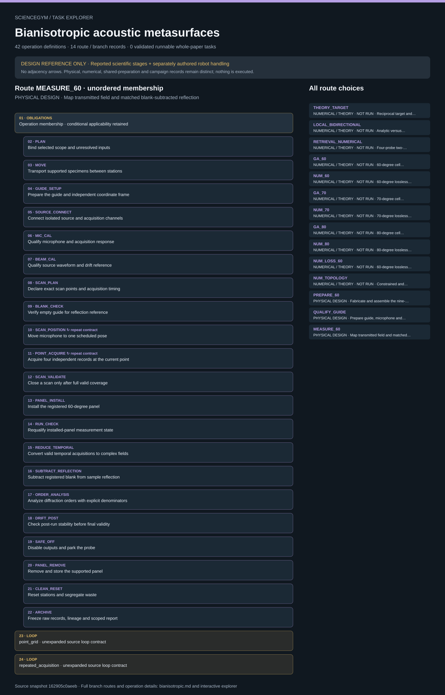

# Bianisotropic acoustic metasurfaces: task route map



Paper: **Systematic design and experimental demonstration of bianisotropic metasurfaces for scattering-free manipulation of acoustic wavefronts** · [DOI](https://doi.org/10.1038/s41467-018-03778-9)

Author/evaluator logical inspector; source-bounded design only; no actor projection, solver, simulator or robot execution. Counts describe task representation, not experiments or success.

**Reading rule:** rows preserve source operation membership once, without chronology. Loop bodies, count text and nesting obligations are retained as metadata, not added occurrences or executed repetitions. An unordered obligation group has no inferred chronological edges. Source-reported scientific facts and authored handling are distinct.

[Immutable source task package](https://github.com/openags/ScienceGym/blob/162905c0aeebd6da5eb9794df118458c24bb7d63/tasks/bianisotropic_operations_v2/) · [Interactive inspector](../index.html)

## THEORY_TARGET — NUMERICAL / THEORY · NOT RUN · Reciprocal target and degrees-of-freedom analysis

Source operation membership only; no chronological adjacency. Apply scoped dependencies, conditional gates and actual occurrence identities. Nothing here is executed. Numerical/theoretical records never count as physical measurements. Source facts, task-authored interfaces and qualified episode inputs stay distinct.

[Exact route source](https://github.com/openags/ScienceGym/blob/162905c0aeebd6da5eb9794df118458c24bb7d63/tasks/bianisotropic_operations_v2/branches.json) · JSON pointer: `/branches/0`

- **OBLIGATIONS: Operation membership · conditional applicability retained**
  - Binding: {"order":"Source operation membership only; no chronological adjacency. Apply scoped dependencies, conditional gates and actual occurrence identities. Nothing here is executed."}
  - `PLAN` Bind selected scope and unresolved inputs
  - `TARGET` Derive the target impedance and sampling plan
  - `NUMERIC_REPORT` Archive branch-specific computational conclusions
  - `ARCHIVE` Freeze raw records, lineage and scoped report
- **CONDITION: Numerical / theoretical boundary · no physical specimens**
  - Binding: {"source_contract":{"branch_id":"THEORY_TARGET","type":"theory","physical_specimens":0,"tools":"Explicit analytic, finite-element, optimization or analysis job contracts; not run"}}

<details><summary>Branch state, choices, lineage and loop obligations</summary>

```json
{
  "id": "THEORY_TARGET",
  "title": "Reciprocal target and degrees-of-freedom analysis",
  "evidence_type": "theory",
  "operation_ids": [
    "PLAN",
    "TARGET",
    "NUMERIC_REPORT",
    "ARCHIVE"
  ],
  "evidence_ids": [
    "E_THEORY",
    "E_ARCH"
  ],
  "unknown_parameter_ids": [
    "U09",
    "U11",
    "U13",
    "U17"
  ],
  "required": true,
  "execution_status": "blocked_design_only",
  "physical_specimens": 0
}
```

</details>

## LOCAL_BIDIRECTIONAL — NUMERICAL / THEORY · NOT RUN · Analytic versus numerical four-resonator cell

Source operation membership only; no chronological adjacency. Apply scoped dependencies, conditional gates and actual occurrence identities. Nothing here is executed. Numerical/theoretical records never count as physical measurements. Source facts, task-authored interfaces and qualified episode inputs stay distinct.

[Exact route source](https://github.com/openags/ScienceGym/blob/162905c0aeebd6da5eb9794df118458c24bb7d63/tasks/bianisotropic_operations_v2/branches.json) · JSON pointer: `/branches/1`

- **OBLIGATIONS: Operation membership · conditional applicability retained**
  - Binding: {"order":"Source operation membership only; no chronological adjacency. Apply scoped dependencies, conditional gates and actual occurrence identities. Nothing here is executed."}
  - `PLAN` Bind selected scope and unresolved inputs
  - `GEOMETRY` Bind incomplete tabulated geometry to a qualified design
  - `LOCAL_ANALYTIC` Evaluate local transfer and scattering response
  - `RETRIEVAL_SETUP` Configure four numerical probes and two terminations
  - `RETRIEVAL_RUN` Acquire independent numerical termination records
  - `LOCAL_COMPARE` Compare analytic and numerical cell behavior
  - `NUMERIC_REPORT` Archive branch-specific computational conclusions
  - `ARCHIVE` Freeze raw records, lineage and scoped report
- **CONDITION: Numerical / theoretical boundary · no physical specimens**
  - Binding: {"source_contract":{"branch_id":"LOCAL_BIDIRECTIONAL","type":"analytic_and_numerical","physical_specimens":0,"tools":"Explicit analytic, finite-element, optimization or analysis job contracts; not run"}}

<details><summary>Branch state, choices, lineage and loop obligations</summary>

```json
{
  "id": "LOCAL_BIDIRECTIONAL",
  "title": "Analytic versus numerical four-resonator cell",
  "evidence_type": "analytic_and_numerical",
  "operation_ids": [
    "PLAN",
    "GEOMETRY",
    "LOCAL_ANALYTIC",
    "RETRIEVAL_SETUP",
    "RETRIEVAL_RUN",
    "LOCAL_COMPARE",
    "NUMERIC_REPORT",
    "ARCHIVE"
  ],
  "evidence_ids": [
    "E_ARCH",
    "E_TM",
    "E_RETRIEVAL"
  ],
  "unknown_parameter_ids": [
    "U01",
    "U08",
    "U09",
    "U11",
    "U13",
    "U17"
  ],
  "required": true,
  "execution_status": "blocked_design_only",
  "frequency_schedule": null,
  "physical_specimens": 0
}
```

</details>

## RETRIEVAL_NUMERICAL — NUMERICAL / THEORY · NOT RUN · Four-probe two-termination impedance retrieval

Source operation membership only; no chronological adjacency. Apply scoped dependencies, conditional gates and actual occurrence identities. Nothing here is executed. Numerical/theoretical records never count as physical measurements. Source facts, task-authored interfaces and qualified episode inputs stay distinct.

[Exact route source](https://github.com/openags/ScienceGym/blob/162905c0aeebd6da5eb9794df118458c24bb7d63/tasks/bianisotropic_operations_v2/branches.json) · JSON pointer: `/branches/2`

- **OBLIGATIONS: Operation membership · conditional applicability retained**
  - Binding: {"order":"Source operation membership only; no chronological adjacency. Apply scoped dependencies, conditional gates and actual occurrence identities. Nothing here is executed."}
  - `PLAN` Bind selected scope and unresolved inputs
  - `GEOMETRY` Bind incomplete tabulated geometry to a qualified design
  - `RETRIEVAL_SETUP` Configure four numerical probes and two terminations
  - `RETRIEVAL_RUN` Acquire independent numerical termination records
  - `NUMERIC_REPORT` Archive branch-specific computational conclusions
  - `ARCHIVE` Freeze raw records, lineage and scoped report
- **CONDITION: Numerical / theoretical boundary · no physical specimens**
  - Binding: {"source_contract":{"branch_id":"RETRIEVAL_NUMERICAL","type":"numerical_only","physical_specimens":0,"tools":"Explicit analytic, finite-element, optimization or analysis job contracts; not run"}}

<details><summary>Branch state, choices, lineage and loop obligations</summary>

```json
{
  "id": "RETRIEVAL_NUMERICAL",
  "title": "Four-probe two-termination impedance retrieval",
  "evidence_type": "numerical_only",
  "operation_ids": [
    "PLAN",
    "GEOMETRY",
    "RETRIEVAL_SETUP",
    "RETRIEVAL_RUN",
    "NUMERIC_REPORT",
    "ARCHIVE"
  ],
  "evidence_ids": [
    "E_RETRIEVAL"
  ],
  "unknown_parameter_ids": [
    "U01",
    "U08",
    "U09",
    "U11",
    "U13",
    "U17"
  ],
  "required": true,
  "execution_status": "blocked_design_only",
  "terminations": [
    "plane_wave_radiation",
    "hard_wall"
  ],
  "probe_count": 4,
  "physical_specimens": 0
}
```

</details>

## GA_60 — NUMERICAL / THEORY · NOT RUN · 60-degree cell optimization campaign

Source operation membership only; no chronological adjacency. Apply scoped dependencies, conditional gates and actual occurrence identities. Nothing here is executed. Numerical/theoretical records never count as physical measurements. Source facts, task-authored interfaces and qualified episode inputs stay distinct.

[Exact route source](https://github.com/openags/ScienceGym/blob/162905c0aeebd6da5eb9794df118458c24bb7d63/tasks/bianisotropic_operations_v2/branches.json) · JSON pointer: `/branches/3`

- **OBLIGATIONS: Operation membership · conditional applicability retained**
  - Binding: {"order":"Source operation membership only; no chronological adjacency. Apply scoped dependencies, conditional gates and actual occurrence identities. Nothing here is executed."}
  - `PLAN` Bind selected scope and unresolved inputs
  - `TARGET` Derive the target impedance and sampling plan
  - `GEOMETRY` Bind incomplete tabulated geometry to a qualified design
  - `GA_SETUP` Configure reported baseline search with declared missing choices
  - `GA_RUN` Retain complete optimization search lineage · **repeat contract**
  - `NUMERIC_REPORT` Archive branch-specific computational conclusions
  - `ARCHIVE` Freeze raw records, lineage and scoped report
- **LOOP: cell_restarts · unexpanded source loop contract**
  - Binding: {"source_contract":{"id":"cell_restarts","iterator":"cell_id × restart_index","cell_count":11,"restarts_per_cell":50,"max_generations_per_restart":1500,"abort_rule":"failed/incomplete status remains; never pad missing runs with selected best curve"}}
- **CONDITION: Numerical / theoretical boundary · no physical specimens**
  - Binding: {"source_contract":{"branch_id":"GA_60","type":"numerical_optimization","physical_specimens":0,"tools":"Explicit analytic, finite-element, optimization or analysis job contracts; not run"}}

<details><summary>Branch state, choices, lineage and loop obligations</summary>

```json
{
  "id": "GA_60",
  "title": "60-degree cell optimization campaign",
  "evidence_type": "numerical_optimization",
  "operation_ids": [
    "PLAN",
    "TARGET",
    "GEOMETRY",
    "GA_SETUP",
    "GA_RUN",
    "NUMERIC_REPORT",
    "ARCHIVE"
  ],
  "evidence_ids": [
    "E_GA",
    "E_60"
  ],
  "unknown_parameter_ids": [
    "U01",
    "U08",
    "U09",
    "U10",
    "U11",
    "U13",
    "U17"
  ],
  "required": true,
  "execution_status": "blocked_design_only",
  "angle_deg": 60,
  "cells_per_period": 11,
  "impedance_backend": "analytic_transfer",
  "loops": [
    {
      "id": "cell_restarts",
      "iterator": "cell_id × restart_index",
      "cell_count": 11,
      "restarts_per_cell": 50,
      "max_generations_per_restart": 1500,
      "abort_rule": "failed/incomplete status remains; never pad missing runs with selected best curve"
    }
  ],
  "physical_specimens": 0
}
```

</details>

## NUM_60 — NUMERICAL / THEORY · NOT RUN · 60-degree lossless array and matched GSL control

Source operation membership only; no chronological adjacency. Apply scoped dependencies, conditional gates and actual occurrence identities. Nothing here is executed. Numerical/theoretical records never count as physical measurements. Source facts, task-authored interfaces and qualified episode inputs stay distinct.

[Exact route source](https://github.com/openags/ScienceGym/blob/162905c0aeebd6da5eb9794df118458c24bb7d63/tasks/bianisotropic_operations_v2/branches.json) · JSON pointer: `/branches/4`

- **OBLIGATIONS: Operation membership · conditional applicability retained**
  - Binding: {"order":"Source operation membership only; no chronological adjacency. Apply scoped dependencies, conditional gates and actual occurrence identities. Nothing here is executed."}
  - `PLAN` Bind selected scope and unresolved inputs
  - `TARGET` Derive the target impedance and sampling plan
  - `GEOMETRY` Bind incomplete tabulated geometry to a qualified design
  - `ARRAY_SETUP` Assemble a numerical array and ideal GSL comparator
  - `ARRAY_RUN` Run lossless array and matched GSL jobs
  - `NUMERIC_REPORT` Archive branch-specific computational conclusions
  - `ARCHIVE` Freeze raw records, lineage and scoped report
- **CONDITION: Numerical / theoretical boundary · no physical specimens**
  - Binding: {"source_contract":{"branch_id":"NUM_60","type":"numerical_only","physical_specimens":0,"tools":"Explicit analytic, finite-element, optimization or analysis job contracts; not run"}}

<details><summary>Branch state, choices, lineage and loop obligations</summary>

```json
{
  "id": "NUM_60",
  "title": "60-degree lossless array and matched GSL control",
  "evidence_type": "numerical_only",
  "operation_ids": [
    "PLAN",
    "TARGET",
    "GEOMETRY",
    "ARRAY_SETUP",
    "ARRAY_RUN",
    "NUMERIC_REPORT",
    "ARCHIVE"
  ],
  "evidence_ids": [
    "E_60",
    "E_THEORY"
  ],
  "unknown_parameter_ids": [
    "U01",
    "U08",
    "U09",
    "U11",
    "U13",
    "U17"
  ],
  "required": true,
  "execution_status": "blocked_design_only",
  "angle_deg": 60,
  "cells_per_period": 11,
  "geometry_routes": [
    "qualified_source_table_geometry",
    "qualified_GA_output"
  ],
  "requires_physical_branch": false,
  "physical_specimens": 0,
  "control_ids": [
    "CTRL_GSL_60"
  ]
}
```

</details>

## GA_70 — NUMERICAL / THEORY · NOT RUN · 70-degree cell optimization campaign

Source operation membership only; no chronological adjacency. Apply scoped dependencies, conditional gates and actual occurrence identities. Nothing here is executed. Numerical/theoretical records never count as physical measurements. Source facts, task-authored interfaces and qualified episode inputs stay distinct.

[Exact route source](https://github.com/openags/ScienceGym/blob/162905c0aeebd6da5eb9794df118458c24bb7d63/tasks/bianisotropic_operations_v2/branches.json) · JSON pointer: `/branches/5`

- **OBLIGATIONS: Operation membership · conditional applicability retained**
  - Binding: {"order":"Source operation membership only; no chronological adjacency. Apply scoped dependencies, conditional gates and actual occurrence identities. Nothing here is executed."}
  - `PLAN` Bind selected scope and unresolved inputs
  - `TARGET` Derive the target impedance and sampling plan
  - `GEOMETRY` Bind incomplete tabulated geometry to a qualified design
  - `GA_SETUP` Configure reported baseline search with declared missing choices
  - `GA_RUN` Retain complete optimization search lineage · **repeat contract**
  - `NUMERIC_REPORT` Archive branch-specific computational conclusions
  - `ARCHIVE` Freeze raw records, lineage and scoped report
- **LOOP: cell_restarts · unexpanded source loop contract**
  - Binding: {"source_contract":{"id":"cell_restarts","iterator":"cell_id × restart_index","cell_count":4,"restarts_per_cell":50,"max_generations_per_restart":1500,"abort_rule":"failed/incomplete status remains; never pad missing runs with selected best curve"}}
- **CONDITION: Numerical / theoretical boundary · no physical specimens**
  - Binding: {"source_contract":{"branch_id":"GA_70","type":"numerical_optimization","physical_specimens":0,"tools":"Explicit analytic, finite-element, optimization or analysis job contracts; not run"}}

<details><summary>Branch state, choices, lineage and loop obligations</summary>

```json
{
  "id": "GA_70",
  "title": "70-degree cell optimization campaign",
  "evidence_type": "numerical_optimization",
  "operation_ids": [
    "PLAN",
    "TARGET",
    "GEOMETRY",
    "GA_SETUP",
    "GA_RUN",
    "NUMERIC_REPORT",
    "ARCHIVE"
  ],
  "evidence_ids": [
    "E_GA",
    "E_70"
  ],
  "unknown_parameter_ids": [
    "U01",
    "U08",
    "U09",
    "U10",
    "U11",
    "U13",
    "U17"
  ],
  "required": true,
  "execution_status": "blocked_design_only",
  "angle_deg": 70,
  "cells_per_period": 4,
  "impedance_backend": "COMSOL_Livelink_MATLAB_numerical",
  "loops": [
    {
      "id": "cell_restarts",
      "iterator": "cell_id × restart_index",
      "cell_count": 4,
      "restarts_per_cell": 50,
      "max_generations_per_restart": 1500,
      "abort_rule": "failed/incomplete status remains; never pad missing runs with selected best curve"
    }
  ],
  "physical_specimens": 0
}
```

</details>

## NUM_70 — NUMERICAL / THEORY · NOT RUN · 70-degree lossless array and matched GSL control

Source operation membership only; no chronological adjacency. Apply scoped dependencies, conditional gates and actual occurrence identities. Nothing here is executed. Numerical/theoretical records never count as physical measurements. Source facts, task-authored interfaces and qualified episode inputs stay distinct.

[Exact route source](https://github.com/openags/ScienceGym/blob/162905c0aeebd6da5eb9794df118458c24bb7d63/tasks/bianisotropic_operations_v2/branches.json) · JSON pointer: `/branches/6`

- **OBLIGATIONS: Operation membership · conditional applicability retained**
  - Binding: {"order":"Source operation membership only; no chronological adjacency. Apply scoped dependencies, conditional gates and actual occurrence identities. Nothing here is executed."}
  - `PLAN` Bind selected scope and unresolved inputs
  - `TARGET` Derive the target impedance and sampling plan
  - `GEOMETRY` Bind incomplete tabulated geometry to a qualified design
  - `ARRAY_SETUP` Assemble a numerical array and ideal GSL comparator
  - `ARRAY_RUN` Run lossless array and matched GSL jobs
  - `NUMERIC_REPORT` Archive branch-specific computational conclusions
  - `ARCHIVE` Freeze raw records, lineage and scoped report
- **CONDITION: Numerical / theoretical boundary · no physical specimens**
  - Binding: {"source_contract":{"branch_id":"NUM_70","type":"numerical_only","physical_specimens":0,"tools":"Explicit analytic, finite-element, optimization or analysis job contracts; not run"}}

<details><summary>Branch state, choices, lineage and loop obligations</summary>

```json
{
  "id": "NUM_70",
  "title": "70-degree lossless array and matched GSL control",
  "evidence_type": "numerical_only",
  "operation_ids": [
    "PLAN",
    "TARGET",
    "GEOMETRY",
    "ARRAY_SETUP",
    "ARRAY_RUN",
    "NUMERIC_REPORT",
    "ARCHIVE"
  ],
  "evidence_ids": [
    "E_70",
    "E_THEORY"
  ],
  "unknown_parameter_ids": [
    "U01",
    "U08",
    "U09",
    "U11",
    "U13",
    "U17"
  ],
  "required": true,
  "execution_status": "blocked_design_only",
  "angle_deg": 70,
  "cells_per_period": 4,
  "geometry_routes": [
    "qualified_source_table_geometry",
    "qualified_GA_output"
  ],
  "requires_physical_branch": false,
  "physical_specimens": 0,
  "control_ids": [
    "CTRL_GSL_70"
  ]
}
```

</details>

## GA_80 — NUMERICAL / THEORY · NOT RUN · 80-degree cell optimization campaign

Source operation membership only; no chronological adjacency. Apply scoped dependencies, conditional gates and actual occurrence identities. Nothing here is executed. Numerical/theoretical records never count as physical measurements. Source facts, task-authored interfaces and qualified episode inputs stay distinct.

[Exact route source](https://github.com/openags/ScienceGym/blob/162905c0aeebd6da5eb9794df118458c24bb7d63/tasks/bianisotropic_operations_v2/branches.json) · JSON pointer: `/branches/7`

- **OBLIGATIONS: Operation membership · conditional applicability retained**
  - Binding: {"order":"Source operation membership only; no chronological adjacency. Apply scoped dependencies, conditional gates and actual occurrence identities. Nothing here is executed."}
  - `PLAN` Bind selected scope and unresolved inputs
  - `TARGET` Derive the target impedance and sampling plan
  - `GEOMETRY` Bind incomplete tabulated geometry to a qualified design
  - `GA_SETUP` Configure reported baseline search with declared missing choices
  - `GA_RUN` Retain complete optimization search lineage · **repeat contract**
  - `NUMERIC_REPORT` Archive branch-specific computational conclusions
  - `ARCHIVE` Freeze raw records, lineage and scoped report
- **LOOP: cell_restarts · unexpanded source loop contract**
  - Binding: {"source_contract":{"id":"cell_restarts","iterator":"cell_id × restart_index","cell_count":4,"restarts_per_cell":50,"max_generations_per_restart":1500,"abort_rule":"failed/incomplete status remains; never pad missing runs with selected best curve"}}
- **CONDITION: Numerical / theoretical boundary · no physical specimens**
  - Binding: {"source_contract":{"branch_id":"GA_80","type":"numerical_optimization","physical_specimens":0,"tools":"Explicit analytic, finite-element, optimization or analysis job contracts; not run"}}

<details><summary>Branch state, choices, lineage and loop obligations</summary>

```json
{
  "id": "GA_80",
  "title": "80-degree cell optimization campaign",
  "evidence_type": "numerical_optimization",
  "operation_ids": [
    "PLAN",
    "TARGET",
    "GEOMETRY",
    "GA_SETUP",
    "GA_RUN",
    "NUMERIC_REPORT",
    "ARCHIVE"
  ],
  "evidence_ids": [
    "E_GA",
    "E_80"
  ],
  "unknown_parameter_ids": [
    "U01",
    "U08",
    "U09",
    "U10",
    "U11",
    "U13",
    "U17"
  ],
  "required": true,
  "execution_status": "blocked_design_only",
  "angle_deg": 80,
  "cells_per_period": 4,
  "impedance_backend": "COMSOL_Livelink_MATLAB_numerical",
  "loops": [
    {
      "id": "cell_restarts",
      "iterator": "cell_id × restart_index",
      "cell_count": 4,
      "restarts_per_cell": 50,
      "max_generations_per_restart": 1500,
      "abort_rule": "failed/incomplete status remains; never pad missing runs with selected best curve"
    }
  ],
  "physical_specimens": 0
}
```

</details>

## NUM_80 — NUMERICAL / THEORY · NOT RUN · 80-degree lossless array and matched GSL control

Source operation membership only; no chronological adjacency. Apply scoped dependencies, conditional gates and actual occurrence identities. Nothing here is executed. Numerical/theoretical records never count as physical measurements. Source facts, task-authored interfaces and qualified episode inputs stay distinct.

[Exact route source](https://github.com/openags/ScienceGym/blob/162905c0aeebd6da5eb9794df118458c24bb7d63/tasks/bianisotropic_operations_v2/branches.json) · JSON pointer: `/branches/8`

- **OBLIGATIONS: Operation membership · conditional applicability retained**
  - Binding: {"order":"Source operation membership only; no chronological adjacency. Apply scoped dependencies, conditional gates and actual occurrence identities. Nothing here is executed."}
  - `PLAN` Bind selected scope and unresolved inputs
  - `TARGET` Derive the target impedance and sampling plan
  - `GEOMETRY` Bind incomplete tabulated geometry to a qualified design
  - `ARRAY_SETUP` Assemble a numerical array and ideal GSL comparator
  - `ARRAY_RUN` Run lossless array and matched GSL jobs
  - `NUMERIC_REPORT` Archive branch-specific computational conclusions
  - `ARCHIVE` Freeze raw records, lineage and scoped report
- **CONDITION: Numerical / theoretical boundary · no physical specimens**
  - Binding: {"source_contract":{"branch_id":"NUM_80","type":"numerical_only","physical_specimens":0,"tools":"Explicit analytic, finite-element, optimization or analysis job contracts; not run"}}

<details><summary>Branch state, choices, lineage and loop obligations</summary>

```json
{
  "id": "NUM_80",
  "title": "80-degree lossless array and matched GSL control",
  "evidence_type": "numerical_only",
  "operation_ids": [
    "PLAN",
    "TARGET",
    "GEOMETRY",
    "ARRAY_SETUP",
    "ARRAY_RUN",
    "NUMERIC_REPORT",
    "ARCHIVE"
  ],
  "evidence_ids": [
    "E_80",
    "E_THEORY"
  ],
  "unknown_parameter_ids": [
    "U01",
    "U08",
    "U09",
    "U11",
    "U13",
    "U17"
  ],
  "required": true,
  "execution_status": "blocked_design_only",
  "angle_deg": 80,
  "cells_per_period": 4,
  "geometry_routes": [
    "qualified_source_table_geometry",
    "qualified_GA_output"
  ],
  "requires_physical_branch": false,
  "physical_specimens": 0,
  "control_ids": [
    "CTRL_GSL_80"
  ]
}
```

</details>

## NUM_LOSS_60 — NUMERICAL / THEORY · NOT RUN · 60-degree lossless versus viscous fluid comparison

Source operation membership only; no chronological adjacency. Apply scoped dependencies, conditional gates and actual occurrence identities. Nothing here is executed. Numerical/theoretical records never count as physical measurements. Source facts, task-authored interfaces and qualified episode inputs stay distinct.

[Exact route source](https://github.com/openags/ScienceGym/blob/162905c0aeebd6da5eb9794df118458c24bb7d63/tasks/bianisotropic_operations_v2/branches.json) · JSON pointer: `/branches/9`

- **OBLIGATIONS: Operation membership · conditional applicability retained**
  - Binding: {"order":"Source operation membership only; no chronological adjacency. Apply scoped dependencies, conditional gates and actual occurrence identities. Nothing here is executed."}
  - `PLAN` Bind selected scope and unresolved inputs
  - `TARGET` Derive the target impedance and sampling plan
  - `GEOMETRY` Bind incomplete tabulated geometry to a qualified design
  - `ARRAY_SETUP` Assemble a numerical array and ideal GSL comparator
  - `LOSS_RUN` Run matched viscous and lossless comparison
  - `NUMERIC_REPORT` Archive branch-specific computational conclusions
  - `ARCHIVE` Freeze raw records, lineage and scoped report
- **CONDITION: Numerical / theoretical boundary · no physical specimens**
  - Binding: {"source_contract":{"branch_id":"NUM_LOSS_60","type":"numerical_only","physical_specimens":0,"tools":"Explicit analytic, finite-element, optimization or analysis job contracts; not run"}}

<details><summary>Branch state, choices, lineage and loop obligations</summary>

```json
{
  "id": "NUM_LOSS_60",
  "title": "60-degree lossless versus viscous fluid comparison",
  "evidence_type": "numerical_only",
  "operation_ids": [
    "PLAN",
    "TARGET",
    "GEOMETRY",
    "ARRAY_SETUP",
    "LOSS_RUN",
    "NUMERIC_REPORT",
    "ARCHIVE"
  ],
  "evidence_ids": [
    "E_LOSS"
  ],
  "unknown_parameter_ids": [
    "U01",
    "U08",
    "U09",
    "U11",
    "U13",
    "U17"
  ],
  "required": true,
  "execution_status": "blocked_design_only",
  "angle_deg": 60,
  "control_ids": [
    "CTRL_LOSS"
  ],
  "physical_specimens": 0
}
```

</details>

## NUM_TOPOLOGY — NUMERICAL / THEORY · NOT RUN · Constrained and relaxed three-resonator comparison

Source operation membership only; no chronological adjacency. Apply scoped dependencies, conditional gates and actual occurrence identities. Nothing here is executed. Numerical/theoretical records never count as physical measurements. Source facts, task-authored interfaces and qualified episode inputs stay distinct.

[Exact route source](https://github.com/openags/ScienceGym/blob/162905c0aeebd6da5eb9794df118458c24bb7d63/tasks/bianisotropic_operations_v2/branches.json) · JSON pointer: `/branches/10`

- **OBLIGATIONS: Operation membership · conditional applicability retained**
  - Binding: {"order":"Source operation membership only; no chronological adjacency. Apply scoped dependencies, conditional gates and actual occurrence identities. Nothing here is executed."}
  - `PLAN` Bind selected scope and unresolved inputs
  - `TARGET` Derive the target impedance and sampling plan
  - `GEOMETRY` Bind incomplete tabulated geometry to a qualified design
  - `GA_SETUP` Configure reported baseline search with declared missing choices
  - `TOPOLOGY_RUN` Compare constrained and relaxed three-resonator searches
  - `NUMERIC_REPORT` Archive branch-specific computational conclusions
  - `ARCHIVE` Freeze raw records, lineage and scoped report
- **CONDITION: Numerical / theoretical boundary · no physical specimens**
  - Binding: {"source_contract":{"branch_id":"NUM_TOPOLOGY","type":"numerical_only","physical_specimens":0,"tools":"Explicit analytic, finite-element, optimization or analysis job contracts; not run"}}

<details><summary>Branch state, choices, lineage and loop obligations</summary>

```json
{
  "id": "NUM_TOPOLOGY",
  "title": "Constrained and relaxed three-resonator comparison",
  "evidence_type": "numerical_only",
  "operation_ids": [
    "PLAN",
    "TARGET",
    "GEOMETRY",
    "GA_SETUP",
    "TOPOLOGY_RUN",
    "NUMERIC_REPORT",
    "ARCHIVE"
  ],
  "evidence_ids": [
    "E_TOPO",
    "E_ARCH"
  ],
  "unknown_parameter_ids": [
    "U01",
    "U08",
    "U09",
    "U10",
    "U11",
    "U13",
    "U17"
  ],
  "required": true,
  "execution_status": "blocked_design_only",
  "physical_specimens": 0,
  "control_ids": [
    "CTRL_TOPOLOGY"
  ],
  "constrained_failure_is_valid_terminal_result": true
}
```

</details>

## PREPARE_60 — PHYSICAL DESIGN · Fabricate and assemble the nine-period 60-degree panel

Source operation membership only; no chronological adjacency. Apply scoped dependencies, conditional gates and actual occurrence identities. Nothing here is executed. Numerical/theoretical records never count as physical measurements. Source facts, task-authored interfaces and qualified episode inputs stay distinct.

[Exact route source](https://github.com/openags/ScienceGym/blob/162905c0aeebd6da5eb9794df118458c24bb7d63/tasks/bianisotropic_operations_v2/branches.json) · JSON pointer: `/branches/11`

- **OBLIGATIONS: Operation membership · conditional applicability retained**
  - Binding: {"order":"Source operation membership only; no chronological adjacency. Apply scoped dependencies, conditional gates and actual occurrence identities. Nothing here is executed."}
  - `PLAN` Bind selected scope and unresolved inputs
  - `GEOMETRY` Bind incomplete tabulated geometry to a qualified design
  - `STOCK` Retrieve ABS stock and identified carriers
  - `MOVE` Transport supported specimens between stations
  - `PRINT_LOAD` Load a qualified fabrication job
  - `PRINT_RUN` Fabricate and wait for safe release
  - `PRINT_UNLOAD` Retrieve and identify fabricated period sections
  - `INSPECT_PART` Inspect channels, neck access and external dimensions · **repeat contract**
  - `STAGE_PANEL` Stage nine qualified period sections in order
  - `JOIN_PANEL` Seat and secure panel sections
  - `PANEL_QC` Register panel geometry and integrity
  - `CLEAN_RESET` Reset stations and segregate waste
  - `ARCHIVE` Freeze raw records, lineage and scoped report
- **LOOP: fabrication_batches · unexpanded source loop contract**
  - Binding: {"source_contract":{"id":"fabrication_batches","values_from":"fabrication_card.batch_schedule","values":null,"nonempty":true}}
- **LOOP: section_inspection · unexpanded source loop contract**
  - Binding: {"source_contract":{"id":"section_inspection","iterator":"each allocated period-section ID","count_per_panel":9}}

<details><summary>Branch state, choices, lineage and loop obligations</summary>

```json
{
  "id": "PREPARE_60",
  "title": "Fabricate and assemble the nine-period 60-degree panel",
  "evidence_type": "physical_preparation",
  "operation_ids": [
    "PLAN",
    "GEOMETRY",
    "STOCK",
    "MOVE",
    "PRINT_LOAD",
    "PRINT_RUN",
    "PRINT_UNLOAD",
    "INSPECT_PART",
    "STAGE_PANEL",
    "JOIN_PANEL",
    "PANEL_QC",
    "CLEAN_RESET",
    "ARCHIVE"
  ],
  "evidence_ids": [
    "E_FAB",
    "E_60"
  ],
  "unknown_parameter_ids": [
    "U01",
    "U02",
    "U03",
    "U04",
    "U13",
    "U16",
    "U17",
    "U18"
  ],
  "required": true,
  "execution_status": "blocked_design_only",
  "period_count": 9,
  "cells_per_period": 11,
  "local_design_slot_count": 99,
  "authored_part_granularity": "One physical handleable period section per period; source does not specify separately printed segmentation",
  "independent_specimen_count": null,
  "loops": [
    {
      "id": "fabrication_batches",
      "values_from": "fabrication_card.batch_schedule",
      "values": null,
      "nonempty": true
    },
    {
      "id": "section_inspection",
      "iterator": "each allocated period-section ID",
      "count_per_panel": 9
    }
  ]
}
```

</details>

## QUALIFY_GUIDE — PHYSICAL DESIGN · Prepare guide, microphone and source calibration

Source operation membership only; no chronological adjacency. Apply scoped dependencies, conditional gates and actual occurrence identities. Nothing here is executed. Numerical/theoretical records never count as physical measurements. Source facts, task-authored interfaces and qualified episode inputs stay distinct.

[Exact route source](https://github.com/openags/ScienceGym/blob/162905c0aeebd6da5eb9794df118458c24bb7d63/tasks/bianisotropic_operations_v2/branches.json) · JSON pointer: `/branches/12`

- **OBLIGATIONS: Operation membership · conditional applicability retained**
  - Binding: {"order":"Source operation membership only; no chronological adjacency. Apply scoped dependencies, conditional gates and actual occurrence identities. Nothing here is executed."}
  - `PLAN` Bind selected scope and unresolved inputs
  - `GUIDE_SETUP` Prepare the guide and independent coordinate frame
  - `SOURCE_CONNECT` Connect isolated source and acquisition channels
  - `MIC_CAL` Qualify microphone and acquisition response
  - `BEAM_CAL` Qualify source waveform and drift reference
  - `SCAN_PLAN` Declare exact scan points and acquisition timing
  - `SAFE_OFF` Disable outputs and park the probe
  - `CLEAN_RESET` Reset stations and segregate waste
  - `ARCHIVE` Freeze raw records, lineage and scoped report

<details><summary>Branch state, choices, lineage and loop obligations</summary>

```json
{
  "id": "QUALIFY_GUIDE",
  "title": "Prepare guide, microphone and source calibration",
  "evidence_type": "task_authored_validity_controls",
  "operation_ids": [
    "PLAN",
    "GUIDE_SETUP",
    "SOURCE_CONNECT",
    "MIC_CAL",
    "BEAM_CAL",
    "SCAN_PLAN",
    "SAFE_OFF",
    "CLEAN_RESET",
    "ARCHIVE"
  ],
  "evidence_ids": [
    "E_FAB",
    "E_SCAN"
  ],
  "unknown_parameter_ids": [
    "U04",
    "U05",
    "U06",
    "U07",
    "U09",
    "U13",
    "U16",
    "U17",
    "U18"
  ],
  "required": true,
  "execution_status": "blocked_design_only",
  "calibration_is_source_reported": false
}
```

</details>

## MEASURE_60 — PHYSICAL DESIGN · Map transmitted field and matched blank-subtracted reflection

Source operation membership only; no chronological adjacency. Apply scoped dependencies, conditional gates and actual occurrence identities. Nothing here is executed. Numerical/theoretical records never count as physical measurements. Source facts, task-authored interfaces and qualified episode inputs stay distinct.

[Exact route source](https://github.com/openags/ScienceGym/blob/162905c0aeebd6da5eb9794df118458c24bb7d63/tasks/bianisotropic_operations_v2/branches.json) · JSON pointer: `/branches/13`

- **OBLIGATIONS: Operation membership · conditional applicability retained**
  - Binding: {"order":"Source operation membership only; no chronological adjacency. Apply scoped dependencies, conditional gates and actual occurrence identities. Nothing here is executed."}
  - `PLAN` Bind selected scope and unresolved inputs
  - `MOVE` Transport supported specimens between stations
  - `GUIDE_SETUP` Prepare the guide and independent coordinate frame
  - `SOURCE_CONNECT` Connect isolated source and acquisition channels
  - `MIC_CAL` Qualify microphone and acquisition response
  - `BEAM_CAL` Qualify source waveform and drift reference
  - `SCAN_PLAN` Declare exact scan points and acquisition timing
  - `BLANK_CHECK` Verify empty guide for reflection reference
  - `SCAN_POSITION` Move microphone to one scheduled pose · **repeat contract**
  - `POINT_ACQUIRE` Acquire four independent records at the current point · **repeat contract**
  - `SCAN_VALIDATE` Close a scan only after full valid coverage
  - `PANEL_INSTALL` Install the registered 60-degree panel
  - `RUN_CHECK` Requalify installed-panel measurement state
  - `REDUCE_TEMPORAL` Convert valid temporal acquisitions to complex fields
  - `SUBTRACT_REFLECTION` Subtract registered blank from sample reflection
  - `ORDER_ANALYSIS` Analyze diffraction orders with explicit denominators
  - `DRIFT_POST` Check post-run stability before final validity
  - `SAFE_OFF` Disable outputs and park the probe
  - `PANEL_REMOVE` Remove and store the supported panel
  - `CLEAN_RESET` Reset stations and segregate waste
  - `ARCHIVE` Freeze raw records, lineage and scoped report
- **LOOP: point_grid · unexpanded source loop contract**
  - Binding: {"source_contract":{"id":"point_grid","iterator":"configuration_id × scheduled point_id","values":null,"values_from":"scan_card.explicit_point_sets","nonempty":true}}
- **LOOP: repeated_acquisition · unexpanded source loop contract**
  - Binding: {"source_contract":{"id":"repeated_acquisition","iterator":"repeat_index","values":[1,2,3,4],"scope":"repeated measurement of one microphone position, not independent fabricated specimens"}}

<details><summary>Branch state, choices, lineage and loop obligations</summary>

```json
{
  "id": "MEASURE_60",
  "title": "Map transmitted field and matched blank-subtracted reflection",
  "evidence_type": "physical_measurement",
  "operation_ids": [
    "PLAN",
    "MOVE",
    "GUIDE_SETUP",
    "SOURCE_CONNECT",
    "MIC_CAL",
    "BEAM_CAL",
    "SCAN_PLAN",
    "BLANK_CHECK",
    "SCAN_POSITION",
    "POINT_ACQUIRE",
    "SCAN_VALIDATE",
    "PANEL_INSTALL",
    "RUN_CHECK",
    "REDUCE_TEMPORAL",
    "SUBTRACT_REFLECTION",
    "ORDER_ANALYSIS",
    "DRIFT_POST",
    "SAFE_OFF",
    "PANEL_REMOVE",
    "CLEAN_RESET",
    "ARCHIVE"
  ],
  "evidence_ids": [
    "E_FAB",
    "E_SCAN",
    "E_REFLECT",
    "E_ORDERS"
  ],
  "unknown_parameter_ids": [
    "U03",
    "U04",
    "U05",
    "U06",
    "U07",
    "U09",
    "U13",
    "U16",
    "U17",
    "U18"
  ],
  "required": true,
  "execution_status": "blocked_design_only",
  "angle_deg": 60,
  "requires_branch_receipts": [
    "PREPARE_60"
  ],
  "control_ids": [
    "CTRL_BLANK",
    "CTRL_DRIFT"
  ],
  "configuration_ids": [
    "blank_reflection",
    "sample_transmission",
    "sample_reflection"
  ],
  "per_point_acquisitions": 4,
  "grid_point_count": null,
  "independent_specimen_count": null,
  "loops": [
    {
      "id": "point_grid",
      "iterator": "configuration_id × scheduled point_id",
      "values": null,
      "values_from": "scan_card.explicit_point_sets",
      "nonempty": true
    },
    {
      "id": "repeated_acquisition",
      "iterator": "repeat_index",
      "values": [
        1,
        2,
        3,
        4
      ],
      "scope": "repeated measurement of one microphone position, not independent fabricated specimens"
    }
  ]
}
```

</details>

## Operation contracts

Every operation is clickable in the offline inspector, with robot actions, target objects, pre/post state, provenance, unknowns and acceptance/recovery. Raw task JSON is the source of truth; this visualization is a public evaluator/reference view, not an agent prompt.

## Reference contracts and boundaries

Representation counts: {"physical_routes": 3, "numerical_dispositions": 11, "branch_loop_contracts": 7, "unknown_input_groups": 18}.

The complete source contracts remain in the inspector, including unknown inputs, source conflicts, allocation/lineage, dependencies, actor allowlists and independent source audits. Numerical work is distinct from physical preparation and acquisition. All operation lists are membership; no chronology, new schedule, default value, sample count or observed result is inferred.

This public author/evaluator inspector is not actor-safe input. No runtime projection, solver, task loader, physical simulation, new storyboard or robot execution is implemented.

- [EXPORT_ALLOWLIST.json](https://github.com/openags/ScienceGym/blob/162905c0aeebd6da5eb9794df118458c24bb7d63/tasks/bianisotropic_operations_v2/EXPORT_ALLOWLIST.json)
- [RELEASE_BOUNDARY.json](https://github.com/openags/ScienceGym/blob/162905c0aeebd6da5eb9794df118458c24bb7d63/tasks/bianisotropic_operations_v2/RELEASE_BOUNDARY.json)
- [STATUS.json](https://github.com/openags/ScienceGym/blob/162905c0aeebd6da5eb9794df118458c24bb7d63/tasks/bianisotropic_operations_v2/STATUS.json)
- [VERIFICATION.json](https://github.com/openags/ScienceGym/blob/162905c0aeebd6da5eb9794df118458c24bb7d63/tasks/bianisotropic_operations_v2/VERIFICATION.json)
- [agent_visible.json](https://github.com/openags/ScienceGym/blob/162905c0aeebd6da5eb9794df118458c24bb7d63/tasks/bianisotropic_operations_v2/agent_visible.json)
- [asset_needs.json](https://github.com/openags/ScienceGym/blob/162905c0aeebd6da5eb9794df118458c24bb7d63/tasks/bianisotropic_operations_v2/asset_needs.json)
- [branches.json](https://github.com/openags/ScienceGym/blob/162905c0aeebd6da5eb9794df118458c24bb7d63/tasks/bianisotropic_operations_v2/branches.json)
- [control_packages.json](https://github.com/openags/ScienceGym/blob/162905c0aeebd6da5eb9794df118458c24bb7d63/tasks/bianisotropic_operations_v2/control_packages.json)
- [coverage_matrix.json](https://github.com/openags/ScienceGym/blob/162905c0aeebd6da5eb9794df118458c24bb7d63/tasks/bianisotropic_operations_v2/coverage_matrix.json)
- [dependencies.json](https://github.com/openags/ScienceGym/blob/162905c0aeebd6da5eb9794df118458c24bb7d63/tasks/bianisotropic_operations_v2/dependencies.json)
- [episode_input_contract.json](https://github.com/openags/ScienceGym/blob/162905c0aeebd6da5eb9794df118458c24bb7d63/tasks/bianisotropic_operations_v2/episode_input_contract.json)
- [evaluator_reference.json](https://github.com/openags/ScienceGym/blob/162905c0aeebd6da5eb9794df118458c24bb7d63/tasks/bianisotropic_operations_v2/evaluator_reference.json)
- [geometry_tables.json](https://github.com/openags/ScienceGym/blob/162905c0aeebd6da5eb9794df118458c24bb7d63/tasks/bianisotropic_operations_v2/geometry_tables.json)
- [lineage_contract.json](https://github.com/openags/ScienceGym/blob/162905c0aeebd6da5eb9794df118458c24bb7d63/tasks/bianisotropic_operations_v2/lineage_contract.json)
- [material_cards.json](https://github.com/openags/ScienceGym/blob/162905c0aeebd6da5eb9794df118458c24bb7d63/tasks/bianisotropic_operations_v2/material_cards.json)
- [mock_contract.json](https://github.com/openags/ScienceGym/blob/162905c0aeebd6da5eb9794df118458c24bb7d63/tasks/bianisotropic_operations_v2/mock_contract.json)
- [nonmanual_scope.json](https://github.com/openags/ScienceGym/blob/162905c0aeebd6da5eb9794df118458c24bb7d63/tasks/bianisotropic_operations_v2/nonmanual_scope.json)
- [operations.json](https://github.com/openags/ScienceGym/blob/162905c0aeebd6da5eb9794df118458c24bb7d63/tasks/bianisotropic_operations_v2/operations.json)
- [provenance.json](https://github.com/openags/ScienceGym/blob/162905c0aeebd6da5eb9794df118458c24bb7d63/tasks/bianisotropic_operations_v2/provenance.json)
- [review/independent_review.json](https://github.com/openags/ScienceGym/blob/162905c0aeebd6da5eb9794df118458c24bb7d63/tasks/bianisotropic_operations_v2/review/independent_review.json)
- [source_access_audit.json](https://github.com/openags/ScienceGym/blob/162905c0aeebd6da5eb9794df118458c24bb7d63/tasks/bianisotropic_operations_v2/source_access_audit.json)
- [source_conflicts.json](https://github.com/openags/ScienceGym/blob/162905c0aeebd6da5eb9794df118458c24bb7d63/tasks/bianisotropic_operations_v2/source_conflicts.json)
- [source_outcomes.json](https://github.com/openags/ScienceGym/blob/162905c0aeebd6da5eb9794df118458c24bb7d63/tasks/bianisotropic_operations_v2/source_outcomes.json)
- [station_contracts.json](https://github.com/openags/ScienceGym/blob/162905c0aeebd6da5eb9794df118458c24bb7d63/tasks/bianisotropic_operations_v2/station_contracts.json)
- [tests/validation_report.json](https://github.com/openags/ScienceGym/blob/162905c0aeebd6da5eb9794df118458c24bb7d63/tasks/bianisotropic_operations_v2/tests/validation_report.json)
- [unknown_parameters.json](https://github.com/openags/ScienceGym/blob/162905c0aeebd6da5eb9794df118458c24bb7d63/tasks/bianisotropic_operations_v2/unknown_parameters.json)
