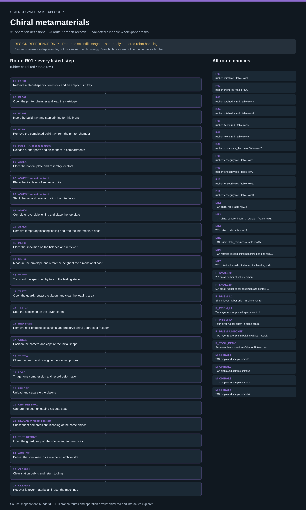

# Chiral metamaterials: task route map



Paper: **Large recoverable elastic energy in chiral metamaterials via twist buckling** · [DOI](https://doi.org/10.1038/s41586-025-08658-z)

Task-design reference; no task execution or scientific reproduction. Counts describe task representation, not experiments or success.

**Reading rule:** numbered rows preserve reference-list occurrences. A loop body is shown once and must be repeated under its original binding, not treated as executed. An unordered obligation group has no inferred chronological edges. Source-reported scientific facts and authored handling are distinct.

[Immutable source task package](https://github.com/openags/ScienceGym/blob/ebf366bde7d8b8fd0899165d168a9f8f7c43c8ca/tasks/chiral_operations_v2/) · [Interactive inspector](../index.html)

## R01 — rubber chiral rod / table row1

Authored within-branch reference order; not recovered author chronology

[Exact route source](https://github.com/openags/ScienceGym/blob/ebf366bde7d8b8fd0899165d168a9f8f7c43c8ca/tasks/chiral_operations_v2/branches.json) · JSON pointer: `/branches/0/operation_sequence`

- `FAB01` Retrieve material-specific feedstock and an empty build tray
- `FAB02` Open the printer chamber and load the cartridge
- `FAB03` Insert the build tray and start printing for this branch
- `FAB04` Remove the completed build tray from the printer chamber
- `POST_R` Release rubber parts and place them in compartments · **repeat contract**
- `ASM01` Place the bottom plate and assembly locators
- `ASM02` Place the first layer of separate units · **repeat contract**
- `ASM03` Stack the second layer and align the interfaces · **repeat contract**
- `ASM04` Complete reversible joining and place the top plate
- `ASM05` Remove temporary locating tooling and free the intermediate rings
- `MET01` Place the specimen on the balance and retrieve it
- `MET02` Measure the envelope and reference height at the dimensional base
- `TEST01` Transport the specimen by tray to the testing station
- `TEST02` Open the guard, retract the platen, and clear the loading area
- `TEST03` Seat the specimen on the lower platen
- `BND_FREE` Remove ring-bridging constraints and preserve chiral degrees of freedom
- `OBS01` Position the camera and capture the initial shape
- `TEST04` Close the guard and configure the loading program
- `LOAD` Trigger one compression and record deformation
- `UNLOAD` Unload and separate the platens
- `OBS_RESIDUAL` Capture the post-unloading residual state
- `RELOAD` Subsequent compression/unloading of the same object · **repeat contract**
- `TEST_REMOVE` Open the guard, support the specimen, and remove it
- `ARCHIVE` Deliver the specimen to its numbered archive slot
- `CLEAN01` Clear station debris and return tooling
- `CLEAN02` Recover leftover material and reset the machines

<details><summary>Branch state, choices, lineage and loop obligations</summary>

```json
{
  "material": "rubber",
  "source_route_ids": [
    "H.table01"
  ],
  "source_units": [
    "table.row1"
  ],
  "physical_object_id": "obj.R01.001",
  "condition_id": "cond.R01",
  "paper_specimen_identity": "unknown; design object is not an assertion of author object lineage",
  "source_parameters": {
    "source_table_row": 1,
    "primitive_dimension_mm": 1.5,
    "dimension_meaning": "r",
    "envelope_mm": [
      65,
      65,
      72
    ],
    "reported_comparison_strain": 0.25,
    "Nbk": 144,
    "whole_density_kg_m3": 290.27,
    "N_per_unit": 8,
    "R_mm": 7.5,
    "alpha0_deg": 5,
    "h0_mm": 30,
    "array_plan": [
      3,
      3
    ]
  },
  "boundary": "free_internal_rotation",
  "assembly": "rubber_array_3x3x2_surrogate",
  "cycle_policy": "rubber_repeat_observation",
  "mock_load_endpoint": {
    "kind": "authored_choice_from_reported_comparison_strain",
    "value": 0.25,
    "not_author_maximum_protocol": true
  },
  "source_total_cycles": null,
  "design_cycles": 2,
  "expected_observation_fixture": "independent_twist",
  "special_rules": [
    "3×3 in-plane layout, two layers shown; 18 task half-units (9 positions × upper/lower mirrored units) are a geometric/task decomposition interpretation supported by the figures and 144/8, not proof of 18 actual independently detachable parts or a source BOM",
    "Grasp the bottom plate/rigid rings for transport and remove all transport fixtures bridging rings; install neither anti-rotation arms nor a lateral box"
  ],
  "location_binding": {
    "material_printer": "WS_RUBBER_PRINT"
  },
  "asset_binding": {
    "specimen": "obj.R01.001",
    "material_cartridge": "stock.rubber.sealed_surrogate",
    "component_tray": "tray.R01.parts",
    "archive_slot": "WS_STORAGE.R01",
    "quarantine_slot": "WS_STORAGE.quarantine.R01"
  },
  "cycle_binding": {
    "initial_label": "task_observed_load_1_not_proven_pristine",
    "after_first_unload": "observed_recovery_state",
    "repeat_label": "same_object_repeat",
    "source_total_cycles": null,
    "design_total_cycles": 2
  },
  "manufacturing_binding": {
    "task_start": "sealed material stock plus empty build tray",
    "task_output": "rubber_array_3x3x2_surrogate",
    "actual_material_process": "unknown; supplied externally for real execution",
    "surrogate": "closed material-specific printer + removable build cassette + nonphysical completion event",
    "source_process": "3D printing only",
    "supports_enabled_default": false,
    "real_postprocessing_recipe": null
  },
  "design_status": "complete operation route / not executed"
}
```

</details>

## R02 — rubber prism rod / table row2

Authored within-branch reference order; not recovered author chronology

[Exact route source](https://github.com/openags/ScienceGym/blob/ebf366bde7d8b8fd0899165d168a9f8f7c43c8ca/tasks/chiral_operations_v2/branches.json) · JSON pointer: `/branches/1/operation_sequence`

- `FAB01` Retrieve material-specific feedstock and an empty build tray
- `FAB02` Open the printer chamber and load the cartridge
- `FAB03` Insert the build tray and start printing for this branch
- `FAB04` Remove the completed build tray from the printer chamber
- `POST_R` Release rubber parts and place them in compartments · **repeat contract**
- `MET01` Place the specimen on the balance and retrieve it
- `MET02` Measure the envelope and reference height at the dimensional base
- `TEST01` Transport the specimen by tray to the testing station
- `TEST02` Open the guard, retract the platen, and clear the loading area
- `TEST03` Seat the specimen on the lower platen
- `BND_BOX` Install the lateral-confinement box
- `OBS01` Position the camera and capture the initial shape
- `TEST04` Close the guard and configure the loading program
- `LOAD` Trigger one compression and record deformation
- `UNLOAD` Unload and separate the platens
- `OBS_RESIDUAL` Capture the post-unloading residual state
- `RELOAD` Subsequent compression/unloading of the same object · **repeat contract**
- `TEST_REMOVE` Open the guard, support the specimen, and remove it
- `ARCHIVE` Deliver the specimen to its numbered archive slot
- `CLEAN01` Clear station debris and return tooling
- `CLEAN02` Recover leftover material and reset the machines

<details><summary>Branch state, choices, lineage and loop obligations</summary>

```json
{
  "material": "rubber",
  "source_route_ids": [
    "H.table02"
  ],
  "source_units": [
    "table.row2"
  ],
  "physical_object_id": "obj.R02.001",
  "condition_id": "cond.R02",
  "paper_specimen_identity": "unknown; design object is not an assertion of author object lineage",
  "source_parameters": {
    "source_table_row": 2,
    "primitive_dimension_mm": 1.5,
    "dimension_meaning": "r",
    "envelope_mm": [
      100,
      130,
      100
    ],
    "reported_comparison_strain": 0.25,
    "Nbk": 160,
    "whole_density_kg_m3": 222.46,
    "prism_theta_deg": 40,
    "parallel_rod_spacing_mm": 10
  },
  "boundary": "lateral_box",
  "assembly": "printed_single_object",
  "cycle_policy": "rubber_repeat_observation",
  "mock_load_endpoint": {
    "kind": "authored_choice_from_reported_comparison_strain",
    "value": 0.25,
    "not_author_maximum_protocol": true
  },
  "source_total_cycles": null,
  "design_cycles": 2,
  "expected_observation_fixture": "in_plane_bending",
  "special_rules": [
    "The two-layer in-plane curve is associated with the main figure, but whether R_PRISM_L2 and the row2 object are identical is unconfirmed; task instances are separate by default"
  ],
  "location_binding": {
    "material_printer": "WS_RUBBER_PRINT"
  },
  "asset_binding": {
    "specimen": "obj.R02.001",
    "material_cartridge": "stock.rubber.sealed_surrogate",
    "component_tray": "tray.R02.parts",
    "archive_slot": "WS_STORAGE.R02",
    "quarantine_slot": "WS_STORAGE.quarantine.R02"
  },
  "cycle_binding": {
    "initial_label": "task_observed_load_1_not_proven_pristine",
    "after_first_unload": "observed_recovery_state",
    "repeat_label": "same_object_repeat",
    "source_total_cycles": null,
    "design_total_cycles": 2
  },
  "manufacturing_binding": {
    "task_start": "sealed material stock plus empty build tray",
    "task_output": "printed_single_object",
    "actual_material_process": "unknown; supplied externally for real execution",
    "surrogate": "closed material-specific printer + removable build cassette + nonphysical completion event",
    "source_process": "3D printing only",
    "supports_enabled_default": false,
    "real_postprocessing_recipe": null
  },
  "design_status": "complete operation route / not executed"
}
```

</details>

## R03 — rubber octahedral rod / table row3

Authored within-branch reference order; not recovered author chronology

[Exact route source](https://github.com/openags/ScienceGym/blob/ebf366bde7d8b8fd0899165d168a9f8f7c43c8ca/tasks/chiral_operations_v2/branches.json) · JSON pointer: `/branches/2/operation_sequence`

- `FAB01` Retrieve material-specific feedstock and an empty build tray
- `FAB02` Open the printer chamber and load the cartridge
- `FAB03` Insert the build tray and start printing for this branch
- `FAB04` Remove the completed build tray from the printer chamber
- `POST_R` Release rubber parts and place them in compartments · **repeat contract**
- `MET01` Place the specimen on the balance and retrieve it
- `MET02` Measure the envelope and reference height at the dimensional base
- `TEST01` Transport the specimen by tray to the testing station
- `TEST02` Open the guard, retract the platen, and clear the loading area
- `TEST03` Seat the specimen on the lower platen
- `BND_OPEN` Remove the lateral box and keep the sides open
- `OBS01` Position the camera and capture the initial shape
- `TEST04` Close the guard and configure the loading program
- `LOAD` Trigger one compression and record deformation
- `UNLOAD` Unload and separate the platens
- `OBS_RESIDUAL` Capture the post-unloading residual state
- `RELOAD` Subsequent compression/unloading of the same object · **repeat contract**
- `TEST_REMOVE` Open the guard, support the specimen, and remove it
- `ARCHIVE` Deliver the specimen to its numbered archive slot
- `CLEAN01` Clear station debris and return tooling
- `CLEAN02` Recover leftover material and reset the machines

<details><summary>Branch state, choices, lineage and loop obligations</summary>

```json
{
  "material": "rubber",
  "source_route_ids": [
    "H.table03"
  ],
  "source_units": [
    "table.row3"
  ],
  "physical_object_id": "obj.R03.001",
  "condition_id": "cond.R03",
  "paper_specimen_identity": "unknown; design object is not an assertion of author object lineage",
  "source_parameters": {
    "source_table_row": 3,
    "primitive_dimension_mm": 1.5,
    "dimension_meaning": "r",
    "envelope_mm": [
      104,
      104,
      151
    ],
    "reported_comparison_strain": 0.25,
    "Nbk": 216,
    "whole_density_kg_m3": 85.05
  },
  "boundary": "no_added_box_authored",
  "assembly": "printed_single_object",
  "cycle_policy": "rubber_repeat_observation",
  "mock_load_endpoint": {
    "kind": "authored_choice_from_reported_comparison_strain",
    "value": 0.25,
    "not_author_maximum_protocol": true
  },
  "source_total_cycles": null,
  "design_cycles": 2,
  "expected_observation_fixture": "sequential_layer_buckling",
  "special_rules": [
    "Preserve layer-by-layer asynchronous buckling as an observation category; do not correct actual instability into synchronous motion",
    "Video6 gives no radius; do not claim the video separately shows both r1.5 and r2 specimens"
  ],
  "location_binding": {
    "material_printer": "WS_RUBBER_PRINT"
  },
  "asset_binding": {
    "specimen": "obj.R03.001",
    "material_cartridge": "stock.rubber.sealed_surrogate",
    "component_tray": "tray.R03.parts",
    "archive_slot": "WS_STORAGE.R03",
    "quarantine_slot": "WS_STORAGE.quarantine.R03"
  },
  "cycle_binding": {
    "initial_label": "task_observed_load_1_not_proven_pristine",
    "after_first_unload": "observed_recovery_state",
    "repeat_label": "same_object_repeat",
    "source_total_cycles": null,
    "design_total_cycles": 2
  },
  "manufacturing_binding": {
    "task_start": "sealed material stock plus empty build tray",
    "task_output": "printed_single_object",
    "actual_material_process": "unknown; supplied externally for real execution",
    "surrogate": "closed material-specific printer + removable build cassette + nonphysical completion event",
    "source_process": "3D printing only",
    "supports_enabled_default": false,
    "real_postprocessing_recipe": null
  },
  "design_status": "complete operation route / not executed"
}
```

</details>

## R04 — rubber octahedral rod / table row4

Authored within-branch reference order; not recovered author chronology

[Exact route source](https://github.com/openags/ScienceGym/blob/ebf366bde7d8b8fd0899165d168a9f8f7c43c8ca/tasks/chiral_operations_v2/branches.json) · JSON pointer: `/branches/3/operation_sequence`

- `FAB01` Retrieve material-specific feedstock and an empty build tray
- `FAB02` Open the printer chamber and load the cartridge
- `FAB03` Insert the build tray and start printing for this branch
- `FAB04` Remove the completed build tray from the printer chamber
- `POST_R` Release rubber parts and place them in compartments · **repeat contract**
- `MET01` Place the specimen on the balance and retrieve it
- `MET02` Measure the envelope and reference height at the dimensional base
- `TEST01` Transport the specimen by tray to the testing station
- `TEST02` Open the guard, retract the platen, and clear the loading area
- `TEST03` Seat the specimen on the lower platen
- `BND_OPEN` Remove the lateral box and keep the sides open
- `OBS01` Position the camera and capture the initial shape
- `TEST04` Close the guard and configure the loading program
- `LOAD` Trigger one compression and record deformation
- `UNLOAD` Unload and separate the platens
- `OBS_RESIDUAL` Capture the post-unloading residual state
- `RELOAD` Subsequent compression/unloading of the same object · **repeat contract**
- `TEST_REMOVE` Open the guard, support the specimen, and remove it
- `ARCHIVE` Deliver the specimen to its numbered archive slot
- `CLEAN01` Clear station debris and return tooling
- `CLEAN02` Recover leftover material and reset the machines

<details><summary>Branch state, choices, lineage and loop obligations</summary>

```json
{
  "material": "rubber",
  "source_route_ids": [
    "H.table04"
  ],
  "source_units": [
    "table.row4"
  ],
  "physical_object_id": "obj.R04.001",
  "condition_id": "cond.R04",
  "paper_specimen_identity": "unknown; design object is not an assertion of author object lineage",
  "source_parameters": {
    "source_table_row": 4,
    "primitive_dimension_mm": 2,
    "dimension_meaning": "r",
    "envelope_mm": [
      104,
      104,
      151
    ],
    "reported_comparison_strain": 0.25,
    "Nbk": 216,
    "whole_density_kg_m3": 111.38
  },
  "boundary": "no_added_box_authored",
  "assembly": "printed_single_object",
  "cycle_policy": "rubber_repeat_observation",
  "mock_load_endpoint": {
    "kind": "authored_choice_from_reported_comparison_strain",
    "value": 0.25,
    "not_author_maximum_protocol": true
  },
  "source_total_cycles": null,
  "design_cycles": 2,
  "expected_observation_fixture": "sequential_layer_buckling",
  "special_rules": [
    "Preserve layer-by-layer asynchronous buckling as an observation category; do not correct actual instability into synchronous motion",
    "Video6 gives no radius; do not claim the video separately shows both r1.5 and r2 specimens"
  ],
  "location_binding": {
    "material_printer": "WS_RUBBER_PRINT"
  },
  "asset_binding": {
    "specimen": "obj.R04.001",
    "material_cartridge": "stock.rubber.sealed_surrogate",
    "component_tray": "tray.R04.parts",
    "archive_slot": "WS_STORAGE.R04",
    "quarantine_slot": "WS_STORAGE.quarantine.R04"
  },
  "cycle_binding": {
    "initial_label": "task_observed_load_1_not_proven_pristine",
    "after_first_unload": "observed_recovery_state",
    "repeat_label": "same_object_repeat",
    "source_total_cycles": null,
    "design_total_cycles": 2
  },
  "manufacturing_binding": {
    "task_start": "sealed material stock plus empty build tray",
    "task_output": "printed_single_object",
    "actual_material_process": "unknown; supplied externally for real execution",
    "surrogate": "closed material-specific printer + removable build cassette + nonphysical completion event",
    "source_process": "3D printing only",
    "supports_enabled_default": false,
    "real_postprocessing_recipe": null
  },
  "design_status": "complete operation route / not executed"
}
```

</details>

## R05 — rubber Kelvin rod / table row5

Authored within-branch reference order; not recovered author chronology

[Exact route source](https://github.com/openags/ScienceGym/blob/ebf366bde7d8b8fd0899165d168a9f8f7c43c8ca/tasks/chiral_operations_v2/branches.json) · JSON pointer: `/branches/4/operation_sequence`

- `FAB01` Retrieve material-specific feedstock and an empty build tray
- `FAB02` Open the printer chamber and load the cartridge
- `FAB03` Insert the build tray and start printing for this branch
- `FAB04` Remove the completed build tray from the printer chamber
- `POST_R` Release rubber parts and place them in compartments · **repeat contract**
- `MET01` Place the specimen on the balance and retrieve it
- `MET02` Measure the envelope and reference height at the dimensional base
- `TEST01` Transport the specimen by tray to the testing station
- `TEST02` Open the guard, retract the platen, and clear the loading area
- `TEST03` Seat the specimen on the lower platen
- `BND_OPEN` Remove the lateral box and keep the sides open
- `OBS01` Position the camera and capture the initial shape
- `TEST04` Close the guard and configure the loading program
- `LOAD` Trigger one compression and record deformation
- `UNLOAD` Unload and separate the platens
- `OBS_RESIDUAL` Capture the post-unloading residual state
- `RELOAD` Subsequent compression/unloading of the same object · **repeat contract**
- `TEST_REMOVE` Open the guard, support the specimen, and remove it
- `ARCHIVE` Deliver the specimen to its numbered archive slot
- `CLEAN01` Clear station debris and return tooling
- `CLEAN02` Recover leftover material and reset the machines

<details><summary>Branch state, choices, lineage and loop obligations</summary>

```json
{
  "material": "rubber",
  "source_route_ids": [
    "H.table05"
  ],
  "source_units": [
    "table.row5"
  ],
  "physical_object_id": "obj.R05.001",
  "condition_id": "cond.R05",
  "paper_specimen_identity": "unknown; design object is not an assertion of author object lineage",
  "source_parameters": {
    "source_table_row": 5,
    "primitive_dimension_mm": 1.5,
    "dimension_meaning": "r",
    "envelope_mm": [
      185,
      185,
      205
    ],
    "reported_comparison_strain": 0.25,
    "Nbk": 176,
    "whole_density_kg_m3": 10.6
  },
  "boundary": "no_added_box_authored",
  "assembly": "printed_single_object",
  "cycle_policy": "rubber_repeat_observation",
  "mock_load_endpoint": {
    "kind": "authored_choice_from_reported_comparison_strain",
    "value": 0.25,
    "not_author_maximum_protocol": true
  },
  "source_total_cycles": null,
  "design_cycles": 2,
  "expected_observation_fixture": "low_response_nonideal_kelvin",
  "special_rules": [
    "Perform the full fabrication, mounting, and removal sequence even when the energy is extremely small; do not classify a low response as an omission/failure",
    "Do not impose an ideal first-order bending mode"
  ],
  "location_binding": {
    "material_printer": "WS_RUBBER_PRINT"
  },
  "asset_binding": {
    "specimen": "obj.R05.001",
    "material_cartridge": "stock.rubber.sealed_surrogate",
    "component_tray": "tray.R05.parts",
    "archive_slot": "WS_STORAGE.R05",
    "quarantine_slot": "WS_STORAGE.quarantine.R05"
  },
  "cycle_binding": {
    "initial_label": "task_observed_load_1_not_proven_pristine",
    "after_first_unload": "observed_recovery_state",
    "repeat_label": "same_object_repeat",
    "source_total_cycles": null,
    "design_total_cycles": 2
  },
  "manufacturing_binding": {
    "task_start": "sealed material stock plus empty build tray",
    "task_output": "printed_single_object",
    "actual_material_process": "unknown; supplied externally for real execution",
    "surrogate": "closed material-specific printer + removable build cassette + nonphysical completion event",
    "source_process": "3D printing only",
    "supports_enabled_default": false,
    "real_postprocessing_recipe": null
  },
  "design_status": "complete operation route / not executed"
}
```

</details>

## R06 — rubber Kelvin rod / table row6

Authored within-branch reference order; not recovered author chronology

[Exact route source](https://github.com/openags/ScienceGym/blob/ebf366bde7d8b8fd0899165d168a9f8f7c43c8ca/tasks/chiral_operations_v2/branches.json) · JSON pointer: `/branches/5/operation_sequence`

- `FAB01` Retrieve material-specific feedstock and an empty build tray
- `FAB02` Open the printer chamber and load the cartridge
- `FAB03` Insert the build tray and start printing for this branch
- `FAB04` Remove the completed build tray from the printer chamber
- `POST_R` Release rubber parts and place them in compartments · **repeat contract**
- `MET01` Place the specimen on the balance and retrieve it
- `MET02` Measure the envelope and reference height at the dimensional base
- `TEST01` Transport the specimen by tray to the testing station
- `TEST02` Open the guard, retract the platen, and clear the loading area
- `TEST03` Seat the specimen on the lower platen
- `BND_OPEN` Remove the lateral box and keep the sides open
- `OBS01` Position the camera and capture the initial shape
- `TEST04` Close the guard and configure the loading program
- `LOAD` Trigger one compression and record deformation
- `UNLOAD` Unload and separate the platens
- `OBS_RESIDUAL` Capture the post-unloading residual state
- `RELOAD` Subsequent compression/unloading of the same object · **repeat contract**
- `TEST_REMOVE` Open the guard, support the specimen, and remove it
- `ARCHIVE` Deliver the specimen to its numbered archive slot
- `CLEAN01` Clear station debris and return tooling
- `CLEAN02` Recover leftover material and reset the machines

<details><summary>Branch state, choices, lineage and loop obligations</summary>

```json
{
  "material": "rubber",
  "source_route_ids": [
    "H.table06"
  ],
  "source_units": [
    "table.row6"
  ],
  "physical_object_id": "obj.R06.001",
  "condition_id": "cond.R06",
  "paper_specimen_identity": "unknown; design object is not an assertion of author object lineage",
  "source_parameters": {
    "source_table_row": 6,
    "primitive_dimension_mm": 2,
    "dimension_meaning": "r",
    "envelope_mm": [
      185,
      185,
      205
    ],
    "reported_comparison_strain": 0.25,
    "Nbk": 176,
    "whole_density_kg_m3": 17.55
  },
  "boundary": "no_added_box_authored",
  "assembly": "printed_single_object",
  "cycle_policy": "rubber_repeat_observation",
  "mock_load_endpoint": {
    "kind": "authored_choice_from_reported_comparison_strain",
    "value": 0.25,
    "not_author_maximum_protocol": true
  },
  "source_total_cycles": null,
  "design_cycles": 2,
  "expected_observation_fixture": "low_response_nonideal_kelvin",
  "special_rules": [
    "Perform the full fabrication, mounting, and removal sequence even when the energy is extremely small; do not classify a low response as an omission/failure",
    "Do not impose an ideal first-order bending mode"
  ],
  "location_binding": {
    "material_printer": "WS_RUBBER_PRINT"
  },
  "asset_binding": {
    "specimen": "obj.R06.001",
    "material_cartridge": "stock.rubber.sealed_surrogate",
    "component_tray": "tray.R06.parts",
    "archive_slot": "WS_STORAGE.R06",
    "quarantine_slot": "WS_STORAGE.quarantine.R06"
  },
  "cycle_binding": {
    "initial_label": "task_observed_load_1_not_proven_pristine",
    "after_first_unload": "observed_recovery_state",
    "repeat_label": "same_object_repeat",
    "source_total_cycles": null,
    "design_total_cycles": 2
  },
  "manufacturing_binding": {
    "task_start": "sealed material stock plus empty build tray",
    "task_output": "printed_single_object",
    "actual_material_process": "unknown; supplied externally for real execution",
    "surrogate": "closed material-specific printer + removable build cassette + nonphysical completion event",
    "source_process": "3D printing only",
    "supports_enabled_default": false,
    "real_postprocessing_recipe": null
  },
  "design_status": "complete operation route / not executed"
}
```

</details>

## R07 — rubber prism plate_thickness / table row7

Authored within-branch reference order; not recovered author chronology

[Exact route source](https://github.com/openags/ScienceGym/blob/ebf366bde7d8b8fd0899165d168a9f8f7c43c8ca/tasks/chiral_operations_v2/branches.json) · JSON pointer: `/branches/6/operation_sequence`

- `FAB01` Retrieve material-specific feedstock and an empty build tray
- `FAB02` Open the printer chamber and load the cartridge
- `FAB03` Insert the build tray and start printing for this branch
- `FAB04` Remove the completed build tray from the printer chamber
- `POST_R` Release rubber parts and place them in compartments · **repeat contract**
- `MET01` Place the specimen on the balance and retrieve it
- `MET02` Measure the envelope and reference height at the dimensional base
- `TEST01` Transport the specimen by tray to the testing station
- `TEST02` Open the guard, retract the platen, and clear the loading area
- `TEST03` Seat the specimen on the lower platen
- `BND_OPEN` Remove the lateral box and keep the sides open
- `OBS01` Position the camera and capture the initial shape
- `TEST04` Close the guard and configure the loading program
- `LOAD` Trigger one compression and record deformation
- `UNLOAD` Unload and separate the platens
- `OBS_RESIDUAL` Capture the post-unloading residual state
- `RELOAD` Subsequent compression/unloading of the same object · **repeat contract**
- `TEST_REMOVE` Open the guard, support the specimen, and remove it
- `ARCHIVE` Deliver the specimen to its numbered archive slot
- `CLEAN01` Clear station debris and return tooling
- `CLEAN02` Recover leftover material and reset the machines

<details><summary>Branch state, choices, lineage and loop obligations</summary>

```json
{
  "material": "rubber",
  "source_route_ids": [
    "H.table07"
  ],
  "source_units": [
    "table.row7"
  ],
  "physical_object_id": "obj.R07.001",
  "condition_id": "cond.R07",
  "paper_specimen_identity": "unknown; design object is not an assertion of author object lineage",
  "source_parameters": {
    "source_table_row": 7,
    "primitive_dimension_mm": 3.2,
    "dimension_meaning": "t",
    "envelope_mm": [
      20,
      52,
      44
    ],
    "reported_comparison_strain": 0.25,
    "Nbk": 4,
    "whole_density_kg_m3": 517.92
  },
  "boundary": "no_added_box_authored",
  "assembly": "printed_single_object",
  "cycle_policy": "rubber_repeat_observation",
  "mock_load_endpoint": {
    "kind": "authored_choice_from_reported_comparison_strain",
    "value": 0.25,
    "not_author_maximum_protocol": true
  },
  "source_total_cycles": null,
  "design_cycles": 2,
  "expected_observation_fixture": "in_plane_bending",
  "special_rules": [
    "The lateral-box boundary for the plate-based prism is not separately specified; no added lateral box is the default task choice and can be replaced if an actual recipe is supplied, but does not establish that the original authors used no box",
    "Do not conflate this with the rod-based prism geometry"
  ],
  "location_binding": {
    "material_printer": "WS_RUBBER_PRINT"
  },
  "asset_binding": {
    "specimen": "obj.R07.001",
    "material_cartridge": "stock.rubber.sealed_surrogate",
    "component_tray": "tray.R07.parts",
    "archive_slot": "WS_STORAGE.R07",
    "quarantine_slot": "WS_STORAGE.quarantine.R07"
  },
  "cycle_binding": {
    "initial_label": "task_observed_load_1_not_proven_pristine",
    "after_first_unload": "observed_recovery_state",
    "repeat_label": "same_object_repeat",
    "source_total_cycles": null,
    "design_total_cycles": 2
  },
  "manufacturing_binding": {
    "task_start": "sealed material stock plus empty build tray",
    "task_output": "printed_single_object",
    "actual_material_process": "unknown; supplied externally for real execution",
    "surrogate": "closed material-specific printer + removable build cassette + nonphysical completion event",
    "source_process": "3D printing only",
    "supports_enabled_default": false,
    "real_postprocessing_recipe": null
  },
  "design_status": "complete operation route / not executed"
}
```

</details>

## R08 — rubber tensegrity rod / table row8

Authored within-branch reference order; not recovered author chronology

[Exact route source](https://github.com/openags/ScienceGym/blob/ebf366bde7d8b8fd0899165d168a9f8f7c43c8ca/tasks/chiral_operations_v2/branches.json) · JSON pointer: `/branches/7/operation_sequence`

- `FAB01` Retrieve material-specific feedstock and an empty build tray
- `FAB02` Open the printer chamber and load the cartridge
- `FAB03` Insert the build tray and start printing for this branch
- `FAB04` Remove the completed build tray from the printer chamber
- `POST_R` Release rubber parts and place them in compartments · **repeat contract**
- `MET01` Place the specimen on the balance and retrieve it
- `MET02` Measure the envelope and reference height at the dimensional base
- `TEST01` Transport the specimen by tray to the testing station
- `TEST02` Open the guard, retract the platen, and clear the loading area
- `TEST03` Seat the specimen on the lower platen
- `BND_OPEN` Remove the lateral box and keep the sides open
- `OBS01` Position the camera and capture the initial shape
- `TEST04` Close the guard and configure the loading program
- `LOAD` Trigger one compression and record deformation
- `UNLOAD` Unload and separate the platens
- `OBS_RESIDUAL` Capture the post-unloading residual state
- `RELOAD` Subsequent compression/unloading of the same object · **repeat contract**
- `TEST_REMOVE` Open the guard, support the specimen, and remove it
- `ARCHIVE` Deliver the specimen to its numbered archive slot
- `CLEAN01` Clear station debris and return tooling
- `CLEAN02` Recover leftover material and reset the machines

<details><summary>Branch state, choices, lineage and loop obligations</summary>

```json
{
  "material": "rubber",
  "source_route_ids": [
    "H.table08"
  ],
  "source_units": [
    "table.row8"
  ],
  "physical_object_id": "obj.R08.001",
  "condition_id": "cond.R08",
  "paper_specimen_identity": "unknown; design object is not an assertion of author object lineage",
  "source_parameters": {
    "source_table_row": 8,
    "primitive_dimension_mm": 1.5,
    "dimension_meaning": "r",
    "envelope_mm": [
      94,
      94,
      110
    ],
    "reported_comparison_strain": 0.4,
    "Nbk": 48,
    "whole_density_kg_m3": 18.11
  },
  "boundary": "no_added_box_authored",
  "assembly": "printed_single_object",
  "cycle_policy": "rubber_repeat_observation",
  "mock_load_endpoint": {
    "kind": "authored_choice_from_reported_comparison_strain",
    "value": 0.4,
    "not_author_maximum_protocol": true
  },
  "source_total_cycles": null,
  "design_cycles": 2,
  "expected_observation_fixture": "tensegrity_compression",
  "special_rules": [
    "Instantiate all four radii separately; Video7 is not assigned to any particular radius",
    "0.4 is the reported comparison endpoint; retain the qualification about neighboring-rod contact beyond 0.4"
  ],
  "location_binding": {
    "material_printer": "WS_RUBBER_PRINT"
  },
  "asset_binding": {
    "specimen": "obj.R08.001",
    "material_cartridge": "stock.rubber.sealed_surrogate",
    "component_tray": "tray.R08.parts",
    "archive_slot": "WS_STORAGE.R08",
    "quarantine_slot": "WS_STORAGE.quarantine.R08"
  },
  "cycle_binding": {
    "initial_label": "task_observed_load_1_not_proven_pristine",
    "after_first_unload": "observed_recovery_state",
    "repeat_label": "same_object_repeat",
    "source_total_cycles": null,
    "design_total_cycles": 2
  },
  "manufacturing_binding": {
    "task_start": "sealed material stock plus empty build tray",
    "task_output": "printed_single_object",
    "actual_material_process": "unknown; supplied externally for real execution",
    "surrogate": "closed material-specific printer + removable build cassette + nonphysical completion event",
    "source_process": "3D printing only",
    "supports_enabled_default": false,
    "real_postprocessing_recipe": null
  },
  "design_status": "complete operation route / not executed"
}
```

</details>

## R09 — rubber tensegrity rod / table row9

Authored within-branch reference order; not recovered author chronology

[Exact route source](https://github.com/openags/ScienceGym/blob/ebf366bde7d8b8fd0899165d168a9f8f7c43c8ca/tasks/chiral_operations_v2/branches.json) · JSON pointer: `/branches/8/operation_sequence`

- `FAB01` Retrieve material-specific feedstock and an empty build tray
- `FAB02` Open the printer chamber and load the cartridge
- `FAB03` Insert the build tray and start printing for this branch
- `FAB04` Remove the completed build tray from the printer chamber
- `POST_R` Release rubber parts and place them in compartments · **repeat contract**
- `MET01` Place the specimen on the balance and retrieve it
- `MET02` Measure the envelope and reference height at the dimensional base
- `TEST01` Transport the specimen by tray to the testing station
- `TEST02` Open the guard, retract the platen, and clear the loading area
- `TEST03` Seat the specimen on the lower platen
- `BND_OPEN` Remove the lateral box and keep the sides open
- `OBS01` Position the camera and capture the initial shape
- `TEST04` Close the guard and configure the loading program
- `LOAD` Trigger one compression and record deformation
- `UNLOAD` Unload and separate the platens
- `OBS_RESIDUAL` Capture the post-unloading residual state
- `RELOAD` Subsequent compression/unloading of the same object · **repeat contract**
- `TEST_REMOVE` Open the guard, support the specimen, and remove it
- `ARCHIVE` Deliver the specimen to its numbered archive slot
- `CLEAN01` Clear station debris and return tooling
- `CLEAN02` Recover leftover material and reset the machines

<details><summary>Branch state, choices, lineage and loop obligations</summary>

```json
{
  "material": "rubber",
  "source_route_ids": [
    "H.table09"
  ],
  "source_units": [
    "table.row9"
  ],
  "physical_object_id": "obj.R09.001",
  "condition_id": "cond.R09",
  "paper_specimen_identity": "unknown; design object is not an assertion of author object lineage",
  "source_parameters": {
    "source_table_row": 9,
    "primitive_dimension_mm": 2,
    "dimension_meaning": "r",
    "envelope_mm": [
      94,
      94,
      110
    ],
    "reported_comparison_strain": 0.4,
    "Nbk": 48,
    "whole_density_kg_m3": 32.2
  },
  "boundary": "no_added_box_authored",
  "assembly": "printed_single_object",
  "cycle_policy": "rubber_repeat_observation",
  "mock_load_endpoint": {
    "kind": "authored_choice_from_reported_comparison_strain",
    "value": 0.4,
    "not_author_maximum_protocol": true
  },
  "source_total_cycles": null,
  "design_cycles": 2,
  "expected_observation_fixture": "tensegrity_compression",
  "special_rules": [
    "Instantiate all four radii separately; Video7 is not assigned to any particular radius",
    "0.4 is the reported comparison endpoint; retain the qualification about neighboring-rod contact beyond 0.4"
  ],
  "location_binding": {
    "material_printer": "WS_RUBBER_PRINT"
  },
  "asset_binding": {
    "specimen": "obj.R09.001",
    "material_cartridge": "stock.rubber.sealed_surrogate",
    "component_tray": "tray.R09.parts",
    "archive_slot": "WS_STORAGE.R09",
    "quarantine_slot": "WS_STORAGE.quarantine.R09"
  },
  "cycle_binding": {
    "initial_label": "task_observed_load_1_not_proven_pristine",
    "after_first_unload": "observed_recovery_state",
    "repeat_label": "same_object_repeat",
    "source_total_cycles": null,
    "design_total_cycles": 2
  },
  "manufacturing_binding": {
    "task_start": "sealed material stock plus empty build tray",
    "task_output": "printed_single_object",
    "actual_material_process": "unknown; supplied externally for real execution",
    "surrogate": "closed material-specific printer + removable build cassette + nonphysical completion event",
    "source_process": "3D printing only",
    "supports_enabled_default": false,
    "real_postprocessing_recipe": null
  },
  "design_status": "complete operation route / not executed"
}
```

</details>

## R10 — rubber tensegrity rod / table row10

Authored within-branch reference order; not recovered author chronology

[Exact route source](https://github.com/openags/ScienceGym/blob/ebf366bde7d8b8fd0899165d168a9f8f7c43c8ca/tasks/chiral_operations_v2/branches.json) · JSON pointer: `/branches/9/operation_sequence`

- `FAB01` Retrieve material-specific feedstock and an empty build tray
- `FAB02` Open the printer chamber and load the cartridge
- `FAB03` Insert the build tray and start printing for this branch
- `FAB04` Remove the completed build tray from the printer chamber
- `POST_R` Release rubber parts and place them in compartments · **repeat contract**
- `MET01` Place the specimen on the balance and retrieve it
- `MET02` Measure the envelope and reference height at the dimensional base
- `TEST01` Transport the specimen by tray to the testing station
- `TEST02` Open the guard, retract the platen, and clear the loading area
- `TEST03` Seat the specimen on the lower platen
- `BND_OPEN` Remove the lateral box and keep the sides open
- `OBS01` Position the camera and capture the initial shape
- `TEST04` Close the guard and configure the loading program
- `LOAD` Trigger one compression and record deformation
- `UNLOAD` Unload and separate the platens
- `OBS_RESIDUAL` Capture the post-unloading residual state
- `RELOAD` Subsequent compression/unloading of the same object · **repeat contract**
- `TEST_REMOVE` Open the guard, support the specimen, and remove it
- `ARCHIVE` Deliver the specimen to its numbered archive slot
- `CLEAN01` Clear station debris and return tooling
- `CLEAN02` Recover leftover material and reset the machines

<details><summary>Branch state, choices, lineage and loop obligations</summary>

```json
{
  "material": "rubber",
  "source_route_ids": [
    "H.table10"
  ],
  "source_units": [
    "table.row10"
  ],
  "physical_object_id": "obj.R10.001",
  "condition_id": "cond.R10",
  "paper_specimen_identity": "unknown; design object is not an assertion of author object lineage",
  "source_parameters": {
    "source_table_row": 10,
    "primitive_dimension_mm": 2.5,
    "dimension_meaning": "r",
    "envelope_mm": [
      94,
      94,
      110
    ],
    "reported_comparison_strain": 0.4,
    "Nbk": 48,
    "whole_density_kg_m3": 49.28
  },
  "boundary": "no_added_box_authored",
  "assembly": "printed_single_object",
  "cycle_policy": "rubber_repeat_observation",
  "mock_load_endpoint": {
    "kind": "authored_choice_from_reported_comparison_strain",
    "value": 0.4,
    "not_author_maximum_protocol": true
  },
  "source_total_cycles": null,
  "design_cycles": 2,
  "expected_observation_fixture": "tensegrity_compression",
  "special_rules": [
    "Instantiate all four radii separately; Video7 is not assigned to any particular radius",
    "0.4 is the reported comparison endpoint; retain the qualification about neighboring-rod contact beyond 0.4"
  ],
  "location_binding": {
    "material_printer": "WS_RUBBER_PRINT"
  },
  "asset_binding": {
    "specimen": "obj.R10.001",
    "material_cartridge": "stock.rubber.sealed_surrogate",
    "component_tray": "tray.R10.parts",
    "archive_slot": "WS_STORAGE.R10",
    "quarantine_slot": "WS_STORAGE.quarantine.R10"
  },
  "cycle_binding": {
    "initial_label": "task_observed_load_1_not_proven_pristine",
    "after_first_unload": "observed_recovery_state",
    "repeat_label": "same_object_repeat",
    "source_total_cycles": null,
    "design_total_cycles": 2
  },
  "manufacturing_binding": {
    "task_start": "sealed material stock plus empty build tray",
    "task_output": "printed_single_object",
    "actual_material_process": "unknown; supplied externally for real execution",
    "surrogate": "closed material-specific printer + removable build cassette + nonphysical completion event",
    "source_process": "3D printing only",
    "supports_enabled_default": false,
    "real_postprocessing_recipe": null
  },
  "design_status": "complete operation route / not executed"
}
```

</details>

## R11 — rubber tensegrity rod / table row11

Authored within-branch reference order; not recovered author chronology

[Exact route source](https://github.com/openags/ScienceGym/blob/ebf366bde7d8b8fd0899165d168a9f8f7c43c8ca/tasks/chiral_operations_v2/branches.json) · JSON pointer: `/branches/10/operation_sequence`

- `FAB01` Retrieve material-specific feedstock and an empty build tray
- `FAB02` Open the printer chamber and load the cartridge
- `FAB03` Insert the build tray and start printing for this branch
- `FAB04` Remove the completed build tray from the printer chamber
- `POST_R` Release rubber parts and place them in compartments · **repeat contract**
- `MET01` Place the specimen on the balance and retrieve it
- `MET02` Measure the envelope and reference height at the dimensional base
- `TEST01` Transport the specimen by tray to the testing station
- `TEST02` Open the guard, retract the platen, and clear the loading area
- `TEST03` Seat the specimen on the lower platen
- `BND_OPEN` Remove the lateral box and keep the sides open
- `OBS01` Position the camera and capture the initial shape
- `TEST04` Close the guard and configure the loading program
- `LOAD` Trigger one compression and record deformation
- `UNLOAD` Unload and separate the platens
- `OBS_RESIDUAL` Capture the post-unloading residual state
- `RELOAD` Subsequent compression/unloading of the same object · **repeat contract**
- `TEST_REMOVE` Open the guard, support the specimen, and remove it
- `ARCHIVE` Deliver the specimen to its numbered archive slot
- `CLEAN01` Clear station debris and return tooling
- `CLEAN02` Recover leftover material and reset the machines

<details><summary>Branch state, choices, lineage and loop obligations</summary>

```json
{
  "material": "rubber",
  "source_route_ids": [
    "H.table11"
  ],
  "source_units": [
    "table.row11"
  ],
  "physical_object_id": "obj.R11.001",
  "condition_id": "cond.R11",
  "paper_specimen_identity": "unknown; design object is not an assertion of author object lineage",
  "source_parameters": {
    "source_table_row": 11,
    "primitive_dimension_mm": 3,
    "dimension_meaning": "r",
    "envelope_mm": [
      94,
      94,
      110
    ],
    "reported_comparison_strain": 0.4,
    "Nbk": 48,
    "whole_density_kg_m3": 70.37
  },
  "boundary": "no_added_box_authored",
  "assembly": "printed_single_object",
  "cycle_policy": "rubber_repeat_observation",
  "mock_load_endpoint": {
    "kind": "authored_choice_from_reported_comparison_strain",
    "value": 0.4,
    "not_author_maximum_protocol": true
  },
  "source_total_cycles": null,
  "design_cycles": 2,
  "expected_observation_fixture": "tensegrity_compression",
  "special_rules": [
    "Instantiate all four radii separately; Video7 is not assigned to any particular radius",
    "0.4 is the reported comparison endpoint; retain the qualification about neighboring-rod contact beyond 0.4"
  ],
  "location_binding": {
    "material_printer": "WS_RUBBER_PRINT"
  },
  "asset_binding": {
    "specimen": "obj.R11.001",
    "material_cartridge": "stock.rubber.sealed_surrogate",
    "component_tray": "tray.R11.parts",
    "archive_slot": "WS_STORAGE.R11",
    "quarantine_slot": "WS_STORAGE.quarantine.R11"
  },
  "cycle_binding": {
    "initial_label": "task_observed_load_1_not_proven_pristine",
    "after_first_unload": "observed_recovery_state",
    "repeat_label": "same_object_repeat",
    "source_total_cycles": null,
    "design_total_cycles": 2
  },
  "manufacturing_binding": {
    "task_start": "sealed material stock plus empty build tray",
    "task_output": "printed_single_object",
    "actual_material_process": "unknown; supplied externally for real execution",
    "surrogate": "closed material-specific printer + removable build cassette + nonphysical completion event",
    "source_process": "3D printing only",
    "supports_enabled_default": false,
    "real_postprocessing_recipe": null
  },
  "design_status": "complete operation route / not executed"
}
```

</details>

## M12 — TC4 chiral rod / table row12

Authored within-branch reference order; not recovered author chronology

[Exact route source](https://github.com/openags/ScienceGym/blob/ebf366bde7d8b8fd0899165d168a9f8f7c43c8ca/tasks/chiral_operations_v2/branches.json) · JSON pointer: `/branches/11/operation_sequence`

- `FAB01` Retrieve material-specific feedstock and an empty build tray
- `FAB02` Open the printer chamber and load the cartridge
- `FAB03` Insert the build tray and start printing for this branch
- `FAB04` Remove the completed build tray from the printer chamber
- `POST_M` Transfer the TC4 build to enclosed postprocessing and retrieve the parts
- `ASM01` Place the bottom plate and assembly locators
- `ASM02` Place the first layer of separate units · **repeat contract**
- `ASM03` Stack the second layer and align the interfaces · **repeat contract**
- `ASM04` Complete reversible joining and place the top plate
- `ASM05` Remove temporary locating tooling and free the intermediate rings
- `MET01` Place the specimen on the balance and retrieve it
- `MET02` Measure the envelope and reference height at the dimensional base
- `TEST01` Transport the specimen by tray to the testing station
- `TEST02` Open the guard, retract the platen, and clear the loading area
- `TEST03` Seat the specimen on the lower platen
- `BND_FREE` Remove ring-bridging constraints and preserve chiral degrees of freedom
- `OBS01` Position the camera and capture the initial shape
- `TEST04` Close the guard and configure the loading program
- `LOAD` Trigger one compression and record deformation
- `UNLOAD` Unload and separate the platens
- `OBS_RESIDUAL` Capture the post-unloading residual state
- `RELOAD` Subsequent compression/unloading of the same object · **repeat contract**
- `TEST_REMOVE` Open the guard, support the specimen, and remove it
- `ARCHIVE` Deliver the specimen to its numbered archive slot
- `CLEAN01` Clear station debris and return tooling
- `CLEAN02` Recover leftover material and reset the machines

<details><summary>Branch state, choices, lineage and loop obligations</summary>

```json
{
  "material": "TC4",
  "source_route_ids": [
    "H.table12"
  ],
  "source_units": [
    "table.row12"
  ],
  "physical_object_id": "obj.M12.001",
  "condition_id": "cond.M12",
  "paper_specimen_identity": "unknown; design object is not an assertion of author object lineage",
  "source_parameters": {
    "source_table_row": 12,
    "primitive_dimension_mm": 0.6,
    "dimension_meaning": "r",
    "envelope_mm": [
      20,
      20,
      64
    ],
    "reported_comparison_strain": 0.036,
    "Nbk": 40,
    "whole_density_kg_m3": 593.75,
    "N_nominal_per_unit": 20,
    "R_mm": 7.5,
    "alpha0_deg": 5,
    "h0_mm": 30
  },
  "boundary": "free_internal_rotation",
  "assembly": "tc4_two_layer_surrogate",
  "cycle_policy": "metal_initial_residual_repeat",
  "mock_load_endpoint": {
    "kind": "authored_choice_from_reported_comparison_strain",
    "value": 0.036,
    "not_author_maximum_protocol": true
  },
  "source_total_cycles": null,
  "design_cycles": 2,
  "expected_observation_fixture": "independent_twist",
  "special_rules": [
    "Assemble the two layers before mounting; NBk40 is consistent with 20/layer; the detachable interface remains authored",
    "Separate the first loading from the residual state and subsequent cycles"
  ],
  "location_binding": {
    "material_printer": "WS_TC4_PRINT"
  },
  "asset_binding": {
    "specimen": "obj.M12.001",
    "material_cartridge": "stock.TC4.sealed_surrogate",
    "component_tray": "tray.M12.parts",
    "archive_slot": "WS_STORAGE.M12",
    "quarantine_slot": "WS_STORAGE.quarantine.M12"
  },
  "cycle_binding": {
    "initial_label": "metal_initial",
    "after_first_unload": "residual_plastic_state",
    "repeat_label": "same_object_repeat",
    "source_total_cycles": null,
    "design_total_cycles": 2
  },
  "manufacturing_binding": {
    "task_start": "sealed material stock plus empty build tray",
    "task_output": "tc4_two_layer_surrogate",
    "actual_material_process": "unknown; supplied externally for real execution",
    "surrogate": "closed material-specific printer + removable build cassette + nonphysical completion event",
    "source_process": "3D printing only",
    "supports_enabled_default": false,
    "real_postprocessing_recipe": null
  },
  "design_status": "complete operation route / not executed"
}
```

</details>

## M13 — TC4 chiral square_beam_b_equals_t / table row13

Authored within-branch reference order; not recovered author chronology

[Exact route source](https://github.com/openags/ScienceGym/blob/ebf366bde7d8b8fd0899165d168a9f8f7c43c8ca/tasks/chiral_operations_v2/branches.json) · JSON pointer: `/branches/12/operation_sequence`

- `FAB01` Retrieve material-specific feedstock and an empty build tray
- `FAB02` Open the printer chamber and load the cartridge
- `FAB03` Insert the build tray and start printing for this branch
- `FAB04` Remove the completed build tray from the printer chamber
- `POST_M` Transfer the TC4 build to enclosed postprocessing and retrieve the parts
- `ASM01` Place the bottom plate and assembly locators
- `ASM02` Place the first layer of separate units · **repeat contract**
- `ASM03` Stack the second layer and align the interfaces · **repeat contract**
- `ASM04` Complete reversible joining and place the top plate
- `ASM05` Remove temporary locating tooling and free the intermediate rings
- `MET01` Place the specimen on the balance and retrieve it
- `MET02` Measure the envelope and reference height at the dimensional base
- `TEST01` Transport the specimen by tray to the testing station
- `TEST02` Open the guard, retract the platen, and clear the loading area
- `TEST03` Seat the specimen on the lower platen
- `BND_FREE` Remove ring-bridging constraints and preserve chiral degrees of freedom
- `OBS01` Position the camera and capture the initial shape
- `TEST04` Close the guard and configure the loading program
- `LOAD` Trigger one compression and record deformation
- `UNLOAD` Unload and separate the platens
- `OBS_RESIDUAL` Capture the post-unloading residual state
- `RELOAD` Subsequent compression/unloading of the same object · **repeat contract**
- `TEST_REMOVE` Open the guard, support the specimen, and remove it
- `ARCHIVE` Deliver the specimen to its numbered archive slot
- `CLEAN01` Clear station debris and return tooling
- `CLEAN02` Recover leftover material and reset the machines

<details><summary>Branch state, choices, lineage and loop obligations</summary>

```json
{
  "material": "TC4",
  "source_route_ids": [
    "H.table13"
  ],
  "source_units": [
    "table.row13"
  ],
  "physical_object_id": "obj.M13.001",
  "condition_id": "cond.M13",
  "paper_specimen_identity": "unknown; design object is not an assertion of author object lineage",
  "source_parameters": {
    "source_table_row": 13,
    "primitive_dimension_mm": 1.2,
    "dimension_meaning": "b=t",
    "envelope_mm": [
      20,
      20,
      64
    ],
    "reported_comparison_strain": 0.036,
    "Nbk": 40,
    "whole_density_kg_m3": 621.09
  },
  "boundary": "free_internal_rotation",
  "assembly": "tc4_two_layer_surrogate",
  "cycle_policy": "metal_initial_residual_repeat",
  "mock_load_endpoint": {
    "kind": "authored_choice_from_reported_comparison_strain",
    "value": 0.036,
    "not_author_maximum_protocol": true
  },
  "source_total_cycles": null,
  "design_cycles": 2,
  "expected_observation_fixture": "independent_twist",
  "special_rules": [
    "Assemble the two layers before mounting; NBk40 is consistent with 20/layer; the detachable interface remains authored",
    "Separate the first loading from the residual state and subsequent cycles"
  ],
  "location_binding": {
    "material_printer": "WS_TC4_PRINT"
  },
  "asset_binding": {
    "specimen": "obj.M13.001",
    "material_cartridge": "stock.TC4.sealed_surrogate",
    "component_tray": "tray.M13.parts",
    "archive_slot": "WS_STORAGE.M13",
    "quarantine_slot": "WS_STORAGE.quarantine.M13"
  },
  "cycle_binding": {
    "initial_label": "metal_initial",
    "after_first_unload": "residual_plastic_state",
    "repeat_label": "same_object_repeat",
    "source_total_cycles": null,
    "design_total_cycles": 2
  },
  "manufacturing_binding": {
    "task_start": "sealed material stock plus empty build tray",
    "task_output": "tc4_two_layer_surrogate",
    "actual_material_process": "unknown; supplied externally for real execution",
    "surrogate": "closed material-specific printer + removable build cassette + nonphysical completion event",
    "source_process": "3D printing only",
    "supports_enabled_default": false,
    "real_postprocessing_recipe": null
  },
  "design_status": "complete operation route / not executed"
}
```

</details>

## M14 — TC4 prism rod / table row14

Authored within-branch reference order; not recovered author chronology

[Exact route source](https://github.com/openags/ScienceGym/blob/ebf366bde7d8b8fd0899165d168a9f8f7c43c8ca/tasks/chiral_operations_v2/branches.json) · JSON pointer: `/branches/13/operation_sequence`

- `FAB01` Retrieve material-specific feedstock and an empty build tray
- `FAB02` Open the printer chamber and load the cartridge
- `FAB03` Insert the build tray and start printing for this branch
- `FAB04` Remove the completed build tray from the printer chamber
- `POST_M` Transfer the TC4 build to enclosed postprocessing and retrieve the parts
- `MET01` Place the specimen on the balance and retrieve it
- `MET02` Measure the envelope and reference height at the dimensional base
- `TEST01` Transport the specimen by tray to the testing station
- `TEST02` Open the guard, retract the platen, and clear the loading area
- `TEST03` Seat the specimen on the lower platen
- `BND_BOX` Install the lateral-confinement box
- `OBS01` Position the camera and capture the initial shape
- `TEST04` Close the guard and configure the loading program
- `LOAD` Trigger one compression and record deformation
- `UNLOAD` Unload and separate the platens
- `OBS_RESIDUAL` Capture the post-unloading residual state
- `RELOAD` Subsequent compression/unloading of the same object · **repeat contract**
- `TEST_REMOVE` Open the guard, support the specimen, and remove it
- `ARCHIVE` Deliver the specimen to its numbered archive slot
- `CLEAN01` Clear station debris and return tooling
- `CLEAN02` Recover leftover material and reset the machines

<details><summary>Branch state, choices, lineage and loop obligations</summary>

```json
{
  "material": "TC4",
  "source_route_ids": [
    "H.table14"
  ],
  "source_units": [
    "table.row14"
  ],
  "physical_object_id": "obj.M14.001",
  "condition_id": "cond.M14",
  "paper_specimen_identity": "unknown; design object is not an assertion of author object lineage",
  "source_parameters": {
    "source_table_row": 14,
    "primitive_dimension_mm": 0.6,
    "dimension_meaning": "r",
    "envelope_mm": [
      25,
      105,
      45
    ],
    "reported_comparison_strain": 0.036,
    "Nbk": 64,
    "whole_density_kg_m3": 456.3,
    "prism_theta_deg": 40,
    "parallel_rod_spacing_mm": 3
  },
  "boundary": "lateral_box",
  "assembly": "printed_single_object",
  "cycle_policy": "metal_initial_residual_repeat",
  "mock_load_endpoint": {
    "kind": "authored_choice_from_reported_comparison_strain",
    "value": 0.036,
    "not_author_maximum_protocol": true
  },
  "source_total_cycles": null,
  "design_cycles": 2,
  "expected_observation_fixture": "in_plane_bending",
  "special_rules": [],
  "location_binding": {
    "material_printer": "WS_TC4_PRINT"
  },
  "asset_binding": {
    "specimen": "obj.M14.001",
    "material_cartridge": "stock.TC4.sealed_surrogate",
    "component_tray": "tray.M14.parts",
    "archive_slot": "WS_STORAGE.M14",
    "quarantine_slot": "WS_STORAGE.quarantine.M14"
  },
  "cycle_binding": {
    "initial_label": "metal_initial",
    "after_first_unload": "residual_plastic_state",
    "repeat_label": "same_object_repeat",
    "source_total_cycles": null,
    "design_total_cycles": 2
  },
  "manufacturing_binding": {
    "task_start": "sealed material stock plus empty build tray",
    "task_output": "printed_single_object",
    "actual_material_process": "unknown; supplied externally for real execution",
    "surrogate": "closed material-specific printer + removable build cassette + nonphysical completion event",
    "source_process": "3D printing only",
    "supports_enabled_default": false,
    "real_postprocessing_recipe": null
  },
  "design_status": "complete operation route / not executed"
}
```

</details>

## M15 — TC4 prism plate_thickness / table row15

Authored within-branch reference order; not recovered author chronology

[Exact route source](https://github.com/openags/ScienceGym/blob/ebf366bde7d8b8fd0899165d168a9f8f7c43c8ca/tasks/chiral_operations_v2/branches.json) · JSON pointer: `/branches/14/operation_sequence`

- `FAB01` Retrieve material-specific feedstock and an empty build tray
- `FAB02` Open the printer chamber and load the cartridge
- `FAB03` Insert the build tray and start printing for this branch
- `FAB04` Remove the completed build tray from the printer chamber
- `POST_M` Transfer the TC4 build to enclosed postprocessing and retrieve the parts
- `MET01` Place the specimen on the balance and retrieve it
- `MET02` Measure the envelope and reference height at the dimensional base
- `TEST01` Transport the specimen by tray to the testing station
- `TEST02` Open the guard, retract the platen, and clear the loading area
- `TEST03` Seat the specimen on the lower platen
- `BND_OPEN` Remove the lateral box and keep the sides open
- `OBS01` Position the camera and capture the initial shape
- `TEST04` Close the guard and configure the loading program
- `LOAD` Trigger one compression and record deformation
- `UNLOAD` Unload and separate the platens
- `OBS_RESIDUAL` Capture the post-unloading residual state
- `RELOAD` Subsequent compression/unloading of the same object · **repeat contract**
- `TEST_REMOVE` Open the guard, support the specimen, and remove it
- `ARCHIVE` Deliver the specimen to its numbered archive slot
- `CLEAN01` Clear station debris and return tooling
- `CLEAN02` Recover leftover material and reset the machines

<details><summary>Branch state, choices, lineage and loop obligations</summary>

```json
{
  "material": "TC4",
  "source_route_ids": [
    "H.table15"
  ],
  "source_units": [
    "table.row15"
  ],
  "physical_object_id": "obj.M15.001",
  "condition_id": "cond.M15",
  "paper_specimen_identity": "unknown; design object is not an assertion of author object lineage",
  "source_parameters": {
    "source_table_row": 15,
    "primitive_dimension_mm": 1.2,
    "dimension_meaning": "t",
    "envelope_mm": [
      20,
      52,
      44
    ],
    "reported_comparison_strain": 0.036,
    "Nbk": 4,
    "whole_density_kg_m3": 718.97
  },
  "boundary": "no_added_box_authored",
  "assembly": "printed_single_object",
  "cycle_policy": "metal_initial_residual_repeat",
  "mock_load_endpoint": {
    "kind": "authored_choice_from_reported_comparison_strain",
    "value": 0.036,
    "not_author_maximum_protocol": true
  },
  "source_total_cycles": null,
  "design_cycles": 2,
  "expected_observation_fixture": "in_plane_bending",
  "special_rules": [
    "The lateral-box boundary for the plate-based prism is not separately specified; no added lateral box is the default task choice and can be replaced if an actual recipe is supplied, but does not establish that the original authors used no box",
    "Do not conflate this with the rod-based prism geometry"
  ],
  "location_binding": {
    "material_printer": "WS_TC4_PRINT"
  },
  "asset_binding": {
    "specimen": "obj.M15.001",
    "material_cartridge": "stock.TC4.sealed_surrogate",
    "component_tray": "tray.M15.parts",
    "archive_slot": "WS_STORAGE.M15",
    "quarantine_slot": "WS_STORAGE.quarantine.M15"
  },
  "cycle_binding": {
    "initial_label": "metal_initial",
    "after_first_unload": "residual_plastic_state",
    "repeat_label": "same_object_repeat",
    "source_total_cycles": null,
    "design_total_cycles": 2
  },
  "manufacturing_binding": {
    "task_start": "sealed material stock plus empty build tray",
    "task_output": "printed_single_object",
    "actual_material_process": "unknown; supplied externally for real execution",
    "surrogate": "closed material-specific printer + removable build cassette + nonphysical completion event",
    "source_process": "3D printing only",
    "supports_enabled_default": false,
    "real_postprocessing_recipe": null
  },
  "design_status": "complete operation route / not executed"
}
```

</details>

## M16 — TC4 rotation-locked chiral/nonchiral bending rod / table row16

Authored within-branch reference order; not recovered author chronology

[Exact route source](https://github.com/openags/ScienceGym/blob/ebf366bde7d8b8fd0899165d168a9f8f7c43c8ca/tasks/chiral_operations_v2/branches.json) · JSON pointer: `/branches/15/operation_sequence`

- `FAB01` Retrieve material-specific feedstock and an empty build tray
- `FAB02` Open the printer chamber and load the cartridge
- `FAB03` Insert the build tray and start printing for this branch
- `FAB04` Remove the completed build tray from the printer chamber
- `POST_M` Transfer the TC4 build to enclosed postprocessing and retrieve the parts
- `MET01` Place the specimen on the balance and retrieve it
- `MET02` Measure the envelope and reference height at the dimensional base
- `TEST01` Transport the specimen by tray to the testing station
- `TEST02` Open the guard, retract the platen, and clear the loading area
- `TEST03` Seat the specimen on the lower platen
- `BND_LOCK` Install the anti-rotation tooling
- `OBS01` Position the camera and capture the initial shape
- `TEST04` Close the guard and configure the loading program
- `LOAD` Trigger one compression and record deformation
- `UNLOAD` Unload and separate the platens
- `OBS_RESIDUAL` Capture the post-unloading residual state
- `RELOAD` Subsequent compression/unloading of the same object · **repeat contract**
- `TEST_REMOVE` Open the guard, support the specimen, and remove it
- `ARCHIVE` Deliver the specimen to its numbered archive slot
- `CLEAN01` Clear station debris and return tooling
- `CLEAN02` Recover leftover material and reset the machines

<details><summary>Branch state, choices, lineage and loop obligations</summary>

```json
{
  "material": "TC4",
  "source_route_ids": [
    "H.table16"
  ],
  "source_units": [
    "table.row16"
  ],
  "physical_object_id": "obj.M16.001",
  "condition_id": "cond.M16",
  "paper_specimen_identity": "unknown; design object is not an assertion of author object lineage",
  "source_parameters": {
    "source_table_row": 16,
    "primitive_dimension_mm": 0.6,
    "dimension_meaning": "r",
    "envelope_mm": [
      20,
      20,
      32
    ],
    "reported_comparison_strain": 0.014,
    "Nbk": 20,
    "whole_density_kg_m3": 593.75,
    "N_nominal_per_unit": 20,
    "R_mm": 7.5,
    "alpha0_deg": 5,
    "h0_mm": 30
  },
  "boundary": "rotation_locked",
  "assembly": "printed_single_object",
  "cycle_policy": "metal_initial_residual_repeat",
  "mock_load_endpoint": {
    "kind": "authored_choice_from_reported_comparison_strain",
    "value": 0.014,
    "not_author_maximum_protocol": true
  },
  "source_total_cycles": null,
  "design_cycles": 2,
  "expected_observation_fixture": "locked_bending",
  "special_rules": [
    "Apply the anti-rotation constraint to the ring degree of freedom; do not uniformly lock all chiral columns",
    "Whether row16 and 17 reuse the same object is unknown; separate fresh specimens are the task default to keep first-loading histories traceable",
    "Preserve table ε0.014; store ED10 FE equal-stress ε0.012 separately without merging or correcting them"
  ],
  "location_binding": {
    "material_printer": "WS_TC4_PRINT"
  },
  "asset_binding": {
    "specimen": "obj.M16.001",
    "material_cartridge": "stock.TC4.sealed_surrogate",
    "component_tray": "tray.M16.parts",
    "archive_slot": "WS_STORAGE.M16",
    "quarantine_slot": "WS_STORAGE.quarantine.M16"
  },
  "cycle_binding": {
    "initial_label": "metal_initial",
    "after_first_unload": "residual_plastic_state",
    "repeat_label": "same_object_repeat",
    "source_total_cycles": null,
    "design_total_cycles": 2
  },
  "manufacturing_binding": {
    "task_start": "sealed material stock plus empty build tray",
    "task_output": "printed_single_object",
    "actual_material_process": "unknown; supplied externally for real execution",
    "surrogate": "closed material-specific printer + removable build cassette + nonphysical completion event",
    "source_process": "3D printing only",
    "supports_enabled_default": false,
    "real_postprocessing_recipe": null
  },
  "design_status": "complete operation route / not executed"
}
```

</details>

## M17 — TC4 rotation-locked chiral/nonchiral bending rod / table row17

Authored within-branch reference order; not recovered author chronology

[Exact route source](https://github.com/openags/ScienceGym/blob/ebf366bde7d8b8fd0899165d168a9f8f7c43c8ca/tasks/chiral_operations_v2/branches.json) · JSON pointer: `/branches/16/operation_sequence`

- `FAB01` Retrieve material-specific feedstock and an empty build tray
- `FAB02` Open the printer chamber and load the cartridge
- `FAB03` Insert the build tray and start printing for this branch
- `FAB04` Remove the completed build tray from the printer chamber
- `POST_M` Transfer the TC4 build to enclosed postprocessing and retrieve the parts
- `MET01` Place the specimen on the balance and retrieve it
- `MET02` Measure the envelope and reference height at the dimensional base
- `TEST01` Transport the specimen by tray to the testing station
- `TEST02` Open the guard, retract the platen, and clear the loading area
- `TEST03` Seat the specimen on the lower platen
- `BND_LOCK` Install the anti-rotation tooling
- `OBS01` Position the camera and capture the initial shape
- `TEST04` Close the guard and configure the loading program
- `LOAD` Trigger one compression and record deformation
- `UNLOAD` Unload and separate the platens
- `OBS_RESIDUAL` Capture the post-unloading residual state
- `RELOAD` Subsequent compression/unloading of the same object · **repeat contract**
- `TEST_REMOVE` Open the guard, support the specimen, and remove it
- `ARCHIVE` Deliver the specimen to its numbered archive slot
- `CLEAN01` Clear station debris and return tooling
- `CLEAN02` Recover leftover material and reset the machines

<details><summary>Branch state, choices, lineage and loop obligations</summary>

```json
{
  "material": "TC4",
  "source_route_ids": [
    "H.table17"
  ],
  "source_units": [
    "table.row17"
  ],
  "physical_object_id": "obj.M17.001",
  "condition_id": "cond.M17",
  "paper_specimen_identity": "unknown; design object is not an assertion of author object lineage",
  "source_parameters": {
    "source_table_row": 17,
    "primitive_dimension_mm": 0.6,
    "dimension_meaning": "r",
    "envelope_mm": [
      20,
      20,
      32
    ],
    "reported_comparison_strain": 0.036,
    "Nbk": 21,
    "whole_density_kg_m3": 593.75,
    "N_nominal_per_unit": 20,
    "R_mm": 7.5,
    "alpha0_deg": 5,
    "h0_mm": 30
  },
  "boundary": "rotation_locked",
  "assembly": "printed_single_object",
  "cycle_policy": "metal_initial_residual_repeat",
  "mock_load_endpoint": {
    "kind": "authored_choice_from_reported_comparison_strain",
    "value": 0.036,
    "not_author_maximum_protocol": true
  },
  "source_total_cycles": null,
  "design_cycles": 2,
  "expected_observation_fixture": "locked_bending",
  "special_rules": [
    "Apply the anti-rotation constraint to the ring degree of freedom; do not uniformly lock all chiral columns",
    "Whether row16 and 17 reuse the same object is unknown; separate fresh specimens are the task default to keep first-loading histories traceable",
    "Transcribe the original table's Nbk=21 as given; do not conceal the discrepancy with the nominal 20-rod geometry by removing/adding rods"
  ],
  "location_binding": {
    "material_printer": "WS_TC4_PRINT"
  },
  "asset_binding": {
    "specimen": "obj.M17.001",
    "material_cartridge": "stock.TC4.sealed_surrogate",
    "component_tray": "tray.M17.parts",
    "archive_slot": "WS_STORAGE.M17",
    "quarantine_slot": "WS_STORAGE.quarantine.M17"
  },
  "cycle_binding": {
    "initial_label": "metal_initial",
    "after_first_unload": "residual_plastic_state",
    "repeat_label": "same_object_repeat",
    "source_total_cycles": null,
    "design_total_cycles": 2
  },
  "manufacturing_binding": {
    "task_start": "sealed material stock plus empty build tray",
    "task_output": "printed_single_object",
    "actual_material_process": "unknown; supplied externally for real execution",
    "surrogate": "closed material-specific printer + removable build cassette + nonphysical completion event",
    "source_process": "3D printing only",
    "supports_enabled_default": false,
    "real_postprocessing_recipe": null
  },
  "design_status": "complete operation route / not executed"
}
```

</details>

## R_SMALL20 — 20° small rubber chiral specimen

Authored within-branch reference order; not recovered author chronology

[Exact route source](https://github.com/openags/ScienceGym/blob/ebf366bde7d8b8fd0899165d168a9f8f7c43c8ca/tasks/chiral_operations_v2/branches.json) · JSON pointer: `/branches/17/operation_sequence`

- `FAB01` Retrieve material-specific feedstock and an empty build tray
- `FAB02` Open the printer chamber and load the cartridge
- `FAB03` Insert the build tray and start printing for this branch
- `FAB04` Remove the completed build tray from the printer chamber
- `POST_R` Release rubber parts and place them in compartments · **repeat contract**
- `MET01` Place the specimen on the balance and retrieve it
- `MET02` Measure the envelope and reference height at the dimensional base
- `TEST01` Transport the specimen by tray to the testing station
- `TEST02` Open the guard, retract the platen, and clear the loading area
- `TEST03` Seat the specimen on the lower platen
- `BND_FREE` Remove ring-bridging constraints and preserve chiral degrees of freedom
- `OBS01` Position the camera and capture the initial shape
- `TEST04` Close the guard and configure the loading program
- `LOAD` Trigger one compression and record deformation
- `UNLOAD` Unload and separate the platens
- `OBS_RESIDUAL` Capture the post-unloading residual state
- `RELOAD` Subsequent compression/unloading of the same object · **repeat contract**
- `TEST_REMOVE` Open the guard, support the specimen, and remove it
- `ARCHIVE` Deliver the specimen to its numbered archive slot
- `CLEAN01` Clear station debris and return tooling
- `CLEAN02` Recover leftover material and reset the machines

<details><summary>Branch state, choices, lineage and loop obligations</summary>

```json
{
  "material": "rubber",
  "source_route_ids": [
    "H.small20"
  ],
  "source_units": [
    "methods.samples",
    "figure.Fig4"
  ],
  "physical_object_id": "obj.R_SMALL20.001",
  "condition_id": "cond.R_SMALL20",
  "paper_specimen_identity": "unknown; independent task object is an authored choice",
  "source_parameters": {
    "alpha0_deg": 20,
    "R_mm": 5.5,
    "rod_diameter_mm": 1.8,
    "h0_mm": 20,
    "force_axis": "4 × F1rod (N)"
  },
  "boundary": "free_internal_rotation",
  "assembly": "printed_single_object",
  "cycle_policy": "rubber_repeat_observation",
  "mock_load_endpoint": {
    "kind": "authored_demonstration_target",
    "value": 0.25,
    "not_author_maximum_protocol": true
  },
  "source_total_cycles": null,
  "design_cycles": 2,
  "expected_observation_fixture": "small_cell_twist",
  "special_rules": [
    "Not the 30mm main specimen; this mock selects 0.25 only as a task endpoint; the authors' complete protocol is unknown"
  ],
  "location_binding": {
    "material_printer": "WS_RUBBER_PRINT"
  },
  "asset_binding": {
    "specimen": "obj.R_SMALL20.001",
    "material_cartridge": "stock.rubber.sealed_surrogate",
    "component_tray": "tray.R_SMALL20.parts",
    "archive_slot": "WS_STORAGE.R_SMALL20",
    "quarantine_slot": "WS_STORAGE.quarantine.R_SMALL20"
  },
  "cycle_binding": {
    "initial_label": "task_observed_load_1_not_proven_pristine",
    "after_first_unload": "observed_recovery_state",
    "repeat_label": "same_object_repeat",
    "source_total_cycles": null,
    "design_total_cycles": 2
  },
  "manufacturing_binding": {
    "task_start": "sealed material stock plus empty build tray",
    "task_output": "printed_single_object",
    "actual_material_process": "unknown; supplied externally for real execution",
    "surrogate": "closed material-specific printer + removable build cassette + nonphysical completion event",
    "source_process": "3D printing only",
    "supports_enabled_default": false,
    "real_postprocessing_recipe": null
  },
  "design_status": "complete operation route / not executed"
}
```

</details>

## R_SMALL50 — 50° small rubber chiral specimen and contact observation

Authored within-branch reference order; not recovered author chronology

[Exact route source](https://github.com/openags/ScienceGym/blob/ebf366bde7d8b8fd0899165d168a9f8f7c43c8ca/tasks/chiral_operations_v2/branches.json) · JSON pointer: `/branches/18/operation_sequence`

- `FAB01` Retrieve material-specific feedstock and an empty build tray
- `FAB02` Open the printer chamber and load the cartridge
- `FAB03` Insert the build tray and start printing for this branch
- `FAB04` Remove the completed build tray from the printer chamber
- `POST_R` Release rubber parts and place them in compartments · **repeat contract**
- `MET01` Place the specimen on the balance and retrieve it
- `MET02` Measure the envelope and reference height at the dimensional base
- `TEST01` Transport the specimen by tray to the testing station
- `TEST02` Open the guard, retract the platen, and clear the loading area
- `TEST03` Seat the specimen on the lower platen
- `BND_FREE` Remove ring-bridging constraints and preserve chiral degrees of freedom
- `OBS01` Position the camera and capture the initial shape
- `TEST04` Close the guard and configure the loading program
- `LOAD` Trigger one compression and record deformation
- `UNLOAD` Unload and separate the platens
- `OBS_RESIDUAL` Capture the post-unloading residual state
- `RELOAD` Subsequent compression/unloading of the same object · **repeat contract**
- `TEST_REMOVE` Open the guard, support the specimen, and remove it
- `ARCHIVE` Deliver the specimen to its numbered archive slot
- `CLEAN01` Clear station debris and return tooling
- `CLEAN02` Recover leftover material and reset the machines

<details><summary>Branch state, choices, lineage and loop obligations</summary>

```json
{
  "material": "rubber",
  "source_route_ids": [
    "H.small50"
  ],
  "source_units": [
    "methods.samples",
    "figure.Fig4"
  ],
  "physical_object_id": "obj.R_SMALL50.001",
  "condition_id": "cond.R_SMALL50",
  "paper_specimen_identity": "unknown; independent task object is an authored choice",
  "source_parameters": {
    "alpha0_deg": 50,
    "R_mm": 6,
    "rod_diameter_mm": 1.7,
    "h0_mm": 20,
    "force_axis": "4 × F1rod (N)",
    "reported_contact_above_strain": 0.3
  },
  "boundary": "free_internal_rotation",
  "assembly": "printed_single_object",
  "cycle_policy": "rubber_repeat_observation",
  "mock_load_endpoint": {
    "kind": "authored_demonstration_target",
    "value": 0.35,
    "not_author_maximum_protocol": true
  },
  "source_total_cycles": null,
  "design_cycles": 2,
  "expected_observation_fixture": "interrod_contact",
  "special_rules": [
    "The mock selects 0.35 to include the ε>0.3 contact state; this endpoint is authored, not a reported maximum from the authors",
    "Contact is a research phenomenon rather than a failure requiring repair; do not extrapolate post-contact results as validation of a no-contact model"
  ],
  "location_binding": {
    "material_printer": "WS_RUBBER_PRINT"
  },
  "asset_binding": {
    "specimen": "obj.R_SMALL50.001",
    "material_cartridge": "stock.rubber.sealed_surrogate",
    "component_tray": "tray.R_SMALL50.parts",
    "archive_slot": "WS_STORAGE.R_SMALL50",
    "quarantine_slot": "WS_STORAGE.quarantine.R_SMALL50"
  },
  "cycle_binding": {
    "initial_label": "task_observed_load_1_not_proven_pristine",
    "after_first_unload": "observed_recovery_state",
    "repeat_label": "same_object_repeat",
    "source_total_cycles": null,
    "design_total_cycles": 2
  },
  "manufacturing_binding": {
    "task_start": "sealed material stock plus empty build tray",
    "task_output": "printed_single_object",
    "actual_material_process": "unknown; supplied externally for real execution",
    "surrogate": "closed material-specific printer + removable build cassette + nonphysical completion event",
    "source_process": "3D printing only",
    "supports_enabled_default": false,
    "real_postprocessing_recipe": null
  },
  "design_status": "complete operation route / not executed"
}
```

</details>

## R_PRISM_L1 — Single-layer rubber prism in-plane control

Authored within-branch reference order; not recovered author chronology

[Exact route source](https://github.com/openags/ScienceGym/blob/ebf366bde7d8b8fd0899165d168a9f8f7c43c8ca/tasks/chiral_operations_v2/branches.json) · JSON pointer: `/branches/19/operation_sequence`

- `FAB01` Retrieve material-specific feedstock and an empty build tray
- `FAB02` Open the printer chamber and load the cartridge
- `FAB03` Insert the build tray and start printing for this branch
- `FAB04` Remove the completed build tray from the printer chamber
- `POST_R` Release rubber parts and place them in compartments · **repeat contract**
- `MET01` Place the specimen on the balance and retrieve it
- `MET02` Measure the envelope and reference height at the dimensional base
- `TEST01` Transport the specimen by tray to the testing station
- `TEST02` Open the guard, retract the platen, and clear the loading area
- `TEST03` Seat the specimen on the lower platen
- `BND_OPEN` Remove the lateral box and keep the sides open
- `OBS01` Position the camera and capture the initial shape
- `TEST04` Close the guard and configure the loading program
- `LOAD` Trigger one compression and record deformation
- `UNLOAD` Unload and separate the platens
- `OBS_RESIDUAL` Capture the post-unloading residual state
- `RELOAD` Subsequent compression/unloading of the same object · **repeat contract**
- `TEST_REMOVE` Open the guard, support the specimen, and remove it
- `ARCHIVE` Deliver the specimen to its numbered archive slot
- `CLEAN01` Clear station debris and return tooling
- `CLEAN02` Recover leftover material and reset the machines

<details><summary>Branch state, choices, lineage and loop obligations</summary>

```json
{
  "material": "rubber",
  "source_route_ids": [
    "H.prism_layers1"
  ],
  "source_units": [
    "figure.ED9"
  ],
  "physical_object_id": "obj.R_PRISM_L1.001",
  "condition_id": "cond.R_PRISM_L1",
  "paper_specimen_identity": "unknown; independent task object is an authored choice",
  "source_parameters": {
    "layers": 1,
    "one_layer_structure": "two half metacells"
  },
  "boundary": "no_added_box_authored",
  "assembly": "printed_single_object",
  "cycle_policy": "rubber_repeat_observation",
  "mock_load_endpoint": {
    "kind": "authored_demonstration_target",
    "value": 0.25,
    "not_author_maximum_protocol": true
  },
  "source_total_cycles": null,
  "design_cycles": 2,
  "expected_observation_fixture": "in_plane_bending",
  "special_rules": [
    "Retain the geometry of one layer and two half-cells; the exact lateral fixture is unknown, and the single-layer default without a box is a design choice"
  ],
  "location_binding": {
    "material_printer": "WS_RUBBER_PRINT"
  },
  "asset_binding": {
    "specimen": "obj.R_PRISM_L1.001",
    "material_cartridge": "stock.rubber.sealed_surrogate",
    "component_tray": "tray.R_PRISM_L1.parts",
    "archive_slot": "WS_STORAGE.R_PRISM_L1",
    "quarantine_slot": "WS_STORAGE.quarantine.R_PRISM_L1"
  },
  "cycle_binding": {
    "initial_label": "task_observed_load_1_not_proven_pristine",
    "after_first_unload": "observed_recovery_state",
    "repeat_label": "same_object_repeat",
    "source_total_cycles": null,
    "design_total_cycles": 2
  },
  "manufacturing_binding": {
    "task_start": "sealed material stock plus empty build tray",
    "task_output": "printed_single_object",
    "actual_material_process": "unknown; supplied externally for real execution",
    "surrogate": "closed material-specific printer + removable build cassette + nonphysical completion event",
    "source_process": "3D printing only",
    "supports_enabled_default": false,
    "real_postprocessing_recipe": null
  },
  "design_status": "complete operation route / not executed"
}
```

</details>

## R_PRISM_L2 — Two-layer rubber prism in-plane control

Authored within-branch reference order; not recovered author chronology

[Exact route source](https://github.com/openags/ScienceGym/blob/ebf366bde7d8b8fd0899165d168a9f8f7c43c8ca/tasks/chiral_operations_v2/branches.json) · JSON pointer: `/branches/20/operation_sequence`

- `FAB01` Retrieve material-specific feedstock and an empty build tray
- `FAB02` Open the printer chamber and load the cartridge
- `FAB03` Insert the build tray and start printing for this branch
- `FAB04` Remove the completed build tray from the printer chamber
- `POST_R` Release rubber parts and place them in compartments · **repeat contract**
- `MET01` Place the specimen on the balance and retrieve it
- `MET02` Measure the envelope and reference height at the dimensional base
- `TEST01` Transport the specimen by tray to the testing station
- `TEST02` Open the guard, retract the platen, and clear the loading area
- `TEST03` Seat the specimen on the lower platen
- `BND_BOX` Install the lateral-confinement box
- `OBS01` Position the camera and capture the initial shape
- `TEST04` Close the guard and configure the loading program
- `LOAD` Trigger one compression and record deformation
- `UNLOAD` Unload and separate the platens
- `OBS_RESIDUAL` Capture the post-unloading residual state
- `RELOAD` Subsequent compression/unloading of the same object · **repeat contract**
- `TEST_REMOVE` Open the guard, support the specimen, and remove it
- `ARCHIVE` Deliver the specimen to its numbered archive slot
- `CLEAN01` Clear station debris and return tooling
- `CLEAN02` Recover leftover material and reset the machines

<details><summary>Branch state, choices, lineage and loop obligations</summary>

```json
{
  "material": "rubber",
  "source_route_ids": [
    "H.prism_layers2"
  ],
  "source_units": [
    "figure.ED9"
  ],
  "physical_object_id": "obj.R_PRISM_L2.001",
  "condition_id": "cond.R_PRISM_L2",
  "paper_specimen_identity": "unknown; independent task object is an authored choice",
  "source_parameters": {
    "layers": 2
  },
  "boundary": "lateral_box",
  "assembly": "printed_single_object",
  "cycle_policy": "rubber_repeat_observation",
  "mock_load_endpoint": {
    "kind": "authored_demonstration_target",
    "value": 0.25,
    "not_author_maximum_protocol": true
  },
  "source_total_cycles": null,
  "design_cycles": 2,
  "expected_observation_fixture": "in_plane_bending",
  "special_rules": [
    "Retain the condition association with row2; use a separate task object by default without fabricating evidence of object reuse"
  ],
  "location_binding": {
    "material_printer": "WS_RUBBER_PRINT"
  },
  "asset_binding": {
    "specimen": "obj.R_PRISM_L2.001",
    "material_cartridge": "stock.rubber.sealed_surrogate",
    "component_tray": "tray.R_PRISM_L2.parts",
    "archive_slot": "WS_STORAGE.R_PRISM_L2",
    "quarantine_slot": "WS_STORAGE.quarantine.R_PRISM_L2"
  },
  "cycle_binding": {
    "initial_label": "task_observed_load_1_not_proven_pristine",
    "after_first_unload": "observed_recovery_state",
    "repeat_label": "same_object_repeat",
    "source_total_cycles": null,
    "design_total_cycles": 2
  },
  "manufacturing_binding": {
    "task_start": "sealed material stock plus empty build tray",
    "task_output": "printed_single_object",
    "actual_material_process": "unknown; supplied externally for real execution",
    "surrogate": "closed material-specific printer + removable build cassette + nonphysical completion event",
    "source_process": "3D printing only",
    "supports_enabled_default": false,
    "real_postprocessing_recipe": null
  },
  "design_status": "complete operation route / not executed"
}
```

</details>

## R_PRISM_L4 — Four-layer rubber prism in-plane control

Authored within-branch reference order; not recovered author chronology

[Exact route source](https://github.com/openags/ScienceGym/blob/ebf366bde7d8b8fd0899165d168a9f8f7c43c8ca/tasks/chiral_operations_v2/branches.json) · JSON pointer: `/branches/21/operation_sequence`

- `FAB01` Retrieve material-specific feedstock and an empty build tray
- `FAB02` Open the printer chamber and load the cartridge
- `FAB03` Insert the build tray and start printing for this branch
- `FAB04` Remove the completed build tray from the printer chamber
- `POST_R` Release rubber parts and place them in compartments · **repeat contract**
- `MET01` Place the specimen on the balance and retrieve it
- `MET02` Measure the envelope and reference height at the dimensional base
- `TEST01` Transport the specimen by tray to the testing station
- `TEST02` Open the guard, retract the platen, and clear the loading area
- `TEST03` Seat the specimen on the lower platen
- `BND_BOX` Install the lateral-confinement box
- `OBS01` Position the camera and capture the initial shape
- `TEST04` Close the guard and configure the loading program
- `LOAD` Trigger one compression and record deformation
- `UNLOAD` Unload and separate the platens
- `OBS_RESIDUAL` Capture the post-unloading residual state
- `RELOAD` Subsequent compression/unloading of the same object · **repeat contract**
- `TEST_REMOVE` Open the guard, support the specimen, and remove it
- `ARCHIVE` Deliver the specimen to its numbered archive slot
- `CLEAN01` Clear station debris and return tooling
- `CLEAN02` Recover leftover material and reset the machines

<details><summary>Branch state, choices, lineage and loop obligations</summary>

```json
{
  "material": "rubber",
  "source_route_ids": [
    "H.prism_layers4"
  ],
  "source_units": [
    "figure.ED9",
    "video.5"
  ],
  "physical_object_id": "obj.R_PRISM_L4.001",
  "condition_id": "cond.R_PRISM_L4",
  "paper_specimen_identity": "unknown; independent task object is an authored choice",
  "source_parameters": {
    "layers": 4
  },
  "boundary": "lateral_box",
  "assembly": "printed_single_object",
  "cycle_policy": "rubber_repeat_observation",
  "mock_load_endpoint": {
    "kind": "authored_demonstration_target",
    "value": 0.25,
    "not_author_maximum_protocol": true
  },
  "source_total_cycles": null,
  "design_cycles": 2,
  "expected_observation_fixture": "in_plane_bending",
  "special_rules": [
    "ED9c explicitly shows four layers in a box; do not implement only the final two-layer control"
  ],
  "location_binding": {
    "material_printer": "WS_RUBBER_PRINT"
  },
  "asset_binding": {
    "specimen": "obj.R_PRISM_L4.001",
    "material_cartridge": "stock.rubber.sealed_surrogate",
    "component_tray": "tray.R_PRISM_L4.parts",
    "archive_slot": "WS_STORAGE.R_PRISM_L4",
    "quarantine_slot": "WS_STORAGE.quarantine.R_PRISM_L4"
  },
  "cycle_binding": {
    "initial_label": "task_observed_load_1_not_proven_pristine",
    "after_first_unload": "observed_recovery_state",
    "repeat_label": "same_object_repeat",
    "source_total_cycles": null,
    "design_total_cycles": 2
  },
  "manufacturing_binding": {
    "task_start": "sealed material stock plus empty build tray",
    "task_output": "printed_single_object",
    "actual_material_process": "unknown; supplied externally for real execution",
    "surrogate": "closed material-specific printer + removable build cassette + nonphysical completion event",
    "source_process": "3D printing only",
    "supports_enabled_default": false,
    "real_postprocessing_recipe": null
  },
  "design_status": "complete operation route / not executed"
}
```

</details>

## R_PRISM_UNBOXED — Two-layer rubber prism bulging without lateral confinement

Authored within-branch reference order; not recovered author chronology

[Exact route source](https://github.com/openags/ScienceGym/blob/ebf366bde7d8b8fd0899165d168a9f8f7c43c8ca/tasks/chiral_operations_v2/branches.json) · JSON pointer: `/branches/22/operation_sequence`

- `FAB01` Retrieve material-specific feedstock and an empty build tray
- `FAB02` Open the printer chamber and load the cartridge
- `FAB03` Insert the build tray and start printing for this branch
- `FAB04` Remove the completed build tray from the printer chamber
- `POST_R` Release rubber parts and place them in compartments · **repeat contract**
- `MET01` Place the specimen on the balance and retrieve it
- `MET02` Measure the envelope and reference height at the dimensional base
- `TEST01` Transport the specimen by tray to the testing station
- `TEST02` Open the guard, retract the platen, and clear the loading area
- `TEST03` Seat the specimen on the lower platen
- `BND_OPEN` Remove the lateral box and keep the sides open
- `OBS01` Position the camera and capture the initial shape
- `TEST04` Close the guard and configure the loading program
- `LOAD` Trigger one compression and record deformation
- `UNLOAD` Unload and separate the platens
- `OBS_RESIDUAL` Capture the post-unloading residual state
- `RELOAD` Subsequent compression/unloading of the same object · **repeat contract**
- `TEST_REMOVE` Open the guard, support the specimen, and remove it
- `ARCHIVE` Deliver the specimen to its numbered archive slot
- `CLEAN01` Clear station debris and return tooling
- `CLEAN02` Recover leftover material and reset the machines

<details><summary>Branch state, choices, lineage and loop obligations</summary>

```json
{
  "material": "rubber",
  "source_route_ids": [
    "H.prism_unboxed"
  ],
  "source_units": [
    "figure.ED9",
    "video.5"
  ],
  "physical_object_id": "obj.R_PRISM_UNBOXED.001",
  "condition_id": "cond.R_PRISM_UNBOXED",
  "paper_specimen_identity": "unknown; independent task object is an authored choice",
  "source_parameters": {
    "layers": 2
  },
  "boundary": "unboxed_control",
  "assembly": "printed_single_object",
  "cycle_policy": "rubber_repeat_observation",
  "mock_load_endpoint": {
    "kind": "authored_demonstration_target",
    "value": 0.25,
    "not_author_maximum_protocol": true
  },
  "source_total_cycles": null,
  "design_cycles": 2,
  "expected_observation_fixture": "lateral_bulge_out",
  "special_rules": [
    "Move the lateral-box walls back to the rack before testing, preserving lateral free space",
    "Do not reconfine a bulging specimen to improve its apparent performance; keep unboxed and boxed curves separate"
  ],
  "location_binding": {
    "material_printer": "WS_RUBBER_PRINT"
  },
  "asset_binding": {
    "specimen": "obj.R_PRISM_UNBOXED.001",
    "material_cartridge": "stock.rubber.sealed_surrogate",
    "component_tray": "tray.R_PRISM_UNBOXED.parts",
    "archive_slot": "WS_STORAGE.R_PRISM_UNBOXED",
    "quarantine_slot": "WS_STORAGE.quarantine.R_PRISM_UNBOXED"
  },
  "cycle_binding": {
    "initial_label": "task_observed_load_1_not_proven_pristine",
    "after_first_unload": "observed_recovery_state",
    "repeat_label": "same_object_repeat",
    "source_total_cycles": null,
    "design_total_cycles": 2
  },
  "manufacturing_binding": {
    "task_start": "sealed material stock plus empty build tray",
    "task_output": "printed_single_object",
    "actual_material_process": "unknown; supplied externally for real execution",
    "surrogate": "closed material-specific printer + removable build cassette + nonphysical completion event",
    "source_process": "3D printing only",
    "supports_enabled_default": false,
    "real_postprocessing_recipe": null
  },
  "design_status": "complete operation route / not executed"
}
```

</details>

## R_TOOL_DEMO — Separate demonstration of the tool interaction visible in Video5

Authored within-branch reference order; not recovered author chronology

[Exact route source](https://github.com/openags/ScienceGym/blob/ebf366bde7d8b8fd0899165d168a9f8f7c43c8ca/tasks/chiral_operations_v2/branches.json) · JSON pointer: `/branches/23/operation_sequence`

- `FAB01` Retrieve material-specific feedstock and an empty build tray
- `FAB02` Open the printer chamber and load the cartridge
- `FAB03` Insert the build tray and start printing for this branch
- `FAB04` Remove the completed build tray from the printer chamber
- `POST_R` Release rubber parts and place them in compartments · **repeat contract**
- `MET01` Place the specimen on the balance and retrieve it
- `MET02` Measure the envelope and reference height at the dimensional base
- `TEST01` Transport the specimen by tray to the testing station
- `TEST02` Open the guard, retract the platen, and clear the loading area
- `TEST03` Seat the specimen on the lower platen
- `BND_OPEN` Remove the lateral box and keep the sides open
- `OBS01` Position the camera and capture the initial shape
- `TEST04` Close the guard and configure the loading program
- `LOAD` Trigger one compression and record deformation
- `HAND_TOOL` Retrieve the demonstration probe, approach, interact, and withdraw
- `UNLOAD` Unload and separate the platens
- `OBS_RESIDUAL` Capture the post-unloading residual state
- `TEST_REMOVE` Open the guard, support the specimen, and remove it
- `ARCHIVE` Deliver the specimen to its numbered archive slot
- `CLEAN01` Clear station debris and return tooling
- `CLEAN02` Recover leftover material and reset the machines

<details><summary>Branch state, choices, lineage and loop obligations</summary>

```json
{
  "material": "rubber",
  "source_route_ids": [
    "H.prism_handling"
  ],
  "source_units": [
    "video.5"
  ],
  "physical_object_id": "obj.R_TOOL_DEMO.001",
  "condition_id": "cond.R_TOOL_DEMO",
  "paper_specimen_identity": "unknown; independent task object is an authored choice",
  "source_parameters": {},
  "boundary": "unboxed_control",
  "assembly": "printed_single_object",
  "cycle_policy": "demonstration_unknown_history",
  "mock_load_endpoint": {
    "kind": "fixture_terminal_event",
    "value": null,
    "not_author_maximum_protocol": true
  },
  "source_total_cycles": null,
  "design_cycles": 1,
  "expected_observation_fixture": "visible_tool_interaction",
  "special_rules": [
    "Video5 shows approach/interaction/withdrawal at approximately 4.66–5.50 seconds; tool identity, direction/force/purpose, and association with quantitative curves are unknown",
    "Use a separate demonstration object and isolated records; do not mix the intervention into the pure comparison records of R_PRISM_UNBOXED",
    "The mock uses a blunt soft-tipped probe and a discrete contact event only to supply an action interface, without attributing the instability to author intervention"
  ],
  "location_binding": {
    "material_printer": "WS_RUBBER_PRINT"
  },
  "asset_binding": {
    "specimen": "obj.R_TOOL_DEMO.001",
    "material_cartridge": "stock.rubber.sealed_surrogate",
    "component_tray": "tray.R_TOOL_DEMO.parts",
    "archive_slot": "WS_STORAGE.R_TOOL_DEMO",
    "quarantine_slot": "WS_STORAGE.quarantine.R_TOOL_DEMO"
  },
  "cycle_binding": {
    "initial_label": "task_observed_load_1_not_proven_pristine",
    "after_first_unload": "observed_recovery_state",
    "repeat_label": "same_object_repeat",
    "source_total_cycles": null,
    "design_total_cycles": 1
  },
  "manufacturing_binding": {
    "task_start": "sealed material stock plus empty build tray",
    "task_output": "printed_single_object",
    "actual_material_process": "unknown; supplied externally for real execution",
    "surrogate": "closed material-specific printer + removable build cassette + nonphysical completion event",
    "source_process": "3D printing only",
    "supports_enabled_default": false,
    "real_postprocessing_recipe": null
  },
  "design_status": "complete operation route / not executed"
}
```

</details>

## M_CHIRAL1 — TC4 displayed sample chiral 1

Authored within-branch reference order; not recovered author chronology

[Exact route source](https://github.com/openags/ScienceGym/blob/ebf366bde7d8b8fd0899165d168a9f8f7c43c8ca/tasks/chiral_operations_v2/branches.json) · JSON pointer: `/branches/24/operation_sequence`

- `FAB01` Retrieve material-specific feedstock and an empty build tray
- `FAB02` Open the printer chamber and load the cartridge
- `FAB03` Insert the build tray and start printing for this branch
- `FAB04` Remove the completed build tray from the printer chamber
- `POST_M` Transfer the TC4 build to enclosed postprocessing and retrieve the parts
- `ASM01` Place the bottom plate and assembly locators
- `ASM02` Place the first layer of separate units · **repeat contract**
- `ASM03` Stack the second layer and align the interfaces · **repeat contract**
- `ASM04` Complete reversible joining and place the top plate
- `ASM05` Remove temporary locating tooling and free the intermediate rings
- `MET01` Place the specimen on the balance and retrieve it
- `MET02` Measure the envelope and reference height at the dimensional base
- `TEST01` Transport the specimen by tray to the testing station
- `TEST02` Open the guard, retract the platen, and clear the loading area
- `TEST03` Seat the specimen on the lower platen
- `BND_FREE` Remove ring-bridging constraints and preserve chiral degrees of freedom
- `OBS01` Position the camera and capture the initial shape
- `TEST04` Close the guard and configure the loading program
- `LOAD` Trigger one compression and record deformation
- `UNLOAD` Unload and separate the platens
- `OBS_RESIDUAL` Capture the post-unloading residual state
- `RELOAD` Subsequent compression/unloading of the same object · **repeat contract**
- `TEST_REMOVE` Open the guard, support the specimen, and remove it
- `ARCHIVE` Deliver the specimen to its numbered archive slot
- `CLEAN01` Clear station debris and return tooling
- `CLEAN02` Recover leftover material and reset the machines

<details><summary>Branch state, choices, lineage and loop obligations</summary>

```json
{
  "material": "TC4",
  "source_route_ids": [
    "H.tc4_sample1"
  ],
  "source_units": [
    "figure.ED10"
  ],
  "physical_object_id": "obj.M_CHIRAL1.001",
  "condition_id": "cond.M_CHIRAL1",
  "paper_specimen_identity": "unknown; independent task object is an authored choice",
  "source_parameters": {
    "source_trace_label": "chiral 1",
    "source_used_in_main_Fig4": false
  },
  "boundary": "free_internal_rotation",
  "assembly": "tc4_two_layer_surrogate",
  "cycle_policy": "metal_initial_residual_repeat",
  "mock_load_endpoint": {
    "kind": "fixture_terminal_event",
    "value": null,
    "not_author_maximum_protocol": true
  },
  "source_total_cycles": null,
  "design_cycles": 2,
  "expected_observation_fixture": "metal_initial_residual_repeat",
  "special_rules": [
    "A four-specimen display and repeated cycles on the same specimen are two different kinds of repetition",
    "Use M12 geometry as a task surrogate; the complete geometry/manufacturing-batch correspondence of each actual curve is unknown",
    "An explicit identity_alias must be provided before sharing an object with M12; do not claim object identity by default"
  ],
  "location_binding": {
    "material_printer": "WS_TC4_PRINT"
  },
  "asset_binding": {
    "specimen": "obj.M_CHIRAL1.001",
    "material_cartridge": "stock.TC4.sealed_surrogate",
    "component_tray": "tray.M_CHIRAL1.parts",
    "archive_slot": "WS_STORAGE.M_CHIRAL1",
    "quarantine_slot": "WS_STORAGE.quarantine.M_CHIRAL1"
  },
  "cycle_binding": {
    "initial_label": "metal_initial",
    "after_first_unload": "residual_plastic_state",
    "repeat_label": "same_object_repeat",
    "source_total_cycles": null,
    "design_total_cycles": 2
  },
  "manufacturing_binding": {
    "task_start": "sealed material stock plus empty build tray",
    "task_output": "tc4_two_layer_surrogate",
    "actual_material_process": "unknown; supplied externally for real execution",
    "surrogate": "closed material-specific printer + removable build cassette + nonphysical completion event",
    "source_process": "3D printing only",
    "supports_enabled_default": false,
    "real_postprocessing_recipe": null
  },
  "design_status": "complete operation route / not executed"
}
```

</details>

## M_CHIRAL2 — TC4 displayed sample chiral 2

Authored within-branch reference order; not recovered author chronology

[Exact route source](https://github.com/openags/ScienceGym/blob/ebf366bde7d8b8fd0899165d168a9f8f7c43c8ca/tasks/chiral_operations_v2/branches.json) · JSON pointer: `/branches/25/operation_sequence`

- `FAB01` Retrieve material-specific feedstock and an empty build tray
- `FAB02` Open the printer chamber and load the cartridge
- `FAB03` Insert the build tray and start printing for this branch
- `FAB04` Remove the completed build tray from the printer chamber
- `POST_M` Transfer the TC4 build to enclosed postprocessing and retrieve the parts
- `ASM01` Place the bottom plate and assembly locators
- `ASM02` Place the first layer of separate units · **repeat contract**
- `ASM03` Stack the second layer and align the interfaces · **repeat contract**
- `ASM04` Complete reversible joining and place the top plate
- `ASM05` Remove temporary locating tooling and free the intermediate rings
- `MET01` Place the specimen on the balance and retrieve it
- `MET02` Measure the envelope and reference height at the dimensional base
- `TEST01` Transport the specimen by tray to the testing station
- `TEST02` Open the guard, retract the platen, and clear the loading area
- `TEST03` Seat the specimen on the lower platen
- `BND_FREE` Remove ring-bridging constraints and preserve chiral degrees of freedom
- `OBS01` Position the camera and capture the initial shape
- `TEST04` Close the guard and configure the loading program
- `LOAD` Trigger one compression and record deformation
- `UNLOAD` Unload and separate the platens
- `OBS_RESIDUAL` Capture the post-unloading residual state
- `RELOAD` Subsequent compression/unloading of the same object · **repeat contract**
- `TEST_REMOVE` Open the guard, support the specimen, and remove it
- `ARCHIVE` Deliver the specimen to its numbered archive slot
- `CLEAN01` Clear station debris and return tooling
- `CLEAN02` Recover leftover material and reset the machines

<details><summary>Branch state, choices, lineage and loop obligations</summary>

```json
{
  "material": "TC4",
  "source_route_ids": [
    "H.tc4_sample2"
  ],
  "source_units": [
    "figure.ED10"
  ],
  "physical_object_id": "obj.M_CHIRAL2.001",
  "condition_id": "cond.M_CHIRAL2",
  "paper_specimen_identity": "unknown; independent task object is an authored choice",
  "source_parameters": {
    "source_trace_label": "chiral 2",
    "source_used_in_main_Fig4": true
  },
  "boundary": "free_internal_rotation",
  "assembly": "tc4_two_layer_surrogate",
  "cycle_policy": "metal_initial_residual_repeat",
  "mock_load_endpoint": {
    "kind": "fixture_terminal_event",
    "value": null,
    "not_author_maximum_protocol": true
  },
  "source_total_cycles": null,
  "design_cycles": 2,
  "expected_observation_fixture": "metal_initial_residual_repeat",
  "special_rules": [
    "A four-specimen display and repeated cycles on the same specimen are two different kinds of repetition",
    "Use M12 geometry as a task surrogate; the complete geometry/manufacturing-batch correspondence of each actual curve is unknown",
    "An explicit identity_alias must be provided before sharing an object with M12; do not claim object identity by default"
  ],
  "location_binding": {
    "material_printer": "WS_TC4_PRINT"
  },
  "asset_binding": {
    "specimen": "obj.M_CHIRAL2.001",
    "material_cartridge": "stock.TC4.sealed_surrogate",
    "component_tray": "tray.M_CHIRAL2.parts",
    "archive_slot": "WS_STORAGE.M_CHIRAL2",
    "quarantine_slot": "WS_STORAGE.quarantine.M_CHIRAL2"
  },
  "cycle_binding": {
    "initial_label": "metal_initial",
    "after_first_unload": "residual_plastic_state",
    "repeat_label": "same_object_repeat",
    "source_total_cycles": null,
    "design_total_cycles": 2
  },
  "manufacturing_binding": {
    "task_start": "sealed material stock plus empty build tray",
    "task_output": "tc4_two_layer_surrogate",
    "actual_material_process": "unknown; supplied externally for real execution",
    "surrogate": "closed material-specific printer + removable build cassette + nonphysical completion event",
    "source_process": "3D printing only",
    "supports_enabled_default": false,
    "real_postprocessing_recipe": null
  },
  "design_status": "complete operation route / not executed"
}
```

</details>

## M_CHIRAL3 — TC4 displayed sample chiral 3

Authored within-branch reference order; not recovered author chronology

[Exact route source](https://github.com/openags/ScienceGym/blob/ebf366bde7d8b8fd0899165d168a9f8f7c43c8ca/tasks/chiral_operations_v2/branches.json) · JSON pointer: `/branches/26/operation_sequence`

- `FAB01` Retrieve material-specific feedstock and an empty build tray
- `FAB02` Open the printer chamber and load the cartridge
- `FAB03` Insert the build tray and start printing for this branch
- `FAB04` Remove the completed build tray from the printer chamber
- `POST_M` Transfer the TC4 build to enclosed postprocessing and retrieve the parts
- `ASM01` Place the bottom plate and assembly locators
- `ASM02` Place the first layer of separate units · **repeat contract**
- `ASM03` Stack the second layer and align the interfaces · **repeat contract**
- `ASM04` Complete reversible joining and place the top plate
- `ASM05` Remove temporary locating tooling and free the intermediate rings
- `MET01` Place the specimen on the balance and retrieve it
- `MET02` Measure the envelope and reference height at the dimensional base
- `TEST01` Transport the specimen by tray to the testing station
- `TEST02` Open the guard, retract the platen, and clear the loading area
- `TEST03` Seat the specimen on the lower platen
- `BND_FREE` Remove ring-bridging constraints and preserve chiral degrees of freedom
- `OBS01` Position the camera and capture the initial shape
- `TEST04` Close the guard and configure the loading program
- `LOAD` Trigger one compression and record deformation
- `UNLOAD` Unload and separate the platens
- `OBS_RESIDUAL` Capture the post-unloading residual state
- `RELOAD` Subsequent compression/unloading of the same object · **repeat contract**
- `TEST_REMOVE` Open the guard, support the specimen, and remove it
- `ARCHIVE` Deliver the specimen to its numbered archive slot
- `CLEAN01` Clear station debris and return tooling
- `CLEAN02` Recover leftover material and reset the machines

<details><summary>Branch state, choices, lineage and loop obligations</summary>

```json
{
  "material": "TC4",
  "source_route_ids": [
    "H.tc4_sample3"
  ],
  "source_units": [
    "figure.ED10"
  ],
  "physical_object_id": "obj.M_CHIRAL3.001",
  "condition_id": "cond.M_CHIRAL3",
  "paper_specimen_identity": "unknown; independent task object is an authored choice",
  "source_parameters": {
    "source_trace_label": "chiral 3",
    "source_used_in_main_Fig4": false
  },
  "boundary": "free_internal_rotation",
  "assembly": "tc4_two_layer_surrogate",
  "cycle_policy": "metal_initial_residual_repeat",
  "mock_load_endpoint": {
    "kind": "fixture_terminal_event",
    "value": null,
    "not_author_maximum_protocol": true
  },
  "source_total_cycles": null,
  "design_cycles": 2,
  "expected_observation_fixture": "metal_initial_residual_repeat",
  "special_rules": [
    "A four-specimen display and repeated cycles on the same specimen are two different kinds of repetition",
    "Use M12 geometry as a task surrogate; the complete geometry/manufacturing-batch correspondence of each actual curve is unknown",
    "An explicit identity_alias must be provided before sharing an object with M12; do not claim object identity by default"
  ],
  "location_binding": {
    "material_printer": "WS_TC4_PRINT"
  },
  "asset_binding": {
    "specimen": "obj.M_CHIRAL3.001",
    "material_cartridge": "stock.TC4.sealed_surrogate",
    "component_tray": "tray.M_CHIRAL3.parts",
    "archive_slot": "WS_STORAGE.M_CHIRAL3",
    "quarantine_slot": "WS_STORAGE.quarantine.M_CHIRAL3"
  },
  "cycle_binding": {
    "initial_label": "metal_initial",
    "after_first_unload": "residual_plastic_state",
    "repeat_label": "same_object_repeat",
    "source_total_cycles": null,
    "design_total_cycles": 2
  },
  "manufacturing_binding": {
    "task_start": "sealed material stock plus empty build tray",
    "task_output": "tc4_two_layer_surrogate",
    "actual_material_process": "unknown; supplied externally for real execution",
    "surrogate": "closed material-specific printer + removable build cassette + nonphysical completion event",
    "source_process": "3D printing only",
    "supports_enabled_default": false,
    "real_postprocessing_recipe": null
  },
  "design_status": "complete operation route / not executed"
}
```

</details>

## M_CHIRAL4 — TC4 displayed sample chiral 4

Authored within-branch reference order; not recovered author chronology

[Exact route source](https://github.com/openags/ScienceGym/blob/ebf366bde7d8b8fd0899165d168a9f8f7c43c8ca/tasks/chiral_operations_v2/branches.json) · JSON pointer: `/branches/27/operation_sequence`

- `FAB01` Retrieve material-specific feedstock and an empty build tray
- `FAB02` Open the printer chamber and load the cartridge
- `FAB03` Insert the build tray and start printing for this branch
- `FAB04` Remove the completed build tray from the printer chamber
- `POST_M` Transfer the TC4 build to enclosed postprocessing and retrieve the parts
- `ASM01` Place the bottom plate and assembly locators
- `ASM02` Place the first layer of separate units · **repeat contract**
- `ASM03` Stack the second layer and align the interfaces · **repeat contract**
- `ASM04` Complete reversible joining and place the top plate
- `ASM05` Remove temporary locating tooling and free the intermediate rings
- `MET01` Place the specimen on the balance and retrieve it
- `MET02` Measure the envelope and reference height at the dimensional base
- `TEST01` Transport the specimen by tray to the testing station
- `TEST02` Open the guard, retract the platen, and clear the loading area
- `TEST03` Seat the specimen on the lower platen
- `BND_FREE` Remove ring-bridging constraints and preserve chiral degrees of freedom
- `OBS01` Position the camera and capture the initial shape
- `TEST04` Close the guard and configure the loading program
- `LOAD` Trigger one compression and record deformation
- `UNLOAD` Unload and separate the platens
- `OBS_RESIDUAL` Capture the post-unloading residual state
- `RELOAD` Subsequent compression/unloading of the same object · **repeat contract**
- `TEST_REMOVE` Open the guard, support the specimen, and remove it
- `ARCHIVE` Deliver the specimen to its numbered archive slot
- `CLEAN01` Clear station debris and return tooling
- `CLEAN02` Recover leftover material and reset the machines

<details><summary>Branch state, choices, lineage and loop obligations</summary>

```json
{
  "material": "TC4",
  "source_route_ids": [
    "H.tc4_sample4"
  ],
  "source_units": [
    "figure.ED10"
  ],
  "physical_object_id": "obj.M_CHIRAL4.001",
  "condition_id": "cond.M_CHIRAL4",
  "paper_specimen_identity": "unknown; independent task object is an authored choice",
  "source_parameters": {
    "source_trace_label": "chiral 4",
    "source_used_in_main_Fig4": false
  },
  "boundary": "free_internal_rotation",
  "assembly": "tc4_two_layer_surrogate",
  "cycle_policy": "metal_initial_residual_repeat",
  "mock_load_endpoint": {
    "kind": "fixture_terminal_event",
    "value": null,
    "not_author_maximum_protocol": true
  },
  "source_total_cycles": null,
  "design_cycles": 2,
  "expected_observation_fixture": "metal_initial_residual_repeat",
  "special_rules": [
    "A four-specimen display and repeated cycles on the same specimen are two different kinds of repetition",
    "Use M12 geometry as a task surrogate; the complete geometry/manufacturing-batch correspondence of each actual curve is unknown",
    "An explicit identity_alias must be provided before sharing an object with M12; do not claim object identity by default"
  ],
  "location_binding": {
    "material_printer": "WS_TC4_PRINT"
  },
  "asset_binding": {
    "specimen": "obj.M_CHIRAL4.001",
    "material_cartridge": "stock.TC4.sealed_surrogate",
    "component_tray": "tray.M_CHIRAL4.parts",
    "archive_slot": "WS_STORAGE.M_CHIRAL4",
    "quarantine_slot": "WS_STORAGE.quarantine.M_CHIRAL4"
  },
  "cycle_binding": {
    "initial_label": "metal_initial",
    "after_first_unload": "residual_plastic_state",
    "repeat_label": "same_object_repeat",
    "source_total_cycles": null,
    "design_total_cycles": 2
  },
  "manufacturing_binding": {
    "task_start": "sealed material stock plus empty build tray",
    "task_output": "tc4_two_layer_surrogate",
    "actual_material_process": "unknown; supplied externally for real execution",
    "surrogate": "closed material-specific printer + removable build cassette + nonphysical completion event",
    "source_process": "3D printing only",
    "supports_enabled_default": false,
    "real_postprocessing_recipe": null
  },
  "design_status": "complete operation route / not executed"
}
```

</details>

## Operation contracts

Every operation is clickable in the offline inspector, with robot actions, target objects, pre/post state, provenance, unknowns and acceptance/recovery. Raw task JSON is the source of truth; this visualization is a public evaluator/reference view, not an agent prompt.
