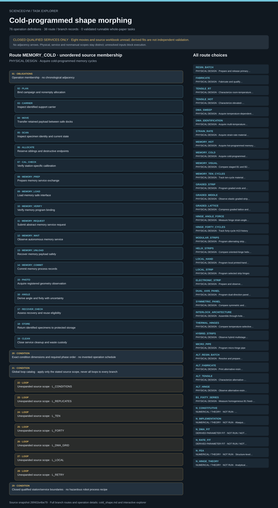

# Cold-programmed shape morphing: task route map



Paper: **Cold-programmed shape-morphing structures based on grayscale digital light processing 4D printing** · [DOI](https://doi.org/10.1038/s41467-023-41170-4)

Author/evaluator design reference only; not an actor projection, task runner, solver, physical simulation or execution receipt. Missing inputs stay blocked. Physical acquisition, device-owned services, derived analysis and numerical reference scope remain distinct. Chemical preparation, printing, thermal/mechanical actuation and liquid-metal filling remain closed, qualified services. Eight actual movies and the source workbook remain uninspected. Ten and forty cycles are not independent specimen counts. Derived parameter fits are not independent validation; no numerical result is a physical measurement.. Counts describe task representation, not experiments or success.

**Reading rule:** rows retain the source display structure only. Membership has no inferred chronology. Where the source supplies a typed body, one unexpanded template is shown; no condition, trial or specimen count is inferred. An unordered obligation group has no inferred chronological edges. Source-reported scientific facts and authored handling are distinct.

[Immutable source task package](https://github.com/openags/ScienceGym/blob/26f402e4be797a91edce8253e4ed45bed6e01e7c/tasks/cold_shape_operations_v2/) · [Interactive inspector](../index.html)

## RESIN_BATCH — PHYSICAL DESIGN · Prepare and release primary resin batch

Author/evaluator design reference only; not an actor projection, task runner, solver, physical simulation or execution receipt. Missing inputs stay blocked. Physical acquisition, device-owned services, derived analysis and numerical reference scope remain distinct. Chemical preparation, printing, thermal/mechanical actuation and liquid-metal filling remain closed, qualified services. Eight actual movies and the source workbook remain uninspected. Ten and forty cycles are not independent specimen counts. Derived parameter fits are not independent validation; no numerical result is a physical measurement. Operation lists are unordered membership. Only declared causal, condition and phase constraints impose order. Symbolic loops preserve their exact scope without expanding counts or inventing specimen, transfer or execution instances.

[Exact route source](https://github.com/openags/ScienceGym/blob/26f402e4be797a91edce8253e4ed45bed6e01e7c/tasks/cold_shape_operations_v2/branches.json) · JSON pointer: `/branches/0`

- **OBLIGATIONS: Operation membership · no chronological adjacency**
  - Binding: {"order":"Only declared prerequisites and qualified occurrence scopes constrain order; display adjacency is not an edge."}
  - `PLAN` Bind campaign and nonempty allocation
  - `CARRIER` Inspect identified support carrier
  - `MOVE` Transfer retained payload between safe docks
  - `RESIN_PREP` Prepare resin service exchange
  - `RESIN_LOAD` Load resin safe interface
  - `RESIN_VERIFY` Verify resin program binding
  - `RESIN_REQUEST` Submit abstract resin service request
  - `RESIN_WAIT` Observe autonomous resin service
  - `RESIN_UNLOAD` Recover resin payload safely
  - `RESIN_COMMIT` Commit resin process records
  - `STORE` Return identified specimens to protected storage
  - `CLEAN` Close service cleanup and waste custody
- **CONDITION: Exact condition dimensions and required phase order · no invented operation schedule**
  - Binding: {"source_file":"condition_requirements.json","source_pointer":"/branches/0","source_contract":{"branch_id":"RESIN_BATCH","required_dimensions":{},"nonempty_instance_schedule_required":true,"missing_schedule_resolved_by":"qualified_input_card","required_phase_order":["sealed_input_check","service_preparation","batch_release","safe_exchange","archive"],"source_cycles":null,"required_observation_phases":[]}}
- **CONDITION: Global loop catalog · apply only the stated source scope, never all loops to every branch**
  - **LOOP: Unexpanded source scope · L_CONDITIONS**
    - Binding: {"source_file":"dependencies.json","source_pointer":"/loops/0","source_contract":{"id":"L_CONDITIONS","scope":"each route condition schedule","count":null,"requires_nonempty_qualified_schedule":true}}
  - **LOOP: Unexpanded source scope · L_REPLICATES**
    - Binding: {"source_file":"dependencies.json","source_pointer":"/loops/1","source_contract":{"id":"L_REPLICATES","scope":"independent specimens per declared measurement cell","count":null,"source_constraint":"five experimental results only for hinge-angle error bars; independent specimen interpretation still requires allocation evidence"}}
  - **LOOP: Unexpanded source scope · L_TEN**
    - Binding: {"source_file":"dependencies.json","source_pointer":"/loops/2","source_contract":{"id":"L_TEN","scope":"MEMORY_TEN_CYCLES per material/specimen","count":10,"cycle_recipe_gate":"U_MEMORY"}}
  - **LOOP: Unexpanded source scope · L_FORTY**
    - Binding: {"source_file":"dependencies.json","source_pointer":"/loops/3","source_contract":{"id":"L_FORTY","scope":"HINGE_FORTY_CYCLES same H13 history","count":40,"cycle_recipe_gate":"U_DEFORM"}}
  - **LOOP: Unexpanded source scope · L_DMA_GRID**
    - Binding: {"source_file":"dependencies.json","source_pointer":"/loops/4","source_contract":{"id":"L_DMA_GRID","scope":"DMA_IDENTIFICATION temperature by nonempty frequency cells","count":null,"grid_gate":"U_DMA"}}
  - **LOOP: Unexpanded source scope · L_LOCAL**
    - Binding: {"source_file":"dependencies.json","source_pointer":"/loops/5","source_contract":{"id":"L_LOCAL","scope":"LOCAL_HAND and LOCAL_STRIP target hinges/configurations","count":null,"schedule_gate":"U_DEFORM"}}
  - **LOOP: Unexpanded source scope · L_RETRY**
    - Binding: {"source_file":"dependencies.json","source_pointer":"/loops/6","source_contract":{"id":"L_RETRY","scope":"failed attempt replacement/recovery","count":null,"schedule_gate":"U_ALLOC","failed_attempts_retained":true}}
- **CONDITION: Closed qualified station/service boundaries · no hazardous robot process recipe**
  - Binding: {"source_file":"station_contracts.json","source_pointer":"","source_contract":{"schema_version":"cold_shape_paper_task.v1","doi":"10.1038/s41467-023-41170-4","stations":[{"id":"WS_STOCK","title":"Sealed inventory and custody","ports":[{"id":"sealed_container_dock","qualification_required":true,"frame":null}],"boundary":"Robot handles only qualified closed carriers.","ready_readbacks":["identity","compatible_carrier","guard_state","safe_exchange","current_qualification"],"implemented":false},{"id":"WS_RESIN","title":"Enclosed qualified preparation service","ports":[{"id":"sealed_material_exchange","qualification_required":true,"frame":null}],"boundary":"Service owns all opening, mixing and waste-contact operations.","ready_readbacks":["identity","compatible_carrier","guard_state","safe_exchange","current_qualification"],"implemented":false},{"id":"WS_PRINT","title":"Guarded grayscale printing service","ports":[{"id":"guarded_build_carrier_dock","qualification_required":true,"frame":null}],"boundary":"Service owns resin exposure, UV, stage motion and process release.","ready_readbacks":["identity","compatible_carrier","guard_state","safe_exchange","current_qualification"],"implemented":false},{"id":"WS_QC","title":"Contained optical inspection","ports":[{"id":"retained_specimen_stage","qualification_required":true,"frame":null}],"boundary":"Sample contacts and optical exposure must preserve organogel state.","ready_readbacks":["identity","compatible_carrier","guard_state","safe_exchange","current_qualification"],"implemented":false},{"id":"WS_MECH","title":"Enclosed mechanical service","ports":[{"id":"safe_fixture_exchange","qualification_required":true,"frame":null}],"boundary":"No robot access during load, strain, compression or stored-energy release.","ready_readbacks":["identity","compatible_carrier","guard_state","safe_exchange","current_qualification"],"implemented":false},{"id":"WS_DMA","title":"Qualified thermomechanical service","ports":[{"id":"safe_clamp_exchange","qualification_required":true,"frame":null}],"boundary":"Service owns cyclic loading, heating and cool-down.","ready_readbacks":["identity","compatible_carrier","guard_state","safe_exchange","current_qualification"],"implemented":false},{"id":"WS_THERMAL","title":"Qualified thermal service","ports":[{"id":"contained_thermal_carrier","qualification_required":true,"frame":null}],"boundary":"Service owns hot media and release-to-handle decision.","ready_readbacks":["identity","compatible_carrier","guard_state","safe_exchange","current_qualification"],"implemented":false},{"id":"WS_ELECTRIC","title":"Contained filling/electrical service","ports":[{"id":"sealed_channel_and_connector_interface","qualification_required":true,"frame":null}],"boundary":"Service owns EGaIn handling, filling and qualified power application.","ready_readbacks":["identity","compatible_carrier","guard_state","safe_exchange","current_qualification"],"implemented":false},{"id":"WS_ASSEMBLY","title":"Supported interlock fixture","ports":[{"id":"mating_support_dock","qualification_required":true,"frame":null}],"boundary":"No unsupported panels or uncontrolled hinge tension.","ready_readbacks":["identity","compatible_carrier","guard_state","safe_exchange","current_qualification"],"implemented":false},{"id":"WS_ARCHIVE","title":"Records and isolated specimen storage","ports":[{"id":"identified_storage_slot","qualification_required":true,"frame":null}],"boundary":"Returned specimens retain state, exposure and damage history.","ready_readbacks":["identity","compatible_carrier","guard_state","safe_exchange","current_qualification"],"implemented":false}]}}

<details><summary>Branch state, choices, lineage and loop obligations</summary>

```json
{
  "id": "RESIN_BATCH",
  "title": "Prepare and release primary resin batch",
  "classification": "physical_preparation",
  "source_evidence_ids": [
    "E_RESIN"
  ],
  "operation_ids": [
    "PLAN",
    "CARRIER",
    "MOVE",
    "RESIN_PREP",
    "RESIN_LOAD",
    "RESIN_VERIFY",
    "RESIN_REQUEST",
    "RESIN_WAIT",
    "RESIN_UNLOAD",
    "RESIN_COMMIT",
    "STORE",
    "CLEAN"
  ],
  "operation_list_semantics": "Required operation membership, not a single historical sequence; repeat transfers and service phases receive distinct occurrence IDs.",
  "required_branch_ids": [],
  "conditions": {
    "material_family": "primary_ink",
    "chemical_recipe": "closed_qualified_service_only"
  },
  "condition_values_are": "reported_scientific_context_requiring_qualified_instance_binding",
  "sample_role": "sealed_resin_batch",
  "destructive_endpoint": false,
  "source_independent_sample_count": null,
  "source_cycles": null,
  "phase_order": [
    "sealed_input_check",
    "service_preparation",
    "batch_release",
    "safe_exchange",
    "archive"
  ],
  "state_reuse_rule": "Use the same ID only when a retained version-bound history and qualified reuse receipt permit it; otherwise allocate a new sibling.",
  "completion": "Every declared nonempty condition cell, required phase, control and cleanup must have accepted trusted records; a target-looking picture is insufficient.",
  "direct_unknown_parameter_ids": [
    "U_ALLOC",
    "U_CHEM",
    "U_DATA",
    "U_SCENE"
  ],
  "unknown_parameter_ids": [
    "U_ALLOC",
    "U_CHEM",
    "U_DATA",
    "U_SCENE"
  ]
}
```

</details>

## FABRICATE — PHYSICAL DESIGN · Fabricate and qualify grayscale specimens

Author/evaluator design reference only; not an actor projection, task runner, solver, physical simulation or execution receipt. Missing inputs stay blocked. Physical acquisition, device-owned services, derived analysis and numerical reference scope remain distinct. Chemical preparation, printing, thermal/mechanical actuation and liquid-metal filling remain closed, qualified services. Eight actual movies and the source workbook remain uninspected. Ten and forty cycles are not independent specimen counts. Derived parameter fits are not independent validation; no numerical result is a physical measurement. Operation lists are unordered membership. Only declared causal, condition and phase constraints impose order. Symbolic loops preserve their exact scope without expanding counts or inventing specimen, transfer or execution instances.

[Exact route source](https://github.com/openags/ScienceGym/blob/26f402e4be797a91edce8253e4ed45bed6e01e7c/tasks/cold_shape_operations_v2/branches.json) · JSON pointer: `/branches/1`

- **OBLIGATIONS: Operation membership · no chronological adjacency**
  - Binding: {"order":"Only declared prerequisites and qualified occurrence scopes constrain order; display adjacency is not an edge."}
  - `PLAN` Bind campaign and nonempty allocation
  - `CARRIER` Inspect identified support carrier
  - `MOVE` Transfer retained payload between safe docks
  - `SCAN` Inspect specimen identity and current state
  - `ALLOCATE` Reserve siblings and destructive endpoints
  - `CAL_CHECK` Verify station-specific calibration
  - `PRINT_PREP` Prepare print service exchange
  - `PRINT_LOAD` Load print safe interface
  - `PRINT_VERIFY` Verify print program binding
  - `PRINT_REQUEST` Submit abstract print service request
  - `PRINT_WAIT` Observe autonomous print service
  - `PRINT_UNLOAD` Recover print payload safely
  - `PRINT_COMMIT` Commit print process records
  - `STORE` Return identified specimens to protected storage
  - `CLEAN` Close service cleanup and waste custody
- **CONDITION: Exact condition dimensions and required phase order · no invented operation schedule**
  - Binding: {"source_file":"condition_requirements.json","source_pointer":"/branches/1","source_contract":{"branch_id":"FABRICATE","required_dimensions":{},"nonempty_instance_schedule_required":true,"missing_schedule_resolved_by":"qualified_input_card","required_phase_order":["job_and_material_map","preprint_calibration","guarded_print","qualified_release","inspection","allocation"],"source_cycles":null,"required_observation_phases":[]}}
- **CONDITION: Global loop catalog · apply only the stated source scope, never all loops to every branch**
  - **LOOP: Unexpanded source scope · L_CONDITIONS**
    - Binding: {"source_file":"dependencies.json","source_pointer":"/loops/0","source_contract":{"id":"L_CONDITIONS","scope":"each route condition schedule","count":null,"requires_nonempty_qualified_schedule":true}}
  - **LOOP: Unexpanded source scope · L_REPLICATES**
    - Binding: {"source_file":"dependencies.json","source_pointer":"/loops/1","source_contract":{"id":"L_REPLICATES","scope":"independent specimens per declared measurement cell","count":null,"source_constraint":"five experimental results only for hinge-angle error bars; independent specimen interpretation still requires allocation evidence"}}
  - **LOOP: Unexpanded source scope · L_TEN**
    - Binding: {"source_file":"dependencies.json","source_pointer":"/loops/2","source_contract":{"id":"L_TEN","scope":"MEMORY_TEN_CYCLES per material/specimen","count":10,"cycle_recipe_gate":"U_MEMORY"}}
  - **LOOP: Unexpanded source scope · L_FORTY**
    - Binding: {"source_file":"dependencies.json","source_pointer":"/loops/3","source_contract":{"id":"L_FORTY","scope":"HINGE_FORTY_CYCLES same H13 history","count":40,"cycle_recipe_gate":"U_DEFORM"}}
  - **LOOP: Unexpanded source scope · L_DMA_GRID**
    - Binding: {"source_file":"dependencies.json","source_pointer":"/loops/4","source_contract":{"id":"L_DMA_GRID","scope":"DMA_IDENTIFICATION temperature by nonempty frequency cells","count":null,"grid_gate":"U_DMA"}}
  - **LOOP: Unexpanded source scope · L_LOCAL**
    - Binding: {"source_file":"dependencies.json","source_pointer":"/loops/5","source_contract":{"id":"L_LOCAL","scope":"LOCAL_HAND and LOCAL_STRIP target hinges/configurations","count":null,"schedule_gate":"U_DEFORM"}}
  - **LOOP: Unexpanded source scope · L_RETRY**
    - Binding: {"source_file":"dependencies.json","source_pointer":"/loops/6","source_contract":{"id":"L_RETRY","scope":"failed attempt replacement/recovery","count":null,"schedule_gate":"U_ALLOC","failed_attempts_retained":true}}
- **CONDITION: Closed qualified station/service boundaries · no hazardous robot process recipe**
  - Binding: {"source_file":"station_contracts.json","source_pointer":"","source_contract":{"schema_version":"cold_shape_paper_task.v1","doi":"10.1038/s41467-023-41170-4","stations":[{"id":"WS_STOCK","title":"Sealed inventory and custody","ports":[{"id":"sealed_container_dock","qualification_required":true,"frame":null}],"boundary":"Robot handles only qualified closed carriers.","ready_readbacks":["identity","compatible_carrier","guard_state","safe_exchange","current_qualification"],"implemented":false},{"id":"WS_RESIN","title":"Enclosed qualified preparation service","ports":[{"id":"sealed_material_exchange","qualification_required":true,"frame":null}],"boundary":"Service owns all opening, mixing and waste-contact operations.","ready_readbacks":["identity","compatible_carrier","guard_state","safe_exchange","current_qualification"],"implemented":false},{"id":"WS_PRINT","title":"Guarded grayscale printing service","ports":[{"id":"guarded_build_carrier_dock","qualification_required":true,"frame":null}],"boundary":"Service owns resin exposure, UV, stage motion and process release.","ready_readbacks":["identity","compatible_carrier","guard_state","safe_exchange","current_qualification"],"implemented":false},{"id":"WS_QC","title":"Contained optical inspection","ports":[{"id":"retained_specimen_stage","qualification_required":true,"frame":null}],"boundary":"Sample contacts and optical exposure must preserve organogel state.","ready_readbacks":["identity","compatible_carrier","guard_state","safe_exchange","current_qualification"],"implemented":false},{"id":"WS_MECH","title":"Enclosed mechanical service","ports":[{"id":"safe_fixture_exchange","qualification_required":true,"frame":null}],"boundary":"No robot access during load, strain, compression or stored-energy release.","ready_readbacks":["identity","compatible_carrier","guard_state","safe_exchange","current_qualification"],"implemented":false},{"id":"WS_DMA","title":"Qualified thermomechanical service","ports":[{"id":"safe_clamp_exchange","qualification_required":true,"frame":null}],"boundary":"Service owns cyclic loading, heating and cool-down.","ready_readbacks":["identity","compatible_carrier","guard_state","safe_exchange","current_qualification"],"implemented":false},{"id":"WS_THERMAL","title":"Qualified thermal service","ports":[{"id":"contained_thermal_carrier","qualification_required":true,"frame":null}],"boundary":"Service owns hot media and release-to-handle decision.","ready_readbacks":["identity","compatible_carrier","guard_state","safe_exchange","current_qualification"],"implemented":false},{"id":"WS_ELECTRIC","title":"Contained filling/electrical service","ports":[{"id":"sealed_channel_and_connector_interface","qualification_required":true,"frame":null}],"boundary":"Service owns EGaIn handling, filling and qualified power application.","ready_readbacks":["identity","compatible_carrier","guard_state","safe_exchange","current_qualification"],"implemented":false},{"id":"WS_ASSEMBLY","title":"Supported interlock fixture","ports":[{"id":"mating_support_dock","qualification_required":true,"frame":null}],"boundary":"No unsupported panels or uncontrolled hinge tension.","ready_readbacks":["identity","compatible_carrier","guard_state","safe_exchange","current_qualification"],"implemented":false},{"id":"WS_ARCHIVE","title":"Records and isolated specimen storage","ports":[{"id":"identified_storage_slot","qualification_required":true,"frame":null}],"boundary":"Returned specimens retain state, exposure and damage history.","ready_readbacks":["identity","compatible_carrier","guard_state","safe_exchange","current_qualification"],"implemented":false}]}}

<details><summary>Branch state, choices, lineage and loop obligations</summary>

```json
{
  "id": "FABRICATE",
  "title": "Fabricate and qualify grayscale specimens",
  "classification": "physical_preparation",
  "source_evidence_ids": [
    "E_PRINT",
    "E_LIMITS"
  ],
  "operation_ids": [
    "PLAN",
    "CARRIER",
    "MOVE",
    "SCAN",
    "ALLOCATE",
    "CAL_CHECK",
    "PRINT_PREP",
    "PRINT_LOAD",
    "PRINT_VERIFY",
    "PRINT_REQUEST",
    "PRINT_WAIT",
    "PRINT_UNLOAD",
    "PRINT_COMMIT",
    "STORE",
    "CLEAN"
  ],
  "operation_list_semantics": "Required operation membership, not a single historical sequence; repeat transfers and service phases receive distinct occurrence IDs.",
  "required_branch_ids": [
    "RESIN_BATCH"
  ],
  "conditions": {
    "material_classes": [
      "B1",
      "B2",
      "B3"
    ],
    "print_irradiance_mW_cm2": [
      23.6,
      15.4,
      3.1
    ],
    "brightness_percent": [
      100,
      80,
      40
    ],
    "mapping": "paired_in_list_order",
    "post_cure_default": null
  },
  "condition_values_are": "reported_scientific_context_requiring_qualified_instance_binding",
  "sample_role": "identified_specimen",
  "destructive_endpoint": false,
  "source_independent_sample_count": null,
  "source_cycles": null,
  "phase_order": [
    "job_and_material_map",
    "preprint_calibration",
    "guarded_print",
    "qualified_release",
    "inspection",
    "allocation"
  ],
  "state_reuse_rule": "Use the same ID only when a retained version-bound history and qualified reuse receipt permit it; otherwise allocate a new sibling.",
  "completion": "Every declared nonempty condition cell, required phase, control and cleanup must have accepted trusted records; a target-looking picture is insufficient.",
  "direct_unknown_parameter_ids": [
    "U_ALLOC",
    "U_CAD",
    "U_CAL",
    "U_CHEM",
    "U_DATA",
    "U_MEDIA",
    "U_OPTICAL",
    "U_PRINT",
    "U_SCENE"
  ],
  "unknown_parameter_ids": [
    "U_ALLOC",
    "U_CAD",
    "U_CAL",
    "U_CHEM",
    "U_DATA",
    "U_MEDIA",
    "U_OPTICAL",
    "U_PRINT",
    "U_SCENE"
  ]
}
```

</details>

## TENSILE_RT — PHYSICAL DESIGN · Characterize room-temperature materials

Author/evaluator design reference only; not an actor projection, task runner, solver, physical simulation or execution receipt. Missing inputs stay blocked. Physical acquisition, device-owned services, derived analysis and numerical reference scope remain distinct. Chemical preparation, printing, thermal/mechanical actuation and liquid-metal filling remain closed, qualified services. Eight actual movies and the source workbook remain uninspected. Ten and forty cycles are not independent specimen counts. Derived parameter fits are not independent validation; no numerical result is a physical measurement. Operation lists are unordered membership. Only declared causal, condition and phase constraints impose order. Symbolic loops preserve their exact scope without expanding counts or inventing specimen, transfer or execution instances.

[Exact route source](https://github.com/openags/ScienceGym/blob/26f402e4be797a91edce8253e4ed45bed6e01e7c/tasks/cold_shape_operations_v2/branches.json) · JSON pointer: `/branches/2`

- **OBLIGATIONS: Operation membership · no chronological adjacency**
  - Binding: {"order":"Only declared prerequisites and qualified occurrence scopes constrain order; display adjacency is not an edge."}
  - `PLAN` Bind campaign and nonempty allocation
  - `CARRIER` Inspect identified support carrier
  - `MOVE` Transfer retained payload between safe docks
  - `SCAN` Inspect specimen identity and current state
  - `ALLOCATE` Reserve siblings and destructive endpoints
  - `CAL_CHECK` Verify station-specific calibration
  - `TENSILE_PREP` Prepare tensile service exchange
  - `TENSILE_LOAD` Load tensile safe interface
  - `TENSILE_VERIFY` Verify tensile program binding
  - `TENSILE_REQUEST` Submit abstract tensile service request
  - `TENSILE_WAIT` Observe autonomous tensile service
  - `TENSILE_UNLOAD` Recover tensile payload safely
  - `TENSILE_COMMIT` Commit tensile process records
  - `STORE` Return identified specimens to protected storage
  - `CLEAN` Close service cleanup and waste custody
- **CONDITION: Exact condition dimensions and required phase order · no invented operation schedule**
  - Binding: {"source_file":"condition_requirements.json","source_pointer":"/branches/2","source_contract":{"branch_id":"TENSILE_RT","required_dimensions":{"material":["B1","B2","B3"]},"nonempty_instance_schedule_required":true,"missing_schedule_resolved_by":"qualified_input_card","required_phase_order":["baseline","program_or_measure","safe_release","observation","recover_or_quarantine","archive"],"source_cycles":null,"required_observation_phases":["program_or_measure","observation"]}}
- **CONDITION: Global loop catalog · apply only the stated source scope, never all loops to every branch**
  - **LOOP: Unexpanded source scope · L_CONDITIONS**
    - Binding: {"source_file":"dependencies.json","source_pointer":"/loops/0","source_contract":{"id":"L_CONDITIONS","scope":"each route condition schedule","count":null,"requires_nonempty_qualified_schedule":true}}
  - **LOOP: Unexpanded source scope · L_REPLICATES**
    - Binding: {"source_file":"dependencies.json","source_pointer":"/loops/1","source_contract":{"id":"L_REPLICATES","scope":"independent specimens per declared measurement cell","count":null,"source_constraint":"five experimental results only for hinge-angle error bars; independent specimen interpretation still requires allocation evidence"}}
  - **LOOP: Unexpanded source scope · L_TEN**
    - Binding: {"source_file":"dependencies.json","source_pointer":"/loops/2","source_contract":{"id":"L_TEN","scope":"MEMORY_TEN_CYCLES per material/specimen","count":10,"cycle_recipe_gate":"U_MEMORY"}}
  - **LOOP: Unexpanded source scope · L_FORTY**
    - Binding: {"source_file":"dependencies.json","source_pointer":"/loops/3","source_contract":{"id":"L_FORTY","scope":"HINGE_FORTY_CYCLES same H13 history","count":40,"cycle_recipe_gate":"U_DEFORM"}}
  - **LOOP: Unexpanded source scope · L_DMA_GRID**
    - Binding: {"source_file":"dependencies.json","source_pointer":"/loops/4","source_contract":{"id":"L_DMA_GRID","scope":"DMA_IDENTIFICATION temperature by nonempty frequency cells","count":null,"grid_gate":"U_DMA"}}
  - **LOOP: Unexpanded source scope · L_LOCAL**
    - Binding: {"source_file":"dependencies.json","source_pointer":"/loops/5","source_contract":{"id":"L_LOCAL","scope":"LOCAL_HAND and LOCAL_STRIP target hinges/configurations","count":null,"schedule_gate":"U_DEFORM"}}
  - **LOOP: Unexpanded source scope · L_RETRY**
    - Binding: {"source_file":"dependencies.json","source_pointer":"/loops/6","source_contract":{"id":"L_RETRY","scope":"failed attempt replacement/recovery","count":null,"schedule_gate":"U_ALLOC","failed_attempts_retained":true}}
- **CONDITION: Closed qualified station/service boundaries · no hazardous robot process recipe**
  - Binding: {"source_file":"station_contracts.json","source_pointer":"","source_contract":{"schema_version":"cold_shape_paper_task.v1","doi":"10.1038/s41467-023-41170-4","stations":[{"id":"WS_STOCK","title":"Sealed inventory and custody","ports":[{"id":"sealed_container_dock","qualification_required":true,"frame":null}],"boundary":"Robot handles only qualified closed carriers.","ready_readbacks":["identity","compatible_carrier","guard_state","safe_exchange","current_qualification"],"implemented":false},{"id":"WS_RESIN","title":"Enclosed qualified preparation service","ports":[{"id":"sealed_material_exchange","qualification_required":true,"frame":null}],"boundary":"Service owns all opening, mixing and waste-contact operations.","ready_readbacks":["identity","compatible_carrier","guard_state","safe_exchange","current_qualification"],"implemented":false},{"id":"WS_PRINT","title":"Guarded grayscale printing service","ports":[{"id":"guarded_build_carrier_dock","qualification_required":true,"frame":null}],"boundary":"Service owns resin exposure, UV, stage motion and process release.","ready_readbacks":["identity","compatible_carrier","guard_state","safe_exchange","current_qualification"],"implemented":false},{"id":"WS_QC","title":"Contained optical inspection","ports":[{"id":"retained_specimen_stage","qualification_required":true,"frame":null}],"boundary":"Sample contacts and optical exposure must preserve organogel state.","ready_readbacks":["identity","compatible_carrier","guard_state","safe_exchange","current_qualification"],"implemented":false},{"id":"WS_MECH","title":"Enclosed mechanical service","ports":[{"id":"safe_fixture_exchange","qualification_required":true,"frame":null}],"boundary":"No robot access during load, strain, compression or stored-energy release.","ready_readbacks":["identity","compatible_carrier","guard_state","safe_exchange","current_qualification"],"implemented":false},{"id":"WS_DMA","title":"Qualified thermomechanical service","ports":[{"id":"safe_clamp_exchange","qualification_required":true,"frame":null}],"boundary":"Service owns cyclic loading, heating and cool-down.","ready_readbacks":["identity","compatible_carrier","guard_state","safe_exchange","current_qualification"],"implemented":false},{"id":"WS_THERMAL","title":"Qualified thermal service","ports":[{"id":"contained_thermal_carrier","qualification_required":true,"frame":null}],"boundary":"Service owns hot media and release-to-handle decision.","ready_readbacks":["identity","compatible_carrier","guard_state","safe_exchange","current_qualification"],"implemented":false},{"id":"WS_ELECTRIC","title":"Contained filling/electrical service","ports":[{"id":"sealed_channel_and_connector_interface","qualification_required":true,"frame":null}],"boundary":"Service owns EGaIn handling, filling and qualified power application.","ready_readbacks":["identity","compatible_carrier","guard_state","safe_exchange","current_qualification"],"implemented":false},{"id":"WS_ASSEMBLY","title":"Supported interlock fixture","ports":[{"id":"mating_support_dock","qualification_required":true,"frame":null}],"boundary":"No unsupported panels or uncontrolled hinge tension.","ready_readbacks":["identity","compatible_carrier","guard_state","safe_exchange","current_qualification"],"implemented":false},{"id":"WS_ARCHIVE","title":"Records and isolated specimen storage","ports":[{"id":"identified_storage_slot","qualification_required":true,"frame":null}],"boundary":"Returned specimens retain state, exposure and damage history.","ready_readbacks":["identity","compatible_carrier","guard_state","safe_exchange","current_qualification"],"implemented":false}]}}

<details><summary>Branch state, choices, lineage and loop obligations</summary>

```json
{
  "id": "TENSILE_RT",
  "title": "Characterize room-temperature materials",
  "classification": "physical_measurement_or_demonstration",
  "source_evidence_ids": [
    "E_TENSILE"
  ],
  "operation_ids": [
    "PLAN",
    "CARRIER",
    "MOVE",
    "SCAN",
    "ALLOCATE",
    "CAL_CHECK",
    "TENSILE_PREP",
    "TENSILE_LOAD",
    "TENSILE_VERIFY",
    "TENSILE_REQUEST",
    "TENSILE_WAIT",
    "TENSILE_UNLOAD",
    "TENSILE_COMMIT",
    "STORE",
    "CLEAN"
  ],
  "operation_list_semantics": "Required operation membership, not a single historical sequence; repeat transfers and service phases receive distinct occurrence IDs.",
  "required_branch_ids": [
    "FABRICATE"
  ],
  "conditions": {
    "materials": [
      "B1",
      "B2",
      "B3"
    ],
    "temperature_class": "room_temperature",
    "source_crosshead_mm_min": 5
  },
  "condition_values_are": "reported_scientific_context_requiring_qualified_instance_binding",
  "sample_role": "reserved_tensile_coupon",
  "destructive_endpoint": true,
  "source_independent_sample_count": null,
  "source_cycles": null,
  "phase_order": [
    "baseline",
    "program_or_measure",
    "safe_release",
    "observation",
    "recover_or_quarantine",
    "archive"
  ],
  "state_reuse_rule": "Use the same ID only when a retained version-bound history and qualified reuse receipt permit it; otherwise allocate a new sibling.",
  "completion": "Every declared nonempty condition cell, required phase, control and cleanup must have accepted trusted records; a target-looking picture is insufficient.",
  "direct_unknown_parameter_ids": [
    "U_ALLOC",
    "U_CAD",
    "U_CAL",
    "U_CHEM",
    "U_DATA",
    "U_OPTICAL",
    "U_SCENE",
    "U_TENSILE"
  ],
  "unknown_parameter_ids": [
    "U_ALLOC",
    "U_CAD",
    "U_CAL",
    "U_CHEM",
    "U_DATA",
    "U_MEDIA",
    "U_OPTICAL",
    "U_PRINT",
    "U_SCENE",
    "U_TENSILE"
  ]
}
```

</details>

## TENSILE_HOT — PHYSICAL DESIGN · Characterize elevated-temperature glassy materials

Author/evaluator design reference only; not an actor projection, task runner, solver, physical simulation or execution receipt. Missing inputs stay blocked. Physical acquisition, device-owned services, derived analysis and numerical reference scope remain distinct. Chemical preparation, printing, thermal/mechanical actuation and liquid-metal filling remain closed, qualified services. Eight actual movies and the source workbook remain uninspected. Ten and forty cycles are not independent specimen counts. Derived parameter fits are not independent validation; no numerical result is a physical measurement. Operation lists are unordered membership. Only declared causal, condition and phase constraints impose order. Symbolic loops preserve their exact scope without expanding counts or inventing specimen, transfer or execution instances.

[Exact route source](https://github.com/openags/ScienceGym/blob/26f402e4be797a91edce8253e4ed45bed6e01e7c/tasks/cold_shape_operations_v2/branches.json) · JSON pointer: `/branches/3`

- **OBLIGATIONS: Operation membership · no chronological adjacency**
  - Binding: {"order":"Only declared prerequisites and qualified occurrence scopes constrain order; display adjacency is not an edge."}
  - `PLAN` Bind campaign and nonempty allocation
  - `CARRIER` Inspect identified support carrier
  - `MOVE` Transfer retained payload between safe docks
  - `SCAN` Inspect specimen identity and current state
  - `ALLOCATE` Reserve siblings and destructive endpoints
  - `CAL_CHECK` Verify station-specific calibration
  - `TENSILE_PREP` Prepare tensile service exchange
  - `TENSILE_LOAD` Load tensile safe interface
  - `TENSILE_VERIFY` Verify tensile program binding
  - `TENSILE_REQUEST` Submit abstract tensile service request
  - `TENSILE_WAIT` Observe autonomous tensile service
  - `TENSILE_UNLOAD` Recover tensile payload safely
  - `TENSILE_COMMIT` Commit tensile process records
  - `STORE` Return identified specimens to protected storage
  - `CLEAN` Close service cleanup and waste custody
- **CONDITION: Exact condition dimensions and required phase order · no invented operation schedule**
  - Binding: {"source_file":"condition_requirements.json","source_pointer":"/branches/3","source_contract":{"branch_id":"TENSILE_HOT","required_dimensions":{"material":["B1","B2"]},"nonempty_instance_schedule_required":true,"missing_schedule_resolved_by":"qualified_input_card","required_phase_order":["baseline","program_or_measure","safe_release","observation","recover_or_quarantine","archive"],"source_cycles":null,"required_observation_phases":["program_or_measure","observation"]}}
- **CONDITION: Global loop catalog · apply only the stated source scope, never all loops to every branch**
  - **LOOP: Unexpanded source scope · L_CONDITIONS**
    - Binding: {"source_file":"dependencies.json","source_pointer":"/loops/0","source_contract":{"id":"L_CONDITIONS","scope":"each route condition schedule","count":null,"requires_nonempty_qualified_schedule":true}}
  - **LOOP: Unexpanded source scope · L_REPLICATES**
    - Binding: {"source_file":"dependencies.json","source_pointer":"/loops/1","source_contract":{"id":"L_REPLICATES","scope":"independent specimens per declared measurement cell","count":null,"source_constraint":"five experimental results only for hinge-angle error bars; independent specimen interpretation still requires allocation evidence"}}
  - **LOOP: Unexpanded source scope · L_TEN**
    - Binding: {"source_file":"dependencies.json","source_pointer":"/loops/2","source_contract":{"id":"L_TEN","scope":"MEMORY_TEN_CYCLES per material/specimen","count":10,"cycle_recipe_gate":"U_MEMORY"}}
  - **LOOP: Unexpanded source scope · L_FORTY**
    - Binding: {"source_file":"dependencies.json","source_pointer":"/loops/3","source_contract":{"id":"L_FORTY","scope":"HINGE_FORTY_CYCLES same H13 history","count":40,"cycle_recipe_gate":"U_DEFORM"}}
  - **LOOP: Unexpanded source scope · L_DMA_GRID**
    - Binding: {"source_file":"dependencies.json","source_pointer":"/loops/4","source_contract":{"id":"L_DMA_GRID","scope":"DMA_IDENTIFICATION temperature by nonempty frequency cells","count":null,"grid_gate":"U_DMA"}}
  - **LOOP: Unexpanded source scope · L_LOCAL**
    - Binding: {"source_file":"dependencies.json","source_pointer":"/loops/5","source_contract":{"id":"L_LOCAL","scope":"LOCAL_HAND and LOCAL_STRIP target hinges/configurations","count":null,"schedule_gate":"U_DEFORM"}}
  - **LOOP: Unexpanded source scope · L_RETRY**
    - Binding: {"source_file":"dependencies.json","source_pointer":"/loops/6","source_contract":{"id":"L_RETRY","scope":"failed attempt replacement/recovery","count":null,"schedule_gate":"U_ALLOC","failed_attempts_retained":true}}
- **CONDITION: Closed qualified station/service boundaries · no hazardous robot process recipe**
  - Binding: {"source_file":"station_contracts.json","source_pointer":"","source_contract":{"schema_version":"cold_shape_paper_task.v1","doi":"10.1038/s41467-023-41170-4","stations":[{"id":"WS_STOCK","title":"Sealed inventory and custody","ports":[{"id":"sealed_container_dock","qualification_required":true,"frame":null}],"boundary":"Robot handles only qualified closed carriers.","ready_readbacks":["identity","compatible_carrier","guard_state","safe_exchange","current_qualification"],"implemented":false},{"id":"WS_RESIN","title":"Enclosed qualified preparation service","ports":[{"id":"sealed_material_exchange","qualification_required":true,"frame":null}],"boundary":"Service owns all opening, mixing and waste-contact operations.","ready_readbacks":["identity","compatible_carrier","guard_state","safe_exchange","current_qualification"],"implemented":false},{"id":"WS_PRINT","title":"Guarded grayscale printing service","ports":[{"id":"guarded_build_carrier_dock","qualification_required":true,"frame":null}],"boundary":"Service owns resin exposure, UV, stage motion and process release.","ready_readbacks":["identity","compatible_carrier","guard_state","safe_exchange","current_qualification"],"implemented":false},{"id":"WS_QC","title":"Contained optical inspection","ports":[{"id":"retained_specimen_stage","qualification_required":true,"frame":null}],"boundary":"Sample contacts and optical exposure must preserve organogel state.","ready_readbacks":["identity","compatible_carrier","guard_state","safe_exchange","current_qualification"],"implemented":false},{"id":"WS_MECH","title":"Enclosed mechanical service","ports":[{"id":"safe_fixture_exchange","qualification_required":true,"frame":null}],"boundary":"No robot access during load, strain, compression or stored-energy release.","ready_readbacks":["identity","compatible_carrier","guard_state","safe_exchange","current_qualification"],"implemented":false},{"id":"WS_DMA","title":"Qualified thermomechanical service","ports":[{"id":"safe_clamp_exchange","qualification_required":true,"frame":null}],"boundary":"Service owns cyclic loading, heating and cool-down.","ready_readbacks":["identity","compatible_carrier","guard_state","safe_exchange","current_qualification"],"implemented":false},{"id":"WS_THERMAL","title":"Qualified thermal service","ports":[{"id":"contained_thermal_carrier","qualification_required":true,"frame":null}],"boundary":"Service owns hot media and release-to-handle decision.","ready_readbacks":["identity","compatible_carrier","guard_state","safe_exchange","current_qualification"],"implemented":false},{"id":"WS_ELECTRIC","title":"Contained filling/electrical service","ports":[{"id":"sealed_channel_and_connector_interface","qualification_required":true,"frame":null}],"boundary":"Service owns EGaIn handling, filling and qualified power application.","ready_readbacks":["identity","compatible_carrier","guard_state","safe_exchange","current_qualification"],"implemented":false},{"id":"WS_ASSEMBLY","title":"Supported interlock fixture","ports":[{"id":"mating_support_dock","qualification_required":true,"frame":null}],"boundary":"No unsupported panels or uncontrolled hinge tension.","ready_readbacks":["identity","compatible_carrier","guard_state","safe_exchange","current_qualification"],"implemented":false},{"id":"WS_ARCHIVE","title":"Records and isolated specimen storage","ports":[{"id":"identified_storage_slot","qualification_required":true,"frame":null}],"boundary":"Returned specimens retain state, exposure and damage history.","ready_readbacks":["identity","compatible_carrier","guard_state","safe_exchange","current_qualification"],"implemented":false}]}}

<details><summary>Branch state, choices, lineage and loop obligations</summary>

```json
{
  "id": "TENSILE_HOT",
  "title": "Characterize elevated-temperature glassy materials",
  "classification": "physical_measurement_or_demonstration",
  "source_evidence_ids": [
    "E_TENSILE"
  ],
  "operation_ids": [
    "PLAN",
    "CARRIER",
    "MOVE",
    "SCAN",
    "ALLOCATE",
    "CAL_CHECK",
    "TENSILE_PREP",
    "TENSILE_LOAD",
    "TENSILE_VERIFY",
    "TENSILE_REQUEST",
    "TENSILE_WAIT",
    "TENSILE_UNLOAD",
    "TENSILE_COMMIT",
    "STORE",
    "CLEAN"
  ],
  "operation_list_semantics": "Required operation membership, not a single historical sequence; repeat transfers and service phases receive distinct occurrence IDs.",
  "required_branch_ids": [
    "FABRICATE"
  ],
  "conditions": {
    "materials": [
      "B1",
      "B2"
    ],
    "temperature_C": 80,
    "stress_axis_source_unit": "kPa",
    "unit_resolution_required": true
  },
  "condition_values_are": "reported_scientific_context_requiring_qualified_instance_binding",
  "sample_role": "reserved_hot_tensile_coupon",
  "destructive_endpoint": true,
  "source_independent_sample_count": null,
  "source_cycles": null,
  "phase_order": [
    "baseline",
    "program_or_measure",
    "safe_release",
    "observation",
    "recover_or_quarantine",
    "archive"
  ],
  "state_reuse_rule": "Use the same ID only when a retained version-bound history and qualified reuse receipt permit it; otherwise allocate a new sibling.",
  "completion": "Every declared nonempty condition cell, required phase, control and cleanup must have accepted trusted records; a target-looking picture is insufficient.",
  "direct_unknown_parameter_ids": [
    "U_ALLOC",
    "U_CAD",
    "U_CAL",
    "U_CHEM",
    "U_DATA",
    "U_OPTICAL",
    "U_SCENE",
    "U_TENSILE"
  ],
  "unknown_parameter_ids": [
    "U_ALLOC",
    "U_CAD",
    "U_CAL",
    "U_CHEM",
    "U_DATA",
    "U_MEDIA",
    "U_OPTICAL",
    "U_PRINT",
    "U_SCENE",
    "U_TENSILE"
  ]
}
```

</details>

## DMA_SWEEP — PHYSICAL DESIGN · Acquire temperature-dependent thermomechanics

Author/evaluator design reference only; not an actor projection, task runner, solver, physical simulation or execution receipt. Missing inputs stay blocked. Physical acquisition, device-owned services, derived analysis and numerical reference scope remain distinct. Chemical preparation, printing, thermal/mechanical actuation and liquid-metal filling remain closed, qualified services. Eight actual movies and the source workbook remain uninspected. Ten and forty cycles are not independent specimen counts. Derived parameter fits are not independent validation; no numerical result is a physical measurement. Operation lists are unordered membership. Only declared causal, condition and phase constraints impose order. Symbolic loops preserve their exact scope without expanding counts or inventing specimen, transfer or execution instances.

[Exact route source](https://github.com/openags/ScienceGym/blob/26f402e4be797a91edce8253e4ed45bed6e01e7c/tasks/cold_shape_operations_v2/branches.json) · JSON pointer: `/branches/4`

- **OBLIGATIONS: Operation membership · no chronological adjacency**
  - Binding: {"order":"Only declared prerequisites and qualified occurrence scopes constrain order; display adjacency is not an edge."}
  - `PLAN` Bind campaign and nonempty allocation
  - `CARRIER` Inspect identified support carrier
  - `MOVE` Transfer retained payload between safe docks
  - `SCAN` Inspect specimen identity and current state
  - `ALLOCATE` Reserve siblings and destructive endpoints
  - `CAL_CHECK` Verify station-specific calibration
  - `DMA_PREP` Prepare dma service exchange
  - `DMA_LOAD` Load dma safe interface
  - `DMA_VERIFY` Verify dma program binding
  - `DMA_REQUEST` Submit abstract dma service request
  - `DMA_WAIT` Observe autonomous dma service
  - `DMA_UNLOAD` Recover dma payload safely
  - `DMA_COMMIT` Commit dma process records
  - `STORE` Return identified specimens to protected storage
  - `CLEAN` Close service cleanup and waste custody
- **CONDITION: Exact condition dimensions and required phase order · no invented operation schedule**
  - Binding: {"source_file":"condition_requirements.json","source_pointer":"/branches/4","source_contract":{"branch_id":"DMA_SWEEP","required_dimensions":{"material":["B1","B2","B3"]},"nonempty_instance_schedule_required":true,"missing_schedule_resolved_by":"qualified_input_card","required_phase_order":["baseline","program_or_measure","safe_release","observation","recover_or_quarantine","archive"],"source_cycles":null,"required_observation_phases":["program_or_measure","observation"]}}
- **CONDITION: Global loop catalog · apply only the stated source scope, never all loops to every branch**
  - **LOOP: Unexpanded source scope · L_CONDITIONS**
    - Binding: {"source_file":"dependencies.json","source_pointer":"/loops/0","source_contract":{"id":"L_CONDITIONS","scope":"each route condition schedule","count":null,"requires_nonempty_qualified_schedule":true}}
  - **LOOP: Unexpanded source scope · L_REPLICATES**
    - Binding: {"source_file":"dependencies.json","source_pointer":"/loops/1","source_contract":{"id":"L_REPLICATES","scope":"independent specimens per declared measurement cell","count":null,"source_constraint":"five experimental results only for hinge-angle error bars; independent specimen interpretation still requires allocation evidence"}}
  - **LOOP: Unexpanded source scope · L_TEN**
    - Binding: {"source_file":"dependencies.json","source_pointer":"/loops/2","source_contract":{"id":"L_TEN","scope":"MEMORY_TEN_CYCLES per material/specimen","count":10,"cycle_recipe_gate":"U_MEMORY"}}
  - **LOOP: Unexpanded source scope · L_FORTY**
    - Binding: {"source_file":"dependencies.json","source_pointer":"/loops/3","source_contract":{"id":"L_FORTY","scope":"HINGE_FORTY_CYCLES same H13 history","count":40,"cycle_recipe_gate":"U_DEFORM"}}
  - **LOOP: Unexpanded source scope · L_DMA_GRID**
    - Binding: {"source_file":"dependencies.json","source_pointer":"/loops/4","source_contract":{"id":"L_DMA_GRID","scope":"DMA_IDENTIFICATION temperature by nonempty frequency cells","count":null,"grid_gate":"U_DMA"}}
  - **LOOP: Unexpanded source scope · L_LOCAL**
    - Binding: {"source_file":"dependencies.json","source_pointer":"/loops/5","source_contract":{"id":"L_LOCAL","scope":"LOCAL_HAND and LOCAL_STRIP target hinges/configurations","count":null,"schedule_gate":"U_DEFORM"}}
  - **LOOP: Unexpanded source scope · L_RETRY**
    - Binding: {"source_file":"dependencies.json","source_pointer":"/loops/6","source_contract":{"id":"L_RETRY","scope":"failed attempt replacement/recovery","count":null,"schedule_gate":"U_ALLOC","failed_attempts_retained":true}}
- **CONDITION: Closed qualified station/service boundaries · no hazardous robot process recipe**
  - Binding: {"source_file":"station_contracts.json","source_pointer":"","source_contract":{"schema_version":"cold_shape_paper_task.v1","doi":"10.1038/s41467-023-41170-4","stations":[{"id":"WS_STOCK","title":"Sealed inventory and custody","ports":[{"id":"sealed_container_dock","qualification_required":true,"frame":null}],"boundary":"Robot handles only qualified closed carriers.","ready_readbacks":["identity","compatible_carrier","guard_state","safe_exchange","current_qualification"],"implemented":false},{"id":"WS_RESIN","title":"Enclosed qualified preparation service","ports":[{"id":"sealed_material_exchange","qualification_required":true,"frame":null}],"boundary":"Service owns all opening, mixing and waste-contact operations.","ready_readbacks":["identity","compatible_carrier","guard_state","safe_exchange","current_qualification"],"implemented":false},{"id":"WS_PRINT","title":"Guarded grayscale printing service","ports":[{"id":"guarded_build_carrier_dock","qualification_required":true,"frame":null}],"boundary":"Service owns resin exposure, UV, stage motion and process release.","ready_readbacks":["identity","compatible_carrier","guard_state","safe_exchange","current_qualification"],"implemented":false},{"id":"WS_QC","title":"Contained optical inspection","ports":[{"id":"retained_specimen_stage","qualification_required":true,"frame":null}],"boundary":"Sample contacts and optical exposure must preserve organogel state.","ready_readbacks":["identity","compatible_carrier","guard_state","safe_exchange","current_qualification"],"implemented":false},{"id":"WS_MECH","title":"Enclosed mechanical service","ports":[{"id":"safe_fixture_exchange","qualification_required":true,"frame":null}],"boundary":"No robot access during load, strain, compression or stored-energy release.","ready_readbacks":["identity","compatible_carrier","guard_state","safe_exchange","current_qualification"],"implemented":false},{"id":"WS_DMA","title":"Qualified thermomechanical service","ports":[{"id":"safe_clamp_exchange","qualification_required":true,"frame":null}],"boundary":"Service owns cyclic loading, heating and cool-down.","ready_readbacks":["identity","compatible_carrier","guard_state","safe_exchange","current_qualification"],"implemented":false},{"id":"WS_THERMAL","title":"Qualified thermal service","ports":[{"id":"contained_thermal_carrier","qualification_required":true,"frame":null}],"boundary":"Service owns hot media and release-to-handle decision.","ready_readbacks":["identity","compatible_carrier","guard_state","safe_exchange","current_qualification"],"implemented":false},{"id":"WS_ELECTRIC","title":"Contained filling/electrical service","ports":[{"id":"sealed_channel_and_connector_interface","qualification_required":true,"frame":null}],"boundary":"Service owns EGaIn handling, filling and qualified power application.","ready_readbacks":["identity","compatible_carrier","guard_state","safe_exchange","current_qualification"],"implemented":false},{"id":"WS_ASSEMBLY","title":"Supported interlock fixture","ports":[{"id":"mating_support_dock","qualification_required":true,"frame":null}],"boundary":"No unsupported panels or uncontrolled hinge tension.","ready_readbacks":["identity","compatible_carrier","guard_state","safe_exchange","current_qualification"],"implemented":false},{"id":"WS_ARCHIVE","title":"Records and isolated specimen storage","ports":[{"id":"identified_storage_slot","qualification_required":true,"frame":null}],"boundary":"Returned specimens retain state, exposure and damage history.","ready_readbacks":["identity","compatible_carrier","guard_state","safe_exchange","current_qualification"],"implemented":false}]}}

<details><summary>Branch state, choices, lineage and loop obligations</summary>

```json
{
  "id": "DMA_SWEEP",
  "title": "Acquire temperature-dependent thermomechanics",
  "classification": "physical_measurement_or_demonstration",
  "source_evidence_ids": [
    "E_DMA"
  ],
  "operation_ids": [
    "PLAN",
    "CARRIER",
    "MOVE",
    "SCAN",
    "ALLOCATE",
    "CAL_CHECK",
    "DMA_PREP",
    "DMA_LOAD",
    "DMA_VERIFY",
    "DMA_REQUEST",
    "DMA_WAIT",
    "DMA_UNLOAD",
    "DMA_COMMIT",
    "STORE",
    "CLEAN"
  ],
  "operation_list_semantics": "Required operation membership, not a single historical sequence; repeat transfers and service phases receive distinct occurrence IDs.",
  "required_branch_ids": [
    "FABRICATE"
  ],
  "conditions": {
    "materials": [
      "B1",
      "B2",
      "B3"
    ],
    "temperature_ramp_C_min": 10,
    "temperature_extent": null,
    "frequency": null
  },
  "condition_values_are": "reported_scientific_context_requiring_qualified_instance_binding",
  "sample_role": "reserved_DMA_coupon",
  "destructive_endpoint": false,
  "source_independent_sample_count": null,
  "source_cycles": null,
  "phase_order": [
    "baseline",
    "program_or_measure",
    "safe_release",
    "observation",
    "recover_or_quarantine",
    "archive"
  ],
  "state_reuse_rule": "Use the same ID only when a retained version-bound history and qualified reuse receipt permit it; otherwise allocate a new sibling.",
  "completion": "Every declared nonempty condition cell, required phase, control and cleanup must have accepted trusted records; a target-looking picture is insufficient.",
  "direct_unknown_parameter_ids": [
    "U_ALLOC",
    "U_CAD",
    "U_CAL",
    "U_CHEM",
    "U_DATA",
    "U_DMA",
    "U_OPTICAL",
    "U_SCENE"
  ],
  "unknown_parameter_ids": [
    "U_ALLOC",
    "U_CAD",
    "U_CAL",
    "U_CHEM",
    "U_DATA",
    "U_DMA",
    "U_MEDIA",
    "U_OPTICAL",
    "U_PRINT",
    "U_SCENE"
  ]
}
```

</details>

## DMA_IDENTIFICATION — PHYSICAL DESIGN · Acquire multi-temperature frequency sweeps

Author/evaluator design reference only; not an actor projection, task runner, solver, physical simulation or execution receipt. Missing inputs stay blocked. Physical acquisition, device-owned services, derived analysis and numerical reference scope remain distinct. Chemical preparation, printing, thermal/mechanical actuation and liquid-metal filling remain closed, qualified services. Eight actual movies and the source workbook remain uninspected. Ten and forty cycles are not independent specimen counts. Derived parameter fits are not independent validation; no numerical result is a physical measurement. Operation lists are unordered membership. Only declared causal, condition and phase constraints impose order. Symbolic loops preserve their exact scope without expanding counts or inventing specimen, transfer or execution instances.

[Exact route source](https://github.com/openags/ScienceGym/blob/26f402e4be797a91edce8253e4ed45bed6e01e7c/tasks/cold_shape_operations_v2/branches.json) · JSON pointer: `/branches/5`

- **OBLIGATIONS: Operation membership · no chronological adjacency**
  - Binding: {"order":"Only declared prerequisites and qualified occurrence scopes constrain order; display adjacency is not an edge."}
  - `PLAN` Bind campaign and nonempty allocation
  - `CARRIER` Inspect identified support carrier
  - `MOVE` Transfer retained payload between safe docks
  - `SCAN` Inspect specimen identity and current state
  - `ALLOCATE` Reserve siblings and destructive endpoints
  - `CAL_CHECK` Verify station-specific calibration
  - `DMA_PREP` Prepare dma service exchange
  - `DMA_LOAD` Load dma safe interface
  - `DMA_VERIFY` Verify dma program binding
  - `DMA_REQUEST` Submit abstract dma service request
  - `DMA_WAIT` Observe autonomous dma service
  - `DMA_UNLOAD` Recover dma payload safely
  - `DMA_COMMIT` Commit dma process records
  - `STORE` Return identified specimens to protected storage
  - `CLEAN` Close service cleanup and waste custody
- **CONDITION: Exact condition dimensions and required phase order · no invented operation schedule**
  - Binding: {"source_file":"condition_requirements.json","source_pointer":"/branches/5","source_contract":{"branch_id":"DMA_IDENTIFICATION","required_dimensions":{"material":["B1","B2"],"temperature_C":[10,15,20,25,30,35,40,45,50,55,60,65,70,75,80,85,90,95,100,105,110,115,120,125,130]},"nonempty_instance_schedule_required":true,"missing_schedule_resolved_by":"qualified_input_card","required_phase_order":["baseline","program_or_measure","safe_release","observation","recover_or_quarantine","archive"],"source_cycles":null,"required_observation_phases":["program_or_measure","observation"]}}
- **CONDITION: Global loop catalog · apply only the stated source scope, never all loops to every branch**
  - **LOOP: Unexpanded source scope · L_CONDITIONS**
    - Binding: {"source_file":"dependencies.json","source_pointer":"/loops/0","source_contract":{"id":"L_CONDITIONS","scope":"each route condition schedule","count":null,"requires_nonempty_qualified_schedule":true}}
  - **LOOP: Unexpanded source scope · L_REPLICATES**
    - Binding: {"source_file":"dependencies.json","source_pointer":"/loops/1","source_contract":{"id":"L_REPLICATES","scope":"independent specimens per declared measurement cell","count":null,"source_constraint":"five experimental results only for hinge-angle error bars; independent specimen interpretation still requires allocation evidence"}}
  - **LOOP: Unexpanded source scope · L_TEN**
    - Binding: {"source_file":"dependencies.json","source_pointer":"/loops/2","source_contract":{"id":"L_TEN","scope":"MEMORY_TEN_CYCLES per material/specimen","count":10,"cycle_recipe_gate":"U_MEMORY"}}
  - **LOOP: Unexpanded source scope · L_FORTY**
    - Binding: {"source_file":"dependencies.json","source_pointer":"/loops/3","source_contract":{"id":"L_FORTY","scope":"HINGE_FORTY_CYCLES same H13 history","count":40,"cycle_recipe_gate":"U_DEFORM"}}
  - **LOOP: Unexpanded source scope · L_DMA_GRID**
    - Binding: {"source_file":"dependencies.json","source_pointer":"/loops/4","source_contract":{"id":"L_DMA_GRID","scope":"DMA_IDENTIFICATION temperature by nonempty frequency cells","count":null,"grid_gate":"U_DMA"}}
  - **LOOP: Unexpanded source scope · L_LOCAL**
    - Binding: {"source_file":"dependencies.json","source_pointer":"/loops/5","source_contract":{"id":"L_LOCAL","scope":"LOCAL_HAND and LOCAL_STRIP target hinges/configurations","count":null,"schedule_gate":"U_DEFORM"}}
  - **LOOP: Unexpanded source scope · L_RETRY**
    - Binding: {"source_file":"dependencies.json","source_pointer":"/loops/6","source_contract":{"id":"L_RETRY","scope":"failed attempt replacement/recovery","count":null,"schedule_gate":"U_ALLOC","failed_attempts_retained":true}}
- **CONDITION: Closed qualified station/service boundaries · no hazardous robot process recipe**
  - Binding: {"source_file":"station_contracts.json","source_pointer":"","source_contract":{"schema_version":"cold_shape_paper_task.v1","doi":"10.1038/s41467-023-41170-4","stations":[{"id":"WS_STOCK","title":"Sealed inventory and custody","ports":[{"id":"sealed_container_dock","qualification_required":true,"frame":null}],"boundary":"Robot handles only qualified closed carriers.","ready_readbacks":["identity","compatible_carrier","guard_state","safe_exchange","current_qualification"],"implemented":false},{"id":"WS_RESIN","title":"Enclosed qualified preparation service","ports":[{"id":"sealed_material_exchange","qualification_required":true,"frame":null}],"boundary":"Service owns all opening, mixing and waste-contact operations.","ready_readbacks":["identity","compatible_carrier","guard_state","safe_exchange","current_qualification"],"implemented":false},{"id":"WS_PRINT","title":"Guarded grayscale printing service","ports":[{"id":"guarded_build_carrier_dock","qualification_required":true,"frame":null}],"boundary":"Service owns resin exposure, UV, stage motion and process release.","ready_readbacks":["identity","compatible_carrier","guard_state","safe_exchange","current_qualification"],"implemented":false},{"id":"WS_QC","title":"Contained optical inspection","ports":[{"id":"retained_specimen_stage","qualification_required":true,"frame":null}],"boundary":"Sample contacts and optical exposure must preserve organogel state.","ready_readbacks":["identity","compatible_carrier","guard_state","safe_exchange","current_qualification"],"implemented":false},{"id":"WS_MECH","title":"Enclosed mechanical service","ports":[{"id":"safe_fixture_exchange","qualification_required":true,"frame":null}],"boundary":"No robot access during load, strain, compression or stored-energy release.","ready_readbacks":["identity","compatible_carrier","guard_state","safe_exchange","current_qualification"],"implemented":false},{"id":"WS_DMA","title":"Qualified thermomechanical service","ports":[{"id":"safe_clamp_exchange","qualification_required":true,"frame":null}],"boundary":"Service owns cyclic loading, heating and cool-down.","ready_readbacks":["identity","compatible_carrier","guard_state","safe_exchange","current_qualification"],"implemented":false},{"id":"WS_THERMAL","title":"Qualified thermal service","ports":[{"id":"contained_thermal_carrier","qualification_required":true,"frame":null}],"boundary":"Service owns hot media and release-to-handle decision.","ready_readbacks":["identity","compatible_carrier","guard_state","safe_exchange","current_qualification"],"implemented":false},{"id":"WS_ELECTRIC","title":"Contained filling/electrical service","ports":[{"id":"sealed_channel_and_connector_interface","qualification_required":true,"frame":null}],"boundary":"Service owns EGaIn handling, filling and qualified power application.","ready_readbacks":["identity","compatible_carrier","guard_state","safe_exchange","current_qualification"],"implemented":false},{"id":"WS_ASSEMBLY","title":"Supported interlock fixture","ports":[{"id":"mating_support_dock","qualification_required":true,"frame":null}],"boundary":"No unsupported panels or uncontrolled hinge tension.","ready_readbacks":["identity","compatible_carrier","guard_state","safe_exchange","current_qualification"],"implemented":false},{"id":"WS_ARCHIVE","title":"Records and isolated specimen storage","ports":[{"id":"identified_storage_slot","qualification_required":true,"frame":null}],"boundary":"Returned specimens retain state, exposure and damage history.","ready_readbacks":["identity","compatible_carrier","guard_state","safe_exchange","current_qualification"],"implemented":false}]}}

<details><summary>Branch state, choices, lineage and loop obligations</summary>

```json
{
  "id": "DMA_IDENTIFICATION",
  "title": "Acquire multi-temperature frequency sweeps",
  "classification": "physical_measurement_or_demonstration",
  "source_evidence_ids": [
    "E_DMA_ID"
  ],
  "operation_ids": [
    "PLAN",
    "CARRIER",
    "MOVE",
    "SCAN",
    "ALLOCATE",
    "CAL_CHECK",
    "DMA_PREP",
    "DMA_LOAD",
    "DMA_VERIFY",
    "DMA_REQUEST",
    "DMA_WAIT",
    "DMA_UNLOAD",
    "DMA_COMMIT",
    "STORE",
    "CLEAN"
  ],
  "operation_list_semantics": "Required operation membership, not a single historical sequence; repeat transfers and service phases receive distinct occurrence IDs.",
  "required_branch_ids": [
    "FABRICATE"
  ],
  "conditions": {
    "materials": [
      "B1",
      "B2"
    ],
    "temperature_C": {
      "start": 10,
      "end": 130,
      "increment": 5
    },
    "isothermal_stress_free_hold_min": 5,
    "frequency_bounds_Hz": [
      0.1,
      20
    ],
    "exact_frequency_list": null
  },
  "condition_values_are": "reported_scientific_context_requiring_qualified_instance_binding",
  "sample_role": "reserved_identification_coupon",
  "destructive_endpoint": false,
  "source_independent_sample_count": null,
  "source_cycles": null,
  "phase_order": [
    "baseline",
    "program_or_measure",
    "safe_release",
    "observation",
    "recover_or_quarantine",
    "archive"
  ],
  "state_reuse_rule": "Use the same ID only when a retained version-bound history and qualified reuse receipt permit it; otherwise allocate a new sibling.",
  "completion": "Every declared nonempty condition cell, required phase, control and cleanup must have accepted trusted records; a target-looking picture is insufficient.",
  "direct_unknown_parameter_ids": [
    "U_ALLOC",
    "U_CAD",
    "U_CAL",
    "U_CHEM",
    "U_DATA",
    "U_DMA",
    "U_OPTICAL",
    "U_SCENE"
  ],
  "unknown_parameter_ids": [
    "U_ALLOC",
    "U_CAD",
    "U_CAL",
    "U_CHEM",
    "U_DATA",
    "U_DMA",
    "U_MEDIA",
    "U_OPTICAL",
    "U_PRINT",
    "U_SCENE"
  ]
}
```

</details>

## STRAIN_RATE — PHYSICAL DESIGN · Acquire strain-rate material series

Author/evaluator design reference only; not an actor projection, task runner, solver, physical simulation or execution receipt. Missing inputs stay blocked. Physical acquisition, device-owned services, derived analysis and numerical reference scope remain distinct. Chemical preparation, printing, thermal/mechanical actuation and liquid-metal filling remain closed, qualified services. Eight actual movies and the source workbook remain uninspected. Ten and forty cycles are not independent specimen counts. Derived parameter fits are not independent validation; no numerical result is a physical measurement. Operation lists are unordered membership. Only declared causal, condition and phase constraints impose order. Symbolic loops preserve their exact scope without expanding counts or inventing specimen, transfer or execution instances.

[Exact route source](https://github.com/openags/ScienceGym/blob/26f402e4be797a91edce8253e4ed45bed6e01e7c/tasks/cold_shape_operations_v2/branches.json) · JSON pointer: `/branches/6`

- **OBLIGATIONS: Operation membership · no chronological adjacency**
  - Binding: {"order":"Only declared prerequisites and qualified occurrence scopes constrain order; display adjacency is not an edge."}
  - `PLAN` Bind campaign and nonempty allocation
  - `CARRIER` Inspect identified support carrier
  - `MOVE` Transfer retained payload between safe docks
  - `SCAN` Inspect specimen identity and current state
  - `ALLOCATE` Reserve siblings and destructive endpoints
  - `CAL_CHECK` Verify station-specific calibration
  - `TENSILE_PREP` Prepare tensile service exchange
  - `TENSILE_LOAD` Load tensile safe interface
  - `TENSILE_VERIFY` Verify tensile program binding
  - `TENSILE_REQUEST` Submit abstract tensile service request
  - `TENSILE_WAIT` Observe autonomous tensile service
  - `TENSILE_UNLOAD` Recover tensile payload safely
  - `TENSILE_COMMIT` Commit tensile process records
  - `STORE` Return identified specimens to protected storage
  - `CLEAN` Close service cleanup and waste custody
- **CONDITION: Exact condition dimensions and required phase order · no invented operation schedule**
  - Binding: {"source_file":"condition_requirements.json","source_pointer":"/branches/6","source_contract":{"branch_id":"STRAIN_RATE","required_dimensions":{"material":["B1","B2"],"strain_rate_s_inverse":[0.00167,0.01,0.05,0.1]},"nonempty_instance_schedule_required":true,"missing_schedule_resolved_by":"qualified_input_card","required_phase_order":["baseline","program_or_measure","safe_release","observation","recover_or_quarantine","archive"],"source_cycles":null,"required_observation_phases":["program_or_measure","observation"]}}
- **CONDITION: Global loop catalog · apply only the stated source scope, never all loops to every branch**
  - **LOOP: Unexpanded source scope · L_CONDITIONS**
    - Binding: {"source_file":"dependencies.json","source_pointer":"/loops/0","source_contract":{"id":"L_CONDITIONS","scope":"each route condition schedule","count":null,"requires_nonempty_qualified_schedule":true}}
  - **LOOP: Unexpanded source scope · L_REPLICATES**
    - Binding: {"source_file":"dependencies.json","source_pointer":"/loops/1","source_contract":{"id":"L_REPLICATES","scope":"independent specimens per declared measurement cell","count":null,"source_constraint":"five experimental results only for hinge-angle error bars; independent specimen interpretation still requires allocation evidence"}}
  - **LOOP: Unexpanded source scope · L_TEN**
    - Binding: {"source_file":"dependencies.json","source_pointer":"/loops/2","source_contract":{"id":"L_TEN","scope":"MEMORY_TEN_CYCLES per material/specimen","count":10,"cycle_recipe_gate":"U_MEMORY"}}
  - **LOOP: Unexpanded source scope · L_FORTY**
    - Binding: {"source_file":"dependencies.json","source_pointer":"/loops/3","source_contract":{"id":"L_FORTY","scope":"HINGE_FORTY_CYCLES same H13 history","count":40,"cycle_recipe_gate":"U_DEFORM"}}
  - **LOOP: Unexpanded source scope · L_DMA_GRID**
    - Binding: {"source_file":"dependencies.json","source_pointer":"/loops/4","source_contract":{"id":"L_DMA_GRID","scope":"DMA_IDENTIFICATION temperature by nonempty frequency cells","count":null,"grid_gate":"U_DMA"}}
  - **LOOP: Unexpanded source scope · L_LOCAL**
    - Binding: {"source_file":"dependencies.json","source_pointer":"/loops/5","source_contract":{"id":"L_LOCAL","scope":"LOCAL_HAND and LOCAL_STRIP target hinges/configurations","count":null,"schedule_gate":"U_DEFORM"}}
  - **LOOP: Unexpanded source scope · L_RETRY**
    - Binding: {"source_file":"dependencies.json","source_pointer":"/loops/6","source_contract":{"id":"L_RETRY","scope":"failed attempt replacement/recovery","count":null,"schedule_gate":"U_ALLOC","failed_attempts_retained":true}}
- **CONDITION: Closed qualified station/service boundaries · no hazardous robot process recipe**
  - Binding: {"source_file":"station_contracts.json","source_pointer":"","source_contract":{"schema_version":"cold_shape_paper_task.v1","doi":"10.1038/s41467-023-41170-4","stations":[{"id":"WS_STOCK","title":"Sealed inventory and custody","ports":[{"id":"sealed_container_dock","qualification_required":true,"frame":null}],"boundary":"Robot handles only qualified closed carriers.","ready_readbacks":["identity","compatible_carrier","guard_state","safe_exchange","current_qualification"],"implemented":false},{"id":"WS_RESIN","title":"Enclosed qualified preparation service","ports":[{"id":"sealed_material_exchange","qualification_required":true,"frame":null}],"boundary":"Service owns all opening, mixing and waste-contact operations.","ready_readbacks":["identity","compatible_carrier","guard_state","safe_exchange","current_qualification"],"implemented":false},{"id":"WS_PRINT","title":"Guarded grayscale printing service","ports":[{"id":"guarded_build_carrier_dock","qualification_required":true,"frame":null}],"boundary":"Service owns resin exposure, UV, stage motion and process release.","ready_readbacks":["identity","compatible_carrier","guard_state","safe_exchange","current_qualification"],"implemented":false},{"id":"WS_QC","title":"Contained optical inspection","ports":[{"id":"retained_specimen_stage","qualification_required":true,"frame":null}],"boundary":"Sample contacts and optical exposure must preserve organogel state.","ready_readbacks":["identity","compatible_carrier","guard_state","safe_exchange","current_qualification"],"implemented":false},{"id":"WS_MECH","title":"Enclosed mechanical service","ports":[{"id":"safe_fixture_exchange","qualification_required":true,"frame":null}],"boundary":"No robot access during load, strain, compression or stored-energy release.","ready_readbacks":["identity","compatible_carrier","guard_state","safe_exchange","current_qualification"],"implemented":false},{"id":"WS_DMA","title":"Qualified thermomechanical service","ports":[{"id":"safe_clamp_exchange","qualification_required":true,"frame":null}],"boundary":"Service owns cyclic loading, heating and cool-down.","ready_readbacks":["identity","compatible_carrier","guard_state","safe_exchange","current_qualification"],"implemented":false},{"id":"WS_THERMAL","title":"Qualified thermal service","ports":[{"id":"contained_thermal_carrier","qualification_required":true,"frame":null}],"boundary":"Service owns hot media and release-to-handle decision.","ready_readbacks":["identity","compatible_carrier","guard_state","safe_exchange","current_qualification"],"implemented":false},{"id":"WS_ELECTRIC","title":"Contained filling/electrical service","ports":[{"id":"sealed_channel_and_connector_interface","qualification_required":true,"frame":null}],"boundary":"Service owns EGaIn handling, filling and qualified power application.","ready_readbacks":["identity","compatible_carrier","guard_state","safe_exchange","current_qualification"],"implemented":false},{"id":"WS_ASSEMBLY","title":"Supported interlock fixture","ports":[{"id":"mating_support_dock","qualification_required":true,"frame":null}],"boundary":"No unsupported panels or uncontrolled hinge tension.","ready_readbacks":["identity","compatible_carrier","guard_state","safe_exchange","current_qualification"],"implemented":false},{"id":"WS_ARCHIVE","title":"Records and isolated specimen storage","ports":[{"id":"identified_storage_slot","qualification_required":true,"frame":null}],"boundary":"Returned specimens retain state, exposure and damage history.","ready_readbacks":["identity","compatible_carrier","guard_state","safe_exchange","current_qualification"],"implemented":false}]}}

<details><summary>Branch state, choices, lineage and loop obligations</summary>

```json
{
  "id": "STRAIN_RATE",
  "title": "Acquire strain-rate material series",
  "classification": "physical_measurement_or_demonstration",
  "source_evidence_ids": [
    "E_RATE"
  ],
  "operation_ids": [
    "PLAN",
    "CARRIER",
    "MOVE",
    "SCAN",
    "ALLOCATE",
    "CAL_CHECK",
    "TENSILE_PREP",
    "TENSILE_LOAD",
    "TENSILE_VERIFY",
    "TENSILE_REQUEST",
    "TENSILE_WAIT",
    "TENSILE_UNLOAD",
    "TENSILE_COMMIT",
    "STORE",
    "CLEAN"
  ],
  "operation_list_semantics": "Required operation membership, not a single historical sequence; repeat transfers and service phases receive distinct occurrence IDs.",
  "required_branch_ids": [
    "FABRICATE"
  ],
  "conditions": {
    "materials": [
      "B1",
      "B2"
    ],
    "temperature_class": "room_temperature",
    "source_strain_rate_s_inverse": [
      0.00167,
      0.01,
      0.05,
      0.1
    ],
    "crosshead_conversion_requires_gauge": true
  },
  "condition_values_are": "reported_scientific_context_requiring_qualified_instance_binding",
  "sample_role": "identified_specimen",
  "destructive_endpoint": true,
  "source_independent_sample_count": null,
  "source_cycles": null,
  "phase_order": [
    "baseline",
    "program_or_measure",
    "safe_release",
    "observation",
    "recover_or_quarantine",
    "archive"
  ],
  "state_reuse_rule": "Use the same ID only when a retained version-bound history and qualified reuse receipt permit it; otherwise allocate a new sibling.",
  "completion": "Every declared nonempty condition cell, required phase, control and cleanup must have accepted trusted records; a target-looking picture is insufficient.",
  "direct_unknown_parameter_ids": [
    "U_ALLOC",
    "U_CAD",
    "U_CAL",
    "U_CHEM",
    "U_DATA",
    "U_OPTICAL",
    "U_SCENE",
    "U_TENSILE"
  ],
  "unknown_parameter_ids": [
    "U_ALLOC",
    "U_CAD",
    "U_CAL",
    "U_CHEM",
    "U_DATA",
    "U_MEDIA",
    "U_OPTICAL",
    "U_PRINT",
    "U_SCENE",
    "U_TENSILE"
  ]
}
```

</details>

## MEMORY_HOT — PHYSICAL DESIGN · Acquire hot-programmed memory cycles

Author/evaluator design reference only; not an actor projection, task runner, solver, physical simulation or execution receipt. Missing inputs stay blocked. Physical acquisition, device-owned services, derived analysis and numerical reference scope remain distinct. Chemical preparation, printing, thermal/mechanical actuation and liquid-metal filling remain closed, qualified services. Eight actual movies and the source workbook remain uninspected. Ten and forty cycles are not independent specimen counts. Derived parameter fits are not independent validation; no numerical result is a physical measurement. Operation lists are unordered membership. Only declared causal, condition and phase constraints impose order. Symbolic loops preserve their exact scope without expanding counts or inventing specimen, transfer or execution instances.

[Exact route source](https://github.com/openags/ScienceGym/blob/26f402e4be797a91edce8253e4ed45bed6e01e7c/tasks/cold_shape_operations_v2/branches.json) · JSON pointer: `/branches/7`

- **OBLIGATIONS: Operation membership · no chronological adjacency**
  - Binding: {"order":"Only declared prerequisites and qualified occurrence scopes constrain order; display adjacency is not an edge."}
  - `PLAN` Bind campaign and nonempty allocation
  - `CARRIER` Inspect identified support carrier
  - `MOVE` Transfer retained payload between safe docks
  - `SCAN` Inspect specimen identity and current state
  - `ALLOCATE` Reserve siblings and destructive endpoints
  - `CAL_CHECK` Verify station-specific calibration
  - `MEMORY_PREP` Prepare memory service exchange
  - `MEMORY_LOAD` Load memory safe interface
  - `MEMORY_VERIFY` Verify memory program binding
  - `MEMORY_REQUEST` Submit abstract memory service request
  - `MEMORY_WAIT` Observe autonomous memory service
  - `MEMORY_UNLOAD` Recover memory payload safely
  - `MEMORY_COMMIT` Commit memory process records
  - `PHOTO` Acquire registered geometry observation
  - `ANGLE` Derive angle and fixity with uncertainty
  - `RECOVER_CHECK` Assess recovery and reuse eligibility
  - `STORE` Return identified specimens to protected storage
  - `CLEAN` Close service cleanup and waste custody
- **CONDITION: Exact condition dimensions and required phase order · no invented operation schedule**
  - Binding: {"source_file":"condition_requirements.json","source_pointer":"/branches/7","source_contract":{"branch_id":"MEMORY_HOT","required_dimensions":{"material":["B1","B2"]},"nonempty_instance_schedule_required":true,"missing_schedule_resolved_by":"qualified_input_card","required_phase_order":["baseline","heat_for_programming","stretch","cool_while_constrained","hold","unload","free_heat_recovery","recovery_observation"],"source_cycles":null,"required_observation_phases":["recovery_observation"]}}
- **CONDITION: Global loop catalog · apply only the stated source scope, never all loops to every branch**
  - **LOOP: Unexpanded source scope · L_CONDITIONS**
    - Binding: {"source_file":"dependencies.json","source_pointer":"/loops/0","source_contract":{"id":"L_CONDITIONS","scope":"each route condition schedule","count":null,"requires_nonempty_qualified_schedule":true}}
  - **LOOP: Unexpanded source scope · L_REPLICATES**
    - Binding: {"source_file":"dependencies.json","source_pointer":"/loops/1","source_contract":{"id":"L_REPLICATES","scope":"independent specimens per declared measurement cell","count":null,"source_constraint":"five experimental results only for hinge-angle error bars; independent specimen interpretation still requires allocation evidence"}}
  - **LOOP: Unexpanded source scope · L_TEN**
    - Binding: {"source_file":"dependencies.json","source_pointer":"/loops/2","source_contract":{"id":"L_TEN","scope":"MEMORY_TEN_CYCLES per material/specimen","count":10,"cycle_recipe_gate":"U_MEMORY"}}
  - **LOOP: Unexpanded source scope · L_FORTY**
    - Binding: {"source_file":"dependencies.json","source_pointer":"/loops/3","source_contract":{"id":"L_FORTY","scope":"HINGE_FORTY_CYCLES same H13 history","count":40,"cycle_recipe_gate":"U_DEFORM"}}
  - **LOOP: Unexpanded source scope · L_DMA_GRID**
    - Binding: {"source_file":"dependencies.json","source_pointer":"/loops/4","source_contract":{"id":"L_DMA_GRID","scope":"DMA_IDENTIFICATION temperature by nonempty frequency cells","count":null,"grid_gate":"U_DMA"}}
  - **LOOP: Unexpanded source scope · L_LOCAL**
    - Binding: {"source_file":"dependencies.json","source_pointer":"/loops/5","source_contract":{"id":"L_LOCAL","scope":"LOCAL_HAND and LOCAL_STRIP target hinges/configurations","count":null,"schedule_gate":"U_DEFORM"}}
  - **LOOP: Unexpanded source scope · L_RETRY**
    - Binding: {"source_file":"dependencies.json","source_pointer":"/loops/6","source_contract":{"id":"L_RETRY","scope":"failed attempt replacement/recovery","count":null,"schedule_gate":"U_ALLOC","failed_attempts_retained":true}}
- **CONDITION: Closed qualified station/service boundaries · no hazardous robot process recipe**
  - Binding: {"source_file":"station_contracts.json","source_pointer":"","source_contract":{"schema_version":"cold_shape_paper_task.v1","doi":"10.1038/s41467-023-41170-4","stations":[{"id":"WS_STOCK","title":"Sealed inventory and custody","ports":[{"id":"sealed_container_dock","qualification_required":true,"frame":null}],"boundary":"Robot handles only qualified closed carriers.","ready_readbacks":["identity","compatible_carrier","guard_state","safe_exchange","current_qualification"],"implemented":false},{"id":"WS_RESIN","title":"Enclosed qualified preparation service","ports":[{"id":"sealed_material_exchange","qualification_required":true,"frame":null}],"boundary":"Service owns all opening, mixing and waste-contact operations.","ready_readbacks":["identity","compatible_carrier","guard_state","safe_exchange","current_qualification"],"implemented":false},{"id":"WS_PRINT","title":"Guarded grayscale printing service","ports":[{"id":"guarded_build_carrier_dock","qualification_required":true,"frame":null}],"boundary":"Service owns resin exposure, UV, stage motion and process release.","ready_readbacks":["identity","compatible_carrier","guard_state","safe_exchange","current_qualification"],"implemented":false},{"id":"WS_QC","title":"Contained optical inspection","ports":[{"id":"retained_specimen_stage","qualification_required":true,"frame":null}],"boundary":"Sample contacts and optical exposure must preserve organogel state.","ready_readbacks":["identity","compatible_carrier","guard_state","safe_exchange","current_qualification"],"implemented":false},{"id":"WS_MECH","title":"Enclosed mechanical service","ports":[{"id":"safe_fixture_exchange","qualification_required":true,"frame":null}],"boundary":"No robot access during load, strain, compression or stored-energy release.","ready_readbacks":["identity","compatible_carrier","guard_state","safe_exchange","current_qualification"],"implemented":false},{"id":"WS_DMA","title":"Qualified thermomechanical service","ports":[{"id":"safe_clamp_exchange","qualification_required":true,"frame":null}],"boundary":"Service owns cyclic loading, heating and cool-down.","ready_readbacks":["identity","compatible_carrier","guard_state","safe_exchange","current_qualification"],"implemented":false},{"id":"WS_THERMAL","title":"Qualified thermal service","ports":[{"id":"contained_thermal_carrier","qualification_required":true,"frame":null}],"boundary":"Service owns hot media and release-to-handle decision.","ready_readbacks":["identity","compatible_carrier","guard_state","safe_exchange","current_qualification"],"implemented":false},{"id":"WS_ELECTRIC","title":"Contained filling/electrical service","ports":[{"id":"sealed_channel_and_connector_interface","qualification_required":true,"frame":null}],"boundary":"Service owns EGaIn handling, filling and qualified power application.","ready_readbacks":["identity","compatible_carrier","guard_state","safe_exchange","current_qualification"],"implemented":false},{"id":"WS_ASSEMBLY","title":"Supported interlock fixture","ports":[{"id":"mating_support_dock","qualification_required":true,"frame":null}],"boundary":"No unsupported panels or uncontrolled hinge tension.","ready_readbacks":["identity","compatible_carrier","guard_state","safe_exchange","current_qualification"],"implemented":false},{"id":"WS_ARCHIVE","title":"Records and isolated specimen storage","ports":[{"id":"identified_storage_slot","qualification_required":true,"frame":null}],"boundary":"Returned specimens retain state, exposure and damage history.","ready_readbacks":["identity","compatible_carrier","guard_state","safe_exchange","current_qualification"],"implemented":false}]}}

<details><summary>Branch state, choices, lineage and loop obligations</summary>

```json
{
  "id": "MEMORY_HOT",
  "title": "Acquire hot-programmed memory cycles",
  "classification": "physical_measurement_or_demonstration",
  "source_evidence_ids": [
    "E_MEMORY"
  ],
  "operation_ids": [
    "PLAN",
    "CARRIER",
    "MOVE",
    "SCAN",
    "ALLOCATE",
    "CAL_CHECK",
    "MEMORY_PREP",
    "MEMORY_LOAD",
    "MEMORY_VERIFY",
    "MEMORY_REQUEST",
    "MEMORY_WAIT",
    "MEMORY_UNLOAD",
    "MEMORY_COMMIT",
    "PHOTO",
    "ANGLE",
    "RECOVER_CHECK",
    "STORE",
    "CLEAN"
  ],
  "operation_list_semantics": "Required operation membership, not a single historical sequence; repeat transfers and service phases receive distinct occurrence IDs.",
  "required_branch_ids": [
    "FABRICATE"
  ],
  "conditions": {
    "materials": [
      "B1",
      "B2"
    ],
    "source_programming_strain_percent": 100,
    "source_programming_temperature_C": 100,
    "source_cooling_target_C": 25,
    "source_recovery_target_C": 100,
    "schedule_scope": "SI_Note_1_specimen_tests_only",
    "source_strain_rate_percent_min": 10,
    "source_thermal_ramp_C_min": 10,
    "source_pre_unload_hold_min": 5,
    "source_recovery_isothermal_hold_min": 5
  },
  "condition_values_are": "reported_scientific_context_requiring_qualified_instance_binding",
  "sample_role": "identified_specimen",
  "destructive_endpoint": false,
  "source_independent_sample_count": null,
  "source_cycles": null,
  "phase_order": [
    "baseline",
    "heat_for_programming",
    "stretch",
    "cool_while_constrained",
    "hold",
    "unload",
    "free_heat_recovery",
    "recovery_observation"
  ],
  "state_reuse_rule": "Use the same ID only when a retained version-bound history and qualified reuse receipt permit it; otherwise allocate a new sibling.",
  "completion": "Every declared nonempty condition cell, required phase, control and cleanup must have accepted trusted records; a target-looking picture is insufficient.",
  "direct_unknown_parameter_ids": [
    "U_ALLOC",
    "U_CAD",
    "U_CAL",
    "U_CHEM",
    "U_DATA",
    "U_MEMORY",
    "U_OPTICAL",
    "U_SCENE"
  ],
  "unknown_parameter_ids": [
    "U_ALLOC",
    "U_CAD",
    "U_CAL",
    "U_CHEM",
    "U_DATA",
    "U_MEDIA",
    "U_MEMORY",
    "U_OPTICAL",
    "U_PRINT",
    "U_SCENE"
  ]
}
```

</details>

## MEMORY_COLD — PHYSICAL DESIGN · Acquire cold-programmed memory cycles

Author/evaluator design reference only; not an actor projection, task runner, solver, physical simulation or execution receipt. Missing inputs stay blocked. Physical acquisition, device-owned services, derived analysis and numerical reference scope remain distinct. Chemical preparation, printing, thermal/mechanical actuation and liquid-metal filling remain closed, qualified services. Eight actual movies and the source workbook remain uninspected. Ten and forty cycles are not independent specimen counts. Derived parameter fits are not independent validation; no numerical result is a physical measurement. Operation lists are unordered membership. Only declared causal, condition and phase constraints impose order. Symbolic loops preserve their exact scope without expanding counts or inventing specimen, transfer or execution instances.

[Exact route source](https://github.com/openags/ScienceGym/blob/26f402e4be797a91edce8253e4ed45bed6e01e7c/tasks/cold_shape_operations_v2/branches.json) · JSON pointer: `/branches/8`

- **OBLIGATIONS: Operation membership · no chronological adjacency**
  - Binding: {"order":"Only declared prerequisites and qualified occurrence scopes constrain order; display adjacency is not an edge."}
  - `PLAN` Bind campaign and nonempty allocation
  - `CARRIER` Inspect identified support carrier
  - `MOVE` Transfer retained payload between safe docks
  - `SCAN` Inspect specimen identity and current state
  - `ALLOCATE` Reserve siblings and destructive endpoints
  - `CAL_CHECK` Verify station-specific calibration
  - `MEMORY_PREP` Prepare memory service exchange
  - `MEMORY_LOAD` Load memory safe interface
  - `MEMORY_VERIFY` Verify memory program binding
  - `MEMORY_REQUEST` Submit abstract memory service request
  - `MEMORY_WAIT` Observe autonomous memory service
  - `MEMORY_UNLOAD` Recover memory payload safely
  - `MEMORY_COMMIT` Commit memory process records
  - `PHOTO` Acquire registered geometry observation
  - `ANGLE` Derive angle and fixity with uncertainty
  - `RECOVER_CHECK` Assess recovery and reuse eligibility
  - `STORE` Return identified specimens to protected storage
  - `CLEAN` Close service cleanup and waste custody
- **CONDITION: Exact condition dimensions and required phase order · no invented operation schedule**
  - Binding: {"source_file":"condition_requirements.json","source_pointer":"/branches/8","source_contract":{"branch_id":"MEMORY_COLD","required_dimensions":{"material":["B1","B2"]},"nonempty_instance_schedule_required":true,"missing_schedule_resolved_by":"qualified_input_card","required_phase_order":["baseline","stretch_at_room_temperature","hold","unload","free_heat_recovery","recovery_observation"],"source_cycles":null,"required_observation_phases":["recovery_observation"]}}
- **CONDITION: Global loop catalog · apply only the stated source scope, never all loops to every branch**
  - **LOOP: Unexpanded source scope · L_CONDITIONS**
    - Binding: {"source_file":"dependencies.json","source_pointer":"/loops/0","source_contract":{"id":"L_CONDITIONS","scope":"each route condition schedule","count":null,"requires_nonempty_qualified_schedule":true}}
  - **LOOP: Unexpanded source scope · L_REPLICATES**
    - Binding: {"source_file":"dependencies.json","source_pointer":"/loops/1","source_contract":{"id":"L_REPLICATES","scope":"independent specimens per declared measurement cell","count":null,"source_constraint":"five experimental results only for hinge-angle error bars; independent specimen interpretation still requires allocation evidence"}}
  - **LOOP: Unexpanded source scope · L_TEN**
    - Binding: {"source_file":"dependencies.json","source_pointer":"/loops/2","source_contract":{"id":"L_TEN","scope":"MEMORY_TEN_CYCLES per material/specimen","count":10,"cycle_recipe_gate":"U_MEMORY"}}
  - **LOOP: Unexpanded source scope · L_FORTY**
    - Binding: {"source_file":"dependencies.json","source_pointer":"/loops/3","source_contract":{"id":"L_FORTY","scope":"HINGE_FORTY_CYCLES same H13 history","count":40,"cycle_recipe_gate":"U_DEFORM"}}
  - **LOOP: Unexpanded source scope · L_DMA_GRID**
    - Binding: {"source_file":"dependencies.json","source_pointer":"/loops/4","source_contract":{"id":"L_DMA_GRID","scope":"DMA_IDENTIFICATION temperature by nonempty frequency cells","count":null,"grid_gate":"U_DMA"}}
  - **LOOP: Unexpanded source scope · L_LOCAL**
    - Binding: {"source_file":"dependencies.json","source_pointer":"/loops/5","source_contract":{"id":"L_LOCAL","scope":"LOCAL_HAND and LOCAL_STRIP target hinges/configurations","count":null,"schedule_gate":"U_DEFORM"}}
  - **LOOP: Unexpanded source scope · L_RETRY**
    - Binding: {"source_file":"dependencies.json","source_pointer":"/loops/6","source_contract":{"id":"L_RETRY","scope":"failed attempt replacement/recovery","count":null,"schedule_gate":"U_ALLOC","failed_attempts_retained":true}}
- **CONDITION: Closed qualified station/service boundaries · no hazardous robot process recipe**
  - Binding: {"source_file":"station_contracts.json","source_pointer":"","source_contract":{"schema_version":"cold_shape_paper_task.v1","doi":"10.1038/s41467-023-41170-4","stations":[{"id":"WS_STOCK","title":"Sealed inventory and custody","ports":[{"id":"sealed_container_dock","qualification_required":true,"frame":null}],"boundary":"Robot handles only qualified closed carriers.","ready_readbacks":["identity","compatible_carrier","guard_state","safe_exchange","current_qualification"],"implemented":false},{"id":"WS_RESIN","title":"Enclosed qualified preparation service","ports":[{"id":"sealed_material_exchange","qualification_required":true,"frame":null}],"boundary":"Service owns all opening, mixing and waste-contact operations.","ready_readbacks":["identity","compatible_carrier","guard_state","safe_exchange","current_qualification"],"implemented":false},{"id":"WS_PRINT","title":"Guarded grayscale printing service","ports":[{"id":"guarded_build_carrier_dock","qualification_required":true,"frame":null}],"boundary":"Service owns resin exposure, UV, stage motion and process release.","ready_readbacks":["identity","compatible_carrier","guard_state","safe_exchange","current_qualification"],"implemented":false},{"id":"WS_QC","title":"Contained optical inspection","ports":[{"id":"retained_specimen_stage","qualification_required":true,"frame":null}],"boundary":"Sample contacts and optical exposure must preserve organogel state.","ready_readbacks":["identity","compatible_carrier","guard_state","safe_exchange","current_qualification"],"implemented":false},{"id":"WS_MECH","title":"Enclosed mechanical service","ports":[{"id":"safe_fixture_exchange","qualification_required":true,"frame":null}],"boundary":"No robot access during load, strain, compression or stored-energy release.","ready_readbacks":["identity","compatible_carrier","guard_state","safe_exchange","current_qualification"],"implemented":false},{"id":"WS_DMA","title":"Qualified thermomechanical service","ports":[{"id":"safe_clamp_exchange","qualification_required":true,"frame":null}],"boundary":"Service owns cyclic loading, heating and cool-down.","ready_readbacks":["identity","compatible_carrier","guard_state","safe_exchange","current_qualification"],"implemented":false},{"id":"WS_THERMAL","title":"Qualified thermal service","ports":[{"id":"contained_thermal_carrier","qualification_required":true,"frame":null}],"boundary":"Service owns hot media and release-to-handle decision.","ready_readbacks":["identity","compatible_carrier","guard_state","safe_exchange","current_qualification"],"implemented":false},{"id":"WS_ELECTRIC","title":"Contained filling/electrical service","ports":[{"id":"sealed_channel_and_connector_interface","qualification_required":true,"frame":null}],"boundary":"Service owns EGaIn handling, filling and qualified power application.","ready_readbacks":["identity","compatible_carrier","guard_state","safe_exchange","current_qualification"],"implemented":false},{"id":"WS_ASSEMBLY","title":"Supported interlock fixture","ports":[{"id":"mating_support_dock","qualification_required":true,"frame":null}],"boundary":"No unsupported panels or uncontrolled hinge tension.","ready_readbacks":["identity","compatible_carrier","guard_state","safe_exchange","current_qualification"],"implemented":false},{"id":"WS_ARCHIVE","title":"Records and isolated specimen storage","ports":[{"id":"identified_storage_slot","qualification_required":true,"frame":null}],"boundary":"Returned specimens retain state, exposure and damage history.","ready_readbacks":["identity","compatible_carrier","guard_state","safe_exchange","current_qualification"],"implemented":false}]}}

<details><summary>Branch state, choices, lineage and loop obligations</summary>

```json
{
  "id": "MEMORY_COLD",
  "title": "Acquire cold-programmed memory cycles",
  "classification": "physical_measurement_or_demonstration",
  "source_evidence_ids": [
    "E_MEMORY"
  ],
  "operation_ids": [
    "PLAN",
    "CARRIER",
    "MOVE",
    "SCAN",
    "ALLOCATE",
    "CAL_CHECK",
    "MEMORY_PREP",
    "MEMORY_LOAD",
    "MEMORY_VERIFY",
    "MEMORY_REQUEST",
    "MEMORY_WAIT",
    "MEMORY_UNLOAD",
    "MEMORY_COMMIT",
    "PHOTO",
    "ANGLE",
    "RECOVER_CHECK",
    "STORE",
    "CLEAN"
  ],
  "operation_list_semantics": "Required operation membership, not a single historical sequence; repeat transfers and service phases receive distinct occurrence IDs.",
  "required_branch_ids": [
    "FABRICATE"
  ],
  "conditions": {
    "materials": [
      "B1",
      "B2"
    ],
    "source_programming_strain_percent": 100,
    "source_programming_temperature_C": 25,
    "source_recovery_target_C": 100,
    "schedule_scope": "SI_Note_1_specimen_tests_only",
    "source_strain_rate_percent_min": 10,
    "source_thermal_ramp_C_min": 10,
    "source_pre_unload_hold_min": 5,
    "source_recovery_isothermal_hold_min": null
  },
  "condition_values_are": "reported_scientific_context_requiring_qualified_instance_binding",
  "sample_role": "identified_specimen",
  "destructive_endpoint": false,
  "source_independent_sample_count": null,
  "source_cycles": null,
  "phase_order": [
    "baseline",
    "stretch_at_room_temperature",
    "hold",
    "unload",
    "free_heat_recovery",
    "recovery_observation"
  ],
  "state_reuse_rule": "Use the same ID only when a retained version-bound history and qualified reuse receipt permit it; otherwise allocate a new sibling.",
  "completion": "Every declared nonempty condition cell, required phase, control and cleanup must have accepted trusted records; a target-looking picture is insufficient.",
  "direct_unknown_parameter_ids": [
    "U_ALLOC",
    "U_CAD",
    "U_CAL",
    "U_CHEM",
    "U_DATA",
    "U_MEMORY",
    "U_OPTICAL",
    "U_SCENE"
  ],
  "unknown_parameter_ids": [
    "U_ALLOC",
    "U_CAD",
    "U_CAL",
    "U_CHEM",
    "U_DATA",
    "U_MEDIA",
    "U_MEMORY",
    "U_OPTICAL",
    "U_PRINT",
    "U_SCENE"
  ]
}
```

</details>

## MEMORY_VISUAL — PHYSICAL DESIGN · Compare staged B1 and B2 recovery

Author/evaluator design reference only; not an actor projection, task runner, solver, physical simulation or execution receipt. Missing inputs stay blocked. Physical acquisition, device-owned services, derived analysis and numerical reference scope remain distinct. Chemical preparation, printing, thermal/mechanical actuation and liquid-metal filling remain closed, qualified services. Eight actual movies and the source workbook remain uninspected. Ten and forty cycles are not independent specimen counts. Derived parameter fits are not independent validation; no numerical result is a physical measurement. Operation lists are unordered membership. Only declared causal, condition and phase constraints impose order. Symbolic loops preserve their exact scope without expanding counts or inventing specimen, transfer or execution instances.

[Exact route source](https://github.com/openags/ScienceGym/blob/26f402e4be797a91edce8253e4ed45bed6e01e7c/tasks/cold_shape_operations_v2/branches.json) · JSON pointer: `/branches/9`

- **OBLIGATIONS: Operation membership · no chronological adjacency**
  - Binding: {"order":"Only declared prerequisites and qualified occurrence scopes constrain order; display adjacency is not an edge."}
  - `PLAN` Bind campaign and nonempty allocation
  - `CARRIER` Inspect identified support carrier
  - `MOVE` Transfer retained payload between safe docks
  - `SCAN` Inspect specimen identity and current state
  - `ALLOCATE` Reserve siblings and destructive endpoints
  - `CAL_CHECK` Verify station-specific calibration
  - `DEFORM_PREP` Prepare deform service exchange
  - `DEFORM_LOAD` Load deform safe interface
  - `DEFORM_VERIFY` Verify deform program binding
  - `DEFORM_REQUEST` Submit abstract deform service request
  - `DEFORM_WAIT` Observe autonomous deform service
  - `DEFORM_UNLOAD` Recover deform payload safely
  - `DEFORM_COMMIT` Commit deform process records
  - `THERMAL_PREP` Prepare thermal service exchange
  - `THERMAL_LOAD` Load thermal safe interface
  - `THERMAL_VERIFY` Verify thermal program binding
  - `THERMAL_REQUEST` Submit abstract thermal service request
  - `THERMAL_WAIT` Observe autonomous thermal service
  - `THERMAL_UNLOAD` Recover thermal payload safely
  - `THERMAL_COMMIT` Commit thermal process records
  - `PHOTO` Acquire registered geometry observation
  - `RECOVER_CHECK` Assess recovery and reuse eligibility
  - `STORE` Return identified specimens to protected storage
  - `CLEAN` Close service cleanup and waste custody
- **CONDITION: Exact condition dimensions and required phase order · no invented operation schedule**
  - Binding: {"source_file":"condition_requirements.json","source_pointer":"/branches/9","source_contract":{"branch_id":"MEMORY_VISUAL","required_dimensions":{"material":["B1","B2"]},"nonempty_instance_schedule_required":true,"missing_schedule_resolved_by":"qualified_input_card","required_phase_order":["baseline","cold_draw","release","room_temperature_observation","intermediate_temperature_observation","high_temperature_observation","recover_or_quarantine","archive"],"source_cycles":null,"observation_stage_requirements":{"room_temperature_observation":"room_temperature","intermediate_temperature_observation":"50_C","high_temperature_observation":"80_C"},"required_observation_phases":["room_temperature_observation","intermediate_temperature_observation","high_temperature_observation"]}}
- **CONDITION: Global loop catalog · apply only the stated source scope, never all loops to every branch**
  - **LOOP: Unexpanded source scope · L_CONDITIONS**
    - Binding: {"source_file":"dependencies.json","source_pointer":"/loops/0","source_contract":{"id":"L_CONDITIONS","scope":"each route condition schedule","count":null,"requires_nonempty_qualified_schedule":true}}
  - **LOOP: Unexpanded source scope · L_REPLICATES**
    - Binding: {"source_file":"dependencies.json","source_pointer":"/loops/1","source_contract":{"id":"L_REPLICATES","scope":"independent specimens per declared measurement cell","count":null,"source_constraint":"five experimental results only for hinge-angle error bars; independent specimen interpretation still requires allocation evidence"}}
  - **LOOP: Unexpanded source scope · L_TEN**
    - Binding: {"source_file":"dependencies.json","source_pointer":"/loops/2","source_contract":{"id":"L_TEN","scope":"MEMORY_TEN_CYCLES per material/specimen","count":10,"cycle_recipe_gate":"U_MEMORY"}}
  - **LOOP: Unexpanded source scope · L_FORTY**
    - Binding: {"source_file":"dependencies.json","source_pointer":"/loops/3","source_contract":{"id":"L_FORTY","scope":"HINGE_FORTY_CYCLES same H13 history","count":40,"cycle_recipe_gate":"U_DEFORM"}}
  - **LOOP: Unexpanded source scope · L_DMA_GRID**
    - Binding: {"source_file":"dependencies.json","source_pointer":"/loops/4","source_contract":{"id":"L_DMA_GRID","scope":"DMA_IDENTIFICATION temperature by nonempty frequency cells","count":null,"grid_gate":"U_DMA"}}
  - **LOOP: Unexpanded source scope · L_LOCAL**
    - Binding: {"source_file":"dependencies.json","source_pointer":"/loops/5","source_contract":{"id":"L_LOCAL","scope":"LOCAL_HAND and LOCAL_STRIP target hinges/configurations","count":null,"schedule_gate":"U_DEFORM"}}
  - **LOOP: Unexpanded source scope · L_RETRY**
    - Binding: {"source_file":"dependencies.json","source_pointer":"/loops/6","source_contract":{"id":"L_RETRY","scope":"failed attempt replacement/recovery","count":null,"schedule_gate":"U_ALLOC","failed_attempts_retained":true}}
- **CONDITION: Closed qualified station/service boundaries · no hazardous robot process recipe**
  - Binding: {"source_file":"station_contracts.json","source_pointer":"","source_contract":{"schema_version":"cold_shape_paper_task.v1","doi":"10.1038/s41467-023-41170-4","stations":[{"id":"WS_STOCK","title":"Sealed inventory and custody","ports":[{"id":"sealed_container_dock","qualification_required":true,"frame":null}],"boundary":"Robot handles only qualified closed carriers.","ready_readbacks":["identity","compatible_carrier","guard_state","safe_exchange","current_qualification"],"implemented":false},{"id":"WS_RESIN","title":"Enclosed qualified preparation service","ports":[{"id":"sealed_material_exchange","qualification_required":true,"frame":null}],"boundary":"Service owns all opening, mixing and waste-contact operations.","ready_readbacks":["identity","compatible_carrier","guard_state","safe_exchange","current_qualification"],"implemented":false},{"id":"WS_PRINT","title":"Guarded grayscale printing service","ports":[{"id":"guarded_build_carrier_dock","qualification_required":true,"frame":null}],"boundary":"Service owns resin exposure, UV, stage motion and process release.","ready_readbacks":["identity","compatible_carrier","guard_state","safe_exchange","current_qualification"],"implemented":false},{"id":"WS_QC","title":"Contained optical inspection","ports":[{"id":"retained_specimen_stage","qualification_required":true,"frame":null}],"boundary":"Sample contacts and optical exposure must preserve organogel state.","ready_readbacks":["identity","compatible_carrier","guard_state","safe_exchange","current_qualification"],"implemented":false},{"id":"WS_MECH","title":"Enclosed mechanical service","ports":[{"id":"safe_fixture_exchange","qualification_required":true,"frame":null}],"boundary":"No robot access during load, strain, compression or stored-energy release.","ready_readbacks":["identity","compatible_carrier","guard_state","safe_exchange","current_qualification"],"implemented":false},{"id":"WS_DMA","title":"Qualified thermomechanical service","ports":[{"id":"safe_clamp_exchange","qualification_required":true,"frame":null}],"boundary":"Service owns cyclic loading, heating and cool-down.","ready_readbacks":["identity","compatible_carrier","guard_state","safe_exchange","current_qualification"],"implemented":false},{"id":"WS_THERMAL","title":"Qualified thermal service","ports":[{"id":"contained_thermal_carrier","qualification_required":true,"frame":null}],"boundary":"Service owns hot media and release-to-handle decision.","ready_readbacks":["identity","compatible_carrier","guard_state","safe_exchange","current_qualification"],"implemented":false},{"id":"WS_ELECTRIC","title":"Contained filling/electrical service","ports":[{"id":"sealed_channel_and_connector_interface","qualification_required":true,"frame":null}],"boundary":"Service owns EGaIn handling, filling and qualified power application.","ready_readbacks":["identity","compatible_carrier","guard_state","safe_exchange","current_qualification"],"implemented":false},{"id":"WS_ASSEMBLY","title":"Supported interlock fixture","ports":[{"id":"mating_support_dock","qualification_required":true,"frame":null}],"boundary":"No unsupported panels or uncontrolled hinge tension.","ready_readbacks":["identity","compatible_carrier","guard_state","safe_exchange","current_qualification"],"implemented":false},{"id":"WS_ARCHIVE","title":"Records and isolated specimen storage","ports":[{"id":"identified_storage_slot","qualification_required":true,"frame":null}],"boundary":"Returned specimens retain state, exposure and damage history.","ready_readbacks":["identity","compatible_carrier","guard_state","safe_exchange","current_qualification"],"implemented":false}]}}

<details><summary>Branch state, choices, lineage and loop obligations</summary>

```json
{
  "id": "MEMORY_VISUAL",
  "title": "Compare staged B1 and B2 recovery",
  "classification": "physical_measurement_or_demonstration",
  "source_evidence_ids": [
    "E_VISREC"
  ],
  "operation_ids": [
    "PLAN",
    "CARRIER",
    "MOVE",
    "SCAN",
    "ALLOCATE",
    "CAL_CHECK",
    "DEFORM_PREP",
    "DEFORM_LOAD",
    "DEFORM_VERIFY",
    "DEFORM_REQUEST",
    "DEFORM_WAIT",
    "DEFORM_UNLOAD",
    "DEFORM_COMMIT",
    "THERMAL_PREP",
    "THERMAL_LOAD",
    "THERMAL_VERIFY",
    "THERMAL_REQUEST",
    "THERMAL_WAIT",
    "THERMAL_UNLOAD",
    "THERMAL_COMMIT",
    "PHOTO",
    "RECOVER_CHECK",
    "STORE",
    "CLEAN"
  ],
  "operation_list_semantics": "Required operation membership, not a single historical sequence; repeat transfers and service phases receive distinct occurrence IDs.",
  "required_branch_ids": [
    "FABRICATE"
  ],
  "conditions": {
    "materials": [
      "B1",
      "B2"
    ],
    "thermal_stages_C": [
      50,
      80
    ],
    "programming_strain": null
  },
  "condition_values_are": "reported_scientific_context_requiring_qualified_instance_binding",
  "sample_role": "identified_specimen",
  "destructive_endpoint": false,
  "source_independent_sample_count": null,
  "source_cycles": null,
  "phase_order": [
    "baseline",
    "cold_draw",
    "release",
    "room_temperature_observation",
    "intermediate_temperature_observation",
    "high_temperature_observation",
    "recover_or_quarantine",
    "archive"
  ],
  "state_reuse_rule": "Use the same ID only when a retained version-bound history and qualified reuse receipt permit it; otherwise allocate a new sibling.",
  "completion": "Every declared nonempty condition cell, required phase, control and cleanup must have accepted trusted records; a target-looking picture is insufficient.",
  "direct_unknown_parameter_ids": [
    "U_ALLOC",
    "U_CAD",
    "U_CAL",
    "U_CHEM",
    "U_DATA",
    "U_DEFORM",
    "U_MEDIA",
    "U_OPTICAL",
    "U_SCENE",
    "U_THERMAL"
  ],
  "unknown_parameter_ids": [
    "U_ALLOC",
    "U_CAD",
    "U_CAL",
    "U_CHEM",
    "U_DATA",
    "U_DEFORM",
    "U_MEDIA",
    "U_OPTICAL",
    "U_PRINT",
    "U_SCENE",
    "U_THERMAL"
  ]
}
```

</details>

## MEMORY_TEN_CYCLES — PHYSICAL DESIGN · Track ten-cycle material histories

Author/evaluator design reference only; not an actor projection, task runner, solver, physical simulation or execution receipt. Missing inputs stay blocked. Physical acquisition, device-owned services, derived analysis and numerical reference scope remain distinct. Chemical preparation, printing, thermal/mechanical actuation and liquid-metal filling remain closed, qualified services. Eight actual movies and the source workbook remain uninspected. Ten and forty cycles are not independent specimen counts. Derived parameter fits are not independent validation; no numerical result is a physical measurement. Operation lists are unordered membership. Only declared causal, condition and phase constraints impose order. Symbolic loops preserve their exact scope without expanding counts or inventing specimen, transfer or execution instances.

[Exact route source](https://github.com/openags/ScienceGym/blob/26f402e4be797a91edce8253e4ed45bed6e01e7c/tasks/cold_shape_operations_v2/branches.json) · JSON pointer: `/branches/10`

- **OBLIGATIONS: Operation membership · no chronological adjacency**
  - Binding: {"order":"Only declared prerequisites and qualified occurrence scopes constrain order; display adjacency is not an edge."}
  - `PLAN` Bind campaign and nonempty allocation
  - `CARRIER` Inspect identified support carrier
  - `MOVE` Transfer retained payload between safe docks
  - `SCAN` Inspect specimen identity and current state
  - `ALLOCATE` Reserve siblings and destructive endpoints
  - `CAL_CHECK` Verify station-specific calibration
  - `MEMORY_PREP` Prepare memory service exchange
  - `MEMORY_LOAD` Load memory safe interface
  - `MEMORY_VERIFY` Verify memory program binding
  - `MEMORY_REQUEST` Submit abstract memory service request
  - `MEMORY_WAIT` Observe autonomous memory service
  - `MEMORY_UNLOAD` Recover memory payload safely
  - `MEMORY_COMMIT` Commit memory process records
  - `PHOTO` Acquire registered geometry observation
  - `RECOVER_CHECK` Assess recovery and reuse eligibility
  - `STORE` Return identified specimens to protected storage
  - `CLEAN` Close service cleanup and waste custody
- **CONDITION: Exact condition dimensions and required phase order · no invented operation schedule**
  - Binding: {"source_file":"condition_requirements.json","source_pointer":"/branches/10","source_contract":{"branch_id":"MEMORY_TEN_CYCLES","required_dimensions":{"material":["B1","B2"]},"nonempty_instance_schedule_required":true,"missing_schedule_resolved_by":"qualified_input_card","required_phase_order":["baseline","program_or_measure","safe_release","observation","recover_or_quarantine","archive"],"source_cycles":10,"required_observation_phases":["program_or_measure","observation"]}}
- **CONDITION: Global loop catalog · apply only the stated source scope, never all loops to every branch**
  - **LOOP: Unexpanded source scope · L_CONDITIONS**
    - Binding: {"source_file":"dependencies.json","source_pointer":"/loops/0","source_contract":{"id":"L_CONDITIONS","scope":"each route condition schedule","count":null,"requires_nonempty_qualified_schedule":true}}
  - **LOOP: Unexpanded source scope · L_REPLICATES**
    - Binding: {"source_file":"dependencies.json","source_pointer":"/loops/1","source_contract":{"id":"L_REPLICATES","scope":"independent specimens per declared measurement cell","count":null,"source_constraint":"five experimental results only for hinge-angle error bars; independent specimen interpretation still requires allocation evidence"}}
  - **LOOP: Unexpanded source scope · L_TEN**
    - Binding: {"source_file":"dependencies.json","source_pointer":"/loops/2","source_contract":{"id":"L_TEN","scope":"MEMORY_TEN_CYCLES per material/specimen","count":10,"cycle_recipe_gate":"U_MEMORY"}}
  - **LOOP: Unexpanded source scope · L_FORTY**
    - Binding: {"source_file":"dependencies.json","source_pointer":"/loops/3","source_contract":{"id":"L_FORTY","scope":"HINGE_FORTY_CYCLES same H13 history","count":40,"cycle_recipe_gate":"U_DEFORM"}}
  - **LOOP: Unexpanded source scope · L_DMA_GRID**
    - Binding: {"source_file":"dependencies.json","source_pointer":"/loops/4","source_contract":{"id":"L_DMA_GRID","scope":"DMA_IDENTIFICATION temperature by nonempty frequency cells","count":null,"grid_gate":"U_DMA"}}
  - **LOOP: Unexpanded source scope · L_LOCAL**
    - Binding: {"source_file":"dependencies.json","source_pointer":"/loops/5","source_contract":{"id":"L_LOCAL","scope":"LOCAL_HAND and LOCAL_STRIP target hinges/configurations","count":null,"schedule_gate":"U_DEFORM"}}
  - **LOOP: Unexpanded source scope · L_RETRY**
    - Binding: {"source_file":"dependencies.json","source_pointer":"/loops/6","source_contract":{"id":"L_RETRY","scope":"failed attempt replacement/recovery","count":null,"schedule_gate":"U_ALLOC","failed_attempts_retained":true}}
- **CONDITION: Closed qualified station/service boundaries · no hazardous robot process recipe**
  - Binding: {"source_file":"station_contracts.json","source_pointer":"","source_contract":{"schema_version":"cold_shape_paper_task.v1","doi":"10.1038/s41467-023-41170-4","stations":[{"id":"WS_STOCK","title":"Sealed inventory and custody","ports":[{"id":"sealed_container_dock","qualification_required":true,"frame":null}],"boundary":"Robot handles only qualified closed carriers.","ready_readbacks":["identity","compatible_carrier","guard_state","safe_exchange","current_qualification"],"implemented":false},{"id":"WS_RESIN","title":"Enclosed qualified preparation service","ports":[{"id":"sealed_material_exchange","qualification_required":true,"frame":null}],"boundary":"Service owns all opening, mixing and waste-contact operations.","ready_readbacks":["identity","compatible_carrier","guard_state","safe_exchange","current_qualification"],"implemented":false},{"id":"WS_PRINT","title":"Guarded grayscale printing service","ports":[{"id":"guarded_build_carrier_dock","qualification_required":true,"frame":null}],"boundary":"Service owns resin exposure, UV, stage motion and process release.","ready_readbacks":["identity","compatible_carrier","guard_state","safe_exchange","current_qualification"],"implemented":false},{"id":"WS_QC","title":"Contained optical inspection","ports":[{"id":"retained_specimen_stage","qualification_required":true,"frame":null}],"boundary":"Sample contacts and optical exposure must preserve organogel state.","ready_readbacks":["identity","compatible_carrier","guard_state","safe_exchange","current_qualification"],"implemented":false},{"id":"WS_MECH","title":"Enclosed mechanical service","ports":[{"id":"safe_fixture_exchange","qualification_required":true,"frame":null}],"boundary":"No robot access during load, strain, compression or stored-energy release.","ready_readbacks":["identity","compatible_carrier","guard_state","safe_exchange","current_qualification"],"implemented":false},{"id":"WS_DMA","title":"Qualified thermomechanical service","ports":[{"id":"safe_clamp_exchange","qualification_required":true,"frame":null}],"boundary":"Service owns cyclic loading, heating and cool-down.","ready_readbacks":["identity","compatible_carrier","guard_state","safe_exchange","current_qualification"],"implemented":false},{"id":"WS_THERMAL","title":"Qualified thermal service","ports":[{"id":"contained_thermal_carrier","qualification_required":true,"frame":null}],"boundary":"Service owns hot media and release-to-handle decision.","ready_readbacks":["identity","compatible_carrier","guard_state","safe_exchange","current_qualification"],"implemented":false},{"id":"WS_ELECTRIC","title":"Contained filling/electrical service","ports":[{"id":"sealed_channel_and_connector_interface","qualification_required":true,"frame":null}],"boundary":"Service owns EGaIn handling, filling and qualified power application.","ready_readbacks":["identity","compatible_carrier","guard_state","safe_exchange","current_qualification"],"implemented":false},{"id":"WS_ASSEMBLY","title":"Supported interlock fixture","ports":[{"id":"mating_support_dock","qualification_required":true,"frame":null}],"boundary":"No unsupported panels or uncontrolled hinge tension.","ready_readbacks":["identity","compatible_carrier","guard_state","safe_exchange","current_qualification"],"implemented":false},{"id":"WS_ARCHIVE","title":"Records and isolated specimen storage","ports":[{"id":"identified_storage_slot","qualification_required":true,"frame":null}],"boundary":"Returned specimens retain state, exposure and damage history.","ready_readbacks":["identity","compatible_carrier","guard_state","safe_exchange","current_qualification"],"implemented":false}]}}

<details><summary>Branch state, choices, lineage and loop obligations</summary>

```json
{
  "id": "MEMORY_TEN_CYCLES",
  "title": "Track ten-cycle material histories",
  "classification": "physical_measurement_or_demonstration",
  "source_evidence_ids": [
    "E_MATCYCLE"
  ],
  "operation_ids": [
    "PLAN",
    "CARRIER",
    "MOVE",
    "SCAN",
    "ALLOCATE",
    "CAL_CHECK",
    "MEMORY_PREP",
    "MEMORY_LOAD",
    "MEMORY_VERIFY",
    "MEMORY_REQUEST",
    "MEMORY_WAIT",
    "MEMORY_UNLOAD",
    "MEMORY_COMMIT",
    "PHOTO",
    "RECOVER_CHECK",
    "STORE",
    "CLEAN"
  ],
  "operation_list_semantics": "Required operation membership, not a single historical sequence; repeat transfers and service phases receive distinct occurrence IDs.",
  "required_branch_ids": [
    "FABRICATE"
  ],
  "conditions": {
    "materials": [
      "B1",
      "B2"
    ],
    "cycle_count": 10,
    "exact_cycle_schedule": null,
    "does_not_inherit_hot_or_cold_schedule": true
  },
  "condition_values_are": "reported_scientific_context_requiring_qualified_instance_binding",
  "sample_role": "identified_specimen",
  "destructive_endpoint": false,
  "source_independent_sample_count": null,
  "source_cycles": 10,
  "phase_order": [
    "baseline",
    "program_or_measure",
    "safe_release",
    "observation",
    "recover_or_quarantine",
    "archive"
  ],
  "state_reuse_rule": "Use the same ID only when a retained version-bound history and qualified reuse receipt permit it; otherwise allocate a new sibling.",
  "completion": "Every declared nonempty condition cell, required phase, control and cleanup must have accepted trusted records; a target-looking picture is insufficient.",
  "direct_unknown_parameter_ids": [
    "U_ALLOC",
    "U_CAD",
    "U_CAL",
    "U_CHEM",
    "U_DATA",
    "U_MEMORY",
    "U_OPTICAL",
    "U_SCENE"
  ],
  "unknown_parameter_ids": [
    "U_ALLOC",
    "U_CAD",
    "U_CAL",
    "U_CHEM",
    "U_DATA",
    "U_MEDIA",
    "U_MEMORY",
    "U_OPTICAL",
    "U_PRINT",
    "U_SCENE"
  ]
}
```

</details>

## GRADED_STRIP — PHYSICAL DESIGN · Program graded ends and staged recovery

Author/evaluator design reference only; not an actor projection, task runner, solver, physical simulation or execution receipt. Missing inputs stay blocked. Physical acquisition, device-owned services, derived analysis and numerical reference scope remain distinct. Chemical preparation, printing, thermal/mechanical actuation and liquid-metal filling remain closed, qualified services. Eight actual movies and the source workbook remain uninspected. Ten and forty cycles are not independent specimen counts. Derived parameter fits are not independent validation; no numerical result is a physical measurement. Operation lists are unordered membership. Only declared causal, condition and phase constraints impose order. Symbolic loops preserve their exact scope without expanding counts or inventing specimen, transfer or execution instances.

[Exact route source](https://github.com/openags/ScienceGym/blob/26f402e4be797a91edce8253e4ed45bed6e01e7c/tasks/cold_shape_operations_v2/branches.json) · JSON pointer: `/branches/11`

- **OBLIGATIONS: Operation membership · no chronological adjacency**
  - Binding: {"order":"Only declared prerequisites and qualified occurrence scopes constrain order; display adjacency is not an edge."}
  - `PLAN` Bind campaign and nonempty allocation
  - `CARRIER` Inspect identified support carrier
  - `MOVE` Transfer retained payload between safe docks
  - `SCAN` Inspect specimen identity and current state
  - `ALLOCATE` Reserve siblings and destructive endpoints
  - `CAL_CHECK` Verify station-specific calibration
  - `DEFORM_PREP` Prepare deform service exchange
  - `DEFORM_LOAD` Load deform safe interface
  - `DEFORM_VERIFY` Verify deform program binding
  - `DEFORM_REQUEST` Submit abstract deform service request
  - `DEFORM_WAIT` Observe autonomous deform service
  - `DEFORM_UNLOAD` Recover deform payload safely
  - `DEFORM_COMMIT` Commit deform process records
  - `THERMAL_PREP` Prepare thermal service exchange
  - `THERMAL_LOAD` Load thermal safe interface
  - `THERMAL_VERIFY` Verify thermal program binding
  - `THERMAL_REQUEST` Submit abstract thermal service request
  - `THERMAL_WAIT` Observe autonomous thermal service
  - `THERMAL_UNLOAD` Recover thermal payload safely
  - `THERMAL_COMMIT` Commit thermal process records
  - `PHOTO` Acquire registered geometry observation
  - `RECOVER_CHECK` Assess recovery and reuse eligibility
  - `STORE` Return identified specimens to protected storage
  - `CLEAN` Close service cleanup and waste custody
- **CONDITION: Exact condition dimensions and required phase order · no invented operation schedule**
  - Binding: {"source_file":"condition_requirements.json","source_pointer":"/branches/11","source_contract":{"branch_id":"GRADED_STRIP","required_dimensions":{},"nonempty_instance_schedule_required":true,"missing_schedule_resolved_by":"qualified_input_card","required_phase_order":["baseline","qualified_hot_bending","constrained_cooling","unload","observe_fixed","intermediate_recovery","high_temperature_recovery","recovery_observation"],"source_cycles":null,"required_observation_phases":["recovery_observation"]}}
- **CONDITION: Global loop catalog · apply only the stated source scope, never all loops to every branch**
  - **LOOP: Unexpanded source scope · L_CONDITIONS**
    - Binding: {"source_file":"dependencies.json","source_pointer":"/loops/0","source_contract":{"id":"L_CONDITIONS","scope":"each route condition schedule","count":null,"requires_nonempty_qualified_schedule":true}}
  - **LOOP: Unexpanded source scope · L_REPLICATES**
    - Binding: {"source_file":"dependencies.json","source_pointer":"/loops/1","source_contract":{"id":"L_REPLICATES","scope":"independent specimens per declared measurement cell","count":null,"source_constraint":"five experimental results only for hinge-angle error bars; independent specimen interpretation still requires allocation evidence"}}
  - **LOOP: Unexpanded source scope · L_TEN**
    - Binding: {"source_file":"dependencies.json","source_pointer":"/loops/2","source_contract":{"id":"L_TEN","scope":"MEMORY_TEN_CYCLES per material/specimen","count":10,"cycle_recipe_gate":"U_MEMORY"}}
  - **LOOP: Unexpanded source scope · L_FORTY**
    - Binding: {"source_file":"dependencies.json","source_pointer":"/loops/3","source_contract":{"id":"L_FORTY","scope":"HINGE_FORTY_CYCLES same H13 history","count":40,"cycle_recipe_gate":"U_DEFORM"}}
  - **LOOP: Unexpanded source scope · L_DMA_GRID**
    - Binding: {"source_file":"dependencies.json","source_pointer":"/loops/4","source_contract":{"id":"L_DMA_GRID","scope":"DMA_IDENTIFICATION temperature by nonempty frequency cells","count":null,"grid_gate":"U_DMA"}}
  - **LOOP: Unexpanded source scope · L_LOCAL**
    - Binding: {"source_file":"dependencies.json","source_pointer":"/loops/5","source_contract":{"id":"L_LOCAL","scope":"LOCAL_HAND and LOCAL_STRIP target hinges/configurations","count":null,"schedule_gate":"U_DEFORM"}}
  - **LOOP: Unexpanded source scope · L_RETRY**
    - Binding: {"source_file":"dependencies.json","source_pointer":"/loops/6","source_contract":{"id":"L_RETRY","scope":"failed attempt replacement/recovery","count":null,"schedule_gate":"U_ALLOC","failed_attempts_retained":true}}
- **CONDITION: Closed qualified station/service boundaries · no hazardous robot process recipe**
  - Binding: {"source_file":"station_contracts.json","source_pointer":"","source_contract":{"schema_version":"cold_shape_paper_task.v1","doi":"10.1038/s41467-023-41170-4","stations":[{"id":"WS_STOCK","title":"Sealed inventory and custody","ports":[{"id":"sealed_container_dock","qualification_required":true,"frame":null}],"boundary":"Robot handles only qualified closed carriers.","ready_readbacks":["identity","compatible_carrier","guard_state","safe_exchange","current_qualification"],"implemented":false},{"id":"WS_RESIN","title":"Enclosed qualified preparation service","ports":[{"id":"sealed_material_exchange","qualification_required":true,"frame":null}],"boundary":"Service owns all opening, mixing and waste-contact operations.","ready_readbacks":["identity","compatible_carrier","guard_state","safe_exchange","current_qualification"],"implemented":false},{"id":"WS_PRINT","title":"Guarded grayscale printing service","ports":[{"id":"guarded_build_carrier_dock","qualification_required":true,"frame":null}],"boundary":"Service owns resin exposure, UV, stage motion and process release.","ready_readbacks":["identity","compatible_carrier","guard_state","safe_exchange","current_qualification"],"implemented":false},{"id":"WS_QC","title":"Contained optical inspection","ports":[{"id":"retained_specimen_stage","qualification_required":true,"frame":null}],"boundary":"Sample contacts and optical exposure must preserve organogel state.","ready_readbacks":["identity","compatible_carrier","guard_state","safe_exchange","current_qualification"],"implemented":false},{"id":"WS_MECH","title":"Enclosed mechanical service","ports":[{"id":"safe_fixture_exchange","qualification_required":true,"frame":null}],"boundary":"No robot access during load, strain, compression or stored-energy release.","ready_readbacks":["identity","compatible_carrier","guard_state","safe_exchange","current_qualification"],"implemented":false},{"id":"WS_DMA","title":"Qualified thermomechanical service","ports":[{"id":"safe_clamp_exchange","qualification_required":true,"frame":null}],"boundary":"Service owns cyclic loading, heating and cool-down.","ready_readbacks":["identity","compatible_carrier","guard_state","safe_exchange","current_qualification"],"implemented":false},{"id":"WS_THERMAL","title":"Qualified thermal service","ports":[{"id":"contained_thermal_carrier","qualification_required":true,"frame":null}],"boundary":"Service owns hot media and release-to-handle decision.","ready_readbacks":["identity","compatible_carrier","guard_state","safe_exchange","current_qualification"],"implemented":false},{"id":"WS_ELECTRIC","title":"Contained filling/electrical service","ports":[{"id":"sealed_channel_and_connector_interface","qualification_required":true,"frame":null}],"boundary":"Service owns EGaIn handling, filling and qualified power application.","ready_readbacks":["identity","compatible_carrier","guard_state","safe_exchange","current_qualification"],"implemented":false},{"id":"WS_ASSEMBLY","title":"Supported interlock fixture","ports":[{"id":"mating_support_dock","qualification_required":true,"frame":null}],"boundary":"No unsupported panels or uncontrolled hinge tension.","ready_readbacks":["identity","compatible_carrier","guard_state","safe_exchange","current_qualification"],"implemented":false},{"id":"WS_ARCHIVE","title":"Records and isolated specimen storage","ports":[{"id":"identified_storage_slot","qualification_required":true,"frame":null}],"boundary":"Returned specimens retain state, exposure and damage history.","ready_readbacks":["identity","compatible_carrier","guard_state","safe_exchange","current_qualification"],"implemented":false}]}}

<details><summary>Branch state, choices, lineage and loop obligations</summary>

```json
{
  "id": "GRADED_STRIP",
  "title": "Program graded ends and staged recovery",
  "classification": "physical_measurement_or_demonstration",
  "source_evidence_ids": [
    "E_GRADED"
  ],
  "operation_ids": [
    "PLAN",
    "CARRIER",
    "MOVE",
    "SCAN",
    "ALLOCATE",
    "CAL_CHECK",
    "DEFORM_PREP",
    "DEFORM_LOAD",
    "DEFORM_VERIFY",
    "DEFORM_REQUEST",
    "DEFORM_WAIT",
    "DEFORM_UNLOAD",
    "DEFORM_COMMIT",
    "THERMAL_PREP",
    "THERMAL_LOAD",
    "THERMAL_VERIFY",
    "THERMAL_REQUEST",
    "THERMAL_WAIT",
    "THERMAL_UNLOAD",
    "THERMAL_COMMIT",
    "PHOTO",
    "RECOVER_CHECK",
    "STORE",
    "CLEAN"
  ],
  "operation_list_semantics": "Required operation membership, not a single historical sequence; repeat transfers and service phases receive distinct occurrence IDs.",
  "required_branch_ids": [
    "FABRICATE"
  ],
  "conditions": {
    "material_map": [
      "B1_end",
      "B3_middle",
      "B2_end"
    ],
    "hot_programming_C": 80,
    "fixing_medium": "ice_bath",
    "recovery_stages_C": [
      50,
      80
    ],
    "dwell": null
  },
  "condition_values_are": "reported_scientific_context_requiring_qualified_instance_binding",
  "sample_role": "identified_specimen",
  "destructive_endpoint": false,
  "source_independent_sample_count": null,
  "source_cycles": null,
  "phase_order": [
    "baseline",
    "qualified_hot_bending",
    "constrained_cooling",
    "unload",
    "observe_fixed",
    "intermediate_recovery",
    "high_temperature_recovery",
    "recovery_observation"
  ],
  "state_reuse_rule": "Use the same ID only when a retained version-bound history and qualified reuse receipt permit it; otherwise allocate a new sibling.",
  "completion": "Every declared nonempty condition cell, required phase, control and cleanup must have accepted trusted records; a target-looking picture is insufficient.",
  "direct_unknown_parameter_ids": [
    "U_ALLOC",
    "U_CAD",
    "U_CAL",
    "U_CHEM",
    "U_DATA",
    "U_DEFORM",
    "U_OPTICAL",
    "U_SCENE",
    "U_THERMAL"
  ],
  "unknown_parameter_ids": [
    "U_ALLOC",
    "U_CAD",
    "U_CAL",
    "U_CHEM",
    "U_DATA",
    "U_DEFORM",
    "U_MEDIA",
    "U_OPTICAL",
    "U_PRINT",
    "U_SCENE",
    "U_THERMAL"
  ]
}
```

</details>

## GRADED_MIDDLE — PHYSICAL DESIGN · Observe elastic graded-strip middle

Author/evaluator design reference only; not an actor projection, task runner, solver, physical simulation or execution receipt. Missing inputs stay blocked. Physical acquisition, device-owned services, derived analysis and numerical reference scope remain distinct. Chemical preparation, printing, thermal/mechanical actuation and liquid-metal filling remain closed, qualified services. Eight actual movies and the source workbook remain uninspected. Ten and forty cycles are not independent specimen counts. Derived parameter fits are not independent validation; no numerical result is a physical measurement. Operation lists are unordered membership. Only declared causal, condition and phase constraints impose order. Symbolic loops preserve their exact scope without expanding counts or inventing specimen, transfer or execution instances.

[Exact route source](https://github.com/openags/ScienceGym/blob/26f402e4be797a91edce8253e4ed45bed6e01e7c/tasks/cold_shape_operations_v2/branches.json) · JSON pointer: `/branches/12`

- **OBLIGATIONS: Operation membership · no chronological adjacency**
  - Binding: {"order":"Only declared prerequisites and qualified occurrence scopes constrain order; display adjacency is not an edge."}
  - `PLAN` Bind campaign and nonempty allocation
  - `CARRIER` Inspect identified support carrier
  - `MOVE` Transfer retained payload between safe docks
  - `SCAN` Inspect specimen identity and current state
  - `ALLOCATE` Reserve siblings and destructive endpoints
  - `CAL_CHECK` Verify station-specific calibration
  - `DEFORM_PREP` Prepare deform service exchange
  - `DEFORM_LOAD` Load deform safe interface
  - `DEFORM_VERIFY` Verify deform program binding
  - `DEFORM_REQUEST` Submit abstract deform service request
  - `DEFORM_WAIT` Observe autonomous deform service
  - `DEFORM_UNLOAD` Recover deform payload safely
  - `DEFORM_COMMIT` Commit deform process records
  - `PHOTO` Acquire registered geometry observation
  - `RECOVER_CHECK` Assess recovery and reuse eligibility
  - `STORE` Return identified specimens to protected storage
  - `CLEAN` Close service cleanup and waste custody
- **CONDITION: Exact condition dimensions and required phase order · no invented operation schedule**
  - Binding: {"source_file":"condition_requirements.json","source_pointer":"/branches/12","source_contract":{"branch_id":"GRADED_MIDDLE","required_dimensions":{},"nonempty_instance_schedule_required":true,"missing_schedule_resolved_by":"qualified_input_card","required_phase_order":["baseline","program_or_measure","safe_release","observation","recover_or_quarantine","archive"],"source_cycles":null,"required_observation_phases":["program_or_measure","observation"]}}
- **CONDITION: Global loop catalog · apply only the stated source scope, never all loops to every branch**
  - **LOOP: Unexpanded source scope · L_CONDITIONS**
    - Binding: {"source_file":"dependencies.json","source_pointer":"/loops/0","source_contract":{"id":"L_CONDITIONS","scope":"each route condition schedule","count":null,"requires_nonempty_qualified_schedule":true}}
  - **LOOP: Unexpanded source scope · L_REPLICATES**
    - Binding: {"source_file":"dependencies.json","source_pointer":"/loops/1","source_contract":{"id":"L_REPLICATES","scope":"independent specimens per declared measurement cell","count":null,"source_constraint":"five experimental results only for hinge-angle error bars; independent specimen interpretation still requires allocation evidence"}}
  - **LOOP: Unexpanded source scope · L_TEN**
    - Binding: {"source_file":"dependencies.json","source_pointer":"/loops/2","source_contract":{"id":"L_TEN","scope":"MEMORY_TEN_CYCLES per material/specimen","count":10,"cycle_recipe_gate":"U_MEMORY"}}
  - **LOOP: Unexpanded source scope · L_FORTY**
    - Binding: {"source_file":"dependencies.json","source_pointer":"/loops/3","source_contract":{"id":"L_FORTY","scope":"HINGE_FORTY_CYCLES same H13 history","count":40,"cycle_recipe_gate":"U_DEFORM"}}
  - **LOOP: Unexpanded source scope · L_DMA_GRID**
    - Binding: {"source_file":"dependencies.json","source_pointer":"/loops/4","source_contract":{"id":"L_DMA_GRID","scope":"DMA_IDENTIFICATION temperature by nonempty frequency cells","count":null,"grid_gate":"U_DMA"}}
  - **LOOP: Unexpanded source scope · L_LOCAL**
    - Binding: {"source_file":"dependencies.json","source_pointer":"/loops/5","source_contract":{"id":"L_LOCAL","scope":"LOCAL_HAND and LOCAL_STRIP target hinges/configurations","count":null,"schedule_gate":"U_DEFORM"}}
  - **LOOP: Unexpanded source scope · L_RETRY**
    - Binding: {"source_file":"dependencies.json","source_pointer":"/loops/6","source_contract":{"id":"L_RETRY","scope":"failed attempt replacement/recovery","count":null,"schedule_gate":"U_ALLOC","failed_attempts_retained":true}}
- **CONDITION: Closed qualified station/service boundaries · no hazardous robot process recipe**
  - Binding: {"source_file":"station_contracts.json","source_pointer":"","source_contract":{"schema_version":"cold_shape_paper_task.v1","doi":"10.1038/s41467-023-41170-4","stations":[{"id":"WS_STOCK","title":"Sealed inventory and custody","ports":[{"id":"sealed_container_dock","qualification_required":true,"frame":null}],"boundary":"Robot handles only qualified closed carriers.","ready_readbacks":["identity","compatible_carrier","guard_state","safe_exchange","current_qualification"],"implemented":false},{"id":"WS_RESIN","title":"Enclosed qualified preparation service","ports":[{"id":"sealed_material_exchange","qualification_required":true,"frame":null}],"boundary":"Service owns all opening, mixing and waste-contact operations.","ready_readbacks":["identity","compatible_carrier","guard_state","safe_exchange","current_qualification"],"implemented":false},{"id":"WS_PRINT","title":"Guarded grayscale printing service","ports":[{"id":"guarded_build_carrier_dock","qualification_required":true,"frame":null}],"boundary":"Service owns resin exposure, UV, stage motion and process release.","ready_readbacks":["identity","compatible_carrier","guard_state","safe_exchange","current_qualification"],"implemented":false},{"id":"WS_QC","title":"Contained optical inspection","ports":[{"id":"retained_specimen_stage","qualification_required":true,"frame":null}],"boundary":"Sample contacts and optical exposure must preserve organogel state.","ready_readbacks":["identity","compatible_carrier","guard_state","safe_exchange","current_qualification"],"implemented":false},{"id":"WS_MECH","title":"Enclosed mechanical service","ports":[{"id":"safe_fixture_exchange","qualification_required":true,"frame":null}],"boundary":"No robot access during load, strain, compression or stored-energy release.","ready_readbacks":["identity","compatible_carrier","guard_state","safe_exchange","current_qualification"],"implemented":false},{"id":"WS_DMA","title":"Qualified thermomechanical service","ports":[{"id":"safe_clamp_exchange","qualification_required":true,"frame":null}],"boundary":"Service owns cyclic loading, heating and cool-down.","ready_readbacks":["identity","compatible_carrier","guard_state","safe_exchange","current_qualification"],"implemented":false},{"id":"WS_THERMAL","title":"Qualified thermal service","ports":[{"id":"contained_thermal_carrier","qualification_required":true,"frame":null}],"boundary":"Service owns hot media and release-to-handle decision.","ready_readbacks":["identity","compatible_carrier","guard_state","safe_exchange","current_qualification"],"implemented":false},{"id":"WS_ELECTRIC","title":"Contained filling/electrical service","ports":[{"id":"sealed_channel_and_connector_interface","qualification_required":true,"frame":null}],"boundary":"Service owns EGaIn handling, filling and qualified power application.","ready_readbacks":["identity","compatible_carrier","guard_state","safe_exchange","current_qualification"],"implemented":false},{"id":"WS_ASSEMBLY","title":"Supported interlock fixture","ports":[{"id":"mating_support_dock","qualification_required":true,"frame":null}],"boundary":"No unsupported panels or uncontrolled hinge tension.","ready_readbacks":["identity","compatible_carrier","guard_state","safe_exchange","current_qualification"],"implemented":false},{"id":"WS_ARCHIVE","title":"Records and isolated specimen storage","ports":[{"id":"identified_storage_slot","qualification_required":true,"frame":null}],"boundary":"Returned specimens retain state, exposure and damage history.","ready_readbacks":["identity","compatible_carrier","guard_state","safe_exchange","current_qualification"],"implemented":false}]}}

<details><summary>Branch state, choices, lineage and loop obligations</summary>

```json
{
  "id": "GRADED_MIDDLE",
  "title": "Observe elastic graded-strip middle",
  "classification": "physical_measurement_or_demonstration",
  "source_evidence_ids": [
    "E_GRADED"
  ],
  "operation_ids": [
    "PLAN",
    "CARRIER",
    "MOVE",
    "SCAN",
    "ALLOCATE",
    "CAL_CHECK",
    "DEFORM_PREP",
    "DEFORM_LOAD",
    "DEFORM_VERIFY",
    "DEFORM_REQUEST",
    "DEFORM_WAIT",
    "DEFORM_UNLOAD",
    "DEFORM_COMMIT",
    "PHOTO",
    "RECOVER_CHECK",
    "STORE",
    "CLEAN"
  ],
  "operation_list_semantics": "Required operation membership, not a single historical sequence; repeat transfers and service phases receive distinct occurrence IDs.",
  "required_branch_ids": [
    "FABRICATE"
  ],
  "conditions": {
    "target_region": "B3_middle",
    "source_stretch_percent": 1000,
    "temperature_class": "room_temperature",
    "same_historical_specimen_as_graded_ends": null
  },
  "condition_values_are": "reported_scientific_context_requiring_qualified_instance_binding",
  "sample_role": "identified_specimen",
  "destructive_endpoint": false,
  "source_independent_sample_count": null,
  "source_cycles": null,
  "phase_order": [
    "baseline",
    "program_or_measure",
    "safe_release",
    "observation",
    "recover_or_quarantine",
    "archive"
  ],
  "state_reuse_rule": "Use the same ID only when a retained version-bound history and qualified reuse receipt permit it; otherwise allocate a new sibling.",
  "completion": "Every declared nonempty condition cell, required phase, control and cleanup must have accepted trusted records; a target-looking picture is insufficient.",
  "direct_unknown_parameter_ids": [
    "U_ALLOC",
    "U_CAD",
    "U_CAL",
    "U_CHEM",
    "U_DATA",
    "U_DEFORM",
    "U_OPTICAL",
    "U_SCENE"
  ],
  "unknown_parameter_ids": [
    "U_ALLOC",
    "U_CAD",
    "U_CAL",
    "U_CHEM",
    "U_DATA",
    "U_DEFORM",
    "U_MEDIA",
    "U_OPTICAL",
    "U_PRINT",
    "U_SCENE"
  ]
}
```

</details>

## GRADED_LATTICE — PHYSICAL DESIGN · Compress graded lattice and stage recovery

Author/evaluator design reference only; not an actor projection, task runner, solver, physical simulation or execution receipt. Missing inputs stay blocked. Physical acquisition, device-owned services, derived analysis and numerical reference scope remain distinct. Chemical preparation, printing, thermal/mechanical actuation and liquid-metal filling remain closed, qualified services. Eight actual movies and the source workbook remain uninspected. Ten and forty cycles are not independent specimen counts. Derived parameter fits are not independent validation; no numerical result is a physical measurement. Operation lists are unordered membership. Only declared causal, condition and phase constraints impose order. Symbolic loops preserve their exact scope without expanding counts or inventing specimen, transfer or execution instances.

[Exact route source](https://github.com/openags/ScienceGym/blob/26f402e4be797a91edce8253e4ed45bed6e01e7c/tasks/cold_shape_operations_v2/branches.json) · JSON pointer: `/branches/13`

- **OBLIGATIONS: Operation membership · no chronological adjacency**
  - Binding: {"order":"Only declared prerequisites and qualified occurrence scopes constrain order; display adjacency is not an edge."}
  - `PLAN` Bind campaign and nonempty allocation
  - `CARRIER` Inspect identified support carrier
  - `MOVE` Transfer retained payload between safe docks
  - `SCAN` Inspect specimen identity and current state
  - `ALLOCATE` Reserve siblings and destructive endpoints
  - `CAL_CHECK` Verify station-specific calibration
  - `DEFORM_PREP` Prepare deform service exchange
  - `DEFORM_LOAD` Load deform safe interface
  - `DEFORM_VERIFY` Verify deform program binding
  - `DEFORM_REQUEST` Submit abstract deform service request
  - `DEFORM_WAIT` Observe autonomous deform service
  - `DEFORM_UNLOAD` Recover deform payload safely
  - `DEFORM_COMMIT` Commit deform process records
  - `THERMAL_PREP` Prepare thermal service exchange
  - `THERMAL_LOAD` Load thermal safe interface
  - `THERMAL_VERIFY` Verify thermal program binding
  - `THERMAL_REQUEST` Submit abstract thermal service request
  - `THERMAL_WAIT` Observe autonomous thermal service
  - `THERMAL_UNLOAD` Recover thermal payload safely
  - `THERMAL_COMMIT` Commit thermal process records
  - `PHOTO` Acquire registered geometry observation
  - `ANGLE` Derive angle and fixity with uncertainty
  - `RECOVER_CHECK` Assess recovery and reuse eligibility
  - `STORE` Return identified specimens to protected storage
  - `CLEAN` Close service cleanup and waste custody
- **CONDITION: Exact condition dimensions and required phase order · no invented operation schedule**
  - Binding: {"source_file":"condition_requirements.json","source_pointer":"/branches/13","source_contract":{"branch_id":"GRADED_LATTICE","required_dimensions":{},"nonempty_instance_schedule_required":true,"missing_schedule_resolved_by":"qualified_input_card","required_phase_order":["baseline","compress","unload","room_temperature_observation","intermediate_recovery","high_temperature_recovery","recovery_observation"],"source_cycles":null,"required_observation_phases":["room_temperature_observation","recovery_observation"]}}
- **CONDITION: Global loop catalog · apply only the stated source scope, never all loops to every branch**
  - **LOOP: Unexpanded source scope · L_CONDITIONS**
    - Binding: {"source_file":"dependencies.json","source_pointer":"/loops/0","source_contract":{"id":"L_CONDITIONS","scope":"each route condition schedule","count":null,"requires_nonempty_qualified_schedule":true}}
  - **LOOP: Unexpanded source scope · L_REPLICATES**
    - Binding: {"source_file":"dependencies.json","source_pointer":"/loops/1","source_contract":{"id":"L_REPLICATES","scope":"independent specimens per declared measurement cell","count":null,"source_constraint":"five experimental results only for hinge-angle error bars; independent specimen interpretation still requires allocation evidence"}}
  - **LOOP: Unexpanded source scope · L_TEN**
    - Binding: {"source_file":"dependencies.json","source_pointer":"/loops/2","source_contract":{"id":"L_TEN","scope":"MEMORY_TEN_CYCLES per material/specimen","count":10,"cycle_recipe_gate":"U_MEMORY"}}
  - **LOOP: Unexpanded source scope · L_FORTY**
    - Binding: {"source_file":"dependencies.json","source_pointer":"/loops/3","source_contract":{"id":"L_FORTY","scope":"HINGE_FORTY_CYCLES same H13 history","count":40,"cycle_recipe_gate":"U_DEFORM"}}
  - **LOOP: Unexpanded source scope · L_DMA_GRID**
    - Binding: {"source_file":"dependencies.json","source_pointer":"/loops/4","source_contract":{"id":"L_DMA_GRID","scope":"DMA_IDENTIFICATION temperature by nonempty frequency cells","count":null,"grid_gate":"U_DMA"}}
  - **LOOP: Unexpanded source scope · L_LOCAL**
    - Binding: {"source_file":"dependencies.json","source_pointer":"/loops/5","source_contract":{"id":"L_LOCAL","scope":"LOCAL_HAND and LOCAL_STRIP target hinges/configurations","count":null,"schedule_gate":"U_DEFORM"}}
  - **LOOP: Unexpanded source scope · L_RETRY**
    - Binding: {"source_file":"dependencies.json","source_pointer":"/loops/6","source_contract":{"id":"L_RETRY","scope":"failed attempt replacement/recovery","count":null,"schedule_gate":"U_ALLOC","failed_attempts_retained":true}}
- **CONDITION: Closed qualified station/service boundaries · no hazardous robot process recipe**
  - Binding: {"source_file":"station_contracts.json","source_pointer":"","source_contract":{"schema_version":"cold_shape_paper_task.v1","doi":"10.1038/s41467-023-41170-4","stations":[{"id":"WS_STOCK","title":"Sealed inventory and custody","ports":[{"id":"sealed_container_dock","qualification_required":true,"frame":null}],"boundary":"Robot handles only qualified closed carriers.","ready_readbacks":["identity","compatible_carrier","guard_state","safe_exchange","current_qualification"],"implemented":false},{"id":"WS_RESIN","title":"Enclosed qualified preparation service","ports":[{"id":"sealed_material_exchange","qualification_required":true,"frame":null}],"boundary":"Service owns all opening, mixing and waste-contact operations.","ready_readbacks":["identity","compatible_carrier","guard_state","safe_exchange","current_qualification"],"implemented":false},{"id":"WS_PRINT","title":"Guarded grayscale printing service","ports":[{"id":"guarded_build_carrier_dock","qualification_required":true,"frame":null}],"boundary":"Service owns resin exposure, UV, stage motion and process release.","ready_readbacks":["identity","compatible_carrier","guard_state","safe_exchange","current_qualification"],"implemented":false},{"id":"WS_QC","title":"Contained optical inspection","ports":[{"id":"retained_specimen_stage","qualification_required":true,"frame":null}],"boundary":"Sample contacts and optical exposure must preserve organogel state.","ready_readbacks":["identity","compatible_carrier","guard_state","safe_exchange","current_qualification"],"implemented":false},{"id":"WS_MECH","title":"Enclosed mechanical service","ports":[{"id":"safe_fixture_exchange","qualification_required":true,"frame":null}],"boundary":"No robot access during load, strain, compression or stored-energy release.","ready_readbacks":["identity","compatible_carrier","guard_state","safe_exchange","current_qualification"],"implemented":false},{"id":"WS_DMA","title":"Qualified thermomechanical service","ports":[{"id":"safe_clamp_exchange","qualification_required":true,"frame":null}],"boundary":"Service owns cyclic loading, heating and cool-down.","ready_readbacks":["identity","compatible_carrier","guard_state","safe_exchange","current_qualification"],"implemented":false},{"id":"WS_THERMAL","title":"Qualified thermal service","ports":[{"id":"contained_thermal_carrier","qualification_required":true,"frame":null}],"boundary":"Service owns hot media and release-to-handle decision.","ready_readbacks":["identity","compatible_carrier","guard_state","safe_exchange","current_qualification"],"implemented":false},{"id":"WS_ELECTRIC","title":"Contained filling/electrical service","ports":[{"id":"sealed_channel_and_connector_interface","qualification_required":true,"frame":null}],"boundary":"Service owns EGaIn handling, filling and qualified power application.","ready_readbacks":["identity","compatible_carrier","guard_state","safe_exchange","current_qualification"],"implemented":false},{"id":"WS_ASSEMBLY","title":"Supported interlock fixture","ports":[{"id":"mating_support_dock","qualification_required":true,"frame":null}],"boundary":"No unsupported panels or uncontrolled hinge tension.","ready_readbacks":["identity","compatible_carrier","guard_state","safe_exchange","current_qualification"],"implemented":false},{"id":"WS_ARCHIVE","title":"Records and isolated specimen storage","ports":[{"id":"identified_storage_slot","qualification_required":true,"frame":null}],"boundary":"Returned specimens retain state, exposure and damage history.","ready_readbacks":["identity","compatible_carrier","guard_state","safe_exchange","current_qualification"],"implemented":false}]}}

<details><summary>Branch state, choices, lineage and loop obligations</summary>

```json
{
  "id": "GRADED_LATTICE",
  "title": "Compress graded lattice and stage recovery",
  "classification": "physical_measurement_or_demonstration",
  "source_evidence_ids": [
    "E_LATTICE"
  ],
  "operation_ids": [
    "PLAN",
    "CARRIER",
    "MOVE",
    "SCAN",
    "ALLOCATE",
    "CAL_CHECK",
    "DEFORM_PREP",
    "DEFORM_LOAD",
    "DEFORM_VERIFY",
    "DEFORM_REQUEST",
    "DEFORM_WAIT",
    "DEFORM_UNLOAD",
    "DEFORM_COMMIT",
    "THERMAL_PREP",
    "THERMAL_LOAD",
    "THERMAL_VERIFY",
    "THERMAL_REQUEST",
    "THERMAL_WAIT",
    "THERMAL_UNLOAD",
    "THERMAL_COMMIT",
    "PHOTO",
    "ANGLE",
    "RECOVER_CHECK",
    "STORE",
    "CLEAN"
  ],
  "operation_list_semantics": "Required operation membership, not a single historical sequence; repeat transfers and service phases receive distinct occurrence IDs.",
  "required_branch_ids": [
    "FABRICATE"
  ],
  "conditions": {
    "loading_mode": "compression",
    "temperature_class": "room_temperature",
    "recovery_stages_C": [
      50,
      80
    ],
    "maximum_compression": null,
    "layer_label_conflict": "C_LATTICE"
  },
  "condition_values_are": "reported_scientific_context_requiring_qualified_instance_binding",
  "sample_role": "identified_specimen",
  "destructive_endpoint": false,
  "source_independent_sample_count": null,
  "source_cycles": null,
  "phase_order": [
    "baseline",
    "compress",
    "unload",
    "room_temperature_observation",
    "intermediate_recovery",
    "high_temperature_recovery",
    "recovery_observation"
  ],
  "state_reuse_rule": "Use the same ID only when a retained version-bound history and qualified reuse receipt permit it; otherwise allocate a new sibling.",
  "completion": "Every declared nonempty condition cell, required phase, control and cleanup must have accepted trusted records; a target-looking picture is insufficient.",
  "direct_unknown_parameter_ids": [
    "U_ALLOC",
    "U_CAD",
    "U_CAL",
    "U_CHEM",
    "U_DATA",
    "U_DEFORM",
    "U_OPTICAL",
    "U_SCENE",
    "U_THERMAL"
  ],
  "unknown_parameter_ids": [
    "U_ALLOC",
    "U_CAD",
    "U_CAL",
    "U_CHEM",
    "U_DATA",
    "U_DEFORM",
    "U_MEDIA",
    "U_OPTICAL",
    "U_PRINT",
    "U_SCENE",
    "U_THERMAL"
  ]
}
```

</details>

## HINGE_ANGLE_FORCE — PHYSICAL DESIGN · Measure hinge strain-angle and force response

Author/evaluator design reference only; not an actor projection, task runner, solver, physical simulation or execution receipt. Missing inputs stay blocked. Physical acquisition, device-owned services, derived analysis and numerical reference scope remain distinct. Chemical preparation, printing, thermal/mechanical actuation and liquid-metal filling remain closed, qualified services. Eight actual movies and the source workbook remain uninspected. Ten and forty cycles are not independent specimen counts. Derived parameter fits are not independent validation; no numerical result is a physical measurement. Operation lists are unordered membership. Only declared causal, condition and phase constraints impose order. Symbolic loops preserve their exact scope without expanding counts or inventing specimen, transfer or execution instances.

[Exact route source](https://github.com/openags/ScienceGym/blob/26f402e4be797a91edce8253e4ed45bed6e01e7c/tasks/cold_shape_operations_v2/branches.json) · JSON pointer: `/branches/14`

- **OBLIGATIONS: Operation membership · no chronological adjacency**
  - Binding: {"order":"Only declared prerequisites and qualified occurrence scopes constrain order; display adjacency is not an edge."}
  - `PLAN` Bind campaign and nonempty allocation
  - `CARRIER` Inspect identified support carrier
  - `MOVE` Transfer retained payload between safe docks
  - `SCAN` Inspect specimen identity and current state
  - `ALLOCATE` Reserve siblings and destructive endpoints
  - `CAL_CHECK` Verify station-specific calibration
  - `DEFORM_PREP` Prepare deform service exchange
  - `DEFORM_LOAD` Load deform safe interface
  - `DEFORM_VERIFY` Verify deform program binding
  - `DEFORM_REQUEST` Submit abstract deform service request
  - `DEFORM_WAIT` Observe autonomous deform service
  - `DEFORM_UNLOAD` Recover deform payload safely
  - `DEFORM_COMMIT` Commit deform process records
  - `PHOTO` Acquire registered geometry observation
  - `ANGLE` Derive angle and fixity with uncertainty
  - `RECOVER_CHECK` Assess recovery and reuse eligibility
  - `STORE` Return identified specimens to protected storage
  - `CLEAN` Close service cleanup and waste custody
- **CONDITION: Exact condition dimensions and required phase order · no invented operation schedule**
  - Binding: {"source_file":"condition_requirements.json","source_pointer":"/branches/14","source_contract":{"branch_id":"HINGE_ANGLE_FORCE","required_dimensions":{"subseries":["hinge_angle","hinge_force"]},"nonempty_instance_schedule_required":true,"missing_schedule_resolved_by":"qualified_input_card","required_phase_order":["baseline","program_or_measure","safe_release","observation","recover_or_quarantine","archive"],"source_cycles":null,"required_observation_phases":["program_or_measure","observation"]}}
- **CONDITION: Global loop catalog · apply only the stated source scope, never all loops to every branch**
  - **LOOP: Unexpanded source scope · L_CONDITIONS**
    - Binding: {"source_file":"dependencies.json","source_pointer":"/loops/0","source_contract":{"id":"L_CONDITIONS","scope":"each route condition schedule","count":null,"requires_nonempty_qualified_schedule":true}}
  - **LOOP: Unexpanded source scope · L_REPLICATES**
    - Binding: {"source_file":"dependencies.json","source_pointer":"/loops/1","source_contract":{"id":"L_REPLICATES","scope":"independent specimens per declared measurement cell","count":null,"source_constraint":"five experimental results only for hinge-angle error bars; independent specimen interpretation still requires allocation evidence"}}
  - **LOOP: Unexpanded source scope · L_TEN**
    - Binding: {"source_file":"dependencies.json","source_pointer":"/loops/2","source_contract":{"id":"L_TEN","scope":"MEMORY_TEN_CYCLES per material/specimen","count":10,"cycle_recipe_gate":"U_MEMORY"}}
  - **LOOP: Unexpanded source scope · L_FORTY**
    - Binding: {"source_file":"dependencies.json","source_pointer":"/loops/3","source_contract":{"id":"L_FORTY","scope":"HINGE_FORTY_CYCLES same H13 history","count":40,"cycle_recipe_gate":"U_DEFORM"}}
  - **LOOP: Unexpanded source scope · L_DMA_GRID**
    - Binding: {"source_file":"dependencies.json","source_pointer":"/loops/4","source_contract":{"id":"L_DMA_GRID","scope":"DMA_IDENTIFICATION temperature by nonempty frequency cells","count":null,"grid_gate":"U_DMA"}}
  - **LOOP: Unexpanded source scope · L_LOCAL**
    - Binding: {"source_file":"dependencies.json","source_pointer":"/loops/5","source_contract":{"id":"L_LOCAL","scope":"LOCAL_HAND and LOCAL_STRIP target hinges/configurations","count":null,"schedule_gate":"U_DEFORM"}}
  - **LOOP: Unexpanded source scope · L_RETRY**
    - Binding: {"source_file":"dependencies.json","source_pointer":"/loops/6","source_contract":{"id":"L_RETRY","scope":"failed attempt replacement/recovery","count":null,"schedule_gate":"U_ALLOC","failed_attempts_retained":true}}
- **CONDITION: Closed qualified station/service boundaries · no hazardous robot process recipe**
  - Binding: {"source_file":"station_contracts.json","source_pointer":"","source_contract":{"schema_version":"cold_shape_paper_task.v1","doi":"10.1038/s41467-023-41170-4","stations":[{"id":"WS_STOCK","title":"Sealed inventory and custody","ports":[{"id":"sealed_container_dock","qualification_required":true,"frame":null}],"boundary":"Robot handles only qualified closed carriers.","ready_readbacks":["identity","compatible_carrier","guard_state","safe_exchange","current_qualification"],"implemented":false},{"id":"WS_RESIN","title":"Enclosed qualified preparation service","ports":[{"id":"sealed_material_exchange","qualification_required":true,"frame":null}],"boundary":"Service owns all opening, mixing and waste-contact operations.","ready_readbacks":["identity","compatible_carrier","guard_state","safe_exchange","current_qualification"],"implemented":false},{"id":"WS_PRINT","title":"Guarded grayscale printing service","ports":[{"id":"guarded_build_carrier_dock","qualification_required":true,"frame":null}],"boundary":"Service owns resin exposure, UV, stage motion and process release.","ready_readbacks":["identity","compatible_carrier","guard_state","safe_exchange","current_qualification"],"implemented":false},{"id":"WS_QC","title":"Contained optical inspection","ports":[{"id":"retained_specimen_stage","qualification_required":true,"frame":null}],"boundary":"Sample contacts and optical exposure must preserve organogel state.","ready_readbacks":["identity","compatible_carrier","guard_state","safe_exchange","current_qualification"],"implemented":false},{"id":"WS_MECH","title":"Enclosed mechanical service","ports":[{"id":"safe_fixture_exchange","qualification_required":true,"frame":null}],"boundary":"No robot access during load, strain, compression or stored-energy release.","ready_readbacks":["identity","compatible_carrier","guard_state","safe_exchange","current_qualification"],"implemented":false},{"id":"WS_DMA","title":"Qualified thermomechanical service","ports":[{"id":"safe_clamp_exchange","qualification_required":true,"frame":null}],"boundary":"Service owns cyclic loading, heating and cool-down.","ready_readbacks":["identity","compatible_carrier","guard_state","safe_exchange","current_qualification"],"implemented":false},{"id":"WS_THERMAL","title":"Qualified thermal service","ports":[{"id":"contained_thermal_carrier","qualification_required":true,"frame":null}],"boundary":"Service owns hot media and release-to-handle decision.","ready_readbacks":["identity","compatible_carrier","guard_state","safe_exchange","current_qualification"],"implemented":false},{"id":"WS_ELECTRIC","title":"Contained filling/electrical service","ports":[{"id":"sealed_channel_and_connector_interface","qualification_required":true,"frame":null}],"boundary":"Service owns EGaIn handling, filling and qualified power application.","ready_readbacks":["identity","compatible_carrier","guard_state","safe_exchange","current_qualification"],"implemented":false},{"id":"WS_ASSEMBLY","title":"Supported interlock fixture","ports":[{"id":"mating_support_dock","qualification_required":true,"frame":null}],"boundary":"No unsupported panels or uncontrolled hinge tension.","ready_readbacks":["identity","compatible_carrier","guard_state","safe_exchange","current_qualification"],"implemented":false},{"id":"WS_ARCHIVE","title":"Records and isolated specimen storage","ports":[{"id":"identified_storage_slot","qualification_required":true,"frame":null}],"boundary":"Returned specimens retain state, exposure and damage history.","ready_readbacks":["identity","compatible_carrier","guard_state","safe_exchange","current_qualification"],"implemented":false}]}}

<details><summary>Branch state, choices, lineage and loop obligations</summary>

```json
{
  "id": "HINGE_ANGLE_FORCE",
  "title": "Measure hinge strain-angle and force response",
  "classification": "physical_measurement_or_demonstration",
  "source_evidence_ids": [
    "E_HINGE"
  ],
  "operation_ids": [
    "PLAN",
    "CARRIER",
    "MOVE",
    "SCAN",
    "ALLOCATE",
    "CAL_CHECK",
    "DEFORM_PREP",
    "DEFORM_LOAD",
    "DEFORM_VERIFY",
    "DEFORM_REQUEST",
    "DEFORM_WAIT",
    "DEFORM_UNLOAD",
    "DEFORM_COMMIT",
    "PHOTO",
    "ANGLE",
    "RECOVER_CHECK",
    "STORE",
    "CLEAN"
  ],
  "operation_list_semantics": "Required operation membership, not a single historical sequence; repeat transfers and service phases receive distinct occurrence IDs.",
  "required_branch_ids": [
    "FABRICATE"
  ],
  "conditions": {
    "hinge_families": [
      "H13",
      "H12",
      "H23"
    ],
    "angle_series_material": "H13",
    "exact_strain_schedule": null,
    "source_angle_error_bar_experiments": 5,
    "replication_scope": "hinge_angle_series_only",
    "full_fold_report_context_strain_percent": 120
  },
  "condition_values_are": "reported_scientific_context_requiring_qualified_instance_binding",
  "sample_role": "identified_specimen",
  "destructive_endpoint": false,
  "source_independent_sample_count": null,
  "source_cycles": null,
  "phase_order": [
    "baseline",
    "program_or_measure",
    "safe_release",
    "observation",
    "recover_or_quarantine",
    "archive"
  ],
  "state_reuse_rule": "Use the same ID only when a retained version-bound history and qualified reuse receipt permit it; otherwise allocate a new sibling.",
  "completion": "Every declared nonempty condition cell, required phase, control and cleanup must have accepted trusted records; a target-looking picture is insufficient.",
  "direct_unknown_parameter_ids": [
    "U_ALLOC",
    "U_CAD",
    "U_CAL",
    "U_CHEM",
    "U_DATA",
    "U_DEFORM",
    "U_OPTICAL",
    "U_SCENE"
  ],
  "unknown_parameter_ids": [
    "U_ALLOC",
    "U_CAD",
    "U_CAL",
    "U_CHEM",
    "U_DATA",
    "U_DEFORM",
    "U_MEDIA",
    "U_OPTICAL",
    "U_PRINT",
    "U_SCENE"
  ]
}
```

</details>

## HINGE_FORTY_CYCLES — PHYSICAL DESIGN · Track forty-cycle H13 history

Author/evaluator design reference only; not an actor projection, task runner, solver, physical simulation or execution receipt. Missing inputs stay blocked. Physical acquisition, device-owned services, derived analysis and numerical reference scope remain distinct. Chemical preparation, printing, thermal/mechanical actuation and liquid-metal filling remain closed, qualified services. Eight actual movies and the source workbook remain uninspected. Ten and forty cycles are not independent specimen counts. Derived parameter fits are not independent validation; no numerical result is a physical measurement. Operation lists are unordered membership. Only declared causal, condition and phase constraints impose order. Symbolic loops preserve their exact scope without expanding counts or inventing specimen, transfer or execution instances.

[Exact route source](https://github.com/openags/ScienceGym/blob/26f402e4be797a91edce8253e4ed45bed6e01e7c/tasks/cold_shape_operations_v2/branches.json) · JSON pointer: `/branches/15`

- **OBLIGATIONS: Operation membership · no chronological adjacency**
  - Binding: {"order":"Only declared prerequisites and qualified occurrence scopes constrain order; display adjacency is not an edge."}
  - `PLAN` Bind campaign and nonempty allocation
  - `CARRIER` Inspect identified support carrier
  - `MOVE` Transfer retained payload between safe docks
  - `SCAN` Inspect specimen identity and current state
  - `ALLOCATE` Reserve siblings and destructive endpoints
  - `CAL_CHECK` Verify station-specific calibration
  - `DEFORM_PREP` Prepare deform service exchange
  - `DEFORM_LOAD` Load deform safe interface
  - `DEFORM_VERIFY` Verify deform program binding
  - `DEFORM_REQUEST` Submit abstract deform service request
  - `DEFORM_WAIT` Observe autonomous deform service
  - `DEFORM_UNLOAD` Recover deform payload safely
  - `DEFORM_COMMIT` Commit deform process records
  - `THERMAL_PREP` Prepare thermal service exchange
  - `THERMAL_LOAD` Load thermal safe interface
  - `THERMAL_VERIFY` Verify thermal program binding
  - `THERMAL_REQUEST` Submit abstract thermal service request
  - `THERMAL_WAIT` Observe autonomous thermal service
  - `THERMAL_UNLOAD` Recover thermal payload safely
  - `THERMAL_COMMIT` Commit thermal process records
  - `PHOTO` Acquire registered geometry observation
  - `RECOVER_CHECK` Assess recovery and reuse eligibility
  - `STORE` Return identified specimens to protected storage
  - `CLEAN` Close service cleanup and waste custody
- **CONDITION: Exact condition dimensions and required phase order · no invented operation schedule**
  - Binding: {"source_file":"condition_requirements.json","source_pointer":"/branches/15","source_contract":{"branch_id":"HINGE_FORTY_CYCLES","required_dimensions":{},"nonempty_instance_schedule_required":true,"missing_schedule_resolved_by":"qualified_input_card","required_phase_order":["baseline","program_or_measure","safe_release","observation","recover_or_quarantine","archive"],"source_cycles":40,"required_observation_phases":["program_or_measure","observation"]}}
- **CONDITION: Global loop catalog · apply only the stated source scope, never all loops to every branch**
  - **LOOP: Unexpanded source scope · L_CONDITIONS**
    - Binding: {"source_file":"dependencies.json","source_pointer":"/loops/0","source_contract":{"id":"L_CONDITIONS","scope":"each route condition schedule","count":null,"requires_nonempty_qualified_schedule":true}}
  - **LOOP: Unexpanded source scope · L_REPLICATES**
    - Binding: {"source_file":"dependencies.json","source_pointer":"/loops/1","source_contract":{"id":"L_REPLICATES","scope":"independent specimens per declared measurement cell","count":null,"source_constraint":"five experimental results only for hinge-angle error bars; independent specimen interpretation still requires allocation evidence"}}
  - **LOOP: Unexpanded source scope · L_TEN**
    - Binding: {"source_file":"dependencies.json","source_pointer":"/loops/2","source_contract":{"id":"L_TEN","scope":"MEMORY_TEN_CYCLES per material/specimen","count":10,"cycle_recipe_gate":"U_MEMORY"}}
  - **LOOP: Unexpanded source scope · L_FORTY**
    - Binding: {"source_file":"dependencies.json","source_pointer":"/loops/3","source_contract":{"id":"L_FORTY","scope":"HINGE_FORTY_CYCLES same H13 history","count":40,"cycle_recipe_gate":"U_DEFORM"}}
  - **LOOP: Unexpanded source scope · L_DMA_GRID**
    - Binding: {"source_file":"dependencies.json","source_pointer":"/loops/4","source_contract":{"id":"L_DMA_GRID","scope":"DMA_IDENTIFICATION temperature by nonempty frequency cells","count":null,"grid_gate":"U_DMA"}}
  - **LOOP: Unexpanded source scope · L_LOCAL**
    - Binding: {"source_file":"dependencies.json","source_pointer":"/loops/5","source_contract":{"id":"L_LOCAL","scope":"LOCAL_HAND and LOCAL_STRIP target hinges/configurations","count":null,"schedule_gate":"U_DEFORM"}}
  - **LOOP: Unexpanded source scope · L_RETRY**
    - Binding: {"source_file":"dependencies.json","source_pointer":"/loops/6","source_contract":{"id":"L_RETRY","scope":"failed attempt replacement/recovery","count":null,"schedule_gate":"U_ALLOC","failed_attempts_retained":true}}
- **CONDITION: Closed qualified station/service boundaries · no hazardous robot process recipe**
  - Binding: {"source_file":"station_contracts.json","source_pointer":"","source_contract":{"schema_version":"cold_shape_paper_task.v1","doi":"10.1038/s41467-023-41170-4","stations":[{"id":"WS_STOCK","title":"Sealed inventory and custody","ports":[{"id":"sealed_container_dock","qualification_required":true,"frame":null}],"boundary":"Robot handles only qualified closed carriers.","ready_readbacks":["identity","compatible_carrier","guard_state","safe_exchange","current_qualification"],"implemented":false},{"id":"WS_RESIN","title":"Enclosed qualified preparation service","ports":[{"id":"sealed_material_exchange","qualification_required":true,"frame":null}],"boundary":"Service owns all opening, mixing and waste-contact operations.","ready_readbacks":["identity","compatible_carrier","guard_state","safe_exchange","current_qualification"],"implemented":false},{"id":"WS_PRINT","title":"Guarded grayscale printing service","ports":[{"id":"guarded_build_carrier_dock","qualification_required":true,"frame":null}],"boundary":"Service owns resin exposure, UV, stage motion and process release.","ready_readbacks":["identity","compatible_carrier","guard_state","safe_exchange","current_qualification"],"implemented":false},{"id":"WS_QC","title":"Contained optical inspection","ports":[{"id":"retained_specimen_stage","qualification_required":true,"frame":null}],"boundary":"Sample contacts and optical exposure must preserve organogel state.","ready_readbacks":["identity","compatible_carrier","guard_state","safe_exchange","current_qualification"],"implemented":false},{"id":"WS_MECH","title":"Enclosed mechanical service","ports":[{"id":"safe_fixture_exchange","qualification_required":true,"frame":null}],"boundary":"No robot access during load, strain, compression or stored-energy release.","ready_readbacks":["identity","compatible_carrier","guard_state","safe_exchange","current_qualification"],"implemented":false},{"id":"WS_DMA","title":"Qualified thermomechanical service","ports":[{"id":"safe_clamp_exchange","qualification_required":true,"frame":null}],"boundary":"Service owns cyclic loading, heating and cool-down.","ready_readbacks":["identity","compatible_carrier","guard_state","safe_exchange","current_qualification"],"implemented":false},{"id":"WS_THERMAL","title":"Qualified thermal service","ports":[{"id":"contained_thermal_carrier","qualification_required":true,"frame":null}],"boundary":"Service owns hot media and release-to-handle decision.","ready_readbacks":["identity","compatible_carrier","guard_state","safe_exchange","current_qualification"],"implemented":false},{"id":"WS_ELECTRIC","title":"Contained filling/electrical service","ports":[{"id":"sealed_channel_and_connector_interface","qualification_required":true,"frame":null}],"boundary":"Service owns EGaIn handling, filling and qualified power application.","ready_readbacks":["identity","compatible_carrier","guard_state","safe_exchange","current_qualification"],"implemented":false},{"id":"WS_ASSEMBLY","title":"Supported interlock fixture","ports":[{"id":"mating_support_dock","qualification_required":true,"frame":null}],"boundary":"No unsupported panels or uncontrolled hinge tension.","ready_readbacks":["identity","compatible_carrier","guard_state","safe_exchange","current_qualification"],"implemented":false},{"id":"WS_ARCHIVE","title":"Records and isolated specimen storage","ports":[{"id":"identified_storage_slot","qualification_required":true,"frame":null}],"boundary":"Returned specimens retain state, exposure and damage history.","ready_readbacks":["identity","compatible_carrier","guard_state","safe_exchange","current_qualification"],"implemented":false}]}}

<details><summary>Branch state, choices, lineage and loop obligations</summary>

```json
{
  "id": "HINGE_FORTY_CYCLES",
  "title": "Track forty-cycle H13 history",
  "classification": "physical_measurement_or_demonstration",
  "source_evidence_ids": [
    "E_HINGECYCLE"
  ],
  "operation_ids": [
    "PLAN",
    "CARRIER",
    "MOVE",
    "SCAN",
    "ALLOCATE",
    "CAL_CHECK",
    "DEFORM_PREP",
    "DEFORM_LOAD",
    "DEFORM_VERIFY",
    "DEFORM_REQUEST",
    "DEFORM_WAIT",
    "DEFORM_UNLOAD",
    "DEFORM_COMMIT",
    "THERMAL_PREP",
    "THERMAL_LOAD",
    "THERMAL_VERIFY",
    "THERMAL_REQUEST",
    "THERMAL_WAIT",
    "THERMAL_UNLOAD",
    "THERMAL_COMMIT",
    "PHOTO",
    "RECOVER_CHECK",
    "STORE",
    "CLEAN"
  ],
  "operation_list_semantics": "Required operation membership, not a single historical sequence; repeat transfers and service phases receive distinct occurrence IDs.",
  "required_branch_ids": [
    "FABRICATE"
  ],
  "conditions": {
    "hinge_family": "H13",
    "cycle_count": 40,
    "pictured_checkpoints": [
      1,
      10,
      20,
      30,
      40
    ],
    "strain_and_dwell": null
  },
  "condition_values_are": "reported_scientific_context_requiring_qualified_instance_binding",
  "sample_role": "identified_specimen",
  "destructive_endpoint": false,
  "source_independent_sample_count": null,
  "source_cycles": 40,
  "phase_order": [
    "baseline",
    "program_or_measure",
    "safe_release",
    "observation",
    "recover_or_quarantine",
    "archive"
  ],
  "state_reuse_rule": "Use the same ID only when a retained version-bound history and qualified reuse receipt permit it; otherwise allocate a new sibling.",
  "completion": "Every declared nonempty condition cell, required phase, control and cleanup must have accepted trusted records; a target-looking picture is insufficient.",
  "direct_unknown_parameter_ids": [
    "U_ALLOC",
    "U_CAD",
    "U_CAL",
    "U_CHEM",
    "U_DATA",
    "U_DEFORM",
    "U_OPTICAL",
    "U_SCENE",
    "U_THERMAL"
  ],
  "unknown_parameter_ids": [
    "U_ALLOC",
    "U_CAD",
    "U_CAL",
    "U_CHEM",
    "U_DATA",
    "U_DEFORM",
    "U_MEDIA",
    "U_OPTICAL",
    "U_PRINT",
    "U_SCENE",
    "U_THERMAL"
  ]
}
```

</details>

## MODULAR_STRIPS — PHYSICAL DESIGN · Program alternating strip layouts

Author/evaluator design reference only; not an actor projection, task runner, solver, physical simulation or execution receipt. Missing inputs stay blocked. Physical acquisition, device-owned services, derived analysis and numerical reference scope remain distinct. Chemical preparation, printing, thermal/mechanical actuation and liquid-metal filling remain closed, qualified services. Eight actual movies and the source workbook remain uninspected. Ten and forty cycles are not independent specimen counts. Derived parameter fits are not independent validation; no numerical result is a physical measurement. Operation lists are unordered membership. Only declared causal, condition and phase constraints impose order. Symbolic loops preserve their exact scope without expanding counts or inventing specimen, transfer or execution instances.

[Exact route source](https://github.com/openags/ScienceGym/blob/26f402e4be797a91edce8253e4ed45bed6e01e7c/tasks/cold_shape_operations_v2/branches.json) · JSON pointer: `/branches/16`

- **OBLIGATIONS: Operation membership · no chronological adjacency**
  - Binding: {"order":"Only declared prerequisites and qualified occurrence scopes constrain order; display adjacency is not an edge."}
  - `PLAN` Bind campaign and nonempty allocation
  - `CARRIER` Inspect identified support carrier
  - `MOVE` Transfer retained payload between safe docks
  - `SCAN` Inspect specimen identity and current state
  - `ALLOCATE` Reserve siblings and destructive endpoints
  - `CAL_CHECK` Verify station-specific calibration
  - `DEFORM_PREP` Prepare deform service exchange
  - `DEFORM_LOAD` Load deform safe interface
  - `DEFORM_VERIFY` Verify deform program binding
  - `DEFORM_REQUEST` Submit abstract deform service request
  - `DEFORM_WAIT` Observe autonomous deform service
  - `DEFORM_UNLOAD` Recover deform payload safely
  - `DEFORM_COMMIT` Commit deform process records
  - `THERMAL_PREP` Prepare thermal service exchange
  - `THERMAL_LOAD` Load thermal safe interface
  - `THERMAL_VERIFY` Verify thermal program binding
  - `THERMAL_REQUEST` Submit abstract thermal service request
  - `THERMAL_WAIT` Observe autonomous thermal service
  - `THERMAL_UNLOAD` Recover thermal payload safely
  - `THERMAL_COMMIT` Commit thermal process records
  - `PHOTO` Acquire registered geometry observation
  - `RECOVER_CHECK` Assess recovery and reuse eligibility
  - `STORE` Return identified specimens to protected storage
  - `CLEAN` Close service cleanup and waste custody
- **CONDITION: Exact condition dimensions and required phase order · no invented operation schedule**
  - Binding: {"source_file":"condition_requirements.json","source_pointer":"/branches/16","source_contract":{"branch_id":"MODULAR_STRIPS","required_dimensions":{"layout":["M_example","square_example","wave_layout_1","wave_layout_2"]},"nonempty_instance_schedule_required":true,"missing_schedule_resolved_by":"qualified_input_card","required_phase_order":["baseline","program_or_measure","safe_release","observation","recover_or_quarantine","archive"],"source_cycles":null,"required_observation_phases":["program_or_measure","observation"]}}
- **CONDITION: Global loop catalog · apply only the stated source scope, never all loops to every branch**
  - **LOOP: Unexpanded source scope · L_CONDITIONS**
    - Binding: {"source_file":"dependencies.json","source_pointer":"/loops/0","source_contract":{"id":"L_CONDITIONS","scope":"each route condition schedule","count":null,"requires_nonempty_qualified_schedule":true}}
  - **LOOP: Unexpanded source scope · L_REPLICATES**
    - Binding: {"source_file":"dependencies.json","source_pointer":"/loops/1","source_contract":{"id":"L_REPLICATES","scope":"independent specimens per declared measurement cell","count":null,"source_constraint":"five experimental results only for hinge-angle error bars; independent specimen interpretation still requires allocation evidence"}}
  - **LOOP: Unexpanded source scope · L_TEN**
    - Binding: {"source_file":"dependencies.json","source_pointer":"/loops/2","source_contract":{"id":"L_TEN","scope":"MEMORY_TEN_CYCLES per material/specimen","count":10,"cycle_recipe_gate":"U_MEMORY"}}
  - **LOOP: Unexpanded source scope · L_FORTY**
    - Binding: {"source_file":"dependencies.json","source_pointer":"/loops/3","source_contract":{"id":"L_FORTY","scope":"HINGE_FORTY_CYCLES same H13 history","count":40,"cycle_recipe_gate":"U_DEFORM"}}
  - **LOOP: Unexpanded source scope · L_DMA_GRID**
    - Binding: {"source_file":"dependencies.json","source_pointer":"/loops/4","source_contract":{"id":"L_DMA_GRID","scope":"DMA_IDENTIFICATION temperature by nonempty frequency cells","count":null,"grid_gate":"U_DMA"}}
  - **LOOP: Unexpanded source scope · L_LOCAL**
    - Binding: {"source_file":"dependencies.json","source_pointer":"/loops/5","source_contract":{"id":"L_LOCAL","scope":"LOCAL_HAND and LOCAL_STRIP target hinges/configurations","count":null,"schedule_gate":"U_DEFORM"}}
  - **LOOP: Unexpanded source scope · L_RETRY**
    - Binding: {"source_file":"dependencies.json","source_pointer":"/loops/6","source_contract":{"id":"L_RETRY","scope":"failed attempt replacement/recovery","count":null,"schedule_gate":"U_ALLOC","failed_attempts_retained":true}}
- **CONDITION: Closed qualified station/service boundaries · no hazardous robot process recipe**
  - Binding: {"source_file":"station_contracts.json","source_pointer":"","source_contract":{"schema_version":"cold_shape_paper_task.v1","doi":"10.1038/s41467-023-41170-4","stations":[{"id":"WS_STOCK","title":"Sealed inventory and custody","ports":[{"id":"sealed_container_dock","qualification_required":true,"frame":null}],"boundary":"Robot handles only qualified closed carriers.","ready_readbacks":["identity","compatible_carrier","guard_state","safe_exchange","current_qualification"],"implemented":false},{"id":"WS_RESIN","title":"Enclosed qualified preparation service","ports":[{"id":"sealed_material_exchange","qualification_required":true,"frame":null}],"boundary":"Service owns all opening, mixing and waste-contact operations.","ready_readbacks":["identity","compatible_carrier","guard_state","safe_exchange","current_qualification"],"implemented":false},{"id":"WS_PRINT","title":"Guarded grayscale printing service","ports":[{"id":"guarded_build_carrier_dock","qualification_required":true,"frame":null}],"boundary":"Service owns resin exposure, UV, stage motion and process release.","ready_readbacks":["identity","compatible_carrier","guard_state","safe_exchange","current_qualification"],"implemented":false},{"id":"WS_QC","title":"Contained optical inspection","ports":[{"id":"retained_specimen_stage","qualification_required":true,"frame":null}],"boundary":"Sample contacts and optical exposure must preserve organogel state.","ready_readbacks":["identity","compatible_carrier","guard_state","safe_exchange","current_qualification"],"implemented":false},{"id":"WS_MECH","title":"Enclosed mechanical service","ports":[{"id":"safe_fixture_exchange","qualification_required":true,"frame":null}],"boundary":"No robot access during load, strain, compression or stored-energy release.","ready_readbacks":["identity","compatible_carrier","guard_state","safe_exchange","current_qualification"],"implemented":false},{"id":"WS_DMA","title":"Qualified thermomechanical service","ports":[{"id":"safe_clamp_exchange","qualification_required":true,"frame":null}],"boundary":"Service owns cyclic loading, heating and cool-down.","ready_readbacks":["identity","compatible_carrier","guard_state","safe_exchange","current_qualification"],"implemented":false},{"id":"WS_THERMAL","title":"Qualified thermal service","ports":[{"id":"contained_thermal_carrier","qualification_required":true,"frame":null}],"boundary":"Service owns hot media and release-to-handle decision.","ready_readbacks":["identity","compatible_carrier","guard_state","safe_exchange","current_qualification"],"implemented":false},{"id":"WS_ELECTRIC","title":"Contained filling/electrical service","ports":[{"id":"sealed_channel_and_connector_interface","qualification_required":true,"frame":null}],"boundary":"Service owns EGaIn handling, filling and qualified power application.","ready_readbacks":["identity","compatible_carrier","guard_state","safe_exchange","current_qualification"],"implemented":false},{"id":"WS_ASSEMBLY","title":"Supported interlock fixture","ports":[{"id":"mating_support_dock","qualification_required":true,"frame":null}],"boundary":"No unsupported panels or uncontrolled hinge tension.","ready_readbacks":["identity","compatible_carrier","guard_state","safe_exchange","current_qualification"],"implemented":false},{"id":"WS_ARCHIVE","title":"Records and isolated specimen storage","ports":[{"id":"identified_storage_slot","qualification_required":true,"frame":null}],"boundary":"Returned specimens retain state, exposure and damage history.","ready_readbacks":["identity","compatible_carrier","guard_state","safe_exchange","current_qualification"],"implemented":false}]}}

<details><summary>Branch state, choices, lineage and loop obligations</summary>

```json
{
  "id": "MODULAR_STRIPS",
  "title": "Program alternating strip layouts",
  "classification": "physical_measurement_or_demonstration",
  "source_evidence_ids": [
    "E_MODULAR"
  ],
  "operation_ids": [
    "PLAN",
    "CARRIER",
    "MOVE",
    "SCAN",
    "ALLOCATE",
    "CAL_CHECK",
    "DEFORM_PREP",
    "DEFORM_LOAD",
    "DEFORM_VERIFY",
    "DEFORM_REQUEST",
    "DEFORM_WAIT",
    "DEFORM_UNLOAD",
    "DEFORM_COMMIT",
    "THERMAL_PREP",
    "THERMAL_LOAD",
    "THERMAL_VERIFY",
    "THERMAL_REQUEST",
    "THERMAL_WAIT",
    "THERMAL_UNLOAD",
    "THERMAL_COMMIT",
    "PHOTO",
    "RECOVER_CHECK",
    "STORE",
    "CLEAN"
  ],
  "operation_list_semantics": "Required operation membership, not a single historical sequence; repeat transfers and service phases receive distinct occurrence IDs.",
  "required_branch_ids": [
    "FABRICATE"
  ],
  "conditions": {
    "layouts": [
      "M_square_examples",
      "wave_layout_1",
      "wave_layout_2"
    ],
    "wave_source_strain_percent": 30,
    "other_strains": null,
    "reported_recovery_C": 80
  },
  "condition_values_are": "reported_scientific_context_requiring_qualified_instance_binding",
  "sample_role": "identified_specimen",
  "destructive_endpoint": false,
  "source_independent_sample_count": null,
  "source_cycles": null,
  "phase_order": [
    "baseline",
    "program_or_measure",
    "safe_release",
    "observation",
    "recover_or_quarantine",
    "archive"
  ],
  "state_reuse_rule": "Use the same ID only when a retained version-bound history and qualified reuse receipt permit it; otherwise allocate a new sibling.",
  "completion": "Every declared nonempty condition cell, required phase, control and cleanup must have accepted trusted records; a target-looking picture is insufficient.",
  "direct_unknown_parameter_ids": [
    "U_ALLOC",
    "U_CAD",
    "U_CAL",
    "U_CHEM",
    "U_DATA",
    "U_DEFORM",
    "U_MEDIA",
    "U_OPTICAL",
    "U_SCENE",
    "U_THERMAL"
  ],
  "unknown_parameter_ids": [
    "U_ALLOC",
    "U_CAD",
    "U_CAL",
    "U_CHEM",
    "U_DATA",
    "U_DEFORM",
    "U_MEDIA",
    "U_OPTICAL",
    "U_PRINT",
    "U_SCENE",
    "U_THERMAL"
  ]
}
```

</details>

## HELIX_STRIPS — PHYSICAL DESIGN · Compare oriented-hinge helix configurations

Author/evaluator design reference only; not an actor projection, task runner, solver, physical simulation or execution receipt. Missing inputs stay blocked. Physical acquisition, device-owned services, derived analysis and numerical reference scope remain distinct. Chemical preparation, printing, thermal/mechanical actuation and liquid-metal filling remain closed, qualified services. Eight actual movies and the source workbook remain uninspected. Ten and forty cycles are not independent specimen counts. Derived parameter fits are not independent validation; no numerical result is a physical measurement. Operation lists are unordered membership. Only declared causal, condition and phase constraints impose order. Symbolic loops preserve their exact scope without expanding counts or inventing specimen, transfer or execution instances.

[Exact route source](https://github.com/openags/ScienceGym/blob/26f402e4be797a91edce8253e4ed45bed6e01e7c/tasks/cold_shape_operations_v2/branches.json) · JSON pointer: `/branches/17`

- **OBLIGATIONS: Operation membership · no chronological adjacency**
  - Binding: {"order":"Only declared prerequisites and qualified occurrence scopes constrain order; display adjacency is not an edge."}
  - `PLAN` Bind campaign and nonempty allocation
  - `CARRIER` Inspect identified support carrier
  - `MOVE` Transfer retained payload between safe docks
  - `SCAN` Inspect specimen identity and current state
  - `ALLOCATE` Reserve siblings and destructive endpoints
  - `CAL_CHECK` Verify station-specific calibration
  - `DEFORM_PREP` Prepare deform service exchange
  - `DEFORM_LOAD` Load deform safe interface
  - `DEFORM_VERIFY` Verify deform program binding
  - `DEFORM_REQUEST` Submit abstract deform service request
  - `DEFORM_WAIT` Observe autonomous deform service
  - `DEFORM_UNLOAD` Recover deform payload safely
  - `DEFORM_COMMIT` Commit deform process records
  - `PHOTO` Acquire registered geometry observation
  - `RECOVER_CHECK` Assess recovery and reuse eligibility
  - `STORE` Return identified specimens to protected storage
  - `CLEAN` Close service cleanup and waste custody
- **CONDITION: Exact condition dimensions and required phase order · no invented operation schedule**
  - Binding: {"source_file":"condition_requirements.json","source_pointer":"/branches/17","source_contract":{"branch_id":"HELIX_STRIPS","required_dimensions":{"applied_strain_percent":[30,60]},"nonempty_instance_schedule_required":true,"missing_schedule_resolved_by":"qualified_input_card","required_phase_order":["baseline","program_or_measure","safe_release","observation","recover_or_quarantine","archive"],"source_cycles":null,"required_observation_phases":["program_or_measure","observation"]}}
- **CONDITION: Global loop catalog · apply only the stated source scope, never all loops to every branch**
  - **LOOP: Unexpanded source scope · L_CONDITIONS**
    - Binding: {"source_file":"dependencies.json","source_pointer":"/loops/0","source_contract":{"id":"L_CONDITIONS","scope":"each route condition schedule","count":null,"requires_nonempty_qualified_schedule":true}}
  - **LOOP: Unexpanded source scope · L_REPLICATES**
    - Binding: {"source_file":"dependencies.json","source_pointer":"/loops/1","source_contract":{"id":"L_REPLICATES","scope":"independent specimens per declared measurement cell","count":null,"source_constraint":"five experimental results only for hinge-angle error bars; independent specimen interpretation still requires allocation evidence"}}
  - **LOOP: Unexpanded source scope · L_TEN**
    - Binding: {"source_file":"dependencies.json","source_pointer":"/loops/2","source_contract":{"id":"L_TEN","scope":"MEMORY_TEN_CYCLES per material/specimen","count":10,"cycle_recipe_gate":"U_MEMORY"}}
  - **LOOP: Unexpanded source scope · L_FORTY**
    - Binding: {"source_file":"dependencies.json","source_pointer":"/loops/3","source_contract":{"id":"L_FORTY","scope":"HINGE_FORTY_CYCLES same H13 history","count":40,"cycle_recipe_gate":"U_DEFORM"}}
  - **LOOP: Unexpanded source scope · L_DMA_GRID**
    - Binding: {"source_file":"dependencies.json","source_pointer":"/loops/4","source_contract":{"id":"L_DMA_GRID","scope":"DMA_IDENTIFICATION temperature by nonempty frequency cells","count":null,"grid_gate":"U_DMA"}}
  - **LOOP: Unexpanded source scope · L_LOCAL**
    - Binding: {"source_file":"dependencies.json","source_pointer":"/loops/5","source_contract":{"id":"L_LOCAL","scope":"LOCAL_HAND and LOCAL_STRIP target hinges/configurations","count":null,"schedule_gate":"U_DEFORM"}}
  - **LOOP: Unexpanded source scope · L_RETRY**
    - Binding: {"source_file":"dependencies.json","source_pointer":"/loops/6","source_contract":{"id":"L_RETRY","scope":"failed attempt replacement/recovery","count":null,"schedule_gate":"U_ALLOC","failed_attempts_retained":true}}
- **CONDITION: Closed qualified station/service boundaries · no hazardous robot process recipe**
  - Binding: {"source_file":"station_contracts.json","source_pointer":"","source_contract":{"schema_version":"cold_shape_paper_task.v1","doi":"10.1038/s41467-023-41170-4","stations":[{"id":"WS_STOCK","title":"Sealed inventory and custody","ports":[{"id":"sealed_container_dock","qualification_required":true,"frame":null}],"boundary":"Robot handles only qualified closed carriers.","ready_readbacks":["identity","compatible_carrier","guard_state","safe_exchange","current_qualification"],"implemented":false},{"id":"WS_RESIN","title":"Enclosed qualified preparation service","ports":[{"id":"sealed_material_exchange","qualification_required":true,"frame":null}],"boundary":"Service owns all opening, mixing and waste-contact operations.","ready_readbacks":["identity","compatible_carrier","guard_state","safe_exchange","current_qualification"],"implemented":false},{"id":"WS_PRINT","title":"Guarded grayscale printing service","ports":[{"id":"guarded_build_carrier_dock","qualification_required":true,"frame":null}],"boundary":"Service owns resin exposure, UV, stage motion and process release.","ready_readbacks":["identity","compatible_carrier","guard_state","safe_exchange","current_qualification"],"implemented":false},{"id":"WS_QC","title":"Contained optical inspection","ports":[{"id":"retained_specimen_stage","qualification_required":true,"frame":null}],"boundary":"Sample contacts and optical exposure must preserve organogel state.","ready_readbacks":["identity","compatible_carrier","guard_state","safe_exchange","current_qualification"],"implemented":false},{"id":"WS_MECH","title":"Enclosed mechanical service","ports":[{"id":"safe_fixture_exchange","qualification_required":true,"frame":null}],"boundary":"No robot access during load, strain, compression or stored-energy release.","ready_readbacks":["identity","compatible_carrier","guard_state","safe_exchange","current_qualification"],"implemented":false},{"id":"WS_DMA","title":"Qualified thermomechanical service","ports":[{"id":"safe_clamp_exchange","qualification_required":true,"frame":null}],"boundary":"Service owns cyclic loading, heating and cool-down.","ready_readbacks":["identity","compatible_carrier","guard_state","safe_exchange","current_qualification"],"implemented":false},{"id":"WS_THERMAL","title":"Qualified thermal service","ports":[{"id":"contained_thermal_carrier","qualification_required":true,"frame":null}],"boundary":"Service owns hot media and release-to-handle decision.","ready_readbacks":["identity","compatible_carrier","guard_state","safe_exchange","current_qualification"],"implemented":false},{"id":"WS_ELECTRIC","title":"Contained filling/electrical service","ports":[{"id":"sealed_channel_and_connector_interface","qualification_required":true,"frame":null}],"boundary":"Service owns EGaIn handling, filling and qualified power application.","ready_readbacks":["identity","compatible_carrier","guard_state","safe_exchange","current_qualification"],"implemented":false},{"id":"WS_ASSEMBLY","title":"Supported interlock fixture","ports":[{"id":"mating_support_dock","qualification_required":true,"frame":null}],"boundary":"No unsupported panels or uncontrolled hinge tension.","ready_readbacks":["identity","compatible_carrier","guard_state","safe_exchange","current_qualification"],"implemented":false},{"id":"WS_ARCHIVE","title":"Records and isolated specimen storage","ports":[{"id":"identified_storage_slot","qualification_required":true,"frame":null}],"boundary":"Returned specimens retain state, exposure and damage history.","ready_readbacks":["identity","compatible_carrier","guard_state","safe_exchange","current_qualification"],"implemented":false}]}}

<details><summary>Branch state, choices, lineage and loop obligations</summary>

```json
{
  "id": "HELIX_STRIPS",
  "title": "Compare oriented-hinge helix configurations",
  "classification": "physical_measurement_or_demonstration",
  "source_evidence_ids": [
    "E_HELIX"
  ],
  "operation_ids": [
    "PLAN",
    "CARRIER",
    "MOVE",
    "SCAN",
    "ALLOCATE",
    "CAL_CHECK",
    "DEFORM_PREP",
    "DEFORM_LOAD",
    "DEFORM_VERIFY",
    "DEFORM_REQUEST",
    "DEFORM_WAIT",
    "DEFORM_UNLOAD",
    "DEFORM_COMMIT",
    "PHOTO",
    "RECOVER_CHECK",
    "STORE",
    "CLEAN"
  ],
  "operation_list_semantics": "Required operation membership, not a single historical sequence; repeat transfers and service phases receive distinct occurrence IDs.",
  "required_branch_ids": [
    "FABRICATE"
  ],
  "conditions": {
    "hinge_orientation_deg": 30,
    "source_applied_strain_percent": [
      30,
      60
    ],
    "independent_specimen_count": null
  },
  "condition_values_are": "reported_scientific_context_requiring_qualified_instance_binding",
  "sample_role": "identified_specimen",
  "destructive_endpoint": false,
  "source_independent_sample_count": null,
  "source_cycles": null,
  "phase_order": [
    "baseline",
    "program_or_measure",
    "safe_release",
    "observation",
    "recover_or_quarantine",
    "archive"
  ],
  "state_reuse_rule": "Use the same ID only when a retained version-bound history and qualified reuse receipt permit it; otherwise allocate a new sibling.",
  "completion": "Every declared nonempty condition cell, required phase, control and cleanup must have accepted trusted records; a target-looking picture is insufficient.",
  "direct_unknown_parameter_ids": [
    "U_ALLOC",
    "U_CAD",
    "U_CAL",
    "U_CHEM",
    "U_DATA",
    "U_DEFORM",
    "U_MEDIA",
    "U_OPTICAL",
    "U_SCENE"
  ],
  "unknown_parameter_ids": [
    "U_ALLOC",
    "U_CAD",
    "U_CAL",
    "U_CHEM",
    "U_DATA",
    "U_DEFORM",
    "U_MEDIA",
    "U_OPTICAL",
    "U_PRINT",
    "U_SCENE"
  ]
}
```

</details>

## LOCAL_HAND — PHYSICAL DESIGN · Program local printed-hand joints

Author/evaluator design reference only; not an actor projection, task runner, solver, physical simulation or execution receipt. Missing inputs stay blocked. Physical acquisition, device-owned services, derived analysis and numerical reference scope remain distinct. Chemical preparation, printing, thermal/mechanical actuation and liquid-metal filling remain closed, qualified services. Eight actual movies and the source workbook remain uninspected. Ten and forty cycles are not independent specimen counts. Derived parameter fits are not independent validation; no numerical result is a physical measurement. Operation lists are unordered membership. Only declared causal, condition and phase constraints impose order. Symbolic loops preserve their exact scope without expanding counts or inventing specimen, transfer or execution instances.

[Exact route source](https://github.com/openags/ScienceGym/blob/26f402e4be797a91edce8253e4ed45bed6e01e7c/tasks/cold_shape_operations_v2/branches.json) · JSON pointer: `/branches/18`

- **OBLIGATIONS: Operation membership · no chronological adjacency**
  - Binding: {"order":"Only declared prerequisites and qualified occurrence scopes constrain order; display adjacency is not an edge."}
  - `PLAN` Bind campaign and nonempty allocation
  - `CARRIER` Inspect identified support carrier
  - `MOVE` Transfer retained payload between safe docks
  - `SCAN` Inspect specimen identity and current state
  - `ALLOCATE` Reserve siblings and destructive endpoints
  - `CAL_CHECK` Verify station-specific calibration
  - `LOCAL_SELECT` Register the intended hinge and protected neighbors
  - `DEFORM_PREP` Prepare deform service exchange
  - `DEFORM_LOAD` Load deform safe interface
  - `DEFORM_VERIFY` Verify deform program binding
  - `DEFORM_REQUEST` Submit abstract deform service request
  - `DEFORM_WAIT` Observe autonomous deform service
  - `DEFORM_UNLOAD` Recover deform payload safely
  - `DEFORM_COMMIT` Commit deform process records
  - `PHOTO` Acquire registered geometry observation
  - `RECOVER_CHECK` Assess recovery and reuse eligibility
  - `STORE` Return identified specimens to protected storage
  - `CLEAN` Close service cleanup and waste custody
- **CONDITION: Exact condition dimensions and required phase order · no invented operation schedule**
  - Binding: {"source_file":"condition_requirements.json","source_pointer":"/branches/18","source_contract":{"branch_id":"LOCAL_HAND","required_dimensions":{},"nonempty_instance_schedule_required":true,"missing_schedule_resolved_by":"qualified_input_card","required_phase_order":["baseline","program_or_measure","safe_release","observation","recover_or_quarantine","archive"],"source_cycles":null,"required_observation_phases":["program_or_measure","observation"]}}
- **CONDITION: Global loop catalog · apply only the stated source scope, never all loops to every branch**
  - **LOOP: Unexpanded source scope · L_CONDITIONS**
    - Binding: {"source_file":"dependencies.json","source_pointer":"/loops/0","source_contract":{"id":"L_CONDITIONS","scope":"each route condition schedule","count":null,"requires_nonempty_qualified_schedule":true}}
  - **LOOP: Unexpanded source scope · L_REPLICATES**
    - Binding: {"source_file":"dependencies.json","source_pointer":"/loops/1","source_contract":{"id":"L_REPLICATES","scope":"independent specimens per declared measurement cell","count":null,"source_constraint":"five experimental results only for hinge-angle error bars; independent specimen interpretation still requires allocation evidence"}}
  - **LOOP: Unexpanded source scope · L_TEN**
    - Binding: {"source_file":"dependencies.json","source_pointer":"/loops/2","source_contract":{"id":"L_TEN","scope":"MEMORY_TEN_CYCLES per material/specimen","count":10,"cycle_recipe_gate":"U_MEMORY"}}
  - **LOOP: Unexpanded source scope · L_FORTY**
    - Binding: {"source_file":"dependencies.json","source_pointer":"/loops/3","source_contract":{"id":"L_FORTY","scope":"HINGE_FORTY_CYCLES same H13 history","count":40,"cycle_recipe_gate":"U_DEFORM"}}
  - **LOOP: Unexpanded source scope · L_DMA_GRID**
    - Binding: {"source_file":"dependencies.json","source_pointer":"/loops/4","source_contract":{"id":"L_DMA_GRID","scope":"DMA_IDENTIFICATION temperature by nonempty frequency cells","count":null,"grid_gate":"U_DMA"}}
  - **LOOP: Unexpanded source scope · L_LOCAL**
    - Binding: {"source_file":"dependencies.json","source_pointer":"/loops/5","source_contract":{"id":"L_LOCAL","scope":"LOCAL_HAND and LOCAL_STRIP target hinges/configurations","count":null,"schedule_gate":"U_DEFORM"}}
  - **LOOP: Unexpanded source scope · L_RETRY**
    - Binding: {"source_file":"dependencies.json","source_pointer":"/loops/6","source_contract":{"id":"L_RETRY","scope":"failed attempt replacement/recovery","count":null,"schedule_gate":"U_ALLOC","failed_attempts_retained":true}}
- **CONDITION: Closed qualified station/service boundaries · no hazardous robot process recipe**
  - Binding: {"source_file":"station_contracts.json","source_pointer":"","source_contract":{"schema_version":"cold_shape_paper_task.v1","doi":"10.1038/s41467-023-41170-4","stations":[{"id":"WS_STOCK","title":"Sealed inventory and custody","ports":[{"id":"sealed_container_dock","qualification_required":true,"frame":null}],"boundary":"Robot handles only qualified closed carriers.","ready_readbacks":["identity","compatible_carrier","guard_state","safe_exchange","current_qualification"],"implemented":false},{"id":"WS_RESIN","title":"Enclosed qualified preparation service","ports":[{"id":"sealed_material_exchange","qualification_required":true,"frame":null}],"boundary":"Service owns all opening, mixing and waste-contact operations.","ready_readbacks":["identity","compatible_carrier","guard_state","safe_exchange","current_qualification"],"implemented":false},{"id":"WS_PRINT","title":"Guarded grayscale printing service","ports":[{"id":"guarded_build_carrier_dock","qualification_required":true,"frame":null}],"boundary":"Service owns resin exposure, UV, stage motion and process release.","ready_readbacks":["identity","compatible_carrier","guard_state","safe_exchange","current_qualification"],"implemented":false},{"id":"WS_QC","title":"Contained optical inspection","ports":[{"id":"retained_specimen_stage","qualification_required":true,"frame":null}],"boundary":"Sample contacts and optical exposure must preserve organogel state.","ready_readbacks":["identity","compatible_carrier","guard_state","safe_exchange","current_qualification"],"implemented":false},{"id":"WS_MECH","title":"Enclosed mechanical service","ports":[{"id":"safe_fixture_exchange","qualification_required":true,"frame":null}],"boundary":"No robot access during load, strain, compression or stored-energy release.","ready_readbacks":["identity","compatible_carrier","guard_state","safe_exchange","current_qualification"],"implemented":false},{"id":"WS_DMA","title":"Qualified thermomechanical service","ports":[{"id":"safe_clamp_exchange","qualification_required":true,"frame":null}],"boundary":"Service owns cyclic loading, heating and cool-down.","ready_readbacks":["identity","compatible_carrier","guard_state","safe_exchange","current_qualification"],"implemented":false},{"id":"WS_THERMAL","title":"Qualified thermal service","ports":[{"id":"contained_thermal_carrier","qualification_required":true,"frame":null}],"boundary":"Service owns hot media and release-to-handle decision.","ready_readbacks":["identity","compatible_carrier","guard_state","safe_exchange","current_qualification"],"implemented":false},{"id":"WS_ELECTRIC","title":"Contained filling/electrical service","ports":[{"id":"sealed_channel_and_connector_interface","qualification_required":true,"frame":null}],"boundary":"Service owns EGaIn handling, filling and qualified power application.","ready_readbacks":["identity","compatible_carrier","guard_state","safe_exchange","current_qualification"],"implemented":false},{"id":"WS_ASSEMBLY","title":"Supported interlock fixture","ports":[{"id":"mating_support_dock","qualification_required":true,"frame":null}],"boundary":"No unsupported panels or uncontrolled hinge tension.","ready_readbacks":["identity","compatible_carrier","guard_state","safe_exchange","current_qualification"],"implemented":false},{"id":"WS_ARCHIVE","title":"Records and isolated specimen storage","ports":[{"id":"identified_storage_slot","qualification_required":true,"frame":null}],"boundary":"Returned specimens retain state, exposure and damage history.","ready_readbacks":["identity","compatible_carrier","guard_state","safe_exchange","current_qualification"],"implemented":false}]}}

<details><summary>Branch state, choices, lineage and loop obligations</summary>

```json
{
  "id": "LOCAL_HAND",
  "title": "Program local printed-hand joints",
  "classification": "physical_measurement_or_demonstration",
  "source_evidence_ids": [
    "E_HAND"
  ],
  "operation_ids": [
    "PLAN",
    "CARRIER",
    "MOVE",
    "SCAN",
    "ALLOCATE",
    "CAL_CHECK",
    "LOCAL_SELECT",
    "DEFORM_PREP",
    "DEFORM_LOAD",
    "DEFORM_VERIFY",
    "DEFORM_REQUEST",
    "DEFORM_WAIT",
    "DEFORM_UNLOAD",
    "DEFORM_COMMIT",
    "PHOTO",
    "RECOVER_CHECK",
    "STORE",
    "CLEAN"
  ],
  "operation_list_semantics": "Required operation membership, not a single historical sequence; repeat transfers and service phases receive distinct occurrence IDs.",
  "required_branch_ids": [
    "FABRICATE"
  ],
  "conditions": {
    "object": "printed_polymer_hand",
    "gesture_schedule": null,
    "local_joint_ids": null,
    "human_subject": false
  },
  "condition_values_are": "reported_scientific_context_requiring_qualified_instance_binding",
  "sample_role": "identified_specimen",
  "destructive_endpoint": false,
  "source_independent_sample_count": null,
  "source_cycles": null,
  "phase_order": [
    "baseline",
    "program_or_measure",
    "safe_release",
    "observation",
    "recover_or_quarantine",
    "archive"
  ],
  "state_reuse_rule": "Use the same ID only when a retained version-bound history and qualified reuse receipt permit it; otherwise allocate a new sibling.",
  "completion": "Every declared nonempty condition cell, required phase, control and cleanup must have accepted trusted records; a target-looking picture is insufficient.",
  "direct_unknown_parameter_ids": [
    "U_ALLOC",
    "U_CAD",
    "U_CAL",
    "U_CHEM",
    "U_DATA",
    "U_DEFORM",
    "U_MEDIA",
    "U_OPTICAL",
    "U_SCENE"
  ],
  "unknown_parameter_ids": [
    "U_ALLOC",
    "U_CAD",
    "U_CAL",
    "U_CHEM",
    "U_DATA",
    "U_DEFORM",
    "U_MEDIA",
    "U_OPTICAL",
    "U_PRINT",
    "U_SCENE"
  ]
}
```

</details>

## LOCAL_STRIP — PHYSICAL DESIGN · Program selected strip hinges

Author/evaluator design reference only; not an actor projection, task runner, solver, physical simulation or execution receipt. Missing inputs stay blocked. Physical acquisition, device-owned services, derived analysis and numerical reference scope remain distinct. Chemical preparation, printing, thermal/mechanical actuation and liquid-metal filling remain closed, qualified services. Eight actual movies and the source workbook remain uninspected. Ten and forty cycles are not independent specimen counts. Derived parameter fits are not independent validation; no numerical result is a physical measurement. Operation lists are unordered membership. Only declared causal, condition and phase constraints impose order. Symbolic loops preserve their exact scope without expanding counts or inventing specimen, transfer or execution instances.

[Exact route source](https://github.com/openags/ScienceGym/blob/26f402e4be797a91edce8253e4ed45bed6e01e7c/tasks/cold_shape_operations_v2/branches.json) · JSON pointer: `/branches/19`

- **OBLIGATIONS: Operation membership · no chronological adjacency**
  - Binding: {"order":"Only declared prerequisites and qualified occurrence scopes constrain order; display adjacency is not an edge."}
  - `PLAN` Bind campaign and nonempty allocation
  - `CARRIER` Inspect identified support carrier
  - `MOVE` Transfer retained payload between safe docks
  - `SCAN` Inspect specimen identity and current state
  - `ALLOCATE` Reserve siblings and destructive endpoints
  - `CAL_CHECK` Verify station-specific calibration
  - `LOCAL_SELECT` Register the intended hinge and protected neighbors
  - `DEFORM_PREP` Prepare deform service exchange
  - `DEFORM_LOAD` Load deform safe interface
  - `DEFORM_VERIFY` Verify deform program binding
  - `DEFORM_REQUEST` Submit abstract deform service request
  - `DEFORM_WAIT` Observe autonomous deform service
  - `DEFORM_UNLOAD` Recover deform payload safely
  - `DEFORM_COMMIT` Commit deform process records
  - `PHOTO` Acquire registered geometry observation
  - `RECOVER_CHECK` Assess recovery and reuse eligibility
  - `STORE` Return identified specimens to protected storage
  - `CLEAN` Close service cleanup and waste custody
- **CONDITION: Exact condition dimensions and required phase order · no invented operation schedule**
  - Binding: {"source_file":"condition_requirements.json","source_pointer":"/branches/19","source_contract":{"branch_id":"LOCAL_STRIP","required_dimensions":{},"nonempty_instance_schedule_required":true,"missing_schedule_resolved_by":"qualified_input_card","required_phase_order":["baseline","program_or_measure","safe_release","observation","recover_or_quarantine","archive"],"source_cycles":null,"required_observation_phases":["program_or_measure","observation"]}}
- **CONDITION: Global loop catalog · apply only the stated source scope, never all loops to every branch**
  - **LOOP: Unexpanded source scope · L_CONDITIONS**
    - Binding: {"source_file":"dependencies.json","source_pointer":"/loops/0","source_contract":{"id":"L_CONDITIONS","scope":"each route condition schedule","count":null,"requires_nonempty_qualified_schedule":true}}
  - **LOOP: Unexpanded source scope · L_REPLICATES**
    - Binding: {"source_file":"dependencies.json","source_pointer":"/loops/1","source_contract":{"id":"L_REPLICATES","scope":"independent specimens per declared measurement cell","count":null,"source_constraint":"five experimental results only for hinge-angle error bars; independent specimen interpretation still requires allocation evidence"}}
  - **LOOP: Unexpanded source scope · L_TEN**
    - Binding: {"source_file":"dependencies.json","source_pointer":"/loops/2","source_contract":{"id":"L_TEN","scope":"MEMORY_TEN_CYCLES per material/specimen","count":10,"cycle_recipe_gate":"U_MEMORY"}}
  - **LOOP: Unexpanded source scope · L_FORTY**
    - Binding: {"source_file":"dependencies.json","source_pointer":"/loops/3","source_contract":{"id":"L_FORTY","scope":"HINGE_FORTY_CYCLES same H13 history","count":40,"cycle_recipe_gate":"U_DEFORM"}}
  - **LOOP: Unexpanded source scope · L_DMA_GRID**
    - Binding: {"source_file":"dependencies.json","source_pointer":"/loops/4","source_contract":{"id":"L_DMA_GRID","scope":"DMA_IDENTIFICATION temperature by nonempty frequency cells","count":null,"grid_gate":"U_DMA"}}
  - **LOOP: Unexpanded source scope · L_LOCAL**
    - Binding: {"source_file":"dependencies.json","source_pointer":"/loops/5","source_contract":{"id":"L_LOCAL","scope":"LOCAL_HAND and LOCAL_STRIP target hinges/configurations","count":null,"schedule_gate":"U_DEFORM"}}
  - **LOOP: Unexpanded source scope · L_RETRY**
    - Binding: {"source_file":"dependencies.json","source_pointer":"/loops/6","source_contract":{"id":"L_RETRY","scope":"failed attempt replacement/recovery","count":null,"schedule_gate":"U_ALLOC","failed_attempts_retained":true}}
- **CONDITION: Closed qualified station/service boundaries · no hazardous robot process recipe**
  - Binding: {"source_file":"station_contracts.json","source_pointer":"","source_contract":{"schema_version":"cold_shape_paper_task.v1","doi":"10.1038/s41467-023-41170-4","stations":[{"id":"WS_STOCK","title":"Sealed inventory and custody","ports":[{"id":"sealed_container_dock","qualification_required":true,"frame":null}],"boundary":"Robot handles only qualified closed carriers.","ready_readbacks":["identity","compatible_carrier","guard_state","safe_exchange","current_qualification"],"implemented":false},{"id":"WS_RESIN","title":"Enclosed qualified preparation service","ports":[{"id":"sealed_material_exchange","qualification_required":true,"frame":null}],"boundary":"Service owns all opening, mixing and waste-contact operations.","ready_readbacks":["identity","compatible_carrier","guard_state","safe_exchange","current_qualification"],"implemented":false},{"id":"WS_PRINT","title":"Guarded grayscale printing service","ports":[{"id":"guarded_build_carrier_dock","qualification_required":true,"frame":null}],"boundary":"Service owns resin exposure, UV, stage motion and process release.","ready_readbacks":["identity","compatible_carrier","guard_state","safe_exchange","current_qualification"],"implemented":false},{"id":"WS_QC","title":"Contained optical inspection","ports":[{"id":"retained_specimen_stage","qualification_required":true,"frame":null}],"boundary":"Sample contacts and optical exposure must preserve organogel state.","ready_readbacks":["identity","compatible_carrier","guard_state","safe_exchange","current_qualification"],"implemented":false},{"id":"WS_MECH","title":"Enclosed mechanical service","ports":[{"id":"safe_fixture_exchange","qualification_required":true,"frame":null}],"boundary":"No robot access during load, strain, compression or stored-energy release.","ready_readbacks":["identity","compatible_carrier","guard_state","safe_exchange","current_qualification"],"implemented":false},{"id":"WS_DMA","title":"Qualified thermomechanical service","ports":[{"id":"safe_clamp_exchange","qualification_required":true,"frame":null}],"boundary":"Service owns cyclic loading, heating and cool-down.","ready_readbacks":["identity","compatible_carrier","guard_state","safe_exchange","current_qualification"],"implemented":false},{"id":"WS_THERMAL","title":"Qualified thermal service","ports":[{"id":"contained_thermal_carrier","qualification_required":true,"frame":null}],"boundary":"Service owns hot media and release-to-handle decision.","ready_readbacks":["identity","compatible_carrier","guard_state","safe_exchange","current_qualification"],"implemented":false},{"id":"WS_ELECTRIC","title":"Contained filling/electrical service","ports":[{"id":"sealed_channel_and_connector_interface","qualification_required":true,"frame":null}],"boundary":"Service owns EGaIn handling, filling and qualified power application.","ready_readbacks":["identity","compatible_carrier","guard_state","safe_exchange","current_qualification"],"implemented":false},{"id":"WS_ASSEMBLY","title":"Supported interlock fixture","ports":[{"id":"mating_support_dock","qualification_required":true,"frame":null}],"boundary":"No unsupported panels or uncontrolled hinge tension.","ready_readbacks":["identity","compatible_carrier","guard_state","safe_exchange","current_qualification"],"implemented":false},{"id":"WS_ARCHIVE","title":"Records and isolated specimen storage","ports":[{"id":"identified_storage_slot","qualification_required":true,"frame":null}],"boundary":"Returned specimens retain state, exposure and damage history.","ready_readbacks":["identity","compatible_carrier","guard_state","safe_exchange","current_qualification"],"implemented":false}]}}

<details><summary>Branch state, choices, lineage and loop obligations</summary>

```json
{
  "id": "LOCAL_STRIP",
  "title": "Program selected strip hinges",
  "classification": "physical_measurement_or_demonstration",
  "source_evidence_ids": [
    "E_LOCAL"
  ],
  "operation_ids": [
    "PLAN",
    "CARRIER",
    "MOVE",
    "SCAN",
    "ALLOCATE",
    "CAL_CHECK",
    "LOCAL_SELECT",
    "DEFORM_PREP",
    "DEFORM_LOAD",
    "DEFORM_VERIFY",
    "DEFORM_REQUEST",
    "DEFORM_WAIT",
    "DEFORM_UNLOAD",
    "DEFORM_COMMIT",
    "PHOTO",
    "RECOVER_CHECK",
    "STORE",
    "CLEAN"
  ],
  "operation_list_semantics": "Required operation membership, not a single historical sequence; repeat transfers and service phases receive distinct occurrence IDs.",
  "required_branch_ids": [
    "FABRICATE"
  ],
  "conditions": {
    "local_hinge_schedule": null,
    "through_hole_support": true
  },
  "condition_values_are": "reported_scientific_context_requiring_qualified_instance_binding",
  "sample_role": "identified_specimen",
  "destructive_endpoint": false,
  "source_independent_sample_count": null,
  "source_cycles": null,
  "phase_order": [
    "baseline",
    "program_or_measure",
    "safe_release",
    "observation",
    "recover_or_quarantine",
    "archive"
  ],
  "state_reuse_rule": "Use the same ID only when a retained version-bound history and qualified reuse receipt permit it; otherwise allocate a new sibling.",
  "completion": "Every declared nonempty condition cell, required phase, control and cleanup must have accepted trusted records; a target-looking picture is insufficient.",
  "direct_unknown_parameter_ids": [
    "U_ALLOC",
    "U_CAD",
    "U_CAL",
    "U_CHEM",
    "U_DATA",
    "U_DEFORM",
    "U_MEDIA",
    "U_OPTICAL",
    "U_SCENE"
  ],
  "unknown_parameter_ids": [
    "U_ALLOC",
    "U_CAD",
    "U_CAL",
    "U_CHEM",
    "U_DATA",
    "U_DEFORM",
    "U_MEDIA",
    "U_OPTICAL",
    "U_PRINT",
    "U_SCENE"
  ]
}
```

</details>

## ELECTRONIC_STRIP — PHYSICAL DESIGN · Prepare and observe conductive morphing strip

Author/evaluator design reference only; not an actor projection, task runner, solver, physical simulation or execution receipt. Missing inputs stay blocked. Physical acquisition, device-owned services, derived analysis and numerical reference scope remain distinct. Chemical preparation, printing, thermal/mechanical actuation and liquid-metal filling remain closed, qualified services. Eight actual movies and the source workbook remain uninspected. Ten and forty cycles are not independent specimen counts. Derived parameter fits are not independent validation; no numerical result is a physical measurement. Operation lists are unordered membership. Only declared causal, condition and phase constraints impose order. Symbolic loops preserve their exact scope without expanding counts or inventing specimen, transfer or execution instances.

[Exact route source](https://github.com/openags/ScienceGym/blob/26f402e4be797a91edce8253e4ed45bed6e01e7c/tasks/cold_shape_operations_v2/branches.json) · JSON pointer: `/branches/20`

- **OBLIGATIONS: Operation membership · no chronological adjacency**
  - Binding: {"order":"Only declared prerequisites and qualified occurrence scopes constrain order; display adjacency is not an edge."}
  - `PLAN` Bind campaign and nonempty allocation
  - `CARRIER` Inspect identified support carrier
  - `MOVE` Transfer retained payload between safe docks
  - `SCAN` Inspect specimen identity and current state
  - `ALLOCATE` Reserve siblings and destructive endpoints
  - `CAL_CHECK` Verify station-specific calibration
  - `FILL_PREP` Prepare fill service exchange
  - `FILL_LOAD` Load fill safe interface
  - `FILL_VERIFY` Verify fill program binding
  - `FILL_REQUEST` Submit abstract fill service request
  - `FILL_WAIT` Observe autonomous fill service
  - `FILL_UNLOAD` Recover fill payload safely
  - `FILL_COMMIT` Commit fill process records
  - `ELECTRIC_CONNECT` Seat isolated electrical connectors
  - `DEFORM_PREP` Prepare deform service exchange
  - `DEFORM_LOAD` Load deform safe interface
  - `DEFORM_VERIFY` Verify deform program binding
  - `DEFORM_REQUEST` Submit abstract deform service request
  - `DEFORM_WAIT` Observe autonomous deform service
  - `DEFORM_UNLOAD` Recover deform payload safely
  - `DEFORM_COMMIT` Commit deform process records
  - `ELECTRIC_OBSERVE` Observe qualified continuity demonstration
  - `ELECTRIC_ISOLATE` Verify power isolated before release
  - `PHOTO` Acquire registered geometry observation
  - `STORE` Return identified specimens to protected storage
  - `CLEAN` Close service cleanup and waste custody
- **CONDITION: Exact condition dimensions and required phase order · no invented operation schedule**
  - Binding: {"source_file":"condition_requirements.json","source_pointer":"/branches/20","source_contract":{"branch_id":"ELECTRONIC_STRIP","required_dimensions":{},"nonempty_instance_schedule_required":true,"missing_schedule_resolved_by":"qualified_input_card","required_phase_order":["baseline","program_or_measure","safe_release","observation","recover_or_quarantine","archive"],"source_cycles":null,"required_observation_phases":["program_or_measure","observation"]}}
- **CONDITION: Global loop catalog · apply only the stated source scope, never all loops to every branch**
  - **LOOP: Unexpanded source scope · L_CONDITIONS**
    - Binding: {"source_file":"dependencies.json","source_pointer":"/loops/0","source_contract":{"id":"L_CONDITIONS","scope":"each route condition schedule","count":null,"requires_nonempty_qualified_schedule":true}}
  - **LOOP: Unexpanded source scope · L_REPLICATES**
    - Binding: {"source_file":"dependencies.json","source_pointer":"/loops/1","source_contract":{"id":"L_REPLICATES","scope":"independent specimens per declared measurement cell","count":null,"source_constraint":"five experimental results only for hinge-angle error bars; independent specimen interpretation still requires allocation evidence"}}
  - **LOOP: Unexpanded source scope · L_TEN**
    - Binding: {"source_file":"dependencies.json","source_pointer":"/loops/2","source_contract":{"id":"L_TEN","scope":"MEMORY_TEN_CYCLES per material/specimen","count":10,"cycle_recipe_gate":"U_MEMORY"}}
  - **LOOP: Unexpanded source scope · L_FORTY**
    - Binding: {"source_file":"dependencies.json","source_pointer":"/loops/3","source_contract":{"id":"L_FORTY","scope":"HINGE_FORTY_CYCLES same H13 history","count":40,"cycle_recipe_gate":"U_DEFORM"}}
  - **LOOP: Unexpanded source scope · L_DMA_GRID**
    - Binding: {"source_file":"dependencies.json","source_pointer":"/loops/4","source_contract":{"id":"L_DMA_GRID","scope":"DMA_IDENTIFICATION temperature by nonempty frequency cells","count":null,"grid_gate":"U_DMA"}}
  - **LOOP: Unexpanded source scope · L_LOCAL**
    - Binding: {"source_file":"dependencies.json","source_pointer":"/loops/5","source_contract":{"id":"L_LOCAL","scope":"LOCAL_HAND and LOCAL_STRIP target hinges/configurations","count":null,"schedule_gate":"U_DEFORM"}}
  - **LOOP: Unexpanded source scope · L_RETRY**
    - Binding: {"source_file":"dependencies.json","source_pointer":"/loops/6","source_contract":{"id":"L_RETRY","scope":"failed attempt replacement/recovery","count":null,"schedule_gate":"U_ALLOC","failed_attempts_retained":true}}
- **CONDITION: Closed qualified station/service boundaries · no hazardous robot process recipe**
  - Binding: {"source_file":"station_contracts.json","source_pointer":"","source_contract":{"schema_version":"cold_shape_paper_task.v1","doi":"10.1038/s41467-023-41170-4","stations":[{"id":"WS_STOCK","title":"Sealed inventory and custody","ports":[{"id":"sealed_container_dock","qualification_required":true,"frame":null}],"boundary":"Robot handles only qualified closed carriers.","ready_readbacks":["identity","compatible_carrier","guard_state","safe_exchange","current_qualification"],"implemented":false},{"id":"WS_RESIN","title":"Enclosed qualified preparation service","ports":[{"id":"sealed_material_exchange","qualification_required":true,"frame":null}],"boundary":"Service owns all opening, mixing and waste-contact operations.","ready_readbacks":["identity","compatible_carrier","guard_state","safe_exchange","current_qualification"],"implemented":false},{"id":"WS_PRINT","title":"Guarded grayscale printing service","ports":[{"id":"guarded_build_carrier_dock","qualification_required":true,"frame":null}],"boundary":"Service owns resin exposure, UV, stage motion and process release.","ready_readbacks":["identity","compatible_carrier","guard_state","safe_exchange","current_qualification"],"implemented":false},{"id":"WS_QC","title":"Contained optical inspection","ports":[{"id":"retained_specimen_stage","qualification_required":true,"frame":null}],"boundary":"Sample contacts and optical exposure must preserve organogel state.","ready_readbacks":["identity","compatible_carrier","guard_state","safe_exchange","current_qualification"],"implemented":false},{"id":"WS_MECH","title":"Enclosed mechanical service","ports":[{"id":"safe_fixture_exchange","qualification_required":true,"frame":null}],"boundary":"No robot access during load, strain, compression or stored-energy release.","ready_readbacks":["identity","compatible_carrier","guard_state","safe_exchange","current_qualification"],"implemented":false},{"id":"WS_DMA","title":"Qualified thermomechanical service","ports":[{"id":"safe_clamp_exchange","qualification_required":true,"frame":null}],"boundary":"Service owns cyclic loading, heating and cool-down.","ready_readbacks":["identity","compatible_carrier","guard_state","safe_exchange","current_qualification"],"implemented":false},{"id":"WS_THERMAL","title":"Qualified thermal service","ports":[{"id":"contained_thermal_carrier","qualification_required":true,"frame":null}],"boundary":"Service owns hot media and release-to-handle decision.","ready_readbacks":["identity","compatible_carrier","guard_state","safe_exchange","current_qualification"],"implemented":false},{"id":"WS_ELECTRIC","title":"Contained filling/electrical service","ports":[{"id":"sealed_channel_and_connector_interface","qualification_required":true,"frame":null}],"boundary":"Service owns EGaIn handling, filling and qualified power application.","ready_readbacks":["identity","compatible_carrier","guard_state","safe_exchange","current_qualification"],"implemented":false},{"id":"WS_ASSEMBLY","title":"Supported interlock fixture","ports":[{"id":"mating_support_dock","qualification_required":true,"frame":null}],"boundary":"No unsupported panels or uncontrolled hinge tension.","ready_readbacks":["identity","compatible_carrier","guard_state","safe_exchange","current_qualification"],"implemented":false},{"id":"WS_ARCHIVE","title":"Records and isolated specimen storage","ports":[{"id":"identified_storage_slot","qualification_required":true,"frame":null}],"boundary":"Returned specimens retain state, exposure and damage history.","ready_readbacks":["identity","compatible_carrier","guard_state","safe_exchange","current_qualification"],"implemented":false}]}}

<details><summary>Branch state, choices, lineage and loop obligations</summary>

```json
{
  "id": "ELECTRONIC_STRIP",
  "title": "Prepare and observe conductive morphing strip",
  "classification": "physical_measurement_or_demonstration",
  "source_evidence_ids": [
    "E_ELECTRIC"
  ],
  "operation_ids": [
    "PLAN",
    "CARRIER",
    "MOVE",
    "SCAN",
    "ALLOCATE",
    "CAL_CHECK",
    "FILL_PREP",
    "FILL_LOAD",
    "FILL_VERIFY",
    "FILL_REQUEST",
    "FILL_WAIT",
    "FILL_UNLOAD",
    "FILL_COMMIT",
    "ELECTRIC_CONNECT",
    "DEFORM_PREP",
    "DEFORM_LOAD",
    "DEFORM_VERIFY",
    "DEFORM_REQUEST",
    "DEFORM_WAIT",
    "DEFORM_UNLOAD",
    "DEFORM_COMMIT",
    "ELECTRIC_OBSERVE",
    "ELECTRIC_ISOLATE",
    "PHOTO",
    "STORE",
    "CLEAN"
  ],
  "operation_list_semantics": "Required operation membership, not a single historical sequence; repeat transfers and service phases receive distinct occurrence IDs.",
  "required_branch_ids": [
    "FABRICATE"
  ],
  "conditions": {
    "source_channel_diameter_um": 400,
    "fill_material": "EGaIn",
    "source_fill_method": "vacuum_assisted",
    "observable": "qualitative_LED_illumination",
    "resistance_invariance_claim": false,
    "power_settings": null
  },
  "condition_values_are": "reported_scientific_context_requiring_qualified_instance_binding",
  "sample_role": "identified_specimen",
  "destructive_endpoint": false,
  "source_independent_sample_count": null,
  "source_cycles": null,
  "phase_order": [
    "baseline",
    "program_or_measure",
    "safe_release",
    "observation",
    "recover_or_quarantine",
    "archive"
  ],
  "state_reuse_rule": "Use the same ID only when a retained version-bound history and qualified reuse receipt permit it; otherwise allocate a new sibling.",
  "completion": "Every declared nonempty condition cell, required phase, control and cleanup must have accepted trusted records; a target-looking picture is insufficient.",
  "direct_unknown_parameter_ids": [
    "U_ALLOC",
    "U_CAD",
    "U_CAL",
    "U_CHEM",
    "U_DATA",
    "U_DEFORM",
    "U_ELECTRIC",
    "U_OPTICAL",
    "U_SCENE"
  ],
  "unknown_parameter_ids": [
    "U_ALLOC",
    "U_CAD",
    "U_CAL",
    "U_CHEM",
    "U_DATA",
    "U_DEFORM",
    "U_ELECTRIC",
    "U_MEDIA",
    "U_OPTICAL",
    "U_PRINT",
    "U_SCENE"
  ]
}
```

</details>

## DUAL_AXIS_PANEL — PHYSICAL DESIGN · Program dual-direction panel configurations

Author/evaluator design reference only; not an actor projection, task runner, solver, physical simulation or execution receipt. Missing inputs stay blocked. Physical acquisition, device-owned services, derived analysis and numerical reference scope remain distinct. Chemical preparation, printing, thermal/mechanical actuation and liquid-metal filling remain closed, qualified services. Eight actual movies and the source workbook remain uninspected. Ten and forty cycles are not independent specimen counts. Derived parameter fits are not independent validation; no numerical result is a physical measurement. Operation lists are unordered membership. Only declared causal, condition and phase constraints impose order. Symbolic loops preserve their exact scope without expanding counts or inventing specimen, transfer or execution instances.

[Exact route source](https://github.com/openags/ScienceGym/blob/26f402e4be797a91edce8253e4ed45bed6e01e7c/tasks/cold_shape_operations_v2/branches.json) · JSON pointer: `/branches/21`

- **OBLIGATIONS: Operation membership · no chronological adjacency**
  - Binding: {"order":"Only declared prerequisites and qualified occurrence scopes constrain order; display adjacency is not an edge."}
  - `PLAN` Bind campaign and nonempty allocation
  - `CARRIER` Inspect identified support carrier
  - `MOVE` Transfer retained payload between safe docks
  - `SCAN` Inspect specimen identity and current state
  - `ALLOCATE` Reserve siblings and destructive endpoints
  - `CAL_CHECK` Verify station-specific calibration
  - `AXIS_SELECT` Bind panel axis and load order
  - `DEFORM_PREP` Prepare deform service exchange
  - `DEFORM_LOAD` Load deform safe interface
  - `DEFORM_VERIFY` Verify deform program binding
  - `DEFORM_REQUEST` Submit abstract deform service request
  - `DEFORM_WAIT` Observe autonomous deform service
  - `DEFORM_UNLOAD` Recover deform payload safely
  - `DEFORM_COMMIT` Commit deform process records
  - `PHOTO` Acquire registered geometry observation
  - `RECOVER_CHECK` Assess recovery and reuse eligibility
  - `STORE` Return identified specimens to protected storage
  - `CLEAN` Close service cleanup and waste custody
- **CONDITION: Exact condition dimensions and required phase order · no invented operation schedule**
  - Binding: {"source_file":"condition_requirements.json","source_pointer":"/branches/21","source_contract":{"branch_id":"DUAL_AXIS_PANEL","required_dimensions":{"axis_condition":["x","y","x_and_y"]},"nonempty_instance_schedule_required":true,"missing_schedule_resolved_by":"qualified_input_card","required_phase_order":["baseline","program_or_measure","safe_release","observation","recover_or_quarantine","archive"],"source_cycles":null,"required_observation_phases":["program_or_measure","observation"]}}
- **CONDITION: Global loop catalog · apply only the stated source scope, never all loops to every branch**
  - **LOOP: Unexpanded source scope · L_CONDITIONS**
    - Binding: {"source_file":"dependencies.json","source_pointer":"/loops/0","source_contract":{"id":"L_CONDITIONS","scope":"each route condition schedule","count":null,"requires_nonempty_qualified_schedule":true}}
  - **LOOP: Unexpanded source scope · L_REPLICATES**
    - Binding: {"source_file":"dependencies.json","source_pointer":"/loops/1","source_contract":{"id":"L_REPLICATES","scope":"independent specimens per declared measurement cell","count":null,"source_constraint":"five experimental results only for hinge-angle error bars; independent specimen interpretation still requires allocation evidence"}}
  - **LOOP: Unexpanded source scope · L_TEN**
    - Binding: {"source_file":"dependencies.json","source_pointer":"/loops/2","source_contract":{"id":"L_TEN","scope":"MEMORY_TEN_CYCLES per material/specimen","count":10,"cycle_recipe_gate":"U_MEMORY"}}
  - **LOOP: Unexpanded source scope · L_FORTY**
    - Binding: {"source_file":"dependencies.json","source_pointer":"/loops/3","source_contract":{"id":"L_FORTY","scope":"HINGE_FORTY_CYCLES same H13 history","count":40,"cycle_recipe_gate":"U_DEFORM"}}
  - **LOOP: Unexpanded source scope · L_DMA_GRID**
    - Binding: {"source_file":"dependencies.json","source_pointer":"/loops/4","source_contract":{"id":"L_DMA_GRID","scope":"DMA_IDENTIFICATION temperature by nonempty frequency cells","count":null,"grid_gate":"U_DMA"}}
  - **LOOP: Unexpanded source scope · L_LOCAL**
    - Binding: {"source_file":"dependencies.json","source_pointer":"/loops/5","source_contract":{"id":"L_LOCAL","scope":"LOCAL_HAND and LOCAL_STRIP target hinges/configurations","count":null,"schedule_gate":"U_DEFORM"}}
  - **LOOP: Unexpanded source scope · L_RETRY**
    - Binding: {"source_file":"dependencies.json","source_pointer":"/loops/6","source_contract":{"id":"L_RETRY","scope":"failed attempt replacement/recovery","count":null,"schedule_gate":"U_ALLOC","failed_attempts_retained":true}}
- **CONDITION: Closed qualified station/service boundaries · no hazardous robot process recipe**
  - Binding: {"source_file":"station_contracts.json","source_pointer":"","source_contract":{"schema_version":"cold_shape_paper_task.v1","doi":"10.1038/s41467-023-41170-4","stations":[{"id":"WS_STOCK","title":"Sealed inventory and custody","ports":[{"id":"sealed_container_dock","qualification_required":true,"frame":null}],"boundary":"Robot handles only qualified closed carriers.","ready_readbacks":["identity","compatible_carrier","guard_state","safe_exchange","current_qualification"],"implemented":false},{"id":"WS_RESIN","title":"Enclosed qualified preparation service","ports":[{"id":"sealed_material_exchange","qualification_required":true,"frame":null}],"boundary":"Service owns all opening, mixing and waste-contact operations.","ready_readbacks":["identity","compatible_carrier","guard_state","safe_exchange","current_qualification"],"implemented":false},{"id":"WS_PRINT","title":"Guarded grayscale printing service","ports":[{"id":"guarded_build_carrier_dock","qualification_required":true,"frame":null}],"boundary":"Service owns resin exposure, UV, stage motion and process release.","ready_readbacks":["identity","compatible_carrier","guard_state","safe_exchange","current_qualification"],"implemented":false},{"id":"WS_QC","title":"Contained optical inspection","ports":[{"id":"retained_specimen_stage","qualification_required":true,"frame":null}],"boundary":"Sample contacts and optical exposure must preserve organogel state.","ready_readbacks":["identity","compatible_carrier","guard_state","safe_exchange","current_qualification"],"implemented":false},{"id":"WS_MECH","title":"Enclosed mechanical service","ports":[{"id":"safe_fixture_exchange","qualification_required":true,"frame":null}],"boundary":"No robot access during load, strain, compression or stored-energy release.","ready_readbacks":["identity","compatible_carrier","guard_state","safe_exchange","current_qualification"],"implemented":false},{"id":"WS_DMA","title":"Qualified thermomechanical service","ports":[{"id":"safe_clamp_exchange","qualification_required":true,"frame":null}],"boundary":"Service owns cyclic loading, heating and cool-down.","ready_readbacks":["identity","compatible_carrier","guard_state","safe_exchange","current_qualification"],"implemented":false},{"id":"WS_THERMAL","title":"Qualified thermal service","ports":[{"id":"contained_thermal_carrier","qualification_required":true,"frame":null}],"boundary":"Service owns hot media and release-to-handle decision.","ready_readbacks":["identity","compatible_carrier","guard_state","safe_exchange","current_qualification"],"implemented":false},{"id":"WS_ELECTRIC","title":"Contained filling/electrical service","ports":[{"id":"sealed_channel_and_connector_interface","qualification_required":true,"frame":null}],"boundary":"Service owns EGaIn handling, filling and qualified power application.","ready_readbacks":["identity","compatible_carrier","guard_state","safe_exchange","current_qualification"],"implemented":false},{"id":"WS_ASSEMBLY","title":"Supported interlock fixture","ports":[{"id":"mating_support_dock","qualification_required":true,"frame":null}],"boundary":"No unsupported panels or uncontrolled hinge tension.","ready_readbacks":["identity","compatible_carrier","guard_state","safe_exchange","current_qualification"],"implemented":false},{"id":"WS_ARCHIVE","title":"Records and isolated specimen storage","ports":[{"id":"identified_storage_slot","qualification_required":true,"frame":null}],"boundary":"Returned specimens retain state, exposure and damage history.","ready_readbacks":["identity","compatible_carrier","guard_state","safe_exchange","current_qualification"],"implemented":false}]}}

<details><summary>Branch state, choices, lineage and loop obligations</summary>

```json
{
  "id": "DUAL_AXIS_PANEL",
  "title": "Program dual-direction panel configurations",
  "classification": "physical_measurement_or_demonstration",
  "source_evidence_ids": [
    "E_PANEL"
  ],
  "operation_ids": [
    "PLAN",
    "CARRIER",
    "MOVE",
    "SCAN",
    "ALLOCATE",
    "CAL_CHECK",
    "AXIS_SELECT",
    "DEFORM_PREP",
    "DEFORM_LOAD",
    "DEFORM_VERIFY",
    "DEFORM_REQUEST",
    "DEFORM_WAIT",
    "DEFORM_UNLOAD",
    "DEFORM_COMMIT",
    "PHOTO",
    "RECOVER_CHECK",
    "STORE",
    "CLEAN"
  ],
  "operation_list_semantics": "Required operation membership, not a single historical sequence; repeat transfers and service phases receive distinct occurrence IDs.",
  "required_branch_ids": [
    "FABRICATE"
  ],
  "conditions": {
    "axis_conditions": [
      "x",
      "y",
      "x_and_y"
    ],
    "source_applied_strain_percent": 50,
    "two_axis_load_order": null
  },
  "condition_values_are": "reported_scientific_context_requiring_qualified_instance_binding",
  "sample_role": "identified_specimen",
  "destructive_endpoint": false,
  "source_independent_sample_count": null,
  "source_cycles": null,
  "phase_order": [
    "baseline",
    "program_or_measure",
    "safe_release",
    "observation",
    "recover_or_quarantine",
    "archive"
  ],
  "state_reuse_rule": "Use the same ID only when a retained version-bound history and qualified reuse receipt permit it; otherwise allocate a new sibling.",
  "completion": "Every declared nonempty condition cell, required phase, control and cleanup must have accepted trusted records; a target-looking picture is insufficient.",
  "direct_unknown_parameter_ids": [
    "U_ALLOC",
    "U_CAD",
    "U_CAL",
    "U_CHEM",
    "U_DATA",
    "U_DEFORM",
    "U_MEDIA",
    "U_OPTICAL",
    "U_SCENE"
  ],
  "unknown_parameter_ids": [
    "U_ALLOC",
    "U_CAD",
    "U_CAL",
    "U_CHEM",
    "U_DATA",
    "U_DEFORM",
    "U_MEDIA",
    "U_OPTICAL",
    "U_PRINT",
    "U_SCENE"
  ]
}
```

</details>

## SYMMETRIC_PANEL — PHYSICAL DESIGN · Compare symmetric and inverted panels

Author/evaluator design reference only; not an actor projection, task runner, solver, physical simulation or execution receipt. Missing inputs stay blocked. Physical acquisition, device-owned services, derived analysis and numerical reference scope remain distinct. Chemical preparation, printing, thermal/mechanical actuation and liquid-metal filling remain closed, qualified services. Eight actual movies and the source workbook remain uninspected. Ten and forty cycles are not independent specimen counts. Derived parameter fits are not independent validation; no numerical result is a physical measurement. Operation lists are unordered membership. Only declared causal, condition and phase constraints impose order. Symbolic loops preserve their exact scope without expanding counts or inventing specimen, transfer or execution instances.

[Exact route source](https://github.com/openags/ScienceGym/blob/26f402e4be797a91edce8253e4ed45bed6e01e7c/tasks/cold_shape_operations_v2/branches.json) · JSON pointer: `/branches/22`

- **OBLIGATIONS: Operation membership · no chronological adjacency**
  - Binding: {"order":"Only declared prerequisites and qualified occurrence scopes constrain order; display adjacency is not an edge."}
  - `PLAN` Bind campaign and nonempty allocation
  - `CARRIER` Inspect identified support carrier
  - `MOVE` Transfer retained payload between safe docks
  - `SCAN` Inspect specimen identity and current state
  - `ALLOCATE` Reserve siblings and destructive endpoints
  - `CAL_CHECK` Verify station-specific calibration
  - `AXIS_SELECT` Bind panel axis and load order
  - `DEFORM_PREP` Prepare deform service exchange
  - `DEFORM_LOAD` Load deform safe interface
  - `DEFORM_VERIFY` Verify deform program binding
  - `DEFORM_REQUEST` Submit abstract deform service request
  - `DEFORM_WAIT` Observe autonomous deform service
  - `DEFORM_UNLOAD` Recover deform payload safely
  - `DEFORM_COMMIT` Commit deform process records
  - `PHOTO` Acquire registered geometry observation
  - `RECOVER_CHECK` Assess recovery and reuse eligibility
  - `STORE` Return identified specimens to protected storage
  - `CLEAN` Close service cleanup and waste custody
- **CONDITION: Exact condition dimensions and required phase order · no invented operation schedule**
  - Binding: {"source_file":"condition_requirements.json","source_pointer":"/branches/22","source_contract":{"branch_id":"SYMMETRIC_PANEL","required_dimensions":{"layout":["symmetric","hinges_inverted"],"axis_condition":["x","y","x_and_y"]},"nonempty_instance_schedule_required":true,"missing_schedule_resolved_by":"qualified_input_card","required_phase_order":["baseline","program_or_measure","safe_release","observation","recover_or_quarantine","archive"],"source_cycles":null,"required_observation_phases":["program_or_measure","observation"]}}
- **CONDITION: Global loop catalog · apply only the stated source scope, never all loops to every branch**
  - **LOOP: Unexpanded source scope · L_CONDITIONS**
    - Binding: {"source_file":"dependencies.json","source_pointer":"/loops/0","source_contract":{"id":"L_CONDITIONS","scope":"each route condition schedule","count":null,"requires_nonempty_qualified_schedule":true}}
  - **LOOP: Unexpanded source scope · L_REPLICATES**
    - Binding: {"source_file":"dependencies.json","source_pointer":"/loops/1","source_contract":{"id":"L_REPLICATES","scope":"independent specimens per declared measurement cell","count":null,"source_constraint":"five experimental results only for hinge-angle error bars; independent specimen interpretation still requires allocation evidence"}}
  - **LOOP: Unexpanded source scope · L_TEN**
    - Binding: {"source_file":"dependencies.json","source_pointer":"/loops/2","source_contract":{"id":"L_TEN","scope":"MEMORY_TEN_CYCLES per material/specimen","count":10,"cycle_recipe_gate":"U_MEMORY"}}
  - **LOOP: Unexpanded source scope · L_FORTY**
    - Binding: {"source_file":"dependencies.json","source_pointer":"/loops/3","source_contract":{"id":"L_FORTY","scope":"HINGE_FORTY_CYCLES same H13 history","count":40,"cycle_recipe_gate":"U_DEFORM"}}
  - **LOOP: Unexpanded source scope · L_DMA_GRID**
    - Binding: {"source_file":"dependencies.json","source_pointer":"/loops/4","source_contract":{"id":"L_DMA_GRID","scope":"DMA_IDENTIFICATION temperature by nonempty frequency cells","count":null,"grid_gate":"U_DMA"}}
  - **LOOP: Unexpanded source scope · L_LOCAL**
    - Binding: {"source_file":"dependencies.json","source_pointer":"/loops/5","source_contract":{"id":"L_LOCAL","scope":"LOCAL_HAND and LOCAL_STRIP target hinges/configurations","count":null,"schedule_gate":"U_DEFORM"}}
  - **LOOP: Unexpanded source scope · L_RETRY**
    - Binding: {"source_file":"dependencies.json","source_pointer":"/loops/6","source_contract":{"id":"L_RETRY","scope":"failed attempt replacement/recovery","count":null,"schedule_gate":"U_ALLOC","failed_attempts_retained":true}}
- **CONDITION: Closed qualified station/service boundaries · no hazardous robot process recipe**
  - Binding: {"source_file":"station_contracts.json","source_pointer":"","source_contract":{"schema_version":"cold_shape_paper_task.v1","doi":"10.1038/s41467-023-41170-4","stations":[{"id":"WS_STOCK","title":"Sealed inventory and custody","ports":[{"id":"sealed_container_dock","qualification_required":true,"frame":null}],"boundary":"Robot handles only qualified closed carriers.","ready_readbacks":["identity","compatible_carrier","guard_state","safe_exchange","current_qualification"],"implemented":false},{"id":"WS_RESIN","title":"Enclosed qualified preparation service","ports":[{"id":"sealed_material_exchange","qualification_required":true,"frame":null}],"boundary":"Service owns all opening, mixing and waste-contact operations.","ready_readbacks":["identity","compatible_carrier","guard_state","safe_exchange","current_qualification"],"implemented":false},{"id":"WS_PRINT","title":"Guarded grayscale printing service","ports":[{"id":"guarded_build_carrier_dock","qualification_required":true,"frame":null}],"boundary":"Service owns resin exposure, UV, stage motion and process release.","ready_readbacks":["identity","compatible_carrier","guard_state","safe_exchange","current_qualification"],"implemented":false},{"id":"WS_QC","title":"Contained optical inspection","ports":[{"id":"retained_specimen_stage","qualification_required":true,"frame":null}],"boundary":"Sample contacts and optical exposure must preserve organogel state.","ready_readbacks":["identity","compatible_carrier","guard_state","safe_exchange","current_qualification"],"implemented":false},{"id":"WS_MECH","title":"Enclosed mechanical service","ports":[{"id":"safe_fixture_exchange","qualification_required":true,"frame":null}],"boundary":"No robot access during load, strain, compression or stored-energy release.","ready_readbacks":["identity","compatible_carrier","guard_state","safe_exchange","current_qualification"],"implemented":false},{"id":"WS_DMA","title":"Qualified thermomechanical service","ports":[{"id":"safe_clamp_exchange","qualification_required":true,"frame":null}],"boundary":"Service owns cyclic loading, heating and cool-down.","ready_readbacks":["identity","compatible_carrier","guard_state","safe_exchange","current_qualification"],"implemented":false},{"id":"WS_THERMAL","title":"Qualified thermal service","ports":[{"id":"contained_thermal_carrier","qualification_required":true,"frame":null}],"boundary":"Service owns hot media and release-to-handle decision.","ready_readbacks":["identity","compatible_carrier","guard_state","safe_exchange","current_qualification"],"implemented":false},{"id":"WS_ELECTRIC","title":"Contained filling/electrical service","ports":[{"id":"sealed_channel_and_connector_interface","qualification_required":true,"frame":null}],"boundary":"Service owns EGaIn handling, filling and qualified power application.","ready_readbacks":["identity","compatible_carrier","guard_state","safe_exchange","current_qualification"],"implemented":false},{"id":"WS_ASSEMBLY","title":"Supported interlock fixture","ports":[{"id":"mating_support_dock","qualification_required":true,"frame":null}],"boundary":"No unsupported panels or uncontrolled hinge tension.","ready_readbacks":["identity","compatible_carrier","guard_state","safe_exchange","current_qualification"],"implemented":false},{"id":"WS_ARCHIVE","title":"Records and isolated specimen storage","ports":[{"id":"identified_storage_slot","qualification_required":true,"frame":null}],"boundary":"Returned specimens retain state, exposure and damage history.","ready_readbacks":["identity","compatible_carrier","guard_state","safe_exchange","current_qualification"],"implemented":false}]}}

<details><summary>Branch state, choices, lineage and loop obligations</summary>

```json
{
  "id": "SYMMETRIC_PANEL",
  "title": "Compare symmetric and inverted panels",
  "classification": "physical_measurement_or_demonstration",
  "source_evidence_ids": [
    "E_SYMMETRIC"
  ],
  "operation_ids": [
    "PLAN",
    "CARRIER",
    "MOVE",
    "SCAN",
    "ALLOCATE",
    "CAL_CHECK",
    "AXIS_SELECT",
    "DEFORM_PREP",
    "DEFORM_LOAD",
    "DEFORM_VERIFY",
    "DEFORM_REQUEST",
    "DEFORM_WAIT",
    "DEFORM_UNLOAD",
    "DEFORM_COMMIT",
    "PHOTO",
    "RECOVER_CHECK",
    "STORE",
    "CLEAN"
  ],
  "operation_list_semantics": "Required operation membership, not a single historical sequence; repeat transfers and service phases receive distinct occurrence IDs.",
  "required_branch_ids": [
    "FABRICATE"
  ],
  "conditions": {
    "layout_variants": [
      "symmetric",
      "hinges_inverted"
    ],
    "axis_conditions": [
      "x",
      "y",
      "x_and_y"
    ],
    "source_applied_strain_percent": 50,
    "two_axis_load_order": null
  },
  "condition_values_are": "reported_scientific_context_requiring_qualified_instance_binding",
  "sample_role": "identified_specimen",
  "destructive_endpoint": false,
  "source_independent_sample_count": null,
  "source_cycles": null,
  "phase_order": [
    "baseline",
    "program_or_measure",
    "safe_release",
    "observation",
    "recover_or_quarantine",
    "archive"
  ],
  "state_reuse_rule": "Use the same ID only when a retained version-bound history and qualified reuse receipt permit it; otherwise allocate a new sibling.",
  "completion": "Every declared nonempty condition cell, required phase, control and cleanup must have accepted trusted records; a target-looking picture is insufficient.",
  "direct_unknown_parameter_ids": [
    "U_ALLOC",
    "U_CAD",
    "U_CAL",
    "U_CHEM",
    "U_DATA",
    "U_DEFORM",
    "U_OPTICAL",
    "U_SCENE"
  ],
  "unknown_parameter_ids": [
    "U_ALLOC",
    "U_CAD",
    "U_CAL",
    "U_CHEM",
    "U_DATA",
    "U_DEFORM",
    "U_MEDIA",
    "U_OPTICAL",
    "U_PRINT",
    "U_SCENE"
  ]
}
```

</details>

## INTERLOCK_ARCHITECTURE — PHYSICAL DESIGN · Assemble through-hole architectures

Author/evaluator design reference only; not an actor projection, task runner, solver, physical simulation or execution receipt. Missing inputs stay blocked. Physical acquisition, device-owned services, derived analysis and numerical reference scope remain distinct. Chemical preparation, printing, thermal/mechanical actuation and liquid-metal filling remain closed, qualified services. Eight actual movies and the source workbook remain uninspected. Ten and forty cycles are not independent specimen counts. Derived parameter fits are not independent validation; no numerical result is a physical measurement. Operation lists are unordered membership. Only declared causal, condition and phase constraints impose order. Symbolic loops preserve their exact scope without expanding counts or inventing specimen, transfer or execution instances.

[Exact route source](https://github.com/openags/ScienceGym/blob/26f402e4be797a91edce8253e4ed45bed6e01e7c/tasks/cold_shape_operations_v2/branches.json) · JSON pointer: `/branches/23`

- **OBLIGATIONS: Operation membership · no chronological adjacency**
  - Binding: {"order":"Only declared prerequisites and qualified occurrence scopes constrain order; display adjacency is not an edge."}
  - `PLAN` Bind campaign and nonempty allocation
  - `CARRIER` Inspect identified support carrier
  - `MOVE` Transfer retained payload between safe docks
  - `SCAN` Inspect specimen identity and current state
  - `ALLOCATE` Reserve siblings and destructive endpoints
  - `CAL_CHECK` Verify station-specific calibration
  - `INTERLOCK_PREP` Inspect oriented interlock components
  - `INTERLOCK_JOIN` Mate supported through-hole components
  - `PHOTO` Acquire registered geometry observation
  - `INTERLOCK_RELEASE` Separate components under supported release
  - `STORE` Return identified specimens to protected storage
  - `CLEAN` Close service cleanup and waste custody
- **CONDITION: Exact condition dimensions and required phase order · no invented operation schedule**
  - Binding: {"source_file":"condition_requirements.json","source_pointer":"/branches/23","source_contract":{"branch_id":"INTERLOCK_ARCHITECTURE","required_dimensions":{},"nonempty_instance_schedule_required":true,"missing_schedule_resolved_by":"qualified_input_card","required_phase_order":["baseline","program_or_measure","safe_release","observation","recover_or_quarantine","archive"],"source_cycles":null,"required_observation_phases":["program_or_measure","observation"]}}
- **CONDITION: Global loop catalog · apply only the stated source scope, never all loops to every branch**
  - **LOOP: Unexpanded source scope · L_CONDITIONS**
    - Binding: {"source_file":"dependencies.json","source_pointer":"/loops/0","source_contract":{"id":"L_CONDITIONS","scope":"each route condition schedule","count":null,"requires_nonempty_qualified_schedule":true}}
  - **LOOP: Unexpanded source scope · L_REPLICATES**
    - Binding: {"source_file":"dependencies.json","source_pointer":"/loops/1","source_contract":{"id":"L_REPLICATES","scope":"independent specimens per declared measurement cell","count":null,"source_constraint":"five experimental results only for hinge-angle error bars; independent specimen interpretation still requires allocation evidence"}}
  - **LOOP: Unexpanded source scope · L_TEN**
    - Binding: {"source_file":"dependencies.json","source_pointer":"/loops/2","source_contract":{"id":"L_TEN","scope":"MEMORY_TEN_CYCLES per material/specimen","count":10,"cycle_recipe_gate":"U_MEMORY"}}
  - **LOOP: Unexpanded source scope · L_FORTY**
    - Binding: {"source_file":"dependencies.json","source_pointer":"/loops/3","source_contract":{"id":"L_FORTY","scope":"HINGE_FORTY_CYCLES same H13 history","count":40,"cycle_recipe_gate":"U_DEFORM"}}
  - **LOOP: Unexpanded source scope · L_DMA_GRID**
    - Binding: {"source_file":"dependencies.json","source_pointer":"/loops/4","source_contract":{"id":"L_DMA_GRID","scope":"DMA_IDENTIFICATION temperature by nonempty frequency cells","count":null,"grid_gate":"U_DMA"}}
  - **LOOP: Unexpanded source scope · L_LOCAL**
    - Binding: {"source_file":"dependencies.json","source_pointer":"/loops/5","source_contract":{"id":"L_LOCAL","scope":"LOCAL_HAND and LOCAL_STRIP target hinges/configurations","count":null,"schedule_gate":"U_DEFORM"}}
  - **LOOP: Unexpanded source scope · L_RETRY**
    - Binding: {"source_file":"dependencies.json","source_pointer":"/loops/6","source_contract":{"id":"L_RETRY","scope":"failed attempt replacement/recovery","count":null,"schedule_gate":"U_ALLOC","failed_attempts_retained":true}}
- **CONDITION: Closed qualified station/service boundaries · no hazardous robot process recipe**
  - Binding: {"source_file":"station_contracts.json","source_pointer":"","source_contract":{"schema_version":"cold_shape_paper_task.v1","doi":"10.1038/s41467-023-41170-4","stations":[{"id":"WS_STOCK","title":"Sealed inventory and custody","ports":[{"id":"sealed_container_dock","qualification_required":true,"frame":null}],"boundary":"Robot handles only qualified closed carriers.","ready_readbacks":["identity","compatible_carrier","guard_state","safe_exchange","current_qualification"],"implemented":false},{"id":"WS_RESIN","title":"Enclosed qualified preparation service","ports":[{"id":"sealed_material_exchange","qualification_required":true,"frame":null}],"boundary":"Service owns all opening, mixing and waste-contact operations.","ready_readbacks":["identity","compatible_carrier","guard_state","safe_exchange","current_qualification"],"implemented":false},{"id":"WS_PRINT","title":"Guarded grayscale printing service","ports":[{"id":"guarded_build_carrier_dock","qualification_required":true,"frame":null}],"boundary":"Service owns resin exposure, UV, stage motion and process release.","ready_readbacks":["identity","compatible_carrier","guard_state","safe_exchange","current_qualification"],"implemented":false},{"id":"WS_QC","title":"Contained optical inspection","ports":[{"id":"retained_specimen_stage","qualification_required":true,"frame":null}],"boundary":"Sample contacts and optical exposure must preserve organogel state.","ready_readbacks":["identity","compatible_carrier","guard_state","safe_exchange","current_qualification"],"implemented":false},{"id":"WS_MECH","title":"Enclosed mechanical service","ports":[{"id":"safe_fixture_exchange","qualification_required":true,"frame":null}],"boundary":"No robot access during load, strain, compression or stored-energy release.","ready_readbacks":["identity","compatible_carrier","guard_state","safe_exchange","current_qualification"],"implemented":false},{"id":"WS_DMA","title":"Qualified thermomechanical service","ports":[{"id":"safe_clamp_exchange","qualification_required":true,"frame":null}],"boundary":"Service owns cyclic loading, heating and cool-down.","ready_readbacks":["identity","compatible_carrier","guard_state","safe_exchange","current_qualification"],"implemented":false},{"id":"WS_THERMAL","title":"Qualified thermal service","ports":[{"id":"contained_thermal_carrier","qualification_required":true,"frame":null}],"boundary":"Service owns hot media and release-to-handle decision.","ready_readbacks":["identity","compatible_carrier","guard_state","safe_exchange","current_qualification"],"implemented":false},{"id":"WS_ELECTRIC","title":"Contained filling/electrical service","ports":[{"id":"sealed_channel_and_connector_interface","qualification_required":true,"frame":null}],"boundary":"Service owns EGaIn handling, filling and qualified power application.","ready_readbacks":["identity","compatible_carrier","guard_state","safe_exchange","current_qualification"],"implemented":false},{"id":"WS_ASSEMBLY","title":"Supported interlock fixture","ports":[{"id":"mating_support_dock","qualification_required":true,"frame":null}],"boundary":"No unsupported panels or uncontrolled hinge tension.","ready_readbacks":["identity","compatible_carrier","guard_state","safe_exchange","current_qualification"],"implemented":false},{"id":"WS_ARCHIVE","title":"Records and isolated specimen storage","ports":[{"id":"identified_storage_slot","qualification_required":true,"frame":null}],"boundary":"Returned specimens retain state, exposure and damage history.","ready_readbacks":["identity","compatible_carrier","guard_state","safe_exchange","current_qualification"],"implemented":false}]}}

<details><summary>Branch state, choices, lineage and loop obligations</summary>

```json
{
  "id": "INTERLOCK_ARCHITECTURE",
  "title": "Assemble through-hole architectures",
  "classification": "physical_measurement_or_demonstration",
  "source_evidence_ids": [
    "E_INTERLOCK"
  ],
  "operation_ids": [
    "PLAN",
    "CARRIER",
    "MOVE",
    "SCAN",
    "ALLOCATE",
    "CAL_CHECK",
    "INTERLOCK_PREP",
    "INTERLOCK_JOIN",
    "PHOTO",
    "INTERLOCK_RELEASE",
    "STORE",
    "CLEAN"
  ],
  "operation_list_semantics": "Required operation membership, not a single historical sequence; repeat transfers and service phases receive distinct occurrence IDs.",
  "required_branch_ids": [
    "LOCAL_STRIP",
    "DUAL_AXIS_PANEL"
  ],
  "conditions": {
    "component_map": null,
    "historical_specimen_reuse": null
  },
  "condition_values_are": "reported_scientific_context_requiring_qualified_instance_binding",
  "sample_role": "versioned_multi_component_assembly",
  "destructive_endpoint": false,
  "source_independent_sample_count": null,
  "source_cycles": null,
  "phase_order": [
    "baseline",
    "program_or_measure",
    "safe_release",
    "observation",
    "recover_or_quarantine",
    "archive"
  ],
  "state_reuse_rule": "Use the same ID only when a retained version-bound history and qualified reuse receipt permit it; otherwise allocate a new sibling.",
  "completion": "Every declared nonempty condition cell, required phase, control and cleanup must have accepted trusted records; a target-looking picture is insufficient.",
  "direct_unknown_parameter_ids": [
    "U_ALLOC",
    "U_CAD",
    "U_CAL",
    "U_CHEM",
    "U_INTERLOCK",
    "U_OPTICAL",
    "U_SCENE"
  ],
  "unknown_parameter_ids": [
    "U_ALLOC",
    "U_CAD",
    "U_CAL",
    "U_CHEM",
    "U_DATA",
    "U_DEFORM",
    "U_INTERLOCK",
    "U_MEDIA",
    "U_OPTICAL",
    "U_PRINT",
    "U_SCENE"
  ]
}
```

</details>

## THERMAL_HINGES — PHYSICAL DESIGN · Compare temperature-selective hinge families

Author/evaluator design reference only; not an actor projection, task runner, solver, physical simulation or execution receipt. Missing inputs stay blocked. Physical acquisition, device-owned services, derived analysis and numerical reference scope remain distinct. Chemical preparation, printing, thermal/mechanical actuation and liquid-metal filling remain closed, qualified services. Eight actual movies and the source workbook remain uninspected. Ten and forty cycles are not independent specimen counts. Derived parameter fits are not independent validation; no numerical result is a physical measurement. Operation lists are unordered membership. Only declared causal, condition and phase constraints impose order. Symbolic loops preserve their exact scope without expanding counts or inventing specimen, transfer or execution instances.

[Exact route source](https://github.com/openags/ScienceGym/blob/26f402e4be797a91edce8253e4ed45bed6e01e7c/tasks/cold_shape_operations_v2/branches.json) · JSON pointer: `/branches/24`

- **OBLIGATIONS: Operation membership · no chronological adjacency**
  - Binding: {"order":"Only declared prerequisites and qualified occurrence scopes constrain order; display adjacency is not an edge."}
  - `PLAN` Bind campaign and nonempty allocation
  - `CARRIER` Inspect identified support carrier
  - `MOVE` Transfer retained payload between safe docks
  - `SCAN` Inspect specimen identity and current state
  - `ALLOCATE` Reserve siblings and destructive endpoints
  - `CAL_CHECK` Verify station-specific calibration
  - `DEFORM_PREP` Prepare deform service exchange
  - `DEFORM_LOAD` Load deform safe interface
  - `DEFORM_VERIFY` Verify deform program binding
  - `DEFORM_REQUEST` Submit abstract deform service request
  - `DEFORM_WAIT` Observe autonomous deform service
  - `DEFORM_UNLOAD` Recover deform payload safely
  - `DEFORM_COMMIT` Commit deform process records
  - `THERMAL_PREP` Prepare thermal service exchange
  - `THERMAL_LOAD` Load thermal safe interface
  - `THERMAL_VERIFY` Verify thermal program binding
  - `THERMAL_REQUEST` Submit abstract thermal service request
  - `THERMAL_WAIT` Observe autonomous thermal service
  - `THERMAL_UNLOAD` Recover thermal payload safely
  - `THERMAL_COMMIT` Commit thermal process records
  - `PHOTO` Acquire registered geometry observation
  - `RECOVER_CHECK` Assess recovery and reuse eligibility
  - `STORE` Return identified specimens to protected storage
  - `CLEAN` Close service cleanup and waste custody
- **CONDITION: Exact condition dimensions and required phase order · no invented operation schedule**
  - Binding: {"source_file":"condition_requirements.json","source_pointer":"/branches/24","source_contract":{"branch_id":"THERMAL_HINGES","required_dimensions":{"hinge_family":["H13","H12","H23"]},"nonempty_instance_schedule_required":true,"missing_schedule_resolved_by":"qualified_input_card","required_phase_order":["baseline","cold_program","release","room_temperature_observation","intermediate_temperature_observation","recover_or_quarantine","archive"],"source_cycles":null,"observation_stage_requirements":{"room_temperature_observation":"room_temperature","intermediate_temperature_observation":"50_C"},"required_observation_phases":["room_temperature_observation","intermediate_temperature_observation"]}}
- **CONDITION: Global loop catalog · apply only the stated source scope, never all loops to every branch**
  - **LOOP: Unexpanded source scope · L_CONDITIONS**
    - Binding: {"source_file":"dependencies.json","source_pointer":"/loops/0","source_contract":{"id":"L_CONDITIONS","scope":"each route condition schedule","count":null,"requires_nonempty_qualified_schedule":true}}
  - **LOOP: Unexpanded source scope · L_REPLICATES**
    - Binding: {"source_file":"dependencies.json","source_pointer":"/loops/1","source_contract":{"id":"L_REPLICATES","scope":"independent specimens per declared measurement cell","count":null,"source_constraint":"five experimental results only for hinge-angle error bars; independent specimen interpretation still requires allocation evidence"}}
  - **LOOP: Unexpanded source scope · L_TEN**
    - Binding: {"source_file":"dependencies.json","source_pointer":"/loops/2","source_contract":{"id":"L_TEN","scope":"MEMORY_TEN_CYCLES per material/specimen","count":10,"cycle_recipe_gate":"U_MEMORY"}}
  - **LOOP: Unexpanded source scope · L_FORTY**
    - Binding: {"source_file":"dependencies.json","source_pointer":"/loops/3","source_contract":{"id":"L_FORTY","scope":"HINGE_FORTY_CYCLES same H13 history","count":40,"cycle_recipe_gate":"U_DEFORM"}}
  - **LOOP: Unexpanded source scope · L_DMA_GRID**
    - Binding: {"source_file":"dependencies.json","source_pointer":"/loops/4","source_contract":{"id":"L_DMA_GRID","scope":"DMA_IDENTIFICATION temperature by nonempty frequency cells","count":null,"grid_gate":"U_DMA"}}
  - **LOOP: Unexpanded source scope · L_LOCAL**
    - Binding: {"source_file":"dependencies.json","source_pointer":"/loops/5","source_contract":{"id":"L_LOCAL","scope":"LOCAL_HAND and LOCAL_STRIP target hinges/configurations","count":null,"schedule_gate":"U_DEFORM"}}
  - **LOOP: Unexpanded source scope · L_RETRY**
    - Binding: {"source_file":"dependencies.json","source_pointer":"/loops/6","source_contract":{"id":"L_RETRY","scope":"failed attempt replacement/recovery","count":null,"schedule_gate":"U_ALLOC","failed_attempts_retained":true}}
- **CONDITION: Closed qualified station/service boundaries · no hazardous robot process recipe**
  - Binding: {"source_file":"station_contracts.json","source_pointer":"","source_contract":{"schema_version":"cold_shape_paper_task.v1","doi":"10.1038/s41467-023-41170-4","stations":[{"id":"WS_STOCK","title":"Sealed inventory and custody","ports":[{"id":"sealed_container_dock","qualification_required":true,"frame":null}],"boundary":"Robot handles only qualified closed carriers.","ready_readbacks":["identity","compatible_carrier","guard_state","safe_exchange","current_qualification"],"implemented":false},{"id":"WS_RESIN","title":"Enclosed qualified preparation service","ports":[{"id":"sealed_material_exchange","qualification_required":true,"frame":null}],"boundary":"Service owns all opening, mixing and waste-contact operations.","ready_readbacks":["identity","compatible_carrier","guard_state","safe_exchange","current_qualification"],"implemented":false},{"id":"WS_PRINT","title":"Guarded grayscale printing service","ports":[{"id":"guarded_build_carrier_dock","qualification_required":true,"frame":null}],"boundary":"Service owns resin exposure, UV, stage motion and process release.","ready_readbacks":["identity","compatible_carrier","guard_state","safe_exchange","current_qualification"],"implemented":false},{"id":"WS_QC","title":"Contained optical inspection","ports":[{"id":"retained_specimen_stage","qualification_required":true,"frame":null}],"boundary":"Sample contacts and optical exposure must preserve organogel state.","ready_readbacks":["identity","compatible_carrier","guard_state","safe_exchange","current_qualification"],"implemented":false},{"id":"WS_MECH","title":"Enclosed mechanical service","ports":[{"id":"safe_fixture_exchange","qualification_required":true,"frame":null}],"boundary":"No robot access during load, strain, compression or stored-energy release.","ready_readbacks":["identity","compatible_carrier","guard_state","safe_exchange","current_qualification"],"implemented":false},{"id":"WS_DMA","title":"Qualified thermomechanical service","ports":[{"id":"safe_clamp_exchange","qualification_required":true,"frame":null}],"boundary":"Service owns cyclic loading, heating and cool-down.","ready_readbacks":["identity","compatible_carrier","guard_state","safe_exchange","current_qualification"],"implemented":false},{"id":"WS_THERMAL","title":"Qualified thermal service","ports":[{"id":"contained_thermal_carrier","qualification_required":true,"frame":null}],"boundary":"Service owns hot media and release-to-handle decision.","ready_readbacks":["identity","compatible_carrier","guard_state","safe_exchange","current_qualification"],"implemented":false},{"id":"WS_ELECTRIC","title":"Contained filling/electrical service","ports":[{"id":"sealed_channel_and_connector_interface","qualification_required":true,"frame":null}],"boundary":"Service owns EGaIn handling, filling and qualified power application.","ready_readbacks":["identity","compatible_carrier","guard_state","safe_exchange","current_qualification"],"implemented":false},{"id":"WS_ASSEMBLY","title":"Supported interlock fixture","ports":[{"id":"mating_support_dock","qualification_required":true,"frame":null}],"boundary":"No unsupported panels or uncontrolled hinge tension.","ready_readbacks":["identity","compatible_carrier","guard_state","safe_exchange","current_qualification"],"implemented":false},{"id":"WS_ARCHIVE","title":"Records and isolated specimen storage","ports":[{"id":"identified_storage_slot","qualification_required":true,"frame":null}],"boundary":"Returned specimens retain state, exposure and damage history.","ready_readbacks":["identity","compatible_carrier","guard_state","safe_exchange","current_qualification"],"implemented":false}]}}

<details><summary>Branch state, choices, lineage and loop obligations</summary>

```json
{
  "id": "THERMAL_HINGES",
  "title": "Compare temperature-selective hinge families",
  "classification": "physical_measurement_or_demonstration",
  "source_evidence_ids": [
    "E_SWITCH"
  ],
  "operation_ids": [
    "PLAN",
    "CARRIER",
    "MOVE",
    "SCAN",
    "ALLOCATE",
    "CAL_CHECK",
    "DEFORM_PREP",
    "DEFORM_LOAD",
    "DEFORM_VERIFY",
    "DEFORM_REQUEST",
    "DEFORM_WAIT",
    "DEFORM_UNLOAD",
    "DEFORM_COMMIT",
    "THERMAL_PREP",
    "THERMAL_LOAD",
    "THERMAL_VERIFY",
    "THERMAL_REQUEST",
    "THERMAL_WAIT",
    "THERMAL_UNLOAD",
    "THERMAL_COMMIT",
    "PHOTO",
    "RECOVER_CHECK",
    "STORE",
    "CLEAN"
  ],
  "operation_list_semantics": "Required operation membership, not a single historical sequence; repeat transfers and service phases receive distinct occurrence IDs.",
  "required_branch_ids": [
    "FABRICATE"
  ],
  "conditions": {
    "hinge_families": [
      "H13",
      "H12",
      "H23"
    ],
    "comparison_temperature": [
      "room_temperature",
      50
    ],
    "material_map": {
      "H13": [
        "B1",
        "B3"
      ],
      "H12": [
        "B1",
        "B2"
      ],
      "H23": [
        "B2",
        "B3"
      ]
    }
  },
  "condition_values_are": "reported_scientific_context_requiring_qualified_instance_binding",
  "sample_role": "identified_specimen",
  "destructive_endpoint": false,
  "source_independent_sample_count": null,
  "source_cycles": null,
  "phase_order": [
    "baseline",
    "cold_program",
    "release",
    "room_temperature_observation",
    "intermediate_temperature_observation",
    "recover_or_quarantine",
    "archive"
  ],
  "state_reuse_rule": "Use the same ID only when a retained version-bound history and qualified reuse receipt permit it; otherwise allocate a new sibling.",
  "completion": "Every declared nonempty condition cell, required phase, control and cleanup must have accepted trusted records; a target-looking picture is insufficient.",
  "direct_unknown_parameter_ids": [
    "U_ALLOC",
    "U_CAD",
    "U_CAL",
    "U_CHEM",
    "U_DATA",
    "U_DEFORM",
    "U_OPTICAL",
    "U_SCENE",
    "U_THERMAL"
  ],
  "unknown_parameter_ids": [
    "U_ALLOC",
    "U_CAD",
    "U_CAL",
    "U_CHEM",
    "U_DATA",
    "U_DEFORM",
    "U_MEDIA",
    "U_OPTICAL",
    "U_PRINT",
    "U_SCENE",
    "U_THERMAL"
  ]
}
```

</details>

## HYBRID_STRIPS — PHYSICAL DESIGN · Observe hybrid multistage layouts

Author/evaluator design reference only; not an actor projection, task runner, solver, physical simulation or execution receipt. Missing inputs stay blocked. Physical acquisition, device-owned services, derived analysis and numerical reference scope remain distinct. Chemical preparation, printing, thermal/mechanical actuation and liquid-metal filling remain closed, qualified services. Eight actual movies and the source workbook remain uninspected. Ten and forty cycles are not independent specimen counts. Derived parameter fits are not independent validation; no numerical result is a physical measurement. Operation lists are unordered membership. Only declared causal, condition and phase constraints impose order. Symbolic loops preserve their exact scope without expanding counts or inventing specimen, transfer or execution instances.

[Exact route source](https://github.com/openags/ScienceGym/blob/26f402e4be797a91edce8253e4ed45bed6e01e7c/tasks/cold_shape_operations_v2/branches.json) · JSON pointer: `/branches/25`

- **OBLIGATIONS: Operation membership · no chronological adjacency**
  - Binding: {"order":"Only declared prerequisites and qualified occurrence scopes constrain order; display adjacency is not an edge."}
  - `PLAN` Bind campaign and nonempty allocation
  - `CARRIER` Inspect identified support carrier
  - `MOVE` Transfer retained payload between safe docks
  - `SCAN` Inspect specimen identity and current state
  - `ALLOCATE` Reserve siblings and destructive endpoints
  - `CAL_CHECK` Verify station-specific calibration
  - `DEFORM_PREP` Prepare deform service exchange
  - `DEFORM_LOAD` Load deform safe interface
  - `DEFORM_VERIFY` Verify deform program binding
  - `DEFORM_REQUEST` Submit abstract deform service request
  - `DEFORM_WAIT` Observe autonomous deform service
  - `DEFORM_UNLOAD` Recover deform payload safely
  - `DEFORM_COMMIT` Commit deform process records
  - `THERMAL_PREP` Prepare thermal service exchange
  - `THERMAL_LOAD` Load thermal safe interface
  - `THERMAL_VERIFY` Verify thermal program binding
  - `THERMAL_REQUEST` Submit abstract thermal service request
  - `THERMAL_WAIT` Observe autonomous thermal service
  - `THERMAL_UNLOAD` Recover thermal payload safely
  - `THERMAL_COMMIT` Commit thermal process records
  - `PHOTO` Acquire registered geometry observation
  - `RECOVER_CHECK` Assess recovery and reuse eligibility
  - `STORE` Return identified specimens to protected storage
  - `CLEAN` Close service cleanup and waste custody
- **CONDITION: Exact condition dimensions and required phase order · no invented operation schedule**
  - Binding: {"source_file":"condition_requirements.json","source_pointer":"/branches/25","source_contract":{"branch_id":"HYBRID_STRIPS","required_dimensions":{"layout":["M_to_S","square_to_helix"]},"nonempty_instance_schedule_required":true,"missing_schedule_resolved_by":"qualified_input_card","required_phase_order":["baseline","cold_draw_all_hinges","release","room_temperature_observation","intermediate_temperature_observation","recover_or_quarantine","archive"],"source_cycles":null,"observation_stage_requirements":{"room_temperature_observation":"room_temperature","intermediate_temperature_observation":"50_C"},"required_observation_phases":["room_temperature_observation","intermediate_temperature_observation"]}}
- **CONDITION: Global loop catalog · apply only the stated source scope, never all loops to every branch**
  - **LOOP: Unexpanded source scope · L_CONDITIONS**
    - Binding: {"source_file":"dependencies.json","source_pointer":"/loops/0","source_contract":{"id":"L_CONDITIONS","scope":"each route condition schedule","count":null,"requires_nonempty_qualified_schedule":true}}
  - **LOOP: Unexpanded source scope · L_REPLICATES**
    - Binding: {"source_file":"dependencies.json","source_pointer":"/loops/1","source_contract":{"id":"L_REPLICATES","scope":"independent specimens per declared measurement cell","count":null,"source_constraint":"five experimental results only for hinge-angle error bars; independent specimen interpretation still requires allocation evidence"}}
  - **LOOP: Unexpanded source scope · L_TEN**
    - Binding: {"source_file":"dependencies.json","source_pointer":"/loops/2","source_contract":{"id":"L_TEN","scope":"MEMORY_TEN_CYCLES per material/specimen","count":10,"cycle_recipe_gate":"U_MEMORY"}}
  - **LOOP: Unexpanded source scope · L_FORTY**
    - Binding: {"source_file":"dependencies.json","source_pointer":"/loops/3","source_contract":{"id":"L_FORTY","scope":"HINGE_FORTY_CYCLES same H13 history","count":40,"cycle_recipe_gate":"U_DEFORM"}}
  - **LOOP: Unexpanded source scope · L_DMA_GRID**
    - Binding: {"source_file":"dependencies.json","source_pointer":"/loops/4","source_contract":{"id":"L_DMA_GRID","scope":"DMA_IDENTIFICATION temperature by nonempty frequency cells","count":null,"grid_gate":"U_DMA"}}
  - **LOOP: Unexpanded source scope · L_LOCAL**
    - Binding: {"source_file":"dependencies.json","source_pointer":"/loops/5","source_contract":{"id":"L_LOCAL","scope":"LOCAL_HAND and LOCAL_STRIP target hinges/configurations","count":null,"schedule_gate":"U_DEFORM"}}
  - **LOOP: Unexpanded source scope · L_RETRY**
    - Binding: {"source_file":"dependencies.json","source_pointer":"/loops/6","source_contract":{"id":"L_RETRY","scope":"failed attempt replacement/recovery","count":null,"schedule_gate":"U_ALLOC","failed_attempts_retained":true}}
- **CONDITION: Closed qualified station/service boundaries · no hazardous robot process recipe**
  - Binding: {"source_file":"station_contracts.json","source_pointer":"","source_contract":{"schema_version":"cold_shape_paper_task.v1","doi":"10.1038/s41467-023-41170-4","stations":[{"id":"WS_STOCK","title":"Sealed inventory and custody","ports":[{"id":"sealed_container_dock","qualification_required":true,"frame":null}],"boundary":"Robot handles only qualified closed carriers.","ready_readbacks":["identity","compatible_carrier","guard_state","safe_exchange","current_qualification"],"implemented":false},{"id":"WS_RESIN","title":"Enclosed qualified preparation service","ports":[{"id":"sealed_material_exchange","qualification_required":true,"frame":null}],"boundary":"Service owns all opening, mixing and waste-contact operations.","ready_readbacks":["identity","compatible_carrier","guard_state","safe_exchange","current_qualification"],"implemented":false},{"id":"WS_PRINT","title":"Guarded grayscale printing service","ports":[{"id":"guarded_build_carrier_dock","qualification_required":true,"frame":null}],"boundary":"Service owns resin exposure, UV, stage motion and process release.","ready_readbacks":["identity","compatible_carrier","guard_state","safe_exchange","current_qualification"],"implemented":false},{"id":"WS_QC","title":"Contained optical inspection","ports":[{"id":"retained_specimen_stage","qualification_required":true,"frame":null}],"boundary":"Sample contacts and optical exposure must preserve organogel state.","ready_readbacks":["identity","compatible_carrier","guard_state","safe_exchange","current_qualification"],"implemented":false},{"id":"WS_MECH","title":"Enclosed mechanical service","ports":[{"id":"safe_fixture_exchange","qualification_required":true,"frame":null}],"boundary":"No robot access during load, strain, compression or stored-energy release.","ready_readbacks":["identity","compatible_carrier","guard_state","safe_exchange","current_qualification"],"implemented":false},{"id":"WS_DMA","title":"Qualified thermomechanical service","ports":[{"id":"safe_clamp_exchange","qualification_required":true,"frame":null}],"boundary":"Service owns cyclic loading, heating and cool-down.","ready_readbacks":["identity","compatible_carrier","guard_state","safe_exchange","current_qualification"],"implemented":false},{"id":"WS_THERMAL","title":"Qualified thermal service","ports":[{"id":"contained_thermal_carrier","qualification_required":true,"frame":null}],"boundary":"Service owns hot media and release-to-handle decision.","ready_readbacks":["identity","compatible_carrier","guard_state","safe_exchange","current_qualification"],"implemented":false},{"id":"WS_ELECTRIC","title":"Contained filling/electrical service","ports":[{"id":"sealed_channel_and_connector_interface","qualification_required":true,"frame":null}],"boundary":"Service owns EGaIn handling, filling and qualified power application.","ready_readbacks":["identity","compatible_carrier","guard_state","safe_exchange","current_qualification"],"implemented":false},{"id":"WS_ASSEMBLY","title":"Supported interlock fixture","ports":[{"id":"mating_support_dock","qualification_required":true,"frame":null}],"boundary":"No unsupported panels or uncontrolled hinge tension.","ready_readbacks":["identity","compatible_carrier","guard_state","safe_exchange","current_qualification"],"implemented":false},{"id":"WS_ARCHIVE","title":"Records and isolated specimen storage","ports":[{"id":"identified_storage_slot","qualification_required":true,"frame":null}],"boundary":"Returned specimens retain state, exposure and damage history.","ready_readbacks":["identity","compatible_carrier","guard_state","safe_exchange","current_qualification"],"implemented":false}]}}

<details><summary>Branch state, choices, lineage and loop obligations</summary>

```json
{
  "id": "HYBRID_STRIPS",
  "title": "Observe hybrid multistage layouts",
  "classification": "physical_measurement_or_demonstration",
  "source_evidence_ids": [
    "E_HYBRID"
  ],
  "operation_ids": [
    "PLAN",
    "CARRIER",
    "MOVE",
    "SCAN",
    "ALLOCATE",
    "CAL_CHECK",
    "DEFORM_PREP",
    "DEFORM_LOAD",
    "DEFORM_VERIFY",
    "DEFORM_REQUEST",
    "DEFORM_WAIT",
    "DEFORM_UNLOAD",
    "DEFORM_COMMIT",
    "THERMAL_PREP",
    "THERMAL_LOAD",
    "THERMAL_VERIFY",
    "THERMAL_REQUEST",
    "THERMAL_WAIT",
    "THERMAL_UNLOAD",
    "THERMAL_COMMIT",
    "PHOTO",
    "RECOVER_CHECK",
    "STORE",
    "CLEAN"
  ],
  "operation_list_semantics": "Required operation membership, not a single historical sequence; repeat transfers and service phases receive distinct occurrence IDs.",
  "required_branch_ids": [
    "FABRICATE"
  ],
  "conditions": {
    "layout_variants": [
      "M_to_S",
      "square_to_helix"
    ],
    "hinge_families": [
      "H12",
      "H23"
    ],
    "intermediate_temperature_C": 50,
    "programming_strain": null
  },
  "condition_values_are": "reported_scientific_context_requiring_qualified_instance_binding",
  "sample_role": "identified_specimen",
  "destructive_endpoint": false,
  "source_independent_sample_count": null,
  "source_cycles": null,
  "phase_order": [
    "baseline",
    "cold_draw_all_hinges",
    "release",
    "room_temperature_observation",
    "intermediate_temperature_observation",
    "recover_or_quarantine",
    "archive"
  ],
  "state_reuse_rule": "Use the same ID only when a retained version-bound history and qualified reuse receipt permit it; otherwise allocate a new sibling.",
  "completion": "Every declared nonempty condition cell, required phase, control and cleanup must have accepted trusted records; a target-looking picture is insufficient.",
  "direct_unknown_parameter_ids": [
    "U_ALLOC",
    "U_CAD",
    "U_CAL",
    "U_CHEM",
    "U_DATA",
    "U_DEFORM",
    "U_MEDIA",
    "U_OPTICAL",
    "U_SCENE",
    "U_THERMAL"
  ],
  "unknown_parameter_ids": [
    "U_ALLOC",
    "U_CAD",
    "U_CAL",
    "U_CHEM",
    "U_DATA",
    "U_DEFORM",
    "U_MEDIA",
    "U_OPTICAL",
    "U_PRINT",
    "U_SCENE",
    "U_THERMAL"
  ]
}
```

</details>

## MICRO_PIPE — PHYSICAL DESIGN · Program micro-hinge pipe

Author/evaluator design reference only; not an actor projection, task runner, solver, physical simulation or execution receipt. Missing inputs stay blocked. Physical acquisition, device-owned services, derived analysis and numerical reference scope remain distinct. Chemical preparation, printing, thermal/mechanical actuation and liquid-metal filling remain closed, qualified services. Eight actual movies and the source workbook remain uninspected. Ten and forty cycles are not independent specimen counts. Derived parameter fits are not independent validation; no numerical result is a physical measurement. Operation lists are unordered membership. Only declared causal, condition and phase constraints impose order. Symbolic loops preserve their exact scope without expanding counts or inventing specimen, transfer or execution instances.

[Exact route source](https://github.com/openags/ScienceGym/blob/26f402e4be797a91edce8253e4ed45bed6e01e7c/tasks/cold_shape_operations_v2/branches.json) · JSON pointer: `/branches/26`

- **OBLIGATIONS: Operation membership · no chronological adjacency**
  - Binding: {"order":"Only declared prerequisites and qualified occurrence scopes constrain order; display adjacency is not an edge."}
  - `PLAN` Bind campaign and nonempty allocation
  - `CARRIER` Inspect identified support carrier
  - `MOVE` Transfer retained payload between safe docks
  - `SCAN` Inspect specimen identity and current state
  - `ALLOCATE` Reserve siblings and destructive endpoints
  - `CAL_CHECK` Verify station-specific calibration
  - `PIPE_INSPECT` Inspect micro-pipe without invented flow study
  - `DEFORM_PREP` Prepare deform service exchange
  - `DEFORM_LOAD` Load deform safe interface
  - `DEFORM_VERIFY` Verify deform program binding
  - `DEFORM_REQUEST` Submit abstract deform service request
  - `DEFORM_WAIT` Observe autonomous deform service
  - `DEFORM_UNLOAD` Recover deform payload safely
  - `DEFORM_COMMIT` Commit deform process records
  - `THERMAL_PREP` Prepare thermal service exchange
  - `THERMAL_LOAD` Load thermal safe interface
  - `THERMAL_VERIFY` Verify thermal program binding
  - `THERMAL_REQUEST` Submit abstract thermal service request
  - `THERMAL_WAIT` Observe autonomous thermal service
  - `THERMAL_UNLOAD` Recover thermal payload safely
  - `THERMAL_COMMIT` Commit thermal process records
  - `PHOTO` Acquire registered geometry observation
  - `RECOVER_CHECK` Assess recovery and reuse eligibility
  - `STORE` Return identified specimens to protected storage
  - `CLEAN` Close service cleanup and waste custody
- **CONDITION: Exact condition dimensions and required phase order · no invented operation schedule**
  - Binding: {"source_file":"condition_requirements.json","source_pointer":"/branches/26","source_contract":{"branch_id":"MICRO_PIPE","required_dimensions":{},"nonempty_instance_schedule_required":true,"missing_schedule_resolved_by":"qualified_input_card","required_phase_order":["baseline","cold_draw","release","low_temperature_observation","high_temperature_observation","recover_or_quarantine","archive"],"source_cycles":null,"observation_stage_requirements":{"low_temperature_observation":"25_C","high_temperature_observation":"80_C"},"required_observation_phases":["low_temperature_observation","high_temperature_observation"]}}
- **CONDITION: Global loop catalog · apply only the stated source scope, never all loops to every branch**
  - **LOOP: Unexpanded source scope · L_CONDITIONS**
    - Binding: {"source_file":"dependencies.json","source_pointer":"/loops/0","source_contract":{"id":"L_CONDITIONS","scope":"each route condition schedule","count":null,"requires_nonempty_qualified_schedule":true}}
  - **LOOP: Unexpanded source scope · L_REPLICATES**
    - Binding: {"source_file":"dependencies.json","source_pointer":"/loops/1","source_contract":{"id":"L_REPLICATES","scope":"independent specimens per declared measurement cell","count":null,"source_constraint":"five experimental results only for hinge-angle error bars; independent specimen interpretation still requires allocation evidence"}}
  - **LOOP: Unexpanded source scope · L_TEN**
    - Binding: {"source_file":"dependencies.json","source_pointer":"/loops/2","source_contract":{"id":"L_TEN","scope":"MEMORY_TEN_CYCLES per material/specimen","count":10,"cycle_recipe_gate":"U_MEMORY"}}
  - **LOOP: Unexpanded source scope · L_FORTY**
    - Binding: {"source_file":"dependencies.json","source_pointer":"/loops/3","source_contract":{"id":"L_FORTY","scope":"HINGE_FORTY_CYCLES same H13 history","count":40,"cycle_recipe_gate":"U_DEFORM"}}
  - **LOOP: Unexpanded source scope · L_DMA_GRID**
    - Binding: {"source_file":"dependencies.json","source_pointer":"/loops/4","source_contract":{"id":"L_DMA_GRID","scope":"DMA_IDENTIFICATION temperature by nonempty frequency cells","count":null,"grid_gate":"U_DMA"}}
  - **LOOP: Unexpanded source scope · L_LOCAL**
    - Binding: {"source_file":"dependencies.json","source_pointer":"/loops/5","source_contract":{"id":"L_LOCAL","scope":"LOCAL_HAND and LOCAL_STRIP target hinges/configurations","count":null,"schedule_gate":"U_DEFORM"}}
  - **LOOP: Unexpanded source scope · L_RETRY**
    - Binding: {"source_file":"dependencies.json","source_pointer":"/loops/6","source_contract":{"id":"L_RETRY","scope":"failed attempt replacement/recovery","count":null,"schedule_gate":"U_ALLOC","failed_attempts_retained":true}}
- **CONDITION: Closed qualified station/service boundaries · no hazardous robot process recipe**
  - Binding: {"source_file":"station_contracts.json","source_pointer":"","source_contract":{"schema_version":"cold_shape_paper_task.v1","doi":"10.1038/s41467-023-41170-4","stations":[{"id":"WS_STOCK","title":"Sealed inventory and custody","ports":[{"id":"sealed_container_dock","qualification_required":true,"frame":null}],"boundary":"Robot handles only qualified closed carriers.","ready_readbacks":["identity","compatible_carrier","guard_state","safe_exchange","current_qualification"],"implemented":false},{"id":"WS_RESIN","title":"Enclosed qualified preparation service","ports":[{"id":"sealed_material_exchange","qualification_required":true,"frame":null}],"boundary":"Service owns all opening, mixing and waste-contact operations.","ready_readbacks":["identity","compatible_carrier","guard_state","safe_exchange","current_qualification"],"implemented":false},{"id":"WS_PRINT","title":"Guarded grayscale printing service","ports":[{"id":"guarded_build_carrier_dock","qualification_required":true,"frame":null}],"boundary":"Service owns resin exposure, UV, stage motion and process release.","ready_readbacks":["identity","compatible_carrier","guard_state","safe_exchange","current_qualification"],"implemented":false},{"id":"WS_QC","title":"Contained optical inspection","ports":[{"id":"retained_specimen_stage","qualification_required":true,"frame":null}],"boundary":"Sample contacts and optical exposure must preserve organogel state.","ready_readbacks":["identity","compatible_carrier","guard_state","safe_exchange","current_qualification"],"implemented":false},{"id":"WS_MECH","title":"Enclosed mechanical service","ports":[{"id":"safe_fixture_exchange","qualification_required":true,"frame":null}],"boundary":"No robot access during load, strain, compression or stored-energy release.","ready_readbacks":["identity","compatible_carrier","guard_state","safe_exchange","current_qualification"],"implemented":false},{"id":"WS_DMA","title":"Qualified thermomechanical service","ports":[{"id":"safe_clamp_exchange","qualification_required":true,"frame":null}],"boundary":"Service owns cyclic loading, heating and cool-down.","ready_readbacks":["identity","compatible_carrier","guard_state","safe_exchange","current_qualification"],"implemented":false},{"id":"WS_THERMAL","title":"Qualified thermal service","ports":[{"id":"contained_thermal_carrier","qualification_required":true,"frame":null}],"boundary":"Service owns hot media and release-to-handle decision.","ready_readbacks":["identity","compatible_carrier","guard_state","safe_exchange","current_qualification"],"implemented":false},{"id":"WS_ELECTRIC","title":"Contained filling/electrical service","ports":[{"id":"sealed_channel_and_connector_interface","qualification_required":true,"frame":null}],"boundary":"Service owns EGaIn handling, filling and qualified power application.","ready_readbacks":["identity","compatible_carrier","guard_state","safe_exchange","current_qualification"],"implemented":false},{"id":"WS_ASSEMBLY","title":"Supported interlock fixture","ports":[{"id":"mating_support_dock","qualification_required":true,"frame":null}],"boundary":"No unsupported panels or uncontrolled hinge tension.","ready_readbacks":["identity","compatible_carrier","guard_state","safe_exchange","current_qualification"],"implemented":false},{"id":"WS_ARCHIVE","title":"Records and isolated specimen storage","ports":[{"id":"identified_storage_slot","qualification_required":true,"frame":null}],"boundary":"Returned specimens retain state, exposure and damage history.","ready_readbacks":["identity","compatible_carrier","guard_state","safe_exchange","current_qualification"],"implemented":false}]}}

<details><summary>Branch state, choices, lineage and loop obligations</summary>

```json
{
  "id": "MICRO_PIPE",
  "title": "Program micro-hinge pipe",
  "classification": "physical_measurement_or_demonstration",
  "source_evidence_ids": [
    "E_PIPE"
  ],
  "operation_ids": [
    "PLAN",
    "CARRIER",
    "MOVE",
    "SCAN",
    "ALLOCATE",
    "CAL_CHECK",
    "PIPE_INSPECT",
    "DEFORM_PREP",
    "DEFORM_LOAD",
    "DEFORM_VERIFY",
    "DEFORM_REQUEST",
    "DEFORM_WAIT",
    "DEFORM_UNLOAD",
    "DEFORM_COMMIT",
    "THERMAL_PREP",
    "THERMAL_LOAD",
    "THERMAL_VERIFY",
    "THERMAL_REQUEST",
    "THERMAL_WAIT",
    "THERMAL_UNLOAD",
    "THERMAL_COMMIT",
    "PHOTO",
    "RECOVER_CHECK",
    "STORE",
    "CLEAN"
  ],
  "operation_list_semantics": "Required operation membership, not a single historical sequence; repeat transfers and service phases receive distinct occurrence IDs.",
  "required_branch_ids": [
    "FABRICATE"
  ],
  "conditions": {
    "source_partial_dimensions": {
      "outer_diameter_mm": 1,
      "wall_um": 250,
      "feature_um": [
        100,
        100
      ],
      "illustrated_length_mm": 18
    },
    "source_temperature_C": [
      25,
      80
    ],
    "optional_flow": "excluded_without_separate_qualified_card",
    "quantitative_flow_measurement": false
  },
  "condition_values_are": "reported_scientific_context_requiring_qualified_instance_binding",
  "sample_role": "identified_specimen",
  "destructive_endpoint": false,
  "source_independent_sample_count": null,
  "source_cycles": null,
  "phase_order": [
    "baseline",
    "cold_draw",
    "release",
    "low_temperature_observation",
    "high_temperature_observation",
    "recover_or_quarantine",
    "archive"
  ],
  "state_reuse_rule": "Use the same ID only when a retained version-bound history and qualified reuse receipt permit it; otherwise allocate a new sibling.",
  "completion": "Every declared nonempty condition cell, required phase, control and cleanup must have accepted trusted records; a target-looking picture is insufficient.",
  "direct_unknown_parameter_ids": [
    "U_ALLOC",
    "U_CAD",
    "U_CAL",
    "U_CHEM",
    "U_DATA",
    "U_DEFORM",
    "U_MEDIA",
    "U_OPTICAL",
    "U_PIPE",
    "U_SCENE",
    "U_THERMAL"
  ],
  "unknown_parameter_ids": [
    "U_ALLOC",
    "U_CAD",
    "U_CAL",
    "U_CHEM",
    "U_DATA",
    "U_DEFORM",
    "U_MEDIA",
    "U_OPTICAL",
    "U_PIPE",
    "U_PRINT",
    "U_SCENE",
    "U_THERMAL"
  ]
}
```

</details>

## ALT_RESIN_BATCH — PHYSICAL DESIGN · Resolve and prepare alternative resin

Author/evaluator design reference only; not an actor projection, task runner, solver, physical simulation or execution receipt. Missing inputs stay blocked. Physical acquisition, device-owned services, derived analysis and numerical reference scope remain distinct. Chemical preparation, printing, thermal/mechanical actuation and liquid-metal filling remain closed, qualified services. Eight actual movies and the source workbook remain uninspected. Ten and forty cycles are not independent specimen counts. Derived parameter fits are not independent validation; no numerical result is a physical measurement. Operation lists are unordered membership. Only declared causal, condition and phase constraints impose order. Symbolic loops preserve their exact scope without expanding counts or inventing specimen, transfer or execution instances.

[Exact route source](https://github.com/openags/ScienceGym/blob/26f402e4be797a91edce8253e4ed45bed6e01e7c/tasks/cold_shape_operations_v2/branches.json) · JSON pointer: `/branches/27`

- **OBLIGATIONS: Operation membership · no chronological adjacency**
  - Binding: {"order":"Only declared prerequisites and qualified occurrence scopes constrain order; display adjacency is not an edge."}
  - `PLAN` Bind campaign and nonempty allocation
  - `CARRIER` Inspect identified support carrier
  - `MOVE` Transfer retained payload between safe docks
  - `RESIN_PREP` Prepare resin service exchange
  - `RESIN_LOAD` Load resin safe interface
  - `RESIN_VERIFY` Verify resin program binding
  - `RESIN_REQUEST` Submit abstract resin service request
  - `RESIN_WAIT` Observe autonomous resin service
  - `RESIN_UNLOAD` Recover resin payload safely
  - `RESIN_COMMIT` Commit resin process records
  - `STORE` Return identified specimens to protected storage
  - `CLEAN` Close service cleanup and waste custody
- **CONDITION: Exact condition dimensions and required phase order · no invented operation schedule**
  - Binding: {"source_file":"condition_requirements.json","source_pointer":"/branches/27","source_contract":{"branch_id":"ALT_RESIN_BATCH","required_dimensions":{},"nonempty_instance_schedule_required":true,"missing_schedule_resolved_by":"qualified_input_card","required_phase_order":["baseline","program_or_measure","safe_release","observation","recover_or_quarantine","archive"],"source_cycles":null,"required_observation_phases":["program_or_measure","observation"]}}
- **CONDITION: Global loop catalog · apply only the stated source scope, never all loops to every branch**
  - **LOOP: Unexpanded source scope · L_CONDITIONS**
    - Binding: {"source_file":"dependencies.json","source_pointer":"/loops/0","source_contract":{"id":"L_CONDITIONS","scope":"each route condition schedule","count":null,"requires_nonempty_qualified_schedule":true}}
  - **LOOP: Unexpanded source scope · L_REPLICATES**
    - Binding: {"source_file":"dependencies.json","source_pointer":"/loops/1","source_contract":{"id":"L_REPLICATES","scope":"independent specimens per declared measurement cell","count":null,"source_constraint":"five experimental results only for hinge-angle error bars; independent specimen interpretation still requires allocation evidence"}}
  - **LOOP: Unexpanded source scope · L_TEN**
    - Binding: {"source_file":"dependencies.json","source_pointer":"/loops/2","source_contract":{"id":"L_TEN","scope":"MEMORY_TEN_CYCLES per material/specimen","count":10,"cycle_recipe_gate":"U_MEMORY"}}
  - **LOOP: Unexpanded source scope · L_FORTY**
    - Binding: {"source_file":"dependencies.json","source_pointer":"/loops/3","source_contract":{"id":"L_FORTY","scope":"HINGE_FORTY_CYCLES same H13 history","count":40,"cycle_recipe_gate":"U_DEFORM"}}
  - **LOOP: Unexpanded source scope · L_DMA_GRID**
    - Binding: {"source_file":"dependencies.json","source_pointer":"/loops/4","source_contract":{"id":"L_DMA_GRID","scope":"DMA_IDENTIFICATION temperature by nonempty frequency cells","count":null,"grid_gate":"U_DMA"}}
  - **LOOP: Unexpanded source scope · L_LOCAL**
    - Binding: {"source_file":"dependencies.json","source_pointer":"/loops/5","source_contract":{"id":"L_LOCAL","scope":"LOCAL_HAND and LOCAL_STRIP target hinges/configurations","count":null,"schedule_gate":"U_DEFORM"}}
  - **LOOP: Unexpanded source scope · L_RETRY**
    - Binding: {"source_file":"dependencies.json","source_pointer":"/loops/6","source_contract":{"id":"L_RETRY","scope":"failed attempt replacement/recovery","count":null,"schedule_gate":"U_ALLOC","failed_attempts_retained":true}}
- **CONDITION: Closed qualified station/service boundaries · no hazardous robot process recipe**
  - Binding: {"source_file":"station_contracts.json","source_pointer":"","source_contract":{"schema_version":"cold_shape_paper_task.v1","doi":"10.1038/s41467-023-41170-4","stations":[{"id":"WS_STOCK","title":"Sealed inventory and custody","ports":[{"id":"sealed_container_dock","qualification_required":true,"frame":null}],"boundary":"Robot handles only qualified closed carriers.","ready_readbacks":["identity","compatible_carrier","guard_state","safe_exchange","current_qualification"],"implemented":false},{"id":"WS_RESIN","title":"Enclosed qualified preparation service","ports":[{"id":"sealed_material_exchange","qualification_required":true,"frame":null}],"boundary":"Service owns all opening, mixing and waste-contact operations.","ready_readbacks":["identity","compatible_carrier","guard_state","safe_exchange","current_qualification"],"implemented":false},{"id":"WS_PRINT","title":"Guarded grayscale printing service","ports":[{"id":"guarded_build_carrier_dock","qualification_required":true,"frame":null}],"boundary":"Service owns resin exposure, UV, stage motion and process release.","ready_readbacks":["identity","compatible_carrier","guard_state","safe_exchange","current_qualification"],"implemented":false},{"id":"WS_QC","title":"Contained optical inspection","ports":[{"id":"retained_specimen_stage","qualification_required":true,"frame":null}],"boundary":"Sample contacts and optical exposure must preserve organogel state.","ready_readbacks":["identity","compatible_carrier","guard_state","safe_exchange","current_qualification"],"implemented":false},{"id":"WS_MECH","title":"Enclosed mechanical service","ports":[{"id":"safe_fixture_exchange","qualification_required":true,"frame":null}],"boundary":"No robot access during load, strain, compression or stored-energy release.","ready_readbacks":["identity","compatible_carrier","guard_state","safe_exchange","current_qualification"],"implemented":false},{"id":"WS_DMA","title":"Qualified thermomechanical service","ports":[{"id":"safe_clamp_exchange","qualification_required":true,"frame":null}],"boundary":"Service owns cyclic loading, heating and cool-down.","ready_readbacks":["identity","compatible_carrier","guard_state","safe_exchange","current_qualification"],"implemented":false},{"id":"WS_THERMAL","title":"Qualified thermal service","ports":[{"id":"contained_thermal_carrier","qualification_required":true,"frame":null}],"boundary":"Service owns hot media and release-to-handle decision.","ready_readbacks":["identity","compatible_carrier","guard_state","safe_exchange","current_qualification"],"implemented":false},{"id":"WS_ELECTRIC","title":"Contained filling/electrical service","ports":[{"id":"sealed_channel_and_connector_interface","qualification_required":true,"frame":null}],"boundary":"Service owns EGaIn handling, filling and qualified power application.","ready_readbacks":["identity","compatible_carrier","guard_state","safe_exchange","current_qualification"],"implemented":false},{"id":"WS_ASSEMBLY","title":"Supported interlock fixture","ports":[{"id":"mating_support_dock","qualification_required":true,"frame":null}],"boundary":"No unsupported panels or uncontrolled hinge tension.","ready_readbacks":["identity","compatible_carrier","guard_state","safe_exchange","current_qualification"],"implemented":false},{"id":"WS_ARCHIVE","title":"Records and isolated specimen storage","ports":[{"id":"identified_storage_slot","qualification_required":true,"frame":null}],"boundary":"Returned specimens retain state, exposure and damage history.","ready_readbacks":["identity","compatible_carrier","guard_state","safe_exchange","current_qualification"],"implemented":false}]}}

<details><summary>Branch state, choices, lineage and loop obligations</summary>

```json
{
  "id": "ALT_RESIN_BATCH",
  "title": "Resolve and prepare alternative resin",
  "classification": "physical_preparation",
  "source_evidence_ids": [
    "E_ALT"
  ],
  "operation_ids": [
    "PLAN",
    "CARRIER",
    "MOVE",
    "RESIN_PREP",
    "RESIN_LOAD",
    "RESIN_VERIFY",
    "RESIN_REQUEST",
    "RESIN_WAIT",
    "RESIN_UNLOAD",
    "RESIN_COMMIT",
    "STORE",
    "CLEAN"
  ],
  "operation_list_semantics": "Required operation membership, not a single historical sequence; repeat transfers and service phases receive distinct occurrence IDs.",
  "required_branch_ids": [],
  "conditions": {
    "formula_identity": "unresolved_source_component_label",
    "primary_additives_inherited": false
  },
  "condition_values_are": "reported_scientific_context_requiring_qualified_instance_binding",
  "sample_role": "sealed_alternative_resin_batch",
  "destructive_endpoint": false,
  "source_independent_sample_count": null,
  "source_cycles": null,
  "phase_order": [
    "baseline",
    "program_or_measure",
    "safe_release",
    "observation",
    "recover_or_quarantine",
    "archive"
  ],
  "state_reuse_rule": "Use the same ID only when a retained version-bound history and qualified reuse receipt permit it; otherwise allocate a new sibling.",
  "completion": "Every declared nonempty condition cell, required phase, control and cleanup must have accepted trusted records; a target-looking picture is insufficient.",
  "direct_unknown_parameter_ids": [
    "U_ALLOC",
    "U_ALT",
    "U_CHEM",
    "U_DATA",
    "U_SCENE"
  ],
  "unknown_parameter_ids": [
    "U_ALLOC",
    "U_ALT",
    "U_CHEM",
    "U_DATA",
    "U_SCENE"
  ]
}
```

</details>

## ALT_FABRICATE — PHYSICAL DESIGN · Print alternative-resin states and hinge

Author/evaluator design reference only; not an actor projection, task runner, solver, physical simulation or execution receipt. Missing inputs stay blocked. Physical acquisition, device-owned services, derived analysis and numerical reference scope remain distinct. Chemical preparation, printing, thermal/mechanical actuation and liquid-metal filling remain closed, qualified services. Eight actual movies and the source workbook remain uninspected. Ten and forty cycles are not independent specimen counts. Derived parameter fits are not independent validation; no numerical result is a physical measurement. Operation lists are unordered membership. Only declared causal, condition and phase constraints impose order. Symbolic loops preserve their exact scope without expanding counts or inventing specimen, transfer or execution instances.

[Exact route source](https://github.com/openags/ScienceGym/blob/26f402e4be797a91edce8253e4ed45bed6e01e7c/tasks/cold_shape_operations_v2/branches.json) · JSON pointer: `/branches/28`

- **OBLIGATIONS: Operation membership · no chronological adjacency**
  - Binding: {"order":"Only declared prerequisites and qualified occurrence scopes constrain order; display adjacency is not an edge."}
  - `PLAN` Bind campaign and nonempty allocation
  - `CARRIER` Inspect identified support carrier
  - `MOVE` Transfer retained payload between safe docks
  - `SCAN` Inspect specimen identity and current state
  - `ALLOCATE` Reserve siblings and destructive endpoints
  - `CAL_CHECK` Verify station-specific calibration
  - `PRINT_PREP` Prepare print service exchange
  - `PRINT_LOAD` Load print safe interface
  - `PRINT_VERIFY` Verify print program binding
  - `PRINT_REQUEST` Submit abstract print service request
  - `PRINT_WAIT` Observe autonomous print service
  - `PRINT_UNLOAD` Recover print payload safely
  - `PRINT_COMMIT` Commit print process records
  - `STORE` Return identified specimens to protected storage
  - `CLEAN` Close service cleanup and waste custody
- **CONDITION: Exact condition dimensions and required phase order · no invented operation schedule**
  - Binding: {"source_file":"condition_requirements.json","source_pointer":"/branches/28","source_contract":{"branch_id":"ALT_FABRICATE","required_dimensions":{},"nonempty_instance_schedule_required":true,"missing_schedule_resolved_by":"qualified_input_card","required_phase_order":["baseline","program_or_measure","safe_release","observation","recover_or_quarantine","archive"],"source_cycles":null,"required_observation_phases":["program_or_measure","observation"]}}
- **CONDITION: Global loop catalog · apply only the stated source scope, never all loops to every branch**
  - **LOOP: Unexpanded source scope · L_CONDITIONS**
    - Binding: {"source_file":"dependencies.json","source_pointer":"/loops/0","source_contract":{"id":"L_CONDITIONS","scope":"each route condition schedule","count":null,"requires_nonempty_qualified_schedule":true}}
  - **LOOP: Unexpanded source scope · L_REPLICATES**
    - Binding: {"source_file":"dependencies.json","source_pointer":"/loops/1","source_contract":{"id":"L_REPLICATES","scope":"independent specimens per declared measurement cell","count":null,"source_constraint":"five experimental results only for hinge-angle error bars; independent specimen interpretation still requires allocation evidence"}}
  - **LOOP: Unexpanded source scope · L_TEN**
    - Binding: {"source_file":"dependencies.json","source_pointer":"/loops/2","source_contract":{"id":"L_TEN","scope":"MEMORY_TEN_CYCLES per material/specimen","count":10,"cycle_recipe_gate":"U_MEMORY"}}
  - **LOOP: Unexpanded source scope · L_FORTY**
    - Binding: {"source_file":"dependencies.json","source_pointer":"/loops/3","source_contract":{"id":"L_FORTY","scope":"HINGE_FORTY_CYCLES same H13 history","count":40,"cycle_recipe_gate":"U_DEFORM"}}
  - **LOOP: Unexpanded source scope · L_DMA_GRID**
    - Binding: {"source_file":"dependencies.json","source_pointer":"/loops/4","source_contract":{"id":"L_DMA_GRID","scope":"DMA_IDENTIFICATION temperature by nonempty frequency cells","count":null,"grid_gate":"U_DMA"}}
  - **LOOP: Unexpanded source scope · L_LOCAL**
    - Binding: {"source_file":"dependencies.json","source_pointer":"/loops/5","source_contract":{"id":"L_LOCAL","scope":"LOCAL_HAND and LOCAL_STRIP target hinges/configurations","count":null,"schedule_gate":"U_DEFORM"}}
  - **LOOP: Unexpanded source scope · L_RETRY**
    - Binding: {"source_file":"dependencies.json","source_pointer":"/loops/6","source_contract":{"id":"L_RETRY","scope":"failed attempt replacement/recovery","count":null,"schedule_gate":"U_ALLOC","failed_attempts_retained":true}}
- **CONDITION: Closed qualified station/service boundaries · no hazardous robot process recipe**
  - Binding: {"source_file":"station_contracts.json","source_pointer":"","source_contract":{"schema_version":"cold_shape_paper_task.v1","doi":"10.1038/s41467-023-41170-4","stations":[{"id":"WS_STOCK","title":"Sealed inventory and custody","ports":[{"id":"sealed_container_dock","qualification_required":true,"frame":null}],"boundary":"Robot handles only qualified closed carriers.","ready_readbacks":["identity","compatible_carrier","guard_state","safe_exchange","current_qualification"],"implemented":false},{"id":"WS_RESIN","title":"Enclosed qualified preparation service","ports":[{"id":"sealed_material_exchange","qualification_required":true,"frame":null}],"boundary":"Service owns all opening, mixing and waste-contact operations.","ready_readbacks":["identity","compatible_carrier","guard_state","safe_exchange","current_qualification"],"implemented":false},{"id":"WS_PRINT","title":"Guarded grayscale printing service","ports":[{"id":"guarded_build_carrier_dock","qualification_required":true,"frame":null}],"boundary":"Service owns resin exposure, UV, stage motion and process release.","ready_readbacks":["identity","compatible_carrier","guard_state","safe_exchange","current_qualification"],"implemented":false},{"id":"WS_QC","title":"Contained optical inspection","ports":[{"id":"retained_specimen_stage","qualification_required":true,"frame":null}],"boundary":"Sample contacts and optical exposure must preserve organogel state.","ready_readbacks":["identity","compatible_carrier","guard_state","safe_exchange","current_qualification"],"implemented":false},{"id":"WS_MECH","title":"Enclosed mechanical service","ports":[{"id":"safe_fixture_exchange","qualification_required":true,"frame":null}],"boundary":"No robot access during load, strain, compression or stored-energy release.","ready_readbacks":["identity","compatible_carrier","guard_state","safe_exchange","current_qualification"],"implemented":false},{"id":"WS_DMA","title":"Qualified thermomechanical service","ports":[{"id":"safe_clamp_exchange","qualification_required":true,"frame":null}],"boundary":"Service owns cyclic loading, heating and cool-down.","ready_readbacks":["identity","compatible_carrier","guard_state","safe_exchange","current_qualification"],"implemented":false},{"id":"WS_THERMAL","title":"Qualified thermal service","ports":[{"id":"contained_thermal_carrier","qualification_required":true,"frame":null}],"boundary":"Service owns hot media and release-to-handle decision.","ready_readbacks":["identity","compatible_carrier","guard_state","safe_exchange","current_qualification"],"implemented":false},{"id":"WS_ELECTRIC","title":"Contained filling/electrical service","ports":[{"id":"sealed_channel_and_connector_interface","qualification_required":true,"frame":null}],"boundary":"Service owns EGaIn handling, filling and qualified power application.","ready_readbacks":["identity","compatible_carrier","guard_state","safe_exchange","current_qualification"],"implemented":false},{"id":"WS_ASSEMBLY","title":"Supported interlock fixture","ports":[{"id":"mating_support_dock","qualification_required":true,"frame":null}],"boundary":"No unsupported panels or uncontrolled hinge tension.","ready_readbacks":["identity","compatible_carrier","guard_state","safe_exchange","current_qualification"],"implemented":false},{"id":"WS_ARCHIVE","title":"Records and isolated specimen storage","ports":[{"id":"identified_storage_slot","qualification_required":true,"frame":null}],"boundary":"Returned specimens retain state, exposure and damage history.","ready_readbacks":["identity","compatible_carrier","guard_state","safe_exchange","current_qualification"],"implemented":false}]}}

<details><summary>Branch state, choices, lineage and loop obligations</summary>

```json
{
  "id": "ALT_FABRICATE",
  "title": "Print alternative-resin states and hinge",
  "classification": "physical_preparation",
  "source_evidence_ids": [
    "E_ALT"
  ],
  "operation_ids": [
    "PLAN",
    "CARRIER",
    "MOVE",
    "SCAN",
    "ALLOCATE",
    "CAL_CHECK",
    "PRINT_PREP",
    "PRINT_LOAD",
    "PRINT_VERIFY",
    "PRINT_REQUEST",
    "PRINT_WAIT",
    "PRINT_UNLOAD",
    "PRINT_COMMIT",
    "STORE",
    "CLEAN"
  ],
  "operation_list_semantics": "Required operation membership, not a single historical sequence; repeat transfers and service phases receive distinct occurrence IDs.",
  "required_branch_ids": [
    "ALT_RESIN_BATCH"
  ],
  "conditions": {
    "material_classes": [
      "alternative_stiff",
      "alternative_soft"
    ],
    "source_irradiance_mW_cm2": [
      23.6,
      3.1
    ],
    "primary_B1_B2_B3_identity_inherited": false
  },
  "condition_values_are": "reported_scientific_context_requiring_qualified_instance_binding",
  "sample_role": "identified_specimen",
  "destructive_endpoint": false,
  "source_independent_sample_count": null,
  "source_cycles": null,
  "phase_order": [
    "baseline",
    "program_or_measure",
    "safe_release",
    "observation",
    "recover_or_quarantine",
    "archive"
  ],
  "state_reuse_rule": "Use the same ID only when a retained version-bound history and qualified reuse receipt permit it; otherwise allocate a new sibling.",
  "completion": "Every declared nonempty condition cell, required phase, control and cleanup must have accepted trusted records; a target-looking picture is insufficient.",
  "direct_unknown_parameter_ids": [
    "U_ALLOC",
    "U_ALT",
    "U_CAD",
    "U_CAL",
    "U_CHEM",
    "U_DATA",
    "U_OPTICAL",
    "U_PRINT",
    "U_SCENE"
  ],
  "unknown_parameter_ids": [
    "U_ALLOC",
    "U_ALT",
    "U_CAD",
    "U_CAL",
    "U_CHEM",
    "U_DATA",
    "U_OPTICAL",
    "U_PRINT",
    "U_SCENE"
  ]
}
```

</details>

## ALT_TENSILE — PHYSICAL DESIGN · Characterize alternative-resin states

Author/evaluator design reference only; not an actor projection, task runner, solver, physical simulation or execution receipt. Missing inputs stay blocked. Physical acquisition, device-owned services, derived analysis and numerical reference scope remain distinct. Chemical preparation, printing, thermal/mechanical actuation and liquid-metal filling remain closed, qualified services. Eight actual movies and the source workbook remain uninspected. Ten and forty cycles are not independent specimen counts. Derived parameter fits are not independent validation; no numerical result is a physical measurement. Operation lists are unordered membership. Only declared causal, condition and phase constraints impose order. Symbolic loops preserve their exact scope without expanding counts or inventing specimen, transfer or execution instances.

[Exact route source](https://github.com/openags/ScienceGym/blob/26f402e4be797a91edce8253e4ed45bed6e01e7c/tasks/cold_shape_operations_v2/branches.json) · JSON pointer: `/branches/29`

- **OBLIGATIONS: Operation membership · no chronological adjacency**
  - Binding: {"order":"Only declared prerequisites and qualified occurrence scopes constrain order; display adjacency is not an edge."}
  - `PLAN` Bind campaign and nonempty allocation
  - `CARRIER` Inspect identified support carrier
  - `MOVE` Transfer retained payload between safe docks
  - `SCAN` Inspect specimen identity and current state
  - `ALLOCATE` Reserve siblings and destructive endpoints
  - `CAL_CHECK` Verify station-specific calibration
  - `TENSILE_PREP` Prepare tensile service exchange
  - `TENSILE_LOAD` Load tensile safe interface
  - `TENSILE_VERIFY` Verify tensile program binding
  - `TENSILE_REQUEST` Submit abstract tensile service request
  - `TENSILE_WAIT` Observe autonomous tensile service
  - `TENSILE_UNLOAD` Recover tensile payload safely
  - `TENSILE_COMMIT` Commit tensile process records
  - `STORE` Return identified specimens to protected storage
  - `CLEAN` Close service cleanup and waste custody
- **CONDITION: Exact condition dimensions and required phase order · no invented operation schedule**
  - Binding: {"source_file":"condition_requirements.json","source_pointer":"/branches/29","source_contract":{"branch_id":"ALT_TENSILE","required_dimensions":{"material":["alternative_stiff","alternative_soft"]},"nonempty_instance_schedule_required":true,"missing_schedule_resolved_by":"qualified_input_card","required_phase_order":["baseline","program_or_measure","safe_release","observation","recover_or_quarantine","archive"],"source_cycles":null,"required_observation_phases":["program_or_measure","observation"]}}
- **CONDITION: Global loop catalog · apply only the stated source scope, never all loops to every branch**
  - **LOOP: Unexpanded source scope · L_CONDITIONS**
    - Binding: {"source_file":"dependencies.json","source_pointer":"/loops/0","source_contract":{"id":"L_CONDITIONS","scope":"each route condition schedule","count":null,"requires_nonempty_qualified_schedule":true}}
  - **LOOP: Unexpanded source scope · L_REPLICATES**
    - Binding: {"source_file":"dependencies.json","source_pointer":"/loops/1","source_contract":{"id":"L_REPLICATES","scope":"independent specimens per declared measurement cell","count":null,"source_constraint":"five experimental results only for hinge-angle error bars; independent specimen interpretation still requires allocation evidence"}}
  - **LOOP: Unexpanded source scope · L_TEN**
    - Binding: {"source_file":"dependencies.json","source_pointer":"/loops/2","source_contract":{"id":"L_TEN","scope":"MEMORY_TEN_CYCLES per material/specimen","count":10,"cycle_recipe_gate":"U_MEMORY"}}
  - **LOOP: Unexpanded source scope · L_FORTY**
    - Binding: {"source_file":"dependencies.json","source_pointer":"/loops/3","source_contract":{"id":"L_FORTY","scope":"HINGE_FORTY_CYCLES same H13 history","count":40,"cycle_recipe_gate":"U_DEFORM"}}
  - **LOOP: Unexpanded source scope · L_DMA_GRID**
    - Binding: {"source_file":"dependencies.json","source_pointer":"/loops/4","source_contract":{"id":"L_DMA_GRID","scope":"DMA_IDENTIFICATION temperature by nonempty frequency cells","count":null,"grid_gate":"U_DMA"}}
  - **LOOP: Unexpanded source scope · L_LOCAL**
    - Binding: {"source_file":"dependencies.json","source_pointer":"/loops/5","source_contract":{"id":"L_LOCAL","scope":"LOCAL_HAND and LOCAL_STRIP target hinges/configurations","count":null,"schedule_gate":"U_DEFORM"}}
  - **LOOP: Unexpanded source scope · L_RETRY**
    - Binding: {"source_file":"dependencies.json","source_pointer":"/loops/6","source_contract":{"id":"L_RETRY","scope":"failed attempt replacement/recovery","count":null,"schedule_gate":"U_ALLOC","failed_attempts_retained":true}}
- **CONDITION: Closed qualified station/service boundaries · no hazardous robot process recipe**
  - Binding: {"source_file":"station_contracts.json","source_pointer":"","source_contract":{"schema_version":"cold_shape_paper_task.v1","doi":"10.1038/s41467-023-41170-4","stations":[{"id":"WS_STOCK","title":"Sealed inventory and custody","ports":[{"id":"sealed_container_dock","qualification_required":true,"frame":null}],"boundary":"Robot handles only qualified closed carriers.","ready_readbacks":["identity","compatible_carrier","guard_state","safe_exchange","current_qualification"],"implemented":false},{"id":"WS_RESIN","title":"Enclosed qualified preparation service","ports":[{"id":"sealed_material_exchange","qualification_required":true,"frame":null}],"boundary":"Service owns all opening, mixing and waste-contact operations.","ready_readbacks":["identity","compatible_carrier","guard_state","safe_exchange","current_qualification"],"implemented":false},{"id":"WS_PRINT","title":"Guarded grayscale printing service","ports":[{"id":"guarded_build_carrier_dock","qualification_required":true,"frame":null}],"boundary":"Service owns resin exposure, UV, stage motion and process release.","ready_readbacks":["identity","compatible_carrier","guard_state","safe_exchange","current_qualification"],"implemented":false},{"id":"WS_QC","title":"Contained optical inspection","ports":[{"id":"retained_specimen_stage","qualification_required":true,"frame":null}],"boundary":"Sample contacts and optical exposure must preserve organogel state.","ready_readbacks":["identity","compatible_carrier","guard_state","safe_exchange","current_qualification"],"implemented":false},{"id":"WS_MECH","title":"Enclosed mechanical service","ports":[{"id":"safe_fixture_exchange","qualification_required":true,"frame":null}],"boundary":"No robot access during load, strain, compression or stored-energy release.","ready_readbacks":["identity","compatible_carrier","guard_state","safe_exchange","current_qualification"],"implemented":false},{"id":"WS_DMA","title":"Qualified thermomechanical service","ports":[{"id":"safe_clamp_exchange","qualification_required":true,"frame":null}],"boundary":"Service owns cyclic loading, heating and cool-down.","ready_readbacks":["identity","compatible_carrier","guard_state","safe_exchange","current_qualification"],"implemented":false},{"id":"WS_THERMAL","title":"Qualified thermal service","ports":[{"id":"contained_thermal_carrier","qualification_required":true,"frame":null}],"boundary":"Service owns hot media and release-to-handle decision.","ready_readbacks":["identity","compatible_carrier","guard_state","safe_exchange","current_qualification"],"implemented":false},{"id":"WS_ELECTRIC","title":"Contained filling/electrical service","ports":[{"id":"sealed_channel_and_connector_interface","qualification_required":true,"frame":null}],"boundary":"Service owns EGaIn handling, filling and qualified power application.","ready_readbacks":["identity","compatible_carrier","guard_state","safe_exchange","current_qualification"],"implemented":false},{"id":"WS_ASSEMBLY","title":"Supported interlock fixture","ports":[{"id":"mating_support_dock","qualification_required":true,"frame":null}],"boundary":"No unsupported panels or uncontrolled hinge tension.","ready_readbacks":["identity","compatible_carrier","guard_state","safe_exchange","current_qualification"],"implemented":false},{"id":"WS_ARCHIVE","title":"Records and isolated specimen storage","ports":[{"id":"identified_storage_slot","qualification_required":true,"frame":null}],"boundary":"Returned specimens retain state, exposure and damage history.","ready_readbacks":["identity","compatible_carrier","guard_state","safe_exchange","current_qualification"],"implemented":false}]}}

<details><summary>Branch state, choices, lineage and loop obligations</summary>

```json
{
  "id": "ALT_TENSILE",
  "title": "Characterize alternative-resin states",
  "classification": "physical_measurement_or_demonstration",
  "source_evidence_ids": [
    "E_ALT"
  ],
  "operation_ids": [
    "PLAN",
    "CARRIER",
    "MOVE",
    "SCAN",
    "ALLOCATE",
    "CAL_CHECK",
    "TENSILE_PREP",
    "TENSILE_LOAD",
    "TENSILE_VERIFY",
    "TENSILE_REQUEST",
    "TENSILE_WAIT",
    "TENSILE_UNLOAD",
    "TENSILE_COMMIT",
    "STORE",
    "CLEAN"
  ],
  "operation_list_semantics": "Required operation membership, not a single historical sequence; repeat transfers and service phases receive distinct occurrence IDs.",
  "required_branch_ids": [
    "ALT_FABRICATE"
  ],
  "conditions": {
    "materials": [
      "alternative_stiff",
      "alternative_soft"
    ],
    "source_test_geometry": null
  },
  "condition_values_are": "reported_scientific_context_requiring_qualified_instance_binding",
  "sample_role": "identified_specimen",
  "destructive_endpoint": true,
  "source_independent_sample_count": null,
  "source_cycles": null,
  "phase_order": [
    "baseline",
    "program_or_measure",
    "safe_release",
    "observation",
    "recover_or_quarantine",
    "archive"
  ],
  "state_reuse_rule": "Use the same ID only when a retained version-bound history and qualified reuse receipt permit it; otherwise allocate a new sibling.",
  "completion": "Every declared nonempty condition cell, required phase, control and cleanup must have accepted trusted records; a target-looking picture is insufficient.",
  "direct_unknown_parameter_ids": [
    "U_ALLOC",
    "U_ALT",
    "U_CAD",
    "U_CAL",
    "U_CHEM",
    "U_DATA",
    "U_OPTICAL",
    "U_SCENE",
    "U_TENSILE"
  ],
  "unknown_parameter_ids": [
    "U_ALLOC",
    "U_ALT",
    "U_CAD",
    "U_CAL",
    "U_CHEM",
    "U_DATA",
    "U_OPTICAL",
    "U_PRINT",
    "U_SCENE",
    "U_TENSILE"
  ]
}
```

</details>

## ALT_HINGE — PHYSICAL DESIGN · Observe alternative-resin hinge morphing

Author/evaluator design reference only; not an actor projection, task runner, solver, physical simulation or execution receipt. Missing inputs stay blocked. Physical acquisition, device-owned services, derived analysis and numerical reference scope remain distinct. Chemical preparation, printing, thermal/mechanical actuation and liquid-metal filling remain closed, qualified services. Eight actual movies and the source workbook remain uninspected. Ten and forty cycles are not independent specimen counts. Derived parameter fits are not independent validation; no numerical result is a physical measurement. Operation lists are unordered membership. Only declared causal, condition and phase constraints impose order. Symbolic loops preserve their exact scope without expanding counts or inventing specimen, transfer or execution instances.

[Exact route source](https://github.com/openags/ScienceGym/blob/26f402e4be797a91edce8253e4ed45bed6e01e7c/tasks/cold_shape_operations_v2/branches.json) · JSON pointer: `/branches/30`

- **OBLIGATIONS: Operation membership · no chronological adjacency**
  - Binding: {"order":"Only declared prerequisites and qualified occurrence scopes constrain order; display adjacency is not an edge."}
  - `PLAN` Bind campaign and nonempty allocation
  - `CARRIER` Inspect identified support carrier
  - `MOVE` Transfer retained payload between safe docks
  - `SCAN` Inspect specimen identity and current state
  - `ALLOCATE` Reserve siblings and destructive endpoints
  - `CAL_CHECK` Verify station-specific calibration
  - `DEFORM_PREP` Prepare deform service exchange
  - `DEFORM_LOAD` Load deform safe interface
  - `DEFORM_VERIFY` Verify deform program binding
  - `DEFORM_REQUEST` Submit abstract deform service request
  - `DEFORM_WAIT` Observe autonomous deform service
  - `DEFORM_UNLOAD` Recover deform payload safely
  - `DEFORM_COMMIT` Commit deform process records
  - `PHOTO` Acquire registered geometry observation
  - `RECOVER_CHECK` Assess recovery and reuse eligibility
  - `STORE` Return identified specimens to protected storage
  - `CLEAN` Close service cleanup and waste custody
- **CONDITION: Exact condition dimensions and required phase order · no invented operation schedule**
  - Binding: {"source_file":"condition_requirements.json","source_pointer":"/branches/30","source_contract":{"branch_id":"ALT_HINGE","required_dimensions":{},"nonempty_instance_schedule_required":true,"missing_schedule_resolved_by":"qualified_input_card","required_phase_order":["baseline","program_or_measure","safe_release","observation","recover_or_quarantine","archive"],"source_cycles":null,"required_observation_phases":["program_or_measure","observation"]}}
- **CONDITION: Global loop catalog · apply only the stated source scope, never all loops to every branch**
  - **LOOP: Unexpanded source scope · L_CONDITIONS**
    - Binding: {"source_file":"dependencies.json","source_pointer":"/loops/0","source_contract":{"id":"L_CONDITIONS","scope":"each route condition schedule","count":null,"requires_nonempty_qualified_schedule":true}}
  - **LOOP: Unexpanded source scope · L_REPLICATES**
    - Binding: {"source_file":"dependencies.json","source_pointer":"/loops/1","source_contract":{"id":"L_REPLICATES","scope":"independent specimens per declared measurement cell","count":null,"source_constraint":"five experimental results only for hinge-angle error bars; independent specimen interpretation still requires allocation evidence"}}
  - **LOOP: Unexpanded source scope · L_TEN**
    - Binding: {"source_file":"dependencies.json","source_pointer":"/loops/2","source_contract":{"id":"L_TEN","scope":"MEMORY_TEN_CYCLES per material/specimen","count":10,"cycle_recipe_gate":"U_MEMORY"}}
  - **LOOP: Unexpanded source scope · L_FORTY**
    - Binding: {"source_file":"dependencies.json","source_pointer":"/loops/3","source_contract":{"id":"L_FORTY","scope":"HINGE_FORTY_CYCLES same H13 history","count":40,"cycle_recipe_gate":"U_DEFORM"}}
  - **LOOP: Unexpanded source scope · L_DMA_GRID**
    - Binding: {"source_file":"dependencies.json","source_pointer":"/loops/4","source_contract":{"id":"L_DMA_GRID","scope":"DMA_IDENTIFICATION temperature by nonempty frequency cells","count":null,"grid_gate":"U_DMA"}}
  - **LOOP: Unexpanded source scope · L_LOCAL**
    - Binding: {"source_file":"dependencies.json","source_pointer":"/loops/5","source_contract":{"id":"L_LOCAL","scope":"LOCAL_HAND and LOCAL_STRIP target hinges/configurations","count":null,"schedule_gate":"U_DEFORM"}}
  - **LOOP: Unexpanded source scope · L_RETRY**
    - Binding: {"source_file":"dependencies.json","source_pointer":"/loops/6","source_contract":{"id":"L_RETRY","scope":"failed attempt replacement/recovery","count":null,"schedule_gate":"U_ALLOC","failed_attempts_retained":true}}
- **CONDITION: Closed qualified station/service boundaries · no hazardous robot process recipe**
  - Binding: {"source_file":"station_contracts.json","source_pointer":"","source_contract":{"schema_version":"cold_shape_paper_task.v1","doi":"10.1038/s41467-023-41170-4","stations":[{"id":"WS_STOCK","title":"Sealed inventory and custody","ports":[{"id":"sealed_container_dock","qualification_required":true,"frame":null}],"boundary":"Robot handles only qualified closed carriers.","ready_readbacks":["identity","compatible_carrier","guard_state","safe_exchange","current_qualification"],"implemented":false},{"id":"WS_RESIN","title":"Enclosed qualified preparation service","ports":[{"id":"sealed_material_exchange","qualification_required":true,"frame":null}],"boundary":"Service owns all opening, mixing and waste-contact operations.","ready_readbacks":["identity","compatible_carrier","guard_state","safe_exchange","current_qualification"],"implemented":false},{"id":"WS_PRINT","title":"Guarded grayscale printing service","ports":[{"id":"guarded_build_carrier_dock","qualification_required":true,"frame":null}],"boundary":"Service owns resin exposure, UV, stage motion and process release.","ready_readbacks":["identity","compatible_carrier","guard_state","safe_exchange","current_qualification"],"implemented":false},{"id":"WS_QC","title":"Contained optical inspection","ports":[{"id":"retained_specimen_stage","qualification_required":true,"frame":null}],"boundary":"Sample contacts and optical exposure must preserve organogel state.","ready_readbacks":["identity","compatible_carrier","guard_state","safe_exchange","current_qualification"],"implemented":false},{"id":"WS_MECH","title":"Enclosed mechanical service","ports":[{"id":"safe_fixture_exchange","qualification_required":true,"frame":null}],"boundary":"No robot access during load, strain, compression or stored-energy release.","ready_readbacks":["identity","compatible_carrier","guard_state","safe_exchange","current_qualification"],"implemented":false},{"id":"WS_DMA","title":"Qualified thermomechanical service","ports":[{"id":"safe_clamp_exchange","qualification_required":true,"frame":null}],"boundary":"Service owns cyclic loading, heating and cool-down.","ready_readbacks":["identity","compatible_carrier","guard_state","safe_exchange","current_qualification"],"implemented":false},{"id":"WS_THERMAL","title":"Qualified thermal service","ports":[{"id":"contained_thermal_carrier","qualification_required":true,"frame":null}],"boundary":"Service owns hot media and release-to-handle decision.","ready_readbacks":["identity","compatible_carrier","guard_state","safe_exchange","current_qualification"],"implemented":false},{"id":"WS_ELECTRIC","title":"Contained filling/electrical service","ports":[{"id":"sealed_channel_and_connector_interface","qualification_required":true,"frame":null}],"boundary":"Service owns EGaIn handling, filling and qualified power application.","ready_readbacks":["identity","compatible_carrier","guard_state","safe_exchange","current_qualification"],"implemented":false},{"id":"WS_ASSEMBLY","title":"Supported interlock fixture","ports":[{"id":"mating_support_dock","qualification_required":true,"frame":null}],"boundary":"No unsupported panels or uncontrolled hinge tension.","ready_readbacks":["identity","compatible_carrier","guard_state","safe_exchange","current_qualification"],"implemented":false},{"id":"WS_ARCHIVE","title":"Records and isolated specimen storage","ports":[{"id":"identified_storage_slot","qualification_required":true,"frame":null}],"boundary":"Returned specimens retain state, exposure and damage history.","ready_readbacks":["identity","compatible_carrier","guard_state","safe_exchange","current_qualification"],"implemented":false}]}}

<details><summary>Branch state, choices, lineage and loop obligations</summary>

```json
{
  "id": "ALT_HINGE",
  "title": "Observe alternative-resin hinge morphing",
  "classification": "physical_measurement_or_demonstration",
  "source_evidence_ids": [
    "E_ALT"
  ],
  "operation_ids": [
    "PLAN",
    "CARRIER",
    "MOVE",
    "SCAN",
    "ALLOCATE",
    "CAL_CHECK",
    "DEFORM_PREP",
    "DEFORM_LOAD",
    "DEFORM_VERIFY",
    "DEFORM_REQUEST",
    "DEFORM_WAIT",
    "DEFORM_UNLOAD",
    "DEFORM_COMMIT",
    "PHOTO",
    "RECOVER_CHECK",
    "STORE",
    "CLEAN"
  ],
  "operation_list_semantics": "Required operation membership, not a single historical sequence; repeat transfers and service phases receive distinct occurrence IDs.",
  "required_branch_ids": [
    "ALT_FABRICATE"
  ],
  "conditions": {
    "hinge_recipe": null,
    "programming_schedule": null
  },
  "condition_values_are": "reported_scientific_context_requiring_qualified_instance_binding",
  "sample_role": "identified_specimen",
  "destructive_endpoint": false,
  "source_independent_sample_count": null,
  "source_cycles": null,
  "phase_order": [
    "baseline",
    "program_or_measure",
    "safe_release",
    "observation",
    "recover_or_quarantine",
    "archive"
  ],
  "state_reuse_rule": "Use the same ID only when a retained version-bound history and qualified reuse receipt permit it; otherwise allocate a new sibling.",
  "completion": "Every declared nonempty condition cell, required phase, control and cleanup must have accepted trusted records; a target-looking picture is insufficient.",
  "direct_unknown_parameter_ids": [
    "U_ALLOC",
    "U_ALT",
    "U_CAD",
    "U_CAL",
    "U_CHEM",
    "U_DATA",
    "U_DEFORM",
    "U_OPTICAL",
    "U_SCENE"
  ],
  "unknown_parameter_ids": [
    "U_ALLOC",
    "U_ALT",
    "U_CAD",
    "U_CAL",
    "U_CHEM",
    "U_DATA",
    "U_DEFORM",
    "U_OPTICAL",
    "U_PRINT",
    "U_SCENE"
  ]
}
```

</details>

## B1_FIXITY_SERIES — PHYSICAL DESIGN · Measure homogeneous B1 fixed-strain series

Author/evaluator design reference only; not an actor projection, task runner, solver, physical simulation or execution receipt. Missing inputs stay blocked. Physical acquisition, device-owned services, derived analysis and numerical reference scope remain distinct. Chemical preparation, printing, thermal/mechanical actuation and liquid-metal filling remain closed, qualified services. Eight actual movies and the source workbook remain uninspected. Ten and forty cycles are not independent specimen counts. Derived parameter fits are not independent validation; no numerical result is a physical measurement. Operation lists are unordered membership. Only declared causal, condition and phase constraints impose order. Symbolic loops preserve their exact scope without expanding counts or inventing specimen, transfer or execution instances.

[Exact route source](https://github.com/openags/ScienceGym/blob/26f402e4be797a91edce8253e4ed45bed6e01e7c/tasks/cold_shape_operations_v2/branches.json) · JSON pointer: `/branches/31`

- **OBLIGATIONS: Operation membership · no chronological adjacency**
  - Binding: {"order":"Only declared prerequisites and qualified occurrence scopes constrain order; display adjacency is not an edge."}
  - `PLAN` Bind campaign and nonempty allocation
  - `CARRIER` Inspect identified support carrier
  - `MOVE` Transfer retained payload between safe docks
  - `SCAN` Inspect specimen identity and current state
  - `ALLOCATE` Reserve siblings and destructive endpoints
  - `CAL_CHECK` Verify station-specific calibration
  - `MEMORY_PREP` Prepare memory service exchange
  - `MEMORY_LOAD` Load memory safe interface
  - `MEMORY_VERIFY` Verify memory program binding
  - `MEMORY_REQUEST` Submit abstract memory service request
  - `MEMORY_WAIT` Observe autonomous memory service
  - `MEMORY_UNLOAD` Recover memory payload safely
  - `MEMORY_COMMIT` Commit memory process records
  - `PHOTO` Acquire registered geometry observation
  - `ANGLE` Derive angle and fixity with uncertainty
  - `RECOVER_CHECK` Assess recovery and reuse eligibility
  - `STORE` Return identified specimens to protected storage
  - `CLEAN` Close service cleanup and waste custody
- **CONDITION: Exact condition dimensions and required phase order · no invented operation schedule**
  - Binding: {"source_file":"condition_requirements.json","source_pointer":"/branches/31","source_contract":{"branch_id":"B1_FIXITY_SERIES","required_dimensions":{},"nonempty_instance_schedule_required":true,"missing_schedule_resolved_by":"qualified_input_card","required_phase_order":["baseline","stretch_at_declared_strain","hold","unload","fixed_strain_observation","recover_or_quarantine","archive"],"source_cycles":null,"required_observation_phases":["fixed_strain_observation"]}}
- **CONDITION: Global loop catalog · apply only the stated source scope, never all loops to every branch**
  - **LOOP: Unexpanded source scope · L_CONDITIONS**
    - Binding: {"source_file":"dependencies.json","source_pointer":"/loops/0","source_contract":{"id":"L_CONDITIONS","scope":"each route condition schedule","count":null,"requires_nonempty_qualified_schedule":true}}
  - **LOOP: Unexpanded source scope · L_REPLICATES**
    - Binding: {"source_file":"dependencies.json","source_pointer":"/loops/1","source_contract":{"id":"L_REPLICATES","scope":"independent specimens per declared measurement cell","count":null,"source_constraint":"five experimental results only for hinge-angle error bars; independent specimen interpretation still requires allocation evidence"}}
  - **LOOP: Unexpanded source scope · L_TEN**
    - Binding: {"source_file":"dependencies.json","source_pointer":"/loops/2","source_contract":{"id":"L_TEN","scope":"MEMORY_TEN_CYCLES per material/specimen","count":10,"cycle_recipe_gate":"U_MEMORY"}}
  - **LOOP: Unexpanded source scope · L_FORTY**
    - Binding: {"source_file":"dependencies.json","source_pointer":"/loops/3","source_contract":{"id":"L_FORTY","scope":"HINGE_FORTY_CYCLES same H13 history","count":40,"cycle_recipe_gate":"U_DEFORM"}}
  - **LOOP: Unexpanded source scope · L_DMA_GRID**
    - Binding: {"source_file":"dependencies.json","source_pointer":"/loops/4","source_contract":{"id":"L_DMA_GRID","scope":"DMA_IDENTIFICATION temperature by nonempty frequency cells","count":null,"grid_gate":"U_DMA"}}
  - **LOOP: Unexpanded source scope · L_LOCAL**
    - Binding: {"source_file":"dependencies.json","source_pointer":"/loops/5","source_contract":{"id":"L_LOCAL","scope":"LOCAL_HAND and LOCAL_STRIP target hinges/configurations","count":null,"schedule_gate":"U_DEFORM"}}
  - **LOOP: Unexpanded source scope · L_RETRY**
    - Binding: {"source_file":"dependencies.json","source_pointer":"/loops/6","source_contract":{"id":"L_RETRY","scope":"failed attempt replacement/recovery","count":null,"schedule_gate":"U_ALLOC","failed_attempts_retained":true}}
- **CONDITION: Closed qualified station/service boundaries · no hazardous robot process recipe**
  - Binding: {"source_file":"station_contracts.json","source_pointer":"","source_contract":{"schema_version":"cold_shape_paper_task.v1","doi":"10.1038/s41467-023-41170-4","stations":[{"id":"WS_STOCK","title":"Sealed inventory and custody","ports":[{"id":"sealed_container_dock","qualification_required":true,"frame":null}],"boundary":"Robot handles only qualified closed carriers.","ready_readbacks":["identity","compatible_carrier","guard_state","safe_exchange","current_qualification"],"implemented":false},{"id":"WS_RESIN","title":"Enclosed qualified preparation service","ports":[{"id":"sealed_material_exchange","qualification_required":true,"frame":null}],"boundary":"Service owns all opening, mixing and waste-contact operations.","ready_readbacks":["identity","compatible_carrier","guard_state","safe_exchange","current_qualification"],"implemented":false},{"id":"WS_PRINT","title":"Guarded grayscale printing service","ports":[{"id":"guarded_build_carrier_dock","qualification_required":true,"frame":null}],"boundary":"Service owns resin exposure, UV, stage motion and process release.","ready_readbacks":["identity","compatible_carrier","guard_state","safe_exchange","current_qualification"],"implemented":false},{"id":"WS_QC","title":"Contained optical inspection","ports":[{"id":"retained_specimen_stage","qualification_required":true,"frame":null}],"boundary":"Sample contacts and optical exposure must preserve organogel state.","ready_readbacks":["identity","compatible_carrier","guard_state","safe_exchange","current_qualification"],"implemented":false},{"id":"WS_MECH","title":"Enclosed mechanical service","ports":[{"id":"safe_fixture_exchange","qualification_required":true,"frame":null}],"boundary":"No robot access during load, strain, compression or stored-energy release.","ready_readbacks":["identity","compatible_carrier","guard_state","safe_exchange","current_qualification"],"implemented":false},{"id":"WS_DMA","title":"Qualified thermomechanical service","ports":[{"id":"safe_clamp_exchange","qualification_required":true,"frame":null}],"boundary":"Service owns cyclic loading, heating and cool-down.","ready_readbacks":["identity","compatible_carrier","guard_state","safe_exchange","current_qualification"],"implemented":false},{"id":"WS_THERMAL","title":"Qualified thermal service","ports":[{"id":"contained_thermal_carrier","qualification_required":true,"frame":null}],"boundary":"Service owns hot media and release-to-handle decision.","ready_readbacks":["identity","compatible_carrier","guard_state","safe_exchange","current_qualification"],"implemented":false},{"id":"WS_ELECTRIC","title":"Contained filling/electrical service","ports":[{"id":"sealed_channel_and_connector_interface","qualification_required":true,"frame":null}],"boundary":"Service owns EGaIn handling, filling and qualified power application.","ready_readbacks":["identity","compatible_carrier","guard_state","safe_exchange","current_qualification"],"implemented":false},{"id":"WS_ASSEMBLY","title":"Supported interlock fixture","ports":[{"id":"mating_support_dock","qualification_required":true,"frame":null}],"boundary":"No unsupported panels or uncontrolled hinge tension.","ready_readbacks":["identity","compatible_carrier","guard_state","safe_exchange","current_qualification"],"implemented":false},{"id":"WS_ARCHIVE","title":"Records and isolated specimen storage","ports":[{"id":"identified_storage_slot","qualification_required":true,"frame":null}],"boundary":"Returned specimens retain state, exposure and damage history.","ready_readbacks":["identity","compatible_carrier","guard_state","safe_exchange","current_qualification"],"implemented":false}]}}

<details><summary>Branch state, choices, lineage and loop obligations</summary>

```json
{
  "id": "B1_FIXITY_SERIES",
  "title": "Measure homogeneous B1 fixed-strain series",
  "classification": "physical_measurement_or_demonstration",
  "source_evidence_ids": [
    "E_HINGE",
    "E_ANGLE"
  ],
  "operation_ids": [
    "PLAN",
    "CARRIER",
    "MOVE",
    "SCAN",
    "ALLOCATE",
    "CAL_CHECK",
    "MEMORY_PREP",
    "MEMORY_LOAD",
    "MEMORY_VERIFY",
    "MEMORY_REQUEST",
    "MEMORY_WAIT",
    "MEMORY_UNLOAD",
    "MEMORY_COMMIT",
    "PHOTO",
    "ANGLE",
    "RECOVER_CHECK",
    "STORE",
    "CLEAN"
  ],
  "operation_list_semantics": "Required operation membership, not a single historical sequence; repeat transfers and service phases receive distinct occurrence IDs.",
  "required_branch_ids": [
    "FABRICATE"
  ],
  "conditions": {
    "material": "B1",
    "subseries": "fixed_strain_vs_programming_strain",
    "exact_nonempty_strain_schedule": null,
    "hinge_angle_n5_inherited": false
  },
  "condition_values_are": "reported_scientific_context_requiring_qualified_instance_binding",
  "sample_role": "reserved_homogeneous_B1_fixity_coupon",
  "destructive_endpoint": false,
  "source_independent_sample_count": null,
  "source_cycles": null,
  "phase_order": [
    "baseline",
    "stretch_at_declared_strain",
    "hold",
    "unload",
    "fixed_strain_observation",
    "recover_or_quarantine",
    "archive"
  ],
  "state_reuse_rule": "Use the same ID only when a retained version-bound history and qualified reuse receipt permit it; otherwise allocate a new sibling.",
  "completion": "Every declared nonempty condition cell, required phase, control and cleanup must have accepted trusted records; a target-looking picture is insufficient.",
  "direct_unknown_parameter_ids": [
    "U_ALLOC",
    "U_CAD",
    "U_CAL",
    "U_CHEM",
    "U_DATA",
    "U_MEMORY",
    "U_OPTICAL",
    "U_SCENE"
  ],
  "unknown_parameter_ids": [
    "U_ALLOC",
    "U_CAD",
    "U_CAL",
    "U_CHEM",
    "U_DATA",
    "U_MEDIA",
    "U_MEMORY",
    "U_OPTICAL",
    "U_PRINT",
    "U_SCENE"
  ]
}
```

</details>

## N_CONSTITUTIVE — NUMERICAL / THEORY · NOT RUN · Stress/temperature-dependent multi-branch model and B3 neo-Hookean model

Author/evaluator design reference only; not an actor projection, task runner, solver, physical simulation or execution receipt. Missing inputs stay blocked. Physical acquisition, device-owned services, derived analysis and numerical reference scope remain distinct. Chemical preparation, printing, thermal/mechanical actuation and liquid-metal filling remain closed, qualified services. Eight actual movies and the source workbook remain uninspected. Ten and forty cycles are not independent specimen counts. Derived parameter fits are not independent validation; no numerical result is a physical measurement. Operation lists are unordered membership. Only declared causal, condition and phase constraints impose order. Symbolic loops preserve their exact scope without expanding counts or inventing specimen, transfer or execution instances.

[Exact route source](https://github.com/openags/ScienceGym/blob/26f402e4be797a91edce8253e4ed45bed6e01e7c/tasks/cold_shape_operations_v2/nonmanual_scope.json) · JSON pointer: `/items/0`

- **CONDITION: NUMERICAL / THEORY · NOT RUN · exact source disposition**
  - Binding: {"source_file":"nonmanual_scope.json","source_pointer":"/items/0","source_contract":{"id":"N_CONSTITUTIVE","title":"Stress/temperature-dependent multi-branch model and B3 neo-Hookean model","source_evidence_ids":["E_MODEL"],"classification":"numerical_or_analytical_only","status":"specified_not_run","physical_operation_ids":[],"unknown_parameter_ids":["U_MODEL","U_DATA","U_CAD"]}}

<details><summary>Branch state, choices, lineage and loop obligations</summary>

```json
{
  "id": "N_CONSTITUTIVE",
  "title": "Stress/temperature-dependent multi-branch model and B3 neo-Hookean model",
  "source_evidence_ids": [
    "E_MODEL"
  ],
  "classification": "numerical_or_analytical_only",
  "status": "specified_not_run",
  "physical_operation_ids": [],
  "unknown_parameter_ids": [
    "U_MODEL",
    "U_DATA",
    "U_CAD"
  ]
}
```

</details>

## N_IMPLEMENTATION — NUMERICAL / THEORY · NOT RUN · Abaqus subroutine and MATLAB integration implementation

Author/evaluator design reference only; not an actor projection, task runner, solver, physical simulation or execution receipt. Missing inputs stay blocked. Physical acquisition, device-owned services, derived analysis and numerical reference scope remain distinct. Chemical preparation, printing, thermal/mechanical actuation and liquid-metal filling remain closed, qualified services. Eight actual movies and the source workbook remain uninspected. Ten and forty cycles are not independent specimen counts. Derived parameter fits are not independent validation; no numerical result is a physical measurement. Operation lists are unordered membership. Only declared causal, condition and phase constraints impose order. Symbolic loops preserve their exact scope without expanding counts or inventing specimen, transfer or execution instances.

[Exact route source](https://github.com/openags/ScienceGym/blob/26f402e4be797a91edce8253e4ed45bed6e01e7c/tasks/cold_shape_operations_v2/nonmanual_scope.json) · JSON pointer: `/items/1`

- **CONDITION: NUMERICAL / THEORY · NOT RUN · exact source disposition**
  - Binding: {"source_file":"nonmanual_scope.json","source_pointer":"/items/1","source_contract":{"id":"N_IMPLEMENTATION","title":"Abaqus subroutine and MATLAB integration implementation","source_evidence_ids":["E_MODEL"],"classification":"numerical_or_analytical_only","status":"specified_not_run","physical_operation_ids":[],"unknown_parameter_ids":["U_MODEL","U_DATA","U_CAD"]}}

<details><summary>Branch state, choices, lineage and loop obligations</summary>

```json
{
  "id": "N_IMPLEMENTATION",
  "title": "Abaqus subroutine and MATLAB integration implementation",
  "source_evidence_ids": [
    "E_MODEL"
  ],
  "classification": "numerical_or_analytical_only",
  "status": "specified_not_run",
  "physical_operation_ids": [],
  "unknown_parameter_ids": [
    "U_MODEL",
    "U_DATA",
    "U_CAD"
  ]
}
```

</details>

## N_DMA_FIT — DERIVED PARAMETER FIT · NOT RUN / NOT INDEPENDENT VALIDATION · Thermal shift and Prony fits from measured DMA; calibration data are not independent validation

Author/evaluator design reference only; not an actor projection, task runner, solver, physical simulation or execution receipt. Missing inputs stay blocked. Physical acquisition, device-owned services, derived analysis and numerical reference scope remain distinct. Chemical preparation, printing, thermal/mechanical actuation and liquid-metal filling remain closed, qualified services. Eight actual movies and the source workbook remain uninspected. Ten and forty cycles are not independent specimen counts. Derived parameter fits are not independent validation; no numerical result is a physical measurement. Operation lists are unordered membership. Only declared causal, condition and phase constraints impose order. Symbolic loops preserve their exact scope without expanding counts or inventing specimen, transfer or execution instances.

[Exact route source](https://github.com/openags/ScienceGym/blob/26f402e4be797a91edce8253e4ed45bed6e01e7c/tasks/cold_shape_operations_v2/nonmanual_scope.json) · JSON pointer: `/items/2`

- **CONDITION: DERIVED PARAMETER FIT · NOT RUN / NOT INDEPENDENT VALIDATION · exact source disposition**
  - Binding: {"source_file":"nonmanual_scope.json","source_pointer":"/items/2","source_contract":{"id":"N_DMA_FIT","title":"Thermal shift and Prony fits from measured DMA; calibration data are not independent validation","source_evidence_ids":["E_DMA_ID","E_MODEL"],"classification":"numerical_or_analytical_only","status":"specified_not_run","physical_operation_ids":[],"unknown_parameter_ids":["U_MODEL","U_DATA","U_CAD"]}}

<details><summary>Branch state, choices, lineage and loop obligations</summary>

```json
{
  "id": "N_DMA_FIT",
  "title": "Thermal shift and Prony fits from measured DMA; calibration data are not independent validation",
  "source_evidence_ids": [
    "E_DMA_ID",
    "E_MODEL"
  ],
  "classification": "numerical_or_analytical_only",
  "status": "specified_not_run",
  "physical_operation_ids": [],
  "unknown_parameter_ids": [
    "U_MODEL",
    "U_DATA",
    "U_CAD"
  ]
}
```

</details>

## N_RATE_FIT — DERIVED PARAMETER FIT · NOT RUN / NOT INDEPENDENT VALIDATION · Cold-draw parameter identification from rate tests

Author/evaluator design reference only; not an actor projection, task runner, solver, physical simulation or execution receipt. Missing inputs stay blocked. Physical acquisition, device-owned services, derived analysis and numerical reference scope remain distinct. Chemical preparation, printing, thermal/mechanical actuation and liquid-metal filling remain closed, qualified services. Eight actual movies and the source workbook remain uninspected. Ten and forty cycles are not independent specimen counts. Derived parameter fits are not independent validation; no numerical result is a physical measurement. Operation lists are unordered membership. Only declared causal, condition and phase constraints impose order. Symbolic loops preserve their exact scope without expanding counts or inventing specimen, transfer or execution instances.

[Exact route source](https://github.com/openags/ScienceGym/blob/26f402e4be797a91edce8253e4ed45bed6e01e7c/tasks/cold_shape_operations_v2/nonmanual_scope.json) · JSON pointer: `/items/3`

- **CONDITION: DERIVED PARAMETER FIT · NOT RUN / NOT INDEPENDENT VALIDATION · exact source disposition**
  - Binding: {"source_file":"nonmanual_scope.json","source_pointer":"/items/3","source_contract":{"id":"N_RATE_FIT","title":"Cold-draw parameter identification from rate tests","source_evidence_ids":["E_RATE","E_MODEL"],"classification":"numerical_or_analytical_only","status":"specified_not_run","physical_operation_ids":[],"unknown_parameter_ids":["U_MODEL","U_DATA","U_CAD"]}}

<details><summary>Branch state, choices, lineage and loop obligations</summary>

```json
{
  "id": "N_RATE_FIT",
  "title": "Cold-draw parameter identification from rate tests",
  "source_evidence_ids": [
    "E_RATE",
    "E_MODEL"
  ],
  "classification": "numerical_or_analytical_only",
  "status": "specified_not_run",
  "physical_operation_ids": [],
  "unknown_parameter_ids": [
    "U_MODEL",
    "U_DATA",
    "U_CAD"
  ]
}
```

</details>

## N_FEA — NUMERICAL / THEORY · NOT RUN · Structure-level and recovery FEA comparisons; fields are simulated, not measured

Author/evaluator design reference only; not an actor projection, task runner, solver, physical simulation or execution receipt. Missing inputs stay blocked. Physical acquisition, device-owned services, derived analysis and numerical reference scope remain distinct. Chemical preparation, printing, thermal/mechanical actuation and liquid-metal filling remain closed, qualified services. Eight actual movies and the source workbook remain uninspected. Ten and forty cycles are not independent specimen counts. Derived parameter fits are not independent validation; no numerical result is a physical measurement. Operation lists are unordered membership. Only declared causal, condition and phase constraints impose order. Symbolic loops preserve their exact scope without expanding counts or inventing specimen, transfer or execution instances.

[Exact route source](https://github.com/openags/ScienceGym/blob/26f402e4be797a91edce8253e4ed45bed6e01e7c/tasks/cold_shape_operations_v2/nonmanual_scope.json) · JSON pointer: `/items/4`

- **CONDITION: NUMERICAL / THEORY · NOT RUN · exact source disposition**
  - Binding: {"source_file":"nonmanual_scope.json","source_pointer":"/items/4","source_contract":{"id":"N_FEA","title":"Structure-level and recovery FEA comparisons; fields are simulated, not measured","source_evidence_ids":["E_MODEL","E_HINGE","E_PANEL","E_SWITCH"],"classification":"numerical_or_analytical_only","status":"specified_not_run","physical_operation_ids":[],"unknown_parameter_ids":["U_MODEL","U_DATA","U_CAD"]}}

<details><summary>Branch state, choices, lineage and loop obligations</summary>

```json
{
  "id": "N_FEA",
  "title": "Structure-level and recovery FEA comparisons; fields are simulated, not measured",
  "source_evidence_ids": [
    "E_MODEL",
    "E_HINGE",
    "E_PANEL",
    "E_SWITCH"
  ],
  "classification": "numerical_or_analytical_only",
  "status": "specified_not_run",
  "physical_operation_ids": [],
  "unknown_parameter_ids": [
    "U_MODEL",
    "U_DATA",
    "U_CAD"
  ]
}
```

</details>

## N_HINGE_THEORY — NUMERICAL / THEORY · NOT RUN · Analytical composite-beam folding relation and empirical fixity fit

Author/evaluator design reference only; not an actor projection, task runner, solver, physical simulation or execution receipt. Missing inputs stay blocked. Physical acquisition, device-owned services, derived analysis and numerical reference scope remain distinct. Chemical preparation, printing, thermal/mechanical actuation and liquid-metal filling remain closed, qualified services. Eight actual movies and the source workbook remain uninspected. Ten and forty cycles are not independent specimen counts. Derived parameter fits are not independent validation; no numerical result is a physical measurement. Operation lists are unordered membership. Only declared causal, condition and phase constraints impose order. Symbolic loops preserve their exact scope without expanding counts or inventing specimen, transfer or execution instances.

[Exact route source](https://github.com/openags/ScienceGym/blob/26f402e4be797a91edce8253e4ed45bed6e01e7c/tasks/cold_shape_operations_v2/nonmanual_scope.json) · JSON pointer: `/items/5`

- **CONDITION: NUMERICAL / THEORY · NOT RUN · exact source disposition**
  - Binding: {"source_file":"nonmanual_scope.json","source_pointer":"/items/5","source_contract":{"id":"N_HINGE_THEORY","title":"Analytical composite-beam folding relation and empirical fixity fit","source_evidence_ids":["E_ANGLE"],"classification":"numerical_or_analytical_only","status":"specified_not_run","physical_operation_ids":[],"unknown_parameter_ids":["U_MODEL","U_DATA","U_CAD"]}}

<details><summary>Branch state, choices, lineage and loop obligations</summary>

```json
{
  "id": "N_HINGE_THEORY",
  "title": "Analytical composite-beam folding relation and empirical fixity fit",
  "source_evidence_ids": [
    "E_ANGLE"
  ],
  "classification": "numerical_or_analytical_only",
  "status": "specified_not_run",
  "physical_operation_ids": [],
  "unknown_parameter_ids": [
    "U_MODEL",
    "U_DATA",
    "U_CAD"
  ]
}
```

</details>

## Operation contracts

Every operation is clickable in the offline inspector, with robot actions, target objects, pre/post state, provenance, unknowns and acceptance/recovery. Raw task JSON is the source of truth; this visualization is a public evaluator/reference view, not an agent prompt.

## Reference contracts and boundaries

Representation counts: {"physical_records": 32, "numerical_records": 4, "analysis_records": 2, "unresolved_input_groups": 19, "control_records": 8, "symbolic_loop_contracts": 7}.

Chemical preparation, printing, thermal/mechanical actuation and liquid-metal filling remain closed, qualified services. Eight actual movies and the source workbook remain uninspected. Ten and forty cycles are not independent specimen counts. Derived parameter fits are not independent validation; no numerical result is a physical measurement.

Every source JSON document, operation field, branch record, dependency, unknown gate, control, conditional postcondition, custody rule and access audit is retained. Lists remain membership; global loop catalogs apply only to their stated scopes. No empty loop, source inventory, truth-table case, technical readout or cycle is silently promoted to an independent specimen or completed experiment.

ReMM remains source-incomplete with main panels and movie contents uninspected. Cold-shape hazardous processes remain inside qualified closed services; robot interface actions and autonomous service/analysis ownership remain distinct. Its two derived-fit navigation views retain the original numerical_or_analytical_only source classification and are not additional branches or independent validation.

Horn physical/derived closure retains matched-map parents and physical cleanup. Numerical focusing and beam splitting never become physical acquisition. These projections implement no actor loader, physical simulation, trusted event backend, new scene or robot execution.

- [EXPORT_ALLOWLIST.json](https://github.com/openags/ScienceGym/blob/26f402e4be797a91edce8253e4ed45bed6e01e7c/tasks/cold_shape_operations_v2/EXPORT_ALLOWLIST.json)
- [RELEASE_BOUNDARY.json](https://github.com/openags/ScienceGym/blob/26f402e4be797a91edce8253e4ed45bed6e01e7c/tasks/cold_shape_operations_v2/RELEASE_BOUNDARY.json)
- [STATUS.json](https://github.com/openags/ScienceGym/blob/26f402e4be797a91edce8253e4ed45bed6e01e7c/tasks/cold_shape_operations_v2/STATUS.json)
- [VERIFICATION.json](https://github.com/openags/ScienceGym/blob/26f402e4be797a91edce8253e4ed45bed6e01e7c/tasks/cold_shape_operations_v2/VERIFICATION.json)
- [adversarial_cases.json](https://github.com/openags/ScienceGym/blob/26f402e4be797a91edce8253e4ed45bed6e01e7c/tasks/cold_shape_operations_v2/adversarial_cases.json)
- [agent_visible.json](https://github.com/openags/ScienceGym/blob/26f402e4be797a91edce8253e4ed45bed6e01e7c/tasks/cold_shape_operations_v2/agent_visible.json)
- [asset_needs.json](https://github.com/openags/ScienceGym/blob/26f402e4be797a91edce8253e4ed45bed6e01e7c/tasks/cold_shape_operations_v2/asset_needs.json)
- [branches.json](https://github.com/openags/ScienceGym/blob/26f402e4be797a91edce8253e4ed45bed6e01e7c/tasks/cold_shape_operations_v2/branches.json)
- [condition_requirements.json](https://github.com/openags/ScienceGym/blob/26f402e4be797a91edce8253e4ed45bed6e01e7c/tasks/cold_shape_operations_v2/condition_requirements.json)
- [control_packages.json](https://github.com/openags/ScienceGym/blob/26f402e4be797a91edce8253e4ed45bed6e01e7c/tasks/cold_shape_operations_v2/control_packages.json)
- [coverage_matrix.json](https://github.com/openags/ScienceGym/blob/26f402e4be797a91edce8253e4ed45bed6e01e7c/tasks/cold_shape_operations_v2/coverage_matrix.json)
- [dependencies.json](https://github.com/openags/ScienceGym/blob/26f402e4be797a91edce8253e4ed45bed6e01e7c/tasks/cold_shape_operations_v2/dependencies.json)
- [design_assumptions.json](https://github.com/openags/ScienceGym/blob/26f402e4be797a91edce8253e4ed45bed6e01e7c/tasks/cold_shape_operations_v2/design_assumptions.json)
- [episode_input_contract.json](https://github.com/openags/ScienceGym/blob/26f402e4be797a91edce8253e4ed45bed6e01e7c/tasks/cold_shape_operations_v2/episode_input_contract.json)
- [evaluator_reference.json](https://github.com/openags/ScienceGym/blob/26f402e4be797a91edce8253e4ed45bed6e01e7c/tasks/cold_shape_operations_v2/evaluator_reference.json)
- [lineage_contract.json](https://github.com/openags/ScienceGym/blob/26f402e4be797a91edce8253e4ed45bed6e01e7c/tasks/cold_shape_operations_v2/lineage_contract.json)
- [material_cards.json](https://github.com/openags/ScienceGym/blob/26f402e4be797a91edce8253e4ed45bed6e01e7c/tasks/cold_shape_operations_v2/material_cards.json)
- [mock_contract.json](https://github.com/openags/ScienceGym/blob/26f402e4be797a91edce8253e4ed45bed6e01e7c/tasks/cold_shape_operations_v2/mock_contract.json)
- [nonmanual_scope.json](https://github.com/openags/ScienceGym/blob/26f402e4be797a91edce8253e4ed45bed6e01e7c/tasks/cold_shape_operations_v2/nonmanual_scope.json)
- [operations.json](https://github.com/openags/ScienceGym/blob/26f402e4be797a91edce8253e4ed45bed6e01e7c/tasks/cold_shape_operations_v2/operations.json)
- [provenance.json](https://github.com/openags/ScienceGym/blob/26f402e4be797a91edce8253e4ed45bed6e01e7c/tasks/cold_shape_operations_v2/provenance.json)
- [review/REVIEW_SUMMARY.json](https://github.com/openags/ScienceGym/blob/26f402e4be797a91edce8253e4ed45bed6e01e7c/tasks/cold_shape_operations_v2/review/REVIEW_SUMMARY.json)
- [review/adversarial_composition_results.json](https://github.com/openags/ScienceGym/blob/26f402e4be797a91edce8253e4ed45bed6e01e7c/tasks/cold_shape_operations_v2/review/adversarial_composition_results.json)
- [review/adversarial_composition_revision2_results.json](https://github.com/openags/ScienceGym/blob/26f402e4be797a91edce8253e4ed45bed6e01e7c/tasks/cold_shape_operations_v2/review/adversarial_composition_revision2_results.json)
- [review/adversarial_initial_results.json](https://github.com/openags/ScienceGym/blob/26f402e4be797a91edce8253e4ed45bed6e01e7c/tasks/cold_shape_operations_v2/review/adversarial_initial_results.json)
- [source_access_audit.json](https://github.com/openags/ScienceGym/blob/26f402e4be797a91edce8253e4ed45bed6e01e7c/tasks/cold_shape_operations_v2/source_access_audit.json)
- [source_conflicts.json](https://github.com/openags/ScienceGym/blob/26f402e4be797a91edce8253e4ed45bed6e01e7c/tasks/cold_shape_operations_v2/source_conflicts.json)
- [source_outcomes.json](https://github.com/openags/ScienceGym/blob/26f402e4be797a91edce8253e4ed45bed6e01e7c/tasks/cold_shape_operations_v2/source_outcomes.json)
- [state_contract.json](https://github.com/openags/ScienceGym/blob/26f402e4be797a91edce8253e4ed45bed6e01e7c/tasks/cold_shape_operations_v2/state_contract.json)
- [station_contracts.json](https://github.com/openags/ScienceGym/blob/26f402e4be797a91edce8253e4ed45bed6e01e7c/tasks/cold_shape_operations_v2/station_contracts.json)
- [transport_routes.json](https://github.com/openags/ScienceGym/blob/26f402e4be797a91edce8253e4ed45bed6e01e7c/tasks/cold_shape_operations_v2/transport_routes.json)
- [unknown_parameters.json](https://github.com/openags/ScienceGym/blob/26f402e4be797a91edce8253e4ed45bed6e01e7c/tasks/cold_shape_operations_v2/unknown_parameters.json)
