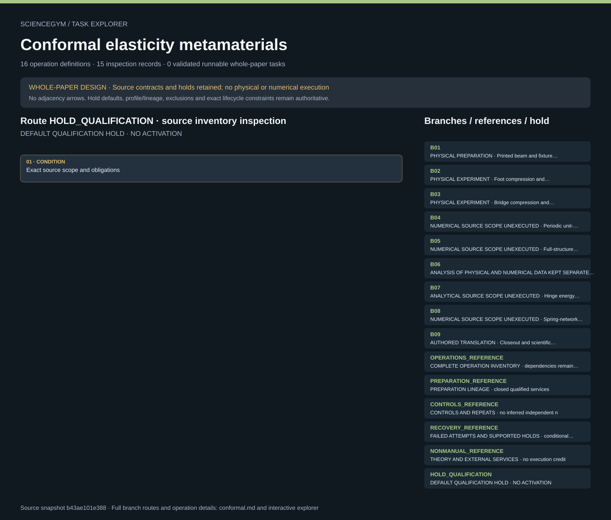

# Conformal elasticity metamaterials: task route map



Paper: **Conformal elasticity of mechanism-based metamaterials** · [DOI](https://doi.org/10.1038/s41467-021-27825-0)

Whole-paper DESIGN only; zero validated runnable whole-paper tasks. Read-only author/evaluator reference, not an actor context, hardware controller, mechanics simulation or scientific reproduction. Source facts, authored robot contracts, synthetic observations and illustrative geometry remain separate. Inventories are inspection memberships; only exact dependencies and lifecycle guards constrain order. Frames, phases, conditions, loading cycles and movie playback are not independent specimens or repeats. Qualification holds remain active; required outputs and observations are obligations, never observed outcomes. Sixteen authored operation templates and nine source-scope branches represent one paper-level design. Only B02 foot and B03 bridge are physical experimental design routes; B01 is preparation, B06 is analysis, and B09 is authored closeout. B04, B05, B07 and B08 remain documented, unexecuted numerical or analytical scope. Four hundred acquired frames at 1 fps and movie playback at 30 fps remain distinct source references, never operating defaults or independent n. Compression and decompression retain separate evidence; the source does not establish independent specimen or replicate allocation. The 306 by 64 by 40 mm envelope, 48 by 10 square count and 4.8 mm square size do not determine an exact specimen topology. Unknown powder identity and bridge contact treatment remain unresolved; fabrication, contact preparation and powered loading remain closed qualified services. Nine controls, five source conflicts and sixteen unresolved-input groups remain exact. Linear dilation versus area ratio, hinge-power, stress notation, registration and modulus discrepancies are not silently repaired. Measured data, nearest conformal fits, boundary-only predictions, finite-element results and numerical animations remain separate. Independent calibration receipts, current epochs, capture readiness, supported custody, safe-release closeout and failed-attempt ancestry remain required. Upstream review read nine main pages, sixteen written SI pages and one media-description sheet, with selected figure/equation inspection. Three movies were fully decoded and five frames each visually sampled, not continuously reviewed. Zenodo archive contents remain unread. No new paper reread, source-data reanalysis, mathematical proof, physical safety qualification or scientific validation is supplied. Original scene geometry, interfaces and anchors are illustrative and unqualified; they grant no motion permission.. Counts describe task representation, not experiments or success.

**Reading rule:** rows show unordered source inventory for inspection. Exact phase, lifecycle and dependency contracts remain authoritative; no loop, specimen, condition or chronology is inferred. An unordered obligation group has no inferred chronological edges. Source-reported scientific facts and authored handling are distinct.

[Frozen local source task package](../../../tasks/conformal_operations_v3_compressed/) · [Interactive inspector](../index.html)

## B01 — PHYSICAL PREPARATION · Printed beam and fixture preparation

Whole-paper DESIGN only; zero validated runnable whole-paper tasks. Read-only author/evaluator reference, not an actor context, hardware controller, mechanics simulation or scientific reproduction. Source facts, authored robot contracts, synthetic observations and illustrative geometry remain separate. Inventories are inspection memberships; only exact dependencies and lifecycle guards constrain order. Frames, phases, conditions, loading cycles and movie playback are not independent specimens or repeats. Qualification holds remain active; required outputs and observations are obligations, never observed outcomes.

[Exact route source](../../../tasks/conformal_operations_v3_compressed/branches.json) · JSON pointer: `/branches/0`

- **OBLIGATIONS: Exact operation membership; no adjacency chronology**
  - Binding: {"order":"Whole-paper DESIGN only; zero validated runnable whole-paper tasks. Read-only author/evaluator reference, not an actor context, hardware controller, mechanics simulation or scientific reproduction. Source facts, authored robot contracts, synthetic observations and illustrative geometry remain separate. Inventories are inspection memberships; only exact dependencies and lifecycle guards constrain order. Frames, phases, conditions, loading cycles and movie playback are not independent specimens or repeats. Qualification holds remain active; required outputs and observations are obligations, never observed outcomes."}
  - `R02` Commission beam and printed parts
    - Source occurrence binding: {"source_file":"branches.json","source_pointer":"/branches/0/route_operations/0","source_node":"R02","meaning":"Exact source-listed operation membership; not execution, chronology or a new specimen"}
  - `R03` Inspect and qualify both fixtures
    - Source occurrence binding: {"source_file":"branches.json","source_pointer":"/branches/0/route_operations/1","source_node":"R03","meaning":"Exact source-listed operation membership; not execution, chronology or a new specimen"}
  - `R04` Record contact preparation and conditioning
    - Source occurrence binding: {"source_file":"branches.json","source_pointer":"/branches/0/route_operations/2","source_node":"R04","meaning":"Exact source-listed operation membership; not execution, chronology or a new specimen"}
- **CONDITION: Exact source scope and obligations**
  - Binding: {"source_file":"branches.json","source_pointer":"/branches/0","source_contract":{"id":"B01","name":"Printed beam and fixture preparation","classification":"physical_preparation","source_anchors":["F02","F03","F05"],"route_operations":["R02","R03","R04"],"execution_status":"HOLD_QUALIFICATION","required_for_whole_paper_design":true}}

<details><summary>Branch state, choices, lineage and loop obligations</summary>

```json
{
  "id": "B01",
  "name": "Printed beam and fixture preparation",
  "classification": "physical_preparation",
  "source_anchors": [
    "F02",
    "F03",
    "F05"
  ],
  "route_operations": [
    "R02",
    "R03",
    "R04"
  ],
  "execution_status": "HOLD_QUALIFICATION",
  "required_for_whole_paper_design": true
}
```

</details>

## B02 — PHYSICAL EXPERIMENT · Foot compression and decompression imaging

Whole-paper DESIGN only; zero validated runnable whole-paper tasks. Read-only author/evaluator reference, not an actor context, hardware controller, mechanics simulation or scientific reproduction. Source facts, authored robot contracts, synthetic observations and illustrative geometry remain separate. Inventories are inspection memberships; only exact dependencies and lifecycle guards constrain order. Frames, phases, conditions, loading cycles and movie playback are not independent specimens or repeats. Qualification holds remain active; required outputs and observations are obligations, never observed outcomes.

[Exact route source](../../../tasks/conformal_operations_v3_compressed/branches.json) · JSON pointer: `/branches/1`

- **OBLIGATIONS: Exact operation membership; no adjacency chronology**
  - Binding: {"order":"Whole-paper DESIGN only; zero validated runnable whole-paper tasks. Read-only author/evaluator reference, not an actor context, hardware controller, mechanics simulation or scientific reproduction. Source facts, authored robot contracts, synthetic observations and illustrative geometry remain separate. Inventories are inspection memberships; only exact dependencies and lifecycle guards constrain order. Frames, phases, conditions, loading cycles and movie playback are not independent specimens or repeats. Qualification holds remain active; required outputs and observations are obligations, never observed outcomes."}
  - `R05` Transfer supported specimen and dock
    - Source occurrence binding: {"source_file":"branches.json","source_pointer":"/branches/1/route_operations/0","source_node":"R05","meaning":"Exact source-listed operation membership; not execution, chronology or a new specimen"}
  - `R06` Qualify mechanics and branch zero
    - Source occurrence binding: {"source_file":"branches.json","source_pointer":"/branches/1/route_operations/1","source_node":"R06","meaning":"Exact source-listed operation membership; not execution, chronology or a new specimen"}
  - `R07` Qualify image geometry and tracking visibility
    - Source occurrence binding: {"source_file":"branches.json","source_pointer":"/branches/1/route_operations/2","source_node":"R07","meaning":"Exact source-listed operation membership; not execution, chronology or a new specimen"}
  - `R08` Arm synchronized acquisition
    - Source occurrence binding: {"source_file":"branches.json","source_pointer":"/branches/1/route_operations/3","source_node":"R08","meaning":"Exact source-listed operation membership; not execution, chronology or a new specimen"}
  - `R09` Acquire approved branch cycle
    - Source occurrence binding: {"source_file":"branches.json","source_pointer":"/branches/1/route_operations/4","source_node":"R09","meaning":"Exact source-listed operation membership; not execution, chronology or a new specimen"}
  - `R10` Unload inspect and establish recovery state
    - Source occurrence binding: {"source_file":"branches.json","source_pointer":"/branches/1/route_operations/5","source_node":"R10","meaning":"Exact source-listed operation membership; not execution, chronology or a new specimen"}
  - `R11` Change fixture under isolation for paired branch
    - Source occurrence binding: {"source_file":"branches.json","source_pointer":"/branches/1/route_operations/6","source_node":"R11","meaning":"Exact source-listed operation membership; not execution, chronology or a new specimen"}
  - `R12` Extract registered square trajectories
    - Source occurrence binding: {"source_file":"branches.json","source_pointer":"/branches/1/route_operations/7","source_node":"R12","meaning":"Exact source-listed operation membership; not execution, chronology or a new specimen"}
  - `R13` Compute separate fit and boundary inference analyses
    - Source occurrence binding: {"source_file":"branches.json","source_pointer":"/branches/1/route_operations/8","source_node":"R13","meaning":"Exact source-listed operation membership; not execution, chronology or a new specimen"}
- **CONDITION: Exact source scope and obligations**
  - Binding: {"source_file":"branches.json","source_pointer":"/branches/1","source_contract":{"id":"B02","name":"Foot compression and decompression imaging","classification":"physical_experiment","source_anchors":["F05","F06","F08","F10"],"route_operations":["R05","R06","R07","R08","R09","R10","R11","R12","R13"],"execution_status":"HOLD_QUALIFICATION","required_for_whole_paper_design":true,"source_reference_cycle":{"stroke_mm":20,"speed_mm_s":0.1,"frames":400,"acquisition_fps":1,"playback_fps":30,"hardware_command":false,"safety_threshold":false}}}

<details><summary>Branch state, choices, lineage and loop obligations</summary>

```json
{
  "id": "B02",
  "name": "Foot compression and decompression imaging",
  "classification": "physical_experiment",
  "source_anchors": [
    "F05",
    "F06",
    "F08",
    "F10"
  ],
  "route_operations": [
    "R05",
    "R06",
    "R07",
    "R08",
    "R09",
    "R10",
    "R11",
    "R12",
    "R13"
  ],
  "execution_status": "HOLD_QUALIFICATION",
  "required_for_whole_paper_design": true,
  "source_reference_cycle": {
    "stroke_mm": 20,
    "speed_mm_s": 0.1,
    "frames": 400,
    "acquisition_fps": 1,
    "playback_fps": 30,
    "hardware_command": false,
    "safety_threshold": false
  }
}
```

</details>

## B03 — PHYSICAL EXPERIMENT · Bridge compression and decompression imaging

Whole-paper DESIGN only; zero validated runnable whole-paper tasks. Read-only author/evaluator reference, not an actor context, hardware controller, mechanics simulation or scientific reproduction. Source facts, authored robot contracts, synthetic observations and illustrative geometry remain separate. Inventories are inspection memberships; only exact dependencies and lifecycle guards constrain order. Frames, phases, conditions, loading cycles and movie playback are not independent specimens or repeats. Qualification holds remain active; required outputs and observations are obligations, never observed outcomes.

[Exact route source](../../../tasks/conformal_operations_v3_compressed/branches.json) · JSON pointer: `/branches/2`

- **OBLIGATIONS: Exact operation membership; no adjacency chronology**
  - Binding: {"order":"Whole-paper DESIGN only; zero validated runnable whole-paper tasks. Read-only author/evaluator reference, not an actor context, hardware controller, mechanics simulation or scientific reproduction. Source facts, authored robot contracts, synthetic observations and illustrative geometry remain separate. Inventories are inspection memberships; only exact dependencies and lifecycle guards constrain order. Frames, phases, conditions, loading cycles and movie playback are not independent specimens or repeats. Qualification holds remain active; required outputs and observations are obligations, never observed outcomes."}
  - `R05` Transfer supported specimen and dock
    - Source occurrence binding: {"source_file":"branches.json","source_pointer":"/branches/2/route_operations/0","source_node":"R05","meaning":"Exact source-listed operation membership; not execution, chronology or a new specimen"}
  - `R06` Qualify mechanics and branch zero
    - Source occurrence binding: {"source_file":"branches.json","source_pointer":"/branches/2/route_operations/1","source_node":"R06","meaning":"Exact source-listed operation membership; not execution, chronology or a new specimen"}
  - `R07` Qualify image geometry and tracking visibility
    - Source occurrence binding: {"source_file":"branches.json","source_pointer":"/branches/2/route_operations/2","source_node":"R07","meaning":"Exact source-listed operation membership; not execution, chronology or a new specimen"}
  - `R08` Arm synchronized acquisition
    - Source occurrence binding: {"source_file":"branches.json","source_pointer":"/branches/2/route_operations/3","source_node":"R08","meaning":"Exact source-listed operation membership; not execution, chronology or a new specimen"}
  - `R09` Acquire approved branch cycle
    - Source occurrence binding: {"source_file":"branches.json","source_pointer":"/branches/2/route_operations/4","source_node":"R09","meaning":"Exact source-listed operation membership; not execution, chronology or a new specimen"}
  - `R10` Unload inspect and establish recovery state
    - Source occurrence binding: {"source_file":"branches.json","source_pointer":"/branches/2/route_operations/5","source_node":"R10","meaning":"Exact source-listed operation membership; not execution, chronology or a new specimen"}
  - `R11` Change fixture under isolation for paired branch
    - Source occurrence binding: {"source_file":"branches.json","source_pointer":"/branches/2/route_operations/6","source_node":"R11","meaning":"Exact source-listed operation membership; not execution, chronology or a new specimen"}
  - `R12` Extract registered square trajectories
    - Source occurrence binding: {"source_file":"branches.json","source_pointer":"/branches/2/route_operations/7","source_node":"R12","meaning":"Exact source-listed operation membership; not execution, chronology or a new specimen"}
  - `R13` Compute separate fit and boundary inference analyses
    - Source occurrence binding: {"source_file":"branches.json","source_pointer":"/branches/2/route_operations/8","source_node":"R13","meaning":"Exact source-listed operation membership; not execution, chronology or a new specimen"}
- **CONDITION: Exact source scope and obligations**
  - Binding: {"source_file":"branches.json","source_pointer":"/branches/2","source_contract":{"id":"B03","name":"Bridge compression and decompression imaging","classification":"physical_experiment","source_anchors":["F07","F08","F10"],"route_operations":["R05","R06","R07","R08","R09","R10","R11","R12","R13"],"execution_status":"HOLD_QUALIFICATION","required_for_whole_paper_design":true,"source_reference_cycle":{"stroke_mm":40,"speed_mm_s":0.2,"frames":400,"acquisition_fps":1,"playback_fps":30,"hardware_command":false,"safety_threshold":false}}}

<details><summary>Branch state, choices, lineage and loop obligations</summary>

```json
{
  "id": "B03",
  "name": "Bridge compression and decompression imaging",
  "classification": "physical_experiment",
  "source_anchors": [
    "F07",
    "F08",
    "F10"
  ],
  "route_operations": [
    "R05",
    "R06",
    "R07",
    "R08",
    "R09",
    "R10",
    "R11",
    "R12",
    "R13"
  ],
  "execution_status": "HOLD_QUALIFICATION",
  "required_for_whole_paper_design": true,
  "source_reference_cycle": {
    "stroke_mm": 40,
    "speed_mm_s": 0.2,
    "frames": 400,
    "acquisition_fps": 1,
    "playback_fps": 30,
    "hardware_command": false,
    "safety_threshold": false
  }
}
```

</details>

## B04 — NUMERICAL SOURCE SCOPE UNEXECUTED · Periodic unit-cell FEM moduli

Whole-paper DESIGN only; zero validated runnable whole-paper tasks. Read-only author/evaluator reference, not an actor context, hardware controller, mechanics simulation or scientific reproduction. Source facts, authored robot contracts, synthetic observations and illustrative geometry remain separate. Inventories are inspection memberships; only exact dependencies and lifecycle guards constrain order. Frames, phases, conditions, loading cycles and movie playback are not independent specimens or repeats. Qualification holds remain active; required outputs and observations are obligations, never observed outcomes.

[Exact route source](../../../tasks/conformal_operations_v3_compressed/branches.json) · JSON pointer: `/branches/3`

- **OBLIGATIONS: Exact operation membership; no adjacency chronology**
  - Binding: {"order":"Whole-paper DESIGN only; zero validated runnable whole-paper tasks. Read-only author/evaluator reference, not an actor context, hardware controller, mechanics simulation or scientific reproduction. Source facts, authored robot contracts, synthetic observations and illustrative geometry remain separate. Inventories are inspection memberships; only exact dependencies and lifecycle guards constrain order. Frames, phases, conditions, loading cycles and movie playback are not independent specimens or repeats. Qualification holds remain active; required outputs and observations are obligations, never observed outcomes."}
  - `R14` Document nonmanual scientific branches
    - Source occurrence binding: {"source_file":"branches.json","source_pointer":"/branches/3/route_operations/0","source_node":"R14","meaning":"Exact source-listed operation membership; not execution, chronology or a new specimen"}
- **CONDITION: Exact source scope and obligations**
  - Binding: {"source_file":"branches.json","source_pointer":"/branches/3","source_contract":{"id":"B04","name":"Periodic unit-cell FEM moduli","classification":"numerical_source_scope_unexecuted","source_anchors":["F11","F12","F28"],"route_operations":["R14"],"execution_status":"DOCUMENTED_UNEXECUTED","required_for_whole_paper_design":true}}

<details><summary>Branch state, choices, lineage and loop obligations</summary>

```json
{
  "id": "B04",
  "name": "Periodic unit-cell FEM moduli",
  "classification": "numerical_source_scope_unexecuted",
  "source_anchors": [
    "F11",
    "F12",
    "F28"
  ],
  "route_operations": [
    "R14"
  ],
  "execution_status": "DOCUMENTED_UNEXECUTED",
  "required_for_whole_paper_design": true
}
```

</details>

## B05 — NUMERICAL SOURCE SCOPE UNEXECUTED · Full-structure FEM and hinge sweep

Whole-paper DESIGN only; zero validated runnable whole-paper tasks. Read-only author/evaluator reference, not an actor context, hardware controller, mechanics simulation or scientific reproduction. Source facts, authored robot contracts, synthetic observations and illustrative geometry remain separate. Inventories are inspection memberships; only exact dependencies and lifecycle guards constrain order. Frames, phases, conditions, loading cycles and movie playback are not independent specimens or repeats. Qualification holds remain active; required outputs and observations are obligations, never observed outcomes.

[Exact route source](../../../tasks/conformal_operations_v3_compressed/branches.json) · JSON pointer: `/branches/4`

- **OBLIGATIONS: Exact operation membership; no adjacency chronology**
  - Binding: {"order":"Whole-paper DESIGN only; zero validated runnable whole-paper tasks. Read-only author/evaluator reference, not an actor context, hardware controller, mechanics simulation or scientific reproduction. Source facts, authored robot contracts, synthetic observations and illustrative geometry remain separate. Inventories are inspection memberships; only exact dependencies and lifecycle guards constrain order. Frames, phases, conditions, loading cycles and movie playback are not independent specimens or repeats. Qualification holds remain active; required outputs and observations are obligations, never observed outcomes."}
  - `R14` Document nonmanual scientific branches
    - Source occurrence binding: {"source_file":"branches.json","source_pointer":"/branches/4/route_operations/0","source_node":"R14","meaning":"Exact source-listed operation membership; not execution, chronology or a new specimen"}
- **CONDITION: Exact source scope and obligations**
  - Binding: {"source_file":"branches.json","source_pointer":"/branches/4","source_contract":{"id":"B05","name":"Full-structure FEM and hinge sweep","classification":"numerical_source_scope_unexecuted","source_anchors":["F11","F13"],"route_operations":["R14"],"execution_status":"DOCUMENTED_UNEXECUTED","required_for_whole_paper_design":true}}

<details><summary>Branch state, choices, lineage and loop obligations</summary>

```json
{
  "id": "B05",
  "name": "Full-structure FEM and hinge sweep",
  "classification": "numerical_source_scope_unexecuted",
  "source_anchors": [
    "F11",
    "F13"
  ],
  "route_operations": [
    "R14"
  ],
  "execution_status": "DOCUMENTED_UNEXECUTED",
  "required_for_whole_paper_design": true
}
```

</details>

## B06 — ANALYSIS OF PHYSICAL AND NUMERICAL DATA KEPT SEPARATE · Conformal fit and boundary inference comparison

Whole-paper DESIGN only; zero validated runnable whole-paper tasks. Read-only author/evaluator reference, not an actor context, hardware controller, mechanics simulation or scientific reproduction. Source facts, authored robot contracts, synthetic observations and illustrative geometry remain separate. Inventories are inspection memberships; only exact dependencies and lifecycle guards constrain order. Frames, phases, conditions, loading cycles and movie playback are not independent specimens or repeats. Qualification holds remain active; required outputs and observations are obligations, never observed outcomes.

[Exact route source](../../../tasks/conformal_operations_v3_compressed/branches.json) · JSON pointer: `/branches/5`

- **OBLIGATIONS: Exact operation membership; no adjacency chronology**
  - Binding: {"order":"Whole-paper DESIGN only; zero validated runnable whole-paper tasks. Read-only author/evaluator reference, not an actor context, hardware controller, mechanics simulation or scientific reproduction. Source facts, authored robot contracts, synthetic observations and illustrative geometry remain separate. Inventories are inspection memberships; only exact dependencies and lifecycle guards constrain order. Frames, phases, conditions, loading cycles and movie playback are not independent specimens or repeats. Qualification holds remain active; required outputs and observations are obligations, never observed outcomes."}
  - `R12` Extract registered square trajectories
    - Source occurrence binding: {"source_file":"branches.json","source_pointer":"/branches/5/route_operations/0","source_node":"R12","meaning":"Exact source-listed operation membership; not execution, chronology or a new specimen"}
  - `R13` Compute separate fit and boundary inference analyses
    - Source occurrence binding: {"source_file":"branches.json","source_pointer":"/branches/5/route_operations/1","source_node":"R13","meaning":"Exact source-listed operation membership; not execution, chronology or a new specimen"}
  - `R14` Document nonmanual scientific branches
    - Source occurrence binding: {"source_file":"branches.json","source_pointer":"/branches/5/route_operations/2","source_node":"R14","meaning":"Exact source-listed operation membership; not execution, chronology or a new specimen"}
  - `R15` Compare controls without leaking source answers
    - Source occurrence binding: {"source_file":"branches.json","source_pointer":"/branches/5/route_operations/3","source_node":"R15","meaning":"Exact source-listed operation membership; not execution, chronology or a new specimen"}
- **CONDITION: Exact source scope and obligations**
  - Binding: {"source_file":"branches.json","source_pointer":"/branches/5","source_contract":{"id":"B06","name":"Conformal fit and boundary inference comparison","classification":"analysis_of_physical_and_numerical_data_kept_separate","source_anchors":["F14","F15","F18","F20","F26"],"route_operations":["R12","R13","R14","R15"],"execution_status":"HOLD_QUALIFICATION","required_for_whole_paper_design":true}}

<details><summary>Branch state, choices, lineage and loop obligations</summary>

```json
{
  "id": "B06",
  "name": "Conformal fit and boundary inference comparison",
  "classification": "analysis_of_physical_and_numerical_data_kept_separate",
  "source_anchors": [
    "F14",
    "F15",
    "F18",
    "F20",
    "F26"
  ],
  "route_operations": [
    "R12",
    "R13",
    "R14",
    "R15"
  ],
  "execution_status": "HOLD_QUALIFICATION",
  "required_for_whole_paper_design": true
}
```

</details>

## B07 — ANALYTICAL SOURCE SCOPE UNEXECUTED · Hinge energy continuum and stress theory

Whole-paper DESIGN only; zero validated runnable whole-paper tasks. Read-only author/evaluator reference, not an actor context, hardware controller, mechanics simulation or scientific reproduction. Source facts, authored robot contracts, synthetic observations and illustrative geometry remain separate. Inventories are inspection memberships; only exact dependencies and lifecycle guards constrain order. Frames, phases, conditions, loading cycles and movie playback are not independent specimens or repeats. Qualification holds remain active; required outputs and observations are obligations, never observed outcomes.

[Exact route source](../../../tasks/conformal_operations_v3_compressed/branches.json) · JSON pointer: `/branches/6`

- **OBLIGATIONS: Exact operation membership; no adjacency chronology**
  - Binding: {"order":"Whole-paper DESIGN only; zero validated runnable whole-paper tasks. Read-only author/evaluator reference, not an actor context, hardware controller, mechanics simulation or scientific reproduction. Source facts, authored robot contracts, synthetic observations and illustrative geometry remain separate. Inventories are inspection memberships; only exact dependencies and lifecycle guards constrain order. Frames, phases, conditions, loading cycles and movie playback are not independent specimens or repeats. Qualification holds remain active; required outputs and observations are obligations, never observed outcomes."}
  - `R14` Document nonmanual scientific branches
    - Source occurrence binding: {"source_file":"branches.json","source_pointer":"/branches/6/route_operations/0","source_node":"R14","meaning":"Exact source-listed operation membership; not execution, chronology or a new specimen"}
- **CONDITION: Exact source scope and obligations**
  - Binding: {"source_file":"branches.json","source_pointer":"/branches/6","source_contract":{"id":"B07","name":"Hinge energy continuum and stress theory","classification":"analytical_source_scope_unexecuted","source_anchors":["F16","F17","F19","F28"],"route_operations":["R14"],"execution_status":"DOCUMENTED_UNEXECUTED","required_for_whole_paper_design":true}}

<details><summary>Branch state, choices, lineage and loop obligations</summary>

```json
{
  "id": "B07",
  "name": "Hinge energy continuum and stress theory",
  "classification": "analytical_source_scope_unexecuted",
  "source_anchors": [
    "F16",
    "F17",
    "F19",
    "F28"
  ],
  "route_operations": [
    "R14"
  ],
  "execution_status": "DOCUMENTED_UNEXECUTED",
  "required_for_whole_paper_design": true
}
```

</details>

## B08 — NUMERICAL SOURCE SCOPE UNEXECUTED · Spring-network boundary-control demonstration

Whole-paper DESIGN only; zero validated runnable whole-paper tasks. Read-only author/evaluator reference, not an actor context, hardware controller, mechanics simulation or scientific reproduction. Source facts, authored robot contracts, synthetic observations and illustrative geometry remain separate. Inventories are inspection memberships; only exact dependencies and lifecycle guards constrain order. Frames, phases, conditions, loading cycles and movie playback are not independent specimens or repeats. Qualification holds remain active; required outputs and observations are obligations, never observed outcomes.

[Exact route source](../../../tasks/conformal_operations_v3_compressed/branches.json) · JSON pointer: `/branches/7`

- **OBLIGATIONS: Exact operation membership; no adjacency chronology**
  - Binding: {"order":"Whole-paper DESIGN only; zero validated runnable whole-paper tasks. Read-only author/evaluator reference, not an actor context, hardware controller, mechanics simulation or scientific reproduction. Source facts, authored robot contracts, synthetic observations and illustrative geometry remain separate. Inventories are inspection memberships; only exact dependencies and lifecycle guards constrain order. Frames, phases, conditions, loading cycles and movie playback are not independent specimens or repeats. Qualification holds remain active; required outputs and observations are obligations, never observed outcomes."}
  - `R14` Document nonmanual scientific branches
    - Source occurrence binding: {"source_file":"branches.json","source_pointer":"/branches/7/route_operations/0","source_node":"R14","meaning":"Exact source-listed operation membership; not execution, chronology or a new specimen"}
- **CONDITION: Exact source scope and obligations**
  - Binding: {"source_file":"branches.json","source_pointer":"/branches/7","source_contract":{"id":"B08","name":"Spring-network boundary-control demonstration","classification":"numerical_source_scope_unexecuted","source_anchors":["F21","F22"],"route_operations":["R14"],"execution_status":"DOCUMENTED_UNEXECUTED","required_for_whole_paper_design":true}}

<details><summary>Branch state, choices, lineage and loop obligations</summary>

```json
{
  "id": "B08",
  "name": "Spring-network boundary-control demonstration",
  "classification": "numerical_source_scope_unexecuted",
  "source_anchors": [
    "F21",
    "F22"
  ],
  "route_operations": [
    "R14"
  ],
  "execution_status": "DOCUMENTED_UNEXECUTED",
  "required_for_whole_paper_design": true
}
```

</details>

## B09 — AUTHORED TRANSLATION · Closeout and scientific comparison

Whole-paper DESIGN only; zero validated runnable whole-paper tasks. Read-only author/evaluator reference, not an actor context, hardware controller, mechanics simulation or scientific reproduction. Source facts, authored robot contracts, synthetic observations and illustrative geometry remain separate. Inventories are inspection memberships; only exact dependencies and lifecycle guards constrain order. Frames, phases, conditions, loading cycles and movie playback are not independent specimens or repeats. Qualification holds remain active; required outputs and observations are obligations, never observed outcomes.

[Exact route source](../../../tasks/conformal_operations_v3_compressed/branches.json) · JSON pointer: `/branches/8`

- **OBLIGATIONS: Exact operation membership; no adjacency chronology**
  - Binding: {"order":"Whole-paper DESIGN only; zero validated runnable whole-paper tasks. Read-only author/evaluator reference, not an actor context, hardware controller, mechanics simulation or scientific reproduction. Source facts, authored robot contracts, synthetic observations and illustrative geometry remain separate. Inventories are inspection memberships; only exact dependencies and lifecycle guards constrain order. Frames, phases, conditions, loading cycles and movie playback are not independent specimens or repeats. Qualification holds remain active; required outputs and observations are obligations, never observed outcomes."}
  - `R15` Compare controls without leaking source answers
    - Source occurrence binding: {"source_file":"branches.json","source_pointer":"/branches/8/route_operations/0","source_node":"R15","meaning":"Exact source-listed operation membership; not execution, chronology or a new specimen"}
  - `R16` Close campaign and archive originals
    - Source occurrence binding: {"source_file":"branches.json","source_pointer":"/branches/8/route_operations/1","source_node":"R16","meaning":"Exact source-listed operation membership; not execution, chronology or a new specimen"}
- **CONDITION: Exact source scope and obligations**
  - Binding: {"source_file":"branches.json","source_pointer":"/branches/8","source_contract":{"id":"B09","name":"Closeout and scientific comparison","classification":"authored_translation","source_anchors":["F10","F23","F25"],"route_operations":["R15","R16"],"execution_status":"HOLD_QUALIFICATION","required_for_whole_paper_design":true}}

<details><summary>Branch state, choices, lineage and loop obligations</summary>

```json
{
  "id": "B09",
  "name": "Closeout and scientific comparison",
  "classification": "authored_translation",
  "source_anchors": [
    "F10",
    "F23",
    "F25"
  ],
  "route_operations": [
    "R15",
    "R16"
  ],
  "execution_status": "HOLD_QUALIFICATION",
  "required_for_whole_paper_design": true
}
```

</details>

## OPERATIONS_REFERENCE — COMPLETE OPERATION INVENTORY · dependencies remain authoritative

Whole-paper DESIGN only; zero validated runnable whole-paper tasks. Read-only author/evaluator reference, not an actor context, hardware controller, mechanics simulation or scientific reproduction. Source facts, authored robot contracts, synthetic observations and illustrative geometry remain separate. Inventories are inspection memberships; only exact dependencies and lifecycle guards constrain order. Frames, phases, conditions, loading cycles and movie playback are not independent specimens or repeats. Qualification holds remain active; required outputs and observations are obligations, never observed outcomes.

[Exact route source](../../../tasks/conformal_operations_v3_compressed/operations.json) · JSON pointer: ``

- **OBLIGATIONS: Exact operation membership; no adjacency chronology**
  - Binding: {"order":"Whole-paper DESIGN only; zero validated runnable whole-paper tasks. Read-only author/evaluator reference, not an actor context, hardware controller, mechanics simulation or scientific reproduction. Source facts, authored robot contracts, synthetic observations and illustrative geometry remain separate. Inventories are inspection memberships; only exact dependencies and lifecycle guards constrain order. Frames, phases, conditions, loading cycles and movie playback are not independent specimens or repeats. Qualification holds remain active; required outputs and observations are obligations, never observed outcomes."}
  - `R01` Freeze campaign and prospective controls
    - Source occurrence binding: {"source_file":"operations.json","source_pointer":"/operations/0/id","source_node":"R01","meaning":"Exact source-listed operation membership; not execution, chronology or a new specimen"}
  - `R02` Commission beam and printed parts
    - Source occurrence binding: {"source_file":"operations.json","source_pointer":"/operations/1/id","source_node":"R02","meaning":"Exact source-listed operation membership; not execution, chronology or a new specimen"}
  - `R03` Inspect and qualify both fixtures
    - Source occurrence binding: {"source_file":"operations.json","source_pointer":"/operations/2/id","source_node":"R03","meaning":"Exact source-listed operation membership; not execution, chronology or a new specimen"}
  - `R04` Record contact preparation and conditioning
    - Source occurrence binding: {"source_file":"operations.json","source_pointer":"/operations/3/id","source_node":"R04","meaning":"Exact source-listed operation membership; not execution, chronology or a new specimen"}
  - `R05` Transfer supported specimen and dock
    - Source occurrence binding: {"source_file":"operations.json","source_pointer":"/operations/4/id","source_node":"R05","meaning":"Exact source-listed operation membership; not execution, chronology or a new specimen"}
  - `R06` Qualify mechanics and branch zero
    - Source occurrence binding: {"source_file":"operations.json","source_pointer":"/operations/5/id","source_node":"R06","meaning":"Exact source-listed operation membership; not execution, chronology or a new specimen"}
  - `R07` Qualify image geometry and tracking visibility
    - Source occurrence binding: {"source_file":"operations.json","source_pointer":"/operations/6/id","source_node":"R07","meaning":"Exact source-listed operation membership; not execution, chronology or a new specimen"}
  - `R08` Arm synchronized acquisition
    - Source occurrence binding: {"source_file":"operations.json","source_pointer":"/operations/7/id","source_node":"R08","meaning":"Exact source-listed operation membership; not execution, chronology or a new specimen"}
  - `R09` Acquire approved branch cycle
    - Source occurrence binding: {"source_file":"operations.json","source_pointer":"/operations/8/id","source_node":"R09","meaning":"Exact source-listed operation membership; not execution, chronology or a new specimen"}
  - `R10` Unload inspect and establish recovery state
    - Source occurrence binding: {"source_file":"operations.json","source_pointer":"/operations/9/id","source_node":"R10","meaning":"Exact source-listed operation membership; not execution, chronology or a new specimen"}
  - `R11` Change fixture under isolation for paired branch
    - Source occurrence binding: {"source_file":"operations.json","source_pointer":"/operations/10/id","source_node":"R11","meaning":"Exact source-listed operation membership; not execution, chronology or a new specimen"}
  - `R12` Extract registered square trajectories
    - Source occurrence binding: {"source_file":"operations.json","source_pointer":"/operations/11/id","source_node":"R12","meaning":"Exact source-listed operation membership; not execution, chronology or a new specimen"}
  - `R13` Compute separate fit and boundary inference analyses
    - Source occurrence binding: {"source_file":"operations.json","source_pointer":"/operations/12/id","source_node":"R13","meaning":"Exact source-listed operation membership; not execution, chronology or a new specimen"}
  - `R14` Document nonmanual scientific branches
    - Source occurrence binding: {"source_file":"operations.json","source_pointer":"/operations/13/id","source_node":"R14","meaning":"Exact source-listed operation membership; not execution, chronology or a new specimen"}
  - `R15` Compare controls without leaking source answers
    - Source occurrence binding: {"source_file":"operations.json","source_pointer":"/operations/14/id","source_node":"R15","meaning":"Exact source-listed operation membership; not execution, chronology or a new specimen"}
  - `R16` Close campaign and archive originals
    - Source occurrence binding: {"source_file":"operations.json","source_pointer":"/operations/15/id","source_node":"R16","meaning":"Exact source-listed operation membership; not execution, chronology or a new specimen"}
- **CONDITION: Exact source scope and obligations**
  - Binding: {"source_file":"operations.json","source_pointer":"","source_contract":{"schema_version":"conformal_task.v2","classification":"authored_robot_translation","operations":[{"id":"R01","name":"Freeze campaign and prospective controls","classification":"authored_robot_translation","station":"S01","depends_on":[],"inputs":["Source review","Branch manifest","Approved repeat and metric plan"],"outputs":["campaign_id","Immutable repeat, order, reset, tolerance and stop policy"],"entry_guards":["Count increment stays zero","Resolve plan fields before measurements; no result-dependent repeats"],"observations_to_record":["Versioned policy IDs","Specimen and run counts, loading order and stopping criteria"],"failure_closeout":"Reject incomplete plan; keep design-only status","source_anchors":["F01","F10"],"execution_gaps":["U06","U15"],"substeps":["Freeze independent specimen allocation, condition order and per-condition cycles before outcomes","Freeze reset, uncertainty, model-order, exclusion, acceptance and stopping policies with versioned authority"],"evidence_role":"campaign_policy","asset_ids":["A11"],"runtime":"unimplemented","physical_execution_qualified":false,"service_request_is_completion":false},{"id":"R02","name":"Commission beam and printed parts","classification":"authored_robot_translation","station":"S02","depends_on":["R01"],"inputs":["Verified geometry revision","Approved material lot and service"],"outputs":["Serialized beam with pads","Serialized ABS foot","Build and inspection receipts"],"entry_guards":["Resolve CAD, material and safe fabrication requirements","No resin synthesis or raw machine commands"],"observations_to_record":["Parent material lot to print job to part IDs","Dimensions, defects, post-process and age"],"failure_closeout":"Quarantine incomplete or untraceable parts","source_anchors":["F02","F03","F04","F05"],"execution_gaps":["U01","U02","U13"],"substeps":["Bind separate material lots and verified geometry/pad-layout revisions to service job IDs","Transfer protected stock or receive service-owned feedstock provenance","Receive independently issued fabrication, postprocess, inspection and safe-release receipts","Serialize beam, integrated pads and ABS foot; reject service request substituted for completion"],"evidence_role":"fabrication_service","asset_ids":["A01","A02","A03","A08","A09"],"runtime":"unimplemented","physical_execution_qualified":false,"service_request_is_completion":false},{"id":"R03","name":"Inspect and qualify both fixtures","classification":"authored_robot_translation","station":"S03","depends_on":["R02"],"inputs":["Foot","Bridge support and pusher","Approved fixture drawings"],"outputs":["Fixture inspection receipt","Fixture ID and contact-coordinate registry"],"entry_guards":["Do not infer contact geometry from illustrations","Resolve support span and contact features"],"observations_to_record":["Geometry and mounting uncertainty","Fixture secure status"],"failure_closeout":"Hold fixture and block loading","source_anchors":["F05","F07"],"execution_gaps":["U03"],"substeps":["Verify independent foot and bridge drawings and mounting/contact registry","Check secure locks, dimensions and condition against qualified drawings","Preserve unresolved support span, contact profiles and radii; no values inferred from figure pixels"],"evidence_role":"fixture_inspection","asset_ids":["A03","A04","A10"],"runtime":"unimplemented","physical_execution_qualified":false,"service_request_is_completion":false},{"id":"R04","name":"Record contact preparation and conditioning","classification":"authored_robot_translation","station":"S03","depends_on":["R02","R03"],"inputs":["Specimen","Approved contact-service method"],"outputs":["Conditioned specimen state","Contact-treatment receipt"],"entry_guards":["Unknown powder is never dispensed","Source powder treatment only explicitly belongs to foot branch","Freeze recovery/environment procedure"],"observations_to_record":["Powder/service identity if approved","Treatment event, age, temperature/humidity and condition history"],"failure_closeout":"Isolate uncertain treatment or damaged sample; no improvised cleaning","source_anchors":["F04","F05","F10"],"execution_gaps":["U04","U16"],"substeps":["Bind specimen and fixture to contact-preparation and conditioning histories","Require identified material and approved closed-service method for any powder treatment","Record foot-only source treatment scope; bridge treatment remains separately resolved","Retain age, environment and reset/recovery state; no improvised cleanup"],"evidence_role":"contact_conditioning","asset_ids":["A01","A08","A09"],"runtime":"unimplemented","physical_execution_qualified":false,"service_request_is_completion":false},{"id":"R05","name":"Transfer supported specimen and dock","classification":"authored_robot_translation","station":"S04","depends_on":["R04"],"inputs":["Serialized supported carrier","Fixture and branch assignment"],"outputs":["Docked specimen and identity/pose receipt"],"entry_guards":["Qualified grasp/support zones and interlocks","No grasping fragile hinges or optical pads","Verify current condition history"],"observations_to_record":["Source/destination ID","Transform revision and lock checks","Chain of custody"],"failure_closeout":"Stop motion; retain supported state; call approved recovery service","source_anchors":["F02","F03"],"execution_gaps":["U14"],"substeps":["Observe source identity, actual supported carrier and destination vacancy","Check independent safe-release and approved transform, retention, fixture locks and grasp zones","Transfer only supported solid parts through a separately qualified service","Append custody event and invalidate any pose/calibration no longer current"],"evidence_role":"supported_custody","asset_ids":["A01","A05","A08"],"runtime":"unimplemented","physical_execution_qualified":false,"service_request_is_completion":false},{"id":"R06","name":"Qualify mechanics and branch zero","classification":"authored_robot_translation","station":"S05","depends_on":["R05"],"inputs":["Docked fixture","Qualified load/displacement sensors"],"outputs":["Calibration and safe-limit receipt","Unloaded reference and contact-zero record"],"entry_guards":["Force/stroke/speed limits and emergency unload policy must be commissioned","Source stroke is not a safety threshold"],"observations_to_record":["Load-cell model/range and calibration","Fixture alignment, gap/contact zero, interlock status"],"failure_closeout":"Disarm tester; preserve pretest records; no arbitrary re-zero after contact","source_anchors":["F06","F07"],"execution_gaps":["U05"],"substeps":["Require dock, fixture, sample-state and configuration identities","Obtain independent mechanics calibration, force/stroke/speed limits and interlock receipt","Record unloaded reference and contact zero separately with immutable provenance"],"evidence_role":"mechanics_readiness","asset_ids":["A03","A04","A05","A10"],"runtime":"unimplemented","physical_execution_qualified":false,"service_request_is_completion":false},{"id":"R07","name":"Qualify image geometry and tracking visibility","classification":"authored_robot_translation","station":"S06","depends_on":["R05"],"inputs":["Camera lights and background","Calibration target","Unloaded specimen"],"outputs":["Calibration record","Reference image","Visible-square ID map"],"entry_guards":["Qualify actual field of view and focus","Do not treat reported 1 micrometre accuracy as calibration"],"observations_to_record":["Exposure settings","Lens/camera IDs","Scale/distortion and uncertainty","Missing or occluded pads"],"failure_closeout":"Hold acquisition and retain failed calibration receipts","source_anchors":["F08","F09"],"execution_gaps":["U07","U09"],"substeps":["Bind camera/lens/calibration, focus, actual exposure and pixel-to-world map","Inspect field of view, reference image and square visibility IDs","Record drift and uncertainty; reported 0.02 pixel accuracy does not attest readiness"],"evidence_role":"imaging_readiness","asset_ids":["A01","A02","A06","A07","A10"],"runtime":"unimplemented","physical_execution_qualified":false,"service_request_is_completion":false},{"id":"R08","name":"Arm synchronized acquisition","classification":"authored_robot_translation","station":"S05+S06","depends_on":["R06","R07"],"inputs":["Branch program","Clock and trigger configuration"],"outputs":["run_id","Armed machine-camera handshake","Start event"],"entry_guards":["Clock alignment and buffer readiness verified","No motion before capture-ready acknowledgement","Load/unload phase tagging required"],"observations_to_record":["Machine time to camera time mapping","Frame numbering, dropped-frame and timestamp status"],"failure_closeout":"Cancel arming and disarm; do not synthesize missing frames","source_anchors":["F06","F07","F08"],"execution_gaps":["U08"],"substeps":["Reserve tester and camera together under one exclusive occurrence lease","Check current configuration epoch, calibration, sample state and fixture","Require capture-ready and buffer-ready acknowledgements before machine start","Bind camera-to-machine time mapping, phase tags and endpoint policy"],"evidence_role":"synchronized_arming","asset_ids":["A05","A06","A11"],"runtime":"unimplemented","physical_execution_qualified":false,"service_request_is_completion":false},{"id":"R09","name":"Acquire approved branch cycle","classification":"authored_robot_translation","station":"S05+S06","depends_on":["R08"],"inputs":["Armed run","Prospective branch selection"],"outputs":["Immutable images","Force/displacement/time records","Separate loading/unloading labels"],"entry_guards":["Foot uses source 0.1 mm/s and max 20 mm only if commissioned limits permit","Bridge uses source 0.2 mm/s and max 40 mm only if permitted","Fault abort prevents automatic restart"],"observations_to_record":["Contact and slip events","Force/stroke telemetry","Image timestamps, occlusion and damage","Actual frame count against source 400-frame report"],"failure_closeout":"Controlled stop/unload only by approved device safety policy; retain all partial data","source_anchors":["F06","F07","F10"],"execution_gaps":["U05","U08"],"substeps":["Expand only frozen foot or bridge cycle occurrences","Request a qualified closed test cycle with limits independently enforced","Retain every raw frame, dropped-frame event and mechanical event with original clocks","Keep loading and unloading separate, including friction, adhesion and aborts"],"evidence_role":"physical_cycle","asset_ids":["A01","A03","A04","A05","A06","A07"],"runtime":"unimplemented","physical_execution_qualified":false,"service_request_is_completion":false},{"id":"R10","name":"Unload inspect and establish recovery state","classification":"authored_robot_translation","station":"S05","depends_on":["R09"],"inputs":["Completed or stopped cycle","Approved recovery protocol"],"outputs":["Unloaded and disarmed receipt","Damage/adhesion/relaxation record","Reuse or quarantine decision"],"entry_guards":["No assumption that unloading restores virgin condition","No retest until reset criteria and repeat policy permit"],"observations_to_record":["Residual deformation","Broken hinges/pads","Contact adhesion and recovery time","Cycle count"],"failure_closeout":"Quarantine on failed recovery; never erase failed trial","source_anchors":["F04","F10"],"execution_gaps":["U16"],"substeps":["Request station-approved stop/unload through qualified service","Wait for independent unloaded and disarmed observation; a request is insufficient","Inspect damage, residual deformation and adhesion and advance specimen state","Apply frozen recovery/retirement rule; unloading alone does not restore virgin state"],"evidence_role":"safe_unload_recovery","asset_ids":["A01","A05","A08"],"runtime":"unimplemented","physical_execution_qualified":false,"service_request_is_completion":false},{"id":"R11","name":"Change fixture under isolation for paired branch","classification":"authored_robot_translation","station":"S04","depends_on":["R10"],"inputs":["Approved next branch from frozen order","Recovered or independently assigned specimen"],"outputs":["New fixture and specimen-state lineage","New docking and calibration requirements","Preparation re-entry decision and validated upstream receipt set"],"entry_guards":["Tester is disarmed and unloaded","Record reused versus independent specimen","R05-R10 must be re-entered for the new branch; this is not a permission to bypass gates","A replacement specimen, reconditioning or changed contact treatment must revisit applicable R02-R04 preparation/qualification before R05; a new specimen cannot inherit prior receipts"],"observations_to_record":["Fixture exchange event","Contact-treatment carryover","Order and specimen reuse history"],"failure_closeout":"Pause campaign if cross-condition history or recovery is unresolved","source_anchors":["F05","F07","F10"],"execution_gaps":["U03","U06","U16"],"substeps":["Confirm unloading/disarming and release prior leases before fixture exchange","Record same versus replacement specimen and all prior treatment/cycle history","Invalidate docking, mechanical calibration, camera geometry and synchronization epochs as applicable","Re-enter R05-R10 with fresh run ID; replacement or changed treatment first re-enters applicable R02-R04"],"evidence_role":"fixture_change","asset_ids":["A03","A04","A05","A08","A09"],"runtime":"unimplemented","physical_execution_qualified":false,"service_request_is_completion":false},{"id":"R12","name":"Extract registered square trajectories","classification":"authored_robot_translation","station":"S07","depends_on":["R09","R10"],"inputs":["Immutable image ledger","Camera calibration","Tracking specification"],"outputs":["Square_id by frame coordinate tracks","Quality mask","Processing receipt"],"entry_guards":["Do not run uninspected source code","Retain calibration and rejected-track provenance","No outcome-driven smoothing or deletion"],"observations_to_record":["Segmentation and correspondence settings","Uncertainty, occlusions, failures","Image-to-world transform and masks"],"failure_closeout":"Mark invalid regions/runs explicitly; keep raw data immutable","source_anchors":["F09","F14","F15"],"execution_gaps":["U09"],"substeps":["Bind immutable raw-frame ledger, calibration and declared tracking software","Retain square/frame correspondences, coordinate units, masks, rejected tracks and uncertainty","Do not execute uninspected archived code or remove inconvenient load phases"],"evidence_role":"registered_tracking","asset_ids":["A02","A06","A11"],"runtime":"unimplemented","physical_execution_qualified":false,"service_request_is_completion":false},{"id":"R13","name":"Compute separate fit and boundary inference analyses","classification":"authored_robot_translation","station":"S07","depends_on":["R12"],"inputs":["Tracks","Approved metric definitions","Expert conflict resolutions"],"outputs":["Local metric fields","Conformal-fit receipt","Boundary-only inference receipt"],"entry_guards":["Resolve alpha and coordinate conventions","Choose model order before fitting outcomes","Boundary-only inference may not use interior target displacements for fitting","Guard zero displacement normalization and missing closed boundary","Require det(F)>0 and reject local inversion/collapse; positive alpha derived from det(C) alone cannot detect orientation reversal","Check global injectivity/non-self-intersection with a qualified geometry method or mark it unverified; local dilation bounds alone do not certify global collision-free geometry"],"observations_to_record":["J_area and alpha_linear definitions","Translation/rotation registration source","Point masks, condition numbers and model order","Load/unload phase and uncertainty","Orientation determinant, inversion/collapse checks and independent global geometry-validity status"],"failure_closeout":"Return unresolved or invalid metric status, not fabricated success","source_anchors":["F14","F15","F18","F19","F20","F26"],"execution_gaps":["U10","U11","U15"],"substeps":["Verify reviewed interpretation of affected source conflicts and coordinate/registration conventions","Keep nearest conformal fit and boundary-only inference inputs and residuals distinct","Block interior fitting leakage, missing closed boundary and singular normalization","Require positive orientation and local noncollapse plus separately qualified global injectivity status; no geometry certificate from positive dilation alone"],"evidence_role":"separate_analysis","asset_ids":["A11"],"runtime":"unimplemented","physical_execution_qualified":false,"service_request_is_completion":false},{"id":"R14","name":"Document nonmanual scientific branches","classification":"authored_robot_translation","station":"S07","depends_on":["R01"],"inputs":["Final main/SI","Metadata for cited repository"],"outputs":["FEM/theory/spring-network scope ledger","Unresolved source and code verification requirements"],"entry_guards":["No FEM, spring simulation or scientific software execution in this review","No simulation outcome substituted for physical measurement","No physical boundary actuator invented"],"observations_to_record":["B04 B05 B07 B08 coverage","Source parameter scopes","Source conflicts and archive inspection status"],"failure_closeout":"Keep branch documented but unexecuted","source_anchors":["F11","F12","F13","F16","F17","F21","F22","F23","F28"],"execution_gaps":["U11","U12"],"substeps":["Record periodic-cell FEM, full-structure FEM, analytical stress/energy and spring-network scope separately","Preserve source model units, parameter regimes, conflict IDs and uninspected archive status","Do not claim numerical execution, physical boundary actuator or real solid comparison"],"evidence_role":"nonmanual_scope","asset_ids":["A11","A12"],"runtime":"unimplemented","physical_execution_qualified":false,"service_request_is_completion":false},{"id":"R15","name":"Compare controls without leaking source answers","classification":"authored_robot_translation","station":"S07","depends_on":["R13","R14"],"inputs":["Frozen analysis policy","Physical run receipts","Evaluator-only source outcome references"],"outputs":["Branch-specific result record","Uncertainty and repeat summary","All exclusions/failures"],"entry_guards":["No global 99-percent physical target","Separate physical results, numerical literature and authored bookkeeping checks","Do not count frames as independent specimen repeats"],"observations_to_record":["Both loading and unloading","All policy deviations","Actual independent n and run counts","Fit versus inference separately"],"failure_closeout":"Publish inconclusive result if uncertainty or controls fail","source_anchors":["F10","F20","F26"],"execution_gaps":["U06","U15"],"substeps":["Compare the two physical branches and both phases under the frozen plan","Report independent specimen and cycle counts with all failures and deviations","Keep source numerical outcomes evaluator-only and distinct from new physical records","State inconclusive/unverified results where controls or interpretation are missing"],"evidence_role":"scientific_comparison","asset_ids":["A11","A12"],"runtime":"unimplemented","physical_execution_qualified":false,"service_request_is_completion":false},{"id":"R16","name":"Close campaign and archive originals","classification":"authored_robot_translation","station":"S08","depends_on":["R15"],"inputs":["Disarmed station receipts","Specimen disposition","Immutable records"],"outputs":["Archive digest manifest","Storage/quarantine receipt","Complete or incomplete campaign statement"],"entry_guards":["Verify all moving equipment safe before removal","No source PDFs/media/code copied into public package","No physical/scientific validation claimed from static file checks"],"observations_to_record":["Station final state","Sample final condition","Raw data digests","Open gaps and aborted runs"],"failure_closeout":"Retain incomplete closeout and block reuse until disposition is confirmed","source_anchors":["F25"],"execution_gaps":["U14"],"substeps":["Permit failure closeout from any operation without successful analysis prerequisites","If safe release is independently observed, return supported specimen to confirmed storage/quarantine","Otherwise retain actual guarded hold with open lease/custody and unresolved safety status","Archive all branch dispositions, raw/derived parents, failures, specimen history and remaining gaps"],"evidence_role":"archive_closeout","asset_ids":["A05","A08","A11"],"runtime":"unimplemented","physical_execution_qualified":false,"service_request_is_completion":false}],"branch_loop_contract":"R11 is possible after either physical branch. Same-state fixture changes re-enter R05-R10 with a new run_id. Replacement specimens, reconditioning or treatment changes first re-enter applicable R02-R04, invalidating stale receipts. The dependency array is a design DAG, not an execution scheduler.","global_failure_transition":{"from":"any operation including R01 and R12-R15","to":"R16 closeout in aborted_campaign mode","conditions":["Use the station-approved safe-stop/unload procedure first","Permit archival/quarantine without requiring successful R12-R15 analysis","Record aborted and incomplete status; never fabricate missing outputs","If safe state cannot be established, retain guarded state and request qualified service","Before any specimen is received, prephysical cancellation archives policy/source status with no invented specimen custody"],"classification":"authored_robot_translation"},"counts_are_not_papers":"Sixteen operation templates belong to one paper design; no validated runnable whole-paper task is supplied."}}

<details><summary>Branch state, choices, lineage and loop obligations</summary>

```json
{
  "schema_version": "conformal_task.v2",
  "classification": "authored_robot_translation",
  "operations": [
    {
      "id": "R01",
      "name": "Freeze campaign and prospective controls",
      "classification": "authored_robot_translation",
      "station": "S01",
      "depends_on": [],
      "inputs": [
        "Source review",
        "Branch manifest",
        "Approved repeat and metric plan"
      ],
      "outputs": [
        "campaign_id",
        "Immutable repeat, order, reset, tolerance and stop policy"
      ],
      "entry_guards": [
        "Count increment stays zero",
        "Resolve plan fields before measurements; no result-dependent repeats"
      ],
      "observations_to_record": [
        "Versioned policy IDs",
        "Specimen and run counts, loading order and stopping criteria"
      ],
      "failure_closeout": "Reject incomplete plan; keep design-only status",
      "source_anchors": [
        "F01",
        "F10"
      ],
      "execution_gaps": [
        "U06",
        "U15"
      ],
      "substeps": [
        "Freeze independent specimen allocation, condition order and per-condition cycles before outcomes",
        "Freeze reset, uncertainty, model-order, exclusion, acceptance and stopping policies with versioned authority"
      ],
      "evidence_role": "campaign_policy",
      "asset_ids": [
        "A11"
      ],
      "runtime": "unimplemented",
      "physical_execution_qualified": false,
      "service_request_is_completion": false
    },
    {
      "id": "R02",
      "name": "Commission beam and printed parts",
      "classification": "authored_robot_translation",
      "station": "S02",
      "depends_on": [
        "R01"
      ],
      "inputs": [
        "Verified geometry revision",
        "Approved material lot and service"
      ],
      "outputs": [
        "Serialized beam with pads",
        "Serialized ABS foot",
        "Build and inspection receipts"
      ],
      "entry_guards": [
        "Resolve CAD, material and safe fabrication requirements",
        "No resin synthesis or raw machine commands"
      ],
      "observations_to_record": [
        "Parent material lot to print job to part IDs",
        "Dimensions, defects, post-process and age"
      ],
      "failure_closeout": "Quarantine incomplete or untraceable parts",
      "source_anchors": [
        "F02",
        "F03",
        "F04",
        "F05"
      ],
      "execution_gaps": [
        "U01",
        "U02",
        "U13"
      ],
      "substeps": [
        "Bind separate material lots and verified geometry/pad-layout revisions to service job IDs",
        "Transfer protected stock or receive service-owned feedstock provenance",
        "Receive independently issued fabrication, postprocess, inspection and safe-release receipts",
        "Serialize beam, integrated pads and ABS foot; reject service request substituted for completion"
      ],
      "evidence_role": "fabrication_service",
      "asset_ids": [
        "A01",
        "A02",
        "A03",
        "A08",
        "A09"
      ],
      "runtime": "unimplemented",
      "physical_execution_qualified": false,
      "service_request_is_completion": false
    },
    {
      "id": "R03",
      "name": "Inspect and qualify both fixtures",
      "classification": "authored_robot_translation",
      "station": "S03",
      "depends_on": [
        "R02"
      ],
      "inputs": [
        "Foot",
        "Bridge support and pusher",
        "Approved fixture drawings"
      ],
      "outputs": [
        "Fixture inspection receipt",
        "Fixture ID and contact-coordinate registry"
      ],
      "entry_guards": [
        "Do not infer contact geometry from illustrations",
        "Resolve support span and contact features"
      ],
      "observations_to_record": [
        "Geometry and mounting uncertainty",
        "Fixture secure status"
      ],
      "failure_closeout": "Hold fixture and block loading",
      "source_anchors": [
        "F05",
        "F07"
      ],
      "execution_gaps": [
        "U03"
      ],
      "substeps": [
        "Verify independent foot and bridge drawings and mounting/contact registry",
        "Check secure locks, dimensions and condition against qualified drawings",
        "Preserve unresolved support span, contact profiles and radii; no values inferred from figure pixels"
      ],
      "evidence_role": "fixture_inspection",
      "asset_ids": [
        "A03",
        "A04",
        "A10"
      ],
      "runtime": "unimplemented",
      "physical_execution_qualified": false,
      "service_request_is_completion": false
    },
    {
      "id": "R04",
      "name": "Record contact preparation and conditioning",
      "classification": "authored_robot_translation",
      "station": "S03",
      "depends_on": [
        "R02",
        "R03"
      ],
      "inputs": [
        "Specimen",
        "Approved contact-service method"
      ],
      "outputs": [
        "Conditioned specimen state",
        "Contact-treatment receipt"
      ],
      "entry_guards": [
        "Unknown powder is never dispensed",
        "Source powder treatment only explicitly belongs to foot branch",
        "Freeze recovery/environment procedure"
      ],
      "observations_to_record": [
        "Powder/service identity if approved",
        "Treatment event, age, temperature/humidity and condition history"
      ],
      "failure_closeout": "Isolate uncertain treatment or damaged sample; no improvised cleaning",
      "source_anchors": [
        "F04",
        "F05",
        "F10"
      ],
      "execution_gaps": [
        "U04",
        "U16"
      ],
      "substeps": [
        "Bind specimen and fixture to contact-preparation and conditioning histories",
        "Require identified material and approved closed-service method for any powder treatment",
        "Record foot-only source treatment scope; bridge treatment remains separately resolved",
        "Retain age, environment and reset/recovery state; no improvised cleanup"
      ],
      "evidence_role": "contact_conditioning",
      "asset_ids": [
        "A01",
        "A08",
        "A09"
      ],
      "runtime": "unimplemented",
      "physical_execution_qualified": false,
      "service_request_is_completion": false
    },
    {
      "id": "R05",
      "name": "Transfer supported specimen and dock",
      "classification": "authored_robot_translation",
      "station": "S04",
      "depends_on": [
        "R04"
      ],
      "inputs": [
        "Serialized supported carrier",
        "Fixture and branch assignment"
      ],
      "outputs": [
        "Docked specimen and identity/pose receipt"
      ],
      "entry_guards": [
        "Qualified grasp/support zones and interlocks",
        "No grasping fragile hinges or optical pads",
        "Verify current condition history"
      ],
      "observations_to_record": [
        "Source/destination ID",
        "Transform revision and lock checks",
        "Chain of custody"
      ],
      "failure_closeout": "Stop motion; retain supported state; call approved recovery service",
      "source_anchors": [
        "F02",
        "F03"
      ],
      "execution_gaps": [
        "U14"
      ],
      "substeps": [
        "Observe source identity, actual supported carrier and destination vacancy",
        "Check independent safe-release and approved transform, retention, fixture locks and grasp zones",
        "Transfer only supported solid parts through a separately qualified service",
        "Append custody event and invalidate any pose/calibration no longer current"
      ],
      "evidence_role": "supported_custody",
      "asset_ids": [
        "A01",
        "A05",
        "A08"
      ],
      "runtime": "unimplemented",
      "physical_execution_qualified": false,
      "service_request_is_completion": false
    },
    {
      "id": "R06",
      "name": "Qualify mechanics and branch zero",
      "classification": "authored_robot_translation",
      "station": "S05",
      "depends_on": [
        "R05"
      ],
      "inputs": [
        "Docked fixture",
        "Qualified load/displacement sensors"
      ],
      "outputs": [
        "Calibration and safe-limit receipt",
        "Unloaded reference and contact-zero record"
      ],
      "entry_guards": [
        "Force/stroke/speed limits and emergency unload policy must be commissioned",
        "Source stroke is not a safety threshold"
      ],
      "observations_to_record": [
        "Load-cell model/range and calibration",
        "Fixture alignment, gap/contact zero, interlock status"
      ],
      "failure_closeout": "Disarm tester; preserve pretest records; no arbitrary re-zero after contact",
      "source_anchors": [
        "F06",
        "F07"
      ],
      "execution_gaps": [
        "U05"
      ],
      "substeps": [
        "Require dock, fixture, sample-state and configuration identities",
        "Obtain independent mechanics calibration, force/stroke/speed limits and interlock receipt",
        "Record unloaded reference and contact zero separately with immutable provenance"
      ],
      "evidence_role": "mechanics_readiness",
      "asset_ids": [
        "A03",
        "A04",
        "A05",
        "A10"
      ],
      "runtime": "unimplemented",
      "physical_execution_qualified": false,
      "service_request_is_completion": false
    },
    {
      "id": "R07",
      "name": "Qualify image geometry and tracking visibility",
      "classification": "authored_robot_translation",
      "station": "S06",
      "depends_on": [
        "R05"
      ],
      "inputs": [
        "Camera lights and background",
        "Calibration target",
        "Unloaded specimen"
      ],
      "outputs": [
        "Calibration record",
        "Reference image",
        "Visible-square ID map"
      ],
      "entry_guards": [
        "Qualify actual field of view and focus",
        "Do not treat reported 1 micrometre accuracy as calibration"
      ],
      "observations_to_record": [
        "Exposure settings",
        "Lens/camera IDs",
        "Scale/distortion and uncertainty",
        "Missing or occluded pads"
      ],
      "failure_closeout": "Hold acquisition and retain failed calibration receipts",
      "source_anchors": [
        "F08",
        "F09"
      ],
      "execution_gaps": [
        "U07",
        "U09"
      ],
      "substeps": [
        "Bind camera/lens/calibration, focus, actual exposure and pixel-to-world map",
        "Inspect field of view, reference image and square visibility IDs",
        "Record drift and uncertainty; reported 0.02 pixel accuracy does not attest readiness"
      ],
      "evidence_role": "imaging_readiness",
      "asset_ids": [
        "A01",
        "A02",
        "A06",
        "A07",
        "A10"
      ],
      "runtime": "unimplemented",
      "physical_execution_qualified": false,
      "service_request_is_completion": false
    },
    {
      "id": "R08",
      "name": "Arm synchronized acquisition",
      "classification": "authored_robot_translation",
      "station": "S05+S06",
      "depends_on": [
        "R06",
        "R07"
      ],
      "inputs": [
        "Branch program",
        "Clock and trigger configuration"
      ],
      "outputs": [
        "run_id",
        "Armed machine-camera handshake",
        "Start event"
      ],
      "entry_guards": [
        "Clock alignment and buffer readiness verified",
        "No motion before capture-ready acknowledgement",
        "Load/unload phase tagging required"
      ],
      "observations_to_record": [
        "Machine time to camera time mapping",
        "Frame numbering, dropped-frame and timestamp status"
      ],
      "failure_closeout": "Cancel arming and disarm; do not synthesize missing frames",
      "source_anchors": [
        "F06",
        "F07",
        "F08"
      ],
      "execution_gaps": [
        "U08"
      ],
      "substeps": [
        "Reserve tester and camera together under one exclusive occurrence lease",
        "Check current configuration epoch, calibration, sample state and fixture",
        "Require capture-ready and buffer-ready acknowledgements before machine start",
        "Bind camera-to-machine time mapping, phase tags and endpoint policy"
      ],
      "evidence_role": "synchronized_arming",
      "asset_ids": [
        "A05",
        "A06",
        "A11"
      ],
      "runtime": "unimplemented",
      "physical_execution_qualified": false,
      "service_request_is_completion": false
    },
    {
      "id": "R09",
      "name": "Acquire approved branch cycle",
      "classification": "authored_robot_translation",
      "station": "S05+S06",
      "depends_on": [
        "R08"
      ],
      "inputs": [
        "Armed run",
        "Prospective branch selection"
      ],
      "outputs": [
        "Immutable images",
        "Force/displacement/time records",
        "Separate loading/unloading labels"
      ],
      "entry_guards": [
        "Foot uses source 0.1 mm/s and max 20 mm only if commissioned limits permit",
        "Bridge uses source 0.2 mm/s and max 40 mm only if permitted",
        "Fault abort prevents automatic restart"
      ],
      "observations_to_record": [
        "Contact and slip events",
        "Force/stroke telemetry",
        "Image timestamps, occlusion and damage",
        "Actual frame count against source 400-frame report"
      ],
      "failure_closeout": "Controlled stop/unload only by approved device safety policy; retain all partial data",
      "source_anchors": [
        "F06",
        "F07",
        "F10"
      ],
      "execution_gaps": [
        "U05",
        "U08"
      ],
      "substeps": [
        "Expand only frozen foot or bridge cycle occurrences",
        "Request a qualified closed test cycle with limits independently enforced",
        "Retain every raw frame, dropped-frame event and mechanical event with original clocks",
        "Keep loading and unloading separate, including friction, adhesion and aborts"
      ],
      "evidence_role": "physical_cycle",
      "asset_ids": [
        "A01",
        "A03",
        "A04",
        "A05",
        "A06",
        "A07"
      ],
      "runtime": "unimplemented",
      "physical_execution_qualified": false,
      "service_request_is_completion": false
    },
    {
      "id": "R10",
      "name": "Unload inspect and establish recovery state",
      "classification": "authored_robot_translation",
      "station": "S05",
      "depends_on": [
        "R09"
      ],
      "inputs": [
        "Completed or stopped cycle",
        "Approved recovery protocol"
      ],
      "outputs": [
        "Unloaded and disarmed receipt",
        "Damage/adhesion/relaxation record",
        "Reuse or quarantine decision"
      ],
      "entry_guards": [
        "No assumption that unloading restores virgin condition",
        "No retest until reset criteria and repeat policy permit"
      ],
      "observations_to_record": [
        "Residual deformation",
        "Broken hinges/pads",
        "Contact adhesion and recovery time",
        "Cycle count"
      ],
      "failure_closeout": "Quarantine on failed recovery; never erase failed trial",
      "source_anchors": [
        "F04",
        "F10"
      ],
      "execution_gaps": [
        "U16"
      ],
      "substeps": [
        "Request station-approved stop/unload through qualified service",
        "Wait for independent unloaded and disarmed observation; a request is insufficient",
        "Inspect damage, residual deformation and adhesion and advance specimen state",
        "Apply frozen recovery/retirement rule; unloading alone does not restore virgin state"
      ],
      "evidence_role": "safe_unload_recovery",
      "asset_ids": [
        "A01",
        "A05",
        "A08"
      ],
      "runtime": "unimplemented",
      "physical_execution_qualified": false,
      "service_request_is_completion": false
    },
    {
      "id": "R11",
      "name": "Change fixture under isolation for paired branch",
      "classification": "authored_robot_translation",
      "station": "S04",
      "depends_on": [
        "R10"
      ],
      "inputs": [
        "Approved next branch from frozen order",
        "Recovered or independently assigned specimen"
      ],
      "outputs": [
        "New fixture and specimen-state lineage",
        "New docking and calibration requirements",
        "Preparation re-entry decision and validated upstream receipt set"
      ],
      "entry_guards": [
        "Tester is disarmed and unloaded",
        "Record reused versus independent specimen",
        "R05-R10 must be re-entered for the new branch; this is not a permission to bypass gates",
        "A replacement specimen, reconditioning or changed contact treatment must revisit applicable R02-R04 preparation/qualification before R05; a new specimen cannot inherit prior receipts"
      ],
      "observations_to_record": [
        "Fixture exchange event",
        "Contact-treatment carryover",
        "Order and specimen reuse history"
      ],
      "failure_closeout": "Pause campaign if cross-condition history or recovery is unresolved",
      "source_anchors": [
        "F05",
        "F07",
        "F10"
      ],
      "execution_gaps": [
        "U03",
        "U06",
        "U16"
      ],
      "substeps": [
        "Confirm unloading/disarming and release prior leases before fixture exchange",
        "Record same versus replacement specimen and all prior treatment/cycle history",
        "Invalidate docking, mechanical calibration, camera geometry and synchronization epochs as applicable",
        "Re-enter R05-R10 with fresh run ID; replacement or changed treatment first re-enters applicable R02-R04"
      ],
      "evidence_role": "fixture_change",
      "asset_ids": [
        "A03",
        "A04",
        "A05",
        "A08",
        "A09"
      ],
      "runtime": "unimplemented",
      "physical_execution_qualified": false,
      "service_request_is_completion": false
    },
    {
      "id": "R12",
      "name": "Extract registered square trajectories",
      "classification": "authored_robot_translation",
      "station": "S07",
      "depends_on": [
        "R09",
        "R10"
      ],
      "inputs": [
        "Immutable image ledger",
        "Camera calibration",
        "Tracking specification"
      ],
      "outputs": [
        "Square_id by frame coordinate tracks",
        "Quality mask",
        "Processing receipt"
      ],
      "entry_guards": [
        "Do not run uninspected source code",
        "Retain calibration and rejected-track provenance",
        "No outcome-driven smoothing or deletion"
      ],
      "observations_to_record": [
        "Segmentation and correspondence settings",
        "Uncertainty, occlusions, failures",
        "Image-to-world transform and masks"
      ],
      "failure_closeout": "Mark invalid regions/runs explicitly; keep raw data immutable",
      "source_anchors": [
        "F09",
        "F14",
        "F15"
      ],
      "execution_gaps": [
        "U09"
      ],
      "substeps": [
        "Bind immutable raw-frame ledger, calibration and declared tracking software",
        "Retain square/frame correspondences, coordinate units, masks, rejected tracks and uncertainty",
        "Do not execute uninspected archived code or remove inconvenient load phases"
      ],
      "evidence_role": "registered_tracking",
      "asset_ids": [
        "A02",
        "A06",
        "A11"
      ],
      "runtime": "unimplemented",
      "physical_execution_qualified": false,
      "service_request_is_completion": false
    },
    {
      "id": "R13",
      "name": "Compute separate fit and boundary inference analyses",
      "classification": "authored_robot_translation",
      "station": "S07",
      "depends_on": [
        "R12"
      ],
      "inputs": [
        "Tracks",
        "Approved metric definitions",
        "Expert conflict resolutions"
      ],
      "outputs": [
        "Local metric fields",
        "Conformal-fit receipt",
        "Boundary-only inference receipt"
      ],
      "entry_guards": [
        "Resolve alpha and coordinate conventions",
        "Choose model order before fitting outcomes",
        "Boundary-only inference may not use interior target displacements for fitting",
        "Guard zero displacement normalization and missing closed boundary",
        "Require det(F)>0 and reject local inversion/collapse; positive alpha derived from det(C) alone cannot detect orientation reversal",
        "Check global injectivity/non-self-intersection with a qualified geometry method or mark it unverified; local dilation bounds alone do not certify global collision-free geometry"
      ],
      "observations_to_record": [
        "J_area and alpha_linear definitions",
        "Translation/rotation registration source",
        "Point masks, condition numbers and model order",
        "Load/unload phase and uncertainty",
        "Orientation determinant, inversion/collapse checks and independent global geometry-validity status"
      ],
      "failure_closeout": "Return unresolved or invalid metric status, not fabricated success",
      "source_anchors": [
        "F14",
        "F15",
        "F18",
        "F19",
        "F20",
        "F26"
      ],
      "execution_gaps": [
        "U10",
        "U11",
        "U15"
      ],
      "substeps": [
        "Verify reviewed interpretation of affected source conflicts and coordinate/registration conventions",
        "Keep nearest conformal fit and boundary-only inference inputs and residuals distinct",
        "Block interior fitting leakage, missing closed boundary and singular normalization",
        "Require positive orientation and local noncollapse plus separately qualified global injectivity status; no geometry certificate from positive dilation alone"
      ],
      "evidence_role": "separate_analysis",
      "asset_ids": [
        "A11"
      ],
      "runtime": "unimplemented",
      "physical_execution_qualified": false,
      "service_request_is_completion": false
    },
    {
      "id": "R14",
      "name": "Document nonmanual scientific branches",
      "classification": "authored_robot_translation",
      "station": "S07",
      "depends_on": [
        "R01"
      ],
      "inputs": [
        "Final main/SI",
        "Metadata for cited repository"
      ],
      "outputs": [
        "FEM/theory/spring-network scope ledger",
        "Unresolved source and code verification requirements"
      ],
      "entry_guards": [
        "No FEM, spring simulation or scientific software execution in this review",
        "No simulation outcome substituted for physical measurement",
        "No physical boundary actuator invented"
      ],
      "observations_to_record": [
        "B04 B05 B07 B08 coverage",
        "Source parameter scopes",
        "Source conflicts and archive inspection status"
      ],
      "failure_closeout": "Keep branch documented but unexecuted",
      "source_anchors": [
        "F11",
        "F12",
        "F13",
        "F16",
        "F17",
        "F21",
        "F22",
        "F23",
        "F28"
      ],
      "execution_gaps": [
        "U11",
        "U12"
      ],
      "substeps": [
        "Record periodic-cell FEM, full-structure FEM, analytical stress/energy and spring-network scope separately",
        "Preserve source model units, parameter regimes, conflict IDs and uninspected archive status",
        "Do not claim numerical execution, physical boundary actuator or real solid comparison"
      ],
      "evidence_role": "nonmanual_scope",
      "asset_ids": [
        "A11",
        "A12"
      ],
      "runtime": "unimplemented",
      "physical_execution_qualified": false,
      "service_request_is_completion": false
    },
    {
      "id": "R15",
      "name": "Compare controls without leaking source answers",
      "classification": "authored_robot_translation",
      "station": "S07",
      "depends_on": [
        "R13",
        "R14"
      ],
      "inputs": [
        "Frozen analysis policy",
        "Physical run receipts",
        "Evaluator-only source outcome references"
      ],
      "outputs": [
        "Branch-specific result record",
        "Uncertainty and repeat summary",
        "All exclusions/failures"
      ],
      "entry_guards": [
        "No global 99-percent physical target",
        "Separate physical results, numerical literature and authored bookkeeping checks",
        "Do not count frames as independent specimen repeats"
      ],
      "observations_to_record": [
        "Both loading and unloading",
        "All policy deviations",
        "Actual independent n and run counts",
        "Fit versus inference separately"
      ],
      "failure_closeout": "Publish inconclusive result if uncertainty or controls fail",
      "source_anchors": [
        "F10",
        "F20",
        "F26"
      ],
      "execution_gaps": [
        "U06",
        "U15"
      ],
      "substeps": [
        "Compare the two physical branches and both phases under the frozen plan",
        "Report independent specimen and cycle counts with all failures and deviations",
        "Keep source numerical outcomes evaluator-only and distinct from new physical records",
        "State inconclusive/unverified results where controls or interpretation are missing"
      ],
      "evidence_role": "scientific_comparison",
      "asset_ids": [
        "A11",
        "A12"
      ],
      "runtime": "unimplemented",
      "physical_execution_qualified": false,
      "service_request_is_completion": false
    },
    {
      "id": "R16",
      "name": "Close campaign and archive originals",
      "classification": "authored_robot_translation",
      "station": "S08",
      "depends_on": [
        "R15"
      ],
      "inputs": [
        "Disarmed station receipts",
        "Specimen disposition",
        "Immutable records"
      ],
      "outputs": [
        "Archive digest manifest",
        "Storage/quarantine receipt",
        "Complete or incomplete campaign statement"
      ],
      "entry_guards": [
        "Verify all moving equipment safe before removal",
        "No source PDFs/media/code copied into public package",
        "No physical/scientific validation claimed from static file checks"
      ],
      "observations_to_record": [
        "Station final state",
        "Sample final condition",
        "Raw data digests",
        "Open gaps and aborted runs"
      ],
      "failure_closeout": "Retain incomplete closeout and block reuse until disposition is confirmed",
      "source_anchors": [
        "F25"
      ],
      "execution_gaps": [
        "U14"
      ],
      "substeps": [
        "Permit failure closeout from any operation without successful analysis prerequisites",
        "If safe release is independently observed, return supported specimen to confirmed storage/quarantine",
        "Otherwise retain actual guarded hold with open lease/custody and unresolved safety status",
        "Archive all branch dispositions, raw/derived parents, failures, specimen history and remaining gaps"
      ],
      "evidence_role": "archive_closeout",
      "asset_ids": [
        "A05",
        "A08",
        "A11"
      ],
      "runtime": "unimplemented",
      "physical_execution_qualified": false,
      "service_request_is_completion": false
    }
  ],
  "branch_loop_contract": "R11 is possible after either physical branch. Same-state fixture changes re-enter R05-R10 with a new run_id. Replacement specimens, reconditioning or treatment changes first re-enter applicable R02-R04, invalidating stale receipts. The dependency array is a design DAG, not an execution scheduler.",
  "global_failure_transition": {
    "from": "any operation including R01 and R12-R15",
    "to": "R16 closeout in aborted_campaign mode",
    "conditions": [
      "Use the station-approved safe-stop/unload procedure first",
      "Permit archival/quarantine without requiring successful R12-R15 analysis",
      "Record aborted and incomplete status; never fabricate missing outputs",
      "If safe state cannot be established, retain guarded state and request qualified service",
      "Before any specimen is received, prephysical cancellation archives policy/source status with no invented specimen custody"
    ],
    "classification": "authored_robot_translation"
  },
  "counts_are_not_papers": "Sixteen operation templates belong to one paper design; no validated runnable whole-paper task is supplied."
}
```

</details>

## PREPARATION_REFERENCE — PREPARATION LINEAGE · closed qualified services

Whole-paper DESIGN only; zero validated runnable whole-paper tasks. Read-only author/evaluator reference, not an actor context, hardware controller, mechanics simulation or scientific reproduction. Source facts, authored robot contracts, synthetic observations and illustrative geometry remain separate. Inventories are inspection memberships; only exact dependencies and lifecycle guards constrain order. Frames, phases, conditions, loading cycles and movie playback are not independent specimens or repeats. Qualification holds remain active; required outputs and observations are obligations, never observed outcomes.

[Exact route source](../../../tasks/conformal_operations_v3_compressed/preparation_routes.json) · JSON pointer: ``

- **CONDITION: Exact source scope and obligations**
  - Binding: {"source_file":"preparation_routes.json","source_pointer":"","source_contract":{"schema_version":"conformal_task.v2","materials":[{"id":"M01","name":"Printed Agilus 30 beam","source":["F02","F03","F04"],"state":"Qualified preprinted solid only; source fabrication recipe incomplete","dependencies":["Material lot","CAD revision","Print receipt","Postprocess and age","Inspection"]},{"id":"M02","name":"Vero Black tracking pads","source":["F03"],"state":"Integrated printed parts; exact placement unresolved","dependencies":["Beam specimen_id","Pad layout revision","Visibility map"]},{"id":"M03","name":"ABS foot indenter","source":["F05"],"state":"Qualified preprinted rigid solid; exact CAD unresolved","dependencies":["Foot CAD","Print receipt","Contact inspection"]},{"id":"M04","name":"Fine contact powder","source":["F05"],"state":"Identity unknown; handling blocked","dependencies":["Identity/SDS","Approved service application and cleanup","Treatment ledger"]},{"id":"M05","name":"Bridge fixture and white background","source":["F07","F08"],"state":"Contact geometry and background deployment need qualification","dependencies":["Support/pusher specification","Fixture locks","Camera visibility"]}],"required_chain":["material_lot_id","cad_revision","print_job_id","specimen_id","pad_layout_revision","fixture_id","contact_preparation_id","conditioning_state_id","carrier_id","inspection_receipt_id","safe_release_receipt_id"],"service_internal_instructions":null,"request_is_completion":false,"replacement_rule":"New specimen identity and new preparation receipts; prior specimen receipts never authorize a replacement","powder_scope":"Foot source branch only; unidentified powder is blocked; bridge treatment requires an independent declared policy"}}

<details><summary>Branch state, choices, lineage and loop obligations</summary>

```json
{
  "schema_version": "conformal_task.v2",
  "materials": [
    {
      "id": "M01",
      "name": "Printed Agilus 30 beam",
      "source": [
        "F02",
        "F03",
        "F04"
      ],
      "state": "Qualified preprinted solid only; source fabrication recipe incomplete",
      "dependencies": [
        "Material lot",
        "CAD revision",
        "Print receipt",
        "Postprocess and age",
        "Inspection"
      ]
    },
    {
      "id": "M02",
      "name": "Vero Black tracking pads",
      "source": [
        "F03"
      ],
      "state": "Integrated printed parts; exact placement unresolved",
      "dependencies": [
        "Beam specimen_id",
        "Pad layout revision",
        "Visibility map"
      ]
    },
    {
      "id": "M03",
      "name": "ABS foot indenter",
      "source": [
        "F05"
      ],
      "state": "Qualified preprinted rigid solid; exact CAD unresolved",
      "dependencies": [
        "Foot CAD",
        "Print receipt",
        "Contact inspection"
      ]
    },
    {
      "id": "M04",
      "name": "Fine contact powder",
      "source": [
        "F05"
      ],
      "state": "Identity unknown; handling blocked",
      "dependencies": [
        "Identity/SDS",
        "Approved service application and cleanup",
        "Treatment ledger"
      ]
    },
    {
      "id": "M05",
      "name": "Bridge fixture and white background",
      "source": [
        "F07",
        "F08"
      ],
      "state": "Contact geometry and background deployment need qualification",
      "dependencies": [
        "Support/pusher specification",
        "Fixture locks",
        "Camera visibility"
      ]
    }
  ],
  "required_chain": [
    "material_lot_id",
    "cad_revision",
    "print_job_id",
    "specimen_id",
    "pad_layout_revision",
    "fixture_id",
    "contact_preparation_id",
    "conditioning_state_id",
    "carrier_id",
    "inspection_receipt_id",
    "safe_release_receipt_id"
  ],
  "service_internal_instructions": null,
  "request_is_completion": false,
  "replacement_rule": "New specimen identity and new preparation receipts; prior specimen receipts never authorize a replacement",
  "powder_scope": "Foot source branch only; unidentified powder is blocked; bridge treatment requires an independent declared policy"
}
```

</details>

## CONTROLS_REFERENCE — CONTROLS AND REPEATS · no inferred independent n

Whole-paper DESIGN only; zero validated runnable whole-paper tasks. Read-only author/evaluator reference, not an actor context, hardware controller, mechanics simulation or scientific reproduction. Source facts, authored robot contracts, synthetic observations and illustrative geometry remain separate. Inventories are inspection memberships; only exact dependencies and lifecycle guards constrain order. Frames, phases, conditions, loading cycles and movie playback are not independent specimens or repeats. Qualification holds remain active; required outputs and observations are obligations, never observed outcomes.

[Exact route source](../../../tasks/conformal_operations_v3_compressed/controls_and_repeats.json) · JSON pointer: ``

- **CONDITION: Exact source scope and obligations**
  - Binding: {"source_file":"controls_and_repeats.json","source_pointer":"","source_contract":{"schema_version":"conformal_task.v2","controls":[{"id":"K01","name":"Source compression versus decompression","classification":"source_comparison","requirement":"Retain both phases and their difference; unloading cannot erase loading results.","branches":["B02","B03"]},{"id":"K02","name":"Foot versus bridge","classification":"source_comparison","requirement":"Keep fixture and sequence effects separate; no independent-specimen claim from two conditions.","branches":["B02","B03"]},{"id":"K03","name":"Porous versus conventional solid","classification":"source_numerical_comparison","requirement":"Treat as numerical source comparison; do not silently add a physical solid specimen.","branches":["B05","B06"]},{"id":"K04","name":"Hinge thickness and loading mode sweep","classification":"source_numerical_comparison","requirement":"Preserve numerical sweep scope separately from physical 0.2 mm hinges.","branches":["B05"]},{"id":"K05","name":"Nearest fit versus boundary-only prediction","classification":"source_analysis_comparison","requirement":"Prevent interior displacement leakage into boundary inference; report separate residuals.","branches":["B06"]},{"id":"K06","name":"Imaging reference and drift","classification":"authored_quality_control","requirement":"Commission stationary/reference target captures and drift limits before trial; counts and tolerances are unknown until approved.","branches":["B02","B03"]},{"id":"K07","name":"Mechanics zero and fixture state","classification":"authored_quality_control","requirement":"Commission sensor zero, fixture locks and load/stroke calibration; preserve pre/post records.","branches":["B02","B03"]},{"id":"K08","name":"Tracking and transform robustness","classification":"authored_quality_control","requirement":"Qualify reference IDs, masks, pixel-to-world uncertainty and missing-point policy using declared checks; no claimed validation here.","branches":["B06"]},{"id":"K09","name":"Independent samples and repeats","classification":"authored_prospective_policy","requirement":"Freeze independent specimen count, per-condition cycle count, condition order, recovery and stopping; no invented n.","branches":["B02","B03","B09"]}],"reported_repeats":"Main describes a sample and a compression-decompression cycle in each physical condition. It does not establish an independent specimen count, population statistic or replicate allocation.","repeat_policy":{"status":"unresolved_execution_gate","independent_specimens":null,"runs_per_condition":null,"cycle_order":null,"recovery_criterion":null,"stopping_rule":null,"must_be_frozen_before_outcomes":true},"frames_are_not_independent_specimens":true}}

<details><summary>Branch state, choices, lineage and loop obligations</summary>

```json
{
  "schema_version": "conformal_task.v2",
  "controls": [
    {
      "id": "K01",
      "name": "Source compression versus decompression",
      "classification": "source_comparison",
      "requirement": "Retain both phases and their difference; unloading cannot erase loading results.",
      "branches": [
        "B02",
        "B03"
      ]
    },
    {
      "id": "K02",
      "name": "Foot versus bridge",
      "classification": "source_comparison",
      "requirement": "Keep fixture and sequence effects separate; no independent-specimen claim from two conditions.",
      "branches": [
        "B02",
        "B03"
      ]
    },
    {
      "id": "K03",
      "name": "Porous versus conventional solid",
      "classification": "source_numerical_comparison",
      "requirement": "Treat as numerical source comparison; do not silently add a physical solid specimen.",
      "branches": [
        "B05",
        "B06"
      ]
    },
    {
      "id": "K04",
      "name": "Hinge thickness and loading mode sweep",
      "classification": "source_numerical_comparison",
      "requirement": "Preserve numerical sweep scope separately from physical 0.2 mm hinges.",
      "branches": [
        "B05"
      ]
    },
    {
      "id": "K05",
      "name": "Nearest fit versus boundary-only prediction",
      "classification": "source_analysis_comparison",
      "requirement": "Prevent interior displacement leakage into boundary inference; report separate residuals.",
      "branches": [
        "B06"
      ]
    },
    {
      "id": "K06",
      "name": "Imaging reference and drift",
      "classification": "authored_quality_control",
      "requirement": "Commission stationary/reference target captures and drift limits before trial; counts and tolerances are unknown until approved.",
      "branches": [
        "B02",
        "B03"
      ]
    },
    {
      "id": "K07",
      "name": "Mechanics zero and fixture state",
      "classification": "authored_quality_control",
      "requirement": "Commission sensor zero, fixture locks and load/stroke calibration; preserve pre/post records.",
      "branches": [
        "B02",
        "B03"
      ]
    },
    {
      "id": "K08",
      "name": "Tracking and transform robustness",
      "classification": "authored_quality_control",
      "requirement": "Qualify reference IDs, masks, pixel-to-world uncertainty and missing-point policy using declared checks; no claimed validation here.",
      "branches": [
        "B06"
      ]
    },
    {
      "id": "K09",
      "name": "Independent samples and repeats",
      "classification": "authored_prospective_policy",
      "requirement": "Freeze independent specimen count, per-condition cycle count, condition order, recovery and stopping; no invented n.",
      "branches": [
        "B02",
        "B03",
        "B09"
      ]
    }
  ],
  "reported_repeats": "Main describes a sample and a compression-decompression cycle in each physical condition. It does not establish an independent specimen count, population statistic or replicate allocation.",
  "repeat_policy": {
    "status": "unresolved_execution_gate",
    "independent_specimens": null,
    "runs_per_condition": null,
    "cycle_order": null,
    "recovery_criterion": null,
    "stopping_rule": null,
    "must_be_frozen_before_outcomes": true
  },
  "frames_are_not_independent_specimens": true
}
```

</details>

## RECOVERY_REFERENCE — FAILED ATTEMPTS AND SUPPORTED HOLDS · conditional recovery

Whole-paper DESIGN only; zero validated runnable whole-paper tasks. Read-only author/evaluator reference, not an actor context, hardware controller, mechanics simulation or scientific reproduction. Source facts, authored robot contracts, synthetic observations and illustrative geometry remain separate. Inventories are inspection memberships; only exact dependencies and lifecycle guards constrain order. Frames, phases, conditions, loading cycles and movie playback are not independent specimens or repeats. Qualification holds remain active; required outputs and observations are obligations, never observed outcomes.

[Exact route source](../../../tasks/conformal_operations_v3_compressed/recovery_boundaries.json) · JSON pointer: ``

- **CONDITION: Exact source scope and obligations**
  - Binding: {"source_file":"recovery_boundaries.json","source_pointer":"","source_contract":{"schema_version":"conformal_task.v2","safe_request_is_safe_observation":false,"failure_ledger":"Append immutable failure ID, raw parents, specimen state, fixture, active leases and actual custody. Keep incomplete/aborted status.","retry":"Only under original prospective plan with fresh attempt/run IDs, prior-failure link and current calibration; no repeated attempts until target residual appears.","safe_return":"Requires independently issued unloaded/disarmed and safe-release receipts for current fixture and specimen state; otherwise hold supported under guard.","replacement":"Re-enter R02-R04 as applicable; never inherit prior specimen qualification.","prohibited":["Unknown powder handling","Raw printer or testing machine commands","Interlock bypass","Unsupported hinge/pad grasp","Post-hoc frame erasure","Source outcomes as observations","Claiming unloaded equals virgin","Closing occupied station lease as returned"]}}

<details><summary>Branch state, choices, lineage and loop obligations</summary>

```json
{
  "schema_version": "conformal_task.v2",
  "safe_request_is_safe_observation": false,
  "failure_ledger": "Append immutable failure ID, raw parents, specimen state, fixture, active leases and actual custody. Keep incomplete/aborted status.",
  "retry": "Only under original prospective plan with fresh attempt/run IDs, prior-failure link and current calibration; no repeated attempts until target residual appears.",
  "safe_return": "Requires independently issued unloaded/disarmed and safe-release receipts for current fixture and specimen state; otherwise hold supported under guard.",
  "replacement": "Re-enter R02-R04 as applicable; never inherit prior specimen qualification.",
  "prohibited": [
    "Unknown powder handling",
    "Raw printer or testing machine commands",
    "Interlock bypass",
    "Unsupported hinge/pad grasp",
    "Post-hoc frame erasure",
    "Source outcomes as observations",
    "Claiming unloaded equals virgin",
    "Closing occupied station lease as returned"
  ]
}
```

</details>

## NONMANUAL_REFERENCE — THEORY AND EXTERNAL SERVICES · no execution credit

Whole-paper DESIGN only; zero validated runnable whole-paper tasks. Read-only author/evaluator reference, not an actor context, hardware controller, mechanics simulation or scientific reproduction. Source facts, authored robot contracts, synthetic observations and illustrative geometry remain separate. Inventories are inspection memberships; only exact dependencies and lifecycle guards constrain order. Frames, phases, conditions, loading cycles and movie playback are not independent specimens or repeats. Qualification holds remain active; required outputs and observations are obligations, never observed outcomes.

[Exact route source](../../../tasks/conformal_operations_v3_compressed/nonmanual_scope.json) · JSON pointer: ``

- **CONDITION: Exact source scope and obligations**
  - Binding: {"source_file":"nonmanual_scope.json","source_pointer":"","source_contract":{"schema_version":"conformal_task.v2","branch_ids":["B04","B05","B07","B08"],"source_theory":"Hinge energy, continuum and stress analysis retained as unexecuted source scope with explicit conflicts","source_numerical":"Periodic-cell FEM, full-structure FEM and spring-network boundary control retained separately, no source solver run","mixed_analysis_B06":"Physical tracking lineage and numerical dataset/model lineage are distinct","future_applications_excluded":["Future remotely actuated boundary struts","Physical kagome actuator","Physical dipole/pure-shear fixtures","Physical conventional-solid negative-control specimen"],"archives_inspected":false,"physical_boundary_actuator":false,"physical_solid_control":false,"source_units_not_silently_normalized":true}}

<details><summary>Branch state, choices, lineage and loop obligations</summary>

```json
{
  "schema_version": "conformal_task.v2",
  "branch_ids": [
    "B04",
    "B05",
    "B07",
    "B08"
  ],
  "source_theory": "Hinge energy, continuum and stress analysis retained as unexecuted source scope with explicit conflicts",
  "source_numerical": "Periodic-cell FEM, full-structure FEM and spring-network boundary control retained separately, no source solver run",
  "mixed_analysis_B06": "Physical tracking lineage and numerical dataset/model lineage are distinct",
  "future_applications_excluded": [
    "Future remotely actuated boundary struts",
    "Physical kagome actuator",
    "Physical dipole/pure-shear fixtures",
    "Physical conventional-solid negative-control specimen"
  ],
  "archives_inspected": false,
  "physical_boundary_actuator": false,
  "physical_solid_control": false,
  "source_units_not_silently_normalized": true
}
```

</details>

## HOLD_QUALIFICATION — DEFAULT QUALIFICATION HOLD · NO ACTIVATION

Whole-paper DESIGN only; zero validated runnable whole-paper tasks. Read-only author/evaluator reference, not an actor context, hardware controller, mechanics simulation or scientific reproduction. Source facts, authored robot contracts, synthetic observations and illustrative geometry remain separate. Inventories are inspection memberships; only exact dependencies and lifecycle guards constrain order. Frames, phases, conditions, loading cycles and movie playback are not independent specimens or repeats. Qualification holds remain active; required outputs and observations are obligations, never observed outcomes.

[Exact route source](../../../tasks/conformal_operations_v3_compressed/episode_input_contract.json) · JSON pointer: ``

- **CONDITION: Exact source scope and obligations**
  - Binding: {"source_file":"episode_input_contract.json","source_pointer":"","source_contract":{"schema_version":"conformal_task.v2","required_context":["campaign_id","policy_id","attempt_id","branch_id","run_id","repeat_group_id","material_lot_id","cad_revision","print_job_id","specimen_id","pad_layout_revision","fixture_id","contact_preparation_id","conditioning_state_id","carrier_id","dock_event_id","configuration_epoch","mechanics_calibration_id","camera_calibration_id","clock_mapping_id","phase_id","frame_id","tracking_revision","analysis_revision","prior_failure_id","disposition_id"],"required_external_qualifications":["prospective policy","fabrication and preparation","fixture drawings","supported transport","mechanics limits and recovery","imaging calibration","clock mapping and capture readiness","tracking and analysis interpretation"],"physical_numeric_defaults":null,"null_blocks_execution":true,"actor_cannot_self_authorize":true,"physical_runtime_available":false,"default":"HOLD_QUALIFICATION"}}

<details><summary>Branch state, choices, lineage and loop obligations</summary>

```json
{
  "schema_version": "conformal_task.v2",
  "required_context": [
    "campaign_id",
    "policy_id",
    "attempt_id",
    "branch_id",
    "run_id",
    "repeat_group_id",
    "material_lot_id",
    "cad_revision",
    "print_job_id",
    "specimen_id",
    "pad_layout_revision",
    "fixture_id",
    "contact_preparation_id",
    "conditioning_state_id",
    "carrier_id",
    "dock_event_id",
    "configuration_epoch",
    "mechanics_calibration_id",
    "camera_calibration_id",
    "clock_mapping_id",
    "phase_id",
    "frame_id",
    "tracking_revision",
    "analysis_revision",
    "prior_failure_id",
    "disposition_id"
  ],
  "required_external_qualifications": [
    "prospective policy",
    "fabrication and preparation",
    "fixture drawings",
    "supported transport",
    "mechanics limits and recovery",
    "imaging calibration",
    "clock mapping and capture readiness",
    "tracking and analysis interpretation"
  ],
  "physical_numeric_defaults": null,
  "null_blocks_execution": true,
  "actor_cannot_self_authorize": true,
  "physical_runtime_available": false,
  "default": "HOLD_QUALIFICATION"
}
```

</details>

## Operation contracts

Every operation is clickable in the offline inspector, with robot actions, target objects, pre/post state, provenance, unknowns and acceptance/recovery. Raw task JSON is the source of truth; this visualization is a public evaluator/reference view, not an agent prompt.

## Scope and exact source contracts

**WHOLE-PAPER DESIGN**

Sixteen authored operation templates and nine source-scope branches represent one paper-level design. Only B02 foot and B03 bridge are physical experimental design routes; B01 is preparation, B06 is analysis, and B09 is authored closeout. B04, B05, B07 and B08 remain documented, unexecuted numerical or analytical scope. Four hundred acquired frames at 1 fps and movie playback at 30 fps remain distinct source references, never operating defaults or independent n. Compression and decompression retain separate evidence; the source does not establish independent specimen or replicate allocation. The 306 by 64 by 40 mm envelope, 48 by 10 square count and 4.8 mm square size do not determine an exact specimen topology. Unknown powder identity and bridge contact treatment remain unresolved; fabrication, contact preparation and powered loading remain closed qualified services. Nine controls, five source conflicts and sixteen unresolved-input groups remain exact. Linear dilation versus area ratio, hinge-power, stress notation, registration and modulus discrepancies are not silently repaired. Measured data, nearest conformal fits, boundary-only predictions, finite-element results and numerical animations remain separate. Independent calibration receipts, current epochs, capture readiness, supported custody, safe-release closeout and failed-attempt ancestry remain required. Upstream review read nine main pages, sixteen written SI pages and one media-description sheet, with selected figure/equation inspection. Three movies were fully decoded and five frames each visually sampled, not continuously reviewed. Zenodo archive contents remain unread. No new paper reread, source-data reanalysis, mathematical proof, physical safety qualification or scientific validation is supplied. Original scene geometry, interfaces and anchors are illustrative and unqualified; they grant no motion permission.

Representation counts: {"source_scope_branches": 9, "physical_experimental_branches": 2, "documented_unexecuted_nonmanual_branches": 4, "authored_reference_views": 5, "metadata_only_hold_views": 1, "source_json_documents": 34, "operation_templates": 16, "source_evidence_entries": 28, "source_conflicts": 5, "unresolved_input_groups": 16, "controls": 9, "stations": 8, "scene_groups": 12, "symbolic_anchors": 32, "task_pinned_asset_hashes": 11}.

Every source JSON document is retained losslessly. Operation details, source branches, preparation, controls, unknowns, exclusions, profiles, lineage and source audits are exact. Navigation labels are authored; missing fields remain explicit absence notices. Required output is an acceptance obligation, never observed state.

Inventories are unordered inspection membership. Separate teardown and conditional recovery views are not new scientific branches or mandatory normal steps. Source lifecycle ordering remains authoritative. Default hold selection never grants qualification or activates a device.

Original editable static 3D scene and three renders only. Geometry, dimensions, anchors, poses, grasps and interfaces remain illustrative and unqualified. No source-exact CAD, contact model, validated motion, real physics or scientific measurement is supplied.

- [Original editable static 3D guide](../../../assets/conformal_scene_assets_v2_compressed/README.md)
- [Static render: overview](../../../assets/conformal_scene_assets_v2_compressed/evidence/overview.png)
- [Static render: specimen](../../../assets/conformal_scene_assets_v2_compressed/evidence/specimen.png)
- [Static render: stations](../../../assets/conformal_scene_assets_v2_compressed/evidence/stations.png)

### Immutable source JSON

- [EXPORT_ALLOWLIST.json](../../../tasks/conformal_operations_v3_compressed/EXPORT_ALLOWLIST.json)
- [RELEASE_BOUNDARY.json](../../../tasks/conformal_operations_v3_compressed/RELEASE_BOUNDARY.json)
- [STATUS.json](../../../tasks/conformal_operations_v3_compressed/STATUS.json)
- [VERIFICATION.json](../../../tasks/conformal_operations_v3_compressed/VERIFICATION.json)
- [adversarial_cases.json](../../../tasks/conformal_operations_v3_compressed/adversarial_cases.json)
- [agent_visible.json](../../../tasks/conformal_operations_v3_compressed/agent_visible.json)
- [analysis_contracts.json](../../../tasks/conformal_operations_v3_compressed/analysis_contracts.json)
- [asset_binding_plan.json](../../../tasks/conformal_operations_v3_compressed/asset_binding_plan.json)
- [branches.json](../../../tasks/conformal_operations_v3_compressed/branches.json)
- [controls_and_repeats.json](../../../tasks/conformal_operations_v3_compressed/controls_and_repeats.json)
- [coverage_matrix.json](../../../tasks/conformal_operations_v3_compressed/coverage_matrix.json)
- [dependencies.json](../../../tasks/conformal_operations_v3_compressed/dependencies.json)
- [design_assumptions.json](../../../tasks/conformal_operations_v3_compressed/design_assumptions.json)
- [episode_input_contract.json](../../../tasks/conformal_operations_v3_compressed/episode_input_contract.json)
- [evaluator_reference.json](../../../tasks/conformal_operations_v3_compressed/evaluator_reference.json)
- [evidence_map.json](../../../tasks/conformal_operations_v3_compressed/evidence_map.json)
- [lifecycle_contract.json](../../../tasks/conformal_operations_v3_compressed/lifecycle_contract.json)
- [lineage_contract.json](../../../tasks/conformal_operations_v3_compressed/lineage_contract.json)
- [material_cards.json](../../../tasks/conformal_operations_v3_compressed/material_cards.json)
- [mock_contract.json](../../../tasks/conformal_operations_v3_compressed/mock_contract.json)
- [nonmanual_scope.json](../../../tasks/conformal_operations_v3_compressed/nonmanual_scope.json)
- [operations.json](../../../tasks/conformal_operations_v3_compressed/operations.json)
- [preparation_routes.json](../../../tasks/conformal_operations_v3_compressed/preparation_routes.json)
- [provenance.json](../../../tasks/conformal_operations_v3_compressed/provenance.json)
- [recovery_boundaries.json](../../../tasks/conformal_operations_v3_compressed/recovery_boundaries.json)
- [review/INDEPENDENT_REVIEW.json](../../../tasks/conformal_operations_v3_compressed/review/INDEPENDENT_REVIEW.json)
- [safety_boundaries.json](../../../tasks/conformal_operations_v3_compressed/safety_boundaries.json)
- [source_access_audit.json](../../../tasks/conformal_operations_v3_compressed/source_access_audit.json)
- [source_conflicts.json](../../../tasks/conformal_operations_v3_compressed/source_conflicts.json)
- [source_outcomes.json](../../../tasks/conformal_operations_v3_compressed/source_outcomes.json)
- [source_parameters.json](../../../tasks/conformal_operations_v3_compressed/source_parameters.json)
- [station_contracts.json](../../../tasks/conformal_operations_v3_compressed/station_contracts.json)
- [transport_routes.json](../../../tasks/conformal_operations_v3_compressed/transport_routes.json)
- [unknown_parameters.json](../../../tasks/conformal_operations_v3_compressed/unknown_parameters.json)

Source links are repository-relative. The recorded local commit and file hashes do not assert remote publication.
