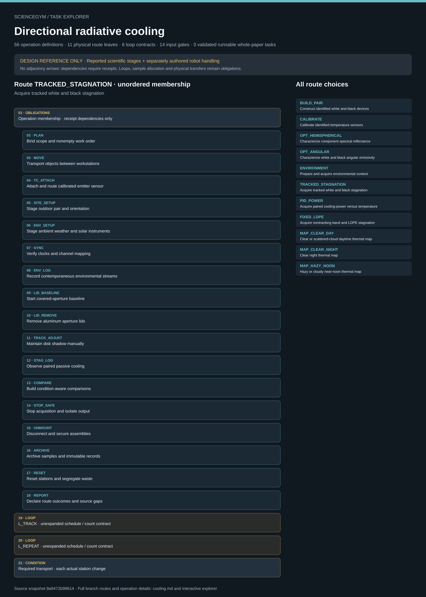

# Directional radiative cooling: task route map



Paper: **Passive directional sub-ambient daytime radiative cooling** · [DOI](https://doi.org/10.1038/s41467-018-07293-9)

Author/evaluator logical inspector; source-bounded task design only; no physical simulation, actor projection or robot execution. Counts describe task representation, not experiments or success.

**Reading rule:** rows preserve source operation membership once, without chronology. Loop bodies, count text and nesting obligations are retained as metadata, not added occurrences or executed repetitions. An unordered obligation group has no inferred chronological edges. Source-reported scientific facts and authored handling are distinct.

[Immutable source task package](https://github.com/openags/ScienceGym/blob/9a9472b996145ff7f7a4c138c7477b4e734d8835/tasks/directional_cooling_operations_v2/) · [Interactive inspector](../index.html)

## BUILD_PAIR — Construct identified white and black devices

Unordered operation membership with explicit receipt dependencies and conditional gates. Loop contracts remain symbolic; no unknown counts, global chronology, sample replication or transport instances are invented.

[Exact route source](https://github.com/openags/ScienceGym/blob/9a9472b996145ff7f7a4c138c7477b4e734d8835/tasks/directional_cooling_operations_v2/branches.json) · JSON pointer: `/branches/0`

- **OBLIGATIONS: Operation membership · receipt dependencies only**
  - Binding: {"order":"No chronological adjacency edges are inferred; apply explicit receipt dependencies and conditional gates"}
  - `PLAN` Bind scope and nonempty work order
  - `STOCK` Issue lots and supported carriers
  - `MOVE` Transport objects between workstations
  - `FAB_LOAD` Load qualified component fabrication
  - `FAB_RUN` Request enclosed fabrication service
  - `FAB_UNLOAD` Unload and inspect fabricated parts
  - `COAT_LOAD` Stage emitter coating service
  - `COAT_RUN` Complete coating and cure handoff
  - `COAT_UNLOAD` Unload and inspect cured coated emitter
  - `LAYOUT` Stage identified assembly parts
  - `BASE` Attach base frame and insulation
  - `EMITTER` Seat emitter and PE support
  - `FILM` Mount two separately identified PE layers
  - `SHIELD` Install shielding cover and aperture
  - `REFLECTOR` Install qualified disk or band geometry
  - `ASSEMBLY_QC` Inspect assembled device integrity
  - `COMPARE` Build condition-aware comparisons
  - `STOP_SAFE` Stop acquisition and isolate output
  - `UNMOUNT` Disconnect and secure assemblies
  - `ARCHIVE` Archive samples and immutable records
  - `RESET` Reset stations and segregate waste
  - `REPORT` Declare route outcomes and source gaps
- **LOOP: L_REPEAT · unexpanded schedule / count contract**
  - Binding: {"loop":{"id":"L_REPEAT","body":["PLAN","COMPARE"],"count":"episode allocation; samples/sessions distinct from operating points"},"scope":"Work-order allocation across samples/sessions; no local repetition count or global nesting inferred."}
- **CONDITION: Required transport · each actual station change**
  - Binding: {"transport_rule":"Different source/target stations require a physical MOVE instance with retained carrier, detach/isolation, origin/destination and identity receipts","display":"The single MOVE template does not satisfy all required physical transfer instances"}

<details><summary>Branch state, choices, lineage and loop obligations</summary>

```json
{
  "operation_ids": [
    "PLAN",
    "STOCK",
    "MOVE",
    "FAB_LOAD",
    "FAB_RUN",
    "FAB_UNLOAD",
    "COAT_LOAD",
    "COAT_RUN",
    "COAT_UNLOAD",
    "LAYOUT",
    "BASE",
    "EMITTER",
    "FILM",
    "SHIELD",
    "REFLECTOR",
    "ASSEMBLY_QC",
    "COMPARE",
    "STOP_SAFE",
    "UNMOUNT",
    "ARCHIVE",
    "RESET",
    "REPORT"
  ],
  "source_evidence_ids": [
    "E_BUILD",
    "E_TRACK"
  ],
  "control_ids": [
    "C_ASSEMBLY"
  ],
  "unknown_parameter_ids": [
    "U_GEOM",
    "U_FAB",
    "U_ALLOC",
    "U_SCENE"
  ],
  "preparation_policy": "Required receipts must come from included preparation/calibration routes or a named documented outside-scope handoff",
  "notes": "Fabrication/coating may use declared qualified service handoff; assembly still explicit",
  "completion": "All scheduled instances classified and lineage/cleanup valid; blocked input is partial, never completed experiment",
  "actor": "mobile_human_like_robot_operator",
  "device_allocation": {
    "count": 2,
    "conditions": [
      "white",
      "black"
    ],
    "meaning": "One per condition per allocated pair; independent repeat count remains episode input"
  }
}
```

</details>

## CALIBRATE — Calibrate identified temperature sensors

Unordered operation membership with explicit receipt dependencies and conditional gates. Loop contracts remain symbolic; no unknown counts, global chronology, sample replication or transport instances are invented.

[Exact route source](https://github.com/openags/ScienceGym/blob/9a9472b996145ff7f7a4c138c7477b4e734d8835/tasks/directional_cooling_operations_v2/branches.json) · JSON pointer: `/branches/1`

- **OBLIGATIONS: Operation membership · receipt dependencies only**
  - Binding: {"order":"No chronological adjacency edges are inferred; apply explicit receipt dependencies and conditional gates"}
  - `PLAN` Bind scope and nonempty work order
  - `MOVE` Transport objects between workstations
  - `CAL_MOUNT` Mount calibration sensors in block
  - `CAL_ACQUIRE` Run qualified calibration conditions
  - `CAL_FIT` Validate sensor-specific calibration
  - `CAL_UNLOAD` Release and archive calibrated sensors
  - `COMPARE` Build condition-aware comparisons
  - `STOP_SAFE` Stop acquisition and isolate output
  - `UNMOUNT` Disconnect and secure assemblies
  - `ARCHIVE` Archive samples and immutable records
  - `RESET` Reset stations and segregate waste
  - `REPORT` Declare route outcomes and source gaps
- **LOOP: L_REPEAT · unexpanded schedule / count contract**
  - Binding: {"loop":{"id":"L_REPEAT","body":["PLAN","COMPARE"],"count":"episode allocation; samples/sessions distinct from operating points"},"scope":"Work-order allocation across samples/sessions; no local repetition count or global nesting inferred."}
- **CONDITION: Required transport · each actual station change**
  - Binding: {"transport_rule":"Different source/target stations require a physical MOVE instance with retained carrier, detach/isolation, origin/destination and identity receipts","display":"The single MOVE template does not satisfy all required physical transfer instances"}

<details><summary>Branch state, choices, lineage and loop obligations</summary>

```json
{
  "operation_ids": [
    "PLAN",
    "MOVE",
    "CAL_MOUNT",
    "CAL_ACQUIRE",
    "CAL_FIT",
    "CAL_UNLOAD",
    "COMPARE",
    "STOP_SAFE",
    "UNMOUNT",
    "ARCHIVE",
    "RESET",
    "REPORT"
  ],
  "source_evidence_ids": [
    "E_CAL"
  ],
  "control_ids": [
    "C_CAL"
  ],
  "unknown_parameter_ids": [
    "U_CAL",
    "U_ACQ"
  ],
  "preparation_policy": "Required receipts must come from included preparation/calibration routes or a named documented outside-scope handoff",
  "notes": "Reference sensor and channels remain separately identified",
  "completion": "All scheduled instances classified and lineage/cleanup valid; blocked input is partial, never completed experiment",
  "actor": "mobile_human_like_robot_operator"
}
```

</details>

## OPT_HEMISPHERICAL — Characterize component spectral reflectance

Unordered operation membership with explicit receipt dependencies and conditional gates. Loop contracts remain symbolic; no unknown counts, global chronology, sample replication or transport instances are invented.

[Exact route source](https://github.com/openags/ScienceGym/blob/9a9472b996145ff7f7a4c138c7477b4e734d8835/tasks/directional_cooling_operations_v2/branches.json) · JSON pointer: `/branches/2`

- **OBLIGATIONS: Operation membership · receipt dependencies only**
  - Binding: {"order":"No chronological adjacency edges are inferred; apply explicit receipt dependencies and conditional gates"}
  - `PLAN` Bind scope and nonempty work order
  - `MOVE` Transport objects between workstations
  - `OPT_REFERENCE` Load optical reference and background
  - `OPT_MOUNT` Mount identified optical component
  - `OPT_SCAN` Acquire solar and IR sphere scans
  - `OPT_UNLOAD` Release optical sample without surface damage
  - `OPT_SUMMARY` Derive optical quantities and unload
  - `COMPARE` Build condition-aware comparisons
  - `STOP_SAFE` Stop acquisition and isolate output
  - `UNMOUNT` Disconnect and secure assemblies
  - `ARCHIVE` Archive samples and immutable records
  - `RESET` Reset stations and segregate waste
  - `REPORT` Declare route outcomes and source gaps
- **LOOP: L_OPT · unexpanded schedule / count contract**
  - Binding: {"loop":{"id":"L_OPT","body":["OPT_REFERENCE","OPT_MOUNT","OPT_SCAN","OPT_UNLOAD"],"count":"qualified nonempty component by instrument by technical-repeat schedule","station_rule":"Run entire loop at one bound instrument, then MOVE before other instrument"},"scope":"Applicable route contract; body is metadata, not extra operation occurrences or completed repetitions."}
- **LOOP: L_REPEAT · unexpanded schedule / count contract**
  - Binding: {"loop":{"id":"L_REPEAT","body":["PLAN","COMPARE"],"count":"episode allocation; samples/sessions distinct from operating points"},"scope":"Work-order allocation across samples/sessions; no local repetition count or global nesting inferred."}
- **CONDITION: Required transport · each actual station change**
  - Binding: {"transport_rule":"Different source/target stations require a physical MOVE instance with retained carrier, detach/isolation, origin/destination and identity receipts","display":"The single MOVE template does not satisfy all required physical transfer instances"}

<details><summary>Branch state, choices, lineage and loop obligations</summary>

```json
{
  "operation_ids": [
    "PLAN",
    "MOVE",
    "OPT_REFERENCE",
    "OPT_MOUNT",
    "OPT_SCAN",
    "OPT_UNLOAD",
    "OPT_SUMMARY",
    "COMPARE",
    "STOP_SAFE",
    "UNMOUNT",
    "ARCHIVE",
    "RESET",
    "REPORT"
  ],
  "source_evidence_ids": [
    "E_OPT",
    "E_FIXED"
  ],
  "control_ids": [
    "C_OPT"
  ],
  "unknown_parameter_ids": [
    "U_OPT",
    "U_ANALYSIS"
  ],
  "preparation_policy": "Required receipts must come from included preparation/calibration routes or a named documented outside-scope handoff",
  "notes": "Reflector, both covers, white and black emitters; historical serial reuse not assumed",
  "completion": "All scheduled instances classified and lineage/cleanup valid; blocked input is partial, never completed experiment",
  "actor": "mobile_human_like_robot_operator"
}
```

</details>

## OPT_ANGULAR — Characterize white and black angular emissivity

Unordered operation membership with explicit receipt dependencies and conditional gates. Loop contracts remain symbolic; no unknown counts, global chronology, sample replication or transport instances are invented.

[Exact route source](https://github.com/openags/ScienceGym/blob/9a9472b996145ff7f7a4c138c7477b4e734d8835/tasks/directional_cooling_operations_v2/branches.json) · JSON pointer: `/branches/3`

- **OBLIGATIONS: Operation membership · receipt dependencies only**
  - Binding: {"order":"No chronological adjacency edges are inferred; apply explicit receipt dependencies and conditional gates"}
  - `PLAN` Bind scope and nonempty work order
  - `MOVE` Transport objects between workstations
  - `OPT_REFERENCE` Load optical reference and background
  - `ANGLE_MOUNT` Mount emitter on angle fixture
  - `ANGLE_SCAN` Acquire angle and polarization conditions
  - `OPT_UNLOAD` Release optical sample without surface damage
  - `OPT_SUMMARY` Derive optical quantities and unload
  - `COMPARE` Build condition-aware comparisons
  - `STOP_SAFE` Stop acquisition and isolate output
  - `UNMOUNT` Disconnect and secure assemblies
  - `ARCHIVE` Archive samples and immutable records
  - `RESET` Reset stations and segregate waste
  - `REPORT` Declare route outcomes and source gaps
- **LOOP: L_ANGLE · unexpanded schedule / count contract**
  - Binding: {"loop":{"id":"L_ANGLE","body":["OPT_REFERENCE","ANGLE_MOUNT","ANGLE_SCAN","OPT_UNLOAD"],"count":"qualified nonempty emitter by angle by polarization by repeat schedule","nesting":"Outer emitter/repeat loop includes remount; inner angle/polarization scans require current qualified fixture reference"},"scope":"Applicable route contract; body is metadata, not extra operation occurrences or completed repetitions."}
- **LOOP: L_REPEAT · unexpanded schedule / count contract**
  - Binding: {"loop":{"id":"L_REPEAT","body":["PLAN","COMPARE"],"count":"episode allocation; samples/sessions distinct from operating points"},"scope":"Work-order allocation across samples/sessions; no local repetition count or global nesting inferred."}
- **CONDITION: Required transport · each actual station change**
  - Binding: {"transport_rule":"Different source/target stations require a physical MOVE instance with retained carrier, detach/isolation, origin/destination and identity receipts","display":"The single MOVE template does not satisfy all required physical transfer instances"}

<details><summary>Branch state, choices, lineage and loop obligations</summary>

```json
{
  "operation_ids": [
    "PLAN",
    "MOVE",
    "OPT_REFERENCE",
    "ANGLE_MOUNT",
    "ANGLE_SCAN",
    "OPT_UNLOAD",
    "OPT_SUMMARY",
    "COMPARE",
    "STOP_SAFE",
    "UNMOUNT",
    "ARCHIVE",
    "RESET",
    "REPORT"
  ],
  "source_evidence_ids": [
    "E_ANGLE"
  ],
  "control_ids": [
    "C_OPT",
    "C_ANGLE"
  ],
  "unknown_parameter_ids": [
    "U_OPT",
    "U_ANALYSIS"
  ],
  "preparation_policy": "Required receipts must come from included preparation/calibration routes or a named documented outside-scope handoff",
  "notes": "Seven visible positive incident-angle labels, s/p characterization; symmetric display does not prove negative-angle scans",
  "completion": "All scheduled instances classified and lineage/cleanup valid; blocked input is partial, never completed experiment",
  "actor": "mobile_human_like_robot_operator"
}
```

</details>

## ENVIRONMENT — Prepare and acquire environmental context

Unordered operation membership with explicit receipt dependencies and conditional gates. Loop contracts remain symbolic; no unknown counts, global chronology, sample replication or transport instances are invented.

[Exact route source](https://github.com/openags/ScienceGym/blob/9a9472b996145ff7f7a4c138c7477b4e734d8835/tasks/directional_cooling_operations_v2/branches.json) · JSON pointer: `/branches/4`

- **OBLIGATIONS: Operation membership · receipt dependencies only**
  - Binding: {"order":"No chronological adjacency edges are inferred; apply explicit receipt dependencies and conditional gates"}
  - `PLAN` Bind scope and nonempty work order
  - `MOVE` Transport objects between workstations
  - `ENV_SETUP` Stage ambient weather and solar instruments
  - `SYNC` Verify clocks and channel mapping
  - `ENV_LOG` Record contemporaneous environmental streams
  - `COMPARE` Build condition-aware comparisons
  - `STOP_SAFE` Stop acquisition and isolate output
  - `UNMOUNT` Disconnect and secure assemblies
  - `ARCHIVE` Archive samples and immutable records
  - `RESET` Reset stations and segregate waste
  - `REPORT` Declare route outcomes and source gaps
- **LOOP: L_REPEAT · unexpanded schedule / count contract**
  - Binding: {"loop":{"id":"L_REPEAT","body":["PLAN","COMPARE"],"count":"episode allocation; samples/sessions distinct from operating points"},"scope":"Work-order allocation across samples/sessions; no local repetition count or global nesting inferred."}
- **CONDITION: Required transport · each actual station change**
  - Binding: {"transport_rule":"Different source/target stations require a physical MOVE instance with retained carrier, detach/isolation, origin/destination and identity receipts","display":"The single MOVE template does not satisfy all required physical transfer instances"}

<details><summary>Branch state, choices, lineage and loop obligations</summary>

```json
{
  "operation_ids": [
    "PLAN",
    "MOVE",
    "ENV_SETUP",
    "SYNC",
    "ENV_LOG",
    "COMPARE",
    "STOP_SAFE",
    "UNMOUNT",
    "ARCHIVE",
    "RESET",
    "REPORT"
  ],
  "source_evidence_ids": [
    "E_ENV",
    "E_SOLAR"
  ],
  "control_ids": [
    "C_ENV"
  ],
  "unknown_parameter_ids": [
    "U_OUTDOOR",
    "U_ACQ"
  ],
  "preparation_policy": "Required receipts must come from included preparation/calibration routes or a named documented outside-scope handoff",
  "notes": "Acquisition must be contemporaneous with selected outdoor routes; environmental data alone are not cooling results",
  "completion": "All scheduled instances classified and lineage/cleanup valid; blocked input is partial, never completed experiment",
  "actor": "mobile_human_like_robot_operator"
}
```

</details>

## TRACKED_STAGNATION — Acquire tracked white and black stagnation

Unordered operation membership with explicit receipt dependencies and conditional gates. Loop contracts remain symbolic; no unknown counts, global chronology, sample replication or transport instances are invented.

[Exact route source](https://github.com/openags/ScienceGym/blob/9a9472b996145ff7f7a4c138c7477b4e734d8835/tasks/directional_cooling_operations_v2/branches.json) · JSON pointer: `/branches/5`

- **OBLIGATIONS: Operation membership · receipt dependencies only**
  - Binding: {"order":"No chronological adjacency edges are inferred; apply explicit receipt dependencies and conditional gates"}
  - `PLAN` Bind scope and nonempty work order
  - `MOVE` Transport objects between workstations
  - `TC_ATTACH` Attach and route calibrated emitter sensor
  - `SITE_SETUP` Stage outdoor pair and orientation
  - `ENV_SETUP` Stage ambient weather and solar instruments
  - `SYNC` Verify clocks and channel mapping
  - `ENV_LOG` Record contemporaneous environmental streams
  - `LID_BASELINE` Start covered-aperture baseline
  - `LID_REMOVE` Remove aluminum aperture lids
  - `TRACK_ADJUST` Maintain disk shadow manually
  - `STAG_LOG` Observe paired passive cooling
  - `COMPARE` Build condition-aware comparisons
  - `STOP_SAFE` Stop acquisition and isolate output
  - `UNMOUNT` Disconnect and secure assemblies
  - `ARCHIVE` Archive samples and immutable records
  - `RESET` Reset stations and segregate waste
  - `REPORT` Declare route outcomes and source gaps
- **LOOP: L_TRACK · unexpanded schedule / count contract**
  - Binding: {"loop":{"id":"L_TRACK","body":["TRACK_ADJUST"],"count":"public time/shadow event predicate; unknown cadence blocks execution"},"scope":"Applicable route contract; body is metadata, not extra operation occurrences or completed repetitions."}
- **LOOP: L_REPEAT · unexpanded schedule / count contract**
  - Binding: {"loop":{"id":"L_REPEAT","body":["PLAN","COMPARE"],"count":"episode allocation; samples/sessions distinct from operating points"},"scope":"Work-order allocation across samples/sessions; no local repetition count or global nesting inferred."}
- **CONDITION: Required transport · each actual station change**
  - Binding: {"transport_rule":"Different source/target stations require a physical MOVE instance with retained carrier, detach/isolation, origin/destination and identity receipts","display":"The single MOVE template does not satisfy all required physical transfer instances"}

<details><summary>Branch state, choices, lineage and loop obligations</summary>

```json
{
  "operation_ids": [
    "PLAN",
    "MOVE",
    "TC_ATTACH",
    "SITE_SETUP",
    "ENV_SETUP",
    "SYNC",
    "ENV_LOG",
    "LID_BASELINE",
    "LID_REMOVE",
    "TRACK_ADJUST",
    "STAG_LOG",
    "COMPARE",
    "STOP_SAFE",
    "UNMOUNT",
    "ARCHIVE",
    "RESET",
    "REPORT"
  ],
  "source_evidence_ids": [
    "E_STAG",
    "E_TRACK",
    "E_ENV"
  ],
  "control_ids": [
    "C_PAIR",
    "C_LID",
    "C_ENV"
  ],
  "unknown_parameter_ids": [
    "U_OUTDOOR",
    "U_ACQ",
    "U_ALLOC"
  ],
  "preparation_policy": "Required receipts must come from included preparation/calibration routes or a named documented outside-scope handoff",
  "notes": "Source four-hour noon window; covered first five minutes; PE remains installed",
  "completion": "All scheduled instances classified and lineage/cleanup valid; blocked input is partial, never completed experiment",
  "actor": "mobile_human_like_robot_operator",
  "device_allocation": {
    "count": 2,
    "conditions": [
      "white",
      "black"
    ],
    "meaning": "One per condition per allocated pair; independent repeat count remains episode input"
  }
}
```

</details>

## PID_POWER — Acquire paired cooling-power versus temperature

Unordered operation membership with explicit receipt dependencies and conditional gates. Loop contracts remain symbolic; no unknown counts, global chronology, sample replication or transport instances are invented.

[Exact route source](https://github.com/openags/ScienceGym/blob/9a9472b996145ff7f7a4c138c7477b4e734d8835/tasks/directional_cooling_operations_v2/branches.json) · JSON pointer: `/branches/6`

- **OBLIGATIONS: Operation membership · receipt dependencies only**
  - Binding: {"order":"No chronological adjacency edges are inferred; apply explicit receipt dependencies and conditional gates"}
  - `PLAN` Bind scope and nonempty work order
  - `MOVE` Transport objects between workstations
  - `TC_ATTACH` Attach and route calibrated emitter sensor
  - `HEATER_ATTACH` Install heater and four-wire circuit
  - `SITE_SETUP` Stage outdoor pair and orientation
  - `ENV_SETUP` Stage ambient weather and solar instruments
  - `SYNC` Verify clocks and channel mapping
  - `ENV_LOG` Record contemporaneous environmental streams
  - `POWER_CHECK` Check isolated electrical and sensor readback
  - `PID_CONFIG` Load bounded temperature-step schedule
  - `LID_BASELINE` Start covered-aperture baseline
  - `LID_REMOVE` Remove aluminum aperture lids
  - `TRACK_ADJUST` Maintain disk shadow manually
  - `POWER_BASELINE` Observe initial heater-off equilibrium
  - `PID_STEP` Execute one five-minute controlled plateau
  - `STEP_SUMMARY` Validate final two minutes of plateau
  - `HEATER_OFF` Disable heaters and verify recooling
  - `COMPARE` Build condition-aware comparisons
  - `STOP_SAFE` Stop acquisition and isolate output
  - `UNMOUNT` Disconnect and secure assemblies
  - `ARCHIVE` Archive samples and immutable records
  - `RESET` Reset stations and segregate waste
  - `REPORT` Declare route outcomes and source gaps
- **LOOP: L_TRACK · unexpanded schedule / count contract**
  - Binding: {"loop":{"id":"L_TRACK","body":["TRACK_ADJUST"],"count":"public time/shadow event predicate; unknown cadence blocks execution"},"scope":"Applicable route contract; body is metadata, not extra operation occurrences or completed repetitions."}
- **LOOP: L_PID · unexpanded schedule / count contract**
  - Binding: {"loop":{"id":"L_PID","body":["PID_STEP","STEP_SUMMARY"],"count":"nonempty bounded target schedule; failed steps retained"},"scope":"Applicable route contract; body is metadata, not extra operation occurrences or completed repetitions."}
- **LOOP: L_REPEAT · unexpanded schedule / count contract**
  - Binding: {"loop":{"id":"L_REPEAT","body":["PLAN","COMPARE"],"count":"episode allocation; samples/sessions distinct from operating points"},"scope":"Work-order allocation across samples/sessions; no local repetition count or global nesting inferred."}
- **CONDITION: Required transport · each actual station change**
  - Binding: {"transport_rule":"Different source/target stations require a physical MOVE instance with retained carrier, detach/isolation, origin/destination and identity receipts","display":"The single MOVE template does not satisfy all required physical transfer instances"}

<details><summary>Branch state, choices, lineage and loop obligations</summary>

```json
{
  "operation_ids": [
    "PLAN",
    "MOVE",
    "TC_ATTACH",
    "HEATER_ATTACH",
    "SITE_SETUP",
    "ENV_SETUP",
    "SYNC",
    "ENV_LOG",
    "POWER_CHECK",
    "PID_CONFIG",
    "LID_BASELINE",
    "LID_REMOVE",
    "TRACK_ADJUST",
    "POWER_BASELINE",
    "PID_STEP",
    "STEP_SUMMARY",
    "HEATER_OFF",
    "COMPARE",
    "STOP_SAFE",
    "UNMOUNT",
    "ARCHIVE",
    "RESET",
    "REPORT"
  ],
  "source_evidence_ids": [
    "E_POWER",
    "E_ENV"
  ],
  "control_ids": [
    "C_PAIR",
    "C_POWER",
    "C_ENV"
  ],
  "unknown_parameter_ids": [
    "U_PID",
    "U_WIRING",
    "U_ACQ",
    "U_ANALYSIS"
  ],
  "preparation_policy": "Required receipts must come from included preparation/calibration routes or a named documented outside-scope handoff",
  "notes": "Five-minute plateau, final two-minute summary; source setpoints/count/gains unavailable",
  "completion": "All scheduled instances classified and lineage/cleanup valid; blocked input is partial, never completed experiment",
  "actor": "mobile_human_like_robot_operator",
  "device_allocation": {
    "count": 2,
    "conditions": [
      "white",
      "black"
    ],
    "meaning": "One per condition per allocated pair; independent repeat count remains episode input"
  }
}
```

</details>

## FIXED_LDPE — Acquire nontracking band and LDPE stagnation

Unordered operation membership with explicit receipt dependencies and conditional gates. Loop contracts remain symbolic; no unknown counts, global chronology, sample replication or transport instances are invented.

[Exact route source](https://github.com/openags/ScienceGym/blob/9a9472b996145ff7f7a4c138c7477b4e734d8835/tasks/directional_cooling_operations_v2/branches.json) · JSON pointer: `/branches/7`

- **OBLIGATIONS: Operation membership · receipt dependencies only**
  - Binding: {"order":"No chronological adjacency edges are inferred; apply explicit receipt dependencies and conditional gates"}
  - `PLAN` Bind scope and nonempty work order
  - `MOVE` Transport objects between workstations
  - `FIXED_SWAP` Replace reflector and cover components
  - `FIXED_QC` Inspect modified fixed-band LDPE assembly
  - `TC_ATTACH` Attach and route calibrated emitter sensor
  - `SITE_SETUP` Stage outdoor pair and orientation
  - `ENV_SETUP` Stage ambient weather and solar instruments
  - `SYNC` Verify clocks and channel mapping
  - `ENV_LOG` Record contemporaneous environmental streams
  - `BAND_CHECK` Verify fixed shading without adjustment
  - `LID_BASELINE` Start covered-aperture baseline
  - `LID_REMOVE` Remove aluminum aperture lids
  - `STAG_LOG` Observe paired passive cooling
  - `COMPARE` Build condition-aware comparisons
  - `STOP_SAFE` Stop acquisition and isolate output
  - `UNMOUNT` Disconnect and secure assemblies
  - `ARCHIVE` Archive samples and immutable records
  - `RESET` Reset stations and segregate waste
  - `REPORT` Declare route outcomes and source gaps
- **LOOP: L_REPEAT · unexpanded schedule / count contract**
  - Binding: {"loop":{"id":"L_REPEAT","body":["PLAN","COMPARE"],"count":"episode allocation; samples/sessions distinct from operating points"},"scope":"Work-order allocation across samples/sessions; no local repetition count or global nesting inferred."}
- **CONDITION: Required transport · each actual station change**
  - Binding: {"transport_rule":"Different source/target stations require a physical MOVE instance with retained carrier, detach/isolation, origin/destination and identity receipts","display":"The single MOVE template does not satisfy all required physical transfer instances"}

<details><summary>Branch state, choices, lineage and loop obligations</summary>

```json
{
  "operation_ids": [
    "PLAN",
    "MOVE",
    "FIXED_SWAP",
    "FIXED_QC",
    "TC_ATTACH",
    "SITE_SETUP",
    "ENV_SETUP",
    "SYNC",
    "ENV_LOG",
    "BAND_CHECK",
    "LID_BASELINE",
    "LID_REMOVE",
    "STAG_LOG",
    "COMPARE",
    "STOP_SAFE",
    "UNMOUNT",
    "ARCHIVE",
    "RESET",
    "REPORT"
  ],
  "source_evidence_ids": [
    "E_FIXED",
    "E_ENV"
  ],
  "control_ids": [
    "C_PAIR",
    "C_FIXED",
    "C_ENV"
  ],
  "unknown_parameter_ids": [
    "U_GEOM",
    "U_OUTDOOR",
    "U_ACQ"
  ],
  "preparation_policy": "Required receipts must come from included preparation/calibration routes or a named documented outside-scope handoff",
  "notes": "Both reflector and cover change; historical comparison across dates is confounded",
  "completion": "All scheduled instances classified and lineage/cleanup valid; blocked input is partial, never completed experiment",
  "actor": "mobile_human_like_robot_operator",
  "device_allocation": {
    "count": 2,
    "conditions": [
      "white",
      "black"
    ],
    "meaning": "One per condition per allocated pair; independent repeat count remains episode input"
  }
}
```

</details>

## MAP_CLEAR_DAY — Clear or scattered-cloud daytime thermal map

Unordered operation membership with explicit receipt dependencies and conditional gates. Loop contracts remain symbolic; no unknown counts, global chronology, sample replication or transport instances are invented.

[Exact route source](https://github.com/openags/ScienceGym/blob/9a9472b996145ff7f7a4c138c7477b4e734d8835/tasks/directional_cooling_operations_v2/branches.json) · JSON pointer: `/branches/8`

- **OBLIGATIONS: Operation membership · receipt dependencies only**
  - Binding: {"order":"No chronological adjacency edges are inferred; apply explicit receipt dependencies and conditional gates"}
  - `PLAN` Bind scope and nonempty work order
  - `MOVE` Transport objects between workstations
  - `TC_ATTACH` Attach and route calibrated emitter sensor
  - `MAP_ATTACH` Attach six extra calibrated location sensors
  - `SITE_SETUP` Stage outdoor pair and orientation
  - `ENV_SETUP` Stage ambient weather and solar instruments
  - `SYNC` Verify clocks and channel mapping
  - `ENV_LOG` Record contemporaneous environmental streams
  - `MAP_CONDITION` Check actual thermal-map weather condition
  - `LID_BASELINE` Start covered-aperture baseline
  - `LID_REMOVE` Remove aluminum aperture lids
  - `TRACK_ADJUST` Maintain disk shadow manually
  - `MAP_LOG` Acquire one-hour multichannel thermal map
  - `MAP_SUMMARY` Aggregate qualified equilibrium map
  - `COMPARE` Build condition-aware comparisons
  - `STOP_SAFE` Stop acquisition and isolate output
  - `UNMOUNT` Disconnect and secure assemblies
  - `ARCHIVE` Archive samples and immutable records
  - `RESET` Reset stations and segregate waste
  - `REPORT` Declare route outcomes and source gaps
- **LOOP: L_TRACK · unexpanded schedule / count contract**
  - Binding: {"loop":{"id":"L_TRACK","body":["TRACK_ADJUST"],"count":"public time/shadow event predicate; unknown cadence blocks execution"},"scope":"Applicable route contract; body is metadata, not extra operation occurrences or completed repetitions."}
- **LOOP: L_MAP · unexpanded schedule / count contract**
  - Binding: {"loop":{"id":"L_MAP","body":["MAP_CONDITION","MAP_LOG","MAP_SUMMARY"],"count":"three source conditions as separate branches, independent repeats supplied"},"scope":"Three independent condition leaves; this view is MAP_CLEAR_DAY only. Independent repeats remain supplied inputs."}
- **LOOP: L_REPEAT · unexpanded schedule / count contract**
  - Binding: {"loop":{"id":"L_REPEAT","body":["PLAN","COMPARE"],"count":"episode allocation; samples/sessions distinct from operating points"},"scope":"Work-order allocation across samples/sessions; no local repetition count or global nesting inferred."}
- **CONDITION: Required transport · each actual station change**
  - Binding: {"transport_rule":"Different source/target stations require a physical MOVE instance with retained carrier, detach/isolation, origin/destination and identity receipts","display":"The single MOVE template does not satisfy all required physical transfer instances"}

<details><summary>Branch state, choices, lineage and loop obligations</summary>

```json
{
  "operation_ids": [
    "PLAN",
    "MOVE",
    "TC_ATTACH",
    "MAP_ATTACH",
    "SITE_SETUP",
    "ENV_SETUP",
    "SYNC",
    "ENV_LOG",
    "MAP_CONDITION",
    "LID_BASELINE",
    "LID_REMOVE",
    "TRACK_ADJUST",
    "MAP_LOG",
    "MAP_SUMMARY",
    "COMPARE",
    "STOP_SAFE",
    "UNMOUNT",
    "ARCHIVE",
    "RESET",
    "REPORT"
  ],
  "source_evidence_ids": [
    "E_MAP",
    "E_ENV"
  ],
  "control_ids": [
    "C_MAP",
    "C_ENV"
  ],
  "unknown_parameter_ids": [
    "U_MAP",
    "U_OUTDOOR",
    "U_ACQ"
  ],
  "preparation_policy": "Required receipts must come from included preparation/calibration routes or a named documented outside-scope handoff",
  "notes": "White device; one hour, six extra sensors; night has no sunlight-tracking requirement and TRACK_ADJUST is inapplicable with reason",
  "completion": "All scheduled instances classified and lineage/cleanup valid; blocked input is partial, never completed experiment",
  "actor": "mobile_human_like_robot_operator",
  "device_allocation": {
    "count": 1,
    "conditions": [
      "white"
    ],
    "source": "E_MAP"
  }
}
```

</details>

## MAP_CLEAR_NIGHT — Clear night thermal map

Unordered operation membership with explicit receipt dependencies and conditional gates. Loop contracts remain symbolic; no unknown counts, global chronology, sample replication or transport instances are invented.

[Exact route source](https://github.com/openags/ScienceGym/blob/9a9472b996145ff7f7a4c138c7477b4e734d8835/tasks/directional_cooling_operations_v2/branches.json) · JSON pointer: `/branches/9`

- **OBLIGATIONS: Operation membership · receipt dependencies only**
  - Binding: {"order":"No chronological adjacency edges are inferred; apply explicit receipt dependencies and conditional gates"}
  - `PLAN` Bind scope and nonempty work order
  - `MOVE` Transport objects between workstations
  - `TC_ATTACH` Attach and route calibrated emitter sensor
  - `MAP_ATTACH` Attach six extra calibrated location sensors
  - `SITE_SETUP` Stage outdoor pair and orientation
  - `ENV_SETUP` Stage ambient weather and solar instruments
  - `SYNC` Verify clocks and channel mapping
  - `ENV_LOG` Record contemporaneous environmental streams
  - `MAP_CONDITION` Check actual thermal-map weather condition
  - `LID_BASELINE` Start covered-aperture baseline
  - `LID_REMOVE` Remove aluminum aperture lids
  - `MAP_LOG` Acquire one-hour multichannel thermal map
  - `MAP_SUMMARY` Aggregate qualified equilibrium map
  - `COMPARE` Build condition-aware comparisons
  - `STOP_SAFE` Stop acquisition and isolate output
  - `UNMOUNT` Disconnect and secure assemblies
  - `ARCHIVE` Archive samples and immutable records
  - `RESET` Reset stations and segregate waste
  - `REPORT` Declare route outcomes and source gaps
- **LOOP: L_MAP · unexpanded schedule / count contract**
  - Binding: {"loop":{"id":"L_MAP","body":["MAP_CONDITION","MAP_LOG","MAP_SUMMARY"],"count":"three source conditions as separate branches, independent repeats supplied"},"scope":"Three independent condition leaves; this view is MAP_CLEAR_NIGHT only. Independent repeats remain supplied inputs."}
- **LOOP: L_REPEAT · unexpanded schedule / count contract**
  - Binding: {"loop":{"id":"L_REPEAT","body":["PLAN","COMPARE"],"count":"episode allocation; samples/sessions distinct from operating points"},"scope":"Work-order allocation across samples/sessions; no local repetition count or global nesting inferred."}
- **CONDITION: Required transport · each actual station change**
  - Binding: {"transport_rule":"Different source/target stations require a physical MOVE instance with retained carrier, detach/isolation, origin/destination and identity receipts","display":"The single MOVE template does not satisfy all required physical transfer instances"}

<details><summary>Branch state, choices, lineage and loop obligations</summary>

```json
{
  "operation_ids": [
    "PLAN",
    "MOVE",
    "TC_ATTACH",
    "MAP_ATTACH",
    "SITE_SETUP",
    "ENV_SETUP",
    "SYNC",
    "ENV_LOG",
    "MAP_CONDITION",
    "LID_BASELINE",
    "LID_REMOVE",
    "MAP_LOG",
    "MAP_SUMMARY",
    "COMPARE",
    "STOP_SAFE",
    "UNMOUNT",
    "ARCHIVE",
    "RESET",
    "REPORT"
  ],
  "source_evidence_ids": [
    "E_MAP",
    "E_ENV"
  ],
  "control_ids": [
    "C_MAP",
    "C_ENV"
  ],
  "unknown_parameter_ids": [
    "U_MAP",
    "U_OUTDOOR",
    "U_ACQ"
  ],
  "preparation_policy": "Required receipts must come from included preparation/calibration routes or a named documented outside-scope handoff",
  "notes": "White device; one-hour night condition with six extra sensors; no sun-tracking action is required at night",
  "completion": "All scheduled instances classified and lineage/cleanup valid; blocked input is partial, never completed experiment",
  "actor": "mobile_human_like_robot_operator",
  "device_allocation": {
    "count": 1,
    "conditions": [
      "white"
    ],
    "source": "E_MAP"
  }
}
```

</details>

## MAP_HAZY_NOON — Hazy or cloudy near-noon thermal map

Unordered operation membership with explicit receipt dependencies and conditional gates. Loop contracts remain symbolic; no unknown counts, global chronology, sample replication or transport instances are invented.

[Exact route source](https://github.com/openags/ScienceGym/blob/9a9472b996145ff7f7a4c138c7477b4e734d8835/tasks/directional_cooling_operations_v2/branches.json) · JSON pointer: `/branches/10`

- **OBLIGATIONS: Operation membership · receipt dependencies only**
  - Binding: {"order":"No chronological adjacency edges are inferred; apply explicit receipt dependencies and conditional gates"}
  - `PLAN` Bind scope and nonempty work order
  - `MOVE` Transport objects between workstations
  - `TC_ATTACH` Attach and route calibrated emitter sensor
  - `MAP_ATTACH` Attach six extra calibrated location sensors
  - `SITE_SETUP` Stage outdoor pair and orientation
  - `ENV_SETUP` Stage ambient weather and solar instruments
  - `SYNC` Verify clocks and channel mapping
  - `ENV_LOG` Record contemporaneous environmental streams
  - `MAP_CONDITION` Check actual thermal-map weather condition
  - `LID_BASELINE` Start covered-aperture baseline
  - `LID_REMOVE` Remove aluminum aperture lids
  - `TRACK_ADJUST` Maintain disk shadow manually
  - `MAP_LOG` Acquire one-hour multichannel thermal map
  - `MAP_SUMMARY` Aggregate qualified equilibrium map
  - `COMPARE` Build condition-aware comparisons
  - `STOP_SAFE` Stop acquisition and isolate output
  - `UNMOUNT` Disconnect and secure assemblies
  - `ARCHIVE` Archive samples and immutable records
  - `RESET` Reset stations and segregate waste
  - `REPORT` Declare route outcomes and source gaps
- **LOOP: L_TRACK · unexpanded schedule / count contract**
  - Binding: {"loop":{"id":"L_TRACK","body":["TRACK_ADJUST"],"count":"public time/shadow event predicate; unknown cadence blocks execution"},"scope":"Applicable route contract; body is metadata, not extra operation occurrences or completed repetitions."}
- **LOOP: L_MAP · unexpanded schedule / count contract**
  - Binding: {"loop":{"id":"L_MAP","body":["MAP_CONDITION","MAP_LOG","MAP_SUMMARY"],"count":"three source conditions as separate branches, independent repeats supplied"},"scope":"Three independent condition leaves; this view is MAP_HAZY_NOON only. Independent repeats remain supplied inputs."}
- **LOOP: L_REPEAT · unexpanded schedule / count contract**
  - Binding: {"loop":{"id":"L_REPEAT","body":["PLAN","COMPARE"],"count":"episode allocation; samples/sessions distinct from operating points"},"scope":"Work-order allocation across samples/sessions; no local repetition count or global nesting inferred."}
- **CONDITION: Required transport · each actual station change**
  - Binding: {"transport_rule":"Different source/target stations require a physical MOVE instance with retained carrier, detach/isolation, origin/destination and identity receipts","display":"The single MOVE template does not satisfy all required physical transfer instances"}

<details><summary>Branch state, choices, lineage and loop obligations</summary>

```json
{
  "operation_ids": [
    "PLAN",
    "MOVE",
    "TC_ATTACH",
    "MAP_ATTACH",
    "SITE_SETUP",
    "ENV_SETUP",
    "SYNC",
    "ENV_LOG",
    "MAP_CONDITION",
    "LID_BASELINE",
    "LID_REMOVE",
    "TRACK_ADJUST",
    "MAP_LOG",
    "MAP_SUMMARY",
    "COMPARE",
    "STOP_SAFE",
    "UNMOUNT",
    "ARCHIVE",
    "RESET",
    "REPORT"
  ],
  "source_evidence_ids": [
    "E_MAP",
    "E_ENV"
  ],
  "control_ids": [
    "C_MAP",
    "C_ENV"
  ],
  "unknown_parameter_ids": [
    "U_MAP",
    "U_OUTDOOR",
    "U_ACQ"
  ],
  "preparation_policy": "Required receipts must come from included preparation/calibration routes or a named documented outside-scope handoff",
  "notes": "White device; one hour, six extra sensors; night has no sunlight-tracking requirement and TRACK_ADJUST is inapplicable with reason",
  "completion": "All scheduled instances classified and lineage/cleanup valid; blocked input is partial, never completed experiment",
  "actor": "mobile_human_like_robot_operator",
  "device_allocation": {
    "count": 1,
    "conditions": [
      "white"
    ],
    "source": "E_MAP"
  }
}
```

</details>

## Operation contracts

Every operation is clickable in the offline inspector, with robot actions, target objects, pre/post state, provenance, unknowns and acceptance/recovery. Raw task JSON is the source of truth; this visualization is a public evaluator/reference view, not an agent prompt.

## Reference contracts and boundaries

All 56 operations, 11 physical route leaves, 6 loop contracts and 14 unresolved input gates are retained. Each operation list is membership under explicit receipt dependencies, not a mandatory chronology. Symbolic loop metadata preserves original bodies, counts and nesting text without adding repeated operation occurrences or guessed schedules.

The three thermal-map conditions remain separate leaves. One white and one black device are paired conditions, not two independent replicates of each condition. Seven map channels, PID targets, angular observations and timepoints do not supply independent sample counts. Unknown allocation, technical repeats and sessions remain null.

Every actual station change still requires a qualified physical MOVE instance with carrier and identity receipts. Preparation or calibration must be performed or originate from an explicit documented handoff. Conditional gates stay conditional, including night versus daylight shading and current assembly revision. Device processes are separate from robot actions; completion evidence is a requirement, not an execution receipt.

No task loader, evaluator execution, physical simulation, scientific solver or robot controller is supplied. Models and application concepts remain nonmanual scope.

- [dependencies](https://github.com/openags/ScienceGym/blob/9a9472b996145ff7f7a4c138c7477b4e734d8835/tasks/directional_cooling_operations_v2/dependencies.json)
- [control packages](https://github.com/openags/ScienceGym/blob/9a9472b996145ff7f7a4c138c7477b4e734d8835/tasks/directional_cooling_operations_v2/control_packages.json)
- [unknown parameters](https://github.com/openags/ScienceGym/blob/9a9472b996145ff7f7a4c138c7477b4e734d8835/tasks/directional_cooling_operations_v2/unknown_parameters.json)
- [source conflicts](https://github.com/openags/ScienceGym/blob/9a9472b996145ff7f7a4c138c7477b4e734d8835/tasks/directional_cooling_operations_v2/source_conflicts.json)
- [lineage contract](https://github.com/openags/ScienceGym/blob/9a9472b996145ff7f7a4c138c7477b4e734d8835/tasks/directional_cooling_operations_v2/lineage_contract.json)
- [episode input contract](https://github.com/openags/ScienceGym/blob/9a9472b996145ff7f7a4c138c7477b4e734d8835/tasks/directional_cooling_operations_v2/episode_input_contract.json)
- [agent visible](https://github.com/openags/ScienceGym/blob/9a9472b996145ff7f7a4c138c7477b4e734d8835/tasks/directional_cooling_operations_v2/agent_visible.json)
- [RELEASE BOUNDARY](https://github.com/openags/ScienceGym/blob/9a9472b996145ff7f7a4c138c7477b4e734d8835/tasks/directional_cooling_operations_v2/RELEASE_BOUNDARY.json)
- [evaluator reference](https://github.com/openags/ScienceGym/blob/9a9472b996145ff7f7a4c138c7477b4e734d8835/tasks/directional_cooling_operations_v2/evaluator_reference.json)
- [independent review/audit](https://github.com/openags/ScienceGym/blob/9a9472b996145ff7f7a4c138c7477b4e734d8835/tasks/directional_cooling_operations_v2/independent_review/audit.json)
