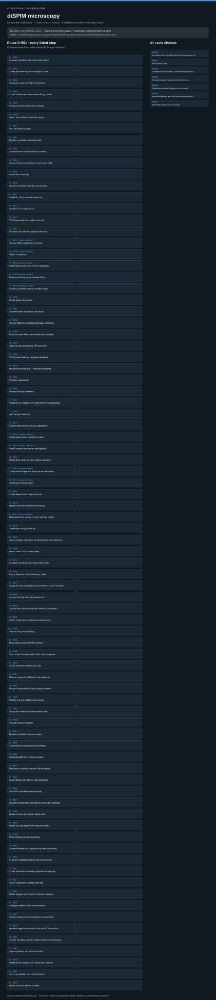

# diSPIM microscopy: task route map



Paper: **Dual-view plane illumination microscopy for rapid and spatially isotropic imaging** · [DOI](https://doi.org/10.1038/nprot.2014.172)

Static authored task design; no hardware, physics or execution. Counts describe task representation, not experiments or success.

**Reading rule:** numbered rows preserve reference-list occurrences. A loop body is shown once and must be repeated under its original binding, not treated as executed. An unordered obligation group has no inferred chronological edges. Source-reported scientific facts and authored handling are distinct.

[Immutable source task package](https://github.com/openags/ScienceGym/blob/2f926a9d2c2b8a0c71e8939feaa6ca5696e14c27/tasks/dispim_operations_v2/) · [Interactive inspector](../index.html)

## D-R01 — Complete route from initial assembly through embryos

Authored reference route with source-step mappings; repeated P001/P004 occurrences intentionally retained

[Exact route source](https://github.com/openags/ScienceGym/blob/2f926a9d2c2b8a0c71e8939feaa6ca5696e14c27/tasks/dispim_operations_v2/BRANCHES.json) · JSON pointer: `/route_templates/0`

- `O001` Inventory identities and static safety states
- `O002` Check the externally installed optical table
- `O003` Computer cards and BNC connections
- `O004` Check oscilloscope traces channel by channel
- `O005` Connect and test both Flash cameras
- `O006` Select and verify the excitation option
- `O007` Test the bottom camera
- `P001` Receive and label clean coverslips
- `P004` Assemble the sealed coverslip chamber
- `O008` Secure the frame and lower Z-axis mirror cube
- `O009` Lower filter assembly
- `O010` Connect the lower tube lens and camera
- `O011` Install the 10x observation objective
- `O012` Connect XY, F and Z axes
- `O013` Verify lower-objective motion direction
- `O014` Establish the marked-coverslip reference
- `O015` Scanner fibers and beam centering · **repeat contract**
- `O016` Adjust iris opening · **repeat contract**
- `O017` Install tube lenses and recheck collimation · **repeat contract**
- `O018` Dual-arm dichroics and emission filters · **repeat contract**
- `O019` Connect scanners to dual-arm filter cubes · **repeat contract**
- `O020` Check beam intersection
- `O021` Assemble both objectives and piezos
- `O022` Coarse objective separation and pupil centering
- `O023` Load the water-filled marked-reference chamber
- `O024` Connect piezos and DAQ with power off
- `O025` Verify neutral settings and piezo feedback
- `O026` Bounded lowering and F-reference recording
- `P002` Prepare a bead layer
- `P003` Prepare the dye reference
- `O027` Withdraw the module and exchange the bead chamber
- `O028` Add the dye reference
- `O029` Coarse spot overlap and size adjustment
- `O030` Install spacer tubes and mirror cubes · **repeat contract**
- `O031` Install camera tube lenses and supports · **repeat contract**
- `O032` Rotate both cameras after module clearance
- `O033` Cross-check single-arm and dual-arm excitation · **repeat contract**
- `O034` Center each camera spot · **repeat contract**
- `O035` Check sheet lines in three cameras
- `O036` Bottom-view line direction and overlap
- `O037` Make both focal planes confocal with the sheets · **repeat contract**
- `O038` Center the rolling-shutter ROI
- `O039` Save complete calibration and the bottom-view reference
- `O040` Mount beads and localize safely
- `O041` Configure scouting and inspect both stacks
- `O042` Focus diagnosis with a stationary sheet
- `O043` Diagnose synchronization and conversion-factor mismatch
- `O044` Acquire the dual-view bead reference
- `O045` Acquire dark backgrounds with identical parameters
- `O046` Select single beads and subtract background
- `O047` Voxel scaling and reslicing
- `O048` Read lateral and axial PSF evidence
- `O049` Scan sheet thickness with a fixed collection plane
- `O050` Check thickness profiles and units
- `O051` Repeat across the field and in the other arm
- `P005` Prepare routine buffers and coating materials
- `P006` Handle pick and capillary provenance
- `E001` Set up the routine worm observation dish
- `E002` Simulate embryo isolation
- `P001` Receive and label clean coverslips
- `P004` Assemble the sealed coverslip chamber
- `E003` Coat and buffer the embryo chamber
- `E004` Mechanical capillary transfer and orientation
- `E005` Stage loading and bottom-view localization
- `E006` Scout ROI and dual-view coverage
- `E007` Diagnose illumination and volume coverage separately
- `E008` Recheck focus and signal in both arms
- `E009` Name files and acquire the long time series
- `E010` Hand embryo data to processing
- `D001` Convert formats and organize dual-view directories
- `D002` Crop and subtract matching dark backgrounds
- `D003` Check historical processing software and plug-ins
- `D004` Select registration strategy from drift
- `D005` Define angular search and coordinate mapping
- `D006` Configure voxels, PSFs and resources
- `D007` Confirm each pair and run preset reconstruction
- `D008` Recheck registration artifacts and the full time series
- `S001` Archive raw data, derived results and unresolved issues
- `S002` Stop acquisition and block excitation
- `S003` Withdraw the module and remove the chamber
- `S004` Sort consumables and reset the bench
- `S005` Retain cache or release it safely

<details><summary>Branch state, choices, lineage and loop obligations</summary>

```json
{
  "initial_predicates": [],
  "terminal": "task_closed"
}
```

</details>

## D-R02 — Daily embryo route

Authored reference route with source-step mappings; repeated P001/P004 occurrences intentionally retained

[Exact route source](https://github.com/openags/ScienceGym/blob/2f926a9d2c2b8a0c71e8939feaa6ca5696e14c27/tasks/dispim_operations_v2/BRANCHES.json) · JSON pointer: `/route_templates/1`

- `P005` Prepare routine buffers and coating materials
- `P006` Handle pick and capillary provenance
- `E001` Set up the routine worm observation dish
- `E002` Simulate embryo isolation
- `P001` Receive and label clean coverslips
- `P004` Assemble the sealed coverslip chamber
- `E003` Coat and buffer the embryo chamber
- `E004` Mechanical capillary transfer and orientation
- `E005` Stage loading and bottom-view localization
- `E006` Scout ROI and dual-view coverage
- `E007` Diagnose illumination and volume coverage separately
- `E008` Recheck focus and signal in both arms
- `E009` Name files and acquire the long time series
- `E010` Hand embryo data to processing
- `D001` Convert formats and organize dual-view directories
- `D002` Crop and subtract matching dark backgrounds
- `D003` Check historical processing software and plug-ins
- `D004` Select registration strategy from drift
- `D005` Define angular search and coordinate mapping
- `D006` Configure voxels, PSFs and resources
- `D007` Confirm each pair and run preset reconstruction
- `D008` Recheck registration artifacts and the full time series
- `S001` Archive raw data, derived results and unresolved issues
- `S002` Stop acquisition and block excitation
- `S003` Withdraw the module and remove the chamber
- `S004` Sort consumables and reset the bench
- `S005` Retain cache or release it safely

<details><summary>Branch state, choices, lineage and loop obligations</summary>

```json
{
  "initial_predicates": [
    "inventory_verified",
    "calibration_bundle_ready",
    "synchronization_verified",
    "psf_evidence_complete",
    "sheet_field_evidence_complete",
    "software_setup_recorded"
  ],
  "terminal": "task_closed"
}
```

</details>

## D-R03 — Complete route from initial assembly through routine cells

Authored reference route with source-step mappings; repeated P001/P004 occurrences intentionally retained

[Exact route source](https://github.com/openags/ScienceGym/blob/2f926a9d2c2b8a0c71e8939feaa6ca5696e14c27/tasks/dispim_operations_v2/BRANCHES.json) · JSON pointer: `/route_templates/2`

- `O001` Inventory identities and static safety states
- `O002` Check the externally installed optical table
- `O003` Computer cards and BNC connections
- `O004` Check oscilloscope traces channel by channel
- `O005` Connect and test both Flash cameras
- `O006` Select and verify the excitation option
- `O007` Test the bottom camera
- `P001` Receive and label clean coverslips
- `P004` Assemble the sealed coverslip chamber
- `O008` Secure the frame and lower Z-axis mirror cube
- `O009` Lower filter assembly
- `O010` Connect the lower tube lens and camera
- `O011` Install the 10x observation objective
- `O012` Connect XY, F and Z axes
- `O013` Verify lower-objective motion direction
- `O014` Establish the marked-coverslip reference
- `O015` Scanner fibers and beam centering · **repeat contract**
- `O016` Adjust iris opening · **repeat contract**
- `O017` Install tube lenses and recheck collimation · **repeat contract**
- `O018` Dual-arm dichroics and emission filters · **repeat contract**
- `O019` Connect scanners to dual-arm filter cubes · **repeat contract**
- `O020` Check beam intersection
- `O021` Assemble both objectives and piezos
- `O022` Coarse objective separation and pupil centering
- `O023` Load the water-filled marked-reference chamber
- `O024` Connect piezos and DAQ with power off
- `O025` Verify neutral settings and piezo feedback
- `O026` Bounded lowering and F-reference recording
- `P002` Prepare a bead layer
- `P003` Prepare the dye reference
- `O027` Withdraw the module and exchange the bead chamber
- `O028` Add the dye reference
- `O029` Coarse spot overlap and size adjustment
- `O030` Install spacer tubes and mirror cubes · **repeat contract**
- `O031` Install camera tube lenses and supports · **repeat contract**
- `O032` Rotate both cameras after module clearance
- `O033` Cross-check single-arm and dual-arm excitation · **repeat contract**
- `O034` Center each camera spot · **repeat contract**
- `O035` Check sheet lines in three cameras
- `O036` Bottom-view line direction and overlap
- `O037` Make both focal planes confocal with the sheets · **repeat contract**
- `O038` Center the rolling-shutter ROI
- `O039` Save complete calibration and the bottom-view reference
- `O040` Mount beads and localize safely
- `O041` Configure scouting and inspect both stacks
- `O042` Focus diagnosis with a stationary sheet
- `O043` Diagnose synchronization and conversion-factor mismatch
- `O044` Acquire the dual-view bead reference
- `O045` Acquire dark backgrounds with identical parameters
- `O046` Select single beads and subtract background
- `O047` Voxel scaling and reslicing
- `O048` Read lateral and axial PSF evidence
- `O049` Scan sheet thickness with a fixed collection plane
- `O050` Check thickness profiles and units
- `O051` Repeat across the field and in the other arm
- `C001` Record coverslip-cleaning stages
- `C002` Record coverslip placement and routine cell seeding
- `C003` Record readiness checks and medium replacement
- `C004` Retain the reporter-label handling stage
- `C005` Check cell health, expression and medium adaptation
- `C006` Mount and localize the cell coverslip
- `C007` Scout cell dual views and acquisition depth
- `C008` Recheck cell focus in both arms
- `C009` Cell time series and processing handoff
- `D001` Convert formats and organize dual-view directories
- `D002` Crop and subtract matching dark backgrounds
- `D003` Check historical processing software and plug-ins
- `D004` Select registration strategy from drift
- `D005` Define angular search and coordinate mapping
- `D006` Configure voxels, PSFs and resources
- `D007` Confirm each pair and run preset reconstruction
- `D008` Recheck registration artifacts and the full time series
- `S001` Archive raw data, derived results and unresolved issues
- `S002` Stop acquisition and block excitation
- `S003` Withdraw the module and remove the chamber
- `S004` Sort consumables and reset the bench
- `S005` Retain cache or release it safely

<details><summary>Branch state, choices, lineage and loop obligations</summary>

```json
{
  "initial_predicates": [],
  "terminal": "task_closed"
}
```

</details>

## D-R04 — Complete dual-arm bead and sheet-thickness calibration route

Authored reference route with source-step mappings; repeated P001/P004 occurrences intentionally retained

[Exact route source](https://github.com/openags/ScienceGym/blob/2f926a9d2c2b8a0c71e8939feaa6ca5696e14c27/tasks/dispim_operations_v2/BRANCHES.json) · JSON pointer: `/route_templates/3`

- `O001` Inventory identities and static safety states
- `O002` Check the externally installed optical table
- `O003` Computer cards and BNC connections
- `O004` Check oscilloscope traces channel by channel
- `O005` Connect and test both Flash cameras
- `O006` Select and verify the excitation option
- `O007` Test the bottom camera
- `P001` Receive and label clean coverslips
- `P004` Assemble the sealed coverslip chamber
- `O008` Secure the frame and lower Z-axis mirror cube
- `O009` Lower filter assembly
- `O010` Connect the lower tube lens and camera
- `O011` Install the 10x observation objective
- `O012` Connect XY, F and Z axes
- `O013` Verify lower-objective motion direction
- `O014` Establish the marked-coverslip reference
- `O015` Scanner fibers and beam centering · **repeat contract**
- `O016` Adjust iris opening · **repeat contract**
- `O017` Install tube lenses and recheck collimation · **repeat contract**
- `O018` Dual-arm dichroics and emission filters · **repeat contract**
- `O019` Connect scanners to dual-arm filter cubes · **repeat contract**
- `O020` Check beam intersection
- `O021` Assemble both objectives and piezos
- `O022` Coarse objective separation and pupil centering
- `O023` Load the water-filled marked-reference chamber
- `O024` Connect piezos and DAQ with power off
- `O025` Verify neutral settings and piezo feedback
- `O026` Bounded lowering and F-reference recording
- `P002` Prepare a bead layer
- `P003` Prepare the dye reference
- `O027` Withdraw the module and exchange the bead chamber
- `O028` Add the dye reference
- `O029` Coarse spot overlap and size adjustment
- `O030` Install spacer tubes and mirror cubes · **repeat contract**
- `O031` Install camera tube lenses and supports · **repeat contract**
- `O032` Rotate both cameras after module clearance
- `O033` Cross-check single-arm and dual-arm excitation · **repeat contract**
- `O034` Center each camera spot · **repeat contract**
- `O035` Check sheet lines in three cameras
- `O036` Bottom-view line direction and overlap
- `O037` Make both focal planes confocal with the sheets · **repeat contract**
- `O038` Center the rolling-shutter ROI
- `O039` Save complete calibration and the bottom-view reference
- `O040` Mount beads and localize safely
- `O041` Configure scouting and inspect both stacks
- `O042` Focus diagnosis with a stationary sheet
- `O043` Diagnose synchronization and conversion-factor mismatch
- `O044` Acquire the dual-view bead reference
- `O045` Acquire dark backgrounds with identical parameters
- `O046` Select single beads and subtract background
- `O047` Voxel scaling and reslicing
- `O048` Read lateral and axial PSF evidence
- `O049` Scan sheet thickness with a fixed collection plane
- `O050` Check thickness profiles and units
- `O051` Repeat across the field and in the other arm
- `O052` Hand off bead data for processing
- `D001` Convert formats and organize dual-view directories
- `D002` Crop and subtract matching dark backgrounds
- `D003` Check historical processing software and plug-ins
- `D004` Select registration strategy from drift
- `D005` Define angular search and coordinate mapping
- `D006` Configure voxels, PSFs and resources
- `D007` Confirm each pair and run preset reconstruction
- `D008` Recheck registration artifacts and the full time series
- `S001` Archive raw data, derived results and unresolved issues
- `S002` Stop acquisition and block excitation
- `S003` Withdraw the module and remove the chamber
- `S004` Sort consumables and reset the bench
- `S005` Retain cache or release it safely

<details><summary>Branch state, choices, lineage and loop obligations</summary>

```json
{
  "initial_predicates": [],
  "terminal": "task_closed"
}
```

</details>

## D-R05 — Calibration-mismatch diagnosis and recovery

Authored reference route with source-step mappings; repeated P001/P004 occurrences intentionally retained

[Exact route source](https://github.com/openags/ScienceGym/blob/2f926a9d2c2b8a0c71e8939feaa6ca5696e14c27/tasks/dispim_operations_v2/BRANCHES.json) · JSON pointer: `/route_templates/4`

- `O040` Mount beads and localize safely
- `O041` Configure scouting and inspect both stacks
- `O042` Focus diagnosis with a stationary sheet
- `O043` Diagnose synchronization and conversion-factor mismatch
- `O044` Acquire the dual-view bead reference
- `O045` Acquire dark backgrounds with identical parameters
- `O046` Select single beads and subtract background
- `O047` Voxel scaling and reslicing
- `O048` Read lateral and axial PSF evidence
- `O049` Scan sheet thickness with a fixed collection plane
- `O050` Check thickness profiles and units
- `O051` Repeat across the field and in the other arm

<details><summary>Branch state, choices, lineage and loop obligations</summary>

```json
{
  "initial_predicates": [
    "inventory_verified",
    "calibration_bundle_ready",
    "bead_coverslip_ready"
  ],
  "terminal": "psf_evidence_complete AND sheet_field_evidence_complete"
}
```

</details>

## D-R06 — Reprocess existing data and recover from incorrect registration

Authored reference route with source-step mappings; repeated P001/P004 occurrences intentionally retained

[Exact route source](https://github.com/openags/ScienceGym/blob/2f926a9d2c2b8a0c71e8939feaa6ca5696e14c27/tasks/dispim_operations_v2/BRANCHES.json) · JSON pointer: `/route_templates/5`

- `D001` Convert formats and organize dual-view directories
- `D002` Crop and subtract matching dark backgrounds
- `D003` Check historical processing software and plug-ins
- `D004` Select registration strategy from drift
- `D005` Define angular search and coordinate mapping
- `D006` Configure voxels, PSFs and resources
- `D007` Confirm each pair and run preset reconstruction
- `D008` Recheck registration artifacts and the full time series
- `S001` Archive raw data, derived results and unresolved issues

<details><summary>Branch state, choices, lineage and loop obligations</summary>

```json
{
  "initial_predicates": [
    "raw_series_ready",
    "software_setup_recorded",
    "psf_evidence_complete"
  ],
  "terminal": "archive_verified"
}
```

</details>

## D-R07 — Alternative custom-launch topology

Authored reference route with source-step mappings; repeated P001/P004 occurrences intentionally retained

[Exact route source](https://github.com/openags/ScienceGym/blob/2f926a9d2c2b8a0c71e8939feaa6ca5696e14c27/tasks/dispim_operations_v2/BRANCHES.json) · JSON pointer: `/route_templates/6`

- `L001` Custom-launch component topology
- `L002` Functional polarization and beam-splitting checks
- `O006` Select and verify the excitation option

<details><summary>Branch state, choices, lineage and loop obligations</summary>

```json
{
  "initial_predicates": [
    "inventory_verified",
    "static_only_guard",
    "ao_test_recorded"
  ],
  "terminal": "launch_selected_and_checked",
  "note": "Can replace the commercial-launch entry in the main route; does not create another paper or additional validated-experiment credit"
}
```

</details>

## Operation contracts

Every operation is clickable in the offline inspector, with robot actions, target objects, pre/post state, provenance, unknowns and acceptance/recovery. Raw task JSON is the source of truth; this visualization is a public evaluator/reference view, not an agent prompt.
