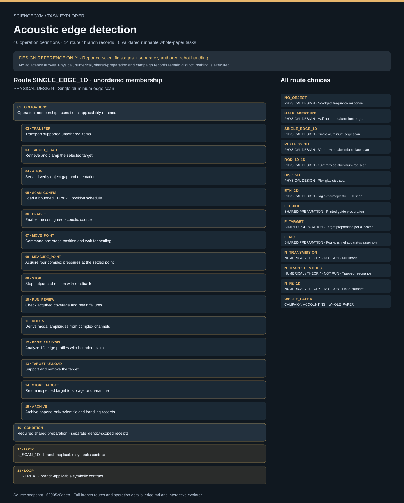

# Acoustic edge detection: task route map



Paper: **Acoustic metamaterial for subwavelength edge detection** · [DOI](https://doi.org/10.1038/ncomms9037)

Author/evaluator logical inspector; source-bounded design only; no actor projection, solver, simulator or robot execution. Counts describe task representation, not experiments or success.

**Reading rule:** rows preserve source operation membership once, without chronology. Loop bodies, count text and nesting obligations are retained as metadata, not added occurrences or executed repetitions. An unordered obligation group has no inferred chronological edges. Source-reported scientific facts and authored handling are distinct.

[Immutable source task package](https://github.com/openags/ScienceGym/blob/162905c0aeebd6da5eb9794df118458c24bb7d63/tasks/acoustic_edge_operations_v2/) · [Interactive inspector](../index.html)

## NO_OBJECT — PHYSICAL DESIGN · No-object frequency response

Source operation membership only; no chronological adjacency. Apply scoped dependencies, conditional gates and actual occurrence identities. Nothing here is executed. Numerical/theoretical records never count as physical measurements. Source facts, task-authored interfaces and qualified episode inputs stay distinct.

[Exact route source](https://github.com/openags/ScienceGym/blob/162905c0aeebd6da5eb9794df118458c24bb7d63/tasks/acoustic_edge_operations_v2/branches.json) · JSON pointer: `/branches/0`

- **OBLIGATIONS: Operation membership · conditional applicability retained**
  - Binding: {"order":"Source operation membership only; no chronological adjacency. Apply scoped dependencies, conditional gates and actual occurrence identities. Nothing here is executed."}
  - `CLEAR_APERTURE` Remove targets for the no-object control
  - `SWEEP_CONFIG` Load an explicit frequency-sweep schedule
  - `ENABLE` Enable the configured acoustic source
  - `SWEEP_POINT` Acquire one configured frequency condition
  - `STOP` Stop output and motion with readback
  - `RUN_REVIEW` Check acquired coverage and retain failures
  - `MODES` Derive modal amplitudes from complex channels
  - `ARCHIVE` Archive append-only scientific and handling records
- **CONDITION: Required shared preparation · separate identity-scoped receipts**
  - Binding: {"source_contract":{"prerequisite_family_ids":["F_GUIDE","F_RIG"]}}
- **LOOP: L_SWEEP · branch-applicable symbolic contract**
  - Binding: {"source_contract":{"id":"L_SWEEP","iterator":"frequency_index","operation_ids":["SWEEP_POINT"],"count":null,"input":"sweep_card.frequency_schedule","unknown_id":"U_SWEEP","binding":"Explicit nonempty finite schedule; repeat conditions need unique occurrence keys"}}
- **LOOP: L_REPEAT · branch-applicable symbolic contract**
  - Binding: {"source_contract":{"id":"L_REPEAT","iterator":"attempt_id","operation_ids":["ENABLE","SWEEP_POINT","MOVE_POINT","MEASURE_POINT","STOP","RUN_REVIEW"],"count":null,"input":"allocation_card.technical_repeat_schedule","unknown_id":"U_REPEAT","binding":"Branch-applicable operations only; no assumed number or successful empty loop; new run/attempt identity required"}}

<details><summary>Branch state, choices, lineage and loop obligations</summary>

```json
{
  "id": "NO_OBJECT",
  "title": "No-object frequency response",
  "kind": "physical_acquisition",
  "acquisition_type": "sweep",
  "target_material_card_id": null,
  "evidence_ids": [
    "E_CONTROL",
    "E_MIC",
    "E_SCAN"
  ],
  "prerequisite_family_ids": [
    "F_GUIDE",
    "F_RIG"
  ],
  "operation_ids": [
    "CLEAR_APERTURE",
    "SWEEP_CONFIG",
    "ENABLE",
    "SWEEP_POINT",
    "STOP",
    "RUN_REVIEW",
    "MODES",
    "ARCHIVE"
  ],
  "sequence_interpretation": "An authored illustrative phase order; dependency and condition gates define validity. Repeated templates require unique occurrences.",
  "loop_ids": [
    "L_SWEEP",
    "L_REPEAT"
  ],
  "expected_raw_quantities": [
    "p1_complex",
    "p2_complex",
    "p3_complex",
    "p4_complex"
  ],
  "physical_step_mm": null,
  "source_frequency_hz": null,
  "source_object_gap_mm": null,
  "source_roi_limit": "Absolute source acquisition extents unknown",
  "reuse": "Explicit episode allocation only; the half-aperture plate and single-edge plate may share an ID only with declared reuse and intervening inspection",
  "completion": "Nonempty declared frequency schedule addressed; valid raw data and linked processing present; failures retained and source/stage safely stopped; no fictional target storage required",
  "unknown_parameter_ids": [
    "U_CHANNEL",
    "U_CAL",
    "U_ACQ",
    "U_REPEAT",
    "U_ANALYSIS",
    "U_SAFETY",
    "U_SWEEP"
  ]
}
```

</details>

## HALF_APERTURE — PHYSICAL DESIGN · Half-aperture aluminium edge response

Source operation membership only; no chronological adjacency. Apply scoped dependencies, conditional gates and actual occurrence identities. Nothing here is executed. Numerical/theoretical records never count as physical measurements. Source facts, task-authored interfaces and qualified episode inputs stay distinct.

[Exact route source](https://github.com/openags/ScienceGym/blob/162905c0aeebd6da5eb9794df118458c24bb7d63/tasks/acoustic_edge_operations_v2/branches.json) · JSON pointer: `/branches/1`

- **OBLIGATIONS: Operation membership · conditional applicability retained**
  - Binding: {"order":"Source operation membership only; no chronological adjacency. Apply scoped dependencies, conditional gates and actual occurrence identities. Nothing here is executed."}
  - `TRANSFER` Transport supported untethered items
  - `TARGET_LOAD` Retrieve and clamp the selected target
  - `ALIGN` Set and verify object gap and orientation
  - `SWEEP_CONFIG` Load an explicit frequency-sweep schedule
  - `ENABLE` Enable the configured acoustic source
  - `SWEEP_POINT` Acquire one configured frequency condition
  - `STOP` Stop output and motion with readback
  - `RUN_REVIEW` Check acquired coverage and retain failures
  - `MODES` Derive modal amplitudes from complex channels
  - `TARGET_UNLOAD` Support and remove the target
  - `STORE_TARGET` Return inspected target to storage or quarantine
  - `ARCHIVE` Archive append-only scientific and handling records
- **CONDITION: Required shared preparation · separate identity-scoped receipts**
  - Binding: {"source_contract":{"prerequisite_family_ids":["F_GUIDE","F_RIG","F_TARGET"]}}
- **LOOP: L_SWEEP · branch-applicable symbolic contract**
  - Binding: {"source_contract":{"id":"L_SWEEP","iterator":"frequency_index","operation_ids":["SWEEP_POINT"],"count":null,"input":"sweep_card.frequency_schedule","unknown_id":"U_SWEEP","binding":"Explicit nonempty finite schedule; repeat conditions need unique occurrence keys"}}
- **LOOP: L_REPEAT · branch-applicable symbolic contract**
  - Binding: {"source_contract":{"id":"L_REPEAT","iterator":"attempt_id","operation_ids":["ENABLE","SWEEP_POINT","MOVE_POINT","MEASURE_POINT","STOP","RUN_REVIEW"],"count":null,"input":"allocation_card.technical_repeat_schedule","unknown_id":"U_REPEAT","binding":"Branch-applicable operations only; no assumed number or successful empty loop; new run/attempt identity required"}}

<details><summary>Branch state, choices, lineage and loop obligations</summary>

```json
{
  "id": "HALF_APERTURE",
  "title": "Half-aperture aluminium edge response",
  "kind": "physical_acquisition",
  "acquisition_type": "sweep",
  "target_material_card_id": "aluminium_edge",
  "evidence_ids": [
    "E_CONTROL",
    "E_MIC",
    "E_SCAN"
  ],
  "prerequisite_family_ids": [
    "F_GUIDE",
    "F_RIG",
    "F_TARGET"
  ],
  "operation_ids": [
    "TRANSFER",
    "TARGET_LOAD",
    "ALIGN",
    "SWEEP_CONFIG",
    "ENABLE",
    "SWEEP_POINT",
    "STOP",
    "RUN_REVIEW",
    "MODES",
    "TARGET_UNLOAD",
    "STORE_TARGET",
    "ARCHIVE"
  ],
  "sequence_interpretation": "An authored illustrative phase order; dependency and condition gates define validity. Repeated templates require unique occurrences.",
  "loop_ids": [
    "L_SWEEP",
    "L_REPEAT"
  ],
  "expected_raw_quantities": [
    "p1_complex",
    "p2_complex",
    "p3_complex",
    "p4_complex"
  ],
  "physical_step_mm": null,
  "source_frequency_hz": null,
  "source_object_gap_mm": 1,
  "source_roi_limit": "Absolute source acquisition extents unknown",
  "reuse": "Explicit episode allocation only; the half-aperture plate and single-edge plate may share an ID only with declared reuse and intervening inspection",
  "completion": "Nonempty declared schedule addressed; all required valid raw points and linked processing present; failures retained, safe target storage observed",
  "unknown_parameter_ids": [
    "U_CHANNEL",
    "U_CAL",
    "U_ACQ",
    "U_REPEAT",
    "U_ANALYSIS",
    "U_SAFETY",
    "U_SWEEP",
    "U_TARGET",
    "U_FIXTURE"
  ]
}
```

</details>

## SINGLE_EDGE_1D — PHYSICAL DESIGN · Single aluminium edge scan

Source operation membership only; no chronological adjacency. Apply scoped dependencies, conditional gates and actual occurrence identities. Nothing here is executed. Numerical/theoretical records never count as physical measurements. Source facts, task-authored interfaces and qualified episode inputs stay distinct.

[Exact route source](https://github.com/openags/ScienceGym/blob/162905c0aeebd6da5eb9794df118458c24bb7d63/tasks/acoustic_edge_operations_v2/branches.json) · JSON pointer: `/branches/2`

- **OBLIGATIONS: Operation membership · conditional applicability retained**
  - Binding: {"order":"Source operation membership only; no chronological adjacency. Apply scoped dependencies, conditional gates and actual occurrence identities. Nothing here is executed."}
  - `TRANSFER` Transport supported untethered items
  - `TARGET_LOAD` Retrieve and clamp the selected target
  - `ALIGN` Set and verify object gap and orientation
  - `SCAN_CONFIG` Load a bounded 1D or 2D position schedule
  - `ENABLE` Enable the configured acoustic source
  - `MOVE_POINT` Command one stage position and wait for settling
  - `MEASURE_POINT` Acquire four complex pressures at the settled point
  - `STOP` Stop output and motion with readback
  - `RUN_REVIEW` Check acquired coverage and retain failures
  - `MODES` Derive modal amplitudes from complex channels
  - `EDGE_ANALYSIS` Analyze 1D edge profiles with bounded claims
  - `TARGET_UNLOAD` Support and remove the target
  - `STORE_TARGET` Return inspected target to storage or quarantine
  - `ARCHIVE` Archive append-only scientific and handling records
- **CONDITION: Required shared preparation · separate identity-scoped receipts**
  - Binding: {"source_contract":{"prerequisite_family_ids":["F_GUIDE","F_RIG","F_TARGET"]}}
- **LOOP: L_SCAN_1D · branch-applicable symbolic contract**
  - Binding: {"source_contract":{"id":"L_SCAN_1D","iterator":"point_id","operation_ids":["MOVE_POINT","MEASURE_POINT"],"count":null,"input":"scan_card.ordered_coordinates","unknown_id":"U_SCAN","binding":"Explicit nonempty 1D physical coordinates, 0.6-mm nominal step; exact extents supplied"}}
- **LOOP: L_REPEAT · branch-applicable symbolic contract**
  - Binding: {"source_contract":{"id":"L_REPEAT","iterator":"attempt_id","operation_ids":["ENABLE","SWEEP_POINT","MOVE_POINT","MEASURE_POINT","STOP","RUN_REVIEW"],"count":null,"input":"allocation_card.technical_repeat_schedule","unknown_id":"U_REPEAT","binding":"Branch-applicable operations only; no assumed number or successful empty loop; new run/attempt identity required"}}

<details><summary>Branch state, choices, lineage and loop obligations</summary>

```json
{
  "id": "SINGLE_EDGE_1D",
  "title": "Single aluminium edge scan",
  "kind": "physical_acquisition",
  "acquisition_type": "scan_1d",
  "target_material_card_id": "aluminium_edge",
  "evidence_ids": [
    "E_1D",
    "E_MIC",
    "E_SCAN"
  ],
  "prerequisite_family_ids": [
    "F_GUIDE",
    "F_RIG",
    "F_TARGET"
  ],
  "operation_ids": [
    "TRANSFER",
    "TARGET_LOAD",
    "ALIGN",
    "SCAN_CONFIG",
    "ENABLE",
    "MOVE_POINT",
    "MEASURE_POINT",
    "STOP",
    "RUN_REVIEW",
    "MODES",
    "EDGE_ANALYSIS",
    "TARGET_UNLOAD",
    "STORE_TARGET",
    "ARCHIVE"
  ],
  "sequence_interpretation": "An authored illustrative phase order; dependency and condition gates define validity. Repeated templates require unique occurrences.",
  "loop_ids": [
    "L_SCAN_1D",
    "L_REPEAT"
  ],
  "expected_raw_quantities": [
    "p1_complex",
    "p2_complex",
    "p3_complex",
    "p4_complex"
  ],
  "physical_step_mm": 0.6,
  "source_frequency_hz": 7740,
  "source_object_gap_mm": 1,
  "source_roi_limit": "Absolute source acquisition extents unknown",
  "reuse": "Explicit episode allocation only; the half-aperture plate and single-edge plate may share an ID only with declared reuse and intervening inspection",
  "completion": "Nonempty declared schedule addressed; all required valid raw points and linked processing present; failures retained, safe target storage observed",
  "unknown_parameter_ids": [
    "U_CHANNEL",
    "U_CAL",
    "U_ACQ",
    "U_REPEAT",
    "U_ANALYSIS",
    "U_SAFETY",
    "U_SCAN",
    "U_TARGET",
    "U_FIXTURE"
  ]
}
```

</details>

## PLATE_32_1D — PHYSICAL DESIGN · 32-mm-wide aluminium plate scan

Source operation membership only; no chronological adjacency. Apply scoped dependencies, conditional gates and actual occurrence identities. Nothing here is executed. Numerical/theoretical records never count as physical measurements. Source facts, task-authored interfaces and qualified episode inputs stay distinct.

[Exact route source](https://github.com/openags/ScienceGym/blob/162905c0aeebd6da5eb9794df118458c24bb7d63/tasks/acoustic_edge_operations_v2/branches.json) · JSON pointer: `/branches/3`

- **OBLIGATIONS: Operation membership · conditional applicability retained**
  - Binding: {"order":"Source operation membership only; no chronological adjacency. Apply scoped dependencies, conditional gates and actual occurrence identities. Nothing here is executed."}
  - `TRANSFER` Transport supported untethered items
  - `TARGET_LOAD` Retrieve and clamp the selected target
  - `ALIGN` Set and verify object gap and orientation
  - `SCAN_CONFIG` Load a bounded 1D or 2D position schedule
  - `ENABLE` Enable the configured acoustic source
  - `MOVE_POINT` Command one stage position and wait for settling
  - `MEASURE_POINT` Acquire four complex pressures at the settled point
  - `STOP` Stop output and motion with readback
  - `RUN_REVIEW` Check acquired coverage and retain failures
  - `MODES` Derive modal amplitudes from complex channels
  - `EDGE_ANALYSIS` Analyze 1D edge profiles with bounded claims
  - `TARGET_UNLOAD` Support and remove the target
  - `STORE_TARGET` Return inspected target to storage or quarantine
  - `ARCHIVE` Archive append-only scientific and handling records
- **CONDITION: Required shared preparation · separate identity-scoped receipts**
  - Binding: {"source_contract":{"prerequisite_family_ids":["F_GUIDE","F_RIG","F_TARGET"]}}
- **LOOP: L_SCAN_1D · branch-applicable symbolic contract**
  - Binding: {"source_contract":{"id":"L_SCAN_1D","iterator":"point_id","operation_ids":["MOVE_POINT","MEASURE_POINT"],"count":null,"input":"scan_card.ordered_coordinates","unknown_id":"U_SCAN","binding":"Explicit nonempty 1D physical coordinates, 0.6-mm nominal step; exact extents supplied"}}
- **LOOP: L_REPEAT · branch-applicable symbolic contract**
  - Binding: {"source_contract":{"id":"L_REPEAT","iterator":"attempt_id","operation_ids":["ENABLE","SWEEP_POINT","MOVE_POINT","MEASURE_POINT","STOP","RUN_REVIEW"],"count":null,"input":"allocation_card.technical_repeat_schedule","unknown_id":"U_REPEAT","binding":"Branch-applicable operations only; no assumed number or successful empty loop; new run/attempt identity required"}}

<details><summary>Branch state, choices, lineage and loop obligations</summary>

```json
{
  "id": "PLATE_32_1D",
  "title": "32-mm-wide aluminium plate scan",
  "kind": "physical_acquisition",
  "acquisition_type": "scan_1d",
  "target_material_card_id": "aluminium_plate_32",
  "evidence_ids": [
    "E_1D",
    "E_MIC",
    "E_SCAN"
  ],
  "prerequisite_family_ids": [
    "F_GUIDE",
    "F_RIG",
    "F_TARGET"
  ],
  "operation_ids": [
    "TRANSFER",
    "TARGET_LOAD",
    "ALIGN",
    "SCAN_CONFIG",
    "ENABLE",
    "MOVE_POINT",
    "MEASURE_POINT",
    "STOP",
    "RUN_REVIEW",
    "MODES",
    "EDGE_ANALYSIS",
    "TARGET_UNLOAD",
    "STORE_TARGET",
    "ARCHIVE"
  ],
  "sequence_interpretation": "An authored illustrative phase order; dependency and condition gates define validity. Repeated templates require unique occurrences.",
  "loop_ids": [
    "L_SCAN_1D",
    "L_REPEAT"
  ],
  "expected_raw_quantities": [
    "p1_complex",
    "p2_complex",
    "p3_complex",
    "p4_complex"
  ],
  "physical_step_mm": 0.6,
  "source_frequency_hz": 7740,
  "source_object_gap_mm": 1,
  "source_roi_limit": "Absolute source acquisition extents unknown",
  "reuse": "Explicit episode allocation only; the half-aperture plate and single-edge plate may share an ID only with declared reuse and intervening inspection",
  "completion": "Nonempty declared schedule addressed; all required valid raw points and linked processing present; failures retained, safe target storage observed",
  "unknown_parameter_ids": [
    "U_CHANNEL",
    "U_CAL",
    "U_ACQ",
    "U_REPEAT",
    "U_ANALYSIS",
    "U_SAFETY",
    "U_SCAN",
    "U_TARGET",
    "U_FIXTURE"
  ]
}
```

</details>

## ROD_10_1D — PHYSICAL DESIGN · 10-mm-wide aluminium rod scan

Source operation membership only; no chronological adjacency. Apply scoped dependencies, conditional gates and actual occurrence identities. Nothing here is executed. Numerical/theoretical records never count as physical measurements. Source facts, task-authored interfaces and qualified episode inputs stay distinct.

[Exact route source](https://github.com/openags/ScienceGym/blob/162905c0aeebd6da5eb9794df118458c24bb7d63/tasks/acoustic_edge_operations_v2/branches.json) · JSON pointer: `/branches/4`

- **OBLIGATIONS: Operation membership · conditional applicability retained**
  - Binding: {"order":"Source operation membership only; no chronological adjacency. Apply scoped dependencies, conditional gates and actual occurrence identities. Nothing here is executed."}
  - `TRANSFER` Transport supported untethered items
  - `TARGET_LOAD` Retrieve and clamp the selected target
  - `ALIGN` Set and verify object gap and orientation
  - `SCAN_CONFIG` Load a bounded 1D or 2D position schedule
  - `ENABLE` Enable the configured acoustic source
  - `MOVE_POINT` Command one stage position and wait for settling
  - `MEASURE_POINT` Acquire four complex pressures at the settled point
  - `STOP` Stop output and motion with readback
  - `RUN_REVIEW` Check acquired coverage and retain failures
  - `MODES` Derive modal amplitudes from complex channels
  - `EDGE_ANALYSIS` Analyze 1D edge profiles with bounded claims
  - `TARGET_UNLOAD` Support and remove the target
  - `STORE_TARGET` Return inspected target to storage or quarantine
  - `ARCHIVE` Archive append-only scientific and handling records
- **CONDITION: Required shared preparation · separate identity-scoped receipts**
  - Binding: {"source_contract":{"prerequisite_family_ids":["F_GUIDE","F_RIG","F_TARGET"]}}
- **LOOP: L_SCAN_1D · branch-applicable symbolic contract**
  - Binding: {"source_contract":{"id":"L_SCAN_1D","iterator":"point_id","operation_ids":["MOVE_POINT","MEASURE_POINT"],"count":null,"input":"scan_card.ordered_coordinates","unknown_id":"U_SCAN","binding":"Explicit nonempty 1D physical coordinates, 0.6-mm nominal step; exact extents supplied"}}
- **LOOP: L_REPEAT · branch-applicable symbolic contract**
  - Binding: {"source_contract":{"id":"L_REPEAT","iterator":"attempt_id","operation_ids":["ENABLE","SWEEP_POINT","MOVE_POINT","MEASURE_POINT","STOP","RUN_REVIEW"],"count":null,"input":"allocation_card.technical_repeat_schedule","unknown_id":"U_REPEAT","binding":"Branch-applicable operations only; no assumed number or successful empty loop; new run/attempt identity required"}}

<details><summary>Branch state, choices, lineage and loop obligations</summary>

```json
{
  "id": "ROD_10_1D",
  "title": "10-mm-wide aluminium rod scan",
  "kind": "physical_acquisition",
  "acquisition_type": "scan_1d",
  "target_material_card_id": "aluminium_rod_10",
  "evidence_ids": [
    "E_1D",
    "E_MIC",
    "E_SCAN"
  ],
  "prerequisite_family_ids": [
    "F_GUIDE",
    "F_RIG",
    "F_TARGET"
  ],
  "operation_ids": [
    "TRANSFER",
    "TARGET_LOAD",
    "ALIGN",
    "SCAN_CONFIG",
    "ENABLE",
    "MOVE_POINT",
    "MEASURE_POINT",
    "STOP",
    "RUN_REVIEW",
    "MODES",
    "EDGE_ANALYSIS",
    "TARGET_UNLOAD",
    "STORE_TARGET",
    "ARCHIVE"
  ],
  "sequence_interpretation": "An authored illustrative phase order; dependency and condition gates define validity. Repeated templates require unique occurrences.",
  "loop_ids": [
    "L_SCAN_1D",
    "L_REPEAT"
  ],
  "expected_raw_quantities": [
    "p1_complex",
    "p2_complex",
    "p3_complex",
    "p4_complex"
  ],
  "physical_step_mm": 0.6,
  "source_frequency_hz": 7740,
  "source_object_gap_mm": 1,
  "source_roi_limit": "Absolute source acquisition extents unknown",
  "reuse": "Explicit episode allocation only; the half-aperture plate and single-edge plate may share an ID only with declared reuse and intervening inspection",
  "completion": "Nonempty declared schedule addressed; all required valid raw points and linked processing present; failures retained, safe target storage observed",
  "unknown_parameter_ids": [
    "U_CHANNEL",
    "U_CAL",
    "U_ACQ",
    "U_REPEAT",
    "U_ANALYSIS",
    "U_SAFETY",
    "U_SCAN",
    "U_TARGET",
    "U_FIXTURE"
  ]
}
```

</details>

## DISC_2D — PHYSICAL DESIGN · Plexiglas disc scan

Source operation membership only; no chronological adjacency. Apply scoped dependencies, conditional gates and actual occurrence identities. Nothing here is executed. Numerical/theoretical records never count as physical measurements. Source facts, task-authored interfaces and qualified episode inputs stay distinct.

[Exact route source](https://github.com/openags/ScienceGym/blob/162905c0aeebd6da5eb9794df118458c24bb7d63/tasks/acoustic_edge_operations_v2/branches.json) · JSON pointer: `/branches/5`

- **OBLIGATIONS: Operation membership · conditional applicability retained**
  - Binding: {"order":"Source operation membership only; no chronological adjacency. Apply scoped dependencies, conditional gates and actual occurrence identities. Nothing here is executed."}
  - `TRANSFER` Transport supported untethered items
  - `TARGET_LOAD` Retrieve and clamp the selected target
  - `ALIGN` Set and verify object gap and orientation
  - `SCAN_CONFIG` Load a bounded 1D or 2D position schedule
  - `ENABLE` Enable the configured acoustic source
  - `MOVE_POINT` Command one stage position and wait for settling
  - `MEASURE_POINT` Acquire four complex pressures at the settled point
  - `STOP` Stop output and motion with readback
  - `RUN_REVIEW` Check acquired coverage and retain failures
  - `MODES` Derive modal amplitudes from complex channels
  - `IMAGE_ANALYSIS` Create separate raw-grid and display-grid products
  - `TARGET_UNLOAD` Support and remove the target
  - `STORE_TARGET` Return inspected target to storage or quarantine
  - `ARCHIVE` Archive append-only scientific and handling records
- **CONDITION: Required shared preparation · separate identity-scoped receipts**
  - Binding: {"source_contract":{"prerequisite_family_ids":["F_GUIDE","F_RIG","F_TARGET"]}}
- **LOOP: L_SCAN_2D · branch-applicable symbolic contract**
  - Binding: {"source_contract":{"id":"L_SCAN_2D","iterator":"point_id","operation_ids":["MOVE_POINT","MEASURE_POINT"],"count":null,"input":"scan_card.ordered_coordinates","unknown_id":"U_SCAN","binding":"Explicit nonempty 2D coordinates, 1.6-mm physical grid; ROI/raster order supplied"}}
- **LOOP: L_REPEAT · branch-applicable symbolic contract**
  - Binding: {"source_contract":{"id":"L_REPEAT","iterator":"attempt_id","operation_ids":["ENABLE","SWEEP_POINT","MOVE_POINT","MEASURE_POINT","STOP","RUN_REVIEW"],"count":null,"input":"allocation_card.technical_repeat_schedule","unknown_id":"U_REPEAT","binding":"Branch-applicable operations only; no assumed number or successful empty loop; new run/attempt identity required"}}

<details><summary>Branch state, choices, lineage and loop obligations</summary>

```json
{
  "id": "DISC_2D",
  "title": "Plexiglas disc scan",
  "kind": "physical_acquisition",
  "acquisition_type": "scan_2d",
  "target_material_card_id": "plexiglas_disc_100",
  "evidence_ids": [
    "E_DISC",
    "E_MIC",
    "E_SCAN"
  ],
  "prerequisite_family_ids": [
    "F_GUIDE",
    "F_RIG",
    "F_TARGET"
  ],
  "operation_ids": [
    "TRANSFER",
    "TARGET_LOAD",
    "ALIGN",
    "SCAN_CONFIG",
    "ENABLE",
    "MOVE_POINT",
    "MEASURE_POINT",
    "STOP",
    "RUN_REVIEW",
    "MODES",
    "IMAGE_ANALYSIS",
    "TARGET_UNLOAD",
    "STORE_TARGET",
    "ARCHIVE"
  ],
  "sequence_interpretation": "An authored illustrative phase order; dependency and condition gates define validity. Repeated templates require unique occurrences.",
  "loop_ids": [
    "L_SCAN_2D",
    "L_REPEAT"
  ],
  "expected_raw_quantities": [
    "p1_complex",
    "p2_complex",
    "p3_complex",
    "p4_complex"
  ],
  "physical_step_mm": 1.6,
  "source_frequency_hz": 7740,
  "source_object_gap_mm": 1,
  "source_roi_limit": "Only upper-half disc is displayed; historical complete acquisition ROI unknown",
  "reuse": "Explicit episode allocation only; the half-aperture plate and single-edge plate may share an ID only with declared reuse and intervening inspection",
  "completion": "Nonempty declared schedule addressed; all required valid raw points and linked processing present; failures retained, safe target storage observed",
  "unknown_parameter_ids": [
    "U_CHANNEL",
    "U_CAL",
    "U_ACQ",
    "U_REPEAT",
    "U_ANALYSIS",
    "U_SAFETY",
    "U_SCAN",
    "U_TARGET",
    "U_FIXTURE"
  ]
}
```

</details>

## ETH_2D — PHYSICAL DESIGN · Rigid-thermoplastic ETH scan

Source operation membership only; no chronological adjacency. Apply scoped dependencies, conditional gates and actual occurrence identities. Nothing here is executed. Numerical/theoretical records never count as physical measurements. Source facts, task-authored interfaces and qualified episode inputs stay distinct.

[Exact route source](https://github.com/openags/ScienceGym/blob/162905c0aeebd6da5eb9794df118458c24bb7d63/tasks/acoustic_edge_operations_v2/branches.json) · JSON pointer: `/branches/6`

- **OBLIGATIONS: Operation membership · conditional applicability retained**
  - Binding: {"order":"Source operation membership only; no chronological adjacency. Apply scoped dependencies, conditional gates and actual occurrence identities. Nothing here is executed."}
  - `TRANSFER` Transport supported untethered items
  - `TARGET_LOAD` Retrieve and clamp the selected target
  - `ALIGN` Set and verify object gap and orientation
  - `SCAN_CONFIG` Load a bounded 1D or 2D position schedule
  - `ENABLE` Enable the configured acoustic source
  - `MOVE_POINT` Command one stage position and wait for settling
  - `MEASURE_POINT` Acquire four complex pressures at the settled point
  - `STOP` Stop output and motion with readback
  - `RUN_REVIEW` Check acquired coverage and retain failures
  - `MODES` Derive modal amplitudes from complex channels
  - `IMAGE_ANALYSIS` Create separate raw-grid and display-grid products
  - `TARGET_UNLOAD` Support and remove the target
  - `STORE_TARGET` Return inspected target to storage or quarantine
  - `ARCHIVE` Archive append-only scientific and handling records
- **CONDITION: Required shared preparation · separate identity-scoped receipts**
  - Binding: {"source_contract":{"prerequisite_family_ids":["F_GUIDE","F_RIG","F_TARGET"]}}
- **LOOP: L_SCAN_2D · branch-applicable symbolic contract**
  - Binding: {"source_contract":{"id":"L_SCAN_2D","iterator":"point_id","operation_ids":["MOVE_POINT","MEASURE_POINT"],"count":null,"input":"scan_card.ordered_coordinates","unknown_id":"U_SCAN","binding":"Explicit nonempty 2D coordinates, 1.6-mm physical grid; ROI/raster order supplied"}}
- **LOOP: L_REPEAT · branch-applicable symbolic contract**
  - Binding: {"source_contract":{"id":"L_REPEAT","iterator":"attempt_id","operation_ids":["ENABLE","SWEEP_POINT","MOVE_POINT","MEASURE_POINT","STOP","RUN_REVIEW"],"count":null,"input":"allocation_card.technical_repeat_schedule","unknown_id":"U_REPEAT","binding":"Branch-applicable operations only; no assumed number or successful empty loop; new run/attempt identity required"}}

<details><summary>Branch state, choices, lineage and loop obligations</summary>

```json
{
  "id": "ETH_2D",
  "title": "Rigid-thermoplastic ETH scan",
  "kind": "physical_acquisition",
  "acquisition_type": "scan_2d",
  "target_material_card_id": "thermoplastic_eth",
  "evidence_ids": [
    "E_ETH",
    "E_MIC",
    "E_SCAN"
  ],
  "prerequisite_family_ids": [
    "F_GUIDE",
    "F_RIG",
    "F_TARGET"
  ],
  "operation_ids": [
    "TRANSFER",
    "TARGET_LOAD",
    "ALIGN",
    "SCAN_CONFIG",
    "ENABLE",
    "MOVE_POINT",
    "MEASURE_POINT",
    "STOP",
    "RUN_REVIEW",
    "MODES",
    "IMAGE_ANALYSIS",
    "TARGET_UNLOAD",
    "STORE_TARGET",
    "ARCHIVE"
  ],
  "sequence_interpretation": "An authored illustrative phase order; dependency and condition gates define validity. Repeated templates require unique occurrences.",
  "loop_ids": [
    "L_SCAN_2D",
    "L_REPEAT"
  ],
  "expected_raw_quantities": [
    "p1_complex",
    "p2_complex",
    "p3_complex",
    "p4_complex"
  ],
  "physical_step_mm": 1.6,
  "source_frequency_hz": 7740,
  "source_object_gap_mm": 1,
  "source_roi_limit": "Absolute source acquisition extents unknown",
  "reuse": "Explicit episode allocation only; the half-aperture plate and single-edge plate may share an ID only with declared reuse and intervening inspection",
  "completion": "Nonempty declared schedule addressed; all required valid raw points and linked processing present; failures retained, safe target storage observed",
  "unknown_parameter_ids": [
    "U_CHANNEL",
    "U_CAL",
    "U_ACQ",
    "U_REPEAT",
    "U_ANALYSIS",
    "U_SAFETY",
    "U_SCAN",
    "U_TARGET",
    "U_FIXTURE"
  ]
}
```

</details>

## F_GUIDE — SHARED PREPARATION · Printed guide preparation

Source operation membership only; no chronological adjacency. Apply scoped dependencies, conditional gates and actual occurrence identities. Nothing here is executed. Numerical/theoretical records never count as physical measurements. Source facts, task-authored interfaces and qualified episode inputs stay distinct.

[Exact route source](https://github.com/openags/ScienceGym/blob/162905c0aeebd6da5eb9794df118458c24bb7d63/tasks/acoustic_edge_operations_v2/branches.json) · JSON pointer: `/families/0`

- **OBLIGATIONS: Operation membership · conditional applicability retained**
  - Binding: {"order":"Source operation membership only; no chronological adjacency. Apply scoped dependencies, conditional gates and actual occurrence identities. Nothing here is executed."}
  - `PLAN` Bind campaign and explicit branch inputs
  - `STOCK` Retrieve labelled materials and protected carriers
  - `TRANSFER` Transport supported untethered items
  - `CAD_BIND` Bind source dimensions to qualified print design
  - `PRINT_LOAD` Load stock and job at enclosed printer
  - `PRINT_RUN` Start and monitor printed guide fabrication
  - `PRINT_UNLOAD` Release and support the printed guide
  - `TRANSFER` Transport supported untethered items
  - `POSTPROCESS` Remove allowed supports and inspect passage access
  - `TRANSFER` Transport supported untethered items
  - `GUIDE_QC` Inspect guide geometry and identity
  - `TRANSFER` Transport supported untethered items

<details><summary>Branch state, choices, lineage and loop obligations</summary>

```json
{
  "id": "F_GUIDE",
  "title": "Printed guide preparation",
  "operation_ids": [
    "PLAN",
    "STOCK",
    "TRANSFER",
    "CAD_BIND",
    "PRINT_LOAD",
    "PRINT_RUN",
    "PRINT_UNLOAD",
    "TRANSFER",
    "POSTPROCESS",
    "TRANSFER",
    "GUIDE_QC",
    "TRANSFER"
  ],
  "classification": "shared_physical_prerequisite",
  "transfer_occurrences": [
    {
      "id": "guide_stock_to_printer",
      "after": "STOCK",
      "before": "PRINT_LOAD",
      "item_role": "print_stock",
      "origin": "WS_STOCK",
      "destination": "WS_PRINT"
    },
    {
      "id": "printed_guide_to_prep",
      "after": "PRINT_UNLOAD",
      "before": "POSTPROCESS",
      "item_role": "guide",
      "origin": "WS_PRINT",
      "destination": "WS_PREP"
    },
    {
      "id": "finished_guide_to_inspection",
      "after": "POSTPROCESS",
      "before": "GUIDE_QC",
      "item_role": "guide",
      "origin": "WS_PREP",
      "destination": "WS_INSPECTION"
    },
    {
      "id": "qualified_guide_to_rig",
      "after": "GUIDE_QC",
      "before": "GUIDE_MOUNT",
      "item_role": "guide",
      "origin": "WS_INSPECTION",
      "destination": "WS_RIG"
    }
  ]
}
```

</details>

## F_TARGET — SHARED PREPARATION · Target preparation per allocated object

Source operation membership only; no chronological adjacency. Apply scoped dependencies, conditional gates and actual occurrence identities. Nothing here is executed. Numerical/theoretical records never count as physical measurements. Source facts, task-authored interfaces and qualified episode inputs stay distinct.

[Exact route source](https://github.com/openags/ScienceGym/blob/162905c0aeebd6da5eb9794df118458c24bb7d63/tasks/acoustic_edge_operations_v2/branches.json) · JSON pointer: `/families/1`

- **CHOICE: Exclusive alternatives · choose exactly one per target**
  - Binding: {"selection_rule":"target_card.process_or_supplied_part_route chooses exactly one route per target; no fabricated device process on supplied-part route"}
  - **OBLIGATIONS: manufactured_in_episode · alternative membership only**
    - Binding: {"order":"Source operation membership only; no chronological adjacency. Apply scoped dependencies, conditional gates and actual occurrence identities. Nothing here is executed."}
    - `TARGET_BIND` Prepare an explicit target manufacturing card
    - `TARGET_PREP` Load and prepare each target at a qualified tool
    - `TARGET_PROCESS` Monitor target preparation and safe release
    - `TARGET_RELEASE` Unload the prepared target into a carrier
    - `TRANSFER` Transport supported untethered items
    - `TARGET_QC` Unload and inspect the target
    - `TRANSFER` Transport supported untethered items
  - **OBLIGATIONS: supplied_part · alternative membership only**
    - Binding: {"order":"Source operation membership only; no chronological adjacency. Apply scoped dependencies, conditional gates and actual occurrence identities. Nothing here is executed."}
    - `TARGET_BIND` Prepare an explicit target manufacturing card
    - `TARGET_RECEIVE` Receive and stage an existing qualified target
    - `TRANSFER` Transport supported untethered items
    - `TARGET_QC` Unload and inspect the target
    - `TRANSFER` Transport supported untethered items

<details><summary>Branch state, choices, lineage and loop obligations</summary>

```json
{
  "id": "F_TARGET",
  "title": "Target preparation per allocated object",
  "operation_ids": [
    "TARGET_BIND",
    "TARGET_PREP",
    "TARGET_PROCESS",
    "TARGET_RELEASE",
    "TARGET_RECEIVE",
    "TRANSFER",
    "TARGET_QC",
    "TRANSFER"
  ],
  "classification": "shared_physical_prerequisite",
  "route_variants": {
    "manufactured_in_episode": [
      "TARGET_BIND",
      "TARGET_PREP",
      "TARGET_PROCESS",
      "TARGET_RELEASE",
      "TRANSFER",
      "TARGET_QC",
      "TRANSFER"
    ],
    "supplied_part": [
      "TARGET_BIND",
      "TARGET_RECEIVE",
      "TRANSFER",
      "TARGET_QC",
      "TRANSFER"
    ]
  },
  "selection_rule": "target_card.process_or_supplied_part_route chooses exactly one route per target; no fabricated device process on supplied-part route"
}
```

</details>

## F_RIG — SHARED PREPARATION · Four-channel apparatus assembly

Source operation membership only; no chronological adjacency. Apply scoped dependencies, conditional gates and actual occurrence identities. Nothing here is executed. Numerical/theoretical records never count as physical measurements. Source facts, task-authored interfaces and qualified episode inputs stay distinct.

[Exact route source](https://github.com/openags/ScienceGym/blob/162905c0aeebd6da5eb9794df118458c24bb7d63/tasks/acoustic_edge_operations_v2/branches.json) · JSON pointer: `/families/2`

- **OBLIGATIONS: Operation membership · conditional applicability retained**
  - Binding: {"order":"Source operation membership only; no chronological adjacency. Apply scoped dependencies, conditional gates and actual occurrence identities. Nothing here is executed."}
  - `ENCLOSURE` Install foam lining and stage the vertical fixture
  - `GUIDE_MOUNT` Mount the inspected guide vertically
  - `OUTLET_FOAM` Place the output absorber
  - `SPEAKER` Align and secure the acoustic source
  - `MIC_INSTALL` Install one indexed flush microphone
  - `MIC_CONNECT` Connect identified channels and common reference
  - `TRANSFER` Transport supported untethered items
  - `CALIBRATE` Run qualified four-channel gain and phase calibration
  - `STAGE_INSTALL` Install and reference the object translation stage
  - `RIG_CHECK` Verify the assembled measurement chain
- **LOOP: L_MIC · four sensor slots, not four specimens**
  - Binding: {"source_contract":{"id":"L_MIC","iterator":"sensor_slot","operation_ids":["MIC_INSTALL"],"count":4,"binding":"Four distinct serials and four distinct wall ports; slot is not specimen replicate"}}

<details><summary>Branch state, choices, lineage and loop obligations</summary>

```json
{
  "id": "F_RIG",
  "title": "Four-channel apparatus assembly",
  "operation_ids": [
    "ENCLOSURE",
    "GUIDE_MOUNT",
    "OUTLET_FOAM",
    "SPEAKER",
    "MIC_INSTALL",
    "MIC_CONNECT",
    "TRANSFER",
    "CALIBRATE",
    "STAGE_INSTALL",
    "RIG_CHECK"
  ],
  "classification": "shared_physical_prerequisite",
  "resource_transfer_obligations": [
    {
      "item_role": "lining_panels",
      "origin": "WS_STOCK",
      "destination": "WS_RIG",
      "before": "ENCLOSURE"
    },
    {
      "item_role": "microphones",
      "origin": "WS_STOCK",
      "destination": "WS_RIG",
      "before": "MIC_INSTALL"
    },
    {
      "item_role": "speaker",
      "origin": "WS_STOCK",
      "destination": "WS_RIG",
      "before": "SPEAKER"
    },
    {
      "item_role": "output_foam",
      "origin": "WS_STOCK",
      "destination": "WS_RIG",
      "before": "OUTLET_FOAM"
    },
    {
      "item_role": "calibration_standard",
      "origin": "WS_CALIBRATION",
      "destination": "WS_RIG",
      "before": "CALIBRATE"
    }
  ]
}
```

</details>

## N_TRANSMISSION — NUMERICAL / THEORY · NOT RUN · Multimodal transmission matrix

Source operation membership only; no chronological adjacency. Apply scoped dependencies, conditional gates and actual occurrence identities. Nothing here is executed. Numerical/theoretical records never count as physical measurements. Source facts, task-authored interfaces and qualified episode inputs stay distinct.

[Exact route source](https://github.com/openags/ScienceGym/blob/162905c0aeebd6da5eb9794df118458c24bb7d63/tasks/acoustic_edge_operations_v2/nonmanual_scope.json) · JSON pointer: `/numerical_branches/0`

- **CONDITION: Numerical prediction obligations · no operation IDs or solver supplied**
  - Binding: {"source_contract":{"id":"N_TRANSMISSION","title":"Multimodal transmission matrix","evidence_ids":["E_MODEL","E_TM"],"source_scope":"Plane and antisymmetric modes, resonant conversion, ideal lossless length trade-off","operations":["Bind full segment/mode/port convention","Resolve SI equation/index conflicts","Construct straight and discontinuity scattering elements","Validate convergence, composition and physical consistency","Compute/report model-only transmission"],"inputs_unknown":["mode_truncation","element_topology","frequency_grid","loss_parameters","validated_algebra"],"output_class":"numerical_prediction"}}

<details><summary>Branch state, choices, lineage and loop obligations</summary>

```json
{
  "id": "N_TRANSMISSION",
  "title": "Multimodal transmission matrix",
  "evidence_ids": [
    "E_MODEL",
    "E_TM"
  ],
  "source_scope": "Plane and antisymmetric modes, resonant conversion, ideal lossless length trade-off",
  "operations": [
    "Bind full segment/mode/port convention",
    "Resolve SI equation/index conflicts",
    "Construct straight and discontinuity scattering elements",
    "Validate convergence, composition and physical consistency",
    "Compute/report model-only transmission"
  ],
  "inputs_unknown": [
    "mode_truncation",
    "element_topology",
    "frequency_grid",
    "loss_parameters",
    "validated_algebra"
  ],
  "output_class": "numerical_prediction"
}
```

</details>

## N_TRAPPED_MODES — NUMERICAL / THEORY · NOT RUN · Trapped-resonance eigenanalysis

Source operation membership only; no chronological adjacency. Apply scoped dependencies, conditional gates and actual occurrence identities. Nothing here is executed. Numerical/theoretical records never count as physical measurements. Source facts, task-authored interfaces and qualified episode inputs stay distinct.

[Exact route source](https://github.com/openags/ScienceGym/blob/162905c0aeebd6da5eb9794df118458c24bb7d63/tasks/acoustic_edge_operations_v2/nonmanual_scope.json) · JSON pointer: `/numerical_branches/1`

- **CONDITION: Numerical prediction obligations · no operation IDs or solver supplied**
  - Binding: {"source_contract":{"id":"N_TRAPPED_MODES","title":"Trapped-resonance eigenanalysis","evidence_ids":["E_TR"],"source_scope":"Complex eigenmodes with PML on both guide ends","operations":["Bind exact guide model and mesh","Set qualified PML and eigenmode solver","Check convergence and mode classification","Report computed complex modes separately from measured peaks"],"inputs_unknown":["mesh","PML","solver_version","eigensolver_settings","convergence_thresholds"],"output_class":"numerical_prediction"}}

<details><summary>Branch state, choices, lineage and loop obligations</summary>

```json
{
  "id": "N_TRAPPED_MODES",
  "title": "Trapped-resonance eigenanalysis",
  "evidence_ids": [
    "E_TR"
  ],
  "source_scope": "Complex eigenmodes with PML on both guide ends",
  "operations": [
    "Bind exact guide model and mesh",
    "Set qualified PML and eigenmode solver",
    "Check convergence and mode classification",
    "Report computed complex modes separately from measured peaks"
  ],
  "inputs_unknown": [
    "mesh",
    "PML",
    "solver_version",
    "eigensolver_settings",
    "convergence_thresholds"
  ],
  "output_class": "numerical_prediction"
}
```

</details>

## N_FE_1D — NUMERICAL / THEORY · NOT RUN · Finite-element comparisons for all three 1D objects

Source operation membership only; no chronological adjacency. Apply scoped dependencies, conditional gates and actual occurrence identities. Nothing here is executed. Numerical/theoretical records never count as physical measurements. Source facts, task-authored interfaces and qualified episode inputs stay distinct.

[Exact route source](https://github.com/openags/ScienceGym/blob/162905c0aeebd6da5eb9794df118458c24bb7d63/tasks/acoustic_edge_operations_v2/nonmanual_scope.json) · JSON pointer: `/numerical_branches/2`

- **CONDITION: Numerical prediction obligations · no operation IDs or solver supplied**
  - Binding: {"source_contract":{"id":"N_FE_1D","title":"Finite-element comparisons for all three 1D objects","evidence_ids":["E_FE"],"source_scope":"Single edge, 32-mm plate and 10-mm rod; rigid guide/objects in air, axial source at 280 mm, object at 1 mm, exterior/outlet PML","operations":["Bind per-target geometry and scan coordinates","Resolve mesh/material/solver settings","Compute each numerical scan only if authorized","Compare with separately parented experimental records under declared scaling"],"inputs_unknown":["complete_target_geometry","COMSOL_version","mesh","PML","normalization","loss_and_material_parameters"],"output_class":"numerical_prediction"}}

<details><summary>Branch state, choices, lineage and loop obligations</summary>

```json
{
  "id": "N_FE_1D",
  "title": "Finite-element comparisons for all three 1D objects",
  "evidence_ids": [
    "E_FE"
  ],
  "source_scope": "Single edge, 32-mm plate and 10-mm rod; rigid guide/objects in air, axial source at 280 mm, object at 1 mm, exterior/outlet PML",
  "operations": [
    "Bind per-target geometry and scan coordinates",
    "Resolve mesh/material/solver settings",
    "Compute each numerical scan only if authorized",
    "Compare with separately parented experimental records under declared scaling"
  ],
  "inputs_unknown": [
    "complete_target_geometry",
    "COMSOL_version",
    "mesh",
    "PML",
    "normalization",
    "loss_and_material_parameters"
  ],
  "output_class": "numerical_prediction"
}
```

</details>

## WHOLE_PAPER — CAMPAIGN ACCOUNTING · WHOLE_PAPER

Source operation membership only; no chronological adjacency. Apply scoped dependencies, conditional gates and actual occurrence identities. Nothing here is executed. Numerical/theoretical records never count as physical measurements. Source facts, task-authored interfaces and qualified episode inputs stay distinct.

[Exact route source](https://github.com/openags/ScienceGym/blob/162905c0aeebd6da5eb9794df118458c24bb7d63/tasks/acoustic_edge_operations_v2/branches.json) · JSON pointer: `/campaign`

- **CONDITION: Required independent branch dispositions · never one merged sample history**
  - Binding: {"source_contract":{"required_branch_ids":["NO_OBJECT","HALF_APERTURE","SINGLE_EDGE_1D","PLATE_32_1D","ROD_10_1D","DISC_2D","ETH_2D"],"required_control_package_ids":["CP_TRANSMISSION","CP_1D_OBJECTS","CP_2D_CHANNELS"],"completion":"All seven required branch dispositions must be valid-complete for complete status. Gated, failed or missing branches are reported and prevent completion; truthful non-paper outcomes do not automatically fail procedures."}}
- **CHOICE: Conditional campaign closure · complete versus abort**
  - Binding: {"scope":"Closure contracts are conditional alternatives, not mandatory serial operation lists"}
  - **OBLIGATIONS: Required completion closure membership**
    - Binding: {"order":"Source operation membership only; no chronological adjacency. Apply scoped dependencies, conditional gates and actual occurrence identities. Nothing here is executed."}
    - `CONTROL_COMPARE` Compare matched no-object and half-aperture sweeps
    - `ARCHIVE` Archive append-only scientific and handling records
    - `RIG_UNLOAD` Safely disconnect and store instrument components
    - `CLEANUP` Restore fabrication and measurement stations
    - `REPORT` Report scope, truthful outcomes and unclosed gates
  - **OBLIGATIONS: Abort-only closure membership**
    - Binding: {"order":"Source operation membership only; no chronological adjacency. Apply scoped dependencies, conditional gates and actual occurrence identities. Nothing here is executed."}
    - `ABORT_CLOSE` Close blocked or interrupted work without invented acquisition
    - `ARCHIVE` Archive append-only scientific and handling records
    - `REPORT` Report scope, truthful outcomes and unclosed gates

<details><summary>Branch state, choices, lineage and loop obligations</summary>

```json
{
  "id": "WHOLE_PAPER",
  "required_branch_ids": [
    "NO_OBJECT",
    "HALF_APERTURE",
    "SINGLE_EDGE_1D",
    "PLATE_32_1D",
    "ROD_10_1D",
    "DISC_2D",
    "ETH_2D"
  ],
  "required_control_package_ids": [
    "CP_TRANSMISSION",
    "CP_1D_OBJECTS",
    "CP_2D_CHANNELS"
  ],
  "shared_preparation": "One or more identified qualified guides according to explicit allocation; not a historical sample-count claim",
  "required_closure_operation_ids": [
    "CONTROL_COMPARE",
    "ARCHIVE",
    "RIG_UNLOAD",
    "CLEANUP",
    "REPORT"
  ],
  "numerical_work_included_in_coverage_but_not_physical_completion": true,
  "completion": "All seven required branch dispositions must be valid-complete for complete status. Gated, failed or missing branches are reported and prevent completion; truthful non-paper outcomes do not automatically fail procedures.",
  "abort_closure_operation_ids": [
    "ABORT_CLOSE",
    "ARCHIVE",
    "REPORT"
  ]
}
```

</details>

## Operation contracts

Every operation is clickable in the offline inspector, with robot actions, target objects, pre/post state, provenance, unknowns and acceptance/recovery. Raw task JSON is the source of truth; this visualization is a public evaluator/reference view, not an agent prompt.

## Reference contracts and boundaries

Representation counts: {"physical_routes": 7, "shared_preparation_records": 3, "numerical_dispositions": 3, "campaign_accounting_records": 1, "symbolic_loops": 5, "input_gates": 14}.

The complete source contracts remain in the inspector, including unknown inputs, source conflicts, allocation/lineage, dependencies, actor allowlists and independent source audits. Numerical work is distinct from physical preparation and acquisition. All operation lists are membership; no chronology, new schedule, default value, sample count or observed result is inferred.

This public author/evaluator inspector is not actor-safe input. No runtime projection, solver, task loader, physical simulation, new storyboard or robot execution is implemented.

- [EXPORT_ALLOWLIST.json](https://github.com/openags/ScienceGym/blob/162905c0aeebd6da5eb9794df118458c24bb7d63/tasks/acoustic_edge_operations_v2/EXPORT_ALLOWLIST.json)
- [RELEASE_BOUNDARY.json](https://github.com/openags/ScienceGym/blob/162905c0aeebd6da5eb9794df118458c24bb7d63/tasks/acoustic_edge_operations_v2/RELEASE_BOUNDARY.json)
- [STATUS.json](https://github.com/openags/ScienceGym/blob/162905c0aeebd6da5eb9794df118458c24bb7d63/tasks/acoustic_edge_operations_v2/STATUS.json)
- [VERIFICATION.json](https://github.com/openags/ScienceGym/blob/162905c0aeebd6da5eb9794df118458c24bb7d63/tasks/acoustic_edge_operations_v2/VERIFICATION.json)
- [agent_visible.json](https://github.com/openags/ScienceGym/blob/162905c0aeebd6da5eb9794df118458c24bb7d63/tasks/acoustic_edge_operations_v2/agent_visible.json)
- [asset_needs.json](https://github.com/openags/ScienceGym/blob/162905c0aeebd6da5eb9794df118458c24bb7d63/tasks/acoustic_edge_operations_v2/asset_needs.json)
- [branches.json](https://github.com/openags/ScienceGym/blob/162905c0aeebd6da5eb9794df118458c24bb7d63/tasks/acoustic_edge_operations_v2/branches.json)
- [control_packages.json](https://github.com/openags/ScienceGym/blob/162905c0aeebd6da5eb9794df118458c24bb7d63/tasks/acoustic_edge_operations_v2/control_packages.json)
- [coverage_matrix.json](https://github.com/openags/ScienceGym/blob/162905c0aeebd6da5eb9794df118458c24bb7d63/tasks/acoustic_edge_operations_v2/coverage_matrix.json)
- [dependencies.json](https://github.com/openags/ScienceGym/blob/162905c0aeebd6da5eb9794df118458c24bb7d63/tasks/acoustic_edge_operations_v2/dependencies.json)
- [episode_input_contract.json](https://github.com/openags/ScienceGym/blob/162905c0aeebd6da5eb9794df118458c24bb7d63/tasks/acoustic_edge_operations_v2/episode_input_contract.json)
- [evaluator_reference.json](https://github.com/openags/ScienceGym/blob/162905c0aeebd6da5eb9794df118458c24bb7d63/tasks/acoustic_edge_operations_v2/evaluator_reference.json)
- [lineage_contract.json](https://github.com/openags/ScienceGym/blob/162905c0aeebd6da5eb9794df118458c24bb7d63/tasks/acoustic_edge_operations_v2/lineage_contract.json)
- [material_cards.json](https://github.com/openags/ScienceGym/blob/162905c0aeebd6da5eb9794df118458c24bb7d63/tasks/acoustic_edge_operations_v2/material_cards.json)
- [mock_contract.json](https://github.com/openags/ScienceGym/blob/162905c0aeebd6da5eb9794df118458c24bb7d63/tasks/acoustic_edge_operations_v2/mock_contract.json)
- [nonmanual_scope.json](https://github.com/openags/ScienceGym/blob/162905c0aeebd6da5eb9794df118458c24bb7d63/tasks/acoustic_edge_operations_v2/nonmanual_scope.json)
- [operations.json](https://github.com/openags/ScienceGym/blob/162905c0aeebd6da5eb9794df118458c24bb7d63/tasks/acoustic_edge_operations_v2/operations.json)
- [provenance.json](https://github.com/openags/ScienceGym/blob/162905c0aeebd6da5eb9794df118458c24bb7d63/tasks/acoustic_edge_operations_v2/provenance.json)
- [source_access_audit.json](https://github.com/openags/ScienceGym/blob/162905c0aeebd6da5eb9794df118458c24bb7d63/tasks/acoustic_edge_operations_v2/source_access_audit.json)
- [source_conflicts.json](https://github.com/openags/ScienceGym/blob/162905c0aeebd6da5eb9794df118458c24bb7d63/tasks/acoustic_edge_operations_v2/source_conflicts.json)
- [source_outcomes.json](https://github.com/openags/ScienceGym/blob/162905c0aeebd6da5eb9794df118458c24bb7d63/tasks/acoustic_edge_operations_v2/source_outcomes.json)
- [station_contracts.json](https://github.com/openags/ScienceGym/blob/162905c0aeebd6da5eb9794df118458c24bb7d63/tasks/acoustic_edge_operations_v2/station_contracts.json)
- [tests/validation_report.json](https://github.com/openags/ScienceGym/blob/162905c0aeebd6da5eb9794df118458c24bb7d63/tasks/acoustic_edge_operations_v2/tests/validation_report.json)
- [unknown_parameters.json](https://github.com/openags/ScienceGym/blob/162905c0aeebd6da5eb9794df118458c24bb7d63/tasks/acoustic_edge_operations_v2/unknown_parameters.json)
