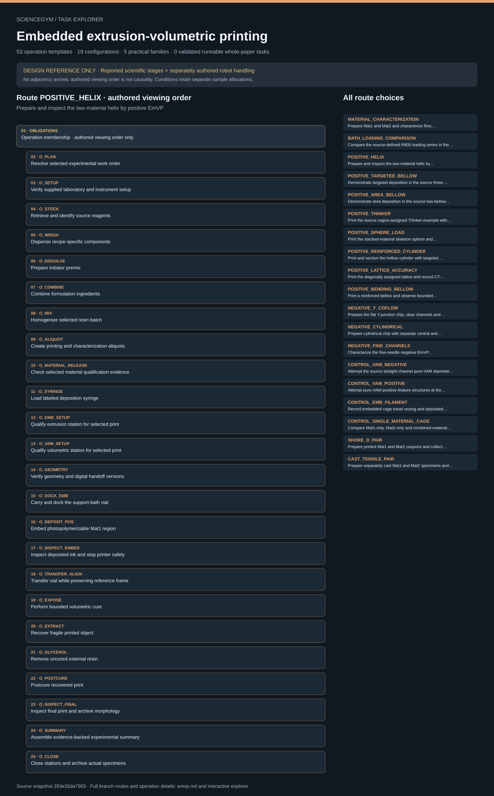

# Embedded extrusion-volumetric printing: task route map



Paper: **Additive manufacturing of multi-material and hollow structures by Embedded Extrusion-Volumetric Printing** · [DOI](https://doi.org/10.1038/s41467-025-62057-6)

Author/evaluator logical inspector; source-bounded task design only; no physical simulation, actor projection or robot execution. Counts describe task representation, not experiments or success.

**Reading rule:** numbered rows preserve reference-list occurrences. A loop body is shown once and must be repeated under its original binding, not treated as executed. An unordered obligation group has no inferred chronological edges. Source-reported scientific facts and authored handling are distinct.

[Immutable source task package](https://github.com/openags/ScienceGym/blob/293e32da790303c1a17131e036235f69a5f342e0/tasks/emvp_operations_v2/) · [Interactive inspector](../index.html)

## MATERIAL_CHARACTERIZATION — Prepare Mat1 and Mat2 and characterize flow, yielding, recovery, optical absorption and photogelation

Source-authored viewing order, not a causal sequence. Only declared dependencies constrain execution; condition routes use separate specimen allocations. Counts, gates and comparison coverage remain unresolved where the source says so.

[Exact route source](https://github.com/openags/ScienceGym/blob/293e32da790303c1a17131e036235f69a5f342e0/tasks/emvp_operations_v2/branches.json) · JSON pointer: `/configurations/0`

- **OBLIGATIONS: Operation membership · authored viewing order only**
  - Binding: {"order":"No list-adjacency edges asserted; apply declared dependencies only"}
  - `O_PLAN` Resolve selected experimental work order
  - `O_SETUP` Verify supplied laboratory and instrument setup
  - `O_STOCK` Retrieve and identify source reagents
  - `O_WEIGH` Dispense recipe-specific components
  - `O_DISSOLVE` Prepare initiator premix
  - `O_COMBINE` Combine formulation ingredients
  - `O_MIX` Homogenize selected resin batch
  - `O_ALIQUOT` Create printing and characterization aliquots
  - `O_RHEO_LOAD` Mount selected rheology aliquot
  - `O_AMPLITUDE` Acquire amplitude sweep
  - `O_FLOWCURVE` Acquire shear-rate flow curves
  - `O_RECOVERY` Acquire high-low shear recovery sequence
  - `O_PHOTORHEO` Acquire photorheological cure record
  - `O_RHEO_UNLOAD` Unload rheometer and preserve material state
  - `O_UVVIS_LOAD` Prepare optical sample and blank
  - `O_UVVIS_SCAN` Acquire resin spectrum
  - `O_SUMMARY` Assemble evidence-backed experimental summary
  - `O_CLOSE` Close stations and archive actual specimens
- **OBLIGATIONS: C_RHEO_PAIR · Compare Mat1 and Mat2 flow, yielding and recovery**
  - Binding: {"order":"Comparison coverage, not extra operation occurrences or successful repetitions","control_package":{"id":"C_RHEO_PAIR","comparison":"Compare Mat1 and Mat2 flow, yielding and recovery","outer_loop":["material","batch","allocated aliquot"],"inner_loop":["test type","selected repeat"],"replication":{"independent_specimens_per_condition":null,"status":"Required finite episode input; historical n not inferred","gate":"U_SCHEDULE"},"matched_factors":["qualified instrument geometry","temperature","program within assay"],"required_outputs":["Full selected flow/amplitude/recovery data","Aliquot consumption/reuse history"],"source_refs":["M_RHEO","M_F4","S_F3"],"interpretation":"Compare actual records with declared unmatched factors visible; source trends are context, never forced results.","loop_semantics":"Dimension names define nesting; where named physical states are listed they are observations of the same specimen, not independent sample loops. Use explicit condition_axes and ordered_states when supplied."}}
  - **LOOP: Outer allocation · material, batch, allocated aliquot · specimen count unknown**
    - Binding: {"outer_loop":["material","batch","allocated aliquot"],"replication":{"independent_specimens_per_condition":null,"status":"Required finite episode input; historical n not inferred","gate":"U_SCHEDULE"},"binding":"Symbolic coverage only; no operation-body binding supplied by this schema"}
    - **CONDITION: Inner observations · test type, selected repeat**
      - Binding: {"inner_loop":["test type","selected repeat"],"required_outputs":["Full selected flow/amplitude/recovery data","Aliquot consumption/reuse history"],"loop_semantics":"Dimension names define nesting; where named physical states are listed they are observations of the same specimen, not independent sample loops. Use explicit condition_axes and ordered_states when supplied."}
- **OBLIGATIONS: C_PHOTO_PAIR · Compare photogelation of the two formulations**
  - Binding: {"order":"Comparison coverage, not extra operation occurrences or successful repetitions","control_package":{"id":"C_PHOTO_PAIR","comparison":"Compare photogelation of the two formulations","outer_loop":["material","batch","independent photorheology aliquot"],"inner_loop":["single cure acquisition per fresh aliquot"],"replication":{"independent_specimens_per_condition":null,"status":"Required finite episode input; historical n not inferred","gate":"U_SCHEDULE"},"matched_factors":["30 percent","5 Hz","450 nm","5.8 mW/cm2","LED-on after30 s"],"required_outputs":["Measurement start and LED-on times","Raw moduli and crossing status","Both total elapsed and exposure elapsed if derived"],"source_refs":["M_RHEO","M_F4"],"interpretation":"Compare actual records with declared unmatched factors visible; source trends are context, never forced results.","loop_semantics":"Dimension names define nesting; where named physical states are listed they are observations of the same specimen, not independent sample loops. Use explicit condition_axes and ordered_states when supplied."}}
  - **LOOP: Outer allocation · material, batch, independent photorheology aliquot · specimen count unknown**
    - Binding: {"outer_loop":["material","batch","independent photorheology aliquot"],"replication":{"independent_specimens_per_condition":null,"status":"Required finite episode input; historical n not inferred","gate":"U_SCHEDULE"},"binding":"Symbolic coverage only; no operation-body binding supplied by this schema"}
    - **CONDITION: Inner observations · single cure acquisition per fresh aliquot**
      - Binding: {"inner_loop":["single cure acquisition per fresh aliquot"],"required_outputs":["Measurement start and LED-on times","Raw moduli and crossing status","Both total elapsed and exposure elapsed if derived"],"loop_semantics":"Dimension names define nesting; where named physical states are listed they are observations of the same specimen, not independent sample loops. Use explicit condition_axes and ordered_states when supplied."}
- **OBLIGATIONS: C_UVVIS_PAIR · Compare material absorption at printing wavelength**
  - Binding: {"order":"Comparison coverage, not extra operation occurrences or successful repetitions","control_package":{"id":"C_UVVIS_PAIR","comparison":"Compare material absorption at printing wavelength","outer_loop":["material","batch","optical aliquot"],"inner_loop":["spectral acquisition"],"replication":{"independent_specimens_per_condition":null,"status":"Required finite episode input; historical n not inferred","gate":"U_SCHEDULE"},"matched_factors":["400-550 nm range","1 cm cuvette","qualified blank/processing"],"required_outputs":["Raw spectra","Actual450 nm extraction and qualified conversion"],"source_refs":["M_OPTICAL","M_F4"],"interpretation":"Compare actual records with declared unmatched factors visible; source trends are context, never forced results.","loop_semantics":"Dimension names define nesting; where named physical states are listed they are observations of the same specimen, not independent sample loops. Use explicit condition_axes and ordered_states when supplied."}}
  - **LOOP: Outer allocation · material, batch, optical aliquot · specimen count unknown**
    - Binding: {"outer_loop":["material","batch","optical aliquot"],"replication":{"independent_specimens_per_condition":null,"status":"Required finite episode input; historical n not inferred","gate":"U_SCHEDULE"},"binding":"Symbolic coverage only; no operation-body binding supplied by this schema"}
    - **CONDITION: Inner observations · spectral acquisition**
      - Binding: {"inner_loop":["spectral acquisition"],"required_outputs":["Raw spectra","Actual450 nm extraction and qualified conversion"],"loop_semantics":"Dimension names define nesting; where named physical states are listed they are observations of the same specimen, not independent sample loops. Use explicit condition_axes and ordered_states when supplied."}

<details><summary>Branch state, choices, lineage and loop obligations</summary>

```json
{
  "family_id": "F_MATERIALS",
  "operation_ids": [
    "O_PLAN",
    "O_SETUP",
    "O_STOCK",
    "O_WEIGH",
    "O_DISSOLVE",
    "O_COMBINE",
    "O_MIX",
    "O_ALIQUOT",
    "O_RHEO_LOAD",
    "O_AMPLITUDE",
    "O_FLOWCURVE",
    "O_RECOVERY",
    "O_PHOTORHEO",
    "O_RHEO_UNLOAD",
    "O_UVVIS_LOAD",
    "O_UVVIS_SCAN",
    "O_SUMMARY",
    "O_CLOSE"
  ],
  "source_refs": [
    "M_PREP",
    "M_RHEO",
    "M_OPTICAL",
    "M_F4",
    "S_F3"
  ],
  "required_unknowns": [
    "U_ACETONE",
    "U_BATCH_ALLOCATION",
    "U_CQ_EDAB",
    "U_DEVICE_QUAL",
    "U_PHOTORHEO",
    "U_RECIPE_BASIS",
    "U_RHEOMETER",
    "U_SCHEDULE",
    "U_UVVIS"
  ],
  "material_ids": [
    "MAT1",
    "MAT2"
  ],
  "condition_dimensions": [
    "material",
    "independent batch and aliquot",
    "test type",
    "repeat"
  ],
  "control_package_ids": [
    "C_RHEO_PAIR",
    "C_PHOTO_PAIR",
    "C_UVVIS_PAIR"
  ],
  "notes": [
    "Separate aliquots or an explicit validated reuse sequence; cured photorheology aliquots cannot serve as fresh samples"
  ],
  "status": "Complete source-bounded template; runnable only after all selected input gates and external asset qualifications resolve"
}
```

</details>

## BATH_LOADING_COMPARISON — Compare the source-defined R805 loading series in the soft bath

Source-authored viewing order, not a causal sequence. Only declared dependencies constrain execution; condition routes use separate specimen allocations. Counts, gates and comparison coverage remain unresolved where the source says so.

[Exact route source](https://github.com/openags/ScienceGym/blob/293e32da790303c1a17131e036235f69a5f342e0/tasks/emvp_operations_v2/branches.json) · JSON pointer: `/configurations/1`

- **OBLIGATIONS: Operation membership · authored viewing order only**
  - Binding: {"order":"No list-adjacency edges asserted; apply declared dependencies only"}
  - `O_PLAN` Resolve selected experimental work order
  - `O_SETUP` Verify supplied laboratory and instrument setup
  - `O_STOCK` Retrieve and identify source reagents
  - `O_WEIGH` Dispense recipe-specific components
  - `O_DISSOLVE` Prepare initiator premix
  - `O_COMBINE` Combine formulation ingredients
  - `O_MIX` Homogenize selected resin batch
  - `O_ALIQUOT` Create printing and characterization aliquots
  - `O_RHEO_LOAD` Mount selected rheology aliquot
  - `O_FLOWCURVE` Acquire shear-rate flow curves
  - `O_RHEO_UNLOAD` Unload rheometer and preserve material state
  - `O_SUMMARY` Assemble evidence-backed experimental summary
  - `O_CLOSE` Close stations and archive actual specimens
- **OBLIGATIONS: C_LOADING · Compare bath R805 loading effects**
  - Binding: {"order":"Comparison coverage, not extra operation occurrences or successful repetitions","control_package":{"id":"C_LOADING","comparison":"Compare bath R805 loading effects","outer_loop":["verified R805 loading","batch","aliquot"],"inner_loop":["flow-curve acquisition"],"replication":{"independent_specimens_per_condition":null,"status":"Required finite episode input; historical n not inferred","gate":"U_SCHEDULE"},"matched_factors":["same base resin and qualified test program unless declared"],"required_outputs":["Each selected loading label and full curve","Invalid or missing loading conditions retained"],"source_refs":["S_F2"],"interpretation":"Compare actual records with declared unmatched factors visible; source trends are context, never forced results.","loop_semantics":"Dimension names define nesting; where named physical states are listed they are observations of the same specimen, not independent sample loops. Use explicit condition_axes and ordered_states when supplied.","condition_axes":[{"id":"R805_legend_percent","values":[2,4,8,12]},{"id":"independent_batch_or_aliquot","values":null,"gate":"U_SCHEDULE"}]}}
  - **LOOP: Outer allocation · verified R805 loading, batch, aliquot · specimen count unknown**
    - Binding: {"outer_loop":["verified R805 loading","batch","aliquot"],"replication":{"independent_specimens_per_condition":null,"status":"Required finite episode input; historical n not inferred","gate":"U_SCHEDULE"},"condition_axes":[{"id":"R805_legend_percent","values":[2,4,8,12]},{"id":"independent_batch_or_aliquot","values":null,"gate":"U_SCHEDULE"}],"binding":"Symbolic coverage only; no operation-body binding supplied by this schema"}
    - **CONDITION: Inner observations · flow-curve acquisition**
      - Binding: {"inner_loop":["flow-curve acquisition"],"required_outputs":["Each selected loading label and full curve","Invalid or missing loading conditions retained"],"loop_semantics":"Dimension names define nesting; where named physical states are listed they are observations of the same specimen, not independent sample loops. Use explicit condition_axes and ordered_states when supplied."}

<details><summary>Branch state, choices, lineage and loop obligations</summary>

```json
{
  "family_id": "F_MATERIALS",
  "operation_ids": [
    "O_PLAN",
    "O_SETUP",
    "O_STOCK",
    "O_WEIGH",
    "O_DISSOLVE",
    "O_COMBINE",
    "O_MIX",
    "O_ALIQUOT",
    "O_RHEO_LOAD",
    "O_FLOWCURVE",
    "O_RHEO_UNLOAD",
    "O_SUMMARY",
    "O_CLOSE"
  ],
  "source_refs": [
    "M_PREP",
    "S_F2"
  ],
  "required_unknowns": [
    "U_ACETONE",
    "U_BATCH_ALLOCATION",
    "U_DEVICE_QUAL",
    "U_LOADING_SERIES",
    "U_RECIPE_BASIS",
    "U_RHEOMETER",
    "U_SCHEDULE"
  ],
  "material_ids": [
    "MAT2_LOADING_SERIES"
  ],
  "condition_dimensions": [
    "R805 loading",
    "batch",
    "aliquot",
    "repeat"
  ],
  "control_package_ids": [
    "C_LOADING"
  ],
  "notes": [],
  "status": "Complete source-bounded template; runnable only after all selected input gates and external asset qualifications resolve"
}
```

</details>

## POSITIVE_HELIX — Prepare and inspect the two-material helix by positive EmVP

Source-authored viewing order, not a causal sequence. Only declared dependencies constrain execution; condition routes use separate specimen allocations. Counts, gates and comparison coverage remain unresolved where the source says so.

[Exact route source](https://github.com/openags/ScienceGym/blob/293e32da790303c1a17131e036235f69a5f342e0/tasks/emvp_operations_v2/branches.json) · JSON pointer: `/configurations/2`

- **OBLIGATIONS: Operation membership · authored viewing order only**
  - Binding: {"order":"No list-adjacency edges asserted; apply declared dependencies only"}
  - `O_PLAN` Resolve selected experimental work order
  - `O_SETUP` Verify supplied laboratory and instrument setup
  - `O_STOCK` Retrieve and identify source reagents
  - `O_WEIGH` Dispense recipe-specific components
  - `O_DISSOLVE` Prepare initiator premix
  - `O_COMBINE` Combine formulation ingredients
  - `O_MIX` Homogenize selected resin batch
  - `O_ALIQUOT` Create printing and characterization aliquots
  - `O_MATERIAL_RELEASE` Check selected material qualification evidence
  - `O_SYRINGE` Load labeled deposition syringe
  - `O_EMB_SETUP` Qualify extrusion station for selected print
  - `O_VAM_SETUP` Qualify volumetric station for selected print
  - `O_GEOMETRY` Verify geometry and digital handoff versions
  - `O_DOCK_EMB` Carry and dock the support-bath vial
  - `O_DEPOSIT_POS` Embed photopolymerizable Mat1 region
  - `O_INSPECT_EMBED` Inspect deposited ink and stop printer safely
  - `O_TRANSFER_ALIGN` Transfer vial while preserving reference frame
  - `O_EXPOSE` Perform bounded volumetric cure
  - `O_EXTRACT` Recover fragile printed object
  - `O_GLYCEROL` Remove uncured external resin
  - `O_POSTCURE` Postcure recovered print
  - `O_INSPECT_FINAL` Inspect final print and archive morphology
  - `O_SUMMARY` Assemble evidence-backed experimental summary
  - `O_CLOSE` Close stations and archive actual specimens

<details><summary>Branch state, choices, lineage and loop obligations</summary>

```json
{
  "family_id": "F_POSITIVE",
  "operation_ids": [
    "O_PLAN",
    "O_SETUP",
    "O_STOCK",
    "O_WEIGH",
    "O_DISSOLVE",
    "O_COMBINE",
    "O_MIX",
    "O_ALIQUOT",
    "O_MATERIAL_RELEASE",
    "O_SYRINGE",
    "O_EMB_SETUP",
    "O_VAM_SETUP",
    "O_GEOMETRY",
    "O_DOCK_EMB",
    "O_DEPOSIT_POS",
    "O_INSPECT_EMBED",
    "O_TRANSFER_ALIGN",
    "O_EXPOSE",
    "O_EXTRACT",
    "O_GLYCEROL",
    "O_POSTCURE",
    "O_INSPECT_FINAL",
    "O_SUMMARY",
    "O_CLOSE"
  ],
  "source_refs": [
    "M_F1",
    "S_T1"
  ],
  "required_unknowns": [
    "U_ACETONE",
    "U_ALIGNMENT",
    "U_BATCH_ALLOCATION",
    "U_CQ_EDAB",
    "U_DEVICE_QUAL",
    "U_EXTRUSION_QUAL",
    "U_GEOMETRY",
    "U_MATERIAL_QUAL",
    "U_MICROSCOPY",
    "U_POSTCURE",
    "U_PROJECTIONS",
    "U_RECIPE_BASIS",
    "U_SCHEDULE",
    "U_SHADOWGRAM",
    "U_TOOLPATH",
    "U_VAM_QUAL",
    "U_WASH"
  ],
  "material_ids": [
    "MAT1",
    "MAT2"
  ],
  "condition_dimensions": [
    "material region map",
    "specimen",
    "attempt"
  ],
  "control_package_ids": [],
  "notes": [],
  "status": "Complete source-bounded template; runnable only after all selected input gates and external asset qualifications resolve"
}
```

</details>

## POSITIVE_TARGETED_BELLOW — Demonstrate targeted deposition in the source three-bellow configuration

Source-authored viewing order, not a causal sequence. Only declared dependencies constrain execution; condition routes use separate specimen allocations. Counts, gates and comparison coverage remain unresolved where the source says so.

[Exact route source](https://github.com/openags/ScienceGym/blob/293e32da790303c1a17131e036235f69a5f342e0/tasks/emvp_operations_v2/branches.json) · JSON pointer: `/configurations/3`

- **OBLIGATIONS: Operation membership · authored viewing order only**
  - Binding: {"order":"No list-adjacency edges asserted; apply declared dependencies only"}
  - `O_PLAN` Resolve selected experimental work order
  - `O_SETUP` Verify supplied laboratory and instrument setup
  - `O_STOCK` Retrieve and identify source reagents
  - `O_WEIGH` Dispense recipe-specific components
  - `O_DISSOLVE` Prepare initiator premix
  - `O_COMBINE` Combine formulation ingredients
  - `O_MIX` Homogenize selected resin batch
  - `O_ALIQUOT` Create printing and characterization aliquots
  - `O_MATERIAL_RELEASE` Check selected material qualification evidence
  - `O_SYRINGE` Load labeled deposition syringe
  - `O_EMB_SETUP` Qualify extrusion station for selected print
  - `O_VAM_SETUP` Qualify volumetric station for selected print
  - `O_GEOMETRY` Verify geometry and digital handoff versions
  - `O_DOCK_EMB` Carry and dock the support-bath vial
  - `O_DEPOSIT_POS` Embed photopolymerizable Mat1 region
  - `O_INSPECT_EMBED` Inspect deposited ink and stop printer safely
  - `O_TRANSFER_ALIGN` Transfer vial while preserving reference frame
  - `O_EXPOSE` Perform bounded volumetric cure
  - `O_EXTRACT` Recover fragile printed object
  - `O_GLYCEROL` Remove uncured external resin
  - `O_POSTCURE` Postcure recovered print
  - `O_INSPECT_FINAL` Inspect final print and archive morphology
  - `O_SUMMARY` Assemble evidence-backed experimental summary
  - `O_CLOSE` Close stations and archive actual specimens

<details><summary>Branch state, choices, lineage and loop obligations</summary>

```json
{
  "family_id": "F_POSITIVE",
  "operation_ids": [
    "O_PLAN",
    "O_SETUP",
    "O_STOCK",
    "O_WEIGH",
    "O_DISSOLVE",
    "O_COMBINE",
    "O_MIX",
    "O_ALIQUOT",
    "O_MATERIAL_RELEASE",
    "O_SYRINGE",
    "O_EMB_SETUP",
    "O_VAM_SETUP",
    "O_GEOMETRY",
    "O_DOCK_EMB",
    "O_DEPOSIT_POS",
    "O_INSPECT_EMBED",
    "O_TRANSFER_ALIGN",
    "O_EXPOSE",
    "O_EXTRACT",
    "O_GLYCEROL",
    "O_POSTCURE",
    "O_INSPECT_FINAL",
    "O_SUMMARY",
    "O_CLOSE"
  ],
  "source_refs": [
    "M_F1",
    "S_T1"
  ],
  "required_unknowns": [
    "U_ACETONE",
    "U_ALIGNMENT",
    "U_BATCH_ALLOCATION",
    "U_CQ_EDAB",
    "U_DEVICE_QUAL",
    "U_EXTRUSION_QUAL",
    "U_GEOMETRY",
    "U_MATERIAL_QUAL",
    "U_MICROSCOPY",
    "U_POSTCURE",
    "U_PROJECTIONS",
    "U_RECIPE_BASIS",
    "U_SCHEDULE",
    "U_SHADOWGRAM",
    "U_TOOLPATH",
    "U_VAM_QUAL",
    "U_WASH"
  ],
  "material_ids": [
    "MAT1",
    "MAT2"
  ],
  "condition_dimensions": [
    "targeted region map",
    "specimen",
    "attempt"
  ],
  "control_package_ids": [],
  "notes": [
    "SI row 3Bellow (1i) identifies the example; exact geometry is not reconstructed from the figure"
  ],
  "status": "Complete source-bounded template; runnable only after all selected input gates and external asset qualifications resolve"
}
```

</details>

## POSITIVE_AREA_BELLOW — Demonstrate area deposition in the source two-bellow configuration

Source-authored viewing order, not a causal sequence. Only declared dependencies constrain execution; condition routes use separate specimen allocations. Counts, gates and comparison coverage remain unresolved where the source says so.

[Exact route source](https://github.com/openags/ScienceGym/blob/293e32da790303c1a17131e036235f69a5f342e0/tasks/emvp_operations_v2/branches.json) · JSON pointer: `/configurations/4`

- **OBLIGATIONS: Operation membership · authored viewing order only**
  - Binding: {"order":"No list-adjacency edges asserted; apply declared dependencies only"}
  - `O_PLAN` Resolve selected experimental work order
  - `O_SETUP` Verify supplied laboratory and instrument setup
  - `O_STOCK` Retrieve and identify source reagents
  - `O_WEIGH` Dispense recipe-specific components
  - `O_DISSOLVE` Prepare initiator premix
  - `O_COMBINE` Combine formulation ingredients
  - `O_MIX` Homogenize selected resin batch
  - `O_ALIQUOT` Create printing and characterization aliquots
  - `O_MATERIAL_RELEASE` Check selected material qualification evidence
  - `O_SYRINGE` Load labeled deposition syringe
  - `O_EMB_SETUP` Qualify extrusion station for selected print
  - `O_VAM_SETUP` Qualify volumetric station for selected print
  - `O_GEOMETRY` Verify geometry and digital handoff versions
  - `O_DOCK_EMB` Carry and dock the support-bath vial
  - `O_DEPOSIT_POS` Embed photopolymerizable Mat1 region
  - `O_INSPECT_EMBED` Inspect deposited ink and stop printer safely
  - `O_TRANSFER_ALIGN` Transfer vial while preserving reference frame
  - `O_EXPOSE` Perform bounded volumetric cure
  - `O_EXTRACT` Recover fragile printed object
  - `O_GLYCEROL` Remove uncured external resin
  - `O_POSTCURE` Postcure recovered print
  - `O_INSPECT_FINAL` Inspect final print and archive morphology
  - `O_SUMMARY` Assemble evidence-backed experimental summary
  - `O_CLOSE` Close stations and archive actual specimens

<details><summary>Branch state, choices, lineage and loop obligations</summary>

```json
{
  "family_id": "F_POSITIVE",
  "operation_ids": [
    "O_PLAN",
    "O_SETUP",
    "O_STOCK",
    "O_WEIGH",
    "O_DISSOLVE",
    "O_COMBINE",
    "O_MIX",
    "O_ALIQUOT",
    "O_MATERIAL_RELEASE",
    "O_SYRINGE",
    "O_EMB_SETUP",
    "O_VAM_SETUP",
    "O_GEOMETRY",
    "O_DOCK_EMB",
    "O_DEPOSIT_POS",
    "O_INSPECT_EMBED",
    "O_TRANSFER_ALIGN",
    "O_EXPOSE",
    "O_EXTRACT",
    "O_GLYCEROL",
    "O_POSTCURE",
    "O_INSPECT_FINAL",
    "O_SUMMARY",
    "O_CLOSE"
  ],
  "source_refs": [
    "M_F1",
    "S_T1"
  ],
  "required_unknowns": [
    "U_ACETONE",
    "U_ALIGNMENT",
    "U_BATCH_ALLOCATION",
    "U_CQ_EDAB",
    "U_DEVICE_QUAL",
    "U_EXTRUSION_QUAL",
    "U_GEOMETRY",
    "U_MATERIAL_QUAL",
    "U_MICROSCOPY",
    "U_POSTCURE",
    "U_PROJECTIONS",
    "U_RECIPE_BASIS",
    "U_SCHEDULE",
    "U_SHADOWGRAM",
    "U_TOOLPATH",
    "U_VAM_QUAL",
    "U_WASH"
  ],
  "material_ids": [
    "MAT1",
    "MAT2"
  ],
  "condition_dimensions": [
    "area region map",
    "specimen",
    "attempt"
  ],
  "control_package_ids": [],
  "notes": [
    "SI row 2Bellow (1j) identifies the example; no claim that its geometry matches the targeted example"
  ],
  "status": "Complete source-bounded template; runnable only after all selected input gates and external asset qualifications resolve"
}
```

</details>

## POSITIVE_THINKER — Print the source region-assigned Thinker example with stiff support stone and soft figure

Source-authored viewing order, not a causal sequence. Only declared dependencies constrain execution; condition routes use separate specimen allocations. Counts, gates and comparison coverage remain unresolved where the source says so.

[Exact route source](https://github.com/openags/ScienceGym/blob/293e32da790303c1a17131e036235f69a5f342e0/tasks/emvp_operations_v2/branches.json) · JSON pointer: `/configurations/5`

- **OBLIGATIONS: Operation membership · authored viewing order only**
  - Binding: {"order":"No list-adjacency edges asserted; apply declared dependencies only"}
  - `O_PLAN` Resolve selected experimental work order
  - `O_SETUP` Verify supplied laboratory and instrument setup
  - `O_STOCK` Retrieve and identify source reagents
  - `O_WEIGH` Dispense recipe-specific components
  - `O_DISSOLVE` Prepare initiator premix
  - `O_COMBINE` Combine formulation ingredients
  - `O_MIX` Homogenize selected resin batch
  - `O_ALIQUOT` Create printing and characterization aliquots
  - `O_MATERIAL_RELEASE` Check selected material qualification evidence
  - `O_SYRINGE` Load labeled deposition syringe
  - `O_EMB_SETUP` Qualify extrusion station for selected print
  - `O_VAM_SETUP` Qualify volumetric station for selected print
  - `O_GEOMETRY` Verify geometry and digital handoff versions
  - `O_DOCK_EMB` Carry and dock the support-bath vial
  - `O_DEPOSIT_POS` Embed photopolymerizable Mat1 region
  - `O_INSPECT_EMBED` Inspect deposited ink and stop printer safely
  - `O_TRANSFER_ALIGN` Transfer vial while preserving reference frame
  - `O_EXPOSE` Perform bounded volumetric cure
  - `O_EXTRACT` Recover fragile printed object
  - `O_GLYCEROL` Remove uncured external resin
  - `O_POSTCURE` Postcure recovered print
  - `O_INSPECT_FINAL` Inspect final print and archive morphology
  - `O_SUMMARY` Assemble evidence-backed experimental summary
  - `O_CLOSE` Close stations and archive actual specimens

<details><summary>Branch state, choices, lineage and loop obligations</summary>

```json
{
  "family_id": "F_POSITIVE",
  "operation_ids": [
    "O_PLAN",
    "O_SETUP",
    "O_STOCK",
    "O_WEIGH",
    "O_DISSOLVE",
    "O_COMBINE",
    "O_MIX",
    "O_ALIQUOT",
    "O_MATERIAL_RELEASE",
    "O_SYRINGE",
    "O_EMB_SETUP",
    "O_VAM_SETUP",
    "O_GEOMETRY",
    "O_DOCK_EMB",
    "O_DEPOSIT_POS",
    "O_INSPECT_EMBED",
    "O_TRANSFER_ALIGN",
    "O_EXPOSE",
    "O_EXTRACT",
    "O_GLYCEROL",
    "O_POSTCURE",
    "O_INSPECT_FINAL",
    "O_SUMMARY",
    "O_CLOSE"
  ],
  "source_refs": [
    "M_F2",
    "S_T1"
  ],
  "required_unknowns": [
    "U_ACETONE",
    "U_ALIGNMENT",
    "U_BATCH_ALLOCATION",
    "U_CQ_EDAB",
    "U_DEVICE_QUAL",
    "U_EXTRUSION_QUAL",
    "U_GEOMETRY",
    "U_MATERIAL_QUAL",
    "U_MICROSCOPY",
    "U_POSTCURE",
    "U_PROJECTIONS",
    "U_RECIPE_BASIS",
    "U_SCHEDULE",
    "U_SHADOWGRAM",
    "U_TOOLPATH",
    "U_VAM_QUAL",
    "U_WASH"
  ],
  "material_ids": [
    "MAT1",
    "MAT2"
  ],
  "condition_dimensions": [
    "region map",
    "specimen",
    "attempt"
  ],
  "control_package_ids": [],
  "notes": [
    "Source model availability and applicable geometry rights require a supplied asset; no figure-derived CAD is generated"
  ],
  "status": "Complete source-bounded template; runnable only after all selected input gates and external asset qualifications resolve"
}
```

</details>

## POSITIVE_SPHERE_LOAD — Print the stacked-material skeleton sphere and observe its response to the reported 3 g bar

Source-authored viewing order, not a causal sequence. Only declared dependencies constrain execution; condition routes use separate specimen allocations. Counts, gates and comparison coverage remain unresolved where the source says so.

[Exact route source](https://github.com/openags/ScienceGym/blob/293e32da790303c1a17131e036235f69a5f342e0/tasks/emvp_operations_v2/branches.json) · JSON pointer: `/configurations/6`

- **OBLIGATIONS: Operation membership · authored viewing order only**
  - Binding: {"order":"No list-adjacency edges asserted; apply declared dependencies only"}
  - `O_PLAN` Resolve selected experimental work order
  - `O_SETUP` Verify supplied laboratory and instrument setup
  - `O_STOCK` Retrieve and identify source reagents
  - `O_WEIGH` Dispense recipe-specific components
  - `O_DISSOLVE` Prepare initiator premix
  - `O_COMBINE` Combine formulation ingredients
  - `O_MIX` Homogenize selected resin batch
  - `O_ALIQUOT` Create printing and characterization aliquots
  - `O_MATERIAL_RELEASE` Check selected material qualification evidence
  - `O_SYRINGE` Load labeled deposition syringe
  - `O_EMB_SETUP` Qualify extrusion station for selected print
  - `O_VAM_SETUP` Qualify volumetric station for selected print
  - `O_GEOMETRY` Verify geometry and digital handoff versions
  - `O_DOCK_EMB` Carry and dock the support-bath vial
  - `O_DEPOSIT_POS` Embed photopolymerizable Mat1 region
  - `O_INSPECT_EMBED` Inspect deposited ink and stop printer safely
  - `O_TRANSFER_ALIGN` Transfer vial while preserving reference frame
  - `O_EXPOSE` Perform bounded volumetric cure
  - `O_EXTRACT` Recover fragile printed object
  - `O_GLYCEROL` Remove uncured external resin
  - `O_POSTCURE` Postcure recovered print
  - `O_INSPECT_FINAL` Inspect final print and archive morphology
  - `O_SPHERE_LOAD` Observe sphere under stated mass
  - `O_SUMMARY` Assemble evidence-backed experimental summary
  - `O_CLOSE` Close stations and archive actual specimens
- **OBLIGATIONS: C_SPHERE_STATES · Observe material-specific deformation under reported bar**
  - Binding: {"order":"Comparison coverage, not extra operation occurrences or successful repetitions","control_package":{"id":"C_SPHERE_STATES","comparison":"Observe material-specific deformation under reported bar","outer_loop":["printed sphere specimen"],"inner_loop":["unloaded","3 g bar applied","bar removed"],"replication":{"independent_specimens_per_condition":null,"status":"Required finite episode input; historical n not inferred","gate":"U_SCHEDULE"},"matched_factors":["same specimen and viewing reference","declared placement"],"required_outputs":["Actual mass placement and state images"],"source_refs":["M_F2"],"interpretation":"Compare actual records with declared unmatched factors visible; source trends are context, never forced results.","loop_semantics":"Dimension names define nesting; where named physical states are listed they are observations of the same specimen, not independent sample loops. Use explicit condition_axes and ordered_states when supplied.","ordered_states":["unloaded","3 g bar applied","bar removed"]}}
  - **LOOP: Outer allocation · printed sphere specimen · specimen count unknown**
    - Binding: {"outer_loop":["printed sphere specimen"],"replication":{"independent_specimens_per_condition":null,"status":"Required finite episode input; historical n not inferred","gate":"U_SCHEDULE"},"binding":"Symbolic coverage only; no operation-body binding supplied by this schema"}
    - **CONDITION: Inner observations · unloaded, 3 g bar applied, bar removed**
      - Binding: {"inner_loop":["unloaded","3 g bar applied","bar removed"],"ordered_states":["unloaded","3 g bar applied","bar removed"],"required_outputs":["Actual mass placement and state images"],"loop_semantics":"Dimension names define nesting; where named physical states are listed they are observations of the same specimen, not independent sample loops. Use explicit condition_axes and ordered_states when supplied."}

<details><summary>Branch state, choices, lineage and loop obligations</summary>

```json
{
  "family_id": "F_POSITIVE",
  "operation_ids": [
    "O_PLAN",
    "O_SETUP",
    "O_STOCK",
    "O_WEIGH",
    "O_DISSOLVE",
    "O_COMBINE",
    "O_MIX",
    "O_ALIQUOT",
    "O_MATERIAL_RELEASE",
    "O_SYRINGE",
    "O_EMB_SETUP",
    "O_VAM_SETUP",
    "O_GEOMETRY",
    "O_DOCK_EMB",
    "O_DEPOSIT_POS",
    "O_INSPECT_EMBED",
    "O_TRANSFER_ALIGN",
    "O_EXPOSE",
    "O_EXTRACT",
    "O_GLYCEROL",
    "O_POSTCURE",
    "O_INSPECT_FINAL",
    "O_SPHERE_LOAD",
    "O_SUMMARY",
    "O_CLOSE"
  ],
  "source_refs": [
    "M_F2",
    "S_F1",
    "S_T1"
  ],
  "required_unknowns": [
    "U_ACETONE",
    "U_ALIGNMENT",
    "U_BATCH_ALLOCATION",
    "U_CQ_EDAB",
    "U_DEVICE_QUAL",
    "U_EXTRUSION_QUAL",
    "U_GEOMETRY",
    "U_LOAD_TEST",
    "U_MATERIAL_QUAL",
    "U_MICROSCOPY",
    "U_POSTCURE",
    "U_PROJECTIONS",
    "U_RECIPE_BASIS",
    "U_SCHEDULE",
    "U_SHADOWGRAM",
    "U_TOOLPATH",
    "U_VAM_QUAL",
    "U_WASH"
  ],
  "material_ids": [
    "MAT1",
    "MAT2"
  ],
  "condition_dimensions": [
    "material-half assignment",
    "specimen",
    "load state",
    "attempt"
  ],
  "control_package_ids": [
    "C_SPHERE_STATES"
  ],
  "notes": [],
  "status": "Complete source-bounded template; runnable only after all selected input gates and external asset qualifications resolve"
}
```

</details>

## POSITIVE_REINFORCED_CYLINDER — Print and section the hollow cylinder with targeted stiff filaments and measure its interfaces

Source-authored viewing order, not a causal sequence. Only declared dependencies constrain execution; condition routes use separate specimen allocations. Counts, gates and comparison coverage remain unresolved where the source says so.

[Exact route source](https://github.com/openags/ScienceGym/blob/293e32da790303c1a17131e036235f69a5f342e0/tasks/emvp_operations_v2/branches.json) · JSON pointer: `/configurations/7`

- **OBLIGATIONS: Operation membership · authored viewing order only**
  - Binding: {"order":"No list-adjacency edges asserted; apply declared dependencies only"}
  - `O_PLAN` Resolve selected experimental work order
  - `O_SETUP` Verify supplied laboratory and instrument setup
  - `O_STOCK` Retrieve and identify source reagents
  - `O_WEIGH` Dispense recipe-specific components
  - `O_DISSOLVE` Prepare initiator premix
  - `O_COMBINE` Combine formulation ingredients
  - `O_MIX` Homogenize selected resin batch
  - `O_ALIQUOT` Create printing and characterization aliquots
  - `O_MATERIAL_RELEASE` Check selected material qualification evidence
  - `O_SYRINGE` Load labeled deposition syringe
  - `O_EMB_SETUP` Qualify extrusion station for selected print
  - `O_VAM_SETUP` Qualify volumetric station for selected print
  - `O_GEOMETRY` Verify geometry and digital handoff versions
  - `O_DOCK_EMB` Carry and dock the support-bath vial
  - `O_DEPOSIT_POS` Embed photopolymerizable Mat1 region
  - `O_INSPECT_EMBED` Inspect deposited ink and stop printer safely
  - `O_TRANSFER_ALIGN` Transfer vial while preserving reference frame
  - `O_EXPOSE` Perform bounded volumetric cure
  - `O_EXTRACT` Recover fragile printed object
  - `O_GLYCEROL` Remove uncured external resin
  - `O_POSTCURE` Postcure recovered print
  - `O_INSPECT_FINAL` Inspect final print and archive morphology
  - `O_SECTION` Prepare declared destructive section
  - `O_MICRO_MOUNT` Mount and calibrate microscopy specimen
  - `O_MICRO_MEASURE` Capture feature and interface measurements
  - `O_SUMMARY` Assemble evidence-backed experimental summary
  - `O_CLOSE` Close stations and archive actual specimens

<details><summary>Branch state, choices, lineage and loop obligations</summary>

```json
{
  "family_id": "F_POSITIVE",
  "operation_ids": [
    "O_PLAN",
    "O_SETUP",
    "O_STOCK",
    "O_WEIGH",
    "O_DISSOLVE",
    "O_COMBINE",
    "O_MIX",
    "O_ALIQUOT",
    "O_MATERIAL_RELEASE",
    "O_SYRINGE",
    "O_EMB_SETUP",
    "O_VAM_SETUP",
    "O_GEOMETRY",
    "O_DOCK_EMB",
    "O_DEPOSIT_POS",
    "O_INSPECT_EMBED",
    "O_TRANSFER_ALIGN",
    "O_EXPOSE",
    "O_EXTRACT",
    "O_GLYCEROL",
    "O_POSTCURE",
    "O_INSPECT_FINAL",
    "O_SECTION",
    "O_MICRO_MOUNT",
    "O_MICRO_MEASURE",
    "O_SUMMARY",
    "O_CLOSE"
  ],
  "source_refs": [
    "M_F2",
    "S_T1"
  ],
  "required_unknowns": [
    "U_ACETONE",
    "U_ALIGNMENT",
    "U_BATCH_ALLOCATION",
    "U_CQ_EDAB",
    "U_DEVICE_QUAL",
    "U_EXTRUSION_QUAL",
    "U_GEOMETRY",
    "U_MATERIAL_QUAL",
    "U_MICROSCOPY",
    "U_POSTCURE",
    "U_PROJECTIONS",
    "U_RECIPE_BASIS",
    "U_SCHEDULE",
    "U_SHADOWGRAM",
    "U_TOOLPATH",
    "U_VAM_QUAL",
    "U_WASH"
  ],
  "material_ids": [
    "MAT1",
    "MAT2"
  ],
  "condition_dimensions": [
    "filament position",
    "section plane",
    "specimen",
    "attempt"
  ],
  "control_package_ids": [],
  "notes": [],
  "status": "Complete source-bounded template; runnable only after all selected input gates and external asset qualifications resolve"
}
```

</details>

## POSITIVE_LATTICE_ACCURACY — Print the diagonally assigned lattice and record CT-to-model geometric comparison

Source-authored viewing order, not a causal sequence. Only declared dependencies constrain execution; condition routes use separate specimen allocations. Counts, gates and comparison coverage remain unresolved where the source says so.

[Exact route source](https://github.com/openags/ScienceGym/blob/293e32da790303c1a17131e036235f69a5f342e0/tasks/emvp_operations_v2/branches.json) · JSON pointer: `/configurations/8`

- **OBLIGATIONS: Operation membership · authored viewing order only**
  - Binding: {"order":"No list-adjacency edges asserted; apply declared dependencies only"}
  - `O_PLAN` Resolve selected experimental work order
  - `O_SETUP` Verify supplied laboratory and instrument setup
  - `O_STOCK` Retrieve and identify source reagents
  - `O_WEIGH` Dispense recipe-specific components
  - `O_DISSOLVE` Prepare initiator premix
  - `O_COMBINE` Combine formulation ingredients
  - `O_MIX` Homogenize selected resin batch
  - `O_ALIQUOT` Create printing and characterization aliquots
  - `O_MATERIAL_RELEASE` Check selected material qualification evidence
  - `O_SYRINGE` Load labeled deposition syringe
  - `O_EMB_SETUP` Qualify extrusion station for selected print
  - `O_VAM_SETUP` Qualify volumetric station for selected print
  - `O_GEOMETRY` Verify geometry and digital handoff versions
  - `O_DOCK_EMB` Carry and dock the support-bath vial
  - `O_DEPOSIT_POS` Embed photopolymerizable Mat1 region
  - `O_INSPECT_EMBED` Inspect deposited ink and stop printer safely
  - `O_TRANSFER_ALIGN` Transfer vial while preserving reference frame
  - `O_EXPOSE` Perform bounded volumetric cure
  - `O_EXTRACT` Recover fragile printed object
  - `O_GLYCEROL` Remove uncured external resin
  - `O_POSTCURE` Postcure recovered print
  - `O_INSPECT_FINAL` Inspect final print and archive morphology
  - `O_CT_MOUNT` Transport and mount part for microCT
  - `O_CT_SCAN` Acquire microCT projections
  - `O_CT_RECON_HANDOFF` Request and inspect qualified reconstruction output
  - `O_DISTANCE_HANDOFF` Evaluate CT-to-model surface comparison
  - `O_SUMMARY` Assemble evidence-backed experimental summary
  - `O_CLOSE` Close stations and archive actual specimens
- **OBLIGATIONS: C_LATTICE_REGIONS · Compare geometry deviations across material regions**
  - Binding: {"order":"Comparison coverage, not extra operation occurrences or successful repetitions","control_package":{"id":"C_LATTICE_REGIONS","comparison":"Compare geometry deviations across material regions","outer_loop":["printed lattice specimen","analysis version"],"inner_loop":["whole shape","Mat1 region","Mat2 region"],"replication":{"independent_specimens_per_condition":null,"status":"Required finite episode input; historical n not inferred","gate":"U_SCHEDULE"},"matched_factors":["same actualCT and model registration","same metric definition"],"required_outputs":["Raw scan and model provenance","Region-resolved or unavailable summaries with actual sample definition"],"source_refs":["S_F8"],"interpretation":"Compare actual records with declared unmatched factors visible; source trends are context, never forced results.","loop_semantics":"Dimension names define nesting; where named physical states are listed they are observations of the same specimen, not independent sample loops. Use explicit condition_axes and ordered_states when supplied."}}
  - **LOOP: Outer allocation · printed lattice specimen, analysis version · specimen count unknown**
    - Binding: {"outer_loop":["printed lattice specimen","analysis version"],"replication":{"independent_specimens_per_condition":null,"status":"Required finite episode input; historical n not inferred","gate":"U_SCHEDULE"},"binding":"Symbolic coverage only; no operation-body binding supplied by this schema"}
    - **CONDITION: Inner observations · whole shape, Mat1 region, Mat2 region**
      - Binding: {"inner_loop":["whole shape","Mat1 region","Mat2 region"],"required_outputs":["Raw scan and model provenance","Region-resolved or unavailable summaries with actual sample definition"],"loop_semantics":"Dimension names define nesting; where named physical states are listed they are observations of the same specimen, not independent sample loops. Use explicit condition_axes and ordered_states when supplied."}

<details><summary>Branch state, choices, lineage and loop obligations</summary>

```json
{
  "family_id": "F_POSITIVE",
  "operation_ids": [
    "O_PLAN",
    "O_SETUP",
    "O_STOCK",
    "O_WEIGH",
    "O_DISSOLVE",
    "O_COMBINE",
    "O_MIX",
    "O_ALIQUOT",
    "O_MATERIAL_RELEASE",
    "O_SYRINGE",
    "O_EMB_SETUP",
    "O_VAM_SETUP",
    "O_GEOMETRY",
    "O_DOCK_EMB",
    "O_DEPOSIT_POS",
    "O_INSPECT_EMBED",
    "O_TRANSFER_ALIGN",
    "O_EXPOSE",
    "O_EXTRACT",
    "O_GLYCEROL",
    "O_POSTCURE",
    "O_INSPECT_FINAL",
    "O_CT_MOUNT",
    "O_CT_SCAN",
    "O_CT_RECON_HANDOFF",
    "O_DISTANCE_HANDOFF",
    "O_SUMMARY",
    "O_CLOSE"
  ],
  "source_refs": [
    "M_F2",
    "S_F8",
    "M_DISTANCE",
    "S_T1"
  ],
  "required_unknowns": [
    "U_ACETONE",
    "U_ALIGNMENT",
    "U_BATCH_ALLOCATION",
    "U_CQ_EDAB",
    "U_CT",
    "U_DEVICE_QUAL",
    "U_DISTANCE",
    "U_EXTRUSION_QUAL",
    "U_GEOMETRY",
    "U_MATERIAL_QUAL",
    "U_MICROSCOPY",
    "U_POSTCURE",
    "U_PROJECTIONS",
    "U_RECIPE_BASIS",
    "U_SCHEDULE",
    "U_SHADOWGRAM",
    "U_TOOLPATH",
    "U_VAM_QUAL",
    "U_WASH"
  ],
  "material_ids": [
    "MAT1",
    "MAT2"
  ],
  "condition_dimensions": [
    "region assignment",
    "specimen",
    "CT location",
    "surface analysis version"
  ],
  "control_package_ids": [
    "C_LATTICE_REGIONS"
  ],
  "notes": [],
  "status": "Complete source-bounded template; runnable only after all selected input gates and external asset qualifications resolve"
}
```

</details>

## POSITIVE_BENDING_BELLOW — Print a reinforced bellow and observe bounded negative-pressure bending and release

Source-authored viewing order, not a causal sequence. Only declared dependencies constrain execution; condition routes use separate specimen allocations. Counts, gates and comparison coverage remain unresolved where the source says so.

[Exact route source](https://github.com/openags/ScienceGym/blob/293e32da790303c1a17131e036235f69a5f342e0/tasks/emvp_operations_v2/branches.json) · JSON pointer: `/configurations/9`

- **OBLIGATIONS: Operation membership · authored viewing order only**
  - Binding: {"order":"No list-adjacency edges asserted; apply declared dependencies only"}
  - `O_PLAN` Resolve selected experimental work order
  - `O_SETUP` Verify supplied laboratory and instrument setup
  - `O_STOCK` Retrieve and identify source reagents
  - `O_WEIGH` Dispense recipe-specific components
  - `O_DISSOLVE` Prepare initiator premix
  - `O_COMBINE` Combine formulation ingredients
  - `O_MIX` Homogenize selected resin batch
  - `O_ALIQUOT` Create printing and characterization aliquots
  - `O_MATERIAL_RELEASE` Check selected material qualification evidence
  - `O_SYRINGE` Load labeled deposition syringe
  - `O_EMB_SETUP` Qualify extrusion station for selected print
  - `O_VAM_SETUP` Qualify volumetric station for selected print
  - `O_GEOMETRY` Verify geometry and digital handoff versions
  - `O_DOCK_EMB` Carry and dock the support-bath vial
  - `O_DEPOSIT_POS` Embed photopolymerizable Mat1 region
  - `O_INSPECT_EMBED` Inspect deposited ink and stop printer safely
  - `O_TRANSFER_ALIGN` Transfer vial while preserving reference frame
  - `O_EXPOSE` Perform bounded volumetric cure
  - `O_EXTRACT` Recover fragile printed object
  - `O_GLYCEROL` Remove uncured external resin
  - `O_POSTCURE` Postcure recovered print
  - `O_INSPECT_FINAL` Inspect final print and archive morphology
  - `O_BELLOW_CONNECT` Connect reinforced bellow for pressure test
  - `O_BELLOW_ACTUATE` Observe bounded negative-pressure bending
  - `O_SUMMARY` Assemble evidence-backed experimental summary
  - `O_CLOSE` Close stations and archive actual specimens
- **OBLIGATIONS: C_BELLOW_STATES · Observe reinforced-bellow response**
  - Binding: {"order":"Comparison coverage, not extra operation occurrences or successful repetitions","control_package":{"id":"C_BELLOW_STATES","comparison":"Observe reinforced-bellow response","outer_loop":["printed bellow specimen","bounded pressure attempt"],"inner_loop":["baseline","negative-pressure program","released"],"replication":{"independent_specimens_per_condition":null,"status":"Required finite episode input; historical n not inferred","gate":"U_SCHEDULE"},"matched_factors":["same specimen/fixture/view","qualified pressure program"],"required_outputs":["Pressure/time records","Actual bend and release observations"],"source_refs":["M_F2"],"interpretation":"Compare actual records with declared unmatched factors visible; source trends are context, never forced results.","loop_semantics":"Dimension names define nesting; where named physical states are listed they are observations of the same specimen, not independent sample loops. Use explicit condition_axes and ordered_states when supplied.","ordered_states":["baseline","qualified negative-pressure program","released"]}}
  - **LOOP: Outer allocation · printed bellow specimen, bounded pressure attempt · specimen count unknown**
    - Binding: {"outer_loop":["printed bellow specimen","bounded pressure attempt"],"replication":{"independent_specimens_per_condition":null,"status":"Required finite episode input; historical n not inferred","gate":"U_SCHEDULE"},"binding":"Symbolic coverage only; no operation-body binding supplied by this schema"}
    - **CONDITION: Inner observations · baseline, negative-pressure program, released**
      - Binding: {"inner_loop":["baseline","negative-pressure program","released"],"ordered_states":["baseline","qualified negative-pressure program","released"],"required_outputs":["Pressure/time records","Actual bend and release observations"],"loop_semantics":"Dimension names define nesting; where named physical states are listed they are observations of the same specimen, not independent sample loops. Use explicit condition_axes and ordered_states when supplied."}

<details><summary>Branch state, choices, lineage and loop obligations</summary>

```json
{
  "family_id": "F_POSITIVE",
  "operation_ids": [
    "O_PLAN",
    "O_SETUP",
    "O_STOCK",
    "O_WEIGH",
    "O_DISSOLVE",
    "O_COMBINE",
    "O_MIX",
    "O_ALIQUOT",
    "O_MATERIAL_RELEASE",
    "O_SYRINGE",
    "O_EMB_SETUP",
    "O_VAM_SETUP",
    "O_GEOMETRY",
    "O_DOCK_EMB",
    "O_DEPOSIT_POS",
    "O_INSPECT_EMBED",
    "O_TRANSFER_ALIGN",
    "O_EXPOSE",
    "O_EXTRACT",
    "O_GLYCEROL",
    "O_POSTCURE",
    "O_INSPECT_FINAL",
    "O_BELLOW_CONNECT",
    "O_BELLOW_ACTUATE",
    "O_SUMMARY",
    "O_CLOSE"
  ],
  "source_refs": [
    "M_F2",
    "S_T1"
  ],
  "required_unknowns": [
    "U_ACETONE",
    "U_ALIGNMENT",
    "U_BATCH_ALLOCATION",
    "U_CQ_EDAB",
    "U_DEVICE_QUAL",
    "U_EXTRUSION_QUAL",
    "U_GEOMETRY",
    "U_MATERIAL_QUAL",
    "U_MICROSCOPY",
    "U_PNEUMATIC",
    "U_POSTCURE",
    "U_PROJECTIONS",
    "U_RECIPE_BASIS",
    "U_SCHEDULE",
    "U_SHADOWGRAM",
    "U_TOOLPATH",
    "U_VAM_QUAL",
    "U_WASH"
  ],
  "material_ids": [
    "MAT1",
    "MAT2"
  ],
  "condition_dimensions": [
    "specimen",
    "pressure program",
    "loaded/released state",
    "attempt"
  ],
  "control_package_ids": [
    "C_BELLOW_STATES"
  ],
  "notes": [],
  "status": "Complete source-bounded template; runnable only after all selected input gates and external asset qualifications resolve"
}
```

</details>

## NEGATIVE_Y_COFLOW — Prepare the flat Y-junction chip, clear channels and characterize geometry and red/blue-water co-flow

Source-authored viewing order, not a causal sequence. Only declared dependencies constrain execution; condition routes use separate specimen allocations. Counts, gates and comparison coverage remain unresolved where the source says so.

[Exact route source](https://github.com/openags/ScienceGym/blob/293e32da790303c1a17131e036235f69a5f342e0/tasks/emvp_operations_v2/branches.json) · JSON pointer: `/configurations/10`

- **OBLIGATIONS: Operation membership · authored viewing order only**
  - Binding: {"order":"No list-adjacency edges asserted; apply declared dependencies only"}
  - `O_PLAN` Resolve selected experimental work order
  - `O_SETUP` Verify supplied laboratory and instrument setup
  - `O_STOCK` Retrieve and identify source reagents
  - `O_WEIGH` Dispense recipe-specific components
  - `O_DISSOLVE` Prepare initiator premix
  - `O_COMBINE` Combine formulation ingredients
  - `O_MIX` Homogenize selected resin batch
  - `O_ALIQUOT` Create printing and characterization aliquots
  - `O_MATERIAL_RELEASE` Check selected material qualification evidence
  - `O_SYRINGE` Load labeled deposition syringe
  - `O_EMB_SETUP` Qualify extrusion station for selected print
  - `O_VAM_SETUP` Qualify volumetric station for selected print
  - `O_GEOMETRY` Verify geometry and digital handoff versions
  - `O_DOCK_EMB` Carry and dock the support-bath vial
  - `O_DEPOSIT_NEG` Embed nonpolymerizable channel path
  - `O_INSPECT_EMBED` Inspect deposited ink and stop printer safely
  - `O_TRANSFER_ALIGN` Transfer vial while preserving reference frame
  - `O_EXPOSE` Perform bounded volumetric cure
  - `O_EXTRACT` Recover fragile printed object
  - `O_GLYCEROL` Remove uncured external resin
  - `O_FLUSH` Clear sacrificial negative channels
  - `O_POSTCURE` Postcure recovered print
  - `O_INSPECT_FINAL` Inspect final print and archive morphology
  - `O_CT_MOUNT` Transport and mount part for microCT
  - `O_CT_SCAN` Acquire microCT projections
  - `O_CT_RECON_HANDOFF` Request and inspect qualified reconstruction output
  - `O_CT_SECTIONS` Extract and measure declared channel sections
  - `O_CHANNEL_FLOW` Observe channel continuity and co-flow
  - `O_SUMMARY` Assemble evidence-backed experimental summary
  - `O_CLOSE` Close stations and archive actual specimens
- **OBLIGATIONS: C_CHANNEL_EVIDENCE · Distinguish clean channel geometry and function**
  - Binding: {"order":"Comparison coverage, not extra operation occurrences or successful repetitions","control_package":{"id":"C_CHANNEL_EVIDENCE","comparison":"Distinguish clean channel geometry and function","outer_loop":["chip topology","printed specimen"],"inner_loop":["each declared channel","each declaredCT plane","each declaredflow condition"],"replication":{"independent_specimens_per_condition":null,"status":"Required finite episode input; historical n not inferred","gate":"U_SCHEDULE"},"matched_factors":["same specimen unless destructively reassigned","declared ports"],"required_outputs":["CT geometry evidence","Separate flow/continuity evidence","No inference of continuity from one local cross-section"],"source_refs":["M_F3","M_CT"],"interpretation":"Compare actual records with declared unmatched factors visible; source trends are context, never forced results.","loop_semantics":"Dimension names define nesting; where named physical states are listed they are observations of the same specimen, not independent sample loops. Use explicit condition_axes and ordered_states when supplied."}}
  - **LOOP: Outer allocation · chip topology, printed specimen · specimen count unknown**
    - Binding: {"outer_loop":["chip topology","printed specimen"],"replication":{"independent_specimens_per_condition":null,"status":"Required finite episode input; historical n not inferred","gate":"U_SCHEDULE"},"binding":"Symbolic coverage only; no operation-body binding supplied by this schema"}
    - **CONDITION: Inner observations · each declared channel, each declaredCT plane, each declaredflow condition**
      - Binding: {"inner_loop":["each declared channel","each declaredCT plane","each declaredflow condition"],"required_outputs":["CT geometry evidence","Separate flow/continuity evidence","No inference of continuity from one local cross-section"],"loop_semantics":"Dimension names define nesting; where named physical states are listed they are observations of the same specimen, not independent sample loops. Use explicit condition_axes and ordered_states when supplied."}

<details><summary>Branch state, choices, lineage and loop obligations</summary>

```json
{
  "family_id": "F_NEGATIVE",
  "operation_ids": [
    "O_PLAN",
    "O_SETUP",
    "O_STOCK",
    "O_WEIGH",
    "O_DISSOLVE",
    "O_COMBINE",
    "O_MIX",
    "O_ALIQUOT",
    "O_MATERIAL_RELEASE",
    "O_SYRINGE",
    "O_EMB_SETUP",
    "O_VAM_SETUP",
    "O_GEOMETRY",
    "O_DOCK_EMB",
    "O_DEPOSIT_NEG",
    "O_INSPECT_EMBED",
    "O_TRANSFER_ALIGN",
    "O_EXPOSE",
    "O_EXTRACT",
    "O_GLYCEROL",
    "O_FLUSH",
    "O_POSTCURE",
    "O_INSPECT_FINAL",
    "O_CT_MOUNT",
    "O_CT_SCAN",
    "O_CT_RECON_HANDOFF",
    "O_CT_SECTIONS",
    "O_CHANNEL_FLOW",
    "O_SUMMARY",
    "O_CLOSE"
  ],
  "source_refs": [
    "M_F3",
    "M_PRINT",
    "M_CT"
  ],
  "required_unknowns": [
    "U_ACETONE",
    "U_ALIGNMENT",
    "U_BATCH_ALLOCATION",
    "U_CT",
    "U_DEVICE_QUAL",
    "U_EXTRUSION_QUAL",
    "U_FLOW",
    "U_FLUSH",
    "U_GEOMETRY",
    "U_MATERIAL_QUAL",
    "U_MICROSCOPY",
    "U_POSTCURE",
    "U_PROJECTIONS",
    "U_RECIPE_BASIS",
    "U_SCHEDULE",
    "U_SHADOWGRAM",
    "U_TOOLPATH",
    "U_VAM_QUAL",
    "U_WASH"
  ],
  "material_ids": [
    "MAT2",
    "SACRIFICIAL"
  ],
  "condition_dimensions": [
    "Y inlet/outlet position",
    "specimen",
    "flow state",
    "CT plane",
    "attempt"
  ],
  "control_package_ids": [
    "C_CHANNEL_EVIDENCE"
  ],
  "notes": [
    "Chip timing row is unresolved because SI Table1 labels conflict with main Figure3"
  ],
  "status": "Complete source-bounded template; runnable only after all selected input gates and external asset qualifications resolve"
}
```

</details>

## NEGATIVE_CYLINDRICAL — Prepare cylindrical chip with separate central and helical channels; clear and characterize both

Source-authored viewing order, not a causal sequence. Only declared dependencies constrain execution; condition routes use separate specimen allocations. Counts, gates and comparison coverage remain unresolved where the source says so.

[Exact route source](https://github.com/openags/ScienceGym/blob/293e32da790303c1a17131e036235f69a5f342e0/tasks/emvp_operations_v2/branches.json) · JSON pointer: `/configurations/11`

- **OBLIGATIONS: Operation membership · authored viewing order only**
  - Binding: {"order":"No list-adjacency edges asserted; apply declared dependencies only"}
  - `O_PLAN` Resolve selected experimental work order
  - `O_SETUP` Verify supplied laboratory and instrument setup
  - `O_STOCK` Retrieve and identify source reagents
  - `O_WEIGH` Dispense recipe-specific components
  - `O_DISSOLVE` Prepare initiator premix
  - `O_COMBINE` Combine formulation ingredients
  - `O_MIX` Homogenize selected resin batch
  - `O_ALIQUOT` Create printing and characterization aliquots
  - `O_MATERIAL_RELEASE` Check selected material qualification evidence
  - `O_SYRINGE` Load labeled deposition syringe
  - `O_EMB_SETUP` Qualify extrusion station for selected print
  - `O_VAM_SETUP` Qualify volumetric station for selected print
  - `O_GEOMETRY` Verify geometry and digital handoff versions
  - `O_DOCK_EMB` Carry and dock the support-bath vial
  - `O_DEPOSIT_NEG` Embed nonpolymerizable channel path
  - `O_INSPECT_EMBED` Inspect deposited ink and stop printer safely
  - `O_TRANSFER_ALIGN` Transfer vial while preserving reference frame
  - `O_EXPOSE` Perform bounded volumetric cure
  - `O_EXTRACT` Recover fragile printed object
  - `O_GLYCEROL` Remove uncured external resin
  - `O_FLUSH` Clear sacrificial negative channels
  - `O_POSTCURE` Postcure recovered print
  - `O_INSPECT_FINAL` Inspect final print and archive morphology
  - `O_CT_MOUNT` Transport and mount part for microCT
  - `O_CT_SCAN` Acquire microCT projections
  - `O_CT_RECON_HANDOFF` Request and inspect qualified reconstruction output
  - `O_CT_SECTIONS` Extract and measure declared channel sections
  - `O_CHANNEL_FLOW` Observe channel continuity and co-flow
  - `O_SUMMARY` Assemble evidence-backed experimental summary
  - `O_CLOSE` Close stations and archive actual specimens
- **OBLIGATIONS: C_CHANNEL_EVIDENCE · Distinguish clean channel geometry and function**
  - Binding: {"order":"Comparison coverage, not extra operation occurrences or successful repetitions","control_package":{"id":"C_CHANNEL_EVIDENCE","comparison":"Distinguish clean channel geometry and function","outer_loop":["chip topology","printed specimen"],"inner_loop":["each declared channel","each declaredCT plane","each declaredflow condition"],"replication":{"independent_specimens_per_condition":null,"status":"Required finite episode input; historical n not inferred","gate":"U_SCHEDULE"},"matched_factors":["same specimen unless destructively reassigned","declared ports"],"required_outputs":["CT geometry evidence","Separate flow/continuity evidence","No inference of continuity from one local cross-section"],"source_refs":["M_F3","M_CT"],"interpretation":"Compare actual records with declared unmatched factors visible; source trends are context, never forced results.","loop_semantics":"Dimension names define nesting; where named physical states are listed they are observations of the same specimen, not independent sample loops. Use explicit condition_axes and ordered_states when supplied."}}
  - **LOOP: Outer allocation · chip topology, printed specimen · specimen count unknown**
    - Binding: {"outer_loop":["chip topology","printed specimen"],"replication":{"independent_specimens_per_condition":null,"status":"Required finite episode input; historical n not inferred","gate":"U_SCHEDULE"},"binding":"Symbolic coverage only; no operation-body binding supplied by this schema"}
    - **CONDITION: Inner observations · each declared channel, each declaredCT plane, each declaredflow condition**
      - Binding: {"inner_loop":["each declared channel","each declaredCT plane","each declaredflow condition"],"required_outputs":["CT geometry evidence","Separate flow/continuity evidence","No inference of continuity from one local cross-section"],"loop_semantics":"Dimension names define nesting; where named physical states are listed they are observations of the same specimen, not independent sample loops. Use explicit condition_axes and ordered_states when supplied."}

<details><summary>Branch state, choices, lineage and loop obligations</summary>

```json
{
  "family_id": "F_NEGATIVE",
  "operation_ids": [
    "O_PLAN",
    "O_SETUP",
    "O_STOCK",
    "O_WEIGH",
    "O_DISSOLVE",
    "O_COMBINE",
    "O_MIX",
    "O_ALIQUOT",
    "O_MATERIAL_RELEASE",
    "O_SYRINGE",
    "O_EMB_SETUP",
    "O_VAM_SETUP",
    "O_GEOMETRY",
    "O_DOCK_EMB",
    "O_DEPOSIT_NEG",
    "O_INSPECT_EMBED",
    "O_TRANSFER_ALIGN",
    "O_EXPOSE",
    "O_EXTRACT",
    "O_GLYCEROL",
    "O_FLUSH",
    "O_POSTCURE",
    "O_INSPECT_FINAL",
    "O_CT_MOUNT",
    "O_CT_SCAN",
    "O_CT_RECON_HANDOFF",
    "O_CT_SECTIONS",
    "O_CHANNEL_FLOW",
    "O_SUMMARY",
    "O_CLOSE"
  ],
  "source_refs": [
    "M_F3",
    "M_CT"
  ],
  "required_unknowns": [
    "U_ACETONE",
    "U_ALIGNMENT",
    "U_BATCH_ALLOCATION",
    "U_CT",
    "U_DEVICE_QUAL",
    "U_EXTRUSION_QUAL",
    "U_FLOW",
    "U_FLUSH",
    "U_GEOMETRY",
    "U_MATERIAL_QUAL",
    "U_MICROSCOPY",
    "U_POSTCURE",
    "U_PROJECTIONS",
    "U_RECIPE_BASIS",
    "U_SCHEDULE",
    "U_SHADOWGRAM",
    "U_TOOLPATH",
    "U_VAM_QUAL",
    "U_WASH"
  ],
  "material_ids": [
    "MAT2",
    "SACRIFICIAL"
  ],
  "condition_dimensions": [
    "central versus helical channel",
    "specimen",
    "CT plane",
    "flow state",
    "attempt"
  ],
  "control_package_ids": [
    "C_CHANNEL_EVIDENCE"
  ],
  "notes": [
    "Separate-channel cylindrical topology is not a Y-junction",
    "Chip timing row is unresolved because SI Table1 labels conflict with main Figure3"
  ],
  "status": "Complete source-bounded template; runnable only after all selected input gates and external asset qualifications resolve"
}
```

</details>

## NEGATIVE_FINE_CHANNELS — Characterize the fine-needle negative EmVP demonstration including repeat-crossing effects

Source-authored viewing order, not a causal sequence. Only declared dependencies constrain execution; condition routes use separate specimen allocations. Counts, gates and comparison coverage remain unresolved where the source says so.

[Exact route source](https://github.com/openags/ScienceGym/blob/293e32da790303c1a17131e036235f69a5f342e0/tasks/emvp_operations_v2/branches.json) · JSON pointer: `/configurations/12`

- **OBLIGATIONS: Operation membership · authored viewing order only**
  - Binding: {"order":"No list-adjacency edges asserted; apply declared dependencies only"}
  - `O_PLAN` Resolve selected experimental work order
  - `O_SETUP` Verify supplied laboratory and instrument setup
  - `O_STOCK` Retrieve and identify source reagents
  - `O_WEIGH` Dispense recipe-specific components
  - `O_DISSOLVE` Prepare initiator premix
  - `O_COMBINE` Combine formulation ingredients
  - `O_MIX` Homogenize selected resin batch
  - `O_ALIQUOT` Create printing and characterization aliquots
  - `O_MATERIAL_RELEASE` Check selected material qualification evidence
  - `O_SYRINGE` Load labeled deposition syringe
  - `O_EMB_SETUP` Qualify extrusion station for selected print
  - `O_VAM_SETUP` Qualify volumetric station for selected print
  - `O_GEOMETRY` Verify geometry and digital handoff versions
  - `O_DOCK_EMB` Carry and dock the support-bath vial
  - `O_DEPOSIT_NEG` Embed nonpolymerizable channel path
  - `O_INSPECT_EMBED` Inspect deposited ink and stop printer safely
  - `O_TRANSFER_ALIGN` Transfer vial while preserving reference frame
  - `O_EXPOSE` Perform bounded volumetric cure
  - `O_EXTRACT` Recover fragile printed object
  - `O_GLYCEROL` Remove uncured external resin
  - `O_FLUSH` Clear sacrificial negative channels
  - `O_POSTCURE` Postcure recovered print
  - `O_INSPECT_FINAL` Inspect final print and archive morphology
  - `O_CT_MOUNT` Transport and mount part for microCT
  - `O_CT_SCAN` Acquire microCT projections
  - `O_CT_RECON_HANDOFF` Request and inspect qualified reconstruction output
  - `O_CT_SECTIONS` Extract and measure declared channel sections
  - `O_FEATURE_CLASSIFY` Compare scheduled resolution conditions
  - `O_SUMMARY` Assemble evidence-backed experimental summary
  - `O_CLOSE` Close stations and archive actual specimens
- **OBLIGATIONS: C_FINE_CHANNELS · Distinguish needle input, designed path and measured output**
  - Binding: {"order":"Comparison coverage, not extra operation occurrences or successful repetitions","control_package":{"id":"C_FINE_CHANNELS","comparison":"Distinguish needle input, designed path and measured output","outer_loop":["fine-channel specimen"],"inner_loop":["helical channel","vertical channel","declared slice locations"],"replication":{"independent_specimens_per_condition":null,"status":"Required finite episode input; historical n not inferred","gate":"U_SCHEDULE"},"matched_factors":["150 micrometre needle exception","actual job/path version"],"required_outputs":["Design channel diameters separate from needle and measured diameters","Double-crossing path metadata retained"],"source_refs":["S_F5"],"interpretation":"Compare actual records with declared unmatched factors visible; source trends are context, never forced results.","loop_semantics":"Dimension names define nesting; where named physical states are listed they are observations of the same specimen, not independent sample loops. Use explicit condition_axes and ordered_states when supplied."}}
  - **LOOP: Outer allocation · fine-channel specimen · specimen count unknown**
    - Binding: {"outer_loop":["fine-channel specimen"],"replication":{"independent_specimens_per_condition":null,"status":"Required finite episode input; historical n not inferred","gate":"U_SCHEDULE"},"binding":"Symbolic coverage only; no operation-body binding supplied by this schema"}
    - **CONDITION: Inner observations · helical channel, vertical channel, declared slice locations**
      - Binding: {"inner_loop":["helical channel","vertical channel","declared slice locations"],"required_outputs":["Design channel diameters separate from needle and measured diameters","Double-crossing path metadata retained"],"loop_semantics":"Dimension names define nesting; where named physical states are listed they are observations of the same specimen, not independent sample loops. Use explicit condition_axes and ordered_states when supplied."}

<details><summary>Branch state, choices, lineage and loop obligations</summary>

```json
{
  "family_id": "F_NEGATIVE",
  "operation_ids": [
    "O_PLAN",
    "O_SETUP",
    "O_STOCK",
    "O_WEIGH",
    "O_DISSOLVE",
    "O_COMBINE",
    "O_MIX",
    "O_ALIQUOT",
    "O_MATERIAL_RELEASE",
    "O_SYRINGE",
    "O_EMB_SETUP",
    "O_VAM_SETUP",
    "O_GEOMETRY",
    "O_DOCK_EMB",
    "O_DEPOSIT_NEG",
    "O_INSPECT_EMBED",
    "O_TRANSFER_ALIGN",
    "O_EXPOSE",
    "O_EXTRACT",
    "O_GLYCEROL",
    "O_FLUSH",
    "O_POSTCURE",
    "O_INSPECT_FINAL",
    "O_CT_MOUNT",
    "O_CT_SCAN",
    "O_CT_RECON_HANDOFF",
    "O_CT_SECTIONS",
    "O_FEATURE_CLASSIFY",
    "O_SUMMARY",
    "O_CLOSE"
  ],
  "source_refs": [
    "S_F5",
    "M_SCOPE"
  ],
  "required_unknowns": [
    "U_ACETONE",
    "U_ALIGNMENT",
    "U_BATCH_ALLOCATION",
    "U_CT",
    "U_DEVICE_QUAL",
    "U_EXTRUSION_QUAL",
    "U_FEATURE_SERIES",
    "U_FLUSH",
    "U_GEOMETRY",
    "U_MATERIAL_QUAL",
    "U_MICROSCOPY",
    "U_POSTCURE",
    "U_PROJECTIONS",
    "U_RECIPE_BASIS",
    "U_SCHEDULE",
    "U_SHADOWGRAM",
    "U_TOOLPATH",
    "U_VAM_QUAL",
    "U_WASH"
  ],
  "material_ids": [
    "MAT2",
    "SACRIFICIAL"
  ],
  "condition_dimensions": [
    "150 micrometre needle exception",
    "helical versus vertical channel",
    "path crossing count",
    "specimen",
    "CT plane"
  ],
  "control_package_ids": [
    "C_FINE_CHANNELS"
  ],
  "notes": [
    "Needle diameter is a deposition input; 119 and 335 micrometres are reported example observations, never preset episode results"
  ],
  "status": "Complete source-bounded template; runnable only after all selected input gates and external asset qualifications resolve"
}
```

</details>

## CONTROL_VAM_NEGATIVE — Attempt the source straight-channel pure-VAM diameter series and retain clogging/partial outcomes

Source-authored viewing order, not a causal sequence. Only declared dependencies constrain execution; condition routes use separate specimen allocations. Counts, gates and comparison coverage remain unresolved where the source says so.

[Exact route source](https://github.com/openags/ScienceGym/blob/293e32da790303c1a17131e036235f69a5f342e0/tasks/emvp_operations_v2/branches.json) · JSON pointer: `/configurations/13`

- **OBLIGATIONS: Operation membership · authored viewing order only**
  - Binding: {"order":"No list-adjacency edges asserted; apply declared dependencies only"}
  - `O_PLAN` Resolve selected experimental work order
  - `O_SETUP` Verify supplied laboratory and instrument setup
  - `O_STOCK` Retrieve and identify source reagents
  - `O_WEIGH` Dispense recipe-specific components
  - `O_DISSOLVE` Prepare initiator premix
  - `O_COMBINE` Combine formulation ingredients
  - `O_MIX` Homogenize selected resin batch
  - `O_ALIQUOT` Create printing and characterization aliquots
  - `O_MATERIAL_RELEASE` Check selected material qualification evidence
  - `O_VAM_SETUP` Qualify volumetric station for selected print
  - `O_GEOMETRY` Verify geometry and digital handoff versions
  - `O_VAM_DIRECT` Dock single-material control vial
  - `O_EXPOSE` Perform bounded volumetric cure
  - `O_EXTRACT` Recover fragile printed object
  - `O_GLYCEROL` Remove uncured external resin
  - `O_POSTCURE` Postcure recovered print
  - `O_INSPECT_FINAL` Inspect final print and archive morphology
  - `O_FEATURE_CLASSIFY` Compare scheduled resolution conditions
  - `O_SUMMARY` Assemble evidence-backed experimental summary
  - `O_CLOSE` Close stations and archive actual specimens
- **OBLIGATIONS: C_PURE_VAM_NEGATIVE · Test pure-VAM small-channel limitations**
  - Binding: {"order":"Comparison coverage, not extra operation occurrences or successful repetitions","control_package":{"id":"C_PURE_VAM_NEGATIVE","comparison":"Test pure-VAM small-channel limitations","outer_loop":["declared geometry condition","independent specimen"],"inner_loop":["each source-defined diameter","each inspected position"],"replication":{"independent_specimens_per_condition":null,"status":"Required finite episode input; historical n not inferred","gate":"U_SCHEDULE"},"matched_factors":["4 mm designed straight length","qualified VAM settings"],"required_outputs":["Clear/partial/clogged/unknown per feature","Full attempted diameter list"],"source_refs":["S_F4"],"interpretation":"Compare actual records with declared unmatched factors visible; source trends are context, never forced results.","loop_semantics":"Dimension names define nesting; where named physical states are listed they are observations of the same specimen, not independent sample loops. Use explicit condition_axes and ordered_states when supplied.","condition_axes":[{"id":"designed_channel_diameter_mm","values":[2,1.5,1,0.5,0.3]},{"id":"independent_specimen","values":null,"gate":"U_SCHEDULE"}]}}
  - **LOOP: Outer allocation · declared geometry condition, independent specimen · specimen count unknown**
    - Binding: {"outer_loop":["declared geometry condition","independent specimen"],"replication":{"independent_specimens_per_condition":null,"status":"Required finite episode input; historical n not inferred","gate":"U_SCHEDULE"},"condition_axes":[{"id":"designed_channel_diameter_mm","values":[2,1.5,1,0.5,0.3]},{"id":"independent_specimen","values":null,"gate":"U_SCHEDULE"}],"binding":"Symbolic coverage only; no operation-body binding supplied by this schema"}
    - **CONDITION: Inner observations · each source-defined diameter, each inspected position**
      - Binding: {"inner_loop":["each source-defined diameter","each inspected position"],"required_outputs":["Clear/partial/clogged/unknown per feature","Full attempted diameter list"],"loop_semantics":"Dimension names define nesting; where named physical states are listed they are observations of the same specimen, not independent sample loops. Use explicit condition_axes and ordered_states when supplied."}

<details><summary>Branch state, choices, lineage and loop obligations</summary>

```json
{
  "family_id": "F_CONTROLS",
  "operation_ids": [
    "O_PLAN",
    "O_SETUP",
    "O_STOCK",
    "O_WEIGH",
    "O_DISSOLVE",
    "O_COMBINE",
    "O_MIX",
    "O_ALIQUOT",
    "O_MATERIAL_RELEASE",
    "O_VAM_SETUP",
    "O_GEOMETRY",
    "O_VAM_DIRECT",
    "O_EXPOSE",
    "O_EXTRACT",
    "O_GLYCEROL",
    "O_POSTCURE",
    "O_INSPECT_FINAL",
    "O_FEATURE_CLASSIFY",
    "O_SUMMARY",
    "O_CLOSE"
  ],
  "source_refs": [
    "S_F4"
  ],
  "required_unknowns": [
    "U_ACETONE",
    "U_ALIGNMENT",
    "U_BATCH_ALLOCATION",
    "U_DEVICE_QUAL",
    "U_FEATURE_SERIES",
    "U_GEOMETRY",
    "U_MATERIAL_QUAL",
    "U_MICROSCOPY",
    "U_POSTCURE",
    "U_PROJECTIONS",
    "U_RECIPE_BASIS",
    "U_SCHEDULE",
    "U_SHADOWGRAM",
    "U_VAM_QUAL",
    "U_WASH"
  ],
  "material_ids": [
    "MAT2"
  ],
  "condition_dimensions": [
    "2.00,1.50,1.00,0.50,0.30 mm designed channel diameter",
    "4 mm designed length",
    "specimen",
    "visual observation"
  ],
  "control_package_ids": [
    "C_PURE_VAM_NEGATIVE"
  ],
  "notes": [
    "No sacrificial path is deposited; this is distinct from negative EmVP",
    "Source does not explicitly identify the material for this pure-VAM test; Mat2 is an authored task selection, not a source-reported assignment",
    "Source comparison uses printed-sample imagery; CT is not added as a mandatory extra task"
  ],
  "status": "Complete source-bounded template; runnable only after all selected input gates and external asset qualifications resolve"
}
```

</details>

## CONTROL_VAM_POSITIVE — Attempt pure-VAM positive-feature structures at the three reported outer sizes and record uneven/failing features

Source-authored viewing order, not a causal sequence. Only declared dependencies constrain execution; condition routes use separate specimen allocations. Counts, gates and comparison coverage remain unresolved where the source says so.

[Exact route source](https://github.com/openags/ScienceGym/blob/293e32da790303c1a17131e036235f69a5f342e0/tasks/emvp_operations_v2/branches.json) · JSON pointer: `/configurations/14`

- **OBLIGATIONS: Operation membership · authored viewing order only**
  - Binding: {"order":"No list-adjacency edges asserted; apply declared dependencies only"}
  - `O_PLAN` Resolve selected experimental work order
  - `O_SETUP` Verify supplied laboratory and instrument setup
  - `O_STOCK` Retrieve and identify source reagents
  - `O_WEIGH` Dispense recipe-specific components
  - `O_DISSOLVE` Prepare initiator premix
  - `O_COMBINE` Combine formulation ingredients
  - `O_MIX` Homogenize selected resin batch
  - `O_ALIQUOT` Create printing and characterization aliquots
  - `O_MATERIAL_RELEASE` Check selected material qualification evidence
  - `O_VAM_SETUP` Qualify volumetric station for selected print
  - `O_GEOMETRY` Verify geometry and digital handoff versions
  - `O_VAM_DIRECT` Dock single-material control vial
  - `O_EXPOSE` Perform bounded volumetric cure
  - `O_EXTRACT` Recover fragile printed object
  - `O_GLYCEROL` Remove uncured external resin
  - `O_POSTCURE` Postcure recovered print
  - `O_INSPECT_FINAL` Inspect final print and archive morphology
  - `O_MICRO_MOUNT` Mount and calibrate microscopy specimen
  - `O_MICRO_MEASURE` Capture feature and interface measurements
  - `O_FEATURE_CLASSIFY` Compare scheduled resolution conditions
  - `O_SUMMARY` Assemble evidence-backed experimental summary
  - `O_CLOSE` Close stations and archive actual specimens
- **OBLIGATIONS: C_PURE_VAM_POSITIVE · Test pure-VAM positive features**
  - Binding: {"order":"Comparison coverage, not extra operation occurrences or successful repetitions","control_package":{"id":"C_PURE_VAM_POSITIVE","comparison":"Test pure-VAM positive features","outer_loop":["10 mm,5 mm,2.5 mm outer-size condition","independent specimen"],"inner_loop":["declared beam/feature positions"],"replication":{"independent_specimens_per_condition":null,"status":"Required finite episode input; historical n not inferred","gate":"U_SCHEDULE"},"matched_factors":["declared source-verified material or explicitly authored substitute","qualified VAM settings"],"required_outputs":["Calibrated actual feature measurements","Uneven or unresolved structures retained"],"source_refs":["S_F6"],"interpretation":"Compare actual records with declared unmatched factors visible; source trends are context, never forced results.","loop_semantics":"Dimension names define nesting; where named physical states are listed they are observations of the same specimen, not independent sample loops. Use explicit condition_axes and ordered_states when supplied.","condition_axes":[{"id":"designed_outer_diameter_mm","values":[10,5,2.5]},{"id":"independent_specimen","values":null,"gate":"U_SCHEDULE"}]}}
  - **LOOP: Outer allocation · 10 mm,5 mm,2.5 mm outer-size condition, independent specimen · specimen count unknown**
    - Binding: {"outer_loop":["10 mm,5 mm,2.5 mm outer-size condition","independent specimen"],"replication":{"independent_specimens_per_condition":null,"status":"Required finite episode input; historical n not inferred","gate":"U_SCHEDULE"},"condition_axes":[{"id":"designed_outer_diameter_mm","values":[10,5,2.5]},{"id":"independent_specimen","values":null,"gate":"U_SCHEDULE"}],"binding":"Symbolic coverage only; no operation-body binding supplied by this schema"}
    - **CONDITION: Inner observations · declared beam/feature positions**
      - Binding: {"inner_loop":["declared beam/feature positions"],"required_outputs":["Calibrated actual feature measurements","Uneven or unresolved structures retained"],"loop_semantics":"Dimension names define nesting; where named physical states are listed they are observations of the same specimen, not independent sample loops. Use explicit condition_axes and ordered_states when supplied."}

<details><summary>Branch state, choices, lineage and loop obligations</summary>

```json
{
  "family_id": "F_CONTROLS",
  "operation_ids": [
    "O_PLAN",
    "O_SETUP",
    "O_STOCK",
    "O_WEIGH",
    "O_DISSOLVE",
    "O_COMBINE",
    "O_MIX",
    "O_ALIQUOT",
    "O_MATERIAL_RELEASE",
    "O_VAM_SETUP",
    "O_GEOMETRY",
    "O_VAM_DIRECT",
    "O_EXPOSE",
    "O_EXTRACT",
    "O_GLYCEROL",
    "O_POSTCURE",
    "O_INSPECT_FINAL",
    "O_MICRO_MOUNT",
    "O_MICRO_MEASURE",
    "O_FEATURE_CLASSIFY",
    "O_SUMMARY",
    "O_CLOSE"
  ],
  "source_refs": [
    "S_F6"
  ],
  "required_unknowns": [
    "U_ACETONE",
    "U_ALIGNMENT",
    "U_BATCH_ALLOCATION",
    "U_DEVICE_QUAL",
    "U_FEATURE_SERIES",
    "U_GEOMETRY",
    "U_MATERIAL_QUAL",
    "U_MICROSCOPY",
    "U_POSTCURE",
    "U_PROJECTIONS",
    "U_RECIPE_BASIS",
    "U_SCHEDULE",
    "U_SHADOWGRAM",
    "U_VAM_QUAL",
    "U_WASH"
  ],
  "material_ids": [
    "MAT2"
  ],
  "condition_dimensions": [
    "10 mm, 5 mm and 2.5 mm outer diameter",
    "beam location",
    "specimen"
  ],
  "control_package_ids": [
    "C_PURE_VAM_POSITIVE"
  ],
  "notes": [
    "Source control material/setting assignment must be verified in supplied work order if not explicit in figure; Mat2 is a design selection, not an inferred source fact"
  ],
  "status": "Complete source-bounded template; runnable only after all selected input gates and external asset qualifications resolve"
}
```

</details>

## CONTROL_EMB_FILAMENT — Record embedded cage travel oozing and deposited filament/section resolution

Source-authored viewing order, not a causal sequence. Only declared dependencies constrain execution; condition routes use separate specimen allocations. Counts, gates and comparison coverage remain unresolved where the source says so.

[Exact route source](https://github.com/openags/ScienceGym/blob/293e32da790303c1a17131e036235f69a5f342e0/tasks/emvp_operations_v2/branches.json) · JSON pointer: `/configurations/15`

- **OBLIGATIONS: Operation membership · authored viewing order only**
  - Binding: {"order":"No list-adjacency edges asserted; apply declared dependencies only"}
  - `O_PLAN` Resolve selected experimental work order
  - `O_SETUP` Verify supplied laboratory and instrument setup
  - `O_STOCK` Retrieve and identify source reagents
  - `O_WEIGH` Dispense recipe-specific components
  - `O_DISSOLVE` Prepare initiator premix
  - `O_COMBINE` Combine formulation ingredients
  - `O_MIX` Homogenize selected resin batch
  - `O_ALIQUOT` Create printing and characterization aliquots
  - `O_MATERIAL_RELEASE` Check selected material qualification evidence
  - `O_SYRINGE` Load labeled deposition syringe
  - `O_EMB_SETUP` Qualify extrusion station for selected print
  - `O_GEOMETRY` Verify geometry and digital handoff versions
  - `O_DOCK_EMB` Carry and dock the support-bath vial
  - `O_DEPOSIT_POS` Embed photopolymerizable Mat1 region
  - `O_INSPECT_EMBED` Inspect deposited ink and stop printer safely
  - `O_SECTION` Prepare declared destructive section
  - `O_MICRO_MOUNT` Mount and calibrate microscopy specimen
  - `O_MICRO_MEASURE` Capture feature and interface measurements
  - `O_FEATURE_CLASSIFY` Compare scheduled resolution conditions
  - `O_SUMMARY` Assemble evidence-backed experimental summary
  - `O_CLOSE` Close stations and archive actual specimens
- **OBLIGATIONS: C_EMBED_VS_FINAL · Characterize travel oozing and filament geometry without conflating uncured and final states**
  - Binding: {"order":"Comparison coverage, not extra operation occurrences or successful repetitions","control_package":{"id":"C_EMBED_VS_FINAL","comparison":"Characterize travel oozing and filament geometry without conflating uncured and final states","outer_loop":["embedded cage or filament condition","specimen"],"inner_loop":["deposited state","declared microscopy preparation and plane"],"replication":{"independent_specimens_per_condition":null,"status":"Required finite episode input; historical n not inferred","gate":"U_SCHEDULE"},"matched_factors":["material pair","path version","qualified imaging"],"required_outputs":["Travel bridge observation","Separate filament height/cross-section measurements"],"source_refs":["S_F7"],"interpretation":"An uncured bridge is a pre-cure observation, not an automatic final-part failure. The source does not fully specify microscopy specimen stabilization; that input is required.","loop_semantics":"Dimension names define nesting; where named physical states are listed they are observations of the same specimen, not independent sample loops. Use explicit condition_axes and ordered_states when supplied."}}
  - **LOOP: Outer allocation · embedded cage or filament condition, specimen · specimen count unknown**
    - Binding: {"outer_loop":["embedded cage or filament condition","specimen"],"replication":{"independent_specimens_per_condition":null,"status":"Required finite episode input; historical n not inferred","gate":"U_SCHEDULE"},"binding":"Symbolic coverage only; no operation-body binding supplied by this schema"}
    - **CONDITION: Inner observations · deposited state, declared microscopy preparation and plane**
      - Binding: {"inner_loop":["deposited state","declared microscopy preparation and plane"],"required_outputs":["Travel bridge observation","Separate filament height/cross-section measurements"],"loop_semantics":"Dimension names define nesting; where named physical states are listed they are observations of the same specimen, not independent sample loops. Use explicit condition_axes and ordered_states when supplied."}

<details><summary>Branch state, choices, lineage and loop obligations</summary>

```json
{
  "family_id": "F_CONTROLS",
  "operation_ids": [
    "O_PLAN",
    "O_SETUP",
    "O_STOCK",
    "O_WEIGH",
    "O_DISSOLVE",
    "O_COMBINE",
    "O_MIX",
    "O_ALIQUOT",
    "O_MATERIAL_RELEASE",
    "O_SYRINGE",
    "O_EMB_SETUP",
    "O_GEOMETRY",
    "O_DOCK_EMB",
    "O_DEPOSIT_POS",
    "O_INSPECT_EMBED",
    "O_SECTION",
    "O_MICRO_MOUNT",
    "O_MICRO_MEASURE",
    "O_FEATURE_CLASSIFY",
    "O_SUMMARY",
    "O_CLOSE"
  ],
  "source_refs": [
    "S_F7"
  ],
  "required_unknowns": [
    "U_ACETONE",
    "U_ALIGNMENT",
    "U_BATCH_ALLOCATION",
    "U_CQ_EDAB",
    "U_DEVICE_QUAL",
    "U_EXTRUSION_QUAL",
    "U_FEATURE_SERIES",
    "U_GEOMETRY",
    "U_MATERIAL_QUAL",
    "U_MICROSCOPY",
    "U_RECIPE_BASIS",
    "U_SCHEDULE",
    "U_TOOLPATH"
  ],
  "material_ids": [
    "MAT1",
    "MAT2"
  ],
  "condition_dimensions": [
    "cage path versus individual filament",
    "travel region",
    "section plane",
    "specimen"
  ],
  "control_package_ids": [
    "C_EMBED_VS_FINAL"
  ],
  "notes": [
    "Source microscopy sample recovery/fixation/cure sequence is not fully specified; supplied qualified preparation must not be misrepresented as source-reported",
    "No VAM exposure is required by this template solely to manufacture a task chain"
  ],
  "status": "Complete source-bounded template; runnable only after all selected input gates and external asset qualifications resolve"
}
```

</details>

## CONTROL_SINGLE_MATERIAL_CAGE — Compare Mat1-only, Mat2-only and combined-material cage prints under declared qualified conditions

Source-authored viewing order, not a causal sequence. Only declared dependencies constrain execution; condition routes use separate specimen allocations. Counts, gates and comparison coverage remain unresolved where the source says so.

[Exact route source](https://github.com/openags/ScienceGym/blob/293e32da790303c1a17131e036235f69a5f342e0/tasks/emvp_operations_v2/branches.json) · JSON pointer: `/configurations/16`

- **OBLIGATIONS: Required comparison conditions · no shared-vial serial route**
  - Binding: {"order":"operation_ids is the union of three required comparison routes. Each allocated specimen executes only its named condition route; the study covers all three."}
  - **OBLIGATIONS: Condition Mat1-only · separate allocated specimen route**
    - Binding: {"order":"Source-authored viewing order only; apply actual condition-scoped dependencies","condition_id":"Mat1-only","material_ids":["MAT1"],"required_unknowns":["U_ACETONE","U_ALIGNMENT","U_BATCH_ALLOCATION","U_CQ_EDAB","U_DEVICE_QUAL","U_GEOMETRY","U_MATERIAL_QUAL","U_MICROSCOPY","U_POSTCURE","U_PROJECTIONS","U_RECIPE_BASIS","U_SCHEDULE","U_SHADOWGRAM","U_VAM_QUAL","U_WASH"]}
    - `O_PLAN` Resolve selected experimental work order
    - `O_SETUP` Verify supplied laboratory and instrument setup
    - `O_STOCK` Retrieve and identify source reagents
    - `O_WEIGH` Dispense recipe-specific components
    - `O_DISSOLVE` Prepare initiator premix
    - `O_COMBINE` Combine formulation ingredients
    - `O_MIX` Homogenize selected resin batch
    - `O_ALIQUOT` Create printing and characterization aliquots
    - `O_MATERIAL_RELEASE` Check selected material qualification evidence
    - `O_VAM_SETUP` Qualify volumetric station for selected print
    - `O_GEOMETRY` Verify geometry and digital handoff versions
    - `O_VAM_DIRECT` Dock single-material control vial
    - `O_EXPOSE` Perform bounded volumetric cure
    - `O_EXTRACT` Recover fragile printed object
    - `O_GLYCEROL` Remove uncured external resin
    - `O_POSTCURE` Postcure recovered print
    - `O_INSPECT_FINAL` Inspect final print and archive morphology
    - `O_SUMMARY` Assemble evidence-backed experimental summary
    - `O_CLOSE` Close stations and archive actual specimens
  - **OBLIGATIONS: Condition Mat2-only · separate allocated specimen route**
    - Binding: {"order":"Source-authored viewing order only; apply actual condition-scoped dependencies","condition_id":"Mat2-only","material_ids":["MAT2"],"required_unknowns":["U_ACETONE","U_ALIGNMENT","U_BATCH_ALLOCATION","U_DEVICE_QUAL","U_GEOMETRY","U_MATERIAL_QUAL","U_MICROSCOPY","U_POSTCURE","U_PROJECTIONS","U_RECIPE_BASIS","U_SCHEDULE","U_SHADOWGRAM","U_VAM_QUAL","U_WASH"]}
    - `O_PLAN` Resolve selected experimental work order
    - `O_SETUP` Verify supplied laboratory and instrument setup
    - `O_STOCK` Retrieve and identify source reagents
    - `O_WEIGH` Dispense recipe-specific components
    - `O_DISSOLVE` Prepare initiator premix
    - `O_COMBINE` Combine formulation ingredients
    - `O_MIX` Homogenize selected resin batch
    - `O_ALIQUOT` Create printing and characterization aliquots
    - `O_MATERIAL_RELEASE` Check selected material qualification evidence
    - `O_VAM_SETUP` Qualify volumetric station for selected print
    - `O_GEOMETRY` Verify geometry and digital handoff versions
    - `O_VAM_DIRECT` Dock single-material control vial
    - `O_EXPOSE` Perform bounded volumetric cure
    - `O_EXTRACT` Recover fragile printed object
    - `O_GLYCEROL` Remove uncured external resin
    - `O_POSTCURE` Postcure recovered print
    - `O_INSPECT_FINAL` Inspect final print and archive morphology
    - `O_SUMMARY` Assemble evidence-backed experimental summary
    - `O_CLOSE` Close stations and archive actual specimens
  - **OBLIGATIONS: Condition combined-material · separate allocated specimen route**
    - Binding: {"order":"Source-authored viewing order only; apply actual condition-scoped dependencies","condition_id":"combined-material","material_ids":["MAT1","MAT2"],"required_unknowns":["U_ACETONE","U_ALIGNMENT","U_BATCH_ALLOCATION","U_CQ_EDAB","U_DEVICE_QUAL","U_EXTRUSION_QUAL","U_GEOMETRY","U_MATERIAL_QUAL","U_MICROSCOPY","U_POSTCURE","U_PROJECTIONS","U_RECIPE_BASIS","U_SCHEDULE","U_SHADOWGRAM","U_TOOLPATH","U_VAM_QUAL","U_WASH"]}
    - `O_PLAN` Resolve selected experimental work order
    - `O_SETUP` Verify supplied laboratory and instrument setup
    - `O_STOCK` Retrieve and identify source reagents
    - `O_WEIGH` Dispense recipe-specific components
    - `O_DISSOLVE` Prepare initiator premix
    - `O_COMBINE` Combine formulation ingredients
    - `O_MIX` Homogenize selected resin batch
    - `O_ALIQUOT` Create printing and characterization aliquots
    - `O_MATERIAL_RELEASE` Check selected material qualification evidence
    - `O_SYRINGE` Load labeled deposition syringe
    - `O_EMB_SETUP` Qualify extrusion station for selected print
    - `O_VAM_SETUP` Qualify volumetric station for selected print
    - `O_GEOMETRY` Verify geometry and digital handoff versions
    - `O_DOCK_EMB` Carry and dock the support-bath vial
    - `O_DEPOSIT_POS` Embed photopolymerizable Mat1 region
    - `O_INSPECT_EMBED` Inspect deposited ink and stop printer safely
    - `O_TRANSFER_ALIGN` Transfer vial while preserving reference frame
    - `O_EXPOSE` Perform bounded volumetric cure
    - `O_EXTRACT` Recover fragile printed object
    - `O_GLYCEROL` Remove uncured external resin
    - `O_POSTCURE` Postcure recovered print
    - `O_INSPECT_FINAL` Inspect final print and archive morphology
    - `O_SUMMARY` Assemble evidence-backed experimental summary
    - `O_CLOSE` Close stations and archive actual specimens
- **OBLIGATIONS: C_SINGLE_MATERIAL · Compare source cage examples**
  - Binding: {"order":"Comparison coverage, not extra operation occurrences or successful repetitions","control_package":{"id":"C_SINGLE_MATERIAL","comparison":"Compare source cage examples","outer_loop":["Mat1-only","Mat2-only","combined-material"],"inner_loop":["independent specimen","attempt","same declared shape observation"],"replication":{"independent_specimens_per_condition":null,"status":"Required finite episode input; historical n not inferred","gate":"U_SCHEDULE"},"matched_factors":["intended cage geometry","qualified comparable VAM acquisition; any material-specific settings declared"],"required_outputs":["Final images with specimen/manufacture lineage","Pre-cure and residual-ink observations for combined route"],"source_refs":["S_F1"],"interpretation":"Condition dispatch: Mat1-only and Mat2-only use direct-VAM route; combined uses positive embedded route. Do not execute both on the same vial or silently skip a comparison condition.","loop_semantics":"Dimension names define nesting; where named physical states are listed they are observations of the same specimen, not independent sample loops. Use explicit condition_axes and ordered_states when supplied.","condition_axes":[{"id":"material_condition","values":["Mat1-only","Mat2-only","combined-material"]},{"id":"independent_specimen","values":null,"gate":"U_SCHEDULE"}]}}
  - **LOOP: Outer allocation · Mat1-only, Mat2-only, combined-material · specimen count unknown**
    - Binding: {"outer_loop":["Mat1-only","Mat2-only","combined-material"],"replication":{"independent_specimens_per_condition":null,"status":"Required finite episode input; historical n not inferred","gate":"U_SCHEDULE"},"condition_axes":[{"id":"material_condition","values":["Mat1-only","Mat2-only","combined-material"]},{"id":"independent_specimen","values":null,"gate":"U_SCHEDULE"}],"binding":"Symbolic coverage only; no operation-body binding supplied by this schema"}
    - **CONDITION: Inner observations · independent specimen, attempt, same declared shape observation**
      - Binding: {"inner_loop":["independent specimen","attempt","same declared shape observation"],"required_outputs":["Final images with specimen/manufacture lineage","Pre-cure and residual-ink observations for combined route"],"loop_semantics":"Dimension names define nesting; where named physical states are listed they are observations of the same specimen, not independent sample loops. Use explicit condition_axes and ordered_states when supplied."}

<details><summary>Branch state, choices, lineage and loop obligations</summary>

```json
{
  "family_id": "F_CONTROLS",
  "operation_ids": [
    "O_PLAN",
    "O_SETUP",
    "O_STOCK",
    "O_WEIGH",
    "O_DISSOLVE",
    "O_COMBINE",
    "O_MIX",
    "O_ALIQUOT",
    "O_MATERIAL_RELEASE",
    "O_SYRINGE",
    "O_EMB_SETUP",
    "O_VAM_SETUP",
    "O_GEOMETRY",
    "O_DOCK_EMB",
    "O_DEPOSIT_POS",
    "O_INSPECT_EMBED",
    "O_TRANSFER_ALIGN",
    "O_EXPOSE",
    "O_EXTRACT",
    "O_GLYCEROL",
    "O_POSTCURE",
    "O_INSPECT_FINAL",
    "O_VAM_DIRECT",
    "O_SUMMARY",
    "O_CLOSE"
  ],
  "source_refs": [
    "S_F1"
  ],
  "required_unknowns": [
    "U_ACETONE",
    "U_ALIGNMENT",
    "U_BATCH_ALLOCATION",
    "U_CQ_EDAB",
    "U_DEVICE_QUAL",
    "U_EXTRUSION_QUAL",
    "U_GEOMETRY",
    "U_MATERIAL_QUAL",
    "U_MICROSCOPY",
    "U_POSTCURE",
    "U_PROJECTIONS",
    "U_RECIPE_BASIS",
    "U_SCHEDULE",
    "U_SHADOWGRAM",
    "U_TOOLPATH",
    "U_VAM_QUAL",
    "U_WASH"
  ],
  "material_ids": [
    "MAT1",
    "MAT2"
  ],
  "condition_dimensions": [
    "Mat1-only, Mat2-only, combined",
    "specimen",
    "attempt"
  ],
  "control_package_ids": [
    "C_SINGLE_MATERIAL"
  ],
  "notes": [
    "The combined branch uses embedding; single-material conditions bypass deposition and use direct VAM loading; do not demand both paths on one vial"
  ],
  "status": "Complete source-bounded template; runnable only after all selected input gates and external asset qualifications resolve",
  "condition_routes": [
    {
      "condition_id": "Mat1-only",
      "material_ids": [
        "MAT1"
      ],
      "operation_ids": [
        "O_PLAN",
        "O_SETUP",
        "O_STOCK",
        "O_WEIGH",
        "O_DISSOLVE",
        "O_COMBINE",
        "O_MIX",
        "O_ALIQUOT",
        "O_MATERIAL_RELEASE",
        "O_VAM_SETUP",
        "O_GEOMETRY",
        "O_VAM_DIRECT",
        "O_EXPOSE",
        "O_EXTRACT",
        "O_GLYCEROL",
        "O_POSTCURE",
        "O_INSPECT_FINAL",
        "O_SUMMARY",
        "O_CLOSE"
      ],
      "required_unknowns": [
        "U_ACETONE",
        "U_ALIGNMENT",
        "U_BATCH_ALLOCATION",
        "U_CQ_EDAB",
        "U_DEVICE_QUAL",
        "U_GEOMETRY",
        "U_MATERIAL_QUAL",
        "U_MICROSCOPY",
        "U_POSTCURE",
        "U_PROJECTIONS",
        "U_RECIPE_BASIS",
        "U_SCHEDULE",
        "U_SHADOWGRAM",
        "U_VAM_QUAL",
        "U_WASH"
      ]
    },
    {
      "condition_id": "Mat2-only",
      "material_ids": [
        "MAT2"
      ],
      "operation_ids": [
        "O_PLAN",
        "O_SETUP",
        "O_STOCK",
        "O_WEIGH",
        "O_DISSOLVE",
        "O_COMBINE",
        "O_MIX",
        "O_ALIQUOT",
        "O_MATERIAL_RELEASE",
        "O_VAM_SETUP",
        "O_GEOMETRY",
        "O_VAM_DIRECT",
        "O_EXPOSE",
        "O_EXTRACT",
        "O_GLYCEROL",
        "O_POSTCURE",
        "O_INSPECT_FINAL",
        "O_SUMMARY",
        "O_CLOSE"
      ],
      "required_unknowns": [
        "U_ACETONE",
        "U_ALIGNMENT",
        "U_BATCH_ALLOCATION",
        "U_DEVICE_QUAL",
        "U_GEOMETRY",
        "U_MATERIAL_QUAL",
        "U_MICROSCOPY",
        "U_POSTCURE",
        "U_PROJECTIONS",
        "U_RECIPE_BASIS",
        "U_SCHEDULE",
        "U_SHADOWGRAM",
        "U_VAM_QUAL",
        "U_WASH"
      ]
    },
    {
      "condition_id": "combined-material",
      "material_ids": [
        "MAT1",
        "MAT2"
      ],
      "operation_ids": [
        "O_PLAN",
        "O_SETUP",
        "O_STOCK",
        "O_WEIGH",
        "O_DISSOLVE",
        "O_COMBINE",
        "O_MIX",
        "O_ALIQUOT",
        "O_MATERIAL_RELEASE",
        "O_SYRINGE",
        "O_EMB_SETUP",
        "O_VAM_SETUP",
        "O_GEOMETRY",
        "O_DOCK_EMB",
        "O_DEPOSIT_POS",
        "O_INSPECT_EMBED",
        "O_TRANSFER_ALIGN",
        "O_EXPOSE",
        "O_EXTRACT",
        "O_GLYCEROL",
        "O_POSTCURE",
        "O_INSPECT_FINAL",
        "O_SUMMARY",
        "O_CLOSE"
      ],
      "required_unknowns": [
        "U_ACETONE",
        "U_ALIGNMENT",
        "U_BATCH_ALLOCATION",
        "U_CQ_EDAB",
        "U_DEVICE_QUAL",
        "U_EXTRUSION_QUAL",
        "U_GEOMETRY",
        "U_MATERIAL_QUAL",
        "U_MICROSCOPY",
        "U_POSTCURE",
        "U_PROJECTIONS",
        "U_RECIPE_BASIS",
        "U_SCHEDULE",
        "U_SHADOWGRAM",
        "U_TOOLPATH",
        "U_VAM_QUAL",
        "U_WASH"
      ]
    }
  ],
  "membership_semantics": "operation_ids is the union of three required comparison routes. Each allocated specimen executes only its named condition route; the study covers all three."
}
```

</details>

## SHORE_D_PAIR — Prepare printed Mat1 and Mat2 coupons and collect four 15-second Shore D site readings per specimen

Source-authored viewing order, not a causal sequence. Only declared dependencies constrain execution; condition routes use separate specimen allocations. Counts, gates and comparison coverage remain unresolved where the source says so.

[Exact route source](https://github.com/openags/ScienceGym/blob/293e32da790303c1a17131e036235f69a5f342e0/tasks/emvp_operations_v2/branches.json) · JSON pointer: `/configurations/17`

- **OBLIGATIONS: Operation membership · authored viewing order only**
  - Binding: {"order":"No list-adjacency edges asserted; apply declared dependencies only"}
  - `O_PLAN` Resolve selected experimental work order
  - `O_SETUP` Verify supplied laboratory and instrument setup
  - `O_STOCK` Retrieve and identify source reagents
  - `O_WEIGH` Dispense recipe-specific components
  - `O_DISSOLVE` Prepare initiator premix
  - `O_COMBINE` Combine formulation ingredients
  - `O_MIX` Homogenize selected resin batch
  - `O_ALIQUOT` Create printing and characterization aliquots
  - `O_MATERIAL_RELEASE` Check selected material qualification evidence
  - `O_VAM_SETUP` Qualify volumetric station for selected print
  - `O_GEOMETRY` Verify geometry and digital handoff versions
  - `O_VAM_DIRECT` Dock single-material control vial
  - `O_EXPOSE` Perform bounded volumetric cure
  - `O_EXTRACT` Recover fragile printed object
  - `O_GLYCEROL` Remove uncured external resin
  - `O_POSTCURE` Postcure recovered print
  - `O_INSPECT_FINAL` Inspect final print and archive morphology
  - `O_SHORE_MOUNT` Mount printed hardness coupon
  - `O_SHORE_PROBE` Acquire four site hardness readings
  - `O_SUMMARY` Assemble evidence-backed experimental summary
  - `O_CLOSE` Close stations and archive actual specimens
- **OBLIGATIONS: C_HARDNESS · Compare printed-material Shore D response**
  - Binding: {"order":"Comparison coverage, not extra operation occurrences or successful repetitions","control_package":{"id":"C_HARDNESS","comparison":"Compare printed-material Shore D response","outer_loop":["material","independent printed specimen"],"inner_loop":["four distinct sites per specimen"],"replication":{"independent_specimens_per_condition":null,"status":"Required finite episode input; historical n not inferred","gate":"U_SCHEDULE"},"matched_factors":["qualified thickness/support","15 s dwell per site"],"required_outputs":["Four site readings per specimen including invalid/missing readings","Sample n reported separately from site count"],"source_refs":["M_HARDNESS"],"interpretation":"Compare actual records with declared unmatched factors visible; source trends are context, never forced results.","loop_semantics":"Dimension names define nesting; where named physical states are listed they are observations of the same specimen, not independent sample loops. Use explicit condition_axes and ordered_states when supplied.","within_specimen_sites":{"count":4,"site_ids":"Supplied distinct sites","dwell_s":15,"independent_specimen_count":null}}}
  - **LOOP: Outer allocation · material, independent printed specimen · specimen count unknown**
    - Binding: {"outer_loop":["material","independent printed specimen"],"replication":{"independent_specimens_per_condition":null,"status":"Required finite episode input; historical n not inferred","gate":"U_SCHEDULE"},"binding":"Symbolic coverage only; no operation-body binding supplied by this schema"}
    - **CONDITION: Inner observations · four distinct sites per specimen**
      - Binding: {"inner_loop":["four distinct sites per specimen"],"within_specimen_sites":{"count":4,"site_ids":"Supplied distinct sites","dwell_s":15,"independent_specimen_count":null},"required_outputs":["Four site readings per specimen including invalid/missing readings","Sample n reported separately from site count"],"loop_semantics":"Dimension names define nesting; where named physical states are listed they are observations of the same specimen, not independent sample loops. Use explicit condition_axes and ordered_states when supplied."}

<details><summary>Branch state, choices, lineage and loop obligations</summary>

```json
{
  "family_id": "F_MECHANICS",
  "operation_ids": [
    "O_PLAN",
    "O_SETUP",
    "O_STOCK",
    "O_WEIGH",
    "O_DISSOLVE",
    "O_COMBINE",
    "O_MIX",
    "O_ALIQUOT",
    "O_MATERIAL_RELEASE",
    "O_VAM_SETUP",
    "O_GEOMETRY",
    "O_VAM_DIRECT",
    "O_EXPOSE",
    "O_EXTRACT",
    "O_GLYCEROL",
    "O_POSTCURE",
    "O_INSPECT_FINAL",
    "O_SHORE_MOUNT",
    "O_SHORE_PROBE",
    "O_SUMMARY",
    "O_CLOSE"
  ],
  "source_refs": [
    "M_HARDNESS",
    "M_F1"
  ],
  "required_unknowns": [
    "U_ACETONE",
    "U_ALIGNMENT",
    "U_BATCH_ALLOCATION",
    "U_CQ_EDAB",
    "U_DEVICE_QUAL",
    "U_GEOMETRY",
    "U_HARDNESS",
    "U_MATERIAL_QUAL",
    "U_MICROSCOPY",
    "U_POSTCURE",
    "U_PROJECTIONS",
    "U_RECIPE_BASIS",
    "U_SCHEDULE",
    "U_SHADOWGRAM",
    "U_VAM_QUAL",
    "U_WASH"
  ],
  "material_ids": [
    "MAT1",
    "MAT2"
  ],
  "condition_dimensions": [
    "material",
    "printed specimen",
    "four within-specimen spots"
  ],
  "control_package_ids": [
    "C_HARDNESS"
  ],
  "notes": [
    "Printed specimen method beyond the word printed is unreported; VAM is a declared task realization and requires explicit work-order approval, not a historical fabrication claim"
  ],
  "status": "Complete source-bounded template; runnable only after all selected input gates and external asset qualifications resolve"
}
```

</details>

## CAST_TENSILE_PAIR — Prepare separately cast Mat1 and Mat2 specimens and acquire qualified scaled tensile tests

Source-authored viewing order, not a causal sequence. Only declared dependencies constrain execution; condition routes use separate specimen allocations. Counts, gates and comparison coverage remain unresolved where the source says so.

[Exact route source](https://github.com/openags/ScienceGym/blob/293e32da790303c1a17131e036235f69a5f342e0/tasks/emvp_operations_v2/branches.json) · JSON pointer: `/configurations/18`

- **OBLIGATIONS: Operation membership · authored viewing order only**
  - Binding: {"order":"No list-adjacency edges asserted; apply declared dependencies only"}
  - `O_PLAN` Resolve selected experimental work order
  - `O_SETUP` Verify supplied laboratory and instrument setup
  - `O_STOCK` Retrieve and identify source reagents
  - `O_WEIGH` Dispense recipe-specific components
  - `O_DISSOLVE` Prepare initiator premix
  - `O_COMBINE` Combine formulation ingredients
  - `O_MIX` Homogenize selected resin batch
  - `O_ALIQUOT` Create printing and characterization aliquots
  - `O_CAST` Prepare cast tensile specimens
  - `O_TENSILE_MOUNT` Mount cast tensile specimen
  - `O_TENSILE` Acquire tensile response
  - `O_SUMMARY` Assemble evidence-backed experimental summary
  - `O_CLOSE` Close stations and archive actual specimens
- **OBLIGATIONS: C_TENSILE · Compare cast-material tensile response**
  - Binding: {"order":"Comparison coverage, not extra operation occurrences or successful repetitions","control_package":{"id":"C_TENSILE","comparison":"Compare cast-material tensile response","outer_loop":["material","independent cast specimen"],"inner_loop":["one destructive tensile acquisition and declared fit"],"replication":{"independent_specimens_per_condition":null,"status":"Required finite episode input; historical n not inferred","gate":"U_SCHEDULE"},"matched_factors":["scaled specimen geometry","qualified test rate/grips/strain method"],"required_outputs":["Raw force/strain data","Fit interval and processing linked to actual data","Cast sample n and failures"],"source_refs":["M_TENSILE","S_F10"],"interpretation":"Compare actual records with declared unmatched factors visible; source trends are context, never forced results.","loop_semantics":"Dimension names define nesting; where named physical states are listed they are observations of the same specimen, not independent sample loops. Use explicit condition_axes and ordered_states when supplied."}}
  - **LOOP: Outer allocation · material, independent cast specimen · specimen count unknown**
    - Binding: {"outer_loop":["material","independent cast specimen"],"replication":{"independent_specimens_per_condition":null,"status":"Required finite episode input; historical n not inferred","gate":"U_SCHEDULE"},"binding":"Symbolic coverage only; no operation-body binding supplied by this schema"}
    - **CONDITION: Inner observations · one destructive tensile acquisition and declared fit**
      - Binding: {"inner_loop":["one destructive tensile acquisition and declared fit"],"required_outputs":["Raw force/strain data","Fit interval and processing linked to actual data","Cast sample n and failures"],"loop_semantics":"Dimension names define nesting; where named physical states are listed they are observations of the same specimen, not independent sample loops. Use explicit condition_axes and ordered_states when supplied."}

<details><summary>Branch state, choices, lineage and loop obligations</summary>

```json
{
  "family_id": "F_MECHANICS",
  "operation_ids": [
    "O_PLAN",
    "O_SETUP",
    "O_STOCK",
    "O_WEIGH",
    "O_DISSOLVE",
    "O_COMBINE",
    "O_MIX",
    "O_ALIQUOT",
    "O_CAST",
    "O_TENSILE_MOUNT",
    "O_TENSILE",
    "O_SUMMARY",
    "O_CLOSE"
  ],
  "source_refs": [
    "M_TENSILE",
    "S_F10"
  ],
  "required_unknowns": [
    "U_ACETONE",
    "U_BATCH_ALLOCATION",
    "U_CAST_TENSILE",
    "U_CQ_EDAB",
    "U_DEVICE_QUAL",
    "U_RECIPE_BASIS",
    "U_SCHEDULE"
  ],
  "material_ids": [
    "MAT1",
    "MAT2"
  ],
  "condition_dimensions": [
    "material",
    "cast specimen",
    "test attempt"
  ],
  "control_package_ids": [
    "C_TENSILE"
  ],
  "notes": [
    "A cited scaled-down ISO standard does not supply omitted specimen dimensions, cure or test speed"
  ],
  "status": "Complete source-bounded template; runnable only after all selected input gates and external asset qualifications resolve"
}
```

</details>

## Operation contracts

Every operation is clickable in the offline inspector, with robot actions, target objects, pre/post state, provenance, unknowns and acceptance/recovery. Raw task JSON is the source of truth; this visualization is a public evaluator/reference view, not an agent prompt.

## Reference contracts and boundaries

All 53 templates, 19 configurations, 5 practical families, 15 comparison packages and 30 unresolved gates are inspectable. There is no additional whole-paper execution route. Single-material cage conditions retain three separate source routes. Control dimensions describe symbolic coverage without adding operation repetitions. Unknown specimen counts stay null; physical states, analysis regions and hardness sites are not independent specimens.

Operation completion evidence is not a post-state or execution receipt. Geometry, instrument qualification, source conflicts, lineage and external analysis handoffs remain open obligations. No physical simulation, actor projection or scientific backend is supplied.

- [control packages](https://github.com/openags/ScienceGym/blob/293e32da790303c1a17131e036235f69a5f342e0/tasks/emvp_operations_v2/control_packages.json)
- [unknown parameters](https://github.com/openags/ScienceGym/blob/293e32da790303c1a17131e036235f69a5f342e0/tasks/emvp_operations_v2/unknown_parameters.json)
- [source conflicts](https://github.com/openags/ScienceGym/blob/293e32da790303c1a17131e036235f69a5f342e0/tasks/emvp_operations_v2/source_conflicts.json)
- [lineage contract](https://github.com/openags/ScienceGym/blob/293e32da790303c1a17131e036235f69a5f342e0/tasks/emvp_operations_v2/lineage_contract.json)
- [episode input contract](https://github.com/openags/ScienceGym/blob/293e32da790303c1a17131e036235f69a5f342e0/tasks/emvp_operations_v2/episode_input_contract.json)
- [agent visible](https://github.com/openags/ScienceGym/blob/293e32da790303c1a17131e036235f69a5f342e0/tasks/emvp_operations_v2/agent_visible.json)
- [RELEASE BOUNDARY](https://github.com/openags/ScienceGym/blob/293e32da790303c1a17131e036235f69a5f342e0/tasks/emvp_operations_v2/RELEASE_BOUNDARY.json)
- [evaluator reference](https://github.com/openags/ScienceGym/blob/293e32da790303c1a17131e036235f69a5f342e0/tasks/emvp_operations_v2/evaluator_reference.json)
- [independent source audit/audit](https://github.com/openags/ScienceGym/blob/293e32da790303c1a17131e036235f69a5f342e0/tasks/emvp_operations_v2/independent_source_audit/audit.json)
