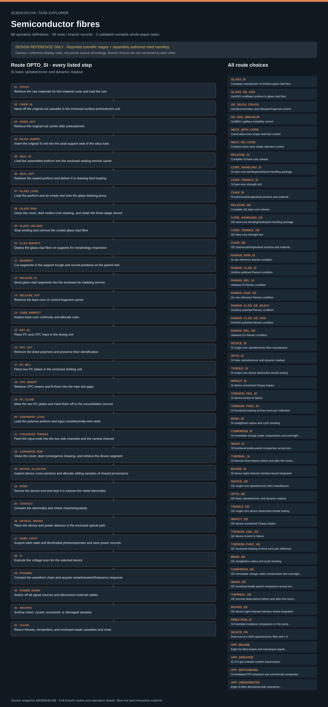

# Semiconductor fibres: task route map



Paper: **High-quality semiconductor fibres via mechanical design** · [DOI](https://doi.org/10.1038/s41586-023-06946-0)

Task-design reference; no task execution or scientific reproduction. Counts describe task representation, not experiments or success.

**Reading rule:** numbered rows preserve reference-list occurrences. A loop body is shown once and must be repeated under its original binding, not treated as executed. An unordered obligation group has no inferred chronological edges. Source-reported scientific facts and authored handling are distinct.

[Immutable source task package](https://github.com/openags/ScienceGym/blob/ebf366bde7d8b8fd0899165d168a9f8f7c43c8ca/tasks/fibre_operations_v2/) · [Interactive inspector](../index.html)

## GLASS_SI — Complete manufacture of Si/silica glass-clad fibre

Authored reference linearization; repeated IDs are separate occurrences and remain in order

[Exact route source](https://github.com/openags/ScienceGym/blob/ebf366bde7d8b8fd0899165d168a9f8f7c43c8ca/tasks/fibre_operations_v2/branches.json) · JSON pointer: `/branches/0/full_operation_sequence`

- `STOCK` Retrieve the raw materials for this material route and load the cart
- `OXIDE_IN` Hand off the original-rod cassette to the enclosed surface-pretreatment unit
- `OXIDE_OUT` Retrieve the original-rod carrier after pretreatment
- `SILICA_INSERT` Insert the original Si rod into the axial support seat of the silica tube
- `SEAL_IN` Load the assembled preform into the enclosed sealing-service carrier
- `SEAL_OUT` Retrieve the sealed preform and deliver it to drawing feed loading
- `GLASS_LOAD` Load the preform and an empty reel onto the glass-drawing proxy
- `GLASS_RUN` Close the cover, start molten-core drawing, and retain the three-stage record
- `GLASS_UNLOAD` Stop winding and remove the cooled glass-clad fibre
- `CLAD_INSPECT` Deploy the glass-clad fibre on supports for morphology inspection
- `POWER_DOWN` Switch off all signal sources and disconnect external cables
- `ARCHIVE` Archive intact, cycled, recovered, or damaged samples
- `CLEAN` Return fixtures, remainders, and enclosed waste cassettes and reset

<details><summary>Branch state, choices, lineage and loop obligations</summary>

```json
{
  "visibility": "evaluator_reference_only",
  "source_branch_ids": [
    "f.preparation",
    "f.draw_Si"
  ],
  "evidence_ids": [
    "f.materials",
    "f.main",
    "f.ed5"
  ],
  "task_material_identity": "Si",
  "preparation_route": "si_glass",
  "transport_binding": "Insert MOVE wherever location_id changes between adjacent operations; different carriers at the same location must retain their corresponding slots and object labels. The sequence is one linearization of the reference partial order, not the only trajectory.",
  "object_id": "obj.GLASS_SI",
  "initial_state": "raw_stock_and_empty_equipment",
  "source_reported_parameters": {
    "core": "undoped_Si",
    "cladding": "fused_silica",
    "stock_rod_diameter_mm": "2 ± 0.127",
    "silica_ID_OD_mm": [
      2.1,
      12
    ]
  },
  "control_peer_ids": [
    "GLASS_GE_ASG",
    "GE_SILICA_CRACK"
  ],
  "object_history_policy": "This episode uses an independent specimen defined by the task author; retain the object ID for same-specimen conditions, and use independent sibling specimens for destructive tests. The paper's actual allocation/reuse cannot be inferred from this ID.",
  "expected_mock_observations": [
    "continuous_visible_core"
  ],
  "success": "Complete preparation, manufacture, physical interactions, records, shared-origin identity tracking, and safe closeout for this source condition; scientific responses are mock, and matching the literature's numerical values is not required",
  "not_asserted": "Not a count of independent experiments by the paper's authors; not a micro-action reproduction of the paper; not completed real-robot execution"
}
```

</details>

## GLASS_GE_ASG — Ge/ASG multilayer preform to glass-clad fibre

Authored reference linearization; repeated IDs are separate occurrences and remain in order

[Exact route source](https://github.com/openags/ScienceGym/blob/ebf366bde7d8b8fd0899165d168a9f8f7c43c8ca/tasks/fibre_operations_v2/branches.json) · JSON pointer: `/branches/1/full_operation_sequence`

- `STOCK` Retrieve the raw materials for this material route and load the cart
- `OXIDE_IN` Hand off the original-rod cassette to the enclosed surface-pretreatment unit
- `OXIDE_OUT` Retrieve the original-rod carrier after pretreatment
- `ASG_SIZE_IN` Deliver the different original ASG tubes/rods to the diameter-reduction drawing module
- `ASG_SIZE_OUT` Retrieve diameter-reduced ASG parts and compartmentalize them by sleeve layer
- `ASG_NEST` Fit five layers of ASG tubing and insert the Ge core rod
- `SEAL_IN` Load the assembled preform into the enclosed sealing-service carrier
- `SEAL_OUT` Retrieve the sealed preform and deliver it to drawing feed loading
- `GLASS_LOAD` Load the preform and an empty reel onto the glass-drawing proxy
- `GLASS_RUN` Close the cover, start molten-core drawing, and retain the three-stage record
- `GLASS_UNLOAD` Stop winding and remove the cooled glass-clad fibre
- `CLAD_INSPECT` Deploy the glass-clad fibre on supports for morphology inspection
- `POWER_DOWN` Switch off all signal sources and disconnect external cables
- `ARCHIVE` Archive intact, cycled, recovered, or damaged samples
- `CLEAN` Return fixtures, remainders, and enclosed waste cassettes and reset

<details><summary>Branch state, choices, lineage and loop obligations</summary>

```json
{
  "visibility": "evaluator_reference_only",
  "source_branch_ids": [
    "f.preparation",
    "f.draw_Ge"
  ],
  "evidence_ids": [
    "f.materials",
    "f.main",
    "f.ed5"
  ],
  "task_material_identity": "Ge",
  "preparation_route": "ge_asg_glass",
  "transport_binding": "Insert MOVE wherever location_id changes between adjacent operations; different carriers at the same location must retain their corresponding slots and object labels. The sequence is one linearization of the reference partial order, not the only trajectory.",
  "object_id": "obj.GLASS_GE_ASG",
  "initial_state": "raw_stock_and_empty_equipment",
  "source_reported_parameters": {
    "core": "Ge",
    "cladding": "SCHOTT_8253_ASG",
    "jacketed_tube_ID_OD_mm": [
      [
        2.1,
        3.6
      ],
      [
        3.7,
        4.8
      ],
      [
        4.9,
        6.6
      ],
      [
        6.7,
        8.8
      ],
      [
        8.9,
        11.1
      ]
    ],
    "preform_ID_OD_mm": [
      2.1,
      11.1
    ],
    "ASG_sealing_rod_diameter_mm": 2,
    "deoxidizer_reported_used": false
  },
  "control_peer_ids": [
    "GE_SILICA_CRACK",
    "GE_BSG_BREAKUP"
  ],
  "object_history_policy": "This episode uses an independent specimen defined by the task author; retain the object ID for same-specimen conditions, and use independent sibling specimens for destructive tests. The paper's actual allocation/reuse cannot be inferred from this ID.",
  "expected_mock_observations": [
    "continuous_visible_core"
  ],
  "success": "Complete preparation, manufacture, physical interactions, records, shared-origin identity tracking, and safe closeout for this source condition; scientific responses are mock, and matching the literature's numerical values is not required",
  "not_asserted": "Not a count of independent experiments by the paper's authors; not a micro-action reproduction of the paper; not completed real-robot execution"
}
```

</details>

## GE_SILICA_CRACK — Ge/silica formation and released-fragment control

Authored reference linearization; repeated IDs are separate occurrences and remain in order

[Exact route source](https://github.com/openags/ScienceGym/blob/ebf366bde7d8b8fd0899165d168a9f8f7c43c8ca/tasks/fibre_operations_v2/branches.json) · JSON pointer: `/branches/2/full_operation_sequence`

- `STOCK` Retrieve the raw materials for this material route and load the cart
- `OXIDE_IN` Hand off the original-rod cassette to the enclosed surface-pretreatment unit
- `OXIDE_OUT` Retrieve the original-rod carrier after pretreatment
- `CONTROL_PREFORM` Assemble Ge/silica, Ge/BSG, or with-/without-core neck-region control preforms
- `SEAL_IN` Load the assembled preform into the enclosed sealing-service carrier
- `SEAL_OUT` Retrieve the sealed preform and deliver it to drawing feed loading
- `GLASS_LOAD` Load the preform and an empty reel onto the glass-drawing proxy
- `GLASS_RUN` Close the cover, start molten-core drawing, and retain the three-stage record
- `GLASS_UNLOAD` Stop winding and remove the cooled glass-clad fibre
- `CLAD_INSPECT` Deploy the glass-clad fibre on supports for morphology inspection
- `SEGMENT` Cut segments in the support trough and record positions on the parent reel
- `RELEASE_IN` Send glass-clad segments into the enclosed de-cladding service
- `RELEASE_OUT` Retrieve the bare-core or control-fragment carrier
- `CORE_INSPECT` Inspect bare-core continuity and allocate uses
- `POWER_DOWN` Switch off all signal sources and disconnect external cables
- `ARCHIVE` Archive intact, cycled, recovered, or damaged samples
- `CLEAN` Return fixtures, remainders, and enclosed waste cassettes and reset

<details><summary>Branch state, choices, lineage and loop obligations</summary>

```json
{
  "visibility": "evaluator_reference_only",
  "source_branch_ids": [
    "f.preparation",
    "f.crack_control"
  ],
  "evidence_ids": [
    "f.ed1",
    "f.materials",
    "f.v1"
  ],
  "task_material_identity": "Ge",
  "preparation_route": "ge_silica_fragments",
  "transport_binding": "Insert MOVE wherever location_id changes between adjacent operations; different carriers at the same location must retain their corresponding slots and object labels. The sequence is one linearization of the reference partial order, not the only trajectory.",
  "object_id": "obj.GE_SILICA_CRACK",
  "initial_state": "raw_stock_and_empty_equipment",
  "source_reported_parameters": {
    "core": "Ge",
    "cladding": "silica",
    "fabrication_parameters": "unknown_not_copy_ASG"
  },
  "control_peer_ids": [
    "RELEASE_GE"
  ],
  "object_history_policy": "Both states must be recorded: cracks in the clad state and fragments after release; retain the fragment collection, and do not select a fragment and relabel it as an intact core",
  "expected_mock_observations": [
    "clad_cracks",
    "released_fragments"
  ],
  "success": "Complete preparation, manufacture, physical interactions, records, shared-origin identity tracking, and safe closeout for this source condition; scientific responses are mock, and matching the literature's numerical values is not required",
  "not_asserted": "Not a count of independent experiments by the paper's authors; not a micro-action reproduction of the paper; not completed real-robot execution"
}
```

</details>

## GE_BSG_BREAKUP — Ge/BSG capillary-instability control

Authored reference linearization; repeated IDs are separate occurrences and remain in order

[Exact route source](https://github.com/openags/ScienceGym/blob/ebf366bde7d8b8fd0899165d168a9f8f7c43c8ca/tasks/fibre_operations_v2/branches.json) · JSON pointer: `/branches/3/full_operation_sequence`

- `STOCK` Retrieve the raw materials for this material route and load the cart
- `OXIDE_IN` Hand off the original-rod cassette to the enclosed surface-pretreatment unit
- `OXIDE_OUT` Retrieve the original-rod carrier after pretreatment
- `CONTROL_PREFORM` Assemble Ge/silica, Ge/BSG, or with-/without-core neck-region control preforms
- `SEAL_IN` Load the assembled preform into the enclosed sealing-service carrier
- `SEAL_OUT` Retrieve the sealed preform and deliver it to drawing feed loading
- `GLASS_LOAD` Load the preform and an empty reel onto the glass-drawing proxy
- `GLASS_RUN` Close the cover, start molten-core drawing, and retain the three-stage record
- `GLASS_UNLOAD` Stop winding and remove the cooled glass-clad fibre
- `CLAD_INSPECT` Deploy the glass-clad fibre on supports for morphology inspection
- `POWER_DOWN` Switch off all signal sources and disconnect external cables
- `ARCHIVE` Archive intact, cycled, recovered, or damaged samples
- `CLEAN` Return fixtures, remainders, and enclosed waste cassettes and reset

<details><summary>Branch state, choices, lineage and loop obligations</summary>

```json
{
  "visibility": "evaluator_reference_only",
  "source_branch_ids": [
    "f.preparation",
    "f.capillary_control"
  ],
  "evidence_ids": [
    "f.main",
    "f.ed4"
  ],
  "task_material_identity": "Ge",
  "preparation_route": "ge_bsg_glass",
  "transport_binding": "Insert MOVE wherever location_id changes between adjacent operations; different carriers at the same location must retain their corresponding slots and object labels. The sequence is one linearization of the reference partial order, not the only trajectory.",
  "object_id": "obj.GE_BSG_BREAKUP",
  "initial_state": "raw_stock_and_empty_equipment",
  "source_reported_parameters": {
    "core": "Ge",
    "cladding": "BSG",
    "grade_and_recipe": null
  },
  "control_peer_ids": [
    "GLASS_GE_ASG"
  ],
  "object_history_policy": "This episode uses an independent specimen defined by the task author; retain the object ID for same-specimen conditions, and use independent sibling specimens for destructive tests. The paper's actual allocation/reuse cannot be inferred from this ID.",
  "expected_mock_observations": [
    "spheres_in_neck",
    "perturbed_core"
  ],
  "success": "Complete preparation, manufacture, physical interactions, records, shared-origin identity tracking, and safe closeout for this source condition; scientific responses are mock, and matching the literature's numerical values is not required",
  "not_asserted": "Not a count of independent experiments by the paper's authors; not a micro-action reproduction of the paper; not completed real-robot execution"
}
```

</details>

## NECK_WITH_CORE — Cored silica neck-shape retention control

Authored reference linearization; repeated IDs are separate occurrences and remain in order

[Exact route source](https://github.com/openags/ScienceGym/blob/ebf366bde7d8b8fd0899165d168a9f8f7c43c8ca/tasks/fibre_operations_v2/branches.json) · JSON pointer: `/branches/4/full_operation_sequence`

- `STOCK` Retrieve the raw materials for this material route and load the cart
- `CONTROL_PREFORM` Assemble Ge/silica, Ge/BSG, or with-/without-core neck-region control preforms
- `QUENCH` Retain the control neck region in an enclosed service and retrieve it for observation
- `CLAD_INSPECT` Deploy the glass-clad fibre on supports for morphology inspection
- `POWER_DOWN` Switch off all signal sources and disconnect external cables
- `ARCHIVE` Archive intact, cycled, recovered, or damaged samples
- `CLEAN` Return fixtures, remainders, and enclosed waste cassettes and reset

<details><summary>Branch state, choices, lineage and loop obligations</summary>

```json
{
  "visibility": "evaluator_reference_only",
  "source_branch_ids": [
    "f.capillary_control"
  ],
  "evidence_ids": [
    "f.ed4",
    "f.si2"
  ],
  "task_material_identity": null,
  "preparation_route": "neck",
  "transport_binding": "Insert MOVE wherever location_id changes between adjacent operations; different carriers at the same location must retain their corresponding slots and object labels. The sequence is one linearization of the reference partial order, not the only trajectory.",
  "object_id": "obj.NECK_WITH_CORE",
  "initial_state": "raw_stock_and_empty_equipment",
  "source_reported_parameters": {
    "cladding": "silica",
    "core_present": true,
    "core_identity_if_unresolved": null
  },
  "control_peer_ids": [
    "NECK_NO_CORE"
  ],
  "object_history_policy": "The neck-shape specimen undergoes quenching; cracks in the neck region must not be classified as faults during normal fibre drawing",
  "expected_mock_observations": [
    "preserved_neck",
    "possible_quench_cracks"
  ],
  "success": "Complete preparation, manufacture, physical interactions, records, shared-origin identity tracking, and safe closeout for this source condition; scientific responses are mock, and matching the literature's numerical values is not required",
  "not_asserted": "Not a count of independent experiments by the paper's authors; not a micro-action reproduction of the paper; not completed real-robot execution"
}
```

</details>

## NECK_NO_CORE — Coreless silica neck-shape retention control

Authored reference linearization; repeated IDs are separate occurrences and remain in order

[Exact route source](https://github.com/openags/ScienceGym/blob/ebf366bde7d8b8fd0899165d168a9f8f7c43c8ca/tasks/fibre_operations_v2/branches.json) · JSON pointer: `/branches/5/full_operation_sequence`

- `STOCK` Retrieve the raw materials for this material route and load the cart
- `CONTROL_PREFORM` Assemble Ge/silica, Ge/BSG, or with-/without-core neck-region control preforms
- `QUENCH` Retain the control neck region in an enclosed service and retrieve it for observation
- `CLAD_INSPECT` Deploy the glass-clad fibre on supports for morphology inspection
- `POWER_DOWN` Switch off all signal sources and disconnect external cables
- `ARCHIVE` Archive intact, cycled, recovered, or damaged samples
- `CLEAN` Return fixtures, remainders, and enclosed waste cassettes and reset

<details><summary>Branch state, choices, lineage and loop obligations</summary>

```json
{
  "visibility": "evaluator_reference_only",
  "source_branch_ids": [
    "f.capillary_control"
  ],
  "evidence_ids": [
    "f.ed4",
    "f.si2"
  ],
  "task_material_identity": null,
  "preparation_route": "neck",
  "transport_binding": "Insert MOVE wherever location_id changes between adjacent operations; different carriers at the same location must retain their corresponding slots and object labels. The sequence is one linearization of the reference partial order, not the only trajectory.",
  "object_id": "obj.NECK_NO_CORE",
  "initial_state": "raw_stock_and_empty_equipment",
  "source_reported_parameters": {
    "cladding": "silica",
    "core_present": false
  },
  "control_peer_ids": [
    "NECK_WITH_CORE"
  ],
  "object_history_policy": "Do not insert a core; retain separate identities for the preform and neck shape",
  "expected_mock_observations": [
    "preserved_neck"
  ],
  "success": "Complete preparation, manufacture, physical interactions, records, shared-origin identity tracking, and safe closeout for this source condition; scientific responses are mock, and matching the literature's numerical values is not required",
  "not_asserted": "Not a count of independent experiments by the paper's authors; not a micro-action reproduction of the paper; not completed real-robot execution"
}
```

</details>

## RELEASE_SI — Complete SI bare-core release

Authored reference linearization; repeated IDs are separate occurrences and remain in order

[Exact route source](https://github.com/openags/ScienceGym/blob/ebf366bde7d8b8fd0899165d168a9f8f7c43c8ca/tasks/fibre_operations_v2/branches.json) · JSON pointer: `/branches/6/full_operation_sequence`

- `STOCK` Retrieve the raw materials for this material route and load the cart
- `OXIDE_IN` Hand off the original-rod cassette to the enclosed surface-pretreatment unit
- `OXIDE_OUT` Retrieve the original-rod carrier after pretreatment
- `SILICA_INSERT` Insert the original Si rod into the axial support seat of the silica tube
- `SEAL_IN` Load the assembled preform into the enclosed sealing-service carrier
- `SEAL_OUT` Retrieve the sealed preform and deliver it to drawing feed loading
- `GLASS_LOAD` Load the preform and an empty reel onto the glass-drawing proxy
- `GLASS_RUN` Close the cover, start molten-core drawing, and retain the three-stage record
- `GLASS_UNLOAD` Stop winding and remove the cooled glass-clad fibre
- `CLAD_INSPECT` Deploy the glass-clad fibre on supports for morphology inspection
- `SEGMENT` Cut segments in the support trough and record positions on the parent reel
- `RELEASE_IN` Send glass-clad segments into the enclosed de-cladding service
- `RELEASE_OUT` Retrieve the bare-core or control-fragment carrier
- `CORE_INSPECT` Inspect bare-core continuity and allocate uses
- `POWER_DOWN` Switch off all signal sources and disconnect external cables
- `ARCHIVE` Archive intact, cycled, recovered, or damaged samples
- `CLEAN` Return fixtures, remainders, and enclosed waste cassettes and reset

<details><summary>Branch state, choices, lineage and loop obligations</summary>

```json
{
  "visibility": "evaluator_reference_only",
  "source_branch_ids": [
    "f.release"
  ],
  "evidence_ids": [
    "f.materials",
    "f.ed5"
  ],
  "task_material_identity": "Si",
  "preparation_route": "si_released",
  "transport_binding": "Insert MOVE wherever location_id changes between adjacent operations; different carriers at the same location must retain their corresponding slots and object labels. The sequence is one linearization of the reference partial order, not the only trajectory.",
  "object_id": "obj.RELEASE_SI",
  "initial_state": "raw_stock_and_empty_equipment",
  "source_reported_parameters": {
    "reported_release_segment_cm": 80,
    "not_test_gauge_length": true
  },
  "control_peer_ids": [],
  "object_history_policy": "Do not lose the parent cladding identity; an 80cm parent segment must not spontaneously grow into a 50m active core",
  "expected_mock_observations": [
    "released_intact_or_flagged_fragment"
  ],
  "success": "Complete preparation, manufacture, physical interactions, records, shared-origin identity tracking, and safe closeout for this source condition; scientific responses are mock, and matching the literature's numerical values is not required",
  "not_asserted": "Not a count of independent experiments by the paper's authors; not a micro-action reproduction of the paper; not completed real-robot execution"
}
```

</details>

## CORE_HANDLING_SI — SI bare-core bending/load/spool handling package

Authored reference linearization; repeated IDs are separate occurrences and remain in order

[Exact route source](https://github.com/openags/ScienceGym/blob/ebf366bde7d8b8fd0899165d168a9f8f7c43c8ca/tasks/fibre_operations_v2/branches.json) · JSON pointer: `/branches/7/full_operation_sequence`

- `STOCK` Retrieve the raw materials for this material route and load the cart
- `OXIDE_IN` Hand off the original-rod cassette to the enclosed surface-pretreatment unit
- `OXIDE_OUT` Retrieve the original-rod carrier after pretreatment
- `SILICA_INSERT` Insert the original Si rod into the axial support seat of the silica tube
- `SEAL_IN` Load the assembled preform into the enclosed sealing-service carrier
- `SEAL_OUT` Retrieve the sealed preform and deliver it to drawing feed loading
- `GLASS_LOAD` Load the preform and an empty reel onto the glass-drawing proxy
- `GLASS_RUN` Close the cover, start molten-core drawing, and retain the three-stage record
- `GLASS_UNLOAD` Stop winding and remove the cooled glass-clad fibre
- `CLAD_INSPECT` Deploy the glass-clad fibre on supports for morphology inspection
- `SEGMENT` Cut segments in the support trough and record positions on the parent reel
- `RELEASE_IN` Send glass-clad segments into the enclosed de-cladding service
- `RELEASE_OUT` Retrieve the bare-core or control-fragment carrier
- `CORE_INSPECT` Inspect bare-core continuity and allocate uses
- `CORE_BEND` Place the dedicated bare-core sample on the bend-radius support
- `CORE_LOAD` Suspend the demonstration load above the enclosed catch box
- `CORE_BOBBIN` Wind the supported bare core onto the demonstration spool
- `POWER_DOWN` Switch off all signal sources and disconnect external cables
- `ARCHIVE` Archive intact, cycled, recovered, or damaged samples
- `CLEAN` Return fixtures, remainders, and enclosed waste cassettes and reset

<details><summary>Branch state, choices, lineage and loop obligations</summary>

```json
{
  "visibility": "evaluator_reference_only",
  "source_branch_ids": [
    "f.standalone_strength"
  ],
  "evidence_ids": [
    "f.ed5"
  ],
  "task_material_identity": "Si",
  "preparation_route": "si_released",
  "transport_binding": "Insert MOVE wherever location_id changes between adjacent operations; different carriers at the same location must retain their corresponding slots and object labels. The sequence is one linearization of the reference partial order, not the only trajectory.",
  "object_id": "obj.CORE_HANDLING_SI",
  "initial_state": "raw_stock_and_empty_equipment",
  "source_reported_parameters": {
    "source_diameter_um": 55,
    "bend_radius_mm": 4,
    "computer_mouse_g": 70,
    "bobbin_segment_cm": 80
  },
  "control_peer_ids": [],
  "object_history_policy": "By default, allocate three independent subspecimens from the same batch for the three demonstrations; do not assume that the paper's authors performed them on the same specimen. Each subspecimen must be traceable to this release route",
  "expected_mock_observations": [
    "bend_shape",
    "supported_dummy_load",
    "bobbin"
  ],
  "success": "Complete preparation, manufacture, physical interactions, records, shared-origin identity tracking, and safe closeout for this source condition; scientific responses are mock, and matching the literature's numerical values is not required",
  "not_asserted": "Not a count of independent experiments by the paper's authors; not a micro-action reproduction of the paper; not completed real-robot execution"
}
```

</details>

## CORE_TENSILE_SI — SI bare-core strength test

Authored reference linearization; repeated IDs are separate occurrences and remain in order

[Exact route source](https://github.com/openags/ScienceGym/blob/ebf366bde7d8b8fd0899165d168a9f8f7c43c8ca/tasks/fibre_operations_v2/branches.json) · JSON pointer: `/branches/8/full_operation_sequence`

- `STOCK` Retrieve the raw materials for this material route and load the cart
- `OXIDE_IN` Hand off the original-rod cassette to the enclosed surface-pretreatment unit
- `OXIDE_OUT` Retrieve the original-rod carrier after pretreatment
- `SILICA_INSERT` Insert the original Si rod into the axial support seat of the silica tube
- `SEAL_IN` Load the assembled preform into the enclosed sealing-service carrier
- `SEAL_OUT` Retrieve the sealed preform and deliver it to drawing feed loading
- `GLASS_LOAD` Load the preform and an empty reel onto the glass-drawing proxy
- `GLASS_RUN` Close the cover, start molten-core drawing, and retain the three-stage record
- `GLASS_UNLOAD` Stop winding and remove the cooled glass-clad fibre
- `CLAD_INSPECT` Deploy the glass-clad fibre on supports for morphology inspection
- `SEGMENT` Cut segments in the support trough and record positions on the parent reel
- `RELEASE_IN` Send glass-clad segments into the enclosed de-cladding service
- `RELEASE_OUT` Retrieve the bare-core or control-fragment carrier
- `CORE_INSPECT` Inspect bare-core continuity and allocate uses
- `TEST_MOUNT` Select mechanical fixtures and secure numbered sibling samples
- `TENSILE` Close the cover and stretch the sample to its failure terminal state
- `TEST_UNLOAD` Remove the device or fragments after unloading and disconnecting power
- `POWER_DOWN` Switch off all signal sources and disconnect external cables
- `ARCHIVE` Archive intact, cycled, recovered, or damaged samples
- `CLEAN` Return fixtures, remainders, and enclosed waste cassettes and reset

<details><summary>Branch state, choices, lineage and loop obligations</summary>

```json
{
  "visibility": "evaluator_reference_only",
  "source_branch_ids": [
    "f.standalone_strength"
  ],
  "evidence_ids": [
    "f.ed5"
  ],
  "task_material_identity": "Si",
  "preparation_route": "si_released",
  "transport_binding": "Insert MOVE wherever location_id changes between adjacent operations; different carriers at the same location must retain their corresponding slots and object labels. The sequence is one linearization of the reference partial order, not the only trajectory.",
  "object_id": "obj.CORE_TENSILE_SI",
  "initial_state": "raw_stock_and_empty_equipment",
  "source_reported_parameters": {
    "specimen_state": "standalone_core"
  },
  "control_peer_ids": [
    "TENSILE_SI"
  ],
  "object_history_policy": "Do not conflate this strength with the strength of PC-clad devices; destructive-test specimens must not be sent for convergence",
  "expected_mock_observations": [
    "broken"
  ],
  "success": "Complete preparation, manufacture, physical interactions, records, shared-origin identity tracking, and safe closeout for this source condition; scientific responses are mock, and matching the literature's numerical values is not required",
  "not_asserted": "Not a count of independent experiments by the paper's authors; not a micro-action reproduction of the paper; not completed real-robot execution"
}
```

</details>

## CHAR_SI — SI transverse/longitudinal sections and material characterization

Authored reference linearization; repeated IDs are separate occurrences and remain in order

[Exact route source](https://github.com/openags/ScienceGym/blob/ebf366bde7d8b8fd0899165d168a9f8f7c43c8ca/tasks/fibre_operations_v2/branches.json) · JSON pointer: `/branches/9/full_operation_sequence`

- `STOCK` Retrieve the raw materials for this material route and load the cart
- `OXIDE_IN` Hand off the original-rod cassette to the enclosed surface-pretreatment unit
- `OXIDE_OUT` Retrieve the original-rod carrier after pretreatment
- `SILICA_INSERT` Insert the original Si rod into the axial support seat of the silica tube
- `SEAL_IN` Load the assembled preform into the enclosed sealing-service carrier
- `SEAL_OUT` Retrieve the sealed preform and deliver it to drawing feed loading
- `GLASS_LOAD` Load the preform and an empty reel onto the glass-drawing proxy
- `GLASS_RUN` Close the cover, start molten-core drawing, and retain the three-stage record
- `GLASS_UNLOAD` Stop winding and remove the cooled glass-clad fibre
- `CLAD_INSPECT` Deploy the glass-clad fibre on supports for morphology inspection
- `SECTION` Take dedicated sibling samples and prepare transverse/longitudinal cross-sections
- `SEM_EDX` Load the section holder and acquire microscopic morphology/elemental line scans
- `XRD` Load samples and acquire diffraction references and fibre data
- `FIB` Hand off sibling samples for lamella preparation and retrieve their dedicated carriers
- `TEM` Load the double-tilt sample holder and acquire HRTEM/SAED
- `POWER_DOWN` Switch off all signal sources and disconnect external cables
- `ARCHIVE` Archive intact, cycled, recovered, or damaged samples
- `CLEAN` Return fixtures, remainders, and enclosed waste cassettes and reset

<details><summary>Branch state, choices, lineage and loop obligations</summary>

```json
{
  "visibility": "evaluator_reference_only",
  "source_branch_ids": [
    "f.characterize"
  ],
  "evidence_ids": [
    "f.materials",
    "f.ed5"
  ],
  "task_material_identity": "Si",
  "preparation_route": "si_glass",
  "transport_binding": "Insert MOVE wherever location_id changes between adjacent operations; different carriers at the same location must retain their corresponding slots and object labels. The sequence is one linearization of the reference partial order, not the only trajectory.",
  "object_id": "obj.CHAR_SI",
  "initial_state": "raw_stock_and_empty_equipment",
  "source_reported_parameters": {
    "section_orientations": [
      "transverse",
      "lateral"
    ],
    "source_materials_claim": "polycrystalline_with_limited_oxygen",
    "TEM_holder": "double_tilt"
  },
  "control_peer_ids": [],
  "object_history_policy": "SECTION, SEM/EDX, XRD and FIB/TEM may use allocated sibling subspecimens; the source reports polycrystalline material, and a local lattice image does not justify reclassifying the entire fibre as a single crystal",
  "expected_mock_observations": [
    "composition",
    "diffraction",
    "HRTEM_SAED"
  ],
  "success": "Complete preparation, manufacture, physical interactions, records, shared-origin identity tracking, and safe closeout for this source condition; scientific responses are mock, and matching the literature's numerical values is not required",
  "not_asserted": "Not a count of independent experiments by the paper's authors; not a micro-action reproduction of the paper; not completed real-robot execution"
}
```

</details>

## RELEASE_GE — Complete GE bare-core release

Authored reference linearization; repeated IDs are separate occurrences and remain in order

[Exact route source](https://github.com/openags/ScienceGym/blob/ebf366bde7d8b8fd0899165d168a9f8f7c43c8ca/tasks/fibre_operations_v2/branches.json) · JSON pointer: `/branches/10/full_operation_sequence`

- `STOCK` Retrieve the raw materials for this material route and load the cart
- `OXIDE_IN` Hand off the original-rod cassette to the enclosed surface-pretreatment unit
- `OXIDE_OUT` Retrieve the original-rod carrier after pretreatment
- `ASG_SIZE_IN` Deliver the different original ASG tubes/rods to the diameter-reduction drawing module
- `ASG_SIZE_OUT` Retrieve diameter-reduced ASG parts and compartmentalize them by sleeve layer
- `ASG_NEST` Fit five layers of ASG tubing and insert the Ge core rod
- `SEAL_IN` Load the assembled preform into the enclosed sealing-service carrier
- `SEAL_OUT` Retrieve the sealed preform and deliver it to drawing feed loading
- `GLASS_LOAD` Load the preform and an empty reel onto the glass-drawing proxy
- `GLASS_RUN` Close the cover, start molten-core drawing, and retain the three-stage record
- `GLASS_UNLOAD` Stop winding and remove the cooled glass-clad fibre
- `CLAD_INSPECT` Deploy the glass-clad fibre on supports for morphology inspection
- `SEGMENT` Cut segments in the support trough and record positions on the parent reel
- `RELEASE_IN` Send glass-clad segments into the enclosed de-cladding service
- `RELEASE_OUT` Retrieve the bare-core or control-fragment carrier
- `CORE_INSPECT` Inspect bare-core continuity and allocate uses
- `POWER_DOWN` Switch off all signal sources and disconnect external cables
- `ARCHIVE` Archive intact, cycled, recovered, or damaged samples
- `CLEAN` Return fixtures, remainders, and enclosed waste cassettes and reset

<details><summary>Branch state, choices, lineage and loop obligations</summary>

```json
{
  "visibility": "evaluator_reference_only",
  "source_branch_ids": [
    "f.release"
  ],
  "evidence_ids": [
    "f.materials",
    "f.ed5"
  ],
  "task_material_identity": "Ge",
  "preparation_route": "ge_released",
  "transport_binding": "Insert MOVE wherever location_id changes between adjacent operations; different carriers at the same location must retain their corresponding slots and object labels. The sequence is one linearization of the reference partial order, not the only trajectory.",
  "object_id": "obj.RELEASE_GE",
  "initial_state": "raw_stock_and_empty_equipment",
  "source_reported_parameters": {
    "reported_release_segment_cm": 80,
    "not_test_gauge_length": true
  },
  "control_peer_ids": [
    "GE_SILICA_CRACK"
  ],
  "object_history_policy": "Do not lose the parent cladding identity; an 80cm parent segment must not spontaneously grow into a 50m active core",
  "expected_mock_observations": [
    "released_intact_or_flagged_fragment"
  ],
  "success": "Complete preparation, manufacture, physical interactions, records, shared-origin identity tracking, and safe closeout for this source condition; scientific responses are mock, and matching the literature's numerical values is not required",
  "not_asserted": "Not a count of independent experiments by the paper's authors; not a micro-action reproduction of the paper; not completed real-robot execution"
}
```

</details>

## CORE_HANDLING_GE — GE bare-core bending/load/spool handling package

Authored reference linearization; repeated IDs are separate occurrences and remain in order

[Exact route source](https://github.com/openags/ScienceGym/blob/ebf366bde7d8b8fd0899165d168a9f8f7c43c8ca/tasks/fibre_operations_v2/branches.json) · JSON pointer: `/branches/11/full_operation_sequence`

- `STOCK` Retrieve the raw materials for this material route and load the cart
- `OXIDE_IN` Hand off the original-rod cassette to the enclosed surface-pretreatment unit
- `OXIDE_OUT` Retrieve the original-rod carrier after pretreatment
- `ASG_SIZE_IN` Deliver the different original ASG tubes/rods to the diameter-reduction drawing module
- `ASG_SIZE_OUT` Retrieve diameter-reduced ASG parts and compartmentalize them by sleeve layer
- `ASG_NEST` Fit five layers of ASG tubing and insert the Ge core rod
- `SEAL_IN` Load the assembled preform into the enclosed sealing-service carrier
- `SEAL_OUT` Retrieve the sealed preform and deliver it to drawing feed loading
- `GLASS_LOAD` Load the preform and an empty reel onto the glass-drawing proxy
- `GLASS_RUN` Close the cover, start molten-core drawing, and retain the three-stage record
- `GLASS_UNLOAD` Stop winding and remove the cooled glass-clad fibre
- `CLAD_INSPECT` Deploy the glass-clad fibre on supports for morphology inspection
- `SEGMENT` Cut segments in the support trough and record positions on the parent reel
- `RELEASE_IN` Send glass-clad segments into the enclosed de-cladding service
- `RELEASE_OUT` Retrieve the bare-core or control-fragment carrier
- `CORE_INSPECT` Inspect bare-core continuity and allocate uses
- `CORE_BEND` Place the dedicated bare-core sample on the bend-radius support
- `CORE_LOAD` Suspend the demonstration load above the enclosed catch box
- `CORE_BOBBIN` Wind the supported bare core onto the demonstration spool
- `POWER_DOWN` Switch off all signal sources and disconnect external cables
- `ARCHIVE` Archive intact, cycled, recovered, or damaged samples
- `CLEAN` Return fixtures, remainders, and enclosed waste cassettes and reset

<details><summary>Branch state, choices, lineage and loop obligations</summary>

```json
{
  "visibility": "evaluator_reference_only",
  "source_branch_ids": [
    "f.standalone_strength"
  ],
  "evidence_ids": [
    "f.ed5"
  ],
  "task_material_identity": "Ge",
  "preparation_route": "ge_released",
  "transport_binding": "Insert MOVE wherever location_id changes between adjacent operations; different carriers at the same location must retain their corresponding slots and object labels. The sequence is one linearization of the reference partial order, not the only trajectory.",
  "object_id": "obj.CORE_HANDLING_GE",
  "initial_state": "raw_stock_and_empty_equipment",
  "source_reported_parameters": {
    "source_diameter_um": 55,
    "bend_radius_mm": 2.5,
    "computer_mouse_g": 86,
    "bobbin_segment_cm": 80
  },
  "control_peer_ids": [],
  "object_history_policy": "By default, allocate three independent subspecimens from the same batch for the three demonstrations; do not assume that the paper's authors performed them on the same specimen. Each subspecimen must be traceable to this release route",
  "expected_mock_observations": [
    "bend_shape",
    "supported_dummy_load",
    "bobbin"
  ],
  "success": "Complete preparation, manufacture, physical interactions, records, shared-origin identity tracking, and safe closeout for this source condition; scientific responses are mock, and matching the literature's numerical values is not required",
  "not_asserted": "Not a count of independent experiments by the paper's authors; not a micro-action reproduction of the paper; not completed real-robot execution"
}
```

</details>

## CORE_TENSILE_GE — GE bare-core strength test

Authored reference linearization; repeated IDs are separate occurrences and remain in order

[Exact route source](https://github.com/openags/ScienceGym/blob/ebf366bde7d8b8fd0899165d168a9f8f7c43c8ca/tasks/fibre_operations_v2/branches.json) · JSON pointer: `/branches/12/full_operation_sequence`

- `STOCK` Retrieve the raw materials for this material route and load the cart
- `OXIDE_IN` Hand off the original-rod cassette to the enclosed surface-pretreatment unit
- `OXIDE_OUT` Retrieve the original-rod carrier after pretreatment
- `ASG_SIZE_IN` Deliver the different original ASG tubes/rods to the diameter-reduction drawing module
- `ASG_SIZE_OUT` Retrieve diameter-reduced ASG parts and compartmentalize them by sleeve layer
- `ASG_NEST` Fit five layers of ASG tubing and insert the Ge core rod
- `SEAL_IN` Load the assembled preform into the enclosed sealing-service carrier
- `SEAL_OUT` Retrieve the sealed preform and deliver it to drawing feed loading
- `GLASS_LOAD` Load the preform and an empty reel onto the glass-drawing proxy
- `GLASS_RUN` Close the cover, start molten-core drawing, and retain the three-stage record
- `GLASS_UNLOAD` Stop winding and remove the cooled glass-clad fibre
- `CLAD_INSPECT` Deploy the glass-clad fibre on supports for morphology inspection
- `SEGMENT` Cut segments in the support trough and record positions on the parent reel
- `RELEASE_IN` Send glass-clad segments into the enclosed de-cladding service
- `RELEASE_OUT` Retrieve the bare-core or control-fragment carrier
- `CORE_INSPECT` Inspect bare-core continuity and allocate uses
- `TEST_MOUNT` Select mechanical fixtures and secure numbered sibling samples
- `TENSILE` Close the cover and stretch the sample to its failure terminal state
- `TEST_UNLOAD` Remove the device or fragments after unloading and disconnecting power
- `POWER_DOWN` Switch off all signal sources and disconnect external cables
- `ARCHIVE` Archive intact, cycled, recovered, or damaged samples
- `CLEAN` Return fixtures, remainders, and enclosed waste cassettes and reset

<details><summary>Branch state, choices, lineage and loop obligations</summary>

```json
{
  "visibility": "evaluator_reference_only",
  "source_branch_ids": [
    "f.standalone_strength"
  ],
  "evidence_ids": [
    "f.ed5"
  ],
  "task_material_identity": "Ge",
  "preparation_route": "ge_released",
  "transport_binding": "Insert MOVE wherever location_id changes between adjacent operations; different carriers at the same location must retain their corresponding slots and object labels. The sequence is one linearization of the reference partial order, not the only trajectory.",
  "object_id": "obj.CORE_TENSILE_GE",
  "initial_state": "raw_stock_and_empty_equipment",
  "source_reported_parameters": {
    "specimen_state": "standalone_core"
  },
  "control_peer_ids": [
    "TENSILE_GE"
  ],
  "object_history_policy": "Do not conflate this strength with the strength of PC-clad devices; destructive-test specimens must not be sent for convergence",
  "expected_mock_observations": [
    "broken"
  ],
  "success": "Complete preparation, manufacture, physical interactions, records, shared-origin identity tracking, and safe closeout for this source condition; scientific responses are mock, and matching the literature's numerical values is not required",
  "not_asserted": "Not a count of independent experiments by the paper's authors; not a micro-action reproduction of the paper; not completed real-robot execution"
}
```

</details>

## CHAR_GE — GE transverse/longitudinal sections and material characterization

Authored reference linearization; repeated IDs are separate occurrences and remain in order

[Exact route source](https://github.com/openags/ScienceGym/blob/ebf366bde7d8b8fd0899165d168a9f8f7c43c8ca/tasks/fibre_operations_v2/branches.json) · JSON pointer: `/branches/13/full_operation_sequence`

- `STOCK` Retrieve the raw materials for this material route and load the cart
- `OXIDE_IN` Hand off the original-rod cassette to the enclosed surface-pretreatment unit
- `OXIDE_OUT` Retrieve the original-rod carrier after pretreatment
- `ASG_SIZE_IN` Deliver the different original ASG tubes/rods to the diameter-reduction drawing module
- `ASG_SIZE_OUT` Retrieve diameter-reduced ASG parts and compartmentalize them by sleeve layer
- `ASG_NEST` Fit five layers of ASG tubing and insert the Ge core rod
- `SEAL_IN` Load the assembled preform into the enclosed sealing-service carrier
- `SEAL_OUT` Retrieve the sealed preform and deliver it to drawing feed loading
- `GLASS_LOAD` Load the preform and an empty reel onto the glass-drawing proxy
- `GLASS_RUN` Close the cover, start molten-core drawing, and retain the three-stage record
- `GLASS_UNLOAD` Stop winding and remove the cooled glass-clad fibre
- `CLAD_INSPECT` Deploy the glass-clad fibre on supports for morphology inspection
- `SECTION` Take dedicated sibling samples and prepare transverse/longitudinal cross-sections
- `SEM_EDX` Load the section holder and acquire microscopic morphology/elemental line scans
- `XRD` Load samples and acquire diffraction references and fibre data
- `FIB` Hand off sibling samples for lamella preparation and retrieve their dedicated carriers
- `TEM` Load the double-tilt sample holder and acquire HRTEM/SAED
- `POWER_DOWN` Switch off all signal sources and disconnect external cables
- `ARCHIVE` Archive intact, cycled, recovered, or damaged samples
- `CLEAN` Return fixtures, remainders, and enclosed waste cassettes and reset

<details><summary>Branch state, choices, lineage and loop obligations</summary>

```json
{
  "visibility": "evaluator_reference_only",
  "source_branch_ids": [
    "f.characterize"
  ],
  "evidence_ids": [
    "f.materials",
    "f.ed5"
  ],
  "task_material_identity": "Ge",
  "preparation_route": "ge_asg_glass",
  "transport_binding": "Insert MOVE wherever location_id changes between adjacent operations; different carriers at the same location must retain their corresponding slots and object labels. The sequence is one linearization of the reference partial order, not the only trajectory.",
  "object_id": "obj.CHAR_GE",
  "initial_state": "raw_stock_and_empty_equipment",
  "source_reported_parameters": {
    "section_orientations": [
      "transverse",
      "lateral"
    ],
    "source_materials_claim": "polycrystalline_with_limited_oxygen",
    "TEM_holder": "double_tilt"
  },
  "control_peer_ids": [],
  "object_history_policy": "SECTION, SEM/EDX, XRD and FIB/TEM may use allocated sibling subspecimens; the source reports polycrystalline material, and a local lattice image does not justify reclassifying the entire fibre as a single crystal",
  "expected_mock_observations": [
    "composition",
    "diffraction",
    "HRTEM_SAED"
  ],
  "success": "Complete preparation, manufacture, physical interactions, records, shared-origin identity tracking, and safe closeout for this source condition; scientific responses are mock, and matching the literature's numerical values is not required",
  "not_asserted": "Not a count of independent experiments by the paper's authors; not a micro-action reproduction of the paper; not completed real-robot execution"
}
```

</details>

## RAMAN_RAW_SI — Si raw reference Raman condition

Authored reference linearization; repeated IDs are separate occurrences and remain in order

[Exact route source](https://github.com/openags/ScienceGym/blob/ebf366bde7d8b8fd0899165d168a9f8f7c43c8ca/tasks/fibre_operations_v2/branches.json) · JSON pointer: `/branches/14/full_operation_sequence`

- `STOCK` Retrieve the raw materials for this material route and load the cart
- `RAMAN` Load the material sequence and acquire spectra/maps/centerline scans
- `POWER_DOWN` Switch off all signal sources and disconnect external cables
- `ARCHIVE` Archive intact, cycled, recovered, or damaged samples
- `CLEAN` Return fixtures, remainders, and enclosed waste cassettes and reset

<details><summary>Branch state, choices, lineage and loop obligations</summary>

```json
{
  "visibility": "evaluator_reference_only",
  "source_branch_ids": [
    "f.Raman"
  ],
  "evidence_ids": [
    "f.materials",
    "f.ed3",
    "f.si_tables"
  ],
  "task_material_identity": null,
  "preparation_route": "raw",
  "transport_binding": "Insert MOVE wherever location_id changes between adjacent operations; different carriers at the same location must retain their corresponding slots and object labels. The sequence is one linearization of the reference partial order, not the only trajectory.",
  "object_id": "obj.RAMAN_RAW_SI",
  "initial_state": "raw_stock_and_empty_equipment",
  "source_reported_parameters": {
    "sample": "Si raw reference",
    "excitation_nm": 532,
    "measurement_modes": [
      "spectrum"
    ]
  },
  "control_peer_ids": [
    "RAMAN_CLAD_SI",
    "RAMAN_REL_SI"
  ],
  "object_history_policy": "Retain the stock-rod, clad, released, and polished states separately; polishing and existing cracks mean that pristine residual stress cannot be directly recovered from these measurements",
  "expected_mock_observations": [
    "mock_spectrum"
  ],
  "success": "Complete preparation, manufacture, physical interactions, records, shared-origin identity tracking, and safe closeout for this source condition; scientific responses are mock, and matching the literature's numerical values is not required",
  "not_asserted": "Not a count of independent experiments by the paper's authors; not a micro-action reproduction of the paper; not completed real-robot execution"
}
```

</details>

## RAMAN_CLAD_SI — Si/silica polished Raman condition

Authored reference linearization; repeated IDs are separate occurrences and remain in order

[Exact route source](https://github.com/openags/ScienceGym/blob/ebf366bde7d8b8fd0899165d168a9f8f7c43c8ca/tasks/fibre_operations_v2/branches.json) · JSON pointer: `/branches/15/full_operation_sequence`

- `STOCK` Retrieve the raw materials for this material route and load the cart
- `OXIDE_IN` Hand off the original-rod cassette to the enclosed surface-pretreatment unit
- `OXIDE_OUT` Retrieve the original-rod carrier after pretreatment
- `SILICA_INSERT` Insert the original Si rod into the axial support seat of the silica tube
- `SEAL_IN` Load the assembled preform into the enclosed sealing-service carrier
- `SEAL_OUT` Retrieve the sealed preform and deliver it to drawing feed loading
- `GLASS_LOAD` Load the preform and an empty reel onto the glass-drawing proxy
- `GLASS_RUN` Close the cover, start molten-core drawing, and retain the three-stage record
- `GLASS_UNLOAD` Stop winding and remove the cooled glass-clad fibre
- `CLAD_INSPECT` Deploy the glass-clad fibre on supports for morphology inspection
- `SECTION` Take dedicated sibling samples and prepare transverse/longitudinal cross-sections
- `RAMAN` Load the material sequence and acquire spectra/maps/centerline scans
- `POWER_DOWN` Switch off all signal sources and disconnect external cables
- `ARCHIVE` Archive intact, cycled, recovered, or damaged samples
- `CLEAN` Return fixtures, remainders, and enclosed waste cassettes and reset

<details><summary>Branch state, choices, lineage and loop obligations</summary>

```json
{
  "visibility": "evaluator_reference_only",
  "source_branch_ids": [
    "f.Raman"
  ],
  "evidence_ids": [
    "f.materials",
    "f.ed3",
    "f.si_tables"
  ],
  "task_material_identity": "Si",
  "preparation_route": "si_glass",
  "transport_binding": "Insert MOVE wherever location_id changes between adjacent operations; different carriers at the same location must retain their corresponding slots and object labels. The sequence is one linearization of the reference partial order, not the only trajectory.",
  "object_id": "obj.RAMAN_CLAD_SI",
  "initial_state": "raw_stock_and_empty_equipment",
  "source_reported_parameters": {
    "sample": "Si/silica polished",
    "excitation_nm": 532,
    "measurement_modes": [
      "spectrum",
      "cross_section_map",
      "centre_line_scan"
    ]
  },
  "control_peer_ids": [
    "RAMAN_RAW_SI",
    "RAMAN_REL_SI"
  ],
  "object_history_policy": "Retain the stock-rod, clad, released, and polished states separately; polishing and existing cracks mean that pristine residual stress cannot be directly recovered from these measurements",
  "expected_mock_observations": [
    "mock_spectrum"
  ],
  "success": "Complete preparation, manufacture, physical interactions, records, shared-origin identity tracking, and safe closeout for this source condition; scientific responses are mock, and matching the literature's numerical values is not required",
  "not_asserted": "Not a count of independent experiments by the paper's authors; not a micro-action reproduction of the paper; not completed real-robot execution"
}
```

</details>

## RAMAN_REL_SI — released Si Raman condition

Authored reference linearization; repeated IDs are separate occurrences and remain in order

[Exact route source](https://github.com/openags/ScienceGym/blob/ebf366bde7d8b8fd0899165d168a9f8f7c43c8ca/tasks/fibre_operations_v2/branches.json) · JSON pointer: `/branches/16/full_operation_sequence`

- `STOCK` Retrieve the raw materials for this material route and load the cart
- `OXIDE_IN` Hand off the original-rod cassette to the enclosed surface-pretreatment unit
- `OXIDE_OUT` Retrieve the original-rod carrier after pretreatment
- `SILICA_INSERT` Insert the original Si rod into the axial support seat of the silica tube
- `SEAL_IN` Load the assembled preform into the enclosed sealing-service carrier
- `SEAL_OUT` Retrieve the sealed preform and deliver it to drawing feed loading
- `GLASS_LOAD` Load the preform and an empty reel onto the glass-drawing proxy
- `GLASS_RUN` Close the cover, start molten-core drawing, and retain the three-stage record
- `GLASS_UNLOAD` Stop winding and remove the cooled glass-clad fibre
- `CLAD_INSPECT` Deploy the glass-clad fibre on supports for morphology inspection
- `SEGMENT` Cut segments in the support trough and record positions on the parent reel
- `RELEASE_IN` Send glass-clad segments into the enclosed de-cladding service
- `RELEASE_OUT` Retrieve the bare-core or control-fragment carrier
- `CORE_INSPECT` Inspect bare-core continuity and allocate uses
- `RAMAN` Load the material sequence and acquire spectra/maps/centerline scans
- `POWER_DOWN` Switch off all signal sources and disconnect external cables
- `ARCHIVE` Archive intact, cycled, recovered, or damaged samples
- `CLEAN` Return fixtures, remainders, and enclosed waste cassettes and reset

<details><summary>Branch state, choices, lineage and loop obligations</summary>

```json
{
  "visibility": "evaluator_reference_only",
  "source_branch_ids": [
    "f.Raman"
  ],
  "evidence_ids": [
    "f.materials",
    "f.ed3",
    "f.si_tables"
  ],
  "task_material_identity": "Si",
  "preparation_route": "si_released",
  "transport_binding": "Insert MOVE wherever location_id changes between adjacent operations; different carriers at the same location must retain their corresponding slots and object labels. The sequence is one linearization of the reference partial order, not the only trajectory.",
  "object_id": "obj.RAMAN_REL_SI",
  "initial_state": "raw_stock_and_empty_equipment",
  "source_reported_parameters": {
    "sample": "released Si",
    "excitation_nm": 532,
    "measurement_modes": [
      "spectrum"
    ]
  },
  "control_peer_ids": [
    "RAMAN_RAW_SI",
    "RAMAN_CLAD_SI"
  ],
  "object_history_policy": "Retain the stock-rod, clad, released, and polished states separately; polishing and existing cracks mean that pristine residual stress cannot be directly recovered from these measurements",
  "expected_mock_observations": [
    "mock_spectrum"
  ],
  "success": "Complete preparation, manufacture, physical interactions, records, shared-origin identity tracking, and safe closeout for this source condition; scientific responses are mock, and matching the literature's numerical values is not required",
  "not_asserted": "Not a count of independent experiments by the paper's authors; not a micro-action reproduction of the paper; not completed real-robot execution"
}
```

</details>

## RAMAN_RAW_GE — Ge raw reference Raman condition

Authored reference linearization; repeated IDs are separate occurrences and remain in order

[Exact route source](https://github.com/openags/ScienceGym/blob/ebf366bde7d8b8fd0899165d168a9f8f7c43c8ca/tasks/fibre_operations_v2/branches.json) · JSON pointer: `/branches/17/full_operation_sequence`

- `STOCK` Retrieve the raw materials for this material route and load the cart
- `RAMAN` Load the material sequence and acquire spectra/maps/centerline scans
- `POWER_DOWN` Switch off all signal sources and disconnect external cables
- `ARCHIVE` Archive intact, cycled, recovered, or damaged samples
- `CLEAN` Return fixtures, remainders, and enclosed waste cassettes and reset

<details><summary>Branch state, choices, lineage and loop obligations</summary>

```json
{
  "visibility": "evaluator_reference_only",
  "source_branch_ids": [
    "f.Raman"
  ],
  "evidence_ids": [
    "f.materials",
    "f.ed3",
    "f.si_tables"
  ],
  "task_material_identity": null,
  "preparation_route": "raw",
  "transport_binding": "Insert MOVE wherever location_id changes between adjacent operations; different carriers at the same location must retain their corresponding slots and object labels. The sequence is one linearization of the reference partial order, not the only trajectory.",
  "object_id": "obj.RAMAN_RAW_GE",
  "initial_state": "raw_stock_and_empty_equipment",
  "source_reported_parameters": {
    "sample": "Ge raw reference",
    "excitation_nm": 532,
    "measurement_modes": [
      "spectrum"
    ]
  },
  "control_peer_ids": [
    "RAMAN_CLAD_GE_SILICA",
    "RAMAN_CLAD_GE_ASG",
    "RAMAN_REL_GE"
  ],
  "object_history_policy": "Retain the stock-rod, clad, released, and polished states separately; polishing and existing cracks mean that pristine residual stress cannot be directly recovered from these measurements",
  "expected_mock_observations": [
    "mock_spectrum"
  ],
  "success": "Complete preparation, manufacture, physical interactions, records, shared-origin identity tracking, and safe closeout for this source condition; scientific responses are mock, and matching the literature's numerical values is not required",
  "not_asserted": "Not a count of independent experiments by the paper's authors; not a micro-action reproduction of the paper; not completed real-robot execution"
}
```

</details>

## RAMAN_CLAD_GE_SILICA — Ge/silica polished Raman condition

Authored reference linearization; repeated IDs are separate occurrences and remain in order

[Exact route source](https://github.com/openags/ScienceGym/blob/ebf366bde7d8b8fd0899165d168a9f8f7c43c8ca/tasks/fibre_operations_v2/branches.json) · JSON pointer: `/branches/18/full_operation_sequence`

- `STOCK` Retrieve the raw materials for this material route and load the cart
- `OXIDE_IN` Hand off the original-rod cassette to the enclosed surface-pretreatment unit
- `OXIDE_OUT` Retrieve the original-rod carrier after pretreatment
- `CONTROL_PREFORM` Assemble Ge/silica, Ge/BSG, or with-/without-core neck-region control preforms
- `SEAL_IN` Load the assembled preform into the enclosed sealing-service carrier
- `SEAL_OUT` Retrieve the sealed preform and deliver it to drawing feed loading
- `GLASS_LOAD` Load the preform and an empty reel onto the glass-drawing proxy
- `GLASS_RUN` Close the cover, start molten-core drawing, and retain the three-stage record
- `GLASS_UNLOAD` Stop winding and remove the cooled glass-clad fibre
- `CLAD_INSPECT` Deploy the glass-clad fibre on supports for morphology inspection
- `SECTION` Take dedicated sibling samples and prepare transverse/longitudinal cross-sections
- `RAMAN` Load the material sequence and acquire spectra/maps/centerline scans
- `POWER_DOWN` Switch off all signal sources and disconnect external cables
- `ARCHIVE` Archive intact, cycled, recovered, or damaged samples
- `CLEAN` Return fixtures, remainders, and enclosed waste cassettes and reset

<details><summary>Branch state, choices, lineage and loop obligations</summary>

```json
{
  "visibility": "evaluator_reference_only",
  "source_branch_ids": [
    "f.Raman"
  ],
  "evidence_ids": [
    "f.materials",
    "f.ed3",
    "f.si_tables"
  ],
  "task_material_identity": "Ge",
  "preparation_route": "ge_silica_glass",
  "transport_binding": "Insert MOVE wherever location_id changes between adjacent operations; different carriers at the same location must retain their corresponding slots and object labels. The sequence is one linearization of the reference partial order, not the only trajectory.",
  "object_id": "obj.RAMAN_CLAD_GE_SILICA",
  "initial_state": "raw_stock_and_empty_equipment",
  "source_reported_parameters": {
    "sample": "Ge/silica polished",
    "excitation_nm": 532,
    "measurement_modes": [
      "spectrum",
      "cross_section_map",
      "centre_line_scan"
    ]
  },
  "control_peer_ids": [
    "RAMAN_RAW_SI",
    "RAMAN_CLAD_SI",
    "RAMAN_REL_SI"
  ],
  "object_history_policy": "Retain the stock-rod, clad, released, and polished states separately; polishing and existing cracks mean that pristine residual stress cannot be directly recovered from these measurements",
  "expected_mock_observations": [
    "mock_spectrum"
  ],
  "success": "Complete preparation, manufacture, physical interactions, records, shared-origin identity tracking, and safe closeout for this source condition; scientific responses are mock, and matching the literature's numerical values is not required",
  "not_asserted": "Not a count of independent experiments by the paper's authors; not a micro-action reproduction of the paper; not completed real-robot execution"
}
```

</details>

## RAMAN_CLAD_GE_ASG — Ge/ASG polished Raman condition

Authored reference linearization; repeated IDs are separate occurrences and remain in order

[Exact route source](https://github.com/openags/ScienceGym/blob/ebf366bde7d8b8fd0899165d168a9f8f7c43c8ca/tasks/fibre_operations_v2/branches.json) · JSON pointer: `/branches/19/full_operation_sequence`

- `STOCK` Retrieve the raw materials for this material route and load the cart
- `OXIDE_IN` Hand off the original-rod cassette to the enclosed surface-pretreatment unit
- `OXIDE_OUT` Retrieve the original-rod carrier after pretreatment
- `ASG_SIZE_IN` Deliver the different original ASG tubes/rods to the diameter-reduction drawing module
- `ASG_SIZE_OUT` Retrieve diameter-reduced ASG parts and compartmentalize them by sleeve layer
- `ASG_NEST` Fit five layers of ASG tubing and insert the Ge core rod
- `SEAL_IN` Load the assembled preform into the enclosed sealing-service carrier
- `SEAL_OUT` Retrieve the sealed preform and deliver it to drawing feed loading
- `GLASS_LOAD` Load the preform and an empty reel onto the glass-drawing proxy
- `GLASS_RUN` Close the cover, start molten-core drawing, and retain the three-stage record
- `GLASS_UNLOAD` Stop winding and remove the cooled glass-clad fibre
- `CLAD_INSPECT` Deploy the glass-clad fibre on supports for morphology inspection
- `SECTION` Take dedicated sibling samples and prepare transverse/longitudinal cross-sections
- `RAMAN` Load the material sequence and acquire spectra/maps/centerline scans
- `POWER_DOWN` Switch off all signal sources and disconnect external cables
- `ARCHIVE` Archive intact, cycled, recovered, or damaged samples
- `CLEAN` Return fixtures, remainders, and enclosed waste cassettes and reset

<details><summary>Branch state, choices, lineage and loop obligations</summary>

```json
{
  "visibility": "evaluator_reference_only",
  "source_branch_ids": [
    "f.Raman"
  ],
  "evidence_ids": [
    "f.materials",
    "f.ed3",
    "f.si_tables"
  ],
  "task_material_identity": "Ge",
  "preparation_route": "ge_asg_glass",
  "transport_binding": "Insert MOVE wherever location_id changes between adjacent operations; different carriers at the same location must retain their corresponding slots and object labels. The sequence is one linearization of the reference partial order, not the only trajectory.",
  "object_id": "obj.RAMAN_CLAD_GE_ASG",
  "initial_state": "raw_stock_and_empty_equipment",
  "source_reported_parameters": {
    "sample": "Ge/ASG polished",
    "excitation_nm": 532,
    "measurement_modes": [
      "spectrum",
      "cross_section_map",
      "centre_line_scan"
    ]
  },
  "control_peer_ids": [
    "RAMAN_RAW_GE",
    "RAMAN_CLAD_GE_SILICA",
    "RAMAN_REL_GE"
  ],
  "object_history_policy": "Retain the stock-rod, clad, released, and polished states separately; polishing and existing cracks mean that pristine residual stress cannot be directly recovered from these measurements",
  "expected_mock_observations": [
    "mock_spectrum"
  ],
  "success": "Complete preparation, manufacture, physical interactions, records, shared-origin identity tracking, and safe closeout for this source condition; scientific responses are mock, and matching the literature's numerical values is not required",
  "not_asserted": "Not a count of independent experiments by the paper's authors; not a micro-action reproduction of the paper; not completed real-robot execution"
}
```

</details>

## RAMAN_REL_GE — released Ge Raman condition

Authored reference linearization; repeated IDs are separate occurrences and remain in order

[Exact route source](https://github.com/openags/ScienceGym/blob/ebf366bde7d8b8fd0899165d168a9f8f7c43c8ca/tasks/fibre_operations_v2/branches.json) · JSON pointer: `/branches/20/full_operation_sequence`

- `STOCK` Retrieve the raw materials for this material route and load the cart
- `OXIDE_IN` Hand off the original-rod cassette to the enclosed surface-pretreatment unit
- `OXIDE_OUT` Retrieve the original-rod carrier after pretreatment
- `ASG_SIZE_IN` Deliver the different original ASG tubes/rods to the diameter-reduction drawing module
- `ASG_SIZE_OUT` Retrieve diameter-reduced ASG parts and compartmentalize them by sleeve layer
- `ASG_NEST` Fit five layers of ASG tubing and insert the Ge core rod
- `SEAL_IN` Load the assembled preform into the enclosed sealing-service carrier
- `SEAL_OUT` Retrieve the sealed preform and deliver it to drawing feed loading
- `GLASS_LOAD` Load the preform and an empty reel onto the glass-drawing proxy
- `GLASS_RUN` Close the cover, start molten-core drawing, and retain the three-stage record
- `GLASS_UNLOAD` Stop winding and remove the cooled glass-clad fibre
- `CLAD_INSPECT` Deploy the glass-clad fibre on supports for morphology inspection
- `SEGMENT` Cut segments in the support trough and record positions on the parent reel
- `RELEASE_IN` Send glass-clad segments into the enclosed de-cladding service
- `RELEASE_OUT` Retrieve the bare-core or control-fragment carrier
- `CORE_INSPECT` Inspect bare-core continuity and allocate uses
- `RAMAN` Load the material sequence and acquire spectra/maps/centerline scans
- `POWER_DOWN` Switch off all signal sources and disconnect external cables
- `ARCHIVE` Archive intact, cycled, recovered, or damaged samples
- `CLEAN` Return fixtures, remainders, and enclosed waste cassettes and reset

<details><summary>Branch state, choices, lineage and loop obligations</summary>

```json
{
  "visibility": "evaluator_reference_only",
  "source_branch_ids": [
    "f.Raman"
  ],
  "evidence_ids": [
    "f.materials",
    "f.ed3",
    "f.si_tables"
  ],
  "task_material_identity": "Ge",
  "preparation_route": "ge_released",
  "transport_binding": "Insert MOVE wherever location_id changes between adjacent operations; different carriers at the same location must retain their corresponding slots and object labels. The sequence is one linearization of the reference partial order, not the only trajectory.",
  "object_id": "obj.RAMAN_REL_GE",
  "initial_state": "raw_stock_and_empty_equipment",
  "source_reported_parameters": {
    "sample": "released Ge",
    "excitation_nm": 532,
    "measurement_modes": [
      "spectrum"
    ]
  },
  "control_peer_ids": [
    "RAMAN_RAW_GE",
    "RAMAN_CLAD_GE_SILICA",
    "RAMAN_CLAD_GE_ASG"
  ],
  "object_history_policy": "Retain the stock-rod, clad, released, and polished states separately; polishing and existing cracks mean that pristine residual stress cannot be directly recovered from these measurements",
  "expected_mock_observations": [
    "mock_spectrum"
  ],
  "success": "Complete preparation, manufacture, physical interactions, records, shared-origin identity tracking, and safe closeout for this source condition; scientific responses are mock, and matching the literature's numerical values is not required",
  "not_asserted": "Not a count of independent experiments by the paper's authors; not a micro-action reproduction of the paper; not completed real-robot execution"
}
```

</details>

## DEVICE_SI — SI single-core optoelectronic fibre manufacture

Authored reference linearization; repeated IDs are separate occurrences and remain in order

[Exact route source](https://github.com/openags/ScienceGym/blob/ebf366bde7d8b8fd0899165d168a9f8f7c43c8ca/tasks/fibre_operations_v2/branches.json) · JSON pointer: `/branches/21/full_operation_sequence`

- `STOCK` Retrieve the raw materials for this material route and load the cart
- `OXIDE_IN` Hand off the original-rod cassette to the enclosed surface-pretreatment unit
- `OXIDE_OUT` Retrieve the original-rod carrier after pretreatment
- `SILICA_INSERT` Insert the original Si rod into the axial support seat of the silica tube
- `SEAL_IN` Load the assembled preform into the enclosed sealing-service carrier
- `SEAL_OUT` Retrieve the sealed preform and deliver it to drawing feed loading
- `GLASS_LOAD` Load the preform and an empty reel onto the glass-drawing proxy
- `GLASS_RUN` Close the cover, start molten-core drawing, and retain the three-stage record
- `GLASS_UNLOAD` Stop winding and remove the cooled glass-clad fibre
- `CLAD_INSPECT` Deploy the glass-clad fibre on supports for morphology inspection
- `SEGMENT` Cut segments in the support trough and record positions on the parent reel
- `RELEASE_IN` Send glass-clad segments into the enclosed de-cladding service
- `RELEASE_OUT` Retrieve the bare-core or control-fragment carrier
- `CORE_INSPECT` Inspect bare-core continuity and allocate uses
- `DRY_IN` Place PC and CPC trays in the drying unit
- `DRY_OUT` Remove the dried polymers and preserve their identification
- `PC_MILL` Place two PC plates in the enclosed slotting unit
- `CPC_INSERT` Retrieve CPC inserts and fit them into the inter-slot gaps
- `PC_CLOSE` Mate the two PC plates and hand them off to the consolidation service
- `CONVERGE_LOAD` Load the polymer preform and input core/electrode-wire reels
- `CONVERGE_THREAD` Feed the input ends into the two side channels and the central channel
- `CONVERGE_RUN` Close the cover, start convergence drawing, and retrieve the device segment
- `DEVICE_ALLOCATE` Inspect device cross-sections and allocate sibling samples of shared provenance
- `POWER_DOWN` Switch off all signal sources and disconnect external cables
- `ARCHIVE` Archive intact, cycled, recovered, or damaged samples
- `CLEAN` Return fixtures, remainders, and enclosed waste cassettes and reset

<details><summary>Branch state, choices, lineage and loop obligations</summary>

```json
{
  "visibility": "evaluator_reference_only",
  "source_branch_ids": [
    "f.convergence_single"
  ],
  "evidence_ids": [
    "f.materials",
    "f.main",
    "f.ed6"
  ],
  "task_material_identity": "Si",
  "preparation_route": "si_device",
  "transport_binding": "Insert MOVE wherever location_id changes between adjacent operations; different carriers at the same location must retain their corresponding slots and object labels. The sequence is one linearization of the reference partial order, not the only trajectory.",
  "object_id": "obj.DEVICE_SI",
  "initial_state": "raw_stock_and_empty_equipment",
  "source_reported_parameters": {
    "semiconductor": "SI",
    "core_count": 1,
    "electrode_material": "Cu",
    "Cu_diameter_um": 50,
    "device_width_height_um": [
      300,
      200
    ],
    "CPC_contact": true,
    "PC_cladding": true
  },
  "control_peer_ids": [],
  "object_history_policy": "Single Si or Ge/CPC/Cu/PC structure; do not substitute W or a glass core for the bare core",
  "expected_mock_observations": [
    "single_core_interfaces"
  ],
  "success": "Complete preparation, manufacture, physical interactions, records, shared-origin identity tracking, and safe closeout for this source condition; scientific responses are mock, and matching the literature's numerical values is not required",
  "not_asserted": "Not a count of independent experiments by the paper's authors; not a micro-action reproduction of the paper; not completed real-robot execution"
}
```

</details>

## OPTO_SI — SI basic optoelectronic and dynamic readout

Authored reference linearization; repeated IDs are separate occurrences and remain in order

[Exact route source](https://github.com/openags/ScienceGym/blob/ebf366bde7d8b8fd0899165d168a9f8f7c43c8ca/tasks/fibre_operations_v2/branches.json) · JSON pointer: `/branches/22/full_operation_sequence`

- `STOCK` Retrieve the raw materials for this material route and load the cart
- `OXIDE_IN` Hand off the original-rod cassette to the enclosed surface-pretreatment unit
- `OXIDE_OUT` Retrieve the original-rod carrier after pretreatment
- `SILICA_INSERT` Insert the original Si rod into the axial support seat of the silica tube
- `SEAL_IN` Load the assembled preform into the enclosed sealing-service carrier
- `SEAL_OUT` Retrieve the sealed preform and deliver it to drawing feed loading
- `GLASS_LOAD` Load the preform and an empty reel onto the glass-drawing proxy
- `GLASS_RUN` Close the cover, start molten-core drawing, and retain the three-stage record
- `GLASS_UNLOAD` Stop winding and remove the cooled glass-clad fibre
- `CLAD_INSPECT` Deploy the glass-clad fibre on supports for morphology inspection
- `SEGMENT` Cut segments in the support trough and record positions on the parent reel
- `RELEASE_IN` Send glass-clad segments into the enclosed de-cladding service
- `RELEASE_OUT` Retrieve the bare-core or control-fragment carrier
- `CORE_INSPECT` Inspect bare-core continuity and allocate uses
- `DRY_IN` Place PC and CPC trays in the drying unit
- `DRY_OUT` Remove the dried polymers and preserve their identification
- `PC_MILL` Place two PC plates in the enclosed slotting unit
- `CPC_INSERT` Retrieve CPC inserts and fit them into the inter-slot gaps
- `PC_CLOSE` Mate the two PC plates and hand them off to the consolidation service
- `CONVERGE_LOAD` Load the polymer preform and input core/electrode-wire reels
- `CONVERGE_THREAD` Feed the input ends into the two side channels and the central channel
- `CONVERGE_RUN` Close the cover, start convergence drawing, and retrieve the device segment
- `DEVICE_ALLOCATE` Inspect device cross-sections and allocate sibling samples of shared provenance
- `STRIP` Secure the device end and strip it to expose the metal electrodes
- `CONTACT` Connect the electrodes and check channels/polarity
- `OPTICAL_MOUNT` Place the device and power detector in the enclosed optical path
- `DARK_LIGHT` Acquire dark-state and illuminated photoresponses and save power records
- `IV` Execute the voltage scan for the selected device
- `DYNAMIC` Connect the waveform chain and acquire noise/transient/frequency response
- `POWER_DOWN` Switch off all signal sources and disconnect external cables
- `ARCHIVE` Archive intact, cycled, recovered, or damaged samples
- `CLEAN` Return fixtures, remainders, and enclosed waste cassettes and reset

<details><summary>Branch state, choices, lineage and loop obligations</summary>

```json
{
  "visibility": "evaluator_reference_only",
  "source_branch_ids": [
    "f.opto_readout"
  ],
  "evidence_ids": [
    "f.measure",
    "f.main",
    "f.ed6",
    "f.si_tables"
  ],
  "task_material_identity": "Si",
  "preparation_route": "si_device",
  "transport_binding": "Insert MOVE wherever location_id changes between adjacent operations; different carriers at the same location must retain their corresponding slots and object labels. The sequence is one linearization of the reference partial order, not the only trajectory.",
  "object_id": "obj.OPTO_SI",
  "initial_state": "raw_stock_and_empty_equipment",
  "source_reported_parameters": {
    "wavelength_nm": 532,
    "reported_test_bias_V": 2,
    "Fig3c_responsivity_NEP_n": 9,
    "Fig3c_other_metrics_n": 6
  },
  "control_peer_ids": [],
  "object_history_policy": "n=9/n=6 are statistics from the source Figure3c; a mock curriculum may use one object episode. Any claim to cover the Fig3c statistics requires the necessary distinct specimen IDs to be configured, and repeated readings must not be counted as additional specimens",
  "expected_mock_observations": [
    "dark_light",
    "IV",
    "noise",
    "transient",
    "frequency"
  ],
  "success": "Complete preparation, manufacture, physical interactions, records, shared-origin identity tracking, and safe closeout for this source condition; scientific responses are mock, and matching the literature's numerical values is not required",
  "not_asserted": "Not a count of independent experiments by the paper's authors; not a micro-action reproduction of the paper; not completed real-robot execution"
}
```

</details>

## TENSILE_SI — SI single-core device destructive tensile testing

Authored reference linearization; repeated IDs are separate occurrences and remain in order

[Exact route source](https://github.com/openags/ScienceGym/blob/ebf366bde7d8b8fd0899165d168a9f8f7c43c8ca/tasks/fibre_operations_v2/branches.json) · JSON pointer: `/branches/23/full_operation_sequence`

- `STOCK` Retrieve the raw materials for this material route and load the cart
- `OXIDE_IN` Hand off the original-rod cassette to the enclosed surface-pretreatment unit
- `OXIDE_OUT` Retrieve the original-rod carrier after pretreatment
- `SILICA_INSERT` Insert the original Si rod into the axial support seat of the silica tube
- `SEAL_IN` Load the assembled preform into the enclosed sealing-service carrier
- `SEAL_OUT` Retrieve the sealed preform and deliver it to drawing feed loading
- `GLASS_LOAD` Load the preform and an empty reel onto the glass-drawing proxy
- `GLASS_RUN` Close the cover, start molten-core drawing, and retain the three-stage record
- `GLASS_UNLOAD` Stop winding and remove the cooled glass-clad fibre
- `CLAD_INSPECT` Deploy the glass-clad fibre on supports for morphology inspection
- `SEGMENT` Cut segments in the support trough and record positions on the parent reel
- `RELEASE_IN` Send glass-clad segments into the enclosed de-cladding service
- `RELEASE_OUT` Retrieve the bare-core or control-fragment carrier
- `CORE_INSPECT` Inspect bare-core continuity and allocate uses
- `DRY_IN` Place PC and CPC trays in the drying unit
- `DRY_OUT` Remove the dried polymers and preserve their identification
- `PC_MILL` Place two PC plates in the enclosed slotting unit
- `CPC_INSERT` Retrieve CPC inserts and fit them into the inter-slot gaps
- `PC_CLOSE` Mate the two PC plates and hand them off to the consolidation service
- `CONVERGE_LOAD` Load the polymer preform and input core/electrode-wire reels
- `CONVERGE_THREAD` Feed the input ends into the two side channels and the central channel
- `CONVERGE_RUN` Close the cover, start convergence drawing, and retrieve the device segment
- `DEVICE_ALLOCATE` Inspect device cross-sections and allocate sibling samples of shared provenance
- `TEST_MOUNT` Select mechanical fixtures and secure numbered sibling samples
- `TENSILE` Close the cover and stretch the sample to its failure terminal state
- `TEST_UNLOAD` Remove the device or fragments after unloading and disconnecting power
- `POWER_DOWN` Switch off all signal sources and disconnect external cables
- `ARCHIVE` Archive intact, cycled, recovered, or damaged samples
- `CLEAN` Return fixtures, remainders, and enclosed waste cassettes and reset

<details><summary>Branch state, choices, lineage and loop obligations</summary>

```json
{
  "visibility": "evaluator_reference_only",
  "source_branch_ids": [
    "f.tensile"
  ],
  "evidence_ids": [
    "f.measure",
    "f.main"
  ],
  "task_material_identity": "Si",
  "preparation_route": "si_device",
  "transport_binding": "Insert MOVE wherever location_id changes between adjacent operations; different carriers at the same location must retain their corresponding slots and object labels. The sequence is one linearization of the reference partial order, not the only trajectory.",
  "object_id": "obj.TENSILE_SI",
  "initial_state": "raw_stock_and_empty_equipment",
  "source_reported_parameters": {
    "source_Fig3c_n": 6
  },
  "control_peer_ids": [
    "CORE_TENSILE_SI"
  ],
  "object_history_policy": "Use a separate sibling specimen for the device-strength condition; preserve both the term yield strength in the figure/chart and tensile strength in the main text without forcing them to be consistent",
  "expected_mock_observations": [
    "broken"
  ],
  "success": "Complete preparation, manufacture, physical interactions, records, shared-origin identity tracking, and safe closeout for this source condition; scientific responses are mock, and matching the literature's numerical values is not required",
  "not_asserted": "Not a count of independent experiments by the paper's authors; not a micro-action reproduction of the paper; not completed real-robot execution"
}
```

</details>

## IMPACT_SI — SI device unnotched Charpy impact

Authored reference linearization; repeated IDs are separate occurrences and remain in order

[Exact route source](https://github.com/openags/ScienceGym/blob/ebf366bde7d8b8fd0899165d168a9f8f7c43c8ca/tasks/fibre_operations_v2/branches.json) · JSON pointer: `/branches/24/full_operation_sequence`

- `STOCK` Retrieve the raw materials for this material route and load the cart
- `OXIDE_IN` Hand off the original-rod cassette to the enclosed surface-pretreatment unit
- `OXIDE_OUT` Retrieve the original-rod carrier after pretreatment
- `SILICA_INSERT` Insert the original Si rod into the axial support seat of the silica tube
- `SEAL_IN` Load the assembled preform into the enclosed sealing-service carrier
- `SEAL_OUT` Retrieve the sealed preform and deliver it to drawing feed loading
- `GLASS_LOAD` Load the preform and an empty reel onto the glass-drawing proxy
- `GLASS_RUN` Close the cover, start molten-core drawing, and retain the three-stage record
- `GLASS_UNLOAD` Stop winding and remove the cooled glass-clad fibre
- `CLAD_INSPECT` Deploy the glass-clad fibre on supports for morphology inspection
- `SEGMENT` Cut segments in the support trough and record positions on the parent reel
- `RELEASE_IN` Send glass-clad segments into the enclosed de-cladding service
- `RELEASE_OUT` Retrieve the bare-core or control-fragment carrier
- `CORE_INSPECT` Inspect bare-core continuity and allocate uses
- `DRY_IN` Place PC and CPC trays in the drying unit
- `DRY_OUT` Remove the dried polymers and preserve their identification
- `PC_MILL` Place two PC plates in the enclosed slotting unit
- `CPC_INSERT` Retrieve CPC inserts and fit them into the inter-slot gaps
- `PC_CLOSE` Mate the two PC plates and hand them off to the consolidation service
- `CONVERGE_LOAD` Load the polymer preform and input core/electrode-wire reels
- `CONVERGE_THREAD` Feed the input ends into the two side channels and the central channel
- `CONVERGE_RUN` Close the cover, start convergence drawing, and retrieve the device segment
- `DEVICE_ALLOCATE` Inspect device cross-sections and allocate sibling samples of shared provenance
- `TEST_MOUNT` Select mechanical fixtures and secure numbered sibling samples
- `IMPACT` Complete unnotched impact testing in the enclosed pendulum proxy
- `TEST_UNLOAD` Remove the device or fragments after unloading and disconnecting power
- `POWER_DOWN` Switch off all signal sources and disconnect external cables
- `ARCHIVE` Archive intact, cycled, recovered, or damaged samples
- `CLEAN` Return fixtures, remainders, and enclosed waste cassettes and reset

<details><summary>Branch state, choices, lineage and loop obligations</summary>

```json
{
  "visibility": "evaluator_reference_only",
  "source_branch_ids": [
    "f.impact"
  ],
  "evidence_ids": [
    "f.measure",
    "f.main"
  ],
  "task_material_identity": "Si",
  "preparation_route": "si_device",
  "transport_binding": "Insert MOVE wherever location_id changes between adjacent operations; different carriers at the same location must retain their corresponding slots and object labels. The sequence is one linearization of the reference partial order, not the only trajectory.",
  "object_id": "obj.IMPACT_SI",
  "initial_state": "raw_stock_and_empty_equipment",
  "source_reported_parameters": {
    "unnotched": true,
    "source_Fig3c_n": 6
  },
  "control_peer_ids": [],
  "object_history_policy": "Independent sibling specimen for destructive testing",
  "expected_mock_observations": [
    "impact_damaged"
  ],
  "success": "Complete preparation, manufacture, physical interactions, records, shared-origin identity tracking, and safe closeout for this source condition; scientific responses are mock, and matching the literature's numerical values is not required",
  "not_asserted": "Not a count of independent experiments by the paper's authors; not a micro-action reproduction of the paper; not completed real-robot execution"
}
```

</details>

## TORSION_FAIL_SI — SI device torsion to failure

Authored reference linearization; repeated IDs are separate occurrences and remain in order

[Exact route source](https://github.com/openags/ScienceGym/blob/ebf366bde7d8b8fd0899165d168a9f8f7c43c8ca/tasks/fibre_operations_v2/branches.json) · JSON pointer: `/branches/25/full_operation_sequence`

- `STOCK` Retrieve the raw materials for this material route and load the cart
- `OXIDE_IN` Hand off the original-rod cassette to the enclosed surface-pretreatment unit
- `OXIDE_OUT` Retrieve the original-rod carrier after pretreatment
- `SILICA_INSERT` Insert the original Si rod into the axial support seat of the silica tube
- `SEAL_IN` Load the assembled preform into the enclosed sealing-service carrier
- `SEAL_OUT` Retrieve the sealed preform and deliver it to drawing feed loading
- `GLASS_LOAD` Load the preform and an empty reel onto the glass-drawing proxy
- `GLASS_RUN` Close the cover, start molten-core drawing, and retain the three-stage record
- `GLASS_UNLOAD` Stop winding and remove the cooled glass-clad fibre
- `CLAD_INSPECT` Deploy the glass-clad fibre on supports for morphology inspection
- `SEGMENT` Cut segments in the support trough and record positions on the parent reel
- `RELEASE_IN` Send glass-clad segments into the enclosed de-cladding service
- `RELEASE_OUT` Retrieve the bare-core or control-fragment carrier
- `CORE_INSPECT` Inspect bare-core continuity and allocate uses
- `DRY_IN` Place PC and CPC trays in the drying unit
- `DRY_OUT` Remove the dried polymers and preserve their identification
- `PC_MILL` Place two PC plates in the enclosed slotting unit
- `CPC_INSERT` Retrieve CPC inserts and fit them into the inter-slot gaps
- `PC_CLOSE` Mate the two PC plates and hand them off to the consolidation service
- `CONVERGE_LOAD` Load the polymer preform and input core/electrode-wire reels
- `CONVERGE_THREAD` Feed the input ends into the two side channels and the central channel
- `CONVERGE_RUN` Close the cover, start convergence drawing, and retrieve the device segment
- `DEVICE_ALLOCATE` Inspect device cross-sections and allocate sibling samples of shared provenance
- `TEST_MOUNT` Select mechanical fixtures and secure numbered sibling samples
- `TORSION_FAIL` Twist a dedicated sibling sample to failure and release torque
- `TEST_UNLOAD` Remove the device or fragments after unloading and disconnecting power
- `POWER_DOWN` Switch off all signal sources and disconnect external cables
- `ARCHIVE` Archive intact, cycled, recovered, or damaged samples
- `CLEAN` Return fixtures, remainders, and enclosed waste cassettes and reset

<details><summary>Branch state, choices, lineage and loop obligations</summary>

```json
{
  "visibility": "evaluator_reference_only",
  "source_branch_ids": [
    "f.torsion"
  ],
  "evidence_ids": [
    "f.measure",
    "f.main"
  ],
  "task_material_identity": "Si",
  "preparation_route": "si_device",
  "transport_binding": "Insert MOVE wherever location_id changes between adjacent operations; different carriers at the same location must retain their corresponding slots and object labels. The sequence is one linearization of the reference partial order, not the only trajectory.",
  "object_id": "obj.TORSION_FAIL_SI",
  "initial_state": "raw_stock_and_empty_equipment",
  "source_reported_parameters": {
    "source_Fig3c_n": 6
  },
  "control_peer_ids": [
    "TORSION_FUNC_SI"
  ],
  "object_history_policy": "Not the default follow-on for the specimen retaining functionality at three turns/mm",
  "expected_mock_observations": [
    "torsion_failed"
  ],
  "success": "Complete preparation, manufacture, physical interactions, records, shared-origin identity tracking, and safe closeout for this source condition; scientific responses are mock, and matching the literature's numerical values is not required",
  "not_asserted": "Not a count of independent experiments by the paper's authors; not a micro-action reproduction of the paper; not completed real-robot execution"
}
```

</details>

## TORSION_FUNC_SI — SI functional twisting at three turns per millimetre

Authored reference linearization; repeated IDs are separate occurrences and remain in order

[Exact route source](https://github.com/openags/ScienceGym/blob/ebf366bde7d8b8fd0899165d168a9f8f7c43c8ca/tasks/fibre_operations_v2/branches.json) · JSON pointer: `/branches/26/full_operation_sequence`

- `STOCK` Retrieve the raw materials for this material route and load the cart
- `OXIDE_IN` Hand off the original-rod cassette to the enclosed surface-pretreatment unit
- `OXIDE_OUT` Retrieve the original-rod carrier after pretreatment
- `SILICA_INSERT` Insert the original Si rod into the axial support seat of the silica tube
- `SEAL_IN` Load the assembled preform into the enclosed sealing-service carrier
- `SEAL_OUT` Retrieve the sealed preform and deliver it to drawing feed loading
- `GLASS_LOAD` Load the preform and an empty reel onto the glass-drawing proxy
- `GLASS_RUN` Close the cover, start molten-core drawing, and retain the three-stage record
- `GLASS_UNLOAD` Stop winding and remove the cooled glass-clad fibre
- `CLAD_INSPECT` Deploy the glass-clad fibre on supports for morphology inspection
- `SEGMENT` Cut segments in the support trough and record positions on the parent reel
- `RELEASE_IN` Send glass-clad segments into the enclosed de-cladding service
- `RELEASE_OUT` Retrieve the bare-core or control-fragment carrier
- `CORE_INSPECT` Inspect bare-core continuity and allocate uses
- `DRY_IN` Place PC and CPC trays in the drying unit
- `DRY_OUT` Remove the dried polymers and preserve their identification
- `PC_MILL` Place two PC plates in the enclosed slotting unit
- `CPC_INSERT` Retrieve CPC inserts and fit them into the inter-slot gaps
- `PC_CLOSE` Mate the two PC plates and hand them off to the consolidation service
- `CONVERGE_LOAD` Load the polymer preform and input core/electrode-wire reels
- `CONVERGE_THREAD` Feed the input ends into the two side channels and the central channel
- `CONVERGE_RUN` Close the cover, start convergence drawing, and retrieve the device segment
- `DEVICE_ALLOCATE` Inspect device cross-sections and allocate sibling samples of shared provenance
- `STRIP` Secure the device end and strip it to expose the metal electrodes
- `CONTACT` Connect the electrodes and check channels/polarity
- `OPTICAL_MOUNT` Place the device and power detector in the enclosed optical path
- `DARK_LIGHT` Acquire dark-state and illuminated photoresponses and save power records
- `TEST_MOUNT` Select mechanical fixtures and secure numbered sibling samples
- `TORSION_FUNCTION` Set the functional-torsion condition and read the response
- `TEST_UNLOAD` Remove the device or fragments after unloading and disconnecting power
- `POWER_DOWN` Switch off all signal sources and disconnect external cables
- `ARCHIVE` Archive intact, cycled, recovered, or damaged samples
- `CLEAN` Return fixtures, remainders, and enclosed waste cassettes and reset

<details><summary>Branch state, choices, lineage and loop obligations</summary>

```json
{
  "visibility": "evaluator_reference_only",
  "source_branch_ids": [
    "f.torsion"
  ],
  "evidence_ids": [
    "f.main",
    "f.ed6"
  ],
  "task_material_identity": "Si",
  "preparation_route": "si_device",
  "transport_binding": "Insert MOVE wherever location_id changes between adjacent operations; different carriers at the same location must retain their corresponding slots and object labels. The sequence is one linearization of the reference partial order, not the only trajectory.",
  "object_id": "obj.TORSION_FUNC_SI",
  "initial_state": "raw_stock_and_empty_equipment",
  "source_reported_parameters": {
    "reported_turn_density_turn_per_mm": 3,
    "material_specific_display_allocation": "unknown; source states optoelectronic fibres"
  },
  "control_peer_ids": [
    "TORSION_FAIL_SI"
  ],
  "object_history_policy": "These two material variants are a symmetric expansion in the task design; this does not claim that ED6f provides two separately measured, independent datasets",
  "expected_mock_observations": [
    "twisted_function"
  ],
  "success": "Complete preparation, manufacture, physical interactions, records, shared-origin identity tracking, and safe closeout for this source condition; scientific responses are mock, and matching the literature's numerical values is not required",
  "not_asserted": "Not a count of independent experiments by the paper's authors; not a micro-action reproduction of the paper; not completed real-robot execution"
}
```

</details>

## BEND_SI — SI straight/two-radius and cyclic bending

Authored reference linearization; repeated IDs are separate occurrences and remain in order

[Exact route source](https://github.com/openags/ScienceGym/blob/ebf366bde7d8b8fd0899165d168a9f8f7c43c8ca/tasks/fibre_operations_v2/branches.json) · JSON pointer: `/branches/27/full_operation_sequence`

- `STOCK` Retrieve the raw materials for this material route and load the cart
- `OXIDE_IN` Hand off the original-rod cassette to the enclosed surface-pretreatment unit
- `OXIDE_OUT` Retrieve the original-rod carrier after pretreatment
- `SILICA_INSERT` Insert the original Si rod into the axial support seat of the silica tube
- `SEAL_IN` Load the assembled preform into the enclosed sealing-service carrier
- `SEAL_OUT` Retrieve the sealed preform and deliver it to drawing feed loading
- `GLASS_LOAD` Load the preform and an empty reel onto the glass-drawing proxy
- `GLASS_RUN` Close the cover, start molten-core drawing, and retain the three-stage record
- `GLASS_UNLOAD` Stop winding and remove the cooled glass-clad fibre
- `CLAD_INSPECT` Deploy the glass-clad fibre on supports for morphology inspection
- `SEGMENT` Cut segments in the support trough and record positions on the parent reel
- `RELEASE_IN` Send glass-clad segments into the enclosed de-cladding service
- `RELEASE_OUT` Retrieve the bare-core or control-fragment carrier
- `CORE_INSPECT` Inspect bare-core continuity and allocate uses
- `DRY_IN` Place PC and CPC trays in the drying unit
- `DRY_OUT` Remove the dried polymers and preserve their identification
- `PC_MILL` Place two PC plates in the enclosed slotting unit
- `CPC_INSERT` Retrieve CPC inserts and fit them into the inter-slot gaps
- `PC_CLOSE` Mate the two PC plates and hand them off to the consolidation service
- `CONVERGE_LOAD` Load the polymer preform and input core/electrode-wire reels
- `CONVERGE_THREAD` Feed the input ends into the two side channels and the central channel
- `CONVERGE_RUN` Close the cover, start convergence drawing, and retrieve the device segment
- `DEVICE_ALLOCATE` Inspect device cross-sections and allocate sibling samples of shared provenance
- `STRIP` Secure the device end and strip it to expose the metal electrodes
- `CONTACT` Connect the electrodes and check channels/polarity
- `OPTICAL_MOUNT` Place the device and power detector in the enclosed optical path
- `DARK_LIGHT` Acquire dark-state and illuminated photoresponses and save power records
- `TEST_MOUNT` Select mechanical fixtures and secure numbered sibling samples
- `BEND_CONDITION` Install straight/radius templates and acquire paired responses
- `BEND_CYCLES` Complete bending cycles and remeasure
- `TEST_UNLOAD` Remove the device or fragments after unloading and disconnecting power
- `POWER_DOWN` Switch off all signal sources and disconnect external cables
- `ARCHIVE` Archive intact, cycled, recovered, or damaged samples
- `CLEAN` Return fixtures, remainders, and enclosed waste cassettes and reset

<details><summary>Branch state, choices, lineage and loop obligations</summary>

```json
{
  "visibility": "evaluator_reference_only",
  "source_branch_ids": [
    "f.bending"
  ],
  "evidence_ids": [
    "f.measure",
    "f.ed6"
  ],
  "task_material_identity": "Si",
  "preparation_route": "si_device",
  "transport_binding": "Insert MOVE wherever location_id changes between adjacent operations; different carriers at the same location must retain their corresponding slots and object labels. The sequence is one linearization of the reference partial order, not the only trajectory.",
  "object_id": "obj.BEND_SI",
  "initial_state": "raw_stock_and_empty_equipment",
  "source_reported_parameters": {
    "conditions": [
      "flat",
      "radius_5mm",
      "radius_50mm",
      "pristine",
      "after_10000_cycles"
    ],
    "cyclic_radius_mm": 5,
    "source_material_specific_display_allocation": "unknown; do not infer independent panels"
  },
  "control_peer_ids": [],
  "object_history_policy": "By default, use independent sibling specimens for the radius comparison and durability tests; use the same specimen within each before/after pair, and do not label a specimen that has undergone cycling as pristine",
  "expected_mock_observations": [
    "radius_response",
    "after_cycles"
  ],
  "success": "Complete preparation, manufacture, physical interactions, records, shared-origin identity tracking, and safe closeout for this source condition; scientific responses are mock, and matching the literature's numerical values is not required",
  "not_asserted": "Not a count of independent experiments by the paper's authors; not a micro-action reproduction of the paper; not completed real-robot execution"
}
```

</details>

## COMPRESS_SI — SI immediate change under compression and overnight recovery

Authored reference linearization; repeated IDs are separate occurrences and remain in order

[Exact route source](https://github.com/openags/ScienceGym/blob/ebf366bde7d8b8fd0899165d168a9f8f7c43c8ca/tasks/fibre_operations_v2/branches.json) · JSON pointer: `/branches/28/full_operation_sequence`

- `STOCK` Retrieve the raw materials for this material route and load the cart
- `OXIDE_IN` Hand off the original-rod cassette to the enclosed surface-pretreatment unit
- `OXIDE_OUT` Retrieve the original-rod carrier after pretreatment
- `SILICA_INSERT` Insert the original Si rod into the axial support seat of the silica tube
- `SEAL_IN` Load the assembled preform into the enclosed sealing-service carrier
- `SEAL_OUT` Retrieve the sealed preform and deliver it to drawing feed loading
- `GLASS_LOAD` Load the preform and an empty reel onto the glass-drawing proxy
- `GLASS_RUN` Close the cover, start molten-core drawing, and retain the three-stage record
- `GLASS_UNLOAD` Stop winding and remove the cooled glass-clad fibre
- `CLAD_INSPECT` Deploy the glass-clad fibre on supports for morphology inspection
- `SEGMENT` Cut segments in the support trough and record positions on the parent reel
- `RELEASE_IN` Send glass-clad segments into the enclosed de-cladding service
- `RELEASE_OUT` Retrieve the bare-core or control-fragment carrier
- `CORE_INSPECT` Inspect bare-core continuity and allocate uses
- `DRY_IN` Place PC and CPC trays in the drying unit
- `DRY_OUT` Remove the dried polymers and preserve their identification
- `PC_MILL` Place two PC plates in the enclosed slotting unit
- `CPC_INSERT` Retrieve CPC inserts and fit them into the inter-slot gaps
- `PC_CLOSE` Mate the two PC plates and hand them off to the consolidation service
- `CONVERGE_LOAD` Load the polymer preform and input core/electrode-wire reels
- `CONVERGE_THREAD` Feed the input ends into the two side channels and the central channel
- `CONVERGE_RUN` Close the cover, start convergence drawing, and retrieve the device segment
- `DEVICE_ALLOCATE` Inspect device cross-sections and allocate sibling samples of shared provenance
- `STRIP` Secure the device end and strip it to expose the metal electrodes
- `CONTACT` Connect the electrodes and check channels/polarity
- `OPTICAL_MOUNT` Place the device and power detector in the enclosed optical path
- `DARK_LIGHT` Acquire dark-state and illuminated photoresponses and save power records
- `TEST_MOUNT` Select mechanical fixtures and secure numbered sibling samples
- `COMPRESS` Compress the device and acquire its immediate degraded response
- `TEST_UNLOAD` Remove the device or fragments after unloading and disconnecting power
- `OVERNIGHT` Store the same object for overnight recovery and remeasure
- `POWER_DOWN` Switch off all signal sources and disconnect external cables
- `ARCHIVE` Archive intact, cycled, recovered, or damaged samples
- `CLEAN` Return fixtures, remainders, and enclosed waste cassettes and reset

<details><summary>Branch state, choices, lineage and loop obligations</summary>

```json
{
  "visibility": "evaluator_reference_only",
  "source_branch_ids": [
    "f.compression"
  ],
  "evidence_ids": [
    "f.measure",
    "f.ed6",
    "f.main"
  ],
  "task_material_identity": "Si",
  "preparation_route": "si_device",
  "transport_binding": "Insert MOVE wherever location_id changes between adjacent operations; different carriers at the same location must retain their corresponding slots and object labels. The sequence is one linearization of the reference partial order, not the only trajectory.",
  "object_id": "obj.COMPRESS_SI",
  "initial_state": "raw_stock_and_empty_equipment",
  "source_reported_parameters": {
    "reported_peak_MPa": 30,
    "overnight_hours": null,
    "depth_equivalence_m": 3000,
    "actual_deepwater_deployment": false
  },
  "control_peer_ids": [],
  "object_history_policy": "Use the same object for before→immediate→overnight; a mock may use a virtual clock, but it must be clear that this is not equivalent to a real overnight interval",
  "expected_mock_observations": [
    "baseline",
    "impaired_immediate",
    "overnight_recovery"
  ],
  "success": "Complete preparation, manufacture, physical interactions, records, shared-origin identity tracking, and safe closeout for this source condition; scientific responses are mock, and matching the literature's numerical values is not required",
  "not_asserted": "Not a count of independent experiments by the paper's authors; not a micro-action reproduction of the paper; not completed real-robot execution"
}
```

</details>

## WASH_SI — SI functional textile paired comparison across ten wash cycles

Authored reference linearization; repeated IDs are separate occurrences and remain in order

[Exact route source](https://github.com/openags/ScienceGym/blob/ebf366bde7d8b8fd0899165d168a9f8f7c43c8ca/tasks/fibre_operations_v2/branches.json) · JSON pointer: `/branches/29/full_operation_sequence`

- `STOCK` Retrieve the raw materials for this material route and load the cart
- `OXIDE_IN` Hand off the original-rod cassette to the enclosed surface-pretreatment unit
- `OXIDE_OUT` Retrieve the original-rod carrier after pretreatment
- `SILICA_INSERT` Insert the original Si rod into the axial support seat of the silica tube
- `SEAL_IN` Load the assembled preform into the enclosed sealing-service carrier
- `SEAL_OUT` Retrieve the sealed preform and deliver it to drawing feed loading
- `GLASS_LOAD` Load the preform and an empty reel onto the glass-drawing proxy
- `GLASS_RUN` Close the cover, start molten-core drawing, and retain the three-stage record
- `GLASS_UNLOAD` Stop winding and remove the cooled glass-clad fibre
- `CLAD_INSPECT` Deploy the glass-clad fibre on supports for morphology inspection
- `SEGMENT` Cut segments in the support trough and record positions on the parent reel
- `RELEASE_IN` Send glass-clad segments into the enclosed de-cladding service
- `RELEASE_OUT` Retrieve the bare-core or control-fragment carrier
- `CORE_INSPECT` Inspect bare-core continuity and allocate uses
- `DRY_IN` Place PC and CPC trays in the drying unit
- `DRY_OUT` Remove the dried polymers and preserve their identification
- `PC_MILL` Place two PC plates in the enclosed slotting unit
- `CPC_INSERT` Retrieve CPC inserts and fit them into the inter-slot gaps
- `PC_CLOSE` Mate the two PC plates and hand them off to the consolidation service
- `CONVERGE_LOAD` Load the polymer preform and input core/electrode-wire reels
- `CONVERGE_THREAD` Feed the input ends into the two side channels and the central channel
- `CONVERGE_RUN` Close the cover, start convergence drawing, and retrieve the device segment
- `DEVICE_ALLOCATE` Inspect device cross-sections and allocate sibling samples of shared provenance
- `STRIP` Secure the device end and strip it to expose the metal electrodes
- `CONTACT` Connect the electrodes and check channels/polarity
- `OPTICAL_MOUNT` Place the device and power detector in the enclosed optical path
- `DARK_LIGHT` Acquire dark-state and illuminated photoresponses and save power records
- `POWER_DOWN` Switch off all signal sources and disconnect external cables
- `TEXTILE_MOUNT` Thread the device into the selected textile locating frame
- `WASH` Wash the functional textile and retain the ten-cycle record
- `POWER_DOWN` Switch off all signal sources and disconnect external cables
- `ARCHIVE` Archive intact, cycled, recovered, or damaged samples
- `CLEAN` Return fixtures, remainders, and enclosed waste cassettes and reset

<details><summary>Branch state, choices, lineage and loop obligations</summary>

```json
{
  "visibility": "evaluator_reference_only",
  "source_branch_ids": [
    "f.washing"
  ],
  "evidence_ids": [
    "f.measure",
    "f.ed6"
  ],
  "task_material_identity": "Si",
  "preparation_route": "si_device",
  "transport_binding": "Insert MOVE wherever location_id changes between adjacent operations; different carriers at the same location must retain their corresponding slots and object labels. The sequence is one linearization of the reference partial order, not the only trajectory.",
  "object_id": "obj.WASH_SI",
  "initial_state": "raw_stock_and_empty_equipment",
  "source_reported_parameters": {
    "standard": "ISO6330",
    "edition": null,
    "program": null,
    "cycles": 10,
    "material_specific_source_allocation": "unknown; task variants explicit"
  },
  "control_peer_ids": [],
  "object_history_policy": "Use the same textile before and after washing; disconnecting the external circuit and retesting in the dry state are authored safety links",
  "expected_mock_observations": [
    "before_after_wash"
  ],
  "success": "Complete preparation, manufacture, physical interactions, records, shared-origin identity tracking, and safe closeout for this source condition; scientific responses are mock, and matching the literature's numerical values is not required",
  "not_asserted": "Not a count of independent experiments by the paper's authors; not a micro-action reproduction of the paper; not completed real-robot execution"
}
```

</details>

## THERMAL_SI — SI thermal observations before and after five hours of operation

Authored reference linearization; repeated IDs are separate occurrences and remain in order

[Exact route source](https://github.com/openags/ScienceGym/blob/ebf366bde7d8b8fd0899165d168a9f8f7c43c8ca/tasks/fibre_operations_v2/branches.json) · JSON pointer: `/branches/30/full_operation_sequence`

- `STOCK` Retrieve the raw materials for this material route and load the cart
- `OXIDE_IN` Hand off the original-rod cassette to the enclosed surface-pretreatment unit
- `OXIDE_OUT` Retrieve the original-rod carrier after pretreatment
- `SILICA_INSERT` Insert the original Si rod into the axial support seat of the silica tube
- `SEAL_IN` Load the assembled preform into the enclosed sealing-service carrier
- `SEAL_OUT` Retrieve the sealed preform and deliver it to drawing feed loading
- `GLASS_LOAD` Load the preform and an empty reel onto the glass-drawing proxy
- `GLASS_RUN` Close the cover, start molten-core drawing, and retain the three-stage record
- `GLASS_UNLOAD` Stop winding and remove the cooled glass-clad fibre
- `CLAD_INSPECT` Deploy the glass-clad fibre on supports for morphology inspection
- `SEGMENT` Cut segments in the support trough and record positions on the parent reel
- `RELEASE_IN` Send glass-clad segments into the enclosed de-cladding service
- `RELEASE_OUT` Retrieve the bare-core or control-fragment carrier
- `CORE_INSPECT` Inspect bare-core continuity and allocate uses
- `DRY_IN` Place PC and CPC trays in the drying unit
- `DRY_OUT` Remove the dried polymers and preserve their identification
- `PC_MILL` Place two PC plates in the enclosed slotting unit
- `CPC_INSERT` Retrieve CPC inserts and fit them into the inter-slot gaps
- `PC_CLOSE` Mate the two PC plates and hand them off to the consolidation service
- `CONVERGE_LOAD` Load the polymer preform and input core/electrode-wire reels
- `CONVERGE_THREAD` Feed the input ends into the two side channels and the central channel
- `CONVERGE_RUN` Close the cover, start convergence drawing, and retrieve the device segment
- `DEVICE_ALLOCATE` Inspect device cross-sections and allocate sibling samples of shared provenance
- `STRIP` Secure the device end and strip it to expose the metal electrodes
- `CONTACT` Connect the electrodes and check channels/polarity
- `OPTICAL_MOUNT` Place the device and power detector in the enclosed optical path
- `THERMAL` Position for thermal imaging before and after continuous operation
- `POWER_DOWN` Switch off all signal sources and disconnect external cables
- `ARCHIVE` Archive intact, cycled, recovered, or damaged samples
- `CLEAN` Return fixtures, remainders, and enclosed waste cassettes and reset

<details><summary>Branch state, choices, lineage and loop obligations</summary>

```json
{
  "visibility": "evaluator_reference_only",
  "source_branch_ids": [
    "f.thermal"
  ],
  "evidence_ids": [
    "f.ed6"
  ],
  "task_material_identity": "Si",
  "preparation_route": "si_device",
  "transport_binding": "Insert MOVE wherever location_id changes between adjacent operations; different carriers at the same location must retain their corresponding slots and object labels. The sequence is one linearization of the reference partial order, not the only trajectory.",
  "object_id": "obj.THERMAL_SI",
  "initial_state": "raw_stock_and_empty_equipment",
  "source_reported_parameters": {
    "duration_h": 5,
    "material_specific_source_allocation": "unknown; task variants explicit"
  },
  "control_peer_ids": [],
  "object_history_policy": "Use the same specimen and thermal-observation configuration; the mock has no thermal physics",
  "expected_mock_observations": [
    "before_after_thermal"
  ],
  "success": "Complete preparation, manufacture, physical interactions, records, shared-origin identity tracking, and safe closeout for this source condition; scientific responses are mock, and matching the literature's numerical values is not required",
  "not_asserted": "Not a count of independent experiments by the paper's authors; not a micro-action reproduction of the paper; not completed real-robot execution"
}
```

</details>

## BOARD_SI — SI device eight-channel interface-board integration

Authored reference linearization; repeated IDs are separate occurrences and remain in order

[Exact route source](https://github.com/openags/ScienceGym/blob/ebf366bde7d8b8fd0899165d168a9f8f7c43c8ca/tasks/fibre_operations_v2/branches.json) · JSON pointer: `/branches/31/full_operation_sequence`

- `STOCK` Retrieve the raw materials for this material route and load the cart
- `OXIDE_IN` Hand off the original-rod cassette to the enclosed surface-pretreatment unit
- `OXIDE_OUT` Retrieve the original-rod carrier after pretreatment
- `SILICA_INSERT` Insert the original Si rod into the axial support seat of the silica tube
- `SEAL_IN` Load the assembled preform into the enclosed sealing-service carrier
- `SEAL_OUT` Retrieve the sealed preform and deliver it to drawing feed loading
- `GLASS_LOAD` Load the preform and an empty reel onto the glass-drawing proxy
- `GLASS_RUN` Close the cover, start molten-core drawing, and retain the three-stage record
- `GLASS_UNLOAD` Stop winding and remove the cooled glass-clad fibre
- `CLAD_INSPECT` Deploy the glass-clad fibre on supports for morphology inspection
- `SEGMENT` Cut segments in the support trough and record positions on the parent reel
- `RELEASE_IN` Send glass-clad segments into the enclosed de-cladding service
- `RELEASE_OUT` Retrieve the bare-core or control-fragment carrier
- `CORE_INSPECT` Inspect bare-core continuity and allocate uses
- `DRY_IN` Place PC and CPC trays in the drying unit
- `DRY_OUT` Remove the dried polymers and preserve their identification
- `PC_MILL` Place two PC plates in the enclosed slotting unit
- `CPC_INSERT` Retrieve CPC inserts and fit them into the inter-slot gaps
- `PC_CLOSE` Mate the two PC plates and hand them off to the consolidation service
- `CONVERGE_LOAD` Load the polymer preform and input core/electrode-wire reels
- `CONVERGE_THREAD` Feed the input ends into the two side channels and the central channel
- `CONVERGE_RUN` Close the cover, start convergence drawing, and retrieve the device segment
- `DEVICE_ALLOCATE` Inspect device cross-sections and allocate sibling samples of shared provenance
- `STRIP` Secure the device end and strip it to expose the metal electrodes
- `CONTACT` Connect the electrodes and check channels/polarity
- `PCB_ASSEMBLE` Connect numbered fibres to the eight-channel interface board
- `PCB_CHECK` Check and save signal routing channel by channel
- `POWER_DOWN` Switch off all signal sources and disconnect external cables
- `ARCHIVE` Archive intact, cycled, recovered, or damaged samples
- `CLEAN` Return fixtures, remainders, and enclosed waste cassettes and reset

<details><summary>Branch state, choices, lineage and loop obligations</summary>

```json
{
  "visibility": "evaluator_reference_only",
  "source_branch_ids": [
    "f.wireless_board"
  ],
  "evidence_ids": [
    "f.wireless"
  ],
  "task_material_identity": "Si",
  "preparation_route": "si_device",
  "transport_binding": "Insert MOVE wherever location_id changes between adjacent operations; different carriers at the same location must retain their corresponding slots and object labels. The sequence is one linearization of the reference partial order, not the only trajectory.",
  "object_id": "obj.BOARD_SI",
  "initial_state": "raw_stock_and_empty_equipment",
  "source_reported_parameters": {
    "capacity_channels": 8,
    "op_amps": "2 × GS8554",
    "ADC": "ADS7828",
    "board_mm": [
      32,
      48
    ]
  },
  "control_peer_ids": [],
  "object_history_policy": "The episode specifies the actual number used, ≤8; for multiple devices, repeat the complete manufacture/allocation module rather than creating copies out of nothing",
  "expected_mock_observations": [
    "addressed_channels"
  ],
  "success": "Complete preparation, manufacture, physical interactions, records, shared-origin identity tracking, and safe closeout for this source condition; scientific responses are mock, and matching the literature's numerical values is not required",
  "not_asserted": "Not a count of independent experiments by the paper's authors; not a micro-action reproduction of the paper; not completed real-robot execution"
}
```

</details>

## DEVICE_GE — GE single-core optoelectronic fibre manufacture

Authored reference linearization; repeated IDs are separate occurrences and remain in order

[Exact route source](https://github.com/openags/ScienceGym/blob/ebf366bde7d8b8fd0899165d168a9f8f7c43c8ca/tasks/fibre_operations_v2/branches.json) · JSON pointer: `/branches/32/full_operation_sequence`

- `STOCK` Retrieve the raw materials for this material route and load the cart
- `OXIDE_IN` Hand off the original-rod cassette to the enclosed surface-pretreatment unit
- `OXIDE_OUT` Retrieve the original-rod carrier after pretreatment
- `ASG_SIZE_IN` Deliver the different original ASG tubes/rods to the diameter-reduction drawing module
- `ASG_SIZE_OUT` Retrieve diameter-reduced ASG parts and compartmentalize them by sleeve layer
- `ASG_NEST` Fit five layers of ASG tubing and insert the Ge core rod
- `SEAL_IN` Load the assembled preform into the enclosed sealing-service carrier
- `SEAL_OUT` Retrieve the sealed preform and deliver it to drawing feed loading
- `GLASS_LOAD` Load the preform and an empty reel onto the glass-drawing proxy
- `GLASS_RUN` Close the cover, start molten-core drawing, and retain the three-stage record
- `GLASS_UNLOAD` Stop winding and remove the cooled glass-clad fibre
- `CLAD_INSPECT` Deploy the glass-clad fibre on supports for morphology inspection
- `SEGMENT` Cut segments in the support trough and record positions on the parent reel
- `RELEASE_IN` Send glass-clad segments into the enclosed de-cladding service
- `RELEASE_OUT` Retrieve the bare-core or control-fragment carrier
- `CORE_INSPECT` Inspect bare-core continuity and allocate uses
- `DRY_IN` Place PC and CPC trays in the drying unit
- `DRY_OUT` Remove the dried polymers and preserve their identification
- `PC_MILL` Place two PC plates in the enclosed slotting unit
- `CPC_INSERT` Retrieve CPC inserts and fit them into the inter-slot gaps
- `PC_CLOSE` Mate the two PC plates and hand them off to the consolidation service
- `CONVERGE_LOAD` Load the polymer preform and input core/electrode-wire reels
- `CONVERGE_THREAD` Feed the input ends into the two side channels and the central channel
- `CONVERGE_RUN` Close the cover, start convergence drawing, and retrieve the device segment
- `DEVICE_ALLOCATE` Inspect device cross-sections and allocate sibling samples of shared provenance
- `POWER_DOWN` Switch off all signal sources and disconnect external cables
- `ARCHIVE` Archive intact, cycled, recovered, or damaged samples
- `CLEAN` Return fixtures, remainders, and enclosed waste cassettes and reset

<details><summary>Branch state, choices, lineage and loop obligations</summary>

```json
{
  "visibility": "evaluator_reference_only",
  "source_branch_ids": [
    "f.convergence_single"
  ],
  "evidence_ids": [
    "f.materials",
    "f.main",
    "f.ed6"
  ],
  "task_material_identity": "Ge",
  "preparation_route": "ge_device",
  "transport_binding": "Insert MOVE wherever location_id changes between adjacent operations; different carriers at the same location must retain their corresponding slots and object labels. The sequence is one linearization of the reference partial order, not the only trajectory.",
  "object_id": "obj.DEVICE_GE",
  "initial_state": "raw_stock_and_empty_equipment",
  "source_reported_parameters": {
    "semiconductor": "GE",
    "core_count": 1,
    "electrode_material": "Cu",
    "Cu_diameter_um": 50,
    "device_width_height_um": [
      300,
      200
    ],
    "CPC_contact": true,
    "PC_cladding": true
  },
  "control_peer_ids": [],
  "object_history_policy": "Single Si or Ge/CPC/Cu/PC structure; do not substitute W or a glass core for the bare core",
  "expected_mock_observations": [
    "single_core_interfaces"
  ],
  "success": "Complete preparation, manufacture, physical interactions, records, shared-origin identity tracking, and safe closeout for this source condition; scientific responses are mock, and matching the literature's numerical values is not required",
  "not_asserted": "Not a count of independent experiments by the paper's authors; not a micro-action reproduction of the paper; not completed real-robot execution"
}
```

</details>

## OPTO_GE — GE basic optoelectronic and dynamic readout

Authored reference linearization; repeated IDs are separate occurrences and remain in order

[Exact route source](https://github.com/openags/ScienceGym/blob/ebf366bde7d8b8fd0899165d168a9f8f7c43c8ca/tasks/fibre_operations_v2/branches.json) · JSON pointer: `/branches/33/full_operation_sequence`

- `STOCK` Retrieve the raw materials for this material route and load the cart
- `OXIDE_IN` Hand off the original-rod cassette to the enclosed surface-pretreatment unit
- `OXIDE_OUT` Retrieve the original-rod carrier after pretreatment
- `ASG_SIZE_IN` Deliver the different original ASG tubes/rods to the diameter-reduction drawing module
- `ASG_SIZE_OUT` Retrieve diameter-reduced ASG parts and compartmentalize them by sleeve layer
- `ASG_NEST` Fit five layers of ASG tubing and insert the Ge core rod
- `SEAL_IN` Load the assembled preform into the enclosed sealing-service carrier
- `SEAL_OUT` Retrieve the sealed preform and deliver it to drawing feed loading
- `GLASS_LOAD` Load the preform and an empty reel onto the glass-drawing proxy
- `GLASS_RUN` Close the cover, start molten-core drawing, and retain the three-stage record
- `GLASS_UNLOAD` Stop winding and remove the cooled glass-clad fibre
- `CLAD_INSPECT` Deploy the glass-clad fibre on supports for morphology inspection
- `SEGMENT` Cut segments in the support trough and record positions on the parent reel
- `RELEASE_IN` Send glass-clad segments into the enclosed de-cladding service
- `RELEASE_OUT` Retrieve the bare-core or control-fragment carrier
- `CORE_INSPECT` Inspect bare-core continuity and allocate uses
- `DRY_IN` Place PC and CPC trays in the drying unit
- `DRY_OUT` Remove the dried polymers and preserve their identification
- `PC_MILL` Place two PC plates in the enclosed slotting unit
- `CPC_INSERT` Retrieve CPC inserts and fit them into the inter-slot gaps
- `PC_CLOSE` Mate the two PC plates and hand them off to the consolidation service
- `CONVERGE_LOAD` Load the polymer preform and input core/electrode-wire reels
- `CONVERGE_THREAD` Feed the input ends into the two side channels and the central channel
- `CONVERGE_RUN` Close the cover, start convergence drawing, and retrieve the device segment
- `DEVICE_ALLOCATE` Inspect device cross-sections and allocate sibling samples of shared provenance
- `STRIP` Secure the device end and strip it to expose the metal electrodes
- `CONTACT` Connect the electrodes and check channels/polarity
- `OPTICAL_MOUNT` Place the device and power detector in the enclosed optical path
- `DARK_LIGHT` Acquire dark-state and illuminated photoresponses and save power records
- `IV` Execute the voltage scan for the selected device
- `DYNAMIC` Connect the waveform chain and acquire noise/transient/frequency response
- `POWER_DOWN` Switch off all signal sources and disconnect external cables
- `ARCHIVE` Archive intact, cycled, recovered, or damaged samples
- `CLEAN` Return fixtures, remainders, and enclosed waste cassettes and reset

<details><summary>Branch state, choices, lineage and loop obligations</summary>

```json
{
  "visibility": "evaluator_reference_only",
  "source_branch_ids": [
    "f.opto_readout"
  ],
  "evidence_ids": [
    "f.measure",
    "f.main",
    "f.ed6",
    "f.si_tables"
  ],
  "task_material_identity": "Ge",
  "preparation_route": "ge_device",
  "transport_binding": "Insert MOVE wherever location_id changes between adjacent operations; different carriers at the same location must retain their corresponding slots and object labels. The sequence is one linearization of the reference partial order, not the only trajectory.",
  "object_id": "obj.OPTO_GE",
  "initial_state": "raw_stock_and_empty_equipment",
  "source_reported_parameters": {
    "wavelength_nm": 1550,
    "reported_test_bias_V": 2,
    "Fig3c_responsivity_NEP_n": 9,
    "Fig3c_other_metrics_n": 6
  },
  "control_peer_ids": [],
  "object_history_policy": "n=9/n=6 are statistics from the source Figure3c; a mock curriculum may use one object episode. Any claim to cover the Fig3c statistics requires the necessary distinct specimen IDs to be configured, and repeated readings must not be counted as additional specimens",
  "expected_mock_observations": [
    "dark_light",
    "IV",
    "noise",
    "transient",
    "frequency"
  ],
  "success": "Complete preparation, manufacture, physical interactions, records, shared-origin identity tracking, and safe closeout for this source condition; scientific responses are mock, and matching the literature's numerical values is not required",
  "not_asserted": "Not a count of independent experiments by the paper's authors; not a micro-action reproduction of the paper; not completed real-robot execution"
}
```

</details>

## TENSILE_GE — GE single-core device destructive tensile testing

Authored reference linearization; repeated IDs are separate occurrences and remain in order

[Exact route source](https://github.com/openags/ScienceGym/blob/ebf366bde7d8b8fd0899165d168a9f8f7c43c8ca/tasks/fibre_operations_v2/branches.json) · JSON pointer: `/branches/34/full_operation_sequence`

- `STOCK` Retrieve the raw materials for this material route and load the cart
- `OXIDE_IN` Hand off the original-rod cassette to the enclosed surface-pretreatment unit
- `OXIDE_OUT` Retrieve the original-rod carrier after pretreatment
- `ASG_SIZE_IN` Deliver the different original ASG tubes/rods to the diameter-reduction drawing module
- `ASG_SIZE_OUT` Retrieve diameter-reduced ASG parts and compartmentalize them by sleeve layer
- `ASG_NEST` Fit five layers of ASG tubing and insert the Ge core rod
- `SEAL_IN` Load the assembled preform into the enclosed sealing-service carrier
- `SEAL_OUT` Retrieve the sealed preform and deliver it to drawing feed loading
- `GLASS_LOAD` Load the preform and an empty reel onto the glass-drawing proxy
- `GLASS_RUN` Close the cover, start molten-core drawing, and retain the three-stage record
- `GLASS_UNLOAD` Stop winding and remove the cooled glass-clad fibre
- `CLAD_INSPECT` Deploy the glass-clad fibre on supports for morphology inspection
- `SEGMENT` Cut segments in the support trough and record positions on the parent reel
- `RELEASE_IN` Send glass-clad segments into the enclosed de-cladding service
- `RELEASE_OUT` Retrieve the bare-core or control-fragment carrier
- `CORE_INSPECT` Inspect bare-core continuity and allocate uses
- `DRY_IN` Place PC and CPC trays in the drying unit
- `DRY_OUT` Remove the dried polymers and preserve their identification
- `PC_MILL` Place two PC plates in the enclosed slotting unit
- `CPC_INSERT` Retrieve CPC inserts and fit them into the inter-slot gaps
- `PC_CLOSE` Mate the two PC plates and hand them off to the consolidation service
- `CONVERGE_LOAD` Load the polymer preform and input core/electrode-wire reels
- `CONVERGE_THREAD` Feed the input ends into the two side channels and the central channel
- `CONVERGE_RUN` Close the cover, start convergence drawing, and retrieve the device segment
- `DEVICE_ALLOCATE` Inspect device cross-sections and allocate sibling samples of shared provenance
- `TEST_MOUNT` Select mechanical fixtures and secure numbered sibling samples
- `TENSILE` Close the cover and stretch the sample to its failure terminal state
- `TEST_UNLOAD` Remove the device or fragments after unloading and disconnecting power
- `POWER_DOWN` Switch off all signal sources and disconnect external cables
- `ARCHIVE` Archive intact, cycled, recovered, or damaged samples
- `CLEAN` Return fixtures, remainders, and enclosed waste cassettes and reset

<details><summary>Branch state, choices, lineage and loop obligations</summary>

```json
{
  "visibility": "evaluator_reference_only",
  "source_branch_ids": [
    "f.tensile"
  ],
  "evidence_ids": [
    "f.measure",
    "f.main"
  ],
  "task_material_identity": "Ge",
  "preparation_route": "ge_device",
  "transport_binding": "Insert MOVE wherever location_id changes between adjacent operations; different carriers at the same location must retain their corresponding slots and object labels. The sequence is one linearization of the reference partial order, not the only trajectory.",
  "object_id": "obj.TENSILE_GE",
  "initial_state": "raw_stock_and_empty_equipment",
  "source_reported_parameters": {
    "source_Fig3c_n": 6
  },
  "control_peer_ids": [
    "CORE_TENSILE_GE"
  ],
  "object_history_policy": "Use a separate sibling specimen for the device-strength condition; preserve both the term yield strength in the figure/chart and tensile strength in the main text without forcing them to be consistent",
  "expected_mock_observations": [
    "broken"
  ],
  "success": "Complete preparation, manufacture, physical interactions, records, shared-origin identity tracking, and safe closeout for this source condition; scientific responses are mock, and matching the literature's numerical values is not required",
  "not_asserted": "Not a count of independent experiments by the paper's authors; not a micro-action reproduction of the paper; not completed real-robot execution"
}
```

</details>

## IMPACT_GE — GE device unnotched Charpy impact

Authored reference linearization; repeated IDs are separate occurrences and remain in order

[Exact route source](https://github.com/openags/ScienceGym/blob/ebf366bde7d8b8fd0899165d168a9f8f7c43c8ca/tasks/fibre_operations_v2/branches.json) · JSON pointer: `/branches/35/full_operation_sequence`

- `STOCK` Retrieve the raw materials for this material route and load the cart
- `OXIDE_IN` Hand off the original-rod cassette to the enclosed surface-pretreatment unit
- `OXIDE_OUT` Retrieve the original-rod carrier after pretreatment
- `ASG_SIZE_IN` Deliver the different original ASG tubes/rods to the diameter-reduction drawing module
- `ASG_SIZE_OUT` Retrieve diameter-reduced ASG parts and compartmentalize them by sleeve layer
- `ASG_NEST` Fit five layers of ASG tubing and insert the Ge core rod
- `SEAL_IN` Load the assembled preform into the enclosed sealing-service carrier
- `SEAL_OUT` Retrieve the sealed preform and deliver it to drawing feed loading
- `GLASS_LOAD` Load the preform and an empty reel onto the glass-drawing proxy
- `GLASS_RUN` Close the cover, start molten-core drawing, and retain the three-stage record
- `GLASS_UNLOAD` Stop winding and remove the cooled glass-clad fibre
- `CLAD_INSPECT` Deploy the glass-clad fibre on supports for morphology inspection
- `SEGMENT` Cut segments in the support trough and record positions on the parent reel
- `RELEASE_IN` Send glass-clad segments into the enclosed de-cladding service
- `RELEASE_OUT` Retrieve the bare-core or control-fragment carrier
- `CORE_INSPECT` Inspect bare-core continuity and allocate uses
- `DRY_IN` Place PC and CPC trays in the drying unit
- `DRY_OUT` Remove the dried polymers and preserve their identification
- `PC_MILL` Place two PC plates in the enclosed slotting unit
- `CPC_INSERT` Retrieve CPC inserts and fit them into the inter-slot gaps
- `PC_CLOSE` Mate the two PC plates and hand them off to the consolidation service
- `CONVERGE_LOAD` Load the polymer preform and input core/electrode-wire reels
- `CONVERGE_THREAD` Feed the input ends into the two side channels and the central channel
- `CONVERGE_RUN` Close the cover, start convergence drawing, and retrieve the device segment
- `DEVICE_ALLOCATE` Inspect device cross-sections and allocate sibling samples of shared provenance
- `TEST_MOUNT` Select mechanical fixtures and secure numbered sibling samples
- `IMPACT` Complete unnotched impact testing in the enclosed pendulum proxy
- `TEST_UNLOAD` Remove the device or fragments after unloading and disconnecting power
- `POWER_DOWN` Switch off all signal sources and disconnect external cables
- `ARCHIVE` Archive intact, cycled, recovered, or damaged samples
- `CLEAN` Return fixtures, remainders, and enclosed waste cassettes and reset

<details><summary>Branch state, choices, lineage and loop obligations</summary>

```json
{
  "visibility": "evaluator_reference_only",
  "source_branch_ids": [
    "f.impact"
  ],
  "evidence_ids": [
    "f.measure",
    "f.main"
  ],
  "task_material_identity": "Ge",
  "preparation_route": "ge_device",
  "transport_binding": "Insert MOVE wherever location_id changes between adjacent operations; different carriers at the same location must retain their corresponding slots and object labels. The sequence is one linearization of the reference partial order, not the only trajectory.",
  "object_id": "obj.IMPACT_GE",
  "initial_state": "raw_stock_and_empty_equipment",
  "source_reported_parameters": {
    "unnotched": true,
    "source_Fig3c_n": 6
  },
  "control_peer_ids": [],
  "object_history_policy": "Independent sibling specimen for destructive testing",
  "expected_mock_observations": [
    "impact_damaged"
  ],
  "success": "Complete preparation, manufacture, physical interactions, records, shared-origin identity tracking, and safe closeout for this source condition; scientific responses are mock, and matching the literature's numerical values is not required",
  "not_asserted": "Not a count of independent experiments by the paper's authors; not a micro-action reproduction of the paper; not completed real-robot execution"
}
```

</details>

## TORSION_FAIL_GE — GE device torsion to failure

Authored reference linearization; repeated IDs are separate occurrences and remain in order

[Exact route source](https://github.com/openags/ScienceGym/blob/ebf366bde7d8b8fd0899165d168a9f8f7c43c8ca/tasks/fibre_operations_v2/branches.json) · JSON pointer: `/branches/36/full_operation_sequence`

- `STOCK` Retrieve the raw materials for this material route and load the cart
- `OXIDE_IN` Hand off the original-rod cassette to the enclosed surface-pretreatment unit
- `OXIDE_OUT` Retrieve the original-rod carrier after pretreatment
- `ASG_SIZE_IN` Deliver the different original ASG tubes/rods to the diameter-reduction drawing module
- `ASG_SIZE_OUT` Retrieve diameter-reduced ASG parts and compartmentalize them by sleeve layer
- `ASG_NEST` Fit five layers of ASG tubing and insert the Ge core rod
- `SEAL_IN` Load the assembled preform into the enclosed sealing-service carrier
- `SEAL_OUT` Retrieve the sealed preform and deliver it to drawing feed loading
- `GLASS_LOAD` Load the preform and an empty reel onto the glass-drawing proxy
- `GLASS_RUN` Close the cover, start molten-core drawing, and retain the three-stage record
- `GLASS_UNLOAD` Stop winding and remove the cooled glass-clad fibre
- `CLAD_INSPECT` Deploy the glass-clad fibre on supports for morphology inspection
- `SEGMENT` Cut segments in the support trough and record positions on the parent reel
- `RELEASE_IN` Send glass-clad segments into the enclosed de-cladding service
- `RELEASE_OUT` Retrieve the bare-core or control-fragment carrier
- `CORE_INSPECT` Inspect bare-core continuity and allocate uses
- `DRY_IN` Place PC and CPC trays in the drying unit
- `DRY_OUT` Remove the dried polymers and preserve their identification
- `PC_MILL` Place two PC plates in the enclosed slotting unit
- `CPC_INSERT` Retrieve CPC inserts and fit them into the inter-slot gaps
- `PC_CLOSE` Mate the two PC plates and hand them off to the consolidation service
- `CONVERGE_LOAD` Load the polymer preform and input core/electrode-wire reels
- `CONVERGE_THREAD` Feed the input ends into the two side channels and the central channel
- `CONVERGE_RUN` Close the cover, start convergence drawing, and retrieve the device segment
- `DEVICE_ALLOCATE` Inspect device cross-sections and allocate sibling samples of shared provenance
- `TEST_MOUNT` Select mechanical fixtures and secure numbered sibling samples
- `TORSION_FAIL` Twist a dedicated sibling sample to failure and release torque
- `TEST_UNLOAD` Remove the device or fragments after unloading and disconnecting power
- `POWER_DOWN` Switch off all signal sources and disconnect external cables
- `ARCHIVE` Archive intact, cycled, recovered, or damaged samples
- `CLEAN` Return fixtures, remainders, and enclosed waste cassettes and reset

<details><summary>Branch state, choices, lineage and loop obligations</summary>

```json
{
  "visibility": "evaluator_reference_only",
  "source_branch_ids": [
    "f.torsion"
  ],
  "evidence_ids": [
    "f.measure",
    "f.main"
  ],
  "task_material_identity": "Ge",
  "preparation_route": "ge_device",
  "transport_binding": "Insert MOVE wherever location_id changes between adjacent operations; different carriers at the same location must retain their corresponding slots and object labels. The sequence is one linearization of the reference partial order, not the only trajectory.",
  "object_id": "obj.TORSION_FAIL_GE",
  "initial_state": "raw_stock_and_empty_equipment",
  "source_reported_parameters": {
    "source_Fig3c_n": 6
  },
  "control_peer_ids": [
    "TORSION_FUNC_GE"
  ],
  "object_history_policy": "Not the default follow-on for the specimen retaining functionality at three turns/mm",
  "expected_mock_observations": [
    "torsion_failed"
  ],
  "success": "Complete preparation, manufacture, physical interactions, records, shared-origin identity tracking, and safe closeout for this source condition; scientific responses are mock, and matching the literature's numerical values is not required",
  "not_asserted": "Not a count of independent experiments by the paper's authors; not a micro-action reproduction of the paper; not completed real-robot execution"
}
```

</details>

## TORSION_FUNC_GE — GE functional twisting at three turns per millimetre

Authored reference linearization; repeated IDs are separate occurrences and remain in order

[Exact route source](https://github.com/openags/ScienceGym/blob/ebf366bde7d8b8fd0899165d168a9f8f7c43c8ca/tasks/fibre_operations_v2/branches.json) · JSON pointer: `/branches/37/full_operation_sequence`

- `STOCK` Retrieve the raw materials for this material route and load the cart
- `OXIDE_IN` Hand off the original-rod cassette to the enclosed surface-pretreatment unit
- `OXIDE_OUT` Retrieve the original-rod carrier after pretreatment
- `ASG_SIZE_IN` Deliver the different original ASG tubes/rods to the diameter-reduction drawing module
- `ASG_SIZE_OUT` Retrieve diameter-reduced ASG parts and compartmentalize them by sleeve layer
- `ASG_NEST` Fit five layers of ASG tubing and insert the Ge core rod
- `SEAL_IN` Load the assembled preform into the enclosed sealing-service carrier
- `SEAL_OUT` Retrieve the sealed preform and deliver it to drawing feed loading
- `GLASS_LOAD` Load the preform and an empty reel onto the glass-drawing proxy
- `GLASS_RUN` Close the cover, start molten-core drawing, and retain the three-stage record
- `GLASS_UNLOAD` Stop winding and remove the cooled glass-clad fibre
- `CLAD_INSPECT` Deploy the glass-clad fibre on supports for morphology inspection
- `SEGMENT` Cut segments in the support trough and record positions on the parent reel
- `RELEASE_IN` Send glass-clad segments into the enclosed de-cladding service
- `RELEASE_OUT` Retrieve the bare-core or control-fragment carrier
- `CORE_INSPECT` Inspect bare-core continuity and allocate uses
- `DRY_IN` Place PC and CPC trays in the drying unit
- `DRY_OUT` Remove the dried polymers and preserve their identification
- `PC_MILL` Place two PC plates in the enclosed slotting unit
- `CPC_INSERT` Retrieve CPC inserts and fit them into the inter-slot gaps
- `PC_CLOSE` Mate the two PC plates and hand them off to the consolidation service
- `CONVERGE_LOAD` Load the polymer preform and input core/electrode-wire reels
- `CONVERGE_THREAD` Feed the input ends into the two side channels and the central channel
- `CONVERGE_RUN` Close the cover, start convergence drawing, and retrieve the device segment
- `DEVICE_ALLOCATE` Inspect device cross-sections and allocate sibling samples of shared provenance
- `STRIP` Secure the device end and strip it to expose the metal electrodes
- `CONTACT` Connect the electrodes and check channels/polarity
- `OPTICAL_MOUNT` Place the device and power detector in the enclosed optical path
- `DARK_LIGHT` Acquire dark-state and illuminated photoresponses and save power records
- `TEST_MOUNT` Select mechanical fixtures and secure numbered sibling samples
- `TORSION_FUNCTION` Set the functional-torsion condition and read the response
- `TEST_UNLOAD` Remove the device or fragments after unloading and disconnecting power
- `POWER_DOWN` Switch off all signal sources and disconnect external cables
- `ARCHIVE` Archive intact, cycled, recovered, or damaged samples
- `CLEAN` Return fixtures, remainders, and enclosed waste cassettes and reset

<details><summary>Branch state, choices, lineage and loop obligations</summary>

```json
{
  "visibility": "evaluator_reference_only",
  "source_branch_ids": [
    "f.torsion"
  ],
  "evidence_ids": [
    "f.main",
    "f.ed6"
  ],
  "task_material_identity": "Ge",
  "preparation_route": "ge_device",
  "transport_binding": "Insert MOVE wherever location_id changes between adjacent operations; different carriers at the same location must retain their corresponding slots and object labels. The sequence is one linearization of the reference partial order, not the only trajectory.",
  "object_id": "obj.TORSION_FUNC_GE",
  "initial_state": "raw_stock_and_empty_equipment",
  "source_reported_parameters": {
    "reported_turn_density_turn_per_mm": 3,
    "material_specific_display_allocation": "unknown; source states optoelectronic fibres"
  },
  "control_peer_ids": [
    "TORSION_FAIL_GE"
  ],
  "object_history_policy": "These two material variants are a symmetric expansion in the task design; this does not claim that ED6f provides two separately measured, independent datasets",
  "expected_mock_observations": [
    "twisted_function"
  ],
  "success": "Complete preparation, manufacture, physical interactions, records, shared-origin identity tracking, and safe closeout for this source condition; scientific responses are mock, and matching the literature's numerical values is not required",
  "not_asserted": "Not a count of independent experiments by the paper's authors; not a micro-action reproduction of the paper; not completed real-robot execution"
}
```

</details>

## BEND_GE — GE straight/two-radius and cyclic bending

Authored reference linearization; repeated IDs are separate occurrences and remain in order

[Exact route source](https://github.com/openags/ScienceGym/blob/ebf366bde7d8b8fd0899165d168a9f8f7c43c8ca/tasks/fibre_operations_v2/branches.json) · JSON pointer: `/branches/38/full_operation_sequence`

- `STOCK` Retrieve the raw materials for this material route and load the cart
- `OXIDE_IN` Hand off the original-rod cassette to the enclosed surface-pretreatment unit
- `OXIDE_OUT` Retrieve the original-rod carrier after pretreatment
- `ASG_SIZE_IN` Deliver the different original ASG tubes/rods to the diameter-reduction drawing module
- `ASG_SIZE_OUT` Retrieve diameter-reduced ASG parts and compartmentalize them by sleeve layer
- `ASG_NEST` Fit five layers of ASG tubing and insert the Ge core rod
- `SEAL_IN` Load the assembled preform into the enclosed sealing-service carrier
- `SEAL_OUT` Retrieve the sealed preform and deliver it to drawing feed loading
- `GLASS_LOAD` Load the preform and an empty reel onto the glass-drawing proxy
- `GLASS_RUN` Close the cover, start molten-core drawing, and retain the three-stage record
- `GLASS_UNLOAD` Stop winding and remove the cooled glass-clad fibre
- `CLAD_INSPECT` Deploy the glass-clad fibre on supports for morphology inspection
- `SEGMENT` Cut segments in the support trough and record positions on the parent reel
- `RELEASE_IN` Send glass-clad segments into the enclosed de-cladding service
- `RELEASE_OUT` Retrieve the bare-core or control-fragment carrier
- `CORE_INSPECT` Inspect bare-core continuity and allocate uses
- `DRY_IN` Place PC and CPC trays in the drying unit
- `DRY_OUT` Remove the dried polymers and preserve their identification
- `PC_MILL` Place two PC plates in the enclosed slotting unit
- `CPC_INSERT` Retrieve CPC inserts and fit them into the inter-slot gaps
- `PC_CLOSE` Mate the two PC plates and hand them off to the consolidation service
- `CONVERGE_LOAD` Load the polymer preform and input core/electrode-wire reels
- `CONVERGE_THREAD` Feed the input ends into the two side channels and the central channel
- `CONVERGE_RUN` Close the cover, start convergence drawing, and retrieve the device segment
- `DEVICE_ALLOCATE` Inspect device cross-sections and allocate sibling samples of shared provenance
- `STRIP` Secure the device end and strip it to expose the metal electrodes
- `CONTACT` Connect the electrodes and check channels/polarity
- `OPTICAL_MOUNT` Place the device and power detector in the enclosed optical path
- `DARK_LIGHT` Acquire dark-state and illuminated photoresponses and save power records
- `TEST_MOUNT` Select mechanical fixtures and secure numbered sibling samples
- `BEND_CONDITION` Install straight/radius templates and acquire paired responses
- `BEND_CYCLES` Complete bending cycles and remeasure
- `TEST_UNLOAD` Remove the device or fragments after unloading and disconnecting power
- `POWER_DOWN` Switch off all signal sources and disconnect external cables
- `ARCHIVE` Archive intact, cycled, recovered, or damaged samples
- `CLEAN` Return fixtures, remainders, and enclosed waste cassettes and reset

<details><summary>Branch state, choices, lineage and loop obligations</summary>

```json
{
  "visibility": "evaluator_reference_only",
  "source_branch_ids": [
    "f.bending"
  ],
  "evidence_ids": [
    "f.measure",
    "f.ed6"
  ],
  "task_material_identity": "Ge",
  "preparation_route": "ge_device",
  "transport_binding": "Insert MOVE wherever location_id changes between adjacent operations; different carriers at the same location must retain their corresponding slots and object labels. The sequence is one linearization of the reference partial order, not the only trajectory.",
  "object_id": "obj.BEND_GE",
  "initial_state": "raw_stock_and_empty_equipment",
  "source_reported_parameters": {
    "conditions": [
      "flat",
      "radius_5mm",
      "radius_50mm",
      "pristine",
      "after_10000_cycles"
    ],
    "cyclic_radius_mm": 5,
    "source_material_specific_display_allocation": "unknown; do not infer independent panels"
  },
  "control_peer_ids": [],
  "object_history_policy": "By default, use independent sibling specimens for the radius comparison and durability tests; use the same specimen within each before/after pair, and do not label a specimen that has undergone cycling as pristine",
  "expected_mock_observations": [
    "radius_response",
    "after_cycles"
  ],
  "success": "Complete preparation, manufacture, physical interactions, records, shared-origin identity tracking, and safe closeout for this source condition; scientific responses are mock, and matching the literature's numerical values is not required",
  "not_asserted": "Not a count of independent experiments by the paper's authors; not a micro-action reproduction of the paper; not completed real-robot execution"
}
```

</details>

## COMPRESS_GE — GE immediate change under compression and overnight recovery

Authored reference linearization; repeated IDs are separate occurrences and remain in order

[Exact route source](https://github.com/openags/ScienceGym/blob/ebf366bde7d8b8fd0899165d168a9f8f7c43c8ca/tasks/fibre_operations_v2/branches.json) · JSON pointer: `/branches/39/full_operation_sequence`

- `STOCK` Retrieve the raw materials for this material route and load the cart
- `OXIDE_IN` Hand off the original-rod cassette to the enclosed surface-pretreatment unit
- `OXIDE_OUT` Retrieve the original-rod carrier after pretreatment
- `ASG_SIZE_IN` Deliver the different original ASG tubes/rods to the diameter-reduction drawing module
- `ASG_SIZE_OUT` Retrieve diameter-reduced ASG parts and compartmentalize them by sleeve layer
- `ASG_NEST` Fit five layers of ASG tubing and insert the Ge core rod
- `SEAL_IN` Load the assembled preform into the enclosed sealing-service carrier
- `SEAL_OUT` Retrieve the sealed preform and deliver it to drawing feed loading
- `GLASS_LOAD` Load the preform and an empty reel onto the glass-drawing proxy
- `GLASS_RUN` Close the cover, start molten-core drawing, and retain the three-stage record
- `GLASS_UNLOAD` Stop winding and remove the cooled glass-clad fibre
- `CLAD_INSPECT` Deploy the glass-clad fibre on supports for morphology inspection
- `SEGMENT` Cut segments in the support trough and record positions on the parent reel
- `RELEASE_IN` Send glass-clad segments into the enclosed de-cladding service
- `RELEASE_OUT` Retrieve the bare-core or control-fragment carrier
- `CORE_INSPECT` Inspect bare-core continuity and allocate uses
- `DRY_IN` Place PC and CPC trays in the drying unit
- `DRY_OUT` Remove the dried polymers and preserve their identification
- `PC_MILL` Place two PC plates in the enclosed slotting unit
- `CPC_INSERT` Retrieve CPC inserts and fit them into the inter-slot gaps
- `PC_CLOSE` Mate the two PC plates and hand them off to the consolidation service
- `CONVERGE_LOAD` Load the polymer preform and input core/electrode-wire reels
- `CONVERGE_THREAD` Feed the input ends into the two side channels and the central channel
- `CONVERGE_RUN` Close the cover, start convergence drawing, and retrieve the device segment
- `DEVICE_ALLOCATE` Inspect device cross-sections and allocate sibling samples of shared provenance
- `STRIP` Secure the device end and strip it to expose the metal electrodes
- `CONTACT` Connect the electrodes and check channels/polarity
- `OPTICAL_MOUNT` Place the device and power detector in the enclosed optical path
- `DARK_LIGHT` Acquire dark-state and illuminated photoresponses and save power records
- `TEST_MOUNT` Select mechanical fixtures and secure numbered sibling samples
- `COMPRESS` Compress the device and acquire its immediate degraded response
- `TEST_UNLOAD` Remove the device or fragments after unloading and disconnecting power
- `OVERNIGHT` Store the same object for overnight recovery and remeasure
- `POWER_DOWN` Switch off all signal sources and disconnect external cables
- `ARCHIVE` Archive intact, cycled, recovered, or damaged samples
- `CLEAN` Return fixtures, remainders, and enclosed waste cassettes and reset

<details><summary>Branch state, choices, lineage and loop obligations</summary>

```json
{
  "visibility": "evaluator_reference_only",
  "source_branch_ids": [
    "f.compression"
  ],
  "evidence_ids": [
    "f.measure",
    "f.ed6",
    "f.main"
  ],
  "task_material_identity": "Ge",
  "preparation_route": "ge_device",
  "transport_binding": "Insert MOVE wherever location_id changes between adjacent operations; different carriers at the same location must retain their corresponding slots and object labels. The sequence is one linearization of the reference partial order, not the only trajectory.",
  "object_id": "obj.COMPRESS_GE",
  "initial_state": "raw_stock_and_empty_equipment",
  "source_reported_parameters": {
    "reported_peak_MPa": 30,
    "overnight_hours": null,
    "depth_equivalence_m": 3000,
    "actual_deepwater_deployment": false
  },
  "control_peer_ids": [],
  "object_history_policy": "Use the same object for before→immediate→overnight; a mock may use a virtual clock, but it must be clear that this is not equivalent to a real overnight interval",
  "expected_mock_observations": [
    "baseline",
    "impaired_immediate",
    "overnight_recovery"
  ],
  "success": "Complete preparation, manufacture, physical interactions, records, shared-origin identity tracking, and safe closeout for this source condition; scientific responses are mock, and matching the literature's numerical values is not required",
  "not_asserted": "Not a count of independent experiments by the paper's authors; not a micro-action reproduction of the paper; not completed real-robot execution"
}
```

</details>

## WASH_GE — GE functional textile paired comparison across ten wash cycles

Authored reference linearization; repeated IDs are separate occurrences and remain in order

[Exact route source](https://github.com/openags/ScienceGym/blob/ebf366bde7d8b8fd0899165d168a9f8f7c43c8ca/tasks/fibre_operations_v2/branches.json) · JSON pointer: `/branches/40/full_operation_sequence`

- `STOCK` Retrieve the raw materials for this material route and load the cart
- `OXIDE_IN` Hand off the original-rod cassette to the enclosed surface-pretreatment unit
- `OXIDE_OUT` Retrieve the original-rod carrier after pretreatment
- `ASG_SIZE_IN` Deliver the different original ASG tubes/rods to the diameter-reduction drawing module
- `ASG_SIZE_OUT` Retrieve diameter-reduced ASG parts and compartmentalize them by sleeve layer
- `ASG_NEST` Fit five layers of ASG tubing and insert the Ge core rod
- `SEAL_IN` Load the assembled preform into the enclosed sealing-service carrier
- `SEAL_OUT` Retrieve the sealed preform and deliver it to drawing feed loading
- `GLASS_LOAD` Load the preform and an empty reel onto the glass-drawing proxy
- `GLASS_RUN` Close the cover, start molten-core drawing, and retain the three-stage record
- `GLASS_UNLOAD` Stop winding and remove the cooled glass-clad fibre
- `CLAD_INSPECT` Deploy the glass-clad fibre on supports for morphology inspection
- `SEGMENT` Cut segments in the support trough and record positions on the parent reel
- `RELEASE_IN` Send glass-clad segments into the enclosed de-cladding service
- `RELEASE_OUT` Retrieve the bare-core or control-fragment carrier
- `CORE_INSPECT` Inspect bare-core continuity and allocate uses
- `DRY_IN` Place PC and CPC trays in the drying unit
- `DRY_OUT` Remove the dried polymers and preserve their identification
- `PC_MILL` Place two PC plates in the enclosed slotting unit
- `CPC_INSERT` Retrieve CPC inserts and fit them into the inter-slot gaps
- `PC_CLOSE` Mate the two PC plates and hand them off to the consolidation service
- `CONVERGE_LOAD` Load the polymer preform and input core/electrode-wire reels
- `CONVERGE_THREAD` Feed the input ends into the two side channels and the central channel
- `CONVERGE_RUN` Close the cover, start convergence drawing, and retrieve the device segment
- `DEVICE_ALLOCATE` Inspect device cross-sections and allocate sibling samples of shared provenance
- `STRIP` Secure the device end and strip it to expose the metal electrodes
- `CONTACT` Connect the electrodes and check channels/polarity
- `OPTICAL_MOUNT` Place the device and power detector in the enclosed optical path
- `DARK_LIGHT` Acquire dark-state and illuminated photoresponses and save power records
- `POWER_DOWN` Switch off all signal sources and disconnect external cables
- `TEXTILE_MOUNT` Thread the device into the selected textile locating frame
- `WASH` Wash the functional textile and retain the ten-cycle record
- `POWER_DOWN` Switch off all signal sources and disconnect external cables
- `ARCHIVE` Archive intact, cycled, recovered, or damaged samples
- `CLEAN` Return fixtures, remainders, and enclosed waste cassettes and reset

<details><summary>Branch state, choices, lineage and loop obligations</summary>

```json
{
  "visibility": "evaluator_reference_only",
  "source_branch_ids": [
    "f.washing"
  ],
  "evidence_ids": [
    "f.measure",
    "f.ed6"
  ],
  "task_material_identity": "Ge",
  "preparation_route": "ge_device",
  "transport_binding": "Insert MOVE wherever location_id changes between adjacent operations; different carriers at the same location must retain their corresponding slots and object labels. The sequence is one linearization of the reference partial order, not the only trajectory.",
  "object_id": "obj.WASH_GE",
  "initial_state": "raw_stock_and_empty_equipment",
  "source_reported_parameters": {
    "standard": "ISO6330",
    "edition": null,
    "program": null,
    "cycles": 10,
    "material_specific_source_allocation": "unknown; task variants explicit"
  },
  "control_peer_ids": [],
  "object_history_policy": "Use the same textile before and after washing; disconnecting the external circuit and retesting in the dry state are authored safety links",
  "expected_mock_observations": [
    "before_after_wash"
  ],
  "success": "Complete preparation, manufacture, physical interactions, records, shared-origin identity tracking, and safe closeout for this source condition; scientific responses are mock, and matching the literature's numerical values is not required",
  "not_asserted": "Not a count of independent experiments by the paper's authors; not a micro-action reproduction of the paper; not completed real-robot execution"
}
```

</details>

## THERMAL_GE — GE thermal observations before and after five hours of operation

Authored reference linearization; repeated IDs are separate occurrences and remain in order

[Exact route source](https://github.com/openags/ScienceGym/blob/ebf366bde7d8b8fd0899165d168a9f8f7c43c8ca/tasks/fibre_operations_v2/branches.json) · JSON pointer: `/branches/41/full_operation_sequence`

- `STOCK` Retrieve the raw materials for this material route and load the cart
- `OXIDE_IN` Hand off the original-rod cassette to the enclosed surface-pretreatment unit
- `OXIDE_OUT` Retrieve the original-rod carrier after pretreatment
- `ASG_SIZE_IN` Deliver the different original ASG tubes/rods to the diameter-reduction drawing module
- `ASG_SIZE_OUT` Retrieve diameter-reduced ASG parts and compartmentalize them by sleeve layer
- `ASG_NEST` Fit five layers of ASG tubing and insert the Ge core rod
- `SEAL_IN` Load the assembled preform into the enclosed sealing-service carrier
- `SEAL_OUT` Retrieve the sealed preform and deliver it to drawing feed loading
- `GLASS_LOAD` Load the preform and an empty reel onto the glass-drawing proxy
- `GLASS_RUN` Close the cover, start molten-core drawing, and retain the three-stage record
- `GLASS_UNLOAD` Stop winding and remove the cooled glass-clad fibre
- `CLAD_INSPECT` Deploy the glass-clad fibre on supports for morphology inspection
- `SEGMENT` Cut segments in the support trough and record positions on the parent reel
- `RELEASE_IN` Send glass-clad segments into the enclosed de-cladding service
- `RELEASE_OUT` Retrieve the bare-core or control-fragment carrier
- `CORE_INSPECT` Inspect bare-core continuity and allocate uses
- `DRY_IN` Place PC and CPC trays in the drying unit
- `DRY_OUT` Remove the dried polymers and preserve their identification
- `PC_MILL` Place two PC plates in the enclosed slotting unit
- `CPC_INSERT` Retrieve CPC inserts and fit them into the inter-slot gaps
- `PC_CLOSE` Mate the two PC plates and hand them off to the consolidation service
- `CONVERGE_LOAD` Load the polymer preform and input core/electrode-wire reels
- `CONVERGE_THREAD` Feed the input ends into the two side channels and the central channel
- `CONVERGE_RUN` Close the cover, start convergence drawing, and retrieve the device segment
- `DEVICE_ALLOCATE` Inspect device cross-sections and allocate sibling samples of shared provenance
- `STRIP` Secure the device end and strip it to expose the metal electrodes
- `CONTACT` Connect the electrodes and check channels/polarity
- `OPTICAL_MOUNT` Place the device and power detector in the enclosed optical path
- `THERMAL` Position for thermal imaging before and after continuous operation
- `POWER_DOWN` Switch off all signal sources and disconnect external cables
- `ARCHIVE` Archive intact, cycled, recovered, or damaged samples
- `CLEAN` Return fixtures, remainders, and enclosed waste cassettes and reset

<details><summary>Branch state, choices, lineage and loop obligations</summary>

```json
{
  "visibility": "evaluator_reference_only",
  "source_branch_ids": [
    "f.thermal"
  ],
  "evidence_ids": [
    "f.ed6"
  ],
  "task_material_identity": "Ge",
  "preparation_route": "ge_device",
  "transport_binding": "Insert MOVE wherever location_id changes between adjacent operations; different carriers at the same location must retain their corresponding slots and object labels. The sequence is one linearization of the reference partial order, not the only trajectory.",
  "object_id": "obj.THERMAL_GE",
  "initial_state": "raw_stock_and_empty_equipment",
  "source_reported_parameters": {
    "duration_h": 5,
    "material_specific_source_allocation": "unknown; task variants explicit"
  },
  "control_peer_ids": [],
  "object_history_policy": "Use the same specimen and thermal-observation configuration; the mock has no thermal physics",
  "expected_mock_observations": [
    "before_after_thermal"
  ],
  "success": "Complete preparation, manufacture, physical interactions, records, shared-origin identity tracking, and safe closeout for this source condition; scientific responses are mock, and matching the literature's numerical values is not required",
  "not_asserted": "Not a count of independent experiments by the paper's authors; not a micro-action reproduction of the paper; not completed real-robot execution"
}
```

</details>

## BOARD_GE — GE device eight-channel interface-board integration

Authored reference linearization; repeated IDs are separate occurrences and remain in order

[Exact route source](https://github.com/openags/ScienceGym/blob/ebf366bde7d8b8fd0899165d168a9f8f7c43c8ca/tasks/fibre_operations_v2/branches.json) · JSON pointer: `/branches/42/full_operation_sequence`

- `STOCK` Retrieve the raw materials for this material route and load the cart
- `OXIDE_IN` Hand off the original-rod cassette to the enclosed surface-pretreatment unit
- `OXIDE_OUT` Retrieve the original-rod carrier after pretreatment
- `ASG_SIZE_IN` Deliver the different original ASG tubes/rods to the diameter-reduction drawing module
- `ASG_SIZE_OUT` Retrieve diameter-reduced ASG parts and compartmentalize them by sleeve layer
- `ASG_NEST` Fit five layers of ASG tubing and insert the Ge core rod
- `SEAL_IN` Load the assembled preform into the enclosed sealing-service carrier
- `SEAL_OUT` Retrieve the sealed preform and deliver it to drawing feed loading
- `GLASS_LOAD` Load the preform and an empty reel onto the glass-drawing proxy
- `GLASS_RUN` Close the cover, start molten-core drawing, and retain the three-stage record
- `GLASS_UNLOAD` Stop winding and remove the cooled glass-clad fibre
- `CLAD_INSPECT` Deploy the glass-clad fibre on supports for morphology inspection
- `SEGMENT` Cut segments in the support trough and record positions on the parent reel
- `RELEASE_IN` Send glass-clad segments into the enclosed de-cladding service
- `RELEASE_OUT` Retrieve the bare-core or control-fragment carrier
- `CORE_INSPECT` Inspect bare-core continuity and allocate uses
- `DRY_IN` Place PC and CPC trays in the drying unit
- `DRY_OUT` Remove the dried polymers and preserve their identification
- `PC_MILL` Place two PC plates in the enclosed slotting unit
- `CPC_INSERT` Retrieve CPC inserts and fit them into the inter-slot gaps
- `PC_CLOSE` Mate the two PC plates and hand them off to the consolidation service
- `CONVERGE_LOAD` Load the polymer preform and input core/electrode-wire reels
- `CONVERGE_THREAD` Feed the input ends into the two side channels and the central channel
- `CONVERGE_RUN` Close the cover, start convergence drawing, and retrieve the device segment
- `DEVICE_ALLOCATE` Inspect device cross-sections and allocate sibling samples of shared provenance
- `STRIP` Secure the device end and strip it to expose the metal electrodes
- `CONTACT` Connect the electrodes and check channels/polarity
- `PCB_ASSEMBLE` Connect numbered fibres to the eight-channel interface board
- `PCB_CHECK` Check and save signal routing channel by channel
- `POWER_DOWN` Switch off all signal sources and disconnect external cables
- `ARCHIVE` Archive intact, cycled, recovered, or damaged samples
- `CLEAN` Return fixtures, remainders, and enclosed waste cassettes and reset

<details><summary>Branch state, choices, lineage and loop obligations</summary>

```json
{
  "visibility": "evaluator_reference_only",
  "source_branch_ids": [
    "f.wireless_board"
  ],
  "evidence_ids": [
    "f.wireless"
  ],
  "task_material_identity": "Ge",
  "preparation_route": "ge_device",
  "transport_binding": "Insert MOVE wherever location_id changes between adjacent operations; different carriers at the same location must retain their corresponding slots and object labels. The sequence is one linearization of the reference partial order, not the only trajectory.",
  "object_id": "obj.BOARD_GE",
  "initial_state": "raw_stock_and_empty_equipment",
  "source_reported_parameters": {
    "capacity_channels": 8,
    "op_amps": "2 × GS8554",
    "ADC": "ADS7828",
    "board_mm": [
      32,
      48
    ]
  },
  "control_peer_ids": [],
  "object_history_policy": "The episode specifies the actual number used, ≤8; for multiple devices, repeat the complete manufacture/allocation module rather than creating copies out of nothing",
  "expected_mock_observations": [
    "addressed_channels"
  ],
  "success": "Complete preparation, manufacture, physical interactions, records, shared-origin identity tracking, and safe closeout for this source condition; scientific responses are mock, and matching the literature's numerical values is not required",
  "not_asserted": "Not a count of independent experiments by the paper's authors; not a micro-action reproduction of the paper; not completed real-robot execution"
}
```

</details>

## DIRECTION_SI — Si front/side incidence comparison on the same specimen

Authored reference linearization; repeated IDs are separate occurrences and remain in order

[Exact route source](https://github.com/openags/ScienceGym/blob/ebf366bde7d8b8fd0899165d168a9f8f7c43c8ca/tasks/fibre_operations_v2/branches.json) · JSON pointer: `/branches/43/full_operation_sequence`

- `STOCK` Retrieve the raw materials for this material route and load the cart
- `OXIDE_IN` Hand off the original-rod cassette to the enclosed surface-pretreatment unit
- `OXIDE_OUT` Retrieve the original-rod carrier after pretreatment
- `SILICA_INSERT` Insert the original Si rod into the axial support seat of the silica tube
- `SEAL_IN` Load the assembled preform into the enclosed sealing-service carrier
- `SEAL_OUT` Retrieve the sealed preform and deliver it to drawing feed loading
- `GLASS_LOAD` Load the preform and an empty reel onto the glass-drawing proxy
- `GLASS_RUN` Close the cover, start molten-core drawing, and retain the three-stage record
- `GLASS_UNLOAD` Stop winding and remove the cooled glass-clad fibre
- `CLAD_INSPECT` Deploy the glass-clad fibre on supports for morphology inspection
- `SEGMENT` Cut segments in the support trough and record positions on the parent reel
- `RELEASE_IN` Send glass-clad segments into the enclosed de-cladding service
- `RELEASE_OUT` Retrieve the bare-core or control-fragment carrier
- `CORE_INSPECT` Inspect bare-core continuity and allocate uses
- `DRY_IN` Place PC and CPC trays in the drying unit
- `DRY_OUT` Remove the dried polymers and preserve their identification
- `PC_MILL` Place two PC plates in the enclosed slotting unit
- `CPC_INSERT` Retrieve CPC inserts and fit them into the inter-slot gaps
- `PC_CLOSE` Mate the two PC plates and hand them off to the consolidation service
- `CONVERGE_LOAD` Load the polymer preform and input core/electrode-wire reels
- `CONVERGE_THREAD` Feed the input ends into the two side channels and the central channel
- `CONVERGE_RUN` Close the cover, start convergence drawing, and retrieve the device segment
- `DEVICE_ALLOCATE` Inspect device cross-sections and allocate sibling samples of shared provenance
- `STRIP` Secure the device end and strip it to expose the metal electrodes
- `CONTACT` Connect the electrodes and check channels/polarity
- `OPTICAL_MOUNT` Place the device and power detector in the enclosed optical path
- `DARK_LIGHT` Acquire dark-state and illuminated photoresponses and save power records
- `DIRECTION` Change the relative direction of incidence and remeasure the same Si device
- `POWER_DOWN` Switch off all signal sources and disconnect external cables
- `ARCHIVE` Archive intact, cycled, recovered, or damaged samples
- `CLEAN` Return fixtures, remainders, and enclosed waste cassettes and reset

<details><summary>Branch state, choices, lineage and loop obligations</summary>

```json
{
  "visibility": "evaluator_reference_only",
  "source_branch_ids": [
    "f.directionality"
  ],
  "evidence_ids": [
    "f.main",
    "f.measure"
  ],
  "task_material_identity": "Si",
  "preparation_route": "si_device",
  "transport_binding": "Insert MOVE wherever location_id changes between adjacent operations; different carriers at the same location must retain their corresponding slots and object labels. The sequence is one linearization of the reference partial order, not the only trajectory.",
  "object_id": "obj.DIRECTION_SI",
  "initial_state": "raw_stock_and_empty_equipment",
  "source_reported_parameters": {
    "wavelength_nm": 532,
    "test_bias_V": 2
  },
  "control_peer_ids": [],
  "object_history_policy": "Change the orientation of the same task device; do not change its material, terminations, or condition number",
  "expected_mock_observations": [
    "front_side"
  ],
  "success": "Complete preparation, manufacture, physical interactions, records, shared-origin identity tracking, and safe closeout for this source condition; scientific responses are mock, and matching the literature's numerical values is not required",
  "not_asserted": "Not a count of independent experiments by the paper's authors; not a micro-action reproduction of the paper; not completed real-robot execution"
}
```

</details>

## DEVICE_PN — Dual-core p-n Si/W optoelectronic fibre and I–V

Authored reference linearization; repeated IDs are separate occurrences and remain in order

[Exact route source](https://github.com/openags/ScienceGym/blob/ebf366bde7d8b8fd0899165d168a9f8f7c43c8ca/tasks/fibre_operations_v2/branches.json) · JSON pointer: `/branches/44/full_operation_sequence`

- `STOCK` Retrieve the raw materials for this material route and load the cart
- `OXIDE_IN` Hand off the original-rod cassette to the enclosed surface-pretreatment unit
- `OXIDE_OUT` Retrieve the original-rod carrier after pretreatment
- `SILICA_INSERT` Insert the original Si rod into the axial support seat of the silica tube
- `SEAL_IN` Load the assembled preform into the enclosed sealing-service carrier
- `SEAL_OUT` Retrieve the sealed preform and deliver it to drawing feed loading
- `GLASS_LOAD` Load the preform and an empty reel onto the glass-drawing proxy
- `GLASS_RUN` Close the cover, start molten-core drawing, and retain the three-stage record
- `GLASS_UNLOAD` Stop winding and remove the cooled glass-clad fibre
- `CLAD_INSPECT` Deploy the glass-clad fibre on supports for morphology inspection
- `SEGMENT` Cut segments in the support trough and record positions on the parent reel
- `RELEASE_IN` Send glass-clad segments into the enclosed de-cladding service
- `RELEASE_OUT` Retrieve the bare-core or control-fragment carrier
- `CORE_INSPECT` Inspect bare-core continuity and allocate uses
- `OXIDE_IN` Hand off the original-rod cassette to the enclosed surface-pretreatment unit
- `OXIDE_OUT` Retrieve the original-rod carrier after pretreatment
- `SILICA_INSERT` Insert the original Si rod into the axial support seat of the silica tube
- `SEAL_IN` Load the assembled preform into the enclosed sealing-service carrier
- `SEAL_OUT` Retrieve the sealed preform and deliver it to drawing feed loading
- `GLASS_LOAD` Load the preform and an empty reel onto the glass-drawing proxy
- `GLASS_RUN` Close the cover, start molten-core drawing, and retain the three-stage record
- `GLASS_UNLOAD` Stop winding and remove the cooled glass-clad fibre
- `CLAD_INSPECT` Deploy the glass-clad fibre on supports for morphology inspection
- `SEGMENT` Cut segments in the support trough and record positions on the parent reel
- `RELEASE_IN` Send glass-clad segments into the enclosed de-cladding service
- `RELEASE_OUT` Retrieve the bare-core or control-fragment carrier
- `CORE_INSPECT` Inspect bare-core continuity and allocate uses
- `DRY_IN` Place PC and CPC trays in the drying unit
- `DRY_OUT` Remove the dried polymers and preserve their identification
- `PC_MILL` Place two PC plates in the enclosed slotting unit
- `CPC_INSERT` Retrieve CPC inserts and fit them into the inter-slot gaps
- `PC_CLOSE` Mate the two PC plates and hand them off to the consolidation service
- `CONVERGE_LOAD` Load the polymer preform and input core/electrode-wire reels
- `CONVERGE_THREAD` Feed the input ends into the two side channels and the central channel
- `CONVERGE_RUN` Close the cover, start convergence drawing, and retrieve the device segment
- `DEVICE_ALLOCATE` Inspect device cross-sections and allocate sibling samples of shared provenance
- `STRIP` Secure the device end and strip it to expose the metal electrodes
- `CONTACT` Connect the electrodes and check channels/polarity
- `IV` Execute the voltage scan for the selected device
- `POWER_DOWN` Switch off all signal sources and disconnect external cables
- `ARCHIVE` Archive intact, cycled, recovered, or damaged samples
- `CLEAN` Return fixtures, remainders, and enclosed waste cassettes and reset

<details><summary>Branch state, choices, lineage and loop obligations</summary>

```json
{
  "visibility": "evaluator_reference_only",
  "source_branch_ids": [
    "f.convergence_dual",
    "f.pn_IV"
  ],
  "evidence_ids": [
    "f.materials",
    "f.main",
    "f.measure"
  ],
  "task_material_identity": "p-Si+n-Si",
  "preparation_route": "pn_device",
  "transport_binding": "Insert MOVE wherever location_id changes between adjacent operations; different carriers at the same location must retain their corresponding slots and object labels. The sequence is one linearization of the reference partial order, not the only trajectory.",
  "object_id": "obj.DEVICE_PN",
  "initial_state": "raw_stock_and_empty_equipment",
  "source_reported_parameters": {
    "cores": [
      "p_type_Si",
      "n_type_Si"
    ],
    "core_count": 2,
    "electrodes": "W",
    "W_diameter_um": 30,
    "stock_resistivity_ohm_cm": "<0.02",
    "doping_operation": false
  },
  "control_peer_ids": [],
  "object_history_policy": "The p,n stock rods each follow an independent Si front-end subroute before converging; specific doped-core preparation parameters are not separately listed. Reusing the front-end type is an authored interface, and doping is not performed on site. The two central cores self-align rather than being welded together by the robot",
  "expected_mock_observations": [
    "pn_interface",
    "pn_IV"
  ],
  "success": "Complete preparation, manufacture, physical interactions, records, shared-origin identity tracking, and safe closeout for this source condition; scientific responses are mock, and matching the literature's numerical values is not required",
  "not_asserted": "Not a count of independent experiments by the paper's authors; not a micro-action reproduction of the paper; not completed real-robot execution"
}
```

</details>

## APP_BEANIE — Eight-Ge-fibre beanie and mannequin signal demonstration

Authored reference linearization; repeated IDs are separate occurrences and remain in order

[Exact route source](https://github.com/openags/ScienceGym/blob/ebf366bde7d8b8fd0899165d168a9f8f7c43c8ca/tasks/fibre_operations_v2/branches.json) · JSON pointer: `/branches/45/full_operation_sequence`

- `STOCK` Retrieve the raw materials for this material route and load the cart
- `OXIDE_IN` Hand off the original-rod cassette to the enclosed surface-pretreatment unit
- `OXIDE_OUT` Retrieve the original-rod carrier after pretreatment
- `ASG_SIZE_IN` Deliver the different original ASG tubes/rods to the diameter-reduction drawing module
- `ASG_SIZE_OUT` Retrieve diameter-reduced ASG parts and compartmentalize them by sleeve layer
- `ASG_NEST` Fit five layers of ASG tubing and insert the Ge core rod
- `SEAL_IN` Load the assembled preform into the enclosed sealing-service carrier
- `SEAL_OUT` Retrieve the sealed preform and deliver it to drawing feed loading
- `GLASS_LOAD` Load the preform and an empty reel onto the glass-drawing proxy
- `GLASS_RUN` Close the cover, start molten-core drawing, and retain the three-stage record
- `GLASS_UNLOAD` Stop winding and remove the cooled glass-clad fibre
- `CLAD_INSPECT` Deploy the glass-clad fibre on supports for morphology inspection
- `SEGMENT` Cut segments in the support trough and record positions on the parent reel
- `RELEASE_IN` Send glass-clad segments into the enclosed de-cladding service
- `RELEASE_OUT` Retrieve the bare-core or control-fragment carrier
- `CORE_INSPECT` Inspect bare-core continuity and allocate uses
- `DRY_IN` Place PC and CPC trays in the drying unit
- `DRY_OUT` Remove the dried polymers and preserve their identification
- `PC_MILL` Place two PC plates in the enclosed slotting unit
- `CPC_INSERT` Retrieve CPC inserts and fit them into the inter-slot gaps
- `PC_CLOSE` Mate the two PC plates and hand them off to the consolidation service
- `CONVERGE_LOAD` Load the polymer preform and input core/electrode-wire reels
- `CONVERGE_THREAD` Feed the input ends into the two side channels and the central channel
- `CONVERGE_RUN` Close the cover, start convergence drawing, and retrieve the device segment
- `DEVICE_ALLOCATE` Inspect device cross-sections and allocate sibling samples of shared provenance
- `STRIP` Secure the device end and strip it to expose the metal electrodes
- `CONTACT` Connect the electrodes and check channels/polarity
- `TEXTILE_MOUNT` Thread the device into the selected textile locating frame
- `PCB_ASSEMBLE` Connect numbered fibres to the eight-channel interface board
- `PCB_CHECK` Check and save signal routing channel by channel
- `BEANIE` Fit the cap with eight Ge devices to the mannequin and demonstrate signals
- `POWER_DOWN` Switch off all signal sources and disconnect external cables
- `ARCHIVE` Archive intact, cycled, recovered, or damaged samples
- `CLEAN` Return fixtures, remainders, and enclosed waste cassettes and reset

<details><summary>Branch state, choices, lineage and loop obligations</summary>

```json
{
  "visibility": "evaluator_reference_only",
  "source_branch_ids": [
    "f.beanie",
    "f.wireless_board"
  ],
  "evidence_ids": [
    "f.main",
    "f.wireless",
    "f.v2"
  ],
  "task_material_identity": "Ge",
  "preparation_route": "ge_device",
  "transport_binding": "Insert MOVE wherever location_id changes between adjacent operations; different carriers at the same location must retain their corresponding slots and object labels. The sequence is one linearization of the reference partial order, not the only trajectory.",
  "object_id": "obj.APP_BEANIE",
  "initial_state": "raw_stock_and_empty_equipment",
  "source_reported_parameters": {
    "fibre_count": 8,
    "material": "Ge",
    "source_demo": "outdoor_mannequin",
    "task_demo": "enclosed_mock_mannequin"
  },
  "control_peer_ids": [],
  "object_history_policy": "Eight traceable device IDs; repeat the manufacturing module or segment a parent core of sufficient length. Do not use one ID to represent eight fibres",
  "expected_mock_observations": [
    "8_channels_phone"
  ],
  "success": "Complete preparation, manufacture, physical interactions, records, shared-origin identity tracking, and safe closeout for this source condition; scientific responses are mock, and matching the literature's numerical values is not required",
  "not_asserted": "Not a count of independent experiments by the paper's authors; not a micro-action reproduction of the paper; not completed real-robot execution"
}
```

</details>

## APP_SWEATER — Si 3×3 grid sweater content transmission

Authored reference linearization; repeated IDs are separate occurrences and remain in order

[Exact route source](https://github.com/openags/ScienceGym/blob/ebf366bde7d8b8fd0899165d168a9f8f7c43c8ca/tasks/fibre_operations_v2/branches.json) · JSON pointer: `/branches/46/full_operation_sequence`

- `STOCK` Retrieve the raw materials for this material route and load the cart
- `OXIDE_IN` Hand off the original-rod cassette to the enclosed surface-pretreatment unit
- `OXIDE_OUT` Retrieve the original-rod carrier after pretreatment
- `SILICA_INSERT` Insert the original Si rod into the axial support seat of the silica tube
- `SEAL_IN` Load the assembled preform into the enclosed sealing-service carrier
- `SEAL_OUT` Retrieve the sealed preform and deliver it to drawing feed loading
- `GLASS_LOAD` Load the preform and an empty reel onto the glass-drawing proxy
- `GLASS_RUN` Close the cover, start molten-core drawing, and retain the three-stage record
- `GLASS_UNLOAD` Stop winding and remove the cooled glass-clad fibre
- `CLAD_INSPECT` Deploy the glass-clad fibre on supports for morphology inspection
- `SEGMENT` Cut segments in the support trough and record positions on the parent reel
- `RELEASE_IN` Send glass-clad segments into the enclosed de-cladding service
- `RELEASE_OUT` Retrieve the bare-core or control-fragment carrier
- `CORE_INSPECT` Inspect bare-core continuity and allocate uses
- `DRY_IN` Place PC and CPC trays in the drying unit
- `DRY_OUT` Remove the dried polymers and preserve their identification
- `PC_MILL` Place two PC plates in the enclosed slotting unit
- `CPC_INSERT` Retrieve CPC inserts and fit them into the inter-slot gaps
- `PC_CLOSE` Mate the two PC plates and hand them off to the consolidation service
- `CONVERGE_LOAD` Load the polymer preform and input core/electrode-wire reels
- `CONVERGE_THREAD` Feed the input ends into the two side channels and the central channel
- `CONVERGE_RUN` Close the cover, start convergence drawing, and retrieve the device segment
- `DEVICE_ALLOCATE` Inspect device cross-sections and allocate sibling samples of shared provenance
- `STRIP` Secure the device end and strip it to expose the metal electrodes
- `CONTACT` Connect the electrodes and check channels/polarity
- `TEXTILE_MOUNT` Thread the device into the selected textile locating frame
- `PCB_ASSEMBLE` Connect numbered fibres to the eight-channel interface board
- `PCB_CHECK` Check and save signal routing channel by channel
- `SWEATER` Position the 3×3 grid sweater and transmit content
- `POWER_DOWN` Switch off all signal sources and disconnect external cables
- `ARCHIVE` Archive intact, cycled, recovered, or damaged samples
- `CLEAN` Return fixtures, remainders, and enclosed waste cassettes and reset

<details><summary>Branch state, choices, lineage and loop obligations</summary>

```json
{
  "visibility": "evaluator_reference_only",
  "source_branch_ids": [
    "f.sweater",
    "f.wireless_board"
  ],
  "evidence_ids": [
    "f.main",
    "f.wireless"
  ],
  "task_material_identity": "Si",
  "preparation_route": "si_device",
  "transport_binding": "Insert MOVE wherever location_id changes between adjacent operations; different carriers at the same location must retain their corresponding slots and object labels. The sequence is one linearization of the reference partial order, not the only trajectory.",
  "object_id": "obj.APP_SWEATER",
  "initial_state": "raw_stock_and_empty_equipment",
  "source_reported_parameters": {
    "grid": [
      3,
      3
    ],
    "grid_is_fibre_count": false,
    "grid_is_channel_count": false,
    "source_transfer_speed_KB_s": 40
  },
  "control_peer_ids": [],
  "object_history_policy": "The actual number of fibres and grid/board channel mapping are unknown; the mock uses an explicit task mapping and does not claim to reconstruct the source PCB",
  "expected_mock_observations": [
    "sent_received_image"
  ],
  "success": "Complete preparation, manufacture, physical interactions, records, shared-origin identity tracking, and safe closeout for this source condition; scientific responses are mock, and matching the literature's numerical values is not required",
  "not_asserted": "Not a count of independent experiments by the paper's authors; not a micro-action reproduction of the paper; not completed real-robot execution"
}
```

</details>

## APP_WATCHBAND — Si wristband PPG phantom and commercial comparator

Authored reference linearization; repeated IDs are separate occurrences and remain in order

[Exact route source](https://github.com/openags/ScienceGym/blob/ebf366bde7d8b8fd0899165d168a9f8f7c43c8ca/tasks/fibre_operations_v2/branches.json) · JSON pointer: `/branches/47/full_operation_sequence`

- `STOCK` Retrieve the raw materials for this material route and load the cart
- `OXIDE_IN` Hand off the original-rod cassette to the enclosed surface-pretreatment unit
- `OXIDE_OUT` Retrieve the original-rod carrier after pretreatment
- `SILICA_INSERT` Insert the original Si rod into the axial support seat of the silica tube
- `SEAL_IN` Load the assembled preform into the enclosed sealing-service carrier
- `SEAL_OUT` Retrieve the sealed preform and deliver it to drawing feed loading
- `GLASS_LOAD` Load the preform and an empty reel onto the glass-drawing proxy
- `GLASS_RUN` Close the cover, start molten-core drawing, and retain the three-stage record
- `GLASS_UNLOAD` Stop winding and remove the cooled glass-clad fibre
- `CLAD_INSPECT` Deploy the glass-clad fibre on supports for morphology inspection
- `SEGMENT` Cut segments in the support trough and record positions on the parent reel
- `RELEASE_IN` Send glass-clad segments into the enclosed de-cladding service
- `RELEASE_OUT` Retrieve the bare-core or control-fragment carrier
- `CORE_INSPECT` Inspect bare-core continuity and allocate uses
- `DRY_IN` Place PC and CPC trays in the drying unit
- `DRY_OUT` Remove the dried polymers and preserve their identification
- `PC_MILL` Place two PC plates in the enclosed slotting unit
- `CPC_INSERT` Retrieve CPC inserts and fit them into the inter-slot gaps
- `PC_CLOSE` Mate the two PC plates and hand them off to the consolidation service
- `CONVERGE_LOAD` Load the polymer preform and input core/electrode-wire reels
- `CONVERGE_THREAD` Feed the input ends into the two side channels and the central channel
- `CONVERGE_RUN` Close the cover, start convergence drawing, and retrieve the device segment
- `DEVICE_ALLOCATE` Inspect device cross-sections and allocate sibling samples of shared provenance
- `STRIP` Secure the device end and strip it to expose the metal electrodes
- `CONTACT` Connect the electrodes and check channels/polarity
- `TEXTILE_MOUNT` Thread the device into the selected textile locating frame
- `PCB_ASSEMBLE` Connect numbered fibres to the eight-channel interface board
- `PCB_CHECK` Check and save signal routing channel by channel
- `WATCHBAND` Mount the fibre and commercial comparator on the wrist phantom
- `POWER_DOWN` Switch off all signal sources and disconnect external cables
- `ARCHIVE` Archive intact, cycled, recovered, or damaged samples
- `CLEAN` Return fixtures, remainders, and enclosed waste cassettes and reset

<details><summary>Branch state, choices, lineage and loop obligations</summary>

```json
{
  "visibility": "evaluator_reference_only",
  "source_branch_ids": [
    "f.watchband",
    "f.wireless_board"
  ],
  "evidence_ids": [
    "f.main",
    "f.wireless"
  ],
  "task_material_identity": "Si",
  "preparation_route": "si_device",
  "transport_binding": "Insert MOVE wherever location_id changes between adjacent operations; different carriers at the same location must retain their corresponding slots and object labels. The sequence is one linearization of the reference partial order, not the only trajectory.",
  "object_id": "obj.APP_WATCHBAND",
  "initial_state": "raw_stock_and_empty_equipment",
  "source_reported_parameters": {
    "green_LED_nm": 532,
    "comparator": "BIOFY SFH7070",
    "task_target": "nonhuman_wrist_phantom"
  },
  "control_peer_ids": [],
  "object_history_policy": "The source uses human-wrist PPG; this task uses only a non-human preset. Do not claim that phantom data demonstrate clinical/heart-rate accuracy",
  "expected_mock_observations": [
    "paired_preset_pulse"
  ],
  "success": "Complete preparation, manufacture, physical interactions, records, shared-origin identity tracking, and safe closeout for this source condition; scientific responses are mock, and matching the literature's numerical values is not required",
  "not_asserted": "Not a count of independent experiments by the paper's authors; not a micro-action reproduction of the paper; not completed real-robot execution"
}
```

</details>

## APP_UNDERWATER — Eight-Si-fibre directional tank submarine communication

Authored reference linearization; repeated IDs are separate occurrences and remain in order

[Exact route source](https://github.com/openags/ScienceGym/blob/ebf366bde7d8b8fd0899165d168a9f8f7c43c8ca/tasks/fibre_operations_v2/branches.json) · JSON pointer: `/branches/48/full_operation_sequence`

- `STOCK` Retrieve the raw materials for this material route and load the cart
- `OXIDE_IN` Hand off the original-rod cassette to the enclosed surface-pretreatment unit
- `OXIDE_OUT` Retrieve the original-rod carrier after pretreatment
- `SILICA_INSERT` Insert the original Si rod into the axial support seat of the silica tube
- `SEAL_IN` Load the assembled preform into the enclosed sealing-service carrier
- `SEAL_OUT` Retrieve the sealed preform and deliver it to drawing feed loading
- `GLASS_LOAD` Load the preform and an empty reel onto the glass-drawing proxy
- `GLASS_RUN` Close the cover, start molten-core drawing, and retain the three-stage record
- `GLASS_UNLOAD` Stop winding and remove the cooled glass-clad fibre
- `CLAD_INSPECT` Deploy the glass-clad fibre on supports for morphology inspection
- `SEGMENT` Cut segments in the support trough and record positions on the parent reel
- `RELEASE_IN` Send glass-clad segments into the enclosed de-cladding service
- `RELEASE_OUT` Retrieve the bare-core or control-fragment carrier
- `CORE_INSPECT` Inspect bare-core continuity and allocate uses
- `DRY_IN` Place PC and CPC trays in the drying unit
- `DRY_OUT` Remove the dried polymers and preserve their identification
- `PC_MILL` Place two PC plates in the enclosed slotting unit
- `CPC_INSERT` Retrieve CPC inserts and fit them into the inter-slot gaps
- `PC_CLOSE` Mate the two PC plates and hand them off to the consolidation service
- `CONVERGE_LOAD` Load the polymer preform and input core/electrode-wire reels
- `CONVERGE_THREAD` Feed the input ends into the two side channels and the central channel
- `CONVERGE_RUN` Close the cover, start convergence drawing, and retrieve the device segment
- `DEVICE_ALLOCATE` Inspect device cross-sections and allocate sibling samples of shared provenance
- `STRIP` Secure the device end and strip it to expose the metal electrodes
- `CONTACT` Connect the electrodes and check channels/polarity
- `PCB_ASSEMBLE` Connect numbered fibres to the eight-channel interface board
- `PCB_CHECK` Check and save signal routing channel by channel
- `SUB_ATTACH` Mount Si fibres in eight directions on the miniature-submarine shell
- `SUB_TANK` Test directions and commands in the tank and retrieve the assembly
- `POWER_DOWN` Switch off all signal sources and disconnect external cables
- `ARCHIVE` Archive intact, cycled, recovered, or damaged samples
- `CLEAN` Return fixtures, remainders, and enclosed waste cassettes and reset

<details><summary>Branch state, choices, lineage and loop obligations</summary>

```json
{
  "visibility": "evaluator_reference_only",
  "source_branch_ids": [
    "f.underwater",
    "f.wireless_board"
  ],
  "evidence_ids": [
    "f.main",
    "f.wireless",
    "f.v3"
  ],
  "task_material_identity": "Si",
  "preparation_route": "si_device",
  "transport_binding": "Insert MOVE wherever location_id changes between adjacent operations; different carriers at the same location must retain their corresponding slots and object labels. The sequence is one linearization of the reference partial order, not the only trajectory.",
  "object_id": "obj.APP_UNDERWATER",
  "initial_state": "raw_stock_and_empty_equipment",
  "source_reported_parameters": {
    "fibre_count": 8,
    "spacing_deg": 45,
    "angles_deg": [
      0,
      45,
      90,
      135,
      180,
      -135,
      -90,
      -45
    ],
    "source_example_deg": 135
  },
  "control_peer_ids": [],
  "object_history_policy": "Maintain eight independent device identities and separate mappings for geometric directions, channels, and commands; the tank is not the deep sea",
  "expected_mock_observations": [
    "direction_channel_command"
  ],
  "success": "Complete preparation, manufacture, physical interactions, records, shared-origin identity tracking, and safe closeout for this source condition; scientific responses are mock, and matching the literature's numerical values is not required",
  "not_asserted": "Not a count of independent experiments by the paper's authors; not a micro-action reproduction of the paper; not completed real-robot execution"
}
```

</details>

## Operation contracts

Every operation is clickable in the offline inspector, with robot actions, target objects, pre/post state, provenance, unknowns and acceptance/recovery. Raw task JSON is the source of truth; this visualization is a public evaluator/reference view, not an agent prompt.
