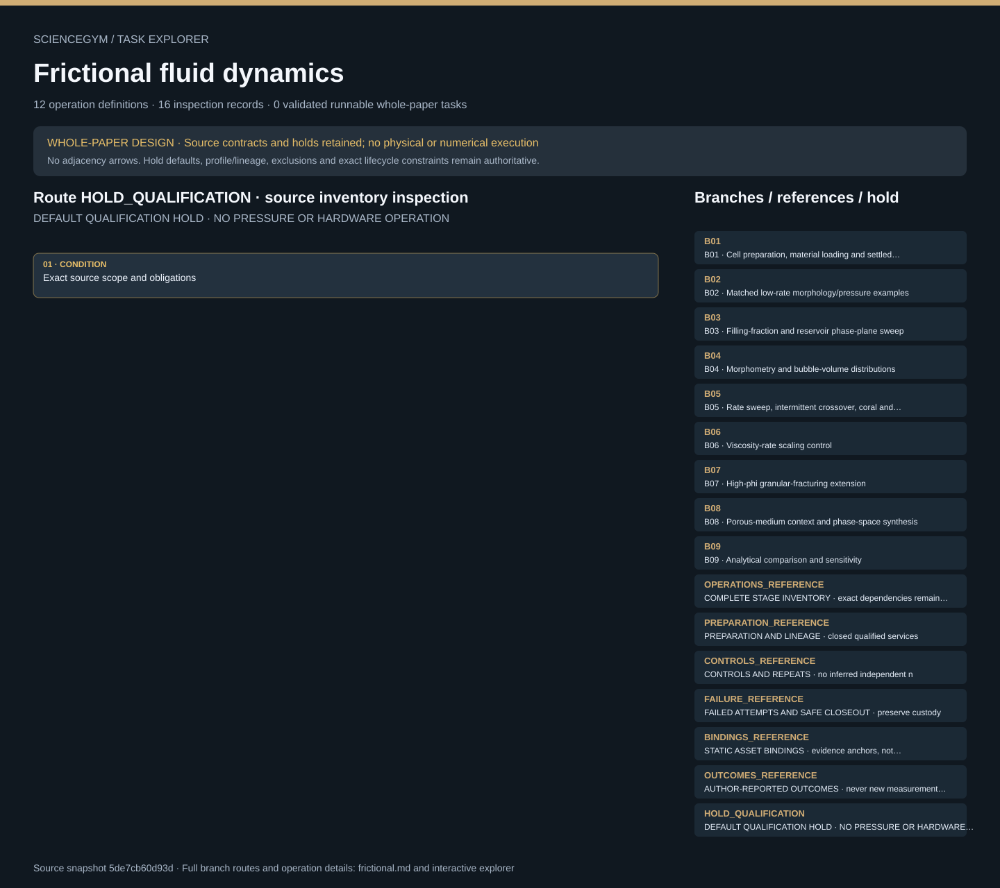

# Frictional fluid dynamics: task route map



Paper: **Patterns and flow in frictional fluid dynamics** · [DOI](https://doi.org/10.1038/ncomms1289)

Whole-paper DESIGN only; zero validated runnable whole-paper tasks. Read-only author/evaluator inspection, not an actor context, pressure operating procedure, hardware controller, fluid simulation or scientific reproduction. Source facts, authored requirements, finite synthetic checks and original illustrative geometry remain separate. Operation memberships do not create chronology; only exact dependency, custody and lifecycle contracts constrain order. Required outputs and receipts remain obligations, never observed states. HOLD_QUALIFICATION remains active. Twelve authored evidence routes R01–R12 and nine source-scope branches describe one paper-level design. Six stations, eight original scene groups and thirty-two evidence-only anchors remain illustrative and unqualified. All twenty qualification holds remain unresolved. SOURCE_SCALE dimensions are source context, never qualified apparatus, pressure ratings or motion targets. Coral-rate C01 retains 0.1 versus 1.0 ml/min with each provenance; no rate is silently selected or assigned to an operating command. The Boyle-law C02 intermediate-sign inconsistency remains a reviewer inference, not a published correction or repaired numerical model. Viscosity-rate scaling B06 and high-filling granular fracture B07 remain required separate branches with unresolved preparation and repeat evidence. Granular fracture never means breaking the glass cell. B08 borrowed porous-medium comparisons remain attributed external context; B09 analytical context is unimplemented. Normalized phi is not absolute volume fraction; reservoir volume is not total compliance; pump rate is not instantaneous burst flow; movie file time is not experiment time. Sparse illustrated conditions are not a complete factorial schedule, and twenty local width measurements are not twenty independent preparations. Theoretical lower bounds, observed crossover, sensitivity and measurement uncertainty remain distinct; source outcomes never become measured results, success thresholds or rewards. Material, dispersion, aliquot, cell, loaded/settled/spent child state, run, clock, calibration and service-job identities retain exact custody. No reset or same-cell microstate restoration is assumed. R11 is repeatable per registered job, including failures, and may precede aggregate R08–R10 while other jobs remain open. R12 requires all route dispositions and every job closeout; there is no global R11 token. Contained preparation, cell qualification, pressure measurement, safe release and cleanup remain closed qualified services. Hash checks neither authenticate service receipts nor inspect external raw records. Upstream accepted source review covered eight final pages, five figures, nine equations and both movie descriptions. Both movies were decoded, with nine and eleven sampled file-time frames inspected, not continuously or against raw experiment time. No raw numeric dataset or external cited references were reviewed. This integration does not reread publications, resolve conflicts or reproduce science. Source material retains CC BY-NC-SA 3.0 Unported terms; third-party Figure 5 imagery retains separate provenance and rights. Apache-2.0 applies only to original authored materials. No publisher PDF, source text/figure, movie/frame, borrowed photograph, source CAD, source code or raw dataset is bundled. No hardware control, new measurement, numerical rerun, physical execution or scientific reproduction is supplied.. Counts describe task representation, not experiments or success.

**Reading rule:** rows show unordered source inventory for inspection. Exact phase, lifecycle and dependency contracts remain authoritative; no loop, specimen, condition or chronology is inferred. An unordered obligation group has no inferred chronological edges. Source-reported scientific facts and authored handling are distinct.

[Frozen local source task package](../../../tasks/frictional_operations_v2/) · [Interactive inspector](../index.html)

## B01 — B01 · Cell preparation, material loading and settled initial state

Whole-paper DESIGN only; zero validated runnable whole-paper tasks. Read-only author/evaluator inspection, not an actor context, pressure operating procedure, hardware controller, fluid simulation or scientific reproduction. Source facts, authored requirements, finite synthetic checks and original illustrative geometry remain separate. Operation memberships do not create chronology; only exact dependency, custody and lifecycle contracts constrain order. Required outputs and receipts remain obligations, never observed states. HOLD_QUALIFICATION remains active.

[Exact route source](../../../tasks/frictional_operations_v2/branches.json) · JSON pointer: `/branches/0`

- **OBLIGATIONS: Exact operation membership; no adjacency chronology**
  - Binding: {"order":"Whole-paper DESIGN only; zero validated runnable whole-paper tasks. Read-only author/evaluator inspection, not an actor context, pressure operating procedure, hardware controller, fluid simulation or scientific reproduction. Source facts, authored requirements, finite synthetic checks and original illustrative geometry remain separate. Operation memberships do not create chronology; only exact dependency, custody and lifecycle contracts constrain order. Required outputs and receipts remain obligations, never observed states. HOLD_QUALIFICATION remains active."}
  - `R01` Admit source and condition schema
    - Source occurrence binding: {"source_file":"operations.json","source_pointer":"/operations/0/branch_ids/0","source_node":"B01","meaning":"Exact authored operation branch membership; not execution or inferred chronology","operation_source_pointer":"/operations/0/id"}
  - `R02` Receive identified materials and finished cells
    - Source occurrence binding: {"source_file":"operations.json","source_pointer":"/operations/1/branch_ids/0","source_node":"B01","meaning":"Exact authored operation branch membership; not execution or inferred chronology","operation_source_pointer":"/operations/1/id"}
  - `R03` Request contained preparation and settling
    - Source occurrence binding: {"source_file":"operations.json","source_pointer":"/operations/2/branch_ids/0","source_node":"B01","meaning":"Exact authored operation branch membership; not execution or inferred chronology","operation_source_pointer":"/operations/2/id"}
  - `R04` Qualify synchronized measurement interfaces
    - Source occurrence binding: {"source_file":"operations.json","source_pointer":"/operations/3/branch_ids/0","source_node":"B01","meaning":"Exact authored operation branch membership; not execution or inferred chronology","operation_source_pointer":"/operations/3/id"}
  - `R11` Close each physical service job safely
    - Source occurrence binding: {"source_file":"operations.json","source_pointer":"/operations/10/branch_ids/0","source_node":"B01","meaning":"Exact authored operation branch membership; not execution or inferred chronology","operation_source_pointer":"/operations/10/id"}
  - `R12` Archive and review qualification
    - Source occurrence binding: {"source_file":"operations.json","source_pointer":"/operations/11/branch_ids/0","source_node":"B01","meaning":"Exact authored operation branch membership; not execution or inferred chronology","operation_source_pointer":"/operations/11/id"}
- **CONDITION: Exact source scope and obligations**
  - Binding: {"source_file":"branches.json","source_pointer":"/branches/0","source_contract":{"id":"B01","name":"Cell preparation, material loading and settled initial state","fact_refs":["F02","F03","F04","F05","F06"],"evidence_type":"Reported preparation and instrumentation","translation_boundary":"Represent all material/cell dependencies, but obtain finished pressure-rated cells and contained prepared dispersions from qualified services; no fabrication or pressure operating recipe.","design_covered":true,"scientific_execution":"UNRUN"}}

<details><summary>Branch state, choices, lineage and loop obligations</summary>

```json
{
  "id": "B01",
  "name": "Cell preparation, material loading and settled initial state",
  "fact_refs": [
    "F02",
    "F03",
    "F04",
    "F05",
    "F06"
  ],
  "evidence_type": "Reported preparation and instrumentation",
  "translation_boundary": "Represent all material/cell dependencies, but obtain finished pressure-rated cells and contained prepared dispersions from qualified services; no fabrication or pressure operating recipe.",
  "design_covered": true,
  "scientific_execution": "UNRUN"
}
```

</details>

## B02 — B02 · Matched low-rate morphology/pressure examples

Whole-paper DESIGN only; zero validated runnable whole-paper tasks. Read-only author/evaluator inspection, not an actor context, pressure operating procedure, hardware controller, fluid simulation or scientific reproduction. Source facts, authored requirements, finite synthetic checks and original illustrative geometry remain separate. Operation memberships do not create chronology; only exact dependency, custody and lifecycle contracts constrain order. Required outputs and receipts remain obligations, never observed states. HOLD_QUALIFICATION remains active.

[Exact route source](../../../tasks/frictional_operations_v2/branches.json) · JSON pointer: `/branches/1`

- **OBLIGATIONS: Exact operation membership; no adjacency chronology**
  - Binding: {"order":"Whole-paper DESIGN only; zero validated runnable whole-paper tasks. Read-only author/evaluator inspection, not an actor context, pressure operating procedure, hardware controller, fluid simulation or scientific reproduction. Source facts, authored requirements, finite synthetic checks and original illustrative geometry remain separate. Operation memberships do not create chronology; only exact dependency, custody and lifecycle contracts constrain order. Required outputs and receipts remain obligations, never observed states. HOLD_QUALIFICATION remains active."}
  - `R01` Admit source and condition schema
    - Source occurrence binding: {"source_file":"operations.json","source_pointer":"/operations/0/branch_ids/1","source_node":"B02","meaning":"Exact authored operation branch membership; not execution or inferred chronology","operation_source_pointer":"/operations/0/id"}
  - `R03` Request contained preparation and settling
    - Source occurrence binding: {"source_file":"operations.json","source_pointer":"/operations/2/branch_ids/1","source_node":"B02","meaning":"Exact authored operation branch membership; not execution or inferred chronology","operation_source_pointer":"/operations/2/id"}
  - `R05` Request low-rate comparison and sparse sweep
    - Source occurrence binding: {"source_file":"operations.json","source_pointer":"/operations/4/branch_ids/0","source_node":"B02","meaning":"Exact authored operation branch membership; not execution or inferred chronology","operation_source_pointer":"/operations/4/id"}
  - `R09` Review repeats, controls and model comparisons
    - Source occurrence binding: {"source_file":"operations.json","source_pointer":"/operations/8/branch_ids/0","source_node":"B02","meaning":"Exact authored operation branch membership; not execution or inferred chronology","operation_source_pointer":"/operations/8/id"}
  - `R11` Close each physical service job safely
    - Source occurrence binding: {"source_file":"operations.json","source_pointer":"/operations/10/branch_ids/1","source_node":"B02","meaning":"Exact authored operation branch membership; not execution or inferred chronology","operation_source_pointer":"/operations/10/id"}
  - `R12` Archive and review qualification
    - Source occurrence binding: {"source_file":"operations.json","source_pointer":"/operations/11/branch_ids/1","source_node":"B02","meaning":"Exact authored operation branch membership; not execution or inferred chronology","operation_source_pointer":"/operations/11/id"}
- **CONDITION: Exact source scope and obligations**
  - Binding: {"source_file":"branches.json","source_pointer":"/branches/1","source_contract":{"id":"B02","name":"Matched low-rate morphology/pressure examples","fact_refs":["F07","F19"],"evidence_type":"Reported experiments","translation_boundary":"Separate phi 0.23 and 0.58 run identities; bind pressure and image clocks before deriving event quantities.","design_covered":true,"scientific_execution":"UNRUN"}}

<details><summary>Branch state, choices, lineage and loop obligations</summary>

```json
{
  "id": "B02",
  "name": "Matched low-rate morphology/pressure examples",
  "fact_refs": [
    "F07",
    "F19"
  ],
  "evidence_type": "Reported experiments",
  "translation_boundary": "Separate phi 0.23 and 0.58 run identities; bind pressure and image clocks before deriving event quantities.",
  "design_covered": true,
  "scientific_execution": "UNRUN"
}
```

</details>

## B03 — B03 · Filling-fraction and reservoir phase-plane sweep

Whole-paper DESIGN only; zero validated runnable whole-paper tasks. Read-only author/evaluator inspection, not an actor context, pressure operating procedure, hardware controller, fluid simulation or scientific reproduction. Source facts, authored requirements, finite synthetic checks and original illustrative geometry remain separate. Operation memberships do not create chronology; only exact dependency, custody and lifecycle contracts constrain order. Required outputs and receipts remain obligations, never observed states. HOLD_QUALIFICATION remains active.

[Exact route source](../../../tasks/frictional_operations_v2/branches.json) · JSON pointer: `/branches/2`

- **OBLIGATIONS: Exact operation membership; no adjacency chronology**
  - Binding: {"order":"Whole-paper DESIGN only; zero validated runnable whole-paper tasks. Read-only author/evaluator inspection, not an actor context, pressure operating procedure, hardware controller, fluid simulation or scientific reproduction. Source facts, authored requirements, finite synthetic checks and original illustrative geometry remain separate. Operation memberships do not create chronology; only exact dependency, custody and lifecycle contracts constrain order. Required outputs and receipts remain obligations, never observed states. HOLD_QUALIFICATION remains active."}
  - `R01` Admit source and condition schema
    - Source occurrence binding: {"source_file":"operations.json","source_pointer":"/operations/0/branch_ids/2","source_node":"B03","meaning":"Exact authored operation branch membership; not execution or inferred chronology","operation_source_pointer":"/operations/0/id"}
  - `R03` Request contained preparation and settling
    - Source occurrence binding: {"source_file":"operations.json","source_pointer":"/operations/2/branch_ids/2","source_node":"B03","meaning":"Exact authored operation branch membership; not execution or inferred chronology","operation_source_pointer":"/operations/2/id"}
  - `R05` Request low-rate comparison and sparse sweep
    - Source occurrence binding: {"source_file":"operations.json","source_pointer":"/operations/4/branch_ids/1","source_node":"B03","meaning":"Exact authored operation branch membership; not execution or inferred chronology","operation_source_pointer":"/operations/4/id"}
  - `R09` Review repeats, controls and model comparisons
    - Source occurrence binding: {"source_file":"operations.json","source_pointer":"/operations/8/branch_ids/1","source_node":"B03","meaning":"Exact authored operation branch membership; not execution or inferred chronology","operation_source_pointer":"/operations/8/id"}
  - `R11` Close each physical service job safely
    - Source occurrence binding: {"source_file":"operations.json","source_pointer":"/operations/10/branch_ids/2","source_node":"B03","meaning":"Exact authored operation branch membership; not execution or inferred chronology","operation_source_pointer":"/operations/10/id"}
  - `R12` Archive and review qualification
    - Source occurrence binding: {"source_file":"operations.json","source_pointer":"/operations/11/branch_ids/2","source_node":"B03","meaning":"Exact authored operation branch membership; not execution or inferred chronology","operation_source_pointer":"/operations/11/id"}
- **CONDITION: Exact source scope and obligations**
  - Binding: {"source_file":"branches.json","source_pointer":"/branches/2","source_contract":{"id":"B03","name":"Filling-fraction and reservoir phase-plane sweep","fact_refs":["F08","F11"],"evidence_type":"Reported experiments plus model comparison","translation_boundary":"Preserve sparse illustrated grid; never invent blank combinations or treat them as negative results.","design_covered":true,"scientific_execution":"UNRUN"}}

<details><summary>Branch state, choices, lineage and loop obligations</summary>

```json
{
  "id": "B03",
  "name": "Filling-fraction and reservoir phase-plane sweep",
  "fact_refs": [
    "F08",
    "F11"
  ],
  "evidence_type": "Reported experiments plus model comparison",
  "translation_boundary": "Preserve sparse illustrated grid; never invent blank combinations or treat them as negative results.",
  "design_covered": true,
  "scientific_execution": "UNRUN"
}
```

</details>

## B04 — B04 · Morphometry and bubble-volume distributions

Whole-paper DESIGN only; zero validated runnable whole-paper tasks. Read-only author/evaluator inspection, not an actor context, pressure operating procedure, hardware controller, fluid simulation or scientific reproduction. Source facts, authored requirements, finite synthetic checks and original illustrative geometry remain separate. Operation memberships do not create chronology; only exact dependency, custody and lifecycle contracts constrain order. Required outputs and receipts remain obligations, never observed states. HOLD_QUALIFICATION remains active.

[Exact route source](../../../tasks/frictional_operations_v2/branches.json) · JSON pointer: `/branches/3`

- **OBLIGATIONS: Exact operation membership; no adjacency chronology**
  - Binding: {"order":"Whole-paper DESIGN only; zero validated runnable whole-paper tasks. Read-only author/evaluator inspection, not an actor context, pressure operating procedure, hardware controller, fluid simulation or scientific reproduction. Source facts, authored requirements, finite synthetic checks and original illustrative geometry remain separate. Operation memberships do not create chronology; only exact dependency, custody and lifecycle contracts constrain order. Required outputs and receipts remain obligations, never observed states. HOLD_QUALIFICATION remains active."}
  - `R01` Admit source and condition schema
    - Source occurrence binding: {"source_file":"operations.json","source_pointer":"/operations/0/branch_ids/3","source_node":"B04","meaning":"Exact authored operation branch membership; not execution or inferred chronology","operation_source_pointer":"/operations/0/id"}
  - `R08` Measure patterns and correlate pressure events
    - Source occurrence binding: {"source_file":"operations.json","source_pointer":"/operations/7/branch_ids/0","source_node":"B04","meaning":"Exact authored operation branch membership; not execution or inferred chronology","operation_source_pointer":"/operations/7/id"}
  - `R09` Review repeats, controls and model comparisons
    - Source occurrence binding: {"source_file":"operations.json","source_pointer":"/operations/8/branch_ids/2","source_node":"B04","meaning":"Exact authored operation branch membership; not execution or inferred chronology","operation_source_pointer":"/operations/8/id"}
  - `R12` Archive and review qualification
    - Source occurrence binding: {"source_file":"operations.json","source_pointer":"/operations/11/branch_ids/3","source_node":"B04","meaning":"Exact authored operation branch membership; not execution or inferred chronology","operation_source_pointer":"/operations/11/id"}
- **CONDITION: Exact source scope and obligations**
  - Binding: {"source_file":"branches.json","source_pointer":"/branches/3","source_contract":{"id":"B04","name":"Morphometry and bubble-volume distributions","fact_refs":["F09","F10"],"evidence_type":"Reported derived measurements","translation_boundary":"Separate within-image20-point sampling, unknown independent replicate counts, event distributions and model-fit results.","design_covered":true,"scientific_execution":"UNRUN"}}

<details><summary>Branch state, choices, lineage and loop obligations</summary>

```json
{
  "id": "B04",
  "name": "Morphometry and bubble-volume distributions",
  "fact_refs": [
    "F09",
    "F10"
  ],
  "evidence_type": "Reported derived measurements",
  "translation_boundary": "Separate within-image20-point sampling, unknown independent replicate counts, event distributions and model-fit results.",
  "design_covered": true,
  "scientific_execution": "UNRUN"
}
```

</details>

## B05 — B05 · Rate sweep, intermittent crossover, coral and suspension

Whole-paper DESIGN only; zero validated runnable whole-paper tasks. Read-only author/evaluator inspection, not an actor context, pressure operating procedure, hardware controller, fluid simulation or scientific reproduction. Source facts, authored requirements, finite synthetic checks and original illustrative geometry remain separate. Operation memberships do not create chronology; only exact dependency, custody and lifecycle contracts constrain order. Required outputs and receipts remain obligations, never observed states. HOLD_QUALIFICATION remains active.

[Exact route source](../../../tasks/frictional_operations_v2/branches.json) · JSON pointer: `/branches/4`

- **OBLIGATIONS: Exact operation membership; no adjacency chronology**
  - Binding: {"order":"Whole-paper DESIGN only; zero validated runnable whole-paper tasks. Read-only author/evaluator inspection, not an actor context, pressure operating procedure, hardware controller, fluid simulation or scientific reproduction. Source facts, authored requirements, finite synthetic checks and original illustrative geometry remain separate. Operation memberships do not create chronology; only exact dependency, custody and lifecycle contracts constrain order. Required outputs and receipts remain obligations, never observed states. HOLD_QUALIFICATION remains active."}
  - `R01` Admit source and condition schema
    - Source occurrence binding: {"source_file":"operations.json","source_pointer":"/operations/0/branch_ids/4","source_node":"B05","meaning":"Exact authored operation branch membership; not execution or inferred chronology","operation_source_pointer":"/operations/0/id"}
  - `R03` Request contained preparation and settling
    - Source occurrence binding: {"source_file":"operations.json","source_pointer":"/operations/2/branch_ids/3","source_node":"B05","meaning":"Exact authored operation branch membership; not execution or inferred chronology","operation_source_pointer":"/operations/2/id"}
  - `R06` Request rate-dependence branch
    - Source occurrence binding: {"source_file":"operations.json","source_pointer":"/operations/5/branch_ids/0","source_node":"B05","meaning":"Exact authored operation branch membership; not execution or inferred chronology","operation_source_pointer":"/operations/5/id"}
  - `R09` Review repeats, controls and model comparisons
    - Source occurrence binding: {"source_file":"operations.json","source_pointer":"/operations/8/branch_ids/3","source_node":"B05","meaning":"Exact authored operation branch membership; not execution or inferred chronology","operation_source_pointer":"/operations/8/id"}
  - `R11` Close each physical service job safely
    - Source occurrence binding: {"source_file":"operations.json","source_pointer":"/operations/10/branch_ids/3","source_node":"B05","meaning":"Exact authored operation branch membership; not execution or inferred chronology","operation_source_pointer":"/operations/10/id"}
  - `R12` Archive and review qualification
    - Source occurrence binding: {"source_file":"operations.json","source_pointer":"/operations/11/branch_ids/4","source_node":"B05","meaning":"Exact authored operation branch membership; not execution or inferred chronology","operation_source_pointer":"/operations/11/id"}
- **CONDITION: Exact source scope and obligations**
  - Binding: {"source_file":"branches.json","source_pointer":"/branches/4","source_contract":{"id":"B05","name":"Rate sweep, intermittent crossover, coral and suspension","fact_refs":["F12","F13","F14"],"evidence_type":"Reported experiments","translation_boundary":"Keep pump rate, instantaneous invaded-volume rate and movie file playback time distinct; coral label dispute blocks automatic assignment.","design_covered":true,"scientific_execution":"UNRUN"}}

<details><summary>Branch state, choices, lineage and loop obligations</summary>

```json
{
  "id": "B05",
  "name": "Rate sweep, intermittent crossover, coral and suspension",
  "fact_refs": [
    "F12",
    "F13",
    "F14"
  ],
  "evidence_type": "Reported experiments",
  "translation_boundary": "Keep pump rate, instantaneous invaded-volume rate and movie file playback time distinct; coral label dispute blocks automatic assignment.",
  "design_covered": true,
  "scientific_execution": "UNRUN"
}
```

</details>

## B06 — B06 · Viscosity-rate scaling control

Whole-paper DESIGN only; zero validated runnable whole-paper tasks. Read-only author/evaluator inspection, not an actor context, pressure operating procedure, hardware controller, fluid simulation or scientific reproduction. Source facts, authored requirements, finite synthetic checks and original illustrative geometry remain separate. Operation memberships do not create chronology; only exact dependency, custody and lifecycle contracts constrain order. Required outputs and receipts remain obligations, never observed states. HOLD_QUALIFICATION remains active.

[Exact route source](../../../tasks/frictional_operations_v2/branches.json) · JSON pointer: `/branches/5`

- **OBLIGATIONS: Exact operation membership; no adjacency chronology**
  - Binding: {"order":"Whole-paper DESIGN only; zero validated runnable whole-paper tasks. Read-only author/evaluator inspection, not an actor context, pressure operating procedure, hardware controller, fluid simulation or scientific reproduction. Source facts, authored requirements, finite synthetic checks and original illustrative geometry remain separate. Operation memberships do not create chronology; only exact dependency, custody and lifecycle contracts constrain order. Required outputs and receipts remain obligations, never observed states. HOLD_QUALIFICATION remains active."}
  - `R01` Admit source and condition schema
    - Source occurrence binding: {"source_file":"operations.json","source_pointer":"/operations/0/branch_ids/5","source_node":"B06","meaning":"Exact authored operation branch membership; not execution or inferred chronology","operation_source_pointer":"/operations/0/id"}
  - `R03` Request contained preparation and settling
    - Source occurrence binding: {"source_file":"operations.json","source_pointer":"/operations/2/branch_ids/4","source_node":"B06","meaning":"Exact authored operation branch membership; not execution or inferred chronology","operation_source_pointer":"/operations/2/id"}
  - `R07` Request viscosity control and high-phi extension
    - Source occurrence binding: {"source_file":"operations.json","source_pointer":"/operations/6/branch_ids/0","source_node":"B06","meaning":"Exact authored operation branch membership; not execution or inferred chronology","operation_source_pointer":"/operations/6/id"}
  - `R09` Review repeats, controls and model comparisons
    - Source occurrence binding: {"source_file":"operations.json","source_pointer":"/operations/8/branch_ids/4","source_node":"B06","meaning":"Exact authored operation branch membership; not execution or inferred chronology","operation_source_pointer":"/operations/8/id"}
  - `R11` Close each physical service job safely
    - Source occurrence binding: {"source_file":"operations.json","source_pointer":"/operations/10/branch_ids/4","source_node":"B06","meaning":"Exact authored operation branch membership; not execution or inferred chronology","operation_source_pointer":"/operations/10/id"}
  - `R12` Archive and review qualification
    - Source occurrence binding: {"source_file":"operations.json","source_pointer":"/operations/11/branch_ids/5","source_node":"B06","meaning":"Exact authored operation branch membership; not execution or inferred chronology","operation_source_pointer":"/operations/11/id"}
- **CONDITION: Exact source scope and obligations**
  - Binding: {"source_file":"branches.json","source_pointer":"/branches/5","source_contract":{"id":"B06","name":"Viscosity-rate scaling control","fact_refs":["F15"],"evidence_type":"Reported control with incomplete recipe","translation_boundary":"Keep visible as unresolved required branch; receive approved formulation/viscosity evidence before any future physical use.","design_covered":true,"scientific_execution":"UNRUN"}}

<details><summary>Branch state, choices, lineage and loop obligations</summary>

```json
{
  "id": "B06",
  "name": "Viscosity-rate scaling control",
  "fact_refs": [
    "F15"
  ],
  "evidence_type": "Reported control with incomplete recipe",
  "translation_boundary": "Keep visible as unresolved required branch; receive approved formulation/viscosity evidence before any future physical use.",
  "design_covered": true,
  "scientific_execution": "UNRUN"
}
```

</details>

## B07 — B07 · High-phi granular-fracturing extension

Whole-paper DESIGN only; zero validated runnable whole-paper tasks. Read-only author/evaluator inspection, not an actor context, pressure operating procedure, hardware controller, fluid simulation or scientific reproduction. Source facts, authored requirements, finite synthetic checks and original illustrative geometry remain separate. Operation memberships do not create chronology; only exact dependency, custody and lifecycle contracts constrain order. Required outputs and receipts remain obligations, never observed states. HOLD_QUALIFICATION remains active.

[Exact route source](../../../tasks/frictional_operations_v2/branches.json) · JSON pointer: `/branches/6`

- **OBLIGATIONS: Exact operation membership; no adjacency chronology**
  - Binding: {"order":"Whole-paper DESIGN only; zero validated runnable whole-paper tasks. Read-only author/evaluator inspection, not an actor context, pressure operating procedure, hardware controller, fluid simulation or scientific reproduction. Source facts, authored requirements, finite synthetic checks and original illustrative geometry remain separate. Operation memberships do not create chronology; only exact dependency, custody and lifecycle contracts constrain order. Required outputs and receipts remain obligations, never observed states. HOLD_QUALIFICATION remains active."}
  - `R01` Admit source and condition schema
    - Source occurrence binding: {"source_file":"operations.json","source_pointer":"/operations/0/branch_ids/6","source_node":"B07","meaning":"Exact authored operation branch membership; not execution or inferred chronology","operation_source_pointer":"/operations/0/id"}
  - `R03` Request contained preparation and settling
    - Source occurrence binding: {"source_file":"operations.json","source_pointer":"/operations/2/branch_ids/5","source_node":"B07","meaning":"Exact authored operation branch membership; not execution or inferred chronology","operation_source_pointer":"/operations/2/id"}
  - `R07` Request viscosity control and high-phi extension
    - Source occurrence binding: {"source_file":"operations.json","source_pointer":"/operations/6/branch_ids/1","source_node":"B07","meaning":"Exact authored operation branch membership; not execution or inferred chronology","operation_source_pointer":"/operations/6/id"}
  - `R09` Review repeats, controls and model comparisons
    - Source occurrence binding: {"source_file":"operations.json","source_pointer":"/operations/8/branch_ids/5","source_node":"B07","meaning":"Exact authored operation branch membership; not execution or inferred chronology","operation_source_pointer":"/operations/8/id"}
  - `R11` Close each physical service job safely
    - Source occurrence binding: {"source_file":"operations.json","source_pointer":"/operations/10/branch_ids/5","source_node":"B07","meaning":"Exact authored operation branch membership; not execution or inferred chronology","operation_source_pointer":"/operations/10/id"}
  - `R12` Archive and review qualification
    - Source occurrence binding: {"source_file":"operations.json","source_pointer":"/operations/11/branch_ids/6","source_node":"B07","meaning":"Exact authored operation branch membership; not execution or inferred chronology","operation_source_pointer":"/operations/11/id"}
- **CONDITION: Exact source scope and obligations**
  - Binding: {"source_file":"branches.json","source_pointer":"/branches/6","source_contract":{"id":"B07","name":"High-phi granular-fracturing extension","fact_refs":["F16"],"evidence_type":"Reported experiments with incomplete conditions","translation_boundary":"Closed qualified pressure-cell service only; no glass-breaking or industrial-fracturing interpretation.","design_covered":true,"scientific_execution":"UNRUN"}}

<details><summary>Branch state, choices, lineage and loop obligations</summary>

```json
{
  "id": "B07",
  "name": "High-phi granular-fracturing extension",
  "fact_refs": [
    "F16"
  ],
  "evidence_type": "Reported experiments with incomplete conditions",
  "translation_boundary": "Closed qualified pressure-cell service only; no glass-breaking or industrial-fracturing interpretation.",
  "design_covered": true,
  "scientific_execution": "UNRUN"
}
```

</details>

## B08 — B08 · Porous-medium context and phase-space synthesis

Whole-paper DESIGN only; zero validated runnable whole-paper tasks. Read-only author/evaluator inspection, not an actor context, pressure operating procedure, hardware controller, fluid simulation or scientific reproduction. Source facts, authored requirements, finite synthetic checks and original illustrative geometry remain separate. Operation memberships do not create chronology; only exact dependency, custody and lifecycle contracts constrain order. Required outputs and receipts remain obligations, never observed states. HOLD_QUALIFICATION remains active.

[Exact route source](../../../tasks/frictional_operations_v2/branches.json) · JSON pointer: `/branches/7`

- **OBLIGATIONS: Exact operation membership; no adjacency chronology**
  - Binding: {"order":"Whole-paper DESIGN only; zero validated runnable whole-paper tasks. Read-only author/evaluator inspection, not an actor context, pressure operating procedure, hardware controller, fluid simulation or scientific reproduction. Source facts, authored requirements, finite synthetic checks and original illustrative geometry remain separate. Operation memberships do not create chronology; only exact dependency, custody and lifecycle contracts constrain order. Required outputs and receipts remain obligations, never observed states. HOLD_QUALIFICATION remains active."}
  - `R01` Admit source and condition schema
    - Source occurrence binding: {"source_file":"operations.json","source_pointer":"/operations/0/branch_ids/7","source_node":"B08","meaning":"Exact authored operation branch membership; not execution or inferred chronology","operation_source_pointer":"/operations/0/id"}
  - `R10` Tag external context and synthesize conclusion
    - Source occurrence binding: {"source_file":"operations.json","source_pointer":"/operations/9/branch_ids/0","source_node":"B08","meaning":"Exact authored operation branch membership; not execution or inferred chronology","operation_source_pointer":"/operations/9/id"}
  - `R12` Archive and review qualification
    - Source occurrence binding: {"source_file":"operations.json","source_pointer":"/operations/11/branch_ids/7","source_node":"B08","meaning":"Exact authored operation branch membership; not execution or inferred chronology","operation_source_pointer":"/operations/11/id"}
- **CONDITION: Exact source scope and obligations**
  - Binding: {"source_file":"branches.json","source_pointer":"/branches/7","source_contract":{"id":"B08","name":"Porous-medium context and phase-space synthesis","fact_refs":["F17","F18"],"evidence_type":"External-comparison context, not this-paper experimental task","translation_boundary":"Retain attribution and no task-count increment. No borrowed photos, no reproduction route without separately reviewing those sources.","design_covered":true,"scientific_execution":"UNRUN"}}

<details><summary>Branch state, choices, lineage and loop obligations</summary>

```json
{
  "id": "B08",
  "name": "Porous-medium context and phase-space synthesis",
  "fact_refs": [
    "F17",
    "F18"
  ],
  "evidence_type": "External-comparison context, not this-paper experimental task",
  "translation_boundary": "Retain attribution and no task-count increment. No borrowed photos, no reproduction route without separately reviewing those sources.",
  "design_covered": true,
  "scientific_execution": "UNRUN"
}
```

</details>

## B09 — B09 · Analytical comparison and sensitivity

Whole-paper DESIGN only; zero validated runnable whole-paper tasks. Read-only author/evaluator inspection, not an actor context, pressure operating procedure, hardware controller, fluid simulation or scientific reproduction. Source facts, authored requirements, finite synthetic checks and original illustrative geometry remain separate. Operation memberships do not create chronology; only exact dependency, custody and lifecycle contracts constrain order. Required outputs and receipts remain obligations, never observed states. HOLD_QUALIFICATION remains active.

[Exact route source](../../../tasks/frictional_operations_v2/branches.json) · JSON pointer: `/branches/8`

- **OBLIGATIONS: Exact operation membership; no adjacency chronology**
  - Binding: {"order":"Whole-paper DESIGN only; zero validated runnable whole-paper tasks. Read-only author/evaluator inspection, not an actor context, pressure operating procedure, hardware controller, fluid simulation or scientific reproduction. Source facts, authored requirements, finite synthetic checks and original illustrative geometry remain separate. Operation memberships do not create chronology; only exact dependency, custody and lifecycle contracts constrain order. Required outputs and receipts remain obligations, never observed states. HOLD_QUALIFICATION remains active."}
  - `R01` Admit source and condition schema
    - Source occurrence binding: {"source_file":"operations.json","source_pointer":"/operations/0/branch_ids/8","source_node":"B09","meaning":"Exact authored operation branch membership; not execution or inferred chronology","operation_source_pointer":"/operations/0/id"}
  - `R09` Review repeats, controls and model comparisons
    - Source occurrence binding: {"source_file":"operations.json","source_pointer":"/operations/8/branch_ids/6","source_node":"B09","meaning":"Exact authored operation branch membership; not execution or inferred chronology","operation_source_pointer":"/operations/8/id"}
  - `R10` Tag external context and synthesize conclusion
    - Source occurrence binding: {"source_file":"operations.json","source_pointer":"/operations/9/branch_ids/1","source_node":"B09","meaning":"Exact authored operation branch membership; not execution or inferred chronology","operation_source_pointer":"/operations/9/id"}
  - `R12` Archive and review qualification
    - Source occurrence binding: {"source_file":"operations.json","source_pointer":"/operations/11/branch_ids/8","source_node":"B09","meaning":"Exact authored operation branch membership; not execution or inferred chronology","operation_source_pointer":"/operations/11/id"}
- **CONDITION: Exact source scope and obligations**
  - Binding: {"source_file":"branches.json","source_pointer":"/branches/8","source_contract":{"id":"B09","name":"Analytical comparison and sensitivity","fact_refs":["F11","F19","F20"],"evidence_type":"Reported analytical model, not physical simulation performed here","translation_boundary":"Model quantities stay contextual; Boyle-law conflict and unknown gamma/calibration prevent implementation claims.","design_covered":true,"scientific_execution":"UNRUN"}}

<details><summary>Branch state, choices, lineage and loop obligations</summary>

```json
{
  "id": "B09",
  "name": "Analytical comparison and sensitivity",
  "fact_refs": [
    "F11",
    "F19",
    "F20"
  ],
  "evidence_type": "Reported analytical model, not physical simulation performed here",
  "translation_boundary": "Model quantities stay contextual; Boyle-law conflict and unknown gamma/calibration prevent implementation claims.",
  "design_covered": true,
  "scientific_execution": "UNRUN"
}
```

</details>

## OPERATIONS_REFERENCE — COMPLETE STAGE INVENTORY · exact dependencies remain authoritative

Whole-paper DESIGN only; zero validated runnable whole-paper tasks. Read-only author/evaluator inspection, not an actor context, pressure operating procedure, hardware controller, fluid simulation or scientific reproduction. Source facts, authored requirements, finite synthetic checks and original illustrative geometry remain separate. Operation memberships do not create chronology; only exact dependency, custody and lifecycle contracts constrain order. Required outputs and receipts remain obligations, never observed states. HOLD_QUALIFICATION remains active.

[Exact route source](../../../tasks/frictional_operations_v2/operations.json) · JSON pointer: ``

- **OBLIGATIONS: Exact operation membership; no adjacency chronology**
  - Binding: {"order":"Whole-paper DESIGN only; zero validated runnable whole-paper tasks. Read-only author/evaluator inspection, not an actor context, pressure operating procedure, hardware controller, fluid simulation or scientific reproduction. Source facts, authored requirements, finite synthetic checks and original illustrative geometry remain separate. Operation memberships do not create chronology; only exact dependency, custody and lifecycle contracts constrain order. Required outputs and receipts remain obligations, never observed states. HOLD_QUALIFICATION remains active."}
  - `R01` Admit source and condition schema
    - Source occurrence binding: {"source_file":"operations.json","source_pointer":"/operations/0/id","source_node":"R01","meaning":"Exact authored operation branch membership; not execution or inferred chronology"}
  - `R02` Receive identified materials and finished cells
    - Source occurrence binding: {"source_file":"operations.json","source_pointer":"/operations/1/id","source_node":"R02","meaning":"Exact authored operation branch membership; not execution or inferred chronology"}
  - `R03` Request contained preparation and settling
    - Source occurrence binding: {"source_file":"operations.json","source_pointer":"/operations/2/id","source_node":"R03","meaning":"Exact authored operation branch membership; not execution or inferred chronology"}
  - `R04` Qualify synchronized measurement interfaces
    - Source occurrence binding: {"source_file":"operations.json","source_pointer":"/operations/3/id","source_node":"R04","meaning":"Exact authored operation branch membership; not execution or inferred chronology"}
  - `R05` Request low-rate comparison and sparse sweep
    - Source occurrence binding: {"source_file":"operations.json","source_pointer":"/operations/4/id","source_node":"R05","meaning":"Exact authored operation branch membership; not execution or inferred chronology"}
  - `R06` Request rate-dependence branch
    - Source occurrence binding: {"source_file":"operations.json","source_pointer":"/operations/5/id","source_node":"R06","meaning":"Exact authored operation branch membership; not execution or inferred chronology"}
  - `R07` Request viscosity control and high-phi extension
    - Source occurrence binding: {"source_file":"operations.json","source_pointer":"/operations/6/id","source_node":"R07","meaning":"Exact authored operation branch membership; not execution or inferred chronology"}
  - `R08` Measure patterns and correlate pressure events
    - Source occurrence binding: {"source_file":"operations.json","source_pointer":"/operations/7/id","source_node":"R08","meaning":"Exact authored operation branch membership; not execution or inferred chronology"}
  - `R09` Review repeats, controls and model comparisons
    - Source occurrence binding: {"source_file":"operations.json","source_pointer":"/operations/8/id","source_node":"R09","meaning":"Exact authored operation branch membership; not execution or inferred chronology"}
  - `R10` Tag external context and synthesize conclusion
    - Source occurrence binding: {"source_file":"operations.json","source_pointer":"/operations/9/id","source_node":"R10","meaning":"Exact authored operation branch membership; not execution or inferred chronology"}
  - `R11` Close each physical service job safely
    - Source occurrence binding: {"source_file":"operations.json","source_pointer":"/operations/10/id","source_node":"R11","meaning":"Exact authored operation branch membership; not execution or inferred chronology"}
  - `R12` Archive and review qualification
    - Source occurrence binding: {"source_file":"operations.json","source_pointer":"/operations/11/id","source_node":"R12","meaning":"Exact authored operation branch membership; not execution or inferred chronology"}
- **CONDITION: Exact source scope and obligations**
  - Binding: {"source_file":"operations.json","source_pointer":"","source_contract":{"schema_version":"frictional_task.v2","operations":[{"id":"R01","name":"Admit source and condition schema","station":"ST01","depends_on":[],"unknown_refs":["U20"],"required_output":"Evidence records and exact-tree dedup receipt","gate":"No held/duplicate source; no copied media","branch_ids":["B01","B02","B03","B04","B05","B06","B07","B08","B09"],"asset_ids":["A01","A07"],"anchor_ids":["A01.intake_identity","A01.grain_lot","A01.host_lot","A01.custody_record","A07.branch_ledger","A07.conflict_record","A07.repeat_hierarchy","A07.model_context"],"device_command_implemented":false,"physical_execution_authority":false,"actor_action":"Select operation_id and independently supplied evidence_id only","status_semantics":"Digital contract validation, never physical qualification or scientific reproduction"},{"id":"R02","name":"Receive identified materials and finished cells","station":"ST01","depends_on":["R01"],"unknown_refs":["U01","U02","U03","U05","U06"],"required_output":"Lot/cell certificates and accepted variant IDs","gate":"Unknown identity/ratings quarantine physical work","branch_ids":["B01"],"asset_ids":["A01","A02"],"anchor_ids":["A01.intake_identity","A01.grain_lot","A01.host_lot","A01.custody_record","A02.cell_10mm","A02.cell_19mm","A02.geometry_record","A02.cell_inspection"],"device_command_implemented":false,"physical_execution_authority":false,"actor_action":"Select operation_id and independently supplied evidence_id only","status_semantics":"Digital contract validation, never physical qualification or scientific reproduction"},{"id":"R03","name":"Request contained preparation and settling","station":"ST02","depends_on":["R02"],"unknown_refs":["U03","U04","U14","U15"],"required_output":"Independent condition-specific preparation receipts","gate":"Alternative-viscosity and high-phi states remain separate","branch_ids":["B01","B02","B03","B05","B06","B07"],"asset_ids":["A01","A02","A03"],"anchor_ids":["A01.intake_identity","A01.grain_lot","A01.host_lot","A01.custody_record","A02.cell_10mm","A02.cell_19mm","A02.geometry_record","A02.cell_inspection","A03.contained_preparation","A03.loaded_state","A03.settled_state","A03.preparation_receipt"],"device_command_implemented":false,"physical_execution_authority":false,"actor_action":"Select operation_id and independently supplied evidence_id only","status_semantics":"Digital contract validation, never physical qualification or scientific reproduction"},{"id":"R04","name":"Qualify synchronized measurement interfaces","station":"ST03","depends_on":["R02"],"unknown_refs":["U01","U07","U08","U09"],"required_output":"Calibration, clock map and closed-service admission","gate":"No direct pump/valve/pressure commands","branch_ids":["B01"],"asset_ids":["A04","A05"],"anchor_ids":["A04.closed_service","A04.condition_receipt","A04.safe_release","A04.raw_stream_port","A05.pump_reference","A05.pressure_calibration","A05.camera_calibration","A05.clock_map"],"device_command_implemented":false,"physical_execution_authority":false,"actor_action":"Select operation_id and independently supplied evidence_id only","status_semantics":"Digital contract validation, never physical qualification or scientific reproduction"},{"id":"R05","name":"Request low-rate comparison and sparse sweep","station":"ST03","depends_on":["R03","R04"],"unknown_refs":["U06","U11","U12"],"required_output":"B02/B03 run evidence bundles","gate":"Source-reported values remain reference metadata, not executable defaults","branch_ids":["B02","B03"],"asset_ids":["A04","A05"],"anchor_ids":["A04.closed_service","A04.condition_receipt","A04.safe_release","A04.raw_stream_port","A05.pump_reference","A05.pressure_calibration","A05.camera_calibration","A05.clock_map"],"device_command_implemented":false,"physical_execution_authority":false,"actor_action":"Select operation_id and independently supplied evidence_id only","status_semantics":"Digital contract validation, never physical qualification or scientific reproduction"},{"id":"R06","name":"Request rate-dependence branch","station":"ST03","depends_on":["R03","R04"],"unknown_refs":["U11","U13"],"required_output":"B05 run bundles with conflict flags","gate":"No auto-assignment of coral rate until conflict is resolved","branch_ids":["B05"],"asset_ids":["A04","A05"],"anchor_ids":["A04.closed_service","A04.condition_receipt","A04.safe_release","A04.raw_stream_port","A05.pump_reference","A05.pressure_calibration","A05.camera_calibration","A05.clock_map"],"device_command_implemented":false,"physical_execution_authority":false,"actor_action":"Select operation_id and independently supplied evidence_id only","status_semantics":"Digital contract validation, never physical qualification or scientific reproduction"},{"id":"R07","name":"Request viscosity control and high-phi extension","station":"ST03","depends_on":["R03","R04"],"unknown_refs":["U14","U15","U01"],"required_output":"B06/B07 separate condition bundles","gate":"Closed qualified service only; missing branches cannot be called completed","branch_ids":["B06","B07"],"asset_ids":["A03","A04","A05"],"anchor_ids":["A03.contained_preparation","A03.loaded_state","A03.settled_state","A03.preparation_receipt","A04.closed_service","A04.condition_receipt","A04.safe_release","A04.raw_stream_port","A05.pump_reference","A05.pressure_calibration","A05.camera_calibration","A05.clock_map"],"device_command_implemented":false,"physical_execution_authority":false,"actor_action":"Select operation_id and independently supplied evidence_id only","status_semantics":"Digital contract validation, never physical qualification or scientific reproduction"},{"id":"R08","name":"Measure patterns and correlate pressure events","station":"ST04","depends_on":["R05","R06","R07"],"unknown_refs":["U09","U10","U17"],"required_output":"B04 morphometry and source-aligned event evidence","gate":"Raw time and movie time separate; no digitized plot treated as raw data","branch_ids":["B04"],"asset_ids":["A05","A06","A07"],"anchor_ids":["A05.pump_reference","A05.pressure_calibration","A05.camera_calibration","A05.clock_map","A06.pattern_token","A06.segmentation_record","A06.event_record","A06.uncertainty_record","A07.branch_ledger","A07.conflict_record","A07.repeat_hierarchy","A07.model_context"],"device_command_implemented":false,"physical_execution_authority":false,"actor_action":"Select operation_id and independently supplied evidence_id only","status_semantics":"Digital contract validation, never physical qualification or scientific reproduction"},{"id":"R09","name":"Review repeats, controls and model comparisons","station":"ST05","depends_on":["R08"],"unknown_refs":["U11","U12","U13","U16"],"required_output":"Per-branch evidence assessment and unresolved outcomes","gate":"No20-point pseudoreplication; no model execution here","branch_ids":["B02","B03","B04","B05","B06","B07","B09"],"asset_ids":["A06","A07"],"anchor_ids":["A06.pattern_token","A06.segmentation_record","A06.event_record","A06.uncertainty_record","A07.branch_ledger","A07.conflict_record","A07.repeat_hierarchy","A07.model_context"],"device_command_implemented":false,"physical_execution_authority":false,"actor_action":"Select operation_id and independently supplied evidence_id only","status_semantics":"Digital contract validation, never physical qualification or scientific reproduction"},{"id":"R10","name":"Tag external context and synthesize conclusion","station":"ST05","depends_on":["R09"],"unknown_refs":["U16","U20"],"required_output":"B08 context-only references and B09 model-limit statement","gate":"Borrowed porous-medium photographs do not become task evidence","branch_ids":["B08","B09"],"asset_ids":["A07"],"anchor_ids":["A07.branch_ledger","A07.conflict_record","A07.repeat_hierarchy","A07.model_context"],"device_command_implemented":false,"physical_execution_authority":false,"actor_action":"Select operation_id and independently supplied evidence_id only","status_semantics":"Digital contract validation, never physical qualification or scientific reproduction"},{"id":"R11","name":"Close each physical service job safely","station":"ST06","depends_on":[],"unknown_refs":["U01","U18","U19"],"required_output":"Safe release, contained disposition and cleaning/inspection receipt","gate":"Job-level closeout can run immediately after each independent run, before aggregate analysis","branch_ids":["B01","B02","B03","B05","B06","B07"],"asset_ids":["A02","A04","A08"],"anchor_ids":["A02.cell_10mm","A02.cell_19mm","A02.geometry_record","A02.cell_inspection","A04.closed_service","A04.condition_receipt","A04.safe_release","A04.raw_stream_port","A08.quarantine_carrier","A08.safe_closeout","A08.reuse_inspection","A08.archive_receipt"],"device_command_implemented":false,"physical_execution_authority":false,"actor_action":"Select operation_id and independently supplied evidence_id only","status_semantics":"Digital contract validation, never physical qualification or scientific reproduction","dependency_rule":"Per-service-job closeout; references one previously registered job. May occur immediately after its R03/R04/R05/R06/R07 disposition, including failures, before R08-R10. R12 requires all registered jobs closed.","repeatable_by_job":true},{"id":"R12","name":"Archive and review qualification","station":"ST06","depends_on":["R10"],"unknown_refs":["U17","U18"],"required_output":"Immutable evidence, decisions, holds and final manifest","gate":"Review-only packet adds zero completed conversions; future promotion requires separate implementation/audit","branch_ids":["B01","B02","B03","B04","B05","B06","B07","B08","B09"],"asset_ids":["A07","A08"],"anchor_ids":["A07.branch_ledger","A07.conflict_record","A07.repeat_hierarchy","A07.model_context","A08.quarantine_carrier","A08.safe_closeout","A08.reuse_inspection","A08.archive_receipt"],"device_command_implemented":false,"physical_execution_authority":false,"actor_action":"Select operation_id and independently supplied evidence_id only","status_semantics":"Digital contract validation, never physical qualification or scientific reproduction","dependency_rule":"All R01-R10 dispositions plus R11 closeout for every registered job, including failures; no single global R11 token"}]}}

<details><summary>Branch state, choices, lineage and loop obligations</summary>

```json
{
  "schema_version": "frictional_task.v2",
  "operations": [
    {
      "id": "R01",
      "name": "Admit source and condition schema",
      "station": "ST01",
      "depends_on": [],
      "unknown_refs": [
        "U20"
      ],
      "required_output": "Evidence records and exact-tree dedup receipt",
      "gate": "No held/duplicate source; no copied media",
      "branch_ids": [
        "B01",
        "B02",
        "B03",
        "B04",
        "B05",
        "B06",
        "B07",
        "B08",
        "B09"
      ],
      "asset_ids": [
        "A01",
        "A07"
      ],
      "anchor_ids": [
        "A01.intake_identity",
        "A01.grain_lot",
        "A01.host_lot",
        "A01.custody_record",
        "A07.branch_ledger",
        "A07.conflict_record",
        "A07.repeat_hierarchy",
        "A07.model_context"
      ],
      "device_command_implemented": false,
      "physical_execution_authority": false,
      "actor_action": "Select operation_id and independently supplied evidence_id only",
      "status_semantics": "Digital contract validation, never physical qualification or scientific reproduction"
    },
    {
      "id": "R02",
      "name": "Receive identified materials and finished cells",
      "station": "ST01",
      "depends_on": [
        "R01"
      ],
      "unknown_refs": [
        "U01",
        "U02",
        "U03",
        "U05",
        "U06"
      ],
      "required_output": "Lot/cell certificates and accepted variant IDs",
      "gate": "Unknown identity/ratings quarantine physical work",
      "branch_ids": [
        "B01"
      ],
      "asset_ids": [
        "A01",
        "A02"
      ],
      "anchor_ids": [
        "A01.intake_identity",
        "A01.grain_lot",
        "A01.host_lot",
        "A01.custody_record",
        "A02.cell_10mm",
        "A02.cell_19mm",
        "A02.geometry_record",
        "A02.cell_inspection"
      ],
      "device_command_implemented": false,
      "physical_execution_authority": false,
      "actor_action": "Select operation_id and independently supplied evidence_id only",
      "status_semantics": "Digital contract validation, never physical qualification or scientific reproduction"
    },
    {
      "id": "R03",
      "name": "Request contained preparation and settling",
      "station": "ST02",
      "depends_on": [
        "R02"
      ],
      "unknown_refs": [
        "U03",
        "U04",
        "U14",
        "U15"
      ],
      "required_output": "Independent condition-specific preparation receipts",
      "gate": "Alternative-viscosity and high-phi states remain separate",
      "branch_ids": [
        "B01",
        "B02",
        "B03",
        "B05",
        "B06",
        "B07"
      ],
      "asset_ids": [
        "A01",
        "A02",
        "A03"
      ],
      "anchor_ids": [
        "A01.intake_identity",
        "A01.grain_lot",
        "A01.host_lot",
        "A01.custody_record",
        "A02.cell_10mm",
        "A02.cell_19mm",
        "A02.geometry_record",
        "A02.cell_inspection",
        "A03.contained_preparation",
        "A03.loaded_state",
        "A03.settled_state",
        "A03.preparation_receipt"
      ],
      "device_command_implemented": false,
      "physical_execution_authority": false,
      "actor_action": "Select operation_id and independently supplied evidence_id only",
      "status_semantics": "Digital contract validation, never physical qualification or scientific reproduction"
    },
    {
      "id": "R04",
      "name": "Qualify synchronized measurement interfaces",
      "station": "ST03",
      "depends_on": [
        "R02"
      ],
      "unknown_refs": [
        "U01",
        "U07",
        "U08",
        "U09"
      ],
      "required_output": "Calibration, clock map and closed-service admission",
      "gate": "No direct pump/valve/pressure commands",
      "branch_ids": [
        "B01"
      ],
      "asset_ids": [
        "A04",
        "A05"
      ],
      "anchor_ids": [
        "A04.closed_service",
        "A04.condition_receipt",
        "A04.safe_release",
        "A04.raw_stream_port",
        "A05.pump_reference",
        "A05.pressure_calibration",
        "A05.camera_calibration",
        "A05.clock_map"
      ],
      "device_command_implemented": false,
      "physical_execution_authority": false,
      "actor_action": "Select operation_id and independently supplied evidence_id only",
      "status_semantics": "Digital contract validation, never physical qualification or scientific reproduction"
    },
    {
      "id": "R05",
      "name": "Request low-rate comparison and sparse sweep",
      "station": "ST03",
      "depends_on": [
        "R03",
        "R04"
      ],
      "unknown_refs": [
        "U06",
        "U11",
        "U12"
      ],
      "required_output": "B02/B03 run evidence bundles",
      "gate": "Source-reported values remain reference metadata, not executable defaults",
      "branch_ids": [
        "B02",
        "B03"
      ],
      "asset_ids": [
        "A04",
        "A05"
      ],
      "anchor_ids": [
        "A04.closed_service",
        "A04.condition_receipt",
        "A04.safe_release",
        "A04.raw_stream_port",
        "A05.pump_reference",
        "A05.pressure_calibration",
        "A05.camera_calibration",
        "A05.clock_map"
      ],
      "device_command_implemented": false,
      "physical_execution_authority": false,
      "actor_action": "Select operation_id and independently supplied evidence_id only",
      "status_semantics": "Digital contract validation, never physical qualification or scientific reproduction"
    },
    {
      "id": "R06",
      "name": "Request rate-dependence branch",
      "station": "ST03",
      "depends_on": [
        "R03",
        "R04"
      ],
      "unknown_refs": [
        "U11",
        "U13"
      ],
      "required_output": "B05 run bundles with conflict flags",
      "gate": "No auto-assignment of coral rate until conflict is resolved",
      "branch_ids": [
        "B05"
      ],
      "asset_ids": [
        "A04",
        "A05"
      ],
      "anchor_ids": [
        "A04.closed_service",
        "A04.condition_receipt",
        "A04.safe_release",
        "A04.raw_stream_port",
        "A05.pump_reference",
        "A05.pressure_calibration",
        "A05.camera_calibration",
        "A05.clock_map"
      ],
      "device_command_implemented": false,
      "physical_execution_authority": false,
      "actor_action": "Select operation_id and independently supplied evidence_id only",
      "status_semantics": "Digital contract validation, never physical qualification or scientific reproduction"
    },
    {
      "id": "R07",
      "name": "Request viscosity control and high-phi extension",
      "station": "ST03",
      "depends_on": [
        "R03",
        "R04"
      ],
      "unknown_refs": [
        "U14",
        "U15",
        "U01"
      ],
      "required_output": "B06/B07 separate condition bundles",
      "gate": "Closed qualified service only; missing branches cannot be called completed",
      "branch_ids": [
        "B06",
        "B07"
      ],
      "asset_ids": [
        "A03",
        "A04",
        "A05"
      ],
      "anchor_ids": [
        "A03.contained_preparation",
        "A03.loaded_state",
        "A03.settled_state",
        "A03.preparation_receipt",
        "A04.closed_service",
        "A04.condition_receipt",
        "A04.safe_release",
        "A04.raw_stream_port",
        "A05.pump_reference",
        "A05.pressure_calibration",
        "A05.camera_calibration",
        "A05.clock_map"
      ],
      "device_command_implemented": false,
      "physical_execution_authority": false,
      "actor_action": "Select operation_id and independently supplied evidence_id only",
      "status_semantics": "Digital contract validation, never physical qualification or scientific reproduction"
    },
    {
      "id": "R08",
      "name": "Measure patterns and correlate pressure events",
      "station": "ST04",
      "depends_on": [
        "R05",
        "R06",
        "R07"
      ],
      "unknown_refs": [
        "U09",
        "U10",
        "U17"
      ],
      "required_output": "B04 morphometry and source-aligned event evidence",
      "gate": "Raw time and movie time separate; no digitized plot treated as raw data",
      "branch_ids": [
        "B04"
      ],
      "asset_ids": [
        "A05",
        "A06",
        "A07"
      ],
      "anchor_ids": [
        "A05.pump_reference",
        "A05.pressure_calibration",
        "A05.camera_calibration",
        "A05.clock_map",
        "A06.pattern_token",
        "A06.segmentation_record",
        "A06.event_record",
        "A06.uncertainty_record",
        "A07.branch_ledger",
        "A07.conflict_record",
        "A07.repeat_hierarchy",
        "A07.model_context"
      ],
      "device_command_implemented": false,
      "physical_execution_authority": false,
      "actor_action": "Select operation_id and independently supplied evidence_id only",
      "status_semantics": "Digital contract validation, never physical qualification or scientific reproduction"
    },
    {
      "id": "R09",
      "name": "Review repeats, controls and model comparisons",
      "station": "ST05",
      "depends_on": [
        "R08"
      ],
      "unknown_refs": [
        "U11",
        "U12",
        "U13",
        "U16"
      ],
      "required_output": "Per-branch evidence assessment and unresolved outcomes",
      "gate": "No20-point pseudoreplication; no model execution here",
      "branch_ids": [
        "B02",
        "B03",
        "B04",
        "B05",
        "B06",
        "B07",
        "B09"
      ],
      "asset_ids": [
        "A06",
        "A07"
      ],
      "anchor_ids": [
        "A06.pattern_token",
        "A06.segmentation_record",
        "A06.event_record",
        "A06.uncertainty_record",
        "A07.branch_ledger",
        "A07.conflict_record",
        "A07.repeat_hierarchy",
        "A07.model_context"
      ],
      "device_command_implemented": false,
      "physical_execution_authority": false,
      "actor_action": "Select operation_id and independently supplied evidence_id only",
      "status_semantics": "Digital contract validation, never physical qualification or scientific reproduction"
    },
    {
      "id": "R10",
      "name": "Tag external context and synthesize conclusion",
      "station": "ST05",
      "depends_on": [
        "R09"
      ],
      "unknown_refs": [
        "U16",
        "U20"
      ],
      "required_output": "B08 context-only references and B09 model-limit statement",
      "gate": "Borrowed porous-medium photographs do not become task evidence",
      "branch_ids": [
        "B08",
        "B09"
      ],
      "asset_ids": [
        "A07"
      ],
      "anchor_ids": [
        "A07.branch_ledger",
        "A07.conflict_record",
        "A07.repeat_hierarchy",
        "A07.model_context"
      ],
      "device_command_implemented": false,
      "physical_execution_authority": false,
      "actor_action": "Select operation_id and independently supplied evidence_id only",
      "status_semantics": "Digital contract validation, never physical qualification or scientific reproduction"
    },
    {
      "id": "R11",
      "name": "Close each physical service job safely",
      "station": "ST06",
      "depends_on": [],
      "unknown_refs": [
        "U01",
        "U18",
        "U19"
      ],
      "required_output": "Safe release, contained disposition and cleaning/inspection receipt",
      "gate": "Job-level closeout can run immediately after each independent run, before aggregate analysis",
      "branch_ids": [
        "B01",
        "B02",
        "B03",
        "B05",
        "B06",
        "B07"
      ],
      "asset_ids": [
        "A02",
        "A04",
        "A08"
      ],
      "anchor_ids": [
        "A02.cell_10mm",
        "A02.cell_19mm",
        "A02.geometry_record",
        "A02.cell_inspection",
        "A04.closed_service",
        "A04.condition_receipt",
        "A04.safe_release",
        "A04.raw_stream_port",
        "A08.quarantine_carrier",
        "A08.safe_closeout",
        "A08.reuse_inspection",
        "A08.archive_receipt"
      ],
      "device_command_implemented": false,
      "physical_execution_authority": false,
      "actor_action": "Select operation_id and independently supplied evidence_id only",
      "status_semantics": "Digital contract validation, never physical qualification or scientific reproduction",
      "dependency_rule": "Per-service-job closeout; references one previously registered job. May occur immediately after its R03/R04/R05/R06/R07 disposition, including failures, before R08-R10. R12 requires all registered jobs closed.",
      "repeatable_by_job": true
    },
    {
      "id": "R12",
      "name": "Archive and review qualification",
      "station": "ST06",
      "depends_on": [
        "R10"
      ],
      "unknown_refs": [
        "U17",
        "U18"
      ],
      "required_output": "Immutable evidence, decisions, holds and final manifest",
      "gate": "Review-only packet adds zero completed conversions; future promotion requires separate implementation/audit",
      "branch_ids": [
        "B01",
        "B02",
        "B03",
        "B04",
        "B05",
        "B06",
        "B07",
        "B08",
        "B09"
      ],
      "asset_ids": [
        "A07",
        "A08"
      ],
      "anchor_ids": [
        "A07.branch_ledger",
        "A07.conflict_record",
        "A07.repeat_hierarchy",
        "A07.model_context",
        "A08.quarantine_carrier",
        "A08.safe_closeout",
        "A08.reuse_inspection",
        "A08.archive_receipt"
      ],
      "device_command_implemented": false,
      "physical_execution_authority": false,
      "actor_action": "Select operation_id and independently supplied evidence_id only",
      "status_semantics": "Digital contract validation, never physical qualification or scientific reproduction",
      "dependency_rule": "All R01-R10 dispositions plus R11 closeout for every registered job, including failures; no single global R11 token"
    }
  ]
}
```

</details>

## PREPARATION_REFERENCE — PREPARATION AND LINEAGE · closed qualified services

Whole-paper DESIGN only; zero validated runnable whole-paper tasks. Read-only author/evaluator inspection, not an actor context, pressure operating procedure, hardware controller, fluid simulation or scientific reproduction. Source facts, authored requirements, finite synthetic checks and original illustrative geometry remain separate. Operation memberships do not create chronology; only exact dependency, custody and lifecycle contracts constrain order. Required outputs and receipts remain obligations, never observed states. HOLD_QUALIFICATION remains active.

[Exact route source](../../../tasks/frictional_operations_v2/preparation_routes.json) · JSON pointer: ``

- **CONDITION: Exact source scope and obligations**
  - Binding: {"source_file":"preparation_routes.json","source_pointer":"","source_contract":{"routes":[{"id":"P01","materials":["M01","M02"],"output":"M03 baseline condition-specific dispersion","gate_refs":["U02","U03","U04"]},{"id":"P02","materials":["M04","M05"],"output":"Accepted finished distinct cell variants","gate_refs":["U01","U05","U06"]},{"id":"P03","materials":["M01","M07"],"output":"Paired baseline/altered viscosity-control states","gate_refs":["U03","U14"]},{"id":"P04","materials":["M01","M02","M08"],"output":"Distinct high-filling granular state","gate_refs":["U01","U04","U15"]}],"all_preparation_is_closed_qualified_service":true,"recipes_exposed":false,"source_recipe_gaps_remain_held":true}}

<details><summary>Branch state, choices, lineage and loop obligations</summary>

```json
{
  "routes": [
    {
      "id": "P01",
      "materials": [
        "M01",
        "M02"
      ],
      "output": "M03 baseline condition-specific dispersion",
      "gate_refs": [
        "U02",
        "U03",
        "U04"
      ]
    },
    {
      "id": "P02",
      "materials": [
        "M04",
        "M05"
      ],
      "output": "Accepted finished distinct cell variants",
      "gate_refs": [
        "U01",
        "U05",
        "U06"
      ]
    },
    {
      "id": "P03",
      "materials": [
        "M01",
        "M07"
      ],
      "output": "Paired baseline/altered viscosity-control states",
      "gate_refs": [
        "U03",
        "U14"
      ]
    },
    {
      "id": "P04",
      "materials": [
        "M01",
        "M02",
        "M08"
      ],
      "output": "Distinct high-filling granular state",
      "gate_refs": [
        "U01",
        "U04",
        "U15"
      ]
    }
  ],
  "all_preparation_is_closed_qualified_service": true,
  "recipes_exposed": false,
  "source_recipe_gaps_remain_held": true
}
```

</details>

## CONTROLS_REFERENCE — CONTROLS AND REPEATS · no inferred independent n

Whole-paper DESIGN only; zero validated runnable whole-paper tasks. Read-only author/evaluator inspection, not an actor context, pressure operating procedure, hardware controller, fluid simulation or scientific reproduction. Source facts, authored requirements, finite synthetic checks and original illustrative geometry remain separate. Operation memberships do not create chronology; only exact dependency, custody and lifecycle contracts constrain order. Required outputs and receipts remain obligations, never observed states. HOLD_QUALIFICATION remains active.

[Exact route source](../../../tasks/frictional_operations_v2/controls_and_repeats.json) · JSON pointer: ``

- **CONDITION: Exact source scope and obligations**
  - Binding: {"source_file":"controls_and_repeats.json","source_pointer":"","source_contract":{"reported":[{"id":"CR01","control":"Low vs high phi at same 30 ml reservoir and 0.02 ml/min","refs":["F07"],"limit":"Two illustrative conditions; no independent n stated"},{"id":"CR02","control":"Vary phi and reservoir at fixed0.03 ml/min","refs":["F08"],"limit":"Sparse visual grid, not complete factorial proof"},{"id":"CR03","control":"Rate variation at phi 0.58,Vair 30 ml","refs":["F12","F13"],"limit":"Four-decade span; full schedule/repeat hierarchy absent"},{"id":"CR04","control":"100-fold inverse change of rate/viscosity preserves coral morphology","refs":["F15"],"limit":"Fluid formulation, absolute pair, repeats absent"},{"id":"CR05","control":"Thicker plates reduce cell bending for high stiffness","refs":["F02"],"limit":"Individual run allocation and compliance test absent"},{"id":"CR06","repeat":"Two S/A points show SD from replicate experiments; n not given","refs":["F10"]},{"id":"CR07","repeat":"20 random width measurements supply means/SD","refs":["F10"],"limit":"Within-pattern sampling is distinct from independent preparation/run replication"},{"id":"CR08","variation":"Bubble boxplots describe median/quartiles/extremes","refs":["F09"],"limit":"Raw event counts and independence unavailable"},{"id":"CR09","sensitivity":"Plus/minus10% friction parameter changes model boundary","refs":["F11"],"limit":"Not measurement uncertainty or confidence coverage"}],"authored_future_controls":["Qualification-only blank host/cell imaging, leak/compliance validation and camera/pressure calibration are proposed requirements, not reported paper controls","Predeclare new independent preparation/run repeats separately from within-run image/event measurements; n remains unset until statistical design","Randomization/reuse policy and environmental controls need review rather than invented defaults"]}}

<details><summary>Branch state, choices, lineage and loop obligations</summary>

```json
{
  "reported": [
    {
      "id": "CR01",
      "control": "Low vs high phi at same 30 ml reservoir and 0.02 ml/min",
      "refs": [
        "F07"
      ],
      "limit": "Two illustrative conditions; no independent n stated"
    },
    {
      "id": "CR02",
      "control": "Vary phi and reservoir at fixed0.03 ml/min",
      "refs": [
        "F08"
      ],
      "limit": "Sparse visual grid, not complete factorial proof"
    },
    {
      "id": "CR03",
      "control": "Rate variation at phi 0.58,Vair 30 ml",
      "refs": [
        "F12",
        "F13"
      ],
      "limit": "Four-decade span; full schedule/repeat hierarchy absent"
    },
    {
      "id": "CR04",
      "control": "100-fold inverse change of rate/viscosity preserves coral morphology",
      "refs": [
        "F15"
      ],
      "limit": "Fluid formulation, absolute pair, repeats absent"
    },
    {
      "id": "CR05",
      "control": "Thicker plates reduce cell bending for high stiffness",
      "refs": [
        "F02"
      ],
      "limit": "Individual run allocation and compliance test absent"
    },
    {
      "id": "CR06",
      "repeat": "Two S/A points show SD from replicate experiments; n not given",
      "refs": [
        "F10"
      ]
    },
    {
      "id": "CR07",
      "repeat": "20 random width measurements supply means/SD",
      "refs": [
        "F10"
      ],
      "limit": "Within-pattern sampling is distinct from independent preparation/run replication"
    },
    {
      "id": "CR08",
      "variation": "Bubble boxplots describe median/quartiles/extremes",
      "refs": [
        "F09"
      ],
      "limit": "Raw event counts and independence unavailable"
    },
    {
      "id": "CR09",
      "sensitivity": "Plus/minus10% friction parameter changes model boundary",
      "refs": [
        "F11"
      ],
      "limit": "Not measurement uncertainty or confidence coverage"
    }
  ],
  "authored_future_controls": [
    "Qualification-only blank host/cell imaging, leak/compliance validation and camera/pressure calibration are proposed requirements, not reported paper controls",
    "Predeclare new independent preparation/run repeats separately from within-run image/event measurements; n remains unset until statistical design",
    "Randomization/reuse policy and environmental controls need review rather than invented defaults"
  ]
}
```

</details>

## FAILURE_REFERENCE — FAILED ATTEMPTS AND SAFE CLOSEOUT · preserve custody

Whole-paper DESIGN only; zero validated runnable whole-paper tasks. Read-only author/evaluator inspection, not an actor context, pressure operating procedure, hardware controller, fluid simulation or scientific reproduction. Source facts, authored requirements, finite synthetic checks and original illustrative geometry remain separate. Operation memberships do not create chronology; only exact dependency, custody and lifecycle contracts constrain order. Required outputs and receipts remain obligations, never observed states. HOLD_QUALIFICATION remains active.

[Exact route source](../../../tasks/frictional_operations_v2/failure_and_closeout.json) · JSON pointer: ``

- **CONDITION: Exact source scope and obligations**
  - Binding: {"source_file":"failure_and_closeout.json","source_pointer":"","source_contract":{"classification":"Authored future controls; paper does not provide a full fault or disposal procedure","failure_cases":[{"id":"FAIL01","trigger":"Unknown material/cell identity or composition convention","response":"Quarantine condition before preparation; request corrected receipt"},{"id":"FAIL02","trigger":"Missing safe-pressure qualification, shield/interlock validation or safe-release confirmation","response":"No physical admission or coupling/uncoupling; refer to qualified operator/service"},{"id":"FAIL03","trigger":"Leak, crack, changed gap/compliance, damaged seal, spill or unintended particle escape","response":"Closed service enters approved safe state; isolate affected run, preserve logs; no pressure escalation or DIY repair"},{"id":"FAIL04","trigger":"Unsettled/nonuniform initial state or inconsistent normalized filling record","response":"Reject state; record preparation failure and create new approved child state rather than relabeling"},{"id":"FAIL05","trigger":"Camera/DAQ desynchronization, clipping, dropped frames or unusable calibration","response":"Hold cross-device metrics; preserve raw streams; rerun only under new approved run ID"},{"id":"FAIL06","trigger":"Coral rate labels disagree or Boyle-law convention unresolved","response":"Quarantine condition/model-derived conclusions without changing underlying source"},{"id":"FAIL07","trigger":"Observed morphology differs from published illustration","response":"Record real outcome; assess documented conditions and uncertainty, no forced classification or undocumented tuning"},{"id":"FAIL08","trigger":"Missing branch, missing repeats, unavailable raw records or censored observation","response":"Return incomplete/inconclusive status, never increment completed-program count"}],"closeout_requirements":["Qualified service confirms stopped input, safe pressure state and safe transfer before any opening or disconnection","Assign cell/mixture disposition and contained waste route under facility procedure; no disposal recipe inferred from paper","Inspect and record damage/contamination before reuse; any reloaded dispersion gets new state lineage","Archive immutable raw records, calibration/clock maps, derived versions, exclusion reasons and operator/service receipts","Audit all required branch outcomes plus unresolved holds; raw-data or physical claims remain false until separately evidenced"]}}

<details><summary>Branch state, choices, lineage and loop obligations</summary>

```json
{
  "classification": "Authored future controls; paper does not provide a full fault or disposal procedure",
  "failure_cases": [
    {
      "id": "FAIL01",
      "trigger": "Unknown material/cell identity or composition convention",
      "response": "Quarantine condition before preparation; request corrected receipt"
    },
    {
      "id": "FAIL02",
      "trigger": "Missing safe-pressure qualification, shield/interlock validation or safe-release confirmation",
      "response": "No physical admission or coupling/uncoupling; refer to qualified operator/service"
    },
    {
      "id": "FAIL03",
      "trigger": "Leak, crack, changed gap/compliance, damaged seal, spill or unintended particle escape",
      "response": "Closed service enters approved safe state; isolate affected run, preserve logs; no pressure escalation or DIY repair"
    },
    {
      "id": "FAIL04",
      "trigger": "Unsettled/nonuniform initial state or inconsistent normalized filling record",
      "response": "Reject state; record preparation failure and create new approved child state rather than relabeling"
    },
    {
      "id": "FAIL05",
      "trigger": "Camera/DAQ desynchronization, clipping, dropped frames or unusable calibration",
      "response": "Hold cross-device metrics; preserve raw streams; rerun only under new approved run ID"
    },
    {
      "id": "FAIL06",
      "trigger": "Coral rate labels disagree or Boyle-law convention unresolved",
      "response": "Quarantine condition/model-derived conclusions without changing underlying source"
    },
    {
      "id": "FAIL07",
      "trigger": "Observed morphology differs from published illustration",
      "response": "Record real outcome; assess documented conditions and uncertainty, no forced classification or undocumented tuning"
    },
    {
      "id": "FAIL08",
      "trigger": "Missing branch, missing repeats, unavailable raw records or censored observation",
      "response": "Return incomplete/inconclusive status, never increment completed-program count"
    }
  ],
  "closeout_requirements": [
    "Qualified service confirms stopped input, safe pressure state and safe transfer before any opening or disconnection",
    "Assign cell/mixture disposition and contained waste route under facility procedure; no disposal recipe inferred from paper",
    "Inspect and record damage/contamination before reuse; any reloaded dispersion gets new state lineage",
    "Archive immutable raw records, calibration/clock maps, derived versions, exclusion reasons and operator/service receipts",
    "Audit all required branch outcomes plus unresolved holds; raw-data or physical claims remain false until separately evidenced"
  ]
}
```

</details>

## BINDINGS_REFERENCE — STATIC ASSET BINDINGS · evidence anchors, not pressure-qualified hardware

Whole-paper DESIGN only; zero validated runnable whole-paper tasks. Read-only author/evaluator inspection, not an actor context, pressure operating procedure, hardware controller, fluid simulation or scientific reproduction. Source facts, authored requirements, finite synthetic checks and original illustrative geometry remain separate. Operation memberships do not create chronology; only exact dependency, custody and lifecycle contracts constrain order. Required outputs and receipts remain obligations, never observed states. HOLD_QUALIFICATION remains active.

[Exact route source](../../../tasks/frictional_operations_v2/shared_binding_contract.json) · JSON pointer: ``

- **CONDITION: Exact source scope and obligations**
  - Binding: {"source_file":"shared_binding_contract.json","source_pointer":"","source_contract":{"schema":"sciencegym.scene_task_contract.v1","semantic_version":"frictional-1.0.0","doi":"10.1038/ncomms1289","world_frame":{"units":"m","up_axis":"Z","handedness":"right","calibrated":false},"branch_ids":["B01","B02","B03","B04","B05","B06","B07","B08","B09"],"route_ids":["R01","R02","R03","R04","R05","R06","R07","R08","R09","R10","R11","R12"],"station_ids":["ST01","ST02","ST03","ST04","ST05","ST06"],"asset_ids":["A01","A02","A03","A04","A05","A06","A07","A08"],"material_ids":["M01","M02","M03","M04","M05","M06","M07","M08"],"unknown_ids":["U01","U02","U03","U04","U05","U06","U07","U08","U09","U10","U11","U12","U13","U14","U15","U16","U17","U18","U19","U20"],"conflict_ids":["C01","C02","C03","C04"],"stations":[{"id":"ST01","name":"Evidence and material intake","input_contract":"Identity/rights/lot/cell certificates","output_contract":"Admitted or quarantined records","unknown_refs":["U02","U03","U05","U20"],"direct_hazardous_operation_permitted":false,"origin_m":[-2.4,1.5,0],"bench_top_z_m":0.85,"physical_qualified":false},{"id":"ST02","name":"Qualified preparation/cell service","input_contract":"Finished rated cells and contained dispersion jobs","output_contract":"Cell acceptance, preparation and settled-state receipts","unknown_refs":["U01","U04","U05","U06","U14","U15"],"direct_hazardous_operation_permitted":false,"origin_m":[0,1.5,0],"bench_top_z_m":0.85,"physical_qualified":false},{"id":"ST03","name":"Closed synchronized measurement service","input_contract":"Approved run request, accepted state, calibration and clock contract","output_contract":"Pressure stream, image stream, settings, failures and safe-release receipt","unknown_refs":["U01","U07","U08","U09"],"direct_hazardous_operation_permitted":false,"origin_m":[2.4,1.5,0],"bench_top_z_m":0.85,"physical_qualified":false},{"id":"ST04","name":"Read-only metrology analysis","input_contract":"Immutable raw data, units, calibration, segmentation version","output_contract":"Area/perimeter/width/volume/event outputs with uncertainties and lineage","unknown_refs":["U09","U10","U17"],"direct_hazardous_operation_permitted":false,"origin_m":[-2.4,-1.5,0],"bench_top_z_m":0.85,"physical_qualified":false},{"id":"ST05","name":"Scientific review/comparison","input_contract":"Branch evidence, control/repeat hierarchy, conflict dispositions","output_contract":"Qualified/inconclusive classification, never plot matching by fiat","unknown_refs":["U11","U12","U13","U16"],"direct_hazardous_operation_permitted":false,"origin_m":[0,-1.5,0],"bench_top_z_m":0.85,"physical_qualified":false},{"id":"ST06","name":"Contained closeout and archive","input_contract":"Returned safe cell/aliquot plus all evidence","output_contract":"Disposition, cleaning/inspection receipt and archived lineage","unknown_refs":["U18","U19"],"direct_hazardous_operation_permitted":false,"origin_m":[2.4,-1.5,0],"bench_top_z_m":0.85,"physical_qualified":false}],"asset_groups":[{"id":"A01","name":"Intake rack and labeled contained stocks","route_refs":["R02","R03"],"requirements":"Original generic containers; explicit lot/aliquot/containment semantics"},{"id":"A02","name":"Two accepted cell variants and protected carriers","route_refs":["R02","R03","R11"],"requirements":"Original proxy geometry with source outer/channel dimensions as metadata;10/19 mm variants distinct, no copied schematic or exact pressure certification"},{"id":"A03","name":"Closed preparation/service dock","route_refs":["R03"],"requirements":"Generic enclosed job/receipt interface; no glass drilling, cutting, sealing recipe or loose-powder handling"},{"id":"A04","name":"Closed pump-pressure-imaging station","route_refs":["R04","R05","R06","R07"],"requirements":"Generic interlocked enclosure and receipt ports; no executable pressure controls, hidden internal operating steps or vendor CAD"},{"id":"A05","name":"Run-condition and calibration/clock metadata objects","route_refs":["R04","R08"],"requirements":"Explicit requested/observed conditions, units, reference state, timestamps and calibration IDs"},{"id":"A06","name":"Original schematic pattern-state tokens","route_refs":["R08","R09"],"requirements":"Authored symbolic fingers/bubbles/coral/suspension/fracture categories only; not traced images, simulated fields or measured outcomes"},{"id":"A07","name":"Read-only evidence and uncertainty dashboard","route_refs":["R08","R09","R10"],"requirements":"Separate reported fact, raw observation, authored requirement, model context, conflict and unknown labels"},{"id":"A08","name":"Quarantine and safe-closeout objects","route_refs":["R11","R12"],"requirements":"Contained spent-state carriers, safe-release receipts, reuse inspection and archive IDs"}],"anchors":[{"anchor_id":"A01.intake_identity","object_name":"ANCHOR__A01__intake_identity","asset_id":"A01","station_id":"ST01","position_m":[-3.12,1.15,1.0],"rotation_euler_rad":[0,0,0],"kind":"evidence_only_proxy","physical_motion_target":false},{"anchor_id":"A01.grain_lot","object_name":"ANCHOR__A01__grain_lot","asset_id":"A01","station_id":"ST01","position_m":[-2.64,1.15,1.0],"rotation_euler_rad":[0,0,0],"kind":"evidence_only_proxy","physical_motion_target":false},{"anchor_id":"A01.host_lot","object_name":"ANCHOR__A01__host_lot","asset_id":"A01","station_id":"ST01","position_m":[-2.16,1.15,1.0],"rotation_euler_rad":[0,0,0],"kind":"evidence_only_proxy","physical_motion_target":false},{"anchor_id":"A01.custody_record","object_name":"ANCHOR__A01__custody_record","asset_id":"A01","station_id":"ST01","position_m":[-1.68,1.15,1.0],"rotation_euler_rad":[0,0,0],"kind":"evidence_only_proxy","physical_motion_target":false},{"anchor_id":"A02.cell_10mm","object_name":"ANCHOR__A02__cell_10mm","asset_id":"A02","station_id":"ST01","position_m":[-3.12,1.85,1.0],"rotation_euler_rad":[0,0,0],"kind":"evidence_only_proxy","physical_motion_target":false},{"anchor_id":"A02.cell_19mm","object_name":"ANCHOR__A02__cell_19mm","asset_id":"A02","station_id":"ST01","position_m":[-2.64,1.85,1.0],"rotation_euler_rad":[0,0,0],"kind":"evidence_only_proxy","physical_motion_target":false},{"anchor_id":"A02.geometry_record","object_name":"ANCHOR__A02__geometry_record","asset_id":"A02","station_id":"ST01","position_m":[-2.16,1.85,1.0],"rotation_euler_rad":[0,0,0],"kind":"evidence_only_proxy","physical_motion_target":false},{"anchor_id":"A02.cell_inspection","object_name":"ANCHOR__A02__cell_inspection","asset_id":"A02","station_id":"ST01","position_m":[-1.68,1.85,1.0],"rotation_euler_rad":[0,0,0],"kind":"evidence_only_proxy","physical_motion_target":false},{"anchor_id":"A03.contained_preparation","object_name":"ANCHOR__A03__contained_preparation","asset_id":"A03","station_id":"ST02","position_m":[-0.72,1.5,1.0],"rotation_euler_rad":[0,0,0],"kind":"evidence_only_proxy","physical_motion_target":false},{"anchor_id":"A03.loaded_state","object_name":"ANCHOR__A03__loaded_state","asset_id":"A03","station_id":"ST02","position_m":[-0.24,1.5,1.0],"rotation_euler_rad":[0,0,0],"kind":"evidence_only_proxy","physical_motion_target":false},{"anchor_id":"A03.settled_state","object_name":"ANCHOR__A03__settled_state","asset_id":"A03","station_id":"ST02","position_m":[0.24,1.5,1.0],"rotation_euler_rad":[0,0,0],"kind":"evidence_only_proxy","physical_motion_target":false},{"anchor_id":"A03.preparation_receipt","object_name":"ANCHOR__A03__preparation_receipt","asset_id":"A03","station_id":"ST02","position_m":[0.72,1.5,1.0],"rotation_euler_rad":[0,0,0],"kind":"evidence_only_proxy","physical_motion_target":false},{"anchor_id":"A04.closed_service","object_name":"ANCHOR__A04__closed_service","asset_id":"A04","station_id":"ST03","position_m":[1.68,1.5,1.0],"rotation_euler_rad":[0,0,0],"kind":"evidence_only_proxy","physical_motion_target":false},{"anchor_id":"A04.condition_receipt","object_name":"ANCHOR__A04__condition_receipt","asset_id":"A04","station_id":"ST03","position_m":[2.16,1.5,1.0],"rotation_euler_rad":[0,0,0],"kind":"evidence_only_proxy","physical_motion_target":false},{"anchor_id":"A04.safe_release","object_name":"ANCHOR__A04__safe_release","asset_id":"A04","station_id":"ST03","position_m":[2.64,1.5,1.0],"rotation_euler_rad":[0,0,0],"kind":"evidence_only_proxy","physical_motion_target":false},{"anchor_id":"A04.raw_stream_port","object_name":"ANCHOR__A04__raw_stream_port","asset_id":"A04","station_id":"ST03","position_m":[3.12,1.5,1.0],"rotation_euler_rad":[0,0,0],"kind":"evidence_only_proxy","physical_motion_target":false},{"anchor_id":"A05.pump_reference","object_name":"ANCHOR__A05__pump_reference","asset_id":"A05","station_id":"ST04","position_m":[-3.12,-1.85,1.0],"rotation_euler_rad":[0,0,0],"kind":"evidence_only_proxy","physical_motion_target":false},{"anchor_id":"A05.pressure_calibration","object_name":"ANCHOR__A05__pressure_calibration","asset_id":"A05","station_id":"ST04","position_m":[-2.64,-1.85,1.0],"rotation_euler_rad":[0,0,0],"kind":"evidence_only_proxy","physical_motion_target":false},{"anchor_id":"A05.camera_calibration","object_name":"ANCHOR__A05__camera_calibration","asset_id":"A05","station_id":"ST04","position_m":[-2.16,-1.85,1.0],"rotation_euler_rad":[0,0,0],"kind":"evidence_only_proxy","physical_motion_target":false},{"anchor_id":"A05.clock_map","object_name":"ANCHOR__A05__clock_map","asset_id":"A05","station_id":"ST04","position_m":[-1.68,-1.85,1.0],"rotation_euler_rad":[0,0,0],"kind":"evidence_only_proxy","physical_motion_target":false},{"anchor_id":"A06.pattern_token","object_name":"ANCHOR__A06__pattern_token","asset_id":"A06","station_id":"ST04","position_m":[-3.12,-1.15,1.0],"rotation_euler_rad":[0,0,0],"kind":"evidence_only_proxy","physical_motion_target":false},{"anchor_id":"A06.segmentation_record","object_name":"ANCHOR__A06__segmentation_record","asset_id":"A06","station_id":"ST04","position_m":[-2.64,-1.15,1.0],"rotation_euler_rad":[0,0,0],"kind":"evidence_only_proxy","physical_motion_target":false},{"anchor_id":"A06.event_record","object_name":"ANCHOR__A06__event_record","asset_id":"A06","station_id":"ST04","position_m":[-2.16,-1.15,1.0],"rotation_euler_rad":[0,0,0],"kind":"evidence_only_proxy","physical_motion_target":false},{"anchor_id":"A06.uncertainty_record","object_name":"ANCHOR__A06__uncertainty_record","asset_id":"A06","station_id":"ST04","position_m":[-1.68,-1.15,1.0],"rotation_euler_rad":[0,0,0],"kind":"evidence_only_proxy","physical_motion_target":false},{"anchor_id":"A07.branch_ledger","object_name":"ANCHOR__A07__branch_ledger","asset_id":"A07","station_id":"ST05","position_m":[-0.72,-1.5,1.0],"rotation_euler_rad":[0,0,0],"kind":"evidence_only_proxy","physical_motion_target":false},{"anchor_id":"A07.conflict_record","object_name":"ANCHOR__A07__conflict_record","asset_id":"A07","station_id":"ST05","position_m":[-0.24,-1.5,1.0],"rotation_euler_rad":[0,0,0],"kind":"evidence_only_proxy","physical_motion_target":false},{"anchor_id":"A07.repeat_hierarchy","object_name":"ANCHOR__A07__repeat_hierarchy","asset_id":"A07","station_id":"ST05","position_m":[0.24,-1.5,1.0],"rotation_euler_rad":[0,0,0],"kind":"evidence_only_proxy","physical_motion_target":false},{"anchor_id":"A07.model_context","object_name":"ANCHOR__A07__model_context","asset_id":"A07","station_id":"ST05","position_m":[0.72,-1.5,1.0],"rotation_euler_rad":[0,0,0],"kind":"evidence_only_proxy","physical_motion_target":false},{"anchor_id":"A08.quarantine_carrier","object_name":"ANCHOR__A08__quarantine_carrier","asset_id":"A08","station_id":"ST06","position_m":[1.68,-1.5,1.0],"rotation_euler_rad":[0,0,0],"kind":"evidence_only_proxy","physical_motion_target":false},{"anchor_id":"A08.safe_closeout","object_name":"ANCHOR__A08__safe_closeout","asset_id":"A08","station_id":"ST06","position_m":[2.16,-1.5,1.0],"rotation_euler_rad":[0,0,0],"kind":"evidence_only_proxy","physical_motion_target":false},{"anchor_id":"A08.reuse_inspection","object_name":"ANCHOR__A08__reuse_inspection","asset_id":"A08","station_id":"ST06","position_m":[2.64,-1.5,1.0],"rotation_euler_rad":[0,0,0],"kind":"evidence_only_proxy","physical_motion_target":false},{"anchor_id":"A08.archive_receipt","object_name":"ANCHOR__A08__archive_receipt","asset_id":"A08","station_id":"ST06","position_m":[3.12,-1.5,1.0],"rotation_euler_rad":[0,0,0],"kind":"evidence_only_proxy","physical_motion_target":false}],"route_bindings":[{"route_id":"R01","station_ids":["ST01"],"branch_ids":["B01","B02","B03","B04","B05","B06","B07","B08","B09"],"asset_ids":["A01","A07"],"anchor_ids":["A01.intake_identity","A01.grain_lot","A01.host_lot","A01.custody_record","A07.branch_ledger","A07.conflict_record","A07.repeat_hierarchy","A07.model_context"],"depends_on":[]},{"route_id":"R02","station_ids":["ST01"],"branch_ids":["B01"],"asset_ids":["A01","A02"],"anchor_ids":["A01.intake_identity","A01.grain_lot","A01.host_lot","A01.custody_record","A02.cell_10mm","A02.cell_19mm","A02.geometry_record","A02.cell_inspection"],"depends_on":["R01"]},{"route_id":"R03","station_ids":["ST02"],"branch_ids":["B01","B02","B03","B05","B06","B07"],"asset_ids":["A01","A02","A03"],"anchor_ids":["A01.intake_identity","A01.grain_lot","A01.host_lot","A01.custody_record","A02.cell_10mm","A02.cell_19mm","A02.geometry_record","A02.cell_inspection","A03.contained_preparation","A03.loaded_state","A03.settled_state","A03.preparation_receipt"],"depends_on":["R02"]},{"route_id":"R04","station_ids":["ST03"],"branch_ids":["B01"],"asset_ids":["A04","A05"],"anchor_ids":["A04.closed_service","A04.condition_receipt","A04.safe_release","A04.raw_stream_port","A05.pump_reference","A05.pressure_calibration","A05.camera_calibration","A05.clock_map"],"depends_on":["R02"]},{"route_id":"R05","station_ids":["ST03"],"branch_ids":["B02","B03"],"asset_ids":["A04","A05"],"anchor_ids":["A04.closed_service","A04.condition_receipt","A04.safe_release","A04.raw_stream_port","A05.pump_reference","A05.pressure_calibration","A05.camera_calibration","A05.clock_map"],"depends_on":["R03","R04"]},{"route_id":"R06","station_ids":["ST03"],"branch_ids":["B05"],"asset_ids":["A04","A05"],"anchor_ids":["A04.closed_service","A04.condition_receipt","A04.safe_release","A04.raw_stream_port","A05.pump_reference","A05.pressure_calibration","A05.camera_calibration","A05.clock_map"],"depends_on":["R03","R04"]},{"route_id":"R07","station_ids":["ST03"],"branch_ids":["B06","B07"],"asset_ids":["A03","A04","A05"],"anchor_ids":["A03.contained_preparation","A03.loaded_state","A03.settled_state","A03.preparation_receipt","A04.closed_service","A04.condition_receipt","A04.safe_release","A04.raw_stream_port","A05.pump_reference","A05.pressure_calibration","A05.camera_calibration","A05.clock_map"],"depends_on":["R03","R04"]},{"route_id":"R08","station_ids":["ST04"],"branch_ids":["B04"],"asset_ids":["A05","A06","A07"],"anchor_ids":["A05.pump_reference","A05.pressure_calibration","A05.camera_calibration","A05.clock_map","A06.pattern_token","A06.segmentation_record","A06.event_record","A06.uncertainty_record","A07.branch_ledger","A07.conflict_record","A07.repeat_hierarchy","A07.model_context"],"depends_on":["R05","R06","R07"]},{"route_id":"R09","station_ids":["ST05"],"branch_ids":["B02","B03","B04","B05","B06","B07","B09"],"asset_ids":["A06","A07"],"anchor_ids":["A06.pattern_token","A06.segmentation_record","A06.event_record","A06.uncertainty_record","A07.branch_ledger","A07.conflict_record","A07.repeat_hierarchy","A07.model_context"],"depends_on":["R08"]},{"route_id":"R10","station_ids":["ST05"],"branch_ids":["B08","B09"],"asset_ids":["A07"],"anchor_ids":["A07.branch_ledger","A07.conflict_record","A07.repeat_hierarchy","A07.model_context"],"depends_on":["R09"]},{"route_id":"R11","station_ids":["ST06"],"branch_ids":["B01","B02","B03","B05","B06","B07"],"asset_ids":["A02","A04","A08"],"anchor_ids":["A02.cell_10mm","A02.cell_19mm","A02.geometry_record","A02.cell_inspection","A04.closed_service","A04.condition_receipt","A04.safe_release","A04.raw_stream_port","A08.quarantine_carrier","A08.safe_closeout","A08.reuse_inspection","A08.archive_receipt"],"depends_on":[]},{"route_id":"R12","station_ids":["ST06"],"branch_ids":["B01","B02","B03","B04","B05","B06","B07","B08","B09"],"asset_ids":["A07","A08"],"anchor_ids":["A07.branch_ledger","A07.conflict_record","A07.repeat_hierarchy","A07.model_context","A08.quarantine_carrier","A08.safe_closeout","A08.reuse_inspection","A08.archive_receipt"],"depends_on":["R10"]}],"state_taxonomy":["UNRECEIVED","IDENTIFIED_CONTAINED","LOADED","SETTLED","MEASUREMENT_PENDING","SPENT","SAFE_RELEASE_CONFIRMED","DISPOSITIONED","QUARANTINED"],"evidence_classes":["source_reference","synthetic_contract_fixture","external_qualified_record","derived_record","authored_requirement","model_context"],"condition_rules":{"normalized_phi_is_absolute_fraction":false,"reservoir_volume_is_total_compliance":false,"pump_rate_is_burst_rate":false,"movie_time_is_experiment_time":false,"sparse_grid_is_complete_factorial":false,"source_observation_is_generated_evidence":false,"source_threshold_is_universal":false},"model_implemented":false,"physical_execution_enabled":false,"rights":{"source_license":"CC BY-NC-SA 3.0 Unported","source_media_export":false,"third_party_fig5_context_only":true,"original_assets_only":true},"source_geometry_reference_only":{"plate_width_m":0.35,"plate_length_m":0.35,"plate_thickness_variants_m":[0.01,0.019],"channel_width_m":0.2,"channel_length_m":0.3,"channel_gap_m":0.0005,"fixture_tolerance":null,"pressure_rating":null,"robot_qualification":null},"release_boundary":"Original task and illustrative scene contracts only. No physics, observed fields, machine control, source-media redistribution or physical release.","illustrative_carrier_rule":{"applies_only_to":"Actual A03/A08 proxy carriers named in scene contact audit; not evidence anchors","dock_top_z_m":0.965,"carrier_half_height_m":0.035,"carrier_center_z_m":1.0,"contact_gap_m":0.0,"physical_tolerance_qualified":false}}}

<details><summary>Branch state, choices, lineage and loop obligations</summary>

```json
{
  "schema": "sciencegym.scene_task_contract.v1",
  "semantic_version": "frictional-1.0.0",
  "doi": "10.1038/ncomms1289",
  "world_frame": {
    "units": "m",
    "up_axis": "Z",
    "handedness": "right",
    "calibrated": false
  },
  "branch_ids": [
    "B01",
    "B02",
    "B03",
    "B04",
    "B05",
    "B06",
    "B07",
    "B08",
    "B09"
  ],
  "route_ids": [
    "R01",
    "R02",
    "R03",
    "R04",
    "R05",
    "R06",
    "R07",
    "R08",
    "R09",
    "R10",
    "R11",
    "R12"
  ],
  "station_ids": [
    "ST01",
    "ST02",
    "ST03",
    "ST04",
    "ST05",
    "ST06"
  ],
  "asset_ids": [
    "A01",
    "A02",
    "A03",
    "A04",
    "A05",
    "A06",
    "A07",
    "A08"
  ],
  "material_ids": [
    "M01",
    "M02",
    "M03",
    "M04",
    "M05",
    "M06",
    "M07",
    "M08"
  ],
  "unknown_ids": [
    "U01",
    "U02",
    "U03",
    "U04",
    "U05",
    "U06",
    "U07",
    "U08",
    "U09",
    "U10",
    "U11",
    "U12",
    "U13",
    "U14",
    "U15",
    "U16",
    "U17",
    "U18",
    "U19",
    "U20"
  ],
  "conflict_ids": [
    "C01",
    "C02",
    "C03",
    "C04"
  ],
  "stations": [
    {
      "id": "ST01",
      "name": "Evidence and material intake",
      "input_contract": "Identity/rights/lot/cell certificates",
      "output_contract": "Admitted or quarantined records",
      "unknown_refs": [
        "U02",
        "U03",
        "U05",
        "U20"
      ],
      "direct_hazardous_operation_permitted": false,
      "origin_m": [
        -2.4,
        1.5,
        0
      ],
      "bench_top_z_m": 0.85,
      "physical_qualified": false
    },
    {
      "id": "ST02",
      "name": "Qualified preparation/cell service",
      "input_contract": "Finished rated cells and contained dispersion jobs",
      "output_contract": "Cell acceptance, preparation and settled-state receipts",
      "unknown_refs": [
        "U01",
        "U04",
        "U05",
        "U06",
        "U14",
        "U15"
      ],
      "direct_hazardous_operation_permitted": false,
      "origin_m": [
        0,
        1.5,
        0
      ],
      "bench_top_z_m": 0.85,
      "physical_qualified": false
    },
    {
      "id": "ST03",
      "name": "Closed synchronized measurement service",
      "input_contract": "Approved run request, accepted state, calibration and clock contract",
      "output_contract": "Pressure stream, image stream, settings, failures and safe-release receipt",
      "unknown_refs": [
        "U01",
        "U07",
        "U08",
        "U09"
      ],
      "direct_hazardous_operation_permitted": false,
      "origin_m": [
        2.4,
        1.5,
        0
      ],
      "bench_top_z_m": 0.85,
      "physical_qualified": false
    },
    {
      "id": "ST04",
      "name": "Read-only metrology analysis",
      "input_contract": "Immutable raw data, units, calibration, segmentation version",
      "output_contract": "Area/perimeter/width/volume/event outputs with uncertainties and lineage",
      "unknown_refs": [
        "U09",
        "U10",
        "U17"
      ],
      "direct_hazardous_operation_permitted": false,
      "origin_m": [
        -2.4,
        -1.5,
        0
      ],
      "bench_top_z_m": 0.85,
      "physical_qualified": false
    },
    {
      "id": "ST05",
      "name": "Scientific review/comparison",
      "input_contract": "Branch evidence, control/repeat hierarchy, conflict dispositions",
      "output_contract": "Qualified/inconclusive classification, never plot matching by fiat",
      "unknown_refs": [
        "U11",
        "U12",
        "U13",
        "U16"
      ],
      "direct_hazardous_operation_permitted": false,
      "origin_m": [
        0,
        -1.5,
        0
      ],
      "bench_top_z_m": 0.85,
      "physical_qualified": false
    },
    {
      "id": "ST06",
      "name": "Contained closeout and archive",
      "input_contract": "Returned safe cell/aliquot plus all evidence",
      "output_contract": "Disposition, cleaning/inspection receipt and archived lineage",
      "unknown_refs": [
        "U18",
        "U19"
      ],
      "direct_hazardous_operation_permitted": false,
      "origin_m": [
        2.4,
        -1.5,
        0
      ],
      "bench_top_z_m": 0.85,
      "physical_qualified": false
    }
  ],
  "asset_groups": [
    {
      "id": "A01",
      "name": "Intake rack and labeled contained stocks",
      "route_refs": [
        "R02",
        "R03"
      ],
      "requirements": "Original generic containers; explicit lot/aliquot/containment semantics"
    },
    {
      "id": "A02",
      "name": "Two accepted cell variants and protected carriers",
      "route_refs": [
        "R02",
        "R03",
        "R11"
      ],
      "requirements": "Original proxy geometry with source outer/channel dimensions as metadata;10/19 mm variants distinct, no copied schematic or exact pressure certification"
    },
    {
      "id": "A03",
      "name": "Closed preparation/service dock",
      "route_refs": [
        "R03"
      ],
      "requirements": "Generic enclosed job/receipt interface; no glass drilling, cutting, sealing recipe or loose-powder handling"
    },
    {
      "id": "A04",
      "name": "Closed pump-pressure-imaging station",
      "route_refs": [
        "R04",
        "R05",
        "R06",
        "R07"
      ],
      "requirements": "Generic interlocked enclosure and receipt ports; no executable pressure controls, hidden internal operating steps or vendor CAD"
    },
    {
      "id": "A05",
      "name": "Run-condition and calibration/clock metadata objects",
      "route_refs": [
        "R04",
        "R08"
      ],
      "requirements": "Explicit requested/observed conditions, units, reference state, timestamps and calibration IDs"
    },
    {
      "id": "A06",
      "name": "Original schematic pattern-state tokens",
      "route_refs": [
        "R08",
        "R09"
      ],
      "requirements": "Authored symbolic fingers/bubbles/coral/suspension/fracture categories only; not traced images, simulated fields or measured outcomes"
    },
    {
      "id": "A07",
      "name": "Read-only evidence and uncertainty dashboard",
      "route_refs": [
        "R08",
        "R09",
        "R10"
      ],
      "requirements": "Separate reported fact, raw observation, authored requirement, model context, conflict and unknown labels"
    },
    {
      "id": "A08",
      "name": "Quarantine and safe-closeout objects",
      "route_refs": [
        "R11",
        "R12"
      ],
      "requirements": "Contained spent-state carriers, safe-release receipts, reuse inspection and archive IDs"
    }
  ],
  "anchors": [
    {
      "anchor_id": "A01.intake_identity",
      "object_name": "ANCHOR__A01__intake_identity",
      "asset_id": "A01",
      "station_id": "ST01",
      "position_m": [
        -3.12,
        1.15,
        1.0
      ],
      "rotation_euler_rad": [
        0,
        0,
        0
      ],
      "kind": "evidence_only_proxy",
      "physical_motion_target": false
    },
    {
      "anchor_id": "A01.grain_lot",
      "object_name": "ANCHOR__A01__grain_lot",
      "asset_id": "A01",
      "station_id": "ST01",
      "position_m": [
        -2.64,
        1.15,
        1.0
      ],
      "rotation_euler_rad": [
        0,
        0,
        0
      ],
      "kind": "evidence_only_proxy",
      "physical_motion_target": false
    },
    {
      "anchor_id": "A01.host_lot",
      "object_name": "ANCHOR__A01__host_lot",
      "asset_id": "A01",
      "station_id": "ST01",
      "position_m": [
        -2.16,
        1.15,
        1.0
      ],
      "rotation_euler_rad": [
        0,
        0,
        0
      ],
      "kind": "evidence_only_proxy",
      "physical_motion_target": false
    },
    {
      "anchor_id": "A01.custody_record",
      "object_name": "ANCHOR__A01__custody_record",
      "asset_id": "A01",
      "station_id": "ST01",
      "position_m": [
        -1.68,
        1.15,
        1.0
      ],
      "rotation_euler_rad": [
        0,
        0,
        0
      ],
      "kind": "evidence_only_proxy",
      "physical_motion_target": false
    },
    {
      "anchor_id": "A02.cell_10mm",
      "object_name": "ANCHOR__A02__cell_10mm",
      "asset_id": "A02",
      "station_id": "ST01",
      "position_m": [
        -3.12,
        1.85,
        1.0
      ],
      "rotation_euler_rad": [
        0,
        0,
        0
      ],
      "kind": "evidence_only_proxy",
      "physical_motion_target": false
    },
    {
      "anchor_id": "A02.cell_19mm",
      "object_name": "ANCHOR__A02__cell_19mm",
      "asset_id": "A02",
      "station_id": "ST01",
      "position_m": [
        -2.64,
        1.85,
        1.0
      ],
      "rotation_euler_rad": [
        0,
        0,
        0
      ],
      "kind": "evidence_only_proxy",
      "physical_motion_target": false
    },
    {
      "anchor_id": "A02.geometry_record",
      "object_name": "ANCHOR__A02__geometry_record",
      "asset_id": "A02",
      "station_id": "ST01",
      "position_m": [
        -2.16,
        1.85,
        1.0
      ],
      "rotation_euler_rad": [
        0,
        0,
        0
      ],
      "kind": "evidence_only_proxy",
      "physical_motion_target": false
    },
    {
      "anchor_id": "A02.cell_inspection",
      "object_name": "ANCHOR__A02__cell_inspection",
      "asset_id": "A02",
      "station_id": "ST01",
      "position_m": [
        -1.68,
        1.85,
        1.0
      ],
      "rotation_euler_rad": [
        0,
        0,
        0
      ],
      "kind": "evidence_only_proxy",
      "physical_motion_target": false
    },
    {
      "anchor_id": "A03.contained_preparation",
      "object_name": "ANCHOR__A03__contained_preparation",
      "asset_id": "A03",
      "station_id": "ST02",
      "position_m": [
        -0.72,
        1.5,
        1.0
      ],
      "rotation_euler_rad": [
        0,
        0,
        0
      ],
      "kind": "evidence_only_proxy",
      "physical_motion_target": false
    },
    {
      "anchor_id": "A03.loaded_state",
      "object_name": "ANCHOR__A03__loaded_state",
      "asset_id": "A03",
      "station_id": "ST02",
      "position_m": [
        -0.24,
        1.5,
        1.0
      ],
      "rotation_euler_rad": [
        0,
        0,
        0
      ],
      "kind": "evidence_only_proxy",
      "physical_motion_target": false
    },
    {
      "anchor_id": "A03.settled_state",
      "object_name": "ANCHOR__A03__settled_state",
      "asset_id": "A03",
      "station_id": "ST02",
      "position_m": [
        0.24,
        1.5,
        1.0
      ],
      "rotation_euler_rad": [
        0,
        0,
        0
      ],
      "kind": "evidence_only_proxy",
      "physical_motion_target": false
    },
    {
      "anchor_id": "A03.preparation_receipt",
      "object_name": "ANCHOR__A03__preparation_receipt",
      "asset_id": "A03",
      "station_id": "ST02",
      "position_m": [
        0.72,
        1.5,
        1.0
      ],
      "rotation_euler_rad": [
        0,
        0,
        0
      ],
      "kind": "evidence_only_proxy",
      "physical_motion_target": false
    },
    {
      "anchor_id": "A04.closed_service",
      "object_name": "ANCHOR__A04__closed_service",
      "asset_id": "A04",
      "station_id": "ST03",
      "position_m": [
        1.68,
        1.5,
        1.0
      ],
      "rotation_euler_rad": [
        0,
        0,
        0
      ],
      "kind": "evidence_only_proxy",
      "physical_motion_target": false
    },
    {
      "anchor_id": "A04.condition_receipt",
      "object_name": "ANCHOR__A04__condition_receipt",
      "asset_id": "A04",
      "station_id": "ST03",
      "position_m": [
        2.16,
        1.5,
        1.0
      ],
      "rotation_euler_rad": [
        0,
        0,
        0
      ],
      "kind": "evidence_only_proxy",
      "physical_motion_target": false
    },
    {
      "anchor_id": "A04.safe_release",
      "object_name": "ANCHOR__A04__safe_release",
      "asset_id": "A04",
      "station_id": "ST03",
      "position_m": [
        2.64,
        1.5,
        1.0
      ],
      "rotation_euler_rad": [
        0,
        0,
        0
      ],
      "kind": "evidence_only_proxy",
      "physical_motion_target": false
    },
    {
      "anchor_id": "A04.raw_stream_port",
      "object_name": "ANCHOR__A04__raw_stream_port",
      "asset_id": "A04",
      "station_id": "ST03",
      "position_m": [
        3.12,
        1.5,
        1.0
      ],
      "rotation_euler_rad": [
        0,
        0,
        0
      ],
      "kind": "evidence_only_proxy",
      "physical_motion_target": false
    },
    {
      "anchor_id": "A05.pump_reference",
      "object_name": "ANCHOR__A05__pump_reference",
      "asset_id": "A05",
      "station_id": "ST04",
      "position_m": [
        -3.12,
        -1.85,
        1.0
      ],
      "rotation_euler_rad": [
        0,
        0,
        0
      ],
      "kind": "evidence_only_proxy",
      "physical_motion_target": false
    },
    {
      "anchor_id": "A05.pressure_calibration",
      "object_name": "ANCHOR__A05__pressure_calibration",
      "asset_id": "A05",
      "station_id": "ST04",
      "position_m": [
        -2.64,
        -1.85,
        1.0
      ],
      "rotation_euler_rad": [
        0,
        0,
        0
      ],
      "kind": "evidence_only_proxy",
      "physical_motion_target": false
    },
    {
      "anchor_id": "A05.camera_calibration",
      "object_name": "ANCHOR__A05__camera_calibration",
      "asset_id": "A05",
      "station_id": "ST04",
      "position_m": [
        -2.16,
        -1.85,
        1.0
      ],
      "rotation_euler_rad": [
        0,
        0,
        0
      ],
      "kind": "evidence_only_proxy",
      "physical_motion_target": false
    },
    {
      "anchor_id": "A05.clock_map",
      "object_name": "ANCHOR__A05__clock_map",
      "asset_id": "A05",
      "station_id": "ST04",
      "position_m": [
        -1.68,
        -1.85,
        1.0
      ],
      "rotation_euler_rad": [
        0,
        0,
        0
      ],
      "kind": "evidence_only_proxy",
      "physical_motion_target": false
    },
    {
      "anchor_id": "A06.pattern_token",
      "object_name": "ANCHOR__A06__pattern_token",
      "asset_id": "A06",
      "station_id": "ST04",
      "position_m": [
        -3.12,
        -1.15,
        1.0
      ],
      "rotation_euler_rad": [
        0,
        0,
        0
      ],
      "kind": "evidence_only_proxy",
      "physical_motion_target": false
    },
    {
      "anchor_id": "A06.segmentation_record",
      "object_name": "ANCHOR__A06__segmentation_record",
      "asset_id": "A06",
      "station_id": "ST04",
      "position_m": [
        -2.64,
        -1.15,
        1.0
      ],
      "rotation_euler_rad": [
        0,
        0,
        0
      ],
      "kind": "evidence_only_proxy",
      "physical_motion_target": false
    },
    {
      "anchor_id": "A06.event_record",
      "object_name": "ANCHOR__A06__event_record",
      "asset_id": "A06",
      "station_id": "ST04",
      "position_m": [
        -2.16,
        -1.15,
        1.0
      ],
      "rotation_euler_rad": [
        0,
        0,
        0
      ],
      "kind": "evidence_only_proxy",
      "physical_motion_target": false
    },
    {
      "anchor_id": "A06.uncertainty_record",
      "object_name": "ANCHOR__A06__uncertainty_record",
      "asset_id": "A06",
      "station_id": "ST04",
      "position_m": [
        -1.68,
        -1.15,
        1.0
      ],
      "rotation_euler_rad": [
        0,
        0,
        0
      ],
      "kind": "evidence_only_proxy",
      "physical_motion_target": false
    },
    {
      "anchor_id": "A07.branch_ledger",
      "object_name": "ANCHOR__A07__branch_ledger",
      "asset_id": "A07",
      "station_id": "ST05",
      "position_m": [
        -0.72,
        -1.5,
        1.0
      ],
      "rotation_euler_rad": [
        0,
        0,
        0
      ],
      "kind": "evidence_only_proxy",
      "physical_motion_target": false
    },
    {
      "anchor_id": "A07.conflict_record",
      "object_name": "ANCHOR__A07__conflict_record",
      "asset_id": "A07",
      "station_id": "ST05",
      "position_m": [
        -0.24,
        -1.5,
        1.0
      ],
      "rotation_euler_rad": [
        0,
        0,
        0
      ],
      "kind": "evidence_only_proxy",
      "physical_motion_target": false
    },
    {
      "anchor_id": "A07.repeat_hierarchy",
      "object_name": "ANCHOR__A07__repeat_hierarchy",
      "asset_id": "A07",
      "station_id": "ST05",
      "position_m": [
        0.24,
        -1.5,
        1.0
      ],
      "rotation_euler_rad": [
        0,
        0,
        0
      ],
      "kind": "evidence_only_proxy",
      "physical_motion_target": false
    },
    {
      "anchor_id": "A07.model_context",
      "object_name": "ANCHOR__A07__model_context",
      "asset_id": "A07",
      "station_id": "ST05",
      "position_m": [
        0.72,
        -1.5,
        1.0
      ],
      "rotation_euler_rad": [
        0,
        0,
        0
      ],
      "kind": "evidence_only_proxy",
      "physical_motion_target": false
    },
    {
      "anchor_id": "A08.quarantine_carrier",
      "object_name": "ANCHOR__A08__quarantine_carrier",
      "asset_id": "A08",
      "station_id": "ST06",
      "position_m": [
        1.68,
        -1.5,
        1.0
      ],
      "rotation_euler_rad": [
        0,
        0,
        0
      ],
      "kind": "evidence_only_proxy",
      "physical_motion_target": false
    },
    {
      "anchor_id": "A08.safe_closeout",
      "object_name": "ANCHOR__A08__safe_closeout",
      "asset_id": "A08",
      "station_id": "ST06",
      "position_m": [
        2.16,
        -1.5,
        1.0
      ],
      "rotation_euler_rad": [
        0,
        0,
        0
      ],
      "kind": "evidence_only_proxy",
      "physical_motion_target": false
    },
    {
      "anchor_id": "A08.reuse_inspection",
      "object_name": "ANCHOR__A08__reuse_inspection",
      "asset_id": "A08",
      "station_id": "ST06",
      "position_m": [
        2.64,
        -1.5,
        1.0
      ],
      "rotation_euler_rad": [
        0,
        0,
        0
      ],
      "kind": "evidence_only_proxy",
      "physical_motion_target": false
    },
    {
      "anchor_id": "A08.archive_receipt",
      "object_name": "ANCHOR__A08__archive_receipt",
      "asset_id": "A08",
      "station_id": "ST06",
      "position_m": [
        3.12,
        -1.5,
        1.0
      ],
      "rotation_euler_rad": [
        0,
        0,
        0
      ],
      "kind": "evidence_only_proxy",
      "physical_motion_target": false
    }
  ],
  "route_bindings": [
    {
      "route_id": "R01",
      "station_ids": [
        "ST01"
      ],
      "branch_ids": [
        "B01",
        "B02",
        "B03",
        "B04",
        "B05",
        "B06",
        "B07",
        "B08",
        "B09"
      ],
      "asset_ids": [
        "A01",
        "A07"
      ],
      "anchor_ids": [
        "A01.intake_identity",
        "A01.grain_lot",
        "A01.host_lot",
        "A01.custody_record",
        "A07.branch_ledger",
        "A07.conflict_record",
        "A07.repeat_hierarchy",
        "A07.model_context"
      ],
      "depends_on": []
    },
    {
      "route_id": "R02",
      "station_ids": [
        "ST01"
      ],
      "branch_ids": [
        "B01"
      ],
      "asset_ids": [
        "A01",
        "A02"
      ],
      "anchor_ids": [
        "A01.intake_identity",
        "A01.grain_lot",
        "A01.host_lot",
        "A01.custody_record",
        "A02.cell_10mm",
        "A02.cell_19mm",
        "A02.geometry_record",
        "A02.cell_inspection"
      ],
      "depends_on": [
        "R01"
      ]
    },
    {
      "route_id": "R03",
      "station_ids": [
        "ST02"
      ],
      "branch_ids": [
        "B01",
        "B02",
        "B03",
        "B05",
        "B06",
        "B07"
      ],
      "asset_ids": [
        "A01",
        "A02",
        "A03"
      ],
      "anchor_ids": [
        "A01.intake_identity",
        "A01.grain_lot",
        "A01.host_lot",
        "A01.custody_record",
        "A02.cell_10mm",
        "A02.cell_19mm",
        "A02.geometry_record",
        "A02.cell_inspection",
        "A03.contained_preparation",
        "A03.loaded_state",
        "A03.settled_state",
        "A03.preparation_receipt"
      ],
      "depends_on": [
        "R02"
      ]
    },
    {
      "route_id": "R04",
      "station_ids": [
        "ST03"
      ],
      "branch_ids": [
        "B01"
      ],
      "asset_ids": [
        "A04",
        "A05"
      ],
      "anchor_ids": [
        "A04.closed_service",
        "A04.condition_receipt",
        "A04.safe_release",
        "A04.raw_stream_port",
        "A05.pump_reference",
        "A05.pressure_calibration",
        "A05.camera_calibration",
        "A05.clock_map"
      ],
      "depends_on": [
        "R02"
      ]
    },
    {
      "route_id": "R05",
      "station_ids": [
        "ST03"
      ],
      "branch_ids": [
        "B02",
        "B03"
      ],
      "asset_ids": [
        "A04",
        "A05"
      ],
      "anchor_ids": [
        "A04.closed_service",
        "A04.condition_receipt",
        "A04.safe_release",
        "A04.raw_stream_port",
        "A05.pump_reference",
        "A05.pressure_calibration",
        "A05.camera_calibration",
        "A05.clock_map"
      ],
      "depends_on": [
        "R03",
        "R04"
      ]
    },
    {
      "route_id": "R06",
      "station_ids": [
        "ST03"
      ],
      "branch_ids": [
        "B05"
      ],
      "asset_ids": [
        "A04",
        "A05"
      ],
      "anchor_ids": [
        "A04.closed_service",
        "A04.condition_receipt",
        "A04.safe_release",
        "A04.raw_stream_port",
        "A05.pump_reference",
        "A05.pressure_calibration",
        "A05.camera_calibration",
        "A05.clock_map"
      ],
      "depends_on": [
        "R03",
        "R04"
      ]
    },
    {
      "route_id": "R07",
      "station_ids": [
        "ST03"
      ],
      "branch_ids": [
        "B06",
        "B07"
      ],
      "asset_ids": [
        "A03",
        "A04",
        "A05"
      ],
      "anchor_ids": [
        "A03.contained_preparation",
        "A03.loaded_state",
        "A03.settled_state",
        "A03.preparation_receipt",
        "A04.closed_service",
        "A04.condition_receipt",
        "A04.safe_release",
        "A04.raw_stream_port",
        "A05.pump_reference",
        "A05.pressure_calibration",
        "A05.camera_calibration",
        "A05.clock_map"
      ],
      "depends_on": [
        "R03",
        "R04"
      ]
    },
    {
      "route_id": "R08",
      "station_ids": [
        "ST04"
      ],
      "branch_ids": [
        "B04"
      ],
      "asset_ids": [
        "A05",
        "A06",
        "A07"
      ],
      "anchor_ids": [
        "A05.pump_reference",
        "A05.pressure_calibration",
        "A05.camera_calibration",
        "A05.clock_map",
        "A06.pattern_token",
        "A06.segmentation_record",
        "A06.event_record",
        "A06.uncertainty_record",
        "A07.branch_ledger",
        "A07.conflict_record",
        "A07.repeat_hierarchy",
        "A07.model_context"
      ],
      "depends_on": [
        "R05",
        "R06",
        "R07"
      ]
    },
    {
      "route_id": "R09",
      "station_ids": [
        "ST05"
      ],
      "branch_ids": [
        "B02",
        "B03",
        "B04",
        "B05",
        "B06",
        "B07",
        "B09"
      ],
      "asset_ids": [
        "A06",
        "A07"
      ],
      "anchor_ids": [
        "A06.pattern_token",
        "A06.segmentation_record",
        "A06.event_record",
        "A06.uncertainty_record",
        "A07.branch_ledger",
        "A07.conflict_record",
        "A07.repeat_hierarchy",
        "A07.model_context"
      ],
      "depends_on": [
        "R08"
      ]
    },
    {
      "route_id": "R10",
      "station_ids": [
        "ST05"
      ],
      "branch_ids": [
        "B08",
        "B09"
      ],
      "asset_ids": [
        "A07"
      ],
      "anchor_ids": [
        "A07.branch_ledger",
        "A07.conflict_record",
        "A07.repeat_hierarchy",
        "A07.model_context"
      ],
      "depends_on": [
        "R09"
      ]
    },
    {
      "route_id": "R11",
      "station_ids": [
        "ST06"
      ],
      "branch_ids": [
        "B01",
        "B02",
        "B03",
        "B05",
        "B06",
        "B07"
      ],
      "asset_ids": [
        "A02",
        "A04",
        "A08"
      ],
      "anchor_ids": [
        "A02.cell_10mm",
        "A02.cell_19mm",
        "A02.geometry_record",
        "A02.cell_inspection",
        "A04.closed_service",
        "A04.condition_receipt",
        "A04.safe_release",
        "A04.raw_stream_port",
        "A08.quarantine_carrier",
        "A08.safe_closeout",
        "A08.reuse_inspection",
        "A08.archive_receipt"
      ],
      "depends_on": []
    },
    {
      "route_id": "R12",
      "station_ids": [
        "ST06"
      ],
      "branch_ids": [
        "B01",
        "B02",
        "B03",
        "B04",
        "B05",
        "B06",
        "B07",
        "B08",
        "B09"
      ],
      "asset_ids": [
        "A07",
        "A08"
      ],
      "anchor_ids": [
        "A07.branch_ledger",
        "A07.conflict_record",
        "A07.repeat_hierarchy",
        "A07.model_context",
        "A08.quarantine_carrier",
        "A08.safe_closeout",
        "A08.reuse_inspection",
        "A08.archive_receipt"
      ],
      "depends_on": [
        "R10"
      ]
    }
  ],
  "state_taxonomy": [
    "UNRECEIVED",
    "IDENTIFIED_CONTAINED",
    "LOADED",
    "SETTLED",
    "MEASUREMENT_PENDING",
    "SPENT",
    "SAFE_RELEASE_CONFIRMED",
    "DISPOSITIONED",
    "QUARANTINED"
  ],
  "evidence_classes": [
    "source_reference",
    "synthetic_contract_fixture",
    "external_qualified_record",
    "derived_record",
    "authored_requirement",
    "model_context"
  ],
  "condition_rules": {
    "normalized_phi_is_absolute_fraction": false,
    "reservoir_volume_is_total_compliance": false,
    "pump_rate_is_burst_rate": false,
    "movie_time_is_experiment_time": false,
    "sparse_grid_is_complete_factorial": false,
    "source_observation_is_generated_evidence": false,
    "source_threshold_is_universal": false
  },
  "model_implemented": false,
  "physical_execution_enabled": false,
  "rights": {
    "source_license": "CC BY-NC-SA 3.0 Unported",
    "source_media_export": false,
    "third_party_fig5_context_only": true,
    "original_assets_only": true
  },
  "source_geometry_reference_only": {
    "plate_width_m": 0.35,
    "plate_length_m": 0.35,
    "plate_thickness_variants_m": [
      0.01,
      0.019
    ],
    "channel_width_m": 0.2,
    "channel_length_m": 0.3,
    "channel_gap_m": 0.0005,
    "fixture_tolerance": null,
    "pressure_rating": null,
    "robot_qualification": null
  },
  "release_boundary": "Original task and illustrative scene contracts only. No physics, observed fields, machine control, source-media redistribution or physical release.",
  "illustrative_carrier_rule": {
    "applies_only_to": "Actual A03/A08 proxy carriers named in scene contact audit; not evidence anchors",
    "dock_top_z_m": 0.965,
    "carrier_half_height_m": 0.035,
    "carrier_center_z_m": 1.0,
    "contact_gap_m": 0.0,
    "physical_tolerance_qualified": false
  }
}
```

</details>

## OUTCOMES_REFERENCE — AUTHOR-REPORTED OUTCOMES · never new measurement telemetry

Whole-paper DESIGN only; zero validated runnable whole-paper tasks. Read-only author/evaluator inspection, not an actor context, pressure operating procedure, hardware controller, fluid simulation or scientific reproduction. Source facts, authored requirements, finite synthetic checks and original illustrative geometry remain separate. Operation memberships do not create chronology; only exact dependency, custody and lifecycle contracts constrain order. Required outputs and receipts remain obligations, never observed states. HOLD_QUALIFICATION remains active.

[Exact route source](../../../tasks/frictional_operations_v2/source_outcomes_reference.json) · JSON pointer: ``

- **CONDITION: Exact source scope and obligations**
  - Binding: {"source_file":"source_outcomes_reference.json","source_pointer":"","source_contract":{"use":"Contextual expectations reported by authors, never robot success thresholds or new reproduced results","outcomes":[{"branch":"B02","expectation":"Low normalized phi: branching narrow fingers; higher phi: pressure-build/bubble-burst alternation","refs":["F07"]},{"branch":"B03","expectation":"Increasing reservoir compliance or normalized filling favors larger slip/bubble morphology","refs":["F08","F11"]},{"branch":"B04","expectation":"Finger width decreases with filling; S/A and adjacent-width ratios mark a finite crossover region; bubble volumes vary","refs":["F09","F10"]},{"branch":"B05","expectation":"Higher rates yield fluidized-front then suspension-dominated forms; theoretical lower bound is not the observed boundary","refs":["F12","F13","F14"]},{"branch":"B06","expectation":"Qualitative coral similarity for inverse100-fold rate/viscosity change","refs":["F15"]},{"branch":"B07","expectation":"Granular fracture appears at approximately normalized phi > 0.9","refs":["F16"]},{"branch":"B08","expectation":"Tentative contextual extension to porous-media capillary/viscous patterns, sourced externally","refs":["F17","F18"]},{"branch":"B09","expectation":"Qualitative/model comparison with simplifying assumptions and unresolved sign issue","refs":["F11","F19","F20"]}],"numeric_reproduction":false,"acceptance_tolerances":"Unspecified; do not infer them from figure pixel locations or rounded values"}}

<details><summary>Branch state, choices, lineage and loop obligations</summary>

```json
{
  "use": "Contextual expectations reported by authors, never robot success thresholds or new reproduced results",
  "outcomes": [
    {
      "branch": "B02",
      "expectation": "Low normalized phi: branching narrow fingers; higher phi: pressure-build/bubble-burst alternation",
      "refs": [
        "F07"
      ]
    },
    {
      "branch": "B03",
      "expectation": "Increasing reservoir compliance or normalized filling favors larger slip/bubble morphology",
      "refs": [
        "F08",
        "F11"
      ]
    },
    {
      "branch": "B04",
      "expectation": "Finger width decreases with filling; S/A and adjacent-width ratios mark a finite crossover region; bubble volumes vary",
      "refs": [
        "F09",
        "F10"
      ]
    },
    {
      "branch": "B05",
      "expectation": "Higher rates yield fluidized-front then suspension-dominated forms; theoretical lower bound is not the observed boundary",
      "refs": [
        "F12",
        "F13",
        "F14"
      ]
    },
    {
      "branch": "B06",
      "expectation": "Qualitative coral similarity for inverse100-fold rate/viscosity change",
      "refs": [
        "F15"
      ]
    },
    {
      "branch": "B07",
      "expectation": "Granular fracture appears at approximately normalized phi > 0.9",
      "refs": [
        "F16"
      ]
    },
    {
      "branch": "B08",
      "expectation": "Tentative contextual extension to porous-media capillary/viscous patterns, sourced externally",
      "refs": [
        "F17",
        "F18"
      ]
    },
    {
      "branch": "B09",
      "expectation": "Qualitative/model comparison with simplifying assumptions and unresolved sign issue",
      "refs": [
        "F11",
        "F19",
        "F20"
      ]
    }
  ],
  "numeric_reproduction": false,
  "acceptance_tolerances": "Unspecified; do not infer them from figure pixel locations or rounded values"
}
```

</details>

## HOLD_QUALIFICATION — DEFAULT QUALIFICATION HOLD · NO PRESSURE OR HARDWARE OPERATION

Whole-paper DESIGN only; zero validated runnable whole-paper tasks. Read-only author/evaluator inspection, not an actor context, pressure operating procedure, hardware controller, fluid simulation or scientific reproduction. Source facts, authored requirements, finite synthetic checks and original illustrative geometry remain separate. Operation memberships do not create chronology; only exact dependency, custody and lifecycle contracts constrain order. Required outputs and receipts remain obligations, never observed states. HOLD_QUALIFICATION remains active.

[Exact route source](../../../tasks/frictional_operations_v2/unknown_inputs.json) · JSON pointer: ``

- **CONDITION: Exact source scope and obligations**
  - Binding: {"source_file":"unknown_inputs.json","source_pointer":"","source_contract":{"default_resolution_state":"UNRESOLVED","unknowns":[{"id":"U01","unknown":"Qualified safe pressure envelope, cell/tubing pressure rating, shield, relief and interlocks","blocks":"Physical admission","resolution_gate":"No paper model number or plotted pressure is an approved operating limit"},{"id":"U02","unknown":"Glass-bead supplier, lot, size/shape distribution, cleaning and moisture history","blocks":"Material identity","resolution_gate":"Receive documented contained material; no assumed equivalence"},{"id":"U03","unknown":"50% glycerol percentage basis, purity, temperature and actual viscosity/density uncertainty","blocks":"Mixture identity","resolution_gate":"Do not choose w/w or v/v silently"},{"id":"U04","unknown":"Phi preparation/measurement method and uncertainty; settled height and equilibration criteria","blocks":"Initial state","resolution_gate":"Normalized phi must not be treated as absolute fraction"},{"id":"U05","unknown":"Tape/seal specifications, gap/flatness tolerance, inlet shape and cell compliance validation","blocks":"Cell acceptance","resolution_gate":"Finished-cell service receipt needed; no DIY fabrication recipe"},{"id":"U06","unknown":"Which runs use 10 vs19 mm plates and total effective compliance including tubing/syringe","blocks":"Stiffness comparisons","resolution_gate":"Reservoir volume alone does not certify total stiffness"},{"id":"U07","unknown":"Syringe geometry/calibration, reservoir reference state, tubing dead volume, pump uncertainty","blocks":"Flow/compliance metrology","resolution_gate":"Run-specific signed service condition record"},{"id":"U08","unknown":"Pressure reference convention, zero/span calibration, sample rate, sensor uncertainty and dynamic response","blocks":"Pressure dataset","resolution_gate":"Paper labels are not calibration evidence"},{"id":"U09","unknown":"Camera scale, perspective, exposure, frame interval, dropped frames and DAQ alignment","blocks":"Image/pressure handoff","resolution_gate":"Qualified common clock map required"},{"id":"U10","unknown":"Segmentation, area/perimeter definitions, smoothing, event detection and derivative estimator","blocks":"Derived measurements","resolution_gate":"Predeclare analysis provenance and uncertainty"},{"id":"U11","unknown":"Independent repeat counts, randomization and sample/run reuse for most branches","blocks":"Statistics","resolution_gate":"Do not elevate20 local width measurements to 20 preparations"},{"id":"U12","unknown":"Full sparse grid run IDs, unshown conditions and measured outputs","blocks":"Sweep reconstruction","resolution_gate":"Blank illustrated cells remain unobserved"},{"id":"U13","unknown":"Coral0.1 versus1.0 ml/min written/video discrepancy","blocks":"B05 condition assignment","resolution_gate":"Retain competing facts, hold any executable default pending source clarification"},{"id":"U14","unknown":"Changed-viscosity formulation, absolute paired values and control repeats","blocks":"B06","resolution_gate":"No invented formulation or run schedule"},{"id":"U15","unknown":"High-phi preparation, exact levels, rates, pressures and repeated outcomes","blocks":"B07","resolution_gate":"Review-only and closed service qualification hold"},{"id":"U16","unknown":"Boyle-law sign convention/transcription, effective surface tension gamma, parameter uncertainties and independent validation","blocks":"B09 numerical implementation","resolution_gate":"No silent formula repair, fitted parameter universalization or model-derived ground truth"},{"id":"U17","unknown":"Actual raw synchronized pressure/images and software/version audit trail","blocks":"Numerical reproduction","resolution_gate":"Source presentation media are insufficient for raw-data validation"},{"id":"U18","unknown":"Cleaning, cross-contamination checks, waste/disposition, cell inspection and restart procedure","blocks":"Closeout/repeat validity","resolution_gate":"Qualified service controls needed; no source claim of documented closeout"},{"id":"U19","unknown":"Robot reach, gripper/carrier tolerances, sensing, spill response and physical station compatibility","blocks":"Future automation","resolution_gate":"Scene proxies and source dimensions are not robot calibration"},{"id":"U20","unknown":"Rights clearance for any later source-derived media or commercial reuse","blocks":"Future publication","resolution_gate":"CC BY-NC-SA conditions and third-party content must not be flattened into repo licensing"}]}}

<details><summary>Branch state, choices, lineage and loop obligations</summary>

```json
{
  "default_resolution_state": "UNRESOLVED",
  "unknowns": [
    {
      "id": "U01",
      "unknown": "Qualified safe pressure envelope, cell/tubing pressure rating, shield, relief and interlocks",
      "blocks": "Physical admission",
      "resolution_gate": "No paper model number or plotted pressure is an approved operating limit"
    },
    {
      "id": "U02",
      "unknown": "Glass-bead supplier, lot, size/shape distribution, cleaning and moisture history",
      "blocks": "Material identity",
      "resolution_gate": "Receive documented contained material; no assumed equivalence"
    },
    {
      "id": "U03",
      "unknown": "50% glycerol percentage basis, purity, temperature and actual viscosity/density uncertainty",
      "blocks": "Mixture identity",
      "resolution_gate": "Do not choose w/w or v/v silently"
    },
    {
      "id": "U04",
      "unknown": "Phi preparation/measurement method and uncertainty; settled height and equilibration criteria",
      "blocks": "Initial state",
      "resolution_gate": "Normalized phi must not be treated as absolute fraction"
    },
    {
      "id": "U05",
      "unknown": "Tape/seal specifications, gap/flatness tolerance, inlet shape and cell compliance validation",
      "blocks": "Cell acceptance",
      "resolution_gate": "Finished-cell service receipt needed; no DIY fabrication recipe"
    },
    {
      "id": "U06",
      "unknown": "Which runs use 10 vs19 mm plates and total effective compliance including tubing/syringe",
      "blocks": "Stiffness comparisons",
      "resolution_gate": "Reservoir volume alone does not certify total stiffness"
    },
    {
      "id": "U07",
      "unknown": "Syringe geometry/calibration, reservoir reference state, tubing dead volume, pump uncertainty",
      "blocks": "Flow/compliance metrology",
      "resolution_gate": "Run-specific signed service condition record"
    },
    {
      "id": "U08",
      "unknown": "Pressure reference convention, zero/span calibration, sample rate, sensor uncertainty and dynamic response",
      "blocks": "Pressure dataset",
      "resolution_gate": "Paper labels are not calibration evidence"
    },
    {
      "id": "U09",
      "unknown": "Camera scale, perspective, exposure, frame interval, dropped frames and DAQ alignment",
      "blocks": "Image/pressure handoff",
      "resolution_gate": "Qualified common clock map required"
    },
    {
      "id": "U10",
      "unknown": "Segmentation, area/perimeter definitions, smoothing, event detection and derivative estimator",
      "blocks": "Derived measurements",
      "resolution_gate": "Predeclare analysis provenance and uncertainty"
    },
    {
      "id": "U11",
      "unknown": "Independent repeat counts, randomization and sample/run reuse for most branches",
      "blocks": "Statistics",
      "resolution_gate": "Do not elevate20 local width measurements to 20 preparations"
    },
    {
      "id": "U12",
      "unknown": "Full sparse grid run IDs, unshown conditions and measured outputs",
      "blocks": "Sweep reconstruction",
      "resolution_gate": "Blank illustrated cells remain unobserved"
    },
    {
      "id": "U13",
      "unknown": "Coral0.1 versus1.0 ml/min written/video discrepancy",
      "blocks": "B05 condition assignment",
      "resolution_gate": "Retain competing facts, hold any executable default pending source clarification"
    },
    {
      "id": "U14",
      "unknown": "Changed-viscosity formulation, absolute paired values and control repeats",
      "blocks": "B06",
      "resolution_gate": "No invented formulation or run schedule"
    },
    {
      "id": "U15",
      "unknown": "High-phi preparation, exact levels, rates, pressures and repeated outcomes",
      "blocks": "B07",
      "resolution_gate": "Review-only and closed service qualification hold"
    },
    {
      "id": "U16",
      "unknown": "Boyle-law sign convention/transcription, effective surface tension gamma, parameter uncertainties and independent validation",
      "blocks": "B09 numerical implementation",
      "resolution_gate": "No silent formula repair, fitted parameter universalization or model-derived ground truth"
    },
    {
      "id": "U17",
      "unknown": "Actual raw synchronized pressure/images and software/version audit trail",
      "blocks": "Numerical reproduction",
      "resolution_gate": "Source presentation media are insufficient for raw-data validation"
    },
    {
      "id": "U18",
      "unknown": "Cleaning, cross-contamination checks, waste/disposition, cell inspection and restart procedure",
      "blocks": "Closeout/repeat validity",
      "resolution_gate": "Qualified service controls needed; no source claim of documented closeout"
    },
    {
      "id": "U19",
      "unknown": "Robot reach, gripper/carrier tolerances, sensing, spill response and physical station compatibility",
      "blocks": "Future automation",
      "resolution_gate": "Scene proxies and source dimensions are not robot calibration"
    },
    {
      "id": "U20",
      "unknown": "Rights clearance for any later source-derived media or commercial reuse",
      "blocks": "Future publication",
      "resolution_gate": "CC BY-NC-SA conditions and third-party content must not be flattened into repo licensing"
    }
  ]
}
```

</details>

## Operation contracts

Every operation is clickable in the offline inspector, with robot actions, target objects, pre/post state, provenance, unknowns and acceptance/recovery. Raw task JSON is the source of truth; this visualization is a public evaluator/reference view, not an agent prompt.

## Scope and exact source contracts

**WHOLE-PAPER DESIGN**

Twelve authored evidence routes R01–R12 and nine source-scope branches describe one paper-level design. Six stations, eight original scene groups and thirty-two evidence-only anchors remain illustrative and unqualified. All twenty qualification holds remain unresolved. SOURCE_SCALE dimensions are source context, never qualified apparatus, pressure ratings or motion targets. Coral-rate C01 retains 0.1 versus 1.0 ml/min with each provenance; no rate is silently selected or assigned to an operating command. The Boyle-law C02 intermediate-sign inconsistency remains a reviewer inference, not a published correction or repaired numerical model. Viscosity-rate scaling B06 and high-filling granular fracture B07 remain required separate branches with unresolved preparation and repeat evidence. Granular fracture never means breaking the glass cell. B08 borrowed porous-medium comparisons remain attributed external context; B09 analytical context is unimplemented. Normalized phi is not absolute volume fraction; reservoir volume is not total compliance; pump rate is not instantaneous burst flow; movie file time is not experiment time. Sparse illustrated conditions are not a complete factorial schedule, and twenty local width measurements are not twenty independent preparations. Theoretical lower bounds, observed crossover, sensitivity and measurement uncertainty remain distinct; source outcomes never become measured results, success thresholds or rewards. Material, dispersion, aliquot, cell, loaded/settled/spent child state, run, clock, calibration and service-job identities retain exact custody. No reset or same-cell microstate restoration is assumed. R11 is repeatable per registered job, including failures, and may precede aggregate R08–R10 while other jobs remain open. R12 requires all route dispositions and every job closeout; there is no global R11 token. Contained preparation, cell qualification, pressure measurement, safe release and cleanup remain closed qualified services. Hash checks neither authenticate service receipts nor inspect external raw records. Upstream accepted source review covered eight final pages, five figures, nine equations and both movie descriptions. Both movies were decoded, with nine and eleven sampled file-time frames inspected, not continuously or against raw experiment time. No raw numeric dataset or external cited references were reviewed. This integration does not reread publications, resolve conflicts or reproduce science. Source material retains CC BY-NC-SA 3.0 Unported terms; third-party Figure 5 imagery retains separate provenance and rights. Apache-2.0 applies only to original authored materials. No publisher PDF, source text/figure, movie/frame, borrowed photograph, source CAD, source code or raw dataset is bundled. No hardware control, new measurement, numerical rerun, physical execution or scientific reproduction is supplied.

Representation counts: {"source_scope_branches": 9, "authored_reference_views": 6, "metadata_only_hold_views": 1, "source_json_documents": 38, "asset_json_documents": 35, "operation_templates": 12, "stations": 6, "source_evidence_entries": 22, "source_ambiguities": 4, "reported_outcomes": 8, "unresolved_input_groups": 20, "controls": 9, "scene_groups": 8, "symbolic_anchors": 32, "task_core_files": 42, "asset_core_files": 36}.

Every source JSON document is retained losslessly. Operation details, source branches, preparation, controls, unknowns, exclusions, profiles, lineage and source audits are exact. Navigation labels are authored; missing fields remain explicit absence notices. Required output is an acceptance obligation, never observed state.

Inventories are unordered inspection membership. Separate teardown and conditional recovery views are not new scientific branches or mandatory normal steps. Source lifecycle ordering remains authoritative. Default hold selection never grants qualification or activates a device.

Original editable static scene and three original rendered illustrations only. SOURCE_SCALE cell dimensions retain reported context, not qualified pressure-cell CAD. Generic supports, enclosed services and five morphology tokens are original illustrative proxies. Anchors are evidence selectors, never physical motion targets. No fluid simulation, pressure operating procedure, observed pattern or scientific measurement is supplied.

- [Original editable static 3D guide](../../../assets/frictional_scene_assets_v1/README.md)
- [Static render: preview_01_overview](../../../assets/frictional_scene_assets_v1/previews/preview_01_overview.png)
- [Static render: preview_02_closed_service](../../../assets/frictional_scene_assets_v1/previews/preview_02_closed_service.png)
- [Static render: preview_03_evidence](../../../assets/frictional_scene_assets_v1/previews/preview_03_evidence.png)

### Immutable source JSON

- [DELIVERABLE_MANIFEST.json](../../../tasks/frictional_operations_v2/DELIVERABLE_MANIFEST.json)
- [EXPORT_ALLOWLIST.json](../../../tasks/frictional_operations_v2/EXPORT_ALLOWLIST.json)
- [RELEASE_BOUNDARY.json](../../../tasks/frictional_operations_v2/RELEASE_BOUNDARY.json)
- [STATUS.json](../../../tasks/frictional_operations_v2/STATUS.json)
- [VERIFICATION.json](../../../tasks/frictional_operations_v2/VERIFICATION.json)
- [agent_visible.json](../../../tasks/frictional_operations_v2/agent_visible.json)
- [analysis_contracts.json](../../../tasks/frictional_operations_v2/analysis_contracts.json)
- [asset_binding_plan.json](../../../tasks/frictional_operations_v2/asset_binding_plan.json)
- [branches.json](../../../tasks/frictional_operations_v2/branches.json)
- [controls_and_repeats.json](../../../tasks/frictional_operations_v2/controls_and_repeats.json)
- [cross_device_measurements.json](../../../tasks/frictional_operations_v2/cross_device_measurements.json)
- [dependencies.json](../../../tasks/frictional_operations_v2/dependencies.json)
- [design_assumptions.json](../../../tasks/frictional_operations_v2/design_assumptions.json)
- [episode_input_contract.json](../../../tasks/frictional_operations_v2/episode_input_contract.json)
- [evaluator_reference.json](../../../tasks/frictional_operations_v2/evaluator_reference.json)
- [failure_and_closeout.json](../../../tasks/frictional_operations_v2/failure_and_closeout.json)
- [lifecycle_contract.json](../../../tasks/frictional_operations_v2/lifecycle_contract.json)
- [lineage_contract.json](../../../tasks/frictional_operations_v2/lineage_contract.json)
- [material_and_sample_dependencies.json](../../../tasks/frictional_operations_v2/material_and_sample_dependencies.json)
- [mock_contract.json](../../../tasks/frictional_operations_v2/mock_contract.json)
- [operations.json](../../../tasks/frictional_operations_v2/operations.json)
- [paired_scene_core_manifest.json](../../../tasks/frictional_operations_v2/paired_scene_core_manifest.json)
- [preparation_routes.json](../../../tasks/frictional_operations_v2/preparation_routes.json)
- [provenance.json](../../../tasks/frictional_operations_v2/provenance.json)
- [read_coverage.json](../../../tasks/frictional_operations_v2/read_coverage.json)
- [review/independent_review.json](../../../tasks/frictional_operations_v2/review/independent_review.json)
- [safety_boundaries.json](../../../tasks/frictional_operations_v2/safety_boundaries.json)
- [sample_custody.json](../../../tasks/frictional_operations_v2/sample_custody.json)
- [scene_task_contract.json](../../../tasks/frictional_operations_v2/scene_task_contract.json)
- [semantic_core.json](../../../tasks/frictional_operations_v2/semantic_core.json)
- [shared_binding_contract.json](../../../tasks/frictional_operations_v2/shared_binding_contract.json)
- [source_conflicts.json](../../../tasks/frictional_operations_v2/source_conflicts.json)
- [source_facts.json](../../../tasks/frictional_operations_v2/source_facts.json)
- [source_outcomes_reference.json](../../../tasks/frictional_operations_v2/source_outcomes_reference.json)
- [source_update_status.json](../../../tasks/frictional_operations_v2/source_update_status.json)
- [station_contracts.json](../../../tasks/frictional_operations_v2/station_contracts.json)
- [task_core_manifest.json](../../../tasks/frictional_operations_v2/task_core_manifest.json)
- [unknown_inputs.json](../../../tasks/frictional_operations_v2/unknown_inputs.json)
- [static_assets/EXPORT_ALLOWLIST.json](../../../assets/frictional_scene_assets_v1/EXPORT_ALLOWLIST.json)
- [static_assets/asset_inventory.json](../../../assets/frictional_scene_assets_v1/asset_inventory.json)
- [static_assets/asset_requirements_snapshot.json](../../../assets/frictional_scene_assets_v1/asset_requirements_snapshot.json)
- [static_assets/controls_and_repeats_snapshot.json](../../../assets/frictional_scene_assets_v1/controls_and_repeats_snapshot.json)
- [static_assets/coverage_map_snapshot.json](../../../assets/frictional_scene_assets_v1/coverage_map_snapshot.json)
- [static_assets/cross_device_measurements_snapshot.json](../../../assets/frictional_scene_assets_v1/cross_device_measurements_snapshot.json)
- [static_assets/failure_and_closeout_snapshot.json](../../../assets/frictional_scene_assets_v1/failure_and_closeout_snapshot.json)
- [static_assets/lineage_contract_snapshot.json](../../../assets/frictional_scene_assets_v1/lineage_contract_snapshot.json)
- [static_assets/material_and_sample_dependencies_snapshot.json](../../../assets/frictional_scene_assets_v1/material_and_sample_dependencies_snapshot.json)
- [static_assets/paired_task_core_manifest.json](../../../assets/frictional_scene_assets_v1/paired_task_core_manifest.json)
- [static_assets/paired_task_reference.json](../../../assets/frictional_scene_assets_v1/paired_task_reference.json)
- [static_assets/provenance.json](../../../assets/frictional_scene_assets_v1/provenance.json)
- [static_assets/public_metadata_audit.json](../../../assets/frictional_scene_assets_v1/public_metadata_audit.json)
- [static_assets/review/authored_guard_results.json](../../../assets/frictional_scene_assets_v1/review/authored_guard_results.json)
- [static_assets/review/deep_buffer_cleanup.json](../../../assets/frictional_scene_assets_v1/review/deep_buffer_cleanup.json)
- [static_assets/review/deep_buffer_scan.json](../../../assets/frictional_scene_assets_v1/review/deep_buffer_scan.json)
- [static_assets/review/independent_geometry_results.json](../../../assets/frictional_scene_assets_v1/review/independent_geometry_results.json)
- [static_assets/review/independent_guard_results.json](../../../assets/frictional_scene_assets_v1/review/independent_guard_results.json)
- [static_assets/review/independent_privacy_results.json](../../../assets/frictional_scene_assets_v1/review/independent_privacy_results.json)
- [static_assets/review/independent_scene_review.json](../../../assets/frictional_scene_assets_v1/review/independent_scene_review.json)
- [static_assets/review/native_equivalence.json](../../../assets/frictional_scene_assets_v1/review/native_equivalence.json)
- [static_assets/review/paired_verification.json](../../../assets/frictional_scene_assets_v1/review/paired_verification.json)
- [static_assets/review/preview_sanitization.json](../../../assets/frictional_scene_assets_v1/review/preview_sanitization.json)
- [static_assets/review/render_receipt.json](../../../assets/frictional_scene_assets_v1/review/render_receipt.json)
- [static_assets/route_proposal_snapshot.json](../../../assets/frictional_scene_assets_v1/route_proposal_snapshot.json)
- [static_assets/safety_boundaries_snapshot.json](../../../assets/frictional_scene_assets_v1/safety_boundaries_snapshot.json)
- [static_assets/sample_custody_snapshot.json](../../../assets/frictional_scene_assets_v1/sample_custody_snapshot.json)
- [static_assets/scene_core_manifest.json](../../../assets/frictional_scene_assets_v1/scene_core_manifest.json)
- [static_assets/scene_manifest.json](../../../assets/frictional_scene_assets_v1/scene_manifest.json)
- [static_assets/semantic_core.json](../../../assets/frictional_scene_assets_v1/semantic_core.json)
- [static_assets/shared_binding_contract.json](../../../assets/frictional_scene_assets_v1/shared_binding_contract.json)
- [static_assets/source_conflicts_snapshot.json](../../../assets/frictional_scene_assets_v1/source_conflicts_snapshot.json)
- [static_assets/source_facts_snapshot.json](../../../assets/frictional_scene_assets_v1/source_facts_snapshot.json)
- [static_assets/station_contracts_snapshot.json](../../../assets/frictional_scene_assets_v1/station_contracts_snapshot.json)
- [static_assets/unknown_inputs_snapshot.json](../../../assets/frictional_scene_assets_v1/unknown_inputs_snapshot.json)

Source links are repository-relative. The recorded archive SHA-256 and file hashes do not assert remote publication.
