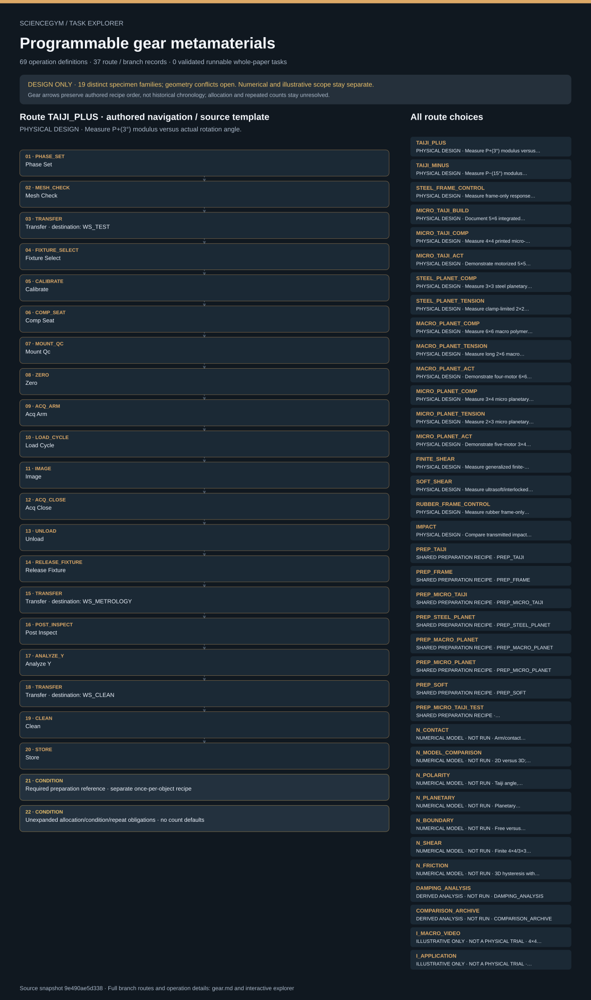

# Programmable gear metamaterials: task route map



Paper: **Programmable gear-based mechanical metamaterials** · [DOI](https://doi.org/10.1038/s41563-022-01269-3)

Author/evaluator design reference only; not an actor projection, executable procedure, task runner, solver, physical simulation or execution receipt. Authored navigation does not supply source chronology, specimen allocation, qualified inputs or completed services. Nineteen source specimen families remain distinct: micro Taiji build, compression and actuation are not one specimen; the macro video demonstrator is illustrative. Planetary CAD and micro geometry conflicts stay unresolved. Finite shear stiffness is not periodic-cell shear modulus; fit-window variation is not specimen SD. First-cycle exclusion, terminal impact allocation and enclosed service ownership remain explicit. Sampled movie frames are not full-motion review.. Counts describe task representation, not experiments or success.

**Reading rule:** rows are authored navigation over exact source records. Gear recipes preserve source-declared authored order; hydrogel memberships have no adjacency order. Conditions and repeats are not expanded or executed. An unordered obligation group has no inferred chronological edges. Source-reported scientific facts and authored handling are distinct.

[Immutable source task package](https://github.com/openags/ScienceGym/blob/9e490ae5d3380121df7be1c18d4de35aac8508c5/tasks/gear_operations_v2/) · [Interactive inspector](../index.html)

## TAIJI_PLUS — PHYSICAL DESIGN · Measure P+(3°) modulus versus actual rotation angle.

Author/evaluator design reference only; not an actor projection, executable procedure, task runner, solver, physical simulation or execution receipt. Authored navigation does not supply source chronology, specimen allocation, qualified inputs or completed services. Nineteen source specimen families remain distinct: micro Taiji build, compression and actuation are not one specimen; the macro video demonstrator is illustrative. Planetary CAD and micro geometry conflicts stay unresolved. Finite shear stiffness is not periodic-cell shear modulus; fit-window variation is not specimen SD. First-cycle exclusion, terminal impact allocation and enclosed service ownership remain explicit. Sampled movie frames are not full-motion review. Gear recipes preserve source-declared authored valid order, not historical author chronology. Preparation and each condition are separate templates; no repeat or full campaign is instantiated.

[Exact route source](https://github.com/openags/ScienceGym/blob/9e490ae5d3380121df7be1c18d4de35aac8508c5/tasks/gear_operations_v2/branches.json) · JSON pointer: `/branches/0`

- `PHASE_SET` Phase Set
  - Source occurrence binding: {"source_file":"branches.json","source_pointer":"/branches/0/per_condition_operations/0","source_node":{"op_id":"PHASE_SET"}}
- `MESH_CHECK` Mesh Check
  - Source occurrence binding: {"source_file":"branches.json","source_pointer":"/branches/0/per_condition_operations/1","source_node":{"op_id":"MESH_CHECK"}}
- `TRANSFER` Transfer
  - Source occurrence binding: {"source_file":"branches.json","source_pointer":"/branches/0/per_condition_operations/2","source_node":{"op_id":"TRANSFER","destination_station":"WS_TEST"}}
- `FIXTURE_SELECT` Fixture Select
  - Source occurrence binding: {"source_file":"branches.json","source_pointer":"/branches/0/per_condition_operations/3","source_node":{"op_id":"FIXTURE_SELECT"}}
- `CALIBRATE` Calibrate
  - Source occurrence binding: {"source_file":"branches.json","source_pointer":"/branches/0/per_condition_operations/4","source_node":{"op_id":"CALIBRATE"}}
- `COMP_SEAT` Comp Seat
  - Source occurrence binding: {"source_file":"branches.json","source_pointer":"/branches/0/per_condition_operations/5","source_node":{"op_id":"COMP_SEAT"}}
- `MOUNT_QC` Mount Qc
  - Source occurrence binding: {"source_file":"branches.json","source_pointer":"/branches/0/per_condition_operations/6","source_node":{"op_id":"MOUNT_QC"}}
- `ZERO` Zero
  - Source occurrence binding: {"source_file":"branches.json","source_pointer":"/branches/0/per_condition_operations/7","source_node":{"op_id":"ZERO"}}
- `ACQ_ARM` Acq Arm
  - Source occurrence binding: {"source_file":"branches.json","source_pointer":"/branches/0/per_condition_operations/8","source_node":{"op_id":"ACQ_ARM"}}
- `LOAD_CYCLE` Load Cycle
  - Source occurrence binding: {"source_file":"branches.json","source_pointer":"/branches/0/per_condition_operations/9","source_node":{"op_id":"LOAD_CYCLE"}}
- `IMAGE` Image
  - Source occurrence binding: {"source_file":"branches.json","source_pointer":"/branches/0/per_condition_operations/10","source_node":{"op_id":"IMAGE"}}
- `ACQ_CLOSE` Acq Close
  - Source occurrence binding: {"source_file":"branches.json","source_pointer":"/branches/0/per_condition_operations/11","source_node":{"op_id":"ACQ_CLOSE"}}
- `UNLOAD` Unload
  - Source occurrence binding: {"source_file":"branches.json","source_pointer":"/branches/0/per_condition_operations/12","source_node":{"op_id":"UNLOAD"}}
- `RELEASE_FIXTURE` Release Fixture
  - Source occurrence binding: {"source_file":"branches.json","source_pointer":"/branches/0/per_condition_operations/13","source_node":{"op_id":"RELEASE_FIXTURE"}}
- `TRANSFER` Transfer
  - Source occurrence binding: {"source_file":"branches.json","source_pointer":"/branches/0/per_condition_operations/14","source_node":{"op_id":"TRANSFER","destination_station":"WS_METROLOGY"}}
- `POST_INSPECT` Post Inspect
  - Source occurrence binding: {"source_file":"branches.json","source_pointer":"/branches/0/per_condition_operations/15","source_node":{"op_id":"POST_INSPECT"}}
- `ANALYZE_Y` Analyze Y
  - Source occurrence binding: {"source_file":"branches.json","source_pointer":"/branches/0/per_condition_operations/16","source_node":{"op_id":"ANALYZE_Y"}}
- `TRANSFER` Transfer
  - Source occurrence binding: {"source_file":"branches.json","source_pointer":"/branches/0/per_condition_operations/17","source_node":{"op_id":"TRANSFER","destination_station":"WS_CLEAN"}}
- `CLEAN` Clean
  - Source occurrence binding: {"source_file":"branches.json","source_pointer":"/branches/0/per_condition_operations/18","source_node":{"op_id":"CLEAN"}}
- `STORE` Store
  - Source occurrence binding: {"source_file":"branches.json","source_pointer":"/branches/0/per_condition_operations/19","source_node":{"op_id":"STORE"}}
- **CONDITION: Required preparation reference · separate once-per-object recipe**
  - Binding: {"source_file":"branches.json","source_pointer":"/branches/0/preparation_route_id","source_contract":"PREP_TAIJI"}
- **CONDITION: Unexpanded allocation/condition/repeat obligations · no count defaults**
  - Binding: {"source_file":"branches.json","source_pointer":"/branches/0","source_contract":{"id":"TAIJI_PLUS","specimen_family_id":"F_TAIJI_PLUS","mode":"compression","source_evidence_ids":["E_TAIJI","E_YOUNG"],"purpose":"Measure P+(3°) modulus versus actual rotation angle.","preparation_route_id":"PREP_TAIJI","per_condition_operations":[{"op_id":"PHASE_SET"},{"op_id":"MESH_CHECK"},{"op_id":"TRANSFER","destination_station":"WS_TEST"},{"op_id":"FIXTURE_SELECT"},{"op_id":"CALIBRATE"},{"op_id":"COMP_SEAT"},{"op_id":"MOUNT_QC"},{"op_id":"ZERO"},{"op_id":"ACQ_ARM"},{"op_id":"LOAD_CYCLE"},{"op_id":"IMAGE"},{"op_id":"ACQ_CLOSE"},{"op_id":"UNLOAD"},{"op_id":"RELEASE_FIXTURE"},{"op_id":"TRANSFER","destination_station":"WS_METROLOGY"},{"op_id":"POST_INSPECT"},{"op_id":"ANALYZE_Y"},{"op_id":"TRANSFER","destination_station":"WS_CLEAN"},{"op_id":"CLEAN"},{"op_id":"STORE"}],"required_input_ids":["U_ACQ","U_ALLOCATION","U_ANALYSIS","U_CAD","U_CAL","U_CLEAN","U_FAB","U_FIXTURE","U_LOAD","U_MATERIAL","U_PHASE","U_REUSE","U_ROBOT"],"conditions":{"provider":"qualified allocation and phase card","default":null,"nonempty":true,"bounded":true},"repeat_count":null,"independent_specimen_count":null,"condition_transition":{"label_only_change_allowed":false,"path":"Safe unload/stop, release, post-inspect and carrier storage; select new specimen or explicitly eligible reuse, transfer to metrology, set and verify actual phase, then mount afresh. Frame controls use no gear phase operation.","reuse_requires":["same compatible family","qualified reuse card","current post-inspection","new phase/mount/zero receipts"],"original_chronology_claimed":false},"destructive_allocation":"qualified reuse only; missing reuse evidence requires separate allocated specimen","completion_scope":"All finite allocated conditions and required control/comparison parents, with raw receipts and safe shutdown; operation counts are not completion","gate_binding_rule":"Operation template gates are parameterized: U_PLANET_CAD applies only planetary/impact families; U_MICRO_GEOM only micro planetary; all other listed branch gates must close."}}

<details><summary>Branch state, choices, lineage and loop obligations</summary>

```json
{
  "id": "TAIJI_PLUS",
  "specimen_family_id": "F_TAIJI_PLUS",
  "mode": "compression",
  "source_evidence_ids": [
    "E_TAIJI",
    "E_YOUNG"
  ],
  "purpose": "Measure P+(3°) modulus versus actual rotation angle.",
  "preparation_route_id": "PREP_TAIJI",
  "per_condition_operations": [
    {
      "op_id": "PHASE_SET"
    },
    {
      "op_id": "MESH_CHECK"
    },
    {
      "op_id": "TRANSFER",
      "destination_station": "WS_TEST"
    },
    {
      "op_id": "FIXTURE_SELECT"
    },
    {
      "op_id": "CALIBRATE"
    },
    {
      "op_id": "COMP_SEAT"
    },
    {
      "op_id": "MOUNT_QC"
    },
    {
      "op_id": "ZERO"
    },
    {
      "op_id": "ACQ_ARM"
    },
    {
      "op_id": "LOAD_CYCLE"
    },
    {
      "op_id": "IMAGE"
    },
    {
      "op_id": "ACQ_CLOSE"
    },
    {
      "op_id": "UNLOAD"
    },
    {
      "op_id": "RELEASE_FIXTURE"
    },
    {
      "op_id": "TRANSFER",
      "destination_station": "WS_METROLOGY"
    },
    {
      "op_id": "POST_INSPECT"
    },
    {
      "op_id": "ANALYZE_Y"
    },
    {
      "op_id": "TRANSFER",
      "destination_station": "WS_CLEAN"
    },
    {
      "op_id": "CLEAN"
    },
    {
      "op_id": "STORE"
    }
  ],
  "required_input_ids": [
    "U_ACQ",
    "U_ALLOCATION",
    "U_ANALYSIS",
    "U_CAD",
    "U_CAL",
    "U_CLEAN",
    "U_FAB",
    "U_FIXTURE",
    "U_LOAD",
    "U_MATERIAL",
    "U_PHASE",
    "U_REUSE",
    "U_ROBOT"
  ],
  "conditions": {
    "provider": "qualified allocation and phase card",
    "default": null,
    "nonempty": true,
    "bounded": true
  },
  "repeat_count": null,
  "independent_specimen_count": null,
  "condition_transition": {
    "label_only_change_allowed": false,
    "path": "Safe unload/stop, release, post-inspect and carrier storage; select new specimen or explicitly eligible reuse, transfer to metrology, set and verify actual phase, then mount afresh. Frame controls use no gear phase operation.",
    "reuse_requires": [
      "same compatible family",
      "qualified reuse card",
      "current post-inspection",
      "new phase/mount/zero receipts"
    ],
    "original_chronology_claimed": false
  },
  "destructive_allocation": "qualified reuse only; missing reuse evidence requires separate allocated specimen",
  "completion_scope": "All finite allocated conditions and required control/comparison parents, with raw receipts and safe shutdown; operation counts are not completion",
  "gate_binding_rule": "Operation template gates are parameterized: U_PLANET_CAD applies only planetary/impact families; U_MICRO_GEOM only micro planetary; all other listed branch gates must close."
}
```

</details>

## TAIJI_MINUS — PHYSICAL DESIGN · Measure P−(15°) modulus versus actual rotation angle.

Author/evaluator design reference only; not an actor projection, executable procedure, task runner, solver, physical simulation or execution receipt. Authored navigation does not supply source chronology, specimen allocation, qualified inputs or completed services. Nineteen source specimen families remain distinct: micro Taiji build, compression and actuation are not one specimen; the macro video demonstrator is illustrative. Planetary CAD and micro geometry conflicts stay unresolved. Finite shear stiffness is not periodic-cell shear modulus; fit-window variation is not specimen SD. First-cycle exclusion, terminal impact allocation and enclosed service ownership remain explicit. Sampled movie frames are not full-motion review. Gear recipes preserve source-declared authored valid order, not historical author chronology. Preparation and each condition are separate templates; no repeat or full campaign is instantiated.

[Exact route source](https://github.com/openags/ScienceGym/blob/9e490ae5d3380121df7be1c18d4de35aac8508c5/tasks/gear_operations_v2/branches.json) · JSON pointer: `/branches/1`

- `PHASE_SET` Phase Set
  - Source occurrence binding: {"source_file":"branches.json","source_pointer":"/branches/1/per_condition_operations/0","source_node":{"op_id":"PHASE_SET"}}
- `MESH_CHECK` Mesh Check
  - Source occurrence binding: {"source_file":"branches.json","source_pointer":"/branches/1/per_condition_operations/1","source_node":{"op_id":"MESH_CHECK"}}
- `TRANSFER` Transfer
  - Source occurrence binding: {"source_file":"branches.json","source_pointer":"/branches/1/per_condition_operations/2","source_node":{"op_id":"TRANSFER","destination_station":"WS_TEST"}}
- `FIXTURE_SELECT` Fixture Select
  - Source occurrence binding: {"source_file":"branches.json","source_pointer":"/branches/1/per_condition_operations/3","source_node":{"op_id":"FIXTURE_SELECT"}}
- `CALIBRATE` Calibrate
  - Source occurrence binding: {"source_file":"branches.json","source_pointer":"/branches/1/per_condition_operations/4","source_node":{"op_id":"CALIBRATE"}}
- `COMP_SEAT` Comp Seat
  - Source occurrence binding: {"source_file":"branches.json","source_pointer":"/branches/1/per_condition_operations/5","source_node":{"op_id":"COMP_SEAT"}}
- `MOUNT_QC` Mount Qc
  - Source occurrence binding: {"source_file":"branches.json","source_pointer":"/branches/1/per_condition_operations/6","source_node":{"op_id":"MOUNT_QC"}}
- `ZERO` Zero
  - Source occurrence binding: {"source_file":"branches.json","source_pointer":"/branches/1/per_condition_operations/7","source_node":{"op_id":"ZERO"}}
- `ACQ_ARM` Acq Arm
  - Source occurrence binding: {"source_file":"branches.json","source_pointer":"/branches/1/per_condition_operations/8","source_node":{"op_id":"ACQ_ARM"}}
- `LOAD_CYCLE` Load Cycle
  - Source occurrence binding: {"source_file":"branches.json","source_pointer":"/branches/1/per_condition_operations/9","source_node":{"op_id":"LOAD_CYCLE"}}
- `IMAGE` Image
  - Source occurrence binding: {"source_file":"branches.json","source_pointer":"/branches/1/per_condition_operations/10","source_node":{"op_id":"IMAGE"}}
- `ACQ_CLOSE` Acq Close
  - Source occurrence binding: {"source_file":"branches.json","source_pointer":"/branches/1/per_condition_operations/11","source_node":{"op_id":"ACQ_CLOSE"}}
- `UNLOAD` Unload
  - Source occurrence binding: {"source_file":"branches.json","source_pointer":"/branches/1/per_condition_operations/12","source_node":{"op_id":"UNLOAD"}}
- `RELEASE_FIXTURE` Release Fixture
  - Source occurrence binding: {"source_file":"branches.json","source_pointer":"/branches/1/per_condition_operations/13","source_node":{"op_id":"RELEASE_FIXTURE"}}
- `TRANSFER` Transfer
  - Source occurrence binding: {"source_file":"branches.json","source_pointer":"/branches/1/per_condition_operations/14","source_node":{"op_id":"TRANSFER","destination_station":"WS_METROLOGY"}}
- `POST_INSPECT` Post Inspect
  - Source occurrence binding: {"source_file":"branches.json","source_pointer":"/branches/1/per_condition_operations/15","source_node":{"op_id":"POST_INSPECT"}}
- `ANALYZE_Y` Analyze Y
  - Source occurrence binding: {"source_file":"branches.json","source_pointer":"/branches/1/per_condition_operations/16","source_node":{"op_id":"ANALYZE_Y"}}
- `TRANSFER` Transfer
  - Source occurrence binding: {"source_file":"branches.json","source_pointer":"/branches/1/per_condition_operations/17","source_node":{"op_id":"TRANSFER","destination_station":"WS_CLEAN"}}
- `CLEAN` Clean
  - Source occurrence binding: {"source_file":"branches.json","source_pointer":"/branches/1/per_condition_operations/18","source_node":{"op_id":"CLEAN"}}
- `STORE` Store
  - Source occurrence binding: {"source_file":"branches.json","source_pointer":"/branches/1/per_condition_operations/19","source_node":{"op_id":"STORE"}}
- **CONDITION: Required preparation reference · separate once-per-object recipe**
  - Binding: {"source_file":"branches.json","source_pointer":"/branches/1/preparation_route_id","source_contract":"PREP_TAIJI"}
- **CONDITION: Unexpanded allocation/condition/repeat obligations · no count defaults**
  - Binding: {"source_file":"branches.json","source_pointer":"/branches/1","source_contract":{"id":"TAIJI_MINUS","specimen_family_id":"F_TAIJI_MINUS","mode":"compression","source_evidence_ids":["E_TAIJI","E_YOUNG"],"purpose":"Measure P−(15°) modulus versus actual rotation angle.","preparation_route_id":"PREP_TAIJI","per_condition_operations":[{"op_id":"PHASE_SET"},{"op_id":"MESH_CHECK"},{"op_id":"TRANSFER","destination_station":"WS_TEST"},{"op_id":"FIXTURE_SELECT"},{"op_id":"CALIBRATE"},{"op_id":"COMP_SEAT"},{"op_id":"MOUNT_QC"},{"op_id":"ZERO"},{"op_id":"ACQ_ARM"},{"op_id":"LOAD_CYCLE"},{"op_id":"IMAGE"},{"op_id":"ACQ_CLOSE"},{"op_id":"UNLOAD"},{"op_id":"RELEASE_FIXTURE"},{"op_id":"TRANSFER","destination_station":"WS_METROLOGY"},{"op_id":"POST_INSPECT"},{"op_id":"ANALYZE_Y"},{"op_id":"TRANSFER","destination_station":"WS_CLEAN"},{"op_id":"CLEAN"},{"op_id":"STORE"}],"required_input_ids":["U_ACQ","U_ALLOCATION","U_ANALYSIS","U_CAD","U_CAL","U_CLEAN","U_FAB","U_FIXTURE","U_LOAD","U_MATERIAL","U_PHASE","U_REUSE","U_ROBOT"],"conditions":{"provider":"qualified allocation and phase card","default":null,"nonempty":true,"bounded":true},"repeat_count":null,"independent_specimen_count":null,"condition_transition":{"label_only_change_allowed":false,"path":"Safe unload/stop, release, post-inspect and carrier storage; select new specimen or explicitly eligible reuse, transfer to metrology, set and verify actual phase, then mount afresh. Frame controls use no gear phase operation.","reuse_requires":["same compatible family","qualified reuse card","current post-inspection","new phase/mount/zero receipts"],"original_chronology_claimed":false},"destructive_allocation":"qualified reuse only; missing reuse evidence requires separate allocated specimen","completion_scope":"All finite allocated conditions and required control/comparison parents, with raw receipts and safe shutdown; operation counts are not completion","gate_binding_rule":"Operation template gates are parameterized: U_PLANET_CAD applies only planetary/impact families; U_MICRO_GEOM only micro planetary; all other listed branch gates must close."}}

<details><summary>Branch state, choices, lineage and loop obligations</summary>

```json
{
  "id": "TAIJI_MINUS",
  "specimen_family_id": "F_TAIJI_MINUS",
  "mode": "compression",
  "source_evidence_ids": [
    "E_TAIJI",
    "E_YOUNG"
  ],
  "purpose": "Measure P−(15°) modulus versus actual rotation angle.",
  "preparation_route_id": "PREP_TAIJI",
  "per_condition_operations": [
    {
      "op_id": "PHASE_SET"
    },
    {
      "op_id": "MESH_CHECK"
    },
    {
      "op_id": "TRANSFER",
      "destination_station": "WS_TEST"
    },
    {
      "op_id": "FIXTURE_SELECT"
    },
    {
      "op_id": "CALIBRATE"
    },
    {
      "op_id": "COMP_SEAT"
    },
    {
      "op_id": "MOUNT_QC"
    },
    {
      "op_id": "ZERO"
    },
    {
      "op_id": "ACQ_ARM"
    },
    {
      "op_id": "LOAD_CYCLE"
    },
    {
      "op_id": "IMAGE"
    },
    {
      "op_id": "ACQ_CLOSE"
    },
    {
      "op_id": "UNLOAD"
    },
    {
      "op_id": "RELEASE_FIXTURE"
    },
    {
      "op_id": "TRANSFER",
      "destination_station": "WS_METROLOGY"
    },
    {
      "op_id": "POST_INSPECT"
    },
    {
      "op_id": "ANALYZE_Y"
    },
    {
      "op_id": "TRANSFER",
      "destination_station": "WS_CLEAN"
    },
    {
      "op_id": "CLEAN"
    },
    {
      "op_id": "STORE"
    }
  ],
  "required_input_ids": [
    "U_ACQ",
    "U_ALLOCATION",
    "U_ANALYSIS",
    "U_CAD",
    "U_CAL",
    "U_CLEAN",
    "U_FAB",
    "U_FIXTURE",
    "U_LOAD",
    "U_MATERIAL",
    "U_PHASE",
    "U_REUSE",
    "U_ROBOT"
  ],
  "conditions": {
    "provider": "qualified allocation and phase card",
    "default": null,
    "nonempty": true,
    "bounded": true
  },
  "repeat_count": null,
  "independent_specimen_count": null,
  "condition_transition": {
    "label_only_change_allowed": false,
    "path": "Safe unload/stop, release, post-inspect and carrier storage; select new specimen or explicitly eligible reuse, transfer to metrology, set and verify actual phase, then mount afresh. Frame controls use no gear phase operation.",
    "reuse_requires": [
      "same compatible family",
      "qualified reuse card",
      "current post-inspection",
      "new phase/mount/zero receipts"
    ],
    "original_chronology_claimed": false
  },
  "destructive_allocation": "qualified reuse only; missing reuse evidence requires separate allocated specimen",
  "completion_scope": "All finite allocated conditions and required control/comparison parents, with raw receipts and safe shutdown; operation counts are not completion",
  "gate_binding_rule": "Operation template gates are parameterized: U_PLANET_CAD applies only planetary/impact families; U_MICRO_GEOM only micro planetary; all other listed branch gates must close."
}
```

</details>

## STEEL_FRAME_CONTROL — PHYSICAL DESIGN · Measure frame-only response with documented geometry and boundary conditions.

Author/evaluator design reference only; not an actor projection, executable procedure, task runner, solver, physical simulation or execution receipt. Authored navigation does not supply source chronology, specimen allocation, qualified inputs or completed services. Nineteen source specimen families remain distinct: micro Taiji build, compression and actuation are not one specimen; the macro video demonstrator is illustrative. Planetary CAD and micro geometry conflicts stay unresolved. Finite shear stiffness is not periodic-cell shear modulus; fit-window variation is not specimen SD. First-cycle exclusion, terminal impact allocation and enclosed service ownership remain explicit. Sampled movie frames are not full-motion review. Gear recipes preserve source-declared authored valid order, not historical author chronology. Preparation and each condition are separate templates; no repeat or full campaign is instantiated.

[Exact route source](https://github.com/openags/ScienceGym/blob/9e490ae5d3380121df7be1c18d4de35aac8508c5/tasks/gear_operations_v2/branches.json) · JSON pointer: `/branches/2`

- `TRANSFER` Transfer
  - Source occurrence binding: {"source_file":"branches.json","source_pointer":"/branches/2/per_condition_operations/0","source_node":{"op_id":"TRANSFER","destination_station":"WS_TEST"}}
- `FIXTURE_SELECT` Fixture Select
  - Source occurrence binding: {"source_file":"branches.json","source_pointer":"/branches/2/per_condition_operations/1","source_node":{"op_id":"FIXTURE_SELECT"}}
- `CALIBRATE` Calibrate
  - Source occurrence binding: {"source_file":"branches.json","source_pointer":"/branches/2/per_condition_operations/2","source_node":{"op_id":"CALIBRATE"}}
- `COMP_SEAT` Comp Seat
  - Source occurrence binding: {"source_file":"branches.json","source_pointer":"/branches/2/per_condition_operations/3","source_node":{"op_id":"COMP_SEAT"}}
- `MOUNT_QC` Mount Qc
  - Source occurrence binding: {"source_file":"branches.json","source_pointer":"/branches/2/per_condition_operations/4","source_node":{"op_id":"MOUNT_QC"}}
- `ZERO` Zero
  - Source occurrence binding: {"source_file":"branches.json","source_pointer":"/branches/2/per_condition_operations/5","source_node":{"op_id":"ZERO"}}
- `ACQ_ARM` Acq Arm
  - Source occurrence binding: {"source_file":"branches.json","source_pointer":"/branches/2/per_condition_operations/6","source_node":{"op_id":"ACQ_ARM"}}
- `LOAD_CYCLE` Load Cycle
  - Source occurrence binding: {"source_file":"branches.json","source_pointer":"/branches/2/per_condition_operations/7","source_node":{"op_id":"LOAD_CYCLE"}}
- `IMAGE` Image
  - Source occurrence binding: {"source_file":"branches.json","source_pointer":"/branches/2/per_condition_operations/8","source_node":{"op_id":"IMAGE"}}
- `ACQ_CLOSE` Acq Close
  - Source occurrence binding: {"source_file":"branches.json","source_pointer":"/branches/2/per_condition_operations/9","source_node":{"op_id":"ACQ_CLOSE"}}
- `UNLOAD` Unload
  - Source occurrence binding: {"source_file":"branches.json","source_pointer":"/branches/2/per_condition_operations/10","source_node":{"op_id":"UNLOAD"}}
- `RELEASE_FIXTURE` Release Fixture
  - Source occurrence binding: {"source_file":"branches.json","source_pointer":"/branches/2/per_condition_operations/11","source_node":{"op_id":"RELEASE_FIXTURE"}}
- `TRANSFER` Transfer
  - Source occurrence binding: {"source_file":"branches.json","source_pointer":"/branches/2/per_condition_operations/12","source_node":{"op_id":"TRANSFER","destination_station":"WS_METROLOGY"}}
- `POST_INSPECT` Post Inspect
  - Source occurrence binding: {"source_file":"branches.json","source_pointer":"/branches/2/per_condition_operations/13","source_node":{"op_id":"POST_INSPECT"}}
- `ANALYZE_Y` Analyze Y
  - Source occurrence binding: {"source_file":"branches.json","source_pointer":"/branches/2/per_condition_operations/14","source_node":{"op_id":"ANALYZE_Y"}}
- `TRANSFER` Transfer
  - Source occurrence binding: {"source_file":"branches.json","source_pointer":"/branches/2/per_condition_operations/15","source_node":{"op_id":"TRANSFER","destination_station":"WS_CLEAN"}}
- `CLEAN` Clean
  - Source occurrence binding: {"source_file":"branches.json","source_pointer":"/branches/2/per_condition_operations/16","source_node":{"op_id":"CLEAN"}}
- `STORE` Store
  - Source occurrence binding: {"source_file":"branches.json","source_pointer":"/branches/2/per_condition_operations/17","source_node":{"op_id":"STORE"}}
- **CONDITION: Required preparation reference · separate once-per-object recipe**
  - Binding: {"source_file":"branches.json","source_pointer":"/branches/2/preparation_route_id","source_contract":"PREP_FRAME"}
- **CONDITION: Unexpanded allocation/condition/repeat obligations · no count defaults**
  - Binding: {"source_file":"branches.json","source_pointer":"/branches/2","source_contract":{"id":"STEEL_FRAME_CONTROL","specimen_family_id":"F_STEEL_FRAME","mode":"compression","source_evidence_ids":["E_FRAME","E_YOUNG"],"purpose":"Measure frame-only response with documented geometry and boundary conditions.","preparation_route_id":"PREP_FRAME","per_condition_operations":[{"op_id":"TRANSFER","destination_station":"WS_TEST"},{"op_id":"FIXTURE_SELECT"},{"op_id":"CALIBRATE"},{"op_id":"COMP_SEAT"},{"op_id":"MOUNT_QC"},{"op_id":"ZERO"},{"op_id":"ACQ_ARM"},{"op_id":"LOAD_CYCLE"},{"op_id":"IMAGE"},{"op_id":"ACQ_CLOSE"},{"op_id":"UNLOAD"},{"op_id":"RELEASE_FIXTURE"},{"op_id":"TRANSFER","destination_station":"WS_METROLOGY"},{"op_id":"POST_INSPECT"},{"op_id":"ANALYZE_Y"},{"op_id":"TRANSFER","destination_station":"WS_CLEAN"},{"op_id":"CLEAN"},{"op_id":"STORE"}],"required_input_ids":["U_ACQ","U_ALLOCATION","U_ANALYSIS","U_CAD","U_CAL","U_CLEAN","U_FAB","U_FIXTURE","U_LOAD","U_MATERIAL","U_PHASE","U_REUSE","U_ROBOT"],"conditions":{"provider":"qualified allocation and phase card","default":null,"nonempty":true,"bounded":true},"repeat_count":null,"independent_specimen_count":null,"condition_transition":{"label_only_change_allowed":false,"path":"Safe unload/stop, release, post-inspect and carrier storage; select new specimen or explicitly eligible reuse, transfer to metrology, set and verify actual phase, then mount afresh. Frame controls use no gear phase operation.","reuse_requires":["same compatible family","qualified reuse card","current post-inspection","new phase/mount/zero receipts"],"original_chronology_claimed":false},"destructive_allocation":"qualified reuse only; missing reuse evidence requires separate allocated specimen","completion_scope":"All finite allocated conditions and required control/comparison parents, with raw receipts and safe shutdown; operation counts are not completion","gate_binding_rule":"Operation template gates are parameterized: U_PLANET_CAD applies only planetary/impact families; U_MICRO_GEOM only micro planetary; all other listed branch gates must close."}}

<details><summary>Branch state, choices, lineage and loop obligations</summary>

```json
{
  "id": "STEEL_FRAME_CONTROL",
  "specimen_family_id": "F_STEEL_FRAME",
  "mode": "compression",
  "source_evidence_ids": [
    "E_FRAME",
    "E_YOUNG"
  ],
  "purpose": "Measure frame-only response with documented geometry and boundary conditions.",
  "preparation_route_id": "PREP_FRAME",
  "per_condition_operations": [
    {
      "op_id": "TRANSFER",
      "destination_station": "WS_TEST"
    },
    {
      "op_id": "FIXTURE_SELECT"
    },
    {
      "op_id": "CALIBRATE"
    },
    {
      "op_id": "COMP_SEAT"
    },
    {
      "op_id": "MOUNT_QC"
    },
    {
      "op_id": "ZERO"
    },
    {
      "op_id": "ACQ_ARM"
    },
    {
      "op_id": "LOAD_CYCLE"
    },
    {
      "op_id": "IMAGE"
    },
    {
      "op_id": "ACQ_CLOSE"
    },
    {
      "op_id": "UNLOAD"
    },
    {
      "op_id": "RELEASE_FIXTURE"
    },
    {
      "op_id": "TRANSFER",
      "destination_station": "WS_METROLOGY"
    },
    {
      "op_id": "POST_INSPECT"
    },
    {
      "op_id": "ANALYZE_Y"
    },
    {
      "op_id": "TRANSFER",
      "destination_station": "WS_CLEAN"
    },
    {
      "op_id": "CLEAN"
    },
    {
      "op_id": "STORE"
    }
  ],
  "required_input_ids": [
    "U_ACQ",
    "U_ALLOCATION",
    "U_ANALYSIS",
    "U_CAD",
    "U_CAL",
    "U_CLEAN",
    "U_FAB",
    "U_FIXTURE",
    "U_LOAD",
    "U_MATERIAL",
    "U_PHASE",
    "U_REUSE",
    "U_ROBOT"
  ],
  "conditions": {
    "provider": "qualified allocation and phase card",
    "default": null,
    "nonempty": true,
    "bounded": true
  },
  "repeat_count": null,
  "independent_specimen_count": null,
  "condition_transition": {
    "label_only_change_allowed": false,
    "path": "Safe unload/stop, release, post-inspect and carrier storage; select new specimen or explicitly eligible reuse, transfer to metrology, set and verify actual phase, then mount afresh. Frame controls use no gear phase operation.",
    "reuse_requires": [
      "same compatible family",
      "qualified reuse card",
      "current post-inspection",
      "new phase/mount/zero receipts"
    ],
    "original_chronology_claimed": false
  },
  "destructive_allocation": "qualified reuse only; missing reuse evidence requires separate allocated specimen",
  "completion_scope": "All finite allocated conditions and required control/comparison parents, with raw receipts and safe shutdown; operation counts are not completion",
  "gate_binding_rule": "Operation template gates are parameterized: U_PLANET_CAD applies only planetary/impact families; U_MICRO_GEOM only micro planetary; all other listed branch gates must close."
}
```

</details>

## MICRO_TAIJI_BUILD — PHYSICAL DESIGN · Document 5×6 integrated fabrication/boxing/baseplate release; do not use as the 4×4 measurement specimen.

Author/evaluator design reference only; not an actor projection, executable procedure, task runner, solver, physical simulation or execution receipt. Authored navigation does not supply source chronology, specimen allocation, qualified inputs or completed services. Nineteen source specimen families remain distinct: micro Taiji build, compression and actuation are not one specimen; the macro video demonstrator is illustrative. Planetary CAD and micro geometry conflicts stay unresolved. Finite shear stiffness is not periodic-cell shear modulus; fit-window variation is not specimen SD. First-cycle exclusion, terminal impact allocation and enclosed service ownership remain explicit. Sampled movie frames are not full-motion review. Gear recipes preserve source-declared authored valid order, not historical author chronology. Preparation and each condition are separate templates; no repeat or full campaign is instantiated.

[Exact route source](https://github.com/openags/ScienceGym/blob/9e490ae5d3380121df7be1c18d4de35aac8508c5/tasks/gear_operations_v2/branches.json) · JSON pointer: `/branches/3`

- `IMAGE` Image
  - Source occurrence binding: {"source_file":"branches.json","source_pointer":"/branches/3/per_condition_operations/0","source_node":{"op_id":"IMAGE"}}
- `TRANSFER` Transfer
  - Source occurrence binding: {"source_file":"branches.json","source_pointer":"/branches/3/per_condition_operations/1","source_node":{"op_id":"TRANSFER","destination_station":"WS_CLEAN"}}
- `CLEAN` Clean
  - Source occurrence binding: {"source_file":"branches.json","source_pointer":"/branches/3/per_condition_operations/2","source_node":{"op_id":"CLEAN"}}
- `STORE` Store
  - Source occurrence binding: {"source_file":"branches.json","source_pointer":"/branches/3/per_condition_operations/3","source_node":{"op_id":"STORE"}}
- **CONDITION: Required preparation reference · separate once-per-object recipe**
  - Binding: {"source_file":"branches.json","source_pointer":"/branches/3/preparation_route_id","source_contract":"PREP_MICRO_TAIJI"}
- **CONDITION: Unexpanded allocation/condition/repeat obligations · no count defaults**
  - Binding: {"source_file":"branches.json","source_pointer":"/branches/3","source_contract":{"id":"MICRO_TAIJI_BUILD","specimen_family_id":"F_MICRO_TAIJI_BUILD","mode":"build_demonstration","source_evidence_ids":["E_MICRO_TAIJI","E_FAB"],"purpose":"Document 5×6 integrated fabrication/boxing/baseplate release; do not use as the 4×4 measurement specimen.","preparation_route_id":"PREP_MICRO_TAIJI","per_condition_operations":[{"op_id":"IMAGE"},{"op_id":"TRANSFER","destination_station":"WS_CLEAN"},{"op_id":"CLEAN"},{"op_id":"STORE"}],"required_input_ids":["U_ACQ","U_ALLOCATION","U_CAD","U_CAL","U_CLEAN","U_FAB","U_MATERIAL","U_PHASE","U_REUSE","U_ROBOT"],"conditions":{"provider":"qualified allocation and phase card","default":null,"nonempty":true,"bounded":true},"repeat_count":null,"independent_specimen_count":null,"condition_transition":{"label_only_change_allowed":false,"path":"Safe unload/stop, release, post-inspect and carrier storage; select new specimen or explicitly eligible reuse, transfer to metrology, set and verify actual phase, then mount afresh. Frame controls use no gear phase operation.","reuse_requires":["same compatible family","qualified reuse card","current post-inspection","new phase/mount/zero receipts"],"original_chronology_claimed":false},"destructive_allocation":"qualified reuse only; missing reuse evidence requires separate allocated specimen","completion_scope":"All finite allocated conditions and required control/comparison parents, with raw receipts and safe shutdown; operation counts are not completion","gate_binding_rule":"Operation template gates are parameterized: U_PLANET_CAD applies only planetary/impact families; U_MICRO_GEOM only micro planetary; all other listed branch gates must close."}}

<details><summary>Branch state, choices, lineage and loop obligations</summary>

```json
{
  "id": "MICRO_TAIJI_BUILD",
  "specimen_family_id": "F_MICRO_TAIJI_BUILD",
  "mode": "build_demonstration",
  "source_evidence_ids": [
    "E_MICRO_TAIJI",
    "E_FAB"
  ],
  "purpose": "Document 5×6 integrated fabrication/boxing/baseplate release; do not use as the 4×4 measurement specimen.",
  "preparation_route_id": "PREP_MICRO_TAIJI",
  "per_condition_operations": [
    {
      "op_id": "IMAGE"
    },
    {
      "op_id": "TRANSFER",
      "destination_station": "WS_CLEAN"
    },
    {
      "op_id": "CLEAN"
    },
    {
      "op_id": "STORE"
    }
  ],
  "required_input_ids": [
    "U_ACQ",
    "U_ALLOCATION",
    "U_CAD",
    "U_CAL",
    "U_CLEAN",
    "U_FAB",
    "U_MATERIAL",
    "U_PHASE",
    "U_REUSE",
    "U_ROBOT"
  ],
  "conditions": {
    "provider": "qualified allocation and phase card",
    "default": null,
    "nonempty": true,
    "bounded": true
  },
  "repeat_count": null,
  "independent_specimen_count": null,
  "condition_transition": {
    "label_only_change_allowed": false,
    "path": "Safe unload/stop, release, post-inspect and carrier storage; select new specimen or explicitly eligible reuse, transfer to metrology, set and verify actual phase, then mount afresh. Frame controls use no gear phase operation.",
    "reuse_requires": [
      "same compatible family",
      "qualified reuse card",
      "current post-inspection",
      "new phase/mount/zero receipts"
    ],
    "original_chronology_claimed": false
  },
  "destructive_allocation": "qualified reuse only; missing reuse evidence requires separate allocated specimen",
  "completion_scope": "All finite allocated conditions and required control/comparison parents, with raw receipts and safe shutdown; operation counts are not completion",
  "gate_binding_rule": "Operation template gates are parameterized: U_PLANET_CAD applies only planetary/impact families; U_MICRO_GEOM only micro planetary; all other listed branch gates must close."
}
```

</details>

## MICRO_TAIJI_COMP — PHYSICAL DESIGN · Measure 4×4 printed micro-Taiji compression.

Author/evaluator design reference only; not an actor projection, executable procedure, task runner, solver, physical simulation or execution receipt. Authored navigation does not supply source chronology, specimen allocation, qualified inputs or completed services. Nineteen source specimen families remain distinct: micro Taiji build, compression and actuation are not one specimen; the macro video demonstrator is illustrative. Planetary CAD and micro geometry conflicts stay unresolved. Finite shear stiffness is not periodic-cell shear modulus; fit-window variation is not specimen SD. First-cycle exclusion, terminal impact allocation and enclosed service ownership remain explicit. Sampled movie frames are not full-motion review. Gear recipes preserve source-declared authored valid order, not historical author chronology. Preparation and each condition are separate templates; no repeat or full campaign is instantiated.

[Exact route source](https://github.com/openags/ScienceGym/blob/9e490ae5d3380121df7be1c18d4de35aac8508c5/tasks/gear_operations_v2/branches.json) · JSON pointer: `/branches/4`

- `PHASE_SET` Phase Set
  - Source occurrence binding: {"source_file":"branches.json","source_pointer":"/branches/4/per_condition_operations/0","source_node":{"op_id":"PHASE_SET"}}
- `MESH_CHECK` Mesh Check
  - Source occurrence binding: {"source_file":"branches.json","source_pointer":"/branches/4/per_condition_operations/1","source_node":{"op_id":"MESH_CHECK"}}
- `TRANSFER` Transfer
  - Source occurrence binding: {"source_file":"branches.json","source_pointer":"/branches/4/per_condition_operations/2","source_node":{"op_id":"TRANSFER","destination_station":"WS_TEST"}}
- `FIXTURE_SELECT` Fixture Select
  - Source occurrence binding: {"source_file":"branches.json","source_pointer":"/branches/4/per_condition_operations/3","source_node":{"op_id":"FIXTURE_SELECT"}}
- `CALIBRATE` Calibrate
  - Source occurrence binding: {"source_file":"branches.json","source_pointer":"/branches/4/per_condition_operations/4","source_node":{"op_id":"CALIBRATE"}}
- `COMP_SEAT` Comp Seat
  - Source occurrence binding: {"source_file":"branches.json","source_pointer":"/branches/4/per_condition_operations/5","source_node":{"op_id":"COMP_SEAT"}}
- `MOUNT_QC` Mount Qc
  - Source occurrence binding: {"source_file":"branches.json","source_pointer":"/branches/4/per_condition_operations/6","source_node":{"op_id":"MOUNT_QC"}}
- `ZERO` Zero
  - Source occurrence binding: {"source_file":"branches.json","source_pointer":"/branches/4/per_condition_operations/7","source_node":{"op_id":"ZERO"}}
- `ACQ_ARM` Acq Arm
  - Source occurrence binding: {"source_file":"branches.json","source_pointer":"/branches/4/per_condition_operations/8","source_node":{"op_id":"ACQ_ARM"}}
- `LOAD_CYCLE` Load Cycle
  - Source occurrence binding: {"source_file":"branches.json","source_pointer":"/branches/4/per_condition_operations/9","source_node":{"op_id":"LOAD_CYCLE"}}
- `IMAGE` Image
  - Source occurrence binding: {"source_file":"branches.json","source_pointer":"/branches/4/per_condition_operations/10","source_node":{"op_id":"IMAGE"}}
- `ACQ_CLOSE` Acq Close
  - Source occurrence binding: {"source_file":"branches.json","source_pointer":"/branches/4/per_condition_operations/11","source_node":{"op_id":"ACQ_CLOSE"}}
- `UNLOAD` Unload
  - Source occurrence binding: {"source_file":"branches.json","source_pointer":"/branches/4/per_condition_operations/12","source_node":{"op_id":"UNLOAD"}}
- `RELEASE_FIXTURE` Release Fixture
  - Source occurrence binding: {"source_file":"branches.json","source_pointer":"/branches/4/per_condition_operations/13","source_node":{"op_id":"RELEASE_FIXTURE"}}
- `TRANSFER` Transfer
  - Source occurrence binding: {"source_file":"branches.json","source_pointer":"/branches/4/per_condition_operations/14","source_node":{"op_id":"TRANSFER","destination_station":"WS_METROLOGY"}}
- `POST_INSPECT` Post Inspect
  - Source occurrence binding: {"source_file":"branches.json","source_pointer":"/branches/4/per_condition_operations/15","source_node":{"op_id":"POST_INSPECT"}}
- `ANALYZE_Y` Analyze Y
  - Source occurrence binding: {"source_file":"branches.json","source_pointer":"/branches/4/per_condition_operations/16","source_node":{"op_id":"ANALYZE_Y"}}
- `TRANSFER` Transfer
  - Source occurrence binding: {"source_file":"branches.json","source_pointer":"/branches/4/per_condition_operations/17","source_node":{"op_id":"TRANSFER","destination_station":"WS_CLEAN"}}
- `CLEAN` Clean
  - Source occurrence binding: {"source_file":"branches.json","source_pointer":"/branches/4/per_condition_operations/18","source_node":{"op_id":"CLEAN"}}
- `STORE` Store
  - Source occurrence binding: {"source_file":"branches.json","source_pointer":"/branches/4/per_condition_operations/19","source_node":{"op_id":"STORE"}}
- **CONDITION: Required preparation reference · separate once-per-object recipe**
  - Binding: {"source_file":"branches.json","source_pointer":"/branches/4/preparation_route_id","source_contract":"PREP_MICRO_TAIJI_TEST"}
- **CONDITION: Unexpanded allocation/condition/repeat obligations · no count defaults**
  - Binding: {"source_file":"branches.json","source_pointer":"/branches/4","source_contract":{"id":"MICRO_TAIJI_COMP","specimen_family_id":"F_MICRO_TAIJI_COMP","mode":"compression","source_evidence_ids":["E_MICRO_TAIJI","E_YOUNG"],"purpose":"Measure 4×4 printed micro-Taiji compression.","preparation_route_id":"PREP_MICRO_TAIJI_TEST","per_condition_operations":[{"op_id":"PHASE_SET"},{"op_id":"MESH_CHECK"},{"op_id":"TRANSFER","destination_station":"WS_TEST"},{"op_id":"FIXTURE_SELECT"},{"op_id":"CALIBRATE"},{"op_id":"COMP_SEAT"},{"op_id":"MOUNT_QC"},{"op_id":"ZERO"},{"op_id":"ACQ_ARM"},{"op_id":"LOAD_CYCLE"},{"op_id":"IMAGE"},{"op_id":"ACQ_CLOSE"},{"op_id":"UNLOAD"},{"op_id":"RELEASE_FIXTURE"},{"op_id":"TRANSFER","destination_station":"WS_METROLOGY"},{"op_id":"POST_INSPECT"},{"op_id":"ANALYZE_Y"},{"op_id":"TRANSFER","destination_station":"WS_CLEAN"},{"op_id":"CLEAN"},{"op_id":"STORE"}],"required_input_ids":["U_ACQ","U_ALLOCATION","U_ANALYSIS","U_CAD","U_CAL","U_CLEAN","U_FAB","U_FIXTURE","U_LOAD","U_MATERIAL","U_PHASE","U_REUSE","U_ROBOT"],"conditions":{"provider":"qualified allocation and phase card","default":null,"nonempty":true,"bounded":true},"repeat_count":null,"independent_specimen_count":null,"condition_transition":{"label_only_change_allowed":false,"path":"Safe unload/stop, release, post-inspect and carrier storage; select new specimen or explicitly eligible reuse, transfer to metrology, set and verify actual phase, then mount afresh. Frame controls use no gear phase operation.","reuse_requires":["same compatible family","qualified reuse card","current post-inspection","new phase/mount/zero receipts"],"original_chronology_claimed":false},"destructive_allocation":"qualified reuse only; missing reuse evidence requires separate allocated specimen","completion_scope":"All finite allocated conditions and required control/comparison parents, with raw receipts and safe shutdown; operation counts are not completion","gate_binding_rule":"Operation template gates are parameterized: U_PLANET_CAD applies only planetary/impact families; U_MICRO_GEOM only micro planetary; all other listed branch gates must close."}}

<details><summary>Branch state, choices, lineage and loop obligations</summary>

```json
{
  "id": "MICRO_TAIJI_COMP",
  "specimen_family_id": "F_MICRO_TAIJI_COMP",
  "mode": "compression",
  "source_evidence_ids": [
    "E_MICRO_TAIJI",
    "E_YOUNG"
  ],
  "purpose": "Measure 4×4 printed micro-Taiji compression.",
  "preparation_route_id": "PREP_MICRO_TAIJI_TEST",
  "per_condition_operations": [
    {
      "op_id": "PHASE_SET"
    },
    {
      "op_id": "MESH_CHECK"
    },
    {
      "op_id": "TRANSFER",
      "destination_station": "WS_TEST"
    },
    {
      "op_id": "FIXTURE_SELECT"
    },
    {
      "op_id": "CALIBRATE"
    },
    {
      "op_id": "COMP_SEAT"
    },
    {
      "op_id": "MOUNT_QC"
    },
    {
      "op_id": "ZERO"
    },
    {
      "op_id": "ACQ_ARM"
    },
    {
      "op_id": "LOAD_CYCLE"
    },
    {
      "op_id": "IMAGE"
    },
    {
      "op_id": "ACQ_CLOSE"
    },
    {
      "op_id": "UNLOAD"
    },
    {
      "op_id": "RELEASE_FIXTURE"
    },
    {
      "op_id": "TRANSFER",
      "destination_station": "WS_METROLOGY"
    },
    {
      "op_id": "POST_INSPECT"
    },
    {
      "op_id": "ANALYZE_Y"
    },
    {
      "op_id": "TRANSFER",
      "destination_station": "WS_CLEAN"
    },
    {
      "op_id": "CLEAN"
    },
    {
      "op_id": "STORE"
    }
  ],
  "required_input_ids": [
    "U_ACQ",
    "U_ALLOCATION",
    "U_ANALYSIS",
    "U_CAD",
    "U_CAL",
    "U_CLEAN",
    "U_FAB",
    "U_FIXTURE",
    "U_LOAD",
    "U_MATERIAL",
    "U_PHASE",
    "U_REUSE",
    "U_ROBOT"
  ],
  "conditions": {
    "provider": "qualified allocation and phase card",
    "default": null,
    "nonempty": true,
    "bounded": true
  },
  "repeat_count": null,
  "independent_specimen_count": null,
  "condition_transition": {
    "label_only_change_allowed": false,
    "path": "Safe unload/stop, release, post-inspect and carrier storage; select new specimen or explicitly eligible reuse, transfer to metrology, set and verify actual phase, then mount afresh. Frame controls use no gear phase operation.",
    "reuse_requires": [
      "same compatible family",
      "qualified reuse card",
      "current post-inspection",
      "new phase/mount/zero receipts"
    ],
    "original_chronology_claimed": false
  },
  "destructive_allocation": "qualified reuse only; missing reuse evidence requires separate allocated specimen",
  "completion_scope": "All finite allocated conditions and required control/comparison parents, with raw receipts and safe shutdown; operation counts are not completion",
  "gate_binding_rule": "Operation template gates are parameterized: U_PLANET_CAD applies only planetary/impact families; U_MICRO_GEOM only micro planetary; all other listed branch gates must close."
}
```

</details>

## MICRO_TAIJI_ACT — PHYSICAL DESIGN · Demonstrate motorized 5×5 micro-Taiji actuation separately from modulus tests.

Author/evaluator design reference only; not an actor projection, executable procedure, task runner, solver, physical simulation or execution receipt. Authored navigation does not supply source chronology, specimen allocation, qualified inputs or completed services. Nineteen source specimen families remain distinct: micro Taiji build, compression and actuation are not one specimen; the macro video demonstrator is illustrative. Planetary CAD and micro geometry conflicts stay unresolved. Finite shear stiffness is not periodic-cell shear modulus; fit-window variation is not specimen SD. First-cycle exclusion, terminal impact allocation and enclosed service ownership remain explicit. Sampled movie frames are not full-motion review. Gear recipes preserve source-declared authored valid order, not historical author chronology. Preparation and each condition are separate templates; no repeat or full campaign is instantiated.

[Exact route source](https://github.com/openags/ScienceGym/blob/9e490ae5d3380121df7be1c18d4de35aac8508c5/tasks/gear_operations_v2/branches.json) · JSON pointer: `/branches/5`

- `PHASE_SET` Phase Set
  - Source occurrence binding: {"source_file":"branches.json","source_pointer":"/branches/5/per_condition_operations/0","source_node":{"op_id":"PHASE_SET"}}
- `MESH_CHECK` Mesh Check
  - Source occurrence binding: {"source_file":"branches.json","source_pointer":"/branches/5/per_condition_operations/1","source_node":{"op_id":"MESH_CHECK"}}
- `TRANSFER` Transfer
  - Source occurrence binding: {"source_file":"branches.json","source_pointer":"/branches/5/per_condition_operations/2","source_node":{"op_id":"TRANSFER","destination_station":"WS_ACT"}}
- `MOTOR_MOUNT` Motor Mount
  - Source occurrence binding: {"source_file":"branches.json","source_pointer":"/branches/5/per_condition_operations/3","source_node":{"op_id":"MOTOR_MOUNT"}}
- `MOTOR_CONNECT` Motor Connect
  - Source occurrence binding: {"source_file":"branches.json","source_pointer":"/branches/5/per_condition_operations/4","source_node":{"op_id":"MOTOR_CONNECT"}}
- `MOTOR_HOME` Motor Home
  - Source occurrence binding: {"source_file":"branches.json","source_pointer":"/branches/5/per_condition_operations/5","source_node":{"op_id":"MOTOR_HOME"}}
- `ACT_ACQ_ARM` Act Acq Arm
  - Source occurrence binding: {"source_file":"branches.json","source_pointer":"/branches/5/per_condition_operations/6","source_node":{"op_id":"ACT_ACQ_ARM"}}
- `MOTOR_RUN` Motor Run
  - Source occurrence binding: {"source_file":"branches.json","source_pointer":"/branches/5/per_condition_operations/7","source_node":{"op_id":"MOTOR_RUN"}}
- `IMAGE` Image
  - Source occurrence binding: {"source_file":"branches.json","source_pointer":"/branches/5/per_condition_operations/8","source_node":{"op_id":"IMAGE"}}
- `MOTOR_STOP` Motor Stop
  - Source occurrence binding: {"source_file":"branches.json","source_pointer":"/branches/5/per_condition_operations/9","source_node":{"op_id":"MOTOR_STOP"}}
- `ACT_ACQ_CLOSE` Act Acq Close
  - Source occurrence binding: {"source_file":"branches.json","source_pointer":"/branches/5/per_condition_operations/10","source_node":{"op_id":"ACT_ACQ_CLOSE"}}
- `ACT_RELEASE` Act Release
  - Source occurrence binding: {"source_file":"branches.json","source_pointer":"/branches/5/per_condition_operations/11","source_node":{"op_id":"ACT_RELEASE"}}
- `TRANSFER` Transfer
  - Source occurrence binding: {"source_file":"branches.json","source_pointer":"/branches/5/per_condition_operations/12","source_node":{"op_id":"TRANSFER","destination_station":"WS_METROLOGY"}}
- `POST_INSPECT` Post Inspect
  - Source occurrence binding: {"source_file":"branches.json","source_pointer":"/branches/5/per_condition_operations/13","source_node":{"op_id":"POST_INSPECT"}}
- `ANALYZE_ACT` Analyze Act
  - Source occurrence binding: {"source_file":"branches.json","source_pointer":"/branches/5/per_condition_operations/14","source_node":{"op_id":"ANALYZE_ACT"}}
- `TRANSFER` Transfer
  - Source occurrence binding: {"source_file":"branches.json","source_pointer":"/branches/5/per_condition_operations/15","source_node":{"op_id":"TRANSFER","destination_station":"WS_CLEAN"}}
- `CLEAN` Clean
  - Source occurrence binding: {"source_file":"branches.json","source_pointer":"/branches/5/per_condition_operations/16","source_node":{"op_id":"CLEAN"}}
- `STORE` Store
  - Source occurrence binding: {"source_file":"branches.json","source_pointer":"/branches/5/per_condition_operations/17","source_node":{"op_id":"STORE"}}
- **CONDITION: Required preparation reference · separate once-per-object recipe**
  - Binding: {"source_file":"branches.json","source_pointer":"/branches/5/preparation_route_id","source_contract":"PREP_MICRO_TAIJI_TEST"}
- **CONDITION: Unexpanded allocation/condition/repeat obligations · no count defaults**
  - Binding: {"source_file":"branches.json","source_pointer":"/branches/5","source_contract":{"id":"MICRO_TAIJI_ACT","specimen_family_id":"F_MICRO_TAIJI_ACT","mode":"actuation","source_evidence_ids":["E_ACTUATION","E_VIDEO_SAMPLED"],"purpose":"Demonstrate motorized 5×5 micro-Taiji actuation separately from modulus tests.","preparation_route_id":"PREP_MICRO_TAIJI_TEST","per_condition_operations":[{"op_id":"PHASE_SET"},{"op_id":"MESH_CHECK"},{"op_id":"TRANSFER","destination_station":"WS_ACT"},{"op_id":"MOTOR_MOUNT"},{"op_id":"MOTOR_CONNECT"},{"op_id":"MOTOR_HOME"},{"op_id":"ACT_ACQ_ARM"},{"op_id":"MOTOR_RUN"},{"op_id":"IMAGE"},{"op_id":"MOTOR_STOP"},{"op_id":"ACT_ACQ_CLOSE"},{"op_id":"ACT_RELEASE"},{"op_id":"TRANSFER","destination_station":"WS_METROLOGY"},{"op_id":"POST_INSPECT"},{"op_id":"ANALYZE_ACT"},{"op_id":"TRANSFER","destination_station":"WS_CLEAN"},{"op_id":"CLEAN"},{"op_id":"STORE"}],"required_input_ids":["U_ACQ","U_ALLOCATION","U_ANALYSIS","U_CAD","U_CAL","U_CLEAN","U_FAB","U_MATERIAL","U_MOTOR","U_PHASE","U_REUSE","U_ROBOT"],"conditions":{"provider":"qualified allocation and phase card","default":null,"nonempty":true,"bounded":true},"repeat_count":null,"independent_specimen_count":null,"condition_transition":{"label_only_change_allowed":false,"path":"Safe unload/stop, release, post-inspect and carrier storage; select new specimen or explicitly eligible reuse, transfer to metrology, set and verify actual phase, then mount afresh. Frame controls use no gear phase operation.","reuse_requires":["same compatible family","qualified reuse card","current post-inspection","new phase/mount/zero receipts"],"original_chronology_claimed":false},"destructive_allocation":"qualified reuse only; missing reuse evidence requires separate allocated specimen","completion_scope":"All finite allocated conditions and required control/comparison parents, with raw receipts and safe shutdown; operation counts are not completion","motor_configuration":{"type":"d.c. brushless","count":4,"diameter_mm":8,"array_positions_1_based":[[1,1],[1,4],[4,1],[4,4]]},"gate_binding_rule":"Operation template gates are parameterized: U_PLANET_CAD applies only planetary/impact families; U_MICRO_GEOM only micro planetary; all other listed branch gates must close."}}

<details><summary>Branch state, choices, lineage and loop obligations</summary>

```json
{
  "id": "MICRO_TAIJI_ACT",
  "specimen_family_id": "F_MICRO_TAIJI_ACT",
  "mode": "actuation",
  "source_evidence_ids": [
    "E_ACTUATION",
    "E_VIDEO_SAMPLED"
  ],
  "purpose": "Demonstrate motorized 5×5 micro-Taiji actuation separately from modulus tests.",
  "preparation_route_id": "PREP_MICRO_TAIJI_TEST",
  "per_condition_operations": [
    {
      "op_id": "PHASE_SET"
    },
    {
      "op_id": "MESH_CHECK"
    },
    {
      "op_id": "TRANSFER",
      "destination_station": "WS_ACT"
    },
    {
      "op_id": "MOTOR_MOUNT"
    },
    {
      "op_id": "MOTOR_CONNECT"
    },
    {
      "op_id": "MOTOR_HOME"
    },
    {
      "op_id": "ACT_ACQ_ARM"
    },
    {
      "op_id": "MOTOR_RUN"
    },
    {
      "op_id": "IMAGE"
    },
    {
      "op_id": "MOTOR_STOP"
    },
    {
      "op_id": "ACT_ACQ_CLOSE"
    },
    {
      "op_id": "ACT_RELEASE"
    },
    {
      "op_id": "TRANSFER",
      "destination_station": "WS_METROLOGY"
    },
    {
      "op_id": "POST_INSPECT"
    },
    {
      "op_id": "ANALYZE_ACT"
    },
    {
      "op_id": "TRANSFER",
      "destination_station": "WS_CLEAN"
    },
    {
      "op_id": "CLEAN"
    },
    {
      "op_id": "STORE"
    }
  ],
  "required_input_ids": [
    "U_ACQ",
    "U_ALLOCATION",
    "U_ANALYSIS",
    "U_CAD",
    "U_CAL",
    "U_CLEAN",
    "U_FAB",
    "U_MATERIAL",
    "U_MOTOR",
    "U_PHASE",
    "U_REUSE",
    "U_ROBOT"
  ],
  "conditions": {
    "provider": "qualified allocation and phase card",
    "default": null,
    "nonempty": true,
    "bounded": true
  },
  "repeat_count": null,
  "independent_specimen_count": null,
  "condition_transition": {
    "label_only_change_allowed": false,
    "path": "Safe unload/stop, release, post-inspect and carrier storage; select new specimen or explicitly eligible reuse, transfer to metrology, set and verify actual phase, then mount afresh. Frame controls use no gear phase operation.",
    "reuse_requires": [
      "same compatible family",
      "qualified reuse card",
      "current post-inspection",
      "new phase/mount/zero receipts"
    ],
    "original_chronology_claimed": false
  },
  "destructive_allocation": "qualified reuse only; missing reuse evidence requires separate allocated specimen",
  "completion_scope": "All finite allocated conditions and required control/comparison parents, with raw receipts and safe shutdown; operation counts are not completion",
  "motor_configuration": {
    "type": "d.c. brushless",
    "count": 4,
    "diameter_mm": 8,
    "array_positions_1_based": [
      [
        1,
        1
      ],
      [
        1,
        4
      ],
      [
        4,
        1
      ],
      [
        4,
        4
      ]
    ]
  },
  "gate_binding_rule": "Operation template gates are parameterized: U_PLANET_CAD applies only planetary/impact families; U_MICRO_GEOM only micro planetary; all other listed branch gates must close."
}
```

</details>

## STEEL_PLANET_COMP — PHYSICAL DESIGN · Measure 3×3 steel planetary compression with boundary friction recorded.

Author/evaluator design reference only; not an actor projection, executable procedure, task runner, solver, physical simulation or execution receipt. Authored navigation does not supply source chronology, specimen allocation, qualified inputs or completed services. Nineteen source specimen families remain distinct: micro Taiji build, compression and actuation are not one specimen; the macro video demonstrator is illustrative. Planetary CAD and micro geometry conflicts stay unresolved. Finite shear stiffness is not periodic-cell shear modulus; fit-window variation is not specimen SD. First-cycle exclusion, terminal impact allocation and enclosed service ownership remain explicit. Sampled movie frames are not full-motion review. Gear recipes preserve source-declared authored valid order, not historical author chronology. Preparation and each condition are separate templates; no repeat or full campaign is instantiated.

[Exact route source](https://github.com/openags/ScienceGym/blob/9e490ae5d3380121df7be1c18d4de35aac8508c5/tasks/gear_operations_v2/branches.json) · JSON pointer: `/branches/6`

- `PHASE_SET` Phase Set
  - Source occurrence binding: {"source_file":"branches.json","source_pointer":"/branches/6/per_condition_operations/0","source_node":{"op_id":"PHASE_SET"}}
- `MESH_CHECK` Mesh Check
  - Source occurrence binding: {"source_file":"branches.json","source_pointer":"/branches/6/per_condition_operations/1","source_node":{"op_id":"MESH_CHECK"}}
- `TRANSFER` Transfer
  - Source occurrence binding: {"source_file":"branches.json","source_pointer":"/branches/6/per_condition_operations/2","source_node":{"op_id":"TRANSFER","destination_station":"WS_TEST"}}
- `FIXTURE_SELECT` Fixture Select
  - Source occurrence binding: {"source_file":"branches.json","source_pointer":"/branches/6/per_condition_operations/3","source_node":{"op_id":"FIXTURE_SELECT"}}
- `CALIBRATE` Calibrate
  - Source occurrence binding: {"source_file":"branches.json","source_pointer":"/branches/6/per_condition_operations/4","source_node":{"op_id":"CALIBRATE"}}
- `COMP_SEAT` Comp Seat
  - Source occurrence binding: {"source_file":"branches.json","source_pointer":"/branches/6/per_condition_operations/5","source_node":{"op_id":"COMP_SEAT"}}
- `MOUNT_QC` Mount Qc
  - Source occurrence binding: {"source_file":"branches.json","source_pointer":"/branches/6/per_condition_operations/6","source_node":{"op_id":"MOUNT_QC"}}
- `ZERO` Zero
  - Source occurrence binding: {"source_file":"branches.json","source_pointer":"/branches/6/per_condition_operations/7","source_node":{"op_id":"ZERO"}}
- `ACQ_ARM` Acq Arm
  - Source occurrence binding: {"source_file":"branches.json","source_pointer":"/branches/6/per_condition_operations/8","source_node":{"op_id":"ACQ_ARM"}}
- `LOAD_CYCLE` Load Cycle
  - Source occurrence binding: {"source_file":"branches.json","source_pointer":"/branches/6/per_condition_operations/9","source_node":{"op_id":"LOAD_CYCLE"}}
- `IMAGE` Image
  - Source occurrence binding: {"source_file":"branches.json","source_pointer":"/branches/6/per_condition_operations/10","source_node":{"op_id":"IMAGE"}}
- `ACQ_CLOSE` Acq Close
  - Source occurrence binding: {"source_file":"branches.json","source_pointer":"/branches/6/per_condition_operations/11","source_node":{"op_id":"ACQ_CLOSE"}}
- `UNLOAD` Unload
  - Source occurrence binding: {"source_file":"branches.json","source_pointer":"/branches/6/per_condition_operations/12","source_node":{"op_id":"UNLOAD"}}
- `RELEASE_FIXTURE` Release Fixture
  - Source occurrence binding: {"source_file":"branches.json","source_pointer":"/branches/6/per_condition_operations/13","source_node":{"op_id":"RELEASE_FIXTURE"}}
- `TRANSFER` Transfer
  - Source occurrence binding: {"source_file":"branches.json","source_pointer":"/branches/6/per_condition_operations/14","source_node":{"op_id":"TRANSFER","destination_station":"WS_METROLOGY"}}
- `POST_INSPECT` Post Inspect
  - Source occurrence binding: {"source_file":"branches.json","source_pointer":"/branches/6/per_condition_operations/15","source_node":{"op_id":"POST_INSPECT"}}
- `ANALYZE_Y` Analyze Y
  - Source occurrence binding: {"source_file":"branches.json","source_pointer":"/branches/6/per_condition_operations/16","source_node":{"op_id":"ANALYZE_Y"}}
- `TRANSFER` Transfer
  - Source occurrence binding: {"source_file":"branches.json","source_pointer":"/branches/6/per_condition_operations/17","source_node":{"op_id":"TRANSFER","destination_station":"WS_CLEAN"}}
- `CLEAN` Clean
  - Source occurrence binding: {"source_file":"branches.json","source_pointer":"/branches/6/per_condition_operations/18","source_node":{"op_id":"CLEAN"}}
- `STORE` Store
  - Source occurrence binding: {"source_file":"branches.json","source_pointer":"/branches/6/per_condition_operations/19","source_node":{"op_id":"STORE"}}
- **CONDITION: Required preparation reference · separate once-per-object recipe**
  - Binding: {"source_file":"branches.json","source_pointer":"/branches/6/preparation_route_id","source_contract":"PREP_STEEL_PLANET"}
- **CONDITION: Unexpanded allocation/condition/repeat obligations · no count defaults**
  - Binding: {"source_file":"branches.json","source_pointer":"/branches/6","source_contract":{"id":"STEEL_PLANET_COMP","specimen_family_id":"F_STEEL_PLANET_COMP","mode":"compression","source_evidence_ids":["E_PLANET","E_YOUNG"],"purpose":"Measure 3×3 steel planetary compression with boundary friction recorded.","preparation_route_id":"PREP_STEEL_PLANET","per_condition_operations":[{"op_id":"PHASE_SET"},{"op_id":"MESH_CHECK"},{"op_id":"TRANSFER","destination_station":"WS_TEST"},{"op_id":"FIXTURE_SELECT"},{"op_id":"CALIBRATE"},{"op_id":"COMP_SEAT"},{"op_id":"MOUNT_QC"},{"op_id":"ZERO"},{"op_id":"ACQ_ARM"},{"op_id":"LOAD_CYCLE"},{"op_id":"IMAGE"},{"op_id":"ACQ_CLOSE"},{"op_id":"UNLOAD"},{"op_id":"RELEASE_FIXTURE"},{"op_id":"TRANSFER","destination_station":"WS_METROLOGY"},{"op_id":"POST_INSPECT"},{"op_id":"ANALYZE_Y"},{"op_id":"TRANSFER","destination_station":"WS_CLEAN"},{"op_id":"CLEAN"},{"op_id":"STORE"}],"required_input_ids":["U_ACQ","U_ALLOCATION","U_ANALYSIS","U_CAD","U_CAL","U_CLEAN","U_FAB","U_FIXTURE","U_LOAD","U_MATERIAL","U_PHASE","U_PLANET_CAD","U_REUSE","U_ROBOT"],"conditions":{"provider":"qualified allocation and phase card","default":null,"nonempty":true,"bounded":true},"repeat_count":null,"independent_specimen_count":null,"condition_transition":{"label_only_change_allowed":false,"path":"Safe unload/stop, release, post-inspect and carrier storage; select new specimen or explicitly eligible reuse, transfer to metrology, set and verify actual phase, then mount afresh. Frame controls use no gear phase operation.","reuse_requires":["same compatible family","qualified reuse card","current post-inspection","new phase/mount/zero receipts"],"original_chronology_claimed":false},"destructive_allocation":"qualified reuse only; missing reuse evidence requires separate allocated specimen","completion_scope":"All finite allocated conditions and required control/comparison parents, with raw receipts and safe shutdown; operation counts are not completion","gate_binding_rule":"Operation template gates are parameterized: U_PLANET_CAD applies only planetary/impact families; U_MICRO_GEOM only micro planetary; all other listed branch gates must close."}}

<details><summary>Branch state, choices, lineage and loop obligations</summary>

```json
{
  "id": "STEEL_PLANET_COMP",
  "specimen_family_id": "F_STEEL_PLANET_COMP",
  "mode": "compression",
  "source_evidence_ids": [
    "E_PLANET",
    "E_YOUNG"
  ],
  "purpose": "Measure 3×3 steel planetary compression with boundary friction recorded.",
  "preparation_route_id": "PREP_STEEL_PLANET",
  "per_condition_operations": [
    {
      "op_id": "PHASE_SET"
    },
    {
      "op_id": "MESH_CHECK"
    },
    {
      "op_id": "TRANSFER",
      "destination_station": "WS_TEST"
    },
    {
      "op_id": "FIXTURE_SELECT"
    },
    {
      "op_id": "CALIBRATE"
    },
    {
      "op_id": "COMP_SEAT"
    },
    {
      "op_id": "MOUNT_QC"
    },
    {
      "op_id": "ZERO"
    },
    {
      "op_id": "ACQ_ARM"
    },
    {
      "op_id": "LOAD_CYCLE"
    },
    {
      "op_id": "IMAGE"
    },
    {
      "op_id": "ACQ_CLOSE"
    },
    {
      "op_id": "UNLOAD"
    },
    {
      "op_id": "RELEASE_FIXTURE"
    },
    {
      "op_id": "TRANSFER",
      "destination_station": "WS_METROLOGY"
    },
    {
      "op_id": "POST_INSPECT"
    },
    {
      "op_id": "ANALYZE_Y"
    },
    {
      "op_id": "TRANSFER",
      "destination_station": "WS_CLEAN"
    },
    {
      "op_id": "CLEAN"
    },
    {
      "op_id": "STORE"
    }
  ],
  "required_input_ids": [
    "U_ACQ",
    "U_ALLOCATION",
    "U_ANALYSIS",
    "U_CAD",
    "U_CAL",
    "U_CLEAN",
    "U_FAB",
    "U_FIXTURE",
    "U_LOAD",
    "U_MATERIAL",
    "U_PHASE",
    "U_PLANET_CAD",
    "U_REUSE",
    "U_ROBOT"
  ],
  "conditions": {
    "provider": "qualified allocation and phase card",
    "default": null,
    "nonempty": true,
    "bounded": true
  },
  "repeat_count": null,
  "independent_specimen_count": null,
  "condition_transition": {
    "label_only_change_allowed": false,
    "path": "Safe unload/stop, release, post-inspect and carrier storage; select new specimen or explicitly eligible reuse, transfer to metrology, set and verify actual phase, then mount afresh. Frame controls use no gear phase operation.",
    "reuse_requires": [
      "same compatible family",
      "qualified reuse card",
      "current post-inspection",
      "new phase/mount/zero receipts"
    ],
    "original_chronology_claimed": false
  },
  "destructive_allocation": "qualified reuse only; missing reuse evidence requires separate allocated specimen",
  "completion_scope": "All finite allocated conditions and required control/comparison parents, with raw receipts and safe shutdown; operation counts are not completion",
  "gate_binding_rule": "Operation template gates are parameterized: U_PLANET_CAD applies only planetary/impact families; U_MICRO_GEOM only micro planetary; all other listed branch gates must close."
}
```

</details>

## STEEL_PLANET_TENSION — PHYSICAL DESIGN · Measure clamp-limited 2×2 steel planetary tension; retain finite boundary effect.

Author/evaluator design reference only; not an actor projection, executable procedure, task runner, solver, physical simulation or execution receipt. Authored navigation does not supply source chronology, specimen allocation, qualified inputs or completed services. Nineteen source specimen families remain distinct: micro Taiji build, compression and actuation are not one specimen; the macro video demonstrator is illustrative. Planetary CAD and micro geometry conflicts stay unresolved. Finite shear stiffness is not periodic-cell shear modulus; fit-window variation is not specimen SD. First-cycle exclusion, terminal impact allocation and enclosed service ownership remain explicit. Sampled movie frames are not full-motion review. Gear recipes preserve source-declared authored valid order, not historical author chronology. Preparation and each condition are separate templates; no repeat or full campaign is instantiated.

[Exact route source](https://github.com/openags/ScienceGym/blob/9e490ae5d3380121df7be1c18d4de35aac8508c5/tasks/gear_operations_v2/branches.json) · JSON pointer: `/branches/7`

- `PHASE_SET` Phase Set
  - Source occurrence binding: {"source_file":"branches.json","source_pointer":"/branches/7/per_condition_operations/0","source_node":{"op_id":"PHASE_SET"}}
- `MESH_CHECK` Mesh Check
  - Source occurrence binding: {"source_file":"branches.json","source_pointer":"/branches/7/per_condition_operations/1","source_node":{"op_id":"MESH_CHECK"}}
- `TRANSFER` Transfer
  - Source occurrence binding: {"source_file":"branches.json","source_pointer":"/branches/7/per_condition_operations/2","source_node":{"op_id":"TRANSFER","destination_station":"WS_TEST"}}
- `FIXTURE_SELECT` Fixture Select
  - Source occurrence binding: {"source_file":"branches.json","source_pointer":"/branches/7/per_condition_operations/3","source_node":{"op_id":"FIXTURE_SELECT"}}
- `CALIBRATE` Calibrate
  - Source occurrence binding: {"source_file":"branches.json","source_pointer":"/branches/7/per_condition_operations/4","source_node":{"op_id":"CALIBRATE"}}
- `TENSION_CLAMP` Tension Clamp
  - Source occurrence binding: {"source_file":"branches.json","source_pointer":"/branches/7/per_condition_operations/5","source_node":{"op_id":"TENSION_CLAMP"}}
- `MOUNT_QC` Mount Qc
  - Source occurrence binding: {"source_file":"branches.json","source_pointer":"/branches/7/per_condition_operations/6","source_node":{"op_id":"MOUNT_QC"}}
- `ZERO` Zero
  - Source occurrence binding: {"source_file":"branches.json","source_pointer":"/branches/7/per_condition_operations/7","source_node":{"op_id":"ZERO"}}
- `ACQ_ARM` Acq Arm
  - Source occurrence binding: {"source_file":"branches.json","source_pointer":"/branches/7/per_condition_operations/8","source_node":{"op_id":"ACQ_ARM"}}
- `LOAD_CYCLE` Load Cycle
  - Source occurrence binding: {"source_file":"branches.json","source_pointer":"/branches/7/per_condition_operations/9","source_node":{"op_id":"LOAD_CYCLE"}}
- `IMAGE` Image
  - Source occurrence binding: {"source_file":"branches.json","source_pointer":"/branches/7/per_condition_operations/10","source_node":{"op_id":"IMAGE"}}
- `ACQ_CLOSE` Acq Close
  - Source occurrence binding: {"source_file":"branches.json","source_pointer":"/branches/7/per_condition_operations/11","source_node":{"op_id":"ACQ_CLOSE"}}
- `UNLOAD` Unload
  - Source occurrence binding: {"source_file":"branches.json","source_pointer":"/branches/7/per_condition_operations/12","source_node":{"op_id":"UNLOAD"}}
- `RELEASE_FIXTURE` Release Fixture
  - Source occurrence binding: {"source_file":"branches.json","source_pointer":"/branches/7/per_condition_operations/13","source_node":{"op_id":"RELEASE_FIXTURE"}}
- `TRANSFER` Transfer
  - Source occurrence binding: {"source_file":"branches.json","source_pointer":"/branches/7/per_condition_operations/14","source_node":{"op_id":"TRANSFER","destination_station":"WS_METROLOGY"}}
- `POST_INSPECT` Post Inspect
  - Source occurrence binding: {"source_file":"branches.json","source_pointer":"/branches/7/per_condition_operations/15","source_node":{"op_id":"POST_INSPECT"}}
- `ANALYZE_Y` Analyze Y
  - Source occurrence binding: {"source_file":"branches.json","source_pointer":"/branches/7/per_condition_operations/16","source_node":{"op_id":"ANALYZE_Y"}}
- `TRANSFER` Transfer
  - Source occurrence binding: {"source_file":"branches.json","source_pointer":"/branches/7/per_condition_operations/17","source_node":{"op_id":"TRANSFER","destination_station":"WS_CLEAN"}}
- `CLEAN` Clean
  - Source occurrence binding: {"source_file":"branches.json","source_pointer":"/branches/7/per_condition_operations/18","source_node":{"op_id":"CLEAN"}}
- `STORE` Store
  - Source occurrence binding: {"source_file":"branches.json","source_pointer":"/branches/7/per_condition_operations/19","source_node":{"op_id":"STORE"}}
- **CONDITION: Required preparation reference · separate once-per-object recipe**
  - Binding: {"source_file":"branches.json","source_pointer":"/branches/7/preparation_route_id","source_contract":"PREP_STEEL_PLANET"}
- **CONDITION: Unexpanded allocation/condition/repeat obligations · no count defaults**
  - Binding: {"source_file":"branches.json","source_pointer":"/branches/7","source_contract":{"id":"STEEL_PLANET_TENSION","specimen_family_id":"F_STEEL_PLANET_TENSION","mode":"tension","source_evidence_ids":["E_PLANET","E_YOUNG"],"purpose":"Measure clamp-limited 2×2 steel planetary tension; retain finite boundary effect.","preparation_route_id":"PREP_STEEL_PLANET","per_condition_operations":[{"op_id":"PHASE_SET"},{"op_id":"MESH_CHECK"},{"op_id":"TRANSFER","destination_station":"WS_TEST"},{"op_id":"FIXTURE_SELECT"},{"op_id":"CALIBRATE"},{"op_id":"TENSION_CLAMP"},{"op_id":"MOUNT_QC"},{"op_id":"ZERO"},{"op_id":"ACQ_ARM"},{"op_id":"LOAD_CYCLE"},{"op_id":"IMAGE"},{"op_id":"ACQ_CLOSE"},{"op_id":"UNLOAD"},{"op_id":"RELEASE_FIXTURE"},{"op_id":"TRANSFER","destination_station":"WS_METROLOGY"},{"op_id":"POST_INSPECT"},{"op_id":"ANALYZE_Y"},{"op_id":"TRANSFER","destination_station":"WS_CLEAN"},{"op_id":"CLEAN"},{"op_id":"STORE"}],"required_input_ids":["U_ACQ","U_ALLOCATION","U_ANALYSIS","U_CAD","U_CAL","U_CLEAN","U_FAB","U_FIXTURE","U_LOAD","U_MATERIAL","U_PHASE","U_PLANET_CAD","U_REUSE","U_ROBOT"],"conditions":{"provider":"qualified allocation and phase card","default":null,"nonempty":true,"bounded":true},"repeat_count":null,"independent_specimen_count":null,"condition_transition":{"label_only_change_allowed":false,"path":"Safe unload/stop, release, post-inspect and carrier storage; select new specimen or explicitly eligible reuse, transfer to metrology, set and verify actual phase, then mount afresh. Frame controls use no gear phase operation.","reuse_requires":["same compatible family","qualified reuse card","current post-inspection","new phase/mount/zero receipts"],"original_chronology_claimed":false},"destructive_allocation":"qualified reuse only; missing reuse evidence requires separate allocated specimen","completion_scope":"All finite allocated conditions and required control/comparison parents, with raw receipts and safe shutdown; operation counts are not completion","gate_binding_rule":"Operation template gates are parameterized: U_PLANET_CAD applies only planetary/impact families; U_MICRO_GEOM only micro planetary; all other listed branch gates must close."}}

<details><summary>Branch state, choices, lineage and loop obligations</summary>

```json
{
  "id": "STEEL_PLANET_TENSION",
  "specimen_family_id": "F_STEEL_PLANET_TENSION",
  "mode": "tension",
  "source_evidence_ids": [
    "E_PLANET",
    "E_YOUNG"
  ],
  "purpose": "Measure clamp-limited 2×2 steel planetary tension; retain finite boundary effect.",
  "preparation_route_id": "PREP_STEEL_PLANET",
  "per_condition_operations": [
    {
      "op_id": "PHASE_SET"
    },
    {
      "op_id": "MESH_CHECK"
    },
    {
      "op_id": "TRANSFER",
      "destination_station": "WS_TEST"
    },
    {
      "op_id": "FIXTURE_SELECT"
    },
    {
      "op_id": "CALIBRATE"
    },
    {
      "op_id": "TENSION_CLAMP"
    },
    {
      "op_id": "MOUNT_QC"
    },
    {
      "op_id": "ZERO"
    },
    {
      "op_id": "ACQ_ARM"
    },
    {
      "op_id": "LOAD_CYCLE"
    },
    {
      "op_id": "IMAGE"
    },
    {
      "op_id": "ACQ_CLOSE"
    },
    {
      "op_id": "UNLOAD"
    },
    {
      "op_id": "RELEASE_FIXTURE"
    },
    {
      "op_id": "TRANSFER",
      "destination_station": "WS_METROLOGY"
    },
    {
      "op_id": "POST_INSPECT"
    },
    {
      "op_id": "ANALYZE_Y"
    },
    {
      "op_id": "TRANSFER",
      "destination_station": "WS_CLEAN"
    },
    {
      "op_id": "CLEAN"
    },
    {
      "op_id": "STORE"
    }
  ],
  "required_input_ids": [
    "U_ACQ",
    "U_ALLOCATION",
    "U_ANALYSIS",
    "U_CAD",
    "U_CAL",
    "U_CLEAN",
    "U_FAB",
    "U_FIXTURE",
    "U_LOAD",
    "U_MATERIAL",
    "U_PHASE",
    "U_PLANET_CAD",
    "U_REUSE",
    "U_ROBOT"
  ],
  "conditions": {
    "provider": "qualified allocation and phase card",
    "default": null,
    "nonempty": true,
    "bounded": true
  },
  "repeat_count": null,
  "independent_specimen_count": null,
  "condition_transition": {
    "label_only_change_allowed": false,
    "path": "Safe unload/stop, release, post-inspect and carrier storage; select new specimen or explicitly eligible reuse, transfer to metrology, set and verify actual phase, then mount afresh. Frame controls use no gear phase operation.",
    "reuse_requires": [
      "same compatible family",
      "qualified reuse card",
      "current post-inspection",
      "new phase/mount/zero receipts"
    ],
    "original_chronology_claimed": false
  },
  "destructive_allocation": "qualified reuse only; missing reuse evidence requires separate allocated specimen",
  "completion_scope": "All finite allocated conditions and required control/comparison parents, with raw receipts and safe shutdown; operation counts are not completion",
  "gate_binding_rule": "Operation template gates are parameterized: U_PLANET_CAD applies only planetary/impact families; U_MICRO_GEOM only micro planetary; all other listed branch gates must close."
}
```

</details>

## MACRO_PLANET_COMP — PHYSICAL DESIGN · Measure 6×6 macro polymer planetary compression.

Author/evaluator design reference only; not an actor projection, executable procedure, task runner, solver, physical simulation or execution receipt. Authored navigation does not supply source chronology, specimen allocation, qualified inputs or completed services. Nineteen source specimen families remain distinct: micro Taiji build, compression and actuation are not one specimen; the macro video demonstrator is illustrative. Planetary CAD and micro geometry conflicts stay unresolved. Finite shear stiffness is not periodic-cell shear modulus; fit-window variation is not specimen SD. First-cycle exclusion, terminal impact allocation and enclosed service ownership remain explicit. Sampled movie frames are not full-motion review. Gear recipes preserve source-declared authored valid order, not historical author chronology. Preparation and each condition are separate templates; no repeat or full campaign is instantiated.

[Exact route source](https://github.com/openags/ScienceGym/blob/9e490ae5d3380121df7be1c18d4de35aac8508c5/tasks/gear_operations_v2/branches.json) · JSON pointer: `/branches/8`

- `PHASE_SET` Phase Set
  - Source occurrence binding: {"source_file":"branches.json","source_pointer":"/branches/8/per_condition_operations/0","source_node":{"op_id":"PHASE_SET"}}
- `MESH_CHECK` Mesh Check
  - Source occurrence binding: {"source_file":"branches.json","source_pointer":"/branches/8/per_condition_operations/1","source_node":{"op_id":"MESH_CHECK"}}
- `TRANSFER` Transfer
  - Source occurrence binding: {"source_file":"branches.json","source_pointer":"/branches/8/per_condition_operations/2","source_node":{"op_id":"TRANSFER","destination_station":"WS_TEST"}}
- `FIXTURE_SELECT` Fixture Select
  - Source occurrence binding: {"source_file":"branches.json","source_pointer":"/branches/8/per_condition_operations/3","source_node":{"op_id":"FIXTURE_SELECT"}}
- `CALIBRATE` Calibrate
  - Source occurrence binding: {"source_file":"branches.json","source_pointer":"/branches/8/per_condition_operations/4","source_node":{"op_id":"CALIBRATE"}}
- `COMP_SEAT` Comp Seat
  - Source occurrence binding: {"source_file":"branches.json","source_pointer":"/branches/8/per_condition_operations/5","source_node":{"op_id":"COMP_SEAT"}}
- `MOUNT_QC` Mount Qc
  - Source occurrence binding: {"source_file":"branches.json","source_pointer":"/branches/8/per_condition_operations/6","source_node":{"op_id":"MOUNT_QC"}}
- `ZERO` Zero
  - Source occurrence binding: {"source_file":"branches.json","source_pointer":"/branches/8/per_condition_operations/7","source_node":{"op_id":"ZERO"}}
- `ACQ_ARM` Acq Arm
  - Source occurrence binding: {"source_file":"branches.json","source_pointer":"/branches/8/per_condition_operations/8","source_node":{"op_id":"ACQ_ARM"}}
- `LOAD_CYCLE` Load Cycle
  - Source occurrence binding: {"source_file":"branches.json","source_pointer":"/branches/8/per_condition_operations/9","source_node":{"op_id":"LOAD_CYCLE"}}
- `IMAGE` Image
  - Source occurrence binding: {"source_file":"branches.json","source_pointer":"/branches/8/per_condition_operations/10","source_node":{"op_id":"IMAGE"}}
- `ACQ_CLOSE` Acq Close
  - Source occurrence binding: {"source_file":"branches.json","source_pointer":"/branches/8/per_condition_operations/11","source_node":{"op_id":"ACQ_CLOSE"}}
- `UNLOAD` Unload
  - Source occurrence binding: {"source_file":"branches.json","source_pointer":"/branches/8/per_condition_operations/12","source_node":{"op_id":"UNLOAD"}}
- `RELEASE_FIXTURE` Release Fixture
  - Source occurrence binding: {"source_file":"branches.json","source_pointer":"/branches/8/per_condition_operations/13","source_node":{"op_id":"RELEASE_FIXTURE"}}
- `TRANSFER` Transfer
  - Source occurrence binding: {"source_file":"branches.json","source_pointer":"/branches/8/per_condition_operations/14","source_node":{"op_id":"TRANSFER","destination_station":"WS_METROLOGY"}}
- `POST_INSPECT` Post Inspect
  - Source occurrence binding: {"source_file":"branches.json","source_pointer":"/branches/8/per_condition_operations/15","source_node":{"op_id":"POST_INSPECT"}}
- `ANALYZE_Y` Analyze Y
  - Source occurrence binding: {"source_file":"branches.json","source_pointer":"/branches/8/per_condition_operations/16","source_node":{"op_id":"ANALYZE_Y"}}
- `TRANSFER` Transfer
  - Source occurrence binding: {"source_file":"branches.json","source_pointer":"/branches/8/per_condition_operations/17","source_node":{"op_id":"TRANSFER","destination_station":"WS_CLEAN"}}
- `CLEAN` Clean
  - Source occurrence binding: {"source_file":"branches.json","source_pointer":"/branches/8/per_condition_operations/18","source_node":{"op_id":"CLEAN"}}
- `STORE` Store
  - Source occurrence binding: {"source_file":"branches.json","source_pointer":"/branches/8/per_condition_operations/19","source_node":{"op_id":"STORE"}}
- **CONDITION: Required preparation reference · separate once-per-object recipe**
  - Binding: {"source_file":"branches.json","source_pointer":"/branches/8/preparation_route_id","source_contract":"PREP_MACRO_PLANET"}
- **CONDITION: Unexpanded allocation/condition/repeat obligations · no count defaults**
  - Binding: {"source_file":"branches.json","source_pointer":"/branches/8","source_contract":{"id":"MACRO_PLANET_COMP","specimen_family_id":"F_MACRO_PLANET_COMP","mode":"compression","source_evidence_ids":["E_PLANET","E_YOUNG"],"purpose":"Measure 6×6 macro polymer planetary compression.","preparation_route_id":"PREP_MACRO_PLANET","per_condition_operations":[{"op_id":"PHASE_SET"},{"op_id":"MESH_CHECK"},{"op_id":"TRANSFER","destination_station":"WS_TEST"},{"op_id":"FIXTURE_SELECT"},{"op_id":"CALIBRATE"},{"op_id":"COMP_SEAT"},{"op_id":"MOUNT_QC"},{"op_id":"ZERO"},{"op_id":"ACQ_ARM"},{"op_id":"LOAD_CYCLE"},{"op_id":"IMAGE"},{"op_id":"ACQ_CLOSE"},{"op_id":"UNLOAD"},{"op_id":"RELEASE_FIXTURE"},{"op_id":"TRANSFER","destination_station":"WS_METROLOGY"},{"op_id":"POST_INSPECT"},{"op_id":"ANALYZE_Y"},{"op_id":"TRANSFER","destination_station":"WS_CLEAN"},{"op_id":"CLEAN"},{"op_id":"STORE"}],"required_input_ids":["U_ACQ","U_ALLOCATION","U_ANALYSIS","U_CAD","U_CAL","U_CLEAN","U_FAB","U_FIXTURE","U_LOAD","U_MATERIAL","U_PHASE","U_PLANET_CAD","U_REUSE","U_ROBOT"],"conditions":{"provider":"qualified allocation and phase card","default":null,"nonempty":true,"bounded":true},"repeat_count":null,"independent_specimen_count":null,"condition_transition":{"label_only_change_allowed":false,"path":"Safe unload/stop, release, post-inspect and carrier storage; select new specimen or explicitly eligible reuse, transfer to metrology, set and verify actual phase, then mount afresh. Frame controls use no gear phase operation.","reuse_requires":["same compatible family","qualified reuse card","current post-inspection","new phase/mount/zero receipts"],"original_chronology_claimed":false},"destructive_allocation":"qualified reuse only; missing reuse evidence requires separate allocated specimen","completion_scope":"All finite allocated conditions and required control/comparison parents, with raw receipts and safe shutdown; operation counts are not completion","gate_binding_rule":"Operation template gates are parameterized: U_PLANET_CAD applies only planetary/impact families; U_MICRO_GEOM only micro planetary; all other listed branch gates must close."}}

<details><summary>Branch state, choices, lineage and loop obligations</summary>

```json
{
  "id": "MACRO_PLANET_COMP",
  "specimen_family_id": "F_MACRO_PLANET_COMP",
  "mode": "compression",
  "source_evidence_ids": [
    "E_PLANET",
    "E_YOUNG"
  ],
  "purpose": "Measure 6×6 macro polymer planetary compression.",
  "preparation_route_id": "PREP_MACRO_PLANET",
  "per_condition_operations": [
    {
      "op_id": "PHASE_SET"
    },
    {
      "op_id": "MESH_CHECK"
    },
    {
      "op_id": "TRANSFER",
      "destination_station": "WS_TEST"
    },
    {
      "op_id": "FIXTURE_SELECT"
    },
    {
      "op_id": "CALIBRATE"
    },
    {
      "op_id": "COMP_SEAT"
    },
    {
      "op_id": "MOUNT_QC"
    },
    {
      "op_id": "ZERO"
    },
    {
      "op_id": "ACQ_ARM"
    },
    {
      "op_id": "LOAD_CYCLE"
    },
    {
      "op_id": "IMAGE"
    },
    {
      "op_id": "ACQ_CLOSE"
    },
    {
      "op_id": "UNLOAD"
    },
    {
      "op_id": "RELEASE_FIXTURE"
    },
    {
      "op_id": "TRANSFER",
      "destination_station": "WS_METROLOGY"
    },
    {
      "op_id": "POST_INSPECT"
    },
    {
      "op_id": "ANALYZE_Y"
    },
    {
      "op_id": "TRANSFER",
      "destination_station": "WS_CLEAN"
    },
    {
      "op_id": "CLEAN"
    },
    {
      "op_id": "STORE"
    }
  ],
  "required_input_ids": [
    "U_ACQ",
    "U_ALLOCATION",
    "U_ANALYSIS",
    "U_CAD",
    "U_CAL",
    "U_CLEAN",
    "U_FAB",
    "U_FIXTURE",
    "U_LOAD",
    "U_MATERIAL",
    "U_PHASE",
    "U_PLANET_CAD",
    "U_REUSE",
    "U_ROBOT"
  ],
  "conditions": {
    "provider": "qualified allocation and phase card",
    "default": null,
    "nonempty": true,
    "bounded": true
  },
  "repeat_count": null,
  "independent_specimen_count": null,
  "condition_transition": {
    "label_only_change_allowed": false,
    "path": "Safe unload/stop, release, post-inspect and carrier storage; select new specimen or explicitly eligible reuse, transfer to metrology, set and verify actual phase, then mount afresh. Frame controls use no gear phase operation.",
    "reuse_requires": [
      "same compatible family",
      "qualified reuse card",
      "current post-inspection",
      "new phase/mount/zero receipts"
    ],
    "original_chronology_claimed": false
  },
  "destructive_allocation": "qualified reuse only; missing reuse evidence requires separate allocated specimen",
  "completion_scope": "All finite allocated conditions and required control/comparison parents, with raw receipts and safe shutdown; operation counts are not completion",
  "gate_binding_rule": "Operation template gates are parameterized: U_PLANET_CAD applies only planetary/impact families; U_MICRO_GEOM only micro planetary; all other listed branch gates must close."
}
```

</details>

## MACRO_PLANET_TENSION — PHYSICAL DESIGN · Measure long 2×6 macro polymer strip tension; preserve its boundary rationale.

Author/evaluator design reference only; not an actor projection, executable procedure, task runner, solver, physical simulation or execution receipt. Authored navigation does not supply source chronology, specimen allocation, qualified inputs or completed services. Nineteen source specimen families remain distinct: micro Taiji build, compression and actuation are not one specimen; the macro video demonstrator is illustrative. Planetary CAD and micro geometry conflicts stay unresolved. Finite shear stiffness is not periodic-cell shear modulus; fit-window variation is not specimen SD. First-cycle exclusion, terminal impact allocation and enclosed service ownership remain explicit. Sampled movie frames are not full-motion review. Gear recipes preserve source-declared authored valid order, not historical author chronology. Preparation and each condition are separate templates; no repeat or full campaign is instantiated.

[Exact route source](https://github.com/openags/ScienceGym/blob/9e490ae5d3380121df7be1c18d4de35aac8508c5/tasks/gear_operations_v2/branches.json) · JSON pointer: `/branches/9`

- `PHASE_SET` Phase Set
  - Source occurrence binding: {"source_file":"branches.json","source_pointer":"/branches/9/per_condition_operations/0","source_node":{"op_id":"PHASE_SET"}}
- `MESH_CHECK` Mesh Check
  - Source occurrence binding: {"source_file":"branches.json","source_pointer":"/branches/9/per_condition_operations/1","source_node":{"op_id":"MESH_CHECK"}}
- `TRANSFER` Transfer
  - Source occurrence binding: {"source_file":"branches.json","source_pointer":"/branches/9/per_condition_operations/2","source_node":{"op_id":"TRANSFER","destination_station":"WS_TEST"}}
- `FIXTURE_SELECT` Fixture Select
  - Source occurrence binding: {"source_file":"branches.json","source_pointer":"/branches/9/per_condition_operations/3","source_node":{"op_id":"FIXTURE_SELECT"}}
- `CALIBRATE` Calibrate
  - Source occurrence binding: {"source_file":"branches.json","source_pointer":"/branches/9/per_condition_operations/4","source_node":{"op_id":"CALIBRATE"}}
- `TENSION_CLAMP` Tension Clamp
  - Source occurrence binding: {"source_file":"branches.json","source_pointer":"/branches/9/per_condition_operations/5","source_node":{"op_id":"TENSION_CLAMP"}}
- `MOUNT_QC` Mount Qc
  - Source occurrence binding: {"source_file":"branches.json","source_pointer":"/branches/9/per_condition_operations/6","source_node":{"op_id":"MOUNT_QC"}}
- `ZERO` Zero
  - Source occurrence binding: {"source_file":"branches.json","source_pointer":"/branches/9/per_condition_operations/7","source_node":{"op_id":"ZERO"}}
- `ACQ_ARM` Acq Arm
  - Source occurrence binding: {"source_file":"branches.json","source_pointer":"/branches/9/per_condition_operations/8","source_node":{"op_id":"ACQ_ARM"}}
- `LOAD_CYCLE` Load Cycle
  - Source occurrence binding: {"source_file":"branches.json","source_pointer":"/branches/9/per_condition_operations/9","source_node":{"op_id":"LOAD_CYCLE"}}
- `IMAGE` Image
  - Source occurrence binding: {"source_file":"branches.json","source_pointer":"/branches/9/per_condition_operations/10","source_node":{"op_id":"IMAGE"}}
- `ACQ_CLOSE` Acq Close
  - Source occurrence binding: {"source_file":"branches.json","source_pointer":"/branches/9/per_condition_operations/11","source_node":{"op_id":"ACQ_CLOSE"}}
- `UNLOAD` Unload
  - Source occurrence binding: {"source_file":"branches.json","source_pointer":"/branches/9/per_condition_operations/12","source_node":{"op_id":"UNLOAD"}}
- `RELEASE_FIXTURE` Release Fixture
  - Source occurrence binding: {"source_file":"branches.json","source_pointer":"/branches/9/per_condition_operations/13","source_node":{"op_id":"RELEASE_FIXTURE"}}
- `TRANSFER` Transfer
  - Source occurrence binding: {"source_file":"branches.json","source_pointer":"/branches/9/per_condition_operations/14","source_node":{"op_id":"TRANSFER","destination_station":"WS_METROLOGY"}}
- `POST_INSPECT` Post Inspect
  - Source occurrence binding: {"source_file":"branches.json","source_pointer":"/branches/9/per_condition_operations/15","source_node":{"op_id":"POST_INSPECT"}}
- `ANALYZE_Y` Analyze Y
  - Source occurrence binding: {"source_file":"branches.json","source_pointer":"/branches/9/per_condition_operations/16","source_node":{"op_id":"ANALYZE_Y"}}
- `TRANSFER` Transfer
  - Source occurrence binding: {"source_file":"branches.json","source_pointer":"/branches/9/per_condition_operations/17","source_node":{"op_id":"TRANSFER","destination_station":"WS_CLEAN"}}
- `CLEAN` Clean
  - Source occurrence binding: {"source_file":"branches.json","source_pointer":"/branches/9/per_condition_operations/18","source_node":{"op_id":"CLEAN"}}
- `STORE` Store
  - Source occurrence binding: {"source_file":"branches.json","source_pointer":"/branches/9/per_condition_operations/19","source_node":{"op_id":"STORE"}}
- **CONDITION: Required preparation reference · separate once-per-object recipe**
  - Binding: {"source_file":"branches.json","source_pointer":"/branches/9/preparation_route_id","source_contract":"PREP_MACRO_PLANET"}
- **CONDITION: Unexpanded allocation/condition/repeat obligations · no count defaults**
  - Binding: {"source_file":"branches.json","source_pointer":"/branches/9","source_contract":{"id":"MACRO_PLANET_TENSION","specimen_family_id":"F_MACRO_PLANET_TENSION","mode":"tension","source_evidence_ids":["E_PLANET","E_YOUNG"],"purpose":"Measure long 2×6 macro polymer strip tension; preserve its boundary rationale.","preparation_route_id":"PREP_MACRO_PLANET","per_condition_operations":[{"op_id":"PHASE_SET"},{"op_id":"MESH_CHECK"},{"op_id":"TRANSFER","destination_station":"WS_TEST"},{"op_id":"FIXTURE_SELECT"},{"op_id":"CALIBRATE"},{"op_id":"TENSION_CLAMP"},{"op_id":"MOUNT_QC"},{"op_id":"ZERO"},{"op_id":"ACQ_ARM"},{"op_id":"LOAD_CYCLE"},{"op_id":"IMAGE"},{"op_id":"ACQ_CLOSE"},{"op_id":"UNLOAD"},{"op_id":"RELEASE_FIXTURE"},{"op_id":"TRANSFER","destination_station":"WS_METROLOGY"},{"op_id":"POST_INSPECT"},{"op_id":"ANALYZE_Y"},{"op_id":"TRANSFER","destination_station":"WS_CLEAN"},{"op_id":"CLEAN"},{"op_id":"STORE"}],"required_input_ids":["U_ACQ","U_ALLOCATION","U_ANALYSIS","U_CAD","U_CAL","U_CLEAN","U_FAB","U_FIXTURE","U_LOAD","U_MATERIAL","U_PHASE","U_PLANET_CAD","U_REUSE","U_ROBOT"],"conditions":{"provider":"qualified allocation and phase card","default":null,"nonempty":true,"bounded":true},"repeat_count":null,"independent_specimen_count":null,"condition_transition":{"label_only_change_allowed":false,"path":"Safe unload/stop, release, post-inspect and carrier storage; select new specimen or explicitly eligible reuse, transfer to metrology, set and verify actual phase, then mount afresh. Frame controls use no gear phase operation.","reuse_requires":["same compatible family","qualified reuse card","current post-inspection","new phase/mount/zero receipts"],"original_chronology_claimed":false},"destructive_allocation":"qualified reuse only; missing reuse evidence requires separate allocated specimen","completion_scope":"All finite allocated conditions and required control/comparison parents, with raw receipts and safe shutdown; operation counts are not completion","gate_binding_rule":"Operation template gates are parameterized: U_PLANET_CAD applies only planetary/impact families; U_MICRO_GEOM only micro planetary; all other listed branch gates must close."}}

<details><summary>Branch state, choices, lineage and loop obligations</summary>

```json
{
  "id": "MACRO_PLANET_TENSION",
  "specimen_family_id": "F_MACRO_PLANET_TENSION",
  "mode": "tension",
  "source_evidence_ids": [
    "E_PLANET",
    "E_YOUNG"
  ],
  "purpose": "Measure long 2×6 macro polymer strip tension; preserve its boundary rationale.",
  "preparation_route_id": "PREP_MACRO_PLANET",
  "per_condition_operations": [
    {
      "op_id": "PHASE_SET"
    },
    {
      "op_id": "MESH_CHECK"
    },
    {
      "op_id": "TRANSFER",
      "destination_station": "WS_TEST"
    },
    {
      "op_id": "FIXTURE_SELECT"
    },
    {
      "op_id": "CALIBRATE"
    },
    {
      "op_id": "TENSION_CLAMP"
    },
    {
      "op_id": "MOUNT_QC"
    },
    {
      "op_id": "ZERO"
    },
    {
      "op_id": "ACQ_ARM"
    },
    {
      "op_id": "LOAD_CYCLE"
    },
    {
      "op_id": "IMAGE"
    },
    {
      "op_id": "ACQ_CLOSE"
    },
    {
      "op_id": "UNLOAD"
    },
    {
      "op_id": "RELEASE_FIXTURE"
    },
    {
      "op_id": "TRANSFER",
      "destination_station": "WS_METROLOGY"
    },
    {
      "op_id": "POST_INSPECT"
    },
    {
      "op_id": "ANALYZE_Y"
    },
    {
      "op_id": "TRANSFER",
      "destination_station": "WS_CLEAN"
    },
    {
      "op_id": "CLEAN"
    },
    {
      "op_id": "STORE"
    }
  ],
  "required_input_ids": [
    "U_ACQ",
    "U_ALLOCATION",
    "U_ANALYSIS",
    "U_CAD",
    "U_CAL",
    "U_CLEAN",
    "U_FAB",
    "U_FIXTURE",
    "U_LOAD",
    "U_MATERIAL",
    "U_PHASE",
    "U_PLANET_CAD",
    "U_REUSE",
    "U_ROBOT"
  ],
  "conditions": {
    "provider": "qualified allocation and phase card",
    "default": null,
    "nonempty": true,
    "bounded": true
  },
  "repeat_count": null,
  "independent_specimen_count": null,
  "condition_transition": {
    "label_only_change_allowed": false,
    "path": "Safe unload/stop, release, post-inspect and carrier storage; select new specimen or explicitly eligible reuse, transfer to metrology, set and verify actual phase, then mount afresh. Frame controls use no gear phase operation.",
    "reuse_requires": [
      "same compatible family",
      "qualified reuse card",
      "current post-inspection",
      "new phase/mount/zero receipts"
    ],
    "original_chronology_claimed": false
  },
  "destructive_allocation": "qualified reuse only; missing reuse evidence requires separate allocated specimen",
  "completion_scope": "All finite allocated conditions and required control/comparison parents, with raw receipts and safe shutdown; operation counts are not completion",
  "gate_binding_rule": "Operation template gates are parameterized: U_PLANET_CAD applies only planetary/impact families; U_MICRO_GEOM only micro planetary; all other listed branch gates must close."
}
```

</details>

## MACRO_PLANET_ACT — PHYSICAL DESIGN · Demonstrate four-motor 6×6 macro planetary actuation.

Author/evaluator design reference only; not an actor projection, executable procedure, task runner, solver, physical simulation or execution receipt. Authored navigation does not supply source chronology, specimen allocation, qualified inputs or completed services. Nineteen source specimen families remain distinct: micro Taiji build, compression and actuation are not one specimen; the macro video demonstrator is illustrative. Planetary CAD and micro geometry conflicts stay unresolved. Finite shear stiffness is not periodic-cell shear modulus; fit-window variation is not specimen SD. First-cycle exclusion, terminal impact allocation and enclosed service ownership remain explicit. Sampled movie frames are not full-motion review. Gear recipes preserve source-declared authored valid order, not historical author chronology. Preparation and each condition are separate templates; no repeat or full campaign is instantiated.

[Exact route source](https://github.com/openags/ScienceGym/blob/9e490ae5d3380121df7be1c18d4de35aac8508c5/tasks/gear_operations_v2/branches.json) · JSON pointer: `/branches/10`

- `PHASE_SET` Phase Set
  - Source occurrence binding: {"source_file":"branches.json","source_pointer":"/branches/10/per_condition_operations/0","source_node":{"op_id":"PHASE_SET"}}
- `MESH_CHECK` Mesh Check
  - Source occurrence binding: {"source_file":"branches.json","source_pointer":"/branches/10/per_condition_operations/1","source_node":{"op_id":"MESH_CHECK"}}
- `TRANSFER` Transfer
  - Source occurrence binding: {"source_file":"branches.json","source_pointer":"/branches/10/per_condition_operations/2","source_node":{"op_id":"TRANSFER","destination_station":"WS_ACT"}}
- `MOTOR_MOUNT` Motor Mount
  - Source occurrence binding: {"source_file":"branches.json","source_pointer":"/branches/10/per_condition_operations/3","source_node":{"op_id":"MOTOR_MOUNT"}}
- `MOTOR_CONNECT` Motor Connect
  - Source occurrence binding: {"source_file":"branches.json","source_pointer":"/branches/10/per_condition_operations/4","source_node":{"op_id":"MOTOR_CONNECT"}}
- `MOTOR_HOME` Motor Home
  - Source occurrence binding: {"source_file":"branches.json","source_pointer":"/branches/10/per_condition_operations/5","source_node":{"op_id":"MOTOR_HOME"}}
- `ACT_ACQ_ARM` Act Acq Arm
  - Source occurrence binding: {"source_file":"branches.json","source_pointer":"/branches/10/per_condition_operations/6","source_node":{"op_id":"ACT_ACQ_ARM"}}
- `MOTOR_RUN` Motor Run
  - Source occurrence binding: {"source_file":"branches.json","source_pointer":"/branches/10/per_condition_operations/7","source_node":{"op_id":"MOTOR_RUN"}}
- `IMAGE` Image
  - Source occurrence binding: {"source_file":"branches.json","source_pointer":"/branches/10/per_condition_operations/8","source_node":{"op_id":"IMAGE"}}
- `MOTOR_STOP` Motor Stop
  - Source occurrence binding: {"source_file":"branches.json","source_pointer":"/branches/10/per_condition_operations/9","source_node":{"op_id":"MOTOR_STOP"}}
- `ACT_ACQ_CLOSE` Act Acq Close
  - Source occurrence binding: {"source_file":"branches.json","source_pointer":"/branches/10/per_condition_operations/10","source_node":{"op_id":"ACT_ACQ_CLOSE"}}
- `ACT_RELEASE` Act Release
  - Source occurrence binding: {"source_file":"branches.json","source_pointer":"/branches/10/per_condition_operations/11","source_node":{"op_id":"ACT_RELEASE"}}
- `TRANSFER` Transfer
  - Source occurrence binding: {"source_file":"branches.json","source_pointer":"/branches/10/per_condition_operations/12","source_node":{"op_id":"TRANSFER","destination_station":"WS_METROLOGY"}}
- `POST_INSPECT` Post Inspect
  - Source occurrence binding: {"source_file":"branches.json","source_pointer":"/branches/10/per_condition_operations/13","source_node":{"op_id":"POST_INSPECT"}}
- `ANALYZE_ACT` Analyze Act
  - Source occurrence binding: {"source_file":"branches.json","source_pointer":"/branches/10/per_condition_operations/14","source_node":{"op_id":"ANALYZE_ACT"}}
- `TRANSFER` Transfer
  - Source occurrence binding: {"source_file":"branches.json","source_pointer":"/branches/10/per_condition_operations/15","source_node":{"op_id":"TRANSFER","destination_station":"WS_CLEAN"}}
- `CLEAN` Clean
  - Source occurrence binding: {"source_file":"branches.json","source_pointer":"/branches/10/per_condition_operations/16","source_node":{"op_id":"CLEAN"}}
- `STORE` Store
  - Source occurrence binding: {"source_file":"branches.json","source_pointer":"/branches/10/per_condition_operations/17","source_node":{"op_id":"STORE"}}
- **CONDITION: Required preparation reference · separate once-per-object recipe**
  - Binding: {"source_file":"branches.json","source_pointer":"/branches/10/preparation_route_id","source_contract":"PREP_MACRO_PLANET"}
- **CONDITION: Unexpanded allocation/condition/repeat obligations · no count defaults**
  - Binding: {"source_file":"branches.json","source_pointer":"/branches/10","source_contract":{"id":"MACRO_PLANET_ACT","specimen_family_id":"F_MACRO_PLANET_ACT","mode":"actuation","source_evidence_ids":["E_ACTUATION","E_VIDEO_SAMPLED"],"purpose":"Demonstrate four-motor 6×6 macro planetary actuation.","preparation_route_id":"PREP_MACRO_PLANET","per_condition_operations":[{"op_id":"PHASE_SET"},{"op_id":"MESH_CHECK"},{"op_id":"TRANSFER","destination_station":"WS_ACT"},{"op_id":"MOTOR_MOUNT"},{"op_id":"MOTOR_CONNECT"},{"op_id":"MOTOR_HOME"},{"op_id":"ACT_ACQ_ARM"},{"op_id":"MOTOR_RUN"},{"op_id":"IMAGE"},{"op_id":"MOTOR_STOP"},{"op_id":"ACT_ACQ_CLOSE"},{"op_id":"ACT_RELEASE"},{"op_id":"TRANSFER","destination_station":"WS_METROLOGY"},{"op_id":"POST_INSPECT"},{"op_id":"ANALYZE_ACT"},{"op_id":"TRANSFER","destination_station":"WS_CLEAN"},{"op_id":"CLEAN"},{"op_id":"STORE"}],"required_input_ids":["U_ACQ","U_ALLOCATION","U_ANALYSIS","U_CAD","U_CAL","U_CLEAN","U_FAB","U_MATERIAL","U_MOTOR","U_PHASE","U_PLANET_CAD","U_REUSE","U_ROBOT"],"conditions":{"provider":"qualified allocation and phase card","default":null,"nonempty":true,"bounded":true},"repeat_count":null,"independent_specimen_count":null,"condition_transition":{"label_only_change_allowed":false,"path":"Safe unload/stop, release, post-inspect and carrier storage; select new specimen or explicitly eligible reuse, transfer to metrology, set and verify actual phase, then mount afresh. Frame controls use no gear phase operation.","reuse_requires":["same compatible family","qualified reuse card","current post-inspection","new phase/mount/zero receipts"],"original_chronology_claimed":false},"destructive_allocation":"qualified reuse only; missing reuse evidence requires separate allocated specimen","completion_scope":"All finite allocated conditions and required control/comparison parents, with raw receipts and safe shutdown; operation counts are not completion","motor_configuration":{"type":"step motor","count":4,"diameter_mm":20,"array_positions_1_based":null},"gate_binding_rule":"Operation template gates are parameterized: U_PLANET_CAD applies only planetary/impact families; U_MICRO_GEOM only micro planetary; all other listed branch gates must close."}}

<details><summary>Branch state, choices, lineage and loop obligations</summary>

```json
{
  "id": "MACRO_PLANET_ACT",
  "specimen_family_id": "F_MACRO_PLANET_ACT",
  "mode": "actuation",
  "source_evidence_ids": [
    "E_ACTUATION",
    "E_VIDEO_SAMPLED"
  ],
  "purpose": "Demonstrate four-motor 6×6 macro planetary actuation.",
  "preparation_route_id": "PREP_MACRO_PLANET",
  "per_condition_operations": [
    {
      "op_id": "PHASE_SET"
    },
    {
      "op_id": "MESH_CHECK"
    },
    {
      "op_id": "TRANSFER",
      "destination_station": "WS_ACT"
    },
    {
      "op_id": "MOTOR_MOUNT"
    },
    {
      "op_id": "MOTOR_CONNECT"
    },
    {
      "op_id": "MOTOR_HOME"
    },
    {
      "op_id": "ACT_ACQ_ARM"
    },
    {
      "op_id": "MOTOR_RUN"
    },
    {
      "op_id": "IMAGE"
    },
    {
      "op_id": "MOTOR_STOP"
    },
    {
      "op_id": "ACT_ACQ_CLOSE"
    },
    {
      "op_id": "ACT_RELEASE"
    },
    {
      "op_id": "TRANSFER",
      "destination_station": "WS_METROLOGY"
    },
    {
      "op_id": "POST_INSPECT"
    },
    {
      "op_id": "ANALYZE_ACT"
    },
    {
      "op_id": "TRANSFER",
      "destination_station": "WS_CLEAN"
    },
    {
      "op_id": "CLEAN"
    },
    {
      "op_id": "STORE"
    }
  ],
  "required_input_ids": [
    "U_ACQ",
    "U_ALLOCATION",
    "U_ANALYSIS",
    "U_CAD",
    "U_CAL",
    "U_CLEAN",
    "U_FAB",
    "U_MATERIAL",
    "U_MOTOR",
    "U_PHASE",
    "U_PLANET_CAD",
    "U_REUSE",
    "U_ROBOT"
  ],
  "conditions": {
    "provider": "qualified allocation and phase card",
    "default": null,
    "nonempty": true,
    "bounded": true
  },
  "repeat_count": null,
  "independent_specimen_count": null,
  "condition_transition": {
    "label_only_change_allowed": false,
    "path": "Safe unload/stop, release, post-inspect and carrier storage; select new specimen or explicitly eligible reuse, transfer to metrology, set and verify actual phase, then mount afresh. Frame controls use no gear phase operation.",
    "reuse_requires": [
      "same compatible family",
      "qualified reuse card",
      "current post-inspection",
      "new phase/mount/zero receipts"
    ],
    "original_chronology_claimed": false
  },
  "destructive_allocation": "qualified reuse only; missing reuse evidence requires separate allocated specimen",
  "completion_scope": "All finite allocated conditions and required control/comparison parents, with raw receipts and safe shutdown; operation counts are not completion",
  "motor_configuration": {
    "type": "step motor",
    "count": 4,
    "diameter_mm": 20,
    "array_positions_1_based": null
  },
  "gate_binding_rule": "Operation template gates are parameterized: U_PLANET_CAD applies only planetary/impact families; U_MICRO_GEOM only micro planetary; all other listed branch gates must close."
}
```

</details>

## MICRO_PLANET_COMP — PHYSICAL DESIGN · Measure 3×4 micro planetary compression after geometry conflict resolution.

Author/evaluator design reference only; not an actor projection, executable procedure, task runner, solver, physical simulation or execution receipt. Authored navigation does not supply source chronology, specimen allocation, qualified inputs or completed services. Nineteen source specimen families remain distinct: micro Taiji build, compression and actuation are not one specimen; the macro video demonstrator is illustrative. Planetary CAD and micro geometry conflicts stay unresolved. Finite shear stiffness is not periodic-cell shear modulus; fit-window variation is not specimen SD. First-cycle exclusion, terminal impact allocation and enclosed service ownership remain explicit. Sampled movie frames are not full-motion review. Gear recipes preserve source-declared authored valid order, not historical author chronology. Preparation and each condition are separate templates; no repeat or full campaign is instantiated.

[Exact route source](https://github.com/openags/ScienceGym/blob/9e490ae5d3380121df7be1c18d4de35aac8508c5/tasks/gear_operations_v2/branches.json) · JSON pointer: `/branches/11`

- `PHASE_SET` Phase Set
  - Source occurrence binding: {"source_file":"branches.json","source_pointer":"/branches/11/per_condition_operations/0","source_node":{"op_id":"PHASE_SET"}}
- `MESH_CHECK` Mesh Check
  - Source occurrence binding: {"source_file":"branches.json","source_pointer":"/branches/11/per_condition_operations/1","source_node":{"op_id":"MESH_CHECK"}}
- `TRANSFER` Transfer
  - Source occurrence binding: {"source_file":"branches.json","source_pointer":"/branches/11/per_condition_operations/2","source_node":{"op_id":"TRANSFER","destination_station":"WS_TEST"}}
- `FIXTURE_SELECT` Fixture Select
  - Source occurrence binding: {"source_file":"branches.json","source_pointer":"/branches/11/per_condition_operations/3","source_node":{"op_id":"FIXTURE_SELECT"}}
- `CALIBRATE` Calibrate
  - Source occurrence binding: {"source_file":"branches.json","source_pointer":"/branches/11/per_condition_operations/4","source_node":{"op_id":"CALIBRATE"}}
- `COMP_SEAT` Comp Seat
  - Source occurrence binding: {"source_file":"branches.json","source_pointer":"/branches/11/per_condition_operations/5","source_node":{"op_id":"COMP_SEAT"}}
- `MOUNT_QC` Mount Qc
  - Source occurrence binding: {"source_file":"branches.json","source_pointer":"/branches/11/per_condition_operations/6","source_node":{"op_id":"MOUNT_QC"}}
- `ZERO` Zero
  - Source occurrence binding: {"source_file":"branches.json","source_pointer":"/branches/11/per_condition_operations/7","source_node":{"op_id":"ZERO"}}
- `ACQ_ARM` Acq Arm
  - Source occurrence binding: {"source_file":"branches.json","source_pointer":"/branches/11/per_condition_operations/8","source_node":{"op_id":"ACQ_ARM"}}
- `LOAD_CYCLE` Load Cycle
  - Source occurrence binding: {"source_file":"branches.json","source_pointer":"/branches/11/per_condition_operations/9","source_node":{"op_id":"LOAD_CYCLE"}}
- `IMAGE` Image
  - Source occurrence binding: {"source_file":"branches.json","source_pointer":"/branches/11/per_condition_operations/10","source_node":{"op_id":"IMAGE"}}
- `ACQ_CLOSE` Acq Close
  - Source occurrence binding: {"source_file":"branches.json","source_pointer":"/branches/11/per_condition_operations/11","source_node":{"op_id":"ACQ_CLOSE"}}
- `UNLOAD` Unload
  - Source occurrence binding: {"source_file":"branches.json","source_pointer":"/branches/11/per_condition_operations/12","source_node":{"op_id":"UNLOAD"}}
- `RELEASE_FIXTURE` Release Fixture
  - Source occurrence binding: {"source_file":"branches.json","source_pointer":"/branches/11/per_condition_operations/13","source_node":{"op_id":"RELEASE_FIXTURE"}}
- `TRANSFER` Transfer
  - Source occurrence binding: {"source_file":"branches.json","source_pointer":"/branches/11/per_condition_operations/14","source_node":{"op_id":"TRANSFER","destination_station":"WS_METROLOGY"}}
- `POST_INSPECT` Post Inspect
  - Source occurrence binding: {"source_file":"branches.json","source_pointer":"/branches/11/per_condition_operations/15","source_node":{"op_id":"POST_INSPECT"}}
- `ANALYZE_Y` Analyze Y
  - Source occurrence binding: {"source_file":"branches.json","source_pointer":"/branches/11/per_condition_operations/16","source_node":{"op_id":"ANALYZE_Y"}}
- `TRANSFER` Transfer
  - Source occurrence binding: {"source_file":"branches.json","source_pointer":"/branches/11/per_condition_operations/17","source_node":{"op_id":"TRANSFER","destination_station":"WS_CLEAN"}}
- `CLEAN` Clean
  - Source occurrence binding: {"source_file":"branches.json","source_pointer":"/branches/11/per_condition_operations/18","source_node":{"op_id":"CLEAN"}}
- `STORE` Store
  - Source occurrence binding: {"source_file":"branches.json","source_pointer":"/branches/11/per_condition_operations/19","source_node":{"op_id":"STORE"}}
- **CONDITION: Required preparation reference · separate once-per-object recipe**
  - Binding: {"source_file":"branches.json","source_pointer":"/branches/11/preparation_route_id","source_contract":"PREP_MICRO_PLANET"}
- **CONDITION: Unexpanded allocation/condition/repeat obligations · no count defaults**
  - Binding: {"source_file":"branches.json","source_pointer":"/branches/11","source_contract":{"id":"MICRO_PLANET_COMP","specimen_family_id":"F_MICRO_PLANET_COMP","mode":"compression","source_evidence_ids":["E_PLANET","E_YOUNG"],"purpose":"Measure 3×4 micro planetary compression after geometry conflict resolution.","preparation_route_id":"PREP_MICRO_PLANET","per_condition_operations":[{"op_id":"PHASE_SET"},{"op_id":"MESH_CHECK"},{"op_id":"TRANSFER","destination_station":"WS_TEST"},{"op_id":"FIXTURE_SELECT"},{"op_id":"CALIBRATE"},{"op_id":"COMP_SEAT"},{"op_id":"MOUNT_QC"},{"op_id":"ZERO"},{"op_id":"ACQ_ARM"},{"op_id":"LOAD_CYCLE"},{"op_id":"IMAGE"},{"op_id":"ACQ_CLOSE"},{"op_id":"UNLOAD"},{"op_id":"RELEASE_FIXTURE"},{"op_id":"TRANSFER","destination_station":"WS_METROLOGY"},{"op_id":"POST_INSPECT"},{"op_id":"ANALYZE_Y"},{"op_id":"TRANSFER","destination_station":"WS_CLEAN"},{"op_id":"CLEAN"},{"op_id":"STORE"}],"required_input_ids":["U_ACQ","U_ALLOCATION","U_ANALYSIS","U_CAD","U_CAL","U_CLEAN","U_FAB","U_FIXTURE","U_LOAD","U_MATERIAL","U_MICRO_GEOM","U_PHASE","U_PLANET_CAD","U_REUSE","U_ROBOT"],"conditions":{"provider":"qualified allocation and phase card","default":null,"nonempty":true,"bounded":true},"repeat_count":null,"independent_specimen_count":null,"condition_transition":{"label_only_change_allowed":false,"path":"Safe unload/stop, release, post-inspect and carrier storage; select new specimen or explicitly eligible reuse, transfer to metrology, set and verify actual phase, then mount afresh. Frame controls use no gear phase operation.","reuse_requires":["same compatible family","qualified reuse card","current post-inspection","new phase/mount/zero receipts"],"original_chronology_claimed":false},"destructive_allocation":"qualified reuse only; missing reuse evidence requires separate allocated specimen","completion_scope":"All finite allocated conditions and required control/comparison parents, with raw receipts and safe shutdown; operation counts are not completion","gate_binding_rule":"Operation template gates are parameterized: U_PLANET_CAD applies only planetary/impact families; U_MICRO_GEOM only micro planetary; all other listed branch gates must close."}}

<details><summary>Branch state, choices, lineage and loop obligations</summary>

```json
{
  "id": "MICRO_PLANET_COMP",
  "specimen_family_id": "F_MICRO_PLANET_COMP",
  "mode": "compression",
  "source_evidence_ids": [
    "E_PLANET",
    "E_YOUNG"
  ],
  "purpose": "Measure 3×4 micro planetary compression after geometry conflict resolution.",
  "preparation_route_id": "PREP_MICRO_PLANET",
  "per_condition_operations": [
    {
      "op_id": "PHASE_SET"
    },
    {
      "op_id": "MESH_CHECK"
    },
    {
      "op_id": "TRANSFER",
      "destination_station": "WS_TEST"
    },
    {
      "op_id": "FIXTURE_SELECT"
    },
    {
      "op_id": "CALIBRATE"
    },
    {
      "op_id": "COMP_SEAT"
    },
    {
      "op_id": "MOUNT_QC"
    },
    {
      "op_id": "ZERO"
    },
    {
      "op_id": "ACQ_ARM"
    },
    {
      "op_id": "LOAD_CYCLE"
    },
    {
      "op_id": "IMAGE"
    },
    {
      "op_id": "ACQ_CLOSE"
    },
    {
      "op_id": "UNLOAD"
    },
    {
      "op_id": "RELEASE_FIXTURE"
    },
    {
      "op_id": "TRANSFER",
      "destination_station": "WS_METROLOGY"
    },
    {
      "op_id": "POST_INSPECT"
    },
    {
      "op_id": "ANALYZE_Y"
    },
    {
      "op_id": "TRANSFER",
      "destination_station": "WS_CLEAN"
    },
    {
      "op_id": "CLEAN"
    },
    {
      "op_id": "STORE"
    }
  ],
  "required_input_ids": [
    "U_ACQ",
    "U_ALLOCATION",
    "U_ANALYSIS",
    "U_CAD",
    "U_CAL",
    "U_CLEAN",
    "U_FAB",
    "U_FIXTURE",
    "U_LOAD",
    "U_MATERIAL",
    "U_MICRO_GEOM",
    "U_PHASE",
    "U_PLANET_CAD",
    "U_REUSE",
    "U_ROBOT"
  ],
  "conditions": {
    "provider": "qualified allocation and phase card",
    "default": null,
    "nonempty": true,
    "bounded": true
  },
  "repeat_count": null,
  "independent_specimen_count": null,
  "condition_transition": {
    "label_only_change_allowed": false,
    "path": "Safe unload/stop, release, post-inspect and carrier storage; select new specimen or explicitly eligible reuse, transfer to metrology, set and verify actual phase, then mount afresh. Frame controls use no gear phase operation.",
    "reuse_requires": [
      "same compatible family",
      "qualified reuse card",
      "current post-inspection",
      "new phase/mount/zero receipts"
    ],
    "original_chronology_claimed": false
  },
  "destructive_allocation": "qualified reuse only; missing reuse evidence requires separate allocated specimen",
  "completion_scope": "All finite allocated conditions and required control/comparison parents, with raw receipts and safe shutdown; operation counts are not completion",
  "gate_binding_rule": "Operation template gates are parameterized: U_PLANET_CAD applies only planetary/impact families; U_MICRO_GEOM only micro planetary; all other listed branch gates must close."
}
```

</details>

## MICRO_PLANET_TENSION — PHYSICAL DESIGN · Measure 2×3 micro planetary strip tension after geometry conflict resolution.

Author/evaluator design reference only; not an actor projection, executable procedure, task runner, solver, physical simulation or execution receipt. Authored navigation does not supply source chronology, specimen allocation, qualified inputs or completed services. Nineteen source specimen families remain distinct: micro Taiji build, compression and actuation are not one specimen; the macro video demonstrator is illustrative. Planetary CAD and micro geometry conflicts stay unresolved. Finite shear stiffness is not periodic-cell shear modulus; fit-window variation is not specimen SD. First-cycle exclusion, terminal impact allocation and enclosed service ownership remain explicit. Sampled movie frames are not full-motion review. Gear recipes preserve source-declared authored valid order, not historical author chronology. Preparation and each condition are separate templates; no repeat or full campaign is instantiated.

[Exact route source](https://github.com/openags/ScienceGym/blob/9e490ae5d3380121df7be1c18d4de35aac8508c5/tasks/gear_operations_v2/branches.json) · JSON pointer: `/branches/12`

- `PHASE_SET` Phase Set
  - Source occurrence binding: {"source_file":"branches.json","source_pointer":"/branches/12/per_condition_operations/0","source_node":{"op_id":"PHASE_SET"}}
- `MESH_CHECK` Mesh Check
  - Source occurrence binding: {"source_file":"branches.json","source_pointer":"/branches/12/per_condition_operations/1","source_node":{"op_id":"MESH_CHECK"}}
- `TRANSFER` Transfer
  - Source occurrence binding: {"source_file":"branches.json","source_pointer":"/branches/12/per_condition_operations/2","source_node":{"op_id":"TRANSFER","destination_station":"WS_TEST"}}
- `FIXTURE_SELECT` Fixture Select
  - Source occurrence binding: {"source_file":"branches.json","source_pointer":"/branches/12/per_condition_operations/3","source_node":{"op_id":"FIXTURE_SELECT"}}
- `CALIBRATE` Calibrate
  - Source occurrence binding: {"source_file":"branches.json","source_pointer":"/branches/12/per_condition_operations/4","source_node":{"op_id":"CALIBRATE"}}
- `TENSION_CLAMP` Tension Clamp
  - Source occurrence binding: {"source_file":"branches.json","source_pointer":"/branches/12/per_condition_operations/5","source_node":{"op_id":"TENSION_CLAMP"}}
- `MOUNT_QC` Mount Qc
  - Source occurrence binding: {"source_file":"branches.json","source_pointer":"/branches/12/per_condition_operations/6","source_node":{"op_id":"MOUNT_QC"}}
- `ZERO` Zero
  - Source occurrence binding: {"source_file":"branches.json","source_pointer":"/branches/12/per_condition_operations/7","source_node":{"op_id":"ZERO"}}
- `ACQ_ARM` Acq Arm
  - Source occurrence binding: {"source_file":"branches.json","source_pointer":"/branches/12/per_condition_operations/8","source_node":{"op_id":"ACQ_ARM"}}
- `LOAD_CYCLE` Load Cycle
  - Source occurrence binding: {"source_file":"branches.json","source_pointer":"/branches/12/per_condition_operations/9","source_node":{"op_id":"LOAD_CYCLE"}}
- `IMAGE` Image
  - Source occurrence binding: {"source_file":"branches.json","source_pointer":"/branches/12/per_condition_operations/10","source_node":{"op_id":"IMAGE"}}
- `ACQ_CLOSE` Acq Close
  - Source occurrence binding: {"source_file":"branches.json","source_pointer":"/branches/12/per_condition_operations/11","source_node":{"op_id":"ACQ_CLOSE"}}
- `UNLOAD` Unload
  - Source occurrence binding: {"source_file":"branches.json","source_pointer":"/branches/12/per_condition_operations/12","source_node":{"op_id":"UNLOAD"}}
- `RELEASE_FIXTURE` Release Fixture
  - Source occurrence binding: {"source_file":"branches.json","source_pointer":"/branches/12/per_condition_operations/13","source_node":{"op_id":"RELEASE_FIXTURE"}}
- `TRANSFER` Transfer
  - Source occurrence binding: {"source_file":"branches.json","source_pointer":"/branches/12/per_condition_operations/14","source_node":{"op_id":"TRANSFER","destination_station":"WS_METROLOGY"}}
- `POST_INSPECT` Post Inspect
  - Source occurrence binding: {"source_file":"branches.json","source_pointer":"/branches/12/per_condition_operations/15","source_node":{"op_id":"POST_INSPECT"}}
- `ANALYZE_Y` Analyze Y
  - Source occurrence binding: {"source_file":"branches.json","source_pointer":"/branches/12/per_condition_operations/16","source_node":{"op_id":"ANALYZE_Y"}}
- `TRANSFER` Transfer
  - Source occurrence binding: {"source_file":"branches.json","source_pointer":"/branches/12/per_condition_operations/17","source_node":{"op_id":"TRANSFER","destination_station":"WS_CLEAN"}}
- `CLEAN` Clean
  - Source occurrence binding: {"source_file":"branches.json","source_pointer":"/branches/12/per_condition_operations/18","source_node":{"op_id":"CLEAN"}}
- `STORE` Store
  - Source occurrence binding: {"source_file":"branches.json","source_pointer":"/branches/12/per_condition_operations/19","source_node":{"op_id":"STORE"}}
- **CONDITION: Required preparation reference · separate once-per-object recipe**
  - Binding: {"source_file":"branches.json","source_pointer":"/branches/12/preparation_route_id","source_contract":"PREP_MICRO_PLANET"}
- **CONDITION: Unexpanded allocation/condition/repeat obligations · no count defaults**
  - Binding: {"source_file":"branches.json","source_pointer":"/branches/12","source_contract":{"id":"MICRO_PLANET_TENSION","specimen_family_id":"F_MICRO_PLANET_TENSION","mode":"tension","source_evidence_ids":["E_PLANET","E_YOUNG"],"purpose":"Measure 2×3 micro planetary strip tension after geometry conflict resolution.","preparation_route_id":"PREP_MICRO_PLANET","per_condition_operations":[{"op_id":"PHASE_SET"},{"op_id":"MESH_CHECK"},{"op_id":"TRANSFER","destination_station":"WS_TEST"},{"op_id":"FIXTURE_SELECT"},{"op_id":"CALIBRATE"},{"op_id":"TENSION_CLAMP"},{"op_id":"MOUNT_QC"},{"op_id":"ZERO"},{"op_id":"ACQ_ARM"},{"op_id":"LOAD_CYCLE"},{"op_id":"IMAGE"},{"op_id":"ACQ_CLOSE"},{"op_id":"UNLOAD"},{"op_id":"RELEASE_FIXTURE"},{"op_id":"TRANSFER","destination_station":"WS_METROLOGY"},{"op_id":"POST_INSPECT"},{"op_id":"ANALYZE_Y"},{"op_id":"TRANSFER","destination_station":"WS_CLEAN"},{"op_id":"CLEAN"},{"op_id":"STORE"}],"required_input_ids":["U_ACQ","U_ALLOCATION","U_ANALYSIS","U_CAD","U_CAL","U_CLEAN","U_FAB","U_FIXTURE","U_LOAD","U_MATERIAL","U_MICRO_GEOM","U_PHASE","U_PLANET_CAD","U_REUSE","U_ROBOT"],"conditions":{"provider":"qualified allocation and phase card","default":null,"nonempty":true,"bounded":true},"repeat_count":null,"independent_specimen_count":null,"condition_transition":{"label_only_change_allowed":false,"path":"Safe unload/stop, release, post-inspect and carrier storage; select new specimen or explicitly eligible reuse, transfer to metrology, set and verify actual phase, then mount afresh. Frame controls use no gear phase operation.","reuse_requires":["same compatible family","qualified reuse card","current post-inspection","new phase/mount/zero receipts"],"original_chronology_claimed":false},"destructive_allocation":"qualified reuse only; missing reuse evidence requires separate allocated specimen","completion_scope":"All finite allocated conditions and required control/comparison parents, with raw receipts and safe shutdown; operation counts are not completion","gate_binding_rule":"Operation template gates are parameterized: U_PLANET_CAD applies only planetary/impact families; U_MICRO_GEOM only micro planetary; all other listed branch gates must close."}}

<details><summary>Branch state, choices, lineage and loop obligations</summary>

```json
{
  "id": "MICRO_PLANET_TENSION",
  "specimen_family_id": "F_MICRO_PLANET_TENSION",
  "mode": "tension",
  "source_evidence_ids": [
    "E_PLANET",
    "E_YOUNG"
  ],
  "purpose": "Measure 2×3 micro planetary strip tension after geometry conflict resolution.",
  "preparation_route_id": "PREP_MICRO_PLANET",
  "per_condition_operations": [
    {
      "op_id": "PHASE_SET"
    },
    {
      "op_id": "MESH_CHECK"
    },
    {
      "op_id": "TRANSFER",
      "destination_station": "WS_TEST"
    },
    {
      "op_id": "FIXTURE_SELECT"
    },
    {
      "op_id": "CALIBRATE"
    },
    {
      "op_id": "TENSION_CLAMP"
    },
    {
      "op_id": "MOUNT_QC"
    },
    {
      "op_id": "ZERO"
    },
    {
      "op_id": "ACQ_ARM"
    },
    {
      "op_id": "LOAD_CYCLE"
    },
    {
      "op_id": "IMAGE"
    },
    {
      "op_id": "ACQ_CLOSE"
    },
    {
      "op_id": "UNLOAD"
    },
    {
      "op_id": "RELEASE_FIXTURE"
    },
    {
      "op_id": "TRANSFER",
      "destination_station": "WS_METROLOGY"
    },
    {
      "op_id": "POST_INSPECT"
    },
    {
      "op_id": "ANALYZE_Y"
    },
    {
      "op_id": "TRANSFER",
      "destination_station": "WS_CLEAN"
    },
    {
      "op_id": "CLEAN"
    },
    {
      "op_id": "STORE"
    }
  ],
  "required_input_ids": [
    "U_ACQ",
    "U_ALLOCATION",
    "U_ANALYSIS",
    "U_CAD",
    "U_CAL",
    "U_CLEAN",
    "U_FAB",
    "U_FIXTURE",
    "U_LOAD",
    "U_MATERIAL",
    "U_MICRO_GEOM",
    "U_PHASE",
    "U_PLANET_CAD",
    "U_REUSE",
    "U_ROBOT"
  ],
  "conditions": {
    "provider": "qualified allocation and phase card",
    "default": null,
    "nonempty": true,
    "bounded": true
  },
  "repeat_count": null,
  "independent_specimen_count": null,
  "condition_transition": {
    "label_only_change_allowed": false,
    "path": "Safe unload/stop, release, post-inspect and carrier storage; select new specimen or explicitly eligible reuse, transfer to metrology, set and verify actual phase, then mount afresh. Frame controls use no gear phase operation.",
    "reuse_requires": [
      "same compatible family",
      "qualified reuse card",
      "current post-inspection",
      "new phase/mount/zero receipts"
    ],
    "original_chronology_claimed": false
  },
  "destructive_allocation": "qualified reuse only; missing reuse evidence requires separate allocated specimen",
  "completion_scope": "All finite allocated conditions and required control/comparison parents, with raw receipts and safe shutdown; operation counts are not completion",
  "gate_binding_rule": "Operation template gates are parameterized: U_PLANET_CAD applies only planetary/impact families; U_MICRO_GEOM only micro planetary; all other listed branch gates must close."
}
```

</details>

## MICRO_PLANET_ACT — PHYSICAL DESIGN · Demonstrate five-motor 3×4 micro planetary actuation.

Author/evaluator design reference only; not an actor projection, executable procedure, task runner, solver, physical simulation or execution receipt. Authored navigation does not supply source chronology, specimen allocation, qualified inputs or completed services. Nineteen source specimen families remain distinct: micro Taiji build, compression and actuation are not one specimen; the macro video demonstrator is illustrative. Planetary CAD and micro geometry conflicts stay unresolved. Finite shear stiffness is not periodic-cell shear modulus; fit-window variation is not specimen SD. First-cycle exclusion, terminal impact allocation and enclosed service ownership remain explicit. Sampled movie frames are not full-motion review. Gear recipes preserve source-declared authored valid order, not historical author chronology. Preparation and each condition are separate templates; no repeat or full campaign is instantiated.

[Exact route source](https://github.com/openags/ScienceGym/blob/9e490ae5d3380121df7be1c18d4de35aac8508c5/tasks/gear_operations_v2/branches.json) · JSON pointer: `/branches/13`

- `PHASE_SET` Phase Set
  - Source occurrence binding: {"source_file":"branches.json","source_pointer":"/branches/13/per_condition_operations/0","source_node":{"op_id":"PHASE_SET"}}
- `MESH_CHECK` Mesh Check
  - Source occurrence binding: {"source_file":"branches.json","source_pointer":"/branches/13/per_condition_operations/1","source_node":{"op_id":"MESH_CHECK"}}
- `TRANSFER` Transfer
  - Source occurrence binding: {"source_file":"branches.json","source_pointer":"/branches/13/per_condition_operations/2","source_node":{"op_id":"TRANSFER","destination_station":"WS_ACT"}}
- `MOTOR_MOUNT` Motor Mount
  - Source occurrence binding: {"source_file":"branches.json","source_pointer":"/branches/13/per_condition_operations/3","source_node":{"op_id":"MOTOR_MOUNT"}}
- `MOTOR_CONNECT` Motor Connect
  - Source occurrence binding: {"source_file":"branches.json","source_pointer":"/branches/13/per_condition_operations/4","source_node":{"op_id":"MOTOR_CONNECT"}}
- `MOTOR_HOME` Motor Home
  - Source occurrence binding: {"source_file":"branches.json","source_pointer":"/branches/13/per_condition_operations/5","source_node":{"op_id":"MOTOR_HOME"}}
- `ACT_ACQ_ARM` Act Acq Arm
  - Source occurrence binding: {"source_file":"branches.json","source_pointer":"/branches/13/per_condition_operations/6","source_node":{"op_id":"ACT_ACQ_ARM"}}
- `MOTOR_RUN` Motor Run
  - Source occurrence binding: {"source_file":"branches.json","source_pointer":"/branches/13/per_condition_operations/7","source_node":{"op_id":"MOTOR_RUN"}}
- `IMAGE` Image
  - Source occurrence binding: {"source_file":"branches.json","source_pointer":"/branches/13/per_condition_operations/8","source_node":{"op_id":"IMAGE"}}
- `MOTOR_STOP` Motor Stop
  - Source occurrence binding: {"source_file":"branches.json","source_pointer":"/branches/13/per_condition_operations/9","source_node":{"op_id":"MOTOR_STOP"}}
- `ACT_ACQ_CLOSE` Act Acq Close
  - Source occurrence binding: {"source_file":"branches.json","source_pointer":"/branches/13/per_condition_operations/10","source_node":{"op_id":"ACT_ACQ_CLOSE"}}
- `ACT_RELEASE` Act Release
  - Source occurrence binding: {"source_file":"branches.json","source_pointer":"/branches/13/per_condition_operations/11","source_node":{"op_id":"ACT_RELEASE"}}
- `TRANSFER` Transfer
  - Source occurrence binding: {"source_file":"branches.json","source_pointer":"/branches/13/per_condition_operations/12","source_node":{"op_id":"TRANSFER","destination_station":"WS_METROLOGY"}}
- `POST_INSPECT` Post Inspect
  - Source occurrence binding: {"source_file":"branches.json","source_pointer":"/branches/13/per_condition_operations/13","source_node":{"op_id":"POST_INSPECT"}}
- `ANALYZE_ACT` Analyze Act
  - Source occurrence binding: {"source_file":"branches.json","source_pointer":"/branches/13/per_condition_operations/14","source_node":{"op_id":"ANALYZE_ACT"}}
- `TRANSFER` Transfer
  - Source occurrence binding: {"source_file":"branches.json","source_pointer":"/branches/13/per_condition_operations/15","source_node":{"op_id":"TRANSFER","destination_station":"WS_CLEAN"}}
- `CLEAN` Clean
  - Source occurrence binding: {"source_file":"branches.json","source_pointer":"/branches/13/per_condition_operations/16","source_node":{"op_id":"CLEAN"}}
- `STORE` Store
  - Source occurrence binding: {"source_file":"branches.json","source_pointer":"/branches/13/per_condition_operations/17","source_node":{"op_id":"STORE"}}
- **CONDITION: Required preparation reference · separate once-per-object recipe**
  - Binding: {"source_file":"branches.json","source_pointer":"/branches/13/preparation_route_id","source_contract":"PREP_MICRO_PLANET"}
- **CONDITION: Unexpanded allocation/condition/repeat obligations · no count defaults**
  - Binding: {"source_file":"branches.json","source_pointer":"/branches/13","source_contract":{"id":"MICRO_PLANET_ACT","specimen_family_id":"F_MICRO_PLANET_ACT","mode":"actuation","source_evidence_ids":["E_ACTUATION"],"purpose":"Demonstrate five-motor 3×4 micro planetary actuation.","preparation_route_id":"PREP_MICRO_PLANET","per_condition_operations":[{"op_id":"PHASE_SET"},{"op_id":"MESH_CHECK"},{"op_id":"TRANSFER","destination_station":"WS_ACT"},{"op_id":"MOTOR_MOUNT"},{"op_id":"MOTOR_CONNECT"},{"op_id":"MOTOR_HOME"},{"op_id":"ACT_ACQ_ARM"},{"op_id":"MOTOR_RUN"},{"op_id":"IMAGE"},{"op_id":"MOTOR_STOP"},{"op_id":"ACT_ACQ_CLOSE"},{"op_id":"ACT_RELEASE"},{"op_id":"TRANSFER","destination_station":"WS_METROLOGY"},{"op_id":"POST_INSPECT"},{"op_id":"ANALYZE_ACT"},{"op_id":"TRANSFER","destination_station":"WS_CLEAN"},{"op_id":"CLEAN"},{"op_id":"STORE"}],"required_input_ids":["U_ACQ","U_ALLOCATION","U_ANALYSIS","U_CAD","U_CAL","U_CLEAN","U_FAB","U_MATERIAL","U_MICRO_GEOM","U_MOTOR","U_PHASE","U_PLANET_CAD","U_REUSE","U_ROBOT"],"conditions":{"provider":"qualified allocation and phase card","default":null,"nonempty":true,"bounded":true},"repeat_count":null,"independent_specimen_count":null,"condition_transition":{"label_only_change_allowed":false,"path":"Safe unload/stop, release, post-inspect and carrier storage; select new specimen or explicitly eligible reuse, transfer to metrology, set and verify actual phase, then mount afresh. Frame controls use no gear phase operation.","reuse_requires":["same compatible family","qualified reuse card","current post-inspection","new phase/mount/zero receipts"],"original_chronology_claimed":false},"destructive_allocation":"qualified reuse only; missing reuse evidence requires separate allocated specimen","completion_scope":"All finite allocated conditions and required control/comparison parents, with raw receipts and safe shutdown; operation counts are not completion","motor_configuration":{"type":"step motor","count":5,"diameter_mm":5,"array_positions_1_based":null},"gate_binding_rule":"Operation template gates are parameterized: U_PLANET_CAD applies only planetary/impact families; U_MICRO_GEOM only micro planetary; all other listed branch gates must close."}}

<details><summary>Branch state, choices, lineage and loop obligations</summary>

```json
{
  "id": "MICRO_PLANET_ACT",
  "specimen_family_id": "F_MICRO_PLANET_ACT",
  "mode": "actuation",
  "source_evidence_ids": [
    "E_ACTUATION"
  ],
  "purpose": "Demonstrate five-motor 3×4 micro planetary actuation.",
  "preparation_route_id": "PREP_MICRO_PLANET",
  "per_condition_operations": [
    {
      "op_id": "PHASE_SET"
    },
    {
      "op_id": "MESH_CHECK"
    },
    {
      "op_id": "TRANSFER",
      "destination_station": "WS_ACT"
    },
    {
      "op_id": "MOTOR_MOUNT"
    },
    {
      "op_id": "MOTOR_CONNECT"
    },
    {
      "op_id": "MOTOR_HOME"
    },
    {
      "op_id": "ACT_ACQ_ARM"
    },
    {
      "op_id": "MOTOR_RUN"
    },
    {
      "op_id": "IMAGE"
    },
    {
      "op_id": "MOTOR_STOP"
    },
    {
      "op_id": "ACT_ACQ_CLOSE"
    },
    {
      "op_id": "ACT_RELEASE"
    },
    {
      "op_id": "TRANSFER",
      "destination_station": "WS_METROLOGY"
    },
    {
      "op_id": "POST_INSPECT"
    },
    {
      "op_id": "ANALYZE_ACT"
    },
    {
      "op_id": "TRANSFER",
      "destination_station": "WS_CLEAN"
    },
    {
      "op_id": "CLEAN"
    },
    {
      "op_id": "STORE"
    }
  ],
  "required_input_ids": [
    "U_ACQ",
    "U_ALLOCATION",
    "U_ANALYSIS",
    "U_CAD",
    "U_CAL",
    "U_CLEAN",
    "U_FAB",
    "U_MATERIAL",
    "U_MICRO_GEOM",
    "U_MOTOR",
    "U_PHASE",
    "U_PLANET_CAD",
    "U_REUSE",
    "U_ROBOT"
  ],
  "conditions": {
    "provider": "qualified allocation and phase card",
    "default": null,
    "nonempty": true,
    "bounded": true
  },
  "repeat_count": null,
  "independent_specimen_count": null,
  "condition_transition": {
    "label_only_change_allowed": false,
    "path": "Safe unload/stop, release, post-inspect and carrier storage; select new specimen or explicitly eligible reuse, transfer to metrology, set and verify actual phase, then mount afresh. Frame controls use no gear phase operation.",
    "reuse_requires": [
      "same compatible family",
      "qualified reuse card",
      "current post-inspection",
      "new phase/mount/zero receipts"
    ],
    "original_chronology_claimed": false
  },
  "destructive_allocation": "qualified reuse only; missing reuse evidence requires separate allocated specimen",
  "completion_scope": "All finite allocated conditions and required control/comparison parents, with raw receipts and safe shutdown; operation counts are not completion",
  "motor_configuration": {
    "type": "step motor",
    "count": 5,
    "diameter_mm": 5,
    "array_positions_1_based": null
  },
  "gate_binding_rule": "Operation template gates are parameterized: U_PLANET_CAD applies only planetary/impact families; U_MICRO_GEOM only micro planetary; all other listed branch gates must close."
}
```

</details>

## FINITE_SHEAR — PHYSICAL DESIGN · Measure generalized finite-structure shear stiffness of 3×3 Taiji lattice.

Author/evaluator design reference only; not an actor projection, executable procedure, task runner, solver, physical simulation or execution receipt. Authored navigation does not supply source chronology, specimen allocation, qualified inputs or completed services. Nineteen source specimen families remain distinct: micro Taiji build, compression and actuation are not one specimen; the macro video demonstrator is illustrative. Planetary CAD and micro geometry conflicts stay unresolved. Finite shear stiffness is not periodic-cell shear modulus; fit-window variation is not specimen SD. First-cycle exclusion, terminal impact allocation and enclosed service ownership remain explicit. Sampled movie frames are not full-motion review. Gear recipes preserve source-declared authored valid order, not historical author chronology. Preparation and each condition are separate templates; no repeat or full campaign is instantiated.

[Exact route source](https://github.com/openags/ScienceGym/blob/9e490ae5d3380121df7be1c18d4de35aac8508c5/tasks/gear_operations_v2/branches.json) · JSON pointer: `/branches/14`

- `PHASE_SET` Phase Set
  - Source occurrence binding: {"source_file":"branches.json","source_pointer":"/branches/14/per_condition_operations/0","source_node":{"op_id":"PHASE_SET"}}
- `MESH_CHECK` Mesh Check
  - Source occurrence binding: {"source_file":"branches.json","source_pointer":"/branches/14/per_condition_operations/1","source_node":{"op_id":"MESH_CHECK"}}
- `TRANSFER` Transfer
  - Source occurrence binding: {"source_file":"branches.json","source_pointer":"/branches/14/per_condition_operations/2","source_node":{"op_id":"TRANSFER","destination_station":"WS_TEST"}}
- `FIXTURE_SELECT` Fixture Select
  - Source occurrence binding: {"source_file":"branches.json","source_pointer":"/branches/14/per_condition_operations/3","source_node":{"op_id":"FIXTURE_SELECT"}}
- `CALIBRATE` Calibrate
  - Source occurrence binding: {"source_file":"branches.json","source_pointer":"/branches/14/per_condition_operations/4","source_node":{"op_id":"CALIBRATE"}}
- `SHEAR_PIN` Shear Pin
  - Source occurrence binding: {"source_file":"branches.json","source_pointer":"/branches/14/per_condition_operations/5","source_node":{"op_id":"SHEAR_PIN"}}
- `MOUNT_QC` Mount Qc
  - Source occurrence binding: {"source_file":"branches.json","source_pointer":"/branches/14/per_condition_operations/6","source_node":{"op_id":"MOUNT_QC"}}
- `ZERO` Zero
  - Source occurrence binding: {"source_file":"branches.json","source_pointer":"/branches/14/per_condition_operations/7","source_node":{"op_id":"ZERO"}}
- `ACQ_ARM` Acq Arm
  - Source occurrence binding: {"source_file":"branches.json","source_pointer":"/branches/14/per_condition_operations/8","source_node":{"op_id":"ACQ_ARM"}}
- `LOAD_CYCLE` Load Cycle
  - Source occurrence binding: {"source_file":"branches.json","source_pointer":"/branches/14/per_condition_operations/9","source_node":{"op_id":"LOAD_CYCLE"}}
- `IMAGE` Image
  - Source occurrence binding: {"source_file":"branches.json","source_pointer":"/branches/14/per_condition_operations/10","source_node":{"op_id":"IMAGE"}}
- `ACQ_CLOSE` Acq Close
  - Source occurrence binding: {"source_file":"branches.json","source_pointer":"/branches/14/per_condition_operations/11","source_node":{"op_id":"ACQ_CLOSE"}}
- `UNLOAD` Unload
  - Source occurrence binding: {"source_file":"branches.json","source_pointer":"/branches/14/per_condition_operations/12","source_node":{"op_id":"UNLOAD"}}
- `RELEASE_FIXTURE` Release Fixture
  - Source occurrence binding: {"source_file":"branches.json","source_pointer":"/branches/14/per_condition_operations/13","source_node":{"op_id":"RELEASE_FIXTURE"}}
- `TRANSFER` Transfer
  - Source occurrence binding: {"source_file":"branches.json","source_pointer":"/branches/14/per_condition_operations/14","source_node":{"op_id":"TRANSFER","destination_station":"WS_METROLOGY"}}
- `POST_INSPECT` Post Inspect
  - Source occurrence binding: {"source_file":"branches.json","source_pointer":"/branches/14/per_condition_operations/15","source_node":{"op_id":"POST_INSPECT"}}
- `ANALYZE_SHEAR` Analyze Shear
  - Source occurrence binding: {"source_file":"branches.json","source_pointer":"/branches/14/per_condition_operations/16","source_node":{"op_id":"ANALYZE_SHEAR"}}
- `TRANSFER` Transfer
  - Source occurrence binding: {"source_file":"branches.json","source_pointer":"/branches/14/per_condition_operations/17","source_node":{"op_id":"TRANSFER","destination_station":"WS_CLEAN"}}
- `CLEAN` Clean
  - Source occurrence binding: {"source_file":"branches.json","source_pointer":"/branches/14/per_condition_operations/18","source_node":{"op_id":"CLEAN"}}
- `STORE` Store
  - Source occurrence binding: {"source_file":"branches.json","source_pointer":"/branches/14/per_condition_operations/19","source_node":{"op_id":"STORE"}}
- **CONDITION: Required preparation reference · separate once-per-object recipe**
  - Binding: {"source_file":"branches.json","source_pointer":"/branches/14/preparation_route_id","source_contract":"PREP_TAIJI"}
- **CONDITION: Unexpanded allocation/condition/repeat obligations · no count defaults**
  - Binding: {"source_file":"branches.json","source_pointer":"/branches/14","source_contract":{"id":"FINITE_SHEAR","specimen_family_id":"F_FINITE_SHEAR","mode":"finite_shear","source_evidence_ids":["E_SHEAR"],"purpose":"Measure generalized finite-structure shear stiffness of 3×3 Taiji lattice.","preparation_route_id":"PREP_TAIJI","per_condition_operations":[{"op_id":"PHASE_SET"},{"op_id":"MESH_CHECK"},{"op_id":"TRANSFER","destination_station":"WS_TEST"},{"op_id":"FIXTURE_SELECT"},{"op_id":"CALIBRATE"},{"op_id":"SHEAR_PIN"},{"op_id":"MOUNT_QC"},{"op_id":"ZERO"},{"op_id":"ACQ_ARM"},{"op_id":"LOAD_CYCLE"},{"op_id":"IMAGE"},{"op_id":"ACQ_CLOSE"},{"op_id":"UNLOAD"},{"op_id":"RELEASE_FIXTURE"},{"op_id":"TRANSFER","destination_station":"WS_METROLOGY"},{"op_id":"POST_INSPECT"},{"op_id":"ANALYZE_SHEAR"},{"op_id":"TRANSFER","destination_station":"WS_CLEAN"},{"op_id":"CLEAN"},{"op_id":"STORE"}],"required_input_ids":["U_ACQ","U_ALLOCATION","U_ANALYSIS","U_CAD","U_CAL","U_CLEAN","U_FAB","U_FIXTURE","U_LOAD","U_MATERIAL","U_PHASE","U_REUSE","U_ROBOT"],"conditions":{"provider":"qualified allocation and phase card","default":null,"nonempty":true,"bounded":true},"repeat_count":null,"independent_specimen_count":null,"condition_transition":{"label_only_change_allowed":false,"path":"Safe unload/stop, release, post-inspect and carrier storage; select new specimen or explicitly eligible reuse, transfer to metrology, set and verify actual phase, then mount afresh. Frame controls use no gear phase operation.","reuse_requires":["same compatible family","qualified reuse card","current post-inspection","new phase/mount/zero receipts"],"original_chronology_claimed":false},"destructive_allocation":"qualified reuse only; missing reuse evidence requires separate allocated specimen","completion_scope":"All finite allocated conditions and required control/comparison parents, with raw receipts and safe shutdown; operation counts are not completion","gate_binding_rule":"Operation template gates are parameterized: U_PLANET_CAD applies only planetary/impact families; U_MICRO_GEOM only micro planetary; all other listed branch gates must close."}}

<details><summary>Branch state, choices, lineage and loop obligations</summary>

```json
{
  "id": "FINITE_SHEAR",
  "specimen_family_id": "F_FINITE_SHEAR",
  "mode": "finite_shear",
  "source_evidence_ids": [
    "E_SHEAR"
  ],
  "purpose": "Measure generalized finite-structure shear stiffness of 3×3 Taiji lattice.",
  "preparation_route_id": "PREP_TAIJI",
  "per_condition_operations": [
    {
      "op_id": "PHASE_SET"
    },
    {
      "op_id": "MESH_CHECK"
    },
    {
      "op_id": "TRANSFER",
      "destination_station": "WS_TEST"
    },
    {
      "op_id": "FIXTURE_SELECT"
    },
    {
      "op_id": "CALIBRATE"
    },
    {
      "op_id": "SHEAR_PIN"
    },
    {
      "op_id": "MOUNT_QC"
    },
    {
      "op_id": "ZERO"
    },
    {
      "op_id": "ACQ_ARM"
    },
    {
      "op_id": "LOAD_CYCLE"
    },
    {
      "op_id": "IMAGE"
    },
    {
      "op_id": "ACQ_CLOSE"
    },
    {
      "op_id": "UNLOAD"
    },
    {
      "op_id": "RELEASE_FIXTURE"
    },
    {
      "op_id": "TRANSFER",
      "destination_station": "WS_METROLOGY"
    },
    {
      "op_id": "POST_INSPECT"
    },
    {
      "op_id": "ANALYZE_SHEAR"
    },
    {
      "op_id": "TRANSFER",
      "destination_station": "WS_CLEAN"
    },
    {
      "op_id": "CLEAN"
    },
    {
      "op_id": "STORE"
    }
  ],
  "required_input_ids": [
    "U_ACQ",
    "U_ALLOCATION",
    "U_ANALYSIS",
    "U_CAD",
    "U_CAL",
    "U_CLEAN",
    "U_FAB",
    "U_FIXTURE",
    "U_LOAD",
    "U_MATERIAL",
    "U_PHASE",
    "U_REUSE",
    "U_ROBOT"
  ],
  "conditions": {
    "provider": "qualified allocation and phase card",
    "default": null,
    "nonempty": true,
    "bounded": true
  },
  "repeat_count": null,
  "independent_specimen_count": null,
  "condition_transition": {
    "label_only_change_allowed": false,
    "path": "Safe unload/stop, release, post-inspect and carrier storage; select new specimen or explicitly eligible reuse, transfer to metrology, set and verify actual phase, then mount afresh. Frame controls use no gear phase operation.",
    "reuse_requires": [
      "same compatible family",
      "qualified reuse card",
      "current post-inspection",
      "new phase/mount/zero receipts"
    ],
    "original_chronology_claimed": false
  },
  "destructive_allocation": "qualified reuse only; missing reuse evidence requires separate allocated specimen",
  "completion_scope": "All finite allocated conditions and required control/comparison parents, with raw receipts and safe shutdown; operation counts are not completion",
  "gate_binding_rule": "Operation template gates are parameterized: U_PLANET_CAD applies only planetary/impact families; U_MICRO_GEOM only micro planetary; all other listed branch gates must close."
}
```

</details>

## SOFT_SHEAR — PHYSICAL DESIGN · Measure ultrasoft/interlocked 4×4-metacell shape response, preserving sequential tooth-slip oscillations.

Author/evaluator design reference only; not an actor projection, executable procedure, task runner, solver, physical simulation or execution receipt. Authored navigation does not supply source chronology, specimen allocation, qualified inputs or completed services. Nineteen source specimen families remain distinct: micro Taiji build, compression and actuation are not one specimen; the macro video demonstrator is illustrative. Planetary CAD and micro geometry conflicts stay unresolved. Finite shear stiffness is not periodic-cell shear modulus; fit-window variation is not specimen SD. First-cycle exclusion, terminal impact allocation and enclosed service ownership remain explicit. Sampled movie frames are not full-motion review. Gear recipes preserve source-declared authored valid order, not historical author chronology. Preparation and each condition are separate templates; no repeat or full campaign is instantiated.

[Exact route source](https://github.com/openags/ScienceGym/blob/9e490ae5d3380121df7be1c18d4de35aac8508c5/tasks/gear_operations_v2/branches.json) · JSON pointer: `/branches/15`

- `TRANSFER` Transfer
  - Source occurrence binding: {"source_file":"branches.json","source_pointer":"/branches/15/per_condition_operations/0","source_node":{"op_id":"TRANSFER","destination_station":"WS_TEST"}}
- `FIXTURE_SELECT` Fixture Select
  - Source occurrence binding: {"source_file":"branches.json","source_pointer":"/branches/15/per_condition_operations/1","source_node":{"op_id":"FIXTURE_SELECT"}}
- `CALIBRATE` Calibrate
  - Source occurrence binding: {"source_file":"branches.json","source_pointer":"/branches/15/per_condition_operations/2","source_node":{"op_id":"CALIBRATE"}}
- `SOFT_GROOVE` Soft Groove
  - Source occurrence binding: {"source_file":"branches.json","source_pointer":"/branches/15/per_condition_operations/3","source_node":{"op_id":"SOFT_GROOVE"}}
- `MOUNT_QC` Mount Qc
  - Source occurrence binding: {"source_file":"branches.json","source_pointer":"/branches/15/per_condition_operations/4","source_node":{"op_id":"MOUNT_QC"}}
- `ZERO` Zero
  - Source occurrence binding: {"source_file":"branches.json","source_pointer":"/branches/15/per_condition_operations/5","source_node":{"op_id":"ZERO"}}
- `ACQ_ARM` Acq Arm
  - Source occurrence binding: {"source_file":"branches.json","source_pointer":"/branches/15/per_condition_operations/6","source_node":{"op_id":"ACQ_ARM"}}
- `LOAD_CYCLE` Load Cycle
  - Source occurrence binding: {"source_file":"branches.json","source_pointer":"/branches/15/per_condition_operations/7","source_node":{"op_id":"LOAD_CYCLE"}}
- `IMAGE` Image
  - Source occurrence binding: {"source_file":"branches.json","source_pointer":"/branches/15/per_condition_operations/8","source_node":{"op_id":"IMAGE"}}
- `ACQ_CLOSE` Acq Close
  - Source occurrence binding: {"source_file":"branches.json","source_pointer":"/branches/15/per_condition_operations/9","source_node":{"op_id":"ACQ_CLOSE"}}
- `UNLOAD` Unload
  - Source occurrence binding: {"source_file":"branches.json","source_pointer":"/branches/15/per_condition_operations/10","source_node":{"op_id":"UNLOAD"}}
- `RELEASE_FIXTURE` Release Fixture
  - Source occurrence binding: {"source_file":"branches.json","source_pointer":"/branches/15/per_condition_operations/11","source_node":{"op_id":"RELEASE_FIXTURE"}}
- `TRANSFER` Transfer
  - Source occurrence binding: {"source_file":"branches.json","source_pointer":"/branches/15/per_condition_operations/12","source_node":{"op_id":"TRANSFER","destination_station":"WS_METROLOGY"}}
- `POST_INSPECT` Post Inspect
  - Source occurrence binding: {"source_file":"branches.json","source_pointer":"/branches/15/per_condition_operations/13","source_node":{"op_id":"POST_INSPECT"}}
- `ANALYZE_SOFT` Analyze Soft
  - Source occurrence binding: {"source_file":"branches.json","source_pointer":"/branches/15/per_condition_operations/14","source_node":{"op_id":"ANALYZE_SOFT"}}
- `TRANSFER` Transfer
  - Source occurrence binding: {"source_file":"branches.json","source_pointer":"/branches/15/per_condition_operations/15","source_node":{"op_id":"TRANSFER","destination_station":"WS_CLEAN"}}
- `CLEAN` Clean
  - Source occurrence binding: {"source_file":"branches.json","source_pointer":"/branches/15/per_condition_operations/16","source_node":{"op_id":"CLEAN"}}
- `STORE` Store
  - Source occurrence binding: {"source_file":"branches.json","source_pointer":"/branches/15/per_condition_operations/17","source_node":{"op_id":"STORE"}}
- **CONDITION: Required preparation reference · separate once-per-object recipe**
  - Binding: {"source_file":"branches.json","source_pointer":"/branches/15/preparation_route_id","source_contract":"PREP_SOFT"}
- **CONDITION: Unexpanded allocation/condition/repeat obligations · no count defaults**
  - Binding: {"source_file":"branches.json","source_pointer":"/branches/15","source_contract":{"id":"SOFT_SHEAR","specimen_family_id":"F_SOFT_SHEAR","mode":"diagonal_shear","source_evidence_ids":["E_SOFT","E_VIDEO_SAMPLED"],"purpose":"Measure ultrasoft/interlocked 4×4-metacell shape response, preserving sequential tooth-slip oscillations.","preparation_route_id":"PREP_SOFT","per_condition_operations":[{"op_id":"TRANSFER","destination_station":"WS_TEST"},{"op_id":"FIXTURE_SELECT"},{"op_id":"CALIBRATE"},{"op_id":"SOFT_GROOVE"},{"op_id":"MOUNT_QC"},{"op_id":"ZERO"},{"op_id":"ACQ_ARM"},{"op_id":"LOAD_CYCLE"},{"op_id":"IMAGE"},{"op_id":"ACQ_CLOSE"},{"op_id":"UNLOAD"},{"op_id":"RELEASE_FIXTURE"},{"op_id":"TRANSFER","destination_station":"WS_METROLOGY"},{"op_id":"POST_INSPECT"},{"op_id":"ANALYZE_SOFT"},{"op_id":"TRANSFER","destination_station":"WS_CLEAN"},{"op_id":"CLEAN"},{"op_id":"STORE"}],"required_input_ids":["U_ACQ","U_ALLOCATION","U_ANALYSIS","U_CAD","U_CAL","U_CLEAN","U_FAB","U_FIXTURE","U_LOAD","U_MATERIAL","U_PHASE","U_REUSE","U_ROBOT"],"conditions":{"provider":"qualified allocation and phase card","default":null,"nonempty":true,"bounded":true},"repeat_count":null,"independent_specimen_count":null,"condition_transition":{"label_only_change_allowed":false,"path":"Safe unload/stop, release, post-inspect and carrier storage; select new specimen or explicitly eligible reuse, transfer to metrology, set and verify actual phase, then mount afresh. Frame controls use no gear phase operation.","reuse_requires":["same compatible family","qualified reuse card","current post-inspection","new phase/mount/zero receipts"],"original_chronology_claimed":false},"destructive_allocation":"qualified reuse only; missing reuse evidence requires separate allocated specimen","completion_scope":"All finite allocated conditions and required control/comparison parents, with raw receipts and safe shutdown; operation counts are not completion","gate_binding_rule":"Operation template gates are parameterized: U_PLANET_CAD applies only planetary/impact families; U_MICRO_GEOM only micro planetary; all other listed branch gates must close."}}

<details><summary>Branch state, choices, lineage and loop obligations</summary>

```json
{
  "id": "SOFT_SHEAR",
  "specimen_family_id": "F_SOFT_SHEAR",
  "mode": "diagonal_shear",
  "source_evidence_ids": [
    "E_SOFT",
    "E_VIDEO_SAMPLED"
  ],
  "purpose": "Measure ultrasoft/interlocked 4×4-metacell shape response, preserving sequential tooth-slip oscillations.",
  "preparation_route_id": "PREP_SOFT",
  "per_condition_operations": [
    {
      "op_id": "TRANSFER",
      "destination_station": "WS_TEST"
    },
    {
      "op_id": "FIXTURE_SELECT"
    },
    {
      "op_id": "CALIBRATE"
    },
    {
      "op_id": "SOFT_GROOVE"
    },
    {
      "op_id": "MOUNT_QC"
    },
    {
      "op_id": "ZERO"
    },
    {
      "op_id": "ACQ_ARM"
    },
    {
      "op_id": "LOAD_CYCLE"
    },
    {
      "op_id": "IMAGE"
    },
    {
      "op_id": "ACQ_CLOSE"
    },
    {
      "op_id": "UNLOAD"
    },
    {
      "op_id": "RELEASE_FIXTURE"
    },
    {
      "op_id": "TRANSFER",
      "destination_station": "WS_METROLOGY"
    },
    {
      "op_id": "POST_INSPECT"
    },
    {
      "op_id": "ANALYZE_SOFT"
    },
    {
      "op_id": "TRANSFER",
      "destination_station": "WS_CLEAN"
    },
    {
      "op_id": "CLEAN"
    },
    {
      "op_id": "STORE"
    }
  ],
  "required_input_ids": [
    "U_ACQ",
    "U_ALLOCATION",
    "U_ANALYSIS",
    "U_CAD",
    "U_CAL",
    "U_CLEAN",
    "U_FAB",
    "U_FIXTURE",
    "U_LOAD",
    "U_MATERIAL",
    "U_PHASE",
    "U_REUSE",
    "U_ROBOT"
  ],
  "conditions": {
    "provider": "qualified allocation and phase card",
    "default": null,
    "nonempty": true,
    "bounded": true
  },
  "repeat_count": null,
  "independent_specimen_count": null,
  "condition_transition": {
    "label_only_change_allowed": false,
    "path": "Safe unload/stop, release, post-inspect and carrier storage; select new specimen or explicitly eligible reuse, transfer to metrology, set and verify actual phase, then mount afresh. Frame controls use no gear phase operation.",
    "reuse_requires": [
      "same compatible family",
      "qualified reuse card",
      "current post-inspection",
      "new phase/mount/zero receipts"
    ],
    "original_chronology_claimed": false
  },
  "destructive_allocation": "qualified reuse only; missing reuse evidence requires separate allocated specimen",
  "completion_scope": "All finite allocated conditions and required control/comparison parents, with raw receipts and safe shutdown; operation counts are not completion",
  "gate_binding_rule": "Operation template gates are parameterized: U_PLANET_CAD applies only planetary/impact families; U_MICRO_GEOM only micro planetary; all other listed branch gates must close."
}
```

</details>

## RUBBER_FRAME_CONTROL — PHYSICAL DESIGN · Measure rubber frame-only response with paired diagonal geometry.

Author/evaluator design reference only; not an actor projection, executable procedure, task runner, solver, physical simulation or execution receipt. Authored navigation does not supply source chronology, specimen allocation, qualified inputs or completed services. Nineteen source specimen families remain distinct: micro Taiji build, compression and actuation are not one specimen; the macro video demonstrator is illustrative. Planetary CAD and micro geometry conflicts stay unresolved. Finite shear stiffness is not periodic-cell shear modulus; fit-window variation is not specimen SD. First-cycle exclusion, terminal impact allocation and enclosed service ownership remain explicit. Sampled movie frames are not full-motion review. Gear recipes preserve source-declared authored valid order, not historical author chronology. Preparation and each condition are separate templates; no repeat or full campaign is instantiated.

[Exact route source](https://github.com/openags/ScienceGym/blob/9e490ae5d3380121df7be1c18d4de35aac8508c5/tasks/gear_operations_v2/branches.json) · JSON pointer: `/branches/16`

- `TRANSFER` Transfer
  - Source occurrence binding: {"source_file":"branches.json","source_pointer":"/branches/16/per_condition_operations/0","source_node":{"op_id":"TRANSFER","destination_station":"WS_TEST"}}
- `FIXTURE_SELECT` Fixture Select
  - Source occurrence binding: {"source_file":"branches.json","source_pointer":"/branches/16/per_condition_operations/1","source_node":{"op_id":"FIXTURE_SELECT"}}
- `CALIBRATE` Calibrate
  - Source occurrence binding: {"source_file":"branches.json","source_pointer":"/branches/16/per_condition_operations/2","source_node":{"op_id":"CALIBRATE"}}
- `SOFT_GROOVE` Soft Groove
  - Source occurrence binding: {"source_file":"branches.json","source_pointer":"/branches/16/per_condition_operations/3","source_node":{"op_id":"SOFT_GROOVE"}}
- `MOUNT_QC` Mount Qc
  - Source occurrence binding: {"source_file":"branches.json","source_pointer":"/branches/16/per_condition_operations/4","source_node":{"op_id":"MOUNT_QC"}}
- `ZERO` Zero
  - Source occurrence binding: {"source_file":"branches.json","source_pointer":"/branches/16/per_condition_operations/5","source_node":{"op_id":"ZERO"}}
- `ACQ_ARM` Acq Arm
  - Source occurrence binding: {"source_file":"branches.json","source_pointer":"/branches/16/per_condition_operations/6","source_node":{"op_id":"ACQ_ARM"}}
- `LOAD_CYCLE` Load Cycle
  - Source occurrence binding: {"source_file":"branches.json","source_pointer":"/branches/16/per_condition_operations/7","source_node":{"op_id":"LOAD_CYCLE"}}
- `IMAGE` Image
  - Source occurrence binding: {"source_file":"branches.json","source_pointer":"/branches/16/per_condition_operations/8","source_node":{"op_id":"IMAGE"}}
- `ACQ_CLOSE` Acq Close
  - Source occurrence binding: {"source_file":"branches.json","source_pointer":"/branches/16/per_condition_operations/9","source_node":{"op_id":"ACQ_CLOSE"}}
- `UNLOAD` Unload
  - Source occurrence binding: {"source_file":"branches.json","source_pointer":"/branches/16/per_condition_operations/10","source_node":{"op_id":"UNLOAD"}}
- `RELEASE_FIXTURE` Release Fixture
  - Source occurrence binding: {"source_file":"branches.json","source_pointer":"/branches/16/per_condition_operations/11","source_node":{"op_id":"RELEASE_FIXTURE"}}
- `TRANSFER` Transfer
  - Source occurrence binding: {"source_file":"branches.json","source_pointer":"/branches/16/per_condition_operations/12","source_node":{"op_id":"TRANSFER","destination_station":"WS_METROLOGY"}}
- `POST_INSPECT` Post Inspect
  - Source occurrence binding: {"source_file":"branches.json","source_pointer":"/branches/16/per_condition_operations/13","source_node":{"op_id":"POST_INSPECT"}}
- `ANALYZE_SOFT` Analyze Soft
  - Source occurrence binding: {"source_file":"branches.json","source_pointer":"/branches/16/per_condition_operations/14","source_node":{"op_id":"ANALYZE_SOFT"}}
- `TRANSFER` Transfer
  - Source occurrence binding: {"source_file":"branches.json","source_pointer":"/branches/16/per_condition_operations/15","source_node":{"op_id":"TRANSFER","destination_station":"WS_CLEAN"}}
- `CLEAN` Clean
  - Source occurrence binding: {"source_file":"branches.json","source_pointer":"/branches/16/per_condition_operations/16","source_node":{"op_id":"CLEAN"}}
- `STORE` Store
  - Source occurrence binding: {"source_file":"branches.json","source_pointer":"/branches/16/per_condition_operations/17","source_node":{"op_id":"STORE"}}
- **CONDITION: Required preparation reference · separate once-per-object recipe**
  - Binding: {"source_file":"branches.json","source_pointer":"/branches/16/preparation_route_id","source_contract":"PREP_FRAME"}
- **CONDITION: Unexpanded allocation/condition/repeat obligations · no count defaults**
  - Binding: {"source_file":"branches.json","source_pointer":"/branches/16","source_contract":{"id":"RUBBER_FRAME_CONTROL","specimen_family_id":"F_RUBBER_FRAME","mode":"diagonal_shear","source_evidence_ids":["E_SOFT"],"purpose":"Measure rubber frame-only response with paired diagonal geometry.","preparation_route_id":"PREP_FRAME","per_condition_operations":[{"op_id":"TRANSFER","destination_station":"WS_TEST"},{"op_id":"FIXTURE_SELECT"},{"op_id":"CALIBRATE"},{"op_id":"SOFT_GROOVE"},{"op_id":"MOUNT_QC"},{"op_id":"ZERO"},{"op_id":"ACQ_ARM"},{"op_id":"LOAD_CYCLE"},{"op_id":"IMAGE"},{"op_id":"ACQ_CLOSE"},{"op_id":"UNLOAD"},{"op_id":"RELEASE_FIXTURE"},{"op_id":"TRANSFER","destination_station":"WS_METROLOGY"},{"op_id":"POST_INSPECT"},{"op_id":"ANALYZE_SOFT"},{"op_id":"TRANSFER","destination_station":"WS_CLEAN"},{"op_id":"CLEAN"},{"op_id":"STORE"}],"required_input_ids":["U_ACQ","U_ALLOCATION","U_ANALYSIS","U_CAD","U_CAL","U_CLEAN","U_FAB","U_FIXTURE","U_LOAD","U_MATERIAL","U_PHASE","U_REUSE","U_ROBOT"],"conditions":{"provider":"qualified allocation and phase card","default":null,"nonempty":true,"bounded":true},"repeat_count":null,"independent_specimen_count":null,"condition_transition":{"label_only_change_allowed":false,"path":"Safe unload/stop, release, post-inspect and carrier storage; select new specimen or explicitly eligible reuse, transfer to metrology, set and verify actual phase, then mount afresh. Frame controls use no gear phase operation.","reuse_requires":["same compatible family","qualified reuse card","current post-inspection","new phase/mount/zero receipts"],"original_chronology_claimed":false},"destructive_allocation":"qualified reuse only; missing reuse evidence requires separate allocated specimen","completion_scope":"All finite allocated conditions and required control/comparison parents, with raw receipts and safe shutdown; operation counts are not completion","gate_binding_rule":"Operation template gates are parameterized: U_PLANET_CAD applies only planetary/impact families; U_MICRO_GEOM only micro planetary; all other listed branch gates must close."}}

<details><summary>Branch state, choices, lineage and loop obligations</summary>

```json
{
  "id": "RUBBER_FRAME_CONTROL",
  "specimen_family_id": "F_RUBBER_FRAME",
  "mode": "diagonal_shear",
  "source_evidence_ids": [
    "E_SOFT"
  ],
  "purpose": "Measure rubber frame-only response with paired diagonal geometry.",
  "preparation_route_id": "PREP_FRAME",
  "per_condition_operations": [
    {
      "op_id": "TRANSFER",
      "destination_station": "WS_TEST"
    },
    {
      "op_id": "FIXTURE_SELECT"
    },
    {
      "op_id": "CALIBRATE"
    },
    {
      "op_id": "SOFT_GROOVE"
    },
    {
      "op_id": "MOUNT_QC"
    },
    {
      "op_id": "ZERO"
    },
    {
      "op_id": "ACQ_ARM"
    },
    {
      "op_id": "LOAD_CYCLE"
    },
    {
      "op_id": "IMAGE"
    },
    {
      "op_id": "ACQ_CLOSE"
    },
    {
      "op_id": "UNLOAD"
    },
    {
      "op_id": "RELEASE_FIXTURE"
    },
    {
      "op_id": "TRANSFER",
      "destination_station": "WS_METROLOGY"
    },
    {
      "op_id": "POST_INSPECT"
    },
    {
      "op_id": "ANALYZE_SOFT"
    },
    {
      "op_id": "TRANSFER",
      "destination_station": "WS_CLEAN"
    },
    {
      "op_id": "CLEAN"
    },
    {
      "op_id": "STORE"
    }
  ],
  "required_input_ids": [
    "U_ACQ",
    "U_ALLOCATION",
    "U_ANALYSIS",
    "U_CAD",
    "U_CAL",
    "U_CLEAN",
    "U_FAB",
    "U_FIXTURE",
    "U_LOAD",
    "U_MATERIAL",
    "U_PHASE",
    "U_REUSE",
    "U_ROBOT"
  ],
  "conditions": {
    "provider": "qualified allocation and phase card",
    "default": null,
    "nonempty": true,
    "bounded": true
  },
  "repeat_count": null,
  "independent_specimen_count": null,
  "condition_transition": {
    "label_only_change_allowed": false,
    "path": "Safe unload/stop, release, post-inspect and carrier storage; select new specimen or explicitly eligible reuse, transfer to metrology, set and verify actual phase, then mount afresh. Frame controls use no gear phase operation.",
    "reuse_requires": [
      "same compatible family",
      "qualified reuse card",
      "current post-inspection",
      "new phase/mount/zero receipts"
    ],
    "original_chronology_claimed": false
  },
  "destructive_allocation": "qualified reuse only; missing reuse evidence requires separate allocated specimen",
  "completion_scope": "All finite allocated conditions and required control/comparison parents, with raw receipts and safe shutdown; operation counts are not completion",
  "gate_binding_rule": "Operation template gates are parameterized: U_PLANET_CAD applies only planetary/impact families; U_MICRO_GEOM only micro planetary; all other listed branch gates must close."
}
```

</details>

## IMPACT — PHYSICAL DESIGN · Compare transmitted impact force in a qualified guarded service, with terminal allocation after every event.

Author/evaluator design reference only; not an actor projection, executable procedure, task runner, solver, physical simulation or execution receipt. Authored navigation does not supply source chronology, specimen allocation, qualified inputs or completed services. Nineteen source specimen families remain distinct: micro Taiji build, compression and actuation are not one specimen; the macro video demonstrator is illustrative. Planetary CAD and micro geometry conflicts stay unresolved. Finite shear stiffness is not periodic-cell shear modulus; fit-window variation is not specimen SD. First-cycle exclusion, terminal impact allocation and enclosed service ownership remain explicit. Sampled movie frames are not full-motion review. Gear recipes preserve source-declared authored valid order, not historical author chronology. Preparation and each condition are separate templates; no repeat or full campaign is instantiated.

[Exact route source](https://github.com/openags/ScienceGym/blob/9e490ae5d3380121df7be1c18d4de35aac8508c5/tasks/gear_operations_v2/branches.json) · JSON pointer: `/branches/17`

- `PHASE_SET` Phase Set
  - Source occurrence binding: {"source_file":"branches.json","source_pointer":"/branches/17/per_condition_operations/0","source_node":{"op_id":"PHASE_SET"}}
- `MESH_CHECK` Mesh Check
  - Source occurrence binding: {"source_file":"branches.json","source_pointer":"/branches/17/per_condition_operations/1","source_node":{"op_id":"MESH_CHECK"}}
- `TRANSFER` Transfer
  - Source occurrence binding: {"source_file":"branches.json","source_pointer":"/branches/17/per_condition_operations/2","source_node":{"op_id":"TRANSFER","destination_station":"WS_IMPACT"}}
- `IMPACT_LOAD` Impact Load
  - Source occurrence binding: {"source_file":"branches.json","source_pointer":"/branches/17/per_condition_operations/3","source_node":{"op_id":"IMPACT_LOAD"}}
- `IMPACT_GUARD` Impact Guard
  - Source occurrence binding: {"source_file":"branches.json","source_pointer":"/branches/17/per_condition_operations/4","source_node":{"op_id":"IMPACT_GUARD"}}
- `IMPACT_RUN` Impact Run
  - Source occurrence binding: {"source_file":"branches.json","source_pointer":"/branches/17/per_condition_operations/5","source_node":{"op_id":"IMPACT_RUN"}}
- `IMPACT_SAFE` Impact Safe
  - Source occurrence binding: {"source_file":"branches.json","source_pointer":"/branches/17/per_condition_operations/6","source_node":{"op_id":"IMPACT_SAFE"}}
- `IMPACT_UNLOAD` Impact Unload
  - Source occurrence binding: {"source_file":"branches.json","source_pointer":"/branches/17/per_condition_operations/7","source_node":{"op_id":"IMPACT_UNLOAD"}}
- `ANALYZE_IMPACT` Analyze Impact
  - Source occurrence binding: {"source_file":"branches.json","source_pointer":"/branches/17/per_condition_operations/8","source_node":{"op_id":"ANALYZE_IMPACT"}}
- `TRANSFER` Transfer
  - Source occurrence binding: {"source_file":"branches.json","source_pointer":"/branches/17/per_condition_operations/9","source_node":{"op_id":"TRANSFER","destination_station":"WS_CLEAN"}}
- `CLEAN` Clean
  - Source occurrence binding: {"source_file":"branches.json","source_pointer":"/branches/17/per_condition_operations/10","source_node":{"op_id":"CLEAN"}}
- `STORE` Store
  - Source occurrence binding: {"source_file":"branches.json","source_pointer":"/branches/17/per_condition_operations/11","source_node":{"op_id":"STORE"}}
- **CONDITION: Required preparation reference · separate once-per-object recipe**
  - Binding: {"source_file":"branches.json","source_pointer":"/branches/17/preparation_route_id","source_contract":"PREP_MACRO_PLANET"}
- **CONDITION: Unexpanded allocation/condition/repeat obligations · no count defaults**
  - Binding: {"source_file":"branches.json","source_pointer":"/branches/17","source_contract":{"id":"IMPACT","specimen_family_id":"F_IMPACT","mode":"guarded_impact","source_evidence_ids":["E_IMPACT"],"purpose":"Compare transmitted impact force in a qualified guarded service, with terminal allocation after every event.","preparation_route_id":"PREP_MACRO_PLANET","per_condition_operations":[{"op_id":"PHASE_SET"},{"op_id":"MESH_CHECK"},{"op_id":"TRANSFER","destination_station":"WS_IMPACT"},{"op_id":"IMPACT_LOAD"},{"op_id":"IMPACT_GUARD"},{"op_id":"IMPACT_RUN"},{"op_id":"IMPACT_SAFE"},{"op_id":"IMPACT_UNLOAD"},{"op_id":"ANALYZE_IMPACT"},{"op_id":"TRANSFER","destination_station":"WS_CLEAN"},{"op_id":"CLEAN"},{"op_id":"STORE"}],"required_input_ids":["U_ACQ","U_ALLOCATION","U_ANALYSIS","U_CAD","U_CAL","U_CLEAN","U_FAB","U_FIXTURE","U_IMPACT","U_MATERIAL","U_PHASE","U_PLANET_CAD","U_REUSE","U_ROBOT"],"conditions":{"source_angles_deg":[0,7.5,15,22.5,30],"required_for_reported_comparison":true,"nonempty":true,"bounded":true},"repeat_count":null,"independent_specimen_count":null,"condition_transition":{"label_only_change_allowed":false,"path":"Safe unload/stop, release, post-inspect and carrier storage; select new specimen or explicitly eligible reuse, transfer to metrology, set and verify actual phase, then mount afresh. Frame controls use no gear phase operation.","reuse_requires":["same compatible family","qualified reuse card","current post-inspection","new phase/mount/zero receipts"],"original_chronology_claimed":false},"destructive_allocation":"terminal after each impact; replacement instance for next condition","completion_scope":"All finite allocated conditions and required control/comparison parents, with raw receipts and safe shutdown; operation counts are not completion","source_impact_condition":{"mass_kg":10,"release_gap_mm":20,"interpretation":"source condition, not executable instruction"},"gate_binding_rule":"Operation template gates are parameterized: U_PLANET_CAD applies only planetary/impact families; U_MICRO_GEOM only micro planetary; all other listed branch gates must close."}}

<details><summary>Branch state, choices, lineage and loop obligations</summary>

```json
{
  "id": "IMPACT",
  "specimen_family_id": "F_IMPACT",
  "mode": "guarded_impact",
  "source_evidence_ids": [
    "E_IMPACT"
  ],
  "purpose": "Compare transmitted impact force in a qualified guarded service, with terminal allocation after every event.",
  "preparation_route_id": "PREP_MACRO_PLANET",
  "per_condition_operations": [
    {
      "op_id": "PHASE_SET"
    },
    {
      "op_id": "MESH_CHECK"
    },
    {
      "op_id": "TRANSFER",
      "destination_station": "WS_IMPACT"
    },
    {
      "op_id": "IMPACT_LOAD"
    },
    {
      "op_id": "IMPACT_GUARD"
    },
    {
      "op_id": "IMPACT_RUN"
    },
    {
      "op_id": "IMPACT_SAFE"
    },
    {
      "op_id": "IMPACT_UNLOAD"
    },
    {
      "op_id": "ANALYZE_IMPACT"
    },
    {
      "op_id": "TRANSFER",
      "destination_station": "WS_CLEAN"
    },
    {
      "op_id": "CLEAN"
    },
    {
      "op_id": "STORE"
    }
  ],
  "required_input_ids": [
    "U_ACQ",
    "U_ALLOCATION",
    "U_ANALYSIS",
    "U_CAD",
    "U_CAL",
    "U_CLEAN",
    "U_FAB",
    "U_FIXTURE",
    "U_IMPACT",
    "U_MATERIAL",
    "U_PHASE",
    "U_PLANET_CAD",
    "U_REUSE",
    "U_ROBOT"
  ],
  "conditions": {
    "source_angles_deg": [
      0,
      7.5,
      15,
      22.5,
      30
    ],
    "required_for_reported_comparison": true,
    "nonempty": true,
    "bounded": true
  },
  "repeat_count": null,
  "independent_specimen_count": null,
  "condition_transition": {
    "label_only_change_allowed": false,
    "path": "Safe unload/stop, release, post-inspect and carrier storage; select new specimen or explicitly eligible reuse, transfer to metrology, set and verify actual phase, then mount afresh. Frame controls use no gear phase operation.",
    "reuse_requires": [
      "same compatible family",
      "qualified reuse card",
      "current post-inspection",
      "new phase/mount/zero receipts"
    ],
    "original_chronology_claimed": false
  },
  "destructive_allocation": "terminal after each impact; replacement instance for next condition",
  "completion_scope": "All finite allocated conditions and required control/comparison parents, with raw receipts and safe shutdown; operation counts are not completion",
  "source_impact_condition": {
    "mass_kg": 10,
    "release_gap_mm": 20,
    "interpretation": "source condition, not executable instruction"
  },
  "gate_binding_rule": "Operation template gates are parameterized: U_PLANET_CAD applies only planetary/impact families; U_MICRO_GEOM only micro planetary; all other listed branch gates must close."
}
```

</details>

## PREP_TAIJI — SHARED PREPARATION RECIPE · PREP_TAIJI

Author/evaluator design reference only; not an actor projection, executable procedure, task runner, solver, physical simulation or execution receipt. Authored navigation does not supply source chronology, specimen allocation, qualified inputs or completed services. Nineteen source specimen families remain distinct: micro Taiji build, compression and actuation are not one specimen; the macro video demonstrator is illustrative. Planetary CAD and micro geometry conflicts stay unresolved. Finite shear stiffness is not periodic-cell shear modulus; fit-window variation is not specimen SD. First-cycle exclusion, terminal impact allocation and enclosed service ownership remain explicit. Sampled movie frames are not full-motion review. Gear recipes preserve source-declared authored valid order, not historical author chronology. Preparation and each condition are separate templates; no repeat or full campaign is instantiated.

[Exact route source](https://github.com/openags/ScienceGym/blob/9e490ae5d3380121df7be1c18d4de35aac8508c5/tasks/gear_operations_v2/branches.json) · JSON pointer: `/preparation_routes/PREP_TAIJI`

- `PLAN` Plan
  - Source occurrence binding: {"source_file":"branches.json","source_pointer":"/preparation_routes/PREP_TAIJI/0","source_node":{"op_id":"PLAN"}}
- `RECEIVE` Receive
  - Source occurrence binding: {"source_file":"branches.json","source_pointer":"/preparation_routes/PREP_TAIJI/1","source_node":{"op_id":"RECEIVE"}}
- `MATERIAL_ACCEPT` Material Accept
  - Source occurrence binding: {"source_file":"branches.json","source_pointer":"/preparation_routes/PREP_TAIJI/2","source_node":{"op_id":"MATERIAL_ACCEPT"}}
- `DESIGN_BIND` Design Bind
  - Source occurrence binding: {"source_file":"branches.json","source_pointer":"/preparation_routes/PREP_TAIJI/3","source_node":{"op_id":"DESIGN_BIND"}}
- `TRANSFER` Transfer
  - Source occurrence binding: {"source_file":"branches.json","source_pointer":"/preparation_routes/PREP_TAIJI/4","source_node":{"op_id":"TRANSFER","destination_station":"WS_FAB"}}
- `FAB_STAGE` Fab Stage
  - Source occurrence binding: {"source_file":"branches.json","source_pointer":"/preparation_routes/PREP_TAIJI/5","source_node":{"op_id":"FAB_STAGE"}}
- `FAB_RUN` Fab Run
  - Source occurrence binding: {"source_file":"branches.json","source_pointer":"/preparation_routes/PREP_TAIJI/6","source_node":{"op_id":"FAB_RUN"}}
- `FAB_RELEASE` Fab Release
  - Source occurrence binding: {"source_file":"branches.json","source_pointer":"/preparation_routes/PREP_TAIJI/7","source_node":{"op_id":"FAB_RELEASE"}}
- `TRANSFER` Transfer
  - Source occurrence binding: {"source_file":"branches.json","source_pointer":"/preparation_routes/PREP_TAIJI/8","source_node":{"op_id":"TRANSFER","destination_station":"WS_METROLOGY"}}
- `INCOMING_QC` Incoming Qc
  - Source occurrence binding: {"source_file":"branches.json","source_pointer":"/preparation_routes/PREP_TAIJI/9","source_node":{"op_id":"INCOMING_QC"}}
- `TRANSFER` Transfer
  - Source occurrence binding: {"source_file":"branches.json","source_pointer":"/preparation_routes/PREP_TAIJI/10","source_node":{"op_id":"TRANSFER","destination_station":"WS_ASSEMBLY"}}
- `TAIJI_STAGE` Taiji Stage
  - Source occurrence binding: {"source_file":"branches.json","source_pointer":"/preparation_routes/PREP_TAIJI/11","source_node":{"op_id":"TAIJI_STAGE"}}
- `FRAME_FIRST` Frame First
  - Source occurrence binding: {"source_file":"branches.json","source_pointer":"/preparation_routes/PREP_TAIJI/12","source_node":{"op_id":"FRAME_FIRST"}}
- `GEAR_INSERT` Gear Insert
  - Source occurrence binding: {"source_file":"branches.json","source_pointer":"/preparation_routes/PREP_TAIJI/13","source_node":{"op_id":"GEAR_INSERT"}}
- `FRAME_CLOSE` Frame Close
  - Source occurrence binding: {"source_file":"branches.json","source_pointer":"/preparation_routes/PREP_TAIJI/14","source_node":{"op_id":"FRAME_CLOSE"}}
- `PATTERN_QC` Pattern Qc
  - Source occurrence binding: {"source_file":"branches.json","source_pointer":"/preparation_routes/PREP_TAIJI/15","source_node":{"op_id":"PATTERN_QC"}}
- `TRANSFER` Transfer
  - Source occurrence binding: {"source_file":"branches.json","source_pointer":"/preparation_routes/PREP_TAIJI/16","source_node":{"op_id":"TRANSFER","destination_station":"WS_METROLOGY"}}
- `PHASE_REGISTER` Phase Register
  - Source occurrence binding: {"source_file":"branches.json","source_pointer":"/preparation_routes/PREP_TAIJI/17","source_node":{"op_id":"PHASE_REGISTER"}}
- `MESH_CHECK` Mesh Check
  - Source occurrence binding: {"source_file":"branches.json","source_pointer":"/preparation_routes/PREP_TAIJI/18","source_node":{"op_id":"MESH_CHECK"}}
- `ASSEMBLY_QC` Assembly Qc
  - Source occurrence binding: {"source_file":"branches.json","source_pointer":"/preparation_routes/PREP_TAIJI/19","source_node":{"op_id":"ASSEMBLY_QC"}}

<details><summary>Branch state, choices, lineage and loop obligations</summary>

```json
{
  "source_preparation_recipe": [
    {
      "op_id": "PLAN"
    },
    {
      "op_id": "RECEIVE"
    },
    {
      "op_id": "MATERIAL_ACCEPT"
    },
    {
      "op_id": "DESIGN_BIND"
    },
    {
      "op_id": "TRANSFER",
      "destination_station": "WS_FAB"
    },
    {
      "op_id": "FAB_STAGE"
    },
    {
      "op_id": "FAB_RUN"
    },
    {
      "op_id": "FAB_RELEASE"
    },
    {
      "op_id": "TRANSFER",
      "destination_station": "WS_METROLOGY"
    },
    {
      "op_id": "INCOMING_QC"
    },
    {
      "op_id": "TRANSFER",
      "destination_station": "WS_ASSEMBLY"
    },
    {
      "op_id": "TAIJI_STAGE"
    },
    {
      "op_id": "FRAME_FIRST"
    },
    {
      "op_id": "GEAR_INSERT"
    },
    {
      "op_id": "FRAME_CLOSE"
    },
    {
      "op_id": "PATTERN_QC"
    },
    {
      "op_id": "TRANSFER",
      "destination_station": "WS_METROLOGY"
    },
    {
      "op_id": "PHASE_REGISTER"
    },
    {
      "op_id": "MESH_CHECK"
    },
    {
      "op_id": "ASSEMBLY_QC"
    }
  ]
}
```

</details>

## PREP_FRAME — SHARED PREPARATION RECIPE · PREP_FRAME

Author/evaluator design reference only; not an actor projection, executable procedure, task runner, solver, physical simulation or execution receipt. Authored navigation does not supply source chronology, specimen allocation, qualified inputs or completed services. Nineteen source specimen families remain distinct: micro Taiji build, compression and actuation are not one specimen; the macro video demonstrator is illustrative. Planetary CAD and micro geometry conflicts stay unresolved. Finite shear stiffness is not periodic-cell shear modulus; fit-window variation is not specimen SD. First-cycle exclusion, terminal impact allocation and enclosed service ownership remain explicit. Sampled movie frames are not full-motion review. Gear recipes preserve source-declared authored valid order, not historical author chronology. Preparation and each condition are separate templates; no repeat or full campaign is instantiated.

[Exact route source](https://github.com/openags/ScienceGym/blob/9e490ae5d3380121df7be1c18d4de35aac8508c5/tasks/gear_operations_v2/branches.json) · JSON pointer: `/preparation_routes/PREP_FRAME`

- `PLAN` Plan
  - Source occurrence binding: {"source_file":"branches.json","source_pointer":"/preparation_routes/PREP_FRAME/0","source_node":{"op_id":"PLAN"}}
- `RECEIVE` Receive
  - Source occurrence binding: {"source_file":"branches.json","source_pointer":"/preparation_routes/PREP_FRAME/1","source_node":{"op_id":"RECEIVE"}}
- `MATERIAL_ACCEPT` Material Accept
  - Source occurrence binding: {"source_file":"branches.json","source_pointer":"/preparation_routes/PREP_FRAME/2","source_node":{"op_id":"MATERIAL_ACCEPT"}}
- `DESIGN_BIND` Design Bind
  - Source occurrence binding: {"source_file":"branches.json","source_pointer":"/preparation_routes/PREP_FRAME/3","source_node":{"op_id":"DESIGN_BIND"}}
- `TRANSFER` Transfer
  - Source occurrence binding: {"source_file":"branches.json","source_pointer":"/preparation_routes/PREP_FRAME/4","source_node":{"op_id":"TRANSFER","destination_station":"WS_FAB"}}
- `FAB_STAGE` Fab Stage
  - Source occurrence binding: {"source_file":"branches.json","source_pointer":"/preparation_routes/PREP_FRAME/5","source_node":{"op_id":"FAB_STAGE"}}
- `FAB_RUN` Fab Run
  - Source occurrence binding: {"source_file":"branches.json","source_pointer":"/preparation_routes/PREP_FRAME/6","source_node":{"op_id":"FAB_RUN"}}
- `FAB_RELEASE` Fab Release
  - Source occurrence binding: {"source_file":"branches.json","source_pointer":"/preparation_routes/PREP_FRAME/7","source_node":{"op_id":"FAB_RELEASE"}}
- `TRANSFER` Transfer
  - Source occurrence binding: {"source_file":"branches.json","source_pointer":"/preparation_routes/PREP_FRAME/8","source_node":{"op_id":"TRANSFER","destination_station":"WS_METROLOGY"}}
- `INCOMING_QC` Incoming Qc
  - Source occurrence binding: {"source_file":"branches.json","source_pointer":"/preparation_routes/PREP_FRAME/9","source_node":{"op_id":"INCOMING_QC"}}
- `ASSEMBLY_QC` Assembly Qc
  - Source occurrence binding: {"source_file":"branches.json","source_pointer":"/preparation_routes/PREP_FRAME/10","source_node":{"op_id":"ASSEMBLY_QC"}}

<details><summary>Branch state, choices, lineage and loop obligations</summary>

```json
{
  "source_preparation_recipe": [
    {
      "op_id": "PLAN"
    },
    {
      "op_id": "RECEIVE"
    },
    {
      "op_id": "MATERIAL_ACCEPT"
    },
    {
      "op_id": "DESIGN_BIND"
    },
    {
      "op_id": "TRANSFER",
      "destination_station": "WS_FAB"
    },
    {
      "op_id": "FAB_STAGE"
    },
    {
      "op_id": "FAB_RUN"
    },
    {
      "op_id": "FAB_RELEASE"
    },
    {
      "op_id": "TRANSFER",
      "destination_station": "WS_METROLOGY"
    },
    {
      "op_id": "INCOMING_QC"
    },
    {
      "op_id": "ASSEMBLY_QC"
    }
  ]
}
```

</details>

## PREP_MICRO_TAIJI — SHARED PREPARATION RECIPE · PREP_MICRO_TAIJI

Author/evaluator design reference only; not an actor projection, executable procedure, task runner, solver, physical simulation or execution receipt. Authored navigation does not supply source chronology, specimen allocation, qualified inputs or completed services. Nineteen source specimen families remain distinct: micro Taiji build, compression and actuation are not one specimen; the macro video demonstrator is illustrative. Planetary CAD and micro geometry conflicts stay unresolved. Finite shear stiffness is not periodic-cell shear modulus; fit-window variation is not specimen SD. First-cycle exclusion, terminal impact allocation and enclosed service ownership remain explicit. Sampled movie frames are not full-motion review. Gear recipes preserve source-declared authored valid order, not historical author chronology. Preparation and each condition are separate templates; no repeat or full campaign is instantiated.

[Exact route source](https://github.com/openags/ScienceGym/blob/9e490ae5d3380121df7be1c18d4de35aac8508c5/tasks/gear_operations_v2/branches.json) · JSON pointer: `/preparation_routes/PREP_MICRO_TAIJI`

- `PLAN` Plan
  - Source occurrence binding: {"source_file":"branches.json","source_pointer":"/preparation_routes/PREP_MICRO_TAIJI/0","source_node":{"op_id":"PLAN"}}
- `RECEIVE` Receive
  - Source occurrence binding: {"source_file":"branches.json","source_pointer":"/preparation_routes/PREP_MICRO_TAIJI/1","source_node":{"op_id":"RECEIVE"}}
- `MATERIAL_ACCEPT` Material Accept
  - Source occurrence binding: {"source_file":"branches.json","source_pointer":"/preparation_routes/PREP_MICRO_TAIJI/2","source_node":{"op_id":"MATERIAL_ACCEPT"}}
- `DESIGN_BIND` Design Bind
  - Source occurrence binding: {"source_file":"branches.json","source_pointer":"/preparation_routes/PREP_MICRO_TAIJI/3","source_node":{"op_id":"DESIGN_BIND"}}
- `TRANSFER` Transfer
  - Source occurrence binding: {"source_file":"branches.json","source_pointer":"/preparation_routes/PREP_MICRO_TAIJI/4","source_node":{"op_id":"TRANSFER","destination_station":"WS_FAB"}}
- `FAB_STAGE` Fab Stage
  - Source occurrence binding: {"source_file":"branches.json","source_pointer":"/preparation_routes/PREP_MICRO_TAIJI/5","source_node":{"op_id":"FAB_STAGE"}}
- `FAB_RUN` Fab Run
  - Source occurrence binding: {"source_file":"branches.json","source_pointer":"/preparation_routes/PREP_MICRO_TAIJI/6","source_node":{"op_id":"FAB_RUN"}}
- `FAB_RELEASE` Fab Release
  - Source occurrence binding: {"source_file":"branches.json","source_pointer":"/preparation_routes/PREP_MICRO_TAIJI/7","source_node":{"op_id":"FAB_RELEASE"}}
- `TRANSFER` Transfer
  - Source occurrence binding: {"source_file":"branches.json","source_pointer":"/preparation_routes/PREP_MICRO_TAIJI/8","source_node":{"op_id":"TRANSFER","destination_station":"WS_PREP"}}
- `MICRO_BOX` Micro Box
  - Source occurrence binding: {"source_file":"branches.json","source_pointer":"/preparation_routes/PREP_MICRO_TAIJI/9","source_node":{"op_id":"MICRO_BOX"}}
- `BASEPLATE_RELEASE` Baseplate Release
  - Source occurrence binding: {"source_file":"branches.json","source_pointer":"/preparation_routes/PREP_MICRO_TAIJI/10","source_node":{"op_id":"BASEPLATE_RELEASE"}}
- `TRANSFER` Transfer
  - Source occurrence binding: {"source_file":"branches.json","source_pointer":"/preparation_routes/PREP_MICRO_TAIJI/11","source_node":{"op_id":"TRANSFER","destination_station":"WS_METROLOGY"}}
- `INCOMING_QC` Incoming Qc
  - Source occurrence binding: {"source_file":"branches.json","source_pointer":"/preparation_routes/PREP_MICRO_TAIJI/12","source_node":{"op_id":"INCOMING_QC"}}
- `PHASE_REGISTER` Phase Register
  - Source occurrence binding: {"source_file":"branches.json","source_pointer":"/preparation_routes/PREP_MICRO_TAIJI/13","source_node":{"op_id":"PHASE_REGISTER"}}
- `MESH_CHECK` Mesh Check
  - Source occurrence binding: {"source_file":"branches.json","source_pointer":"/preparation_routes/PREP_MICRO_TAIJI/14","source_node":{"op_id":"MESH_CHECK"}}
- `ASSEMBLY_QC` Assembly Qc
  - Source occurrence binding: {"source_file":"branches.json","source_pointer":"/preparation_routes/PREP_MICRO_TAIJI/15","source_node":{"op_id":"ASSEMBLY_QC"}}

<details><summary>Branch state, choices, lineage and loop obligations</summary>

```json
{
  "source_preparation_recipe": [
    {
      "op_id": "PLAN"
    },
    {
      "op_id": "RECEIVE"
    },
    {
      "op_id": "MATERIAL_ACCEPT"
    },
    {
      "op_id": "DESIGN_BIND"
    },
    {
      "op_id": "TRANSFER",
      "destination_station": "WS_FAB"
    },
    {
      "op_id": "FAB_STAGE"
    },
    {
      "op_id": "FAB_RUN"
    },
    {
      "op_id": "FAB_RELEASE"
    },
    {
      "op_id": "TRANSFER",
      "destination_station": "WS_PREP"
    },
    {
      "op_id": "MICRO_BOX"
    },
    {
      "op_id": "BASEPLATE_RELEASE"
    },
    {
      "op_id": "TRANSFER",
      "destination_station": "WS_METROLOGY"
    },
    {
      "op_id": "INCOMING_QC"
    },
    {
      "op_id": "PHASE_REGISTER"
    },
    {
      "op_id": "MESH_CHECK"
    },
    {
      "op_id": "ASSEMBLY_QC"
    }
  ]
}
```

</details>

## PREP_STEEL_PLANET — SHARED PREPARATION RECIPE · PREP_STEEL_PLANET

Author/evaluator design reference only; not an actor projection, executable procedure, task runner, solver, physical simulation or execution receipt. Authored navigation does not supply source chronology, specimen allocation, qualified inputs or completed services. Nineteen source specimen families remain distinct: micro Taiji build, compression and actuation are not one specimen; the macro video demonstrator is illustrative. Planetary CAD and micro geometry conflicts stay unresolved. Finite shear stiffness is not periodic-cell shear modulus; fit-window variation is not specimen SD. First-cycle exclusion, terminal impact allocation and enclosed service ownership remain explicit. Sampled movie frames are not full-motion review. Gear recipes preserve source-declared authored valid order, not historical author chronology. Preparation and each condition are separate templates; no repeat or full campaign is instantiated.

[Exact route source](https://github.com/openags/ScienceGym/blob/9e490ae5d3380121df7be1c18d4de35aac8508c5/tasks/gear_operations_v2/branches.json) · JSON pointer: `/preparation_routes/PREP_STEEL_PLANET`

- `PLAN` Plan
  - Source occurrence binding: {"source_file":"branches.json","source_pointer":"/preparation_routes/PREP_STEEL_PLANET/0","source_node":{"op_id":"PLAN"}}
- `RECEIVE` Receive
  - Source occurrence binding: {"source_file":"branches.json","source_pointer":"/preparation_routes/PREP_STEEL_PLANET/1","source_node":{"op_id":"RECEIVE"}}
- `MATERIAL_ACCEPT` Material Accept
  - Source occurrence binding: {"source_file":"branches.json","source_pointer":"/preparation_routes/PREP_STEEL_PLANET/2","source_node":{"op_id":"MATERIAL_ACCEPT"}}
- `DESIGN_BIND` Design Bind
  - Source occurrence binding: {"source_file":"branches.json","source_pointer":"/preparation_routes/PREP_STEEL_PLANET/3","source_node":{"op_id":"DESIGN_BIND"}}
- `TRANSFER` Transfer
  - Source occurrence binding: {"source_file":"branches.json","source_pointer":"/preparation_routes/PREP_STEEL_PLANET/4","source_node":{"op_id":"TRANSFER","destination_station":"WS_FAB"}}
- `FAB_STAGE` Fab Stage
  - Source occurrence binding: {"source_file":"branches.json","source_pointer":"/preparation_routes/PREP_STEEL_PLANET/5","source_node":{"op_id":"FAB_STAGE"}}
- `FAB_RUN` Fab Run
  - Source occurrence binding: {"source_file":"branches.json","source_pointer":"/preparation_routes/PREP_STEEL_PLANET/6","source_node":{"op_id":"FAB_RUN"}}
- `FAB_RELEASE` Fab Release
  - Source occurrence binding: {"source_file":"branches.json","source_pointer":"/preparation_routes/PREP_STEEL_PLANET/7","source_node":{"op_id":"FAB_RELEASE"}}
- `TRANSFER` Transfer
  - Source occurrence binding: {"source_file":"branches.json","source_pointer":"/preparation_routes/PREP_STEEL_PLANET/8","source_node":{"op_id":"TRANSFER","destination_station":"WS_METROLOGY"}}
- `INCOMING_QC` Incoming Qc
  - Source occurrence binding: {"source_file":"branches.json","source_pointer":"/preparation_routes/PREP_STEEL_PLANET/9","source_node":{"op_id":"INCOMING_QC"}}
- `TRANSFER` Transfer
  - Source occurrence binding: {"source_file":"branches.json","source_pointer":"/preparation_routes/PREP_STEEL_PLANET/10","source_node":{"op_id":"TRANSFER","destination_station":"WS_ASSEMBLY"}}
- `PLANET_STAGE` Planet Stage
  - Source occurrence binding: {"source_file":"branches.json","source_pointer":"/preparation_routes/PREP_STEEL_PLANET/11","source_node":{"op_id":"PLANET_STAGE"}}
- `RING_JOIN` Ring Join
  - Source occurrence binding: {"source_file":"branches.json","source_pointer":"/preparation_routes/PREP_STEEL_PLANET/12","source_node":{"op_id":"RING_JOIN"}}
- `PLANET_INSERT` Planet Insert
  - Source occurrence binding: {"source_file":"branches.json","source_pointer":"/preparation_routes/PREP_STEEL_PLANET/13","source_node":{"op_id":"PLANET_INSERT"}}
- `TRANSMISSION_JOIN` Transmission Join
  - Source occurrence binding: {"source_file":"branches.json","source_pointer":"/preparation_routes/PREP_STEEL_PLANET/14","source_node":{"op_id":"TRANSMISSION_JOIN"}}
- `PATTERN_QC` Pattern Qc
  - Source occurrence binding: {"source_file":"branches.json","source_pointer":"/preparation_routes/PREP_STEEL_PLANET/15","source_node":{"op_id":"PATTERN_QC"}}
- `TRANSFER` Transfer
  - Source occurrence binding: {"source_file":"branches.json","source_pointer":"/preparation_routes/PREP_STEEL_PLANET/16","source_node":{"op_id":"TRANSFER","destination_station":"WS_METROLOGY"}}
- `PHASE_REGISTER` Phase Register
  - Source occurrence binding: {"source_file":"branches.json","source_pointer":"/preparation_routes/PREP_STEEL_PLANET/17","source_node":{"op_id":"PHASE_REGISTER"}}
- `MESH_CHECK` Mesh Check
  - Source occurrence binding: {"source_file":"branches.json","source_pointer":"/preparation_routes/PREP_STEEL_PLANET/18","source_node":{"op_id":"MESH_CHECK"}}
- `ASSEMBLY_QC` Assembly Qc
  - Source occurrence binding: {"source_file":"branches.json","source_pointer":"/preparation_routes/PREP_STEEL_PLANET/19","source_node":{"op_id":"ASSEMBLY_QC"}}

<details><summary>Branch state, choices, lineage and loop obligations</summary>

```json
{
  "source_preparation_recipe": [
    {
      "op_id": "PLAN"
    },
    {
      "op_id": "RECEIVE"
    },
    {
      "op_id": "MATERIAL_ACCEPT"
    },
    {
      "op_id": "DESIGN_BIND"
    },
    {
      "op_id": "TRANSFER",
      "destination_station": "WS_FAB"
    },
    {
      "op_id": "FAB_STAGE"
    },
    {
      "op_id": "FAB_RUN"
    },
    {
      "op_id": "FAB_RELEASE"
    },
    {
      "op_id": "TRANSFER",
      "destination_station": "WS_METROLOGY"
    },
    {
      "op_id": "INCOMING_QC"
    },
    {
      "op_id": "TRANSFER",
      "destination_station": "WS_ASSEMBLY"
    },
    {
      "op_id": "PLANET_STAGE"
    },
    {
      "op_id": "RING_JOIN"
    },
    {
      "op_id": "PLANET_INSERT"
    },
    {
      "op_id": "TRANSMISSION_JOIN"
    },
    {
      "op_id": "PATTERN_QC"
    },
    {
      "op_id": "TRANSFER",
      "destination_station": "WS_METROLOGY"
    },
    {
      "op_id": "PHASE_REGISTER"
    },
    {
      "op_id": "MESH_CHECK"
    },
    {
      "op_id": "ASSEMBLY_QC"
    }
  ]
}
```

</details>

## PREP_MACRO_PLANET — SHARED PREPARATION RECIPE · PREP_MACRO_PLANET

Author/evaluator design reference only; not an actor projection, executable procedure, task runner, solver, physical simulation or execution receipt. Authored navigation does not supply source chronology, specimen allocation, qualified inputs or completed services. Nineteen source specimen families remain distinct: micro Taiji build, compression and actuation are not one specimen; the macro video demonstrator is illustrative. Planetary CAD and micro geometry conflicts stay unresolved. Finite shear stiffness is not periodic-cell shear modulus; fit-window variation is not specimen SD. First-cycle exclusion, terminal impact allocation and enclosed service ownership remain explicit. Sampled movie frames are not full-motion review. Gear recipes preserve source-declared authored valid order, not historical author chronology. Preparation and each condition are separate templates; no repeat or full campaign is instantiated.

[Exact route source](https://github.com/openags/ScienceGym/blob/9e490ae5d3380121df7be1c18d4de35aac8508c5/tasks/gear_operations_v2/branches.json) · JSON pointer: `/preparation_routes/PREP_MACRO_PLANET`

- `PLAN` Plan
  - Source occurrence binding: {"source_file":"branches.json","source_pointer":"/preparation_routes/PREP_MACRO_PLANET/0","source_node":{"op_id":"PLAN"}}
- `RECEIVE` Receive
  - Source occurrence binding: {"source_file":"branches.json","source_pointer":"/preparation_routes/PREP_MACRO_PLANET/1","source_node":{"op_id":"RECEIVE"}}
- `MATERIAL_ACCEPT` Material Accept
  - Source occurrence binding: {"source_file":"branches.json","source_pointer":"/preparation_routes/PREP_MACRO_PLANET/2","source_node":{"op_id":"MATERIAL_ACCEPT"}}
- `DESIGN_BIND` Design Bind
  - Source occurrence binding: {"source_file":"branches.json","source_pointer":"/preparation_routes/PREP_MACRO_PLANET/3","source_node":{"op_id":"DESIGN_BIND"}}
- `TRANSFER` Transfer
  - Source occurrence binding: {"source_file":"branches.json","source_pointer":"/preparation_routes/PREP_MACRO_PLANET/4","source_node":{"op_id":"TRANSFER","destination_station":"WS_FAB"}}
- `FAB_STAGE` Fab Stage
  - Source occurrence binding: {"source_file":"branches.json","source_pointer":"/preparation_routes/PREP_MACRO_PLANET/5","source_node":{"op_id":"FAB_STAGE"}}
- `FAB_RUN` Fab Run
  - Source occurrence binding: {"source_file":"branches.json","source_pointer":"/preparation_routes/PREP_MACRO_PLANET/6","source_node":{"op_id":"FAB_RUN"}}
- `FAB_RELEASE` Fab Release
  - Source occurrence binding: {"source_file":"branches.json","source_pointer":"/preparation_routes/PREP_MACRO_PLANET/7","source_node":{"op_id":"FAB_RELEASE"}}
- `TRANSFER` Transfer
  - Source occurrence binding: {"source_file":"branches.json","source_pointer":"/preparation_routes/PREP_MACRO_PLANET/8","source_node":{"op_id":"TRANSFER","destination_station":"WS_PREP"}}
- `SUPPORT_CLEAR` Support Clear
  - Source occurrence binding: {"source_file":"branches.json","source_pointer":"/preparation_routes/PREP_MACRO_PLANET/9","source_node":{"op_id":"SUPPORT_CLEAR"}}
- `TRANSFER` Transfer
  - Source occurrence binding: {"source_file":"branches.json","source_pointer":"/preparation_routes/PREP_MACRO_PLANET/10","source_node":{"op_id":"TRANSFER","destination_station":"WS_METROLOGY"}}
- `INCOMING_QC` Incoming Qc
  - Source occurrence binding: {"source_file":"branches.json","source_pointer":"/preparation_routes/PREP_MACRO_PLANET/11","source_node":{"op_id":"INCOMING_QC"}}
- `PHASE_REGISTER` Phase Register
  - Source occurrence binding: {"source_file":"branches.json","source_pointer":"/preparation_routes/PREP_MACRO_PLANET/12","source_node":{"op_id":"PHASE_REGISTER"}}
- `MESH_CHECK` Mesh Check
  - Source occurrence binding: {"source_file":"branches.json","source_pointer":"/preparation_routes/PREP_MACRO_PLANET/13","source_node":{"op_id":"MESH_CHECK"}}
- `ASSEMBLY_QC` Assembly Qc
  - Source occurrence binding: {"source_file":"branches.json","source_pointer":"/preparation_routes/PREP_MACRO_PLANET/14","source_node":{"op_id":"ASSEMBLY_QC"}}

<details><summary>Branch state, choices, lineage and loop obligations</summary>

```json
{
  "source_preparation_recipe": [
    {
      "op_id": "PLAN"
    },
    {
      "op_id": "RECEIVE"
    },
    {
      "op_id": "MATERIAL_ACCEPT"
    },
    {
      "op_id": "DESIGN_BIND"
    },
    {
      "op_id": "TRANSFER",
      "destination_station": "WS_FAB"
    },
    {
      "op_id": "FAB_STAGE"
    },
    {
      "op_id": "FAB_RUN"
    },
    {
      "op_id": "FAB_RELEASE"
    },
    {
      "op_id": "TRANSFER",
      "destination_station": "WS_PREP"
    },
    {
      "op_id": "SUPPORT_CLEAR"
    },
    {
      "op_id": "TRANSFER",
      "destination_station": "WS_METROLOGY"
    },
    {
      "op_id": "INCOMING_QC"
    },
    {
      "op_id": "PHASE_REGISTER"
    },
    {
      "op_id": "MESH_CHECK"
    },
    {
      "op_id": "ASSEMBLY_QC"
    }
  ]
}
```

</details>

## PREP_MICRO_PLANET — SHARED PREPARATION RECIPE · PREP_MICRO_PLANET

Author/evaluator design reference only; not an actor projection, executable procedure, task runner, solver, physical simulation or execution receipt. Authored navigation does not supply source chronology, specimen allocation, qualified inputs or completed services. Nineteen source specimen families remain distinct: micro Taiji build, compression and actuation are not one specimen; the macro video demonstrator is illustrative. Planetary CAD and micro geometry conflicts stay unresolved. Finite shear stiffness is not periodic-cell shear modulus; fit-window variation is not specimen SD. First-cycle exclusion, terminal impact allocation and enclosed service ownership remain explicit. Sampled movie frames are not full-motion review. Gear recipes preserve source-declared authored valid order, not historical author chronology. Preparation and each condition are separate templates; no repeat or full campaign is instantiated.

[Exact route source](https://github.com/openags/ScienceGym/blob/9e490ae5d3380121df7be1c18d4de35aac8508c5/tasks/gear_operations_v2/branches.json) · JSON pointer: `/preparation_routes/PREP_MICRO_PLANET`

- `PLAN` Plan
  - Source occurrence binding: {"source_file":"branches.json","source_pointer":"/preparation_routes/PREP_MICRO_PLANET/0","source_node":{"op_id":"PLAN"}}
- `RECEIVE` Receive
  - Source occurrence binding: {"source_file":"branches.json","source_pointer":"/preparation_routes/PREP_MICRO_PLANET/1","source_node":{"op_id":"RECEIVE"}}
- `MATERIAL_ACCEPT` Material Accept
  - Source occurrence binding: {"source_file":"branches.json","source_pointer":"/preparation_routes/PREP_MICRO_PLANET/2","source_node":{"op_id":"MATERIAL_ACCEPT"}}
- `DESIGN_BIND` Design Bind
  - Source occurrence binding: {"source_file":"branches.json","source_pointer":"/preparation_routes/PREP_MICRO_PLANET/3","source_node":{"op_id":"DESIGN_BIND"}}
- `TRANSFER` Transfer
  - Source occurrence binding: {"source_file":"branches.json","source_pointer":"/preparation_routes/PREP_MICRO_PLANET/4","source_node":{"op_id":"TRANSFER","destination_station":"WS_FAB"}}
- `FAB_STAGE` Fab Stage
  - Source occurrence binding: {"source_file":"branches.json","source_pointer":"/preparation_routes/PREP_MICRO_PLANET/5","source_node":{"op_id":"FAB_STAGE"}}
- `FAB_RUN` Fab Run
  - Source occurrence binding: {"source_file":"branches.json","source_pointer":"/preparation_routes/PREP_MICRO_PLANET/6","source_node":{"op_id":"FAB_RUN"}}
- `FAB_RELEASE` Fab Release
  - Source occurrence binding: {"source_file":"branches.json","source_pointer":"/preparation_routes/PREP_MICRO_PLANET/7","source_node":{"op_id":"FAB_RELEASE"}}
- `TRANSFER` Transfer
  - Source occurrence binding: {"source_file":"branches.json","source_pointer":"/preparation_routes/PREP_MICRO_PLANET/8","source_node":{"op_id":"TRANSFER","destination_station":"WS_METROLOGY"}}
- `INCOMING_QC` Incoming Qc
  - Source occurrence binding: {"source_file":"branches.json","source_pointer":"/preparation_routes/PREP_MICRO_PLANET/9","source_node":{"op_id":"INCOMING_QC"}}
- `PHASE_REGISTER` Phase Register
  - Source occurrence binding: {"source_file":"branches.json","source_pointer":"/preparation_routes/PREP_MICRO_PLANET/10","source_node":{"op_id":"PHASE_REGISTER"}}
- `MESH_CHECK` Mesh Check
  - Source occurrence binding: {"source_file":"branches.json","source_pointer":"/preparation_routes/PREP_MICRO_PLANET/11","source_node":{"op_id":"MESH_CHECK"}}
- `ASSEMBLY_QC` Assembly Qc
  - Source occurrence binding: {"source_file":"branches.json","source_pointer":"/preparation_routes/PREP_MICRO_PLANET/12","source_node":{"op_id":"ASSEMBLY_QC"}}

<details><summary>Branch state, choices, lineage and loop obligations</summary>

```json
{
  "source_preparation_recipe": [
    {
      "op_id": "PLAN"
    },
    {
      "op_id": "RECEIVE"
    },
    {
      "op_id": "MATERIAL_ACCEPT"
    },
    {
      "op_id": "DESIGN_BIND"
    },
    {
      "op_id": "TRANSFER",
      "destination_station": "WS_FAB"
    },
    {
      "op_id": "FAB_STAGE"
    },
    {
      "op_id": "FAB_RUN"
    },
    {
      "op_id": "FAB_RELEASE"
    },
    {
      "op_id": "TRANSFER",
      "destination_station": "WS_METROLOGY"
    },
    {
      "op_id": "INCOMING_QC"
    },
    {
      "op_id": "PHASE_REGISTER"
    },
    {
      "op_id": "MESH_CHECK"
    },
    {
      "op_id": "ASSEMBLY_QC"
    }
  ]
}
```

</details>

## PREP_SOFT — SHARED PREPARATION RECIPE · PREP_SOFT

Author/evaluator design reference only; not an actor projection, executable procedure, task runner, solver, physical simulation or execution receipt. Authored navigation does not supply source chronology, specimen allocation, qualified inputs or completed services. Nineteen source specimen families remain distinct: micro Taiji build, compression and actuation are not one specimen; the macro video demonstrator is illustrative. Planetary CAD and micro geometry conflicts stay unresolved. Finite shear stiffness is not periodic-cell shear modulus; fit-window variation is not specimen SD. First-cycle exclusion, terminal impact allocation and enclosed service ownership remain explicit. Sampled movie frames are not full-motion review. Gear recipes preserve source-declared authored valid order, not historical author chronology. Preparation and each condition are separate templates; no repeat or full campaign is instantiated.

[Exact route source](https://github.com/openags/ScienceGym/blob/9e490ae5d3380121df7be1c18d4de35aac8508c5/tasks/gear_operations_v2/branches.json) · JSON pointer: `/preparation_routes/PREP_SOFT`

- `PLAN` Plan
  - Source occurrence binding: {"source_file":"branches.json","source_pointer":"/preparation_routes/PREP_SOFT/0","source_node":{"op_id":"PLAN"}}
- `RECEIVE` Receive
  - Source occurrence binding: {"source_file":"branches.json","source_pointer":"/preparation_routes/PREP_SOFT/1","source_node":{"op_id":"RECEIVE"}}
- `MATERIAL_ACCEPT` Material Accept
  - Source occurrence binding: {"source_file":"branches.json","source_pointer":"/preparation_routes/PREP_SOFT/2","source_node":{"op_id":"MATERIAL_ACCEPT"}}
- `DESIGN_BIND` Design Bind
  - Source occurrence binding: {"source_file":"branches.json","source_pointer":"/preparation_routes/PREP_SOFT/3","source_node":{"op_id":"DESIGN_BIND"}}
- `TRANSFER` Transfer
  - Source occurrence binding: {"source_file":"branches.json","source_pointer":"/preparation_routes/PREP_SOFT/4","source_node":{"op_id":"TRANSFER","destination_station":"WS_FAB"}}
- `FAB_STAGE` Fab Stage
  - Source occurrence binding: {"source_file":"branches.json","source_pointer":"/preparation_routes/PREP_SOFT/5","source_node":{"op_id":"FAB_STAGE"}}
- `FAB_RUN` Fab Run
  - Source occurrence binding: {"source_file":"branches.json","source_pointer":"/preparation_routes/PREP_SOFT/6","source_node":{"op_id":"FAB_RUN"}}
- `FAB_RELEASE` Fab Release
  - Source occurrence binding: {"source_file":"branches.json","source_pointer":"/preparation_routes/PREP_SOFT/7","source_node":{"op_id":"FAB_RELEASE"}}
- `TRANSFER` Transfer
  - Source occurrence binding: {"source_file":"branches.json","source_pointer":"/preparation_routes/PREP_SOFT/8","source_node":{"op_id":"TRANSFER","destination_station":"WS_METROLOGY"}}
- `INCOMING_QC` Incoming Qc
  - Source occurrence binding: {"source_file":"branches.json","source_pointer":"/preparation_routes/PREP_SOFT/9","source_node":{"op_id":"INCOMING_QC"}}
- `TRANSFER` Transfer
  - Source occurrence binding: {"source_file":"branches.json","source_pointer":"/preparation_routes/PREP_SOFT/10","source_node":{"op_id":"TRANSFER","destination_station":"WS_ASSEMBLY"}}
- `SOFT_FRAME` Soft Frame
  - Source occurrence binding: {"source_file":"branches.json","source_pointer":"/preparation_routes/PREP_SOFT/11","source_node":{"op_id":"SOFT_FRAME"}}
- `SOFT_INSERT` Soft Insert
  - Source occurrence binding: {"source_file":"branches.json","source_pointer":"/preparation_routes/PREP_SOFT/12","source_node":{"op_id":"SOFT_INSERT"}}
- `PATTERN_QC` Pattern Qc
  - Source occurrence binding: {"source_file":"branches.json","source_pointer":"/preparation_routes/PREP_SOFT/13","source_node":{"op_id":"PATTERN_QC"}}
- `TRANSFER` Transfer
  - Source occurrence binding: {"source_file":"branches.json","source_pointer":"/preparation_routes/PREP_SOFT/14","source_node":{"op_id":"TRANSFER","destination_station":"WS_METROLOGY"}}
- `PHASE_REGISTER` Phase Register
  - Source occurrence binding: {"source_file":"branches.json","source_pointer":"/preparation_routes/PREP_SOFT/15","source_node":{"op_id":"PHASE_REGISTER"}}
- `MESH_CHECK` Mesh Check
  - Source occurrence binding: {"source_file":"branches.json","source_pointer":"/preparation_routes/PREP_SOFT/16","source_node":{"op_id":"MESH_CHECK"}}
- `ASSEMBLY_QC` Assembly Qc
  - Source occurrence binding: {"source_file":"branches.json","source_pointer":"/preparation_routes/PREP_SOFT/17","source_node":{"op_id":"ASSEMBLY_QC"}}

<details><summary>Branch state, choices, lineage and loop obligations</summary>

```json
{
  "source_preparation_recipe": [
    {
      "op_id": "PLAN"
    },
    {
      "op_id": "RECEIVE"
    },
    {
      "op_id": "MATERIAL_ACCEPT"
    },
    {
      "op_id": "DESIGN_BIND"
    },
    {
      "op_id": "TRANSFER",
      "destination_station": "WS_FAB"
    },
    {
      "op_id": "FAB_STAGE"
    },
    {
      "op_id": "FAB_RUN"
    },
    {
      "op_id": "FAB_RELEASE"
    },
    {
      "op_id": "TRANSFER",
      "destination_station": "WS_METROLOGY"
    },
    {
      "op_id": "INCOMING_QC"
    },
    {
      "op_id": "TRANSFER",
      "destination_station": "WS_ASSEMBLY"
    },
    {
      "op_id": "SOFT_FRAME"
    },
    {
      "op_id": "SOFT_INSERT"
    },
    {
      "op_id": "PATTERN_QC"
    },
    {
      "op_id": "TRANSFER",
      "destination_station": "WS_METROLOGY"
    },
    {
      "op_id": "PHASE_REGISTER"
    },
    {
      "op_id": "MESH_CHECK"
    },
    {
      "op_id": "ASSEMBLY_QC"
    }
  ]
}
```

</details>

## PREP_MICRO_TAIJI_TEST — SHARED PREPARATION RECIPE · PREP_MICRO_TAIJI_TEST

Author/evaluator design reference only; not an actor projection, executable procedure, task runner, solver, physical simulation or execution receipt. Authored navigation does not supply source chronology, specimen allocation, qualified inputs or completed services. Nineteen source specimen families remain distinct: micro Taiji build, compression and actuation are not one specimen; the macro video demonstrator is illustrative. Planetary CAD and micro geometry conflicts stay unresolved. Finite shear stiffness is not periodic-cell shear modulus; fit-window variation is not specimen SD. First-cycle exclusion, terminal impact allocation and enclosed service ownership remain explicit. Sampled movie frames are not full-motion review. Gear recipes preserve source-declared authored valid order, not historical author chronology. Preparation and each condition are separate templates; no repeat or full campaign is instantiated.

[Exact route source](https://github.com/openags/ScienceGym/blob/9e490ae5d3380121df7be1c18d4de35aac8508c5/tasks/gear_operations_v2/branches.json) · JSON pointer: `/preparation_routes/PREP_MICRO_TAIJI_TEST`

- `PLAN` Plan
  - Source occurrence binding: {"source_file":"branches.json","source_pointer":"/preparation_routes/PREP_MICRO_TAIJI_TEST/0","source_node":{"op_id":"PLAN"}}
- `RECEIVE` Receive
  - Source occurrence binding: {"source_file":"branches.json","source_pointer":"/preparation_routes/PREP_MICRO_TAIJI_TEST/1","source_node":{"op_id":"RECEIVE"}}
- `MATERIAL_ACCEPT` Material Accept
  - Source occurrence binding: {"source_file":"branches.json","source_pointer":"/preparation_routes/PREP_MICRO_TAIJI_TEST/2","source_node":{"op_id":"MATERIAL_ACCEPT"}}
- `DESIGN_BIND` Design Bind
  - Source occurrence binding: {"source_file":"branches.json","source_pointer":"/preparation_routes/PREP_MICRO_TAIJI_TEST/3","source_node":{"op_id":"DESIGN_BIND"}}
- `TRANSFER` Transfer
  - Source occurrence binding: {"source_file":"branches.json","source_pointer":"/preparation_routes/PREP_MICRO_TAIJI_TEST/4","source_node":{"op_id":"TRANSFER","destination_station":"WS_FAB"}}
- `FAB_STAGE` Fab Stage
  - Source occurrence binding: {"source_file":"branches.json","source_pointer":"/preparation_routes/PREP_MICRO_TAIJI_TEST/5","source_node":{"op_id":"FAB_STAGE"}}
- `FAB_RUN` Fab Run
  - Source occurrence binding: {"source_file":"branches.json","source_pointer":"/preparation_routes/PREP_MICRO_TAIJI_TEST/6","source_node":{"op_id":"FAB_RUN"}}
- `FAB_RELEASE` Fab Release
  - Source occurrence binding: {"source_file":"branches.json","source_pointer":"/preparation_routes/PREP_MICRO_TAIJI_TEST/7","source_node":{"op_id":"FAB_RELEASE"}}
- `TRANSFER` Transfer
  - Source occurrence binding: {"source_file":"branches.json","source_pointer":"/preparation_routes/PREP_MICRO_TAIJI_TEST/8","source_node":{"op_id":"TRANSFER","destination_station":"WS_PREP"}}
- `MICRO_BOX` Micro Box
  - Source occurrence binding: {"source_file":"branches.json","source_pointer":"/preparation_routes/PREP_MICRO_TAIJI_TEST/9","source_node":{"op_id":"MICRO_BOX"}}
- `BASEPLATE_RELEASE` Baseplate Release
  - Source occurrence binding: {"source_file":"branches.json","source_pointer":"/preparation_routes/PREP_MICRO_TAIJI_TEST/10","source_node":{"op_id":"BASEPLATE_RELEASE"}}
- `TRANSFER` Transfer
  - Source occurrence binding: {"source_file":"branches.json","source_pointer":"/preparation_routes/PREP_MICRO_TAIJI_TEST/11","source_node":{"op_id":"TRANSFER","destination_station":"WS_ASSEMBLY"}}
- `MICRO_SHAFT_CAPTURE` Micro Shaft Capture
  - Source occurrence binding: {"source_file":"branches.json","source_pointer":"/preparation_routes/PREP_MICRO_TAIJI_TEST/12","source_node":{"op_id":"MICRO_SHAFT_CAPTURE"}}
- `TRANSFER` Transfer
  - Source occurrence binding: {"source_file":"branches.json","source_pointer":"/preparation_routes/PREP_MICRO_TAIJI_TEST/13","source_node":{"op_id":"TRANSFER","destination_station":"WS_METROLOGY"}}
- `INCOMING_QC` Incoming Qc
  - Source occurrence binding: {"source_file":"branches.json","source_pointer":"/preparation_routes/PREP_MICRO_TAIJI_TEST/14","source_node":{"op_id":"INCOMING_QC"}}
- `PHASE_REGISTER` Phase Register
  - Source occurrence binding: {"source_file":"branches.json","source_pointer":"/preparation_routes/PREP_MICRO_TAIJI_TEST/15","source_node":{"op_id":"PHASE_REGISTER"}}
- `MESH_CHECK` Mesh Check
  - Source occurrence binding: {"source_file":"branches.json","source_pointer":"/preparation_routes/PREP_MICRO_TAIJI_TEST/16","source_node":{"op_id":"MESH_CHECK"}}
- `ASSEMBLY_QC` Assembly Qc
  - Source occurrence binding: {"source_file":"branches.json","source_pointer":"/preparation_routes/PREP_MICRO_TAIJI_TEST/17","source_node":{"op_id":"ASSEMBLY_QC"}}

<details><summary>Branch state, choices, lineage and loop obligations</summary>

```json
{
  "source_preparation_recipe": [
    {
      "op_id": "PLAN"
    },
    {
      "op_id": "RECEIVE"
    },
    {
      "op_id": "MATERIAL_ACCEPT"
    },
    {
      "op_id": "DESIGN_BIND"
    },
    {
      "op_id": "TRANSFER",
      "destination_station": "WS_FAB"
    },
    {
      "op_id": "FAB_STAGE"
    },
    {
      "op_id": "FAB_RUN"
    },
    {
      "op_id": "FAB_RELEASE"
    },
    {
      "op_id": "TRANSFER",
      "destination_station": "WS_PREP"
    },
    {
      "op_id": "MICRO_BOX"
    },
    {
      "op_id": "BASEPLATE_RELEASE"
    },
    {
      "op_id": "TRANSFER",
      "destination_station": "WS_ASSEMBLY"
    },
    {
      "op_id": "MICRO_SHAFT_CAPTURE"
    },
    {
      "op_id": "TRANSFER",
      "destination_station": "WS_METROLOGY"
    },
    {
      "op_id": "INCOMING_QC"
    },
    {
      "op_id": "PHASE_REGISTER"
    },
    {
      "op_id": "MESH_CHECK"
    },
    {
      "op_id": "ASSEMBLY_QC"
    }
  ]
}
```

</details>

## N_CONTACT — NUMERICAL MODEL · NOT RUN · Arm/contact stiffness and high-load contact nonlinearity

Author/evaluator design reference only; not an actor projection, executable procedure, task runner, solver, physical simulation or execution receipt. Authored navigation does not supply source chronology, specimen allocation, qualified inputs or completed services. Nineteen source specimen families remain distinct: micro Taiji build, compression and actuation are not one specimen; the macro video demonstrator is illustrative. Planetary CAD and micro geometry conflicts stay unresolved. Finite shear stiffness is not periodic-cell shear modulus; fit-window variation is not specimen SD. First-cycle exclusion, terminal impact allocation and enclosed service ownership remain explicit. Sampled movie frames are not full-motion review. Gear recipes preserve source-declared authored valid order, not historical author chronology. Preparation and each condition are separate templates; no repeat or full campaign is instantiated.

[Exact route source](https://github.com/openags/ScienceGym/blob/9e490ae5d3380121df7be1c18d4de35aac8508c5/tasks/gear_operations_v2/nonmanual_scope.json) · JSON pointer: `/numerical_branches/0`

- **OBLIGATIONS: NUMERICAL MODEL · NOT RUN · source template membership**
  - Binding: {"order":"Source membership only; no physical acquisition or inferred adjacency"}
  - `NUMERICAL_CONFIG` Numerical Config
  - `NUMERICAL_RUN` Numerical Run
  - `NUMERICAL_REPORT` Numerical Report
- **CONDITION: NUMERICAL MODEL · NOT RUN · exact source disposition**
  - Binding: {"source_file":"nonmanual_scope.json","source_pointer":"/numerical_branches/0","source_contract":{"id":"N_CONTACT","scope":"Arm/contact stiffness and high-load contact nonlinearity","source_evidence_ids":["E_FEA"],"operation_ids":["NUMERICAL_CONFIG","NUMERICAL_RUN","NUMERICAL_REPORT"],"required_input_ids":["U_FEA","U_ANALYSIS"],"executed":false,"output_namespace":"modeled"}}

<details><summary>Branch state, choices, lineage and loop obligations</summary>

```json
{
  "id": "N_CONTACT",
  "scope": "Arm/contact stiffness and high-load contact nonlinearity",
  "source_evidence_ids": [
    "E_FEA"
  ],
  "operation_ids": [
    "NUMERICAL_CONFIG",
    "NUMERICAL_RUN",
    "NUMERICAL_REPORT"
  ],
  "required_input_ids": [
    "U_FEA",
    "U_ANALYSIS"
  ],
  "executed": false,
  "output_namespace": "modeled"
}
```

</details>

## N_MODEL_COMPARISON — NUMERICAL MODEL · NOT RUN · 2D versus 3D; bonded linear versus nonlinear; teeth-removed approximation

Author/evaluator design reference only; not an actor projection, executable procedure, task runner, solver, physical simulation or execution receipt. Authored navigation does not supply source chronology, specimen allocation, qualified inputs or completed services. Nineteen source specimen families remain distinct: micro Taiji build, compression and actuation are not one specimen; the macro video demonstrator is illustrative. Planetary CAD and micro geometry conflicts stay unresolved. Finite shear stiffness is not periodic-cell shear modulus; fit-window variation is not specimen SD. First-cycle exclusion, terminal impact allocation and enclosed service ownership remain explicit. Sampled movie frames are not full-motion review. Gear recipes preserve source-declared authored valid order, not historical author chronology. Preparation and each condition are separate templates; no repeat or full campaign is instantiated.

[Exact route source](https://github.com/openags/ScienceGym/blob/9e490ae5d3380121df7be1c18d4de35aac8508c5/tasks/gear_operations_v2/nonmanual_scope.json) · JSON pointer: `/numerical_branches/1`

- **OBLIGATIONS: NUMERICAL MODEL · NOT RUN · source template membership**
  - Binding: {"order":"Source membership only; no physical acquisition or inferred adjacency"}
  - `NUMERICAL_CONFIG` Numerical Config
  - `NUMERICAL_RUN` Numerical Run
  - `NUMERICAL_REPORT` Numerical Report
- **CONDITION: NUMERICAL MODEL · NOT RUN · exact source disposition**
  - Binding: {"source_file":"nonmanual_scope.json","source_pointer":"/numerical_branches/1","source_contract":{"id":"N_MODEL_COMPARISON","scope":"2D versus 3D; bonded linear versus nonlinear; teeth-removed approximation","source_evidence_ids":["E_FEA"],"operation_ids":["NUMERICAL_CONFIG","NUMERICAL_RUN","NUMERICAL_REPORT"],"required_input_ids":["U_FEA","U_ANALYSIS"],"executed":false,"output_namespace":"modeled"}}

<details><summary>Branch state, choices, lineage and loop obligations</summary>

```json
{
  "id": "N_MODEL_COMPARISON",
  "scope": "2D versus 3D; bonded linear versus nonlinear; teeth-removed approximation",
  "source_evidence_ids": [
    "E_FEA"
  ],
  "operation_ids": [
    "NUMERICAL_CONFIG",
    "NUMERICAL_RUN",
    "NUMERICAL_REPORT"
  ],
  "required_input_ids": [
    "U_FEA",
    "U_ANALYSIS"
  ],
  "executed": false,
  "output_namespace": "modeled"
}
```

</details>

## N_POLARITY — NUMERICAL MODEL · NOT RUN · Taiji angle, polarity, relative-phase and Ex/Ey anisotropy sweeps

Author/evaluator design reference only; not an actor projection, executable procedure, task runner, solver, physical simulation or execution receipt. Authored navigation does not supply source chronology, specimen allocation, qualified inputs or completed services. Nineteen source specimen families remain distinct: micro Taiji build, compression and actuation are not one specimen; the macro video demonstrator is illustrative. Planetary CAD and micro geometry conflicts stay unresolved. Finite shear stiffness is not periodic-cell shear modulus; fit-window variation is not specimen SD. First-cycle exclusion, terminal impact allocation and enclosed service ownership remain explicit. Sampled movie frames are not full-motion review. Gear recipes preserve source-declared authored valid order, not historical author chronology. Preparation and each condition are separate templates; no repeat or full campaign is instantiated.

[Exact route source](https://github.com/openags/ScienceGym/blob/9e490ae5d3380121df7be1c18d4de35aac8508c5/tasks/gear_operations_v2/nonmanual_scope.json) · JSON pointer: `/numerical_branches/2`

- **OBLIGATIONS: NUMERICAL MODEL · NOT RUN · source template membership**
  - Binding: {"order":"Source membership only; no physical acquisition or inferred adjacency"}
  - `NUMERICAL_CONFIG` Numerical Config
  - `NUMERICAL_RUN` Numerical Run
  - `NUMERICAL_REPORT` Numerical Report
- **CONDITION: NUMERICAL MODEL · NOT RUN · exact source disposition**
  - Binding: {"source_file":"nonmanual_scope.json","source_pointer":"/numerical_branches/2","source_contract":{"id":"N_POLARITY","scope":"Taiji angle, polarity, relative-phase and Ex/Ey anisotropy sweeps","source_evidence_ids":["E_FEA"],"operation_ids":["NUMERICAL_CONFIG","NUMERICAL_RUN","NUMERICAL_REPORT"],"required_input_ids":["U_FEA","U_ANALYSIS"],"executed":false,"output_namespace":"modeled"}}

<details><summary>Branch state, choices, lineage and loop obligations</summary>

```json
{
  "id": "N_POLARITY",
  "scope": "Taiji angle, polarity, relative-phase and Ex/Ey anisotropy sweeps",
  "source_evidence_ids": [
    "E_FEA"
  ],
  "operation_ids": [
    "NUMERICAL_CONFIG",
    "NUMERICAL_RUN",
    "NUMERICAL_REPORT"
  ],
  "required_input_ids": [
    "U_FEA",
    "U_ANALYSIS"
  ],
  "executed": false,
  "output_namespace": "modeled"
}
```

</details>

## N_PLANETARY — NUMERICAL MODEL · NOT RUN · Planetary compression/tension supports and periodic unit-cell response

Author/evaluator design reference only; not an actor projection, executable procedure, task runner, solver, physical simulation or execution receipt. Authored navigation does not supply source chronology, specimen allocation, qualified inputs or completed services. Nineteen source specimen families remain distinct: micro Taiji build, compression and actuation are not one specimen; the macro video demonstrator is illustrative. Planetary CAD and micro geometry conflicts stay unresolved. Finite shear stiffness is not periodic-cell shear modulus; fit-window variation is not specimen SD. First-cycle exclusion, terminal impact allocation and enclosed service ownership remain explicit. Sampled movie frames are not full-motion review. Gear recipes preserve source-declared authored valid order, not historical author chronology. Preparation and each condition are separate templates; no repeat or full campaign is instantiated.

[Exact route source](https://github.com/openags/ScienceGym/blob/9e490ae5d3380121df7be1c18d4de35aac8508c5/tasks/gear_operations_v2/nonmanual_scope.json) · JSON pointer: `/numerical_branches/3`

- **OBLIGATIONS: NUMERICAL MODEL · NOT RUN · source template membership**
  - Binding: {"order":"Source membership only; no physical acquisition or inferred adjacency"}
  - `NUMERICAL_CONFIG` Numerical Config
  - `NUMERICAL_RUN` Numerical Run
  - `NUMERICAL_REPORT` Numerical Report
- **CONDITION: NUMERICAL MODEL · NOT RUN · exact source disposition**
  - Binding: {"source_file":"nonmanual_scope.json","source_pointer":"/numerical_branches/3","source_contract":{"id":"N_PLANETARY","scope":"Planetary compression/tension supports and periodic unit-cell response","source_evidence_ids":["E_FEA"],"operation_ids":["NUMERICAL_CONFIG","NUMERICAL_RUN","NUMERICAL_REPORT"],"required_input_ids":["U_FEA","U_ANALYSIS"],"executed":false,"output_namespace":"modeled"}}

<details><summary>Branch state, choices, lineage and loop obligations</summary>

```json
{
  "id": "N_PLANETARY",
  "scope": "Planetary compression/tension supports and periodic unit-cell response",
  "source_evidence_ids": [
    "E_FEA"
  ],
  "operation_ids": [
    "NUMERICAL_CONFIG",
    "NUMERICAL_RUN",
    "NUMERICAL_REPORT"
  ],
  "required_input_ids": [
    "U_FEA",
    "U_ANALYSIS"
  ],
  "executed": false,
  "output_namespace": "modeled"
}
```

</details>

## N_BOUNDARY — NUMERICAL MODEL · NOT RUN · Free versus constrained finite planetary frame boundaries/friction explanation

Author/evaluator design reference only; not an actor projection, executable procedure, task runner, solver, physical simulation or execution receipt. Authored navigation does not supply source chronology, specimen allocation, qualified inputs or completed services. Nineteen source specimen families remain distinct: micro Taiji build, compression and actuation are not one specimen; the macro video demonstrator is illustrative. Planetary CAD and micro geometry conflicts stay unresolved. Finite shear stiffness is not periodic-cell shear modulus; fit-window variation is not specimen SD. First-cycle exclusion, terminal impact allocation and enclosed service ownership remain explicit. Sampled movie frames are not full-motion review. Gear recipes preserve source-declared authored valid order, not historical author chronology. Preparation and each condition are separate templates; no repeat or full campaign is instantiated.

[Exact route source](https://github.com/openags/ScienceGym/blob/9e490ae5d3380121df7be1c18d4de35aac8508c5/tasks/gear_operations_v2/nonmanual_scope.json) · JSON pointer: `/numerical_branches/4`

- **OBLIGATIONS: NUMERICAL MODEL · NOT RUN · source template membership**
  - Binding: {"order":"Source membership only; no physical acquisition or inferred adjacency"}
  - `NUMERICAL_CONFIG` Numerical Config
  - `NUMERICAL_RUN` Numerical Run
  - `NUMERICAL_REPORT` Numerical Report
- **CONDITION: NUMERICAL MODEL · NOT RUN · exact source disposition**
  - Binding: {"source_file":"nonmanual_scope.json","source_pointer":"/numerical_branches/4","source_contract":{"id":"N_BOUNDARY","scope":"Free versus constrained finite planetary frame boundaries/friction explanation","source_evidence_ids":["E_FEA"],"operation_ids":["NUMERICAL_CONFIG","NUMERICAL_RUN","NUMERICAL_REPORT"],"required_input_ids":["U_FEA","U_ANALYSIS"],"executed":false,"output_namespace":"modeled"}}

<details><summary>Branch state, choices, lineage and loop obligations</summary>

```json
{
  "id": "N_BOUNDARY",
  "scope": "Free versus constrained finite planetary frame boundaries/friction explanation",
  "source_evidence_ids": [
    "E_FEA"
  ],
  "operation_ids": [
    "NUMERICAL_CONFIG",
    "NUMERICAL_RUN",
    "NUMERICAL_REPORT"
  ],
  "required_input_ids": [
    "U_FEA",
    "U_ANALYSIS"
  ],
  "executed": false,
  "output_namespace": "modeled"
}
```

</details>

## N_SHEAR — NUMERICAL MODEL · NOT RUN · Finite 4×4/3×3 shear versus periodic-cell strain-energy shear; separate quantities

Author/evaluator design reference only; not an actor projection, executable procedure, task runner, solver, physical simulation or execution receipt. Authored navigation does not supply source chronology, specimen allocation, qualified inputs or completed services. Nineteen source specimen families remain distinct: micro Taiji build, compression and actuation are not one specimen; the macro video demonstrator is illustrative. Planetary CAD and micro geometry conflicts stay unresolved. Finite shear stiffness is not periodic-cell shear modulus; fit-window variation is not specimen SD. First-cycle exclusion, terminal impact allocation and enclosed service ownership remain explicit. Sampled movie frames are not full-motion review. Gear recipes preserve source-declared authored valid order, not historical author chronology. Preparation and each condition are separate templates; no repeat or full campaign is instantiated.

[Exact route source](https://github.com/openags/ScienceGym/blob/9e490ae5d3380121df7be1c18d4de35aac8508c5/tasks/gear_operations_v2/nonmanual_scope.json) · JSON pointer: `/numerical_branches/5`

- **OBLIGATIONS: NUMERICAL MODEL · NOT RUN · source template membership**
  - Binding: {"order":"Source membership only; no physical acquisition or inferred adjacency"}
  - `NUMERICAL_CONFIG` Numerical Config
  - `NUMERICAL_RUN` Numerical Run
  - `NUMERICAL_REPORT` Numerical Report
- **CONDITION: NUMERICAL MODEL · NOT RUN · exact source disposition**
  - Binding: {"source_file":"nonmanual_scope.json","source_pointer":"/numerical_branches/5","source_contract":{"id":"N_SHEAR","scope":"Finite 4×4/3×3 shear versus periodic-cell strain-energy shear; separate quantities","source_evidence_ids":["E_SHEAR","E_FEA"],"operation_ids":["NUMERICAL_CONFIG","NUMERICAL_RUN","NUMERICAL_REPORT"],"required_input_ids":["U_FEA","U_ANALYSIS"],"executed":false,"output_namespace":"modeled"}}

<details><summary>Branch state, choices, lineage and loop obligations</summary>

```json
{
  "id": "N_SHEAR",
  "scope": "Finite 4×4/3×3 shear versus periodic-cell strain-energy shear; separate quantities",
  "source_evidence_ids": [
    "E_SHEAR",
    "E_FEA"
  ],
  "operation_ids": [
    "NUMERICAL_CONFIG",
    "NUMERICAL_RUN",
    "NUMERICAL_REPORT"
  ],
  "required_input_ids": [
    "U_FEA",
    "U_ANALYSIS"
  ],
  "executed": false,
  "output_namespace": "modeled"
}
```

</details>

## N_FRICTION — NUMERICAL MODEL · NOT RUN · 3D hysteresis with tooth friction and shaft-hole friction varied separately

Author/evaluator design reference only; not an actor projection, executable procedure, task runner, solver, physical simulation or execution receipt. Authored navigation does not supply source chronology, specimen allocation, qualified inputs or completed services. Nineteen source specimen families remain distinct: micro Taiji build, compression and actuation are not one specimen; the macro video demonstrator is illustrative. Planetary CAD and micro geometry conflicts stay unresolved. Finite shear stiffness is not periodic-cell shear modulus; fit-window variation is not specimen SD. First-cycle exclusion, terminal impact allocation and enclosed service ownership remain explicit. Sampled movie frames are not full-motion review. Gear recipes preserve source-declared authored valid order, not historical author chronology. Preparation and each condition are separate templates; no repeat or full campaign is instantiated.

[Exact route source](https://github.com/openags/ScienceGym/blob/9e490ae5d3380121df7be1c18d4de35aac8508c5/tasks/gear_operations_v2/nonmanual_scope.json) · JSON pointer: `/numerical_branches/6`

- **OBLIGATIONS: NUMERICAL MODEL · NOT RUN · source template membership**
  - Binding: {"order":"Source membership only; no physical acquisition or inferred adjacency"}
  - `NUMERICAL_CONFIG` Numerical Config
  - `NUMERICAL_RUN` Numerical Run
  - `NUMERICAL_REPORT` Numerical Report
- **CONDITION: NUMERICAL MODEL · NOT RUN · exact source disposition**
  - Binding: {"source_file":"nonmanual_scope.json","source_pointer":"/numerical_branches/6","source_contract":{"id":"N_FRICTION","scope":"3D hysteresis with tooth friction and shaft-hole friction varied separately","source_evidence_ids":["E_DAMP","E_FEA"],"operation_ids":["NUMERICAL_CONFIG","NUMERICAL_RUN","NUMERICAL_REPORT"],"required_input_ids":["U_FEA","U_ANALYSIS"],"executed":false,"output_namespace":"modeled"}}

<details><summary>Branch state, choices, lineage and loop obligations</summary>

```json
{
  "id": "N_FRICTION",
  "scope": "3D hysteresis with tooth friction and shaft-hole friction varied separately",
  "source_evidence_ids": [
    "E_DAMP",
    "E_FEA"
  ],
  "operation_ids": [
    "NUMERICAL_CONFIG",
    "NUMERICAL_RUN",
    "NUMERICAL_REPORT"
  ],
  "required_input_ids": [
    "U_FEA",
    "U_ANALYSIS"
  ],
  "executed": false,
  "output_namespace": "modeled"
}
```

</details>

## DAMPING_ANALYSIS — DERIVED ANALYSIS · NOT RUN · DAMPING_ANALYSIS

Author/evaluator design reference only; not an actor projection, executable procedure, task runner, solver, physical simulation or execution receipt. Authored navigation does not supply source chronology, specimen allocation, qualified inputs or completed services. Nineteen source specimen families remain distinct: micro Taiji build, compression and actuation are not one specimen; the macro video demonstrator is illustrative. Planetary CAD and micro geometry conflicts stay unresolved. Finite shear stiffness is not periodic-cell shear modulus; fit-window variation is not specimen SD. First-cycle exclusion, terminal impact allocation and enclosed service ownership remain explicit. Sampled movie frames are not full-motion review. Gear recipes preserve source-declared authored valid order, not historical author chronology. Preparation and each condition are separate templates; no repeat or full campaign is instantiated.

[Exact route source](https://github.com/openags/ScienceGym/blob/9e490ae5d3380121df7be1c18d4de35aac8508c5/tasks/gear_operations_v2/nonmanual_scope.json) · JSON pointer: `/analysis_branches/0`

- **OBLIGATIONS: DERIVED ANALYSIS · NOT RUN · source template membership**
  - Binding: {"order":"Source membership only; no physical acquisition or inferred adjacency"}
  - `ANALYZE_DAMP` Analyze Damp
- **CONDITION: DERIVED ANALYSIS · NOT RUN · exact source disposition**
  - Binding: {"source_file":"nonmanual_scope.json","source_pointer":"/analysis_branches/0","source_contract":{"id":"DAMPING_ANALYSIS","measured_parent_branch":"TAIJI_PLUS","operation_id":"ANALYZE_DAMP","source_evidence_ids":["E_DAMP"],"required_for_whole_paper":true}}
- **CONDITION: Required measured/control parents · not supplied by this viewer**
  - Binding: {"source_file":"dependencies.json","source_pointer":"/analysis_dependencies/0","source_contract":{"id":"DAMPING_ANALYSIS","operations":["ANALYZE_DAMP"],"requires_branch_ids":["TAIJI_PLUS"],"source_evidence_ids":["E_DAMP"],"input_type":"measured eligible post-initial cyclic records; retain strain amplitude","mandatory_for_whole_paper":true}}

<details><summary>Branch state, choices, lineage and loop obligations</summary>

```json
{
  "id": "DAMPING_ANALYSIS",
  "measured_parent_branch": "TAIJI_PLUS",
  "operation_id": "ANALYZE_DAMP",
  "source_evidence_ids": [
    "E_DAMP"
  ],
  "required_for_whole_paper": true
}
```

</details>

## COMPARISON_ARCHIVE — DERIVED ANALYSIS · NOT RUN · COMPARISON_ARCHIVE

Author/evaluator design reference only; not an actor projection, executable procedure, task runner, solver, physical simulation or execution receipt. Authored navigation does not supply source chronology, specimen allocation, qualified inputs or completed services. Nineteen source specimen families remain distinct: micro Taiji build, compression and actuation are not one specimen; the macro video demonstrator is illustrative. Planetary CAD and micro geometry conflicts stay unresolved. Finite shear stiffness is not periodic-cell shear modulus; fit-window variation is not specimen SD. First-cycle exclusion, terminal impact allocation and enclosed service ownership remain explicit. Sampled movie frames are not full-motion review. Gear recipes preserve source-declared authored valid order, not historical author chronology. Preparation and each condition are separate templates; no repeat or full campaign is instantiated.

[Exact route source](https://github.com/openags/ScienceGym/blob/9e490ae5d3380121df7be1c18d4de35aac8508c5/tasks/gear_operations_v2/nonmanual_scope.json) · JSON pointer: `/analysis_branches/1`

- **OBLIGATIONS: DERIVED ANALYSIS · NOT RUN · source template membership**
  - Binding: {"order":"Source membership only; no physical acquisition or inferred adjacency"}
  - `COMPARE` Compare
  - `ARCHIVE` Archive
- **CONDITION: DERIVED ANALYSIS · NOT RUN · exact source disposition**
  - Binding: {"source_file":"nonmanual_scope.json","source_pointer":"/analysis_branches/1","source_contract":{"id":"COMPARISON_ARCHIVE","operation_ids":["COMPARE","ARCHIVE"],"required_for_whole_paper":true}}
- **CONDITION: Required measured/control parents · not supplied by this viewer**
  - Binding: {"source_file":"dependencies.json","source_pointer":"/analysis_dependencies/1","source_contract":{"id":"COMPARISON_ARCHIVE","operations":["COMPARE","ARCHIVE"],"requires_control_package_ids":["CP_TAIJI_FRAME","CP_PLANETARY","CP_SOFT_FRAME","CP_DAMP","CP_IMPACT"],"mandatory_for_whole_paper":true}}

<details><summary>Branch state, choices, lineage and loop obligations</summary>

```json
{
  "id": "COMPARISON_ARCHIVE",
  "operation_ids": [
    "COMPARE",
    "ARCHIVE"
  ],
  "required_for_whole_paper": true
}
```

</details>

## I_MACRO_VIDEO — ILLUSTRATIVE ONLY · NOT A PHYSICAL TRIAL · 4×4 manually rotated demonstrator with body-weight loading

Author/evaluator design reference only; not an actor projection, executable procedure, task runner, solver, physical simulation or execution receipt. Authored navigation does not supply source chronology, specimen allocation, qualified inputs or completed services. Nineteen source specimen families remain distinct: micro Taiji build, compression and actuation are not one specimen; the macro video demonstrator is illustrative. Planetary CAD and micro geometry conflicts stay unresolved. Finite shear stiffness is not periodic-cell shear modulus; fit-window variation is not specimen SD. First-cycle exclusion, terminal impact allocation and enclosed service ownership remain explicit. Sampled movie frames are not full-motion review. Gear recipes preserve source-declared authored valid order, not historical author chronology. Preparation and each condition are separate templates; no repeat or full campaign is instantiated.

[Exact route source](https://github.com/openags/ScienceGym/blob/9e490ae5d3380121df7be1c18d4de35aac8508c5/tasks/gear_operations_v2/nonmanual_scope.json) · JSON pointer: `/illustrative_only/0`

- **CONDITION: ILLUSTRATIVE ONLY · NOT A PHYSICAL TRIAL · exact source disposition**
  - Binding: {"source_file":"nonmanual_scope.json","source_pointer":"/illustrative_only/0","source_contract":{"id":"I_MACRO_VIDEO","family_id":"F_TAIJI_VIDEO1","scope":"4×4 manually rotated demonstrator with body-weight loading","restriction":"No person-standing robotic prescription, force inference, quantitative success score or fusion with 5×5 tests"}}

<details><summary>Branch state, choices, lineage and loop obligations</summary>

```json
{
  "id": "I_MACRO_VIDEO",
  "family_id": "F_TAIJI_VIDEO1",
  "scope": "4×4 manually rotated demonstrator with body-weight loading",
  "restriction": "No person-standing robotic prescription, force inference, quantitative success score or fusion with 5×5 tests"
}
```

</details>

## I_APPLICATION — ILLUSTRATIVE ONLY · NOT A PHYSICAL TRIAL · Robot skeleton/leg, aeroengine pylon, wing, variable-stiffness skin, cloaking/acoustic uses and design catalog

Author/evaluator design reference only; not an actor projection, executable procedure, task runner, solver, physical simulation or execution receipt. Authored navigation does not supply source chronology, specimen allocation, qualified inputs or completed services. Nineteen source specimen families remain distinct: micro Taiji build, compression and actuation are not one specimen; the macro video demonstrator is illustrative. Planetary CAD and micro geometry conflicts stay unresolved. Finite shear stiffness is not periodic-cell shear modulus; fit-window variation is not specimen SD. First-cycle exclusion, terminal impact allocation and enclosed service ownership remain explicit. Sampled movie frames are not full-motion review. Gear recipes preserve source-declared authored valid order, not historical author chronology. Preparation and each condition are separate templates; no repeat or full campaign is instantiated.

[Exact route source](https://github.com/openags/ScienceGym/blob/9e490ae5d3380121df7be1c18d4de35aac8508c5/tasks/gear_operations_v2/nonmanual_scope.json) · JSON pointer: `/illustrative_only/1`

- **CONDITION: ILLUSTRATIVE ONLY · NOT A PHYSICAL TRIAL · exact source disposition**
  - Binding: {"source_file":"nonmanual_scope.json","source_pointer":"/illustrative_only/1","source_contract":{"id":"I_APPLICATION","scope":"Robot skeleton/leg, aeroengine pylon, wing, variable-stiffness skin, cloaking/acoustic uses and design catalog","restriction":"No invented whole-robot, implant, flight, skin-comfort or acoustic-performance trial"}}

<details><summary>Branch state, choices, lineage and loop obligations</summary>

```json
{
  "id": "I_APPLICATION",
  "scope": "Robot skeleton/leg, aeroengine pylon, wing, variable-stiffness skin, cloaking/acoustic uses and design catalog",
  "restriction": "No invented whole-robot, implant, flight, skin-comfort or acoustic-performance trial"
}
```

</details>

## Operation contracts

Every operation is clickable in the offline inspector, with robot actions, target objects, pre/post state, provenance, unknowns and acceptance/recovery. Raw task JSON is the source of truth; this visualization is a public evaluator/reference view, not an agent prompt.

## Reference contracts and boundaries

Representation counts: {"physical_branches": 18, "preparation_recipes": 8, "numerical_records": 7, "analysis_records": 2, "illustrative_records": 2, "unresolved_input_groups": 18, "control_records": 5, "specimen_family_definitions": 19}.

Nineteen source specimen families remain distinct: micro Taiji build, compression and actuation are not one specimen; the macro video demonstrator is illustrative. Planetary CAD and micro geometry conflicts stay unresolved. Finite shear stiffness is not periodic-cell shear modulus; fit-window variation is not specimen SD. First-cycle exclusion, terminal impact allocation and enclosed service ownership remain explicit. Sampled movie frames are not full-motion review.

Every source JSON document, operation field, branch record, preparation binding, unknown gate, source conflict, control, custody rule and access audit is retained. Navigation labels and view classifications are authored; original records and pointers remain authoritative. No unknown specimen, cycle or transfer count is instantiated, and no source outcome is actor-visible feedback or newly measured acceptance.

Gear preparation is a separate once-per-allocated-object recipe. Per-condition lists preserve source-declared authored order and every TRANSFER destination without joining preparation, conditions or alternate reuse entries into one historical specimen trace. Numerical operations remain modeled; derived damping and comparison records require measured/control parents. Illustrative demonstrations never become physical trials.

Hydrogel operation lists remain membership. Only declared branch lineage and the six-phase order within each service constrain order. Condition axes are not automatically crossed; source cycle counts do not supply independent specimens. Closed chemistry, laser, UV and thermal services expose no executable hazardous recipes. Four Extended Data captions do not close the image-access gap; accelerated sampled video never establishes real-time dynamics.

No actor loader, task runner, physical simulation, scientific solver, new scene or robot execution is implemented.

- [EXPORT_ALLOWLIST.json](https://github.com/openags/ScienceGym/blob/9e490ae5d3380121df7be1c18d4de35aac8508c5/tasks/gear_operations_v2/EXPORT_ALLOWLIST.json)
- [RELEASE_BOUNDARY.json](https://github.com/openags/ScienceGym/blob/9e490ae5d3380121df7be1c18d4de35aac8508c5/tasks/gear_operations_v2/RELEASE_BOUNDARY.json)
- [STATUS.json](https://github.com/openags/ScienceGym/blob/9e490ae5d3380121df7be1c18d4de35aac8508c5/tasks/gear_operations_v2/STATUS.json)
- [VERIFICATION.json](https://github.com/openags/ScienceGym/blob/9e490ae5d3380121df7be1c18d4de35aac8508c5/tasks/gear_operations_v2/VERIFICATION.json)
- [agent_visible.json](https://github.com/openags/ScienceGym/blob/9e490ae5d3380121df7be1c18d4de35aac8508c5/tasks/gear_operations_v2/agent_visible.json)
- [asset_needs.json](https://github.com/openags/ScienceGym/blob/9e490ae5d3380121df7be1c18d4de35aac8508c5/tasks/gear_operations_v2/asset_needs.json)
- [branches.json](https://github.com/openags/ScienceGym/blob/9e490ae5d3380121df7be1c18d4de35aac8508c5/tasks/gear_operations_v2/branches.json)
- [control_packages.json](https://github.com/openags/ScienceGym/blob/9e490ae5d3380121df7be1c18d4de35aac8508c5/tasks/gear_operations_v2/control_packages.json)
- [coverage_matrix.json](https://github.com/openags/ScienceGym/blob/9e490ae5d3380121df7be1c18d4de35aac8508c5/tasks/gear_operations_v2/coverage_matrix.json)
- [dependencies.json](https://github.com/openags/ScienceGym/blob/9e490ae5d3380121df7be1c18d4de35aac8508c5/tasks/gear_operations_v2/dependencies.json)
- [episode_input_contract.json](https://github.com/openags/ScienceGym/blob/9e490ae5d3380121df7be1c18d4de35aac8508c5/tasks/gear_operations_v2/episode_input_contract.json)
- [evaluator_reference.json](https://github.com/openags/ScienceGym/blob/9e490ae5d3380121df7be1c18d4de35aac8508c5/tasks/gear_operations_v2/evaluator_reference.json)
- [independent_review/adversarial_check_results.json](https://github.com/openags/ScienceGym/blob/9e490ae5d3380121df7be1c18d4de35aac8508c5/tasks/gear_operations_v2/independent_review/adversarial_check_results.json)
- [independent_review/adversarial_initial_results.json](https://github.com/openags/ScienceGym/blob/9e490ae5d3380121df7be1c18d4de35aac8508c5/tasks/gear_operations_v2/independent_review/adversarial_initial_results.json)
- [independent_review/audit.json](https://github.com/openags/ScienceGym/blob/9e490ae5d3380121df7be1c18d4de35aac8508c5/tasks/gear_operations_v2/independent_review/audit.json)
- [independent_review/initial_snapshot.json](https://github.com/openags/ScienceGym/blob/9e490ae5d3380121df7be1c18d4de35aac8508c5/tasks/gear_operations_v2/independent_review/initial_snapshot.json)
- [independent_review/static_check_results.json](https://github.com/openags/ScienceGym/blob/9e490ae5d3380121df7be1c18d4de35aac8508c5/tasks/gear_operations_v2/independent_review/static_check_results.json)
- [independent_review/structural_mutation_results.json](https://github.com/openags/ScienceGym/blob/9e490ae5d3380121df7be1c18d4de35aac8508c5/tasks/gear_operations_v2/independent_review/structural_mutation_results.json)
- [lineage_contract.json](https://github.com/openags/ScienceGym/blob/9e490ae5d3380121df7be1c18d4de35aac8508c5/tasks/gear_operations_v2/lineage_contract.json)
- [material_cards.json](https://github.com/openags/ScienceGym/blob/9e490ae5d3380121df7be1c18d4de35aac8508c5/tasks/gear_operations_v2/material_cards.json)
- [mock_contract.json](https://github.com/openags/ScienceGym/blob/9e490ae5d3380121df7be1c18d4de35aac8508c5/tasks/gear_operations_v2/mock_contract.json)
- [nonmanual_scope.json](https://github.com/openags/ScienceGym/blob/9e490ae5d3380121df7be1c18d4de35aac8508c5/tasks/gear_operations_v2/nonmanual_scope.json)
- [operations.json](https://github.com/openags/ScienceGym/blob/9e490ae5d3380121df7be1c18d4de35aac8508c5/tasks/gear_operations_v2/operations.json)
- [provenance.json](https://github.com/openags/ScienceGym/blob/9e490ae5d3380121df7be1c18d4de35aac8508c5/tasks/gear_operations_v2/provenance.json)
- [source_access_audit.json](https://github.com/openags/ScienceGym/blob/9e490ae5d3380121df7be1c18d4de35aac8508c5/tasks/gear_operations_v2/source_access_audit.json)
- [source_conflicts.json](https://github.com/openags/ScienceGym/blob/9e490ae5d3380121df7be1c18d4de35aac8508c5/tasks/gear_operations_v2/source_conflicts.json)
- [source_outcomes.json](https://github.com/openags/ScienceGym/blob/9e490ae5d3380121df7be1c18d4de35aac8508c5/tasks/gear_operations_v2/source_outcomes.json)
- [station_contracts.json](https://github.com/openags/ScienceGym/blob/9e490ae5d3380121df7be1c18d4de35aac8508c5/tasks/gear_operations_v2/station_contracts.json)
- [unknown_parameters.json](https://github.com/openags/ScienceGym/blob/9e490ae5d3380121df7be1c18d4de35aac8508c5/tasks/gear_operations_v2/unknown_parameters.json)
