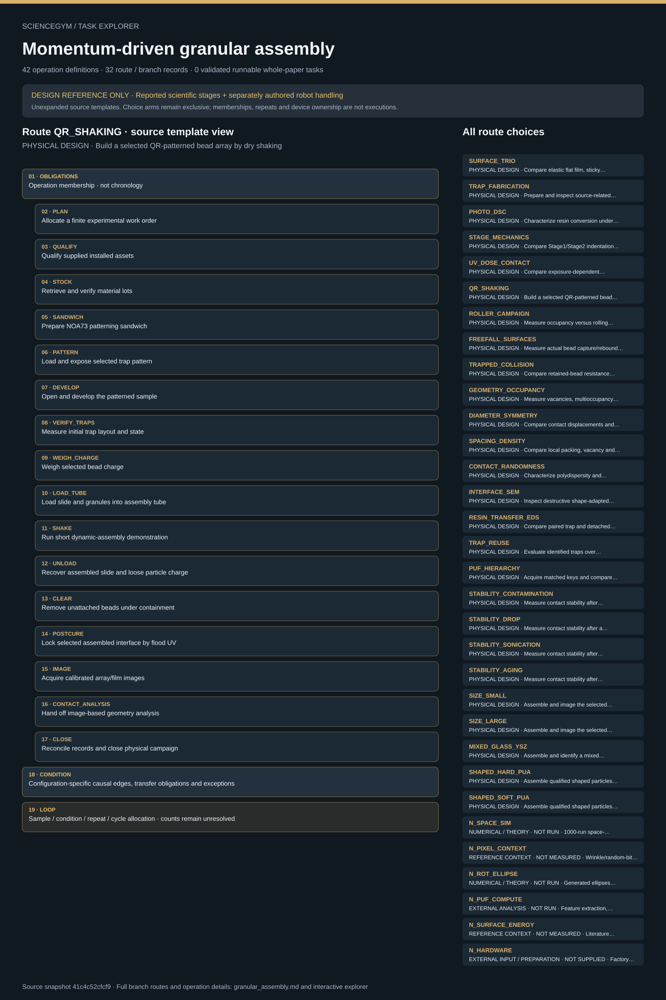

# Momentum-driven granular assembly: task route map



Paper: **Self-assembly by anti-repellent structures for programming particles with momentum** · [DOI](https://doi.org/10.1038/s41467-024-54976-7)

Author/evaluator design reference only; not an actor projection, task runner, solver, physical simulation or execution receipt. Missing inputs stay blocked. Preparation, device processes, measured data and numerical/reference scope remain distinct.. Counts describe task representation, not experiments or success.

**Reading rule:** rows retain the source display structure only. Membership has no inferred chronology. Where the source supplies a typed body, one unexpanded template is shown; no condition, trial or specimen count is inferred. An unordered obligation group has no inferred chronological edges. Source-reported scientific facts and authored handling are distinct.

[Immutable source task package](https://github.com/openags/ScienceGym/blob/41c4c52cfcf9d5b222404f2fd7ed9d6553f807cb/tasks/granular_assembly_operations_v2/) · [Interactive inspector](../index.html)

## SURFACE_TRIO — PHYSICAL DESIGN · Compare elastic flat film, sticky flat film and patterned sticky surface

Author/evaluator design reference only; not an actor projection, task runner, solver, physical simulation or execution receipt. Missing inputs stay blocked. Preparation, device processes, measured data and numerical/reference scope remain distinct. Membership lists do not assert chronology. Source-declared typed sequence, choice, loop and dispatch scopes are displayed without selecting alternatives or instantiating counts.

[Exact route source](https://github.com/openags/ScienceGym/blob/41c4c52cfcf9d5b222404f2fd7ed9d6553f807cb/tasks/granular_assembly_operations_v2/branches.json) · JSON pointer: `/configurations/0`

- **OBLIGATIONS: Operation membership · not chronology**
  - Binding: {"order":"Only source-declared causal edges and gates constrain order. Display adjacency is not an edge."}
  - `PLAN` Allocate a finite experimental work order
  - `QUALIFY` Qualify supplied installed assets
  - `STOCK` Retrieve and verify material lots
  - `GUIDE_FAB` Fabricate and inspect the collision guide
  - `FILM` Prepare separate flat-film controls
  - `SANDWICH` Prepare NOA73 patterning sandwich
  - `PATTERN` Load and expose selected trap pattern
  - `DEVELOP` Open and develop the patterned sample
  - `VERIFY_TRAPS` Measure initial trap layout and state
  - `WEIGH_CHARGE` Weigh selected bead charge
  - `DROP_BEAD` Observe guided/free-fall bead collision
  - `IMAGE` Acquire calibrated array/film images
  - `CONTACT_ANALYSIS` Hand off image-based geometry analysis
  - `CLOSE` Reconcile records and close physical campaign
- **CONDITION: Configuration-specific causal edges, transfer obligations and exceptions**
  - Binding: {"source_file":"dependencies.json","source_pointer":"/routes/0","source_contract":{"configuration_id":"SURFACE_TRIO","suggested_operation_ids":["PLAN","QUALIFY","STOCK","GUIDE_FAB","FILM","SANDWICH","PATTERN","DEVELOP","VERIFY_TRAPS","WEIGH_CHARGE","DROP_BEAD","IMAGE","CONTACT_ANALYSIS","CLOSE"],"causal_edges":[["PLAN","QUALIFY"],["QUALIFY","STOCK"],["STOCK","SANDWICH"],["SANDWICH","PATTERN"],["PATTERN","DEVELOP"],["DEVELOP","VERIFY_TRAPS"],["FILM","DROP_BEAD"],["IMAGE","CONTACT_ANALYSIS"],["VERIFY_TRAPS","IMAGE"],["DROP_BEAD","IMAGE"],["STOCK","FILM"],["STOCK","WEIGH_CHARGE"],["STOCK","GUIDE_FAB"],["GUIDE_FAB","DROP_BEAD"],["VERIFY_TRAPS","DROP_BEAD"]],"repeat_scope":"Instantiate an assigned sample/condition/repeat/cycle for each arm; do not reuse one operation instance as evidence for multiple physical runs.","station_handoffs":"Insert MOVE instances between physical stations with from/to/sample/carrier IDs. Analysis transfers are records, not physical moves.","exceptions":null}}
- **LOOP: Sample / condition / repeat / cycle allocation · counts remain unresolved**
  - Binding: {"source_contract":"Instantiate an assigned sample/condition/repeat/cycle for each arm; do not reuse one operation instance as evidence for multiple physical runs."}

<details><summary>Branch state, choices, lineage and loop obligations</summary>

```json
{
  "id": "SURFACE_TRIO",
  "family_id": "F_SURFACE",
  "goal": "Compare elastic flat film, sticky flat film and patterned sticky surface",
  "operation_ids": [
    "PLAN",
    "QUALIFY",
    "STOCK",
    "GUIDE_FAB",
    "FILM",
    "SANDWICH",
    "PATTERN",
    "DEVELOP",
    "VERIFY_TRAPS",
    "WEIGH_CHARGE",
    "DROP_BEAD",
    "IMAGE",
    "CONTACT_ANALYSIS",
    "CLOSE"
  ],
  "source_refs": [
    "S_N1",
    "MOV_DESC"
  ],
  "required_unknowns": [
    "U_ALLOC",
    "U_ASSETS",
    "U_COLLISION",
    "U_FILM",
    "U_GUIDE",
    "U_HIGHSPEED",
    "U_IMAGING",
    "U_LOTS",
    "U_PATTERN",
    "U_RINSE",
    "U_SANDWICH",
    "U_UV"
  ],
  "condition_dimensions": {
    "surface": [
      "Stage2flat",
      "Stage1flat",
      "Stage1patterned"
    ]
  },
  "control_package_ids": [
    "C_SURFACE"
  ],
  "notes": [
    "Distinct specimens represent elastic flat, sticky flat and patterned sticky surfaces. Geometry is an intentional experimental difference."
  ],
  "status": "Source-bounded task-design template; dependent physical work gated until inputs and installed assets qualify."
}
```

</details>

## TRAP_FABRICATION — PHYSICAL DESIGN · Prepare and inspect source-related trap arrays

Author/evaluator design reference only; not an actor projection, task runner, solver, physical simulation or execution receipt. Missing inputs stay blocked. Preparation, device processes, measured data and numerical/reference scope remain distinct. Membership lists do not assert chronology. Source-declared typed sequence, choice, loop and dispatch scopes are displayed without selecting alternatives or instantiating counts.

[Exact route source](https://github.com/openags/ScienceGym/blob/41c4c52cfcf9d5b222404f2fd7ed9d6553f807cb/tasks/granular_assembly_operations_v2/branches.json) · JSON pointer: `/configurations/1`

- **OBLIGATIONS: Operation membership · not chronology**
  - Binding: {"order":"Only source-declared causal edges and gates constrain order. Display adjacency is not an edge."}
  - `PLAN` Allocate a finite experimental work order
  - `QUALIFY` Qualify supplied installed assets
  - `STOCK` Retrieve and verify material lots
  - `SANDWICH` Prepare NOA73 patterning sandwich
  - `PATTERN` Load and expose selected trap pattern
  - `DEVELOP` Open and develop the patterned sample
  - `VERIFY_TRAPS` Measure initial trap layout and state
  - `IMAGE` Acquire calibrated array/film images
  - `CLOSE` Reconcile records and close physical campaign
- **CONDITION: Configuration-specific causal edges, transfer obligations and exceptions**
  - Binding: {"source_file":"dependencies.json","source_pointer":"/routes/1","source_contract":{"configuration_id":"TRAP_FABRICATION","suggested_operation_ids":["PLAN","QUALIFY","STOCK","SANDWICH","PATTERN","DEVELOP","VERIFY_TRAPS","IMAGE","CLOSE"],"causal_edges":[["PLAN","QUALIFY"],["QUALIFY","STOCK"],["STOCK","SANDWICH"],["SANDWICH","PATTERN"],["PATTERN","DEVELOP"],["DEVELOP","VERIFY_TRAPS"],["VERIFY_TRAPS","IMAGE"]],"repeat_scope":"Instantiate an assigned sample/condition/repeat/cycle for each arm; do not reuse one operation instance as evidence for multiple physical runs.","station_handoffs":"Insert MOVE instances between physical stations with from/to/sample/carrier IDs. Analysis transfers are records, not physical moves.","exceptions":null}}
- **LOOP: Sample / condition / repeat / cycle allocation · counts remain unresolved**
  - Binding: {"source_contract":"Instantiate an assigned sample/condition/repeat/cycle for each arm; do not reuse one operation instance as evidence for multiple physical runs."}

<details><summary>Branch state, choices, lineage and loop obligations</summary>

```json
{
  "id": "TRAP_FABRICATION",
  "family_id": "F_FAB",
  "goal": "Prepare and inspect source-related trap arrays",
  "operation_ids": [
    "PLAN",
    "QUALIFY",
    "STOCK",
    "SANDWICH",
    "PATTERN",
    "DEVELOP",
    "VERIFY_TRAPS",
    "IMAGE",
    "CLOSE"
  ],
  "source_refs": [
    "S_FAB"
  ],
  "required_unknowns": [
    "U_ALLOC",
    "U_ASSETS",
    "U_IMAGING",
    "U_LOTS",
    "U_PATTERN",
    "U_RINSE",
    "U_SANDWICH",
    "U_UV"
  ],
  "condition_dimensions": {},
  "control_package_ids": [],
  "notes": [],
  "status": "Source-bounded task-design template; dependent physical work gated until inputs and installed assets qualify."
}
```

</details>

## PHOTO_DSC — PHYSICAL DESIGN · Characterize resin conversion under the supplied photo-DSC method

Author/evaluator design reference only; not an actor projection, task runner, solver, physical simulation or execution receipt. Missing inputs stay blocked. Preparation, device processes, measured data and numerical/reference scope remain distinct. Membership lists do not assert chronology. Source-declared typed sequence, choice, loop and dispatch scopes are displayed without selecting alternatives or instantiating counts.

[Exact route source](https://github.com/openags/ScienceGym/blob/41c4c52cfcf9d5b222404f2fd7ed9d6553f807cb/tasks/granular_assembly_operations_v2/branches.json) · JSON pointer: `/configurations/2`

- **OBLIGATIONS: Operation membership · not chronology**
  - Binding: {"order":"Only source-declared causal edges and gates constrain order. Display adjacency is not an edge."}
  - `PLAN` Allocate a finite experimental work order
  - `QUALIFY` Qualify supplied installed assets
  - `STOCK` Retrieve and verify material lots
  - `DSC_LOAD` Load photo-DSC specimen
  - `DSC_CLOSE` Recover photo-DSC records and sample
  - `CLOSE` Reconcile records and close physical campaign
- **CONDITION: Configuration-specific causal edges, transfer obligations and exceptions**
  - Binding: {"source_file":"dependencies.json","source_pointer":"/routes/2","source_contract":{"configuration_id":"PHOTO_DSC","suggested_operation_ids":["PLAN","QUALIFY","STOCK","DSC_LOAD","DSC_CLOSE","CLOSE"],"causal_edges":[["PLAN","QUALIFY"],["QUALIFY","STOCK"],["DSC_LOAD","DSC_CLOSE"],["STOCK","DSC_LOAD"]],"repeat_scope":"Instantiate an assigned sample/condition/repeat/cycle for each arm; do not reuse one operation instance as evidence for multiple physical runs.","station_handoffs":"Insert MOVE instances between physical stations with from/to/sample/carrier IDs. Analysis transfers are records, not physical moves.","exceptions":null}}
- **LOOP: Sample / condition / repeat / cycle allocation · counts remain unresolved**
  - Binding: {"source_contract":"Instantiate an assigned sample/condition/repeat/cycle for each arm; do not reuse one operation instance as evidence for multiple physical runs."}

<details><summary>Branch state, choices, lineage and loop obligations</summary>

```json
{
  "id": "PHOTO_DSC",
  "family_id": "F_FAB",
  "goal": "Characterize resin conversion under the supplied photo-DSC method",
  "operation_ids": [
    "PLAN",
    "QUALIFY",
    "STOCK",
    "DSC_LOAD",
    "DSC_CLOSE",
    "CLOSE"
  ],
  "source_refs": [
    "S_DSC"
  ],
  "required_unknowns": [
    "U_ALLOC",
    "U_ASSETS",
    "U_DSC",
    "U_LOTS"
  ],
  "condition_dimensions": {},
  "control_package_ids": [],
  "notes": [],
  "status": "Source-bounded task-design template; dependent physical work gated until inputs and installed assets qualify."
}
```

</details>

## STAGE_MECHANICS — PHYSICAL DESIGN · Compare Stage1/Stage2 indentation and adhesion

Author/evaluator design reference only; not an actor projection, task runner, solver, physical simulation or execution receipt. Missing inputs stay blocked. Preparation, device processes, measured data and numerical/reference scope remain distinct. Membership lists do not assert chronology. Source-declared typed sequence, choice, loop and dispatch scopes are displayed without selecting alternatives or instantiating counts.

[Exact route source](https://github.com/openags/ScienceGym/blob/41c4c52cfcf9d5b222404f2fd7ed9d6553f807cb/tasks/granular_assembly_operations_v2/branches.json) · JSON pointer: `/configurations/3`

- **OBLIGATIONS: Operation membership · not chronology**
  - Binding: {"order":"Only source-declared causal edges and gates constrain order. Display adjacency is not an edge."}
  - `PLAN` Allocate a finite experimental work order
  - `QUALIFY` Qualify supplied installed assets
  - `STOCK` Retrieve and verify material lots
  - `FILM` Prepare separate flat-film controls
  - `INDENT` Mount and test mechanical film
  - `PULLOFF` Run separate adhesion measurements
  - `CLOSE` Reconcile records and close physical campaign
- **CONDITION: Configuration-specific causal edges, transfer obligations and exceptions**
  - Binding: {"source_file":"dependencies.json","source_pointer":"/routes/3","source_contract":{"configuration_id":"STAGE_MECHANICS","suggested_operation_ids":["PLAN","QUALIFY","STOCK","FILM","INDENT","PULLOFF","CLOSE"],"causal_edges":[["PLAN","QUALIFY"],["QUALIFY","STOCK"],["FILM","INDENT"],["FILM","PULLOFF"],["STOCK","FILM"]],"repeat_scope":"Instantiate an assigned sample/condition/repeat/cycle for each arm; do not reuse one operation instance as evidence for multiple physical runs.","station_handoffs":"Insert MOVE instances between physical stations with from/to/sample/carrier IDs. Analysis transfers are records, not physical moves.","exceptions":"Separate aliquot/film/site allocation for indentation versus pull-off."}}
- **LOOP: Sample / condition / repeat / cycle allocation · counts remain unresolved**
  - Binding: {"source_contract":"Instantiate an assigned sample/condition/repeat/cycle for each arm; do not reuse one operation instance as evidence for multiple physical runs."}

<details><summary>Branch state, choices, lineage and loop obligations</summary>

```json
{
  "id": "STAGE_MECHANICS",
  "family_id": "F_FAB",
  "goal": "Compare Stage1/Stage2 indentation and adhesion",
  "operation_ids": [
    "PLAN",
    "QUALIFY",
    "STOCK",
    "FILM",
    "INDENT",
    "PULLOFF",
    "CLOSE"
  ],
  "source_refs": [
    "M_FAB",
    "S_MECH"
  ],
  "required_unknowns": [
    "U_ALLOC",
    "U_ASSETS",
    "U_FILM",
    "U_LOTS",
    "U_MECH",
    "U_UV"
  ],
  "condition_dimensions": {
    "stage": [
      "Stage1",
      "Stage2"
    ],
    "assay": [
      "indentation",
      "pull_off"
    ]
  },
  "control_package_ids": [
    "C_MECHANICS"
  ],
  "notes": [
    "Indentation sites and pull-off sites require independent allocation or explicit history;The two-minute postcure is documented for film preparation."
  ],
  "status": "Source-bounded task-design template; dependent physical work gated until inputs and installed assets qualify."
}
```

</details>

## UV_DOSE_CONTACT — PHYSICAL DESIGN · Compare exposure-dependent mechanics and adapted contact area

Author/evaluator design reference only; not an actor projection, task runner, solver, physical simulation or execution receipt. Missing inputs stay blocked. Preparation, device processes, measured data and numerical/reference scope remain distinct. Membership lists do not assert chronology. Source-declared typed sequence, choice, loop and dispatch scopes are displayed without selecting alternatives or instantiating counts.

[Exact route source](https://github.com/openags/ScienceGym/blob/41c4c52cfcf9d5b222404f2fd7ed9d6553f807cb/tasks/granular_assembly_operations_v2/branches.json) · JSON pointer: `/configurations/4`

- **OBLIGATIONS: Operation membership · not chronology**
  - Binding: {"order":"Only source-declared causal edges and gates constrain order. Display adjacency is not an edge."}
  - `PLAN` Allocate a finite experimental work order
  - `QUALIFY` Qualify supplied installed assets
  - `STOCK` Retrieve and verify material lots
  - `FILM` Prepare separate flat-film controls
  - `INDENT` Mount and test mechanical film
  - `SANDWICH` Prepare NOA73 patterning sandwich
  - `PATTERN` Load and expose selected trap pattern
  - `DEVELOP` Open and develop the patterned sample
  - `VERIFY_TRAPS` Measure initial trap layout and state
  - `WEIGH_CHARGE` Weigh selected bead charge
  - `LOAD_TUBE` Load slide and granules into assembly tube
  - `SHAKE` Run short dynamic-assembly demonstration
  - `UNLOAD` Recover assembled slide and loose particle charge
  - `CLEAR` Remove unattached beads under containment
  - `POSTCURE` Lock selected assembled interface by flood UV
  - `IMAGE` Acquire calibrated array/film images
  - `REMOVE_BEADS` Separate beads for destructive interface analysis
  - `SEM_EDS` Mount and acquire SEM or EDS measurements
  - `CLOSE` Reconcile records and close physical campaign
- **CONDITION: Configuration-specific causal edges, transfer obligations and exceptions**
  - Binding: {"source_file":"dependencies.json","source_pointer":"/routes/4","source_contract":{"configuration_id":"UV_DOSE_CONTACT","suggested_operation_ids":["PLAN","QUALIFY","STOCK","FILM","INDENT","SANDWICH","PATTERN","DEVELOP","VERIFY_TRAPS","WEIGH_CHARGE","LOAD_TUBE","SHAKE","UNLOAD","CLEAR","POSTCURE","IMAGE","REMOVE_BEADS","SEM_EDS","CLOSE"],"causal_edges":[["PLAN","QUALIFY"],["QUALIFY","STOCK"],["STOCK","SANDWICH"],["SANDWICH","PATTERN"],["PATTERN","DEVELOP"],["DEVELOP","VERIFY_TRAPS"],["VERIFY_TRAPS","LOAD_TUBE"],["WEIGH_CHARGE","LOAD_TUBE"],["LOAD_TUBE","SHAKE"],["SHAKE","UNLOAD"],["UNLOAD","CLEAR"],["CLEAR","POSTCURE"],["FILM","INDENT"],["IMAGE","REMOVE_BEADS"],["REMOVE_BEADS","SEM_EDS"],["POSTCURE","IMAGE"],["CLEAR","IMAGE"],["VERIFY_TRAPS","IMAGE"],["STOCK","FILM"],["STOCK","WEIGH_CHARGE"]],"repeat_scope":"Instantiate an assigned sample/condition/repeat/cycle for each arm; do not reuse one operation instance as evidence for multiple physical runs.","station_handoffs":"Insert MOVE instances between physical stations with from/to/sample/carrier IDs. Analysis transfers are records, not physical moves.","exceptions":null}}
- **LOOP: Sample / condition / repeat / cycle allocation · counts remain unresolved**
  - Binding: {"source_contract":"Instantiate an assigned sample/condition/repeat/cycle for each arm; do not reuse one operation instance as evidence for multiple physical runs."}

<details><summary>Branch state, choices, lineage and loop obligations</summary>

```json
{
  "id": "UV_DOSE_CONTACT",
  "family_id": "F_FAB",
  "goal": "Compare exposure-dependent mechanics and adapted contact area",
  "operation_ids": [
    "PLAN",
    "QUALIFY",
    "STOCK",
    "FILM",
    "INDENT",
    "SANDWICH",
    "PATTERN",
    "DEVELOP",
    "VERIFY_TRAPS",
    "WEIGH_CHARGE",
    "LOAD_TUBE",
    "SHAKE",
    "UNLOAD",
    "CLEAR",
    "POSTCURE",
    "IMAGE",
    "REMOVE_BEADS",
    "SEM_EDS",
    "CLOSE"
  ],
  "source_refs": [
    "S_UV",
    "S_FAB"
  ],
  "required_unknowns": [
    "U_AIR",
    "U_ALLOC",
    "U_ASSETS",
    "U_DOSE_SERIES",
    "U_FILM",
    "U_IMAGING",
    "U_LOTS",
    "U_MECH",
    "U_PATTERN",
    "U_RINSE",
    "U_ROLLER",
    "U_SANDWICH",
    "U_SEM_EDS",
    "U_SHAKE",
    "U_UV"
  ],
  "condition_dimensions": {
    "UV_dose_mJ_cm2": [
      100,
      150,
      200
    ]
  },
  "control_package_ids": [
    "C_DOSE"
  ],
  "notes": [
    "Mechanical films and contact-array specimens are allocated separately. Paired plots do not establish one shared physical specimen."
  ],
  "status": "Source-bounded task-design template; dependent physical work gated until inputs and installed assets qualify."
}
```

</details>

## QR_SHAKING — PHYSICAL DESIGN · Build a selected QR-patterned bead array by dry shaking

Author/evaluator design reference only; not an actor projection, task runner, solver, physical simulation or execution receipt. Missing inputs stay blocked. Preparation, device processes, measured data and numerical/reference scope remain distinct. Membership lists do not assert chronology. Source-declared typed sequence, choice, loop and dispatch scopes are displayed without selecting alternatives or instantiating counts.

[Exact route source](https://github.com/openags/ScienceGym/blob/41c4c52cfcf9d5b222404f2fd7ed9d6553f807cb/tasks/granular_assembly_operations_v2/branches.json) · JSON pointer: `/configurations/5`

- **OBLIGATIONS: Operation membership · not chronology**
  - Binding: {"order":"Only source-declared causal edges and gates constrain order. Display adjacency is not an edge."}
  - `PLAN` Allocate a finite experimental work order
  - `QUALIFY` Qualify supplied installed assets
  - `STOCK` Retrieve and verify material lots
  - `SANDWICH` Prepare NOA73 patterning sandwich
  - `PATTERN` Load and expose selected trap pattern
  - `DEVELOP` Open and develop the patterned sample
  - `VERIFY_TRAPS` Measure initial trap layout and state
  - `WEIGH_CHARGE` Weigh selected bead charge
  - `LOAD_TUBE` Load slide and granules into assembly tube
  - `SHAKE` Run short dynamic-assembly demonstration
  - `UNLOAD` Recover assembled slide and loose particle charge
  - `CLEAR` Remove unattached beads under containment
  - `POSTCURE` Lock selected assembled interface by flood UV
  - `IMAGE` Acquire calibrated array/film images
  - `CONTACT_ANALYSIS` Hand off image-based geometry analysis
  - `CLOSE` Reconcile records and close physical campaign
- **CONDITION: Configuration-specific causal edges, transfer obligations and exceptions**
  - Binding: {"source_file":"dependencies.json","source_pointer":"/routes/5","source_contract":{"configuration_id":"QR_SHAKING","suggested_operation_ids":["PLAN","QUALIFY","STOCK","SANDWICH","PATTERN","DEVELOP","VERIFY_TRAPS","WEIGH_CHARGE","LOAD_TUBE","SHAKE","UNLOAD","CLEAR","POSTCURE","IMAGE","CONTACT_ANALYSIS","CLOSE"],"causal_edges":[["PLAN","QUALIFY"],["QUALIFY","STOCK"],["STOCK","SANDWICH"],["SANDWICH","PATTERN"],["PATTERN","DEVELOP"],["DEVELOP","VERIFY_TRAPS"],["VERIFY_TRAPS","LOAD_TUBE"],["WEIGH_CHARGE","LOAD_TUBE"],["LOAD_TUBE","SHAKE"],["SHAKE","UNLOAD"],["UNLOAD","CLEAR"],["CLEAR","POSTCURE"],["IMAGE","CONTACT_ANALYSIS"],["POSTCURE","IMAGE"],["CLEAR","IMAGE"],["VERIFY_TRAPS","IMAGE"],["STOCK","WEIGH_CHARGE"]],"repeat_scope":"Instantiate an assigned sample/condition/repeat/cycle for each arm; do not reuse one operation instance as evidence for multiple physical runs.","station_handoffs":"Insert MOVE instances between physical stations with from/to/sample/carrier IDs. Analysis transfers are records, not physical moves.","exceptions":null}}
- **LOOP: Sample / condition / repeat / cycle allocation · counts remain unresolved**
  - Binding: {"source_contract":"Instantiate an assigned sample/condition/repeat/cycle for each arm; do not reuse one operation instance as evidence for multiple physical runs."}

<details><summary>Branch state, choices, lineage and loop obligations</summary>

```json
{
  "id": "QR_SHAKING",
  "family_id": "F_ASSEMBLY",
  "goal": "Build a selected QR-patterned bead array by dry shaking",
  "operation_ids": [
    "PLAN",
    "QUALIFY",
    "STOCK",
    "SANDWICH",
    "PATTERN",
    "DEVELOP",
    "VERIFY_TRAPS",
    "WEIGH_CHARGE",
    "LOAD_TUBE",
    "SHAKE",
    "UNLOAD",
    "CLEAR",
    "POSTCURE",
    "IMAGE",
    "CONTACT_ANALYSIS",
    "CLOSE"
  ],
  "source_refs": [
    "S_FAB",
    "MOV_DESC"
  ],
  "required_unknowns": [
    "U_AIR",
    "U_ALLOC",
    "U_ASSETS",
    "U_IMAGING",
    "U_LOTS",
    "U_PATTERN",
    "U_RINSE",
    "U_ROLLER",
    "U_SANDWICH",
    "U_SHAKE",
    "U_UV"
  ],
  "condition_dimensions": {},
  "control_package_ids": [
    "C_OCCUPANCY"
  ],
  "notes": [
    "Exact source QR mask and payload are unavailable. An authored nonempty QR assignment is not historical-mask reproduction."
  ],
  "status": "Source-bounded task-design template; dependent physical work gated until inputs and installed assets qualify."
}
```

</details>

## ROLLER_CAMPAIGN — PHYSICAL DESIGN · Measure occupancy versus rolling condition

Author/evaluator design reference only; not an actor projection, task runner, solver, physical simulation or execution receipt. Missing inputs stay blocked. Preparation, device processes, measured data and numerical/reference scope remain distinct. Membership lists do not assert chronology. Source-declared typed sequence, choice, loop and dispatch scopes are displayed without selecting alternatives or instantiating counts.

[Exact route source](https://github.com/openags/ScienceGym/blob/41c4c52cfcf9d5b222404f2fd7ed9d6553f807cb/tasks/granular_assembly_operations_v2/branches.json) · JSON pointer: `/configurations/6`

- **OBLIGATIONS: Operation membership · not chronology**
  - Binding: {"order":"Only source-declared causal edges and gates constrain order. Display adjacency is not an edge."}
  - `PLAN` Allocate a finite experimental work order
  - `QUALIFY` Qualify supplied installed assets
  - `STOCK` Retrieve and verify material lots
  - `SANDWICH` Prepare NOA73 patterning sandwich
  - `PATTERN` Load and expose selected trap pattern
  - `DEVELOP` Open and develop the patterned sample
  - `VERIFY_TRAPS` Measure initial trap layout and state
  - `WEIGH_CHARGE` Weigh selected bead charge
  - `LOAD_TUBE` Load slide and granules into assembly tube
  - `ROLLER` Run timed roller condition
  - `UNLOAD` Recover assembled slide and loose particle charge
  - `CLEAR` Remove unattached beads under containment
  - `IMAGE` Acquire calibrated array/film images
  - `CONTACT_ANALYSIS` Hand off image-based geometry analysis
  - `CLOSE` Reconcile records and close physical campaign
- **CONDITION: Configuration-specific causal edges, transfer obligations and exceptions**
  - Binding: {"source_file":"dependencies.json","source_pointer":"/routes/6","source_contract":{"configuration_id":"ROLLER_CAMPAIGN","suggested_operation_ids":["PLAN","QUALIFY","STOCK","SANDWICH","PATTERN","DEVELOP","VERIFY_TRAPS","WEIGH_CHARGE","LOAD_TUBE","ROLLER","UNLOAD","CLEAR","IMAGE","CONTACT_ANALYSIS","CLOSE"],"causal_edges":[["PLAN","QUALIFY"],["QUALIFY","STOCK"],["STOCK","SANDWICH"],["SANDWICH","PATTERN"],["PATTERN","DEVELOP"],["DEVELOP","VERIFY_TRAPS"],["VERIFY_TRAPS","LOAD_TUBE"],["WEIGH_CHARGE","LOAD_TUBE"],["LOAD_TUBE","ROLLER"],["ROLLER","UNLOAD"],["UNLOAD","CLEAR"],["IMAGE","CONTACT_ANALYSIS"],["CLEAR","IMAGE"],["VERIFY_TRAPS","IMAGE"],["STOCK","WEIGH_CHARGE"]],"repeat_scope":"Instantiate an assigned sample/condition/repeat/cycle for each arm; do not reuse one operation instance as evidence for multiple physical runs.","station_handoffs":"Insert MOVE instances between physical stations with from/to/sample/carrier IDs. Analysis transfers are records, not physical moves.","exceptions":"Each time point has explicit independent-endpoint or interruptedsame-specimenhistory."}}
- **LOOP: Sample / condition / repeat / cycle allocation · counts remain unresolved**
  - Binding: {"source_contract":"Instantiate an assigned sample/condition/repeat/cycle for each arm; do not reuse one operation instance as evidence for multiple physical runs."}

<details><summary>Branch state, choices, lineage and loop obligations</summary>

```json
{
  "id": "ROLLER_CAMPAIGN",
  "family_id": "F_ASSEMBLY",
  "goal": "Measure occupancy versus rolling condition",
  "operation_ids": [
    "PLAN",
    "QUALIFY",
    "STOCK",
    "SANDWICH",
    "PATTERN",
    "DEVELOP",
    "VERIFY_TRAPS",
    "WEIGH_CHARGE",
    "LOAD_TUBE",
    "ROLLER",
    "UNLOAD",
    "CLEAR",
    "IMAGE",
    "CONTACT_ANALYSIS",
    "CLOSE"
  ],
  "source_refs": [
    "S_ROLL",
    "M_ROLL"
  ],
  "required_unknowns": [
    "U_AIR",
    "U_ALLOC",
    "U_ASSETS",
    "U_IMAGING",
    "U_LOTS",
    "U_PATTERN",
    "U_RINSE",
    "U_ROLLER",
    "U_SANDWICH",
    "U_UV"
  ],
  "condition_dimensions": {
    "charge_g": [
      5,
      10
    ],
    "RPM": [
      10,
      15,
      20
    ],
    "array_traps": 200,
    "source_N_label": 10
  },
  "control_package_ids": [
    "C_ROLLER"
  ],
  "notes": [
    "Declare destructive endpoint sampling or interrupted repeated sampling before run; same-slide repeated time points are not independent repeats. Postcure is not imposed before occupancy timing."
  ],
  "status": "Source-bounded task-design template; dependent physical work gated until inputs and installed assets qualify."
}
```

</details>

## FREEFALL_SURFACES — PHYSICAL DESIGN · Measure actual bead capture/rebound versus speed on two cure states

Author/evaluator design reference only; not an actor projection, task runner, solver, physical simulation or execution receipt. Missing inputs stay blocked. Preparation, device processes, measured data and numerical/reference scope remain distinct. Membership lists do not assert chronology. Source-declared typed sequence, choice, loop and dispatch scopes are displayed without selecting alternatives or instantiating counts.

[Exact route source](https://github.com/openags/ScienceGym/blob/41c4c52cfcf9d5b222404f2fd7ed9d6553f807cb/tasks/granular_assembly_operations_v2/branches.json) · JSON pointer: `/configurations/7`

- **OBLIGATIONS: Operation membership · not chronology**
  - Binding: {"order":"Only source-declared causal edges and gates constrain order. Display adjacency is not an edge."}
  - `PLAN` Allocate a finite experimental work order
  - `QUALIFY` Qualify supplied installed assets
  - `STOCK` Retrieve and verify material lots
  - `GUIDE_FAB` Fabricate and inspect the collision guide
  - `FILM` Prepare separate flat-film controls
  - `DROP_BEAD` Observe guided/free-fall bead collision
  - `IMAGE` Acquire calibrated array/film images
  - `CLOSE` Reconcile records and close physical campaign
- **CONDITION: Configuration-specific causal edges, transfer obligations and exceptions**
  - Binding: {"source_file":"dependencies.json","source_pointer":"/routes/7","source_contract":{"configuration_id":"FREEFALL_SURFACES","suggested_operation_ids":["PLAN","QUALIFY","STOCK","GUIDE_FAB","FILM","DROP_BEAD","IMAGE","CLOSE"],"causal_edges":[["PLAN","QUALIFY"],["QUALIFY","STOCK"],["FILM","DROP_BEAD"],["DROP_BEAD","IMAGE"],["STOCK","FILM"],["STOCK","GUIDE_FAB"],["GUIDE_FAB","DROP_BEAD"]],"repeat_scope":"Instantiate an assigned sample/condition/repeat/cycle for each arm; do not reuse one operation instance as evidence for multiple physical runs.","station_handoffs":"Insert MOVE instances between physical stations with from/to/sample/carrier IDs. Analysis transfers are records, not physical moves.","exceptions":null}}
- **LOOP: Sample / condition / repeat / cycle allocation · counts remain unresolved**
  - Binding: {"source_contract":"Instantiate an assigned sample/condition/repeat/cycle for each arm; do not reuse one operation instance as evidence for multiple physical runs."}

<details><summary>Branch state, choices, lineage and loop obligations</summary>

```json
{
  "id": "FREEFALL_SURFACES",
  "family_id": "F_COLLISION",
  "goal": "Measure actual bead capture/rebound versus speed on two cure states",
  "operation_ids": [
    "PLAN",
    "QUALIFY",
    "STOCK",
    "GUIDE_FAB",
    "FILM",
    "DROP_BEAD",
    "IMAGE",
    "CLOSE"
  ],
  "source_refs": [
    "M_COLL",
    "MOV_DESC"
  ],
  "required_unknowns": [
    "U_ALLOC",
    "U_ASSETS",
    "U_COLLISION",
    "U_FILM",
    "U_GUIDE",
    "U_HIGHSPEED",
    "U_IMAGING",
    "U_LOTS",
    "U_UV"
  ],
  "condition_dimensions": {
    "surface": [
      "Stage1flat",
      "Stage2flat"
    ],
    "movie_case_count_per_surface": 5
  },
  "control_package_ids": [
    "C_FREEFALL"
  ],
  "notes": [
    "Five velocity cases per surface are described in movie metadata, but exact values are unread. Measure actual velocity. The source capture boundary is not a mandatory result or safety limit."
  ],
  "status": "Source-bounded task-design template; dependent physical work gated until inputs and installed assets qualify."
}
```

</details>

## TRAPPED_COLLISION — PHYSICAL DESIGN · Compare retained-bead resistance before and after shape adaptation

Author/evaluator design reference only; not an actor projection, task runner, solver, physical simulation or execution receipt. Missing inputs stay blocked. Preparation, device processes, measured data and numerical/reference scope remain distinct. Membership lists do not assert chronology. Source-declared typed sequence, choice, loop and dispatch scopes are displayed without selecting alternatives or instantiating counts.

[Exact route source](https://github.com/openags/ScienceGym/blob/41c4c52cfcf9d5b222404f2fd7ed9d6553f807cb/tasks/granular_assembly_operations_v2/branches.json) · JSON pointer: `/configurations/8`

- **OBLIGATIONS: Operation membership · not chronology**
  - Binding: {"order":"Only source-declared causal edges and gates constrain order. Display adjacency is not an edge."}
  - `PLAN` Allocate a finite experimental work order
  - `QUALIFY` Qualify supplied installed assets
  - `STOCK` Retrieve and verify material lots
  - `GUIDE_FAB` Fabricate and inspect the collision guide
  - `SANDWICH` Prepare NOA73 patterning sandwich
  - `PATTERN` Load and expose selected trap pattern
  - `DEVELOP` Open and develop the patterned sample
  - `VERIFY_TRAPS` Measure initial trap layout and state
  - `WEIGH_CHARGE` Weigh selected bead charge
  - `LOAD_TUBE` Load slide and granules into assembly tube
  - `SHAKE` Run short dynamic-assembly demonstration
  - `UNLOAD` Recover assembled slide and loose particle charge
  - `CLEAR` Remove unattached beads under containment
  - `POSTCURE` Lock selected assembled interface by flood UV
  - `IMAGE` Acquire calibrated array/film images
  - `COLLISION_BASELINE` Image the already trapped target before challenge
  - `COLLIDE_TRAPPED` Challenge an already trapped bead
  - `CLOSE` Reconcile records and close physical campaign
- **CONDITION: Configuration-specific causal edges, transfer obligations and exceptions**
  - Binding: {"source_file":"dependencies.json","source_pointer":"/routes/8","source_contract":{"configuration_id":"TRAPPED_COLLISION","suggested_operation_ids":["PLAN","QUALIFY","STOCK","GUIDE_FAB","SANDWICH","PATTERN","DEVELOP","VERIFY_TRAPS","WEIGH_CHARGE","LOAD_TUBE","SHAKE","UNLOAD","CLEAR","POSTCURE","IMAGE","COLLISION_BASELINE","COLLIDE_TRAPPED","CLOSE"],"causal_edges":[["PLAN","QUALIFY"],["QUALIFY","STOCK"],["STOCK","SANDWICH"],["SANDWICH","PATTERN"],["PATTERN","DEVELOP"],["DEVELOP","VERIFY_TRAPS"],["VERIFY_TRAPS","LOAD_TUBE"],["WEIGH_CHARGE","LOAD_TUBE"],["LOAD_TUBE","SHAKE"],["SHAKE","UNLOAD"],["UNLOAD","CLEAR"],["CLEAR","POSTCURE"],["CLEAR","IMAGE"],["VERIFY_TRAPS","IMAGE"],["CLEAR","COLLIDE_TRAPPED"],["COLLIDE_TRAPPED","IMAGE"],["STOCK","WEIGH_CHARGE"],["STOCK","GUIDE_FAB"],["GUIDE_FAB","COLLIDE_TRAPPED"],["CLEAR","COLLISION_BASELINE"],["COLLISION_BASELINE","COLLIDE_TRAPPED"]],"repeat_scope":"Instantiate an assigned sample/condition/repeat/cycle for each arm; do not reuse one operation instance as evidence for multiple physical runs.","station_handoffs":"Insert MOVE instances between physical stations with from/to/sample/carrier IDs. Analysis transfers are records, not physical moves.","exceptions":"Stage1 forbids prior POSTCURE; the adapted arm requires POSTCURE before COLLIDE_TRAPPED. Select the explicit arm graph.","arm_routes":[{"arm":"Stage1trapped","operation_ids":["PLAN","QUALIFY","STOCK","GUIDE_FAB","SANDWICH","PATTERN","DEVELOP","VERIFY_TRAPS","WEIGH_CHARGE","LOAD_TUBE","SHAKE","UNLOAD","CLEAR","IMAGE","COLLISION_BASELINE","COLLIDE_TRAPPED","CLOSE"],"causal_edges":[["PLAN","QUALIFY"],["QUALIFY","STOCK"],["STOCK","SANDWICH"],["SANDWICH","PATTERN"],["PATTERN","DEVELOP"],["DEVELOP","VERIFY_TRAPS"],["VERIFY_TRAPS","LOAD_TUBE"],["WEIGH_CHARGE","LOAD_TUBE"],["LOAD_TUBE","SHAKE"],["SHAKE","UNLOAD"],["UNLOAD","CLEAR"],["CLEAR","IMAGE"],["VERIFY_TRAPS","IMAGE"],["CLEAR","COLLIDE_TRAPPED"],["COLLIDE_TRAPPED","IMAGE"],["STOCK","WEIGH_CHARGE"],["STOCK","GUIDE_FAB"],["GUIDE_FAB","COLLIDE_TRAPPED"],["CLEAR","COLLISION_BASELINE"],["COLLISION_BASELINE","COLLIDE_TRAPPED"]],"forbidden_prior_states":["postcured"],"required_target_state":"Stage1_trapped"},{"arm":"shape_adaptedtrapped","operation_ids":["PLAN","QUALIFY","STOCK","GUIDE_FAB","SANDWICH","PATTERN","DEVELOP","VERIFY_TRAPS","WEIGH_CHARGE","LOAD_TUBE","SHAKE","UNLOAD","CLEAR","POSTCURE","IMAGE","COLLISION_BASELINE","COLLIDE_TRAPPED","CLOSE"],"causal_edges":[["PLAN","QUALIFY"],["QUALIFY","STOCK"],["STOCK","SANDWICH"],["SANDWICH","PATTERN"],["PATTERN","DEVELOP"],["DEVELOP","VERIFY_TRAPS"],["VERIFY_TRAPS","LOAD_TUBE"],["WEIGH_CHARGE","LOAD_TUBE"],["LOAD_TUBE","SHAKE"],["SHAKE","UNLOAD"],["UNLOAD","CLEAR"],["CLEAR","POSTCURE"],["CLEAR","IMAGE"],["VERIFY_TRAPS","IMAGE"],["CLEAR","COLLIDE_TRAPPED"],["COLLIDE_TRAPPED","IMAGE"],["STOCK","WEIGH_CHARGE"],["STOCK","GUIDE_FAB"],["GUIDE_FAB","COLLIDE_TRAPPED"],["CLEAR","COLLISION_BASELINE"],["COLLISION_BASELINE","COLLIDE_TRAPPED"],["POSTCURE","COLLISION_BASELINE"],["POSTCURE","COLLIDE_TRAPPED"]],"forbidden_prior_states":[],"required_target_state":"shape_adapted_trapped"}],"execution_requirement":"Select and instantiate one arm_route per assigned condition; the shared list is inventory only."}}
- **LOOP: Sample / condition / repeat / cycle allocation · counts remain unresolved**
  - Binding: {"source_contract":"Instantiate an assigned sample/condition/repeat/cycle for each arm; do not reuse one operation instance as evidence for multiple physical runs."}

<details><summary>Branch state, choices, lineage and loop obligations</summary>

```json
{
  "id": "TRAPPED_COLLISION",
  "family_id": "F_COLLISION",
  "goal": "Compare retained-bead resistance before and after shape adaptation",
  "operation_ids": [
    "PLAN",
    "QUALIFY",
    "STOCK",
    "GUIDE_FAB",
    "SANDWICH",
    "PATTERN",
    "DEVELOP",
    "VERIFY_TRAPS",
    "WEIGH_CHARGE",
    "LOAD_TUBE",
    "SHAKE",
    "UNLOAD",
    "CLEAR",
    "POSTCURE",
    "IMAGE",
    "COLLISION_BASELINE",
    "COLLIDE_TRAPPED",
    "CLOSE"
  ],
  "source_refs": [
    "M_FAB",
    "S_COLL"
  ],
  "required_unknowns": [
    "U_AIR",
    "U_ALLOC",
    "U_ASSETS",
    "U_COLLISION",
    "U_GUIDE",
    "U_HIGHSPEED",
    "U_IMAGING",
    "U_LOTS",
    "U_PATTERN",
    "U_REGISTRATION",
    "U_RINSE",
    "U_ROLLER",
    "U_SANDWICH",
    "U_SHAKE",
    "U_UV"
  ],
  "condition_dimensions": {
    "target": [
      "Stage1trapped",
      "shape_adaptedtrapped"
    ]
  },
  "control_package_ids": [
    "C_COLLISION"
  ],
  "notes": [
    "The Stage1 arm must not be postcured before its challenge. The adapted arm requires postcure before challenge. Use separate specimens or explicitly declared paired history."
  ],
  "status": "Source-bounded task-design template; dependent physical work gated until inputs and installed assets qualify.",
  "arm_rules": [
    {
      "arm": "Stage1trapped",
      "omit_before_challenge": [
        "POSTCURE"
      ]
    },
    {
      "arm": "shape_adaptedtrapped",
      "require_before_challenge": [
        "POSTCURE"
      ]
    }
  ]
}
```

</details>

## GEOMETRY_OCCUPANCY — PHYSICAL DESIGN · Measure vacancies, multioccupancy and sidewall trapping

Author/evaluator design reference only; not an actor projection, task runner, solver, physical simulation or execution receipt. Missing inputs stay blocked. Preparation, device processes, measured data and numerical/reference scope remain distinct. Membership lists do not assert chronology. Source-declared typed sequence, choice, loop and dispatch scopes are displayed without selecting alternatives or instantiating counts.

[Exact route source](https://github.com/openags/ScienceGym/blob/41c4c52cfcf9d5b222404f2fd7ed9d6553f807cb/tasks/granular_assembly_operations_v2/branches.json) · JSON pointer: `/configurations/9`

- **OBLIGATIONS: Operation membership · not chronology**
  - Binding: {"order":"Only source-declared causal edges and gates constrain order. Display adjacency is not an edge."}
  - `PLAN` Allocate a finite experimental work order
  - `QUALIFY` Qualify supplied installed assets
  - `STOCK` Retrieve and verify material lots
  - `SANDWICH` Prepare NOA73 patterning sandwich
  - `PATTERN` Load and expose selected trap pattern
  - `DEVELOP` Open and develop the patterned sample
  - `VERIFY_TRAPS` Measure initial trap layout and state
  - `WEIGH_CHARGE` Weigh selected bead charge
  - `LOAD_TUBE` Load slide and granules into assembly tube
  - `SHAKE` Run short dynamic-assembly demonstration
  - `UNLOAD` Recover assembled slide and loose particle charge
  - `CLEAR` Remove unattached beads under containment
  - `POSTCURE` Lock selected assembled interface by flood UV
  - `IMAGE` Acquire calibrated array/film images
  - `CONTACT_ANALYSIS` Hand off image-based geometry analysis
  - `CLOSE` Reconcile records and close physical campaign
- **CONDITION: Configuration-specific causal edges, transfer obligations and exceptions**
  - Binding: {"source_file":"dependencies.json","source_pointer":"/routes/9","source_contract":{"configuration_id":"GEOMETRY_OCCUPANCY","suggested_operation_ids":["PLAN","QUALIFY","STOCK","SANDWICH","PATTERN","DEVELOP","VERIFY_TRAPS","WEIGH_CHARGE","LOAD_TUBE","SHAKE","UNLOAD","CLEAR","POSTCURE","IMAGE","CONTACT_ANALYSIS","CLOSE"],"causal_edges":[["PLAN","QUALIFY"],["QUALIFY","STOCK"],["STOCK","SANDWICH"],["SANDWICH","PATTERN"],["PATTERN","DEVELOP"],["DEVELOP","VERIFY_TRAPS"],["VERIFY_TRAPS","LOAD_TUBE"],["WEIGH_CHARGE","LOAD_TUBE"],["LOAD_TUBE","SHAKE"],["SHAKE","UNLOAD"],["UNLOAD","CLEAR"],["CLEAR","POSTCURE"],["IMAGE","CONTACT_ANALYSIS"],["POSTCURE","IMAGE"],["CLEAR","IMAGE"],["VERIFY_TRAPS","IMAGE"],["STOCK","WEIGH_CHARGE"]],"repeat_scope":"Instantiate an assigned sample/condition/repeat/cycle for each arm; do not reuse one operation instance as evidence for multiple physical runs.","station_handoffs":"Insert MOVE instances between physical stations with from/to/sample/carrier IDs. Analysis transfers are records, not physical moves.","exceptions":null}}
- **LOOP: Sample / condition / repeat / cycle allocation · counts remain unresolved**
  - Binding: {"source_contract":"Instantiate an assigned sample/condition/repeat/cycle for each arm; do not reuse one operation instance as evidence for multiple physical runs."}

<details><summary>Branch state, choices, lineage and loop obligations</summary>

```json
{
  "id": "GEOMETRY_OCCUPANCY",
  "family_id": "F_GEOMETRY",
  "goal": "Measure vacancies, multioccupancy and sidewall trapping",
  "operation_ids": [
    "PLAN",
    "QUALIFY",
    "STOCK",
    "SANDWICH",
    "PATTERN",
    "DEVELOP",
    "VERIFY_TRAPS",
    "WEIGH_CHARGE",
    "LOAD_TUBE",
    "SHAKE",
    "UNLOAD",
    "CLEAR",
    "POSTCURE",
    "IMAGE",
    "CONTACT_ANALYSIS",
    "CLOSE"
  ],
  "source_refs": [
    "S_GEOM"
  ],
  "required_unknowns": [
    "U_AIR",
    "U_ALLOC",
    "U_ASSETS",
    "U_IMAGING",
    "U_LOTS",
    "U_PATTERN",
    "U_RINSE",
    "U_ROLLER",
    "U_SANDWICH",
    "U_SHAKE",
    "U_UV"
  ],
  "condition_dimensions": {
    "low_trap_diameter_um": [
      100,
      200,
      300,
      400,
      600,
      800,
      1000
    ],
    "low_trap_height_um": 12,
    "sidewall_control_um": {
      "D": 100,
      "H": 600
    }
  },
  "control_package_ids": [
    "C_GEOMETRY"
  ],
  "notes": [],
  "status": "Source-bounded task-design template; dependent physical work gated until inputs and installed assets qualify."
}
```

</details>

## DIAMETER_SYMMETRY — PHYSICAL DESIGN · Compare contact displacements and grid distortion

Author/evaluator design reference only; not an actor projection, task runner, solver, physical simulation or execution receipt. Missing inputs stay blocked. Preparation, device processes, measured data and numerical/reference scope remain distinct. Membership lists do not assert chronology. Source-declared typed sequence, choice, loop and dispatch scopes are displayed without selecting alternatives or instantiating counts.

[Exact route source](https://github.com/openags/ScienceGym/blob/41c4c52cfcf9d5b222404f2fd7ed9d6553f807cb/tasks/granular_assembly_operations_v2/branches.json) · JSON pointer: `/configurations/10`

- **OBLIGATIONS: Operation membership · not chronology**
  - Binding: {"order":"Only source-declared causal edges and gates constrain order. Display adjacency is not an edge."}
  - `PLAN` Allocate a finite experimental work order
  - `QUALIFY` Qualify supplied installed assets
  - `STOCK` Retrieve and verify material lots
  - `SANDWICH` Prepare NOA73 patterning sandwich
  - `PATTERN` Load and expose selected trap pattern
  - `DEVELOP` Open and develop the patterned sample
  - `VERIFY_TRAPS` Measure initial trap layout and state
  - `WEIGH_CHARGE` Weigh selected bead charge
  - `LOAD_TUBE` Load slide and granules into assembly tube
  - `SHAKE` Run short dynamic-assembly demonstration
  - `UNLOAD` Recover assembled slide and loose particle charge
  - `CLEAR` Remove unattached beads under containment
  - `POSTCURE` Lock selected assembled interface by flood UV
  - `IMAGE` Acquire calibrated array/film images
  - `CONTACT_ANALYSIS` Hand off image-based geometry analysis
  - `CLOSE` Reconcile records and close physical campaign
- **CONDITION: Configuration-specific causal edges, transfer obligations and exceptions**
  - Binding: {"source_file":"dependencies.json","source_pointer":"/routes/10","source_contract":{"configuration_id":"DIAMETER_SYMMETRY","suggested_operation_ids":["PLAN","QUALIFY","STOCK","SANDWICH","PATTERN","DEVELOP","VERIFY_TRAPS","WEIGH_CHARGE","LOAD_TUBE","SHAKE","UNLOAD","CLEAR","POSTCURE","IMAGE","CONTACT_ANALYSIS","CLOSE"],"causal_edges":[["PLAN","QUALIFY"],["QUALIFY","STOCK"],["STOCK","SANDWICH"],["SANDWICH","PATTERN"],["PATTERN","DEVELOP"],["DEVELOP","VERIFY_TRAPS"],["VERIFY_TRAPS","LOAD_TUBE"],["WEIGH_CHARGE","LOAD_TUBE"],["LOAD_TUBE","SHAKE"],["SHAKE","UNLOAD"],["UNLOAD","CLEAR"],["CLEAR","POSTCURE"],["IMAGE","CONTACT_ANALYSIS"],["POSTCURE","IMAGE"],["CLEAR","IMAGE"],["VERIFY_TRAPS","IMAGE"],["STOCK","WEIGH_CHARGE"]],"repeat_scope":"Instantiate an assigned sample/condition/repeat/cycle for each arm; do not reuse one operation instance as evidence for multiple physical runs.","station_handoffs":"Insert MOVE instances between physical stations with from/to/sample/carrier IDs. Analysis transfers are records, not physical moves.","exceptions":null}}
- **LOOP: Sample / condition / repeat / cycle allocation · counts remain unresolved**
  - Binding: {"source_contract":"Instantiate an assigned sample/condition/repeat/cycle for each arm; do not reuse one operation instance as evidence for multiple physical runs."}

<details><summary>Branch state, choices, lineage and loop obligations</summary>

```json
{
  "id": "DIAMETER_SYMMETRY",
  "family_id": "F_GEOMETRY",
  "goal": "Compare contact displacements and grid distortion",
  "operation_ids": [
    "PLAN",
    "QUALIFY",
    "STOCK",
    "SANDWICH",
    "PATTERN",
    "DEVELOP",
    "VERIFY_TRAPS",
    "WEIGH_CHARGE",
    "LOAD_TUBE",
    "SHAKE",
    "UNLOAD",
    "CLEAR",
    "POSTCURE",
    "IMAGE",
    "CONTACT_ANALYSIS",
    "CLOSE"
  ],
  "source_refs": [
    "S_SYMM"
  ],
  "required_unknowns": [
    "U_AIR",
    "U_ALLOC",
    "U_ASSETS",
    "U_IMAGING",
    "U_LOTS",
    "U_PATTERN",
    "U_RINSE",
    "U_ROLLER",
    "U_SANDWICH",
    "U_SHAKE",
    "U_UV"
  ],
  "condition_dimensions": {
    "diameter_um": [
      200,
      400,
      600
    ]
  },
  "control_package_ids": [
    "C_SYMMETRY"
  ],
  "notes": [],
  "status": "Source-bounded task-design template; dependent physical work gated until inputs and installed assets qualify."
}
```

</details>

## SPACING_DENSITY — PHYSICAL DESIGN · Compare local packing, vacancy and contact number

Author/evaluator design reference only; not an actor projection, task runner, solver, physical simulation or execution receipt. Missing inputs stay blocked. Preparation, device processes, measured data and numerical/reference scope remain distinct. Membership lists do not assert chronology. Source-declared typed sequence, choice, loop and dispatch scopes are displayed without selecting alternatives or instantiating counts.

[Exact route source](https://github.com/openags/ScienceGym/blob/41c4c52cfcf9d5b222404f2fd7ed9d6553f807cb/tasks/granular_assembly_operations_v2/branches.json) · JSON pointer: `/configurations/11`

- **OBLIGATIONS: Operation membership · not chronology**
  - Binding: {"order":"Only source-declared causal edges and gates constrain order. Display adjacency is not an edge."}
  - `PLAN` Allocate a finite experimental work order
  - `QUALIFY` Qualify supplied installed assets
  - `STOCK` Retrieve and verify material lots
  - `SANDWICH` Prepare NOA73 patterning sandwich
  - `PATTERN` Load and expose selected trap pattern
  - `DEVELOP` Open and develop the patterned sample
  - `VERIFY_TRAPS` Measure initial trap layout and state
  - `WEIGH_CHARGE` Weigh selected bead charge
  - `LOAD_TUBE` Load slide and granules into assembly tube
  - `SHAKE` Run short dynamic-assembly demonstration
  - `UNLOAD` Recover assembled slide and loose particle charge
  - `CLEAR` Remove unattached beads under containment
  - `POSTCURE` Lock selected assembled interface by flood UV
  - `IMAGE` Acquire calibrated array/film images
  - `CONTACT_ANALYSIS` Hand off image-based geometry analysis
  - `CLOSE` Reconcile records and close physical campaign
- **CONDITION: Configuration-specific causal edges, transfer obligations and exceptions**
  - Binding: {"source_file":"dependencies.json","source_pointer":"/routes/11","source_contract":{"configuration_id":"SPACING_DENSITY","suggested_operation_ids":["PLAN","QUALIFY","STOCK","SANDWICH","PATTERN","DEVELOP","VERIFY_TRAPS","WEIGH_CHARGE","LOAD_TUBE","SHAKE","UNLOAD","CLEAR","POSTCURE","IMAGE","CONTACT_ANALYSIS","CLOSE"],"causal_edges":[["PLAN","QUALIFY"],["QUALIFY","STOCK"],["STOCK","SANDWICH"],["SANDWICH","PATTERN"],["PATTERN","DEVELOP"],["DEVELOP","VERIFY_TRAPS"],["VERIFY_TRAPS","LOAD_TUBE"],["WEIGH_CHARGE","LOAD_TUBE"],["LOAD_TUBE","SHAKE"],["SHAKE","UNLOAD"],["UNLOAD","CLEAR"],["CLEAR","POSTCURE"],["IMAGE","CONTACT_ANALYSIS"],["POSTCURE","IMAGE"],["CLEAR","IMAGE"],["VERIFY_TRAPS","IMAGE"],["STOCK","WEIGH_CHARGE"]],"repeat_scope":"Instantiate an assigned sample/condition/repeat/cycle for each arm; do not reuse one operation instance as evidence for multiple physical runs.","station_handoffs":"Insert MOVE instances between physical stations with from/to/sample/carrier IDs. Analysis transfers are records, not physical moves.","exceptions":null}}
- **LOOP: Sample / condition / repeat / cycle allocation · counts remain unresolved**
  - Binding: {"source_contract":"Instantiate an assigned sample/condition/repeat/cycle for each arm; do not reuse one operation instance as evidence for multiple physical runs."}

<details><summary>Branch state, choices, lineage and loop obligations</summary>

```json
{
  "id": "SPACING_DENSITY",
  "family_id": "F_GEOMETRY",
  "goal": "Compare local packing, vacancy and contact number",
  "operation_ids": [
    "PLAN",
    "QUALIFY",
    "STOCK",
    "SANDWICH",
    "PATTERN",
    "DEVELOP",
    "VERIFY_TRAPS",
    "WEIGH_CHARGE",
    "LOAD_TUBE",
    "SHAKE",
    "UNLOAD",
    "CLEAR",
    "POSTCURE",
    "IMAGE",
    "CONTACT_ANALYSIS",
    "CLOSE"
  ],
  "source_refs": [
    "S_SPACE",
    "M_GEOM"
  ],
  "required_unknowns": [
    "U_AIR",
    "U_ALLOC",
    "U_ASSETS",
    "U_IMAGING",
    "U_LOTS",
    "U_PATTERN",
    "U_RINSE",
    "U_ROLLER",
    "U_SANDWICH",
    "U_SHAKE",
    "U_UV"
  ],
  "condition_dimensions": {
    "D_um": 200,
    "hexagonal_S_over_D": [
      3.5,
      4,
      4.5,
      5
    ]
  },
  "control_package_ids": [
    "C_SPACING"
  ],
  "notes": [
    "Resolve the definition of S before mapping geometry. Do not silently assume center-to-center pitch."
  ],
  "status": "Source-bounded task-design template; dependent physical work gated until inputs and installed assets qualify."
}
```

</details>

## CONTACT_RANDOMNESS — PHYSICAL DESIGN · Characterize polydispersity and contact-location distributions

Author/evaluator design reference only; not an actor projection, task runner, solver, physical simulation or execution receipt. Missing inputs stay blocked. Preparation, device processes, measured data and numerical/reference scope remain distinct. Membership lists do not assert chronology. Source-declared typed sequence, choice, loop and dispatch scopes are displayed without selecting alternatives or instantiating counts.

[Exact route source](https://github.com/openags/ScienceGym/blob/41c4c52cfcf9d5b222404f2fd7ed9d6553f807cb/tasks/granular_assembly_operations_v2/branches.json) · JSON pointer: `/configurations/12`

- **OBLIGATIONS: Operation membership · not chronology**
  - Binding: {"order":"Only source-declared causal edges and gates constrain order. Display adjacency is not an edge."}
  - `PLAN` Allocate a finite experimental work order
  - `QUALIFY` Qualify supplied installed assets
  - `STOCK` Retrieve and verify material lots
  - `SANDWICH` Prepare NOA73 patterning sandwich
  - `PATTERN` Load and expose selected trap pattern
  - `DEVELOP` Open and develop the patterned sample
  - `VERIFY_TRAPS` Measure initial trap layout and state
  - `WEIGH_CHARGE` Weigh selected bead charge
  - `LOAD_TUBE` Load slide and granules into assembly tube
  - `SHAKE` Run short dynamic-assembly demonstration
  - `UNLOAD` Recover assembled slide and loose particle charge
  - `CLEAR` Remove unattached beads under containment
  - `POSTCURE` Lock selected assembled interface by flood UV
  - `IMAGE` Acquire calibrated array/film images
  - `CONTACT_ANALYSIS` Hand off image-based geometry analysis
  - `CLOSE` Reconcile records and close physical campaign
- **CONDITION: Configuration-specific causal edges, transfer obligations and exceptions**
  - Binding: {"source_file":"dependencies.json","source_pointer":"/routes/12","source_contract":{"configuration_id":"CONTACT_RANDOMNESS","suggested_operation_ids":["PLAN","QUALIFY","STOCK","SANDWICH","PATTERN","DEVELOP","VERIFY_TRAPS","WEIGH_CHARGE","LOAD_TUBE","SHAKE","UNLOAD","CLEAR","POSTCURE","IMAGE","CONTACT_ANALYSIS","CLOSE"],"causal_edges":[["PLAN","QUALIFY"],["QUALIFY","STOCK"],["STOCK","SANDWICH"],["SANDWICH","PATTERN"],["PATTERN","DEVELOP"],["DEVELOP","VERIFY_TRAPS"],["VERIFY_TRAPS","LOAD_TUBE"],["WEIGH_CHARGE","LOAD_TUBE"],["LOAD_TUBE","SHAKE"],["SHAKE","UNLOAD"],["UNLOAD","CLEAR"],["CLEAR","POSTCURE"],["IMAGE","CONTACT_ANALYSIS"],["POSTCURE","IMAGE"],["CLEAR","IMAGE"],["VERIFY_TRAPS","IMAGE"],["STOCK","WEIGH_CHARGE"]],"repeat_scope":"Instantiate an assigned sample/condition/repeat/cycle for each arm; do not reuse one operation instance as evidence for multiple physical runs.","station_handoffs":"Insert MOVE instances between physical stations with from/to/sample/carrier IDs. Analysis transfers are records, not physical moves.","exceptions":null}}
- **LOOP: Sample / condition / repeat / cycle allocation · counts remain unresolved**
  - Binding: {"source_contract":"Instantiate an assigned sample/condition/repeat/cycle for each arm; do not reuse one operation instance as evidence for multiple physical runs."}

<details><summary>Branch state, choices, lineage and loop obligations</summary>

```json
{
  "id": "CONTACT_RANDOMNESS",
  "family_id": "F_GEOMETRY",
  "goal": "Characterize polydispersity and contact-location distributions",
  "operation_ids": [
    "PLAN",
    "QUALIFY",
    "STOCK",
    "SANDWICH",
    "PATTERN",
    "DEVELOP",
    "VERIFY_TRAPS",
    "WEIGH_CHARGE",
    "LOAD_TUBE",
    "SHAKE",
    "UNLOAD",
    "CLEAR",
    "POSTCURE",
    "IMAGE",
    "CONTACT_ANALYSIS",
    "CLOSE"
  ],
  "source_refs": [
    "S_RANDOM",
    "S_POLY"
  ],
  "required_unknowns": [
    "U_AIR",
    "U_ALLOC",
    "U_ASSETS",
    "U_IMAGING",
    "U_LOTS",
    "U_PATTERN",
    "U_RINSE",
    "U_ROLLER",
    "U_SANDWICH",
    "U_SHAKE",
    "U_UV"
  ],
  "condition_dimensions": {
    "D_um": 200,
    "source_granule_cohort": 1230
  },
  "control_package_ids": [
    "C_OCCUPANCY"
  ],
  "notes": [
    "The 1230 count refers to a granule cohort, not independent arrays. Preserve actual lot measurements and the nominal-diameter discrepancy."
  ],
  "status": "Source-bounded task-design template; dependent physical work gated until inputs and installed assets qualify."
}
```

</details>

## INTERFACE_SEM — PHYSICAL DESIGN · Inspect destructive shape-adapted trap interfaces

Author/evaluator design reference only; not an actor projection, task runner, solver, physical simulation or execution receipt. Missing inputs stay blocked. Preparation, device processes, measured data and numerical/reference scope remain distinct. Membership lists do not assert chronology. Source-declared typed sequence, choice, loop and dispatch scopes are displayed without selecting alternatives or instantiating counts.

[Exact route source](https://github.com/openags/ScienceGym/blob/41c4c52cfcf9d5b222404f2fd7ed9d6553f807cb/tasks/granular_assembly_operations_v2/branches.json) · JSON pointer: `/configurations/13`

- **OBLIGATIONS: Operation membership · not chronology**
  - Binding: {"order":"Only source-declared causal edges and gates constrain order. Display adjacency is not an edge."}
  - `PLAN` Allocate a finite experimental work order
  - `QUALIFY` Qualify supplied installed assets
  - `STOCK` Retrieve and verify material lots
  - `SANDWICH` Prepare NOA73 patterning sandwich
  - `PATTERN` Load and expose selected trap pattern
  - `DEVELOP` Open and develop the patterned sample
  - `VERIFY_TRAPS` Measure initial trap layout and state
  - `WEIGH_CHARGE` Weigh selected bead charge
  - `LOAD_TUBE` Load slide and granules into assembly tube
  - `SHAKE` Run short dynamic-assembly demonstration
  - `UNLOAD` Recover assembled slide and loose particle charge
  - `CLEAR` Remove unattached beads under containment
  - `POSTCURE` Lock selected assembled interface by flood UV
  - `IMAGE` Acquire calibrated array/film images
  - `REMOVE_BEADS` Separate beads for destructive interface analysis
  - `SEM_EDS` Mount and acquire SEM or EDS measurements
  - `CLOSE` Reconcile records and close physical campaign
- **CONDITION: Configuration-specific causal edges, transfer obligations and exceptions**
  - Binding: {"source_file":"dependencies.json","source_pointer":"/routes/13","source_contract":{"configuration_id":"INTERFACE_SEM","suggested_operation_ids":["PLAN","QUALIFY","STOCK","SANDWICH","PATTERN","DEVELOP","VERIFY_TRAPS","WEIGH_CHARGE","LOAD_TUBE","SHAKE","UNLOAD","CLEAR","POSTCURE","IMAGE","REMOVE_BEADS","SEM_EDS","CLOSE"],"causal_edges":[["PLAN","QUALIFY"],["QUALIFY","STOCK"],["STOCK","SANDWICH"],["SANDWICH","PATTERN"],["PATTERN","DEVELOP"],["DEVELOP","VERIFY_TRAPS"],["VERIFY_TRAPS","LOAD_TUBE"],["WEIGH_CHARGE","LOAD_TUBE"],["LOAD_TUBE","SHAKE"],["SHAKE","UNLOAD"],["UNLOAD","CLEAR"],["CLEAR","POSTCURE"],["IMAGE","REMOVE_BEADS"],["REMOVE_BEADS","SEM_EDS"],["POSTCURE","IMAGE"],["CLEAR","IMAGE"],["VERIFY_TRAPS","IMAGE"],["STOCK","WEIGH_CHARGE"]],"repeat_scope":"Instantiate an assigned sample/condition/repeat/cycle for each arm; do not reuse one operation instance as evidence for multiple physical runs.","station_handoffs":"Insert MOVE instances between physical stations with from/to/sample/carrier IDs. Analysis transfers are records, not physical moves.","exceptions":null}}
- **LOOP: Sample / condition / repeat / cycle allocation · counts remain unresolved**
  - Binding: {"source_contract":"Instantiate an assigned sample/condition/repeat/cycle for each arm; do not reuse one operation instance as evidence for multiple physical runs."}

<details><summary>Branch state, choices, lineage and loop obligations</summary>

```json
{
  "id": "INTERFACE_SEM",
  "family_id": "F_FAB",
  "goal": "Inspect destructive shape-adapted trap interfaces",
  "operation_ids": [
    "PLAN",
    "QUALIFY",
    "STOCK",
    "SANDWICH",
    "PATTERN",
    "DEVELOP",
    "VERIFY_TRAPS",
    "WEIGH_CHARGE",
    "LOAD_TUBE",
    "SHAKE",
    "UNLOAD",
    "CLEAR",
    "POSTCURE",
    "IMAGE",
    "REMOVE_BEADS",
    "SEM_EDS",
    "CLOSE"
  ],
  "source_refs": [
    "S_FAB"
  ],
  "required_unknowns": [
    "U_AIR",
    "U_ALLOC",
    "U_ASSETS",
    "U_IMAGING",
    "U_LOTS",
    "U_PATTERN",
    "U_RINSE",
    "U_ROLLER",
    "U_SANDWICH",
    "U_SEM_EDS",
    "U_SHAKE",
    "U_UV"
  ],
  "condition_dimensions": {},
  "control_package_ids": [
    "C_INTERFACE"
  ],
  "notes": [],
  "status": "Source-bounded task-design template; dependent physical work gated until inputs and installed assets qualify."
}
```

</details>

## RESIN_TRANSFER_EDS — PHYSICAL DESIGN · Compare paired trap and detached granule sulfur evidence

Author/evaluator design reference only; not an actor projection, task runner, solver, physical simulation or execution receipt. Missing inputs stay blocked. Preparation, device processes, measured data and numerical/reference scope remain distinct. Membership lists do not assert chronology. Source-declared typed sequence, choice, loop and dispatch scopes are displayed without selecting alternatives or instantiating counts.

[Exact route source](https://github.com/openags/ScienceGym/blob/41c4c52cfcf9d5b222404f2fd7ed9d6553f807cb/tasks/granular_assembly_operations_v2/branches.json) · JSON pointer: `/configurations/14`

- **OBLIGATIONS: Operation membership · not chronology**
  - Binding: {"order":"Only source-declared causal edges and gates constrain order. Display adjacency is not an edge."}
  - `PLAN` Allocate a finite experimental work order
  - `QUALIFY` Qualify supplied installed assets
  - `STOCK` Retrieve and verify material lots
  - `SANDWICH` Prepare NOA73 patterning sandwich
  - `PATTERN` Load and expose selected trap pattern
  - `DEVELOP` Open and develop the patterned sample
  - `VERIFY_TRAPS` Measure initial trap layout and state
  - `WEIGH_CHARGE` Weigh selected bead charge
  - `LOAD_TUBE` Load slide and granules into assembly tube
  - `SHAKE` Run short dynamic-assembly demonstration
  - `UNLOAD` Recover assembled slide and loose particle charge
  - `CLEAR` Remove unattached beads under containment
  - `POSTCURE` Lock selected assembled interface by flood UV
  - `IMAGE` Acquire calibrated array/film images
  - `REMOVE_BEADS` Separate beads for destructive interface analysis
  - `SEM_EDS` Mount and acquire SEM or EDS measurements
  - `CLOSE` Reconcile records and close physical campaign
- **CONDITION: Configuration-specific causal edges, transfer obligations and exceptions**
  - Binding: {"source_file":"dependencies.json","source_pointer":"/routes/14","source_contract":{"configuration_id":"RESIN_TRANSFER_EDS","suggested_operation_ids":["PLAN","QUALIFY","STOCK","SANDWICH","PATTERN","DEVELOP","VERIFY_TRAPS","WEIGH_CHARGE","LOAD_TUBE","SHAKE","UNLOAD","CLEAR","POSTCURE","IMAGE","REMOVE_BEADS","SEM_EDS","CLOSE"],"causal_edges":[["PLAN","QUALIFY"],["QUALIFY","STOCK"],["STOCK","SANDWICH"],["SANDWICH","PATTERN"],["PATTERN","DEVELOP"],["DEVELOP","VERIFY_TRAPS"],["VERIFY_TRAPS","LOAD_TUBE"],["WEIGH_CHARGE","LOAD_TUBE"],["LOAD_TUBE","SHAKE"],["SHAKE","UNLOAD"],["UNLOAD","CLEAR"],["CLEAR","POSTCURE"],["IMAGE","REMOVE_BEADS"],["REMOVE_BEADS","SEM_EDS"],["POSTCURE","IMAGE"],["CLEAR","IMAGE"],["VERIFY_TRAPS","IMAGE"],["STOCK","WEIGH_CHARGE"]],"repeat_scope":"Instantiate an assigned sample/condition/repeat/cycle for each arm; do not reuse one operation instance as evidence for multiple physical runs.","station_handoffs":"Insert MOVE instances between physical stations with from/to/sample/carrier IDs. Analysis transfers are records, not physical moves.","exceptions":"Select cure state explicitly; suggested POSTCURE does not establish historical EDS preparation.","execution_requirement":"Resolve condition cure state first. Compile selected operation list and DAG with POSTCURE included or omitted by the recipe receipt; uncompiled inventory cannot count as an executable episode."}}
- **LOOP: Sample / condition / repeat / cycle allocation · counts remain unresolved**
  - Binding: {"source_contract":"Instantiate an assigned sample/condition/repeat/cycle for each arm; do not reuse one operation instance as evidence for multiple physical runs."}

<details><summary>Branch state, choices, lineage and loop obligations</summary>

```json
{
  "id": "RESIN_TRANSFER_EDS",
  "family_id": "F_ASSEMBLY",
  "goal": "Compare paired trap and detached granule sulfur evidence",
  "operation_ids": [
    "PLAN",
    "QUALIFY",
    "STOCK",
    "SANDWICH",
    "PATTERN",
    "DEVELOP",
    "VERIFY_TRAPS",
    "WEIGH_CHARGE",
    "LOAD_TUBE",
    "SHAKE",
    "UNLOAD",
    "CLEAR",
    "POSTCURE",
    "IMAGE",
    "REMOVE_BEADS",
    "SEM_EDS",
    "CLOSE"
  ],
  "source_refs": [
    "S_EDS"
  ],
  "required_unknowns": [
    "U_AIR",
    "U_ALLOC",
    "U_ASSETS",
    "U_IMAGING",
    "U_LOTS",
    "U_PATTERN",
    "U_RINSE",
    "U_ROLLER",
    "U_SANDWICH",
    "U_SEM_EDS",
    "U_SHAKE",
    "U_UV"
  ],
  "condition_dimensions": {},
  "control_package_ids": [
    "C_EDS"
  ],
  "notes": [
    "Source EDS cure-state history is not complete. Require a declared condition recipe; do not automatically apply generic postcure before EDS."
  ],
  "status": "Source-bounded task-design template; dependent physical work gated until inputs and installed assets qualify.",
  "arm_rules": [
    {
      "arm": "selected_state_recipe",
      "gate": "U_SEM_EDS",
      "conditional_operation_ids": [
        "POSTCURE"
      ],
      "rule": "Include postcure only if explicitly required by the resolved condition recipe; never call a generic suggested route the historical cure sequence."
    }
  ]
}
```

</details>

## TRAP_REUSE — PHYSICAL DESIGN · Evaluate identified traps over explicitly qualified reuse cycles

Author/evaluator design reference only; not an actor projection, task runner, solver, physical simulation or execution receipt. Missing inputs stay blocked. Preparation, device processes, measured data and numerical/reference scope remain distinct. Membership lists do not assert chronology. Source-declared typed sequence, choice, loop and dispatch scopes are displayed without selecting alternatives or instantiating counts.

[Exact route source](https://github.com/openags/ScienceGym/blob/41c4c52cfcf9d5b222404f2fd7ed9d6553f807cb/tasks/granular_assembly_operations_v2/branches.json) · JSON pointer: `/configurations/15`

- **OBLIGATIONS: Operation membership · not chronology**
  - Binding: {"order":"Only source-declared causal edges and gates constrain order. Display adjacency is not an edge."}
  - `PLAN` Allocate a finite experimental work order
  - `QUALIFY` Qualify supplied installed assets
  - `STOCK` Retrieve and verify material lots
  - `SANDWICH` Prepare NOA73 patterning sandwich
  - `PATTERN` Load and expose selected trap pattern
  - `DEVELOP` Open and develop the patterned sample
  - `VERIFY_TRAPS` Measure initial trap layout and state
  - `WEIGH_CHARGE` Weigh selected bead charge
  - `LOAD_TUBE` Load slide and granules into assembly tube
  - `SHAKE` Run short dynamic-assembly demonstration
  - `UNLOAD` Recover assembled slide and loose particle charge
  - `CLEAR` Remove unattached beads under containment
  - `POSTCURE` Lock selected assembled interface by flood UV
  - `IMAGE` Acquire calibrated array/film images
  - `REUSE_RESET` Reset trap for an explicitly assigned reuse cycle
  - `CONTACT_ANALYSIS` Hand off image-based geometry analysis
  - `CLOSE` Reconcile records and close physical campaign
- **CONDITION: Configuration-specific causal edges, transfer obligations and exceptions**
  - Binding: {"source_file":"dependencies.json","source_pointer":"/routes/15","source_contract":{"configuration_id":"TRAP_REUSE","suggested_operation_ids":["PLAN","QUALIFY","STOCK","SANDWICH","PATTERN","DEVELOP","VERIFY_TRAPS","WEIGH_CHARGE","LOAD_TUBE","SHAKE","UNLOAD","CLEAR","POSTCURE","IMAGE","REUSE_RESET","CONTACT_ANALYSIS","CLOSE"],"causal_edges":[["PLAN","QUALIFY"],["QUALIFY","STOCK"],["STOCK","SANDWICH"],["SANDWICH","PATTERN"],["PATTERN","DEVELOP"],["DEVELOP","VERIFY_TRAPS"],["VERIFY_TRAPS","LOAD_TUBE"],["WEIGH_CHARGE","LOAD_TUBE"],["LOAD_TUBE","SHAKE"],["SHAKE","UNLOAD"],["UNLOAD","CLEAR"],["CLEAR","POSTCURE"],["IMAGE","CONTACT_ANALYSIS"],["POSTCURE","IMAGE"],["CLEAR","IMAGE"],["VERIFY_TRAPS","IMAGE"],["STOCK","WEIGH_CHARGE"],["IMAGE","REUSE_RESET"]],"repeat_scope":"Instantiate an assigned sample/condition/repeat/cycle for each arm; do not reuse one operation instance as evidence for multiple physical runs.","station_handoffs":"Insert MOVE instances between physical stations with from/to/sample/carrier IDs. Analysis transfers are records, not physical moves.","exceptions":"The per-cycle recipe specifies cure/reset state. Preserve cycles and stop if the trap is damaged.","execution_requirement":"Resolve condition cure state first. Compile selected operation list and DAG with POSTCURE included or omitted by the recipe receipt; uncompiled inventory cannot count as an executable episode.","cycle_expansion":{"count_source":"Finite assigned cycle count, with source reuse-count convention resolved by U_REUSE","initial_preparation":"Fabricate and identify the trap before the first cycle","per_cycle_order":["WEIGH_CHARGE","LOAD_TUBE","SHAKE","UNLOAD","CLEAR","IMAGE","CONTACT_ANALYSIS","REUSE_RESET"],"conditional_postcure":"Insert only at the point required by the resolved per-cycle state recipe","cross_cycle_required_edge":{"from_operation":"REUSE_RESET","from_cycle":"n","to_operation":"LOAD_TUBE","to_cycle":"n+1"},"reuse_readiness":"Next-cycle loading requires the reset receipt, same trap parent, damage inspection and explicit state qualification","final_cycle":"Reset is not required after the final assigned measurement unless storage/cleanup requires it; no next cycle is implied"}}}
- **LOOP: Sample / condition / repeat / cycle allocation · counts remain unresolved**
  - Binding: {"source_contract":"Instantiate an assigned sample/condition/repeat/cycle for each arm; do not reuse one operation instance as evidence for multiple physical runs."}

<details><summary>Branch state, choices, lineage and loop obligations</summary>

```json
{
  "id": "TRAP_REUSE",
  "family_id": "F_ASSEMBLY",
  "goal": "Evaluate identified traps over explicitly qualified reuse cycles",
  "operation_ids": [
    "PLAN",
    "QUALIFY",
    "STOCK",
    "SANDWICH",
    "PATTERN",
    "DEVELOP",
    "VERIFY_TRAPS",
    "WEIGH_CHARGE",
    "LOAD_TUBE",
    "SHAKE",
    "UNLOAD",
    "CLEAR",
    "POSTCURE",
    "IMAGE",
    "REUSE_RESET",
    "CONTACT_ANALYSIS",
    "CLOSE"
  ],
  "source_refs": [
    "M_ROLL"
  ],
  "required_unknowns": [
    "U_AIR",
    "U_ALLOC",
    "U_ASSETS",
    "U_IMAGING",
    "U_LOTS",
    "U_PATTERN",
    "U_REUSE",
    "U_RINSE",
    "U_ROLLER",
    "U_SANDWICH",
    "U_SHAKE",
    "U_UV"
  ],
  "condition_dimensions": {
    "source_reuse_count_label": 4,
    "total_use_count_convention": "Unresolved: distinguish total uses from additional reuse events through U_REUSE"
  },
  "control_package_ids": [
    "C_REUSE"
  ],
  "notes": [
    "This is a repeated-cycle template. Instantiate charge, assembly, recovery, imaging and reset with separate cycle/attempt IDs. U_REUSE controls curing state and reset; no unsupported stripping step is prescribed.",
    "The source phrase up to four times does not settle whether the initial use is included; do not silently impose a total-cycle count."
  ],
  "status": "Source-bounded task-design template; dependent physical work gated until inputs and installed assets qualify.",
  "arm_rules": [
    {
      "arm": "selected_state_recipe",
      "gate": "U_REUSE",
      "conditional_operation_ids": [
        "POSTCURE"
      ],
      "rule": "Include postcure only if explicitly required by the resolved condition recipe; never call a generic suggested route the historical cure sequence."
    }
  ]
}
```

</details>

## PUF_HIERARCHY — PHYSICAL DESIGN · Acquire matched keys and compare observation-frame/vector conditions

Author/evaluator design reference only; not an actor projection, task runner, solver, physical simulation or execution receipt. Missing inputs stay blocked. Preparation, device processes, measured data and numerical/reference scope remain distinct. Membership lists do not assert chronology. Source-declared typed sequence, choice, loop and dispatch scopes are displayed without selecting alternatives or instantiating counts.

[Exact route source](https://github.com/openags/ScienceGym/blob/41c4c52cfcf9d5b222404f2fd7ed9d6553f807cb/tasks/granular_assembly_operations_v2/branches.json) · JSON pointer: `/configurations/16`

- **OBLIGATIONS: Operation membership · not chronology**
  - Binding: {"order":"Only source-declared causal edges and gates constrain order. Display adjacency is not an edge."}
  - `PLAN` Allocate a finite experimental work order
  - `QUALIFY` Qualify supplied installed assets
  - `STOCK` Retrieve and verify material lots
  - `SANDWICH` Prepare NOA73 patterning sandwich
  - `PATTERN` Load and expose selected trap pattern
  - `DEVELOP` Open and develop the patterned sample
  - `VERIFY_TRAPS` Measure initial trap layout and state
  - `WEIGH_CHARGE` Weigh selected bead charge
  - `LOAD_TUBE` Load slide and granules into assembly tube
  - `SHAKE` Run short dynamic-assembly demonstration
  - `UNLOAD` Recover assembled slide and loose particle charge
  - `CLEAR` Remove unattached beads under containment
  - `POSTCURE` Lock selected assembled interface by flood UV
  - `IMAGE` Acquire calibrated array/film images
  - `AUTH_IMAGE` Acquire matched observation-frame records
  - `CONTACT_ANALYSIS` Hand off image-based geometry analysis
  - `AUTH_ANALYSIS` Hand off source-related PUF comparisons
  - `CLOSE` Reconcile records and close physical campaign
- **CONDITION: Configuration-specific causal edges, transfer obligations and exceptions**
  - Binding: {"source_file":"dependencies.json","source_pointer":"/routes/16","source_contract":{"configuration_id":"PUF_HIERARCHY","suggested_operation_ids":["PLAN","QUALIFY","STOCK","SANDWICH","PATTERN","DEVELOP","VERIFY_TRAPS","WEIGH_CHARGE","LOAD_TUBE","SHAKE","UNLOAD","CLEAR","POSTCURE","IMAGE","AUTH_IMAGE","CONTACT_ANALYSIS","AUTH_ANALYSIS","CLOSE"],"causal_edges":[["PLAN","QUALIFY"],["QUALIFY","STOCK"],["STOCK","SANDWICH"],["SANDWICH","PATTERN"],["PATTERN","DEVELOP"],["DEVELOP","VERIFY_TRAPS"],["VERIFY_TRAPS","LOAD_TUBE"],["WEIGH_CHARGE","LOAD_TUBE"],["LOAD_TUBE","SHAKE"],["SHAKE","UNLOAD"],["UNLOAD","CLEAR"],["CLEAR","POSTCURE"],["IMAGE","CONTACT_ANALYSIS"],["AUTH_IMAGE","AUTH_ANALYSIS"],["POSTCURE","IMAGE"],["CLEAR","IMAGE"],["VERIFY_TRAPS","IMAGE"],["POSTCURE","AUTH_IMAGE"],["IMAGE","AUTH_IMAGE"],["AUTH_IMAGE","CONTACT_ANALYSIS"],["CONTACT_ANALYSIS","AUTH_ANALYSIS"],["STOCK","WEIGH_CHARGE"]],"repeat_scope":"Instantiate an assigned sample/condition/repeat/cycle for each arm; do not reuse one operation instance as evidence for multiple physical runs.","station_handoffs":"Insert MOVE instances between physical stations with from/to/sample/carrier IDs. Analysis transfers are records, not physical moves.","exceptions":null}}
- **LOOP: Sample / condition / repeat / cycle allocation · counts remain unresolved**
  - Binding: {"source_contract":"Instantiate an assigned sample/condition/repeat/cycle for each arm; do not reuse one operation instance as evidence for multiple physical runs."}

<details><summary>Branch state, choices, lineage and loop obligations</summary>

```json
{
  "id": "PUF_HIERARCHY",
  "family_id": "F_AUTH",
  "goal": "Acquire matched keys and compare observation-frame/vector conditions",
  "operation_ids": [
    "PLAN",
    "QUALIFY",
    "STOCK",
    "SANDWICH",
    "PATTERN",
    "DEVELOP",
    "VERIFY_TRAPS",
    "WEIGH_CHARGE",
    "LOAD_TUBE",
    "SHAKE",
    "UNLOAD",
    "CLEAR",
    "POSTCURE",
    "IMAGE",
    "AUTH_IMAGE",
    "CONTACT_ANALYSIS",
    "AUTH_ANALYSIS",
    "CLOSE"
  ],
  "source_refs": [
    "M_AUTH",
    "M_METHOD",
    "S_AUTH",
    "S_OF",
    "S_VECTORS"
  ],
  "required_unknowns": [
    "U_AIR",
    "U_ALLOC",
    "U_ASSETS",
    "U_IMAGING",
    "U_LOTS",
    "U_OF",
    "U_PATTERN",
    "U_PUF",
    "U_REGISTRATION",
    "U_RINSE",
    "U_ROLLER",
    "U_SANDWICH",
    "U_SHAKE",
    "U_UV"
  ],
  "condition_dimensions": {
    "S_over_D": 5.5,
    "granules_per_key": 4,
    "source_key_groups": 200,
    "OF": [
      "LMLR",
      "LMHR",
      "HMLR",
      "HMHR"
    ],
    "components": [
      "2Ddisplacement",
      "3Ddisplacement",
      "3Dpluscircularity"
    ],
    "vector_subsets": [
      3,
      4,
      5
    ],
    "shared_granules_control": 2
  },
  "control_package_ids": [
    "C_AUTH"
  ],
  "notes": [
    "Four granules permit six unordered pair vectors. The source compares selected subsets of three, four and five vectors. This task does not certify authentication security."
  ],
  "status": "Source-bounded task-design template; dependent physical work gated until inputs and installed assets qualify."
}
```

</details>

## STABILITY_CONTAMINATION — PHYSICAL DESIGN · Measure contact stability after contained silica exposure

Author/evaluator design reference only; not an actor projection, task runner, solver, physical simulation or execution receipt. Missing inputs stay blocked. Preparation, device processes, measured data and numerical/reference scope remain distinct. Membership lists do not assert chronology. Source-declared typed sequence, choice, loop and dispatch scopes are displayed without selecting alternatives or instantiating counts.

[Exact route source](https://github.com/openags/ScienceGym/blob/41c4c52cfcf9d5b222404f2fd7ed9d6553f807cb/tasks/granular_assembly_operations_v2/branches.json) · JSON pointer: `/configurations/17`

- **OBLIGATIONS: Operation membership · not chronology**
  - Binding: {"order":"Only source-declared causal edges and gates constrain order. Display adjacency is not an edge."}
  - `PLAN` Allocate a finite experimental work order
  - `QUALIFY` Qualify supplied installed assets
  - `STOCK` Retrieve and verify material lots
  - `SANDWICH` Prepare NOA73 patterning sandwich
  - `PATTERN` Load and expose selected trap pattern
  - `DEVELOP` Open and develop the patterned sample
  - `VERIFY_TRAPS` Measure initial trap layout and state
  - `WEIGH_CHARGE` Weigh selected bead charge
  - `LOAD_TUBE` Load slide and granules into assembly tube
  - `SHAKE` Run short dynamic-assembly demonstration
  - `UNLOAD` Recover assembled slide and loose particle charge
  - `CLEAR` Remove unattached beads under containment
  - `POSTCURE` Lock selected assembled interface by flood UV
  - `IMAGE` Acquire calibrated array/film images
  - `COAT` Apply qualified protective PDMS coating
  - `BASELINE` Register coated-array stability baseline
  - `CONTAMINATE` Run contained silica contamination challenge
  - `REIMAGE` Reimage matched postchallenge sites
  - `STABILITY_ANALYSIS` Compare paired contact-location changes
  - `CLOSE` Reconcile records and close physical campaign
- **CONDITION: Configuration-specific causal edges, transfer obligations and exceptions**
  - Binding: {"source_file":"dependencies.json","source_pointer":"/routes/17","source_contract":{"configuration_id":"STABILITY_CONTAMINATION","suggested_operation_ids":["PLAN","QUALIFY","STOCK","SANDWICH","PATTERN","DEVELOP","VERIFY_TRAPS","WEIGH_CHARGE","LOAD_TUBE","SHAKE","UNLOAD","CLEAR","POSTCURE","IMAGE","COAT","BASELINE","CONTAMINATE","REIMAGE","STABILITY_ANALYSIS","CLOSE"],"causal_edges":[["PLAN","QUALIFY"],["QUALIFY","STOCK"],["STOCK","SANDWICH"],["SANDWICH","PATTERN"],["PATTERN","DEVELOP"],["DEVELOP","VERIFY_TRAPS"],["VERIFY_TRAPS","LOAD_TUBE"],["WEIGH_CHARGE","LOAD_TUBE"],["LOAD_TUBE","SHAKE"],["SHAKE","UNLOAD"],["UNLOAD","CLEAR"],["CLEAR","POSTCURE"],["POSTCURE","COAT"],["COAT","BASELINE"],["BASELINE","CONTAMINATE"],["CONTAMINATE","REIMAGE"],["REIMAGE","STABILITY_ANALYSIS"],["POSTCURE","IMAGE"],["CLEAR","IMAGE"],["VERIFY_TRAPS","IMAGE"],["STOCK","WEIGH_CHARGE"],["IMAGE","COAT"]],"repeat_scope":"Instantiate an assigned sample/condition/repeat/cycle for each arm; do not reuse one operation instance as evidence for multiple physical runs.","station_handoffs":"Insert MOVE instances between physical stations with from/to/sample/carrier IDs. Analysis transfers are records, not physical moves.","exceptions":null}}
- **LOOP: Sample / condition / repeat / cycle allocation · counts remain unresolved**
  - Binding: {"source_contract":"Instantiate an assigned sample/condition/repeat/cycle for each arm; do not reuse one operation instance as evidence for multiple physical runs."}

<details><summary>Branch state, choices, lineage and loop obligations</summary>

```json
{
  "id": "STABILITY_CONTAMINATION",
  "family_id": "F_STABILITY",
  "goal": "Measure contact stability after contained silica exposure",
  "operation_ids": [
    "PLAN",
    "QUALIFY",
    "STOCK",
    "SANDWICH",
    "PATTERN",
    "DEVELOP",
    "VERIFY_TRAPS",
    "WEIGH_CHARGE",
    "LOAD_TUBE",
    "SHAKE",
    "UNLOAD",
    "CLEAR",
    "POSTCURE",
    "IMAGE",
    "COAT",
    "BASELINE",
    "CONTAMINATE",
    "REIMAGE",
    "STABILITY_ANALYSIS",
    "CLOSE"
  ],
  "source_refs": [
    "S_STABLE"
  ],
  "required_unknowns": [
    "U_AIR",
    "U_ALLOC",
    "U_ASSETS",
    "U_CONTAMINATION",
    "U_IMAGING",
    "U_LOTS",
    "U_PATTERN",
    "U_PDMS",
    "U_PUF",
    "U_REGISTRATION",
    "U_RINSE",
    "U_ROLLER",
    "U_SANDWICH",
    "U_SHAKE",
    "U_UV"
  ],
  "condition_dimensions": {},
  "control_package_ids": [
    "C_STABILITY"
  ],
  "notes": [
    "The four challenge arms are not a cumulative treatment sequence unless an authored work order explicitly selects that new design. Preserve a repeat-imaging reference; do not claim a source uncoated-control arm."
  ],
  "status": "Source-bounded task-design template; dependent physical work gated until inputs and installed assets qualify."
}
```

</details>

## STABILITY_DROP — PHYSICAL DESIGN · Measure contact stability after a coated-array drop

Author/evaluator design reference only; not an actor projection, task runner, solver, physical simulation or execution receipt. Missing inputs stay blocked. Preparation, device processes, measured data and numerical/reference scope remain distinct. Membership lists do not assert chronology. Source-declared typed sequence, choice, loop and dispatch scopes are displayed without selecting alternatives or instantiating counts.

[Exact route source](https://github.com/openags/ScienceGym/blob/41c4c52cfcf9d5b222404f2fd7ed9d6553f807cb/tasks/granular_assembly_operations_v2/branches.json) · JSON pointer: `/configurations/18`

- **OBLIGATIONS: Operation membership · not chronology**
  - Binding: {"order":"Only source-declared causal edges and gates constrain order. Display adjacency is not an edge."}
  - `PLAN` Allocate a finite experimental work order
  - `QUALIFY` Qualify supplied installed assets
  - `STOCK` Retrieve and verify material lots
  - `SANDWICH` Prepare NOA73 patterning sandwich
  - `PATTERN` Load and expose selected trap pattern
  - `DEVELOP` Open and develop the patterned sample
  - `VERIFY_TRAPS` Measure initial trap layout and state
  - `WEIGH_CHARGE` Weigh selected bead charge
  - `LOAD_TUBE` Load slide and granules into assembly tube
  - `SHAKE` Run short dynamic-assembly demonstration
  - `UNLOAD` Recover assembled slide and loose particle charge
  - `CLEAR` Remove unattached beads under containment
  - `POSTCURE` Lock selected assembled interface by flood UV
  - `IMAGE` Acquire calibrated array/film images
  - `COAT` Apply qualified protective PDMS coating
  - `BASELINE` Register coated-array stability baseline
  - `DROP_ARRAY` Run contained coated-array drop challenge
  - `REIMAGE` Reimage matched postchallenge sites
  - `STABILITY_ANALYSIS` Compare paired contact-location changes
  - `CLOSE` Reconcile records and close physical campaign
- **CONDITION: Configuration-specific causal edges, transfer obligations and exceptions**
  - Binding: {"source_file":"dependencies.json","source_pointer":"/routes/18","source_contract":{"configuration_id":"STABILITY_DROP","suggested_operation_ids":["PLAN","QUALIFY","STOCK","SANDWICH","PATTERN","DEVELOP","VERIFY_TRAPS","WEIGH_CHARGE","LOAD_TUBE","SHAKE","UNLOAD","CLEAR","POSTCURE","IMAGE","COAT","BASELINE","DROP_ARRAY","REIMAGE","STABILITY_ANALYSIS","CLOSE"],"causal_edges":[["PLAN","QUALIFY"],["QUALIFY","STOCK"],["STOCK","SANDWICH"],["SANDWICH","PATTERN"],["PATTERN","DEVELOP"],["DEVELOP","VERIFY_TRAPS"],["VERIFY_TRAPS","LOAD_TUBE"],["WEIGH_CHARGE","LOAD_TUBE"],["LOAD_TUBE","SHAKE"],["SHAKE","UNLOAD"],["UNLOAD","CLEAR"],["CLEAR","POSTCURE"],["POSTCURE","COAT"],["COAT","BASELINE"],["BASELINE","DROP_ARRAY"],["DROP_ARRAY","REIMAGE"],["REIMAGE","STABILITY_ANALYSIS"],["POSTCURE","IMAGE"],["CLEAR","IMAGE"],["VERIFY_TRAPS","IMAGE"],["STOCK","WEIGH_CHARGE"],["IMAGE","COAT"]],"repeat_scope":"Instantiate an assigned sample/condition/repeat/cycle for each arm; do not reuse one operation instance as evidence for multiple physical runs.","station_handoffs":"Insert MOVE instances between physical stations with from/to/sample/carrier IDs. Analysis transfers are records, not physical moves.","exceptions":null}}
- **LOOP: Sample / condition / repeat / cycle allocation · counts remain unresolved**
  - Binding: {"source_contract":"Instantiate an assigned sample/condition/repeat/cycle for each arm; do not reuse one operation instance as evidence for multiple physical runs."}

<details><summary>Branch state, choices, lineage and loop obligations</summary>

```json
{
  "id": "STABILITY_DROP",
  "family_id": "F_STABILITY",
  "goal": "Measure contact stability after a coated-array drop",
  "operation_ids": [
    "PLAN",
    "QUALIFY",
    "STOCK",
    "SANDWICH",
    "PATTERN",
    "DEVELOP",
    "VERIFY_TRAPS",
    "WEIGH_CHARGE",
    "LOAD_TUBE",
    "SHAKE",
    "UNLOAD",
    "CLEAR",
    "POSTCURE",
    "IMAGE",
    "COAT",
    "BASELINE",
    "DROP_ARRAY",
    "REIMAGE",
    "STABILITY_ANALYSIS",
    "CLOSE"
  ],
  "source_refs": [
    "S_STABLE"
  ],
  "required_unknowns": [
    "U_AIR",
    "U_ALLOC",
    "U_ASSETS",
    "U_DROP_STABILITY",
    "U_IMAGING",
    "U_LOTS",
    "U_PATTERN",
    "U_PDMS",
    "U_PUF",
    "U_REGISTRATION",
    "U_RINSE",
    "U_ROLLER",
    "U_SANDWICH",
    "U_SHAKE",
    "U_UV"
  ],
  "condition_dimensions": {},
  "control_package_ids": [
    "C_STABILITY"
  ],
  "notes": [
    "The four challenge arms are not a cumulative treatment sequence unless an authored work order explicitly selects that new design. Preserve a repeat-imaging reference; do not claim a source uncoated-control arm."
  ],
  "status": "Source-bounded task-design template; dependent physical work gated until inputs and installed assets qualify."
}
```

</details>

## STABILITY_SONICATION — PHYSICAL DESIGN · Measure contact stability after water sonication

Author/evaluator design reference only; not an actor projection, task runner, solver, physical simulation or execution receipt. Missing inputs stay blocked. Preparation, device processes, measured data and numerical/reference scope remain distinct. Membership lists do not assert chronology. Source-declared typed sequence, choice, loop and dispatch scopes are displayed without selecting alternatives or instantiating counts.

[Exact route source](https://github.com/openags/ScienceGym/blob/41c4c52cfcf9d5b222404f2fd7ed9d6553f807cb/tasks/granular_assembly_operations_v2/branches.json) · JSON pointer: `/configurations/19`

- **OBLIGATIONS: Operation membership · not chronology**
  - Binding: {"order":"Only source-declared causal edges and gates constrain order. Display adjacency is not an edge."}
  - `PLAN` Allocate a finite experimental work order
  - `QUALIFY` Qualify supplied installed assets
  - `STOCK` Retrieve and verify material lots
  - `SANDWICH` Prepare NOA73 patterning sandwich
  - `PATTERN` Load and expose selected trap pattern
  - `DEVELOP` Open and develop the patterned sample
  - `VERIFY_TRAPS` Measure initial trap layout and state
  - `WEIGH_CHARGE` Weigh selected bead charge
  - `LOAD_TUBE` Load slide and granules into assembly tube
  - `SHAKE` Run short dynamic-assembly demonstration
  - `UNLOAD` Recover assembled slide and loose particle charge
  - `CLEAR` Remove unattached beads under containment
  - `POSTCURE` Lock selected assembled interface by flood UV
  - `IMAGE` Acquire calibrated array/film images
  - `COAT` Apply qualified protective PDMS coating
  - `BASELINE` Register coated-array stability baseline
  - `SONICATE` Run coated-array water sonication challenge
  - `REIMAGE` Reimage matched postchallenge sites
  - `STABILITY_ANALYSIS` Compare paired contact-location changes
  - `CLOSE` Reconcile records and close physical campaign
- **CONDITION: Configuration-specific causal edges, transfer obligations and exceptions**
  - Binding: {"source_file":"dependencies.json","source_pointer":"/routes/19","source_contract":{"configuration_id":"STABILITY_SONICATION","suggested_operation_ids":["PLAN","QUALIFY","STOCK","SANDWICH","PATTERN","DEVELOP","VERIFY_TRAPS","WEIGH_CHARGE","LOAD_TUBE","SHAKE","UNLOAD","CLEAR","POSTCURE","IMAGE","COAT","BASELINE","SONICATE","REIMAGE","STABILITY_ANALYSIS","CLOSE"],"causal_edges":[["PLAN","QUALIFY"],["QUALIFY","STOCK"],["STOCK","SANDWICH"],["SANDWICH","PATTERN"],["PATTERN","DEVELOP"],["DEVELOP","VERIFY_TRAPS"],["VERIFY_TRAPS","LOAD_TUBE"],["WEIGH_CHARGE","LOAD_TUBE"],["LOAD_TUBE","SHAKE"],["SHAKE","UNLOAD"],["UNLOAD","CLEAR"],["CLEAR","POSTCURE"],["POSTCURE","COAT"],["COAT","BASELINE"],["BASELINE","SONICATE"],["SONICATE","REIMAGE"],["REIMAGE","STABILITY_ANALYSIS"],["POSTCURE","IMAGE"],["CLEAR","IMAGE"],["VERIFY_TRAPS","IMAGE"],["STOCK","WEIGH_CHARGE"],["IMAGE","COAT"]],"repeat_scope":"Instantiate an assigned sample/condition/repeat/cycle for each arm; do not reuse one operation instance as evidence for multiple physical runs.","station_handoffs":"Insert MOVE instances between physical stations with from/to/sample/carrier IDs. Analysis transfers are records, not physical moves.","exceptions":null}}
- **LOOP: Sample / condition / repeat / cycle allocation · counts remain unresolved**
  - Binding: {"source_contract":"Instantiate an assigned sample/condition/repeat/cycle for each arm; do not reuse one operation instance as evidence for multiple physical runs."}

<details><summary>Branch state, choices, lineage and loop obligations</summary>

```json
{
  "id": "STABILITY_SONICATION",
  "family_id": "F_STABILITY",
  "goal": "Measure contact stability after water sonication",
  "operation_ids": [
    "PLAN",
    "QUALIFY",
    "STOCK",
    "SANDWICH",
    "PATTERN",
    "DEVELOP",
    "VERIFY_TRAPS",
    "WEIGH_CHARGE",
    "LOAD_TUBE",
    "SHAKE",
    "UNLOAD",
    "CLEAR",
    "POSTCURE",
    "IMAGE",
    "COAT",
    "BASELINE",
    "SONICATE",
    "REIMAGE",
    "STABILITY_ANALYSIS",
    "CLOSE"
  ],
  "source_refs": [
    "S_STABLE"
  ],
  "required_unknowns": [
    "U_AIR",
    "U_ALLOC",
    "U_ASSETS",
    "U_IMAGING",
    "U_LOTS",
    "U_PATTERN",
    "U_PDMS",
    "U_PUF",
    "U_REGISTRATION",
    "U_RINSE",
    "U_ROLLER",
    "U_SANDWICH",
    "U_SHAKE",
    "U_SONICATION",
    "U_UV"
  ],
  "condition_dimensions": {},
  "control_package_ids": [
    "C_STABILITY"
  ],
  "notes": [
    "The four challenge arms are not a cumulative treatment sequence unless an authored work order explicitly selects that new design. Preserve a repeat-imaging reference; do not claim a source uncoated-control arm."
  ],
  "status": "Source-bounded task-design template; dependent physical work gated until inputs and installed assets qualify."
}
```

</details>

## STABILITY_AGING — PHYSICAL DESIGN · Measure contact stability after seven-day environmental exposure

Author/evaluator design reference only; not an actor projection, task runner, solver, physical simulation or execution receipt. Missing inputs stay blocked. Preparation, device processes, measured data and numerical/reference scope remain distinct. Membership lists do not assert chronology. Source-declared typed sequence, choice, loop and dispatch scopes are displayed without selecting alternatives or instantiating counts.

[Exact route source](https://github.com/openags/ScienceGym/blob/41c4c52cfcf9d5b222404f2fd7ed9d6553f807cb/tasks/granular_assembly_operations_v2/branches.json) · JSON pointer: `/configurations/20`

- **OBLIGATIONS: Operation membership · not chronology**
  - Binding: {"order":"Only source-declared causal edges and gates constrain order. Display adjacency is not an edge."}
  - `PLAN` Allocate a finite experimental work order
  - `QUALIFY` Qualify supplied installed assets
  - `STOCK` Retrieve and verify material lots
  - `SANDWICH` Prepare NOA73 patterning sandwich
  - `PATTERN` Load and expose selected trap pattern
  - `DEVELOP` Open and develop the patterned sample
  - `VERIFY_TRAPS` Measure initial trap layout and state
  - `WEIGH_CHARGE` Weigh selected bead charge
  - `LOAD_TUBE` Load slide and granules into assembly tube
  - `SHAKE` Run short dynamic-assembly demonstration
  - `UNLOAD` Recover assembled slide and loose particle charge
  - `CLEAR` Remove unattached beads under containment
  - `POSTCURE` Lock selected assembled interface by flood UV
  - `IMAGE` Acquire calibrated array/film images
  - `COAT` Apply qualified protective PDMS coating
  - `BASELINE` Register coated-array stability baseline
  - `AGE` Run seven-day coated-array environmental challenge
  - `REIMAGE` Reimage matched postchallenge sites
  - `STABILITY_ANALYSIS` Compare paired contact-location changes
  - `CLOSE` Reconcile records and close physical campaign
- **CONDITION: Configuration-specific causal edges, transfer obligations and exceptions**
  - Binding: {"source_file":"dependencies.json","source_pointer":"/routes/20","source_contract":{"configuration_id":"STABILITY_AGING","suggested_operation_ids":["PLAN","QUALIFY","STOCK","SANDWICH","PATTERN","DEVELOP","VERIFY_TRAPS","WEIGH_CHARGE","LOAD_TUBE","SHAKE","UNLOAD","CLEAR","POSTCURE","IMAGE","COAT","BASELINE","AGE","REIMAGE","STABILITY_ANALYSIS","CLOSE"],"causal_edges":[["PLAN","QUALIFY"],["QUALIFY","STOCK"],["STOCK","SANDWICH"],["SANDWICH","PATTERN"],["PATTERN","DEVELOP"],["DEVELOP","VERIFY_TRAPS"],["VERIFY_TRAPS","LOAD_TUBE"],["WEIGH_CHARGE","LOAD_TUBE"],["LOAD_TUBE","SHAKE"],["SHAKE","UNLOAD"],["UNLOAD","CLEAR"],["CLEAR","POSTCURE"],["POSTCURE","COAT"],["COAT","BASELINE"],["BASELINE","AGE"],["AGE","REIMAGE"],["REIMAGE","STABILITY_ANALYSIS"],["POSTCURE","IMAGE"],["CLEAR","IMAGE"],["VERIFY_TRAPS","IMAGE"],["STOCK","WEIGH_CHARGE"],["IMAGE","COAT"]],"repeat_scope":"Instantiate an assigned sample/condition/repeat/cycle for each arm; do not reuse one operation instance as evidence for multiple physical runs.","station_handoffs":"Insert MOVE instances between physical stations with from/to/sample/carrier IDs. Analysis transfers are records, not physical moves.","exceptions":null}}
- **LOOP: Sample / condition / repeat / cycle allocation · counts remain unresolved**
  - Binding: {"source_contract":"Instantiate an assigned sample/condition/repeat/cycle for each arm; do not reuse one operation instance as evidence for multiple physical runs."}

<details><summary>Branch state, choices, lineage and loop obligations</summary>

```json
{
  "id": "STABILITY_AGING",
  "family_id": "F_STABILITY",
  "goal": "Measure contact stability after seven-day environmental exposure",
  "operation_ids": [
    "PLAN",
    "QUALIFY",
    "STOCK",
    "SANDWICH",
    "PATTERN",
    "DEVELOP",
    "VERIFY_TRAPS",
    "WEIGH_CHARGE",
    "LOAD_TUBE",
    "SHAKE",
    "UNLOAD",
    "CLEAR",
    "POSTCURE",
    "IMAGE",
    "COAT",
    "BASELINE",
    "AGE",
    "REIMAGE",
    "STABILITY_ANALYSIS",
    "CLOSE"
  ],
  "source_refs": [
    "S_STABLE"
  ],
  "required_unknowns": [
    "U_AIR",
    "U_ALLOC",
    "U_ASSETS",
    "U_CHAMBER",
    "U_IMAGING",
    "U_LOTS",
    "U_PATTERN",
    "U_PDMS",
    "U_PUF",
    "U_REGISTRATION",
    "U_RINSE",
    "U_ROLLER",
    "U_SANDWICH",
    "U_SHAKE",
    "U_UV"
  ],
  "condition_dimensions": {},
  "control_package_ids": [
    "C_STABILITY"
  ],
  "notes": [
    "The four challenge arms are not a cumulative treatment sequence unless an authored work order explicitly selects that new design. Preserve a repeat-imaging reference; do not claim a source uncoated-control arm."
  ],
  "status": "Source-bounded task-design template; dependent physical work gated until inputs and installed assets qualify."
}
```

</details>

## SIZE_SMALL — PHYSICAL DESIGN · Assemble and image the selected reported size endpoint

Author/evaluator design reference only; not an actor projection, task runner, solver, physical simulation or execution receipt. Missing inputs stay blocked. Preparation, device processes, measured data and numerical/reference scope remain distinct. Membership lists do not assert chronology. Source-declared typed sequence, choice, loop and dispatch scopes are displayed without selecting alternatives or instantiating counts.

[Exact route source](https://github.com/openags/ScienceGym/blob/41c4c52cfcf9d5b222404f2fd7ed9d6553f807cb/tasks/granular_assembly_operations_v2/branches.json) · JSON pointer: `/configurations/21`

- **OBLIGATIONS: Operation membership · not chronology**
  - Binding: {"order":"Only source-declared causal edges and gates constrain order. Display adjacency is not an edge."}
  - `PLAN` Allocate a finite experimental work order
  - `QUALIFY` Qualify supplied installed assets
  - `STOCK` Retrieve and verify material lots
  - `SANDWICH` Prepare NOA73 patterning sandwich
  - `PATTERN` Load and expose selected trap pattern
  - `DEVELOP` Open and develop the patterned sample
  - `VERIFY_TRAPS` Measure initial trap layout and state
  - `WEIGH_CHARGE` Weigh selected bead charge
  - `LOAD_TUBE` Load slide and granules into assembly tube
  - `SHAKE` Run short dynamic-assembly demonstration
  - `UNLOAD` Recover assembled slide and loose particle charge
  - `CLEAR` Remove unattached beads under containment
  - `POSTCURE` Lock selected assembled interface by flood UV
  - `IMAGE` Acquire calibrated array/film images
  - `CONTACT_ANALYSIS` Hand off image-based geometry analysis
  - `CLOSE` Reconcile records and close physical campaign
- **CONDITION: Configuration-specific causal edges, transfer obligations and exceptions**
  - Binding: {"source_file":"dependencies.json","source_pointer":"/routes/21","source_contract":{"configuration_id":"SIZE_SMALL","suggested_operation_ids":["PLAN","QUALIFY","STOCK","SANDWICH","PATTERN","DEVELOP","VERIFY_TRAPS","WEIGH_CHARGE","LOAD_TUBE","SHAKE","UNLOAD","CLEAR","POSTCURE","IMAGE","CONTACT_ANALYSIS","CLOSE"],"causal_edges":[["PLAN","QUALIFY"],["QUALIFY","STOCK"],["STOCK","SANDWICH"],["SANDWICH","PATTERN"],["PATTERN","DEVELOP"],["DEVELOP","VERIFY_TRAPS"],["VERIFY_TRAPS","LOAD_TUBE"],["WEIGH_CHARGE","LOAD_TUBE"],["LOAD_TUBE","SHAKE"],["SHAKE","UNLOAD"],["UNLOAD","CLEAR"],["CLEAR","POSTCURE"],["IMAGE","CONTACT_ANALYSIS"],["POSTCURE","IMAGE"],["CLEAR","IMAGE"],["VERIFY_TRAPS","IMAGE"],["STOCK","WEIGH_CHARGE"]],"repeat_scope":"Instantiate an assigned sample/condition/repeat/cycle for each arm; do not reuse one operation instance as evidence for multiple physical runs.","station_handoffs":"Insert MOVE instances between physical stations with from/to/sample/carrier IDs. Analysis transfers are records, not physical moves.","exceptions":null}}
- **LOOP: Sample / condition / repeat / cycle allocation · counts remain unresolved**
  - Binding: {"source_contract":"Instantiate an assigned sample/condition/repeat/cycle for each arm; do not reuse one operation instance as evidence for multiple physical runs."}

<details><summary>Branch state, choices, lineage and loop obligations</summary>

```json
{
  "id": "SIZE_SMALL",
  "family_id": "F_VARIANTS",
  "goal": "Assemble and image the selected reported size endpoint",
  "operation_ids": [
    "PLAN",
    "QUALIFY",
    "STOCK",
    "SANDWICH",
    "PATTERN",
    "DEVELOP",
    "VERIFY_TRAPS",
    "WEIGH_CHARGE",
    "LOAD_TUBE",
    "SHAKE",
    "UNLOAD",
    "CLEAR",
    "POSTCURE",
    "IMAGE",
    "CONTACT_ANALYSIS",
    "CLOSE"
  ],
  "source_refs": [
    "S_SIZE"
  ],
  "required_unknowns": [
    "U_AIR",
    "U_ALLOC",
    "U_ASSETS",
    "U_IMAGING",
    "U_LOTS",
    "U_PATTERN",
    "U_RINSE",
    "U_ROLLER",
    "U_SANDWICH",
    "U_SHAKE",
    "U_SIZE",
    "U_UV"
  ],
  "condition_dimensions": {
    "D_um": 50,
    "granule_um": 250,
    "S_over_D": 12
  },
  "control_package_ids": [
    "C_VARIANTS"
  ],
  "notes": [],
  "status": "Source-bounded task-design template; dependent physical work gated until inputs and installed assets qualify."
}
```

</details>

## SIZE_LARGE — PHYSICAL DESIGN · Assemble and image the selected reported size endpoint

Author/evaluator design reference only; not an actor projection, task runner, solver, physical simulation or execution receipt. Missing inputs stay blocked. Preparation, device processes, measured data and numerical/reference scope remain distinct. Membership lists do not assert chronology. Source-declared typed sequence, choice, loop and dispatch scopes are displayed without selecting alternatives or instantiating counts.

[Exact route source](https://github.com/openags/ScienceGym/blob/41c4c52cfcf9d5b222404f2fd7ed9d6553f807cb/tasks/granular_assembly_operations_v2/branches.json) · JSON pointer: `/configurations/22`

- **OBLIGATIONS: Operation membership · not chronology**
  - Binding: {"order":"Only source-declared causal edges and gates constrain order. Display adjacency is not an edge."}
  - `PLAN` Allocate a finite experimental work order
  - `QUALIFY` Qualify supplied installed assets
  - `STOCK` Retrieve and verify material lots
  - `SANDWICH` Prepare NOA73 patterning sandwich
  - `PATTERN` Load and expose selected trap pattern
  - `DEVELOP` Open and develop the patterned sample
  - `VERIFY_TRAPS` Measure initial trap layout and state
  - `WEIGH_CHARGE` Weigh selected bead charge
  - `LOAD_TUBE` Load slide and granules into assembly tube
  - `SHAKE` Run short dynamic-assembly demonstration
  - `UNLOAD` Recover assembled slide and loose particle charge
  - `CLEAR` Remove unattached beads under containment
  - `POSTCURE` Lock selected assembled interface by flood UV
  - `IMAGE` Acquire calibrated array/film images
  - `CONTACT_ANALYSIS` Hand off image-based geometry analysis
  - `CLOSE` Reconcile records and close physical campaign
- **CONDITION: Configuration-specific causal edges, transfer obligations and exceptions**
  - Binding: {"source_file":"dependencies.json","source_pointer":"/routes/22","source_contract":{"configuration_id":"SIZE_LARGE","suggested_operation_ids":["PLAN","QUALIFY","STOCK","SANDWICH","PATTERN","DEVELOP","VERIFY_TRAPS","WEIGH_CHARGE","LOAD_TUBE","SHAKE","UNLOAD","CLEAR","POSTCURE","IMAGE","CONTACT_ANALYSIS","CLOSE"],"causal_edges":[["PLAN","QUALIFY"],["QUALIFY","STOCK"],["STOCK","SANDWICH"],["SANDWICH","PATTERN"],["PATTERN","DEVELOP"],["DEVELOP","VERIFY_TRAPS"],["VERIFY_TRAPS","LOAD_TUBE"],["WEIGH_CHARGE","LOAD_TUBE"],["LOAD_TUBE","SHAKE"],["SHAKE","UNLOAD"],["UNLOAD","CLEAR"],["CLEAR","POSTCURE"],["IMAGE","CONTACT_ANALYSIS"],["POSTCURE","IMAGE"],["CLEAR","IMAGE"],["VERIFY_TRAPS","IMAGE"],["STOCK","WEIGH_CHARGE"]],"repeat_scope":"Instantiate an assigned sample/condition/repeat/cycle for each arm; do not reuse one operation instance as evidence for multiple physical runs.","station_handoffs":"Insert MOVE instances between physical stations with from/to/sample/carrier IDs. Analysis transfers are records, not physical moves.","exceptions":null}}
- **LOOP: Sample / condition / repeat / cycle allocation · counts remain unresolved**
  - Binding: {"source_contract":"Instantiate an assigned sample/condition/repeat/cycle for each arm; do not reuse one operation instance as evidence for multiple physical runs."}

<details><summary>Branch state, choices, lineage and loop obligations</summary>

```json
{
  "id": "SIZE_LARGE",
  "family_id": "F_VARIANTS",
  "goal": "Assemble and image the selected reported size endpoint",
  "operation_ids": [
    "PLAN",
    "QUALIFY",
    "STOCK",
    "SANDWICH",
    "PATTERN",
    "DEVELOP",
    "VERIFY_TRAPS",
    "WEIGH_CHARGE",
    "LOAD_TUBE",
    "SHAKE",
    "UNLOAD",
    "CLEAR",
    "POSTCURE",
    "IMAGE",
    "CONTACT_ANALYSIS",
    "CLOSE"
  ],
  "source_refs": [
    "S_SIZE"
  ],
  "required_unknowns": [
    "U_AIR",
    "U_ALLOC",
    "U_ASSETS",
    "U_IMAGING",
    "U_LOTS",
    "U_PATTERN",
    "U_RINSE",
    "U_ROLLER",
    "U_SANDWICH",
    "U_SHAKE",
    "U_SIZE",
    "U_UV"
  ],
  "condition_dimensions": {
    "D_um": 600,
    "granule_um": 3000,
    "S_over_D": 5.67
  },
  "control_package_ids": [
    "C_VARIANTS"
  ],
  "notes": [],
  "status": "Source-bounded task-design template; dependent physical work gated until inputs and installed assets qualify."
}
```

</details>

## MIXED_GLASS_YSZ — PHYSICAL DESIGN · Assemble and identify a mixed glass/YSZ array

Author/evaluator design reference only; not an actor projection, task runner, solver, physical simulation or execution receipt. Missing inputs stay blocked. Preparation, device processes, measured data and numerical/reference scope remain distinct. Membership lists do not assert chronology. Source-declared typed sequence, choice, loop and dispatch scopes are displayed without selecting alternatives or instantiating counts.

[Exact route source](https://github.com/openags/ScienceGym/blob/41c4c52cfcf9d5b222404f2fd7ed9d6553f807cb/tasks/granular_assembly_operations_v2/branches.json) · JSON pointer: `/configurations/23`

- **OBLIGATIONS: Operation membership · not chronology**
  - Binding: {"order":"Only source-declared causal edges and gates constrain order. Display adjacency is not an edge."}
  - `PLAN` Allocate a finite experimental work order
  - `QUALIFY` Qualify supplied installed assets
  - `STOCK` Retrieve and verify material lots
  - `SANDWICH` Prepare NOA73 patterning sandwich
  - `PATTERN` Load and expose selected trap pattern
  - `DEVELOP` Open and develop the patterned sample
  - `VERIFY_TRAPS` Measure initial trap layout and state
  - `WEIGH_CHARGE` Weigh selected bead charge
  - `LOAD_TUBE` Load slide and granules into assembly tube
  - `SHAKE` Run short dynamic-assembly demonstration
  - `UNLOAD` Recover assembled slide and loose particle charge
  - `CLEAR` Remove unattached beads under containment
  - `POSTCURE` Lock selected assembled interface by flood UV
  - `IMAGE` Acquire calibrated array/film images
  - `CONTACT_ANALYSIS` Hand off image-based geometry analysis
  - `CLOSE` Reconcile records and close physical campaign
- **CONDITION: Configuration-specific causal edges, transfer obligations and exceptions**
  - Binding: {"source_file":"dependencies.json","source_pointer":"/routes/23","source_contract":{"configuration_id":"MIXED_GLASS_YSZ","suggested_operation_ids":["PLAN","QUALIFY","STOCK","SANDWICH","PATTERN","DEVELOP","VERIFY_TRAPS","WEIGH_CHARGE","LOAD_TUBE","SHAKE","UNLOAD","CLEAR","POSTCURE","IMAGE","CONTACT_ANALYSIS","CLOSE"],"causal_edges":[["PLAN","QUALIFY"],["QUALIFY","STOCK"],["STOCK","SANDWICH"],["SANDWICH","PATTERN"],["PATTERN","DEVELOP"],["DEVELOP","VERIFY_TRAPS"],["VERIFY_TRAPS","LOAD_TUBE"],["WEIGH_CHARGE","LOAD_TUBE"],["LOAD_TUBE","SHAKE"],["SHAKE","UNLOAD"],["UNLOAD","CLEAR"],["CLEAR","POSTCURE"],["IMAGE","CONTACT_ANALYSIS"],["POSTCURE","IMAGE"],["CLEAR","IMAGE"],["VERIFY_TRAPS","IMAGE"],["STOCK","WEIGH_CHARGE"]],"repeat_scope":"Instantiate an assigned sample/condition/repeat/cycle for each arm; do not reuse one operation instance as evidence for multiple physical runs.","station_handoffs":"Insert MOVE instances between physical stations with from/to/sample/carrier IDs. Analysis transfers are records, not physical moves.","exceptions":null}}
- **LOOP: Sample / condition / repeat / cycle allocation · counts remain unresolved**
  - Binding: {"source_contract":"Instantiate an assigned sample/condition/repeat/cycle for each arm; do not reuse one operation instance as evidence for multiple physical runs."}

<details><summary>Branch state, choices, lineage and loop obligations</summary>

```json
{
  "id": "MIXED_GLASS_YSZ",
  "family_id": "F_VARIANTS",
  "goal": "Assemble and identify a mixed glass/YSZ array",
  "operation_ids": [
    "PLAN",
    "QUALIFY",
    "STOCK",
    "SANDWICH",
    "PATTERN",
    "DEVELOP",
    "VERIFY_TRAPS",
    "WEIGH_CHARGE",
    "LOAD_TUBE",
    "SHAKE",
    "UNLOAD",
    "CLEAR",
    "POSTCURE",
    "IMAGE",
    "CONTACT_ANALYSIS",
    "CLOSE"
  ],
  "source_refs": [
    "S_MIXED"
  ],
  "required_unknowns": [
    "U_AIR",
    "U_ALLOC",
    "U_ASSETS",
    "U_IMAGING",
    "U_LOTS",
    "U_MIXTURE",
    "U_PATTERN",
    "U_RINSE",
    "U_ROLLER",
    "U_SANDWICH",
    "U_SHAKE",
    "U_UV"
  ],
  "condition_dimensions": {
    "source_array_shape": [
      10,
      10
    ]
  },
  "control_package_ids": [
    "C_VARIANTS"
  ],
  "notes": [],
  "status": "Source-bounded task-design template; dependent physical work gated until inputs and installed assets qualify."
}
```

</details>

## SHAPED_HARD_PUA — PHYSICAL DESIGN · Assemble qualified shaped particles and record face contacts

Author/evaluator design reference only; not an actor projection, task runner, solver, physical simulation or execution receipt. Missing inputs stay blocked. Preparation, device processes, measured data and numerical/reference scope remain distinct. Membership lists do not assert chronology. Source-declared typed sequence, choice, loop and dispatch scopes are displayed without selecting alternatives or instantiating counts.

[Exact route source](https://github.com/openags/ScienceGym/blob/41c4c52cfcf9d5b222404f2fd7ed9d6553f807cb/tasks/granular_assembly_operations_v2/branches.json) · JSON pointer: `/configurations/24`

- **OBLIGATIONS: Operation membership · not chronology**
  - Binding: {"order":"Only source-declared causal edges and gates constrain order. Display adjacency is not an edge."}
  - `PLAN` Allocate a finite experimental work order
  - `QUALIFY` Qualify supplied installed assets
  - `STOCK` Retrieve and verify material lots
  - `CUSTOM_PARTICLES` Prepare custom PUA particles after resolving the recipe
  - `SANDWICH` Prepare NOA73 patterning sandwich
  - `PATTERN` Load and expose selected trap pattern
  - `DEVELOP` Open and develop the patterned sample
  - `VERIFY_TRAPS` Measure initial trap layout and state
  - `WEIGH_CHARGE` Weigh selected bead charge
  - `LOAD_TUBE` Load slide and granules into assembly tube
  - `SHAKE` Run short dynamic-assembly demonstration
  - `UNLOAD` Recover assembled slide and loose particle charge
  - `CLEAR` Remove unattached beads under containment
  - `POSTCURE` Lock selected assembled interface by flood UV
  - `IMAGE` Acquire calibrated array/film images
  - `FLUORESCENCE` Acquire custom-particle optical and fluorescent records
  - `CONTACT_ANALYSIS` Hand off image-based geometry analysis
  - `CLOSE` Reconcile records and close physical campaign
- **CONDITION: Configuration-specific causal edges, transfer obligations and exceptions**
  - Binding: {"source_file":"dependencies.json","source_pointer":"/routes/24","source_contract":{"configuration_id":"SHAPED_HARD_PUA","suggested_operation_ids":["PLAN","QUALIFY","STOCK","CUSTOM_PARTICLES","SANDWICH","PATTERN","DEVELOP","VERIFY_TRAPS","WEIGH_CHARGE","LOAD_TUBE","SHAKE","UNLOAD","CLEAR","POSTCURE","IMAGE","FLUORESCENCE","CONTACT_ANALYSIS","CLOSE"],"causal_edges":[["PLAN","QUALIFY"],["QUALIFY","STOCK"],["STOCK","SANDWICH"],["SANDWICH","PATTERN"],["PATTERN","DEVELOP"],["DEVELOP","VERIFY_TRAPS"],["VERIFY_TRAPS","LOAD_TUBE"],["WEIGH_CHARGE","LOAD_TUBE"],["LOAD_TUBE","SHAKE"],["SHAKE","UNLOAD"],["UNLOAD","CLEAR"],["CLEAR","POSTCURE"],["IMAGE","CONTACT_ANALYSIS"],["CUSTOM_PARTICLES","FLUORESCENCE"],["POSTCURE","IMAGE"],["CLEAR","IMAGE"],["VERIFY_TRAPS","IMAGE"],["STOCK","WEIGH_CHARGE"],["STOCK","CUSTOM_PARTICLES"],["CUSTOM_PARTICLES","WEIGH_CHARGE"],["IMAGE","FLUORESCENCE"],["FLUORESCENCE","CONTACT_ANALYSIS"]],"repeat_scope":"Instantiate an assigned sample/condition/repeat/cycle for each arm; do not reuse one operation instance as evidence for multiple physical runs.","station_handoffs":"Insert MOVE instances between physical stations with from/to/sample/carrier IDs. Analysis transfers are records, not physical moves.","exceptions":null}}
- **LOOP: Sample / condition / repeat / cycle allocation · counts remain unresolved**
  - Binding: {"source_contract":"Instantiate an assigned sample/condition/repeat/cycle for each arm; do not reuse one operation instance as evidence for multiple physical runs."}

<details><summary>Branch state, choices, lineage and loop obligations</summary>

```json
{
  "id": "SHAPED_HARD_PUA",
  "family_id": "F_VARIANTS",
  "goal": "Assemble qualified shaped particles and record face contacts",
  "operation_ids": [
    "PLAN",
    "QUALIFY",
    "STOCK",
    "CUSTOM_PARTICLES",
    "SANDWICH",
    "PATTERN",
    "DEVELOP",
    "VERIFY_TRAPS",
    "WEIGH_CHARGE",
    "LOAD_TUBE",
    "SHAKE",
    "UNLOAD",
    "CLEAR",
    "POSTCURE",
    "IMAGE",
    "FLUORESCENCE",
    "CONTACT_ANALYSIS",
    "CLOSE"
  ],
  "source_refs": [
    "M_VARIANTS",
    "S_PUA"
  ],
  "required_unknowns": [
    "U_AIR",
    "U_ALLOC",
    "U_ASSETS",
    "U_IMAGING",
    "U_LOTS",
    "U_PATTERN",
    "U_PUA",
    "U_RINSE",
    "U_ROLLER",
    "U_SANDWICH",
    "U_SHAKE",
    "U_UV"
  ],
  "condition_dimensions": {
    "material": "hardPUA",
    "shape_classes": [
      "polygonal",
      "letter-shaped"
    ]
  },
  "control_package_ids": [
    "C_VARIANTS"
  ],
  "notes": [
    "The caption does not assign every reported shape to each PUA material. Exact geometry and the actual material/shape matrix are inputs, not an invented factorial design."
  ],
  "status": "Source-bounded task-design template; dependent physical work gated until inputs and installed assets qualify.",
  "arm_rules": [
    {
      "arm": "hardPUA",
      "fluorescence_required": false,
      "optical_images_required": true
    }
  ]
}
```

</details>

## SHAPED_SOFT_PUA — PHYSICAL DESIGN · Assemble qualified shaped particles and record face contacts

Author/evaluator design reference only; not an actor projection, task runner, solver, physical simulation or execution receipt. Missing inputs stay blocked. Preparation, device processes, measured data and numerical/reference scope remain distinct. Membership lists do not assert chronology. Source-declared typed sequence, choice, loop and dispatch scopes are displayed without selecting alternatives or instantiating counts.

[Exact route source](https://github.com/openags/ScienceGym/blob/41c4c52cfcf9d5b222404f2fd7ed9d6553f807cb/tasks/granular_assembly_operations_v2/branches.json) · JSON pointer: `/configurations/25`

- **OBLIGATIONS: Operation membership · not chronology**
  - Binding: {"order":"Only source-declared causal edges and gates constrain order. Display adjacency is not an edge."}
  - `PLAN` Allocate a finite experimental work order
  - `QUALIFY` Qualify supplied installed assets
  - `STOCK` Retrieve and verify material lots
  - `CUSTOM_PARTICLES` Prepare custom PUA particles after resolving the recipe
  - `SANDWICH` Prepare NOA73 patterning sandwich
  - `PATTERN` Load and expose selected trap pattern
  - `DEVELOP` Open and develop the patterned sample
  - `VERIFY_TRAPS` Measure initial trap layout and state
  - `WEIGH_CHARGE` Weigh selected bead charge
  - `LOAD_TUBE` Load slide and granules into assembly tube
  - `SHAKE` Run short dynamic-assembly demonstration
  - `UNLOAD` Recover assembled slide and loose particle charge
  - `CLEAR` Remove unattached beads under containment
  - `POSTCURE` Lock selected assembled interface by flood UV
  - `IMAGE` Acquire calibrated array/film images
  - `FLUORESCENCE` Acquire custom-particle optical and fluorescent records
  - `CONTACT_ANALYSIS` Hand off image-based geometry analysis
  - `CLOSE` Reconcile records and close physical campaign
- **CONDITION: Configuration-specific causal edges, transfer obligations and exceptions**
  - Binding: {"source_file":"dependencies.json","source_pointer":"/routes/25","source_contract":{"configuration_id":"SHAPED_SOFT_PUA","suggested_operation_ids":["PLAN","QUALIFY","STOCK","CUSTOM_PARTICLES","SANDWICH","PATTERN","DEVELOP","VERIFY_TRAPS","WEIGH_CHARGE","LOAD_TUBE","SHAKE","UNLOAD","CLEAR","POSTCURE","IMAGE","FLUORESCENCE","CONTACT_ANALYSIS","CLOSE"],"causal_edges":[["PLAN","QUALIFY"],["QUALIFY","STOCK"],["STOCK","SANDWICH"],["SANDWICH","PATTERN"],["PATTERN","DEVELOP"],["DEVELOP","VERIFY_TRAPS"],["VERIFY_TRAPS","LOAD_TUBE"],["WEIGH_CHARGE","LOAD_TUBE"],["LOAD_TUBE","SHAKE"],["SHAKE","UNLOAD"],["UNLOAD","CLEAR"],["CLEAR","POSTCURE"],["IMAGE","CONTACT_ANALYSIS"],["CUSTOM_PARTICLES","FLUORESCENCE"],["POSTCURE","IMAGE"],["CLEAR","IMAGE"],["VERIFY_TRAPS","IMAGE"],["STOCK","WEIGH_CHARGE"],["STOCK","CUSTOM_PARTICLES"],["CUSTOM_PARTICLES","WEIGH_CHARGE"],["IMAGE","FLUORESCENCE"],["FLUORESCENCE","CONTACT_ANALYSIS"]],"repeat_scope":"Instantiate an assigned sample/condition/repeat/cycle for each arm; do not reuse one operation instance as evidence for multiple physical runs.","station_handoffs":"Insert MOVE instances between physical stations with from/to/sample/carrier IDs. Analysis transfers are records, not physical moves.","exceptions":null}}
- **LOOP: Sample / condition / repeat / cycle allocation · counts remain unresolved**
  - Binding: {"source_contract":"Instantiate an assigned sample/condition/repeat/cycle for each arm; do not reuse one operation instance as evidence for multiple physical runs."}

<details><summary>Branch state, choices, lineage and loop obligations</summary>

```json
{
  "id": "SHAPED_SOFT_PUA",
  "family_id": "F_VARIANTS",
  "goal": "Assemble qualified shaped particles and record face contacts",
  "operation_ids": [
    "PLAN",
    "QUALIFY",
    "STOCK",
    "CUSTOM_PARTICLES",
    "SANDWICH",
    "PATTERN",
    "DEVELOP",
    "VERIFY_TRAPS",
    "WEIGH_CHARGE",
    "LOAD_TUBE",
    "SHAKE",
    "UNLOAD",
    "CLEAR",
    "POSTCURE",
    "IMAGE",
    "FLUORESCENCE",
    "CONTACT_ANALYSIS",
    "CLOSE"
  ],
  "source_refs": [
    "M_VARIANTS",
    "S_PUA"
  ],
  "required_unknowns": [
    "U_AIR",
    "U_ALLOC",
    "U_ASSETS",
    "U_IMAGING",
    "U_LOTS",
    "U_PATTERN",
    "U_PUA",
    "U_RINSE",
    "U_ROLLER",
    "U_SANDWICH",
    "U_SHAKE",
    "U_UV"
  ],
  "condition_dimensions": {
    "material": "softPUA_Rhodamine B",
    "shape_classes": [
      "polygonal",
      "letter-shaped"
    ]
  },
  "control_package_ids": [
    "C_VARIANTS"
  ],
  "notes": [
    "The caption does not assign every reported shape to each PUA material. Fluorescent soft PUA requires a qualified Rhodamine B recipe; concentration is not invented."
  ],
  "status": "Source-bounded task-design template; dependent physical work gated until inputs and installed assets qualify."
}
```

</details>

## N_SPACE_SIM — NUMERICAL / THEORY · NOT RUN · 1000-run space-sharing/localization simulations and quadrant analysis

Author/evaluator design reference only; not an actor projection, task runner, solver, physical simulation or execution receipt. Missing inputs stay blocked. Preparation, device processes, measured data and numerical/reference scope remain distinct. Membership lists do not assert chronology. Source-declared typed sequence, choice, loop and dispatch scopes are displayed without selecting alternatives or instantiating counts.

[Exact route source](https://github.com/openags/ScienceGym/blob/41c4c52cfcf9d5b222404f2fd7ed9d6553f807cb/tasks/granular_assembly_operations_v2/nonmanual_scope.json) · JSON pointer: `/items/0`

- **CONDITION: NUMERICAL / THEORY · NOT RUN · source disposition**
  - Binding: {"source_contract":{"id":"N_SPACE_SIM","source_refs":["S_N1"],"scope":"1000-run space-sharing/localization simulations and quadrant analysis","classification":"Computational comparison; physical image acquisition remains in the contact branch","not_claimed":"No synthetic packing solver executed or validated"}}

<details><summary>Branch state, choices, lineage and loop obligations</summary>

```json
{
  "id": "N_SPACE_SIM",
  "source_refs": [
    "S_N1"
  ],
  "scope": "1000-run space-sharing/localization simulations and quadrant analysis",
  "classification": "Computational comparison; physical image acquisition remains in the contact branch",
  "not_claimed": "No synthetic packing solver executed or validated"
}
```

</details>

## N_PIXEL_CONTEXT — REFERENCE CONTEXT · NOT MEASURED · Wrinkle/random-bit correlations, Fourier examples and literature comparison

Author/evaluator design reference only; not an actor projection, task runner, solver, physical simulation or execution receipt. Missing inputs stay blocked. Preparation, device processes, measured data and numerical/reference scope remain distinct. Membership lists do not assert chronology. Source-declared typed sequence, choice, loop and dispatch scopes are displayed without selecting alternatives or instantiating counts.

[Exact route source](https://github.com/openags/ScienceGym/blob/41c4c52cfcf9d5b222404f2fd7ed9d6553f807cb/tasks/granular_assembly_operations_v2/nonmanual_scope.json) · JSON pointer: `/items/1`

- **CONDITION: REFERENCE CONTEXT · NOT MEASURED · source disposition**
  - Binding: {"source_contract":{"id":"N_PIXEL_CONTEXT","source_refs":["S_N2"],"scope":"Wrinkle/random-bit correlations, Fourier examples and literature comparison","classification":"Background/computational examples; no new specimen-fabrication protocol imported","not_claimed":"No biology from the literature table becomes a physical task"}}

<details><summary>Branch state, choices, lineage and loop obligations</summary>

```json
{
  "id": "N_PIXEL_CONTEXT",
  "source_refs": [
    "S_N2"
  ],
  "scope": "Wrinkle/random-bit correlations, Fourier examples and literature comparison",
  "classification": "Background/computational examples; no new specimen-fabrication protocol imported",
  "not_claimed": "No biology from the literature table becomes a physical task"
}
```

</details>

## N_ROT_ELLIPSE — NUMERICAL / THEORY · NOT RUN · Generated ellipses rotated in one-degree increments across observation-frame conditions

Author/evaluator design reference only; not an actor projection, task runner, solver, physical simulation or execution receipt. Missing inputs stay blocked. Preparation, device processes, measured data and numerical/reference scope remain distinct. Membership lists do not assert chronology. Source-declared typed sequence, choice, loop and dispatch scopes are displayed without selecting alternatives or instantiating counts.

[Exact route source](https://github.com/openags/ScienceGym/blob/41c4c52cfcf9d5b222404f2fd7ed9d6553f807cb/tasks/granular_assembly_operations_v2/nonmanual_scope.json) · JSON pointer: `/items/2`

- **CONDITION: NUMERICAL / THEORY · NOT RUN · source disposition**
  - Binding: {"source_contract":{"id":"N_ROT_ELLIPSE","source_refs":["S_ROT_SIM"],"scope":"Generated ellipses rotated in one-degree increments across observation-frame conditions","classification":"Synthetic-image analysis; not a robot physically rotating a sample","not_claimed":"No physical rotation-reimaging robustness experiment invented"}}

<details><summary>Branch state, choices, lineage and loop obligations</summary>

```json
{
  "id": "N_ROT_ELLIPSE",
  "source_refs": [
    "S_ROT_SIM"
  ],
  "scope": "Generated ellipses rotated in one-degree increments across observation-frame conditions",
  "classification": "Synthetic-image analysis; not a robot physically rotating a sample",
  "not_claimed": "No physical rotation-reimaging robustness experiment invented"
}
```

</details>

## N_PUF_COMPUTE — EXTERNAL ANALYSIS · NOT RUN · Feature extraction, pairwise weights, Gaussian fits, Fourier patterns and capacity estimates

Author/evaluator design reference only; not an actor projection, task runner, solver, physical simulation or execution receipt. Missing inputs stay blocked. Preparation, device processes, measured data and numerical/reference scope remain distinct. Membership lists do not assert chronology. Source-declared typed sequence, choice, loop and dispatch scopes are displayed without selecting alternatives or instantiating counts.

[Exact route source](https://github.com/openags/ScienceGym/blob/41c4c52cfcf9d5b222404f2fd7ed9d6553f807cb/tasks/granular_assembly_operations_v2/nonmanual_scope.json) · JSON pointer: `/items/3`

- **CONDITION: EXTERNAL ANALYSIS · NOT RUN · source disposition**
  - Binding: {"source_contract":{"id":"N_PUF_COMPUTE","source_refs":["S_AUTH","S_OF","S_VECTORS"],"scope":"Feature extraction, pairwise weights, Gaussian fits, Fourier patterns and capacity estimates","classification":"Acquisition-linked external analysis handoff","not_claimed":"No solver, historical data reanalysis or authentication-security validation"}}

<details><summary>Branch state, choices, lineage and loop obligations</summary>

```json
{
  "id": "N_PUF_COMPUTE",
  "source_refs": [
    "S_AUTH",
    "S_OF",
    "S_VECTORS"
  ],
  "scope": "Feature extraction, pairwise weights, Gaussian fits, Fourier patterns and capacity estimates",
  "classification": "Acquisition-linked external analysis handoff",
  "not_claimed": "No solver, historical data reanalysis or authentication-security validation"
}
```

</details>

## N_SURFACE_ENERGY — REFERENCE CONTEXT · NOT MEASURED · Literature surface-energy values and calculated paired adhesion

Author/evaluator design reference only; not an actor projection, task runner, solver, physical simulation or execution receipt. Missing inputs stay blocked. Preparation, device processes, measured data and numerical/reference scope remain distinct. Membership lists do not assert chronology. Source-declared typed sequence, choice, loop and dispatch scopes are displayed without selecting alternatives or instantiating counts.

[Exact route source](https://github.com/openags/ScienceGym/blob/41c4c52cfcf9d5b222404f2fd7ed9d6553f807cb/tasks/granular_assembly_operations_v2/nonmanual_scope.json) · JSON pointer: `/items/4`

- **CONDITION: REFERENCE CONTEXT · NOT MEASURED · source disposition**
  - Binding: {"source_contract":{"id":"N_SURFACE_ENERGY","source_refs":["S_TABLES"],"scope":"Literature surface-energy values and calculated paired adhesion","classification":"Cited/computed context","not_claimed":"No fresh contact-angle or surface-energy measurement task invented"}}

<details><summary>Branch state, choices, lineage and loop obligations</summary>

```json
{
  "id": "N_SURFACE_ENERGY",
  "source_refs": [
    "S_TABLES"
  ],
  "scope": "Literature surface-energy values and calculated paired adhesion",
  "classification": "Cited/computed context",
  "not_claimed": "No fresh contact-angle or surface-energy measurement task invented"
}
```

</details>

## N_HARDWARE — EXTERNAL INPUT / PREPARATION · NOT SUPPLIED · Factory instruments remain supplied qualified assets; the custom collision guide has a gated robot fabrication and mounting operation.

Author/evaluator design reference only; not an actor projection, task runner, solver, physical simulation or execution receipt. Missing inputs stay blocked. Preparation, device processes, measured data and numerical/reference scope remain distinct. Membership lists do not assert chronology. Source-declared typed sequence, choice, loop and dispatch scopes are displayed without selecting alternatives or instantiating counts.

[Exact route source](https://github.com/openags/ScienceGym/blob/41c4c52cfcf9d5b222404f2fd7ed9d6553f807cb/tasks/granular_assembly_operations_v2/nonmanual_scope.json) · JSON pointer: `/items/5`

- **CONDITION: EXTERNAL INPUT / PREPARATION · NOT SUPPLIED · source disposition**
  - Binding: {"source_contract":{"id":"N_HARDWARE","source_refs":["M_FAB","S_COLL","S_ROLL"],"scope":"Factory instruments remain supplied qualified assets; the custom collision guide has a gated robot fabrication and mounting operation.","classification":"External installed instruments plus robot-prepared custom guide","not_claimed":"No CAD design, printer recipe, instrument reconstruction or robot feasibility validation is supplied."}}

<details><summary>Branch state, choices, lineage and loop obligations</summary>

```json
{
  "id": "N_HARDWARE",
  "source_refs": [
    "M_FAB",
    "S_COLL",
    "S_ROLL"
  ],
  "scope": "Factory instruments remain supplied qualified assets; the custom collision guide has a gated robot fabrication and mounting operation.",
  "classification": "External installed instruments plus robot-prepared custom guide",
  "not_claimed": "No CAD design, printer recipe, instrument reconstruction or robot feasibility validation is supplied."
}
```

</details>

## Operation contracts

Every operation is clickable in the offline inspector, with robot actions, target objects, pre/post state, provenance, unknowns and acceptance/recovery. Raw task JSON is the source of truth; this visualization is a public evaluator/reference view, not an agent prompt.

## Reference contracts and boundaries

Representation counts: {"physical_records": 26, "numerical_records": 2, "analysis_records": 1, "reference_records": 2, "external_records": 1, "unresolved_input_groups": 31, "control_records": 16}.

All source JSON, scoped dependencies, preparation alternatives, controls, lineage, unknown inputs, factual parameters, source conflicts and access gates remain exact. These are static author/evaluator views. No fabricated chronology, sample count, measured outcome, solver run, robot execution or preparation credit is introduced.

Granular and thermal configurations retain operation memberships once, with explicit causal constraints and symbolic repeats. Beaded views preserve the authoritative sequence/loop/choice/dispatch grammar and every occurrence binding. Mutually exclusive arms are displayed for inspection, never selected or concatenated into one specimen history. Conditional recovery remains conditional. Thermal scope sections have explicitly authored navigation IDs, not invented scientific branches.

- [EXPORT_ALLOWLIST.json](https://github.com/openags/ScienceGym/blob/41c4c52cfcf9d5b222404f2fd7ed9d6553f807cb/tasks/granular_assembly_operations_v2/EXPORT_ALLOWLIST.json)
- [RELEASE_BOUNDARY.json](https://github.com/openags/ScienceGym/blob/41c4c52cfcf9d5b222404f2fd7ed9d6553f807cb/tasks/granular_assembly_operations_v2/RELEASE_BOUNDARY.json)
- [STATUS.json](https://github.com/openags/ScienceGym/blob/41c4c52cfcf9d5b222404f2fd7ed9d6553f807cb/tasks/granular_assembly_operations_v2/STATUS.json)
- [agent_visible.json](https://github.com/openags/ScienceGym/blob/41c4c52cfcf9d5b222404f2fd7ed9d6553f807cb/tasks/granular_assembly_operations_v2/agent_visible.json)
- [asset_needs.json](https://github.com/openags/ScienceGym/blob/41c4c52cfcf9d5b222404f2fd7ed9d6553f807cb/tasks/granular_assembly_operations_v2/asset_needs.json)
- [branches.json](https://github.com/openags/ScienceGym/blob/41c4c52cfcf9d5b222404f2fd7ed9d6553f807cb/tasks/granular_assembly_operations_v2/branches.json)
- [control_packages.json](https://github.com/openags/ScienceGym/blob/41c4c52cfcf9d5b222404f2fd7ed9d6553f807cb/tasks/granular_assembly_operations_v2/control_packages.json)
- [coverage_matrix.json](https://github.com/openags/ScienceGym/blob/41c4c52cfcf9d5b222404f2fd7ed9d6553f807cb/tasks/granular_assembly_operations_v2/coverage_matrix.json)
- [dependencies.json](https://github.com/openags/ScienceGym/blob/41c4c52cfcf9d5b222404f2fd7ed9d6553f807cb/tasks/granular_assembly_operations_v2/dependencies.json)
- [episode_input_contract.json](https://github.com/openags/ScienceGym/blob/41c4c52cfcf9d5b222404f2fd7ed9d6553f807cb/tasks/granular_assembly_operations_v2/episode_input_contract.json)
- [evaluator_reference.json](https://github.com/openags/ScienceGym/blob/41c4c52cfcf9d5b222404f2fd7ed9d6553f807cb/tasks/granular_assembly_operations_v2/evaluator_reference.json)
- [independent_review/audit.json](https://github.com/openags/ScienceGym/blob/41c4c52cfcf9d5b222404f2fd7ed9d6553f807cb/tasks/granular_assembly_operations_v2/independent_review/audit.json)
- [independent_review/contract_check_results.json](https://github.com/openags/ScienceGym/blob/41c4c52cfcf9d5b222404f2fd7ed9d6553f807cb/tasks/granular_assembly_operations_v2/independent_review/contract_check_results.json)
- [lineage_contract.json](https://github.com/openags/ScienceGym/blob/41c4c52cfcf9d5b222404f2fd7ed9d6553f807cb/tasks/granular_assembly_operations_v2/lineage_contract.json)
- [material_cards.json](https://github.com/openags/ScienceGym/blob/41c4c52cfcf9d5b222404f2fd7ed9d6553f807cb/tasks/granular_assembly_operations_v2/material_cards.json)
- [mock_contract.json](https://github.com/openags/ScienceGym/blob/41c4c52cfcf9d5b222404f2fd7ed9d6553f807cb/tasks/granular_assembly_operations_v2/mock_contract.json)
- [nonmanual_scope.json](https://github.com/openags/ScienceGym/blob/41c4c52cfcf9d5b222404f2fd7ed9d6553f807cb/tasks/granular_assembly_operations_v2/nonmanual_scope.json)
- [operations.json](https://github.com/openags/ScienceGym/blob/41c4c52cfcf9d5b222404f2fd7ed9d6553f807cb/tasks/granular_assembly_operations_v2/operations.json)
- [provenance.json](https://github.com/openags/ScienceGym/blob/41c4c52cfcf9d5b222404f2fd7ed9d6553f807cb/tasks/granular_assembly_operations_v2/provenance.json)
- [source_access_audit.json](https://github.com/openags/ScienceGym/blob/41c4c52cfcf9d5b222404f2fd7ed9d6553f807cb/tasks/granular_assembly_operations_v2/source_access_audit.json)
- [source_conflicts.json](https://github.com/openags/ScienceGym/blob/41c4c52cfcf9d5b222404f2fd7ed9d6553f807cb/tasks/granular_assembly_operations_v2/source_conflicts.json)
- [source_outcomes.json](https://github.com/openags/ScienceGym/blob/41c4c52cfcf9d5b222404f2fd7ed9d6553f807cb/tasks/granular_assembly_operations_v2/source_outcomes.json)
- [source_parameters.json](https://github.com/openags/ScienceGym/blob/41c4c52cfcf9d5b222404f2fd7ed9d6553f807cb/tasks/granular_assembly_operations_v2/source_parameters.json)
- [station_contracts.json](https://github.com/openags/ScienceGym/blob/41c4c52cfcf9d5b222404f2fd7ed9d6553f807cb/tasks/granular_assembly_operations_v2/station_contracts.json)
- [unknown_parameters.json](https://github.com/openags/ScienceGym/blob/41c4c52cfcf9d5b222404f2fd7ed9d6553f807cb/tasks/granular_assembly_operations_v2/unknown_parameters.json)
