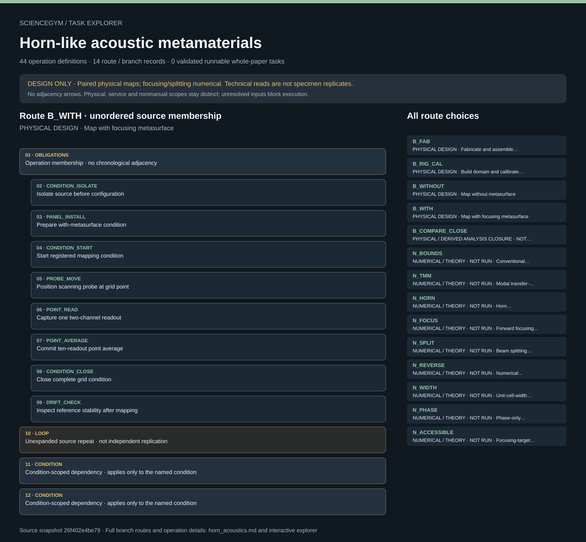

# Horn-like acoustic metamaterials: task route map



Paper: **Horn-like space-coiling metamaterials toward simultaneous phase and amplitude modulation** · [DOI](https://doi.org/10.1038/s41467-018-03839-z)

Author/evaluator design reference only; not an actor projection, task runner, solver, physical simulation or execution receipt. Missing inputs stay blocked. Physical acquisition, device-owned services, derived analysis and numerical reference scope remain distinct. Horn physical prerequisites, both matched map conditions and physical/derived closure remain separate. 190 positions and ten technical readouts per position do not supply independent specimen replication. No numerical branch earns physical campaign credit.. Counts describe task representation, not experiments or success.

**Reading rule:** rows retain the source display structure only. Membership has no inferred chronology. Where the source supplies a typed body, one unexpanded template is shown; no condition, trial or specimen count is inferred. An unordered obligation group has no inferred chronological edges. Source-reported scientific facts and authored handling are distinct.

[Immutable source task package](https://github.com/openags/ScienceGym/blob/26f402e4be797a91edce8253e4ed45bed6e01e7c/tasks/horn_acoustics_operations_v2/) · [Interactive inspector](../index.html)

## B_FAB — PHYSICAL DESIGN · Fabricate and assemble focusing panel

Author/evaluator design reference only; not an actor projection, task runner, solver, physical simulation or execution receipt. Missing inputs stay blocked. Physical acquisition, device-owned services, derived analysis and numerical reference scope remain distinct. Horn physical prerequisites, both matched map conditions and physical/derived closure remain separate. 190 positions and ten technical readouts per position do not supply independent specimen replication. No numerical branch earns physical campaign credit. Operation lists are unordered membership. Only declared causal, condition and phase constraints impose order. Symbolic loops preserve their exact scope without expanding counts or inventing specimen, transfer or execution instances.

[Exact route source](https://github.com/openags/ScienceGym/blob/26f402e4be797a91edce8253e4ed45bed6e01e7c/tasks/horn_acoustics_operations_v2/branches.json) · JSON pointer: `/branches/0`

- **OBLIGATIONS: Operation membership · no chronological adjacency**
  - Binding: {"order":"Only declared prerequisites and qualified occurrence scopes constrain order; display adjacency is not an edge."}
  - `PLAN` Bind campaign and qualification cards
  - `STOCK` Retrieve ABS and identified tools
  - `CARRIER` Prepare supported specimen carrier
  - `MOVE` Transport retained objects between stations
  - `PRINT_LOAD` Load printer materials and fixture
  - `PRINT_START` Start qualified fabrication job
  - `PRINT_PROCESS` Fabricate and cool printed parts
  - `PRINT_UNLOAD` Unload identified printed parts
  - `POSTPROCESS` Clear support and inspect channels
  - `METROLOGY` Measure printed geometry
  - `PANEL_ASSEMBLE` Assemble focusing design membership
  - `PANEL_INSPECT` Inspect versioned focusing panel
- **LOOP: Unexpanded source repeat · not independent replication**
  - Binding: {"source_file":"branches.json","source_pointer":"/branches/0/loops/0","source_contract":"Print-job manifest, finite and qualified; physical part count is not inferred from 30 cells"}
- **CONDITION: Condition-scoped dependency · applies only to the named condition**
  - Binding: {"source_file":"dependencies.json","source_pointer":"/condition_scoped_edges/0","source_contract":{"condition":"without","before":"PANEL_ABSENT","after":"CONDITION_START"}}
- **CONDITION: Condition-scoped dependency · applies only to the named condition**
  - Binding: {"source_file":"dependencies.json","source_pointer":"/condition_scoped_edges/1","source_contract":{"condition":"with","before":"PANEL_INSTALL","after":"CONDITION_START"}}

<details><summary>Branch state, choices, lineage and loop obligations</summary>

```json
{
  "id": "B_FAB",
  "title": "Fabricate and assemble focusing panel",
  "kind": "physical_prerequisite",
  "operation_ids": [
    "PLAN",
    "STOCK",
    "CARRIER",
    "MOVE",
    "PRINT_LOAD",
    "PRINT_START",
    "PRINT_PROCESS",
    "PRINT_UNLOAD",
    "POSTPROCESS",
    "METROLOGY",
    "PANEL_ASSEMBLE",
    "PANEL_INSPECT"
  ],
  "evidence_ids": [
    "E_DESIGN",
    "E_FAB"
  ],
  "loops": [
    "Print-job manifest, finite and qualified; physical part count is not inferred from 30 cells"
  ]
}
```

</details>

## B_RIG_CAL — PHYSICAL DESIGN · Build domain and calibrate microphones

Author/evaluator design reference only; not an actor projection, task runner, solver, physical simulation or execution receipt. Missing inputs stay blocked. Physical acquisition, device-owned services, derived analysis and numerical reference scope remain distinct. Horn physical prerequisites, both matched map conditions and physical/derived closure remain separate. 190 positions and ten technical readouts per position do not supply independent specimen replication. No numerical branch earns physical campaign credit. Operation lists are unordered membership. Only declared causal, condition and phase constraints impose order. Symbolic loops preserve their exact scope without expanding counts or inventing specimen, transfer or execution instances.

[Exact route source](https://github.com/openags/ScienceGym/blob/26f402e4be797a91edce8253e4ed45bed6e01e7c/tasks/horn_acoustics_operations_v2/branches.json) · JSON pointer: `/branches/1`

- **OBLIGATIONS: Operation membership · no chronological adjacency**
  - Binding: {"order":"Only declared prerequisites and qualified occurrence scopes constrain order; display adjacency is not an edge."}
  - `BOARD_RETRIEVE` Retrieve supported domain sheets
  - `BASE_PLACE` Seat lower plywood sheet
  - `SPACERS_PLACE` Fit gap supports and boundaries
  - `SOURCE_MOUNT` Mount localized acoustic source
  - `TOP_PLACE` Close two-dimensional domain
  - `DOMAIN_INSPECT` Verify acoustic domain configuration
  - `MIC_RETRIEVE` Retrieve and identify two microphones
  - `CAL_MOUNT` Mount microphone for calibration
  - `CAL_ACQUIRE` Acquire calibration observations
  - `CAL_RELEASE` Validate calibration and unload probe
  - `REF_MOUNT` Mount fixed reference microphone
  - `PROBE_MOUNT` Mount movable microphone
  - `GRID_REGISTER` Register 190 measurement locations
  - `DAQ_CONNECT` Connect and verify signal chain
  - `SOURCE_SET` Configure safe one-kilohertz excitation
- **LOOP: Unexpanded source repeat · not independent replication**
  - Binding: {"source_file":"branches.json","source_pointer":"/branches/1/loops/0","source_contract":"CAL_MOUNT, CAL_ACQUIRE and CAL_RELEASE once per identified microphone; two microphones required"}
- **CONDITION: Condition-scoped dependency · applies only to the named condition**
  - Binding: {"source_file":"dependencies.json","source_pointer":"/condition_scoped_edges/0","source_contract":{"condition":"without","before":"PANEL_ABSENT","after":"CONDITION_START"}}
- **CONDITION: Condition-scoped dependency · applies only to the named condition**
  - Binding: {"source_file":"dependencies.json","source_pointer":"/condition_scoped_edges/1","source_contract":{"condition":"with","before":"PANEL_INSTALL","after":"CONDITION_START"}}

<details><summary>Branch state, choices, lineage and loop obligations</summary>

```json
{
  "id": "B_RIG_CAL",
  "title": "Build domain and calibrate microphones",
  "kind": "physical_prerequisite",
  "operation_ids": [
    "BOARD_RETRIEVE",
    "BASE_PLACE",
    "SPACERS_PLACE",
    "SOURCE_MOUNT",
    "TOP_PLACE",
    "DOMAIN_INSPECT",
    "MIC_RETRIEVE",
    "CAL_MOUNT",
    "CAL_ACQUIRE",
    "CAL_RELEASE",
    "REF_MOUNT",
    "PROBE_MOUNT",
    "GRID_REGISTER",
    "DAQ_CONNECT",
    "SOURCE_SET"
  ],
  "evidence_ids": [
    "E_RIG",
    "E_SCAN"
  ],
  "loops": [
    "CAL_MOUNT, CAL_ACQUIRE and CAL_RELEASE once per identified microphone; two microphones required"
  ]
}
```

</details>

## B_WITHOUT — PHYSICAL DESIGN · Map without metasurface

Author/evaluator design reference only; not an actor projection, task runner, solver, physical simulation or execution receipt. Missing inputs stay blocked. Physical acquisition, device-owned services, derived analysis and numerical reference scope remain distinct. Horn physical prerequisites, both matched map conditions and physical/derived closure remain separate. 190 positions and ten technical readouts per position do not supply independent specimen replication. No numerical branch earns physical campaign credit. Operation lists are unordered membership. Only declared causal, condition and phase constraints impose order. Symbolic loops preserve their exact scope without expanding counts or inventing specimen, transfer or execution instances.

[Exact route source](https://github.com/openags/ScienceGym/blob/26f402e4be797a91edce8253e4ed45bed6e01e7c/tasks/horn_acoustics_operations_v2/branches.json) · JSON pointer: `/branches/2`

- **OBLIGATIONS: Operation membership · no chronological adjacency**
  - Binding: {"order":"Only declared prerequisites and qualified occurrence scopes constrain order; display adjacency is not an edge."}
  - `CONDITION_ISOLATE` Isolate source before configuration
  - `PANEL_ABSENT` Prepare without-metasurface condition
  - `CONDITION_START` Start registered mapping condition
  - `PROBE_MOVE` Position scanning probe at grid point
  - `POINT_READ` Capture one two-channel readout
  - `POINT_AVERAGE` Commit ten-readout point average
  - `CONDITION_CLOSE` Close complete grid condition
  - `DRIFT_CHECK` Inspect reference stability after mapping
- **LOOP: Unexpanded source repeat · not independent replication**
  - Binding: {"source_file":"branches.json","source_pointer":"/branches/2/loops/0","source_contract":"190 unique grid positions; ten valid technical-readout slots at each position"}
- **CONDITION: Condition-scoped dependency · applies only to the named condition**
  - Binding: {"source_file":"dependencies.json","source_pointer":"/condition_scoped_edges/0","source_contract":{"condition":"without","before":"PANEL_ABSENT","after":"CONDITION_START"}}
- **CONDITION: Condition-scoped dependency · applies only to the named condition**
  - Binding: {"source_file":"dependencies.json","source_pointer":"/condition_scoped_edges/1","source_contract":{"condition":"with","before":"PANEL_INSTALL","after":"CONDITION_START"}}

<details><summary>Branch state, choices, lineage and loop obligations</summary>

```json
{
  "id": "B_WITHOUT",
  "title": "Map without metasurface",
  "kind": "physical_measurement",
  "operation_ids": [
    "CONDITION_ISOLATE",
    "PANEL_ABSENT",
    "CONDITION_START",
    "PROBE_MOVE",
    "POINT_READ",
    "POINT_AVERAGE",
    "CONDITION_CLOSE",
    "DRIFT_CHECK"
  ],
  "evidence_ids": [
    "E_PHYSICAL",
    "E_SCAN"
  ],
  "loops": [
    "190 unique grid positions; ten valid technical-readout slots at each position"
  ]
}
```

</details>

## B_WITH — PHYSICAL DESIGN · Map with focusing metasurface

Author/evaluator design reference only; not an actor projection, task runner, solver, physical simulation or execution receipt. Missing inputs stay blocked. Physical acquisition, device-owned services, derived analysis and numerical reference scope remain distinct. Horn physical prerequisites, both matched map conditions and physical/derived closure remain separate. 190 positions and ten technical readouts per position do not supply independent specimen replication. No numerical branch earns physical campaign credit. Operation lists are unordered membership. Only declared causal, condition and phase constraints impose order. Symbolic loops preserve their exact scope without expanding counts or inventing specimen, transfer or execution instances.

[Exact route source](https://github.com/openags/ScienceGym/blob/26f402e4be797a91edce8253e4ed45bed6e01e7c/tasks/horn_acoustics_operations_v2/branches.json) · JSON pointer: `/branches/3`

- **OBLIGATIONS: Operation membership · no chronological adjacency**
  - Binding: {"order":"Only declared prerequisites and qualified occurrence scopes constrain order; display adjacency is not an edge."}
  - `CONDITION_ISOLATE` Isolate source before configuration
  - `PANEL_INSTALL` Prepare with-metasurface condition
  - `CONDITION_START` Start registered mapping condition
  - `PROBE_MOVE` Position scanning probe at grid point
  - `POINT_READ` Capture one two-channel readout
  - `POINT_AVERAGE` Commit ten-readout point average
  - `CONDITION_CLOSE` Close complete grid condition
  - `DRIFT_CHECK` Inspect reference stability after mapping
- **LOOP: Unexpanded source repeat · not independent replication**
  - Binding: {"source_file":"branches.json","source_pointer":"/branches/3/loops/0","source_contract":"190 unique grid positions; ten valid technical-readout slots at each position"}
- **CONDITION: Condition-scoped dependency · applies only to the named condition**
  - Binding: {"source_file":"dependencies.json","source_pointer":"/condition_scoped_edges/0","source_contract":{"condition":"without","before":"PANEL_ABSENT","after":"CONDITION_START"}}
- **CONDITION: Condition-scoped dependency · applies only to the named condition**
  - Binding: {"source_file":"dependencies.json","source_pointer":"/condition_scoped_edges/1","source_contract":{"condition":"with","before":"PANEL_INSTALL","after":"CONDITION_START"}}

<details><summary>Branch state, choices, lineage and loop obligations</summary>

```json
{
  "id": "B_WITH",
  "title": "Map with focusing metasurface",
  "kind": "physical_measurement",
  "operation_ids": [
    "CONDITION_ISOLATE",
    "PANEL_INSTALL",
    "CONDITION_START",
    "PROBE_MOVE",
    "POINT_READ",
    "POINT_AVERAGE",
    "CONDITION_CLOSE",
    "DRIFT_CHECK"
  ],
  "evidence_ids": [
    "E_PHYSICAL",
    "E_SCAN"
  ],
  "loops": [
    "190 unique grid positions; ten valid technical-readout slots at each position"
  ]
}
```

</details>

## B_COMPARE_CLOSE — PHYSICAL / DERIVED ANALYSIS CLOSURE · NOT EXECUTED · Compare fields and restore stations

Author/evaluator design reference only; not an actor projection, task runner, solver, physical simulation or execution receipt. Missing inputs stay blocked. Physical acquisition, device-owned services, derived analysis and numerical reference scope remain distinct. Horn physical prerequisites, both matched map conditions and physical/derived closure remain separate. 190 positions and ten technical readouts per position do not supply independent specimen replication. No numerical branch earns physical campaign credit. Operation lists are unordered membership. Only declared causal, condition and phase constraints impose order. Symbolic loops preserve their exact scope without expanding counts or inventing specimen, transfer or execution instances.

[Exact route source](https://github.com/openags/ScienceGym/blob/26f402e4be797a91edce8253e4ed45bed6e01e7c/tasks/horn_acoustics_operations_v2/branches.json) · JSON pointer: `/branches/4`

- **OBLIGATIONS: Operation membership · no chronological adjacency**
  - Binding: {"order":"Only declared prerequisites and qualified occurrence scopes constrain order; display adjacency is not an edge."}
  - `PAIR_CHECK` Verify matched experimental conditions
  - `NORMALIZE` Derive versioned normalized fields
  - `INTERPOLATE` Create display-only spline fields
  - `ARCHIVE` Archive campaign evidence and outcome
  - `SHUTDOWN` Isolate instrumentation and park probe
  - `PANEL_RETURN` Remove and store versioned panel
  - `MIC_RETURN` Disconnect and store calibrated probes
  - `CLEAN` Restore fabrication and measurement stations
- **CONDITION: Condition-scoped dependency · applies only to the named condition**
  - Binding: {"source_file":"dependencies.json","source_pointer":"/condition_scoped_edges/0","source_contract":{"condition":"without","before":"PANEL_ABSENT","after":"CONDITION_START"}}
- **CONDITION: Condition-scoped dependency · applies only to the named condition**
  - Binding: {"source_file":"dependencies.json","source_pointer":"/condition_scoped_edges/1","source_contract":{"condition":"with","before":"PANEL_INSTALL","after":"CONDITION_START"}}

<details><summary>Branch state, choices, lineage and loop obligations</summary>

```json
{
  "id": "B_COMPARE_CLOSE",
  "title": "Compare fields and restore stations",
  "kind": "physical_and_analysis_closure",
  "operation_ids": [
    "PAIR_CHECK",
    "NORMALIZE",
    "INTERPOLATE",
    "ARCHIVE",
    "SHUTDOWN",
    "PANEL_RETURN",
    "MIC_RETURN",
    "CLEAN"
  ],
  "evidence_ids": [
    "E_PHYSICAL",
    "E_ANALYSIS"
  ],
  "loops": []
}
```

</details>

## N_BOUNDS — NUMERICAL / THEORY · NOT RUN · Conventional transmission and impedance bounds

Author/evaluator design reference only; not an actor projection, task runner, solver, physical simulation or execution receipt. Missing inputs stay blocked. Physical acquisition, device-owned services, derived analysis and numerical reference scope remain distinct. Horn physical prerequisites, both matched map conditions and physical/derived closure remain separate. 190 positions and ten technical readouts per position do not supply independent specimen replication. No numerical branch earns physical campaign credit. Operation lists are unordered membership. Only declared causal, condition and phase constraints impose order. Symbolic loops preserve their exact scope without expanding counts or inventing specimen, transfer or execution instances.

[Exact route source](https://github.com/openags/ScienceGym/blob/26f402e4be797a91edce8253e4ed45bed6e01e7c/tasks/horn_acoustics_operations_v2/branches.json) · JSON pointer: `/branches/5`

- **CONDITION: Source numerical disposition · no physical operations or measurements**
  - Binding: {"source_file":"branches.json","source_pointer":"/branches/5","source_contract":{"id":"N_BOUNDS","title":"Conventional transmission and impedance bounds","kind":"theory_or_numerical_only","operation_ids":[],"evidence_ids":["E_CONTEXT"],"execution":"Not run; does not count toward physical campaign completion"}}

<details><summary>Branch state, choices, lineage and loop obligations</summary>

```json
{
  "id": "N_BOUNDS",
  "title": "Conventional transmission and impedance bounds",
  "kind": "theory_or_numerical_only",
  "operation_ids": [],
  "evidence_ids": [
    "E_CONTEXT"
  ],
  "execution": "Not run; does not count toward physical campaign completion"
}
```

</details>

## N_TMM — NUMERICAL / THEORY · NOT RUN · Modal transfer-matrix comparison

Author/evaluator design reference only; not an actor projection, task runner, solver, physical simulation or execution receipt. Missing inputs stay blocked. Physical acquisition, device-owned services, derived analysis and numerical reference scope remain distinct. Horn physical prerequisites, both matched map conditions and physical/derived closure remain separate. 190 positions and ten technical readouts per position do not supply independent specimen replication. No numerical branch earns physical campaign credit. Operation lists are unordered membership. Only declared causal, condition and phase constraints impose order. Symbolic loops preserve their exact scope without expanding counts or inventing specimen, transfer or execution instances.

[Exact route source](https://github.com/openags/ScienceGym/blob/26f402e4be797a91edce8253e4ed45bed6e01e7c/tasks/horn_acoustics_operations_v2/branches.json) · JSON pointer: `/branches/6`

- **CONDITION: Source numerical disposition · no physical operations or measurements**
  - Binding: {"source_file":"branches.json","source_pointer":"/branches/6","source_contract":{"id":"N_TMM","title":"Modal transfer-matrix comparison","kind":"theory_or_numerical_only","operation_ids":[],"evidence_ids":["E_TMM"],"execution":"Not run; does not count toward physical campaign completion"}}

<details><summary>Branch state, choices, lineage and loop obligations</summary>

```json
{
  "id": "N_TMM",
  "title": "Modal transfer-matrix comparison",
  "kind": "theory_or_numerical_only",
  "operation_ids": [],
  "evidence_ids": [
    "E_TMM"
  ],
  "execution": "Not run; does not count toward physical campaign completion"
}
```

</details>

## N_HORN — NUMERICAL / THEORY · NOT RUN · Horn approximation and geometry sweep

Author/evaluator design reference only; not an actor projection, task runner, solver, physical simulation or execution receipt. Missing inputs stay blocked. Physical acquisition, device-owned services, derived analysis and numerical reference scope remain distinct. Horn physical prerequisites, both matched map conditions and physical/derived closure remain separate. 190 positions and ten technical readouts per position do not supply independent specimen replication. No numerical branch earns physical campaign credit. Operation lists are unordered membership. Only declared causal, condition and phase constraints impose order. Symbolic loops preserve their exact scope without expanding counts or inventing specimen, transfer or execution instances.

[Exact route source](https://github.com/openags/ScienceGym/blob/26f402e4be797a91edce8253e4ed45bed6e01e7c/tasks/horn_acoustics_operations_v2/branches.json) · JSON pointer: `/branches/7`

- **CONDITION: Source numerical disposition · no physical operations or measurements**
  - Binding: {"source_file":"branches.json","source_pointer":"/branches/7","source_contract":{"id":"N_HORN","title":"Horn approximation and geometry sweep","kind":"theory_or_numerical_only","operation_ids":[],"evidence_ids":["E_HORN"],"execution":"Not run; does not count toward physical campaign completion"}}

<details><summary>Branch state, choices, lineage and loop obligations</summary>

```json
{
  "id": "N_HORN",
  "title": "Horn approximation and geometry sweep",
  "kind": "theory_or_numerical_only",
  "operation_ids": [],
  "evidence_ids": [
    "E_HORN"
  ],
  "execution": "Not run; does not count toward physical campaign completion"
}
```

</details>

## N_FOCUS — NUMERICAL / THEORY · NOT RUN · Forward focusing lossy and lossless

Author/evaluator design reference only; not an actor projection, task runner, solver, physical simulation or execution receipt. Missing inputs stay blocked. Physical acquisition, device-owned services, derived analysis and numerical reference scope remain distinct. Horn physical prerequisites, both matched map conditions and physical/derived closure remain separate. 190 positions and ten technical readouts per position do not supply independent specimen replication. No numerical branch earns physical campaign credit. Operation lists are unordered membership. Only declared causal, condition and phase constraints impose order. Symbolic loops preserve their exact scope without expanding counts or inventing specimen, transfer or execution instances.

[Exact route source](https://github.com/openags/ScienceGym/blob/26f402e4be797a91edce8253e4ed45bed6e01e7c/tasks/horn_acoustics_operations_v2/branches.json) · JSON pointer: `/branches/8`

- **CONDITION: Source numerical disposition · no physical operations or measurements**
  - Binding: {"source_file":"branches.json","source_pointer":"/branches/8","source_contract":{"id":"N_FOCUS","title":"Forward focusing lossy and lossless","kind":"theory_or_numerical_only","operation_ids":[],"evidence_ids":["E_FOCUS","E_NUMERICS"],"execution":"Not run; does not count toward physical campaign completion"}}

<details><summary>Branch state, choices, lineage and loop obligations</summary>

```json
{
  "id": "N_FOCUS",
  "title": "Forward focusing lossy and lossless",
  "kind": "theory_or_numerical_only",
  "operation_ids": [],
  "evidence_ids": [
    "E_FOCUS",
    "E_NUMERICS"
  ],
  "execution": "Not run; does not count toward physical campaign completion"
}
```

</details>

## N_SPLIT — NUMERICAL / THEORY · NOT RUN · Beam splitting lossy and lossless

Author/evaluator design reference only; not an actor projection, task runner, solver, physical simulation or execution receipt. Missing inputs stay blocked. Physical acquisition, device-owned services, derived analysis and numerical reference scope remain distinct. Horn physical prerequisites, both matched map conditions and physical/derived closure remain separate. 190 positions and ten technical readouts per position do not supply independent specimen replication. No numerical branch earns physical campaign credit. Operation lists are unordered membership. Only declared causal, condition and phase constraints impose order. Symbolic loops preserve their exact scope without expanding counts or inventing specimen, transfer or execution instances.

[Exact route source](https://github.com/openags/ScienceGym/blob/26f402e4be797a91edce8253e4ed45bed6e01e7c/tasks/horn_acoustics_operations_v2/branches.json) · JSON pointer: `/branches/9`

- **CONDITION: Source numerical disposition · no physical operations or measurements**
  - Binding: {"source_file":"branches.json","source_pointer":"/branches/9","source_contract":{"id":"N_SPLIT","title":"Beam splitting lossy and lossless","kind":"theory_or_numerical_only","operation_ids":[],"evidence_ids":["E_SPLIT","E_NUMERICS"],"execution":"Not run; does not count toward physical campaign completion"}}

<details><summary>Branch state, choices, lineage and loop obligations</summary>

```json
{
  "id": "N_SPLIT",
  "title": "Beam splitting lossy and lossless",
  "kind": "theory_or_numerical_only",
  "operation_ids": [],
  "evidence_ids": [
    "E_SPLIT",
    "E_NUMERICS"
  ],
  "execution": "Not run; does not count toward physical campaign completion"
}
```

</details>

## N_REVERSE — NUMERICAL / THEORY · NOT RUN · Numerical reverse-focusing comparison

Author/evaluator design reference only; not an actor projection, task runner, solver, physical simulation or execution receipt. Missing inputs stay blocked. Physical acquisition, device-owned services, derived analysis and numerical reference scope remain distinct. Horn physical prerequisites, both matched map conditions and physical/derived closure remain separate. 190 positions and ten technical readouts per position do not supply independent specimen replication. No numerical branch earns physical campaign credit. Operation lists are unordered membership. Only declared causal, condition and phase constraints impose order. Symbolic loops preserve their exact scope without expanding counts or inventing specimen, transfer or execution instances.

[Exact route source](https://github.com/openags/ScienceGym/blob/26f402e4be797a91edce8253e4ed45bed6e01e7c/tasks/horn_acoustics_operations_v2/branches.json) · JSON pointer: `/branches/10`

- **CONDITION: Source numerical disposition · no physical operations or measurements**
  - Binding: {"source_file":"branches.json","source_pointer":"/branches/10","source_contract":{"id":"N_REVERSE","title":"Numerical reverse-focusing comparison","kind":"theory_or_numerical_only","operation_ids":[],"evidence_ids":["E_REVERSE_SIM","E_NUMERICS"],"execution":"Not run; does not count toward physical campaign completion"}}

<details><summary>Branch state, choices, lineage and loop obligations</summary>

```json
{
  "id": "N_REVERSE",
  "title": "Numerical reverse-focusing comparison",
  "kind": "theory_or_numerical_only",
  "operation_ids": [],
  "evidence_ids": [
    "E_REVERSE_SIM",
    "E_NUMERICS"
  ],
  "execution": "Not run; does not count toward physical campaign completion"
}
```

</details>

## N_WIDTH — NUMERICAL / THEORY · NOT RUN · Unit-cell-width sensitivity

Author/evaluator design reference only; not an actor projection, task runner, solver, physical simulation or execution receipt. Missing inputs stay blocked. Physical acquisition, device-owned services, derived analysis and numerical reference scope remain distinct. Horn physical prerequisites, both matched map conditions and physical/derived closure remain separate. 190 positions and ten technical readouts per position do not supply independent specimen replication. No numerical branch earns physical campaign credit. Operation lists are unordered membership. Only declared causal, condition and phase constraints impose order. Symbolic loops preserve their exact scope without expanding counts or inventing specimen, transfer or execution instances.

[Exact route source](https://github.com/openags/ScienceGym/blob/26f402e4be797a91edce8253e4ed45bed6e01e7c/tasks/horn_acoustics_operations_v2/branches.json) · JSON pointer: `/branches/11`

- **CONDITION: Source numerical disposition · no physical operations or measurements**
  - Binding: {"source_file":"branches.json","source_pointer":"/branches/11","source_contract":{"id":"N_WIDTH","title":"Unit-cell-width sensitivity","kind":"theory_or_numerical_only","operation_ids":[],"evidence_ids":["E_WIDTH"],"execution":"Not run; does not count toward physical campaign completion"}}

<details><summary>Branch state, choices, lineage and loop obligations</summary>

```json
{
  "id": "N_WIDTH",
  "title": "Unit-cell-width sensitivity",
  "kind": "theory_or_numerical_only",
  "operation_ids": [],
  "evidence_ids": [
    "E_WIDTH"
  ],
  "execution": "Not run; does not count toward physical campaign completion"
}
```

</details>

## N_PHASE — NUMERICAL / THEORY · NOT RUN · Phase-only versus phase-amplitude comparison

Author/evaluator design reference only; not an actor projection, task runner, solver, physical simulation or execution receipt. Missing inputs stay blocked. Physical acquisition, device-owned services, derived analysis and numerical reference scope remain distinct. Horn physical prerequisites, both matched map conditions and physical/derived closure remain separate. 190 positions and ten technical readouts per position do not supply independent specimen replication. No numerical branch earns physical campaign credit. Operation lists are unordered membership. Only declared causal, condition and phase constraints impose order. Symbolic loops preserve their exact scope without expanding counts or inventing specimen, transfer or execution instances.

[Exact route source](https://github.com/openags/ScienceGym/blob/26f402e4be797a91edce8253e4ed45bed6e01e7c/tasks/horn_acoustics_operations_v2/branches.json) · JSON pointer: `/branches/12`

- **CONDITION: Source numerical disposition · no physical operations or measurements**
  - Binding: {"source_file":"branches.json","source_pointer":"/branches/12","source_contract":{"id":"N_PHASE","title":"Phase-only versus phase-amplitude comparison","kind":"theory_or_numerical_only","operation_ids":[],"evidence_ids":["E_PHASE"],"execution":"Not run; does not count toward physical campaign completion"}}

<details><summary>Branch state, choices, lineage and loop obligations</summary>

```json
{
  "id": "N_PHASE",
  "title": "Phase-only versus phase-amplitude comparison",
  "kind": "theory_or_numerical_only",
  "operation_ids": [],
  "evidence_ids": [
    "E_PHASE"
  ],
  "execution": "Not run; does not count toward physical campaign completion"
}
```

</details>

## N_ACCESSIBLE — NUMERICAL / THEORY · NOT RUN · Focusing-target accessibility comparison

Author/evaluator design reference only; not an actor projection, task runner, solver, physical simulation or execution receipt. Missing inputs stay blocked. Physical acquisition, device-owned services, derived analysis and numerical reference scope remain distinct. Horn physical prerequisites, both matched map conditions and physical/derived closure remain separate. 190 positions and ten technical readouts per position do not supply independent specimen replication. No numerical branch earns physical campaign credit. Operation lists are unordered membership. Only declared causal, condition and phase constraints impose order. Symbolic loops preserve their exact scope without expanding counts or inventing specimen, transfer or execution instances.

[Exact route source](https://github.com/openags/ScienceGym/blob/26f402e4be797a91edce8253e4ed45bed6e01e7c/tasks/horn_acoustics_operations_v2/branches.json) · JSON pointer: `/branches/13`

- **CONDITION: Source numerical disposition · no physical operations or measurements**
  - Binding: {"source_file":"branches.json","source_pointer":"/branches/13","source_contract":{"id":"N_ACCESSIBLE","title":"Focusing-target accessibility comparison","kind":"theory_or_numerical_only","operation_ids":[],"evidence_ids":["E_ACCESSIBLE"],"execution":"Not run; does not count toward physical campaign completion"}}

<details><summary>Branch state, choices, lineage and loop obligations</summary>

```json
{
  "id": "N_ACCESSIBLE",
  "title": "Focusing-target accessibility comparison",
  "kind": "theory_or_numerical_only",
  "operation_ids": [],
  "evidence_ids": [
    "E_ACCESSIBLE"
  ],
  "execution": "Not run; does not count toward physical campaign completion"
}
```

</details>

## Operation contracts

Every operation is clickable in the offline inspector, with robot actions, target objects, pre/post state, provenance, unknowns and acceptance/recovery. Raw task JSON is the source of truth; this visualization is a public evaluator/reference view, not an agent prompt.

## Reference contracts and boundaries

Representation counts: {"physical_records": 5, "numerical_records": 9, "unresolved_input_groups": 17, "control_records": 3, "symbolic_loop_contracts": 4}.

Horn physical prerequisites, both matched map conditions and physical/derived closure remain separate. 190 positions and ten technical readouts per position do not supply independent specimen replication. No numerical branch earns physical campaign credit.

Every source JSON document, operation field, branch record, dependency, unknown gate, control, conditional postcondition, custody rule and access audit is retained. Lists remain membership; global loop catalogs apply only to their stated scopes. No empty loop, source inventory, truth-table case, technical readout or cycle is silently promoted to an independent specimen or completed experiment.

ReMM remains source-incomplete with main panels and movie contents uninspected. Cold-shape hazardous processes remain inside qualified closed services; robot interface actions and autonomous service/analysis ownership remain distinct. Its two derived-fit navigation views retain the original numerical_or_analytical_only source classification and are not additional branches or independent validation.

Horn physical/derived closure retains matched-map parents and physical cleanup. Numerical focusing and beam splitting never become physical acquisition. These projections implement no actor loader, physical simulation, trusted event backend, new scene or robot execution.

- [EXPORT_ALLOWLIST.json](https://github.com/openags/ScienceGym/blob/26f402e4be797a91edce8253e4ed45bed6e01e7c/tasks/horn_acoustics_operations_v2/EXPORT_ALLOWLIST.json)
- [RELEASE_BOUNDARY.json](https://github.com/openags/ScienceGym/blob/26f402e4be797a91edce8253e4ed45bed6e01e7c/tasks/horn_acoustics_operations_v2/RELEASE_BOUNDARY.json)
- [STATUS.json](https://github.com/openags/ScienceGym/blob/26f402e4be797a91edce8253e4ed45bed6e01e7c/tasks/horn_acoustics_operations_v2/STATUS.json)
- [VERIFICATION.json](https://github.com/openags/ScienceGym/blob/26f402e4be797a91edce8253e4ed45bed6e01e7c/tasks/horn_acoustics_operations_v2/VERIFICATION.json)
- [agent_visible.json](https://github.com/openags/ScienceGym/blob/26f402e4be797a91edce8253e4ed45bed6e01e7c/tasks/horn_acoustics_operations_v2/agent_visible.json)
- [asset_needs.json](https://github.com/openags/ScienceGym/blob/26f402e4be797a91edce8253e4ed45bed6e01e7c/tasks/horn_acoustics_operations_v2/asset_needs.json)
- [branches.json](https://github.com/openags/ScienceGym/blob/26f402e4be797a91edce8253e4ed45bed6e01e7c/tasks/horn_acoustics_operations_v2/branches.json)
- [control_packages.json](https://github.com/openags/ScienceGym/blob/26f402e4be797a91edce8253e4ed45bed6e01e7c/tasks/horn_acoustics_operations_v2/control_packages.json)
- [coverage_matrix.json](https://github.com/openags/ScienceGym/blob/26f402e4be797a91edce8253e4ed45bed6e01e7c/tasks/horn_acoustics_operations_v2/coverage_matrix.json)
- [dependencies.json](https://github.com/openags/ScienceGym/blob/26f402e4be797a91edce8253e4ed45bed6e01e7c/tasks/horn_acoustics_operations_v2/dependencies.json)
- [episode_input_contract.json](https://github.com/openags/ScienceGym/blob/26f402e4be797a91edce8253e4ed45bed6e01e7c/tasks/horn_acoustics_operations_v2/episode_input_contract.json)
- [evaluator_reference.json](https://github.com/openags/ScienceGym/blob/26f402e4be797a91edce8253e4ed45bed6e01e7c/tasks/horn_acoustics_operations_v2/evaluator_reference.json)
- [execution_contract.json](https://github.com/openags/ScienceGym/blob/26f402e4be797a91edce8253e4ed45bed6e01e7c/tasks/horn_acoustics_operations_v2/execution_contract.json)
- [geometry_reference.json](https://github.com/openags/ScienceGym/blob/26f402e4be797a91edce8253e4ed45bed6e01e7c/tasks/horn_acoustics_operations_v2/geometry_reference.json)
- [lineage_contract.json](https://github.com/openags/ScienceGym/blob/26f402e4be797a91edce8253e4ed45bed6e01e7c/tasks/horn_acoustics_operations_v2/lineage_contract.json)
- [material_cards.json](https://github.com/openags/ScienceGym/blob/26f402e4be797a91edce8253e4ed45bed6e01e7c/tasks/horn_acoustics_operations_v2/material_cards.json)
- [mock_contract.json](https://github.com/openags/ScienceGym/blob/26f402e4be797a91edce8253e4ed45bed6e01e7c/tasks/horn_acoustics_operations_v2/mock_contract.json)
- [nonmanual_scope.json](https://github.com/openags/ScienceGym/blob/26f402e4be797a91edce8253e4ed45bed6e01e7c/tasks/horn_acoustics_operations_v2/nonmanual_scope.json)
- [operations.json](https://github.com/openags/ScienceGym/blob/26f402e4be797a91edce8253e4ed45bed6e01e7c/tasks/horn_acoustics_operations_v2/operations.json)
- [provenance.json](https://github.com/openags/ScienceGym/blob/26f402e4be797a91edce8253e4ed45bed6e01e7c/tasks/horn_acoustics_operations_v2/provenance.json)
- [review/independent_review.json](https://github.com/openags/ScienceGym/blob/26f402e4be797a91edce8253e4ed45bed6e01e7c/tasks/horn_acoustics_operations_v2/review/independent_review.json)
- [source_access_audit.json](https://github.com/openags/ScienceGym/blob/26f402e4be797a91edce8253e4ed45bed6e01e7c/tasks/horn_acoustics_operations_v2/source_access_audit.json)
- [source_conflicts.json](https://github.com/openags/ScienceGym/blob/26f402e4be797a91edce8253e4ed45bed6e01e7c/tasks/horn_acoustics_operations_v2/source_conflicts.json)
- [source_outcomes.json](https://github.com/openags/ScienceGym/blob/26f402e4be797a91edce8253e4ed45bed6e01e7c/tasks/horn_acoustics_operations_v2/source_outcomes.json)
- [station_contracts.json](https://github.com/openags/ScienceGym/blob/26f402e4be797a91edce8253e4ed45bed6e01e7c/tasks/horn_acoustics_operations_v2/station_contracts.json)
- [tests/validation_report.json](https://github.com/openags/ScienceGym/blob/26f402e4be797a91edce8253e4ed45bed6e01e7c/tasks/horn_acoustics_operations_v2/tests/validation_report.json)
- [transport_routes.json](https://github.com/openags/ScienceGym/blob/26f402e4be797a91edce8253e4ed45bed6e01e7c/tasks/horn_acoustics_operations_v2/transport_routes.json)
- [unknown_parameters.json](https://github.com/openags/ScienceGym/blob/26f402e4be797a91edce8253e4ed45bed6e01e7c/tasks/horn_acoustics_operations_v2/unknown_parameters.json)
