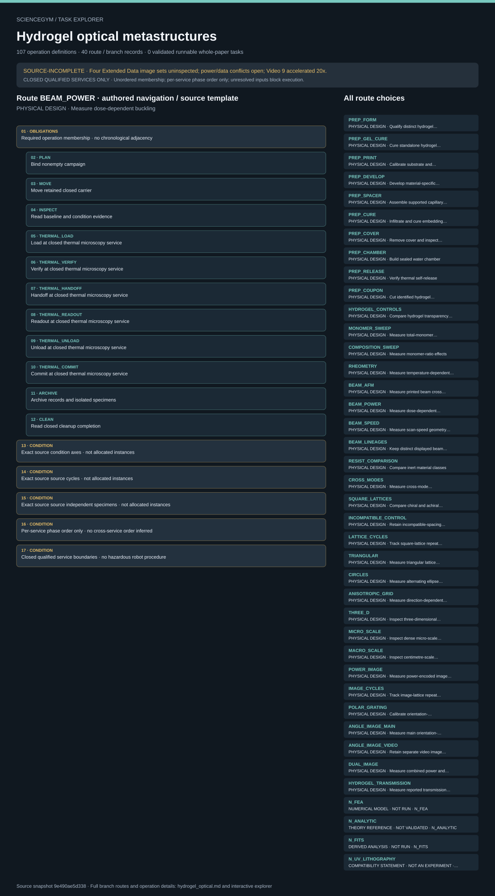

# Hydrogel optical metastructures: task route map



Paper: **Hydrogel muscles powering reconfigurable micro-metastructures with wide-spectrum programmability** · [DOI](https://doi.org/10.1038/s41563-023-01649-3)

Author/evaluator design reference only; not an actor projection, executable procedure, task runner, solver, physical simulation or execution receipt. Authored navigation does not supply source chronology, specimen allocation, qualified inputs or completed services. source_complete_for_entire_paper=false: all four Extended Data image sets remain uninspected; captions are not image inspection. Power/data conflicts, paired-blank missingness and heated Fig. 6f single-constant semantics remain open. Video 9 is accelerated 20 times; sampled frames are not full playback. Chemical, laser, UV and thermal operations remain CLOSED QUALIFIED SERVICES ONLY. A service command or expected optical result is never a safe-release receipt.. Counts describe task representation, not experiments or success.

**Reading rule:** rows are authored navigation over exact source records. Gear recipes preserve source-declared authored order; hydrogel memberships have no adjacency order. Conditions and repeats are not expanded or executed. An unordered obligation group has no inferred chronological edges. Source-reported scientific facts and authored handling are distinct.

[Immutable source task package](https://github.com/openags/ScienceGym/blob/9e490ae5d3380121df7be1c18d4de35aac8508c5/tasks/hydrogel_optical_operations_v2/) · [Interactive inspector](../index.html)

## PREP_FORM — PHYSICAL DESIGN · Qualify distinct hydrogel batches

Author/evaluator design reference only; not an actor projection, executable procedure, task runner, solver, physical simulation or execution receipt. Authored navigation does not supply source chronology, specimen allocation, qualified inputs or completed services. source_complete_for_entire_paper=false: all four Extended Data image sets remain uninspected; captions are not image inspection. Power/data conflicts, paired-blank missingness and heated Fig. 6f single-constant semantics remain open. Video 9 is accelerated 20 times; sampled frames are not full playback. Chemical, laser, UV and thermal operations remain CLOSED QUALIFIED SERVICES ONLY. A service command or expected optical result is never a safe-release receipt. Hydrogel operation lists are unordered membership. Only source branch prerequisites and each service phase order constrain execution; no Cartesian crossing or cross-service chronology is inferred.

[Exact route source](https://github.com/openags/ScienceGym/blob/9e490ae5d3380121df7be1c18d4de35aac8508c5/tasks/hydrogel_optical_operations_v2/branches.json) · JSON pointer: `/branches/0`

- **OBLIGATIONS: Required operation membership · no chronological adjacency**
  - Binding: {"order":"Required membership; each service phase has distinct occurrence binding, condition, cycle and attempt. Branch graph defines prerequisites, not historical author chronology."}
  - `PLAN` Bind nonempty campaign
  - `MOVE` Move retained closed carrier
  - `INSPECT` Read baseline and condition evidence
  - `FORM_LOAD` Load at closed formulation service
  - `FORM_VERIFY` Verify at closed formulation service
  - `FORM_HANDOFF` Handoff at closed formulation service
  - `FORM_READOUT` Readout at closed formulation service
  - `FORM_UNLOAD` Unload at closed formulation service
  - `FORM_COMMIT` Commit at closed formulation service
  - `ARCHIVE` Archive records and isolated specimens
  - `CLEAN` Read closed cleanup completion
- **CONDITION: Exact source condition axes · not allocated instances**
  - Binding: {"source_file":"branches.json","source_pointer":"/branches/0/condition_axes","source_contract":{"material":["PNIPAM","PNIPAM_PVA","LIHAM"]}}
- **CONDITION: Exact source source cycles · not allocated instances**
  - Binding: {"source_file":"branches.json","source_pointer":"/branches/0/source_cycles","source_contract":null}
- **CONDITION: Exact source source independent specimens · not allocated instances**
  - Binding: {"source_file":"branches.json","source_pointer":"/branches/0/source_independent_specimens","source_contract":null}
- **CONDITION: Per-service phase order only · no cross-service order inferred**
  - Binding: {"source_file":"dependencies.json","source_pointer":"/service_phase_order","source_contract":["LOAD","VERIFY","HANDOFF","READOUT","UNLOAD","COMMIT"]}
- **CONDITION: Closed qualified service boundaries · no hazardous robot procedure**
  - Binding: {"source_file":"station_contracts.json","source_pointer":"","source_contract":{"schema_version":"hydrogel_optical_task.v1","doi":"10.1038/s41563-023-01649-3","stations":[{"id":"WS_FORM","title":"Closed formulation service","port_id":"closed_carrier_exchange","frame":null,"implemented":false,"closed_service":true,"service_boundary":"Qualified service owns recipe selection, mixing, batch QC and chemical waste. No recipe quantities or process instructions are encoded.","safe_exchange_readbacks":["service_identity","guard_closed","hazard_isolated","released_to_handle","fixture_identity","payload_identity"],"robot_scope":["move","load","handoff","readout","unload"]},{"id":"WS_GEL_CURE","title":"Closed standalone hydrogel cure service","port_id":"closed_carrier_exchange","frame":null,"implemented":false,"closed_service":true,"service_boundary":"Service performs qualified enclosed UV curing of standalone hydrogel sheets before coupon cutting; cure dose and release acceptance require qualified cards.","safe_exchange_readbacks":["service_identity","guard_closed","hazard_isolated","released_to_handle","fixture_identity","payload_identity"],"robot_scope":["move","load","handoff","readout","unload"]},{"id":"WS_PRINT","title":"Guarded two-photon fabrication service","port_id":"closed_carrier_exchange","frame":null,"implemented":false,"closed_service":true,"service_boundary":"Service verifies calibrated substrate, resist-specific qualified job and dose-map identity; laser motion/exposure remains inaccessible.","safe_exchange_readbacks":["service_identity","guard_closed","hazard_isolated","released_to_handle","fixture_identity","payload_identity"],"robot_scope":["move","load","handoff","readout","unload"]},{"id":"WS_DEVELOP","title":"Closed material-specific development service","port_id":"closed_carrier_exchange","frame":null,"implemented":false,"closed_service":true,"service_boundary":"Service owns solvent handling, wash, drying and waste; use a material-specific development card.","safe_exchange_readbacks":["service_identity","guard_closed","hazard_isolated","released_to_handle","fixture_identity","payload_identity"],"robot_scope":["move","load","handoff","readout","unload"]},{"id":"WS_SPACER","title":"Closed glass and spacer assembly service","port_id":"closed_carrier_exchange","frame":null,"implemented":false,"closed_service":true,"service_boundary":"Service places qualified supported glass and bead spacers and performs enclosed spacer-glue curing.","safe_exchange_readbacks":["service_identity","guard_closed","hazard_isolated","released_to_handle","fixture_identity","payload_identity"],"robot_scope":["move","load","handoff","readout","unload"]},{"id":"WS_CURE","title":"Closed infiltration and UV cure service","port_id":"closed_carrier_exchange","frame":null,"implemented":false,"closed_service":true,"service_boundary":"Service performs capillary infiltration and qualified enclosed cure; wavelength/time alone do not qualify dose.","safe_exchange_readbacks":["service_identity","guard_closed","hazard_isolated","released_to_handle","fixture_identity","payload_identity"],"robot_scope":["move","load","handoff","readout","unload"]},{"id":"WS_COVER","title":"Closed coverslip separation service","port_id":"closed_carrier_exchange","frame":null,"implemented":false,"closed_service":true,"service_boundary":"Service supports composite, separates cover and inspects for tear, detachment and retained debris.","safe_exchange_readbacks":["service_identity","guard_closed","hazard_isolated","released_to_handle","fixture_identity","payload_identity"],"robot_scope":["move","load","handoff","readout","unload"]},{"id":"WS_CHAMBER","title":"Closed water-chamber assembly service","port_id":"closed_carrier_exchange","frame":null,"implemented":false,"closed_service":true,"service_boundary":"Service installs and seals qualified PDMS water observation chamber with contamination and leak checks.","safe_exchange_readbacks":["service_identity","guard_closed","hazard_isolated","released_to_handle","fixture_identity","payload_identity"],"robot_scope":["move","load","handoff","readout","unload"]},{"id":"WS_RELEASE","title":"Closed thermal substrate-release service","port_id":"closed_carrier_exchange","frame":null,"implemented":false,"closed_service":true,"service_boundary":"Service owns thermal program and readback; completion requires optical self-peeling/free-motion evidence, not a setpoint.","safe_exchange_readbacks":["service_identity","guard_closed","hazard_isolated","released_to_handle","fixture_identity","payload_identity"],"robot_scope":["move","load","handoff","readout","unload"]},{"id":"WS_CUT","title":"Guarded hydrogel coupon cutting service","port_id":"closed_carrier_exchange","frame":null,"implemented":false,"closed_service":true,"service_boundary":"Service owns laser cutting, coupon release and geometry inspection with separate child identity.","safe_exchange_readbacks":["service_identity","guard_closed","hazard_isolated","released_to_handle","fixture_identity","payload_identity"],"robot_scope":["move","load","handoff","readout","unload"]},{"id":"WS_THERMAL","title":"Closed thermal microscopy service","port_id":"closed_carrier_exchange","frame":null,"implemented":false,"closed_service":true,"service_boundary":"Service performs qualified bounded thermal schedule and acquires registered temperature/time/image data; physical response is measured, never prescribed.","safe_exchange_readbacks":["service_identity","guard_closed","hazard_isolated","released_to_handle","fixture_identity","payload_identity"],"robot_scope":["move","load","handoff","readout","unload"]},{"id":"WS_AFM","title":"Qualified AFM metrology service","port_id":"closed_carrier_exchange","frame":null,"implemented":false,"closed_service":true,"service_boundary":"Service acquires calibrated beam cross sections; sample contact and safe release remain service-owned.","safe_exchange_readbacks":["service_identity","guard_closed","hazard_isolated","released_to_handle","fixture_identity","payload_identity"],"robot_scope":["move","load","handoff","readout","unload"]},{"id":"WS_SPECTRA","title":"Qualified transmission measurement service","port_id":"closed_carrier_exchange","frame":null,"implemented":false,"closed_service":true,"service_boundary":"Service acquires qualified optical transmission data and matching temperature records.","safe_exchange_readbacks":["service_identity","guard_closed","hazard_isolated","released_to_handle","fixture_identity","payload_identity"],"robot_scope":["move","load","handoff","readout","unload"]},{"id":"WS_RHEO","title":"Qualified rheometry service","port_id":"closed_carrier_exchange","frame":null,"implemented":false,"closed_service":true,"service_boundary":"Service owns contact/thermal loading; allocate separate specimen unless qualified nondestructive reuse is demonstrated.","safe_exchange_readbacks":["service_identity","guard_closed","hazard_isolated","released_to_handle","fixture_identity","payload_identity"],"robot_scope":["move","load","handoff","readout","unload"]},{"id":"WS_SEM","title":"Qualified electron microscopy service","port_id":"closed_carrier_exchange","frame":null,"implemented":false,"closed_service":true,"service_boundary":"Service owns all sample preparation, vacuum and beam operation; compatibility and destructive allocation require explicit cards.","safe_exchange_readbacks":["service_identity","guard_closed","hazard_isolated","released_to_handle","fixture_identity","payload_identity"],"robot_scope":["move","load","handoff","readout","unload"]},{"id":"WS_CONFOCAL","title":"Qualified confocal imaging service","port_id":"closed_carrier_exchange","frame":null,"implemented":false,"closed_service":true,"service_boundary":"Service owns contained imaging; no stain or acquisition recipe is invented.","safe_exchange_readbacks":["service_identity","guard_closed","hazard_isolated","released_to_handle","fixture_identity","payload_identity"],"robot_scope":["move","load","handoff","readout","unload"]},{"id":"WS_POLAR","title":"Qualified polarized optical service","port_id":"closed_carrier_exchange","frame":null,"implemented":false,"closed_service":true,"service_boundary":"Service owns calibrated polarizer/analyzer setup and acquisition; intensity changes require matched illumination/registration controls.","safe_exchange_readbacks":["service_identity","guard_closed","hazard_isolated","released_to_handle","fixture_identity","payload_identity"],"robot_scope":["move","load","handoff","readout","unload"]},{"id":"WS_STOCK","title":"Retained inventory","port_id":"identified_storage_slot","implemented":false,"frame":null,"closed_service":false},{"id":"WS_ARCHIVE","title":"Isolated archival storage","port_id":"identified_storage_slot","implemented":false,"frame":null,"closed_service":false}]}}

<details><summary>Branch state, choices, lineage and loop obligations</summary>

```json
{
  "id": "PREP_FORM",
  "title": "Qualify distinct hydrogel batches",
  "required_branch_ids": [],
  "service_ids": [
    "FORM"
  ],
  "source_evidence_ids": [
    "E_FORM"
  ],
  "condition_axes": {
    "material": [
      "PNIPAM",
      "PNIPAM_PVA",
      "LIHAM"
    ]
  },
  "source_cycles": null,
  "source_independent_specimens": null,
  "extra_unknown_ids": [
    "U_CONFLICT"
  ],
  "classification": "physical_preparation",
  "operation_ids": [
    "PLAN",
    "MOVE",
    "INSPECT",
    "FORM_LOAD",
    "FORM_VERIFY",
    "FORM_HANDOFF",
    "FORM_READOUT",
    "FORM_UNLOAD",
    "FORM_COMMIT",
    "ARCHIVE",
    "CLEAN"
  ],
  "operation_list_semantics": "Required membership; each service phase has distinct occurrence binding, condition, cycle and attempt. Branch graph defines prerequisites, not historical author chronology.",
  "unknown_parameter_ids": [
    "U_ALLOC",
    "U_ANALYSIS",
    "U_CHEM",
    "U_CONFLICT",
    "U_SCENE"
  ],
  "condition_values_are": "Reported comparison labels; qualified instance cards supply executable details. No automatic Cartesian crossing with other branches.",
  "completion": "Every required condition cell, authorized nonempty cycle schedule, prerequisite lineage, service receipt, control record and archive/cleanup record must be validated. Literature resemblance alone earns no completion.",
  "execution_ready": false,
  "destructive_allocation": "No destructive reuse permitted; unknown compatibility requires new sibling or qualified reuse receipt.",
  "expected_results_actor_visible": false
}
```

</details>

## PREP_GEL_CURE — PHYSICAL DESIGN · Cure standalone hydrogel material

Author/evaluator design reference only; not an actor projection, executable procedure, task runner, solver, physical simulation or execution receipt. Authored navigation does not supply source chronology, specimen allocation, qualified inputs or completed services. source_complete_for_entire_paper=false: all four Extended Data image sets remain uninspected; captions are not image inspection. Power/data conflicts, paired-blank missingness and heated Fig. 6f single-constant semantics remain open. Video 9 is accelerated 20 times; sampled frames are not full playback. Chemical, laser, UV and thermal operations remain CLOSED QUALIFIED SERVICES ONLY. A service command or expected optical result is never a safe-release receipt. Hydrogel operation lists are unordered membership. Only source branch prerequisites and each service phase order constrain execution; no Cartesian crossing or cross-service chronology is inferred.

[Exact route source](https://github.com/openags/ScienceGym/blob/9e490ae5d3380121df7be1c18d4de35aac8508c5/tasks/hydrogel_optical_operations_v2/branches.json) · JSON pointer: `/branches/1`

- **OBLIGATIONS: Required operation membership · no chronological adjacency**
  - Binding: {"order":"Required membership; each service phase has distinct occurrence binding, condition, cycle and attempt. Branch graph defines prerequisites, not historical author chronology."}
  - `PLAN` Bind nonempty campaign
  - `MOVE` Move retained closed carrier
  - `INSPECT` Read baseline and condition evidence
  - `GEL_CURE_LOAD` Load at closed standalone hydrogel cure service
  - `GEL_CURE_VERIFY` Verify at closed standalone hydrogel cure service
  - `GEL_CURE_HANDOFF` Handoff at closed standalone hydrogel cure service
  - `GEL_CURE_READOUT` Readout at closed standalone hydrogel cure service
  - `GEL_CURE_UNLOAD` Unload at closed standalone hydrogel cure service
  - `GEL_CURE_COMMIT` Commit at closed standalone hydrogel cure service
  - `ARCHIVE` Archive records and isolated specimens
  - `CLEAN` Read closed cleanup completion
- **CONDITION: Exact source condition axes · not allocated instances**
  - Binding: {"source_file":"branches.json","source_pointer":"/branches/1/condition_axes","source_contract":{"material":["PNIPAM","PNIPAM_PVA","LIHAM"]}}
- **CONDITION: Exact source source cycles · not allocated instances**
  - Binding: {"source_file":"branches.json","source_pointer":"/branches/1/source_cycles","source_contract":null}
- **CONDITION: Exact source source independent specimens · not allocated instances**
  - Binding: {"source_file":"branches.json","source_pointer":"/branches/1/source_independent_specimens","source_contract":null}
- **CONDITION: Per-service phase order only · no cross-service order inferred**
  - Binding: {"source_file":"dependencies.json","source_pointer":"/service_phase_order","source_contract":["LOAD","VERIFY","HANDOFF","READOUT","UNLOAD","COMMIT"]}
- **CONDITION: Closed qualified service boundaries · no hazardous robot procedure**
  - Binding: {"source_file":"station_contracts.json","source_pointer":"","source_contract":{"schema_version":"hydrogel_optical_task.v1","doi":"10.1038/s41563-023-01649-3","stations":[{"id":"WS_FORM","title":"Closed formulation service","port_id":"closed_carrier_exchange","frame":null,"implemented":false,"closed_service":true,"service_boundary":"Qualified service owns recipe selection, mixing, batch QC and chemical waste. No recipe quantities or process instructions are encoded.","safe_exchange_readbacks":["service_identity","guard_closed","hazard_isolated","released_to_handle","fixture_identity","payload_identity"],"robot_scope":["move","load","handoff","readout","unload"]},{"id":"WS_GEL_CURE","title":"Closed standalone hydrogel cure service","port_id":"closed_carrier_exchange","frame":null,"implemented":false,"closed_service":true,"service_boundary":"Service performs qualified enclosed UV curing of standalone hydrogel sheets before coupon cutting; cure dose and release acceptance require qualified cards.","safe_exchange_readbacks":["service_identity","guard_closed","hazard_isolated","released_to_handle","fixture_identity","payload_identity"],"robot_scope":["move","load","handoff","readout","unload"]},{"id":"WS_PRINT","title":"Guarded two-photon fabrication service","port_id":"closed_carrier_exchange","frame":null,"implemented":false,"closed_service":true,"service_boundary":"Service verifies calibrated substrate, resist-specific qualified job and dose-map identity; laser motion/exposure remains inaccessible.","safe_exchange_readbacks":["service_identity","guard_closed","hazard_isolated","released_to_handle","fixture_identity","payload_identity"],"robot_scope":["move","load","handoff","readout","unload"]},{"id":"WS_DEVELOP","title":"Closed material-specific development service","port_id":"closed_carrier_exchange","frame":null,"implemented":false,"closed_service":true,"service_boundary":"Service owns solvent handling, wash, drying and waste; use a material-specific development card.","safe_exchange_readbacks":["service_identity","guard_closed","hazard_isolated","released_to_handle","fixture_identity","payload_identity"],"robot_scope":["move","load","handoff","readout","unload"]},{"id":"WS_SPACER","title":"Closed glass and spacer assembly service","port_id":"closed_carrier_exchange","frame":null,"implemented":false,"closed_service":true,"service_boundary":"Service places qualified supported glass and bead spacers and performs enclosed spacer-glue curing.","safe_exchange_readbacks":["service_identity","guard_closed","hazard_isolated","released_to_handle","fixture_identity","payload_identity"],"robot_scope":["move","load","handoff","readout","unload"]},{"id":"WS_CURE","title":"Closed infiltration and UV cure service","port_id":"closed_carrier_exchange","frame":null,"implemented":false,"closed_service":true,"service_boundary":"Service performs capillary infiltration and qualified enclosed cure; wavelength/time alone do not qualify dose.","safe_exchange_readbacks":["service_identity","guard_closed","hazard_isolated","released_to_handle","fixture_identity","payload_identity"],"robot_scope":["move","load","handoff","readout","unload"]},{"id":"WS_COVER","title":"Closed coverslip separation service","port_id":"closed_carrier_exchange","frame":null,"implemented":false,"closed_service":true,"service_boundary":"Service supports composite, separates cover and inspects for tear, detachment and retained debris.","safe_exchange_readbacks":["service_identity","guard_closed","hazard_isolated","released_to_handle","fixture_identity","payload_identity"],"robot_scope":["move","load","handoff","readout","unload"]},{"id":"WS_CHAMBER","title":"Closed water-chamber assembly service","port_id":"closed_carrier_exchange","frame":null,"implemented":false,"closed_service":true,"service_boundary":"Service installs and seals qualified PDMS water observation chamber with contamination and leak checks.","safe_exchange_readbacks":["service_identity","guard_closed","hazard_isolated","released_to_handle","fixture_identity","payload_identity"],"robot_scope":["move","load","handoff","readout","unload"]},{"id":"WS_RELEASE","title":"Closed thermal substrate-release service","port_id":"closed_carrier_exchange","frame":null,"implemented":false,"closed_service":true,"service_boundary":"Service owns thermal program and readback; completion requires optical self-peeling/free-motion evidence, not a setpoint.","safe_exchange_readbacks":["service_identity","guard_closed","hazard_isolated","released_to_handle","fixture_identity","payload_identity"],"robot_scope":["move","load","handoff","readout","unload"]},{"id":"WS_CUT","title":"Guarded hydrogel coupon cutting service","port_id":"closed_carrier_exchange","frame":null,"implemented":false,"closed_service":true,"service_boundary":"Service owns laser cutting, coupon release and geometry inspection with separate child identity.","safe_exchange_readbacks":["service_identity","guard_closed","hazard_isolated","released_to_handle","fixture_identity","payload_identity"],"robot_scope":["move","load","handoff","readout","unload"]},{"id":"WS_THERMAL","title":"Closed thermal microscopy service","port_id":"closed_carrier_exchange","frame":null,"implemented":false,"closed_service":true,"service_boundary":"Service performs qualified bounded thermal schedule and acquires registered temperature/time/image data; physical response is measured, never prescribed.","safe_exchange_readbacks":["service_identity","guard_closed","hazard_isolated","released_to_handle","fixture_identity","payload_identity"],"robot_scope":["move","load","handoff","readout","unload"]},{"id":"WS_AFM","title":"Qualified AFM metrology service","port_id":"closed_carrier_exchange","frame":null,"implemented":false,"closed_service":true,"service_boundary":"Service acquires calibrated beam cross sections; sample contact and safe release remain service-owned.","safe_exchange_readbacks":["service_identity","guard_closed","hazard_isolated","released_to_handle","fixture_identity","payload_identity"],"robot_scope":["move","load","handoff","readout","unload"]},{"id":"WS_SPECTRA","title":"Qualified transmission measurement service","port_id":"closed_carrier_exchange","frame":null,"implemented":false,"closed_service":true,"service_boundary":"Service acquires qualified optical transmission data and matching temperature records.","safe_exchange_readbacks":["service_identity","guard_closed","hazard_isolated","released_to_handle","fixture_identity","payload_identity"],"robot_scope":["move","load","handoff","readout","unload"]},{"id":"WS_RHEO","title":"Qualified rheometry service","port_id":"closed_carrier_exchange","frame":null,"implemented":false,"closed_service":true,"service_boundary":"Service owns contact/thermal loading; allocate separate specimen unless qualified nondestructive reuse is demonstrated.","safe_exchange_readbacks":["service_identity","guard_closed","hazard_isolated","released_to_handle","fixture_identity","payload_identity"],"robot_scope":["move","load","handoff","readout","unload"]},{"id":"WS_SEM","title":"Qualified electron microscopy service","port_id":"closed_carrier_exchange","frame":null,"implemented":false,"closed_service":true,"service_boundary":"Service owns all sample preparation, vacuum and beam operation; compatibility and destructive allocation require explicit cards.","safe_exchange_readbacks":["service_identity","guard_closed","hazard_isolated","released_to_handle","fixture_identity","payload_identity"],"robot_scope":["move","load","handoff","readout","unload"]},{"id":"WS_CONFOCAL","title":"Qualified confocal imaging service","port_id":"closed_carrier_exchange","frame":null,"implemented":false,"closed_service":true,"service_boundary":"Service owns contained imaging; no stain or acquisition recipe is invented.","safe_exchange_readbacks":["service_identity","guard_closed","hazard_isolated","released_to_handle","fixture_identity","payload_identity"],"robot_scope":["move","load","handoff","readout","unload"]},{"id":"WS_POLAR","title":"Qualified polarized optical service","port_id":"closed_carrier_exchange","frame":null,"implemented":false,"closed_service":true,"service_boundary":"Service owns calibrated polarizer/analyzer setup and acquisition; intensity changes require matched illumination/registration controls.","safe_exchange_readbacks":["service_identity","guard_closed","hazard_isolated","released_to_handle","fixture_identity","payload_identity"],"robot_scope":["move","load","handoff","readout","unload"]},{"id":"WS_STOCK","title":"Retained inventory","port_id":"identified_storage_slot","implemented":false,"frame":null,"closed_service":false},{"id":"WS_ARCHIVE","title":"Isolated archival storage","port_id":"identified_storage_slot","implemented":false,"frame":null,"closed_service":false}]}}

<details><summary>Branch state, choices, lineage and loop obligations</summary>

```json
{
  "id": "PREP_GEL_CURE",
  "title": "Cure standalone hydrogel material",
  "required_branch_ids": [
    "PREP_FORM"
  ],
  "service_ids": [
    "GEL_CURE"
  ],
  "source_evidence_ids": [
    "E_FORM"
  ],
  "condition_axes": {
    "material": [
      "PNIPAM",
      "PNIPAM_PVA",
      "LIHAM"
    ]
  },
  "source_cycles": null,
  "source_independent_specimens": null,
  "extra_unknown_ids": [],
  "classification": "physical_preparation",
  "operation_ids": [
    "PLAN",
    "MOVE",
    "INSPECT",
    "GEL_CURE_LOAD",
    "GEL_CURE_VERIFY",
    "GEL_CURE_HANDOFF",
    "GEL_CURE_READOUT",
    "GEL_CURE_UNLOAD",
    "GEL_CURE_COMMIT",
    "ARCHIVE",
    "CLEAN"
  ],
  "operation_list_semantics": "Required membership; each service phase has distinct occurrence binding, condition, cycle and attempt. Branch graph defines prerequisites, not historical author chronology.",
  "unknown_parameter_ids": [
    "U_ALLOC",
    "U_ANALYSIS",
    "U_CHEM",
    "U_CONFLICT",
    "U_SCENE",
    "U_UV"
  ],
  "condition_values_are": "Reported comparison labels; qualified instance cards supply executable details. No automatic Cartesian crossing with other branches.",
  "completion": "Every required condition cell, authorized nonempty cycle schedule, prerequisite lineage, service receipt, control record and archive/cleanup record must be validated. Literature resemblance alone earns no completion.",
  "execution_ready": false,
  "destructive_allocation": "No destructive reuse permitted; unknown compatibility requires new sibling or qualified reuse receipt.",
  "expected_results_actor_visible": false
}
```

</details>

## PREP_PRINT — PHYSICAL DESIGN · Calibrate substrate and fabricate structures

Author/evaluator design reference only; not an actor projection, executable procedure, task runner, solver, physical simulation or execution receipt. Authored navigation does not supply source chronology, specimen allocation, qualified inputs or completed services. source_complete_for_entire_paper=false: all four Extended Data image sets remain uninspected; captions are not image inspection. Power/data conflicts, paired-blank missingness and heated Fig. 6f single-constant semantics remain open. Video 9 is accelerated 20 times; sampled frames are not full playback. Chemical, laser, UV and thermal operations remain CLOSED QUALIFIED SERVICES ONLY. A service command or expected optical result is never a safe-release receipt. Hydrogel operation lists are unordered membership. Only source branch prerequisites and each service phase order constrain execution; no Cartesian crossing or cross-service chronology is inferred.

[Exact route source](https://github.com/openags/ScienceGym/blob/9e490ae5d3380121df7be1c18d4de35aac8508c5/tasks/hydrogel_optical_operations_v2/branches.json) · JSON pointer: `/branches/2`

- **OBLIGATIONS: Required operation membership · no chronological adjacency**
  - Binding: {"order":"Required membership; each service phase has distinct occurrence binding, condition, cycle and attempt. Branch graph defines prerequisites, not historical author chronology."}
  - `PLAN` Bind nonempty campaign
  - `MOVE` Move retained closed carrier
  - `INSPECT` Read baseline and condition evidence
  - `PRINT_LOAD` Load at guarded two-photon fabrication service
  - `PRINT_VERIFY` Verify at guarded two-photon fabrication service
  - `PRINT_HANDOFF` Handoff at guarded two-photon fabrication service
  - `PRINT_READOUT` Readout at guarded two-photon fabrication service
  - `PRINT_UNLOAD` Unload at guarded two-photon fabrication service
  - `PRINT_COMMIT` Commit at guarded two-photon fabrication service
  - `ARCHIVE` Archive records and isolated specimens
  - `CLEAN` Read closed cleanup completion
- **CONDITION: Exact source condition axes · not allocated instances**
  - Binding: {"source_file":"branches.json","source_pointer":"/branches/2/condition_axes","source_contract":{"resist":["gelatin_methacryloyl","DEGRAD_INX_N100","IP_S"]}}
- **CONDITION: Exact source source cycles · not allocated instances**
  - Binding: {"source_file":"branches.json","source_pointer":"/branches/2/source_cycles","source_contract":null}
- **CONDITION: Exact source source independent specimens · not allocated instances**
  - Binding: {"source_file":"branches.json","source_pointer":"/branches/2/source_independent_specimens","source_contract":null}
- **CONDITION: Per-service phase order only · no cross-service order inferred**
  - Binding: {"source_file":"dependencies.json","source_pointer":"/service_phase_order","source_contract":["LOAD","VERIFY","HANDOFF","READOUT","UNLOAD","COMMIT"]}
- **CONDITION: Closed qualified service boundaries · no hazardous robot procedure**
  - Binding: {"source_file":"station_contracts.json","source_pointer":"","source_contract":{"schema_version":"hydrogel_optical_task.v1","doi":"10.1038/s41563-023-01649-3","stations":[{"id":"WS_FORM","title":"Closed formulation service","port_id":"closed_carrier_exchange","frame":null,"implemented":false,"closed_service":true,"service_boundary":"Qualified service owns recipe selection, mixing, batch QC and chemical waste. No recipe quantities or process instructions are encoded.","safe_exchange_readbacks":["service_identity","guard_closed","hazard_isolated","released_to_handle","fixture_identity","payload_identity"],"robot_scope":["move","load","handoff","readout","unload"]},{"id":"WS_GEL_CURE","title":"Closed standalone hydrogel cure service","port_id":"closed_carrier_exchange","frame":null,"implemented":false,"closed_service":true,"service_boundary":"Service performs qualified enclosed UV curing of standalone hydrogel sheets before coupon cutting; cure dose and release acceptance require qualified cards.","safe_exchange_readbacks":["service_identity","guard_closed","hazard_isolated","released_to_handle","fixture_identity","payload_identity"],"robot_scope":["move","load","handoff","readout","unload"]},{"id":"WS_PRINT","title":"Guarded two-photon fabrication service","port_id":"closed_carrier_exchange","frame":null,"implemented":false,"closed_service":true,"service_boundary":"Service verifies calibrated substrate, resist-specific qualified job and dose-map identity; laser motion/exposure remains inaccessible.","safe_exchange_readbacks":["service_identity","guard_closed","hazard_isolated","released_to_handle","fixture_identity","payload_identity"],"robot_scope":["move","load","handoff","readout","unload"]},{"id":"WS_DEVELOP","title":"Closed material-specific development service","port_id":"closed_carrier_exchange","frame":null,"implemented":false,"closed_service":true,"service_boundary":"Service owns solvent handling, wash, drying and waste; use a material-specific development card.","safe_exchange_readbacks":["service_identity","guard_closed","hazard_isolated","released_to_handle","fixture_identity","payload_identity"],"robot_scope":["move","load","handoff","readout","unload"]},{"id":"WS_SPACER","title":"Closed glass and spacer assembly service","port_id":"closed_carrier_exchange","frame":null,"implemented":false,"closed_service":true,"service_boundary":"Service places qualified supported glass and bead spacers and performs enclosed spacer-glue curing.","safe_exchange_readbacks":["service_identity","guard_closed","hazard_isolated","released_to_handle","fixture_identity","payload_identity"],"robot_scope":["move","load","handoff","readout","unload"]},{"id":"WS_CURE","title":"Closed infiltration and UV cure service","port_id":"closed_carrier_exchange","frame":null,"implemented":false,"closed_service":true,"service_boundary":"Service performs capillary infiltration and qualified enclosed cure; wavelength/time alone do not qualify dose.","safe_exchange_readbacks":["service_identity","guard_closed","hazard_isolated","released_to_handle","fixture_identity","payload_identity"],"robot_scope":["move","load","handoff","readout","unload"]},{"id":"WS_COVER","title":"Closed coverslip separation service","port_id":"closed_carrier_exchange","frame":null,"implemented":false,"closed_service":true,"service_boundary":"Service supports composite, separates cover and inspects for tear, detachment and retained debris.","safe_exchange_readbacks":["service_identity","guard_closed","hazard_isolated","released_to_handle","fixture_identity","payload_identity"],"robot_scope":["move","load","handoff","readout","unload"]},{"id":"WS_CHAMBER","title":"Closed water-chamber assembly service","port_id":"closed_carrier_exchange","frame":null,"implemented":false,"closed_service":true,"service_boundary":"Service installs and seals qualified PDMS water observation chamber with contamination and leak checks.","safe_exchange_readbacks":["service_identity","guard_closed","hazard_isolated","released_to_handle","fixture_identity","payload_identity"],"robot_scope":["move","load","handoff","readout","unload"]},{"id":"WS_RELEASE","title":"Closed thermal substrate-release service","port_id":"closed_carrier_exchange","frame":null,"implemented":false,"closed_service":true,"service_boundary":"Service owns thermal program and readback; completion requires optical self-peeling/free-motion evidence, not a setpoint.","safe_exchange_readbacks":["service_identity","guard_closed","hazard_isolated","released_to_handle","fixture_identity","payload_identity"],"robot_scope":["move","load","handoff","readout","unload"]},{"id":"WS_CUT","title":"Guarded hydrogel coupon cutting service","port_id":"closed_carrier_exchange","frame":null,"implemented":false,"closed_service":true,"service_boundary":"Service owns laser cutting, coupon release and geometry inspection with separate child identity.","safe_exchange_readbacks":["service_identity","guard_closed","hazard_isolated","released_to_handle","fixture_identity","payload_identity"],"robot_scope":["move","load","handoff","readout","unload"]},{"id":"WS_THERMAL","title":"Closed thermal microscopy service","port_id":"closed_carrier_exchange","frame":null,"implemented":false,"closed_service":true,"service_boundary":"Service performs qualified bounded thermal schedule and acquires registered temperature/time/image data; physical response is measured, never prescribed.","safe_exchange_readbacks":["service_identity","guard_closed","hazard_isolated","released_to_handle","fixture_identity","payload_identity"],"robot_scope":["move","load","handoff","readout","unload"]},{"id":"WS_AFM","title":"Qualified AFM metrology service","port_id":"closed_carrier_exchange","frame":null,"implemented":false,"closed_service":true,"service_boundary":"Service acquires calibrated beam cross sections; sample contact and safe release remain service-owned.","safe_exchange_readbacks":["service_identity","guard_closed","hazard_isolated","released_to_handle","fixture_identity","payload_identity"],"robot_scope":["move","load","handoff","readout","unload"]},{"id":"WS_SPECTRA","title":"Qualified transmission measurement service","port_id":"closed_carrier_exchange","frame":null,"implemented":false,"closed_service":true,"service_boundary":"Service acquires qualified optical transmission data and matching temperature records.","safe_exchange_readbacks":["service_identity","guard_closed","hazard_isolated","released_to_handle","fixture_identity","payload_identity"],"robot_scope":["move","load","handoff","readout","unload"]},{"id":"WS_RHEO","title":"Qualified rheometry service","port_id":"closed_carrier_exchange","frame":null,"implemented":false,"closed_service":true,"service_boundary":"Service owns contact/thermal loading; allocate separate specimen unless qualified nondestructive reuse is demonstrated.","safe_exchange_readbacks":["service_identity","guard_closed","hazard_isolated","released_to_handle","fixture_identity","payload_identity"],"robot_scope":["move","load","handoff","readout","unload"]},{"id":"WS_SEM","title":"Qualified electron microscopy service","port_id":"closed_carrier_exchange","frame":null,"implemented":false,"closed_service":true,"service_boundary":"Service owns all sample preparation, vacuum and beam operation; compatibility and destructive allocation require explicit cards.","safe_exchange_readbacks":["service_identity","guard_closed","hazard_isolated","released_to_handle","fixture_identity","payload_identity"],"robot_scope":["move","load","handoff","readout","unload"]},{"id":"WS_CONFOCAL","title":"Qualified confocal imaging service","port_id":"closed_carrier_exchange","frame":null,"implemented":false,"closed_service":true,"service_boundary":"Service owns contained imaging; no stain or acquisition recipe is invented.","safe_exchange_readbacks":["service_identity","guard_closed","hazard_isolated","released_to_handle","fixture_identity","payload_identity"],"robot_scope":["move","load","handoff","readout","unload"]},{"id":"WS_POLAR","title":"Qualified polarized optical service","port_id":"closed_carrier_exchange","frame":null,"implemented":false,"closed_service":true,"service_boundary":"Service owns calibrated polarizer/analyzer setup and acquisition; intensity changes require matched illumination/registration controls.","safe_exchange_readbacks":["service_identity","guard_closed","hazard_isolated","released_to_handle","fixture_identity","payload_identity"],"robot_scope":["move","load","handoff","readout","unload"]},{"id":"WS_STOCK","title":"Retained inventory","port_id":"identified_storage_slot","implemented":false,"frame":null,"closed_service":false},{"id":"WS_ARCHIVE","title":"Isolated archival storage","port_id":"identified_storage_slot","implemented":false,"frame":null,"closed_service":false}]}}

<details><summary>Branch state, choices, lineage and loop obligations</summary>

```json
{
  "id": "PREP_PRINT",
  "title": "Calibrate substrate and fabricate structures",
  "required_branch_ids": [],
  "service_ids": [
    "PRINT"
  ],
  "source_evidence_ids": [
    "E_PREP"
  ],
  "condition_axes": {
    "resist": [
      "gelatin_methacryloyl",
      "DEGRAD_INX_N100",
      "IP_S"
    ]
  },
  "source_cycles": null,
  "source_independent_specimens": null,
  "extra_unknown_ids": [
    "U_MAPPING"
  ],
  "classification": "physical_preparation",
  "operation_ids": [
    "PLAN",
    "MOVE",
    "INSPECT",
    "PRINT_LOAD",
    "PRINT_VERIFY",
    "PRINT_HANDOFF",
    "PRINT_READOUT",
    "PRINT_UNLOAD",
    "PRINT_COMMIT",
    "ARCHIVE",
    "CLEAN"
  ],
  "operation_list_semantics": "Required membership; each service phase has distinct occurrence binding, condition, cycle and attempt. Branch graph defines prerequisites, not historical author chronology.",
  "unknown_parameter_ids": [
    "U_ALLOC",
    "U_ANALYSIS",
    "U_MAPPING",
    "U_PRINT",
    "U_SCENE"
  ],
  "condition_values_are": "Reported comparison labels; qualified instance cards supply executable details. No automatic Cartesian crossing with other branches.",
  "completion": "Every required condition cell, authorized nonempty cycle schedule, prerequisite lineage, service receipt, control record and archive/cleanup record must be validated. Literature resemblance alone earns no completion.",
  "execution_ready": false,
  "destructive_allocation": "No destructive reuse permitted; unknown compatibility requires new sibling or qualified reuse receipt.",
  "expected_results_actor_visible": false
}
```

</details>

## PREP_DEVELOP — PHYSICAL DESIGN · Develop material-specific structures

Author/evaluator design reference only; not an actor projection, executable procedure, task runner, solver, physical simulation or execution receipt. Authored navigation does not supply source chronology, specimen allocation, qualified inputs or completed services. source_complete_for_entire_paper=false: all four Extended Data image sets remain uninspected; captions are not image inspection. Power/data conflicts, paired-blank missingness and heated Fig. 6f single-constant semantics remain open. Video 9 is accelerated 20 times; sampled frames are not full playback. Chemical, laser, UV and thermal operations remain CLOSED QUALIFIED SERVICES ONLY. A service command or expected optical result is never a safe-release receipt. Hydrogel operation lists are unordered membership. Only source branch prerequisites and each service phase order constrain execution; no Cartesian crossing or cross-service chronology is inferred.

[Exact route source](https://github.com/openags/ScienceGym/blob/9e490ae5d3380121df7be1c18d4de35aac8508c5/tasks/hydrogel_optical_operations_v2/branches.json) · JSON pointer: `/branches/3`

- **OBLIGATIONS: Required operation membership · no chronological adjacency**
  - Binding: {"order":"Required membership; each service phase has distinct occurrence binding, condition, cycle and attempt. Branch graph defines prerequisites, not historical author chronology."}
  - `PLAN` Bind nonempty campaign
  - `MOVE` Move retained closed carrier
  - `INSPECT` Read baseline and condition evidence
  - `DEVELOP_LOAD` Load at closed material-specific development service
  - `DEVELOP_VERIFY` Verify at closed material-specific development service
  - `DEVELOP_HANDOFF` Handoff at closed material-specific development service
  - `DEVELOP_READOUT` Readout at closed material-specific development service
  - `DEVELOP_UNLOAD` Unload at closed material-specific development service
  - `DEVELOP_COMMIT` Commit at closed material-specific development service
  - `ARCHIVE` Archive records and isolated specimens
  - `CLEAN` Read closed cleanup completion
- **CONDITION: Exact source condition axes · not allocated instances**
  - Binding: {"source_file":"branches.json","source_pointer":"/branches/3/condition_axes","source_contract":{"resist":["gelatin_methacryloyl","DEGRAD_INX_N100","IP_S"]}}
- **CONDITION: Exact source source cycles · not allocated instances**
  - Binding: {"source_file":"branches.json","source_pointer":"/branches/3/source_cycles","source_contract":null}
- **CONDITION: Exact source source independent specimens · not allocated instances**
  - Binding: {"source_file":"branches.json","source_pointer":"/branches/3/source_independent_specimens","source_contract":null}
- **CONDITION: Per-service phase order only · no cross-service order inferred**
  - Binding: {"source_file":"dependencies.json","source_pointer":"/service_phase_order","source_contract":["LOAD","VERIFY","HANDOFF","READOUT","UNLOAD","COMMIT"]}
- **CONDITION: Closed qualified service boundaries · no hazardous robot procedure**
  - Binding: {"source_file":"station_contracts.json","source_pointer":"","source_contract":{"schema_version":"hydrogel_optical_task.v1","doi":"10.1038/s41563-023-01649-3","stations":[{"id":"WS_FORM","title":"Closed formulation service","port_id":"closed_carrier_exchange","frame":null,"implemented":false,"closed_service":true,"service_boundary":"Qualified service owns recipe selection, mixing, batch QC and chemical waste. No recipe quantities or process instructions are encoded.","safe_exchange_readbacks":["service_identity","guard_closed","hazard_isolated","released_to_handle","fixture_identity","payload_identity"],"robot_scope":["move","load","handoff","readout","unload"]},{"id":"WS_GEL_CURE","title":"Closed standalone hydrogel cure service","port_id":"closed_carrier_exchange","frame":null,"implemented":false,"closed_service":true,"service_boundary":"Service performs qualified enclosed UV curing of standalone hydrogel sheets before coupon cutting; cure dose and release acceptance require qualified cards.","safe_exchange_readbacks":["service_identity","guard_closed","hazard_isolated","released_to_handle","fixture_identity","payload_identity"],"robot_scope":["move","load","handoff","readout","unload"]},{"id":"WS_PRINT","title":"Guarded two-photon fabrication service","port_id":"closed_carrier_exchange","frame":null,"implemented":false,"closed_service":true,"service_boundary":"Service verifies calibrated substrate, resist-specific qualified job and dose-map identity; laser motion/exposure remains inaccessible.","safe_exchange_readbacks":["service_identity","guard_closed","hazard_isolated","released_to_handle","fixture_identity","payload_identity"],"robot_scope":["move","load","handoff","readout","unload"]},{"id":"WS_DEVELOP","title":"Closed material-specific development service","port_id":"closed_carrier_exchange","frame":null,"implemented":false,"closed_service":true,"service_boundary":"Service owns solvent handling, wash, drying and waste; use a material-specific development card.","safe_exchange_readbacks":["service_identity","guard_closed","hazard_isolated","released_to_handle","fixture_identity","payload_identity"],"robot_scope":["move","load","handoff","readout","unload"]},{"id":"WS_SPACER","title":"Closed glass and spacer assembly service","port_id":"closed_carrier_exchange","frame":null,"implemented":false,"closed_service":true,"service_boundary":"Service places qualified supported glass and bead spacers and performs enclosed spacer-glue curing.","safe_exchange_readbacks":["service_identity","guard_closed","hazard_isolated","released_to_handle","fixture_identity","payload_identity"],"robot_scope":["move","load","handoff","readout","unload"]},{"id":"WS_CURE","title":"Closed infiltration and UV cure service","port_id":"closed_carrier_exchange","frame":null,"implemented":false,"closed_service":true,"service_boundary":"Service performs capillary infiltration and qualified enclosed cure; wavelength/time alone do not qualify dose.","safe_exchange_readbacks":["service_identity","guard_closed","hazard_isolated","released_to_handle","fixture_identity","payload_identity"],"robot_scope":["move","load","handoff","readout","unload"]},{"id":"WS_COVER","title":"Closed coverslip separation service","port_id":"closed_carrier_exchange","frame":null,"implemented":false,"closed_service":true,"service_boundary":"Service supports composite, separates cover and inspects for tear, detachment and retained debris.","safe_exchange_readbacks":["service_identity","guard_closed","hazard_isolated","released_to_handle","fixture_identity","payload_identity"],"robot_scope":["move","load","handoff","readout","unload"]},{"id":"WS_CHAMBER","title":"Closed water-chamber assembly service","port_id":"closed_carrier_exchange","frame":null,"implemented":false,"closed_service":true,"service_boundary":"Service installs and seals qualified PDMS water observation chamber with contamination and leak checks.","safe_exchange_readbacks":["service_identity","guard_closed","hazard_isolated","released_to_handle","fixture_identity","payload_identity"],"robot_scope":["move","load","handoff","readout","unload"]},{"id":"WS_RELEASE","title":"Closed thermal substrate-release service","port_id":"closed_carrier_exchange","frame":null,"implemented":false,"closed_service":true,"service_boundary":"Service owns thermal program and readback; completion requires optical self-peeling/free-motion evidence, not a setpoint.","safe_exchange_readbacks":["service_identity","guard_closed","hazard_isolated","released_to_handle","fixture_identity","payload_identity"],"robot_scope":["move","load","handoff","readout","unload"]},{"id":"WS_CUT","title":"Guarded hydrogel coupon cutting service","port_id":"closed_carrier_exchange","frame":null,"implemented":false,"closed_service":true,"service_boundary":"Service owns laser cutting, coupon release and geometry inspection with separate child identity.","safe_exchange_readbacks":["service_identity","guard_closed","hazard_isolated","released_to_handle","fixture_identity","payload_identity"],"robot_scope":["move","load","handoff","readout","unload"]},{"id":"WS_THERMAL","title":"Closed thermal microscopy service","port_id":"closed_carrier_exchange","frame":null,"implemented":false,"closed_service":true,"service_boundary":"Service performs qualified bounded thermal schedule and acquires registered temperature/time/image data; physical response is measured, never prescribed.","safe_exchange_readbacks":["service_identity","guard_closed","hazard_isolated","released_to_handle","fixture_identity","payload_identity"],"robot_scope":["move","load","handoff","readout","unload"]},{"id":"WS_AFM","title":"Qualified AFM metrology service","port_id":"closed_carrier_exchange","frame":null,"implemented":false,"closed_service":true,"service_boundary":"Service acquires calibrated beam cross sections; sample contact and safe release remain service-owned.","safe_exchange_readbacks":["service_identity","guard_closed","hazard_isolated","released_to_handle","fixture_identity","payload_identity"],"robot_scope":["move","load","handoff","readout","unload"]},{"id":"WS_SPECTRA","title":"Qualified transmission measurement service","port_id":"closed_carrier_exchange","frame":null,"implemented":false,"closed_service":true,"service_boundary":"Service acquires qualified optical transmission data and matching temperature records.","safe_exchange_readbacks":["service_identity","guard_closed","hazard_isolated","released_to_handle","fixture_identity","payload_identity"],"robot_scope":["move","load","handoff","readout","unload"]},{"id":"WS_RHEO","title":"Qualified rheometry service","port_id":"closed_carrier_exchange","frame":null,"implemented":false,"closed_service":true,"service_boundary":"Service owns contact/thermal loading; allocate separate specimen unless qualified nondestructive reuse is demonstrated.","safe_exchange_readbacks":["service_identity","guard_closed","hazard_isolated","released_to_handle","fixture_identity","payload_identity"],"robot_scope":["move","load","handoff","readout","unload"]},{"id":"WS_SEM","title":"Qualified electron microscopy service","port_id":"closed_carrier_exchange","frame":null,"implemented":false,"closed_service":true,"service_boundary":"Service owns all sample preparation, vacuum and beam operation; compatibility and destructive allocation require explicit cards.","safe_exchange_readbacks":["service_identity","guard_closed","hazard_isolated","released_to_handle","fixture_identity","payload_identity"],"robot_scope":["move","load","handoff","readout","unload"]},{"id":"WS_CONFOCAL","title":"Qualified confocal imaging service","port_id":"closed_carrier_exchange","frame":null,"implemented":false,"closed_service":true,"service_boundary":"Service owns contained imaging; no stain or acquisition recipe is invented.","safe_exchange_readbacks":["service_identity","guard_closed","hazard_isolated","released_to_handle","fixture_identity","payload_identity"],"robot_scope":["move","load","handoff","readout","unload"]},{"id":"WS_POLAR","title":"Qualified polarized optical service","port_id":"closed_carrier_exchange","frame":null,"implemented":false,"closed_service":true,"service_boundary":"Service owns calibrated polarizer/analyzer setup and acquisition; intensity changes require matched illumination/registration controls.","safe_exchange_readbacks":["service_identity","guard_closed","hazard_isolated","released_to_handle","fixture_identity","payload_identity"],"robot_scope":["move","load","handoff","readout","unload"]},{"id":"WS_STOCK","title":"Retained inventory","port_id":"identified_storage_slot","implemented":false,"frame":null,"closed_service":false},{"id":"WS_ARCHIVE","title":"Isolated archival storage","port_id":"identified_storage_slot","implemented":false,"frame":null,"closed_service":false}]}}

<details><summary>Branch state, choices, lineage and loop obligations</summary>

```json
{
  "id": "PREP_DEVELOP",
  "title": "Develop material-specific structures",
  "required_branch_ids": [
    "PREP_PRINT"
  ],
  "service_ids": [
    "DEVELOP"
  ],
  "source_evidence_ids": [
    "E_PREP",
    "E_RESIST"
  ],
  "condition_axes": {
    "resist": [
      "gelatin_methacryloyl",
      "DEGRAD_INX_N100",
      "IP_S"
    ]
  },
  "source_cycles": null,
  "source_independent_specimens": null,
  "extra_unknown_ids": [],
  "classification": "physical_preparation",
  "operation_ids": [
    "PLAN",
    "MOVE",
    "INSPECT",
    "DEVELOP_LOAD",
    "DEVELOP_VERIFY",
    "DEVELOP_HANDOFF",
    "DEVELOP_READOUT",
    "DEVELOP_UNLOAD",
    "DEVELOP_COMMIT",
    "ARCHIVE",
    "CLEAN"
  ],
  "operation_list_semantics": "Required membership; each service phase has distinct occurrence binding, condition, cycle and attempt. Branch graph defines prerequisites, not historical author chronology.",
  "unknown_parameter_ids": [
    "U_ALLOC",
    "U_ANALYSIS",
    "U_DEVELOP",
    "U_MAPPING",
    "U_PRINT",
    "U_SCENE"
  ],
  "condition_values_are": "Reported comparison labels; qualified instance cards supply executable details. No automatic Cartesian crossing with other branches.",
  "completion": "Every required condition cell, authorized nonempty cycle schedule, prerequisite lineage, service receipt, control record and archive/cleanup record must be validated. Literature resemblance alone earns no completion.",
  "execution_ready": false,
  "destructive_allocation": "No destructive reuse permitted; unknown compatibility requires new sibling or qualified reuse receipt.",
  "expected_results_actor_visible": false
}
```

</details>

## PREP_SPACER — PHYSICAL DESIGN · Assemble supported capillary cell

Author/evaluator design reference only; not an actor projection, executable procedure, task runner, solver, physical simulation or execution receipt. Authored navigation does not supply source chronology, specimen allocation, qualified inputs or completed services. source_complete_for_entire_paper=false: all four Extended Data image sets remain uninspected; captions are not image inspection. Power/data conflicts, paired-blank missingness and heated Fig. 6f single-constant semantics remain open. Video 9 is accelerated 20 times; sampled frames are not full playback. Chemical, laser, UV and thermal operations remain CLOSED QUALIFIED SERVICES ONLY. A service command or expected optical result is never a safe-release receipt. Hydrogel operation lists are unordered membership. Only source branch prerequisites and each service phase order constrain execution; no Cartesian crossing or cross-service chronology is inferred.

[Exact route source](https://github.com/openags/ScienceGym/blob/9e490ae5d3380121df7be1c18d4de35aac8508c5/tasks/hydrogel_optical_operations_v2/branches.json) · JSON pointer: `/branches/4`

- **OBLIGATIONS: Required operation membership · no chronological adjacency**
  - Binding: {"order":"Required membership; each service phase has distinct occurrence binding, condition, cycle and attempt. Branch graph defines prerequisites, not historical author chronology."}
  - `PLAN` Bind nonempty campaign
  - `MOVE` Move retained closed carrier
  - `INSPECT` Read baseline and condition evidence
  - `SPACER_LOAD` Load at closed glass and spacer assembly service
  - `SPACER_VERIFY` Verify at closed glass and spacer assembly service
  - `SPACER_HANDOFF` Handoff at closed glass and spacer assembly service
  - `SPACER_READOUT` Readout at closed glass and spacer assembly service
  - `SPACER_UNLOAD` Unload at closed glass and spacer assembly service
  - `SPACER_COMMIT` Commit at closed glass and spacer assembly service
  - `ARCHIVE` Archive records and isolated specimens
  - `CLEAN` Read closed cleanup completion
- **CONDITION: Exact source condition axes · not allocated instances**
  - Binding: {"source_file":"branches.json","source_pointer":"/branches/4/condition_axes","source_contract":{"resist":["gelatin_methacryloyl","DEGRAD_INX_N100","IP_S"]}}
- **CONDITION: Exact source source cycles · not allocated instances**
  - Binding: {"source_file":"branches.json","source_pointer":"/branches/4/source_cycles","source_contract":null}
- **CONDITION: Exact source source independent specimens · not allocated instances**
  - Binding: {"source_file":"branches.json","source_pointer":"/branches/4/source_independent_specimens","source_contract":null}
- **CONDITION: Per-service phase order only · no cross-service order inferred**
  - Binding: {"source_file":"dependencies.json","source_pointer":"/service_phase_order","source_contract":["LOAD","VERIFY","HANDOFF","READOUT","UNLOAD","COMMIT"]}
- **CONDITION: Closed qualified service boundaries · no hazardous robot procedure**
  - Binding: {"source_file":"station_contracts.json","source_pointer":"","source_contract":{"schema_version":"hydrogel_optical_task.v1","doi":"10.1038/s41563-023-01649-3","stations":[{"id":"WS_FORM","title":"Closed formulation service","port_id":"closed_carrier_exchange","frame":null,"implemented":false,"closed_service":true,"service_boundary":"Qualified service owns recipe selection, mixing, batch QC and chemical waste. No recipe quantities or process instructions are encoded.","safe_exchange_readbacks":["service_identity","guard_closed","hazard_isolated","released_to_handle","fixture_identity","payload_identity"],"robot_scope":["move","load","handoff","readout","unload"]},{"id":"WS_GEL_CURE","title":"Closed standalone hydrogel cure service","port_id":"closed_carrier_exchange","frame":null,"implemented":false,"closed_service":true,"service_boundary":"Service performs qualified enclosed UV curing of standalone hydrogel sheets before coupon cutting; cure dose and release acceptance require qualified cards.","safe_exchange_readbacks":["service_identity","guard_closed","hazard_isolated","released_to_handle","fixture_identity","payload_identity"],"robot_scope":["move","load","handoff","readout","unload"]},{"id":"WS_PRINT","title":"Guarded two-photon fabrication service","port_id":"closed_carrier_exchange","frame":null,"implemented":false,"closed_service":true,"service_boundary":"Service verifies calibrated substrate, resist-specific qualified job and dose-map identity; laser motion/exposure remains inaccessible.","safe_exchange_readbacks":["service_identity","guard_closed","hazard_isolated","released_to_handle","fixture_identity","payload_identity"],"robot_scope":["move","load","handoff","readout","unload"]},{"id":"WS_DEVELOP","title":"Closed material-specific development service","port_id":"closed_carrier_exchange","frame":null,"implemented":false,"closed_service":true,"service_boundary":"Service owns solvent handling, wash, drying and waste; use a material-specific development card.","safe_exchange_readbacks":["service_identity","guard_closed","hazard_isolated","released_to_handle","fixture_identity","payload_identity"],"robot_scope":["move","load","handoff","readout","unload"]},{"id":"WS_SPACER","title":"Closed glass and spacer assembly service","port_id":"closed_carrier_exchange","frame":null,"implemented":false,"closed_service":true,"service_boundary":"Service places qualified supported glass and bead spacers and performs enclosed spacer-glue curing.","safe_exchange_readbacks":["service_identity","guard_closed","hazard_isolated","released_to_handle","fixture_identity","payload_identity"],"robot_scope":["move","load","handoff","readout","unload"]},{"id":"WS_CURE","title":"Closed infiltration and UV cure service","port_id":"closed_carrier_exchange","frame":null,"implemented":false,"closed_service":true,"service_boundary":"Service performs capillary infiltration and qualified enclosed cure; wavelength/time alone do not qualify dose.","safe_exchange_readbacks":["service_identity","guard_closed","hazard_isolated","released_to_handle","fixture_identity","payload_identity"],"robot_scope":["move","load","handoff","readout","unload"]},{"id":"WS_COVER","title":"Closed coverslip separation service","port_id":"closed_carrier_exchange","frame":null,"implemented":false,"closed_service":true,"service_boundary":"Service supports composite, separates cover and inspects for tear, detachment and retained debris.","safe_exchange_readbacks":["service_identity","guard_closed","hazard_isolated","released_to_handle","fixture_identity","payload_identity"],"robot_scope":["move","load","handoff","readout","unload"]},{"id":"WS_CHAMBER","title":"Closed water-chamber assembly service","port_id":"closed_carrier_exchange","frame":null,"implemented":false,"closed_service":true,"service_boundary":"Service installs and seals qualified PDMS water observation chamber with contamination and leak checks.","safe_exchange_readbacks":["service_identity","guard_closed","hazard_isolated","released_to_handle","fixture_identity","payload_identity"],"robot_scope":["move","load","handoff","readout","unload"]},{"id":"WS_RELEASE","title":"Closed thermal substrate-release service","port_id":"closed_carrier_exchange","frame":null,"implemented":false,"closed_service":true,"service_boundary":"Service owns thermal program and readback; completion requires optical self-peeling/free-motion evidence, not a setpoint.","safe_exchange_readbacks":["service_identity","guard_closed","hazard_isolated","released_to_handle","fixture_identity","payload_identity"],"robot_scope":["move","load","handoff","readout","unload"]},{"id":"WS_CUT","title":"Guarded hydrogel coupon cutting service","port_id":"closed_carrier_exchange","frame":null,"implemented":false,"closed_service":true,"service_boundary":"Service owns laser cutting, coupon release and geometry inspection with separate child identity.","safe_exchange_readbacks":["service_identity","guard_closed","hazard_isolated","released_to_handle","fixture_identity","payload_identity"],"robot_scope":["move","load","handoff","readout","unload"]},{"id":"WS_THERMAL","title":"Closed thermal microscopy service","port_id":"closed_carrier_exchange","frame":null,"implemented":false,"closed_service":true,"service_boundary":"Service performs qualified bounded thermal schedule and acquires registered temperature/time/image data; physical response is measured, never prescribed.","safe_exchange_readbacks":["service_identity","guard_closed","hazard_isolated","released_to_handle","fixture_identity","payload_identity"],"robot_scope":["move","load","handoff","readout","unload"]},{"id":"WS_AFM","title":"Qualified AFM metrology service","port_id":"closed_carrier_exchange","frame":null,"implemented":false,"closed_service":true,"service_boundary":"Service acquires calibrated beam cross sections; sample contact and safe release remain service-owned.","safe_exchange_readbacks":["service_identity","guard_closed","hazard_isolated","released_to_handle","fixture_identity","payload_identity"],"robot_scope":["move","load","handoff","readout","unload"]},{"id":"WS_SPECTRA","title":"Qualified transmission measurement service","port_id":"closed_carrier_exchange","frame":null,"implemented":false,"closed_service":true,"service_boundary":"Service acquires qualified optical transmission data and matching temperature records.","safe_exchange_readbacks":["service_identity","guard_closed","hazard_isolated","released_to_handle","fixture_identity","payload_identity"],"robot_scope":["move","load","handoff","readout","unload"]},{"id":"WS_RHEO","title":"Qualified rheometry service","port_id":"closed_carrier_exchange","frame":null,"implemented":false,"closed_service":true,"service_boundary":"Service owns contact/thermal loading; allocate separate specimen unless qualified nondestructive reuse is demonstrated.","safe_exchange_readbacks":["service_identity","guard_closed","hazard_isolated","released_to_handle","fixture_identity","payload_identity"],"robot_scope":["move","load","handoff","readout","unload"]},{"id":"WS_SEM","title":"Qualified electron microscopy service","port_id":"closed_carrier_exchange","frame":null,"implemented":false,"closed_service":true,"service_boundary":"Service owns all sample preparation, vacuum and beam operation; compatibility and destructive allocation require explicit cards.","safe_exchange_readbacks":["service_identity","guard_closed","hazard_isolated","released_to_handle","fixture_identity","payload_identity"],"robot_scope":["move","load","handoff","readout","unload"]},{"id":"WS_CONFOCAL","title":"Qualified confocal imaging service","port_id":"closed_carrier_exchange","frame":null,"implemented":false,"closed_service":true,"service_boundary":"Service owns contained imaging; no stain or acquisition recipe is invented.","safe_exchange_readbacks":["service_identity","guard_closed","hazard_isolated","released_to_handle","fixture_identity","payload_identity"],"robot_scope":["move","load","handoff","readout","unload"]},{"id":"WS_POLAR","title":"Qualified polarized optical service","port_id":"closed_carrier_exchange","frame":null,"implemented":false,"closed_service":true,"service_boundary":"Service owns calibrated polarizer/analyzer setup and acquisition; intensity changes require matched illumination/registration controls.","safe_exchange_readbacks":["service_identity","guard_closed","hazard_isolated","released_to_handle","fixture_identity","payload_identity"],"robot_scope":["move","load","handoff","readout","unload"]},{"id":"WS_STOCK","title":"Retained inventory","port_id":"identified_storage_slot","implemented":false,"frame":null,"closed_service":false},{"id":"WS_ARCHIVE","title":"Isolated archival storage","port_id":"identified_storage_slot","implemented":false,"frame":null,"closed_service":false}]}}

<details><summary>Branch state, choices, lineage and loop obligations</summary>

```json
{
  "id": "PREP_SPACER",
  "title": "Assemble supported capillary cell",
  "required_branch_ids": [
    "PREP_DEVELOP"
  ],
  "service_ids": [
    "SPACER"
  ],
  "source_evidence_ids": [
    "E_PREP"
  ],
  "condition_axes": {
    "resist": [
      "gelatin_methacryloyl",
      "DEGRAD_INX_N100",
      "IP_S"
    ]
  },
  "source_cycles": null,
  "source_independent_specimens": null,
  "extra_unknown_ids": [],
  "classification": "physical_preparation",
  "operation_ids": [
    "PLAN",
    "MOVE",
    "INSPECT",
    "SPACER_LOAD",
    "SPACER_VERIFY",
    "SPACER_HANDOFF",
    "SPACER_READOUT",
    "SPACER_UNLOAD",
    "SPACER_COMMIT",
    "ARCHIVE",
    "CLEAN"
  ],
  "operation_list_semantics": "Required membership; each service phase has distinct occurrence binding, condition, cycle and attempt. Branch graph defines prerequisites, not historical author chronology.",
  "unknown_parameter_ids": [
    "U_ALLOC",
    "U_ANALYSIS",
    "U_DEVELOP",
    "U_MAPPING",
    "U_PRINT",
    "U_SCENE",
    "U_SPACER"
  ],
  "condition_values_are": "Reported comparison labels; qualified instance cards supply executable details. No automatic Cartesian crossing with other branches.",
  "completion": "Every required condition cell, authorized nonempty cycle schedule, prerequisite lineage, service receipt, control record and archive/cleanup record must be validated. Literature resemblance alone earns no completion.",
  "execution_ready": false,
  "destructive_allocation": "No destructive reuse permitted; unknown compatibility requires new sibling or qualified reuse receipt.",
  "expected_results_actor_visible": false
}
```

</details>

## PREP_CURE — PHYSICAL DESIGN · Infiltrate and cure embedding matrix

Author/evaluator design reference only; not an actor projection, executable procedure, task runner, solver, physical simulation or execution receipt. Authored navigation does not supply source chronology, specimen allocation, qualified inputs or completed services. source_complete_for_entire_paper=false: all four Extended Data image sets remain uninspected; captions are not image inspection. Power/data conflicts, paired-blank missingness and heated Fig. 6f single-constant semantics remain open. Video 9 is accelerated 20 times; sampled frames are not full playback. Chemical, laser, UV and thermal operations remain CLOSED QUALIFIED SERVICES ONLY. A service command or expected optical result is never a safe-release receipt. Hydrogel operation lists are unordered membership. Only source branch prerequisites and each service phase order constrain execution; no Cartesian crossing or cross-service chronology is inferred.

[Exact route source](https://github.com/openags/ScienceGym/blob/9e490ae5d3380121df7be1c18d4de35aac8508c5/tasks/hydrogel_optical_operations_v2/branches.json) · JSON pointer: `/branches/5`

- **OBLIGATIONS: Required operation membership · no chronological adjacency**
  - Binding: {"order":"Required membership; each service phase has distinct occurrence binding, condition, cycle and attempt. Branch graph defines prerequisites, not historical author chronology."}
  - `PLAN` Bind nonempty campaign
  - `MOVE` Move retained closed carrier
  - `INSPECT` Read baseline and condition evidence
  - `CURE_LOAD` Load at closed infiltration and uv cure service
  - `CURE_VERIFY` Verify at closed infiltration and uv cure service
  - `CURE_HANDOFF` Handoff at closed infiltration and uv cure service
  - `CURE_READOUT` Readout at closed infiltration and uv cure service
  - `CURE_UNLOAD` Unload at closed infiltration and uv cure service
  - `CURE_COMMIT` Commit at closed infiltration and uv cure service
  - `ARCHIVE` Archive records and isolated specimens
  - `CLEAN` Read closed cleanup completion
- **CONDITION: Exact source condition axes · not allocated instances**
  - Binding: {"source_file":"branches.json","source_pointer":"/branches/5/condition_axes","source_contract":{"resist":["gelatin_methacryloyl","DEGRAD_INX_N100","IP_S"]}}
- **CONDITION: Exact source source cycles · not allocated instances**
  - Binding: {"source_file":"branches.json","source_pointer":"/branches/5/source_cycles","source_contract":null}
- **CONDITION: Exact source source independent specimens · not allocated instances**
  - Binding: {"source_file":"branches.json","source_pointer":"/branches/5/source_independent_specimens","source_contract":null}
- **CONDITION: Per-service phase order only · no cross-service order inferred**
  - Binding: {"source_file":"dependencies.json","source_pointer":"/service_phase_order","source_contract":["LOAD","VERIFY","HANDOFF","READOUT","UNLOAD","COMMIT"]}
- **CONDITION: Closed qualified service boundaries · no hazardous robot procedure**
  - Binding: {"source_file":"station_contracts.json","source_pointer":"","source_contract":{"schema_version":"hydrogel_optical_task.v1","doi":"10.1038/s41563-023-01649-3","stations":[{"id":"WS_FORM","title":"Closed formulation service","port_id":"closed_carrier_exchange","frame":null,"implemented":false,"closed_service":true,"service_boundary":"Qualified service owns recipe selection, mixing, batch QC and chemical waste. No recipe quantities or process instructions are encoded.","safe_exchange_readbacks":["service_identity","guard_closed","hazard_isolated","released_to_handle","fixture_identity","payload_identity"],"robot_scope":["move","load","handoff","readout","unload"]},{"id":"WS_GEL_CURE","title":"Closed standalone hydrogel cure service","port_id":"closed_carrier_exchange","frame":null,"implemented":false,"closed_service":true,"service_boundary":"Service performs qualified enclosed UV curing of standalone hydrogel sheets before coupon cutting; cure dose and release acceptance require qualified cards.","safe_exchange_readbacks":["service_identity","guard_closed","hazard_isolated","released_to_handle","fixture_identity","payload_identity"],"robot_scope":["move","load","handoff","readout","unload"]},{"id":"WS_PRINT","title":"Guarded two-photon fabrication service","port_id":"closed_carrier_exchange","frame":null,"implemented":false,"closed_service":true,"service_boundary":"Service verifies calibrated substrate, resist-specific qualified job and dose-map identity; laser motion/exposure remains inaccessible.","safe_exchange_readbacks":["service_identity","guard_closed","hazard_isolated","released_to_handle","fixture_identity","payload_identity"],"robot_scope":["move","load","handoff","readout","unload"]},{"id":"WS_DEVELOP","title":"Closed material-specific development service","port_id":"closed_carrier_exchange","frame":null,"implemented":false,"closed_service":true,"service_boundary":"Service owns solvent handling, wash, drying and waste; use a material-specific development card.","safe_exchange_readbacks":["service_identity","guard_closed","hazard_isolated","released_to_handle","fixture_identity","payload_identity"],"robot_scope":["move","load","handoff","readout","unload"]},{"id":"WS_SPACER","title":"Closed glass and spacer assembly service","port_id":"closed_carrier_exchange","frame":null,"implemented":false,"closed_service":true,"service_boundary":"Service places qualified supported glass and bead spacers and performs enclosed spacer-glue curing.","safe_exchange_readbacks":["service_identity","guard_closed","hazard_isolated","released_to_handle","fixture_identity","payload_identity"],"robot_scope":["move","load","handoff","readout","unload"]},{"id":"WS_CURE","title":"Closed infiltration and UV cure service","port_id":"closed_carrier_exchange","frame":null,"implemented":false,"closed_service":true,"service_boundary":"Service performs capillary infiltration and qualified enclosed cure; wavelength/time alone do not qualify dose.","safe_exchange_readbacks":["service_identity","guard_closed","hazard_isolated","released_to_handle","fixture_identity","payload_identity"],"robot_scope":["move","load","handoff","readout","unload"]},{"id":"WS_COVER","title":"Closed coverslip separation service","port_id":"closed_carrier_exchange","frame":null,"implemented":false,"closed_service":true,"service_boundary":"Service supports composite, separates cover and inspects for tear, detachment and retained debris.","safe_exchange_readbacks":["service_identity","guard_closed","hazard_isolated","released_to_handle","fixture_identity","payload_identity"],"robot_scope":["move","load","handoff","readout","unload"]},{"id":"WS_CHAMBER","title":"Closed water-chamber assembly service","port_id":"closed_carrier_exchange","frame":null,"implemented":false,"closed_service":true,"service_boundary":"Service installs and seals qualified PDMS water observation chamber with contamination and leak checks.","safe_exchange_readbacks":["service_identity","guard_closed","hazard_isolated","released_to_handle","fixture_identity","payload_identity"],"robot_scope":["move","load","handoff","readout","unload"]},{"id":"WS_RELEASE","title":"Closed thermal substrate-release service","port_id":"closed_carrier_exchange","frame":null,"implemented":false,"closed_service":true,"service_boundary":"Service owns thermal program and readback; completion requires optical self-peeling/free-motion evidence, not a setpoint.","safe_exchange_readbacks":["service_identity","guard_closed","hazard_isolated","released_to_handle","fixture_identity","payload_identity"],"robot_scope":["move","load","handoff","readout","unload"]},{"id":"WS_CUT","title":"Guarded hydrogel coupon cutting service","port_id":"closed_carrier_exchange","frame":null,"implemented":false,"closed_service":true,"service_boundary":"Service owns laser cutting, coupon release and geometry inspection with separate child identity.","safe_exchange_readbacks":["service_identity","guard_closed","hazard_isolated","released_to_handle","fixture_identity","payload_identity"],"robot_scope":["move","load","handoff","readout","unload"]},{"id":"WS_THERMAL","title":"Closed thermal microscopy service","port_id":"closed_carrier_exchange","frame":null,"implemented":false,"closed_service":true,"service_boundary":"Service performs qualified bounded thermal schedule and acquires registered temperature/time/image data; physical response is measured, never prescribed.","safe_exchange_readbacks":["service_identity","guard_closed","hazard_isolated","released_to_handle","fixture_identity","payload_identity"],"robot_scope":["move","load","handoff","readout","unload"]},{"id":"WS_AFM","title":"Qualified AFM metrology service","port_id":"closed_carrier_exchange","frame":null,"implemented":false,"closed_service":true,"service_boundary":"Service acquires calibrated beam cross sections; sample contact and safe release remain service-owned.","safe_exchange_readbacks":["service_identity","guard_closed","hazard_isolated","released_to_handle","fixture_identity","payload_identity"],"robot_scope":["move","load","handoff","readout","unload"]},{"id":"WS_SPECTRA","title":"Qualified transmission measurement service","port_id":"closed_carrier_exchange","frame":null,"implemented":false,"closed_service":true,"service_boundary":"Service acquires qualified optical transmission data and matching temperature records.","safe_exchange_readbacks":["service_identity","guard_closed","hazard_isolated","released_to_handle","fixture_identity","payload_identity"],"robot_scope":["move","load","handoff","readout","unload"]},{"id":"WS_RHEO","title":"Qualified rheometry service","port_id":"closed_carrier_exchange","frame":null,"implemented":false,"closed_service":true,"service_boundary":"Service owns contact/thermal loading; allocate separate specimen unless qualified nondestructive reuse is demonstrated.","safe_exchange_readbacks":["service_identity","guard_closed","hazard_isolated","released_to_handle","fixture_identity","payload_identity"],"robot_scope":["move","load","handoff","readout","unload"]},{"id":"WS_SEM","title":"Qualified electron microscopy service","port_id":"closed_carrier_exchange","frame":null,"implemented":false,"closed_service":true,"service_boundary":"Service owns all sample preparation, vacuum and beam operation; compatibility and destructive allocation require explicit cards.","safe_exchange_readbacks":["service_identity","guard_closed","hazard_isolated","released_to_handle","fixture_identity","payload_identity"],"robot_scope":["move","load","handoff","readout","unload"]},{"id":"WS_CONFOCAL","title":"Qualified confocal imaging service","port_id":"closed_carrier_exchange","frame":null,"implemented":false,"closed_service":true,"service_boundary":"Service owns contained imaging; no stain or acquisition recipe is invented.","safe_exchange_readbacks":["service_identity","guard_closed","hazard_isolated","released_to_handle","fixture_identity","payload_identity"],"robot_scope":["move","load","handoff","readout","unload"]},{"id":"WS_POLAR","title":"Qualified polarized optical service","port_id":"closed_carrier_exchange","frame":null,"implemented":false,"closed_service":true,"service_boundary":"Service owns calibrated polarizer/analyzer setup and acquisition; intensity changes require matched illumination/registration controls.","safe_exchange_readbacks":["service_identity","guard_closed","hazard_isolated","released_to_handle","fixture_identity","payload_identity"],"robot_scope":["move","load","handoff","readout","unload"]},{"id":"WS_STOCK","title":"Retained inventory","port_id":"identified_storage_slot","implemented":false,"frame":null,"closed_service":false},{"id":"WS_ARCHIVE","title":"Isolated archival storage","port_id":"identified_storage_slot","implemented":false,"frame":null,"closed_service":false}]}}

<details><summary>Branch state, choices, lineage and loop obligations</summary>

```json
{
  "id": "PREP_CURE",
  "title": "Infiltrate and cure embedding matrix",
  "required_branch_ids": [
    "PREP_FORM",
    "PREP_SPACER"
  ],
  "service_ids": [
    "CURE"
  ],
  "source_evidence_ids": [
    "E_PREP"
  ],
  "condition_axes": {
    "resist": [
      "gelatin_methacryloyl",
      "DEGRAD_INX_N100",
      "IP_S"
    ]
  },
  "source_cycles": null,
  "source_independent_specimens": null,
  "extra_unknown_ids": [],
  "classification": "physical_preparation",
  "operation_ids": [
    "PLAN",
    "MOVE",
    "INSPECT",
    "CURE_LOAD",
    "CURE_VERIFY",
    "CURE_HANDOFF",
    "CURE_READOUT",
    "CURE_UNLOAD",
    "CURE_COMMIT",
    "ARCHIVE",
    "CLEAN"
  ],
  "operation_list_semantics": "Required membership; each service phase has distinct occurrence binding, condition, cycle and attempt. Branch graph defines prerequisites, not historical author chronology.",
  "unknown_parameter_ids": [
    "U_ALLOC",
    "U_ANALYSIS",
    "U_CHEM",
    "U_CONFLICT",
    "U_DEVELOP",
    "U_MAPPING",
    "U_PRINT",
    "U_SCENE",
    "U_SPACER",
    "U_UV"
  ],
  "condition_values_are": "Reported comparison labels; qualified instance cards supply executable details. No automatic Cartesian crossing with other branches.",
  "completion": "Every required condition cell, authorized nonempty cycle schedule, prerequisite lineage, service receipt, control record and archive/cleanup record must be validated. Literature resemblance alone earns no completion.",
  "execution_ready": false,
  "destructive_allocation": "No destructive reuse permitted; unknown compatibility requires new sibling or qualified reuse receipt.",
  "expected_results_actor_visible": false
}
```

</details>

## PREP_COVER — PHYSICAL DESIGN · Remove cover and inspect composite

Author/evaluator design reference only; not an actor projection, executable procedure, task runner, solver, physical simulation or execution receipt. Authored navigation does not supply source chronology, specimen allocation, qualified inputs or completed services. source_complete_for_entire_paper=false: all four Extended Data image sets remain uninspected; captions are not image inspection. Power/data conflicts, paired-blank missingness and heated Fig. 6f single-constant semantics remain open. Video 9 is accelerated 20 times; sampled frames are not full playback. Chemical, laser, UV and thermal operations remain CLOSED QUALIFIED SERVICES ONLY. A service command or expected optical result is never a safe-release receipt. Hydrogel operation lists are unordered membership. Only source branch prerequisites and each service phase order constrain execution; no Cartesian crossing or cross-service chronology is inferred.

[Exact route source](https://github.com/openags/ScienceGym/blob/9e490ae5d3380121df7be1c18d4de35aac8508c5/tasks/hydrogel_optical_operations_v2/branches.json) · JSON pointer: `/branches/6`

- **OBLIGATIONS: Required operation membership · no chronological adjacency**
  - Binding: {"order":"Required membership; each service phase has distinct occurrence binding, condition, cycle and attempt. Branch graph defines prerequisites, not historical author chronology."}
  - `PLAN` Bind nonempty campaign
  - `MOVE` Move retained closed carrier
  - `INSPECT` Read baseline and condition evidence
  - `COVER_LOAD` Load at closed coverslip separation service
  - `COVER_VERIFY` Verify at closed coverslip separation service
  - `COVER_HANDOFF` Handoff at closed coverslip separation service
  - `COVER_READOUT` Readout at closed coverslip separation service
  - `COVER_UNLOAD` Unload at closed coverslip separation service
  - `COVER_COMMIT` Commit at closed coverslip separation service
  - `ARCHIVE` Archive records and isolated specimens
  - `CLEAN` Read closed cleanup completion
- **CONDITION: Exact source condition axes · not allocated instances**
  - Binding: {"source_file":"branches.json","source_pointer":"/branches/6/condition_axes","source_contract":{"resist":["gelatin_methacryloyl","DEGRAD_INX_N100","IP_S"]}}
- **CONDITION: Exact source source cycles · not allocated instances**
  - Binding: {"source_file":"branches.json","source_pointer":"/branches/6/source_cycles","source_contract":null}
- **CONDITION: Exact source source independent specimens · not allocated instances**
  - Binding: {"source_file":"branches.json","source_pointer":"/branches/6/source_independent_specimens","source_contract":null}
- **CONDITION: Per-service phase order only · no cross-service order inferred**
  - Binding: {"source_file":"dependencies.json","source_pointer":"/service_phase_order","source_contract":["LOAD","VERIFY","HANDOFF","READOUT","UNLOAD","COMMIT"]}
- **CONDITION: Closed qualified service boundaries · no hazardous robot procedure**
  - Binding: {"source_file":"station_contracts.json","source_pointer":"","source_contract":{"schema_version":"hydrogel_optical_task.v1","doi":"10.1038/s41563-023-01649-3","stations":[{"id":"WS_FORM","title":"Closed formulation service","port_id":"closed_carrier_exchange","frame":null,"implemented":false,"closed_service":true,"service_boundary":"Qualified service owns recipe selection, mixing, batch QC and chemical waste. No recipe quantities or process instructions are encoded.","safe_exchange_readbacks":["service_identity","guard_closed","hazard_isolated","released_to_handle","fixture_identity","payload_identity"],"robot_scope":["move","load","handoff","readout","unload"]},{"id":"WS_GEL_CURE","title":"Closed standalone hydrogel cure service","port_id":"closed_carrier_exchange","frame":null,"implemented":false,"closed_service":true,"service_boundary":"Service performs qualified enclosed UV curing of standalone hydrogel sheets before coupon cutting; cure dose and release acceptance require qualified cards.","safe_exchange_readbacks":["service_identity","guard_closed","hazard_isolated","released_to_handle","fixture_identity","payload_identity"],"robot_scope":["move","load","handoff","readout","unload"]},{"id":"WS_PRINT","title":"Guarded two-photon fabrication service","port_id":"closed_carrier_exchange","frame":null,"implemented":false,"closed_service":true,"service_boundary":"Service verifies calibrated substrate, resist-specific qualified job and dose-map identity; laser motion/exposure remains inaccessible.","safe_exchange_readbacks":["service_identity","guard_closed","hazard_isolated","released_to_handle","fixture_identity","payload_identity"],"robot_scope":["move","load","handoff","readout","unload"]},{"id":"WS_DEVELOP","title":"Closed material-specific development service","port_id":"closed_carrier_exchange","frame":null,"implemented":false,"closed_service":true,"service_boundary":"Service owns solvent handling, wash, drying and waste; use a material-specific development card.","safe_exchange_readbacks":["service_identity","guard_closed","hazard_isolated","released_to_handle","fixture_identity","payload_identity"],"robot_scope":["move","load","handoff","readout","unload"]},{"id":"WS_SPACER","title":"Closed glass and spacer assembly service","port_id":"closed_carrier_exchange","frame":null,"implemented":false,"closed_service":true,"service_boundary":"Service places qualified supported glass and bead spacers and performs enclosed spacer-glue curing.","safe_exchange_readbacks":["service_identity","guard_closed","hazard_isolated","released_to_handle","fixture_identity","payload_identity"],"robot_scope":["move","load","handoff","readout","unload"]},{"id":"WS_CURE","title":"Closed infiltration and UV cure service","port_id":"closed_carrier_exchange","frame":null,"implemented":false,"closed_service":true,"service_boundary":"Service performs capillary infiltration and qualified enclosed cure; wavelength/time alone do not qualify dose.","safe_exchange_readbacks":["service_identity","guard_closed","hazard_isolated","released_to_handle","fixture_identity","payload_identity"],"robot_scope":["move","load","handoff","readout","unload"]},{"id":"WS_COVER","title":"Closed coverslip separation service","port_id":"closed_carrier_exchange","frame":null,"implemented":false,"closed_service":true,"service_boundary":"Service supports composite, separates cover and inspects for tear, detachment and retained debris.","safe_exchange_readbacks":["service_identity","guard_closed","hazard_isolated","released_to_handle","fixture_identity","payload_identity"],"robot_scope":["move","load","handoff","readout","unload"]},{"id":"WS_CHAMBER","title":"Closed water-chamber assembly service","port_id":"closed_carrier_exchange","frame":null,"implemented":false,"closed_service":true,"service_boundary":"Service installs and seals qualified PDMS water observation chamber with contamination and leak checks.","safe_exchange_readbacks":["service_identity","guard_closed","hazard_isolated","released_to_handle","fixture_identity","payload_identity"],"robot_scope":["move","load","handoff","readout","unload"]},{"id":"WS_RELEASE","title":"Closed thermal substrate-release service","port_id":"closed_carrier_exchange","frame":null,"implemented":false,"closed_service":true,"service_boundary":"Service owns thermal program and readback; completion requires optical self-peeling/free-motion evidence, not a setpoint.","safe_exchange_readbacks":["service_identity","guard_closed","hazard_isolated","released_to_handle","fixture_identity","payload_identity"],"robot_scope":["move","load","handoff","readout","unload"]},{"id":"WS_CUT","title":"Guarded hydrogel coupon cutting service","port_id":"closed_carrier_exchange","frame":null,"implemented":false,"closed_service":true,"service_boundary":"Service owns laser cutting, coupon release and geometry inspection with separate child identity.","safe_exchange_readbacks":["service_identity","guard_closed","hazard_isolated","released_to_handle","fixture_identity","payload_identity"],"robot_scope":["move","load","handoff","readout","unload"]},{"id":"WS_THERMAL","title":"Closed thermal microscopy service","port_id":"closed_carrier_exchange","frame":null,"implemented":false,"closed_service":true,"service_boundary":"Service performs qualified bounded thermal schedule and acquires registered temperature/time/image data; physical response is measured, never prescribed.","safe_exchange_readbacks":["service_identity","guard_closed","hazard_isolated","released_to_handle","fixture_identity","payload_identity"],"robot_scope":["move","load","handoff","readout","unload"]},{"id":"WS_AFM","title":"Qualified AFM metrology service","port_id":"closed_carrier_exchange","frame":null,"implemented":false,"closed_service":true,"service_boundary":"Service acquires calibrated beam cross sections; sample contact and safe release remain service-owned.","safe_exchange_readbacks":["service_identity","guard_closed","hazard_isolated","released_to_handle","fixture_identity","payload_identity"],"robot_scope":["move","load","handoff","readout","unload"]},{"id":"WS_SPECTRA","title":"Qualified transmission measurement service","port_id":"closed_carrier_exchange","frame":null,"implemented":false,"closed_service":true,"service_boundary":"Service acquires qualified optical transmission data and matching temperature records.","safe_exchange_readbacks":["service_identity","guard_closed","hazard_isolated","released_to_handle","fixture_identity","payload_identity"],"robot_scope":["move","load","handoff","readout","unload"]},{"id":"WS_RHEO","title":"Qualified rheometry service","port_id":"closed_carrier_exchange","frame":null,"implemented":false,"closed_service":true,"service_boundary":"Service owns contact/thermal loading; allocate separate specimen unless qualified nondestructive reuse is demonstrated.","safe_exchange_readbacks":["service_identity","guard_closed","hazard_isolated","released_to_handle","fixture_identity","payload_identity"],"robot_scope":["move","load","handoff","readout","unload"]},{"id":"WS_SEM","title":"Qualified electron microscopy service","port_id":"closed_carrier_exchange","frame":null,"implemented":false,"closed_service":true,"service_boundary":"Service owns all sample preparation, vacuum and beam operation; compatibility and destructive allocation require explicit cards.","safe_exchange_readbacks":["service_identity","guard_closed","hazard_isolated","released_to_handle","fixture_identity","payload_identity"],"robot_scope":["move","load","handoff","readout","unload"]},{"id":"WS_CONFOCAL","title":"Qualified confocal imaging service","port_id":"closed_carrier_exchange","frame":null,"implemented":false,"closed_service":true,"service_boundary":"Service owns contained imaging; no stain or acquisition recipe is invented.","safe_exchange_readbacks":["service_identity","guard_closed","hazard_isolated","released_to_handle","fixture_identity","payload_identity"],"robot_scope":["move","load","handoff","readout","unload"]},{"id":"WS_POLAR","title":"Qualified polarized optical service","port_id":"closed_carrier_exchange","frame":null,"implemented":false,"closed_service":true,"service_boundary":"Service owns calibrated polarizer/analyzer setup and acquisition; intensity changes require matched illumination/registration controls.","safe_exchange_readbacks":["service_identity","guard_closed","hazard_isolated","released_to_handle","fixture_identity","payload_identity"],"robot_scope":["move","load","handoff","readout","unload"]},{"id":"WS_STOCK","title":"Retained inventory","port_id":"identified_storage_slot","implemented":false,"frame":null,"closed_service":false},{"id":"WS_ARCHIVE","title":"Isolated archival storage","port_id":"identified_storage_slot","implemented":false,"frame":null,"closed_service":false}]}}

<details><summary>Branch state, choices, lineage and loop obligations</summary>

```json
{
  "id": "PREP_COVER",
  "title": "Remove cover and inspect composite",
  "required_branch_ids": [
    "PREP_CURE"
  ],
  "service_ids": [
    "COVER"
  ],
  "source_evidence_ids": [
    "E_PREP"
  ],
  "condition_axes": {
    "resist": [
      "gelatin_methacryloyl",
      "DEGRAD_INX_N100",
      "IP_S"
    ]
  },
  "source_cycles": null,
  "source_independent_specimens": null,
  "extra_unknown_ids": [],
  "classification": "physical_preparation",
  "operation_ids": [
    "PLAN",
    "MOVE",
    "INSPECT",
    "COVER_LOAD",
    "COVER_VERIFY",
    "COVER_HANDOFF",
    "COVER_READOUT",
    "COVER_UNLOAD",
    "COVER_COMMIT",
    "ARCHIVE",
    "CLEAN"
  ],
  "operation_list_semantics": "Required membership; each service phase has distinct occurrence binding, condition, cycle and attempt. Branch graph defines prerequisites, not historical author chronology.",
  "unknown_parameter_ids": [
    "U_ALLOC",
    "U_ANALYSIS",
    "U_CHEM",
    "U_CONFLICT",
    "U_COVER",
    "U_DEVELOP",
    "U_MAPPING",
    "U_PRINT",
    "U_SCENE",
    "U_SPACER",
    "U_UV"
  ],
  "condition_values_are": "Reported comparison labels; qualified instance cards supply executable details. No automatic Cartesian crossing with other branches.",
  "completion": "Every required condition cell, authorized nonempty cycle schedule, prerequisite lineage, service receipt, control record and archive/cleanup record must be validated. Literature resemblance alone earns no completion.",
  "execution_ready": false,
  "destructive_allocation": "No destructive reuse permitted; unknown compatibility requires new sibling or qualified reuse receipt.",
  "expected_results_actor_visible": false
}
```

</details>

## PREP_CHAMBER — PHYSICAL DESIGN · Build sealed water chamber

Author/evaluator design reference only; not an actor projection, executable procedure, task runner, solver, physical simulation or execution receipt. Authored navigation does not supply source chronology, specimen allocation, qualified inputs or completed services. source_complete_for_entire_paper=false: all four Extended Data image sets remain uninspected; captions are not image inspection. Power/data conflicts, paired-blank missingness and heated Fig. 6f single-constant semantics remain open. Video 9 is accelerated 20 times; sampled frames are not full playback. Chemical, laser, UV and thermal operations remain CLOSED QUALIFIED SERVICES ONLY. A service command or expected optical result is never a safe-release receipt. Hydrogel operation lists are unordered membership. Only source branch prerequisites and each service phase order constrain execution; no Cartesian crossing or cross-service chronology is inferred.

[Exact route source](https://github.com/openags/ScienceGym/blob/9e490ae5d3380121df7be1c18d4de35aac8508c5/tasks/hydrogel_optical_operations_v2/branches.json) · JSON pointer: `/branches/7`

- **OBLIGATIONS: Required operation membership · no chronological adjacency**
  - Binding: {"order":"Required membership; each service phase has distinct occurrence binding, condition, cycle and attempt. Branch graph defines prerequisites, not historical author chronology."}
  - `PLAN` Bind nonempty campaign
  - `MOVE` Move retained closed carrier
  - `INSPECT` Read baseline and condition evidence
  - `CHAMBER_LOAD` Load at closed water-chamber assembly service
  - `CHAMBER_VERIFY` Verify at closed water-chamber assembly service
  - `CHAMBER_HANDOFF` Handoff at closed water-chamber assembly service
  - `CHAMBER_READOUT` Readout at closed water-chamber assembly service
  - `CHAMBER_UNLOAD` Unload at closed water-chamber assembly service
  - `CHAMBER_COMMIT` Commit at closed water-chamber assembly service
  - `ARCHIVE` Archive records and isolated specimens
  - `CLEAN` Read closed cleanup completion
- **CONDITION: Exact source condition axes · not allocated instances**
  - Binding: {"source_file":"branches.json","source_pointer":"/branches/7/condition_axes","source_contract":{"resist":["gelatin_methacryloyl","DEGRAD_INX_N100","IP_S"]}}
- **CONDITION: Exact source source cycles · not allocated instances**
  - Binding: {"source_file":"branches.json","source_pointer":"/branches/7/source_cycles","source_contract":null}
- **CONDITION: Exact source source independent specimens · not allocated instances**
  - Binding: {"source_file":"branches.json","source_pointer":"/branches/7/source_independent_specimens","source_contract":null}
- **CONDITION: Per-service phase order only · no cross-service order inferred**
  - Binding: {"source_file":"dependencies.json","source_pointer":"/service_phase_order","source_contract":["LOAD","VERIFY","HANDOFF","READOUT","UNLOAD","COMMIT"]}
- **CONDITION: Closed qualified service boundaries · no hazardous robot procedure**
  - Binding: {"source_file":"station_contracts.json","source_pointer":"","source_contract":{"schema_version":"hydrogel_optical_task.v1","doi":"10.1038/s41563-023-01649-3","stations":[{"id":"WS_FORM","title":"Closed formulation service","port_id":"closed_carrier_exchange","frame":null,"implemented":false,"closed_service":true,"service_boundary":"Qualified service owns recipe selection, mixing, batch QC and chemical waste. No recipe quantities or process instructions are encoded.","safe_exchange_readbacks":["service_identity","guard_closed","hazard_isolated","released_to_handle","fixture_identity","payload_identity"],"robot_scope":["move","load","handoff","readout","unload"]},{"id":"WS_GEL_CURE","title":"Closed standalone hydrogel cure service","port_id":"closed_carrier_exchange","frame":null,"implemented":false,"closed_service":true,"service_boundary":"Service performs qualified enclosed UV curing of standalone hydrogel sheets before coupon cutting; cure dose and release acceptance require qualified cards.","safe_exchange_readbacks":["service_identity","guard_closed","hazard_isolated","released_to_handle","fixture_identity","payload_identity"],"robot_scope":["move","load","handoff","readout","unload"]},{"id":"WS_PRINT","title":"Guarded two-photon fabrication service","port_id":"closed_carrier_exchange","frame":null,"implemented":false,"closed_service":true,"service_boundary":"Service verifies calibrated substrate, resist-specific qualified job and dose-map identity; laser motion/exposure remains inaccessible.","safe_exchange_readbacks":["service_identity","guard_closed","hazard_isolated","released_to_handle","fixture_identity","payload_identity"],"robot_scope":["move","load","handoff","readout","unload"]},{"id":"WS_DEVELOP","title":"Closed material-specific development service","port_id":"closed_carrier_exchange","frame":null,"implemented":false,"closed_service":true,"service_boundary":"Service owns solvent handling, wash, drying and waste; use a material-specific development card.","safe_exchange_readbacks":["service_identity","guard_closed","hazard_isolated","released_to_handle","fixture_identity","payload_identity"],"robot_scope":["move","load","handoff","readout","unload"]},{"id":"WS_SPACER","title":"Closed glass and spacer assembly service","port_id":"closed_carrier_exchange","frame":null,"implemented":false,"closed_service":true,"service_boundary":"Service places qualified supported glass and bead spacers and performs enclosed spacer-glue curing.","safe_exchange_readbacks":["service_identity","guard_closed","hazard_isolated","released_to_handle","fixture_identity","payload_identity"],"robot_scope":["move","load","handoff","readout","unload"]},{"id":"WS_CURE","title":"Closed infiltration and UV cure service","port_id":"closed_carrier_exchange","frame":null,"implemented":false,"closed_service":true,"service_boundary":"Service performs capillary infiltration and qualified enclosed cure; wavelength/time alone do not qualify dose.","safe_exchange_readbacks":["service_identity","guard_closed","hazard_isolated","released_to_handle","fixture_identity","payload_identity"],"robot_scope":["move","load","handoff","readout","unload"]},{"id":"WS_COVER","title":"Closed coverslip separation service","port_id":"closed_carrier_exchange","frame":null,"implemented":false,"closed_service":true,"service_boundary":"Service supports composite, separates cover and inspects for tear, detachment and retained debris.","safe_exchange_readbacks":["service_identity","guard_closed","hazard_isolated","released_to_handle","fixture_identity","payload_identity"],"robot_scope":["move","load","handoff","readout","unload"]},{"id":"WS_CHAMBER","title":"Closed water-chamber assembly service","port_id":"closed_carrier_exchange","frame":null,"implemented":false,"closed_service":true,"service_boundary":"Service installs and seals qualified PDMS water observation chamber with contamination and leak checks.","safe_exchange_readbacks":["service_identity","guard_closed","hazard_isolated","released_to_handle","fixture_identity","payload_identity"],"robot_scope":["move","load","handoff","readout","unload"]},{"id":"WS_RELEASE","title":"Closed thermal substrate-release service","port_id":"closed_carrier_exchange","frame":null,"implemented":false,"closed_service":true,"service_boundary":"Service owns thermal program and readback; completion requires optical self-peeling/free-motion evidence, not a setpoint.","safe_exchange_readbacks":["service_identity","guard_closed","hazard_isolated","released_to_handle","fixture_identity","payload_identity"],"robot_scope":["move","load","handoff","readout","unload"]},{"id":"WS_CUT","title":"Guarded hydrogel coupon cutting service","port_id":"closed_carrier_exchange","frame":null,"implemented":false,"closed_service":true,"service_boundary":"Service owns laser cutting, coupon release and geometry inspection with separate child identity.","safe_exchange_readbacks":["service_identity","guard_closed","hazard_isolated","released_to_handle","fixture_identity","payload_identity"],"robot_scope":["move","load","handoff","readout","unload"]},{"id":"WS_THERMAL","title":"Closed thermal microscopy service","port_id":"closed_carrier_exchange","frame":null,"implemented":false,"closed_service":true,"service_boundary":"Service performs qualified bounded thermal schedule and acquires registered temperature/time/image data; physical response is measured, never prescribed.","safe_exchange_readbacks":["service_identity","guard_closed","hazard_isolated","released_to_handle","fixture_identity","payload_identity"],"robot_scope":["move","load","handoff","readout","unload"]},{"id":"WS_AFM","title":"Qualified AFM metrology service","port_id":"closed_carrier_exchange","frame":null,"implemented":false,"closed_service":true,"service_boundary":"Service acquires calibrated beam cross sections; sample contact and safe release remain service-owned.","safe_exchange_readbacks":["service_identity","guard_closed","hazard_isolated","released_to_handle","fixture_identity","payload_identity"],"robot_scope":["move","load","handoff","readout","unload"]},{"id":"WS_SPECTRA","title":"Qualified transmission measurement service","port_id":"closed_carrier_exchange","frame":null,"implemented":false,"closed_service":true,"service_boundary":"Service acquires qualified optical transmission data and matching temperature records.","safe_exchange_readbacks":["service_identity","guard_closed","hazard_isolated","released_to_handle","fixture_identity","payload_identity"],"robot_scope":["move","load","handoff","readout","unload"]},{"id":"WS_RHEO","title":"Qualified rheometry service","port_id":"closed_carrier_exchange","frame":null,"implemented":false,"closed_service":true,"service_boundary":"Service owns contact/thermal loading; allocate separate specimen unless qualified nondestructive reuse is demonstrated.","safe_exchange_readbacks":["service_identity","guard_closed","hazard_isolated","released_to_handle","fixture_identity","payload_identity"],"robot_scope":["move","load","handoff","readout","unload"]},{"id":"WS_SEM","title":"Qualified electron microscopy service","port_id":"closed_carrier_exchange","frame":null,"implemented":false,"closed_service":true,"service_boundary":"Service owns all sample preparation, vacuum and beam operation; compatibility and destructive allocation require explicit cards.","safe_exchange_readbacks":["service_identity","guard_closed","hazard_isolated","released_to_handle","fixture_identity","payload_identity"],"robot_scope":["move","load","handoff","readout","unload"]},{"id":"WS_CONFOCAL","title":"Qualified confocal imaging service","port_id":"closed_carrier_exchange","frame":null,"implemented":false,"closed_service":true,"service_boundary":"Service owns contained imaging; no stain or acquisition recipe is invented.","safe_exchange_readbacks":["service_identity","guard_closed","hazard_isolated","released_to_handle","fixture_identity","payload_identity"],"robot_scope":["move","load","handoff","readout","unload"]},{"id":"WS_POLAR","title":"Qualified polarized optical service","port_id":"closed_carrier_exchange","frame":null,"implemented":false,"closed_service":true,"service_boundary":"Service owns calibrated polarizer/analyzer setup and acquisition; intensity changes require matched illumination/registration controls.","safe_exchange_readbacks":["service_identity","guard_closed","hazard_isolated","released_to_handle","fixture_identity","payload_identity"],"robot_scope":["move","load","handoff","readout","unload"]},{"id":"WS_STOCK","title":"Retained inventory","port_id":"identified_storage_slot","implemented":false,"frame":null,"closed_service":false},{"id":"WS_ARCHIVE","title":"Isolated archival storage","port_id":"identified_storage_slot","implemented":false,"frame":null,"closed_service":false}]}}

<details><summary>Branch state, choices, lineage and loop obligations</summary>

```json
{
  "id": "PREP_CHAMBER",
  "title": "Build sealed water chamber",
  "required_branch_ids": [
    "PREP_COVER"
  ],
  "service_ids": [
    "CHAMBER"
  ],
  "source_evidence_ids": [
    "E_PREP"
  ],
  "condition_axes": {
    "resist": [
      "gelatin_methacryloyl",
      "DEGRAD_INX_N100",
      "IP_S"
    ]
  },
  "source_cycles": null,
  "source_independent_specimens": null,
  "extra_unknown_ids": [],
  "classification": "physical_preparation",
  "operation_ids": [
    "PLAN",
    "MOVE",
    "INSPECT",
    "CHAMBER_LOAD",
    "CHAMBER_VERIFY",
    "CHAMBER_HANDOFF",
    "CHAMBER_READOUT",
    "CHAMBER_UNLOAD",
    "CHAMBER_COMMIT",
    "ARCHIVE",
    "CLEAN"
  ],
  "operation_list_semantics": "Required membership; each service phase has distinct occurrence binding, condition, cycle and attempt. Branch graph defines prerequisites, not historical author chronology.",
  "unknown_parameter_ids": [
    "U_ALLOC",
    "U_ANALYSIS",
    "U_CHAMBER",
    "U_CHEM",
    "U_CONFLICT",
    "U_COVER",
    "U_DEVELOP",
    "U_MAPPING",
    "U_PRINT",
    "U_SCENE",
    "U_SPACER",
    "U_UV"
  ],
  "condition_values_are": "Reported comparison labels; qualified instance cards supply executable details. No automatic Cartesian crossing with other branches.",
  "completion": "Every required condition cell, authorized nonempty cycle schedule, prerequisite lineage, service receipt, control record and archive/cleanup record must be validated. Literature resemblance alone earns no completion.",
  "execution_ready": false,
  "destructive_allocation": "No destructive reuse permitted; unknown compatibility requires new sibling or qualified reuse receipt.",
  "expected_results_actor_visible": false
}
```

</details>

## PREP_RELEASE — PHYSICAL DESIGN · Verify thermal self-release

Author/evaluator design reference only; not an actor projection, executable procedure, task runner, solver, physical simulation or execution receipt. Authored navigation does not supply source chronology, specimen allocation, qualified inputs or completed services. source_complete_for_entire_paper=false: all four Extended Data image sets remain uninspected; captions are not image inspection. Power/data conflicts, paired-blank missingness and heated Fig. 6f single-constant semantics remain open. Video 9 is accelerated 20 times; sampled frames are not full playback. Chemical, laser, UV and thermal operations remain CLOSED QUALIFIED SERVICES ONLY. A service command or expected optical result is never a safe-release receipt. Hydrogel operation lists are unordered membership. Only source branch prerequisites and each service phase order constrain execution; no Cartesian crossing or cross-service chronology is inferred.

[Exact route source](https://github.com/openags/ScienceGym/blob/9e490ae5d3380121df7be1c18d4de35aac8508c5/tasks/hydrogel_optical_operations_v2/branches.json) · JSON pointer: `/branches/8`

- **OBLIGATIONS: Required operation membership · no chronological adjacency**
  - Binding: {"order":"Required membership; each service phase has distinct occurrence binding, condition, cycle and attempt. Branch graph defines prerequisites, not historical author chronology."}
  - `PLAN` Bind nonempty campaign
  - `MOVE` Move retained closed carrier
  - `INSPECT` Read baseline and condition evidence
  - `RELEASE_LOAD` Load at closed thermal substrate-release service
  - `RELEASE_VERIFY` Verify at closed thermal substrate-release service
  - `RELEASE_HANDOFF` Handoff at closed thermal substrate-release service
  - `RELEASE_READOUT` Readout at closed thermal substrate-release service
  - `RELEASE_UNLOAD` Unload at closed thermal substrate-release service
  - `RELEASE_COMMIT` Commit at closed thermal substrate-release service
  - `ARCHIVE` Archive records and isolated specimens
  - `CLEAN` Read closed cleanup completion
- **CONDITION: Exact source condition axes · not allocated instances**
  - Binding: {"source_file":"branches.json","source_pointer":"/branches/8/condition_axes","source_contract":{"resist":["gelatin_methacryloyl","DEGRAD_INX_N100","IP_S"]}}
- **CONDITION: Exact source source cycles · not allocated instances**
  - Binding: {"source_file":"branches.json","source_pointer":"/branches/8/source_cycles","source_contract":null}
- **CONDITION: Exact source source independent specimens · not allocated instances**
  - Binding: {"source_file":"branches.json","source_pointer":"/branches/8/source_independent_specimens","source_contract":null}
- **CONDITION: Per-service phase order only · no cross-service order inferred**
  - Binding: {"source_file":"dependencies.json","source_pointer":"/service_phase_order","source_contract":["LOAD","VERIFY","HANDOFF","READOUT","UNLOAD","COMMIT"]}
- **CONDITION: Closed qualified service boundaries · no hazardous robot procedure**
  - Binding: {"source_file":"station_contracts.json","source_pointer":"","source_contract":{"schema_version":"hydrogel_optical_task.v1","doi":"10.1038/s41563-023-01649-3","stations":[{"id":"WS_FORM","title":"Closed formulation service","port_id":"closed_carrier_exchange","frame":null,"implemented":false,"closed_service":true,"service_boundary":"Qualified service owns recipe selection, mixing, batch QC and chemical waste. No recipe quantities or process instructions are encoded.","safe_exchange_readbacks":["service_identity","guard_closed","hazard_isolated","released_to_handle","fixture_identity","payload_identity"],"robot_scope":["move","load","handoff","readout","unload"]},{"id":"WS_GEL_CURE","title":"Closed standalone hydrogel cure service","port_id":"closed_carrier_exchange","frame":null,"implemented":false,"closed_service":true,"service_boundary":"Service performs qualified enclosed UV curing of standalone hydrogel sheets before coupon cutting; cure dose and release acceptance require qualified cards.","safe_exchange_readbacks":["service_identity","guard_closed","hazard_isolated","released_to_handle","fixture_identity","payload_identity"],"robot_scope":["move","load","handoff","readout","unload"]},{"id":"WS_PRINT","title":"Guarded two-photon fabrication service","port_id":"closed_carrier_exchange","frame":null,"implemented":false,"closed_service":true,"service_boundary":"Service verifies calibrated substrate, resist-specific qualified job and dose-map identity; laser motion/exposure remains inaccessible.","safe_exchange_readbacks":["service_identity","guard_closed","hazard_isolated","released_to_handle","fixture_identity","payload_identity"],"robot_scope":["move","load","handoff","readout","unload"]},{"id":"WS_DEVELOP","title":"Closed material-specific development service","port_id":"closed_carrier_exchange","frame":null,"implemented":false,"closed_service":true,"service_boundary":"Service owns solvent handling, wash, drying and waste; use a material-specific development card.","safe_exchange_readbacks":["service_identity","guard_closed","hazard_isolated","released_to_handle","fixture_identity","payload_identity"],"robot_scope":["move","load","handoff","readout","unload"]},{"id":"WS_SPACER","title":"Closed glass and spacer assembly service","port_id":"closed_carrier_exchange","frame":null,"implemented":false,"closed_service":true,"service_boundary":"Service places qualified supported glass and bead spacers and performs enclosed spacer-glue curing.","safe_exchange_readbacks":["service_identity","guard_closed","hazard_isolated","released_to_handle","fixture_identity","payload_identity"],"robot_scope":["move","load","handoff","readout","unload"]},{"id":"WS_CURE","title":"Closed infiltration and UV cure service","port_id":"closed_carrier_exchange","frame":null,"implemented":false,"closed_service":true,"service_boundary":"Service performs capillary infiltration and qualified enclosed cure; wavelength/time alone do not qualify dose.","safe_exchange_readbacks":["service_identity","guard_closed","hazard_isolated","released_to_handle","fixture_identity","payload_identity"],"robot_scope":["move","load","handoff","readout","unload"]},{"id":"WS_COVER","title":"Closed coverslip separation service","port_id":"closed_carrier_exchange","frame":null,"implemented":false,"closed_service":true,"service_boundary":"Service supports composite, separates cover and inspects for tear, detachment and retained debris.","safe_exchange_readbacks":["service_identity","guard_closed","hazard_isolated","released_to_handle","fixture_identity","payload_identity"],"robot_scope":["move","load","handoff","readout","unload"]},{"id":"WS_CHAMBER","title":"Closed water-chamber assembly service","port_id":"closed_carrier_exchange","frame":null,"implemented":false,"closed_service":true,"service_boundary":"Service installs and seals qualified PDMS water observation chamber with contamination and leak checks.","safe_exchange_readbacks":["service_identity","guard_closed","hazard_isolated","released_to_handle","fixture_identity","payload_identity"],"robot_scope":["move","load","handoff","readout","unload"]},{"id":"WS_RELEASE","title":"Closed thermal substrate-release service","port_id":"closed_carrier_exchange","frame":null,"implemented":false,"closed_service":true,"service_boundary":"Service owns thermal program and readback; completion requires optical self-peeling/free-motion evidence, not a setpoint.","safe_exchange_readbacks":["service_identity","guard_closed","hazard_isolated","released_to_handle","fixture_identity","payload_identity"],"robot_scope":["move","load","handoff","readout","unload"]},{"id":"WS_CUT","title":"Guarded hydrogel coupon cutting service","port_id":"closed_carrier_exchange","frame":null,"implemented":false,"closed_service":true,"service_boundary":"Service owns laser cutting, coupon release and geometry inspection with separate child identity.","safe_exchange_readbacks":["service_identity","guard_closed","hazard_isolated","released_to_handle","fixture_identity","payload_identity"],"robot_scope":["move","load","handoff","readout","unload"]},{"id":"WS_THERMAL","title":"Closed thermal microscopy service","port_id":"closed_carrier_exchange","frame":null,"implemented":false,"closed_service":true,"service_boundary":"Service performs qualified bounded thermal schedule and acquires registered temperature/time/image data; physical response is measured, never prescribed.","safe_exchange_readbacks":["service_identity","guard_closed","hazard_isolated","released_to_handle","fixture_identity","payload_identity"],"robot_scope":["move","load","handoff","readout","unload"]},{"id":"WS_AFM","title":"Qualified AFM metrology service","port_id":"closed_carrier_exchange","frame":null,"implemented":false,"closed_service":true,"service_boundary":"Service acquires calibrated beam cross sections; sample contact and safe release remain service-owned.","safe_exchange_readbacks":["service_identity","guard_closed","hazard_isolated","released_to_handle","fixture_identity","payload_identity"],"robot_scope":["move","load","handoff","readout","unload"]},{"id":"WS_SPECTRA","title":"Qualified transmission measurement service","port_id":"closed_carrier_exchange","frame":null,"implemented":false,"closed_service":true,"service_boundary":"Service acquires qualified optical transmission data and matching temperature records.","safe_exchange_readbacks":["service_identity","guard_closed","hazard_isolated","released_to_handle","fixture_identity","payload_identity"],"robot_scope":["move","load","handoff","readout","unload"]},{"id":"WS_RHEO","title":"Qualified rheometry service","port_id":"closed_carrier_exchange","frame":null,"implemented":false,"closed_service":true,"service_boundary":"Service owns contact/thermal loading; allocate separate specimen unless qualified nondestructive reuse is demonstrated.","safe_exchange_readbacks":["service_identity","guard_closed","hazard_isolated","released_to_handle","fixture_identity","payload_identity"],"robot_scope":["move","load","handoff","readout","unload"]},{"id":"WS_SEM","title":"Qualified electron microscopy service","port_id":"closed_carrier_exchange","frame":null,"implemented":false,"closed_service":true,"service_boundary":"Service owns all sample preparation, vacuum and beam operation; compatibility and destructive allocation require explicit cards.","safe_exchange_readbacks":["service_identity","guard_closed","hazard_isolated","released_to_handle","fixture_identity","payload_identity"],"robot_scope":["move","load","handoff","readout","unload"]},{"id":"WS_CONFOCAL","title":"Qualified confocal imaging service","port_id":"closed_carrier_exchange","frame":null,"implemented":false,"closed_service":true,"service_boundary":"Service owns contained imaging; no stain or acquisition recipe is invented.","safe_exchange_readbacks":["service_identity","guard_closed","hazard_isolated","released_to_handle","fixture_identity","payload_identity"],"robot_scope":["move","load","handoff","readout","unload"]},{"id":"WS_POLAR","title":"Qualified polarized optical service","port_id":"closed_carrier_exchange","frame":null,"implemented":false,"closed_service":true,"service_boundary":"Service owns calibrated polarizer/analyzer setup and acquisition; intensity changes require matched illumination/registration controls.","safe_exchange_readbacks":["service_identity","guard_closed","hazard_isolated","released_to_handle","fixture_identity","payload_identity"],"robot_scope":["move","load","handoff","readout","unload"]},{"id":"WS_STOCK","title":"Retained inventory","port_id":"identified_storage_slot","implemented":false,"frame":null,"closed_service":false},{"id":"WS_ARCHIVE","title":"Isolated archival storage","port_id":"identified_storage_slot","implemented":false,"frame":null,"closed_service":false}]}}

<details><summary>Branch state, choices, lineage and loop obligations</summary>

```json
{
  "id": "PREP_RELEASE",
  "title": "Verify thermal self-release",
  "required_branch_ids": [
    "PREP_CHAMBER"
  ],
  "service_ids": [
    "RELEASE"
  ],
  "source_evidence_ids": [
    "E_RELEASE"
  ],
  "condition_axes": {
    "resist": [
      "gelatin_methacryloyl",
      "DEGRAD_INX_N100",
      "IP_S"
    ]
  },
  "source_cycles": null,
  "source_independent_specimens": null,
  "extra_unknown_ids": [],
  "classification": "physical_preparation",
  "operation_ids": [
    "PLAN",
    "MOVE",
    "INSPECT",
    "RELEASE_LOAD",
    "RELEASE_VERIFY",
    "RELEASE_HANDOFF",
    "RELEASE_READOUT",
    "RELEASE_UNLOAD",
    "RELEASE_COMMIT",
    "ARCHIVE",
    "CLEAN"
  ],
  "operation_list_semantics": "Required membership; each service phase has distinct occurrence binding, condition, cycle and attempt. Branch graph defines prerequisites, not historical author chronology.",
  "unknown_parameter_ids": [
    "U_ALLOC",
    "U_ANALYSIS",
    "U_CHAMBER",
    "U_CHEM",
    "U_CONFLICT",
    "U_COVER",
    "U_DEVELOP",
    "U_MAPPING",
    "U_PRINT",
    "U_SCENE",
    "U_SPACER",
    "U_THERMAL",
    "U_UV"
  ],
  "condition_values_are": "Reported comparison labels; qualified instance cards supply executable details. No automatic Cartesian crossing with other branches.",
  "completion": "Every required condition cell, authorized nonempty cycle schedule, prerequisite lineage, service receipt, control record and archive/cleanup record must be validated. Literature resemblance alone earns no completion.",
  "execution_ready": false,
  "destructive_allocation": "No destructive reuse permitted; unknown compatibility requires new sibling or qualified reuse receipt.",
  "expected_results_actor_visible": false
}
```

</details>

## PREP_COUPON — PHYSICAL DESIGN · Cut identified hydrogel coupons

Author/evaluator design reference only; not an actor projection, executable procedure, task runner, solver, physical simulation or execution receipt. Authored navigation does not supply source chronology, specimen allocation, qualified inputs or completed services. source_complete_for_entire_paper=false: all four Extended Data image sets remain uninspected; captions are not image inspection. Power/data conflicts, paired-blank missingness and heated Fig. 6f single-constant semantics remain open. Video 9 is accelerated 20 times; sampled frames are not full playback. Chemical, laser, UV and thermal operations remain CLOSED QUALIFIED SERVICES ONLY. A service command or expected optical result is never a safe-release receipt. Hydrogel operation lists are unordered membership. Only source branch prerequisites and each service phase order constrain execution; no Cartesian crossing or cross-service chronology is inferred.

[Exact route source](https://github.com/openags/ScienceGym/blob/9e490ae5d3380121df7be1c18d4de35aac8508c5/tasks/hydrogel_optical_operations_v2/branches.json) · JSON pointer: `/branches/9`

- **OBLIGATIONS: Required operation membership · no chronological adjacency**
  - Binding: {"order":"Required membership; each service phase has distinct occurrence binding, condition, cycle and attempt. Branch graph defines prerequisites, not historical author chronology."}
  - `PLAN` Bind nonempty campaign
  - `MOVE` Move retained closed carrier
  - `INSPECT` Read baseline and condition evidence
  - `CUT_LOAD` Load at guarded hydrogel coupon cutting service
  - `CUT_VERIFY` Verify at guarded hydrogel coupon cutting service
  - `CUT_HANDOFF` Handoff at guarded hydrogel coupon cutting service
  - `CUT_READOUT` Readout at guarded hydrogel coupon cutting service
  - `CUT_UNLOAD` Unload at guarded hydrogel coupon cutting service
  - `CUT_COMMIT` Commit at guarded hydrogel coupon cutting service
  - `ARCHIVE` Archive records and isolated specimens
  - `CLEAN` Read closed cleanup completion
- **CONDITION: Exact source condition axes · not allocated instances**
  - Binding: {"source_file":"branches.json","source_pointer":"/branches/9/condition_axes","source_contract":{"material":["PNIPAM","PNIPAM_PVA","LIHAM"]}}
- **CONDITION: Exact source source cycles · not allocated instances**
  - Binding: {"source_file":"branches.json","source_pointer":"/branches/9/source_cycles","source_contract":null}
- **CONDITION: Exact source source independent specimens · not allocated instances**
  - Binding: {"source_file":"branches.json","source_pointer":"/branches/9/source_independent_specimens","source_contract":null}
- **CONDITION: Per-service phase order only · no cross-service order inferred**
  - Binding: {"source_file":"dependencies.json","source_pointer":"/service_phase_order","source_contract":["LOAD","VERIFY","HANDOFF","READOUT","UNLOAD","COMMIT"]}
- **CONDITION: Closed qualified service boundaries · no hazardous robot procedure**
  - Binding: {"source_file":"station_contracts.json","source_pointer":"","source_contract":{"schema_version":"hydrogel_optical_task.v1","doi":"10.1038/s41563-023-01649-3","stations":[{"id":"WS_FORM","title":"Closed formulation service","port_id":"closed_carrier_exchange","frame":null,"implemented":false,"closed_service":true,"service_boundary":"Qualified service owns recipe selection, mixing, batch QC and chemical waste. No recipe quantities or process instructions are encoded.","safe_exchange_readbacks":["service_identity","guard_closed","hazard_isolated","released_to_handle","fixture_identity","payload_identity"],"robot_scope":["move","load","handoff","readout","unload"]},{"id":"WS_GEL_CURE","title":"Closed standalone hydrogel cure service","port_id":"closed_carrier_exchange","frame":null,"implemented":false,"closed_service":true,"service_boundary":"Service performs qualified enclosed UV curing of standalone hydrogel sheets before coupon cutting; cure dose and release acceptance require qualified cards.","safe_exchange_readbacks":["service_identity","guard_closed","hazard_isolated","released_to_handle","fixture_identity","payload_identity"],"robot_scope":["move","load","handoff","readout","unload"]},{"id":"WS_PRINT","title":"Guarded two-photon fabrication service","port_id":"closed_carrier_exchange","frame":null,"implemented":false,"closed_service":true,"service_boundary":"Service verifies calibrated substrate, resist-specific qualified job and dose-map identity; laser motion/exposure remains inaccessible.","safe_exchange_readbacks":["service_identity","guard_closed","hazard_isolated","released_to_handle","fixture_identity","payload_identity"],"robot_scope":["move","load","handoff","readout","unload"]},{"id":"WS_DEVELOP","title":"Closed material-specific development service","port_id":"closed_carrier_exchange","frame":null,"implemented":false,"closed_service":true,"service_boundary":"Service owns solvent handling, wash, drying and waste; use a material-specific development card.","safe_exchange_readbacks":["service_identity","guard_closed","hazard_isolated","released_to_handle","fixture_identity","payload_identity"],"robot_scope":["move","load","handoff","readout","unload"]},{"id":"WS_SPACER","title":"Closed glass and spacer assembly service","port_id":"closed_carrier_exchange","frame":null,"implemented":false,"closed_service":true,"service_boundary":"Service places qualified supported glass and bead spacers and performs enclosed spacer-glue curing.","safe_exchange_readbacks":["service_identity","guard_closed","hazard_isolated","released_to_handle","fixture_identity","payload_identity"],"robot_scope":["move","load","handoff","readout","unload"]},{"id":"WS_CURE","title":"Closed infiltration and UV cure service","port_id":"closed_carrier_exchange","frame":null,"implemented":false,"closed_service":true,"service_boundary":"Service performs capillary infiltration and qualified enclosed cure; wavelength/time alone do not qualify dose.","safe_exchange_readbacks":["service_identity","guard_closed","hazard_isolated","released_to_handle","fixture_identity","payload_identity"],"robot_scope":["move","load","handoff","readout","unload"]},{"id":"WS_COVER","title":"Closed coverslip separation service","port_id":"closed_carrier_exchange","frame":null,"implemented":false,"closed_service":true,"service_boundary":"Service supports composite, separates cover and inspects for tear, detachment and retained debris.","safe_exchange_readbacks":["service_identity","guard_closed","hazard_isolated","released_to_handle","fixture_identity","payload_identity"],"robot_scope":["move","load","handoff","readout","unload"]},{"id":"WS_CHAMBER","title":"Closed water-chamber assembly service","port_id":"closed_carrier_exchange","frame":null,"implemented":false,"closed_service":true,"service_boundary":"Service installs and seals qualified PDMS water observation chamber with contamination and leak checks.","safe_exchange_readbacks":["service_identity","guard_closed","hazard_isolated","released_to_handle","fixture_identity","payload_identity"],"robot_scope":["move","load","handoff","readout","unload"]},{"id":"WS_RELEASE","title":"Closed thermal substrate-release service","port_id":"closed_carrier_exchange","frame":null,"implemented":false,"closed_service":true,"service_boundary":"Service owns thermal program and readback; completion requires optical self-peeling/free-motion evidence, not a setpoint.","safe_exchange_readbacks":["service_identity","guard_closed","hazard_isolated","released_to_handle","fixture_identity","payload_identity"],"robot_scope":["move","load","handoff","readout","unload"]},{"id":"WS_CUT","title":"Guarded hydrogel coupon cutting service","port_id":"closed_carrier_exchange","frame":null,"implemented":false,"closed_service":true,"service_boundary":"Service owns laser cutting, coupon release and geometry inspection with separate child identity.","safe_exchange_readbacks":["service_identity","guard_closed","hazard_isolated","released_to_handle","fixture_identity","payload_identity"],"robot_scope":["move","load","handoff","readout","unload"]},{"id":"WS_THERMAL","title":"Closed thermal microscopy service","port_id":"closed_carrier_exchange","frame":null,"implemented":false,"closed_service":true,"service_boundary":"Service performs qualified bounded thermal schedule and acquires registered temperature/time/image data; physical response is measured, never prescribed.","safe_exchange_readbacks":["service_identity","guard_closed","hazard_isolated","released_to_handle","fixture_identity","payload_identity"],"robot_scope":["move","load","handoff","readout","unload"]},{"id":"WS_AFM","title":"Qualified AFM metrology service","port_id":"closed_carrier_exchange","frame":null,"implemented":false,"closed_service":true,"service_boundary":"Service acquires calibrated beam cross sections; sample contact and safe release remain service-owned.","safe_exchange_readbacks":["service_identity","guard_closed","hazard_isolated","released_to_handle","fixture_identity","payload_identity"],"robot_scope":["move","load","handoff","readout","unload"]},{"id":"WS_SPECTRA","title":"Qualified transmission measurement service","port_id":"closed_carrier_exchange","frame":null,"implemented":false,"closed_service":true,"service_boundary":"Service acquires qualified optical transmission data and matching temperature records.","safe_exchange_readbacks":["service_identity","guard_closed","hazard_isolated","released_to_handle","fixture_identity","payload_identity"],"robot_scope":["move","load","handoff","readout","unload"]},{"id":"WS_RHEO","title":"Qualified rheometry service","port_id":"closed_carrier_exchange","frame":null,"implemented":false,"closed_service":true,"service_boundary":"Service owns contact/thermal loading; allocate separate specimen unless qualified nondestructive reuse is demonstrated.","safe_exchange_readbacks":["service_identity","guard_closed","hazard_isolated","released_to_handle","fixture_identity","payload_identity"],"robot_scope":["move","load","handoff","readout","unload"]},{"id":"WS_SEM","title":"Qualified electron microscopy service","port_id":"closed_carrier_exchange","frame":null,"implemented":false,"closed_service":true,"service_boundary":"Service owns all sample preparation, vacuum and beam operation; compatibility and destructive allocation require explicit cards.","safe_exchange_readbacks":["service_identity","guard_closed","hazard_isolated","released_to_handle","fixture_identity","payload_identity"],"robot_scope":["move","load","handoff","readout","unload"]},{"id":"WS_CONFOCAL","title":"Qualified confocal imaging service","port_id":"closed_carrier_exchange","frame":null,"implemented":false,"closed_service":true,"service_boundary":"Service owns contained imaging; no stain or acquisition recipe is invented.","safe_exchange_readbacks":["service_identity","guard_closed","hazard_isolated","released_to_handle","fixture_identity","payload_identity"],"robot_scope":["move","load","handoff","readout","unload"]},{"id":"WS_POLAR","title":"Qualified polarized optical service","port_id":"closed_carrier_exchange","frame":null,"implemented":false,"closed_service":true,"service_boundary":"Service owns calibrated polarizer/analyzer setup and acquisition; intensity changes require matched illumination/registration controls.","safe_exchange_readbacks":["service_identity","guard_closed","hazard_isolated","released_to_handle","fixture_identity","payload_identity"],"robot_scope":["move","load","handoff","readout","unload"]},{"id":"WS_STOCK","title":"Retained inventory","port_id":"identified_storage_slot","implemented":false,"frame":null,"closed_service":false},{"id":"WS_ARCHIVE","title":"Isolated archival storage","port_id":"identified_storage_slot","implemented":false,"frame":null,"closed_service":false}]}}

<details><summary>Branch state, choices, lineage and loop obligations</summary>

```json
{
  "id": "PREP_COUPON",
  "title": "Cut identified hydrogel coupons",
  "required_branch_ids": [
    "PREP_GEL_CURE"
  ],
  "service_ids": [
    "CUT"
  ],
  "source_evidence_ids": [
    "E_FORM"
  ],
  "condition_axes": {
    "material": [
      "PNIPAM",
      "PNIPAM_PVA",
      "LIHAM"
    ]
  },
  "source_cycles": null,
  "source_independent_specimens": null,
  "extra_unknown_ids": [],
  "classification": "physical_preparation",
  "operation_ids": [
    "PLAN",
    "MOVE",
    "INSPECT",
    "CUT_LOAD",
    "CUT_VERIFY",
    "CUT_HANDOFF",
    "CUT_READOUT",
    "CUT_UNLOAD",
    "CUT_COMMIT",
    "ARCHIVE",
    "CLEAN"
  ],
  "operation_list_semantics": "Required membership; each service phase has distinct occurrence binding, condition, cycle and attempt. Branch graph defines prerequisites, not historical author chronology.",
  "unknown_parameter_ids": [
    "U_ALLOC",
    "U_ANALYSIS",
    "U_CHEM",
    "U_CONFLICT",
    "U_CUT",
    "U_SCENE",
    "U_UV"
  ],
  "condition_values_are": "Reported comparison labels; qualified instance cards supply executable details. No automatic Cartesian crossing with other branches.",
  "completion": "Every required condition cell, authorized nonempty cycle schedule, prerequisite lineage, service receipt, control record and archive/cleanup record must be validated. Literature resemblance alone earns no completion.",
  "execution_ready": false,
  "destructive_allocation": "No destructive reuse permitted; unknown compatibility requires new sibling or qualified reuse receipt.",
  "expected_results_actor_visible": false
}
```

</details>

## HYDROGEL_CONTROLS — PHYSICAL DESIGN · Compare hydrogel transparency and deformation

Author/evaluator design reference only; not an actor projection, executable procedure, task runner, solver, physical simulation or execution receipt. Authored navigation does not supply source chronology, specimen allocation, qualified inputs or completed services. source_complete_for_entire_paper=false: all four Extended Data image sets remain uninspected; captions are not image inspection. Power/data conflicts, paired-blank missingness and heated Fig. 6f single-constant semantics remain open. Video 9 is accelerated 20 times; sampled frames are not full playback. Chemical, laser, UV and thermal operations remain CLOSED QUALIFIED SERVICES ONLY. A service command or expected optical result is never a safe-release receipt. Hydrogel operation lists are unordered membership. Only source branch prerequisites and each service phase order constrain execution; no Cartesian crossing or cross-service chronology is inferred.

[Exact route source](https://github.com/openags/ScienceGym/blob/9e490ae5d3380121df7be1c18d4de35aac8508c5/tasks/hydrogel_optical_operations_v2/branches.json) · JSON pointer: `/branches/10`

- **OBLIGATIONS: Required operation membership · no chronological adjacency**
  - Binding: {"order":"Required membership; each service phase has distinct occurrence binding, condition, cycle and attempt. Branch graph defines prerequisites, not historical author chronology."}
  - `PLAN` Bind nonempty campaign
  - `MOVE` Move retained closed carrier
  - `INSPECT` Read baseline and condition evidence
  - `THERMAL_LOAD` Load at closed thermal microscopy service
  - `THERMAL_VERIFY` Verify at closed thermal microscopy service
  - `THERMAL_HANDOFF` Handoff at closed thermal microscopy service
  - `THERMAL_READOUT` Readout at closed thermal microscopy service
  - `THERMAL_UNLOAD` Unload at closed thermal microscopy service
  - `THERMAL_COMMIT` Commit at closed thermal microscopy service
  - `ARCHIVE` Archive records and isolated specimens
  - `CLEAN` Read closed cleanup completion
- **CONDITION: Exact source condition axes · not allocated instances**
  - Binding: {"source_file":"branches.json","source_pointer":"/branches/10/condition_axes","source_contract":{"material":["PNIPAM","PNIPAM_PVA","LIHAM"]}}
- **CONDITION: Exact source source cycles · not allocated instances**
  - Binding: {"source_file":"branches.json","source_pointer":"/branches/10/source_cycles","source_contract":null}
- **CONDITION: Exact source source independent specimens · not allocated instances**
  - Binding: {"source_file":"branches.json","source_pointer":"/branches/10/source_independent_specimens","source_contract":null}
- **CONDITION: Per-service phase order only · no cross-service order inferred**
  - Binding: {"source_file":"dependencies.json","source_pointer":"/service_phase_order","source_contract":["LOAD","VERIFY","HANDOFF","READOUT","UNLOAD","COMMIT"]}
- **CONDITION: Closed qualified service boundaries · no hazardous robot procedure**
  - Binding: {"source_file":"station_contracts.json","source_pointer":"","source_contract":{"schema_version":"hydrogel_optical_task.v1","doi":"10.1038/s41563-023-01649-3","stations":[{"id":"WS_FORM","title":"Closed formulation service","port_id":"closed_carrier_exchange","frame":null,"implemented":false,"closed_service":true,"service_boundary":"Qualified service owns recipe selection, mixing, batch QC and chemical waste. No recipe quantities or process instructions are encoded.","safe_exchange_readbacks":["service_identity","guard_closed","hazard_isolated","released_to_handle","fixture_identity","payload_identity"],"robot_scope":["move","load","handoff","readout","unload"]},{"id":"WS_GEL_CURE","title":"Closed standalone hydrogel cure service","port_id":"closed_carrier_exchange","frame":null,"implemented":false,"closed_service":true,"service_boundary":"Service performs qualified enclosed UV curing of standalone hydrogel sheets before coupon cutting; cure dose and release acceptance require qualified cards.","safe_exchange_readbacks":["service_identity","guard_closed","hazard_isolated","released_to_handle","fixture_identity","payload_identity"],"robot_scope":["move","load","handoff","readout","unload"]},{"id":"WS_PRINT","title":"Guarded two-photon fabrication service","port_id":"closed_carrier_exchange","frame":null,"implemented":false,"closed_service":true,"service_boundary":"Service verifies calibrated substrate, resist-specific qualified job and dose-map identity; laser motion/exposure remains inaccessible.","safe_exchange_readbacks":["service_identity","guard_closed","hazard_isolated","released_to_handle","fixture_identity","payload_identity"],"robot_scope":["move","load","handoff","readout","unload"]},{"id":"WS_DEVELOP","title":"Closed material-specific development service","port_id":"closed_carrier_exchange","frame":null,"implemented":false,"closed_service":true,"service_boundary":"Service owns solvent handling, wash, drying and waste; use a material-specific development card.","safe_exchange_readbacks":["service_identity","guard_closed","hazard_isolated","released_to_handle","fixture_identity","payload_identity"],"robot_scope":["move","load","handoff","readout","unload"]},{"id":"WS_SPACER","title":"Closed glass and spacer assembly service","port_id":"closed_carrier_exchange","frame":null,"implemented":false,"closed_service":true,"service_boundary":"Service places qualified supported glass and bead spacers and performs enclosed spacer-glue curing.","safe_exchange_readbacks":["service_identity","guard_closed","hazard_isolated","released_to_handle","fixture_identity","payload_identity"],"robot_scope":["move","load","handoff","readout","unload"]},{"id":"WS_CURE","title":"Closed infiltration and UV cure service","port_id":"closed_carrier_exchange","frame":null,"implemented":false,"closed_service":true,"service_boundary":"Service performs capillary infiltration and qualified enclosed cure; wavelength/time alone do not qualify dose.","safe_exchange_readbacks":["service_identity","guard_closed","hazard_isolated","released_to_handle","fixture_identity","payload_identity"],"robot_scope":["move","load","handoff","readout","unload"]},{"id":"WS_COVER","title":"Closed coverslip separation service","port_id":"closed_carrier_exchange","frame":null,"implemented":false,"closed_service":true,"service_boundary":"Service supports composite, separates cover and inspects for tear, detachment and retained debris.","safe_exchange_readbacks":["service_identity","guard_closed","hazard_isolated","released_to_handle","fixture_identity","payload_identity"],"robot_scope":["move","load","handoff","readout","unload"]},{"id":"WS_CHAMBER","title":"Closed water-chamber assembly service","port_id":"closed_carrier_exchange","frame":null,"implemented":false,"closed_service":true,"service_boundary":"Service installs and seals qualified PDMS water observation chamber with contamination and leak checks.","safe_exchange_readbacks":["service_identity","guard_closed","hazard_isolated","released_to_handle","fixture_identity","payload_identity"],"robot_scope":["move","load","handoff","readout","unload"]},{"id":"WS_RELEASE","title":"Closed thermal substrate-release service","port_id":"closed_carrier_exchange","frame":null,"implemented":false,"closed_service":true,"service_boundary":"Service owns thermal program and readback; completion requires optical self-peeling/free-motion evidence, not a setpoint.","safe_exchange_readbacks":["service_identity","guard_closed","hazard_isolated","released_to_handle","fixture_identity","payload_identity"],"robot_scope":["move","load","handoff","readout","unload"]},{"id":"WS_CUT","title":"Guarded hydrogel coupon cutting service","port_id":"closed_carrier_exchange","frame":null,"implemented":false,"closed_service":true,"service_boundary":"Service owns laser cutting, coupon release and geometry inspection with separate child identity.","safe_exchange_readbacks":["service_identity","guard_closed","hazard_isolated","released_to_handle","fixture_identity","payload_identity"],"robot_scope":["move","load","handoff","readout","unload"]},{"id":"WS_THERMAL","title":"Closed thermal microscopy service","port_id":"closed_carrier_exchange","frame":null,"implemented":false,"closed_service":true,"service_boundary":"Service performs qualified bounded thermal schedule and acquires registered temperature/time/image data; physical response is measured, never prescribed.","safe_exchange_readbacks":["service_identity","guard_closed","hazard_isolated","released_to_handle","fixture_identity","payload_identity"],"robot_scope":["move","load","handoff","readout","unload"]},{"id":"WS_AFM","title":"Qualified AFM metrology service","port_id":"closed_carrier_exchange","frame":null,"implemented":false,"closed_service":true,"service_boundary":"Service acquires calibrated beam cross sections; sample contact and safe release remain service-owned.","safe_exchange_readbacks":["service_identity","guard_closed","hazard_isolated","released_to_handle","fixture_identity","payload_identity"],"robot_scope":["move","load","handoff","readout","unload"]},{"id":"WS_SPECTRA","title":"Qualified transmission measurement service","port_id":"closed_carrier_exchange","frame":null,"implemented":false,"closed_service":true,"service_boundary":"Service acquires qualified optical transmission data and matching temperature records.","safe_exchange_readbacks":["service_identity","guard_closed","hazard_isolated","released_to_handle","fixture_identity","payload_identity"],"robot_scope":["move","load","handoff","readout","unload"]},{"id":"WS_RHEO","title":"Qualified rheometry service","port_id":"closed_carrier_exchange","frame":null,"implemented":false,"closed_service":true,"service_boundary":"Service owns contact/thermal loading; allocate separate specimen unless qualified nondestructive reuse is demonstrated.","safe_exchange_readbacks":["service_identity","guard_closed","hazard_isolated","released_to_handle","fixture_identity","payload_identity"],"robot_scope":["move","load","handoff","readout","unload"]},{"id":"WS_SEM","title":"Qualified electron microscopy service","port_id":"closed_carrier_exchange","frame":null,"implemented":false,"closed_service":true,"service_boundary":"Service owns all sample preparation, vacuum and beam operation; compatibility and destructive allocation require explicit cards.","safe_exchange_readbacks":["service_identity","guard_closed","hazard_isolated","released_to_handle","fixture_identity","payload_identity"],"robot_scope":["move","load","handoff","readout","unload"]},{"id":"WS_CONFOCAL","title":"Qualified confocal imaging service","port_id":"closed_carrier_exchange","frame":null,"implemented":false,"closed_service":true,"service_boundary":"Service owns contained imaging; no stain or acquisition recipe is invented.","safe_exchange_readbacks":["service_identity","guard_closed","hazard_isolated","released_to_handle","fixture_identity","payload_identity"],"robot_scope":["move","load","handoff","readout","unload"]},{"id":"WS_POLAR","title":"Qualified polarized optical service","port_id":"closed_carrier_exchange","frame":null,"implemented":false,"closed_service":true,"service_boundary":"Service owns calibrated polarizer/analyzer setup and acquisition; intensity changes require matched illumination/registration controls.","safe_exchange_readbacks":["service_identity","guard_closed","hazard_isolated","released_to_handle","fixture_identity","payload_identity"],"robot_scope":["move","load","handoff","readout","unload"]},{"id":"WS_STOCK","title":"Retained inventory","port_id":"identified_storage_slot","implemented":false,"frame":null,"closed_service":false},{"id":"WS_ARCHIVE","title":"Isolated archival storage","port_id":"identified_storage_slot","implemented":false,"frame":null,"closed_service":false}]}}

<details><summary>Branch state, choices, lineage and loop obligations</summary>

```json
{
  "id": "HYDROGEL_CONTROLS",
  "title": "Compare hydrogel transparency and deformation",
  "required_branch_ids": [
    "PREP_COUPON"
  ],
  "service_ids": [
    "THERMAL"
  ],
  "source_evidence_ids": [
    "E_FORM"
  ],
  "condition_axes": {
    "material": [
      "PNIPAM",
      "PNIPAM_PVA",
      "LIHAM"
    ]
  },
  "source_cycles": null,
  "source_independent_specimens": null,
  "extra_unknown_ids": [],
  "classification": "physical_measurement_or_control",
  "operation_ids": [
    "PLAN",
    "MOVE",
    "INSPECT",
    "THERMAL_LOAD",
    "THERMAL_VERIFY",
    "THERMAL_HANDOFF",
    "THERMAL_READOUT",
    "THERMAL_UNLOAD",
    "THERMAL_COMMIT",
    "ARCHIVE",
    "CLEAN"
  ],
  "operation_list_semantics": "Required membership; each service phase has distinct occurrence binding, condition, cycle and attempt. Branch graph defines prerequisites, not historical author chronology.",
  "unknown_parameter_ids": [
    "U_ALLOC",
    "U_ANALYSIS",
    "U_CHEM",
    "U_CONFLICT",
    "U_CUT",
    "U_SCENE",
    "U_THERMAL",
    "U_UV"
  ],
  "condition_values_are": "Reported comparison labels; qualified instance cards supply executable details. No automatic Cartesian crossing with other branches.",
  "completion": "Every required condition cell, authorized nonempty cycle schedule, prerequisite lineage, service receipt, control record and archive/cleanup record must be validated. Literature resemblance alone earns no completion.",
  "execution_ready": false,
  "destructive_allocation": "No destructive reuse permitted; unknown compatibility requires new sibling or qualified reuse receipt.",
  "expected_results_actor_visible": false
}
```

</details>

## MONOMER_SWEEP — PHYSICAL DESIGN · Measure total-monomer concentration effects

Author/evaluator design reference only; not an actor projection, executable procedure, task runner, solver, physical simulation or execution receipt. Authored navigation does not supply source chronology, specimen allocation, qualified inputs or completed services. source_complete_for_entire_paper=false: all four Extended Data image sets remain uninspected; captions are not image inspection. Power/data conflicts, paired-blank missingness and heated Fig. 6f single-constant semantics remain open. Video 9 is accelerated 20 times; sampled frames are not full playback. Chemical, laser, UV and thermal operations remain CLOSED QUALIFIED SERVICES ONLY. A service command or expected optical result is never a safe-release receipt. Hydrogel operation lists are unordered membership. Only source branch prerequisites and each service phase order constrain execution; no Cartesian crossing or cross-service chronology is inferred.

[Exact route source](https://github.com/openags/ScienceGym/blob/9e490ae5d3380121df7be1c18d4de35aac8508c5/tasks/hydrogel_optical_operations_v2/branches.json) · JSON pointer: `/branches/11`

- **OBLIGATIONS: Required operation membership · no chronological adjacency**
  - Binding: {"order":"Required membership; each service phase has distinct occurrence binding, condition, cycle and attempt. Branch graph defines prerequisites, not historical author chronology."}
  - `PLAN` Bind nonempty campaign
  - `MOVE` Move retained closed carrier
  - `INSPECT` Read baseline and condition evidence
  - `THERMAL_LOAD` Load at closed thermal microscopy service
  - `THERMAL_VERIFY` Verify at closed thermal microscopy service
  - `THERMAL_HANDOFF` Handoff at closed thermal microscopy service
  - `THERMAL_READOUT` Readout at closed thermal microscopy service
  - `THERMAL_UNLOAD` Unload at closed thermal microscopy service
  - `THERMAL_COMMIT` Commit at closed thermal microscopy service
  - `ARCHIVE` Archive records and isolated specimens
  - `CLEAN` Read closed cleanup completion
- **CONDITION: Exact source condition axes · not allocated instances**
  - Binding: {"source_file":"branches.json","source_pointer":"/branches/11/condition_axes","source_contract":{"concentration_M":[0.69,1.1,2.76]}}
- **CONDITION: Exact source source cycles · not allocated instances**
  - Binding: {"source_file":"branches.json","source_pointer":"/branches/11/source_cycles","source_contract":null}
- **CONDITION: Exact source source independent specimens · not allocated instances**
  - Binding: {"source_file":"branches.json","source_pointer":"/branches/11/source_independent_specimens","source_contract":null}
- **CONDITION: Per-service phase order only · no cross-service order inferred**
  - Binding: {"source_file":"dependencies.json","source_pointer":"/service_phase_order","source_contract":["LOAD","VERIFY","HANDOFF","READOUT","UNLOAD","COMMIT"]}
- **CONDITION: Closed qualified service boundaries · no hazardous robot procedure**
  - Binding: {"source_file":"station_contracts.json","source_pointer":"","source_contract":{"schema_version":"hydrogel_optical_task.v1","doi":"10.1038/s41563-023-01649-3","stations":[{"id":"WS_FORM","title":"Closed formulation service","port_id":"closed_carrier_exchange","frame":null,"implemented":false,"closed_service":true,"service_boundary":"Qualified service owns recipe selection, mixing, batch QC and chemical waste. No recipe quantities or process instructions are encoded.","safe_exchange_readbacks":["service_identity","guard_closed","hazard_isolated","released_to_handle","fixture_identity","payload_identity"],"robot_scope":["move","load","handoff","readout","unload"]},{"id":"WS_GEL_CURE","title":"Closed standalone hydrogel cure service","port_id":"closed_carrier_exchange","frame":null,"implemented":false,"closed_service":true,"service_boundary":"Service performs qualified enclosed UV curing of standalone hydrogel sheets before coupon cutting; cure dose and release acceptance require qualified cards.","safe_exchange_readbacks":["service_identity","guard_closed","hazard_isolated","released_to_handle","fixture_identity","payload_identity"],"robot_scope":["move","load","handoff","readout","unload"]},{"id":"WS_PRINT","title":"Guarded two-photon fabrication service","port_id":"closed_carrier_exchange","frame":null,"implemented":false,"closed_service":true,"service_boundary":"Service verifies calibrated substrate, resist-specific qualified job and dose-map identity; laser motion/exposure remains inaccessible.","safe_exchange_readbacks":["service_identity","guard_closed","hazard_isolated","released_to_handle","fixture_identity","payload_identity"],"robot_scope":["move","load","handoff","readout","unload"]},{"id":"WS_DEVELOP","title":"Closed material-specific development service","port_id":"closed_carrier_exchange","frame":null,"implemented":false,"closed_service":true,"service_boundary":"Service owns solvent handling, wash, drying and waste; use a material-specific development card.","safe_exchange_readbacks":["service_identity","guard_closed","hazard_isolated","released_to_handle","fixture_identity","payload_identity"],"robot_scope":["move","load","handoff","readout","unload"]},{"id":"WS_SPACER","title":"Closed glass and spacer assembly service","port_id":"closed_carrier_exchange","frame":null,"implemented":false,"closed_service":true,"service_boundary":"Service places qualified supported glass and bead spacers and performs enclosed spacer-glue curing.","safe_exchange_readbacks":["service_identity","guard_closed","hazard_isolated","released_to_handle","fixture_identity","payload_identity"],"robot_scope":["move","load","handoff","readout","unload"]},{"id":"WS_CURE","title":"Closed infiltration and UV cure service","port_id":"closed_carrier_exchange","frame":null,"implemented":false,"closed_service":true,"service_boundary":"Service performs capillary infiltration and qualified enclosed cure; wavelength/time alone do not qualify dose.","safe_exchange_readbacks":["service_identity","guard_closed","hazard_isolated","released_to_handle","fixture_identity","payload_identity"],"robot_scope":["move","load","handoff","readout","unload"]},{"id":"WS_COVER","title":"Closed coverslip separation service","port_id":"closed_carrier_exchange","frame":null,"implemented":false,"closed_service":true,"service_boundary":"Service supports composite, separates cover and inspects for tear, detachment and retained debris.","safe_exchange_readbacks":["service_identity","guard_closed","hazard_isolated","released_to_handle","fixture_identity","payload_identity"],"robot_scope":["move","load","handoff","readout","unload"]},{"id":"WS_CHAMBER","title":"Closed water-chamber assembly service","port_id":"closed_carrier_exchange","frame":null,"implemented":false,"closed_service":true,"service_boundary":"Service installs and seals qualified PDMS water observation chamber with contamination and leak checks.","safe_exchange_readbacks":["service_identity","guard_closed","hazard_isolated","released_to_handle","fixture_identity","payload_identity"],"robot_scope":["move","load","handoff","readout","unload"]},{"id":"WS_RELEASE","title":"Closed thermal substrate-release service","port_id":"closed_carrier_exchange","frame":null,"implemented":false,"closed_service":true,"service_boundary":"Service owns thermal program and readback; completion requires optical self-peeling/free-motion evidence, not a setpoint.","safe_exchange_readbacks":["service_identity","guard_closed","hazard_isolated","released_to_handle","fixture_identity","payload_identity"],"robot_scope":["move","load","handoff","readout","unload"]},{"id":"WS_CUT","title":"Guarded hydrogel coupon cutting service","port_id":"closed_carrier_exchange","frame":null,"implemented":false,"closed_service":true,"service_boundary":"Service owns laser cutting, coupon release and geometry inspection with separate child identity.","safe_exchange_readbacks":["service_identity","guard_closed","hazard_isolated","released_to_handle","fixture_identity","payload_identity"],"robot_scope":["move","load","handoff","readout","unload"]},{"id":"WS_THERMAL","title":"Closed thermal microscopy service","port_id":"closed_carrier_exchange","frame":null,"implemented":false,"closed_service":true,"service_boundary":"Service performs qualified bounded thermal schedule and acquires registered temperature/time/image data; physical response is measured, never prescribed.","safe_exchange_readbacks":["service_identity","guard_closed","hazard_isolated","released_to_handle","fixture_identity","payload_identity"],"robot_scope":["move","load","handoff","readout","unload"]},{"id":"WS_AFM","title":"Qualified AFM metrology service","port_id":"closed_carrier_exchange","frame":null,"implemented":false,"closed_service":true,"service_boundary":"Service acquires calibrated beam cross sections; sample contact and safe release remain service-owned.","safe_exchange_readbacks":["service_identity","guard_closed","hazard_isolated","released_to_handle","fixture_identity","payload_identity"],"robot_scope":["move","load","handoff","readout","unload"]},{"id":"WS_SPECTRA","title":"Qualified transmission measurement service","port_id":"closed_carrier_exchange","frame":null,"implemented":false,"closed_service":true,"service_boundary":"Service acquires qualified optical transmission data and matching temperature records.","safe_exchange_readbacks":["service_identity","guard_closed","hazard_isolated","released_to_handle","fixture_identity","payload_identity"],"robot_scope":["move","load","handoff","readout","unload"]},{"id":"WS_RHEO","title":"Qualified rheometry service","port_id":"closed_carrier_exchange","frame":null,"implemented":false,"closed_service":true,"service_boundary":"Service owns contact/thermal loading; allocate separate specimen unless qualified nondestructive reuse is demonstrated.","safe_exchange_readbacks":["service_identity","guard_closed","hazard_isolated","released_to_handle","fixture_identity","payload_identity"],"robot_scope":["move","load","handoff","readout","unload"]},{"id":"WS_SEM","title":"Qualified electron microscopy service","port_id":"closed_carrier_exchange","frame":null,"implemented":false,"closed_service":true,"service_boundary":"Service owns all sample preparation, vacuum and beam operation; compatibility and destructive allocation require explicit cards.","safe_exchange_readbacks":["service_identity","guard_closed","hazard_isolated","released_to_handle","fixture_identity","payload_identity"],"robot_scope":["move","load","handoff","readout","unload"]},{"id":"WS_CONFOCAL","title":"Qualified confocal imaging service","port_id":"closed_carrier_exchange","frame":null,"implemented":false,"closed_service":true,"service_boundary":"Service owns contained imaging; no stain or acquisition recipe is invented.","safe_exchange_readbacks":["service_identity","guard_closed","hazard_isolated","released_to_handle","fixture_identity","payload_identity"],"robot_scope":["move","load","handoff","readout","unload"]},{"id":"WS_POLAR","title":"Qualified polarized optical service","port_id":"closed_carrier_exchange","frame":null,"implemented":false,"closed_service":true,"service_boundary":"Service owns calibrated polarizer/analyzer setup and acquisition; intensity changes require matched illumination/registration controls.","safe_exchange_readbacks":["service_identity","guard_closed","hazard_isolated","released_to_handle","fixture_identity","payload_identity"],"robot_scope":["move","load","handoff","readout","unload"]},{"id":"WS_STOCK","title":"Retained inventory","port_id":"identified_storage_slot","implemented":false,"frame":null,"closed_service":false},{"id":"WS_ARCHIVE","title":"Isolated archival storage","port_id":"identified_storage_slot","implemented":false,"frame":null,"closed_service":false}]}}

<details><summary>Branch state, choices, lineage and loop obligations</summary>

```json
{
  "id": "MONOMER_SWEEP",
  "title": "Measure total-monomer concentration effects",
  "required_branch_ids": [
    "PREP_COUPON"
  ],
  "service_ids": [
    "THERMAL"
  ],
  "source_evidence_ids": [
    "E_FORM"
  ],
  "condition_axes": {
    "concentration_M": [
      0.69,
      1.1,
      2.76
    ]
  },
  "source_cycles": null,
  "source_independent_specimens": null,
  "extra_unknown_ids": [],
  "classification": "physical_measurement_or_control",
  "operation_ids": [
    "PLAN",
    "MOVE",
    "INSPECT",
    "THERMAL_LOAD",
    "THERMAL_VERIFY",
    "THERMAL_HANDOFF",
    "THERMAL_READOUT",
    "THERMAL_UNLOAD",
    "THERMAL_COMMIT",
    "ARCHIVE",
    "CLEAN"
  ],
  "operation_list_semantics": "Required membership; each service phase has distinct occurrence binding, condition, cycle and attempt. Branch graph defines prerequisites, not historical author chronology.",
  "unknown_parameter_ids": [
    "U_ALLOC",
    "U_ANALYSIS",
    "U_CHEM",
    "U_CONFLICT",
    "U_CUT",
    "U_SCENE",
    "U_THERMAL",
    "U_UV"
  ],
  "condition_values_are": "Reported comparison labels; qualified instance cards supply executable details. No automatic Cartesian crossing with other branches.",
  "completion": "Every required condition cell, authorized nonempty cycle schedule, prerequisite lineage, service receipt, control record and archive/cleanup record must be validated. Literature resemblance alone earns no completion.",
  "execution_ready": false,
  "destructive_allocation": "No destructive reuse permitted; unknown compatibility requires new sibling or qualified reuse receipt.",
  "expected_results_actor_visible": false
}
```

</details>

## COMPOSITION_SWEEP — PHYSICAL DESIGN · Measure monomer-ratio effects

Author/evaluator design reference only; not an actor projection, executable procedure, task runner, solver, physical simulation or execution receipt. Authored navigation does not supply source chronology, specimen allocation, qualified inputs or completed services. source_complete_for_entire_paper=false: all four Extended Data image sets remain uninspected; captions are not image inspection. Power/data conflicts, paired-blank missingness and heated Fig. 6f single-constant semantics remain open. Video 9 is accelerated 20 times; sampled frames are not full playback. Chemical, laser, UV and thermal operations remain CLOSED QUALIFIED SERVICES ONLY. A service command or expected optical result is never a safe-release receipt. Hydrogel operation lists are unordered membership. Only source branch prerequisites and each service phase order constrain execution; no Cartesian crossing or cross-service chronology is inferred.

[Exact route source](https://github.com/openags/ScienceGym/blob/9e490ae5d3380121df7be1c18d4de35aac8508c5/tasks/hydrogel_optical_operations_v2/branches.json) · JSON pointer: `/branches/12`

- **OBLIGATIONS: Required operation membership · no chronological adjacency**
  - Binding: {"order":"Required membership; each service phase has distinct occurrence binding, condition, cycle and attempt. Branch graph defines prerequisites, not historical author chronology."}
  - `PLAN` Bind nonempty campaign
  - `MOVE` Move retained closed carrier
  - `INSPECT` Read baseline and condition evidence
  - `THERMAL_LOAD` Load at closed thermal microscopy service
  - `THERMAL_VERIFY` Verify at closed thermal microscopy service
  - `THERMAL_HANDOFF` Handoff at closed thermal microscopy service
  - `THERMAL_READOUT` Readout at closed thermal microscopy service
  - `THERMAL_UNLOAD` Unload at closed thermal microscopy service
  - `THERMAL_COMMIT` Commit at closed thermal microscopy service
  - `ARCHIVE` Archive records and isolated specimens
  - `CLEAN` Read closed cleanup completion
- **CONDITION: Exact source condition axes · not allocated instances**
  - Binding: {"source_file":"branches.json","source_pointer":"/branches/12/condition_axes","source_contract":{"NIPAM_HEMA_AM_weight_ratio":["1:0.06:0.06","1:0.20:0.20","1:0.40:0.40"]}}
- **CONDITION: Exact source source cycles · not allocated instances**
  - Binding: {"source_file":"branches.json","source_pointer":"/branches/12/source_cycles","source_contract":null}
- **CONDITION: Exact source source independent specimens · not allocated instances**
  - Binding: {"source_file":"branches.json","source_pointer":"/branches/12/source_independent_specimens","source_contract":null}
- **CONDITION: Per-service phase order only · no cross-service order inferred**
  - Binding: {"source_file":"dependencies.json","source_pointer":"/service_phase_order","source_contract":["LOAD","VERIFY","HANDOFF","READOUT","UNLOAD","COMMIT"]}
- **CONDITION: Closed qualified service boundaries · no hazardous robot procedure**
  - Binding: {"source_file":"station_contracts.json","source_pointer":"","source_contract":{"schema_version":"hydrogel_optical_task.v1","doi":"10.1038/s41563-023-01649-3","stations":[{"id":"WS_FORM","title":"Closed formulation service","port_id":"closed_carrier_exchange","frame":null,"implemented":false,"closed_service":true,"service_boundary":"Qualified service owns recipe selection, mixing, batch QC and chemical waste. No recipe quantities or process instructions are encoded.","safe_exchange_readbacks":["service_identity","guard_closed","hazard_isolated","released_to_handle","fixture_identity","payload_identity"],"robot_scope":["move","load","handoff","readout","unload"]},{"id":"WS_GEL_CURE","title":"Closed standalone hydrogel cure service","port_id":"closed_carrier_exchange","frame":null,"implemented":false,"closed_service":true,"service_boundary":"Service performs qualified enclosed UV curing of standalone hydrogel sheets before coupon cutting; cure dose and release acceptance require qualified cards.","safe_exchange_readbacks":["service_identity","guard_closed","hazard_isolated","released_to_handle","fixture_identity","payload_identity"],"robot_scope":["move","load","handoff","readout","unload"]},{"id":"WS_PRINT","title":"Guarded two-photon fabrication service","port_id":"closed_carrier_exchange","frame":null,"implemented":false,"closed_service":true,"service_boundary":"Service verifies calibrated substrate, resist-specific qualified job and dose-map identity; laser motion/exposure remains inaccessible.","safe_exchange_readbacks":["service_identity","guard_closed","hazard_isolated","released_to_handle","fixture_identity","payload_identity"],"robot_scope":["move","load","handoff","readout","unload"]},{"id":"WS_DEVELOP","title":"Closed material-specific development service","port_id":"closed_carrier_exchange","frame":null,"implemented":false,"closed_service":true,"service_boundary":"Service owns solvent handling, wash, drying and waste; use a material-specific development card.","safe_exchange_readbacks":["service_identity","guard_closed","hazard_isolated","released_to_handle","fixture_identity","payload_identity"],"robot_scope":["move","load","handoff","readout","unload"]},{"id":"WS_SPACER","title":"Closed glass and spacer assembly service","port_id":"closed_carrier_exchange","frame":null,"implemented":false,"closed_service":true,"service_boundary":"Service places qualified supported glass and bead spacers and performs enclosed spacer-glue curing.","safe_exchange_readbacks":["service_identity","guard_closed","hazard_isolated","released_to_handle","fixture_identity","payload_identity"],"robot_scope":["move","load","handoff","readout","unload"]},{"id":"WS_CURE","title":"Closed infiltration and UV cure service","port_id":"closed_carrier_exchange","frame":null,"implemented":false,"closed_service":true,"service_boundary":"Service performs capillary infiltration and qualified enclosed cure; wavelength/time alone do not qualify dose.","safe_exchange_readbacks":["service_identity","guard_closed","hazard_isolated","released_to_handle","fixture_identity","payload_identity"],"robot_scope":["move","load","handoff","readout","unload"]},{"id":"WS_COVER","title":"Closed coverslip separation service","port_id":"closed_carrier_exchange","frame":null,"implemented":false,"closed_service":true,"service_boundary":"Service supports composite, separates cover and inspects for tear, detachment and retained debris.","safe_exchange_readbacks":["service_identity","guard_closed","hazard_isolated","released_to_handle","fixture_identity","payload_identity"],"robot_scope":["move","load","handoff","readout","unload"]},{"id":"WS_CHAMBER","title":"Closed water-chamber assembly service","port_id":"closed_carrier_exchange","frame":null,"implemented":false,"closed_service":true,"service_boundary":"Service installs and seals qualified PDMS water observation chamber with contamination and leak checks.","safe_exchange_readbacks":["service_identity","guard_closed","hazard_isolated","released_to_handle","fixture_identity","payload_identity"],"robot_scope":["move","load","handoff","readout","unload"]},{"id":"WS_RELEASE","title":"Closed thermal substrate-release service","port_id":"closed_carrier_exchange","frame":null,"implemented":false,"closed_service":true,"service_boundary":"Service owns thermal program and readback; completion requires optical self-peeling/free-motion evidence, not a setpoint.","safe_exchange_readbacks":["service_identity","guard_closed","hazard_isolated","released_to_handle","fixture_identity","payload_identity"],"robot_scope":["move","load","handoff","readout","unload"]},{"id":"WS_CUT","title":"Guarded hydrogel coupon cutting service","port_id":"closed_carrier_exchange","frame":null,"implemented":false,"closed_service":true,"service_boundary":"Service owns laser cutting, coupon release and geometry inspection with separate child identity.","safe_exchange_readbacks":["service_identity","guard_closed","hazard_isolated","released_to_handle","fixture_identity","payload_identity"],"robot_scope":["move","load","handoff","readout","unload"]},{"id":"WS_THERMAL","title":"Closed thermal microscopy service","port_id":"closed_carrier_exchange","frame":null,"implemented":false,"closed_service":true,"service_boundary":"Service performs qualified bounded thermal schedule and acquires registered temperature/time/image data; physical response is measured, never prescribed.","safe_exchange_readbacks":["service_identity","guard_closed","hazard_isolated","released_to_handle","fixture_identity","payload_identity"],"robot_scope":["move","load","handoff","readout","unload"]},{"id":"WS_AFM","title":"Qualified AFM metrology service","port_id":"closed_carrier_exchange","frame":null,"implemented":false,"closed_service":true,"service_boundary":"Service acquires calibrated beam cross sections; sample contact and safe release remain service-owned.","safe_exchange_readbacks":["service_identity","guard_closed","hazard_isolated","released_to_handle","fixture_identity","payload_identity"],"robot_scope":["move","load","handoff","readout","unload"]},{"id":"WS_SPECTRA","title":"Qualified transmission measurement service","port_id":"closed_carrier_exchange","frame":null,"implemented":false,"closed_service":true,"service_boundary":"Service acquires qualified optical transmission data and matching temperature records.","safe_exchange_readbacks":["service_identity","guard_closed","hazard_isolated","released_to_handle","fixture_identity","payload_identity"],"robot_scope":["move","load","handoff","readout","unload"]},{"id":"WS_RHEO","title":"Qualified rheometry service","port_id":"closed_carrier_exchange","frame":null,"implemented":false,"closed_service":true,"service_boundary":"Service owns contact/thermal loading; allocate separate specimen unless qualified nondestructive reuse is demonstrated.","safe_exchange_readbacks":["service_identity","guard_closed","hazard_isolated","released_to_handle","fixture_identity","payload_identity"],"robot_scope":["move","load","handoff","readout","unload"]},{"id":"WS_SEM","title":"Qualified electron microscopy service","port_id":"closed_carrier_exchange","frame":null,"implemented":false,"closed_service":true,"service_boundary":"Service owns all sample preparation, vacuum and beam operation; compatibility and destructive allocation require explicit cards.","safe_exchange_readbacks":["service_identity","guard_closed","hazard_isolated","released_to_handle","fixture_identity","payload_identity"],"robot_scope":["move","load","handoff","readout","unload"]},{"id":"WS_CONFOCAL","title":"Qualified confocal imaging service","port_id":"closed_carrier_exchange","frame":null,"implemented":false,"closed_service":true,"service_boundary":"Service owns contained imaging; no stain or acquisition recipe is invented.","safe_exchange_readbacks":["service_identity","guard_closed","hazard_isolated","released_to_handle","fixture_identity","payload_identity"],"robot_scope":["move","load","handoff","readout","unload"]},{"id":"WS_POLAR","title":"Qualified polarized optical service","port_id":"closed_carrier_exchange","frame":null,"implemented":false,"closed_service":true,"service_boundary":"Service owns calibrated polarizer/analyzer setup and acquisition; intensity changes require matched illumination/registration controls.","safe_exchange_readbacks":["service_identity","guard_closed","hazard_isolated","released_to_handle","fixture_identity","payload_identity"],"robot_scope":["move","load","handoff","readout","unload"]},{"id":"WS_STOCK","title":"Retained inventory","port_id":"identified_storage_slot","implemented":false,"frame":null,"closed_service":false},{"id":"WS_ARCHIVE","title":"Isolated archival storage","port_id":"identified_storage_slot","implemented":false,"frame":null,"closed_service":false}]}}

<details><summary>Branch state, choices, lineage and loop obligations</summary>

```json
{
  "id": "COMPOSITION_SWEEP",
  "title": "Measure monomer-ratio effects",
  "required_branch_ids": [
    "PREP_COUPON"
  ],
  "service_ids": [
    "THERMAL"
  ],
  "source_evidence_ids": [
    "E_FORM"
  ],
  "condition_axes": {
    "NIPAM_HEMA_AM_weight_ratio": [
      "1:0.06:0.06",
      "1:0.20:0.20",
      "1:0.40:0.40"
    ]
  },
  "source_cycles": null,
  "source_independent_specimens": null,
  "extra_unknown_ids": [],
  "classification": "physical_measurement_or_control",
  "operation_ids": [
    "PLAN",
    "MOVE",
    "INSPECT",
    "THERMAL_LOAD",
    "THERMAL_VERIFY",
    "THERMAL_HANDOFF",
    "THERMAL_READOUT",
    "THERMAL_UNLOAD",
    "THERMAL_COMMIT",
    "ARCHIVE",
    "CLEAN"
  ],
  "operation_list_semantics": "Required membership; each service phase has distinct occurrence binding, condition, cycle and attempt. Branch graph defines prerequisites, not historical author chronology.",
  "unknown_parameter_ids": [
    "U_ALLOC",
    "U_ANALYSIS",
    "U_CHEM",
    "U_CONFLICT",
    "U_CUT",
    "U_SCENE",
    "U_THERMAL",
    "U_UV"
  ],
  "condition_values_are": "Reported comparison labels; qualified instance cards supply executable details. No automatic Cartesian crossing with other branches.",
  "completion": "Every required condition cell, authorized nonempty cycle schedule, prerequisite lineage, service receipt, control record and archive/cleanup record must be validated. Literature resemblance alone earns no completion.",
  "execution_ready": false,
  "destructive_allocation": "No destructive reuse permitted; unknown compatibility requires new sibling or qualified reuse receipt.",
  "expected_results_actor_visible": false
}
```

</details>

## RHEOMETRY — PHYSICAL DESIGN · Measure temperature-dependent hydrogel modulus

Author/evaluator design reference only; not an actor projection, executable procedure, task runner, solver, physical simulation or execution receipt. Authored navigation does not supply source chronology, specimen allocation, qualified inputs or completed services. source_complete_for_entire_paper=false: all four Extended Data image sets remain uninspected; captions are not image inspection. Power/data conflicts, paired-blank missingness and heated Fig. 6f single-constant semantics remain open. Video 9 is accelerated 20 times; sampled frames are not full playback. Chemical, laser, UV and thermal operations remain CLOSED QUALIFIED SERVICES ONLY. A service command or expected optical result is never a safe-release receipt. Hydrogel operation lists are unordered membership. Only source branch prerequisites and each service phase order constrain execution; no Cartesian crossing or cross-service chronology is inferred.

[Exact route source](https://github.com/openags/ScienceGym/blob/9e490ae5d3380121df7be1c18d4de35aac8508c5/tasks/hydrogel_optical_operations_v2/branches.json) · JSON pointer: `/branches/13`

- **OBLIGATIONS: Required operation membership · no chronological adjacency**
  - Binding: {"order":"Required membership; each service phase has distinct occurrence binding, condition, cycle and attempt. Branch graph defines prerequisites, not historical author chronology."}
  - `PLAN` Bind nonempty campaign
  - `MOVE` Move retained closed carrier
  - `INSPECT` Read baseline and condition evidence
  - `RHEO_LOAD` Load at qualified rheometry service
  - `RHEO_VERIFY` Verify at qualified rheometry service
  - `RHEO_HANDOFF` Handoff at qualified rheometry service
  - `RHEO_READOUT` Readout at qualified rheometry service
  - `RHEO_UNLOAD` Unload at qualified rheometry service
  - `RHEO_COMMIT` Commit at qualified rheometry service
  - `ARCHIVE` Archive records and isolated specimens
  - `CLEAN` Read closed cleanup completion
- **CONDITION: Exact source condition axes · not allocated instances**
  - Binding: {"source_file":"branches.json","source_pointer":"/branches/13/condition_axes","source_contract":{"condition":["qualified_instance"]}}
- **CONDITION: Exact source source cycles · not allocated instances**
  - Binding: {"source_file":"branches.json","source_pointer":"/branches/13/source_cycles","source_contract":null}
- **CONDITION: Exact source source independent specimens · not allocated instances**
  - Binding: {"source_file":"branches.json","source_pointer":"/branches/13/source_independent_specimens","source_contract":null}
- **CONDITION: Per-service phase order only · no cross-service order inferred**
  - Binding: {"source_file":"dependencies.json","source_pointer":"/service_phase_order","source_contract":["LOAD","VERIFY","HANDOFF","READOUT","UNLOAD","COMMIT"]}
- **CONDITION: Closed qualified service boundaries · no hazardous robot procedure**
  - Binding: {"source_file":"station_contracts.json","source_pointer":"","source_contract":{"schema_version":"hydrogel_optical_task.v1","doi":"10.1038/s41563-023-01649-3","stations":[{"id":"WS_FORM","title":"Closed formulation service","port_id":"closed_carrier_exchange","frame":null,"implemented":false,"closed_service":true,"service_boundary":"Qualified service owns recipe selection, mixing, batch QC and chemical waste. No recipe quantities or process instructions are encoded.","safe_exchange_readbacks":["service_identity","guard_closed","hazard_isolated","released_to_handle","fixture_identity","payload_identity"],"robot_scope":["move","load","handoff","readout","unload"]},{"id":"WS_GEL_CURE","title":"Closed standalone hydrogel cure service","port_id":"closed_carrier_exchange","frame":null,"implemented":false,"closed_service":true,"service_boundary":"Service performs qualified enclosed UV curing of standalone hydrogel sheets before coupon cutting; cure dose and release acceptance require qualified cards.","safe_exchange_readbacks":["service_identity","guard_closed","hazard_isolated","released_to_handle","fixture_identity","payload_identity"],"robot_scope":["move","load","handoff","readout","unload"]},{"id":"WS_PRINT","title":"Guarded two-photon fabrication service","port_id":"closed_carrier_exchange","frame":null,"implemented":false,"closed_service":true,"service_boundary":"Service verifies calibrated substrate, resist-specific qualified job and dose-map identity; laser motion/exposure remains inaccessible.","safe_exchange_readbacks":["service_identity","guard_closed","hazard_isolated","released_to_handle","fixture_identity","payload_identity"],"robot_scope":["move","load","handoff","readout","unload"]},{"id":"WS_DEVELOP","title":"Closed material-specific development service","port_id":"closed_carrier_exchange","frame":null,"implemented":false,"closed_service":true,"service_boundary":"Service owns solvent handling, wash, drying and waste; use a material-specific development card.","safe_exchange_readbacks":["service_identity","guard_closed","hazard_isolated","released_to_handle","fixture_identity","payload_identity"],"robot_scope":["move","load","handoff","readout","unload"]},{"id":"WS_SPACER","title":"Closed glass and spacer assembly service","port_id":"closed_carrier_exchange","frame":null,"implemented":false,"closed_service":true,"service_boundary":"Service places qualified supported glass and bead spacers and performs enclosed spacer-glue curing.","safe_exchange_readbacks":["service_identity","guard_closed","hazard_isolated","released_to_handle","fixture_identity","payload_identity"],"robot_scope":["move","load","handoff","readout","unload"]},{"id":"WS_CURE","title":"Closed infiltration and UV cure service","port_id":"closed_carrier_exchange","frame":null,"implemented":false,"closed_service":true,"service_boundary":"Service performs capillary infiltration and qualified enclosed cure; wavelength/time alone do not qualify dose.","safe_exchange_readbacks":["service_identity","guard_closed","hazard_isolated","released_to_handle","fixture_identity","payload_identity"],"robot_scope":["move","load","handoff","readout","unload"]},{"id":"WS_COVER","title":"Closed coverslip separation service","port_id":"closed_carrier_exchange","frame":null,"implemented":false,"closed_service":true,"service_boundary":"Service supports composite, separates cover and inspects for tear, detachment and retained debris.","safe_exchange_readbacks":["service_identity","guard_closed","hazard_isolated","released_to_handle","fixture_identity","payload_identity"],"robot_scope":["move","load","handoff","readout","unload"]},{"id":"WS_CHAMBER","title":"Closed water-chamber assembly service","port_id":"closed_carrier_exchange","frame":null,"implemented":false,"closed_service":true,"service_boundary":"Service installs and seals qualified PDMS water observation chamber with contamination and leak checks.","safe_exchange_readbacks":["service_identity","guard_closed","hazard_isolated","released_to_handle","fixture_identity","payload_identity"],"robot_scope":["move","load","handoff","readout","unload"]},{"id":"WS_RELEASE","title":"Closed thermal substrate-release service","port_id":"closed_carrier_exchange","frame":null,"implemented":false,"closed_service":true,"service_boundary":"Service owns thermal program and readback; completion requires optical self-peeling/free-motion evidence, not a setpoint.","safe_exchange_readbacks":["service_identity","guard_closed","hazard_isolated","released_to_handle","fixture_identity","payload_identity"],"robot_scope":["move","load","handoff","readout","unload"]},{"id":"WS_CUT","title":"Guarded hydrogel coupon cutting service","port_id":"closed_carrier_exchange","frame":null,"implemented":false,"closed_service":true,"service_boundary":"Service owns laser cutting, coupon release and geometry inspection with separate child identity.","safe_exchange_readbacks":["service_identity","guard_closed","hazard_isolated","released_to_handle","fixture_identity","payload_identity"],"robot_scope":["move","load","handoff","readout","unload"]},{"id":"WS_THERMAL","title":"Closed thermal microscopy service","port_id":"closed_carrier_exchange","frame":null,"implemented":false,"closed_service":true,"service_boundary":"Service performs qualified bounded thermal schedule and acquires registered temperature/time/image data; physical response is measured, never prescribed.","safe_exchange_readbacks":["service_identity","guard_closed","hazard_isolated","released_to_handle","fixture_identity","payload_identity"],"robot_scope":["move","load","handoff","readout","unload"]},{"id":"WS_AFM","title":"Qualified AFM metrology service","port_id":"closed_carrier_exchange","frame":null,"implemented":false,"closed_service":true,"service_boundary":"Service acquires calibrated beam cross sections; sample contact and safe release remain service-owned.","safe_exchange_readbacks":["service_identity","guard_closed","hazard_isolated","released_to_handle","fixture_identity","payload_identity"],"robot_scope":["move","load","handoff","readout","unload"]},{"id":"WS_SPECTRA","title":"Qualified transmission measurement service","port_id":"closed_carrier_exchange","frame":null,"implemented":false,"closed_service":true,"service_boundary":"Service acquires qualified optical transmission data and matching temperature records.","safe_exchange_readbacks":["service_identity","guard_closed","hazard_isolated","released_to_handle","fixture_identity","payload_identity"],"robot_scope":["move","load","handoff","readout","unload"]},{"id":"WS_RHEO","title":"Qualified rheometry service","port_id":"closed_carrier_exchange","frame":null,"implemented":false,"closed_service":true,"service_boundary":"Service owns contact/thermal loading; allocate separate specimen unless qualified nondestructive reuse is demonstrated.","safe_exchange_readbacks":["service_identity","guard_closed","hazard_isolated","released_to_handle","fixture_identity","payload_identity"],"robot_scope":["move","load","handoff","readout","unload"]},{"id":"WS_SEM","title":"Qualified electron microscopy service","port_id":"closed_carrier_exchange","frame":null,"implemented":false,"closed_service":true,"service_boundary":"Service owns all sample preparation, vacuum and beam operation; compatibility and destructive allocation require explicit cards.","safe_exchange_readbacks":["service_identity","guard_closed","hazard_isolated","released_to_handle","fixture_identity","payload_identity"],"robot_scope":["move","load","handoff","readout","unload"]},{"id":"WS_CONFOCAL","title":"Qualified confocal imaging service","port_id":"closed_carrier_exchange","frame":null,"implemented":false,"closed_service":true,"service_boundary":"Service owns contained imaging; no stain or acquisition recipe is invented.","safe_exchange_readbacks":["service_identity","guard_closed","hazard_isolated","released_to_handle","fixture_identity","payload_identity"],"robot_scope":["move","load","handoff","readout","unload"]},{"id":"WS_POLAR","title":"Qualified polarized optical service","port_id":"closed_carrier_exchange","frame":null,"implemented":false,"closed_service":true,"service_boundary":"Service owns calibrated polarizer/analyzer setup and acquisition; intensity changes require matched illumination/registration controls.","safe_exchange_readbacks":["service_identity","guard_closed","hazard_isolated","released_to_handle","fixture_identity","payload_identity"],"robot_scope":["move","load","handoff","readout","unload"]},{"id":"WS_STOCK","title":"Retained inventory","port_id":"identified_storage_slot","implemented":false,"frame":null,"closed_service":false},{"id":"WS_ARCHIVE","title":"Isolated archival storage","port_id":"identified_storage_slot","implemented":false,"frame":null,"closed_service":false}]}}

<details><summary>Branch state, choices, lineage and loop obligations</summary>

```json
{
  "id": "RHEOMETRY",
  "title": "Measure temperature-dependent hydrogel modulus",
  "required_branch_ids": [
    "PREP_COUPON"
  ],
  "service_ids": [
    "RHEO"
  ],
  "source_evidence_ids": [
    "E_RHEO"
  ],
  "condition_axes": {
    "condition": [
      "qualified_instance"
    ]
  },
  "source_cycles": null,
  "source_independent_specimens": null,
  "extra_unknown_ids": [],
  "classification": "physical_measurement_or_control",
  "operation_ids": [
    "PLAN",
    "MOVE",
    "INSPECT",
    "RHEO_LOAD",
    "RHEO_VERIFY",
    "RHEO_HANDOFF",
    "RHEO_READOUT",
    "RHEO_UNLOAD",
    "RHEO_COMMIT",
    "ARCHIVE",
    "CLEAN"
  ],
  "operation_list_semantics": "Required membership; each service phase has distinct occurrence binding, condition, cycle and attempt. Branch graph defines prerequisites, not historical author chronology.",
  "unknown_parameter_ids": [
    "U_ALLOC",
    "U_ANALYSIS",
    "U_CHEM",
    "U_CONFLICT",
    "U_CUT",
    "U_RHEO",
    "U_SCENE",
    "U_UV"
  ],
  "condition_values_are": "Reported comparison labels; qualified instance cards supply executable details. No automatic Cartesian crossing with other branches.",
  "completion": "Every required condition cell, authorized nonempty cycle schedule, prerequisite lineage, service receipt, control record and archive/cleanup record must be validated. Literature resemblance alone earns no completion.",
  "execution_ready": false,
  "destructive_allocation": "Separate reserved sibling for SEM/rheometry unless qualified reuse is evidenced.",
  "expected_results_actor_visible": false
}
```

</details>

## BEAM_AFM — PHYSICAL DESIGN · Measure printed beam cross sections

Author/evaluator design reference only; not an actor projection, executable procedure, task runner, solver, physical simulation or execution receipt. Authored navigation does not supply source chronology, specimen allocation, qualified inputs or completed services. source_complete_for_entire_paper=false: all four Extended Data image sets remain uninspected; captions are not image inspection. Power/data conflicts, paired-blank missingness and heated Fig. 6f single-constant semantics remain open. Video 9 is accelerated 20 times; sampled frames are not full playback. Chemical, laser, UV and thermal operations remain CLOSED QUALIFIED SERVICES ONLY. A service command or expected optical result is never a safe-release receipt. Hydrogel operation lists are unordered membership. Only source branch prerequisites and each service phase order constrain execution; no Cartesian crossing or cross-service chronology is inferred.

[Exact route source](https://github.com/openags/ScienceGym/blob/9e490ae5d3380121df7be1c18d4de35aac8508c5/tasks/hydrogel_optical_operations_v2/branches.json) · JSON pointer: `/branches/14`

- **OBLIGATIONS: Required operation membership · no chronological adjacency**
  - Binding: {"order":"Required membership; each service phase has distinct occurrence binding, condition, cycle and attempt. Branch graph defines prerequisites, not historical author chronology."}
  - `PLAN` Bind nonempty campaign
  - `MOVE` Move retained closed carrier
  - `INSPECT` Read baseline and condition evidence
  - `AFM_LOAD` Load at qualified afm metrology service
  - `AFM_VERIFY` Verify at qualified afm metrology service
  - `AFM_HANDOFF` Handoff at qualified afm metrology service
  - `AFM_READOUT` Readout at qualified afm metrology service
  - `AFM_UNLOAD` Unload at qualified afm metrology service
  - `AFM_COMMIT` Commit at qualified afm metrology service
  - `ARCHIVE` Archive records and isolated specimens
  - `CLEAN` Read closed cleanup completion
- **CONDITION: Exact source condition axes · not allocated instances**
  - Binding: {"source_file":"branches.json","source_pointer":"/branches/14/condition_axes","source_contract":{"power_mW":[10,15,20,30,40,50]}}
- **CONDITION: Exact source source cycles · not allocated instances**
  - Binding: {"source_file":"branches.json","source_pointer":"/branches/14/source_cycles","source_contract":null}
- **CONDITION: Exact source source independent specimens · not allocated instances**
  - Binding: {"source_file":"branches.json","source_pointer":"/branches/14/source_independent_specimens","source_contract":null}
- **CONDITION: Per-service phase order only · no cross-service order inferred**
  - Binding: {"source_file":"dependencies.json","source_pointer":"/service_phase_order","source_contract":["LOAD","VERIFY","HANDOFF","READOUT","UNLOAD","COMMIT"]}
- **CONDITION: Closed qualified service boundaries · no hazardous robot procedure**
  - Binding: {"source_file":"station_contracts.json","source_pointer":"","source_contract":{"schema_version":"hydrogel_optical_task.v1","doi":"10.1038/s41563-023-01649-3","stations":[{"id":"WS_FORM","title":"Closed formulation service","port_id":"closed_carrier_exchange","frame":null,"implemented":false,"closed_service":true,"service_boundary":"Qualified service owns recipe selection, mixing, batch QC and chemical waste. No recipe quantities or process instructions are encoded.","safe_exchange_readbacks":["service_identity","guard_closed","hazard_isolated","released_to_handle","fixture_identity","payload_identity"],"robot_scope":["move","load","handoff","readout","unload"]},{"id":"WS_GEL_CURE","title":"Closed standalone hydrogel cure service","port_id":"closed_carrier_exchange","frame":null,"implemented":false,"closed_service":true,"service_boundary":"Service performs qualified enclosed UV curing of standalone hydrogel sheets before coupon cutting; cure dose and release acceptance require qualified cards.","safe_exchange_readbacks":["service_identity","guard_closed","hazard_isolated","released_to_handle","fixture_identity","payload_identity"],"robot_scope":["move","load","handoff","readout","unload"]},{"id":"WS_PRINT","title":"Guarded two-photon fabrication service","port_id":"closed_carrier_exchange","frame":null,"implemented":false,"closed_service":true,"service_boundary":"Service verifies calibrated substrate, resist-specific qualified job and dose-map identity; laser motion/exposure remains inaccessible.","safe_exchange_readbacks":["service_identity","guard_closed","hazard_isolated","released_to_handle","fixture_identity","payload_identity"],"robot_scope":["move","load","handoff","readout","unload"]},{"id":"WS_DEVELOP","title":"Closed material-specific development service","port_id":"closed_carrier_exchange","frame":null,"implemented":false,"closed_service":true,"service_boundary":"Service owns solvent handling, wash, drying and waste; use a material-specific development card.","safe_exchange_readbacks":["service_identity","guard_closed","hazard_isolated","released_to_handle","fixture_identity","payload_identity"],"robot_scope":["move","load","handoff","readout","unload"]},{"id":"WS_SPACER","title":"Closed glass and spacer assembly service","port_id":"closed_carrier_exchange","frame":null,"implemented":false,"closed_service":true,"service_boundary":"Service places qualified supported glass and bead spacers and performs enclosed spacer-glue curing.","safe_exchange_readbacks":["service_identity","guard_closed","hazard_isolated","released_to_handle","fixture_identity","payload_identity"],"robot_scope":["move","load","handoff","readout","unload"]},{"id":"WS_CURE","title":"Closed infiltration and UV cure service","port_id":"closed_carrier_exchange","frame":null,"implemented":false,"closed_service":true,"service_boundary":"Service performs capillary infiltration and qualified enclosed cure; wavelength/time alone do not qualify dose.","safe_exchange_readbacks":["service_identity","guard_closed","hazard_isolated","released_to_handle","fixture_identity","payload_identity"],"robot_scope":["move","load","handoff","readout","unload"]},{"id":"WS_COVER","title":"Closed coverslip separation service","port_id":"closed_carrier_exchange","frame":null,"implemented":false,"closed_service":true,"service_boundary":"Service supports composite, separates cover and inspects for tear, detachment and retained debris.","safe_exchange_readbacks":["service_identity","guard_closed","hazard_isolated","released_to_handle","fixture_identity","payload_identity"],"robot_scope":["move","load","handoff","readout","unload"]},{"id":"WS_CHAMBER","title":"Closed water-chamber assembly service","port_id":"closed_carrier_exchange","frame":null,"implemented":false,"closed_service":true,"service_boundary":"Service installs and seals qualified PDMS water observation chamber with contamination and leak checks.","safe_exchange_readbacks":["service_identity","guard_closed","hazard_isolated","released_to_handle","fixture_identity","payload_identity"],"robot_scope":["move","load","handoff","readout","unload"]},{"id":"WS_RELEASE","title":"Closed thermal substrate-release service","port_id":"closed_carrier_exchange","frame":null,"implemented":false,"closed_service":true,"service_boundary":"Service owns thermal program and readback; completion requires optical self-peeling/free-motion evidence, not a setpoint.","safe_exchange_readbacks":["service_identity","guard_closed","hazard_isolated","released_to_handle","fixture_identity","payload_identity"],"robot_scope":["move","load","handoff","readout","unload"]},{"id":"WS_CUT","title":"Guarded hydrogel coupon cutting service","port_id":"closed_carrier_exchange","frame":null,"implemented":false,"closed_service":true,"service_boundary":"Service owns laser cutting, coupon release and geometry inspection with separate child identity.","safe_exchange_readbacks":["service_identity","guard_closed","hazard_isolated","released_to_handle","fixture_identity","payload_identity"],"robot_scope":["move","load","handoff","readout","unload"]},{"id":"WS_THERMAL","title":"Closed thermal microscopy service","port_id":"closed_carrier_exchange","frame":null,"implemented":false,"closed_service":true,"service_boundary":"Service performs qualified bounded thermal schedule and acquires registered temperature/time/image data; physical response is measured, never prescribed.","safe_exchange_readbacks":["service_identity","guard_closed","hazard_isolated","released_to_handle","fixture_identity","payload_identity"],"robot_scope":["move","load","handoff","readout","unload"]},{"id":"WS_AFM","title":"Qualified AFM metrology service","port_id":"closed_carrier_exchange","frame":null,"implemented":false,"closed_service":true,"service_boundary":"Service acquires calibrated beam cross sections; sample contact and safe release remain service-owned.","safe_exchange_readbacks":["service_identity","guard_closed","hazard_isolated","released_to_handle","fixture_identity","payload_identity"],"robot_scope":["move","load","handoff","readout","unload"]},{"id":"WS_SPECTRA","title":"Qualified transmission measurement service","port_id":"closed_carrier_exchange","frame":null,"implemented":false,"closed_service":true,"service_boundary":"Service acquires qualified optical transmission data and matching temperature records.","safe_exchange_readbacks":["service_identity","guard_closed","hazard_isolated","released_to_handle","fixture_identity","payload_identity"],"robot_scope":["move","load","handoff","readout","unload"]},{"id":"WS_RHEO","title":"Qualified rheometry service","port_id":"closed_carrier_exchange","frame":null,"implemented":false,"closed_service":true,"service_boundary":"Service owns contact/thermal loading; allocate separate specimen unless qualified nondestructive reuse is demonstrated.","safe_exchange_readbacks":["service_identity","guard_closed","hazard_isolated","released_to_handle","fixture_identity","payload_identity"],"robot_scope":["move","load","handoff","readout","unload"]},{"id":"WS_SEM","title":"Qualified electron microscopy service","port_id":"closed_carrier_exchange","frame":null,"implemented":false,"closed_service":true,"service_boundary":"Service owns all sample preparation, vacuum and beam operation; compatibility and destructive allocation require explicit cards.","safe_exchange_readbacks":["service_identity","guard_closed","hazard_isolated","released_to_handle","fixture_identity","payload_identity"],"robot_scope":["move","load","handoff","readout","unload"]},{"id":"WS_CONFOCAL","title":"Qualified confocal imaging service","port_id":"closed_carrier_exchange","frame":null,"implemented":false,"closed_service":true,"service_boundary":"Service owns contained imaging; no stain or acquisition recipe is invented.","safe_exchange_readbacks":["service_identity","guard_closed","hazard_isolated","released_to_handle","fixture_identity","payload_identity"],"robot_scope":["move","load","handoff","readout","unload"]},{"id":"WS_POLAR","title":"Qualified polarized optical service","port_id":"closed_carrier_exchange","frame":null,"implemented":false,"closed_service":true,"service_boundary":"Service owns calibrated polarizer/analyzer setup and acquisition; intensity changes require matched illumination/registration controls.","safe_exchange_readbacks":["service_identity","guard_closed","hazard_isolated","released_to_handle","fixture_identity","payload_identity"],"robot_scope":["move","load","handoff","readout","unload"]},{"id":"WS_STOCK","title":"Retained inventory","port_id":"identified_storage_slot","implemented":false,"frame":null,"closed_service":false},{"id":"WS_ARCHIVE","title":"Isolated archival storage","port_id":"identified_storage_slot","implemented":false,"frame":null,"closed_service":false}]}}

<details><summary>Branch state, choices, lineage and loop obligations</summary>

```json
{
  "id": "BEAM_AFM",
  "title": "Measure printed beam cross sections",
  "required_branch_ids": [
    "PREP_DEVELOP"
  ],
  "service_ids": [
    "AFM"
  ],
  "source_evidence_ids": [
    "E_BEAM"
  ],
  "condition_axes": {
    "power_mW": [
      10,
      15,
      20,
      30,
      40,
      50
    ]
  },
  "source_cycles": null,
  "source_independent_specimens": null,
  "extra_unknown_ids": [
    "U_CONFLICT"
  ],
  "classification": "physical_measurement_or_control",
  "operation_ids": [
    "PLAN",
    "MOVE",
    "INSPECT",
    "AFM_LOAD",
    "AFM_VERIFY",
    "AFM_HANDOFF",
    "AFM_READOUT",
    "AFM_UNLOAD",
    "AFM_COMMIT",
    "ARCHIVE",
    "CLEAN"
  ],
  "operation_list_semantics": "Required membership; each service phase has distinct occurrence binding, condition, cycle and attempt. Branch graph defines prerequisites, not historical author chronology.",
  "unknown_parameter_ids": [
    "U_AFM",
    "U_ALLOC",
    "U_ANALYSIS",
    "U_CONFLICT",
    "U_DEVELOP",
    "U_MAPPING",
    "U_PRINT",
    "U_SCENE"
  ],
  "condition_values_are": "Reported comparison labels; qualified instance cards supply executable details. No automatic Cartesian crossing with other branches.",
  "completion": "Every required condition cell, authorized nonempty cycle schedule, prerequisite lineage, service receipt, control record and archive/cleanup record must be validated. Literature resemblance alone earns no completion.",
  "execution_ready": false,
  "destructive_allocation": "No destructive reuse permitted; unknown compatibility requires new sibling or qualified reuse receipt.",
  "expected_results_actor_visible": false
}
```

</details>

## BEAM_POWER — PHYSICAL DESIGN · Measure dose-dependent buckling

Author/evaluator design reference only; not an actor projection, executable procedure, task runner, solver, physical simulation or execution receipt. Authored navigation does not supply source chronology, specimen allocation, qualified inputs or completed services. source_complete_for_entire_paper=false: all four Extended Data image sets remain uninspected; captions are not image inspection. Power/data conflicts, paired-blank missingness and heated Fig. 6f single-constant semantics remain open. Video 9 is accelerated 20 times; sampled frames are not full playback. Chemical, laser, UV and thermal operations remain CLOSED QUALIFIED SERVICES ONLY. A service command or expected optical result is never a safe-release receipt. Hydrogel operation lists are unordered membership. Only source branch prerequisites and each service phase order constrain execution; no Cartesian crossing or cross-service chronology is inferred.

[Exact route source](https://github.com/openags/ScienceGym/blob/9e490ae5d3380121df7be1c18d4de35aac8508c5/tasks/hydrogel_optical_operations_v2/branches.json) · JSON pointer: `/branches/15`

- **OBLIGATIONS: Required operation membership · no chronological adjacency**
  - Binding: {"order":"Required membership; each service phase has distinct occurrence binding, condition, cycle and attempt. Branch graph defines prerequisites, not historical author chronology."}
  - `PLAN` Bind nonempty campaign
  - `MOVE` Move retained closed carrier
  - `INSPECT` Read baseline and condition evidence
  - `THERMAL_LOAD` Load at closed thermal microscopy service
  - `THERMAL_VERIFY` Verify at closed thermal microscopy service
  - `THERMAL_HANDOFF` Handoff at closed thermal microscopy service
  - `THERMAL_READOUT` Readout at closed thermal microscopy service
  - `THERMAL_UNLOAD` Unload at closed thermal microscopy service
  - `THERMAL_COMMIT` Commit at closed thermal microscopy service
  - `ARCHIVE` Archive records and isolated specimens
  - `CLEAN` Read closed cleanup completion
- **CONDITION: Exact source condition axes · not allocated instances**
  - Binding: {"source_file":"branches.json","source_pointer":"/branches/15/condition_axes","source_contract":{"power_mW":[10,15,20,30,40,50]}}
- **CONDITION: Exact source source cycles · not allocated instances**
  - Binding: {"source_file":"branches.json","source_pointer":"/branches/15/source_cycles","source_contract":null}
- **CONDITION: Exact source source independent specimens · not allocated instances**
  - Binding: {"source_file":"branches.json","source_pointer":"/branches/15/source_independent_specimens","source_contract":null}
- **CONDITION: Per-service phase order only · no cross-service order inferred**
  - Binding: {"source_file":"dependencies.json","source_pointer":"/service_phase_order","source_contract":["LOAD","VERIFY","HANDOFF","READOUT","UNLOAD","COMMIT"]}
- **CONDITION: Closed qualified service boundaries · no hazardous robot procedure**
  - Binding: {"source_file":"station_contracts.json","source_pointer":"","source_contract":{"schema_version":"hydrogel_optical_task.v1","doi":"10.1038/s41563-023-01649-3","stations":[{"id":"WS_FORM","title":"Closed formulation service","port_id":"closed_carrier_exchange","frame":null,"implemented":false,"closed_service":true,"service_boundary":"Qualified service owns recipe selection, mixing, batch QC and chemical waste. No recipe quantities or process instructions are encoded.","safe_exchange_readbacks":["service_identity","guard_closed","hazard_isolated","released_to_handle","fixture_identity","payload_identity"],"robot_scope":["move","load","handoff","readout","unload"]},{"id":"WS_GEL_CURE","title":"Closed standalone hydrogel cure service","port_id":"closed_carrier_exchange","frame":null,"implemented":false,"closed_service":true,"service_boundary":"Service performs qualified enclosed UV curing of standalone hydrogel sheets before coupon cutting; cure dose and release acceptance require qualified cards.","safe_exchange_readbacks":["service_identity","guard_closed","hazard_isolated","released_to_handle","fixture_identity","payload_identity"],"robot_scope":["move","load","handoff","readout","unload"]},{"id":"WS_PRINT","title":"Guarded two-photon fabrication service","port_id":"closed_carrier_exchange","frame":null,"implemented":false,"closed_service":true,"service_boundary":"Service verifies calibrated substrate, resist-specific qualified job and dose-map identity; laser motion/exposure remains inaccessible.","safe_exchange_readbacks":["service_identity","guard_closed","hazard_isolated","released_to_handle","fixture_identity","payload_identity"],"robot_scope":["move","load","handoff","readout","unload"]},{"id":"WS_DEVELOP","title":"Closed material-specific development service","port_id":"closed_carrier_exchange","frame":null,"implemented":false,"closed_service":true,"service_boundary":"Service owns solvent handling, wash, drying and waste; use a material-specific development card.","safe_exchange_readbacks":["service_identity","guard_closed","hazard_isolated","released_to_handle","fixture_identity","payload_identity"],"robot_scope":["move","load","handoff","readout","unload"]},{"id":"WS_SPACER","title":"Closed glass and spacer assembly service","port_id":"closed_carrier_exchange","frame":null,"implemented":false,"closed_service":true,"service_boundary":"Service places qualified supported glass and bead spacers and performs enclosed spacer-glue curing.","safe_exchange_readbacks":["service_identity","guard_closed","hazard_isolated","released_to_handle","fixture_identity","payload_identity"],"robot_scope":["move","load","handoff","readout","unload"]},{"id":"WS_CURE","title":"Closed infiltration and UV cure service","port_id":"closed_carrier_exchange","frame":null,"implemented":false,"closed_service":true,"service_boundary":"Service performs capillary infiltration and qualified enclosed cure; wavelength/time alone do not qualify dose.","safe_exchange_readbacks":["service_identity","guard_closed","hazard_isolated","released_to_handle","fixture_identity","payload_identity"],"robot_scope":["move","load","handoff","readout","unload"]},{"id":"WS_COVER","title":"Closed coverslip separation service","port_id":"closed_carrier_exchange","frame":null,"implemented":false,"closed_service":true,"service_boundary":"Service supports composite, separates cover and inspects for tear, detachment and retained debris.","safe_exchange_readbacks":["service_identity","guard_closed","hazard_isolated","released_to_handle","fixture_identity","payload_identity"],"robot_scope":["move","load","handoff","readout","unload"]},{"id":"WS_CHAMBER","title":"Closed water-chamber assembly service","port_id":"closed_carrier_exchange","frame":null,"implemented":false,"closed_service":true,"service_boundary":"Service installs and seals qualified PDMS water observation chamber with contamination and leak checks.","safe_exchange_readbacks":["service_identity","guard_closed","hazard_isolated","released_to_handle","fixture_identity","payload_identity"],"robot_scope":["move","load","handoff","readout","unload"]},{"id":"WS_RELEASE","title":"Closed thermal substrate-release service","port_id":"closed_carrier_exchange","frame":null,"implemented":false,"closed_service":true,"service_boundary":"Service owns thermal program and readback; completion requires optical self-peeling/free-motion evidence, not a setpoint.","safe_exchange_readbacks":["service_identity","guard_closed","hazard_isolated","released_to_handle","fixture_identity","payload_identity"],"robot_scope":["move","load","handoff","readout","unload"]},{"id":"WS_CUT","title":"Guarded hydrogel coupon cutting service","port_id":"closed_carrier_exchange","frame":null,"implemented":false,"closed_service":true,"service_boundary":"Service owns laser cutting, coupon release and geometry inspection with separate child identity.","safe_exchange_readbacks":["service_identity","guard_closed","hazard_isolated","released_to_handle","fixture_identity","payload_identity"],"robot_scope":["move","load","handoff","readout","unload"]},{"id":"WS_THERMAL","title":"Closed thermal microscopy service","port_id":"closed_carrier_exchange","frame":null,"implemented":false,"closed_service":true,"service_boundary":"Service performs qualified bounded thermal schedule and acquires registered temperature/time/image data; physical response is measured, never prescribed.","safe_exchange_readbacks":["service_identity","guard_closed","hazard_isolated","released_to_handle","fixture_identity","payload_identity"],"robot_scope":["move","load","handoff","readout","unload"]},{"id":"WS_AFM","title":"Qualified AFM metrology service","port_id":"closed_carrier_exchange","frame":null,"implemented":false,"closed_service":true,"service_boundary":"Service acquires calibrated beam cross sections; sample contact and safe release remain service-owned.","safe_exchange_readbacks":["service_identity","guard_closed","hazard_isolated","released_to_handle","fixture_identity","payload_identity"],"robot_scope":["move","load","handoff","readout","unload"]},{"id":"WS_SPECTRA","title":"Qualified transmission measurement service","port_id":"closed_carrier_exchange","frame":null,"implemented":false,"closed_service":true,"service_boundary":"Service acquires qualified optical transmission data and matching temperature records.","safe_exchange_readbacks":["service_identity","guard_closed","hazard_isolated","released_to_handle","fixture_identity","payload_identity"],"robot_scope":["move","load","handoff","readout","unload"]},{"id":"WS_RHEO","title":"Qualified rheometry service","port_id":"closed_carrier_exchange","frame":null,"implemented":false,"closed_service":true,"service_boundary":"Service owns contact/thermal loading; allocate separate specimen unless qualified nondestructive reuse is demonstrated.","safe_exchange_readbacks":["service_identity","guard_closed","hazard_isolated","released_to_handle","fixture_identity","payload_identity"],"robot_scope":["move","load","handoff","readout","unload"]},{"id":"WS_SEM","title":"Qualified electron microscopy service","port_id":"closed_carrier_exchange","frame":null,"implemented":false,"closed_service":true,"service_boundary":"Service owns all sample preparation, vacuum and beam operation; compatibility and destructive allocation require explicit cards.","safe_exchange_readbacks":["service_identity","guard_closed","hazard_isolated","released_to_handle","fixture_identity","payload_identity"],"robot_scope":["move","load","handoff","readout","unload"]},{"id":"WS_CONFOCAL","title":"Qualified confocal imaging service","port_id":"closed_carrier_exchange","frame":null,"implemented":false,"closed_service":true,"service_boundary":"Service owns contained imaging; no stain or acquisition recipe is invented.","safe_exchange_readbacks":["service_identity","guard_closed","hazard_isolated","released_to_handle","fixture_identity","payload_identity"],"robot_scope":["move","load","handoff","readout","unload"]},{"id":"WS_POLAR","title":"Qualified polarized optical service","port_id":"closed_carrier_exchange","frame":null,"implemented":false,"closed_service":true,"service_boundary":"Service owns calibrated polarizer/analyzer setup and acquisition; intensity changes require matched illumination/registration controls.","safe_exchange_readbacks":["service_identity","guard_closed","hazard_isolated","released_to_handle","fixture_identity","payload_identity"],"robot_scope":["move","load","handoff","readout","unload"]},{"id":"WS_STOCK","title":"Retained inventory","port_id":"identified_storage_slot","implemented":false,"frame":null,"closed_service":false},{"id":"WS_ARCHIVE","title":"Isolated archival storage","port_id":"identified_storage_slot","implemented":false,"frame":null,"closed_service":false}]}}

<details><summary>Branch state, choices, lineage and loop obligations</summary>

```json
{
  "id": "BEAM_POWER",
  "title": "Measure dose-dependent buckling",
  "required_branch_ids": [
    "PREP_RELEASE",
    "BEAM_AFM"
  ],
  "service_ids": [
    "THERMAL"
  ],
  "source_evidence_ids": [
    "E_BEAM"
  ],
  "condition_axes": {
    "power_mW": [
      10,
      15,
      20,
      30,
      40,
      50
    ]
  },
  "source_cycles": null,
  "source_independent_specimens": null,
  "extra_unknown_ids": [
    "U_CONFLICT"
  ],
  "classification": "physical_measurement_or_control",
  "operation_ids": [
    "PLAN",
    "MOVE",
    "INSPECT",
    "THERMAL_LOAD",
    "THERMAL_VERIFY",
    "THERMAL_HANDOFF",
    "THERMAL_READOUT",
    "THERMAL_UNLOAD",
    "THERMAL_COMMIT",
    "ARCHIVE",
    "CLEAN"
  ],
  "operation_list_semantics": "Required membership; each service phase has distinct occurrence binding, condition, cycle and attempt. Branch graph defines prerequisites, not historical author chronology.",
  "unknown_parameter_ids": [
    "U_AFM",
    "U_ALLOC",
    "U_ANALYSIS",
    "U_CHAMBER",
    "U_CHEM",
    "U_CONFLICT",
    "U_COVER",
    "U_DEVELOP",
    "U_MAPPING",
    "U_PRINT",
    "U_SCENE",
    "U_SPACER",
    "U_THERMAL",
    "U_UV"
  ],
  "condition_values_are": "Reported comparison labels; qualified instance cards supply executable details. No automatic Cartesian crossing with other branches.",
  "completion": "Every required condition cell, authorized nonempty cycle schedule, prerequisite lineage, service receipt, control record and archive/cleanup record must be validated. Literature resemblance alone earns no completion.",
  "execution_ready": false,
  "destructive_allocation": "No destructive reuse permitted; unknown compatibility requires new sibling or qualified reuse receipt.",
  "expected_results_actor_visible": false
}
```

</details>

## BEAM_SPEED — PHYSICAL DESIGN · Measure scan-speed geometry response

Author/evaluator design reference only; not an actor projection, executable procedure, task runner, solver, physical simulation or execution receipt. Authored navigation does not supply source chronology, specimen allocation, qualified inputs or completed services. source_complete_for_entire_paper=false: all four Extended Data image sets remain uninspected; captions are not image inspection. Power/data conflicts, paired-blank missingness and heated Fig. 6f single-constant semantics remain open. Video 9 is accelerated 20 times; sampled frames are not full playback. Chemical, laser, UV and thermal operations remain CLOSED QUALIFIED SERVICES ONLY. A service command or expected optical result is never a safe-release receipt. Hydrogel operation lists are unordered membership. Only source branch prerequisites and each service phase order constrain execution; no Cartesian crossing or cross-service chronology is inferred.

[Exact route source](https://github.com/openags/ScienceGym/blob/9e490ae5d3380121df7be1c18d4de35aac8508c5/tasks/hydrogel_optical_operations_v2/branches.json) · JSON pointer: `/branches/16`

- **OBLIGATIONS: Required operation membership · no chronological adjacency**
  - Binding: {"order":"Required membership; each service phase has distinct occurrence binding, condition, cycle and attempt. Branch graph defines prerequisites, not historical author chronology."}
  - `PLAN` Bind nonempty campaign
  - `MOVE` Move retained closed carrier
  - `INSPECT` Read baseline and condition evidence
  - `AFM_LOAD` Load at qualified afm metrology service
  - `AFM_VERIFY` Verify at qualified afm metrology service
  - `AFM_HANDOFF` Handoff at qualified afm metrology service
  - `AFM_READOUT` Readout at qualified afm metrology service
  - `AFM_UNLOAD` Unload at qualified afm metrology service
  - `AFM_COMMIT` Commit at qualified afm metrology service
  - `ARCHIVE` Archive records and isolated specimens
  - `CLEAN` Read closed cleanup completion
- **CONDITION: Exact source condition axes · not allocated instances**
  - Binding: {"source_file":"branches.json","source_pointer":"/branches/16/condition_axes","source_contract":{"scan_speed_um_s":[20000,40000,60000,80000,100000]}}
- **CONDITION: Exact source source cycles · not allocated instances**
  - Binding: {"source_file":"branches.json","source_pointer":"/branches/16/source_cycles","source_contract":null}
- **CONDITION: Exact source source independent specimens · not allocated instances**
  - Binding: {"source_file":"branches.json","source_pointer":"/branches/16/source_independent_specimens","source_contract":null}
- **CONDITION: Per-service phase order only · no cross-service order inferred**
  - Binding: {"source_file":"dependencies.json","source_pointer":"/service_phase_order","source_contract":["LOAD","VERIFY","HANDOFF","READOUT","UNLOAD","COMMIT"]}
- **CONDITION: Closed qualified service boundaries · no hazardous robot procedure**
  - Binding: {"source_file":"station_contracts.json","source_pointer":"","source_contract":{"schema_version":"hydrogel_optical_task.v1","doi":"10.1038/s41563-023-01649-3","stations":[{"id":"WS_FORM","title":"Closed formulation service","port_id":"closed_carrier_exchange","frame":null,"implemented":false,"closed_service":true,"service_boundary":"Qualified service owns recipe selection, mixing, batch QC and chemical waste. No recipe quantities or process instructions are encoded.","safe_exchange_readbacks":["service_identity","guard_closed","hazard_isolated","released_to_handle","fixture_identity","payload_identity"],"robot_scope":["move","load","handoff","readout","unload"]},{"id":"WS_GEL_CURE","title":"Closed standalone hydrogel cure service","port_id":"closed_carrier_exchange","frame":null,"implemented":false,"closed_service":true,"service_boundary":"Service performs qualified enclosed UV curing of standalone hydrogel sheets before coupon cutting; cure dose and release acceptance require qualified cards.","safe_exchange_readbacks":["service_identity","guard_closed","hazard_isolated","released_to_handle","fixture_identity","payload_identity"],"robot_scope":["move","load","handoff","readout","unload"]},{"id":"WS_PRINT","title":"Guarded two-photon fabrication service","port_id":"closed_carrier_exchange","frame":null,"implemented":false,"closed_service":true,"service_boundary":"Service verifies calibrated substrate, resist-specific qualified job and dose-map identity; laser motion/exposure remains inaccessible.","safe_exchange_readbacks":["service_identity","guard_closed","hazard_isolated","released_to_handle","fixture_identity","payload_identity"],"robot_scope":["move","load","handoff","readout","unload"]},{"id":"WS_DEVELOP","title":"Closed material-specific development service","port_id":"closed_carrier_exchange","frame":null,"implemented":false,"closed_service":true,"service_boundary":"Service owns solvent handling, wash, drying and waste; use a material-specific development card.","safe_exchange_readbacks":["service_identity","guard_closed","hazard_isolated","released_to_handle","fixture_identity","payload_identity"],"robot_scope":["move","load","handoff","readout","unload"]},{"id":"WS_SPACER","title":"Closed glass and spacer assembly service","port_id":"closed_carrier_exchange","frame":null,"implemented":false,"closed_service":true,"service_boundary":"Service places qualified supported glass and bead spacers and performs enclosed spacer-glue curing.","safe_exchange_readbacks":["service_identity","guard_closed","hazard_isolated","released_to_handle","fixture_identity","payload_identity"],"robot_scope":["move","load","handoff","readout","unload"]},{"id":"WS_CURE","title":"Closed infiltration and UV cure service","port_id":"closed_carrier_exchange","frame":null,"implemented":false,"closed_service":true,"service_boundary":"Service performs capillary infiltration and qualified enclosed cure; wavelength/time alone do not qualify dose.","safe_exchange_readbacks":["service_identity","guard_closed","hazard_isolated","released_to_handle","fixture_identity","payload_identity"],"robot_scope":["move","load","handoff","readout","unload"]},{"id":"WS_COVER","title":"Closed coverslip separation service","port_id":"closed_carrier_exchange","frame":null,"implemented":false,"closed_service":true,"service_boundary":"Service supports composite, separates cover and inspects for tear, detachment and retained debris.","safe_exchange_readbacks":["service_identity","guard_closed","hazard_isolated","released_to_handle","fixture_identity","payload_identity"],"robot_scope":["move","load","handoff","readout","unload"]},{"id":"WS_CHAMBER","title":"Closed water-chamber assembly service","port_id":"closed_carrier_exchange","frame":null,"implemented":false,"closed_service":true,"service_boundary":"Service installs and seals qualified PDMS water observation chamber with contamination and leak checks.","safe_exchange_readbacks":["service_identity","guard_closed","hazard_isolated","released_to_handle","fixture_identity","payload_identity"],"robot_scope":["move","load","handoff","readout","unload"]},{"id":"WS_RELEASE","title":"Closed thermal substrate-release service","port_id":"closed_carrier_exchange","frame":null,"implemented":false,"closed_service":true,"service_boundary":"Service owns thermal program and readback; completion requires optical self-peeling/free-motion evidence, not a setpoint.","safe_exchange_readbacks":["service_identity","guard_closed","hazard_isolated","released_to_handle","fixture_identity","payload_identity"],"robot_scope":["move","load","handoff","readout","unload"]},{"id":"WS_CUT","title":"Guarded hydrogel coupon cutting service","port_id":"closed_carrier_exchange","frame":null,"implemented":false,"closed_service":true,"service_boundary":"Service owns laser cutting, coupon release and geometry inspection with separate child identity.","safe_exchange_readbacks":["service_identity","guard_closed","hazard_isolated","released_to_handle","fixture_identity","payload_identity"],"robot_scope":["move","load","handoff","readout","unload"]},{"id":"WS_THERMAL","title":"Closed thermal microscopy service","port_id":"closed_carrier_exchange","frame":null,"implemented":false,"closed_service":true,"service_boundary":"Service performs qualified bounded thermal schedule and acquires registered temperature/time/image data; physical response is measured, never prescribed.","safe_exchange_readbacks":["service_identity","guard_closed","hazard_isolated","released_to_handle","fixture_identity","payload_identity"],"robot_scope":["move","load","handoff","readout","unload"]},{"id":"WS_AFM","title":"Qualified AFM metrology service","port_id":"closed_carrier_exchange","frame":null,"implemented":false,"closed_service":true,"service_boundary":"Service acquires calibrated beam cross sections; sample contact and safe release remain service-owned.","safe_exchange_readbacks":["service_identity","guard_closed","hazard_isolated","released_to_handle","fixture_identity","payload_identity"],"robot_scope":["move","load","handoff","readout","unload"]},{"id":"WS_SPECTRA","title":"Qualified transmission measurement service","port_id":"closed_carrier_exchange","frame":null,"implemented":false,"closed_service":true,"service_boundary":"Service acquires qualified optical transmission data and matching temperature records.","safe_exchange_readbacks":["service_identity","guard_closed","hazard_isolated","released_to_handle","fixture_identity","payload_identity"],"robot_scope":["move","load","handoff","readout","unload"]},{"id":"WS_RHEO","title":"Qualified rheometry service","port_id":"closed_carrier_exchange","frame":null,"implemented":false,"closed_service":true,"service_boundary":"Service owns contact/thermal loading; allocate separate specimen unless qualified nondestructive reuse is demonstrated.","safe_exchange_readbacks":["service_identity","guard_closed","hazard_isolated","released_to_handle","fixture_identity","payload_identity"],"robot_scope":["move","load","handoff","readout","unload"]},{"id":"WS_SEM","title":"Qualified electron microscopy service","port_id":"closed_carrier_exchange","frame":null,"implemented":false,"closed_service":true,"service_boundary":"Service owns all sample preparation, vacuum and beam operation; compatibility and destructive allocation require explicit cards.","safe_exchange_readbacks":["service_identity","guard_closed","hazard_isolated","released_to_handle","fixture_identity","payload_identity"],"robot_scope":["move","load","handoff","readout","unload"]},{"id":"WS_CONFOCAL","title":"Qualified confocal imaging service","port_id":"closed_carrier_exchange","frame":null,"implemented":false,"closed_service":true,"service_boundary":"Service owns contained imaging; no stain or acquisition recipe is invented.","safe_exchange_readbacks":["service_identity","guard_closed","hazard_isolated","released_to_handle","fixture_identity","payload_identity"],"robot_scope":["move","load","handoff","readout","unload"]},{"id":"WS_POLAR","title":"Qualified polarized optical service","port_id":"closed_carrier_exchange","frame":null,"implemented":false,"closed_service":true,"service_boundary":"Service owns calibrated polarizer/analyzer setup and acquisition; intensity changes require matched illumination/registration controls.","safe_exchange_readbacks":["service_identity","guard_closed","hazard_isolated","released_to_handle","fixture_identity","payload_identity"],"robot_scope":["move","load","handoff","readout","unload"]},{"id":"WS_STOCK","title":"Retained inventory","port_id":"identified_storage_slot","implemented":false,"frame":null,"closed_service":false},{"id":"WS_ARCHIVE","title":"Isolated archival storage","port_id":"identified_storage_slot","implemented":false,"frame":null,"closed_service":false}]}}

<details><summary>Branch state, choices, lineage and loop obligations</summary>

```json
{
  "id": "BEAM_SPEED",
  "title": "Measure scan-speed geometry response",
  "required_branch_ids": [
    "PREP_DEVELOP"
  ],
  "service_ids": [
    "AFM"
  ],
  "source_evidence_ids": [
    "E_BEAM"
  ],
  "condition_axes": {
    "scan_speed_um_s": [
      20000,
      40000,
      60000,
      80000,
      100000
    ]
  },
  "source_cycles": null,
  "source_independent_specimens": null,
  "extra_unknown_ids": [],
  "classification": "physical_measurement_or_control",
  "operation_ids": [
    "PLAN",
    "MOVE",
    "INSPECT",
    "AFM_LOAD",
    "AFM_VERIFY",
    "AFM_HANDOFF",
    "AFM_READOUT",
    "AFM_UNLOAD",
    "AFM_COMMIT",
    "ARCHIVE",
    "CLEAN"
  ],
  "operation_list_semantics": "Required membership; each service phase has distinct occurrence binding, condition, cycle and attempt. Branch graph defines prerequisites, not historical author chronology.",
  "unknown_parameter_ids": [
    "U_AFM",
    "U_ALLOC",
    "U_ANALYSIS",
    "U_DEVELOP",
    "U_MAPPING",
    "U_PRINT",
    "U_SCENE"
  ],
  "condition_values_are": "Reported comparison labels; qualified instance cards supply executable details. No automatic Cartesian crossing with other branches.",
  "completion": "Every required condition cell, authorized nonempty cycle schedule, prerequisite lineage, service receipt, control record and archive/cleanup record must be validated. Literature resemblance alone earns no completion. This scan-speed branch measures printed cross-section geometry; it does not add an unreported scan-speed thermal series.",
  "execution_ready": false,
  "destructive_allocation": "No destructive reuse permitted; unknown compatibility requires new sibling or qualified reuse receipt.",
  "expected_results_actor_visible": false
}
```

</details>

## BEAM_LINEAGES — PHYSICAL DESIGN · Keep distinct displayed beam histories

Author/evaluator design reference only; not an actor projection, executable procedure, task runner, solver, physical simulation or execution receipt. Authored navigation does not supply source chronology, specimen allocation, qualified inputs or completed services. source_complete_for_entire_paper=false: all four Extended Data image sets remain uninspected; captions are not image inspection. Power/data conflicts, paired-blank missingness and heated Fig. 6f single-constant semantics remain open. Video 9 is accelerated 20 times; sampled frames are not full playback. Chemical, laser, UV and thermal operations remain CLOSED QUALIFIED SERVICES ONLY. A service command or expected optical result is never a safe-release receipt. Hydrogel operation lists are unordered membership. Only source branch prerequisites and each service phase order constrain execution; no Cartesian crossing or cross-service chronology is inferred.

[Exact route source](https://github.com/openags/ScienceGym/blob/9e490ae5d3380121df7be1c18d4de35aac8508c5/tasks/hydrogel_optical_operations_v2/branches.json) · JSON pointer: `/branches/17`

- **OBLIGATIONS: Required operation membership · no chronological adjacency**
  - Binding: {"order":"Required membership; each service phase has distinct occurrence binding, condition, cycle and attempt. Branch graph defines prerequisites, not historical author chronology."}
  - `PLAN` Bind nonempty campaign
  - `MOVE` Move retained closed carrier
  - `INSPECT` Read baseline and condition evidence
  - `THERMAL_LOAD` Load at closed thermal microscopy service
  - `THERMAL_VERIFY` Verify at closed thermal microscopy service
  - `THERMAL_HANDOFF` Handoff at closed thermal microscopy service
  - `THERMAL_READOUT` Readout at closed thermal microscopy service
  - `THERMAL_UNLOAD` Unload at closed thermal microscopy service
  - `THERMAL_COMMIT` Commit at closed thermal microscopy service
  - `ARCHIVE` Archive records and isolated specimens
  - `CLEAN` Read closed cleanup completion
- **CONDITION: Exact source condition axes · not allocated instances**
  - Binding: {"source_file":"branches.json","source_pointer":"/branches/17/condition_axes","source_contract":{"reported_beam":["SI_Fig4_15mW","main_Fig3cd_50mW"]}}
- **CONDITION: Exact source source cycles · not allocated instances**
  - Binding: {"source_file":"branches.json","source_pointer":"/branches/17/source_cycles","source_contract":null}
- **CONDITION: Exact source source independent specimens · not allocated instances**
  - Binding: {"source_file":"branches.json","source_pointer":"/branches/17/source_independent_specimens","source_contract":null}
- **CONDITION: Per-service phase order only · no cross-service order inferred**
  - Binding: {"source_file":"dependencies.json","source_pointer":"/service_phase_order","source_contract":["LOAD","VERIFY","HANDOFF","READOUT","UNLOAD","COMMIT"]}
- **CONDITION: Closed qualified service boundaries · no hazardous robot procedure**
  - Binding: {"source_file":"station_contracts.json","source_pointer":"","source_contract":{"schema_version":"hydrogel_optical_task.v1","doi":"10.1038/s41563-023-01649-3","stations":[{"id":"WS_FORM","title":"Closed formulation service","port_id":"closed_carrier_exchange","frame":null,"implemented":false,"closed_service":true,"service_boundary":"Qualified service owns recipe selection, mixing, batch QC and chemical waste. No recipe quantities or process instructions are encoded.","safe_exchange_readbacks":["service_identity","guard_closed","hazard_isolated","released_to_handle","fixture_identity","payload_identity"],"robot_scope":["move","load","handoff","readout","unload"]},{"id":"WS_GEL_CURE","title":"Closed standalone hydrogel cure service","port_id":"closed_carrier_exchange","frame":null,"implemented":false,"closed_service":true,"service_boundary":"Service performs qualified enclosed UV curing of standalone hydrogel sheets before coupon cutting; cure dose and release acceptance require qualified cards.","safe_exchange_readbacks":["service_identity","guard_closed","hazard_isolated","released_to_handle","fixture_identity","payload_identity"],"robot_scope":["move","load","handoff","readout","unload"]},{"id":"WS_PRINT","title":"Guarded two-photon fabrication service","port_id":"closed_carrier_exchange","frame":null,"implemented":false,"closed_service":true,"service_boundary":"Service verifies calibrated substrate, resist-specific qualified job and dose-map identity; laser motion/exposure remains inaccessible.","safe_exchange_readbacks":["service_identity","guard_closed","hazard_isolated","released_to_handle","fixture_identity","payload_identity"],"robot_scope":["move","load","handoff","readout","unload"]},{"id":"WS_DEVELOP","title":"Closed material-specific development service","port_id":"closed_carrier_exchange","frame":null,"implemented":false,"closed_service":true,"service_boundary":"Service owns solvent handling, wash, drying and waste; use a material-specific development card.","safe_exchange_readbacks":["service_identity","guard_closed","hazard_isolated","released_to_handle","fixture_identity","payload_identity"],"robot_scope":["move","load","handoff","readout","unload"]},{"id":"WS_SPACER","title":"Closed glass and spacer assembly service","port_id":"closed_carrier_exchange","frame":null,"implemented":false,"closed_service":true,"service_boundary":"Service places qualified supported glass and bead spacers and performs enclosed spacer-glue curing.","safe_exchange_readbacks":["service_identity","guard_closed","hazard_isolated","released_to_handle","fixture_identity","payload_identity"],"robot_scope":["move","load","handoff","readout","unload"]},{"id":"WS_CURE","title":"Closed infiltration and UV cure service","port_id":"closed_carrier_exchange","frame":null,"implemented":false,"closed_service":true,"service_boundary":"Service performs capillary infiltration and qualified enclosed cure; wavelength/time alone do not qualify dose.","safe_exchange_readbacks":["service_identity","guard_closed","hazard_isolated","released_to_handle","fixture_identity","payload_identity"],"robot_scope":["move","load","handoff","readout","unload"]},{"id":"WS_COVER","title":"Closed coverslip separation service","port_id":"closed_carrier_exchange","frame":null,"implemented":false,"closed_service":true,"service_boundary":"Service supports composite, separates cover and inspects for tear, detachment and retained debris.","safe_exchange_readbacks":["service_identity","guard_closed","hazard_isolated","released_to_handle","fixture_identity","payload_identity"],"robot_scope":["move","load","handoff","readout","unload"]},{"id":"WS_CHAMBER","title":"Closed water-chamber assembly service","port_id":"closed_carrier_exchange","frame":null,"implemented":false,"closed_service":true,"service_boundary":"Service installs and seals qualified PDMS water observation chamber with contamination and leak checks.","safe_exchange_readbacks":["service_identity","guard_closed","hazard_isolated","released_to_handle","fixture_identity","payload_identity"],"robot_scope":["move","load","handoff","readout","unload"]},{"id":"WS_RELEASE","title":"Closed thermal substrate-release service","port_id":"closed_carrier_exchange","frame":null,"implemented":false,"closed_service":true,"service_boundary":"Service owns thermal program and readback; completion requires optical self-peeling/free-motion evidence, not a setpoint.","safe_exchange_readbacks":["service_identity","guard_closed","hazard_isolated","released_to_handle","fixture_identity","payload_identity"],"robot_scope":["move","load","handoff","readout","unload"]},{"id":"WS_CUT","title":"Guarded hydrogel coupon cutting service","port_id":"closed_carrier_exchange","frame":null,"implemented":false,"closed_service":true,"service_boundary":"Service owns laser cutting, coupon release and geometry inspection with separate child identity.","safe_exchange_readbacks":["service_identity","guard_closed","hazard_isolated","released_to_handle","fixture_identity","payload_identity"],"robot_scope":["move","load","handoff","readout","unload"]},{"id":"WS_THERMAL","title":"Closed thermal microscopy service","port_id":"closed_carrier_exchange","frame":null,"implemented":false,"closed_service":true,"service_boundary":"Service performs qualified bounded thermal schedule and acquires registered temperature/time/image data; physical response is measured, never prescribed.","safe_exchange_readbacks":["service_identity","guard_closed","hazard_isolated","released_to_handle","fixture_identity","payload_identity"],"robot_scope":["move","load","handoff","readout","unload"]},{"id":"WS_AFM","title":"Qualified AFM metrology service","port_id":"closed_carrier_exchange","frame":null,"implemented":false,"closed_service":true,"service_boundary":"Service acquires calibrated beam cross sections; sample contact and safe release remain service-owned.","safe_exchange_readbacks":["service_identity","guard_closed","hazard_isolated","released_to_handle","fixture_identity","payload_identity"],"robot_scope":["move","load","handoff","readout","unload"]},{"id":"WS_SPECTRA","title":"Qualified transmission measurement service","port_id":"closed_carrier_exchange","frame":null,"implemented":false,"closed_service":true,"service_boundary":"Service acquires qualified optical transmission data and matching temperature records.","safe_exchange_readbacks":["service_identity","guard_closed","hazard_isolated","released_to_handle","fixture_identity","payload_identity"],"robot_scope":["move","load","handoff","readout","unload"]},{"id":"WS_RHEO","title":"Qualified rheometry service","port_id":"closed_carrier_exchange","frame":null,"implemented":false,"closed_service":true,"service_boundary":"Service owns contact/thermal loading; allocate separate specimen unless qualified nondestructive reuse is demonstrated.","safe_exchange_readbacks":["service_identity","guard_closed","hazard_isolated","released_to_handle","fixture_identity","payload_identity"],"robot_scope":["move","load","handoff","readout","unload"]},{"id":"WS_SEM","title":"Qualified electron microscopy service","port_id":"closed_carrier_exchange","frame":null,"implemented":false,"closed_service":true,"service_boundary":"Service owns all sample preparation, vacuum and beam operation; compatibility and destructive allocation require explicit cards.","safe_exchange_readbacks":["service_identity","guard_closed","hazard_isolated","released_to_handle","fixture_identity","payload_identity"],"robot_scope":["move","load","handoff","readout","unload"]},{"id":"WS_CONFOCAL","title":"Qualified confocal imaging service","port_id":"closed_carrier_exchange","frame":null,"implemented":false,"closed_service":true,"service_boundary":"Service owns contained imaging; no stain or acquisition recipe is invented.","safe_exchange_readbacks":["service_identity","guard_closed","hazard_isolated","released_to_handle","fixture_identity","payload_identity"],"robot_scope":["move","load","handoff","readout","unload"]},{"id":"WS_POLAR","title":"Qualified polarized optical service","port_id":"closed_carrier_exchange","frame":null,"implemented":false,"closed_service":true,"service_boundary":"Service owns calibrated polarizer/analyzer setup and acquisition; intensity changes require matched illumination/registration controls.","safe_exchange_readbacks":["service_identity","guard_closed","hazard_isolated","released_to_handle","fixture_identity","payload_identity"],"robot_scope":["move","load","handoff","readout","unload"]},{"id":"WS_STOCK","title":"Retained inventory","port_id":"identified_storage_slot","implemented":false,"frame":null,"closed_service":false},{"id":"WS_ARCHIVE","title":"Isolated archival storage","port_id":"identified_storage_slot","implemented":false,"frame":null,"closed_service":false}]}}

<details><summary>Branch state, choices, lineage and loop obligations</summary>

```json
{
  "id": "BEAM_LINEAGES",
  "title": "Keep distinct displayed beam histories",
  "required_branch_ids": [
    "PREP_RELEASE"
  ],
  "service_ids": [
    "THERMAL"
  ],
  "source_evidence_ids": [
    "E_BEAM"
  ],
  "condition_axes": {
    "reported_beam": [
      "SI_Fig4_15mW",
      "main_Fig3cd_50mW"
    ]
  },
  "source_cycles": null,
  "source_independent_specimens": null,
  "extra_unknown_ids": [],
  "classification": "physical_measurement_or_control",
  "operation_ids": [
    "PLAN",
    "MOVE",
    "INSPECT",
    "THERMAL_LOAD",
    "THERMAL_VERIFY",
    "THERMAL_HANDOFF",
    "THERMAL_READOUT",
    "THERMAL_UNLOAD",
    "THERMAL_COMMIT",
    "ARCHIVE",
    "CLEAN"
  ],
  "operation_list_semantics": "Required membership; each service phase has distinct occurrence binding, condition, cycle and attempt. Branch graph defines prerequisites, not historical author chronology.",
  "unknown_parameter_ids": [
    "U_ALLOC",
    "U_ANALYSIS",
    "U_CHAMBER",
    "U_CHEM",
    "U_CONFLICT",
    "U_COVER",
    "U_DEVELOP",
    "U_MAPPING",
    "U_PRINT",
    "U_SCENE",
    "U_SPACER",
    "U_THERMAL",
    "U_UV"
  ],
  "condition_values_are": "Reported comparison labels; qualified instance cards supply executable details. No automatic Cartesian crossing with other branches.",
  "completion": "Every required condition cell, authorized nonempty cycle schedule, prerequisite lineage, service receipt, control record and archive/cleanup record must be validated. Literature resemblance alone earns no completion.",
  "execution_ready": false,
  "destructive_allocation": "No destructive reuse permitted; unknown compatibility requires new sibling or qualified reuse receipt.",
  "expected_results_actor_visible": false
}
```

</details>

## RESIST_COMPARISON — PHYSICAL DESIGN · Compare inert material classes

Author/evaluator design reference only; not an actor projection, executable procedure, task runner, solver, physical simulation or execution receipt. Authored navigation does not supply source chronology, specimen allocation, qualified inputs or completed services. source_complete_for_entire_paper=false: all four Extended Data image sets remain uninspected; captions are not image inspection. Power/data conflicts, paired-blank missingness and heated Fig. 6f single-constant semantics remain open. Video 9 is accelerated 20 times; sampled frames are not full playback. Chemical, laser, UV and thermal operations remain CLOSED QUALIFIED SERVICES ONLY. A service command or expected optical result is never a safe-release receipt. Hydrogel operation lists are unordered membership. Only source branch prerequisites and each service phase order constrain execution; no Cartesian crossing or cross-service chronology is inferred.

[Exact route source](https://github.com/openags/ScienceGym/blob/9e490ae5d3380121df7be1c18d4de35aac8508c5/tasks/hydrogel_optical_operations_v2/branches.json) · JSON pointer: `/branches/18`

- **OBLIGATIONS: Required operation membership · no chronological adjacency**
  - Binding: {"order":"Required membership; each service phase has distinct occurrence binding, condition, cycle and attempt. Branch graph defines prerequisites, not historical author chronology."}
  - `PLAN` Bind nonempty campaign
  - `MOVE` Move retained closed carrier
  - `INSPECT` Read baseline and condition evidence
  - `THERMAL_LOAD` Load at closed thermal microscopy service
  - `THERMAL_VERIFY` Verify at closed thermal microscopy service
  - `THERMAL_HANDOFF` Handoff at closed thermal microscopy service
  - `THERMAL_READOUT` Readout at closed thermal microscopy service
  - `THERMAL_UNLOAD` Unload at closed thermal microscopy service
  - `THERMAL_COMMIT` Commit at closed thermal microscopy service
  - `ARCHIVE` Archive records and isolated specimens
  - `CLEAN` Read closed cleanup completion
- **CONDITION: Exact source condition axes · not allocated instances**
  - Binding: {"source_file":"branches.json","source_pointer":"/branches/18/condition_axes","source_contract":{"resist":["gelatin_methacryloyl","DEGRAD_INX_N100","IP_S"]}}
- **CONDITION: Exact source source cycles · not allocated instances**
  - Binding: {"source_file":"branches.json","source_pointer":"/branches/18/source_cycles","source_contract":null}
- **CONDITION: Exact source source independent specimens · not allocated instances**
  - Binding: {"source_file":"branches.json","source_pointer":"/branches/18/source_independent_specimens","source_contract":null}
- **CONDITION: Per-service phase order only · no cross-service order inferred**
  - Binding: {"source_file":"dependencies.json","source_pointer":"/service_phase_order","source_contract":["LOAD","VERIFY","HANDOFF","READOUT","UNLOAD","COMMIT"]}
- **CONDITION: Closed qualified service boundaries · no hazardous robot procedure**
  - Binding: {"source_file":"station_contracts.json","source_pointer":"","source_contract":{"schema_version":"hydrogel_optical_task.v1","doi":"10.1038/s41563-023-01649-3","stations":[{"id":"WS_FORM","title":"Closed formulation service","port_id":"closed_carrier_exchange","frame":null,"implemented":false,"closed_service":true,"service_boundary":"Qualified service owns recipe selection, mixing, batch QC and chemical waste. No recipe quantities or process instructions are encoded.","safe_exchange_readbacks":["service_identity","guard_closed","hazard_isolated","released_to_handle","fixture_identity","payload_identity"],"robot_scope":["move","load","handoff","readout","unload"]},{"id":"WS_GEL_CURE","title":"Closed standalone hydrogel cure service","port_id":"closed_carrier_exchange","frame":null,"implemented":false,"closed_service":true,"service_boundary":"Service performs qualified enclosed UV curing of standalone hydrogel sheets before coupon cutting; cure dose and release acceptance require qualified cards.","safe_exchange_readbacks":["service_identity","guard_closed","hazard_isolated","released_to_handle","fixture_identity","payload_identity"],"robot_scope":["move","load","handoff","readout","unload"]},{"id":"WS_PRINT","title":"Guarded two-photon fabrication service","port_id":"closed_carrier_exchange","frame":null,"implemented":false,"closed_service":true,"service_boundary":"Service verifies calibrated substrate, resist-specific qualified job and dose-map identity; laser motion/exposure remains inaccessible.","safe_exchange_readbacks":["service_identity","guard_closed","hazard_isolated","released_to_handle","fixture_identity","payload_identity"],"robot_scope":["move","load","handoff","readout","unload"]},{"id":"WS_DEVELOP","title":"Closed material-specific development service","port_id":"closed_carrier_exchange","frame":null,"implemented":false,"closed_service":true,"service_boundary":"Service owns solvent handling, wash, drying and waste; use a material-specific development card.","safe_exchange_readbacks":["service_identity","guard_closed","hazard_isolated","released_to_handle","fixture_identity","payload_identity"],"robot_scope":["move","load","handoff","readout","unload"]},{"id":"WS_SPACER","title":"Closed glass and spacer assembly service","port_id":"closed_carrier_exchange","frame":null,"implemented":false,"closed_service":true,"service_boundary":"Service places qualified supported glass and bead spacers and performs enclosed spacer-glue curing.","safe_exchange_readbacks":["service_identity","guard_closed","hazard_isolated","released_to_handle","fixture_identity","payload_identity"],"robot_scope":["move","load","handoff","readout","unload"]},{"id":"WS_CURE","title":"Closed infiltration and UV cure service","port_id":"closed_carrier_exchange","frame":null,"implemented":false,"closed_service":true,"service_boundary":"Service performs capillary infiltration and qualified enclosed cure; wavelength/time alone do not qualify dose.","safe_exchange_readbacks":["service_identity","guard_closed","hazard_isolated","released_to_handle","fixture_identity","payload_identity"],"robot_scope":["move","load","handoff","readout","unload"]},{"id":"WS_COVER","title":"Closed coverslip separation service","port_id":"closed_carrier_exchange","frame":null,"implemented":false,"closed_service":true,"service_boundary":"Service supports composite, separates cover and inspects for tear, detachment and retained debris.","safe_exchange_readbacks":["service_identity","guard_closed","hazard_isolated","released_to_handle","fixture_identity","payload_identity"],"robot_scope":["move","load","handoff","readout","unload"]},{"id":"WS_CHAMBER","title":"Closed water-chamber assembly service","port_id":"closed_carrier_exchange","frame":null,"implemented":false,"closed_service":true,"service_boundary":"Service installs and seals qualified PDMS water observation chamber with contamination and leak checks.","safe_exchange_readbacks":["service_identity","guard_closed","hazard_isolated","released_to_handle","fixture_identity","payload_identity"],"robot_scope":["move","load","handoff","readout","unload"]},{"id":"WS_RELEASE","title":"Closed thermal substrate-release service","port_id":"closed_carrier_exchange","frame":null,"implemented":false,"closed_service":true,"service_boundary":"Service owns thermal program and readback; completion requires optical self-peeling/free-motion evidence, not a setpoint.","safe_exchange_readbacks":["service_identity","guard_closed","hazard_isolated","released_to_handle","fixture_identity","payload_identity"],"robot_scope":["move","load","handoff","readout","unload"]},{"id":"WS_CUT","title":"Guarded hydrogel coupon cutting service","port_id":"closed_carrier_exchange","frame":null,"implemented":false,"closed_service":true,"service_boundary":"Service owns laser cutting, coupon release and geometry inspection with separate child identity.","safe_exchange_readbacks":["service_identity","guard_closed","hazard_isolated","released_to_handle","fixture_identity","payload_identity"],"robot_scope":["move","load","handoff","readout","unload"]},{"id":"WS_THERMAL","title":"Closed thermal microscopy service","port_id":"closed_carrier_exchange","frame":null,"implemented":false,"closed_service":true,"service_boundary":"Service performs qualified bounded thermal schedule and acquires registered temperature/time/image data; physical response is measured, never prescribed.","safe_exchange_readbacks":["service_identity","guard_closed","hazard_isolated","released_to_handle","fixture_identity","payload_identity"],"robot_scope":["move","load","handoff","readout","unload"]},{"id":"WS_AFM","title":"Qualified AFM metrology service","port_id":"closed_carrier_exchange","frame":null,"implemented":false,"closed_service":true,"service_boundary":"Service acquires calibrated beam cross sections; sample contact and safe release remain service-owned.","safe_exchange_readbacks":["service_identity","guard_closed","hazard_isolated","released_to_handle","fixture_identity","payload_identity"],"robot_scope":["move","load","handoff","readout","unload"]},{"id":"WS_SPECTRA","title":"Qualified transmission measurement service","port_id":"closed_carrier_exchange","frame":null,"implemented":false,"closed_service":true,"service_boundary":"Service acquires qualified optical transmission data and matching temperature records.","safe_exchange_readbacks":["service_identity","guard_closed","hazard_isolated","released_to_handle","fixture_identity","payload_identity"],"robot_scope":["move","load","handoff","readout","unload"]},{"id":"WS_RHEO","title":"Qualified rheometry service","port_id":"closed_carrier_exchange","frame":null,"implemented":false,"closed_service":true,"service_boundary":"Service owns contact/thermal loading; allocate separate specimen unless qualified nondestructive reuse is demonstrated.","safe_exchange_readbacks":["service_identity","guard_closed","hazard_isolated","released_to_handle","fixture_identity","payload_identity"],"robot_scope":["move","load","handoff","readout","unload"]},{"id":"WS_SEM","title":"Qualified electron microscopy service","port_id":"closed_carrier_exchange","frame":null,"implemented":false,"closed_service":true,"service_boundary":"Service owns all sample preparation, vacuum and beam operation; compatibility and destructive allocation require explicit cards.","safe_exchange_readbacks":["service_identity","guard_closed","hazard_isolated","released_to_handle","fixture_identity","payload_identity"],"robot_scope":["move","load","handoff","readout","unload"]},{"id":"WS_CONFOCAL","title":"Qualified confocal imaging service","port_id":"closed_carrier_exchange","frame":null,"implemented":false,"closed_service":true,"service_boundary":"Service owns contained imaging; no stain or acquisition recipe is invented.","safe_exchange_readbacks":["service_identity","guard_closed","hazard_isolated","released_to_handle","fixture_identity","payload_identity"],"robot_scope":["move","load","handoff","readout","unload"]},{"id":"WS_POLAR","title":"Qualified polarized optical service","port_id":"closed_carrier_exchange","frame":null,"implemented":false,"closed_service":true,"service_boundary":"Service owns calibrated polarizer/analyzer setup and acquisition; intensity changes require matched illumination/registration controls.","safe_exchange_readbacks":["service_identity","guard_closed","hazard_isolated","released_to_handle","fixture_identity","payload_identity"],"robot_scope":["move","load","handoff","readout","unload"]},{"id":"WS_STOCK","title":"Retained inventory","port_id":"identified_storage_slot","implemented":false,"frame":null,"closed_service":false},{"id":"WS_ARCHIVE","title":"Isolated archival storage","port_id":"identified_storage_slot","implemented":false,"frame":null,"closed_service":false}]}}

<details><summary>Branch state, choices, lineage and loop obligations</summary>

```json
{
  "id": "RESIST_COMPARISON",
  "title": "Compare inert material classes",
  "required_branch_ids": [
    "PREP_RELEASE"
  ],
  "service_ids": [
    "THERMAL"
  ],
  "source_evidence_ids": [
    "E_RESIST"
  ],
  "condition_axes": {
    "resist": [
      "gelatin_methacryloyl",
      "DEGRAD_INX_N100",
      "IP_S"
    ]
  },
  "source_cycles": null,
  "source_independent_specimens": null,
  "extra_unknown_ids": [],
  "classification": "physical_measurement_or_control",
  "operation_ids": [
    "PLAN",
    "MOVE",
    "INSPECT",
    "THERMAL_LOAD",
    "THERMAL_VERIFY",
    "THERMAL_HANDOFF",
    "THERMAL_READOUT",
    "THERMAL_UNLOAD",
    "THERMAL_COMMIT",
    "ARCHIVE",
    "CLEAN"
  ],
  "operation_list_semantics": "Required membership; each service phase has distinct occurrence binding, condition, cycle and attempt. Branch graph defines prerequisites, not historical author chronology.",
  "unknown_parameter_ids": [
    "U_ALLOC",
    "U_ANALYSIS",
    "U_CHAMBER",
    "U_CHEM",
    "U_CONFLICT",
    "U_COVER",
    "U_DEVELOP",
    "U_MAPPING",
    "U_PRINT",
    "U_SCENE",
    "U_SPACER",
    "U_THERMAL",
    "U_UV"
  ],
  "condition_values_are": "Reported comparison labels; qualified instance cards supply executable details. No automatic Cartesian crossing with other branches.",
  "completion": "Every required condition cell, authorized nonempty cycle schedule, prerequisite lineage, service receipt, control record and archive/cleanup record must be validated. Literature resemblance alone earns no completion.",
  "execution_ready": false,
  "destructive_allocation": "No destructive reuse permitted; unknown compatibility requires new sibling or qualified reuse receipt.",
  "expected_results_actor_visible": false
}
```

</details>

## CROSS_MODES — PHYSICAL DESIGN · Measure cross-mode transformations

Author/evaluator design reference only; not an actor projection, executable procedure, task runner, solver, physical simulation or execution receipt. Authored navigation does not supply source chronology, specimen allocation, qualified inputs or completed services. source_complete_for_entire_paper=false: all four Extended Data image sets remain uninspected; captions are not image inspection. Power/data conflicts, paired-blank missingness and heated Fig. 6f single-constant semantics remain open. Video 9 is accelerated 20 times; sampled frames are not full playback. Chemical, laser, UV and thermal operations remain CLOSED QUALIFIED SERVICES ONLY. A service command or expected optical result is never a safe-release receipt. Hydrogel operation lists are unordered membership. Only source branch prerequisites and each service phase order constrain execution; no Cartesian crossing or cross-service chronology is inferred.

[Exact route source](https://github.com/openags/ScienceGym/blob/9e490ae5d3380121df7be1c18d4de35aac8508c5/tasks/hydrogel_optical_operations_v2/branches.json) · JSON pointer: `/branches/19`

- **OBLIGATIONS: Required operation membership · no chronological adjacency**
  - Binding: {"order":"Required membership; each service phase has distinct occurrence binding, condition, cycle and attempt. Branch graph defines prerequisites, not historical author chronology."}
  - `PLAN` Bind nonempty campaign
  - `MOVE` Move retained closed carrier
  - `INSPECT` Read baseline and condition evidence
  - `THERMAL_LOAD` Load at closed thermal microscopy service
  - `THERMAL_VERIFY` Verify at closed thermal microscopy service
  - `THERMAL_HANDOFF` Handoff at closed thermal microscopy service
  - `THERMAL_READOUT` Readout at closed thermal microscopy service
  - `THERMAL_UNLOAD` Unload at closed thermal microscopy service
  - `THERMAL_COMMIT` Commit at closed thermal microscopy service
  - `ARCHIVE` Archive records and isolated specimens
  - `CLEAN` Read closed cleanup completion
- **CONDITION: Exact source condition axes · not allocated instances**
  - Binding: {"source_file":"branches.json","source_pointer":"/branches/19/condition_axes","source_contract":{"half_wave_count":[1,2,3,4,5,6]}}
- **CONDITION: Exact source source cycles · not allocated instances**
  - Binding: {"source_file":"branches.json","source_pointer":"/branches/19/source_cycles","source_contract":null}
- **CONDITION: Exact source source independent specimens · not allocated instances**
  - Binding: {"source_file":"branches.json","source_pointer":"/branches/19/source_independent_specimens","source_contract":null}
- **CONDITION: Per-service phase order only · no cross-service order inferred**
  - Binding: {"source_file":"dependencies.json","source_pointer":"/service_phase_order","source_contract":["LOAD","VERIFY","HANDOFF","READOUT","UNLOAD","COMMIT"]}
- **CONDITION: Closed qualified service boundaries · no hazardous robot procedure**
  - Binding: {"source_file":"station_contracts.json","source_pointer":"","source_contract":{"schema_version":"hydrogel_optical_task.v1","doi":"10.1038/s41563-023-01649-3","stations":[{"id":"WS_FORM","title":"Closed formulation service","port_id":"closed_carrier_exchange","frame":null,"implemented":false,"closed_service":true,"service_boundary":"Qualified service owns recipe selection, mixing, batch QC and chemical waste. No recipe quantities or process instructions are encoded.","safe_exchange_readbacks":["service_identity","guard_closed","hazard_isolated","released_to_handle","fixture_identity","payload_identity"],"robot_scope":["move","load","handoff","readout","unload"]},{"id":"WS_GEL_CURE","title":"Closed standalone hydrogel cure service","port_id":"closed_carrier_exchange","frame":null,"implemented":false,"closed_service":true,"service_boundary":"Service performs qualified enclosed UV curing of standalone hydrogel sheets before coupon cutting; cure dose and release acceptance require qualified cards.","safe_exchange_readbacks":["service_identity","guard_closed","hazard_isolated","released_to_handle","fixture_identity","payload_identity"],"robot_scope":["move","load","handoff","readout","unload"]},{"id":"WS_PRINT","title":"Guarded two-photon fabrication service","port_id":"closed_carrier_exchange","frame":null,"implemented":false,"closed_service":true,"service_boundary":"Service verifies calibrated substrate, resist-specific qualified job and dose-map identity; laser motion/exposure remains inaccessible.","safe_exchange_readbacks":["service_identity","guard_closed","hazard_isolated","released_to_handle","fixture_identity","payload_identity"],"robot_scope":["move","load","handoff","readout","unload"]},{"id":"WS_DEVELOP","title":"Closed material-specific development service","port_id":"closed_carrier_exchange","frame":null,"implemented":false,"closed_service":true,"service_boundary":"Service owns solvent handling, wash, drying and waste; use a material-specific development card.","safe_exchange_readbacks":["service_identity","guard_closed","hazard_isolated","released_to_handle","fixture_identity","payload_identity"],"robot_scope":["move","load","handoff","readout","unload"]},{"id":"WS_SPACER","title":"Closed glass and spacer assembly service","port_id":"closed_carrier_exchange","frame":null,"implemented":false,"closed_service":true,"service_boundary":"Service places qualified supported glass and bead spacers and performs enclosed spacer-glue curing.","safe_exchange_readbacks":["service_identity","guard_closed","hazard_isolated","released_to_handle","fixture_identity","payload_identity"],"robot_scope":["move","load","handoff","readout","unload"]},{"id":"WS_CURE","title":"Closed infiltration and UV cure service","port_id":"closed_carrier_exchange","frame":null,"implemented":false,"closed_service":true,"service_boundary":"Service performs capillary infiltration and qualified enclosed cure; wavelength/time alone do not qualify dose.","safe_exchange_readbacks":["service_identity","guard_closed","hazard_isolated","released_to_handle","fixture_identity","payload_identity"],"robot_scope":["move","load","handoff","readout","unload"]},{"id":"WS_COVER","title":"Closed coverslip separation service","port_id":"closed_carrier_exchange","frame":null,"implemented":false,"closed_service":true,"service_boundary":"Service supports composite, separates cover and inspects for tear, detachment and retained debris.","safe_exchange_readbacks":["service_identity","guard_closed","hazard_isolated","released_to_handle","fixture_identity","payload_identity"],"robot_scope":["move","load","handoff","readout","unload"]},{"id":"WS_CHAMBER","title":"Closed water-chamber assembly service","port_id":"closed_carrier_exchange","frame":null,"implemented":false,"closed_service":true,"service_boundary":"Service installs and seals qualified PDMS water observation chamber with contamination and leak checks.","safe_exchange_readbacks":["service_identity","guard_closed","hazard_isolated","released_to_handle","fixture_identity","payload_identity"],"robot_scope":["move","load","handoff","readout","unload"]},{"id":"WS_RELEASE","title":"Closed thermal substrate-release service","port_id":"closed_carrier_exchange","frame":null,"implemented":false,"closed_service":true,"service_boundary":"Service owns thermal program and readback; completion requires optical self-peeling/free-motion evidence, not a setpoint.","safe_exchange_readbacks":["service_identity","guard_closed","hazard_isolated","released_to_handle","fixture_identity","payload_identity"],"robot_scope":["move","load","handoff","readout","unload"]},{"id":"WS_CUT","title":"Guarded hydrogel coupon cutting service","port_id":"closed_carrier_exchange","frame":null,"implemented":false,"closed_service":true,"service_boundary":"Service owns laser cutting, coupon release and geometry inspection with separate child identity.","safe_exchange_readbacks":["service_identity","guard_closed","hazard_isolated","released_to_handle","fixture_identity","payload_identity"],"robot_scope":["move","load","handoff","readout","unload"]},{"id":"WS_THERMAL","title":"Closed thermal microscopy service","port_id":"closed_carrier_exchange","frame":null,"implemented":false,"closed_service":true,"service_boundary":"Service performs qualified bounded thermal schedule and acquires registered temperature/time/image data; physical response is measured, never prescribed.","safe_exchange_readbacks":["service_identity","guard_closed","hazard_isolated","released_to_handle","fixture_identity","payload_identity"],"robot_scope":["move","load","handoff","readout","unload"]},{"id":"WS_AFM","title":"Qualified AFM metrology service","port_id":"closed_carrier_exchange","frame":null,"implemented":false,"closed_service":true,"service_boundary":"Service acquires calibrated beam cross sections; sample contact and safe release remain service-owned.","safe_exchange_readbacks":["service_identity","guard_closed","hazard_isolated","released_to_handle","fixture_identity","payload_identity"],"robot_scope":["move","load","handoff","readout","unload"]},{"id":"WS_SPECTRA","title":"Qualified transmission measurement service","port_id":"closed_carrier_exchange","frame":null,"implemented":false,"closed_service":true,"service_boundary":"Service acquires qualified optical transmission data and matching temperature records.","safe_exchange_readbacks":["service_identity","guard_closed","hazard_isolated","released_to_handle","fixture_identity","payload_identity"],"robot_scope":["move","load","handoff","readout","unload"]},{"id":"WS_RHEO","title":"Qualified rheometry service","port_id":"closed_carrier_exchange","frame":null,"implemented":false,"closed_service":true,"service_boundary":"Service owns contact/thermal loading; allocate separate specimen unless qualified nondestructive reuse is demonstrated.","safe_exchange_readbacks":["service_identity","guard_closed","hazard_isolated","released_to_handle","fixture_identity","payload_identity"],"robot_scope":["move","load","handoff","readout","unload"]},{"id":"WS_SEM","title":"Qualified electron microscopy service","port_id":"closed_carrier_exchange","frame":null,"implemented":false,"closed_service":true,"service_boundary":"Service owns all sample preparation, vacuum and beam operation; compatibility and destructive allocation require explicit cards.","safe_exchange_readbacks":["service_identity","guard_closed","hazard_isolated","released_to_handle","fixture_identity","payload_identity"],"robot_scope":["move","load","handoff","readout","unload"]},{"id":"WS_CONFOCAL","title":"Qualified confocal imaging service","port_id":"closed_carrier_exchange","frame":null,"implemented":false,"closed_service":true,"service_boundary":"Service owns contained imaging; no stain or acquisition recipe is invented.","safe_exchange_readbacks":["service_identity","guard_closed","hazard_isolated","released_to_handle","fixture_identity","payload_identity"],"robot_scope":["move","load","handoff","readout","unload"]},{"id":"WS_POLAR","title":"Qualified polarized optical service","port_id":"closed_carrier_exchange","frame":null,"implemented":false,"closed_service":true,"service_boundary":"Service owns calibrated polarizer/analyzer setup and acquisition; intensity changes require matched illumination/registration controls.","safe_exchange_readbacks":["service_identity","guard_closed","hazard_isolated","released_to_handle","fixture_identity","payload_identity"],"robot_scope":["move","load","handoff","readout","unload"]},{"id":"WS_STOCK","title":"Retained inventory","port_id":"identified_storage_slot","implemented":false,"frame":null,"closed_service":false},{"id":"WS_ARCHIVE","title":"Isolated archival storage","port_id":"identified_storage_slot","implemented":false,"frame":null,"closed_service":false}]}}

<details><summary>Branch state, choices, lineage and loop obligations</summary>

```json
{
  "id": "CROSS_MODES",
  "title": "Measure cross-mode transformations",
  "required_branch_ids": [
    "PREP_RELEASE"
  ],
  "service_ids": [
    "THERMAL"
  ],
  "source_evidence_ids": [
    "E_LATTICE"
  ],
  "condition_axes": {
    "half_wave_count": [
      1,
      2,
      3,
      4,
      5,
      6
    ]
  },
  "source_cycles": null,
  "source_independent_specimens": null,
  "extra_unknown_ids": [
    "U_CONFLICT"
  ],
  "classification": "physical_measurement_or_control",
  "operation_ids": [
    "PLAN",
    "MOVE",
    "INSPECT",
    "THERMAL_LOAD",
    "THERMAL_VERIFY",
    "THERMAL_HANDOFF",
    "THERMAL_READOUT",
    "THERMAL_UNLOAD",
    "THERMAL_COMMIT",
    "ARCHIVE",
    "CLEAN"
  ],
  "operation_list_semantics": "Required membership; each service phase has distinct occurrence binding, condition, cycle and attempt. Branch graph defines prerequisites, not historical author chronology.",
  "unknown_parameter_ids": [
    "U_ALLOC",
    "U_ANALYSIS",
    "U_CHAMBER",
    "U_CHEM",
    "U_CONFLICT",
    "U_COVER",
    "U_DEVELOP",
    "U_MAPPING",
    "U_PRINT",
    "U_SCENE",
    "U_SPACER",
    "U_THERMAL",
    "U_UV"
  ],
  "condition_values_are": "Reported comparison labels; qualified instance cards supply executable details. No automatic Cartesian crossing with other branches.",
  "completion": "Every required condition cell, authorized nonempty cycle schedule, prerequisite lineage, service receipt, control record and archive/cleanup record must be validated. Literature resemblance alone earns no completion.",
  "execution_ready": false,
  "destructive_allocation": "No destructive reuse permitted; unknown compatibility requires new sibling or qualified reuse receipt.",
  "expected_results_actor_visible": false
}
```

</details>

## SQUARE_LATTICES — PHYSICAL DESIGN · Compare chiral and achiral lattices

Author/evaluator design reference only; not an actor projection, executable procedure, task runner, solver, physical simulation or execution receipt. Authored navigation does not supply source chronology, specimen allocation, qualified inputs or completed services. source_complete_for_entire_paper=false: all four Extended Data image sets remain uninspected; captions are not image inspection. Power/data conflicts, paired-blank missingness and heated Fig. 6f single-constant semantics remain open. Video 9 is accelerated 20 times; sampled frames are not full playback. Chemical, laser, UV and thermal operations remain CLOSED QUALIFIED SERVICES ONLY. A service command or expected optical result is never a safe-release receipt. Hydrogel operation lists are unordered membership. Only source branch prerequisites and each service phase order constrain execution; no Cartesian crossing or cross-service chronology is inferred.

[Exact route source](https://github.com/openags/ScienceGym/blob/9e490ae5d3380121df7be1c18d4de35aac8508c5/tasks/hydrogel_optical_operations_v2/branches.json) · JSON pointer: `/branches/20`

- **OBLIGATIONS: Required operation membership · no chronological adjacency**
  - Binding: {"order":"Required membership; each service phase has distinct occurrence binding, condition, cycle and attempt. Branch graph defines prerequisites, not historical author chronology."}
  - `PLAN` Bind nonempty campaign
  - `MOVE` Move retained closed carrier
  - `INSPECT` Read baseline and condition evidence
  - `THERMAL_LOAD` Load at closed thermal microscopy service
  - `THERMAL_VERIFY` Verify at closed thermal microscopy service
  - `THERMAL_HANDOFF` Handoff at closed thermal microscopy service
  - `THERMAL_READOUT` Readout at closed thermal microscopy service
  - `THERMAL_UNLOAD` Unload at closed thermal microscopy service
  - `THERMAL_COMMIT` Commit at closed thermal microscopy service
  - `ARCHIVE` Archive records and isolated specimens
  - `CLEAN` Read closed cleanup completion
- **CONDITION: Exact source condition axes · not allocated instances**
  - Binding: {"source_file":"branches.json","source_pointer":"/branches/20/condition_axes","source_contract":{"morphology_class":["half_wave_achiral","full_wave_chiral"]}}
- **CONDITION: Exact source source cycles · not allocated instances**
  - Binding: {"source_file":"branches.json","source_pointer":"/branches/20/source_cycles","source_contract":null}
- **CONDITION: Exact source source independent specimens · not allocated instances**
  - Binding: {"source_file":"branches.json","source_pointer":"/branches/20/source_independent_specimens","source_contract":null}
- **CONDITION: Per-service phase order only · no cross-service order inferred**
  - Binding: {"source_file":"dependencies.json","source_pointer":"/service_phase_order","source_contract":["LOAD","VERIFY","HANDOFF","READOUT","UNLOAD","COMMIT"]}
- **CONDITION: Closed qualified service boundaries · no hazardous robot procedure**
  - Binding: {"source_file":"station_contracts.json","source_pointer":"","source_contract":{"schema_version":"hydrogel_optical_task.v1","doi":"10.1038/s41563-023-01649-3","stations":[{"id":"WS_FORM","title":"Closed formulation service","port_id":"closed_carrier_exchange","frame":null,"implemented":false,"closed_service":true,"service_boundary":"Qualified service owns recipe selection, mixing, batch QC and chemical waste. No recipe quantities or process instructions are encoded.","safe_exchange_readbacks":["service_identity","guard_closed","hazard_isolated","released_to_handle","fixture_identity","payload_identity"],"robot_scope":["move","load","handoff","readout","unload"]},{"id":"WS_GEL_CURE","title":"Closed standalone hydrogel cure service","port_id":"closed_carrier_exchange","frame":null,"implemented":false,"closed_service":true,"service_boundary":"Service performs qualified enclosed UV curing of standalone hydrogel sheets before coupon cutting; cure dose and release acceptance require qualified cards.","safe_exchange_readbacks":["service_identity","guard_closed","hazard_isolated","released_to_handle","fixture_identity","payload_identity"],"robot_scope":["move","load","handoff","readout","unload"]},{"id":"WS_PRINT","title":"Guarded two-photon fabrication service","port_id":"closed_carrier_exchange","frame":null,"implemented":false,"closed_service":true,"service_boundary":"Service verifies calibrated substrate, resist-specific qualified job and dose-map identity; laser motion/exposure remains inaccessible.","safe_exchange_readbacks":["service_identity","guard_closed","hazard_isolated","released_to_handle","fixture_identity","payload_identity"],"robot_scope":["move","load","handoff","readout","unload"]},{"id":"WS_DEVELOP","title":"Closed material-specific development service","port_id":"closed_carrier_exchange","frame":null,"implemented":false,"closed_service":true,"service_boundary":"Service owns solvent handling, wash, drying and waste; use a material-specific development card.","safe_exchange_readbacks":["service_identity","guard_closed","hazard_isolated","released_to_handle","fixture_identity","payload_identity"],"robot_scope":["move","load","handoff","readout","unload"]},{"id":"WS_SPACER","title":"Closed glass and spacer assembly service","port_id":"closed_carrier_exchange","frame":null,"implemented":false,"closed_service":true,"service_boundary":"Service places qualified supported glass and bead spacers and performs enclosed spacer-glue curing.","safe_exchange_readbacks":["service_identity","guard_closed","hazard_isolated","released_to_handle","fixture_identity","payload_identity"],"robot_scope":["move","load","handoff","readout","unload"]},{"id":"WS_CURE","title":"Closed infiltration and UV cure service","port_id":"closed_carrier_exchange","frame":null,"implemented":false,"closed_service":true,"service_boundary":"Service performs capillary infiltration and qualified enclosed cure; wavelength/time alone do not qualify dose.","safe_exchange_readbacks":["service_identity","guard_closed","hazard_isolated","released_to_handle","fixture_identity","payload_identity"],"robot_scope":["move","load","handoff","readout","unload"]},{"id":"WS_COVER","title":"Closed coverslip separation service","port_id":"closed_carrier_exchange","frame":null,"implemented":false,"closed_service":true,"service_boundary":"Service supports composite, separates cover and inspects for tear, detachment and retained debris.","safe_exchange_readbacks":["service_identity","guard_closed","hazard_isolated","released_to_handle","fixture_identity","payload_identity"],"robot_scope":["move","load","handoff","readout","unload"]},{"id":"WS_CHAMBER","title":"Closed water-chamber assembly service","port_id":"closed_carrier_exchange","frame":null,"implemented":false,"closed_service":true,"service_boundary":"Service installs and seals qualified PDMS water observation chamber with contamination and leak checks.","safe_exchange_readbacks":["service_identity","guard_closed","hazard_isolated","released_to_handle","fixture_identity","payload_identity"],"robot_scope":["move","load","handoff","readout","unload"]},{"id":"WS_RELEASE","title":"Closed thermal substrate-release service","port_id":"closed_carrier_exchange","frame":null,"implemented":false,"closed_service":true,"service_boundary":"Service owns thermal program and readback; completion requires optical self-peeling/free-motion evidence, not a setpoint.","safe_exchange_readbacks":["service_identity","guard_closed","hazard_isolated","released_to_handle","fixture_identity","payload_identity"],"robot_scope":["move","load","handoff","readout","unload"]},{"id":"WS_CUT","title":"Guarded hydrogel coupon cutting service","port_id":"closed_carrier_exchange","frame":null,"implemented":false,"closed_service":true,"service_boundary":"Service owns laser cutting, coupon release and geometry inspection with separate child identity.","safe_exchange_readbacks":["service_identity","guard_closed","hazard_isolated","released_to_handle","fixture_identity","payload_identity"],"robot_scope":["move","load","handoff","readout","unload"]},{"id":"WS_THERMAL","title":"Closed thermal microscopy service","port_id":"closed_carrier_exchange","frame":null,"implemented":false,"closed_service":true,"service_boundary":"Service performs qualified bounded thermal schedule and acquires registered temperature/time/image data; physical response is measured, never prescribed.","safe_exchange_readbacks":["service_identity","guard_closed","hazard_isolated","released_to_handle","fixture_identity","payload_identity"],"robot_scope":["move","load","handoff","readout","unload"]},{"id":"WS_AFM","title":"Qualified AFM metrology service","port_id":"closed_carrier_exchange","frame":null,"implemented":false,"closed_service":true,"service_boundary":"Service acquires calibrated beam cross sections; sample contact and safe release remain service-owned.","safe_exchange_readbacks":["service_identity","guard_closed","hazard_isolated","released_to_handle","fixture_identity","payload_identity"],"robot_scope":["move","load","handoff","readout","unload"]},{"id":"WS_SPECTRA","title":"Qualified transmission measurement service","port_id":"closed_carrier_exchange","frame":null,"implemented":false,"closed_service":true,"service_boundary":"Service acquires qualified optical transmission data and matching temperature records.","safe_exchange_readbacks":["service_identity","guard_closed","hazard_isolated","released_to_handle","fixture_identity","payload_identity"],"robot_scope":["move","load","handoff","readout","unload"]},{"id":"WS_RHEO","title":"Qualified rheometry service","port_id":"closed_carrier_exchange","frame":null,"implemented":false,"closed_service":true,"service_boundary":"Service owns contact/thermal loading; allocate separate specimen unless qualified nondestructive reuse is demonstrated.","safe_exchange_readbacks":["service_identity","guard_closed","hazard_isolated","released_to_handle","fixture_identity","payload_identity"],"robot_scope":["move","load","handoff","readout","unload"]},{"id":"WS_SEM","title":"Qualified electron microscopy service","port_id":"closed_carrier_exchange","frame":null,"implemented":false,"closed_service":true,"service_boundary":"Service owns all sample preparation, vacuum and beam operation; compatibility and destructive allocation require explicit cards.","safe_exchange_readbacks":["service_identity","guard_closed","hazard_isolated","released_to_handle","fixture_identity","payload_identity"],"robot_scope":["move","load","handoff","readout","unload"]},{"id":"WS_CONFOCAL","title":"Qualified confocal imaging service","port_id":"closed_carrier_exchange","frame":null,"implemented":false,"closed_service":true,"service_boundary":"Service owns contained imaging; no stain or acquisition recipe is invented.","safe_exchange_readbacks":["service_identity","guard_closed","hazard_isolated","released_to_handle","fixture_identity","payload_identity"],"robot_scope":["move","load","handoff","readout","unload"]},{"id":"WS_POLAR","title":"Qualified polarized optical service","port_id":"closed_carrier_exchange","frame":null,"implemented":false,"closed_service":true,"service_boundary":"Service owns calibrated polarizer/analyzer setup and acquisition; intensity changes require matched illumination/registration controls.","safe_exchange_readbacks":["service_identity","guard_closed","hazard_isolated","released_to_handle","fixture_identity","payload_identity"],"robot_scope":["move","load","handoff","readout","unload"]},{"id":"WS_STOCK","title":"Retained inventory","port_id":"identified_storage_slot","implemented":false,"frame":null,"closed_service":false},{"id":"WS_ARCHIVE","title":"Isolated archival storage","port_id":"identified_storage_slot","implemented":false,"frame":null,"closed_service":false}]}}

<details><summary>Branch state, choices, lineage and loop obligations</summary>

```json
{
  "id": "SQUARE_LATTICES",
  "title": "Compare chiral and achiral lattices",
  "required_branch_ids": [
    "PREP_RELEASE",
    "INCOMPATIBLE_CONTROL"
  ],
  "service_ids": [
    "THERMAL"
  ],
  "source_evidence_ids": [
    "E_LATTICE"
  ],
  "condition_axes": {
    "morphology_class": [
      "half_wave_achiral",
      "full_wave_chiral"
    ]
  },
  "source_cycles": null,
  "source_independent_specimens": null,
  "extra_unknown_ids": [
    "U_CONFLICT"
  ],
  "classification": "physical_measurement_or_control",
  "operation_ids": [
    "PLAN",
    "MOVE",
    "INSPECT",
    "THERMAL_LOAD",
    "THERMAL_VERIFY",
    "THERMAL_HANDOFF",
    "THERMAL_READOUT",
    "THERMAL_UNLOAD",
    "THERMAL_COMMIT",
    "ARCHIVE",
    "CLEAN"
  ],
  "operation_list_semantics": "Required membership; each service phase has distinct occurrence binding, condition, cycle and attempt. Branch graph defines prerequisites, not historical author chronology.",
  "unknown_parameter_ids": [
    "U_ALLOC",
    "U_ANALYSIS",
    "U_CHAMBER",
    "U_CHEM",
    "U_CONFLICT",
    "U_COVER",
    "U_DEVELOP",
    "U_MAPPING",
    "U_PRINT",
    "U_SCENE",
    "U_SPACER",
    "U_THERMAL",
    "U_UV"
  ],
  "condition_values_are": "Reported comparison labels; qualified instance cards supply executable details. No automatic Cartesian crossing with other branches.",
  "completion": "Every required condition cell, authorized nonempty cycle schedule, prerequisite lineage, service receipt, control record and archive/cleanup record must be validated. Literature resemblance alone earns no completion.",
  "execution_ready": false,
  "destructive_allocation": "No destructive reuse permitted; unknown compatibility requires new sibling or qualified reuse receipt.",
  "expected_results_actor_visible": false
}
```

</details>

## INCOMPATIBLE_CONTROL — PHYSICAL DESIGN · Retain incompatible-spacing defect control

Author/evaluator design reference only; not an actor projection, executable procedure, task runner, solver, physical simulation or execution receipt. Authored navigation does not supply source chronology, specimen allocation, qualified inputs or completed services. source_complete_for_entire_paper=false: all four Extended Data image sets remain uninspected; captions are not image inspection. Power/data conflicts, paired-blank missingness and heated Fig. 6f single-constant semantics remain open. Video 9 is accelerated 20 times; sampled frames are not full playback. Chemical, laser, UV and thermal operations remain CLOSED QUALIFIED SERVICES ONLY. A service command or expected optical result is never a safe-release receipt. Hydrogel operation lists are unordered membership. Only source branch prerequisites and each service phase order constrain execution; no Cartesian crossing or cross-service chronology is inferred.

[Exact route source](https://github.com/openags/ScienceGym/blob/9e490ae5d3380121df7be1c18d4de35aac8508c5/tasks/hydrogel_optical_operations_v2/branches.json) · JSON pointer: `/branches/21`

- **OBLIGATIONS: Required operation membership · no chronological adjacency**
  - Binding: {"order":"Required membership; each service phase has distinct occurrence binding, condition, cycle and attempt. Branch graph defines prerequisites, not historical author chronology."}
  - `PLAN` Bind nonempty campaign
  - `MOVE` Move retained closed carrier
  - `INSPECT` Read baseline and condition evidence
  - `THERMAL_LOAD` Load at closed thermal microscopy service
  - `THERMAL_VERIFY` Verify at closed thermal microscopy service
  - `THERMAL_HANDOFF` Handoff at closed thermal microscopy service
  - `THERMAL_READOUT` Readout at closed thermal microscopy service
  - `THERMAL_UNLOAD` Unload at closed thermal microscopy service
  - `THERMAL_COMMIT` Commit at closed thermal microscopy service
  - `ARCHIVE` Archive records and isolated specimens
  - `CLEAN` Read closed cleanup completion
- **CONDITION: Exact source condition axes · not allocated instances**
  - Binding: {"source_file":"branches.json","source_pointer":"/branches/21/condition_axes","source_contract":{"compatibility":["incompatible"]}}
- **CONDITION: Exact source source cycles · not allocated instances**
  - Binding: {"source_file":"branches.json","source_pointer":"/branches/21/source_cycles","source_contract":null}
- **CONDITION: Exact source source independent specimens · not allocated instances**
  - Binding: {"source_file":"branches.json","source_pointer":"/branches/21/source_independent_specimens","source_contract":null}
- **CONDITION: Per-service phase order only · no cross-service order inferred**
  - Binding: {"source_file":"dependencies.json","source_pointer":"/service_phase_order","source_contract":["LOAD","VERIFY","HANDOFF","READOUT","UNLOAD","COMMIT"]}
- **CONDITION: Closed qualified service boundaries · no hazardous robot procedure**
  - Binding: {"source_file":"station_contracts.json","source_pointer":"","source_contract":{"schema_version":"hydrogel_optical_task.v1","doi":"10.1038/s41563-023-01649-3","stations":[{"id":"WS_FORM","title":"Closed formulation service","port_id":"closed_carrier_exchange","frame":null,"implemented":false,"closed_service":true,"service_boundary":"Qualified service owns recipe selection, mixing, batch QC and chemical waste. No recipe quantities or process instructions are encoded.","safe_exchange_readbacks":["service_identity","guard_closed","hazard_isolated","released_to_handle","fixture_identity","payload_identity"],"robot_scope":["move","load","handoff","readout","unload"]},{"id":"WS_GEL_CURE","title":"Closed standalone hydrogel cure service","port_id":"closed_carrier_exchange","frame":null,"implemented":false,"closed_service":true,"service_boundary":"Service performs qualified enclosed UV curing of standalone hydrogel sheets before coupon cutting; cure dose and release acceptance require qualified cards.","safe_exchange_readbacks":["service_identity","guard_closed","hazard_isolated","released_to_handle","fixture_identity","payload_identity"],"robot_scope":["move","load","handoff","readout","unload"]},{"id":"WS_PRINT","title":"Guarded two-photon fabrication service","port_id":"closed_carrier_exchange","frame":null,"implemented":false,"closed_service":true,"service_boundary":"Service verifies calibrated substrate, resist-specific qualified job and dose-map identity; laser motion/exposure remains inaccessible.","safe_exchange_readbacks":["service_identity","guard_closed","hazard_isolated","released_to_handle","fixture_identity","payload_identity"],"robot_scope":["move","load","handoff","readout","unload"]},{"id":"WS_DEVELOP","title":"Closed material-specific development service","port_id":"closed_carrier_exchange","frame":null,"implemented":false,"closed_service":true,"service_boundary":"Service owns solvent handling, wash, drying and waste; use a material-specific development card.","safe_exchange_readbacks":["service_identity","guard_closed","hazard_isolated","released_to_handle","fixture_identity","payload_identity"],"robot_scope":["move","load","handoff","readout","unload"]},{"id":"WS_SPACER","title":"Closed glass and spacer assembly service","port_id":"closed_carrier_exchange","frame":null,"implemented":false,"closed_service":true,"service_boundary":"Service places qualified supported glass and bead spacers and performs enclosed spacer-glue curing.","safe_exchange_readbacks":["service_identity","guard_closed","hazard_isolated","released_to_handle","fixture_identity","payload_identity"],"robot_scope":["move","load","handoff","readout","unload"]},{"id":"WS_CURE","title":"Closed infiltration and UV cure service","port_id":"closed_carrier_exchange","frame":null,"implemented":false,"closed_service":true,"service_boundary":"Service performs capillary infiltration and qualified enclosed cure; wavelength/time alone do not qualify dose.","safe_exchange_readbacks":["service_identity","guard_closed","hazard_isolated","released_to_handle","fixture_identity","payload_identity"],"robot_scope":["move","load","handoff","readout","unload"]},{"id":"WS_COVER","title":"Closed coverslip separation service","port_id":"closed_carrier_exchange","frame":null,"implemented":false,"closed_service":true,"service_boundary":"Service supports composite, separates cover and inspects for tear, detachment and retained debris.","safe_exchange_readbacks":["service_identity","guard_closed","hazard_isolated","released_to_handle","fixture_identity","payload_identity"],"robot_scope":["move","load","handoff","readout","unload"]},{"id":"WS_CHAMBER","title":"Closed water-chamber assembly service","port_id":"closed_carrier_exchange","frame":null,"implemented":false,"closed_service":true,"service_boundary":"Service installs and seals qualified PDMS water observation chamber with contamination and leak checks.","safe_exchange_readbacks":["service_identity","guard_closed","hazard_isolated","released_to_handle","fixture_identity","payload_identity"],"robot_scope":["move","load","handoff","readout","unload"]},{"id":"WS_RELEASE","title":"Closed thermal substrate-release service","port_id":"closed_carrier_exchange","frame":null,"implemented":false,"closed_service":true,"service_boundary":"Service owns thermal program and readback; completion requires optical self-peeling/free-motion evidence, not a setpoint.","safe_exchange_readbacks":["service_identity","guard_closed","hazard_isolated","released_to_handle","fixture_identity","payload_identity"],"robot_scope":["move","load","handoff","readout","unload"]},{"id":"WS_CUT","title":"Guarded hydrogel coupon cutting service","port_id":"closed_carrier_exchange","frame":null,"implemented":false,"closed_service":true,"service_boundary":"Service owns laser cutting, coupon release and geometry inspection with separate child identity.","safe_exchange_readbacks":["service_identity","guard_closed","hazard_isolated","released_to_handle","fixture_identity","payload_identity"],"robot_scope":["move","load","handoff","readout","unload"]},{"id":"WS_THERMAL","title":"Closed thermal microscopy service","port_id":"closed_carrier_exchange","frame":null,"implemented":false,"closed_service":true,"service_boundary":"Service performs qualified bounded thermal schedule and acquires registered temperature/time/image data; physical response is measured, never prescribed.","safe_exchange_readbacks":["service_identity","guard_closed","hazard_isolated","released_to_handle","fixture_identity","payload_identity"],"robot_scope":["move","load","handoff","readout","unload"]},{"id":"WS_AFM","title":"Qualified AFM metrology service","port_id":"closed_carrier_exchange","frame":null,"implemented":false,"closed_service":true,"service_boundary":"Service acquires calibrated beam cross sections; sample contact and safe release remain service-owned.","safe_exchange_readbacks":["service_identity","guard_closed","hazard_isolated","released_to_handle","fixture_identity","payload_identity"],"robot_scope":["move","load","handoff","readout","unload"]},{"id":"WS_SPECTRA","title":"Qualified transmission measurement service","port_id":"closed_carrier_exchange","frame":null,"implemented":false,"closed_service":true,"service_boundary":"Service acquires qualified optical transmission data and matching temperature records.","safe_exchange_readbacks":["service_identity","guard_closed","hazard_isolated","released_to_handle","fixture_identity","payload_identity"],"robot_scope":["move","load","handoff","readout","unload"]},{"id":"WS_RHEO","title":"Qualified rheometry service","port_id":"closed_carrier_exchange","frame":null,"implemented":false,"closed_service":true,"service_boundary":"Service owns contact/thermal loading; allocate separate specimen unless qualified nondestructive reuse is demonstrated.","safe_exchange_readbacks":["service_identity","guard_closed","hazard_isolated","released_to_handle","fixture_identity","payload_identity"],"robot_scope":["move","load","handoff","readout","unload"]},{"id":"WS_SEM","title":"Qualified electron microscopy service","port_id":"closed_carrier_exchange","frame":null,"implemented":false,"closed_service":true,"service_boundary":"Service owns all sample preparation, vacuum and beam operation; compatibility and destructive allocation require explicit cards.","safe_exchange_readbacks":["service_identity","guard_closed","hazard_isolated","released_to_handle","fixture_identity","payload_identity"],"robot_scope":["move","load","handoff","readout","unload"]},{"id":"WS_CONFOCAL","title":"Qualified confocal imaging service","port_id":"closed_carrier_exchange","frame":null,"implemented":false,"closed_service":true,"service_boundary":"Service owns contained imaging; no stain or acquisition recipe is invented.","safe_exchange_readbacks":["service_identity","guard_closed","hazard_isolated","released_to_handle","fixture_identity","payload_identity"],"robot_scope":["move","load","handoff","readout","unload"]},{"id":"WS_POLAR","title":"Qualified polarized optical service","port_id":"closed_carrier_exchange","frame":null,"implemented":false,"closed_service":true,"service_boundary":"Service owns calibrated polarizer/analyzer setup and acquisition; intensity changes require matched illumination/registration controls.","safe_exchange_readbacks":["service_identity","guard_closed","hazard_isolated","released_to_handle","fixture_identity","payload_identity"],"robot_scope":["move","load","handoff","readout","unload"]},{"id":"WS_STOCK","title":"Retained inventory","port_id":"identified_storage_slot","implemented":false,"frame":null,"closed_service":false},{"id":"WS_ARCHIVE","title":"Isolated archival storage","port_id":"identified_storage_slot","implemented":false,"frame":null,"closed_service":false}]}}

<details><summary>Branch state, choices, lineage and loop obligations</summary>

```json
{
  "id": "INCOMPATIBLE_CONTROL",
  "title": "Retain incompatible-spacing defect control",
  "required_branch_ids": [
    "PREP_RELEASE"
  ],
  "service_ids": [
    "THERMAL"
  ],
  "source_evidence_ids": [
    "E_LATTICE"
  ],
  "condition_axes": {
    "compatibility": [
      "incompatible"
    ]
  },
  "source_cycles": null,
  "source_independent_specimens": null,
  "extra_unknown_ids": [
    "U_CONFLICT"
  ],
  "classification": "physical_measurement_or_control",
  "operation_ids": [
    "PLAN",
    "MOVE",
    "INSPECT",
    "THERMAL_LOAD",
    "THERMAL_VERIFY",
    "THERMAL_HANDOFF",
    "THERMAL_READOUT",
    "THERMAL_UNLOAD",
    "THERMAL_COMMIT",
    "ARCHIVE",
    "CLEAN"
  ],
  "operation_list_semantics": "Required membership; each service phase has distinct occurrence binding, condition, cycle and attempt. Branch graph defines prerequisites, not historical author chronology.",
  "unknown_parameter_ids": [
    "U_ALLOC",
    "U_ANALYSIS",
    "U_CHAMBER",
    "U_CHEM",
    "U_CONFLICT",
    "U_COVER",
    "U_DEVELOP",
    "U_MAPPING",
    "U_PRINT",
    "U_SCENE",
    "U_SPACER",
    "U_THERMAL",
    "U_UV"
  ],
  "condition_values_are": "Reported comparison labels; qualified instance cards supply executable details. No automatic Cartesian crossing with other branches.",
  "completion": "Every required condition cell, authorized nonempty cycle schedule, prerequisite lineage, service receipt, control record and archive/cleanup record must be validated. Literature resemblance alone earns no completion.",
  "execution_ready": false,
  "destructive_allocation": "No destructive reuse permitted; unknown compatibility requires new sibling or qualified reuse receipt.",
  "expected_results_actor_visible": false
}
```

</details>

## LATTICE_CYCLES — PHYSICAL DESIGN · Track square-lattice repeat history

Author/evaluator design reference only; not an actor projection, executable procedure, task runner, solver, physical simulation or execution receipt. Authored navigation does not supply source chronology, specimen allocation, qualified inputs or completed services. source_complete_for_entire_paper=false: all four Extended Data image sets remain uninspected; captions are not image inspection. Power/data conflicts, paired-blank missingness and heated Fig. 6f single-constant semantics remain open. Video 9 is accelerated 20 times; sampled frames are not full playback. Chemical, laser, UV and thermal operations remain CLOSED QUALIFIED SERVICES ONLY. A service command or expected optical result is never a safe-release receipt. Hydrogel operation lists are unordered membership. Only source branch prerequisites and each service phase order constrain execution; no Cartesian crossing or cross-service chronology is inferred.

[Exact route source](https://github.com/openags/ScienceGym/blob/9e490ae5d3380121df7be1c18d4de35aac8508c5/tasks/hydrogel_optical_operations_v2/branches.json) · JSON pointer: `/branches/22`

- **OBLIGATIONS: Required operation membership · no chronological adjacency**
  - Binding: {"order":"Required membership; each service phase has distinct occurrence binding, condition, cycle and attempt. Branch graph defines prerequisites, not historical author chronology."}
  - `PLAN` Bind nonempty campaign
  - `MOVE` Move retained closed carrier
  - `INSPECT` Read baseline and condition evidence
  - `THERMAL_LOAD` Load at closed thermal microscopy service
  - `THERMAL_VERIFY` Verify at closed thermal microscopy service
  - `THERMAL_HANDOFF` Handoff at closed thermal microscopy service
  - `THERMAL_READOUT` Readout at closed thermal microscopy service
  - `THERMAL_UNLOAD` Unload at closed thermal microscopy service
  - `THERMAL_COMMIT` Commit at closed thermal microscopy service
  - `ARCHIVE` Archive records and isolated specimens
  - `CLEAN` Read closed cleanup completion
- **CONDITION: Exact source condition axes · not allocated instances**
  - Binding: {"source_file":"branches.json","source_pointer":"/branches/22/condition_axes","source_contract":{"morphology_class":["half_wave_achiral","full_wave_chiral"]}}
- **CONDITION: Exact source source cycles · not allocated instances**
  - Binding: {"source_file":"branches.json","source_pointer":"/branches/22/source_cycles","source_contract":27}
- **CONDITION: Exact source source independent specimens · not allocated instances**
  - Binding: {"source_file":"branches.json","source_pointer":"/branches/22/source_independent_specimens","source_contract":null}
- **CONDITION: Per-service phase order only · no cross-service order inferred**
  - Binding: {"source_file":"dependencies.json","source_pointer":"/service_phase_order","source_contract":["LOAD","VERIFY","HANDOFF","READOUT","UNLOAD","COMMIT"]}
- **CONDITION: Closed qualified service boundaries · no hazardous robot procedure**
  - Binding: {"source_file":"station_contracts.json","source_pointer":"","source_contract":{"schema_version":"hydrogel_optical_task.v1","doi":"10.1038/s41563-023-01649-3","stations":[{"id":"WS_FORM","title":"Closed formulation service","port_id":"closed_carrier_exchange","frame":null,"implemented":false,"closed_service":true,"service_boundary":"Qualified service owns recipe selection, mixing, batch QC and chemical waste. No recipe quantities or process instructions are encoded.","safe_exchange_readbacks":["service_identity","guard_closed","hazard_isolated","released_to_handle","fixture_identity","payload_identity"],"robot_scope":["move","load","handoff","readout","unload"]},{"id":"WS_GEL_CURE","title":"Closed standalone hydrogel cure service","port_id":"closed_carrier_exchange","frame":null,"implemented":false,"closed_service":true,"service_boundary":"Service performs qualified enclosed UV curing of standalone hydrogel sheets before coupon cutting; cure dose and release acceptance require qualified cards.","safe_exchange_readbacks":["service_identity","guard_closed","hazard_isolated","released_to_handle","fixture_identity","payload_identity"],"robot_scope":["move","load","handoff","readout","unload"]},{"id":"WS_PRINT","title":"Guarded two-photon fabrication service","port_id":"closed_carrier_exchange","frame":null,"implemented":false,"closed_service":true,"service_boundary":"Service verifies calibrated substrate, resist-specific qualified job and dose-map identity; laser motion/exposure remains inaccessible.","safe_exchange_readbacks":["service_identity","guard_closed","hazard_isolated","released_to_handle","fixture_identity","payload_identity"],"robot_scope":["move","load","handoff","readout","unload"]},{"id":"WS_DEVELOP","title":"Closed material-specific development service","port_id":"closed_carrier_exchange","frame":null,"implemented":false,"closed_service":true,"service_boundary":"Service owns solvent handling, wash, drying and waste; use a material-specific development card.","safe_exchange_readbacks":["service_identity","guard_closed","hazard_isolated","released_to_handle","fixture_identity","payload_identity"],"robot_scope":["move","load","handoff","readout","unload"]},{"id":"WS_SPACER","title":"Closed glass and spacer assembly service","port_id":"closed_carrier_exchange","frame":null,"implemented":false,"closed_service":true,"service_boundary":"Service places qualified supported glass and bead spacers and performs enclosed spacer-glue curing.","safe_exchange_readbacks":["service_identity","guard_closed","hazard_isolated","released_to_handle","fixture_identity","payload_identity"],"robot_scope":["move","load","handoff","readout","unload"]},{"id":"WS_CURE","title":"Closed infiltration and UV cure service","port_id":"closed_carrier_exchange","frame":null,"implemented":false,"closed_service":true,"service_boundary":"Service performs capillary infiltration and qualified enclosed cure; wavelength/time alone do not qualify dose.","safe_exchange_readbacks":["service_identity","guard_closed","hazard_isolated","released_to_handle","fixture_identity","payload_identity"],"robot_scope":["move","load","handoff","readout","unload"]},{"id":"WS_COVER","title":"Closed coverslip separation service","port_id":"closed_carrier_exchange","frame":null,"implemented":false,"closed_service":true,"service_boundary":"Service supports composite, separates cover and inspects for tear, detachment and retained debris.","safe_exchange_readbacks":["service_identity","guard_closed","hazard_isolated","released_to_handle","fixture_identity","payload_identity"],"robot_scope":["move","load","handoff","readout","unload"]},{"id":"WS_CHAMBER","title":"Closed water-chamber assembly service","port_id":"closed_carrier_exchange","frame":null,"implemented":false,"closed_service":true,"service_boundary":"Service installs and seals qualified PDMS water observation chamber with contamination and leak checks.","safe_exchange_readbacks":["service_identity","guard_closed","hazard_isolated","released_to_handle","fixture_identity","payload_identity"],"robot_scope":["move","load","handoff","readout","unload"]},{"id":"WS_RELEASE","title":"Closed thermal substrate-release service","port_id":"closed_carrier_exchange","frame":null,"implemented":false,"closed_service":true,"service_boundary":"Service owns thermal program and readback; completion requires optical self-peeling/free-motion evidence, not a setpoint.","safe_exchange_readbacks":["service_identity","guard_closed","hazard_isolated","released_to_handle","fixture_identity","payload_identity"],"robot_scope":["move","load","handoff","readout","unload"]},{"id":"WS_CUT","title":"Guarded hydrogel coupon cutting service","port_id":"closed_carrier_exchange","frame":null,"implemented":false,"closed_service":true,"service_boundary":"Service owns laser cutting, coupon release and geometry inspection with separate child identity.","safe_exchange_readbacks":["service_identity","guard_closed","hazard_isolated","released_to_handle","fixture_identity","payload_identity"],"robot_scope":["move","load","handoff","readout","unload"]},{"id":"WS_THERMAL","title":"Closed thermal microscopy service","port_id":"closed_carrier_exchange","frame":null,"implemented":false,"closed_service":true,"service_boundary":"Service performs qualified bounded thermal schedule and acquires registered temperature/time/image data; physical response is measured, never prescribed.","safe_exchange_readbacks":["service_identity","guard_closed","hazard_isolated","released_to_handle","fixture_identity","payload_identity"],"robot_scope":["move","load","handoff","readout","unload"]},{"id":"WS_AFM","title":"Qualified AFM metrology service","port_id":"closed_carrier_exchange","frame":null,"implemented":false,"closed_service":true,"service_boundary":"Service acquires calibrated beam cross sections; sample contact and safe release remain service-owned.","safe_exchange_readbacks":["service_identity","guard_closed","hazard_isolated","released_to_handle","fixture_identity","payload_identity"],"robot_scope":["move","load","handoff","readout","unload"]},{"id":"WS_SPECTRA","title":"Qualified transmission measurement service","port_id":"closed_carrier_exchange","frame":null,"implemented":false,"closed_service":true,"service_boundary":"Service acquires qualified optical transmission data and matching temperature records.","safe_exchange_readbacks":["service_identity","guard_closed","hazard_isolated","released_to_handle","fixture_identity","payload_identity"],"robot_scope":["move","load","handoff","readout","unload"]},{"id":"WS_RHEO","title":"Qualified rheometry service","port_id":"closed_carrier_exchange","frame":null,"implemented":false,"closed_service":true,"service_boundary":"Service owns contact/thermal loading; allocate separate specimen unless qualified nondestructive reuse is demonstrated.","safe_exchange_readbacks":["service_identity","guard_closed","hazard_isolated","released_to_handle","fixture_identity","payload_identity"],"robot_scope":["move","load","handoff","readout","unload"]},{"id":"WS_SEM","title":"Qualified electron microscopy service","port_id":"closed_carrier_exchange","frame":null,"implemented":false,"closed_service":true,"service_boundary":"Service owns all sample preparation, vacuum and beam operation; compatibility and destructive allocation require explicit cards.","safe_exchange_readbacks":["service_identity","guard_closed","hazard_isolated","released_to_handle","fixture_identity","payload_identity"],"robot_scope":["move","load","handoff","readout","unload"]},{"id":"WS_CONFOCAL","title":"Qualified confocal imaging service","port_id":"closed_carrier_exchange","frame":null,"implemented":false,"closed_service":true,"service_boundary":"Service owns contained imaging; no stain or acquisition recipe is invented.","safe_exchange_readbacks":["service_identity","guard_closed","hazard_isolated","released_to_handle","fixture_identity","payload_identity"],"robot_scope":["move","load","handoff","readout","unload"]},{"id":"WS_POLAR","title":"Qualified polarized optical service","port_id":"closed_carrier_exchange","frame":null,"implemented":false,"closed_service":true,"service_boundary":"Service owns calibrated polarizer/analyzer setup and acquisition; intensity changes require matched illumination/registration controls.","safe_exchange_readbacks":["service_identity","guard_closed","hazard_isolated","released_to_handle","fixture_identity","payload_identity"],"robot_scope":["move","load","handoff","readout","unload"]},{"id":"WS_STOCK","title":"Retained inventory","port_id":"identified_storage_slot","implemented":false,"frame":null,"closed_service":false},{"id":"WS_ARCHIVE","title":"Isolated archival storage","port_id":"identified_storage_slot","implemented":false,"frame":null,"closed_service":false}]}}

<details><summary>Branch state, choices, lineage and loop obligations</summary>

```json
{
  "id": "LATTICE_CYCLES",
  "title": "Track square-lattice repeat history",
  "required_branch_ids": [
    "SQUARE_LATTICES"
  ],
  "service_ids": [
    "THERMAL"
  ],
  "source_evidence_ids": [
    "E_LATTICE"
  ],
  "condition_axes": {
    "morphology_class": [
      "half_wave_achiral",
      "full_wave_chiral"
    ]
  },
  "source_cycles": 27,
  "source_independent_specimens": null,
  "extra_unknown_ids": [
    "U_CONFLICT"
  ],
  "classification": "physical_measurement_or_control",
  "operation_ids": [
    "PLAN",
    "MOVE",
    "INSPECT",
    "THERMAL_LOAD",
    "THERMAL_VERIFY",
    "THERMAL_HANDOFF",
    "THERMAL_READOUT",
    "THERMAL_UNLOAD",
    "THERMAL_COMMIT",
    "ARCHIVE",
    "CLEAN"
  ],
  "operation_list_semantics": "Required membership; each service phase has distinct occurrence binding, condition, cycle and attempt. Branch graph defines prerequisites, not historical author chronology.",
  "unknown_parameter_ids": [
    "U_ALLOC",
    "U_ANALYSIS",
    "U_CHAMBER",
    "U_CHEM",
    "U_CONFLICT",
    "U_COVER",
    "U_DEVELOP",
    "U_MAPPING",
    "U_PRINT",
    "U_SCENE",
    "U_SPACER",
    "U_THERMAL",
    "U_UV"
  ],
  "condition_values_are": "Reported comparison labels; qualified instance cards supply executable details. No automatic Cartesian crossing with other branches.",
  "completion": "Every required condition cell, authorized nonempty cycle schedule, prerequisite lineage, service receipt, control record and archive/cleanup record must be validated. Literature resemblance alone earns no completion.",
  "execution_ready": false,
  "destructive_allocation": "No destructive reuse permitted; unknown compatibility requires new sibling or qualified reuse receipt.",
  "expected_results_actor_visible": false
}
```

</details>

## TRIANGULAR — PHYSICAL DESIGN · Measure triangular lattice response

Author/evaluator design reference only; not an actor projection, executable procedure, task runner, solver, physical simulation or execution receipt. Authored navigation does not supply source chronology, specimen allocation, qualified inputs or completed services. source_complete_for_entire_paper=false: all four Extended Data image sets remain uninspected; captions are not image inspection. Power/data conflicts, paired-blank missingness and heated Fig. 6f single-constant semantics remain open. Video 9 is accelerated 20 times; sampled frames are not full playback. Chemical, laser, UV and thermal operations remain CLOSED QUALIFIED SERVICES ONLY. A service command or expected optical result is never a safe-release receipt. Hydrogel operation lists are unordered membership. Only source branch prerequisites and each service phase order constrain execution; no Cartesian crossing or cross-service chronology is inferred.

[Exact route source](https://github.com/openags/ScienceGym/blob/9e490ae5d3380121df7be1c18d4de35aac8508c5/tasks/hydrogel_optical_operations_v2/branches.json) · JSON pointer: `/branches/23`

- **OBLIGATIONS: Required operation membership · no chronological adjacency**
  - Binding: {"order":"Required membership; each service phase has distinct occurrence binding, condition, cycle and attempt. Branch graph defines prerequisites, not historical author chronology."}
  - `PLAN` Bind nonempty campaign
  - `MOVE` Move retained closed carrier
  - `INSPECT` Read baseline and condition evidence
  - `THERMAL_LOAD` Load at closed thermal microscopy service
  - `THERMAL_VERIFY` Verify at closed thermal microscopy service
  - `THERMAL_HANDOFF` Handoff at closed thermal microscopy service
  - `THERMAL_READOUT` Readout at closed thermal microscopy service
  - `THERMAL_UNLOAD` Unload at closed thermal microscopy service
  - `THERMAL_COMMIT` Commit at closed thermal microscopy service
  - `ARCHIVE` Archive records and isolated specimens
  - `CLEAN` Read closed cleanup completion
- **CONDITION: Exact source condition axes · not allocated instances**
  - Binding: {"source_file":"branches.json","source_pointer":"/branches/23/condition_axes","source_contract":{"condition":["qualified_instance"]}}
- **CONDITION: Exact source source cycles · not allocated instances**
  - Binding: {"source_file":"branches.json","source_pointer":"/branches/23/source_cycles","source_contract":null}
- **CONDITION: Exact source source independent specimens · not allocated instances**
  - Binding: {"source_file":"branches.json","source_pointer":"/branches/23/source_independent_specimens","source_contract":null}
- **CONDITION: Per-service phase order only · no cross-service order inferred**
  - Binding: {"source_file":"dependencies.json","source_pointer":"/service_phase_order","source_contract":["LOAD","VERIFY","HANDOFF","READOUT","UNLOAD","COMMIT"]}
- **CONDITION: Closed qualified service boundaries · no hazardous robot procedure**
  - Binding: {"source_file":"station_contracts.json","source_pointer":"","source_contract":{"schema_version":"hydrogel_optical_task.v1","doi":"10.1038/s41563-023-01649-3","stations":[{"id":"WS_FORM","title":"Closed formulation service","port_id":"closed_carrier_exchange","frame":null,"implemented":false,"closed_service":true,"service_boundary":"Qualified service owns recipe selection, mixing, batch QC and chemical waste. No recipe quantities or process instructions are encoded.","safe_exchange_readbacks":["service_identity","guard_closed","hazard_isolated","released_to_handle","fixture_identity","payload_identity"],"robot_scope":["move","load","handoff","readout","unload"]},{"id":"WS_GEL_CURE","title":"Closed standalone hydrogel cure service","port_id":"closed_carrier_exchange","frame":null,"implemented":false,"closed_service":true,"service_boundary":"Service performs qualified enclosed UV curing of standalone hydrogel sheets before coupon cutting; cure dose and release acceptance require qualified cards.","safe_exchange_readbacks":["service_identity","guard_closed","hazard_isolated","released_to_handle","fixture_identity","payload_identity"],"robot_scope":["move","load","handoff","readout","unload"]},{"id":"WS_PRINT","title":"Guarded two-photon fabrication service","port_id":"closed_carrier_exchange","frame":null,"implemented":false,"closed_service":true,"service_boundary":"Service verifies calibrated substrate, resist-specific qualified job and dose-map identity; laser motion/exposure remains inaccessible.","safe_exchange_readbacks":["service_identity","guard_closed","hazard_isolated","released_to_handle","fixture_identity","payload_identity"],"robot_scope":["move","load","handoff","readout","unload"]},{"id":"WS_DEVELOP","title":"Closed material-specific development service","port_id":"closed_carrier_exchange","frame":null,"implemented":false,"closed_service":true,"service_boundary":"Service owns solvent handling, wash, drying and waste; use a material-specific development card.","safe_exchange_readbacks":["service_identity","guard_closed","hazard_isolated","released_to_handle","fixture_identity","payload_identity"],"robot_scope":["move","load","handoff","readout","unload"]},{"id":"WS_SPACER","title":"Closed glass and spacer assembly service","port_id":"closed_carrier_exchange","frame":null,"implemented":false,"closed_service":true,"service_boundary":"Service places qualified supported glass and bead spacers and performs enclosed spacer-glue curing.","safe_exchange_readbacks":["service_identity","guard_closed","hazard_isolated","released_to_handle","fixture_identity","payload_identity"],"robot_scope":["move","load","handoff","readout","unload"]},{"id":"WS_CURE","title":"Closed infiltration and UV cure service","port_id":"closed_carrier_exchange","frame":null,"implemented":false,"closed_service":true,"service_boundary":"Service performs capillary infiltration and qualified enclosed cure; wavelength/time alone do not qualify dose.","safe_exchange_readbacks":["service_identity","guard_closed","hazard_isolated","released_to_handle","fixture_identity","payload_identity"],"robot_scope":["move","load","handoff","readout","unload"]},{"id":"WS_COVER","title":"Closed coverslip separation service","port_id":"closed_carrier_exchange","frame":null,"implemented":false,"closed_service":true,"service_boundary":"Service supports composite, separates cover and inspects for tear, detachment and retained debris.","safe_exchange_readbacks":["service_identity","guard_closed","hazard_isolated","released_to_handle","fixture_identity","payload_identity"],"robot_scope":["move","load","handoff","readout","unload"]},{"id":"WS_CHAMBER","title":"Closed water-chamber assembly service","port_id":"closed_carrier_exchange","frame":null,"implemented":false,"closed_service":true,"service_boundary":"Service installs and seals qualified PDMS water observation chamber with contamination and leak checks.","safe_exchange_readbacks":["service_identity","guard_closed","hazard_isolated","released_to_handle","fixture_identity","payload_identity"],"robot_scope":["move","load","handoff","readout","unload"]},{"id":"WS_RELEASE","title":"Closed thermal substrate-release service","port_id":"closed_carrier_exchange","frame":null,"implemented":false,"closed_service":true,"service_boundary":"Service owns thermal program and readback; completion requires optical self-peeling/free-motion evidence, not a setpoint.","safe_exchange_readbacks":["service_identity","guard_closed","hazard_isolated","released_to_handle","fixture_identity","payload_identity"],"robot_scope":["move","load","handoff","readout","unload"]},{"id":"WS_CUT","title":"Guarded hydrogel coupon cutting service","port_id":"closed_carrier_exchange","frame":null,"implemented":false,"closed_service":true,"service_boundary":"Service owns laser cutting, coupon release and geometry inspection with separate child identity.","safe_exchange_readbacks":["service_identity","guard_closed","hazard_isolated","released_to_handle","fixture_identity","payload_identity"],"robot_scope":["move","load","handoff","readout","unload"]},{"id":"WS_THERMAL","title":"Closed thermal microscopy service","port_id":"closed_carrier_exchange","frame":null,"implemented":false,"closed_service":true,"service_boundary":"Service performs qualified bounded thermal schedule and acquires registered temperature/time/image data; physical response is measured, never prescribed.","safe_exchange_readbacks":["service_identity","guard_closed","hazard_isolated","released_to_handle","fixture_identity","payload_identity"],"robot_scope":["move","load","handoff","readout","unload"]},{"id":"WS_AFM","title":"Qualified AFM metrology service","port_id":"closed_carrier_exchange","frame":null,"implemented":false,"closed_service":true,"service_boundary":"Service acquires calibrated beam cross sections; sample contact and safe release remain service-owned.","safe_exchange_readbacks":["service_identity","guard_closed","hazard_isolated","released_to_handle","fixture_identity","payload_identity"],"robot_scope":["move","load","handoff","readout","unload"]},{"id":"WS_SPECTRA","title":"Qualified transmission measurement service","port_id":"closed_carrier_exchange","frame":null,"implemented":false,"closed_service":true,"service_boundary":"Service acquires qualified optical transmission data and matching temperature records.","safe_exchange_readbacks":["service_identity","guard_closed","hazard_isolated","released_to_handle","fixture_identity","payload_identity"],"robot_scope":["move","load","handoff","readout","unload"]},{"id":"WS_RHEO","title":"Qualified rheometry service","port_id":"closed_carrier_exchange","frame":null,"implemented":false,"closed_service":true,"service_boundary":"Service owns contact/thermal loading; allocate separate specimen unless qualified nondestructive reuse is demonstrated.","safe_exchange_readbacks":["service_identity","guard_closed","hazard_isolated","released_to_handle","fixture_identity","payload_identity"],"robot_scope":["move","load","handoff","readout","unload"]},{"id":"WS_SEM","title":"Qualified electron microscopy service","port_id":"closed_carrier_exchange","frame":null,"implemented":false,"closed_service":true,"service_boundary":"Service owns all sample preparation, vacuum and beam operation; compatibility and destructive allocation require explicit cards.","safe_exchange_readbacks":["service_identity","guard_closed","hazard_isolated","released_to_handle","fixture_identity","payload_identity"],"robot_scope":["move","load","handoff","readout","unload"]},{"id":"WS_CONFOCAL","title":"Qualified confocal imaging service","port_id":"closed_carrier_exchange","frame":null,"implemented":false,"closed_service":true,"service_boundary":"Service owns contained imaging; no stain or acquisition recipe is invented.","safe_exchange_readbacks":["service_identity","guard_closed","hazard_isolated","released_to_handle","fixture_identity","payload_identity"],"robot_scope":["move","load","handoff","readout","unload"]},{"id":"WS_POLAR","title":"Qualified polarized optical service","port_id":"closed_carrier_exchange","frame":null,"implemented":false,"closed_service":true,"service_boundary":"Service owns calibrated polarizer/analyzer setup and acquisition; intensity changes require matched illumination/registration controls.","safe_exchange_readbacks":["service_identity","guard_closed","hazard_isolated","released_to_handle","fixture_identity","payload_identity"],"robot_scope":["move","load","handoff","readout","unload"]},{"id":"WS_STOCK","title":"Retained inventory","port_id":"identified_storage_slot","implemented":false,"frame":null,"closed_service":false},{"id":"WS_ARCHIVE","title":"Isolated archival storage","port_id":"identified_storage_slot","implemented":false,"frame":null,"closed_service":false}]}}

<details><summary>Branch state, choices, lineage and loop obligations</summary>

```json
{
  "id": "TRIANGULAR",
  "title": "Measure triangular lattice response",
  "required_branch_ids": [
    "PREP_RELEASE"
  ],
  "service_ids": [
    "THERMAL"
  ],
  "source_evidence_ids": [
    "E_EXTEND"
  ],
  "condition_axes": {
    "condition": [
      "qualified_instance"
    ]
  },
  "source_cycles": null,
  "source_independent_specimens": null,
  "extra_unknown_ids": [
    "U_ED"
  ],
  "classification": "physical_measurement_or_control",
  "operation_ids": [
    "PLAN",
    "MOVE",
    "INSPECT",
    "THERMAL_LOAD",
    "THERMAL_VERIFY",
    "THERMAL_HANDOFF",
    "THERMAL_READOUT",
    "THERMAL_UNLOAD",
    "THERMAL_COMMIT",
    "ARCHIVE",
    "CLEAN"
  ],
  "operation_list_semantics": "Required membership; each service phase has distinct occurrence binding, condition, cycle and attempt. Branch graph defines prerequisites, not historical author chronology.",
  "unknown_parameter_ids": [
    "U_ALLOC",
    "U_ANALYSIS",
    "U_CHAMBER",
    "U_CHEM",
    "U_CONFLICT",
    "U_COVER",
    "U_DEVELOP",
    "U_ED",
    "U_MAPPING",
    "U_PRINT",
    "U_SCENE",
    "U_SPACER",
    "U_THERMAL",
    "U_UV"
  ],
  "condition_values_are": "Reported comparison labels; qualified instance cards supply executable details. No automatic Cartesian crossing with other branches.",
  "completion": "Every required condition cell, authorized nonempty cycle schedule, prerequisite lineage, service receipt, control record and archive/cleanup record must be validated. Literature resemblance alone earns no completion.",
  "execution_ready": false,
  "destructive_allocation": "No destructive reuse permitted; unknown compatibility requires new sibling or qualified reuse receipt.",
  "expected_results_actor_visible": false
}
```

</details>

## CIRCLES — PHYSICAL DESIGN · Measure alternating ellipse transformation

Author/evaluator design reference only; not an actor projection, executable procedure, task runner, solver, physical simulation or execution receipt. Authored navigation does not supply source chronology, specimen allocation, qualified inputs or completed services. source_complete_for_entire_paper=false: all four Extended Data image sets remain uninspected; captions are not image inspection. Power/data conflicts, paired-blank missingness and heated Fig. 6f single-constant semantics remain open. Video 9 is accelerated 20 times; sampled frames are not full playback. Chemical, laser, UV and thermal operations remain CLOSED QUALIFIED SERVICES ONLY. A service command or expected optical result is never a safe-release receipt. Hydrogel operation lists are unordered membership. Only source branch prerequisites and each service phase order constrain execution; no Cartesian crossing or cross-service chronology is inferred.

[Exact route source](https://github.com/openags/ScienceGym/blob/9e490ae5d3380121df7be1c18d4de35aac8508c5/tasks/hydrogel_optical_operations_v2/branches.json) · JSON pointer: `/branches/24`

- **OBLIGATIONS: Required operation membership · no chronological adjacency**
  - Binding: {"order":"Required membership; each service phase has distinct occurrence binding, condition, cycle and attempt. Branch graph defines prerequisites, not historical author chronology."}
  - `PLAN` Bind nonempty campaign
  - `MOVE` Move retained closed carrier
  - `INSPECT` Read baseline and condition evidence
  - `THERMAL_LOAD` Load at closed thermal microscopy service
  - `THERMAL_VERIFY` Verify at closed thermal microscopy service
  - `THERMAL_HANDOFF` Handoff at closed thermal microscopy service
  - `THERMAL_READOUT` Readout at closed thermal microscopy service
  - `THERMAL_UNLOAD` Unload at closed thermal microscopy service
  - `THERMAL_COMMIT` Commit at closed thermal microscopy service
  - `ARCHIVE` Archive records and isolated specimens
  - `CLEAN` Read closed cleanup completion
- **CONDITION: Exact source condition axes · not allocated instances**
  - Binding: {"source_file":"branches.json","source_pointer":"/branches/24/condition_axes","source_contract":{"condition":["qualified_instance"]}}
- **CONDITION: Exact source source cycles · not allocated instances**
  - Binding: {"source_file":"branches.json","source_pointer":"/branches/24/source_cycles","source_contract":null}
- **CONDITION: Exact source source independent specimens · not allocated instances**
  - Binding: {"source_file":"branches.json","source_pointer":"/branches/24/source_independent_specimens","source_contract":null}
- **CONDITION: Per-service phase order only · no cross-service order inferred**
  - Binding: {"source_file":"dependencies.json","source_pointer":"/service_phase_order","source_contract":["LOAD","VERIFY","HANDOFF","READOUT","UNLOAD","COMMIT"]}
- **CONDITION: Closed qualified service boundaries · no hazardous robot procedure**
  - Binding: {"source_file":"station_contracts.json","source_pointer":"","source_contract":{"schema_version":"hydrogel_optical_task.v1","doi":"10.1038/s41563-023-01649-3","stations":[{"id":"WS_FORM","title":"Closed formulation service","port_id":"closed_carrier_exchange","frame":null,"implemented":false,"closed_service":true,"service_boundary":"Qualified service owns recipe selection, mixing, batch QC and chemical waste. No recipe quantities or process instructions are encoded.","safe_exchange_readbacks":["service_identity","guard_closed","hazard_isolated","released_to_handle","fixture_identity","payload_identity"],"robot_scope":["move","load","handoff","readout","unload"]},{"id":"WS_GEL_CURE","title":"Closed standalone hydrogel cure service","port_id":"closed_carrier_exchange","frame":null,"implemented":false,"closed_service":true,"service_boundary":"Service performs qualified enclosed UV curing of standalone hydrogel sheets before coupon cutting; cure dose and release acceptance require qualified cards.","safe_exchange_readbacks":["service_identity","guard_closed","hazard_isolated","released_to_handle","fixture_identity","payload_identity"],"robot_scope":["move","load","handoff","readout","unload"]},{"id":"WS_PRINT","title":"Guarded two-photon fabrication service","port_id":"closed_carrier_exchange","frame":null,"implemented":false,"closed_service":true,"service_boundary":"Service verifies calibrated substrate, resist-specific qualified job and dose-map identity; laser motion/exposure remains inaccessible.","safe_exchange_readbacks":["service_identity","guard_closed","hazard_isolated","released_to_handle","fixture_identity","payload_identity"],"robot_scope":["move","load","handoff","readout","unload"]},{"id":"WS_DEVELOP","title":"Closed material-specific development service","port_id":"closed_carrier_exchange","frame":null,"implemented":false,"closed_service":true,"service_boundary":"Service owns solvent handling, wash, drying and waste; use a material-specific development card.","safe_exchange_readbacks":["service_identity","guard_closed","hazard_isolated","released_to_handle","fixture_identity","payload_identity"],"robot_scope":["move","load","handoff","readout","unload"]},{"id":"WS_SPACER","title":"Closed glass and spacer assembly service","port_id":"closed_carrier_exchange","frame":null,"implemented":false,"closed_service":true,"service_boundary":"Service places qualified supported glass and bead spacers and performs enclosed spacer-glue curing.","safe_exchange_readbacks":["service_identity","guard_closed","hazard_isolated","released_to_handle","fixture_identity","payload_identity"],"robot_scope":["move","load","handoff","readout","unload"]},{"id":"WS_CURE","title":"Closed infiltration and UV cure service","port_id":"closed_carrier_exchange","frame":null,"implemented":false,"closed_service":true,"service_boundary":"Service performs capillary infiltration and qualified enclosed cure; wavelength/time alone do not qualify dose.","safe_exchange_readbacks":["service_identity","guard_closed","hazard_isolated","released_to_handle","fixture_identity","payload_identity"],"robot_scope":["move","load","handoff","readout","unload"]},{"id":"WS_COVER","title":"Closed coverslip separation service","port_id":"closed_carrier_exchange","frame":null,"implemented":false,"closed_service":true,"service_boundary":"Service supports composite, separates cover and inspects for tear, detachment and retained debris.","safe_exchange_readbacks":["service_identity","guard_closed","hazard_isolated","released_to_handle","fixture_identity","payload_identity"],"robot_scope":["move","load","handoff","readout","unload"]},{"id":"WS_CHAMBER","title":"Closed water-chamber assembly service","port_id":"closed_carrier_exchange","frame":null,"implemented":false,"closed_service":true,"service_boundary":"Service installs and seals qualified PDMS water observation chamber with contamination and leak checks.","safe_exchange_readbacks":["service_identity","guard_closed","hazard_isolated","released_to_handle","fixture_identity","payload_identity"],"robot_scope":["move","load","handoff","readout","unload"]},{"id":"WS_RELEASE","title":"Closed thermal substrate-release service","port_id":"closed_carrier_exchange","frame":null,"implemented":false,"closed_service":true,"service_boundary":"Service owns thermal program and readback; completion requires optical self-peeling/free-motion evidence, not a setpoint.","safe_exchange_readbacks":["service_identity","guard_closed","hazard_isolated","released_to_handle","fixture_identity","payload_identity"],"robot_scope":["move","load","handoff","readout","unload"]},{"id":"WS_CUT","title":"Guarded hydrogel coupon cutting service","port_id":"closed_carrier_exchange","frame":null,"implemented":false,"closed_service":true,"service_boundary":"Service owns laser cutting, coupon release and geometry inspection with separate child identity.","safe_exchange_readbacks":["service_identity","guard_closed","hazard_isolated","released_to_handle","fixture_identity","payload_identity"],"robot_scope":["move","load","handoff","readout","unload"]},{"id":"WS_THERMAL","title":"Closed thermal microscopy service","port_id":"closed_carrier_exchange","frame":null,"implemented":false,"closed_service":true,"service_boundary":"Service performs qualified bounded thermal schedule and acquires registered temperature/time/image data; physical response is measured, never prescribed.","safe_exchange_readbacks":["service_identity","guard_closed","hazard_isolated","released_to_handle","fixture_identity","payload_identity"],"robot_scope":["move","load","handoff","readout","unload"]},{"id":"WS_AFM","title":"Qualified AFM metrology service","port_id":"closed_carrier_exchange","frame":null,"implemented":false,"closed_service":true,"service_boundary":"Service acquires calibrated beam cross sections; sample contact and safe release remain service-owned.","safe_exchange_readbacks":["service_identity","guard_closed","hazard_isolated","released_to_handle","fixture_identity","payload_identity"],"robot_scope":["move","load","handoff","readout","unload"]},{"id":"WS_SPECTRA","title":"Qualified transmission measurement service","port_id":"closed_carrier_exchange","frame":null,"implemented":false,"closed_service":true,"service_boundary":"Service acquires qualified optical transmission data and matching temperature records.","safe_exchange_readbacks":["service_identity","guard_closed","hazard_isolated","released_to_handle","fixture_identity","payload_identity"],"robot_scope":["move","load","handoff","readout","unload"]},{"id":"WS_RHEO","title":"Qualified rheometry service","port_id":"closed_carrier_exchange","frame":null,"implemented":false,"closed_service":true,"service_boundary":"Service owns contact/thermal loading; allocate separate specimen unless qualified nondestructive reuse is demonstrated.","safe_exchange_readbacks":["service_identity","guard_closed","hazard_isolated","released_to_handle","fixture_identity","payload_identity"],"robot_scope":["move","load","handoff","readout","unload"]},{"id":"WS_SEM","title":"Qualified electron microscopy service","port_id":"closed_carrier_exchange","frame":null,"implemented":false,"closed_service":true,"service_boundary":"Service owns all sample preparation, vacuum and beam operation; compatibility and destructive allocation require explicit cards.","safe_exchange_readbacks":["service_identity","guard_closed","hazard_isolated","released_to_handle","fixture_identity","payload_identity"],"robot_scope":["move","load","handoff","readout","unload"]},{"id":"WS_CONFOCAL","title":"Qualified confocal imaging service","port_id":"closed_carrier_exchange","frame":null,"implemented":false,"closed_service":true,"service_boundary":"Service owns contained imaging; no stain or acquisition recipe is invented.","safe_exchange_readbacks":["service_identity","guard_closed","hazard_isolated","released_to_handle","fixture_identity","payload_identity"],"robot_scope":["move","load","handoff","readout","unload"]},{"id":"WS_POLAR","title":"Qualified polarized optical service","port_id":"closed_carrier_exchange","frame":null,"implemented":false,"closed_service":true,"service_boundary":"Service owns calibrated polarizer/analyzer setup and acquisition; intensity changes require matched illumination/registration controls.","safe_exchange_readbacks":["service_identity","guard_closed","hazard_isolated","released_to_handle","fixture_identity","payload_identity"],"robot_scope":["move","load","handoff","readout","unload"]},{"id":"WS_STOCK","title":"Retained inventory","port_id":"identified_storage_slot","implemented":false,"frame":null,"closed_service":false},{"id":"WS_ARCHIVE","title":"Isolated archival storage","port_id":"identified_storage_slot","implemented":false,"frame":null,"closed_service":false}]}}

<details><summary>Branch state, choices, lineage and loop obligations</summary>

```json
{
  "id": "CIRCLES",
  "title": "Measure alternating ellipse transformation",
  "required_branch_ids": [
    "PREP_RELEASE"
  ],
  "service_ids": [
    "THERMAL"
  ],
  "source_evidence_ids": [
    "E_EXTEND"
  ],
  "condition_axes": {
    "condition": [
      "qualified_instance"
    ]
  },
  "source_cycles": null,
  "source_independent_specimens": null,
  "extra_unknown_ids": [
    "U_ED"
  ],
  "classification": "physical_measurement_or_control",
  "operation_ids": [
    "PLAN",
    "MOVE",
    "INSPECT",
    "THERMAL_LOAD",
    "THERMAL_VERIFY",
    "THERMAL_HANDOFF",
    "THERMAL_READOUT",
    "THERMAL_UNLOAD",
    "THERMAL_COMMIT",
    "ARCHIVE",
    "CLEAN"
  ],
  "operation_list_semantics": "Required membership; each service phase has distinct occurrence binding, condition, cycle and attempt. Branch graph defines prerequisites, not historical author chronology.",
  "unknown_parameter_ids": [
    "U_ALLOC",
    "U_ANALYSIS",
    "U_CHAMBER",
    "U_CHEM",
    "U_CONFLICT",
    "U_COVER",
    "U_DEVELOP",
    "U_ED",
    "U_MAPPING",
    "U_PRINT",
    "U_SCENE",
    "U_SPACER",
    "U_THERMAL",
    "U_UV"
  ],
  "condition_values_are": "Reported comparison labels; qualified instance cards supply executable details. No automatic Cartesian crossing with other branches.",
  "completion": "Every required condition cell, authorized nonempty cycle schedule, prerequisite lineage, service receipt, control record and archive/cleanup record must be validated. Literature resemblance alone earns no completion.",
  "execution_ready": false,
  "destructive_allocation": "No destructive reuse permitted; unknown compatibility requires new sibling or qualified reuse receipt.",
  "expected_results_actor_visible": false
}
```

</details>

## ANISOTROPIC_GRID — PHYSICAL DESIGN · Measure direction-dependent wave counts

Author/evaluator design reference only; not an actor projection, executable procedure, task runner, solver, physical simulation or execution receipt. Authored navigation does not supply source chronology, specimen allocation, qualified inputs or completed services. source_complete_for_entire_paper=false: all four Extended Data image sets remain uninspected; captions are not image inspection. Power/data conflicts, paired-blank missingness and heated Fig. 6f single-constant semantics remain open. Video 9 is accelerated 20 times; sampled frames are not full playback. Chemical, laser, UV and thermal operations remain CLOSED QUALIFIED SERVICES ONLY. A service command or expected optical result is never a safe-release receipt. Hydrogel operation lists are unordered membership. Only source branch prerequisites and each service phase order constrain execution; no Cartesian crossing or cross-service chronology is inferred.

[Exact route source](https://github.com/openags/ScienceGym/blob/9e490ae5d3380121df7be1c18d4de35aac8508c5/tasks/hydrogel_optical_operations_v2/branches.json) · JSON pointer: `/branches/25`

- **OBLIGATIONS: Required operation membership · no chronological adjacency**
  - Binding: {"order":"Required membership; each service phase has distinct occurrence binding, condition, cycle and attempt. Branch graph defines prerequisites, not historical author chronology."}
  - `PLAN` Bind nonempty campaign
  - `MOVE` Move retained closed carrier
  - `INSPECT` Read baseline and condition evidence
  - `THERMAL_LOAD` Load at closed thermal microscopy service
  - `THERMAL_VERIFY` Verify at closed thermal microscopy service
  - `THERMAL_HANDOFF` Handoff at closed thermal microscopy service
  - `THERMAL_READOUT` Readout at closed thermal microscopy service
  - `THERMAL_UNLOAD` Unload at closed thermal microscopy service
  - `THERMAL_COMMIT` Commit at closed thermal microscopy service
  - `ARCHIVE` Archive records and isolated specimens
  - `CLEAN` Read closed cleanup completion
- **CONDITION: Exact source condition axes · not allocated instances**
  - Binding: {"source_file":"branches.json","source_pointer":"/branches/25/condition_axes","source_contract":{"condition":["qualified_instance"]}}
- **CONDITION: Exact source source cycles · not allocated instances**
  - Binding: {"source_file":"branches.json","source_pointer":"/branches/25/source_cycles","source_contract":null}
- **CONDITION: Exact source source independent specimens · not allocated instances**
  - Binding: {"source_file":"branches.json","source_pointer":"/branches/25/source_independent_specimens","source_contract":null}
- **CONDITION: Per-service phase order only · no cross-service order inferred**
  - Binding: {"source_file":"dependencies.json","source_pointer":"/service_phase_order","source_contract":["LOAD","VERIFY","HANDOFF","READOUT","UNLOAD","COMMIT"]}
- **CONDITION: Closed qualified service boundaries · no hazardous robot procedure**
  - Binding: {"source_file":"station_contracts.json","source_pointer":"","source_contract":{"schema_version":"hydrogel_optical_task.v1","doi":"10.1038/s41563-023-01649-3","stations":[{"id":"WS_FORM","title":"Closed formulation service","port_id":"closed_carrier_exchange","frame":null,"implemented":false,"closed_service":true,"service_boundary":"Qualified service owns recipe selection, mixing, batch QC and chemical waste. No recipe quantities or process instructions are encoded.","safe_exchange_readbacks":["service_identity","guard_closed","hazard_isolated","released_to_handle","fixture_identity","payload_identity"],"robot_scope":["move","load","handoff","readout","unload"]},{"id":"WS_GEL_CURE","title":"Closed standalone hydrogel cure service","port_id":"closed_carrier_exchange","frame":null,"implemented":false,"closed_service":true,"service_boundary":"Service performs qualified enclosed UV curing of standalone hydrogel sheets before coupon cutting; cure dose and release acceptance require qualified cards.","safe_exchange_readbacks":["service_identity","guard_closed","hazard_isolated","released_to_handle","fixture_identity","payload_identity"],"robot_scope":["move","load","handoff","readout","unload"]},{"id":"WS_PRINT","title":"Guarded two-photon fabrication service","port_id":"closed_carrier_exchange","frame":null,"implemented":false,"closed_service":true,"service_boundary":"Service verifies calibrated substrate, resist-specific qualified job and dose-map identity; laser motion/exposure remains inaccessible.","safe_exchange_readbacks":["service_identity","guard_closed","hazard_isolated","released_to_handle","fixture_identity","payload_identity"],"robot_scope":["move","load","handoff","readout","unload"]},{"id":"WS_DEVELOP","title":"Closed material-specific development service","port_id":"closed_carrier_exchange","frame":null,"implemented":false,"closed_service":true,"service_boundary":"Service owns solvent handling, wash, drying and waste; use a material-specific development card.","safe_exchange_readbacks":["service_identity","guard_closed","hazard_isolated","released_to_handle","fixture_identity","payload_identity"],"robot_scope":["move","load","handoff","readout","unload"]},{"id":"WS_SPACER","title":"Closed glass and spacer assembly service","port_id":"closed_carrier_exchange","frame":null,"implemented":false,"closed_service":true,"service_boundary":"Service places qualified supported glass and bead spacers and performs enclosed spacer-glue curing.","safe_exchange_readbacks":["service_identity","guard_closed","hazard_isolated","released_to_handle","fixture_identity","payload_identity"],"robot_scope":["move","load","handoff","readout","unload"]},{"id":"WS_CURE","title":"Closed infiltration and UV cure service","port_id":"closed_carrier_exchange","frame":null,"implemented":false,"closed_service":true,"service_boundary":"Service performs capillary infiltration and qualified enclosed cure; wavelength/time alone do not qualify dose.","safe_exchange_readbacks":["service_identity","guard_closed","hazard_isolated","released_to_handle","fixture_identity","payload_identity"],"robot_scope":["move","load","handoff","readout","unload"]},{"id":"WS_COVER","title":"Closed coverslip separation service","port_id":"closed_carrier_exchange","frame":null,"implemented":false,"closed_service":true,"service_boundary":"Service supports composite, separates cover and inspects for tear, detachment and retained debris.","safe_exchange_readbacks":["service_identity","guard_closed","hazard_isolated","released_to_handle","fixture_identity","payload_identity"],"robot_scope":["move","load","handoff","readout","unload"]},{"id":"WS_CHAMBER","title":"Closed water-chamber assembly service","port_id":"closed_carrier_exchange","frame":null,"implemented":false,"closed_service":true,"service_boundary":"Service installs and seals qualified PDMS water observation chamber with contamination and leak checks.","safe_exchange_readbacks":["service_identity","guard_closed","hazard_isolated","released_to_handle","fixture_identity","payload_identity"],"robot_scope":["move","load","handoff","readout","unload"]},{"id":"WS_RELEASE","title":"Closed thermal substrate-release service","port_id":"closed_carrier_exchange","frame":null,"implemented":false,"closed_service":true,"service_boundary":"Service owns thermal program and readback; completion requires optical self-peeling/free-motion evidence, not a setpoint.","safe_exchange_readbacks":["service_identity","guard_closed","hazard_isolated","released_to_handle","fixture_identity","payload_identity"],"robot_scope":["move","load","handoff","readout","unload"]},{"id":"WS_CUT","title":"Guarded hydrogel coupon cutting service","port_id":"closed_carrier_exchange","frame":null,"implemented":false,"closed_service":true,"service_boundary":"Service owns laser cutting, coupon release and geometry inspection with separate child identity.","safe_exchange_readbacks":["service_identity","guard_closed","hazard_isolated","released_to_handle","fixture_identity","payload_identity"],"robot_scope":["move","load","handoff","readout","unload"]},{"id":"WS_THERMAL","title":"Closed thermal microscopy service","port_id":"closed_carrier_exchange","frame":null,"implemented":false,"closed_service":true,"service_boundary":"Service performs qualified bounded thermal schedule and acquires registered temperature/time/image data; physical response is measured, never prescribed.","safe_exchange_readbacks":["service_identity","guard_closed","hazard_isolated","released_to_handle","fixture_identity","payload_identity"],"robot_scope":["move","load","handoff","readout","unload"]},{"id":"WS_AFM","title":"Qualified AFM metrology service","port_id":"closed_carrier_exchange","frame":null,"implemented":false,"closed_service":true,"service_boundary":"Service acquires calibrated beam cross sections; sample contact and safe release remain service-owned.","safe_exchange_readbacks":["service_identity","guard_closed","hazard_isolated","released_to_handle","fixture_identity","payload_identity"],"robot_scope":["move","load","handoff","readout","unload"]},{"id":"WS_SPECTRA","title":"Qualified transmission measurement service","port_id":"closed_carrier_exchange","frame":null,"implemented":false,"closed_service":true,"service_boundary":"Service acquires qualified optical transmission data and matching temperature records.","safe_exchange_readbacks":["service_identity","guard_closed","hazard_isolated","released_to_handle","fixture_identity","payload_identity"],"robot_scope":["move","load","handoff","readout","unload"]},{"id":"WS_RHEO","title":"Qualified rheometry service","port_id":"closed_carrier_exchange","frame":null,"implemented":false,"closed_service":true,"service_boundary":"Service owns contact/thermal loading; allocate separate specimen unless qualified nondestructive reuse is demonstrated.","safe_exchange_readbacks":["service_identity","guard_closed","hazard_isolated","released_to_handle","fixture_identity","payload_identity"],"robot_scope":["move","load","handoff","readout","unload"]},{"id":"WS_SEM","title":"Qualified electron microscopy service","port_id":"closed_carrier_exchange","frame":null,"implemented":false,"closed_service":true,"service_boundary":"Service owns all sample preparation, vacuum and beam operation; compatibility and destructive allocation require explicit cards.","safe_exchange_readbacks":["service_identity","guard_closed","hazard_isolated","released_to_handle","fixture_identity","payload_identity"],"robot_scope":["move","load","handoff","readout","unload"]},{"id":"WS_CONFOCAL","title":"Qualified confocal imaging service","port_id":"closed_carrier_exchange","frame":null,"implemented":false,"closed_service":true,"service_boundary":"Service owns contained imaging; no stain or acquisition recipe is invented.","safe_exchange_readbacks":["service_identity","guard_closed","hazard_isolated","released_to_handle","fixture_identity","payload_identity"],"robot_scope":["move","load","handoff","readout","unload"]},{"id":"WS_POLAR","title":"Qualified polarized optical service","port_id":"closed_carrier_exchange","frame":null,"implemented":false,"closed_service":true,"service_boundary":"Service owns calibrated polarizer/analyzer setup and acquisition; intensity changes require matched illumination/registration controls.","safe_exchange_readbacks":["service_identity","guard_closed","hazard_isolated","released_to_handle","fixture_identity","payload_identity"],"robot_scope":["move","load","handoff","readout","unload"]},{"id":"WS_STOCK","title":"Retained inventory","port_id":"identified_storage_slot","implemented":false,"frame":null,"closed_service":false},{"id":"WS_ARCHIVE","title":"Isolated archival storage","port_id":"identified_storage_slot","implemented":false,"frame":null,"closed_service":false}]}}

<details><summary>Branch state, choices, lineage and loop obligations</summary>

```json
{
  "id": "ANISOTROPIC_GRID",
  "title": "Measure direction-dependent wave counts",
  "required_branch_ids": [
    "PREP_RELEASE"
  ],
  "service_ids": [
    "THERMAL"
  ],
  "source_evidence_ids": [
    "E_EXTEND"
  ],
  "condition_axes": {
    "condition": [
      "qualified_instance"
    ]
  },
  "source_cycles": null,
  "source_independent_specimens": null,
  "extra_unknown_ids": [
    "U_ED"
  ],
  "classification": "physical_measurement_or_control",
  "operation_ids": [
    "PLAN",
    "MOVE",
    "INSPECT",
    "THERMAL_LOAD",
    "THERMAL_VERIFY",
    "THERMAL_HANDOFF",
    "THERMAL_READOUT",
    "THERMAL_UNLOAD",
    "THERMAL_COMMIT",
    "ARCHIVE",
    "CLEAN"
  ],
  "operation_list_semantics": "Required membership; each service phase has distinct occurrence binding, condition, cycle and attempt. Branch graph defines prerequisites, not historical author chronology.",
  "unknown_parameter_ids": [
    "U_ALLOC",
    "U_ANALYSIS",
    "U_CHAMBER",
    "U_CHEM",
    "U_CONFLICT",
    "U_COVER",
    "U_DEVELOP",
    "U_ED",
    "U_MAPPING",
    "U_PRINT",
    "U_SCENE",
    "U_SPACER",
    "U_THERMAL",
    "U_UV"
  ],
  "condition_values_are": "Reported comparison labels; qualified instance cards supply executable details. No automatic Cartesian crossing with other branches.",
  "completion": "Every required condition cell, authorized nonempty cycle schedule, prerequisite lineage, service receipt, control record and archive/cleanup record must be validated. Literature resemblance alone earns no completion.",
  "execution_ready": false,
  "destructive_allocation": "No destructive reuse permitted; unknown compatibility requires new sibling or qualified reuse receipt.",
  "expected_results_actor_visible": false
}
```

</details>

## THREE_D — PHYSICAL DESIGN · Inspect three-dimensional architecture

Author/evaluator design reference only; not an actor projection, executable procedure, task runner, solver, physical simulation or execution receipt. Authored navigation does not supply source chronology, specimen allocation, qualified inputs or completed services. source_complete_for_entire_paper=false: all four Extended Data image sets remain uninspected; captions are not image inspection. Power/data conflicts, paired-blank missingness and heated Fig. 6f single-constant semantics remain open. Video 9 is accelerated 20 times; sampled frames are not full playback. Chemical, laser, UV and thermal operations remain CLOSED QUALIFIED SERVICES ONLY. A service command or expected optical result is never a safe-release receipt. Hydrogel operation lists are unordered membership. Only source branch prerequisites and each service phase order constrain execution; no Cartesian crossing or cross-service chronology is inferred.

[Exact route source](https://github.com/openags/ScienceGym/blob/9e490ae5d3380121df7be1c18d4de35aac8508c5/tasks/hydrogel_optical_operations_v2/branches.json) · JSON pointer: `/branches/26`

- **OBLIGATIONS: Required operation membership · no chronological adjacency**
  - Binding: {"order":"Required membership; each service phase has distinct occurrence binding, condition, cycle and attempt. Branch graph defines prerequisites, not historical author chronology."}
  - `PLAN` Bind nonempty campaign
  - `MOVE` Move retained closed carrier
  - `INSPECT` Read baseline and condition evidence
  - `SEM_LOAD` Load at qualified electron microscopy service
  - `SEM_VERIFY` Verify at qualified electron microscopy service
  - `SEM_HANDOFF` Handoff at qualified electron microscopy service
  - `SEM_READOUT` Readout at qualified electron microscopy service
  - `SEM_UNLOAD` Unload at qualified electron microscopy service
  - `SEM_COMMIT` Commit at qualified electron microscopy service
  - `CONFOCAL_LOAD` Load at qualified confocal imaging service
  - `CONFOCAL_VERIFY` Verify at qualified confocal imaging service
  - `CONFOCAL_HANDOFF` Handoff at qualified confocal imaging service
  - `CONFOCAL_READOUT` Readout at qualified confocal imaging service
  - `CONFOCAL_UNLOAD` Unload at qualified confocal imaging service
  - `CONFOCAL_COMMIT` Commit at qualified confocal imaging service
  - `ARCHIVE` Archive records and isolated specimens
  - `CLEAN` Read closed cleanup completion
- **CONDITION: Exact source condition axes · not allocated instances**
  - Binding: {"source_file":"branches.json","source_pointer":"/branches/26/condition_axes","source_contract":{"resist":["IP_S"]}}
- **CONDITION: Exact source source cycles · not allocated instances**
  - Binding: {"source_file":"branches.json","source_pointer":"/branches/26/source_cycles","source_contract":null}
- **CONDITION: Exact source source independent specimens · not allocated instances**
  - Binding: {"source_file":"branches.json","source_pointer":"/branches/26/source_independent_specimens","source_contract":null}
- **CONDITION: Per-service phase order only · no cross-service order inferred**
  - Binding: {"source_file":"dependencies.json","source_pointer":"/service_phase_order","source_contract":["LOAD","VERIFY","HANDOFF","READOUT","UNLOAD","COMMIT"]}
- **CONDITION: Closed qualified service boundaries · no hazardous robot procedure**
  - Binding: {"source_file":"station_contracts.json","source_pointer":"","source_contract":{"schema_version":"hydrogel_optical_task.v1","doi":"10.1038/s41563-023-01649-3","stations":[{"id":"WS_FORM","title":"Closed formulation service","port_id":"closed_carrier_exchange","frame":null,"implemented":false,"closed_service":true,"service_boundary":"Qualified service owns recipe selection, mixing, batch QC and chemical waste. No recipe quantities or process instructions are encoded.","safe_exchange_readbacks":["service_identity","guard_closed","hazard_isolated","released_to_handle","fixture_identity","payload_identity"],"robot_scope":["move","load","handoff","readout","unload"]},{"id":"WS_GEL_CURE","title":"Closed standalone hydrogel cure service","port_id":"closed_carrier_exchange","frame":null,"implemented":false,"closed_service":true,"service_boundary":"Service performs qualified enclosed UV curing of standalone hydrogel sheets before coupon cutting; cure dose and release acceptance require qualified cards.","safe_exchange_readbacks":["service_identity","guard_closed","hazard_isolated","released_to_handle","fixture_identity","payload_identity"],"robot_scope":["move","load","handoff","readout","unload"]},{"id":"WS_PRINT","title":"Guarded two-photon fabrication service","port_id":"closed_carrier_exchange","frame":null,"implemented":false,"closed_service":true,"service_boundary":"Service verifies calibrated substrate, resist-specific qualified job and dose-map identity; laser motion/exposure remains inaccessible.","safe_exchange_readbacks":["service_identity","guard_closed","hazard_isolated","released_to_handle","fixture_identity","payload_identity"],"robot_scope":["move","load","handoff","readout","unload"]},{"id":"WS_DEVELOP","title":"Closed material-specific development service","port_id":"closed_carrier_exchange","frame":null,"implemented":false,"closed_service":true,"service_boundary":"Service owns solvent handling, wash, drying and waste; use a material-specific development card.","safe_exchange_readbacks":["service_identity","guard_closed","hazard_isolated","released_to_handle","fixture_identity","payload_identity"],"robot_scope":["move","load","handoff","readout","unload"]},{"id":"WS_SPACER","title":"Closed glass and spacer assembly service","port_id":"closed_carrier_exchange","frame":null,"implemented":false,"closed_service":true,"service_boundary":"Service places qualified supported glass and bead spacers and performs enclosed spacer-glue curing.","safe_exchange_readbacks":["service_identity","guard_closed","hazard_isolated","released_to_handle","fixture_identity","payload_identity"],"robot_scope":["move","load","handoff","readout","unload"]},{"id":"WS_CURE","title":"Closed infiltration and UV cure service","port_id":"closed_carrier_exchange","frame":null,"implemented":false,"closed_service":true,"service_boundary":"Service performs capillary infiltration and qualified enclosed cure; wavelength/time alone do not qualify dose.","safe_exchange_readbacks":["service_identity","guard_closed","hazard_isolated","released_to_handle","fixture_identity","payload_identity"],"robot_scope":["move","load","handoff","readout","unload"]},{"id":"WS_COVER","title":"Closed coverslip separation service","port_id":"closed_carrier_exchange","frame":null,"implemented":false,"closed_service":true,"service_boundary":"Service supports composite, separates cover and inspects for tear, detachment and retained debris.","safe_exchange_readbacks":["service_identity","guard_closed","hazard_isolated","released_to_handle","fixture_identity","payload_identity"],"robot_scope":["move","load","handoff","readout","unload"]},{"id":"WS_CHAMBER","title":"Closed water-chamber assembly service","port_id":"closed_carrier_exchange","frame":null,"implemented":false,"closed_service":true,"service_boundary":"Service installs and seals qualified PDMS water observation chamber with contamination and leak checks.","safe_exchange_readbacks":["service_identity","guard_closed","hazard_isolated","released_to_handle","fixture_identity","payload_identity"],"robot_scope":["move","load","handoff","readout","unload"]},{"id":"WS_RELEASE","title":"Closed thermal substrate-release service","port_id":"closed_carrier_exchange","frame":null,"implemented":false,"closed_service":true,"service_boundary":"Service owns thermal program and readback; completion requires optical self-peeling/free-motion evidence, not a setpoint.","safe_exchange_readbacks":["service_identity","guard_closed","hazard_isolated","released_to_handle","fixture_identity","payload_identity"],"robot_scope":["move","load","handoff","readout","unload"]},{"id":"WS_CUT","title":"Guarded hydrogel coupon cutting service","port_id":"closed_carrier_exchange","frame":null,"implemented":false,"closed_service":true,"service_boundary":"Service owns laser cutting, coupon release and geometry inspection with separate child identity.","safe_exchange_readbacks":["service_identity","guard_closed","hazard_isolated","released_to_handle","fixture_identity","payload_identity"],"robot_scope":["move","load","handoff","readout","unload"]},{"id":"WS_THERMAL","title":"Closed thermal microscopy service","port_id":"closed_carrier_exchange","frame":null,"implemented":false,"closed_service":true,"service_boundary":"Service performs qualified bounded thermal schedule and acquires registered temperature/time/image data; physical response is measured, never prescribed.","safe_exchange_readbacks":["service_identity","guard_closed","hazard_isolated","released_to_handle","fixture_identity","payload_identity"],"robot_scope":["move","load","handoff","readout","unload"]},{"id":"WS_AFM","title":"Qualified AFM metrology service","port_id":"closed_carrier_exchange","frame":null,"implemented":false,"closed_service":true,"service_boundary":"Service acquires calibrated beam cross sections; sample contact and safe release remain service-owned.","safe_exchange_readbacks":["service_identity","guard_closed","hazard_isolated","released_to_handle","fixture_identity","payload_identity"],"robot_scope":["move","load","handoff","readout","unload"]},{"id":"WS_SPECTRA","title":"Qualified transmission measurement service","port_id":"closed_carrier_exchange","frame":null,"implemented":false,"closed_service":true,"service_boundary":"Service acquires qualified optical transmission data and matching temperature records.","safe_exchange_readbacks":["service_identity","guard_closed","hazard_isolated","released_to_handle","fixture_identity","payload_identity"],"robot_scope":["move","load","handoff","readout","unload"]},{"id":"WS_RHEO","title":"Qualified rheometry service","port_id":"closed_carrier_exchange","frame":null,"implemented":false,"closed_service":true,"service_boundary":"Service owns contact/thermal loading; allocate separate specimen unless qualified nondestructive reuse is demonstrated.","safe_exchange_readbacks":["service_identity","guard_closed","hazard_isolated","released_to_handle","fixture_identity","payload_identity"],"robot_scope":["move","load","handoff","readout","unload"]},{"id":"WS_SEM","title":"Qualified electron microscopy service","port_id":"closed_carrier_exchange","frame":null,"implemented":false,"closed_service":true,"service_boundary":"Service owns all sample preparation, vacuum and beam operation; compatibility and destructive allocation require explicit cards.","safe_exchange_readbacks":["service_identity","guard_closed","hazard_isolated","released_to_handle","fixture_identity","payload_identity"],"robot_scope":["move","load","handoff","readout","unload"]},{"id":"WS_CONFOCAL","title":"Qualified confocal imaging service","port_id":"closed_carrier_exchange","frame":null,"implemented":false,"closed_service":true,"service_boundary":"Service owns contained imaging; no stain or acquisition recipe is invented.","safe_exchange_readbacks":["service_identity","guard_closed","hazard_isolated","released_to_handle","fixture_identity","payload_identity"],"robot_scope":["move","load","handoff","readout","unload"]},{"id":"WS_POLAR","title":"Qualified polarized optical service","port_id":"closed_carrier_exchange","frame":null,"implemented":false,"closed_service":true,"service_boundary":"Service owns calibrated polarizer/analyzer setup and acquisition; intensity changes require matched illumination/registration controls.","safe_exchange_readbacks":["service_identity","guard_closed","hazard_isolated","released_to_handle","fixture_identity","payload_identity"],"robot_scope":["move","load","handoff","readout","unload"]},{"id":"WS_STOCK","title":"Retained inventory","port_id":"identified_storage_slot","implemented":false,"frame":null,"closed_service":false},{"id":"WS_ARCHIVE","title":"Isolated archival storage","port_id":"identified_storage_slot","implemented":false,"frame":null,"closed_service":false}]}}

<details><summary>Branch state, choices, lineage and loop obligations</summary>

```json
{
  "id": "THREE_D",
  "title": "Inspect three-dimensional architecture",
  "required_branch_ids": [
    "PREP_RELEASE"
  ],
  "service_ids": [
    "SEM",
    "CONFOCAL"
  ],
  "source_evidence_ids": [
    "E_EXTEND"
  ],
  "condition_axes": {
    "resist": [
      "IP_S"
    ]
  },
  "source_cycles": null,
  "source_independent_specimens": null,
  "extra_unknown_ids": [
    "U_ED"
  ],
  "classification": "physical_measurement_or_control",
  "operation_ids": [
    "PLAN",
    "MOVE",
    "INSPECT",
    "SEM_LOAD",
    "SEM_VERIFY",
    "SEM_HANDOFF",
    "SEM_READOUT",
    "SEM_UNLOAD",
    "SEM_COMMIT",
    "CONFOCAL_LOAD",
    "CONFOCAL_VERIFY",
    "CONFOCAL_HANDOFF",
    "CONFOCAL_READOUT",
    "CONFOCAL_UNLOAD",
    "CONFOCAL_COMMIT",
    "ARCHIVE",
    "CLEAN"
  ],
  "operation_list_semantics": "Required membership; each service phase has distinct occurrence binding, condition, cycle and attempt. Branch graph defines prerequisites, not historical author chronology.",
  "unknown_parameter_ids": [
    "U_ALLOC",
    "U_ANALYSIS",
    "U_CHAMBER",
    "U_CHEM",
    "U_CONFLICT",
    "U_CONFOCAL",
    "U_COVER",
    "U_DEVELOP",
    "U_ED",
    "U_MAPPING",
    "U_PRINT",
    "U_SCENE",
    "U_SEM",
    "U_SPACER",
    "U_THERMAL",
    "U_UV"
  ],
  "condition_values_are": "Reported comparison labels; qualified instance cards supply executable details. No automatic Cartesian crossing with other branches.",
  "completion": "Every required condition cell, authorized nonempty cycle schedule, prerequisite lineage, service receipt, control record and archive/cleanup record must be validated. Literature resemblance alone earns no completion.",
  "execution_ready": false,
  "destructive_allocation": "Separate reserved sibling for SEM/rheometry unless qualified reuse is evidenced.",
  "expected_results_actor_visible": false
}
```

</details>

## MICRO_SCALE — PHYSICAL DESIGN · Inspect dense micro-scale lattice

Author/evaluator design reference only; not an actor projection, executable procedure, task runner, solver, physical simulation or execution receipt. Authored navigation does not supply source chronology, specimen allocation, qualified inputs or completed services. source_complete_for_entire_paper=false: all four Extended Data image sets remain uninspected; captions are not image inspection. Power/data conflicts, paired-blank missingness and heated Fig. 6f single-constant semantics remain open. Video 9 is accelerated 20 times; sampled frames are not full playback. Chemical, laser, UV and thermal operations remain CLOSED QUALIFIED SERVICES ONLY. A service command or expected optical result is never a safe-release receipt. Hydrogel operation lists are unordered membership. Only source branch prerequisites and each service phase order constrain execution; no Cartesian crossing or cross-service chronology is inferred.

[Exact route source](https://github.com/openags/ScienceGym/blob/9e490ae5d3380121df7be1c18d4de35aac8508c5/tasks/hydrogel_optical_operations_v2/branches.json) · JSON pointer: `/branches/27`

- **OBLIGATIONS: Required operation membership · no chronological adjacency**
  - Binding: {"order":"Required membership; each service phase has distinct occurrence binding, condition, cycle and attempt. Branch graph defines prerequisites, not historical author chronology."}
  - `PLAN` Bind nonempty campaign
  - `MOVE` Move retained closed carrier
  - `INSPECT` Read baseline and condition evidence
  - `THERMAL_LOAD` Load at closed thermal microscopy service
  - `THERMAL_VERIFY` Verify at closed thermal microscopy service
  - `THERMAL_HANDOFF` Handoff at closed thermal microscopy service
  - `THERMAL_READOUT` Readout at closed thermal microscopy service
  - `THERMAL_UNLOAD` Unload at closed thermal microscopy service
  - `THERMAL_COMMIT` Commit at closed thermal microscopy service
  - `ARCHIVE` Archive records and isolated specimens
  - `CLEAN` Read closed cleanup completion
- **CONDITION: Exact source condition axes · not allocated instances**
  - Binding: {"source_file":"branches.json","source_pointer":"/branches/27/condition_axes","source_contract":{"condition":["qualified_instance"]}}
- **CONDITION: Exact source source cycles · not allocated instances**
  - Binding: {"source_file":"branches.json","source_pointer":"/branches/27/source_cycles","source_contract":null}
- **CONDITION: Exact source source independent specimens · not allocated instances**
  - Binding: {"source_file":"branches.json","source_pointer":"/branches/27/source_independent_specimens","source_contract":null}
- **CONDITION: Per-service phase order only · no cross-service order inferred**
  - Binding: {"source_file":"dependencies.json","source_pointer":"/service_phase_order","source_contract":["LOAD","VERIFY","HANDOFF","READOUT","UNLOAD","COMMIT"]}
- **CONDITION: Closed qualified service boundaries · no hazardous robot procedure**
  - Binding: {"source_file":"station_contracts.json","source_pointer":"","source_contract":{"schema_version":"hydrogel_optical_task.v1","doi":"10.1038/s41563-023-01649-3","stations":[{"id":"WS_FORM","title":"Closed formulation service","port_id":"closed_carrier_exchange","frame":null,"implemented":false,"closed_service":true,"service_boundary":"Qualified service owns recipe selection, mixing, batch QC and chemical waste. No recipe quantities or process instructions are encoded.","safe_exchange_readbacks":["service_identity","guard_closed","hazard_isolated","released_to_handle","fixture_identity","payload_identity"],"robot_scope":["move","load","handoff","readout","unload"]},{"id":"WS_GEL_CURE","title":"Closed standalone hydrogel cure service","port_id":"closed_carrier_exchange","frame":null,"implemented":false,"closed_service":true,"service_boundary":"Service performs qualified enclosed UV curing of standalone hydrogel sheets before coupon cutting; cure dose and release acceptance require qualified cards.","safe_exchange_readbacks":["service_identity","guard_closed","hazard_isolated","released_to_handle","fixture_identity","payload_identity"],"robot_scope":["move","load","handoff","readout","unload"]},{"id":"WS_PRINT","title":"Guarded two-photon fabrication service","port_id":"closed_carrier_exchange","frame":null,"implemented":false,"closed_service":true,"service_boundary":"Service verifies calibrated substrate, resist-specific qualified job and dose-map identity; laser motion/exposure remains inaccessible.","safe_exchange_readbacks":["service_identity","guard_closed","hazard_isolated","released_to_handle","fixture_identity","payload_identity"],"robot_scope":["move","load","handoff","readout","unload"]},{"id":"WS_DEVELOP","title":"Closed material-specific development service","port_id":"closed_carrier_exchange","frame":null,"implemented":false,"closed_service":true,"service_boundary":"Service owns solvent handling, wash, drying and waste; use a material-specific development card.","safe_exchange_readbacks":["service_identity","guard_closed","hazard_isolated","released_to_handle","fixture_identity","payload_identity"],"robot_scope":["move","load","handoff","readout","unload"]},{"id":"WS_SPACER","title":"Closed glass and spacer assembly service","port_id":"closed_carrier_exchange","frame":null,"implemented":false,"closed_service":true,"service_boundary":"Service places qualified supported glass and bead spacers and performs enclosed spacer-glue curing.","safe_exchange_readbacks":["service_identity","guard_closed","hazard_isolated","released_to_handle","fixture_identity","payload_identity"],"robot_scope":["move","load","handoff","readout","unload"]},{"id":"WS_CURE","title":"Closed infiltration and UV cure service","port_id":"closed_carrier_exchange","frame":null,"implemented":false,"closed_service":true,"service_boundary":"Service performs capillary infiltration and qualified enclosed cure; wavelength/time alone do not qualify dose.","safe_exchange_readbacks":["service_identity","guard_closed","hazard_isolated","released_to_handle","fixture_identity","payload_identity"],"robot_scope":["move","load","handoff","readout","unload"]},{"id":"WS_COVER","title":"Closed coverslip separation service","port_id":"closed_carrier_exchange","frame":null,"implemented":false,"closed_service":true,"service_boundary":"Service supports composite, separates cover and inspects for tear, detachment and retained debris.","safe_exchange_readbacks":["service_identity","guard_closed","hazard_isolated","released_to_handle","fixture_identity","payload_identity"],"robot_scope":["move","load","handoff","readout","unload"]},{"id":"WS_CHAMBER","title":"Closed water-chamber assembly service","port_id":"closed_carrier_exchange","frame":null,"implemented":false,"closed_service":true,"service_boundary":"Service installs and seals qualified PDMS water observation chamber with contamination and leak checks.","safe_exchange_readbacks":["service_identity","guard_closed","hazard_isolated","released_to_handle","fixture_identity","payload_identity"],"robot_scope":["move","load","handoff","readout","unload"]},{"id":"WS_RELEASE","title":"Closed thermal substrate-release service","port_id":"closed_carrier_exchange","frame":null,"implemented":false,"closed_service":true,"service_boundary":"Service owns thermal program and readback; completion requires optical self-peeling/free-motion evidence, not a setpoint.","safe_exchange_readbacks":["service_identity","guard_closed","hazard_isolated","released_to_handle","fixture_identity","payload_identity"],"robot_scope":["move","load","handoff","readout","unload"]},{"id":"WS_CUT","title":"Guarded hydrogel coupon cutting service","port_id":"closed_carrier_exchange","frame":null,"implemented":false,"closed_service":true,"service_boundary":"Service owns laser cutting, coupon release and geometry inspection with separate child identity.","safe_exchange_readbacks":["service_identity","guard_closed","hazard_isolated","released_to_handle","fixture_identity","payload_identity"],"robot_scope":["move","load","handoff","readout","unload"]},{"id":"WS_THERMAL","title":"Closed thermal microscopy service","port_id":"closed_carrier_exchange","frame":null,"implemented":false,"closed_service":true,"service_boundary":"Service performs qualified bounded thermal schedule and acquires registered temperature/time/image data; physical response is measured, never prescribed.","safe_exchange_readbacks":["service_identity","guard_closed","hazard_isolated","released_to_handle","fixture_identity","payload_identity"],"robot_scope":["move","load","handoff","readout","unload"]},{"id":"WS_AFM","title":"Qualified AFM metrology service","port_id":"closed_carrier_exchange","frame":null,"implemented":false,"closed_service":true,"service_boundary":"Service acquires calibrated beam cross sections; sample contact and safe release remain service-owned.","safe_exchange_readbacks":["service_identity","guard_closed","hazard_isolated","released_to_handle","fixture_identity","payload_identity"],"robot_scope":["move","load","handoff","readout","unload"]},{"id":"WS_SPECTRA","title":"Qualified transmission measurement service","port_id":"closed_carrier_exchange","frame":null,"implemented":false,"closed_service":true,"service_boundary":"Service acquires qualified optical transmission data and matching temperature records.","safe_exchange_readbacks":["service_identity","guard_closed","hazard_isolated","released_to_handle","fixture_identity","payload_identity"],"robot_scope":["move","load","handoff","readout","unload"]},{"id":"WS_RHEO","title":"Qualified rheometry service","port_id":"closed_carrier_exchange","frame":null,"implemented":false,"closed_service":true,"service_boundary":"Service owns contact/thermal loading; allocate separate specimen unless qualified nondestructive reuse is demonstrated.","safe_exchange_readbacks":["service_identity","guard_closed","hazard_isolated","released_to_handle","fixture_identity","payload_identity"],"robot_scope":["move","load","handoff","readout","unload"]},{"id":"WS_SEM","title":"Qualified electron microscopy service","port_id":"closed_carrier_exchange","frame":null,"implemented":false,"closed_service":true,"service_boundary":"Service owns all sample preparation, vacuum and beam operation; compatibility and destructive allocation require explicit cards.","safe_exchange_readbacks":["service_identity","guard_closed","hazard_isolated","released_to_handle","fixture_identity","payload_identity"],"robot_scope":["move","load","handoff","readout","unload"]},{"id":"WS_CONFOCAL","title":"Qualified confocal imaging service","port_id":"closed_carrier_exchange","frame":null,"implemented":false,"closed_service":true,"service_boundary":"Service owns contained imaging; no stain or acquisition recipe is invented.","safe_exchange_readbacks":["service_identity","guard_closed","hazard_isolated","released_to_handle","fixture_identity","payload_identity"],"robot_scope":["move","load","handoff","readout","unload"]},{"id":"WS_POLAR","title":"Qualified polarized optical service","port_id":"closed_carrier_exchange","frame":null,"implemented":false,"closed_service":true,"service_boundary":"Service owns calibrated polarizer/analyzer setup and acquisition; intensity changes require matched illumination/registration controls.","safe_exchange_readbacks":["service_identity","guard_closed","hazard_isolated","released_to_handle","fixture_identity","payload_identity"],"robot_scope":["move","load","handoff","readout","unload"]},{"id":"WS_STOCK","title":"Retained inventory","port_id":"identified_storage_slot","implemented":false,"frame":null,"closed_service":false},{"id":"WS_ARCHIVE","title":"Isolated archival storage","port_id":"identified_storage_slot","implemented":false,"frame":null,"closed_service":false}]}}

<details><summary>Branch state, choices, lineage and loop obligations</summary>

```json
{
  "id": "MICRO_SCALE",
  "title": "Inspect dense micro-scale lattice",
  "required_branch_ids": [
    "PREP_RELEASE"
  ],
  "service_ids": [
    "THERMAL"
  ],
  "source_evidence_ids": [
    "E_EXTEND"
  ],
  "condition_axes": {
    "condition": [
      "qualified_instance"
    ]
  },
  "source_cycles": null,
  "source_independent_specimens": null,
  "extra_unknown_ids": [],
  "classification": "physical_measurement_or_control",
  "operation_ids": [
    "PLAN",
    "MOVE",
    "INSPECT",
    "THERMAL_LOAD",
    "THERMAL_VERIFY",
    "THERMAL_HANDOFF",
    "THERMAL_READOUT",
    "THERMAL_UNLOAD",
    "THERMAL_COMMIT",
    "ARCHIVE",
    "CLEAN"
  ],
  "operation_list_semantics": "Required membership; each service phase has distinct occurrence binding, condition, cycle and attempt. Branch graph defines prerequisites, not historical author chronology.",
  "unknown_parameter_ids": [
    "U_ALLOC",
    "U_ANALYSIS",
    "U_CHAMBER",
    "U_CHEM",
    "U_CONFLICT",
    "U_COVER",
    "U_DEVELOP",
    "U_MAPPING",
    "U_PRINT",
    "U_SCENE",
    "U_SPACER",
    "U_THERMAL",
    "U_UV"
  ],
  "condition_values_are": "Reported comparison labels; qualified instance cards supply executable details. No automatic Cartesian crossing with other branches.",
  "completion": "Every required condition cell, authorized nonempty cycle schedule, prerequisite lineage, service receipt, control record and archive/cleanup record must be validated. Literature resemblance alone earns no completion.",
  "execution_ready": false,
  "destructive_allocation": "No destructive reuse permitted; unknown compatibility requires new sibling or qualified reuse receipt.",
  "expected_results_actor_visible": false
}
```

</details>

## MACRO_SCALE — PHYSICAL DESIGN · Inspect centimetre-scale lattice

Author/evaluator design reference only; not an actor projection, executable procedure, task runner, solver, physical simulation or execution receipt. Authored navigation does not supply source chronology, specimen allocation, qualified inputs or completed services. source_complete_for_entire_paper=false: all four Extended Data image sets remain uninspected; captions are not image inspection. Power/data conflicts, paired-blank missingness and heated Fig. 6f single-constant semantics remain open. Video 9 is accelerated 20 times; sampled frames are not full playback. Chemical, laser, UV and thermal operations remain CLOSED QUALIFIED SERVICES ONLY. A service command or expected optical result is never a safe-release receipt. Hydrogel operation lists are unordered membership. Only source branch prerequisites and each service phase order constrain execution; no Cartesian crossing or cross-service chronology is inferred.

[Exact route source](https://github.com/openags/ScienceGym/blob/9e490ae5d3380121df7be1c18d4de35aac8508c5/tasks/hydrogel_optical_operations_v2/branches.json) · JSON pointer: `/branches/28`

- **OBLIGATIONS: Required operation membership · no chronological adjacency**
  - Binding: {"order":"Required membership; each service phase has distinct occurrence binding, condition, cycle and attempt. Branch graph defines prerequisites, not historical author chronology."}
  - `PLAN` Bind nonempty campaign
  - `MOVE` Move retained closed carrier
  - `INSPECT` Read baseline and condition evidence
  - `THERMAL_LOAD` Load at closed thermal microscopy service
  - `THERMAL_VERIFY` Verify at closed thermal microscopy service
  - `THERMAL_HANDOFF` Handoff at closed thermal microscopy service
  - `THERMAL_READOUT` Readout at closed thermal microscopy service
  - `THERMAL_UNLOAD` Unload at closed thermal microscopy service
  - `THERMAL_COMMIT` Commit at closed thermal microscopy service
  - `ARCHIVE` Archive records and isolated specimens
  - `CLEAN` Read closed cleanup completion
- **CONDITION: Exact source condition axes · not allocated instances**
  - Binding: {"source_file":"branches.json","source_pointer":"/branches/28/condition_axes","source_contract":{"condition":["qualified_instance"]}}
- **CONDITION: Exact source source cycles · not allocated instances**
  - Binding: {"source_file":"branches.json","source_pointer":"/branches/28/source_cycles","source_contract":null}
- **CONDITION: Exact source source independent specimens · not allocated instances**
  - Binding: {"source_file":"branches.json","source_pointer":"/branches/28/source_independent_specimens","source_contract":null}
- **CONDITION: Per-service phase order only · no cross-service order inferred**
  - Binding: {"source_file":"dependencies.json","source_pointer":"/service_phase_order","source_contract":["LOAD","VERIFY","HANDOFF","READOUT","UNLOAD","COMMIT"]}
- **CONDITION: Closed qualified service boundaries · no hazardous robot procedure**
  - Binding: {"source_file":"station_contracts.json","source_pointer":"","source_contract":{"schema_version":"hydrogel_optical_task.v1","doi":"10.1038/s41563-023-01649-3","stations":[{"id":"WS_FORM","title":"Closed formulation service","port_id":"closed_carrier_exchange","frame":null,"implemented":false,"closed_service":true,"service_boundary":"Qualified service owns recipe selection, mixing, batch QC and chemical waste. No recipe quantities or process instructions are encoded.","safe_exchange_readbacks":["service_identity","guard_closed","hazard_isolated","released_to_handle","fixture_identity","payload_identity"],"robot_scope":["move","load","handoff","readout","unload"]},{"id":"WS_GEL_CURE","title":"Closed standalone hydrogel cure service","port_id":"closed_carrier_exchange","frame":null,"implemented":false,"closed_service":true,"service_boundary":"Service performs qualified enclosed UV curing of standalone hydrogel sheets before coupon cutting; cure dose and release acceptance require qualified cards.","safe_exchange_readbacks":["service_identity","guard_closed","hazard_isolated","released_to_handle","fixture_identity","payload_identity"],"robot_scope":["move","load","handoff","readout","unload"]},{"id":"WS_PRINT","title":"Guarded two-photon fabrication service","port_id":"closed_carrier_exchange","frame":null,"implemented":false,"closed_service":true,"service_boundary":"Service verifies calibrated substrate, resist-specific qualified job and dose-map identity; laser motion/exposure remains inaccessible.","safe_exchange_readbacks":["service_identity","guard_closed","hazard_isolated","released_to_handle","fixture_identity","payload_identity"],"robot_scope":["move","load","handoff","readout","unload"]},{"id":"WS_DEVELOP","title":"Closed material-specific development service","port_id":"closed_carrier_exchange","frame":null,"implemented":false,"closed_service":true,"service_boundary":"Service owns solvent handling, wash, drying and waste; use a material-specific development card.","safe_exchange_readbacks":["service_identity","guard_closed","hazard_isolated","released_to_handle","fixture_identity","payload_identity"],"robot_scope":["move","load","handoff","readout","unload"]},{"id":"WS_SPACER","title":"Closed glass and spacer assembly service","port_id":"closed_carrier_exchange","frame":null,"implemented":false,"closed_service":true,"service_boundary":"Service places qualified supported glass and bead spacers and performs enclosed spacer-glue curing.","safe_exchange_readbacks":["service_identity","guard_closed","hazard_isolated","released_to_handle","fixture_identity","payload_identity"],"robot_scope":["move","load","handoff","readout","unload"]},{"id":"WS_CURE","title":"Closed infiltration and UV cure service","port_id":"closed_carrier_exchange","frame":null,"implemented":false,"closed_service":true,"service_boundary":"Service performs capillary infiltration and qualified enclosed cure; wavelength/time alone do not qualify dose.","safe_exchange_readbacks":["service_identity","guard_closed","hazard_isolated","released_to_handle","fixture_identity","payload_identity"],"robot_scope":["move","load","handoff","readout","unload"]},{"id":"WS_COVER","title":"Closed coverslip separation service","port_id":"closed_carrier_exchange","frame":null,"implemented":false,"closed_service":true,"service_boundary":"Service supports composite, separates cover and inspects for tear, detachment and retained debris.","safe_exchange_readbacks":["service_identity","guard_closed","hazard_isolated","released_to_handle","fixture_identity","payload_identity"],"robot_scope":["move","load","handoff","readout","unload"]},{"id":"WS_CHAMBER","title":"Closed water-chamber assembly service","port_id":"closed_carrier_exchange","frame":null,"implemented":false,"closed_service":true,"service_boundary":"Service installs and seals qualified PDMS water observation chamber with contamination and leak checks.","safe_exchange_readbacks":["service_identity","guard_closed","hazard_isolated","released_to_handle","fixture_identity","payload_identity"],"robot_scope":["move","load","handoff","readout","unload"]},{"id":"WS_RELEASE","title":"Closed thermal substrate-release service","port_id":"closed_carrier_exchange","frame":null,"implemented":false,"closed_service":true,"service_boundary":"Service owns thermal program and readback; completion requires optical self-peeling/free-motion evidence, not a setpoint.","safe_exchange_readbacks":["service_identity","guard_closed","hazard_isolated","released_to_handle","fixture_identity","payload_identity"],"robot_scope":["move","load","handoff","readout","unload"]},{"id":"WS_CUT","title":"Guarded hydrogel coupon cutting service","port_id":"closed_carrier_exchange","frame":null,"implemented":false,"closed_service":true,"service_boundary":"Service owns laser cutting, coupon release and geometry inspection with separate child identity.","safe_exchange_readbacks":["service_identity","guard_closed","hazard_isolated","released_to_handle","fixture_identity","payload_identity"],"robot_scope":["move","load","handoff","readout","unload"]},{"id":"WS_THERMAL","title":"Closed thermal microscopy service","port_id":"closed_carrier_exchange","frame":null,"implemented":false,"closed_service":true,"service_boundary":"Service performs qualified bounded thermal schedule and acquires registered temperature/time/image data; physical response is measured, never prescribed.","safe_exchange_readbacks":["service_identity","guard_closed","hazard_isolated","released_to_handle","fixture_identity","payload_identity"],"robot_scope":["move","load","handoff","readout","unload"]},{"id":"WS_AFM","title":"Qualified AFM metrology service","port_id":"closed_carrier_exchange","frame":null,"implemented":false,"closed_service":true,"service_boundary":"Service acquires calibrated beam cross sections; sample contact and safe release remain service-owned.","safe_exchange_readbacks":["service_identity","guard_closed","hazard_isolated","released_to_handle","fixture_identity","payload_identity"],"robot_scope":["move","load","handoff","readout","unload"]},{"id":"WS_SPECTRA","title":"Qualified transmission measurement service","port_id":"closed_carrier_exchange","frame":null,"implemented":false,"closed_service":true,"service_boundary":"Service acquires qualified optical transmission data and matching temperature records.","safe_exchange_readbacks":["service_identity","guard_closed","hazard_isolated","released_to_handle","fixture_identity","payload_identity"],"robot_scope":["move","load","handoff","readout","unload"]},{"id":"WS_RHEO","title":"Qualified rheometry service","port_id":"closed_carrier_exchange","frame":null,"implemented":false,"closed_service":true,"service_boundary":"Service owns contact/thermal loading; allocate separate specimen unless qualified nondestructive reuse is demonstrated.","safe_exchange_readbacks":["service_identity","guard_closed","hazard_isolated","released_to_handle","fixture_identity","payload_identity"],"robot_scope":["move","load","handoff","readout","unload"]},{"id":"WS_SEM","title":"Qualified electron microscopy service","port_id":"closed_carrier_exchange","frame":null,"implemented":false,"closed_service":true,"service_boundary":"Service owns all sample preparation, vacuum and beam operation; compatibility and destructive allocation require explicit cards.","safe_exchange_readbacks":["service_identity","guard_closed","hazard_isolated","released_to_handle","fixture_identity","payload_identity"],"robot_scope":["move","load","handoff","readout","unload"]},{"id":"WS_CONFOCAL","title":"Qualified confocal imaging service","port_id":"closed_carrier_exchange","frame":null,"implemented":false,"closed_service":true,"service_boundary":"Service owns contained imaging; no stain or acquisition recipe is invented.","safe_exchange_readbacks":["service_identity","guard_closed","hazard_isolated","released_to_handle","fixture_identity","payload_identity"],"robot_scope":["move","load","handoff","readout","unload"]},{"id":"WS_POLAR","title":"Qualified polarized optical service","port_id":"closed_carrier_exchange","frame":null,"implemented":false,"closed_service":true,"service_boundary":"Service owns calibrated polarizer/analyzer setup and acquisition; intensity changes require matched illumination/registration controls.","safe_exchange_readbacks":["service_identity","guard_closed","hazard_isolated","released_to_handle","fixture_identity","payload_identity"],"robot_scope":["move","load","handoff","readout","unload"]},{"id":"WS_STOCK","title":"Retained inventory","port_id":"identified_storage_slot","implemented":false,"frame":null,"closed_service":false},{"id":"WS_ARCHIVE","title":"Isolated archival storage","port_id":"identified_storage_slot","implemented":false,"frame":null,"closed_service":false}]}}

<details><summary>Branch state, choices, lineage and loop obligations</summary>

```json
{
  "id": "MACRO_SCALE",
  "title": "Inspect centimetre-scale lattice",
  "required_branch_ids": [
    "PREP_RELEASE"
  ],
  "service_ids": [
    "THERMAL"
  ],
  "source_evidence_ids": [
    "E_EXTEND"
  ],
  "condition_axes": {
    "condition": [
      "qualified_instance"
    ]
  },
  "source_cycles": null,
  "source_independent_specimens": null,
  "extra_unknown_ids": [],
  "classification": "physical_measurement_or_control",
  "operation_ids": [
    "PLAN",
    "MOVE",
    "INSPECT",
    "THERMAL_LOAD",
    "THERMAL_VERIFY",
    "THERMAL_HANDOFF",
    "THERMAL_READOUT",
    "THERMAL_UNLOAD",
    "THERMAL_COMMIT",
    "ARCHIVE",
    "CLEAN"
  ],
  "operation_list_semantics": "Required membership; each service phase has distinct occurrence binding, condition, cycle and attempt. Branch graph defines prerequisites, not historical author chronology.",
  "unknown_parameter_ids": [
    "U_ALLOC",
    "U_ANALYSIS",
    "U_CHAMBER",
    "U_CHEM",
    "U_CONFLICT",
    "U_COVER",
    "U_DEVELOP",
    "U_MAPPING",
    "U_PRINT",
    "U_SCENE",
    "U_SPACER",
    "U_THERMAL",
    "U_UV"
  ],
  "condition_values_are": "Reported comparison labels; qualified instance cards supply executable details. No automatic Cartesian crossing with other branches.",
  "completion": "Every required condition cell, authorized nonempty cycle schedule, prerequisite lineage, service receipt, control record and archive/cleanup record must be validated. Literature resemblance alone earns no completion.",
  "execution_ready": false,
  "destructive_allocation": "No destructive reuse permitted; unknown compatibility requires new sibling or qualified reuse receipt.",
  "expected_results_actor_visible": false
}
```

</details>

## POWER_IMAGE — PHYSICAL DESIGN · Measure power-encoded image emergence

Author/evaluator design reference only; not an actor projection, executable procedure, task runner, solver, physical simulation or execution receipt. Authored navigation does not supply source chronology, specimen allocation, qualified inputs or completed services. source_complete_for_entire_paper=false: all four Extended Data image sets remain uninspected; captions are not image inspection. Power/data conflicts, paired-blank missingness and heated Fig. 6f single-constant semantics remain open. Video 9 is accelerated 20 times; sampled frames are not full playback. Chemical, laser, UV and thermal operations remain CLOSED QUALIFIED SERVICES ONLY. A service command or expected optical result is never a safe-release receipt. Hydrogel operation lists are unordered membership. Only source branch prerequisites and each service phase order constrain execution; no Cartesian crossing or cross-service chronology is inferred.

[Exact route source](https://github.com/openags/ScienceGym/blob/9e490ae5d3380121df7be1c18d4de35aac8508c5/tasks/hydrogel_optical_operations_v2/branches.json) · JSON pointer: `/branches/29`

- **OBLIGATIONS: Required operation membership · no chronological adjacency**
  - Binding: {"order":"Required membership; each service phase has distinct occurrence binding, condition, cycle and attempt. Branch graph defines prerequisites, not historical author chronology."}
  - `PLAN` Bind nonempty campaign
  - `MOVE` Move retained closed carrier
  - `INSPECT` Read baseline and condition evidence
  - `THERMAL_LOAD` Load at closed thermal microscopy service
  - `THERMAL_VERIFY` Verify at closed thermal microscopy service
  - `THERMAL_HANDOFF` Handoff at closed thermal microscopy service
  - `THERMAL_READOUT` Readout at closed thermal microscopy service
  - `THERMAL_UNLOAD` Unload at closed thermal microscopy service
  - `THERMAL_COMMIT` Commit at closed thermal microscopy service
  - `ARCHIVE` Archive records and isolated specimens
  - `CLEAN` Read closed cleanup completion
- **CONDITION: Exact source condition axes · not allocated instances**
  - Binding: {"source_file":"branches.json","source_pointer":"/branches/29/condition_axes","source_contract":{"condition":["qualified_instance"]}}
- **CONDITION: Exact source source cycles · not allocated instances**
  - Binding: {"source_file":"branches.json","source_pointer":"/branches/29/source_cycles","source_contract":null}
- **CONDITION: Exact source source independent specimens · not allocated instances**
  - Binding: {"source_file":"branches.json","source_pointer":"/branches/29/source_independent_specimens","source_contract":null}
- **CONDITION: Per-service phase order only · no cross-service order inferred**
  - Binding: {"source_file":"dependencies.json","source_pointer":"/service_phase_order","source_contract":["LOAD","VERIFY","HANDOFF","READOUT","UNLOAD","COMMIT"]}
- **CONDITION: Closed qualified service boundaries · no hazardous robot procedure**
  - Binding: {"source_file":"station_contracts.json","source_pointer":"","source_contract":{"schema_version":"hydrogel_optical_task.v1","doi":"10.1038/s41563-023-01649-3","stations":[{"id":"WS_FORM","title":"Closed formulation service","port_id":"closed_carrier_exchange","frame":null,"implemented":false,"closed_service":true,"service_boundary":"Qualified service owns recipe selection, mixing, batch QC and chemical waste. No recipe quantities or process instructions are encoded.","safe_exchange_readbacks":["service_identity","guard_closed","hazard_isolated","released_to_handle","fixture_identity","payload_identity"],"robot_scope":["move","load","handoff","readout","unload"]},{"id":"WS_GEL_CURE","title":"Closed standalone hydrogel cure service","port_id":"closed_carrier_exchange","frame":null,"implemented":false,"closed_service":true,"service_boundary":"Service performs qualified enclosed UV curing of standalone hydrogel sheets before coupon cutting; cure dose and release acceptance require qualified cards.","safe_exchange_readbacks":["service_identity","guard_closed","hazard_isolated","released_to_handle","fixture_identity","payload_identity"],"robot_scope":["move","load","handoff","readout","unload"]},{"id":"WS_PRINT","title":"Guarded two-photon fabrication service","port_id":"closed_carrier_exchange","frame":null,"implemented":false,"closed_service":true,"service_boundary":"Service verifies calibrated substrate, resist-specific qualified job and dose-map identity; laser motion/exposure remains inaccessible.","safe_exchange_readbacks":["service_identity","guard_closed","hazard_isolated","released_to_handle","fixture_identity","payload_identity"],"robot_scope":["move","load","handoff","readout","unload"]},{"id":"WS_DEVELOP","title":"Closed material-specific development service","port_id":"closed_carrier_exchange","frame":null,"implemented":false,"closed_service":true,"service_boundary":"Service owns solvent handling, wash, drying and waste; use a material-specific development card.","safe_exchange_readbacks":["service_identity","guard_closed","hazard_isolated","released_to_handle","fixture_identity","payload_identity"],"robot_scope":["move","load","handoff","readout","unload"]},{"id":"WS_SPACER","title":"Closed glass and spacer assembly service","port_id":"closed_carrier_exchange","frame":null,"implemented":false,"closed_service":true,"service_boundary":"Service places qualified supported glass and bead spacers and performs enclosed spacer-glue curing.","safe_exchange_readbacks":["service_identity","guard_closed","hazard_isolated","released_to_handle","fixture_identity","payload_identity"],"robot_scope":["move","load","handoff","readout","unload"]},{"id":"WS_CURE","title":"Closed infiltration and UV cure service","port_id":"closed_carrier_exchange","frame":null,"implemented":false,"closed_service":true,"service_boundary":"Service performs capillary infiltration and qualified enclosed cure; wavelength/time alone do not qualify dose.","safe_exchange_readbacks":["service_identity","guard_closed","hazard_isolated","released_to_handle","fixture_identity","payload_identity"],"robot_scope":["move","load","handoff","readout","unload"]},{"id":"WS_COVER","title":"Closed coverslip separation service","port_id":"closed_carrier_exchange","frame":null,"implemented":false,"closed_service":true,"service_boundary":"Service supports composite, separates cover and inspects for tear, detachment and retained debris.","safe_exchange_readbacks":["service_identity","guard_closed","hazard_isolated","released_to_handle","fixture_identity","payload_identity"],"robot_scope":["move","load","handoff","readout","unload"]},{"id":"WS_CHAMBER","title":"Closed water-chamber assembly service","port_id":"closed_carrier_exchange","frame":null,"implemented":false,"closed_service":true,"service_boundary":"Service installs and seals qualified PDMS water observation chamber with contamination and leak checks.","safe_exchange_readbacks":["service_identity","guard_closed","hazard_isolated","released_to_handle","fixture_identity","payload_identity"],"robot_scope":["move","load","handoff","readout","unload"]},{"id":"WS_RELEASE","title":"Closed thermal substrate-release service","port_id":"closed_carrier_exchange","frame":null,"implemented":false,"closed_service":true,"service_boundary":"Service owns thermal program and readback; completion requires optical self-peeling/free-motion evidence, not a setpoint.","safe_exchange_readbacks":["service_identity","guard_closed","hazard_isolated","released_to_handle","fixture_identity","payload_identity"],"robot_scope":["move","load","handoff","readout","unload"]},{"id":"WS_CUT","title":"Guarded hydrogel coupon cutting service","port_id":"closed_carrier_exchange","frame":null,"implemented":false,"closed_service":true,"service_boundary":"Service owns laser cutting, coupon release and geometry inspection with separate child identity.","safe_exchange_readbacks":["service_identity","guard_closed","hazard_isolated","released_to_handle","fixture_identity","payload_identity"],"robot_scope":["move","load","handoff","readout","unload"]},{"id":"WS_THERMAL","title":"Closed thermal microscopy service","port_id":"closed_carrier_exchange","frame":null,"implemented":false,"closed_service":true,"service_boundary":"Service performs qualified bounded thermal schedule and acquires registered temperature/time/image data; physical response is measured, never prescribed.","safe_exchange_readbacks":["service_identity","guard_closed","hazard_isolated","released_to_handle","fixture_identity","payload_identity"],"robot_scope":["move","load","handoff","readout","unload"]},{"id":"WS_AFM","title":"Qualified AFM metrology service","port_id":"closed_carrier_exchange","frame":null,"implemented":false,"closed_service":true,"service_boundary":"Service acquires calibrated beam cross sections; sample contact and safe release remain service-owned.","safe_exchange_readbacks":["service_identity","guard_closed","hazard_isolated","released_to_handle","fixture_identity","payload_identity"],"robot_scope":["move","load","handoff","readout","unload"]},{"id":"WS_SPECTRA","title":"Qualified transmission measurement service","port_id":"closed_carrier_exchange","frame":null,"implemented":false,"closed_service":true,"service_boundary":"Service acquires qualified optical transmission data and matching temperature records.","safe_exchange_readbacks":["service_identity","guard_closed","hazard_isolated","released_to_handle","fixture_identity","payload_identity"],"robot_scope":["move","load","handoff","readout","unload"]},{"id":"WS_RHEO","title":"Qualified rheometry service","port_id":"closed_carrier_exchange","frame":null,"implemented":false,"closed_service":true,"service_boundary":"Service owns contact/thermal loading; allocate separate specimen unless qualified nondestructive reuse is demonstrated.","safe_exchange_readbacks":["service_identity","guard_closed","hazard_isolated","released_to_handle","fixture_identity","payload_identity"],"robot_scope":["move","load","handoff","readout","unload"]},{"id":"WS_SEM","title":"Qualified electron microscopy service","port_id":"closed_carrier_exchange","frame":null,"implemented":false,"closed_service":true,"service_boundary":"Service owns all sample preparation, vacuum and beam operation; compatibility and destructive allocation require explicit cards.","safe_exchange_readbacks":["service_identity","guard_closed","hazard_isolated","released_to_handle","fixture_identity","payload_identity"],"robot_scope":["move","load","handoff","readout","unload"]},{"id":"WS_CONFOCAL","title":"Qualified confocal imaging service","port_id":"closed_carrier_exchange","frame":null,"implemented":false,"closed_service":true,"service_boundary":"Service owns contained imaging; no stain or acquisition recipe is invented.","safe_exchange_readbacks":["service_identity","guard_closed","hazard_isolated","released_to_handle","fixture_identity","payload_identity"],"robot_scope":["move","load","handoff","readout","unload"]},{"id":"WS_POLAR","title":"Qualified polarized optical service","port_id":"closed_carrier_exchange","frame":null,"implemented":false,"closed_service":true,"service_boundary":"Service owns calibrated polarizer/analyzer setup and acquisition; intensity changes require matched illumination/registration controls.","safe_exchange_readbacks":["service_identity","guard_closed","hazard_isolated","released_to_handle","fixture_identity","payload_identity"],"robot_scope":["move","load","handoff","readout","unload"]},{"id":"WS_STOCK","title":"Retained inventory","port_id":"identified_storage_slot","implemented":false,"frame":null,"closed_service":false},{"id":"WS_ARCHIVE","title":"Isolated archival storage","port_id":"identified_storage_slot","implemented":false,"frame":null,"closed_service":false}]}}

<details><summary>Branch state, choices, lineage and loop obligations</summary>

```json
{
  "id": "POWER_IMAGE",
  "title": "Measure power-encoded image emergence",
  "required_branch_ids": [
    "PREP_RELEASE"
  ],
  "service_ids": [
    "THERMAL"
  ],
  "source_evidence_ids": [
    "E_IMAGE"
  ],
  "condition_axes": {
    "condition": [
      "qualified_instance"
    ]
  },
  "source_cycles": null,
  "source_independent_specimens": null,
  "extra_unknown_ids": [
    "U_MAPPING",
    "U_CONFLICT"
  ],
  "classification": "physical_measurement_or_control",
  "operation_ids": [
    "PLAN",
    "MOVE",
    "INSPECT",
    "THERMAL_LOAD",
    "THERMAL_VERIFY",
    "THERMAL_HANDOFF",
    "THERMAL_READOUT",
    "THERMAL_UNLOAD",
    "THERMAL_COMMIT",
    "ARCHIVE",
    "CLEAN"
  ],
  "operation_list_semantics": "Required membership; each service phase has distinct occurrence binding, condition, cycle and attempt. Branch graph defines prerequisites, not historical author chronology.",
  "unknown_parameter_ids": [
    "U_ALLOC",
    "U_ANALYSIS",
    "U_CHAMBER",
    "U_CHEM",
    "U_CONFLICT",
    "U_COVER",
    "U_DEVELOP",
    "U_MAPPING",
    "U_PRINT",
    "U_SCENE",
    "U_SPACER",
    "U_THERMAL",
    "U_UV"
  ],
  "condition_values_are": "Reported comparison labels; qualified instance cards supply executable details. No automatic Cartesian crossing with other branches.",
  "completion": "Every required condition cell, authorized nonempty cycle schedule, prerequisite lineage, service receipt, control record and archive/cleanup record must be validated. Literature resemblance alone earns no completion.",
  "execution_ready": false,
  "destructive_allocation": "No destructive reuse permitted; unknown compatibility requires new sibling or qualified reuse receipt.",
  "expected_results_actor_visible": false
}
```

</details>

## IMAGE_CYCLES — PHYSICAL DESIGN · Track image-lattice repeat history

Author/evaluator design reference only; not an actor projection, executable procedure, task runner, solver, physical simulation or execution receipt. Authored navigation does not supply source chronology, specimen allocation, qualified inputs or completed services. source_complete_for_entire_paper=false: all four Extended Data image sets remain uninspected; captions are not image inspection. Power/data conflicts, paired-blank missingness and heated Fig. 6f single-constant semantics remain open. Video 9 is accelerated 20 times; sampled frames are not full playback. Chemical, laser, UV and thermal operations remain CLOSED QUALIFIED SERVICES ONLY. A service command or expected optical result is never a safe-release receipt. Hydrogel operation lists are unordered membership. Only source branch prerequisites and each service phase order constrain execution; no Cartesian crossing or cross-service chronology is inferred.

[Exact route source](https://github.com/openags/ScienceGym/blob/9e490ae5d3380121df7be1c18d4de35aac8508c5/tasks/hydrogel_optical_operations_v2/branches.json) · JSON pointer: `/branches/30`

- **OBLIGATIONS: Required operation membership · no chronological adjacency**
  - Binding: {"order":"Required membership; each service phase has distinct occurrence binding, condition, cycle and attempt. Branch graph defines prerequisites, not historical author chronology."}
  - `PLAN` Bind nonempty campaign
  - `MOVE` Move retained closed carrier
  - `INSPECT` Read baseline and condition evidence
  - `THERMAL_LOAD` Load at closed thermal microscopy service
  - `THERMAL_VERIFY` Verify at closed thermal microscopy service
  - `THERMAL_HANDOFF` Handoff at closed thermal microscopy service
  - `THERMAL_READOUT` Readout at closed thermal microscopy service
  - `THERMAL_UNLOAD` Unload at closed thermal microscopy service
  - `THERMAL_COMMIT` Commit at closed thermal microscopy service
  - `ARCHIVE` Archive records and isolated specimens
  - `CLEAN` Read closed cleanup completion
- **CONDITION: Exact source condition axes · not allocated instances**
  - Binding: {"source_file":"branches.json","source_pointer":"/branches/30/condition_axes","source_contract":{"condition":["qualified_instance"]}}
- **CONDITION: Exact source source cycles · not allocated instances**
  - Binding: {"source_file":"branches.json","source_pointer":"/branches/30/source_cycles","source_contract":25}
- **CONDITION: Exact source source independent specimens · not allocated instances**
  - Binding: {"source_file":"branches.json","source_pointer":"/branches/30/source_independent_specimens","source_contract":null}
- **CONDITION: Per-service phase order only · no cross-service order inferred**
  - Binding: {"source_file":"dependencies.json","source_pointer":"/service_phase_order","source_contract":["LOAD","VERIFY","HANDOFF","READOUT","UNLOAD","COMMIT"]}
- **CONDITION: Closed qualified service boundaries · no hazardous robot procedure**
  - Binding: {"source_file":"station_contracts.json","source_pointer":"","source_contract":{"schema_version":"hydrogel_optical_task.v1","doi":"10.1038/s41563-023-01649-3","stations":[{"id":"WS_FORM","title":"Closed formulation service","port_id":"closed_carrier_exchange","frame":null,"implemented":false,"closed_service":true,"service_boundary":"Qualified service owns recipe selection, mixing, batch QC and chemical waste. No recipe quantities or process instructions are encoded.","safe_exchange_readbacks":["service_identity","guard_closed","hazard_isolated","released_to_handle","fixture_identity","payload_identity"],"robot_scope":["move","load","handoff","readout","unload"]},{"id":"WS_GEL_CURE","title":"Closed standalone hydrogel cure service","port_id":"closed_carrier_exchange","frame":null,"implemented":false,"closed_service":true,"service_boundary":"Service performs qualified enclosed UV curing of standalone hydrogel sheets before coupon cutting; cure dose and release acceptance require qualified cards.","safe_exchange_readbacks":["service_identity","guard_closed","hazard_isolated","released_to_handle","fixture_identity","payload_identity"],"robot_scope":["move","load","handoff","readout","unload"]},{"id":"WS_PRINT","title":"Guarded two-photon fabrication service","port_id":"closed_carrier_exchange","frame":null,"implemented":false,"closed_service":true,"service_boundary":"Service verifies calibrated substrate, resist-specific qualified job and dose-map identity; laser motion/exposure remains inaccessible.","safe_exchange_readbacks":["service_identity","guard_closed","hazard_isolated","released_to_handle","fixture_identity","payload_identity"],"robot_scope":["move","load","handoff","readout","unload"]},{"id":"WS_DEVELOP","title":"Closed material-specific development service","port_id":"closed_carrier_exchange","frame":null,"implemented":false,"closed_service":true,"service_boundary":"Service owns solvent handling, wash, drying and waste; use a material-specific development card.","safe_exchange_readbacks":["service_identity","guard_closed","hazard_isolated","released_to_handle","fixture_identity","payload_identity"],"robot_scope":["move","load","handoff","readout","unload"]},{"id":"WS_SPACER","title":"Closed glass and spacer assembly service","port_id":"closed_carrier_exchange","frame":null,"implemented":false,"closed_service":true,"service_boundary":"Service places qualified supported glass and bead spacers and performs enclosed spacer-glue curing.","safe_exchange_readbacks":["service_identity","guard_closed","hazard_isolated","released_to_handle","fixture_identity","payload_identity"],"robot_scope":["move","load","handoff","readout","unload"]},{"id":"WS_CURE","title":"Closed infiltration and UV cure service","port_id":"closed_carrier_exchange","frame":null,"implemented":false,"closed_service":true,"service_boundary":"Service performs capillary infiltration and qualified enclosed cure; wavelength/time alone do not qualify dose.","safe_exchange_readbacks":["service_identity","guard_closed","hazard_isolated","released_to_handle","fixture_identity","payload_identity"],"robot_scope":["move","load","handoff","readout","unload"]},{"id":"WS_COVER","title":"Closed coverslip separation service","port_id":"closed_carrier_exchange","frame":null,"implemented":false,"closed_service":true,"service_boundary":"Service supports composite, separates cover and inspects for tear, detachment and retained debris.","safe_exchange_readbacks":["service_identity","guard_closed","hazard_isolated","released_to_handle","fixture_identity","payload_identity"],"robot_scope":["move","load","handoff","readout","unload"]},{"id":"WS_CHAMBER","title":"Closed water-chamber assembly service","port_id":"closed_carrier_exchange","frame":null,"implemented":false,"closed_service":true,"service_boundary":"Service installs and seals qualified PDMS water observation chamber with contamination and leak checks.","safe_exchange_readbacks":["service_identity","guard_closed","hazard_isolated","released_to_handle","fixture_identity","payload_identity"],"robot_scope":["move","load","handoff","readout","unload"]},{"id":"WS_RELEASE","title":"Closed thermal substrate-release service","port_id":"closed_carrier_exchange","frame":null,"implemented":false,"closed_service":true,"service_boundary":"Service owns thermal program and readback; completion requires optical self-peeling/free-motion evidence, not a setpoint.","safe_exchange_readbacks":["service_identity","guard_closed","hazard_isolated","released_to_handle","fixture_identity","payload_identity"],"robot_scope":["move","load","handoff","readout","unload"]},{"id":"WS_CUT","title":"Guarded hydrogel coupon cutting service","port_id":"closed_carrier_exchange","frame":null,"implemented":false,"closed_service":true,"service_boundary":"Service owns laser cutting, coupon release and geometry inspection with separate child identity.","safe_exchange_readbacks":["service_identity","guard_closed","hazard_isolated","released_to_handle","fixture_identity","payload_identity"],"robot_scope":["move","load","handoff","readout","unload"]},{"id":"WS_THERMAL","title":"Closed thermal microscopy service","port_id":"closed_carrier_exchange","frame":null,"implemented":false,"closed_service":true,"service_boundary":"Service performs qualified bounded thermal schedule and acquires registered temperature/time/image data; physical response is measured, never prescribed.","safe_exchange_readbacks":["service_identity","guard_closed","hazard_isolated","released_to_handle","fixture_identity","payload_identity"],"robot_scope":["move","load","handoff","readout","unload"]},{"id":"WS_AFM","title":"Qualified AFM metrology service","port_id":"closed_carrier_exchange","frame":null,"implemented":false,"closed_service":true,"service_boundary":"Service acquires calibrated beam cross sections; sample contact and safe release remain service-owned.","safe_exchange_readbacks":["service_identity","guard_closed","hazard_isolated","released_to_handle","fixture_identity","payload_identity"],"robot_scope":["move","load","handoff","readout","unload"]},{"id":"WS_SPECTRA","title":"Qualified transmission measurement service","port_id":"closed_carrier_exchange","frame":null,"implemented":false,"closed_service":true,"service_boundary":"Service acquires qualified optical transmission data and matching temperature records.","safe_exchange_readbacks":["service_identity","guard_closed","hazard_isolated","released_to_handle","fixture_identity","payload_identity"],"robot_scope":["move","load","handoff","readout","unload"]},{"id":"WS_RHEO","title":"Qualified rheometry service","port_id":"closed_carrier_exchange","frame":null,"implemented":false,"closed_service":true,"service_boundary":"Service owns contact/thermal loading; allocate separate specimen unless qualified nondestructive reuse is demonstrated.","safe_exchange_readbacks":["service_identity","guard_closed","hazard_isolated","released_to_handle","fixture_identity","payload_identity"],"robot_scope":["move","load","handoff","readout","unload"]},{"id":"WS_SEM","title":"Qualified electron microscopy service","port_id":"closed_carrier_exchange","frame":null,"implemented":false,"closed_service":true,"service_boundary":"Service owns all sample preparation, vacuum and beam operation; compatibility and destructive allocation require explicit cards.","safe_exchange_readbacks":["service_identity","guard_closed","hazard_isolated","released_to_handle","fixture_identity","payload_identity"],"robot_scope":["move","load","handoff","readout","unload"]},{"id":"WS_CONFOCAL","title":"Qualified confocal imaging service","port_id":"closed_carrier_exchange","frame":null,"implemented":false,"closed_service":true,"service_boundary":"Service owns contained imaging; no stain or acquisition recipe is invented.","safe_exchange_readbacks":["service_identity","guard_closed","hazard_isolated","released_to_handle","fixture_identity","payload_identity"],"robot_scope":["move","load","handoff","readout","unload"]},{"id":"WS_POLAR","title":"Qualified polarized optical service","port_id":"closed_carrier_exchange","frame":null,"implemented":false,"closed_service":true,"service_boundary":"Service owns calibrated polarizer/analyzer setup and acquisition; intensity changes require matched illumination/registration controls.","safe_exchange_readbacks":["service_identity","guard_closed","hazard_isolated","released_to_handle","fixture_identity","payload_identity"],"robot_scope":["move","load","handoff","readout","unload"]},{"id":"WS_STOCK","title":"Retained inventory","port_id":"identified_storage_slot","implemented":false,"frame":null,"closed_service":false},{"id":"WS_ARCHIVE","title":"Isolated archival storage","port_id":"identified_storage_slot","implemented":false,"frame":null,"closed_service":false}]}}

<details><summary>Branch state, choices, lineage and loop obligations</summary>

```json
{
  "id": "IMAGE_CYCLES",
  "title": "Track image-lattice repeat history",
  "required_branch_ids": [
    "POWER_IMAGE"
  ],
  "service_ids": [
    "THERMAL"
  ],
  "source_evidence_ids": [
    "E_IMAGE"
  ],
  "condition_axes": {
    "condition": [
      "qualified_instance"
    ]
  },
  "source_cycles": 25,
  "source_independent_specimens": null,
  "extra_unknown_ids": [],
  "classification": "physical_measurement_or_control",
  "operation_ids": [
    "PLAN",
    "MOVE",
    "INSPECT",
    "THERMAL_LOAD",
    "THERMAL_VERIFY",
    "THERMAL_HANDOFF",
    "THERMAL_READOUT",
    "THERMAL_UNLOAD",
    "THERMAL_COMMIT",
    "ARCHIVE",
    "CLEAN"
  ],
  "operation_list_semantics": "Required membership; each service phase has distinct occurrence binding, condition, cycle and attempt. Branch graph defines prerequisites, not historical author chronology.",
  "unknown_parameter_ids": [
    "U_ALLOC",
    "U_ANALYSIS",
    "U_CHAMBER",
    "U_CHEM",
    "U_CONFLICT",
    "U_COVER",
    "U_DEVELOP",
    "U_MAPPING",
    "U_PRINT",
    "U_SCENE",
    "U_SPACER",
    "U_THERMAL",
    "U_UV"
  ],
  "condition_values_are": "Reported comparison labels; qualified instance cards supply executable details. No automatic Cartesian crossing with other branches.",
  "completion": "Every required condition cell, authorized nonempty cycle schedule, prerequisite lineage, service receipt, control record and archive/cleanup record must be validated. Literature resemblance alone earns no completion.",
  "execution_ready": false,
  "destructive_allocation": "No destructive reuse permitted; unknown compatibility requires new sibling or qualified reuse receipt.",
  "expected_results_actor_visible": false
}
```

</details>

## POLAR_GRATING — PHYSICAL DESIGN · Calibrate orientation-sensitive optics

Author/evaluator design reference only; not an actor projection, executable procedure, task runner, solver, physical simulation or execution receipt. Authored navigation does not supply source chronology, specimen allocation, qualified inputs or completed services. source_complete_for_entire_paper=false: all four Extended Data image sets remain uninspected; captions are not image inspection. Power/data conflicts, paired-blank missingness and heated Fig. 6f single-constant semantics remain open. Video 9 is accelerated 20 times; sampled frames are not full playback. Chemical, laser, UV and thermal operations remain CLOSED QUALIFIED SERVICES ONLY. A service command or expected optical result is never a safe-release receipt. Hydrogel operation lists are unordered membership. Only source branch prerequisites and each service phase order constrain execution; no Cartesian crossing or cross-service chronology is inferred.

[Exact route source](https://github.com/openags/ScienceGym/blob/9e490ae5d3380121df7be1c18d4de35aac8508c5/tasks/hydrogel_optical_operations_v2/branches.json) · JSON pointer: `/branches/31`

- **OBLIGATIONS: Required operation membership · no chronological adjacency**
  - Binding: {"order":"Required membership; each service phase has distinct occurrence binding, condition, cycle and attempt. Branch graph defines prerequisites, not historical author chronology."}
  - `PLAN` Bind nonempty campaign
  - `MOVE` Move retained closed carrier
  - `INSPECT` Read baseline and condition evidence
  - `POLAR_LOAD` Load at qualified polarized optical service
  - `POLAR_VERIFY` Verify at qualified polarized optical service
  - `POLAR_HANDOFF` Handoff at qualified polarized optical service
  - `POLAR_READOUT` Readout at qualified polarized optical service
  - `POLAR_UNLOAD` Unload at qualified polarized optical service
  - `POLAR_COMMIT` Commit at qualified polarized optical service
  - `ARCHIVE` Archive records and isolated specimens
  - `CLEAN` Read closed cleanup completion
- **CONDITION: Exact source condition axes · not allocated instances**
  - Binding: {"source_file":"branches.json","source_pointer":"/branches/31/condition_axes","source_contract":{"condition":["qualified_instance"]}}
- **CONDITION: Exact source source cycles · not allocated instances**
  - Binding: {"source_file":"branches.json","source_pointer":"/branches/31/source_cycles","source_contract":null}
- **CONDITION: Exact source source independent specimens · not allocated instances**
  - Binding: {"source_file":"branches.json","source_pointer":"/branches/31/source_independent_specimens","source_contract":null}
- **CONDITION: Per-service phase order only · no cross-service order inferred**
  - Binding: {"source_file":"dependencies.json","source_pointer":"/service_phase_order","source_contract":["LOAD","VERIFY","HANDOFF","READOUT","UNLOAD","COMMIT"]}
- **CONDITION: Closed qualified service boundaries · no hazardous robot procedure**
  - Binding: {"source_file":"station_contracts.json","source_pointer":"","source_contract":{"schema_version":"hydrogel_optical_task.v1","doi":"10.1038/s41563-023-01649-3","stations":[{"id":"WS_FORM","title":"Closed formulation service","port_id":"closed_carrier_exchange","frame":null,"implemented":false,"closed_service":true,"service_boundary":"Qualified service owns recipe selection, mixing, batch QC and chemical waste. No recipe quantities or process instructions are encoded.","safe_exchange_readbacks":["service_identity","guard_closed","hazard_isolated","released_to_handle","fixture_identity","payload_identity"],"robot_scope":["move","load","handoff","readout","unload"]},{"id":"WS_GEL_CURE","title":"Closed standalone hydrogel cure service","port_id":"closed_carrier_exchange","frame":null,"implemented":false,"closed_service":true,"service_boundary":"Service performs qualified enclosed UV curing of standalone hydrogel sheets before coupon cutting; cure dose and release acceptance require qualified cards.","safe_exchange_readbacks":["service_identity","guard_closed","hazard_isolated","released_to_handle","fixture_identity","payload_identity"],"robot_scope":["move","load","handoff","readout","unload"]},{"id":"WS_PRINT","title":"Guarded two-photon fabrication service","port_id":"closed_carrier_exchange","frame":null,"implemented":false,"closed_service":true,"service_boundary":"Service verifies calibrated substrate, resist-specific qualified job and dose-map identity; laser motion/exposure remains inaccessible.","safe_exchange_readbacks":["service_identity","guard_closed","hazard_isolated","released_to_handle","fixture_identity","payload_identity"],"robot_scope":["move","load","handoff","readout","unload"]},{"id":"WS_DEVELOP","title":"Closed material-specific development service","port_id":"closed_carrier_exchange","frame":null,"implemented":false,"closed_service":true,"service_boundary":"Service owns solvent handling, wash, drying and waste; use a material-specific development card.","safe_exchange_readbacks":["service_identity","guard_closed","hazard_isolated","released_to_handle","fixture_identity","payload_identity"],"robot_scope":["move","load","handoff","readout","unload"]},{"id":"WS_SPACER","title":"Closed glass and spacer assembly service","port_id":"closed_carrier_exchange","frame":null,"implemented":false,"closed_service":true,"service_boundary":"Service places qualified supported glass and bead spacers and performs enclosed spacer-glue curing.","safe_exchange_readbacks":["service_identity","guard_closed","hazard_isolated","released_to_handle","fixture_identity","payload_identity"],"robot_scope":["move","load","handoff","readout","unload"]},{"id":"WS_CURE","title":"Closed infiltration and UV cure service","port_id":"closed_carrier_exchange","frame":null,"implemented":false,"closed_service":true,"service_boundary":"Service performs capillary infiltration and qualified enclosed cure; wavelength/time alone do not qualify dose.","safe_exchange_readbacks":["service_identity","guard_closed","hazard_isolated","released_to_handle","fixture_identity","payload_identity"],"robot_scope":["move","load","handoff","readout","unload"]},{"id":"WS_COVER","title":"Closed coverslip separation service","port_id":"closed_carrier_exchange","frame":null,"implemented":false,"closed_service":true,"service_boundary":"Service supports composite, separates cover and inspects for tear, detachment and retained debris.","safe_exchange_readbacks":["service_identity","guard_closed","hazard_isolated","released_to_handle","fixture_identity","payload_identity"],"robot_scope":["move","load","handoff","readout","unload"]},{"id":"WS_CHAMBER","title":"Closed water-chamber assembly service","port_id":"closed_carrier_exchange","frame":null,"implemented":false,"closed_service":true,"service_boundary":"Service installs and seals qualified PDMS water observation chamber with contamination and leak checks.","safe_exchange_readbacks":["service_identity","guard_closed","hazard_isolated","released_to_handle","fixture_identity","payload_identity"],"robot_scope":["move","load","handoff","readout","unload"]},{"id":"WS_RELEASE","title":"Closed thermal substrate-release service","port_id":"closed_carrier_exchange","frame":null,"implemented":false,"closed_service":true,"service_boundary":"Service owns thermal program and readback; completion requires optical self-peeling/free-motion evidence, not a setpoint.","safe_exchange_readbacks":["service_identity","guard_closed","hazard_isolated","released_to_handle","fixture_identity","payload_identity"],"robot_scope":["move","load","handoff","readout","unload"]},{"id":"WS_CUT","title":"Guarded hydrogel coupon cutting service","port_id":"closed_carrier_exchange","frame":null,"implemented":false,"closed_service":true,"service_boundary":"Service owns laser cutting, coupon release and geometry inspection with separate child identity.","safe_exchange_readbacks":["service_identity","guard_closed","hazard_isolated","released_to_handle","fixture_identity","payload_identity"],"robot_scope":["move","load","handoff","readout","unload"]},{"id":"WS_THERMAL","title":"Closed thermal microscopy service","port_id":"closed_carrier_exchange","frame":null,"implemented":false,"closed_service":true,"service_boundary":"Service performs qualified bounded thermal schedule and acquires registered temperature/time/image data; physical response is measured, never prescribed.","safe_exchange_readbacks":["service_identity","guard_closed","hazard_isolated","released_to_handle","fixture_identity","payload_identity"],"robot_scope":["move","load","handoff","readout","unload"]},{"id":"WS_AFM","title":"Qualified AFM metrology service","port_id":"closed_carrier_exchange","frame":null,"implemented":false,"closed_service":true,"service_boundary":"Service acquires calibrated beam cross sections; sample contact and safe release remain service-owned.","safe_exchange_readbacks":["service_identity","guard_closed","hazard_isolated","released_to_handle","fixture_identity","payload_identity"],"robot_scope":["move","load","handoff","readout","unload"]},{"id":"WS_SPECTRA","title":"Qualified transmission measurement service","port_id":"closed_carrier_exchange","frame":null,"implemented":false,"closed_service":true,"service_boundary":"Service acquires qualified optical transmission data and matching temperature records.","safe_exchange_readbacks":["service_identity","guard_closed","hazard_isolated","released_to_handle","fixture_identity","payload_identity"],"robot_scope":["move","load","handoff","readout","unload"]},{"id":"WS_RHEO","title":"Qualified rheometry service","port_id":"closed_carrier_exchange","frame":null,"implemented":false,"closed_service":true,"service_boundary":"Service owns contact/thermal loading; allocate separate specimen unless qualified nondestructive reuse is demonstrated.","safe_exchange_readbacks":["service_identity","guard_closed","hazard_isolated","released_to_handle","fixture_identity","payload_identity"],"robot_scope":["move","load","handoff","readout","unload"]},{"id":"WS_SEM","title":"Qualified electron microscopy service","port_id":"closed_carrier_exchange","frame":null,"implemented":false,"closed_service":true,"service_boundary":"Service owns all sample preparation, vacuum and beam operation; compatibility and destructive allocation require explicit cards.","safe_exchange_readbacks":["service_identity","guard_closed","hazard_isolated","released_to_handle","fixture_identity","payload_identity"],"robot_scope":["move","load","handoff","readout","unload"]},{"id":"WS_CONFOCAL","title":"Qualified confocal imaging service","port_id":"closed_carrier_exchange","frame":null,"implemented":false,"closed_service":true,"service_boundary":"Service owns contained imaging; no stain or acquisition recipe is invented.","safe_exchange_readbacks":["service_identity","guard_closed","hazard_isolated","released_to_handle","fixture_identity","payload_identity"],"robot_scope":["move","load","handoff","readout","unload"]},{"id":"WS_POLAR","title":"Qualified polarized optical service","port_id":"closed_carrier_exchange","frame":null,"implemented":false,"closed_service":true,"service_boundary":"Service owns calibrated polarizer/analyzer setup and acquisition; intensity changes require matched illumination/registration controls.","safe_exchange_readbacks":["service_identity","guard_closed","hazard_isolated","released_to_handle","fixture_identity","payload_identity"],"robot_scope":["move","load","handoff","readout","unload"]},{"id":"WS_STOCK","title":"Retained inventory","port_id":"identified_storage_slot","implemented":false,"frame":null,"closed_service":false},{"id":"WS_ARCHIVE","title":"Isolated archival storage","port_id":"identified_storage_slot","implemented":false,"frame":null,"closed_service":false}]}}

<details><summary>Branch state, choices, lineage and loop obligations</summary>

```json
{
  "id": "POLAR_GRATING",
  "title": "Calibrate orientation-sensitive optics",
  "required_branch_ids": [
    "PREP_RELEASE"
  ],
  "service_ids": [
    "POLAR"
  ],
  "source_evidence_ids": [
    "E_POLAR"
  ],
  "condition_axes": {
    "condition": [
      "qualified_instance"
    ]
  },
  "source_cycles": null,
  "source_independent_specimens": null,
  "extra_unknown_ids": [
    "U_POLAR",
    "U_ED"
  ],
  "classification": "physical_measurement_or_control",
  "operation_ids": [
    "PLAN",
    "MOVE",
    "INSPECT",
    "POLAR_LOAD",
    "POLAR_VERIFY",
    "POLAR_HANDOFF",
    "POLAR_READOUT",
    "POLAR_UNLOAD",
    "POLAR_COMMIT",
    "ARCHIVE",
    "CLEAN"
  ],
  "operation_list_semantics": "Required membership; each service phase has distinct occurrence binding, condition, cycle and attempt. Branch graph defines prerequisites, not historical author chronology.",
  "unknown_parameter_ids": [
    "U_ALLOC",
    "U_ANALYSIS",
    "U_CHAMBER",
    "U_CHEM",
    "U_CONFLICT",
    "U_COVER",
    "U_DEVELOP",
    "U_ED",
    "U_MAPPING",
    "U_POLAR",
    "U_PRINT",
    "U_SCENE",
    "U_SPACER",
    "U_THERMAL",
    "U_UV"
  ],
  "condition_values_are": "Reported comparison labels; qualified instance cards supply executable details. No automatic Cartesian crossing with other branches.",
  "completion": "Every required condition cell, authorized nonempty cycle schedule, prerequisite lineage, service receipt, control record and archive/cleanup record must be validated. Literature resemblance alone earns no completion.",
  "execution_ready": false,
  "destructive_allocation": "No destructive reuse permitted; unknown compatibility requires new sibling or qualified reuse receipt.",
  "expected_results_actor_visible": false
}
```

</details>

## ANGLE_IMAGE_MAIN — PHYSICAL DESIGN · Measure main orientation-encoded image

Author/evaluator design reference only; not an actor projection, executable procedure, task runner, solver, physical simulation or execution receipt. Authored navigation does not supply source chronology, specimen allocation, qualified inputs or completed services. source_complete_for_entire_paper=false: all four Extended Data image sets remain uninspected; captions are not image inspection. Power/data conflicts, paired-blank missingness and heated Fig. 6f single-constant semantics remain open. Video 9 is accelerated 20 times; sampled frames are not full playback. Chemical, laser, UV and thermal operations remain CLOSED QUALIFIED SERVICES ONLY. A service command or expected optical result is never a safe-release receipt. Hydrogel operation lists are unordered membership. Only source branch prerequisites and each service phase order constrain execution; no Cartesian crossing or cross-service chronology is inferred.

[Exact route source](https://github.com/openags/ScienceGym/blob/9e490ae5d3380121df7be1c18d4de35aac8508c5/tasks/hydrogel_optical_operations_v2/branches.json) · JSON pointer: `/branches/32`

- **OBLIGATIONS: Required operation membership · no chronological adjacency**
  - Binding: {"order":"Required membership; each service phase has distinct occurrence binding, condition, cycle and attempt. Branch graph defines prerequisites, not historical author chronology."}
  - `PLAN` Bind nonempty campaign
  - `MOVE` Move retained closed carrier
  - `INSPECT` Read baseline and condition evidence
  - `THERMAL_LOAD` Load at closed thermal microscopy service
  - `THERMAL_VERIFY` Verify at closed thermal microscopy service
  - `THERMAL_HANDOFF` Handoff at closed thermal microscopy service
  - `THERMAL_READOUT` Readout at closed thermal microscopy service
  - `THERMAL_UNLOAD` Unload at closed thermal microscopy service
  - `THERMAL_COMMIT` Commit at closed thermal microscopy service
  - `POLAR_LOAD` Load at qualified polarized optical service
  - `POLAR_VERIFY` Verify at qualified polarized optical service
  - `POLAR_HANDOFF` Handoff at qualified polarized optical service
  - `POLAR_READOUT` Readout at qualified polarized optical service
  - `POLAR_UNLOAD` Unload at qualified polarized optical service
  - `POLAR_COMMIT` Commit at qualified polarized optical service
  - `ARCHIVE` Archive records and isolated specimens
  - `CLEAN` Read closed cleanup completion
- **CONDITION: Exact source condition axes · not allocated instances**
  - Binding: {"source_file":"branches.json","source_pointer":"/branches/32/condition_axes","source_contract":{"specimen_class":["main_100x100_10000_units"]}}
- **CONDITION: Exact source source cycles · not allocated instances**
  - Binding: {"source_file":"branches.json","source_pointer":"/branches/32/source_cycles","source_contract":null}
- **CONDITION: Exact source source independent specimens · not allocated instances**
  - Binding: {"source_file":"branches.json","source_pointer":"/branches/32/source_independent_specimens","source_contract":null}
- **CONDITION: Per-service phase order only · no cross-service order inferred**
  - Binding: {"source_file":"dependencies.json","source_pointer":"/service_phase_order","source_contract":["LOAD","VERIFY","HANDOFF","READOUT","UNLOAD","COMMIT"]}
- **CONDITION: Closed qualified service boundaries · no hazardous robot procedure**
  - Binding: {"source_file":"station_contracts.json","source_pointer":"","source_contract":{"schema_version":"hydrogel_optical_task.v1","doi":"10.1038/s41563-023-01649-3","stations":[{"id":"WS_FORM","title":"Closed formulation service","port_id":"closed_carrier_exchange","frame":null,"implemented":false,"closed_service":true,"service_boundary":"Qualified service owns recipe selection, mixing, batch QC and chemical waste. No recipe quantities or process instructions are encoded.","safe_exchange_readbacks":["service_identity","guard_closed","hazard_isolated","released_to_handle","fixture_identity","payload_identity"],"robot_scope":["move","load","handoff","readout","unload"]},{"id":"WS_GEL_CURE","title":"Closed standalone hydrogel cure service","port_id":"closed_carrier_exchange","frame":null,"implemented":false,"closed_service":true,"service_boundary":"Service performs qualified enclosed UV curing of standalone hydrogel sheets before coupon cutting; cure dose and release acceptance require qualified cards.","safe_exchange_readbacks":["service_identity","guard_closed","hazard_isolated","released_to_handle","fixture_identity","payload_identity"],"robot_scope":["move","load","handoff","readout","unload"]},{"id":"WS_PRINT","title":"Guarded two-photon fabrication service","port_id":"closed_carrier_exchange","frame":null,"implemented":false,"closed_service":true,"service_boundary":"Service verifies calibrated substrate, resist-specific qualified job and dose-map identity; laser motion/exposure remains inaccessible.","safe_exchange_readbacks":["service_identity","guard_closed","hazard_isolated","released_to_handle","fixture_identity","payload_identity"],"robot_scope":["move","load","handoff","readout","unload"]},{"id":"WS_DEVELOP","title":"Closed material-specific development service","port_id":"closed_carrier_exchange","frame":null,"implemented":false,"closed_service":true,"service_boundary":"Service owns solvent handling, wash, drying and waste; use a material-specific development card.","safe_exchange_readbacks":["service_identity","guard_closed","hazard_isolated","released_to_handle","fixture_identity","payload_identity"],"robot_scope":["move","load","handoff","readout","unload"]},{"id":"WS_SPACER","title":"Closed glass and spacer assembly service","port_id":"closed_carrier_exchange","frame":null,"implemented":false,"closed_service":true,"service_boundary":"Service places qualified supported glass and bead spacers and performs enclosed spacer-glue curing.","safe_exchange_readbacks":["service_identity","guard_closed","hazard_isolated","released_to_handle","fixture_identity","payload_identity"],"robot_scope":["move","load","handoff","readout","unload"]},{"id":"WS_CURE","title":"Closed infiltration and UV cure service","port_id":"closed_carrier_exchange","frame":null,"implemented":false,"closed_service":true,"service_boundary":"Service performs capillary infiltration and qualified enclosed cure; wavelength/time alone do not qualify dose.","safe_exchange_readbacks":["service_identity","guard_closed","hazard_isolated","released_to_handle","fixture_identity","payload_identity"],"robot_scope":["move","load","handoff","readout","unload"]},{"id":"WS_COVER","title":"Closed coverslip separation service","port_id":"closed_carrier_exchange","frame":null,"implemented":false,"closed_service":true,"service_boundary":"Service supports composite, separates cover and inspects for tear, detachment and retained debris.","safe_exchange_readbacks":["service_identity","guard_closed","hazard_isolated","released_to_handle","fixture_identity","payload_identity"],"robot_scope":["move","load","handoff","readout","unload"]},{"id":"WS_CHAMBER","title":"Closed water-chamber assembly service","port_id":"closed_carrier_exchange","frame":null,"implemented":false,"closed_service":true,"service_boundary":"Service installs and seals qualified PDMS water observation chamber with contamination and leak checks.","safe_exchange_readbacks":["service_identity","guard_closed","hazard_isolated","released_to_handle","fixture_identity","payload_identity"],"robot_scope":["move","load","handoff","readout","unload"]},{"id":"WS_RELEASE","title":"Closed thermal substrate-release service","port_id":"closed_carrier_exchange","frame":null,"implemented":false,"closed_service":true,"service_boundary":"Service owns thermal program and readback; completion requires optical self-peeling/free-motion evidence, not a setpoint.","safe_exchange_readbacks":["service_identity","guard_closed","hazard_isolated","released_to_handle","fixture_identity","payload_identity"],"robot_scope":["move","load","handoff","readout","unload"]},{"id":"WS_CUT","title":"Guarded hydrogel coupon cutting service","port_id":"closed_carrier_exchange","frame":null,"implemented":false,"closed_service":true,"service_boundary":"Service owns laser cutting, coupon release and geometry inspection with separate child identity.","safe_exchange_readbacks":["service_identity","guard_closed","hazard_isolated","released_to_handle","fixture_identity","payload_identity"],"robot_scope":["move","load","handoff","readout","unload"]},{"id":"WS_THERMAL","title":"Closed thermal microscopy service","port_id":"closed_carrier_exchange","frame":null,"implemented":false,"closed_service":true,"service_boundary":"Service performs qualified bounded thermal schedule and acquires registered temperature/time/image data; physical response is measured, never prescribed.","safe_exchange_readbacks":["service_identity","guard_closed","hazard_isolated","released_to_handle","fixture_identity","payload_identity"],"robot_scope":["move","load","handoff","readout","unload"]},{"id":"WS_AFM","title":"Qualified AFM metrology service","port_id":"closed_carrier_exchange","frame":null,"implemented":false,"closed_service":true,"service_boundary":"Service acquires calibrated beam cross sections; sample contact and safe release remain service-owned.","safe_exchange_readbacks":["service_identity","guard_closed","hazard_isolated","released_to_handle","fixture_identity","payload_identity"],"robot_scope":["move","load","handoff","readout","unload"]},{"id":"WS_SPECTRA","title":"Qualified transmission measurement service","port_id":"closed_carrier_exchange","frame":null,"implemented":false,"closed_service":true,"service_boundary":"Service acquires qualified optical transmission data and matching temperature records.","safe_exchange_readbacks":["service_identity","guard_closed","hazard_isolated","released_to_handle","fixture_identity","payload_identity"],"robot_scope":["move","load","handoff","readout","unload"]},{"id":"WS_RHEO","title":"Qualified rheometry service","port_id":"closed_carrier_exchange","frame":null,"implemented":false,"closed_service":true,"service_boundary":"Service owns contact/thermal loading; allocate separate specimen unless qualified nondestructive reuse is demonstrated.","safe_exchange_readbacks":["service_identity","guard_closed","hazard_isolated","released_to_handle","fixture_identity","payload_identity"],"robot_scope":["move","load","handoff","readout","unload"]},{"id":"WS_SEM","title":"Qualified electron microscopy service","port_id":"closed_carrier_exchange","frame":null,"implemented":false,"closed_service":true,"service_boundary":"Service owns all sample preparation, vacuum and beam operation; compatibility and destructive allocation require explicit cards.","safe_exchange_readbacks":["service_identity","guard_closed","hazard_isolated","released_to_handle","fixture_identity","payload_identity"],"robot_scope":["move","load","handoff","readout","unload"]},{"id":"WS_CONFOCAL","title":"Qualified confocal imaging service","port_id":"closed_carrier_exchange","frame":null,"implemented":false,"closed_service":true,"service_boundary":"Service owns contained imaging; no stain or acquisition recipe is invented.","safe_exchange_readbacks":["service_identity","guard_closed","hazard_isolated","released_to_handle","fixture_identity","payload_identity"],"robot_scope":["move","load","handoff","readout","unload"]},{"id":"WS_POLAR","title":"Qualified polarized optical service","port_id":"closed_carrier_exchange","frame":null,"implemented":false,"closed_service":true,"service_boundary":"Service owns calibrated polarizer/analyzer setup and acquisition; intensity changes require matched illumination/registration controls.","safe_exchange_readbacks":["service_identity","guard_closed","hazard_isolated","released_to_handle","fixture_identity","payload_identity"],"robot_scope":["move","load","handoff","readout","unload"]},{"id":"WS_STOCK","title":"Retained inventory","port_id":"identified_storage_slot","implemented":false,"frame":null,"closed_service":false},{"id":"WS_ARCHIVE","title":"Isolated archival storage","port_id":"identified_storage_slot","implemented":false,"frame":null,"closed_service":false}]}}

<details><summary>Branch state, choices, lineage and loop obligations</summary>

```json
{
  "id": "ANGLE_IMAGE_MAIN",
  "title": "Measure main orientation-encoded image",
  "required_branch_ids": [
    "PREP_RELEASE",
    "POLAR_GRATING"
  ],
  "service_ids": [
    "THERMAL",
    "POLAR"
  ],
  "source_evidence_ids": [
    "E_POLAR"
  ],
  "condition_axes": {
    "specimen_class": [
      "main_100x100_10000_units"
    ]
  },
  "source_cycles": null,
  "source_independent_specimens": null,
  "extra_unknown_ids": [
    "U_MAPPING"
  ],
  "classification": "physical_measurement_or_control",
  "operation_ids": [
    "PLAN",
    "MOVE",
    "INSPECT",
    "THERMAL_LOAD",
    "THERMAL_VERIFY",
    "THERMAL_HANDOFF",
    "THERMAL_READOUT",
    "THERMAL_UNLOAD",
    "THERMAL_COMMIT",
    "POLAR_LOAD",
    "POLAR_VERIFY",
    "POLAR_HANDOFF",
    "POLAR_READOUT",
    "POLAR_UNLOAD",
    "POLAR_COMMIT",
    "ARCHIVE",
    "CLEAN"
  ],
  "operation_list_semantics": "Required membership; each service phase has distinct occurrence binding, condition, cycle and attempt. Branch graph defines prerequisites, not historical author chronology.",
  "unknown_parameter_ids": [
    "U_ALLOC",
    "U_ANALYSIS",
    "U_CHAMBER",
    "U_CHEM",
    "U_CONFLICT",
    "U_COVER",
    "U_DEVELOP",
    "U_ED",
    "U_MAPPING",
    "U_POLAR",
    "U_PRINT",
    "U_SCENE",
    "U_SPACER",
    "U_THERMAL",
    "U_UV"
  ],
  "condition_values_are": "Reported comparison labels; qualified instance cards supply executable details. No automatic Cartesian crossing with other branches.",
  "completion": "Every required condition cell, authorized nonempty cycle schedule, prerequisite lineage, service receipt, control record and archive/cleanup record must be validated. Literature resemblance alone earns no completion.",
  "execution_ready": false,
  "destructive_allocation": "No destructive reuse permitted; unknown compatibility requires new sibling or qualified reuse receipt.",
  "expected_results_actor_visible": false
}
```

</details>

## ANGLE_IMAGE_VIDEO — PHYSICAL DESIGN · Retain separate video image specimen

Author/evaluator design reference only; not an actor projection, executable procedure, task runner, solver, physical simulation or execution receipt. Authored navigation does not supply source chronology, specimen allocation, qualified inputs or completed services. source_complete_for_entire_paper=false: all four Extended Data image sets remain uninspected; captions are not image inspection. Power/data conflicts, paired-blank missingness and heated Fig. 6f single-constant semantics remain open. Video 9 is accelerated 20 times; sampled frames are not full playback. Chemical, laser, UV and thermal operations remain CLOSED QUALIFIED SERVICES ONLY. A service command or expected optical result is never a safe-release receipt. Hydrogel operation lists are unordered membership. Only source branch prerequisites and each service phase order constrain execution; no Cartesian crossing or cross-service chronology is inferred.

[Exact route source](https://github.com/openags/ScienceGym/blob/9e490ae5d3380121df7be1c18d4de35aac8508c5/tasks/hydrogel_optical_operations_v2/branches.json) · JSON pointer: `/branches/33`

- **OBLIGATIONS: Required operation membership · no chronological adjacency**
  - Binding: {"order":"Required membership; each service phase has distinct occurrence binding, condition, cycle and attempt. Branch graph defines prerequisites, not historical author chronology."}
  - `PLAN` Bind nonempty campaign
  - `MOVE` Move retained closed carrier
  - `INSPECT` Read baseline and condition evidence
  - `THERMAL_LOAD` Load at closed thermal microscopy service
  - `THERMAL_VERIFY` Verify at closed thermal microscopy service
  - `THERMAL_HANDOFF` Handoff at closed thermal microscopy service
  - `THERMAL_READOUT` Readout at closed thermal microscopy service
  - `THERMAL_UNLOAD` Unload at closed thermal microscopy service
  - `THERMAL_COMMIT` Commit at closed thermal microscopy service
  - `POLAR_LOAD` Load at qualified polarized optical service
  - `POLAR_VERIFY` Verify at qualified polarized optical service
  - `POLAR_HANDOFF` Handoff at qualified polarized optical service
  - `POLAR_READOUT` Readout at qualified polarized optical service
  - `POLAR_UNLOAD` Unload at qualified polarized optical service
  - `POLAR_COMMIT` Commit at qualified polarized optical service
  - `ARCHIVE` Archive records and isolated specimens
  - `CLEAN` Read closed cleanup completion
- **CONDITION: Exact source condition axes · not allocated instances**
  - Binding: {"source_file":"branches.json","source_pointer":"/branches/33/condition_axes","source_contract":{"specimen_class":["video9_150x180_27000_units"]}}
- **CONDITION: Exact source source cycles · not allocated instances**
  - Binding: {"source_file":"branches.json","source_pointer":"/branches/33/source_cycles","source_contract":null}
- **CONDITION: Exact source source independent specimens · not allocated instances**
  - Binding: {"source_file":"branches.json","source_pointer":"/branches/33/source_independent_specimens","source_contract":null}
- **CONDITION: Per-service phase order only · no cross-service order inferred**
  - Binding: {"source_file":"dependencies.json","source_pointer":"/service_phase_order","source_contract":["LOAD","VERIFY","HANDOFF","READOUT","UNLOAD","COMMIT"]}
- **CONDITION: Closed qualified service boundaries · no hazardous robot procedure**
  - Binding: {"source_file":"station_contracts.json","source_pointer":"","source_contract":{"schema_version":"hydrogel_optical_task.v1","doi":"10.1038/s41563-023-01649-3","stations":[{"id":"WS_FORM","title":"Closed formulation service","port_id":"closed_carrier_exchange","frame":null,"implemented":false,"closed_service":true,"service_boundary":"Qualified service owns recipe selection, mixing, batch QC and chemical waste. No recipe quantities or process instructions are encoded.","safe_exchange_readbacks":["service_identity","guard_closed","hazard_isolated","released_to_handle","fixture_identity","payload_identity"],"robot_scope":["move","load","handoff","readout","unload"]},{"id":"WS_GEL_CURE","title":"Closed standalone hydrogel cure service","port_id":"closed_carrier_exchange","frame":null,"implemented":false,"closed_service":true,"service_boundary":"Service performs qualified enclosed UV curing of standalone hydrogel sheets before coupon cutting; cure dose and release acceptance require qualified cards.","safe_exchange_readbacks":["service_identity","guard_closed","hazard_isolated","released_to_handle","fixture_identity","payload_identity"],"robot_scope":["move","load","handoff","readout","unload"]},{"id":"WS_PRINT","title":"Guarded two-photon fabrication service","port_id":"closed_carrier_exchange","frame":null,"implemented":false,"closed_service":true,"service_boundary":"Service verifies calibrated substrate, resist-specific qualified job and dose-map identity; laser motion/exposure remains inaccessible.","safe_exchange_readbacks":["service_identity","guard_closed","hazard_isolated","released_to_handle","fixture_identity","payload_identity"],"robot_scope":["move","load","handoff","readout","unload"]},{"id":"WS_DEVELOP","title":"Closed material-specific development service","port_id":"closed_carrier_exchange","frame":null,"implemented":false,"closed_service":true,"service_boundary":"Service owns solvent handling, wash, drying and waste; use a material-specific development card.","safe_exchange_readbacks":["service_identity","guard_closed","hazard_isolated","released_to_handle","fixture_identity","payload_identity"],"robot_scope":["move","load","handoff","readout","unload"]},{"id":"WS_SPACER","title":"Closed glass and spacer assembly service","port_id":"closed_carrier_exchange","frame":null,"implemented":false,"closed_service":true,"service_boundary":"Service places qualified supported glass and bead spacers and performs enclosed spacer-glue curing.","safe_exchange_readbacks":["service_identity","guard_closed","hazard_isolated","released_to_handle","fixture_identity","payload_identity"],"robot_scope":["move","load","handoff","readout","unload"]},{"id":"WS_CURE","title":"Closed infiltration and UV cure service","port_id":"closed_carrier_exchange","frame":null,"implemented":false,"closed_service":true,"service_boundary":"Service performs capillary infiltration and qualified enclosed cure; wavelength/time alone do not qualify dose.","safe_exchange_readbacks":["service_identity","guard_closed","hazard_isolated","released_to_handle","fixture_identity","payload_identity"],"robot_scope":["move","load","handoff","readout","unload"]},{"id":"WS_COVER","title":"Closed coverslip separation service","port_id":"closed_carrier_exchange","frame":null,"implemented":false,"closed_service":true,"service_boundary":"Service supports composite, separates cover and inspects for tear, detachment and retained debris.","safe_exchange_readbacks":["service_identity","guard_closed","hazard_isolated","released_to_handle","fixture_identity","payload_identity"],"robot_scope":["move","load","handoff","readout","unload"]},{"id":"WS_CHAMBER","title":"Closed water-chamber assembly service","port_id":"closed_carrier_exchange","frame":null,"implemented":false,"closed_service":true,"service_boundary":"Service installs and seals qualified PDMS water observation chamber with contamination and leak checks.","safe_exchange_readbacks":["service_identity","guard_closed","hazard_isolated","released_to_handle","fixture_identity","payload_identity"],"robot_scope":["move","load","handoff","readout","unload"]},{"id":"WS_RELEASE","title":"Closed thermal substrate-release service","port_id":"closed_carrier_exchange","frame":null,"implemented":false,"closed_service":true,"service_boundary":"Service owns thermal program and readback; completion requires optical self-peeling/free-motion evidence, not a setpoint.","safe_exchange_readbacks":["service_identity","guard_closed","hazard_isolated","released_to_handle","fixture_identity","payload_identity"],"robot_scope":["move","load","handoff","readout","unload"]},{"id":"WS_CUT","title":"Guarded hydrogel coupon cutting service","port_id":"closed_carrier_exchange","frame":null,"implemented":false,"closed_service":true,"service_boundary":"Service owns laser cutting, coupon release and geometry inspection with separate child identity.","safe_exchange_readbacks":["service_identity","guard_closed","hazard_isolated","released_to_handle","fixture_identity","payload_identity"],"robot_scope":["move","load","handoff","readout","unload"]},{"id":"WS_THERMAL","title":"Closed thermal microscopy service","port_id":"closed_carrier_exchange","frame":null,"implemented":false,"closed_service":true,"service_boundary":"Service performs qualified bounded thermal schedule and acquires registered temperature/time/image data; physical response is measured, never prescribed.","safe_exchange_readbacks":["service_identity","guard_closed","hazard_isolated","released_to_handle","fixture_identity","payload_identity"],"robot_scope":["move","load","handoff","readout","unload"]},{"id":"WS_AFM","title":"Qualified AFM metrology service","port_id":"closed_carrier_exchange","frame":null,"implemented":false,"closed_service":true,"service_boundary":"Service acquires calibrated beam cross sections; sample contact and safe release remain service-owned.","safe_exchange_readbacks":["service_identity","guard_closed","hazard_isolated","released_to_handle","fixture_identity","payload_identity"],"robot_scope":["move","load","handoff","readout","unload"]},{"id":"WS_SPECTRA","title":"Qualified transmission measurement service","port_id":"closed_carrier_exchange","frame":null,"implemented":false,"closed_service":true,"service_boundary":"Service acquires qualified optical transmission data and matching temperature records.","safe_exchange_readbacks":["service_identity","guard_closed","hazard_isolated","released_to_handle","fixture_identity","payload_identity"],"robot_scope":["move","load","handoff","readout","unload"]},{"id":"WS_RHEO","title":"Qualified rheometry service","port_id":"closed_carrier_exchange","frame":null,"implemented":false,"closed_service":true,"service_boundary":"Service owns contact/thermal loading; allocate separate specimen unless qualified nondestructive reuse is demonstrated.","safe_exchange_readbacks":["service_identity","guard_closed","hazard_isolated","released_to_handle","fixture_identity","payload_identity"],"robot_scope":["move","load","handoff","readout","unload"]},{"id":"WS_SEM","title":"Qualified electron microscopy service","port_id":"closed_carrier_exchange","frame":null,"implemented":false,"closed_service":true,"service_boundary":"Service owns all sample preparation, vacuum and beam operation; compatibility and destructive allocation require explicit cards.","safe_exchange_readbacks":["service_identity","guard_closed","hazard_isolated","released_to_handle","fixture_identity","payload_identity"],"robot_scope":["move","load","handoff","readout","unload"]},{"id":"WS_CONFOCAL","title":"Qualified confocal imaging service","port_id":"closed_carrier_exchange","frame":null,"implemented":false,"closed_service":true,"service_boundary":"Service owns contained imaging; no stain or acquisition recipe is invented.","safe_exchange_readbacks":["service_identity","guard_closed","hazard_isolated","released_to_handle","fixture_identity","payload_identity"],"robot_scope":["move","load","handoff","readout","unload"]},{"id":"WS_POLAR","title":"Qualified polarized optical service","port_id":"closed_carrier_exchange","frame":null,"implemented":false,"closed_service":true,"service_boundary":"Service owns calibrated polarizer/analyzer setup and acquisition; intensity changes require matched illumination/registration controls.","safe_exchange_readbacks":["service_identity","guard_closed","hazard_isolated","released_to_handle","fixture_identity","payload_identity"],"robot_scope":["move","load","handoff","readout","unload"]},{"id":"WS_STOCK","title":"Retained inventory","port_id":"identified_storage_slot","implemented":false,"frame":null,"closed_service":false},{"id":"WS_ARCHIVE","title":"Isolated archival storage","port_id":"identified_storage_slot","implemented":false,"frame":null,"closed_service":false}]}}

<details><summary>Branch state, choices, lineage and loop obligations</summary>

```json
{
  "id": "ANGLE_IMAGE_VIDEO",
  "title": "Retain separate video image specimen",
  "required_branch_ids": [
    "PREP_RELEASE",
    "POLAR_GRATING"
  ],
  "service_ids": [
    "THERMAL",
    "POLAR"
  ],
  "source_evidence_ids": [
    "E_POLAR"
  ],
  "condition_axes": {
    "specimen_class": [
      "video9_150x180_27000_units"
    ]
  },
  "source_cycles": null,
  "source_independent_specimens": null,
  "extra_unknown_ids": [
    "U_MAPPING"
  ],
  "classification": "physical_measurement_or_control",
  "operation_ids": [
    "PLAN",
    "MOVE",
    "INSPECT",
    "THERMAL_LOAD",
    "THERMAL_VERIFY",
    "THERMAL_HANDOFF",
    "THERMAL_READOUT",
    "THERMAL_UNLOAD",
    "THERMAL_COMMIT",
    "POLAR_LOAD",
    "POLAR_VERIFY",
    "POLAR_HANDOFF",
    "POLAR_READOUT",
    "POLAR_UNLOAD",
    "POLAR_COMMIT",
    "ARCHIVE",
    "CLEAN"
  ],
  "operation_list_semantics": "Required membership; each service phase has distinct occurrence binding, condition, cycle and attempt. Branch graph defines prerequisites, not historical author chronology.",
  "unknown_parameter_ids": [
    "U_ALLOC",
    "U_ANALYSIS",
    "U_CHAMBER",
    "U_CHEM",
    "U_CONFLICT",
    "U_COVER",
    "U_DEVELOP",
    "U_ED",
    "U_MAPPING",
    "U_POLAR",
    "U_PRINT",
    "U_SCENE",
    "U_SPACER",
    "U_THERMAL",
    "U_UV"
  ],
  "condition_values_are": "Reported comparison labels; qualified instance cards supply executable details. No automatic Cartesian crossing with other branches.",
  "completion": "Every required condition cell, authorized nonempty cycle schedule, prerequisite lineage, service receipt, control record and archive/cleanup record must be validated. Literature resemblance alone earns no completion.",
  "execution_ready": false,
  "destructive_allocation": "No destructive reuse permitted; unknown compatibility requires new sibling or qualified reuse receipt.",
  "expected_results_actor_visible": false
}
```

</details>

## DUAL_IMAGE — PHYSICAL DESIGN · Measure combined power and angle encoding

Author/evaluator design reference only; not an actor projection, executable procedure, task runner, solver, physical simulation or execution receipt. Authored navigation does not supply source chronology, specimen allocation, qualified inputs or completed services. source_complete_for_entire_paper=false: all four Extended Data image sets remain uninspected; captions are not image inspection. Power/data conflicts, paired-blank missingness and heated Fig. 6f single-constant semantics remain open. Video 9 is accelerated 20 times; sampled frames are not full playback. Chemical, laser, UV and thermal operations remain CLOSED QUALIFIED SERVICES ONLY. A service command or expected optical result is never a safe-release receipt. Hydrogel operation lists are unordered membership. Only source branch prerequisites and each service phase order constrain execution; no Cartesian crossing or cross-service chronology is inferred.

[Exact route source](https://github.com/openags/ScienceGym/blob/9e490ae5d3380121df7be1c18d4de35aac8508c5/tasks/hydrogel_optical_operations_v2/branches.json) · JSON pointer: `/branches/34`

- **OBLIGATIONS: Required operation membership · no chronological adjacency**
  - Binding: {"order":"Required membership; each service phase has distinct occurrence binding, condition, cycle and attempt. Branch graph defines prerequisites, not historical author chronology."}
  - `PLAN` Bind nonempty campaign
  - `MOVE` Move retained closed carrier
  - `INSPECT` Read baseline and condition evidence
  - `THERMAL_LOAD` Load at closed thermal microscopy service
  - `THERMAL_VERIFY` Verify at closed thermal microscopy service
  - `THERMAL_HANDOFF` Handoff at closed thermal microscopy service
  - `THERMAL_READOUT` Readout at closed thermal microscopy service
  - `THERMAL_UNLOAD` Unload at closed thermal microscopy service
  - `THERMAL_COMMIT` Commit at closed thermal microscopy service
  - `POLAR_LOAD` Load at qualified polarized optical service
  - `POLAR_VERIFY` Verify at qualified polarized optical service
  - `POLAR_HANDOFF` Handoff at qualified polarized optical service
  - `POLAR_READOUT` Readout at qualified polarized optical service
  - `POLAR_UNLOAD` Unload at qualified polarized optical service
  - `POLAR_COMMIT` Commit at qualified polarized optical service
  - `ARCHIVE` Archive records and isolated specimens
  - `CLEAN` Read closed cleanup completion
- **CONDITION: Exact source condition axes · not allocated instances**
  - Binding: {"source_file":"branches.json","source_pointer":"/branches/34/condition_axes","source_contract":{"condition":["qualified_instance"]}}
- **CONDITION: Exact source source cycles · not allocated instances**
  - Binding: {"source_file":"branches.json","source_pointer":"/branches/34/source_cycles","source_contract":null}
- **CONDITION: Exact source source independent specimens · not allocated instances**
  - Binding: {"source_file":"branches.json","source_pointer":"/branches/34/source_independent_specimens","source_contract":null}
- **CONDITION: Per-service phase order only · no cross-service order inferred**
  - Binding: {"source_file":"dependencies.json","source_pointer":"/service_phase_order","source_contract":["LOAD","VERIFY","HANDOFF","READOUT","UNLOAD","COMMIT"]}
- **CONDITION: Closed qualified service boundaries · no hazardous robot procedure**
  - Binding: {"source_file":"station_contracts.json","source_pointer":"","source_contract":{"schema_version":"hydrogel_optical_task.v1","doi":"10.1038/s41563-023-01649-3","stations":[{"id":"WS_FORM","title":"Closed formulation service","port_id":"closed_carrier_exchange","frame":null,"implemented":false,"closed_service":true,"service_boundary":"Qualified service owns recipe selection, mixing, batch QC and chemical waste. No recipe quantities or process instructions are encoded.","safe_exchange_readbacks":["service_identity","guard_closed","hazard_isolated","released_to_handle","fixture_identity","payload_identity"],"robot_scope":["move","load","handoff","readout","unload"]},{"id":"WS_GEL_CURE","title":"Closed standalone hydrogel cure service","port_id":"closed_carrier_exchange","frame":null,"implemented":false,"closed_service":true,"service_boundary":"Service performs qualified enclosed UV curing of standalone hydrogel sheets before coupon cutting; cure dose and release acceptance require qualified cards.","safe_exchange_readbacks":["service_identity","guard_closed","hazard_isolated","released_to_handle","fixture_identity","payload_identity"],"robot_scope":["move","load","handoff","readout","unload"]},{"id":"WS_PRINT","title":"Guarded two-photon fabrication service","port_id":"closed_carrier_exchange","frame":null,"implemented":false,"closed_service":true,"service_boundary":"Service verifies calibrated substrate, resist-specific qualified job and dose-map identity; laser motion/exposure remains inaccessible.","safe_exchange_readbacks":["service_identity","guard_closed","hazard_isolated","released_to_handle","fixture_identity","payload_identity"],"robot_scope":["move","load","handoff","readout","unload"]},{"id":"WS_DEVELOP","title":"Closed material-specific development service","port_id":"closed_carrier_exchange","frame":null,"implemented":false,"closed_service":true,"service_boundary":"Service owns solvent handling, wash, drying and waste; use a material-specific development card.","safe_exchange_readbacks":["service_identity","guard_closed","hazard_isolated","released_to_handle","fixture_identity","payload_identity"],"robot_scope":["move","load","handoff","readout","unload"]},{"id":"WS_SPACER","title":"Closed glass and spacer assembly service","port_id":"closed_carrier_exchange","frame":null,"implemented":false,"closed_service":true,"service_boundary":"Service places qualified supported glass and bead spacers and performs enclosed spacer-glue curing.","safe_exchange_readbacks":["service_identity","guard_closed","hazard_isolated","released_to_handle","fixture_identity","payload_identity"],"robot_scope":["move","load","handoff","readout","unload"]},{"id":"WS_CURE","title":"Closed infiltration and UV cure service","port_id":"closed_carrier_exchange","frame":null,"implemented":false,"closed_service":true,"service_boundary":"Service performs capillary infiltration and qualified enclosed cure; wavelength/time alone do not qualify dose.","safe_exchange_readbacks":["service_identity","guard_closed","hazard_isolated","released_to_handle","fixture_identity","payload_identity"],"robot_scope":["move","load","handoff","readout","unload"]},{"id":"WS_COVER","title":"Closed coverslip separation service","port_id":"closed_carrier_exchange","frame":null,"implemented":false,"closed_service":true,"service_boundary":"Service supports composite, separates cover and inspects for tear, detachment and retained debris.","safe_exchange_readbacks":["service_identity","guard_closed","hazard_isolated","released_to_handle","fixture_identity","payload_identity"],"robot_scope":["move","load","handoff","readout","unload"]},{"id":"WS_CHAMBER","title":"Closed water-chamber assembly service","port_id":"closed_carrier_exchange","frame":null,"implemented":false,"closed_service":true,"service_boundary":"Service installs and seals qualified PDMS water observation chamber with contamination and leak checks.","safe_exchange_readbacks":["service_identity","guard_closed","hazard_isolated","released_to_handle","fixture_identity","payload_identity"],"robot_scope":["move","load","handoff","readout","unload"]},{"id":"WS_RELEASE","title":"Closed thermal substrate-release service","port_id":"closed_carrier_exchange","frame":null,"implemented":false,"closed_service":true,"service_boundary":"Service owns thermal program and readback; completion requires optical self-peeling/free-motion evidence, not a setpoint.","safe_exchange_readbacks":["service_identity","guard_closed","hazard_isolated","released_to_handle","fixture_identity","payload_identity"],"robot_scope":["move","load","handoff","readout","unload"]},{"id":"WS_CUT","title":"Guarded hydrogel coupon cutting service","port_id":"closed_carrier_exchange","frame":null,"implemented":false,"closed_service":true,"service_boundary":"Service owns laser cutting, coupon release and geometry inspection with separate child identity.","safe_exchange_readbacks":["service_identity","guard_closed","hazard_isolated","released_to_handle","fixture_identity","payload_identity"],"robot_scope":["move","load","handoff","readout","unload"]},{"id":"WS_THERMAL","title":"Closed thermal microscopy service","port_id":"closed_carrier_exchange","frame":null,"implemented":false,"closed_service":true,"service_boundary":"Service performs qualified bounded thermal schedule and acquires registered temperature/time/image data; physical response is measured, never prescribed.","safe_exchange_readbacks":["service_identity","guard_closed","hazard_isolated","released_to_handle","fixture_identity","payload_identity"],"robot_scope":["move","load","handoff","readout","unload"]},{"id":"WS_AFM","title":"Qualified AFM metrology service","port_id":"closed_carrier_exchange","frame":null,"implemented":false,"closed_service":true,"service_boundary":"Service acquires calibrated beam cross sections; sample contact and safe release remain service-owned.","safe_exchange_readbacks":["service_identity","guard_closed","hazard_isolated","released_to_handle","fixture_identity","payload_identity"],"robot_scope":["move","load","handoff","readout","unload"]},{"id":"WS_SPECTRA","title":"Qualified transmission measurement service","port_id":"closed_carrier_exchange","frame":null,"implemented":false,"closed_service":true,"service_boundary":"Service acquires qualified optical transmission data and matching temperature records.","safe_exchange_readbacks":["service_identity","guard_closed","hazard_isolated","released_to_handle","fixture_identity","payload_identity"],"robot_scope":["move","load","handoff","readout","unload"]},{"id":"WS_RHEO","title":"Qualified rheometry service","port_id":"closed_carrier_exchange","frame":null,"implemented":false,"closed_service":true,"service_boundary":"Service owns contact/thermal loading; allocate separate specimen unless qualified nondestructive reuse is demonstrated.","safe_exchange_readbacks":["service_identity","guard_closed","hazard_isolated","released_to_handle","fixture_identity","payload_identity"],"robot_scope":["move","load","handoff","readout","unload"]},{"id":"WS_SEM","title":"Qualified electron microscopy service","port_id":"closed_carrier_exchange","frame":null,"implemented":false,"closed_service":true,"service_boundary":"Service owns all sample preparation, vacuum and beam operation; compatibility and destructive allocation require explicit cards.","safe_exchange_readbacks":["service_identity","guard_closed","hazard_isolated","released_to_handle","fixture_identity","payload_identity"],"robot_scope":["move","load","handoff","readout","unload"]},{"id":"WS_CONFOCAL","title":"Qualified confocal imaging service","port_id":"closed_carrier_exchange","frame":null,"implemented":false,"closed_service":true,"service_boundary":"Service owns contained imaging; no stain or acquisition recipe is invented.","safe_exchange_readbacks":["service_identity","guard_closed","hazard_isolated","released_to_handle","fixture_identity","payload_identity"],"robot_scope":["move","load","handoff","readout","unload"]},{"id":"WS_POLAR","title":"Qualified polarized optical service","port_id":"closed_carrier_exchange","frame":null,"implemented":false,"closed_service":true,"service_boundary":"Service owns calibrated polarizer/analyzer setup and acquisition; intensity changes require matched illumination/registration controls.","safe_exchange_readbacks":["service_identity","guard_closed","hazard_isolated","released_to_handle","fixture_identity","payload_identity"],"robot_scope":["move","load","handoff","readout","unload"]},{"id":"WS_STOCK","title":"Retained inventory","port_id":"identified_storage_slot","implemented":false,"frame":null,"closed_service":false},{"id":"WS_ARCHIVE","title":"Isolated archival storage","port_id":"identified_storage_slot","implemented":false,"frame":null,"closed_service":false}]}}

<details><summary>Branch state, choices, lineage and loop obligations</summary>

```json
{
  "id": "DUAL_IMAGE",
  "title": "Measure combined power and angle encoding",
  "required_branch_ids": [
    "PREP_RELEASE",
    "POLAR_GRATING"
  ],
  "service_ids": [
    "THERMAL",
    "POLAR"
  ],
  "source_evidence_ids": [
    "E_DUAL"
  ],
  "condition_axes": {
    "condition": [
      "qualified_instance"
    ]
  },
  "source_cycles": null,
  "source_independent_specimens": null,
  "extra_unknown_ids": [
    "U_MAPPING",
    "U_ED"
  ],
  "classification": "physical_measurement_or_control",
  "operation_ids": [
    "PLAN",
    "MOVE",
    "INSPECT",
    "THERMAL_LOAD",
    "THERMAL_VERIFY",
    "THERMAL_HANDOFF",
    "THERMAL_READOUT",
    "THERMAL_UNLOAD",
    "THERMAL_COMMIT",
    "POLAR_LOAD",
    "POLAR_VERIFY",
    "POLAR_HANDOFF",
    "POLAR_READOUT",
    "POLAR_UNLOAD",
    "POLAR_COMMIT",
    "ARCHIVE",
    "CLEAN"
  ],
  "operation_list_semantics": "Required membership; each service phase has distinct occurrence binding, condition, cycle and attempt. Branch graph defines prerequisites, not historical author chronology.",
  "unknown_parameter_ids": [
    "U_ALLOC",
    "U_ANALYSIS",
    "U_CHAMBER",
    "U_CHEM",
    "U_CONFLICT",
    "U_COVER",
    "U_DEVELOP",
    "U_ED",
    "U_MAPPING",
    "U_POLAR",
    "U_PRINT",
    "U_SCENE",
    "U_SPACER",
    "U_THERMAL",
    "U_UV"
  ],
  "condition_values_are": "Reported comparison labels; qualified instance cards supply executable details. No automatic Cartesian crossing with other branches.",
  "completion": "Every required condition cell, authorized nonempty cycle schedule, prerequisite lineage, service receipt, control record and archive/cleanup record must be validated. Literature resemblance alone earns no completion.",
  "execution_ready": false,
  "destructive_allocation": "No destructive reuse permitted; unknown compatibility requires new sibling or qualified reuse receipt.",
  "expected_results_actor_visible": false
}
```

</details>

## HYDROGEL_TRANSMISSION — PHYSICAL DESIGN · Measure reported transmission comparison

Author/evaluator design reference only; not an actor projection, executable procedure, task runner, solver, physical simulation or execution receipt. Authored navigation does not supply source chronology, specimen allocation, qualified inputs or completed services. source_complete_for_entire_paper=false: all four Extended Data image sets remain uninspected; captions are not image inspection. Power/data conflicts, paired-blank missingness and heated Fig. 6f single-constant semantics remain open. Video 9 is accelerated 20 times; sampled frames are not full playback. Chemical, laser, UV and thermal operations remain CLOSED QUALIFIED SERVICES ONLY. A service command or expected optical result is never a safe-release receipt. Hydrogel operation lists are unordered membership. Only source branch prerequisites and each service phase order constrain execution; no Cartesian crossing or cross-service chronology is inferred.

[Exact route source](https://github.com/openags/ScienceGym/blob/9e490ae5d3380121df7be1c18d4de35aac8508c5/tasks/hydrogel_optical_operations_v2/branches.json) · JSON pointer: `/branches/35`

- **OBLIGATIONS: Required operation membership · no chronological adjacency**
  - Binding: {"order":"Required membership; each service phase has distinct occurrence binding, condition, cycle and attempt. Branch graph defines prerequisites, not historical author chronology."}
  - `PLAN` Bind nonempty campaign
  - `MOVE` Move retained closed carrier
  - `INSPECT` Read baseline and condition evidence
  - `SPECTRA_LOAD` Load at qualified transmission measurement service
  - `SPECTRA_VERIFY` Verify at qualified transmission measurement service
  - `SPECTRA_HANDOFF` Handoff at qualified transmission measurement service
  - `SPECTRA_READOUT` Readout at qualified transmission measurement service
  - `SPECTRA_UNLOAD` Unload at qualified transmission measurement service
  - `SPECTRA_COMMIT` Commit at qualified transmission measurement service
  - `ARCHIVE` Archive records and isolated specimens
  - `CLEAN` Read closed cleanup completion
- **CONDITION: Exact source condition axes · not allocated instances**
  - Binding: {"source_file":"branches.json","source_pointer":"/branches/35/condition_axes","source_contract":{"material":["PNIPAM","LIHAM"],"reported_temperature_C":[25,60]}}
- **CONDITION: Exact source source cycles · not allocated instances**
  - Binding: {"source_file":"branches.json","source_pointer":"/branches/35/source_cycles","source_contract":null}
- **CONDITION: Exact source source independent specimens · not allocated instances**
  - Binding: {"source_file":"branches.json","source_pointer":"/branches/35/source_independent_specimens","source_contract":null}
- **CONDITION: Per-service phase order only · no cross-service order inferred**
  - Binding: {"source_file":"dependencies.json","source_pointer":"/service_phase_order","source_contract":["LOAD","VERIFY","HANDOFF","READOUT","UNLOAD","COMMIT"]}
- **CONDITION: Closed qualified service boundaries · no hazardous robot procedure**
  - Binding: {"source_file":"station_contracts.json","source_pointer":"","source_contract":{"schema_version":"hydrogel_optical_task.v1","doi":"10.1038/s41563-023-01649-3","stations":[{"id":"WS_FORM","title":"Closed formulation service","port_id":"closed_carrier_exchange","frame":null,"implemented":false,"closed_service":true,"service_boundary":"Qualified service owns recipe selection, mixing, batch QC and chemical waste. No recipe quantities or process instructions are encoded.","safe_exchange_readbacks":["service_identity","guard_closed","hazard_isolated","released_to_handle","fixture_identity","payload_identity"],"robot_scope":["move","load","handoff","readout","unload"]},{"id":"WS_GEL_CURE","title":"Closed standalone hydrogel cure service","port_id":"closed_carrier_exchange","frame":null,"implemented":false,"closed_service":true,"service_boundary":"Service performs qualified enclosed UV curing of standalone hydrogel sheets before coupon cutting; cure dose and release acceptance require qualified cards.","safe_exchange_readbacks":["service_identity","guard_closed","hazard_isolated","released_to_handle","fixture_identity","payload_identity"],"robot_scope":["move","load","handoff","readout","unload"]},{"id":"WS_PRINT","title":"Guarded two-photon fabrication service","port_id":"closed_carrier_exchange","frame":null,"implemented":false,"closed_service":true,"service_boundary":"Service verifies calibrated substrate, resist-specific qualified job and dose-map identity; laser motion/exposure remains inaccessible.","safe_exchange_readbacks":["service_identity","guard_closed","hazard_isolated","released_to_handle","fixture_identity","payload_identity"],"robot_scope":["move","load","handoff","readout","unload"]},{"id":"WS_DEVELOP","title":"Closed material-specific development service","port_id":"closed_carrier_exchange","frame":null,"implemented":false,"closed_service":true,"service_boundary":"Service owns solvent handling, wash, drying and waste; use a material-specific development card.","safe_exchange_readbacks":["service_identity","guard_closed","hazard_isolated","released_to_handle","fixture_identity","payload_identity"],"robot_scope":["move","load","handoff","readout","unload"]},{"id":"WS_SPACER","title":"Closed glass and spacer assembly service","port_id":"closed_carrier_exchange","frame":null,"implemented":false,"closed_service":true,"service_boundary":"Service places qualified supported glass and bead spacers and performs enclosed spacer-glue curing.","safe_exchange_readbacks":["service_identity","guard_closed","hazard_isolated","released_to_handle","fixture_identity","payload_identity"],"robot_scope":["move","load","handoff","readout","unload"]},{"id":"WS_CURE","title":"Closed infiltration and UV cure service","port_id":"closed_carrier_exchange","frame":null,"implemented":false,"closed_service":true,"service_boundary":"Service performs capillary infiltration and qualified enclosed cure; wavelength/time alone do not qualify dose.","safe_exchange_readbacks":["service_identity","guard_closed","hazard_isolated","released_to_handle","fixture_identity","payload_identity"],"robot_scope":["move","load","handoff","readout","unload"]},{"id":"WS_COVER","title":"Closed coverslip separation service","port_id":"closed_carrier_exchange","frame":null,"implemented":false,"closed_service":true,"service_boundary":"Service supports composite, separates cover and inspects for tear, detachment and retained debris.","safe_exchange_readbacks":["service_identity","guard_closed","hazard_isolated","released_to_handle","fixture_identity","payload_identity"],"robot_scope":["move","load","handoff","readout","unload"]},{"id":"WS_CHAMBER","title":"Closed water-chamber assembly service","port_id":"closed_carrier_exchange","frame":null,"implemented":false,"closed_service":true,"service_boundary":"Service installs and seals qualified PDMS water observation chamber with contamination and leak checks.","safe_exchange_readbacks":["service_identity","guard_closed","hazard_isolated","released_to_handle","fixture_identity","payload_identity"],"robot_scope":["move","load","handoff","readout","unload"]},{"id":"WS_RELEASE","title":"Closed thermal substrate-release service","port_id":"closed_carrier_exchange","frame":null,"implemented":false,"closed_service":true,"service_boundary":"Service owns thermal program and readback; completion requires optical self-peeling/free-motion evidence, not a setpoint.","safe_exchange_readbacks":["service_identity","guard_closed","hazard_isolated","released_to_handle","fixture_identity","payload_identity"],"robot_scope":["move","load","handoff","readout","unload"]},{"id":"WS_CUT","title":"Guarded hydrogel coupon cutting service","port_id":"closed_carrier_exchange","frame":null,"implemented":false,"closed_service":true,"service_boundary":"Service owns laser cutting, coupon release and geometry inspection with separate child identity.","safe_exchange_readbacks":["service_identity","guard_closed","hazard_isolated","released_to_handle","fixture_identity","payload_identity"],"robot_scope":["move","load","handoff","readout","unload"]},{"id":"WS_THERMAL","title":"Closed thermal microscopy service","port_id":"closed_carrier_exchange","frame":null,"implemented":false,"closed_service":true,"service_boundary":"Service performs qualified bounded thermal schedule and acquires registered temperature/time/image data; physical response is measured, never prescribed.","safe_exchange_readbacks":["service_identity","guard_closed","hazard_isolated","released_to_handle","fixture_identity","payload_identity"],"robot_scope":["move","load","handoff","readout","unload"]},{"id":"WS_AFM","title":"Qualified AFM metrology service","port_id":"closed_carrier_exchange","frame":null,"implemented":false,"closed_service":true,"service_boundary":"Service acquires calibrated beam cross sections; sample contact and safe release remain service-owned.","safe_exchange_readbacks":["service_identity","guard_closed","hazard_isolated","released_to_handle","fixture_identity","payload_identity"],"robot_scope":["move","load","handoff","readout","unload"]},{"id":"WS_SPECTRA","title":"Qualified transmission measurement service","port_id":"closed_carrier_exchange","frame":null,"implemented":false,"closed_service":true,"service_boundary":"Service acquires qualified optical transmission data and matching temperature records.","safe_exchange_readbacks":["service_identity","guard_closed","hazard_isolated","released_to_handle","fixture_identity","payload_identity"],"robot_scope":["move","load","handoff","readout","unload"]},{"id":"WS_RHEO","title":"Qualified rheometry service","port_id":"closed_carrier_exchange","frame":null,"implemented":false,"closed_service":true,"service_boundary":"Service owns contact/thermal loading; allocate separate specimen unless qualified nondestructive reuse is demonstrated.","safe_exchange_readbacks":["service_identity","guard_closed","hazard_isolated","released_to_handle","fixture_identity","payload_identity"],"robot_scope":["move","load","handoff","readout","unload"]},{"id":"WS_SEM","title":"Qualified electron microscopy service","port_id":"closed_carrier_exchange","frame":null,"implemented":false,"closed_service":true,"service_boundary":"Service owns all sample preparation, vacuum and beam operation; compatibility and destructive allocation require explicit cards.","safe_exchange_readbacks":["service_identity","guard_closed","hazard_isolated","released_to_handle","fixture_identity","payload_identity"],"robot_scope":["move","load","handoff","readout","unload"]},{"id":"WS_CONFOCAL","title":"Qualified confocal imaging service","port_id":"closed_carrier_exchange","frame":null,"implemented":false,"closed_service":true,"service_boundary":"Service owns contained imaging; no stain or acquisition recipe is invented.","safe_exchange_readbacks":["service_identity","guard_closed","hazard_isolated","released_to_handle","fixture_identity","payload_identity"],"robot_scope":["move","load","handoff","readout","unload"]},{"id":"WS_POLAR","title":"Qualified polarized optical service","port_id":"closed_carrier_exchange","frame":null,"implemented":false,"closed_service":true,"service_boundary":"Service owns calibrated polarizer/analyzer setup and acquisition; intensity changes require matched illumination/registration controls.","safe_exchange_readbacks":["service_identity","guard_closed","hazard_isolated","released_to_handle","fixture_identity","payload_identity"],"robot_scope":["move","load","handoff","readout","unload"]},{"id":"WS_STOCK","title":"Retained inventory","port_id":"identified_storage_slot","implemented":false,"frame":null,"closed_service":false},{"id":"WS_ARCHIVE","title":"Isolated archival storage","port_id":"identified_storage_slot","implemented":false,"frame":null,"closed_service":false}]}}

<details><summary>Branch state, choices, lineage and loop obligations</summary>

```json
{
  "id": "HYDROGEL_TRANSMISSION",
  "title": "Measure reported transmission comparison",
  "required_branch_ids": [
    "PREP_COUPON"
  ],
  "service_ids": [
    "SPECTRA"
  ],
  "source_evidence_ids": [
    "E_FORM"
  ],
  "condition_axes": {
    "material": [
      "PNIPAM",
      "LIHAM"
    ],
    "reported_temperature_C": [
      25,
      60
    ]
  },
  "source_cycles": null,
  "source_independent_specimens": null,
  "extra_unknown_ids": [],
  "classification": "physical_measurement_or_control",
  "operation_ids": [
    "PLAN",
    "MOVE",
    "INSPECT",
    "SPECTRA_LOAD",
    "SPECTRA_VERIFY",
    "SPECTRA_HANDOFF",
    "SPECTRA_READOUT",
    "SPECTRA_UNLOAD",
    "SPECTRA_COMMIT",
    "ARCHIVE",
    "CLEAN"
  ],
  "operation_list_semantics": "Required membership; each service phase has distinct occurrence binding, condition, cycle and attempt. Branch graph defines prerequisites, not historical author chronology.",
  "unknown_parameter_ids": [
    "U_ALLOC",
    "U_ANALYSIS",
    "U_CHEM",
    "U_CONFLICT",
    "U_CUT",
    "U_SCENE",
    "U_SPECTRA",
    "U_THERMAL",
    "U_UV"
  ],
  "condition_values_are": "Reported comparison labels; qualified instance cards supply executable details. No automatic Cartesian crossing with other branches.",
  "completion": "Every required condition cell, authorized nonempty cycle schedule, prerequisite lineage, service receipt, control record and archive/cleanup record must be validated. Literature resemblance alone earns no completion.",
  "execution_ready": false,
  "destructive_allocation": "No destructive reuse permitted; unknown compatibility requires new sibling or qualified reuse receipt.",
  "expected_results_actor_visible": false
}
```

</details>

## N_FEA — NUMERICAL MODEL · NOT RUN · N_FEA

Author/evaluator design reference only; not an actor projection, executable procedure, task runner, solver, physical simulation or execution receipt. Authored navigation does not supply source chronology, specimen allocation, qualified inputs or completed services. source_complete_for_entire_paper=false: all four Extended Data image sets remain uninspected; captions are not image inspection. Power/data conflicts, paired-blank missingness and heated Fig. 6f single-constant semantics remain open. Video 9 is accelerated 20 times; sampled frames are not full playback. Chemical, laser, UV and thermal operations remain CLOSED QUALIFIED SERVICES ONLY. A service command or expected optical result is never a safe-release receipt. Hydrogel operation lists are unordered membership. Only source branch prerequisites and each service phase order constrain execution; no Cartesian crossing or cross-service chronology is inferred.

[Exact route source](https://github.com/openags/ScienceGym/blob/9e490ae5d3380121df7be1c18d4de35aac8508c5/tasks/hydrogel_optical_operations_v2/nonmanual_scope.json) · JSON pointer: `/items/0`

- **CONDITION: NUMERICAL MODEL · NOT RUN · exact source disposition**
  - Binding: {"source_file":"nonmanual_scope.json","source_pointer":"/items/0","source_contract":{"id":"N_FEA","source_evidence_ids":["E_MODEL"],"disposition":"analysis_only_gated","executed":false,"reason":"Input deck, boundary details and convergence evidence absent; no solver or physical simulation run."}}

<details><summary>Branch state, choices, lineage and loop obligations</summary>

```json
{
  "id": "N_FEA",
  "source_evidence_ids": [
    "E_MODEL"
  ],
  "disposition": "analysis_only_gated",
  "executed": false,
  "reason": "Input deck, boundary details and convergence evidence absent; no solver or physical simulation run."
}
```

</details>

## N_ANALYTIC — THEORY REFERENCE · NOT VALIDATED · N_ANALYTIC

Author/evaluator design reference only; not an actor projection, executable procedure, task runner, solver, physical simulation or execution receipt. Authored navigation does not supply source chronology, specimen allocation, qualified inputs or completed services. source_complete_for_entire_paper=false: all four Extended Data image sets remain uninspected; captions are not image inspection. Power/data conflicts, paired-blank missingness and heated Fig. 6f single-constant semantics remain open. Video 9 is accelerated 20 times; sampled frames are not full playback. Chemical, laser, UV and thermal operations remain CLOSED QUALIFIED SERVICES ONLY. A service command or expected optical result is never a safe-release receipt. Hydrogel operation lists are unordered membership. Only source branch prerequisites and each service phase order constrain execution; no Cartesian crossing or cross-service chronology is inferred.

[Exact route source](https://github.com/openags/ScienceGym/blob/9e490ae5d3380121df7be1c18d4de35aac8508c5/tasks/hydrogel_optical_operations_v2/nonmanual_scope.json) · JSON pointer: `/items/1`

- **CONDITION: THEORY REFERENCE · NOT VALIDATED · exact source disposition**
  - Binding: {"source_file":"nonmanual_scope.json","source_pointer":"/items/1","source_contract":{"id":"N_ANALYTIC","source_evidence_ids":["E_MODEL"],"disposition":"theory_reference_only","executed":false,"reason":"Flattened equation ambiguity prevents certified transcription."}}

<details><summary>Branch state, choices, lineage and loop obligations</summary>

```json
{
  "id": "N_ANALYTIC",
  "source_evidence_ids": [
    "E_MODEL"
  ],
  "disposition": "theory_reference_only",
  "executed": false,
  "reason": "Flattened equation ambiguity prevents certified transcription."
}
```

</details>

## N_FITS — DERIVED ANALYSIS · NOT RUN · N_FITS

Author/evaluator design reference only; not an actor projection, executable procedure, task runner, solver, physical simulation or execution receipt. Authored navigation does not supply source chronology, specimen allocation, qualified inputs or completed services. source_complete_for_entire_paper=false: all four Extended Data image sets remain uninspected; captions are not image inspection. Power/data conflicts, paired-blank missingness and heated Fig. 6f single-constant semantics remain open. Video 9 is accelerated 20 times; sampled frames are not full playback. Chemical, laser, UV and thermal operations remain CLOSED QUALIFIED SERVICES ONLY. A service command or expected optical result is never a safe-release receipt. Hydrogel operation lists are unordered membership. Only source branch prerequisites and each service phase order constrain execution; no Cartesian crossing or cross-service chronology is inferred.

[Exact route source](https://github.com/openags/ScienceGym/blob/9e490ae5d3380121df7be1c18d4de35aac8508c5/tasks/hydrogel_optical_operations_v2/nonmanual_scope.json) · JSON pointer: `/items/2`

- **CONDITION: DERIVED ANALYSIS · NOT RUN · exact source disposition**
  - Binding: {"source_file":"nonmanual_scope.json","source_pointer":"/items/2","source_contract":{"id":"N_FITS","source_evidence_ids":["E_ANALYSIS","E_POLAR"],"disposition":"derived_fit_reference","executed":false,"reason":"Fit samples remain distinct from measured points; heated Fig. 6f value tagged 0–360 remains a single constant."}}

<details><summary>Branch state, choices, lineage and loop obligations</summary>

```json
{
  "id": "N_FITS",
  "source_evidence_ids": [
    "E_ANALYSIS",
    "E_POLAR"
  ],
  "disposition": "derived_fit_reference",
  "executed": false,
  "reason": "Fit samples remain distinct from measured points; heated Fig. 6f value tagged 0–360 remains a single constant."
}
```

</details>

## N_UV_LITHOGRAPHY — COMPATIBILITY STATEMENT · NOT AN EXPERIMENT · N_UV_LITHOGRAPHY

Author/evaluator design reference only; not an actor projection, executable procedure, task runner, solver, physical simulation or execution receipt. Authored navigation does not supply source chronology, specimen allocation, qualified inputs or completed services. source_complete_for_entire_paper=false: all four Extended Data image sets remain uninspected; captions are not image inspection. Power/data conflicts, paired-blank missingness and heated Fig. 6f single-constant semantics remain open. Video 9 is accelerated 20 times; sampled frames are not full playback. Chemical, laser, UV and thermal operations remain CLOSED QUALIFIED SERVICES ONLY. A service command or expected optical result is never a safe-release receipt. Hydrogel operation lists are unordered membership. Only source branch prerequisites and each service phase order constrain execution; no Cartesian crossing or cross-service chronology is inferred.

[Exact route source](https://github.com/openags/ScienceGym/blob/9e490ae5d3380121df7be1c18d4de35aac8508c5/tasks/hydrogel_optical_operations_v2/nonmanual_scope.json) · JSON pointer: `/items/3`

- **CONDITION: COMPATIBILITY STATEMENT · NOT AN EXPERIMENT · exact source disposition**
  - Binding: {"source_file":"nonmanual_scope.json","source_pointer":"/items/3","source_contract":{"id":"N_UV_LITHOGRAPHY","source_evidence_ids":["E_EXTEND"],"disposition":"compatibility_statement_not_experiment","executed":false,"reason":"No fully documented independent UV-lithography experiment is supplied."}}

<details><summary>Branch state, choices, lineage and loop obligations</summary>

```json
{
  "id": "N_UV_LITHOGRAPHY",
  "source_evidence_ids": [
    "E_EXTEND"
  ],
  "disposition": "compatibility_statement_not_experiment",
  "executed": false,
  "reason": "No fully documented independent UV-lithography experiment is supplied."
}
```

</details>

## Operation contracts

Every operation is clickable in the offline inspector, with robot actions, target objects, pre/post state, provenance, unknowns and acceptance/recovery. Raw task JSON is the source of truth; this visualization is a public evaluator/reference view, not an agent prompt.

## Reference contracts and boundaries

Representation counts: {"physical_branches": 36, "numerical_records": 1, "theory_records": 1, "analysis_records": 1, "compatibility_records": 1, "unresolved_input_groups": 22, "control_records": 9, "lineage_dependency_edges": 40}.

source_complete_for_entire_paper=false: all four Extended Data image sets remain uninspected; captions are not image inspection. Power/data conflicts, paired-blank missingness and heated Fig. 6f single-constant semantics remain open. Video 9 is accelerated 20 times; sampled frames are not full playback. Chemical, laser, UV and thermal operations remain CLOSED QUALIFIED SERVICES ONLY. A service command or expected optical result is never a safe-release receipt.

Every source JSON document, operation field, branch record, preparation binding, unknown gate, source conflict, control, custody rule and access audit is retained. Navigation labels and view classifications are authored; original records and pointers remain authoritative. No unknown specimen, cycle or transfer count is instantiated, and no source outcome is actor-visible feedback or newly measured acceptance.

Gear preparation is a separate once-per-allocated-object recipe. Per-condition lists preserve source-declared authored order and every TRANSFER destination without joining preparation, conditions or alternate reuse entries into one historical specimen trace. Numerical operations remain modeled; derived damping and comparison records require measured/control parents. Illustrative demonstrations never become physical trials.

Hydrogel operation lists remain membership. Only declared branch lineage and the six-phase order within each service constrain order. Condition axes are not automatically crossed; source cycle counts do not supply independent specimens. Closed chemistry, laser, UV and thermal services expose no executable hazardous recipes. Four Extended Data captions do not close the image-access gap; accelerated sampled video never establishes real-time dynamics.

No actor loader, task runner, physical simulation, scientific solver, new scene or robot execution is implemented.

- [EXPORT_ALLOWLIST.json](https://github.com/openags/ScienceGym/blob/9e490ae5d3380121df7be1c18d4de35aac8508c5/tasks/hydrogel_optical_operations_v2/EXPORT_ALLOWLIST.json)
- [RELEASE_BOUNDARY.json](https://github.com/openags/ScienceGym/blob/9e490ae5d3380121df7be1c18d4de35aac8508c5/tasks/hydrogel_optical_operations_v2/RELEASE_BOUNDARY.json)
- [STATUS.json](https://github.com/openags/ScienceGym/blob/9e490ae5d3380121df7be1c18d4de35aac8508c5/tasks/hydrogel_optical_operations_v2/STATUS.json)
- [VERIFICATION.json](https://github.com/openags/ScienceGym/blob/9e490ae5d3380121df7be1c18d4de35aac8508c5/tasks/hydrogel_optical_operations_v2/VERIFICATION.json)
- [adversarial_cases.json](https://github.com/openags/ScienceGym/blob/9e490ae5d3380121df7be1c18d4de35aac8508c5/tasks/hydrogel_optical_operations_v2/adversarial_cases.json)
- [agent_visible.json](https://github.com/openags/ScienceGym/blob/9e490ae5d3380121df7be1c18d4de35aac8508c5/tasks/hydrogel_optical_operations_v2/agent_visible.json)
- [asset_needs.json](https://github.com/openags/ScienceGym/blob/9e490ae5d3380121df7be1c18d4de35aac8508c5/tasks/hydrogel_optical_operations_v2/asset_needs.json)
- [branches.json](https://github.com/openags/ScienceGym/blob/9e490ae5d3380121df7be1c18d4de35aac8508c5/tasks/hydrogel_optical_operations_v2/branches.json)
- [control_packages.json](https://github.com/openags/ScienceGym/blob/9e490ae5d3380121df7be1c18d4de35aac8508c5/tasks/hydrogel_optical_operations_v2/control_packages.json)
- [coverage_matrix.json](https://github.com/openags/ScienceGym/blob/9e490ae5d3380121df7be1c18d4de35aac8508c5/tasks/hydrogel_optical_operations_v2/coverage_matrix.json)
- [dependencies.json](https://github.com/openags/ScienceGym/blob/9e490ae5d3380121df7be1c18d4de35aac8508c5/tasks/hydrogel_optical_operations_v2/dependencies.json)
- [design_assumptions.json](https://github.com/openags/ScienceGym/blob/9e490ae5d3380121df7be1c18d4de35aac8508c5/tasks/hydrogel_optical_operations_v2/design_assumptions.json)
- [episode_input_contract.json](https://github.com/openags/ScienceGym/blob/9e490ae5d3380121df7be1c18d4de35aac8508c5/tasks/hydrogel_optical_operations_v2/episode_input_contract.json)
- [evaluator_reference.json](https://github.com/openags/ScienceGym/blob/9e490ae5d3380121df7be1c18d4de35aac8508c5/tasks/hydrogel_optical_operations_v2/evaluator_reference.json)
- [lineage_contract.json](https://github.com/openags/ScienceGym/blob/9e490ae5d3380121df7be1c18d4de35aac8508c5/tasks/hydrogel_optical_operations_v2/lineage_contract.json)
- [material_cards.json](https://github.com/openags/ScienceGym/blob/9e490ae5d3380121df7be1c18d4de35aac8508c5/tasks/hydrogel_optical_operations_v2/material_cards.json)
- [mock_contract.json](https://github.com/openags/ScienceGym/blob/9e490ae5d3380121df7be1c18d4de35aac8508c5/tasks/hydrogel_optical_operations_v2/mock_contract.json)
- [nonmanual_scope.json](https://github.com/openags/ScienceGym/blob/9e490ae5d3380121df7be1c18d4de35aac8508c5/tasks/hydrogel_optical_operations_v2/nonmanual_scope.json)
- [operations.json](https://github.com/openags/ScienceGym/blob/9e490ae5d3380121df7be1c18d4de35aac8508c5/tasks/hydrogel_optical_operations_v2/operations.json)
- [provenance.json](https://github.com/openags/ScienceGym/blob/9e490ae5d3380121df7be1c18d4de35aac8508c5/tasks/hydrogel_optical_operations_v2/provenance.json)
- [review/adversarial_receipt.json](https://github.com/openags/ScienceGym/blob/9e490ae5d3380121df7be1c18d4de35aac8508c5/tasks/hydrogel_optical_operations_v2/review/adversarial_receipt.json)
- [review/audit.json](https://github.com/openags/ScienceGym/blob/9e490ae5d3380121df7be1c18d4de35aac8508c5/tasks/hydrogel_optical_operations_v2/review/audit.json)
- [review/author_export_rerun.json](https://github.com/openags/ScienceGym/blob/9e490ae5d3380121df7be1c18d4de35aac8508c5/tasks/hydrogel_optical_operations_v2/review/author_export_rerun.json)
- [review/author_rerun_after_fixes.json](https://github.com/openags/ScienceGym/blob/9e490ae5d3380121df7be1c18d4de35aac8508c5/tasks/hydrogel_optical_operations_v2/review/author_rerun_after_fixes.json)
- [review/export_receipt.json](https://github.com/openags/ScienceGym/blob/9e490ae5d3380121df7be1c18d4de35aac8508c5/tasks/hydrogel_optical_operations_v2/review/export_receipt.json)
- [review/initial_adversarial_receipt.json](https://github.com/openags/ScienceGym/blob/9e490ae5d3380121df7be1c18d4de35aac8508c5/tasks/hydrogel_optical_operations_v2/review/initial_adversarial_receipt.json)
- [review/static_receipt.json](https://github.com/openags/ScienceGym/blob/9e490ae5d3380121df7be1c18d4de35aac8508c5/tasks/hydrogel_optical_operations_v2/review/static_receipt.json)
- [review/structural_receipt.json](https://github.com/openags/ScienceGym/blob/9e490ae5d3380121df7be1c18d4de35aac8508c5/tasks/hydrogel_optical_operations_v2/review/structural_receipt.json)
- [source_access_audit.json](https://github.com/openags/ScienceGym/blob/9e490ae5d3380121df7be1c18d4de35aac8508c5/tasks/hydrogel_optical_operations_v2/source_access_audit.json)
- [source_conflicts.json](https://github.com/openags/ScienceGym/blob/9e490ae5d3380121df7be1c18d4de35aac8508c5/tasks/hydrogel_optical_operations_v2/source_conflicts.json)
- [source_outcomes.json](https://github.com/openags/ScienceGym/blob/9e490ae5d3380121df7be1c18d4de35aac8508c5/tasks/hydrogel_optical_operations_v2/source_outcomes.json)
- [state_contract.json](https://github.com/openags/ScienceGym/blob/9e490ae5d3380121df7be1c18d4de35aac8508c5/tasks/hydrogel_optical_operations_v2/state_contract.json)
- [station_contracts.json](https://github.com/openags/ScienceGym/blob/9e490ae5d3380121df7be1c18d4de35aac8508c5/tasks/hydrogel_optical_operations_v2/station_contracts.json)
- [transport_routes.json](https://github.com/openags/ScienceGym/blob/9e490ae5d3380121df7be1c18d4de35aac8508c5/tasks/hydrogel_optical_operations_v2/transport_routes.json)
- [unknown_parameters.json](https://github.com/openags/ScienceGym/blob/9e490ae5d3380121df7be1c18d4de35aac8508c5/tasks/hydrogel_optical_operations_v2/unknown_parameters.json)
