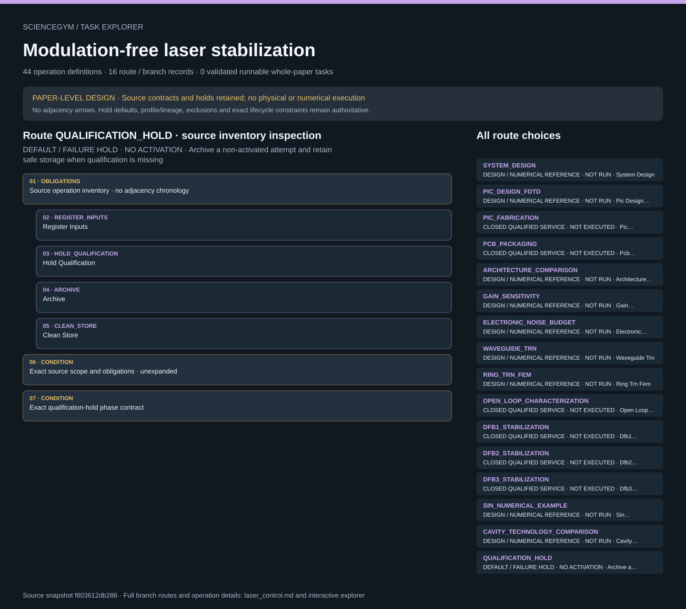

# Modulation-free laser stabilization: task route map



Paper: **Modulation-free laser stabilization technique using integrated cavity-coupled Mach-Zehnder interferometer** · [DOI](https://doi.org/10.1038/s41467-024-46319-3)

PAPER-LEVEL DESIGN · Read-only author/evaluator reference; no actor loader, task runner, solver, physical simulation, hardware activation or scientific reproduction. Membership is not chronology; exact source contracts remain authoritative. PAPER-LEVEL DESIGN accounted for; whole-paper execution remains false. Default QUALIFICATION_HOLD. Nine design-only and six closed-service scientific branches remain separate from the hold. Commands do not prove state. Three DFB identities, prepared-intake versus full-preparation lineage, reference chain, frozen control settings and in-loop versus independent heterodyne channels remain distinct. Source outcomes never become measured episode results. No laser, electrical or numerical execution.. Counts describe task representation, not experiments or success.

**Reading rule:** rows show unordered source inventory for inspection. Exact phase, lifecycle and dependency contracts remain authoritative; no loop, specimen, condition or chronology is inferred. An unordered obligation group has no inferred chronological edges. Source-reported scientific facts and authored handling are distinct.

[Immutable source task package](https://github.com/openags/ScienceGym/blob/f803612db28652d2e2dd574d8039c36b7136f399/tasks/laser_control_operations_v2/) · [Interactive inspector](../index.html)

## SYSTEM_DESIGN — DESIGN / NUMERICAL REFERENCE · NOT RUN · System Design

Read-only author/evaluator reference; no actor loader, task runner, solver, physical simulation, hardware activation or scientific reproduction. Membership is not chronology; exact source contracts remain authoritative.

[Exact route source](https://github.com/openags/ScienceGym/blob/f803612db28652d2e2dd574d8039c36b7136f399/tasks/laser_control_operations_v2/branches.json) · JSON pointer: `/branches/0`

- **OBLIGATIONS: Source operation inventory · no adjacency chronology**
  - Binding: {"order":"Inspection membership only. Conditional recovery remains conditional; exact lifecycle and source causal constraints remain authoritative.","membership_source":"Exact reverse index of operations.json /operations/*/branch_ids; source design_sequence remains distinct"}
  - `DECLARE_REQUIREMENTS` Declare Requirements
  - `FREEZE_DESIGN` Freeze Design
- **CONDITION: Exact source scope and obligations · unexpanded**
  - Binding: {"source_file":"branches.json","source_pointer":"/branches/0","source_contract":{"id":"SYSTEM_DESIGN","source_evidence_ids":["SI_N6","FIG6"],"execution_class":"design_only","required_inputs":["application wavelength and linewidth target","area/cost budget","qualified platform loss and material data"],"design_sequence":["choose material/platform","set cavity-volume and TRN budget","estimate optical/electrical link budget","freeze acceptance plan"],"required_outputs":["controlled design record and unresolved inputs"],"interpretation_limit":"No measured suppression, linewidth or hardware claim","design_covered":true,"physical_executed":false,"numerical_executed":false}}
- **CONDITION: Exact scoped lifecycle_contract.json · not expanded**
  - Binding: {"source_file":"lifecycle_contract.json","source_pointer":"","source_contract":{"schema_version":"laser_control_task.v1","full_preparation":["REGISTER_INPUTS","VERIFY_QUALIFICATION","FREEZE_DESIGN","REQUEST_PIC_FABRICATION","VERIFY_PIC","REQUEST_PCB_ASSEMBLY","VERIFY_PACKAGING"],"prepared_intake":["REGISTER_INPUTS","VERIFY_QUALIFICATION","VERIFY_PACKAGING"],"measurement_phases":["DOCK_PACKAGE","VERIFY_INTERLOCK","REQUEST_ALIGNMENT","VERIFY_ALIGNMENT","CALIBRATE_FREQUENCY_AXIS","REQUEST_OPEN_LOOP","ACQUIRE_OPEN_LOOP","FIT_RING","CALIBRATE_DISCRIMINATOR","REGISTER_LASER","VERIFY_REFERENCE_CHAIN","FREEZE_CONTROL_SETTINGS","ACQUIRE_FREE_RUNNING","REQUEST_LOCK","VERIFY_LOCK","ACQUIRE_IN_LOOP","ACQUIRE_HETERODYNE","VALIDATE_PSD","ANALYZE_NOISE"],"closure_phases":["REQUEST_SAFE_OFF","VERIFY_SAFE_OFF","UNDOCK_PACKAGE","INSPECT_PACKAGE","ARCHIVE","CLEAN_STORE"],"hold_phases":["REGISTER_INPUTS","HOLD_QUALIFICATION","ARCHIVE","CLEAN_STORE"],"commands_are_not_state_evidence":["REQUEST_PIC_FABRICATION","REQUEST_PCB_ASSEMBLY","REQUEST_ALIGNMENT","REQUEST_OPEN_LOOP","REQUEST_LOCK","REQUEST_SAFE_OFF"],"independent_state_checks":["VERIFY_PIC","VERIFY_PACKAGING","VERIFY_INTERLOCK","VERIFY_ALIGNMENT","VERIFY_LOCK","VERIFY_SAFE_OFF"],"safe_undock_order":["REQUEST_SAFE_OFF","VERIFY_SAFE_OFF","UNDOCK_PACKAGE"],"service_completion_not_execution_by_this_package":true,"interrupted_active_attempt":"Request qualified safe off, independently verify isolation, then retrieve/inspect/archive; unresolved isolation stays contained and does not complete","damage":"Quarantine and archive; reuse requires a new qualified release","real_adapter_implemented":false}}
- **CONDITION: Exact scoped episode_input_contract.json · not expanded**
  - Binding: {"source_file":"episode_input_contract.json","source_pointer":"","source_contract":{"schema_version":"laser_control_task.v1","actor_fields":["event_id","operation_id","evidence_id"],"actor_cannot_supply":["measurement","success","safe","lock_status","PSD","gain","source_outcome","qualification","raw_hash"],"evaluator_input":"fixture ID plus independently supplied exact pinned synthetic receipt registry","fixture_scope":"Finite authored configurations; no production authentication","default":"QUALIFICATION_HOLD","service_requests_are_not_physical_actuation":true}}

<details><summary>Branch state, choices, lineage and loop obligations</summary>

```json
{
  "id": "SYSTEM_DESIGN",
  "source_evidence_ids": [
    "SI_N6",
    "FIG6"
  ],
  "execution_class": "design_only",
  "required_inputs": [
    "application wavelength and linewidth target",
    "area/cost budget",
    "qualified platform loss and material data"
  ],
  "design_sequence": [
    "choose material/platform",
    "set cavity-volume and TRN budget",
    "estimate optical/electrical link budget",
    "freeze acceptance plan"
  ],
  "required_outputs": [
    "controlled design record and unresolved inputs"
  ],
  "interpretation_limit": "No measured suppression, linewidth or hardware claim",
  "design_covered": true,
  "physical_executed": false,
  "numerical_executed": false
}
```

</details>

## PIC_DESIGN_FDTD — DESIGN / NUMERICAL REFERENCE · NOT RUN · Pic Design Fdtd

Read-only author/evaluator reference; no actor loader, task runner, solver, physical simulation, hardware activation or scientific reproduction. Membership is not chronology; exact source contracts remain authoritative.

[Exact route source](https://github.com/openags/ScienceGym/blob/f803612db28652d2e2dd574d8039c36b7136f399/tasks/laser_control_operations_v2/branches.json) · JSON pointer: `/branches/1`

- **OBLIGATIONS: Source operation inventory · no adjacency chronology**
  - Binding: {"order":"Inspection membership only. Conditional recovery remains conditional; exact lifecycle and source causal constraints remain authoritative.","membership_source":"Exact reverse index of operations.json /operations/*/branch_ids; source design_sequence remains distinct"}
  - `FREEZE_DESIGN` Freeze Design
  - `REQUEST_FDTD` Request Fdtd
- **CONDITION: Exact source scope and obligations · unexpanded**
  - Binding: {"source_file":"branches.json","source_pointer":"/branches/1","source_contract":{"id":"PIC_DESIGN_FDTD","source_evidence_ids":["MAIN","FIG2","FIG3"],"execution_class":"design_only","required_inputs":["foundry-authorized PDK","source-independent GDS/layout","Euler bend and coupling design","FDTD mesh/material/boundary cards"],"design_sequence":["design cavity-coupled MZI","simulate fundamental-mode retention","review coupling and loss","freeze fabrication inputs"],"required_outputs":["mode response and design-validation receipts"],"interpretation_limit":"100 nm process label is not the depicted 220 nm silicon waveguide thickness","design_covered":true,"physical_executed":false,"numerical_executed":false}}
- **CONDITION: Exact scoped lifecycle_contract.json · not expanded**
  - Binding: {"source_file":"lifecycle_contract.json","source_pointer":"","source_contract":{"schema_version":"laser_control_task.v1","full_preparation":["REGISTER_INPUTS","VERIFY_QUALIFICATION","FREEZE_DESIGN","REQUEST_PIC_FABRICATION","VERIFY_PIC","REQUEST_PCB_ASSEMBLY","VERIFY_PACKAGING"],"prepared_intake":["REGISTER_INPUTS","VERIFY_QUALIFICATION","VERIFY_PACKAGING"],"measurement_phases":["DOCK_PACKAGE","VERIFY_INTERLOCK","REQUEST_ALIGNMENT","VERIFY_ALIGNMENT","CALIBRATE_FREQUENCY_AXIS","REQUEST_OPEN_LOOP","ACQUIRE_OPEN_LOOP","FIT_RING","CALIBRATE_DISCRIMINATOR","REGISTER_LASER","VERIFY_REFERENCE_CHAIN","FREEZE_CONTROL_SETTINGS","ACQUIRE_FREE_RUNNING","REQUEST_LOCK","VERIFY_LOCK","ACQUIRE_IN_LOOP","ACQUIRE_HETERODYNE","VALIDATE_PSD","ANALYZE_NOISE"],"closure_phases":["REQUEST_SAFE_OFF","VERIFY_SAFE_OFF","UNDOCK_PACKAGE","INSPECT_PACKAGE","ARCHIVE","CLEAN_STORE"],"hold_phases":["REGISTER_INPUTS","HOLD_QUALIFICATION","ARCHIVE","CLEAN_STORE"],"commands_are_not_state_evidence":["REQUEST_PIC_FABRICATION","REQUEST_PCB_ASSEMBLY","REQUEST_ALIGNMENT","REQUEST_OPEN_LOOP","REQUEST_LOCK","REQUEST_SAFE_OFF"],"independent_state_checks":["VERIFY_PIC","VERIFY_PACKAGING","VERIFY_INTERLOCK","VERIFY_ALIGNMENT","VERIFY_LOCK","VERIFY_SAFE_OFF"],"safe_undock_order":["REQUEST_SAFE_OFF","VERIFY_SAFE_OFF","UNDOCK_PACKAGE"],"service_completion_not_execution_by_this_package":true,"interrupted_active_attempt":"Request qualified safe off, independently verify isolation, then retrieve/inspect/archive; unresolved isolation stays contained and does not complete","damage":"Quarantine and archive; reuse requires a new qualified release","real_adapter_implemented":false}}
- **CONDITION: Exact scoped episode_input_contract.json · not expanded**
  - Binding: {"source_file":"episode_input_contract.json","source_pointer":"","source_contract":{"schema_version":"laser_control_task.v1","actor_fields":["event_id","operation_id","evidence_id"],"actor_cannot_supply":["measurement","success","safe","lock_status","PSD","gain","source_outcome","qualification","raw_hash"],"evaluator_input":"fixture ID plus independently supplied exact pinned synthetic receipt registry","fixture_scope":"Finite authored configurations; no production authentication","default":"QUALIFICATION_HOLD","service_requests_are_not_physical_actuation":true}}

<details><summary>Branch state, choices, lineage and loop obligations</summary>

```json
{
  "id": "PIC_DESIGN_FDTD",
  "source_evidence_ids": [
    "MAIN",
    "FIG2",
    "FIG3"
  ],
  "execution_class": "design_only",
  "required_inputs": [
    "foundry-authorized PDK",
    "source-independent GDS/layout",
    "Euler bend and coupling design",
    "FDTD mesh/material/boundary cards"
  ],
  "design_sequence": [
    "design cavity-coupled MZI",
    "simulate fundamental-mode retention",
    "review coupling and loss",
    "freeze fabrication inputs"
  ],
  "required_outputs": [
    "mode response and design-validation receipts"
  ],
  "interpretation_limit": "100 nm process label is not the depicted 220 nm silicon waveguide thickness",
  "design_covered": true,
  "physical_executed": false,
  "numerical_executed": false
}
```

</details>

## PIC_FABRICATION — CLOSED QUALIFIED SERVICE · NOT EXECUTED · Pic Fabrication

Read-only author/evaluator reference; no actor loader, task runner, solver, physical simulation, hardware activation or scientific reproduction. Membership is not chronology; exact source contracts remain authoritative.

[Exact route source](https://github.com/openags/ScienceGym/blob/f803612db28652d2e2dd574d8039c36b7136f399/tasks/laser_control_operations_v2/branches.json) · JSON pointer: `/branches/2`

- **OBLIGATIONS: Source operation inventory · no adjacency chronology**
  - Binding: {"order":"Inspection membership only. Conditional recovery remains conditional; exact lifecycle and source causal constraints remain authoritative.","membership_source":"Exact reverse index of operations.json /operations/*/branch_ids; source design_sequence remains distinct"}
  - `FREEZE_DESIGN` Freeze Design
  - `REQUEST_PIC_FABRICATION` Request Pic Fabrication
  - `VERIFY_PIC` Verify Pic
- **CONDITION: Exact source scope and obligations · unexpanded**
  - Binding: {"source_file":"branches.json","source_pointer":"/branches/2","source_contract":{"id":"PIC_FABRICATION","source_evidence_ids":["MAIN","FIG2"],"execution_class":"closed_qualified_service","required_inputs":["released PIC design","foundry process and safety qualification","job and lot IDs"],"design_sequence":["request qualified foundry fabrication","receive identified PIC","independently inspect and compare released design"],"required_outputs":["fabrication and inspection receipt"],"interpretation_limit":"No fabrication recipe, mask data, machinery command or implementation supplied","design_covered":true,"physical_executed":false,"numerical_executed":false}}
- **CONDITION: Exact scoped lifecycle_contract.json · not expanded**
  - Binding: {"source_file":"lifecycle_contract.json","source_pointer":"","source_contract":{"schema_version":"laser_control_task.v1","full_preparation":["REGISTER_INPUTS","VERIFY_QUALIFICATION","FREEZE_DESIGN","REQUEST_PIC_FABRICATION","VERIFY_PIC","REQUEST_PCB_ASSEMBLY","VERIFY_PACKAGING"],"prepared_intake":["REGISTER_INPUTS","VERIFY_QUALIFICATION","VERIFY_PACKAGING"],"measurement_phases":["DOCK_PACKAGE","VERIFY_INTERLOCK","REQUEST_ALIGNMENT","VERIFY_ALIGNMENT","CALIBRATE_FREQUENCY_AXIS","REQUEST_OPEN_LOOP","ACQUIRE_OPEN_LOOP","FIT_RING","CALIBRATE_DISCRIMINATOR","REGISTER_LASER","VERIFY_REFERENCE_CHAIN","FREEZE_CONTROL_SETTINGS","ACQUIRE_FREE_RUNNING","REQUEST_LOCK","VERIFY_LOCK","ACQUIRE_IN_LOOP","ACQUIRE_HETERODYNE","VALIDATE_PSD","ANALYZE_NOISE"],"closure_phases":["REQUEST_SAFE_OFF","VERIFY_SAFE_OFF","UNDOCK_PACKAGE","INSPECT_PACKAGE","ARCHIVE","CLEAN_STORE"],"hold_phases":["REGISTER_INPUTS","HOLD_QUALIFICATION","ARCHIVE","CLEAN_STORE"],"commands_are_not_state_evidence":["REQUEST_PIC_FABRICATION","REQUEST_PCB_ASSEMBLY","REQUEST_ALIGNMENT","REQUEST_OPEN_LOOP","REQUEST_LOCK","REQUEST_SAFE_OFF"],"independent_state_checks":["VERIFY_PIC","VERIFY_PACKAGING","VERIFY_INTERLOCK","VERIFY_ALIGNMENT","VERIFY_LOCK","VERIFY_SAFE_OFF"],"safe_undock_order":["REQUEST_SAFE_OFF","VERIFY_SAFE_OFF","UNDOCK_PACKAGE"],"service_completion_not_execution_by_this_package":true,"interrupted_active_attempt":"Request qualified safe off, independently verify isolation, then retrieve/inspect/archive; unresolved isolation stays contained and does not complete","damage":"Quarantine and archive; reuse requires a new qualified release","real_adapter_implemented":false}}
- **CONDITION: Exact scoped episode_input_contract.json · not expanded**
  - Binding: {"source_file":"episode_input_contract.json","source_pointer":"","source_contract":{"schema_version":"laser_control_task.v1","actor_fields":["event_id","operation_id","evidence_id"],"actor_cannot_supply":["measurement","success","safe","lock_status","PSD","gain","source_outcome","qualification","raw_hash"],"evaluator_input":"fixture ID plus independently supplied exact pinned synthetic receipt registry","fixture_scope":"Finite authored configurations; no production authentication","default":"QUALIFICATION_HOLD","service_requests_are_not_physical_actuation":true}}

<details><summary>Branch state, choices, lineage and loop obligations</summary>

```json
{
  "id": "PIC_FABRICATION",
  "source_evidence_ids": [
    "MAIN",
    "FIG2"
  ],
  "execution_class": "closed_qualified_service",
  "required_inputs": [
    "released PIC design",
    "foundry process and safety qualification",
    "job and lot IDs"
  ],
  "design_sequence": [
    "request qualified foundry fabrication",
    "receive identified PIC",
    "independently inspect and compare released design"
  ],
  "required_outputs": [
    "fabrication and inspection receipt"
  ],
  "interpretation_limit": "No fabrication recipe, mask data, machinery command or implementation supplied",
  "design_covered": true,
  "physical_executed": false,
  "numerical_executed": false
}
```

</details>

## PCB_PACKAGING — CLOSED QUALIFIED SERVICE · NOT EXECUTED · Pcb Packaging

Read-only author/evaluator reference; no actor loader, task runner, solver, physical simulation, hardware activation or scientific reproduction. Membership is not chronology; exact source contracts remain authoritative.

[Exact route source](https://github.com/openags/ScienceGym/blob/f803612db28652d2e2dd574d8039c36b7136f399/tasks/laser_control_operations_v2/branches.json) · JSON pointer: `/branches/3`

- **OBLIGATIONS: Source operation inventory · no adjacency chronology**
  - Binding: {"order":"Inspection membership only. Conditional recovery remains conditional; exact lifecycle and source causal constraints remain authoritative.","membership_source":"Exact reverse index of operations.json /operations/*/branch_ids; source design_sequence remains distinct"}
  - `FREEZE_DESIGN` Freeze Design
  - `REQUEST_PCB_ASSEMBLY` Request Pcb Assembly
  - `VERIFY_PACKAGING` Verify Packaging
- **CONDITION: Exact source scope and obligations · unexpanded**
  - Binding: {"source_file":"branches.json","source_pointer":"/branches/3","source_contract":{"id":"PCB_PACKAGING","source_evidence_ids":["MAIN","SI_N4","SI_T2"],"execution_class":"closed_qualified_service","required_inputs":["released board design/BOM","PIC and PCB lot IDs","bond map","qualified electrical and packaging service"],"design_sequence":["request PCB/assembly service","wirebond through qualified service","verify package identity and electrical inspection"],"required_outputs":["assembled package custody and test receipt"],"interpretation_limit":"PCB, bond geometry and electronics settings cannot be reconstructed from schematic artwork","design_covered":true,"physical_executed":false,"numerical_executed":false}}
- **CONDITION: Exact scoped lifecycle_contract.json · not expanded**
  - Binding: {"source_file":"lifecycle_contract.json","source_pointer":"","source_contract":{"schema_version":"laser_control_task.v1","full_preparation":["REGISTER_INPUTS","VERIFY_QUALIFICATION","FREEZE_DESIGN","REQUEST_PIC_FABRICATION","VERIFY_PIC","REQUEST_PCB_ASSEMBLY","VERIFY_PACKAGING"],"prepared_intake":["REGISTER_INPUTS","VERIFY_QUALIFICATION","VERIFY_PACKAGING"],"measurement_phases":["DOCK_PACKAGE","VERIFY_INTERLOCK","REQUEST_ALIGNMENT","VERIFY_ALIGNMENT","CALIBRATE_FREQUENCY_AXIS","REQUEST_OPEN_LOOP","ACQUIRE_OPEN_LOOP","FIT_RING","CALIBRATE_DISCRIMINATOR","REGISTER_LASER","VERIFY_REFERENCE_CHAIN","FREEZE_CONTROL_SETTINGS","ACQUIRE_FREE_RUNNING","REQUEST_LOCK","VERIFY_LOCK","ACQUIRE_IN_LOOP","ACQUIRE_HETERODYNE","VALIDATE_PSD","ANALYZE_NOISE"],"closure_phases":["REQUEST_SAFE_OFF","VERIFY_SAFE_OFF","UNDOCK_PACKAGE","INSPECT_PACKAGE","ARCHIVE","CLEAN_STORE"],"hold_phases":["REGISTER_INPUTS","HOLD_QUALIFICATION","ARCHIVE","CLEAN_STORE"],"commands_are_not_state_evidence":["REQUEST_PIC_FABRICATION","REQUEST_PCB_ASSEMBLY","REQUEST_ALIGNMENT","REQUEST_OPEN_LOOP","REQUEST_LOCK","REQUEST_SAFE_OFF"],"independent_state_checks":["VERIFY_PIC","VERIFY_PACKAGING","VERIFY_INTERLOCK","VERIFY_ALIGNMENT","VERIFY_LOCK","VERIFY_SAFE_OFF"],"safe_undock_order":["REQUEST_SAFE_OFF","VERIFY_SAFE_OFF","UNDOCK_PACKAGE"],"service_completion_not_execution_by_this_package":true,"interrupted_active_attempt":"Request qualified safe off, independently verify isolation, then retrieve/inspect/archive; unresolved isolation stays contained and does not complete","damage":"Quarantine and archive; reuse requires a new qualified release","real_adapter_implemented":false}}
- **CONDITION: Exact scoped episode_input_contract.json · not expanded**
  - Binding: {"source_file":"episode_input_contract.json","source_pointer":"","source_contract":{"schema_version":"laser_control_task.v1","actor_fields":["event_id","operation_id","evidence_id"],"actor_cannot_supply":["measurement","success","safe","lock_status","PSD","gain","source_outcome","qualification","raw_hash"],"evaluator_input":"fixture ID plus independently supplied exact pinned synthetic receipt registry","fixture_scope":"Finite authored configurations; no production authentication","default":"QUALIFICATION_HOLD","service_requests_are_not_physical_actuation":true}}

<details><summary>Branch state, choices, lineage and loop obligations</summary>

```json
{
  "id": "PCB_PACKAGING",
  "source_evidence_ids": [
    "MAIN",
    "SI_N4",
    "SI_T2"
  ],
  "execution_class": "closed_qualified_service",
  "required_inputs": [
    "released board design/BOM",
    "PIC and PCB lot IDs",
    "bond map",
    "qualified electrical and packaging service"
  ],
  "design_sequence": [
    "request PCB/assembly service",
    "wirebond through qualified service",
    "verify package identity and electrical inspection"
  ],
  "required_outputs": [
    "assembled package custody and test receipt"
  ],
  "interpretation_limit": "PCB, bond geometry and electronics settings cannot be reconstructed from schematic artwork",
  "design_covered": true,
  "physical_executed": false,
  "numerical_executed": false
}
```

</details>

## ARCHITECTURE_COMPARISON — DESIGN / NUMERICAL REFERENCE · NOT RUN · Architecture Comparison

Read-only author/evaluator reference; no actor loader, task runner, solver, physical simulation, hardware activation or scientific reproduction. Membership is not chronology; exact source contracts remain authoritative.

[Exact route source](https://github.com/openags/ScienceGym/blob/f803612db28652d2e2dd574d8039c36b7136f399/tasks/laser_control_operations_v2/branches.json) · JSON pointer: `/branches/4`

- **OBLIGATIONS: Source operation inventory · no adjacency chronology**
  - Binding: {"order":"Inspection membership only. Conditional recovery remains conditional; exact lifecycle and source causal constraints remain authoritative.","membership_source":"Exact reverse index of operations.json /operations/*/branch_ids; source design_sequence remains distinct"}
  - `REQUEST_ARCHITECTURE_COMPARISON` Request Architecture Comparison
- **CONDITION: Exact source scope and obligations · unexpanded**
  - Binding: {"source_file":"branches.json","source_pointer":"/branches/4","source_contract":{"id":"ARCHITECTURE_COMPARISON","source_evidence_ids":["FIG1","SI_N1","SI_N2"],"execution_class":"design_only","required_inputs":["transfer functions with units","equal-area assumptions","normalization and phase settings"],"design_sequence":["calculate cavity-MZI error response","compare PDH and unbalanced MZI","hold length and loss assumptions fixed"],"required_outputs":["numerical comparison record"],"interpretation_limit":"Source simulated gains are not measured device calibration","design_covered":true,"physical_executed":false,"numerical_executed":false}}
- **CONDITION: Exact scoped lifecycle_contract.json · not expanded**
  - Binding: {"source_file":"lifecycle_contract.json","source_pointer":"","source_contract":{"schema_version":"laser_control_task.v1","full_preparation":["REGISTER_INPUTS","VERIFY_QUALIFICATION","FREEZE_DESIGN","REQUEST_PIC_FABRICATION","VERIFY_PIC","REQUEST_PCB_ASSEMBLY","VERIFY_PACKAGING"],"prepared_intake":["REGISTER_INPUTS","VERIFY_QUALIFICATION","VERIFY_PACKAGING"],"measurement_phases":["DOCK_PACKAGE","VERIFY_INTERLOCK","REQUEST_ALIGNMENT","VERIFY_ALIGNMENT","CALIBRATE_FREQUENCY_AXIS","REQUEST_OPEN_LOOP","ACQUIRE_OPEN_LOOP","FIT_RING","CALIBRATE_DISCRIMINATOR","REGISTER_LASER","VERIFY_REFERENCE_CHAIN","FREEZE_CONTROL_SETTINGS","ACQUIRE_FREE_RUNNING","REQUEST_LOCK","VERIFY_LOCK","ACQUIRE_IN_LOOP","ACQUIRE_HETERODYNE","VALIDATE_PSD","ANALYZE_NOISE"],"closure_phases":["REQUEST_SAFE_OFF","VERIFY_SAFE_OFF","UNDOCK_PACKAGE","INSPECT_PACKAGE","ARCHIVE","CLEAN_STORE"],"hold_phases":["REGISTER_INPUTS","HOLD_QUALIFICATION","ARCHIVE","CLEAN_STORE"],"commands_are_not_state_evidence":["REQUEST_PIC_FABRICATION","REQUEST_PCB_ASSEMBLY","REQUEST_ALIGNMENT","REQUEST_OPEN_LOOP","REQUEST_LOCK","REQUEST_SAFE_OFF"],"independent_state_checks":["VERIFY_PIC","VERIFY_PACKAGING","VERIFY_INTERLOCK","VERIFY_ALIGNMENT","VERIFY_LOCK","VERIFY_SAFE_OFF"],"safe_undock_order":["REQUEST_SAFE_OFF","VERIFY_SAFE_OFF","UNDOCK_PACKAGE"],"service_completion_not_execution_by_this_package":true,"interrupted_active_attempt":"Request qualified safe off, independently verify isolation, then retrieve/inspect/archive; unresolved isolation stays contained and does not complete","damage":"Quarantine and archive; reuse requires a new qualified release","real_adapter_implemented":false}}
- **CONDITION: Exact scoped episode_input_contract.json · not expanded**
  - Binding: {"source_file":"episode_input_contract.json","source_pointer":"","source_contract":{"schema_version":"laser_control_task.v1","actor_fields":["event_id","operation_id","evidence_id"],"actor_cannot_supply":["measurement","success","safe","lock_status","PSD","gain","source_outcome","qualification","raw_hash"],"evaluator_input":"fixture ID plus independently supplied exact pinned synthetic receipt registry","fixture_scope":"Finite authored configurations; no production authentication","default":"QUALIFICATION_HOLD","service_requests_are_not_physical_actuation":true}}

<details><summary>Branch state, choices, lineage and loop obligations</summary>

```json
{
  "id": "ARCHITECTURE_COMPARISON",
  "source_evidence_ids": [
    "FIG1",
    "SI_N1",
    "SI_N2"
  ],
  "execution_class": "design_only",
  "required_inputs": [
    "transfer functions with units",
    "equal-area assumptions",
    "normalization and phase settings"
  ],
  "design_sequence": [
    "calculate cavity-MZI error response",
    "compare PDH and unbalanced MZI",
    "hold length and loss assumptions fixed"
  ],
  "required_outputs": [
    "numerical comparison record"
  ],
  "interpretation_limit": "Source simulated gains are not measured device calibration",
  "design_covered": true,
  "physical_executed": false,
  "numerical_executed": false
}
```

</details>

## GAIN_SENSITIVITY — DESIGN / NUMERICAL REFERENCE · NOT RUN · Gain Sensitivity

Read-only author/evaluator reference; no actor loader, task runner, solver, physical simulation, hardware activation or scientific reproduction. Membership is not chronology; exact source contracts remain authoritative.

[Exact route source](https://github.com/openags/ScienceGym/blob/f803612db28652d2e2dd574d8039c36b7136f399/tasks/laser_control_operations_v2/branches.json) · JSON pointer: `/branches/5`

- **OBLIGATIONS: Source operation inventory · no adjacency chronology**
  - Binding: {"order":"Inspection membership only. Conditional recovery remains conditional; exact lifecycle and source causal constraints remain authoritative.","membership_source":"Exact reverse index of operations.json /operations/*/branch_ids; source design_sequence remains distinct"}
  - `REQUEST_GAIN_SWEEP` Request Gain Sweep
- **CONDITION: Exact source scope and obligations · unexpanded**
  - Binding: {"source_file":"branches.json","source_pointer":"/branches/5","source_contract":{"id":"GAIN_SENSITIVITY","source_evidence_ids":["SI_N3"],"execution_class":"design_only","required_inputs":["coupling convention","waveguide loss model","scan axes and numerical tolerance"],"design_sequence":["sweep ring coupling and propagation loss","normalize to fixed reference","report sensitivity domain"],"required_outputs":["gain-sweep grid and normalization lineage"],"interpretation_limit":"The source reference critical coupling is 0.5%; this is not a fabrication tolerance","design_covered":true,"physical_executed":false,"numerical_executed":false}}
- **CONDITION: Exact scoped lifecycle_contract.json · not expanded**
  - Binding: {"source_file":"lifecycle_contract.json","source_pointer":"","source_contract":{"schema_version":"laser_control_task.v1","full_preparation":["REGISTER_INPUTS","VERIFY_QUALIFICATION","FREEZE_DESIGN","REQUEST_PIC_FABRICATION","VERIFY_PIC","REQUEST_PCB_ASSEMBLY","VERIFY_PACKAGING"],"prepared_intake":["REGISTER_INPUTS","VERIFY_QUALIFICATION","VERIFY_PACKAGING"],"measurement_phases":["DOCK_PACKAGE","VERIFY_INTERLOCK","REQUEST_ALIGNMENT","VERIFY_ALIGNMENT","CALIBRATE_FREQUENCY_AXIS","REQUEST_OPEN_LOOP","ACQUIRE_OPEN_LOOP","FIT_RING","CALIBRATE_DISCRIMINATOR","REGISTER_LASER","VERIFY_REFERENCE_CHAIN","FREEZE_CONTROL_SETTINGS","ACQUIRE_FREE_RUNNING","REQUEST_LOCK","VERIFY_LOCK","ACQUIRE_IN_LOOP","ACQUIRE_HETERODYNE","VALIDATE_PSD","ANALYZE_NOISE"],"closure_phases":["REQUEST_SAFE_OFF","VERIFY_SAFE_OFF","UNDOCK_PACKAGE","INSPECT_PACKAGE","ARCHIVE","CLEAN_STORE"],"hold_phases":["REGISTER_INPUTS","HOLD_QUALIFICATION","ARCHIVE","CLEAN_STORE"],"commands_are_not_state_evidence":["REQUEST_PIC_FABRICATION","REQUEST_PCB_ASSEMBLY","REQUEST_ALIGNMENT","REQUEST_OPEN_LOOP","REQUEST_LOCK","REQUEST_SAFE_OFF"],"independent_state_checks":["VERIFY_PIC","VERIFY_PACKAGING","VERIFY_INTERLOCK","VERIFY_ALIGNMENT","VERIFY_LOCK","VERIFY_SAFE_OFF"],"safe_undock_order":["REQUEST_SAFE_OFF","VERIFY_SAFE_OFF","UNDOCK_PACKAGE"],"service_completion_not_execution_by_this_package":true,"interrupted_active_attempt":"Request qualified safe off, independently verify isolation, then retrieve/inspect/archive; unresolved isolation stays contained and does not complete","damage":"Quarantine and archive; reuse requires a new qualified release","real_adapter_implemented":false}}
- **CONDITION: Exact scoped episode_input_contract.json · not expanded**
  - Binding: {"source_file":"episode_input_contract.json","source_pointer":"","source_contract":{"schema_version":"laser_control_task.v1","actor_fields":["event_id","operation_id","evidence_id"],"actor_cannot_supply":["measurement","success","safe","lock_status","PSD","gain","source_outcome","qualification","raw_hash"],"evaluator_input":"fixture ID plus independently supplied exact pinned synthetic receipt registry","fixture_scope":"Finite authored configurations; no production authentication","default":"QUALIFICATION_HOLD","service_requests_are_not_physical_actuation":true}}

<details><summary>Branch state, choices, lineage and loop obligations</summary>

```json
{
  "id": "GAIN_SENSITIVITY",
  "source_evidence_ids": [
    "SI_N3"
  ],
  "execution_class": "design_only",
  "required_inputs": [
    "coupling convention",
    "waveguide loss model",
    "scan axes and numerical tolerance"
  ],
  "design_sequence": [
    "sweep ring coupling and propagation loss",
    "normalize to fixed reference",
    "report sensitivity domain"
  ],
  "required_outputs": [
    "gain-sweep grid and normalization lineage"
  ],
  "interpretation_limit": "The source reference critical coupling is 0.5%; this is not a fabrication tolerance",
  "design_covered": true,
  "physical_executed": false,
  "numerical_executed": false
}
```

</details>

## ELECTRONIC_NOISE_BUDGET — DESIGN / NUMERICAL REFERENCE · NOT RUN · Electronic Noise Budget

Read-only author/evaluator reference; no actor loader, task runner, solver, physical simulation, hardware activation or scientific reproduction. Membership is not chronology; exact source contracts remain authoritative.

[Exact route source](https://github.com/openags/ScienceGym/blob/f803612db28652d2e2dd574d8039c36b7136f399/tasks/laser_control_operations_v2/branches.json) · JSON pointer: `/branches/6`

- **OBLIGATIONS: Source operation inventory · no adjacency chronology**
  - Binding: {"order":"Inspection membership only. Conditional recovery remains conditional; exact lifecycle and source causal constraints remain authoritative.","membership_source":"Exact reverse index of operations.json /operations/*/branch_ids; source design_sequence remains distinct"}
  - `REQUEST_NOISE_BUDGET` Request Noise Budget
- **CONDITION: Exact source scope and obligations · unexpanded**
  - Binding: {"source_file":"branches.json","source_pointer":"/branches/6","source_contract":{"id":"ELECTRONIC_NOISE_BUDGET","source_evidence_ids":["SI_N4","SI_N5"],"execution_class":"design_only","required_inputs":["TIA and downstream transfer functions","detector operating card","optical power plane","noise units and correlations"],"design_sequence":["separate ASD and PSD","combine independent electronic and shot contributions","retain intensity-noise assumptions","refer noise to frequency using dimensional gain"],"required_outputs":["frequency-referred noise budget"],"interpretation_limit":"Balanced detection suppresses common-mode noise; it does not prove zero intensity-noise coupling","design_covered":true,"physical_executed":false,"numerical_executed":false}}
- **CONDITION: Exact scoped lifecycle_contract.json · not expanded**
  - Binding: {"source_file":"lifecycle_contract.json","source_pointer":"","source_contract":{"schema_version":"laser_control_task.v1","full_preparation":["REGISTER_INPUTS","VERIFY_QUALIFICATION","FREEZE_DESIGN","REQUEST_PIC_FABRICATION","VERIFY_PIC","REQUEST_PCB_ASSEMBLY","VERIFY_PACKAGING"],"prepared_intake":["REGISTER_INPUTS","VERIFY_QUALIFICATION","VERIFY_PACKAGING"],"measurement_phases":["DOCK_PACKAGE","VERIFY_INTERLOCK","REQUEST_ALIGNMENT","VERIFY_ALIGNMENT","CALIBRATE_FREQUENCY_AXIS","REQUEST_OPEN_LOOP","ACQUIRE_OPEN_LOOP","FIT_RING","CALIBRATE_DISCRIMINATOR","REGISTER_LASER","VERIFY_REFERENCE_CHAIN","FREEZE_CONTROL_SETTINGS","ACQUIRE_FREE_RUNNING","REQUEST_LOCK","VERIFY_LOCK","ACQUIRE_IN_LOOP","ACQUIRE_HETERODYNE","VALIDATE_PSD","ANALYZE_NOISE"],"closure_phases":["REQUEST_SAFE_OFF","VERIFY_SAFE_OFF","UNDOCK_PACKAGE","INSPECT_PACKAGE","ARCHIVE","CLEAN_STORE"],"hold_phases":["REGISTER_INPUTS","HOLD_QUALIFICATION","ARCHIVE","CLEAN_STORE"],"commands_are_not_state_evidence":["REQUEST_PIC_FABRICATION","REQUEST_PCB_ASSEMBLY","REQUEST_ALIGNMENT","REQUEST_OPEN_LOOP","REQUEST_LOCK","REQUEST_SAFE_OFF"],"independent_state_checks":["VERIFY_PIC","VERIFY_PACKAGING","VERIFY_INTERLOCK","VERIFY_ALIGNMENT","VERIFY_LOCK","VERIFY_SAFE_OFF"],"safe_undock_order":["REQUEST_SAFE_OFF","VERIFY_SAFE_OFF","UNDOCK_PACKAGE"],"service_completion_not_execution_by_this_package":true,"interrupted_active_attempt":"Request qualified safe off, independently verify isolation, then retrieve/inspect/archive; unresolved isolation stays contained and does not complete","damage":"Quarantine and archive; reuse requires a new qualified release","real_adapter_implemented":false}}
- **CONDITION: Exact scoped episode_input_contract.json · not expanded**
  - Binding: {"source_file":"episode_input_contract.json","source_pointer":"","source_contract":{"schema_version":"laser_control_task.v1","actor_fields":["event_id","operation_id","evidence_id"],"actor_cannot_supply":["measurement","success","safe","lock_status","PSD","gain","source_outcome","qualification","raw_hash"],"evaluator_input":"fixture ID plus independently supplied exact pinned synthetic receipt registry","fixture_scope":"Finite authored configurations; no production authentication","default":"QUALIFICATION_HOLD","service_requests_are_not_physical_actuation":true}}

<details><summary>Branch state, choices, lineage and loop obligations</summary>

```json
{
  "id": "ELECTRONIC_NOISE_BUDGET",
  "source_evidence_ids": [
    "SI_N4",
    "SI_N5"
  ],
  "execution_class": "design_only",
  "required_inputs": [
    "TIA and downstream transfer functions",
    "detector operating card",
    "optical power plane",
    "noise units and correlations"
  ],
  "design_sequence": [
    "separate ASD and PSD",
    "combine independent electronic and shot contributions",
    "retain intensity-noise assumptions",
    "refer noise to frequency using dimensional gain"
  ],
  "required_outputs": [
    "frequency-referred noise budget"
  ],
  "interpretation_limit": "Balanced detection suppresses common-mode noise; it does not prove zero intensity-noise coupling",
  "design_covered": true,
  "physical_executed": false,
  "numerical_executed": false
}
```

</details>

## WAVEGUIDE_TRN — DESIGN / NUMERICAL REFERENCE · NOT RUN · Waveguide Trn

Read-only author/evaluator reference; no actor loader, task runner, solver, physical simulation, hardware activation or scientific reproduction. Membership is not chronology; exact source contracts remain authoritative.

[Exact route source](https://github.com/openags/ScienceGym/blob/f803612db28652d2e2dd574d8039c36b7136f399/tasks/laser_control_operations_v2/branches.json) · JSON pointer: `/branches/7`

- **OBLIGATIONS: Source operation inventory · no adjacency chronology**
  - Binding: {"order":"Inspection membership only. Conditional recovery remains conditional; exact lifecycle and source causal constraints remain authoritative.","membership_source":"Exact reverse index of operations.json /operations/*/branch_ids; source design_sequence remains distinct"}
  - `REQUEST_TRN_MODELS` Request Trn Models
- **CONDITION: Exact source scope and obligations · unexpanded**
  - Binding: {"source_file":"branches.json","source_pointer":"/branches/7","source_contract":{"id":"WAVEGUIDE_TRN","source_evidence_ids":["SI_N4"],"execution_class":"design_only","required_inputs":["cross-section and boundary geometry","mode solver/material data","thermal model and convergence card"],"design_sequence":["compute mode thermo-optic response","estimate phase-noise PSD","convert waveguide TRN to error-current noise"],"required_outputs":["phase/current noise model record"],"interpretation_limit":"A uniform model does not qualify the heterogeneous physical device","design_covered":true,"physical_executed":false,"numerical_executed":false}}
- **CONDITION: Exact scoped lifecycle_contract.json · not expanded**
  - Binding: {"source_file":"lifecycle_contract.json","source_pointer":"","source_contract":{"schema_version":"laser_control_task.v1","full_preparation":["REGISTER_INPUTS","VERIFY_QUALIFICATION","FREEZE_DESIGN","REQUEST_PIC_FABRICATION","VERIFY_PIC","REQUEST_PCB_ASSEMBLY","VERIFY_PACKAGING"],"prepared_intake":["REGISTER_INPUTS","VERIFY_QUALIFICATION","VERIFY_PACKAGING"],"measurement_phases":["DOCK_PACKAGE","VERIFY_INTERLOCK","REQUEST_ALIGNMENT","VERIFY_ALIGNMENT","CALIBRATE_FREQUENCY_AXIS","REQUEST_OPEN_LOOP","ACQUIRE_OPEN_LOOP","FIT_RING","CALIBRATE_DISCRIMINATOR","REGISTER_LASER","VERIFY_REFERENCE_CHAIN","FREEZE_CONTROL_SETTINGS","ACQUIRE_FREE_RUNNING","REQUEST_LOCK","VERIFY_LOCK","ACQUIRE_IN_LOOP","ACQUIRE_HETERODYNE","VALIDATE_PSD","ANALYZE_NOISE"],"closure_phases":["REQUEST_SAFE_OFF","VERIFY_SAFE_OFF","UNDOCK_PACKAGE","INSPECT_PACKAGE","ARCHIVE","CLEAN_STORE"],"hold_phases":["REGISTER_INPUTS","HOLD_QUALIFICATION","ARCHIVE","CLEAN_STORE"],"commands_are_not_state_evidence":["REQUEST_PIC_FABRICATION","REQUEST_PCB_ASSEMBLY","REQUEST_ALIGNMENT","REQUEST_OPEN_LOOP","REQUEST_LOCK","REQUEST_SAFE_OFF"],"independent_state_checks":["VERIFY_PIC","VERIFY_PACKAGING","VERIFY_INTERLOCK","VERIFY_ALIGNMENT","VERIFY_LOCK","VERIFY_SAFE_OFF"],"safe_undock_order":["REQUEST_SAFE_OFF","VERIFY_SAFE_OFF","UNDOCK_PACKAGE"],"service_completion_not_execution_by_this_package":true,"interrupted_active_attempt":"Request qualified safe off, independently verify isolation, then retrieve/inspect/archive; unresolved isolation stays contained and does not complete","damage":"Quarantine and archive; reuse requires a new qualified release","real_adapter_implemented":false}}
- **CONDITION: Exact scoped episode_input_contract.json · not expanded**
  - Binding: {"source_file":"episode_input_contract.json","source_pointer":"","source_contract":{"schema_version":"laser_control_task.v1","actor_fields":["event_id","operation_id","evidence_id"],"actor_cannot_supply":["measurement","success","safe","lock_status","PSD","gain","source_outcome","qualification","raw_hash"],"evaluator_input":"fixture ID plus independently supplied exact pinned synthetic receipt registry","fixture_scope":"Finite authored configurations; no production authentication","default":"QUALIFICATION_HOLD","service_requests_are_not_physical_actuation":true}}

<details><summary>Branch state, choices, lineage and loop obligations</summary>

```json
{
  "id": "WAVEGUIDE_TRN",
  "source_evidence_ids": [
    "SI_N4"
  ],
  "execution_class": "design_only",
  "required_inputs": [
    "cross-section and boundary geometry",
    "mode solver/material data",
    "thermal model and convergence card"
  ],
  "design_sequence": [
    "compute mode thermo-optic response",
    "estimate phase-noise PSD",
    "convert waveguide TRN to error-current noise"
  ],
  "required_outputs": [
    "phase/current noise model record"
  ],
  "interpretation_limit": "A uniform model does not qualify the heterogeneous physical device",
  "design_covered": true,
  "physical_executed": false,
  "numerical_executed": false
}
```

</details>

## RING_TRN_FEM — DESIGN / NUMERICAL REFERENCE · NOT RUN · Ring Trn Fem

Read-only author/evaluator reference; no actor loader, task runner, solver, physical simulation, hardware activation or scientific reproduction. Membership is not chronology; exact source contracts remain authoritative.

[Exact route source](https://github.com/openags/ScienceGym/blob/f803612db28652d2e2dd574d8039c36b7136f399/tasks/laser_control_operations_v2/branches.json) · JSON pointer: `/branches/8`

- **OBLIGATIONS: Source operation inventory · no adjacency chronology**
  - Binding: {"order":"Inspection membership only. Conditional recovery remains conditional; exact lifecycle and source causal constraints remain authoritative.","membership_source":"Exact reverse index of operations.json /operations/*/branch_ids; source design_sequence remains distinct"}
  - `REQUEST_TRN_MODELS` Request Trn Models
- **CONDITION: Exact source scope and obligations · unexpanded**
  - Binding: {"source_file":"branches.json","source_pointer":"/branches/8","source_contract":{"id":"RING_TRN_FEM","source_evidence_ids":["FIG6","SI_N4"],"execution_class":"design_only","required_inputs":["source-independent FEM geometry and mesh","thermal boundaries and material properties","fluctuation-dissipation convention"],"design_sequence":["calculate analytical infinite-bath TRN","request independent FEM estimate","compare model domains and frequency limits"],"required_outputs":["separate analytic and FEM spectra"],"interpretation_limit":"Infinite-bath analytical and finite-geometry FEM curves are distinct evidence","design_covered":true,"physical_executed":false,"numerical_executed":false}}
- **CONDITION: Exact scoped lifecycle_contract.json · not expanded**
  - Binding: {"source_file":"lifecycle_contract.json","source_pointer":"","source_contract":{"schema_version":"laser_control_task.v1","full_preparation":["REGISTER_INPUTS","VERIFY_QUALIFICATION","FREEZE_DESIGN","REQUEST_PIC_FABRICATION","VERIFY_PIC","REQUEST_PCB_ASSEMBLY","VERIFY_PACKAGING"],"prepared_intake":["REGISTER_INPUTS","VERIFY_QUALIFICATION","VERIFY_PACKAGING"],"measurement_phases":["DOCK_PACKAGE","VERIFY_INTERLOCK","REQUEST_ALIGNMENT","VERIFY_ALIGNMENT","CALIBRATE_FREQUENCY_AXIS","REQUEST_OPEN_LOOP","ACQUIRE_OPEN_LOOP","FIT_RING","CALIBRATE_DISCRIMINATOR","REGISTER_LASER","VERIFY_REFERENCE_CHAIN","FREEZE_CONTROL_SETTINGS","ACQUIRE_FREE_RUNNING","REQUEST_LOCK","VERIFY_LOCK","ACQUIRE_IN_LOOP","ACQUIRE_HETERODYNE","VALIDATE_PSD","ANALYZE_NOISE"],"closure_phases":["REQUEST_SAFE_OFF","VERIFY_SAFE_OFF","UNDOCK_PACKAGE","INSPECT_PACKAGE","ARCHIVE","CLEAN_STORE"],"hold_phases":["REGISTER_INPUTS","HOLD_QUALIFICATION","ARCHIVE","CLEAN_STORE"],"commands_are_not_state_evidence":["REQUEST_PIC_FABRICATION","REQUEST_PCB_ASSEMBLY","REQUEST_ALIGNMENT","REQUEST_OPEN_LOOP","REQUEST_LOCK","REQUEST_SAFE_OFF"],"independent_state_checks":["VERIFY_PIC","VERIFY_PACKAGING","VERIFY_INTERLOCK","VERIFY_ALIGNMENT","VERIFY_LOCK","VERIFY_SAFE_OFF"],"safe_undock_order":["REQUEST_SAFE_OFF","VERIFY_SAFE_OFF","UNDOCK_PACKAGE"],"service_completion_not_execution_by_this_package":true,"interrupted_active_attempt":"Request qualified safe off, independently verify isolation, then retrieve/inspect/archive; unresolved isolation stays contained and does not complete","damage":"Quarantine and archive; reuse requires a new qualified release","real_adapter_implemented":false}}
- **CONDITION: Exact scoped episode_input_contract.json · not expanded**
  - Binding: {"source_file":"episode_input_contract.json","source_pointer":"","source_contract":{"schema_version":"laser_control_task.v1","actor_fields":["event_id","operation_id","evidence_id"],"actor_cannot_supply":["measurement","success","safe","lock_status","PSD","gain","source_outcome","qualification","raw_hash"],"evaluator_input":"fixture ID plus independently supplied exact pinned synthetic receipt registry","fixture_scope":"Finite authored configurations; no production authentication","default":"QUALIFICATION_HOLD","service_requests_are_not_physical_actuation":true}}

<details><summary>Branch state, choices, lineage and loop obligations</summary>

```json
{
  "id": "RING_TRN_FEM",
  "source_evidence_ids": [
    "FIG6",
    "SI_N4"
  ],
  "execution_class": "design_only",
  "required_inputs": [
    "source-independent FEM geometry and mesh",
    "thermal boundaries and material properties",
    "fluctuation-dissipation convention"
  ],
  "design_sequence": [
    "calculate analytical infinite-bath TRN",
    "request independent FEM estimate",
    "compare model domains and frequency limits"
  ],
  "required_outputs": [
    "separate analytic and FEM spectra"
  ],
  "interpretation_limit": "Infinite-bath analytical and finite-geometry FEM curves are distinct evidence",
  "design_covered": true,
  "physical_executed": false,
  "numerical_executed": false
}
```

</details>

## OPEN_LOOP_CHARACTERIZATION — CLOSED QUALIFIED SERVICE · NOT EXECUTED · Open Loop Characterization

Read-only author/evaluator reference; no actor loader, task runner, solver, physical simulation, hardware activation or scientific reproduction. Membership is not chronology; exact source contracts remain authoritative.

[Exact route source](https://github.com/openags/ScienceGym/blob/f803612db28652d2e2dd574d8039c36b7136f399/tasks/laser_control_operations_v2/branches.json) · JSON pointer: `/branches/9`

- **OBLIGATIONS: Source operation inventory · no adjacency chronology**
  - Binding: {"order":"Inspection membership only. Conditional recovery remains conditional; exact lifecycle and source causal constraints remain authoritative.","membership_source":"Exact reverse index of operations.json /operations/*/branch_ids; source design_sequence remains distinct"}
  - `ACQUIRE_OPEN_LOOP` Acquire Open Loop
  - `ARCHIVE` Archive
  - `CALIBRATE_DISCRIMINATOR` Calibrate Discriminator
  - `CALIBRATE_FREQUENCY_AXIS` Calibrate Frequency Axis
  - `CLEAN_STORE` Clean Store
  - `DOCK_PACKAGE` Dock Package
  - `FIT_RING` Fit Ring
  - `HOLD_CALIBRATION` Hold Calibration
  - `HOLD_LOCK` Hold Lock
  - `HOLD_QUALIFICATION` Hold Qualification
  - `HOLD_REFERENCE` Hold Reference
  - `INSPECT_PACKAGE` Inspect Package
  - `QUARANTINE` Quarantine
  - `REGISTER_INPUTS` Register Inputs
  - `REQUEST_ALIGNMENT` Request Alignment
  - `REQUEST_OPEN_LOOP` Request Open Loop
  - `REQUEST_SAFE_OFF` Request Safe Off
  - `UNDOCK_PACKAGE` Undock Package
  - `VERIFY_ALIGNMENT` Verify Alignment
  - `VERIFY_INTERLOCK` Verify Interlock
  - `VERIFY_PACKAGING` Verify Packaging
  - `VERIFY_QUALIFICATION` Verify Qualification
  - `VERIFY_SAFE_OFF` Verify Safe Off
- **CONDITION: Exact source scope and obligations · unexpanded**
  - Binding: {"source_file":"branches.json","source_pointer":"/branches/9","source_contract":{"id":"OPEN_LOOP_CHARACTERIZATION","source_evidence_ids":["FIG4","MAIN","SI_T2"],"execution_class":"closed_qualified_service","required_inputs":["qualified prepared package","calibrated ECDL sweep","fiber-MZI calibration","safe alignment and optical/electrical qualification"],"design_sequence":["verify sealed alignment","calibrate frequency axis","acquire simultaneous sniffer/error records","fit resonance","calibrate dimensional discriminator slope"],"required_outputs":["raw paired traces","Q/extinction/FSR fit record","signed gain and uncertainty"],"interpretation_limit":"Heaters off; fit outcomes must not be assumed from source values","design_covered":true,"physical_executed":false,"numerical_executed":false}}
- **CONDITION: Exact scoped lifecycle_contract.json · not expanded**
  - Binding: {"source_file":"lifecycle_contract.json","source_pointer":"","source_contract":{"schema_version":"laser_control_task.v1","full_preparation":["REGISTER_INPUTS","VERIFY_QUALIFICATION","FREEZE_DESIGN","REQUEST_PIC_FABRICATION","VERIFY_PIC","REQUEST_PCB_ASSEMBLY","VERIFY_PACKAGING"],"prepared_intake":["REGISTER_INPUTS","VERIFY_QUALIFICATION","VERIFY_PACKAGING"],"measurement_phases":["DOCK_PACKAGE","VERIFY_INTERLOCK","REQUEST_ALIGNMENT","VERIFY_ALIGNMENT","CALIBRATE_FREQUENCY_AXIS","REQUEST_OPEN_LOOP","ACQUIRE_OPEN_LOOP","FIT_RING","CALIBRATE_DISCRIMINATOR","REGISTER_LASER","VERIFY_REFERENCE_CHAIN","FREEZE_CONTROL_SETTINGS","ACQUIRE_FREE_RUNNING","REQUEST_LOCK","VERIFY_LOCK","ACQUIRE_IN_LOOP","ACQUIRE_HETERODYNE","VALIDATE_PSD","ANALYZE_NOISE"],"closure_phases":["REQUEST_SAFE_OFF","VERIFY_SAFE_OFF","UNDOCK_PACKAGE","INSPECT_PACKAGE","ARCHIVE","CLEAN_STORE"],"hold_phases":["REGISTER_INPUTS","HOLD_QUALIFICATION","ARCHIVE","CLEAN_STORE"],"commands_are_not_state_evidence":["REQUEST_PIC_FABRICATION","REQUEST_PCB_ASSEMBLY","REQUEST_ALIGNMENT","REQUEST_OPEN_LOOP","REQUEST_LOCK","REQUEST_SAFE_OFF"],"independent_state_checks":["VERIFY_PIC","VERIFY_PACKAGING","VERIFY_INTERLOCK","VERIFY_ALIGNMENT","VERIFY_LOCK","VERIFY_SAFE_OFF"],"safe_undock_order":["REQUEST_SAFE_OFF","VERIFY_SAFE_OFF","UNDOCK_PACKAGE"],"service_completion_not_execution_by_this_package":true,"interrupted_active_attempt":"Request qualified safe off, independently verify isolation, then retrieve/inspect/archive; unresolved isolation stays contained and does not complete","damage":"Quarantine and archive; reuse requires a new qualified release","real_adapter_implemented":false}}
- **CONDITION: Exact scoped episode_input_contract.json · not expanded**
  - Binding: {"source_file":"episode_input_contract.json","source_pointer":"","source_contract":{"schema_version":"laser_control_task.v1","actor_fields":["event_id","operation_id","evidence_id"],"actor_cannot_supply":["measurement","success","safe","lock_status","PSD","gain","source_outcome","qualification","raw_hash"],"evaluator_input":"fixture ID plus independently supplied exact pinned synthetic receipt registry","fixture_scope":"Finite authored configurations; no production authentication","default":"QUALIFICATION_HOLD","service_requests_are_not_physical_actuation":true}}

<details><summary>Branch state, choices, lineage and loop obligations</summary>

```json
{
  "id": "OPEN_LOOP_CHARACTERIZATION",
  "source_evidence_ids": [
    "FIG4",
    "MAIN",
    "SI_T2"
  ],
  "execution_class": "closed_qualified_service",
  "required_inputs": [
    "qualified prepared package",
    "calibrated ECDL sweep",
    "fiber-MZI calibration",
    "safe alignment and optical/electrical qualification"
  ],
  "design_sequence": [
    "verify sealed alignment",
    "calibrate frequency axis",
    "acquire simultaneous sniffer/error records",
    "fit resonance",
    "calibrate dimensional discriminator slope"
  ],
  "required_outputs": [
    "raw paired traces",
    "Q/extinction/FSR fit record",
    "signed gain and uncertainty"
  ],
  "interpretation_limit": "Heaters off; fit outcomes must not be assumed from source values",
  "design_covered": true,
  "physical_executed": false,
  "numerical_executed": false
}
```

</details>

## DFB1_STABILIZATION — CLOSED QUALIFIED SERVICE · NOT EXECUTED · Dfb1 Stabilization

Read-only author/evaluator reference; no actor loader, task runner, solver, physical simulation, hardware activation or scientific reproduction. Membership is not chronology; exact source contracts remain authoritative.

[Exact route source](https://github.com/openags/ScienceGym/blob/f803612db28652d2e2dd574d8039c36b7136f399/tasks/laser_control_operations_v2/branches.json) · JSON pointer: `/branches/10`

- **OBLIGATIONS: Source operation inventory · no adjacency chronology**
  - Binding: {"order":"Inspection membership only. Conditional recovery remains conditional; exact lifecycle and source causal constraints remain authoritative.","membership_source":"Exact reverse index of operations.json /operations/*/branch_ids; source design_sequence remains distinct"}
  - `ACQUIRE_FREE_RUNNING` Acquire Free Running
  - `ACQUIRE_HETERODYNE` Acquire Heterodyne
  - `ACQUIRE_IN_LOOP` Acquire In Loop
  - `ANALYZE_NOISE` Analyze Noise
  - `ARCHIVE` Archive
  - `CALIBRATE_DISCRIMINATOR` Calibrate Discriminator
  - `CLEAN_STORE` Clean Store
  - `DOCK_PACKAGE` Dock Package
  - `FREEZE_CONTROL_SETTINGS` Freeze Control Settings
  - `HOLD_CALIBRATION` Hold Calibration
  - `HOLD_LOCK` Hold Lock
  - `HOLD_QUALIFICATION` Hold Qualification
  - `HOLD_REFERENCE` Hold Reference
  - `INSPECT_PACKAGE` Inspect Package
  - `QUARANTINE` Quarantine
  - `REGISTER_INPUTS` Register Inputs
  - `REGISTER_LASER` Register Laser
  - `REQUEST_ALIGNMENT` Request Alignment
  - `REQUEST_LOCK` Request Lock
  - `REQUEST_SAFE_OFF` Request Safe Off
  - `UNDOCK_PACKAGE` Undock Package
  - `VALIDATE_PSD` Validate Psd
  - `VERIFY_ALIGNMENT` Verify Alignment
  - `VERIFY_INTERLOCK` Verify Interlock
  - `VERIFY_LOCK` Verify Lock
  - `VERIFY_PACKAGING` Verify Packaging
  - `VERIFY_QUALIFICATION` Verify Qualification
  - `VERIFY_REFERENCE_CHAIN` Verify Reference Chain
  - `VERIFY_SAFE_OFF` Verify Safe Off
- **CONDITION: Exact source scope and obligations · unexpanded**
  - Binding: {"source_file":"branches.json","source_pointer":"/branches/10","source_contract":{"id":"DFB1_STABILIZATION","source_evidence_ids":["FIG5","MAIN","SI_T2"],"execution_class":"closed_qualified_service","required_inputs":["qualified DFB1 and driver","current open-loop calibration","qualified reference chain","frozen bias-noise/servo cards"],"design_sequence":["collect matched free-running reference","request lock","independently verify lock","acquire FPGA in-loop and comb heterodyne data","validate PSD and analyze","safely close lifecycle"],"required_outputs":["separate independent and in-loop PSDs","reported analysis and retained failures"],"interpretation_limit":"DFB1 identity, wavelengths and settings cannot be replayed as another laser","design_covered":true,"physical_executed":false,"numerical_executed":false}}
- **CONDITION: Exact scoped lifecycle_contract.json · not expanded**
  - Binding: {"source_file":"lifecycle_contract.json","source_pointer":"","source_contract":{"schema_version":"laser_control_task.v1","full_preparation":["REGISTER_INPUTS","VERIFY_QUALIFICATION","FREEZE_DESIGN","REQUEST_PIC_FABRICATION","VERIFY_PIC","REQUEST_PCB_ASSEMBLY","VERIFY_PACKAGING"],"prepared_intake":["REGISTER_INPUTS","VERIFY_QUALIFICATION","VERIFY_PACKAGING"],"measurement_phases":["DOCK_PACKAGE","VERIFY_INTERLOCK","REQUEST_ALIGNMENT","VERIFY_ALIGNMENT","CALIBRATE_FREQUENCY_AXIS","REQUEST_OPEN_LOOP","ACQUIRE_OPEN_LOOP","FIT_RING","CALIBRATE_DISCRIMINATOR","REGISTER_LASER","VERIFY_REFERENCE_CHAIN","FREEZE_CONTROL_SETTINGS","ACQUIRE_FREE_RUNNING","REQUEST_LOCK","VERIFY_LOCK","ACQUIRE_IN_LOOP","ACQUIRE_HETERODYNE","VALIDATE_PSD","ANALYZE_NOISE"],"closure_phases":["REQUEST_SAFE_OFF","VERIFY_SAFE_OFF","UNDOCK_PACKAGE","INSPECT_PACKAGE","ARCHIVE","CLEAN_STORE"],"hold_phases":["REGISTER_INPUTS","HOLD_QUALIFICATION","ARCHIVE","CLEAN_STORE"],"commands_are_not_state_evidence":["REQUEST_PIC_FABRICATION","REQUEST_PCB_ASSEMBLY","REQUEST_ALIGNMENT","REQUEST_OPEN_LOOP","REQUEST_LOCK","REQUEST_SAFE_OFF"],"independent_state_checks":["VERIFY_PIC","VERIFY_PACKAGING","VERIFY_INTERLOCK","VERIFY_ALIGNMENT","VERIFY_LOCK","VERIFY_SAFE_OFF"],"safe_undock_order":["REQUEST_SAFE_OFF","VERIFY_SAFE_OFF","UNDOCK_PACKAGE"],"service_completion_not_execution_by_this_package":true,"interrupted_active_attempt":"Request qualified safe off, independently verify isolation, then retrieve/inspect/archive; unresolved isolation stays contained and does not complete","damage":"Quarantine and archive; reuse requires a new qualified release","real_adapter_implemented":false}}
- **CONDITION: Exact scoped episode_input_contract.json · not expanded**
  - Binding: {"source_file":"episode_input_contract.json","source_pointer":"","source_contract":{"schema_version":"laser_control_task.v1","actor_fields":["event_id","operation_id","evidence_id"],"actor_cannot_supply":["measurement","success","safe","lock_status","PSD","gain","source_outcome","qualification","raw_hash"],"evaluator_input":"fixture ID plus independently supplied exact pinned synthetic receipt registry","fixture_scope":"Finite authored configurations; no production authentication","default":"QUALIFICATION_HOLD","service_requests_are_not_physical_actuation":true}}

<details><summary>Branch state, choices, lineage and loop obligations</summary>

```json
{
  "id": "DFB1_STABILIZATION",
  "source_evidence_ids": [
    "FIG5",
    "MAIN",
    "SI_T2"
  ],
  "execution_class": "closed_qualified_service",
  "required_inputs": [
    "qualified DFB1 and driver",
    "current open-loop calibration",
    "qualified reference chain",
    "frozen bias-noise/servo cards"
  ],
  "design_sequence": [
    "collect matched free-running reference",
    "request lock",
    "independently verify lock",
    "acquire FPGA in-loop and comb heterodyne data",
    "validate PSD and analyze",
    "safely close lifecycle"
  ],
  "required_outputs": [
    "separate independent and in-loop PSDs",
    "reported analysis and retained failures"
  ],
  "interpretation_limit": "DFB1 identity, wavelengths and settings cannot be replayed as another laser",
  "design_covered": true,
  "physical_executed": false,
  "numerical_executed": false
}
```

</details>

## DFB2_STABILIZATION — CLOSED QUALIFIED SERVICE · NOT EXECUTED · Dfb2 Stabilization

Read-only author/evaluator reference; no actor loader, task runner, solver, physical simulation, hardware activation or scientific reproduction. Membership is not chronology; exact source contracts remain authoritative.

[Exact route source](https://github.com/openags/ScienceGym/blob/f803612db28652d2e2dd574d8039c36b7136f399/tasks/laser_control_operations_v2/branches.json) · JSON pointer: `/branches/11`

- **OBLIGATIONS: Source operation inventory · no adjacency chronology**
  - Binding: {"order":"Inspection membership only. Conditional recovery remains conditional; exact lifecycle and source causal constraints remain authoritative.","membership_source":"Exact reverse index of operations.json /operations/*/branch_ids; source design_sequence remains distinct"}
  - `ACQUIRE_FREE_RUNNING` Acquire Free Running
  - `ACQUIRE_HETERODYNE` Acquire Heterodyne
  - `ACQUIRE_IN_LOOP` Acquire In Loop
  - `ANALYZE_NOISE` Analyze Noise
  - `ARCHIVE` Archive
  - `CALIBRATE_DISCRIMINATOR` Calibrate Discriminator
  - `CLEAN_STORE` Clean Store
  - `DOCK_PACKAGE` Dock Package
  - `FREEZE_CONTROL_SETTINGS` Freeze Control Settings
  - `HOLD_CALIBRATION` Hold Calibration
  - `HOLD_LOCK` Hold Lock
  - `HOLD_QUALIFICATION` Hold Qualification
  - `HOLD_REFERENCE` Hold Reference
  - `INSPECT_PACKAGE` Inspect Package
  - `QUARANTINE` Quarantine
  - `REGISTER_INPUTS` Register Inputs
  - `REGISTER_LASER` Register Laser
  - `REQUEST_ALIGNMENT` Request Alignment
  - `REQUEST_LOCK` Request Lock
  - `REQUEST_SAFE_OFF` Request Safe Off
  - `UNDOCK_PACKAGE` Undock Package
  - `VALIDATE_PSD` Validate Psd
  - `VERIFY_ALIGNMENT` Verify Alignment
  - `VERIFY_INTERLOCK` Verify Interlock
  - `VERIFY_LOCK` Verify Lock
  - `VERIFY_PACKAGING` Verify Packaging
  - `VERIFY_QUALIFICATION` Verify Qualification
  - `VERIFY_REFERENCE_CHAIN` Verify Reference Chain
  - `VERIFY_SAFE_OFF` Verify Safe Off
- **CONDITION: Exact source scope and obligations · unexpanded**
  - Binding: {"source_file":"branches.json","source_pointer":"/branches/11","source_contract":{"id":"DFB2_STABILIZATION","source_evidence_ids":["FIG5","MAIN","SI_T2"],"execution_class":"closed_qualified_service","required_inputs":["qualified DFB2 and driver","current open-loop calibration","qualified reference chain","frozen bias-noise/servo cards"],"design_sequence":["collect matched free-running reference","request lock","independently verify lock","acquire FPGA in-loop and comb heterodyne data","validate PSD and analyze","safely close lifecycle"],"required_outputs":["separate independent and in-loop PSDs","reported analysis and retained failures"],"interpretation_limit":"Different devices do not establish independent device-population replication","design_covered":true,"physical_executed":false,"numerical_executed":false}}
- **CONDITION: Exact scoped lifecycle_contract.json · not expanded**
  - Binding: {"source_file":"lifecycle_contract.json","source_pointer":"","source_contract":{"schema_version":"laser_control_task.v1","full_preparation":["REGISTER_INPUTS","VERIFY_QUALIFICATION","FREEZE_DESIGN","REQUEST_PIC_FABRICATION","VERIFY_PIC","REQUEST_PCB_ASSEMBLY","VERIFY_PACKAGING"],"prepared_intake":["REGISTER_INPUTS","VERIFY_QUALIFICATION","VERIFY_PACKAGING"],"measurement_phases":["DOCK_PACKAGE","VERIFY_INTERLOCK","REQUEST_ALIGNMENT","VERIFY_ALIGNMENT","CALIBRATE_FREQUENCY_AXIS","REQUEST_OPEN_LOOP","ACQUIRE_OPEN_LOOP","FIT_RING","CALIBRATE_DISCRIMINATOR","REGISTER_LASER","VERIFY_REFERENCE_CHAIN","FREEZE_CONTROL_SETTINGS","ACQUIRE_FREE_RUNNING","REQUEST_LOCK","VERIFY_LOCK","ACQUIRE_IN_LOOP","ACQUIRE_HETERODYNE","VALIDATE_PSD","ANALYZE_NOISE"],"closure_phases":["REQUEST_SAFE_OFF","VERIFY_SAFE_OFF","UNDOCK_PACKAGE","INSPECT_PACKAGE","ARCHIVE","CLEAN_STORE"],"hold_phases":["REGISTER_INPUTS","HOLD_QUALIFICATION","ARCHIVE","CLEAN_STORE"],"commands_are_not_state_evidence":["REQUEST_PIC_FABRICATION","REQUEST_PCB_ASSEMBLY","REQUEST_ALIGNMENT","REQUEST_OPEN_LOOP","REQUEST_LOCK","REQUEST_SAFE_OFF"],"independent_state_checks":["VERIFY_PIC","VERIFY_PACKAGING","VERIFY_INTERLOCK","VERIFY_ALIGNMENT","VERIFY_LOCK","VERIFY_SAFE_OFF"],"safe_undock_order":["REQUEST_SAFE_OFF","VERIFY_SAFE_OFF","UNDOCK_PACKAGE"],"service_completion_not_execution_by_this_package":true,"interrupted_active_attempt":"Request qualified safe off, independently verify isolation, then retrieve/inspect/archive; unresolved isolation stays contained and does not complete","damage":"Quarantine and archive; reuse requires a new qualified release","real_adapter_implemented":false}}
- **CONDITION: Exact scoped episode_input_contract.json · not expanded**
  - Binding: {"source_file":"episode_input_contract.json","source_pointer":"","source_contract":{"schema_version":"laser_control_task.v1","actor_fields":["event_id","operation_id","evidence_id"],"actor_cannot_supply":["measurement","success","safe","lock_status","PSD","gain","source_outcome","qualification","raw_hash"],"evaluator_input":"fixture ID plus independently supplied exact pinned synthetic receipt registry","fixture_scope":"Finite authored configurations; no production authentication","default":"QUALIFICATION_HOLD","service_requests_are_not_physical_actuation":true}}

<details><summary>Branch state, choices, lineage and loop obligations</summary>

```json
{
  "id": "DFB2_STABILIZATION",
  "source_evidence_ids": [
    "FIG5",
    "MAIN",
    "SI_T2"
  ],
  "execution_class": "closed_qualified_service",
  "required_inputs": [
    "qualified DFB2 and driver",
    "current open-loop calibration",
    "qualified reference chain",
    "frozen bias-noise/servo cards"
  ],
  "design_sequence": [
    "collect matched free-running reference",
    "request lock",
    "independently verify lock",
    "acquire FPGA in-loop and comb heterodyne data",
    "validate PSD and analyze",
    "safely close lifecycle"
  ],
  "required_outputs": [
    "separate independent and in-loop PSDs",
    "reported analysis and retained failures"
  ],
  "interpretation_limit": "Different devices do not establish independent device-population replication",
  "design_covered": true,
  "physical_executed": false,
  "numerical_executed": false
}
```

</details>

## DFB3_STABILIZATION — CLOSED QUALIFIED SERVICE · NOT EXECUTED · Dfb3 Stabilization

Read-only author/evaluator reference; no actor loader, task runner, solver, physical simulation, hardware activation or scientific reproduction. Membership is not chronology; exact source contracts remain authoritative.

[Exact route source](https://github.com/openags/ScienceGym/blob/f803612db28652d2e2dd574d8039c36b7136f399/tasks/laser_control_operations_v2/branches.json) · JSON pointer: `/branches/12`

- **OBLIGATIONS: Source operation inventory · no adjacency chronology**
  - Binding: {"order":"Inspection membership only. Conditional recovery remains conditional; exact lifecycle and source causal constraints remain authoritative.","membership_source":"Exact reverse index of operations.json /operations/*/branch_ids; source design_sequence remains distinct"}
  - `ACQUIRE_FREE_RUNNING` Acquire Free Running
  - `ACQUIRE_HETERODYNE` Acquire Heterodyne
  - `ACQUIRE_IN_LOOP` Acquire In Loop
  - `ANALYZE_NOISE` Analyze Noise
  - `ARCHIVE` Archive
  - `CALIBRATE_DISCRIMINATOR` Calibrate Discriminator
  - `CLEAN_STORE` Clean Store
  - `DOCK_PACKAGE` Dock Package
  - `FREEZE_CONTROL_SETTINGS` Freeze Control Settings
  - `HOLD_CALIBRATION` Hold Calibration
  - `HOLD_LOCK` Hold Lock
  - `HOLD_QUALIFICATION` Hold Qualification
  - `HOLD_REFERENCE` Hold Reference
  - `INSPECT_PACKAGE` Inspect Package
  - `QUARANTINE` Quarantine
  - `REGISTER_INPUTS` Register Inputs
  - `REGISTER_LASER` Register Laser
  - `REQUEST_ALIGNMENT` Request Alignment
  - `REQUEST_LOCK` Request Lock
  - `REQUEST_SAFE_OFF` Request Safe Off
  - `UNDOCK_PACKAGE` Undock Package
  - `VALIDATE_PSD` Validate Psd
  - `VERIFY_ALIGNMENT` Verify Alignment
  - `VERIFY_INTERLOCK` Verify Interlock
  - `VERIFY_LOCK` Verify Lock
  - `VERIFY_PACKAGING` Verify Packaging
  - `VERIFY_QUALIFICATION` Verify Qualification
  - `VERIFY_REFERENCE_CHAIN` Verify Reference Chain
  - `VERIFY_SAFE_OFF` Verify Safe Off
- **CONDITION: Exact source scope and obligations · unexpanded**
  - Binding: {"source_file":"branches.json","source_pointer":"/branches/12","source_contract":{"id":"DFB3_STABILIZATION","source_evidence_ids":["FIG5","MAIN","SI_T2"],"execution_class":"closed_qualified_service","required_inputs":["qualified DFB3 and driver","current open-loop calibration","qualified reference chain","frozen bias-noise/servo cards"],"design_sequence":["collect matched free-running reference","request lock","independently verify lock","acquire FPGA in-loop and comb heterodyne data","validate PSD and analyze","safely close lifecycle"],"required_outputs":["separate independent and in-loop PSDs","reported analysis and retained failures"],"interpretation_limit":"Integral linewidth and Lorentzian linewidth remain different quantities","design_covered":true,"physical_executed":false,"numerical_executed":false}}
- **CONDITION: Exact scoped lifecycle_contract.json · not expanded**
  - Binding: {"source_file":"lifecycle_contract.json","source_pointer":"","source_contract":{"schema_version":"laser_control_task.v1","full_preparation":["REGISTER_INPUTS","VERIFY_QUALIFICATION","FREEZE_DESIGN","REQUEST_PIC_FABRICATION","VERIFY_PIC","REQUEST_PCB_ASSEMBLY","VERIFY_PACKAGING"],"prepared_intake":["REGISTER_INPUTS","VERIFY_QUALIFICATION","VERIFY_PACKAGING"],"measurement_phases":["DOCK_PACKAGE","VERIFY_INTERLOCK","REQUEST_ALIGNMENT","VERIFY_ALIGNMENT","CALIBRATE_FREQUENCY_AXIS","REQUEST_OPEN_LOOP","ACQUIRE_OPEN_LOOP","FIT_RING","CALIBRATE_DISCRIMINATOR","REGISTER_LASER","VERIFY_REFERENCE_CHAIN","FREEZE_CONTROL_SETTINGS","ACQUIRE_FREE_RUNNING","REQUEST_LOCK","VERIFY_LOCK","ACQUIRE_IN_LOOP","ACQUIRE_HETERODYNE","VALIDATE_PSD","ANALYZE_NOISE"],"closure_phases":["REQUEST_SAFE_OFF","VERIFY_SAFE_OFF","UNDOCK_PACKAGE","INSPECT_PACKAGE","ARCHIVE","CLEAN_STORE"],"hold_phases":["REGISTER_INPUTS","HOLD_QUALIFICATION","ARCHIVE","CLEAN_STORE"],"commands_are_not_state_evidence":["REQUEST_PIC_FABRICATION","REQUEST_PCB_ASSEMBLY","REQUEST_ALIGNMENT","REQUEST_OPEN_LOOP","REQUEST_LOCK","REQUEST_SAFE_OFF"],"independent_state_checks":["VERIFY_PIC","VERIFY_PACKAGING","VERIFY_INTERLOCK","VERIFY_ALIGNMENT","VERIFY_LOCK","VERIFY_SAFE_OFF"],"safe_undock_order":["REQUEST_SAFE_OFF","VERIFY_SAFE_OFF","UNDOCK_PACKAGE"],"service_completion_not_execution_by_this_package":true,"interrupted_active_attempt":"Request qualified safe off, independently verify isolation, then retrieve/inspect/archive; unresolved isolation stays contained and does not complete","damage":"Quarantine and archive; reuse requires a new qualified release","real_adapter_implemented":false}}
- **CONDITION: Exact scoped episode_input_contract.json · not expanded**
  - Binding: {"source_file":"episode_input_contract.json","source_pointer":"","source_contract":{"schema_version":"laser_control_task.v1","actor_fields":["event_id","operation_id","evidence_id"],"actor_cannot_supply":["measurement","success","safe","lock_status","PSD","gain","source_outcome","qualification","raw_hash"],"evaluator_input":"fixture ID plus independently supplied exact pinned synthetic receipt registry","fixture_scope":"Finite authored configurations; no production authentication","default":"QUALIFICATION_HOLD","service_requests_are_not_physical_actuation":true}}

<details><summary>Branch state, choices, lineage and loop obligations</summary>

```json
{
  "id": "DFB3_STABILIZATION",
  "source_evidence_ids": [
    "FIG5",
    "MAIN",
    "SI_T2"
  ],
  "execution_class": "closed_qualified_service",
  "required_inputs": [
    "qualified DFB3 and driver",
    "current open-loop calibration",
    "qualified reference chain",
    "frozen bias-noise/servo cards"
  ],
  "design_sequence": [
    "collect matched free-running reference",
    "request lock",
    "independently verify lock",
    "acquire FPGA in-loop and comb heterodyne data",
    "validate PSD and analyze",
    "safely close lifecycle"
  ],
  "required_outputs": [
    "separate independent and in-loop PSDs",
    "reported analysis and retained failures"
  ],
  "interpretation_limit": "Integral linewidth and Lorentzian linewidth remain different quantities",
  "design_covered": true,
  "physical_executed": false,
  "numerical_executed": false
}
```

</details>

## SIN_NUMERICAL_EXAMPLE — DESIGN / NUMERICAL REFERENCE · NOT RUN · Sin Numerical Example

Read-only author/evaluator reference; no actor loader, task runner, solver, physical simulation, hardware activation or scientific reproduction. Membership is not chronology; exact source contracts remain authoritative.

[Exact route source](https://github.com/openags/ScienceGym/blob/f803612db28652d2e2dd574d8039c36b7136f399/tasks/laser_control_operations_v2/branches.json) · JSON pointer: `/branches/13`

- **OBLIGATIONS: Source operation inventory · no adjacency chronology**
  - Binding: {"order":"Inspection membership only. Conditional recovery remains conditional; exact lifecycle and source causal constraints remain authoritative.","membership_source":"Exact reverse index of operations.json /operations/*/branch_ids; source design_sequence remains distinct"}
  - `REQUEST_SIN_MODEL` Request Sin Model
- **CONDITION: Exact source scope and obligations · unexpanded**
  - Binding: {"source_file":"branches.json","source_pointer":"/branches/13","source_contract":{"id":"SIN_NUMERICAL_EXAMPLE","source_evidence_ids":["SI_N5","SI_T1"],"execution_class":"design_only","required_inputs":["all Table 1 model values with provenance","laser FM response model","noise and thermal geometry","explicit disposition of density anomaly"],"design_sequence":["freeze SiN numerical inputs","calculate discriminator and TRN","model feedback PSD","evaluate declared linewidth integral"],"required_outputs":["numerical PSD and linewidth record"],"interpretation_limit":"Printed density 3.29e2 kg/m3 must not be silently corrected; no physical SiN route or numerical reproduction claimed","design_covered":true,"physical_executed":false,"numerical_executed":false}}
- **CONDITION: Exact scoped lifecycle_contract.json · not expanded**
  - Binding: {"source_file":"lifecycle_contract.json","source_pointer":"","source_contract":{"schema_version":"laser_control_task.v1","full_preparation":["REGISTER_INPUTS","VERIFY_QUALIFICATION","FREEZE_DESIGN","REQUEST_PIC_FABRICATION","VERIFY_PIC","REQUEST_PCB_ASSEMBLY","VERIFY_PACKAGING"],"prepared_intake":["REGISTER_INPUTS","VERIFY_QUALIFICATION","VERIFY_PACKAGING"],"measurement_phases":["DOCK_PACKAGE","VERIFY_INTERLOCK","REQUEST_ALIGNMENT","VERIFY_ALIGNMENT","CALIBRATE_FREQUENCY_AXIS","REQUEST_OPEN_LOOP","ACQUIRE_OPEN_LOOP","FIT_RING","CALIBRATE_DISCRIMINATOR","REGISTER_LASER","VERIFY_REFERENCE_CHAIN","FREEZE_CONTROL_SETTINGS","ACQUIRE_FREE_RUNNING","REQUEST_LOCK","VERIFY_LOCK","ACQUIRE_IN_LOOP","ACQUIRE_HETERODYNE","VALIDATE_PSD","ANALYZE_NOISE"],"closure_phases":["REQUEST_SAFE_OFF","VERIFY_SAFE_OFF","UNDOCK_PACKAGE","INSPECT_PACKAGE","ARCHIVE","CLEAN_STORE"],"hold_phases":["REGISTER_INPUTS","HOLD_QUALIFICATION","ARCHIVE","CLEAN_STORE"],"commands_are_not_state_evidence":["REQUEST_PIC_FABRICATION","REQUEST_PCB_ASSEMBLY","REQUEST_ALIGNMENT","REQUEST_OPEN_LOOP","REQUEST_LOCK","REQUEST_SAFE_OFF"],"independent_state_checks":["VERIFY_PIC","VERIFY_PACKAGING","VERIFY_INTERLOCK","VERIFY_ALIGNMENT","VERIFY_LOCK","VERIFY_SAFE_OFF"],"safe_undock_order":["REQUEST_SAFE_OFF","VERIFY_SAFE_OFF","UNDOCK_PACKAGE"],"service_completion_not_execution_by_this_package":true,"interrupted_active_attempt":"Request qualified safe off, independently verify isolation, then retrieve/inspect/archive; unresolved isolation stays contained and does not complete","damage":"Quarantine and archive; reuse requires a new qualified release","real_adapter_implemented":false}}
- **CONDITION: Exact scoped episode_input_contract.json · not expanded**
  - Binding: {"source_file":"episode_input_contract.json","source_pointer":"","source_contract":{"schema_version":"laser_control_task.v1","actor_fields":["event_id","operation_id","evidence_id"],"actor_cannot_supply":["measurement","success","safe","lock_status","PSD","gain","source_outcome","qualification","raw_hash"],"evaluator_input":"fixture ID plus independently supplied exact pinned synthetic receipt registry","fixture_scope":"Finite authored configurations; no production authentication","default":"QUALIFICATION_HOLD","service_requests_are_not_physical_actuation":true}}

<details><summary>Branch state, choices, lineage and loop obligations</summary>

```json
{
  "id": "SIN_NUMERICAL_EXAMPLE",
  "source_evidence_ids": [
    "SI_N5",
    "SI_T1"
  ],
  "execution_class": "design_only",
  "required_inputs": [
    "all Table 1 model values with provenance",
    "laser FM response model",
    "noise and thermal geometry",
    "explicit disposition of density anomaly"
  ],
  "design_sequence": [
    "freeze SiN numerical inputs",
    "calculate discriminator and TRN",
    "model feedback PSD",
    "evaluate declared linewidth integral"
  ],
  "required_outputs": [
    "numerical PSD and linewidth record"
  ],
  "interpretation_limit": "Printed density 3.29e2 kg/m3 must not be silently corrected; no physical SiN route or numerical reproduction claimed",
  "design_covered": true,
  "physical_executed": false,
  "numerical_executed": false
}
```

</details>

## CAVITY_TECHNOLOGY_COMPARISON — DESIGN / NUMERICAL REFERENCE · NOT RUN · Cavity Technology Comparison

Read-only author/evaluator reference; no actor loader, task runner, solver, physical simulation, hardware activation or scientific reproduction. Membership is not chronology; exact source contracts remain authoritative.

[Exact route source](https://github.com/openags/ScienceGym/blob/f803612db28652d2e2dd574d8039c36b7136f399/tasks/laser_control_operations_v2/branches.json) · JSON pointer: `/branches/14`

- **OBLIGATIONS: Source operation inventory · no adjacency chronology**
  - Binding: {"order":"Inspection membership only. Conditional recovery remains conditional; exact lifecycle and source causal constraints remain authoritative.","membership_source":"Exact reverse index of operations.json /operations/*/branch_ids; source design_sequence remains distinct"}
  - `DECLARE_REQUIREMENTS` Declare Requirements
  - `REQUEST_TRN_MODELS` Request Trn Models
- **CONDITION: Exact source scope and obligations · unexpanded**
  - Binding: {"source_file":"branches.json","source_pointer":"/branches/14","source_contract":{"id":"CAVITY_TECHNOLOGY_COMPARISON","source_evidence_ids":["FIG6","MAIN","SI_N4","SI_N6"],"execution_class":"design_only","required_inputs":["cited cavity-technology evidence","mode-volume definitions","1 kHz offset normalization"],"design_sequence":["compare size/TRN tradeoffs","retain packaging and integration constraints","qualify any application choice"],"required_outputs":["traceable technology comparison"],"interpretation_limit":"Trend is contextual literature comparison, not a new physical experiment","design_covered":true,"physical_executed":false,"numerical_executed":false}}
- **CONDITION: Exact scoped lifecycle_contract.json · not expanded**
  - Binding: {"source_file":"lifecycle_contract.json","source_pointer":"","source_contract":{"schema_version":"laser_control_task.v1","full_preparation":["REGISTER_INPUTS","VERIFY_QUALIFICATION","FREEZE_DESIGN","REQUEST_PIC_FABRICATION","VERIFY_PIC","REQUEST_PCB_ASSEMBLY","VERIFY_PACKAGING"],"prepared_intake":["REGISTER_INPUTS","VERIFY_QUALIFICATION","VERIFY_PACKAGING"],"measurement_phases":["DOCK_PACKAGE","VERIFY_INTERLOCK","REQUEST_ALIGNMENT","VERIFY_ALIGNMENT","CALIBRATE_FREQUENCY_AXIS","REQUEST_OPEN_LOOP","ACQUIRE_OPEN_LOOP","FIT_RING","CALIBRATE_DISCRIMINATOR","REGISTER_LASER","VERIFY_REFERENCE_CHAIN","FREEZE_CONTROL_SETTINGS","ACQUIRE_FREE_RUNNING","REQUEST_LOCK","VERIFY_LOCK","ACQUIRE_IN_LOOP","ACQUIRE_HETERODYNE","VALIDATE_PSD","ANALYZE_NOISE"],"closure_phases":["REQUEST_SAFE_OFF","VERIFY_SAFE_OFF","UNDOCK_PACKAGE","INSPECT_PACKAGE","ARCHIVE","CLEAN_STORE"],"hold_phases":["REGISTER_INPUTS","HOLD_QUALIFICATION","ARCHIVE","CLEAN_STORE"],"commands_are_not_state_evidence":["REQUEST_PIC_FABRICATION","REQUEST_PCB_ASSEMBLY","REQUEST_ALIGNMENT","REQUEST_OPEN_LOOP","REQUEST_LOCK","REQUEST_SAFE_OFF"],"independent_state_checks":["VERIFY_PIC","VERIFY_PACKAGING","VERIFY_INTERLOCK","VERIFY_ALIGNMENT","VERIFY_LOCK","VERIFY_SAFE_OFF"],"safe_undock_order":["REQUEST_SAFE_OFF","VERIFY_SAFE_OFF","UNDOCK_PACKAGE"],"service_completion_not_execution_by_this_package":true,"interrupted_active_attempt":"Request qualified safe off, independently verify isolation, then retrieve/inspect/archive; unresolved isolation stays contained and does not complete","damage":"Quarantine and archive; reuse requires a new qualified release","real_adapter_implemented":false}}
- **CONDITION: Exact scoped episode_input_contract.json · not expanded**
  - Binding: {"source_file":"episode_input_contract.json","source_pointer":"","source_contract":{"schema_version":"laser_control_task.v1","actor_fields":["event_id","operation_id","evidence_id"],"actor_cannot_supply":["measurement","success","safe","lock_status","PSD","gain","source_outcome","qualification","raw_hash"],"evaluator_input":"fixture ID plus independently supplied exact pinned synthetic receipt registry","fixture_scope":"Finite authored configurations; no production authentication","default":"QUALIFICATION_HOLD","service_requests_are_not_physical_actuation":true}}

<details><summary>Branch state, choices, lineage and loop obligations</summary>

```json
{
  "id": "CAVITY_TECHNOLOGY_COMPARISON",
  "source_evidence_ids": [
    "FIG6",
    "MAIN",
    "SI_N4",
    "SI_N6"
  ],
  "execution_class": "design_only",
  "required_inputs": [
    "cited cavity-technology evidence",
    "mode-volume definitions",
    "1 kHz offset normalization"
  ],
  "design_sequence": [
    "compare size/TRN tradeoffs",
    "retain packaging and integration constraints",
    "qualify any application choice"
  ],
  "required_outputs": [
    "traceable technology comparison"
  ],
  "interpretation_limit": "Trend is contextual literature comparison, not a new physical experiment",
  "design_covered": true,
  "physical_executed": false,
  "numerical_executed": false
}
```

</details>

## QUALIFICATION_HOLD — DEFAULT / FAILURE HOLD · NO ACTIVATION · Archive a non-activated attempt and retain safe storage when qualification is missing

Read-only author/evaluator reference; no actor loader, task runner, solver, physical simulation, hardware activation or scientific reproduction. Membership is not chronology; exact source contracts remain authoritative.

[Exact route source](https://github.com/openags/ScienceGym/blob/f803612db28652d2e2dd574d8039c36b7136f399/tasks/laser_control_operations_v2/branches.json) · JSON pointer: `/hold_branch`

- **OBLIGATIONS: Source operation inventory · no adjacency chronology**
  - Binding: {"order":"Inspection membership only. Conditional recovery remains conditional; exact lifecycle and source causal constraints remain authoritative.","membership_source":"lifecycle_contract.json /hold_phases; independent of scientific branch membership"}
  - `REGISTER_INPUTS` Register Inputs
  - `HOLD_QUALIFICATION` Hold Qualification
  - `ARCHIVE` Archive
  - `CLEAN_STORE` Clean Store
- **CONDITION: Exact source scope and obligations · unexpanded**
  - Binding: {"source_file":"branches.json","source_pointer":"/hold_branch","source_contract":{"id":"QUALIFICATION_HOLD","purpose":"Archive a non-activated attempt and retain safe storage when qualification is missing","scientific_route":false}}
- **CONDITION: Exact qualification-hold phase contract**
  - Binding: {"source_file":"lifecycle_contract.json","source_pointer":"/hold_phases","source_contract":["REGISTER_INPUTS","HOLD_QUALIFICATION","ARCHIVE","CLEAN_STORE"]}

<details><summary>Branch state, choices, lineage and loop obligations</summary>

```json
{
  "id": "QUALIFICATION_HOLD",
  "purpose": "Archive a non-activated attempt and retain safe storage when qualification is missing",
  "scientific_route": false
}
```

</details>

## Operation contracts

Every operation is clickable in the offline inspector, with robot actions, target objects, pre/post state, provenance, unknowns and acceptance/recovery. Raw task JSON is the source of truth; this visualization is a public evaluator/reference view, not an agent prompt.

## Scope and exact source contracts

**PAPER-LEVEL DESIGN**

PAPER-LEVEL DESIGN accounted for; whole-paper execution remains false. Default QUALIFICATION_HOLD. Nine design-only and six closed-service scientific branches remain separate from the hold. Commands do not prove state. Three DFB identities, prepared-intake versus full-preparation lineage, reference chain, frozen control settings and in-loop versus independent heterodyne channels remain distinct. Source outcomes never become measured episode results. No laser, electrical or numerical execution.

Representation counts: {"design_only_records": 9, "closed_service_records": 6, "failure_hold_records": 1, "source_branches": 15, "source_json_documents": 30, "unresolved_input_groups": 20, "control_records": 4, "physical_input_groups": 15, "numerical_input_groups": 5}.

Every source JSON document is retained losslessly. Operation details, source branches, preparation, controls, unknowns, exclusions, profiles, lineage and source audits are exact. Navigation labels are authored; missing fields remain explicit absence notices. Required output is an acceptance obligation, never observed state.

Inventories are unordered inspection membership. Separate teardown and conditional recovery views are not new scientific branches or mandatory normal steps. Source lifecycle ordering remains authoritative. Default hold selection never grants qualification or activates a device.

Existing original authored 3D assets and static renders only. These links do not implement interactive browser physics or physical execution.

- [Original 3D asset guide](https://github.com/openags/ScienceGym/blob/f803612db28652d2e2dd574d8039c36b7136f399/assets/laser_scene_assets_v1/README.md)
- [Static render: measurement](https://github.com/openags/ScienceGym/blob/f803612db28652d2e2dd574d8039c36b7136f399/assets/laser_scene_assets_v1/evidence/measurement.png)
- [Static render: overview](https://github.com/openags/ScienceGym/blob/f803612db28652d2e2dd574d8039c36b7136f399/assets/laser_scene_assets_v1/evidence/overview.png)
- [Static render: package handling](https://github.com/openags/ScienceGym/blob/f803612db28652d2e2dd574d8039c36b7136f399/assets/laser_scene_assets_v1/evidence/package_handling.png)

### Immutable source JSON

- [EXPORT_ALLOWLIST.json](https://github.com/openags/ScienceGym/blob/f803612db28652d2e2dd574d8039c36b7136f399/tasks/laser_control_operations_v2/EXPORT_ALLOWLIST.json)
- [RELEASE_BOUNDARY.json](https://github.com/openags/ScienceGym/blob/f803612db28652d2e2dd574d8039c36b7136f399/tasks/laser_control_operations_v2/RELEASE_BOUNDARY.json)
- [STATUS.json](https://github.com/openags/ScienceGym/blob/f803612db28652d2e2dd574d8039c36b7136f399/tasks/laser_control_operations_v2/STATUS.json)
- [VERIFICATION.json](https://github.com/openags/ScienceGym/blob/f803612db28652d2e2dd574d8039c36b7136f399/tasks/laser_control_operations_v2/VERIFICATION.json)
- [adversarial_cases.json](https://github.com/openags/ScienceGym/blob/f803612db28652d2e2dd574d8039c36b7136f399/tasks/laser_control_operations_v2/adversarial_cases.json)
- [agent_visible.json](https://github.com/openags/ScienceGym/blob/f803612db28652d2e2dd574d8039c36b7136f399/tasks/laser_control_operations_v2/agent_visible.json)
- [analysis_contracts.json](https://github.com/openags/ScienceGym/blob/f803612db28652d2e2dd574d8039c36b7136f399/tasks/laser_control_operations_v2/analysis_contracts.json)
- [asset_binding_plan.json](https://github.com/openags/ScienceGym/blob/f803612db28652d2e2dd574d8039c36b7136f399/tasks/laser_control_operations_v2/asset_binding_plan.json)
- [branches.json](https://github.com/openags/ScienceGym/blob/f803612db28652d2e2dd574d8039c36b7136f399/tasks/laser_control_operations_v2/branches.json)
- [control_packages.json](https://github.com/openags/ScienceGym/blob/f803612db28652d2e2dd574d8039c36b7136f399/tasks/laser_control_operations_v2/control_packages.json)
- [coverage_matrix.json](https://github.com/openags/ScienceGym/blob/f803612db28652d2e2dd574d8039c36b7136f399/tasks/laser_control_operations_v2/coverage_matrix.json)
- [design_assumptions.json](https://github.com/openags/ScienceGym/blob/f803612db28652d2e2dd574d8039c36b7136f399/tasks/laser_control_operations_v2/design_assumptions.json)
- [episode_input_contract.json](https://github.com/openags/ScienceGym/blob/f803612db28652d2e2dd574d8039c36b7136f399/tasks/laser_control_operations_v2/episode_input_contract.json)
- [evaluator_reference.json](https://github.com/openags/ScienceGym/blob/f803612db28652d2e2dd574d8039c36b7136f399/tasks/laser_control_operations_v2/evaluator_reference.json)
- [evidence_map.json](https://github.com/openags/ScienceGym/blob/f803612db28652d2e2dd574d8039c36b7136f399/tasks/laser_control_operations_v2/evidence_map.json)
- [lifecycle_contract.json](https://github.com/openags/ScienceGym/blob/f803612db28652d2e2dd574d8039c36b7136f399/tasks/laser_control_operations_v2/lifecycle_contract.json)
- [lineage_contract.json](https://github.com/openags/ScienceGym/blob/f803612db28652d2e2dd574d8039c36b7136f399/tasks/laser_control_operations_v2/lineage_contract.json)
- [material_cards.json](https://github.com/openags/ScienceGym/blob/f803612db28652d2e2dd574d8039c36b7136f399/tasks/laser_control_operations_v2/material_cards.json)
- [mock_contract.json](https://github.com/openags/ScienceGym/blob/f803612db28652d2e2dd574d8039c36b7136f399/tasks/laser_control_operations_v2/mock_contract.json)
- [nonmanual_scope.json](https://github.com/openags/ScienceGym/blob/f803612db28652d2e2dd574d8039c36b7136f399/tasks/laser_control_operations_v2/nonmanual_scope.json)
- [operations.json](https://github.com/openags/ScienceGym/blob/f803612db28652d2e2dd574d8039c36b7136f399/tasks/laser_control_operations_v2/operations.json)
- [preparation_routes.json](https://github.com/openags/ScienceGym/blob/f803612db28652d2e2dd574d8039c36b7136f399/tasks/laser_control_operations_v2/preparation_routes.json)
- [provenance.json](https://github.com/openags/ScienceGym/blob/f803612db28652d2e2dd574d8039c36b7136f399/tasks/laser_control_operations_v2/provenance.json)
- [review/INDEPENDENT_REVIEW.json](https://github.com/openags/ScienceGym/blob/f803612db28652d2e2dd574d8039c36b7136f399/tasks/laser_control_operations_v2/review/INDEPENDENT_REVIEW.json)
- [source_access_audit.json](https://github.com/openags/ScienceGym/blob/f803612db28652d2e2dd574d8039c36b7136f399/tasks/laser_control_operations_v2/source_access_audit.json)
- [source_conflicts.json](https://github.com/openags/ScienceGym/blob/f803612db28652d2e2dd574d8039c36b7136f399/tasks/laser_control_operations_v2/source_conflicts.json)
- [source_outcomes.json](https://github.com/openags/ScienceGym/blob/f803612db28652d2e2dd574d8039c36b7136f399/tasks/laser_control_operations_v2/source_outcomes.json)
- [station_contracts.json](https://github.com/openags/ScienceGym/blob/f803612db28652d2e2dd574d8039c36b7136f399/tasks/laser_control_operations_v2/station_contracts.json)
- [transport_routes.json](https://github.com/openags/ScienceGym/blob/f803612db28652d2e2dd574d8039c36b7136f399/tasks/laser_control_operations_v2/transport_routes.json)
- [unknown_parameters.json](https://github.com/openags/ScienceGym/blob/f803612db28652d2e2dd574d8039c36b7136f399/tasks/laser_control_operations_v2/unknown_parameters.json)
