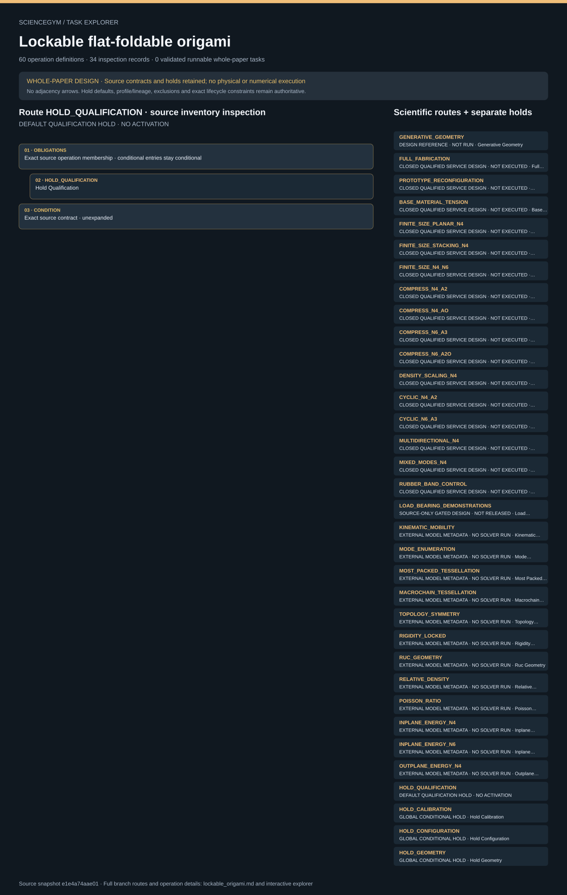

# Lockable flat-foldable origami: task route map



Paper: **Rigidly flat-foldable class of lockable origami-inspired metamaterials with topological stiff states** · [DOI](https://doi.org/10.1038/s41467-022-29484-1)

Whole-paper DESIGN coverage only; not scientific reproduction or a runnable environment. Read-only author/evaluator reference; no actor loader, hardware control, solver or physical simulation. Operation lists are unordered membership; exact dependencies, lifecycle and repeated occurrence contracts remain authoritative. Holds and quarantine remain conditional, never mandatory successful steps. Requests do not establish observations. Thirty scientific design routes, sixty symbolic operations and 143 finite synthetic bookkeeping fixtures remain distinct. The default qualification hold and three other global hold views are navigation records, not additional scientific routes. Full fabrication, prepared intake and cut-coupon preparation retain separate ancestry and credit. Machine/cross direction, regular/irregular mode, mode and configuration revisions, first peak versus densification maximum, engaged fit windows, signed open-path work and residual set (not closed-loop loss), virgin/cycled/damaged status and controls remain explicit. Three main-compression specimens, five per density scale and five finite-size specimens per geometry differ from ten N4/four N6 cycles; mixed-mode modulus/area denominators and crosshead/DIC gauge lengths remain distinct. Eleven source conflict/scope records and nine required-input gates are not resolved by this display. Twelve movies were sampled at six positions each, not continuously played; peer-review contents were not read. Static illustrative folds are not source-exact CAD, validated contact, grasps or mechanics.. Counts describe task representation, not experiments or success.

**Reading rule:** rows show unordered source inventory for inspection. Exact phase, lifecycle and dependency contracts remain authoritative; no loop, specimen, condition or chronology is inferred. An unordered obligation group has no inferred chronological edges. Source-reported scientific facts and authored handling are distinct.

[Frozen local source task package](../../../tasks/lockable_origami_operations_v2/) · [Interactive inspector](../index.html)

## GENERATIVE_GEOMETRY — DESIGN REFERENCE · NOT RUN · Generative Geometry

Whole-paper DESIGN coverage only; not scientific reproduction or a runnable environment. Read-only author/evaluator reference; no actor loader, hardware control, solver or physical simulation. Operation lists are unordered membership; exact dependencies, lifecycle and repeated occurrence contracts remain authoritative. Holds and quarantine remain conditional, never mandatory successful steps. Requests do not establish observations.

[Exact route source](../../../tasks/lockable_origami_operations_v2/branches.json) · JSON pointer: `/branches/0`

- **OBLIGATIONS: Exact source operation membership · conditional entries stay conditional**
  - Binding: {"order":"Whole-paper DESIGN coverage only; not scientific reproduction or a runnable environment. Read-only author/evaluator reference; no actor loader, hardware control, solver or physical simulation. Operation lists are unordered membership; exact dependencies, lifecycle and repeated occurrence contracts remain authoritative. Holds and quarantine remain conditional, never mandatory successful steps. Requests do not establish observations.","membership_source":"Exact branches.json operation_ids; design_sequence and route_operation_ids retain their separate meanings"}
  - `ARCHIVE_RECORDS` Archive Records
  - `CLEAN_STATION` Clean Station
  - `DECLARE_DESIGN` Declare Design
  - `FREEZE_MODE_MAP` Freeze Mode Map
  - `REGISTER_INPUTS` Register Inputs
  - `RELEASE_DESIGN` Release Design
  - `VERIFY_GEOMETRY` Verify Geometry
  - `VERIFY_QUALIFICATION` Verify Qualification
- **CONDITION: Exact source contract · unexpanded**
  - Binding: {"source_file":"branches.json","source_pointer":"/branches/0","source_contract":{"id":"GENERATIVE_GEOMETRY","execution_class":"design_only","source_evidence_ids":["M007","M008","M009","M010","M011","F1"],"required_inputs":["N in 4,6,8,10,12 for reported demonstrators","a,b,phi; explicit axes; original released crease/cut CAD"],"design_sequence":["Declare an even-sided primitive, quad/triangular faces, cut/fold assignments, scale and angle; independently review geometry before release."],"required_outputs":["Versioned branch-specific raw/derived records, uncertainty, missing-input status and disposition"],"operation_ids":["ARCHIVE_RECORDS","CLEAN_STATION","DECLARE_DESIGN","FREEZE_MODE_MAP","REGISTER_INPUTS","RELEASE_DESIGN","VERIFY_GEOMETRY","VERIFY_QUALIFICATION"],"operation_ids_semantics":"Membership, not chronological order; instance dependency graph defines order and repeated occurrence IDs","interpretation_limit":"Original task design only. No physical execution, qualified geometry or numerical scientific solver.","design_covered":true,"physical_executed":false,"numerical_executed":false}}
- **CONDITION: Exact lifecycle closure · independent evidence remains required**
  - Binding: {"source_file":"lifecycle_contract.json","source_pointer":"","source_contract":{"schema_version":"lockable_origami_task.v1","states":["UNREGISTERED","SUPPORTED_INPUT","CUT_VERIFIED","FOLD_VERIFIED","STACK_BOND_VERIFIED","CURE_VERIFIED","CONFIGURED","MOUNTED","CALIBRATED","REQUESTED","RECORDED","ANALYZED","SAFE_RELEASE_VERIFIED","STORED","QUARANTINED","HELD_CONTAINED"],"closure":["Shutdown request is not safety observation","Current independent safe release required before undocking","Unknown isolation stays contained","Damaged or cycled sample cannot be marked virgin reusable","Archive successful, failed and held attempts before closure","Physical cleanup is unimplemented"]}}

<details><summary>Branch state, choices, lineage and loop obligations</summary>

```json
{
  "id": "GENERATIVE_GEOMETRY",
  "execution_class": "design_only",
  "source_evidence_ids": [
    "M007",
    "M008",
    "M009",
    "M010",
    "M011",
    "F1"
  ],
  "required_inputs": [
    "N in 4,6,8,10,12 for reported demonstrators",
    "a,b,phi; explicit axes; original released crease/cut CAD"
  ],
  "design_sequence": [
    "Declare an even-sided primitive, quad/triangular faces, cut/fold assignments, scale and angle; independently review geometry before release."
  ],
  "required_outputs": [
    "Versioned branch-specific raw/derived records, uncertainty, missing-input status and disposition"
  ],
  "operation_ids": [
    "ARCHIVE_RECORDS",
    "CLEAN_STATION",
    "DECLARE_DESIGN",
    "FREEZE_MODE_MAP",
    "REGISTER_INPUTS",
    "RELEASE_DESIGN",
    "VERIFY_GEOMETRY",
    "VERIFY_QUALIFICATION"
  ],
  "operation_ids_semantics": "Membership, not chronological order; instance dependency graph defines order and repeated occurrence IDs",
  "interpretation_limit": "Original task design only. No physical execution, qualified geometry or numerical scientific solver.",
  "design_covered": true,
  "physical_executed": false,
  "numerical_executed": false
}
```

</details>

## FULL_FABRICATION — CLOSED QUALIFIED SERVICE DESIGN · NOT EXECUTED · Full Fabrication

Whole-paper DESIGN coverage only; not scientific reproduction or a runnable environment. Read-only author/evaluator reference; no actor loader, hardware control, solver or physical simulation. Operation lists are unordered membership; exact dependencies, lifecycle and repeated occurrence contracts remain authoritative. Holds and quarantine remain conditional, never mandatory successful steps. Requests do not establish observations.

[Exact route source](../../../tasks/lockable_origami_operations_v2/branches.json) · JSON pointer: `/branches/1`

- **OBLIGATIONS: Exact source operation membership · conditional entries stay conditional**
  - Binding: {"order":"Whole-paper DESIGN coverage only; not scientific reproduction or a runnable environment. Read-only author/evaluator reference; no actor loader, hardware control, solver or physical simulation. Operation lists are unordered membership; exact dependencies, lifecycle and repeated occurrence contracts remain authoritative. Holds and quarantine remain conditional, never mandatory successful steps. Requests do not establish observations.","membership_source":"Exact branches.json operation_ids; design_sequence and route_operation_ids retain their separate meanings"}
  - `ACQUIRE_RECORDS` Acquire Records
  - `ARCHIVE_RECORDS` Archive Records
  - `CLEAN_STATION` Clean Station
  - `DECLARE_DESIGN` Declare Design
  - `FREEZE_MODE_MAP` Freeze Mode Map
  - `FREEZE_TEST_PLAN` Freeze Test Plan
  - `HOLD_DATA` Hold Data
  - `HOLD_ISOLATION` Hold Isolation
  - `INSPECT_SAMPLE` Inspect Sample
  - `QUARANTINE_SAMPLE` Quarantine Sample
  - `RECEIVE_SAMPLE` Receive Sample
  - `REGISTER_INPUTS` Register Inputs
  - `RELEASE_DESIGN` Release Design
  - `REQUEST_CUT` Request Cut
  - `REQUEST_FOLD` Request Fold
  - `REQUEST_SAFE_OFF` Request Safe Off
  - `REQUEST_STACK_BOND` Request Stack Bond
  - `STORE_SAMPLE` Store Sample
  - `TRANSFER_CARRIER` Transfer Carrier
  - `UNDOCK_SAMPLE` Undock Sample
  - `VALIDATE_RECORDS` Validate Records
  - `VERIFY_CALIBRATION` Verify Calibration
  - `VERIFY_CURE` Verify Cure
  - `VERIFY_CUT` Verify Cut
  - `VERIFY_FOLD` Verify Fold
  - `VERIFY_GEOMETRY` Verify Geometry
  - `VERIFY_INTERLOCK` Verify Interlock
  - `VERIFY_MOUNT` Verify Mount
  - `VERIFY_QUALIFICATION` Verify Qualification
  - `VERIFY_SAFE_OFF` Verify Safe Off
  - `VERIFY_STACK_BOND` Verify Stack Bond
- **CONDITION: Exact source contract · unexpanded**
  - Binding: {"source_file":"branches.json","source_pointer":"/branches/1","source_contract":{"id":"FULL_FABRICATION","execution_class":"closed_service","source_evidence_ids":["M063","M064","S11","V1"],"required_inputs":["paperboard lot and direction map","cut/fold CAD release","layer and adhesive identities","qualified cutting/folding/bonding/cure cards"],"design_sequence":["Receive paperboard, preserve machine/cross direction, request closed cutting, partial folding, mirrored stacking, PVA triangular-face bonding and externally qualified cure inspection."],"required_outputs":["Versioned branch-specific raw/derived records, uncertainty, missing-input status and disposition"],"operation_ids":["ACQUIRE_RECORDS","ARCHIVE_RECORDS","CLEAN_STATION","DECLARE_DESIGN","FREEZE_MODE_MAP","FREEZE_TEST_PLAN","HOLD_DATA","HOLD_ISOLATION","INSPECT_SAMPLE","QUARANTINE_SAMPLE","RECEIVE_SAMPLE","REGISTER_INPUTS","RELEASE_DESIGN","REQUEST_CUT","REQUEST_FOLD","REQUEST_SAFE_OFF","REQUEST_STACK_BOND","STORE_SAMPLE","TRANSFER_CARRIER","UNDOCK_SAMPLE","VALIDATE_RECORDS","VERIFY_CALIBRATION","VERIFY_CURE","VERIFY_CUT","VERIFY_FOLD","VERIFY_GEOMETRY","VERIFY_INTERLOCK","VERIFY_MOUNT","VERIFY_QUALIFICATION","VERIFY_SAFE_OFF","VERIFY_STACK_BOND"],"operation_ids_semantics":"Membership, not chronological order; instance dependency graph defines order and repeated occurrence IDs","interpretation_limit":"Original task design only. No physical execution, qualified geometry or numerical scientific solver.","design_covered":true,"physical_executed":false,"numerical_executed":false,"shared_preparation":"FULL adds original design, cut, fold, stack/bond and cure lineage; BASE_MATERIAL_TENSION instead uses the cut-coupon route; PREPARED only verifies independent ancestry"}}
- **CONDITION: Exact lifecycle closure · independent evidence remains required**
  - Binding: {"source_file":"lifecycle_contract.json","source_pointer":"","source_contract":{"schema_version":"lockable_origami_task.v1","states":["UNREGISTERED","SUPPORTED_INPUT","CUT_VERIFIED","FOLD_VERIFIED","STACK_BOND_VERIFIED","CURE_VERIFIED","CONFIGURED","MOUNTED","CALIBRATED","REQUESTED","RECORDED","ANALYZED","SAFE_RELEASE_VERIFIED","STORED","QUARANTINED","HELD_CONTAINED"],"closure":["Shutdown request is not safety observation","Current independent safe release required before undocking","Unknown isolation stays contained","Damaged or cycled sample cannot be marked virgin reusable","Archive successful, failed and held attempts before closure","Physical cleanup is unimplemented"]}}

<details><summary>Branch state, choices, lineage and loop obligations</summary>

```json
{
  "id": "FULL_FABRICATION",
  "execution_class": "closed_service",
  "source_evidence_ids": [
    "M063",
    "M064",
    "S11",
    "V1"
  ],
  "required_inputs": [
    "paperboard lot and direction map",
    "cut/fold CAD release",
    "layer and adhesive identities",
    "qualified cutting/folding/bonding/cure cards"
  ],
  "design_sequence": [
    "Receive paperboard, preserve machine/cross direction, request closed cutting, partial folding, mirrored stacking, PVA triangular-face bonding and externally qualified cure inspection."
  ],
  "required_outputs": [
    "Versioned branch-specific raw/derived records, uncertainty, missing-input status and disposition"
  ],
  "operation_ids": [
    "ACQUIRE_RECORDS",
    "ARCHIVE_RECORDS",
    "CLEAN_STATION",
    "DECLARE_DESIGN",
    "FREEZE_MODE_MAP",
    "FREEZE_TEST_PLAN",
    "HOLD_DATA",
    "HOLD_ISOLATION",
    "INSPECT_SAMPLE",
    "QUARANTINE_SAMPLE",
    "RECEIVE_SAMPLE",
    "REGISTER_INPUTS",
    "RELEASE_DESIGN",
    "REQUEST_CUT",
    "REQUEST_FOLD",
    "REQUEST_SAFE_OFF",
    "REQUEST_STACK_BOND",
    "STORE_SAMPLE",
    "TRANSFER_CARRIER",
    "UNDOCK_SAMPLE",
    "VALIDATE_RECORDS",
    "VERIFY_CALIBRATION",
    "VERIFY_CURE",
    "VERIFY_CUT",
    "VERIFY_FOLD",
    "VERIFY_GEOMETRY",
    "VERIFY_INTERLOCK",
    "VERIFY_MOUNT",
    "VERIFY_QUALIFICATION",
    "VERIFY_SAFE_OFF",
    "VERIFY_STACK_BOND"
  ],
  "operation_ids_semantics": "Membership, not chronological order; instance dependency graph defines order and repeated occurrence IDs",
  "interpretation_limit": "Original task design only. No physical execution, qualified geometry or numerical scientific solver.",
  "design_covered": true,
  "physical_executed": false,
  "numerical_executed": false,
  "shared_preparation": "FULL adds original design, cut, fold, stack/bond and cure lineage; BASE_MATERIAL_TENSION instead uses the cut-coupon route; PREPARED only verifies independent ancestry"
}
```

</details>

## PROTOTYPE_RECONFIGURATION — CLOSED QUALIFIED SERVICE DESIGN · NOT EXECUTED · Prototype Reconfiguration

Whole-paper DESIGN coverage only; not scientific reproduction or a runnable environment. Read-only author/evaluator reference; no actor loader, hardware control, solver or physical simulation. Operation lists are unordered membership; exact dependencies, lifecycle and repeated occurrence contracts remain authoritative. Holds and quarantine remain conditional, never mandatory successful steps. Requests do not establish observations.

[Exact route source](../../../tasks/lockable_origami_operations_v2/branches.json) · JSON pointer: `/branches/2`

- **OBLIGATIONS: Exact source operation membership · conditional entries stay conditional**
  - Binding: {"order":"Whole-paper DESIGN coverage only; not scientific reproduction or a runnable environment. Read-only author/evaluator reference; no actor loader, hardware control, solver or physical simulation. Operation lists are unordered membership; exact dependencies, lifecycle and repeated occurrence contracts remain authoritative. Holds and quarantine remain conditional, never mandatory successful steps. Requests do not establish observations.","membership_source":"Exact branches.json operation_ids; design_sequence and route_operation_ids retain their separate meanings"}
  - `ACQUIRE_RECORDS` Acquire Records
  - `ARCHIVE_RECORDS` Archive Records
  - `CLEAN_STATION` Clean Station
  - `DECLARE_DESIGN` Declare Design
  - `FREEZE_MODE_MAP` Freeze Mode Map
  - `FREEZE_RECONFIGURATION_PLAN` Freeze Reconfiguration Plan
  - `FREEZE_TEST_PLAN` Freeze Test Plan
  - `HOLD_DATA` Hold Data
  - `HOLD_ISOLATION` Hold Isolation
  - `INSPECT_SAMPLE` Inspect Sample
  - `QUARANTINE_SAMPLE` Quarantine Sample
  - `RECEIVE_SAMPLE` Receive Sample
  - `REGISTER_INPUTS` Register Inputs
  - `RELEASE_DESIGN` Release Design
  - `REQUEST_CUT` Request Cut
  - `REQUEST_FOLD` Request Fold
  - `REQUEST_RECONFIGURATION` Request Reconfiguration
  - `REQUEST_SAFE_OFF` Request Safe Off
  - `REQUEST_STACK_BOND` Request Stack Bond
  - `STORE_SAMPLE` Store Sample
  - `TRANSFER_CARRIER` Transfer Carrier
  - `UNDOCK_SAMPLE` Undock Sample
  - `VALIDATE_RECORDS` Validate Records
  - `VERIFY_CALIBRATION` Verify Calibration
  - `VERIFY_CONFIGURATION` Verify Configuration
  - `VERIFY_CURE` Verify Cure
  - `VERIFY_CUT` Verify Cut
  - `VERIFY_FOLD` Verify Fold
  - `VERIFY_GEOMETRY` Verify Geometry
  - `VERIFY_INTERLOCK` Verify Interlock
  - `VERIFY_MOUNT` Verify Mount
  - `VERIFY_QUALIFICATION` Verify Qualification
  - `VERIFY_SAFE_OFF` Verify Safe Off
  - `VERIFY_STACK_BOND` Verify Stack Bond
- **CONDITION: Exact source contract · unexpanded**
  - Binding: {"source_file":"branches.json","source_pointer":"/branches/2","source_contract":{"id":"PROTOTYPE_RECONFIGURATION","execution_class":"closed_service","source_evidence_ids":["F1","F2","M010","M015","M016","M017","M063","M064","S11","V2","V3"],"required_inputs":["N and layer count","mode graph and flat/partial/contact state definitions","external fold and confinement plan"],"design_sequence":["Inspect identified unit-chain prototypes, record pre-bifurcation and requested regular mode states, and distinguish single-chain irregular modes from tessellated-compatible modes."],"required_outputs":["Versioned branch-specific raw/derived records, uncertainty, missing-input status and disposition"],"operation_ids":["ACQUIRE_RECORDS","ARCHIVE_RECORDS","CLEAN_STATION","DECLARE_DESIGN","FREEZE_MODE_MAP","FREEZE_RECONFIGURATION_PLAN","FREEZE_TEST_PLAN","HOLD_DATA","HOLD_ISOLATION","INSPECT_SAMPLE","QUARANTINE_SAMPLE","RECEIVE_SAMPLE","REGISTER_INPUTS","RELEASE_DESIGN","REQUEST_CUT","REQUEST_FOLD","REQUEST_RECONFIGURATION","REQUEST_SAFE_OFF","REQUEST_STACK_BOND","STORE_SAMPLE","TRANSFER_CARRIER","UNDOCK_SAMPLE","VALIDATE_RECORDS","VERIFY_CALIBRATION","VERIFY_CONFIGURATION","VERIFY_CURE","VERIFY_CUT","VERIFY_FOLD","VERIFY_GEOMETRY","VERIFY_INTERLOCK","VERIFY_MOUNT","VERIFY_QUALIFICATION","VERIFY_SAFE_OFF","VERIFY_STACK_BOND"],"operation_ids_semantics":"Membership, not chronological order; instance dependency graph defines order and repeated occurrence IDs","interpretation_limit":"Original task design only. No physical execution, qualified geometry or numerical scientific solver.","design_covered":true,"physical_executed":false,"numerical_executed":false,"shared_preparation":"FULL adds original design, cut, fold, stack/bond and cure lineage; BASE_MATERIAL_TENSION instead uses the cut-coupon route; PREPARED only verifies independent ancestry"}}
- **CONDITION: Exact lifecycle closure · independent evidence remains required**
  - Binding: {"source_file":"lifecycle_contract.json","source_pointer":"","source_contract":{"schema_version":"lockable_origami_task.v1","states":["UNREGISTERED","SUPPORTED_INPUT","CUT_VERIFIED","FOLD_VERIFIED","STACK_BOND_VERIFIED","CURE_VERIFIED","CONFIGURED","MOUNTED","CALIBRATED","REQUESTED","RECORDED","ANALYZED","SAFE_RELEASE_VERIFIED","STORED","QUARANTINED","HELD_CONTAINED"],"closure":["Shutdown request is not safety observation","Current independent safe release required before undocking","Unknown isolation stays contained","Damaged or cycled sample cannot be marked virgin reusable","Archive successful, failed and held attempts before closure","Physical cleanup is unimplemented"]}}

<details><summary>Branch state, choices, lineage and loop obligations</summary>

```json
{
  "id": "PROTOTYPE_RECONFIGURATION",
  "execution_class": "closed_service",
  "source_evidence_ids": [
    "F1",
    "F2",
    "M010",
    "M015",
    "M016",
    "M017",
    "M063",
    "M064",
    "S11",
    "V2",
    "V3"
  ],
  "required_inputs": [
    "N and layer count",
    "mode graph and flat/partial/contact state definitions",
    "external fold and confinement plan"
  ],
  "design_sequence": [
    "Inspect identified unit-chain prototypes, record pre-bifurcation and requested regular mode states, and distinguish single-chain irregular modes from tessellated-compatible modes."
  ],
  "required_outputs": [
    "Versioned branch-specific raw/derived records, uncertainty, missing-input status and disposition"
  ],
  "operation_ids": [
    "ACQUIRE_RECORDS",
    "ARCHIVE_RECORDS",
    "CLEAN_STATION",
    "DECLARE_DESIGN",
    "FREEZE_MODE_MAP",
    "FREEZE_RECONFIGURATION_PLAN",
    "FREEZE_TEST_PLAN",
    "HOLD_DATA",
    "HOLD_ISOLATION",
    "INSPECT_SAMPLE",
    "QUARANTINE_SAMPLE",
    "RECEIVE_SAMPLE",
    "REGISTER_INPUTS",
    "RELEASE_DESIGN",
    "REQUEST_CUT",
    "REQUEST_FOLD",
    "REQUEST_RECONFIGURATION",
    "REQUEST_SAFE_OFF",
    "REQUEST_STACK_BOND",
    "STORE_SAMPLE",
    "TRANSFER_CARRIER",
    "UNDOCK_SAMPLE",
    "VALIDATE_RECORDS",
    "VERIFY_CALIBRATION",
    "VERIFY_CONFIGURATION",
    "VERIFY_CURE",
    "VERIFY_CUT",
    "VERIFY_FOLD",
    "VERIFY_GEOMETRY",
    "VERIFY_INTERLOCK",
    "VERIFY_MOUNT",
    "VERIFY_QUALIFICATION",
    "VERIFY_SAFE_OFF",
    "VERIFY_STACK_BOND"
  ],
  "operation_ids_semantics": "Membership, not chronological order; instance dependency graph defines order and repeated occurrence IDs",
  "interpretation_limit": "Original task design only. No physical execution, qualified geometry or numerical scientific solver.",
  "design_covered": true,
  "physical_executed": false,
  "numerical_executed": false,
  "shared_preparation": "FULL adds original design, cut, fold, stack/bond and cure lineage; BASE_MATERIAL_TENSION instead uses the cut-coupon route; PREPARED only verifies independent ancestry"
}
```

</details>

## BASE_MATERIAL_TENSION — CLOSED QUALIFIED SERVICE DESIGN · NOT EXECUTED · Base Material Tension

Whole-paper DESIGN coverage only; not scientific reproduction or a runnable environment. Read-only author/evaluator reference; no actor loader, hardware control, solver or physical simulation. Operation lists are unordered membership; exact dependencies, lifecycle and repeated occurrence contracts remain authoritative. Holds and quarantine remain conditional, never mandatory successful steps. Requests do not establish observations.

[Exact route source](../../../tasks/lockable_origami_operations_v2/branches.json) · JSON pointer: `/branches/3`

- **OBLIGATIONS: Exact source operation membership · conditional entries stay conditional**
  - Binding: {"order":"Whole-paper DESIGN coverage only; not scientific reproduction or a runnable environment. Read-only author/evaluator reference; no actor loader, hardware control, solver or physical simulation. Operation lists are unordered membership; exact dependencies, lifecycle and repeated occurrence contracts remain authoritative. Holds and quarantine remain conditional, never mandatory successful steps. Requests do not establish observations.","membership_source":"Exact branches.json operation_ids; design_sequence and route_operation_ids retain their separate meanings"}
  - `ACQUIRE_RECORDS` Acquire Records
  - `ANALYZE_MATERIAL` Analyze Material
  - `ARCHIVE_RECORDS` Archive Records
  - `CLEAN_STATION` Clean Station
  - `COMPARE_RESPONSES` Compare Responses
  - `DECLARE_DESIGN` Declare Design
  - `DOCK_TENSILE` Dock Tensile
  - `FREEZE_MODE_MAP` Freeze Mode Map
  - `FREEZE_TEST_PLAN` Freeze Test Plan
  - `HOLD_DATA` Hold Data
  - `HOLD_ISOLATION` Hold Isolation
  - `INSPECT_SAMPLE` Inspect Sample
  - `QUARANTINE_SAMPLE` Quarantine Sample
  - `RECEIVE_SAMPLE` Receive Sample
  - `REGISTER_INPUTS` Register Inputs
  - `RELEASE_DESIGN` Release Design
  - `REQUEST_CUT` Request Cut
  - `REQUEST_SAFE_OFF` Request Safe Off
  - `REQUEST_TENSION` Request Tension
  - `STORE_SAMPLE` Store Sample
  - `TRANSFER_CARRIER` Transfer Carrier
  - `UNDOCK_SAMPLE` Undock Sample
  - `VALIDATE_RECORDS` Validate Records
  - `VERIFY_CALIBRATION` Verify Calibration
  - `VERIFY_CUT` Verify Cut
  - `VERIFY_GEOMETRY` Verify Geometry
  - `VERIFY_INTERLOCK` Verify Interlock
  - `VERIFY_MOUNT` Verify Mount
  - `VERIFY_QUALIFICATION` Verify Qualification
  - `VERIFY_SAFE_OFF` Verify Safe Off
- **CONDITION: Exact source contract · unexpanded**
  - Binding: {"source_file":"branches.json","source_pointer":"/branches/3","source_contract":{"id":"BASE_MATERIAL_TENSION","execution_class":"closed_service","source_evidence_ids":["M063","S10","SF13"],"required_inputs":["MD and CD sibling coupon allocation","240 by 5 mm source nominal strip, 30 mm grip region per side","Source crosshead gauge 180 mm and DIC gauge 20 mm; independently measured geometry and qualified grip details; repeats unknown"],"design_sequence":["Measure identified sibling rectangular strips independently in MD and CD; preserve grip regions, gauge, crosshead/DIC comparison and material-direction normalization."],"required_outputs":["Versioned branch-specific raw/derived records, uncertainty, missing-input status and disposition"],"operation_ids":["ACQUIRE_RECORDS","ANALYZE_MATERIAL","ARCHIVE_RECORDS","CLEAN_STATION","COMPARE_RESPONSES","DECLARE_DESIGN","DOCK_TENSILE","FREEZE_MODE_MAP","FREEZE_TEST_PLAN","HOLD_DATA","HOLD_ISOLATION","INSPECT_SAMPLE","QUARANTINE_SAMPLE","RECEIVE_SAMPLE","REGISTER_INPUTS","RELEASE_DESIGN","REQUEST_CUT","REQUEST_SAFE_OFF","REQUEST_TENSION","STORE_SAMPLE","TRANSFER_CARRIER","UNDOCK_SAMPLE","VALIDATE_RECORDS","VERIFY_CALIBRATION","VERIFY_CUT","VERIFY_GEOMETRY","VERIFY_INTERLOCK","VERIFY_MOUNT","VERIFY_QUALIFICATION","VERIFY_SAFE_OFF"],"operation_ids_semantics":"Membership, not chronological order; instance dependency graph defines order and repeated occurrence IDs","interpretation_limit":"Original task design only. No physical execution, qualified geometry or numerical scientific solver.","design_covered":true,"physical_executed":false,"numerical_executed":false,"shared_preparation":"FULL adds original design, cut, fold, stack/bond and cure lineage; BASE_MATERIAL_TENSION instead uses the cut-coupon route; PREPARED only verifies independent ancestry"}}
- **CONDITION: Exact lifecycle closure · independent evidence remains required**
  - Binding: {"source_file":"lifecycle_contract.json","source_pointer":"","source_contract":{"schema_version":"lockable_origami_task.v1","states":["UNREGISTERED","SUPPORTED_INPUT","CUT_VERIFIED","FOLD_VERIFIED","STACK_BOND_VERIFIED","CURE_VERIFIED","CONFIGURED","MOUNTED","CALIBRATED","REQUESTED","RECORDED","ANALYZED","SAFE_RELEASE_VERIFIED","STORED","QUARANTINED","HELD_CONTAINED"],"closure":["Shutdown request is not safety observation","Current independent safe release required before undocking","Unknown isolation stays contained","Damaged or cycled sample cannot be marked virgin reusable","Archive successful, failed and held attempts before closure","Physical cleanup is unimplemented"]}}

<details><summary>Branch state, choices, lineage and loop obligations</summary>

```json
{
  "id": "BASE_MATERIAL_TENSION",
  "execution_class": "closed_service",
  "source_evidence_ids": [
    "M063",
    "S10",
    "SF13"
  ],
  "required_inputs": [
    "MD and CD sibling coupon allocation",
    "240 by 5 mm source nominal strip, 30 mm grip region per side",
    "Source crosshead gauge 180 mm and DIC gauge 20 mm; independently measured geometry and qualified grip details; repeats unknown"
  ],
  "design_sequence": [
    "Measure identified sibling rectangular strips independently in MD and CD; preserve grip regions, gauge, crosshead/DIC comparison and material-direction normalization."
  ],
  "required_outputs": [
    "Versioned branch-specific raw/derived records, uncertainty, missing-input status and disposition"
  ],
  "operation_ids": [
    "ACQUIRE_RECORDS",
    "ANALYZE_MATERIAL",
    "ARCHIVE_RECORDS",
    "CLEAN_STATION",
    "COMPARE_RESPONSES",
    "DECLARE_DESIGN",
    "DOCK_TENSILE",
    "FREEZE_MODE_MAP",
    "FREEZE_TEST_PLAN",
    "HOLD_DATA",
    "HOLD_ISOLATION",
    "INSPECT_SAMPLE",
    "QUARANTINE_SAMPLE",
    "RECEIVE_SAMPLE",
    "REGISTER_INPUTS",
    "RELEASE_DESIGN",
    "REQUEST_CUT",
    "REQUEST_SAFE_OFF",
    "REQUEST_TENSION",
    "STORE_SAMPLE",
    "TRANSFER_CARRIER",
    "UNDOCK_SAMPLE",
    "VALIDATE_RECORDS",
    "VERIFY_CALIBRATION",
    "VERIFY_CUT",
    "VERIFY_GEOMETRY",
    "VERIFY_INTERLOCK",
    "VERIFY_MOUNT",
    "VERIFY_QUALIFICATION",
    "VERIFY_SAFE_OFF"
  ],
  "operation_ids_semantics": "Membership, not chronological order; instance dependency graph defines order and repeated occurrence IDs",
  "interpretation_limit": "Original task design only. No physical execution, qualified geometry or numerical scientific solver.",
  "design_covered": true,
  "physical_executed": false,
  "numerical_executed": false,
  "shared_preparation": "FULL adds original design, cut, fold, stack/bond and cure lineage; BASE_MATERIAL_TENSION instead uses the cut-coupon route; PREPARED only verifies independent ancestry"
}
```

</details>

## FINITE_SIZE_PLANAR_N4 — CLOSED QUALIFIED SERVICE DESIGN · NOT EXECUTED · Finite Size Planar N4

Whole-paper DESIGN coverage only; not scientific reproduction or a runnable environment. Read-only author/evaluator reference; no actor loader, hardware control, solver or physical simulation. Operation lists are unordered membership; exact dependencies, lifecycle and repeated occurrence contracts remain authoritative. Holds and quarantine remain conditional, never mandatory successful steps. Requests do not establish observations.

[Exact route source](../../../tasks/lockable_origami_operations_v2/branches.json) · JSON pointer: `/branches/4`

- **OBLIGATIONS: Exact source operation membership · conditional entries stay conditional**
  - Binding: {"order":"Whole-paper DESIGN coverage only; not scientific reproduction or a runnable environment. Read-only author/evaluator reference; no actor loader, hardware control, solver or physical simulation. Operation lists are unordered membership; exact dependencies, lifecycle and repeated occurrence contracts remain authoritative. Holds and quarantine remain conditional, never mandatory successful steps. Requests do not establish observations.","membership_source":"Exact branches.json operation_ids; design_sequence and route_operation_ids retain their separate meanings"}
  - `ACQUIRE_RECORDS` Acquire Records
  - `ANALYZE_COMPRESSION` Analyze Compression
  - `ARCHIVE_RECORDS` Archive Records
  - `CLEAN_STATION` Clean Station
  - `COMPARE_RESPONSES` Compare Responses
  - `DECLARE_DESIGN` Declare Design
  - `DOCK_COMPRESSION` Dock Compression
  - `FREEZE_MODE_MAP` Freeze Mode Map
  - `FREEZE_RECONFIGURATION_PLAN` Freeze Reconfiguration Plan
  - `FREEZE_TEST_PLAN` Freeze Test Plan
  - `HOLD_DATA` Hold Data
  - `HOLD_ISOLATION` Hold Isolation
  - `INSPECT_SAMPLE` Inspect Sample
  - `QUARANTINE_SAMPLE` Quarantine Sample
  - `RECEIVE_SAMPLE` Receive Sample
  - `REGISTER_INPUTS` Register Inputs
  - `RELEASE_DESIGN` Release Design
  - `REQUEST_COMPRESSION` Request Compression
  - `REQUEST_CUT` Request Cut
  - `REQUEST_FOLD` Request Fold
  - `REQUEST_RECONFIGURATION` Request Reconfiguration
  - `REQUEST_SAFE_OFF` Request Safe Off
  - `REQUEST_STACK_BOND` Request Stack Bond
  - `STORE_SAMPLE` Store Sample
  - `TRANSFER_CARRIER` Transfer Carrier
  - `UNDOCK_SAMPLE` Undock Sample
  - `VALIDATE_RECORDS` Validate Records
  - `VERIFY_CALIBRATION` Verify Calibration
  - `VERIFY_CONFIGURATION` Verify Configuration
  - `VERIFY_CURE` Verify Cure
  - `VERIFY_CUT` Verify Cut
  - `VERIFY_FOLD` Verify Fold
  - `VERIFY_GEOMETRY` Verify Geometry
  - `VERIFY_INTERLOCK` Verify Interlock
  - `VERIFY_MOUNT` Verify Mount
  - `VERIFY_QUALIFICATION` Verify Qualification
  - `VERIFY_SAFE_OFF` Verify Safe Off
  - `VERIFY_STACK_BOND` Verify Stack Bond
- **CONDITION: Exact source contract · unexpanded**
  - Binding: {"source_file":"branches.json","source_pointer":"/branches/4","source_contract":{"id":"FINITE_SIZE_PLANAR_N4","execution_class":"closed_service","source_evidence_ids":["M063","M064","S10","S11","SF14"],"required_inputs":["Planar grid (1,1),(3,3),(5,5),(7,7),(9,9) as visually verified in SI Figure 14","five independent samples per geometry","per-geometry effective area"],"design_sequence":["Compare single-layer N4 lock-A2 specimens over the qualified tessellation grid before treating a finite sample as periodic."],"required_outputs":["Versioned branch-specific raw/derived records, uncertainty, missing-input status and disposition"],"operation_ids":["ACQUIRE_RECORDS","ANALYZE_COMPRESSION","ARCHIVE_RECORDS","CLEAN_STATION","COMPARE_RESPONSES","DECLARE_DESIGN","DOCK_COMPRESSION","FREEZE_MODE_MAP","FREEZE_RECONFIGURATION_PLAN","FREEZE_TEST_PLAN","HOLD_DATA","HOLD_ISOLATION","INSPECT_SAMPLE","QUARANTINE_SAMPLE","RECEIVE_SAMPLE","REGISTER_INPUTS","RELEASE_DESIGN","REQUEST_COMPRESSION","REQUEST_CUT","REQUEST_FOLD","REQUEST_RECONFIGURATION","REQUEST_SAFE_OFF","REQUEST_STACK_BOND","STORE_SAMPLE","TRANSFER_CARRIER","UNDOCK_SAMPLE","VALIDATE_RECORDS","VERIFY_CALIBRATION","VERIFY_CONFIGURATION","VERIFY_CURE","VERIFY_CUT","VERIFY_FOLD","VERIFY_GEOMETRY","VERIFY_INTERLOCK","VERIFY_MOUNT","VERIFY_QUALIFICATION","VERIFY_SAFE_OFF","VERIFY_STACK_BOND"],"operation_ids_semantics":"Membership, not chronological order; instance dependency graph defines order and repeated occurrence IDs","interpretation_limit":"Original task design only. No physical execution, qualified geometry or numerical scientific solver.","design_covered":true,"physical_executed":false,"numerical_executed":false,"shared_preparation":"FULL adds original design, cut, fold, stack/bond and cure lineage; BASE_MATERIAL_TENSION instead uses the cut-coupon route; PREPARED only verifies independent ancestry"}}
- **CONDITION: Exact lifecycle closure · independent evidence remains required**
  - Binding: {"source_file":"lifecycle_contract.json","source_pointer":"","source_contract":{"schema_version":"lockable_origami_task.v1","states":["UNREGISTERED","SUPPORTED_INPUT","CUT_VERIFIED","FOLD_VERIFIED","STACK_BOND_VERIFIED","CURE_VERIFIED","CONFIGURED","MOUNTED","CALIBRATED","REQUESTED","RECORDED","ANALYZED","SAFE_RELEASE_VERIFIED","STORED","QUARANTINED","HELD_CONTAINED"],"closure":["Shutdown request is not safety observation","Current independent safe release required before undocking","Unknown isolation stays contained","Damaged or cycled sample cannot be marked virgin reusable","Archive successful, failed and held attempts before closure","Physical cleanup is unimplemented"]}}

<details><summary>Branch state, choices, lineage and loop obligations</summary>

```json
{
  "id": "FINITE_SIZE_PLANAR_N4",
  "execution_class": "closed_service",
  "source_evidence_ids": [
    "M063",
    "M064",
    "S10",
    "S11",
    "SF14"
  ],
  "required_inputs": [
    "Planar grid (1,1),(3,3),(5,5),(7,7),(9,9) as visually verified in SI Figure 14",
    "five independent samples per geometry",
    "per-geometry effective area"
  ],
  "design_sequence": [
    "Compare single-layer N4 lock-A2 specimens over the qualified tessellation grid before treating a finite sample as periodic."
  ],
  "required_outputs": [
    "Versioned branch-specific raw/derived records, uncertainty, missing-input status and disposition"
  ],
  "operation_ids": [
    "ACQUIRE_RECORDS",
    "ANALYZE_COMPRESSION",
    "ARCHIVE_RECORDS",
    "CLEAN_STATION",
    "COMPARE_RESPONSES",
    "DECLARE_DESIGN",
    "DOCK_COMPRESSION",
    "FREEZE_MODE_MAP",
    "FREEZE_RECONFIGURATION_PLAN",
    "FREEZE_TEST_PLAN",
    "HOLD_DATA",
    "HOLD_ISOLATION",
    "INSPECT_SAMPLE",
    "QUARANTINE_SAMPLE",
    "RECEIVE_SAMPLE",
    "REGISTER_INPUTS",
    "RELEASE_DESIGN",
    "REQUEST_COMPRESSION",
    "REQUEST_CUT",
    "REQUEST_FOLD",
    "REQUEST_RECONFIGURATION",
    "REQUEST_SAFE_OFF",
    "REQUEST_STACK_BOND",
    "STORE_SAMPLE",
    "TRANSFER_CARRIER",
    "UNDOCK_SAMPLE",
    "VALIDATE_RECORDS",
    "VERIFY_CALIBRATION",
    "VERIFY_CONFIGURATION",
    "VERIFY_CURE",
    "VERIFY_CUT",
    "VERIFY_FOLD",
    "VERIFY_GEOMETRY",
    "VERIFY_INTERLOCK",
    "VERIFY_MOUNT",
    "VERIFY_QUALIFICATION",
    "VERIFY_SAFE_OFF",
    "VERIFY_STACK_BOND"
  ],
  "operation_ids_semantics": "Membership, not chronological order; instance dependency graph defines order and repeated occurrence IDs",
  "interpretation_limit": "Original task design only. No physical execution, qualified geometry or numerical scientific solver.",
  "design_covered": true,
  "physical_executed": false,
  "numerical_executed": false,
  "shared_preparation": "FULL adds original design, cut, fold, stack/bond and cure lineage; BASE_MATERIAL_TENSION instead uses the cut-coupon route; PREPARED only verifies independent ancestry"
}
```

</details>

## FINITE_SIZE_STACKING_N4 — CLOSED QUALIFIED SERVICE DESIGN · NOT EXECUTED · Finite Size Stacking N4

Whole-paper DESIGN coverage only; not scientific reproduction or a runnable environment. Read-only author/evaluator reference; no actor loader, hardware control, solver or physical simulation. Operation lists are unordered membership; exact dependencies, lifecycle and repeated occurrence contracts remain authoritative. Holds and quarantine remain conditional, never mandatory successful steps. Requests do not establish observations.

[Exact route source](../../../tasks/lockable_origami_operations_v2/branches.json) · JSON pointer: `/branches/5`

- **OBLIGATIONS: Exact source operation membership · conditional entries stay conditional**
  - Binding: {"order":"Whole-paper DESIGN coverage only; not scientific reproduction or a runnable environment. Read-only author/evaluator reference; no actor loader, hardware control, solver or physical simulation. Operation lists are unordered membership; exact dependencies, lifecycle and repeated occurrence contracts remain authoritative. Holds and quarantine remain conditional, never mandatory successful steps. Requests do not establish observations.","membership_source":"Exact branches.json operation_ids; design_sequence and route_operation_ids retain their separate meanings"}
  - `ACQUIRE_RECORDS` Acquire Records
  - `ANALYZE_COMPRESSION` Analyze Compression
  - `ARCHIVE_RECORDS` Archive Records
  - `CLEAN_STATION` Clean Station
  - `COMPARE_RESPONSES` Compare Responses
  - `DECLARE_DESIGN` Declare Design
  - `DOCK_COMPRESSION` Dock Compression
  - `FREEZE_MODE_MAP` Freeze Mode Map
  - `FREEZE_RECONFIGURATION_PLAN` Freeze Reconfiguration Plan
  - `FREEZE_TEST_PLAN` Freeze Test Plan
  - `HOLD_DATA` Hold Data
  - `HOLD_ISOLATION` Hold Isolation
  - `INSPECT_SAMPLE` Inspect Sample
  - `QUARANTINE_SAMPLE` Quarantine Sample
  - `RECEIVE_SAMPLE` Receive Sample
  - `REGISTER_INPUTS` Register Inputs
  - `RELEASE_DESIGN` Release Design
  - `REQUEST_COMPRESSION` Request Compression
  - `REQUEST_CUT` Request Cut
  - `REQUEST_FOLD` Request Fold
  - `REQUEST_RECONFIGURATION` Request Reconfiguration
  - `REQUEST_SAFE_OFF` Request Safe Off
  - `REQUEST_STACK_BOND` Request Stack Bond
  - `STORE_SAMPLE` Store Sample
  - `TRANSFER_CARRIER` Transfer Carrier
  - `UNDOCK_SAMPLE` Undock Sample
  - `VALIDATE_RECORDS` Validate Records
  - `VERIFY_CALIBRATION` Verify Calibration
  - `VERIFY_CONFIGURATION` Verify Configuration
  - `VERIFY_CURE` Verify Cure
  - `VERIFY_CUT` Verify Cut
  - `VERIFY_FOLD` Verify Fold
  - `VERIFY_GEOMETRY` Verify Geometry
  - `VERIFY_INTERLOCK` Verify Interlock
  - `VERIFY_MOUNT` Verify Mount
  - `VERIFY_QUALIFICATION` Verify Qualification
  - `VERIFY_SAFE_OFF` Verify Safe Off
  - `VERIFY_STACK_BOND` Verify Stack Bond
- **CONDITION: Exact source contract · unexpanded**
  - Binding: {"source_file":"branches.json","source_pointer":"/branches/5","source_contract":{"id":"FINITE_SIZE_STACKING_N4","execution_class":"closed_service","source_evidence_ids":["M063","M064","S10","S11","SF14"],"required_inputs":["7 by 7 tessellation","Layer grid n=1,2,4,6,8 as visually verified in SI Figure 14","five independent samples per geometry"],"design_sequence":["Compare stacked N4 A2 specimens at fixed 7 by 7 tessellation using an explicit layer schedule and independent siblings."],"required_outputs":["Versioned branch-specific raw/derived records, uncertainty, missing-input status and disposition"],"operation_ids":["ACQUIRE_RECORDS","ANALYZE_COMPRESSION","ARCHIVE_RECORDS","CLEAN_STATION","COMPARE_RESPONSES","DECLARE_DESIGN","DOCK_COMPRESSION","FREEZE_MODE_MAP","FREEZE_RECONFIGURATION_PLAN","FREEZE_TEST_PLAN","HOLD_DATA","HOLD_ISOLATION","INSPECT_SAMPLE","QUARANTINE_SAMPLE","RECEIVE_SAMPLE","REGISTER_INPUTS","RELEASE_DESIGN","REQUEST_COMPRESSION","REQUEST_CUT","REQUEST_FOLD","REQUEST_RECONFIGURATION","REQUEST_SAFE_OFF","REQUEST_STACK_BOND","STORE_SAMPLE","TRANSFER_CARRIER","UNDOCK_SAMPLE","VALIDATE_RECORDS","VERIFY_CALIBRATION","VERIFY_CONFIGURATION","VERIFY_CURE","VERIFY_CUT","VERIFY_FOLD","VERIFY_GEOMETRY","VERIFY_INTERLOCK","VERIFY_MOUNT","VERIFY_QUALIFICATION","VERIFY_SAFE_OFF","VERIFY_STACK_BOND"],"operation_ids_semantics":"Membership, not chronological order; instance dependency graph defines order and repeated occurrence IDs","interpretation_limit":"Original task design only. No physical execution, qualified geometry or numerical scientific solver.","design_covered":true,"physical_executed":false,"numerical_executed":false,"shared_preparation":"FULL adds original design, cut, fold, stack/bond and cure lineage; BASE_MATERIAL_TENSION instead uses the cut-coupon route; PREPARED only verifies independent ancestry"}}
- **CONDITION: Exact lifecycle closure · independent evidence remains required**
  - Binding: {"source_file":"lifecycle_contract.json","source_pointer":"","source_contract":{"schema_version":"lockable_origami_task.v1","states":["UNREGISTERED","SUPPORTED_INPUT","CUT_VERIFIED","FOLD_VERIFIED","STACK_BOND_VERIFIED","CURE_VERIFIED","CONFIGURED","MOUNTED","CALIBRATED","REQUESTED","RECORDED","ANALYZED","SAFE_RELEASE_VERIFIED","STORED","QUARANTINED","HELD_CONTAINED"],"closure":["Shutdown request is not safety observation","Current independent safe release required before undocking","Unknown isolation stays contained","Damaged or cycled sample cannot be marked virgin reusable","Archive successful, failed and held attempts before closure","Physical cleanup is unimplemented"]}}

<details><summary>Branch state, choices, lineage and loop obligations</summary>

```json
{
  "id": "FINITE_SIZE_STACKING_N4",
  "execution_class": "closed_service",
  "source_evidence_ids": [
    "M063",
    "M064",
    "S10",
    "S11",
    "SF14"
  ],
  "required_inputs": [
    "7 by 7 tessellation",
    "Layer grid n=1,2,4,6,8 as visually verified in SI Figure 14",
    "five independent samples per geometry"
  ],
  "design_sequence": [
    "Compare stacked N4 A2 specimens at fixed 7 by 7 tessellation using an explicit layer schedule and independent siblings."
  ],
  "required_outputs": [
    "Versioned branch-specific raw/derived records, uncertainty, missing-input status and disposition"
  ],
  "operation_ids": [
    "ACQUIRE_RECORDS",
    "ANALYZE_COMPRESSION",
    "ARCHIVE_RECORDS",
    "CLEAN_STATION",
    "COMPARE_RESPONSES",
    "DECLARE_DESIGN",
    "DOCK_COMPRESSION",
    "FREEZE_MODE_MAP",
    "FREEZE_RECONFIGURATION_PLAN",
    "FREEZE_TEST_PLAN",
    "HOLD_DATA",
    "HOLD_ISOLATION",
    "INSPECT_SAMPLE",
    "QUARANTINE_SAMPLE",
    "RECEIVE_SAMPLE",
    "REGISTER_INPUTS",
    "RELEASE_DESIGN",
    "REQUEST_COMPRESSION",
    "REQUEST_CUT",
    "REQUEST_FOLD",
    "REQUEST_RECONFIGURATION",
    "REQUEST_SAFE_OFF",
    "REQUEST_STACK_BOND",
    "STORE_SAMPLE",
    "TRANSFER_CARRIER",
    "UNDOCK_SAMPLE",
    "VALIDATE_RECORDS",
    "VERIFY_CALIBRATION",
    "VERIFY_CONFIGURATION",
    "VERIFY_CURE",
    "VERIFY_CUT",
    "VERIFY_FOLD",
    "VERIFY_GEOMETRY",
    "VERIFY_INTERLOCK",
    "VERIFY_MOUNT",
    "VERIFY_QUALIFICATION",
    "VERIFY_SAFE_OFF",
    "VERIFY_STACK_BOND"
  ],
  "operation_ids_semantics": "Membership, not chronological order; instance dependency graph defines order and repeated occurrence IDs",
  "interpretation_limit": "Original task design only. No physical execution, qualified geometry or numerical scientific solver.",
  "design_covered": true,
  "physical_executed": false,
  "numerical_executed": false,
  "shared_preparation": "FULL adds original design, cut, fold, stack/bond and cure lineage; BASE_MATERIAL_TENSION instead uses the cut-coupon route; PREPARED only verifies independent ancestry"
}
```

</details>

## FINITE_SIZE_N4_N6 — CLOSED QUALIFIED SERVICE DESIGN · NOT EXECUTED · Finite Size N4 N6

Whole-paper DESIGN coverage only; not scientific reproduction or a runnable environment. Read-only author/evaluator reference; no actor loader, hardware control, solver or physical simulation. Operation lists are unordered membership; exact dependencies, lifecycle and repeated occurrence contracts remain authoritative. Holds and quarantine remain conditional, never mandatory successful steps. Requests do not establish observations.

[Exact route source](../../../tasks/lockable_origami_operations_v2/branches.json) · JSON pointer: `/branches/6`

- **OBLIGATIONS: Exact source operation membership · conditional entries stay conditional**
  - Binding: {"order":"Whole-paper DESIGN coverage only; not scientific reproduction or a runnable environment. Read-only author/evaluator reference; no actor loader, hardware control, solver or physical simulation. Operation lists are unordered membership; exact dependencies, lifecycle and repeated occurrence contracts remain authoritative. Holds and quarantine remain conditional, never mandatory successful steps. Requests do not establish observations.","membership_source":"Exact branches.json operation_ids; design_sequence and route_operation_ids retain their separate meanings"}
  - `ACQUIRE_RECORDS` Acquire Records
  - `ANALYZE_COMPRESSION` Analyze Compression
  - `ARCHIVE_RECORDS` Archive Records
  - `CLEAN_STATION` Clean Station
  - `COMPARE_RESPONSES` Compare Responses
  - `DECLARE_DESIGN` Declare Design
  - `DOCK_COMPRESSION` Dock Compression
  - `FREEZE_MODE_MAP` Freeze Mode Map
  - `FREEZE_RECONFIGURATION_PLAN` Freeze Reconfiguration Plan
  - `FREEZE_TEST_PLAN` Freeze Test Plan
  - `HOLD_DATA` Hold Data
  - `HOLD_ISOLATION` Hold Isolation
  - `INSPECT_SAMPLE` Inspect Sample
  - `QUARANTINE_SAMPLE` Quarantine Sample
  - `RECEIVE_SAMPLE` Receive Sample
  - `REGISTER_INPUTS` Register Inputs
  - `RELEASE_DESIGN` Release Design
  - `REQUEST_COMPRESSION` Request Compression
  - `REQUEST_CUT` Request Cut
  - `REQUEST_FOLD` Request Fold
  - `REQUEST_RECONFIGURATION` Request Reconfiguration
  - `REQUEST_SAFE_OFF` Request Safe Off
  - `REQUEST_STACK_BOND` Request Stack Bond
  - `STORE_SAMPLE` Store Sample
  - `TRANSFER_CARRIER` Transfer Carrier
  - `UNDOCK_SAMPLE` Undock Sample
  - `VALIDATE_RECORDS` Validate Records
  - `VERIFY_CALIBRATION` Verify Calibration
  - `VERIFY_CONFIGURATION` Verify Configuration
  - `VERIFY_CURE` Verify Cure
  - `VERIFY_CUT` Verify Cut
  - `VERIFY_FOLD` Verify Fold
  - `VERIFY_GEOMETRY` Verify Geometry
  - `VERIFY_INTERLOCK` Verify Interlock
  - `VERIFY_MOUNT` Verify Mount
  - `VERIFY_QUALIFICATION` Verify Qualification
  - `VERIFY_SAFE_OFF` Verify Safe Off
  - `VERIFY_STACK_BOND` Verify Stack Bond
- **CONDITION: Exact source contract · unexpanded**
  - Binding: {"source_file":"branches.json","source_pointer":"/branches/6","source_contract":{"id":"FINITE_SIZE_N4_N6","execution_class":"closed_service","source_evidence_ids":["M063","M064","S10","S11","SF14"],"required_inputs":["Planar grid (1,1),(3,3),(5,5),(7,7),(9,9)","N4/N6 area maps","five independent samples per tessellation"],"design_sequence":["Compare N4 and N6 single-layer responses with branch-specific mode and area definitions; do not inherit whole multi-layer rigidity claims."],"required_outputs":["Versioned branch-specific raw/derived records, uncertainty, missing-input status and disposition"],"operation_ids":["ACQUIRE_RECORDS","ANALYZE_COMPRESSION","ARCHIVE_RECORDS","CLEAN_STATION","COMPARE_RESPONSES","DECLARE_DESIGN","DOCK_COMPRESSION","FREEZE_MODE_MAP","FREEZE_RECONFIGURATION_PLAN","FREEZE_TEST_PLAN","HOLD_DATA","HOLD_ISOLATION","INSPECT_SAMPLE","QUARANTINE_SAMPLE","RECEIVE_SAMPLE","REGISTER_INPUTS","RELEASE_DESIGN","REQUEST_COMPRESSION","REQUEST_CUT","REQUEST_FOLD","REQUEST_RECONFIGURATION","REQUEST_SAFE_OFF","REQUEST_STACK_BOND","STORE_SAMPLE","TRANSFER_CARRIER","UNDOCK_SAMPLE","VALIDATE_RECORDS","VERIFY_CALIBRATION","VERIFY_CONFIGURATION","VERIFY_CURE","VERIFY_CUT","VERIFY_FOLD","VERIFY_GEOMETRY","VERIFY_INTERLOCK","VERIFY_MOUNT","VERIFY_QUALIFICATION","VERIFY_SAFE_OFF","VERIFY_STACK_BOND"],"operation_ids_semantics":"Membership, not chronological order; instance dependency graph defines order and repeated occurrence IDs","interpretation_limit":"Original task design only. No physical execution, qualified geometry or numerical scientific solver.","design_covered":true,"physical_executed":false,"numerical_executed":false,"shared_preparation":"FULL adds original design, cut, fold, stack/bond and cure lineage; BASE_MATERIAL_TENSION instead uses the cut-coupon route; PREPARED only verifies independent ancestry"}}
- **CONDITION: Exact lifecycle closure · independent evidence remains required**
  - Binding: {"source_file":"lifecycle_contract.json","source_pointer":"","source_contract":{"schema_version":"lockable_origami_task.v1","states":["UNREGISTERED","SUPPORTED_INPUT","CUT_VERIFIED","FOLD_VERIFIED","STACK_BOND_VERIFIED","CURE_VERIFIED","CONFIGURED","MOUNTED","CALIBRATED","REQUESTED","RECORDED","ANALYZED","SAFE_RELEASE_VERIFIED","STORED","QUARANTINED","HELD_CONTAINED"],"closure":["Shutdown request is not safety observation","Current independent safe release required before undocking","Unknown isolation stays contained","Damaged or cycled sample cannot be marked virgin reusable","Archive successful, failed and held attempts before closure","Physical cleanup is unimplemented"]}}

<details><summary>Branch state, choices, lineage and loop obligations</summary>

```json
{
  "id": "FINITE_SIZE_N4_N6",
  "execution_class": "closed_service",
  "source_evidence_ids": [
    "M063",
    "M064",
    "S10",
    "S11",
    "SF14"
  ],
  "required_inputs": [
    "Planar grid (1,1),(3,3),(5,5),(7,7),(9,9)",
    "N4/N6 area maps",
    "five independent samples per tessellation"
  ],
  "design_sequence": [
    "Compare N4 and N6 single-layer responses with branch-specific mode and area definitions; do not inherit whole multi-layer rigidity claims."
  ],
  "required_outputs": [
    "Versioned branch-specific raw/derived records, uncertainty, missing-input status and disposition"
  ],
  "operation_ids": [
    "ACQUIRE_RECORDS",
    "ANALYZE_COMPRESSION",
    "ARCHIVE_RECORDS",
    "CLEAN_STATION",
    "COMPARE_RESPONSES",
    "DECLARE_DESIGN",
    "DOCK_COMPRESSION",
    "FREEZE_MODE_MAP",
    "FREEZE_RECONFIGURATION_PLAN",
    "FREEZE_TEST_PLAN",
    "HOLD_DATA",
    "HOLD_ISOLATION",
    "INSPECT_SAMPLE",
    "QUARANTINE_SAMPLE",
    "RECEIVE_SAMPLE",
    "REGISTER_INPUTS",
    "RELEASE_DESIGN",
    "REQUEST_COMPRESSION",
    "REQUEST_CUT",
    "REQUEST_FOLD",
    "REQUEST_RECONFIGURATION",
    "REQUEST_SAFE_OFF",
    "REQUEST_STACK_BOND",
    "STORE_SAMPLE",
    "TRANSFER_CARRIER",
    "UNDOCK_SAMPLE",
    "VALIDATE_RECORDS",
    "VERIFY_CALIBRATION",
    "VERIFY_CONFIGURATION",
    "VERIFY_CURE",
    "VERIFY_CUT",
    "VERIFY_FOLD",
    "VERIFY_GEOMETRY",
    "VERIFY_INTERLOCK",
    "VERIFY_MOUNT",
    "VERIFY_QUALIFICATION",
    "VERIFY_SAFE_OFF",
    "VERIFY_STACK_BOND"
  ],
  "operation_ids_semantics": "Membership, not chronological order; instance dependency graph defines order and repeated occurrence IDs",
  "interpretation_limit": "Original task design only. No physical execution, qualified geometry or numerical scientific solver.",
  "design_covered": true,
  "physical_executed": false,
  "numerical_executed": false,
  "shared_preparation": "FULL adds original design, cut, fold, stack/bond and cure lineage; BASE_MATERIAL_TENSION instead uses the cut-coupon route; PREPARED only verifies independent ancestry"
}
```

</details>

## COMPRESS_N4_A2 — CLOSED QUALIFIED SERVICE DESIGN · NOT EXECUTED · Compress N4 A2

Whole-paper DESIGN coverage only; not scientific reproduction or a runnable environment. Read-only author/evaluator reference; no actor loader, hardware control, solver or physical simulation. Operation lists are unordered membership; exact dependencies, lifecycle and repeated occurrence contracts remain authoritative. Holds and quarantine remain conditional, never mandatory successful steps. Requests do not establish observations.

[Exact route source](../../../tasks/lockable_origami_operations_v2/branches.json) · JSON pointer: `/branches/7`

- **OBLIGATIONS: Exact source operation membership · conditional entries stay conditional**
  - Binding: {"order":"Whole-paper DESIGN coverage only; not scientific reproduction or a runnable environment. Read-only author/evaluator reference; no actor loader, hardware control, solver or physical simulation. Operation lists are unordered membership; exact dependencies, lifecycle and repeated occurrence contracts remain authoritative. Holds and quarantine remain conditional, never mandatory successful steps. Requests do not establish observations.","membership_source":"Exact branches.json operation_ids; design_sequence and route_operation_ids retain their separate meanings"}
  - `ACQUIRE_RECORDS` Acquire Records
  - `ANALYZE_COMPRESSION` Analyze Compression
  - `ARCHIVE_RECORDS` Archive Records
  - `CLEAN_STATION` Clean Station
  - `COMPARE_RESPONSES` Compare Responses
  - `DECLARE_DESIGN` Declare Design
  - `DOCK_COMPRESSION` Dock Compression
  - `FREEZE_MODE_MAP` Freeze Mode Map
  - `FREEZE_RECONFIGURATION_PLAN` Freeze Reconfiguration Plan
  - `FREEZE_TEST_PLAN` Freeze Test Plan
  - `HOLD_DATA` Hold Data
  - `HOLD_ISOLATION` Hold Isolation
  - `INSPECT_SAMPLE` Inspect Sample
  - `QUARANTINE_SAMPLE` Quarantine Sample
  - `RECEIVE_SAMPLE` Receive Sample
  - `REGISTER_INPUTS` Register Inputs
  - `RELEASE_DESIGN` Release Design
  - `REQUEST_COMPRESSION` Request Compression
  - `REQUEST_CUT` Request Cut
  - `REQUEST_FOLD` Request Fold
  - `REQUEST_RECONFIGURATION` Request Reconfiguration
  - `REQUEST_SAFE_OFF` Request Safe Off
  - `REQUEST_STACK_BOND` Request Stack Bond
  - `STORE_SAMPLE` Store Sample
  - `TRANSFER_CARRIER` Transfer Carrier
  - `UNDOCK_SAMPLE` Undock Sample
  - `VALIDATE_RECORDS` Validate Records
  - `VERIFY_CALIBRATION` Verify Calibration
  - `VERIFY_CONFIGURATION` Verify Configuration
  - `VERIFY_CURE` Verify Cure
  - `VERIFY_CUT` Verify Cut
  - `VERIFY_FOLD` Verify Fold
  - `VERIFY_GEOMETRY` Verify Geometry
  - `VERIFY_INTERLOCK` Verify Interlock
  - `VERIFY_MOUNT` Verify Mount
  - `VERIFY_QUALIFICATION` Verify Qualification
  - `VERIFY_SAFE_OFF` Verify Safe Off
  - `VERIFY_STACK_BOND` Verify Stack Bond
- **CONDITION: Exact source contract · unexpanded**
  - Binding: {"source_file":"branches.json","source_pointer":"/branches/7","source_contract":{"id":"COMPRESS_N4_A2","execution_class":"closed_service","source_evidence_ids":["F5","M037","M038","M063","M064","S11"],"required_inputs":["N4, six layers, 7 by 7, a=b=15 mm, phi=60 degrees","three independent specimens for source curve dispersion"],"design_sequence":["Acquire first-cycle out-of-plane compression of N4 in verified lock A2 with independent siblings."],"required_outputs":["Versioned branch-specific raw/derived records, uncertainty, missing-input status and disposition"],"operation_ids":["ACQUIRE_RECORDS","ANALYZE_COMPRESSION","ARCHIVE_RECORDS","CLEAN_STATION","COMPARE_RESPONSES","DECLARE_DESIGN","DOCK_COMPRESSION","FREEZE_MODE_MAP","FREEZE_RECONFIGURATION_PLAN","FREEZE_TEST_PLAN","HOLD_DATA","HOLD_ISOLATION","INSPECT_SAMPLE","QUARANTINE_SAMPLE","RECEIVE_SAMPLE","REGISTER_INPUTS","RELEASE_DESIGN","REQUEST_COMPRESSION","REQUEST_CUT","REQUEST_FOLD","REQUEST_RECONFIGURATION","REQUEST_SAFE_OFF","REQUEST_STACK_BOND","STORE_SAMPLE","TRANSFER_CARRIER","UNDOCK_SAMPLE","VALIDATE_RECORDS","VERIFY_CALIBRATION","VERIFY_CONFIGURATION","VERIFY_CURE","VERIFY_CUT","VERIFY_FOLD","VERIFY_GEOMETRY","VERIFY_INTERLOCK","VERIFY_MOUNT","VERIFY_QUALIFICATION","VERIFY_SAFE_OFF","VERIFY_STACK_BOND"],"operation_ids_semantics":"Membership, not chronological order; instance dependency graph defines order and repeated occurrence IDs","interpretation_limit":"Original task design only. No physical execution, qualified geometry or numerical scientific solver.","design_covered":true,"physical_executed":false,"numerical_executed":false,"shared_preparation":"FULL adds original design, cut, fold, stack/bond and cure lineage; BASE_MATERIAL_TENSION instead uses the cut-coupon route; PREPARED only verifies independent ancestry"}}
- **CONDITION: Exact lifecycle closure · independent evidence remains required**
  - Binding: {"source_file":"lifecycle_contract.json","source_pointer":"","source_contract":{"schema_version":"lockable_origami_task.v1","states":["UNREGISTERED","SUPPORTED_INPUT","CUT_VERIFIED","FOLD_VERIFIED","STACK_BOND_VERIFIED","CURE_VERIFIED","CONFIGURED","MOUNTED","CALIBRATED","REQUESTED","RECORDED","ANALYZED","SAFE_RELEASE_VERIFIED","STORED","QUARANTINED","HELD_CONTAINED"],"closure":["Shutdown request is not safety observation","Current independent safe release required before undocking","Unknown isolation stays contained","Damaged or cycled sample cannot be marked virgin reusable","Archive successful, failed and held attempts before closure","Physical cleanup is unimplemented"]}}

<details><summary>Branch state, choices, lineage and loop obligations</summary>

```json
{
  "id": "COMPRESS_N4_A2",
  "execution_class": "closed_service",
  "source_evidence_ids": [
    "F5",
    "M037",
    "M038",
    "M063",
    "M064",
    "S11"
  ],
  "required_inputs": [
    "N4, six layers, 7 by 7, a=b=15 mm, phi=60 degrees",
    "three independent specimens for source curve dispersion"
  ],
  "design_sequence": [
    "Acquire first-cycle out-of-plane compression of N4 in verified lock A2 with independent siblings."
  ],
  "required_outputs": [
    "Versioned branch-specific raw/derived records, uncertainty, missing-input status and disposition"
  ],
  "operation_ids": [
    "ACQUIRE_RECORDS",
    "ANALYZE_COMPRESSION",
    "ARCHIVE_RECORDS",
    "CLEAN_STATION",
    "COMPARE_RESPONSES",
    "DECLARE_DESIGN",
    "DOCK_COMPRESSION",
    "FREEZE_MODE_MAP",
    "FREEZE_RECONFIGURATION_PLAN",
    "FREEZE_TEST_PLAN",
    "HOLD_DATA",
    "HOLD_ISOLATION",
    "INSPECT_SAMPLE",
    "QUARANTINE_SAMPLE",
    "RECEIVE_SAMPLE",
    "REGISTER_INPUTS",
    "RELEASE_DESIGN",
    "REQUEST_COMPRESSION",
    "REQUEST_CUT",
    "REQUEST_FOLD",
    "REQUEST_RECONFIGURATION",
    "REQUEST_SAFE_OFF",
    "REQUEST_STACK_BOND",
    "STORE_SAMPLE",
    "TRANSFER_CARRIER",
    "UNDOCK_SAMPLE",
    "VALIDATE_RECORDS",
    "VERIFY_CALIBRATION",
    "VERIFY_CONFIGURATION",
    "VERIFY_CURE",
    "VERIFY_CUT",
    "VERIFY_FOLD",
    "VERIFY_GEOMETRY",
    "VERIFY_INTERLOCK",
    "VERIFY_MOUNT",
    "VERIFY_QUALIFICATION",
    "VERIFY_SAFE_OFF",
    "VERIFY_STACK_BOND"
  ],
  "operation_ids_semantics": "Membership, not chronological order; instance dependency graph defines order and repeated occurrence IDs",
  "interpretation_limit": "Original task design only. No physical execution, qualified geometry or numerical scientific solver.",
  "design_covered": true,
  "physical_executed": false,
  "numerical_executed": false,
  "shared_preparation": "FULL adds original design, cut, fold, stack/bond and cure lineage; BASE_MATERIAL_TENSION instead uses the cut-coupon route; PREPARED only verifies independent ancestry"
}
```

</details>

## COMPRESS_N4_AO — CLOSED QUALIFIED SERVICE DESIGN · NOT EXECUTED · Compress N4 Ao

Whole-paper DESIGN coverage only; not scientific reproduction or a runnable environment. Read-only author/evaluator reference; no actor loader, hardware control, solver or physical simulation. Operation lists are unordered membership; exact dependencies, lifecycle and repeated occurrence contracts remain authoritative. Holds and quarantine remain conditional, never mandatory successful steps. Requests do not establish observations.

[Exact route source](../../../tasks/lockable_origami_operations_v2/branches.json) · JSON pointer: `/branches/8`

- **OBLIGATIONS: Exact source operation membership · conditional entries stay conditional**
  - Binding: {"order":"Whole-paper DESIGN coverage only; not scientific reproduction or a runnable environment. Read-only author/evaluator reference; no actor loader, hardware control, solver or physical simulation. Operation lists are unordered membership; exact dependencies, lifecycle and repeated occurrence contracts remain authoritative. Holds and quarantine remain conditional, never mandatory successful steps. Requests do not establish observations.","membership_source":"Exact branches.json operation_ids; design_sequence and route_operation_ids retain their separate meanings"}
  - `ACQUIRE_RECORDS` Acquire Records
  - `ANALYZE_COMPRESSION` Analyze Compression
  - `ARCHIVE_RECORDS` Archive Records
  - `CLEAN_STATION` Clean Station
  - `COMPARE_RESPONSES` Compare Responses
  - `DECLARE_DESIGN` Declare Design
  - `DOCK_COMPRESSION` Dock Compression
  - `FREEZE_MODE_MAP` Freeze Mode Map
  - `FREEZE_RECONFIGURATION_PLAN` Freeze Reconfiguration Plan
  - `FREEZE_TEST_PLAN` Freeze Test Plan
  - `HOLD_DATA` Hold Data
  - `HOLD_ISOLATION` Hold Isolation
  - `INSPECT_SAMPLE` Inspect Sample
  - `QUARANTINE_SAMPLE` Quarantine Sample
  - `RECEIVE_SAMPLE` Receive Sample
  - `REGISTER_INPUTS` Register Inputs
  - `RELEASE_DESIGN` Release Design
  - `REQUEST_COMPRESSION` Request Compression
  - `REQUEST_CUT` Request Cut
  - `REQUEST_FOLD` Request Fold
  - `REQUEST_RECONFIGURATION` Request Reconfiguration
  - `REQUEST_SAFE_OFF` Request Safe Off
  - `REQUEST_STACK_BOND` Request Stack Bond
  - `STORE_SAMPLE` Store Sample
  - `TRANSFER_CARRIER` Transfer Carrier
  - `UNDOCK_SAMPLE` Undock Sample
  - `VALIDATE_RECORDS` Validate Records
  - `VERIFY_CALIBRATION` Verify Calibration
  - `VERIFY_CONFIGURATION` Verify Configuration
  - `VERIFY_CURE` Verify Cure
  - `VERIFY_CUT` Verify Cut
  - `VERIFY_FOLD` Verify Fold
  - `VERIFY_GEOMETRY` Verify Geometry
  - `VERIFY_INTERLOCK` Verify Interlock
  - `VERIFY_MOUNT` Verify Mount
  - `VERIFY_QUALIFICATION` Verify Qualification
  - `VERIFY_SAFE_OFF` Verify Safe Off
  - `VERIFY_STACK_BOND` Verify Stack Bond
- **CONDITION: Exact source contract · unexpanded**
  - Binding: {"source_file":"branches.json","source_pointer":"/branches/8","source_contract":{"id":"COMPRESS_N4_AO","execution_class":"closed_service","source_evidence_ids":["F5","M037","M038","M063","M064","S11"],"required_inputs":["N4, six layers, 7 by 7, a=b=15 mm, phi=60 degrees","three independent specimens for source curve dispersion"],"design_sequence":["Acquire first-cycle out-of-plane compression of N4 lock AO without substituting the A2 area or configuration evidence."],"required_outputs":["Versioned branch-specific raw/derived records, uncertainty, missing-input status and disposition"],"operation_ids":["ACQUIRE_RECORDS","ANALYZE_COMPRESSION","ARCHIVE_RECORDS","CLEAN_STATION","COMPARE_RESPONSES","DECLARE_DESIGN","DOCK_COMPRESSION","FREEZE_MODE_MAP","FREEZE_RECONFIGURATION_PLAN","FREEZE_TEST_PLAN","HOLD_DATA","HOLD_ISOLATION","INSPECT_SAMPLE","QUARANTINE_SAMPLE","RECEIVE_SAMPLE","REGISTER_INPUTS","RELEASE_DESIGN","REQUEST_COMPRESSION","REQUEST_CUT","REQUEST_FOLD","REQUEST_RECONFIGURATION","REQUEST_SAFE_OFF","REQUEST_STACK_BOND","STORE_SAMPLE","TRANSFER_CARRIER","UNDOCK_SAMPLE","VALIDATE_RECORDS","VERIFY_CALIBRATION","VERIFY_CONFIGURATION","VERIFY_CURE","VERIFY_CUT","VERIFY_FOLD","VERIFY_GEOMETRY","VERIFY_INTERLOCK","VERIFY_MOUNT","VERIFY_QUALIFICATION","VERIFY_SAFE_OFF","VERIFY_STACK_BOND"],"operation_ids_semantics":"Membership, not chronological order; instance dependency graph defines order and repeated occurrence IDs","interpretation_limit":"Original task design only. No physical execution, qualified geometry or numerical scientific solver.","design_covered":true,"physical_executed":false,"numerical_executed":false,"shared_preparation":"FULL adds original design, cut, fold, stack/bond and cure lineage; BASE_MATERIAL_TENSION instead uses the cut-coupon route; PREPARED only verifies independent ancestry"}}
- **CONDITION: Exact lifecycle closure · independent evidence remains required**
  - Binding: {"source_file":"lifecycle_contract.json","source_pointer":"","source_contract":{"schema_version":"lockable_origami_task.v1","states":["UNREGISTERED","SUPPORTED_INPUT","CUT_VERIFIED","FOLD_VERIFIED","STACK_BOND_VERIFIED","CURE_VERIFIED","CONFIGURED","MOUNTED","CALIBRATED","REQUESTED","RECORDED","ANALYZED","SAFE_RELEASE_VERIFIED","STORED","QUARANTINED","HELD_CONTAINED"],"closure":["Shutdown request is not safety observation","Current independent safe release required before undocking","Unknown isolation stays contained","Damaged or cycled sample cannot be marked virgin reusable","Archive successful, failed and held attempts before closure","Physical cleanup is unimplemented"]}}

<details><summary>Branch state, choices, lineage and loop obligations</summary>

```json
{
  "id": "COMPRESS_N4_AO",
  "execution_class": "closed_service",
  "source_evidence_ids": [
    "F5",
    "M037",
    "M038",
    "M063",
    "M064",
    "S11"
  ],
  "required_inputs": [
    "N4, six layers, 7 by 7, a=b=15 mm, phi=60 degrees",
    "three independent specimens for source curve dispersion"
  ],
  "design_sequence": [
    "Acquire first-cycle out-of-plane compression of N4 lock AO without substituting the A2 area or configuration evidence."
  ],
  "required_outputs": [
    "Versioned branch-specific raw/derived records, uncertainty, missing-input status and disposition"
  ],
  "operation_ids": [
    "ACQUIRE_RECORDS",
    "ANALYZE_COMPRESSION",
    "ARCHIVE_RECORDS",
    "CLEAN_STATION",
    "COMPARE_RESPONSES",
    "DECLARE_DESIGN",
    "DOCK_COMPRESSION",
    "FREEZE_MODE_MAP",
    "FREEZE_RECONFIGURATION_PLAN",
    "FREEZE_TEST_PLAN",
    "HOLD_DATA",
    "HOLD_ISOLATION",
    "INSPECT_SAMPLE",
    "QUARANTINE_SAMPLE",
    "RECEIVE_SAMPLE",
    "REGISTER_INPUTS",
    "RELEASE_DESIGN",
    "REQUEST_COMPRESSION",
    "REQUEST_CUT",
    "REQUEST_FOLD",
    "REQUEST_RECONFIGURATION",
    "REQUEST_SAFE_OFF",
    "REQUEST_STACK_BOND",
    "STORE_SAMPLE",
    "TRANSFER_CARRIER",
    "UNDOCK_SAMPLE",
    "VALIDATE_RECORDS",
    "VERIFY_CALIBRATION",
    "VERIFY_CONFIGURATION",
    "VERIFY_CURE",
    "VERIFY_CUT",
    "VERIFY_FOLD",
    "VERIFY_GEOMETRY",
    "VERIFY_INTERLOCK",
    "VERIFY_MOUNT",
    "VERIFY_QUALIFICATION",
    "VERIFY_SAFE_OFF",
    "VERIFY_STACK_BOND"
  ],
  "operation_ids_semantics": "Membership, not chronological order; instance dependency graph defines order and repeated occurrence IDs",
  "interpretation_limit": "Original task design only. No physical execution, qualified geometry or numerical scientific solver.",
  "design_covered": true,
  "physical_executed": false,
  "numerical_executed": false,
  "shared_preparation": "FULL adds original design, cut, fold, stack/bond and cure lineage; BASE_MATERIAL_TENSION instead uses the cut-coupon route; PREPARED only verifies independent ancestry"
}
```

</details>

## COMPRESS_N6_A3 — CLOSED QUALIFIED SERVICE DESIGN · NOT EXECUTED · Compress N6 A3

Whole-paper DESIGN coverage only; not scientific reproduction or a runnable environment. Read-only author/evaluator reference; no actor loader, hardware control, solver or physical simulation. Operation lists are unordered membership; exact dependencies, lifecycle and repeated occurrence contracts remain authoritative. Holds and quarantine remain conditional, never mandatory successful steps. Requests do not establish observations.

[Exact route source](../../../tasks/lockable_origami_operations_v2/branches.json) · JSON pointer: `/branches/9`

- **OBLIGATIONS: Exact source operation membership · conditional entries stay conditional**
  - Binding: {"order":"Whole-paper DESIGN coverage only; not scientific reproduction or a runnable environment. Read-only author/evaluator reference; no actor loader, hardware control, solver or physical simulation. Operation lists are unordered membership; exact dependencies, lifecycle and repeated occurrence contracts remain authoritative. Holds and quarantine remain conditional, never mandatory successful steps. Requests do not establish observations.","membership_source":"Exact branches.json operation_ids; design_sequence and route_operation_ids retain their separate meanings"}
  - `ACQUIRE_RECORDS` Acquire Records
  - `ANALYZE_COMPRESSION` Analyze Compression
  - `ARCHIVE_RECORDS` Archive Records
  - `CLEAN_STATION` Clean Station
  - `COMPARE_RESPONSES` Compare Responses
  - `DECLARE_DESIGN` Declare Design
  - `DOCK_COMPRESSION` Dock Compression
  - `FREEZE_MODE_MAP` Freeze Mode Map
  - `FREEZE_RECONFIGURATION_PLAN` Freeze Reconfiguration Plan
  - `FREEZE_TEST_PLAN` Freeze Test Plan
  - `HOLD_DATA` Hold Data
  - `HOLD_ISOLATION` Hold Isolation
  - `INSPECT_SAMPLE` Inspect Sample
  - `QUARANTINE_SAMPLE` Quarantine Sample
  - `RECEIVE_SAMPLE` Receive Sample
  - `REGISTER_INPUTS` Register Inputs
  - `RELEASE_DESIGN` Release Design
  - `REQUEST_COMPRESSION` Request Compression
  - `REQUEST_CUT` Request Cut
  - `REQUEST_FOLD` Request Fold
  - `REQUEST_RECONFIGURATION` Request Reconfiguration
  - `REQUEST_SAFE_OFF` Request Safe Off
  - `REQUEST_STACK_BOND` Request Stack Bond
  - `STORE_SAMPLE` Store Sample
  - `TRANSFER_CARRIER` Transfer Carrier
  - `UNDOCK_SAMPLE` Undock Sample
  - `VALIDATE_RECORDS` Validate Records
  - `VERIFY_CALIBRATION` Verify Calibration
  - `VERIFY_CONFIGURATION` Verify Configuration
  - `VERIFY_CURE` Verify Cure
  - `VERIFY_CUT` Verify Cut
  - `VERIFY_FOLD` Verify Fold
  - `VERIFY_GEOMETRY` Verify Geometry
  - `VERIFY_INTERLOCK` Verify Interlock
  - `VERIFY_MOUNT` Verify Mount
  - `VERIFY_QUALIFICATION` Verify Qualification
  - `VERIFY_SAFE_OFF` Verify Safe Off
  - `VERIFY_STACK_BOND` Verify Stack Bond
- **CONDITION: Exact source contract · unexpanded**
  - Binding: {"source_file":"branches.json","source_pointer":"/branches/9","source_contract":{"id":"COMPRESS_N6_A3","execution_class":"closed_service","source_evidence_ids":["F5","M037","M038","M063","M064","S11"],"required_inputs":["N6, six layers, 7 by 7, a=b=15 mm, phi=60 degrees","three independent specimens for source curve dispersion"],"design_sequence":["Acquire first-cycle out-of-plane compression of N6 verified lock A3."],"required_outputs":["Versioned branch-specific raw/derived records, uncertainty, missing-input status and disposition"],"operation_ids":["ACQUIRE_RECORDS","ANALYZE_COMPRESSION","ARCHIVE_RECORDS","CLEAN_STATION","COMPARE_RESPONSES","DECLARE_DESIGN","DOCK_COMPRESSION","FREEZE_MODE_MAP","FREEZE_RECONFIGURATION_PLAN","FREEZE_TEST_PLAN","HOLD_DATA","HOLD_ISOLATION","INSPECT_SAMPLE","QUARANTINE_SAMPLE","RECEIVE_SAMPLE","REGISTER_INPUTS","RELEASE_DESIGN","REQUEST_COMPRESSION","REQUEST_CUT","REQUEST_FOLD","REQUEST_RECONFIGURATION","REQUEST_SAFE_OFF","REQUEST_STACK_BOND","STORE_SAMPLE","TRANSFER_CARRIER","UNDOCK_SAMPLE","VALIDATE_RECORDS","VERIFY_CALIBRATION","VERIFY_CONFIGURATION","VERIFY_CURE","VERIFY_CUT","VERIFY_FOLD","VERIFY_GEOMETRY","VERIFY_INTERLOCK","VERIFY_MOUNT","VERIFY_QUALIFICATION","VERIFY_SAFE_OFF","VERIFY_STACK_BOND"],"operation_ids_semantics":"Membership, not chronological order; instance dependency graph defines order and repeated occurrence IDs","interpretation_limit":"Original task design only. No physical execution, qualified geometry or numerical scientific solver.","design_covered":true,"physical_executed":false,"numerical_executed":false,"shared_preparation":"FULL adds original design, cut, fold, stack/bond and cure lineage; BASE_MATERIAL_TENSION instead uses the cut-coupon route; PREPARED only verifies independent ancestry"}}
- **CONDITION: Exact lifecycle closure · independent evidence remains required**
  - Binding: {"source_file":"lifecycle_contract.json","source_pointer":"","source_contract":{"schema_version":"lockable_origami_task.v1","states":["UNREGISTERED","SUPPORTED_INPUT","CUT_VERIFIED","FOLD_VERIFIED","STACK_BOND_VERIFIED","CURE_VERIFIED","CONFIGURED","MOUNTED","CALIBRATED","REQUESTED","RECORDED","ANALYZED","SAFE_RELEASE_VERIFIED","STORED","QUARANTINED","HELD_CONTAINED"],"closure":["Shutdown request is not safety observation","Current independent safe release required before undocking","Unknown isolation stays contained","Damaged or cycled sample cannot be marked virgin reusable","Archive successful, failed and held attempts before closure","Physical cleanup is unimplemented"]}}

<details><summary>Branch state, choices, lineage and loop obligations</summary>

```json
{
  "id": "COMPRESS_N6_A3",
  "execution_class": "closed_service",
  "source_evidence_ids": [
    "F5",
    "M037",
    "M038",
    "M063",
    "M064",
    "S11"
  ],
  "required_inputs": [
    "N6, six layers, 7 by 7, a=b=15 mm, phi=60 degrees",
    "three independent specimens for source curve dispersion"
  ],
  "design_sequence": [
    "Acquire first-cycle out-of-plane compression of N6 verified lock A3."
  ],
  "required_outputs": [
    "Versioned branch-specific raw/derived records, uncertainty, missing-input status and disposition"
  ],
  "operation_ids": [
    "ACQUIRE_RECORDS",
    "ANALYZE_COMPRESSION",
    "ARCHIVE_RECORDS",
    "CLEAN_STATION",
    "COMPARE_RESPONSES",
    "DECLARE_DESIGN",
    "DOCK_COMPRESSION",
    "FREEZE_MODE_MAP",
    "FREEZE_RECONFIGURATION_PLAN",
    "FREEZE_TEST_PLAN",
    "HOLD_DATA",
    "HOLD_ISOLATION",
    "INSPECT_SAMPLE",
    "QUARANTINE_SAMPLE",
    "RECEIVE_SAMPLE",
    "REGISTER_INPUTS",
    "RELEASE_DESIGN",
    "REQUEST_COMPRESSION",
    "REQUEST_CUT",
    "REQUEST_FOLD",
    "REQUEST_RECONFIGURATION",
    "REQUEST_SAFE_OFF",
    "REQUEST_STACK_BOND",
    "STORE_SAMPLE",
    "TRANSFER_CARRIER",
    "UNDOCK_SAMPLE",
    "VALIDATE_RECORDS",
    "VERIFY_CALIBRATION",
    "VERIFY_CONFIGURATION",
    "VERIFY_CURE",
    "VERIFY_CUT",
    "VERIFY_FOLD",
    "VERIFY_GEOMETRY",
    "VERIFY_INTERLOCK",
    "VERIFY_MOUNT",
    "VERIFY_QUALIFICATION",
    "VERIFY_SAFE_OFF",
    "VERIFY_STACK_BOND"
  ],
  "operation_ids_semantics": "Membership, not chronological order; instance dependency graph defines order and repeated occurrence IDs",
  "interpretation_limit": "Original task design only. No physical execution, qualified geometry or numerical scientific solver.",
  "design_covered": true,
  "physical_executed": false,
  "numerical_executed": false,
  "shared_preparation": "FULL adds original design, cut, fold, stack/bond and cure lineage; BASE_MATERIAL_TENSION instead uses the cut-coupon route; PREPARED only verifies independent ancestry"
}
```

</details>

## COMPRESS_N6_A2O — CLOSED QUALIFIED SERVICE DESIGN · NOT EXECUTED · Compress N6 A2O

Whole-paper DESIGN coverage only; not scientific reproduction or a runnable environment. Read-only author/evaluator reference; no actor loader, hardware control, solver or physical simulation. Operation lists are unordered membership; exact dependencies, lifecycle and repeated occurrence contracts remain authoritative. Holds and quarantine remain conditional, never mandatory successful steps. Requests do not establish observations.

[Exact route source](../../../tasks/lockable_origami_operations_v2/branches.json) · JSON pointer: `/branches/10`

- **OBLIGATIONS: Exact source operation membership · conditional entries stay conditional**
  - Binding: {"order":"Whole-paper DESIGN coverage only; not scientific reproduction or a runnable environment. Read-only author/evaluator reference; no actor loader, hardware control, solver or physical simulation. Operation lists are unordered membership; exact dependencies, lifecycle and repeated occurrence contracts remain authoritative. Holds and quarantine remain conditional, never mandatory successful steps. Requests do not establish observations.","membership_source":"Exact branches.json operation_ids; design_sequence and route_operation_ids retain their separate meanings"}
  - `ACQUIRE_RECORDS` Acquire Records
  - `ANALYZE_COMPRESSION` Analyze Compression
  - `ARCHIVE_RECORDS` Archive Records
  - `CLEAN_STATION` Clean Station
  - `COMPARE_RESPONSES` Compare Responses
  - `DECLARE_DESIGN` Declare Design
  - `DOCK_COMPRESSION` Dock Compression
  - `FREEZE_MODE_MAP` Freeze Mode Map
  - `FREEZE_RECONFIGURATION_PLAN` Freeze Reconfiguration Plan
  - `FREEZE_TEST_PLAN` Freeze Test Plan
  - `HOLD_DATA` Hold Data
  - `HOLD_ISOLATION` Hold Isolation
  - `INSPECT_SAMPLE` Inspect Sample
  - `QUARANTINE_SAMPLE` Quarantine Sample
  - `RECEIVE_SAMPLE` Receive Sample
  - `REGISTER_INPUTS` Register Inputs
  - `RELEASE_DESIGN` Release Design
  - `REQUEST_COMPRESSION` Request Compression
  - `REQUEST_CUT` Request Cut
  - `REQUEST_FOLD` Request Fold
  - `REQUEST_RECONFIGURATION` Request Reconfiguration
  - `REQUEST_SAFE_OFF` Request Safe Off
  - `REQUEST_STACK_BOND` Request Stack Bond
  - `STORE_SAMPLE` Store Sample
  - `TRANSFER_CARRIER` Transfer Carrier
  - `UNDOCK_SAMPLE` Undock Sample
  - `VALIDATE_RECORDS` Validate Records
  - `VERIFY_CALIBRATION` Verify Calibration
  - `VERIFY_CONFIGURATION` Verify Configuration
  - `VERIFY_CURE` Verify Cure
  - `VERIFY_CUT` Verify Cut
  - `VERIFY_FOLD` Verify Fold
  - `VERIFY_GEOMETRY` Verify Geometry
  - `VERIFY_INTERLOCK` Verify Interlock
  - `VERIFY_MOUNT` Verify Mount
  - `VERIFY_QUALIFICATION` Verify Qualification
  - `VERIFY_SAFE_OFF` Verify Safe Off
  - `VERIFY_STACK_BOND` Verify Stack Bond
- **CONDITION: Exact source contract · unexpanded**
  - Binding: {"source_file":"branches.json","source_pointer":"/branches/10","source_contract":{"id":"COMPRESS_N6_A2O","execution_class":"closed_service","source_evidence_ids":["F5","M037","M038","M063","M064","S11"],"required_inputs":["N6, six layers, 7 by 7, a=b=15 mm, phi=60 degrees","three independent specimens for source curve dispersion"],"design_sequence":["Acquire first-cycle out-of-plane compression of N6 verified lock A2O with its own geometry and observations."],"required_outputs":["Versioned branch-specific raw/derived records, uncertainty, missing-input status and disposition"],"operation_ids":["ACQUIRE_RECORDS","ANALYZE_COMPRESSION","ARCHIVE_RECORDS","CLEAN_STATION","COMPARE_RESPONSES","DECLARE_DESIGN","DOCK_COMPRESSION","FREEZE_MODE_MAP","FREEZE_RECONFIGURATION_PLAN","FREEZE_TEST_PLAN","HOLD_DATA","HOLD_ISOLATION","INSPECT_SAMPLE","QUARANTINE_SAMPLE","RECEIVE_SAMPLE","REGISTER_INPUTS","RELEASE_DESIGN","REQUEST_COMPRESSION","REQUEST_CUT","REQUEST_FOLD","REQUEST_RECONFIGURATION","REQUEST_SAFE_OFF","REQUEST_STACK_BOND","STORE_SAMPLE","TRANSFER_CARRIER","UNDOCK_SAMPLE","VALIDATE_RECORDS","VERIFY_CALIBRATION","VERIFY_CONFIGURATION","VERIFY_CURE","VERIFY_CUT","VERIFY_FOLD","VERIFY_GEOMETRY","VERIFY_INTERLOCK","VERIFY_MOUNT","VERIFY_QUALIFICATION","VERIFY_SAFE_OFF","VERIFY_STACK_BOND"],"operation_ids_semantics":"Membership, not chronological order; instance dependency graph defines order and repeated occurrence IDs","interpretation_limit":"Original task design only. No physical execution, qualified geometry or numerical scientific solver.","design_covered":true,"physical_executed":false,"numerical_executed":false,"shared_preparation":"FULL adds original design, cut, fold, stack/bond and cure lineage; BASE_MATERIAL_TENSION instead uses the cut-coupon route; PREPARED only verifies independent ancestry"}}
- **CONDITION: Exact lifecycle closure · independent evidence remains required**
  - Binding: {"source_file":"lifecycle_contract.json","source_pointer":"","source_contract":{"schema_version":"lockable_origami_task.v1","states":["UNREGISTERED","SUPPORTED_INPUT","CUT_VERIFIED","FOLD_VERIFIED","STACK_BOND_VERIFIED","CURE_VERIFIED","CONFIGURED","MOUNTED","CALIBRATED","REQUESTED","RECORDED","ANALYZED","SAFE_RELEASE_VERIFIED","STORED","QUARANTINED","HELD_CONTAINED"],"closure":["Shutdown request is not safety observation","Current independent safe release required before undocking","Unknown isolation stays contained","Damaged or cycled sample cannot be marked virgin reusable","Archive successful, failed and held attempts before closure","Physical cleanup is unimplemented"]}}

<details><summary>Branch state, choices, lineage and loop obligations</summary>

```json
{
  "id": "COMPRESS_N6_A2O",
  "execution_class": "closed_service",
  "source_evidence_ids": [
    "F5",
    "M037",
    "M038",
    "M063",
    "M064",
    "S11"
  ],
  "required_inputs": [
    "N6, six layers, 7 by 7, a=b=15 mm, phi=60 degrees",
    "three independent specimens for source curve dispersion"
  ],
  "design_sequence": [
    "Acquire first-cycle out-of-plane compression of N6 verified lock A2O with its own geometry and observations."
  ],
  "required_outputs": [
    "Versioned branch-specific raw/derived records, uncertainty, missing-input status and disposition"
  ],
  "operation_ids": [
    "ACQUIRE_RECORDS",
    "ANALYZE_COMPRESSION",
    "ARCHIVE_RECORDS",
    "CLEAN_STATION",
    "COMPARE_RESPONSES",
    "DECLARE_DESIGN",
    "DOCK_COMPRESSION",
    "FREEZE_MODE_MAP",
    "FREEZE_RECONFIGURATION_PLAN",
    "FREEZE_TEST_PLAN",
    "HOLD_DATA",
    "HOLD_ISOLATION",
    "INSPECT_SAMPLE",
    "QUARANTINE_SAMPLE",
    "RECEIVE_SAMPLE",
    "REGISTER_INPUTS",
    "RELEASE_DESIGN",
    "REQUEST_COMPRESSION",
    "REQUEST_CUT",
    "REQUEST_FOLD",
    "REQUEST_RECONFIGURATION",
    "REQUEST_SAFE_OFF",
    "REQUEST_STACK_BOND",
    "STORE_SAMPLE",
    "TRANSFER_CARRIER",
    "UNDOCK_SAMPLE",
    "VALIDATE_RECORDS",
    "VERIFY_CALIBRATION",
    "VERIFY_CONFIGURATION",
    "VERIFY_CURE",
    "VERIFY_CUT",
    "VERIFY_FOLD",
    "VERIFY_GEOMETRY",
    "VERIFY_INTERLOCK",
    "VERIFY_MOUNT",
    "VERIFY_QUALIFICATION",
    "VERIFY_SAFE_OFF",
    "VERIFY_STACK_BOND"
  ],
  "operation_ids_semantics": "Membership, not chronological order; instance dependency graph defines order and repeated occurrence IDs",
  "interpretation_limit": "Original task design only. No physical execution, qualified geometry or numerical scientific solver.",
  "design_covered": true,
  "physical_executed": false,
  "numerical_executed": false,
  "shared_preparation": "FULL adds original design, cut, fold, stack/bond and cure lineage; BASE_MATERIAL_TENSION instead uses the cut-coupon route; PREPARED only verifies independent ancestry"
}
```

</details>

## DENSITY_SCALING_N4 — CLOSED QUALIFIED SERVICE DESIGN · NOT EXECUTED · Density Scaling N4

Whole-paper DESIGN coverage only; not scientific reproduction or a runnable environment. Read-only author/evaluator reference; no actor loader, hardware control, solver or physical simulation. Operation lists are unordered membership; exact dependencies, lifecycle and repeated occurrence contracts remain authoritative. Holds and quarantine remain conditional, never mandatory successful steps. Requests do not establish observations.

[Exact route source](../../../tasks/lockable_origami_operations_v2/branches.json) · JSON pointer: `/branches/11`

- **OBLIGATIONS: Exact source operation membership · conditional entries stay conditional**
  - Binding: {"order":"Whole-paper DESIGN coverage only; not scientific reproduction or a runnable environment. Read-only author/evaluator reference; no actor loader, hardware control, solver or physical simulation. Operation lists are unordered membership; exact dependencies, lifecycle and repeated occurrence contracts remain authoritative. Holds and quarantine remain conditional, never mandatory successful steps. Requests do not establish observations.","membership_source":"Exact branches.json operation_ids; design_sequence and route_operation_ids retain their separate meanings"}
  - `ACQUIRE_RECORDS` Acquire Records
  - `ANALYZE_COMPRESSION` Analyze Compression
  - `ARCHIVE_RECORDS` Archive Records
  - `CLEAN_STATION` Clean Station
  - `COMPARE_RESPONSES` Compare Responses
  - `DECLARE_DESIGN` Declare Design
  - `DOCK_COMPRESSION` Dock Compression
  - `FREEZE_MODE_MAP` Freeze Mode Map
  - `FREEZE_RECONFIGURATION_PLAN` Freeze Reconfiguration Plan
  - `FREEZE_TEST_PLAN` Freeze Test Plan
  - `HOLD_DATA` Hold Data
  - `HOLD_ISOLATION` Hold Isolation
  - `INSPECT_SAMPLE` Inspect Sample
  - `QUARANTINE_SAMPLE` Quarantine Sample
  - `RECEIVE_SAMPLE` Receive Sample
  - `REGISTER_INPUTS` Register Inputs
  - `RELEASE_DESIGN` Release Design
  - `REQUEST_COMPRESSION` Request Compression
  - `REQUEST_CUT` Request Cut
  - `REQUEST_FOLD` Request Fold
  - `REQUEST_RECONFIGURATION` Request Reconfiguration
  - `REQUEST_SAFE_OFF` Request Safe Off
  - `REQUEST_STACK_BOND` Request Stack Bond
  - `STORE_SAMPLE` Store Sample
  - `TRANSFER_CARRIER` Transfer Carrier
  - `UNDOCK_SAMPLE` Undock Sample
  - `VALIDATE_RECORDS` Validate Records
  - `VERIFY_CALIBRATION` Verify Calibration
  - `VERIFY_CONFIGURATION` Verify Configuration
  - `VERIFY_CURE` Verify Cure
  - `VERIFY_CUT` Verify Cut
  - `VERIFY_FOLD` Verify Fold
  - `VERIFY_GEOMETRY` Verify Geometry
  - `VERIFY_INTERLOCK` Verify Interlock
  - `VERIFY_MOUNT` Verify Mount
  - `VERIFY_QUALIFICATION` Verify Qualification
  - `VERIFY_SAFE_OFF` Verify Safe Off
  - `VERIFY_STACK_BOND` Verify Stack Bond
- **CONDITION: Exact source contract · unexpanded**
  - Binding: {"source_file":"branches.json","source_pointer":"/branches/11","source_contract":{"id":"DENSITY_SCALING_N4","execution_class":"closed_service","source_evidence_ids":["F5","M039","M063","M064","S11"],"required_inputs":["a=b in 10,15,20 mm","five independent specimens per scale","matched mode and MD material reference"],"design_sequence":["Compare five independent specimens at each of three source scales; use MD base material normalization and source-defined relative density."],"required_outputs":["Versioned branch-specific raw/derived records, uncertainty, missing-input status and disposition"],"operation_ids":["ACQUIRE_RECORDS","ANALYZE_COMPRESSION","ARCHIVE_RECORDS","CLEAN_STATION","COMPARE_RESPONSES","DECLARE_DESIGN","DOCK_COMPRESSION","FREEZE_MODE_MAP","FREEZE_RECONFIGURATION_PLAN","FREEZE_TEST_PLAN","HOLD_DATA","HOLD_ISOLATION","INSPECT_SAMPLE","QUARANTINE_SAMPLE","RECEIVE_SAMPLE","REGISTER_INPUTS","RELEASE_DESIGN","REQUEST_COMPRESSION","REQUEST_CUT","REQUEST_FOLD","REQUEST_RECONFIGURATION","REQUEST_SAFE_OFF","REQUEST_STACK_BOND","STORE_SAMPLE","TRANSFER_CARRIER","UNDOCK_SAMPLE","VALIDATE_RECORDS","VERIFY_CALIBRATION","VERIFY_CONFIGURATION","VERIFY_CURE","VERIFY_CUT","VERIFY_FOLD","VERIFY_GEOMETRY","VERIFY_INTERLOCK","VERIFY_MOUNT","VERIFY_QUALIFICATION","VERIFY_SAFE_OFF","VERIFY_STACK_BOND"],"operation_ids_semantics":"Membership, not chronological order; instance dependency graph defines order and repeated occurrence IDs","interpretation_limit":"Original task design only. No physical execution, qualified geometry or numerical scientific solver.","design_covered":true,"physical_executed":false,"numerical_executed":false,"shared_preparation":"FULL adds original design, cut, fold, stack/bond and cure lineage; BASE_MATERIAL_TENSION instead uses the cut-coupon route; PREPARED only verifies independent ancestry"}}
- **CONDITION: Exact lifecycle closure · independent evidence remains required**
  - Binding: {"source_file":"lifecycle_contract.json","source_pointer":"","source_contract":{"schema_version":"lockable_origami_task.v1","states":["UNREGISTERED","SUPPORTED_INPUT","CUT_VERIFIED","FOLD_VERIFIED","STACK_BOND_VERIFIED","CURE_VERIFIED","CONFIGURED","MOUNTED","CALIBRATED","REQUESTED","RECORDED","ANALYZED","SAFE_RELEASE_VERIFIED","STORED","QUARANTINED","HELD_CONTAINED"],"closure":["Shutdown request is not safety observation","Current independent safe release required before undocking","Unknown isolation stays contained","Damaged or cycled sample cannot be marked virgin reusable","Archive successful, failed and held attempts before closure","Physical cleanup is unimplemented"]}}

<details><summary>Branch state, choices, lineage and loop obligations</summary>

```json
{
  "id": "DENSITY_SCALING_N4",
  "execution_class": "closed_service",
  "source_evidence_ids": [
    "F5",
    "M039",
    "M063",
    "M064",
    "S11"
  ],
  "required_inputs": [
    "a=b in 10,15,20 mm",
    "five independent specimens per scale",
    "matched mode and MD material reference"
  ],
  "design_sequence": [
    "Compare five independent specimens at each of three source scales; use MD base material normalization and source-defined relative density."
  ],
  "required_outputs": [
    "Versioned branch-specific raw/derived records, uncertainty, missing-input status and disposition"
  ],
  "operation_ids": [
    "ACQUIRE_RECORDS",
    "ANALYZE_COMPRESSION",
    "ARCHIVE_RECORDS",
    "CLEAN_STATION",
    "COMPARE_RESPONSES",
    "DECLARE_DESIGN",
    "DOCK_COMPRESSION",
    "FREEZE_MODE_MAP",
    "FREEZE_RECONFIGURATION_PLAN",
    "FREEZE_TEST_PLAN",
    "HOLD_DATA",
    "HOLD_ISOLATION",
    "INSPECT_SAMPLE",
    "QUARANTINE_SAMPLE",
    "RECEIVE_SAMPLE",
    "REGISTER_INPUTS",
    "RELEASE_DESIGN",
    "REQUEST_COMPRESSION",
    "REQUEST_CUT",
    "REQUEST_FOLD",
    "REQUEST_RECONFIGURATION",
    "REQUEST_SAFE_OFF",
    "REQUEST_STACK_BOND",
    "STORE_SAMPLE",
    "TRANSFER_CARRIER",
    "UNDOCK_SAMPLE",
    "VALIDATE_RECORDS",
    "VERIFY_CALIBRATION",
    "VERIFY_CONFIGURATION",
    "VERIFY_CURE",
    "VERIFY_CUT",
    "VERIFY_FOLD",
    "VERIFY_GEOMETRY",
    "VERIFY_INTERLOCK",
    "VERIFY_MOUNT",
    "VERIFY_QUALIFICATION",
    "VERIFY_SAFE_OFF",
    "VERIFY_STACK_BOND"
  ],
  "operation_ids_semantics": "Membership, not chronological order; instance dependency graph defines order and repeated occurrence IDs",
  "interpretation_limit": "Original task design only. No physical execution, qualified geometry or numerical scientific solver.",
  "design_covered": true,
  "physical_executed": false,
  "numerical_executed": false,
  "shared_preparation": "FULL adds original design, cut, fold, stack/bond and cure lineage; BASE_MATERIAL_TENSION instead uses the cut-coupon route; PREPARED only verifies independent ancestry"
}
```

</details>

## CYCLIC_N4_A2 — CLOSED QUALIFIED SERVICE DESIGN · NOT EXECUTED · Cyclic N4 A2

Whole-paper DESIGN coverage only; not scientific reproduction or a runnable environment. Read-only author/evaluator reference; no actor loader, hardware control, solver or physical simulation. Operation lists are unordered membership; exact dependencies, lifecycle and repeated occurrence contracts remain authoritative. Holds and quarantine remain conditional, never mandatory successful steps. Requests do not establish observations.

[Exact route source](../../../tasks/lockable_origami_operations_v2/branches.json) · JSON pointer: `/branches/12`

- **OBLIGATIONS: Exact source operation membership · conditional entries stay conditional**
  - Binding: {"order":"Whole-paper DESIGN coverage only; not scientific reproduction or a runnable environment. Read-only author/evaluator reference; no actor loader, hardware control, solver or physical simulation. Operation lists are unordered membership; exact dependencies, lifecycle and repeated occurrence contracts remain authoritative. Holds and quarantine remain conditional, never mandatory successful steps. Requests do not establish observations.","membership_source":"Exact branches.json operation_ids; design_sequence and route_operation_ids retain their separate meanings"}
  - `ACQUIRE_RECORDS` Acquire Records
  - `ANALYZE_CYCLES` Analyze Cycles
  - `ARCHIVE_RECORDS` Archive Records
  - `CLEAN_STATION` Clean Station
  - `COMPARE_RESPONSES` Compare Responses
  - `DECLARE_DESIGN` Declare Design
  - `DOCK_COMPRESSION` Dock Compression
  - `FREEZE_MODE_MAP` Freeze Mode Map
  - `FREEZE_RECONFIGURATION_PLAN` Freeze Reconfiguration Plan
  - `FREEZE_TEST_PLAN` Freeze Test Plan
  - `HOLD_DATA` Hold Data
  - `HOLD_ISOLATION` Hold Isolation
  - `INSPECT_SAMPLE` Inspect Sample
  - `QUARANTINE_SAMPLE` Quarantine Sample
  - `RECEIVE_SAMPLE` Receive Sample
  - `REGISTER_INPUTS` Register Inputs
  - `RELEASE_DESIGN` Release Design
  - `REQUEST_CUT` Request Cut
  - `REQUEST_CYCLES` Request Cycles
  - `REQUEST_FOLD` Request Fold
  - `REQUEST_RECONFIGURATION` Request Reconfiguration
  - `REQUEST_SAFE_OFF` Request Safe Off
  - `REQUEST_STACK_BOND` Request Stack Bond
  - `STORE_SAMPLE` Store Sample
  - `TRANSFER_CARRIER` Transfer Carrier
  - `UNDOCK_SAMPLE` Undock Sample
  - `VALIDATE_RECORDS` Validate Records
  - `VERIFY_CALIBRATION` Verify Calibration
  - `VERIFY_CONFIGURATION` Verify Configuration
  - `VERIFY_CURE` Verify Cure
  - `VERIFY_CUT` Verify Cut
  - `VERIFY_FOLD` Verify Fold
  - `VERIFY_GEOMETRY` Verify Geometry
  - `VERIFY_INTERLOCK` Verify Interlock
  - `VERIFY_MOUNT` Verify Mount
  - `VERIFY_QUALIFICATION` Verify Qualification
  - `VERIFY_SAFE_OFF` Verify Safe Off
  - `VERIFY_STACK_BOND` Verify Stack Bond
- **CONDITION: Exact source contract · unexpanded**
  - Binding: {"source_file":"branches.json","source_pointer":"/branches/12","source_contract":{"id":"CYCLIC_N4_A2","execution_class":"closed_service","source_evidence_ids":["F5","M040","M063","M064","S11"],"required_inputs":["N4 six-layer 7 by 7 A2","ten cycles","qualified baseline peak and reversal schedule"],"design_sequence":["Record ten compression loading/unloading cycles, immutable first-cycle peak provenance, residual set and cycle-dependent response."],"required_outputs":["Versioned branch-specific raw/derived records, uncertainty, missing-input status and disposition"],"operation_ids":["ACQUIRE_RECORDS","ANALYZE_CYCLES","ARCHIVE_RECORDS","CLEAN_STATION","COMPARE_RESPONSES","DECLARE_DESIGN","DOCK_COMPRESSION","FREEZE_MODE_MAP","FREEZE_RECONFIGURATION_PLAN","FREEZE_TEST_PLAN","HOLD_DATA","HOLD_ISOLATION","INSPECT_SAMPLE","QUARANTINE_SAMPLE","RECEIVE_SAMPLE","REGISTER_INPUTS","RELEASE_DESIGN","REQUEST_CUT","REQUEST_CYCLES","REQUEST_FOLD","REQUEST_RECONFIGURATION","REQUEST_SAFE_OFF","REQUEST_STACK_BOND","STORE_SAMPLE","TRANSFER_CARRIER","UNDOCK_SAMPLE","VALIDATE_RECORDS","VERIFY_CALIBRATION","VERIFY_CONFIGURATION","VERIFY_CURE","VERIFY_CUT","VERIFY_FOLD","VERIFY_GEOMETRY","VERIFY_INTERLOCK","VERIFY_MOUNT","VERIFY_QUALIFICATION","VERIFY_SAFE_OFF","VERIFY_STACK_BOND"],"operation_ids_semantics":"Membership, not chronological order; instance dependency graph defines order and repeated occurrence IDs","interpretation_limit":"Original task design only. No physical execution, qualified geometry or numerical scientific solver.","design_covered":true,"physical_executed":false,"numerical_executed":false,"shared_preparation":"FULL adds original design, cut, fold, stack/bond and cure lineage; BASE_MATERIAL_TENSION instead uses the cut-coupon route; PREPARED only verifies independent ancestry"}}
- **CONDITION: Exact lifecycle closure · independent evidence remains required**
  - Binding: {"source_file":"lifecycle_contract.json","source_pointer":"","source_contract":{"schema_version":"lockable_origami_task.v1","states":["UNREGISTERED","SUPPORTED_INPUT","CUT_VERIFIED","FOLD_VERIFIED","STACK_BOND_VERIFIED","CURE_VERIFIED","CONFIGURED","MOUNTED","CALIBRATED","REQUESTED","RECORDED","ANALYZED","SAFE_RELEASE_VERIFIED","STORED","QUARANTINED","HELD_CONTAINED"],"closure":["Shutdown request is not safety observation","Current independent safe release required before undocking","Unknown isolation stays contained","Damaged or cycled sample cannot be marked virgin reusable","Archive successful, failed and held attempts before closure","Physical cleanup is unimplemented"]}}

<details><summary>Branch state, choices, lineage and loop obligations</summary>

```json
{
  "id": "CYCLIC_N4_A2",
  "execution_class": "closed_service",
  "source_evidence_ids": [
    "F5",
    "M040",
    "M063",
    "M064",
    "S11"
  ],
  "required_inputs": [
    "N4 six-layer 7 by 7 A2",
    "ten cycles",
    "qualified baseline peak and reversal schedule"
  ],
  "design_sequence": [
    "Record ten compression loading/unloading cycles, immutable first-cycle peak provenance, residual set and cycle-dependent response."
  ],
  "required_outputs": [
    "Versioned branch-specific raw/derived records, uncertainty, missing-input status and disposition"
  ],
  "operation_ids": [
    "ACQUIRE_RECORDS",
    "ANALYZE_CYCLES",
    "ARCHIVE_RECORDS",
    "CLEAN_STATION",
    "COMPARE_RESPONSES",
    "DECLARE_DESIGN",
    "DOCK_COMPRESSION",
    "FREEZE_MODE_MAP",
    "FREEZE_RECONFIGURATION_PLAN",
    "FREEZE_TEST_PLAN",
    "HOLD_DATA",
    "HOLD_ISOLATION",
    "INSPECT_SAMPLE",
    "QUARANTINE_SAMPLE",
    "RECEIVE_SAMPLE",
    "REGISTER_INPUTS",
    "RELEASE_DESIGN",
    "REQUEST_CUT",
    "REQUEST_CYCLES",
    "REQUEST_FOLD",
    "REQUEST_RECONFIGURATION",
    "REQUEST_SAFE_OFF",
    "REQUEST_STACK_BOND",
    "STORE_SAMPLE",
    "TRANSFER_CARRIER",
    "UNDOCK_SAMPLE",
    "VALIDATE_RECORDS",
    "VERIFY_CALIBRATION",
    "VERIFY_CONFIGURATION",
    "VERIFY_CURE",
    "VERIFY_CUT",
    "VERIFY_FOLD",
    "VERIFY_GEOMETRY",
    "VERIFY_INTERLOCK",
    "VERIFY_MOUNT",
    "VERIFY_QUALIFICATION",
    "VERIFY_SAFE_OFF",
    "VERIFY_STACK_BOND"
  ],
  "operation_ids_semantics": "Membership, not chronological order; instance dependency graph defines order and repeated occurrence IDs",
  "interpretation_limit": "Original task design only. No physical execution, qualified geometry or numerical scientific solver.",
  "design_covered": true,
  "physical_executed": false,
  "numerical_executed": false,
  "shared_preparation": "FULL adds original design, cut, fold, stack/bond and cure lineage; BASE_MATERIAL_TENSION instead uses the cut-coupon route; PREPARED only verifies independent ancestry"
}
```

</details>

## CYCLIC_N6_A3 — CLOSED QUALIFIED SERVICE DESIGN · NOT EXECUTED · Cyclic N6 A3

Whole-paper DESIGN coverage only; not scientific reproduction or a runnable environment. Read-only author/evaluator reference; no actor loader, hardware control, solver or physical simulation. Operation lists are unordered membership; exact dependencies, lifecycle and repeated occurrence contracts remain authoritative. Holds and quarantine remain conditional, never mandatory successful steps. Requests do not establish observations.

[Exact route source](../../../tasks/lockable_origami_operations_v2/branches.json) · JSON pointer: `/branches/13`

- **OBLIGATIONS: Exact source operation membership · conditional entries stay conditional**
  - Binding: {"order":"Whole-paper DESIGN coverage only; not scientific reproduction or a runnable environment. Read-only author/evaluator reference; no actor loader, hardware control, solver or physical simulation. Operation lists are unordered membership; exact dependencies, lifecycle and repeated occurrence contracts remain authoritative. Holds and quarantine remain conditional, never mandatory successful steps. Requests do not establish observations.","membership_source":"Exact branches.json operation_ids; design_sequence and route_operation_ids retain their separate meanings"}
  - `ACQUIRE_RECORDS` Acquire Records
  - `ANALYZE_CYCLES` Analyze Cycles
  - `ARCHIVE_RECORDS` Archive Records
  - `CLEAN_STATION` Clean Station
  - `COMPARE_RESPONSES` Compare Responses
  - `DECLARE_DESIGN` Declare Design
  - `DOCK_COMPRESSION` Dock Compression
  - `FREEZE_MODE_MAP` Freeze Mode Map
  - `FREEZE_RECONFIGURATION_PLAN` Freeze Reconfiguration Plan
  - `FREEZE_TEST_PLAN` Freeze Test Plan
  - `HOLD_DATA` Hold Data
  - `HOLD_ISOLATION` Hold Isolation
  - `INSPECT_SAMPLE` Inspect Sample
  - `QUARANTINE_SAMPLE` Quarantine Sample
  - `RECEIVE_SAMPLE` Receive Sample
  - `REGISTER_INPUTS` Register Inputs
  - `RELEASE_DESIGN` Release Design
  - `REQUEST_CUT` Request Cut
  - `REQUEST_CYCLES` Request Cycles
  - `REQUEST_FOLD` Request Fold
  - `REQUEST_RECONFIGURATION` Request Reconfiguration
  - `REQUEST_SAFE_OFF` Request Safe Off
  - `REQUEST_STACK_BOND` Request Stack Bond
  - `STORE_SAMPLE` Store Sample
  - `TRANSFER_CARRIER` Transfer Carrier
  - `UNDOCK_SAMPLE` Undock Sample
  - `VALIDATE_RECORDS` Validate Records
  - `VERIFY_CALIBRATION` Verify Calibration
  - `VERIFY_CONFIGURATION` Verify Configuration
  - `VERIFY_CURE` Verify Cure
  - `VERIFY_CUT` Verify Cut
  - `VERIFY_FOLD` Verify Fold
  - `VERIFY_GEOMETRY` Verify Geometry
  - `VERIFY_INTERLOCK` Verify Interlock
  - `VERIFY_MOUNT` Verify Mount
  - `VERIFY_QUALIFICATION` Verify Qualification
  - `VERIFY_SAFE_OFF` Verify Safe Off
  - `VERIFY_STACK_BOND` Verify Stack Bond
- **CONDITION: Exact source contract · unexpanded**
  - Binding: {"source_file":"branches.json","source_pointer":"/branches/13","source_contract":{"id":"CYCLIC_N6_A3","execution_class":"closed_service","source_evidence_ids":["F5","M040","M063","M064","S11"],"required_inputs":["N6 six-layer 7 by 7 A3","four cycles","qualified baseline peak and reversal schedule"],"design_sequence":["Record four compression cycles of N6 A3 separately from the N4 ten-cycle schedule."],"required_outputs":["Versioned branch-specific raw/derived records, uncertainty, missing-input status and disposition"],"operation_ids":["ACQUIRE_RECORDS","ANALYZE_CYCLES","ARCHIVE_RECORDS","CLEAN_STATION","COMPARE_RESPONSES","DECLARE_DESIGN","DOCK_COMPRESSION","FREEZE_MODE_MAP","FREEZE_RECONFIGURATION_PLAN","FREEZE_TEST_PLAN","HOLD_DATA","HOLD_ISOLATION","INSPECT_SAMPLE","QUARANTINE_SAMPLE","RECEIVE_SAMPLE","REGISTER_INPUTS","RELEASE_DESIGN","REQUEST_CUT","REQUEST_CYCLES","REQUEST_FOLD","REQUEST_RECONFIGURATION","REQUEST_SAFE_OFF","REQUEST_STACK_BOND","STORE_SAMPLE","TRANSFER_CARRIER","UNDOCK_SAMPLE","VALIDATE_RECORDS","VERIFY_CALIBRATION","VERIFY_CONFIGURATION","VERIFY_CURE","VERIFY_CUT","VERIFY_FOLD","VERIFY_GEOMETRY","VERIFY_INTERLOCK","VERIFY_MOUNT","VERIFY_QUALIFICATION","VERIFY_SAFE_OFF","VERIFY_STACK_BOND"],"operation_ids_semantics":"Membership, not chronological order; instance dependency graph defines order and repeated occurrence IDs","interpretation_limit":"Original task design only. No physical execution, qualified geometry or numerical scientific solver.","design_covered":true,"physical_executed":false,"numerical_executed":false,"shared_preparation":"FULL adds original design, cut, fold, stack/bond and cure lineage; BASE_MATERIAL_TENSION instead uses the cut-coupon route; PREPARED only verifies independent ancestry"}}
- **CONDITION: Exact lifecycle closure · independent evidence remains required**
  - Binding: {"source_file":"lifecycle_contract.json","source_pointer":"","source_contract":{"schema_version":"lockable_origami_task.v1","states":["UNREGISTERED","SUPPORTED_INPUT","CUT_VERIFIED","FOLD_VERIFIED","STACK_BOND_VERIFIED","CURE_VERIFIED","CONFIGURED","MOUNTED","CALIBRATED","REQUESTED","RECORDED","ANALYZED","SAFE_RELEASE_VERIFIED","STORED","QUARANTINED","HELD_CONTAINED"],"closure":["Shutdown request is not safety observation","Current independent safe release required before undocking","Unknown isolation stays contained","Damaged or cycled sample cannot be marked virgin reusable","Archive successful, failed and held attempts before closure","Physical cleanup is unimplemented"]}}

<details><summary>Branch state, choices, lineage and loop obligations</summary>

```json
{
  "id": "CYCLIC_N6_A3",
  "execution_class": "closed_service",
  "source_evidence_ids": [
    "F5",
    "M040",
    "M063",
    "M064",
    "S11"
  ],
  "required_inputs": [
    "N6 six-layer 7 by 7 A3",
    "four cycles",
    "qualified baseline peak and reversal schedule"
  ],
  "design_sequence": [
    "Record four compression cycles of N6 A3 separately from the N4 ten-cycle schedule."
  ],
  "required_outputs": [
    "Versioned branch-specific raw/derived records, uncertainty, missing-input status and disposition"
  ],
  "operation_ids": [
    "ACQUIRE_RECORDS",
    "ANALYZE_CYCLES",
    "ARCHIVE_RECORDS",
    "CLEAN_STATION",
    "COMPARE_RESPONSES",
    "DECLARE_DESIGN",
    "DOCK_COMPRESSION",
    "FREEZE_MODE_MAP",
    "FREEZE_RECONFIGURATION_PLAN",
    "FREEZE_TEST_PLAN",
    "HOLD_DATA",
    "HOLD_ISOLATION",
    "INSPECT_SAMPLE",
    "QUARANTINE_SAMPLE",
    "RECEIVE_SAMPLE",
    "REGISTER_INPUTS",
    "RELEASE_DESIGN",
    "REQUEST_CUT",
    "REQUEST_CYCLES",
    "REQUEST_FOLD",
    "REQUEST_RECONFIGURATION",
    "REQUEST_SAFE_OFF",
    "REQUEST_STACK_BOND",
    "STORE_SAMPLE",
    "TRANSFER_CARRIER",
    "UNDOCK_SAMPLE",
    "VALIDATE_RECORDS",
    "VERIFY_CALIBRATION",
    "VERIFY_CONFIGURATION",
    "VERIFY_CURE",
    "VERIFY_CUT",
    "VERIFY_FOLD",
    "VERIFY_GEOMETRY",
    "VERIFY_INTERLOCK",
    "VERIFY_MOUNT",
    "VERIFY_QUALIFICATION",
    "VERIFY_SAFE_OFF",
    "VERIFY_STACK_BOND"
  ],
  "operation_ids_semantics": "Membership, not chronological order; instance dependency graph defines order and repeated occurrence IDs",
  "interpretation_limit": "Original task design only. No physical execution, qualified geometry or numerical scientific solver.",
  "design_covered": true,
  "physical_executed": false,
  "numerical_executed": false,
  "shared_preparation": "FULL adds original design, cut, fold, stack/bond and cure lineage; BASE_MATERIAL_TENSION instead uses the cut-coupon route; PREPARED only verifies independent ancestry"
}
```

</details>

## MULTIDIRECTIONAL_N4 — CLOSED QUALIFIED SERVICE DESIGN · NOT EXECUTED · Multidirectional N4

Whole-paper DESIGN coverage only; not scientific reproduction or a runnable environment. Read-only author/evaluator reference; no actor loader, hardware control, solver or physical simulation. Operation lists are unordered membership; exact dependencies, lifecycle and repeated occurrence contracts remain authoritative. Holds and quarantine remain conditional, never mandatory successful steps. Requests do not establish observations.

[Exact route source](../../../tasks/lockable_origami_operations_v2/branches.json) · JSON pointer: `/branches/14`

- **OBLIGATIONS: Exact source operation membership · conditional entries stay conditional**
  - Binding: {"order":"Whole-paper DESIGN coverage only; not scientific reproduction or a runnable environment. Read-only author/evaluator reference; no actor loader, hardware control, solver or physical simulation. Operation lists are unordered membership; exact dependencies, lifecycle and repeated occurrence contracts remain authoritative. Holds and quarantine remain conditional, never mandatory successful steps. Requests do not establish observations.","membership_source":"Exact branches.json operation_ids; design_sequence and route_operation_ids retain their separate meanings"}
  - `ACQUIRE_RECORDS` Acquire Records
  - `ANALYZE_COMPRESSION` Analyze Compression
  - `ARCHIVE_RECORDS` Archive Records
  - `CLEAN_STATION` Clean Station
  - `COMPARE_RESPONSES` Compare Responses
  - `DECLARE_DESIGN` Declare Design
  - `DOCK_COMPRESSION` Dock Compression
  - `FREEZE_MODE_MAP` Freeze Mode Map
  - `FREEZE_RECONFIGURATION_PLAN` Freeze Reconfiguration Plan
  - `FREEZE_TEST_PLAN` Freeze Test Plan
  - `HOLD_DATA` Hold Data
  - `HOLD_ISOLATION` Hold Isolation
  - `INSPECT_SAMPLE` Inspect Sample
  - `QUARANTINE_SAMPLE` Quarantine Sample
  - `RECEIVE_SAMPLE` Receive Sample
  - `REGISTER_INPUTS` Register Inputs
  - `RELEASE_DESIGN` Release Design
  - `REQUEST_COMPRESSION` Request Compression
  - `REQUEST_CUT` Request Cut
  - `REQUEST_FOLD` Request Fold
  - `REQUEST_RECONFIGURATION` Request Reconfiguration
  - `REQUEST_SAFE_OFF` Request Safe Off
  - `REQUEST_STACK_BOND` Request Stack Bond
  - `STORE_SAMPLE` Store Sample
  - `TRANSFER_CARRIER` Transfer Carrier
  - `UNDOCK_SAMPLE` Undock Sample
  - `VALIDATE_RECORDS` Validate Records
  - `VERIFY_CALIBRATION` Verify Calibration
  - `VERIFY_CONFIGURATION` Verify Configuration
  - `VERIFY_CURE` Verify Cure
  - `VERIFY_CUT` Verify Cut
  - `VERIFY_FOLD` Verify Fold
  - `VERIFY_GEOMETRY` Verify Geometry
  - `VERIFY_INTERLOCK` Verify Interlock
  - `VERIFY_MOUNT` Verify Mount
  - `VERIFY_QUALIFICATION` Verify Qualification
  - `VERIFY_SAFE_OFF` Verify Safe Off
  - `VERIFY_STACK_BOND` Verify Stack Bond
- **CONDITION: Exact source contract · unexpanded**
  - Binding: {"source_file":"branches.json","source_pointer":"/branches/14","source_contract":{"id":"MULTIDIRECTIONAL_N4","execution_class":"closed_service","source_evidence_ids":["F6","M041","M063","M064","S11","V11","V12"],"required_inputs":["orientation-specific area/height","A/B/z sibling allocation","axis map relative to specimen x"],"design_sequence":["Compare N4 A2 compression along registered in-plane A=45 degrees, B=90 degrees and out-of-plane z; use independent sample/damage allocation."],"required_outputs":["Versioned branch-specific raw/derived records, uncertainty, missing-input status and disposition"],"operation_ids":["ACQUIRE_RECORDS","ANALYZE_COMPRESSION","ARCHIVE_RECORDS","CLEAN_STATION","COMPARE_RESPONSES","DECLARE_DESIGN","DOCK_COMPRESSION","FREEZE_MODE_MAP","FREEZE_RECONFIGURATION_PLAN","FREEZE_TEST_PLAN","HOLD_DATA","HOLD_ISOLATION","INSPECT_SAMPLE","QUARANTINE_SAMPLE","RECEIVE_SAMPLE","REGISTER_INPUTS","RELEASE_DESIGN","REQUEST_COMPRESSION","REQUEST_CUT","REQUEST_FOLD","REQUEST_RECONFIGURATION","REQUEST_SAFE_OFF","REQUEST_STACK_BOND","STORE_SAMPLE","TRANSFER_CARRIER","UNDOCK_SAMPLE","VALIDATE_RECORDS","VERIFY_CALIBRATION","VERIFY_CONFIGURATION","VERIFY_CURE","VERIFY_CUT","VERIFY_FOLD","VERIFY_GEOMETRY","VERIFY_INTERLOCK","VERIFY_MOUNT","VERIFY_QUALIFICATION","VERIFY_SAFE_OFF","VERIFY_STACK_BOND"],"operation_ids_semantics":"Membership, not chronological order; instance dependency graph defines order and repeated occurrence IDs","interpretation_limit":"Original task design only. No physical execution, qualified geometry or numerical scientific solver.","design_covered":true,"physical_executed":false,"numerical_executed":false,"shared_preparation":"FULL adds original design, cut, fold, stack/bond and cure lineage; BASE_MATERIAL_TENSION instead uses the cut-coupon route; PREPARED only verifies independent ancestry"}}
- **CONDITION: Exact lifecycle closure · independent evidence remains required**
  - Binding: {"source_file":"lifecycle_contract.json","source_pointer":"","source_contract":{"schema_version":"lockable_origami_task.v1","states":["UNREGISTERED","SUPPORTED_INPUT","CUT_VERIFIED","FOLD_VERIFIED","STACK_BOND_VERIFIED","CURE_VERIFIED","CONFIGURED","MOUNTED","CALIBRATED","REQUESTED","RECORDED","ANALYZED","SAFE_RELEASE_VERIFIED","STORED","QUARANTINED","HELD_CONTAINED"],"closure":["Shutdown request is not safety observation","Current independent safe release required before undocking","Unknown isolation stays contained","Damaged or cycled sample cannot be marked virgin reusable","Archive successful, failed and held attempts before closure","Physical cleanup is unimplemented"]}}

<details><summary>Branch state, choices, lineage and loop obligations</summary>

```json
{
  "id": "MULTIDIRECTIONAL_N4",
  "execution_class": "closed_service",
  "source_evidence_ids": [
    "F6",
    "M041",
    "M063",
    "M064",
    "S11",
    "V11",
    "V12"
  ],
  "required_inputs": [
    "orientation-specific area/height",
    "A/B/z sibling allocation",
    "axis map relative to specimen x"
  ],
  "design_sequence": [
    "Compare N4 A2 compression along registered in-plane A=45 degrees, B=90 degrees and out-of-plane z; use independent sample/damage allocation."
  ],
  "required_outputs": [
    "Versioned branch-specific raw/derived records, uncertainty, missing-input status and disposition"
  ],
  "operation_ids": [
    "ACQUIRE_RECORDS",
    "ANALYZE_COMPRESSION",
    "ARCHIVE_RECORDS",
    "CLEAN_STATION",
    "COMPARE_RESPONSES",
    "DECLARE_DESIGN",
    "DOCK_COMPRESSION",
    "FREEZE_MODE_MAP",
    "FREEZE_RECONFIGURATION_PLAN",
    "FREEZE_TEST_PLAN",
    "HOLD_DATA",
    "HOLD_ISOLATION",
    "INSPECT_SAMPLE",
    "QUARANTINE_SAMPLE",
    "RECEIVE_SAMPLE",
    "REGISTER_INPUTS",
    "RELEASE_DESIGN",
    "REQUEST_COMPRESSION",
    "REQUEST_CUT",
    "REQUEST_FOLD",
    "REQUEST_RECONFIGURATION",
    "REQUEST_SAFE_OFF",
    "REQUEST_STACK_BOND",
    "STORE_SAMPLE",
    "TRANSFER_CARRIER",
    "UNDOCK_SAMPLE",
    "VALIDATE_RECORDS",
    "VERIFY_CALIBRATION",
    "VERIFY_CONFIGURATION",
    "VERIFY_CURE",
    "VERIFY_CUT",
    "VERIFY_FOLD",
    "VERIFY_GEOMETRY",
    "VERIFY_INTERLOCK",
    "VERIFY_MOUNT",
    "VERIFY_QUALIFICATION",
    "VERIFY_SAFE_OFF",
    "VERIFY_STACK_BOND"
  ],
  "operation_ids_semantics": "Membership, not chronological order; instance dependency graph defines order and repeated occurrence IDs",
  "interpretation_limit": "Original task design only. No physical execution, qualified geometry or numerical scientific solver.",
  "design_covered": true,
  "physical_executed": false,
  "numerical_executed": false,
  "shared_preparation": "FULL adds original design, cut, fold, stack/bond and cure lineage; BASE_MATERIAL_TENSION instead uses the cut-coupon route; PREPARED only verifies independent ancestry"
}
```

</details>

## MIXED_MODES_N4 — CLOSED QUALIFIED SERVICE DESIGN · NOT EXECUTED · Mixed Modes N4

Whole-paper DESIGN coverage only; not scientific reproduction or a runnable environment. Read-only author/evaluator reference; no actor loader, hardware control, solver or physical simulation. Operation lists are unordered membership; exact dependencies, lifecycle and repeated occurrence contracts remain authoritative. Holds and quarantine remain conditional, never mandatory successful steps. Requests do not establish observations.

[Exact route source](../../../tasks/lockable_origami_operations_v2/branches.json) · JSON pointer: `/branches/15`

- **OBLIGATIONS: Exact source operation membership · conditional entries stay conditional**
  - Binding: {"order":"Whole-paper DESIGN coverage only; not scientific reproduction or a runnable environment. Read-only author/evaluator reference; no actor loader, hardware control, solver or physical simulation. Operation lists are unordered membership; exact dependencies, lifecycle and repeated occurrence contracts remain authoritative. Holds and quarantine remain conditional, never mandatory successful steps. Requests do not establish observations.","membership_source":"Exact branches.json operation_ids; design_sequence and route_operation_ids retain their separate meanings"}
  - `ACQUIRE_RECORDS` Acquire Records
  - `ANALYZE_MODE_CHANNELS` Analyze Mode Channels
  - `ARCHIVE_RECORDS` Archive Records
  - `CLEAN_STATION` Clean Station
  - `COMPARE_RESPONSES` Compare Responses
  - `DECLARE_DESIGN` Declare Design
  - `DOCK_COMPRESSION` Dock Compression
  - `FREEZE_MODE_MAP` Freeze Mode Map
  - `FREEZE_RECONFIGURATION_PLAN` Freeze Reconfiguration Plan
  - `FREEZE_TEST_PLAN` Freeze Test Plan
  - `HOLD_DATA` Hold Data
  - `HOLD_ISOLATION` Hold Isolation
  - `INSPECT_SAMPLE` Inspect Sample
  - `QUARANTINE_SAMPLE` Quarantine Sample
  - `RECEIVE_SAMPLE` Receive Sample
  - `REGISTER_INPUTS` Register Inputs
  - `RELEASE_DESIGN` Release Design
  - `REQUEST_COMPRESSION` Request Compression
  - `REQUEST_CUT` Request Cut
  - `REQUEST_FOLD` Request Fold
  - `REQUEST_RECONFIGURATION` Request Reconfiguration
  - `REQUEST_SAFE_OFF` Request Safe Off
  - `REQUEST_STACK_BOND` Request Stack Bond
  - `STORE_SAMPLE` Store Sample
  - `TRANSFER_CARRIER` Transfer Carrier
  - `UNDOCK_SAMPLE` Undock Sample
  - `VALIDATE_RECORDS` Validate Records
  - `VERIFY_CALIBRATION` Verify Calibration
  - `VERIFY_CONFIGURATION` Verify Configuration
  - `VERIFY_CURE` Verify Cure
  - `VERIFY_CUT` Verify Cut
  - `VERIFY_FOLD` Verify Fold
  - `VERIFY_GEOMETRY` Verify Geometry
  - `VERIFY_INTERLOCK` Verify Interlock
  - `VERIFY_MOUNT` Verify Mount
  - `VERIFY_QUALIFICATION` Verify Qualification
  - `VERIFY_SAFE_OFF` Verify Safe Off
  - `VERIFY_STACK_BOND` Verify Stack Bond
- **CONDITION: Exact source contract · unexpanded**
  - Binding: {"source_file":"branches.json","source_pointer":"/branches/15","source_contract":{"id":"MIXED_MODES_N4","execution_class":"closed_service","source_evidence_ids":["F6","M042","M063","M064","S11"],"required_inputs":["a=b=10 mm, six layers, 7 by 7","seven independently supplied region maps","configuration 1 modulus and configuration 4 positive area baseline"],"design_sequence":["Measure stiffness and image-derived open-channel area for seven explicitly registered N4 configurations; normalize modulus to configuration 1 and channel area to configuration 4."],"required_outputs":["Versioned branch-specific raw/derived records, uncertainty, missing-input status and disposition"],"operation_ids":["ACQUIRE_RECORDS","ANALYZE_MODE_CHANNELS","ARCHIVE_RECORDS","CLEAN_STATION","COMPARE_RESPONSES","DECLARE_DESIGN","DOCK_COMPRESSION","FREEZE_MODE_MAP","FREEZE_RECONFIGURATION_PLAN","FREEZE_TEST_PLAN","HOLD_DATA","HOLD_ISOLATION","INSPECT_SAMPLE","QUARANTINE_SAMPLE","RECEIVE_SAMPLE","REGISTER_INPUTS","RELEASE_DESIGN","REQUEST_COMPRESSION","REQUEST_CUT","REQUEST_FOLD","REQUEST_RECONFIGURATION","REQUEST_SAFE_OFF","REQUEST_STACK_BOND","STORE_SAMPLE","TRANSFER_CARRIER","UNDOCK_SAMPLE","VALIDATE_RECORDS","VERIFY_CALIBRATION","VERIFY_CONFIGURATION","VERIFY_CURE","VERIFY_CUT","VERIFY_FOLD","VERIFY_GEOMETRY","VERIFY_INTERLOCK","VERIFY_MOUNT","VERIFY_QUALIFICATION","VERIFY_SAFE_OFF","VERIFY_STACK_BOND"],"operation_ids_semantics":"Membership, not chronological order; instance dependency graph defines order and repeated occurrence IDs","interpretation_limit":"Original task design only. No physical execution, qualified geometry or numerical scientific solver.","design_covered":true,"physical_executed":false,"numerical_executed":false,"shared_preparation":"FULL adds original design, cut, fold, stack/bond and cure lineage; BASE_MATERIAL_TENSION instead uses the cut-coupon route; PREPARED only verifies independent ancestry"}}
- **CONDITION: Exact lifecycle closure · independent evidence remains required**
  - Binding: {"source_file":"lifecycle_contract.json","source_pointer":"","source_contract":{"schema_version":"lockable_origami_task.v1","states":["UNREGISTERED","SUPPORTED_INPUT","CUT_VERIFIED","FOLD_VERIFIED","STACK_BOND_VERIFIED","CURE_VERIFIED","CONFIGURED","MOUNTED","CALIBRATED","REQUESTED","RECORDED","ANALYZED","SAFE_RELEASE_VERIFIED","STORED","QUARANTINED","HELD_CONTAINED"],"closure":["Shutdown request is not safety observation","Current independent safe release required before undocking","Unknown isolation stays contained","Damaged or cycled sample cannot be marked virgin reusable","Archive successful, failed and held attempts before closure","Physical cleanup is unimplemented"]}}

<details><summary>Branch state, choices, lineage and loop obligations</summary>

```json
{
  "id": "MIXED_MODES_N4",
  "execution_class": "closed_service",
  "source_evidence_ids": [
    "F6",
    "M042",
    "M063",
    "M064",
    "S11"
  ],
  "required_inputs": [
    "a=b=10 mm, six layers, 7 by 7",
    "seven independently supplied region maps",
    "configuration 1 modulus and configuration 4 positive area baseline"
  ],
  "design_sequence": [
    "Measure stiffness and image-derived open-channel area for seven explicitly registered N4 configurations; normalize modulus to configuration 1 and channel area to configuration 4."
  ],
  "required_outputs": [
    "Versioned branch-specific raw/derived records, uncertainty, missing-input status and disposition"
  ],
  "operation_ids": [
    "ACQUIRE_RECORDS",
    "ANALYZE_MODE_CHANNELS",
    "ARCHIVE_RECORDS",
    "CLEAN_STATION",
    "COMPARE_RESPONSES",
    "DECLARE_DESIGN",
    "DOCK_COMPRESSION",
    "FREEZE_MODE_MAP",
    "FREEZE_RECONFIGURATION_PLAN",
    "FREEZE_TEST_PLAN",
    "HOLD_DATA",
    "HOLD_ISOLATION",
    "INSPECT_SAMPLE",
    "QUARANTINE_SAMPLE",
    "RECEIVE_SAMPLE",
    "REGISTER_INPUTS",
    "RELEASE_DESIGN",
    "REQUEST_COMPRESSION",
    "REQUEST_CUT",
    "REQUEST_FOLD",
    "REQUEST_RECONFIGURATION",
    "REQUEST_SAFE_OFF",
    "REQUEST_STACK_BOND",
    "STORE_SAMPLE",
    "TRANSFER_CARRIER",
    "UNDOCK_SAMPLE",
    "VALIDATE_RECORDS",
    "VERIFY_CALIBRATION",
    "VERIFY_CONFIGURATION",
    "VERIFY_CURE",
    "VERIFY_CUT",
    "VERIFY_FOLD",
    "VERIFY_GEOMETRY",
    "VERIFY_INTERLOCK",
    "VERIFY_MOUNT",
    "VERIFY_QUALIFICATION",
    "VERIFY_SAFE_OFF",
    "VERIFY_STACK_BOND"
  ],
  "operation_ids_semantics": "Membership, not chronological order; instance dependency graph defines order and repeated occurrence IDs",
  "interpretation_limit": "Original task design only. No physical execution, qualified geometry or numerical scientific solver.",
  "design_covered": true,
  "physical_executed": false,
  "numerical_executed": false,
  "shared_preparation": "FULL adds original design, cut, fold, stack/bond and cure lineage; BASE_MATERIAL_TENSION instead uses the cut-coupon route; PREPARED only verifies independent ancestry"
}
```

</details>

## RUBBER_BAND_CONTROL — CLOSED QUALIFIED SERVICE DESIGN · NOT EXECUTED · Rubber Band Control

Whole-paper DESIGN coverage only; not scientific reproduction or a runnable environment. Read-only author/evaluator reference; no actor loader, hardware control, solver or physical simulation. Operation lists are unordered membership; exact dependencies, lifecycle and repeated occurrence contracts remain authoritative. Holds and quarantine remain conditional, never mandatory successful steps. Requests do not establish observations.

[Exact route source](../../../tasks/lockable_origami_operations_v2/branches.json) · JSON pointer: `/branches/16`

- **OBLIGATIONS: Exact source operation membership · conditional entries stay conditional**
  - Binding: {"order":"Whole-paper DESIGN coverage only; not scientific reproduction or a runnable environment. Read-only author/evaluator reference; no actor loader, hardware control, solver or physical simulation. Operation lists are unordered membership; exact dependencies, lifecycle and repeated occurrence contracts remain authoritative. Holds and quarantine remain conditional, never mandatory successful steps. Requests do not establish observations.","membership_source":"Exact branches.json operation_ids; design_sequence and route_operation_ids retain their separate meanings"}
  - `ACQUIRE_RECORDS` Acquire Records
  - `ANALYZE_COMPRESSION` Analyze Compression
  - `ARCHIVE_RECORDS` Archive Records
  - `CLEAN_STATION` Clean Station
  - `COMPARE_RESPONSES` Compare Responses
  - `DECLARE_DESIGN` Declare Design
  - `DOCK_COMPRESSION` Dock Compression
  - `FREEZE_MODE_MAP` Freeze Mode Map
  - `FREEZE_RECONFIGURATION_PLAN` Freeze Reconfiguration Plan
  - `FREEZE_TEST_PLAN` Freeze Test Plan
  - `HOLD_DATA` Hold Data
  - `HOLD_ISOLATION` Hold Isolation
  - `INSPECT_SAMPLE` Inspect Sample
  - `QUARANTINE_SAMPLE` Quarantine Sample
  - `RECEIVE_SAMPLE` Receive Sample
  - `REGISTER_INPUTS` Register Inputs
  - `RELEASE_DESIGN` Release Design
  - `REQUEST_BAND_RELEASE` Request Band Release
  - `REQUEST_COMPRESSION` Request Compression
  - `REQUEST_CUT` Request Cut
  - `REQUEST_FOLD` Request Fold
  - `REQUEST_RECONFIGURATION` Request Reconfiguration
  - `REQUEST_SAFE_OFF` Request Safe Off
  - `REQUEST_STACK_BOND` Request Stack Bond
  - `STORE_SAMPLE` Store Sample
  - `TRANSFER_CARRIER` Transfer Carrier
  - `UNDOCK_SAMPLE` Undock Sample
  - `VALIDATE_RECORDS` Validate Records
  - `VERIFY_BAND_RELEASE` Verify Band Release
  - `VERIFY_CALIBRATION` Verify Calibration
  - `VERIFY_CONFIGURATION` Verify Configuration
  - `VERIFY_CURE` Verify Cure
  - `VERIFY_CUT` Verify Cut
  - `VERIFY_FOLD` Verify Fold
  - `VERIFY_GEOMETRY` Verify Geometry
  - `VERIFY_INTERLOCK` Verify Interlock
  - `VERIFY_MOUNT` Verify Mount
  - `VERIFY_QUALIFICATION` Verify Qualification
  - `VERIFY_SAFE_OFF` Verify Safe Off
  - `VERIFY_STACK_BOND` Verify Stack Bond
- **CONDITION: Exact source contract · unexpanded**
  - Binding: {"source_file":"branches.json","source_pointer":"/branches/16","source_contract":{"id":"RUBBER_BAND_CONTROL","execution_class":"closed_service","source_evidence_ids":["M063","M064","S11"],"required_inputs":["matched retained/released band arms","external release procedure and force limit","baseline peak lineage; replicate schedule unknown"],"design_sequence":["Compare retained-band and qualified removal-under-preload arms; preserve an independent baseline peak and observed removal before post-release data."],"required_outputs":["Versioned branch-specific raw/derived records, uncertainty, missing-input status and disposition"],"operation_ids":["ACQUIRE_RECORDS","ANALYZE_COMPRESSION","ARCHIVE_RECORDS","CLEAN_STATION","COMPARE_RESPONSES","DECLARE_DESIGN","DOCK_COMPRESSION","FREEZE_MODE_MAP","FREEZE_RECONFIGURATION_PLAN","FREEZE_TEST_PLAN","HOLD_DATA","HOLD_ISOLATION","INSPECT_SAMPLE","QUARANTINE_SAMPLE","RECEIVE_SAMPLE","REGISTER_INPUTS","RELEASE_DESIGN","REQUEST_BAND_RELEASE","REQUEST_COMPRESSION","REQUEST_CUT","REQUEST_FOLD","REQUEST_RECONFIGURATION","REQUEST_SAFE_OFF","REQUEST_STACK_BOND","STORE_SAMPLE","TRANSFER_CARRIER","UNDOCK_SAMPLE","VALIDATE_RECORDS","VERIFY_BAND_RELEASE","VERIFY_CALIBRATION","VERIFY_CONFIGURATION","VERIFY_CURE","VERIFY_CUT","VERIFY_FOLD","VERIFY_GEOMETRY","VERIFY_INTERLOCK","VERIFY_MOUNT","VERIFY_QUALIFICATION","VERIFY_SAFE_OFF","VERIFY_STACK_BOND"],"operation_ids_semantics":"Membership, not chronological order; instance dependency graph defines order and repeated occurrence IDs","interpretation_limit":"Original task design only. No physical execution, qualified geometry or numerical scientific solver.","design_covered":true,"physical_executed":false,"numerical_executed":false,"shared_preparation":"FULL adds original design, cut, fold, stack/bond and cure lineage; BASE_MATERIAL_TENSION instead uses the cut-coupon route; PREPARED only verifies independent ancestry"}}
- **CONDITION: Exact lifecycle closure · independent evidence remains required**
  - Binding: {"source_file":"lifecycle_contract.json","source_pointer":"","source_contract":{"schema_version":"lockable_origami_task.v1","states":["UNREGISTERED","SUPPORTED_INPUT","CUT_VERIFIED","FOLD_VERIFIED","STACK_BOND_VERIFIED","CURE_VERIFIED","CONFIGURED","MOUNTED","CALIBRATED","REQUESTED","RECORDED","ANALYZED","SAFE_RELEASE_VERIFIED","STORED","QUARANTINED","HELD_CONTAINED"],"closure":["Shutdown request is not safety observation","Current independent safe release required before undocking","Unknown isolation stays contained","Damaged or cycled sample cannot be marked virgin reusable","Archive successful, failed and held attempts before closure","Physical cleanup is unimplemented"]}}

<details><summary>Branch state, choices, lineage and loop obligations</summary>

```json
{
  "id": "RUBBER_BAND_CONTROL",
  "execution_class": "closed_service",
  "source_evidence_ids": [
    "M063",
    "M064",
    "S11"
  ],
  "required_inputs": [
    "matched retained/released band arms",
    "external release procedure and force limit",
    "baseline peak lineage; replicate schedule unknown"
  ],
  "design_sequence": [
    "Compare retained-band and qualified removal-under-preload arms; preserve an independent baseline peak and observed removal before post-release data."
  ],
  "required_outputs": [
    "Versioned branch-specific raw/derived records, uncertainty, missing-input status and disposition"
  ],
  "operation_ids": [
    "ACQUIRE_RECORDS",
    "ANALYZE_COMPRESSION",
    "ARCHIVE_RECORDS",
    "CLEAN_STATION",
    "COMPARE_RESPONSES",
    "DECLARE_DESIGN",
    "DOCK_COMPRESSION",
    "FREEZE_MODE_MAP",
    "FREEZE_RECONFIGURATION_PLAN",
    "FREEZE_TEST_PLAN",
    "HOLD_DATA",
    "HOLD_ISOLATION",
    "INSPECT_SAMPLE",
    "QUARANTINE_SAMPLE",
    "RECEIVE_SAMPLE",
    "REGISTER_INPUTS",
    "RELEASE_DESIGN",
    "REQUEST_BAND_RELEASE",
    "REQUEST_COMPRESSION",
    "REQUEST_CUT",
    "REQUEST_FOLD",
    "REQUEST_RECONFIGURATION",
    "REQUEST_SAFE_OFF",
    "REQUEST_STACK_BOND",
    "STORE_SAMPLE",
    "TRANSFER_CARRIER",
    "UNDOCK_SAMPLE",
    "VALIDATE_RECORDS",
    "VERIFY_BAND_RELEASE",
    "VERIFY_CALIBRATION",
    "VERIFY_CONFIGURATION",
    "VERIFY_CURE",
    "VERIFY_CUT",
    "VERIFY_FOLD",
    "VERIFY_GEOMETRY",
    "VERIFY_INTERLOCK",
    "VERIFY_MOUNT",
    "VERIFY_QUALIFICATION",
    "VERIFY_SAFE_OFF",
    "VERIFY_STACK_BOND"
  ],
  "operation_ids_semantics": "Membership, not chronological order; instance dependency graph defines order and repeated occurrence IDs",
  "interpretation_limit": "Original task design only. No physical execution, qualified geometry or numerical scientific solver.",
  "design_covered": true,
  "physical_executed": false,
  "numerical_executed": false,
  "shared_preparation": "FULL adds original design, cut, fold, stack/bond and cure lineage; BASE_MATERIAL_TENSION instead uses the cut-coupon route; PREPARED only verifies independent ancestry"
}
```

</details>

## LOAD_BEARING_DEMONSTRATIONS — SOURCE-ONLY GATED DESIGN · NOT RELEASED · Load Bearing Demonstrations

Whole-paper DESIGN coverage only; not scientific reproduction or a runnable environment. Read-only author/evaluator reference; no actor loader, hardware control, solver or physical simulation. Operation lists are unordered membership; exact dependencies, lifecycle and repeated occurrence contracts remain authoritative. Holds and quarantine remain conditional, never mandatory successful steps. Requests do not establish observations.

[Exact route source](../../../tasks/lockable_origami_operations_v2/branches.json) · JSON pointer: `/branches/17`

- **OBLIGATIONS: Exact source operation membership · conditional entries stay conditional**
  - Binding: {"order":"Whole-paper DESIGN coverage only; not scientific reproduction or a runnable environment. Read-only author/evaluator reference; no actor loader, hardware control, solver or physical simulation. Operation lists are unordered membership; exact dependencies, lifecycle and repeated occurrence contracts remain authoritative. Holds and quarantine remain conditional, never mandatory successful steps. Requests do not establish observations.","membership_source":"Exact branches.json operation_ids; design_sequence and route_operation_ids retain their separate meanings"}
  - `ARCHIVE_RECORDS` Archive Records
  - `CLEAN_STATION` Clean Station
  - `REGISTER_INPUTS` Register Inputs
- **CONDITION: Exact source contract · unexpanded**
  - Binding: {"source_file":"branches.json","source_pointer":"/branches/17","source_contract":{"id":"LOAD_BEARING_DEMONSTRATIONS","execution_class":"source_only_gated","source_evidence_ids":["M041","F6","V11","V12"],"required_inputs":["Source-only demonstration context; no human or book payload replication is authorized or defined"],"design_sequence":["Account for the source load-bearing demonstrations without translating human/book loading into a robot operation or safe payload goal"],"required_outputs":["Versioned branch-specific raw/derived records, uncertainty, missing-input status and disposition"],"operation_ids":["ARCHIVE_RECORDS","CLEAN_STATION","REGISTER_INPUTS"],"operation_ids_semantics":"Membership, not chronological order; instance dependency graph defines order and repeated occurrence IDs","interpretation_limit":"Human/book load demonstrations stay non-executable source context; measured compression routes carry the experimental design. No demonstration payload is a safety limit.","design_covered":true,"physical_executed":false,"numerical_executed":false}}
- **CONDITION: Exact lifecycle closure · independent evidence remains required**
  - Binding: {"source_file":"lifecycle_contract.json","source_pointer":"","source_contract":{"schema_version":"lockable_origami_task.v1","states":["UNREGISTERED","SUPPORTED_INPUT","CUT_VERIFIED","FOLD_VERIFIED","STACK_BOND_VERIFIED","CURE_VERIFIED","CONFIGURED","MOUNTED","CALIBRATED","REQUESTED","RECORDED","ANALYZED","SAFE_RELEASE_VERIFIED","STORED","QUARANTINED","HELD_CONTAINED"],"closure":["Shutdown request is not safety observation","Current independent safe release required before undocking","Unknown isolation stays contained","Damaged or cycled sample cannot be marked virgin reusable","Archive successful, failed and held attempts before closure","Physical cleanup is unimplemented"]}}

<details><summary>Branch state, choices, lineage and loop obligations</summary>

```json
{
  "id": "LOAD_BEARING_DEMONSTRATIONS",
  "execution_class": "source_only_gated",
  "source_evidence_ids": [
    "M041",
    "F6",
    "V11",
    "V12"
  ],
  "required_inputs": [
    "Source-only demonstration context; no human or book payload replication is authorized or defined"
  ],
  "design_sequence": [
    "Account for the source load-bearing demonstrations without translating human/book loading into a robot operation or safe payload goal"
  ],
  "required_outputs": [
    "Versioned branch-specific raw/derived records, uncertainty, missing-input status and disposition"
  ],
  "operation_ids": [
    "ARCHIVE_RECORDS",
    "CLEAN_STATION",
    "REGISTER_INPUTS"
  ],
  "operation_ids_semantics": "Membership, not chronological order; instance dependency graph defines order and repeated occurrence IDs",
  "interpretation_limit": "Human/book load demonstrations stay non-executable source context; measured compression routes carry the experimental design. No demonstration payload is a safety limit.",
  "design_covered": true,
  "physical_executed": false,
  "numerical_executed": false
}
```

</details>

## KINEMATIC_MOBILITY — EXTERNAL MODEL METADATA · NO SOLVER RUN · Kinematic Mobility

Whole-paper DESIGN coverage only; not scientific reproduction or a runnable environment. Read-only author/evaluator reference; no actor loader, hardware control, solver or physical simulation. Operation lists are unordered membership; exact dependencies, lifecycle and repeated occurrence contracts remain authoritative. Holds and quarantine remain conditional, never mandatory successful steps. Requests do not establish observations.

[Exact route source](../../../tasks/lockable_origami_operations_v2/branches.json) · JSON pointer: `/branches/18`

- **OBLIGATIONS: Exact source operation membership · conditional entries stay conditional**
  - Binding: {"order":"Whole-paper DESIGN coverage only; not scientific reproduction or a runnable environment. Read-only author/evaluator reference; no actor loader, hardware control, solver or physical simulation. Operation lists are unordered membership; exact dependencies, lifecycle and repeated occurrence contracts remain authoritative. Holds and quarantine remain conditional, never mandatory successful steps. Requests do not establish observations.","membership_source":"Exact branches.json operation_ids; design_sequence and route_operation_ids retain their separate meanings"}
  - `ARCHIVE_RECORDS` Archive Records
  - `CLEAN_STATION` Clean Station
  - `DECLARE_DESIGN` Declare Design
  - `REGISTER_INPUTS` Register Inputs
  - `REQUEST_KINEMATIC_MODEL` Request Kinematic Model
  - `VERIFY_MODEL_RECORD` Verify Model Record
  - `VERIFY_QUALIFICATION` Verify Qualification
- **CONDITION: Exact source contract · unexpanded**
  - Binding: {"source_file":"branches.json","source_pointer":"/branches/18","source_contract":{"id":"KINEMATIC_MOBILITY","execution_class":"external_model_metadata","source_evidence_ids":["M012","M013","M015","M016","M017","F2","S1","S2","SF1","SF2","V4","V5","V6","V7"],"required_inputs":["joint/bar graph and boundary constraints","rank tolerance and continuation settings","source code unavailable"],"design_sequence":["Track rigid-panel/bar-hinge model, matrix rank, layer-dependent mobility and predictor-corrector continuation with independent convergence evidence."],"required_outputs":["Versioned branch-specific raw/derived records, uncertainty, missing-input status and disposition"],"operation_ids":["ARCHIVE_RECORDS","CLEAN_STATION","DECLARE_DESIGN","REGISTER_INPUTS","REQUEST_KINEMATIC_MODEL","VERIFY_MODEL_RECORD","VERIFY_QUALIFICATION"],"operation_ids_semantics":"Membership, not chronological order; instance dependency graph defines order and repeated occurrence IDs","interpretation_limit":"Original task design only. No physical execution, qualified geometry or numerical scientific solver.","design_covered":true,"physical_executed":false,"numerical_executed":false}}
- **CONDITION: Exact lifecycle closure · independent evidence remains required**
  - Binding: {"source_file":"lifecycle_contract.json","source_pointer":"","source_contract":{"schema_version":"lockable_origami_task.v1","states":["UNREGISTERED","SUPPORTED_INPUT","CUT_VERIFIED","FOLD_VERIFIED","STACK_BOND_VERIFIED","CURE_VERIFIED","CONFIGURED","MOUNTED","CALIBRATED","REQUESTED","RECORDED","ANALYZED","SAFE_RELEASE_VERIFIED","STORED","QUARANTINED","HELD_CONTAINED"],"closure":["Shutdown request is not safety observation","Current independent safe release required before undocking","Unknown isolation stays contained","Damaged or cycled sample cannot be marked virgin reusable","Archive successful, failed and held attempts before closure","Physical cleanup is unimplemented"]}}

<details><summary>Branch state, choices, lineage and loop obligations</summary>

```json
{
  "id": "KINEMATIC_MOBILITY",
  "execution_class": "external_model_metadata",
  "source_evidence_ids": [
    "M012",
    "M013",
    "M015",
    "M016",
    "M017",
    "F2",
    "S1",
    "S2",
    "SF1",
    "SF2",
    "V4",
    "V5",
    "V6",
    "V7"
  ],
  "required_inputs": [
    "joint/bar graph and boundary constraints",
    "rank tolerance and continuation settings",
    "source code unavailable"
  ],
  "design_sequence": [
    "Track rigid-panel/bar-hinge model, matrix rank, layer-dependent mobility and predictor-corrector continuation with independent convergence evidence."
  ],
  "required_outputs": [
    "Versioned branch-specific raw/derived records, uncertainty, missing-input status and disposition"
  ],
  "operation_ids": [
    "ARCHIVE_RECORDS",
    "CLEAN_STATION",
    "DECLARE_DESIGN",
    "REGISTER_INPUTS",
    "REQUEST_KINEMATIC_MODEL",
    "VERIFY_MODEL_RECORD",
    "VERIFY_QUALIFICATION"
  ],
  "operation_ids_semantics": "Membership, not chronological order; instance dependency graph defines order and repeated occurrence IDs",
  "interpretation_limit": "Original task design only. No physical execution, qualified geometry or numerical scientific solver.",
  "design_covered": true,
  "physical_executed": false,
  "numerical_executed": false
}
```

</details>

## MODE_ENUMERATION — EXTERNAL MODEL METADATA · NO SOLVER RUN · Mode Enumeration

Whole-paper DESIGN coverage only; not scientific reproduction or a runnable environment. Read-only author/evaluator reference; no actor loader, hardware control, solver or physical simulation. Operation lists are unordered membership; exact dependencies, lifecycle and repeated occurrence contracts remain authoritative. Holds and quarantine remain conditional, never mandatory successful steps. Requests do not establish observations.

[Exact route source](../../../tasks/lockable_origami_operations_v2/branches.json) · JSON pointer: `/branches/19`

- **OBLIGATIONS: Exact source operation membership · conditional entries stay conditional**
  - Binding: {"order":"Whole-paper DESIGN coverage only; not scientific reproduction or a runnable environment. Read-only author/evaluator reference; no actor loader, hardware control, solver or physical simulation. Operation lists are unordered membership; exact dependencies, lifecycle and repeated occurrence contracts remain authoritative. Holds and quarantine remain conditional, never mandatory successful steps. Requests do not establish observations.","membership_source":"Exact branches.json operation_ids; design_sequence and route_operation_ids retain their separate meanings"}
  - `ARCHIVE_RECORDS` Archive Records
  - `CLEAN_STATION` Clean Station
  - `DECLARE_DESIGN` Declare Design
  - `REGISTER_INPUTS` Register Inputs
  - `REQUEST_ENUMERATION` Request Enumeration
  - `VERIFY_MODEL_RECORD` Verify Model Record
  - `VERIFY_QUALIFICATION` Verify Qualification
- **CONDITION: Exact source contract · unexpanded**
  - Binding: {"source_file":"branches.json","source_pointer":"/branches/19","source_contract":{"id":"MODE_ENUMERATION","execution_class":"external_model_metadata","source_evidence_ids":["M045","M046","M047","S3","SF3","ST1","F2"],"required_inputs":["equivalence rule and mode word","N and layering","branch-local table conflict disposition"],"design_sequence":["Enumerate regular A/O necklaces with rotations/reflections; isolate irregular single-chain cases and hold extrapolation of table annotations."],"required_outputs":["Versioned branch-specific raw/derived records, uncertainty, missing-input status and disposition"],"operation_ids":["ARCHIVE_RECORDS","CLEAN_STATION","DECLARE_DESIGN","REGISTER_INPUTS","REQUEST_ENUMERATION","VERIFY_MODEL_RECORD","VERIFY_QUALIFICATION"],"operation_ids_semantics":"Membership, not chronological order; instance dependency graph defines order and repeated occurrence IDs","interpretation_limit":"Original task design only. No physical execution, qualified geometry or numerical scientific solver.","design_covered":true,"physical_executed":false,"numerical_executed":false}}
- **CONDITION: Exact lifecycle closure · independent evidence remains required**
  - Binding: {"source_file":"lifecycle_contract.json","source_pointer":"","source_contract":{"schema_version":"lockable_origami_task.v1","states":["UNREGISTERED","SUPPORTED_INPUT","CUT_VERIFIED","FOLD_VERIFIED","STACK_BOND_VERIFIED","CURE_VERIFIED","CONFIGURED","MOUNTED","CALIBRATED","REQUESTED","RECORDED","ANALYZED","SAFE_RELEASE_VERIFIED","STORED","QUARANTINED","HELD_CONTAINED"],"closure":["Shutdown request is not safety observation","Current independent safe release required before undocking","Unknown isolation stays contained","Damaged or cycled sample cannot be marked virgin reusable","Archive successful, failed and held attempts before closure","Physical cleanup is unimplemented"]}}

<details><summary>Branch state, choices, lineage and loop obligations</summary>

```json
{
  "id": "MODE_ENUMERATION",
  "execution_class": "external_model_metadata",
  "source_evidence_ids": [
    "M045",
    "M046",
    "M047",
    "S3",
    "SF3",
    "ST1",
    "F2"
  ],
  "required_inputs": [
    "equivalence rule and mode word",
    "N and layering",
    "branch-local table conflict disposition"
  ],
  "design_sequence": [
    "Enumerate regular A/O necklaces with rotations/reflections; isolate irregular single-chain cases and hold extrapolation of table annotations."
  ],
  "required_outputs": [
    "Versioned branch-specific raw/derived records, uncertainty, missing-input status and disposition"
  ],
  "operation_ids": [
    "ARCHIVE_RECORDS",
    "CLEAN_STATION",
    "DECLARE_DESIGN",
    "REGISTER_INPUTS",
    "REQUEST_ENUMERATION",
    "VERIFY_MODEL_RECORD",
    "VERIFY_QUALIFICATION"
  ],
  "operation_ids_semantics": "Membership, not chronological order; instance dependency graph defines order and repeated occurrence IDs",
  "interpretation_limit": "Original task design only. No physical execution, qualified geometry or numerical scientific solver.",
  "design_covered": true,
  "physical_executed": false,
  "numerical_executed": false
}
```

</details>

## MOST_PACKED_TESSELLATION — EXTERNAL MODEL METADATA · NO SOLVER RUN · Most Packed Tessellation

Whole-paper DESIGN coverage only; not scientific reproduction or a runnable environment. Read-only author/evaluator reference; no actor loader, hardware control, solver or physical simulation. Operation lists are unordered membership; exact dependencies, lifecycle and repeated occurrence contracts remain authoritative. Holds and quarantine remain conditional, never mandatory successful steps. Requests do not establish observations.

[Exact route source](../../../tasks/lockable_origami_operations_v2/branches.json) · JSON pointer: `/branches/20`

- **OBLIGATIONS: Exact source operation membership · conditional entries stay conditional**
  - Binding: {"order":"Whole-paper DESIGN coverage only; not scientific reproduction or a runnable environment. Read-only author/evaluator reference; no actor loader, hardware control, solver or physical simulation. Operation lists are unordered membership; exact dependencies, lifecycle and repeated occurrence contracts remain authoritative. Holds and quarantine remain conditional, never mandatory successful steps. Requests do not establish observations.","membership_source":"Exact branches.json operation_ids; design_sequence and route_operation_ids retain their separate meanings"}
  - `ARCHIVE_RECORDS` Archive Records
  - `CLEAN_STATION` Clean Station
  - `DECLARE_DESIGN` Declare Design
  - `REGISTER_INPUTS` Register Inputs
  - `REQUEST_TESSELLATION_MODEL` Request Tessellation Model
  - `VERIFY_MODEL_RECORD` Verify Model Record
  - `VERIFY_QUALIFICATION` Verify Qualification
- **CONDITION: Exact source contract · unexpanded**
  - Binding: {"source_file":"branches.json","source_pointer":"/branches/20","source_contract":{"id":"MOST_PACKED_TESSELLATION","execution_class":"external_model_metadata","source_evidence_ids":["S4","SF4","ST2","F3"],"required_inputs":["primitive geometry and reviewed lattice vectors","nonoverlap and compatible boundary rules"],"design_sequence":["Assess compact tessellation from admissible lattice vectors and angle constraints; preserve the table grid and exception scope."],"required_outputs":["Versioned branch-specific raw/derived records, uncertainty, missing-input status and disposition"],"operation_ids":["ARCHIVE_RECORDS","CLEAN_STATION","DECLARE_DESIGN","REGISTER_INPUTS","REQUEST_TESSELLATION_MODEL","VERIFY_MODEL_RECORD","VERIFY_QUALIFICATION"],"operation_ids_semantics":"Membership, not chronological order; instance dependency graph defines order and repeated occurrence IDs","interpretation_limit":"Original task design only. No physical execution, qualified geometry or numerical scientific solver.","design_covered":true,"physical_executed":false,"numerical_executed":false}}
- **CONDITION: Exact lifecycle closure · independent evidence remains required**
  - Binding: {"source_file":"lifecycle_contract.json","source_pointer":"","source_contract":{"schema_version":"lockable_origami_task.v1","states":["UNREGISTERED","SUPPORTED_INPUT","CUT_VERIFIED","FOLD_VERIFIED","STACK_BOND_VERIFIED","CURE_VERIFIED","CONFIGURED","MOUNTED","CALIBRATED","REQUESTED","RECORDED","ANALYZED","SAFE_RELEASE_VERIFIED","STORED","QUARANTINED","HELD_CONTAINED"],"closure":["Shutdown request is not safety observation","Current independent safe release required before undocking","Unknown isolation stays contained","Damaged or cycled sample cannot be marked virgin reusable","Archive successful, failed and held attempts before closure","Physical cleanup is unimplemented"]}}

<details><summary>Branch state, choices, lineage and loop obligations</summary>

```json
{
  "id": "MOST_PACKED_TESSELLATION",
  "execution_class": "external_model_metadata",
  "source_evidence_ids": [
    "S4",
    "SF4",
    "ST2",
    "F3"
  ],
  "required_inputs": [
    "primitive geometry and reviewed lattice vectors",
    "nonoverlap and compatible boundary rules"
  ],
  "design_sequence": [
    "Assess compact tessellation from admissible lattice vectors and angle constraints; preserve the table grid and exception scope."
  ],
  "required_outputs": [
    "Versioned branch-specific raw/derived records, uncertainty, missing-input status and disposition"
  ],
  "operation_ids": [
    "ARCHIVE_RECORDS",
    "CLEAN_STATION",
    "DECLARE_DESIGN",
    "REGISTER_INPUTS",
    "REQUEST_TESSELLATION_MODEL",
    "VERIFY_MODEL_RECORD",
    "VERIFY_QUALIFICATION"
  ],
  "operation_ids_semantics": "Membership, not chronological order; instance dependency graph defines order and repeated occurrence IDs",
  "interpretation_limit": "Original task design only. No physical execution, qualified geometry or numerical scientific solver.",
  "design_covered": true,
  "physical_executed": false,
  "numerical_executed": false
}
```

</details>

## MACROCHAIN_TESSELLATION — EXTERNAL MODEL METADATA · NO SOLVER RUN · Macrochain Tessellation

Whole-paper DESIGN coverage only; not scientific reproduction or a runnable environment. Read-only author/evaluator reference; no actor loader, hardware control, solver or physical simulation. Operation lists are unordered membership; exact dependencies, lifecycle and repeated occurrence contracts remain authoritative. Holds and quarantine remain conditional, never mandatory successful steps. Requests do not establish observations.

[Exact route source](../../../tasks/lockable_origami_operations_v2/branches.json) · JSON pointer: `/branches/21`

- **OBLIGATIONS: Exact source operation membership · conditional entries stay conditional**
  - Binding: {"order":"Whole-paper DESIGN coverage only; not scientific reproduction or a runnable environment. Read-only author/evaluator reference; no actor loader, hardware control, solver or physical simulation. Operation lists are unordered membership; exact dependencies, lifecycle and repeated occurrence contracts remain authoritative. Holds and quarantine remain conditional, never mandatory successful steps. Requests do not establish observations.","membership_source":"Exact branches.json operation_ids; design_sequence and route_operation_ids retain their separate meanings"}
  - `ARCHIVE_RECORDS` Archive Records
  - `CLEAN_STATION` Clean Station
  - `DECLARE_DESIGN` Declare Design
  - `REGISTER_INPUTS` Register Inputs
  - `REQUEST_TESSELLATION_MODEL` Request Tessellation Model
  - `VERIFY_MODEL_RECORD` Verify Model Record
  - `VERIFY_QUALIFICATION` Verify Qualification
- **CONDITION: Exact source contract · unexpanded**
  - Binding: {"source_file":"branches.json","source_pointer":"/branches/21","source_contract":{"id":"MACROCHAIN_TESSELLATION","execution_class":"external_model_metadata","source_evidence_ids":["S4","SF4","ST2"],"required_inputs":["macro-chain adjacency and admissible factor conditions","reviewed source equations"],"design_sequence":["Assess less-packed macro-chain constructions separately from compact tessellations and physical specimen layouts."],"required_outputs":["Versioned branch-specific raw/derived records, uncertainty, missing-input status and disposition"],"operation_ids":["ARCHIVE_RECORDS","CLEAN_STATION","DECLARE_DESIGN","REGISTER_INPUTS","REQUEST_TESSELLATION_MODEL","VERIFY_MODEL_RECORD","VERIFY_QUALIFICATION"],"operation_ids_semantics":"Membership, not chronological order; instance dependency graph defines order and repeated occurrence IDs","interpretation_limit":"Original task design only. No physical execution, qualified geometry or numerical scientific solver.","design_covered":true,"physical_executed":false,"numerical_executed":false}}
- **CONDITION: Exact lifecycle closure · independent evidence remains required**
  - Binding: {"source_file":"lifecycle_contract.json","source_pointer":"","source_contract":{"schema_version":"lockable_origami_task.v1","states":["UNREGISTERED","SUPPORTED_INPUT","CUT_VERIFIED","FOLD_VERIFIED","STACK_BOND_VERIFIED","CURE_VERIFIED","CONFIGURED","MOUNTED","CALIBRATED","REQUESTED","RECORDED","ANALYZED","SAFE_RELEASE_VERIFIED","STORED","QUARANTINED","HELD_CONTAINED"],"closure":["Shutdown request is not safety observation","Current independent safe release required before undocking","Unknown isolation stays contained","Damaged or cycled sample cannot be marked virgin reusable","Archive successful, failed and held attempts before closure","Physical cleanup is unimplemented"]}}

<details><summary>Branch state, choices, lineage and loop obligations</summary>

```json
{
  "id": "MACROCHAIN_TESSELLATION",
  "execution_class": "external_model_metadata",
  "source_evidence_ids": [
    "S4",
    "SF4",
    "ST2"
  ],
  "required_inputs": [
    "macro-chain adjacency and admissible factor conditions",
    "reviewed source equations"
  ],
  "design_sequence": [
    "Assess less-packed macro-chain constructions separately from compact tessellations and physical specimen layouts."
  ],
  "required_outputs": [
    "Versioned branch-specific raw/derived records, uncertainty, missing-input status and disposition"
  ],
  "operation_ids": [
    "ARCHIVE_RECORDS",
    "CLEAN_STATION",
    "DECLARE_DESIGN",
    "REGISTER_INPUTS",
    "REQUEST_TESSELLATION_MODEL",
    "VERIFY_MODEL_RECORD",
    "VERIFY_QUALIFICATION"
  ],
  "operation_ids_semantics": "Membership, not chronological order; instance dependency graph defines order and repeated occurrence IDs",
  "interpretation_limit": "Original task design only. No physical execution, qualified geometry or numerical scientific solver.",
  "design_covered": true,
  "physical_executed": false,
  "numerical_executed": false
}
```

</details>

## TOPOLOGY_SYMMETRY — EXTERNAL MODEL METADATA · NO SOLVER RUN · Topology Symmetry

Whole-paper DESIGN coverage only; not scientific reproduction or a runnable environment. Read-only author/evaluator reference; no actor loader, hardware control, solver or physical simulation. Operation lists are unordered membership; exact dependencies, lifecycle and repeated occurrence contracts remain authoritative. Holds and quarantine remain conditional, never mandatory successful steps. Requests do not establish observations.

[Exact route source](../../../tasks/lockable_origami_operations_v2/branches.json) · JSON pointer: `/branches/22`

- **OBLIGATIONS: Exact source operation membership · conditional entries stay conditional**
  - Binding: {"order":"Whole-paper DESIGN coverage only; not scientific reproduction or a runnable environment. Read-only author/evaluator reference; no actor loader, hardware control, solver or physical simulation. Operation lists are unordered membership; exact dependencies, lifecycle and repeated occurrence contracts remain authoritative. Holds and quarantine remain conditional, never mandatory successful steps. Requests do not establish observations.","membership_source":"Exact branches.json operation_ids; design_sequence and route_operation_ids retain their separate meanings"}
  - `ARCHIVE_RECORDS` Archive Records
  - `CLEAN_STATION` Clean Station
  - `DECLARE_DESIGN` Declare Design
  - `REGISTER_INPUTS` Register Inputs
  - `REQUEST_RUC_MODEL` Request Ruc Model
  - `VERIFY_MODEL_RECORD` Verify Model Record
  - `VERIFY_QUALIFICATION` Verify Qualification
- **CONDITION: Exact source contract · unexpanded**
  - Binding: {"source_file":"branches.json","source_pointer":"/branches/22","source_contract":{"id":"TOPOLOGY_SYMMETRY","execution_class":"external_model_metadata","source_evidence_ids":["M022","M023","F3"],"required_inputs":["mode-specific contact/vertex equivalence map","symmetry conventions"],"design_sequence":["Document connectivity and point-group changes under the contact-identification assumption; do not treat diagram connectivity as experimentally welded joints."],"required_outputs":["Versioned branch-specific raw/derived records, uncertainty, missing-input status and disposition"],"operation_ids":["ARCHIVE_RECORDS","CLEAN_STATION","DECLARE_DESIGN","REGISTER_INPUTS","REQUEST_RUC_MODEL","VERIFY_MODEL_RECORD","VERIFY_QUALIFICATION"],"operation_ids_semantics":"Membership, not chronological order; instance dependency graph defines order and repeated occurrence IDs","interpretation_limit":"Original task design only. No physical execution, qualified geometry or numerical scientific solver.","design_covered":true,"physical_executed":false,"numerical_executed":false}}
- **CONDITION: Exact lifecycle closure · independent evidence remains required**
  - Binding: {"source_file":"lifecycle_contract.json","source_pointer":"","source_contract":{"schema_version":"lockable_origami_task.v1","states":["UNREGISTERED","SUPPORTED_INPUT","CUT_VERIFIED","FOLD_VERIFIED","STACK_BOND_VERIFIED","CURE_VERIFIED","CONFIGURED","MOUNTED","CALIBRATED","REQUESTED","RECORDED","ANALYZED","SAFE_RELEASE_VERIFIED","STORED","QUARANTINED","HELD_CONTAINED"],"closure":["Shutdown request is not safety observation","Current independent safe release required before undocking","Unknown isolation stays contained","Damaged or cycled sample cannot be marked virgin reusable","Archive successful, failed and held attempts before closure","Physical cleanup is unimplemented"]}}

<details><summary>Branch state, choices, lineage and loop obligations</summary>

```json
{
  "id": "TOPOLOGY_SYMMETRY",
  "execution_class": "external_model_metadata",
  "source_evidence_ids": [
    "M022",
    "M023",
    "F3"
  ],
  "required_inputs": [
    "mode-specific contact/vertex equivalence map",
    "symmetry conventions"
  ],
  "design_sequence": [
    "Document connectivity and point-group changes under the contact-identification assumption; do not treat diagram connectivity as experimentally welded joints."
  ],
  "required_outputs": [
    "Versioned branch-specific raw/derived records, uncertainty, missing-input status and disposition"
  ],
  "operation_ids": [
    "ARCHIVE_RECORDS",
    "CLEAN_STATION",
    "DECLARE_DESIGN",
    "REGISTER_INPUTS",
    "REQUEST_RUC_MODEL",
    "VERIFY_MODEL_RECORD",
    "VERIFY_QUALIFICATION"
  ],
  "operation_ids_semantics": "Membership, not chronological order; instance dependency graph defines order and repeated occurrence IDs",
  "interpretation_limit": "Original task design only. No physical execution, qualified geometry or numerical scientific solver.",
  "design_covered": true,
  "physical_executed": false,
  "numerical_executed": false
}
```

</details>

## RIGIDITY_LOCKED — EXTERNAL MODEL METADATA · NO SOLVER RUN · Rigidity Locked

Whole-paper DESIGN coverage only; not scientific reproduction or a runnable environment. Read-only author/evaluator reference; no actor loader, hardware control, solver or physical simulation. Operation lists are unordered membership; exact dependencies, lifecycle and repeated occurrence contracts remain authoritative. Holds and quarantine remain conditional, never mandatory successful steps. Requests do not establish observations.

[Exact route source](../../../tasks/lockable_origami_operations_v2/branches.json) · JSON pointer: `/branches/23`

- **OBLIGATIONS: Exact source operation membership · conditional entries stay conditional**
  - Binding: {"order":"Whole-paper DESIGN coverage only; not scientific reproduction or a runnable environment. Read-only author/evaluator reference; no actor loader, hardware control, solver or physical simulation. Operation lists are unordered membership; exact dependencies, lifecycle and repeated occurrence contracts remain authoritative. Holds and quarantine remain conditional, never mandatory successful steps. Requests do not establish observations.","membership_source":"Exact branches.json operation_ids; design_sequence and route_operation_ids retain their separate meanings"}
  - `ARCHIVE_RECORDS` Archive Records
  - `CLEAN_STATION` Clean Station
  - `DECLARE_DESIGN` Declare Design
  - `REGISTER_INPUTS` Register Inputs
  - `REQUEST_RIGIDITY_MODEL` Request Rigidity Model
  - `VERIFY_MODEL_RECORD` Verify Model Record
  - `VERIFY_QUALIFICATION` Verify Qualification
- **CONDITION: Exact source contract · unexpanded**
  - Binding: {"source_file":"branches.json","source_pointer":"/branches/23","source_contract":{"id":"RIGIDITY_LOCKED","execution_class":"external_model_metadata","source_evidence_ids":["M061","M062","S5","SF5","ST3"],"required_inputs":["source-specific bar/joint counts","contact and fixed loading-direction assumptions"],"design_sequence":["Evaluate locked bar/joint condensation under maintained compression; keep one-DoF layer counts separate from rigidity and even-layer proof-of-concept choices."],"required_outputs":["Versioned branch-specific raw/derived records, uncertainty, missing-input status and disposition"],"operation_ids":["ARCHIVE_RECORDS","CLEAN_STATION","DECLARE_DESIGN","REGISTER_INPUTS","REQUEST_RIGIDITY_MODEL","VERIFY_MODEL_RECORD","VERIFY_QUALIFICATION"],"operation_ids_semantics":"Membership, not chronological order; instance dependency graph defines order and repeated occurrence IDs","interpretation_limit":"Original task design only. No physical execution, qualified geometry or numerical scientific solver.","design_covered":true,"physical_executed":false,"numerical_executed":false}}
- **CONDITION: Exact lifecycle closure · independent evidence remains required**
  - Binding: {"source_file":"lifecycle_contract.json","source_pointer":"","source_contract":{"schema_version":"lockable_origami_task.v1","states":["UNREGISTERED","SUPPORTED_INPUT","CUT_VERIFIED","FOLD_VERIFIED","STACK_BOND_VERIFIED","CURE_VERIFIED","CONFIGURED","MOUNTED","CALIBRATED","REQUESTED","RECORDED","ANALYZED","SAFE_RELEASE_VERIFIED","STORED","QUARANTINED","HELD_CONTAINED"],"closure":["Shutdown request is not safety observation","Current independent safe release required before undocking","Unknown isolation stays contained","Damaged or cycled sample cannot be marked virgin reusable","Archive successful, failed and held attempts before closure","Physical cleanup is unimplemented"]}}

<details><summary>Branch state, choices, lineage and loop obligations</summary>

```json
{
  "id": "RIGIDITY_LOCKED",
  "execution_class": "external_model_metadata",
  "source_evidence_ids": [
    "M061",
    "M062",
    "S5",
    "SF5",
    "ST3"
  ],
  "required_inputs": [
    "source-specific bar/joint counts",
    "contact and fixed loading-direction assumptions"
  ],
  "design_sequence": [
    "Evaluate locked bar/joint condensation under maintained compression; keep one-DoF layer counts separate from rigidity and even-layer proof-of-concept choices."
  ],
  "required_outputs": [
    "Versioned branch-specific raw/derived records, uncertainty, missing-input status and disposition"
  ],
  "operation_ids": [
    "ARCHIVE_RECORDS",
    "CLEAN_STATION",
    "DECLARE_DESIGN",
    "REGISTER_INPUTS",
    "REQUEST_RIGIDITY_MODEL",
    "VERIFY_MODEL_RECORD",
    "VERIFY_QUALIFICATION"
  ],
  "operation_ids_semantics": "Membership, not chronological order; instance dependency graph defines order and repeated occurrence IDs",
  "interpretation_limit": "Original task design only. No physical execution, qualified geometry or numerical scientific solver.",
  "design_covered": true,
  "physical_executed": false,
  "numerical_executed": false
}
```

</details>

## RUC_GEOMETRY — EXTERNAL MODEL METADATA · NO SOLVER RUN · Ruc Geometry

Whole-paper DESIGN coverage only; not scientific reproduction or a runnable environment. Read-only author/evaluator reference; no actor loader, hardware control, solver or physical simulation. Operation lists are unordered membership; exact dependencies, lifecycle and repeated occurrence contracts remain authoritative. Holds and quarantine remain conditional, never mandatory successful steps. Requests do not establish observations.

[Exact route source](../../../tasks/lockable_origami_operations_v2/branches.json) · JSON pointer: `/branches/24`

- **OBLIGATIONS: Exact source operation membership · conditional entries stay conditional**
  - Binding: {"order":"Whole-paper DESIGN coverage only; not scientific reproduction or a runnable environment. Read-only author/evaluator reference; no actor loader, hardware control, solver or physical simulation. Operation lists are unordered membership; exact dependencies, lifecycle and repeated occurrence contracts remain authoritative. Holds and quarantine remain conditional, never mandatory successful steps. Requests do not establish observations.","membership_source":"Exact branches.json operation_ids; design_sequence and route_operation_ids retain their separate meanings"}
  - `ARCHIVE_RECORDS` Archive Records
  - `CLEAN_STATION` Clean Station
  - `DECLARE_DESIGN` Declare Design
  - `REGISTER_INPUTS` Register Inputs
  - `REQUEST_RUC_MODEL` Request Ruc Model
  - `VERIFY_MODEL_RECORD` Verify Model Record
  - `VERIFY_QUALIFICATION` Verify Qualification
- **CONDITION: Exact source contract · unexpanded**
  - Binding: {"source_file":"branches.json","source_pointer":"/branches/24","source_contract":{"id":"RUC_GEOMETRY","execution_class":"external_model_metadata","source_evidence_ids":["S6","SF6","SF7"],"required_inputs":["reviewed equations and angular convention","registered RUC vectors"],"design_sequence":["Evaluate N4 and N6 representative-cell geometry with source axes and mode-specific area convention."],"required_outputs":["Versioned branch-specific raw/derived records, uncertainty, missing-input status and disposition"],"operation_ids":["ARCHIVE_RECORDS","CLEAN_STATION","DECLARE_DESIGN","REGISTER_INPUTS","REQUEST_RUC_MODEL","VERIFY_MODEL_RECORD","VERIFY_QUALIFICATION"],"operation_ids_semantics":"Membership, not chronological order; instance dependency graph defines order and repeated occurrence IDs","interpretation_limit":"Original task design only. No physical execution, qualified geometry or numerical scientific solver.","design_covered":true,"physical_executed":false,"numerical_executed":false}}
- **CONDITION: Exact lifecycle closure · independent evidence remains required**
  - Binding: {"source_file":"lifecycle_contract.json","source_pointer":"","source_contract":{"schema_version":"lockable_origami_task.v1","states":["UNREGISTERED","SUPPORTED_INPUT","CUT_VERIFIED","FOLD_VERIFIED","STACK_BOND_VERIFIED","CURE_VERIFIED","CONFIGURED","MOUNTED","CALIBRATED","REQUESTED","RECORDED","ANALYZED","SAFE_RELEASE_VERIFIED","STORED","QUARANTINED","HELD_CONTAINED"],"closure":["Shutdown request is not safety observation","Current independent safe release required before undocking","Unknown isolation stays contained","Damaged or cycled sample cannot be marked virgin reusable","Archive successful, failed and held attempts before closure","Physical cleanup is unimplemented"]}}

<details><summary>Branch state, choices, lineage and loop obligations</summary>

```json
{
  "id": "RUC_GEOMETRY",
  "execution_class": "external_model_metadata",
  "source_evidence_ids": [
    "S6",
    "SF6",
    "SF7"
  ],
  "required_inputs": [
    "reviewed equations and angular convention",
    "registered RUC vectors"
  ],
  "design_sequence": [
    "Evaluate N4 and N6 representative-cell geometry with source axes and mode-specific area convention."
  ],
  "required_outputs": [
    "Versioned branch-specific raw/derived records, uncertainty, missing-input status and disposition"
  ],
  "operation_ids": [
    "ARCHIVE_RECORDS",
    "CLEAN_STATION",
    "DECLARE_DESIGN",
    "REGISTER_INPUTS",
    "REQUEST_RUC_MODEL",
    "VERIFY_MODEL_RECORD",
    "VERIFY_QUALIFICATION"
  ],
  "operation_ids_semantics": "Membership, not chronological order; instance dependency graph defines order and repeated occurrence IDs",
  "interpretation_limit": "Original task design only. No physical execution, qualified geometry or numerical scientific solver.",
  "design_covered": true,
  "physical_executed": false,
  "numerical_executed": false
}
```

</details>

## RELATIVE_DENSITY — EXTERNAL MODEL METADATA · NO SOLVER RUN · Relative Density

Whole-paper DESIGN coverage only; not scientific reproduction or a runnable environment. Read-only author/evaluator reference; no actor loader, hardware control, solver or physical simulation. Operation lists are unordered membership; exact dependencies, lifecycle and repeated occurrence contracts remain authoritative. Holds and quarantine remain conditional, never mandatory successful steps. Requests do not establish observations.

[Exact route source](../../../tasks/lockable_origami_operations_v2/branches.json) · JSON pointer: `/branches/25`

- **OBLIGATIONS: Exact source operation membership · conditional entries stay conditional**
  - Binding: {"order":"Whole-paper DESIGN coverage only; not scientific reproduction or a runnable environment. Read-only author/evaluator reference; no actor loader, hardware control, solver or physical simulation. Operation lists are unordered membership; exact dependencies, lifecycle and repeated occurrence contracts remain authoritative. Holds and quarantine remain conditional, never mandatory successful steps. Requests do not establish observations.","membership_source":"Exact branches.json operation_ids; design_sequence and route_operation_ids retain their separate meanings"}
  - `ARCHIVE_RECORDS` Archive Records
  - `CLEAN_STATION` Clean Station
  - `DECLARE_DESIGN` Declare Design
  - `REGISTER_INPUTS` Register Inputs
  - `REQUEST_DENSITY_MODEL` Request Density Model
  - `VERIFY_MODEL_RECORD` Verify Model Record
  - `VERIFY_QUALIFICATION` Verify Qualification
- **CONDITION: Exact source contract · unexpanded**
  - Binding: {"source_file":"branches.json","source_pointer":"/branches/25","source_contract":{"id":"RELATIVE_DENSITY","execution_class":"external_model_metadata","source_evidence_ids":["S7","SF8","SF9","M064"],"required_inputs":["thickness and geometry definition","constituent and cellular density conventions"],"design_sequence":["Evaluate mode-specific relative density without replacing measured sample density or reusing one mode area for another."],"required_outputs":["Versioned branch-specific raw/derived records, uncertainty, missing-input status and disposition"],"operation_ids":["ARCHIVE_RECORDS","CLEAN_STATION","DECLARE_DESIGN","REGISTER_INPUTS","REQUEST_DENSITY_MODEL","VERIFY_MODEL_RECORD","VERIFY_QUALIFICATION"],"operation_ids_semantics":"Membership, not chronological order; instance dependency graph defines order and repeated occurrence IDs","interpretation_limit":"Original task design only. No physical execution, qualified geometry or numerical scientific solver.","design_covered":true,"physical_executed":false,"numerical_executed":false}}
- **CONDITION: Exact lifecycle closure · independent evidence remains required**
  - Binding: {"source_file":"lifecycle_contract.json","source_pointer":"","source_contract":{"schema_version":"lockable_origami_task.v1","states":["UNREGISTERED","SUPPORTED_INPUT","CUT_VERIFIED","FOLD_VERIFIED","STACK_BOND_VERIFIED","CURE_VERIFIED","CONFIGURED","MOUNTED","CALIBRATED","REQUESTED","RECORDED","ANALYZED","SAFE_RELEASE_VERIFIED","STORED","QUARANTINED","HELD_CONTAINED"],"closure":["Shutdown request is not safety observation","Current independent safe release required before undocking","Unknown isolation stays contained","Damaged or cycled sample cannot be marked virgin reusable","Archive successful, failed and held attempts before closure","Physical cleanup is unimplemented"]}}

<details><summary>Branch state, choices, lineage and loop obligations</summary>

```json
{
  "id": "RELATIVE_DENSITY",
  "execution_class": "external_model_metadata",
  "source_evidence_ids": [
    "S7",
    "SF8",
    "SF9",
    "M064"
  ],
  "required_inputs": [
    "thickness and geometry definition",
    "constituent and cellular density conventions"
  ],
  "design_sequence": [
    "Evaluate mode-specific relative density without replacing measured sample density or reusing one mode area for another."
  ],
  "required_outputs": [
    "Versioned branch-specific raw/derived records, uncertainty, missing-input status and disposition"
  ],
  "operation_ids": [
    "ARCHIVE_RECORDS",
    "CLEAN_STATION",
    "DECLARE_DESIGN",
    "REGISTER_INPUTS",
    "REQUEST_DENSITY_MODEL",
    "VERIFY_MODEL_RECORD",
    "VERIFY_QUALIFICATION"
  ],
  "operation_ids_semantics": "Membership, not chronological order; instance dependency graph defines order and repeated occurrence IDs",
  "interpretation_limit": "Original task design only. No physical execution, qualified geometry or numerical scientific solver.",
  "design_covered": true,
  "physical_executed": false,
  "numerical_executed": false
}
```

</details>

## POISSON_RATIO — EXTERNAL MODEL METADATA · NO SOLVER RUN · Poisson Ratio

Whole-paper DESIGN coverage only; not scientific reproduction or a runnable environment. Read-only author/evaluator reference; no actor loader, hardware control, solver or physical simulation. Operation lists are unordered membership; exact dependencies, lifecycle and repeated occurrence contracts remain authoritative. Holds and quarantine remain conditional, never mandatory successful steps. Requests do not establish observations.

[Exact route source](../../../tasks/lockable_origami_operations_v2/branches.json) · JSON pointer: `/branches/26`

- **OBLIGATIONS: Exact source operation membership · conditional entries stay conditional**
  - Binding: {"order":"Whole-paper DESIGN coverage only; not scientific reproduction or a runnable environment. Read-only author/evaluator reference; no actor loader, hardware control, solver or physical simulation. Operation lists are unordered membership; exact dependencies, lifecycle and repeated occurrence contracts remain authoritative. Holds and quarantine remain conditional, never mandatory successful steps. Requests do not establish observations.","membership_source":"Exact branches.json operation_ids; design_sequence and route_operation_ids retain their separate meanings"}
  - `ARCHIVE_RECORDS` Archive Records
  - `CLEAN_STATION` Clean Station
  - `DECLARE_DESIGN` Declare Design
  - `REGISTER_INPUTS` Register Inputs
  - `REQUEST_POISSON_MODEL` Request Poisson Model
  - `VERIFY_MODEL_RECORD` Verify Model Record
  - `VERIFY_QUALIFICATION` Verify Qualification
- **CONDITION: Exact source contract · unexpanded**
  - Binding: {"source_file":"branches.json","source_pointer":"/branches/26","source_contract":{"id":"POISSON_RATIO","execution_class":"external_model_metadata","source_evidence_ids":["S8","SF10"],"required_inputs":["mode-specific RUC support","derivative definition and singular-point handling"],"design_sequence":["Evaluate kinematic directional Poisson ratios with distinct differentiation/support conventions; this is not a material tensile Poisson measurement."],"required_outputs":["Versioned branch-specific raw/derived records, uncertainty, missing-input status and disposition"],"operation_ids":["ARCHIVE_RECORDS","CLEAN_STATION","DECLARE_DESIGN","REGISTER_INPUTS","REQUEST_POISSON_MODEL","VERIFY_MODEL_RECORD","VERIFY_QUALIFICATION"],"operation_ids_semantics":"Membership, not chronological order; instance dependency graph defines order and repeated occurrence IDs","interpretation_limit":"Original task design only. No physical execution, qualified geometry or numerical scientific solver.","design_covered":true,"physical_executed":false,"numerical_executed":false}}
- **CONDITION: Exact lifecycle closure · independent evidence remains required**
  - Binding: {"source_file":"lifecycle_contract.json","source_pointer":"","source_contract":{"schema_version":"lockable_origami_task.v1","states":["UNREGISTERED","SUPPORTED_INPUT","CUT_VERIFIED","FOLD_VERIFIED","STACK_BOND_VERIFIED","CURE_VERIFIED","CONFIGURED","MOUNTED","CALIBRATED","REQUESTED","RECORDED","ANALYZED","SAFE_RELEASE_VERIFIED","STORED","QUARANTINED","HELD_CONTAINED"],"closure":["Shutdown request is not safety observation","Current independent safe release required before undocking","Unknown isolation stays contained","Damaged or cycled sample cannot be marked virgin reusable","Archive successful, failed and held attempts before closure","Physical cleanup is unimplemented"]}}

<details><summary>Branch state, choices, lineage and loop obligations</summary>

```json
{
  "id": "POISSON_RATIO",
  "execution_class": "external_model_metadata",
  "source_evidence_ids": [
    "S8",
    "SF10"
  ],
  "required_inputs": [
    "mode-specific RUC support",
    "derivative definition and singular-point handling"
  ],
  "design_sequence": [
    "Evaluate kinematic directional Poisson ratios with distinct differentiation/support conventions; this is not a material tensile Poisson measurement."
  ],
  "required_outputs": [
    "Versioned branch-specific raw/derived records, uncertainty, missing-input status and disposition"
  ],
  "operation_ids": [
    "ARCHIVE_RECORDS",
    "CLEAN_STATION",
    "DECLARE_DESIGN",
    "REGISTER_INPUTS",
    "REQUEST_POISSON_MODEL",
    "VERIFY_MODEL_RECORD",
    "VERIFY_QUALIFICATION"
  ],
  "operation_ids_semantics": "Membership, not chronological order; instance dependency graph defines order and repeated occurrence IDs",
  "interpretation_limit": "Original task design only. No physical execution, qualified geometry or numerical scientific solver.",
  "design_covered": true,
  "physical_executed": false,
  "numerical_executed": false
}
```

</details>

## INPLANE_ENERGY_N4 — EXTERNAL MODEL METADATA · NO SOLVER RUN · Inplane Energy N4

Whole-paper DESIGN coverage only; not scientific reproduction or a runnable environment. Read-only author/evaluator reference; no actor loader, hardware control, solver or physical simulation. Operation lists are unordered membership; exact dependencies, lifecycle and repeated occurrence contracts remain authoritative. Holds and quarantine remain conditional, never mandatory successful steps. Requests do not establish observations.

[Exact route source](../../../tasks/lockable_origami_operations_v2/branches.json) · JSON pointer: `/branches/27`

- **OBLIGATIONS: Exact source operation membership · conditional entries stay conditional**
  - Binding: {"order":"Whole-paper DESIGN coverage only; not scientific reproduction or a runnable environment. Read-only author/evaluator reference; no actor loader, hardware control, solver or physical simulation. Operation lists are unordered membership; exact dependencies, lifecycle and repeated occurrence contracts remain authoritative. Holds and quarantine remain conditional, never mandatory successful steps. Requests do not establish observations.","membership_source":"Exact branches.json operation_ids; design_sequence and route_operation_ids retain their separate meanings"}
  - `ARCHIVE_RECORDS` Archive Records
  - `CLEAN_STATION` Clean Station
  - `DECLARE_DESIGN` Declare Design
  - `REGISTER_INPUTS` Register Inputs
  - `REQUEST_INPLANE_ENERGY_MODEL` Request Inplane Energy Model
  - `VERIFY_MODEL_RECORD` Verify Model Record
  - `VERIFY_QUALIFICATION` Verify Qualification
- **CONDITION: Exact source contract · unexpanded**
  - Binding: {"source_file":"branches.json","source_pointer":"/branches/27","source_contract":{"id":"INPLANE_ENERGY_N4","execution_class":"external_model_metadata","source_evidence_ids":["M024","M025","M026","M027","M028","M048","M049","F4","S9","SF11","V8","V9","V10"],"required_inputs":["hinge stiffness/unit definition","source theta and force normalization","registered x/y directions"],"design_sequence":["Evaluate N4 biaxial energy/mode boundaries using rigid faces and frictionless uniform rotational springs; keep source k as analytical context."],"required_outputs":["Versioned branch-specific raw/derived records, uncertainty, missing-input status and disposition"],"operation_ids":["ARCHIVE_RECORDS","CLEAN_STATION","DECLARE_DESIGN","REGISTER_INPUTS","REQUEST_INPLANE_ENERGY_MODEL","VERIFY_MODEL_RECORD","VERIFY_QUALIFICATION"],"operation_ids_semantics":"Membership, not chronological order; instance dependency graph defines order and repeated occurrence IDs","interpretation_limit":"Original task design only. No physical execution, qualified geometry or numerical scientific solver.","design_covered":true,"physical_executed":false,"numerical_executed":false}}
- **CONDITION: Exact lifecycle closure · independent evidence remains required**
  - Binding: {"source_file":"lifecycle_contract.json","source_pointer":"","source_contract":{"schema_version":"lockable_origami_task.v1","states":["UNREGISTERED","SUPPORTED_INPUT","CUT_VERIFIED","FOLD_VERIFIED","STACK_BOND_VERIFIED","CURE_VERIFIED","CONFIGURED","MOUNTED","CALIBRATED","REQUESTED","RECORDED","ANALYZED","SAFE_RELEASE_VERIFIED","STORED","QUARANTINED","HELD_CONTAINED"],"closure":["Shutdown request is not safety observation","Current independent safe release required before undocking","Unknown isolation stays contained","Damaged or cycled sample cannot be marked virgin reusable","Archive successful, failed and held attempts before closure","Physical cleanup is unimplemented"]}}

<details><summary>Branch state, choices, lineage and loop obligations</summary>

```json
{
  "id": "INPLANE_ENERGY_N4",
  "execution_class": "external_model_metadata",
  "source_evidence_ids": [
    "M024",
    "M025",
    "M026",
    "M027",
    "M028",
    "M048",
    "M049",
    "F4",
    "S9",
    "SF11",
    "V8",
    "V9",
    "V10"
  ],
  "required_inputs": [
    "hinge stiffness/unit definition",
    "source theta and force normalization",
    "registered x/y directions"
  ],
  "design_sequence": [
    "Evaluate N4 biaxial energy/mode boundaries using rigid faces and frictionless uniform rotational springs; keep source k as analytical context."
  ],
  "required_outputs": [
    "Versioned branch-specific raw/derived records, uncertainty, missing-input status and disposition"
  ],
  "operation_ids": [
    "ARCHIVE_RECORDS",
    "CLEAN_STATION",
    "DECLARE_DESIGN",
    "REGISTER_INPUTS",
    "REQUEST_INPLANE_ENERGY_MODEL",
    "VERIFY_MODEL_RECORD",
    "VERIFY_QUALIFICATION"
  ],
  "operation_ids_semantics": "Membership, not chronological order; instance dependency graph defines order and repeated occurrence IDs",
  "interpretation_limit": "Original task design only. No physical execution, qualified geometry or numerical scientific solver.",
  "design_covered": true,
  "physical_executed": false,
  "numerical_executed": false
}
```

</details>

## INPLANE_ENERGY_N6 — EXTERNAL MODEL METADATA · NO SOLVER RUN · Inplane Energy N6

Whole-paper DESIGN coverage only; not scientific reproduction or a runnable environment. Read-only author/evaluator reference; no actor loader, hardware control, solver or physical simulation. Operation lists are unordered membership; exact dependencies, lifecycle and repeated occurrence contracts remain authoritative. Holds and quarantine remain conditional, never mandatory successful steps. Requests do not establish observations.

[Exact route source](../../../tasks/lockable_origami_operations_v2/branches.json) · JSON pointer: `/branches/28`

- **OBLIGATIONS: Exact source operation membership · conditional entries stay conditional**
  - Binding: {"order":"Whole-paper DESIGN coverage only; not scientific reproduction or a runnable environment. Read-only author/evaluator reference; no actor loader, hardware control, solver or physical simulation. Operation lists are unordered membership; exact dependencies, lifecycle and repeated occurrence contracts remain authoritative. Holds and quarantine remain conditional, never mandatory successful steps. Requests do not establish observations.","membership_source":"Exact branches.json operation_ids; design_sequence and route_operation_ids retain their separate meanings"}
  - `ARCHIVE_RECORDS` Archive Records
  - `CLEAN_STATION` Clean Station
  - `DECLARE_DESIGN` Declare Design
  - `REGISTER_INPUTS` Register Inputs
  - `REQUEST_INPLANE_ENERGY_MODEL` Request Inplane Energy Model
  - `VERIFY_MODEL_RECORD` Verify Model Record
  - `VERIFY_QUALIFICATION` Verify Qualification
- **CONDITION: Exact source contract · unexpanded**
  - Binding: {"source_file":"branches.json","source_pointer":"/branches/28","source_contract":{"id":"INPLANE_ENERGY_N6","execution_class":"external_model_metadata","source_evidence_ids":["M029","F4","S9","SF12"],"required_inputs":["full reviewed source ratio expression","N6 RUC and force directions","b/a and phi"],"design_sequence":["Evaluate N6 mode-selection landscape with explicit angle-dependent ratio. SI printed fx/fy fraction and approximate value conflict with each other and main fy/fx convention; automated phase-boundary control is held."],"required_outputs":["Versioned branch-specific raw/derived records, uncertainty, missing-input status and disposition"],"operation_ids":["ARCHIVE_RECORDS","CLEAN_STATION","DECLARE_DESIGN","REGISTER_INPUTS","REQUEST_INPLANE_ENERGY_MODEL","VERIFY_MODEL_RECORD","VERIFY_QUALIFICATION"],"operation_ids_semantics":"Membership, not chronological order; instance dependency graph defines order and repeated occurrence IDs","interpretation_limit":"Original task design only. No physical execution, qualified geometry or numerical scientific solver.","design_covered":true,"physical_executed":false,"numerical_executed":false}}
- **CONDITION: Exact lifecycle closure · independent evidence remains required**
  - Binding: {"source_file":"lifecycle_contract.json","source_pointer":"","source_contract":{"schema_version":"lockable_origami_task.v1","states":["UNREGISTERED","SUPPORTED_INPUT","CUT_VERIFIED","FOLD_VERIFIED","STACK_BOND_VERIFIED","CURE_VERIFIED","CONFIGURED","MOUNTED","CALIBRATED","REQUESTED","RECORDED","ANALYZED","SAFE_RELEASE_VERIFIED","STORED","QUARANTINED","HELD_CONTAINED"],"closure":["Shutdown request is not safety observation","Current independent safe release required before undocking","Unknown isolation stays contained","Damaged or cycled sample cannot be marked virgin reusable","Archive successful, failed and held attempts before closure","Physical cleanup is unimplemented"]}}

<details><summary>Branch state, choices, lineage and loop obligations</summary>

```json
{
  "id": "INPLANE_ENERGY_N6",
  "execution_class": "external_model_metadata",
  "source_evidence_ids": [
    "M029",
    "F4",
    "S9",
    "SF12"
  ],
  "required_inputs": [
    "full reviewed source ratio expression",
    "N6 RUC and force directions",
    "b/a and phi"
  ],
  "design_sequence": [
    "Evaluate N6 mode-selection landscape with explicit angle-dependent ratio. SI printed fx/fy fraction and approximate value conflict with each other and main fy/fx convention; automated phase-boundary control is held."
  ],
  "required_outputs": [
    "Versioned branch-specific raw/derived records, uncertainty, missing-input status and disposition"
  ],
  "operation_ids": [
    "ARCHIVE_RECORDS",
    "CLEAN_STATION",
    "DECLARE_DESIGN",
    "REGISTER_INPUTS",
    "REQUEST_INPLANE_ENERGY_MODEL",
    "VERIFY_MODEL_RECORD",
    "VERIFY_QUALIFICATION"
  ],
  "operation_ids_semantics": "Membership, not chronological order; instance dependency graph defines order and repeated occurrence IDs",
  "interpretation_limit": "Original task design only. No physical execution, qualified geometry or numerical scientific solver.",
  "design_covered": true,
  "physical_executed": false,
  "numerical_executed": false
}
```

</details>

## OUTPLANE_ENERGY_N4 — EXTERNAL MODEL METADATA · NO SOLVER RUN · Outplane Energy N4

Whole-paper DESIGN coverage only; not scientific reproduction or a runnable environment. Read-only author/evaluator reference; no actor loader, hardware control, solver or physical simulation. Operation lists are unordered membership; exact dependencies, lifecycle and repeated occurrence contracts remain authoritative. Holds and quarantine remain conditional, never mandatory successful steps. Requests do not establish observations.

[Exact route source](../../../tasks/lockable_origami_operations_v2/branches.json) · JSON pointer: `/branches/29`

- **OBLIGATIONS: Exact source operation membership · conditional entries stay conditional**
  - Binding: {"order":"Whole-paper DESIGN coverage only; not scientific reproduction or a runnable environment. Read-only author/evaluator reference; no actor loader, hardware control, solver or physical simulation. Operation lists are unordered membership; exact dependencies, lifecycle and repeated occurrence contracts remain authoritative. Holds and quarantine remain conditional, never mandatory successful steps. Requests do not establish observations.","membership_source":"Exact branches.json operation_ids; design_sequence and route_operation_ids retain their separate meanings"}
  - `ARCHIVE_RECORDS` Archive Records
  - `CLEAN_STATION` Clean Station
  - `DECLARE_DESIGN` Declare Design
  - `REGISTER_INPUTS` Register Inputs
  - `REQUEST_OUTPLANE_ENERGY_MODEL` Request Outplane Energy Model
  - `VERIFY_MODEL_RECORD` Verify Model Record
  - `VERIFY_QUALIFICATION` Verify Qualification
- **CONDITION: Exact source contract · unexpanded**
  - Binding: {"source_file":"branches.json","source_pointer":"/branches/29","source_contract":{"id":"OUTPLANE_ENERGY_N4","execution_class":"external_model_metadata","source_evidence_ids":["M030","M031","M032","M033","M034","M035","M036","M050","M051","M052","M053","M054","M055","M056","M057","M058","M059","M060","F4"],"required_inputs":["theta versus pi-theta convention","initial angle and lock angle","gravity-neglect scope and energy units"],"design_sequence":["Evaluate N4 out-of-plane energy, lock-load and unstable-angle boundaries; force above lock-load alone does not establish access to the lock state."],"required_outputs":["Versioned branch-specific raw/derived records, uncertainty, missing-input status and disposition"],"operation_ids":["ARCHIVE_RECORDS","CLEAN_STATION","DECLARE_DESIGN","REGISTER_INPUTS","REQUEST_OUTPLANE_ENERGY_MODEL","VERIFY_MODEL_RECORD","VERIFY_QUALIFICATION"],"operation_ids_semantics":"Membership, not chronological order; instance dependency graph defines order and repeated occurrence IDs","interpretation_limit":"Original task design only. No physical execution, qualified geometry or numerical scientific solver.","design_covered":true,"physical_executed":false,"numerical_executed":false}}
- **CONDITION: Exact lifecycle closure · independent evidence remains required**
  - Binding: {"source_file":"lifecycle_contract.json","source_pointer":"","source_contract":{"schema_version":"lockable_origami_task.v1","states":["UNREGISTERED","SUPPORTED_INPUT","CUT_VERIFIED","FOLD_VERIFIED","STACK_BOND_VERIFIED","CURE_VERIFIED","CONFIGURED","MOUNTED","CALIBRATED","REQUESTED","RECORDED","ANALYZED","SAFE_RELEASE_VERIFIED","STORED","QUARANTINED","HELD_CONTAINED"],"closure":["Shutdown request is not safety observation","Current independent safe release required before undocking","Unknown isolation stays contained","Damaged or cycled sample cannot be marked virgin reusable","Archive successful, failed and held attempts before closure","Physical cleanup is unimplemented"]}}

<details><summary>Branch state, choices, lineage and loop obligations</summary>

```json
{
  "id": "OUTPLANE_ENERGY_N4",
  "execution_class": "external_model_metadata",
  "source_evidence_ids": [
    "M030",
    "M031",
    "M032",
    "M033",
    "M034",
    "M035",
    "M036",
    "M050",
    "M051",
    "M052",
    "M053",
    "M054",
    "M055",
    "M056",
    "M057",
    "M058",
    "M059",
    "M060",
    "F4"
  ],
  "required_inputs": [
    "theta versus pi-theta convention",
    "initial angle and lock angle",
    "gravity-neglect scope and energy units"
  ],
  "design_sequence": [
    "Evaluate N4 out-of-plane energy, lock-load and unstable-angle boundaries; force above lock-load alone does not establish access to the lock state."
  ],
  "required_outputs": [
    "Versioned branch-specific raw/derived records, uncertainty, missing-input status and disposition"
  ],
  "operation_ids": [
    "ARCHIVE_RECORDS",
    "CLEAN_STATION",
    "DECLARE_DESIGN",
    "REGISTER_INPUTS",
    "REQUEST_OUTPLANE_ENERGY_MODEL",
    "VERIFY_MODEL_RECORD",
    "VERIFY_QUALIFICATION"
  ],
  "operation_ids_semantics": "Membership, not chronological order; instance dependency graph defines order and repeated occurrence IDs",
  "interpretation_limit": "Original task design only. No physical execution, qualified geometry or numerical scientific solver.",
  "design_covered": true,
  "physical_executed": false,
  "numerical_executed": false
}
```

</details>

## HOLD_QUALIFICATION — DEFAULT QUALIFICATION HOLD · NO ACTIVATION

Whole-paper DESIGN coverage only; not scientific reproduction or a runnable environment. Read-only author/evaluator reference; no actor loader, hardware control, solver or physical simulation. Operation lists are unordered membership; exact dependencies, lifecycle and repeated occurrence contracts remain authoritative. Holds and quarantine remain conditional, never mandatory successful steps. Requests do not establish observations.

[Exact route source](../../../tasks/lockable_origami_operations_v2/episode_input_contract.json) · JSON pointer: ``

- **OBLIGATIONS: Exact source operation membership · conditional entries stay conditional**
  - Binding: {"order":"Whole-paper DESIGN coverage only; not scientific reproduction or a runnable environment. Read-only author/evaluator reference; no actor loader, hardware control, solver or physical simulation. Operation lists are unordered membership; exact dependencies, lifecycle and repeated occurrence contracts remain authoritative. Holds and quarantine remain conditional, never mandatory successful steps. Requests do not establish observations.","membership_source":"Authored navigation over the exact episode default operation"}
  - `HOLD_QUALIFICATION` Hold Qualification
- **CONDITION: Exact source contract · unexpanded**
  - Binding: {"source_file":"episode_input_contract.json","source_pointer":"","source_contract":{"schema_version":"lockable_origami_task.v1","required":["branch and bounded instance schedule","independent specimen/control allocation","original released design and unresolved-conflict disposition","scope-specific qualified process/measurement/safety cards","independent ancestry, calibration and baseline records","current observation registry","declared analysis and acceptance plan"],"actor_event_fields":["event_id","operation_id","evidence_id"],"actor_values_forbidden":["sensor values","qualification assertions","success","source outcomes","safety assertions"],"default":"HOLD_QUALIFICATION","physical_runtime_available":false}}

<details><summary>Branch state, choices, lineage and loop obligations</summary>

```json
{
  "schema_version": "lockable_origami_task.v1",
  "required": [
    "branch and bounded instance schedule",
    "independent specimen/control allocation",
    "original released design and unresolved-conflict disposition",
    "scope-specific qualified process/measurement/safety cards",
    "independent ancestry, calibration and baseline records",
    "current observation registry",
    "declared analysis and acceptance plan"
  ],
  "actor_event_fields": [
    "event_id",
    "operation_id",
    "evidence_id"
  ],
  "actor_values_forbidden": [
    "sensor values",
    "qualification assertions",
    "success",
    "source outcomes",
    "safety assertions"
  ],
  "default": "HOLD_QUALIFICATION",
  "physical_runtime_available": false
}
```

</details>

## HOLD_CALIBRATION — GLOBAL CONDITIONAL HOLD · Hold Calibration

Whole-paper DESIGN coverage only; not scientific reproduction or a runnable environment. Read-only author/evaluator reference; no actor loader, hardware control, solver or physical simulation. Operation lists are unordered membership; exact dependencies, lifecycle and repeated occurrence contracts remain authoritative. Holds and quarantine remain conditional, never mandatory successful steps. Requests do not establish observations.

[Exact route source](../../../tasks/lockable_origami_operations_v2/operations.json) · JSON pointer: `/operations/14`

- **OBLIGATIONS: Exact source operation membership · conditional entries stay conditional**
  - Binding: {"order":"Whole-paper DESIGN coverage only; not scientific reproduction or a runnable environment. Read-only author/evaluator reference; no actor loader, hardware control, solver or physical simulation. Operation lists are unordered membership; exact dependencies, lifecycle and repeated occurrence contracts remain authoritative. Holds and quarantine remain conditional, never mandatory successful steps. Requests do not establish observations.","membership_source":"Authored navigation over source global_conditional_operation_ids; not an additional scientific branch"}
  - `HOLD_CALIBRATION` Hold Calibration
- **CONDITION: Exact source contract · unexpanded**
  - Binding: {"source_file":"operations.json","source_pointer":"/operations/14","source_contract":{"id":"HOLD_CALIBRATION","asset_ids":["A_HOLD_STORAGE"],"origin":"original_authored_contract","actor":"symbolic embodied agent with independent closed-service/evaluator evidence","resources":["identified specimen or layer/coupon set","versioned carrier, station and applicable cards"],"precondition":"Missing or invalid calibration evidence","action":"Record the authored symbolic operation; any physical service is an unimplemented external boundary","required_output":"Scoped hold with preserved identities and current containment","failure":"No success or safe release inferred from elapsed time","source_evidence_ids":["M063","M064"],"device_command_implemented":false,"physical_execution_authority":false,"branch_ids":[],"recovery":"Preserve failed attempt; scope hold, independently establish safe state, replace or requalify inputs under a new attempt and revision","branch_scope":"Global conditional hold; not an additional scientific route"}}

<details><summary>Branch state, choices, lineage and loop obligations</summary>

```json
{
  "id": "HOLD_CALIBRATION",
  "asset_ids": [
    "A_HOLD_STORAGE"
  ],
  "origin": "original_authored_contract",
  "actor": "symbolic embodied agent with independent closed-service/evaluator evidence",
  "resources": [
    "identified specimen or layer/coupon set",
    "versioned carrier, station and applicable cards"
  ],
  "precondition": "Missing or invalid calibration evidence",
  "action": "Record the authored symbolic operation; any physical service is an unimplemented external boundary",
  "required_output": "Scoped hold with preserved identities and current containment",
  "failure": "No success or safe release inferred from elapsed time",
  "source_evidence_ids": [
    "M063",
    "M064"
  ],
  "device_command_implemented": false,
  "physical_execution_authority": false,
  "branch_ids": [],
  "recovery": "Preserve failed attempt; scope hold, independently establish safe state, replace or requalify inputs under a new attempt and revision",
  "branch_scope": "Global conditional hold; not an additional scientific route"
}
```

</details>

## HOLD_CONFIGURATION — GLOBAL CONDITIONAL HOLD · Hold Configuration

Whole-paper DESIGN coverage only; not scientific reproduction or a runnable environment. Read-only author/evaluator reference; no actor loader, hardware control, solver or physical simulation. Operation lists are unordered membership; exact dependencies, lifecycle and repeated occurrence contracts remain authoritative. Holds and quarantine remain conditional, never mandatory successful steps. Requests do not establish observations.

[Exact route source](../../../tasks/lockable_origami_operations_v2/operations.json) · JSON pointer: `/operations/15`

- **OBLIGATIONS: Exact source operation membership · conditional entries stay conditional**
  - Binding: {"order":"Whole-paper DESIGN coverage only; not scientific reproduction or a runnable environment. Read-only author/evaluator reference; no actor loader, hardware control, solver or physical simulation. Operation lists are unordered membership; exact dependencies, lifecycle and repeated occurrence contracts remain authoritative. Holds and quarantine remain conditional, never mandatory successful steps. Requests do not establish observations.","membership_source":"Authored navigation over source global_conditional_operation_ids; not an additional scientific branch"}
  - `HOLD_CONFIGURATION` Hold Configuration
- **CONDITION: Exact source contract · unexpanded**
  - Binding: {"source_file":"operations.json","source_pointer":"/operations/15","source_contract":{"id":"HOLD_CONFIGURATION","asset_ids":["A_HOLD_STORAGE"],"origin":"original_authored_contract","actor":"symbolic embodied agent with independent closed-service/evaluator evidence","resources":["identified specimen or layer/coupon set","versioned carrier, station and applicable cards"],"precondition":"Missing or invalid configuration evidence","action":"Record the authored symbolic operation; any physical service is an unimplemented external boundary","required_output":"Scoped hold with preserved identities and current containment","failure":"No success or safe release inferred from elapsed time","source_evidence_ids":["M063","M064"],"device_command_implemented":false,"physical_execution_authority":false,"branch_ids":[],"recovery":"Preserve failed attempt; scope hold, independently establish safe state, replace or requalify inputs under a new attempt and revision","branch_scope":"Global conditional hold; not an additional scientific route"}}

<details><summary>Branch state, choices, lineage and loop obligations</summary>

```json
{
  "id": "HOLD_CONFIGURATION",
  "asset_ids": [
    "A_HOLD_STORAGE"
  ],
  "origin": "original_authored_contract",
  "actor": "symbolic embodied agent with independent closed-service/evaluator evidence",
  "resources": [
    "identified specimen or layer/coupon set",
    "versioned carrier, station and applicable cards"
  ],
  "precondition": "Missing or invalid configuration evidence",
  "action": "Record the authored symbolic operation; any physical service is an unimplemented external boundary",
  "required_output": "Scoped hold with preserved identities and current containment",
  "failure": "No success or safe release inferred from elapsed time",
  "source_evidence_ids": [
    "M063",
    "M064"
  ],
  "device_command_implemented": false,
  "physical_execution_authority": false,
  "branch_ids": [],
  "recovery": "Preserve failed attempt; scope hold, independently establish safe state, replace or requalify inputs under a new attempt and revision",
  "branch_scope": "Global conditional hold; not an additional scientific route"
}
```

</details>

## HOLD_GEOMETRY — GLOBAL CONDITIONAL HOLD · Hold Geometry

Whole-paper DESIGN coverage only; not scientific reproduction or a runnable environment. Read-only author/evaluator reference; no actor loader, hardware control, solver or physical simulation. Operation lists are unordered membership; exact dependencies, lifecycle and repeated occurrence contracts remain authoritative. Holds and quarantine remain conditional, never mandatory successful steps. Requests do not establish observations.

[Exact route source](../../../tasks/lockable_origami_operations_v2/operations.json) · JSON pointer: `/operations/17`

- **OBLIGATIONS: Exact source operation membership · conditional entries stay conditional**
  - Binding: {"order":"Whole-paper DESIGN coverage only; not scientific reproduction or a runnable environment. Read-only author/evaluator reference; no actor loader, hardware control, solver or physical simulation. Operation lists are unordered membership; exact dependencies, lifecycle and repeated occurrence contracts remain authoritative. Holds and quarantine remain conditional, never mandatory successful steps. Requests do not establish observations.","membership_source":"Authored navigation over source global_conditional_operation_ids; not an additional scientific branch"}
  - `HOLD_GEOMETRY` Hold Geometry
- **CONDITION: Exact source contract · unexpanded**
  - Binding: {"source_file":"operations.json","source_pointer":"/operations/17","source_contract":{"id":"HOLD_GEOMETRY","asset_ids":["A_HOLD_STORAGE"],"origin":"original_authored_contract","actor":"symbolic embodied agent with independent closed-service/evaluator evidence","resources":["identified specimen or layer/coupon set","versioned carrier, station and applicable cards"],"precondition":"Missing or invalid geometry evidence","action":"Record the authored symbolic operation; any physical service is an unimplemented external boundary","required_output":"Scoped hold with preserved identities and current containment","failure":"No success or safe release inferred from elapsed time","source_evidence_ids":["M063","M064"],"device_command_implemented":false,"physical_execution_authority":false,"branch_ids":[],"recovery":"Preserve failed attempt; scope hold, independently establish safe state, replace or requalify inputs under a new attempt and revision","branch_scope":"Global conditional hold; not an additional scientific route"}}

<details><summary>Branch state, choices, lineage and loop obligations</summary>

```json
{
  "id": "HOLD_GEOMETRY",
  "asset_ids": [
    "A_HOLD_STORAGE"
  ],
  "origin": "original_authored_contract",
  "actor": "symbolic embodied agent with independent closed-service/evaluator evidence",
  "resources": [
    "identified specimen or layer/coupon set",
    "versioned carrier, station and applicable cards"
  ],
  "precondition": "Missing or invalid geometry evidence",
  "action": "Record the authored symbolic operation; any physical service is an unimplemented external boundary",
  "required_output": "Scoped hold with preserved identities and current containment",
  "failure": "No success or safe release inferred from elapsed time",
  "source_evidence_ids": [
    "M063",
    "M064"
  ],
  "device_command_implemented": false,
  "physical_execution_authority": false,
  "branch_ids": [],
  "recovery": "Preserve failed attempt; scope hold, independently establish safe state, replace or requalify inputs under a new attempt and revision",
  "branch_scope": "Global conditional hold; not an additional scientific route"
}
```

</details>

## Operation contracts

Every operation is clickable in the offline inspector, with robot actions, target objects, pre/post state, provenance, unknowns and acceptance/recovery. Raw task JSON is the source of truth; this visualization is a public evaluator/reference view, not an agent prompt.

## Scope and exact source contracts

**WHOLE-PAPER DESIGN**

Thirty scientific design routes, sixty symbolic operations and 143 finite synthetic bookkeeping fixtures remain distinct. The default qualification hold and three other global hold views are navigation records, not additional scientific routes. Full fabrication, prepared intake and cut-coupon preparation retain separate ancestry and credit. Machine/cross direction, regular/irregular mode, mode and configuration revisions, first peak versus densification maximum, engaged fit windows, signed open-path work and residual set (not closed-loop loss), virgin/cycled/damaged status and controls remain explicit. Three main-compression specimens, five per density scale and five finite-size specimens per geometry differ from ten N4/four N6 cycles; mixed-mode modulus/area denominators and crosshead/DIC gauge lengths remain distinct. Eleven source conflict/scope records and nine required-input gates are not resolved by this display. Twelve movies were sampled at six positions each, not continuously played; peer-review contents were not read. Static illustrative folds are not source-exact CAD, validated contact, grasps or mechanics.

Representation counts: {"design_only_records": 1, "closed_service_records": 16, "source_hold_records": 1, "numerical_records": 12, "qualification_hold_records": 1, "conditional_recovery_records": 3, "source_branches": 30, "source_json_documents": 32, "synthetic_configurations": 143, "scene_groups": 11, "symbolic_anchors": 53, "source_evidence_entries": 110, "source_conflicts": 11, "unresolved_input_groups": 9, "control_records": 8}.

Every source JSON document is retained losslessly. Operation details, source branches, preparation, controls, unknowns, exclusions, profiles, lineage and source audits are exact. Navigation labels are authored; missing fields remain explicit absence notices. Required output is an acceptance obligation, never observed state.

Inventories are unordered inspection membership. Separate teardown and conditional recovery views are not new scientific branches or mandatory normal steps. Source lifecycle ordering remains authoritative. Default hold selection never grants qualification or activates a device.

Existing original editable static 3D assets and renders, linked within this repository. Scene groups, anchors, dimensions and grasp markers are unqualified authored interfaces; no source-exact CAD, contact/grasp validation, interactive physics or physical execution.

- [Original editable static 3D asset guide](../../../assets/lockable_origami_scene_assets_v1/README.md)
- [Static render: dimensions](../../../assets/lockable_origami_scene_assets_v1/evidence/dimensions.png)
- [Static render: handling](../../../assets/lockable_origami_scene_assets_v1/evidence/handling.png)
- [Static render: overview](../../../assets/lockable_origami_scene_assets_v1/evidence/overview.png)

### Immutable source JSON

- [EXPORT_ALLOWLIST.json](../../../tasks/lockable_origami_operations_v2/EXPORT_ALLOWLIST.json)
- [RELEASE_BOUNDARY.json](../../../tasks/lockable_origami_operations_v2/RELEASE_BOUNDARY.json)
- [STATUS.json](../../../tasks/lockable_origami_operations_v2/STATUS.json)
- [VERIFICATION.json](../../../tasks/lockable_origami_operations_v2/VERIFICATION.json)
- [adversarial_cases.json](../../../tasks/lockable_origami_operations_v2/adversarial_cases.json)
- [agent_visible.json](../../../tasks/lockable_origami_operations_v2/agent_visible.json)
- [analysis_contracts.json](../../../tasks/lockable_origami_operations_v2/analysis_contracts.json)
- [asset_binding_plan.json](../../../tasks/lockable_origami_operations_v2/asset_binding_plan.json)
- [branches.json](../../../tasks/lockable_origami_operations_v2/branches.json)
- [control_packages.json](../../../tasks/lockable_origami_operations_v2/control_packages.json)
- [coverage_matrix.json](../../../tasks/lockable_origami_operations_v2/coverage_matrix.json)
- [dependencies.json](../../../tasks/lockable_origami_operations_v2/dependencies.json)
- [design_assumptions.json](../../../tasks/lockable_origami_operations_v2/design_assumptions.json)
- [episode_input_contract.json](../../../tasks/lockable_origami_operations_v2/episode_input_contract.json)
- [evaluator_reference.json](../../../tasks/lockable_origami_operations_v2/evaluator_reference.json)
- [evidence_map.json](../../../tasks/lockable_origami_operations_v2/evidence_map.json)
- [lifecycle_contract.json](../../../tasks/lockable_origami_operations_v2/lifecycle_contract.json)
- [lineage_contract.json](../../../tasks/lockable_origami_operations_v2/lineage_contract.json)
- [material_cards.json](../../../tasks/lockable_origami_operations_v2/material_cards.json)
- [mock_contract.json](../../../tasks/lockable_origami_operations_v2/mock_contract.json)
- [nonmanual_scope.json](../../../tasks/lockable_origami_operations_v2/nonmanual_scope.json)
- [operations.json](../../../tasks/lockable_origami_operations_v2/operations.json)
- [preparation_routes.json](../../../tasks/lockable_origami_operations_v2/preparation_routes.json)
- [provenance.json](../../../tasks/lockable_origami_operations_v2/provenance.json)
- [review/INDEPENDENT_REVIEW.json](../../../tasks/lockable_origami_operations_v2/review/INDEPENDENT_REVIEW.json)
- [source_access_audit.json](../../../tasks/lockable_origami_operations_v2/source_access_audit.json)
- [source_conflicts.json](../../../tasks/lockable_origami_operations_v2/source_conflicts.json)
- [source_outcomes.json](../../../tasks/lockable_origami_operations_v2/source_outcomes.json)
- [source_parameters.json](../../../tasks/lockable_origami_operations_v2/source_parameters.json)
- [station_contracts.json](../../../tasks/lockable_origami_operations_v2/station_contracts.json)
- [transport_routes.json](../../../tasks/lockable_origami_operations_v2/transport_routes.json)
- [unknown_parameters.json](../../../tasks/lockable_origami_operations_v2/unknown_parameters.json)

Source links are repository-relative. The recorded local commit and file hashes do not assert remote publication.
