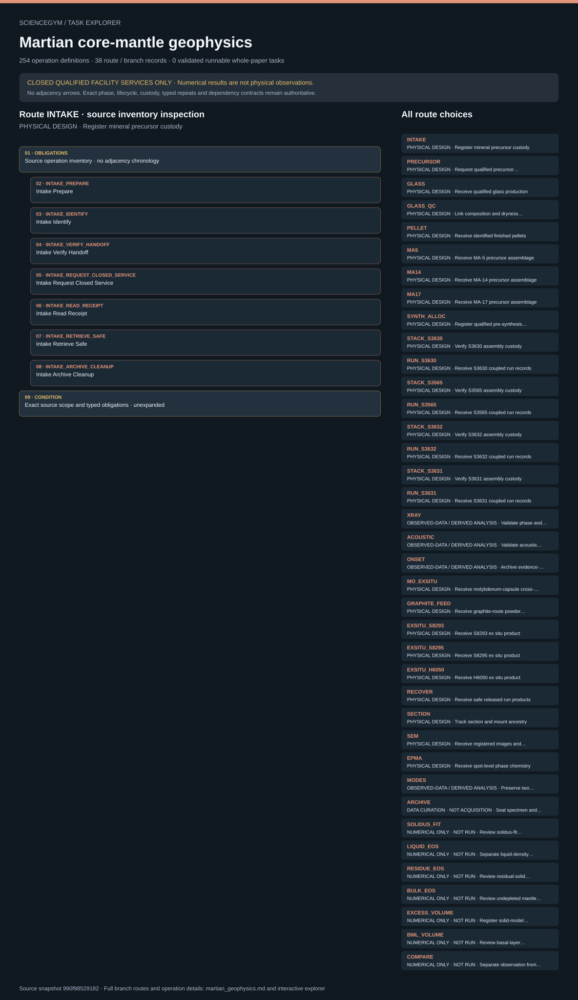

# Martian core-mantle geophysics: task route map



Paper: **Experimental constraints on a long-lived magma layer at the Martian core-mantle boundary** · [DOI](https://doi.org/10.1038/s41561-026-02104-z)

Author/evaluator design reference only; not an actor projection, executable procedure, task runner, solver, physical simulation or execution receipt. Navigation and operation membership do not invent chronology, control settings, specimen counts or completed services. CLOSED QUALIFIED FACILITY SERVICES ONLY. Twenty-six physical, four measurement-analysis, seven numerical and one data-curation branch remain distinct. Powder and glass routes, run/cohort/region identities and destructive parent retirement remain separate. Source conflicts block physical binding. Calculated values and synthetic bookkeeping are not observations or independent physical replicates; no hazard commands or recipes are supplied.. Counts describe task representation, not experiments or success.

**Reading rule:** rows show unordered source inventory for inspection. Exact phase, lifecycle and dependency contracts remain authoritative; no loop, specimen, condition or chronology is inferred. An unordered obligation group has no inferred chronological edges. Source-reported scientific facts and authored handling are distinct.

[Immutable source task package](https://github.com/openags/ScienceGym/blob/990f98529182af0ddd03fba53587b0931630de96/tasks/martian_geophysics_operations_v2/) · [Interactive inspector](../index.html)

## INTAKE — PHYSICAL DESIGN · Register mineral precursor custody

Author/evaluator design reference only; not an actor projection, executable procedure, task runner, solver, physical simulation or execution receipt. Navigation and operation membership do not invent chronology, control settings, specimen counts or completed services. CLOSED QUALIFIED FACILITY SERVICES ONLY. Twenty-six physical, four measurement-analysis, seven numerical and one data-curation branch remain distinct. Powder and glass routes, run/cohort/region identities and destructive parent retirement remain separate. Source conflicts block physical binding. Calculated values and synthetic bookkeeping are not observations or independent physical replicates; no hazard commands or recipes are supplied.

[Exact route source](https://github.com/openags/ScienceGym/blob/990f98529182af0ddd03fba53587b0931630de96/tasks/martian_geophysics_operations_v2/branches.json) · JSON pointer: `/branches/0`

- **OBLIGATIONS: Source operation inventory · no adjacency chronology**
  - Binding: {"order":"Unordered inspection membership. Apply exact source phase, lifecycle and dependency contracts; no counts or schedule are instantiated."}
  - `INTAKE_PREPARE` Intake Prepare
  - `INTAKE_IDENTIFY` Intake Identify
  - `INTAKE_VERIFY_HANDOFF` Intake Verify Handoff
  - `INTAKE_REQUEST_CLOSED_SERVICE` Intake Request Closed Service
  - `INTAKE_READ_RECEIPT` Intake Read Receipt
  - `INTAKE_RETRIEVE_SAFE` Intake Retrieve Safe
  - `INTAKE_ARCHIVE_CLEANUP` Intake Archive Cleanup
- **CONDITION: Exact source scope and typed obligations · unexpanded**
  - Binding: {"source_file":"branches.json","source_pointer":"/branches/0","source_contract":{"id":"INTAKE","title":"Register mineral precursor custody","family_id":"R01","source_route_ids":["R01"],"required_branch_ids":[],"station_id":"WS_PREP","classification":"physical_handling","input_kind":"sealed_identified_reagent_lots","output_kind":"batch_manifest","source_evidence_ids":["M01","T01"],"unknown_parameter_ids":["U_SCENE","U_IDENTITY","U_SERVICE","U_ARCHIVE","U_MATERIAL"],"conflict_ids":[],"cohort_ids":[],"source_independent_replicates":null,"execution_ready":false,"expected_results_actor_visible":false,"source_parameters":{},"design_note":"","operation_ids":["INTAKE_PREPARE","INTAKE_IDENTIFY","INTAKE_VERIFY_HANDOFF","INTAKE_REQUEST_CLOSED_SERVICE","INTAKE_READ_RECEIPT","INTAKE_RETRIEVE_SAFE","INTAKE_ARCHIVE_CLEANUP"],"phase_order":["prepare","identify","verify_handoff","request_closed_service","read_receipt","retrieve_safe","archive_cleanup"],"control_ids":["CTRL_IDENTITY","CTRL_RECORD","CTRL_CALIBRATION","CTRL_SAFE_RELEASE"]}}

<details><summary>Branch state, choices, lineage and loop obligations</summary>

```json
{
  "id": "INTAKE",
  "title": "Register mineral precursor custody",
  "family_id": "R01",
  "source_route_ids": [
    "R01"
  ],
  "required_branch_ids": [],
  "station_id": "WS_PREP",
  "classification": "physical_handling",
  "input_kind": "sealed_identified_reagent_lots",
  "output_kind": "batch_manifest",
  "source_evidence_ids": [
    "M01",
    "T01"
  ],
  "unknown_parameter_ids": [
    "U_SCENE",
    "U_IDENTITY",
    "U_SERVICE",
    "U_ARCHIVE",
    "U_MATERIAL"
  ],
  "conflict_ids": [],
  "cohort_ids": [],
  "source_independent_replicates": null,
  "execution_ready": false,
  "expected_results_actor_visible": false,
  "source_parameters": {},
  "design_note": "",
  "operation_ids": [
    "INTAKE_PREPARE",
    "INTAKE_IDENTIFY",
    "INTAKE_VERIFY_HANDOFF",
    "INTAKE_REQUEST_CLOSED_SERVICE",
    "INTAKE_READ_RECEIPT",
    "INTAKE_RETRIEVE_SAFE",
    "INTAKE_ARCHIVE_CLEANUP"
  ],
  "phase_order": [
    "prepare",
    "identify",
    "verify_handoff",
    "request_closed_service",
    "read_receipt",
    "retrieve_safe",
    "archive_cleanup"
  ],
  "control_ids": [
    "CTRL_IDENTITY",
    "CTRL_RECORD",
    "CTRL_CALIBRATION",
    "CTRL_SAFE_RELEASE"
  ]
}
```

</details>

## PRECURSOR — PHYSICAL DESIGN · Request qualified precursor preparation

Author/evaluator design reference only; not an actor projection, executable procedure, task runner, solver, physical simulation or execution receipt. Navigation and operation membership do not invent chronology, control settings, specimen counts or completed services. CLOSED QUALIFIED FACILITY SERVICES ONLY. Twenty-six physical, four measurement-analysis, seven numerical and one data-curation branch remain distinct. Powder and glass routes, run/cohort/region identities and destructive parent retirement remain separate. Source conflicts block physical binding. Calculated values and synthetic bookkeeping are not observations or independent physical replicates; no hazard commands or recipes are supplied.

[Exact route source](https://github.com/openags/ScienceGym/blob/990f98529182af0ddd03fba53587b0931630de96/tasks/martian_geophysics_operations_v2/branches.json) · JSON pointer: `/branches/1`

- **OBLIGATIONS: Source operation inventory · no adjacency chronology**
  - Binding: {"order":"Unordered inspection membership. Apply exact source phase, lifecycle and dependency contracts; no counts or schedule are instantiated."}
  - `PRECURSOR_PREPARE` Precursor Prepare
  - `PRECURSOR_IDENTIFY` Precursor Identify
  - `PRECURSOR_VERIFY_HANDOFF` Precursor Verify Handoff
  - `PRECURSOR_REQUEST_CLOSED_SERVICE` Precursor Request Closed Service
  - `PRECURSOR_READ_RECEIPT` Precursor Read Receipt
  - `PRECURSOR_RETRIEVE_SAFE` Precursor Retrieve Safe
  - `PRECURSOR_ARCHIVE_CLEANUP` Precursor Archive Cleanup
- **CONDITION: Exact source scope and typed obligations · unexpanded**
  - Binding: {"source_file":"branches.json","source_pointer":"/branches/1","source_contract":{"id":"PRECURSOR","title":"Request qualified precursor preparation","family_id":"R01","source_route_ids":["R01"],"required_branch_ids":["INTAKE"],"station_id":"WS_PREP","classification":"qualified_service","input_kind":"batch_manifest","output_kind":"released_precursor","source_evidence_ids":["M01","T01"],"unknown_parameter_ids":["U_SCENE","U_IDENTITY","U_SERVICE","U_ARCHIVE","U_MATERIAL","U_CHEM"],"conflict_ids":[],"cohort_ids":[],"source_independent_replicates":null,"execution_ready":false,"expected_results_actor_visible":false,"source_parameters":{},"design_note":"Facility owns all powder, solvent, gas and thermal processing. No masses, gas ratios or furnace program are inferred.","operation_ids":["PRECURSOR_PREPARE","PRECURSOR_IDENTIFY","PRECURSOR_VERIFY_HANDOFF","PRECURSOR_REQUEST_CLOSED_SERVICE","PRECURSOR_READ_RECEIPT","PRECURSOR_RETRIEVE_SAFE","PRECURSOR_ARCHIVE_CLEANUP"],"phase_order":["prepare","identify","verify_handoff","request_closed_service","read_receipt","retrieve_safe","archive_cleanup"],"control_ids":["CTRL_IDENTITY","CTRL_RECORD","CTRL_CALIBRATION","CTRL_SAFE_RELEASE"]}}

<details><summary>Branch state, choices, lineage and loop obligations</summary>

```json
{
  "id": "PRECURSOR",
  "title": "Request qualified precursor preparation",
  "family_id": "R01",
  "source_route_ids": [
    "R01"
  ],
  "required_branch_ids": [
    "INTAKE"
  ],
  "station_id": "WS_PREP",
  "classification": "qualified_service",
  "input_kind": "batch_manifest",
  "output_kind": "released_precursor",
  "source_evidence_ids": [
    "M01",
    "T01"
  ],
  "unknown_parameter_ids": [
    "U_SCENE",
    "U_IDENTITY",
    "U_SERVICE",
    "U_ARCHIVE",
    "U_MATERIAL",
    "U_CHEM"
  ],
  "conflict_ids": [],
  "cohort_ids": [],
  "source_independent_replicates": null,
  "execution_ready": false,
  "expected_results_actor_visible": false,
  "source_parameters": {},
  "design_note": "Facility owns all powder, solvent, gas and thermal processing. No masses, gas ratios or furnace program are inferred.",
  "operation_ids": [
    "PRECURSOR_PREPARE",
    "PRECURSOR_IDENTIFY",
    "PRECURSOR_VERIFY_HANDOFF",
    "PRECURSOR_REQUEST_CLOSED_SERVICE",
    "PRECURSOR_READ_RECEIPT",
    "PRECURSOR_RETRIEVE_SAFE",
    "PRECURSOR_ARCHIVE_CLEANUP"
  ],
  "phase_order": [
    "prepare",
    "identify",
    "verify_handoff",
    "request_closed_service",
    "read_receipt",
    "retrieve_safe",
    "archive_cleanup"
  ],
  "control_ids": [
    "CTRL_IDENTITY",
    "CTRL_RECORD",
    "CTRL_CALIBRATION",
    "CTRL_SAFE_RELEASE"
  ]
}
```

</details>

## GLASS — PHYSICAL DESIGN · Receive qualified glass production

Author/evaluator design reference only; not an actor projection, executable procedure, task runner, solver, physical simulation or execution receipt. Navigation and operation membership do not invent chronology, control settings, specimen counts or completed services. CLOSED QUALIFIED FACILITY SERVICES ONLY. Twenty-six physical, four measurement-analysis, seven numerical and one data-curation branch remain distinct. Powder and glass routes, run/cohort/region identities and destructive parent retirement remain separate. Source conflicts block physical binding. Calculated values and synthetic bookkeeping are not observations or independent physical replicates; no hazard commands or recipes are supplied.

[Exact route source](https://github.com/openags/ScienceGym/blob/990f98529182af0ddd03fba53587b0931630de96/tasks/martian_geophysics_operations_v2/branches.json) · JSON pointer: `/branches/2`

- **OBLIGATIONS: Source operation inventory · no adjacency chronology**
  - Binding: {"order":"Unordered inspection membership. Apply exact source phase, lifecycle and dependency contracts; no counts or schedule are instantiated."}
  - `GLASS_PREPARE` Glass Prepare
  - `GLASS_IDENTIFY` Glass Identify
  - `GLASS_VERIFY_HANDOFF` Glass Verify Handoff
  - `GLASS_REQUEST_CLOSED_SERVICE` Glass Request Closed Service
  - `GLASS_READ_RECEIPT` Glass Read Receipt
  - `GLASS_RETRIEVE_SAFE` Glass Retrieve Safe
  - `GLASS_ARCHIVE_CLEANUP` Glass Archive Cleanup
- **CONDITION: Exact source scope and typed obligations · unexpanded**
  - Binding: {"source_file":"branches.json","source_pointer":"/branches/2","source_contract":{"id":"GLASS","title":"Receive qualified glass production","family_id":"R01","source_route_ids":["R01"],"required_branch_ids":["PRECURSOR"],"station_id":"WS_GLASS","classification":"qualified_service","input_kind":"released_precursor","output_kind":"glass_lot","source_evidence_ids":["M01","T01"],"unknown_parameter_ids":["U_SCENE","U_IDENTITY","U_SERVICE","U_ARCHIVE","U_GLASS"],"conflict_ids":[],"cohort_ids":[],"source_independent_replicates":null,"execution_ready":false,"expected_results_actor_visible":false,"source_parameters":{},"design_note":"Laser levitation and atmosphere control are inaccessible service internals.","operation_ids":["GLASS_PREPARE","GLASS_IDENTIFY","GLASS_VERIFY_HANDOFF","GLASS_REQUEST_CLOSED_SERVICE","GLASS_READ_RECEIPT","GLASS_RETRIEVE_SAFE","GLASS_ARCHIVE_CLEANUP"],"phase_order":["prepare","identify","verify_handoff","request_closed_service","read_receipt","retrieve_safe","archive_cleanup"],"control_ids":["CTRL_IDENTITY","CTRL_RECORD","CTRL_CALIBRATION","CTRL_SAFE_RELEASE"]}}

<details><summary>Branch state, choices, lineage and loop obligations</summary>

```json
{
  "id": "GLASS",
  "title": "Receive qualified glass production",
  "family_id": "R01",
  "source_route_ids": [
    "R01"
  ],
  "required_branch_ids": [
    "PRECURSOR"
  ],
  "station_id": "WS_GLASS",
  "classification": "qualified_service",
  "input_kind": "released_precursor",
  "output_kind": "glass_lot",
  "source_evidence_ids": [
    "M01",
    "T01"
  ],
  "unknown_parameter_ids": [
    "U_SCENE",
    "U_IDENTITY",
    "U_SERVICE",
    "U_ARCHIVE",
    "U_GLASS"
  ],
  "conflict_ids": [],
  "cohort_ids": [],
  "source_independent_replicates": null,
  "execution_ready": false,
  "expected_results_actor_visible": false,
  "source_parameters": {},
  "design_note": "Laser levitation and atmosphere control are inaccessible service internals.",
  "operation_ids": [
    "GLASS_PREPARE",
    "GLASS_IDENTIFY",
    "GLASS_VERIFY_HANDOFF",
    "GLASS_REQUEST_CLOSED_SERVICE",
    "GLASS_READ_RECEIPT",
    "GLASS_RETRIEVE_SAFE",
    "GLASS_ARCHIVE_CLEANUP"
  ],
  "phase_order": [
    "prepare",
    "identify",
    "verify_handoff",
    "request_closed_service",
    "read_receipt",
    "retrieve_safe",
    "archive_cleanup"
  ],
  "control_ids": [
    "CTRL_IDENTITY",
    "CTRL_RECORD",
    "CTRL_CALIBRATION",
    "CTRL_SAFE_RELEASE"
  ]
}
```

</details>

## GLASS_QC — PHYSICAL DESIGN · Link composition and dryness evidence

Author/evaluator design reference only; not an actor projection, executable procedure, task runner, solver, physical simulation or execution receipt. Navigation and operation membership do not invent chronology, control settings, specimen counts or completed services. CLOSED QUALIFIED FACILITY SERVICES ONLY. Twenty-six physical, four measurement-analysis, seven numerical and one data-curation branch remain distinct. Powder and glass routes, run/cohort/region identities and destructive parent retirement remain separate. Source conflicts block physical binding. Calculated values and synthetic bookkeeping are not observations or independent physical replicates; no hazard commands or recipes are supplied.

[Exact route source](https://github.com/openags/ScienceGym/blob/990f98529182af0ddd03fba53587b0931630de96/tasks/martian_geophysics_operations_v2/branches.json) · JSON pointer: `/branches/3`

- **OBLIGATIONS: Source operation inventory · no adjacency chronology**
  - Binding: {"order":"Unordered inspection membership. Apply exact source phase, lifecycle and dependency contracts; no counts or schedule are instantiated."}
  - `GLASS_QC_PREPARE` Glass Qc Prepare
  - `GLASS_QC_IDENTIFY` Glass Qc Identify
  - `GLASS_QC_VERIFY_HANDOFF` Glass Qc Verify Handoff
  - `GLASS_QC_REQUEST_CLOSED_SERVICE` Glass Qc Request Closed Service
  - `GLASS_QC_READ_RECEIPT` Glass Qc Read Receipt
  - `GLASS_QC_RETRIEVE_SAFE` Glass Qc Retrieve Safe
  - `GLASS_QC_ARCHIVE_CLEANUP` Glass Qc Archive Cleanup
- **CONDITION: Exact source scope and typed obligations · unexpanded**
  - Binding: {"source_file":"branches.json","source_pointer":"/branches/3","source_contract":{"id":"GLASS_QC","title":"Link composition and dryness evidence","family_id":"R01","source_route_ids":["R01"],"required_branch_ids":["GLASS"],"station_id":"WS_CHEM","classification":"qualified_measurement","input_kind":"glass_lot","output_kind":"qualified_glass","source_evidence_ids":["M01","M02","T01"],"unknown_parameter_ids":["U_SCENE","U_IDENTITY","U_SERVICE","U_ARCHIVE","U_CHEM","U_FTIR"],"conflict_ids":[],"cohort_ids":[],"source_independent_replicates":null,"execution_ready":false,"expected_results_actor_visible":false,"source_parameters":{},"design_note":"Nominally dry means no reported OH bands at an unspecified detection limit, not zero water.","operation_ids":["GLASS_QC_PREPARE","GLASS_QC_IDENTIFY","GLASS_QC_VERIFY_HANDOFF","GLASS_QC_REQUEST_CLOSED_SERVICE","GLASS_QC_READ_RECEIPT","GLASS_QC_RETRIEVE_SAFE","GLASS_QC_ARCHIVE_CLEANUP"],"phase_order":["prepare","identify","verify_handoff","request_closed_service","read_receipt","retrieve_safe","archive_cleanup"],"control_ids":["CTRL_IDENTITY","CTRL_RECORD","CTRL_CALIBRATION","CTRL_SAFE_RELEASE"]}}

<details><summary>Branch state, choices, lineage and loop obligations</summary>

```json
{
  "id": "GLASS_QC",
  "title": "Link composition and dryness evidence",
  "family_id": "R01",
  "source_route_ids": [
    "R01"
  ],
  "required_branch_ids": [
    "GLASS"
  ],
  "station_id": "WS_CHEM",
  "classification": "qualified_measurement",
  "input_kind": "glass_lot",
  "output_kind": "qualified_glass",
  "source_evidence_ids": [
    "M01",
    "M02",
    "T01"
  ],
  "unknown_parameter_ids": [
    "U_SCENE",
    "U_IDENTITY",
    "U_SERVICE",
    "U_ARCHIVE",
    "U_CHEM",
    "U_FTIR"
  ],
  "conflict_ids": [],
  "cohort_ids": [],
  "source_independent_replicates": null,
  "execution_ready": false,
  "expected_results_actor_visible": false,
  "source_parameters": {},
  "design_note": "Nominally dry means no reported OH bands at an unspecified detection limit, not zero water.",
  "operation_ids": [
    "GLASS_QC_PREPARE",
    "GLASS_QC_IDENTIFY",
    "GLASS_QC_VERIFY_HANDOFF",
    "GLASS_QC_REQUEST_CLOSED_SERVICE",
    "GLASS_QC_READ_RECEIPT",
    "GLASS_QC_RETRIEVE_SAFE",
    "GLASS_QC_ARCHIVE_CLEANUP"
  ],
  "phase_order": [
    "prepare",
    "identify",
    "verify_handoff",
    "request_closed_service",
    "read_receipt",
    "retrieve_safe",
    "archive_cleanup"
  ],
  "control_ids": [
    "CTRL_IDENTITY",
    "CTRL_RECORD",
    "CTRL_CALIBRATION",
    "CTRL_SAFE_RELEASE"
  ]
}
```

</details>

## PELLET — PHYSICAL DESIGN · Receive identified finished pellets

Author/evaluator design reference only; not an actor projection, executable procedure, task runner, solver, physical simulation or execution receipt. Navigation and operation membership do not invent chronology, control settings, specimen counts or completed services. CLOSED QUALIFIED FACILITY SERVICES ONLY. Twenty-six physical, four measurement-analysis, seven numerical and one data-curation branch remain distinct. Powder and glass routes, run/cohort/region identities and destructive parent retirement remain separate. Source conflicts block physical binding. Calculated values and synthetic bookkeeping are not observations or independent physical replicates; no hazard commands or recipes are supplied.

[Exact route source](https://github.com/openags/ScienceGym/blob/990f98529182af0ddd03fba53587b0931630de96/tasks/martian_geophysics_operations_v2/branches.json) · JSON pointer: `/branches/4`

- **OBLIGATIONS: Source operation inventory · no adjacency chronology**
  - Binding: {"order":"Unordered inspection membership. Apply exact source phase, lifecycle and dependency contracts; no counts or schedule are instantiated."}
  - `PELLET_PREPARE` Pellet Prepare
  - `PELLET_IDENTIFY` Pellet Identify
  - `PELLET_VERIFY_HANDOFF` Pellet Verify Handoff
  - `PELLET_REQUEST_CLOSED_SERVICE` Pellet Request Closed Service
  - `PELLET_READ_RECEIPT` Pellet Read Receipt
  - `PELLET_RETRIEVE_SAFE` Pellet Retrieve Safe
  - `PELLET_ARCHIVE_CLEANUP` Pellet Archive Cleanup
- **CONDITION: Exact source scope and typed obligations · unexpanded**
  - Binding: {"source_file":"branches.json","source_pointer":"/branches/4","source_contract":{"id":"PELLET","title":"Receive identified finished pellets","family_id":"R01","source_route_ids":["R01"],"required_branch_ids":["GLASS_QC"],"station_id":"WS_PREP","classification":"qualified_service","input_kind":"qualified_glass","output_kind":"pellet_lot","source_evidence_ids":["M01"],"unknown_parameter_ids":["U_SCENE","U_IDENTITY","U_SERVICE","U_ARCHIVE","U_FINISH"],"conflict_ids":[],"cohort_ids":[],"source_independent_replicates":null,"execution_ready":false,"expected_results_actor_visible":false,"source_parameters":{},"design_note":"","operation_ids":["PELLET_PREPARE","PELLET_IDENTIFY","PELLET_VERIFY_HANDOFF","PELLET_REQUEST_CLOSED_SERVICE","PELLET_READ_RECEIPT","PELLET_RETRIEVE_SAFE","PELLET_ARCHIVE_CLEANUP"],"phase_order":["prepare","identify","verify_handoff","request_closed_service","read_receipt","retrieve_safe","archive_cleanup"],"control_ids":["CTRL_IDENTITY","CTRL_RECORD","CTRL_CALIBRATION","CTRL_SAFE_RELEASE"]}}

<details><summary>Branch state, choices, lineage and loop obligations</summary>

```json
{
  "id": "PELLET",
  "title": "Receive identified finished pellets",
  "family_id": "R01",
  "source_route_ids": [
    "R01"
  ],
  "required_branch_ids": [
    "GLASS_QC"
  ],
  "station_id": "WS_PREP",
  "classification": "qualified_service",
  "input_kind": "qualified_glass",
  "output_kind": "pellet_lot",
  "source_evidence_ids": [
    "M01"
  ],
  "unknown_parameter_ids": [
    "U_SCENE",
    "U_IDENTITY",
    "U_SERVICE",
    "U_ARCHIVE",
    "U_FINISH"
  ],
  "conflict_ids": [],
  "cohort_ids": [],
  "source_independent_replicates": null,
  "execution_ready": false,
  "expected_results_actor_visible": false,
  "source_parameters": {},
  "design_note": "",
  "operation_ids": [
    "PELLET_PREPARE",
    "PELLET_IDENTIFY",
    "PELLET_VERIFY_HANDOFF",
    "PELLET_REQUEST_CLOSED_SERVICE",
    "PELLET_READ_RECEIPT",
    "PELLET_RETRIEVE_SAFE",
    "PELLET_ARCHIVE_CLEANUP"
  ],
  "phase_order": [
    "prepare",
    "identify",
    "verify_handoff",
    "request_closed_service",
    "read_receipt",
    "retrieve_safe",
    "archive_cleanup"
  ],
  "control_ids": [
    "CTRL_IDENTITY",
    "CTRL_RECORD",
    "CTRL_CALIBRATION",
    "CTRL_SAFE_RELEASE"
  ]
}
```

</details>

## MA5 — PHYSICAL DESIGN · Receive MA-5 precursor assemblage

Author/evaluator design reference only; not an actor projection, executable procedure, task runner, solver, physical simulation or execution receipt. Navigation and operation membership do not invent chronology, control settings, specimen counts or completed services. CLOSED QUALIFIED FACILITY SERVICES ONLY. Twenty-six physical, four measurement-analysis, seven numerical and one data-curation branch remain distinct. Powder and glass routes, run/cohort/region identities and destructive parent retirement remain separate. Source conflicts block physical binding. Calculated values and synthetic bookkeeping are not observations or independent physical replicates; no hazard commands or recipes are supplied.

[Exact route source](https://github.com/openags/ScienceGym/blob/990f98529182af0ddd03fba53587b0931630de96/tasks/martian_geophysics_operations_v2/branches.json) · JSON pointer: `/branches/5`

- **OBLIGATIONS: Source operation inventory · no adjacency chronology**
  - Binding: {"order":"Unordered inspection membership. Apply exact source phase, lifecycle and dependency contracts; no counts or schedule are instantiated."}
  - `MA5_PREPARE` Ma5 Prepare
  - `MA5_IDENTIFY` Ma5 Identify
  - `MA5_VERIFY_HANDOFF` Ma5 Verify Handoff
  - `MA5_REQUEST_CLOSED_SERVICE` Ma5 Request Closed Service
  - `MA5_READ_RECEIPT` Ma5 Read Receipt
  - `MA5_RETRIEVE_SAFE` Ma5 Retrieve Safe
  - `MA5_ARCHIVE_CLEANUP` Ma5 Archive Cleanup
- **CONDITION: Exact source scope and typed obligations · unexpanded**
  - Binding: {"source_file":"branches.json","source_pointer":"/branches/5","source_contract":{"id":"MA5","title":"Receive MA-5 precursor assemblage","family_id":"R02","source_route_ids":["R02"],"required_branch_ids":["PELLET"],"station_id":"WS_SYNTH","classification":"qualified_service","input_kind":"pellet_lot","output_kind":"polished_assemblage","source_evidence_ids":["M01","S09","T04","T05"],"unknown_parameter_ids":["U_SCENE","U_IDENTITY","U_SERVICE","U_ARCHIVE","U_SYNTH","U_FINISH"],"conflict_ids":["C04"],"cohort_ids":["MA-5"],"source_independent_replicates":null,"execution_ready":false,"expected_results_actor_visible":false,"source_parameters":{},"design_note":"Closed facility synthesis and double-side finishing; source phase identity is checked against independent characterization, never asserted by name.","operation_ids":["MA5_PREPARE","MA5_IDENTIFY","MA5_VERIFY_HANDOFF","MA5_REQUEST_CLOSED_SERVICE","MA5_READ_RECEIPT","MA5_RETRIEVE_SAFE","MA5_ARCHIVE_CLEANUP"],"phase_order":["prepare","identify","verify_handoff","request_closed_service","read_receipt","retrieve_safe","archive_cleanup"],"control_ids":["CTRL_IDENTITY","CTRL_RECORD","CTRL_CALIBRATION","CTRL_SAFE_RELEASE"]}}

<details><summary>Branch state, choices, lineage and loop obligations</summary>

```json
{
  "id": "MA5",
  "title": "Receive MA-5 precursor assemblage",
  "family_id": "R02",
  "source_route_ids": [
    "R02"
  ],
  "required_branch_ids": [
    "PELLET"
  ],
  "station_id": "WS_SYNTH",
  "classification": "qualified_service",
  "input_kind": "pellet_lot",
  "output_kind": "polished_assemblage",
  "source_evidence_ids": [
    "M01",
    "S09",
    "T04",
    "T05"
  ],
  "unknown_parameter_ids": [
    "U_SCENE",
    "U_IDENTITY",
    "U_SERVICE",
    "U_ARCHIVE",
    "U_SYNTH",
    "U_FINISH"
  ],
  "conflict_ids": [
    "C04"
  ],
  "cohort_ids": [
    "MA-5"
  ],
  "source_independent_replicates": null,
  "execution_ready": false,
  "expected_results_actor_visible": false,
  "source_parameters": {},
  "design_note": "Closed facility synthesis and double-side finishing; source phase identity is checked against independent characterization, never asserted by name.",
  "operation_ids": [
    "MA5_PREPARE",
    "MA5_IDENTIFY",
    "MA5_VERIFY_HANDOFF",
    "MA5_REQUEST_CLOSED_SERVICE",
    "MA5_READ_RECEIPT",
    "MA5_RETRIEVE_SAFE",
    "MA5_ARCHIVE_CLEANUP"
  ],
  "phase_order": [
    "prepare",
    "identify",
    "verify_handoff",
    "request_closed_service",
    "read_receipt",
    "retrieve_safe",
    "archive_cleanup"
  ],
  "control_ids": [
    "CTRL_IDENTITY",
    "CTRL_RECORD",
    "CTRL_CALIBRATION",
    "CTRL_SAFE_RELEASE"
  ]
}
```

</details>

## MA14 — PHYSICAL DESIGN · Receive MA-14 precursor assemblage

Author/evaluator design reference only; not an actor projection, executable procedure, task runner, solver, physical simulation or execution receipt. Navigation and operation membership do not invent chronology, control settings, specimen counts or completed services. CLOSED QUALIFIED FACILITY SERVICES ONLY. Twenty-six physical, four measurement-analysis, seven numerical and one data-curation branch remain distinct. Powder and glass routes, run/cohort/region identities and destructive parent retirement remain separate. Source conflicts block physical binding. Calculated values and synthetic bookkeeping are not observations or independent physical replicates; no hazard commands or recipes are supplied.

[Exact route source](https://github.com/openags/ScienceGym/blob/990f98529182af0ddd03fba53587b0931630de96/tasks/martian_geophysics_operations_v2/branches.json) · JSON pointer: `/branches/6`

- **OBLIGATIONS: Source operation inventory · no adjacency chronology**
  - Binding: {"order":"Unordered inspection membership. Apply exact source phase, lifecycle and dependency contracts; no counts or schedule are instantiated."}
  - `MA14_PREPARE` Ma14 Prepare
  - `MA14_IDENTIFY` Ma14 Identify
  - `MA14_VERIFY_HANDOFF` Ma14 Verify Handoff
  - `MA14_REQUEST_CLOSED_SERVICE` Ma14 Request Closed Service
  - `MA14_READ_RECEIPT` Ma14 Read Receipt
  - `MA14_RETRIEVE_SAFE` Ma14 Retrieve Safe
  - `MA14_ARCHIVE_CLEANUP` Ma14 Archive Cleanup
- **CONDITION: Exact source scope and typed obligations · unexpanded**
  - Binding: {"source_file":"branches.json","source_pointer":"/branches/6","source_contract":{"id":"MA14","title":"Receive MA-14 precursor assemblage","family_id":"R02","source_route_ids":["R02"],"required_branch_ids":["PELLET"],"station_id":"WS_SYNTH","classification":"qualified_service","input_kind":"pellet_lot","output_kind":"polished_assemblage","source_evidence_ids":["M01","S09","T04","T05"],"unknown_parameter_ids":["U_SCENE","U_IDENTITY","U_SERVICE","U_ARCHIVE","U_SYNTH","U_FINISH"],"conflict_ids":[],"cohort_ids":["MA-14"],"source_independent_replicates":null,"execution_ready":false,"expected_results_actor_visible":false,"source_parameters":{},"design_note":"Closed facility synthesis and double-side finishing; source phase identity is checked against independent characterization, never asserted by name.","operation_ids":["MA14_PREPARE","MA14_IDENTIFY","MA14_VERIFY_HANDOFF","MA14_REQUEST_CLOSED_SERVICE","MA14_READ_RECEIPT","MA14_RETRIEVE_SAFE","MA14_ARCHIVE_CLEANUP"],"phase_order":["prepare","identify","verify_handoff","request_closed_service","read_receipt","retrieve_safe","archive_cleanup"],"control_ids":["CTRL_IDENTITY","CTRL_RECORD","CTRL_CALIBRATION","CTRL_SAFE_RELEASE"]}}

<details><summary>Branch state, choices, lineage and loop obligations</summary>

```json
{
  "id": "MA14",
  "title": "Receive MA-14 precursor assemblage",
  "family_id": "R02",
  "source_route_ids": [
    "R02"
  ],
  "required_branch_ids": [
    "PELLET"
  ],
  "station_id": "WS_SYNTH",
  "classification": "qualified_service",
  "input_kind": "pellet_lot",
  "output_kind": "polished_assemblage",
  "source_evidence_ids": [
    "M01",
    "S09",
    "T04",
    "T05"
  ],
  "unknown_parameter_ids": [
    "U_SCENE",
    "U_IDENTITY",
    "U_SERVICE",
    "U_ARCHIVE",
    "U_SYNTH",
    "U_FINISH"
  ],
  "conflict_ids": [],
  "cohort_ids": [
    "MA-14"
  ],
  "source_independent_replicates": null,
  "execution_ready": false,
  "expected_results_actor_visible": false,
  "source_parameters": {},
  "design_note": "Closed facility synthesis and double-side finishing; source phase identity is checked against independent characterization, never asserted by name.",
  "operation_ids": [
    "MA14_PREPARE",
    "MA14_IDENTIFY",
    "MA14_VERIFY_HANDOFF",
    "MA14_REQUEST_CLOSED_SERVICE",
    "MA14_READ_RECEIPT",
    "MA14_RETRIEVE_SAFE",
    "MA14_ARCHIVE_CLEANUP"
  ],
  "phase_order": [
    "prepare",
    "identify",
    "verify_handoff",
    "request_closed_service",
    "read_receipt",
    "retrieve_safe",
    "archive_cleanup"
  ],
  "control_ids": [
    "CTRL_IDENTITY",
    "CTRL_RECORD",
    "CTRL_CALIBRATION",
    "CTRL_SAFE_RELEASE"
  ]
}
```

</details>

## MA17 — PHYSICAL DESIGN · Receive MA-17 precursor assemblage

Author/evaluator design reference only; not an actor projection, executable procedure, task runner, solver, physical simulation or execution receipt. Navigation and operation membership do not invent chronology, control settings, specimen counts or completed services. CLOSED QUALIFIED FACILITY SERVICES ONLY. Twenty-six physical, four measurement-analysis, seven numerical and one data-curation branch remain distinct. Powder and glass routes, run/cohort/region identities and destructive parent retirement remain separate. Source conflicts block physical binding. Calculated values and synthetic bookkeeping are not observations or independent physical replicates; no hazard commands or recipes are supplied.

[Exact route source](https://github.com/openags/ScienceGym/blob/990f98529182af0ddd03fba53587b0931630de96/tasks/martian_geophysics_operations_v2/branches.json) · JSON pointer: `/branches/7`

- **OBLIGATIONS: Source operation inventory · no adjacency chronology**
  - Binding: {"order":"Unordered inspection membership. Apply exact source phase, lifecycle and dependency contracts; no counts or schedule are instantiated."}
  - `MA17_PREPARE` Ma17 Prepare
  - `MA17_IDENTIFY` Ma17 Identify
  - `MA17_VERIFY_HANDOFF` Ma17 Verify Handoff
  - `MA17_REQUEST_CLOSED_SERVICE` Ma17 Request Closed Service
  - `MA17_READ_RECEIPT` Ma17 Read Receipt
  - `MA17_RETRIEVE_SAFE` Ma17 Retrieve Safe
  - `MA17_ARCHIVE_CLEANUP` Ma17 Archive Cleanup
- **CONDITION: Exact source scope and typed obligations · unexpanded**
  - Binding: {"source_file":"branches.json","source_pointer":"/branches/7","source_contract":{"id":"MA17","title":"Receive MA-17 precursor assemblage","family_id":"R02","source_route_ids":["R02"],"required_branch_ids":["PELLET"],"station_id":"WS_SYNTH","classification":"qualified_service","input_kind":"pellet_lot","output_kind":"polished_assemblage","source_evidence_ids":["M01","S09","T04","T05"],"unknown_parameter_ids":["U_SCENE","U_IDENTITY","U_SERVICE","U_ARCHIVE","U_SYNTH","U_FINISH"],"conflict_ids":[],"cohort_ids":["MA-17"],"source_independent_replicates":null,"execution_ready":false,"expected_results_actor_visible":false,"source_parameters":{},"design_note":"Closed facility synthesis and double-side finishing; source phase identity is checked against independent characterization, never asserted by name.","operation_ids":["MA17_PREPARE","MA17_IDENTIFY","MA17_VERIFY_HANDOFF","MA17_REQUEST_CLOSED_SERVICE","MA17_READ_RECEIPT","MA17_RETRIEVE_SAFE","MA17_ARCHIVE_CLEANUP"],"phase_order":["prepare","identify","verify_handoff","request_closed_service","read_receipt","retrieve_safe","archive_cleanup"],"control_ids":["CTRL_IDENTITY","CTRL_RECORD","CTRL_CALIBRATION","CTRL_SAFE_RELEASE"]}}

<details><summary>Branch state, choices, lineage and loop obligations</summary>

```json
{
  "id": "MA17",
  "title": "Receive MA-17 precursor assemblage",
  "family_id": "R02",
  "source_route_ids": [
    "R02"
  ],
  "required_branch_ids": [
    "PELLET"
  ],
  "station_id": "WS_SYNTH",
  "classification": "qualified_service",
  "input_kind": "pellet_lot",
  "output_kind": "polished_assemblage",
  "source_evidence_ids": [
    "M01",
    "S09",
    "T04",
    "T05"
  ],
  "unknown_parameter_ids": [
    "U_SCENE",
    "U_IDENTITY",
    "U_SERVICE",
    "U_ARCHIVE",
    "U_SYNTH",
    "U_FINISH"
  ],
  "conflict_ids": [],
  "cohort_ids": [
    "MA-17"
  ],
  "source_independent_replicates": null,
  "execution_ready": false,
  "expected_results_actor_visible": false,
  "source_parameters": {},
  "design_note": "Closed facility synthesis and double-side finishing; source phase identity is checked against independent characterization, never asserted by name.",
  "operation_ids": [
    "MA17_PREPARE",
    "MA17_IDENTIFY",
    "MA17_VERIFY_HANDOFF",
    "MA17_REQUEST_CLOSED_SERVICE",
    "MA17_READ_RECEIPT",
    "MA17_RETRIEVE_SAFE",
    "MA17_ARCHIVE_CLEANUP"
  ],
  "phase_order": [
    "prepare",
    "identify",
    "verify_handoff",
    "request_closed_service",
    "read_receipt",
    "retrieve_safe",
    "archive_cleanup"
  ],
  "control_ids": [
    "CTRL_IDENTITY",
    "CTRL_RECORD",
    "CTRL_CALIBRATION",
    "CTRL_SAFE_RELEASE"
  ]
}
```

</details>

## SYNTH_ALLOC — PHYSICAL DESIGN · Register qualified pre-synthesis assignment

Author/evaluator design reference only; not an actor projection, executable procedure, task runner, solver, physical simulation or execution receipt. Navigation and operation membership do not invent chronology, control settings, specimen counts or completed services. CLOSED QUALIFIED FACILITY SERVICES ONLY. Twenty-six physical, four measurement-analysis, seven numerical and one data-curation branch remain distinct. Powder and glass routes, run/cohort/region identities and destructive parent retirement remain separate. Source conflicts block physical binding. Calculated values and synthetic bookkeeping are not observations or independent physical replicates; no hazard commands or recipes are supplied.

[Exact route source](https://github.com/openags/ScienceGym/blob/990f98529182af0ddd03fba53587b0931630de96/tasks/martian_geophysics_operations_v2/branches.json) · JSON pointer: `/branches/8`

- **OBLIGATIONS: Source operation inventory · no adjacency chronology**
  - Binding: {"order":"Unordered inspection membership. Apply exact source phase, lifecycle and dependency contracts; no counts or schedule are instantiated."}
  - `SYNTH_ALLOC_PREPARE` Synth Alloc Prepare
  - `SYNTH_ALLOC_IDENTIFY` Synth Alloc Identify
  - `SYNTH_ALLOC_VERIFY_HANDOFF` Synth Alloc Verify Handoff
  - `SYNTH_ALLOC_REQUEST_CLOSED_SERVICE` Synth Alloc Request Closed Service
  - `SYNTH_ALLOC_READ_RECEIPT` Synth Alloc Read Receipt
  - `SYNTH_ALLOC_RETRIEVE_SAFE` Synth Alloc Retrieve Safe
  - `SYNTH_ALLOC_ARCHIVE_CLEANUP` Synth Alloc Archive Cleanup
- **CONDITION: Exact source scope and typed obligations · unexpanded**
  - Binding: {"source_file":"branches.json","source_pointer":"/branches/8","source_contract":{"id":"SYNTH_ALLOC","title":"Register qualified pre-synthesis assignment","family_id":"R02","source_route_ids":["R02"],"required_branch_ids":["MA5","MA14","MA17"],"station_id":"WS_ASSEMBLY","classification":"qualified_service","input_kind":"pre_synthesis_inventory","output_kind":"qualified_run_allocation","source_evidence_ids":["M01","T04","T05"],"unknown_parameter_ids":["U_SCENE","U_IDENTITY","U_SERVICE","U_ARCHIVE","U_PARENTMAP"],"conflict_ids":[],"cohort_ids":[],"source_independent_replicates":null,"execution_ready":false,"expected_results_actor_visible":false,"source_parameters":{},"design_note":"Exact MA-family-to-run parent associations are not established by this source. The three families are inventory dependencies, not proof of actual specimen parentage. A qualified allocation card must bind each run to its true parent.","operation_ids":["SYNTH_ALLOC_PREPARE","SYNTH_ALLOC_IDENTIFY","SYNTH_ALLOC_VERIFY_HANDOFF","SYNTH_ALLOC_REQUEST_CLOSED_SERVICE","SYNTH_ALLOC_READ_RECEIPT","SYNTH_ALLOC_RETRIEVE_SAFE","SYNTH_ALLOC_ARCHIVE_CLEANUP"],"phase_order":["prepare","identify","verify_handoff","request_closed_service","read_receipt","retrieve_safe","archive_cleanup"],"control_ids":["CTRL_IDENTITY","CTRL_RECORD","CTRL_CALIBRATION","CTRL_SAFE_RELEASE"]}}

<details><summary>Branch state, choices, lineage and loop obligations</summary>

```json
{
  "id": "SYNTH_ALLOC",
  "title": "Register qualified pre-synthesis assignment",
  "family_id": "R02",
  "source_route_ids": [
    "R02"
  ],
  "required_branch_ids": [
    "MA5",
    "MA14",
    "MA17"
  ],
  "station_id": "WS_ASSEMBLY",
  "classification": "qualified_service",
  "input_kind": "pre_synthesis_inventory",
  "output_kind": "qualified_run_allocation",
  "source_evidence_ids": [
    "M01",
    "T04",
    "T05"
  ],
  "unknown_parameter_ids": [
    "U_SCENE",
    "U_IDENTITY",
    "U_SERVICE",
    "U_ARCHIVE",
    "U_PARENTMAP"
  ],
  "conflict_ids": [],
  "cohort_ids": [],
  "source_independent_replicates": null,
  "execution_ready": false,
  "expected_results_actor_visible": false,
  "source_parameters": {},
  "design_note": "Exact MA-family-to-run parent associations are not established by this source. The three families are inventory dependencies, not proof of actual specimen parentage. A qualified allocation card must bind each run to its true parent.",
  "operation_ids": [
    "SYNTH_ALLOC_PREPARE",
    "SYNTH_ALLOC_IDENTIFY",
    "SYNTH_ALLOC_VERIFY_HANDOFF",
    "SYNTH_ALLOC_REQUEST_CLOSED_SERVICE",
    "SYNTH_ALLOC_READ_RECEIPT",
    "SYNTH_ALLOC_RETRIEVE_SAFE",
    "SYNTH_ALLOC_ARCHIVE_CLEANUP"
  ],
  "phase_order": [
    "prepare",
    "identify",
    "verify_handoff",
    "request_closed_service",
    "read_receipt",
    "retrieve_safe",
    "archive_cleanup"
  ],
  "control_ids": [
    "CTRL_IDENTITY",
    "CTRL_RECORD",
    "CTRL_CALIBRATION",
    "CTRL_SAFE_RELEASE"
  ]
}
```

</details>

## STACK_S3630 — PHYSICAL DESIGN · Verify S3630 assembly custody

Author/evaluator design reference only; not an actor projection, executable procedure, task runner, solver, physical simulation or execution receipt. Navigation and operation membership do not invent chronology, control settings, specimen counts or completed services. CLOSED QUALIFIED FACILITY SERVICES ONLY. Twenty-six physical, four measurement-analysis, seven numerical and one data-curation branch remain distinct. Powder and glass routes, run/cohort/region identities and destructive parent retirement remain separate. Source conflicts block physical binding. Calculated values and synthetic bookkeeping are not observations or independent physical replicates; no hazard commands or recipes are supplied.

[Exact route source](https://github.com/openags/ScienceGym/blob/990f98529182af0ddd03fba53587b0931630de96/tasks/martian_geophysics_operations_v2/branches.json) · JSON pointer: `/branches/9`

- **OBLIGATIONS: Source operation inventory · no adjacency chronology**
  - Binding: {"order":"Unordered inspection membership. Apply exact source phase, lifecycle and dependency contracts; no counts or schedule are instantiated."}
  - `STACK_S3630_PREPARE` Stack S3630 Prepare
  - `STACK_S3630_IDENTIFY` Stack S3630 Identify
  - `STACK_S3630_VERIFY_HANDOFF` Stack S3630 Verify Handoff
  - `STACK_S3630_REQUEST_CLOSED_SERVICE` Stack S3630 Request Closed Service
  - `STACK_S3630_READ_RECEIPT` Stack S3630 Read Receipt
  - `STACK_S3630_RETRIEVE_SAFE` Stack S3630 Retrieve Safe
  - `STACK_S3630_ARCHIVE_CLEANUP` Stack S3630 Archive Cleanup
- **CONDITION: Exact source scope and typed obligations · unexpanded**
  - Binding: {"source_file":"branches.json","source_pointer":"/branches/9","source_contract":{"id":"STACK_S3630","title":"Verify S3630 assembly custody","family_id":"R03","source_route_ids":["R03"],"required_branch_ids":["SYNTH_ALLOC"],"station_id":"WS_ASSEMBLY","classification":"qualified_service","input_kind":"polished_assemblage","output_kind":"instrumented_stack","source_evidence_ids":["M03","M09","S03","S10"],"unknown_parameter_ids":["U_SCENE","U_IDENTITY","U_SERVICE","U_ARCHIVE","U_ASSEMBLY","U_CAL","U_PARENTMAP"],"conflict_ids":["C03"],"cohort_ids":["S3630"],"source_independent_replicates":null,"execution_ready":false,"expected_results_actor_visible":false,"source_parameters":{},"design_note":"Source assembly class 14/8 is metadata only. Resolve foil ambiguity and approve geometry before physical binding; no CAD dimensions or unsafe assembly recipe is supplied.","operation_ids":["STACK_S3630_PREPARE","STACK_S3630_IDENTIFY","STACK_S3630_VERIFY_HANDOFF","STACK_S3630_REQUEST_CLOSED_SERVICE","STACK_S3630_READ_RECEIPT","STACK_S3630_RETRIEVE_SAFE","STACK_S3630_ARCHIVE_CLEANUP"],"phase_order":["prepare","identify","verify_handoff","request_closed_service","read_receipt","retrieve_safe","archive_cleanup"],"control_ids":["CTRL_IDENTITY","CTRL_RECORD","CTRL_CALIBRATION","CTRL_SAFE_RELEASE"]}}

<details><summary>Branch state, choices, lineage and loop obligations</summary>

```json
{
  "id": "STACK_S3630",
  "title": "Verify S3630 assembly custody",
  "family_id": "R03",
  "source_route_ids": [
    "R03"
  ],
  "required_branch_ids": [
    "SYNTH_ALLOC"
  ],
  "station_id": "WS_ASSEMBLY",
  "classification": "qualified_service",
  "input_kind": "polished_assemblage",
  "output_kind": "instrumented_stack",
  "source_evidence_ids": [
    "M03",
    "M09",
    "S03",
    "S10"
  ],
  "unknown_parameter_ids": [
    "U_SCENE",
    "U_IDENTITY",
    "U_SERVICE",
    "U_ARCHIVE",
    "U_ASSEMBLY",
    "U_CAL",
    "U_PARENTMAP"
  ],
  "conflict_ids": [
    "C03"
  ],
  "cohort_ids": [
    "S3630"
  ],
  "source_independent_replicates": null,
  "execution_ready": false,
  "expected_results_actor_visible": false,
  "source_parameters": {},
  "design_note": "Source assembly class 14/8 is metadata only. Resolve foil ambiguity and approve geometry before physical binding; no CAD dimensions or unsafe assembly recipe is supplied.",
  "operation_ids": [
    "STACK_S3630_PREPARE",
    "STACK_S3630_IDENTIFY",
    "STACK_S3630_VERIFY_HANDOFF",
    "STACK_S3630_REQUEST_CLOSED_SERVICE",
    "STACK_S3630_READ_RECEIPT",
    "STACK_S3630_RETRIEVE_SAFE",
    "STACK_S3630_ARCHIVE_CLEANUP"
  ],
  "phase_order": [
    "prepare",
    "identify",
    "verify_handoff",
    "request_closed_service",
    "read_receipt",
    "retrieve_safe",
    "archive_cleanup"
  ],
  "control_ids": [
    "CTRL_IDENTITY",
    "CTRL_RECORD",
    "CTRL_CALIBRATION",
    "CTRL_SAFE_RELEASE"
  ]
}
```

</details>

## RUN_S3630 — PHYSICAL DESIGN · Receive S3630 coupled run records

Author/evaluator design reference only; not an actor projection, executable procedure, task runner, solver, physical simulation or execution receipt. Navigation and operation membership do not invent chronology, control settings, specimen counts or completed services. CLOSED QUALIFIED FACILITY SERVICES ONLY. Twenty-six physical, four measurement-analysis, seven numerical and one data-curation branch remain distinct. Powder and glass routes, run/cohort/region identities and destructive parent retirement remain separate. Source conflicts block physical binding. Calculated values and synthetic bookkeeping are not observations or independent physical replicates; no hazard commands or recipes are supplied.

[Exact route source](https://github.com/openags/ScienceGym/blob/990f98529182af0ddd03fba53587b0931630de96/tasks/martian_geophysics_operations_v2/branches.json) · JSON pointer: `/branches/10`

- **OBLIGATIONS: Source operation inventory · no adjacency chronology**
  - Binding: {"order":"Unordered inspection membership. Apply exact source phase, lifecycle and dependency contracts; no counts or schedule are instantiated."}
  - `RUN_S3630_PREPARE` Run S3630 Prepare
  - `RUN_S3630_IDENTIFY` Run S3630 Identify
  - `RUN_S3630_VERIFY_HANDOFF` Run S3630 Verify Handoff
  - `RUN_S3630_REQUEST_CLOSED_SERVICE` Run S3630 Request Closed Service
  - `RUN_S3630_READ_RECEIPT` Run S3630 Read Receipt
  - `RUN_S3630_RETRIEVE_SAFE` Run S3630 Retrieve Safe
  - `RUN_S3630_ARCHIVE_CLEANUP` Run S3630 Archive Cleanup
- **CONDITION: Exact source scope and typed obligations · unexpanded**
  - Binding: {"source_file":"branches.json","source_pointer":"/branches/10","source_contract":{"id":"RUN_S3630","title":"Receive S3630 coupled run records","family_id":"R04","source_route_ids":["R04","R05"],"required_branch_ids":["STACK_S3630"],"station_id":"WS_BEAMLINE","classification":"qualified_service","input_kind":"instrumented_stack","output_kind":"synchronized_run_bundle","source_evidence_ids":["M03","M04","T02","T03","T04","M02"],"unknown_parameter_ids":["U_SCENE","U_IDENTITY","U_SERVICE","U_ARCHIVE","U_BEAMLINE","U_THERMAL","U_CAL"],"conflict_ids":["C01","C05"],"cohort_ids":["S3630"],"source_independent_replicates":null,"execution_ready":false,"expected_results_actor_visible":false,"source_parameters":{},"design_note":"Facility owns baseline conditioning, pressure-temperature program and quench. No setpoints or actuation instructions cross the task interface. Melt-bearing redox is qualitatively reducing; the source does not establish a precise quantitative oxygen-fugacity value.","operation_ids":["RUN_S3630_PREPARE","RUN_S3630_IDENTIFY","RUN_S3630_VERIFY_HANDOFF","RUN_S3630_REQUEST_CLOSED_SERVICE","RUN_S3630_READ_RECEIPT","RUN_S3630_RETRIEVE_SAFE","RUN_S3630_ARCHIVE_CLEANUP"],"phase_order":["prepare","identify","verify_handoff","request_closed_service","read_receipt","retrieve_safe","archive_cleanup"],"control_ids":["CTRL_IDENTITY","CTRL_RECORD","CTRL_CALIBRATION","CTRL_SAFE_RELEASE"]}}

<details><summary>Branch state, choices, lineage and loop obligations</summary>

```json
{
  "id": "RUN_S3630",
  "title": "Receive S3630 coupled run records",
  "family_id": "R04",
  "source_route_ids": [
    "R04",
    "R05"
  ],
  "required_branch_ids": [
    "STACK_S3630"
  ],
  "station_id": "WS_BEAMLINE",
  "classification": "qualified_service",
  "input_kind": "instrumented_stack",
  "output_kind": "synchronized_run_bundle",
  "source_evidence_ids": [
    "M03",
    "M04",
    "T02",
    "T03",
    "T04",
    "M02"
  ],
  "unknown_parameter_ids": [
    "U_SCENE",
    "U_IDENTITY",
    "U_SERVICE",
    "U_ARCHIVE",
    "U_BEAMLINE",
    "U_THERMAL",
    "U_CAL"
  ],
  "conflict_ids": [
    "C01",
    "C05"
  ],
  "cohort_ids": [
    "S3630"
  ],
  "source_independent_replicates": null,
  "execution_ready": false,
  "expected_results_actor_visible": false,
  "source_parameters": {},
  "design_note": "Facility owns baseline conditioning, pressure-temperature program and quench. No setpoints or actuation instructions cross the task interface. Melt-bearing redox is qualitatively reducing; the source does not establish a precise quantitative oxygen-fugacity value.",
  "operation_ids": [
    "RUN_S3630_PREPARE",
    "RUN_S3630_IDENTIFY",
    "RUN_S3630_VERIFY_HANDOFF",
    "RUN_S3630_REQUEST_CLOSED_SERVICE",
    "RUN_S3630_READ_RECEIPT",
    "RUN_S3630_RETRIEVE_SAFE",
    "RUN_S3630_ARCHIVE_CLEANUP"
  ],
  "phase_order": [
    "prepare",
    "identify",
    "verify_handoff",
    "request_closed_service",
    "read_receipt",
    "retrieve_safe",
    "archive_cleanup"
  ],
  "control_ids": [
    "CTRL_IDENTITY",
    "CTRL_RECORD",
    "CTRL_CALIBRATION",
    "CTRL_SAFE_RELEASE"
  ]
}
```

</details>

## STACK_S3565 — PHYSICAL DESIGN · Verify S3565 assembly custody

Author/evaluator design reference only; not an actor projection, executable procedure, task runner, solver, physical simulation or execution receipt. Navigation and operation membership do not invent chronology, control settings, specimen counts or completed services. CLOSED QUALIFIED FACILITY SERVICES ONLY. Twenty-six physical, four measurement-analysis, seven numerical and one data-curation branch remain distinct. Powder and glass routes, run/cohort/region identities and destructive parent retirement remain separate. Source conflicts block physical binding. Calculated values and synthetic bookkeeping are not observations or independent physical replicates; no hazard commands or recipes are supplied.

[Exact route source](https://github.com/openags/ScienceGym/blob/990f98529182af0ddd03fba53587b0931630de96/tasks/martian_geophysics_operations_v2/branches.json) · JSON pointer: `/branches/11`

- **OBLIGATIONS: Source operation inventory · no adjacency chronology**
  - Binding: {"order":"Unordered inspection membership. Apply exact source phase, lifecycle and dependency contracts; no counts or schedule are instantiated."}
  - `STACK_S3565_PREPARE` Stack S3565 Prepare
  - `STACK_S3565_IDENTIFY` Stack S3565 Identify
  - `STACK_S3565_VERIFY_HANDOFF` Stack S3565 Verify Handoff
  - `STACK_S3565_REQUEST_CLOSED_SERVICE` Stack S3565 Request Closed Service
  - `STACK_S3565_READ_RECEIPT` Stack S3565 Read Receipt
  - `STACK_S3565_RETRIEVE_SAFE` Stack S3565 Retrieve Safe
  - `STACK_S3565_ARCHIVE_CLEANUP` Stack S3565 Archive Cleanup
- **CONDITION: Exact source scope and typed obligations · unexpanded**
  - Binding: {"source_file":"branches.json","source_pointer":"/branches/11","source_contract":{"id":"STACK_S3565","title":"Verify S3565 assembly custody","family_id":"R03","source_route_ids":["R03"],"required_branch_ids":["SYNTH_ALLOC"],"station_id":"WS_ASSEMBLY","classification":"qualified_service","input_kind":"polished_assemblage","output_kind":"instrumented_stack","source_evidence_ids":["M03","M09","S03","S10"],"unknown_parameter_ids":["U_SCENE","U_IDENTITY","U_SERVICE","U_ARCHIVE","U_ASSEMBLY","U_CAL","U_PARENTMAP"],"conflict_ids":["C03"],"cohort_ids":["S3565"],"source_independent_replicates":null,"execution_ready":false,"expected_results_actor_visible":false,"source_parameters":{},"design_note":"Source assembly class 14/8 is metadata only. Resolve foil ambiguity and approve geometry before physical binding; no CAD dimensions or unsafe assembly recipe is supplied.","operation_ids":["STACK_S3565_PREPARE","STACK_S3565_IDENTIFY","STACK_S3565_VERIFY_HANDOFF","STACK_S3565_REQUEST_CLOSED_SERVICE","STACK_S3565_READ_RECEIPT","STACK_S3565_RETRIEVE_SAFE","STACK_S3565_ARCHIVE_CLEANUP"],"phase_order":["prepare","identify","verify_handoff","request_closed_service","read_receipt","retrieve_safe","archive_cleanup"],"control_ids":["CTRL_IDENTITY","CTRL_RECORD","CTRL_CALIBRATION","CTRL_SAFE_RELEASE"]}}

<details><summary>Branch state, choices, lineage and loop obligations</summary>

```json
{
  "id": "STACK_S3565",
  "title": "Verify S3565 assembly custody",
  "family_id": "R03",
  "source_route_ids": [
    "R03"
  ],
  "required_branch_ids": [
    "SYNTH_ALLOC"
  ],
  "station_id": "WS_ASSEMBLY",
  "classification": "qualified_service",
  "input_kind": "polished_assemblage",
  "output_kind": "instrumented_stack",
  "source_evidence_ids": [
    "M03",
    "M09",
    "S03",
    "S10"
  ],
  "unknown_parameter_ids": [
    "U_SCENE",
    "U_IDENTITY",
    "U_SERVICE",
    "U_ARCHIVE",
    "U_ASSEMBLY",
    "U_CAL",
    "U_PARENTMAP"
  ],
  "conflict_ids": [
    "C03"
  ],
  "cohort_ids": [
    "S3565"
  ],
  "source_independent_replicates": null,
  "execution_ready": false,
  "expected_results_actor_visible": false,
  "source_parameters": {},
  "design_note": "Source assembly class 14/8 is metadata only. Resolve foil ambiguity and approve geometry before physical binding; no CAD dimensions or unsafe assembly recipe is supplied.",
  "operation_ids": [
    "STACK_S3565_PREPARE",
    "STACK_S3565_IDENTIFY",
    "STACK_S3565_VERIFY_HANDOFF",
    "STACK_S3565_REQUEST_CLOSED_SERVICE",
    "STACK_S3565_READ_RECEIPT",
    "STACK_S3565_RETRIEVE_SAFE",
    "STACK_S3565_ARCHIVE_CLEANUP"
  ],
  "phase_order": [
    "prepare",
    "identify",
    "verify_handoff",
    "request_closed_service",
    "read_receipt",
    "retrieve_safe",
    "archive_cleanup"
  ],
  "control_ids": [
    "CTRL_IDENTITY",
    "CTRL_RECORD",
    "CTRL_CALIBRATION",
    "CTRL_SAFE_RELEASE"
  ]
}
```

</details>

## RUN_S3565 — PHYSICAL DESIGN · Receive S3565 coupled run records

Author/evaluator design reference only; not an actor projection, executable procedure, task runner, solver, physical simulation or execution receipt. Navigation and operation membership do not invent chronology, control settings, specimen counts or completed services. CLOSED QUALIFIED FACILITY SERVICES ONLY. Twenty-six physical, four measurement-analysis, seven numerical and one data-curation branch remain distinct. Powder and glass routes, run/cohort/region identities and destructive parent retirement remain separate. Source conflicts block physical binding. Calculated values and synthetic bookkeeping are not observations or independent physical replicates; no hazard commands or recipes are supplied.

[Exact route source](https://github.com/openags/ScienceGym/blob/990f98529182af0ddd03fba53587b0931630de96/tasks/martian_geophysics_operations_v2/branches.json) · JSON pointer: `/branches/12`

- **OBLIGATIONS: Source operation inventory · no adjacency chronology**
  - Binding: {"order":"Unordered inspection membership. Apply exact source phase, lifecycle and dependency contracts; no counts or schedule are instantiated."}
  - `RUN_S3565_PREPARE` Run S3565 Prepare
  - `RUN_S3565_IDENTIFY` Run S3565 Identify
  - `RUN_S3565_VERIFY_HANDOFF` Run S3565 Verify Handoff
  - `RUN_S3565_REQUEST_CLOSED_SERVICE` Run S3565 Request Closed Service
  - `RUN_S3565_READ_RECEIPT` Run S3565 Read Receipt
  - `RUN_S3565_RETRIEVE_SAFE` Run S3565 Retrieve Safe
  - `RUN_S3565_ARCHIVE_CLEANUP` Run S3565 Archive Cleanup
- **CONDITION: Exact source scope and typed obligations · unexpanded**
  - Binding: {"source_file":"branches.json","source_pointer":"/branches/12","source_contract":{"id":"RUN_S3565","title":"Receive S3565 coupled run records","family_id":"R04","source_route_ids":["R04","R05"],"required_branch_ids":["STACK_S3565"],"station_id":"WS_BEAMLINE","classification":"qualified_service","input_kind":"instrumented_stack","output_kind":"synchronized_run_bundle","source_evidence_ids":["M03","M04","T02","T03","T04","M02"],"unknown_parameter_ids":["U_SCENE","U_IDENTITY","U_SERVICE","U_ARCHIVE","U_BEAMLINE","U_THERMAL","U_CAL"],"conflict_ids":["C01","C05"],"cohort_ids":["S3565"],"source_independent_replicates":null,"execution_ready":false,"expected_results_actor_visible":false,"source_parameters":{},"design_note":"Facility owns baseline conditioning, pressure-temperature program and quench. No setpoints or actuation instructions cross the task interface. Melt-bearing redox is qualitatively reducing; the source does not establish a precise quantitative oxygen-fugacity value.","operation_ids":["RUN_S3565_PREPARE","RUN_S3565_IDENTIFY","RUN_S3565_VERIFY_HANDOFF","RUN_S3565_REQUEST_CLOSED_SERVICE","RUN_S3565_READ_RECEIPT","RUN_S3565_RETRIEVE_SAFE","RUN_S3565_ARCHIVE_CLEANUP"],"phase_order":["prepare","identify","verify_handoff","request_closed_service","read_receipt","retrieve_safe","archive_cleanup"],"control_ids":["CTRL_IDENTITY","CTRL_RECORD","CTRL_CALIBRATION","CTRL_SAFE_RELEASE"]}}

<details><summary>Branch state, choices, lineage and loop obligations</summary>

```json
{
  "id": "RUN_S3565",
  "title": "Receive S3565 coupled run records",
  "family_id": "R04",
  "source_route_ids": [
    "R04",
    "R05"
  ],
  "required_branch_ids": [
    "STACK_S3565"
  ],
  "station_id": "WS_BEAMLINE",
  "classification": "qualified_service",
  "input_kind": "instrumented_stack",
  "output_kind": "synchronized_run_bundle",
  "source_evidence_ids": [
    "M03",
    "M04",
    "T02",
    "T03",
    "T04",
    "M02"
  ],
  "unknown_parameter_ids": [
    "U_SCENE",
    "U_IDENTITY",
    "U_SERVICE",
    "U_ARCHIVE",
    "U_BEAMLINE",
    "U_THERMAL",
    "U_CAL"
  ],
  "conflict_ids": [
    "C01",
    "C05"
  ],
  "cohort_ids": [
    "S3565"
  ],
  "source_independent_replicates": null,
  "execution_ready": false,
  "expected_results_actor_visible": false,
  "source_parameters": {},
  "design_note": "Facility owns baseline conditioning, pressure-temperature program and quench. No setpoints or actuation instructions cross the task interface. Melt-bearing redox is qualitatively reducing; the source does not establish a precise quantitative oxygen-fugacity value.",
  "operation_ids": [
    "RUN_S3565_PREPARE",
    "RUN_S3565_IDENTIFY",
    "RUN_S3565_VERIFY_HANDOFF",
    "RUN_S3565_REQUEST_CLOSED_SERVICE",
    "RUN_S3565_READ_RECEIPT",
    "RUN_S3565_RETRIEVE_SAFE",
    "RUN_S3565_ARCHIVE_CLEANUP"
  ],
  "phase_order": [
    "prepare",
    "identify",
    "verify_handoff",
    "request_closed_service",
    "read_receipt",
    "retrieve_safe",
    "archive_cleanup"
  ],
  "control_ids": [
    "CTRL_IDENTITY",
    "CTRL_RECORD",
    "CTRL_CALIBRATION",
    "CTRL_SAFE_RELEASE"
  ]
}
```

</details>

## STACK_S3632 — PHYSICAL DESIGN · Verify S3632 assembly custody

Author/evaluator design reference only; not an actor projection, executable procedure, task runner, solver, physical simulation or execution receipt. Navigation and operation membership do not invent chronology, control settings, specimen counts or completed services. CLOSED QUALIFIED FACILITY SERVICES ONLY. Twenty-six physical, four measurement-analysis, seven numerical and one data-curation branch remain distinct. Powder and glass routes, run/cohort/region identities and destructive parent retirement remain separate. Source conflicts block physical binding. Calculated values and synthetic bookkeeping are not observations or independent physical replicates; no hazard commands or recipes are supplied.

[Exact route source](https://github.com/openags/ScienceGym/blob/990f98529182af0ddd03fba53587b0931630de96/tasks/martian_geophysics_operations_v2/branches.json) · JSON pointer: `/branches/13`

- **OBLIGATIONS: Source operation inventory · no adjacency chronology**
  - Binding: {"order":"Unordered inspection membership. Apply exact source phase, lifecycle and dependency contracts; no counts or schedule are instantiated."}
  - `STACK_S3632_PREPARE` Stack S3632 Prepare
  - `STACK_S3632_IDENTIFY` Stack S3632 Identify
  - `STACK_S3632_VERIFY_HANDOFF` Stack S3632 Verify Handoff
  - `STACK_S3632_REQUEST_CLOSED_SERVICE` Stack S3632 Request Closed Service
  - `STACK_S3632_READ_RECEIPT` Stack S3632 Read Receipt
  - `STACK_S3632_RETRIEVE_SAFE` Stack S3632 Retrieve Safe
  - `STACK_S3632_ARCHIVE_CLEANUP` Stack S3632 Archive Cleanup
- **CONDITION: Exact source scope and typed obligations · unexpanded**
  - Binding: {"source_file":"branches.json","source_pointer":"/branches/13","source_contract":{"id":"STACK_S3632","title":"Verify S3632 assembly custody","family_id":"R03","source_route_ids":["R03"],"required_branch_ids":["SYNTH_ALLOC"],"station_id":"WS_ASSEMBLY","classification":"qualified_service","input_kind":"polished_assemblage","output_kind":"instrumented_stack","source_evidence_ids":["M03","M09","S03","S10"],"unknown_parameter_ids":["U_SCENE","U_IDENTITY","U_SERVICE","U_ARCHIVE","U_ASSEMBLY","U_CAL","U_PARENTMAP"],"conflict_ids":["C03"],"cohort_ids":["S3632"],"source_independent_replicates":null,"execution_ready":false,"expected_results_actor_visible":false,"source_parameters":{},"design_note":"Source assembly class 10/5 is metadata only. Resolve foil ambiguity and approve geometry before physical binding; no CAD dimensions or unsafe assembly recipe is supplied.","operation_ids":["STACK_S3632_PREPARE","STACK_S3632_IDENTIFY","STACK_S3632_VERIFY_HANDOFF","STACK_S3632_REQUEST_CLOSED_SERVICE","STACK_S3632_READ_RECEIPT","STACK_S3632_RETRIEVE_SAFE","STACK_S3632_ARCHIVE_CLEANUP"],"phase_order":["prepare","identify","verify_handoff","request_closed_service","read_receipt","retrieve_safe","archive_cleanup"],"control_ids":["CTRL_IDENTITY","CTRL_RECORD","CTRL_CALIBRATION","CTRL_SAFE_RELEASE"]}}

<details><summary>Branch state, choices, lineage and loop obligations</summary>

```json
{
  "id": "STACK_S3632",
  "title": "Verify S3632 assembly custody",
  "family_id": "R03",
  "source_route_ids": [
    "R03"
  ],
  "required_branch_ids": [
    "SYNTH_ALLOC"
  ],
  "station_id": "WS_ASSEMBLY",
  "classification": "qualified_service",
  "input_kind": "polished_assemblage",
  "output_kind": "instrumented_stack",
  "source_evidence_ids": [
    "M03",
    "M09",
    "S03",
    "S10"
  ],
  "unknown_parameter_ids": [
    "U_SCENE",
    "U_IDENTITY",
    "U_SERVICE",
    "U_ARCHIVE",
    "U_ASSEMBLY",
    "U_CAL",
    "U_PARENTMAP"
  ],
  "conflict_ids": [
    "C03"
  ],
  "cohort_ids": [
    "S3632"
  ],
  "source_independent_replicates": null,
  "execution_ready": false,
  "expected_results_actor_visible": false,
  "source_parameters": {},
  "design_note": "Source assembly class 10/5 is metadata only. Resolve foil ambiguity and approve geometry before physical binding; no CAD dimensions or unsafe assembly recipe is supplied.",
  "operation_ids": [
    "STACK_S3632_PREPARE",
    "STACK_S3632_IDENTIFY",
    "STACK_S3632_VERIFY_HANDOFF",
    "STACK_S3632_REQUEST_CLOSED_SERVICE",
    "STACK_S3632_READ_RECEIPT",
    "STACK_S3632_RETRIEVE_SAFE",
    "STACK_S3632_ARCHIVE_CLEANUP"
  ],
  "phase_order": [
    "prepare",
    "identify",
    "verify_handoff",
    "request_closed_service",
    "read_receipt",
    "retrieve_safe",
    "archive_cleanup"
  ],
  "control_ids": [
    "CTRL_IDENTITY",
    "CTRL_RECORD",
    "CTRL_CALIBRATION",
    "CTRL_SAFE_RELEASE"
  ]
}
```

</details>

## RUN_S3632 — PHYSICAL DESIGN · Receive S3632 coupled run records

Author/evaluator design reference only; not an actor projection, executable procedure, task runner, solver, physical simulation or execution receipt. Navigation and operation membership do not invent chronology, control settings, specimen counts or completed services. CLOSED QUALIFIED FACILITY SERVICES ONLY. Twenty-six physical, four measurement-analysis, seven numerical and one data-curation branch remain distinct. Powder and glass routes, run/cohort/region identities and destructive parent retirement remain separate. Source conflicts block physical binding. Calculated values and synthetic bookkeeping are not observations or independent physical replicates; no hazard commands or recipes are supplied.

[Exact route source](https://github.com/openags/ScienceGym/blob/990f98529182af0ddd03fba53587b0931630de96/tasks/martian_geophysics_operations_v2/branches.json) · JSON pointer: `/branches/14`

- **OBLIGATIONS: Source operation inventory · no adjacency chronology**
  - Binding: {"order":"Unordered inspection membership. Apply exact source phase, lifecycle and dependency contracts; no counts or schedule are instantiated."}
  - `RUN_S3632_PREPARE` Run S3632 Prepare
  - `RUN_S3632_IDENTIFY` Run S3632 Identify
  - `RUN_S3632_VERIFY_HANDOFF` Run S3632 Verify Handoff
  - `RUN_S3632_REQUEST_CLOSED_SERVICE` Run S3632 Request Closed Service
  - `RUN_S3632_READ_RECEIPT` Run S3632 Read Receipt
  - `RUN_S3632_RETRIEVE_SAFE` Run S3632 Retrieve Safe
  - `RUN_S3632_ARCHIVE_CLEANUP` Run S3632 Archive Cleanup
- **CONDITION: Exact source scope and typed obligations · unexpanded**
  - Binding: {"source_file":"branches.json","source_pointer":"/branches/14","source_contract":{"id":"RUN_S3632","title":"Receive S3632 coupled run records","family_id":"R04","source_route_ids":["R04","R05"],"required_branch_ids":["STACK_S3632"],"station_id":"WS_BEAMLINE","classification":"qualified_service","input_kind":"instrumented_stack","output_kind":"synchronized_run_bundle","source_evidence_ids":["M03","M04","T02","T03","T04","M02"],"unknown_parameter_ids":["U_SCENE","U_IDENTITY","U_SERVICE","U_ARCHIVE","U_BEAMLINE","U_THERMAL","U_CAL"],"conflict_ids":["C01","C05"],"cohort_ids":["S3632"],"source_independent_replicates":null,"execution_ready":false,"expected_results_actor_visible":false,"source_parameters":{},"design_note":"Facility owns baseline conditioning, pressure-temperature program and quench. No setpoints or actuation instructions cross the task interface. Melt-bearing redox is qualitatively reducing; the source does not establish a precise quantitative oxygen-fugacity value.","operation_ids":["RUN_S3632_PREPARE","RUN_S3632_IDENTIFY","RUN_S3632_VERIFY_HANDOFF","RUN_S3632_REQUEST_CLOSED_SERVICE","RUN_S3632_READ_RECEIPT","RUN_S3632_RETRIEVE_SAFE","RUN_S3632_ARCHIVE_CLEANUP"],"phase_order":["prepare","identify","verify_handoff","request_closed_service","read_receipt","retrieve_safe","archive_cleanup"],"control_ids":["CTRL_IDENTITY","CTRL_RECORD","CTRL_CALIBRATION","CTRL_SAFE_RELEASE"]}}

<details><summary>Branch state, choices, lineage and loop obligations</summary>

```json
{
  "id": "RUN_S3632",
  "title": "Receive S3632 coupled run records",
  "family_id": "R04",
  "source_route_ids": [
    "R04",
    "R05"
  ],
  "required_branch_ids": [
    "STACK_S3632"
  ],
  "station_id": "WS_BEAMLINE",
  "classification": "qualified_service",
  "input_kind": "instrumented_stack",
  "output_kind": "synchronized_run_bundle",
  "source_evidence_ids": [
    "M03",
    "M04",
    "T02",
    "T03",
    "T04",
    "M02"
  ],
  "unknown_parameter_ids": [
    "U_SCENE",
    "U_IDENTITY",
    "U_SERVICE",
    "U_ARCHIVE",
    "U_BEAMLINE",
    "U_THERMAL",
    "U_CAL"
  ],
  "conflict_ids": [
    "C01",
    "C05"
  ],
  "cohort_ids": [
    "S3632"
  ],
  "source_independent_replicates": null,
  "execution_ready": false,
  "expected_results_actor_visible": false,
  "source_parameters": {},
  "design_note": "Facility owns baseline conditioning, pressure-temperature program and quench. No setpoints or actuation instructions cross the task interface. Melt-bearing redox is qualitatively reducing; the source does not establish a precise quantitative oxygen-fugacity value.",
  "operation_ids": [
    "RUN_S3632_PREPARE",
    "RUN_S3632_IDENTIFY",
    "RUN_S3632_VERIFY_HANDOFF",
    "RUN_S3632_REQUEST_CLOSED_SERVICE",
    "RUN_S3632_READ_RECEIPT",
    "RUN_S3632_RETRIEVE_SAFE",
    "RUN_S3632_ARCHIVE_CLEANUP"
  ],
  "phase_order": [
    "prepare",
    "identify",
    "verify_handoff",
    "request_closed_service",
    "read_receipt",
    "retrieve_safe",
    "archive_cleanup"
  ],
  "control_ids": [
    "CTRL_IDENTITY",
    "CTRL_RECORD",
    "CTRL_CALIBRATION",
    "CTRL_SAFE_RELEASE"
  ]
}
```

</details>

## STACK_S3631 — PHYSICAL DESIGN · Verify S3631 assembly custody

Author/evaluator design reference only; not an actor projection, executable procedure, task runner, solver, physical simulation or execution receipt. Navigation and operation membership do not invent chronology, control settings, specimen counts or completed services. CLOSED QUALIFIED FACILITY SERVICES ONLY. Twenty-six physical, four measurement-analysis, seven numerical and one data-curation branch remain distinct. Powder and glass routes, run/cohort/region identities and destructive parent retirement remain separate. Source conflicts block physical binding. Calculated values and synthetic bookkeeping are not observations or independent physical replicates; no hazard commands or recipes are supplied.

[Exact route source](https://github.com/openags/ScienceGym/blob/990f98529182af0ddd03fba53587b0931630de96/tasks/martian_geophysics_operations_v2/branches.json) · JSON pointer: `/branches/15`

- **OBLIGATIONS: Source operation inventory · no adjacency chronology**
  - Binding: {"order":"Unordered inspection membership. Apply exact source phase, lifecycle and dependency contracts; no counts or schedule are instantiated."}
  - `STACK_S3631_PREPARE` Stack S3631 Prepare
  - `STACK_S3631_IDENTIFY` Stack S3631 Identify
  - `STACK_S3631_VERIFY_HANDOFF` Stack S3631 Verify Handoff
  - `STACK_S3631_REQUEST_CLOSED_SERVICE` Stack S3631 Request Closed Service
  - `STACK_S3631_READ_RECEIPT` Stack S3631 Read Receipt
  - `STACK_S3631_RETRIEVE_SAFE` Stack S3631 Retrieve Safe
  - `STACK_S3631_ARCHIVE_CLEANUP` Stack S3631 Archive Cleanup
- **CONDITION: Exact source scope and typed obligations · unexpanded**
  - Binding: {"source_file":"branches.json","source_pointer":"/branches/15","source_contract":{"id":"STACK_S3631","title":"Verify S3631 assembly custody","family_id":"R03","source_route_ids":["R03"],"required_branch_ids":["SYNTH_ALLOC"],"station_id":"WS_ASSEMBLY","classification":"qualified_service","input_kind":"polished_assemblage","output_kind":"instrumented_stack","source_evidence_ids":["M03","M09","S03","S10"],"unknown_parameter_ids":["U_SCENE","U_IDENTITY","U_SERVICE","U_ARCHIVE","U_ASSEMBLY","U_CAL","U_PARENTMAP"],"conflict_ids":["C03"],"cohort_ids":["S3631"],"source_independent_replicates":null,"execution_ready":false,"expected_results_actor_visible":false,"source_parameters":{},"design_note":"Source assembly class 10/5 is metadata only. Resolve foil ambiguity and approve geometry before physical binding; no CAD dimensions or unsafe assembly recipe is supplied.","operation_ids":["STACK_S3631_PREPARE","STACK_S3631_IDENTIFY","STACK_S3631_VERIFY_HANDOFF","STACK_S3631_REQUEST_CLOSED_SERVICE","STACK_S3631_READ_RECEIPT","STACK_S3631_RETRIEVE_SAFE","STACK_S3631_ARCHIVE_CLEANUP"],"phase_order":["prepare","identify","verify_handoff","request_closed_service","read_receipt","retrieve_safe","archive_cleanup"],"control_ids":["CTRL_IDENTITY","CTRL_RECORD","CTRL_CALIBRATION","CTRL_SAFE_RELEASE"]}}

<details><summary>Branch state, choices, lineage and loop obligations</summary>

```json
{
  "id": "STACK_S3631",
  "title": "Verify S3631 assembly custody",
  "family_id": "R03",
  "source_route_ids": [
    "R03"
  ],
  "required_branch_ids": [
    "SYNTH_ALLOC"
  ],
  "station_id": "WS_ASSEMBLY",
  "classification": "qualified_service",
  "input_kind": "polished_assemblage",
  "output_kind": "instrumented_stack",
  "source_evidence_ids": [
    "M03",
    "M09",
    "S03",
    "S10"
  ],
  "unknown_parameter_ids": [
    "U_SCENE",
    "U_IDENTITY",
    "U_SERVICE",
    "U_ARCHIVE",
    "U_ASSEMBLY",
    "U_CAL",
    "U_PARENTMAP"
  ],
  "conflict_ids": [
    "C03"
  ],
  "cohort_ids": [
    "S3631"
  ],
  "source_independent_replicates": null,
  "execution_ready": false,
  "expected_results_actor_visible": false,
  "source_parameters": {},
  "design_note": "Source assembly class 10/5 is metadata only. Resolve foil ambiguity and approve geometry before physical binding; no CAD dimensions or unsafe assembly recipe is supplied.",
  "operation_ids": [
    "STACK_S3631_PREPARE",
    "STACK_S3631_IDENTIFY",
    "STACK_S3631_VERIFY_HANDOFF",
    "STACK_S3631_REQUEST_CLOSED_SERVICE",
    "STACK_S3631_READ_RECEIPT",
    "STACK_S3631_RETRIEVE_SAFE",
    "STACK_S3631_ARCHIVE_CLEANUP"
  ],
  "phase_order": [
    "prepare",
    "identify",
    "verify_handoff",
    "request_closed_service",
    "read_receipt",
    "retrieve_safe",
    "archive_cleanup"
  ],
  "control_ids": [
    "CTRL_IDENTITY",
    "CTRL_RECORD",
    "CTRL_CALIBRATION",
    "CTRL_SAFE_RELEASE"
  ]
}
```

</details>

## RUN_S3631 — PHYSICAL DESIGN · Receive S3631 coupled run records

Author/evaluator design reference only; not an actor projection, executable procedure, task runner, solver, physical simulation or execution receipt. Navigation and operation membership do not invent chronology, control settings, specimen counts or completed services. CLOSED QUALIFIED FACILITY SERVICES ONLY. Twenty-six physical, four measurement-analysis, seven numerical and one data-curation branch remain distinct. Powder and glass routes, run/cohort/region identities and destructive parent retirement remain separate. Source conflicts block physical binding. Calculated values and synthetic bookkeeping are not observations or independent physical replicates; no hazard commands or recipes are supplied.

[Exact route source](https://github.com/openags/ScienceGym/blob/990f98529182af0ddd03fba53587b0931630de96/tasks/martian_geophysics_operations_v2/branches.json) · JSON pointer: `/branches/16`

- **OBLIGATIONS: Source operation inventory · no adjacency chronology**
  - Binding: {"order":"Unordered inspection membership. Apply exact source phase, lifecycle and dependency contracts; no counts or schedule are instantiated."}
  - `RUN_S3631_PREPARE` Run S3631 Prepare
  - `RUN_S3631_IDENTIFY` Run S3631 Identify
  - `RUN_S3631_VERIFY_HANDOFF` Run S3631 Verify Handoff
  - `RUN_S3631_REQUEST_CLOSED_SERVICE` Run S3631 Request Closed Service
  - `RUN_S3631_READ_RECEIPT` Run S3631 Read Receipt
  - `RUN_S3631_RETRIEVE_SAFE` Run S3631 Retrieve Safe
  - `RUN_S3631_ARCHIVE_CLEANUP` Run S3631 Archive Cleanup
- **CONDITION: Exact source scope and typed obligations · unexpanded**
  - Binding: {"source_file":"branches.json","source_pointer":"/branches/16","source_contract":{"id":"RUN_S3631","title":"Receive S3631 coupled run records","family_id":"R04","source_route_ids":["R04","R05"],"required_branch_ids":["STACK_S3631"],"station_id":"WS_BEAMLINE","classification":"qualified_service","input_kind":"instrumented_stack","output_kind":"synchronized_run_bundle","source_evidence_ids":["M03","M04","T02","T03","T04","M02"],"unknown_parameter_ids":["U_SCENE","U_IDENTITY","U_SERVICE","U_ARCHIVE","U_BEAMLINE","U_THERMAL","U_CAL"],"conflict_ids":["C01","C05"],"cohort_ids":["S3631"],"source_independent_replicates":null,"execution_ready":false,"expected_results_actor_visible":false,"source_parameters":{},"design_note":"Facility owns baseline conditioning, pressure-temperature program and quench. No setpoints or actuation instructions cross the task interface. Melt-bearing redox is qualitatively reducing; the source does not establish a precise quantitative oxygen-fugacity value.","operation_ids":["RUN_S3631_PREPARE","RUN_S3631_IDENTIFY","RUN_S3631_VERIFY_HANDOFF","RUN_S3631_REQUEST_CLOSED_SERVICE","RUN_S3631_READ_RECEIPT","RUN_S3631_RETRIEVE_SAFE","RUN_S3631_ARCHIVE_CLEANUP"],"phase_order":["prepare","identify","verify_handoff","request_closed_service","read_receipt","retrieve_safe","archive_cleanup"],"control_ids":["CTRL_IDENTITY","CTRL_RECORD","CTRL_CALIBRATION","CTRL_SAFE_RELEASE"]}}

<details><summary>Branch state, choices, lineage and loop obligations</summary>

```json
{
  "id": "RUN_S3631",
  "title": "Receive S3631 coupled run records",
  "family_id": "R04",
  "source_route_ids": [
    "R04",
    "R05"
  ],
  "required_branch_ids": [
    "STACK_S3631"
  ],
  "station_id": "WS_BEAMLINE",
  "classification": "qualified_service",
  "input_kind": "instrumented_stack",
  "output_kind": "synchronized_run_bundle",
  "source_evidence_ids": [
    "M03",
    "M04",
    "T02",
    "T03",
    "T04",
    "M02"
  ],
  "unknown_parameter_ids": [
    "U_SCENE",
    "U_IDENTITY",
    "U_SERVICE",
    "U_ARCHIVE",
    "U_BEAMLINE",
    "U_THERMAL",
    "U_CAL"
  ],
  "conflict_ids": [
    "C01",
    "C05"
  ],
  "cohort_ids": [
    "S3631"
  ],
  "source_independent_replicates": null,
  "execution_ready": false,
  "expected_results_actor_visible": false,
  "source_parameters": {},
  "design_note": "Facility owns baseline conditioning, pressure-temperature program and quench. No setpoints or actuation instructions cross the task interface. Melt-bearing redox is qualitatively reducing; the source does not establish a precise quantitative oxygen-fugacity value.",
  "operation_ids": [
    "RUN_S3631_PREPARE",
    "RUN_S3631_IDENTIFY",
    "RUN_S3631_VERIFY_HANDOFF",
    "RUN_S3631_REQUEST_CLOSED_SERVICE",
    "RUN_S3631_READ_RECEIPT",
    "RUN_S3631_RETRIEVE_SAFE",
    "RUN_S3631_ARCHIVE_CLEANUP"
  ],
  "phase_order": [
    "prepare",
    "identify",
    "verify_handoff",
    "request_closed_service",
    "read_receipt",
    "retrieve_safe",
    "archive_cleanup"
  ],
  "control_ids": [
    "CTRL_IDENTITY",
    "CTRL_RECORD",
    "CTRL_CALIBRATION",
    "CTRL_SAFE_RELEASE"
  ]
}
```

</details>

## XRAY — OBSERVED-DATA / DERIVED ANALYSIS · Validate phase and length records

Author/evaluator design reference only; not an actor projection, executable procedure, task runner, solver, physical simulation or execution receipt. Navigation and operation membership do not invent chronology, control settings, specimen counts or completed services. CLOSED QUALIFIED FACILITY SERVICES ONLY. Twenty-six physical, four measurement-analysis, seven numerical and one data-curation branch remain distinct. Powder and glass routes, run/cohort/region identities and destructive parent retirement remain separate. Source conflicts block physical binding. Calculated values and synthetic bookkeeping are not observations or independent physical replicates; no hazard commands or recipes are supplied.

[Exact route source](https://github.com/openags/ScienceGym/blob/990f98529182af0ddd03fba53587b0931630de96/tasks/martian_geophysics_operations_v2/branches.json) · JSON pointer: `/branches/17`

- **OBLIGATIONS: Source operation inventory · no adjacency chronology**
  - Binding: {"order":"Unordered inspection membership. Apply exact source phase, lifecycle and dependency contracts; no counts or schedule are instantiated."}
  - `XRAY_SELECT_INPUTS` Xray Select Inputs
  - `XRAY_VERIFY_LINEAGE` Xray Verify Lineage
  - `XRAY_REGISTER_METHOD` Xray Register Method
  - `XRAY_REVIEW_RECORDS` Xray Review Records
  - `XRAY_RETAIN_UNCERTAINTY` Xray Retain Uncertainty
  - `XRAY_ARCHIVE_OUTPUT` Xray Archive Output
- **CONDITION: Exact source scope and typed obligations · unexpanded**
  - Binding: {"source_file":"branches.json","source_pointer":"/branches/17","source_contract":{"id":"XRAY","title":"Validate phase and length records","family_id":"R06","source_route_ids":["R06"],"required_branch_ids":["RUN_S3630","RUN_S3565","RUN_S3632","RUN_S3631"],"station_id":"WS_DATA","classification":"measurement_analysis","input_kind":"synchronized_run_bundle","output_kind":"phase_length_records","source_evidence_ids":["M03","S03","S05","T03"],"unknown_parameter_ids":["U_SCENE","U_IDENTITY","U_SERVICE","U_ARCHIVE","U_XRAY","U_SYNC"],"conflict_ids":["C03","C05"],"cohort_ids":["S3630","S3565","S3632","S3631"],"source_independent_replicates":null,"execution_ready":false,"expected_results_actor_visible":false,"source_parameters":{},"design_note":"Preserve possible-melt labels, detector calibration and radiographic boundary picks with timestamps and channel provenance.","operation_ids":["XRAY_SELECT_INPUTS","XRAY_VERIFY_LINEAGE","XRAY_REGISTER_METHOD","XRAY_REVIEW_RECORDS","XRAY_RETAIN_UNCERTAINTY","XRAY_ARCHIVE_OUTPUT"],"phase_order":["select_inputs","verify_lineage","register_method","review_records","retain_uncertainty","archive_output"],"control_ids":["CTRL_IDENTITY","CTRL_RECORD","CTRL_CALIBRATION","CTRL_METHOD"]}}

<details><summary>Branch state, choices, lineage and loop obligations</summary>

```json
{
  "id": "XRAY",
  "title": "Validate phase and length records",
  "family_id": "R06",
  "source_route_ids": [
    "R06"
  ],
  "required_branch_ids": [
    "RUN_S3630",
    "RUN_S3565",
    "RUN_S3632",
    "RUN_S3631"
  ],
  "station_id": "WS_DATA",
  "classification": "measurement_analysis",
  "input_kind": "synchronized_run_bundle",
  "output_kind": "phase_length_records",
  "source_evidence_ids": [
    "M03",
    "S03",
    "S05",
    "T03"
  ],
  "unknown_parameter_ids": [
    "U_SCENE",
    "U_IDENTITY",
    "U_SERVICE",
    "U_ARCHIVE",
    "U_XRAY",
    "U_SYNC"
  ],
  "conflict_ids": [
    "C03",
    "C05"
  ],
  "cohort_ids": [
    "S3630",
    "S3565",
    "S3632",
    "S3631"
  ],
  "source_independent_replicates": null,
  "execution_ready": false,
  "expected_results_actor_visible": false,
  "source_parameters": {},
  "design_note": "Preserve possible-melt labels, detector calibration and radiographic boundary picks with timestamps and channel provenance.",
  "operation_ids": [
    "XRAY_SELECT_INPUTS",
    "XRAY_VERIFY_LINEAGE",
    "XRAY_REGISTER_METHOD",
    "XRAY_REVIEW_RECORDS",
    "XRAY_RETAIN_UNCERTAINTY",
    "XRAY_ARCHIVE_OUTPUT"
  ],
  "phase_order": [
    "select_inputs",
    "verify_lineage",
    "register_method",
    "review_records",
    "retain_uncertainty",
    "archive_output"
  ],
  "control_ids": [
    "CTRL_IDENTITY",
    "CTRL_RECORD",
    "CTRL_CALIBRATION",
    "CTRL_METHOD"
  ]
}
```

</details>

## ACOUSTIC — OBSERVED-DATA / DERIVED ANALYSIS · Validate acoustic observations

Author/evaluator design reference only; not an actor projection, executable procedure, task runner, solver, physical simulation or execution receipt. Navigation and operation membership do not invent chronology, control settings, specimen counts or completed services. CLOSED QUALIFIED FACILITY SERVICES ONLY. Twenty-six physical, four measurement-analysis, seven numerical and one data-curation branch remain distinct. Powder and glass routes, run/cohort/region identities and destructive parent retirement remain separate. Source conflicts block physical binding. Calculated values and synthetic bookkeeping are not observations or independent physical replicates; no hazard commands or recipes are supplied.

[Exact route source](https://github.com/openags/ScienceGym/blob/990f98529182af0ddd03fba53587b0931630de96/tasks/martian_geophysics_operations_v2/branches.json) · JSON pointer: `/branches/18`

- **OBLIGATIONS: Source operation inventory · no adjacency chronology**
  - Binding: {"order":"Unordered inspection membership. Apply exact source phase, lifecycle and dependency contracts; no counts or schedule are instantiated."}
  - `ACOUSTIC_SELECT_INPUTS` Acoustic Select Inputs
  - `ACOUSTIC_VERIFY_LINEAGE` Acoustic Verify Lineage
  - `ACOUSTIC_REGISTER_METHOD` Acoustic Register Method
  - `ACOUSTIC_REVIEW_RECORDS` Acoustic Review Records
  - `ACOUSTIC_RETAIN_UNCERTAINTY` Acoustic Retain Uncertainty
  - `ACOUSTIC_ARCHIVE_OUTPUT` Acoustic Archive Output
- **CONDITION: Exact source scope and typed obligations · unexpanded**
  - Binding: {"source_file":"branches.json","source_pointer":"/branches/18","source_contract":{"id":"ACOUSTIC","title":"Validate acoustic observations","family_id":"R07","source_route_ids":["R07"],"required_branch_ids":["RUN_S3630","RUN_S3565","RUN_S3632","RUN_S3631"],"station_id":"WS_DATA","classification":"measurement_analysis","input_kind":"synchronized_run_bundle","output_kind":"echo_quality_records","source_evidence_ids":["M00","M03","S03","S04","T02"],"unknown_parameter_ids":["U_SCENE","U_IDENTITY","U_SERVICE","U_ARCHIVE","U_ECHO","U_SYNC"],"conflict_ids":["C05","C10"],"cohort_ids":["S3630","S3565","S3632","S3631"],"source_independent_replicates":null,"execution_ready":false,"expected_results_actor_visible":false,"source_parameters":{},"design_note":"S3630/S3565 use a recorded degraded-signal path. Missing shear arrivals stay unavailable, never zero; buffer reverberation cannot be relabelled sample shear.","operation_ids":["ACOUSTIC_SELECT_INPUTS","ACOUSTIC_VERIFY_LINEAGE","ACOUSTIC_REGISTER_METHOD","ACOUSTIC_REVIEW_RECORDS","ACOUSTIC_RETAIN_UNCERTAINTY","ACOUSTIC_ARCHIVE_OUTPUT"],"phase_order":["select_inputs","verify_lineage","register_method","review_records","retain_uncertainty","archive_output"],"control_ids":["CTRL_IDENTITY","CTRL_RECORD","CTRL_CALIBRATION","CTRL_METHOD"]}}

<details><summary>Branch state, choices, lineage and loop obligations</summary>

```json
{
  "id": "ACOUSTIC",
  "title": "Validate acoustic observations",
  "family_id": "R07",
  "source_route_ids": [
    "R07"
  ],
  "required_branch_ids": [
    "RUN_S3630",
    "RUN_S3565",
    "RUN_S3632",
    "RUN_S3631"
  ],
  "station_id": "WS_DATA",
  "classification": "measurement_analysis",
  "input_kind": "synchronized_run_bundle",
  "output_kind": "echo_quality_records",
  "source_evidence_ids": [
    "M00",
    "M03",
    "S03",
    "S04",
    "T02"
  ],
  "unknown_parameter_ids": [
    "U_SCENE",
    "U_IDENTITY",
    "U_SERVICE",
    "U_ARCHIVE",
    "U_ECHO",
    "U_SYNC"
  ],
  "conflict_ids": [
    "C05",
    "C10"
  ],
  "cohort_ids": [
    "S3630",
    "S3565",
    "S3632",
    "S3631"
  ],
  "source_independent_replicates": null,
  "execution_ready": false,
  "expected_results_actor_visible": false,
  "source_parameters": {},
  "design_note": "S3630/S3565 use a recorded degraded-signal path. Missing shear arrivals stay unavailable, never zero; buffer reverberation cannot be relabelled sample shear.",
  "operation_ids": [
    "ACOUSTIC_SELECT_INPUTS",
    "ACOUSTIC_VERIFY_LINEAGE",
    "ACOUSTIC_REGISTER_METHOD",
    "ACOUSTIC_REVIEW_RECORDS",
    "ACOUSTIC_RETAIN_UNCERTAINTY",
    "ACOUSTIC_ARCHIVE_OUTPUT"
  ],
  "phase_order": [
    "select_inputs",
    "verify_lineage",
    "register_method",
    "review_records",
    "retain_uncertainty",
    "archive_output"
  ],
  "control_ids": [
    "CTRL_IDENTITY",
    "CTRL_RECORD",
    "CTRL_CALIBRATION",
    "CTRL_METHOD"
  ]
}
```

</details>

## ONSET — OBSERVED-DATA / DERIVED ANALYSIS · Archive evidence-based onset brackets

Author/evaluator design reference only; not an actor projection, executable procedure, task runner, solver, physical simulation or execution receipt. Navigation and operation membership do not invent chronology, control settings, specimen counts or completed services. CLOSED QUALIFIED FACILITY SERVICES ONLY. Twenty-six physical, four measurement-analysis, seven numerical and one data-curation branch remain distinct. Powder and glass routes, run/cohort/region identities and destructive parent retirement remain separate. Source conflicts block physical binding. Calculated values and synthetic bookkeeping are not observations or independent physical replicates; no hazard commands or recipes are supplied.

[Exact route source](https://github.com/openags/ScienceGym/blob/990f98529182af0ddd03fba53587b0931630de96/tasks/martian_geophysics_operations_v2/branches.json) · JSON pointer: `/branches/19`

- **OBLIGATIONS: Source operation inventory · no adjacency chronology**
  - Binding: {"order":"Unordered inspection membership. Apply exact source phase, lifecycle and dependency contracts; no counts or schedule are instantiated."}
  - `ONSET_SELECT_INPUTS` Onset Select Inputs
  - `ONSET_VERIFY_LINEAGE` Onset Verify Lineage
  - `ONSET_REGISTER_METHOD` Onset Register Method
  - `ONSET_REVIEW_RECORDS` Onset Review Records
  - `ONSET_RETAIN_UNCERTAINTY` Onset Retain Uncertainty
  - `ONSET_ARCHIVE_OUTPUT` Onset Archive Output
- **CONDITION: Exact source scope and typed obligations · unexpanded**
  - Binding: {"source_file":"branches.json","source_pointer":"/branches/19","source_contract":{"id":"ONSET","title":"Archive evidence-based onset brackets","family_id":"R08","source_route_ids":["R08"],"required_branch_ids":["XRAY","ACOUSTIC"],"station_id":"WS_DATA","classification":"measurement_analysis","input_kind":"phase_length_records_and_echo_quality","output_kind":"onset_review","source_evidence_ids":["M00","M03","S05","T03","T04"],"unknown_parameter_ids":["U_SCENE","U_IDENTITY","U_SERVICE","U_ARCHIVE","U_ONSET","U_THERMAL"],"conflict_ids":["C01","C05"],"cohort_ids":[],"source_independent_replicates":null,"execution_ready":false,"expected_results_actor_visible":false,"source_parameters":{},"design_note":"No source solidus is a pass threshold. Keep ambiguous observations and independent channels; the service alone decides physical quench.","operation_ids":["ONSET_SELECT_INPUTS","ONSET_VERIFY_LINEAGE","ONSET_REGISTER_METHOD","ONSET_REVIEW_RECORDS","ONSET_RETAIN_UNCERTAINTY","ONSET_ARCHIVE_OUTPUT"],"phase_order":["select_inputs","verify_lineage","register_method","review_records","retain_uncertainty","archive_output"],"control_ids":["CTRL_IDENTITY","CTRL_RECORD","CTRL_CALIBRATION","CTRL_METHOD"]}}

<details><summary>Branch state, choices, lineage and loop obligations</summary>

```json
{
  "id": "ONSET",
  "title": "Archive evidence-based onset brackets",
  "family_id": "R08",
  "source_route_ids": [
    "R08"
  ],
  "required_branch_ids": [
    "XRAY",
    "ACOUSTIC"
  ],
  "station_id": "WS_DATA",
  "classification": "measurement_analysis",
  "input_kind": "phase_length_records_and_echo_quality",
  "output_kind": "onset_review",
  "source_evidence_ids": [
    "M00",
    "M03",
    "S05",
    "T03",
    "T04"
  ],
  "unknown_parameter_ids": [
    "U_SCENE",
    "U_IDENTITY",
    "U_SERVICE",
    "U_ARCHIVE",
    "U_ONSET",
    "U_THERMAL"
  ],
  "conflict_ids": [
    "C01",
    "C05"
  ],
  "cohort_ids": [],
  "source_independent_replicates": null,
  "execution_ready": false,
  "expected_results_actor_visible": false,
  "source_parameters": {},
  "design_note": "No source solidus is a pass threshold. Keep ambiguous observations and independent channels; the service alone decides physical quench.",
  "operation_ids": [
    "ONSET_SELECT_INPUTS",
    "ONSET_VERIFY_LINEAGE",
    "ONSET_REGISTER_METHOD",
    "ONSET_REVIEW_RECORDS",
    "ONSET_RETAIN_UNCERTAINTY",
    "ONSET_ARCHIVE_OUTPUT"
  ],
  "phase_order": [
    "select_inputs",
    "verify_lineage",
    "register_method",
    "review_records",
    "retain_uncertainty",
    "archive_output"
  ],
  "control_ids": [
    "CTRL_IDENTITY",
    "CTRL_RECORD",
    "CTRL_CALIBRATION",
    "CTRL_METHOD"
  ]
}
```

</details>

## MO_EXSITU — PHYSICAL DESIGN · Receive molybdenum-capsule cross-check

Author/evaluator design reference only; not an actor projection, executable procedure, task runner, solver, physical simulation or execution receipt. Navigation and operation membership do not invent chronology, control settings, specimen counts or completed services. CLOSED QUALIFIED FACILITY SERVICES ONLY. Twenty-six physical, four measurement-analysis, seven numerical and one data-curation branch remain distinct. Powder and glass routes, run/cohort/region identities and destructive parent retirement remain separate. Source conflicts block physical binding. Calculated values and synthetic bookkeeping are not observations or independent physical replicates; no hazard commands or recipes are supplied.

[Exact route source](https://github.com/openags/ScienceGym/blob/990f98529182af0ddd03fba53587b0931630de96/tasks/martian_geophysics_operations_v2/branches.json) · JSON pointer: `/branches/20`

- **OBLIGATIONS: Source operation inventory · no adjacency chronology**
  - Binding: {"order":"Unordered inspection membership. Apply exact source phase, lifecycle and dependency contracts; no counts or schedule are instantiated."}
  - `MO_EXSITU_PREPARE` Mo Exsitu Prepare
  - `MO_EXSITU_IDENTIFY` Mo Exsitu Identify
  - `MO_EXSITU_VERIFY_HANDOFF` Mo Exsitu Verify Handoff
  - `MO_EXSITU_REQUEST_CLOSED_SERVICE` Mo Exsitu Request Closed Service
  - `MO_EXSITU_READ_RECEIPT` Mo Exsitu Read Receipt
  - `MO_EXSITU_RETRIEVE_SAFE` Mo Exsitu Retrieve Safe
  - `MO_EXSITU_ARCHIVE_CLEANUP` Mo Exsitu Archive Cleanup
- **CONDITION: Exact source scope and typed obligations · unexpanded**
  - Binding: {"source_file":"branches.json","source_pointer":"/branches/20","source_contract":{"id":"MO_EXSITU","title":"Receive molybdenum-capsule cross-check","family_id":"R09","source_route_ids":["R09"],"required_branch_ids":["PELLET"],"station_id":"WS_EXSITU","classification":"qualified_service","input_kind":"pellet_lot","output_kind":"released_Mo_products","source_evidence_ids":["M05","M09","T04","M02"],"unknown_parameter_ids":["U_SCENE","U_IDENTITY","U_SERVICE","U_ARCHIVE","U_EXSITU","U_THERMOMETER","U_RECOVERY"],"conflict_ids":["C02"],"cohort_ids":["H5897","H5898"],"source_independent_replicates":null,"execution_ready":false,"expected_results_actor_visible":false,"source_parameters":{},"design_note":"H5897/H5898 remain two disputed identities. Temperature and texture records must not be merged or swapped to make a coherent-looking result. Melt-bearing redox is qualitatively reducing; the source does not establish a precise quantitative oxygen-fugacity value.","operation_ids":["MO_EXSITU_PREPARE","MO_EXSITU_IDENTIFY","MO_EXSITU_VERIFY_HANDOFF","MO_EXSITU_REQUEST_CLOSED_SERVICE","MO_EXSITU_READ_RECEIPT","MO_EXSITU_RETRIEVE_SAFE","MO_EXSITU_ARCHIVE_CLEANUP"],"phase_order":["prepare","identify","verify_handoff","request_closed_service","read_receipt","retrieve_safe","archive_cleanup"],"control_ids":["CTRL_IDENTITY","CTRL_RECORD","CTRL_CALIBRATION","CTRL_SAFE_RELEASE"]}}

<details><summary>Branch state, choices, lineage and loop obligations</summary>

```json
{
  "id": "MO_EXSITU",
  "title": "Receive molybdenum-capsule cross-check",
  "family_id": "R09",
  "source_route_ids": [
    "R09"
  ],
  "required_branch_ids": [
    "PELLET"
  ],
  "station_id": "WS_EXSITU",
  "classification": "qualified_service",
  "input_kind": "pellet_lot",
  "output_kind": "released_Mo_products",
  "source_evidence_ids": [
    "M05",
    "M09",
    "T04",
    "M02"
  ],
  "unknown_parameter_ids": [
    "U_SCENE",
    "U_IDENTITY",
    "U_SERVICE",
    "U_ARCHIVE",
    "U_EXSITU",
    "U_THERMOMETER",
    "U_RECOVERY"
  ],
  "conflict_ids": [
    "C02"
  ],
  "cohort_ids": [
    "H5897",
    "H5898"
  ],
  "source_independent_replicates": null,
  "execution_ready": false,
  "expected_results_actor_visible": false,
  "source_parameters": {},
  "design_note": "H5897/H5898 remain two disputed identities. Temperature and texture records must not be merged or swapped to make a coherent-looking result. Melt-bearing redox is qualitatively reducing; the source does not establish a precise quantitative oxygen-fugacity value.",
  "operation_ids": [
    "MO_EXSITU_PREPARE",
    "MO_EXSITU_IDENTIFY",
    "MO_EXSITU_VERIFY_HANDOFF",
    "MO_EXSITU_REQUEST_CLOSED_SERVICE",
    "MO_EXSITU_READ_RECEIPT",
    "MO_EXSITU_RETRIEVE_SAFE",
    "MO_EXSITU_ARCHIVE_CLEANUP"
  ],
  "phase_order": [
    "prepare",
    "identify",
    "verify_handoff",
    "request_closed_service",
    "read_receipt",
    "retrieve_safe",
    "archive_cleanup"
  ],
  "control_ids": [
    "CTRL_IDENTITY",
    "CTRL_RECORD",
    "CTRL_CALIBRATION",
    "CTRL_SAFE_RELEASE"
  ]
}
```

</details>

## GRAPHITE_FEED — PHYSICAL DESIGN · Receive graphite-route powder preparation

Author/evaluator design reference only; not an actor projection, executable procedure, task runner, solver, physical simulation or execution receipt. Navigation and operation membership do not invent chronology, control settings, specimen counts or completed services. CLOSED QUALIFIED FACILITY SERVICES ONLY. Twenty-six physical, four measurement-analysis, seven numerical and one data-curation branch remain distinct. Powder and glass routes, run/cohort/region identities and destructive parent retirement remain separate. Source conflicts block physical binding. Calculated values and synthetic bookkeeping are not observations or independent physical replicates; no hazard commands or recipes are supplied.

[Exact route source](https://github.com/openags/ScienceGym/blob/990f98529182af0ddd03fba53587b0931630de96/tasks/martian_geophysics_operations_v2/branches.json) · JSON pointer: `/branches/21`

- **OBLIGATIONS: Source operation inventory · no adjacency chronology**
  - Binding: {"order":"Unordered inspection membership. Apply exact source phase, lifecycle and dependency contracts; no counts or schedule are instantiated."}
  - `GRAPHITE_FEED_PREPARE` Graphite Feed Prepare
  - `GRAPHITE_FEED_IDENTIFY` Graphite Feed Identify
  - `GRAPHITE_FEED_VERIFY_HANDOFF` Graphite Feed Verify Handoff
  - `GRAPHITE_FEED_REQUEST_CLOSED_SERVICE` Graphite Feed Request Closed Service
  - `GRAPHITE_FEED_READ_RECEIPT` Graphite Feed Read Receipt
  - `GRAPHITE_FEED_RETRIEVE_SAFE` Graphite Feed Retrieve Safe
  - `GRAPHITE_FEED_ARCHIVE_CLEANUP` Graphite Feed Archive Cleanup
- **CONDITION: Exact source scope and typed obligations · unexpanded**
  - Binding: {"source_file":"branches.json","source_pointer":"/branches/21","source_contract":{"id":"GRAPHITE_FEED","title":"Receive graphite-route powder preparation","family_id":"R10","source_route_ids":["R10"],"required_branch_ids":["PRECURSOR"],"station_id":"WS_PREP","classification":"qualified_service","input_kind":"released_precursor","output_kind":"qualified_graphite_feed","source_evidence_ids":["M05","M09","M02"],"unknown_parameter_ids":["U_SCENE","U_IDENTITY","U_SERVICE","U_ARCHIVE","U_CHEM","U_GRAPHITE"],"conflict_ids":[],"cohort_ids":[],"source_independent_replicates":null,"execution_ready":false,"expected_results_actor_visible":false,"source_parameters":{},"design_note":"This is a powder route; it does not inherit glass, pellet or pre-synthesis history. Melt-bearing redox is qualitatively reducing; the source does not establish a precise quantitative oxygen-fugacity value.","operation_ids":["GRAPHITE_FEED_PREPARE","GRAPHITE_FEED_IDENTIFY","GRAPHITE_FEED_VERIFY_HANDOFF","GRAPHITE_FEED_REQUEST_CLOSED_SERVICE","GRAPHITE_FEED_READ_RECEIPT","GRAPHITE_FEED_RETRIEVE_SAFE","GRAPHITE_FEED_ARCHIVE_CLEANUP"],"phase_order":["prepare","identify","verify_handoff","request_closed_service","read_receipt","retrieve_safe","archive_cleanup"],"control_ids":["CTRL_IDENTITY","CTRL_RECORD","CTRL_CALIBRATION","CTRL_SAFE_RELEASE"]}}

<details><summary>Branch state, choices, lineage and loop obligations</summary>

```json
{
  "id": "GRAPHITE_FEED",
  "title": "Receive graphite-route powder preparation",
  "family_id": "R10",
  "source_route_ids": [
    "R10"
  ],
  "required_branch_ids": [
    "PRECURSOR"
  ],
  "station_id": "WS_PREP",
  "classification": "qualified_service",
  "input_kind": "released_precursor",
  "output_kind": "qualified_graphite_feed",
  "source_evidence_ids": [
    "M05",
    "M09",
    "M02"
  ],
  "unknown_parameter_ids": [
    "U_SCENE",
    "U_IDENTITY",
    "U_SERVICE",
    "U_ARCHIVE",
    "U_CHEM",
    "U_GRAPHITE"
  ],
  "conflict_ids": [],
  "cohort_ids": [],
  "source_independent_replicates": null,
  "execution_ready": false,
  "expected_results_actor_visible": false,
  "source_parameters": {},
  "design_note": "This is a powder route; it does not inherit glass, pellet or pre-synthesis history. Melt-bearing redox is qualitatively reducing; the source does not establish a precise quantitative oxygen-fugacity value.",
  "operation_ids": [
    "GRAPHITE_FEED_PREPARE",
    "GRAPHITE_FEED_IDENTIFY",
    "GRAPHITE_FEED_VERIFY_HANDOFF",
    "GRAPHITE_FEED_REQUEST_CLOSED_SERVICE",
    "GRAPHITE_FEED_READ_RECEIPT",
    "GRAPHITE_FEED_RETRIEVE_SAFE",
    "GRAPHITE_FEED_ARCHIVE_CLEANUP"
  ],
  "phase_order": [
    "prepare",
    "identify",
    "verify_handoff",
    "request_closed_service",
    "read_receipt",
    "retrieve_safe",
    "archive_cleanup"
  ],
  "control_ids": [
    "CTRL_IDENTITY",
    "CTRL_RECORD",
    "CTRL_CALIBRATION",
    "CTRL_SAFE_RELEASE"
  ]
}
```

</details>

## EXSITU_S8293 — PHYSICAL DESIGN · Receive S8293 ex situ product

Author/evaluator design reference only; not an actor projection, executable procedure, task runner, solver, physical simulation or execution receipt. Navigation and operation membership do not invent chronology, control settings, specimen counts or completed services. CLOSED QUALIFIED FACILITY SERVICES ONLY. Twenty-six physical, four measurement-analysis, seven numerical and one data-curation branch remain distinct. Powder and glass routes, run/cohort/region identities and destructive parent retirement remain separate. Source conflicts block physical binding. Calculated values and synthetic bookkeeping are not observations or independent physical replicates; no hazard commands or recipes are supplied.

[Exact route source](https://github.com/openags/ScienceGym/blob/990f98529182af0ddd03fba53587b0931630de96/tasks/martian_geophysics_operations_v2/branches.json) · JSON pointer: `/branches/22`

- **OBLIGATIONS: Source operation inventory · no adjacency chronology**
  - Binding: {"order":"Unordered inspection membership. Apply exact source phase, lifecycle and dependency contracts; no counts or schedule are instantiated."}
  - `EXSITU_S8293_PREPARE` Exsitu S8293 Prepare
  - `EXSITU_S8293_IDENTIFY` Exsitu S8293 Identify
  - `EXSITU_S8293_VERIFY_HANDOFF` Exsitu S8293 Verify Handoff
  - `EXSITU_S8293_REQUEST_CLOSED_SERVICE` Exsitu S8293 Request Closed Service
  - `EXSITU_S8293_READ_RECEIPT` Exsitu S8293 Read Receipt
  - `EXSITU_S8293_RETRIEVE_SAFE` Exsitu S8293 Retrieve Safe
  - `EXSITU_S8293_ARCHIVE_CLEANUP` Exsitu S8293 Archive Cleanup
- **CONDITION: Exact source scope and typed obligations · unexpanded**
  - Binding: {"source_file":"branches.json","source_pointer":"/branches/22","source_contract":{"id":"EXSITU_S8293","title":"Receive S8293 ex situ product","family_id":"R10","source_route_ids":["R10"],"required_branch_ids":["GRAPHITE_FEED"],"station_id":"WS_EXSITU","classification":"qualified_service","input_kind":"qualified_graphite_feed","output_kind":"released_graphite_product","source_evidence_ids":["M05","M09","T04","M02"],"unknown_parameter_ids":["U_SCENE","U_IDENTITY","U_SERVICE","U_ARCHIVE","U_EXSITU","U_GRAPHITE","U_RECOVERY"],"conflict_ids":[],"cohort_ids":["S8293"],"source_independent_replicates":null,"execution_ready":false,"expected_results_actor_visible":false,"source_parameters":{},"design_note":"Temperature channel must be associated with this capsule, run and calibration. Graphite-to-diamond transformation is expected in the paper, not directly proven by that expectation. Melt-bearing redox is qualitatively reducing; the source does not establish a precise quantitative oxygen-fugacity value.","operation_ids":["EXSITU_S8293_PREPARE","EXSITU_S8293_IDENTIFY","EXSITU_S8293_VERIFY_HANDOFF","EXSITU_S8293_REQUEST_CLOSED_SERVICE","EXSITU_S8293_READ_RECEIPT","EXSITU_S8293_RETRIEVE_SAFE","EXSITU_S8293_ARCHIVE_CLEANUP"],"phase_order":["prepare","identify","verify_handoff","request_closed_service","read_receipt","retrieve_safe","archive_cleanup"],"control_ids":["CTRL_IDENTITY","CTRL_RECORD","CTRL_CALIBRATION","CTRL_SAFE_RELEASE"]}}

<details><summary>Branch state, choices, lineage and loop obligations</summary>

```json
{
  "id": "EXSITU_S8293",
  "title": "Receive S8293 ex situ product",
  "family_id": "R10",
  "source_route_ids": [
    "R10"
  ],
  "required_branch_ids": [
    "GRAPHITE_FEED"
  ],
  "station_id": "WS_EXSITU",
  "classification": "qualified_service",
  "input_kind": "qualified_graphite_feed",
  "output_kind": "released_graphite_product",
  "source_evidence_ids": [
    "M05",
    "M09",
    "T04",
    "M02"
  ],
  "unknown_parameter_ids": [
    "U_SCENE",
    "U_IDENTITY",
    "U_SERVICE",
    "U_ARCHIVE",
    "U_EXSITU",
    "U_GRAPHITE",
    "U_RECOVERY"
  ],
  "conflict_ids": [],
  "cohort_ids": [
    "S8293"
  ],
  "source_independent_replicates": null,
  "execution_ready": false,
  "expected_results_actor_visible": false,
  "source_parameters": {},
  "design_note": "Temperature channel must be associated with this capsule, run and calibration. Graphite-to-diamond transformation is expected in the paper, not directly proven by that expectation. Melt-bearing redox is qualitatively reducing; the source does not establish a precise quantitative oxygen-fugacity value.",
  "operation_ids": [
    "EXSITU_S8293_PREPARE",
    "EXSITU_S8293_IDENTIFY",
    "EXSITU_S8293_VERIFY_HANDOFF",
    "EXSITU_S8293_REQUEST_CLOSED_SERVICE",
    "EXSITU_S8293_READ_RECEIPT",
    "EXSITU_S8293_RETRIEVE_SAFE",
    "EXSITU_S8293_ARCHIVE_CLEANUP"
  ],
  "phase_order": [
    "prepare",
    "identify",
    "verify_handoff",
    "request_closed_service",
    "read_receipt",
    "retrieve_safe",
    "archive_cleanup"
  ],
  "control_ids": [
    "CTRL_IDENTITY",
    "CTRL_RECORD",
    "CTRL_CALIBRATION",
    "CTRL_SAFE_RELEASE"
  ]
}
```

</details>

## EXSITU_S8295 — PHYSICAL DESIGN · Receive S8295 ex situ product

Author/evaluator design reference only; not an actor projection, executable procedure, task runner, solver, physical simulation or execution receipt. Navigation and operation membership do not invent chronology, control settings, specimen counts or completed services. CLOSED QUALIFIED FACILITY SERVICES ONLY. Twenty-six physical, four measurement-analysis, seven numerical and one data-curation branch remain distinct. Powder and glass routes, run/cohort/region identities and destructive parent retirement remain separate. Source conflicts block physical binding. Calculated values and synthetic bookkeeping are not observations or independent physical replicates; no hazard commands or recipes are supplied.

[Exact route source](https://github.com/openags/ScienceGym/blob/990f98529182af0ddd03fba53587b0931630de96/tasks/martian_geophysics_operations_v2/branches.json) · JSON pointer: `/branches/23`

- **OBLIGATIONS: Source operation inventory · no adjacency chronology**
  - Binding: {"order":"Unordered inspection membership. Apply exact source phase, lifecycle and dependency contracts; no counts or schedule are instantiated."}
  - `EXSITU_S8295_PREPARE` Exsitu S8295 Prepare
  - `EXSITU_S8295_IDENTIFY` Exsitu S8295 Identify
  - `EXSITU_S8295_VERIFY_HANDOFF` Exsitu S8295 Verify Handoff
  - `EXSITU_S8295_REQUEST_CLOSED_SERVICE` Exsitu S8295 Request Closed Service
  - `EXSITU_S8295_READ_RECEIPT` Exsitu S8295 Read Receipt
  - `EXSITU_S8295_RETRIEVE_SAFE` Exsitu S8295 Retrieve Safe
  - `EXSITU_S8295_ARCHIVE_CLEANUP` Exsitu S8295 Archive Cleanup
- **CONDITION: Exact source scope and typed obligations · unexpanded**
  - Binding: {"source_file":"branches.json","source_pointer":"/branches/23","source_contract":{"id":"EXSITU_S8295","title":"Receive S8295 ex situ product","family_id":"R10","source_route_ids":["R10"],"required_branch_ids":["GRAPHITE_FEED"],"station_id":"WS_EXSITU","classification":"qualified_service","input_kind":"qualified_graphite_feed","output_kind":"released_graphite_product","source_evidence_ids":["M05","M09","T04","M02"],"unknown_parameter_ids":["U_SCENE","U_IDENTITY","U_SERVICE","U_ARCHIVE","U_EXSITU","U_GRAPHITE","U_RECOVERY"],"conflict_ids":[],"cohort_ids":["S8295"],"source_independent_replicates":null,"execution_ready":false,"expected_results_actor_visible":false,"source_parameters":{},"design_note":"Temperature channel must be associated with this capsule, run and calibration. Graphite-to-diamond transformation is expected in the paper, not directly proven by that expectation. Melt-bearing redox is qualitatively reducing; the source does not establish a precise quantitative oxygen-fugacity value.","operation_ids":["EXSITU_S8295_PREPARE","EXSITU_S8295_IDENTIFY","EXSITU_S8295_VERIFY_HANDOFF","EXSITU_S8295_REQUEST_CLOSED_SERVICE","EXSITU_S8295_READ_RECEIPT","EXSITU_S8295_RETRIEVE_SAFE","EXSITU_S8295_ARCHIVE_CLEANUP"],"phase_order":["prepare","identify","verify_handoff","request_closed_service","read_receipt","retrieve_safe","archive_cleanup"],"control_ids":["CTRL_IDENTITY","CTRL_RECORD","CTRL_CALIBRATION","CTRL_SAFE_RELEASE"]}}

<details><summary>Branch state, choices, lineage and loop obligations</summary>

```json
{
  "id": "EXSITU_S8295",
  "title": "Receive S8295 ex situ product",
  "family_id": "R10",
  "source_route_ids": [
    "R10"
  ],
  "required_branch_ids": [
    "GRAPHITE_FEED"
  ],
  "station_id": "WS_EXSITU",
  "classification": "qualified_service",
  "input_kind": "qualified_graphite_feed",
  "output_kind": "released_graphite_product",
  "source_evidence_ids": [
    "M05",
    "M09",
    "T04",
    "M02"
  ],
  "unknown_parameter_ids": [
    "U_SCENE",
    "U_IDENTITY",
    "U_SERVICE",
    "U_ARCHIVE",
    "U_EXSITU",
    "U_GRAPHITE",
    "U_RECOVERY"
  ],
  "conflict_ids": [],
  "cohort_ids": [
    "S8295"
  ],
  "source_independent_replicates": null,
  "execution_ready": false,
  "expected_results_actor_visible": false,
  "source_parameters": {},
  "design_note": "Temperature channel must be associated with this capsule, run and calibration. Graphite-to-diamond transformation is expected in the paper, not directly proven by that expectation. Melt-bearing redox is qualitatively reducing; the source does not establish a precise quantitative oxygen-fugacity value.",
  "operation_ids": [
    "EXSITU_S8295_PREPARE",
    "EXSITU_S8295_IDENTIFY",
    "EXSITU_S8295_VERIFY_HANDOFF",
    "EXSITU_S8295_REQUEST_CLOSED_SERVICE",
    "EXSITU_S8295_READ_RECEIPT",
    "EXSITU_S8295_RETRIEVE_SAFE",
    "EXSITU_S8295_ARCHIVE_CLEANUP"
  ],
  "phase_order": [
    "prepare",
    "identify",
    "verify_handoff",
    "request_closed_service",
    "read_receipt",
    "retrieve_safe",
    "archive_cleanup"
  ],
  "control_ids": [
    "CTRL_IDENTITY",
    "CTRL_RECORD",
    "CTRL_CALIBRATION",
    "CTRL_SAFE_RELEASE"
  ]
}
```

</details>

## EXSITU_H6050 — PHYSICAL DESIGN · Receive H6050 ex situ product

Author/evaluator design reference only; not an actor projection, executable procedure, task runner, solver, physical simulation or execution receipt. Navigation and operation membership do not invent chronology, control settings, specimen counts or completed services. CLOSED QUALIFIED FACILITY SERVICES ONLY. Twenty-six physical, four measurement-analysis, seven numerical and one data-curation branch remain distinct. Powder and glass routes, run/cohort/region identities and destructive parent retirement remain separate. Source conflicts block physical binding. Calculated values and synthetic bookkeeping are not observations or independent physical replicates; no hazard commands or recipes are supplied.

[Exact route source](https://github.com/openags/ScienceGym/blob/990f98529182af0ddd03fba53587b0931630de96/tasks/martian_geophysics_operations_v2/branches.json) · JSON pointer: `/branches/24`

- **OBLIGATIONS: Source operation inventory · no adjacency chronology**
  - Binding: {"order":"Unordered inspection membership. Apply exact source phase, lifecycle and dependency contracts; no counts or schedule are instantiated."}
  - `EXSITU_H6050_PREPARE` Exsitu H6050 Prepare
  - `EXSITU_H6050_IDENTIFY` Exsitu H6050 Identify
  - `EXSITU_H6050_VERIFY_HANDOFF` Exsitu H6050 Verify Handoff
  - `EXSITU_H6050_REQUEST_CLOSED_SERVICE` Exsitu H6050 Request Closed Service
  - `EXSITU_H6050_READ_RECEIPT` Exsitu H6050 Read Receipt
  - `EXSITU_H6050_RETRIEVE_SAFE` Exsitu H6050 Retrieve Safe
  - `EXSITU_H6050_ARCHIVE_CLEANUP` Exsitu H6050 Archive Cleanup
- **CONDITION: Exact source scope and typed obligations · unexpanded**
  - Binding: {"source_file":"branches.json","source_pointer":"/branches/24","source_contract":{"id":"EXSITU_H6050","title":"Receive H6050 ex situ product","family_id":"R10","source_route_ids":["R10"],"required_branch_ids":["GRAPHITE_FEED"],"station_id":"WS_EXSITU","classification":"qualified_service","input_kind":"qualified_graphite_feed","output_kind":"released_graphite_product","source_evidence_ids":["M05","M09","T04","M02"],"unknown_parameter_ids":["U_SCENE","U_IDENTITY","U_SERVICE","U_ARCHIVE","U_EXSITU","U_GRAPHITE","U_RECOVERY","U_H6050"],"conflict_ids":[],"cohort_ids":["H6050"],"source_independent_replicates":null,"execution_ready":false,"expected_results_actor_visible":false,"source_parameters":{},"design_note":"No thermocouple measurement exists for H6050; a qualified temperature-method record is required and cannot be fabricated. Melt-bearing redox is qualitatively reducing; the source does not establish a precise quantitative oxygen-fugacity value.","operation_ids":["EXSITU_H6050_PREPARE","EXSITU_H6050_IDENTIFY","EXSITU_H6050_VERIFY_HANDOFF","EXSITU_H6050_REQUEST_CLOSED_SERVICE","EXSITU_H6050_READ_RECEIPT","EXSITU_H6050_RETRIEVE_SAFE","EXSITU_H6050_ARCHIVE_CLEANUP"],"phase_order":["prepare","identify","verify_handoff","request_closed_service","read_receipt","retrieve_safe","archive_cleanup"],"control_ids":["CTRL_IDENTITY","CTRL_RECORD","CTRL_CALIBRATION","CTRL_SAFE_RELEASE"]}}

<details><summary>Branch state, choices, lineage and loop obligations</summary>

```json
{
  "id": "EXSITU_H6050",
  "title": "Receive H6050 ex situ product",
  "family_id": "R10",
  "source_route_ids": [
    "R10"
  ],
  "required_branch_ids": [
    "GRAPHITE_FEED"
  ],
  "station_id": "WS_EXSITU",
  "classification": "qualified_service",
  "input_kind": "qualified_graphite_feed",
  "output_kind": "released_graphite_product",
  "source_evidence_ids": [
    "M05",
    "M09",
    "T04",
    "M02"
  ],
  "unknown_parameter_ids": [
    "U_SCENE",
    "U_IDENTITY",
    "U_SERVICE",
    "U_ARCHIVE",
    "U_EXSITU",
    "U_GRAPHITE",
    "U_RECOVERY",
    "U_H6050"
  ],
  "conflict_ids": [],
  "cohort_ids": [
    "H6050"
  ],
  "source_independent_replicates": null,
  "execution_ready": false,
  "expected_results_actor_visible": false,
  "source_parameters": {},
  "design_note": "No thermocouple measurement exists for H6050; a qualified temperature-method record is required and cannot be fabricated. Melt-bearing redox is qualitatively reducing; the source does not establish a precise quantitative oxygen-fugacity value.",
  "operation_ids": [
    "EXSITU_H6050_PREPARE",
    "EXSITU_H6050_IDENTIFY",
    "EXSITU_H6050_VERIFY_HANDOFF",
    "EXSITU_H6050_REQUEST_CLOSED_SERVICE",
    "EXSITU_H6050_READ_RECEIPT",
    "EXSITU_H6050_RETRIEVE_SAFE",
    "EXSITU_H6050_ARCHIVE_CLEANUP"
  ],
  "phase_order": [
    "prepare",
    "identify",
    "verify_handoff",
    "request_closed_service",
    "read_receipt",
    "retrieve_safe",
    "archive_cleanup"
  ],
  "control_ids": [
    "CTRL_IDENTITY",
    "CTRL_RECORD",
    "CTRL_CALIBRATION",
    "CTRL_SAFE_RELEASE"
  ]
}
```

</details>

## RECOVER — PHYSICAL DESIGN · Receive safe released run products

Author/evaluator design reference only; not an actor projection, executable procedure, task runner, solver, physical simulation or execution receipt. Navigation and operation membership do not invent chronology, control settings, specimen counts or completed services. CLOSED QUALIFIED FACILITY SERVICES ONLY. Twenty-six physical, four measurement-analysis, seven numerical and one data-curation branch remain distinct. Powder and glass routes, run/cohort/region identities and destructive parent retirement remain separate. Source conflicts block physical binding. Calculated values and synthetic bookkeeping are not observations or independent physical replicates; no hazard commands or recipes are supplied.

[Exact route source](https://github.com/openags/ScienceGym/blob/990f98529182af0ddd03fba53587b0931630de96/tasks/martian_geophysics_operations_v2/branches.json) · JSON pointer: `/branches/25`

- **OBLIGATIONS: Source operation inventory · no adjacency chronology**
  - Binding: {"order":"Unordered inspection membership. Apply exact source phase, lifecycle and dependency contracts; no counts or schedule are instantiated."}
  - `RECOVER_PREPARE` Recover Prepare
  - `RECOVER_IDENTIFY` Recover Identify
  - `RECOVER_VERIFY_HANDOFF` Recover Verify Handoff
  - `RECOVER_REQUEST_CLOSED_SERVICE` Recover Request Closed Service
  - `RECOVER_READ_RECEIPT` Recover Read Receipt
  - `RECOVER_RETRIEVE_SAFE` Recover Retrieve Safe
  - `RECOVER_ARCHIVE_CLEANUP` Recover Archive Cleanup
- **CONDITION: Exact source scope and typed obligations · unexpanded**
  - Binding: {"source_file":"branches.json","source_pointer":"/branches/25","source_contract":{"id":"RECOVER","title":"Receive safe released run products","family_id":"R11","source_route_ids":["R11"],"required_branch_ids":["ONSET","MO_EXSITU","EXSITU_S8293","EXSITU_S8295","EXSITU_H6050"],"station_id":"WS_RECOVERY","classification":"physical_handling","input_kind":"released_products_and_run_records","output_kind":"recovered_specimens","source_evidence_ids":["M03","M05","M06","S11"],"unknown_parameter_ids":["U_SCENE","U_IDENTITY","U_SERVICE","U_ARCHIVE","U_RECOVERY"],"conflict_ids":["C02"],"cohort_ids":[],"source_independent_replicates":null,"execution_ready":false,"expected_results_actor_visible":false,"source_parameters":{},"design_note":"No manipulation until the qualified service releases cooled, depressurized, isolated carriers. Failed, damaged and unidentified products go to quarantine with records retained.","operation_ids":["RECOVER_PREPARE","RECOVER_IDENTIFY","RECOVER_VERIFY_HANDOFF","RECOVER_REQUEST_CLOSED_SERVICE","RECOVER_READ_RECEIPT","RECOVER_RETRIEVE_SAFE","RECOVER_ARCHIVE_CLEANUP"],"phase_order":["prepare","identify","verify_handoff","request_closed_service","read_receipt","retrieve_safe","archive_cleanup"],"control_ids":["CTRL_IDENTITY","CTRL_RECORD","CTRL_CALIBRATION","CTRL_SAFE_RELEASE"]}}

<details><summary>Branch state, choices, lineage and loop obligations</summary>

```json
{
  "id": "RECOVER",
  "title": "Receive safe released run products",
  "family_id": "R11",
  "source_route_ids": [
    "R11"
  ],
  "required_branch_ids": [
    "ONSET",
    "MO_EXSITU",
    "EXSITU_S8293",
    "EXSITU_S8295",
    "EXSITU_H6050"
  ],
  "station_id": "WS_RECOVERY",
  "classification": "physical_handling",
  "input_kind": "released_products_and_run_records",
  "output_kind": "recovered_specimens",
  "source_evidence_ids": [
    "M03",
    "M05",
    "M06",
    "S11"
  ],
  "unknown_parameter_ids": [
    "U_SCENE",
    "U_IDENTITY",
    "U_SERVICE",
    "U_ARCHIVE",
    "U_RECOVERY"
  ],
  "conflict_ids": [
    "C02"
  ],
  "cohort_ids": [],
  "source_independent_replicates": null,
  "execution_ready": false,
  "expected_results_actor_visible": false,
  "source_parameters": {},
  "design_note": "No manipulation until the qualified service releases cooled, depressurized, isolated carriers. Failed, damaged and unidentified products go to quarantine with records retained.",
  "operation_ids": [
    "RECOVER_PREPARE",
    "RECOVER_IDENTIFY",
    "RECOVER_VERIFY_HANDOFF",
    "RECOVER_REQUEST_CLOSED_SERVICE",
    "RECOVER_READ_RECEIPT",
    "RECOVER_RETRIEVE_SAFE",
    "RECOVER_ARCHIVE_CLEANUP"
  ],
  "phase_order": [
    "prepare",
    "identify",
    "verify_handoff",
    "request_closed_service",
    "read_receipt",
    "retrieve_safe",
    "archive_cleanup"
  ],
  "control_ids": [
    "CTRL_IDENTITY",
    "CTRL_RECORD",
    "CTRL_CALIBRATION",
    "CTRL_SAFE_RELEASE"
  ]
}
```

</details>

## SECTION — PHYSICAL DESIGN · Track section and mount ancestry

Author/evaluator design reference only; not an actor projection, executable procedure, task runner, solver, physical simulation or execution receipt. Navigation and operation membership do not invent chronology, control settings, specimen counts or completed services. CLOSED QUALIFIED FACILITY SERVICES ONLY. Twenty-six physical, four measurement-analysis, seven numerical and one data-curation branch remain distinct. Powder and glass routes, run/cohort/region identities and destructive parent retirement remain separate. Source conflicts block physical binding. Calculated values and synthetic bookkeeping are not observations or independent physical replicates; no hazard commands or recipes are supplied.

[Exact route source](https://github.com/openags/ScienceGym/blob/990f98529182af0ddd03fba53587b0931630de96/tasks/martian_geophysics_operations_v2/branches.json) · JSON pointer: `/branches/26`

- **OBLIGATIONS: Source operation inventory · no adjacency chronology**
  - Binding: {"order":"Unordered inspection membership. Apply exact source phase, lifecycle and dependency contracts; no counts or schedule are instantiated."}
  - `SECTION_PREPARE` Section Prepare
  - `SECTION_IDENTIFY` Section Identify
  - `SECTION_VERIFY_HANDOFF` Section Verify Handoff
  - `SECTION_REQUEST_CLOSED_SERVICE` Section Request Closed Service
  - `SECTION_READ_RECEIPT` Section Read Receipt
  - `SECTION_RETRIEVE_SAFE` Section Retrieve Safe
  - `SECTION_ARCHIVE_CLEANUP` Section Archive Cleanup
- **CONDITION: Exact source scope and typed obligations · unexpanded**
  - Binding: {"source_file":"branches.json","source_pointer":"/branches/26","source_contract":{"id":"SECTION","title":"Track section and mount ancestry","family_id":"R11","source_route_ids":["R11"],"required_branch_ids":["RECOVER"],"station_id":"WS_SECTION","classification":"qualified_service","input_kind":"recovered_specimens","output_kind":"oriented_sections","source_evidence_ids":["M06","S06","S09","S11"],"unknown_parameter_ids":["U_SCENE","U_IDENTITY","U_SERVICE","U_ARCHIVE","U_SECTION","U_FINISH"],"conflict_ids":[],"cohort_ids":[],"source_independent_replicates":null,"execution_ready":false,"expected_results_actor_visible":false,"source_parameters":{},"design_note":"Destructive sectioning creates children with parent specimen and furnace-axis orientation. Polishing voids and quench cracks remain preparation artifacts, not inferred in-run porosity.","operation_ids":["SECTION_PREPARE","SECTION_IDENTIFY","SECTION_VERIFY_HANDOFF","SECTION_REQUEST_CLOSED_SERVICE","SECTION_READ_RECEIPT","SECTION_RETRIEVE_SAFE","SECTION_ARCHIVE_CLEANUP"],"phase_order":["prepare","identify","verify_handoff","request_closed_service","read_receipt","retrieve_safe","archive_cleanup"],"control_ids":["CTRL_IDENTITY","CTRL_RECORD","CTRL_CALIBRATION","CTRL_SAFE_RELEASE"]}}

<details><summary>Branch state, choices, lineage and loop obligations</summary>

```json
{
  "id": "SECTION",
  "title": "Track section and mount ancestry",
  "family_id": "R11",
  "source_route_ids": [
    "R11"
  ],
  "required_branch_ids": [
    "RECOVER"
  ],
  "station_id": "WS_SECTION",
  "classification": "qualified_service",
  "input_kind": "recovered_specimens",
  "output_kind": "oriented_sections",
  "source_evidence_ids": [
    "M06",
    "S06",
    "S09",
    "S11"
  ],
  "unknown_parameter_ids": [
    "U_SCENE",
    "U_IDENTITY",
    "U_SERVICE",
    "U_ARCHIVE",
    "U_SECTION",
    "U_FINISH"
  ],
  "conflict_ids": [],
  "cohort_ids": [],
  "source_independent_replicates": null,
  "execution_ready": false,
  "expected_results_actor_visible": false,
  "source_parameters": {},
  "design_note": "Destructive sectioning creates children with parent specimen and furnace-axis orientation. Polishing voids and quench cracks remain preparation artifacts, not inferred in-run porosity.",
  "operation_ids": [
    "SECTION_PREPARE",
    "SECTION_IDENTIFY",
    "SECTION_VERIFY_HANDOFF",
    "SECTION_REQUEST_CLOSED_SERVICE",
    "SECTION_READ_RECEIPT",
    "SECTION_RETRIEVE_SAFE",
    "SECTION_ARCHIVE_CLEANUP"
  ],
  "phase_order": [
    "prepare",
    "identify",
    "verify_handoff",
    "request_closed_service",
    "read_receipt",
    "retrieve_safe",
    "archive_cleanup"
  ],
  "control_ids": [
    "CTRL_IDENTITY",
    "CTRL_RECORD",
    "CTRL_CALIBRATION",
    "CTRL_SAFE_RELEASE"
  ]
}
```

</details>

## SEM — PHYSICAL DESIGN · Receive registered images and element maps

Author/evaluator design reference only; not an actor projection, executable procedure, task runner, solver, physical simulation or execution receipt. Navigation and operation membership do not invent chronology, control settings, specimen counts or completed services. CLOSED QUALIFIED FACILITY SERVICES ONLY. Twenty-six physical, four measurement-analysis, seven numerical and one data-curation branch remain distinct. Powder and glass routes, run/cohort/region identities and destructive parent retirement remain separate. Source conflicts block physical binding. Calculated values and synthetic bookkeeping are not observations or independent physical replicates; no hazard commands or recipes are supplied.

[Exact route source](https://github.com/openags/ScienceGym/blob/990f98529182af0ddd03fba53587b0931630de96/tasks/martian_geophysics_operations_v2/branches.json) · JSON pointer: `/branches/27`

- **OBLIGATIONS: Source operation inventory · no adjacency chronology**
  - Binding: {"order":"Unordered inspection membership. Apply exact source phase, lifecycle and dependency contracts; no counts or schedule are instantiated."}
  - `SEM_PREPARE` Sem Prepare
  - `SEM_IDENTIFY` Sem Identify
  - `SEM_VERIFY_HANDOFF` Sem Verify Handoff
  - `SEM_REQUEST_CLOSED_SERVICE` Sem Request Closed Service
  - `SEM_READ_RECEIPT` Sem Read Receipt
  - `SEM_RETRIEVE_SAFE` Sem Retrieve Safe
  - `SEM_ARCHIVE_CLEANUP` Sem Archive Cleanup
- **CONDITION: Exact source scope and typed obligations · unexpanded**
  - Binding: {"source_file":"branches.json","source_pointer":"/branches/27","source_contract":{"id":"SEM","title":"Receive registered images and element maps","family_id":"R11","source_route_ids":["R11"],"required_branch_ids":["SECTION"],"station_id":"WS_SEM","classification":"qualified_measurement","input_kind":"oriented_sections","output_kind":"registered_micrographs","source_evidence_ids":["M06","S06","S09","S11","M09","M02"],"unknown_parameter_ids":["U_SCENE","U_IDENTITY","U_SERVICE","U_ARCHIVE","U_SEM","U_REGION"],"conflict_ids":["C02"],"cohort_ids":[],"source_independent_replicates":null,"execution_ready":false,"expected_results_actor_visible":false,"source_parameters":{},"design_note":"Retain S3630 cold and warm regions independently; distinguish central versus buffer-adjacent regions for all specimens. Melt-bearing redox is qualitatively reducing; the source does not establish a precise quantitative oxygen-fugacity value.","operation_ids":["SEM_PREPARE","SEM_IDENTIFY","SEM_VERIFY_HANDOFF","SEM_REQUEST_CLOSED_SERVICE","SEM_READ_RECEIPT","SEM_RETRIEVE_SAFE","SEM_ARCHIVE_CLEANUP"],"phase_order":["prepare","identify","verify_handoff","request_closed_service","read_receipt","retrieve_safe","archive_cleanup"],"control_ids":["CTRL_IDENTITY","CTRL_RECORD","CTRL_CALIBRATION","CTRL_SAFE_RELEASE"]}}

<details><summary>Branch state, choices, lineage and loop obligations</summary>

```json
{
  "id": "SEM",
  "title": "Receive registered images and element maps",
  "family_id": "R11",
  "source_route_ids": [
    "R11"
  ],
  "required_branch_ids": [
    "SECTION"
  ],
  "station_id": "WS_SEM",
  "classification": "qualified_measurement",
  "input_kind": "oriented_sections",
  "output_kind": "registered_micrographs",
  "source_evidence_ids": [
    "M06",
    "S06",
    "S09",
    "S11",
    "M09",
    "M02"
  ],
  "unknown_parameter_ids": [
    "U_SCENE",
    "U_IDENTITY",
    "U_SERVICE",
    "U_ARCHIVE",
    "U_SEM",
    "U_REGION"
  ],
  "conflict_ids": [
    "C02"
  ],
  "cohort_ids": [],
  "source_independent_replicates": null,
  "execution_ready": false,
  "expected_results_actor_visible": false,
  "source_parameters": {},
  "design_note": "Retain S3630 cold and warm regions independently; distinguish central versus buffer-adjacent regions for all specimens. Melt-bearing redox is qualitatively reducing; the source does not establish a precise quantitative oxygen-fugacity value.",
  "operation_ids": [
    "SEM_PREPARE",
    "SEM_IDENTIFY",
    "SEM_VERIFY_HANDOFF",
    "SEM_REQUEST_CLOSED_SERVICE",
    "SEM_READ_RECEIPT",
    "SEM_RETRIEVE_SAFE",
    "SEM_ARCHIVE_CLEANUP"
  ],
  "phase_order": [
    "prepare",
    "identify",
    "verify_handoff",
    "request_closed_service",
    "read_receipt",
    "retrieve_safe",
    "archive_cleanup"
  ],
  "control_ids": [
    "CTRL_IDENTITY",
    "CTRL_RECORD",
    "CTRL_CALIBRATION",
    "CTRL_SAFE_RELEASE"
  ]
}
```

</details>

## EPMA — PHYSICAL DESIGN · Receive spot-level phase chemistry

Author/evaluator design reference only; not an actor projection, executable procedure, task runner, solver, physical simulation or execution receipt. Navigation and operation membership do not invent chronology, control settings, specimen counts or completed services. CLOSED QUALIFIED FACILITY SERVICES ONLY. Twenty-six physical, four measurement-analysis, seven numerical and one data-curation branch remain distinct. Powder and glass routes, run/cohort/region identities and destructive parent retirement remain separate. Source conflicts block physical binding. Calculated values and synthetic bookkeeping are not observations or independent physical replicates; no hazard commands or recipes are supplied.

[Exact route source](https://github.com/openags/ScienceGym/blob/990f98529182af0ddd03fba53587b0931630de96/tasks/martian_geophysics_operations_v2/branches.json) · JSON pointer: `/branches/28`

- **OBLIGATIONS: Source operation inventory · no adjacency chronology**
  - Binding: {"order":"Unordered inspection membership. Apply exact source phase, lifecycle and dependency contracts; no counts or schedule are instantiated."}
  - `EPMA_PREPARE` Epma Prepare
  - `EPMA_IDENTIFY` Epma Identify
  - `EPMA_VERIFY_HANDOFF` Epma Verify Handoff
  - `EPMA_REQUEST_CLOSED_SERVICE` Epma Request Closed Service
  - `EPMA_READ_RECEIPT` Epma Read Receipt
  - `EPMA_RETRIEVE_SAFE` Epma Retrieve Safe
  - `EPMA_ARCHIVE_CLEANUP` Epma Archive Cleanup
- **CONDITION: Exact source scope and typed obligations · unexpanded**
  - Binding: {"source_file":"branches.json","source_pointer":"/branches/28","source_contract":{"id":"EPMA","title":"Receive spot-level phase chemistry","family_id":"R12","source_route_ids":["R12"],"required_branch_ids":["SEM"],"station_id":"WS_CHEM","classification":"qualified_measurement","input_kind":"registered_micrographs","output_kind":"spot_chemistry","source_evidence_ids":["M06","T05","S07"],"unknown_parameter_ids":["U_SCENE","U_IDENTITY","U_SERVICE","U_ARCHIVE","U_CHEM","U_REGION"],"conflict_ids":[],"cohort_ids":[],"source_independent_replicates":null,"execution_ready":false,"expected_results_actor_visible":false,"source_parameters":{},"design_note":"Spot replicates are not independent high-pressure runs. S3631 melt chemistry is mass-balance-derived and has no direct spot count or reported spot uncertainty.","operation_ids":["EPMA_PREPARE","EPMA_IDENTIFY","EPMA_VERIFY_HANDOFF","EPMA_REQUEST_CLOSED_SERVICE","EPMA_READ_RECEIPT","EPMA_RETRIEVE_SAFE","EPMA_ARCHIVE_CLEANUP"],"phase_order":["prepare","identify","verify_handoff","request_closed_service","read_receipt","retrieve_safe","archive_cleanup"],"control_ids":["CTRL_IDENTITY","CTRL_RECORD","CTRL_CALIBRATION","CTRL_SAFE_RELEASE"]}}

<details><summary>Branch state, choices, lineage and loop obligations</summary>

```json
{
  "id": "EPMA",
  "title": "Receive spot-level phase chemistry",
  "family_id": "R12",
  "source_route_ids": [
    "R12"
  ],
  "required_branch_ids": [
    "SEM"
  ],
  "station_id": "WS_CHEM",
  "classification": "qualified_measurement",
  "input_kind": "registered_micrographs",
  "output_kind": "spot_chemistry",
  "source_evidence_ids": [
    "M06",
    "T05",
    "S07"
  ],
  "unknown_parameter_ids": [
    "U_SCENE",
    "U_IDENTITY",
    "U_SERVICE",
    "U_ARCHIVE",
    "U_CHEM",
    "U_REGION"
  ],
  "conflict_ids": [],
  "cohort_ids": [],
  "source_independent_replicates": null,
  "execution_ready": false,
  "expected_results_actor_visible": false,
  "source_parameters": {},
  "design_note": "Spot replicates are not independent high-pressure runs. S3631 melt chemistry is mass-balance-derived and has no direct spot count or reported spot uncertainty.",
  "operation_ids": [
    "EPMA_PREPARE",
    "EPMA_IDENTIFY",
    "EPMA_VERIFY_HANDOFF",
    "EPMA_REQUEST_CLOSED_SERVICE",
    "EPMA_READ_RECEIPT",
    "EPMA_RETRIEVE_SAFE",
    "EPMA_ARCHIVE_CLEANUP"
  ],
  "phase_order": [
    "prepare",
    "identify",
    "verify_handoff",
    "request_closed_service",
    "read_receipt",
    "retrieve_safe",
    "archive_cleanup"
  ],
  "control_ids": [
    "CTRL_IDENTITY",
    "CTRL_RECORD",
    "CTRL_CALIBRATION",
    "CTRL_SAFE_RELEASE"
  ]
}
```

</details>

## MODES — OBSERVED-DATA / DERIVED ANALYSIS · Preserve two modal-estimation methods

Author/evaluator design reference only; not an actor projection, executable procedure, task runner, solver, physical simulation or execution receipt. Navigation and operation membership do not invent chronology, control settings, specimen counts or completed services. CLOSED QUALIFIED FACILITY SERVICES ONLY. Twenty-six physical, four measurement-analysis, seven numerical and one data-curation branch remain distinct. Powder and glass routes, run/cohort/region identities and destructive parent retirement remain separate. Source conflicts block physical binding. Calculated values and synthetic bookkeeping are not observations or independent physical replicates; no hazard commands or recipes are supplied.

[Exact route source](https://github.com/openags/ScienceGym/blob/990f98529182af0ddd03fba53587b0931630de96/tasks/martian_geophysics_operations_v2/branches.json) · JSON pointer: `/branches/29`

- **OBLIGATIONS: Source operation inventory · no adjacency chronology**
  - Binding: {"order":"Unordered inspection membership. Apply exact source phase, lifecycle and dependency contracts; no counts or schedule are instantiated."}
  - `MODES_SELECT_INPUTS` Modes Select Inputs
  - `MODES_VERIFY_LINEAGE` Modes Verify Lineage
  - `MODES_REGISTER_METHOD` Modes Register Method
  - `MODES_REVIEW_RECORDS` Modes Review Records
  - `MODES_RETAIN_UNCERTAINTY` Modes Retain Uncertainty
  - `MODES_ARCHIVE_OUTPUT` Modes Archive Output
- **CONDITION: Exact source scope and typed obligations · unexpanded**
  - Binding: {"source_file":"branches.json","source_pointer":"/branches/29","source_contract":{"id":"MODES","title":"Preserve two modal-estimation methods","family_id":"R12","source_route_ids":["R12"],"required_branch_ids":["SEM","EPMA"],"station_id":"WS_DATA","classification":"measurement_analysis","input_kind":"registered_micrographs_and_spot_chemistry","output_kind":"phase_mode_records","source_evidence_ids":["M06","T05","S07"],"unknown_parameter_ids":["U_SCENE","U_IDENTITY","U_SERVICE","U_ARCHIVE","U_SEGMENT","U_MASS_BALANCE"],"conflict_ids":[],"cohort_ids":[],"source_independent_replicates":null,"execution_ready":false,"expected_results_actor_visible":false,"source_parameters":{},"design_note":"Pixel-area modes and mass-balance modes retain distinct method, units, region and uncertainty. No silent averaging or converting qualitative literature categories to measurements.","operation_ids":["MODES_SELECT_INPUTS","MODES_VERIFY_LINEAGE","MODES_REGISTER_METHOD","MODES_REVIEW_RECORDS","MODES_RETAIN_UNCERTAINTY","MODES_ARCHIVE_OUTPUT"],"phase_order":["select_inputs","verify_lineage","register_method","review_records","retain_uncertainty","archive_output"],"control_ids":["CTRL_IDENTITY","CTRL_RECORD","CTRL_CALIBRATION","CTRL_METHOD"]}}

<details><summary>Branch state, choices, lineage and loop obligations</summary>

```json
{
  "id": "MODES",
  "title": "Preserve two modal-estimation methods",
  "family_id": "R12",
  "source_route_ids": [
    "R12"
  ],
  "required_branch_ids": [
    "SEM",
    "EPMA"
  ],
  "station_id": "WS_DATA",
  "classification": "measurement_analysis",
  "input_kind": "registered_micrographs_and_spot_chemistry",
  "output_kind": "phase_mode_records",
  "source_evidence_ids": [
    "M06",
    "T05",
    "S07"
  ],
  "unknown_parameter_ids": [
    "U_SCENE",
    "U_IDENTITY",
    "U_SERVICE",
    "U_ARCHIVE",
    "U_SEGMENT",
    "U_MASS_BALANCE"
  ],
  "conflict_ids": [],
  "cohort_ids": [],
  "source_independent_replicates": null,
  "execution_ready": false,
  "expected_results_actor_visible": false,
  "source_parameters": {},
  "design_note": "Pixel-area modes and mass-balance modes retain distinct method, units, region and uncertainty. No silent averaging or converting qualitative literature categories to measurements.",
  "operation_ids": [
    "MODES_SELECT_INPUTS",
    "MODES_VERIFY_LINEAGE",
    "MODES_REGISTER_METHOD",
    "MODES_REVIEW_RECORDS",
    "MODES_RETAIN_UNCERTAINTY",
    "MODES_ARCHIVE_OUTPUT"
  ],
  "phase_order": [
    "select_inputs",
    "verify_lineage",
    "register_method",
    "review_records",
    "retain_uncertainty",
    "archive_output"
  ],
  "control_ids": [
    "CTRL_IDENTITY",
    "CTRL_RECORD",
    "CTRL_CALIBRATION",
    "CTRL_METHOD"
  ]
}
```

</details>

## ARCHIVE — DATA CURATION · NOT ACQUISITION · Seal specimen and measurement lineage

Author/evaluator design reference only; not an actor projection, executable procedure, task runner, solver, physical simulation or execution receipt. Navigation and operation membership do not invent chronology, control settings, specimen counts or completed services. CLOSED QUALIFIED FACILITY SERVICES ONLY. Twenty-six physical, four measurement-analysis, seven numerical and one data-curation branch remain distinct. Powder and glass routes, run/cohort/region identities and destructive parent retirement remain separate. Source conflicts block physical binding. Calculated values and synthetic bookkeeping are not observations or independent physical replicates; no hazard commands or recipes are supplied.

[Exact route source](https://github.com/openags/ScienceGym/blob/990f98529182af0ddd03fba53587b0931630de96/tasks/martian_geophysics_operations_v2/branches.json) · JSON pointer: `/branches/30`

- **OBLIGATIONS: Source operation inventory · no adjacency chronology**
  - Binding: {"order":"Unordered inspection membership. Apply exact source phase, lifecycle and dependency contracts; no counts or schedule are instantiated."}
  - `ARCHIVE_SELECT_INPUTS` Archive Select Inputs
  - `ARCHIVE_VERIFY_LINEAGE` Archive Verify Lineage
  - `ARCHIVE_REGISTER_METHOD` Archive Register Method
  - `ARCHIVE_REVIEW_RECORDS` Archive Review Records
  - `ARCHIVE_RETAIN_UNCERTAINTY` Archive Retain Uncertainty
  - `ARCHIVE_ARCHIVE_OUTPUT` Archive Archive Output
- **CONDITION: Exact source scope and typed obligations · unexpanded**
  - Binding: {"source_file":"branches.json","source_pointer":"/branches/30","source_contract":{"id":"ARCHIVE","title":"Seal specimen and measurement lineage","family_id":"R13","source_route_ids":["R13"],"required_branch_ids":["MODES","ONSET"],"station_id":"WS_ARCHIVE","classification":"data_curation","input_kind":"lineage_and_measurement_records","output_kind":"immutable_archive","source_evidence_ids":["M08","T01","T02","T03","T04","T05","T06","D01"],"unknown_parameter_ids":["U_SCENE","U_IDENTITY","U_SERVICE","U_ARCHIVE"],"conflict_ids":[],"cohort_ids":[],"source_independent_replicates":null,"execution_ready":false,"expected_results_actor_visible":false,"source_parameters":{},"design_note":"Archive identities, raw-record digests, failures, calibration revisions and unresolved conflicts. Completion is evidence integrity, not reproduction of a paper outcome.","operation_ids":["ARCHIVE_SELECT_INPUTS","ARCHIVE_VERIFY_LINEAGE","ARCHIVE_REGISTER_METHOD","ARCHIVE_REVIEW_RECORDS","ARCHIVE_RETAIN_UNCERTAINTY","ARCHIVE_ARCHIVE_OUTPUT"],"phase_order":["select_inputs","verify_lineage","register_method","review_records","retain_uncertainty","archive_output"],"control_ids":["CTRL_IDENTITY","CTRL_RECORD","CTRL_CALIBRATION","CTRL_METHOD"]}}

<details><summary>Branch state, choices, lineage and loop obligations</summary>

```json
{
  "id": "ARCHIVE",
  "title": "Seal specimen and measurement lineage",
  "family_id": "R13",
  "source_route_ids": [
    "R13"
  ],
  "required_branch_ids": [
    "MODES",
    "ONSET"
  ],
  "station_id": "WS_ARCHIVE",
  "classification": "data_curation",
  "input_kind": "lineage_and_measurement_records",
  "output_kind": "immutable_archive",
  "source_evidence_ids": [
    "M08",
    "T01",
    "T02",
    "T03",
    "T04",
    "T05",
    "T06",
    "D01"
  ],
  "unknown_parameter_ids": [
    "U_SCENE",
    "U_IDENTITY",
    "U_SERVICE",
    "U_ARCHIVE"
  ],
  "conflict_ids": [],
  "cohort_ids": [],
  "source_independent_replicates": null,
  "execution_ready": false,
  "expected_results_actor_visible": false,
  "source_parameters": {},
  "design_note": "Archive identities, raw-record digests, failures, calibration revisions and unresolved conflicts. Completion is evidence integrity, not reproduction of a paper outcome.",
  "operation_ids": [
    "ARCHIVE_SELECT_INPUTS",
    "ARCHIVE_VERIFY_LINEAGE",
    "ARCHIVE_REGISTER_METHOD",
    "ARCHIVE_REVIEW_RECORDS",
    "ARCHIVE_RETAIN_UNCERTAINTY",
    "ARCHIVE_ARCHIVE_OUTPUT"
  ],
  "phase_order": [
    "select_inputs",
    "verify_lineage",
    "register_method",
    "review_records",
    "retain_uncertainty",
    "archive_output"
  ],
  "control_ids": [
    "CTRL_IDENTITY",
    "CTRL_RECORD",
    "CTRL_CALIBRATION",
    "CTRL_METHOD"
  ]
}
```

</details>

## SOLIDUS_FIT — NUMERICAL ONLY · NOT RUN · Review solidus-fit provenance

Author/evaluator design reference only; not an actor projection, executable procedure, task runner, solver, physical simulation or execution receipt. Navigation and operation membership do not invent chronology, control settings, specimen counts or completed services. CLOSED QUALIFIED FACILITY SERVICES ONLY. Twenty-six physical, four measurement-analysis, seven numerical and one data-curation branch remain distinct. Powder and glass routes, run/cohort/region identities and destructive parent retirement remain separate. Source conflicts block physical binding. Calculated values and synthetic bookkeeping are not observations or independent physical replicates; no hazard commands or recipes are supplied.

[Exact route source](https://github.com/openags/ScienceGym/blob/990f98529182af0ddd03fba53587b0931630de96/tasks/martian_geophysics_operations_v2/branches.json) · JSON pointer: `/branches/31`

- **OBLIGATIONS: Source operation inventory · no adjacency chronology**
  - Binding: {"order":"Unordered inspection membership. Apply exact source phase, lifecycle and dependency contracts; no counts or schedule are instantiated."}
  - `SOLIDUS_FIT_SELECT_INPUTS` Solidus Fit Select Inputs
  - `SOLIDUS_FIT_VERIFY_LINEAGE` Solidus Fit Verify Lineage
  - `SOLIDUS_FIT_REGISTER_METHOD` Solidus Fit Register Method
  - `SOLIDUS_FIT_REVIEW_RECORDS` Solidus Fit Review Records
  - `SOLIDUS_FIT_RETAIN_UNCERTAINTY` Solidus Fit Retain Uncertainty
  - `SOLIDUS_FIT_ARCHIVE_OUTPUT` Solidus Fit Archive Output
- **CONDITION: Exact source scope and typed obligations · unexpanded**
  - Binding: {"source_file":"branches.json","source_pointer":"/branches/31","source_contract":{"id":"SOLIDUS_FIT","title":"Review solidus-fit provenance","family_id":"R13","source_route_ids":["R13"],"required_branch_ids":["ARCHIVE"],"station_id":"WS_MODEL","classification":"numerical_analysis","input_kind":"onset_review","output_kind":"fit_manifest","source_evidence_ids":["M00","S02","T04"],"unknown_parameter_ids":["U_SCENE","U_IDENTITY","U_SERVICE","U_ARCHIVE","U_MODEL","U_LITERATURE"],"conflict_ids":["C01","C02","C05"],"cohort_ids":[],"source_independent_replicates":null,"execution_ready":false,"expected_results_actor_visible":false,"source_parameters":{},"design_note":"Numerical branch only; external low-pressure anchors need their own provenance and uncertainty. No new fit was run.","operation_ids":["SOLIDUS_FIT_SELECT_INPUTS","SOLIDUS_FIT_VERIFY_LINEAGE","SOLIDUS_FIT_REGISTER_METHOD","SOLIDUS_FIT_REVIEW_RECORDS","SOLIDUS_FIT_RETAIN_UNCERTAINTY","SOLIDUS_FIT_ARCHIVE_OUTPUT"],"phase_order":["select_inputs","verify_lineage","register_method","review_records","retain_uncertainty","archive_output"],"control_ids":["CTRL_IDENTITY","CTRL_RECORD","CTRL_CALIBRATION","CTRL_METHOD"]}}

<details><summary>Branch state, choices, lineage and loop obligations</summary>

```json
{
  "id": "SOLIDUS_FIT",
  "title": "Review solidus-fit provenance",
  "family_id": "R13",
  "source_route_ids": [
    "R13"
  ],
  "required_branch_ids": [
    "ARCHIVE"
  ],
  "station_id": "WS_MODEL",
  "classification": "numerical_analysis",
  "input_kind": "onset_review",
  "output_kind": "fit_manifest",
  "source_evidence_ids": [
    "M00",
    "S02",
    "T04"
  ],
  "unknown_parameter_ids": [
    "U_SCENE",
    "U_IDENTITY",
    "U_SERVICE",
    "U_ARCHIVE",
    "U_MODEL",
    "U_LITERATURE"
  ],
  "conflict_ids": [
    "C01",
    "C02",
    "C05"
  ],
  "cohort_ids": [],
  "source_independent_replicates": null,
  "execution_ready": false,
  "expected_results_actor_visible": false,
  "source_parameters": {},
  "design_note": "Numerical branch only; external low-pressure anchors need their own provenance and uncertainty. No new fit was run.",
  "operation_ids": [
    "SOLIDUS_FIT_SELECT_INPUTS",
    "SOLIDUS_FIT_VERIFY_LINEAGE",
    "SOLIDUS_FIT_REGISTER_METHOD",
    "SOLIDUS_FIT_REVIEW_RECORDS",
    "SOLIDUS_FIT_RETAIN_UNCERTAINTY",
    "SOLIDUS_FIT_ARCHIVE_OUTPUT"
  ],
  "phase_order": [
    "select_inputs",
    "verify_lineage",
    "register_method",
    "review_records",
    "retain_uncertainty",
    "archive_output"
  ],
  "control_ids": [
    "CTRL_IDENTITY",
    "CTRL_RECORD",
    "CTRL_CALIBRATION",
    "CTRL_METHOD"
  ]
}
```

</details>

## LIQUID_EOS — NUMERICAL ONLY · NOT RUN · Separate liquid-density model variants

Author/evaluator design reference only; not an actor projection, executable procedure, task runner, solver, physical simulation or execution receipt. Navigation and operation membership do not invent chronology, control settings, specimen counts or completed services. CLOSED QUALIFIED FACILITY SERVICES ONLY. Twenty-six physical, four measurement-analysis, seven numerical and one data-curation branch remain distinct. Powder and glass routes, run/cohort/region identities and destructive parent retirement remain separate. Source conflicts block physical binding. Calculated values and synthetic bookkeeping are not observations or independent physical replicates; no hazard commands or recipes are supplied.

[Exact route source](https://github.com/openags/ScienceGym/blob/990f98529182af0ddd03fba53587b0931630de96/tasks/martian_geophysics_operations_v2/branches.json) · JSON pointer: `/branches/32`

- **OBLIGATIONS: Source operation inventory · no adjacency chronology**
  - Binding: {"order":"Unordered inspection membership. Apply exact source phase, lifecycle and dependency contracts; no counts or schedule are instantiated."}
  - `LIQUID_EOS_SELECT_INPUTS` Liquid Eos Select Inputs
  - `LIQUID_EOS_VERIFY_LINEAGE` Liquid Eos Verify Lineage
  - `LIQUID_EOS_REGISTER_METHOD` Liquid Eos Register Method
  - `LIQUID_EOS_REVIEW_RECORDS` Liquid Eos Review Records
  - `LIQUID_EOS_RETAIN_UNCERTAINTY` Liquid Eos Retain Uncertainty
  - `LIQUID_EOS_ARCHIVE_OUTPUT` Liquid Eos Archive Output
- **CONDITION: Exact source scope and typed obligations · unexpanded**
  - Binding: {"source_file":"branches.json","source_pointer":"/branches/32","source_contract":{"id":"LIQUID_EOS","title":"Separate liquid-density model variants","family_id":"R13","source_route_ids":["R13"],"required_branch_ids":["ARCHIVE"],"station_id":"WS_MODEL","classification":"numerical_analysis","input_kind":"phase_mode_records","output_kind":"liquid_model_manifest","source_evidence_ids":["M07","T06","D01"],"unknown_parameter_ids":["U_SCENE","U_IDENTITY","U_SERVICE","U_ARCHIVE","U_MODEL"],"conflict_ids":["C08","C09"],"cohort_ids":[],"source_independent_replicates":null,"execution_ready":false,"expected_results_actor_visible":false,"source_parameters":{},"design_note":"Keep Asimow model 1 sensitivity, preferred model 2, Wakabayashi-Funamori and Jing-Karato identities separate. No source script was executed.","operation_ids":["LIQUID_EOS_SELECT_INPUTS","LIQUID_EOS_VERIFY_LINEAGE","LIQUID_EOS_REGISTER_METHOD","LIQUID_EOS_REVIEW_RECORDS","LIQUID_EOS_RETAIN_UNCERTAINTY","LIQUID_EOS_ARCHIVE_OUTPUT"],"phase_order":["select_inputs","verify_lineage","register_method","review_records","retain_uncertainty","archive_output"],"control_ids":["CTRL_IDENTITY","CTRL_RECORD","CTRL_CALIBRATION","CTRL_METHOD"]}}

<details><summary>Branch state, choices, lineage and loop obligations</summary>

```json
{
  "id": "LIQUID_EOS",
  "title": "Separate liquid-density model variants",
  "family_id": "R13",
  "source_route_ids": [
    "R13"
  ],
  "required_branch_ids": [
    "ARCHIVE"
  ],
  "station_id": "WS_MODEL",
  "classification": "numerical_analysis",
  "input_kind": "phase_mode_records",
  "output_kind": "liquid_model_manifest",
  "source_evidence_ids": [
    "M07",
    "T06",
    "D01"
  ],
  "unknown_parameter_ids": [
    "U_SCENE",
    "U_IDENTITY",
    "U_SERVICE",
    "U_ARCHIVE",
    "U_MODEL"
  ],
  "conflict_ids": [
    "C08",
    "C09"
  ],
  "cohort_ids": [],
  "source_independent_replicates": null,
  "execution_ready": false,
  "expected_results_actor_visible": false,
  "source_parameters": {},
  "design_note": "Keep Asimow model 1 sensitivity, preferred model 2, Wakabayashi-Funamori and Jing-Karato identities separate. No source script was executed.",
  "operation_ids": [
    "LIQUID_EOS_SELECT_INPUTS",
    "LIQUID_EOS_VERIFY_LINEAGE",
    "LIQUID_EOS_REGISTER_METHOD",
    "LIQUID_EOS_REVIEW_RECORDS",
    "LIQUID_EOS_RETAIN_UNCERTAINTY",
    "LIQUID_EOS_ARCHIVE_OUTPUT"
  ],
  "phase_order": [
    "select_inputs",
    "verify_lineage",
    "register_method",
    "review_records",
    "retain_uncertainty",
    "archive_output"
  ],
  "control_ids": [
    "CTRL_IDENTITY",
    "CTRL_RECORD",
    "CTRL_CALIBRATION",
    "CTRL_METHOD"
  ]
}
```

</details>

## RESIDUE_EOS — NUMERICAL ONLY · NOT RUN · Review residual-solid model inputs

Author/evaluator design reference only; not an actor projection, executable procedure, task runner, solver, physical simulation or execution receipt. Navigation and operation membership do not invent chronology, control settings, specimen counts or completed services. CLOSED QUALIFIED FACILITY SERVICES ONLY. Twenty-six physical, four measurement-analysis, seven numerical and one data-curation branch remain distinct. Powder and glass routes, run/cohort/region identities and destructive parent retirement remain separate. Source conflicts block physical binding. Calculated values and synthetic bookkeeping are not observations or independent physical replicates; no hazard commands or recipes are supplied.

[Exact route source](https://github.com/openags/ScienceGym/blob/990f98529182af0ddd03fba53587b0931630de96/tasks/martian_geophysics_operations_v2/branches.json) · JSON pointer: `/branches/33`

- **OBLIGATIONS: Source operation inventory · no adjacency chronology**
  - Binding: {"order":"Unordered inspection membership. Apply exact source phase, lifecycle and dependency contracts; no counts or schedule are instantiated."}
  - `RESIDUE_EOS_SELECT_INPUTS` Residue Eos Select Inputs
  - `RESIDUE_EOS_VERIFY_LINEAGE` Residue Eos Verify Lineage
  - `RESIDUE_EOS_REGISTER_METHOD` Residue Eos Register Method
  - `RESIDUE_EOS_REVIEW_RECORDS` Residue Eos Review Records
  - `RESIDUE_EOS_RETAIN_UNCERTAINTY` Residue Eos Retain Uncertainty
  - `RESIDUE_EOS_ARCHIVE_OUTPUT` Residue Eos Archive Output
- **CONDITION: Exact source scope and typed obligations · unexpanded**
  - Binding: {"source_file":"branches.json","source_pointer":"/branches/33","source_contract":{"id":"RESIDUE_EOS","title":"Review residual-solid model inputs","family_id":"R13","source_route_ids":["R13"],"required_branch_ids":["ARCHIVE"],"station_id":"WS_MODEL","classification":"numerical_analysis","input_kind":"phase_mode_records","output_kind":"residue_model_manifest","source_evidence_ids":["M07","S12","S14","T05"],"unknown_parameter_ids":["U_SCENE","U_IDENTITY","U_SERVICE","U_ARCHIVE","U_MODEL"],"conflict_ids":["C06","C09"],"cohort_ids":[],"source_independent_replicates":null,"execution_ready":false,"expected_results_actor_visible":false,"source_parameters":{},"design_note":"Residual-solid chemistry must link to its actual run. An SI label cannot prove S3631 provenance when the listed compositions match MA-17.","operation_ids":["RESIDUE_EOS_SELECT_INPUTS","RESIDUE_EOS_VERIFY_LINEAGE","RESIDUE_EOS_REGISTER_METHOD","RESIDUE_EOS_REVIEW_RECORDS","RESIDUE_EOS_RETAIN_UNCERTAINTY","RESIDUE_EOS_ARCHIVE_OUTPUT"],"phase_order":["select_inputs","verify_lineage","register_method","review_records","retain_uncertainty","archive_output"],"control_ids":["CTRL_IDENTITY","CTRL_RECORD","CTRL_CALIBRATION","CTRL_METHOD"]}}

<details><summary>Branch state, choices, lineage and loop obligations</summary>

```json
{
  "id": "RESIDUE_EOS",
  "title": "Review residual-solid model inputs",
  "family_id": "R13",
  "source_route_ids": [
    "R13"
  ],
  "required_branch_ids": [
    "ARCHIVE"
  ],
  "station_id": "WS_MODEL",
  "classification": "numerical_analysis",
  "input_kind": "phase_mode_records",
  "output_kind": "residue_model_manifest",
  "source_evidence_ids": [
    "M07",
    "S12",
    "S14",
    "T05"
  ],
  "unknown_parameter_ids": [
    "U_SCENE",
    "U_IDENTITY",
    "U_SERVICE",
    "U_ARCHIVE",
    "U_MODEL"
  ],
  "conflict_ids": [
    "C06",
    "C09"
  ],
  "cohort_ids": [],
  "source_independent_replicates": null,
  "execution_ready": false,
  "expected_results_actor_visible": false,
  "source_parameters": {},
  "design_note": "Residual-solid chemistry must link to its actual run. An SI label cannot prove S3631 provenance when the listed compositions match MA-17.",
  "operation_ids": [
    "RESIDUE_EOS_SELECT_INPUTS",
    "RESIDUE_EOS_VERIFY_LINEAGE",
    "RESIDUE_EOS_REGISTER_METHOD",
    "RESIDUE_EOS_REVIEW_RECORDS",
    "RESIDUE_EOS_RETAIN_UNCERTAINTY",
    "RESIDUE_EOS_ARCHIVE_OUTPUT"
  ],
  "phase_order": [
    "select_inputs",
    "verify_lineage",
    "register_method",
    "review_records",
    "retain_uncertainty",
    "archive_output"
  ],
  "control_ids": [
    "CTRL_IDENTITY",
    "CTRL_RECORD",
    "CTRL_CALIBRATION",
    "CTRL_METHOD"
  ]
}
```

</details>

## BULK_EOS — NUMERICAL ONLY · NOT RUN · Review undepleted mantle comparator

Author/evaluator design reference only; not an actor projection, executable procedure, task runner, solver, physical simulation or execution receipt. Navigation and operation membership do not invent chronology, control settings, specimen counts or completed services. CLOSED QUALIFIED FACILITY SERVICES ONLY. Twenty-six physical, four measurement-analysis, seven numerical and one data-curation branch remain distinct. Powder and glass routes, run/cohort/region identities and destructive parent retirement remain separate. Source conflicts block physical binding. Calculated values and synthetic bookkeeping are not observations or independent physical replicates; no hazard commands or recipes are supplied.

[Exact route source](https://github.com/openags/ScienceGym/blob/990f98529182af0ddd03fba53587b0931630de96/tasks/martian_geophysics_operations_v2/branches.json) · JSON pointer: `/branches/34`

- **OBLIGATIONS: Source operation inventory · no adjacency chronology**
  - Binding: {"order":"Unordered inspection membership. Apply exact source phase, lifecycle and dependency contracts; no counts or schedule are instantiated."}
  - `BULK_EOS_SELECT_INPUTS` Bulk Eos Select Inputs
  - `BULK_EOS_VERIFY_LINEAGE` Bulk Eos Verify Lineage
  - `BULK_EOS_REGISTER_METHOD` Bulk Eos Register Method
  - `BULK_EOS_REVIEW_RECORDS` Bulk Eos Review Records
  - `BULK_EOS_RETAIN_UNCERTAINTY` Bulk Eos Retain Uncertainty
  - `BULK_EOS_ARCHIVE_OUTPUT` Bulk Eos Archive Output
- **CONDITION: Exact source scope and typed obligations · unexpanded**
  - Binding: {"source_file":"branches.json","source_pointer":"/branches/34","source_contract":{"id":"BULK_EOS","title":"Review undepleted mantle comparator","family_id":"R13","source_route_ids":["R13"],"required_branch_ids":["ARCHIVE"],"station_id":"WS_MODEL","classification":"numerical_analysis","input_kind":"phase_mode_records","output_kind":"bulk_model_manifest","source_evidence_ids":["M00","M07","S12","T05","T06"],"unknown_parameter_ids":["U_SCENE","U_IDENTITY","U_SERVICE","U_ARCHIVE","U_MODEL"],"conflict_ids":["C06","C09"],"cohort_ids":["MA-17"],"source_independent_replicates":null,"execution_ready":false,"expected_results_actor_visible":false,"source_parameters":{},"design_note":"Undepleted MA-17 bulk mantle is distinct from coexisting residual solid. Keep thermodynamic and sample identities separate.","operation_ids":["BULK_EOS_SELECT_INPUTS","BULK_EOS_VERIFY_LINEAGE","BULK_EOS_REGISTER_METHOD","BULK_EOS_REVIEW_RECORDS","BULK_EOS_RETAIN_UNCERTAINTY","BULK_EOS_ARCHIVE_OUTPUT"],"phase_order":["select_inputs","verify_lineage","register_method","review_records","retain_uncertainty","archive_output"],"control_ids":["CTRL_IDENTITY","CTRL_RECORD","CTRL_CALIBRATION","CTRL_METHOD"]}}

<details><summary>Branch state, choices, lineage and loop obligations</summary>

```json
{
  "id": "BULK_EOS",
  "title": "Review undepleted mantle comparator",
  "family_id": "R13",
  "source_route_ids": [
    "R13"
  ],
  "required_branch_ids": [
    "ARCHIVE"
  ],
  "station_id": "WS_MODEL",
  "classification": "numerical_analysis",
  "input_kind": "phase_mode_records",
  "output_kind": "bulk_model_manifest",
  "source_evidence_ids": [
    "M00",
    "M07",
    "S12",
    "T05",
    "T06"
  ],
  "unknown_parameter_ids": [
    "U_SCENE",
    "U_IDENTITY",
    "U_SERVICE",
    "U_ARCHIVE",
    "U_MODEL"
  ],
  "conflict_ids": [
    "C06",
    "C09"
  ],
  "cohort_ids": [
    "MA-17"
  ],
  "source_independent_replicates": null,
  "execution_ready": false,
  "expected_results_actor_visible": false,
  "source_parameters": {},
  "design_note": "Undepleted MA-17 bulk mantle is distinct from coexisting residual solid. Keep thermodynamic and sample identities separate.",
  "operation_ids": [
    "BULK_EOS_SELECT_INPUTS",
    "BULK_EOS_VERIFY_LINEAGE",
    "BULK_EOS_REGISTER_METHOD",
    "BULK_EOS_REVIEW_RECORDS",
    "BULK_EOS_RETAIN_UNCERTAINTY",
    "BULK_EOS_ARCHIVE_OUTPUT"
  ],
  "phase_order": [
    "select_inputs",
    "verify_lineage",
    "register_method",
    "review_records",
    "retain_uncertainty",
    "archive_output"
  ],
  "control_ids": [
    "CTRL_IDENTITY",
    "CTRL_RECORD",
    "CTRL_CALIBRATION",
    "CTRL_METHOD"
  ]
}
```

</details>

## EXCESS_VOLUME — NUMERICAL ONLY · NOT RUN · Register solid-model sensitivity variants

Author/evaluator design reference only; not an actor projection, executable procedure, task runner, solver, physical simulation or execution receipt. Navigation and operation membership do not invent chronology, control settings, specimen counts or completed services. CLOSED QUALIFIED FACILITY SERVICES ONLY. Twenty-six physical, four measurement-analysis, seven numerical and one data-curation branch remain distinct. Powder and glass routes, run/cohort/region identities and destructive parent retirement remain separate. Source conflicts block physical binding. Calculated values and synthetic bookkeeping are not observations or independent physical replicates; no hazard commands or recipes are supplied.

[Exact route source](https://github.com/openags/ScienceGym/blob/990f98529182af0ddd03fba53587b0931630de96/tasks/martian_geophysics_operations_v2/branches.json) · JSON pointer: `/branches/35`

- **OBLIGATIONS: Source operation inventory · no adjacency chronology**
  - Binding: {"order":"Unordered inspection membership. Apply exact source phase, lifecycle and dependency contracts; no counts or schedule are instantiated."}
  - `EXCESS_VOLUME_SELECT_INPUTS` Excess Volume Select Inputs
  - `EXCESS_VOLUME_VERIFY_LINEAGE` Excess Volume Verify Lineage
  - `EXCESS_VOLUME_REGISTER_METHOD` Excess Volume Register Method
  - `EXCESS_VOLUME_REVIEW_RECORDS` Excess Volume Review Records
  - `EXCESS_VOLUME_RETAIN_UNCERTAINTY` Excess Volume Retain Uncertainty
  - `EXCESS_VOLUME_ARCHIVE_OUTPUT` Excess Volume Archive Output
- **CONDITION: Exact source scope and typed obligations · unexpanded**
  - Binding: {"source_file":"branches.json","source_pointer":"/branches/35","source_contract":{"id":"EXCESS_VOLUME","title":"Register solid-model sensitivity variants","family_id":"R13","source_route_ids":["R13"],"required_branch_ids":["RESIDUE_EOS","BULK_EOS"],"station_id":"WS_MODEL","classification":"numerical_analysis","input_kind":"solid_model_manifests","output_kind":"sensitivity_manifest","source_evidence_ids":["S12","S13","S14"],"unknown_parameter_ids":["U_SCENE","U_IDENTITY","U_SERVICE","U_ARCHIVE","U_MODEL"],"conflict_ids":["C06","C09"],"cohort_ids":[],"source_independent_replicates":null,"execution_ready":false,"expected_results_actor_visible":false,"source_parameters":{},"design_note":"The excess-volume perturbation acts at solid-solution mixing before aggregate combination; no physical specimen perturbation occurs.","operation_ids":["EXCESS_VOLUME_SELECT_INPUTS","EXCESS_VOLUME_VERIFY_LINEAGE","EXCESS_VOLUME_REGISTER_METHOD","EXCESS_VOLUME_REVIEW_RECORDS","EXCESS_VOLUME_RETAIN_UNCERTAINTY","EXCESS_VOLUME_ARCHIVE_OUTPUT"],"phase_order":["select_inputs","verify_lineage","register_method","review_records","retain_uncertainty","archive_output"],"control_ids":["CTRL_IDENTITY","CTRL_RECORD","CTRL_CALIBRATION","CTRL_METHOD"]}}

<details><summary>Branch state, choices, lineage and loop obligations</summary>

```json
{
  "id": "EXCESS_VOLUME",
  "title": "Register solid-model sensitivity variants",
  "family_id": "R13",
  "source_route_ids": [
    "R13"
  ],
  "required_branch_ids": [
    "RESIDUE_EOS",
    "BULK_EOS"
  ],
  "station_id": "WS_MODEL",
  "classification": "numerical_analysis",
  "input_kind": "solid_model_manifests",
  "output_kind": "sensitivity_manifest",
  "source_evidence_ids": [
    "S12",
    "S13",
    "S14"
  ],
  "unknown_parameter_ids": [
    "U_SCENE",
    "U_IDENTITY",
    "U_SERVICE",
    "U_ARCHIVE",
    "U_MODEL"
  ],
  "conflict_ids": [
    "C06",
    "C09"
  ],
  "cohort_ids": [],
  "source_independent_replicates": null,
  "execution_ready": false,
  "expected_results_actor_visible": false,
  "source_parameters": {},
  "design_note": "The excess-volume perturbation acts at solid-solution mixing before aggregate combination; no physical specimen perturbation occurs.",
  "operation_ids": [
    "EXCESS_VOLUME_SELECT_INPUTS",
    "EXCESS_VOLUME_VERIFY_LINEAGE",
    "EXCESS_VOLUME_REGISTER_METHOD",
    "EXCESS_VOLUME_REVIEW_RECORDS",
    "EXCESS_VOLUME_RETAIN_UNCERTAINTY",
    "EXCESS_VOLUME_ARCHIVE_OUTPUT"
  ],
  "phase_order": [
    "select_inputs",
    "verify_lineage",
    "register_method",
    "review_records",
    "retain_uncertainty",
    "archive_output"
  ],
  "control_ids": [
    "CTRL_IDENTITY",
    "CTRL_RECORD",
    "CTRL_CALIBRATION",
    "CTRL_METHOD"
  ]
}
```

</details>

## BML_VOLUME — NUMERICAL ONLY · NOT RUN · Review basal-layer geometry arithmetic

Author/evaluator design reference only; not an actor projection, executable procedure, task runner, solver, physical simulation or execution receipt. Navigation and operation membership do not invent chronology, control settings, specimen counts or completed services. CLOSED QUALIFIED FACILITY SERVICES ONLY. Twenty-six physical, four measurement-analysis, seven numerical and one data-curation branch remain distinct. Powder and glass routes, run/cohort/region identities and destructive parent retirement remain separate. Source conflicts block physical binding. Calculated values and synthetic bookkeeping are not observations or independent physical replicates; no hazard commands or recipes are supplied.

[Exact route source](https://github.com/openags/ScienceGym/blob/990f98529182af0ddd03fba53587b0931630de96/tasks/martian_geophysics_operations_v2/branches.json) · JSON pointer: `/branches/36`

- **OBLIGATIONS: Source operation inventory · no adjacency chronology**
  - Binding: {"order":"Unordered inspection membership. Apply exact source phase, lifecycle and dependency contracts; no counts or schedule are instantiated."}
  - `BML_VOLUME_SELECT_INPUTS` Bml Volume Select Inputs
  - `BML_VOLUME_VERIFY_LINEAGE` Bml Volume Verify Lineage
  - `BML_VOLUME_REGISTER_METHOD` Bml Volume Register Method
  - `BML_VOLUME_REVIEW_RECORDS` Bml Volume Review Records
  - `BML_VOLUME_RETAIN_UNCERTAINTY` Bml Volume Retain Uncertainty
  - `BML_VOLUME_ARCHIVE_OUTPUT` Bml Volume Archive Output
- **CONDITION: Exact source scope and typed obligations · unexpanded**
  - Binding: {"source_file":"branches.json","source_pointer":"/branches/36","source_contract":{"id":"BML_VOLUME","title":"Review basal-layer geometry arithmetic","family_id":"R13","source_route_ids":["R13"],"required_branch_ids":["ARCHIVE"],"station_id":"WS_MODEL","classification":"numerical_analysis","input_kind":"geometric_assumption_manifest","output_kind":"volume_manifest","source_evidence_ids":["M00","S11"],"unknown_parameter_ids":["U_SCENE","U_IDENTITY","U_SERVICE","U_ARCHIVE","U_MODEL"],"conflict_ids":["C07"],"cohort_ids":[],"source_independent_replicates":null,"execution_ready":false,"expected_results_actor_visible":false,"source_parameters":{},"design_note":"Preserve inconsistent printed mantle-inner-radius formula, prose and reported output. No corrected formula is silently promoted to author intent.","operation_ids":["BML_VOLUME_SELECT_INPUTS","BML_VOLUME_VERIFY_LINEAGE","BML_VOLUME_REGISTER_METHOD","BML_VOLUME_REVIEW_RECORDS","BML_VOLUME_RETAIN_UNCERTAINTY","BML_VOLUME_ARCHIVE_OUTPUT"],"phase_order":["select_inputs","verify_lineage","register_method","review_records","retain_uncertainty","archive_output"],"control_ids":["CTRL_IDENTITY","CTRL_RECORD","CTRL_CALIBRATION","CTRL_METHOD"]}}

<details><summary>Branch state, choices, lineage and loop obligations</summary>

```json
{
  "id": "BML_VOLUME",
  "title": "Review basal-layer geometry arithmetic",
  "family_id": "R13",
  "source_route_ids": [
    "R13"
  ],
  "required_branch_ids": [
    "ARCHIVE"
  ],
  "station_id": "WS_MODEL",
  "classification": "numerical_analysis",
  "input_kind": "geometric_assumption_manifest",
  "output_kind": "volume_manifest",
  "source_evidence_ids": [
    "M00",
    "S11"
  ],
  "unknown_parameter_ids": [
    "U_SCENE",
    "U_IDENTITY",
    "U_SERVICE",
    "U_ARCHIVE",
    "U_MODEL"
  ],
  "conflict_ids": [
    "C07"
  ],
  "cohort_ids": [],
  "source_independent_replicates": null,
  "execution_ready": false,
  "expected_results_actor_visible": false,
  "source_parameters": {},
  "design_note": "Preserve inconsistent printed mantle-inner-radius formula, prose and reported output. No corrected formula is silently promoted to author intent.",
  "operation_ids": [
    "BML_VOLUME_SELECT_INPUTS",
    "BML_VOLUME_VERIFY_LINEAGE",
    "BML_VOLUME_REGISTER_METHOD",
    "BML_VOLUME_REVIEW_RECORDS",
    "BML_VOLUME_RETAIN_UNCERTAINTY",
    "BML_VOLUME_ARCHIVE_OUTPUT"
  ],
  "phase_order": [
    "select_inputs",
    "verify_lineage",
    "register_method",
    "review_records",
    "retain_uncertainty",
    "archive_output"
  ],
  "control_ids": [
    "CTRL_IDENTITY",
    "CTRL_RECORD",
    "CTRL_CALIBRATION",
    "CTRL_METHOD"
  ]
}
```

</details>

## COMPARE — NUMERICAL ONLY · NOT RUN · Separate observation from geophysical inference

Author/evaluator design reference only; not an actor projection, executable procedure, task runner, solver, physical simulation or execution receipt. Navigation and operation membership do not invent chronology, control settings, specimen counts or completed services. CLOSED QUALIFIED FACILITY SERVICES ONLY. Twenty-six physical, four measurement-analysis, seven numerical and one data-curation branch remain distinct. Powder and glass routes, run/cohort/region identities and destructive parent retirement remain separate. Source conflicts block physical binding. Calculated values and synthetic bookkeeping are not observations or independent physical replicates; no hazard commands or recipes are supplied.

[Exact route source](https://github.com/openags/ScienceGym/blob/990f98529182af0ddd03fba53587b0931630de96/tasks/martian_geophysics_operations_v2/branches.json) · JSON pointer: `/branches/37`

- **OBLIGATIONS: Source operation inventory · no adjacency chronology**
  - Binding: {"order":"Unordered inspection membership. Apply exact source phase, lifecycle and dependency contracts; no counts or schedule are instantiated."}
  - `COMPARE_SELECT_INPUTS` Compare Select Inputs
  - `COMPARE_VERIFY_LINEAGE` Compare Verify Lineage
  - `COMPARE_REGISTER_METHOD` Compare Register Method
  - `COMPARE_REVIEW_RECORDS` Compare Review Records
  - `COMPARE_RETAIN_UNCERTAINTY` Compare Retain Uncertainty
  - `COMPARE_ARCHIVE_OUTPUT` Compare Archive Output
- **CONDITION: Exact source scope and typed obligations · unexpanded**
  - Binding: {"source_file":"branches.json","source_pointer":"/branches/37","source_contract":{"id":"COMPARE","title":"Separate observation from geophysical inference","family_id":"R13","source_route_ids":["R13"],"required_branch_ids":["SOLIDUS_FIT","LIQUID_EOS","EXCESS_VOLUME","BML_VOLUME"],"station_id":"WS_MODEL","classification":"numerical_analysis","input_kind":"model_and_observation_manifests","output_kind":"comparison_manifest","source_evidence_ids":["M00","M07","S04","S08","T06","D01","M02","S07"],"unknown_parameter_ids":["U_SCENE","U_IDENTITY","U_SERVICE","U_ARCHIVE","U_MODEL","U_LITERATURE"],"conflict_ids":["C06","C07","C08","C09","C10"],"cohort_ids":[],"source_independent_replicates":null,"execution_ready":false,"expected_results_actor_visible":false,"source_parameters":{},"design_note":"Ultrasonic frequencies are not directly seismic frequencies. Martian layer existence, segregation and long-term stability remain interpretations. Melt-bearing redox is qualitatively reducing; the source does not establish a precise quantitative oxygen-fugacity value.","operation_ids":["COMPARE_SELECT_INPUTS","COMPARE_VERIFY_LINEAGE","COMPARE_REGISTER_METHOD","COMPARE_REVIEW_RECORDS","COMPARE_RETAIN_UNCERTAINTY","COMPARE_ARCHIVE_OUTPUT"],"phase_order":["select_inputs","verify_lineage","register_method","review_records","retain_uncertainty","archive_output"],"control_ids":["CTRL_IDENTITY","CTRL_RECORD","CTRL_CALIBRATION","CTRL_METHOD"]}}

<details><summary>Branch state, choices, lineage and loop obligations</summary>

```json
{
  "id": "COMPARE",
  "title": "Separate observation from geophysical inference",
  "family_id": "R13",
  "source_route_ids": [
    "R13"
  ],
  "required_branch_ids": [
    "SOLIDUS_FIT",
    "LIQUID_EOS",
    "EXCESS_VOLUME",
    "BML_VOLUME"
  ],
  "station_id": "WS_MODEL",
  "classification": "numerical_analysis",
  "input_kind": "model_and_observation_manifests",
  "output_kind": "comparison_manifest",
  "source_evidence_ids": [
    "M00",
    "M07",
    "S04",
    "S08",
    "T06",
    "D01",
    "M02",
    "S07"
  ],
  "unknown_parameter_ids": [
    "U_SCENE",
    "U_IDENTITY",
    "U_SERVICE",
    "U_ARCHIVE",
    "U_MODEL",
    "U_LITERATURE"
  ],
  "conflict_ids": [
    "C06",
    "C07",
    "C08",
    "C09",
    "C10"
  ],
  "cohort_ids": [],
  "source_independent_replicates": null,
  "execution_ready": false,
  "expected_results_actor_visible": false,
  "source_parameters": {},
  "design_note": "Ultrasonic frequencies are not directly seismic frequencies. Martian layer existence, segregation and long-term stability remain interpretations. Melt-bearing redox is qualitatively reducing; the source does not establish a precise quantitative oxygen-fugacity value.",
  "operation_ids": [
    "COMPARE_SELECT_INPUTS",
    "COMPARE_VERIFY_LINEAGE",
    "COMPARE_REGISTER_METHOD",
    "COMPARE_REVIEW_RECORDS",
    "COMPARE_RETAIN_UNCERTAINTY",
    "COMPARE_ARCHIVE_OUTPUT"
  ],
  "phase_order": [
    "select_inputs",
    "verify_lineage",
    "register_method",
    "review_records",
    "retain_uncertainty",
    "archive_output"
  ],
  "control_ids": [
    "CTRL_IDENTITY",
    "CTRL_RECORD",
    "CTRL_CALIBRATION",
    "CTRL_METHOD"
  ]
}
```

</details>

## Operation contracts

Every operation is clickable in the offline inspector, with robot actions, target objects, pre/post state, provenance, unknowns and acceptance/recovery. Raw task JSON is the source of truth; this visualization is a public evaluator/reference view, not an agent prompt.

## Reference contracts and boundaries

Representation counts: {"physical_records": 26, "analysis_records": 4, "data_curation_records": 1, "numerical_records": 7, "source_branches": 38, "source_json_documents": 33, "unresolved_input_groups": 31, "control_records": 5}.

CLOSED QUALIFIED FACILITY SERVICES ONLY. Twenty-six physical, four measurement-analysis, seven numerical and one data-curation branch remain distinct. Powder and glass routes, run/cohort/region identities and destructive parent retirement remain separate. Source conflicts block physical binding. Calculated values and synthetic bookkeeping are not observations or independent physical replicates; no hazard commands or recipes are supplied.

All source JSON records, operations, branch metadata, source conflicts, unknown inputs, episode contracts, typed replicate distinctions and closed-service ownership remain exact. Each operation detail is its complete original record. Missing display fields are explicit absence notices, never guessed settings or acceptance predicates.

Operation inventories are shown once without adjacency. Source phase order, lifecycle transitions and scoped dependencies remain in exact metadata. No schedules, repetitions, allocation, preparation credit or scientific outcomes are instantiated. Scope navigation IDs are authored labels, not new scientific branches.

No actor loader, solver, physical simulation, new scene, robot controller or scientific execution is implemented.

- [EXPORT_ALLOWLIST.json](https://github.com/openags/ScienceGym/blob/990f98529182af0ddd03fba53587b0931630de96/tasks/martian_geophysics_operations_v2/EXPORT_ALLOWLIST.json)
- [RELEASE_BOUNDARY.json](https://github.com/openags/ScienceGym/blob/990f98529182af0ddd03fba53587b0931630de96/tasks/martian_geophysics_operations_v2/RELEASE_BOUNDARY.json)
- [STATUS.json](https://github.com/openags/ScienceGym/blob/990f98529182af0ddd03fba53587b0931630de96/tasks/martian_geophysics_operations_v2/STATUS.json)
- [VERIFICATION.json](https://github.com/openags/ScienceGym/blob/990f98529182af0ddd03fba53587b0931630de96/tasks/martian_geophysics_operations_v2/VERIFICATION.json)
- [adversarial_cases.json](https://github.com/openags/ScienceGym/blob/990f98529182af0ddd03fba53587b0931630de96/tasks/martian_geophysics_operations_v2/adversarial_cases.json)
- [agent_visible.json](https://github.com/openags/ScienceGym/blob/990f98529182af0ddd03fba53587b0931630de96/tasks/martian_geophysics_operations_v2/agent_visible.json)
- [asset_needs.json](https://github.com/openags/ScienceGym/blob/990f98529182af0ddd03fba53587b0931630de96/tasks/martian_geophysics_operations_v2/asset_needs.json)
- [branches.json](https://github.com/openags/ScienceGym/blob/990f98529182af0ddd03fba53587b0931630de96/tasks/martian_geophysics_operations_v2/branches.json)
- [control_packages.json](https://github.com/openags/ScienceGym/blob/990f98529182af0ddd03fba53587b0931630de96/tasks/martian_geophysics_operations_v2/control_packages.json)
- [coverage_matrix.json](https://github.com/openags/ScienceGym/blob/990f98529182af0ddd03fba53587b0931630de96/tasks/martian_geophysics_operations_v2/coverage_matrix.json)
- [dependencies.json](https://github.com/openags/ScienceGym/blob/990f98529182af0ddd03fba53587b0931630de96/tasks/martian_geophysics_operations_v2/dependencies.json)
- [design_assumptions.json](https://github.com/openags/ScienceGym/blob/990f98529182af0ddd03fba53587b0931630de96/tasks/martian_geophysics_operations_v2/design_assumptions.json)
- [episode_input_contract.json](https://github.com/openags/ScienceGym/blob/990f98529182af0ddd03fba53587b0931630de96/tasks/martian_geophysics_operations_v2/episode_input_contract.json)
- [evaluator_reference.json](https://github.com/openags/ScienceGym/blob/990f98529182af0ddd03fba53587b0931630de96/tasks/martian_geophysics_operations_v2/evaluator_reference.json)
- [lineage_contract.json](https://github.com/openags/ScienceGym/blob/990f98529182af0ddd03fba53587b0931630de96/tasks/martian_geophysics_operations_v2/lineage_contract.json)
- [material_cards.json](https://github.com/openags/ScienceGym/blob/990f98529182af0ddd03fba53587b0931630de96/tasks/martian_geophysics_operations_v2/material_cards.json)
- [mock_contract.json](https://github.com/openags/ScienceGym/blob/990f98529182af0ddd03fba53587b0931630de96/tasks/martian_geophysics_operations_v2/mock_contract.json)
- [nonmanual_scope.json](https://github.com/openags/ScienceGym/blob/990f98529182af0ddd03fba53587b0931630de96/tasks/martian_geophysics_operations_v2/nonmanual_scope.json)
- [operations.json](https://github.com/openags/ScienceGym/blob/990f98529182af0ddd03fba53587b0931630de96/tasks/martian_geophysics_operations_v2/operations.json)
- [provenance.json](https://github.com/openags/ScienceGym/blob/990f98529182af0ddd03fba53587b0931630de96/tasks/martian_geophysics_operations_v2/provenance.json)
- [review/author_suite_receipt.json](https://github.com/openags/ScienceGym/blob/990f98529182af0ddd03fba53587b0931630de96/tasks/martian_geophysics_operations_v2/review/author_suite_receipt.json)
- [review/independent_contract_receipt.json](https://github.com/openags/ScienceGym/blob/990f98529182af0ddd03fba53587b0931630de96/tasks/martian_geophysics_operations_v2/review/independent_contract_receipt.json)
- [review/independent_review.json](https://github.com/openags/ScienceGym/blob/990f98529182af0ddd03fba53587b0931630de96/tasks/martian_geophysics_operations_v2/review/independent_review.json)
- [review/independent_source_receipt.json](https://github.com/openags/ScienceGym/blob/990f98529182af0ddd03fba53587b0931630de96/tasks/martian_geophysics_operations_v2/review/independent_source_receipt.json)
- [review/source_expectations.json](https://github.com/openags/ScienceGym/blob/990f98529182af0ddd03fba53587b0931630de96/tasks/martian_geophysics_operations_v2/review/source_expectations.json)
- [review/static_package_receipt.json](https://github.com/openags/ScienceGym/blob/990f98529182af0ddd03fba53587b0931630de96/tasks/martian_geophysics_operations_v2/review/static_package_receipt.json)
- [source_access_audit.json](https://github.com/openags/ScienceGym/blob/990f98529182af0ddd03fba53587b0931630de96/tasks/martian_geophysics_operations_v2/source_access_audit.json)
- [source_conflicts.json](https://github.com/openags/ScienceGym/blob/990f98529182af0ddd03fba53587b0931630de96/tasks/martian_geophysics_operations_v2/source_conflicts.json)
- [source_outcomes.json](https://github.com/openags/ScienceGym/blob/990f98529182af0ddd03fba53587b0931630de96/tasks/martian_geophysics_operations_v2/source_outcomes.json)
- [state_contract.json](https://github.com/openags/ScienceGym/blob/990f98529182af0ddd03fba53587b0931630de96/tasks/martian_geophysics_operations_v2/state_contract.json)
- [station_contracts.json](https://github.com/openags/ScienceGym/blob/990f98529182af0ddd03fba53587b0931630de96/tasks/martian_geophysics_operations_v2/station_contracts.json)
- [transport_routes.json](https://github.com/openags/ScienceGym/blob/990f98529182af0ddd03fba53587b0931630de96/tasks/martian_geophysics_operations_v2/transport_routes.json)
- [unknown_parameters.json](https://github.com/openags/ScienceGym/blob/990f98529182af0ddd03fba53587b0931630de96/tasks/martian_geophysics_operations_v2/unknown_parameters.json)
