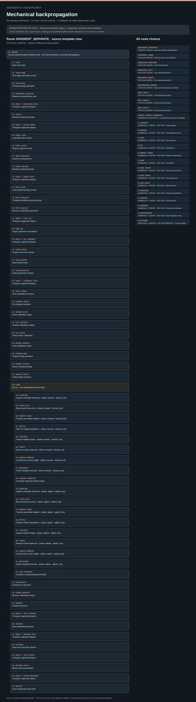

# Mechanical backpropagation: task route map



Paper: **Training all-mechanical neural networks for task learning through in situ backpropagation** · [DOI](https://doi.org/10.1038/s41467-024-54849-z)

Author/evaluator design reference only; not an actor projection, task runner, solver, physical simulation or execution receipt. Missing inputs stay blocked. Numerical training is not physical self-updating hardware; derived torque is not direct torque measurement.. Counts describe task representation, not experiments or success.

**Reading rule:** rows retain the source display structure only. Membership has no inferred chronology. Where the source supplies a typed body, one unexpanded template is shown; no condition, trial or specimen count is inferred. An unordered obligation group has no inferred chronological edges. Source-reported scientific facts and authored handling are distinct.

[Immutable source task package](https://github.com/openags/ScienceGym/blob/43a185dacb02a979148bee93d5d9559e569086f3/tasks/mechanical_backprop_operations_v2/) · [Interactive inspector](../index.html)

## GRADIENT_SEPARATE — PHYSICAL DESIGN · Measure different-node gradient

Author/evaluator design reference only; not an actor projection, task runner, solver, physical simulation or execution receipt. Missing inputs stay blocked. Numerical training is not physical self-updating hardware; derived torque is not direct torque measurement. Typed bodies are unexpanded templates, with source-declared nesting, bindings and concurrency retained. Campaigns preserve independent branch identities.

[Exact route source](https://github.com/openags/ScienceGym/blob/43a185dacb02a979148bee93d5d9559e569086f3/tasks/mechanical_backprop_operations_v2/branches.json) · JSON pointer: `/branches/0`

- **GROUP: Source-authored typed reference tree · not robot execution or physical self-updating**
  - Binding: {"source_file":"reference_routes.json","source_pointer":"/routes/0","source_contract":{"id":"ROUTE_GRADIENT_SEPARATE","branch_id":"GRADIENT_SEPARATE","initial_robot_station":"WS_RECORDS","body":[{"kind":"operation","operation_id":"PLAN","bindings":{}},{"kind":"operation","operation_id":"TRAIN_BIND","bindings":{}},{"kind":"operation","operation_id":"TRAIN_RUN","bindings":{}},{"kind":"operation","operation_id":"GEOMETRY_RELEASE","bindings":{}},{"kind":"transfer","transfer_id":"T_RECORDS_STOCK"},{"kind":"operation","operation_id":"STOCK","bindings":{}},{"kind":"transfer","transfer_id":"T_STOCK_PRINT"},{"kind":"operation","operation_id":"PRINT_LOAD","bindings":{}},{"kind":"operation","operation_id":"PRINT_START","bindings":{}},{"kind":"operation","operation_id":"PRINT_PROCESS","bindings":{}},{"kind":"operation","operation_id":"PRINT_UNLOAD","bindings":{}},{"kind":"transfer","transfer_id":"T_PRINT_POST"},{"kind":"operation","operation_id":"POST_LOAD","bindings":{}},{"kind":"operation","operation_id":"POST_PROCESS","bindings":{}},{"kind":"operation","operation_id":"POST_UNLOAD","bindings":{}},{"kind":"transfer","transfer_id":"T_POST_QC"},{"kind":"operation","operation_id":"PART_QC","bindings":{}},{"kind":"transfer","transfer_id":"T_QC_ASSEMBLY"},{"kind":"operation","operation_id":"TRUSS_PREP","bindings":{}},{"kind":"operation","operation_id":"GLUE_MOUNT","bindings":{}},{"kind":"operation","operation_id":"CURE_RELEASE","bindings":{}},{"kind":"transfer","transfer_id":"T_ASSEMBLY_TEST"},{"kind":"operation","operation_id":"DOCK_TRUSS","bindings":{}},{"kind":"operation","operation_id":"CAMERA_SETUP","bindings":{}},{"kind":"operation","operation_id":"BOARD_PLACE","bindings":{}},{"kind":"operation","operation_id":"CAL_CAPTURE","bindings":{}},{"kind":"operation","operation_id":"CAL_SOLVE","bindings":{}},{"kind":"operation","operation_id":"BOARD_REMOVE","bindings":{}},{"kind":"operation","operation_id":"STRING_PREP","bindings":{}},{"kind":"operation","operation_id":"STRING_ATTACH","bindings":{}},{"kind":"operation","operation_id":"WEIGHT_CHECK","bindings":{}},{"kind":"repeat","variable":"trial_id","count_input":"qualified positive repetition_plan","source_reported_count":3,"body":[{"kind":"operation","operation_id":"BASELINE","bindings":{"phase_id":"forward","active_force_role":"forward_only"}},{"kind":"operation","operation_id":"LOAD_PLAN","bindings":{"phase_id":"forward","active_force_role":"forward_only"}},{"kind":"operation","operation_id":"WEIGHT_HANG","bindings":{"phase_id":"forward","active_force_role":"forward_only"}},{"kind":"operation","operation_id":"SETTLE","bindings":{"phase_id":"forward","active_force_role":"forward_only"}},{"kind":"operation","operation_id":"CAPTURE","bindings":{"phase_id":"forward","active_force_role":"forward_only"}},{"kind":"operation","operation_id":"TRACK","bindings":{"phase_id":"forward","active_force_role":"forward_only"}},{"kind":"operation","operation_id":"WEIGHT_REMOVE","bindings":{"phase_id":"forward","active_force_role":"forward_only"}},{"kind":"operation","operation_id":"RECOVERY","bindings":{"phase_id":"forward","active_force_role":"forward_only"}},{"kind":"operation","operation_id":"ADJOINT_COMPUTE","bindings":{}},{"kind":"operation","operation_id":"BASELINE","bindings":{"phase_id":"adjoint","active_force_role":"adjoint_only"}},{"kind":"operation","operation_id":"LOAD_PLAN","bindings":{"phase_id":"adjoint","active_force_role":"adjoint_only"}},{"kind":"operation","operation_id":"WEIGHT_HANG","bindings":{"phase_id":"adjoint","active_force_role":"adjoint_only"}},{"kind":"operation","operation_id":"SETTLE","bindings":{"phase_id":"adjoint","active_force_role":"adjoint_only"}},{"kind":"operation","operation_id":"CAPTURE","bindings":{"phase_id":"adjoint","active_force_role":"adjoint_only"}},{"kind":"operation","operation_id":"TRACK","bindings":{"phase_id":"adjoint","active_force_role":"adjoint_only"}},{"kind":"operation","operation_id":"WEIGHT_REMOVE","bindings":{"phase_id":"adjoint","active_force_role":"adjoint_only"}},{"kind":"operation","operation_id":"RECOVERY","bindings":{"phase_id":"adjoint","active_force_role":"adjoint_only"}},{"kind":"operation","operation_id":"PAIR_GRADIENT","bindings":{}}],"reset_rule":"body includes complete unload/recovery; specimen history retained"},{"kind":"operation","operation_id":"AGGREGATE","bindings":{}},{"kind":"operation","operation_id":"STRING_REMOVE","bindings":{}},{"kind":"operation","operation_id":"UNDOCK","bindings":{}},{"kind":"transfer","transfer_id":"T_TEST_ARCHIVE"},{"kind":"operation","operation_id":"ARCHIVE","bindings":{}},{"kind":"transfer","transfer_id":"T_ARCHIVE_TEST"},{"kind":"operation","operation_id":"CLEANUP","bindings":{}},{"kind":"transfer","transfer_id":"T_TEST_STOCK"},{"kind":"operation","operation_id":"RETURN_TOOLS","bindings":{}},{"kind":"transfer","transfer_id":"T_STOCK_RECORDS"},{"kind":"operation","operation_id":"REPORT","bindings":{}}],"digital_handoff_rule":"analysis_service consumes electronic records remotely; specimen and robot stay at their current physical station","source_status":"task_authored_reference_route_not_source_trajectory"},"semantics":{"operation":"Bound operation contract; physical robot operations require robot at their source station","transfer":"Actual MOVE plus verified destination custody, never a label-only state change","repeat":"Body repeated under unique trial IDs; no future observations precomputed","for_each":"Enumerate every listed condition then return to parent scope","analysis_service":"Electronic handoff only; does not change physical location","zero_mass":"Skip actual weight transfer but verify zero active vector and capture a real image; no synthetic zero result"}}
  - `PLAN` Bind work order
    - Source occurrence binding: {"source_file":"reference_routes.json","source_pointer":"/routes/0/body/0","source_node":{"kind":"operation","operation_id":"PLAN","bindings":{}}}
  - `TRAIN_BIND` Bind digital geometry source
    - Source occurrence binding: {"source_file":"reference_routes.json","source_pointer":"/routes/0/body/1","source_node":{"kind":"operation","operation_id":"TRAIN_BIND","bindings":{}}}
  - `TRAIN_RUN` Compute design geometry
    - Source occurrence binding: {"source_file":"reference_routes.json","source_pointer":"/routes/0/body/2","source_node":{"kind":"operation","operation_id":"TRAIN_RUN","bindings":{}}}
  - `GEOMETRY_RELEASE` Release manufacturing card
    - Source occurrence binding: {"source_file":"reference_routes.json","source_pointer":"/routes/0/body/3","source_node":{"kind":"operation","operation_id":"GEOMETRY_RELEASE","bindings":{}}}
  - `MOVE` Transport supported objects
    - Source occurrence binding: {"source_file":"reference_routes.json","source_pointer":"/routes/0/body/4","source_node":{"kind":"transfer","transfer_id":"T_RECORDS_STOCK"},"transfer_contract":{"id":"T_RECORDS_STOCK","operation_id":"MOVE","source_station":"WS_RECORDS","target_station":"WS_STOCK","carried_objects":[],"carrier":"qualified retained carrier; empty-base transfer explicitly identified when no cargo","preconditions":["All carried objects identified and retained","Zero active hanging weights on any specimen","Source released and destination dock/slot ready","Hands retracted before base motion"],"measurable_completion":["Actual destination station verified","Destination support/dock and cargo ID receipt recorded","Custody updated from source to target exactly once"],"purpose":"Robot reaches stock before physical retrieval"}}
  - `STOCK` Retrieve material and tools
    - Source occurrence binding: {"source_file":"reference_routes.json","source_pointer":"/routes/0/body/5","source_node":{"kind":"operation","operation_id":"STOCK","bindings":{}}}
  - `MOVE` Transport supported objects
    - Source occurrence binding: {"source_file":"reference_routes.json","source_pointer":"/routes/0/body/6","source_node":{"kind":"transfer","transfer_id":"T_STOCK_PRINT"},"transfer_contract":{"id":"T_STOCK_PRINT","operation_id":"MOVE","source_station":"WS_STOCK","target_station":"WS_PRINT","carried_objects":["qualified consumable/carrier kit","indexed tools/truss/string/weight kit retained separately"],"carrier":"qualified retained carrier; empty-base transfer explicitly identified when no cargo","preconditions":["All carried objects identified and retained","Zero active hanging weights on any specimen","Source released and destination dock/slot ready","Hands retracted before base motion"],"measurable_completion":["Actual destination station verified","Destination support/dock and cargo ID receipt recorded","Custody updated from source to target exactly once"],"purpose":"Bring issued stock to printing station"}}
  - `PRINT_LOAD` Load fabrication station
    - Source occurrence binding: {"source_file":"reference_routes.json","source_pointer":"/routes/0/body/7","source_node":{"kind":"operation","operation_id":"PRINT_LOAD","bindings":{}}}
  - `PRINT_START` Request approved print
    - Source occurrence binding: {"source_file":"reference_routes.json","source_pointer":"/routes/0/body/8","source_node":{"kind":"operation","operation_id":"PRINT_START","bindings":{}}}
  - `PRINT_PROCESS` Execute enclosed print
    - Source occurrence binding: {"source_file":"reference_routes.json","source_pointer":"/routes/0/body/9","source_node":{"kind":"operation","operation_id":"PRINT_PROCESS","bindings":{}}}
  - `PRINT_UNLOAD` Receive printed specimen
    - Source occurrence binding: {"source_file":"reference_routes.json","source_pointer":"/routes/0/body/10","source_node":{"kind":"operation","operation_id":"PRINT_UNLOAD","bindings":{}}}
  - `MOVE` Transport supported objects
    - Source occurrence binding: {"source_file":"reference_routes.json","source_pointer":"/routes/0/body/11","source_node":{"kind":"transfer","transfer_id":"T_PRINT_POST"},"transfer_contract":{"id":"T_PRINT_POST","operation_id":"MOVE","source_station":"WS_PRINT","target_station":"WS_POST","carried_objects":["printed specimen on build carrier","retained unused kit"],"carrier":"qualified retained carrier; empty-base transfer explicitly identified when no cargo","preconditions":["All carried objects identified and retained","Zero active hanging weights on any specimen","Source released and destination dock/slot ready","Hands retracted before base motion"],"measurable_completion":["Actual destination station verified","Destination support/dock and cargo ID receipt recorded","Custody updated from source to target exactly once"],"purpose":"Present same new specimen for qualified postprocessing"}}
  - `POST_LOAD` Load postprocessing service
    - Source occurrence binding: {"source_file":"reference_routes.json","source_pointer":"/routes/0/body/12","source_node":{"kind":"operation","operation_id":"POST_LOAD","bindings":{}}}
  - `POST_PROCESS` Complete qualified postprocessing
    - Source occurrence binding: {"source_file":"reference_routes.json","source_pointer":"/routes/0/body/13","source_node":{"kind":"operation","operation_id":"POST_PROCESS","bindings":{}}}
  - `POST_UNLOAD` Receive conditioned specimen
    - Source occurrence binding: {"source_file":"reference_routes.json","source_pointer":"/routes/0/body/14","source_node":{"kind":"operation","operation_id":"POST_UNLOAD","bindings":{}}}
  - `MOVE` Transport supported objects
    - Source occurrence binding: {"source_file":"reference_routes.json","source_pointer":"/routes/0/body/15","source_node":{"kind":"transfer","transfer_id":"T_POST_QC"},"transfer_contract":{"id":"T_POST_QC","operation_id":"MOVE","source_station":"WS_POST","target_station":"WS_QC","carried_objects":["conditioned specimen on carrier","retained unused kit"],"carrier":"qualified retained carrier; empty-base transfer explicitly identified when no cargo","preconditions":["All carried objects identified and retained","Zero active hanging weights on any specimen","Source released and destination dock/slot ready","Hands retracted before base motion"],"measurable_completion":["Actual destination station verified","Destination support/dock and cargo ID receipt recorded","Custody updated from source to target exactly once"],"purpose":"Present released part for metrology"}}
  - `PART_QC` Inspect geometry and defects
    - Source occurrence binding: {"source_file":"reference_routes.json","source_pointer":"/routes/0/body/16","source_node":{"kind":"operation","operation_id":"PART_QC","bindings":{}}}
  - `MOVE` Transport supported objects
    - Source occurrence binding: {"source_file":"reference_routes.json","source_pointer":"/routes/0/body/17","source_node":{"kind":"transfer","transfer_id":"T_QC_ASSEMBLY"},"transfer_contract":{"id":"T_QC_ASSEMBLY","operation_id":"MOVE","source_station":"WS_QC","target_station":"WS_ASSEMBLY","carried_objects":["accepted supported specimen","retained truss and tool kit"],"carrier":"qualified retained carrier; empty-base transfer explicitly identified when no cargo","preconditions":["All carried objects identified and retained","Zero active hanging weights on any specimen","Source released and destination dock/slot ready","Hands retracted before base motion"],"measurable_completion":["Actual destination station verified","Destination support/dock and cargo ID receipt recorded","Custody updated from source to target exactly once"],"purpose":"Bring accepted part to mounting jig"}}
  - `TRUSS_PREP` Prepare truss and catcher
    - Source occurrence binding: {"source_file":"reference_routes.json","source_pointer":"/routes/0/body/18","source_node":{"kind":"operation","operation_id":"TRUSS_PREP","bindings":{}}}
  - `GLUE_MOUNT` Attach fixed nodes
    - Source occurrence binding: {"source_file":"reference_routes.json","source_pointer":"/routes/0/body/19","source_node":{"kind":"operation","operation_id":"GLUE_MOUNT","bindings":{}}}
  - `CURE_RELEASE` Verify attachment release
    - Source occurrence binding: {"source_file":"reference_routes.json","source_pointer":"/routes/0/body/20","source_node":{"kind":"operation","operation_id":"CURE_RELEASE","bindings":{}}}
  - `MOVE` Transport supported objects
    - Source occurrence binding: {"source_file":"reference_routes.json","source_pointer":"/routes/0/body/21","source_node":{"kind":"transfer","transfer_id":"T_ASSEMBLY_TEST"},"transfer_contract":{"id":"T_ASSEMBLY_TEST","operation_id":"MOVE","source_station":"WS_ASSEMBLY","target_station":"WS_TEST","carried_objects":["cured mounted specimen with truss","indexed imaging/string/weight/tool kit"],"carrier":"qualified retained carrier; empty-base transfer explicitly identified when no cargo","preconditions":["All carried objects identified and retained","Zero active hanging weights on any specimen","Source released and destination dock/slot ready","Hands retracted before base motion"],"measurable_completion":["Actual destination station verified","Destination support/dock and cargo ID receipt recorded","Custody updated from source to target exactly once"],"purpose":"Bring unloaded mounted network to measurement dock"}}
  - `DOCK_TRUSS` Dock unloaded test fixture
    - Source occurrence binding: {"source_file":"reference_routes.json","source_pointer":"/routes/0/body/22","source_node":{"kind":"operation","operation_id":"DOCK_TRUSS","bindings":{}}}
  - `CAMERA_SETUP` Set imaging hardware
    - Source occurrence binding: {"source_file":"reference_routes.json","source_pointer":"/routes/0/body/23","source_node":{"kind":"operation","operation_id":"CAMERA_SETUP","bindings":{}}}
  - `BOARD_PLACE` Place calibration target
    - Source occurrence binding: {"source_file":"reference_routes.json","source_pointer":"/routes/0/body/24","source_node":{"kind":"operation","operation_id":"BOARD_PLACE","bindings":{}}}
  - `CAL_CAPTURE` Acquire calibration images
    - Source occurrence binding: {"source_file":"reference_routes.json","source_pointer":"/routes/0/body/25","source_node":{"kind":"operation","operation_id":"CAL_CAPTURE","bindings":{}}}
  - `CAL_SOLVE` Check metric calibration
    - Source occurrence binding: {"source_file":"reference_routes.json","source_pointer":"/routes/0/body/26","source_node":{"kind":"operation","operation_id":"CAL_SOLVE","bindings":{}}}
  - `BOARD_REMOVE` Clear calibration target
    - Source occurrence binding: {"source_file":"reference_routes.json","source_pointer":"/routes/0/body/27","source_node":{"kind":"operation","operation_id":"BOARD_REMOVE","bindings":{}}}
  - `STRING_PREP` Prepare string interfaces
    - Source occurrence binding: {"source_file":"reference_routes.json","source_pointer":"/routes/0/body/28","source_node":{"kind":"operation","operation_id":"STRING_PREP","bindings":{}}}
  - `STRING_ATTACH` Attach unloaded strings
    - Source occurrence binding: {"source_file":"reference_routes.json","source_pointer":"/routes/0/body/29","source_node":{"kind":"operation","operation_id":"STRING_ATTACH","bindings":{}}}
  - `WEIGHT_CHECK` Verify weight inventory
    - Source occurrence binding: {"source_file":"reference_routes.json","source_pointer":"/routes/0/body/30","source_node":{"kind":"operation","operation_id":"WEIGHT_CHECK","bindings":{}}}
  - **LOOP: trial_id · one unexpanded source body**
    - Binding: {"source_file":"reference_routes.json","source_pointer":"/routes/0/body/31","source_node":{"kind":"repeat","variable":"trial_id","count_input":"qualified positive repetition_plan","source_reported_count":3,"body":[{"kind":"operation","operation_id":"BASELINE","bindings":{"phase_id":"forward","active_force_role":"forward_only"}},{"kind":"operation","operation_id":"LOAD_PLAN","bindings":{"phase_id":"forward","active_force_role":"forward_only"}},{"kind":"operation","operation_id":"WEIGHT_HANG","bindings":{"phase_id":"forward","active_force_role":"forward_only"}},{"kind":"operation","operation_id":"SETTLE","bindings":{"phase_id":"forward","active_force_role":"forward_only"}},{"kind":"operation","operation_id":"CAPTURE","bindings":{"phase_id":"forward","active_force_role":"forward_only"}},{"kind":"operation","operation_id":"TRACK","bindings":{"phase_id":"forward","active_force_role":"forward_only"}},{"kind":"operation","operation_id":"WEIGHT_REMOVE","bindings":{"phase_id":"forward","active_force_role":"forward_only"}},{"kind":"operation","operation_id":"RECOVERY","bindings":{"phase_id":"forward","active_force_role":"forward_only"}},{"kind":"operation","operation_id":"ADJOINT_COMPUTE","bindings":{}},{"kind":"operation","operation_id":"BASELINE","bindings":{"phase_id":"adjoint","active_force_role":"adjoint_only"}},{"kind":"operation","operation_id":"LOAD_PLAN","bindings":{"phase_id":"adjoint","active_force_role":"adjoint_only"}},{"kind":"operation","operation_id":"WEIGHT_HANG","bindings":{"phase_id":"adjoint","active_force_role":"adjoint_only"}},{"kind":"operation","operation_id":"SETTLE","bindings":{"phase_id":"adjoint","active_force_role":"adjoint_only"}},{"kind":"operation","operation_id":"CAPTURE","bindings":{"phase_id":"adjoint","active_force_role":"adjoint_only"}},{"kind":"operation","operation_id":"TRACK","bindings":{"phase_id":"adjoint","active_force_role":"adjoint_only"}},{"kind":"operation","operation_id":"WEIGHT_REMOVE","bindings":{"phase_id":"adjoint","active_force_role":"adjoint_only"}},{"kind":"operation","operation_id":"RECOVERY","bindings":{"phase_id":"adjoint","active_force_role":"adjoint_only"}},{"kind":"operation","operation_id":"PAIR_GRADIENT","bindings":{}}],"reset_rule":"body includes complete unload/recovery; specimen history retained"}}
    - `BASELINE` Capture unloaded reference
      - Source occurrence binding: {"source_file":"reference_routes.json","source_pointer":"/routes/0/body/31/body/0","source_node":{"kind":"operation","operation_id":"BASELINE","bindings":{"phase_id":"forward","active_force_role":"forward_only"}}}
    - `LOAD_PLAN` Bind actual force vector
      - Source occurrence binding: {"source_file":"reference_routes.json","source_pointer":"/routes/0/body/31/body/1","source_node":{"kind":"operation","operation_id":"LOAD_PLAN","bindings":{"phase_id":"forward","active_force_role":"forward_only"}}}
    - `WEIGHT_HANG` Transfer prescribed weights
      - Source occurrence binding: {"source_file":"reference_routes.json","source_pointer":"/routes/0/body/31/body/2","source_node":{"kind":"operation","operation_id":"WEIGHT_HANG","bindings":{"phase_id":"forward","active_force_role":"forward_only"}}}
    - `SETTLE` Observe loaded equilibrium
      - Source occurrence binding: {"source_file":"reference_routes.json","source_pointer":"/routes/0/body/31/body/3","source_node":{"kind":"operation","operation_id":"SETTLE","bindings":{"phase_id":"forward","active_force_role":"forward_only"}}}
    - `CAPTURE` Acquire loaded images
      - Source occurrence binding: {"source_file":"reference_routes.json","source_pointer":"/routes/0/body/31/body/4","source_node":{"kind":"operation","operation_id":"CAPTURE","bindings":{"phase_id":"forward","active_force_role":"forward_only"}}}
    - `TRACK` Measure node responses
      - Source occurrence binding: {"source_file":"reference_routes.json","source_pointer":"/routes/0/body/31/body/5","source_node":{"kind":"operation","operation_id":"TRACK","bindings":{"phase_id":"forward","active_force_role":"forward_only"}}}
    - `WEIGHT_REMOVE` Unload every active weight
      - Source occurrence binding: {"source_file":"reference_routes.json","source_pointer":"/routes/0/body/31/body/6","source_node":{"kind":"operation","operation_id":"WEIGHT_REMOVE","bindings":{"phase_id":"forward","active_force_role":"forward_only"}}}
    - `RECOVERY` Verify unloaded recovery
      - Source occurrence binding: {"source_file":"reference_routes.json","source_pointer":"/routes/0/body/31/body/7","source_node":{"kind":"operation","operation_id":"RECOVERY","bindings":{"phase_id":"forward","active_force_role":"forward_only"}}}
    - `ADJOINT_COMPUTE` Calculate measured adjoint target
      - Source occurrence binding: {"source_file":"reference_routes.json","source_pointer":"/routes/0/body/31/body/8","source_node":{"kind":"operation","operation_id":"ADJOINT_COMPUTE","bindings":{}}}
    - `BASELINE` Capture unloaded reference
      - Source occurrence binding: {"source_file":"reference_routes.json","source_pointer":"/routes/0/body/31/body/9","source_node":{"kind":"operation","operation_id":"BASELINE","bindings":{"phase_id":"adjoint","active_force_role":"adjoint_only"}}}
    - `LOAD_PLAN` Bind actual force vector
      - Source occurrence binding: {"source_file":"reference_routes.json","source_pointer":"/routes/0/body/31/body/10","source_node":{"kind":"operation","operation_id":"LOAD_PLAN","bindings":{"phase_id":"adjoint","active_force_role":"adjoint_only"}}}
    - `WEIGHT_HANG` Transfer prescribed weights
      - Source occurrence binding: {"source_file":"reference_routes.json","source_pointer":"/routes/0/body/31/body/11","source_node":{"kind":"operation","operation_id":"WEIGHT_HANG","bindings":{"phase_id":"adjoint","active_force_role":"adjoint_only"}}}
    - `SETTLE` Observe loaded equilibrium
      - Source occurrence binding: {"source_file":"reference_routes.json","source_pointer":"/routes/0/body/31/body/12","source_node":{"kind":"operation","operation_id":"SETTLE","bindings":{"phase_id":"adjoint","active_force_role":"adjoint_only"}}}
    - `CAPTURE` Acquire loaded images
      - Source occurrence binding: {"source_file":"reference_routes.json","source_pointer":"/routes/0/body/31/body/13","source_node":{"kind":"operation","operation_id":"CAPTURE","bindings":{"phase_id":"adjoint","active_force_role":"adjoint_only"}}}
    - `TRACK` Measure node responses
      - Source occurrence binding: {"source_file":"reference_routes.json","source_pointer":"/routes/0/body/31/body/14","source_node":{"kind":"operation","operation_id":"TRACK","bindings":{"phase_id":"adjoint","active_force_role":"adjoint_only"}}}
    - `WEIGHT_REMOVE` Unload every active weight
      - Source occurrence binding: {"source_file":"reference_routes.json","source_pointer":"/routes/0/body/31/body/15","source_node":{"kind":"operation","operation_id":"WEIGHT_REMOVE","bindings":{"phase_id":"adjoint","active_force_role":"adjoint_only"}}}
    - `RECOVERY` Verify unloaded recovery
      - Source occurrence binding: {"source_file":"reference_routes.json","source_pointer":"/routes/0/body/31/body/16","source_node":{"kind":"operation","operation_id":"RECOVERY","bindings":{"phase_id":"adjoint","active_force_role":"adjoint_only"}}}
    - `PAIR_GRADIENT` Combine corresponding bond fields
      - Source occurrence binding: {"source_file":"reference_routes.json","source_pointer":"/routes/0/body/31/body/17","source_node":{"kind":"operation","operation_id":"PAIR_GRADIENT","bindings":{}}}
  - `AGGREGATE` Summarize valid trials
    - Source occurrence binding: {"source_file":"reference_routes.json","source_pointer":"/routes/0/body/32","source_node":{"kind":"operation","operation_id":"AGGREGATE","bindings":{}}}
  - `STRING_REMOVE` Remove releasable strings
    - Source occurrence binding: {"source_file":"reference_routes.json","source_pointer":"/routes/0/body/33","source_node":{"kind":"operation","operation_id":"STRING_REMOVE","bindings":{}}}
  - `UNDOCK` Unload test fixture
    - Source occurrence binding: {"source_file":"reference_routes.json","source_pointer":"/routes/0/body/34","source_node":{"kind":"operation","operation_id":"UNDOCK","bindings":{}}}
  - `MOVE` Transport supported objects
    - Source occurrence binding: {"source_file":"reference_routes.json","source_pointer":"/routes/0/body/35","source_node":{"kind":"transfer","transfer_id":"T_TEST_ARCHIVE"},"transfer_contract":{"id":"T_TEST_ARCHIVE","operation_id":"MOVE","source_station":"WS_TEST","target_station":"WS_ARCHIVE","carried_objects":["unloaded supported mounted specimen/truss"],"carrier":"qualified retained carrier; empty-base transfer explicitly identified when no cargo","preconditions":["All carried objects identified and retained","Zero active hanging weights on any specimen","Source released and destination dock/slot ready","Hands retracted before base motion"],"measurable_completion":["Actual destination station verified","Destination support/dock and cargo ID receipt recorded","Custody updated from source to target exactly once"],"purpose":"Archive without unqualified adhesive peeling"}}
  - `ARCHIVE` Store identified specimen
    - Source occurrence binding: {"source_file":"reference_routes.json","source_pointer":"/routes/0/body/36","source_node":{"kind":"operation","operation_id":"ARCHIVE","bindings":{}}}
  - `MOVE` Transport supported objects
    - Source occurrence binding: {"source_file":"reference_routes.json","source_pointer":"/routes/0/body/37","source_node":{"kind":"transfer","transfer_id":"T_ARCHIVE_TEST"},"transfer_contract":{"id":"T_ARCHIVE_TEST","operation_id":"MOVE","source_station":"WS_ARCHIVE","target_station":"WS_TEST","carried_objects":[],"carrier":"qualified retained carrier; empty-base transfer explicitly identified when no cargo","preconditions":["All carried objects identified and retained","Zero active hanging weights on any specimen","Source released and destination dock/slot ready","Hands retracted before base motion"],"measurable_completion":["Actual destination station verified","Destination support/dock and cargo ID receipt recorded","Custody updated from source to target exactly once"],"purpose":"Return robot after storing specimen to clean test area and retrieve tools"}}
  - `CLEANUP` Clean and reconcile stations
    - Source occurrence binding: {"source_file":"reference_routes.json","source_pointer":"/routes/0/body/38","source_node":{"kind":"operation","operation_id":"CLEANUP","bindings":{}}}
  - `MOVE` Transport supported objects
    - Source occurrence binding: {"source_file":"reference_routes.json","source_pointer":"/routes/0/body/39","source_node":{"kind":"transfer","transfer_id":"T_TEST_STOCK"},"transfer_contract":{"id":"T_TEST_STOCK","operation_id":"MOVE","source_station":"WS_TEST","target_station":"WS_STOCK","carried_objects":["cleaned indexed tool and weight trays"],"carrier":"qualified retained carrier; empty-base transfer explicitly identified when no cargo","preconditions":["All carried objects identified and retained","Zero active hanging weights on any specimen","Source released and destination dock/slot ready","Hands retracted before base motion"],"measurable_completion":["Actual destination station verified","Destination support/dock and cargo ID receipt recorded","Custody updated from source to target exactly once"],"purpose":"Return inventoried kit to storage"}}
  - `RETURN_TOOLS` Return tools and weights
    - Source occurrence binding: {"source_file":"reference_routes.json","source_pointer":"/routes/0/body/40","source_node":{"kind":"operation","operation_id":"RETURN_TOOLS","bindings":{}}}
  - `MOVE` Transport supported objects
    - Source occurrence binding: {"source_file":"reference_routes.json","source_pointer":"/routes/0/body/41","source_node":{"kind":"transfer","transfer_id":"T_STOCK_RECORDS"},"transfer_contract":{"id":"T_STOCK_RECORDS","operation_id":"MOVE","source_station":"WS_STOCK","target_station":"WS_RECORDS","carried_objects":[],"carrier":"qualified retained carrier; empty-base transfer explicitly identified when no cargo","preconditions":["All carried objects identified and retained","Zero active hanging weights on any specimen","Source released and destination dock/slot ready","Hands retracted before base motion"],"measurable_completion":["Actual destination station verified","Destination support/dock and cargo ID receipt recorded","Custody updated from source to target exactly once"],"purpose":"Return robot to final work-order terminal"}}
  - `REPORT` Close measured work order
    - Source occurrence binding: {"source_file":"reference_routes.json","source_pointer":"/routes/0/body/42","source_node":{"kind":"operation","operation_id":"REPORT","bindings":{}}}

<details><summary>Branch state, choices, lineage and loop obligations</summary>

```json
{
  "id": "GRADIENT_SEPARATE",
  "title": "Measure different-node gradient",
  "family_id": "gradient",
  "role": "reported_physical_route",
  "geometry_condition": "uniform_gradient",
  "operation_ids": [
    "PLAN",
    "STOCK",
    "MOVE",
    "TRAIN_BIND",
    "TRAIN_RUN",
    "GEOMETRY_RELEASE",
    "PRINT_LOAD",
    "PRINT_START",
    "PRINT_PROCESS",
    "PRINT_UNLOAD",
    "POST_LOAD",
    "POST_PROCESS",
    "POST_UNLOAD",
    "PART_QC",
    "TRUSS_PREP",
    "GLUE_MOUNT",
    "CURE_RELEASE",
    "DOCK_TRUSS",
    "CAMERA_SETUP",
    "BOARD_PLACE",
    "CAL_CAPTURE",
    "CAL_SOLVE",
    "BOARD_REMOVE",
    "STRING_PREP",
    "STRING_ATTACH",
    "WEIGHT_CHECK",
    "BASELINE",
    "LOAD_PLAN",
    "WEIGHT_HANG",
    "SETTLE",
    "CAPTURE",
    "TRACK",
    "WEIGHT_REMOVE",
    "RECOVERY",
    "ADJOINT_COMPUTE",
    "PAIR_GRADIENT",
    "AGGREGATE",
    "STRING_REMOVE",
    "UNDOCK",
    "ARCHIVE",
    "CLEANUP",
    "REPORT",
    "RETURN_TOOLS"
  ],
  "preparation": [
    "PLAN",
    "TRAIN_BIND",
    "TRAIN_RUN",
    "GEOMETRY_RELEASE",
    "MOVE",
    "STOCK",
    "PRINT_LOAD",
    "PRINT_START",
    "PRINT_PROCESS",
    "PRINT_UNLOAD",
    "POST_LOAD",
    "POST_PROCESS",
    "POST_UNLOAD",
    "PART_QC",
    "TRUSS_PREP",
    "GLUE_MOUNT",
    "CURE_RELEASE",
    "DOCK_TRUSS",
    "CAMERA_SETUP",
    "BOARD_PLACE",
    "CAL_CAPTURE",
    "CAL_SOLVE",
    "BOARD_REMOVE",
    "STRING_PREP",
    "STRING_ATTACH",
    "WEIGHT_CHECK"
  ],
  "trial_phases": [
    {
      "id": "forward",
      "operation_ids": [
        "BASELINE",
        "LOAD_PLAN",
        "WEIGHT_HANG",
        "SETTLE",
        "CAPTURE",
        "TRACK",
        "WEIGHT_REMOVE",
        "RECOVERY"
      ],
      "active_force_role": "forward_only"
    },
    {
      "id": "compute_adjoint",
      "operation_ids": [
        "ADJOINT_COMPUTE"
      ],
      "requires": "accepted forward measurement and recovery"
    },
    {
      "id": "adjoint",
      "operation_ids": [
        "BASELINE",
        "LOAD_PLAN",
        "WEIGHT_HANG",
        "SETTLE",
        "CAPTURE",
        "TRACK",
        "WEIGHT_REMOVE",
        "RECOVERY"
      ],
      "active_force_role": "adjoint_only"
    },
    {
      "id": "pair",
      "operation_ids": [
        "PAIR_GRADIENT"
      ],
      "requires": "same trial, specimen and geometry for both fields"
    }
  ],
  "closure": [
    "AGGREGATE",
    "STRING_REMOVE",
    "UNDOCK",
    "MOVE",
    "ARCHIVE",
    "CLEANUP",
    "REPORT"
  ],
  "condition_card": {
    "input_node": "R_bottom",
    "output_node": "L_bottom",
    "forward_mass_g": 10,
    "target_offset_m": 0.025,
    "loss": "(u_Ly + offset)^2",
    "reported_adjoint_mass_g": 5,
    "adjoint_mass_policy": "calculate from current measured output;5 g is reference not default",
    "forward_absent_in_adjoint": true
  },
  "source_repetition_count": 3,
  "source_specimen_count": null,
  "evidence_ids": [
    "E_GRAD",
    "E_TRACK"
  ],
  "required_input_ids": [
    "U_ADJOINT",
    "U_CAMERA",
    "U_CLEAN",
    "U_GEOM",
    "U_LOAD",
    "U_MOUNT",
    "U_POST",
    "U_PRINT",
    "U_QC",
    "U_REPEAT",
    "U_ROBOT",
    "U_SETTLE",
    "U_STRING",
    "U_TRACK",
    "U_TRAIN"
  ],
  "loops": [
    {
      "id": "independent_trial",
      "count": "positive integer supplied; source reports three",
      "repeat_scope": "complete initialized acquisition and recovery",
      "identity": "trial_id distinct from specimen_id"
    },
    {
      "id": "load_condition",
      "values": [
        "selected_case"
      ],
      "nesting": "within trial",
      "reset": "unload and verify recovery before next condition"
    }
  ],
  "execution_ready": false,
  "reference_route_id": "ROUTE_GRADIENT_SEPARATE",
  "loops_authority": "reference_routes.json typed tree; descriptive loop fields are not an execution order"
}
```

</details>

## GRADIENT_SAME — PHYSICAL DESIGN · Measure same-node gradient

Author/evaluator design reference only; not an actor projection, task runner, solver, physical simulation or execution receipt. Missing inputs stay blocked. Numerical training is not physical self-updating hardware; derived torque is not direct torque measurement. Typed bodies are unexpanded templates, with source-declared nesting, bindings and concurrency retained. Campaigns preserve independent branch identities.

[Exact route source](https://github.com/openags/ScienceGym/blob/43a185dacb02a979148bee93d5d9559e569086f3/tasks/mechanical_backprop_operations_v2/branches.json) · JSON pointer: `/branches/1`

- **GROUP: Source-authored typed reference tree · not robot execution or physical self-updating**
  - Binding: {"source_file":"reference_routes.json","source_pointer":"/routes/1","source_contract":{"id":"ROUTE_GRADIENT_SAME","branch_id":"GRADIENT_SAME","initial_robot_station":"WS_RECORDS","body":[{"kind":"operation","operation_id":"PLAN","bindings":{}},{"kind":"operation","operation_id":"TRAIN_BIND","bindings":{}},{"kind":"operation","operation_id":"TRAIN_RUN","bindings":{}},{"kind":"operation","operation_id":"GEOMETRY_RELEASE","bindings":{}},{"kind":"transfer","transfer_id":"T_RECORDS_STOCK"},{"kind":"operation","operation_id":"STOCK","bindings":{}},{"kind":"transfer","transfer_id":"T_STOCK_PRINT"},{"kind":"operation","operation_id":"PRINT_LOAD","bindings":{}},{"kind":"operation","operation_id":"PRINT_START","bindings":{}},{"kind":"operation","operation_id":"PRINT_PROCESS","bindings":{}},{"kind":"operation","operation_id":"PRINT_UNLOAD","bindings":{}},{"kind":"transfer","transfer_id":"T_PRINT_POST"},{"kind":"operation","operation_id":"POST_LOAD","bindings":{}},{"kind":"operation","operation_id":"POST_PROCESS","bindings":{}},{"kind":"operation","operation_id":"POST_UNLOAD","bindings":{}},{"kind":"transfer","transfer_id":"T_POST_QC"},{"kind":"operation","operation_id":"PART_QC","bindings":{}},{"kind":"transfer","transfer_id":"T_QC_ASSEMBLY"},{"kind":"operation","operation_id":"TRUSS_PREP","bindings":{}},{"kind":"operation","operation_id":"GLUE_MOUNT","bindings":{}},{"kind":"operation","operation_id":"CURE_RELEASE","bindings":{}},{"kind":"transfer","transfer_id":"T_ASSEMBLY_TEST"},{"kind":"operation","operation_id":"DOCK_TRUSS","bindings":{}},{"kind":"operation","operation_id":"CAMERA_SETUP","bindings":{}},{"kind":"operation","operation_id":"BOARD_PLACE","bindings":{}},{"kind":"operation","operation_id":"CAL_CAPTURE","bindings":{}},{"kind":"operation","operation_id":"CAL_SOLVE","bindings":{}},{"kind":"operation","operation_id":"BOARD_REMOVE","bindings":{}},{"kind":"operation","operation_id":"STRING_PREP","bindings":{}},{"kind":"operation","operation_id":"STRING_ATTACH","bindings":{}},{"kind":"operation","operation_id":"WEIGHT_CHECK","bindings":{}},{"kind":"repeat","variable":"trial_id","count_input":"qualified positive repetition_plan","source_reported_count":3,"body":[{"kind":"operation","operation_id":"BASELINE","bindings":{"phase_id":"forward","active_force_role":"forward_only"}},{"kind":"operation","operation_id":"LOAD_PLAN","bindings":{"phase_id":"forward","active_force_role":"forward_only"}},{"kind":"operation","operation_id":"WEIGHT_HANG","bindings":{"phase_id":"forward","active_force_role":"forward_only"}},{"kind":"operation","operation_id":"SETTLE","bindings":{"phase_id":"forward","active_force_role":"forward_only"}},{"kind":"operation","operation_id":"CAPTURE","bindings":{"phase_id":"forward","active_force_role":"forward_only"}},{"kind":"operation","operation_id":"TRACK","bindings":{"phase_id":"forward","active_force_role":"forward_only"}},{"kind":"operation","operation_id":"WEIGHT_REMOVE","bindings":{"phase_id":"forward","active_force_role":"forward_only"}},{"kind":"operation","operation_id":"RECOVERY","bindings":{"phase_id":"forward","active_force_role":"forward_only"}},{"kind":"operation","operation_id":"ADJOINT_COMPUTE","bindings":{}},{"kind":"operation","operation_id":"BASELINE","bindings":{"phase_id":"adjoint","active_force_role":"adjoint_only"}},{"kind":"operation","operation_id":"LOAD_PLAN","bindings":{"phase_id":"adjoint","active_force_role":"adjoint_only"}},{"kind":"operation","operation_id":"WEIGHT_HANG","bindings":{"phase_id":"adjoint","active_force_role":"adjoint_only"}},{"kind":"operation","operation_id":"SETTLE","bindings":{"phase_id":"adjoint","active_force_role":"adjoint_only"}},{"kind":"operation","operation_id":"CAPTURE","bindings":{"phase_id":"adjoint","active_force_role":"adjoint_only"}},{"kind":"operation","operation_id":"TRACK","bindings":{"phase_id":"adjoint","active_force_role":"adjoint_only"}},{"kind":"operation","operation_id":"WEIGHT_REMOVE","bindings":{"phase_id":"adjoint","active_force_role":"adjoint_only"}},{"kind":"operation","operation_id":"RECOVERY","bindings":{"phase_id":"adjoint","active_force_role":"adjoint_only"}},{"kind":"operation","operation_id":"PAIR_GRADIENT","bindings":{}}],"reset_rule":"body includes complete unload/recovery; specimen history retained"},{"kind":"operation","operation_id":"AGGREGATE","bindings":{}},{"kind":"operation","operation_id":"STRING_REMOVE","bindings":{}},{"kind":"operation","operation_id":"UNDOCK","bindings":{}},{"kind":"transfer","transfer_id":"T_TEST_ARCHIVE"},{"kind":"operation","operation_id":"ARCHIVE","bindings":{}},{"kind":"transfer","transfer_id":"T_ARCHIVE_TEST"},{"kind":"operation","operation_id":"CLEANUP","bindings":{}},{"kind":"transfer","transfer_id":"T_TEST_STOCK"},{"kind":"operation","operation_id":"RETURN_TOOLS","bindings":{}},{"kind":"transfer","transfer_id":"T_STOCK_RECORDS"},{"kind":"operation","operation_id":"REPORT","bindings":{}}],"digital_handoff_rule":"analysis_service consumes electronic records remotely; specimen and robot stay at their current physical station","source_status":"task_authored_reference_route_not_source_trajectory"},"semantics":{"operation":"Bound operation contract; physical robot operations require robot at their source station","transfer":"Actual MOVE plus verified destination custody, never a label-only state change","repeat":"Body repeated under unique trial IDs; no future observations precomputed","for_each":"Enumerate every listed condition then return to parent scope","analysis_service":"Electronic handoff only; does not change physical location","zero_mass":"Skip actual weight transfer but verify zero active vector and capture a real image; no synthetic zero result"}}
  - `PLAN` Bind work order
    - Source occurrence binding: {"source_file":"reference_routes.json","source_pointer":"/routes/1/body/0","source_node":{"kind":"operation","operation_id":"PLAN","bindings":{}}}
  - `TRAIN_BIND` Bind digital geometry source
    - Source occurrence binding: {"source_file":"reference_routes.json","source_pointer":"/routes/1/body/1","source_node":{"kind":"operation","operation_id":"TRAIN_BIND","bindings":{}}}
  - `TRAIN_RUN` Compute design geometry
    - Source occurrence binding: {"source_file":"reference_routes.json","source_pointer":"/routes/1/body/2","source_node":{"kind":"operation","operation_id":"TRAIN_RUN","bindings":{}}}
  - `GEOMETRY_RELEASE` Release manufacturing card
    - Source occurrence binding: {"source_file":"reference_routes.json","source_pointer":"/routes/1/body/3","source_node":{"kind":"operation","operation_id":"GEOMETRY_RELEASE","bindings":{}}}
  - `MOVE` Transport supported objects
    - Source occurrence binding: {"source_file":"reference_routes.json","source_pointer":"/routes/1/body/4","source_node":{"kind":"transfer","transfer_id":"T_RECORDS_STOCK"},"transfer_contract":{"id":"T_RECORDS_STOCK","operation_id":"MOVE","source_station":"WS_RECORDS","target_station":"WS_STOCK","carried_objects":[],"carrier":"qualified retained carrier; empty-base transfer explicitly identified when no cargo","preconditions":["All carried objects identified and retained","Zero active hanging weights on any specimen","Source released and destination dock/slot ready","Hands retracted before base motion"],"measurable_completion":["Actual destination station verified","Destination support/dock and cargo ID receipt recorded","Custody updated from source to target exactly once"],"purpose":"Robot reaches stock before physical retrieval"}}
  - `STOCK` Retrieve material and tools
    - Source occurrence binding: {"source_file":"reference_routes.json","source_pointer":"/routes/1/body/5","source_node":{"kind":"operation","operation_id":"STOCK","bindings":{}}}
  - `MOVE` Transport supported objects
    - Source occurrence binding: {"source_file":"reference_routes.json","source_pointer":"/routes/1/body/6","source_node":{"kind":"transfer","transfer_id":"T_STOCK_PRINT"},"transfer_contract":{"id":"T_STOCK_PRINT","operation_id":"MOVE","source_station":"WS_STOCK","target_station":"WS_PRINT","carried_objects":["qualified consumable/carrier kit","indexed tools/truss/string/weight kit retained separately"],"carrier":"qualified retained carrier; empty-base transfer explicitly identified when no cargo","preconditions":["All carried objects identified and retained","Zero active hanging weights on any specimen","Source released and destination dock/slot ready","Hands retracted before base motion"],"measurable_completion":["Actual destination station verified","Destination support/dock and cargo ID receipt recorded","Custody updated from source to target exactly once"],"purpose":"Bring issued stock to printing station"}}
  - `PRINT_LOAD` Load fabrication station
    - Source occurrence binding: {"source_file":"reference_routes.json","source_pointer":"/routes/1/body/7","source_node":{"kind":"operation","operation_id":"PRINT_LOAD","bindings":{}}}
  - `PRINT_START` Request approved print
    - Source occurrence binding: {"source_file":"reference_routes.json","source_pointer":"/routes/1/body/8","source_node":{"kind":"operation","operation_id":"PRINT_START","bindings":{}}}
  - `PRINT_PROCESS` Execute enclosed print
    - Source occurrence binding: {"source_file":"reference_routes.json","source_pointer":"/routes/1/body/9","source_node":{"kind":"operation","operation_id":"PRINT_PROCESS","bindings":{}}}
  - `PRINT_UNLOAD` Receive printed specimen
    - Source occurrence binding: {"source_file":"reference_routes.json","source_pointer":"/routes/1/body/10","source_node":{"kind":"operation","operation_id":"PRINT_UNLOAD","bindings":{}}}
  - `MOVE` Transport supported objects
    - Source occurrence binding: {"source_file":"reference_routes.json","source_pointer":"/routes/1/body/11","source_node":{"kind":"transfer","transfer_id":"T_PRINT_POST"},"transfer_contract":{"id":"T_PRINT_POST","operation_id":"MOVE","source_station":"WS_PRINT","target_station":"WS_POST","carried_objects":["printed specimen on build carrier","retained unused kit"],"carrier":"qualified retained carrier; empty-base transfer explicitly identified when no cargo","preconditions":["All carried objects identified and retained","Zero active hanging weights on any specimen","Source released and destination dock/slot ready","Hands retracted before base motion"],"measurable_completion":["Actual destination station verified","Destination support/dock and cargo ID receipt recorded","Custody updated from source to target exactly once"],"purpose":"Present same new specimen for qualified postprocessing"}}
  - `POST_LOAD` Load postprocessing service
    - Source occurrence binding: {"source_file":"reference_routes.json","source_pointer":"/routes/1/body/12","source_node":{"kind":"operation","operation_id":"POST_LOAD","bindings":{}}}
  - `POST_PROCESS` Complete qualified postprocessing
    - Source occurrence binding: {"source_file":"reference_routes.json","source_pointer":"/routes/1/body/13","source_node":{"kind":"operation","operation_id":"POST_PROCESS","bindings":{}}}
  - `POST_UNLOAD` Receive conditioned specimen
    - Source occurrence binding: {"source_file":"reference_routes.json","source_pointer":"/routes/1/body/14","source_node":{"kind":"operation","operation_id":"POST_UNLOAD","bindings":{}}}
  - `MOVE` Transport supported objects
    - Source occurrence binding: {"source_file":"reference_routes.json","source_pointer":"/routes/1/body/15","source_node":{"kind":"transfer","transfer_id":"T_POST_QC"},"transfer_contract":{"id":"T_POST_QC","operation_id":"MOVE","source_station":"WS_POST","target_station":"WS_QC","carried_objects":["conditioned specimen on carrier","retained unused kit"],"carrier":"qualified retained carrier; empty-base transfer explicitly identified when no cargo","preconditions":["All carried objects identified and retained","Zero active hanging weights on any specimen","Source released and destination dock/slot ready","Hands retracted before base motion"],"measurable_completion":["Actual destination station verified","Destination support/dock and cargo ID receipt recorded","Custody updated from source to target exactly once"],"purpose":"Present released part for metrology"}}
  - `PART_QC` Inspect geometry and defects
    - Source occurrence binding: {"source_file":"reference_routes.json","source_pointer":"/routes/1/body/16","source_node":{"kind":"operation","operation_id":"PART_QC","bindings":{}}}
  - `MOVE` Transport supported objects
    - Source occurrence binding: {"source_file":"reference_routes.json","source_pointer":"/routes/1/body/17","source_node":{"kind":"transfer","transfer_id":"T_QC_ASSEMBLY"},"transfer_contract":{"id":"T_QC_ASSEMBLY","operation_id":"MOVE","source_station":"WS_QC","target_station":"WS_ASSEMBLY","carried_objects":["accepted supported specimen","retained truss and tool kit"],"carrier":"qualified retained carrier; empty-base transfer explicitly identified when no cargo","preconditions":["All carried objects identified and retained","Zero active hanging weights on any specimen","Source released and destination dock/slot ready","Hands retracted before base motion"],"measurable_completion":["Actual destination station verified","Destination support/dock and cargo ID receipt recorded","Custody updated from source to target exactly once"],"purpose":"Bring accepted part to mounting jig"}}
  - `TRUSS_PREP` Prepare truss and catcher
    - Source occurrence binding: {"source_file":"reference_routes.json","source_pointer":"/routes/1/body/18","source_node":{"kind":"operation","operation_id":"TRUSS_PREP","bindings":{}}}
  - `GLUE_MOUNT` Attach fixed nodes
    - Source occurrence binding: {"source_file":"reference_routes.json","source_pointer":"/routes/1/body/19","source_node":{"kind":"operation","operation_id":"GLUE_MOUNT","bindings":{}}}
  - `CURE_RELEASE` Verify attachment release
    - Source occurrence binding: {"source_file":"reference_routes.json","source_pointer":"/routes/1/body/20","source_node":{"kind":"operation","operation_id":"CURE_RELEASE","bindings":{}}}
  - `MOVE` Transport supported objects
    - Source occurrence binding: {"source_file":"reference_routes.json","source_pointer":"/routes/1/body/21","source_node":{"kind":"transfer","transfer_id":"T_ASSEMBLY_TEST"},"transfer_contract":{"id":"T_ASSEMBLY_TEST","operation_id":"MOVE","source_station":"WS_ASSEMBLY","target_station":"WS_TEST","carried_objects":["cured mounted specimen with truss","indexed imaging/string/weight/tool kit"],"carrier":"qualified retained carrier; empty-base transfer explicitly identified when no cargo","preconditions":["All carried objects identified and retained","Zero active hanging weights on any specimen","Source released and destination dock/slot ready","Hands retracted before base motion"],"measurable_completion":["Actual destination station verified","Destination support/dock and cargo ID receipt recorded","Custody updated from source to target exactly once"],"purpose":"Bring unloaded mounted network to measurement dock"}}
  - `DOCK_TRUSS` Dock unloaded test fixture
    - Source occurrence binding: {"source_file":"reference_routes.json","source_pointer":"/routes/1/body/22","source_node":{"kind":"operation","operation_id":"DOCK_TRUSS","bindings":{}}}
  - `CAMERA_SETUP` Set imaging hardware
    - Source occurrence binding: {"source_file":"reference_routes.json","source_pointer":"/routes/1/body/23","source_node":{"kind":"operation","operation_id":"CAMERA_SETUP","bindings":{}}}
  - `BOARD_PLACE` Place calibration target
    - Source occurrence binding: {"source_file":"reference_routes.json","source_pointer":"/routes/1/body/24","source_node":{"kind":"operation","operation_id":"BOARD_PLACE","bindings":{}}}
  - `CAL_CAPTURE` Acquire calibration images
    - Source occurrence binding: {"source_file":"reference_routes.json","source_pointer":"/routes/1/body/25","source_node":{"kind":"operation","operation_id":"CAL_CAPTURE","bindings":{}}}
  - `CAL_SOLVE` Check metric calibration
    - Source occurrence binding: {"source_file":"reference_routes.json","source_pointer":"/routes/1/body/26","source_node":{"kind":"operation","operation_id":"CAL_SOLVE","bindings":{}}}
  - `BOARD_REMOVE` Clear calibration target
    - Source occurrence binding: {"source_file":"reference_routes.json","source_pointer":"/routes/1/body/27","source_node":{"kind":"operation","operation_id":"BOARD_REMOVE","bindings":{}}}
  - `STRING_PREP` Prepare string interfaces
    - Source occurrence binding: {"source_file":"reference_routes.json","source_pointer":"/routes/1/body/28","source_node":{"kind":"operation","operation_id":"STRING_PREP","bindings":{}}}
  - `STRING_ATTACH` Attach unloaded strings
    - Source occurrence binding: {"source_file":"reference_routes.json","source_pointer":"/routes/1/body/29","source_node":{"kind":"operation","operation_id":"STRING_ATTACH","bindings":{}}}
  - `WEIGHT_CHECK` Verify weight inventory
    - Source occurrence binding: {"source_file":"reference_routes.json","source_pointer":"/routes/1/body/30","source_node":{"kind":"operation","operation_id":"WEIGHT_CHECK","bindings":{}}}
  - **LOOP: trial_id · one unexpanded source body**
    - Binding: {"source_file":"reference_routes.json","source_pointer":"/routes/1/body/31","source_node":{"kind":"repeat","variable":"trial_id","count_input":"qualified positive repetition_plan","source_reported_count":3,"body":[{"kind":"operation","operation_id":"BASELINE","bindings":{"phase_id":"forward","active_force_role":"forward_only"}},{"kind":"operation","operation_id":"LOAD_PLAN","bindings":{"phase_id":"forward","active_force_role":"forward_only"}},{"kind":"operation","operation_id":"WEIGHT_HANG","bindings":{"phase_id":"forward","active_force_role":"forward_only"}},{"kind":"operation","operation_id":"SETTLE","bindings":{"phase_id":"forward","active_force_role":"forward_only"}},{"kind":"operation","operation_id":"CAPTURE","bindings":{"phase_id":"forward","active_force_role":"forward_only"}},{"kind":"operation","operation_id":"TRACK","bindings":{"phase_id":"forward","active_force_role":"forward_only"}},{"kind":"operation","operation_id":"WEIGHT_REMOVE","bindings":{"phase_id":"forward","active_force_role":"forward_only"}},{"kind":"operation","operation_id":"RECOVERY","bindings":{"phase_id":"forward","active_force_role":"forward_only"}},{"kind":"operation","operation_id":"ADJOINT_COMPUTE","bindings":{}},{"kind":"operation","operation_id":"BASELINE","bindings":{"phase_id":"adjoint","active_force_role":"adjoint_only"}},{"kind":"operation","operation_id":"LOAD_PLAN","bindings":{"phase_id":"adjoint","active_force_role":"adjoint_only"}},{"kind":"operation","operation_id":"WEIGHT_HANG","bindings":{"phase_id":"adjoint","active_force_role":"adjoint_only"}},{"kind":"operation","operation_id":"SETTLE","bindings":{"phase_id":"adjoint","active_force_role":"adjoint_only"}},{"kind":"operation","operation_id":"CAPTURE","bindings":{"phase_id":"adjoint","active_force_role":"adjoint_only"}},{"kind":"operation","operation_id":"TRACK","bindings":{"phase_id":"adjoint","active_force_role":"adjoint_only"}},{"kind":"operation","operation_id":"WEIGHT_REMOVE","bindings":{"phase_id":"adjoint","active_force_role":"adjoint_only"}},{"kind":"operation","operation_id":"RECOVERY","bindings":{"phase_id":"adjoint","active_force_role":"adjoint_only"}},{"kind":"operation","operation_id":"PAIR_GRADIENT","bindings":{}}],"reset_rule":"body includes complete unload/recovery; specimen history retained"}}
    - `BASELINE` Capture unloaded reference
      - Source occurrence binding: {"source_file":"reference_routes.json","source_pointer":"/routes/1/body/31/body/0","source_node":{"kind":"operation","operation_id":"BASELINE","bindings":{"phase_id":"forward","active_force_role":"forward_only"}}}
    - `LOAD_PLAN` Bind actual force vector
      - Source occurrence binding: {"source_file":"reference_routes.json","source_pointer":"/routes/1/body/31/body/1","source_node":{"kind":"operation","operation_id":"LOAD_PLAN","bindings":{"phase_id":"forward","active_force_role":"forward_only"}}}
    - `WEIGHT_HANG` Transfer prescribed weights
      - Source occurrence binding: {"source_file":"reference_routes.json","source_pointer":"/routes/1/body/31/body/2","source_node":{"kind":"operation","operation_id":"WEIGHT_HANG","bindings":{"phase_id":"forward","active_force_role":"forward_only"}}}
    - `SETTLE` Observe loaded equilibrium
      - Source occurrence binding: {"source_file":"reference_routes.json","source_pointer":"/routes/1/body/31/body/3","source_node":{"kind":"operation","operation_id":"SETTLE","bindings":{"phase_id":"forward","active_force_role":"forward_only"}}}
    - `CAPTURE` Acquire loaded images
      - Source occurrence binding: {"source_file":"reference_routes.json","source_pointer":"/routes/1/body/31/body/4","source_node":{"kind":"operation","operation_id":"CAPTURE","bindings":{"phase_id":"forward","active_force_role":"forward_only"}}}
    - `TRACK` Measure node responses
      - Source occurrence binding: {"source_file":"reference_routes.json","source_pointer":"/routes/1/body/31/body/5","source_node":{"kind":"operation","operation_id":"TRACK","bindings":{"phase_id":"forward","active_force_role":"forward_only"}}}
    - `WEIGHT_REMOVE` Unload every active weight
      - Source occurrence binding: {"source_file":"reference_routes.json","source_pointer":"/routes/1/body/31/body/6","source_node":{"kind":"operation","operation_id":"WEIGHT_REMOVE","bindings":{"phase_id":"forward","active_force_role":"forward_only"}}}
    - `RECOVERY` Verify unloaded recovery
      - Source occurrence binding: {"source_file":"reference_routes.json","source_pointer":"/routes/1/body/31/body/7","source_node":{"kind":"operation","operation_id":"RECOVERY","bindings":{"phase_id":"forward","active_force_role":"forward_only"}}}
    - `ADJOINT_COMPUTE` Calculate measured adjoint target
      - Source occurrence binding: {"source_file":"reference_routes.json","source_pointer":"/routes/1/body/31/body/8","source_node":{"kind":"operation","operation_id":"ADJOINT_COMPUTE","bindings":{}}}
    - `BASELINE` Capture unloaded reference
      - Source occurrence binding: {"source_file":"reference_routes.json","source_pointer":"/routes/1/body/31/body/9","source_node":{"kind":"operation","operation_id":"BASELINE","bindings":{"phase_id":"adjoint","active_force_role":"adjoint_only"}}}
    - `LOAD_PLAN` Bind actual force vector
      - Source occurrence binding: {"source_file":"reference_routes.json","source_pointer":"/routes/1/body/31/body/10","source_node":{"kind":"operation","operation_id":"LOAD_PLAN","bindings":{"phase_id":"adjoint","active_force_role":"adjoint_only"}}}
    - `WEIGHT_HANG` Transfer prescribed weights
      - Source occurrence binding: {"source_file":"reference_routes.json","source_pointer":"/routes/1/body/31/body/11","source_node":{"kind":"operation","operation_id":"WEIGHT_HANG","bindings":{"phase_id":"adjoint","active_force_role":"adjoint_only"}}}
    - `SETTLE` Observe loaded equilibrium
      - Source occurrence binding: {"source_file":"reference_routes.json","source_pointer":"/routes/1/body/31/body/12","source_node":{"kind":"operation","operation_id":"SETTLE","bindings":{"phase_id":"adjoint","active_force_role":"adjoint_only"}}}
    - `CAPTURE` Acquire loaded images
      - Source occurrence binding: {"source_file":"reference_routes.json","source_pointer":"/routes/1/body/31/body/13","source_node":{"kind":"operation","operation_id":"CAPTURE","bindings":{"phase_id":"adjoint","active_force_role":"adjoint_only"}}}
    - `TRACK` Measure node responses
      - Source occurrence binding: {"source_file":"reference_routes.json","source_pointer":"/routes/1/body/31/body/14","source_node":{"kind":"operation","operation_id":"TRACK","bindings":{"phase_id":"adjoint","active_force_role":"adjoint_only"}}}
    - `WEIGHT_REMOVE` Unload every active weight
      - Source occurrence binding: {"source_file":"reference_routes.json","source_pointer":"/routes/1/body/31/body/15","source_node":{"kind":"operation","operation_id":"WEIGHT_REMOVE","bindings":{"phase_id":"adjoint","active_force_role":"adjoint_only"}}}
    - `RECOVERY` Verify unloaded recovery
      - Source occurrence binding: {"source_file":"reference_routes.json","source_pointer":"/routes/1/body/31/body/16","source_node":{"kind":"operation","operation_id":"RECOVERY","bindings":{"phase_id":"adjoint","active_force_role":"adjoint_only"}}}
    - `PAIR_GRADIENT` Combine corresponding bond fields
      - Source occurrence binding: {"source_file":"reference_routes.json","source_pointer":"/routes/1/body/31/body/17","source_node":{"kind":"operation","operation_id":"PAIR_GRADIENT","bindings":{}}}
  - `AGGREGATE` Summarize valid trials
    - Source occurrence binding: {"source_file":"reference_routes.json","source_pointer":"/routes/1/body/32","source_node":{"kind":"operation","operation_id":"AGGREGATE","bindings":{}}}
  - `STRING_REMOVE` Remove releasable strings
    - Source occurrence binding: {"source_file":"reference_routes.json","source_pointer":"/routes/1/body/33","source_node":{"kind":"operation","operation_id":"STRING_REMOVE","bindings":{}}}
  - `UNDOCK` Unload test fixture
    - Source occurrence binding: {"source_file":"reference_routes.json","source_pointer":"/routes/1/body/34","source_node":{"kind":"operation","operation_id":"UNDOCK","bindings":{}}}
  - `MOVE` Transport supported objects
    - Source occurrence binding: {"source_file":"reference_routes.json","source_pointer":"/routes/1/body/35","source_node":{"kind":"transfer","transfer_id":"T_TEST_ARCHIVE"},"transfer_contract":{"id":"T_TEST_ARCHIVE","operation_id":"MOVE","source_station":"WS_TEST","target_station":"WS_ARCHIVE","carried_objects":["unloaded supported mounted specimen/truss"],"carrier":"qualified retained carrier; empty-base transfer explicitly identified when no cargo","preconditions":["All carried objects identified and retained","Zero active hanging weights on any specimen","Source released and destination dock/slot ready","Hands retracted before base motion"],"measurable_completion":["Actual destination station verified","Destination support/dock and cargo ID receipt recorded","Custody updated from source to target exactly once"],"purpose":"Archive without unqualified adhesive peeling"}}
  - `ARCHIVE` Store identified specimen
    - Source occurrence binding: {"source_file":"reference_routes.json","source_pointer":"/routes/1/body/36","source_node":{"kind":"operation","operation_id":"ARCHIVE","bindings":{}}}
  - `MOVE` Transport supported objects
    - Source occurrence binding: {"source_file":"reference_routes.json","source_pointer":"/routes/1/body/37","source_node":{"kind":"transfer","transfer_id":"T_ARCHIVE_TEST"},"transfer_contract":{"id":"T_ARCHIVE_TEST","operation_id":"MOVE","source_station":"WS_ARCHIVE","target_station":"WS_TEST","carried_objects":[],"carrier":"qualified retained carrier; empty-base transfer explicitly identified when no cargo","preconditions":["All carried objects identified and retained","Zero active hanging weights on any specimen","Source released and destination dock/slot ready","Hands retracted before base motion"],"measurable_completion":["Actual destination station verified","Destination support/dock and cargo ID receipt recorded","Custody updated from source to target exactly once"],"purpose":"Return robot after storing specimen to clean test area and retrieve tools"}}
  - `CLEANUP` Clean and reconcile stations
    - Source occurrence binding: {"source_file":"reference_routes.json","source_pointer":"/routes/1/body/38","source_node":{"kind":"operation","operation_id":"CLEANUP","bindings":{}}}
  - `MOVE` Transport supported objects
    - Source occurrence binding: {"source_file":"reference_routes.json","source_pointer":"/routes/1/body/39","source_node":{"kind":"transfer","transfer_id":"T_TEST_STOCK"},"transfer_contract":{"id":"T_TEST_STOCK","operation_id":"MOVE","source_station":"WS_TEST","target_station":"WS_STOCK","carried_objects":["cleaned indexed tool and weight trays"],"carrier":"qualified retained carrier; empty-base transfer explicitly identified when no cargo","preconditions":["All carried objects identified and retained","Zero active hanging weights on any specimen","Source released and destination dock/slot ready","Hands retracted before base motion"],"measurable_completion":["Actual destination station verified","Destination support/dock and cargo ID receipt recorded","Custody updated from source to target exactly once"],"purpose":"Return inventoried kit to storage"}}
  - `RETURN_TOOLS` Return tools and weights
    - Source occurrence binding: {"source_file":"reference_routes.json","source_pointer":"/routes/1/body/40","source_node":{"kind":"operation","operation_id":"RETURN_TOOLS","bindings":{}}}
  - `MOVE` Transport supported objects
    - Source occurrence binding: {"source_file":"reference_routes.json","source_pointer":"/routes/1/body/41","source_node":{"kind":"transfer","transfer_id":"T_STOCK_RECORDS"},"transfer_contract":{"id":"T_STOCK_RECORDS","operation_id":"MOVE","source_station":"WS_STOCK","target_station":"WS_RECORDS","carried_objects":[],"carrier":"qualified retained carrier; empty-base transfer explicitly identified when no cargo","preconditions":["All carried objects identified and retained","Zero active hanging weights on any specimen","Source released and destination dock/slot ready","Hands retracted before base motion"],"measurable_completion":["Actual destination station verified","Destination support/dock and cargo ID receipt recorded","Custody updated from source to target exactly once"],"purpose":"Return robot to final work-order terminal"}}
  - `REPORT` Close measured work order
    - Source occurrence binding: {"source_file":"reference_routes.json","source_pointer":"/routes/1/body/42","source_node":{"kind":"operation","operation_id":"REPORT","bindings":{}}}

<details><summary>Branch state, choices, lineage and loop obligations</summary>

```json
{
  "id": "GRADIENT_SAME",
  "title": "Measure same-node gradient",
  "family_id": "gradient",
  "role": "reported_physical_route",
  "geometry_condition": "uniform_gradient",
  "operation_ids": [
    "PLAN",
    "STOCK",
    "MOVE",
    "TRAIN_BIND",
    "TRAIN_RUN",
    "GEOMETRY_RELEASE",
    "PRINT_LOAD",
    "PRINT_START",
    "PRINT_PROCESS",
    "PRINT_UNLOAD",
    "POST_LOAD",
    "POST_PROCESS",
    "POST_UNLOAD",
    "PART_QC",
    "TRUSS_PREP",
    "GLUE_MOUNT",
    "CURE_RELEASE",
    "DOCK_TRUSS",
    "CAMERA_SETUP",
    "BOARD_PLACE",
    "CAL_CAPTURE",
    "CAL_SOLVE",
    "BOARD_REMOVE",
    "STRING_PREP",
    "STRING_ATTACH",
    "WEIGHT_CHECK",
    "BASELINE",
    "LOAD_PLAN",
    "WEIGHT_HANG",
    "SETTLE",
    "CAPTURE",
    "TRACK",
    "WEIGHT_REMOVE",
    "RECOVERY",
    "ADJOINT_COMPUTE",
    "PAIR_GRADIENT",
    "AGGREGATE",
    "STRING_REMOVE",
    "UNDOCK",
    "ARCHIVE",
    "CLEANUP",
    "REPORT",
    "RETURN_TOOLS"
  ],
  "preparation": [
    "PLAN",
    "TRAIN_BIND",
    "TRAIN_RUN",
    "GEOMETRY_RELEASE",
    "MOVE",
    "STOCK",
    "PRINT_LOAD",
    "PRINT_START",
    "PRINT_PROCESS",
    "PRINT_UNLOAD",
    "POST_LOAD",
    "POST_PROCESS",
    "POST_UNLOAD",
    "PART_QC",
    "TRUSS_PREP",
    "GLUE_MOUNT",
    "CURE_RELEASE",
    "DOCK_TRUSS",
    "CAMERA_SETUP",
    "BOARD_PLACE",
    "CAL_CAPTURE",
    "CAL_SOLVE",
    "BOARD_REMOVE",
    "STRING_PREP",
    "STRING_ATTACH",
    "WEIGHT_CHECK"
  ],
  "trial_phases": [
    {
      "id": "forward",
      "operation_ids": [
        "BASELINE",
        "LOAD_PLAN",
        "WEIGHT_HANG",
        "SETTLE",
        "CAPTURE",
        "TRACK",
        "WEIGHT_REMOVE",
        "RECOVERY"
      ],
      "active_force_role": "forward_only"
    },
    {
      "id": "compute_adjoint",
      "operation_ids": [
        "ADJOINT_COMPUTE"
      ],
      "requires": "accepted forward measurement and recovery"
    },
    {
      "id": "adjoint",
      "operation_ids": [
        "BASELINE",
        "LOAD_PLAN",
        "WEIGHT_HANG",
        "SETTLE",
        "CAPTURE",
        "TRACK",
        "WEIGHT_REMOVE",
        "RECOVERY"
      ],
      "active_force_role": "adjoint_only"
    },
    {
      "id": "pair",
      "operation_ids": [
        "PAIR_GRADIENT"
      ],
      "requires": "same trial, specimen and geometry for both fields"
    }
  ],
  "closure": [
    "AGGREGATE",
    "STRING_REMOVE",
    "UNDOCK",
    "MOVE",
    "ARCHIVE",
    "CLEANUP",
    "REPORT"
  ],
  "condition_card": {
    "input_node": "R_bottom",
    "output_node": "R_bottom",
    "forward_mass_g": 20,
    "target_offset_m": 0.028,
    "loss": "(u_Ry + offset)^2",
    "reported_adjoint_mass_g": 5,
    "adjoint_mass_policy": "calculate from current measured output;5 g is reference not default",
    "forward_absent_in_adjoint": true
  },
  "source_repetition_count": 3,
  "source_specimen_count": null,
  "evidence_ids": [
    "E_SAME",
    "E_GRAD",
    "E_TRACK"
  ],
  "required_input_ids": [
    "U_ADJOINT",
    "U_CAMERA",
    "U_CLEAN",
    "U_GEOM",
    "U_LOAD",
    "U_MOUNT",
    "U_POST",
    "U_PRINT",
    "U_QC",
    "U_REPEAT",
    "U_ROBOT",
    "U_SETTLE",
    "U_STRING",
    "U_TRACK",
    "U_TRAIN"
  ],
  "loops": [
    {
      "id": "independent_trial",
      "count": "positive integer supplied; source reports three",
      "repeat_scope": "complete initialized acquisition and recovery",
      "identity": "trial_id distinct from specimen_id"
    },
    {
      "id": "load_condition",
      "values": [
        "selected_case"
      ],
      "nesting": "within trial",
      "reset": "unload and verify recovery before next condition"
    }
  ],
  "execution_ready": false,
  "reference_route_id": "ROUTE_GRADIENT_SAME",
  "loops_authority": "reference_routes.json typed tree; descriptive loop fields are not an execution order"
}
```

</details>

## BEHAVIOR_UNIFORM — PHYSICAL DESIGN · Test initial behavior

Author/evaluator design reference only; not an actor projection, task runner, solver, physical simulation or execution receipt. Missing inputs stay blocked. Numerical training is not physical self-updating hardware; derived torque is not direct torque measurement. Typed bodies are unexpanded templates, with source-declared nesting, bindings and concurrency retained. Campaigns preserve independent branch identities.

[Exact route source](https://github.com/openags/ScienceGym/blob/43a185dacb02a979148bee93d5d9559e569086f3/tasks/mechanical_backprop_operations_v2/branches.json) · JSON pointer: `/branches/2`

- **GROUP: Source-authored typed reference tree · not robot execution or physical self-updating**
  - Binding: {"source_file":"reference_routes.json","source_pointer":"/routes/2","source_contract":{"id":"ROUTE_BEHAVIOR_UNIFORM","branch_id":"BEHAVIOR_UNIFORM","initial_robot_station":"WS_RECORDS","body":[{"kind":"operation","operation_id":"PLAN","bindings":{}},{"kind":"operation","operation_id":"TRAIN_BIND","bindings":{}},{"kind":"operation","operation_id":"TRAIN_RUN","bindings":{}},{"kind":"operation","operation_id":"GEOMETRY_RELEASE","bindings":{}},{"kind":"transfer","transfer_id":"T_RECORDS_STOCK"},{"kind":"operation","operation_id":"STOCK","bindings":{}},{"kind":"transfer","transfer_id":"T_STOCK_PRINT"},{"kind":"operation","operation_id":"PRINT_LOAD","bindings":{}},{"kind":"operation","operation_id":"PRINT_START","bindings":{}},{"kind":"operation","operation_id":"PRINT_PROCESS","bindings":{}},{"kind":"operation","operation_id":"PRINT_UNLOAD","bindings":{}},{"kind":"transfer","transfer_id":"T_PRINT_POST"},{"kind":"operation","operation_id":"POST_LOAD","bindings":{}},{"kind":"operation","operation_id":"POST_PROCESS","bindings":{}},{"kind":"operation","operation_id":"POST_UNLOAD","bindings":{}},{"kind":"transfer","transfer_id":"T_POST_QC"},{"kind":"operation","operation_id":"PART_QC","bindings":{}},{"kind":"transfer","transfer_id":"T_QC_ASSEMBLY"},{"kind":"operation","operation_id":"TRUSS_PREP","bindings":{}},{"kind":"operation","operation_id":"GLUE_MOUNT","bindings":{}},{"kind":"operation","operation_id":"CURE_RELEASE","bindings":{}},{"kind":"transfer","transfer_id":"T_ASSEMBLY_TEST"},{"kind":"operation","operation_id":"DOCK_TRUSS","bindings":{}},{"kind":"operation","operation_id":"CAMERA_SETUP","bindings":{}},{"kind":"operation","operation_id":"BOARD_PLACE","bindings":{}},{"kind":"operation","operation_id":"CAL_CAPTURE","bindings":{}},{"kind":"operation","operation_id":"CAL_SOLVE","bindings":{}},{"kind":"operation","operation_id":"BOARD_REMOVE","bindings":{}},{"kind":"operation","operation_id":"STRING_PREP","bindings":{}},{"kind":"operation","operation_id":"STRING_ATTACH","bindings":{}},{"kind":"operation","operation_id":"WEIGHT_CHECK","bindings":{}},{"kind":"repeat","variable":"trial_id","count_input":"qualified positive repetition_plan","source_reported_count":3,"body":[{"kind":"operation","operation_id":"BASELINE","bindings":{"phase_id":"behavior_case","active_force_role":"single_input"}},{"kind":"operation","operation_id":"LOAD_PLAN","bindings":{"phase_id":"behavior_case","active_force_role":"single_input"}},{"kind":"operation","operation_id":"WEIGHT_HANG","bindings":{"phase_id":"behavior_case","active_force_role":"single_input"}},{"kind":"operation","operation_id":"SETTLE","bindings":{"phase_id":"behavior_case","active_force_role":"single_input"}},{"kind":"operation","operation_id":"CAPTURE","bindings":{"phase_id":"behavior_case","active_force_role":"single_input"}},{"kind":"operation","operation_id":"TRACK","bindings":{"phase_id":"behavior_case","active_force_role":"single_input"}},{"kind":"operation","operation_id":"WEIGHT_REMOVE","bindings":{"phase_id":"behavior_case","active_force_role":"single_input"}},{"kind":"operation","operation_id":"RECOVERY","bindings":{"phase_id":"behavior_case","active_force_role":"single_input"}},{"kind":"operation","operation_id":"BEHAVIOR_ANALYZE","bindings":{}}],"reset_rule":"body includes complete unload/recovery; specimen history retained"},{"kind":"operation","operation_id":"AGGREGATE","bindings":{}},{"kind":"operation","operation_id":"STRING_REMOVE","bindings":{}},{"kind":"operation","operation_id":"UNDOCK","bindings":{}},{"kind":"transfer","transfer_id":"T_TEST_ARCHIVE"},{"kind":"operation","operation_id":"ARCHIVE","bindings":{}},{"kind":"transfer","transfer_id":"T_ARCHIVE_TEST"},{"kind":"operation","operation_id":"CLEANUP","bindings":{}},{"kind":"transfer","transfer_id":"T_TEST_STOCK"},{"kind":"operation","operation_id":"RETURN_TOOLS","bindings":{}},{"kind":"transfer","transfer_id":"T_STOCK_RECORDS"},{"kind":"operation","operation_id":"REPORT","bindings":{}}],"digital_handoff_rule":"analysis_service consumes electronic records remotely; specimen and robot stay at their current physical station","source_status":"task_authored_reference_route_not_source_trajectory"},"semantics":{"operation":"Bound operation contract; physical robot operations require robot at their source station","transfer":"Actual MOVE plus verified destination custody, never a label-only state change","repeat":"Body repeated under unique trial IDs; no future observations precomputed","for_each":"Enumerate every listed condition then return to parent scope","analysis_service":"Electronic handoff only; does not change physical location","zero_mass":"Skip actual weight transfer but verify zero active vector and capture a real image; no synthetic zero result"}}
  - `PLAN` Bind work order
    - Source occurrence binding: {"source_file":"reference_routes.json","source_pointer":"/routes/2/body/0","source_node":{"kind":"operation","operation_id":"PLAN","bindings":{}}}
  - `TRAIN_BIND` Bind digital geometry source
    - Source occurrence binding: {"source_file":"reference_routes.json","source_pointer":"/routes/2/body/1","source_node":{"kind":"operation","operation_id":"TRAIN_BIND","bindings":{}}}
  - `TRAIN_RUN` Compute design geometry
    - Source occurrence binding: {"source_file":"reference_routes.json","source_pointer":"/routes/2/body/2","source_node":{"kind":"operation","operation_id":"TRAIN_RUN","bindings":{}}}
  - `GEOMETRY_RELEASE` Release manufacturing card
    - Source occurrence binding: {"source_file":"reference_routes.json","source_pointer":"/routes/2/body/3","source_node":{"kind":"operation","operation_id":"GEOMETRY_RELEASE","bindings":{}}}
  - `MOVE` Transport supported objects
    - Source occurrence binding: {"source_file":"reference_routes.json","source_pointer":"/routes/2/body/4","source_node":{"kind":"transfer","transfer_id":"T_RECORDS_STOCK"},"transfer_contract":{"id":"T_RECORDS_STOCK","operation_id":"MOVE","source_station":"WS_RECORDS","target_station":"WS_STOCK","carried_objects":[],"carrier":"qualified retained carrier; empty-base transfer explicitly identified when no cargo","preconditions":["All carried objects identified and retained","Zero active hanging weights on any specimen","Source released and destination dock/slot ready","Hands retracted before base motion"],"measurable_completion":["Actual destination station verified","Destination support/dock and cargo ID receipt recorded","Custody updated from source to target exactly once"],"purpose":"Robot reaches stock before physical retrieval"}}
  - `STOCK` Retrieve material and tools
    - Source occurrence binding: {"source_file":"reference_routes.json","source_pointer":"/routes/2/body/5","source_node":{"kind":"operation","operation_id":"STOCK","bindings":{}}}
  - `MOVE` Transport supported objects
    - Source occurrence binding: {"source_file":"reference_routes.json","source_pointer":"/routes/2/body/6","source_node":{"kind":"transfer","transfer_id":"T_STOCK_PRINT"},"transfer_contract":{"id":"T_STOCK_PRINT","operation_id":"MOVE","source_station":"WS_STOCK","target_station":"WS_PRINT","carried_objects":["qualified consumable/carrier kit","indexed tools/truss/string/weight kit retained separately"],"carrier":"qualified retained carrier; empty-base transfer explicitly identified when no cargo","preconditions":["All carried objects identified and retained","Zero active hanging weights on any specimen","Source released and destination dock/slot ready","Hands retracted before base motion"],"measurable_completion":["Actual destination station verified","Destination support/dock and cargo ID receipt recorded","Custody updated from source to target exactly once"],"purpose":"Bring issued stock to printing station"}}
  - `PRINT_LOAD` Load fabrication station
    - Source occurrence binding: {"source_file":"reference_routes.json","source_pointer":"/routes/2/body/7","source_node":{"kind":"operation","operation_id":"PRINT_LOAD","bindings":{}}}
  - `PRINT_START` Request approved print
    - Source occurrence binding: {"source_file":"reference_routes.json","source_pointer":"/routes/2/body/8","source_node":{"kind":"operation","operation_id":"PRINT_START","bindings":{}}}
  - `PRINT_PROCESS` Execute enclosed print
    - Source occurrence binding: {"source_file":"reference_routes.json","source_pointer":"/routes/2/body/9","source_node":{"kind":"operation","operation_id":"PRINT_PROCESS","bindings":{}}}
  - `PRINT_UNLOAD` Receive printed specimen
    - Source occurrence binding: {"source_file":"reference_routes.json","source_pointer":"/routes/2/body/10","source_node":{"kind":"operation","operation_id":"PRINT_UNLOAD","bindings":{}}}
  - `MOVE` Transport supported objects
    - Source occurrence binding: {"source_file":"reference_routes.json","source_pointer":"/routes/2/body/11","source_node":{"kind":"transfer","transfer_id":"T_PRINT_POST"},"transfer_contract":{"id":"T_PRINT_POST","operation_id":"MOVE","source_station":"WS_PRINT","target_station":"WS_POST","carried_objects":["printed specimen on build carrier","retained unused kit"],"carrier":"qualified retained carrier; empty-base transfer explicitly identified when no cargo","preconditions":["All carried objects identified and retained","Zero active hanging weights on any specimen","Source released and destination dock/slot ready","Hands retracted before base motion"],"measurable_completion":["Actual destination station verified","Destination support/dock and cargo ID receipt recorded","Custody updated from source to target exactly once"],"purpose":"Present same new specimen for qualified postprocessing"}}
  - `POST_LOAD` Load postprocessing service
    - Source occurrence binding: {"source_file":"reference_routes.json","source_pointer":"/routes/2/body/12","source_node":{"kind":"operation","operation_id":"POST_LOAD","bindings":{}}}
  - `POST_PROCESS` Complete qualified postprocessing
    - Source occurrence binding: {"source_file":"reference_routes.json","source_pointer":"/routes/2/body/13","source_node":{"kind":"operation","operation_id":"POST_PROCESS","bindings":{}}}
  - `POST_UNLOAD` Receive conditioned specimen
    - Source occurrence binding: {"source_file":"reference_routes.json","source_pointer":"/routes/2/body/14","source_node":{"kind":"operation","operation_id":"POST_UNLOAD","bindings":{}}}
  - `MOVE` Transport supported objects
    - Source occurrence binding: {"source_file":"reference_routes.json","source_pointer":"/routes/2/body/15","source_node":{"kind":"transfer","transfer_id":"T_POST_QC"},"transfer_contract":{"id":"T_POST_QC","operation_id":"MOVE","source_station":"WS_POST","target_station":"WS_QC","carried_objects":["conditioned specimen on carrier","retained unused kit"],"carrier":"qualified retained carrier; empty-base transfer explicitly identified when no cargo","preconditions":["All carried objects identified and retained","Zero active hanging weights on any specimen","Source released and destination dock/slot ready","Hands retracted before base motion"],"measurable_completion":["Actual destination station verified","Destination support/dock and cargo ID receipt recorded","Custody updated from source to target exactly once"],"purpose":"Present released part for metrology"}}
  - `PART_QC` Inspect geometry and defects
    - Source occurrence binding: {"source_file":"reference_routes.json","source_pointer":"/routes/2/body/16","source_node":{"kind":"operation","operation_id":"PART_QC","bindings":{}}}
  - `MOVE` Transport supported objects
    - Source occurrence binding: {"source_file":"reference_routes.json","source_pointer":"/routes/2/body/17","source_node":{"kind":"transfer","transfer_id":"T_QC_ASSEMBLY"},"transfer_contract":{"id":"T_QC_ASSEMBLY","operation_id":"MOVE","source_station":"WS_QC","target_station":"WS_ASSEMBLY","carried_objects":["accepted supported specimen","retained truss and tool kit"],"carrier":"qualified retained carrier; empty-base transfer explicitly identified when no cargo","preconditions":["All carried objects identified and retained","Zero active hanging weights on any specimen","Source released and destination dock/slot ready","Hands retracted before base motion"],"measurable_completion":["Actual destination station verified","Destination support/dock and cargo ID receipt recorded","Custody updated from source to target exactly once"],"purpose":"Bring accepted part to mounting jig"}}
  - `TRUSS_PREP` Prepare truss and catcher
    - Source occurrence binding: {"source_file":"reference_routes.json","source_pointer":"/routes/2/body/18","source_node":{"kind":"operation","operation_id":"TRUSS_PREP","bindings":{}}}
  - `GLUE_MOUNT` Attach fixed nodes
    - Source occurrence binding: {"source_file":"reference_routes.json","source_pointer":"/routes/2/body/19","source_node":{"kind":"operation","operation_id":"GLUE_MOUNT","bindings":{}}}
  - `CURE_RELEASE` Verify attachment release
    - Source occurrence binding: {"source_file":"reference_routes.json","source_pointer":"/routes/2/body/20","source_node":{"kind":"operation","operation_id":"CURE_RELEASE","bindings":{}}}
  - `MOVE` Transport supported objects
    - Source occurrence binding: {"source_file":"reference_routes.json","source_pointer":"/routes/2/body/21","source_node":{"kind":"transfer","transfer_id":"T_ASSEMBLY_TEST"},"transfer_contract":{"id":"T_ASSEMBLY_TEST","operation_id":"MOVE","source_station":"WS_ASSEMBLY","target_station":"WS_TEST","carried_objects":["cured mounted specimen with truss","indexed imaging/string/weight/tool kit"],"carrier":"qualified retained carrier; empty-base transfer explicitly identified when no cargo","preconditions":["All carried objects identified and retained","Zero active hanging weights on any specimen","Source released and destination dock/slot ready","Hands retracted before base motion"],"measurable_completion":["Actual destination station verified","Destination support/dock and cargo ID receipt recorded","Custody updated from source to target exactly once"],"purpose":"Bring unloaded mounted network to measurement dock"}}
  - `DOCK_TRUSS` Dock unloaded test fixture
    - Source occurrence binding: {"source_file":"reference_routes.json","source_pointer":"/routes/2/body/22","source_node":{"kind":"operation","operation_id":"DOCK_TRUSS","bindings":{}}}
  - `CAMERA_SETUP` Set imaging hardware
    - Source occurrence binding: {"source_file":"reference_routes.json","source_pointer":"/routes/2/body/23","source_node":{"kind":"operation","operation_id":"CAMERA_SETUP","bindings":{}}}
  - `BOARD_PLACE` Place calibration target
    - Source occurrence binding: {"source_file":"reference_routes.json","source_pointer":"/routes/2/body/24","source_node":{"kind":"operation","operation_id":"BOARD_PLACE","bindings":{}}}
  - `CAL_CAPTURE` Acquire calibration images
    - Source occurrence binding: {"source_file":"reference_routes.json","source_pointer":"/routes/2/body/25","source_node":{"kind":"operation","operation_id":"CAL_CAPTURE","bindings":{}}}
  - `CAL_SOLVE` Check metric calibration
    - Source occurrence binding: {"source_file":"reference_routes.json","source_pointer":"/routes/2/body/26","source_node":{"kind":"operation","operation_id":"CAL_SOLVE","bindings":{}}}
  - `BOARD_REMOVE` Clear calibration target
    - Source occurrence binding: {"source_file":"reference_routes.json","source_pointer":"/routes/2/body/27","source_node":{"kind":"operation","operation_id":"BOARD_REMOVE","bindings":{}}}
  - `STRING_PREP` Prepare string interfaces
    - Source occurrence binding: {"source_file":"reference_routes.json","source_pointer":"/routes/2/body/28","source_node":{"kind":"operation","operation_id":"STRING_PREP","bindings":{}}}
  - `STRING_ATTACH` Attach unloaded strings
    - Source occurrence binding: {"source_file":"reference_routes.json","source_pointer":"/routes/2/body/29","source_node":{"kind":"operation","operation_id":"STRING_ATTACH","bindings":{}}}
  - `WEIGHT_CHECK` Verify weight inventory
    - Source occurrence binding: {"source_file":"reference_routes.json","source_pointer":"/routes/2/body/30","source_node":{"kind":"operation","operation_id":"WEIGHT_CHECK","bindings":{}}}
  - **LOOP: trial_id · one unexpanded source body**
    - Binding: {"source_file":"reference_routes.json","source_pointer":"/routes/2/body/31","source_node":{"kind":"repeat","variable":"trial_id","count_input":"qualified positive repetition_plan","source_reported_count":3,"body":[{"kind":"operation","operation_id":"BASELINE","bindings":{"phase_id":"behavior_case","active_force_role":"single_input"}},{"kind":"operation","operation_id":"LOAD_PLAN","bindings":{"phase_id":"behavior_case","active_force_role":"single_input"}},{"kind":"operation","operation_id":"WEIGHT_HANG","bindings":{"phase_id":"behavior_case","active_force_role":"single_input"}},{"kind":"operation","operation_id":"SETTLE","bindings":{"phase_id":"behavior_case","active_force_role":"single_input"}},{"kind":"operation","operation_id":"CAPTURE","bindings":{"phase_id":"behavior_case","active_force_role":"single_input"}},{"kind":"operation","operation_id":"TRACK","bindings":{"phase_id":"behavior_case","active_force_role":"single_input"}},{"kind":"operation","operation_id":"WEIGHT_REMOVE","bindings":{"phase_id":"behavior_case","active_force_role":"single_input"}},{"kind":"operation","operation_id":"RECOVERY","bindings":{"phase_id":"behavior_case","active_force_role":"single_input"}},{"kind":"operation","operation_id":"BEHAVIOR_ANALYZE","bindings":{}}],"reset_rule":"body includes complete unload/recovery; specimen history retained"}}
    - `BASELINE` Capture unloaded reference
      - Source occurrence binding: {"source_file":"reference_routes.json","source_pointer":"/routes/2/body/31/body/0","source_node":{"kind":"operation","operation_id":"BASELINE","bindings":{"phase_id":"behavior_case","active_force_role":"single_input"}}}
    - `LOAD_PLAN` Bind actual force vector
      - Source occurrence binding: {"source_file":"reference_routes.json","source_pointer":"/routes/2/body/31/body/1","source_node":{"kind":"operation","operation_id":"LOAD_PLAN","bindings":{"phase_id":"behavior_case","active_force_role":"single_input"}}}
    - `WEIGHT_HANG` Transfer prescribed weights
      - Source occurrence binding: {"source_file":"reference_routes.json","source_pointer":"/routes/2/body/31/body/2","source_node":{"kind":"operation","operation_id":"WEIGHT_HANG","bindings":{"phase_id":"behavior_case","active_force_role":"single_input"}}}
    - `SETTLE` Observe loaded equilibrium
      - Source occurrence binding: {"source_file":"reference_routes.json","source_pointer":"/routes/2/body/31/body/3","source_node":{"kind":"operation","operation_id":"SETTLE","bindings":{"phase_id":"behavior_case","active_force_role":"single_input"}}}
    - `CAPTURE` Acquire loaded images
      - Source occurrence binding: {"source_file":"reference_routes.json","source_pointer":"/routes/2/body/31/body/4","source_node":{"kind":"operation","operation_id":"CAPTURE","bindings":{"phase_id":"behavior_case","active_force_role":"single_input"}}}
    - `TRACK` Measure node responses
      - Source occurrence binding: {"source_file":"reference_routes.json","source_pointer":"/routes/2/body/31/body/5","source_node":{"kind":"operation","operation_id":"TRACK","bindings":{"phase_id":"behavior_case","active_force_role":"single_input"}}}
    - `WEIGHT_REMOVE` Unload every active weight
      - Source occurrence binding: {"source_file":"reference_routes.json","source_pointer":"/routes/2/body/31/body/6","source_node":{"kind":"operation","operation_id":"WEIGHT_REMOVE","bindings":{"phase_id":"behavior_case","active_force_role":"single_input"}}}
    - `RECOVERY` Verify unloaded recovery
      - Source occurrence binding: {"source_file":"reference_routes.json","source_pointer":"/routes/2/body/31/body/7","source_node":{"kind":"operation","operation_id":"RECOVERY","bindings":{"phase_id":"behavior_case","active_force_role":"single_input"}}}
    - `BEHAVIOR_ANALYZE` Compare two output responses
      - Source occurrence binding: {"source_file":"reference_routes.json","source_pointer":"/routes/2/body/31/body/8","source_node":{"kind":"operation","operation_id":"BEHAVIOR_ANALYZE","bindings":{}}}
  - `AGGREGATE` Summarize valid trials
    - Source occurrence binding: {"source_file":"reference_routes.json","source_pointer":"/routes/2/body/32","source_node":{"kind":"operation","operation_id":"AGGREGATE","bindings":{}}}
  - `STRING_REMOVE` Remove releasable strings
    - Source occurrence binding: {"source_file":"reference_routes.json","source_pointer":"/routes/2/body/33","source_node":{"kind":"operation","operation_id":"STRING_REMOVE","bindings":{}}}
  - `UNDOCK` Unload test fixture
    - Source occurrence binding: {"source_file":"reference_routes.json","source_pointer":"/routes/2/body/34","source_node":{"kind":"operation","operation_id":"UNDOCK","bindings":{}}}
  - `MOVE` Transport supported objects
    - Source occurrence binding: {"source_file":"reference_routes.json","source_pointer":"/routes/2/body/35","source_node":{"kind":"transfer","transfer_id":"T_TEST_ARCHIVE"},"transfer_contract":{"id":"T_TEST_ARCHIVE","operation_id":"MOVE","source_station":"WS_TEST","target_station":"WS_ARCHIVE","carried_objects":["unloaded supported mounted specimen/truss"],"carrier":"qualified retained carrier; empty-base transfer explicitly identified when no cargo","preconditions":["All carried objects identified and retained","Zero active hanging weights on any specimen","Source released and destination dock/slot ready","Hands retracted before base motion"],"measurable_completion":["Actual destination station verified","Destination support/dock and cargo ID receipt recorded","Custody updated from source to target exactly once"],"purpose":"Archive without unqualified adhesive peeling"}}
  - `ARCHIVE` Store identified specimen
    - Source occurrence binding: {"source_file":"reference_routes.json","source_pointer":"/routes/2/body/36","source_node":{"kind":"operation","operation_id":"ARCHIVE","bindings":{}}}
  - `MOVE` Transport supported objects
    - Source occurrence binding: {"source_file":"reference_routes.json","source_pointer":"/routes/2/body/37","source_node":{"kind":"transfer","transfer_id":"T_ARCHIVE_TEST"},"transfer_contract":{"id":"T_ARCHIVE_TEST","operation_id":"MOVE","source_station":"WS_ARCHIVE","target_station":"WS_TEST","carried_objects":[],"carrier":"qualified retained carrier; empty-base transfer explicitly identified when no cargo","preconditions":["All carried objects identified and retained","Zero active hanging weights on any specimen","Source released and destination dock/slot ready","Hands retracted before base motion"],"measurable_completion":["Actual destination station verified","Destination support/dock and cargo ID receipt recorded","Custody updated from source to target exactly once"],"purpose":"Return robot after storing specimen to clean test area and retrieve tools"}}
  - `CLEANUP` Clean and reconcile stations
    - Source occurrence binding: {"source_file":"reference_routes.json","source_pointer":"/routes/2/body/38","source_node":{"kind":"operation","operation_id":"CLEANUP","bindings":{}}}
  - `MOVE` Transport supported objects
    - Source occurrence binding: {"source_file":"reference_routes.json","source_pointer":"/routes/2/body/39","source_node":{"kind":"transfer","transfer_id":"T_TEST_STOCK"},"transfer_contract":{"id":"T_TEST_STOCK","operation_id":"MOVE","source_station":"WS_TEST","target_station":"WS_STOCK","carried_objects":["cleaned indexed tool and weight trays"],"carrier":"qualified retained carrier; empty-base transfer explicitly identified when no cargo","preconditions":["All carried objects identified and retained","Zero active hanging weights on any specimen","Source released and destination dock/slot ready","Hands retracted before base motion"],"measurable_completion":["Actual destination station verified","Destination support/dock and cargo ID receipt recorded","Custody updated from source to target exactly once"],"purpose":"Return inventoried kit to storage"}}
  - `RETURN_TOOLS` Return tools and weights
    - Source occurrence binding: {"source_file":"reference_routes.json","source_pointer":"/routes/2/body/40","source_node":{"kind":"operation","operation_id":"RETURN_TOOLS","bindings":{}}}
  - `MOVE` Transport supported objects
    - Source occurrence binding: {"source_file":"reference_routes.json","source_pointer":"/routes/2/body/41","source_node":{"kind":"transfer","transfer_id":"T_STOCK_RECORDS"},"transfer_contract":{"id":"T_STOCK_RECORDS","operation_id":"MOVE","source_station":"WS_STOCK","target_station":"WS_RECORDS","carried_objects":[],"carrier":"qualified retained carrier; empty-base transfer explicitly identified when no cargo","preconditions":["All carried objects identified and retained","Zero active hanging weights on any specimen","Source released and destination dock/slot ready","Hands retracted before base motion"],"measurable_completion":["Actual destination station verified","Destination support/dock and cargo ID receipt recorded","Custody updated from source to target exactly once"],"purpose":"Return robot to final work-order terminal"}}
  - `REPORT` Close measured work order
    - Source occurrence binding: {"source_file":"reference_routes.json","source_pointer":"/routes/2/body/42","source_node":{"kind":"operation","operation_id":"REPORT","bindings":{}}}

<details><summary>Branch state, choices, lineage and loop obligations</summary>

```json
{
  "id": "BEHAVIOR_UNIFORM",
  "title": "Test initial behavior",
  "family_id": "behavior",
  "role": "reported_physical_route",
  "geometry_condition": "uniform_behavior",
  "operation_ids": [
    "PLAN",
    "STOCK",
    "MOVE",
    "TRAIN_BIND",
    "TRAIN_RUN",
    "GEOMETRY_RELEASE",
    "PRINT_LOAD",
    "PRINT_START",
    "PRINT_PROCESS",
    "PRINT_UNLOAD",
    "POST_LOAD",
    "POST_PROCESS",
    "POST_UNLOAD",
    "PART_QC",
    "TRUSS_PREP",
    "GLUE_MOUNT",
    "CURE_RELEASE",
    "DOCK_TRUSS",
    "CAMERA_SETUP",
    "BOARD_PLACE",
    "CAL_CAPTURE",
    "CAL_SOLVE",
    "BOARD_REMOVE",
    "STRING_PREP",
    "STRING_ATTACH",
    "WEIGHT_CHECK",
    "BASELINE",
    "LOAD_PLAN",
    "WEIGHT_HANG",
    "SETTLE",
    "CAPTURE",
    "TRACK",
    "WEIGHT_REMOVE",
    "RECOVERY",
    "BEHAVIOR_ANALYZE",
    "AGGREGATE",
    "STRING_REMOVE",
    "UNDOCK",
    "ARCHIVE",
    "CLEANUP",
    "REPORT",
    "RETURN_TOOLS"
  ],
  "preparation": [
    "PLAN",
    "TRAIN_BIND",
    "TRAIN_RUN",
    "GEOMETRY_RELEASE",
    "MOVE",
    "STOCK",
    "PRINT_LOAD",
    "PRINT_START",
    "PRINT_PROCESS",
    "PRINT_UNLOAD",
    "POST_LOAD",
    "POST_PROCESS",
    "POST_UNLOAD",
    "PART_QC",
    "TRUSS_PREP",
    "GLUE_MOUNT",
    "CURE_RELEASE",
    "DOCK_TRUSS",
    "CAMERA_SETUP",
    "BOARD_PLACE",
    "CAL_CAPTURE",
    "CAL_SOLVE",
    "BOARD_REMOVE",
    "STRING_PREP",
    "STRING_ATTACH",
    "WEIGHT_CHECK"
  ],
  "trial_phases": [
    {
      "id": "condition",
      "operation_ids": [
        "BASELINE",
        "LOAD_PLAN",
        "WEIGHT_HANG",
        "SETTLE",
        "CAPTURE",
        "TRACK",
        "WEIGHT_REMOVE",
        "RECOVERY"
      ],
      "active_force_role": "single_input"
    },
    {
      "id": "analysis",
      "operation_ids": [
        "BEHAVIOR_ANALYZE"
      ]
    }
  ],
  "closure": [
    "AGGREGATE",
    "STRING_REMOVE",
    "UNDOCK",
    "MOVE",
    "ARCHIVE",
    "CLEANUP",
    "REPORT"
  ],
  "condition_card": {
    "input_node": "verified behavior node from geometry card",
    "mass_g": 5,
    "outputs": [
      "L_bottom_y",
      "R_bottom_y"
    ],
    "physical_geometry_change": "new fabricated specimen, never numerical update of same object"
  },
  "source_repetition_count": 3,
  "source_specimen_count": null,
  "evidence_ids": [
    "E_BEHAV",
    "E_TRACK"
  ],
  "required_input_ids": [
    "U_CAMERA",
    "U_CLEAN",
    "U_GEOM",
    "U_LOAD",
    "U_MOUNT",
    "U_POST",
    "U_PRINT",
    "U_QC",
    "U_REPEAT",
    "U_ROBOT",
    "U_SETTLE",
    "U_STRING",
    "U_TRACK",
    "U_TRAIN"
  ],
  "loops": [
    {
      "id": "independent_trial",
      "count": "positive integer supplied; source reports three",
      "repeat_scope": "complete initialized acquisition and recovery",
      "identity": "trial_id distinct from specimen_id"
    },
    {
      "id": "load_condition",
      "values": [
        "selected_case"
      ],
      "nesting": "within trial",
      "reset": "unload and verify recovery before next condition"
    }
  ],
  "execution_ready": false,
  "reference_route_id": "ROUTE_BEHAVIOR_UNIFORM",
  "loops_authority": "reference_routes.json typed tree; descriptive loop fields are not an execution order"
}
```

</details>

## BEHAVIOR_LEFT — PHYSICAL DESIGN · Test trained geometry A

Author/evaluator design reference only; not an actor projection, task runner, solver, physical simulation or execution receipt. Missing inputs stay blocked. Numerical training is not physical self-updating hardware; derived torque is not direct torque measurement. Typed bodies are unexpanded templates, with source-declared nesting, bindings and concurrency retained. Campaigns preserve independent branch identities.

[Exact route source](https://github.com/openags/ScienceGym/blob/43a185dacb02a979148bee93d5d9559e569086f3/tasks/mechanical_backprop_operations_v2/branches.json) · JSON pointer: `/branches/3`

- **GROUP: Source-authored typed reference tree · not robot execution or physical self-updating**
  - Binding: {"source_file":"reference_routes.json","source_pointer":"/routes/3","source_contract":{"id":"ROUTE_BEHAVIOR_LEFT","branch_id":"BEHAVIOR_LEFT","initial_robot_station":"WS_RECORDS","body":[{"kind":"operation","operation_id":"PLAN","bindings":{}},{"kind":"operation","operation_id":"TRAIN_BIND","bindings":{}},{"kind":"operation","operation_id":"TRAIN_RUN","bindings":{}},{"kind":"operation","operation_id":"GEOMETRY_RELEASE","bindings":{}},{"kind":"transfer","transfer_id":"T_RECORDS_STOCK"},{"kind":"operation","operation_id":"STOCK","bindings":{}},{"kind":"transfer","transfer_id":"T_STOCK_PRINT"},{"kind":"operation","operation_id":"PRINT_LOAD","bindings":{}},{"kind":"operation","operation_id":"PRINT_START","bindings":{}},{"kind":"operation","operation_id":"PRINT_PROCESS","bindings":{}},{"kind":"operation","operation_id":"PRINT_UNLOAD","bindings":{}},{"kind":"transfer","transfer_id":"T_PRINT_POST"},{"kind":"operation","operation_id":"POST_LOAD","bindings":{}},{"kind":"operation","operation_id":"POST_PROCESS","bindings":{}},{"kind":"operation","operation_id":"POST_UNLOAD","bindings":{}},{"kind":"transfer","transfer_id":"T_POST_QC"},{"kind":"operation","operation_id":"PART_QC","bindings":{}},{"kind":"transfer","transfer_id":"T_QC_ASSEMBLY"},{"kind":"operation","operation_id":"TRUSS_PREP","bindings":{}},{"kind":"operation","operation_id":"GLUE_MOUNT","bindings":{}},{"kind":"operation","operation_id":"CURE_RELEASE","bindings":{}},{"kind":"transfer","transfer_id":"T_ASSEMBLY_TEST"},{"kind":"operation","operation_id":"DOCK_TRUSS","bindings":{}},{"kind":"operation","operation_id":"CAMERA_SETUP","bindings":{}},{"kind":"operation","operation_id":"BOARD_PLACE","bindings":{}},{"kind":"operation","operation_id":"CAL_CAPTURE","bindings":{}},{"kind":"operation","operation_id":"CAL_SOLVE","bindings":{}},{"kind":"operation","operation_id":"BOARD_REMOVE","bindings":{}},{"kind":"operation","operation_id":"STRING_PREP","bindings":{}},{"kind":"operation","operation_id":"STRING_ATTACH","bindings":{}},{"kind":"operation","operation_id":"WEIGHT_CHECK","bindings":{}},{"kind":"repeat","variable":"trial_id","count_input":"qualified positive repetition_plan","source_reported_count":3,"body":[{"kind":"operation","operation_id":"BASELINE","bindings":{"phase_id":"behavior_case","active_force_role":"single_input"}},{"kind":"operation","operation_id":"LOAD_PLAN","bindings":{"phase_id":"behavior_case","active_force_role":"single_input"}},{"kind":"operation","operation_id":"WEIGHT_HANG","bindings":{"phase_id":"behavior_case","active_force_role":"single_input"}},{"kind":"operation","operation_id":"SETTLE","bindings":{"phase_id":"behavior_case","active_force_role":"single_input"}},{"kind":"operation","operation_id":"CAPTURE","bindings":{"phase_id":"behavior_case","active_force_role":"single_input"}},{"kind":"operation","operation_id":"TRACK","bindings":{"phase_id":"behavior_case","active_force_role":"single_input"}},{"kind":"operation","operation_id":"WEIGHT_REMOVE","bindings":{"phase_id":"behavior_case","active_force_role":"single_input"}},{"kind":"operation","operation_id":"RECOVERY","bindings":{"phase_id":"behavior_case","active_force_role":"single_input"}},{"kind":"operation","operation_id":"BEHAVIOR_ANALYZE","bindings":{}}],"reset_rule":"body includes complete unload/recovery; specimen history retained"},{"kind":"operation","operation_id":"AGGREGATE","bindings":{}},{"kind":"operation","operation_id":"STRING_REMOVE","bindings":{}},{"kind":"operation","operation_id":"UNDOCK","bindings":{}},{"kind":"transfer","transfer_id":"T_TEST_ARCHIVE"},{"kind":"operation","operation_id":"ARCHIVE","bindings":{}},{"kind":"transfer","transfer_id":"T_ARCHIVE_TEST"},{"kind":"operation","operation_id":"CLEANUP","bindings":{}},{"kind":"transfer","transfer_id":"T_TEST_STOCK"},{"kind":"operation","operation_id":"RETURN_TOOLS","bindings":{}},{"kind":"transfer","transfer_id":"T_STOCK_RECORDS"},{"kind":"operation","operation_id":"REPORT","bindings":{}}],"digital_handoff_rule":"analysis_service consumes electronic records remotely; specimen and robot stay at their current physical station","source_status":"task_authored_reference_route_not_source_trajectory"},"semantics":{"operation":"Bound operation contract; physical robot operations require robot at their source station","transfer":"Actual MOVE plus verified destination custody, never a label-only state change","repeat":"Body repeated under unique trial IDs; no future observations precomputed","for_each":"Enumerate every listed condition then return to parent scope","analysis_service":"Electronic handoff only; does not change physical location","zero_mass":"Skip actual weight transfer but verify zero active vector and capture a real image; no synthetic zero result"}}
  - `PLAN` Bind work order
    - Source occurrence binding: {"source_file":"reference_routes.json","source_pointer":"/routes/3/body/0","source_node":{"kind":"operation","operation_id":"PLAN","bindings":{}}}
  - `TRAIN_BIND` Bind digital geometry source
    - Source occurrence binding: {"source_file":"reference_routes.json","source_pointer":"/routes/3/body/1","source_node":{"kind":"operation","operation_id":"TRAIN_BIND","bindings":{}}}
  - `TRAIN_RUN` Compute design geometry
    - Source occurrence binding: {"source_file":"reference_routes.json","source_pointer":"/routes/3/body/2","source_node":{"kind":"operation","operation_id":"TRAIN_RUN","bindings":{}}}
  - `GEOMETRY_RELEASE` Release manufacturing card
    - Source occurrence binding: {"source_file":"reference_routes.json","source_pointer":"/routes/3/body/3","source_node":{"kind":"operation","operation_id":"GEOMETRY_RELEASE","bindings":{}}}
  - `MOVE` Transport supported objects
    - Source occurrence binding: {"source_file":"reference_routes.json","source_pointer":"/routes/3/body/4","source_node":{"kind":"transfer","transfer_id":"T_RECORDS_STOCK"},"transfer_contract":{"id":"T_RECORDS_STOCK","operation_id":"MOVE","source_station":"WS_RECORDS","target_station":"WS_STOCK","carried_objects":[],"carrier":"qualified retained carrier; empty-base transfer explicitly identified when no cargo","preconditions":["All carried objects identified and retained","Zero active hanging weights on any specimen","Source released and destination dock/slot ready","Hands retracted before base motion"],"measurable_completion":["Actual destination station verified","Destination support/dock and cargo ID receipt recorded","Custody updated from source to target exactly once"],"purpose":"Robot reaches stock before physical retrieval"}}
  - `STOCK` Retrieve material and tools
    - Source occurrence binding: {"source_file":"reference_routes.json","source_pointer":"/routes/3/body/5","source_node":{"kind":"operation","operation_id":"STOCK","bindings":{}}}
  - `MOVE` Transport supported objects
    - Source occurrence binding: {"source_file":"reference_routes.json","source_pointer":"/routes/3/body/6","source_node":{"kind":"transfer","transfer_id":"T_STOCK_PRINT"},"transfer_contract":{"id":"T_STOCK_PRINT","operation_id":"MOVE","source_station":"WS_STOCK","target_station":"WS_PRINT","carried_objects":["qualified consumable/carrier kit","indexed tools/truss/string/weight kit retained separately"],"carrier":"qualified retained carrier; empty-base transfer explicitly identified when no cargo","preconditions":["All carried objects identified and retained","Zero active hanging weights on any specimen","Source released and destination dock/slot ready","Hands retracted before base motion"],"measurable_completion":["Actual destination station verified","Destination support/dock and cargo ID receipt recorded","Custody updated from source to target exactly once"],"purpose":"Bring issued stock to printing station"}}
  - `PRINT_LOAD` Load fabrication station
    - Source occurrence binding: {"source_file":"reference_routes.json","source_pointer":"/routes/3/body/7","source_node":{"kind":"operation","operation_id":"PRINT_LOAD","bindings":{}}}
  - `PRINT_START` Request approved print
    - Source occurrence binding: {"source_file":"reference_routes.json","source_pointer":"/routes/3/body/8","source_node":{"kind":"operation","operation_id":"PRINT_START","bindings":{}}}
  - `PRINT_PROCESS` Execute enclosed print
    - Source occurrence binding: {"source_file":"reference_routes.json","source_pointer":"/routes/3/body/9","source_node":{"kind":"operation","operation_id":"PRINT_PROCESS","bindings":{}}}
  - `PRINT_UNLOAD` Receive printed specimen
    - Source occurrence binding: {"source_file":"reference_routes.json","source_pointer":"/routes/3/body/10","source_node":{"kind":"operation","operation_id":"PRINT_UNLOAD","bindings":{}}}
  - `MOVE` Transport supported objects
    - Source occurrence binding: {"source_file":"reference_routes.json","source_pointer":"/routes/3/body/11","source_node":{"kind":"transfer","transfer_id":"T_PRINT_POST"},"transfer_contract":{"id":"T_PRINT_POST","operation_id":"MOVE","source_station":"WS_PRINT","target_station":"WS_POST","carried_objects":["printed specimen on build carrier","retained unused kit"],"carrier":"qualified retained carrier; empty-base transfer explicitly identified when no cargo","preconditions":["All carried objects identified and retained","Zero active hanging weights on any specimen","Source released and destination dock/slot ready","Hands retracted before base motion"],"measurable_completion":["Actual destination station verified","Destination support/dock and cargo ID receipt recorded","Custody updated from source to target exactly once"],"purpose":"Present same new specimen for qualified postprocessing"}}
  - `POST_LOAD` Load postprocessing service
    - Source occurrence binding: {"source_file":"reference_routes.json","source_pointer":"/routes/3/body/12","source_node":{"kind":"operation","operation_id":"POST_LOAD","bindings":{}}}
  - `POST_PROCESS` Complete qualified postprocessing
    - Source occurrence binding: {"source_file":"reference_routes.json","source_pointer":"/routes/3/body/13","source_node":{"kind":"operation","operation_id":"POST_PROCESS","bindings":{}}}
  - `POST_UNLOAD` Receive conditioned specimen
    - Source occurrence binding: {"source_file":"reference_routes.json","source_pointer":"/routes/3/body/14","source_node":{"kind":"operation","operation_id":"POST_UNLOAD","bindings":{}}}
  - `MOVE` Transport supported objects
    - Source occurrence binding: {"source_file":"reference_routes.json","source_pointer":"/routes/3/body/15","source_node":{"kind":"transfer","transfer_id":"T_POST_QC"},"transfer_contract":{"id":"T_POST_QC","operation_id":"MOVE","source_station":"WS_POST","target_station":"WS_QC","carried_objects":["conditioned specimen on carrier","retained unused kit"],"carrier":"qualified retained carrier; empty-base transfer explicitly identified when no cargo","preconditions":["All carried objects identified and retained","Zero active hanging weights on any specimen","Source released and destination dock/slot ready","Hands retracted before base motion"],"measurable_completion":["Actual destination station verified","Destination support/dock and cargo ID receipt recorded","Custody updated from source to target exactly once"],"purpose":"Present released part for metrology"}}
  - `PART_QC` Inspect geometry and defects
    - Source occurrence binding: {"source_file":"reference_routes.json","source_pointer":"/routes/3/body/16","source_node":{"kind":"operation","operation_id":"PART_QC","bindings":{}}}
  - `MOVE` Transport supported objects
    - Source occurrence binding: {"source_file":"reference_routes.json","source_pointer":"/routes/3/body/17","source_node":{"kind":"transfer","transfer_id":"T_QC_ASSEMBLY"},"transfer_contract":{"id":"T_QC_ASSEMBLY","operation_id":"MOVE","source_station":"WS_QC","target_station":"WS_ASSEMBLY","carried_objects":["accepted supported specimen","retained truss and tool kit"],"carrier":"qualified retained carrier; empty-base transfer explicitly identified when no cargo","preconditions":["All carried objects identified and retained","Zero active hanging weights on any specimen","Source released and destination dock/slot ready","Hands retracted before base motion"],"measurable_completion":["Actual destination station verified","Destination support/dock and cargo ID receipt recorded","Custody updated from source to target exactly once"],"purpose":"Bring accepted part to mounting jig"}}
  - `TRUSS_PREP` Prepare truss and catcher
    - Source occurrence binding: {"source_file":"reference_routes.json","source_pointer":"/routes/3/body/18","source_node":{"kind":"operation","operation_id":"TRUSS_PREP","bindings":{}}}
  - `GLUE_MOUNT` Attach fixed nodes
    - Source occurrence binding: {"source_file":"reference_routes.json","source_pointer":"/routes/3/body/19","source_node":{"kind":"operation","operation_id":"GLUE_MOUNT","bindings":{}}}
  - `CURE_RELEASE` Verify attachment release
    - Source occurrence binding: {"source_file":"reference_routes.json","source_pointer":"/routes/3/body/20","source_node":{"kind":"operation","operation_id":"CURE_RELEASE","bindings":{}}}
  - `MOVE` Transport supported objects
    - Source occurrence binding: {"source_file":"reference_routes.json","source_pointer":"/routes/3/body/21","source_node":{"kind":"transfer","transfer_id":"T_ASSEMBLY_TEST"},"transfer_contract":{"id":"T_ASSEMBLY_TEST","operation_id":"MOVE","source_station":"WS_ASSEMBLY","target_station":"WS_TEST","carried_objects":["cured mounted specimen with truss","indexed imaging/string/weight/tool kit"],"carrier":"qualified retained carrier; empty-base transfer explicitly identified when no cargo","preconditions":["All carried objects identified and retained","Zero active hanging weights on any specimen","Source released and destination dock/slot ready","Hands retracted before base motion"],"measurable_completion":["Actual destination station verified","Destination support/dock and cargo ID receipt recorded","Custody updated from source to target exactly once"],"purpose":"Bring unloaded mounted network to measurement dock"}}
  - `DOCK_TRUSS` Dock unloaded test fixture
    - Source occurrence binding: {"source_file":"reference_routes.json","source_pointer":"/routes/3/body/22","source_node":{"kind":"operation","operation_id":"DOCK_TRUSS","bindings":{}}}
  - `CAMERA_SETUP` Set imaging hardware
    - Source occurrence binding: {"source_file":"reference_routes.json","source_pointer":"/routes/3/body/23","source_node":{"kind":"operation","operation_id":"CAMERA_SETUP","bindings":{}}}
  - `BOARD_PLACE` Place calibration target
    - Source occurrence binding: {"source_file":"reference_routes.json","source_pointer":"/routes/3/body/24","source_node":{"kind":"operation","operation_id":"BOARD_PLACE","bindings":{}}}
  - `CAL_CAPTURE` Acquire calibration images
    - Source occurrence binding: {"source_file":"reference_routes.json","source_pointer":"/routes/3/body/25","source_node":{"kind":"operation","operation_id":"CAL_CAPTURE","bindings":{}}}
  - `CAL_SOLVE` Check metric calibration
    - Source occurrence binding: {"source_file":"reference_routes.json","source_pointer":"/routes/3/body/26","source_node":{"kind":"operation","operation_id":"CAL_SOLVE","bindings":{}}}
  - `BOARD_REMOVE` Clear calibration target
    - Source occurrence binding: {"source_file":"reference_routes.json","source_pointer":"/routes/3/body/27","source_node":{"kind":"operation","operation_id":"BOARD_REMOVE","bindings":{}}}
  - `STRING_PREP` Prepare string interfaces
    - Source occurrence binding: {"source_file":"reference_routes.json","source_pointer":"/routes/3/body/28","source_node":{"kind":"operation","operation_id":"STRING_PREP","bindings":{}}}
  - `STRING_ATTACH` Attach unloaded strings
    - Source occurrence binding: {"source_file":"reference_routes.json","source_pointer":"/routes/3/body/29","source_node":{"kind":"operation","operation_id":"STRING_ATTACH","bindings":{}}}
  - `WEIGHT_CHECK` Verify weight inventory
    - Source occurrence binding: {"source_file":"reference_routes.json","source_pointer":"/routes/3/body/30","source_node":{"kind":"operation","operation_id":"WEIGHT_CHECK","bindings":{}}}
  - **LOOP: trial_id · one unexpanded source body**
    - Binding: {"source_file":"reference_routes.json","source_pointer":"/routes/3/body/31","source_node":{"kind":"repeat","variable":"trial_id","count_input":"qualified positive repetition_plan","source_reported_count":3,"body":[{"kind":"operation","operation_id":"BASELINE","bindings":{"phase_id":"behavior_case","active_force_role":"single_input"}},{"kind":"operation","operation_id":"LOAD_PLAN","bindings":{"phase_id":"behavior_case","active_force_role":"single_input"}},{"kind":"operation","operation_id":"WEIGHT_HANG","bindings":{"phase_id":"behavior_case","active_force_role":"single_input"}},{"kind":"operation","operation_id":"SETTLE","bindings":{"phase_id":"behavior_case","active_force_role":"single_input"}},{"kind":"operation","operation_id":"CAPTURE","bindings":{"phase_id":"behavior_case","active_force_role":"single_input"}},{"kind":"operation","operation_id":"TRACK","bindings":{"phase_id":"behavior_case","active_force_role":"single_input"}},{"kind":"operation","operation_id":"WEIGHT_REMOVE","bindings":{"phase_id":"behavior_case","active_force_role":"single_input"}},{"kind":"operation","operation_id":"RECOVERY","bindings":{"phase_id":"behavior_case","active_force_role":"single_input"}},{"kind":"operation","operation_id":"BEHAVIOR_ANALYZE","bindings":{}}],"reset_rule":"body includes complete unload/recovery; specimen history retained"}}
    - `BASELINE` Capture unloaded reference
      - Source occurrence binding: {"source_file":"reference_routes.json","source_pointer":"/routes/3/body/31/body/0","source_node":{"kind":"operation","operation_id":"BASELINE","bindings":{"phase_id":"behavior_case","active_force_role":"single_input"}}}
    - `LOAD_PLAN` Bind actual force vector
      - Source occurrence binding: {"source_file":"reference_routes.json","source_pointer":"/routes/3/body/31/body/1","source_node":{"kind":"operation","operation_id":"LOAD_PLAN","bindings":{"phase_id":"behavior_case","active_force_role":"single_input"}}}
    - `WEIGHT_HANG` Transfer prescribed weights
      - Source occurrence binding: {"source_file":"reference_routes.json","source_pointer":"/routes/3/body/31/body/2","source_node":{"kind":"operation","operation_id":"WEIGHT_HANG","bindings":{"phase_id":"behavior_case","active_force_role":"single_input"}}}
    - `SETTLE` Observe loaded equilibrium
      - Source occurrence binding: {"source_file":"reference_routes.json","source_pointer":"/routes/3/body/31/body/3","source_node":{"kind":"operation","operation_id":"SETTLE","bindings":{"phase_id":"behavior_case","active_force_role":"single_input"}}}
    - `CAPTURE` Acquire loaded images
      - Source occurrence binding: {"source_file":"reference_routes.json","source_pointer":"/routes/3/body/31/body/4","source_node":{"kind":"operation","operation_id":"CAPTURE","bindings":{"phase_id":"behavior_case","active_force_role":"single_input"}}}
    - `TRACK` Measure node responses
      - Source occurrence binding: {"source_file":"reference_routes.json","source_pointer":"/routes/3/body/31/body/5","source_node":{"kind":"operation","operation_id":"TRACK","bindings":{"phase_id":"behavior_case","active_force_role":"single_input"}}}
    - `WEIGHT_REMOVE` Unload every active weight
      - Source occurrence binding: {"source_file":"reference_routes.json","source_pointer":"/routes/3/body/31/body/6","source_node":{"kind":"operation","operation_id":"WEIGHT_REMOVE","bindings":{"phase_id":"behavior_case","active_force_role":"single_input"}}}
    - `RECOVERY` Verify unloaded recovery
      - Source occurrence binding: {"source_file":"reference_routes.json","source_pointer":"/routes/3/body/31/body/7","source_node":{"kind":"operation","operation_id":"RECOVERY","bindings":{"phase_id":"behavior_case","active_force_role":"single_input"}}}
    - `BEHAVIOR_ANALYZE` Compare two output responses
      - Source occurrence binding: {"source_file":"reference_routes.json","source_pointer":"/routes/3/body/31/body/8","source_node":{"kind":"operation","operation_id":"BEHAVIOR_ANALYZE","bindings":{}}}
  - `AGGREGATE` Summarize valid trials
    - Source occurrence binding: {"source_file":"reference_routes.json","source_pointer":"/routes/3/body/32","source_node":{"kind":"operation","operation_id":"AGGREGATE","bindings":{}}}
  - `STRING_REMOVE` Remove releasable strings
    - Source occurrence binding: {"source_file":"reference_routes.json","source_pointer":"/routes/3/body/33","source_node":{"kind":"operation","operation_id":"STRING_REMOVE","bindings":{}}}
  - `UNDOCK` Unload test fixture
    - Source occurrence binding: {"source_file":"reference_routes.json","source_pointer":"/routes/3/body/34","source_node":{"kind":"operation","operation_id":"UNDOCK","bindings":{}}}
  - `MOVE` Transport supported objects
    - Source occurrence binding: {"source_file":"reference_routes.json","source_pointer":"/routes/3/body/35","source_node":{"kind":"transfer","transfer_id":"T_TEST_ARCHIVE"},"transfer_contract":{"id":"T_TEST_ARCHIVE","operation_id":"MOVE","source_station":"WS_TEST","target_station":"WS_ARCHIVE","carried_objects":["unloaded supported mounted specimen/truss"],"carrier":"qualified retained carrier; empty-base transfer explicitly identified when no cargo","preconditions":["All carried objects identified and retained","Zero active hanging weights on any specimen","Source released and destination dock/slot ready","Hands retracted before base motion"],"measurable_completion":["Actual destination station verified","Destination support/dock and cargo ID receipt recorded","Custody updated from source to target exactly once"],"purpose":"Archive without unqualified adhesive peeling"}}
  - `ARCHIVE` Store identified specimen
    - Source occurrence binding: {"source_file":"reference_routes.json","source_pointer":"/routes/3/body/36","source_node":{"kind":"operation","operation_id":"ARCHIVE","bindings":{}}}
  - `MOVE` Transport supported objects
    - Source occurrence binding: {"source_file":"reference_routes.json","source_pointer":"/routes/3/body/37","source_node":{"kind":"transfer","transfer_id":"T_ARCHIVE_TEST"},"transfer_contract":{"id":"T_ARCHIVE_TEST","operation_id":"MOVE","source_station":"WS_ARCHIVE","target_station":"WS_TEST","carried_objects":[],"carrier":"qualified retained carrier; empty-base transfer explicitly identified when no cargo","preconditions":["All carried objects identified and retained","Zero active hanging weights on any specimen","Source released and destination dock/slot ready","Hands retracted before base motion"],"measurable_completion":["Actual destination station verified","Destination support/dock and cargo ID receipt recorded","Custody updated from source to target exactly once"],"purpose":"Return robot after storing specimen to clean test area and retrieve tools"}}
  - `CLEANUP` Clean and reconcile stations
    - Source occurrence binding: {"source_file":"reference_routes.json","source_pointer":"/routes/3/body/38","source_node":{"kind":"operation","operation_id":"CLEANUP","bindings":{}}}
  - `MOVE` Transport supported objects
    - Source occurrence binding: {"source_file":"reference_routes.json","source_pointer":"/routes/3/body/39","source_node":{"kind":"transfer","transfer_id":"T_TEST_STOCK"},"transfer_contract":{"id":"T_TEST_STOCK","operation_id":"MOVE","source_station":"WS_TEST","target_station":"WS_STOCK","carried_objects":["cleaned indexed tool and weight trays"],"carrier":"qualified retained carrier; empty-base transfer explicitly identified when no cargo","preconditions":["All carried objects identified and retained","Zero active hanging weights on any specimen","Source released and destination dock/slot ready","Hands retracted before base motion"],"measurable_completion":["Actual destination station verified","Destination support/dock and cargo ID receipt recorded","Custody updated from source to target exactly once"],"purpose":"Return inventoried kit to storage"}}
  - `RETURN_TOOLS` Return tools and weights
    - Source occurrence binding: {"source_file":"reference_routes.json","source_pointer":"/routes/3/body/40","source_node":{"kind":"operation","operation_id":"RETURN_TOOLS","bindings":{}}}
  - `MOVE` Transport supported objects
    - Source occurrence binding: {"source_file":"reference_routes.json","source_pointer":"/routes/3/body/41","source_node":{"kind":"transfer","transfer_id":"T_STOCK_RECORDS"},"transfer_contract":{"id":"T_STOCK_RECORDS","operation_id":"MOVE","source_station":"WS_STOCK","target_station":"WS_RECORDS","carried_objects":[],"carrier":"qualified retained carrier; empty-base transfer explicitly identified when no cargo","preconditions":["All carried objects identified and retained","Zero active hanging weights on any specimen","Source released and destination dock/slot ready","Hands retracted before base motion"],"measurable_completion":["Actual destination station verified","Destination support/dock and cargo ID receipt recorded","Custody updated from source to target exactly once"],"purpose":"Return robot to final work-order terminal"}}
  - `REPORT` Close measured work order
    - Source occurrence binding: {"source_file":"reference_routes.json","source_pointer":"/routes/3/body/42","source_node":{"kind":"operation","operation_id":"REPORT","bindings":{}}}

<details><summary>Branch state, choices, lineage and loop obligations</summary>

```json
{
  "id": "BEHAVIOR_LEFT",
  "title": "Test trained geometry A",
  "family_id": "behavior",
  "role": "reported_physical_route",
  "geometry_condition": "trained_left",
  "operation_ids": [
    "PLAN",
    "STOCK",
    "MOVE",
    "TRAIN_BIND",
    "TRAIN_RUN",
    "GEOMETRY_RELEASE",
    "PRINT_LOAD",
    "PRINT_START",
    "PRINT_PROCESS",
    "PRINT_UNLOAD",
    "POST_LOAD",
    "POST_PROCESS",
    "POST_UNLOAD",
    "PART_QC",
    "TRUSS_PREP",
    "GLUE_MOUNT",
    "CURE_RELEASE",
    "DOCK_TRUSS",
    "CAMERA_SETUP",
    "BOARD_PLACE",
    "CAL_CAPTURE",
    "CAL_SOLVE",
    "BOARD_REMOVE",
    "STRING_PREP",
    "STRING_ATTACH",
    "WEIGHT_CHECK",
    "BASELINE",
    "LOAD_PLAN",
    "WEIGHT_HANG",
    "SETTLE",
    "CAPTURE",
    "TRACK",
    "WEIGHT_REMOVE",
    "RECOVERY",
    "BEHAVIOR_ANALYZE",
    "AGGREGATE",
    "STRING_REMOVE",
    "UNDOCK",
    "ARCHIVE",
    "CLEANUP",
    "REPORT",
    "RETURN_TOOLS"
  ],
  "preparation": [
    "PLAN",
    "TRAIN_BIND",
    "TRAIN_RUN",
    "GEOMETRY_RELEASE",
    "MOVE",
    "STOCK",
    "PRINT_LOAD",
    "PRINT_START",
    "PRINT_PROCESS",
    "PRINT_UNLOAD",
    "POST_LOAD",
    "POST_PROCESS",
    "POST_UNLOAD",
    "PART_QC",
    "TRUSS_PREP",
    "GLUE_MOUNT",
    "CURE_RELEASE",
    "DOCK_TRUSS",
    "CAMERA_SETUP",
    "BOARD_PLACE",
    "CAL_CAPTURE",
    "CAL_SOLVE",
    "BOARD_REMOVE",
    "STRING_PREP",
    "STRING_ATTACH",
    "WEIGHT_CHECK"
  ],
  "trial_phases": [
    {
      "id": "condition",
      "operation_ids": [
        "BASELINE",
        "LOAD_PLAN",
        "WEIGHT_HANG",
        "SETTLE",
        "CAPTURE",
        "TRACK",
        "WEIGHT_REMOVE",
        "RECOVERY"
      ],
      "active_force_role": "single_input"
    },
    {
      "id": "analysis",
      "operation_ids": [
        "BEHAVIOR_ANALYZE"
      ]
    }
  ],
  "closure": [
    "AGGREGATE",
    "STRING_REMOVE",
    "UNDOCK",
    "MOVE",
    "ARCHIVE",
    "CLEANUP",
    "REPORT"
  ],
  "condition_card": {
    "input_node": "verified behavior node from geometry card",
    "mass_g": 5,
    "outputs": [
      "L_bottom_y",
      "R_bottom_y"
    ],
    "physical_geometry_change": "new fabricated specimen, never numerical update of same object"
  },
  "source_repetition_count": 3,
  "source_specimen_count": null,
  "evidence_ids": [
    "E_BEHAV",
    "E_TRACK"
  ],
  "required_input_ids": [
    "U_CAMERA",
    "U_CLEAN",
    "U_GEOM",
    "U_LOAD",
    "U_MOUNT",
    "U_POST",
    "U_PRINT",
    "U_QC",
    "U_REPEAT",
    "U_ROBOT",
    "U_SETTLE",
    "U_STRING",
    "U_TRACK",
    "U_TRAIN"
  ],
  "loops": [
    {
      "id": "independent_trial",
      "count": "positive integer supplied; source reports three",
      "repeat_scope": "complete initialized acquisition and recovery",
      "identity": "trial_id distinct from specimen_id"
    },
    {
      "id": "load_condition",
      "values": [
        "selected_case"
      ],
      "nesting": "within trial",
      "reset": "unload and verify recovery before next condition"
    }
  ],
  "execution_ready": false,
  "reference_route_id": "ROUTE_BEHAVIOR_LEFT",
  "loops_authority": "reference_routes.json typed tree; descriptive loop fields are not an execution order"
}
```

</details>

## BEHAVIOR_RIGHT — PHYSICAL DESIGN · Test trained geometry B

Author/evaluator design reference only; not an actor projection, task runner, solver, physical simulation or execution receipt. Missing inputs stay blocked. Numerical training is not physical self-updating hardware; derived torque is not direct torque measurement. Typed bodies are unexpanded templates, with source-declared nesting, bindings and concurrency retained. Campaigns preserve independent branch identities.

[Exact route source](https://github.com/openags/ScienceGym/blob/43a185dacb02a979148bee93d5d9559e569086f3/tasks/mechanical_backprop_operations_v2/branches.json) · JSON pointer: `/branches/4`

- **GROUP: Source-authored typed reference tree · not robot execution or physical self-updating**
  - Binding: {"source_file":"reference_routes.json","source_pointer":"/routes/4","source_contract":{"id":"ROUTE_BEHAVIOR_RIGHT","branch_id":"BEHAVIOR_RIGHT","initial_robot_station":"WS_RECORDS","body":[{"kind":"operation","operation_id":"PLAN","bindings":{}},{"kind":"operation","operation_id":"TRAIN_BIND","bindings":{}},{"kind":"operation","operation_id":"TRAIN_RUN","bindings":{}},{"kind":"operation","operation_id":"GEOMETRY_RELEASE","bindings":{}},{"kind":"transfer","transfer_id":"T_RECORDS_STOCK"},{"kind":"operation","operation_id":"STOCK","bindings":{}},{"kind":"transfer","transfer_id":"T_STOCK_PRINT"},{"kind":"operation","operation_id":"PRINT_LOAD","bindings":{}},{"kind":"operation","operation_id":"PRINT_START","bindings":{}},{"kind":"operation","operation_id":"PRINT_PROCESS","bindings":{}},{"kind":"operation","operation_id":"PRINT_UNLOAD","bindings":{}},{"kind":"transfer","transfer_id":"T_PRINT_POST"},{"kind":"operation","operation_id":"POST_LOAD","bindings":{}},{"kind":"operation","operation_id":"POST_PROCESS","bindings":{}},{"kind":"operation","operation_id":"POST_UNLOAD","bindings":{}},{"kind":"transfer","transfer_id":"T_POST_QC"},{"kind":"operation","operation_id":"PART_QC","bindings":{}},{"kind":"transfer","transfer_id":"T_QC_ASSEMBLY"},{"kind":"operation","operation_id":"TRUSS_PREP","bindings":{}},{"kind":"operation","operation_id":"GLUE_MOUNT","bindings":{}},{"kind":"operation","operation_id":"CURE_RELEASE","bindings":{}},{"kind":"transfer","transfer_id":"T_ASSEMBLY_TEST"},{"kind":"operation","operation_id":"DOCK_TRUSS","bindings":{}},{"kind":"operation","operation_id":"CAMERA_SETUP","bindings":{}},{"kind":"operation","operation_id":"BOARD_PLACE","bindings":{}},{"kind":"operation","operation_id":"CAL_CAPTURE","bindings":{}},{"kind":"operation","operation_id":"CAL_SOLVE","bindings":{}},{"kind":"operation","operation_id":"BOARD_REMOVE","bindings":{}},{"kind":"operation","operation_id":"STRING_PREP","bindings":{}},{"kind":"operation","operation_id":"STRING_ATTACH","bindings":{}},{"kind":"operation","operation_id":"WEIGHT_CHECK","bindings":{}},{"kind":"repeat","variable":"trial_id","count_input":"qualified positive repetition_plan","source_reported_count":3,"body":[{"kind":"operation","operation_id":"BASELINE","bindings":{"phase_id":"behavior_case","active_force_role":"single_input"}},{"kind":"operation","operation_id":"LOAD_PLAN","bindings":{"phase_id":"behavior_case","active_force_role":"single_input"}},{"kind":"operation","operation_id":"WEIGHT_HANG","bindings":{"phase_id":"behavior_case","active_force_role":"single_input"}},{"kind":"operation","operation_id":"SETTLE","bindings":{"phase_id":"behavior_case","active_force_role":"single_input"}},{"kind":"operation","operation_id":"CAPTURE","bindings":{"phase_id":"behavior_case","active_force_role":"single_input"}},{"kind":"operation","operation_id":"TRACK","bindings":{"phase_id":"behavior_case","active_force_role":"single_input"}},{"kind":"operation","operation_id":"WEIGHT_REMOVE","bindings":{"phase_id":"behavior_case","active_force_role":"single_input"}},{"kind":"operation","operation_id":"RECOVERY","bindings":{"phase_id":"behavior_case","active_force_role":"single_input"}},{"kind":"operation","operation_id":"BEHAVIOR_ANALYZE","bindings":{}}],"reset_rule":"body includes complete unload/recovery; specimen history retained"},{"kind":"operation","operation_id":"AGGREGATE","bindings":{}},{"kind":"operation","operation_id":"STRING_REMOVE","bindings":{}},{"kind":"operation","operation_id":"UNDOCK","bindings":{}},{"kind":"transfer","transfer_id":"T_TEST_ARCHIVE"},{"kind":"operation","operation_id":"ARCHIVE","bindings":{}},{"kind":"transfer","transfer_id":"T_ARCHIVE_TEST"},{"kind":"operation","operation_id":"CLEANUP","bindings":{}},{"kind":"transfer","transfer_id":"T_TEST_STOCK"},{"kind":"operation","operation_id":"RETURN_TOOLS","bindings":{}},{"kind":"transfer","transfer_id":"T_STOCK_RECORDS"},{"kind":"operation","operation_id":"REPORT","bindings":{}}],"digital_handoff_rule":"analysis_service consumes electronic records remotely; specimen and robot stay at their current physical station","source_status":"task_authored_reference_route_not_source_trajectory"},"semantics":{"operation":"Bound operation contract; physical robot operations require robot at their source station","transfer":"Actual MOVE plus verified destination custody, never a label-only state change","repeat":"Body repeated under unique trial IDs; no future observations precomputed","for_each":"Enumerate every listed condition then return to parent scope","analysis_service":"Electronic handoff only; does not change physical location","zero_mass":"Skip actual weight transfer but verify zero active vector and capture a real image; no synthetic zero result"}}
  - `PLAN` Bind work order
    - Source occurrence binding: {"source_file":"reference_routes.json","source_pointer":"/routes/4/body/0","source_node":{"kind":"operation","operation_id":"PLAN","bindings":{}}}
  - `TRAIN_BIND` Bind digital geometry source
    - Source occurrence binding: {"source_file":"reference_routes.json","source_pointer":"/routes/4/body/1","source_node":{"kind":"operation","operation_id":"TRAIN_BIND","bindings":{}}}
  - `TRAIN_RUN` Compute design geometry
    - Source occurrence binding: {"source_file":"reference_routes.json","source_pointer":"/routes/4/body/2","source_node":{"kind":"operation","operation_id":"TRAIN_RUN","bindings":{}}}
  - `GEOMETRY_RELEASE` Release manufacturing card
    - Source occurrence binding: {"source_file":"reference_routes.json","source_pointer":"/routes/4/body/3","source_node":{"kind":"operation","operation_id":"GEOMETRY_RELEASE","bindings":{}}}
  - `MOVE` Transport supported objects
    - Source occurrence binding: {"source_file":"reference_routes.json","source_pointer":"/routes/4/body/4","source_node":{"kind":"transfer","transfer_id":"T_RECORDS_STOCK"},"transfer_contract":{"id":"T_RECORDS_STOCK","operation_id":"MOVE","source_station":"WS_RECORDS","target_station":"WS_STOCK","carried_objects":[],"carrier":"qualified retained carrier; empty-base transfer explicitly identified when no cargo","preconditions":["All carried objects identified and retained","Zero active hanging weights on any specimen","Source released and destination dock/slot ready","Hands retracted before base motion"],"measurable_completion":["Actual destination station verified","Destination support/dock and cargo ID receipt recorded","Custody updated from source to target exactly once"],"purpose":"Robot reaches stock before physical retrieval"}}
  - `STOCK` Retrieve material and tools
    - Source occurrence binding: {"source_file":"reference_routes.json","source_pointer":"/routes/4/body/5","source_node":{"kind":"operation","operation_id":"STOCK","bindings":{}}}
  - `MOVE` Transport supported objects
    - Source occurrence binding: {"source_file":"reference_routes.json","source_pointer":"/routes/4/body/6","source_node":{"kind":"transfer","transfer_id":"T_STOCK_PRINT"},"transfer_contract":{"id":"T_STOCK_PRINT","operation_id":"MOVE","source_station":"WS_STOCK","target_station":"WS_PRINT","carried_objects":["qualified consumable/carrier kit","indexed tools/truss/string/weight kit retained separately"],"carrier":"qualified retained carrier; empty-base transfer explicitly identified when no cargo","preconditions":["All carried objects identified and retained","Zero active hanging weights on any specimen","Source released and destination dock/slot ready","Hands retracted before base motion"],"measurable_completion":["Actual destination station verified","Destination support/dock and cargo ID receipt recorded","Custody updated from source to target exactly once"],"purpose":"Bring issued stock to printing station"}}
  - `PRINT_LOAD` Load fabrication station
    - Source occurrence binding: {"source_file":"reference_routes.json","source_pointer":"/routes/4/body/7","source_node":{"kind":"operation","operation_id":"PRINT_LOAD","bindings":{}}}
  - `PRINT_START` Request approved print
    - Source occurrence binding: {"source_file":"reference_routes.json","source_pointer":"/routes/4/body/8","source_node":{"kind":"operation","operation_id":"PRINT_START","bindings":{}}}
  - `PRINT_PROCESS` Execute enclosed print
    - Source occurrence binding: {"source_file":"reference_routes.json","source_pointer":"/routes/4/body/9","source_node":{"kind":"operation","operation_id":"PRINT_PROCESS","bindings":{}}}
  - `PRINT_UNLOAD` Receive printed specimen
    - Source occurrence binding: {"source_file":"reference_routes.json","source_pointer":"/routes/4/body/10","source_node":{"kind":"operation","operation_id":"PRINT_UNLOAD","bindings":{}}}
  - `MOVE` Transport supported objects
    - Source occurrence binding: {"source_file":"reference_routes.json","source_pointer":"/routes/4/body/11","source_node":{"kind":"transfer","transfer_id":"T_PRINT_POST"},"transfer_contract":{"id":"T_PRINT_POST","operation_id":"MOVE","source_station":"WS_PRINT","target_station":"WS_POST","carried_objects":["printed specimen on build carrier","retained unused kit"],"carrier":"qualified retained carrier; empty-base transfer explicitly identified when no cargo","preconditions":["All carried objects identified and retained","Zero active hanging weights on any specimen","Source released and destination dock/slot ready","Hands retracted before base motion"],"measurable_completion":["Actual destination station verified","Destination support/dock and cargo ID receipt recorded","Custody updated from source to target exactly once"],"purpose":"Present same new specimen for qualified postprocessing"}}
  - `POST_LOAD` Load postprocessing service
    - Source occurrence binding: {"source_file":"reference_routes.json","source_pointer":"/routes/4/body/12","source_node":{"kind":"operation","operation_id":"POST_LOAD","bindings":{}}}
  - `POST_PROCESS` Complete qualified postprocessing
    - Source occurrence binding: {"source_file":"reference_routes.json","source_pointer":"/routes/4/body/13","source_node":{"kind":"operation","operation_id":"POST_PROCESS","bindings":{}}}
  - `POST_UNLOAD` Receive conditioned specimen
    - Source occurrence binding: {"source_file":"reference_routes.json","source_pointer":"/routes/4/body/14","source_node":{"kind":"operation","operation_id":"POST_UNLOAD","bindings":{}}}
  - `MOVE` Transport supported objects
    - Source occurrence binding: {"source_file":"reference_routes.json","source_pointer":"/routes/4/body/15","source_node":{"kind":"transfer","transfer_id":"T_POST_QC"},"transfer_contract":{"id":"T_POST_QC","operation_id":"MOVE","source_station":"WS_POST","target_station":"WS_QC","carried_objects":["conditioned specimen on carrier","retained unused kit"],"carrier":"qualified retained carrier; empty-base transfer explicitly identified when no cargo","preconditions":["All carried objects identified and retained","Zero active hanging weights on any specimen","Source released and destination dock/slot ready","Hands retracted before base motion"],"measurable_completion":["Actual destination station verified","Destination support/dock and cargo ID receipt recorded","Custody updated from source to target exactly once"],"purpose":"Present released part for metrology"}}
  - `PART_QC` Inspect geometry and defects
    - Source occurrence binding: {"source_file":"reference_routes.json","source_pointer":"/routes/4/body/16","source_node":{"kind":"operation","operation_id":"PART_QC","bindings":{}}}
  - `MOVE` Transport supported objects
    - Source occurrence binding: {"source_file":"reference_routes.json","source_pointer":"/routes/4/body/17","source_node":{"kind":"transfer","transfer_id":"T_QC_ASSEMBLY"},"transfer_contract":{"id":"T_QC_ASSEMBLY","operation_id":"MOVE","source_station":"WS_QC","target_station":"WS_ASSEMBLY","carried_objects":["accepted supported specimen","retained truss and tool kit"],"carrier":"qualified retained carrier; empty-base transfer explicitly identified when no cargo","preconditions":["All carried objects identified and retained","Zero active hanging weights on any specimen","Source released and destination dock/slot ready","Hands retracted before base motion"],"measurable_completion":["Actual destination station verified","Destination support/dock and cargo ID receipt recorded","Custody updated from source to target exactly once"],"purpose":"Bring accepted part to mounting jig"}}
  - `TRUSS_PREP` Prepare truss and catcher
    - Source occurrence binding: {"source_file":"reference_routes.json","source_pointer":"/routes/4/body/18","source_node":{"kind":"operation","operation_id":"TRUSS_PREP","bindings":{}}}
  - `GLUE_MOUNT` Attach fixed nodes
    - Source occurrence binding: {"source_file":"reference_routes.json","source_pointer":"/routes/4/body/19","source_node":{"kind":"operation","operation_id":"GLUE_MOUNT","bindings":{}}}
  - `CURE_RELEASE` Verify attachment release
    - Source occurrence binding: {"source_file":"reference_routes.json","source_pointer":"/routes/4/body/20","source_node":{"kind":"operation","operation_id":"CURE_RELEASE","bindings":{}}}
  - `MOVE` Transport supported objects
    - Source occurrence binding: {"source_file":"reference_routes.json","source_pointer":"/routes/4/body/21","source_node":{"kind":"transfer","transfer_id":"T_ASSEMBLY_TEST"},"transfer_contract":{"id":"T_ASSEMBLY_TEST","operation_id":"MOVE","source_station":"WS_ASSEMBLY","target_station":"WS_TEST","carried_objects":["cured mounted specimen with truss","indexed imaging/string/weight/tool kit"],"carrier":"qualified retained carrier; empty-base transfer explicitly identified when no cargo","preconditions":["All carried objects identified and retained","Zero active hanging weights on any specimen","Source released and destination dock/slot ready","Hands retracted before base motion"],"measurable_completion":["Actual destination station verified","Destination support/dock and cargo ID receipt recorded","Custody updated from source to target exactly once"],"purpose":"Bring unloaded mounted network to measurement dock"}}
  - `DOCK_TRUSS` Dock unloaded test fixture
    - Source occurrence binding: {"source_file":"reference_routes.json","source_pointer":"/routes/4/body/22","source_node":{"kind":"operation","operation_id":"DOCK_TRUSS","bindings":{}}}
  - `CAMERA_SETUP` Set imaging hardware
    - Source occurrence binding: {"source_file":"reference_routes.json","source_pointer":"/routes/4/body/23","source_node":{"kind":"operation","operation_id":"CAMERA_SETUP","bindings":{}}}
  - `BOARD_PLACE` Place calibration target
    - Source occurrence binding: {"source_file":"reference_routes.json","source_pointer":"/routes/4/body/24","source_node":{"kind":"operation","operation_id":"BOARD_PLACE","bindings":{}}}
  - `CAL_CAPTURE` Acquire calibration images
    - Source occurrence binding: {"source_file":"reference_routes.json","source_pointer":"/routes/4/body/25","source_node":{"kind":"operation","operation_id":"CAL_CAPTURE","bindings":{}}}
  - `CAL_SOLVE` Check metric calibration
    - Source occurrence binding: {"source_file":"reference_routes.json","source_pointer":"/routes/4/body/26","source_node":{"kind":"operation","operation_id":"CAL_SOLVE","bindings":{}}}
  - `BOARD_REMOVE` Clear calibration target
    - Source occurrence binding: {"source_file":"reference_routes.json","source_pointer":"/routes/4/body/27","source_node":{"kind":"operation","operation_id":"BOARD_REMOVE","bindings":{}}}
  - `STRING_PREP` Prepare string interfaces
    - Source occurrence binding: {"source_file":"reference_routes.json","source_pointer":"/routes/4/body/28","source_node":{"kind":"operation","operation_id":"STRING_PREP","bindings":{}}}
  - `STRING_ATTACH` Attach unloaded strings
    - Source occurrence binding: {"source_file":"reference_routes.json","source_pointer":"/routes/4/body/29","source_node":{"kind":"operation","operation_id":"STRING_ATTACH","bindings":{}}}
  - `WEIGHT_CHECK` Verify weight inventory
    - Source occurrence binding: {"source_file":"reference_routes.json","source_pointer":"/routes/4/body/30","source_node":{"kind":"operation","operation_id":"WEIGHT_CHECK","bindings":{}}}
  - **LOOP: trial_id · one unexpanded source body**
    - Binding: {"source_file":"reference_routes.json","source_pointer":"/routes/4/body/31","source_node":{"kind":"repeat","variable":"trial_id","count_input":"qualified positive repetition_plan","source_reported_count":3,"body":[{"kind":"operation","operation_id":"BASELINE","bindings":{"phase_id":"behavior_case","active_force_role":"single_input"}},{"kind":"operation","operation_id":"LOAD_PLAN","bindings":{"phase_id":"behavior_case","active_force_role":"single_input"}},{"kind":"operation","operation_id":"WEIGHT_HANG","bindings":{"phase_id":"behavior_case","active_force_role":"single_input"}},{"kind":"operation","operation_id":"SETTLE","bindings":{"phase_id":"behavior_case","active_force_role":"single_input"}},{"kind":"operation","operation_id":"CAPTURE","bindings":{"phase_id":"behavior_case","active_force_role":"single_input"}},{"kind":"operation","operation_id":"TRACK","bindings":{"phase_id":"behavior_case","active_force_role":"single_input"}},{"kind":"operation","operation_id":"WEIGHT_REMOVE","bindings":{"phase_id":"behavior_case","active_force_role":"single_input"}},{"kind":"operation","operation_id":"RECOVERY","bindings":{"phase_id":"behavior_case","active_force_role":"single_input"}},{"kind":"operation","operation_id":"BEHAVIOR_ANALYZE","bindings":{}}],"reset_rule":"body includes complete unload/recovery; specimen history retained"}}
    - `BASELINE` Capture unloaded reference
      - Source occurrence binding: {"source_file":"reference_routes.json","source_pointer":"/routes/4/body/31/body/0","source_node":{"kind":"operation","operation_id":"BASELINE","bindings":{"phase_id":"behavior_case","active_force_role":"single_input"}}}
    - `LOAD_PLAN` Bind actual force vector
      - Source occurrence binding: {"source_file":"reference_routes.json","source_pointer":"/routes/4/body/31/body/1","source_node":{"kind":"operation","operation_id":"LOAD_PLAN","bindings":{"phase_id":"behavior_case","active_force_role":"single_input"}}}
    - `WEIGHT_HANG` Transfer prescribed weights
      - Source occurrence binding: {"source_file":"reference_routes.json","source_pointer":"/routes/4/body/31/body/2","source_node":{"kind":"operation","operation_id":"WEIGHT_HANG","bindings":{"phase_id":"behavior_case","active_force_role":"single_input"}}}
    - `SETTLE` Observe loaded equilibrium
      - Source occurrence binding: {"source_file":"reference_routes.json","source_pointer":"/routes/4/body/31/body/3","source_node":{"kind":"operation","operation_id":"SETTLE","bindings":{"phase_id":"behavior_case","active_force_role":"single_input"}}}
    - `CAPTURE` Acquire loaded images
      - Source occurrence binding: {"source_file":"reference_routes.json","source_pointer":"/routes/4/body/31/body/4","source_node":{"kind":"operation","operation_id":"CAPTURE","bindings":{"phase_id":"behavior_case","active_force_role":"single_input"}}}
    - `TRACK` Measure node responses
      - Source occurrence binding: {"source_file":"reference_routes.json","source_pointer":"/routes/4/body/31/body/5","source_node":{"kind":"operation","operation_id":"TRACK","bindings":{"phase_id":"behavior_case","active_force_role":"single_input"}}}
    - `WEIGHT_REMOVE` Unload every active weight
      - Source occurrence binding: {"source_file":"reference_routes.json","source_pointer":"/routes/4/body/31/body/6","source_node":{"kind":"operation","operation_id":"WEIGHT_REMOVE","bindings":{"phase_id":"behavior_case","active_force_role":"single_input"}}}
    - `RECOVERY` Verify unloaded recovery
      - Source occurrence binding: {"source_file":"reference_routes.json","source_pointer":"/routes/4/body/31/body/7","source_node":{"kind":"operation","operation_id":"RECOVERY","bindings":{"phase_id":"behavior_case","active_force_role":"single_input"}}}
    - `BEHAVIOR_ANALYZE` Compare two output responses
      - Source occurrence binding: {"source_file":"reference_routes.json","source_pointer":"/routes/4/body/31/body/8","source_node":{"kind":"operation","operation_id":"BEHAVIOR_ANALYZE","bindings":{}}}
  - `AGGREGATE` Summarize valid trials
    - Source occurrence binding: {"source_file":"reference_routes.json","source_pointer":"/routes/4/body/32","source_node":{"kind":"operation","operation_id":"AGGREGATE","bindings":{}}}
  - `STRING_REMOVE` Remove releasable strings
    - Source occurrence binding: {"source_file":"reference_routes.json","source_pointer":"/routes/4/body/33","source_node":{"kind":"operation","operation_id":"STRING_REMOVE","bindings":{}}}
  - `UNDOCK` Unload test fixture
    - Source occurrence binding: {"source_file":"reference_routes.json","source_pointer":"/routes/4/body/34","source_node":{"kind":"operation","operation_id":"UNDOCK","bindings":{}}}
  - `MOVE` Transport supported objects
    - Source occurrence binding: {"source_file":"reference_routes.json","source_pointer":"/routes/4/body/35","source_node":{"kind":"transfer","transfer_id":"T_TEST_ARCHIVE"},"transfer_contract":{"id":"T_TEST_ARCHIVE","operation_id":"MOVE","source_station":"WS_TEST","target_station":"WS_ARCHIVE","carried_objects":["unloaded supported mounted specimen/truss"],"carrier":"qualified retained carrier; empty-base transfer explicitly identified when no cargo","preconditions":["All carried objects identified and retained","Zero active hanging weights on any specimen","Source released and destination dock/slot ready","Hands retracted before base motion"],"measurable_completion":["Actual destination station verified","Destination support/dock and cargo ID receipt recorded","Custody updated from source to target exactly once"],"purpose":"Archive without unqualified adhesive peeling"}}
  - `ARCHIVE` Store identified specimen
    - Source occurrence binding: {"source_file":"reference_routes.json","source_pointer":"/routes/4/body/36","source_node":{"kind":"operation","operation_id":"ARCHIVE","bindings":{}}}
  - `MOVE` Transport supported objects
    - Source occurrence binding: {"source_file":"reference_routes.json","source_pointer":"/routes/4/body/37","source_node":{"kind":"transfer","transfer_id":"T_ARCHIVE_TEST"},"transfer_contract":{"id":"T_ARCHIVE_TEST","operation_id":"MOVE","source_station":"WS_ARCHIVE","target_station":"WS_TEST","carried_objects":[],"carrier":"qualified retained carrier; empty-base transfer explicitly identified when no cargo","preconditions":["All carried objects identified and retained","Zero active hanging weights on any specimen","Source released and destination dock/slot ready","Hands retracted before base motion"],"measurable_completion":["Actual destination station verified","Destination support/dock and cargo ID receipt recorded","Custody updated from source to target exactly once"],"purpose":"Return robot after storing specimen to clean test area and retrieve tools"}}
  - `CLEANUP` Clean and reconcile stations
    - Source occurrence binding: {"source_file":"reference_routes.json","source_pointer":"/routes/4/body/38","source_node":{"kind":"operation","operation_id":"CLEANUP","bindings":{}}}
  - `MOVE` Transport supported objects
    - Source occurrence binding: {"source_file":"reference_routes.json","source_pointer":"/routes/4/body/39","source_node":{"kind":"transfer","transfer_id":"T_TEST_STOCK"},"transfer_contract":{"id":"T_TEST_STOCK","operation_id":"MOVE","source_station":"WS_TEST","target_station":"WS_STOCK","carried_objects":["cleaned indexed tool and weight trays"],"carrier":"qualified retained carrier; empty-base transfer explicitly identified when no cargo","preconditions":["All carried objects identified and retained","Zero active hanging weights on any specimen","Source released and destination dock/slot ready","Hands retracted before base motion"],"measurable_completion":["Actual destination station verified","Destination support/dock and cargo ID receipt recorded","Custody updated from source to target exactly once"],"purpose":"Return inventoried kit to storage"}}
  - `RETURN_TOOLS` Return tools and weights
    - Source occurrence binding: {"source_file":"reference_routes.json","source_pointer":"/routes/4/body/40","source_node":{"kind":"operation","operation_id":"RETURN_TOOLS","bindings":{}}}
  - `MOVE` Transport supported objects
    - Source occurrence binding: {"source_file":"reference_routes.json","source_pointer":"/routes/4/body/41","source_node":{"kind":"transfer","transfer_id":"T_STOCK_RECORDS"},"transfer_contract":{"id":"T_STOCK_RECORDS","operation_id":"MOVE","source_station":"WS_STOCK","target_station":"WS_RECORDS","carried_objects":[],"carrier":"qualified retained carrier; empty-base transfer explicitly identified when no cargo","preconditions":["All carried objects identified and retained","Zero active hanging weights on any specimen","Source released and destination dock/slot ready","Hands retracted before base motion"],"measurable_completion":["Actual destination station verified","Destination support/dock and cargo ID receipt recorded","Custody updated from source to target exactly once"],"purpose":"Return robot to final work-order terminal"}}
  - `REPORT` Close measured work order
    - Source occurrence binding: {"source_file":"reference_routes.json","source_pointer":"/routes/4/body/42","source_node":{"kind":"operation","operation_id":"REPORT","bindings":{}}}

<details><summary>Branch state, choices, lineage and loop obligations</summary>

```json
{
  "id": "BEHAVIOR_RIGHT",
  "title": "Test trained geometry B",
  "family_id": "behavior",
  "role": "reported_physical_route",
  "geometry_condition": "trained_right",
  "operation_ids": [
    "PLAN",
    "STOCK",
    "MOVE",
    "TRAIN_BIND",
    "TRAIN_RUN",
    "GEOMETRY_RELEASE",
    "PRINT_LOAD",
    "PRINT_START",
    "PRINT_PROCESS",
    "PRINT_UNLOAD",
    "POST_LOAD",
    "POST_PROCESS",
    "POST_UNLOAD",
    "PART_QC",
    "TRUSS_PREP",
    "GLUE_MOUNT",
    "CURE_RELEASE",
    "DOCK_TRUSS",
    "CAMERA_SETUP",
    "BOARD_PLACE",
    "CAL_CAPTURE",
    "CAL_SOLVE",
    "BOARD_REMOVE",
    "STRING_PREP",
    "STRING_ATTACH",
    "WEIGHT_CHECK",
    "BASELINE",
    "LOAD_PLAN",
    "WEIGHT_HANG",
    "SETTLE",
    "CAPTURE",
    "TRACK",
    "WEIGHT_REMOVE",
    "RECOVERY",
    "BEHAVIOR_ANALYZE",
    "AGGREGATE",
    "STRING_REMOVE",
    "UNDOCK",
    "ARCHIVE",
    "CLEANUP",
    "REPORT",
    "RETURN_TOOLS"
  ],
  "preparation": [
    "PLAN",
    "TRAIN_BIND",
    "TRAIN_RUN",
    "GEOMETRY_RELEASE",
    "MOVE",
    "STOCK",
    "PRINT_LOAD",
    "PRINT_START",
    "PRINT_PROCESS",
    "PRINT_UNLOAD",
    "POST_LOAD",
    "POST_PROCESS",
    "POST_UNLOAD",
    "PART_QC",
    "TRUSS_PREP",
    "GLUE_MOUNT",
    "CURE_RELEASE",
    "DOCK_TRUSS",
    "CAMERA_SETUP",
    "BOARD_PLACE",
    "CAL_CAPTURE",
    "CAL_SOLVE",
    "BOARD_REMOVE",
    "STRING_PREP",
    "STRING_ATTACH",
    "WEIGHT_CHECK"
  ],
  "trial_phases": [
    {
      "id": "condition",
      "operation_ids": [
        "BASELINE",
        "LOAD_PLAN",
        "WEIGHT_HANG",
        "SETTLE",
        "CAPTURE",
        "TRACK",
        "WEIGHT_REMOVE",
        "RECOVERY"
      ],
      "active_force_role": "single_input"
    },
    {
      "id": "analysis",
      "operation_ids": [
        "BEHAVIOR_ANALYZE"
      ]
    }
  ],
  "closure": [
    "AGGREGATE",
    "STRING_REMOVE",
    "UNDOCK",
    "MOVE",
    "ARCHIVE",
    "CLEANUP",
    "REPORT"
  ],
  "condition_card": {
    "input_node": "verified behavior node from geometry card",
    "mass_g": 5,
    "outputs": [
      "L_bottom_y",
      "R_bottom_y"
    ],
    "physical_geometry_change": "new fabricated specimen, never numerical update of same object"
  },
  "source_repetition_count": 3,
  "source_specimen_count": null,
  "evidence_ids": [
    "E_RIGHT",
    "E_TRACK"
  ],
  "required_input_ids": [
    "U_CAMERA",
    "U_CLEAN",
    "U_GEOM",
    "U_LOAD",
    "U_MOUNT",
    "U_POST",
    "U_PRINT",
    "U_QC",
    "U_REPEAT",
    "U_ROBOT",
    "U_SETTLE",
    "U_STRING",
    "U_TRACK",
    "U_TRAIN"
  ],
  "loops": [
    {
      "id": "independent_trial",
      "count": "positive integer supplied; source reports three",
      "repeat_scope": "complete initialized acquisition and recovery",
      "identity": "trial_id distinct from specimen_id"
    },
    {
      "id": "load_condition",
      "values": [
        "selected_case"
      ],
      "nesting": "within trial",
      "reset": "unload and verify recovery before next condition"
    }
  ],
  "execution_ready": false,
  "reference_route_id": "ROUTE_BEHAVIOR_RIGHT",
  "loops_authority": "reference_routes.json typed tree; descriptive loop fields are not an execution order"
}
```

</details>

## REGRESSION_SWEEP — PHYSICAL DESIGN · Measure final regression network

Author/evaluator design reference only; not an actor projection, task runner, solver, physical simulation or execution receipt. Missing inputs stay blocked. Numerical training is not physical self-updating hardware; derived torque is not direct torque measurement. Typed bodies are unexpanded templates, with source-declared nesting, bindings and concurrency retained. Campaigns preserve independent branch identities.

[Exact route source](https://github.com/openags/ScienceGym/blob/43a185dacb02a979148bee93d5d9559e569086f3/tasks/mechanical_backprop_operations_v2/branches.json) · JSON pointer: `/branches/5`

- **GROUP: Source-authored typed reference tree · not robot execution or physical self-updating**
  - Binding: {"source_file":"reference_routes.json","source_pointer":"/routes/5","source_contract":{"id":"ROUTE_REGRESSION_SWEEP","branch_id":"REGRESSION_SWEEP","initial_robot_station":"WS_RECORDS","body":[{"kind":"operation","operation_id":"PLAN","bindings":{}},{"kind":"operation","operation_id":"TRAIN_BIND","bindings":{}},{"kind":"operation","operation_id":"TRAIN_RUN","bindings":{}},{"kind":"operation","operation_id":"GEOMETRY_RELEASE","bindings":{}},{"kind":"transfer","transfer_id":"T_RECORDS_STOCK"},{"kind":"operation","operation_id":"STOCK","bindings":{}},{"kind":"transfer","transfer_id":"T_STOCK_PRINT"},{"kind":"operation","operation_id":"PRINT_LOAD","bindings":{}},{"kind":"operation","operation_id":"PRINT_START","bindings":{}},{"kind":"operation","operation_id":"PRINT_PROCESS","bindings":{}},{"kind":"operation","operation_id":"PRINT_UNLOAD","bindings":{}},{"kind":"transfer","transfer_id":"T_PRINT_POST"},{"kind":"operation","operation_id":"POST_LOAD","bindings":{}},{"kind":"operation","operation_id":"POST_PROCESS","bindings":{}},{"kind":"operation","operation_id":"POST_UNLOAD","bindings":{}},{"kind":"transfer","transfer_id":"T_POST_QC"},{"kind":"operation","operation_id":"PART_QC","bindings":{}},{"kind":"transfer","transfer_id":"T_QC_ASSEMBLY"},{"kind":"operation","operation_id":"TRUSS_PREP","bindings":{}},{"kind":"operation","operation_id":"GLUE_MOUNT","bindings":{}},{"kind":"operation","operation_id":"CURE_RELEASE","bindings":{}},{"kind":"transfer","transfer_id":"T_ASSEMBLY_TEST"},{"kind":"operation","operation_id":"DOCK_TRUSS","bindings":{}},{"kind":"operation","operation_id":"CAMERA_SETUP","bindings":{}},{"kind":"operation","operation_id":"BOARD_PLACE","bindings":{}},{"kind":"operation","operation_id":"CAL_CAPTURE","bindings":{}},{"kind":"operation","operation_id":"CAL_SOLVE","bindings":{}},{"kind":"operation","operation_id":"BOARD_REMOVE","bindings":{}},{"kind":"operation","operation_id":"STRING_PREP","bindings":{}},{"kind":"operation","operation_id":"STRING_ATTACH","bindings":{}},{"kind":"operation","operation_id":"WEIGHT_CHECK","bindings":{}},{"kind":"repeat","variable":"trial_id","count_input":"qualified positive repetition_plan","source_reported_count":3,"body":[{"kind":"for_each","variable":"mass_g","values":[0,2,4,6,8,10,12],"body":[{"kind":"operation","operation_id":"BASELINE","bindings":{"phase_id":"regression_load","active_force_role":"single_input"}},{"kind":"operation","operation_id":"LOAD_PLAN","bindings":{"phase_id":"regression_load","active_force_role":"single_input"}},{"kind":"operation","operation_id":"WEIGHT_HANG","bindings":{"phase_id":"regression_load","active_force_role":"single_input"}},{"kind":"operation","operation_id":"SETTLE","bindings":{"phase_id":"regression_load","active_force_role":"single_input"}},{"kind":"operation","operation_id":"CAPTURE","bindings":{"phase_id":"regression_load","active_force_role":"single_input"}},{"kind":"operation","operation_id":"TRACK","bindings":{"phase_id":"regression_load","active_force_role":"single_input"}},{"kind":"operation","operation_id":"WEIGHT_REMOVE","bindings":{"phase_id":"regression_load","active_force_role":"single_input"}},{"kind":"operation","operation_id":"RECOVERY","bindings":{"phase_id":"regression_load","active_force_role":"single_input"}}],"reset_rule":"each body completes unload/recovery before next mass"},{"kind":"operation","operation_id":"REGRESSION_ANALYZE","bindings":{"scope":"completed seven-load sweep within one independent trial"}}],"reset_rule":"body includes complete unload/recovery; specimen history retained"},{"kind":"operation","operation_id":"AGGREGATE","bindings":{}},{"kind":"operation","operation_id":"STRING_REMOVE","bindings":{}},{"kind":"operation","operation_id":"UNDOCK","bindings":{}},{"kind":"transfer","transfer_id":"T_TEST_ARCHIVE"},{"kind":"operation","operation_id":"ARCHIVE","bindings":{}},{"kind":"transfer","transfer_id":"T_ARCHIVE_TEST"},{"kind":"operation","operation_id":"CLEANUP","bindings":{}},{"kind":"transfer","transfer_id":"T_TEST_STOCK"},{"kind":"operation","operation_id":"RETURN_TOOLS","bindings":{}},{"kind":"transfer","transfer_id":"T_STOCK_RECORDS"},{"kind":"operation","operation_id":"REPORT","bindings":{}}],"digital_handoff_rule":"analysis_service consumes electronic records remotely; specimen and robot stay at their current physical station","source_status":"task_authored_reference_route_not_source_trajectory"},"semantics":{"operation":"Bound operation contract; physical robot operations require robot at their source station","transfer":"Actual MOVE plus verified destination custody, never a label-only state change","repeat":"Body repeated under unique trial IDs; no future observations precomputed","for_each":"Enumerate every listed condition then return to parent scope","analysis_service":"Electronic handoff only; does not change physical location","zero_mass":"Skip actual weight transfer but verify zero active vector and capture a real image; no synthetic zero result"}}
  - `PLAN` Bind work order
    - Source occurrence binding: {"source_file":"reference_routes.json","source_pointer":"/routes/5/body/0","source_node":{"kind":"operation","operation_id":"PLAN","bindings":{}}}
  - `TRAIN_BIND` Bind digital geometry source
    - Source occurrence binding: {"source_file":"reference_routes.json","source_pointer":"/routes/5/body/1","source_node":{"kind":"operation","operation_id":"TRAIN_BIND","bindings":{}}}
  - `TRAIN_RUN` Compute design geometry
    - Source occurrence binding: {"source_file":"reference_routes.json","source_pointer":"/routes/5/body/2","source_node":{"kind":"operation","operation_id":"TRAIN_RUN","bindings":{}}}
  - `GEOMETRY_RELEASE` Release manufacturing card
    - Source occurrence binding: {"source_file":"reference_routes.json","source_pointer":"/routes/5/body/3","source_node":{"kind":"operation","operation_id":"GEOMETRY_RELEASE","bindings":{}}}
  - `MOVE` Transport supported objects
    - Source occurrence binding: {"source_file":"reference_routes.json","source_pointer":"/routes/5/body/4","source_node":{"kind":"transfer","transfer_id":"T_RECORDS_STOCK"},"transfer_contract":{"id":"T_RECORDS_STOCK","operation_id":"MOVE","source_station":"WS_RECORDS","target_station":"WS_STOCK","carried_objects":[],"carrier":"qualified retained carrier; empty-base transfer explicitly identified when no cargo","preconditions":["All carried objects identified and retained","Zero active hanging weights on any specimen","Source released and destination dock/slot ready","Hands retracted before base motion"],"measurable_completion":["Actual destination station verified","Destination support/dock and cargo ID receipt recorded","Custody updated from source to target exactly once"],"purpose":"Robot reaches stock before physical retrieval"}}
  - `STOCK` Retrieve material and tools
    - Source occurrence binding: {"source_file":"reference_routes.json","source_pointer":"/routes/5/body/5","source_node":{"kind":"operation","operation_id":"STOCK","bindings":{}}}
  - `MOVE` Transport supported objects
    - Source occurrence binding: {"source_file":"reference_routes.json","source_pointer":"/routes/5/body/6","source_node":{"kind":"transfer","transfer_id":"T_STOCK_PRINT"},"transfer_contract":{"id":"T_STOCK_PRINT","operation_id":"MOVE","source_station":"WS_STOCK","target_station":"WS_PRINT","carried_objects":["qualified consumable/carrier kit","indexed tools/truss/string/weight kit retained separately"],"carrier":"qualified retained carrier; empty-base transfer explicitly identified when no cargo","preconditions":["All carried objects identified and retained","Zero active hanging weights on any specimen","Source released and destination dock/slot ready","Hands retracted before base motion"],"measurable_completion":["Actual destination station verified","Destination support/dock and cargo ID receipt recorded","Custody updated from source to target exactly once"],"purpose":"Bring issued stock to printing station"}}
  - `PRINT_LOAD` Load fabrication station
    - Source occurrence binding: {"source_file":"reference_routes.json","source_pointer":"/routes/5/body/7","source_node":{"kind":"operation","operation_id":"PRINT_LOAD","bindings":{}}}
  - `PRINT_START` Request approved print
    - Source occurrence binding: {"source_file":"reference_routes.json","source_pointer":"/routes/5/body/8","source_node":{"kind":"operation","operation_id":"PRINT_START","bindings":{}}}
  - `PRINT_PROCESS` Execute enclosed print
    - Source occurrence binding: {"source_file":"reference_routes.json","source_pointer":"/routes/5/body/9","source_node":{"kind":"operation","operation_id":"PRINT_PROCESS","bindings":{}}}
  - `PRINT_UNLOAD` Receive printed specimen
    - Source occurrence binding: {"source_file":"reference_routes.json","source_pointer":"/routes/5/body/10","source_node":{"kind":"operation","operation_id":"PRINT_UNLOAD","bindings":{}}}
  - `MOVE` Transport supported objects
    - Source occurrence binding: {"source_file":"reference_routes.json","source_pointer":"/routes/5/body/11","source_node":{"kind":"transfer","transfer_id":"T_PRINT_POST"},"transfer_contract":{"id":"T_PRINT_POST","operation_id":"MOVE","source_station":"WS_PRINT","target_station":"WS_POST","carried_objects":["printed specimen on build carrier","retained unused kit"],"carrier":"qualified retained carrier; empty-base transfer explicitly identified when no cargo","preconditions":["All carried objects identified and retained","Zero active hanging weights on any specimen","Source released and destination dock/slot ready","Hands retracted before base motion"],"measurable_completion":["Actual destination station verified","Destination support/dock and cargo ID receipt recorded","Custody updated from source to target exactly once"],"purpose":"Present same new specimen for qualified postprocessing"}}
  - `POST_LOAD` Load postprocessing service
    - Source occurrence binding: {"source_file":"reference_routes.json","source_pointer":"/routes/5/body/12","source_node":{"kind":"operation","operation_id":"POST_LOAD","bindings":{}}}
  - `POST_PROCESS` Complete qualified postprocessing
    - Source occurrence binding: {"source_file":"reference_routes.json","source_pointer":"/routes/5/body/13","source_node":{"kind":"operation","operation_id":"POST_PROCESS","bindings":{}}}
  - `POST_UNLOAD` Receive conditioned specimen
    - Source occurrence binding: {"source_file":"reference_routes.json","source_pointer":"/routes/5/body/14","source_node":{"kind":"operation","operation_id":"POST_UNLOAD","bindings":{}}}
  - `MOVE` Transport supported objects
    - Source occurrence binding: {"source_file":"reference_routes.json","source_pointer":"/routes/5/body/15","source_node":{"kind":"transfer","transfer_id":"T_POST_QC"},"transfer_contract":{"id":"T_POST_QC","operation_id":"MOVE","source_station":"WS_POST","target_station":"WS_QC","carried_objects":["conditioned specimen on carrier","retained unused kit"],"carrier":"qualified retained carrier; empty-base transfer explicitly identified when no cargo","preconditions":["All carried objects identified and retained","Zero active hanging weights on any specimen","Source released and destination dock/slot ready","Hands retracted before base motion"],"measurable_completion":["Actual destination station verified","Destination support/dock and cargo ID receipt recorded","Custody updated from source to target exactly once"],"purpose":"Present released part for metrology"}}
  - `PART_QC` Inspect geometry and defects
    - Source occurrence binding: {"source_file":"reference_routes.json","source_pointer":"/routes/5/body/16","source_node":{"kind":"operation","operation_id":"PART_QC","bindings":{}}}
  - `MOVE` Transport supported objects
    - Source occurrence binding: {"source_file":"reference_routes.json","source_pointer":"/routes/5/body/17","source_node":{"kind":"transfer","transfer_id":"T_QC_ASSEMBLY"},"transfer_contract":{"id":"T_QC_ASSEMBLY","operation_id":"MOVE","source_station":"WS_QC","target_station":"WS_ASSEMBLY","carried_objects":["accepted supported specimen","retained truss and tool kit"],"carrier":"qualified retained carrier; empty-base transfer explicitly identified when no cargo","preconditions":["All carried objects identified and retained","Zero active hanging weights on any specimen","Source released and destination dock/slot ready","Hands retracted before base motion"],"measurable_completion":["Actual destination station verified","Destination support/dock and cargo ID receipt recorded","Custody updated from source to target exactly once"],"purpose":"Bring accepted part to mounting jig"}}
  - `TRUSS_PREP` Prepare truss and catcher
    - Source occurrence binding: {"source_file":"reference_routes.json","source_pointer":"/routes/5/body/18","source_node":{"kind":"operation","operation_id":"TRUSS_PREP","bindings":{}}}
  - `GLUE_MOUNT` Attach fixed nodes
    - Source occurrence binding: {"source_file":"reference_routes.json","source_pointer":"/routes/5/body/19","source_node":{"kind":"operation","operation_id":"GLUE_MOUNT","bindings":{}}}
  - `CURE_RELEASE` Verify attachment release
    - Source occurrence binding: {"source_file":"reference_routes.json","source_pointer":"/routes/5/body/20","source_node":{"kind":"operation","operation_id":"CURE_RELEASE","bindings":{}}}
  - `MOVE` Transport supported objects
    - Source occurrence binding: {"source_file":"reference_routes.json","source_pointer":"/routes/5/body/21","source_node":{"kind":"transfer","transfer_id":"T_ASSEMBLY_TEST"},"transfer_contract":{"id":"T_ASSEMBLY_TEST","operation_id":"MOVE","source_station":"WS_ASSEMBLY","target_station":"WS_TEST","carried_objects":["cured mounted specimen with truss","indexed imaging/string/weight/tool kit"],"carrier":"qualified retained carrier; empty-base transfer explicitly identified when no cargo","preconditions":["All carried objects identified and retained","Zero active hanging weights on any specimen","Source released and destination dock/slot ready","Hands retracted before base motion"],"measurable_completion":["Actual destination station verified","Destination support/dock and cargo ID receipt recorded","Custody updated from source to target exactly once"],"purpose":"Bring unloaded mounted network to measurement dock"}}
  - `DOCK_TRUSS` Dock unloaded test fixture
    - Source occurrence binding: {"source_file":"reference_routes.json","source_pointer":"/routes/5/body/22","source_node":{"kind":"operation","operation_id":"DOCK_TRUSS","bindings":{}}}
  - `CAMERA_SETUP` Set imaging hardware
    - Source occurrence binding: {"source_file":"reference_routes.json","source_pointer":"/routes/5/body/23","source_node":{"kind":"operation","operation_id":"CAMERA_SETUP","bindings":{}}}
  - `BOARD_PLACE` Place calibration target
    - Source occurrence binding: {"source_file":"reference_routes.json","source_pointer":"/routes/5/body/24","source_node":{"kind":"operation","operation_id":"BOARD_PLACE","bindings":{}}}
  - `CAL_CAPTURE` Acquire calibration images
    - Source occurrence binding: {"source_file":"reference_routes.json","source_pointer":"/routes/5/body/25","source_node":{"kind":"operation","operation_id":"CAL_CAPTURE","bindings":{}}}
  - `CAL_SOLVE` Check metric calibration
    - Source occurrence binding: {"source_file":"reference_routes.json","source_pointer":"/routes/5/body/26","source_node":{"kind":"operation","operation_id":"CAL_SOLVE","bindings":{}}}
  - `BOARD_REMOVE` Clear calibration target
    - Source occurrence binding: {"source_file":"reference_routes.json","source_pointer":"/routes/5/body/27","source_node":{"kind":"operation","operation_id":"BOARD_REMOVE","bindings":{}}}
  - `STRING_PREP` Prepare string interfaces
    - Source occurrence binding: {"source_file":"reference_routes.json","source_pointer":"/routes/5/body/28","source_node":{"kind":"operation","operation_id":"STRING_PREP","bindings":{}}}
  - `STRING_ATTACH` Attach unloaded strings
    - Source occurrence binding: {"source_file":"reference_routes.json","source_pointer":"/routes/5/body/29","source_node":{"kind":"operation","operation_id":"STRING_ATTACH","bindings":{}}}
  - `WEIGHT_CHECK` Verify weight inventory
    - Source occurrence binding: {"source_file":"reference_routes.json","source_pointer":"/routes/5/body/30","source_node":{"kind":"operation","operation_id":"WEIGHT_CHECK","bindings":{}}}
  - **LOOP: trial_id · one unexpanded source body**
    - Binding: {"source_file":"reference_routes.json","source_pointer":"/routes/5/body/31","source_node":{"kind":"repeat","variable":"trial_id","count_input":"qualified positive repetition_plan","source_reported_count":3,"body":[{"kind":"for_each","variable":"mass_g","values":[0,2,4,6,8,10,12],"body":[{"kind":"operation","operation_id":"BASELINE","bindings":{"phase_id":"regression_load","active_force_role":"single_input"}},{"kind":"operation","operation_id":"LOAD_PLAN","bindings":{"phase_id":"regression_load","active_force_role":"single_input"}},{"kind":"operation","operation_id":"WEIGHT_HANG","bindings":{"phase_id":"regression_load","active_force_role":"single_input"}},{"kind":"operation","operation_id":"SETTLE","bindings":{"phase_id":"regression_load","active_force_role":"single_input"}},{"kind":"operation","operation_id":"CAPTURE","bindings":{"phase_id":"regression_load","active_force_role":"single_input"}},{"kind":"operation","operation_id":"TRACK","bindings":{"phase_id":"regression_load","active_force_role":"single_input"}},{"kind":"operation","operation_id":"WEIGHT_REMOVE","bindings":{"phase_id":"regression_load","active_force_role":"single_input"}},{"kind":"operation","operation_id":"RECOVERY","bindings":{"phase_id":"regression_load","active_force_role":"single_input"}}],"reset_rule":"each body completes unload/recovery before next mass"},{"kind":"operation","operation_id":"REGRESSION_ANALYZE","bindings":{"scope":"completed seven-load sweep within one independent trial"}}],"reset_rule":"body includes complete unload/recovery; specimen history retained"}}
    - **LOOP: mass_g · one unexpanded source body**
      - Binding: {"source_file":"reference_routes.json","source_pointer":"/routes/5/body/31/body/0","source_node":{"kind":"for_each","variable":"mass_g","values":[0,2,4,6,8,10,12],"body":[{"kind":"operation","operation_id":"BASELINE","bindings":{"phase_id":"regression_load","active_force_role":"single_input"}},{"kind":"operation","operation_id":"LOAD_PLAN","bindings":{"phase_id":"regression_load","active_force_role":"single_input"}},{"kind":"operation","operation_id":"WEIGHT_HANG","bindings":{"phase_id":"regression_load","active_force_role":"single_input"}},{"kind":"operation","operation_id":"SETTLE","bindings":{"phase_id":"regression_load","active_force_role":"single_input"}},{"kind":"operation","operation_id":"CAPTURE","bindings":{"phase_id":"regression_load","active_force_role":"single_input"}},{"kind":"operation","operation_id":"TRACK","bindings":{"phase_id":"regression_load","active_force_role":"single_input"}},{"kind":"operation","operation_id":"WEIGHT_REMOVE","bindings":{"phase_id":"regression_load","active_force_role":"single_input"}},{"kind":"operation","operation_id":"RECOVERY","bindings":{"phase_id":"regression_load","active_force_role":"single_input"}}],"reset_rule":"each body completes unload/recovery before next mass"}}
      - `BASELINE` Capture unloaded reference
        - Source occurrence binding: {"source_file":"reference_routes.json","source_pointer":"/routes/5/body/31/body/0/body/0","source_node":{"kind":"operation","operation_id":"BASELINE","bindings":{"phase_id":"regression_load","active_force_role":"single_input"}}}
      - `LOAD_PLAN` Bind actual force vector
        - Source occurrence binding: {"source_file":"reference_routes.json","source_pointer":"/routes/5/body/31/body/0/body/1","source_node":{"kind":"operation","operation_id":"LOAD_PLAN","bindings":{"phase_id":"regression_load","active_force_role":"single_input"}}}
      - `WEIGHT_HANG` Transfer prescribed weights
        - Source occurrence binding: {"source_file":"reference_routes.json","source_pointer":"/routes/5/body/31/body/0/body/2","source_node":{"kind":"operation","operation_id":"WEIGHT_HANG","bindings":{"phase_id":"regression_load","active_force_role":"single_input"}}}
      - `SETTLE` Observe loaded equilibrium
        - Source occurrence binding: {"source_file":"reference_routes.json","source_pointer":"/routes/5/body/31/body/0/body/3","source_node":{"kind":"operation","operation_id":"SETTLE","bindings":{"phase_id":"regression_load","active_force_role":"single_input"}}}
      - `CAPTURE` Acquire loaded images
        - Source occurrence binding: {"source_file":"reference_routes.json","source_pointer":"/routes/5/body/31/body/0/body/4","source_node":{"kind":"operation","operation_id":"CAPTURE","bindings":{"phase_id":"regression_load","active_force_role":"single_input"}}}
      - `TRACK` Measure node responses
        - Source occurrence binding: {"source_file":"reference_routes.json","source_pointer":"/routes/5/body/31/body/0/body/5","source_node":{"kind":"operation","operation_id":"TRACK","bindings":{"phase_id":"regression_load","active_force_role":"single_input"}}}
      - `WEIGHT_REMOVE` Unload every active weight
        - Source occurrence binding: {"source_file":"reference_routes.json","source_pointer":"/routes/5/body/31/body/0/body/6","source_node":{"kind":"operation","operation_id":"WEIGHT_REMOVE","bindings":{"phase_id":"regression_load","active_force_role":"single_input"}}}
      - `RECOVERY` Verify unloaded recovery
        - Source occurrence binding: {"source_file":"reference_routes.json","source_pointer":"/routes/5/body/31/body/0/body/7","source_node":{"kind":"operation","operation_id":"RECOVERY","bindings":{"phase_id":"regression_load","active_force_role":"single_input"}}}
    - `REGRESSION_ANALYZE` Analyze load sweep
      - Source occurrence binding: {"source_file":"reference_routes.json","source_pointer":"/routes/5/body/31/body/1","source_node":{"kind":"operation","operation_id":"REGRESSION_ANALYZE","bindings":{"scope":"completed seven-load sweep within one independent trial"}}}
  - `AGGREGATE` Summarize valid trials
    - Source occurrence binding: {"source_file":"reference_routes.json","source_pointer":"/routes/5/body/32","source_node":{"kind":"operation","operation_id":"AGGREGATE","bindings":{}}}
  - `STRING_REMOVE` Remove releasable strings
    - Source occurrence binding: {"source_file":"reference_routes.json","source_pointer":"/routes/5/body/33","source_node":{"kind":"operation","operation_id":"STRING_REMOVE","bindings":{}}}
  - `UNDOCK` Unload test fixture
    - Source occurrence binding: {"source_file":"reference_routes.json","source_pointer":"/routes/5/body/34","source_node":{"kind":"operation","operation_id":"UNDOCK","bindings":{}}}
  - `MOVE` Transport supported objects
    - Source occurrence binding: {"source_file":"reference_routes.json","source_pointer":"/routes/5/body/35","source_node":{"kind":"transfer","transfer_id":"T_TEST_ARCHIVE"},"transfer_contract":{"id":"T_TEST_ARCHIVE","operation_id":"MOVE","source_station":"WS_TEST","target_station":"WS_ARCHIVE","carried_objects":["unloaded supported mounted specimen/truss"],"carrier":"qualified retained carrier; empty-base transfer explicitly identified when no cargo","preconditions":["All carried objects identified and retained","Zero active hanging weights on any specimen","Source released and destination dock/slot ready","Hands retracted before base motion"],"measurable_completion":["Actual destination station verified","Destination support/dock and cargo ID receipt recorded","Custody updated from source to target exactly once"],"purpose":"Archive without unqualified adhesive peeling"}}
  - `ARCHIVE` Store identified specimen
    - Source occurrence binding: {"source_file":"reference_routes.json","source_pointer":"/routes/5/body/36","source_node":{"kind":"operation","operation_id":"ARCHIVE","bindings":{}}}
  - `MOVE` Transport supported objects
    - Source occurrence binding: {"source_file":"reference_routes.json","source_pointer":"/routes/5/body/37","source_node":{"kind":"transfer","transfer_id":"T_ARCHIVE_TEST"},"transfer_contract":{"id":"T_ARCHIVE_TEST","operation_id":"MOVE","source_station":"WS_ARCHIVE","target_station":"WS_TEST","carried_objects":[],"carrier":"qualified retained carrier; empty-base transfer explicitly identified when no cargo","preconditions":["All carried objects identified and retained","Zero active hanging weights on any specimen","Source released and destination dock/slot ready","Hands retracted before base motion"],"measurable_completion":["Actual destination station verified","Destination support/dock and cargo ID receipt recorded","Custody updated from source to target exactly once"],"purpose":"Return robot after storing specimen to clean test area and retrieve tools"}}
  - `CLEANUP` Clean and reconcile stations
    - Source occurrence binding: {"source_file":"reference_routes.json","source_pointer":"/routes/5/body/38","source_node":{"kind":"operation","operation_id":"CLEANUP","bindings":{}}}
  - `MOVE` Transport supported objects
    - Source occurrence binding: {"source_file":"reference_routes.json","source_pointer":"/routes/5/body/39","source_node":{"kind":"transfer","transfer_id":"T_TEST_STOCK"},"transfer_contract":{"id":"T_TEST_STOCK","operation_id":"MOVE","source_station":"WS_TEST","target_station":"WS_STOCK","carried_objects":["cleaned indexed tool and weight trays"],"carrier":"qualified retained carrier; empty-base transfer explicitly identified when no cargo","preconditions":["All carried objects identified and retained","Zero active hanging weights on any specimen","Source released and destination dock/slot ready","Hands retracted before base motion"],"measurable_completion":["Actual destination station verified","Destination support/dock and cargo ID receipt recorded","Custody updated from source to target exactly once"],"purpose":"Return inventoried kit to storage"}}
  - `RETURN_TOOLS` Return tools and weights
    - Source occurrence binding: {"source_file":"reference_routes.json","source_pointer":"/routes/5/body/40","source_node":{"kind":"operation","operation_id":"RETURN_TOOLS","bindings":{}}}
  - `MOVE` Transport supported objects
    - Source occurrence binding: {"source_file":"reference_routes.json","source_pointer":"/routes/5/body/41","source_node":{"kind":"transfer","transfer_id":"T_STOCK_RECORDS"},"transfer_contract":{"id":"T_STOCK_RECORDS","operation_id":"MOVE","source_station":"WS_STOCK","target_station":"WS_RECORDS","carried_objects":[],"carrier":"qualified retained carrier; empty-base transfer explicitly identified when no cargo","preconditions":["All carried objects identified and retained","Zero active hanging weights on any specimen","Source released and destination dock/slot ready","Hands retracted before base motion"],"measurable_completion":["Actual destination station verified","Destination support/dock and cargo ID receipt recorded","Custody updated from source to target exactly once"],"purpose":"Return robot to final work-order terminal"}}
  - `REPORT` Close measured work order
    - Source occurrence binding: {"source_file":"reference_routes.json","source_pointer":"/routes/5/body/42","source_node":{"kind":"operation","operation_id":"REPORT","bindings":{}}}

<details><summary>Branch state, choices, lineage and loop obligations</summary>

```json
{
  "id": "REGRESSION_SWEEP",
  "title": "Measure final regression network",
  "family_id": "regression",
  "role": "reported_physical_route",
  "geometry_condition": "trained_regression",
  "operation_ids": [
    "PLAN",
    "STOCK",
    "MOVE",
    "TRAIN_BIND",
    "TRAIN_RUN",
    "GEOMETRY_RELEASE",
    "PRINT_LOAD",
    "PRINT_START",
    "PRINT_PROCESS",
    "PRINT_UNLOAD",
    "POST_LOAD",
    "POST_PROCESS",
    "POST_UNLOAD",
    "PART_QC",
    "TRUSS_PREP",
    "GLUE_MOUNT",
    "CURE_RELEASE",
    "DOCK_TRUSS",
    "CAMERA_SETUP",
    "BOARD_PLACE",
    "CAL_CAPTURE",
    "CAL_SOLVE",
    "BOARD_REMOVE",
    "STRING_PREP",
    "STRING_ATTACH",
    "WEIGHT_CHECK",
    "BASELINE",
    "LOAD_PLAN",
    "WEIGHT_HANG",
    "SETTLE",
    "CAPTURE",
    "TRACK",
    "WEIGHT_REMOVE",
    "RECOVERY",
    "REGRESSION_ANALYZE",
    "AGGREGATE",
    "STRING_REMOVE",
    "UNDOCK",
    "ARCHIVE",
    "CLEANUP",
    "REPORT",
    "RETURN_TOOLS"
  ],
  "preparation": [
    "PLAN",
    "TRAIN_BIND",
    "TRAIN_RUN",
    "GEOMETRY_RELEASE",
    "MOVE",
    "STOCK",
    "PRINT_LOAD",
    "PRINT_START",
    "PRINT_PROCESS",
    "PRINT_UNLOAD",
    "POST_LOAD",
    "POST_PROCESS",
    "POST_UNLOAD",
    "PART_QC",
    "TRUSS_PREP",
    "GLUE_MOUNT",
    "CURE_RELEASE",
    "DOCK_TRUSS",
    "CAMERA_SETUP",
    "BOARD_PLACE",
    "CAL_CAPTURE",
    "CAL_SOLVE",
    "BOARD_REMOVE",
    "STRING_PREP",
    "STRING_ATTACH",
    "WEIGHT_CHECK"
  ],
  "trial_phases": [
    {
      "id": "condition",
      "operation_ids": [
        "BASELINE",
        "LOAD_PLAN",
        "WEIGHT_HANG",
        "SETTLE",
        "CAPTURE",
        "TRACK",
        "WEIGHT_REMOVE",
        "RECOVERY"
      ],
      "active_force_role": "single_input"
    },
    {
      "id": "analysis",
      "operation_ids": [
        "REGRESSION_ANALYZE"
      ]
    }
  ],
  "closure": [
    "AGGREGATE",
    "STRING_REMOVE",
    "UNDOCK",
    "MOVE",
    "ARCHIVE",
    "CLEANUP",
    "REPORT"
  ],
  "condition_card": {
    "masses_g": [
      0,
      2,
      4,
      6,
      8,
      10,
      12
    ],
    "input_node": "verified regression node",
    "outputs": [
      "u_Rx",
      "u_Ry",
      "u_Lx",
      "u_Ly"
    ],
    "target_coefficients": [
      0,
      0.016,
      0.004,
      0.016
    ],
    "target_force_sign": "requires signed coordinate card; downward negative when y up",
    "physical_model": "single final model; noise-free/noisy training not asserted as two fabricated specimens"
  },
  "source_repetition_count": 3,
  "source_specimen_count": null,
  "evidence_ids": [
    "E_REG",
    "E_TRACK"
  ],
  "required_input_ids": [
    "U_CAMERA",
    "U_CLEAN",
    "U_GEOM",
    "U_LOAD",
    "U_MOUNT",
    "U_POST",
    "U_PRINT",
    "U_QC",
    "U_REG",
    "U_REPEAT",
    "U_ROBOT",
    "U_SETTLE",
    "U_STRING",
    "U_TRACK",
    "U_TRAIN"
  ],
  "loops": [
    {
      "id": "independent_trial",
      "count": "positive integer supplied; source reports three",
      "repeat_scope": "complete initialized acquisition and recovery",
      "identity": "trial_id distinct from specimen_id"
    },
    {
      "id": "load_condition",
      "values": [
        0,
        2,
        4,
        6,
        8,
        10,
        12
      ],
      "nesting": "within trial",
      "reset": "unload and verify recovery before next condition"
    }
  ],
  "execution_ready": false,
  "reference_route_id": "ROUTE_REGRESSION_SWEEP",
  "loops_authority": "reference_routes.json typed tree; descriptive loop fields are not an execution order"
}
```

</details>

## IRIS_CASE_1 — PHYSICAL DESIGN · Classify physical input 1

Author/evaluator design reference only; not an actor projection, task runner, solver, physical simulation or execution receipt. Missing inputs stay blocked. Numerical training is not physical self-updating hardware; derived torque is not direct torque measurement. Typed bodies are unexpanded templates, with source-declared nesting, bindings and concurrency retained. Campaigns preserve independent branch identities.

[Exact route source](https://github.com/openags/ScienceGym/blob/43a185dacb02a979148bee93d5d9559e569086f3/tasks/mechanical_backprop_operations_v2/branches.json) · JSON pointer: `/branches/6`

- **GROUP: Source-authored typed reference tree · not robot execution or physical self-updating**
  - Binding: {"source_file":"reference_routes.json","source_pointer":"/routes/6","source_contract":{"id":"ROUTE_IRIS_CASE_1","branch_id":"IRIS_CASE_1","initial_robot_station":"WS_RECORDS","body":[{"kind":"operation","operation_id":"PLAN","bindings":{}},{"kind":"operation","operation_id":"TRAIN_BIND","bindings":{}},{"kind":"operation","operation_id":"TRAIN_RUN","bindings":{}},{"kind":"operation","operation_id":"GEOMETRY_RELEASE","bindings":{}},{"kind":"transfer","transfer_id":"T_RECORDS_STOCK"},{"kind":"operation","operation_id":"STOCK","bindings":{}},{"kind":"transfer","transfer_id":"T_STOCK_PRINT"},{"kind":"operation","operation_id":"PRINT_LOAD","bindings":{}},{"kind":"operation","operation_id":"PRINT_START","bindings":{}},{"kind":"operation","operation_id":"PRINT_PROCESS","bindings":{}},{"kind":"operation","operation_id":"PRINT_UNLOAD","bindings":{}},{"kind":"transfer","transfer_id":"T_PRINT_POST"},{"kind":"operation","operation_id":"POST_LOAD","bindings":{}},{"kind":"operation","operation_id":"POST_PROCESS","bindings":{}},{"kind":"operation","operation_id":"POST_UNLOAD","bindings":{}},{"kind":"transfer","transfer_id":"T_POST_QC"},{"kind":"operation","operation_id":"PART_QC","bindings":{}},{"kind":"transfer","transfer_id":"T_QC_ASSEMBLY"},{"kind":"operation","operation_id":"TRUSS_PREP","bindings":{}},{"kind":"operation","operation_id":"GLUE_MOUNT","bindings":{}},{"kind":"operation","operation_id":"CURE_RELEASE","bindings":{}},{"kind":"transfer","transfer_id":"T_ASSEMBLY_TEST"},{"kind":"operation","operation_id":"DOCK_TRUSS","bindings":{}},{"kind":"operation","operation_id":"CAMERA_SETUP","bindings":{}},{"kind":"operation","operation_id":"BOARD_PLACE","bindings":{}},{"kind":"operation","operation_id":"CAL_CAPTURE","bindings":{}},{"kind":"operation","operation_id":"CAL_SOLVE","bindings":{}},{"kind":"operation","operation_id":"BOARD_REMOVE","bindings":{}},{"kind":"operation","operation_id":"STRING_PREP","bindings":{}},{"kind":"operation","operation_id":"STRING_ATTACH","bindings":{}},{"kind":"operation","operation_id":"WEIGHT_CHECK","bindings":{}},{"kind":"repeat","variable":"trial_id","count_input":"qualified positive repetition_plan","source_reported_count":3,"body":[{"kind":"operation","operation_id":"BASELINE","bindings":{"phase_id":"iris_case","active_force_role":"four_simultaneous_inputs"}},{"kind":"operation","operation_id":"LOAD_PLAN","bindings":{"phase_id":"iris_case","active_force_role":"four_simultaneous_inputs"}},{"kind":"operation","operation_id":"WEIGHT_HANG","bindings":{"phase_id":"iris_case","active_force_role":"four_simultaneous_inputs"}},{"kind":"operation","operation_id":"SETTLE","bindings":{"phase_id":"iris_case","active_force_role":"four_simultaneous_inputs"}},{"kind":"operation","operation_id":"CAPTURE","bindings":{"phase_id":"iris_case","active_force_role":"four_simultaneous_inputs"}},{"kind":"operation","operation_id":"TRACK","bindings":{"phase_id":"iris_case","active_force_role":"four_simultaneous_inputs"}},{"kind":"operation","operation_id":"WEIGHT_REMOVE","bindings":{"phase_id":"iris_case","active_force_role":"four_simultaneous_inputs"}},{"kind":"operation","operation_id":"RECOVERY","bindings":{"phase_id":"iris_case","active_force_role":"four_simultaneous_inputs"}},{"kind":"operation","operation_id":"IRIS_CLASSIFY","bindings":{"case_token":"anonymous_1"}}],"reset_rule":"body includes complete unload/recovery; specimen history retained"},{"kind":"operation","operation_id":"AGGREGATE","bindings":{}},{"kind":"operation","operation_id":"STRING_REMOVE","bindings":{}},{"kind":"operation","operation_id":"UNDOCK","bindings":{}},{"kind":"transfer","transfer_id":"T_TEST_ARCHIVE"},{"kind":"operation","operation_id":"ARCHIVE","bindings":{}},{"kind":"transfer","transfer_id":"T_ARCHIVE_TEST"},{"kind":"operation","operation_id":"CLEANUP","bindings":{}},{"kind":"transfer","transfer_id":"T_TEST_STOCK"},{"kind":"operation","operation_id":"RETURN_TOOLS","bindings":{}},{"kind":"transfer","transfer_id":"T_STOCK_RECORDS"},{"kind":"operation","operation_id":"REPORT","bindings":{}}],"digital_handoff_rule":"analysis_service consumes electronic records remotely; specimen and robot stay at their current physical station","source_status":"task_authored_reference_route_not_source_trajectory"},"semantics":{"operation":"Bound operation contract; physical robot operations require robot at their source station","transfer":"Actual MOVE plus verified destination custody, never a label-only state change","repeat":"Body repeated under unique trial IDs; no future observations precomputed","for_each":"Enumerate every listed condition then return to parent scope","analysis_service":"Electronic handoff only; does not change physical location","zero_mass":"Skip actual weight transfer but verify zero active vector and capture a real image; no synthetic zero result"}}
  - `PLAN` Bind work order
    - Source occurrence binding: {"source_file":"reference_routes.json","source_pointer":"/routes/6/body/0","source_node":{"kind":"operation","operation_id":"PLAN","bindings":{}}}
  - `TRAIN_BIND` Bind digital geometry source
    - Source occurrence binding: {"source_file":"reference_routes.json","source_pointer":"/routes/6/body/1","source_node":{"kind":"operation","operation_id":"TRAIN_BIND","bindings":{}}}
  - `TRAIN_RUN` Compute design geometry
    - Source occurrence binding: {"source_file":"reference_routes.json","source_pointer":"/routes/6/body/2","source_node":{"kind":"operation","operation_id":"TRAIN_RUN","bindings":{}}}
  - `GEOMETRY_RELEASE` Release manufacturing card
    - Source occurrence binding: {"source_file":"reference_routes.json","source_pointer":"/routes/6/body/3","source_node":{"kind":"operation","operation_id":"GEOMETRY_RELEASE","bindings":{}}}
  - `MOVE` Transport supported objects
    - Source occurrence binding: {"source_file":"reference_routes.json","source_pointer":"/routes/6/body/4","source_node":{"kind":"transfer","transfer_id":"T_RECORDS_STOCK"},"transfer_contract":{"id":"T_RECORDS_STOCK","operation_id":"MOVE","source_station":"WS_RECORDS","target_station":"WS_STOCK","carried_objects":[],"carrier":"qualified retained carrier; empty-base transfer explicitly identified when no cargo","preconditions":["All carried objects identified and retained","Zero active hanging weights on any specimen","Source released and destination dock/slot ready","Hands retracted before base motion"],"measurable_completion":["Actual destination station verified","Destination support/dock and cargo ID receipt recorded","Custody updated from source to target exactly once"],"purpose":"Robot reaches stock before physical retrieval"}}
  - `STOCK` Retrieve material and tools
    - Source occurrence binding: {"source_file":"reference_routes.json","source_pointer":"/routes/6/body/5","source_node":{"kind":"operation","operation_id":"STOCK","bindings":{}}}
  - `MOVE` Transport supported objects
    - Source occurrence binding: {"source_file":"reference_routes.json","source_pointer":"/routes/6/body/6","source_node":{"kind":"transfer","transfer_id":"T_STOCK_PRINT"},"transfer_contract":{"id":"T_STOCK_PRINT","operation_id":"MOVE","source_station":"WS_STOCK","target_station":"WS_PRINT","carried_objects":["qualified consumable/carrier kit","indexed tools/truss/string/weight kit retained separately"],"carrier":"qualified retained carrier; empty-base transfer explicitly identified when no cargo","preconditions":["All carried objects identified and retained","Zero active hanging weights on any specimen","Source released and destination dock/slot ready","Hands retracted before base motion"],"measurable_completion":["Actual destination station verified","Destination support/dock and cargo ID receipt recorded","Custody updated from source to target exactly once"],"purpose":"Bring issued stock to printing station"}}
  - `PRINT_LOAD` Load fabrication station
    - Source occurrence binding: {"source_file":"reference_routes.json","source_pointer":"/routes/6/body/7","source_node":{"kind":"operation","operation_id":"PRINT_LOAD","bindings":{}}}
  - `PRINT_START` Request approved print
    - Source occurrence binding: {"source_file":"reference_routes.json","source_pointer":"/routes/6/body/8","source_node":{"kind":"operation","operation_id":"PRINT_START","bindings":{}}}
  - `PRINT_PROCESS` Execute enclosed print
    - Source occurrence binding: {"source_file":"reference_routes.json","source_pointer":"/routes/6/body/9","source_node":{"kind":"operation","operation_id":"PRINT_PROCESS","bindings":{}}}
  - `PRINT_UNLOAD` Receive printed specimen
    - Source occurrence binding: {"source_file":"reference_routes.json","source_pointer":"/routes/6/body/10","source_node":{"kind":"operation","operation_id":"PRINT_UNLOAD","bindings":{}}}
  - `MOVE` Transport supported objects
    - Source occurrence binding: {"source_file":"reference_routes.json","source_pointer":"/routes/6/body/11","source_node":{"kind":"transfer","transfer_id":"T_PRINT_POST"},"transfer_contract":{"id":"T_PRINT_POST","operation_id":"MOVE","source_station":"WS_PRINT","target_station":"WS_POST","carried_objects":["printed specimen on build carrier","retained unused kit"],"carrier":"qualified retained carrier; empty-base transfer explicitly identified when no cargo","preconditions":["All carried objects identified and retained","Zero active hanging weights on any specimen","Source released and destination dock/slot ready","Hands retracted before base motion"],"measurable_completion":["Actual destination station verified","Destination support/dock and cargo ID receipt recorded","Custody updated from source to target exactly once"],"purpose":"Present same new specimen for qualified postprocessing"}}
  - `POST_LOAD` Load postprocessing service
    - Source occurrence binding: {"source_file":"reference_routes.json","source_pointer":"/routes/6/body/12","source_node":{"kind":"operation","operation_id":"POST_LOAD","bindings":{}}}
  - `POST_PROCESS` Complete qualified postprocessing
    - Source occurrence binding: {"source_file":"reference_routes.json","source_pointer":"/routes/6/body/13","source_node":{"kind":"operation","operation_id":"POST_PROCESS","bindings":{}}}
  - `POST_UNLOAD` Receive conditioned specimen
    - Source occurrence binding: {"source_file":"reference_routes.json","source_pointer":"/routes/6/body/14","source_node":{"kind":"operation","operation_id":"POST_UNLOAD","bindings":{}}}
  - `MOVE` Transport supported objects
    - Source occurrence binding: {"source_file":"reference_routes.json","source_pointer":"/routes/6/body/15","source_node":{"kind":"transfer","transfer_id":"T_POST_QC"},"transfer_contract":{"id":"T_POST_QC","operation_id":"MOVE","source_station":"WS_POST","target_station":"WS_QC","carried_objects":["conditioned specimen on carrier","retained unused kit"],"carrier":"qualified retained carrier; empty-base transfer explicitly identified when no cargo","preconditions":["All carried objects identified and retained","Zero active hanging weights on any specimen","Source released and destination dock/slot ready","Hands retracted before base motion"],"measurable_completion":["Actual destination station verified","Destination support/dock and cargo ID receipt recorded","Custody updated from source to target exactly once"],"purpose":"Present released part for metrology"}}
  - `PART_QC` Inspect geometry and defects
    - Source occurrence binding: {"source_file":"reference_routes.json","source_pointer":"/routes/6/body/16","source_node":{"kind":"operation","operation_id":"PART_QC","bindings":{}}}
  - `MOVE` Transport supported objects
    - Source occurrence binding: {"source_file":"reference_routes.json","source_pointer":"/routes/6/body/17","source_node":{"kind":"transfer","transfer_id":"T_QC_ASSEMBLY"},"transfer_contract":{"id":"T_QC_ASSEMBLY","operation_id":"MOVE","source_station":"WS_QC","target_station":"WS_ASSEMBLY","carried_objects":["accepted supported specimen","retained truss and tool kit"],"carrier":"qualified retained carrier; empty-base transfer explicitly identified when no cargo","preconditions":["All carried objects identified and retained","Zero active hanging weights on any specimen","Source released and destination dock/slot ready","Hands retracted before base motion"],"measurable_completion":["Actual destination station verified","Destination support/dock and cargo ID receipt recorded","Custody updated from source to target exactly once"],"purpose":"Bring accepted part to mounting jig"}}
  - `TRUSS_PREP` Prepare truss and catcher
    - Source occurrence binding: {"source_file":"reference_routes.json","source_pointer":"/routes/6/body/18","source_node":{"kind":"operation","operation_id":"TRUSS_PREP","bindings":{}}}
  - `GLUE_MOUNT` Attach fixed nodes
    - Source occurrence binding: {"source_file":"reference_routes.json","source_pointer":"/routes/6/body/19","source_node":{"kind":"operation","operation_id":"GLUE_MOUNT","bindings":{}}}
  - `CURE_RELEASE` Verify attachment release
    - Source occurrence binding: {"source_file":"reference_routes.json","source_pointer":"/routes/6/body/20","source_node":{"kind":"operation","operation_id":"CURE_RELEASE","bindings":{}}}
  - `MOVE` Transport supported objects
    - Source occurrence binding: {"source_file":"reference_routes.json","source_pointer":"/routes/6/body/21","source_node":{"kind":"transfer","transfer_id":"T_ASSEMBLY_TEST"},"transfer_contract":{"id":"T_ASSEMBLY_TEST","operation_id":"MOVE","source_station":"WS_ASSEMBLY","target_station":"WS_TEST","carried_objects":["cured mounted specimen with truss","indexed imaging/string/weight/tool kit"],"carrier":"qualified retained carrier; empty-base transfer explicitly identified when no cargo","preconditions":["All carried objects identified and retained","Zero active hanging weights on any specimen","Source released and destination dock/slot ready","Hands retracted before base motion"],"measurable_completion":["Actual destination station verified","Destination support/dock and cargo ID receipt recorded","Custody updated from source to target exactly once"],"purpose":"Bring unloaded mounted network to measurement dock"}}
  - `DOCK_TRUSS` Dock unloaded test fixture
    - Source occurrence binding: {"source_file":"reference_routes.json","source_pointer":"/routes/6/body/22","source_node":{"kind":"operation","operation_id":"DOCK_TRUSS","bindings":{}}}
  - `CAMERA_SETUP` Set imaging hardware
    - Source occurrence binding: {"source_file":"reference_routes.json","source_pointer":"/routes/6/body/23","source_node":{"kind":"operation","operation_id":"CAMERA_SETUP","bindings":{}}}
  - `BOARD_PLACE` Place calibration target
    - Source occurrence binding: {"source_file":"reference_routes.json","source_pointer":"/routes/6/body/24","source_node":{"kind":"operation","operation_id":"BOARD_PLACE","bindings":{}}}
  - `CAL_CAPTURE` Acquire calibration images
    - Source occurrence binding: {"source_file":"reference_routes.json","source_pointer":"/routes/6/body/25","source_node":{"kind":"operation","operation_id":"CAL_CAPTURE","bindings":{}}}
  - `CAL_SOLVE` Check metric calibration
    - Source occurrence binding: {"source_file":"reference_routes.json","source_pointer":"/routes/6/body/26","source_node":{"kind":"operation","operation_id":"CAL_SOLVE","bindings":{}}}
  - `BOARD_REMOVE` Clear calibration target
    - Source occurrence binding: {"source_file":"reference_routes.json","source_pointer":"/routes/6/body/27","source_node":{"kind":"operation","operation_id":"BOARD_REMOVE","bindings":{}}}
  - `STRING_PREP` Prepare string interfaces
    - Source occurrence binding: {"source_file":"reference_routes.json","source_pointer":"/routes/6/body/28","source_node":{"kind":"operation","operation_id":"STRING_PREP","bindings":{}}}
  - `STRING_ATTACH` Attach unloaded strings
    - Source occurrence binding: {"source_file":"reference_routes.json","source_pointer":"/routes/6/body/29","source_node":{"kind":"operation","operation_id":"STRING_ATTACH","bindings":{}}}
  - `WEIGHT_CHECK` Verify weight inventory
    - Source occurrence binding: {"source_file":"reference_routes.json","source_pointer":"/routes/6/body/30","source_node":{"kind":"operation","operation_id":"WEIGHT_CHECK","bindings":{}}}
  - **LOOP: trial_id · one unexpanded source body**
    - Binding: {"source_file":"reference_routes.json","source_pointer":"/routes/6/body/31","source_node":{"kind":"repeat","variable":"trial_id","count_input":"qualified positive repetition_plan","source_reported_count":3,"body":[{"kind":"operation","operation_id":"BASELINE","bindings":{"phase_id":"iris_case","active_force_role":"four_simultaneous_inputs"}},{"kind":"operation","operation_id":"LOAD_PLAN","bindings":{"phase_id":"iris_case","active_force_role":"four_simultaneous_inputs"}},{"kind":"operation","operation_id":"WEIGHT_HANG","bindings":{"phase_id":"iris_case","active_force_role":"four_simultaneous_inputs"}},{"kind":"operation","operation_id":"SETTLE","bindings":{"phase_id":"iris_case","active_force_role":"four_simultaneous_inputs"}},{"kind":"operation","operation_id":"CAPTURE","bindings":{"phase_id":"iris_case","active_force_role":"four_simultaneous_inputs"}},{"kind":"operation","operation_id":"TRACK","bindings":{"phase_id":"iris_case","active_force_role":"four_simultaneous_inputs"}},{"kind":"operation","operation_id":"WEIGHT_REMOVE","bindings":{"phase_id":"iris_case","active_force_role":"four_simultaneous_inputs"}},{"kind":"operation","operation_id":"RECOVERY","bindings":{"phase_id":"iris_case","active_force_role":"four_simultaneous_inputs"}},{"kind":"operation","operation_id":"IRIS_CLASSIFY","bindings":{"case_token":"anonymous_1"}}],"reset_rule":"body includes complete unload/recovery; specimen history retained"}}
    - `BASELINE` Capture unloaded reference
      - Source occurrence binding: {"source_file":"reference_routes.json","source_pointer":"/routes/6/body/31/body/0","source_node":{"kind":"operation","operation_id":"BASELINE","bindings":{"phase_id":"iris_case","active_force_role":"four_simultaneous_inputs"}}}
    - `LOAD_PLAN` Bind actual force vector
      - Source occurrence binding: {"source_file":"reference_routes.json","source_pointer":"/routes/6/body/31/body/1","source_node":{"kind":"operation","operation_id":"LOAD_PLAN","bindings":{"phase_id":"iris_case","active_force_role":"four_simultaneous_inputs"}}}
    - `WEIGHT_HANG` Transfer prescribed weights
      - Source occurrence binding: {"source_file":"reference_routes.json","source_pointer":"/routes/6/body/31/body/2","source_node":{"kind":"operation","operation_id":"WEIGHT_HANG","bindings":{"phase_id":"iris_case","active_force_role":"four_simultaneous_inputs"}}}
    - `SETTLE` Observe loaded equilibrium
      - Source occurrence binding: {"source_file":"reference_routes.json","source_pointer":"/routes/6/body/31/body/3","source_node":{"kind":"operation","operation_id":"SETTLE","bindings":{"phase_id":"iris_case","active_force_role":"four_simultaneous_inputs"}}}
    - `CAPTURE` Acquire loaded images
      - Source occurrence binding: {"source_file":"reference_routes.json","source_pointer":"/routes/6/body/31/body/4","source_node":{"kind":"operation","operation_id":"CAPTURE","bindings":{"phase_id":"iris_case","active_force_role":"four_simultaneous_inputs"}}}
    - `TRACK` Measure node responses
      - Source occurrence binding: {"source_file":"reference_routes.json","source_pointer":"/routes/6/body/31/body/5","source_node":{"kind":"operation","operation_id":"TRACK","bindings":{"phase_id":"iris_case","active_force_role":"four_simultaneous_inputs"}}}
    - `WEIGHT_REMOVE` Unload every active weight
      - Source occurrence binding: {"source_file":"reference_routes.json","source_pointer":"/routes/6/body/31/body/6","source_node":{"kind":"operation","operation_id":"WEIGHT_REMOVE","bindings":{"phase_id":"iris_case","active_force_role":"four_simultaneous_inputs"}}}
    - `RECOVERY` Verify unloaded recovery
      - Source occurrence binding: {"source_file":"reference_routes.json","source_pointer":"/routes/6/body/31/body/7","source_node":{"kind":"operation","operation_id":"RECOVERY","bindings":{"phase_id":"iris_case","active_force_role":"four_simultaneous_inputs"}}}
    - `IRIS_CLASSIFY` Commit measured class result
      - Source occurrence binding: {"source_file":"reference_routes.json","source_pointer":"/routes/6/body/31/body/8","source_node":{"kind":"operation","operation_id":"IRIS_CLASSIFY","bindings":{"case_token":"anonymous_1"}}}
  - `AGGREGATE` Summarize valid trials
    - Source occurrence binding: {"source_file":"reference_routes.json","source_pointer":"/routes/6/body/32","source_node":{"kind":"operation","operation_id":"AGGREGATE","bindings":{}}}
  - `STRING_REMOVE` Remove releasable strings
    - Source occurrence binding: {"source_file":"reference_routes.json","source_pointer":"/routes/6/body/33","source_node":{"kind":"operation","operation_id":"STRING_REMOVE","bindings":{}}}
  - `UNDOCK` Unload test fixture
    - Source occurrence binding: {"source_file":"reference_routes.json","source_pointer":"/routes/6/body/34","source_node":{"kind":"operation","operation_id":"UNDOCK","bindings":{}}}
  - `MOVE` Transport supported objects
    - Source occurrence binding: {"source_file":"reference_routes.json","source_pointer":"/routes/6/body/35","source_node":{"kind":"transfer","transfer_id":"T_TEST_ARCHIVE"},"transfer_contract":{"id":"T_TEST_ARCHIVE","operation_id":"MOVE","source_station":"WS_TEST","target_station":"WS_ARCHIVE","carried_objects":["unloaded supported mounted specimen/truss"],"carrier":"qualified retained carrier; empty-base transfer explicitly identified when no cargo","preconditions":["All carried objects identified and retained","Zero active hanging weights on any specimen","Source released and destination dock/slot ready","Hands retracted before base motion"],"measurable_completion":["Actual destination station verified","Destination support/dock and cargo ID receipt recorded","Custody updated from source to target exactly once"],"purpose":"Archive without unqualified adhesive peeling"}}
  - `ARCHIVE` Store identified specimen
    - Source occurrence binding: {"source_file":"reference_routes.json","source_pointer":"/routes/6/body/36","source_node":{"kind":"operation","operation_id":"ARCHIVE","bindings":{}}}
  - `MOVE` Transport supported objects
    - Source occurrence binding: {"source_file":"reference_routes.json","source_pointer":"/routes/6/body/37","source_node":{"kind":"transfer","transfer_id":"T_ARCHIVE_TEST"},"transfer_contract":{"id":"T_ARCHIVE_TEST","operation_id":"MOVE","source_station":"WS_ARCHIVE","target_station":"WS_TEST","carried_objects":[],"carrier":"qualified retained carrier; empty-base transfer explicitly identified when no cargo","preconditions":["All carried objects identified and retained","Zero active hanging weights on any specimen","Source released and destination dock/slot ready","Hands retracted before base motion"],"measurable_completion":["Actual destination station verified","Destination support/dock and cargo ID receipt recorded","Custody updated from source to target exactly once"],"purpose":"Return robot after storing specimen to clean test area and retrieve tools"}}
  - `CLEANUP` Clean and reconcile stations
    - Source occurrence binding: {"source_file":"reference_routes.json","source_pointer":"/routes/6/body/38","source_node":{"kind":"operation","operation_id":"CLEANUP","bindings":{}}}
  - `MOVE` Transport supported objects
    - Source occurrence binding: {"source_file":"reference_routes.json","source_pointer":"/routes/6/body/39","source_node":{"kind":"transfer","transfer_id":"T_TEST_STOCK"},"transfer_contract":{"id":"T_TEST_STOCK","operation_id":"MOVE","source_station":"WS_TEST","target_station":"WS_STOCK","carried_objects":["cleaned indexed tool and weight trays"],"carrier":"qualified retained carrier; empty-base transfer explicitly identified when no cargo","preconditions":["All carried objects identified and retained","Zero active hanging weights on any specimen","Source released and destination dock/slot ready","Hands retracted before base motion"],"measurable_completion":["Actual destination station verified","Destination support/dock and cargo ID receipt recorded","Custody updated from source to target exactly once"],"purpose":"Return inventoried kit to storage"}}
  - `RETURN_TOOLS` Return tools and weights
    - Source occurrence binding: {"source_file":"reference_routes.json","source_pointer":"/routes/6/body/40","source_node":{"kind":"operation","operation_id":"RETURN_TOOLS","bindings":{}}}
  - `MOVE` Transport supported objects
    - Source occurrence binding: {"source_file":"reference_routes.json","source_pointer":"/routes/6/body/41","source_node":{"kind":"transfer","transfer_id":"T_STOCK_RECORDS"},"transfer_contract":{"id":"T_STOCK_RECORDS","operation_id":"MOVE","source_station":"WS_STOCK","target_station":"WS_RECORDS","carried_objects":[],"carrier":"qualified retained carrier; empty-base transfer explicitly identified when no cargo","preconditions":["All carried objects identified and retained","Zero active hanging weights on any specimen","Source released and destination dock/slot ready","Hands retracted before base motion"],"measurable_completion":["Actual destination station verified","Destination support/dock and cargo ID receipt recorded","Custody updated from source to target exactly once"],"purpose":"Return robot to final work-order terminal"}}
  - `REPORT` Close measured work order
    - Source occurrence binding: {"source_file":"reference_routes.json","source_pointer":"/routes/6/body/42","source_node":{"kind":"operation","operation_id":"REPORT","bindings":{}}}

<details><summary>Branch state, choices, lineage and loop obligations</summary>

```json
{
  "id": "IRIS_CASE_1",
  "title": "Classify physical input 1",
  "family_id": "iris",
  "role": "reported_physical_route",
  "geometry_condition": "trained_iris",
  "operation_ids": [
    "PLAN",
    "STOCK",
    "MOVE",
    "TRAIN_BIND",
    "TRAIN_RUN",
    "GEOMETRY_RELEASE",
    "PRINT_LOAD",
    "PRINT_START",
    "PRINT_PROCESS",
    "PRINT_UNLOAD",
    "POST_LOAD",
    "POST_PROCESS",
    "POST_UNLOAD",
    "PART_QC",
    "TRUSS_PREP",
    "GLUE_MOUNT",
    "CURE_RELEASE",
    "DOCK_TRUSS",
    "CAMERA_SETUP",
    "BOARD_PLACE",
    "CAL_CAPTURE",
    "CAL_SOLVE",
    "BOARD_REMOVE",
    "STRING_PREP",
    "STRING_ATTACH",
    "WEIGHT_CHECK",
    "BASELINE",
    "LOAD_PLAN",
    "WEIGHT_HANG",
    "SETTLE",
    "CAPTURE",
    "TRACK",
    "WEIGHT_REMOVE",
    "RECOVERY",
    "IRIS_CLASSIFY",
    "AGGREGATE",
    "STRING_REMOVE",
    "UNDOCK",
    "ARCHIVE",
    "CLEANUP",
    "REPORT",
    "RETURN_TOOLS"
  ],
  "preparation": [
    "PLAN",
    "TRAIN_BIND",
    "TRAIN_RUN",
    "GEOMETRY_RELEASE",
    "MOVE",
    "STOCK",
    "PRINT_LOAD",
    "PRINT_START",
    "PRINT_PROCESS",
    "PRINT_UNLOAD",
    "POST_LOAD",
    "POST_PROCESS",
    "POST_UNLOAD",
    "PART_QC",
    "TRUSS_PREP",
    "GLUE_MOUNT",
    "CURE_RELEASE",
    "DOCK_TRUSS",
    "CAMERA_SETUP",
    "BOARD_PLACE",
    "CAL_CAPTURE",
    "CAL_SOLVE",
    "BOARD_REMOVE",
    "STRING_PREP",
    "STRING_ATTACH",
    "WEIGHT_CHECK"
  ],
  "trial_phases": [
    {
      "id": "condition",
      "operation_ids": [
        "BASELINE",
        "LOAD_PLAN",
        "WEIGHT_HANG",
        "SETTLE",
        "CAPTURE",
        "TRACK",
        "WEIGHT_REMOVE",
        "RECOVERY"
      ],
      "active_force_role": "four_simultaneous_inputs"
    },
    {
      "id": "analysis",
      "operation_ids": [
        "IRIS_CLASSIFY"
      ]
    }
  ],
  "closure": [
    "AGGREGATE",
    "STRING_REMOVE",
    "UNDOCK",
    "MOVE",
    "ARCHIVE",
    "CLEANUP",
    "REPORT"
  ],
  "condition_card": {
    "case_token": "anonymous_1",
    "four_integer_mass_vector_g": null,
    "total_hanging_mass_max_g": 20,
    "input_nodes": "four verified mapped nodes",
    "output_nodes": "three verified mapped nodes",
    "decision": "largest signed horizontal displacement; qualified ambiguity policy",
    "expected_species": "evaluator_only",
    "dataset_row_identity": null
  },
  "source_repetition_count": 3,
  "source_specimen_count": null,
  "evidence_ids": [
    "E_IRIS",
    "E_TRACK"
  ],
  "required_input_ids": [
    "U_CAMERA",
    "U_CLEAN",
    "U_GEOM",
    "U_IRIS",
    "U_LOAD",
    "U_MOUNT",
    "U_POST",
    "U_PRINT",
    "U_QC",
    "U_REPEAT",
    "U_ROBOT",
    "U_SETTLE",
    "U_STRING",
    "U_TRACK",
    "U_TRAIN"
  ],
  "loops": [
    {
      "id": "independent_trial",
      "count": "positive integer supplied; source reports three",
      "repeat_scope": "complete initialized acquisition and recovery",
      "identity": "trial_id distinct from specimen_id"
    },
    {
      "id": "load_condition",
      "values": [
        "selected_case"
      ],
      "nesting": "within trial",
      "reset": "unload and verify recovery before next condition"
    }
  ],
  "execution_ready": false,
  "reference_route_id": "ROUTE_IRIS_CASE_1",
  "loops_authority": "reference_routes.json typed tree; descriptive loop fields are not an execution order"
}
```

</details>

## IRIS_CASE_2 — PHYSICAL DESIGN · Classify physical input 2

Author/evaluator design reference only; not an actor projection, task runner, solver, physical simulation or execution receipt. Missing inputs stay blocked. Numerical training is not physical self-updating hardware; derived torque is not direct torque measurement. Typed bodies are unexpanded templates, with source-declared nesting, bindings and concurrency retained. Campaigns preserve independent branch identities.

[Exact route source](https://github.com/openags/ScienceGym/blob/43a185dacb02a979148bee93d5d9559e569086f3/tasks/mechanical_backprop_operations_v2/branches.json) · JSON pointer: `/branches/7`

- **GROUP: Source-authored typed reference tree · not robot execution or physical self-updating**
  - Binding: {"source_file":"reference_routes.json","source_pointer":"/routes/7","source_contract":{"id":"ROUTE_IRIS_CASE_2","branch_id":"IRIS_CASE_2","initial_robot_station":"WS_RECORDS","body":[{"kind":"operation","operation_id":"PLAN","bindings":{}},{"kind":"operation","operation_id":"TRAIN_BIND","bindings":{}},{"kind":"operation","operation_id":"TRAIN_RUN","bindings":{}},{"kind":"operation","operation_id":"GEOMETRY_RELEASE","bindings":{}},{"kind":"transfer","transfer_id":"T_RECORDS_STOCK"},{"kind":"operation","operation_id":"STOCK","bindings":{}},{"kind":"transfer","transfer_id":"T_STOCK_PRINT"},{"kind":"operation","operation_id":"PRINT_LOAD","bindings":{}},{"kind":"operation","operation_id":"PRINT_START","bindings":{}},{"kind":"operation","operation_id":"PRINT_PROCESS","bindings":{}},{"kind":"operation","operation_id":"PRINT_UNLOAD","bindings":{}},{"kind":"transfer","transfer_id":"T_PRINT_POST"},{"kind":"operation","operation_id":"POST_LOAD","bindings":{}},{"kind":"operation","operation_id":"POST_PROCESS","bindings":{}},{"kind":"operation","operation_id":"POST_UNLOAD","bindings":{}},{"kind":"transfer","transfer_id":"T_POST_QC"},{"kind":"operation","operation_id":"PART_QC","bindings":{}},{"kind":"transfer","transfer_id":"T_QC_ASSEMBLY"},{"kind":"operation","operation_id":"TRUSS_PREP","bindings":{}},{"kind":"operation","operation_id":"GLUE_MOUNT","bindings":{}},{"kind":"operation","operation_id":"CURE_RELEASE","bindings":{}},{"kind":"transfer","transfer_id":"T_ASSEMBLY_TEST"},{"kind":"operation","operation_id":"DOCK_TRUSS","bindings":{}},{"kind":"operation","operation_id":"CAMERA_SETUP","bindings":{}},{"kind":"operation","operation_id":"BOARD_PLACE","bindings":{}},{"kind":"operation","operation_id":"CAL_CAPTURE","bindings":{}},{"kind":"operation","operation_id":"CAL_SOLVE","bindings":{}},{"kind":"operation","operation_id":"BOARD_REMOVE","bindings":{}},{"kind":"operation","operation_id":"STRING_PREP","bindings":{}},{"kind":"operation","operation_id":"STRING_ATTACH","bindings":{}},{"kind":"operation","operation_id":"WEIGHT_CHECK","bindings":{}},{"kind":"repeat","variable":"trial_id","count_input":"qualified positive repetition_plan","source_reported_count":3,"body":[{"kind":"operation","operation_id":"BASELINE","bindings":{"phase_id":"iris_case","active_force_role":"four_simultaneous_inputs"}},{"kind":"operation","operation_id":"LOAD_PLAN","bindings":{"phase_id":"iris_case","active_force_role":"four_simultaneous_inputs"}},{"kind":"operation","operation_id":"WEIGHT_HANG","bindings":{"phase_id":"iris_case","active_force_role":"four_simultaneous_inputs"}},{"kind":"operation","operation_id":"SETTLE","bindings":{"phase_id":"iris_case","active_force_role":"four_simultaneous_inputs"}},{"kind":"operation","operation_id":"CAPTURE","bindings":{"phase_id":"iris_case","active_force_role":"four_simultaneous_inputs"}},{"kind":"operation","operation_id":"TRACK","bindings":{"phase_id":"iris_case","active_force_role":"four_simultaneous_inputs"}},{"kind":"operation","operation_id":"WEIGHT_REMOVE","bindings":{"phase_id":"iris_case","active_force_role":"four_simultaneous_inputs"}},{"kind":"operation","operation_id":"RECOVERY","bindings":{"phase_id":"iris_case","active_force_role":"four_simultaneous_inputs"}},{"kind":"operation","operation_id":"IRIS_CLASSIFY","bindings":{"case_token":"anonymous_2"}}],"reset_rule":"body includes complete unload/recovery; specimen history retained"},{"kind":"operation","operation_id":"AGGREGATE","bindings":{}},{"kind":"operation","operation_id":"STRING_REMOVE","bindings":{}},{"kind":"operation","operation_id":"UNDOCK","bindings":{}},{"kind":"transfer","transfer_id":"T_TEST_ARCHIVE"},{"kind":"operation","operation_id":"ARCHIVE","bindings":{}},{"kind":"transfer","transfer_id":"T_ARCHIVE_TEST"},{"kind":"operation","operation_id":"CLEANUP","bindings":{}},{"kind":"transfer","transfer_id":"T_TEST_STOCK"},{"kind":"operation","operation_id":"RETURN_TOOLS","bindings":{}},{"kind":"transfer","transfer_id":"T_STOCK_RECORDS"},{"kind":"operation","operation_id":"REPORT","bindings":{}}],"digital_handoff_rule":"analysis_service consumes electronic records remotely; specimen and robot stay at their current physical station","source_status":"task_authored_reference_route_not_source_trajectory"},"semantics":{"operation":"Bound operation contract; physical robot operations require robot at their source station","transfer":"Actual MOVE plus verified destination custody, never a label-only state change","repeat":"Body repeated under unique trial IDs; no future observations precomputed","for_each":"Enumerate every listed condition then return to parent scope","analysis_service":"Electronic handoff only; does not change physical location","zero_mass":"Skip actual weight transfer but verify zero active vector and capture a real image; no synthetic zero result"}}
  - `PLAN` Bind work order
    - Source occurrence binding: {"source_file":"reference_routes.json","source_pointer":"/routes/7/body/0","source_node":{"kind":"operation","operation_id":"PLAN","bindings":{}}}
  - `TRAIN_BIND` Bind digital geometry source
    - Source occurrence binding: {"source_file":"reference_routes.json","source_pointer":"/routes/7/body/1","source_node":{"kind":"operation","operation_id":"TRAIN_BIND","bindings":{}}}
  - `TRAIN_RUN` Compute design geometry
    - Source occurrence binding: {"source_file":"reference_routes.json","source_pointer":"/routes/7/body/2","source_node":{"kind":"operation","operation_id":"TRAIN_RUN","bindings":{}}}
  - `GEOMETRY_RELEASE` Release manufacturing card
    - Source occurrence binding: {"source_file":"reference_routes.json","source_pointer":"/routes/7/body/3","source_node":{"kind":"operation","operation_id":"GEOMETRY_RELEASE","bindings":{}}}
  - `MOVE` Transport supported objects
    - Source occurrence binding: {"source_file":"reference_routes.json","source_pointer":"/routes/7/body/4","source_node":{"kind":"transfer","transfer_id":"T_RECORDS_STOCK"},"transfer_contract":{"id":"T_RECORDS_STOCK","operation_id":"MOVE","source_station":"WS_RECORDS","target_station":"WS_STOCK","carried_objects":[],"carrier":"qualified retained carrier; empty-base transfer explicitly identified when no cargo","preconditions":["All carried objects identified and retained","Zero active hanging weights on any specimen","Source released and destination dock/slot ready","Hands retracted before base motion"],"measurable_completion":["Actual destination station verified","Destination support/dock and cargo ID receipt recorded","Custody updated from source to target exactly once"],"purpose":"Robot reaches stock before physical retrieval"}}
  - `STOCK` Retrieve material and tools
    - Source occurrence binding: {"source_file":"reference_routes.json","source_pointer":"/routes/7/body/5","source_node":{"kind":"operation","operation_id":"STOCK","bindings":{}}}
  - `MOVE` Transport supported objects
    - Source occurrence binding: {"source_file":"reference_routes.json","source_pointer":"/routes/7/body/6","source_node":{"kind":"transfer","transfer_id":"T_STOCK_PRINT"},"transfer_contract":{"id":"T_STOCK_PRINT","operation_id":"MOVE","source_station":"WS_STOCK","target_station":"WS_PRINT","carried_objects":["qualified consumable/carrier kit","indexed tools/truss/string/weight kit retained separately"],"carrier":"qualified retained carrier; empty-base transfer explicitly identified when no cargo","preconditions":["All carried objects identified and retained","Zero active hanging weights on any specimen","Source released and destination dock/slot ready","Hands retracted before base motion"],"measurable_completion":["Actual destination station verified","Destination support/dock and cargo ID receipt recorded","Custody updated from source to target exactly once"],"purpose":"Bring issued stock to printing station"}}
  - `PRINT_LOAD` Load fabrication station
    - Source occurrence binding: {"source_file":"reference_routes.json","source_pointer":"/routes/7/body/7","source_node":{"kind":"operation","operation_id":"PRINT_LOAD","bindings":{}}}
  - `PRINT_START` Request approved print
    - Source occurrence binding: {"source_file":"reference_routes.json","source_pointer":"/routes/7/body/8","source_node":{"kind":"operation","operation_id":"PRINT_START","bindings":{}}}
  - `PRINT_PROCESS` Execute enclosed print
    - Source occurrence binding: {"source_file":"reference_routes.json","source_pointer":"/routes/7/body/9","source_node":{"kind":"operation","operation_id":"PRINT_PROCESS","bindings":{}}}
  - `PRINT_UNLOAD` Receive printed specimen
    - Source occurrence binding: {"source_file":"reference_routes.json","source_pointer":"/routes/7/body/10","source_node":{"kind":"operation","operation_id":"PRINT_UNLOAD","bindings":{}}}
  - `MOVE` Transport supported objects
    - Source occurrence binding: {"source_file":"reference_routes.json","source_pointer":"/routes/7/body/11","source_node":{"kind":"transfer","transfer_id":"T_PRINT_POST"},"transfer_contract":{"id":"T_PRINT_POST","operation_id":"MOVE","source_station":"WS_PRINT","target_station":"WS_POST","carried_objects":["printed specimen on build carrier","retained unused kit"],"carrier":"qualified retained carrier; empty-base transfer explicitly identified when no cargo","preconditions":["All carried objects identified and retained","Zero active hanging weights on any specimen","Source released and destination dock/slot ready","Hands retracted before base motion"],"measurable_completion":["Actual destination station verified","Destination support/dock and cargo ID receipt recorded","Custody updated from source to target exactly once"],"purpose":"Present same new specimen for qualified postprocessing"}}
  - `POST_LOAD` Load postprocessing service
    - Source occurrence binding: {"source_file":"reference_routes.json","source_pointer":"/routes/7/body/12","source_node":{"kind":"operation","operation_id":"POST_LOAD","bindings":{}}}
  - `POST_PROCESS` Complete qualified postprocessing
    - Source occurrence binding: {"source_file":"reference_routes.json","source_pointer":"/routes/7/body/13","source_node":{"kind":"operation","operation_id":"POST_PROCESS","bindings":{}}}
  - `POST_UNLOAD` Receive conditioned specimen
    - Source occurrence binding: {"source_file":"reference_routes.json","source_pointer":"/routes/7/body/14","source_node":{"kind":"operation","operation_id":"POST_UNLOAD","bindings":{}}}
  - `MOVE` Transport supported objects
    - Source occurrence binding: {"source_file":"reference_routes.json","source_pointer":"/routes/7/body/15","source_node":{"kind":"transfer","transfer_id":"T_POST_QC"},"transfer_contract":{"id":"T_POST_QC","operation_id":"MOVE","source_station":"WS_POST","target_station":"WS_QC","carried_objects":["conditioned specimen on carrier","retained unused kit"],"carrier":"qualified retained carrier; empty-base transfer explicitly identified when no cargo","preconditions":["All carried objects identified and retained","Zero active hanging weights on any specimen","Source released and destination dock/slot ready","Hands retracted before base motion"],"measurable_completion":["Actual destination station verified","Destination support/dock and cargo ID receipt recorded","Custody updated from source to target exactly once"],"purpose":"Present released part for metrology"}}
  - `PART_QC` Inspect geometry and defects
    - Source occurrence binding: {"source_file":"reference_routes.json","source_pointer":"/routes/7/body/16","source_node":{"kind":"operation","operation_id":"PART_QC","bindings":{}}}
  - `MOVE` Transport supported objects
    - Source occurrence binding: {"source_file":"reference_routes.json","source_pointer":"/routes/7/body/17","source_node":{"kind":"transfer","transfer_id":"T_QC_ASSEMBLY"},"transfer_contract":{"id":"T_QC_ASSEMBLY","operation_id":"MOVE","source_station":"WS_QC","target_station":"WS_ASSEMBLY","carried_objects":["accepted supported specimen","retained truss and tool kit"],"carrier":"qualified retained carrier; empty-base transfer explicitly identified when no cargo","preconditions":["All carried objects identified and retained","Zero active hanging weights on any specimen","Source released and destination dock/slot ready","Hands retracted before base motion"],"measurable_completion":["Actual destination station verified","Destination support/dock and cargo ID receipt recorded","Custody updated from source to target exactly once"],"purpose":"Bring accepted part to mounting jig"}}
  - `TRUSS_PREP` Prepare truss and catcher
    - Source occurrence binding: {"source_file":"reference_routes.json","source_pointer":"/routes/7/body/18","source_node":{"kind":"operation","operation_id":"TRUSS_PREP","bindings":{}}}
  - `GLUE_MOUNT` Attach fixed nodes
    - Source occurrence binding: {"source_file":"reference_routes.json","source_pointer":"/routes/7/body/19","source_node":{"kind":"operation","operation_id":"GLUE_MOUNT","bindings":{}}}
  - `CURE_RELEASE` Verify attachment release
    - Source occurrence binding: {"source_file":"reference_routes.json","source_pointer":"/routes/7/body/20","source_node":{"kind":"operation","operation_id":"CURE_RELEASE","bindings":{}}}
  - `MOVE` Transport supported objects
    - Source occurrence binding: {"source_file":"reference_routes.json","source_pointer":"/routes/7/body/21","source_node":{"kind":"transfer","transfer_id":"T_ASSEMBLY_TEST"},"transfer_contract":{"id":"T_ASSEMBLY_TEST","operation_id":"MOVE","source_station":"WS_ASSEMBLY","target_station":"WS_TEST","carried_objects":["cured mounted specimen with truss","indexed imaging/string/weight/tool kit"],"carrier":"qualified retained carrier; empty-base transfer explicitly identified when no cargo","preconditions":["All carried objects identified and retained","Zero active hanging weights on any specimen","Source released and destination dock/slot ready","Hands retracted before base motion"],"measurable_completion":["Actual destination station verified","Destination support/dock and cargo ID receipt recorded","Custody updated from source to target exactly once"],"purpose":"Bring unloaded mounted network to measurement dock"}}
  - `DOCK_TRUSS` Dock unloaded test fixture
    - Source occurrence binding: {"source_file":"reference_routes.json","source_pointer":"/routes/7/body/22","source_node":{"kind":"operation","operation_id":"DOCK_TRUSS","bindings":{}}}
  - `CAMERA_SETUP` Set imaging hardware
    - Source occurrence binding: {"source_file":"reference_routes.json","source_pointer":"/routes/7/body/23","source_node":{"kind":"operation","operation_id":"CAMERA_SETUP","bindings":{}}}
  - `BOARD_PLACE` Place calibration target
    - Source occurrence binding: {"source_file":"reference_routes.json","source_pointer":"/routes/7/body/24","source_node":{"kind":"operation","operation_id":"BOARD_PLACE","bindings":{}}}
  - `CAL_CAPTURE` Acquire calibration images
    - Source occurrence binding: {"source_file":"reference_routes.json","source_pointer":"/routes/7/body/25","source_node":{"kind":"operation","operation_id":"CAL_CAPTURE","bindings":{}}}
  - `CAL_SOLVE` Check metric calibration
    - Source occurrence binding: {"source_file":"reference_routes.json","source_pointer":"/routes/7/body/26","source_node":{"kind":"operation","operation_id":"CAL_SOLVE","bindings":{}}}
  - `BOARD_REMOVE` Clear calibration target
    - Source occurrence binding: {"source_file":"reference_routes.json","source_pointer":"/routes/7/body/27","source_node":{"kind":"operation","operation_id":"BOARD_REMOVE","bindings":{}}}
  - `STRING_PREP` Prepare string interfaces
    - Source occurrence binding: {"source_file":"reference_routes.json","source_pointer":"/routes/7/body/28","source_node":{"kind":"operation","operation_id":"STRING_PREP","bindings":{}}}
  - `STRING_ATTACH` Attach unloaded strings
    - Source occurrence binding: {"source_file":"reference_routes.json","source_pointer":"/routes/7/body/29","source_node":{"kind":"operation","operation_id":"STRING_ATTACH","bindings":{}}}
  - `WEIGHT_CHECK` Verify weight inventory
    - Source occurrence binding: {"source_file":"reference_routes.json","source_pointer":"/routes/7/body/30","source_node":{"kind":"operation","operation_id":"WEIGHT_CHECK","bindings":{}}}
  - **LOOP: trial_id · one unexpanded source body**
    - Binding: {"source_file":"reference_routes.json","source_pointer":"/routes/7/body/31","source_node":{"kind":"repeat","variable":"trial_id","count_input":"qualified positive repetition_plan","source_reported_count":3,"body":[{"kind":"operation","operation_id":"BASELINE","bindings":{"phase_id":"iris_case","active_force_role":"four_simultaneous_inputs"}},{"kind":"operation","operation_id":"LOAD_PLAN","bindings":{"phase_id":"iris_case","active_force_role":"four_simultaneous_inputs"}},{"kind":"operation","operation_id":"WEIGHT_HANG","bindings":{"phase_id":"iris_case","active_force_role":"four_simultaneous_inputs"}},{"kind":"operation","operation_id":"SETTLE","bindings":{"phase_id":"iris_case","active_force_role":"four_simultaneous_inputs"}},{"kind":"operation","operation_id":"CAPTURE","bindings":{"phase_id":"iris_case","active_force_role":"four_simultaneous_inputs"}},{"kind":"operation","operation_id":"TRACK","bindings":{"phase_id":"iris_case","active_force_role":"four_simultaneous_inputs"}},{"kind":"operation","operation_id":"WEIGHT_REMOVE","bindings":{"phase_id":"iris_case","active_force_role":"four_simultaneous_inputs"}},{"kind":"operation","operation_id":"RECOVERY","bindings":{"phase_id":"iris_case","active_force_role":"four_simultaneous_inputs"}},{"kind":"operation","operation_id":"IRIS_CLASSIFY","bindings":{"case_token":"anonymous_2"}}],"reset_rule":"body includes complete unload/recovery; specimen history retained"}}
    - `BASELINE` Capture unloaded reference
      - Source occurrence binding: {"source_file":"reference_routes.json","source_pointer":"/routes/7/body/31/body/0","source_node":{"kind":"operation","operation_id":"BASELINE","bindings":{"phase_id":"iris_case","active_force_role":"four_simultaneous_inputs"}}}
    - `LOAD_PLAN` Bind actual force vector
      - Source occurrence binding: {"source_file":"reference_routes.json","source_pointer":"/routes/7/body/31/body/1","source_node":{"kind":"operation","operation_id":"LOAD_PLAN","bindings":{"phase_id":"iris_case","active_force_role":"four_simultaneous_inputs"}}}
    - `WEIGHT_HANG` Transfer prescribed weights
      - Source occurrence binding: {"source_file":"reference_routes.json","source_pointer":"/routes/7/body/31/body/2","source_node":{"kind":"operation","operation_id":"WEIGHT_HANG","bindings":{"phase_id":"iris_case","active_force_role":"four_simultaneous_inputs"}}}
    - `SETTLE` Observe loaded equilibrium
      - Source occurrence binding: {"source_file":"reference_routes.json","source_pointer":"/routes/7/body/31/body/3","source_node":{"kind":"operation","operation_id":"SETTLE","bindings":{"phase_id":"iris_case","active_force_role":"four_simultaneous_inputs"}}}
    - `CAPTURE` Acquire loaded images
      - Source occurrence binding: {"source_file":"reference_routes.json","source_pointer":"/routes/7/body/31/body/4","source_node":{"kind":"operation","operation_id":"CAPTURE","bindings":{"phase_id":"iris_case","active_force_role":"four_simultaneous_inputs"}}}
    - `TRACK` Measure node responses
      - Source occurrence binding: {"source_file":"reference_routes.json","source_pointer":"/routes/7/body/31/body/5","source_node":{"kind":"operation","operation_id":"TRACK","bindings":{"phase_id":"iris_case","active_force_role":"four_simultaneous_inputs"}}}
    - `WEIGHT_REMOVE` Unload every active weight
      - Source occurrence binding: {"source_file":"reference_routes.json","source_pointer":"/routes/7/body/31/body/6","source_node":{"kind":"operation","operation_id":"WEIGHT_REMOVE","bindings":{"phase_id":"iris_case","active_force_role":"four_simultaneous_inputs"}}}
    - `RECOVERY` Verify unloaded recovery
      - Source occurrence binding: {"source_file":"reference_routes.json","source_pointer":"/routes/7/body/31/body/7","source_node":{"kind":"operation","operation_id":"RECOVERY","bindings":{"phase_id":"iris_case","active_force_role":"four_simultaneous_inputs"}}}
    - `IRIS_CLASSIFY` Commit measured class result
      - Source occurrence binding: {"source_file":"reference_routes.json","source_pointer":"/routes/7/body/31/body/8","source_node":{"kind":"operation","operation_id":"IRIS_CLASSIFY","bindings":{"case_token":"anonymous_2"}}}
  - `AGGREGATE` Summarize valid trials
    - Source occurrence binding: {"source_file":"reference_routes.json","source_pointer":"/routes/7/body/32","source_node":{"kind":"operation","operation_id":"AGGREGATE","bindings":{}}}
  - `STRING_REMOVE` Remove releasable strings
    - Source occurrence binding: {"source_file":"reference_routes.json","source_pointer":"/routes/7/body/33","source_node":{"kind":"operation","operation_id":"STRING_REMOVE","bindings":{}}}
  - `UNDOCK` Unload test fixture
    - Source occurrence binding: {"source_file":"reference_routes.json","source_pointer":"/routes/7/body/34","source_node":{"kind":"operation","operation_id":"UNDOCK","bindings":{}}}
  - `MOVE` Transport supported objects
    - Source occurrence binding: {"source_file":"reference_routes.json","source_pointer":"/routes/7/body/35","source_node":{"kind":"transfer","transfer_id":"T_TEST_ARCHIVE"},"transfer_contract":{"id":"T_TEST_ARCHIVE","operation_id":"MOVE","source_station":"WS_TEST","target_station":"WS_ARCHIVE","carried_objects":["unloaded supported mounted specimen/truss"],"carrier":"qualified retained carrier; empty-base transfer explicitly identified when no cargo","preconditions":["All carried objects identified and retained","Zero active hanging weights on any specimen","Source released and destination dock/slot ready","Hands retracted before base motion"],"measurable_completion":["Actual destination station verified","Destination support/dock and cargo ID receipt recorded","Custody updated from source to target exactly once"],"purpose":"Archive without unqualified adhesive peeling"}}
  - `ARCHIVE` Store identified specimen
    - Source occurrence binding: {"source_file":"reference_routes.json","source_pointer":"/routes/7/body/36","source_node":{"kind":"operation","operation_id":"ARCHIVE","bindings":{}}}
  - `MOVE` Transport supported objects
    - Source occurrence binding: {"source_file":"reference_routes.json","source_pointer":"/routes/7/body/37","source_node":{"kind":"transfer","transfer_id":"T_ARCHIVE_TEST"},"transfer_contract":{"id":"T_ARCHIVE_TEST","operation_id":"MOVE","source_station":"WS_ARCHIVE","target_station":"WS_TEST","carried_objects":[],"carrier":"qualified retained carrier; empty-base transfer explicitly identified when no cargo","preconditions":["All carried objects identified and retained","Zero active hanging weights on any specimen","Source released and destination dock/slot ready","Hands retracted before base motion"],"measurable_completion":["Actual destination station verified","Destination support/dock and cargo ID receipt recorded","Custody updated from source to target exactly once"],"purpose":"Return robot after storing specimen to clean test area and retrieve tools"}}
  - `CLEANUP` Clean and reconcile stations
    - Source occurrence binding: {"source_file":"reference_routes.json","source_pointer":"/routes/7/body/38","source_node":{"kind":"operation","operation_id":"CLEANUP","bindings":{}}}
  - `MOVE` Transport supported objects
    - Source occurrence binding: {"source_file":"reference_routes.json","source_pointer":"/routes/7/body/39","source_node":{"kind":"transfer","transfer_id":"T_TEST_STOCK"},"transfer_contract":{"id":"T_TEST_STOCK","operation_id":"MOVE","source_station":"WS_TEST","target_station":"WS_STOCK","carried_objects":["cleaned indexed tool and weight trays"],"carrier":"qualified retained carrier; empty-base transfer explicitly identified when no cargo","preconditions":["All carried objects identified and retained","Zero active hanging weights on any specimen","Source released and destination dock/slot ready","Hands retracted before base motion"],"measurable_completion":["Actual destination station verified","Destination support/dock and cargo ID receipt recorded","Custody updated from source to target exactly once"],"purpose":"Return inventoried kit to storage"}}
  - `RETURN_TOOLS` Return tools and weights
    - Source occurrence binding: {"source_file":"reference_routes.json","source_pointer":"/routes/7/body/40","source_node":{"kind":"operation","operation_id":"RETURN_TOOLS","bindings":{}}}
  - `MOVE` Transport supported objects
    - Source occurrence binding: {"source_file":"reference_routes.json","source_pointer":"/routes/7/body/41","source_node":{"kind":"transfer","transfer_id":"T_STOCK_RECORDS"},"transfer_contract":{"id":"T_STOCK_RECORDS","operation_id":"MOVE","source_station":"WS_STOCK","target_station":"WS_RECORDS","carried_objects":[],"carrier":"qualified retained carrier; empty-base transfer explicitly identified when no cargo","preconditions":["All carried objects identified and retained","Zero active hanging weights on any specimen","Source released and destination dock/slot ready","Hands retracted before base motion"],"measurable_completion":["Actual destination station verified","Destination support/dock and cargo ID receipt recorded","Custody updated from source to target exactly once"],"purpose":"Return robot to final work-order terminal"}}
  - `REPORT` Close measured work order
    - Source occurrence binding: {"source_file":"reference_routes.json","source_pointer":"/routes/7/body/42","source_node":{"kind":"operation","operation_id":"REPORT","bindings":{}}}

<details><summary>Branch state, choices, lineage and loop obligations</summary>

```json
{
  "id": "IRIS_CASE_2",
  "title": "Classify physical input 2",
  "family_id": "iris",
  "role": "reported_physical_route",
  "geometry_condition": "trained_iris",
  "operation_ids": [
    "PLAN",
    "STOCK",
    "MOVE",
    "TRAIN_BIND",
    "TRAIN_RUN",
    "GEOMETRY_RELEASE",
    "PRINT_LOAD",
    "PRINT_START",
    "PRINT_PROCESS",
    "PRINT_UNLOAD",
    "POST_LOAD",
    "POST_PROCESS",
    "POST_UNLOAD",
    "PART_QC",
    "TRUSS_PREP",
    "GLUE_MOUNT",
    "CURE_RELEASE",
    "DOCK_TRUSS",
    "CAMERA_SETUP",
    "BOARD_PLACE",
    "CAL_CAPTURE",
    "CAL_SOLVE",
    "BOARD_REMOVE",
    "STRING_PREP",
    "STRING_ATTACH",
    "WEIGHT_CHECK",
    "BASELINE",
    "LOAD_PLAN",
    "WEIGHT_HANG",
    "SETTLE",
    "CAPTURE",
    "TRACK",
    "WEIGHT_REMOVE",
    "RECOVERY",
    "IRIS_CLASSIFY",
    "AGGREGATE",
    "STRING_REMOVE",
    "UNDOCK",
    "ARCHIVE",
    "CLEANUP",
    "REPORT",
    "RETURN_TOOLS"
  ],
  "preparation": [
    "PLAN",
    "TRAIN_BIND",
    "TRAIN_RUN",
    "GEOMETRY_RELEASE",
    "MOVE",
    "STOCK",
    "PRINT_LOAD",
    "PRINT_START",
    "PRINT_PROCESS",
    "PRINT_UNLOAD",
    "POST_LOAD",
    "POST_PROCESS",
    "POST_UNLOAD",
    "PART_QC",
    "TRUSS_PREP",
    "GLUE_MOUNT",
    "CURE_RELEASE",
    "DOCK_TRUSS",
    "CAMERA_SETUP",
    "BOARD_PLACE",
    "CAL_CAPTURE",
    "CAL_SOLVE",
    "BOARD_REMOVE",
    "STRING_PREP",
    "STRING_ATTACH",
    "WEIGHT_CHECK"
  ],
  "trial_phases": [
    {
      "id": "condition",
      "operation_ids": [
        "BASELINE",
        "LOAD_PLAN",
        "WEIGHT_HANG",
        "SETTLE",
        "CAPTURE",
        "TRACK",
        "WEIGHT_REMOVE",
        "RECOVERY"
      ],
      "active_force_role": "four_simultaneous_inputs"
    },
    {
      "id": "analysis",
      "operation_ids": [
        "IRIS_CLASSIFY"
      ]
    }
  ],
  "closure": [
    "AGGREGATE",
    "STRING_REMOVE",
    "UNDOCK",
    "MOVE",
    "ARCHIVE",
    "CLEANUP",
    "REPORT"
  ],
  "condition_card": {
    "case_token": "anonymous_2",
    "four_integer_mass_vector_g": null,
    "total_hanging_mass_max_g": 20,
    "input_nodes": "four verified mapped nodes",
    "output_nodes": "three verified mapped nodes",
    "decision": "largest signed horizontal displacement; qualified ambiguity policy",
    "expected_species": "evaluator_only",
    "dataset_row_identity": null
  },
  "source_repetition_count": 3,
  "source_specimen_count": null,
  "evidence_ids": [
    "E_IRIS",
    "E_TRACK"
  ],
  "required_input_ids": [
    "U_CAMERA",
    "U_CLEAN",
    "U_GEOM",
    "U_IRIS",
    "U_LOAD",
    "U_MOUNT",
    "U_POST",
    "U_PRINT",
    "U_QC",
    "U_REPEAT",
    "U_ROBOT",
    "U_SETTLE",
    "U_STRING",
    "U_TRACK",
    "U_TRAIN"
  ],
  "loops": [
    {
      "id": "independent_trial",
      "count": "positive integer supplied; source reports three",
      "repeat_scope": "complete initialized acquisition and recovery",
      "identity": "trial_id distinct from specimen_id"
    },
    {
      "id": "load_condition",
      "values": [
        "selected_case"
      ],
      "nesting": "within trial",
      "reset": "unload and verify recovery before next condition"
    }
  ],
  "execution_ready": false,
  "reference_route_id": "ROUTE_IRIS_CASE_2",
  "loops_authority": "reference_routes.json typed tree; descriptive loop fields are not an execution order"
}
```

</details>

## IRIS_CASE_3 — PHYSICAL DESIGN · Classify physical input 3

Author/evaluator design reference only; not an actor projection, task runner, solver, physical simulation or execution receipt. Missing inputs stay blocked. Numerical training is not physical self-updating hardware; derived torque is not direct torque measurement. Typed bodies are unexpanded templates, with source-declared nesting, bindings and concurrency retained. Campaigns preserve independent branch identities.

[Exact route source](https://github.com/openags/ScienceGym/blob/43a185dacb02a979148bee93d5d9559e569086f3/tasks/mechanical_backprop_operations_v2/branches.json) · JSON pointer: `/branches/8`

- **GROUP: Source-authored typed reference tree · not robot execution or physical self-updating**
  - Binding: {"source_file":"reference_routes.json","source_pointer":"/routes/8","source_contract":{"id":"ROUTE_IRIS_CASE_3","branch_id":"IRIS_CASE_3","initial_robot_station":"WS_RECORDS","body":[{"kind":"operation","operation_id":"PLAN","bindings":{}},{"kind":"operation","operation_id":"TRAIN_BIND","bindings":{}},{"kind":"operation","operation_id":"TRAIN_RUN","bindings":{}},{"kind":"operation","operation_id":"GEOMETRY_RELEASE","bindings":{}},{"kind":"transfer","transfer_id":"T_RECORDS_STOCK"},{"kind":"operation","operation_id":"STOCK","bindings":{}},{"kind":"transfer","transfer_id":"T_STOCK_PRINT"},{"kind":"operation","operation_id":"PRINT_LOAD","bindings":{}},{"kind":"operation","operation_id":"PRINT_START","bindings":{}},{"kind":"operation","operation_id":"PRINT_PROCESS","bindings":{}},{"kind":"operation","operation_id":"PRINT_UNLOAD","bindings":{}},{"kind":"transfer","transfer_id":"T_PRINT_POST"},{"kind":"operation","operation_id":"POST_LOAD","bindings":{}},{"kind":"operation","operation_id":"POST_PROCESS","bindings":{}},{"kind":"operation","operation_id":"POST_UNLOAD","bindings":{}},{"kind":"transfer","transfer_id":"T_POST_QC"},{"kind":"operation","operation_id":"PART_QC","bindings":{}},{"kind":"transfer","transfer_id":"T_QC_ASSEMBLY"},{"kind":"operation","operation_id":"TRUSS_PREP","bindings":{}},{"kind":"operation","operation_id":"GLUE_MOUNT","bindings":{}},{"kind":"operation","operation_id":"CURE_RELEASE","bindings":{}},{"kind":"transfer","transfer_id":"T_ASSEMBLY_TEST"},{"kind":"operation","operation_id":"DOCK_TRUSS","bindings":{}},{"kind":"operation","operation_id":"CAMERA_SETUP","bindings":{}},{"kind":"operation","operation_id":"BOARD_PLACE","bindings":{}},{"kind":"operation","operation_id":"CAL_CAPTURE","bindings":{}},{"kind":"operation","operation_id":"CAL_SOLVE","bindings":{}},{"kind":"operation","operation_id":"BOARD_REMOVE","bindings":{}},{"kind":"operation","operation_id":"STRING_PREP","bindings":{}},{"kind":"operation","operation_id":"STRING_ATTACH","bindings":{}},{"kind":"operation","operation_id":"WEIGHT_CHECK","bindings":{}},{"kind":"repeat","variable":"trial_id","count_input":"qualified positive repetition_plan","source_reported_count":3,"body":[{"kind":"operation","operation_id":"BASELINE","bindings":{"phase_id":"iris_case","active_force_role":"four_simultaneous_inputs"}},{"kind":"operation","operation_id":"LOAD_PLAN","bindings":{"phase_id":"iris_case","active_force_role":"four_simultaneous_inputs"}},{"kind":"operation","operation_id":"WEIGHT_HANG","bindings":{"phase_id":"iris_case","active_force_role":"four_simultaneous_inputs"}},{"kind":"operation","operation_id":"SETTLE","bindings":{"phase_id":"iris_case","active_force_role":"four_simultaneous_inputs"}},{"kind":"operation","operation_id":"CAPTURE","bindings":{"phase_id":"iris_case","active_force_role":"four_simultaneous_inputs"}},{"kind":"operation","operation_id":"TRACK","bindings":{"phase_id":"iris_case","active_force_role":"four_simultaneous_inputs"}},{"kind":"operation","operation_id":"WEIGHT_REMOVE","bindings":{"phase_id":"iris_case","active_force_role":"four_simultaneous_inputs"}},{"kind":"operation","operation_id":"RECOVERY","bindings":{"phase_id":"iris_case","active_force_role":"four_simultaneous_inputs"}},{"kind":"operation","operation_id":"IRIS_CLASSIFY","bindings":{"case_token":"anonymous_3"}}],"reset_rule":"body includes complete unload/recovery; specimen history retained"},{"kind":"operation","operation_id":"AGGREGATE","bindings":{}},{"kind":"operation","operation_id":"STRING_REMOVE","bindings":{}},{"kind":"operation","operation_id":"UNDOCK","bindings":{}},{"kind":"transfer","transfer_id":"T_TEST_ARCHIVE"},{"kind":"operation","operation_id":"ARCHIVE","bindings":{}},{"kind":"transfer","transfer_id":"T_ARCHIVE_TEST"},{"kind":"operation","operation_id":"CLEANUP","bindings":{}},{"kind":"transfer","transfer_id":"T_TEST_STOCK"},{"kind":"operation","operation_id":"RETURN_TOOLS","bindings":{}},{"kind":"transfer","transfer_id":"T_STOCK_RECORDS"},{"kind":"operation","operation_id":"REPORT","bindings":{}}],"digital_handoff_rule":"analysis_service consumes electronic records remotely; specimen and robot stay at their current physical station","source_status":"task_authored_reference_route_not_source_trajectory"},"semantics":{"operation":"Bound operation contract; physical robot operations require robot at their source station","transfer":"Actual MOVE plus verified destination custody, never a label-only state change","repeat":"Body repeated under unique trial IDs; no future observations precomputed","for_each":"Enumerate every listed condition then return to parent scope","analysis_service":"Electronic handoff only; does not change physical location","zero_mass":"Skip actual weight transfer but verify zero active vector and capture a real image; no synthetic zero result"}}
  - `PLAN` Bind work order
    - Source occurrence binding: {"source_file":"reference_routes.json","source_pointer":"/routes/8/body/0","source_node":{"kind":"operation","operation_id":"PLAN","bindings":{}}}
  - `TRAIN_BIND` Bind digital geometry source
    - Source occurrence binding: {"source_file":"reference_routes.json","source_pointer":"/routes/8/body/1","source_node":{"kind":"operation","operation_id":"TRAIN_BIND","bindings":{}}}
  - `TRAIN_RUN` Compute design geometry
    - Source occurrence binding: {"source_file":"reference_routes.json","source_pointer":"/routes/8/body/2","source_node":{"kind":"operation","operation_id":"TRAIN_RUN","bindings":{}}}
  - `GEOMETRY_RELEASE` Release manufacturing card
    - Source occurrence binding: {"source_file":"reference_routes.json","source_pointer":"/routes/8/body/3","source_node":{"kind":"operation","operation_id":"GEOMETRY_RELEASE","bindings":{}}}
  - `MOVE` Transport supported objects
    - Source occurrence binding: {"source_file":"reference_routes.json","source_pointer":"/routes/8/body/4","source_node":{"kind":"transfer","transfer_id":"T_RECORDS_STOCK"},"transfer_contract":{"id":"T_RECORDS_STOCK","operation_id":"MOVE","source_station":"WS_RECORDS","target_station":"WS_STOCK","carried_objects":[],"carrier":"qualified retained carrier; empty-base transfer explicitly identified when no cargo","preconditions":["All carried objects identified and retained","Zero active hanging weights on any specimen","Source released and destination dock/slot ready","Hands retracted before base motion"],"measurable_completion":["Actual destination station verified","Destination support/dock and cargo ID receipt recorded","Custody updated from source to target exactly once"],"purpose":"Robot reaches stock before physical retrieval"}}
  - `STOCK` Retrieve material and tools
    - Source occurrence binding: {"source_file":"reference_routes.json","source_pointer":"/routes/8/body/5","source_node":{"kind":"operation","operation_id":"STOCK","bindings":{}}}
  - `MOVE` Transport supported objects
    - Source occurrence binding: {"source_file":"reference_routes.json","source_pointer":"/routes/8/body/6","source_node":{"kind":"transfer","transfer_id":"T_STOCK_PRINT"},"transfer_contract":{"id":"T_STOCK_PRINT","operation_id":"MOVE","source_station":"WS_STOCK","target_station":"WS_PRINT","carried_objects":["qualified consumable/carrier kit","indexed tools/truss/string/weight kit retained separately"],"carrier":"qualified retained carrier; empty-base transfer explicitly identified when no cargo","preconditions":["All carried objects identified and retained","Zero active hanging weights on any specimen","Source released and destination dock/slot ready","Hands retracted before base motion"],"measurable_completion":["Actual destination station verified","Destination support/dock and cargo ID receipt recorded","Custody updated from source to target exactly once"],"purpose":"Bring issued stock to printing station"}}
  - `PRINT_LOAD` Load fabrication station
    - Source occurrence binding: {"source_file":"reference_routes.json","source_pointer":"/routes/8/body/7","source_node":{"kind":"operation","operation_id":"PRINT_LOAD","bindings":{}}}
  - `PRINT_START` Request approved print
    - Source occurrence binding: {"source_file":"reference_routes.json","source_pointer":"/routes/8/body/8","source_node":{"kind":"operation","operation_id":"PRINT_START","bindings":{}}}
  - `PRINT_PROCESS` Execute enclosed print
    - Source occurrence binding: {"source_file":"reference_routes.json","source_pointer":"/routes/8/body/9","source_node":{"kind":"operation","operation_id":"PRINT_PROCESS","bindings":{}}}
  - `PRINT_UNLOAD` Receive printed specimen
    - Source occurrence binding: {"source_file":"reference_routes.json","source_pointer":"/routes/8/body/10","source_node":{"kind":"operation","operation_id":"PRINT_UNLOAD","bindings":{}}}
  - `MOVE` Transport supported objects
    - Source occurrence binding: {"source_file":"reference_routes.json","source_pointer":"/routes/8/body/11","source_node":{"kind":"transfer","transfer_id":"T_PRINT_POST"},"transfer_contract":{"id":"T_PRINT_POST","operation_id":"MOVE","source_station":"WS_PRINT","target_station":"WS_POST","carried_objects":["printed specimen on build carrier","retained unused kit"],"carrier":"qualified retained carrier; empty-base transfer explicitly identified when no cargo","preconditions":["All carried objects identified and retained","Zero active hanging weights on any specimen","Source released and destination dock/slot ready","Hands retracted before base motion"],"measurable_completion":["Actual destination station verified","Destination support/dock and cargo ID receipt recorded","Custody updated from source to target exactly once"],"purpose":"Present same new specimen for qualified postprocessing"}}
  - `POST_LOAD` Load postprocessing service
    - Source occurrence binding: {"source_file":"reference_routes.json","source_pointer":"/routes/8/body/12","source_node":{"kind":"operation","operation_id":"POST_LOAD","bindings":{}}}
  - `POST_PROCESS` Complete qualified postprocessing
    - Source occurrence binding: {"source_file":"reference_routes.json","source_pointer":"/routes/8/body/13","source_node":{"kind":"operation","operation_id":"POST_PROCESS","bindings":{}}}
  - `POST_UNLOAD` Receive conditioned specimen
    - Source occurrence binding: {"source_file":"reference_routes.json","source_pointer":"/routes/8/body/14","source_node":{"kind":"operation","operation_id":"POST_UNLOAD","bindings":{}}}
  - `MOVE` Transport supported objects
    - Source occurrence binding: {"source_file":"reference_routes.json","source_pointer":"/routes/8/body/15","source_node":{"kind":"transfer","transfer_id":"T_POST_QC"},"transfer_contract":{"id":"T_POST_QC","operation_id":"MOVE","source_station":"WS_POST","target_station":"WS_QC","carried_objects":["conditioned specimen on carrier","retained unused kit"],"carrier":"qualified retained carrier; empty-base transfer explicitly identified when no cargo","preconditions":["All carried objects identified and retained","Zero active hanging weights on any specimen","Source released and destination dock/slot ready","Hands retracted before base motion"],"measurable_completion":["Actual destination station verified","Destination support/dock and cargo ID receipt recorded","Custody updated from source to target exactly once"],"purpose":"Present released part for metrology"}}
  - `PART_QC` Inspect geometry and defects
    - Source occurrence binding: {"source_file":"reference_routes.json","source_pointer":"/routes/8/body/16","source_node":{"kind":"operation","operation_id":"PART_QC","bindings":{}}}
  - `MOVE` Transport supported objects
    - Source occurrence binding: {"source_file":"reference_routes.json","source_pointer":"/routes/8/body/17","source_node":{"kind":"transfer","transfer_id":"T_QC_ASSEMBLY"},"transfer_contract":{"id":"T_QC_ASSEMBLY","operation_id":"MOVE","source_station":"WS_QC","target_station":"WS_ASSEMBLY","carried_objects":["accepted supported specimen","retained truss and tool kit"],"carrier":"qualified retained carrier; empty-base transfer explicitly identified when no cargo","preconditions":["All carried objects identified and retained","Zero active hanging weights on any specimen","Source released and destination dock/slot ready","Hands retracted before base motion"],"measurable_completion":["Actual destination station verified","Destination support/dock and cargo ID receipt recorded","Custody updated from source to target exactly once"],"purpose":"Bring accepted part to mounting jig"}}
  - `TRUSS_PREP` Prepare truss and catcher
    - Source occurrence binding: {"source_file":"reference_routes.json","source_pointer":"/routes/8/body/18","source_node":{"kind":"operation","operation_id":"TRUSS_PREP","bindings":{}}}
  - `GLUE_MOUNT` Attach fixed nodes
    - Source occurrence binding: {"source_file":"reference_routes.json","source_pointer":"/routes/8/body/19","source_node":{"kind":"operation","operation_id":"GLUE_MOUNT","bindings":{}}}
  - `CURE_RELEASE` Verify attachment release
    - Source occurrence binding: {"source_file":"reference_routes.json","source_pointer":"/routes/8/body/20","source_node":{"kind":"operation","operation_id":"CURE_RELEASE","bindings":{}}}
  - `MOVE` Transport supported objects
    - Source occurrence binding: {"source_file":"reference_routes.json","source_pointer":"/routes/8/body/21","source_node":{"kind":"transfer","transfer_id":"T_ASSEMBLY_TEST"},"transfer_contract":{"id":"T_ASSEMBLY_TEST","operation_id":"MOVE","source_station":"WS_ASSEMBLY","target_station":"WS_TEST","carried_objects":["cured mounted specimen with truss","indexed imaging/string/weight/tool kit"],"carrier":"qualified retained carrier; empty-base transfer explicitly identified when no cargo","preconditions":["All carried objects identified and retained","Zero active hanging weights on any specimen","Source released and destination dock/slot ready","Hands retracted before base motion"],"measurable_completion":["Actual destination station verified","Destination support/dock and cargo ID receipt recorded","Custody updated from source to target exactly once"],"purpose":"Bring unloaded mounted network to measurement dock"}}
  - `DOCK_TRUSS` Dock unloaded test fixture
    - Source occurrence binding: {"source_file":"reference_routes.json","source_pointer":"/routes/8/body/22","source_node":{"kind":"operation","operation_id":"DOCK_TRUSS","bindings":{}}}
  - `CAMERA_SETUP` Set imaging hardware
    - Source occurrence binding: {"source_file":"reference_routes.json","source_pointer":"/routes/8/body/23","source_node":{"kind":"operation","operation_id":"CAMERA_SETUP","bindings":{}}}
  - `BOARD_PLACE` Place calibration target
    - Source occurrence binding: {"source_file":"reference_routes.json","source_pointer":"/routes/8/body/24","source_node":{"kind":"operation","operation_id":"BOARD_PLACE","bindings":{}}}
  - `CAL_CAPTURE` Acquire calibration images
    - Source occurrence binding: {"source_file":"reference_routes.json","source_pointer":"/routes/8/body/25","source_node":{"kind":"operation","operation_id":"CAL_CAPTURE","bindings":{}}}
  - `CAL_SOLVE` Check metric calibration
    - Source occurrence binding: {"source_file":"reference_routes.json","source_pointer":"/routes/8/body/26","source_node":{"kind":"operation","operation_id":"CAL_SOLVE","bindings":{}}}
  - `BOARD_REMOVE` Clear calibration target
    - Source occurrence binding: {"source_file":"reference_routes.json","source_pointer":"/routes/8/body/27","source_node":{"kind":"operation","operation_id":"BOARD_REMOVE","bindings":{}}}
  - `STRING_PREP` Prepare string interfaces
    - Source occurrence binding: {"source_file":"reference_routes.json","source_pointer":"/routes/8/body/28","source_node":{"kind":"operation","operation_id":"STRING_PREP","bindings":{}}}
  - `STRING_ATTACH` Attach unloaded strings
    - Source occurrence binding: {"source_file":"reference_routes.json","source_pointer":"/routes/8/body/29","source_node":{"kind":"operation","operation_id":"STRING_ATTACH","bindings":{}}}
  - `WEIGHT_CHECK` Verify weight inventory
    - Source occurrence binding: {"source_file":"reference_routes.json","source_pointer":"/routes/8/body/30","source_node":{"kind":"operation","operation_id":"WEIGHT_CHECK","bindings":{}}}
  - **LOOP: trial_id · one unexpanded source body**
    - Binding: {"source_file":"reference_routes.json","source_pointer":"/routes/8/body/31","source_node":{"kind":"repeat","variable":"trial_id","count_input":"qualified positive repetition_plan","source_reported_count":3,"body":[{"kind":"operation","operation_id":"BASELINE","bindings":{"phase_id":"iris_case","active_force_role":"four_simultaneous_inputs"}},{"kind":"operation","operation_id":"LOAD_PLAN","bindings":{"phase_id":"iris_case","active_force_role":"four_simultaneous_inputs"}},{"kind":"operation","operation_id":"WEIGHT_HANG","bindings":{"phase_id":"iris_case","active_force_role":"four_simultaneous_inputs"}},{"kind":"operation","operation_id":"SETTLE","bindings":{"phase_id":"iris_case","active_force_role":"four_simultaneous_inputs"}},{"kind":"operation","operation_id":"CAPTURE","bindings":{"phase_id":"iris_case","active_force_role":"four_simultaneous_inputs"}},{"kind":"operation","operation_id":"TRACK","bindings":{"phase_id":"iris_case","active_force_role":"four_simultaneous_inputs"}},{"kind":"operation","operation_id":"WEIGHT_REMOVE","bindings":{"phase_id":"iris_case","active_force_role":"four_simultaneous_inputs"}},{"kind":"operation","operation_id":"RECOVERY","bindings":{"phase_id":"iris_case","active_force_role":"four_simultaneous_inputs"}},{"kind":"operation","operation_id":"IRIS_CLASSIFY","bindings":{"case_token":"anonymous_3"}}],"reset_rule":"body includes complete unload/recovery; specimen history retained"}}
    - `BASELINE` Capture unloaded reference
      - Source occurrence binding: {"source_file":"reference_routes.json","source_pointer":"/routes/8/body/31/body/0","source_node":{"kind":"operation","operation_id":"BASELINE","bindings":{"phase_id":"iris_case","active_force_role":"four_simultaneous_inputs"}}}
    - `LOAD_PLAN` Bind actual force vector
      - Source occurrence binding: {"source_file":"reference_routes.json","source_pointer":"/routes/8/body/31/body/1","source_node":{"kind":"operation","operation_id":"LOAD_PLAN","bindings":{"phase_id":"iris_case","active_force_role":"four_simultaneous_inputs"}}}
    - `WEIGHT_HANG` Transfer prescribed weights
      - Source occurrence binding: {"source_file":"reference_routes.json","source_pointer":"/routes/8/body/31/body/2","source_node":{"kind":"operation","operation_id":"WEIGHT_HANG","bindings":{"phase_id":"iris_case","active_force_role":"four_simultaneous_inputs"}}}
    - `SETTLE` Observe loaded equilibrium
      - Source occurrence binding: {"source_file":"reference_routes.json","source_pointer":"/routes/8/body/31/body/3","source_node":{"kind":"operation","operation_id":"SETTLE","bindings":{"phase_id":"iris_case","active_force_role":"four_simultaneous_inputs"}}}
    - `CAPTURE` Acquire loaded images
      - Source occurrence binding: {"source_file":"reference_routes.json","source_pointer":"/routes/8/body/31/body/4","source_node":{"kind":"operation","operation_id":"CAPTURE","bindings":{"phase_id":"iris_case","active_force_role":"four_simultaneous_inputs"}}}
    - `TRACK` Measure node responses
      - Source occurrence binding: {"source_file":"reference_routes.json","source_pointer":"/routes/8/body/31/body/5","source_node":{"kind":"operation","operation_id":"TRACK","bindings":{"phase_id":"iris_case","active_force_role":"four_simultaneous_inputs"}}}
    - `WEIGHT_REMOVE` Unload every active weight
      - Source occurrence binding: {"source_file":"reference_routes.json","source_pointer":"/routes/8/body/31/body/6","source_node":{"kind":"operation","operation_id":"WEIGHT_REMOVE","bindings":{"phase_id":"iris_case","active_force_role":"four_simultaneous_inputs"}}}
    - `RECOVERY` Verify unloaded recovery
      - Source occurrence binding: {"source_file":"reference_routes.json","source_pointer":"/routes/8/body/31/body/7","source_node":{"kind":"operation","operation_id":"RECOVERY","bindings":{"phase_id":"iris_case","active_force_role":"four_simultaneous_inputs"}}}
    - `IRIS_CLASSIFY` Commit measured class result
      - Source occurrence binding: {"source_file":"reference_routes.json","source_pointer":"/routes/8/body/31/body/8","source_node":{"kind":"operation","operation_id":"IRIS_CLASSIFY","bindings":{"case_token":"anonymous_3"}}}
  - `AGGREGATE` Summarize valid trials
    - Source occurrence binding: {"source_file":"reference_routes.json","source_pointer":"/routes/8/body/32","source_node":{"kind":"operation","operation_id":"AGGREGATE","bindings":{}}}
  - `STRING_REMOVE` Remove releasable strings
    - Source occurrence binding: {"source_file":"reference_routes.json","source_pointer":"/routes/8/body/33","source_node":{"kind":"operation","operation_id":"STRING_REMOVE","bindings":{}}}
  - `UNDOCK` Unload test fixture
    - Source occurrence binding: {"source_file":"reference_routes.json","source_pointer":"/routes/8/body/34","source_node":{"kind":"operation","operation_id":"UNDOCK","bindings":{}}}
  - `MOVE` Transport supported objects
    - Source occurrence binding: {"source_file":"reference_routes.json","source_pointer":"/routes/8/body/35","source_node":{"kind":"transfer","transfer_id":"T_TEST_ARCHIVE"},"transfer_contract":{"id":"T_TEST_ARCHIVE","operation_id":"MOVE","source_station":"WS_TEST","target_station":"WS_ARCHIVE","carried_objects":["unloaded supported mounted specimen/truss"],"carrier":"qualified retained carrier; empty-base transfer explicitly identified when no cargo","preconditions":["All carried objects identified and retained","Zero active hanging weights on any specimen","Source released and destination dock/slot ready","Hands retracted before base motion"],"measurable_completion":["Actual destination station verified","Destination support/dock and cargo ID receipt recorded","Custody updated from source to target exactly once"],"purpose":"Archive without unqualified adhesive peeling"}}
  - `ARCHIVE` Store identified specimen
    - Source occurrence binding: {"source_file":"reference_routes.json","source_pointer":"/routes/8/body/36","source_node":{"kind":"operation","operation_id":"ARCHIVE","bindings":{}}}
  - `MOVE` Transport supported objects
    - Source occurrence binding: {"source_file":"reference_routes.json","source_pointer":"/routes/8/body/37","source_node":{"kind":"transfer","transfer_id":"T_ARCHIVE_TEST"},"transfer_contract":{"id":"T_ARCHIVE_TEST","operation_id":"MOVE","source_station":"WS_ARCHIVE","target_station":"WS_TEST","carried_objects":[],"carrier":"qualified retained carrier; empty-base transfer explicitly identified when no cargo","preconditions":["All carried objects identified and retained","Zero active hanging weights on any specimen","Source released and destination dock/slot ready","Hands retracted before base motion"],"measurable_completion":["Actual destination station verified","Destination support/dock and cargo ID receipt recorded","Custody updated from source to target exactly once"],"purpose":"Return robot after storing specimen to clean test area and retrieve tools"}}
  - `CLEANUP` Clean and reconcile stations
    - Source occurrence binding: {"source_file":"reference_routes.json","source_pointer":"/routes/8/body/38","source_node":{"kind":"operation","operation_id":"CLEANUP","bindings":{}}}
  - `MOVE` Transport supported objects
    - Source occurrence binding: {"source_file":"reference_routes.json","source_pointer":"/routes/8/body/39","source_node":{"kind":"transfer","transfer_id":"T_TEST_STOCK"},"transfer_contract":{"id":"T_TEST_STOCK","operation_id":"MOVE","source_station":"WS_TEST","target_station":"WS_STOCK","carried_objects":["cleaned indexed tool and weight trays"],"carrier":"qualified retained carrier; empty-base transfer explicitly identified when no cargo","preconditions":["All carried objects identified and retained","Zero active hanging weights on any specimen","Source released and destination dock/slot ready","Hands retracted before base motion"],"measurable_completion":["Actual destination station verified","Destination support/dock and cargo ID receipt recorded","Custody updated from source to target exactly once"],"purpose":"Return inventoried kit to storage"}}
  - `RETURN_TOOLS` Return tools and weights
    - Source occurrence binding: {"source_file":"reference_routes.json","source_pointer":"/routes/8/body/40","source_node":{"kind":"operation","operation_id":"RETURN_TOOLS","bindings":{}}}
  - `MOVE` Transport supported objects
    - Source occurrence binding: {"source_file":"reference_routes.json","source_pointer":"/routes/8/body/41","source_node":{"kind":"transfer","transfer_id":"T_STOCK_RECORDS"},"transfer_contract":{"id":"T_STOCK_RECORDS","operation_id":"MOVE","source_station":"WS_STOCK","target_station":"WS_RECORDS","carried_objects":[],"carrier":"qualified retained carrier; empty-base transfer explicitly identified when no cargo","preconditions":["All carried objects identified and retained","Zero active hanging weights on any specimen","Source released and destination dock/slot ready","Hands retracted before base motion"],"measurable_completion":["Actual destination station verified","Destination support/dock and cargo ID receipt recorded","Custody updated from source to target exactly once"],"purpose":"Return robot to final work-order terminal"}}
  - `REPORT` Close measured work order
    - Source occurrence binding: {"source_file":"reference_routes.json","source_pointer":"/routes/8/body/42","source_node":{"kind":"operation","operation_id":"REPORT","bindings":{}}}

<details><summary>Branch state, choices, lineage and loop obligations</summary>

```json
{
  "id": "IRIS_CASE_3",
  "title": "Classify physical input 3",
  "family_id": "iris",
  "role": "reported_physical_route",
  "geometry_condition": "trained_iris",
  "operation_ids": [
    "PLAN",
    "STOCK",
    "MOVE",
    "TRAIN_BIND",
    "TRAIN_RUN",
    "GEOMETRY_RELEASE",
    "PRINT_LOAD",
    "PRINT_START",
    "PRINT_PROCESS",
    "PRINT_UNLOAD",
    "POST_LOAD",
    "POST_PROCESS",
    "POST_UNLOAD",
    "PART_QC",
    "TRUSS_PREP",
    "GLUE_MOUNT",
    "CURE_RELEASE",
    "DOCK_TRUSS",
    "CAMERA_SETUP",
    "BOARD_PLACE",
    "CAL_CAPTURE",
    "CAL_SOLVE",
    "BOARD_REMOVE",
    "STRING_PREP",
    "STRING_ATTACH",
    "WEIGHT_CHECK",
    "BASELINE",
    "LOAD_PLAN",
    "WEIGHT_HANG",
    "SETTLE",
    "CAPTURE",
    "TRACK",
    "WEIGHT_REMOVE",
    "RECOVERY",
    "IRIS_CLASSIFY",
    "AGGREGATE",
    "STRING_REMOVE",
    "UNDOCK",
    "ARCHIVE",
    "CLEANUP",
    "REPORT",
    "RETURN_TOOLS"
  ],
  "preparation": [
    "PLAN",
    "TRAIN_BIND",
    "TRAIN_RUN",
    "GEOMETRY_RELEASE",
    "MOVE",
    "STOCK",
    "PRINT_LOAD",
    "PRINT_START",
    "PRINT_PROCESS",
    "PRINT_UNLOAD",
    "POST_LOAD",
    "POST_PROCESS",
    "POST_UNLOAD",
    "PART_QC",
    "TRUSS_PREP",
    "GLUE_MOUNT",
    "CURE_RELEASE",
    "DOCK_TRUSS",
    "CAMERA_SETUP",
    "BOARD_PLACE",
    "CAL_CAPTURE",
    "CAL_SOLVE",
    "BOARD_REMOVE",
    "STRING_PREP",
    "STRING_ATTACH",
    "WEIGHT_CHECK"
  ],
  "trial_phases": [
    {
      "id": "condition",
      "operation_ids": [
        "BASELINE",
        "LOAD_PLAN",
        "WEIGHT_HANG",
        "SETTLE",
        "CAPTURE",
        "TRACK",
        "WEIGHT_REMOVE",
        "RECOVERY"
      ],
      "active_force_role": "four_simultaneous_inputs"
    },
    {
      "id": "analysis",
      "operation_ids": [
        "IRIS_CLASSIFY"
      ]
    }
  ],
  "closure": [
    "AGGREGATE",
    "STRING_REMOVE",
    "UNDOCK",
    "MOVE",
    "ARCHIVE",
    "CLEANUP",
    "REPORT"
  ],
  "condition_card": {
    "case_token": "anonymous_3",
    "four_integer_mass_vector_g": null,
    "total_hanging_mass_max_g": 20,
    "input_nodes": "four verified mapped nodes",
    "output_nodes": "three verified mapped nodes",
    "decision": "largest signed horizontal displacement; qualified ambiguity policy",
    "expected_species": "evaluator_only",
    "dataset_row_identity": null
  },
  "source_repetition_count": 3,
  "source_specimen_count": null,
  "evidence_ids": [
    "E_IRIS",
    "E_TRACK"
  ],
  "required_input_ids": [
    "U_CAMERA",
    "U_CLEAN",
    "U_GEOM",
    "U_IRIS",
    "U_LOAD",
    "U_MOUNT",
    "U_POST",
    "U_PRINT",
    "U_QC",
    "U_REPEAT",
    "U_ROBOT",
    "U_SETTLE",
    "U_STRING",
    "U_TRACK",
    "U_TRAIN"
  ],
  "loops": [
    {
      "id": "independent_trial",
      "count": "positive integer supplied; source reports three",
      "repeat_scope": "complete initialized acquisition and recovery",
      "identity": "trial_id distinct from specimen_id"
    },
    {
      "id": "load_condition",
      "values": [
        "selected_case"
      ],
      "nesting": "within trial",
      "reset": "unload and verify recovery before next condition"
    }
  ],
  "execution_ready": false,
  "reference_route_id": "ROUTE_IRIS_CASE_3",
  "loops_authority": "reference_routes.json typed tree; descriptive loop fields are not an execution order"
}
```

</details>

## WHOLE_PAPER_CAMPAIGN — CAMPAIGN ACCOUNTING · Complete physical paper campaign

Author/evaluator design reference only; not an actor projection, task runner, solver, physical simulation or execution receipt. Missing inputs stay blocked. Numerical training is not physical self-updating hardware; derived torque is not direct torque measurement. Typed bodies are unexpanded templates, with source-declared nesting, bindings and concurrency retained. Campaigns preserve independent branch identities.

[Exact route source](https://github.com/openags/ScienceGym/blob/43a185dacb02a979148bee93d5d9559e569086f3/tasks/mechanical_backprop_operations_v2/branches.json) · JSON pointer: `/branches/9`

- **CONDITION: Independent source-matched campaign obligations**
  - Binding: {"source_contract":{"id":"CAMPAIGN_ROUTE","kind":"for_each_selected_route","branch_ids":["GRADIENT_SEPARATE","GRADIENT_SAME","BEHAVIOR_UNIFORM","BEHAVIOR_LEFT","BEHAVIOR_RIGHT","REGRESSION_SWEEP","IRIS_CASE_1","IRIS_CASE_2","IRIS_CASE_3"],"plan":"Explicit specimen/fixture allocation may share preparation only for the same qualified geometry/mount; each measured route still completes its typed acquisition/reset body","completion":"Complete source-matched campaign requires all nine physical configurations, all seven regression loads and three valid independent trials per case; changed/subset episodes must be labeled partial or authored departure","source_matched_required_trial_count":3}}
- **OBLIGATIONS: Capability membership · not chronology or completed work**
  - Binding: {"order":"Source operation membership only. Apply scoped dependencies and conditional gates; no list adjacency is a causal edge."}
  - `PLAN` Bind work order
  - `STOCK` Retrieve material and tools
  - `MOVE` Transport supported objects
  - `TRAIN_BIND` Bind digital geometry source
  - `TRAIN_RUN` Compute design geometry
  - `GEOMETRY_RELEASE` Release manufacturing card
  - `PRINT_LOAD` Load fabrication station
  - `PRINT_START` Request approved print
  - `PRINT_PROCESS` Execute enclosed print
  - `PRINT_UNLOAD` Receive printed specimen
  - `POST_LOAD` Load postprocessing service
  - `POST_PROCESS` Complete qualified postprocessing
  - `POST_UNLOAD` Receive conditioned specimen
  - `PART_QC` Inspect geometry and defects
  - `TRUSS_PREP` Prepare truss and catcher
  - `GLUE_MOUNT` Attach fixed nodes
  - `CURE_RELEASE` Verify attachment release
  - `DOCK_TRUSS` Dock unloaded test fixture
  - `CAMERA_SETUP` Set imaging hardware
  - `BOARD_PLACE` Place calibration target
  - `CAL_CAPTURE` Acquire calibration images
  - `CAL_SOLVE` Check metric calibration
  - `BOARD_REMOVE` Clear calibration target
  - `STRING_PREP` Prepare string interfaces
  - `STRING_ATTACH` Attach unloaded strings
  - `WEIGHT_CHECK` Verify weight inventory
  - `BASELINE` Capture unloaded reference
  - `LOAD_PLAN` Bind actual force vector
  - `WEIGHT_HANG` Transfer prescribed weights
  - `SETTLE` Observe loaded equilibrium
  - `CAPTURE` Acquire loaded images
  - `TRACK` Measure node responses
  - `WEIGHT_REMOVE` Unload every active weight
  - `RECOVERY` Verify unloaded recovery
  - `ADJOINT_COMPUTE` Calculate measured adjoint target
  - `PAIR_GRADIENT` Combine corresponding bond fields
  - `BEHAVIOR_ANALYZE` Compare two output responses
  - `REGRESSION_ANALYZE` Analyze load sweep
  - `IRIS_CLASSIFY` Commit measured class result
  - `AGGREGATE` Summarize valid trials
  - `STRING_REMOVE` Remove releasable strings
  - `UNDOCK` Unload test fixture
  - `ARCHIVE` Store identified specimen
  - `CLEANUP` Clean and reconcile stations
  - `REPORT` Close measured work order
  - `RETURN_TOOLS` Return tools and weights

<details><summary>Branch state, choices, lineage and loop obligations</summary>

```json
{
  "id": "WHOLE_PAPER_CAMPAIGN",
  "title": "Complete physical paper campaign",
  "role": "campaign",
  "family_id": "campaign",
  "subbranch_ids": [
    "GRADIENT_SEPARATE",
    "GRADIENT_SAME",
    "BEHAVIOR_UNIFORM",
    "BEHAVIOR_LEFT",
    "BEHAVIOR_RIGHT",
    "REGRESSION_SWEEP",
    "IRIS_CASE_1",
    "IRIS_CASE_2",
    "IRIS_CASE_3"
  ],
  "operation_ids": [
    "PLAN",
    "STOCK",
    "MOVE",
    "TRAIN_BIND",
    "TRAIN_RUN",
    "GEOMETRY_RELEASE",
    "PRINT_LOAD",
    "PRINT_START",
    "PRINT_PROCESS",
    "PRINT_UNLOAD",
    "POST_LOAD",
    "POST_PROCESS",
    "POST_UNLOAD",
    "PART_QC",
    "TRUSS_PREP",
    "GLUE_MOUNT",
    "CURE_RELEASE",
    "DOCK_TRUSS",
    "CAMERA_SETUP",
    "BOARD_PLACE",
    "CAL_CAPTURE",
    "CAL_SOLVE",
    "BOARD_REMOVE",
    "STRING_PREP",
    "STRING_ATTACH",
    "WEIGHT_CHECK",
    "BASELINE",
    "LOAD_PLAN",
    "WEIGHT_HANG",
    "SETTLE",
    "CAPTURE",
    "TRACK",
    "WEIGHT_REMOVE",
    "RECOVERY",
    "ADJOINT_COMPUTE",
    "PAIR_GRADIENT",
    "BEHAVIOR_ANALYZE",
    "REGRESSION_ANALYZE",
    "IRIS_CLASSIFY",
    "AGGREGATE",
    "STRING_REMOVE",
    "UNDOCK",
    "ARCHIVE",
    "CLEANUP",
    "REPORT",
    "RETURN_TOOLS"
  ],
  "required_input_ids": [
    "U_ADJOINT",
    "U_CAMERA",
    "U_CLEAN",
    "U_GEOM",
    "U_IRIS",
    "U_LOAD",
    "U_MOUNT",
    "U_POST",
    "U_PRINT",
    "U_QC",
    "U_REG",
    "U_REPEAT",
    "U_ROBOT",
    "U_SETTLE",
    "U_STRING",
    "U_TRACK",
    "U_TRAIN"
  ],
  "evidence_ids": [
    "E_GRAD",
    "E_SAME",
    "E_FAB",
    "E_GEOM",
    "E_MOUNT",
    "E_CAMERA",
    "E_TRACK",
    "E_BEHAV",
    "E_RIGHT",
    "E_MSE",
    "E_REG",
    "E_IRIS",
    "E_COMPUTE",
    "E_CLASS_ALT",
    "E_RETRAIN",
    "E_DAMAGE",
    "E_BOUNDARY",
    "E_VIDEO",
    "E_REPORT",
    "E_DATA",
    "E_REPO"
  ],
  "aggregation": "every selected physical branch accounted for; computational inventory separately reported; never invent missing cases",
  "execution_ready": false,
  "order_policy": "Plan specimen/fixture allocation once; prepare each unique qualified geometry; run all selected routes with reset/recalibration rules; close campaign",
  "reference_route_id": "CAMPAIGN_ROUTE",
  "source_matched_campaign_requirements": {
    "required_branch_ids": [
      "GRADIENT_SEPARATE",
      "GRADIENT_SAME",
      "BEHAVIOR_UNIFORM",
      "BEHAVIOR_LEFT",
      "BEHAVIOR_RIGHT",
      "REGRESSION_SWEEP",
      "IRIS_CASE_1",
      "IRIS_CASE_2",
      "IRIS_CASE_3"
    ],
    "independent_trials_per_case": 3,
    "regression_masses_g": [
      0,
      2,
      4,
      6,
      8,
      10,
      12
    ],
    "status_rule": "All nine physical configurations and three independent trials per case, with all execution gates passed and complete measured records, are necessary for complete_source_matched_campaign; subset/changed repetition is partial_or_authored_departure, never equivalent"
  }
}
```

</details>

## N_ADJOINT — NUMERICAL / THEORY · NOT RUN · Linear adjoint derivation

Author/evaluator design reference only; not an actor projection, task runner, solver, physical simulation or execution receipt. Missing inputs stay blocked. Numerical training is not physical self-updating hardware; derived torque is not direct torque measurement. Typed bodies are unexpanded templates, with source-declared nesting, bindings and concurrency retained. Campaigns preserve independent branch identities.

[Exact route source](https://github.com/openags/ScienceGym/blob/43a185dacb02a979148bee93d5d9559e569086f3/tasks/mechanical_backprop_operations_v2/nonmanual_scope.json) · JSON pointer: `/items/0`

- **CONDITION: NUMERICAL / THEORY · NOT RUN · source disposition**
  - Binding: {"source_contract":{"id":"N_ADJOINT","title":"Linear adjoint derivation","classification":"numerical_or_analytical","evidence_ids":["E_GRAD","E_COMPUTE"],"disposition":"Linear assumptions and compatible node/bond map","executed_for_this_package":false}}

<details><summary>Branch state, choices, lineage and loop obligations</summary>

```json
{
  "id": "N_ADJOINT",
  "title": "Linear adjoint derivation",
  "classification": "numerical_or_analytical",
  "evidence_ids": [
    "E_GRAD",
    "E_COMPUTE"
  ],
  "disposition": "Linear assumptions and compatible node/bond map",
  "executed_for_this_package": false
}
```

</details>

## N_ERROR — NUMERICAL / THEORY · NOT RUN · Finite-difference and nonlinear error comparison

Author/evaluator design reference only; not an actor projection, task runner, solver, physical simulation or execution receipt. Missing inputs stay blocked. Numerical training is not physical self-updating hardware; derived torque is not direct torque measurement. Typed bodies are unexpanded templates, with source-declared nesting, bindings and concurrency retained. Campaigns preserve independent branch identities.

[Exact route source](https://github.com/openags/ScienceGym/blob/43a185dacb02a979148bee93d5d9559e569086f3/tasks/mechanical_backprop_operations_v2/nonmanual_scope.json) · JSON pointer: `/items/1`

- **CONDITION: NUMERICAL / THEORY · NOT RUN · source disposition**
  - Binding: {"source_contract":{"id":"N_ERROR","title":"Finite-difference and nonlinear error comparison","classification":"numerical","evidence_ids":["E_GRAD"],"disposition":"No physical perturbation/large-force sweep inferred","executed_for_this_package":false}}

<details><summary>Branch state, choices, lineage and loop obligations</summary>

```json
{
  "id": "N_ERROR",
  "title": "Finite-difference and nonlinear error comparison",
  "classification": "numerical",
  "evidence_ids": [
    "E_GRAD"
  ],
  "disposition": "No physical perturbation/large-force sweep inferred",
  "executed_for_this_package": false
}
```

</details>

## N_FEM — NUMERICAL / THEORY · NOT RUN · Bar and three-dimensional FEM comparison

Author/evaluator design reference only; not an actor projection, task runner, solver, physical simulation or execution receipt. Missing inputs stay blocked. Numerical training is not physical self-updating hardware; derived torque is not direct torque measurement. Typed bodies are unexpanded templates, with source-declared nesting, bindings and concurrency retained. Campaigns preserve independent branch identities.

[Exact route source](https://github.com/openags/ScienceGym/blob/43a185dacb02a979148bee93d5d9559e569086f3/tasks/mechanical_backprop_operations_v2/nonmanual_scope.json) · JSON pointer: `/items/2`

- **CONDITION: NUMERICAL / THEORY · NOT RUN · source disposition**
  - Binding: {"source_contract":{"id":"N_FEM","title":"Bar and three-dimensional FEM comparison","classification":"numerical","evidence_ids":["E_COMPUTE"],"disposition":"Both loss cases; Comsol model not inspected/executed","executed_for_this_package":false}}

<details><summary>Branch state, choices, lineage and loop obligations</summary>

```json
{
  "id": "N_FEM",
  "title": "Bar and three-dimensional FEM comparison",
  "classification": "numerical",
  "evidence_ids": [
    "E_COMPUTE"
  ],
  "disposition": "Both loss cases; Comsol model not inspected/executed",
  "executed_for_this_package": false
}
```

</details>

## N_EP — NUMERICAL / THEORY · NOT RUN · Equilibrium propagation comparison

Author/evaluator design reference only; not an actor projection, task runner, solver, physical simulation or execution receipt. Missing inputs stay blocked. Numerical training is not physical self-updating hardware; derived torque is not direct torque measurement. Typed bodies are unexpanded templates, with source-declared nesting, bindings and concurrency retained. Campaigns preserve independent branch identities.

[Exact route source](https://github.com/openags/ScienceGym/blob/43a185dacb02a979148bee93d5d9559e569086f3/tasks/mechanical_backprop_operations_v2/nonmanual_scope.json) · JSON pointer: `/items/3`

- **CONDITION: NUMERICAL / THEORY · NOT RUN · source disposition**
  - Binding: {"source_contract":{"id":"N_EP","title":"Equilibrium propagation comparison","classification":"numerical","evidence_ids":["E_COMPUTE"],"disposition":"Nudged state retains forward input; never substitute for physical adjoint-only phase","executed_for_this_package":false}}

<details><summary>Branch state, choices, lineage and loop obligations</summary>

```json
{
  "id": "N_EP",
  "title": "Equilibrium propagation comparison",
  "classification": "numerical",
  "evidence_ids": [
    "E_COMPUTE"
  ],
  "disposition": "Nudged state retains forward input; never substitute for physical adjoint-only phase",
  "executed_for_this_package": false
}
```

</details>

## N_BEHAV_TRAIN — NUMERICAL / THEORY · NOT RUN · Behavior optimization

Author/evaluator design reference only; not an actor projection, task runner, solver, physical simulation or execution receipt. Missing inputs stay blocked. Numerical training is not physical self-updating hardware; derived torque is not direct torque measurement. Typed bodies are unexpanded templates, with source-declared nesting, bindings and concurrency retained. Campaigns preserve independent branch identities.

[Exact route source](https://github.com/openags/ScienceGym/blob/43a185dacb02a979148bee93d5d9559e569086f3/tasks/mechanical_backprop_operations_v2/nonmanual_scope.json) · JSON pointer: `/items/4`

- **CONDITION: NUMERICAL / THEORY · NOT RUN · source disposition**
  - Binding: {"source_contract":{"id":"N_BEHAV_TRAIN","title":"Behavior optimization","classification":"numerical","evidence_ids":["E_BEHAV","E_COMPUTE"],"disposition":"Numerical width optimization; physical final specimens tested in separate routes","executed_for_this_package":false}}

<details><summary>Branch state, choices, lineage and loop obligations</summary>

```json
{
  "id": "N_BEHAV_TRAIN",
  "title": "Behavior optimization",
  "classification": "numerical",
  "evidence_ids": [
    "E_BEHAV",
    "E_COMPUTE"
  ],
  "disposition": "Numerical width optimization; physical final specimens tested in separate routes",
  "executed_for_this_package": false
}
```

</details>

## N_MSE — NUMERICAL / THEORY · NOT RUN · Prescribed displacement feasibility

Author/evaluator design reference only; not an actor projection, task runner, solver, physical simulation or execution receipt. Missing inputs stay blocked. Numerical training is not physical self-updating hardware; derived torque is not direct torque measurement. Typed bodies are unexpanded templates, with source-declared nesting, bindings and concurrency retained. Campaigns preserve independent branch identities.

[Exact route source](https://github.com/openags/ScienceGym/blob/43a185dacb02a979148bee93d5d9559e569086f3/tasks/mechanical_backprop_operations_v2/nonmanual_scope.json) · JSON pointer: `/items/5`

- **CONDITION: NUMERICAL / THEORY · NOT RUN · source disposition**
  - Binding: {"source_contract":{"id":"N_MSE","title":"Prescribed displacement feasibility","classification":"numerical_no_physical_demonstration_established","evidence_ids":["E_MSE"],"disposition":"Left targets -0.5,-0.6,-0.7,-0.8 mm; right target -0.5 mm; Fig.S5 not explicitly experimental","executed_for_this_package":false}}

<details><summary>Branch state, choices, lineage and loop obligations</summary>

```json
{
  "id": "N_MSE",
  "title": "Prescribed displacement feasibility",
  "classification": "numerical_no_physical_demonstration_established",
  "evidence_ids": [
    "E_MSE"
  ],
  "disposition": "Left targets -0.5,-0.6,-0.7,-0.8 mm; right target -0.5 mm; Fig.S5 not explicitly experimental",
  "executed_for_this_package": false
}
```

</details>

## N_REG_TRAIN — NUMERICAL / THEORY · NOT RUN · Noisy and noise-free regression training

Author/evaluator design reference only; not an actor projection, task runner, solver, physical simulation or execution receipt. Missing inputs stay blocked. Numerical training is not physical self-updating hardware; derived torque is not direct torque measurement. Typed bodies are unexpanded templates, with source-declared nesting, bindings and concurrency retained. Campaigns preserve independent branch identities.

[Exact route source](https://github.com/openags/ScienceGym/blob/43a185dacb02a979148bee93d5d9559e569086f3/tasks/mechanical_backprop_operations_v2/nonmanual_scope.json) · JSON pointer: `/items/6`

- **CONDITION: NUMERICAL / THEORY · NOT RUN · source disposition**
  - Binding: {"source_contract":{"id":"N_REG_TRAIN","title":"Noisy and noise-free regression training","classification":"numerical","evidence_ids":["E_REG","E_COMPUTE"],"disposition":"Synthetic 100 points, 70/30 split, noise SD 1e-4; repeated numerical training not physical trials","executed_for_this_package":false}}

<details><summary>Branch state, choices, lineage and loop obligations</summary>

```json
{
  "id": "N_REG_TRAIN",
  "title": "Noisy and noise-free regression training",
  "classification": "numerical",
  "evidence_ids": [
    "E_REG",
    "E_COMPUTE"
  ],
  "disposition": "Synthetic 100 points, 70/30 split, noise SD 1e-4; repeated numerical training not physical trials",
  "executed_for_this_package": false
}
```

</details>

## N_IRIS_TRAIN — NUMERICAL / THEORY · NOT RUN · Iris training and confusion matrices

Author/evaluator design reference only; not an actor projection, task runner, solver, physical simulation or execution receipt. Missing inputs stay blocked. Numerical training is not physical self-updating hardware; derived torque is not direct torque measurement. Typed bodies are unexpanded templates, with source-declared nesting, bindings and concurrency retained. Campaigns preserve independent branch identities.

[Exact route source](https://github.com/openags/ScienceGym/blob/43a185dacb02a979148bee93d5d9559e569086f3/tasks/mechanical_backprop_operations_v2/nonmanual_scope.json) · JSON pointer: `/items/7`

- **CONDITION: NUMERICAL / THEORY · NOT RUN · source disposition**
  - Binding: {"source_contract":{"id":"N_IRIS_TRAIN","title":"Iris training and confusion matrices","classification":"numerical","evidence_ids":["E_IRIS","E_CLASS_ALT"],"disposition":"70/30 split; numerical full-dataset accuracy distinct from three physical cases","executed_for_this_package":false}}

<details><summary>Branch state, choices, lineage and loop obligations</summary>

```json
{
  "id": "N_IRIS_TRAIN",
  "title": "Iris training and confusion matrices",
  "classification": "numerical",
  "evidence_ids": [
    "E_IRIS",
    "E_CLASS_ALT"
  ],
  "disposition": "70/30 split; numerical full-dataset accuracy distinct from three physical cases",
  "executed_for_this_package": false
}
```

</details>

## N_IRIS_MAPS — NUMERICAL / THEORY · NOT RUN · Alternative Iris input/output maps

Author/evaluator design reference only; not an actor projection, task runner, solver, physical simulation or execution receipt. Missing inputs stay blocked. Numerical training is not physical self-updating hardware; derived torque is not direct torque measurement. Typed bodies are unexpanded templates, with source-declared nesting, bindings and concurrency retained. Campaigns preserve independent branch identities.

[Exact route source](https://github.com/openags/ScienceGym/blob/43a185dacb02a979148bee93d5d9559e569086f3/tasks/mechanical_backprop_operations_v2/nonmanual_scope.json) · JSON pointer: `/items/8`

- **CONDITION: NUMERICAL / THEORY · NOT RUN · source disposition**
  - Binding: {"source_contract":{"id":"N_IRIS_MAPS","title":"Alternative Iris input/output maps","classification":"numerical","evidence_ids":["E_CLASS_ALT"],"disposition":"Three alternative maps; no extra fabrication asserted","executed_for_this_package":false}}

<details><summary>Branch state, choices, lineage and loop obligations</summary>

```json
{
  "id": "N_IRIS_MAPS",
  "title": "Alternative Iris input/output maps",
  "classification": "numerical",
  "evidence_ids": [
    "E_CLASS_ALT"
  ],
  "disposition": "Three alternative maps; no extra fabrication asserted",
  "executed_for_this_package": false
}
```

</details>

## N_PENGUIN — NUMERICAL / THEORY · NOT RUN · Penguin classification

Author/evaluator design reference only; not an actor projection, task runner, solver, physical simulation or execution receipt. Missing inputs stay blocked. Numerical training is not physical self-updating hardware; derived torque is not direct torque measurement. Typed bodies are unexpanded templates, with source-declared nesting, bindings and concurrency retained. Campaigns preserve independent branch identities.

[Exact route source](https://github.com/openags/ScienceGym/blob/43a185dacb02a979148bee93d5d9559e569086f3/tasks/mechanical_backprop_operations_v2/nonmanual_scope.json) · JSON pointer: `/items/9`

- **CONDITION: NUMERICAL / THEORY · NOT RUN · source disposition**
  - Binding: {"source_contract":{"id":"N_PENGUIN","title":"Penguin classification","classification":"numerical","evidence_ids":["E_CLASS_ALT"],"disposition":"Numeric dataset only; no animal material or physical validation inferred","executed_for_this_package":false}}

<details><summary>Branch state, choices, lineage and loop obligations</summary>

```json
{
  "id": "N_PENGUIN",
  "title": "Penguin classification",
  "classification": "numerical",
  "evidence_ids": [
    "E_CLASS_ALT"
  ],
  "disposition": "Numeric dataset only; no animal material or physical validation inferred",
  "executed_for_this_package": false
}
```

</details>

## N_SWITCH — NUMERICAL / THEORY · NOT RUN · Classification-regression-classification retraining

Author/evaluator design reference only; not an actor projection, task runner, solver, physical simulation or execution receipt. Missing inputs stay blocked. Numerical training is not physical self-updating hardware; derived torque is not direct torque measurement. Typed bodies are unexpanded templates, with source-declared nesting, bindings and concurrency retained. Campaigns preserve independent branch identities.

[Exact route source](https://github.com/openags/ScienceGym/blob/43a185dacb02a979148bee93d5d9559e569086f3/tasks/mechanical_backprop_operations_v2/nonmanual_scope.json) · JSON pointer: `/items/10`

- **CONDITION: NUMERICAL / THEORY · NOT RUN · source disposition**
  - Binding: {"source_contract":{"id":"N_SWITCH","title":"Classification-regression-classification retraining","classification":"numerical","evidence_ids":["E_RETRAIN"],"disposition":"No physical self-updating lattice","executed_for_this_package":false}}

<details><summary>Branch state, choices, lineage and loop obligations</summary>

```json
{
  "id": "N_SWITCH",
  "title": "Classification-regression-classification retraining",
  "classification": "numerical",
  "evidence_ids": [
    "E_RETRAIN"
  ],
  "disposition": "No physical self-updating lattice",
  "executed_for_this_package": false
}
```

</details>

## N_DAMAGE — NUMERICAL / THEORY · NOT RUN · Pruning and damage retraining

Author/evaluator design reference only; not an actor projection, task runner, solver, physical simulation or execution receipt. Missing inputs stay blocked. Numerical training is not physical self-updating hardware; derived torque is not direct torque measurement. Typed bodies are unexpanded templates, with source-declared nesting, bindings and concurrency retained. Campaigns preserve independent branch identities.

[Exact route source](https://github.com/openags/ScienceGym/blob/43a185dacb02a979148bee93d5d9559e569086f3/tasks/mechanical_backprop_operations_v2/nonmanual_scope.json) · JSON pointer: `/items/11`

- **CONDITION: NUMERICAL / THEORY · NOT RUN · source disposition**
  - Binding: {"source_contract":{"id":"N_DAMAGE","title":"Pruning and damage retraining","classification":"numerical","evidence_ids":["E_RETRAIN","E_DAMAGE"],"disposition":"No physical cutting or repair route","executed_for_this_package":false}}

<details><summary>Branch state, choices, lineage and loop obligations</summary>

```json
{
  "id": "N_DAMAGE",
  "title": "Pruning and damage retraining",
  "classification": "numerical",
  "evidence_ids": [
    "E_RETRAIN",
    "E_DAMAGE"
  ],
  "disposition": "No physical cutting or repair route",
  "executed_for_this_package": false
}
```

</details>

## N_IMPORTANCE — NUMERICAL / THEORY · NOT RUN · Bond importance and zero modes

Author/evaluator design reference only; not an actor projection, task runner, solver, physical simulation or execution receipt. Missing inputs stay blocked. Numerical training is not physical self-updating hardware; derived torque is not direct torque measurement. Typed bodies are unexpanded templates, with source-declared nesting, bindings and concurrency retained. Campaigns preserve independent branch identities.

[Exact route source](https://github.com/openags/ScienceGym/blob/43a185dacb02a979148bee93d5d9559e569086f3/tasks/mechanical_backprop_operations_v2/nonmanual_scope.json) · JSON pointer: `/items/12`

- **CONDITION: NUMERICAL / THEORY · NOT RUN · source disposition**
  - Binding: {"source_contract":{"id":"N_IMPORTANCE","title":"Bond importance and zero modes","classification":"numerical","evidence_ids":["E_DAMAGE"],"disposition":"Rank-deficient configurations not manufactured or loaded here","executed_for_this_package":false}}

<details><summary>Branch state, choices, lineage and loop obligations</summary>

```json
{
  "id": "N_IMPORTANCE",
  "title": "Bond importance and zero modes",
  "classification": "numerical",
  "evidence_ids": [
    "E_DAMAGE"
  ],
  "disposition": "Rank-deficient configurations not manufactured or loaded here",
  "executed_for_this_package": false
}
```

</details>

## N_FUTURE — PROPOSAL / CONCEPT · NOT IMPLEMENTED · Programmable materials and microcontroller loop

Author/evaluator design reference only; not an actor projection, task runner, solver, physical simulation or execution receipt. Missing inputs stay blocked. Numerical training is not physical self-updating hardware; derived torque is not direct torque measurement. Typed bodies are unexpanded templates, with source-declared nesting, bindings and concurrency retained. Campaigns preserve independent branch identities.

[Exact route source](https://github.com/openags/ScienceGym/blob/43a185dacb02a979148bee93d5d9559e569086f3/tasks/mechanical_backprop_operations_v2/nonmanual_scope.json) · JSON pointer: `/items/13`

- **CONDITION: PROPOSAL / CONCEPT · NOT IMPLEMENTED · source disposition**
  - Binding: {"source_contract":{"id":"N_FUTURE","title":"Programmable materials and microcontroller loop","classification":"proposed_not_implemented","evidence_ids":["E_BOUNDARY"],"disposition":"No controller, adaptive spring or future-material demonstration exists in this draft","executed_for_this_package":false}}

<details><summary>Branch state, choices, lineage and loop obligations</summary>

```json
{
  "id": "N_FUTURE",
  "title": "Programmable materials and microcontroller loop",
  "classification": "proposed_not_implemented",
  "evidence_ids": [
    "E_BOUNDARY"
  ],
  "disposition": "No controller, adaptive spring or future-material demonstration exists in this draft",
  "executed_for_this_package": false
}
```

</details>

## Operation contracts

Every operation is clickable in the offline inspector, with robot actions, target objects, pre/post state, provenance, unknowns and acceptance/recovery. Raw task JSON is the source of truth; this visualization is a public evaluator/reference view, not an agent prompt.

## Reference contracts and boundaries

Representation counts: {"physical_records": 9, "campaign_records": 1, "numerical_records": 13, "proposal_records": 1, "unresolved_input_groups": 18, "dependency_edges": 31}.

All source JSON, dependency rules, controls, lineage, unknowns, source conflicts, unread-video gates and release boundaries remain exact. Numerical training is not physical self-updating hardware. Ring torque is derived semi-experimentally from matched measured force and geometry; it is not directly measured torque. Proposals and conceptual extensions remain separate from physical designs.

Origami-memory memberships are unordered. Ring preparation, condition, trial and concurrent bodies preserve the source grammar without expanding missing counts. Backprop uses the authoritative typed reference tree with distinct forward/adjoint operation entries, transfer contracts and phase bindings. A displayed template is not a trial, specimen or completed result.

- [RELEASE_BOUNDARY.json](https://github.com/openags/ScienceGym/blob/43a185dacb02a979148bee93d5d9559e569086f3/tasks/mechanical_backprop_operations_v2/RELEASE_BOUNDARY.json)
- [VERIFICATION.json](https://github.com/openags/ScienceGym/blob/43a185dacb02a979148bee93d5d9559e569086f3/tasks/mechanical_backprop_operations_v2/VERIFICATION.json)
- [agent_visible.json](https://github.com/openags/ScienceGym/blob/43a185dacb02a979148bee93d5d9559e569086f3/tasks/mechanical_backprop_operations_v2/agent_visible.json)
- [branches.json](https://github.com/openags/ScienceGym/blob/43a185dacb02a979148bee93d5d9559e569086f3/tasks/mechanical_backprop_operations_v2/branches.json)
- [control_packages.json](https://github.com/openags/ScienceGym/blob/43a185dacb02a979148bee93d5d9559e569086f3/tasks/mechanical_backprop_operations_v2/control_packages.json)
- [coverage_matrix.json](https://github.com/openags/ScienceGym/blob/43a185dacb02a979148bee93d5d9559e569086f3/tasks/mechanical_backprop_operations_v2/coverage_matrix.json)
- [dependencies.json](https://github.com/openags/ScienceGym/blob/43a185dacb02a979148bee93d5d9559e569086f3/tasks/mechanical_backprop_operations_v2/dependencies.json)
- [episode_input_contract.json](https://github.com/openags/ScienceGym/blob/43a185dacb02a979148bee93d5d9559e569086f3/tasks/mechanical_backprop_operations_v2/episode_input_contract.json)
- [evaluator_reference.json](https://github.com/openags/ScienceGym/blob/43a185dacb02a979148bee93d5d9559e569086f3/tasks/mechanical_backprop_operations_v2/evaluator_reference.json)
- [independent_review/audit.json](https://github.com/openags/ScienceGym/blob/43a185dacb02a979148bee93d5d9559e569086f3/tasks/mechanical_backprop_operations_v2/independent_review/audit.json)
- [lineage_contract.json](https://github.com/openags/ScienceGym/blob/43a185dacb02a979148bee93d5d9559e569086f3/tasks/mechanical_backprop_operations_v2/lineage_contract.json)
- [material_cards.json](https://github.com/openags/ScienceGym/blob/43a185dacb02a979148bee93d5d9559e569086f3/tasks/mechanical_backprop_operations_v2/material_cards.json)
- [mock_contract.json](https://github.com/openags/ScienceGym/blob/43a185dacb02a979148bee93d5d9559e569086f3/tasks/mechanical_backprop_operations_v2/mock_contract.json)
- [nonmanual_scope.json](https://github.com/openags/ScienceGym/blob/43a185dacb02a979148bee93d5d9559e569086f3/tasks/mechanical_backprop_operations_v2/nonmanual_scope.json)
- [operations.json](https://github.com/openags/ScienceGym/blob/43a185dacb02a979148bee93d5d9559e569086f3/tasks/mechanical_backprop_operations_v2/operations.json)
- [provenance.json](https://github.com/openags/ScienceGym/blob/43a185dacb02a979148bee93d5d9559e569086f3/tasks/mechanical_backprop_operations_v2/provenance.json)
- [reference_routes.json](https://github.com/openags/ScienceGym/blob/43a185dacb02a979148bee93d5d9559e569086f3/tasks/mechanical_backprop_operations_v2/reference_routes.json)
- [source_access_audit.json](https://github.com/openags/ScienceGym/blob/43a185dacb02a979148bee93d5d9559e569086f3/tasks/mechanical_backprop_operations_v2/source_access_audit.json)
- [source_conflicts.json](https://github.com/openags/ScienceGym/blob/43a185dacb02a979148bee93d5d9559e569086f3/tasks/mechanical_backprop_operations_v2/source_conflicts.json)
- [source_outcomes.json](https://github.com/openags/ScienceGym/blob/43a185dacb02a979148bee93d5d9559e569086f3/tasks/mechanical_backprop_operations_v2/source_outcomes.json)
- [station_contracts.json](https://github.com/openags/ScienceGym/blob/43a185dacb02a979148bee93d5d9559e569086f3/tasks/mechanical_backprop_operations_v2/station_contracts.json)
- [tests/validation_report.json](https://github.com/openags/ScienceGym/blob/43a185dacb02a979148bee93d5d9559e569086f3/tasks/mechanical_backprop_operations_v2/tests/validation_report.json)
- [unknown_parameters.json](https://github.com/openags/ScienceGym/blob/43a185dacb02a979148bee93d5d9559e569086f3/tasks/mechanical_backprop_operations_v2/unknown_parameters.json)
