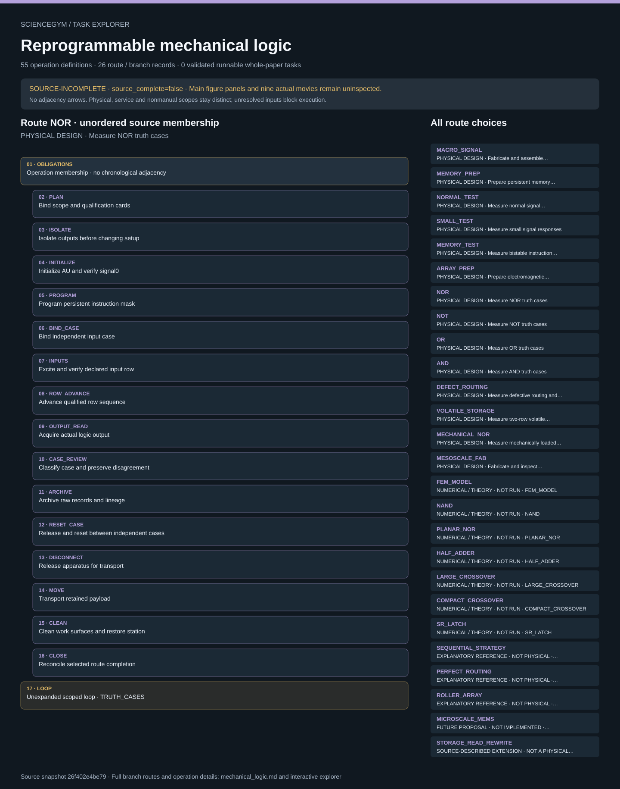

# Reprogrammable mechanical logic: task route map



Paper: **A mechanical metamaterial with reprogrammable logical functions** · [DOI](https://doi.org/10.1038/s41467-021-27608-7)

Author/evaluator design reference only; not an actor projection, task runner, solver, physical simulation or execution receipt. Missing inputs stay blocked. Physical acquisition, device-owned services, derived analysis and numerical reference scope remain distinct. ReMM source_complete is false. Main figure panels and actual movie contents remain uninspected. Source inventory, truth-table cases and symbolic repeats do not supply an episode allocation. Numerical gates, explanatory records and proposed extensions remain nonphysical.. Counts describe task representation, not experiments or success.

**Reading rule:** rows retain the source display structure only. Membership has no inferred chronology. Where the source supplies a typed body, one unexpanded template is shown; no condition, trial or specimen count is inferred. An unordered obligation group has no inferred chronological edges. Source-reported scientific facts and authored handling are distinct.

[Immutable source task package](https://github.com/openags/ScienceGym/blob/26f402e4be797a91edce8253e4ed45bed6e01e7c/tasks/mechanical_logic_operations_v2/) · [Interactive inspector](../index.html)

## MACRO_SIGNAL — PHYSICAL DESIGN · Fabricate and assemble macroscale signals

Author/evaluator design reference only; not an actor projection, task runner, solver, physical simulation or execution receipt. Missing inputs stay blocked. Physical acquisition, device-owned services, derived analysis and numerical reference scope remain distinct. ReMM source_complete is false. Main figure panels and actual movie contents remain uninspected. Source inventory, truth-table cases and symbolic repeats do not supply an episode allocation. Numerical gates, explanatory records and proposed extensions remain nonphysical. Operation lists are unordered membership. Only declared causal, condition and phase constraints impose order. Symbolic loops preserve their exact scope without expanding counts or inventing specimen, transfer or execution instances.

[Exact route source](https://github.com/openags/ScienceGym/blob/26f402e4be797a91edce8253e4ed45bed6e01e7c/tasks/mechanical_logic_operations_v2/branches.json) · JSON pointer: `/branches/0`

- **OBLIGATIONS: Operation membership · no chronological adjacency**
  - Binding: {"order":"Only declared prerequisites and qualified occurrence scopes constrain order; display adjacency is not an edge."}
  - `PLAN` Bind scope and qualification cards
  - `STOCK` Issue distinct material lots
  - `CARRIER` Prepare supported identified carrier
  - `MOVE` Transport retained payload
  - `FAB_LOAD` Load qualified fabrication job
  - `FAB_START` Start guarded print process
  - `FAB_CYCLE` Monitor automatic fabrication
  - `FAB_RELEASE` Release and recover printed components
  - `PART_ID` Identify and inspect every component
  - `GLUE` Join macro beam and sleeves
  - `CURE` Monitor qualified bond cure
  - `LUBE` Lubricate sleeve interiors
  - `SUPPORT` Assemble hinged support contacts
  - `QUARANTINE` Quarantine damaged or uncertain item
  - `ARCHIVE` Archive raw records and lineage
  - `CLEAN` Clean work surfaces and restore station
  - `CLOSE` Reconcile selected route completion
- **LOOP: Unexpanded scoped loop · PRINT_JOBS**
  - Binding: {"source_file":"dependencies.json","source_pointer":"/loops/0","source_contract":{"id":"PRINT_JOBS","branch_ids":["MACRO_SIGNAL","MEMORY_PREP","MESOSCALE_FAB"],"occurrence_key":"job_id","repeat_count":null,"schedule_input":"fabrication_job_manifest","empty_schedule_allowed":false,"reset_rule":"new_job_receipt_and_inventory"}}

<details><summary>Branch state, choices, lineage and loop obligations</summary>

```json
{
  "id": "MACRO_SIGNAL",
  "title": "Fabricate and assemble macroscale signals",
  "operation_ids": [
    "PLAN",
    "STOCK",
    "CARRIER",
    "MOVE",
    "FAB_LOAD",
    "FAB_START",
    "FAB_CYCLE",
    "FAB_RELEASE",
    "PART_ID",
    "GLUE",
    "CURE",
    "LUBE",
    "SUPPORT",
    "QUARANTINE",
    "ARCHIVE",
    "CLEAN",
    "CLOSE"
  ],
  "operation_list_semantics": "membership; occurrences and precedence supplied by dependencies and qualified episode schedule, not historical chronology",
  "source_evidence_ids": [
    "E_FAB",
    "E_SIGNAL"
  ],
  "required_branch_ids": [],
  "direct_unknown_parameter_ids": [
    "U_ALLOC",
    "U_ANALYSIS",
    "U_ASSEMBLY",
    "U_CAD",
    "U_CLEAN",
    "U_FAB",
    "U_READOUT",
    "U_ROBOT"
  ],
  "unknown_parameter_ids": [
    "U_ALLOC",
    "U_ANALYSIS",
    "U_ASSEMBLY",
    "U_CAD",
    "U_CLEAN",
    "U_FAB",
    "U_READOUT",
    "U_ROBOT"
  ],
  "conditions": {
    "reported_normal_specimens": 12,
    "reported_small_specimens": 2,
    "episode_quantity": null
  },
  "notes": "Reported physical inventory is not an episode default. FDM beam and SLA rigid part jobs have independent occurrence IDs and process cards.",
  "readiness": "represented_not_executed",
  "terminal_operation_ids": [
    "ARCHIVE",
    "CLEAN",
    "CLOSE"
  ],
  "completion": "Every required nonempty scheduled condition has immutable,classified observations and required control/reset/custody/cleanup receipts. Failed scientific agreement and incomplete acquisition are distinct.",
  "prepared_handoff": "Prepared-state receipt carries object IDs,revisions,location,energy state,calibration scope and outstanding terminal work. Verify before downstream reuse; never assume prebuilt state."
}
```

</details>

## MEMORY_PREP — PHYSICAL DESIGN · Prepare persistent memory elements

Author/evaluator design reference only; not an actor projection, task runner, solver, physical simulation or execution receipt. Missing inputs stay blocked. Physical acquisition, device-owned services, derived analysis and numerical reference scope remain distinct. ReMM source_complete is false. Main figure panels and actual movie contents remain uninspected. Source inventory, truth-table cases and symbolic repeats do not supply an episode allocation. Numerical gates, explanatory records and proposed extensions remain nonphysical. Operation lists are unordered membership. Only declared causal, condition and phase constraints impose order. Symbolic loops preserve their exact scope without expanding counts or inventing specimen, transfer or execution instances.

[Exact route source](https://github.com/openags/ScienceGym/blob/26f402e4be797a91edce8253e4ed45bed6e01e7c/tasks/mechanical_logic_operations_v2/branches.json) · JSON pointer: `/branches/1`

- **OBLIGATIONS: Operation membership · no chronological adjacency**
  - Binding: {"order":"Only declared prerequisites and qualified occurrence scopes constrain order; display adjacency is not an edge."}
  - `PLAN` Bind scope and qualification cards
  - `STOCK` Issue distinct material lots
  - `CARRIER` Prepare supported identified carrier
  - `MOVE` Transport retained payload
  - `FAB_LOAD` Load qualified fabrication job
  - `FAB_START` Start guarded print process
  - `FAB_CYCLE` Monitor automatic fabrication
  - `FAB_RELEASE` Release and recover printed components
  - `PART_ID` Identify and inspect every component
  - `MEM_ASSEMBLE` Mount bistable memory beam
  - `ARCHIVE` Archive raw records and lineage
  - `CLEAN` Clean work surfaces and restore station
  - `CLOSE` Reconcile selected route completion
- **LOOP: Unexpanded scoped loop · PRINT_JOBS**
  - Binding: {"source_file":"dependencies.json","source_pointer":"/loops/0","source_contract":{"id":"PRINT_JOBS","branch_ids":["MACRO_SIGNAL","MEMORY_PREP","MESOSCALE_FAB"],"occurrence_key":"job_id","repeat_count":null,"schedule_input":"fabrication_job_manifest","empty_schedule_allowed":false,"reset_rule":"new_job_receipt_and_inventory"}}

<details><summary>Branch state, choices, lineage and loop obligations</summary>

```json
{
  "id": "MEMORY_PREP",
  "title": "Prepare persistent memory elements",
  "operation_ids": [
    "PLAN",
    "STOCK",
    "CARRIER",
    "MOVE",
    "FAB_LOAD",
    "FAB_START",
    "FAB_CYCLE",
    "FAB_RELEASE",
    "PART_ID",
    "MEM_ASSEMBLE",
    "ARCHIVE",
    "CLEAN",
    "CLOSE"
  ],
  "operation_list_semantics": "membership; occurrences and precedence supplied by dependencies and qualified episode schedule, not historical chronology",
  "source_evidence_ids": [
    "E_MEMORY",
    "E_ARRAY"
  ],
  "required_branch_ids": [],
  "direct_unknown_parameter_ids": [
    "U_ALLOC",
    "U_ANALYSIS",
    "U_ASSEMBLY",
    "U_CAD",
    "U_CLEAN",
    "U_FAB",
    "U_MECH",
    "U_READOUT",
    "U_ROBOT"
  ],
  "unknown_parameter_ids": [
    "U_ALLOC",
    "U_ANALYSIS",
    "U_ASSEMBLY",
    "U_CAD",
    "U_CLEAN",
    "U_FAB",
    "U_MECH",
    "U_READOUT",
    "U_ROBOT"
  ],
  "conditions": {
    "reported_measured_memory_specimens": 14,
    "fabricated_beam_length_mm": 62,
    "support_span_mm": 60,
    "episode_quantity": null
  },
  "notes": "Memory preparation is an authored gated closure. Detailed memory fabrication recipe is unspecified; do not assume every signal-element recipe transfers.",
  "readiness": "represented_not_executed",
  "terminal_operation_ids": [
    "ARCHIVE",
    "CLEAN",
    "CLOSE"
  ],
  "completion": "Every required nonempty scheduled condition has immutable,classified observations and required control/reset/custody/cleanup receipts. Failed scientific agreement and incomplete acquisition are distinct.",
  "prepared_handoff": "Prepared-state receipt carries object IDs,revisions,location,energy state,calibration scope and outstanding terminal work. Verify before downstream reuse; never assume prebuilt state."
}
```

</details>

## NORMAL_TEST — PHYSICAL DESIGN · Measure normal signal responses

Author/evaluator design reference only; not an actor projection, task runner, solver, physical simulation or execution receipt. Missing inputs stay blocked. Physical acquisition, device-owned services, derived analysis and numerical reference scope remain distinct. ReMM source_complete is false. Main figure panels and actual movie contents remain uninspected. Source inventory, truth-table cases and symbolic repeats do not supply an episode allocation. Numerical gates, explanatory records and proposed extensions remain nonphysical. Operation lists are unordered membership. Only declared causal, condition and phase constraints impose order. Symbolic loops preserve their exact scope without expanding counts or inventing specimen, transfer or execution instances.

[Exact route source](https://github.com/openags/ScienceGym/blob/26f402e4be797a91edce8253e4ed45bed6e01e7c/tasks/mechanical_logic_operations_v2/branches.json) · JSON pointer: `/branches/2`

- **OBLIGATIONS: Operation membership · no chronological adjacency**
  - Binding: {"order":"Only declared prerequisites and qualified occurrence scopes constrain order; display adjacency is not an edge."}
  - `PLAN` Bind scope and qualification cards
  - `CARRIER` Prepare supported identified carrier
  - `MOVE` Transport retained payload
  - `TEST_CAL` Qualify compression measurement chain
  - `TEST_MOUNT` Mount identified test element
  - `TEST_RUN` Acquire compression and release curve
  - `TEST_REVIEW` Classify measured response and reset
  - `TEST_UNLOAD` Release test fixture and retain specimen
  - `QUARANTINE` Quarantine damaged or uncertain item
  - `ARCHIVE` Archive raw records and lineage
  - `CLEAN` Clean work surfaces and restore station
  - `CLOSE` Reconcile selected route completion
- **LOOP: Unexpanded scoped loop · SPECIMEN_TESTS**
  - Binding: {"source_file":"dependencies.json","source_pointer":"/loops/1","source_contract":{"id":"SPECIMEN_TESTS","branch_ids":["NORMAL_TEST","SMALL_TEST","MEMORY_TEST"],"occurrence_key":"specimen_id/cycle_id/attempt_id","repeat_count":null,"schedule_input":"specimen_cycle_schedule","empty_schedule_allowed":false,"reset_rule":"role_specific_reset_and_integrity"}}

<details><summary>Branch state, choices, lineage and loop obligations</summary>

```json
{
  "id": "NORMAL_TEST",
  "title": "Measure normal signal responses",
  "operation_ids": [
    "PLAN",
    "CARRIER",
    "MOVE",
    "TEST_CAL",
    "TEST_MOUNT",
    "TEST_RUN",
    "TEST_REVIEW",
    "TEST_UNLOAD",
    "QUARANTINE",
    "ARCHIVE",
    "CLEAN",
    "CLOSE"
  ],
  "operation_list_semantics": "membership; occurrences and precedence supplied by dependencies and qualified episode schedule, not historical chronology",
  "source_evidence_ids": [
    "E_SIGNAL"
  ],
  "required_branch_ids": [
    "MACRO_SIGNAL"
  ],
  "direct_unknown_parameter_ids": [
    "U_ALLOC",
    "U_ANALYSIS",
    "U_ASSEMBLY",
    "U_CLEAN",
    "U_READOUT",
    "U_ROBOT",
    "U_TEST",
    "U_TIMING"
  ],
  "unknown_parameter_ids": [
    "U_ALLOC",
    "U_ANALYSIS",
    "U_ASSEMBLY",
    "U_CAD",
    "U_CLEAN",
    "U_FAB",
    "U_READOUT",
    "U_ROBOT",
    "U_TEST",
    "U_TIMING"
  ],
  "conditions": {
    "specimen_role": "normal_signal",
    "reported_specimens": 12,
    "cycles_per_specimen": null,
    "independent_replicates": null
  },
  "notes": "Finite specimen and cycle allocation required. Curve samples,truth cases,cycles and replacement specimens have separate identities.",
  "readiness": "represented_not_executed",
  "terminal_operation_ids": [
    "ARCHIVE",
    "CLEAN",
    "CLOSE"
  ],
  "completion": "Every required nonempty scheduled condition has immutable,classified observations and required control/reset/custody/cleanup receipts. Failed scientific agreement and incomplete acquisition are distinct.",
  "prepared_handoff": "Prepared-state receipt carries object IDs,revisions,location,energy state,calibration scope and outstanding terminal work. Verify before downstream reuse; never assume prebuilt state."
}
```

</details>

## SMALL_TEST — PHYSICAL DESIGN · Measure small signal responses

Author/evaluator design reference only; not an actor projection, task runner, solver, physical simulation or execution receipt. Missing inputs stay blocked. Physical acquisition, device-owned services, derived analysis and numerical reference scope remain distinct. ReMM source_complete is false. Main figure panels and actual movie contents remain uninspected. Source inventory, truth-table cases and symbolic repeats do not supply an episode allocation. Numerical gates, explanatory records and proposed extensions remain nonphysical. Operation lists are unordered membership. Only declared causal, condition and phase constraints impose order. Symbolic loops preserve their exact scope without expanding counts or inventing specimen, transfer or execution instances.

[Exact route source](https://github.com/openags/ScienceGym/blob/26f402e4be797a91edce8253e4ed45bed6e01e7c/tasks/mechanical_logic_operations_v2/branches.json) · JSON pointer: `/branches/3`

- **OBLIGATIONS: Operation membership · no chronological adjacency**
  - Binding: {"order":"Only declared prerequisites and qualified occurrence scopes constrain order; display adjacency is not an edge."}
  - `PLAN` Bind scope and qualification cards
  - `CARRIER` Prepare supported identified carrier
  - `MOVE` Transport retained payload
  - `TEST_CAL` Qualify compression measurement chain
  - `TEST_MOUNT` Mount identified test element
  - `TEST_RUN` Acquire compression and release curve
  - `TEST_REVIEW` Classify measured response and reset
  - `TEST_UNLOAD` Release test fixture and retain specimen
  - `QUARANTINE` Quarantine damaged or uncertain item
  - `ARCHIVE` Archive raw records and lineage
  - `CLEAN` Clean work surfaces and restore station
  - `CLOSE` Reconcile selected route completion
- **LOOP: Unexpanded scoped loop · SPECIMEN_TESTS**
  - Binding: {"source_file":"dependencies.json","source_pointer":"/loops/1","source_contract":{"id":"SPECIMEN_TESTS","branch_ids":["NORMAL_TEST","SMALL_TEST","MEMORY_TEST"],"occurrence_key":"specimen_id/cycle_id/attempt_id","repeat_count":null,"schedule_input":"specimen_cycle_schedule","empty_schedule_allowed":false,"reset_rule":"role_specific_reset_and_integrity"}}

<details><summary>Branch state, choices, lineage and loop obligations</summary>

```json
{
  "id": "SMALL_TEST",
  "title": "Measure small signal responses",
  "operation_ids": [
    "PLAN",
    "CARRIER",
    "MOVE",
    "TEST_CAL",
    "TEST_MOUNT",
    "TEST_RUN",
    "TEST_REVIEW",
    "TEST_UNLOAD",
    "QUARANTINE",
    "ARCHIVE",
    "CLEAN",
    "CLOSE"
  ],
  "operation_list_semantics": "membership; occurrences and precedence supplied by dependencies and qualified episode schedule, not historical chronology",
  "source_evidence_ids": [
    "E_SMALL"
  ],
  "required_branch_ids": [
    "MACRO_SIGNAL"
  ],
  "direct_unknown_parameter_ids": [
    "U_ALLOC",
    "U_ANALYSIS",
    "U_ASSEMBLY",
    "U_CLEAN",
    "U_READOUT",
    "U_ROBOT",
    "U_TEST",
    "U_TIMING"
  ],
  "unknown_parameter_ids": [
    "U_ALLOC",
    "U_ANALYSIS",
    "U_ASSEMBLY",
    "U_CAD",
    "U_CLEAN",
    "U_FAB",
    "U_READOUT",
    "U_ROBOT",
    "U_TEST",
    "U_TIMING"
  ],
  "conditions": {
    "specimen_role": "small_signal",
    "reported_specimens": 2,
    "cycles_per_specimen": null,
    "independent_replicates": null
  },
  "notes": "Finite specimen and cycle allocation required. Curve samples,truth cases,cycles and replacement specimens have separate identities.",
  "readiness": "represented_not_executed",
  "terminal_operation_ids": [
    "ARCHIVE",
    "CLEAN",
    "CLOSE"
  ],
  "completion": "Every required nonempty scheduled condition has immutable,classified observations and required control/reset/custody/cleanup receipts. Failed scientific agreement and incomplete acquisition are distinct.",
  "prepared_handoff": "Prepared-state receipt carries object IDs,revisions,location,energy state,calibration scope and outstanding terminal work. Verify before downstream reuse; never assume prebuilt state."
}
```

</details>

## MEMORY_TEST — PHYSICAL DESIGN · Measure bistable instruction memory

Author/evaluator design reference only; not an actor projection, task runner, solver, physical simulation or execution receipt. Missing inputs stay blocked. Physical acquisition, device-owned services, derived analysis and numerical reference scope remain distinct. ReMM source_complete is false. Main figure panels and actual movie contents remain uninspected. Source inventory, truth-table cases and symbolic repeats do not supply an episode allocation. Numerical gates, explanatory records and proposed extensions remain nonphysical. Operation lists are unordered membership. Only declared causal, condition and phase constraints impose order. Symbolic loops preserve their exact scope without expanding counts or inventing specimen, transfer or execution instances.

[Exact route source](https://github.com/openags/ScienceGym/blob/26f402e4be797a91edce8253e4ed45bed6e01e7c/tasks/mechanical_logic_operations_v2/branches.json) · JSON pointer: `/branches/4`

- **OBLIGATIONS: Operation membership · no chronological adjacency**
  - Binding: {"order":"Only declared prerequisites and qualified occurrence scopes constrain order; display adjacency is not an edge."}
  - `PLAN` Bind scope and qualification cards
  - `CARRIER` Prepare supported identified carrier
  - `MOVE` Transport retained payload
  - `TEST_CAL` Qualify compression measurement chain
  - `TEST_MOUNT` Mount identified test element
  - `TEST_RUN` Acquire compression and release curve
  - `TEST_REVIEW` Classify measured response and reset
  - `TEST_UNLOAD` Release test fixture and retain specimen
  - `QUARANTINE` Quarantine damaged or uncertain item
  - `ARCHIVE` Archive raw records and lineage
  - `CLEAN` Clean work surfaces and restore station
  - `CLOSE` Reconcile selected route completion
- **LOOP: Unexpanded scoped loop · SPECIMEN_TESTS**
  - Binding: {"source_file":"dependencies.json","source_pointer":"/loops/1","source_contract":{"id":"SPECIMEN_TESTS","branch_ids":["NORMAL_TEST","SMALL_TEST","MEMORY_TEST"],"occurrence_key":"specimen_id/cycle_id/attempt_id","repeat_count":null,"schedule_input":"specimen_cycle_schedule","empty_schedule_allowed":false,"reset_rule":"role_specific_reset_and_integrity"}}

<details><summary>Branch state, choices, lineage and loop obligations</summary>

```json
{
  "id": "MEMORY_TEST",
  "title": "Measure bistable instruction memory",
  "operation_ids": [
    "PLAN",
    "CARRIER",
    "MOVE",
    "TEST_CAL",
    "TEST_MOUNT",
    "TEST_RUN",
    "TEST_REVIEW",
    "TEST_UNLOAD",
    "QUARANTINE",
    "ARCHIVE",
    "CLEAN",
    "CLOSE"
  ],
  "operation_list_semantics": "membership; occurrences and precedence supplied by dependencies and qualified episode schedule, not historical chronology",
  "source_evidence_ids": [
    "E_MEMORY"
  ],
  "required_branch_ids": [
    "MEMORY_PREP"
  ],
  "direct_unknown_parameter_ids": [
    "U_ALLOC",
    "U_ANALYSIS",
    "U_ASSEMBLY",
    "U_CLEAN",
    "U_READOUT",
    "U_ROBOT",
    "U_TEST",
    "U_TIMING"
  ],
  "unknown_parameter_ids": [
    "U_ALLOC",
    "U_ANALYSIS",
    "U_ASSEMBLY",
    "U_CAD",
    "U_CLEAN",
    "U_FAB",
    "U_MECH",
    "U_READOUT",
    "U_ROBOT",
    "U_TEST",
    "U_TIMING"
  ],
  "conditions": {
    "specimen_role": "instruction_memory",
    "reported_specimens": 14,
    "cycles_per_specimen": null,
    "independent_replicates": null
  },
  "notes": "Finite specimen and cycle allocation required. Curve samples,truth cases,cycles and replacement specimens have separate identities.",
  "readiness": "represented_not_executed",
  "terminal_operation_ids": [
    "ARCHIVE",
    "CLEAN",
    "CLOSE"
  ],
  "completion": "Every required nonempty scheduled condition has immutable,classified observations and required control/reset/custody/cleanup receipts. Failed scientific agreement and incomplete acquisition are distinct.",
  "prepared_handoff": "Prepared-state receipt carries object IDs,revisions,location,energy state,calibration scope and outstanding terminal work. Verify before downstream reuse; never assume prebuilt state."
}
```

</details>

## ARRAY_PREP — PHYSICAL DESIGN · Prepare electromagnetic arithmetic apparatus

Author/evaluator design reference only; not an actor projection, task runner, solver, physical simulation or execution receipt. Missing inputs stay blocked. Physical acquisition, device-owned services, derived analysis and numerical reference scope remain distinct. ReMM source_complete is false. Main figure panels and actual movie contents remain uninspected. Source inventory, truth-table cases and symbolic repeats do not supply an episode allocation. Numerical gates, explanatory records and proposed extensions remain nonphysical. Operation lists are unordered membership. Only declared causal, condition and phase constraints impose order. Symbolic loops preserve their exact scope without expanding counts or inventing specimen, transfer or execution instances.

[Exact route source](https://github.com/openags/ScienceGym/blob/26f402e4be797a91edce8253e4ed45bed6e01e7c/tasks/mechanical_logic_operations_v2/branches.json) · JSON pointer: `/branches/5`

- **OBLIGATIONS: Operation membership · no chronological adjacency**
  - Binding: {"order":"Only declared prerequisites and qualified occurrence scopes constrain order; display adjacency is not an edge."}
  - `PLAN` Bind scope and qualification cards
  - `CARRIER` Prepare supported identified carrier
  - `MOVE` Transport retained payload
  - `AU_LAYOUT` Lay out normal and bridging signal elements
  - `AU_CONTACT` Inspect neighbor contact and bridge interfaces
  - `REIM_MOUNT` Mount instruction-memory array
  - `MAG_MOUNT` Mount electromagnets and loading links
  - `WIRE` Connect isolated memory-actuator circuits
  - `SWITCH_CHECK` Qualify slide-switch row map
  - `MAG_CAL` Qualify hardware excitation window
  - `VISION_CAL` Qualify state readout and timestamps
  - `ISOLATE` Isolate outputs before changing setup
  - `INITIALIZE` Initialize AU and verify signal0
  - `ARCHIVE` Archive raw records and lineage
  - `CLOSE` Reconcile selected route completion
  - `CLEAN` Clean work surfaces and restore station

<details><summary>Branch state, choices, lineage and loop obligations</summary>

```json
{
  "id": "ARRAY_PREP",
  "title": "Prepare electromagnetic arithmetic apparatus",
  "operation_ids": [
    "PLAN",
    "CARRIER",
    "MOVE",
    "AU_LAYOUT",
    "AU_CONTACT",
    "REIM_MOUNT",
    "MAG_MOUNT",
    "WIRE",
    "SWITCH_CHECK",
    "MAG_CAL",
    "VISION_CAL",
    "ISOLATE",
    "INITIALIZE",
    "ARCHIVE",
    "CLOSE",
    "CLEAN"
  ],
  "operation_list_semantics": "membership; occurrences and precedence supplied by dependencies and qualified episode schedule, not historical chronology",
  "source_evidence_ids": [
    "E_ARRAY",
    "E_NOR"
  ],
  "required_branch_ids": [
    "MACRO_SIGNAL",
    "MEMORY_PREP"
  ],
  "direct_unknown_parameter_ids": [
    "U_ALLOC",
    "U_ANALYSIS",
    "U_ASSEMBLY",
    "U_CAD",
    "U_CLEAN",
    "U_ELECTRIC",
    "U_MASK",
    "U_MECH",
    "U_READOUT",
    "U_ROBOT",
    "U_SOURCE",
    "U_TEST",
    "U_TIMING"
  ],
  "unknown_parameter_ids": [
    "U_ALLOC",
    "U_ANALYSIS",
    "U_ASSEMBLY",
    "U_CAD",
    "U_CLEAN",
    "U_ELECTRIC",
    "U_FAB",
    "U_MASK",
    "U_MECH",
    "U_READOUT",
    "U_ROBOT",
    "U_SOURCE",
    "U_TEST",
    "U_TIMING"
  ],
  "conditions": {
    "reported_AU_normal": 12,
    "reported_AU_small": 2,
    "maximum_simultaneous_rows": 3
  },
  "notes": "No unsupported requirement that every historical test preceded assembly. Qualification evidence or explicit qualified handoff is needed; normal/small/memory measurement campaigns remain separately required for whole-paper coverage.",
  "readiness": "represented_not_executed",
  "terminal_operation_ids": [
    "ARCHIVE",
    "CLEAN",
    "CLOSE"
  ],
  "completion": "Every required nonempty scheduled condition has immutable,classified observations and required control/reset/custody/cleanup receipts. Failed scientific agreement and incomplete acquisition are distinct.",
  "prepared_handoff": "Prepared-state receipt carries object IDs,revisions,location,energy state,calibration scope and outstanding terminal work. Verify before downstream reuse; never assume prebuilt state."
}
```

</details>

## NOR — PHYSICAL DESIGN · Measure NOR truth cases

Author/evaluator design reference only; not an actor projection, task runner, solver, physical simulation or execution receipt. Missing inputs stay blocked. Physical acquisition, device-owned services, derived analysis and numerical reference scope remain distinct. ReMM source_complete is false. Main figure panels and actual movie contents remain uninspected. Source inventory, truth-table cases and symbolic repeats do not supply an episode allocation. Numerical gates, explanatory records and proposed extensions remain nonphysical. Operation lists are unordered membership. Only declared causal, condition and phase constraints impose order. Symbolic loops preserve their exact scope without expanding counts or inventing specimen, transfer or execution instances.

[Exact route source](https://github.com/openags/ScienceGym/blob/26f402e4be797a91edce8253e4ed45bed6e01e7c/tasks/mechanical_logic_operations_v2/branches.json) · JSON pointer: `/branches/6`

- **OBLIGATIONS: Operation membership · no chronological adjacency**
  - Binding: {"order":"Only declared prerequisites and qualified occurrence scopes constrain order; display adjacency is not an edge."}
  - `PLAN` Bind scope and qualification cards
  - `ISOLATE` Isolate outputs before changing setup
  - `INITIALIZE` Initialize AU and verify signal0
  - `PROGRAM` Program persistent instruction mask
  - `BIND_CASE` Bind independent input case
  - `INPUTS` Excite and verify declared input row
  - `ROW_ADVANCE` Advance qualified row sequence
  - `OUTPUT_READ` Acquire actual logic output
  - `CASE_REVIEW` Classify case and preserve disagreement
  - `ARCHIVE` Archive raw records and lineage
  - `RESET_CASE` Release and reset between independent cases
  - `DISCONNECT` Release apparatus for transport
  - `MOVE` Transport retained payload
  - `CLEAN` Clean work surfaces and restore station
  - `CLOSE` Reconcile selected route completion
- **LOOP: Unexpanded scoped loop · TRUTH_CASES**
  - Binding: {"source_file":"dependencies.json","source_pointer":"/loops/2","source_contract":{"id":"TRUTH_CASES","branch_ids":["NOR","NOT","OR","AND"],"occurrence_key":"function/case_id/repeat_id/attempt_id","repeat_count":null,"schedule_input":"case_schedule","empty_schedule_allowed":false,"reset_rule":"new_verified_AU_reset_before_each_independent_case"}}

<details><summary>Branch state, choices, lineage and loop obligations</summary>

```json
{
  "id": "NOR",
  "title": "Measure NOR truth cases",
  "operation_ids": [
    "PLAN",
    "ISOLATE",
    "INITIALIZE",
    "PROGRAM",
    "BIND_CASE",
    "INPUTS",
    "ROW_ADVANCE",
    "OUTPUT_READ",
    "CASE_REVIEW",
    "ARCHIVE",
    "RESET_CASE",
    "DISCONNECT",
    "MOVE",
    "CLEAN",
    "CLOSE"
  ],
  "operation_list_semantics": "membership; occurrences and precedence supplied by dependencies and qualified episode schedule, not historical chronology",
  "source_evidence_ids": [
    "E_NOR"
  ],
  "required_branch_ids": [
    "ARRAY_PREP"
  ],
  "direct_unknown_parameter_ids": [
    "U_ALLOC",
    "U_ANALYSIS",
    "U_CLEAN",
    "U_ELECTRIC",
    "U_MASK",
    "U_MECH",
    "U_READOUT",
    "U_ROBOT",
    "U_SOURCE",
    "U_TIMING"
  ],
  "unknown_parameter_ids": [
    "U_ALLOC",
    "U_ANALYSIS",
    "U_ASSEMBLY",
    "U_CAD",
    "U_CLEAN",
    "U_ELECTRIC",
    "U_FAB",
    "U_MASK",
    "U_MECH",
    "U_READOUT",
    "U_ROBOT",
    "U_SOURCE",
    "U_TEST",
    "U_TIMING"
  ],
  "conditions": {
    "function": "NOR",
    "input_arity": 2,
    "required_input_cases": [
      [
        0,
        0
      ],
      [
        0,
        1
      ],
      [
        1,
        0
      ],
      [
        1,
        1
      ]
    ],
    "mask_revision": null,
    "case_repeats": null
  },
  "notes": "Input cases are alternatives with a verified reset between independent attempts. Reprogram persistent ReIM separately from transient AU reset. Shared system reuse is source-reported; exact specimen chronology is not.",
  "readiness": "represented_not_executed",
  "terminal_operation_ids": [
    "ARCHIVE",
    "CLEAN",
    "CLOSE"
  ],
  "completion": "Every required nonempty scheduled condition has immutable,classified observations and required control/reset/custody/cleanup receipts. Failed scientific agreement and incomplete acquisition are distinct.",
  "prepared_handoff": "Prepared-state receipt carries object IDs,revisions,location,energy state,calibration scope and outstanding terminal work. Verify before downstream reuse; never assume prebuilt state."
}
```

</details>

## NOT — PHYSICAL DESIGN · Measure NOT truth cases

Author/evaluator design reference only; not an actor projection, task runner, solver, physical simulation or execution receipt. Missing inputs stay blocked. Physical acquisition, device-owned services, derived analysis and numerical reference scope remain distinct. ReMM source_complete is false. Main figure panels and actual movie contents remain uninspected. Source inventory, truth-table cases and symbolic repeats do not supply an episode allocation. Numerical gates, explanatory records and proposed extensions remain nonphysical. Operation lists are unordered membership. Only declared causal, condition and phase constraints impose order. Symbolic loops preserve their exact scope without expanding counts or inventing specimen, transfer or execution instances.

[Exact route source](https://github.com/openags/ScienceGym/blob/26f402e4be797a91edce8253e4ed45bed6e01e7c/tasks/mechanical_logic_operations_v2/branches.json) · JSON pointer: `/branches/7`

- **OBLIGATIONS: Operation membership · no chronological adjacency**
  - Binding: {"order":"Only declared prerequisites and qualified occurrence scopes constrain order; display adjacency is not an edge."}
  - `PLAN` Bind scope and qualification cards
  - `ISOLATE` Isolate outputs before changing setup
  - `INITIALIZE` Initialize AU and verify signal0
  - `PROGRAM` Program persistent instruction mask
  - `BIND_CASE` Bind independent input case
  - `INPUTS` Excite and verify declared input row
  - `ROW_ADVANCE` Advance qualified row sequence
  - `OUTPUT_READ` Acquire actual logic output
  - `CASE_REVIEW` Classify case and preserve disagreement
  - `ARCHIVE` Archive raw records and lineage
  - `RESET_CASE` Release and reset between independent cases
  - `DISCONNECT` Release apparatus for transport
  - `MOVE` Transport retained payload
  - `CLEAN` Clean work surfaces and restore station
  - `CLOSE` Reconcile selected route completion
- **LOOP: Unexpanded scoped loop · TRUTH_CASES**
  - Binding: {"source_file":"dependencies.json","source_pointer":"/loops/2","source_contract":{"id":"TRUTH_CASES","branch_ids":["NOR","NOT","OR","AND"],"occurrence_key":"function/case_id/repeat_id/attempt_id","repeat_count":null,"schedule_input":"case_schedule","empty_schedule_allowed":false,"reset_rule":"new_verified_AU_reset_before_each_independent_case"}}

<details><summary>Branch state, choices, lineage and loop obligations</summary>

```json
{
  "id": "NOT",
  "title": "Measure NOT truth cases",
  "operation_ids": [
    "PLAN",
    "ISOLATE",
    "INITIALIZE",
    "PROGRAM",
    "BIND_CASE",
    "INPUTS",
    "ROW_ADVANCE",
    "OUTPUT_READ",
    "CASE_REVIEW",
    "ARCHIVE",
    "RESET_CASE",
    "DISCONNECT",
    "MOVE",
    "CLEAN",
    "CLOSE"
  ],
  "operation_list_semantics": "membership; occurrences and precedence supplied by dependencies and qualified episode schedule, not historical chronology",
  "source_evidence_ids": [
    "E_GATES"
  ],
  "required_branch_ids": [
    "ARRAY_PREP"
  ],
  "direct_unknown_parameter_ids": [
    "U_ALLOC",
    "U_ANALYSIS",
    "U_CLEAN",
    "U_ELECTRIC",
    "U_MASK",
    "U_MECH",
    "U_READOUT",
    "U_ROBOT",
    "U_SOURCE",
    "U_TIMING"
  ],
  "unknown_parameter_ids": [
    "U_ALLOC",
    "U_ANALYSIS",
    "U_ASSEMBLY",
    "U_CAD",
    "U_CLEAN",
    "U_ELECTRIC",
    "U_FAB",
    "U_MASK",
    "U_MECH",
    "U_READOUT",
    "U_ROBOT",
    "U_SOURCE",
    "U_TEST",
    "U_TIMING"
  ],
  "conditions": {
    "function": "NOT",
    "input_arity": 1,
    "required_input_cases": [
      [
        0
      ],
      [
        1
      ]
    ],
    "mask_revision": null,
    "case_repeats": null
  },
  "notes": "Input cases are alternatives with a verified reset between independent attempts. Reprogram persistent ReIM separately from transient AU reset. Shared system reuse is source-reported; exact specimen chronology is not.",
  "readiness": "represented_not_executed",
  "terminal_operation_ids": [
    "ARCHIVE",
    "CLEAN",
    "CLOSE"
  ],
  "completion": "Every required nonempty scheduled condition has immutable,classified observations and required control/reset/custody/cleanup receipts. Failed scientific agreement and incomplete acquisition are distinct.",
  "prepared_handoff": "Prepared-state receipt carries object IDs,revisions,location,energy state,calibration scope and outstanding terminal work. Verify before downstream reuse; never assume prebuilt state."
}
```

</details>

## OR — PHYSICAL DESIGN · Measure OR truth cases

Author/evaluator design reference only; not an actor projection, task runner, solver, physical simulation or execution receipt. Missing inputs stay blocked. Physical acquisition, device-owned services, derived analysis and numerical reference scope remain distinct. ReMM source_complete is false. Main figure panels and actual movie contents remain uninspected. Source inventory, truth-table cases and symbolic repeats do not supply an episode allocation. Numerical gates, explanatory records and proposed extensions remain nonphysical. Operation lists are unordered membership. Only declared causal, condition and phase constraints impose order. Symbolic loops preserve their exact scope without expanding counts or inventing specimen, transfer or execution instances.

[Exact route source](https://github.com/openags/ScienceGym/blob/26f402e4be797a91edce8253e4ed45bed6e01e7c/tasks/mechanical_logic_operations_v2/branches.json) · JSON pointer: `/branches/8`

- **OBLIGATIONS: Operation membership · no chronological adjacency**
  - Binding: {"order":"Only declared prerequisites and qualified occurrence scopes constrain order; display adjacency is not an edge."}
  - `PLAN` Bind scope and qualification cards
  - `ISOLATE` Isolate outputs before changing setup
  - `INITIALIZE` Initialize AU and verify signal0
  - `PROGRAM` Program persistent instruction mask
  - `BIND_CASE` Bind independent input case
  - `INPUTS` Excite and verify declared input row
  - `ROW_ADVANCE` Advance qualified row sequence
  - `OUTPUT_READ` Acquire actual logic output
  - `CASE_REVIEW` Classify case and preserve disagreement
  - `ARCHIVE` Archive raw records and lineage
  - `RESET_CASE` Release and reset between independent cases
  - `DISCONNECT` Release apparatus for transport
  - `MOVE` Transport retained payload
  - `CLEAN` Clean work surfaces and restore station
  - `CLOSE` Reconcile selected route completion
- **LOOP: Unexpanded scoped loop · TRUTH_CASES**
  - Binding: {"source_file":"dependencies.json","source_pointer":"/loops/2","source_contract":{"id":"TRUTH_CASES","branch_ids":["NOR","NOT","OR","AND"],"occurrence_key":"function/case_id/repeat_id/attempt_id","repeat_count":null,"schedule_input":"case_schedule","empty_schedule_allowed":false,"reset_rule":"new_verified_AU_reset_before_each_independent_case"}}

<details><summary>Branch state, choices, lineage and loop obligations</summary>

```json
{
  "id": "OR",
  "title": "Measure OR truth cases",
  "operation_ids": [
    "PLAN",
    "ISOLATE",
    "INITIALIZE",
    "PROGRAM",
    "BIND_CASE",
    "INPUTS",
    "ROW_ADVANCE",
    "OUTPUT_READ",
    "CASE_REVIEW",
    "ARCHIVE",
    "RESET_CASE",
    "DISCONNECT",
    "MOVE",
    "CLEAN",
    "CLOSE"
  ],
  "operation_list_semantics": "membership; occurrences and precedence supplied by dependencies and qualified episode schedule, not historical chronology",
  "source_evidence_ids": [
    "E_GATES"
  ],
  "required_branch_ids": [
    "ARRAY_PREP"
  ],
  "direct_unknown_parameter_ids": [
    "U_ALLOC",
    "U_ANALYSIS",
    "U_CLEAN",
    "U_ELECTRIC",
    "U_MASK",
    "U_MECH",
    "U_READOUT",
    "U_ROBOT",
    "U_SOURCE",
    "U_TIMING"
  ],
  "unknown_parameter_ids": [
    "U_ALLOC",
    "U_ANALYSIS",
    "U_ASSEMBLY",
    "U_CAD",
    "U_CLEAN",
    "U_ELECTRIC",
    "U_FAB",
    "U_MASK",
    "U_MECH",
    "U_READOUT",
    "U_ROBOT",
    "U_SOURCE",
    "U_TEST",
    "U_TIMING"
  ],
  "conditions": {
    "function": "OR",
    "input_arity": 2,
    "required_input_cases": [
      [
        0,
        0
      ],
      [
        0,
        1
      ],
      [
        1,
        0
      ],
      [
        1,
        1
      ]
    ],
    "mask_revision": null,
    "case_repeats": null
  },
  "notes": "Input cases are alternatives with a verified reset between independent attempts. Reprogram persistent ReIM separately from transient AU reset. Shared system reuse is source-reported; exact specimen chronology is not.",
  "readiness": "represented_not_executed",
  "terminal_operation_ids": [
    "ARCHIVE",
    "CLEAN",
    "CLOSE"
  ],
  "completion": "Every required nonempty scheduled condition has immutable,classified observations and required control/reset/custody/cleanup receipts. Failed scientific agreement and incomplete acquisition are distinct.",
  "prepared_handoff": "Prepared-state receipt carries object IDs,revisions,location,energy state,calibration scope and outstanding terminal work. Verify before downstream reuse; never assume prebuilt state."
}
```

</details>

## AND — PHYSICAL DESIGN · Measure AND truth cases

Author/evaluator design reference only; not an actor projection, task runner, solver, physical simulation or execution receipt. Missing inputs stay blocked. Physical acquisition, device-owned services, derived analysis and numerical reference scope remain distinct. ReMM source_complete is false. Main figure panels and actual movie contents remain uninspected. Source inventory, truth-table cases and symbolic repeats do not supply an episode allocation. Numerical gates, explanatory records and proposed extensions remain nonphysical. Operation lists are unordered membership. Only declared causal, condition and phase constraints impose order. Symbolic loops preserve their exact scope without expanding counts or inventing specimen, transfer or execution instances.

[Exact route source](https://github.com/openags/ScienceGym/blob/26f402e4be797a91edce8253e4ed45bed6e01e7c/tasks/mechanical_logic_operations_v2/branches.json) · JSON pointer: `/branches/9`

- **OBLIGATIONS: Operation membership · no chronological adjacency**
  - Binding: {"order":"Only declared prerequisites and qualified occurrence scopes constrain order; display adjacency is not an edge."}
  - `PLAN` Bind scope and qualification cards
  - `ISOLATE` Isolate outputs before changing setup
  - `INITIALIZE` Initialize AU and verify signal0
  - `PROGRAM` Program persistent instruction mask
  - `BIND_CASE` Bind independent input case
  - `INPUTS` Excite and verify declared input row
  - `ROW_ADVANCE` Advance qualified row sequence
  - `OUTPUT_READ` Acquire actual logic output
  - `CASE_REVIEW` Classify case and preserve disagreement
  - `ARCHIVE` Archive raw records and lineage
  - `RESET_CASE` Release and reset between independent cases
  - `DISCONNECT` Release apparatus for transport
  - `MOVE` Transport retained payload
  - `CLEAN` Clean work surfaces and restore station
  - `CLOSE` Reconcile selected route completion
- **LOOP: Unexpanded scoped loop · TRUTH_CASES**
  - Binding: {"source_file":"dependencies.json","source_pointer":"/loops/2","source_contract":{"id":"TRUTH_CASES","branch_ids":["NOR","NOT","OR","AND"],"occurrence_key":"function/case_id/repeat_id/attempt_id","repeat_count":null,"schedule_input":"case_schedule","empty_schedule_allowed":false,"reset_rule":"new_verified_AU_reset_before_each_independent_case"}}

<details><summary>Branch state, choices, lineage and loop obligations</summary>

```json
{
  "id": "AND",
  "title": "Measure AND truth cases",
  "operation_ids": [
    "PLAN",
    "ISOLATE",
    "INITIALIZE",
    "PROGRAM",
    "BIND_CASE",
    "INPUTS",
    "ROW_ADVANCE",
    "OUTPUT_READ",
    "CASE_REVIEW",
    "ARCHIVE",
    "RESET_CASE",
    "DISCONNECT",
    "MOVE",
    "CLEAN",
    "CLOSE"
  ],
  "operation_list_semantics": "membership; occurrences and precedence supplied by dependencies and qualified episode schedule, not historical chronology",
  "source_evidence_ids": [
    "E_GATES"
  ],
  "required_branch_ids": [
    "ARRAY_PREP"
  ],
  "direct_unknown_parameter_ids": [
    "U_ALLOC",
    "U_ANALYSIS",
    "U_CLEAN",
    "U_ELECTRIC",
    "U_MASK",
    "U_MECH",
    "U_READOUT",
    "U_ROBOT",
    "U_SOURCE",
    "U_TIMING"
  ],
  "unknown_parameter_ids": [
    "U_ALLOC",
    "U_ANALYSIS",
    "U_ASSEMBLY",
    "U_CAD",
    "U_CLEAN",
    "U_ELECTRIC",
    "U_FAB",
    "U_MASK",
    "U_MECH",
    "U_READOUT",
    "U_ROBOT",
    "U_SOURCE",
    "U_TEST",
    "U_TIMING"
  ],
  "conditions": {
    "function": "AND",
    "input_arity": 2,
    "required_input_cases": [
      [
        0,
        0
      ],
      [
        0,
        1
      ],
      [
        1,
        0
      ],
      [
        1,
        1
      ]
    ],
    "mask_revision": null,
    "case_repeats": null
  },
  "notes": "Input cases are alternatives with a verified reset between independent attempts. Reprogram persistent ReIM separately from transient AU reset. Shared system reuse is source-reported; exact specimen chronology is not.",
  "readiness": "represented_not_executed",
  "terminal_operation_ids": [
    "ARCHIVE",
    "CLEAN",
    "CLOSE"
  ],
  "completion": "Every required nonempty scheduled condition has immutable,classified observations and required control/reset/custody/cleanup receipts. Failed scientific agreement and incomplete acquisition are distinct.",
  "prepared_handoff": "Prepared-state receipt carries object IDs,revisions,location,energy state,calibration scope and outstanding terminal work. Verify before downstream reuse; never assume prebuilt state."
}
```

</details>

## DEFECT_ROUTING — PHYSICAL DESIGN · Measure defective routing and bifurcation

Author/evaluator design reference only; not an actor projection, task runner, solver, physical simulation or execution receipt. Missing inputs stay blocked. Physical acquisition, device-owned services, derived analysis and numerical reference scope remain distinct. ReMM source_complete is false. Main figure panels and actual movie contents remain uninspected. Source inventory, truth-table cases and symbolic repeats do not supply an episode allocation. Numerical gates, explanatory records and proposed extensions remain nonphysical. Operation lists are unordered membership. Only declared causal, condition and phase constraints impose order. Symbolic loops preserve their exact scope without expanding counts or inventing specimen, transfer or execution instances.

[Exact route source](https://github.com/openags/ScienceGym/blob/26f402e4be797a91edce8253e4ed45bed6e01e7c/tasks/mechanical_logic_operations_v2/branches.json) · JSON pointer: `/branches/10`

- **OBLIGATIONS: Operation membership · no chronological adjacency**
  - Binding: {"order":"Only declared prerequisites and qualified occurrence scopes constrain order; display adjacency is not an edge."}
  - `PLAN` Bind scope and qualification cards
  - `ISOLATE` Isolate outputs before changing setup
  - `INITIALIZE` Initialize AU and verify signal0
  - `BRIDGE_CONFIG` Verify or reconfigure the parity bridge
  - `AU_CONTACT` Inspect neighbor contact and bridge interfaces
  - `WIRE` Connect isolated memory-actuator circuits
  - `SWITCH_CHECK` Qualify slide-switch row map
  - `MAG_CAL` Qualify hardware excitation window
  - `VISION_CAL` Qualify state readout and timestamps
  - `ROUTE_PROGRAM` Bind defective transmission and bifurcation path
  - `PROGRAM` Program persistent instruction mask
  - `BIND_CASE` Bind independent input case
  - `INPUTS` Excite and verify declared input row
  - `ROW_ADVANCE` Advance qualified row sequence
  - `OUTPUT_READ` Acquire actual logic output
  - `ARCHIVE` Archive raw records and lineage
  - `RESET_CASE` Release and reset between independent cases
  - `DISCONNECT` Release apparatus for transport
  - `MOVE` Transport retained payload
  - `CLEAN` Clean work surfaces and restore station
  - `CLOSE` Reconcile selected route completion
- **LOOP: Unexpanded scoped loop · ROUTING_CASES**
  - Binding: {"source_file":"dependencies.json","source_pointer":"/loops/3","source_contract":{"id":"ROUTING_CASES","branch_ids":["DEFECT_ROUTING"],"occurrence_key":"topology_revision/case_id/attempt_id","repeat_count":null,"schedule_input":"routing_schedule","empty_schedule_allowed":false,"reset_rule":"new_verified_AU_reset"}}

<details><summary>Branch state, choices, lineage and loop obligations</summary>

```json
{
  "id": "DEFECT_ROUTING",
  "title": "Measure defective routing and bifurcation",
  "operation_ids": [
    "PLAN",
    "ISOLATE",
    "INITIALIZE",
    "BRIDGE_CONFIG",
    "AU_CONTACT",
    "WIRE",
    "SWITCH_CHECK",
    "MAG_CAL",
    "VISION_CAL",
    "ROUTE_PROGRAM",
    "PROGRAM",
    "BIND_CASE",
    "INPUTS",
    "ROW_ADVANCE",
    "OUTPUT_READ",
    "ARCHIVE",
    "RESET_CASE",
    "DISCONNECT",
    "MOVE",
    "CLEAN",
    "CLOSE"
  ],
  "operation_list_semantics": "membership; occurrences and precedence supplied by dependencies and qualified episode schedule, not historical chronology",
  "source_evidence_ids": [
    "E_ROUTING"
  ],
  "required_branch_ids": [
    "ARRAY_PREP"
  ],
  "direct_unknown_parameter_ids": [
    "U_ALLOC",
    "U_ANALYSIS",
    "U_ASSEMBLY",
    "U_CAD",
    "U_CLEAN",
    "U_ELECTRIC",
    "U_MASK",
    "U_MECH",
    "U_READOUT",
    "U_ROBOT",
    "U_SOURCE",
    "U_TEST",
    "U_TIMING"
  ],
  "unknown_parameter_ids": [
    "U_ALLOC",
    "U_ANALYSIS",
    "U_ASSEMBLY",
    "U_CAD",
    "U_CLEAN",
    "U_ELECTRIC",
    "U_FAB",
    "U_MASK",
    "U_MECH",
    "U_READOUT",
    "U_ROBOT",
    "U_SOURCE",
    "U_TEST",
    "U_TIMING"
  ],
  "conditions": {
    "topology": "defective_bridge",
    "replacement_normal_count": 1,
    "replacement_small_count": 2,
    "source_cell": "r2c2",
    "reported_target_cell": "r5c5",
    "route_conditions": null,
    "configuration_mode": "verify_existing_bridge_or_declared_single_conversion"
  },
  "notes": "Exact branching destinations and active mask require source/geometry resolution. Perfect Fig5a topology remains explanatory, not a second asserted physical experiment. Existing12-normal+2-small AU may already contain the bridge. Conversion counts describe a topology transaction,not extra default components.",
  "readiness": "represented_not_executed",
  "terminal_operation_ids": [
    "ARCHIVE",
    "CLEAN",
    "CLOSE"
  ],
  "completion": "Every required nonempty scheduled condition has immutable,classified observations and required control/reset/custody/cleanup receipts. Failed scientific agreement and incomplete acquisition are distinct.",
  "prepared_handoff": "Prepared-state receipt carries object IDs,revisions,location,energy state,calibration scope and outstanding terminal work. Verify before downstream reuse; never assume prebuilt state."
}
```

</details>

## VOLATILE_STORAGE — PHYSICAL DESIGN · Measure two-row volatile retention

Author/evaluator design reference only; not an actor projection, task runner, solver, physical simulation or execution receipt. Missing inputs stay blocked. Physical acquisition, device-owned services, derived analysis and numerical reference scope remain distinct. ReMM source_complete is false. Main figure panels and actual movie contents remain uninspected. Source inventory, truth-table cases and symbolic repeats do not supply an episode allocation. Numerical gates, explanatory records and proposed extensions remain nonphysical. Operation lists are unordered membership. Only declared causal, condition and phase constraints impose order. Symbolic loops preserve their exact scope without expanding counts or inventing specimen, transfer or execution instances.

[Exact route source](https://github.com/openags/ScienceGym/blob/26f402e4be797a91edce8253e4ed45bed6e01e7c/tasks/mechanical_logic_operations_v2/branches.json) · JSON pointer: `/branches/11`

- **OBLIGATIONS: Operation membership · no chronological adjacency**
  - Binding: {"order":"Only declared prerequisites and qualified occurrence scopes constrain order; display adjacency is not an edge."}
  - `PLAN` Bind scope and qualification cards
  - `INITIALIZE` Initialize AU and verify signal0
  - `PROGRAM` Program persistent instruction mask
  - `BIND_CASE` Bind independent input case
  - `STORE_WRITE` Write volatile pair through transmission
  - `STORE_HOLD` Hold exactly the storage rows
  - `UPSTREAM_RELEASE` Release upstream while preserving pair hold
  - `STORE_READ` Observe retained volatile pair
  - `ARCHIVE` Archive raw records and lineage
  - `STORE_CLEAR` Clear volatile storage and verify erasure
  - `ISOLATE` Isolate outputs before changing setup
  - `DISCONNECT` Release apparatus for transport
  - `MOVE` Transport retained payload
  - `CLEAN` Clean work surfaces and restore station
  - `CLOSE` Reconcile selected route completion
- **LOOP: Unexpanded scoped loop · STORE_CASES**
  - Binding: {"source_file":"dependencies.json","source_pointer":"/loops/4","source_contract":{"id":"STORE_CASES","branch_ids":["VOLATILE_STORAGE"],"occurrence_key":"pair_id/hold_epoch/attempt_id","repeat_count":null,"schedule_input":"storage_schedule","empty_schedule_allowed":false,"reset_rule":"clear_then_new_epoch; no_power_gap_during_hold"}}

<details><summary>Branch state, choices, lineage and loop obligations</summary>

```json
{
  "id": "VOLATILE_STORAGE",
  "title": "Measure two-row volatile retention",
  "operation_ids": [
    "PLAN",
    "INITIALIZE",
    "PROGRAM",
    "BIND_CASE",
    "STORE_WRITE",
    "STORE_HOLD",
    "UPSTREAM_RELEASE",
    "STORE_READ",
    "ARCHIVE",
    "STORE_CLEAR",
    "ISOLATE",
    "DISCONNECT",
    "MOVE",
    "CLEAN",
    "CLOSE"
  ],
  "operation_list_semantics": "membership; occurrences and precedence supplied by dependencies and qualified episode schedule, not historical chronology",
  "source_evidence_ids": [
    "E_VOLATILE"
  ],
  "required_branch_ids": [
    "ARRAY_PREP"
  ],
  "direct_unknown_parameter_ids": [
    "U_ALLOC",
    "U_ANALYSIS",
    "U_CLEAN",
    "U_ELECTRIC",
    "U_MASK",
    "U_MECH",
    "U_READOUT",
    "U_ROBOT",
    "U_SOURCE",
    "U_TIMING"
  ],
  "unknown_parameter_ids": [
    "U_ALLOC",
    "U_ANALYSIS",
    "U_ASSEMBLY",
    "U_CAD",
    "U_CLEAN",
    "U_ELECTRIC",
    "U_FAB",
    "U_MASK",
    "U_MECH",
    "U_READOUT",
    "U_ROBOT",
    "U_SOURCE",
    "U_TEST",
    "U_TIMING"
  ],
  "conditions": {
    "storage_element_count": 2,
    "maintained_row_count": 2,
    "storage_adjacency": "different_adjacent_rows",
    "initial_and_upstream_cases": null,
    "hold_duration_seconds": null
  },
  "notes": "Fig7b case inventory and positions are unresolved until main panels inspected. Read/rewrite by transmission is source-described; only Fig7a–c retention is asserted physical. Clearing requires a new hold epoch before another write.",
  "readiness": "represented_not_executed",
  "terminal_operation_ids": [
    "ARCHIVE",
    "CLEAN",
    "CLOSE"
  ],
  "completion": "Every required nonempty scheduled condition has immutable,classified observations and required control/reset/custody/cleanup receipts. Failed scientific agreement and incomplete acquisition are distinct.",
  "prepared_handoff": "Prepared-state receipt carries object IDs,revisions,location,energy state,calibration scope and outstanding terminal work. Verify before downstream reuse; never assume prebuilt state."
}
```

</details>

## MECHANICAL_NOR — PHYSICAL DESIGN · Measure mechanically loaded NOR proof

Author/evaluator design reference only; not an actor projection, task runner, solver, physical simulation or execution receipt. Missing inputs stay blocked. Physical acquisition, device-owned services, derived analysis and numerical reference scope remain distinct. ReMM source_complete is false. Main figure panels and actual movie contents remain uninspected. Source inventory, truth-table cases and symbolic repeats do not supply an episode allocation. Numerical gates, explanatory records and proposed extensions remain nonphysical. Operation lists are unordered membership. Only declared causal, condition and phase constraints impose order. Symbolic loops preserve their exact scope without expanding counts or inventing specimen, transfer or execution instances.

[Exact route source](https://github.com/openags/ScienceGym/blob/26f402e4be797a91edce8253e4ed45bed6e01e7c/tasks/mechanical_logic_operations_v2/branches.json) · JSON pointer: `/branches/12`

- **OBLIGATIONS: Operation membership · no chronological adjacency**
  - Binding: {"order":"Only declared prerequisites and qualified occurrence scopes constrain order; display adjacency is not an edge."}
  - `PLAN` Bind scope and qualification cards
  - `CARRIER` Prepare supported identified carrier
  - `MOVE` Transport retained payload
  - `MECH_BUILD` Assemble three-element mechanical NOR proof
  - `MECH_CAL` Qualify mechanical proof loading and readout
  - `MECH_PROGRAM` Set mechanical NOR memory pattern
  - `MECH_LOAD` Apply bounded mechanical proof loading
  - `MECH_READ` Read mechanically loaded proof output
  - `CASE_REVIEW` Classify case and preserve disagreement
  - `ARCHIVE` Archive raw records and lineage
  - `MECH_RELEASE` Release mechanical proof and verify reset
  - `QUARANTINE` Quarantine damaged or uncertain item
  - `CLEAN` Clean work surfaces and restore station
  - `CLOSE` Reconcile selected route completion
- **LOOP: Unexpanded scoped loop · MECHANICAL_CASES**
  - Binding: {"source_file":"dependencies.json","source_pointer":"/loops/5","source_contract":{"id":"MECHANICAL_CASES","branch_ids":["MECHANICAL_NOR"],"occurrence_key":"case_id/repeat_id/attempt_id","repeat_count":null,"schedule_input":"mechanical_case_schedule","empty_schedule_allowed":false,"reset_rule":"released_load_and_verified_signal_reset"}}

<details><summary>Branch state, choices, lineage and loop obligations</summary>

```json
{
  "id": "MECHANICAL_NOR",
  "title": "Measure mechanically loaded NOR proof",
  "operation_ids": [
    "PLAN",
    "CARRIER",
    "MOVE",
    "MECH_BUILD",
    "MECH_CAL",
    "MECH_PROGRAM",
    "MECH_LOAD",
    "MECH_READ",
    "CASE_REVIEW",
    "ARCHIVE",
    "MECH_RELEASE",
    "QUARANTINE",
    "CLEAN",
    "CLOSE"
  ],
  "operation_list_semantics": "membership; occurrences and precedence supplied by dependencies and qualified episode schedule, not historical chronology",
  "source_evidence_ids": [
    "E_MECHANICAL"
  ],
  "required_branch_ids": [
    "MACRO_SIGNAL",
    "MEMORY_PREP"
  ],
  "direct_unknown_parameter_ids": [
    "U_ALLOC",
    "U_ANALYSIS",
    "U_ASSEMBLY",
    "U_CAD",
    "U_CLEAN",
    "U_MECH",
    "U_READOUT",
    "U_ROBOT",
    "U_TIMING"
  ],
  "unknown_parameter_ids": [
    "U_ALLOC",
    "U_ANALYSIS",
    "U_ASSEMBLY",
    "U_CAD",
    "U_CLEAN",
    "U_FAB",
    "U_MECH",
    "U_READOUT",
    "U_ROBOT",
    "U_TIMING"
  ],
  "conditions": {
    "function": "NOR",
    "input_arity": 2,
    "required_input_cases": [
      [
        0,
        0
      ],
      [
        0,
        1
      ],
      [
        1,
        0
      ],
      [
        1,
        1
      ]
    ],
    "signal_element_count": 3,
    "loading_variant": "three_element_proof",
    "replicates": null
  },
  "notes": "Proof-specific mechanical memory and loading components require separate qualified input cards. No roller,belt or gear array fabrication is claimed.",
  "readiness": "represented_not_executed",
  "terminal_operation_ids": [
    "ARCHIVE",
    "CLEAN",
    "CLOSE"
  ],
  "completion": "Every required nonempty scheduled condition has immutable,classified observations and required control/reset/custody/cleanup receipts. Failed scientific agreement and incomplete acquisition are distinct.",
  "prepared_handoff": "Prepared-state receipt carries object IDs,revisions,location,energy state,calibration scope and outstanding terminal work. Verify before downstream reuse; never assume prebuilt state."
}
```

</details>

## MESOSCALE_FAB — PHYSICAL DESIGN · Fabricate and inspect mesoscale elements

Author/evaluator design reference only; not an actor projection, task runner, solver, physical simulation or execution receipt. Missing inputs stay blocked. Physical acquisition, device-owned services, derived analysis and numerical reference scope remain distinct. ReMM source_complete is false. Main figure panels and actual movie contents remain uninspected. Source inventory, truth-table cases and symbolic repeats do not supply an episode allocation. Numerical gates, explanatory records and proposed extensions remain nonphysical. Operation lists are unordered membership. Only declared causal, condition and phase constraints impose order. Symbolic loops preserve their exact scope without expanding counts or inventing specimen, transfer or execution instances.

[Exact route source](https://github.com/openags/ScienceGym/blob/26f402e4be797a91edce8253e4ed45bed6e01e7c/tasks/mechanical_logic_operations_v2/branches.json) · JSON pointer: `/branches/13`

- **OBLIGATIONS: Operation membership · no chronological adjacency**
  - Binding: {"order":"Only declared prerequisites and qualified occurrence scopes constrain order; display adjacency is not an edge."}
  - `PLAN` Bind scope and qualification cards
  - `STOCK` Issue distinct material lots
  - `CARRIER` Prepare supported identified carrier
  - `MOVE` Transport retained payload
  - `FAB_LOAD` Load qualified fabrication job
  - `FAB_START` Start guarded print process
  - `FAB_CYCLE` Monitor automatic fabrication
  - `FAB_RELEASE` Release and recover printed components
  - `PART_ID` Identify and inspect every component
  - `MESO_INSPECT` Inspect mesoscale printed elements
  - `ARCHIVE` Archive raw records and lineage
  - `CLEAN` Clean work surfaces and restore station
  - `CLOSE` Reconcile selected route completion
- **LOOP: Unexpanded scoped loop · PRINT_JOBS**
  - Binding: {"source_file":"dependencies.json","source_pointer":"/loops/0","source_contract":{"id":"PRINT_JOBS","branch_ids":["MACRO_SIGNAL","MEMORY_PREP","MESOSCALE_FAB"],"occurrence_key":"job_id","repeat_count":null,"schedule_input":"fabrication_job_manifest","empty_schedule_allowed":false,"reset_rule":"new_job_receipt_and_inventory"}}

<details><summary>Branch state, choices, lineage and loop obligations</summary>

```json
{
  "id": "MESOSCALE_FAB",
  "title": "Fabricate and inspect mesoscale elements",
  "operation_ids": [
    "PLAN",
    "STOCK",
    "CARRIER",
    "MOVE",
    "FAB_LOAD",
    "FAB_START",
    "FAB_CYCLE",
    "FAB_RELEASE",
    "PART_ID",
    "MESO_INSPECT",
    "ARCHIVE",
    "CLEAN",
    "CLOSE"
  ],
  "operation_list_semantics": "membership; occurrences and precedence supplied by dependencies and qualified episode schedule, not historical chronology",
  "source_evidence_ids": [
    "E_MESO"
  ],
  "required_branch_ids": [],
  "direct_unknown_parameter_ids": [
    "U_ALLOC",
    "U_ANALYSIS",
    "U_ASSEMBLY",
    "U_CAD",
    "U_CLEAN",
    "U_FAB",
    "U_MESO",
    "U_READOUT",
    "U_ROBOT"
  ],
  "unknown_parameter_ids": [
    "U_ALLOC",
    "U_ANALYSIS",
    "U_ASSEMBLY",
    "U_CAD",
    "U_CLEAN",
    "U_FAB",
    "U_MESO",
    "U_READOUT",
    "U_ROBOT"
  ],
  "conditions": {
    "material": "UTL_resin",
    "process": "projection_micro_stereolithography",
    "device": "microArch_P150",
    "quantity": null
  },
  "notes": "Fabrication-only demonstration. No functional mesoscale logic or MEMS replication.",
  "readiness": "represented_not_executed",
  "terminal_operation_ids": [
    "ARCHIVE",
    "CLEAN",
    "CLOSE"
  ],
  "completion": "Every required nonempty scheduled condition has immutable,classified observations and required control/reset/custody/cleanup receipts. Failed scientific agreement and incomplete acquisition are distinct.",
  "prepared_handoff": "Prepared-state receipt carries object IDs,revisions,location,energy state,calibration scope and outstanding terminal work. Verify before downstream reuse; never assume prebuilt state."
}
```

</details>

## FEM_MODEL — NUMERICAL / THEORY · NOT RUN · FEM_MODEL

Author/evaluator design reference only; not an actor projection, task runner, solver, physical simulation or execution receipt. Missing inputs stay blocked. Physical acquisition, device-owned services, derived analysis and numerical reference scope remain distinct. ReMM source_complete is false. Main figure panels and actual movie contents remain uninspected. Source inventory, truth-table cases and symbolic repeats do not supply an episode allocation. Numerical gates, explanatory records and proposed extensions remain nonphysical. Operation lists are unordered membership. Only declared causal, condition and phase constraints impose order. Symbolic loops preserve their exact scope without expanding counts or inventing specimen, transfer or execution instances.

[Exact route source](https://github.com/openags/ScienceGym/blob/26f402e4be797a91edce8253e4ed45bed6e01e7c/tasks/mechanical_logic_operations_v2/nonmanual_scope.json) · JSON pointer: `/dispositions/0`

- **CONDITION: NUMERICAL / THEORY · NOT RUN · exact source disposition**
  - Binding: {"source_file":"nonmanual_scope.json","source_pointer":"/dispositions/0","source_contract":{"id":"FEM_MODEL","disposition":"numerical_model","evidence_ids":["E_FEM"],"executed_here":false,"physical_branch_id":null}}

<details><summary>Branch state, choices, lineage and loop obligations</summary>

```json
{
  "id": "FEM_MODEL",
  "disposition": "numerical_model",
  "evidence_ids": [
    "E_FEM"
  ],
  "executed_here": false,
  "physical_branch_id": null
}
```

</details>

## NAND — NUMERICAL / THEORY · NOT RUN · NAND

Author/evaluator design reference only; not an actor projection, task runner, solver, physical simulation or execution receipt. Missing inputs stay blocked. Physical acquisition, device-owned services, derived analysis and numerical reference scope remain distinct. ReMM source_complete is false. Main figure panels and actual movie contents remain uninspected. Source inventory, truth-table cases and symbolic repeats do not supply an episode allocation. Numerical gates, explanatory records and proposed extensions remain nonphysical. Operation lists are unordered membership. Only declared causal, condition and phase constraints impose order. Symbolic loops preserve their exact scope without expanding counts or inventing specimen, transfer or execution instances.

[Exact route source](https://github.com/openags/ScienceGym/blob/26f402e4be797a91edce8253e4ed45bed6e01e7c/tasks/mechanical_logic_operations_v2/nonmanual_scope.json) · JSON pointer: `/dispositions/1`

- **CONDITION: NUMERICAL / THEORY · NOT RUN · exact source disposition**
  - Binding: {"source_file":"nonmanual_scope.json","source_pointer":"/dispositions/1","source_contract":{"id":"NAND","disposition":"numerical_only","evidence_ids":["E_NAND"],"executed_here":false,"physical_branch_id":null}}

<details><summary>Branch state, choices, lineage and loop obligations</summary>

```json
{
  "id": "NAND",
  "disposition": "numerical_only",
  "evidence_ids": [
    "E_NAND"
  ],
  "executed_here": false,
  "physical_branch_id": null
}
```

</details>

## PLANAR_NOR — NUMERICAL / THEORY · NOT RUN · PLANAR_NOR

Author/evaluator design reference only; not an actor projection, task runner, solver, physical simulation or execution receipt. Missing inputs stay blocked. Physical acquisition, device-owned services, derived analysis and numerical reference scope remain distinct. ReMM source_complete is false. Main figure panels and actual movie contents remain uninspected. Source inventory, truth-table cases and symbolic repeats do not supply an episode allocation. Numerical gates, explanatory records and proposed extensions remain nonphysical. Operation lists are unordered membership. Only declared causal, condition and phase constraints impose order. Symbolic loops preserve their exact scope without expanding counts or inventing specimen, transfer or execution instances.

[Exact route source](https://github.com/openags/ScienceGym/blob/26f402e4be797a91edce8253e4ed45bed6e01e7c/tasks/mechanical_logic_operations_v2/nonmanual_scope.json) · JSON pointer: `/dispositions/2`

- **CONDITION: NUMERICAL / THEORY · NOT RUN · exact source disposition**
  - Binding: {"source_file":"nonmanual_scope.json","source_pointer":"/dispositions/2","source_contract":{"id":"PLANAR_NOR","disposition":"numerical_only","evidence_ids":["E_PLANAR"],"executed_here":false,"physical_branch_id":null}}

<details><summary>Branch state, choices, lineage and loop obligations</summary>

```json
{
  "id": "PLANAR_NOR",
  "disposition": "numerical_only",
  "evidence_ids": [
    "E_PLANAR"
  ],
  "executed_here": false,
  "physical_branch_id": null
}
```

</details>

## HALF_ADDER — NUMERICAL / THEORY · NOT RUN · HALF_ADDER

Author/evaluator design reference only; not an actor projection, task runner, solver, physical simulation or execution receipt. Missing inputs stay blocked. Physical acquisition, device-owned services, derived analysis and numerical reference scope remain distinct. ReMM source_complete is false. Main figure panels and actual movie contents remain uninspected. Source inventory, truth-table cases and symbolic repeats do not supply an episode allocation. Numerical gates, explanatory records and proposed extensions remain nonphysical. Operation lists are unordered membership. Only declared causal, condition and phase constraints impose order. Symbolic loops preserve their exact scope without expanding counts or inventing specimen, transfer or execution instances.

[Exact route source](https://github.com/openags/ScienceGym/blob/26f402e4be797a91edce8253e4ed45bed6e01e7c/tasks/mechanical_logic_operations_v2/nonmanual_scope.json) · JSON pointer: `/dispositions/3`

- **CONDITION: NUMERICAL / THEORY · NOT RUN · exact source disposition**
  - Binding: {"source_file":"nonmanual_scope.json","source_pointer":"/dispositions/3","source_contract":{"id":"HALF_ADDER","disposition":"numerical_only","evidence_ids":["E_HALF"],"executed_here":false,"physical_branch_id":null}}

<details><summary>Branch state, choices, lineage and loop obligations</summary>

```json
{
  "id": "HALF_ADDER",
  "disposition": "numerical_only",
  "evidence_ids": [
    "E_HALF"
  ],
  "executed_here": false,
  "physical_branch_id": null
}
```

</details>

## LARGE_CROSSOVER — NUMERICAL / THEORY · NOT RUN · LARGE_CROSSOVER

Author/evaluator design reference only; not an actor projection, task runner, solver, physical simulation or execution receipt. Missing inputs stay blocked. Physical acquisition, device-owned services, derived analysis and numerical reference scope remain distinct. ReMM source_complete is false. Main figure panels and actual movie contents remain uninspected. Source inventory, truth-table cases and symbolic repeats do not supply an episode allocation. Numerical gates, explanatory records and proposed extensions remain nonphysical. Operation lists are unordered membership. Only declared causal, condition and phase constraints impose order. Symbolic loops preserve their exact scope without expanding counts or inventing specimen, transfer or execution instances.

[Exact route source](https://github.com/openags/ScienceGym/blob/26f402e4be797a91edce8253e4ed45bed6e01e7c/tasks/mechanical_logic_operations_v2/nonmanual_scope.json) · JSON pointer: `/dispositions/4`

- **CONDITION: NUMERICAL / THEORY · NOT RUN · exact source disposition**
  - Binding: {"source_file":"nonmanual_scope.json","source_pointer":"/dispositions/4","source_contract":{"id":"LARGE_CROSSOVER","disposition":"numerical_only","evidence_ids":["E_CROSS"],"executed_here":false,"physical_branch_id":null}}

<details><summary>Branch state, choices, lineage and loop obligations</summary>

```json
{
  "id": "LARGE_CROSSOVER",
  "disposition": "numerical_only",
  "evidence_ids": [
    "E_CROSS"
  ],
  "executed_here": false,
  "physical_branch_id": null
}
```

</details>

## COMPACT_CROSSOVER — NUMERICAL / THEORY · NOT RUN · COMPACT_CROSSOVER

Author/evaluator design reference only; not an actor projection, task runner, solver, physical simulation or execution receipt. Missing inputs stay blocked. Physical acquisition, device-owned services, derived analysis and numerical reference scope remain distinct. ReMM source_complete is false. Main figure panels and actual movie contents remain uninspected. Source inventory, truth-table cases and symbolic repeats do not supply an episode allocation. Numerical gates, explanatory records and proposed extensions remain nonphysical. Operation lists are unordered membership. Only declared causal, condition and phase constraints impose order. Symbolic loops preserve their exact scope without expanding counts or inventing specimen, transfer or execution instances.

[Exact route source](https://github.com/openags/ScienceGym/blob/26f402e4be797a91edce8253e4ed45bed6e01e7c/tasks/mechanical_logic_operations_v2/nonmanual_scope.json) · JSON pointer: `/dispositions/5`

- **CONDITION: NUMERICAL / THEORY · NOT RUN · exact source disposition**
  - Binding: {"source_file":"nonmanual_scope.json","source_pointer":"/dispositions/5","source_contract":{"id":"COMPACT_CROSSOVER","disposition":"numerical_only","evidence_ids":["E_COMPACT"],"executed_here":false,"physical_branch_id":null}}

<details><summary>Branch state, choices, lineage and loop obligations</summary>

```json
{
  "id": "COMPACT_CROSSOVER",
  "disposition": "numerical_only",
  "evidence_ids": [
    "E_COMPACT"
  ],
  "executed_here": false,
  "physical_branch_id": null
}
```

</details>

## SR_LATCH — NUMERICAL / THEORY · NOT RUN · SR_LATCH

Author/evaluator design reference only; not an actor projection, task runner, solver, physical simulation or execution receipt. Missing inputs stay blocked. Physical acquisition, device-owned services, derived analysis and numerical reference scope remain distinct. ReMM source_complete is false. Main figure panels and actual movie contents remain uninspected. Source inventory, truth-table cases and symbolic repeats do not supply an episode allocation. Numerical gates, explanatory records and proposed extensions remain nonphysical. Operation lists are unordered membership. Only declared causal, condition and phase constraints impose order. Symbolic loops preserve their exact scope without expanding counts or inventing specimen, transfer or execution instances.

[Exact route source](https://github.com/openags/ScienceGym/blob/26f402e4be797a91edce8253e4ed45bed6e01e7c/tasks/mechanical_logic_operations_v2/nonmanual_scope.json) · JSON pointer: `/dispositions/6`

- **CONDITION: NUMERICAL / THEORY · NOT RUN · exact source disposition**
  - Binding: {"source_file":"nonmanual_scope.json","source_pointer":"/dispositions/6","source_contract":{"id":"SR_LATCH","disposition":"numerical_theoretical","evidence_ids":["E_LATCH"],"executed_here":false,"physical_branch_id":null}}

<details><summary>Branch state, choices, lineage and loop obligations</summary>

```json
{
  "id": "SR_LATCH",
  "disposition": "numerical_theoretical",
  "evidence_ids": [
    "E_LATCH"
  ],
  "executed_here": false,
  "physical_branch_id": null
}
```

</details>

## SEQUENTIAL_STRATEGY — EXPLANATORY REFERENCE · NOT PHYSICAL · SEQUENTIAL_STRATEGY

Author/evaluator design reference only; not an actor projection, task runner, solver, physical simulation or execution receipt. Missing inputs stay blocked. Physical acquisition, device-owned services, derived analysis and numerical reference scope remain distinct. ReMM source_complete is false. Main figure panels and actual movie contents remain uninspected. Source inventory, truth-table cases and symbolic repeats do not supply an episode allocation. Numerical gates, explanatory records and proposed extensions remain nonphysical. Operation lists are unordered membership. Only declared causal, condition and phase constraints impose order. Symbolic loops preserve their exact scope without expanding counts or inventing specimen, transfer or execution instances.

[Exact route source](https://github.com/openags/ScienceGym/blob/26f402e4be797a91edce8253e4ed45bed6e01e7c/tasks/mechanical_logic_operations_v2/nonmanual_scope.json) · JSON pointer: `/dispositions/7`

- **CONDITION: EXPLANATORY REFERENCE · NOT PHYSICAL · exact source disposition**
  - Binding: {"source_file":"nonmanual_scope.json","source_pointer":"/dispositions/7","source_contract":{"id":"SEQUENTIAL_STRATEGY","disposition":"explanatory","evidence_ids":["E_SEQ"],"executed_here":false,"physical_branch_id":null}}

<details><summary>Branch state, choices, lineage and loop obligations</summary>

```json
{
  "id": "SEQUENTIAL_STRATEGY",
  "disposition": "explanatory",
  "evidence_ids": [
    "E_SEQ"
  ],
  "executed_here": false,
  "physical_branch_id": null
}
```

</details>

## PERFECT_ROUTING — EXPLANATORY REFERENCE · NOT PHYSICAL · PERFECT_ROUTING

Author/evaluator design reference only; not an actor projection, task runner, solver, physical simulation or execution receipt. Missing inputs stay blocked. Physical acquisition, device-owned services, derived analysis and numerical reference scope remain distinct. ReMM source_complete is false. Main figure panels and actual movie contents remain uninspected. Source inventory, truth-table cases and symbolic repeats do not supply an episode allocation. Numerical gates, explanatory records and proposed extensions remain nonphysical. Operation lists are unordered membership. Only declared causal, condition and phase constraints impose order. Symbolic loops preserve their exact scope without expanding counts or inventing specimen, transfer or execution instances.

[Exact route source](https://github.com/openags/ScienceGym/blob/26f402e4be797a91edce8253e4ed45bed6e01e7c/tasks/mechanical_logic_operations_v2/nonmanual_scope.json) · JSON pointer: `/dispositions/8`

- **CONDITION: EXPLANATORY REFERENCE · NOT PHYSICAL · exact source disposition**
  - Binding: {"source_file":"nonmanual_scope.json","source_pointer":"/dispositions/8","source_contract":{"id":"PERFECT_ROUTING","disposition":"explanatory","evidence_ids":["E_ROUTING"],"executed_here":false,"physical_branch_id":null}}

<details><summary>Branch state, choices, lineage and loop obligations</summary>

```json
{
  "id": "PERFECT_ROUTING",
  "disposition": "explanatory",
  "evidence_ids": [
    "E_ROUTING"
  ],
  "executed_here": false,
  "physical_branch_id": null
}
```

</details>

## ROLLER_ARRAY — EXPLANATORY REFERENCE · NOT PHYSICAL · ROLLER_ARRAY

Author/evaluator design reference only; not an actor projection, task runner, solver, physical simulation or execution receipt. Missing inputs stay blocked. Physical acquisition, device-owned services, derived analysis and numerical reference scope remain distinct. ReMM source_complete is false. Main figure panels and actual movie contents remain uninspected. Source inventory, truth-table cases and symbolic repeats do not supply an episode allocation. Numerical gates, explanatory records and proposed extensions remain nonphysical. Operation lists are unordered membership. Only declared causal, condition and phase constraints impose order. Symbolic loops preserve their exact scope without expanding counts or inventing specimen, transfer or execution instances.

[Exact route source](https://github.com/openags/ScienceGym/blob/26f402e4be797a91edce8253e4ed45bed6e01e7c/tasks/mechanical_logic_operations_v2/nonmanual_scope.json) · JSON pointer: `/dispositions/9`

- **CONDITION: EXPLANATORY REFERENCE · NOT PHYSICAL · exact source disposition**
  - Binding: {"source_file":"nonmanual_scope.json","source_pointer":"/dispositions/9","source_contract":{"id":"ROLLER_ARRAY","disposition":"explanatory","evidence_ids":["E_MECHANICAL"],"executed_here":false,"physical_branch_id":null}}

<details><summary>Branch state, choices, lineage and loop obligations</summary>

```json
{
  "id": "ROLLER_ARRAY",
  "disposition": "explanatory",
  "evidence_ids": [
    "E_MECHANICAL"
  ],
  "executed_here": false,
  "physical_branch_id": null
}
```

</details>

## MICROSCALE_MEMS — FUTURE PROPOSAL · NOT IMPLEMENTED · MICROSCALE_MEMS

Author/evaluator design reference only; not an actor projection, task runner, solver, physical simulation or execution receipt. Missing inputs stay blocked. Physical acquisition, device-owned services, derived analysis and numerical reference scope remain distinct. ReMM source_complete is false. Main figure panels and actual movie contents remain uninspected. Source inventory, truth-table cases and symbolic repeats do not supply an episode allocation. Numerical gates, explanatory records and proposed extensions remain nonphysical. Operation lists are unordered membership. Only declared causal, condition and phase constraints impose order. Symbolic loops preserve their exact scope without expanding counts or inventing specimen, transfer or execution instances.

[Exact route source](https://github.com/openags/ScienceGym/blob/26f402e4be797a91edce8253e4ed45bed6e01e7c/tasks/mechanical_logic_operations_v2/nonmanual_scope.json) · JSON pointer: `/dispositions/10`

- **CONDITION: FUTURE PROPOSAL · NOT IMPLEMENTED · exact source disposition**
  - Binding: {"source_file":"nonmanual_scope.json","source_pointer":"/dispositions/10","source_contract":{"id":"MICROSCALE_MEMS","disposition":"future_proposal","evidence_ids":["E_MESO"],"executed_here":false,"physical_branch_id":null}}

<details><summary>Branch state, choices, lineage and loop obligations</summary>

```json
{
  "id": "MICROSCALE_MEMS",
  "disposition": "future_proposal",
  "evidence_ids": [
    "E_MESO"
  ],
  "executed_here": false,
  "physical_branch_id": null
}
```

</details>

## STORAGE_READ_REWRITE — SOURCE-DESCRIBED EXTENSION · NOT A PHYSICAL BRANCH · STORAGE_READ_REWRITE

Author/evaluator design reference only; not an actor projection, task runner, solver, physical simulation or execution receipt. Missing inputs stay blocked. Physical acquisition, device-owned services, derived analysis and numerical reference scope remain distinct. ReMM source_complete is false. Main figure panels and actual movie contents remain uninspected. Source inventory, truth-table cases and symbolic repeats do not supply an episode allocation. Numerical gates, explanatory records and proposed extensions remain nonphysical. Operation lists are unordered membership. Only declared causal, condition and phase constraints impose order. Symbolic loops preserve their exact scope without expanding counts or inventing specimen, transfer or execution instances.

[Exact route source](https://github.com/openags/ScienceGym/blob/26f402e4be797a91edce8253e4ed45bed6e01e7c/tasks/mechanical_logic_operations_v2/nonmanual_scope.json) · JSON pointer: `/dispositions/11`

- **CONDITION: SOURCE-DESCRIBED EXTENSION · NOT A PHYSICAL BRANCH · exact source disposition**
  - Binding: {"source_file":"nonmanual_scope.json","source_pointer":"/dispositions/11","source_contract":{"id":"STORAGE_READ_REWRITE","disposition":"source_described_extension","evidence_ids":["E_VOLATILE"],"executed_here":false,"physical_branch_id":null}}

<details><summary>Branch state, choices, lineage and loop obligations</summary>

```json
{
  "id": "STORAGE_READ_REWRITE",
  "disposition": "source_described_extension",
  "evidence_ids": [
    "E_VOLATILE"
  ],
  "executed_here": false,
  "physical_branch_id": null
}
```

</details>

## Operation contracts

Every operation is clickable in the offline inspector, with robot actions, target objects, pre/post state, provenance, unknowns and acceptance/recovery. Raw task JSON is the source of truth; this visualization is a public evaluator/reference view, not an agent prompt.

## Reference contracts and boundaries

Representation counts: {"physical_records": 14, "numerical_records": 7, "reference_records": 3, "proposal_records": 1, "extension_records": 1, "unresolved_input_groups": 15, "control_records": 5, "symbolic_loop_contracts": 6}.

ReMM source_complete is false. Main figure panels and actual movie contents remain uninspected. Source inventory, truth-table cases and symbolic repeats do not supply an episode allocation. Numerical gates, explanatory records and proposed extensions remain nonphysical.

Every source JSON document, operation field, branch record, dependency, unknown gate, control, conditional postcondition, custody rule and access audit is retained. Lists remain membership; global loop catalogs apply only to their stated scopes. No empty loop, source inventory, truth-table case, technical readout or cycle is silently promoted to an independent specimen or completed experiment.

ReMM remains source-incomplete with main panels and movie contents uninspected. Cold-shape hazardous processes remain inside qualified closed services; robot interface actions and autonomous service/analysis ownership remain distinct. Its two derived-fit navigation views retain the original numerical_or_analytical_only source classification and are not additional branches or independent validation.

Horn physical/derived closure retains matched-map parents and physical cleanup. Numerical focusing and beam splitting never become physical acquisition. These projections implement no actor loader, physical simulation, trusted event backend, new scene or robot execution.

- [EXPORT_ALLOWLIST.json](https://github.com/openags/ScienceGym/blob/26f402e4be797a91edce8253e4ed45bed6e01e7c/tasks/mechanical_logic_operations_v2/EXPORT_ALLOWLIST.json)
- [RELEASE_BOUNDARY.json](https://github.com/openags/ScienceGym/blob/26f402e4be797a91edce8253e4ed45bed6e01e7c/tasks/mechanical_logic_operations_v2/RELEASE_BOUNDARY.json)
- [STATUS.json](https://github.com/openags/ScienceGym/blob/26f402e4be797a91edce8253e4ed45bed6e01e7c/tasks/mechanical_logic_operations_v2/STATUS.json)
- [VERIFICATION.json](https://github.com/openags/ScienceGym/blob/26f402e4be797a91edce8253e4ed45bed6e01e7c/tasks/mechanical_logic_operations_v2/VERIFICATION.json)
- [agent_visible.json](https://github.com/openags/ScienceGym/blob/26f402e4be797a91edce8253e4ed45bed6e01e7c/tasks/mechanical_logic_operations_v2/agent_visible.json)
- [asset_needs.json](https://github.com/openags/ScienceGym/blob/26f402e4be797a91edce8253e4ed45bed6e01e7c/tasks/mechanical_logic_operations_v2/asset_needs.json)
- [branches.json](https://github.com/openags/ScienceGym/blob/26f402e4be797a91edce8253e4ed45bed6e01e7c/tasks/mechanical_logic_operations_v2/branches.json)
- [control_packages.json](https://github.com/openags/ScienceGym/blob/26f402e4be797a91edce8253e4ed45bed6e01e7c/tasks/mechanical_logic_operations_v2/control_packages.json)
- [coverage_matrix.json](https://github.com/openags/ScienceGym/blob/26f402e4be797a91edce8253e4ed45bed6e01e7c/tasks/mechanical_logic_operations_v2/coverage_matrix.json)
- [dependencies.json](https://github.com/openags/ScienceGym/blob/26f402e4be797a91edce8253e4ed45bed6e01e7c/tasks/mechanical_logic_operations_v2/dependencies.json)
- [design_assumptions.json](https://github.com/openags/ScienceGym/blob/26f402e4be797a91edce8253e4ed45bed6e01e7c/tasks/mechanical_logic_operations_v2/design_assumptions.json)
- [episode_input_contract.json](https://github.com/openags/ScienceGym/blob/26f402e4be797a91edce8253e4ed45bed6e01e7c/tasks/mechanical_logic_operations_v2/episode_input_contract.json)
- [evaluator_reference.json](https://github.com/openags/ScienceGym/blob/26f402e4be797a91edce8253e4ed45bed6e01e7c/tasks/mechanical_logic_operations_v2/evaluator_reference.json)
- [lineage_contract.json](https://github.com/openags/ScienceGym/blob/26f402e4be797a91edce8253e4ed45bed6e01e7c/tasks/mechanical_logic_operations_v2/lineage_contract.json)
- [material_cards.json](https://github.com/openags/ScienceGym/blob/26f402e4be797a91edce8253e4ed45bed6e01e7c/tasks/mechanical_logic_operations_v2/material_cards.json)
- [mock_contract.json](https://github.com/openags/ScienceGym/blob/26f402e4be797a91edce8253e4ed45bed6e01e7c/tasks/mechanical_logic_operations_v2/mock_contract.json)
- [nonmanual_scope.json](https://github.com/openags/ScienceGym/blob/26f402e4be797a91edce8253e4ed45bed6e01e7c/tasks/mechanical_logic_operations_v2/nonmanual_scope.json)
- [operations.json](https://github.com/openags/ScienceGym/blob/26f402e4be797a91edce8253e4ed45bed6e01e7c/tasks/mechanical_logic_operations_v2/operations.json)
- [provenance.json](https://github.com/openags/ScienceGym/blob/26f402e4be797a91edce8253e4ed45bed6e01e7c/tasks/mechanical_logic_operations_v2/provenance.json)
- [source_access_audit.json](https://github.com/openags/ScienceGym/blob/26f402e4be797a91edce8253e4ed45bed6e01e7c/tasks/mechanical_logic_operations_v2/source_access_audit.json)
- [source_conflicts.json](https://github.com/openags/ScienceGym/blob/26f402e4be797a91edce8253e4ed45bed6e01e7c/tasks/mechanical_logic_operations_v2/source_conflicts.json)
- [source_outcomes.json](https://github.com/openags/ScienceGym/blob/26f402e4be797a91edce8253e4ed45bed6e01e7c/tasks/mechanical_logic_operations_v2/source_outcomes.json)
- [state_contract.json](https://github.com/openags/ScienceGym/blob/26f402e4be797a91edce8253e4ed45bed6e01e7c/tasks/mechanical_logic_operations_v2/state_contract.json)
- [station_contracts.json](https://github.com/openags/ScienceGym/blob/26f402e4be797a91edce8253e4ed45bed6e01e7c/tasks/mechanical_logic_operations_v2/station_contracts.json)
- [transport_routes.json](https://github.com/openags/ScienceGym/blob/26f402e4be797a91edce8253e4ed45bed6e01e7c/tasks/mechanical_logic_operations_v2/transport_routes.json)
- [unknown_parameters.json](https://github.com/openags/ScienceGym/blob/26f402e4be797a91edce8253e4ed45bed6e01e7c/tasks/mechanical_logic_operations_v2/unknown_parameters.json)
