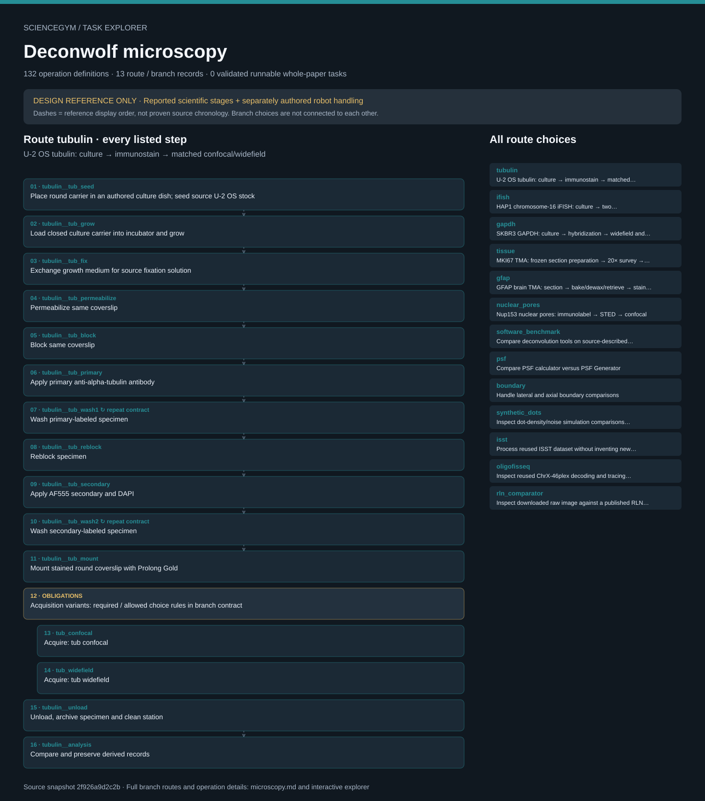

# Deconwolf microscopy: task route map



Paper: **Deconwolf enables high-performance deconvolution of widefield fluorescence microscopy images** · [DOI](https://doi.org/10.1038/s41592-024-02294-7)

Paper-wide source-reported program plus authored gap connectors; preset outputs only; no real-world execution. Counts describe task representation, not experiments or success.

**Reading rule:** numbered rows preserve reference-list occurrences. A loop body is shown once and must be repeated under its original binding, not treated as executed. An unordered obligation group has no inferred chronological edges. Source-reported scientific facts and authored handling are distinct.

[Immutable source task package](https://github.com/openags/ScienceGym/blob/293e32da790303c1a17131e036235f69a5f342e0/tasks/microscopy_operations_v2/) · [Interactive inspector](../index.html)

## tubulin — U-2 OS tubulin: culture → immunostain → matched confocal/widefield

Preparation list and authored handling sequence; acquisition obligations do not imply a single source order

[Exact route source](https://github.com/openags/ScienceGym/blob/293e32da790303c1a17131e036235f69a5f342e0/tasks/microscopy_operations_v2/operation_sequences.json) · JSON pointer: `/wet_lab_branches/0`

- `tubulin__tub_seed` Place round carrier in an authored culture dish; seed source U-2 OS stock
- `tubulin__tub_grow` Load closed culture carrier into incubator and grow
- `tubulin__tub_fix` Exchange growth medium for source fixation solution
- `tubulin__tub_permeabilize` Permeabilize same coverslip
- `tubulin__tub_block` Block same coverslip
- `tubulin__tub_primary` Apply primary anti-alpha-tubulin antibody
- `tubulin__tub_wash1` Wash primary-labeled specimen · **repeat contract**
- `tubulin__tub_reblock` Reblock specimen
- `tubulin__tub_secondary` Apply AF555 secondary and DAPI
- `tubulin__tub_wash2` Wash secondary-labeled specimen · **repeat contract**
- `tubulin__tub_mount` Mount stained round coverslip with Prolong Gold
- **OBLIGATIONS: Acquisition variants: required / allowed choice rules in branch contract**
  - Binding: {"order":"Only explicit per-variant order labels constrain the shown list; no edges between unordered variants"}
  - `tub_confocal` Acquire: tub confocal
  - `tub_widefield` Acquire: tub widefield
- `tubulin__unload` Unload, archive specimen and clean station
- `tubulin__analysis` Compare and preserve derived records

<details><summary>Branch state, choices, lineage and loop obligations</summary>

```json
{
  "initial_specimen": "U-2 OS stock identity token, not a pre-stained or pre-mounted specimen",
  "carrier": "18 mm round #1.5 high-precision coverslip, VWR 630-2200",
  "materials": [
    "U-2 OS (CLS 300174)",
    "DMEM high glucose/GlutaMAX/pyruvate + 10% fetal bovine serum",
    "PBS",
    "source-literal 8% formaldehyde solution",
    "Triton X-100",
    "BSA",
    "glycine",
    "anti-alpha-tubulin T6074",
    "goat anti-mouse AlexaFluor 555 ab150118",
    "DAPI D1306",
    "Prolong Gold P10144"
  ],
  "source_gaps": [
    "No numerical exposure, illumination power, EM gain, oil type or field-coordinate registration procedure supplied",
    "Support slide/holder, carrier transfer and cleaning mechanics are authored"
  ],
  "source_refs": [
    "M64",
    "M80",
    "R_IF"
  ],
  "prepared_state": "tubulin__tub_mount__done",
  "lineage_rules": [
    "immutable specimen ID from source entry through preparation",
    "carrier ID and plate/well/section parent tracked separately",
    "material recipe/lot ancestry attached to specimen",
    "each acquisition keeps specimen, carrier, field, station, modality, objective, detector and settings snapshot",
    "raw immutable; every derivative has explicit raw parent",
    "no merging specimen identities merely because microscope model is shared"
  ],
  "handling_sequence": [
    "receiving→preparation",
    "culture/thermal visits dictated by preparation stages",
    "mount→closed-tray transport→station docking",
    "acquire each required branch-specific variant",
    "unload→archive→cleanup",
    "analysis on saved immutable records"
  ],
  "agent_goal": "Produce the required prepared specimen, modality/field-linked raw and comparison records, return the specimen and leave stations clean; preserve all source unknown/conflict labels."
}
```

</details>

## ifish — HAP1 chromosome-16 iFISH: culture → two hybridizations → widefield

Preparation list and authored handling sequence; acquisition obligations do not imply a single source order

[Exact route source](https://github.com/openags/ScienceGym/blob/293e32da790303c1a17131e036235f69a5f342e0/tasks/microscopy_operations_v2/operation_sequences.json) · JSON pointer: `/wet_lab_branches/1`

- `ifish__if_seed` Place square coverslip in labeled six-well position and seed HAP1
- `ifish__if_grow` Incubate HAP1 culture and inspect confluency fixture
- `ifish__if_fix` Fix coverslip culture
- `ifish__if_quench` Quench unreacted fixative
- `ifish__if_wash1` Wash fixed sample · **repeat contract**
- `ifish__if_perm` Permeabilize fixed sample
- `ifish__if_wash2` Wash after permeabilization · **repeat contract**
- `ifish__if_acid` Perform source HCl incubation
- `ifish__if_wash3` Wash after HCl · **repeat contract**
- `ifish__if_rinse1` Rinse in SSC · **repeat contract**
- `ifish__if_store` Optional stored-sample branch or proceed directly
- `ifish__if_equilibrate` Pre-hybridization equilibration
- `ifish__if_prehyb` Load pre-hybridization mix into sealed humidity chamber
- `ifish__if_mix` Select validated supplied chr16 probe lot and prepare primary hybridization mix
- `ifish__if_seal` Replace pre-hybridization buffer and seal with Fixogum
- `ifish__if_denature` Transfer sealed carrier to denaturation station
- `ifish__if_hyb1` Return carrier to sealed humidity chamber
- `ifish__if_rinse2` Rinse primary-hybridized coverslip · **repeat contract**
- `ifish__if_hotwash` Transfer to warmed wash buffer · **repeat contract**
- `ifish__if_rinse3` Quick rinse in high SSC buffer · **repeat contract**
- `ifish__if_rinse4` Rinse in SSC · **repeat contract**
- `ifish__if_wash4` Final wash before second hybridization · **repeat contract**
- `ifish__if_hyb2` Prepare and apply secondary fluorescent oligonucleotide mix
- `ifish__if_wash5` Wash secondary-hybridized sample · **repeat contract**
- `ifish__if_hoechst` Counterstain specimen
- `ifish__if_wash6` Final SSC washes · **repeat contract**
- `ifish__if_mount` Mount square coverslip in carrier adapter
- **OBLIGATIONS: Acquisition variants: required / allowed choice rules in branch contract**
  - Binding: {"order":"Only explicit per-variant order labels constrain the shown list; no edges between unordered variants"}
  - `if_widefield` Acquire: if widefield
- `ifish__unload` Unload, archive specimen and clean station
- `ifish__analysis` Compare and preserve derived records

<details><summary>Branch state, choices, lineage and loop obligations</summary>

```json
{
  "initial_specimen": "HAP1 stock identity token and separately supplied probe-lot tokens",
  "carrier": "22×22 mm #1.5 coverslip, VWR 631-0125; culture in CLS3506 six-well plate",
  "materials": [
    "HAP1 (Horizon C859)",
    "IMDM + 10% FBS",
    "PBS",
    "paraformaldehyde",
    "glycine",
    "Triton X-100",
    "HCl",
    "SSC",
    "NaN3 storage-buffer token",
    "formamide",
    "sodium phosphate buffer",
    "Denhardt solution",
    "EDTA",
    "salmon sperm DNA",
    "human Cot-1 DNA",
    "dextran sulfate",
    "Tween",
    "E. coli tRNA reagent",
    "BSA",
    "Hoechst 33342",
    "primary chr16 iFISH probe set",
    "secondary fluorescent oligonucleotide set",
    "Fixogum"
  ],
  "source_gaps": [
    "Probe synthesis is a source-cited upstream input, represented as identity-checked probe lots, not invented chemistry",
    "51-plane boundary example is a separate data subtask, not a global iFISH acquisition setting"
  ],
  "source_refs": [
    "M64",
    "M75",
    "M101",
    "ED7",
    "SI78"
  ],
  "prepared_state": "ifish__if_mount__done",
  "lineage_rules": [
    "immutable specimen ID from source entry through preparation",
    "carrier ID and plate/well/section parent tracked separately",
    "material recipe/lot ancestry attached to specimen",
    "each acquisition keeps specimen, carrier, field, station, modality, objective, detector and settings snapshot",
    "raw immutable; every derivative has explicit raw parent",
    "no merging specimen identities merely because microscope model is shared"
  ],
  "handling_sequence": [
    "receiving→preparation",
    "culture/thermal visits dictated by preparation stages",
    "mount→closed-tray transport→station docking",
    "acquire each required branch-specific variant",
    "unload→archive→cleanup",
    "analysis on saved immutable records"
  ],
  "agent_goal": "Produce the required prepared specimen, modality/field-linked raw and comparison records, return the specimen and leave stations clean; preserve all source unknown/conflict labels."
}
```

</details>

## gapdh — SKBR3 GAPDH: culture → hybridization → widefield and detection controls

Preparation list and authored handling sequence; acquisition obligations do not imply a single source order

[Exact route source](https://github.com/openags/ScienceGym/blob/293e32da790303c1a17131e036235f69a5f342e0/tasks/microscopy_operations_v2/operation_sequences.json) · JSON pointer: `/wet_lab_branches/2`

- `gapdh__gap_culture` Seed carrier and incubate SKBR3 source stock
- `gapdh__gap_unreported_prep` Execute labeled generic fixation/permeabilization preparation card
- `gapdh__fish_probe` Verify target and fluorophore identity of supplied probe lot
- `gapdh__fish_hyb` Prepare RNA hybridization mix and incubate
- `gapdh__fish_wash1` Wash after primary hybridization · **repeat contract**
- `gapdh__fish_secondary` Apply secondary oligonucleotides where required
- `gapdh__fish_wash2` Wash in RNA wash buffer · **repeat contract**
- `gapdh__fish_counterstain` Counterstain with Hoechst
- `gapdh__fish_mount` Select and apply source-described mounting-buffer token
- **OBLIGATIONS: Acquisition variants: required / allowed choice rules in branch contract**
  - Binding: {"order":"Only explicit per-variant order labels constrain the shown list; no edges between unordered variants"}
  - `gap_widefield` Acquire: gap widefield
- `gapdh__unload` Unload, archive specimen and clean station
- `gapdh__analysis` Compare and preserve derived records

<details><summary>Branch state, choices, lineage and loop obligations</summary>

```json
{
  "initial_specimen": "SKBR3 stock identity token, source-specific probe lots and empty authored carrier",
  "carrier": "Source carrier shape/size unspecified; explicitly authored generic slide adapter",
  "materials": [
    "SKBR3 ATCC HTB-30",
    "McCoy 5A + 10% heat-inactivated FBS",
    "RNA hybridization buffer",
    "RNA wash buffer",
    "GAPDH or MKI67 probe lot as appropriate",
    "secondary fluorescent oligonucleotide lot where applicable",
    "Hoechst 33342",
    "oxygen-scavenging mounting-buffer token"
  ],
  "source_gaps": [
    "Generic pre-hybridization preparation is authored and cannot earn source-reproduction credit",
    "Prepared microscope/coverslip object alone is not a completion condition"
  ],
  "source_refs": [
    "M64",
    "M71",
    "R_FISH",
    "ED5",
    "ED6",
    "SI78"
  ],
  "prepared_state": "gapdh__fish_mount__done",
  "lineage_rules": [
    "immutable specimen ID from source entry through preparation",
    "carrier ID and plate/well/section parent tracked separately",
    "material recipe/lot ancestry attached to specimen",
    "each acquisition keeps specimen, carrier, field, station, modality, objective, detector and settings snapshot",
    "raw immutable; every derivative has explicit raw parent",
    "no merging specimen identities merely because microscope model is shared"
  ],
  "handling_sequence": [
    "receiving→preparation",
    "culture/thermal visits dictated by preparation stages",
    "mount→closed-tray transport→station docking",
    "acquire each required branch-specific variant",
    "unload→archive→cleanup",
    "analysis on saved immutable records"
  ],
  "agent_goal": "Produce the required prepared specimen, modality/field-linked raw and comparison records, return the specimen and leave stations clean; preserve all source unknown/conflict labels."
}
```

</details>

## tissue — MKI67 TMA: frozen section preparation → 20× survey → matched 60× fields

Preparation list and authored handling sequence; acquisition obligations do not imply a single source order

[Exact route source](https://github.com/openags/ScienceGym/blob/293e32da790303c1a17131e036235f69a5f342e0/tasks/microscopy_operations_v2/operation_sequences.json) · JSON pointer: `/wet_lab_branches/3`

- `tissue__tis_fix` Fix supplied frozen tissue section
- `tissue__tis_pbs` Rinse section twice · **repeat contract**
- `tissue__tis_ethanolrinse` Rinse twice with ice-cold ethanol · **repeat contract**
- `tissue__tis_ethanol` Incubate in ethanol
- `tissue__tis_rehydrate` Replace ethanol with RNA wash buffer
- `tissue__tis_fish_probe` Verify target and fluorophore identity of supplied probe lot
- `tissue__tis_fish_hyb` Prepare RNA hybridization mix and incubate
- `tissue__tis_fish_wash1` Wash after primary hybridization · **repeat contract**
- `tissue__tis_fish_secondary` Apply secondary oligonucleotides where required
- `tissue__tis_fish_wash2` Wash in RNA wash buffer · **repeat contract**
- `tissue__tis_fish_counterstain` Counterstain with Hoechst
- `tissue__tis_fish_mount` Select and apply source-described mounting-buffer token
- **OBLIGATIONS: Acquisition variants: required / allowed choice rules in branch contract**
  - Binding: {"order":"Only explicit per-variant order labels constrain the shown list; no edges between unordered variants"}
  - `tis20` Acquire: tis20
  - `tis60` Acquire: tis60
- `tissue__unload` Unload, archive specimen and clean station
- `tissue__analysis` Compare and preserve derived records

<details><summary>Branch state, choices, lineage and loop obligations</summary>

```json
{
  "initial_specimen": "Purchased 5 µm frozen TMA section token, US Biomax FMC282e; no donated-person identifying data",
  "carrier": "Slide support not dimensioned by source; authored generic tissue-slide proxy",
  "materials": [
    "RNA hybridization buffer",
    "RNA wash buffer",
    "GAPDH or MKI67 probe lot as appropriate",
    "secondary fluorescent oligonucleotide lot where applicable",
    "Hoechst 33342",
    "oxygen-scavenging mounting-buffer token",
    "4% PFA/PBS",
    "70% ethanol"
  ],
  "source_gaps": [
    "Ten FOVs acquired in Methods and five analyzed FOVs in figure results are distinct counts",
    "Directly labeled MKI67 versus inherited secondary step unresolved; both task variants flagged"
  ],
  "source_refs": [
    "M68",
    "M73",
    "M103",
    "R_TISSUE",
    "ED8",
    "ED9"
  ],
  "prepared_state": "tissue__tis_fish_mount__done",
  "lineage_rules": [
    "immutable specimen ID from source entry through preparation",
    "carrier ID and plate/well/section parent tracked separately",
    "material recipe/lot ancestry attached to specimen",
    "each acquisition keeps specimen, carrier, field, station, modality, objective, detector and settings snapshot",
    "raw immutable; every derivative has explicit raw parent",
    "no merging specimen identities merely because microscope model is shared"
  ],
  "handling_sequence": [
    "receiving→preparation",
    "culture/thermal visits dictated by preparation stages",
    "mount→closed-tray transport→station docking",
    "acquire each required branch-specific variant",
    "unload→archive→cleanup",
    "analysis on saved immutable records"
  ],
  "agent_goal": "Produce the required prepared specimen, modality/field-linked raw and comparison records, return the specimen and leave stations clean; preserve all source unknown/conflict labels."
}
```

</details>

## gfap — GFAP brain TMA: section → bake/dewax/retrieve → stain → mosaic comparison

Preparation list and authored handling sequence; acquisition obligations do not imply a single source order

[Exact route source](https://github.com/openags/ScienceGym/blob/293e32da790303c1a17131e036235f69a5f342e0/tasks/microscopy_operations_v2/operation_sequences.json) · JSON pointer: `/wet_lab_branches/4`

- `gfap__g_cut` Set section thickness and cut/place section using authored microtome proxy
- `gfap__g_bake` Transfer section to heating plate
- `gfap__g_dewax` Manually dewax section using explicit source-gap task card
- `gfap__g_retrieve` Load pressure-cooker proxy and run epitope retrieval
- `gfap__g_primary` Prepare primary GFAP antibody in TNB and apply
- `gfap__g_secondary` Apply secondary AF555 antibody and DAPI
- `gfap__g_mount` Mount stained section in Fluoromount-G
- **OBLIGATIONS: Acquisition variants: required / allowed choice rules in branch contract**
  - Binding: {"order":"Only explicit per-variant order labels constrain the shown list; no edges between unordered variants"}
  - `g60` Acquire: g60
  - `g63` Acquire: g63
  - `g100` Acquire: g100
- `gfap__unload` Unload, archive specimen and clean station
- `gfap__analysis` Compare and preserve derived records

<details><summary>Branch state, choices, lineage and loop obligations</summary>

```json
{
  "initial_specimen": "FFPE human cerebral-cortex TMA block token from source-described biobank-derived array",
  "carrier": "4 µm section cut during task; authored support slide",
  "materials": [
    "FFPE TMA block",
    "citrate buffer pH 6 C9999",
    "TNB buffer",
    "anti-GFAP AMAb91033",
    "AF555 goat anti-mouse A-21424",
    "DAPI D1306",
    "Fluoromount-G 00-4958-02"
  ],
  "source_gaps": [
    "Paper does not order GFAP confocal before widefield; do not import tubulin chronology",
    "100× caption variant distinct from Methods 60× variant"
  ],
  "source_refs": [
    "M66",
    "M78",
    "R_IF",
    "SI3",
    "SI4",
    "ED3"
  ],
  "prepared_state": "gfap__g_mount__done",
  "lineage_rules": [
    "immutable specimen ID from source entry through preparation",
    "carrier ID and plate/well/section parent tracked separately",
    "material recipe/lot ancestry attached to specimen",
    "each acquisition keeps specimen, carrier, field, station, modality, objective, detector and settings snapshot",
    "raw immutable; every derivative has explicit raw parent",
    "no merging specimen identities merely because microscope model is shared"
  ],
  "handling_sequence": [
    "receiving→preparation",
    "culture/thermal visits dictated by preparation stages",
    "mount→closed-tray transport→station docking",
    "acquire each required branch-specific variant",
    "unload→archive→cleanup",
    "analysis on saved immutable records"
  ],
  "agent_goal": "Produce the required prepared specimen, modality/field-linked raw and comparison records, return the specimen and leave stations clean; preserve all source unknown/conflict labels."
}
```

</details>

## nuclear_pores — Nup153 nuclear pores: immunolabel → STED → confocal

Preparation list and authored handling sequence; acquisition obligations do not imply a single source order

[Exact route source](https://github.com/openags/ScienceGym/blob/293e32da790303c1a17131e036235f69a5f342e0/tasks/microscopy_operations_v2/operation_sequences.json) · JSON pointer: `/wet_lab_branches/5`

- `nuclear_pores__p_identity` Read unresolved source identity/fluorophore warning and register task specimen
- `nuclear_pores__p_upstream` Run explicit generic preparation card for source-unreported culture/fixation/permeabilization
- `nuclear_pores__p_primary` Apply reported Nup153 primary
- `nuclear_pores__p_secondary` Apply reported goat anti-mouse IgG secondary
- `nuclear_pores__p_mount` Mount task specimen with authored medium token
- **OBLIGATIONS: Acquisition variants: required / allowed choice rules in branch contract**
  - Binding: {"order":"Only explicit per-variant order labels constrain the shown list; no edges between unordered variants"}
  - `p_sted` Acquire: p sted
  - `p_confocal` Acquire: p confocal
- `nuclear_pores__unload` Unload, archive specimen and clean station
- `nuclear_pores__analysis` Compare and preserve derived records

<details><summary>Branch state, choices, lineage and loop obligations</summary>

```json
{
  "initial_specimen": "Source-literal PtK2 identity token with unresolved species label; no live biological material instantiated",
  "carrier": "Source carrier unspecified; authored generic slide proxy",
  "materials": [
    "Nup153 primary ab24700",
    "goat anti-mouse IgG ST635P-1002-500UG",
    "source-literal Oregon Green 488 imaging-channel label"
  ],
  "source_gaps": [
    "This branch is fully represented as an authored task with explicit source-gap stages, not represented as a complete physical protocol",
    "No assertion that the contradictory source fluorophore identifiers are experimentally compatible"
  ],
  "source_refs": [
    "M82",
    "SI4",
    "SIN13"
  ],
  "prepared_state": "nuclear_pores__p_mount__done",
  "lineage_rules": [
    "immutable specimen ID from source entry through preparation",
    "carrier ID and plate/well/section parent tracked separately",
    "material recipe/lot ancestry attached to specimen",
    "each acquisition keeps specimen, carrier, field, station, modality, objective, detector and settings snapshot",
    "raw immutable; every derivative has explicit raw parent",
    "no merging specimen identities merely because microscope model is shared"
  ],
  "handling_sequence": [
    "receiving→preparation",
    "culture/thermal visits dictated by preparation stages",
    "mount→closed-tray transport→station docking",
    "acquire each required branch-specific variant",
    "unload→archive→cleanup",
    "analysis on saved immutable records"
  ],
  "agent_goal": "Produce the required prepared specimen, modality/field-linked raw and comparison records, return the specimen and leave stations clean; preserve all source unknown/conflict labels."
}
```

</details>

## software_benchmark — Compare deconvolution tools on source-described benchmark inputs

Listed data obligations; no chronological arrows asserted

[Exact route source](https://github.com/openags/ScienceGym/blob/293e32da790303c1a17131e036235f69a5f342e0/tasks/microscopy_operations_v2/operation_sequences.json) · JSON pointer: `/data_workstation_branches/0`

- **OBLIGATIONS: Data-action obligations; order not asserted**
  - `software_benchmark__action_1` Select source-matched raw/truth pair; preserve identity
  - `software_benchmark__action_2` Choose DW SHB versus unaccelerated RL iteration series
  - `software_benchmark__action_3` Compare DW, DL2, Huygens and RedLionfish preset results without executing proprietary software
  - `software_benchmark__action_4` Inspect MSE-versus-iteration and time records with hardware context
  - `software_benchmark__action_5` Use wrap boundary assumption only on source synthetic inputs identified as wrapped

<details><summary>Branch state, choices, lineage and loop obligations</summary>

```json
{
  "inputs": [
    "synthetic microtubule reference",
    "synthetic hollow bar reference",
    "external C. elegans whole-embryo reference"
  ],
  "source_refs": [
    "R_BENCH",
    "ED1",
    "SIN4"
  ],
  "unknowns": [
    "No real input arrays, executable comparisons or timing measurements supplied here"
  ]
}
```

</details>

## psf — Compare PSF calculator versus PSF Generator

Listed data obligations; no chronological arrows asserted

[Exact route source](https://github.com/openags/ScienceGym/blob/293e32da790303c1a17131e036235f69a5f342e0/tasks/microscopy_operations_v2/operation_sequences.json) · JSON pointer: `/data_workstation_branches/1`

- **OBLIGATIONS: Data-action obligations; order not asserted**
  - `psf__action_1` Verify 36plex identity, distinct from 46plex tracing data
  - `psf__action_2` Select two PSF-method cards with all other DW parameters held equal
  - `psf__action_3` Link raw to both preset derivatives
  - `psf__action_4` Compare dot FWHM/PSF displays
  - `psf__action_5` Record main Lanczos-3 versus SI Lanczos-5 discrepancy without silently choosing

<details><summary>Branch state, choices, lineage and loop obligations</summary>

```json
{
  "inputs": [
    "ChrX-36plex PSF-comparison source token"
  ],
  "source_refs": [
    "R_BENCH",
    "M87",
    "SI1",
    "SIN13"
  ],
  "unknowns": [
    "Full optical metadata and original image arrays not retained"
  ]
}
```

</details>

## boundary — Handle lateral and axial boundary comparisons

Listed data obligations; no chronological arrows asserted

[Exact route source](https://github.com/openags/ScienceGym/blob/293e32da790303c1a17131e036235f69a5f342e0/tasks/microscopy_operations_v2/operation_sequences.json) · JSON pointer: `/data_workstation_branches/2`

- **OBLIGATIONS: Data-action obligations; order not asserted**
  - `boundary__action_1` Select original and derived cropped copies; preserve raw full stack
  - `boundary__action_2` Split embryo into four cuboids for lateral comparison
  - `boundary__action_3` Create distinct HAP1 derivative after removing bottom 12 planes for Fig. 2 comparison
  - `boundary__action_4` Select DW versus DL2 boundary/padding/apodization presets
  - `boundary__action_5` Inspect lateral/axial profiles and label crops; never treat crop as sample removal

<details><summary>Branch state, choices, lineage and loop obligations</summary>

```json
{
  "inputs": [
    "external embryo stack",
    "HAP1 Hoechst boundary-example stack with 51 planes"
  ],
  "source_refs": [
    "R_BENCH",
    "ED2",
    "SI2",
    "SIN4"
  ],
  "unknowns": [
    "Connection between boundary-example HAP1 specimen and iFISH specimen not established; no forced same-sample link"
  ]
}
```

</details>

## synthetic_dots — Inspect dot-density/noise simulation comparisons through preset outputs

Listed data obligations; no chronological arrows asserted

[Exact route source](https://github.com/openags/ScienceGym/blob/293e32da790303c1a17131e036235f69a5f342e0/tasks/microscopy_operations_v2/operation_sequences.json) · JSON pointer: `/data_workstation_branches/3`

- **OBLIGATIONS: Data-action obligations; order not asserted**
  - `synthetic_dots__action_1` Choose declared density/noise condition
  - `synthetic_dots__action_2` Keep truth separate from observed noisy input
  - `synthetic_dots__action_3` Choose widefield/confocal and DW/DL2 derivative records
  - `synthetic_dots__action_4` Compare detection overlap against truth and inspect MSE
  - `synthetic_dots__action_5` Tag source synthetic result as best-case matched-PSF condition; do not present as empirical specimen result

<details><summary>Branch state, choices, lineage and loop obligations</summary>

```json
{
  "inputs": [
    "authored stand-ins for source synthetic truth/noisy widefield/confocal conditions"
  ],
  "source_refs": [
    "M97",
    "R_FISH",
    "ED4",
    "SI56"
  ],
  "unknowns": [
    "No optical simulation implemented; all task observations are presets"
  ]
}
```

</details>

## isst — Process reused ISST dataset without inventing new wet-lab preparation

Listed data obligations; no chronological arrows asserted

[Exact route source](https://github.com/openags/ScienceGym/blob/293e32da790303c1a17131e036235f69a5f342e0/tasks/microscopy_operations_v2/operation_sequences.json) · JSON pointer: `/data_workstation_branches/4`

- **OBLIGATIONS: Data-action obligations; order not asserted**
  - `isst__action_1` Import raw cycle/FOV/channel lineage
  - `isst__action_2` Select raw and preset DW branches
  - `isst__action_3` Align cycles and stitch FOVs using operator workstation cards
  - `isst__action_4` Select FindSpots masking radius 15 and compare threshold sweep
  - `isst__action_5` Record source selected normalized threshold 2% and decode assigned versus improper barcode outputs
  - `isst__action_6` Compare cell-typing results for 18 types with identical underlying cell inventory

<details><summary>Branch state, choices, lineage and loop obligations</summary>

```json
{
  "inputs": [
    "previously generated 120-gene middle-temporal-gyrus image dataset token"
  ],
  "source_refs": [
    "M105",
    "R_ISST",
    "ED10"
  ],
  "unknowns": [
    "Raw images and gene table absent; preset data token only",
    "This paper reused images, so no new ISST wet-lab protocol is invented"
  ]
}
```

</details>

## oligofisseq — Inspect reused ChrX-46plex decoding and tracing comparisons

Listed data obligations; no chronological arrows asserted

[Exact route source](https://github.com/openags/ScienceGym/blob/293e32da790303c1a17131e036235f69a5f342e0/tasks/microscopy_operations_v2/operation_sequences.json) · JSON pointer: `/data_workstation_branches/5`

- **OBLIGATIONS: Data-action obligations; order not asserted**
  - `oligofisseq__action_1` Keep five imaging/sequencing cycles in source data lineage
  - `oligofisseq__action_2` Select raw, NIS and DW derivatives
  - `oligofisseq__action_3` Manually match nucleus-pair records using fixture identification cues; source reports 168 nuclei
  - `oligofisseq__action_4` Run two-tier every-pixel analysis card on the paired dataset tokens
  - `oligofisseq__action_5` Inspect tracing nodes and interpolation flags
  - `oligofisseq__action_6` Compare contact maps against linked Hi-C reference
  - `oligofisseq__action_7` Keep seven biological replicate datasets distinct from 1,000 bootstrap resamples

<details><summary>Branch state, choices, lineage and loop obligations</summary>

```json
{
  "inputs": [
    "ChrX-46plex O-eLIT source dataset token; seven replicate dataset slots"
  ],
  "source_refs": [
    "M107",
    "R_OLIGO",
    "R_ISST",
    "ED10"
  ],
  "unknowns": [
    "No upstream OligoFISSEQ probe production or sequencing procedure invented",
    "168 match operations may be task-batched with coverage record, never claimed as observed here"
  ]
}
```

</details>

## rln_comparator — Inspect downloaded raw image against a published RLN screenshot comparator

Listed data obligations; no chronological arrows asserted

[Exact route source](https://github.com/openags/ScienceGym/blob/293e32da790303c1a17131e036235f69a5f342e0/tasks/microscopy_operations_v2/operation_sequences.json) · JSON pointer: `/data_workstation_branches/6`

- **OBLIGATIONS: Data-action obligations; order not asserted**
  - `rln_comparator__action_1` Keep this external U-2 OS sample separate from in-paper alpha-tubulin specimen
  - `rln_comparator__action_2` Prepare visualization-only derivative in image-viewer card
  - `rln_comparator__action_3` Select DW 50-iteration preset derivative
  - `rln_comparator__action_4` Inspect paired zoom regions
  - `rln_comparator__action_5` Mark comparator as screenshot from published figure, not rerun RLN

<details><summary>Branch state, choices, lineage and loop obligations</summary>

```json
{
  "inputs": [
    "external U-2 OS mitochondria/actin/tubulin raw token",
    "published RLN screenshot-reference token"
  ],
  "source_refs": [
    "SI9"
  ],
  "unknowns": [
    "No screenshot or raw image redistributed; task uses authored stand-ins"
  ]
}
```

</details>

## Operation contracts

Every operation is clickable in the offline inspector, with robot actions, target objects, pre/post state, provenance, unknowns and acceptance/recovery. Raw task JSON is the source of truth; this visualization is a public evaluator/reference view, not an agent prompt.
