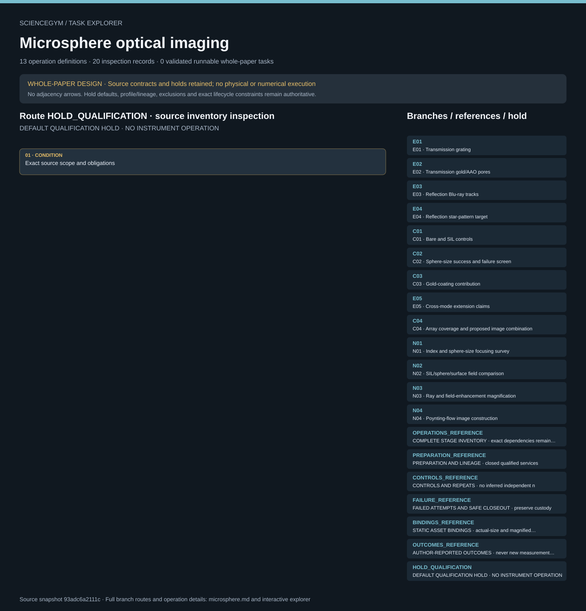

# Microsphere optical imaging: task route map



Paper: **Optical virtual imaging at 50 nm lateral resolution with a white-light nanoscope** · [DOI](https://doi.org/10.1038/ncomms1211)

Whole-paper DESIGN only; zero validated runnable whole-paper tasks. Read-only author/evaluator inspection, not an actor context, instrument controller, optical simulation or scientific reproduction. Source facts, authored requirements, finite synthetic checks and original illustrative geometry remain separate. Operation memberships do not create chronology; only exact dependency, custody and lifecycle contracts constrain order. Required outputs and receipts remain obligations, never observed states. HOLD_QUALIFICATION remains active. Thirteen authored stages R01–R13 and thirteen source-scope branches describe one paper-level design. Seven stations, nine original scene groups and thirty-three evidence-only anchors remain illustrative and unqualified. All sixteen qualification gaps remain held. SOURCE_SCALE actual-size context and SCHEMATIC_ENLARGEMENTS magnified illustrations stay separate; neither is qualified hardware CAD or optical evidence. The figure-backed 50 nm claim concerns gold/AAO transmission. Cross-mode 50 nm reflection and complex-shape transmission remain text-only source claims, not new measured outcomes. Star-film SbTe versus GeSbTe composition remains unresolved, and the star-panel sphere diameter is unreported. Blu-ray line/gap naming, experimental 20 nm versus modeled 40 nm gold, and physical SIL versus modeled geometry remain distinct. Physical 0.5 mm/80x and 2.5 mm/40x SIL controls are not fully matched pure-shape comparisons. Object, virtual, detector and SEM coordinate frames require separate calibration and registered lineage. Reported magnifications, failures and resolution claims are reference context, never generated measurements, acceptance thresholds or rewards. Repeated frames, multiple spheres and field counts do not establish independent specimen repeats; repeat counts and uncertainty budgets remain null. Uncoated baselines and coated/contact child states retain provenance; no identical restoration or historical acquisition chronology is assumed. SEM reference characterization, target preparation, sphere assembly/contact, optical acquisition and cleanup stay closed qualified services. Failure, rejected attempts, safe closeout and retained custody remain explicit; digital acceptance does not authenticate physical observations or authorize device operation. Upstream accepted source review read and visually inspected all six main and seven SI pages, four main and six SI figures; no digitization or independent optical-resolution validation occurred. No movie link was listed on the inspected record; no separate raw-data or source-code package was read or executed. The official source is free-to-read with 2011 Macmillan all rights reserved; no unrestricted reuse or CC license was established. Apache-2.0 applies only to original authored materials. No publisher PDFs, images, figure traces, source CAD, code or raw data are bundled. This integration does not reread publications, resolve source conflicts or reproduce science. No hardware control, new measurement, numerical rerun, physical execution or scientific reproduction is supplied.. Counts describe task representation, not experiments or success.

**Reading rule:** rows show unordered source inventory for inspection. Exact phase, lifecycle and dependency contracts remain authoritative; no loop, specimen, condition or chronology is inferred. An unordered obligation group has no inferred chronological edges. Source-reported scientific facts and authored handling are distinct.

[Frozen local source task package](../../../tasks/microsphere_operations_v2/) · [Interactive inspector](../index.html)

## E01 — E01 · Transmission grating

Whole-paper DESIGN only; zero validated runnable whole-paper tasks. Read-only author/evaluator inspection, not an actor context, instrument controller, optical simulation or scientific reproduction. Source facts, authored requirements, finite synthetic checks and original illustrative geometry remain separate. Operation memberships do not create chronology; only exact dependency, custody and lifecycle contracts constrain order. Required outputs and receipts remain obligations, never observed states. HOLD_QUALIFICATION remains active.

[Exact route source](../../../tasks/microsphere_operations_v2/branches.json) · JSON pointer: `/branches/0`

- **OBLIGATIONS: Exact operation membership; no adjacency chronology**
  - Binding: {"order":"Whole-paper DESIGN only; zero validated runnable whole-paper tasks. Read-only author/evaluator inspection, not an actor context, instrument controller, optical simulation or scientific reproduction. Source facts, authored requirements, finite synthetic checks and original illustrative geometry remain separate. Operation memberships do not create chronology; only exact dependency, custody and lifecycle contracts constrain order. Required outputs and receipts remain obligations, never observed states. HOLD_QUALIFICATION remains active."}
  - `R01` Verify source, rights and duplicates
    - Source occurrence binding: {"source_file":"operations.json","source_pointer":"/operations/0/branch_ids/0","source_node":"E01","meaning":"Exact authored operation branch membership; not execution or inferred chronology","operation_source_pointer":"/operations/0/id"}
  - `R02` Receive and identify target families
    - Source occurrence binding: {"source_file":"operations.json","source_pointer":"/operations/1/branch_ids/0","source_node":"E01","meaning":"Exact authored operation branch membership; not execution or inferred chronology","operation_source_pointer":"/operations/1/id"}
  - `R03` Obtain finished specimens from qualified services
    - Source occurrence binding: {"source_file":"operations.json","source_pointer":"/operations/2/branch_ids/0","source_node":"E01","meaning":"Exact authored operation branch membership; not execution or inferred chronology","operation_source_pointer":"/operations/2/id"}
  - `R04` Obtain reference characterization and baseline-state frame map
    - Source occurrence binding: {"source_file":"operations.json","source_pointer":"/operations/3/branch_ids/0","source_node":"E01","meaning":"Exact authored operation branch membership; not execution or inferred chronology","operation_source_pointer":"/operations/3/id"}
  - `R05` Qualify sphere stocks and lens controls
    - Source occurrence binding: {"source_file":"operations.json","source_pointer":"/operations/4/branch_ids/0","source_node":"E01","meaning":"Exact authored operation branch membership; not execution or inferred chronology","operation_source_pointer":"/operations/4/id"}
  - `R06` Prepare documented coating or lens-contact states
    - Source occurrence binding: {"source_file":"operations.json","source_pointer":"/operations/5/branch_ids/0","source_node":"E01","meaning":"Exact authored operation branch membership; not execution or inferred chronology","operation_source_pointer":"/operations/5/id"}
  - `R07` Acquire transmission target observations
    - Source occurrence binding: {"source_file":"operations.json","source_pointer":"/operations/6/branch_ids/0","source_node":"E01","meaning":"Exact authored operation branch membership; not execution or inferred chronology","operation_source_pointer":"/operations/6/id"}
  - `R11` Compare optical and reference evidence
    - Source occurrence binding: {"source_file":"operations.json","source_pointer":"/operations/10/branch_ids/0","source_node":"E01","meaning":"Exact authored operation branch membership; not execution or inferred chronology","operation_source_pointer":"/operations/10/id"}
  - `R13` Close out and archive all outcomes
    - Source occurrence binding: {"source_file":"operations.json","source_pointer":"/operations/12/branch_ids/0","source_node":"E01","meaning":"Exact authored operation branch membership; not execution or inferred chronology","operation_source_pointer":"/operations/12/id"}
- **CONDITION: Exact source scope and obligations**
  - Binding: {"source_file":"branches.json","source_pointer":"/branches/0","source_contract":{"id":"E01","name":"Transmission grating","source_evidence_type":"experimental figure-backed","fact_refs":["F03","F04","F05","F06","F07"],"material_or_analysis_scope":"Grating coupon and sphere-coated child state","location":"MAIN Figs1,2a; pp2-3,5","reviewed":true,"implemented":false,"task_design_covered":true,"physical_execution_status":"UNRUN","initial_state":"HOLD_QUALIFICATION"}}

<details><summary>Branch state, choices, lineage and loop obligations</summary>

```json
{
  "id": "E01",
  "name": "Transmission grating",
  "source_evidence_type": "experimental figure-backed",
  "fact_refs": [
    "F03",
    "F04",
    "F05",
    "F06",
    "F07"
  ],
  "material_or_analysis_scope": "Grating coupon and sphere-coated child state",
  "location": "MAIN Figs1,2a; pp2-3,5",
  "reviewed": true,
  "implemented": false,
  "task_design_covered": true,
  "physical_execution_status": "UNRUN",
  "initial_state": "HOLD_QUALIFICATION"
}
```

</details>

## E02 — E02 · Transmission gold/AAO pores

Whole-paper DESIGN only; zero validated runnable whole-paper tasks. Read-only author/evaluator inspection, not an actor context, instrument controller, optical simulation or scientific reproduction. Source facts, authored requirements, finite synthetic checks and original illustrative geometry remain separate. Operation memberships do not create chronology; only exact dependency, custody and lifecycle contracts constrain order. Required outputs and receipts remain obligations, never observed states. HOLD_QUALIFICATION remains active.

[Exact route source](../../../tasks/microsphere_operations_v2/branches.json) · JSON pointer: `/branches/1`

- **OBLIGATIONS: Exact operation membership; no adjacency chronology**
  - Binding: {"order":"Whole-paper DESIGN only; zero validated runnable whole-paper tasks. Read-only author/evaluator inspection, not an actor context, instrument controller, optical simulation or scientific reproduction. Source facts, authored requirements, finite synthetic checks and original illustrative geometry remain separate. Operation memberships do not create chronology; only exact dependency, custody and lifecycle contracts constrain order. Required outputs and receipts remain obligations, never observed states. HOLD_QUALIFICATION remains active."}
  - `R01` Verify source, rights and duplicates
    - Source occurrence binding: {"source_file":"operations.json","source_pointer":"/operations/0/branch_ids/1","source_node":"E02","meaning":"Exact authored operation branch membership; not execution or inferred chronology","operation_source_pointer":"/operations/0/id"}
  - `R02` Receive and identify target families
    - Source occurrence binding: {"source_file":"operations.json","source_pointer":"/operations/1/branch_ids/1","source_node":"E02","meaning":"Exact authored operation branch membership; not execution or inferred chronology","operation_source_pointer":"/operations/1/id"}
  - `R03` Obtain finished specimens from qualified services
    - Source occurrence binding: {"source_file":"operations.json","source_pointer":"/operations/2/branch_ids/1","source_node":"E02","meaning":"Exact authored operation branch membership; not execution or inferred chronology","operation_source_pointer":"/operations/2/id"}
  - `R04` Obtain reference characterization and baseline-state frame map
    - Source occurrence binding: {"source_file":"operations.json","source_pointer":"/operations/3/branch_ids/1","source_node":"E02","meaning":"Exact authored operation branch membership; not execution or inferred chronology","operation_source_pointer":"/operations/3/id"}
  - `R05` Qualify sphere stocks and lens controls
    - Source occurrence binding: {"source_file":"operations.json","source_pointer":"/operations/4/branch_ids/1","source_node":"E02","meaning":"Exact authored operation branch membership; not execution or inferred chronology","operation_source_pointer":"/operations/4/id"}
  - `R06` Prepare documented coating or lens-contact states
    - Source occurrence binding: {"source_file":"operations.json","source_pointer":"/operations/5/branch_ids/1","source_node":"E02","meaning":"Exact authored operation branch membership; not execution or inferred chronology","operation_source_pointer":"/operations/5/id"}
  - `R07` Acquire transmission target observations
    - Source occurrence binding: {"source_file":"operations.json","source_pointer":"/operations/6/branch_ids/1","source_node":"E02","meaning":"Exact authored operation branch membership; not execution or inferred chronology","operation_source_pointer":"/operations/6/id"}
  - `R11` Compare optical and reference evidence
    - Source occurrence binding: {"source_file":"operations.json","source_pointer":"/operations/10/branch_ids/1","source_node":"E02","meaning":"Exact authored operation branch membership; not execution or inferred chronology","operation_source_pointer":"/operations/10/id"}
  - `R13` Close out and archive all outcomes
    - Source occurrence binding: {"source_file":"operations.json","source_pointer":"/operations/12/branch_ids/1","source_node":"E02","meaning":"Exact authored operation branch membership; not execution or inferred chronology","operation_source_pointer":"/operations/12/id"}
- **CONDITION: Exact source scope and obligations**
  - Binding: {"source_file":"branches.json","source_pointer":"/branches/1","source_contract":{"id":"E02","name":"Transmission gold/AAO pores","source_evidence_type":"experimental figure-backed","fact_refs":["F03","F04","F05","F08","F09","F10"],"material_or_analysis_scope":"Gold-coated AAO coupon and sphere-coated child state","location":"MAIN Fig2b; pp2-3,5","reviewed":true,"implemented":false,"task_design_covered":true,"physical_execution_status":"UNRUN","initial_state":"HOLD_QUALIFICATION"}}

<details><summary>Branch state, choices, lineage and loop obligations</summary>

```json
{
  "id": "E02",
  "name": "Transmission gold/AAO pores",
  "source_evidence_type": "experimental figure-backed",
  "fact_refs": [
    "F03",
    "F04",
    "F05",
    "F08",
    "F09",
    "F10"
  ],
  "material_or_analysis_scope": "Gold-coated AAO coupon and sphere-coated child state",
  "location": "MAIN Fig2b; pp2-3,5",
  "reviewed": true,
  "implemented": false,
  "task_design_covered": true,
  "physical_execution_status": "UNRUN",
  "initial_state": "HOLD_QUALIFICATION"
}
```

</details>

## E03 — E03 · Reflection Blu-ray tracks

Whole-paper DESIGN only; zero validated runnable whole-paper tasks. Read-only author/evaluator inspection, not an actor context, instrument controller, optical simulation or scientific reproduction. Source facts, authored requirements, finite synthetic checks and original illustrative geometry remain separate. Operation memberships do not create chronology; only exact dependency, custody and lifecycle contracts constrain order. Required outputs and receipts remain obligations, never observed states. HOLD_QUALIFICATION remains active.

[Exact route source](../../../tasks/microsphere_operations_v2/branches.json) · JSON pointer: `/branches/2`

- **OBLIGATIONS: Exact operation membership; no adjacency chronology**
  - Binding: {"order":"Whole-paper DESIGN only; zero validated runnable whole-paper tasks. Read-only author/evaluator inspection, not an actor context, instrument controller, optical simulation or scientific reproduction. Source facts, authored requirements, finite synthetic checks and original illustrative geometry remain separate. Operation memberships do not create chronology; only exact dependency, custody and lifecycle contracts constrain order. Required outputs and receipts remain obligations, never observed states. HOLD_QUALIFICATION remains active."}
  - `R01` Verify source, rights and duplicates
    - Source occurrence binding: {"source_file":"operations.json","source_pointer":"/operations/0/branch_ids/2","source_node":"E03","meaning":"Exact authored operation branch membership; not execution or inferred chronology","operation_source_pointer":"/operations/0/id"}
  - `R02` Receive and identify target families
    - Source occurrence binding: {"source_file":"operations.json","source_pointer":"/operations/1/branch_ids/2","source_node":"E03","meaning":"Exact authored operation branch membership; not execution or inferred chronology","operation_source_pointer":"/operations/1/id"}
  - `R03` Obtain finished specimens from qualified services
    - Source occurrence binding: {"source_file":"operations.json","source_pointer":"/operations/2/branch_ids/2","source_node":"E03","meaning":"Exact authored operation branch membership; not execution or inferred chronology","operation_source_pointer":"/operations/2/id"}
  - `R04` Obtain reference characterization and baseline-state frame map
    - Source occurrence binding: {"source_file":"operations.json","source_pointer":"/operations/3/branch_ids/2","source_node":"E03","meaning":"Exact authored operation branch membership; not execution or inferred chronology","operation_source_pointer":"/operations/3/id"}
  - `R05` Qualify sphere stocks and lens controls
    - Source occurrence binding: {"source_file":"operations.json","source_pointer":"/operations/4/branch_ids/2","source_node":"E03","meaning":"Exact authored operation branch membership; not execution or inferred chronology","operation_source_pointer":"/operations/4/id"}
  - `R06` Prepare documented coating or lens-contact states
    - Source occurrence binding: {"source_file":"operations.json","source_pointer":"/operations/5/branch_ids/2","source_node":"E03","meaning":"Exact authored operation branch membership; not execution or inferred chronology","operation_source_pointer":"/operations/5/id"}
  - `R08` Acquire reflection target observations
    - Source occurrence binding: {"source_file":"operations.json","source_pointer":"/operations/7/branch_ids/0","source_node":"E03","meaning":"Exact authored operation branch membership; not execution or inferred chronology","operation_source_pointer":"/operations/7/id"}
  - `R11` Compare optical and reference evidence
    - Source occurrence binding: {"source_file":"operations.json","source_pointer":"/operations/10/branch_ids/2","source_node":"E03","meaning":"Exact authored operation branch membership; not execution or inferred chronology","operation_source_pointer":"/operations/10/id"}
  - `R13` Close out and archive all outcomes
    - Source occurrence binding: {"source_file":"operations.json","source_pointer":"/operations/12/branch_ids/2","source_node":"E03","meaning":"Exact authored operation branch membership; not execution or inferred chronology","operation_source_pointer":"/operations/12/id"}
- **CONDITION: Exact source scope and obligations**
  - Binding: {"source_file":"branches.json","source_pointer":"/branches/2","source_contract":{"id":"E03","name":"Reflection Blu-ray tracks","source_evidence_type":"experimental figure-backed","fact_refs":["F03","F04","F05","F11"],"material_or_analysis_scope":"Exposed track coupon and sphere-coated child state","location":"MAIN Fig3a; p3,5","reviewed":true,"implemented":false,"task_design_covered":true,"physical_execution_status":"UNRUN","initial_state":"HOLD_QUALIFICATION"}}

<details><summary>Branch state, choices, lineage and loop obligations</summary>

```json
{
  "id": "E03",
  "name": "Reflection Blu-ray tracks",
  "source_evidence_type": "experimental figure-backed",
  "fact_refs": [
    "F03",
    "F04",
    "F05",
    "F11"
  ],
  "material_or_analysis_scope": "Exposed track coupon and sphere-coated child state",
  "location": "MAIN Fig3a; p3,5",
  "reviewed": true,
  "implemented": false,
  "task_design_covered": true,
  "physical_execution_status": "UNRUN",
  "initial_state": "HOLD_QUALIFICATION"
}
```

</details>

## E04 — E04 · Reflection star-pattern target

Whole-paper DESIGN only; zero validated runnable whole-paper tasks. Read-only author/evaluator inspection, not an actor context, instrument controller, optical simulation or scientific reproduction. Source facts, authored requirements, finite synthetic checks and original illustrative geometry remain separate. Operation memberships do not create chronology; only exact dependency, custody and lifecycle contracts constrain order. Required outputs and receipts remain obligations, never observed states. HOLD_QUALIFICATION remains active.

[Exact route source](../../../tasks/microsphere_operations_v2/branches.json) · JSON pointer: `/branches/3`

- **OBLIGATIONS: Exact operation membership; no adjacency chronology**
  - Binding: {"order":"Whole-paper DESIGN only; zero validated runnable whole-paper tasks. Read-only author/evaluator inspection, not an actor context, instrument controller, optical simulation or scientific reproduction. Source facts, authored requirements, finite synthetic checks and original illustrative geometry remain separate. Operation memberships do not create chronology; only exact dependency, custody and lifecycle contracts constrain order. Required outputs and receipts remain obligations, never observed states. HOLD_QUALIFICATION remains active."}
  - `R01` Verify source, rights and duplicates
    - Source occurrence binding: {"source_file":"operations.json","source_pointer":"/operations/0/branch_ids/3","source_node":"E04","meaning":"Exact authored operation branch membership; not execution or inferred chronology","operation_source_pointer":"/operations/0/id"}
  - `R02` Receive and identify target families
    - Source occurrence binding: {"source_file":"operations.json","source_pointer":"/operations/1/branch_ids/3","source_node":"E04","meaning":"Exact authored operation branch membership; not execution or inferred chronology","operation_source_pointer":"/operations/1/id"}
  - `R03` Obtain finished specimens from qualified services
    - Source occurrence binding: {"source_file":"operations.json","source_pointer":"/operations/2/branch_ids/3","source_node":"E04","meaning":"Exact authored operation branch membership; not execution or inferred chronology","operation_source_pointer":"/operations/2/id"}
  - `R04` Obtain reference characterization and baseline-state frame map
    - Source occurrence binding: {"source_file":"operations.json","source_pointer":"/operations/3/branch_ids/3","source_node":"E04","meaning":"Exact authored operation branch membership; not execution or inferred chronology","operation_source_pointer":"/operations/3/id"}
  - `R05` Qualify sphere stocks and lens controls
    - Source occurrence binding: {"source_file":"operations.json","source_pointer":"/operations/4/branch_ids/3","source_node":"E04","meaning":"Exact authored operation branch membership; not execution or inferred chronology","operation_source_pointer":"/operations/4/id"}
  - `R06` Prepare documented coating or lens-contact states
    - Source occurrence binding: {"source_file":"operations.json","source_pointer":"/operations/5/branch_ids/3","source_node":"E04","meaning":"Exact authored operation branch membership; not execution or inferred chronology","operation_source_pointer":"/operations/5/id"}
  - `R08` Acquire reflection target observations
    - Source occurrence binding: {"source_file":"operations.json","source_pointer":"/operations/7/branch_ids/1","source_node":"E04","meaning":"Exact authored operation branch membership; not execution or inferred chronology","operation_source_pointer":"/operations/7/id"}
  - `R11` Compare optical and reference evidence
    - Source occurrence binding: {"source_file":"operations.json","source_pointer":"/operations/10/branch_ids/3","source_node":"E04","meaning":"Exact authored operation branch membership; not execution or inferred chronology","operation_source_pointer":"/operations/10/id"}
  - `R13` Close out and archive all outcomes
    - Source occurrence binding: {"source_file":"operations.json","source_pointer":"/operations/12/branch_ids/3","source_node":"E04","meaning":"Exact authored operation branch membership; not execution or inferred chronology","operation_source_pointer":"/operations/12/id"}
- **CONDITION: Exact source scope and obligations**
  - Binding: {"source_file":"branches.json","source_pointer":"/branches/3","source_contract":{"id":"E04","name":"Reflection star-pattern target","source_evidence_type":"experimental figure-backed","fact_refs":["F03","F04","F05","F12","F13"],"material_or_analysis_scope":"Certified inert phase-change-film target; composition unresolved","location":"MAIN Fig3b; p3,5","reviewed":true,"implemented":false,"task_design_covered":true,"physical_execution_status":"UNRUN","initial_state":"HOLD_QUALIFICATION"}}

<details><summary>Branch state, choices, lineage and loop obligations</summary>

```json
{
  "id": "E04",
  "name": "Reflection star-pattern target",
  "source_evidence_type": "experimental figure-backed",
  "fact_refs": [
    "F03",
    "F04",
    "F05",
    "F12",
    "F13"
  ],
  "material_or_analysis_scope": "Certified inert phase-change-film target; composition unresolved",
  "location": "MAIN Fig3b; p3,5",
  "reviewed": true,
  "implemented": false,
  "task_design_covered": true,
  "physical_execution_status": "UNRUN",
  "initial_state": "HOLD_QUALIFICATION"
}
```

</details>

## C01 — C01 · Bare and SIL controls

Whole-paper DESIGN only; zero validated runnable whole-paper tasks. Read-only author/evaluator inspection, not an actor context, instrument controller, optical simulation or scientific reproduction. Source facts, authored requirements, finite synthetic checks and original illustrative geometry remain separate. Operation memberships do not create chronology; only exact dependency, custody and lifecycle contracts constrain order. Required outputs and receipts remain obligations, never observed states. HOLD_QUALIFICATION remains active.

[Exact route source](../../../tasks/microsphere_operations_v2/branches.json) · JSON pointer: `/branches/4`

- **OBLIGATIONS: Exact operation membership; no adjacency chronology**
  - Binding: {"order":"Whole-paper DESIGN only; zero validated runnable whole-paper tasks. Read-only author/evaluator inspection, not an actor context, instrument controller, optical simulation or scientific reproduction. Source facts, authored requirements, finite synthetic checks and original illustrative geometry remain separate. Operation memberships do not create chronology; only exact dependency, custody and lifecycle contracts constrain order. Required outputs and receipts remain obligations, never observed states. HOLD_QUALIFICATION remains active."}
  - `R01` Verify source, rights and duplicates
    - Source occurrence binding: {"source_file":"operations.json","source_pointer":"/operations/0/branch_ids/4","source_node":"C01","meaning":"Exact authored operation branch membership; not execution or inferred chronology","operation_source_pointer":"/operations/0/id"}
  - `R05` Qualify sphere stocks and lens controls
    - Source occurrence binding: {"source_file":"operations.json","source_pointer":"/operations/4/branch_ids/4","source_node":"C01","meaning":"Exact authored operation branch membership; not execution or inferred chronology","operation_source_pointer":"/operations/4/id"}
  - `R06` Prepare documented coating or lens-contact states
    - Source occurrence binding: {"source_file":"operations.json","source_pointer":"/operations/5/branch_ids/4","source_node":"C01","meaning":"Exact authored operation branch membership; not execution or inferred chronology","operation_source_pointer":"/operations/5/id"}
  - `R09` Retain bare and SIL comparator branches
    - Source occurrence binding: {"source_file":"operations.json","source_pointer":"/operations/8/branch_ids/0","source_node":"C01","meaning":"Exact authored operation branch membership; not execution or inferred chronology","operation_source_pointer":"/operations/8/id"}
  - `R11` Compare optical and reference evidence
    - Source occurrence binding: {"source_file":"operations.json","source_pointer":"/operations/10/branch_ids/4","source_node":"C01","meaning":"Exact authored operation branch membership; not execution or inferred chronology","operation_source_pointer":"/operations/10/id"}
  - `R13` Close out and archive all outcomes
    - Source occurrence binding: {"source_file":"operations.json","source_pointer":"/operations/12/branch_ids/4","source_node":"C01","meaning":"Exact authored operation branch membership; not execution or inferred chronology","operation_source_pointer":"/operations/12/id"}
- **CONDITION: Exact source scope and obligations**
  - Binding: {"source_file":"branches.json","source_pointer":"/branches/4","source_contract":{"id":"C01","name":"Bare and SIL controls","source_evidence_type":"mixed figure-backed and text-only","fact_refs":["F15","F16","F17"],"material_or_analysis_scope":"Three comparator optical conditions, retaining objective difference","location":"SI S1-S2; MAIN pp3,5","reviewed":true,"implemented":false,"task_design_covered":true,"physical_execution_status":"UNRUN","initial_state":"HOLD_QUALIFICATION"}}

<details><summary>Branch state, choices, lineage and loop obligations</summary>

```json
{
  "id": "C01",
  "name": "Bare and SIL controls",
  "source_evidence_type": "mixed figure-backed and text-only",
  "fact_refs": [
    "F15",
    "F16",
    "F17"
  ],
  "material_or_analysis_scope": "Three comparator optical conditions, retaining objective difference",
  "location": "SI S1-S2; MAIN pp3,5",
  "reviewed": true,
  "implemented": false,
  "task_design_covered": true,
  "physical_execution_status": "UNRUN",
  "initial_state": "HOLD_QUALIFICATION"
}
```

</details>

## C02 — C02 · Sphere-size success and failure screen

Whole-paper DESIGN only; zero validated runnable whole-paper tasks. Read-only author/evaluator inspection, not an actor context, instrument controller, optical simulation or scientific reproduction. Source facts, authored requirements, finite synthetic checks and original illustrative geometry remain separate. Operation memberships do not create chronology; only exact dependency, custody and lifecycle contracts constrain order. Required outputs and receipts remain obligations, never observed states. HOLD_QUALIFICATION remains active.

[Exact route source](../../../tasks/microsphere_operations_v2/branches.json) · JSON pointer: `/branches/5`

- **OBLIGATIONS: Exact operation membership; no adjacency chronology**
  - Binding: {"order":"Whole-paper DESIGN only; zero validated runnable whole-paper tasks. Read-only author/evaluator inspection, not an actor context, instrument controller, optical simulation or scientific reproduction. Source facts, authored requirements, finite synthetic checks and original illustrative geometry remain separate. Operation memberships do not create chronology; only exact dependency, custody and lifecycle contracts constrain order. Required outputs and receipts remain obligations, never observed states. HOLD_QUALIFICATION remains active."}
  - `R01` Verify source, rights and duplicates
    - Source occurrence binding: {"source_file":"operations.json","source_pointer":"/operations/0/branch_ids/5","source_node":"C02","meaning":"Exact authored operation branch membership; not execution or inferred chronology","operation_source_pointer":"/operations/0/id"}
  - `R05` Qualify sphere stocks and lens controls
    - Source occurrence binding: {"source_file":"operations.json","source_pointer":"/operations/4/branch_ids/5","source_node":"C02","meaning":"Exact authored operation branch membership; not execution or inferred chronology","operation_source_pointer":"/operations/4/id"}
  - `R10` Represent size, coating, array and extension claims
    - Source occurrence binding: {"source_file":"operations.json","source_pointer":"/operations/9/branch_ids/0","source_node":"C02","meaning":"Exact authored operation branch membership; not execution or inferred chronology","operation_source_pointer":"/operations/9/id"}
  - `R13` Close out and archive all outcomes
    - Source occurrence binding: {"source_file":"operations.json","source_pointer":"/operations/12/branch_ids/5","source_node":"C02","meaning":"Exact authored operation branch membership; not execution or inferred chronology","operation_source_pointer":"/operations/12/id"}
- **CONDITION: Exact source scope and obligations**
  - Binding: {"source_file":"branches.json","source_pointer":"/branches/5","source_contract":{"id":"C02","name":"Sphere-size success and failure screen","source_evidence_type":"text-only experiment","fact_refs":["F18","F19"],"material_or_analysis_scope":"1,3,4.74,10,50 micrometer sphere lots; size/sample pairing incompletely reported","location":"MAIN pp3-5","reviewed":true,"implemented":false,"task_design_covered":true,"physical_execution_status":"UNRUN","initial_state":"SOURCE_CONTEXT_ONLY"}}

<details><summary>Branch state, choices, lineage and loop obligations</summary>

```json
{
  "id": "C02",
  "name": "Sphere-size success and failure screen",
  "source_evidence_type": "text-only experiment",
  "fact_refs": [
    "F18",
    "F19"
  ],
  "material_or_analysis_scope": "1,3,4.74,10,50 micrometer sphere lots; size/sample pairing incompletely reported",
  "location": "MAIN pp3-5",
  "reviewed": true,
  "implemented": false,
  "task_design_covered": true,
  "physical_execution_status": "UNRUN",
  "initial_state": "SOURCE_CONTEXT_ONLY"
}
```

</details>

## C03 — C03 · Gold-coating contribution

Whole-paper DESIGN only; zero validated runnable whole-paper tasks. Read-only author/evaluator inspection, not an actor context, instrument controller, optical simulation or scientific reproduction. Source facts, authored requirements, finite synthetic checks and original illustrative geometry remain separate. Operation memberships do not create chronology; only exact dependency, custody and lifecycle contracts constrain order. Required outputs and receipts remain obligations, never observed states. HOLD_QUALIFICATION remains active.

[Exact route source](../../../tasks/microsphere_operations_v2/branches.json) · JSON pointer: `/branches/6`

- **OBLIGATIONS: Exact operation membership; no adjacency chronology**
  - Binding: {"order":"Whole-paper DESIGN only; zero validated runnable whole-paper tasks. Read-only author/evaluator inspection, not an actor context, instrument controller, optical simulation or scientific reproduction. Source facts, authored requirements, finite synthetic checks and original illustrative geometry remain separate. Operation memberships do not create chronology; only exact dependency, custody and lifecycle contracts constrain order. Required outputs and receipts remain obligations, never observed states. HOLD_QUALIFICATION remains active."}
  - `R01` Verify source, rights and duplicates
    - Source occurrence binding: {"source_file":"operations.json","source_pointer":"/operations/0/branch_ids/6","source_node":"C03","meaning":"Exact authored operation branch membership; not execution or inferred chronology","operation_source_pointer":"/operations/0/id"}
  - `R10` Represent size, coating, array and extension claims
    - Source occurrence binding: {"source_file":"operations.json","source_pointer":"/operations/9/branch_ids/1","source_node":"C03","meaning":"Exact authored operation branch membership; not execution or inferred chronology","operation_source_pointer":"/operations/9/id"}
  - `R13` Close out and archive all outcomes
    - Source occurrence binding: {"source_file":"operations.json","source_pointer":"/operations/12/branch_ids/6","source_node":"C03","meaning":"Exact authored operation branch membership; not execution or inferred chronology","operation_source_pointer":"/operations/12/id"}
- **CONDITION: Exact source scope and obligations**
  - Binding: {"source_file":"branches.json","source_pointer":"/branches/6","source_contract":{"id":"C03","name":"Gold-coating contribution","source_evidence_type":"text-only experiment","fact_refs":["F10"],"material_or_analysis_scope":"Uncoated versus coated AAO comparison is claimed; paired evidence not supplied","location":"MAIN p3","reviewed":true,"implemented":false,"task_design_covered":true,"physical_execution_status":"UNRUN","initial_state":"SOURCE_CONTEXT_ONLY"}}

<details><summary>Branch state, choices, lineage and loop obligations</summary>

```json
{
  "id": "C03",
  "name": "Gold-coating contribution",
  "source_evidence_type": "text-only experiment",
  "fact_refs": [
    "F10"
  ],
  "material_or_analysis_scope": "Uncoated versus coated AAO comparison is claimed; paired evidence not supplied",
  "location": "MAIN p3",
  "reviewed": true,
  "implemented": false,
  "task_design_covered": true,
  "physical_execution_status": "UNRUN",
  "initial_state": "SOURCE_CONTEXT_ONLY"
}
```

</details>

## E05 — E05 · Cross-mode extension claims

Whole-paper DESIGN only; zero validated runnable whole-paper tasks. Read-only author/evaluator inspection, not an actor context, instrument controller, optical simulation or scientific reproduction. Source facts, authored requirements, finite synthetic checks and original illustrative geometry remain separate. Operation memberships do not create chronology; only exact dependency, custody and lifecycle contracts constrain order. Required outputs and receipts remain obligations, never observed states. HOLD_QUALIFICATION remains active.

[Exact route source](../../../tasks/microsphere_operations_v2/branches.json) · JSON pointer: `/branches/7`

- **OBLIGATIONS: Exact operation membership; no adjacency chronology**
  - Binding: {"order":"Whole-paper DESIGN only; zero validated runnable whole-paper tasks. Read-only author/evaluator inspection, not an actor context, instrument controller, optical simulation or scientific reproduction. Source facts, authored requirements, finite synthetic checks and original illustrative geometry remain separate. Operation memberships do not create chronology; only exact dependency, custody and lifecycle contracts constrain order. Required outputs and receipts remain obligations, never observed states. HOLD_QUALIFICATION remains active."}
  - `R01` Verify source, rights and duplicates
    - Source occurrence binding: {"source_file":"operations.json","source_pointer":"/operations/0/branch_ids/7","source_node":"E05","meaning":"Exact authored operation branch membership; not execution or inferred chronology","operation_source_pointer":"/operations/0/id"}
  - `R10` Represent size, coating, array and extension claims
    - Source occurrence binding: {"source_file":"operations.json","source_pointer":"/operations/9/branch_ids/3","source_node":"E05","meaning":"Exact authored operation branch membership; not execution or inferred chronology","operation_source_pointer":"/operations/9/id"}
  - `R13` Close out and archive all outcomes
    - Source occurrence binding: {"source_file":"operations.json","source_pointer":"/operations/12/branch_ids/7","source_node":"E05","meaning":"Exact authored operation branch membership; not execution or inferred chronology","operation_source_pointer":"/operations/12/id"}
- **CONDITION: Exact source scope and obligations**
  - Binding: {"source_file":"branches.json","source_pointer":"/branches/7","source_contract":{"id":"E05","name":"Cross-mode extension claims","source_evidence_type":"text-only experiment","fact_refs":["F20"],"material_or_analysis_scope":"Complex-shape transmission and 50 nm reflection remain unsupported-by-panel branches","location":"MAIN p3","reviewed":true,"implemented":false,"task_design_covered":true,"physical_execution_status":"UNRUN","initial_state":"SOURCE_CONTEXT_ONLY"}}

<details><summary>Branch state, choices, lineage and loop obligations</summary>

```json
{
  "id": "E05",
  "name": "Cross-mode extension claims",
  "source_evidence_type": "text-only experiment",
  "fact_refs": [
    "F20"
  ],
  "material_or_analysis_scope": "Complex-shape transmission and 50 nm reflection remain unsupported-by-panel branches",
  "location": "MAIN p3",
  "reviewed": true,
  "implemented": false,
  "task_design_covered": true,
  "physical_execution_status": "UNRUN",
  "initial_state": "SOURCE_CONTEXT_ONLY"
}
```

</details>

## C04 — C04 · Array coverage and proposed image combination

Whole-paper DESIGN only; zero validated runnable whole-paper tasks. Read-only author/evaluator inspection, not an actor context, instrument controller, optical simulation or scientific reproduction. Source facts, authored requirements, finite synthetic checks and original illustrative geometry remain separate. Operation memberships do not create chronology; only exact dependency, custody and lifecycle contracts constrain order. Required outputs and receipts remain obligations, never observed states. HOLD_QUALIFICATION remains active.

[Exact route source](../../../tasks/microsphere_operations_v2/branches.json) · JSON pointer: `/branches/8`

- **OBLIGATIONS: Exact operation membership; no adjacency chronology**
  - Binding: {"order":"Whole-paper DESIGN only; zero validated runnable whole-paper tasks. Read-only author/evaluator inspection, not an actor context, instrument controller, optical simulation or scientific reproduction. Source facts, authored requirements, finite synthetic checks and original illustrative geometry remain separate. Operation memberships do not create chronology; only exact dependency, custody and lifecycle contracts constrain order. Required outputs and receipts remain obligations, never observed states. HOLD_QUALIFICATION remains active."}
  - `R01` Verify source, rights and duplicates
    - Source occurrence binding: {"source_file":"operations.json","source_pointer":"/operations/0/branch_ids/8","source_node":"C04","meaning":"Exact authored operation branch membership; not execution or inferred chronology","operation_source_pointer":"/operations/0/id"}
  - `R10` Represent size, coating, array and extension claims
    - Source occurrence binding: {"source_file":"operations.json","source_pointer":"/operations/9/branch_ids/2","source_node":"C04","meaning":"Exact authored operation branch membership; not execution or inferred chronology","operation_source_pointer":"/operations/9/id"}
  - `R13` Close out and archive all outcomes
    - Source occurrence binding: {"source_file":"operations.json","source_pointer":"/operations/12/branch_ids/8","source_node":"C04","meaning":"Exact authored operation branch membership; not execution or inferred chronology","operation_source_pointer":"/operations/12/id"}
- **CONDITION: Exact source scope and obligations**
  - Binding: {"source_file":"branches.json","source_pointer":"/branches/8","source_contract":{"id":"C04","name":"Array coverage and proposed image combination","source_evidence_type":"illustrated array coverage plus unqualified processing prospect","fact_refs":["F27"],"material_or_analysis_scope":"Multiple sphere-covered fields; no invented complete mosaic, stitching algorithm or independent repeat count","location":"MAIN p3 and Fig2","reviewed":true,"implemented":false,"task_design_covered":true,"physical_execution_status":"UNRUN","initial_state":"SOURCE_CONTEXT_ONLY"}}

<details><summary>Branch state, choices, lineage and loop obligations</summary>

```json
{
  "id": "C04",
  "name": "Array coverage and proposed image combination",
  "source_evidence_type": "illustrated array coverage plus unqualified processing prospect",
  "fact_refs": [
    "F27"
  ],
  "material_or_analysis_scope": "Multiple sphere-covered fields; no invented complete mosaic, stitching algorithm or independent repeat count",
  "location": "MAIN p3 and Fig2",
  "reviewed": true,
  "implemented": false,
  "task_design_covered": true,
  "physical_execution_status": "UNRUN",
  "initial_state": "SOURCE_CONTEXT_ONLY"
}
```

</details>

## N01 — N01 · Index and sphere-size focusing survey

Whole-paper DESIGN only; zero validated runnable whole-paper tasks. Read-only author/evaluator inspection, not an actor context, instrument controller, optical simulation or scientific reproduction. Source facts, authored requirements, finite synthetic checks and original illustrative geometry remain separate. Operation memberships do not create chronology; only exact dependency, custody and lifecycle contracts constrain order. Required outputs and receipts remain obligations, never observed states. HOLD_QUALIFICATION remains active.

[Exact route source](../../../tasks/microsphere_operations_v2/branches.json) · JSON pointer: `/branches/9`

- **OBLIGATIONS: Exact operation membership; no adjacency chronology**
  - Binding: {"order":"Whole-paper DESIGN only; zero validated runnable whole-paper tasks. Read-only author/evaluator inspection, not an actor context, instrument controller, optical simulation or scientific reproduction. Source facts, authored requirements, finite synthetic checks and original illustrative geometry remain separate. Operation memberships do not create chronology; only exact dependency, custody and lifecycle contracts constrain order. Required outputs and receipts remain obligations, never observed states. HOLD_QUALIFICATION remains active."}
  - `R01` Verify source, rights and duplicates
    - Source occurrence binding: {"source_file":"operations.json","source_pointer":"/operations/0/branch_ids/9","source_node":"N01","meaning":"Exact authored operation branch membership; not execution or inferred chronology","operation_source_pointer":"/operations/0/id"}
  - `R12` Review theoretical branches without execution
    - Source occurrence binding: {"source_file":"operations.json","source_pointer":"/operations/11/branch_ids/0","source_node":"N01","meaning":"Exact authored operation branch membership; not execution or inferred chronology","operation_source_pointer":"/operations/11/id"}
  - `R13` Close out and archive all outcomes
    - Source occurrence binding: {"source_file":"operations.json","source_pointer":"/operations/12/branch_ids/9","source_node":"N01","meaning":"Exact authored operation branch membership; not execution or inferred chronology","operation_source_pointer":"/operations/12/id"}
- **CONDITION: Exact source scope and obligations**
  - Binding: {"source_file":"branches.json","source_pointer":"/branches/9","source_contract":{"id":"N01","name":"Index and sphere-size focusing survey","source_evidence_type":"reported numerical work","fact_refs":["F21","F22","F25"],"material_or_analysis_scope":"Qualified analysis receipt only; no new simulated fields","location":"MAIN Fig4a,d","reviewed":true,"implemented":false,"task_design_covered":true,"physical_execution_status":"UNRUN","initial_state":"SOURCE_CONTEXT_ONLY"}}

<details><summary>Branch state, choices, lineage and loop obligations</summary>

```json
{
  "id": "N01",
  "name": "Index and sphere-size focusing survey",
  "source_evidence_type": "reported numerical work",
  "fact_refs": [
    "F21",
    "F22",
    "F25"
  ],
  "material_or_analysis_scope": "Qualified analysis receipt only; no new simulated fields",
  "location": "MAIN Fig4a,d",
  "reviewed": true,
  "implemented": false,
  "task_design_covered": true,
  "physical_execution_status": "UNRUN",
  "initial_state": "SOURCE_CONTEXT_ONLY"
}
```

</details>

## N02 — N02 · SIL/sphere/surface field comparison

Whole-paper DESIGN only; zero validated runnable whole-paper tasks. Read-only author/evaluator inspection, not an actor context, instrument controller, optical simulation or scientific reproduction. Source facts, authored requirements, finite synthetic checks and original illustrative geometry remain separate. Operation memberships do not create chronology; only exact dependency, custody and lifecycle contracts constrain order. Required outputs and receipts remain obligations, never observed states. HOLD_QUALIFICATION remains active.

[Exact route source](../../../tasks/microsphere_operations_v2/branches.json) · JSON pointer: `/branches/10`

- **OBLIGATIONS: Exact operation membership; no adjacency chronology**
  - Binding: {"order":"Whole-paper DESIGN only; zero validated runnable whole-paper tasks. Read-only author/evaluator inspection, not an actor context, instrument controller, optical simulation or scientific reproduction. Source facts, authored requirements, finite synthetic checks and original illustrative geometry remain separate. Operation memberships do not create chronology; only exact dependency, custody and lifecycle contracts constrain order. Required outputs and receipts remain obligations, never observed states. HOLD_QUALIFICATION remains active."}
  - `R01` Verify source, rights and duplicates
    - Source occurrence binding: {"source_file":"operations.json","source_pointer":"/operations/0/branch_ids/10","source_node":"N02","meaning":"Exact authored operation branch membership; not execution or inferred chronology","operation_source_pointer":"/operations/0/id"}
  - `R12` Review theoretical branches without execution
    - Source occurrence binding: {"source_file":"operations.json","source_pointer":"/operations/11/branch_ids/1","source_node":"N02","meaning":"Exact authored operation branch membership; not execution or inferred chronology","operation_source_pointer":"/operations/11/id"}
  - `R13` Close out and archive all outcomes
    - Source occurrence binding: {"source_file":"operations.json","source_pointer":"/operations/12/branch_ids/10","source_node":"N02","meaning":"Exact authored operation branch membership; not execution or inferred chronology","operation_source_pointer":"/operations/12/id"}
- **CONDITION: Exact source scope and obligations**
  - Binding: {"source_file":"branches.json","source_pointer":"/branches/10","source_contract":{"id":"N02","name":"SIL/sphere/surface field comparison","source_evidence_type":"reported numerical work","fact_refs":["F21","F22"],"material_or_analysis_scope":"Keep model geometry separate from physical SILs and experimental gold layer","location":"MAIN Fig4b,c","reviewed":true,"implemented":false,"task_design_covered":true,"physical_execution_status":"UNRUN","initial_state":"SOURCE_CONTEXT_ONLY"}}

<details><summary>Branch state, choices, lineage and loop obligations</summary>

```json
{
  "id": "N02",
  "name": "SIL/sphere/surface field comparison",
  "source_evidence_type": "reported numerical work",
  "fact_refs": [
    "F21",
    "F22"
  ],
  "material_or_analysis_scope": "Keep model geometry separate from physical SILs and experimental gold layer",
  "location": "MAIN Fig4b,c",
  "reviewed": true,
  "implemented": false,
  "task_design_covered": true,
  "physical_execution_status": "UNRUN",
  "initial_state": "SOURCE_CONTEXT_ONLY"
}
```

</details>

## N03 — N03 · Ray and field-enhancement magnification

Whole-paper DESIGN only; zero validated runnable whole-paper tasks. Read-only author/evaluator inspection, not an actor context, instrument controller, optical simulation or scientific reproduction. Source facts, authored requirements, finite synthetic checks and original illustrative geometry remain separate. Operation memberships do not create chronology; only exact dependency, custody and lifecycle contracts constrain order. Required outputs and receipts remain obligations, never observed states. HOLD_QUALIFICATION remains active.

[Exact route source](../../../tasks/microsphere_operations_v2/branches.json) · JSON pointer: `/branches/11`

- **OBLIGATIONS: Exact operation membership; no adjacency chronology**
  - Binding: {"order":"Whole-paper DESIGN only; zero validated runnable whole-paper tasks. Read-only author/evaluator inspection, not an actor context, instrument controller, optical simulation or scientific reproduction. Source facts, authored requirements, finite synthetic checks and original illustrative geometry remain separate. Operation memberships do not create chronology; only exact dependency, custody and lifecycle contracts constrain order. Required outputs and receipts remain obligations, never observed states. HOLD_QUALIFICATION remains active."}
  - `R01` Verify source, rights and duplicates
    - Source occurrence binding: {"source_file":"operations.json","source_pointer":"/operations/0/branch_ids/11","source_node":"N03","meaning":"Exact authored operation branch membership; not execution or inferred chronology","operation_source_pointer":"/operations/0/id"}
  - `R12` Review theoretical branches without execution
    - Source occurrence binding: {"source_file":"operations.json","source_pointer":"/operations/11/branch_ids/2","source_node":"N03","meaning":"Exact authored operation branch membership; not execution or inferred chronology","operation_source_pointer":"/operations/11/id"}
  - `R13` Close out and archive all outcomes
    - Source occurrence binding: {"source_file":"operations.json","source_pointer":"/operations/12/branch_ids/11","source_node":"N03","meaning":"Exact authored operation branch membership; not execution or inferred chronology","operation_source_pointer":"/operations/12/id"}
- **CONDITION: Exact source scope and obligations**
  - Binding: {"source_file":"branches.json","source_pointer":"/branches/11","source_contract":{"id":"N03","name":"Ray and field-enhancement magnification","source_evidence_type":"reported analytical/numerical work","fact_refs":["F21","F23"],"material_or_analysis_scope":"Geometrical-optics assumptions and singular regions explicitly identified","location":"SI S3-S4; MAIN pp4-5","reviewed":true,"implemented":false,"task_design_covered":true,"physical_execution_status":"UNRUN","initial_state":"SOURCE_CONTEXT_ONLY"}}

<details><summary>Branch state, choices, lineage and loop obligations</summary>

```json
{
  "id": "N03",
  "name": "Ray and field-enhancement magnification",
  "source_evidence_type": "reported analytical/numerical work",
  "fact_refs": [
    "F21",
    "F23"
  ],
  "material_or_analysis_scope": "Geometrical-optics assumptions and singular regions explicitly identified",
  "location": "SI S3-S4; MAIN pp4-5",
  "reviewed": true,
  "implemented": false,
  "task_design_covered": true,
  "physical_execution_status": "UNRUN",
  "initial_state": "SOURCE_CONTEXT_ONLY"
}
```

</details>

## N04 — N04 · Poynting-flow image construction

Whole-paper DESIGN only; zero validated runnable whole-paper tasks. Read-only author/evaluator inspection, not an actor context, instrument controller, optical simulation or scientific reproduction. Source facts, authored requirements, finite synthetic checks and original illustrative geometry remain separate. Operation memberships do not create chronology; only exact dependency, custody and lifecycle contracts constrain order. Required outputs and receipts remain obligations, never observed states. HOLD_QUALIFICATION remains active.

[Exact route source](../../../tasks/microsphere_operations_v2/branches.json) · JSON pointer: `/branches/12`

- **OBLIGATIONS: Exact operation membership; no adjacency chronology**
  - Binding: {"order":"Whole-paper DESIGN only; zero validated runnable whole-paper tasks. Read-only author/evaluator inspection, not an actor context, instrument controller, optical simulation or scientific reproduction. Source facts, authored requirements, finite synthetic checks and original illustrative geometry remain separate. Operation memberships do not create chronology; only exact dependency, custody and lifecycle contracts constrain order. Required outputs and receipts remain obligations, never observed states. HOLD_QUALIFICATION remains active."}
  - `R01` Verify source, rights and duplicates
    - Source occurrence binding: {"source_file":"operations.json","source_pointer":"/operations/0/branch_ids/12","source_node":"N04","meaning":"Exact authored operation branch membership; not execution or inferred chronology","operation_source_pointer":"/operations/0/id"}
  - `R12` Review theoretical branches without execution
    - Source occurrence binding: {"source_file":"operations.json","source_pointer":"/operations/11/branch_ids/3","source_node":"N04","meaning":"Exact authored operation branch membership; not execution or inferred chronology","operation_source_pointer":"/operations/11/id"}
  - `R13` Close out and archive all outcomes
    - Source occurrence binding: {"source_file":"operations.json","source_pointer":"/operations/12/branch_ids/12","source_node":"N04","meaning":"Exact authored operation branch membership; not execution or inferred chronology","operation_source_pointer":"/operations/12/id"}
- **CONDITION: Exact source scope and obligations**
  - Binding: {"source_file":"branches.json","source_pointer":"/branches/12","source_contract":{"id":"N04","name":"Poynting-flow image construction","source_evidence_type":"reported numerical work","fact_refs":["F21","F24"],"material_or_analysis_scope":"Separate line-dependent construction, no source Fortran code ingested","location":"SI S5-S6; MAIN p5","reviewed":true,"implemented":false,"task_design_covered":true,"physical_execution_status":"UNRUN","initial_state":"SOURCE_CONTEXT_ONLY"}}

<details><summary>Branch state, choices, lineage and loop obligations</summary>

```json
{
  "id": "N04",
  "name": "Poynting-flow image construction",
  "source_evidence_type": "reported numerical work",
  "fact_refs": [
    "F21",
    "F24"
  ],
  "material_or_analysis_scope": "Separate line-dependent construction, no source Fortran code ingested",
  "location": "SI S5-S6; MAIN p5",
  "reviewed": true,
  "implemented": false,
  "task_design_covered": true,
  "physical_execution_status": "UNRUN",
  "initial_state": "SOURCE_CONTEXT_ONLY"
}
```

</details>

## OPERATIONS_REFERENCE — COMPLETE STAGE INVENTORY · exact dependencies remain authoritative

Whole-paper DESIGN only; zero validated runnable whole-paper tasks. Read-only author/evaluator inspection, not an actor context, instrument controller, optical simulation or scientific reproduction. Source facts, authored requirements, finite synthetic checks and original illustrative geometry remain separate. Operation memberships do not create chronology; only exact dependency, custody and lifecycle contracts constrain order. Required outputs and receipts remain obligations, never observed states. HOLD_QUALIFICATION remains active.

[Exact route source](../../../tasks/microsphere_operations_v2/operations.json) · JSON pointer: ``

- **OBLIGATIONS: Exact operation membership; no adjacency chronology**
  - Binding: {"order":"Whole-paper DESIGN only; zero validated runnable whole-paper tasks. Read-only author/evaluator inspection, not an actor context, instrument controller, optical simulation or scientific reproduction. Source facts, authored requirements, finite synthetic checks and original illustrative geometry remain separate. Operation memberships do not create chronology; only exact dependency, custody and lifecycle contracts constrain order. Required outputs and receipts remain obligations, never observed states. HOLD_QUALIFICATION remains active."}
  - `R01` Verify source, rights and duplicates
    - Source occurrence binding: {"source_file":"operations.json","source_pointer":"/operations/0/id","source_node":"R01","meaning":"Exact authored operation branch membership; not execution or inferred chronology"}
  - `R02` Receive and identify target families
    - Source occurrence binding: {"source_file":"operations.json","source_pointer":"/operations/1/id","source_node":"R02","meaning":"Exact authored operation branch membership; not execution or inferred chronology"}
  - `R03` Obtain finished specimens from qualified services
    - Source occurrence binding: {"source_file":"operations.json","source_pointer":"/operations/2/id","source_node":"R03","meaning":"Exact authored operation branch membership; not execution or inferred chronology"}
  - `R04` Obtain reference characterization and baseline-state frame map
    - Source occurrence binding: {"source_file":"operations.json","source_pointer":"/operations/3/id","source_node":"R04","meaning":"Exact authored operation branch membership; not execution or inferred chronology"}
  - `R05` Qualify sphere stocks and lens controls
    - Source occurrence binding: {"source_file":"operations.json","source_pointer":"/operations/4/id","source_node":"R05","meaning":"Exact authored operation branch membership; not execution or inferred chronology"}
  - `R06` Prepare documented coating or lens-contact states
    - Source occurrence binding: {"source_file":"operations.json","source_pointer":"/operations/5/id","source_node":"R06","meaning":"Exact authored operation branch membership; not execution or inferred chronology"}
  - `R07` Acquire transmission target observations
    - Source occurrence binding: {"source_file":"operations.json","source_pointer":"/operations/6/id","source_node":"R07","meaning":"Exact authored operation branch membership; not execution or inferred chronology"}
  - `R08` Acquire reflection target observations
    - Source occurrence binding: {"source_file":"operations.json","source_pointer":"/operations/7/id","source_node":"R08","meaning":"Exact authored operation branch membership; not execution or inferred chronology"}
  - `R09` Retain bare and SIL comparator branches
    - Source occurrence binding: {"source_file":"operations.json","source_pointer":"/operations/8/id","source_node":"R09","meaning":"Exact authored operation branch membership; not execution or inferred chronology"}
  - `R10` Represent size, coating, array and extension claims
    - Source occurrence binding: {"source_file":"operations.json","source_pointer":"/operations/9/id","source_node":"R10","meaning":"Exact authored operation branch membership; not execution or inferred chronology"}
  - `R11` Compare optical and reference evidence
    - Source occurrence binding: {"source_file":"operations.json","source_pointer":"/operations/10/id","source_node":"R11","meaning":"Exact authored operation branch membership; not execution or inferred chronology"}
  - `R12` Review theoretical branches without execution
    - Source occurrence binding: {"source_file":"operations.json","source_pointer":"/operations/11/id","source_node":"R12","meaning":"Exact authored operation branch membership; not execution or inferred chronology"}
  - `R13` Close out and archive all outcomes
    - Source occurrence binding: {"source_file":"operations.json","source_pointer":"/operations/12/id","source_node":"R13","meaning":"Exact authored operation branch membership; not execution or inferred chronology"}
- **CONDITION: Exact source scope and obligations**
  - Binding: {"source_file":"operations.json","source_pointer":"","source_contract":{"schema_version":"microsphere_task.v2","operations":[{"id":"R01","name":"Verify source, rights and duplicates","station":"ST01","depends_on":[],"unresolved_input_refs":["U01"],"required_output":"Source identity/version, hold-list audit and deduplication receipts","rule":"Reject any held source or duplicated paper; preserve restricted rights","branch_ids":["E01","E02","E03","E04","C01","C02","C03","E05","C04","N01","N02","N03","N04"],"asset_ids":["A01","A08"],"kind":"evidence_review","device_command_implemented":false,"physical_execution_authority":false,"actor_action":"Select operation_id and independently supplied evidence_id only","precondition":"Frozen campaign/epoch and exact dependency receipt hashes; qualification holds remain explicit","failure":"Preserve rejected proposal and hold affected scope; do not alter earlier observations","recovery":"At most two digital validation attempts; separately issued receipt and documented safe recovery. No operational parameter search.","anchor_ids":["A01.intake_support","A01.carrier_identity","A01.custody_receipt","A08.raw_evidence","A08.claim_ledger","A08.model_unrun","A08.analysis_qualification"]},{"id":"R02","name":"Receive and identify target families","station":"ST01","depends_on":["R01"],"unresolved_input_refs":["U04","U05","U06","U07"],"required_output":"Four target-family receipts plus explicitly optional uncoated comparator","rule":"Composition ambiguity quarantines the star branch; other independent branches remain recorded","branch_ids":["E01","E02","E03","E04"],"asset_ids":["A01","A02"],"kind":"closed_service_receipt","device_command_implemented":false,"physical_execution_authority":false,"actor_action":"Select operation_id and independently supplied evidence_id only","precondition":"Frozen campaign/epoch and exact dependency receipt hashes; qualification holds remain explicit","failure":"Preserve rejected proposal and hold affected scope; do not alter earlier observations","recovery":"At most two digital validation attempts; separately issued receipt and documented safe recovery. No operational parameter search.","anchor_ids":["A01.intake_support","A01.carrier_identity","A01.custody_receipt","A02.grating_identity","A02.aao_identity","A02.disc_identity","A02.star_identity","A02.dimension_context"]},{"id":"R03","name":"Obtain finished specimens from qualified services","station":"ST02","depends_on":["R02"],"unresolved_input_refs":["U04","U05","U06","U07","U16"],"required_output":"Final dimensions, surface state, fabrication provenance and protected carriers","rule":"Route represents every reported preparation family without exposing hazardous operations","branch_ids":["E01","E02","E03","E04"],"asset_ids":["A01","A02","A06"],"kind":"closed_service_receipt","device_command_implemented":false,"physical_execution_authority":false,"actor_action":"Select operation_id and independently supplied evidence_id only","precondition":"Frozen campaign/epoch and exact dependency receipt hashes; qualification holds remain explicit","failure":"Preserve rejected proposal and hold affected scope; do not alter earlier observations","recovery":"At most two digital validation attempts; separately issued receipt and documented safe recovery. No operational parameter search.","anchor_ids":["A01.intake_support","A01.carrier_identity","A01.custody_receipt","A02.grating_identity","A02.aao_identity","A02.disc_identity","A02.star_identity","A02.dimension_context","A06.preparation_service_receipt","A06.sem_reference_receipt","A06.preservation_history"]},{"id":"R04","name":"Obtain reference characterization and baseline-state frame map","station":"ST05","depends_on":["R03"],"unresolved_input_refs":["U11","U12"],"required_output":"Calibrated reference data, pre-alteration baseline-state record and specimen/ROI linkage","rule":"Source acquisition order is unknown; service plan must preserve history and avoid damage","branch_ids":["E01","E02","E03","E04"],"asset_ids":["A02","A06","A07"],"kind":"closed_service_receipt","device_command_implemented":false,"physical_execution_authority":false,"actor_action":"Select operation_id and independently supplied evidence_id only","precondition":"Frozen campaign/epoch and exact dependency receipt hashes; qualification holds remain explicit","failure":"Preserve rejected proposal and hold affected scope; do not alter earlier observations","recovery":"At most two digital validation attempts; separately issued receipt and documented safe recovery. No operational parameter search.","anchor_ids":["A02.grating_identity","A02.aao_identity","A02.disc_identity","A02.star_identity","A02.dimension_context","A06.preparation_service_receipt","A06.sem_reference_receipt","A06.preservation_history","A07.object_frame","A07.virtual_frame","A07.detector_frame","A07.registration_receipt"]},{"id":"R05","name":"Qualify sphere stocks and lens controls","station":"ST01","depends_on":["R01"],"unresolved_input_refs":["U02","U10"],"required_output":"Sphere lot records; separate 0.5/2.5 mm SIL IDs; objective compatibility receipts","rule":"Keep 1,3,4.74,10,50 um conditions distinct; star sphere size remains unreported","branch_ids":["E01","E02","E03","E04","C01","C02"],"asset_ids":["A03","A04"],"kind":"closed_service_receipt","device_command_implemented":false,"physical_execution_authority":false,"actor_action":"Select operation_id and independently supplied evidence_id only","precondition":"Frozen campaign/epoch and exact dependency receipt hashes; qualification holds remain explicit","failure":"Preserve rejected proposal and hold affected scope; do not alter earlier observations","recovery":"At most two digital validation attempts; separately issued receipt and documented safe recovery. No operational parameter search.","anchor_ids":["A03.stock_identity","A03.contained_assembly","A03.coating_state_receipt","A04.sil_0p5mm_identity","A04.sil_2p5mm_identity","A04.objective_compatibility"]},{"id":"R06","name":"Prepare documented coating or lens-contact states","station":"ST03","depends_on":["R04","R05"],"unresolved_input_refs":["U03","U09","U16"],"required_output":"Child-state receipts for each preparation/contact condition","rule":"Retain pre-alteration baseline state and its reference record. Bare optical controls require an uncoated branch or explicitly documented matched specimen; no assumption a coated coupon can be restored identically.","branch_ids":["E01","E02","E03","E04","C01"],"asset_ids":["A02","A03","A04"],"kind":"closed_service_receipt","device_command_implemented":false,"physical_execution_authority":false,"actor_action":"Select operation_id and independently supplied evidence_id only","precondition":"Frozen campaign/epoch and exact dependency receipt hashes; qualification holds remain explicit","failure":"Preserve rejected proposal and hold affected scope; do not alter earlier observations","recovery":"At most two digital validation attempts; separately issued receipt and documented safe recovery. No operational parameter search.","anchor_ids":["A02.grating_identity","A02.aao_identity","A02.disc_identity","A02.star_identity","A02.dimension_context","A03.stock_identity","A03.contained_assembly","A03.coating_state_receipt","A04.sil_0p5mm_identity","A04.sil_2p5mm_identity","A04.objective_compatibility"]},{"id":"R07","name":"Acquire transmission target observations","station":"ST04","depends_on":["R04","R06"],"unresolved_input_refs":["U08","U09","U11","U12","U13"],"required_output":"E01 and E02 optical records with independent focus and calibration","rule":"Targets and output examples are source-grounded; acquisition commands remain unqualified","branch_ids":["E01","E02"],"asset_ids":["A02","A05","A07"],"kind":"closed_service_receipt","device_command_implemented":false,"physical_execution_authority":false,"actor_action":"Select operation_id and independently supplied evidence_id only","precondition":"Frozen campaign/epoch and exact dependency receipt hashes; qualification holds remain explicit","failure":"Preserve rejected proposal and hold affected scope; do not alter earlier observations","recovery":"At most two digital validation attempts; separately issued receipt and documented safe recovery. No operational parameter search.","anchor_ids":["A02.grating_identity","A02.aao_identity","A02.disc_identity","A02.star_identity","A02.dimension_context","A05.microscope_safe_state","A05.carrier_stage_support","A05.optical_record","A05.objective_clearance","A07.object_frame","A07.virtual_frame","A07.detector_frame","A07.registration_receipt"]},{"id":"R08","name":"Acquire reflection target observations","station":"ST04","depends_on":["R04","R06"],"unresolved_input_refs":["U07","U08","U09","U11","U12","U13"],"required_output":"E03 and E04 records, mode/target state and composition qualifications","rule":"Do not insert 4.74 um for the star panel without a new qualified specimen receipt","branch_ids":["E03","E04"],"asset_ids":["A02","A05","A07"],"kind":"closed_service_receipt","device_command_implemented":false,"physical_execution_authority":false,"actor_action":"Select operation_id and independently supplied evidence_id only","precondition":"Frozen campaign/epoch and exact dependency receipt hashes; qualification holds remain explicit","failure":"Preserve rejected proposal and hold affected scope; do not alter earlier observations","recovery":"At most two digital validation attempts; separately issued receipt and documented safe recovery. No operational parameter search.","anchor_ids":["A02.grating_identity","A02.aao_identity","A02.disc_identity","A02.star_identity","A02.dimension_context","A05.microscope_safe_state","A05.carrier_stage_support","A05.optical_record","A05.objective_clearance","A07.object_frame","A07.virtual_frame","A07.detector_frame","A07.registration_receipt"]},{"id":"R09","name":"Retain bare and SIL comparator branches","station":"ST04","depends_on":["R04","R05","R06"],"unresolved_input_refs":["U08","U09","U10","U11","U12","U13","U14"],"required_output":"CTRL01/02 records with objective/focus differences and explicit SIL-contact state receipts; bare records must link to a preserved uncoated state or documented matched specimen","rule":"A source control failure is a result; it is not an instruction to force a success","branch_ids":["C01"],"asset_ids":["A02","A04","A05","A07"],"kind":"closed_service_receipt","device_command_implemented":false,"physical_execution_authority":false,"actor_action":"Select operation_id and independently supplied evidence_id only","precondition":"Frozen campaign/epoch and exact dependency receipt hashes; qualification holds remain explicit","failure":"Preserve rejected proposal and hold affected scope; do not alter earlier observations","recovery":"At most two digital validation attempts; separately issued receipt and documented safe recovery. No operational parameter search.","anchor_ids":["A02.grating_identity","A02.aao_identity","A02.disc_identity","A02.star_identity","A02.dimension_context","A04.sil_0p5mm_identity","A04.sil_2p5mm_identity","A04.objective_compatibility","A05.microscope_safe_state","A05.carrier_stage_support","A05.optical_record","A05.objective_clearance","A07.object_frame","A07.virtual_frame","A07.detector_frame","A07.registration_receipt"]},{"id":"R10","name":"Represent size, coating, array and extension claims","station":"ST06","depends_on":["R07","R08","R09"],"unresolved_input_refs":["U13","U14"],"required_output":"C02/C03/C04/E05 claim ledger with explicit text-only, proposed or unrun state","rule":"No synthetic completion for unseen data; no invented full Cartesian experiment matrix","branch_ids":["C02","C03","C04","E05"],"asset_ids":["A08"],"kind":"evidence_review","device_command_implemented":false,"physical_execution_authority":false,"actor_action":"Select operation_id and independently supplied evidence_id only","precondition":"Frozen campaign/epoch and exact dependency receipt hashes; qualification holds remain explicit","failure":"Preserve rejected proposal and hold affected scope; do not alter earlier observations","recovery":"At most two digital validation attempts; separately issued receipt and documented safe recovery. No operational parameter search.","anchor_ids":["A08.raw_evidence","A08.claim_ledger","A08.model_unrun","A08.analysis_qualification"]},{"id":"R11","name":"Compare optical and reference evidence","station":"ST06","depends_on":["R07","R08","R09"],"unresolved_input_refs":["U11","U12","U13"],"required_output":"Units, transforms, metric/uncertainty and limitation report","rule":"No hard-coded source outcome as task success; no independent 50 nm certification here","branch_ids":["E01","E02","E03","E04","C01"],"asset_ids":["A07","A08"],"kind":"evidence_review","device_command_implemented":false,"physical_execution_authority":false,"actor_action":"Select operation_id and independently supplied evidence_id only","precondition":"Frozen campaign/epoch and exact dependency receipt hashes; qualification holds remain explicit","failure":"Preserve rejected proposal and hold affected scope; do not alter earlier observations","recovery":"At most two digital validation attempts; separately issued receipt and documented safe recovery. No operational parameter search.","anchor_ids":["A07.object_frame","A07.virtual_frame","A07.detector_frame","A07.registration_receipt","A08.raw_evidence","A08.claim_ledger","A08.model_unrun","A08.analysis_qualification"]},{"id":"R12","name":"Review theoretical branches without execution","station":"ST06","depends_on":["R01"],"unresolved_input_refs":["U15"],"required_output":"N01-N04 source-method inventory and explicit unrun receipts","rule":"Keep measured, heuristic, analytic and numerical results separate","branch_ids":["N01","N02","N03","N04"],"asset_ids":["A08"],"kind":"evidence_review","device_command_implemented":false,"physical_execution_authority":false,"actor_action":"Select operation_id and independently supplied evidence_id only","precondition":"Frozen campaign/epoch and exact dependency receipt hashes; qualification holds remain explicit","failure":"Preserve rejected proposal and hold affected scope; do not alter earlier observations","recovery":"At most two digital validation attempts; separately issued receipt and documented safe recovery. No operational parameter search.","anchor_ids":["A08.raw_evidence","A08.claim_ledger","A08.model_unrun","A08.analysis_qualification"]},{"id":"R13","name":"Close out and archive all outcomes","station":"ST07","depends_on":["R10","R11","R12"],"unresolved_input_refs":["U16"],"required_output":"Specimen disposition, service release, raw/derived record hashes and final branch ledger","rule":"Quarantined branches remain visible; do not count an unresolved route as complete","branch_ids":["E01","E02","E03","E04","C01","C02","C03","E05","C04","N01","N02","N03","N04"],"asset_ids":["A01","A09"],"kind":"evidence_review","device_command_implemented":false,"physical_execution_authority":false,"actor_action":"Select operation_id and independently supplied evidence_id only","precondition":"Frozen campaign/epoch and exact dependency receipt hashes; qualification holds remain explicit","failure":"Preserve rejected proposal and hold affected scope; do not alter earlier observations","recovery":"At most two digital validation attempts; separately issued receipt and documented safe recovery. No operational parameter search.","anchor_ids":["A01.intake_support","A01.carrier_identity","A01.custody_receipt","A09.return_support","A09.quarantine_custody","A09.archive_receipt","A09.receiver_acceptance"]}]}}

<details><summary>Branch state, choices, lineage and loop obligations</summary>

```json
{
  "schema_version": "microsphere_task.v2",
  "operations": [
    {
      "id": "R01",
      "name": "Verify source, rights and duplicates",
      "station": "ST01",
      "depends_on": [],
      "unresolved_input_refs": [
        "U01"
      ],
      "required_output": "Source identity/version, hold-list audit and deduplication receipts",
      "rule": "Reject any held source or duplicated paper; preserve restricted rights",
      "branch_ids": [
        "E01",
        "E02",
        "E03",
        "E04",
        "C01",
        "C02",
        "C03",
        "E05",
        "C04",
        "N01",
        "N02",
        "N03",
        "N04"
      ],
      "asset_ids": [
        "A01",
        "A08"
      ],
      "kind": "evidence_review",
      "device_command_implemented": false,
      "physical_execution_authority": false,
      "actor_action": "Select operation_id and independently supplied evidence_id only",
      "precondition": "Frozen campaign/epoch and exact dependency receipt hashes; qualification holds remain explicit",
      "failure": "Preserve rejected proposal and hold affected scope; do not alter earlier observations",
      "recovery": "At most two digital validation attempts; separately issued receipt and documented safe recovery. No operational parameter search.",
      "anchor_ids": [
        "A01.intake_support",
        "A01.carrier_identity",
        "A01.custody_receipt",
        "A08.raw_evidence",
        "A08.claim_ledger",
        "A08.model_unrun",
        "A08.analysis_qualification"
      ]
    },
    {
      "id": "R02",
      "name": "Receive and identify target families",
      "station": "ST01",
      "depends_on": [
        "R01"
      ],
      "unresolved_input_refs": [
        "U04",
        "U05",
        "U06",
        "U07"
      ],
      "required_output": "Four target-family receipts plus explicitly optional uncoated comparator",
      "rule": "Composition ambiguity quarantines the star branch; other independent branches remain recorded",
      "branch_ids": [
        "E01",
        "E02",
        "E03",
        "E04"
      ],
      "asset_ids": [
        "A01",
        "A02"
      ],
      "kind": "closed_service_receipt",
      "device_command_implemented": false,
      "physical_execution_authority": false,
      "actor_action": "Select operation_id and independently supplied evidence_id only",
      "precondition": "Frozen campaign/epoch and exact dependency receipt hashes; qualification holds remain explicit",
      "failure": "Preserve rejected proposal and hold affected scope; do not alter earlier observations",
      "recovery": "At most two digital validation attempts; separately issued receipt and documented safe recovery. No operational parameter search.",
      "anchor_ids": [
        "A01.intake_support",
        "A01.carrier_identity",
        "A01.custody_receipt",
        "A02.grating_identity",
        "A02.aao_identity",
        "A02.disc_identity",
        "A02.star_identity",
        "A02.dimension_context"
      ]
    },
    {
      "id": "R03",
      "name": "Obtain finished specimens from qualified services",
      "station": "ST02",
      "depends_on": [
        "R02"
      ],
      "unresolved_input_refs": [
        "U04",
        "U05",
        "U06",
        "U07",
        "U16"
      ],
      "required_output": "Final dimensions, surface state, fabrication provenance and protected carriers",
      "rule": "Route represents every reported preparation family without exposing hazardous operations",
      "branch_ids": [
        "E01",
        "E02",
        "E03",
        "E04"
      ],
      "asset_ids": [
        "A01",
        "A02",
        "A06"
      ],
      "kind": "closed_service_receipt",
      "device_command_implemented": false,
      "physical_execution_authority": false,
      "actor_action": "Select operation_id and independently supplied evidence_id only",
      "precondition": "Frozen campaign/epoch and exact dependency receipt hashes; qualification holds remain explicit",
      "failure": "Preserve rejected proposal and hold affected scope; do not alter earlier observations",
      "recovery": "At most two digital validation attempts; separately issued receipt and documented safe recovery. No operational parameter search.",
      "anchor_ids": [
        "A01.intake_support",
        "A01.carrier_identity",
        "A01.custody_receipt",
        "A02.grating_identity",
        "A02.aao_identity",
        "A02.disc_identity",
        "A02.star_identity",
        "A02.dimension_context",
        "A06.preparation_service_receipt",
        "A06.sem_reference_receipt",
        "A06.preservation_history"
      ]
    },
    {
      "id": "R04",
      "name": "Obtain reference characterization and baseline-state frame map",
      "station": "ST05",
      "depends_on": [
        "R03"
      ],
      "unresolved_input_refs": [
        "U11",
        "U12"
      ],
      "required_output": "Calibrated reference data, pre-alteration baseline-state record and specimen/ROI linkage",
      "rule": "Source acquisition order is unknown; service plan must preserve history and avoid damage",
      "branch_ids": [
        "E01",
        "E02",
        "E03",
        "E04"
      ],
      "asset_ids": [
        "A02",
        "A06",
        "A07"
      ],
      "kind": "closed_service_receipt",
      "device_command_implemented": false,
      "physical_execution_authority": false,
      "actor_action": "Select operation_id and independently supplied evidence_id only",
      "precondition": "Frozen campaign/epoch and exact dependency receipt hashes; qualification holds remain explicit",
      "failure": "Preserve rejected proposal and hold affected scope; do not alter earlier observations",
      "recovery": "At most two digital validation attempts; separately issued receipt and documented safe recovery. No operational parameter search.",
      "anchor_ids": [
        "A02.grating_identity",
        "A02.aao_identity",
        "A02.disc_identity",
        "A02.star_identity",
        "A02.dimension_context",
        "A06.preparation_service_receipt",
        "A06.sem_reference_receipt",
        "A06.preservation_history",
        "A07.object_frame",
        "A07.virtual_frame",
        "A07.detector_frame",
        "A07.registration_receipt"
      ]
    },
    {
      "id": "R05",
      "name": "Qualify sphere stocks and lens controls",
      "station": "ST01",
      "depends_on": [
        "R01"
      ],
      "unresolved_input_refs": [
        "U02",
        "U10"
      ],
      "required_output": "Sphere lot records; separate 0.5/2.5 mm SIL IDs; objective compatibility receipts",
      "rule": "Keep 1,3,4.74,10,50 um conditions distinct; star sphere size remains unreported",
      "branch_ids": [
        "E01",
        "E02",
        "E03",
        "E04",
        "C01",
        "C02"
      ],
      "asset_ids": [
        "A03",
        "A04"
      ],
      "kind": "closed_service_receipt",
      "device_command_implemented": false,
      "physical_execution_authority": false,
      "actor_action": "Select operation_id and independently supplied evidence_id only",
      "precondition": "Frozen campaign/epoch and exact dependency receipt hashes; qualification holds remain explicit",
      "failure": "Preserve rejected proposal and hold affected scope; do not alter earlier observations",
      "recovery": "At most two digital validation attempts; separately issued receipt and documented safe recovery. No operational parameter search.",
      "anchor_ids": [
        "A03.stock_identity",
        "A03.contained_assembly",
        "A03.coating_state_receipt",
        "A04.sil_0p5mm_identity",
        "A04.sil_2p5mm_identity",
        "A04.objective_compatibility"
      ]
    },
    {
      "id": "R06",
      "name": "Prepare documented coating or lens-contact states",
      "station": "ST03",
      "depends_on": [
        "R04",
        "R05"
      ],
      "unresolved_input_refs": [
        "U03",
        "U09",
        "U16"
      ],
      "required_output": "Child-state receipts for each preparation/contact condition",
      "rule": "Retain pre-alteration baseline state and its reference record. Bare optical controls require an uncoated branch or explicitly documented matched specimen; no assumption a coated coupon can be restored identically.",
      "branch_ids": [
        "E01",
        "E02",
        "E03",
        "E04",
        "C01"
      ],
      "asset_ids": [
        "A02",
        "A03",
        "A04"
      ],
      "kind": "closed_service_receipt",
      "device_command_implemented": false,
      "physical_execution_authority": false,
      "actor_action": "Select operation_id and independently supplied evidence_id only",
      "precondition": "Frozen campaign/epoch and exact dependency receipt hashes; qualification holds remain explicit",
      "failure": "Preserve rejected proposal and hold affected scope; do not alter earlier observations",
      "recovery": "At most two digital validation attempts; separately issued receipt and documented safe recovery. No operational parameter search.",
      "anchor_ids": [
        "A02.grating_identity",
        "A02.aao_identity",
        "A02.disc_identity",
        "A02.star_identity",
        "A02.dimension_context",
        "A03.stock_identity",
        "A03.contained_assembly",
        "A03.coating_state_receipt",
        "A04.sil_0p5mm_identity",
        "A04.sil_2p5mm_identity",
        "A04.objective_compatibility"
      ]
    },
    {
      "id": "R07",
      "name": "Acquire transmission target observations",
      "station": "ST04",
      "depends_on": [
        "R04",
        "R06"
      ],
      "unresolved_input_refs": [
        "U08",
        "U09",
        "U11",
        "U12",
        "U13"
      ],
      "required_output": "E01 and E02 optical records with independent focus and calibration",
      "rule": "Targets and output examples are source-grounded; acquisition commands remain unqualified",
      "branch_ids": [
        "E01",
        "E02"
      ],
      "asset_ids": [
        "A02",
        "A05",
        "A07"
      ],
      "kind": "closed_service_receipt",
      "device_command_implemented": false,
      "physical_execution_authority": false,
      "actor_action": "Select operation_id and independently supplied evidence_id only",
      "precondition": "Frozen campaign/epoch and exact dependency receipt hashes; qualification holds remain explicit",
      "failure": "Preserve rejected proposal and hold affected scope; do not alter earlier observations",
      "recovery": "At most two digital validation attempts; separately issued receipt and documented safe recovery. No operational parameter search.",
      "anchor_ids": [
        "A02.grating_identity",
        "A02.aao_identity",
        "A02.disc_identity",
        "A02.star_identity",
        "A02.dimension_context",
        "A05.microscope_safe_state",
        "A05.carrier_stage_support",
        "A05.optical_record",
        "A05.objective_clearance",
        "A07.object_frame",
        "A07.virtual_frame",
        "A07.detector_frame",
        "A07.registration_receipt"
      ]
    },
    {
      "id": "R08",
      "name": "Acquire reflection target observations",
      "station": "ST04",
      "depends_on": [
        "R04",
        "R06"
      ],
      "unresolved_input_refs": [
        "U07",
        "U08",
        "U09",
        "U11",
        "U12",
        "U13"
      ],
      "required_output": "E03 and E04 records, mode/target state and composition qualifications",
      "rule": "Do not insert 4.74 um for the star panel without a new qualified specimen receipt",
      "branch_ids": [
        "E03",
        "E04"
      ],
      "asset_ids": [
        "A02",
        "A05",
        "A07"
      ],
      "kind": "closed_service_receipt",
      "device_command_implemented": false,
      "physical_execution_authority": false,
      "actor_action": "Select operation_id and independently supplied evidence_id only",
      "precondition": "Frozen campaign/epoch and exact dependency receipt hashes; qualification holds remain explicit",
      "failure": "Preserve rejected proposal and hold affected scope; do not alter earlier observations",
      "recovery": "At most two digital validation attempts; separately issued receipt and documented safe recovery. No operational parameter search.",
      "anchor_ids": [
        "A02.grating_identity",
        "A02.aao_identity",
        "A02.disc_identity",
        "A02.star_identity",
        "A02.dimension_context",
        "A05.microscope_safe_state",
        "A05.carrier_stage_support",
        "A05.optical_record",
        "A05.objective_clearance",
        "A07.object_frame",
        "A07.virtual_frame",
        "A07.detector_frame",
        "A07.registration_receipt"
      ]
    },
    {
      "id": "R09",
      "name": "Retain bare and SIL comparator branches",
      "station": "ST04",
      "depends_on": [
        "R04",
        "R05",
        "R06"
      ],
      "unresolved_input_refs": [
        "U08",
        "U09",
        "U10",
        "U11",
        "U12",
        "U13",
        "U14"
      ],
      "required_output": "CTRL01/02 records with objective/focus differences and explicit SIL-contact state receipts; bare records must link to a preserved uncoated state or documented matched specimen",
      "rule": "A source control failure is a result; it is not an instruction to force a success",
      "branch_ids": [
        "C01"
      ],
      "asset_ids": [
        "A02",
        "A04",
        "A05",
        "A07"
      ],
      "kind": "closed_service_receipt",
      "device_command_implemented": false,
      "physical_execution_authority": false,
      "actor_action": "Select operation_id and independently supplied evidence_id only",
      "precondition": "Frozen campaign/epoch and exact dependency receipt hashes; qualification holds remain explicit",
      "failure": "Preserve rejected proposal and hold affected scope; do not alter earlier observations",
      "recovery": "At most two digital validation attempts; separately issued receipt and documented safe recovery. No operational parameter search.",
      "anchor_ids": [
        "A02.grating_identity",
        "A02.aao_identity",
        "A02.disc_identity",
        "A02.star_identity",
        "A02.dimension_context",
        "A04.sil_0p5mm_identity",
        "A04.sil_2p5mm_identity",
        "A04.objective_compatibility",
        "A05.microscope_safe_state",
        "A05.carrier_stage_support",
        "A05.optical_record",
        "A05.objective_clearance",
        "A07.object_frame",
        "A07.virtual_frame",
        "A07.detector_frame",
        "A07.registration_receipt"
      ]
    },
    {
      "id": "R10",
      "name": "Represent size, coating, array and extension claims",
      "station": "ST06",
      "depends_on": [
        "R07",
        "R08",
        "R09"
      ],
      "unresolved_input_refs": [
        "U13",
        "U14"
      ],
      "required_output": "C02/C03/C04/E05 claim ledger with explicit text-only, proposed or unrun state",
      "rule": "No synthetic completion for unseen data; no invented full Cartesian experiment matrix",
      "branch_ids": [
        "C02",
        "C03",
        "C04",
        "E05"
      ],
      "asset_ids": [
        "A08"
      ],
      "kind": "evidence_review",
      "device_command_implemented": false,
      "physical_execution_authority": false,
      "actor_action": "Select operation_id and independently supplied evidence_id only",
      "precondition": "Frozen campaign/epoch and exact dependency receipt hashes; qualification holds remain explicit",
      "failure": "Preserve rejected proposal and hold affected scope; do not alter earlier observations",
      "recovery": "At most two digital validation attempts; separately issued receipt and documented safe recovery. No operational parameter search.",
      "anchor_ids": [
        "A08.raw_evidence",
        "A08.claim_ledger",
        "A08.model_unrun",
        "A08.analysis_qualification"
      ]
    },
    {
      "id": "R11",
      "name": "Compare optical and reference evidence",
      "station": "ST06",
      "depends_on": [
        "R07",
        "R08",
        "R09"
      ],
      "unresolved_input_refs": [
        "U11",
        "U12",
        "U13"
      ],
      "required_output": "Units, transforms, metric/uncertainty and limitation report",
      "rule": "No hard-coded source outcome as task success; no independent 50 nm certification here",
      "branch_ids": [
        "E01",
        "E02",
        "E03",
        "E04",
        "C01"
      ],
      "asset_ids": [
        "A07",
        "A08"
      ],
      "kind": "evidence_review",
      "device_command_implemented": false,
      "physical_execution_authority": false,
      "actor_action": "Select operation_id and independently supplied evidence_id only",
      "precondition": "Frozen campaign/epoch and exact dependency receipt hashes; qualification holds remain explicit",
      "failure": "Preserve rejected proposal and hold affected scope; do not alter earlier observations",
      "recovery": "At most two digital validation attempts; separately issued receipt and documented safe recovery. No operational parameter search.",
      "anchor_ids": [
        "A07.object_frame",
        "A07.virtual_frame",
        "A07.detector_frame",
        "A07.registration_receipt",
        "A08.raw_evidence",
        "A08.claim_ledger",
        "A08.model_unrun",
        "A08.analysis_qualification"
      ]
    },
    {
      "id": "R12",
      "name": "Review theoretical branches without execution",
      "station": "ST06",
      "depends_on": [
        "R01"
      ],
      "unresolved_input_refs": [
        "U15"
      ],
      "required_output": "N01-N04 source-method inventory and explicit unrun receipts",
      "rule": "Keep measured, heuristic, analytic and numerical results separate",
      "branch_ids": [
        "N01",
        "N02",
        "N03",
        "N04"
      ],
      "asset_ids": [
        "A08"
      ],
      "kind": "evidence_review",
      "device_command_implemented": false,
      "physical_execution_authority": false,
      "actor_action": "Select operation_id and independently supplied evidence_id only",
      "precondition": "Frozen campaign/epoch and exact dependency receipt hashes; qualification holds remain explicit",
      "failure": "Preserve rejected proposal and hold affected scope; do not alter earlier observations",
      "recovery": "At most two digital validation attempts; separately issued receipt and documented safe recovery. No operational parameter search.",
      "anchor_ids": [
        "A08.raw_evidence",
        "A08.claim_ledger",
        "A08.model_unrun",
        "A08.analysis_qualification"
      ]
    },
    {
      "id": "R13",
      "name": "Close out and archive all outcomes",
      "station": "ST07",
      "depends_on": [
        "R10",
        "R11",
        "R12"
      ],
      "unresolved_input_refs": [
        "U16"
      ],
      "required_output": "Specimen disposition, service release, raw/derived record hashes and final branch ledger",
      "rule": "Quarantined branches remain visible; do not count an unresolved route as complete",
      "branch_ids": [
        "E01",
        "E02",
        "E03",
        "E04",
        "C01",
        "C02",
        "C03",
        "E05",
        "C04",
        "N01",
        "N02",
        "N03",
        "N04"
      ],
      "asset_ids": [
        "A01",
        "A09"
      ],
      "kind": "evidence_review",
      "device_command_implemented": false,
      "physical_execution_authority": false,
      "actor_action": "Select operation_id and independently supplied evidence_id only",
      "precondition": "Frozen campaign/epoch and exact dependency receipt hashes; qualification holds remain explicit",
      "failure": "Preserve rejected proposal and hold affected scope; do not alter earlier observations",
      "recovery": "At most two digital validation attempts; separately issued receipt and documented safe recovery. No operational parameter search.",
      "anchor_ids": [
        "A01.intake_support",
        "A01.carrier_identity",
        "A01.custody_receipt",
        "A09.return_support",
        "A09.quarantine_custody",
        "A09.archive_receipt",
        "A09.receiver_acceptance"
      ]
    }
  ]
}
```

</details>

## PREPARATION_REFERENCE — PREPARATION AND LINEAGE · closed qualified services

Whole-paper DESIGN only; zero validated runnable whole-paper tasks. Read-only author/evaluator inspection, not an actor context, instrument controller, optical simulation or scientific reproduction. Source facts, authored requirements, finite synthetic checks and original illustrative geometry remain separate. Operation memberships do not create chronology; only exact dependency, custody and lifecycle contracts constrain order. Required outputs and receipts remain obligations, never observed states. HOLD_QUALIFICATION remains active.

[Exact route source](../../../tasks/microsphere_operations_v2/preparation_routes.json) · JSON pointer: ``

- **CONDITION: Exact source scope and obligations**
  - Binding: {"source_file":"preparation_routes.json","source_pointer":"","source_contract":{"scope":"Substantive closed-service contracts, no fabrication commands","routes":[{"branch_id":"E01","material_id":"M02","service":"closed_nanofabrication","source_process_identity":"FIB-patterned chromium on fused silica","required":["finished geometry certificate","protected target carrier","surface condition","ROI/fiducial map","service safe-state receipt"],"unknown_refs":["U04","U16"]},{"branch_id":"E02","material_id":"M03","service":"closed_template_and_coating","source_process_identity":"AAO preparation and gold coating","required":["pore/spacing definitions","coating identity and thickness certificate","template and finished-state lineage","protected target carrier"],"unknown_refs":["U05","U16"]},{"branch_id":"E03","material_id":"M04","service":"closed_disc_coupon_preparation","source_process_identity":"Protective-layer removal from an inert optical disc","required":["commercial/layer identities","surface integrity and residue report","line/gap conflict retained","parent-to-exposed-state lineage"],"unknown_refs":["U06","U16"]},{"branch_id":"E04","material_id":"M05","service":"closed_materials_patterning","source_process_identity":"Prior contact particle lens patterning attribution only","required":["certified film composition","pattern identity","thickness and condition","explicit sphere diameter qualification"],"unknown_refs":["U07","U16"],"hard_hold":"SbTe/GeSbTe unresolved; never relabel silently"},{"branch_id":"C03","material_id":"M03","service":"closed_matched_AAO_comparator","source_process_identity":"Uncoated/coated comparison claimed in text","required":["separate uncoated state","matched-specimen or same-state equivalence receipt","no restoration assumption"],"unknown_refs":["U05","U11","U14","U16"]}]}}

<details><summary>Branch state, choices, lineage and loop obligations</summary>

```json
{
  "scope": "Substantive closed-service contracts, no fabrication commands",
  "routes": [
    {
      "branch_id": "E01",
      "material_id": "M02",
      "service": "closed_nanofabrication",
      "source_process_identity": "FIB-patterned chromium on fused silica",
      "required": [
        "finished geometry certificate",
        "protected target carrier",
        "surface condition",
        "ROI/fiducial map",
        "service safe-state receipt"
      ],
      "unknown_refs": [
        "U04",
        "U16"
      ]
    },
    {
      "branch_id": "E02",
      "material_id": "M03",
      "service": "closed_template_and_coating",
      "source_process_identity": "AAO preparation and gold coating",
      "required": [
        "pore/spacing definitions",
        "coating identity and thickness certificate",
        "template and finished-state lineage",
        "protected target carrier"
      ],
      "unknown_refs": [
        "U05",
        "U16"
      ]
    },
    {
      "branch_id": "E03",
      "material_id": "M04",
      "service": "closed_disc_coupon_preparation",
      "source_process_identity": "Protective-layer removal from an inert optical disc",
      "required": [
        "commercial/layer identities",
        "surface integrity and residue report",
        "line/gap conflict retained",
        "parent-to-exposed-state lineage"
      ],
      "unknown_refs": [
        "U06",
        "U16"
      ]
    },
    {
      "branch_id": "E04",
      "material_id": "M05",
      "service": "closed_materials_patterning",
      "source_process_identity": "Prior contact particle lens patterning attribution only",
      "required": [
        "certified film composition",
        "pattern identity",
        "thickness and condition",
        "explicit sphere diameter qualification"
      ],
      "unknown_refs": [
        "U07",
        "U16"
      ],
      "hard_hold": "SbTe/GeSbTe unresolved; never relabel silently"
    },
    {
      "branch_id": "C03",
      "material_id": "M03",
      "service": "closed_matched_AAO_comparator",
      "source_process_identity": "Uncoated/coated comparison claimed in text",
      "required": [
        "separate uncoated state",
        "matched-specimen or same-state equivalence receipt",
        "no restoration assumption"
      ],
      "unknown_refs": [
        "U05",
        "U11",
        "U14",
        "U16"
      ]
    }
  ]
}
```

</details>

## CONTROLS_REFERENCE — CONTROLS AND REPEATS · no inferred independent n

Whole-paper DESIGN only; zero validated runnable whole-paper tasks. Read-only author/evaluator inspection, not an actor context, instrument controller, optical simulation or scientific reproduction. Source facts, authored requirements, finite synthetic checks and original illustrative geometry remain separate. Operation memberships do not create chronology; only exact dependency, custody and lifecycle contracts constrain order. Required outputs and receipts remain obligations, never observed states. HOLD_QUALIFICATION remains active.

[Exact route source](../../../tasks/microsphere_operations_v2/controls_and_repeats.json) · JSON pointer: ``

- **CONDITION: Exact source scope and obligations**
  - Binding: {"source_file":"controls_and_repeats.json","source_pointer":"","source_contract":{"reported_controls":[{"id":"CTRL01","control":"Bare target at its own focus","branches":["E01","E03","C01"],"reported":"Reported uncovered grating and bare Blu-ray observation","authored_requirement":"Bare and sphere focal planes differ; a fair authored comparison requires independent best-focus provenance, no copied focus command"},{"id":"CTRL02","control":"Half-ball SIL pair","branches":["C01"],"reported":"0.5 and 2.5 mm physical SILs; failures illustrated on Blu-ray","authored_requirement":"Retain 80x/40x objective difference and lens/contact receipt"},{"id":"CTRL03","control":"Sphere-size screen","branches":["C02"],"reported":"1,3,4.74,10,50 um sizes reported","authored_requirement":"Preserve successful/unsuccessful observations and practical versus theoretical distinction; full target cross-matrix unavailable"},{"id":"CTRL04","control":"Uncoated/coated AAO","branches":["C03"],"reported":"Coating improvement claimed in text","authored_requirement":"Require paired supporting evidence and specimen state lineage before asserting causal contribution"},{"id":"CTRL05","control":"Optical/SEM pairing","branches":["E01","E02","E03","E04"],"reported":"Published SEM/optical comparisons","authored_requirement":"Require separately calibrated image scales and registered ROI; source does not establish matched specimen history"},{"id":"CTRL06","control":"Cross-mode target checks","branches":["E05"],"reported":"Text states complex transmission and 50 nm reflection","authored_requirement":"Treat as text-only unless new qualified data supplied"}],"reported_repeat_counts":null,"reported_uncertainty_budget":null,"authored_future_repeat_plan":"A qualified experiment owner must prospectively choose independent specimens/fields/spheres, acquisition repeats, ordering, day-to-day conditions, exclusions and metrics before any test. No numerical repeat count is invented.","no_pseudoreplication":"Frames from one particle or multiple particles on one coupon are not automatically independent material preparations.","no_success_fabrication":"Reported failure controls must remain valid observations; do not retune or delete them to make all routes pass."}}

<details><summary>Branch state, choices, lineage and loop obligations</summary>

```json
{
  "reported_controls": [
    {
      "id": "CTRL01",
      "control": "Bare target at its own focus",
      "branches": [
        "E01",
        "E03",
        "C01"
      ],
      "reported": "Reported uncovered grating and bare Blu-ray observation",
      "authored_requirement": "Bare and sphere focal planes differ; a fair authored comparison requires independent best-focus provenance, no copied focus command"
    },
    {
      "id": "CTRL02",
      "control": "Half-ball SIL pair",
      "branches": [
        "C01"
      ],
      "reported": "0.5 and 2.5 mm physical SILs; failures illustrated on Blu-ray",
      "authored_requirement": "Retain 80x/40x objective difference and lens/contact receipt"
    },
    {
      "id": "CTRL03",
      "control": "Sphere-size screen",
      "branches": [
        "C02"
      ],
      "reported": "1,3,4.74,10,50 um sizes reported",
      "authored_requirement": "Preserve successful/unsuccessful observations and practical versus theoretical distinction; full target cross-matrix unavailable"
    },
    {
      "id": "CTRL04",
      "control": "Uncoated/coated AAO",
      "branches": [
        "C03"
      ],
      "reported": "Coating improvement claimed in text",
      "authored_requirement": "Require paired supporting evidence and specimen state lineage before asserting causal contribution"
    },
    {
      "id": "CTRL05",
      "control": "Optical/SEM pairing",
      "branches": [
        "E01",
        "E02",
        "E03",
        "E04"
      ],
      "reported": "Published SEM/optical comparisons",
      "authored_requirement": "Require separately calibrated image scales and registered ROI; source does not establish matched specimen history"
    },
    {
      "id": "CTRL06",
      "control": "Cross-mode target checks",
      "branches": [
        "E05"
      ],
      "reported": "Text states complex transmission and 50 nm reflection",
      "authored_requirement": "Treat as text-only unless new qualified data supplied"
    }
  ],
  "reported_repeat_counts": null,
  "reported_uncertainty_budget": null,
  "authored_future_repeat_plan": "A qualified experiment owner must prospectively choose independent specimens/fields/spheres, acquisition repeats, ordering, day-to-day conditions, exclusions and metrics before any test. No numerical repeat count is invented.",
  "no_pseudoreplication": "Frames from one particle or multiple particles on one coupon are not automatically independent material preparations.",
  "no_success_fabrication": "Reported failure controls must remain valid observations; do not retune or delete them to make all routes pass."
}
```

</details>

## FAILURE_REFERENCE — FAILED ATTEMPTS AND SAFE CLOSEOUT · preserve custody

Whole-paper DESIGN only; zero validated runnable whole-paper tasks. Read-only author/evaluator inspection, not an actor context, instrument controller, optical simulation or scientific reproduction. Source facts, authored requirements, finite synthetic checks and original illustrative geometry remain separate. Operation memberships do not create chronology; only exact dependency, custody and lifecycle contracts constrain order. Required outputs and receipts remain obligations, never observed states. HOLD_QUALIFICATION remains active.

[Exact route source](../../../tasks/microsphere_operations_v2/failure_and_closeout.json) · JSON pointer: ``

- **CONDITION: Exact source scope and obligations**
  - Binding: {"source_file":"failure_and_closeout.json","source_pointer":"","source_contract":{"classification":"Reported failure observations plus authored recovery/closeout boundary","reported_failures":[{"condition":"Bare/uncovered target","observation":"Unresolved grating regions and bare Blu-ray comparator","source":"MAIN p2 Fig2a; SI S2a","limit":"Focus is not necessarily matched"},{"condition":"0.5 and 2.5 mm SILs","observation":"Reported failure on all samples; Blu-ray examples illustrated","source":"MAIN pp3,5; SI S1-S2","limit":"Different objectives and geometry"},{"condition":"1 um silica sphere","observation":"High-resolution imaging unsuccessful due to small usable view window","source":"MAIN pp3-4","limit":"Practical limitation, not fundamental prohibition"},{"condition":"10 and 50 um silica spheres","observation":"Reported unsuccessful 100 nm imaging tests","source":"MAIN p3","limit":"No full target/mode/replicate matrix"}],"authored_stop_conditions":["Missing material identity, lot certificate or required service approval","Damaged, delaminated, contaminated or uncontained specimen","Sphere agglomeration/multilayer/contact state outside qualified acceptance","Unverified objective/sample clearance or unsafe light source state","Missing calibration, saturation, unstable focus or incomplete acquisition metadata","Untraceable image pair, incompatible plane/scale convention or altered specimen state","Requested biological, hazardous-laser or fabrication operation outside scope","Any access restriction or held source encountered during future source refresh"],"authored_recovery":["Save the current evidence and quarantine affected branch","Return a failed service job to the qualified service owner; no autonomous parameter search","Replace damaged material only through a separately identified certified receipt and new state","Retest only under a preapproved plan and retain all earlier failed observations","Do not synthesize images, omit failed sizes or reinterpret the source to make a pass"],"closeout":["Use qualified station procedure to place equipment in a safe state; obtain its receipt","Return optics to protective storage and document surface/contact condition","Contain sphere suspensions/residues and route all waste through qualified local disposition; no drain/disposal recipe","Record specimen archive, return or quarantine destination and state","Seal raw-record hashes, analysis versions, calibration references and all holds","Report branch completeness and unresolved conditions; count remains zero for this review"],"source_closeout_reported":false}}

<details><summary>Branch state, choices, lineage and loop obligations</summary>

```json
{
  "classification": "Reported failure observations plus authored recovery/closeout boundary",
  "reported_failures": [
    {
      "condition": "Bare/uncovered target",
      "observation": "Unresolved grating regions and bare Blu-ray comparator",
      "source": "MAIN p2 Fig2a; SI S2a",
      "limit": "Focus is not necessarily matched"
    },
    {
      "condition": "0.5 and 2.5 mm SILs",
      "observation": "Reported failure on all samples; Blu-ray examples illustrated",
      "source": "MAIN pp3,5; SI S1-S2",
      "limit": "Different objectives and geometry"
    },
    {
      "condition": "1 um silica sphere",
      "observation": "High-resolution imaging unsuccessful due to small usable view window",
      "source": "MAIN pp3-4",
      "limit": "Practical limitation, not fundamental prohibition"
    },
    {
      "condition": "10 and 50 um silica spheres",
      "observation": "Reported unsuccessful 100 nm imaging tests",
      "source": "MAIN p3",
      "limit": "No full target/mode/replicate matrix"
    }
  ],
  "authored_stop_conditions": [
    "Missing material identity, lot certificate or required service approval",
    "Damaged, delaminated, contaminated or uncontained specimen",
    "Sphere agglomeration/multilayer/contact state outside qualified acceptance",
    "Unverified objective/sample clearance or unsafe light source state",
    "Missing calibration, saturation, unstable focus or incomplete acquisition metadata",
    "Untraceable image pair, incompatible plane/scale convention or altered specimen state",
    "Requested biological, hazardous-laser or fabrication operation outside scope",
    "Any access restriction or held source encountered during future source refresh"
  ],
  "authored_recovery": [
    "Save the current evidence and quarantine affected branch",
    "Return a failed service job to the qualified service owner; no autonomous parameter search",
    "Replace damaged material only through a separately identified certified receipt and new state",
    "Retest only under a preapproved plan and retain all earlier failed observations",
    "Do not synthesize images, omit failed sizes or reinterpret the source to make a pass"
  ],
  "closeout": [
    "Use qualified station procedure to place equipment in a safe state; obtain its receipt",
    "Return optics to protective storage and document surface/contact condition",
    "Contain sphere suspensions/residues and route all waste through qualified local disposition; no drain/disposal recipe",
    "Record specimen archive, return or quarantine destination and state",
    "Seal raw-record hashes, analysis versions, calibration references and all holds",
    "Report branch completeness and unresolved conditions; count remains zero for this review"
  ],
  "source_closeout_reported": false
}
```

</details>

## BINDINGS_REFERENCE — STATIC ASSET BINDINGS · actual-size and magnified contexts separate

Whole-paper DESIGN only; zero validated runnable whole-paper tasks. Read-only author/evaluator inspection, not an actor context, instrument controller, optical simulation or scientific reproduction. Source facts, authored requirements, finite synthetic checks and original illustrative geometry remain separate. Operation memberships do not create chronology; only exact dependency, custody and lifecycle contracts constrain order. Required outputs and receipts remain obligations, never observed states. HOLD_QUALIFICATION remains active.

[Exact route source](../../../tasks/microsphere_operations_v2/shared_binding_contract.json) · JSON pointer: ``

- **CONDITION: Exact source scope and obligations**
  - Binding: {"source_file":"shared_binding_contract.json","source_pointer":"","source_contract":{"schema":"sciencegym.microsphere.binding.v1","source_doi":"10.1038/ncomms1211","task_package":"microsphere_operations_v2","scene_package":"microsphere_scene_assets_v1","scene_name":"Microsphere_Service_Review","native_file":"geometry/microsphere_lab.blend","glb_file":"geometry/microsphere_lab.glb","coordinate_system":{"handedness":"right","up_axis":"Z","linear_unit":"meter","blender_unit_scale":1.0,"gltf_up_axis":"Y","gltf_export_conversion":"Blender exporter Z-up to glTF Y-up; named nodes preserved"},"physical_actuation_enabled":false,"scientific_simulation_performed":false,"default_state":"HOLD_QUALIFICATION","geometry_policy":"Original generic unqualified authored geometry; not hardware CAD. SOURCE_SCALE collection uses reported size metadata; SCHEMATIC_ENLARGEMENTS has explicit nonphysical scale and is never an optical measurement.","source_rights":"Original analysis/assets only; no publisher/author media, CAD, code or raw data bundled","unknown_input_ids":["U01","U02","U03","U04","U05","U06","U07","U08","U09","U10","U11","U12","U13","U14","U15","U16"],"assets":[{"asset_id":"A01","asset_root_object":"A01","name":"Labeled intake rack and protective coupon carriers","station_ids":["ST01"],"route_ids":["R01","R02","R03","R13"],"geometry_status":"original_illustrative_unqualified","anchors":[{"anchor_id":"A01.intake_support","object_name":"A01.intake_support","mode":"evidence_only","physical_actuation_enabled":false},{"anchor_id":"A01.carrier_identity","object_name":"A01.carrier_identity","mode":"evidence_only","physical_actuation_enabled":false},{"anchor_id":"A01.custody_receipt","object_name":"A01.custody_receipt","mode":"evidence_only","physical_actuation_enabled":false}]},{"asset_id":"A02","asset_root_object":"A02","name":"Four inert target proxies","station_ids":["ST01","ST02","ST04"],"route_ids":["R02","R03","R04","R06","R07","R08","R09"],"geometry_status":"original_illustrative_unqualified","anchors":[{"anchor_id":"A02.grating_identity","object_name":"A02.grating_identity","mode":"evidence_only","physical_actuation_enabled":false},{"anchor_id":"A02.aao_identity","object_name":"A02.aao_identity","mode":"evidence_only","physical_actuation_enabled":false},{"anchor_id":"A02.disc_identity","object_name":"A02.disc_identity","mode":"evidence_only","physical_actuation_enabled":false},{"anchor_id":"A02.star_identity","object_name":"A02.star_identity","mode":"evidence_only","physical_actuation_enabled":false},{"anchor_id":"A02.dimension_context","object_name":"A02.dimension_context","mode":"evidence_only","physical_actuation_enabled":false}]},{"asset_id":"A03","asset_root_object":"A03","name":"Sphere-stock and contained assembly station","station_ids":["ST01","ST03"],"route_ids":["R05","R06"],"geometry_status":"original_illustrative_unqualified","anchors":[{"anchor_id":"A03.stock_identity","object_name":"A03.stock_identity","mode":"evidence_only","physical_actuation_enabled":false},{"anchor_id":"A03.contained_assembly","object_name":"A03.contained_assembly","mode":"evidence_only","physical_actuation_enabled":false},{"anchor_id":"A03.coating_state_receipt","object_name":"A03.coating_state_receipt","mode":"evidence_only","physical_actuation_enabled":false}]},{"asset_id":"A04","asset_root_object":"A04","name":"Two SIL-control placeholders","station_ids":["ST01","ST04"],"route_ids":["R05","R06","R09"],"geometry_status":"original_illustrative_unqualified","anchors":[{"anchor_id":"A04.sil_0p5mm_identity","object_name":"A04.sil_0p5mm_identity","mode":"evidence_only","physical_actuation_enabled":false},{"anchor_id":"A04.sil_2p5mm_identity","object_name":"A04.sil_2p5mm_identity","mode":"evidence_only","physical_actuation_enabled":false},{"anchor_id":"A04.objective_compatibility","object_name":"A04.objective_compatibility","mode":"evidence_only","physical_actuation_enabled":false}]},{"asset_id":"A05","asset_root_object":"A05","name":"White-light microscope station","station_ids":["ST04"],"route_ids":["R07","R08","R09"],"geometry_status":"original_illustrative_unqualified","anchors":[{"anchor_id":"A05.microscope_safe_state","object_name":"A05.microscope_safe_state","mode":"evidence_only","physical_actuation_enabled":false},{"anchor_id":"A05.carrier_stage_support","object_name":"A05.carrier_stage_support","mode":"evidence_only","physical_actuation_enabled":false},{"anchor_id":"A05.optical_record","object_name":"A05.optical_record","mode":"evidence_only","physical_actuation_enabled":false},{"anchor_id":"A05.objective_clearance","object_name":"A05.objective_clearance","mode":"evidence_only","physical_actuation_enabled":false}]},{"asset_id":"A06","asset_root_object":"A06","name":"Closed SEM/reference and fabrication service docks","station_ids":["ST02","ST05"],"route_ids":["R03","R04"],"geometry_status":"original_illustrative_unqualified","anchors":[{"anchor_id":"A06.preparation_service_receipt","object_name":"A06.preparation_service_receipt","mode":"evidence_only","physical_actuation_enabled":false},{"anchor_id":"A06.sem_reference_receipt","object_name":"A06.sem_reference_receipt","mode":"evidence_only","physical_actuation_enabled":false},{"anchor_id":"A06.preservation_history","object_name":"A06.preservation_history","mode":"evidence_only","physical_actuation_enabled":false}]},{"asset_id":"A07","asset_root_object":"A07","name":"Cross-device coordinate overlays","station_ids":["ST05","ST06"],"route_ids":["R04","R07","R08","R09","R11"],"geometry_status":"original_illustrative_unqualified","anchors":[{"anchor_id":"A07.object_frame","object_name":"A07.object_frame","mode":"evidence_only","physical_actuation_enabled":false},{"anchor_id":"A07.virtual_frame","object_name":"A07.virtual_frame","mode":"evidence_only","physical_actuation_enabled":false},{"anchor_id":"A07.detector_frame","object_name":"A07.detector_frame","mode":"evidence_only","physical_actuation_enabled":false},{"anchor_id":"A07.registration_receipt","object_name":"A07.registration_receipt","mode":"evidence_only","physical_actuation_enabled":false}]},{"asset_id":"A08","asset_root_object":"A08","name":"Read-only evidence dashboard and failure states","station_ids":["ST06"],"route_ids":["R01","R10","R11","R12"],"geometry_status":"original_illustrative_unqualified","anchors":[{"anchor_id":"A08.raw_evidence","object_name":"A08.raw_evidence","mode":"evidence_only","physical_actuation_enabled":false},{"anchor_id":"A08.claim_ledger","object_name":"A08.claim_ledger","mode":"evidence_only","physical_actuation_enabled":false},{"anchor_id":"A08.model_unrun","object_name":"A08.model_unrun","mode":"evidence_only","physical_actuation_enabled":false},{"anchor_id":"A08.analysis_qualification","object_name":"A08.analysis_qualification","mode":"evidence_only","physical_actuation_enabled":false}]},{"asset_id":"A09","asset_root_object":"A09","name":"Closeout and archive objects","station_ids":["ST07"],"route_ids":["R13"],"geometry_status":"original_illustrative_unqualified","anchors":[{"anchor_id":"A09.return_support","object_name":"A09.return_support","mode":"evidence_only","physical_actuation_enabled":false},{"anchor_id":"A09.quarantine_custody","object_name":"A09.quarantine_custody","mode":"evidence_only","physical_actuation_enabled":false},{"anchor_id":"A09.archive_receipt","object_name":"A09.archive_receipt","mode":"evidence_only","physical_actuation_enabled":false},{"anchor_id":"A09.receiver_acceptance","object_name":"A09.receiver_acceptance","mode":"evidence_only","physical_actuation_enabled":false}]}],"route_bindings":[{"route_id":"R01","station_ids":["ST01"],"asset_ids":["A01","A08"],"target_anchor_ids":["A01.intake_support","A01.carrier_identity","A01.custody_receipt","A08.raw_evidence","A08.claim_ledger","A08.model_unrun","A08.analysis_qualification"],"mode":"evidence_only","physical_actuation_enabled":false,"branch_ids":["E01","E02","E03","E04","C01","C02","C03","E05","C04","N01","N02","N03","N04"]},{"route_id":"R02","station_ids":["ST01"],"asset_ids":["A01","A02"],"target_anchor_ids":["A01.intake_support","A01.carrier_identity","A01.custody_receipt","A02.grating_identity","A02.aao_identity","A02.disc_identity","A02.star_identity","A02.dimension_context"],"mode":"evidence_only","physical_actuation_enabled":false,"branch_ids":["E01","E02","E03","E04"]},{"route_id":"R03","station_ids":["ST02"],"asset_ids":["A01","A02","A06"],"target_anchor_ids":["A01.intake_support","A01.carrier_identity","A01.custody_receipt","A02.grating_identity","A02.aao_identity","A02.disc_identity","A02.star_identity","A02.dimension_context","A06.preparation_service_receipt","A06.sem_reference_receipt","A06.preservation_history"],"mode":"evidence_only","physical_actuation_enabled":false,"branch_ids":["E01","E02","E03","E04"]},{"route_id":"R04","station_ids":["ST05"],"asset_ids":["A02","A06","A07"],"target_anchor_ids":["A02.grating_identity","A02.aao_identity","A02.disc_identity","A02.star_identity","A02.dimension_context","A06.preparation_service_receipt","A06.sem_reference_receipt","A06.preservation_history","A07.object_frame","A07.virtual_frame","A07.detector_frame","A07.registration_receipt"],"mode":"evidence_only","physical_actuation_enabled":false,"branch_ids":["E01","E02","E03","E04"]},{"route_id":"R05","station_ids":["ST01"],"asset_ids":["A03","A04"],"target_anchor_ids":["A03.stock_identity","A03.contained_assembly","A03.coating_state_receipt","A04.sil_0p5mm_identity","A04.sil_2p5mm_identity","A04.objective_compatibility"],"mode":"evidence_only","physical_actuation_enabled":false,"branch_ids":["E01","E02","E03","E04","C01","C02"]},{"route_id":"R06","station_ids":["ST03"],"asset_ids":["A02","A03","A04"],"target_anchor_ids":["A02.grating_identity","A02.aao_identity","A02.disc_identity","A02.star_identity","A02.dimension_context","A03.stock_identity","A03.contained_assembly","A03.coating_state_receipt","A04.sil_0p5mm_identity","A04.sil_2p5mm_identity","A04.objective_compatibility"],"mode":"evidence_only","physical_actuation_enabled":false,"branch_ids":["E01","E02","E03","E04","C01"]},{"route_id":"R07","station_ids":["ST04"],"asset_ids":["A02","A05","A07"],"target_anchor_ids":["A02.grating_identity","A02.aao_identity","A02.disc_identity","A02.star_identity","A02.dimension_context","A05.microscope_safe_state","A05.carrier_stage_support","A05.optical_record","A05.objective_clearance","A07.object_frame","A07.virtual_frame","A07.detector_frame","A07.registration_receipt"],"mode":"evidence_only","physical_actuation_enabled":false,"branch_ids":["E01","E02"]},{"route_id":"R08","station_ids":["ST04"],"asset_ids":["A02","A05","A07"],"target_anchor_ids":["A02.grating_identity","A02.aao_identity","A02.disc_identity","A02.star_identity","A02.dimension_context","A05.microscope_safe_state","A05.carrier_stage_support","A05.optical_record","A05.objective_clearance","A07.object_frame","A07.virtual_frame","A07.detector_frame","A07.registration_receipt"],"mode":"evidence_only","physical_actuation_enabled":false,"branch_ids":["E03","E04"]},{"route_id":"R09","station_ids":["ST04"],"asset_ids":["A02","A04","A05","A07"],"target_anchor_ids":["A02.grating_identity","A02.aao_identity","A02.disc_identity","A02.star_identity","A02.dimension_context","A04.sil_0p5mm_identity","A04.sil_2p5mm_identity","A04.objective_compatibility","A05.microscope_safe_state","A05.carrier_stage_support","A05.optical_record","A05.objective_clearance","A07.object_frame","A07.virtual_frame","A07.detector_frame","A07.registration_receipt"],"mode":"evidence_only","physical_actuation_enabled":false,"branch_ids":["C01"]},{"route_id":"R10","station_ids":["ST06"],"asset_ids":["A08"],"target_anchor_ids":["A08.raw_evidence","A08.claim_ledger","A08.model_unrun","A08.analysis_qualification"],"mode":"evidence_only","physical_actuation_enabled":false,"branch_ids":["C02","C03","C04","E05"]},{"route_id":"R11","station_ids":["ST06"],"asset_ids":["A07","A08"],"target_anchor_ids":["A07.object_frame","A07.virtual_frame","A07.detector_frame","A07.registration_receipt","A08.raw_evidence","A08.claim_ledger","A08.model_unrun","A08.analysis_qualification"],"mode":"evidence_only","physical_actuation_enabled":false,"branch_ids":["E01","E02","E03","E04","C01"]},{"route_id":"R12","station_ids":["ST06"],"asset_ids":["A08"],"target_anchor_ids":["A08.raw_evidence","A08.claim_ledger","A08.model_unrun","A08.analysis_qualification"],"mode":"evidence_only","physical_actuation_enabled":false,"branch_ids":["N01","N02","N03","N04"]},{"route_id":"R13","station_ids":["ST07"],"asset_ids":["A01","A09"],"target_anchor_ids":["A01.intake_support","A01.carrier_identity","A01.custody_receipt","A09.return_support","A09.quarantine_custody","A09.archive_receipt","A09.receiver_acceptance"],"mode":"evidence_only","physical_actuation_enabled":false,"branch_ids":["E01","E02","E03","E04","C01","C02","C03","E05","C04","N01","N02","N03","N04"]}],"identity_invariants":{"target_families":["grating","gold_aao","optical_disc","star_film"],"sphere_diameters_um":[1,3,4.74,10,50],"star_sphere_diameter_um":null,"sil_diameters_mm":[0.5,2.5],"sil_objective_magnifications":[80,40],"source_results_are_measurement_evidence":false,"source_results_are_success_thresholds":false,"nanoscopic_patterns_establish_resolution":false,"source_speculation_is_executed_branch":false,"actual_and_magnified_geometry_separate":true},"prohibitions":["hardware commands","direct sphere or bare-target grasp","open particle handling","fabrication beam vacuum laser anodization deposition controls","guessed preparation or optical settings","source outcome reward matching","rendered pattern as optical evidence","unqualified contact or clearance","unverified source-media export"],"branch_ids":["E01","E02","E03","E04","C01","C02","C03","E05","C04","N01","N02","N03","N04"],"material_ids":["M01","M02","M03","M04","M05","M06","M07","M08","M09","M10"],"state_ids":["received_unqualified","identity_verified","reference_characterized","surface_prepared","sphere_coated_or_SIL_contacted","optically_observed","comparison_pending","reviewed","quarantined_or_archived"],"coordinate_plane_ids":["FRAME_OBJECT","FRAME_VIRTUAL","FRAME_DETECTOR","FRAME_SEM"]}}

<details><summary>Branch state, choices, lineage and loop obligations</summary>

```json
{
  "schema": "sciencegym.microsphere.binding.v1",
  "source_doi": "10.1038/ncomms1211",
  "task_package": "microsphere_operations_v2",
  "scene_package": "microsphere_scene_assets_v1",
  "scene_name": "Microsphere_Service_Review",
  "native_file": "geometry/microsphere_lab.blend",
  "glb_file": "geometry/microsphere_lab.glb",
  "coordinate_system": {
    "handedness": "right",
    "up_axis": "Z",
    "linear_unit": "meter",
    "blender_unit_scale": 1.0,
    "gltf_up_axis": "Y",
    "gltf_export_conversion": "Blender exporter Z-up to glTF Y-up; named nodes preserved"
  },
  "physical_actuation_enabled": false,
  "scientific_simulation_performed": false,
  "default_state": "HOLD_QUALIFICATION",
  "geometry_policy": "Original generic unqualified authored geometry; not hardware CAD. SOURCE_SCALE collection uses reported size metadata; SCHEMATIC_ENLARGEMENTS has explicit nonphysical scale and is never an optical measurement.",
  "source_rights": "Original analysis/assets only; no publisher/author media, CAD, code or raw data bundled",
  "unknown_input_ids": [
    "U01",
    "U02",
    "U03",
    "U04",
    "U05",
    "U06",
    "U07",
    "U08",
    "U09",
    "U10",
    "U11",
    "U12",
    "U13",
    "U14",
    "U15",
    "U16"
  ],
  "assets": [
    {
      "asset_id": "A01",
      "asset_root_object": "A01",
      "name": "Labeled intake rack and protective coupon carriers",
      "station_ids": [
        "ST01"
      ],
      "route_ids": [
        "R01",
        "R02",
        "R03",
        "R13"
      ],
      "geometry_status": "original_illustrative_unqualified",
      "anchors": [
        {
          "anchor_id": "A01.intake_support",
          "object_name": "A01.intake_support",
          "mode": "evidence_only",
          "physical_actuation_enabled": false
        },
        {
          "anchor_id": "A01.carrier_identity",
          "object_name": "A01.carrier_identity",
          "mode": "evidence_only",
          "physical_actuation_enabled": false
        },
        {
          "anchor_id": "A01.custody_receipt",
          "object_name": "A01.custody_receipt",
          "mode": "evidence_only",
          "physical_actuation_enabled": false
        }
      ]
    },
    {
      "asset_id": "A02",
      "asset_root_object": "A02",
      "name": "Four inert target proxies",
      "station_ids": [
        "ST01",
        "ST02",
        "ST04"
      ],
      "route_ids": [
        "R02",
        "R03",
        "R04",
        "R06",
        "R07",
        "R08",
        "R09"
      ],
      "geometry_status": "original_illustrative_unqualified",
      "anchors": [
        {
          "anchor_id": "A02.grating_identity",
          "object_name": "A02.grating_identity",
          "mode": "evidence_only",
          "physical_actuation_enabled": false
        },
        {
          "anchor_id": "A02.aao_identity",
          "object_name": "A02.aao_identity",
          "mode": "evidence_only",
          "physical_actuation_enabled": false
        },
        {
          "anchor_id": "A02.disc_identity",
          "object_name": "A02.disc_identity",
          "mode": "evidence_only",
          "physical_actuation_enabled": false
        },
        {
          "anchor_id": "A02.star_identity",
          "object_name": "A02.star_identity",
          "mode": "evidence_only",
          "physical_actuation_enabled": false
        },
        {
          "anchor_id": "A02.dimension_context",
          "object_name": "A02.dimension_context",
          "mode": "evidence_only",
          "physical_actuation_enabled": false
        }
      ]
    },
    {
      "asset_id": "A03",
      "asset_root_object": "A03",
      "name": "Sphere-stock and contained assembly station",
      "station_ids": [
        "ST01",
        "ST03"
      ],
      "route_ids": [
        "R05",
        "R06"
      ],
      "geometry_status": "original_illustrative_unqualified",
      "anchors": [
        {
          "anchor_id": "A03.stock_identity",
          "object_name": "A03.stock_identity",
          "mode": "evidence_only",
          "physical_actuation_enabled": false
        },
        {
          "anchor_id": "A03.contained_assembly",
          "object_name": "A03.contained_assembly",
          "mode": "evidence_only",
          "physical_actuation_enabled": false
        },
        {
          "anchor_id": "A03.coating_state_receipt",
          "object_name": "A03.coating_state_receipt",
          "mode": "evidence_only",
          "physical_actuation_enabled": false
        }
      ]
    },
    {
      "asset_id": "A04",
      "asset_root_object": "A04",
      "name": "Two SIL-control placeholders",
      "station_ids": [
        "ST01",
        "ST04"
      ],
      "route_ids": [
        "R05",
        "R06",
        "R09"
      ],
      "geometry_status": "original_illustrative_unqualified",
      "anchors": [
        {
          "anchor_id": "A04.sil_0p5mm_identity",
          "object_name": "A04.sil_0p5mm_identity",
          "mode": "evidence_only",
          "physical_actuation_enabled": false
        },
        {
          "anchor_id": "A04.sil_2p5mm_identity",
          "object_name": "A04.sil_2p5mm_identity",
          "mode": "evidence_only",
          "physical_actuation_enabled": false
        },
        {
          "anchor_id": "A04.objective_compatibility",
          "object_name": "A04.objective_compatibility",
          "mode": "evidence_only",
          "physical_actuation_enabled": false
        }
      ]
    },
    {
      "asset_id": "A05",
      "asset_root_object": "A05",
      "name": "White-light microscope station",
      "station_ids": [
        "ST04"
      ],
      "route_ids": [
        "R07",
        "R08",
        "R09"
      ],
      "geometry_status": "original_illustrative_unqualified",
      "anchors": [
        {
          "anchor_id": "A05.microscope_safe_state",
          "object_name": "A05.microscope_safe_state",
          "mode": "evidence_only",
          "physical_actuation_enabled": false
        },
        {
          "anchor_id": "A05.carrier_stage_support",
          "object_name": "A05.carrier_stage_support",
          "mode": "evidence_only",
          "physical_actuation_enabled": false
        },
        {
          "anchor_id": "A05.optical_record",
          "object_name": "A05.optical_record",
          "mode": "evidence_only",
          "physical_actuation_enabled": false
        },
        {
          "anchor_id": "A05.objective_clearance",
          "object_name": "A05.objective_clearance",
          "mode": "evidence_only",
          "physical_actuation_enabled": false
        }
      ]
    },
    {
      "asset_id": "A06",
      "asset_root_object": "A06",
      "name": "Closed SEM/reference and fabrication service docks",
      "station_ids": [
        "ST02",
        "ST05"
      ],
      "route_ids": [
        "R03",
        "R04"
      ],
      "geometry_status": "original_illustrative_unqualified",
      "anchors": [
        {
          "anchor_id": "A06.preparation_service_receipt",
          "object_name": "A06.preparation_service_receipt",
          "mode": "evidence_only",
          "physical_actuation_enabled": false
        },
        {
          "anchor_id": "A06.sem_reference_receipt",
          "object_name": "A06.sem_reference_receipt",
          "mode": "evidence_only",
          "physical_actuation_enabled": false
        },
        {
          "anchor_id": "A06.preservation_history",
          "object_name": "A06.preservation_history",
          "mode": "evidence_only",
          "physical_actuation_enabled": false
        }
      ]
    },
    {
      "asset_id": "A07",
      "asset_root_object": "A07",
      "name": "Cross-device coordinate overlays",
      "station_ids": [
        "ST05",
        "ST06"
      ],
      "route_ids": [
        "R04",
        "R07",
        "R08",
        "R09",
        "R11"
      ],
      "geometry_status": "original_illustrative_unqualified",
      "anchors": [
        {
          "anchor_id": "A07.object_frame",
          "object_name": "A07.object_frame",
          "mode": "evidence_only",
          "physical_actuation_enabled": false
        },
        {
          "anchor_id": "A07.virtual_frame",
          "object_name": "A07.virtual_frame",
          "mode": "evidence_only",
          "physical_actuation_enabled": false
        },
        {
          "anchor_id": "A07.detector_frame",
          "object_name": "A07.detector_frame",
          "mode": "evidence_only",
          "physical_actuation_enabled": false
        },
        {
          "anchor_id": "A07.registration_receipt",
          "object_name": "A07.registration_receipt",
          "mode": "evidence_only",
          "physical_actuation_enabled": false
        }
      ]
    },
    {
      "asset_id": "A08",
      "asset_root_object": "A08",
      "name": "Read-only evidence dashboard and failure states",
      "station_ids": [
        "ST06"
      ],
      "route_ids": [
        "R01",
        "R10",
        "R11",
        "R12"
      ],
      "geometry_status": "original_illustrative_unqualified",
      "anchors": [
        {
          "anchor_id": "A08.raw_evidence",
          "object_name": "A08.raw_evidence",
          "mode": "evidence_only",
          "physical_actuation_enabled": false
        },
        {
          "anchor_id": "A08.claim_ledger",
          "object_name": "A08.claim_ledger",
          "mode": "evidence_only",
          "physical_actuation_enabled": false
        },
        {
          "anchor_id": "A08.model_unrun",
          "object_name": "A08.model_unrun",
          "mode": "evidence_only",
          "physical_actuation_enabled": false
        },
        {
          "anchor_id": "A08.analysis_qualification",
          "object_name": "A08.analysis_qualification",
          "mode": "evidence_only",
          "physical_actuation_enabled": false
        }
      ]
    },
    {
      "asset_id": "A09",
      "asset_root_object": "A09",
      "name": "Closeout and archive objects",
      "station_ids": [
        "ST07"
      ],
      "route_ids": [
        "R13"
      ],
      "geometry_status": "original_illustrative_unqualified",
      "anchors": [
        {
          "anchor_id": "A09.return_support",
          "object_name": "A09.return_support",
          "mode": "evidence_only",
          "physical_actuation_enabled": false
        },
        {
          "anchor_id": "A09.quarantine_custody",
          "object_name": "A09.quarantine_custody",
          "mode": "evidence_only",
          "physical_actuation_enabled": false
        },
        {
          "anchor_id": "A09.archive_receipt",
          "object_name": "A09.archive_receipt",
          "mode": "evidence_only",
          "physical_actuation_enabled": false
        },
        {
          "anchor_id": "A09.receiver_acceptance",
          "object_name": "A09.receiver_acceptance",
          "mode": "evidence_only",
          "physical_actuation_enabled": false
        }
      ]
    }
  ],
  "route_bindings": [
    {
      "route_id": "R01",
      "station_ids": [
        "ST01"
      ],
      "asset_ids": [
        "A01",
        "A08"
      ],
      "target_anchor_ids": [
        "A01.intake_support",
        "A01.carrier_identity",
        "A01.custody_receipt",
        "A08.raw_evidence",
        "A08.claim_ledger",
        "A08.model_unrun",
        "A08.analysis_qualification"
      ],
      "mode": "evidence_only",
      "physical_actuation_enabled": false,
      "branch_ids": [
        "E01",
        "E02",
        "E03",
        "E04",
        "C01",
        "C02",
        "C03",
        "E05",
        "C04",
        "N01",
        "N02",
        "N03",
        "N04"
      ]
    },
    {
      "route_id": "R02",
      "station_ids": [
        "ST01"
      ],
      "asset_ids": [
        "A01",
        "A02"
      ],
      "target_anchor_ids": [
        "A01.intake_support",
        "A01.carrier_identity",
        "A01.custody_receipt",
        "A02.grating_identity",
        "A02.aao_identity",
        "A02.disc_identity",
        "A02.star_identity",
        "A02.dimension_context"
      ],
      "mode": "evidence_only",
      "physical_actuation_enabled": false,
      "branch_ids": [
        "E01",
        "E02",
        "E03",
        "E04"
      ]
    },
    {
      "route_id": "R03",
      "station_ids": [
        "ST02"
      ],
      "asset_ids": [
        "A01",
        "A02",
        "A06"
      ],
      "target_anchor_ids": [
        "A01.intake_support",
        "A01.carrier_identity",
        "A01.custody_receipt",
        "A02.grating_identity",
        "A02.aao_identity",
        "A02.disc_identity",
        "A02.star_identity",
        "A02.dimension_context",
        "A06.preparation_service_receipt",
        "A06.sem_reference_receipt",
        "A06.preservation_history"
      ],
      "mode": "evidence_only",
      "physical_actuation_enabled": false,
      "branch_ids": [
        "E01",
        "E02",
        "E03",
        "E04"
      ]
    },
    {
      "route_id": "R04",
      "station_ids": [
        "ST05"
      ],
      "asset_ids": [
        "A02",
        "A06",
        "A07"
      ],
      "target_anchor_ids": [
        "A02.grating_identity",
        "A02.aao_identity",
        "A02.disc_identity",
        "A02.star_identity",
        "A02.dimension_context",
        "A06.preparation_service_receipt",
        "A06.sem_reference_receipt",
        "A06.preservation_history",
        "A07.object_frame",
        "A07.virtual_frame",
        "A07.detector_frame",
        "A07.registration_receipt"
      ],
      "mode": "evidence_only",
      "physical_actuation_enabled": false,
      "branch_ids": [
        "E01",
        "E02",
        "E03",
        "E04"
      ]
    },
    {
      "route_id": "R05",
      "station_ids": [
        "ST01"
      ],
      "asset_ids": [
        "A03",
        "A04"
      ],
      "target_anchor_ids": [
        "A03.stock_identity",
        "A03.contained_assembly",
        "A03.coating_state_receipt",
        "A04.sil_0p5mm_identity",
        "A04.sil_2p5mm_identity",
        "A04.objective_compatibility"
      ],
      "mode": "evidence_only",
      "physical_actuation_enabled": false,
      "branch_ids": [
        "E01",
        "E02",
        "E03",
        "E04",
        "C01",
        "C02"
      ]
    },
    {
      "route_id": "R06",
      "station_ids": [
        "ST03"
      ],
      "asset_ids": [
        "A02",
        "A03",
        "A04"
      ],
      "target_anchor_ids": [
        "A02.grating_identity",
        "A02.aao_identity",
        "A02.disc_identity",
        "A02.star_identity",
        "A02.dimension_context",
        "A03.stock_identity",
        "A03.contained_assembly",
        "A03.coating_state_receipt",
        "A04.sil_0p5mm_identity",
        "A04.sil_2p5mm_identity",
        "A04.objective_compatibility"
      ],
      "mode": "evidence_only",
      "physical_actuation_enabled": false,
      "branch_ids": [
        "E01",
        "E02",
        "E03",
        "E04",
        "C01"
      ]
    },
    {
      "route_id": "R07",
      "station_ids": [
        "ST04"
      ],
      "asset_ids": [
        "A02",
        "A05",
        "A07"
      ],
      "target_anchor_ids": [
        "A02.grating_identity",
        "A02.aao_identity",
        "A02.disc_identity",
        "A02.star_identity",
        "A02.dimension_context",
        "A05.microscope_safe_state",
        "A05.carrier_stage_support",
        "A05.optical_record",
        "A05.objective_clearance",
        "A07.object_frame",
        "A07.virtual_frame",
        "A07.detector_frame",
        "A07.registration_receipt"
      ],
      "mode": "evidence_only",
      "physical_actuation_enabled": false,
      "branch_ids": [
        "E01",
        "E02"
      ]
    },
    {
      "route_id": "R08",
      "station_ids": [
        "ST04"
      ],
      "asset_ids": [
        "A02",
        "A05",
        "A07"
      ],
      "target_anchor_ids": [
        "A02.grating_identity",
        "A02.aao_identity",
        "A02.disc_identity",
        "A02.star_identity",
        "A02.dimension_context",
        "A05.microscope_safe_state",
        "A05.carrier_stage_support",
        "A05.optical_record",
        "A05.objective_clearance",
        "A07.object_frame",
        "A07.virtual_frame",
        "A07.detector_frame",
        "A07.registration_receipt"
      ],
      "mode": "evidence_only",
      "physical_actuation_enabled": false,
      "branch_ids": [
        "E03",
        "E04"
      ]
    },
    {
      "route_id": "R09",
      "station_ids": [
        "ST04"
      ],
      "asset_ids": [
        "A02",
        "A04",
        "A05",
        "A07"
      ],
      "target_anchor_ids": [
        "A02.grating_identity",
        "A02.aao_identity",
        "A02.disc_identity",
        "A02.star_identity",
        "A02.dimension_context",
        "A04.sil_0p5mm_identity",
        "A04.sil_2p5mm_identity",
        "A04.objective_compatibility",
        "A05.microscope_safe_state",
        "A05.carrier_stage_support",
        "A05.optical_record",
        "A05.objective_clearance",
        "A07.object_frame",
        "A07.virtual_frame",
        "A07.detector_frame",
        "A07.registration_receipt"
      ],
      "mode": "evidence_only",
      "physical_actuation_enabled": false,
      "branch_ids": [
        "C01"
      ]
    },
    {
      "route_id": "R10",
      "station_ids": [
        "ST06"
      ],
      "asset_ids": [
        "A08"
      ],
      "target_anchor_ids": [
        "A08.raw_evidence",
        "A08.claim_ledger",
        "A08.model_unrun",
        "A08.analysis_qualification"
      ],
      "mode": "evidence_only",
      "physical_actuation_enabled": false,
      "branch_ids": [
        "C02",
        "C03",
        "C04",
        "E05"
      ]
    },
    {
      "route_id": "R11",
      "station_ids": [
        "ST06"
      ],
      "asset_ids": [
        "A07",
        "A08"
      ],
      "target_anchor_ids": [
        "A07.object_frame",
        "A07.virtual_frame",
        "A07.detector_frame",
        "A07.registration_receipt",
        "A08.raw_evidence",
        "A08.claim_ledger",
        "A08.model_unrun",
        "A08.analysis_qualification"
      ],
      "mode": "evidence_only",
      "physical_actuation_enabled": false,
      "branch_ids": [
        "E01",
        "E02",
        "E03",
        "E04",
        "C01"
      ]
    },
    {
      "route_id": "R12",
      "station_ids": [
        "ST06"
      ],
      "asset_ids": [
        "A08"
      ],
      "target_anchor_ids": [
        "A08.raw_evidence",
        "A08.claim_ledger",
        "A08.model_unrun",
        "A08.analysis_qualification"
      ],
      "mode": "evidence_only",
      "physical_actuation_enabled": false,
      "branch_ids": [
        "N01",
        "N02",
        "N03",
        "N04"
      ]
    },
    {
      "route_id": "R13",
      "station_ids": [
        "ST07"
      ],
      "asset_ids": [
        "A01",
        "A09"
      ],
      "target_anchor_ids": [
        "A01.intake_support",
        "A01.carrier_identity",
        "A01.custody_receipt",
        "A09.return_support",
        "A09.quarantine_custody",
        "A09.archive_receipt",
        "A09.receiver_acceptance"
      ],
      "mode": "evidence_only",
      "physical_actuation_enabled": false,
      "branch_ids": [
        "E01",
        "E02",
        "E03",
        "E04",
        "C01",
        "C02",
        "C03",
        "E05",
        "C04",
        "N01",
        "N02",
        "N03",
        "N04"
      ]
    }
  ],
  "identity_invariants": {
    "target_families": [
      "grating",
      "gold_aao",
      "optical_disc",
      "star_film"
    ],
    "sphere_diameters_um": [
      1,
      3,
      4.74,
      10,
      50
    ],
    "star_sphere_diameter_um": null,
    "sil_diameters_mm": [
      0.5,
      2.5
    ],
    "sil_objective_magnifications": [
      80,
      40
    ],
    "source_results_are_measurement_evidence": false,
    "source_results_are_success_thresholds": false,
    "nanoscopic_patterns_establish_resolution": false,
    "source_speculation_is_executed_branch": false,
    "actual_and_magnified_geometry_separate": true
  },
  "prohibitions": [
    "hardware commands",
    "direct sphere or bare-target grasp",
    "open particle handling",
    "fabrication beam vacuum laser anodization deposition controls",
    "guessed preparation or optical settings",
    "source outcome reward matching",
    "rendered pattern as optical evidence",
    "unqualified contact or clearance",
    "unverified source-media export"
  ],
  "branch_ids": [
    "E01",
    "E02",
    "E03",
    "E04",
    "C01",
    "C02",
    "C03",
    "E05",
    "C04",
    "N01",
    "N02",
    "N03",
    "N04"
  ],
  "material_ids": [
    "M01",
    "M02",
    "M03",
    "M04",
    "M05",
    "M06",
    "M07",
    "M08",
    "M09",
    "M10"
  ],
  "state_ids": [
    "received_unqualified",
    "identity_verified",
    "reference_characterized",
    "surface_prepared",
    "sphere_coated_or_SIL_contacted",
    "optically_observed",
    "comparison_pending",
    "reviewed",
    "quarantined_or_archived"
  ],
  "coordinate_plane_ids": [
    "FRAME_OBJECT",
    "FRAME_VIRTUAL",
    "FRAME_DETECTOR",
    "FRAME_SEM"
  ]
}
```

</details>

## OUTCOMES_REFERENCE — AUTHOR-REPORTED OUTCOMES · never new measurement telemetry

Whole-paper DESIGN only; zero validated runnable whole-paper tasks. Read-only author/evaluator inspection, not an actor context, instrument controller, optical simulation or scientific reproduction. Source facts, authored requirements, finite synthetic checks and original illustrative geometry remain separate. Operation memberships do not create chronology; only exact dependency, custody and lifecycle contracts constrain order. Required outputs and receipts remain obligations, never observed states. HOLD_QUALIFICATION remains active.

[Exact route source](../../../tasks/microsphere_operations_v2/source_outcomes_reference.json) · JSON pointer: ``

- **CONDITION: Exact source scope and obligations**
  - Binding: {"source_file":"source_outcomes_reference.json","source_pointer":"","source_contract":{"classification":"Reported outcomes for context, never executable acceptance thresholds","outcomes":[{"branch":"E01","reported":"360 nm lines/130 nm gaps visible in transmission; 4.17x virtual magnification","evidence":"MAIN Fig2a"},{"branch":"E02","reported":"50 nm pore/gap structures visible in transmission; approximately 8x magnification","evidence":"MAIN Fig2b"},{"branch":"E03","reported":"Blu-ray 200 nm lines/100 nm gaps visible in reflection","evidence":"MAIN Fig3a; caption conflict retained"},{"branch":"E04","reported":"Star corner detail claimed at 90 nm","evidence":"MAIN Fig3b; composition and sphere-size details unresolved"},{"branch":"C01","reported":"Bare and both SIL conditions do not resolve the displayed track pattern","evidence":"SI S2; all-target extension text-only"},{"branch":"C02","reported":"3.0 and 4.74 um successful examples; 1,10,50 um unsuccessful at reported tests","evidence":"MAIN pp3-5; no complete matrix"}],"not_independently_remeasured":true,"no_scientific_reproduction":true}}

<details><summary>Branch state, choices, lineage and loop obligations</summary>

```json
{
  "classification": "Reported outcomes for context, never executable acceptance thresholds",
  "outcomes": [
    {
      "branch": "E01",
      "reported": "360 nm lines/130 nm gaps visible in transmission; 4.17x virtual magnification",
      "evidence": "MAIN Fig2a"
    },
    {
      "branch": "E02",
      "reported": "50 nm pore/gap structures visible in transmission; approximately 8x magnification",
      "evidence": "MAIN Fig2b"
    },
    {
      "branch": "E03",
      "reported": "Blu-ray 200 nm lines/100 nm gaps visible in reflection",
      "evidence": "MAIN Fig3a; caption conflict retained"
    },
    {
      "branch": "E04",
      "reported": "Star corner detail claimed at 90 nm",
      "evidence": "MAIN Fig3b; composition and sphere-size details unresolved"
    },
    {
      "branch": "C01",
      "reported": "Bare and both SIL conditions do not resolve the displayed track pattern",
      "evidence": "SI S2; all-target extension text-only"
    },
    {
      "branch": "C02",
      "reported": "3.0 and 4.74 um successful examples; 1,10,50 um unsuccessful at reported tests",
      "evidence": "MAIN pp3-5; no complete matrix"
    }
  ],
  "not_independently_remeasured": true,
  "no_scientific_reproduction": true
}
```

</details>

## HOLD_QUALIFICATION — DEFAULT QUALIFICATION HOLD · NO INSTRUMENT OPERATION

Whole-paper DESIGN only; zero validated runnable whole-paper tasks. Read-only author/evaluator inspection, not an actor context, instrument controller, optical simulation or scientific reproduction. Source facts, authored requirements, finite synthetic checks and original illustrative geometry remain separate. Operation memberships do not create chronology; only exact dependency, custody and lifecycle contracts constrain order. Required outputs and receipts remain obligations, never observed states. HOLD_QUALIFICATION remains active.

[Exact route source](../../../tasks/microsphere_operations_v2/unknown_inputs.json) · JSON pointer: ``

- **CONDITION: Exact source scope and obligations**
  - Binding: {"source_file":"unknown_inputs.json","source_pointer":"","source_contract":{"physical_default":"HOLD_QUALIFICATION","unknowns":[{"id":"U01","group":"Source rights","required_resolution":"No broad publisher-content reuse grant established. Preserve the accepted original-analysis-only boundary; obtain separate permission if future publisher-asset reuse is proposed.","blocks":"publisher content reuse/export; does not block this original review or original task/asset authoring within the stated boundary","status":"unresolved","rule":"Do not supply guessed operational defaults"},{"id":"U02","group":"Sphere lot and chemistry","required_resolution":"Supplier catalogue/lot, particle diameter distribution, refractive-index dispersion, solvent, concentration and surface treatment","blocks":"all coated specimens","status":"unresolved","rule":"Do not supply guessed operational defaults"},{"id":"U03","group":"Coating process","required_resolution":"Dilution ratio, dispensing volume, coverage target, drying conditions, time, fixture orientation and acceptance of multilayers/agglomerates","blocks":"all coated specimens","status":"unresolved","rule":"Do not supply guessed operational defaults"},{"id":"U04","group":"Grating specification","required_resolution":"Full area/layout, substrate thickness, fabrication tolerances and reference uncertainty","blocks":"E01","status":"unresolved","rule":"Do not supply guessed operational defaults"},{"id":"U05","group":"AAO structure and coating","required_resolution":"Spacing convention, pore topology/depth, uniformity, adhesion, flatness and complete preparation qualification","blocks":"E02,C03","status":"unresolved","rule":"Do not supply guessed operational defaults"},{"id":"U06","group":"Optical disc layer handling","required_resolution":"Commercial identity, all layer identities, safe coupon geometry, stripping/removal evidence and post-removal condition","blocks":"E03,C01","status":"unresolved","rule":"Do not supply guessed operational defaults"},{"id":"U07","group":"Star film identity","required_resolution":"Resolve SbTe/GeSbTe, composition, thickness and traceable intended pattern; prior fabrication article alone is not a recipe here","blocks":"E04","status":"unresolved","rule":"Do not supply guessed operational defaults"},{"id":"U08","group":"Optical source and detector","required_resolution":"Lamp spectrum/irradiance, illumination path, camera model/pixel calibration/linearity, focus, exposure/gain and saturation criteria","blocks":"E01-E05,C01-C03","status":"unresolved","rule":"Do not supply guessed operational defaults"},{"id":"U09","group":"Lens and stage handling","required_resolution":"Physical clearance, contact force, XY/Z accuracy, autofocus strategy, dwell/stabilization, baseline focusing convention","blocks":"all optical routes","status":"unresolved","rule":"Do not supply guessed operational defaults"},{"id":"U10","group":"SIL comparison comparability","required_resolution":"40x model/NA and geometry differences; cannot attribute all control differences solely to sphere shape","blocks":"C01,N02","status":"unresolved","rule":"Do not supply guessed operational defaults"},{"id":"U11","group":"Registration and custody","required_resolution":"Explicit sample IDs, ROI correspondence, processing history and SEM-before/after chronology absent","blocks":"all paired comparisons","status":"unresolved","rule":"Do not supply guessed operational defaults"},{"id":"U12","group":"Resolution and magnification metrics","required_resolution":"Independent objective detector scale, image-plane scale, feature-separation convention, quantitative contrast/resolution decision and uncertainty","blocks":"analysis and claims","status":"unresolved","rule":"Do not supply guessed operational defaults"},{"id":"U13","group":"Repeats and statistics","required_resolution":"Numbers of specimens, fields, particles, days and observations; independence, randomization and exclusion rules absent","blocks":"all empirical branches","status":"unresolved","rule":"Do not supply guessed operational defaults"},{"id":"U14","group":"Text-only branch evidence","required_resolution":"No supplied raw/graphical support for all-target SIL tests, sphere-size comparison, gold-coating contribution and cross-mode extension","blocks":"C01-C03,E05","status":"unresolved","rule":"Do not supply guessed operational defaults"},{"id":"U15","group":"Numerical reproducibility","required_resolution":"Model geometry, boundary conditions, source versions, mesh/convergence and input datasets; cannot recreate exact figures","blocks":"N01-N04","status":"unresolved","rule":"Do not supply guessed operational defaults"},{"id":"U16","group":"Safe service qualification and closeout","required_resolution":"Facility procedures, job authorization, waste/particle containment, optical risk assessment, storage, cleaning and equipment release","blocks":"all physical activity","status":"unresolved","rule":"Do not supply guessed operational defaults"}]}}

<details><summary>Branch state, choices, lineage and loop obligations</summary>

```json
{
  "physical_default": "HOLD_QUALIFICATION",
  "unknowns": [
    {
      "id": "U01",
      "group": "Source rights",
      "required_resolution": "No broad publisher-content reuse grant established. Preserve the accepted original-analysis-only boundary; obtain separate permission if future publisher-asset reuse is proposed.",
      "blocks": "publisher content reuse/export; does not block this original review or original task/asset authoring within the stated boundary",
      "status": "unresolved",
      "rule": "Do not supply guessed operational defaults"
    },
    {
      "id": "U02",
      "group": "Sphere lot and chemistry",
      "required_resolution": "Supplier catalogue/lot, particle diameter distribution, refractive-index dispersion, solvent, concentration and surface treatment",
      "blocks": "all coated specimens",
      "status": "unresolved",
      "rule": "Do not supply guessed operational defaults"
    },
    {
      "id": "U03",
      "group": "Coating process",
      "required_resolution": "Dilution ratio, dispensing volume, coverage target, drying conditions, time, fixture orientation and acceptance of multilayers/agglomerates",
      "blocks": "all coated specimens",
      "status": "unresolved",
      "rule": "Do not supply guessed operational defaults"
    },
    {
      "id": "U04",
      "group": "Grating specification",
      "required_resolution": "Full area/layout, substrate thickness, fabrication tolerances and reference uncertainty",
      "blocks": "E01",
      "status": "unresolved",
      "rule": "Do not supply guessed operational defaults"
    },
    {
      "id": "U05",
      "group": "AAO structure and coating",
      "required_resolution": "Spacing convention, pore topology/depth, uniformity, adhesion, flatness and complete preparation qualification",
      "blocks": "E02,C03",
      "status": "unresolved",
      "rule": "Do not supply guessed operational defaults"
    },
    {
      "id": "U06",
      "group": "Optical disc layer handling",
      "required_resolution": "Commercial identity, all layer identities, safe coupon geometry, stripping/removal evidence and post-removal condition",
      "blocks": "E03,C01",
      "status": "unresolved",
      "rule": "Do not supply guessed operational defaults"
    },
    {
      "id": "U07",
      "group": "Star film identity",
      "required_resolution": "Resolve SbTe/GeSbTe, composition, thickness and traceable intended pattern; prior fabrication article alone is not a recipe here",
      "blocks": "E04",
      "status": "unresolved",
      "rule": "Do not supply guessed operational defaults"
    },
    {
      "id": "U08",
      "group": "Optical source and detector",
      "required_resolution": "Lamp spectrum/irradiance, illumination path, camera model/pixel calibration/linearity, focus, exposure/gain and saturation criteria",
      "blocks": "E01-E05,C01-C03",
      "status": "unresolved",
      "rule": "Do not supply guessed operational defaults"
    },
    {
      "id": "U09",
      "group": "Lens and stage handling",
      "required_resolution": "Physical clearance, contact force, XY/Z accuracy, autofocus strategy, dwell/stabilization, baseline focusing convention",
      "blocks": "all optical routes",
      "status": "unresolved",
      "rule": "Do not supply guessed operational defaults"
    },
    {
      "id": "U10",
      "group": "SIL comparison comparability",
      "required_resolution": "40x model/NA and geometry differences; cannot attribute all control differences solely to sphere shape",
      "blocks": "C01,N02",
      "status": "unresolved",
      "rule": "Do not supply guessed operational defaults"
    },
    {
      "id": "U11",
      "group": "Registration and custody",
      "required_resolution": "Explicit sample IDs, ROI correspondence, processing history and SEM-before/after chronology absent",
      "blocks": "all paired comparisons",
      "status": "unresolved",
      "rule": "Do not supply guessed operational defaults"
    },
    {
      "id": "U12",
      "group": "Resolution and magnification metrics",
      "required_resolution": "Independent objective detector scale, image-plane scale, feature-separation convention, quantitative contrast/resolution decision and uncertainty",
      "blocks": "analysis and claims",
      "status": "unresolved",
      "rule": "Do not supply guessed operational defaults"
    },
    {
      "id": "U13",
      "group": "Repeats and statistics",
      "required_resolution": "Numbers of specimens, fields, particles, days and observations; independence, randomization and exclusion rules absent",
      "blocks": "all empirical branches",
      "status": "unresolved",
      "rule": "Do not supply guessed operational defaults"
    },
    {
      "id": "U14",
      "group": "Text-only branch evidence",
      "required_resolution": "No supplied raw/graphical support for all-target SIL tests, sphere-size comparison, gold-coating contribution and cross-mode extension",
      "blocks": "C01-C03,E05",
      "status": "unresolved",
      "rule": "Do not supply guessed operational defaults"
    },
    {
      "id": "U15",
      "group": "Numerical reproducibility",
      "required_resolution": "Model geometry, boundary conditions, source versions, mesh/convergence and input datasets; cannot recreate exact figures",
      "blocks": "N01-N04",
      "status": "unresolved",
      "rule": "Do not supply guessed operational defaults"
    },
    {
      "id": "U16",
      "group": "Safe service qualification and closeout",
      "required_resolution": "Facility procedures, job authorization, waste/particle containment, optical risk assessment, storage, cleaning and equipment release",
      "blocks": "all physical activity",
      "status": "unresolved",
      "rule": "Do not supply guessed operational defaults"
    }
  ]
}
```

</details>

## Operation contracts

Every operation is clickable in the offline inspector, with robot actions, target objects, pre/post state, provenance, unknowns and acceptance/recovery. Raw task JSON is the source of truth; this visualization is a public evaluator/reference view, not an agent prompt.

## Scope and exact source contracts

**WHOLE-PAPER DESIGN**

Thirteen authored stages R01–R13 and thirteen source-scope branches describe one paper-level design. Seven stations, nine original scene groups and thirty-three evidence-only anchors remain illustrative and unqualified. All sixteen qualification gaps remain held. SOURCE_SCALE actual-size context and SCHEMATIC_ENLARGEMENTS magnified illustrations stay separate; neither is qualified hardware CAD or optical evidence. The figure-backed 50 nm claim concerns gold/AAO transmission. Cross-mode 50 nm reflection and complex-shape transmission remain text-only source claims, not new measured outcomes. Star-film SbTe versus GeSbTe composition remains unresolved, and the star-panel sphere diameter is unreported. Blu-ray line/gap naming, experimental 20 nm versus modeled 40 nm gold, and physical SIL versus modeled geometry remain distinct. Physical 0.5 mm/80x and 2.5 mm/40x SIL controls are not fully matched pure-shape comparisons. Object, virtual, detector and SEM coordinate frames require separate calibration and registered lineage. Reported magnifications, failures and resolution claims are reference context, never generated measurements, acceptance thresholds or rewards. Repeated frames, multiple spheres and field counts do not establish independent specimen repeats; repeat counts and uncertainty budgets remain null. Uncoated baselines and coated/contact child states retain provenance; no identical restoration or historical acquisition chronology is assumed. SEM reference characterization, target preparation, sphere assembly/contact, optical acquisition and cleanup stay closed qualified services. Failure, rejected attempts, safe closeout and retained custody remain explicit; digital acceptance does not authenticate physical observations or authorize device operation. Upstream accepted source review read and visually inspected all six main and seven SI pages, four main and six SI figures; no digitization or independent optical-resolution validation occurred. No movie link was listed on the inspected record; no separate raw-data or source-code package was read or executed. The official source is free-to-read with 2011 Macmillan all rights reserved; no unrestricted reuse or CC license was established. Apache-2.0 applies only to original authored materials. No publisher PDFs, images, figure traces, source CAD, code or raw data are bundled. This integration does not reread publications, resolve source conflicts or reproduce science. No hardware control, new measurement, numerical rerun, physical execution or scientific reproduction is supplied.

Representation counts: {"source_scope_branches": 13, "authored_reference_views": 6, "metadata_only_hold_views": 1, "source_json_documents": 38, "asset_json_documents": 30, "operation_templates": 13, "stations": 7, "source_evidence_entries": 27, "source_ambiguities": 10, "reported_outcomes": 6, "unresolved_input_groups": 16, "controls": 6, "scene_groups": 9, "symbolic_anchors": 33, "task_core_files": 41, "asset_core_files": 31}.

Every source JSON document is retained losslessly. Operation details, source branches, preparation, controls, unknowns, exclusions, profiles, lineage and source audits are exact. Navigation labels are authored; missing fields remain explicit absence notices. Required output is an acceptance obligation, never observed state.

Inventories are unordered inspection membership. Separate teardown and conditional recovery views are not new scientific branches or mandatory normal steps. Source lifecycle ordering remains authoritative. Default hold selection never grants qualification or activates a device.

Original editable static scene and three original rendered illustrations only. Actual-size SOURCE_SCALE objects and magnified SCHEMATIC_ENLARGEMENTS remain separate. Geometry, anchors, supports, dimensions and interfaces are illustrative and unqualified; rendered patterns never establish optical resolution. No source-exact CAD, qualified motion/contact, optical simulation, instrument operation or scientific measurement is supplied.

- [Original editable static 3D guide](../../../assets/microsphere_scene_assets_v1/README.md)
- [Static render: preview_01_overview](../../../assets/microsphere_scene_assets_v1/previews/preview_01_overview.png)
- [Static render: preview_02_targets](../../../assets/microsphere_scene_assets_v1/previews/preview_02_targets.png)
- [Static render: preview_03_services](../../../assets/microsphere_scene_assets_v1/previews/preview_03_services.png)

### Immutable source JSON

- [DELIVERABLE_MANIFEST.json](../../../tasks/microsphere_operations_v2/DELIVERABLE_MANIFEST.json)
- [EXPORT_ALLOWLIST.json](../../../tasks/microsphere_operations_v2/EXPORT_ALLOWLIST.json)
- [RELEASE_BOUNDARY.json](../../../tasks/microsphere_operations_v2/RELEASE_BOUNDARY.json)
- [STATUS.json](../../../tasks/microsphere_operations_v2/STATUS.json)
- [VERIFICATION.json](../../../tasks/microsphere_operations_v2/VERIFICATION.json)
- [agent_visible.json](../../../tasks/microsphere_operations_v2/agent_visible.json)
- [analysis_contracts.json](../../../tasks/microsphere_operations_v2/analysis_contracts.json)
- [asset_binding_plan.json](../../../tasks/microsphere_operations_v2/asset_binding_plan.json)
- [branches.json](../../../tasks/microsphere_operations_v2/branches.json)
- [controls_and_repeats.json](../../../tasks/microsphere_operations_v2/controls_and_repeats.json)
- [cross_device_measurements.json](../../../tasks/microsphere_operations_v2/cross_device_measurements.json)
- [dependencies.json](../../../tasks/microsphere_operations_v2/dependencies.json)
- [design_assumptions.json](../../../tasks/microsphere_operations_v2/design_assumptions.json)
- [episode_input_contract.json](../../../tasks/microsphere_operations_v2/episode_input_contract.json)
- [evaluator_reference.json](../../../tasks/microsphere_operations_v2/evaluator_reference.json)
- [failure_and_closeout.json](../../../tasks/microsphere_operations_v2/failure_and_closeout.json)
- [lifecycle_contract.json](../../../tasks/microsphere_operations_v2/lifecycle_contract.json)
- [lineage_contract.json](../../../tasks/microsphere_operations_v2/lineage_contract.json)
- [material_and_sample_dependencies.json](../../../tasks/microsphere_operations_v2/material_and_sample_dependencies.json)
- [mock_contract.json](../../../tasks/microsphere_operations_v2/mock_contract.json)
- [operations.json](../../../tasks/microsphere_operations_v2/operations.json)
- [paired_scene_core_manifest.json](../../../tasks/microsphere_operations_v2/paired_scene_core_manifest.json)
- [preparation_routes.json](../../../tasks/microsphere_operations_v2/preparation_routes.json)
- [provenance.json](../../../tasks/microsphere_operations_v2/provenance.json)
- [read_coverage.json](../../../tasks/microsphere_operations_v2/read_coverage.json)
- [review/accepted_reference_contract.json](../../../tasks/microsphere_operations_v2/review/accepted_reference_contract.json)
- [review/independent_task_review.json](../../../tasks/microsphere_operations_v2/review/independent_task_review.json)
- [safety_boundaries.json](../../../tasks/microsphere_operations_v2/safety_boundaries.json)
- [sample_custody.json](../../../tasks/microsphere_operations_v2/sample_custody.json)
- [shared_binding_contract.json](../../../tasks/microsphere_operations_v2/shared_binding_contract.json)
- [source_access_audit.json](../../../tasks/microsphere_operations_v2/source_access_audit.json)
- [source_conflicts.json](../../../tasks/microsphere_operations_v2/source_conflicts.json)
- [source_facts.json](../../../tasks/microsphere_operations_v2/source_facts.json)
- [source_outcomes_reference.json](../../../tasks/microsphere_operations_v2/source_outcomes_reference.json)
- [source_update_status.json](../../../tasks/microsphere_operations_v2/source_update_status.json)
- [station_contracts.json](../../../tasks/microsphere_operations_v2/station_contracts.json)
- [task_core_manifest.json](../../../tasks/microsphere_operations_v2/task_core_manifest.json)
- [unknown_inputs.json](../../../tasks/microsphere_operations_v2/unknown_inputs.json)
- [static_assets/EXPORT_ALLOWLIST.json](../../../assets/microsphere_scene_assets_v1/EXPORT_ALLOWLIST.json)
- [static_assets/asset_inventory.json](../../../assets/microsphere_scene_assets_v1/asset_inventory.json)
- [static_assets/asset_requirements_snapshot.json](../../../assets/microsphere_scene_assets_v1/asset_requirements_snapshot.json)
- [static_assets/controls_and_repeats_snapshot.json](../../../assets/microsphere_scene_assets_v1/controls_and_repeats_snapshot.json)
- [static_assets/coverage_map_snapshot.json](../../../assets/microsphere_scene_assets_v1/coverage_map_snapshot.json)
- [static_assets/lineage_contract_snapshot.json](../../../assets/microsphere_scene_assets_v1/lineage_contract_snapshot.json)
- [static_assets/paired_task_core_manifest.json](../../../assets/microsphere_scene_assets_v1/paired_task_core_manifest.json)
- [static_assets/paired_task_reference.json](../../../assets/microsphere_scene_assets_v1/paired_task_reference.json)
- [static_assets/provenance.json](../../../assets/microsphere_scene_assets_v1/provenance.json)
- [static_assets/public_metadata_audit.json](../../../assets/microsphere_scene_assets_v1/public_metadata_audit.json)
- [static_assets/review/authored_guard_results.json](../../../assets/microsphere_scene_assets_v1/review/authored_guard_results.json)
- [static_assets/review/deep_buffer_cleanup.json](../../../assets/microsphere_scene_assets_v1/review/deep_buffer_cleanup.json)
- [static_assets/review/deep_buffer_scan.json](../../../assets/microsphere_scene_assets_v1/review/deep_buffer_scan.json)
- [static_assets/review/independent_geometry_results.json](../../../assets/microsphere_scene_assets_v1/review/independent_geometry_results.json)
- [static_assets/review/independent_guard_results.json](../../../assets/microsphere_scene_assets_v1/review/independent_guard_results.json)
- [static_assets/review/independent_privacy_results.json](../../../assets/microsphere_scene_assets_v1/review/independent_privacy_results.json)
- [static_assets/review/independent_scene_review.json](../../../assets/microsphere_scene_assets_v1/review/independent_scene_review.json)
- [static_assets/review/native_equivalence.json](../../../assets/microsphere_scene_assets_v1/review/native_equivalence.json)
- [static_assets/review/paired_verification.json](../../../assets/microsphere_scene_assets_v1/review/paired_verification.json)
- [static_assets/review/preview_sanitization.json](../../../assets/microsphere_scene_assets_v1/review/preview_sanitization.json)
- [static_assets/review/render_receipt.json](../../../assets/microsphere_scene_assets_v1/review/render_receipt.json)
- [static_assets/route_proposal_snapshot.json](../../../assets/microsphere_scene_assets_v1/route_proposal_snapshot.json)
- [static_assets/sample_custody_snapshot.json](../../../assets/microsphere_scene_assets_v1/sample_custody_snapshot.json)
- [static_assets/scene_core_manifest.json](../../../assets/microsphere_scene_assets_v1/scene_core_manifest.json)
- [static_assets/scene_manifest.json](../../../assets/microsphere_scene_assets_v1/scene_manifest.json)
- [static_assets/shared_binding_contract.json](../../../assets/microsphere_scene_assets_v1/shared_binding_contract.json)
- [static_assets/source_conflicts_snapshot.json](../../../assets/microsphere_scene_assets_v1/source_conflicts_snapshot.json)
- [static_assets/source_facts_snapshot.json](../../../assets/microsphere_scene_assets_v1/source_facts_snapshot.json)
- [static_assets/station_contracts_snapshot.json](../../../assets/microsphere_scene_assets_v1/station_contracts_snapshot.json)
- [static_assets/unknown_inputs_snapshot.json](../../../assets/microsphere_scene_assets_v1/unknown_inputs_snapshot.json)

Source links are repository-relative. The recorded archive SHA-256 and file hashes do not assert remote publication.
