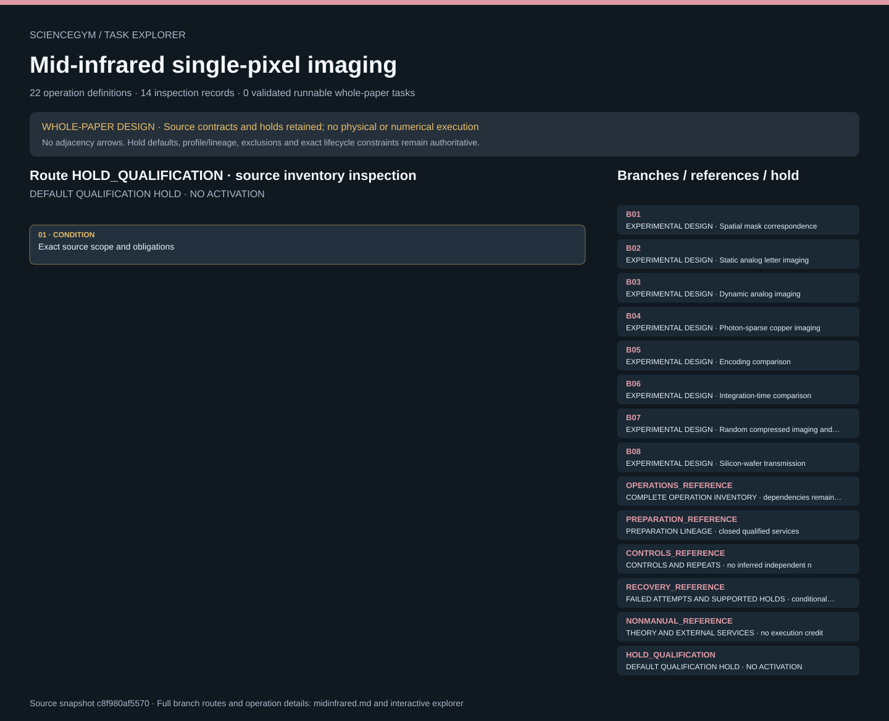

# Mid-infrared single-pixel imaging: task route map



Paper: **Mid-infrared single-pixel imaging at the single-photon level** · [DOI](https://doi.org/10.1038/s41467-023-36815-3)

Whole-paper DESIGN only; zero validated runnable whole-paper tasks. Read-only author/evaluator reference, not an actor context, hardware controller, optical simulation or scientific reproduction. Source facts, authored robot contracts, synthetic observations and illustrative geometry remain separate. Inventories are inspection memberships; only exact dependencies and lifecycle guards constrain order. Condition slots, masks, pulses, frames and complementary pairs are not independent repeats. Qualification holds remain active; required outputs and observations are obligations, never observed outcomes. Eight experimental design branches and twenty-two authored operation templates represent one paper-level design. Approximately 10 Hz is a source reference only for analog 16x16 dynamic imaging; analog 32x32 retains approximately 2.5 Hz. Neither rate is a hardware default, a photon-counting rate or a timing measurement from movie playback. Incident mean photons per pulse, detected counts, physical displays, dose and elapsed time remain distinct. B01 requires spatial diagnostics with the object removed; bucket-only sensing does not establish pump/SFG correspondence. B05 detector mode and exposure policy remain null under U14; same power does not establish equal dose. Baseline/denoised comparisons require identical raw parents, and copper grids cannot be inherited by silicon. Twelve controls, ten source conflicts and fourteen unresolved-input groups remain open and claim-local. Independent sample/run/day counts remain unspecified and prospective qualification is mandatory. Failed attempts, current detector epochs, exclusive leases, safe access, occupied supported holds and closed accounting remain distinct. Upstream review covered nine main pages, twelve technical SI pages, eleven figures and one media-description page. Movies were fully decoded and sampled, not reviewed continuously. Raw data and modified source code remain unavailable. No source reanalysis, independent mathematical proof, physical safety qualification or scientific validation is supplied. All fabrication, optical alignment, detector-change and dynamic-target services remain closed, qualified and unimplemented. Original scene geometry, dimensions, interfaces and anchors are illustrative and unqualified; they grant no motion permission.. Counts describe task representation, not experiments or success.

**Reading rule:** rows show unordered source inventory for inspection. Exact phase, lifecycle and dependency contracts remain authoritative; no loop, specimen, condition or chronology is inferred. An unordered obligation group has no inferred chronological edges. Source-reported scientific facts and authored handling are distinct.

[Frozen local source task package](../../../tasks/midinfrared_operations_v2/) · [Interactive inspector](../index.html)

## B01 — EXPERIMENTAL DESIGN · Spatial mask correspondence

Whole-paper DESIGN only; zero validated runnable whole-paper tasks. Read-only author/evaluator reference, not an actor context, hardware controller, optical simulation or scientific reproduction. Source facts, authored robot contracts, synthetic observations and illustrative geometry remain separate. Inventories are inspection memberships; only exact dependencies and lifecycle guards constrain order. Condition slots, masks, pulses, frames and complementary pairs are not independent repeats. Qualification holds remain active; required outputs and observations are obligations, never observed outcomes.

[Exact route source](../../../tasks/midinfrared_operations_v2/branches.json) · JSON pointer: `/branches/0`

- **OBLIGATIONS: Exact operation membership; no adjacency chronology**
  - Binding: {"order":"Whole-paper DESIGN only; zero validated runnable whole-paper tasks. Read-only author/evaluator reference, not an actor context, hardware controller, optical simulation or scientific reproduction. Source facts, authored robot contracts, synthetic observations and illustrative geometry remain separate. Inventories are inspection memberships; only exact dependencies and lifecycle guards constrain order. Condition slots, masks, pulses, frames and complementary pairs are not independent repeats. Qualification holds remain active; required outputs and observations are obligations, never observed outcomes."}
  - `R07` Acquire object-removed calibration branch
    - Source occurrence binding: {"source_file":"branches.json","source_pointer":"/branches/0/operations/0","source_node":"R07","meaning":"Exact source-listed operation membership; not execution, chronology or a new specimen"}
  - `R08` Evaluate registration and correction evidence
    - Source occurrence binding: {"source_file":"branches.json","source_pointer":"/branches/0/operations/1","source_node":"R08","meaning":"Exact source-listed operation membership; not execution, chronology or a new specimen"}
- **CONDITION: Exact source scope and obligations**
  - Binding: {"source_file":"branches.json","source_pointer":"/branches/0","source_contract":{"id":"B01","name":"Spatial mask correspondence","source_fact":"F14","operations":["R07","R08"],"source_sections":["Main Fig2","SI Note4/FigS3","Movie1"],"required_for_whole_paper_design":true,"detector_mode":"spatial_diagnostic","sample_role":"empty_optical_path","condition_slots":[{"kind":"all_on_profile"},{"kind":"pump_uncorrected"},{"kind":"pump_corrected"},{"kind":"representative_SFG"}],"full_set_SFG_established":false,"condition_slot_provenance":"source_reference_not_hardware_command","execution_status":"HOLD_QUALIFICATION"}}

<details><summary>Branch state, choices, lineage and loop obligations</summary>

```json
{
  "id": "B01",
  "name": "Spatial mask correspondence",
  "source_fact": "F14",
  "operations": [
    "R07",
    "R08"
  ],
  "source_sections": [
    "Main Fig2",
    "SI Note4/FigS3",
    "Movie1"
  ],
  "required_for_whole_paper_design": true,
  "detector_mode": "spatial_diagnostic",
  "sample_role": "empty_optical_path",
  "condition_slots": [
    {
      "kind": "all_on_profile"
    },
    {
      "kind": "pump_uncorrected"
    },
    {
      "kind": "pump_corrected"
    },
    {
      "kind": "representative_SFG"
    }
  ],
  "full_set_SFG_established": false,
  "condition_slot_provenance": "source_reference_not_hardware_command",
  "execution_status": "HOLD_QUALIFICATION"
}
```

</details>

## B02 — EXPERIMENTAL DESIGN · Static analog letter imaging

Whole-paper DESIGN only; zero validated runnable whole-paper tasks. Read-only author/evaluator reference, not an actor context, hardware controller, optical simulation or scientific reproduction. Source facts, authored robot contracts, synthetic observations and illustrative geometry remain separate. Inventories are inspection memberships; only exact dependencies and lifecycle guards constrain order. Condition slots, masks, pulses, frames and complementary pairs are not independent repeats. Qualification holds remain active; required outputs and observations are obligations, never observed outcomes.

[Exact route source](../../../tasks/midinfrared_operations_v2/branches.json) · JSON pointer: `/branches/1`

- **OBLIGATIONS: Exact operation membership; no adjacency chronology**
  - Binding: {"order":"Whole-paper DESIGN only; zero validated runnable whole-paper tasks. Read-only author/evaluator reference, not an actor context, hardware controller, optical simulation or scientific reproduction. Source facts, authored robot contracts, synthetic observations and illustrative geometry remain separate. Inventories are inspection memberships; only exact dependencies and lifecycle guards constrain order. Condition slots, masks, pulses, frames and complementary pairs are not independent repeats. Qualification holds remain active; required outputs and observations are obligations, never observed outcomes."}
  - `R09` Load copper carrier and acquire static analog letters
    - Source occurrence binding: {"source_file":"branches.json","source_pointer":"/branches/1/operations/0","source_node":"R09","meaning":"Exact source-listed operation membership; not execution, chronology or a new specimen"}
- **CONDITION: Exact source scope and obligations**
  - Binding: {"source_file":"branches.json","source_pointer":"/branches/1","source_contract":{"id":"B02","name":"Static analog letter imaging","source_fact":"F08","operations":["R09"],"source_sections":["Main Fig3"],"required_for_whole_paper_design":true,"detector_mode":"analog","sample_role":"copper","condition_slots":[{"target":"E","grid":[16,16]},{"target":"E","grid":[64,64]},{"target":"C","grid":[16,16]},{"target":"C","grid":[64,64]},{"target":"N","grid":[16,16]},{"target":"N","grid":[64,64]},{"target":"U","grid":[16,16]},{"target":"U","grid":[64,64]}],"condition_slot_provenance":"source_reference_not_hardware_command","execution_status":"HOLD_QUALIFICATION"}}

<details><summary>Branch state, choices, lineage and loop obligations</summary>

```json
{
  "id": "B02",
  "name": "Static analog letter imaging",
  "source_fact": "F08",
  "operations": [
    "R09"
  ],
  "source_sections": [
    "Main Fig3"
  ],
  "required_for_whole_paper_design": true,
  "detector_mode": "analog",
  "sample_role": "copper",
  "condition_slots": [
    {
      "target": "E",
      "grid": [
        16,
        16
      ]
    },
    {
      "target": "E",
      "grid": [
        64,
        64
      ]
    },
    {
      "target": "C",
      "grid": [
        16,
        16
      ]
    },
    {
      "target": "C",
      "grid": [
        64,
        64
      ]
    },
    {
      "target": "N",
      "grid": [
        16,
        16
      ]
    },
    {
      "target": "N",
      "grid": [
        64,
        64
      ]
    },
    {
      "target": "U",
      "grid": [
        16,
        16
      ]
    },
    {
      "target": "U",
      "grid": [
        64,
        64
      ]
    }
  ],
  "condition_slot_provenance": "source_reference_not_hardware_command",
  "execution_status": "HOLD_QUALIFICATION"
}
```

</details>

## B03 — EXPERIMENTAL DESIGN · Dynamic analog imaging

Whole-paper DESIGN only; zero validated runnable whole-paper tasks. Read-only author/evaluator reference, not an actor context, hardware controller, optical simulation or scientific reproduction. Source facts, authored robot contracts, synthetic observations and illustrative geometry remain separate. Inventories are inspection memberships; only exact dependencies and lifecycle guards constrain order. Condition slots, masks, pulses, frames and complementary pairs are not independent repeats. Qualification holds remain active; required outputs and observations are obligations, never observed outcomes.

[Exact route source](../../../tasks/midinfrared_operations_v2/branches.json) · JSON pointer: `/branches/2`

- **OBLIGATIONS: Exact operation membership; no adjacency chronology**
  - Binding: {"order":"Whole-paper DESIGN only; zero validated runnable whole-paper tasks. Read-only author/evaluator reference, not an actor context, hardware controller, optical simulation or scientific reproduction. Source facts, authored robot contracts, synthetic observations and illustrative geometry remain separate. Inventories are inspection memberships; only exact dependencies and lifecycle guards constrain order. Condition slots, masks, pulses, frames and complementary pairs are not independent repeats. Qualification holds remain active; required outputs and observations are obligations, never observed outcomes."}
  - `R10` Acquire protected dynamic-target branch
    - Source occurrence binding: {"source_file":"branches.json","source_pointer":"/branches/2/operations/0","source_node":"R10","meaning":"Exact source-listed operation membership; not execution, chronology or a new specimen"}
- **CONDITION: Exact source scope and obligations**
  - Binding: {"source_file":"branches.json","source_pointer":"/branches/2","source_contract":{"id":"B03","name":"Dynamic analog imaging","source_fact":"F09","operations":["R10"],"source_sections":["Movie2 and description"],"required_for_whole_paper_design":true,"detector_mode":"analog","sample_role":"copper","condition_slots":[{"grid":[16,16],"source_rate_reference_Hz_approx":10},{"grid":[32,32],"source_rate_reference_Hz_approx":2.5}],"rate_is_target_or_default":false,"movie_playback_is_acquisition_time":false,"condition_slot_provenance":"source_reference_not_hardware_command","execution_status":"HOLD_QUALIFICATION"}}

<details><summary>Branch state, choices, lineage and loop obligations</summary>

```json
{
  "id": "B03",
  "name": "Dynamic analog imaging",
  "source_fact": "F09",
  "operations": [
    "R10"
  ],
  "source_sections": [
    "Movie2 and description"
  ],
  "required_for_whole_paper_design": true,
  "detector_mode": "analog",
  "sample_role": "copper",
  "condition_slots": [
    {
      "grid": [
        16,
        16
      ],
      "source_rate_reference_Hz_approx": 10
    },
    {
      "grid": [
        32,
        32
      ],
      "source_rate_reference_Hz_approx": 2.5
    }
  ],
  "rate_is_target_or_default": false,
  "movie_playback_is_acquisition_time": false,
  "condition_slot_provenance": "source_reference_not_hardware_command",
  "execution_status": "HOLD_QUALIFICATION"
}
```

</details>

## B04 — EXPERIMENTAL DESIGN · Photon-sparse copper imaging

Whole-paper DESIGN only; zero validated runnable whole-paper tasks. Read-only author/evaluator reference, not an actor context, hardware controller, optical simulation or scientific reproduction. Source facts, authored robot contracts, synthetic observations and illustrative geometry remain separate. Inventories are inspection memberships; only exact dependencies and lifecycle guards constrain order. Condition slots, masks, pulses, frames and complementary pairs are not independent repeats. Qualification holds remain active; required outputs and observations are obligations, never observed outcomes.

[Exact route source](../../../tasks/midinfrared_operations_v2/branches.json) · JSON pointer: `/branches/3`

- **OBLIGATIONS: Exact operation membership; no adjacency chronology**
  - Binding: {"order":"Whole-paper DESIGN only; zero validated runnable whole-paper tasks. Read-only author/evaluator reference, not an actor context, hardware controller, optical simulation or scientific reproduction. Source facts, authored robot contracts, synthetic observations and illustrative geometry remain separate. Inventories are inspection memberships; only exact dependencies and lifecycle guards constrain order. Condition slots, masks, pulses, frames and complementary pairs are not independent repeats. Qualification holds remain active; required outputs and observations are obligations, never observed outcomes."}
  - `R11` Switch to photon-counting service configuration
    - Source occurrence binding: {"source_file":"branches.json","source_pointer":"/branches/3/operations/0","source_node":"R11","meaning":"Exact source-listed operation membership; not execution, chronology or a new specimen"}
  - `R12` Acquire full photon-sparse copper matrix
    - Source occurrence binding: {"source_file":"branches.json","source_pointer":"/branches/3/operations/1","source_node":"R12","meaning":"Exact source-listed operation membership; not execution, chronology or a new specimen"}
- **CONDITION: Exact source scope and obligations**
  - Binding: {"source_file":"branches.json","source_pointer":"/branches/3","source_contract":{"id":"B04","name":"Photon-sparse copper imaging","source_fact":"F10","operations":["R11","R12"],"source_sections":["Main Fig4"],"required_for_whole_paper_design":true,"detector_mode":"photon","sample_role":"copper","condition_slots":[{"grid":[16,16],"incident_mean_photons_per_pulse":100,"per_display_ms":5},{"grid":[16,16],"incident_mean_photons_per_pulse":10,"per_display_ms":50},{"grid":[16,16],"incident_mean_photons_per_pulse":5,"per_display_ms":100},{"grid":[16,16],"incident_mean_photons_per_pulse":1,"per_display_ms":500},{"grid":[16,16],"incident_mean_photons_per_pulse":0.5,"per_display_ms":1000},{"grid":[64,64],"incident_mean_photons_per_pulse":100,"per_display_ms":5},{"grid":[64,64],"incident_mean_photons_per_pulse":10,"per_display_ms":50},{"grid":[64,64],"incident_mean_photons_per_pulse":5,"per_display_ms":100},{"grid":[64,64],"incident_mean_photons_per_pulse":1,"per_display_ms":500},{"grid":[64,64],"incident_mean_photons_per_pulse":0.5,"per_display_ms":1000}],"condition_slot_provenance":"source_reference_not_hardware_command","execution_status":"HOLD_QUALIFICATION"}}

<details><summary>Branch state, choices, lineage and loop obligations</summary>

```json
{
  "id": "B04",
  "name": "Photon-sparse copper imaging",
  "source_fact": "F10",
  "operations": [
    "R11",
    "R12"
  ],
  "source_sections": [
    "Main Fig4"
  ],
  "required_for_whole_paper_design": true,
  "detector_mode": "photon",
  "sample_role": "copper",
  "condition_slots": [
    {
      "grid": [
        16,
        16
      ],
      "incident_mean_photons_per_pulse": 100,
      "per_display_ms": 5
    },
    {
      "grid": [
        16,
        16
      ],
      "incident_mean_photons_per_pulse": 10,
      "per_display_ms": 50
    },
    {
      "grid": [
        16,
        16
      ],
      "incident_mean_photons_per_pulse": 5,
      "per_display_ms": 100
    },
    {
      "grid": [
        16,
        16
      ],
      "incident_mean_photons_per_pulse": 1,
      "per_display_ms": 500
    },
    {
      "grid": [
        16,
        16
      ],
      "incident_mean_photons_per_pulse": 0.5,
      "per_display_ms": 1000
    },
    {
      "grid": [
        64,
        64
      ],
      "incident_mean_photons_per_pulse": 100,
      "per_display_ms": 5
    },
    {
      "grid": [
        64,
        64
      ],
      "incident_mean_photons_per_pulse": 10,
      "per_display_ms": 50
    },
    {
      "grid": [
        64,
        64
      ],
      "incident_mean_photons_per_pulse": 5,
      "per_display_ms": 100
    },
    {
      "grid": [
        64,
        64
      ],
      "incident_mean_photons_per_pulse": 1,
      "per_display_ms": 500
    },
    {
      "grid": [
        64,
        64
      ],
      "incident_mean_photons_per_pulse": 0.5,
      "per_display_ms": 1000
    }
  ],
  "condition_slot_provenance": "source_reference_not_hardware_command",
  "execution_status": "HOLD_QUALIFICATION"
}
```

</details>

## B05 — EXPERIMENTAL DESIGN · Encoding comparison

Whole-paper DESIGN only; zero validated runnable whole-paper tasks. Read-only author/evaluator reference, not an actor context, hardware controller, optical simulation or scientific reproduction. Source facts, authored robot contracts, synthetic observations and illustrative geometry remain separate. Inventories are inspection memberships; only exact dependencies and lifecycle guards constrain order. Condition slots, masks, pulses, frames and complementary pairs are not independent repeats. Qualification holds remain active; required outputs and observations are obligations, never observed outcomes.

[Exact route source](../../../tasks/midinfrared_operations_v2/branches.json) · JSON pointer: `/branches/4`

- **OBLIGATIONS: Exact operation membership; no adjacency chronology**
  - Binding: {"order":"Whole-paper DESIGN only; zero validated runnable whole-paper tasks. Read-only author/evaluator reference, not an actor context, hardware controller, optical simulation or scientific reproduction. Source facts, authored robot contracts, synthetic observations and illustrative geometry remain separate. Inventories are inspection memberships; only exact dependencies and lifecycle guards constrain order. Condition slots, masks, pulses, frames and complementary pairs are not independent repeats. Qualification holds remain active; required outputs and observations are obligations, never observed outcomes."}
  - `R13` Acquire raster/random/Hadamard comparison
    - Source occurrence binding: {"source_file":"branches.json","source_pointer":"/branches/4/operations/0","source_node":"R13","meaning":"Exact source-listed operation membership; not execution, chronology or a new specimen"}
- **CONDITION: Exact source scope and obligations**
  - Binding: {"source_file":"branches.json","source_pointer":"/branches/4","source_contract":{"id":"B05","name":"Encoding comparison","source_fact":"F15","operations":["R13"],"source_sections":["SI Note5/FigS4"],"required_for_whole_paper_design":true,"detector_mode":null,"sample_role":"copper","condition_slots":[{"encoding":"raster","grid":[16,16],"exposure_policy":null},{"encoding":"raster","grid":[32,32],"exposure_policy":null},{"encoding":"raster","grid":[64,64],"exposure_policy":null},{"encoding":"random","grid":[16,16],"exposure_policy":null},{"encoding":"random","grid":[32,32],"exposure_policy":null},{"encoding":"random","grid":[64,64],"exposure_policy":null},{"encoding":"hadamard","grid":[16,16],"exposure_policy":null},{"encoding":"hadamard","grid":[32,32],"exposure_policy":null},{"encoding":"hadamard","grid":[64,64],"exposure_policy":null}],"required_gap":"U14","same_power_is_equal_dose":false,"condition_slot_provenance":"source_reference_not_hardware_command","execution_status":"HOLD_QUALIFICATION"}}

<details><summary>Branch state, choices, lineage and loop obligations</summary>

```json
{
  "id": "B05",
  "name": "Encoding comparison",
  "source_fact": "F15",
  "operations": [
    "R13"
  ],
  "source_sections": [
    "SI Note5/FigS4"
  ],
  "required_for_whole_paper_design": true,
  "detector_mode": null,
  "sample_role": "copper",
  "condition_slots": [
    {
      "encoding": "raster",
      "grid": [
        16,
        16
      ],
      "exposure_policy": null
    },
    {
      "encoding": "raster",
      "grid": [
        32,
        32
      ],
      "exposure_policy": null
    },
    {
      "encoding": "raster",
      "grid": [
        64,
        64
      ],
      "exposure_policy": null
    },
    {
      "encoding": "random",
      "grid": [
        16,
        16
      ],
      "exposure_policy": null
    },
    {
      "encoding": "random",
      "grid": [
        32,
        32
      ],
      "exposure_policy": null
    },
    {
      "encoding": "random",
      "grid": [
        64,
        64
      ],
      "exposure_policy": null
    },
    {
      "encoding": "hadamard",
      "grid": [
        16,
        16
      ],
      "exposure_policy": null
    },
    {
      "encoding": "hadamard",
      "grid": [
        32,
        32
      ],
      "exposure_policy": null
    },
    {
      "encoding": "hadamard",
      "grid": [
        64,
        64
      ],
      "exposure_policy": null
    }
  ],
  "required_gap": "U14",
  "same_power_is_equal_dose": false,
  "condition_slot_provenance": "source_reference_not_hardware_command",
  "execution_status": "HOLD_QUALIFICATION"
}
```

</details>

## B06 — EXPERIMENTAL DESIGN · Integration-time comparison

Whole-paper DESIGN only; zero validated runnable whole-paper tasks. Read-only author/evaluator reference, not an actor context, hardware controller, optical simulation or scientific reproduction. Source facts, authored robot contracts, synthetic observations and illustrative geometry remain separate. Inventories are inspection memberships; only exact dependencies and lifecycle guards constrain order. Condition slots, masks, pulses, frames and complementary pairs are not independent repeats. Qualification holds remain active; required outputs and observations are obligations, never observed outcomes.

[Exact route source](../../../tasks/midinfrared_operations_v2/branches.json) · JSON pointer: `/branches/5`

- **OBLIGATIONS: Exact operation membership; no adjacency chronology**
  - Binding: {"order":"Whole-paper DESIGN only; zero validated runnable whole-paper tasks. Read-only author/evaluator reference, not an actor context, hardware controller, optical simulation or scientific reproduction. Source facts, authored robot contracts, synthetic observations and illustrative geometry remain separate. Inventories are inspection memberships; only exact dependencies and lifecycle guards constrain order. Condition slots, masks, pulses, frames and complementary pairs are not independent repeats. Qualification holds remain active; required outputs and observations are obligations, never observed outcomes."}
  - `R14` Acquire fixed-flux integration-time matrix
    - Source occurrence binding: {"source_file":"branches.json","source_pointer":"/branches/5/operations/0","source_node":"R14","meaning":"Exact source-listed operation membership; not execution, chronology or a new specimen"}
- **CONDITION: Exact source scope and obligations**
  - Binding: {"source_file":"branches.json","source_pointer":"/branches/5","source_contract":{"id":"B06","name":"Integration-time comparison","source_fact":"F12","operations":["R14"],"source_sections":["SI Note6/FigS5"],"required_for_whole_paper_design":true,"detector_mode":"photon","sample_role":"copper","condition_slots":[{"grid":[16,16],"incident_mean_photons_per_pulse":1,"per_display_ms":10},{"grid":[16,16],"incident_mean_photons_per_pulse":1,"per_display_ms":100},{"grid":[16,16],"incident_mean_photons_per_pulse":1,"per_display_ms":200},{"grid":[16,16],"incident_mean_photons_per_pulse":1,"per_display_ms":500},{"grid":[16,16],"incident_mean_photons_per_pulse":1,"per_display_ms":1000},{"grid":[32,32],"incident_mean_photons_per_pulse":1,"per_display_ms":10},{"grid":[32,32],"incident_mean_photons_per_pulse":1,"per_display_ms":100},{"grid":[32,32],"incident_mean_photons_per_pulse":1,"per_display_ms":200},{"grid":[32,32],"incident_mean_photons_per_pulse":1,"per_display_ms":500},{"grid":[32,32],"incident_mean_photons_per_pulse":1,"per_display_ms":1000},{"grid":[64,64],"incident_mean_photons_per_pulse":1,"per_display_ms":10},{"grid":[64,64],"incident_mean_photons_per_pulse":1,"per_display_ms":100},{"grid":[64,64],"incident_mean_photons_per_pulse":1,"per_display_ms":200},{"grid":[64,64],"incident_mean_photons_per_pulse":1,"per_display_ms":500},{"grid":[64,64],"incident_mean_photons_per_pulse":1,"per_display_ms":1000}],"condition_slot_provenance":"source_reference_not_hardware_command","execution_status":"HOLD_QUALIFICATION"}}

<details><summary>Branch state, choices, lineage and loop obligations</summary>

```json
{
  "id": "B06",
  "name": "Integration-time comparison",
  "source_fact": "F12",
  "operations": [
    "R14"
  ],
  "source_sections": [
    "SI Note6/FigS5"
  ],
  "required_for_whole_paper_design": true,
  "detector_mode": "photon",
  "sample_role": "copper",
  "condition_slots": [
    {
      "grid": [
        16,
        16
      ],
      "incident_mean_photons_per_pulse": 1,
      "per_display_ms": 10
    },
    {
      "grid": [
        16,
        16
      ],
      "incident_mean_photons_per_pulse": 1,
      "per_display_ms": 100
    },
    {
      "grid": [
        16,
        16
      ],
      "incident_mean_photons_per_pulse": 1,
      "per_display_ms": 200
    },
    {
      "grid": [
        16,
        16
      ],
      "incident_mean_photons_per_pulse": 1,
      "per_display_ms": 500
    },
    {
      "grid": [
        16,
        16
      ],
      "incident_mean_photons_per_pulse": 1,
      "per_display_ms": 1000
    },
    {
      "grid": [
        32,
        32
      ],
      "incident_mean_photons_per_pulse": 1,
      "per_display_ms": 10
    },
    {
      "grid": [
        32,
        32
      ],
      "incident_mean_photons_per_pulse": 1,
      "per_display_ms": 100
    },
    {
      "grid": [
        32,
        32
      ],
      "incident_mean_photons_per_pulse": 1,
      "per_display_ms": 200
    },
    {
      "grid": [
        32,
        32
      ],
      "incident_mean_photons_per_pulse": 1,
      "per_display_ms": 500
    },
    {
      "grid": [
        32,
        32
      ],
      "incident_mean_photons_per_pulse": 1,
      "per_display_ms": 1000
    },
    {
      "grid": [
        64,
        64
      ],
      "incident_mean_photons_per_pulse": 1,
      "per_display_ms": 10
    },
    {
      "grid": [
        64,
        64
      ],
      "incident_mean_photons_per_pulse": 1,
      "per_display_ms": 100
    },
    {
      "grid": [
        64,
        64
      ],
      "incident_mean_photons_per_pulse": 1,
      "per_display_ms": 200
    },
    {
      "grid": [
        64,
        64
      ],
      "incident_mean_photons_per_pulse": 1,
      "per_display_ms": 500
    },
    {
      "grid": [
        64,
        64
      ],
      "incident_mean_photons_per_pulse": 1,
      "per_display_ms": 1000
    }
  ],
  "condition_slot_provenance": "source_reference_not_hardware_command",
  "execution_status": "HOLD_QUALIFICATION"
}
```

</details>

## B07 — EXPERIMENTAL DESIGN · Random compressed imaging and denoiser comparison

Whole-paper DESIGN only; zero validated runnable whole-paper tasks. Read-only author/evaluator reference, not an actor context, hardware controller, optical simulation or scientific reproduction. Source facts, authored robot contracts, synthetic observations and illustrative geometry remain separate. Inventories are inspection memberships; only exact dependencies and lifecycle guards constrain order. Condition slots, masks, pulses, frames and complementary pairs are not independent repeats. Qualification holds remain active; required outputs and observations are obligations, never observed outcomes.

[Exact route source](../../../tasks/midinfrared_operations_v2/branches.json) · JSON pointer: `/branches/6`

- **OBLIGATIONS: Exact operation membership; no adjacency chronology**
  - Binding: {"order":"Whole-paper DESIGN only; zero validated runnable whole-paper tasks. Read-only author/evaluator reference, not an actor context, hardware controller, optical simulation or scientific reproduction. Source facts, authored robot contracts, synthetic observations and illustrative geometry remain separate. Inventories are inspection memberships; only exact dependencies and lifecycle guards constrain order. Condition slots, masks, pulses, frames and complementary pairs are not independent repeats. Qualification holds remain active; required outputs and observations are obligations, never observed outcomes."}
  - `R15` Acquire random compressed measurement branch
    - Source occurrence binding: {"source_file":"branches.json","source_pointer":"/branches/6/operations/0","source_node":"R15","meaning":"Exact source-listed operation membership; not execution, chronology or a new specimen"}
  - `R16` Compare baseline and denoised reconstruction
    - Source occurrence binding: {"source_file":"branches.json","source_pointer":"/branches/6/operations/1","source_node":"R16","meaning":"Exact source-listed operation membership; not execution, chronology or a new specimen"}
- **CONDITION: Exact source scope and obligations**
  - Binding: {"source_file":"branches.json","source_pointer":"/branches/6","source_contract":{"id":"B07","name":"Random compressed imaging and denoiser comparison","source_fact":"F11","operations":["R15","R16"],"source_sections":["Main Fig5; SI Note5"],"required_for_whole_paper_design":true,"detector_mode":"photon","sample_role":"copper","condition_slots":[{"grid":[64,64],"sampling_ratio":0.25,"incident_mean_photons_per_pulse":100,"analysis":"baseline"},{"grid":[64,64],"sampling_ratio":0.25,"incident_mean_photons_per_pulse":5,"analysis":"baseline"},{"grid":[64,64],"sampling_ratio":0.25,"incident_mean_photons_per_pulse":5,"analysis":"denoised"},{"grid":[64,64],"sampling_ratio":0.25,"incident_mean_photons_per_pulse":1,"analysis":"denoised"}],"authored_paired_comparison":"Any newly claimed baseline/denoised comparison must use the identical raw digest; source panels at different flux are not such a pair.","physical_display_convention":null,"condition_slot_provenance":"source_reference_not_hardware_command","execution_status":"HOLD_QUALIFICATION"}}

<details><summary>Branch state, choices, lineage and loop obligations</summary>

```json
{
  "id": "B07",
  "name": "Random compressed imaging and denoiser comparison",
  "source_fact": "F11",
  "operations": [
    "R15",
    "R16"
  ],
  "source_sections": [
    "Main Fig5; SI Note5"
  ],
  "required_for_whole_paper_design": true,
  "detector_mode": "photon",
  "sample_role": "copper",
  "condition_slots": [
    {
      "grid": [
        64,
        64
      ],
      "sampling_ratio": 0.25,
      "incident_mean_photons_per_pulse": 100,
      "analysis": "baseline"
    },
    {
      "grid": [
        64,
        64
      ],
      "sampling_ratio": 0.25,
      "incident_mean_photons_per_pulse": 5,
      "analysis": "baseline"
    },
    {
      "grid": [
        64,
        64
      ],
      "sampling_ratio": 0.25,
      "incident_mean_photons_per_pulse": 5,
      "analysis": "denoised"
    },
    {
      "grid": [
        64,
        64
      ],
      "sampling_ratio": 0.25,
      "incident_mean_photons_per_pulse": 1,
      "analysis": "denoised"
    }
  ],
  "authored_paired_comparison": "Any newly claimed baseline/denoised comparison must use the identical raw digest; source panels at different flux are not such a pair.",
  "physical_display_convention": null,
  "condition_slot_provenance": "source_reference_not_hardware_command",
  "execution_status": "HOLD_QUALIFICATION"
}
```

</details>

## B08 — EXPERIMENTAL DESIGN · Silicon-wafer transmission

Whole-paper DESIGN only; zero validated runnable whole-paper tasks. Read-only author/evaluator reference, not an actor context, hardware controller, optical simulation or scientific reproduction. Source facts, authored robot contracts, synthetic observations and illustrative geometry remain separate. Inventories are inspection memberships; only exact dependencies and lifecycle guards constrain order. Condition slots, masks, pulses, frames and complementary pairs are not independent repeats. Qualification holds remain active; required outputs and observations are obligations, never observed outcomes.

[Exact route source](../../../tasks/midinfrared_operations_v2/branches.json) · JSON pointer: `/branches/7`

- **OBLIGATIONS: Exact operation membership; no adjacency chronology**
  - Binding: {"order":"Whole-paper DESIGN only; zero validated runnable whole-paper tasks. Read-only author/evaluator reference, not an actor context, hardware controller, optical simulation or scientific reproduction. Source facts, authored robot contracts, synthetic observations and illustrative geometry remain separate. Inventories are inspection memberships; only exact dependencies and lifecycle guards constrain order. Condition slots, masks, pulses, frames and complementary pairs are not independent repeats. Qualification holds remain active; required outputs and observations are obligations, never observed outcomes."}
  - `R17` Exchange copper for protected silicon sample
    - Source occurrence binding: {"source_file":"branches.json","source_pointer":"/branches/7/operations/0","source_node":"R17","meaning":"Exact source-listed operation membership; not execution, chronology or a new specimen"}
  - `R18` Acquire silicon-star transmission matrix
    - Source occurrence binding: {"source_file":"branches.json","source_pointer":"/branches/7/operations/1","source_node":"R18","meaning":"Exact source-listed operation membership; not execution, chronology or a new specimen"}
- **CONDITION: Exact source scope and obligations**
  - Binding: {"source_file":"branches.json","source_pointer":"/branches/7","source_contract":{"id":"B08","name":"Silicon-wafer transmission","source_fact":"F13","operations":["R17","R18"],"source_sections":["SI Note7/FigS6"],"required_for_whole_paper_design":true,"detector_mode":"photon","sample_role":"silicon","condition_slots":[{"incident_mean_photons_per_pulse":10,"per_display_ms":100,"grid_policy":null},{"incident_mean_photons_per_pulse":5,"per_display_ms":200,"grid_policy":null},{"incident_mean_photons_per_pulse":1,"per_display_ms":1000,"grid_policy":null}],"grid_is_not_inferred_from_copper":true,"condition_slot_provenance":"source_reference_not_hardware_command","execution_status":"HOLD_QUALIFICATION"}}

<details><summary>Branch state, choices, lineage and loop obligations</summary>

```json
{
  "id": "B08",
  "name": "Silicon-wafer transmission",
  "source_fact": "F13",
  "operations": [
    "R17",
    "R18"
  ],
  "source_sections": [
    "SI Note7/FigS6"
  ],
  "required_for_whole_paper_design": true,
  "detector_mode": "photon",
  "sample_role": "silicon",
  "condition_slots": [
    {
      "incident_mean_photons_per_pulse": 10,
      "per_display_ms": 100,
      "grid_policy": null
    },
    {
      "incident_mean_photons_per_pulse": 5,
      "per_display_ms": 200,
      "grid_policy": null
    },
    {
      "incident_mean_photons_per_pulse": 1,
      "per_display_ms": 1000,
      "grid_policy": null
    }
  ],
  "grid_is_not_inferred_from_copper": true,
  "condition_slot_provenance": "source_reference_not_hardware_command",
  "execution_status": "HOLD_QUALIFICATION"
}
```

</details>

## OPERATIONS_REFERENCE — COMPLETE OPERATION INVENTORY · dependencies remain authoritative

Whole-paper DESIGN only; zero validated runnable whole-paper tasks. Read-only author/evaluator reference, not an actor context, hardware controller, optical simulation or scientific reproduction. Source facts, authored robot contracts, synthetic observations and illustrative geometry remain separate. Inventories are inspection memberships; only exact dependencies and lifecycle guards constrain order. Condition slots, masks, pulses, frames and complementary pairs are not independent repeats. Qualification holds remain active; required outputs and observations are obligations, never observed outcomes.

[Exact route source](../../../tasks/midinfrared_operations_v2/operations.json) · JSON pointer: ``

- **OBLIGATIONS: Exact operation membership; no adjacency chronology**
  - Binding: {"order":"Whole-paper DESIGN only; zero validated runnable whole-paper tasks. Read-only author/evaluator reference, not an actor context, hardware controller, optical simulation or scientific reproduction. Source facts, authored robot contracts, synthetic observations and illustrative geometry remain separate. Inventories are inspection memberships; only exact dependencies and lifecycle guards constrain order. Condition slots, masks, pulses, frames and complementary pairs are not independent repeats. Qualification holds remain active; required outputs and observations are obligations, never observed outcomes."}
  - `R01` Freeze campaign and evidence references
    - Source occurrence binding: {"source_file":"operations.json","source_pointer":"/operations/0/id","source_node":"R01","meaning":"Exact source-listed operation membership; not execution, chronology or a new specimen"}
  - `R02` Commission protected samples through service
    - Source occurrence binding: {"source_file":"operations.json","source_pointer":"/operations/1/id","source_node":"R02","meaning":"Exact source-listed operation membership; not execution, chronology or a new specimen"}
  - `R03` Receive and inspect protected carriers
    - Source occurrence binding: {"source_file":"operations.json","source_pointer":"/operations/2/id","source_node":"R03","meaning":"Exact source-listed operation membership; not execution, chronology or a new specimen"}
  - `R04` Obtain qualified optical station readiness
    - Source occurrence binding: {"source_file":"operations.json","source_pointer":"/operations/3/id","source_node":"R04","meaning":"Exact source-listed operation membership; not execution, chronology or a new specimen"}
  - `R05` Register station frames and protected transfers
    - Source occurrence binding: {"source_file":"operations.json","source_pointer":"/operations/4/id","source_node":"R05","meaning":"Exact source-listed operation membership; not execution, chronology or a new specimen"}
  - `R06` Freeze calibration and acquisition configuration
    - Source occurrence binding: {"source_file":"operations.json","source_pointer":"/operations/5/id","source_node":"R06","meaning":"Exact source-listed operation membership; not execution, chronology or a new specimen"}
  - `R07` Acquire object-removed calibration branch
    - Source occurrence binding: {"source_file":"operations.json","source_pointer":"/operations/6/id","source_node":"R07","meaning":"Exact source-listed operation membership; not execution, chronology or a new specimen"}
  - `R08` Evaluate registration and correction evidence
    - Source occurrence binding: {"source_file":"operations.json","source_pointer":"/operations/7/id","source_node":"R08","meaning":"Exact source-listed operation membership; not execution, chronology or a new specimen"}
  - `R09` Load copper carrier and acquire static analog letters
    - Source occurrence binding: {"source_file":"operations.json","source_pointer":"/operations/8/id","source_node":"R09","meaning":"Exact source-listed operation membership; not execution, chronology or a new specimen"}
  - `R10` Acquire protected dynamic-target branch
    - Source occurrence binding: {"source_file":"operations.json","source_pointer":"/operations/9/id","source_node":"R10","meaning":"Exact source-listed operation membership; not execution, chronology or a new specimen"}
  - `R11` Switch to photon-counting service configuration
    - Source occurrence binding: {"source_file":"operations.json","source_pointer":"/operations/10/id","source_node":"R11","meaning":"Exact source-listed operation membership; not execution, chronology or a new specimen"}
  - `R12` Acquire full photon-sparse copper matrix
    - Source occurrence binding: {"source_file":"operations.json","source_pointer":"/operations/11/id","source_node":"R12","meaning":"Exact source-listed operation membership; not execution, chronology or a new specimen"}
  - `R13` Acquire raster/random/Hadamard comparison
    - Source occurrence binding: {"source_file":"operations.json","source_pointer":"/operations/12/id","source_node":"R13","meaning":"Exact source-listed operation membership; not execution, chronology or a new specimen"}
  - `R14` Acquire fixed-flux integration-time matrix
    - Source occurrence binding: {"source_file":"operations.json","source_pointer":"/operations/13/id","source_node":"R14","meaning":"Exact source-listed operation membership; not execution, chronology or a new specimen"}
  - `R15` Acquire random compressed measurement branch
    - Source occurrence binding: {"source_file":"operations.json","source_pointer":"/operations/14/id","source_node":"R15","meaning":"Exact source-listed operation membership; not execution, chronology or a new specimen"}
  - `R16` Compare baseline and denoised reconstruction
    - Source occurrence binding: {"source_file":"operations.json","source_pointer":"/operations/15/id","source_node":"R16","meaning":"Exact source-listed operation membership; not execution, chronology or a new specimen"}
  - `R17` Exchange copper for protected silicon sample
    - Source occurrence binding: {"source_file":"operations.json","source_pointer":"/operations/16/id","source_node":"R17","meaning":"Exact source-listed operation membership; not execution, chronology or a new specimen"}
  - `R18` Acquire silicon-star transmission matrix
    - Source occurrence binding: {"source_file":"operations.json","source_pointer":"/operations/17/id","source_node":"R18","meaning":"Exact source-listed operation membership; not execution, chronology or a new specimen"}
  - `R19` Reconstruct and evaluate all eligible branches
    - Source occurrence binding: {"source_file":"operations.json","source_pointer":"/operations/18/id","source_node":"R19","meaning":"Exact source-listed operation membership; not execution, chronology or a new specimen"}
  - `R20` Run approved independent repeats and controls
    - Source occurrence binding: {"source_file":"operations.json","source_pointer":"/operations/19/id","source_node":"R20","meaning":"Exact source-listed operation membership; not execution, chronology or a new specimen"}
  - `R21` Return samples and close station
    - Source occurrence binding: {"source_file":"operations.json","source_pointer":"/operations/20/id","source_node":"R21","meaning":"Exact source-listed operation membership; not execution, chronology or a new specimen"}
  - `R22` Archive complete evidence and declare bounded outcome
    - Source occurrence binding: {"source_file":"operations.json","source_pointer":"/operations/21/id","source_node":"R22","meaning":"Exact source-listed operation membership; not execution, chronology or a new specimen"}
- **CONDITION: Exact source scope and obligations**
  - Binding: {"source_file":"operations.json","source_pointer":"","source_contract":{"schema_version":"midinfrared_task.v2","classification":"authored_robot_translation","operations":[{"id":"R01","name":"Freeze campaign and evidence references","classification":"authored_robot_translation","station":"S01","depends_on":[],"inputs":["Paper/SI identity","approved branch matrix","Approved prospective repeat, metric, uncertainty, acquisition-order and stopping policy"],"outputs":["campaign_id","source_digest_record","branch manifest","immutable repeat_policy_id"],"entry_guards":["Do not count this review as conversion","No execution until services and tolerance policies are qualified","Freeze sample/run/day repeat counts and stopping/quality rules before any measured outcome; missing values block acquisition"],"observations_to_record":["Required branches B01-B08 and known gaps"],"failure_closeout":"Reject an incomplete or substituted program; retain review state","source_anchors":["F01","F20","F22"],"substeps":["Allocate campaign, immutable branch selection and sample/run/day repeat hierarchy","Freeze metrics, uncertainty, order, budget and stopping policies before first observation"],"evidence_role":"campaign_policy","asset_ids":["A03","A08","A11"],"physical_execution_qualified":false,"runtime":"unimplemented","failure_disposition":"SUPPORTED_HOLD_OR_QUALIFIED_CLOSEOUT","service_request_is_completion":false},{"id":"R02","name":"Commission protected samples through service","classification":"authored_robot_translation","station":"S02","depends_on":["R01"],"inputs":["Copper-mask specification","silicon-star specification","batch IDs"],"outputs":["serialized copper carriers","serialized silicon carrier","fabrication and inspection receipts"],"entry_guards":["Qualified fabrication only","No cutting/etching machine recipe or exposed laser access"],"observations_to_record":["Stock identity","parent-child IDs","silicon thickness certificate","reference optical image and uncertainty","defects"],"failure_closeout":"Quarantine uncertified or damaged carriers; no robot repair","source_anchors":["F02","F03"],"substeps":["Bind material lot and approved sample drawing to fabrication job","Submit protected stock to qualified service custody","Receive independent completion, metrology and safe-release receipts","Accept or quarantine returned serialized carrier; service internals are not robot work"],"evidence_role":"independent_fabrication","asset_ids":["A01","A02","A04","A10"],"physical_execution_qualified":false,"runtime":"unimplemented","failure_disposition":"SUPPORTED_HOLD_OR_QUALIFIED_CLOSEOUT","service_request_is_completion":false},{"id":"R03","name":"Receive and inspect protected carriers","classification":"authored_robot_translation","station":"S01","depends_on":["R02"],"inputs":["sample carriers","service receipts"],"outputs":["accept/reject receipt","carrier poses","storage assignments"],"entry_guards":["Grasp only outer cassette","Sharp edges enclosed","No assumption about source mask thickness"],"observations_to_record":["ID match","surface orientation","edge damage","fiducial pose uncertainty","custody"],"failure_closeout":"Reject mismatches; preserve images and put in quarantine","source_anchors":["F02","F03"],"substeps":["Read sample/carrier IDs and preparation lineage","Observe sealed edges, orientation and condition","Reconcile receipt, reference image and storage occupancy"],"evidence_role":"independent_inspection","asset_ids":["A01","A02","A03","A09","A12"],"physical_execution_qualified":false,"runtime":"unimplemented","failure_disposition":"SUPPORTED_HOLD_OR_QUALIFIED_CLOSEOUT","service_request_is_completion":false},{"id":"R04","name":"Obtain qualified optical station readiness","classification":"authored_robot_translation","station":"S03","depends_on":["R01"],"inputs":["instrument service ID","source and detector identities"],"outputs":["signed readiness receipt","calibration bundle","safe-load authorization"],"entry_guards":["Interlocked enclosure","operator owns beam alignment and source calibration","No power optimization by robot"],"observations_to_record":["Spectral identity","validity period","detector branch","optical registration uncertainty","background and overload bounds"],"failure_closeout":"Do not enable acquisition or load if readiness absent/expired","source_anchors":["F04","F05","F06","F22"],"substeps":["Request closed qualified optical and spatial-diagnostic readiness","Bind detector, source, diagnostic sensor, calibration, interval and allowed branch","Verify independently issued readiness and beam-safe access status"],"evidence_role":"independent_readiness","asset_ids":["A05","A06","A13"],"physical_execution_qualified":false,"runtime":"unimplemented","failure_disposition":"SUPPORTED_HOLD_OR_QUALIFIED_CLOSEOUT","service_request_is_completion":false},{"id":"R05","name":"Register station frames and protected transfers","classification":"authored_robot_translation","station":"S01/S03/S04","depends_on":["R03","R04"],"inputs":["carrier and dock drawings","robot handoff contract"],"outputs":["frame registration record","dock and cassette verification"],"entry_guards":["Dimensions/clearances/grip force and motion envelopes must be supplied","No simulated collision result claimed"],"observations_to_record":["Camera-to-dock transform","fiducial residual","latch state","occupancy","transport custody"],"failure_closeout":"Safe stop; maintain custody and park only in validated safe location","source_anchors":["F02","F03"],"substeps":["Bind source/destination frame revisions and nominal asset selectors","Verify supplied qualified transforms and uncertainty","Check gripper/cassette interface and actual source/destination occupancy","Perform only an externally qualified protected handoff; append custody receipt"],"evidence_role":"independent_custody","asset_ids":["A01","A02","A03","A05","A08","A12"],"physical_execution_qualified":false,"runtime":"unimplemented","failure_disposition":"SUPPORTED_HOLD_OR_QUALIFIED_CLOSEOUT","service_request_is_completion":false},{"id":"R06","name":"Freeze calibration and acquisition configuration","classification":"authored_robot_translation","station":"S04","depends_on":["R04","R05"],"inputs":["instrument readiness","pattern manifest","branch plan"],"outputs":["config_digest","expected display list","detector selection receipt"],"entry_guards":["Preserve pattern ordering, sign pairing and units","No substituted model weights","Verify repeat_policy_id is frozen and source/evaluator roles are separated before first acquisition"],"observations_to_record":["DMD firmware/interface IDs","FPGA counters","ADC or TTL mode","clock agreement","filter/calibration IDs"],"failure_closeout":"Reject incompatible interface or stale calibration; no partial scientific result","source_anchors":["F06","F16","F17","F20"],"substeps":["Bind mask matrix digest, order, complement convention and normalization","Bind timing/controller/ADC-or-TTL detector revisions and epoch","Freeze expected cross-device event/display bijection and independent repeat policy"],"evidence_role":"configuration_freeze","asset_ids":["A05","A06","A08","A13"],"physical_execution_qualified":false,"runtime":"unimplemented","failure_disposition":"SUPPORTED_HOLD_OR_QUALIFIED_CLOSEOUT","service_request_is_completion":false},{"id":"R07","name":"Acquire object-removed calibration branch","classification":"authored_robot_translation","station":"S03/S04","depends_on":["R06"],"inputs":["empty qualified dock","approved mapping program","Qualified spatially resolved pump/SFG diagnostic-imaging service receipt; bucket detector is insufficient"],"outputs":["raw all-on profile","uncorrected pump/mapped pattern records"],"entry_guards":["Service certifies safe optical configuration","No open-beam robot handling","Full-set pump and representative SFG records kept distinct; spatial sensor specifications and registration must be supplied"],"observations_to_record":["Mask IDs","no-object state","raw intensity maps","sensor settings and calibration epoch"],"failure_closeout":"Invalidate mapping set after drift or saturation; return to service","source_anchors":["F14"],"substeps":["Verify no sample occupies optical path and active calibration lease","Request enclosed spatial pump diagnostic maps","Retain all-on and uncorrected pump maps plus separately identified representative SFG maps","Record spatial sensor and registration, never bucket-only mapping"],"evidence_role":"spatial_diagnostic","asset_ids":["A05","A06","A08","A09","A13"],"physical_execution_qualified":false,"runtime":"unimplemented","failure_disposition":"SUPPORTED_HOLD_OR_QUALIFIED_CLOSEOUT","service_request_is_completion":false},{"id":"R08","name":"Evaluate registration and correction evidence","classification":"authored_robot_translation","station":"S05","depends_on":["R07"],"inputs":["raw calibration images","all-on profile","pattern manifest"],"outputs":["correction map with digest","mapping-quality receipt"],"entry_guards":["No metric threshold invented from pictures","Preserve uncorrected images","No divide-by-near-zero region admitted"],"observations_to_record":["ROI","valid pixel mask","coordinate transform","residual definition and uncertainty"],"failure_closeout":"Mask invalid regions; reject whole branch if coverage inadequate under authored policy","source_anchors":["F14"],"substeps":["Keep immutable all-on and uncorrected map inputs","Apply only a supplied qualified correction method and valid-region policy","Version corrected maps, ROI, residual and uncertainty; reject invalid coverage"],"evidence_role":"mapping_evaluation","asset_ids":["A08","A10","A11","A13"],"physical_execution_qualified":false,"runtime":"unimplemented","failure_disposition":"SUPPORTED_HOLD_OR_QUALIFIED_CLOSEOUT","service_request_is_completion":false},{"id":"R09","name":"Load copper carrier and acquire static analog letters","classification":"authored_robot_translation","station":"S01/S03/S04","depends_on":["R08"],"inputs":["accepted copper carrier","mapping-quality receipt"],"outputs":["raw analog pattern records for each target/grid","sample-after image"],"entry_guards":["Safe-load authorization and dock latched","Full signed-mask pair manifest","Approved analog detector range"],"observations_to_record":["Carrier ID","target E/C/N/U identity","grid","actual timestamps","ADC clipping","reference checks"],"failure_closeout":"Abort on latch/ID issue; flag/invalidate incomplete pattern cycles; retain failed data","source_anchors":["F02","F08","F16"],"substeps":["Obtain beam-safe load and exclusive dock custody","Transfer accepted copper cassette from rack, latch and independently read identity","Acquire full signed-mask analog cycles for each letter and grid","Preserve every complementary raw event, losses and pre/post reference"],"evidence_role":"analog_acquisition","asset_ids":["A01","A03","A05","A06","A08","A12"],"physical_execution_qualified":false,"runtime":"unimplemented","failure_disposition":"SUPPORTED_HOLD_OR_QUALIFIED_CLOSEOUT","service_request_is_completion":false},{"id":"R10","name":"Acquire protected dynamic-target branch","classification":"authored_robot_translation","station":"S03/S04","depends_on":["R09"],"inputs":["copper carrier","qualified motion fixture service"],"outputs":["timestamped analog sequences","movement/capture manifest"],"entry_guards":["Motion fixture trajectory separately qualified","No free-hand or open-beam movement","Repeat plan approved"],"observations_to_record":["Actual target pose/time","frame latency including reconstruction","dropped patterns","grid and detector"],"failure_closeout":"Stop motion and light via station controller; mark unusable sequences without inventing interpolation","source_anchors":["F09"],"substeps":["Bind qualified guarded motion fixture and retained copper cassette","Acquire analog target-position/time and pattern records","Measure end-to-end acquisition-plus-reconstruction interval independently of movie playback","Stop movement through station service and attest stable safe state"],"evidence_role":"analog_dynamic_acquisition","asset_ids":["A01","A05","A06","A07","A08"],"physical_execution_qualified":false,"runtime":"unimplemented","failure_disposition":"SUPPORTED_HOLD_OR_QUALIFIED_CLOSEOUT","service_request_is_completion":false},{"id":"R11","name":"Switch to photon-counting service configuration","classification":"authored_robot_translation","station":"S03/S04","depends_on":["R10"],"inputs":["retained sample identity","service detector-change request"],"outputs":["new configuration epoch","photon-calibration/background receipt"],"entry_guards":["Switch occurs with station safe","Qualified service handles detector protection and flux calibration"],"observations_to_record":["Detector ID","dark/background test","attenuation identity","dead-time/pile-up characterization","TTL counter test"],"failure_closeout":"Stop if overrange or service uncertainty unspecified; do not infer calibration from image brightness","source_anchors":["F06","F10","F18","F22"],"substeps":["End acquisition lease and obtain energy-safe detector-change state","Request service-selected photon detector configuration","Advance epoch and invalidate all prior incompatible readiness and mapping tokens","Record fresh flux, background, dark, overload and timing readiness"],"evidence_role":"independent_configuration_change","asset_ids":["A05","A06","A08"],"physical_execution_qualified":false,"runtime":"unimplemented","failure_disposition":"SUPPORTED_HOLD_OR_QUALIFIED_CLOSEOUT","service_request_is_completion":false},{"id":"R12","name":"Acquire full photon-sparse copper matrix","classification":"authored_robot_translation","station":"S03/S04","depends_on":["R11"],"inputs":["photon readiness","copper carrier","fixed exposure/flux matrix"],"outputs":["raw counts and signed coefficients","complete run ledger"],"entry_guards":["Pair adjacency checked","Exposure budget and stability window approved","Both grids retained","Verify branch-compatible detector configuration and calibration epoch immediately before acquisition; obtain fresh qualified readiness after any configuration change. An earlier photon-counting receipt cannot authorize a later incompatible epoch."],"observations_to_record":["Pulse repetition/mean occupancy calibration","each actual integration","counts","dark controls","elapsed acquisition","missed edges"],"failure_closeout":"Mark compromised pairs and campaign drift; restart only with new run ID under approved repeat policy","source_anchors":["F10","F16"],"substeps":["Verify current photon epoch and per-branch authorization","Expand both grids and all paired flux/exposure source-reference condition slots","Acquire immutable physical display events and full complementary pairs","Retain losses, repeat-group identity and actual total acquisition budget"],"evidence_role":"photon_acquisition","asset_ids":["A01","A05","A06","A08"],"physical_execution_qualified":false,"runtime":"unimplemented","failure_disposition":"SUPPORTED_HOLD_OR_QUALIFIED_CLOSEOUT","service_request_is_completion":false},{"id":"R13","name":"Acquire raster/random/Hadamard comparison","classification":"authored_robot_translation","station":"S03/S04","depends_on":["R12"],"inputs":["copper carrier","encoding manifests","same-input-power receipt"],"outputs":["three encoding datasets at three grids","budget accounting"],"entry_guards":["Freeze per-scheme exposure and mask counts","Same power alone is not dose equivalence","SI FigS4 detector/exposure configuration is not fully specified; block until approved branch-specific detector/exposure policy is supplied. Do not inherit photon-counting mode silently.","Verify branch-compatible detector configuration and calibration epoch immediately before acquisition; obtain fresh qualified readiness after any configuration change. An earlier photon-counting receipt cannot authorize a later incompatible epoch."],"observations_to_record":["Incident and detected budgets","number of physical displays","correction status","power/reference drift"],"failure_closeout":"Reject mislabeled budget or missing manifest; retain separate encoding runs","source_anchors":["F15"],"substeps":["Resolve explicitly missing detector/exposure policy before any encoding comparison","Acquire raster, random and Hadamard manifests at each grid under current qualified epoch","Account separately for power, physical displays, time, incident and detected budgets","Label authored detector choice as departure when source equivalence is unestablished"],"evidence_role":"declared_encoding_acquisition","asset_ids":["A01","A05","A06","A08"],"physical_execution_qualified":false,"runtime":"unimplemented","failure_disposition":"SUPPORTED_HOLD_OR_QUALIFIED_CLOSEOUT","service_request_is_completion":false},{"id":"R14","name":"Acquire fixed-flux integration-time matrix","classification":"authored_robot_translation","station":"S03/S04","depends_on":["R13"],"inputs":["one-photon mean calibration","three grids","exposure matrix"],"outputs":["exposure sweep raw counts"],"entry_guards":["Randomized/balanced acquisition order is authored and must be recorded","Do not call pulse accumulation independent replication","Verify branch-compatible detector configuration and calibration epoch immediately before acquisition; obtain fresh qualified readiness after any configuration change. An earlier photon-counting receipt cannot authorize a later incompatible epoch."],"observations_to_record":["Pre/post reference stability","per-mask exposure","total elapsed time","all accepted/rejected cycles"],"failure_closeout":"Invalidate drift-affected epochs; no image-driven cherry-picking of exposure","source_anchors":["F12"],"substeps":["Obtain fresh branch-compatible photon readiness after any R13 mode change","Acquire each fixed-flux integration/grid condition in frozen balanced order","Keep pre/post references and all accepted/rejected records"],"evidence_role":"photon_acquisition","asset_ids":["A01","A05","A06","A08"],"physical_execution_qualified":false,"runtime":"unimplemented","failure_disposition":"SUPPORTED_HOLD_OR_QUALIFIED_CLOSEOUT","service_request_is_completion":false},{"id":"R15","name":"Acquire random compressed measurement branch","classification":"authored_robot_translation","station":"S03/S04","depends_on":["R14"],"inputs":["random-pattern manifest","copper target","flux conditions"],"outputs":["raw compressed counts","M/N and display counts"],"entry_guards":["Seeds and exact masks available before exposure","Define whether physical displays are paired; source is not fully explicit","Verify branch-compatible detector configuration and calibration epoch immediately before acquisition; obtain fresh qualified readiness after any configuration change. An earlier photon-counting receipt cannot authorize a later incompatible epoch."],"observations_to_record":["Pattern count M","grid N","basis identity","flux","time budget","missing measurements"],"failure_closeout":"Stop if masks/seed ambiguous; no reconstruction from a mismatched matrix","source_anchors":["F11","F20"],"substeps":["Resolve random seeds/masks and exact physical display convention","Bind M, N and mask-matrix digest before acquiring","Collect current-epoch compressed measurement ledger without reconstructing against a mismatched matrix"],"evidence_role":"photon_acquisition","asset_ids":["A01","A05","A06","A08"],"physical_execution_qualified":false,"runtime":"unimplemented","failure_disposition":"SUPPORTED_HOLD_OR_QUALIFIED_CLOSEOUT","service_request_is_completion":false},{"id":"R16","name":"Compare baseline and denoised reconstruction","classification":"authored_robot_translation","station":"S05","depends_on":["R15"],"inputs":["raw compressed dataset","approved independent analysis package"],"outputs":["baseline image","denoised image","residual/quality report"],"entry_guards":["Versioned code and weights required","No training on evaluator targets","Do not silently replace unavailable source code"],"observations_to_record":["Model/weights digest","hyperparameters","data-space residual","clipping","metric definitions","runtime"],"failure_closeout":"If package unavailable, mark analysis blocked; a clean-looking image cannot satisfy science acceptance alone","source_anchors":["F11","F20","F21"],"substeps":["Bind immutable raw compressed data and independent package/weights digest","Evaluate baseline and denoised outputs with declared pairing scope","Retain data-space residual, clipping, runtime and held-out references","Blocked code/model dependency remains blocked"],"evidence_role":"versioned_reconstruction","asset_ids":["A08","A11"],"physical_execution_qualified":false,"runtime":"unimplemented","failure_disposition":"SUPPORTED_HOLD_OR_QUALIFIED_CLOSEOUT","service_request_is_completion":false},{"id":"R17","name":"Exchange copper for protected silicon sample","classification":"authored_robot_translation","station":"S01/S03","depends_on":["R12","R13","R14","R16"],"inputs":["safe station receipt","accepted silicon carrier"],"outputs":["silicon dock receipt","copper storage custody"],"entry_guards":["Beam-safe authorization before door access","Preserve wafer parent and orientation","No bare wafer robot grip"],"observations_to_record":["Pre/post surface record","fixture ID","wafer crack check","registration and reference image"],"failure_closeout":"Quarantine damage; never treat a replacement wafer as the same specimen","source_anchors":["F03"],"substeps":["Stop acquisition and obtain independently observed energy-safe access","Unlatch copper only after safe-release, retain it in cassette and move to verified rack slot","Inspect silicon carrier and load from verified rack source","Latch, verify silicon identity/orientation and advance sample context"],"evidence_role":"independent_custody","asset_ids":["A01","A02","A03","A05","A09","A12"],"physical_execution_qualified":false,"runtime":"unimplemented","failure_disposition":"SUPPORTED_HOLD_OR_QUALIFIED_CLOSEOUT","service_request_is_completion":false},{"id":"R18","name":"Acquire silicon-star transmission matrix","classification":"authored_robot_translation","station":"S03/S04","depends_on":["R17"],"inputs":["silicon carrier","photon calibration","flux/exposure matrix"],"outputs":["silicon branch raw counts","after inspection receipt"],"entry_guards":["Separate material-specific reference and blank control","No claim of general chip-defect inspection validated","Verify branch-compatible detector configuration and calibration epoch immediately before acquisition; obtain fresh qualified readiness after any configuration change. An earlier photon-counting receipt cannot authorize a later incompatible epoch."],"observations_to_record":["10/5/1 mean-flux conditions","exposures","contrast against independent reference","all raw records"],"failure_closeout":"Stop on damage/saturation/drift; retain poor-contrast outcomes and failure metadata","source_anchors":["F03","F13"],"substeps":["Verify current photon epoch and silicon-specific reference/blank","Acquire each silicon flux/exposure condition under supplied qualified grid policy","Retain poor contrast, damage checks and all failed records"],"evidence_role":"photon_acquisition","asset_ids":["A02","A05","A06","A08","A09"],"physical_execution_qualified":false,"runtime":"unimplemented","failure_disposition":"SUPPORTED_HOLD_OR_QUALIFIED_CLOSEOUT","service_request_is_completion":false},{"id":"R19","name":"Reconstruct and evaluate all eligible branches","classification":"authored_robot_translation","station":"S05","depends_on":["R10","R12","R13","R14","R16","R18"],"inputs":["immutable raw manifests","valid calibrations","analysis version"],"outputs":["per-branch results with provenance","comparison and uncertainty ledger"],"entry_guards":["No source figures used as target truth","All 8 branches represented or explicitly blocked","Source simulations not rerun"],"observations_to_record":["Raw-to-result hashes","ROI and registration","uncertainty","budget fairness","actual repeats","prospective claim exclusions"],"failure_closeout":"Withhold unsupported comparison or result; retain each blocked branch separately","source_anchors":["F08","F10","F11","F12","F13","F15","F19","F20"],"substeps":["Reconstruct eligible raw datasets with versioned calibration/correction/software parents","Keep all eight branch statuses, including blocked branches","Evaluate against independent held-out truth, metrics and uncertainty","Keep source theory and simulations as unexecuted dependencies"],"evidence_role":"independent_evaluation","asset_ids":["A08","A10","A11"],"physical_execution_qualified":false,"runtime":"unimplemented","failure_disposition":"SUPPORTED_HOLD_OR_QUALIFIED_CLOSEOUT","service_request_is_completion":false},{"id":"R20","name":"Run approved independent repeats and controls","classification":"authored_robot_translation","station":"S03/S04/S05","depends_on":["R19"],"inputs":["frozen repeat_policy_id from R01/R06","remaining sample custody","valid instrument epoch"],"outputs":["independent run IDs","repeatability and drift report"],"entry_guards":["Repeat numbers and stopping rule chosen before outcomes","Pair counts/frame count not independent n","Execute only the pre-frozen repeat plan; never create a new plan using the first-run outcomes"],"observations_to_record":["Independent reload/run/day levels","order seed","accepted/rejected repeats","reason for stopping"],"failure_closeout":"Stop at plan safety/quality gate; incomplete evidence remains incomplete, never auto-pass","source_anchors":["F19"],"substeps":["Expand only the repeat hierarchy frozen in R01/R06","Create new run, reload and day contexts as planned; no sample identity reuse across replacements","Revisit acquisition steps with current readiness and condition manifests","Do not count masks, pulses, frames or display pairs as independent experiments"],"evidence_role":"frozen_repeat_ledger","asset_ids":["A01","A02","A03","A05","A06","A07","A08","A09","A10","A11","A12","A13"],"physical_execution_qualified":false,"runtime":"unimplemented","failure_disposition":"SUPPORTED_HOLD_OR_QUALIFIED_CLOSEOUT","service_request_is_completion":false},{"id":"R21","name":"Return samples and close station","classification":"authored_robot_translation","station":"S01/S03","depends_on":["R20"],"inputs":["safe-unload receipt","all sample IDs"],"outputs":["stored/quarantined samples","station shutdown receipt"],"entry_guards":["Controller asserts safe access","No unlatching before energy-safe state"],"observations_to_record":["Final carrier inspection","custody location","fixture reset","closed doors","device safe state"],"failure_closeout":"Request qualified service if unsafe/unresponsive; robot remains outside enclosure","source_anchors":["F02","F03"],"substeps":["End acquisition/motion and request station-safe closeout","If independent safe-unload receipt exists, release actual dock and return each carrier to observed storage/quarantine","Reconcile all tools, sample locations, optical door and leases","Otherwise leave supported unresolved hold with robot outside enclosure"],"evidence_role":"independent_safe_closeout","asset_ids":["A01","A02","A03","A05","A07","A12"],"physical_execution_qualified":false,"runtime":"unimplemented","failure_disposition":"SUPPORTED_HOLD_OR_QUALIFIED_CLOSEOUT","service_request_is_completion":false},{"id":"R22","name":"Archive complete evidence and declare bounded outcome","classification":"authored_robot_translation","station":"S05/S01","depends_on":["R21"],"inputs":["all run manifests","failed trials","custody and safety receipts"],"outputs":["archived campaign manifest","per-branch pass/fail/blocked","honest completion statement"],"entry_guards":["No missing mandatory dependencies","No files or raw results silently discarded","Distinguish design review from actual experiment"],"observations_to_record":["Hashes","input-output lineage","unresolved gaps","source-vs-authored labels","qualification level"],"failure_closeout":"Remain blocked if receipt or branch missing; do not increment converted-paper count","source_anchors":["F19","F20","F21"],"substeps":["Archive raw, derived, failed and blocked evidence plus immutable provenance","Reconcile all eight branch dispositions, station leases and sample custody","Declare only evidenced design/synthetic/physical scope; incomplete execution stays incomplete"],"evidence_role":"archive_accounting","asset_ids":["A03","A08","A11"],"physical_execution_qualified":false,"runtime":"unimplemented","failure_disposition":"SUPPORTED_HOLD_OR_QUALIFIED_CLOSEOUT","service_request_is_completion":false}],"ordering_note":"The displayed dependency graph is a conservative review plan, not an executed schedule. Independent calibration/analysis blocks may run in parallel only after custody and safety contracts are designed. A blocked reconstruction branch must remain blocked; it cannot be hidden by continuing unrelated measurements.","station_concurrency_rule":"One exclusive acquisition/motion/detector-change lease for S03. Ordered R09->R10->R11->R12->R13->R14->R15->R16 precedes sample exchange. No unlatch or mode change while a branch owns the station.","repeat_expansion":"R20 re-enters declared acquisition substeps with fresh occurrence IDs and current epochs under the R01/R06 frozen repeat policy. It is not a second plan invented after observing R19."}}

<details><summary>Branch state, choices, lineage and loop obligations</summary>

```json
{
  "schema_version": "midinfrared_task.v2",
  "classification": "authored_robot_translation",
  "operations": [
    {
      "id": "R01",
      "name": "Freeze campaign and evidence references",
      "classification": "authored_robot_translation",
      "station": "S01",
      "depends_on": [],
      "inputs": [
        "Paper/SI identity",
        "approved branch matrix",
        "Approved prospective repeat, metric, uncertainty, acquisition-order and stopping policy"
      ],
      "outputs": [
        "campaign_id",
        "source_digest_record",
        "branch manifest",
        "immutable repeat_policy_id"
      ],
      "entry_guards": [
        "Do not count this review as conversion",
        "No execution until services and tolerance policies are qualified",
        "Freeze sample/run/day repeat counts and stopping/quality rules before any measured outcome; missing values block acquisition"
      ],
      "observations_to_record": [
        "Required branches B01-B08 and known gaps"
      ],
      "failure_closeout": "Reject an incomplete or substituted program; retain review state",
      "source_anchors": [
        "F01",
        "F20",
        "F22"
      ],
      "substeps": [
        "Allocate campaign, immutable branch selection and sample/run/day repeat hierarchy",
        "Freeze metrics, uncertainty, order, budget and stopping policies before first observation"
      ],
      "evidence_role": "campaign_policy",
      "asset_ids": [
        "A03",
        "A08",
        "A11"
      ],
      "physical_execution_qualified": false,
      "runtime": "unimplemented",
      "failure_disposition": "SUPPORTED_HOLD_OR_QUALIFIED_CLOSEOUT",
      "service_request_is_completion": false
    },
    {
      "id": "R02",
      "name": "Commission protected samples through service",
      "classification": "authored_robot_translation",
      "station": "S02",
      "depends_on": [
        "R01"
      ],
      "inputs": [
        "Copper-mask specification",
        "silicon-star specification",
        "batch IDs"
      ],
      "outputs": [
        "serialized copper carriers",
        "serialized silicon carrier",
        "fabrication and inspection receipts"
      ],
      "entry_guards": [
        "Qualified fabrication only",
        "No cutting/etching machine recipe or exposed laser access"
      ],
      "observations_to_record": [
        "Stock identity",
        "parent-child IDs",
        "silicon thickness certificate",
        "reference optical image and uncertainty",
        "defects"
      ],
      "failure_closeout": "Quarantine uncertified or damaged carriers; no robot repair",
      "source_anchors": [
        "F02",
        "F03"
      ],
      "substeps": [
        "Bind material lot and approved sample drawing to fabrication job",
        "Submit protected stock to qualified service custody",
        "Receive independent completion, metrology and safe-release receipts",
        "Accept or quarantine returned serialized carrier; service internals are not robot work"
      ],
      "evidence_role": "independent_fabrication",
      "asset_ids": [
        "A01",
        "A02",
        "A04",
        "A10"
      ],
      "physical_execution_qualified": false,
      "runtime": "unimplemented",
      "failure_disposition": "SUPPORTED_HOLD_OR_QUALIFIED_CLOSEOUT",
      "service_request_is_completion": false
    },
    {
      "id": "R03",
      "name": "Receive and inspect protected carriers",
      "classification": "authored_robot_translation",
      "station": "S01",
      "depends_on": [
        "R02"
      ],
      "inputs": [
        "sample carriers",
        "service receipts"
      ],
      "outputs": [
        "accept/reject receipt",
        "carrier poses",
        "storage assignments"
      ],
      "entry_guards": [
        "Grasp only outer cassette",
        "Sharp edges enclosed",
        "No assumption about source mask thickness"
      ],
      "observations_to_record": [
        "ID match",
        "surface orientation",
        "edge damage",
        "fiducial pose uncertainty",
        "custody"
      ],
      "failure_closeout": "Reject mismatches; preserve images and put in quarantine",
      "source_anchors": [
        "F02",
        "F03"
      ],
      "substeps": [
        "Read sample/carrier IDs and preparation lineage",
        "Observe sealed edges, orientation and condition",
        "Reconcile receipt, reference image and storage occupancy"
      ],
      "evidence_role": "independent_inspection",
      "asset_ids": [
        "A01",
        "A02",
        "A03",
        "A09",
        "A12"
      ],
      "physical_execution_qualified": false,
      "runtime": "unimplemented",
      "failure_disposition": "SUPPORTED_HOLD_OR_QUALIFIED_CLOSEOUT",
      "service_request_is_completion": false
    },
    {
      "id": "R04",
      "name": "Obtain qualified optical station readiness",
      "classification": "authored_robot_translation",
      "station": "S03",
      "depends_on": [
        "R01"
      ],
      "inputs": [
        "instrument service ID",
        "source and detector identities"
      ],
      "outputs": [
        "signed readiness receipt",
        "calibration bundle",
        "safe-load authorization"
      ],
      "entry_guards": [
        "Interlocked enclosure",
        "operator owns beam alignment and source calibration",
        "No power optimization by robot"
      ],
      "observations_to_record": [
        "Spectral identity",
        "validity period",
        "detector branch",
        "optical registration uncertainty",
        "background and overload bounds"
      ],
      "failure_closeout": "Do not enable acquisition or load if readiness absent/expired",
      "source_anchors": [
        "F04",
        "F05",
        "F06",
        "F22"
      ],
      "substeps": [
        "Request closed qualified optical and spatial-diagnostic readiness",
        "Bind detector, source, diagnostic sensor, calibration, interval and allowed branch",
        "Verify independently issued readiness and beam-safe access status"
      ],
      "evidence_role": "independent_readiness",
      "asset_ids": [
        "A05",
        "A06",
        "A13"
      ],
      "physical_execution_qualified": false,
      "runtime": "unimplemented",
      "failure_disposition": "SUPPORTED_HOLD_OR_QUALIFIED_CLOSEOUT",
      "service_request_is_completion": false
    },
    {
      "id": "R05",
      "name": "Register station frames and protected transfers",
      "classification": "authored_robot_translation",
      "station": "S01/S03/S04",
      "depends_on": [
        "R03",
        "R04"
      ],
      "inputs": [
        "carrier and dock drawings",
        "robot handoff contract"
      ],
      "outputs": [
        "frame registration record",
        "dock and cassette verification"
      ],
      "entry_guards": [
        "Dimensions/clearances/grip force and motion envelopes must be supplied",
        "No simulated collision result claimed"
      ],
      "observations_to_record": [
        "Camera-to-dock transform",
        "fiducial residual",
        "latch state",
        "occupancy",
        "transport custody"
      ],
      "failure_closeout": "Safe stop; maintain custody and park only in validated safe location",
      "source_anchors": [
        "F02",
        "F03"
      ],
      "substeps": [
        "Bind source/destination frame revisions and nominal asset selectors",
        "Verify supplied qualified transforms and uncertainty",
        "Check gripper/cassette interface and actual source/destination occupancy",
        "Perform only an externally qualified protected handoff; append custody receipt"
      ],
      "evidence_role": "independent_custody",
      "asset_ids": [
        "A01",
        "A02",
        "A03",
        "A05",
        "A08",
        "A12"
      ],
      "physical_execution_qualified": false,
      "runtime": "unimplemented",
      "failure_disposition": "SUPPORTED_HOLD_OR_QUALIFIED_CLOSEOUT",
      "service_request_is_completion": false
    },
    {
      "id": "R06",
      "name": "Freeze calibration and acquisition configuration",
      "classification": "authored_robot_translation",
      "station": "S04",
      "depends_on": [
        "R04",
        "R05"
      ],
      "inputs": [
        "instrument readiness",
        "pattern manifest",
        "branch plan"
      ],
      "outputs": [
        "config_digest",
        "expected display list",
        "detector selection receipt"
      ],
      "entry_guards": [
        "Preserve pattern ordering, sign pairing and units",
        "No substituted model weights",
        "Verify repeat_policy_id is frozen and source/evaluator roles are separated before first acquisition"
      ],
      "observations_to_record": [
        "DMD firmware/interface IDs",
        "FPGA counters",
        "ADC or TTL mode",
        "clock agreement",
        "filter/calibration IDs"
      ],
      "failure_closeout": "Reject incompatible interface or stale calibration; no partial scientific result",
      "source_anchors": [
        "F06",
        "F16",
        "F17",
        "F20"
      ],
      "substeps": [
        "Bind mask matrix digest, order, complement convention and normalization",
        "Bind timing/controller/ADC-or-TTL detector revisions and epoch",
        "Freeze expected cross-device event/display bijection and independent repeat policy"
      ],
      "evidence_role": "configuration_freeze",
      "asset_ids": [
        "A05",
        "A06",
        "A08",
        "A13"
      ],
      "physical_execution_qualified": false,
      "runtime": "unimplemented",
      "failure_disposition": "SUPPORTED_HOLD_OR_QUALIFIED_CLOSEOUT",
      "service_request_is_completion": false
    },
    {
      "id": "R07",
      "name": "Acquire object-removed calibration branch",
      "classification": "authored_robot_translation",
      "station": "S03/S04",
      "depends_on": [
        "R06"
      ],
      "inputs": [
        "empty qualified dock",
        "approved mapping program",
        "Qualified spatially resolved pump/SFG diagnostic-imaging service receipt; bucket detector is insufficient"
      ],
      "outputs": [
        "raw all-on profile",
        "uncorrected pump/mapped pattern records"
      ],
      "entry_guards": [
        "Service certifies safe optical configuration",
        "No open-beam robot handling",
        "Full-set pump and representative SFG records kept distinct; spatial sensor specifications and registration must be supplied"
      ],
      "observations_to_record": [
        "Mask IDs",
        "no-object state",
        "raw intensity maps",
        "sensor settings and calibration epoch"
      ],
      "failure_closeout": "Invalidate mapping set after drift or saturation; return to service",
      "source_anchors": [
        "F14"
      ],
      "substeps": [
        "Verify no sample occupies optical path and active calibration lease",
        "Request enclosed spatial pump diagnostic maps",
        "Retain all-on and uncorrected pump maps plus separately identified representative SFG maps",
        "Record spatial sensor and registration, never bucket-only mapping"
      ],
      "evidence_role": "spatial_diagnostic",
      "asset_ids": [
        "A05",
        "A06",
        "A08",
        "A09",
        "A13"
      ],
      "physical_execution_qualified": false,
      "runtime": "unimplemented",
      "failure_disposition": "SUPPORTED_HOLD_OR_QUALIFIED_CLOSEOUT",
      "service_request_is_completion": false
    },
    {
      "id": "R08",
      "name": "Evaluate registration and correction evidence",
      "classification": "authored_robot_translation",
      "station": "S05",
      "depends_on": [
        "R07"
      ],
      "inputs": [
        "raw calibration images",
        "all-on profile",
        "pattern manifest"
      ],
      "outputs": [
        "correction map with digest",
        "mapping-quality receipt"
      ],
      "entry_guards": [
        "No metric threshold invented from pictures",
        "Preserve uncorrected images",
        "No divide-by-near-zero region admitted"
      ],
      "observations_to_record": [
        "ROI",
        "valid pixel mask",
        "coordinate transform",
        "residual definition and uncertainty"
      ],
      "failure_closeout": "Mask invalid regions; reject whole branch if coverage inadequate under authored policy",
      "source_anchors": [
        "F14"
      ],
      "substeps": [
        "Keep immutable all-on and uncorrected map inputs",
        "Apply only a supplied qualified correction method and valid-region policy",
        "Version corrected maps, ROI, residual and uncertainty; reject invalid coverage"
      ],
      "evidence_role": "mapping_evaluation",
      "asset_ids": [
        "A08",
        "A10",
        "A11",
        "A13"
      ],
      "physical_execution_qualified": false,
      "runtime": "unimplemented",
      "failure_disposition": "SUPPORTED_HOLD_OR_QUALIFIED_CLOSEOUT",
      "service_request_is_completion": false
    },
    {
      "id": "R09",
      "name": "Load copper carrier and acquire static analog letters",
      "classification": "authored_robot_translation",
      "station": "S01/S03/S04",
      "depends_on": [
        "R08"
      ],
      "inputs": [
        "accepted copper carrier",
        "mapping-quality receipt"
      ],
      "outputs": [
        "raw analog pattern records for each target/grid",
        "sample-after image"
      ],
      "entry_guards": [
        "Safe-load authorization and dock latched",
        "Full signed-mask pair manifest",
        "Approved analog detector range"
      ],
      "observations_to_record": [
        "Carrier ID",
        "target E/C/N/U identity",
        "grid",
        "actual timestamps",
        "ADC clipping",
        "reference checks"
      ],
      "failure_closeout": "Abort on latch/ID issue; flag/invalidate incomplete pattern cycles; retain failed data",
      "source_anchors": [
        "F02",
        "F08",
        "F16"
      ],
      "substeps": [
        "Obtain beam-safe load and exclusive dock custody",
        "Transfer accepted copper cassette from rack, latch and independently read identity",
        "Acquire full signed-mask analog cycles for each letter and grid",
        "Preserve every complementary raw event, losses and pre/post reference"
      ],
      "evidence_role": "analog_acquisition",
      "asset_ids": [
        "A01",
        "A03",
        "A05",
        "A06",
        "A08",
        "A12"
      ],
      "physical_execution_qualified": false,
      "runtime": "unimplemented",
      "failure_disposition": "SUPPORTED_HOLD_OR_QUALIFIED_CLOSEOUT",
      "service_request_is_completion": false
    },
    {
      "id": "R10",
      "name": "Acquire protected dynamic-target branch",
      "classification": "authored_robot_translation",
      "station": "S03/S04",
      "depends_on": [
        "R09"
      ],
      "inputs": [
        "copper carrier",
        "qualified motion fixture service"
      ],
      "outputs": [
        "timestamped analog sequences",
        "movement/capture manifest"
      ],
      "entry_guards": [
        "Motion fixture trajectory separately qualified",
        "No free-hand or open-beam movement",
        "Repeat plan approved"
      ],
      "observations_to_record": [
        "Actual target pose/time",
        "frame latency including reconstruction",
        "dropped patterns",
        "grid and detector"
      ],
      "failure_closeout": "Stop motion and light via station controller; mark unusable sequences without inventing interpolation",
      "source_anchors": [
        "F09"
      ],
      "substeps": [
        "Bind qualified guarded motion fixture and retained copper cassette",
        "Acquire analog target-position/time and pattern records",
        "Measure end-to-end acquisition-plus-reconstruction interval independently of movie playback",
        "Stop movement through station service and attest stable safe state"
      ],
      "evidence_role": "analog_dynamic_acquisition",
      "asset_ids": [
        "A01",
        "A05",
        "A06",
        "A07",
        "A08"
      ],
      "physical_execution_qualified": false,
      "runtime": "unimplemented",
      "failure_disposition": "SUPPORTED_HOLD_OR_QUALIFIED_CLOSEOUT",
      "service_request_is_completion": false
    },
    {
      "id": "R11",
      "name": "Switch to photon-counting service configuration",
      "classification": "authored_robot_translation",
      "station": "S03/S04",
      "depends_on": [
        "R10"
      ],
      "inputs": [
        "retained sample identity",
        "service detector-change request"
      ],
      "outputs": [
        "new configuration epoch",
        "photon-calibration/background receipt"
      ],
      "entry_guards": [
        "Switch occurs with station safe",
        "Qualified service handles detector protection and flux calibration"
      ],
      "observations_to_record": [
        "Detector ID",
        "dark/background test",
        "attenuation identity",
        "dead-time/pile-up characterization",
        "TTL counter test"
      ],
      "failure_closeout": "Stop if overrange or service uncertainty unspecified; do not infer calibration from image brightness",
      "source_anchors": [
        "F06",
        "F10",
        "F18",
        "F22"
      ],
      "substeps": [
        "End acquisition lease and obtain energy-safe detector-change state",
        "Request service-selected photon detector configuration",
        "Advance epoch and invalidate all prior incompatible readiness and mapping tokens",
        "Record fresh flux, background, dark, overload and timing readiness"
      ],
      "evidence_role": "independent_configuration_change",
      "asset_ids": [
        "A05",
        "A06",
        "A08"
      ],
      "physical_execution_qualified": false,
      "runtime": "unimplemented",
      "failure_disposition": "SUPPORTED_HOLD_OR_QUALIFIED_CLOSEOUT",
      "service_request_is_completion": false
    },
    {
      "id": "R12",
      "name": "Acquire full photon-sparse copper matrix",
      "classification": "authored_robot_translation",
      "station": "S03/S04",
      "depends_on": [
        "R11"
      ],
      "inputs": [
        "photon readiness",
        "copper carrier",
        "fixed exposure/flux matrix"
      ],
      "outputs": [
        "raw counts and signed coefficients",
        "complete run ledger"
      ],
      "entry_guards": [
        "Pair adjacency checked",
        "Exposure budget and stability window approved",
        "Both grids retained",
        "Verify branch-compatible detector configuration and calibration epoch immediately before acquisition; obtain fresh qualified readiness after any configuration change. An earlier photon-counting receipt cannot authorize a later incompatible epoch."
      ],
      "observations_to_record": [
        "Pulse repetition/mean occupancy calibration",
        "each actual integration",
        "counts",
        "dark controls",
        "elapsed acquisition",
        "missed edges"
      ],
      "failure_closeout": "Mark compromised pairs and campaign drift; restart only with new run ID under approved repeat policy",
      "source_anchors": [
        "F10",
        "F16"
      ],
      "substeps": [
        "Verify current photon epoch and per-branch authorization",
        "Expand both grids and all paired flux/exposure source-reference condition slots",
        "Acquire immutable physical display events and full complementary pairs",
        "Retain losses, repeat-group identity and actual total acquisition budget"
      ],
      "evidence_role": "photon_acquisition",
      "asset_ids": [
        "A01",
        "A05",
        "A06",
        "A08"
      ],
      "physical_execution_qualified": false,
      "runtime": "unimplemented",
      "failure_disposition": "SUPPORTED_HOLD_OR_QUALIFIED_CLOSEOUT",
      "service_request_is_completion": false
    },
    {
      "id": "R13",
      "name": "Acquire raster/random/Hadamard comparison",
      "classification": "authored_robot_translation",
      "station": "S03/S04",
      "depends_on": [
        "R12"
      ],
      "inputs": [
        "copper carrier",
        "encoding manifests",
        "same-input-power receipt"
      ],
      "outputs": [
        "three encoding datasets at three grids",
        "budget accounting"
      ],
      "entry_guards": [
        "Freeze per-scheme exposure and mask counts",
        "Same power alone is not dose equivalence",
        "SI FigS4 detector/exposure configuration is not fully specified; block until approved branch-specific detector/exposure policy is supplied. Do not inherit photon-counting mode silently.",
        "Verify branch-compatible detector configuration and calibration epoch immediately before acquisition; obtain fresh qualified readiness after any configuration change. An earlier photon-counting receipt cannot authorize a later incompatible epoch."
      ],
      "observations_to_record": [
        "Incident and detected budgets",
        "number of physical displays",
        "correction status",
        "power/reference drift"
      ],
      "failure_closeout": "Reject mislabeled budget or missing manifest; retain separate encoding runs",
      "source_anchors": [
        "F15"
      ],
      "substeps": [
        "Resolve explicitly missing detector/exposure policy before any encoding comparison",
        "Acquire raster, random and Hadamard manifests at each grid under current qualified epoch",
        "Account separately for power, physical displays, time, incident and detected budgets",
        "Label authored detector choice as departure when source equivalence is unestablished"
      ],
      "evidence_role": "declared_encoding_acquisition",
      "asset_ids": [
        "A01",
        "A05",
        "A06",
        "A08"
      ],
      "physical_execution_qualified": false,
      "runtime": "unimplemented",
      "failure_disposition": "SUPPORTED_HOLD_OR_QUALIFIED_CLOSEOUT",
      "service_request_is_completion": false
    },
    {
      "id": "R14",
      "name": "Acquire fixed-flux integration-time matrix",
      "classification": "authored_robot_translation",
      "station": "S03/S04",
      "depends_on": [
        "R13"
      ],
      "inputs": [
        "one-photon mean calibration",
        "three grids",
        "exposure matrix"
      ],
      "outputs": [
        "exposure sweep raw counts"
      ],
      "entry_guards": [
        "Randomized/balanced acquisition order is authored and must be recorded",
        "Do not call pulse accumulation independent replication",
        "Verify branch-compatible detector configuration and calibration epoch immediately before acquisition; obtain fresh qualified readiness after any configuration change. An earlier photon-counting receipt cannot authorize a later incompatible epoch."
      ],
      "observations_to_record": [
        "Pre/post reference stability",
        "per-mask exposure",
        "total elapsed time",
        "all accepted/rejected cycles"
      ],
      "failure_closeout": "Invalidate drift-affected epochs; no image-driven cherry-picking of exposure",
      "source_anchors": [
        "F12"
      ],
      "substeps": [
        "Obtain fresh branch-compatible photon readiness after any R13 mode change",
        "Acquire each fixed-flux integration/grid condition in frozen balanced order",
        "Keep pre/post references and all accepted/rejected records"
      ],
      "evidence_role": "photon_acquisition",
      "asset_ids": [
        "A01",
        "A05",
        "A06",
        "A08"
      ],
      "physical_execution_qualified": false,
      "runtime": "unimplemented",
      "failure_disposition": "SUPPORTED_HOLD_OR_QUALIFIED_CLOSEOUT",
      "service_request_is_completion": false
    },
    {
      "id": "R15",
      "name": "Acquire random compressed measurement branch",
      "classification": "authored_robot_translation",
      "station": "S03/S04",
      "depends_on": [
        "R14"
      ],
      "inputs": [
        "random-pattern manifest",
        "copper target",
        "flux conditions"
      ],
      "outputs": [
        "raw compressed counts",
        "M/N and display counts"
      ],
      "entry_guards": [
        "Seeds and exact masks available before exposure",
        "Define whether physical displays are paired; source is not fully explicit",
        "Verify branch-compatible detector configuration and calibration epoch immediately before acquisition; obtain fresh qualified readiness after any configuration change. An earlier photon-counting receipt cannot authorize a later incompatible epoch."
      ],
      "observations_to_record": [
        "Pattern count M",
        "grid N",
        "basis identity",
        "flux",
        "time budget",
        "missing measurements"
      ],
      "failure_closeout": "Stop if masks/seed ambiguous; no reconstruction from a mismatched matrix",
      "source_anchors": [
        "F11",
        "F20"
      ],
      "substeps": [
        "Resolve random seeds/masks and exact physical display convention",
        "Bind M, N and mask-matrix digest before acquiring",
        "Collect current-epoch compressed measurement ledger without reconstructing against a mismatched matrix"
      ],
      "evidence_role": "photon_acquisition",
      "asset_ids": [
        "A01",
        "A05",
        "A06",
        "A08"
      ],
      "physical_execution_qualified": false,
      "runtime": "unimplemented",
      "failure_disposition": "SUPPORTED_HOLD_OR_QUALIFIED_CLOSEOUT",
      "service_request_is_completion": false
    },
    {
      "id": "R16",
      "name": "Compare baseline and denoised reconstruction",
      "classification": "authored_robot_translation",
      "station": "S05",
      "depends_on": [
        "R15"
      ],
      "inputs": [
        "raw compressed dataset",
        "approved independent analysis package"
      ],
      "outputs": [
        "baseline image",
        "denoised image",
        "residual/quality report"
      ],
      "entry_guards": [
        "Versioned code and weights required",
        "No training on evaluator targets",
        "Do not silently replace unavailable source code"
      ],
      "observations_to_record": [
        "Model/weights digest",
        "hyperparameters",
        "data-space residual",
        "clipping",
        "metric definitions",
        "runtime"
      ],
      "failure_closeout": "If package unavailable, mark analysis blocked; a clean-looking image cannot satisfy science acceptance alone",
      "source_anchors": [
        "F11",
        "F20",
        "F21"
      ],
      "substeps": [
        "Bind immutable raw compressed data and independent package/weights digest",
        "Evaluate baseline and denoised outputs with declared pairing scope",
        "Retain data-space residual, clipping, runtime and held-out references",
        "Blocked code/model dependency remains blocked"
      ],
      "evidence_role": "versioned_reconstruction",
      "asset_ids": [
        "A08",
        "A11"
      ],
      "physical_execution_qualified": false,
      "runtime": "unimplemented",
      "failure_disposition": "SUPPORTED_HOLD_OR_QUALIFIED_CLOSEOUT",
      "service_request_is_completion": false
    },
    {
      "id": "R17",
      "name": "Exchange copper for protected silicon sample",
      "classification": "authored_robot_translation",
      "station": "S01/S03",
      "depends_on": [
        "R12",
        "R13",
        "R14",
        "R16"
      ],
      "inputs": [
        "safe station receipt",
        "accepted silicon carrier"
      ],
      "outputs": [
        "silicon dock receipt",
        "copper storage custody"
      ],
      "entry_guards": [
        "Beam-safe authorization before door access",
        "Preserve wafer parent and orientation",
        "No bare wafer robot grip"
      ],
      "observations_to_record": [
        "Pre/post surface record",
        "fixture ID",
        "wafer crack check",
        "registration and reference image"
      ],
      "failure_closeout": "Quarantine damage; never treat a replacement wafer as the same specimen",
      "source_anchors": [
        "F03"
      ],
      "substeps": [
        "Stop acquisition and obtain independently observed energy-safe access",
        "Unlatch copper only after safe-release, retain it in cassette and move to verified rack slot",
        "Inspect silicon carrier and load from verified rack source",
        "Latch, verify silicon identity/orientation and advance sample context"
      ],
      "evidence_role": "independent_custody",
      "asset_ids": [
        "A01",
        "A02",
        "A03",
        "A05",
        "A09",
        "A12"
      ],
      "physical_execution_qualified": false,
      "runtime": "unimplemented",
      "failure_disposition": "SUPPORTED_HOLD_OR_QUALIFIED_CLOSEOUT",
      "service_request_is_completion": false
    },
    {
      "id": "R18",
      "name": "Acquire silicon-star transmission matrix",
      "classification": "authored_robot_translation",
      "station": "S03/S04",
      "depends_on": [
        "R17"
      ],
      "inputs": [
        "silicon carrier",
        "photon calibration",
        "flux/exposure matrix"
      ],
      "outputs": [
        "silicon branch raw counts",
        "after inspection receipt"
      ],
      "entry_guards": [
        "Separate material-specific reference and blank control",
        "No claim of general chip-defect inspection validated",
        "Verify branch-compatible detector configuration and calibration epoch immediately before acquisition; obtain fresh qualified readiness after any configuration change. An earlier photon-counting receipt cannot authorize a later incompatible epoch."
      ],
      "observations_to_record": [
        "10/5/1 mean-flux conditions",
        "exposures",
        "contrast against independent reference",
        "all raw records"
      ],
      "failure_closeout": "Stop on damage/saturation/drift; retain poor-contrast outcomes and failure metadata",
      "source_anchors": [
        "F03",
        "F13"
      ],
      "substeps": [
        "Verify current photon epoch and silicon-specific reference/blank",
        "Acquire each silicon flux/exposure condition under supplied qualified grid policy",
        "Retain poor contrast, damage checks and all failed records"
      ],
      "evidence_role": "photon_acquisition",
      "asset_ids": [
        "A02",
        "A05",
        "A06",
        "A08",
        "A09"
      ],
      "physical_execution_qualified": false,
      "runtime": "unimplemented",
      "failure_disposition": "SUPPORTED_HOLD_OR_QUALIFIED_CLOSEOUT",
      "service_request_is_completion": false
    },
    {
      "id": "R19",
      "name": "Reconstruct and evaluate all eligible branches",
      "classification": "authored_robot_translation",
      "station": "S05",
      "depends_on": [
        "R10",
        "R12",
        "R13",
        "R14",
        "R16",
        "R18"
      ],
      "inputs": [
        "immutable raw manifests",
        "valid calibrations",
        "analysis version"
      ],
      "outputs": [
        "per-branch results with provenance",
        "comparison and uncertainty ledger"
      ],
      "entry_guards": [
        "No source figures used as target truth",
        "All 8 branches represented or explicitly blocked",
        "Source simulations not rerun"
      ],
      "observations_to_record": [
        "Raw-to-result hashes",
        "ROI and registration",
        "uncertainty",
        "budget fairness",
        "actual repeats",
        "prospective claim exclusions"
      ],
      "failure_closeout": "Withhold unsupported comparison or result; retain each blocked branch separately",
      "source_anchors": [
        "F08",
        "F10",
        "F11",
        "F12",
        "F13",
        "F15",
        "F19",
        "F20"
      ],
      "substeps": [
        "Reconstruct eligible raw datasets with versioned calibration/correction/software parents",
        "Keep all eight branch statuses, including blocked branches",
        "Evaluate against independent held-out truth, metrics and uncertainty",
        "Keep source theory and simulations as unexecuted dependencies"
      ],
      "evidence_role": "independent_evaluation",
      "asset_ids": [
        "A08",
        "A10",
        "A11"
      ],
      "physical_execution_qualified": false,
      "runtime": "unimplemented",
      "failure_disposition": "SUPPORTED_HOLD_OR_QUALIFIED_CLOSEOUT",
      "service_request_is_completion": false
    },
    {
      "id": "R20",
      "name": "Run approved independent repeats and controls",
      "classification": "authored_robot_translation",
      "station": "S03/S04/S05",
      "depends_on": [
        "R19"
      ],
      "inputs": [
        "frozen repeat_policy_id from R01/R06",
        "remaining sample custody",
        "valid instrument epoch"
      ],
      "outputs": [
        "independent run IDs",
        "repeatability and drift report"
      ],
      "entry_guards": [
        "Repeat numbers and stopping rule chosen before outcomes",
        "Pair counts/frame count not independent n",
        "Execute only the pre-frozen repeat plan; never create a new plan using the first-run outcomes"
      ],
      "observations_to_record": [
        "Independent reload/run/day levels",
        "order seed",
        "accepted/rejected repeats",
        "reason for stopping"
      ],
      "failure_closeout": "Stop at plan safety/quality gate; incomplete evidence remains incomplete, never auto-pass",
      "source_anchors": [
        "F19"
      ],
      "substeps": [
        "Expand only the repeat hierarchy frozen in R01/R06",
        "Create new run, reload and day contexts as planned; no sample identity reuse across replacements",
        "Revisit acquisition steps with current readiness and condition manifests",
        "Do not count masks, pulses, frames or display pairs as independent experiments"
      ],
      "evidence_role": "frozen_repeat_ledger",
      "asset_ids": [
        "A01",
        "A02",
        "A03",
        "A05",
        "A06",
        "A07",
        "A08",
        "A09",
        "A10",
        "A11",
        "A12",
        "A13"
      ],
      "physical_execution_qualified": false,
      "runtime": "unimplemented",
      "failure_disposition": "SUPPORTED_HOLD_OR_QUALIFIED_CLOSEOUT",
      "service_request_is_completion": false
    },
    {
      "id": "R21",
      "name": "Return samples and close station",
      "classification": "authored_robot_translation",
      "station": "S01/S03",
      "depends_on": [
        "R20"
      ],
      "inputs": [
        "safe-unload receipt",
        "all sample IDs"
      ],
      "outputs": [
        "stored/quarantined samples",
        "station shutdown receipt"
      ],
      "entry_guards": [
        "Controller asserts safe access",
        "No unlatching before energy-safe state"
      ],
      "observations_to_record": [
        "Final carrier inspection",
        "custody location",
        "fixture reset",
        "closed doors",
        "device safe state"
      ],
      "failure_closeout": "Request qualified service if unsafe/unresponsive; robot remains outside enclosure",
      "source_anchors": [
        "F02",
        "F03"
      ],
      "substeps": [
        "End acquisition/motion and request station-safe closeout",
        "If independent safe-unload receipt exists, release actual dock and return each carrier to observed storage/quarantine",
        "Reconcile all tools, sample locations, optical door and leases",
        "Otherwise leave supported unresolved hold with robot outside enclosure"
      ],
      "evidence_role": "independent_safe_closeout",
      "asset_ids": [
        "A01",
        "A02",
        "A03",
        "A05",
        "A07",
        "A12"
      ],
      "physical_execution_qualified": false,
      "runtime": "unimplemented",
      "failure_disposition": "SUPPORTED_HOLD_OR_QUALIFIED_CLOSEOUT",
      "service_request_is_completion": false
    },
    {
      "id": "R22",
      "name": "Archive complete evidence and declare bounded outcome",
      "classification": "authored_robot_translation",
      "station": "S05/S01",
      "depends_on": [
        "R21"
      ],
      "inputs": [
        "all run manifests",
        "failed trials",
        "custody and safety receipts"
      ],
      "outputs": [
        "archived campaign manifest",
        "per-branch pass/fail/blocked",
        "honest completion statement"
      ],
      "entry_guards": [
        "No missing mandatory dependencies",
        "No files or raw results silently discarded",
        "Distinguish design review from actual experiment"
      ],
      "observations_to_record": [
        "Hashes",
        "input-output lineage",
        "unresolved gaps",
        "source-vs-authored labels",
        "qualification level"
      ],
      "failure_closeout": "Remain blocked if receipt or branch missing; do not increment converted-paper count",
      "source_anchors": [
        "F19",
        "F20",
        "F21"
      ],
      "substeps": [
        "Archive raw, derived, failed and blocked evidence plus immutable provenance",
        "Reconcile all eight branch dispositions, station leases and sample custody",
        "Declare only evidenced design/synthetic/physical scope; incomplete execution stays incomplete"
      ],
      "evidence_role": "archive_accounting",
      "asset_ids": [
        "A03",
        "A08",
        "A11"
      ],
      "physical_execution_qualified": false,
      "runtime": "unimplemented",
      "failure_disposition": "SUPPORTED_HOLD_OR_QUALIFIED_CLOSEOUT",
      "service_request_is_completion": false
    }
  ],
  "ordering_note": "The displayed dependency graph is a conservative review plan, not an executed schedule. Independent calibration/analysis blocks may run in parallel only after custody and safety contracts are designed. A blocked reconstruction branch must remain blocked; it cannot be hidden by continuing unrelated measurements.",
  "station_concurrency_rule": "One exclusive acquisition/motion/detector-change lease for S03. Ordered R09->R10->R11->R12->R13->R14->R15->R16 precedes sample exchange. No unlatch or mode change while a branch owns the station.",
  "repeat_expansion": "R20 re-enters declared acquisition substeps with fresh occurrence IDs and current epochs under the R01/R06 frozen repeat policy. It is not a second plan invented after observing R19."
}
```

</details>

## PREPARATION_REFERENCE — PREPARATION LINEAGE · closed qualified services

Whole-paper DESIGN only; zero validated runnable whole-paper tasks. Read-only author/evaluator reference, not an actor context, hardware controller, optical simulation or scientific reproduction. Source facts, authored robot contracts, synthetic observations and illustrative geometry remain separate. Inventories are inspection memberships; only exact dependencies and lifecycle guards constrain order. Condition slots, masks, pulses, frames and complementary pairs are not independent repeats. Qualification holds remain active; required outputs and observations are obligations, never observed outcomes.

[Exact route source](../../../tasks/midinfrared_operations_v2/preparation_routes.json) · JSON pointer: ``

- **CONDITION: Exact source scope and obligations**
  - Binding: {"source_file":"preparation_routes.json","source_pointer":"","source_contract":{"schema_version":"midinfrared_task.v2","materials":[{"id":"M01","name":"Copper letter-mask carrier","source":"Main Fig1","source_state":"Copper sheet with E/C/N/U transmission letters","parent_material":"copper stock lot","authored_states":["stock specification","qualified fabrication","independently inspected mask","protected carrier","received","docked","imaged","stored or quarantined"],"missing":["sheet thickness","letter CAD and exact dimensions","finish/flatness","carrier interfaces"],"robot_boundary":"Handle the cassette perimeter only; no exposed cutting, deburring or touching the optical target"},{"id":"M02","name":"Silicon-star carrier","source":"SI Note7/FigS6","source_state":"200 micrometer double-polished silicon wafer with an etched five-point star","parent_material":"silicon wafer lot","authored_states":["stock qualification","closed laser-fabrication service","surface/reference inspection","protected carrier","received","docked","imaged","stored or quarantined"],"missing":["wafer lateral dimensions and doping","etch depth/profile","mount design","reference-imaging calibration"],"robot_boundary":"Protected carrier only; no bare-wafer grip or laser-fabrication commands"}],"required_chain":["stock_lot_id","approved_drawing_revision","fabrication_job_id","sample_id","carrier_id","reference_image_id","independent_inspection_receipt_id","safe_release_receipt_id"],"service_internal_instructions":null,"replacement_rule":"New sample and run/series identity; never silently reuse old sample lineage","source_manufacture_not_fully_specified":true}}

<details><summary>Branch state, choices, lineage and loop obligations</summary>

```json
{
  "schema_version": "midinfrared_task.v2",
  "materials": [
    {
      "id": "M01",
      "name": "Copper letter-mask carrier",
      "source": "Main Fig1",
      "source_state": "Copper sheet with E/C/N/U transmission letters",
      "parent_material": "copper stock lot",
      "authored_states": [
        "stock specification",
        "qualified fabrication",
        "independently inspected mask",
        "protected carrier",
        "received",
        "docked",
        "imaged",
        "stored or quarantined"
      ],
      "missing": [
        "sheet thickness",
        "letter CAD and exact dimensions",
        "finish/flatness",
        "carrier interfaces"
      ],
      "robot_boundary": "Handle the cassette perimeter only; no exposed cutting, deburring or touching the optical target"
    },
    {
      "id": "M02",
      "name": "Silicon-star carrier",
      "source": "SI Note7/FigS6",
      "source_state": "200 micrometer double-polished silicon wafer with an etched five-point star",
      "parent_material": "silicon wafer lot",
      "authored_states": [
        "stock qualification",
        "closed laser-fabrication service",
        "surface/reference inspection",
        "protected carrier",
        "received",
        "docked",
        "imaged",
        "stored or quarantined"
      ],
      "missing": [
        "wafer lateral dimensions and doping",
        "etch depth/profile",
        "mount design",
        "reference-imaging calibration"
      ],
      "robot_boundary": "Protected carrier only; no bare-wafer grip or laser-fabrication commands"
    }
  ],
  "required_chain": [
    "stock_lot_id",
    "approved_drawing_revision",
    "fabrication_job_id",
    "sample_id",
    "carrier_id",
    "reference_image_id",
    "independent_inspection_receipt_id",
    "safe_release_receipt_id"
  ],
  "service_internal_instructions": null,
  "replacement_rule": "New sample and run/series identity; never silently reuse old sample lineage",
  "source_manufacture_not_fully_specified": true
}
```

</details>

## CONTROLS_REFERENCE — CONTROLS AND REPEATS · no inferred independent n

Whole-paper DESIGN only; zero validated runnable whole-paper tasks. Read-only author/evaluator reference, not an actor context, hardware controller, optical simulation or scientific reproduction. Source facts, authored robot contracts, synthetic observations and illustrative geometry remain separate. Inventories are inspection memberships; only exact dependencies and lifecycle guards constrain order. Condition slots, masks, pulses, frames and complementary pairs are not independent repeats. Qualification holds remain active; required outputs and observations are obligations, never observed outcomes.

[Exact route source](../../../tasks/midinfrared_operations_v2/controls_and_repeats.json) · JSON pointer: ``

- **CONDITION: Exact source scope and obligations**
  - Binding: {"source_file":"controls_and_repeats.json","source_pointer":"","source_contract":{"schema_version":"midinfrared_task.v2","classification":"authored_robot_translation","status":"Requirements only; no physical execution, hardware test, or simulation","controls":[{"id":"C01","name":"Object-removed mask mapping","evidence_class":"source","operation":"R07","anchor":"Main Fig2; SI Note4","requirement":"Separate measured pump and SFG map evidence; Movie1 only shows the complete pump sequence"},{"id":"C02","name":"Uncorrected versus corrected beam profile","evidence_class":"source","operation":"R08","anchor":"SI FigS3","requirement":"Retain all-on raw profile and correction mask"},{"id":"C03","name":"Complementary Hadamard masks","evidence_class":"source","operation":"R09","anchor":"Main Methods; SI Note5","requirement":"Two physical display events per signed coefficient; preserve both raw values"},{"id":"C04","name":"Same-power encoding comparison","evidence_class":"source","operation":"R13","anchor":"SI FigS4","requirement":"Raster/random/Hadamard at 16/32/64 square grids; do not assert matched dose or acquisition time"},{"id":"C05","name":"Flux/exposure and grid sweeps","evidence_class":"source","operation":"R12","anchor":"Main Fig4","requirement":"Five paired flux/exposure conditions at two grids; conditions are not independent repetitions"},{"id":"C06","name":"Fixed-flux integration sweep","evidence_class":"source","operation":"R14","anchor":"SI FigS5","requirement":"Five exposures at each of three grids; one incident mean photon per pulse"},{"id":"C07","name":"Baseline versus denoised compressed reconstruction","evidence_class":"source_and_authored","operation":"R16","anchor":"Main Fig5; SI Note5","requirement":"Use identical raw measurements for any authored paired comparison; no prediction-only pass"},{"id":"C08","name":"Independent silicon reference","evidence_class":"source_and_authored","operation":"R18","anchor":"SI FigS6","requirement":"Source has ground-truth target picture; authored route requires a newly acquired calibrated reference"},{"id":"C09","name":"Dark, beam-blocked, blank and overload checks","evidence_class":"authored","operation":"R11","anchor":"Engineering requirement","requirement":"Must be separately registered and qualified; source device dark-noise spec is not a measured run control"},{"id":"C10","name":"Pre/post reference and detector-epoch checks","evidence_class":"authored","operation":"R20","anchor":"Engineering requirement","requirement":"Separate optical drift, sample reload and counting variations"},{"id":"C11","name":"Blinded target and held-out reconstruction checks","evidence_class":"authored","operation":"R19","anchor":"Evaluation requirement","requirement":"Target truth belongs to evaluator; no retraining/tuning on evaluation targets"},{"id":"C12","name":"Independent repetition and budget accounting","evidence_class":"authored","operation":"R20","anchor":"Evaluation requirement","requirement":"Freeze run/reload/day nesting, sample counts, acquisition order, exposure budget, and stopping rule before outcomes"}],"source_repeat_status":"Main and SI do not specify an independent experiment replication count or complete uncertainty budget. Images, laser pulses, masks, frames and complementary pairs cannot be treated as independent n.","authored_repeat_plan":{"independent_unit":"A separately initiated acquisition run with declared sample reload/calibration relation","nested_units":["specimen","run","calibration epoch","day","pattern pair","frame"],"number_of_specimens":null,"number_of_independent_runs":null,"number_of_days":null,"reason_null":"No power/precision target or accepted facility repeatability supplied; missing counts block execution rather than imply n=1","stopping_rule":"Pre-registered precision/quality and safety limits required; never repeat until an appealing image appears","uncertainty_components":["reference image and registration","incident flux and attenuation","detector dark/background counts","dead time/pile-up/overrange","clock/exposure error","drift across long pattern sets","correction profile uncertainty","sample variability","reconstruction and model dependence"]}}}

<details><summary>Branch state, choices, lineage and loop obligations</summary>

```json
{
  "schema_version": "midinfrared_task.v2",
  "classification": "authored_robot_translation",
  "status": "Requirements only; no physical execution, hardware test, or simulation",
  "controls": [
    {
      "id": "C01",
      "name": "Object-removed mask mapping",
      "evidence_class": "source",
      "operation": "R07",
      "anchor": "Main Fig2; SI Note4",
      "requirement": "Separate measured pump and SFG map evidence; Movie1 only shows the complete pump sequence"
    },
    {
      "id": "C02",
      "name": "Uncorrected versus corrected beam profile",
      "evidence_class": "source",
      "operation": "R08",
      "anchor": "SI FigS3",
      "requirement": "Retain all-on raw profile and correction mask"
    },
    {
      "id": "C03",
      "name": "Complementary Hadamard masks",
      "evidence_class": "source",
      "operation": "R09",
      "anchor": "Main Methods; SI Note5",
      "requirement": "Two physical display events per signed coefficient; preserve both raw values"
    },
    {
      "id": "C04",
      "name": "Same-power encoding comparison",
      "evidence_class": "source",
      "operation": "R13",
      "anchor": "SI FigS4",
      "requirement": "Raster/random/Hadamard at 16/32/64 square grids; do not assert matched dose or acquisition time"
    },
    {
      "id": "C05",
      "name": "Flux/exposure and grid sweeps",
      "evidence_class": "source",
      "operation": "R12",
      "anchor": "Main Fig4",
      "requirement": "Five paired flux/exposure conditions at two grids; conditions are not independent repetitions"
    },
    {
      "id": "C06",
      "name": "Fixed-flux integration sweep",
      "evidence_class": "source",
      "operation": "R14",
      "anchor": "SI FigS5",
      "requirement": "Five exposures at each of three grids; one incident mean photon per pulse"
    },
    {
      "id": "C07",
      "name": "Baseline versus denoised compressed reconstruction",
      "evidence_class": "source_and_authored",
      "operation": "R16",
      "anchor": "Main Fig5; SI Note5",
      "requirement": "Use identical raw measurements for any authored paired comparison; no prediction-only pass"
    },
    {
      "id": "C08",
      "name": "Independent silicon reference",
      "evidence_class": "source_and_authored",
      "operation": "R18",
      "anchor": "SI FigS6",
      "requirement": "Source has ground-truth target picture; authored route requires a newly acquired calibrated reference"
    },
    {
      "id": "C09",
      "name": "Dark, beam-blocked, blank and overload checks",
      "evidence_class": "authored",
      "operation": "R11",
      "anchor": "Engineering requirement",
      "requirement": "Must be separately registered and qualified; source device dark-noise spec is not a measured run control"
    },
    {
      "id": "C10",
      "name": "Pre/post reference and detector-epoch checks",
      "evidence_class": "authored",
      "operation": "R20",
      "anchor": "Engineering requirement",
      "requirement": "Separate optical drift, sample reload and counting variations"
    },
    {
      "id": "C11",
      "name": "Blinded target and held-out reconstruction checks",
      "evidence_class": "authored",
      "operation": "R19",
      "anchor": "Evaluation requirement",
      "requirement": "Target truth belongs to evaluator; no retraining/tuning on evaluation targets"
    },
    {
      "id": "C12",
      "name": "Independent repetition and budget accounting",
      "evidence_class": "authored",
      "operation": "R20",
      "anchor": "Evaluation requirement",
      "requirement": "Freeze run/reload/day nesting, sample counts, acquisition order, exposure budget, and stopping rule before outcomes"
    }
  ],
  "source_repeat_status": "Main and SI do not specify an independent experiment replication count or complete uncertainty budget. Images, laser pulses, masks, frames and complementary pairs cannot be treated as independent n.",
  "authored_repeat_plan": {
    "independent_unit": "A separately initiated acquisition run with declared sample reload/calibration relation",
    "nested_units": [
      "specimen",
      "run",
      "calibration epoch",
      "day",
      "pattern pair",
      "frame"
    ],
    "number_of_specimens": null,
    "number_of_independent_runs": null,
    "number_of_days": null,
    "reason_null": "No power/precision target or accepted facility repeatability supplied; missing counts block execution rather than imply n=1",
    "stopping_rule": "Pre-registered precision/quality and safety limits required; never repeat until an appealing image appears",
    "uncertainty_components": [
      "reference image and registration",
      "incident flux and attenuation",
      "detector dark/background counts",
      "dead time/pile-up/overrange",
      "clock/exposure error",
      "drift across long pattern sets",
      "correction profile uncertainty",
      "sample variability",
      "reconstruction and model dependence"
    ]
  }
}
```

</details>

## RECOVERY_REFERENCE — FAILED ATTEMPTS AND SUPPORTED HOLDS · conditional recovery

Whole-paper DESIGN only; zero validated runnable whole-paper tasks. Read-only author/evaluator reference, not an actor context, hardware controller, optical simulation or scientific reproduction. Source facts, authored robot contracts, synthetic observations and illustrative geometry remain separate. Inventories are inspection memberships; only exact dependencies and lifecycle guards constrain order. Condition slots, masks, pulses, frames and complementary pairs are not independent repeats. Qualification holds remain active; required outputs and observations are obligations, never observed outcomes.

[Exact route source](../../../tasks/midinfrared_operations_v2/recovery_boundaries.json) · JSON pointer: ``

- **CONDITION: Exact source scope and obligations**
  - Binding: {"source_file":"recovery_boundaries.json","source_pointer":"","source_contract":{"schema_version":"midinfrared_task.v2","safe_request_not_observed_safe_state":true,"failure_retention":"Append immutable failure ID, raw parents, current sample/carrier, epoch, active leases and actual station custody.","retry":"New run/attempt/raw IDs, retained previous failure link, current qualified calibration, same frozen prospective policy.","safe_closeout":"Only independent controller safe receipt permits unlatch and protected return. If absent/uncertain, retain supported hold and open lease, archive partial state, keep robot outside enclosure.","prohibited":["Open-beam alignment","Interlock override","Power optimization or escalation","Bare wafer grip","Reset failure history","Declare closed while dock occupied or lease active","Repeat until image appears good"]}}

<details><summary>Branch state, choices, lineage and loop obligations</summary>

```json
{
  "schema_version": "midinfrared_task.v2",
  "safe_request_not_observed_safe_state": true,
  "failure_retention": "Append immutable failure ID, raw parents, current sample/carrier, epoch, active leases and actual station custody.",
  "retry": "New run/attempt/raw IDs, retained previous failure link, current qualified calibration, same frozen prospective policy.",
  "safe_closeout": "Only independent controller safe receipt permits unlatch and protected return. If absent/uncertain, retain supported hold and open lease, archive partial state, keep robot outside enclosure.",
  "prohibited": [
    "Open-beam alignment",
    "Interlock override",
    "Power optimization or escalation",
    "Bare wafer grip",
    "Reset failure history",
    "Declare closed while dock occupied or lease active",
    "Repeat until image appears good"
  ]
}
```

</details>

## NONMANUAL_REFERENCE — THEORY AND EXTERNAL SERVICES · no execution credit

Whole-paper DESIGN only; zero validated runnable whole-paper tasks. Read-only author/evaluator reference, not an actor context, hardware controller, optical simulation or scientific reproduction. Source facts, authored robot contracts, synthetic observations and illustrative geometry remain separate. Inventories are inspection memberships; only exact dependencies and lifecycle guards constrain order. Condition slots, masks, pulses, frames and complementary pairs are not independent repeats. Qualification holds remain active; required outputs and observations are obligations, never observed outcomes.

[Exact route source](../../../tasks/midinfrared_operations_v2/nonmanual_scope.json) · JSON pointer: ``

- **CONDITION: Exact source scope and obligations**
  - Binding: {"source_file":"nonmanual_scope.json","source_pointer":"","source_contract":{"schema_version":"midinfrared_task.v2","theory":"Main theory/SI Note1 retained as evidence dependency; no independent proof or optical-field simulation.","source_simulations":"Main Fig3 numerical predictions retained as source references only; not run or used as target truth.","external_services":["Closed sample manufacture and independent metrology","Closed optical readiness, alignment and flux calibration","Closed spatial pump/SFG diagnostic imaging","Detector configuration change","Guarded dynamic-target movement"],"all_hardware_services_unimplemented":true,"no_robot_credit_for_service_internals":true,"prospective_applications_excluded":["Biomedical samples","Terahertz","Depth","Spectro-volumetric","General-scene validation"]}}

<details><summary>Branch state, choices, lineage and loop obligations</summary>

```json
{
  "schema_version": "midinfrared_task.v2",
  "theory": "Main theory/SI Note1 retained as evidence dependency; no independent proof or optical-field simulation.",
  "source_simulations": "Main Fig3 numerical predictions retained as source references only; not run or used as target truth.",
  "external_services": [
    "Closed sample manufacture and independent metrology",
    "Closed optical readiness, alignment and flux calibration",
    "Closed spatial pump/SFG diagnostic imaging",
    "Detector configuration change",
    "Guarded dynamic-target movement"
  ],
  "all_hardware_services_unimplemented": true,
  "no_robot_credit_for_service_internals": true,
  "prospective_applications_excluded": [
    "Biomedical samples",
    "Terahertz",
    "Depth",
    "Spectro-volumetric",
    "General-scene validation"
  ]
}
```

</details>

## HOLD_QUALIFICATION — DEFAULT QUALIFICATION HOLD · NO ACTIVATION

Whole-paper DESIGN only; zero validated runnable whole-paper tasks. Read-only author/evaluator reference, not an actor context, hardware controller, optical simulation or scientific reproduction. Source facts, authored robot contracts, synthetic observations and illustrative geometry remain separate. Inventories are inspection memberships; only exact dependencies and lifecycle guards constrain order. Condition slots, masks, pulses, frames and complementary pairs are not independent repeats. Qualification holds remain active; required outputs and observations are obligations, never observed outcomes.

[Exact route source](../../../tasks/midinfrared_operations_v2/episode_input_contract.json) · JSON pointer: ``

- **CONDITION: Exact source scope and obligations**
  - Binding: {"source_file":"episode_input_contract.json","source_pointer":"","source_contract":{"schema_version":"midinfrared_task.v2","mandatory":["Branch/condition selection","Stock, drawing, sample, carrier and reference lineage","Frozen repeat, metric, uncertainty, budget/order and stopping policies","Independently qualified service receipts","Qualified physical interfaces and robot limits","Current detector epoch and calibration","Pattern/display convention and mask digests","Analysis package/model provenance","Independent safe recovery policy"],"required_context":["campaign_id","attempt_id","branch_id","condition_id","run_id","repeat_policy_id","repeat_group_id","stock_lot_id","drawing_revision","fabrication_job_id","sample_id","carrier_id","reference_image_id","station_id","lease_id","calibration_epoch_id","detector_configuration_id","pattern_manifest_id","controller_revision","analysis_revision","prior_failure_id"],"physical_numeric_defaults":null,"null_blocks_execution":true,"actor_cannot_self_authorize_or_supply_sensor_truth":true,"physical_runtime_available":false,"default":"HOLD_QUALIFICATION"}}

<details><summary>Branch state, choices, lineage and loop obligations</summary>

```json
{
  "schema_version": "midinfrared_task.v2",
  "mandatory": [
    "Branch/condition selection",
    "Stock, drawing, sample, carrier and reference lineage",
    "Frozen repeat, metric, uncertainty, budget/order and stopping policies",
    "Independently qualified service receipts",
    "Qualified physical interfaces and robot limits",
    "Current detector epoch and calibration",
    "Pattern/display convention and mask digests",
    "Analysis package/model provenance",
    "Independent safe recovery policy"
  ],
  "required_context": [
    "campaign_id",
    "attempt_id",
    "branch_id",
    "condition_id",
    "run_id",
    "repeat_policy_id",
    "repeat_group_id",
    "stock_lot_id",
    "drawing_revision",
    "fabrication_job_id",
    "sample_id",
    "carrier_id",
    "reference_image_id",
    "station_id",
    "lease_id",
    "calibration_epoch_id",
    "detector_configuration_id",
    "pattern_manifest_id",
    "controller_revision",
    "analysis_revision",
    "prior_failure_id"
  ],
  "physical_numeric_defaults": null,
  "null_blocks_execution": true,
  "actor_cannot_self_authorize_or_supply_sensor_truth": true,
  "physical_runtime_available": false,
  "default": "HOLD_QUALIFICATION"
}
```

</details>

## Operation contracts

Every operation is clickable in the offline inspector, with robot actions, target objects, pre/post state, provenance, unknowns and acceptance/recovery. Raw task JSON is the source of truth; this visualization is a public evaluator/reference view, not an agent prompt.

## Scope and exact source contracts

**WHOLE-PAPER DESIGN**

Eight experimental design branches and twenty-two authored operation templates represent one paper-level design. Approximately 10 Hz is a source reference only for analog 16x16 dynamic imaging; analog 32x32 retains approximately 2.5 Hz. Neither rate is a hardware default, a photon-counting rate or a timing measurement from movie playback. Incident mean photons per pulse, detected counts, physical displays, dose and elapsed time remain distinct. B01 requires spatial diagnostics with the object removed; bucket-only sensing does not establish pump/SFG correspondence. B05 detector mode and exposure policy remain null under U14; same power does not establish equal dose. Baseline/denoised comparisons require identical raw parents, and copper grids cannot be inherited by silicon. Twelve controls, ten source conflicts and fourteen unresolved-input groups remain open and claim-local. Independent sample/run/day counts remain unspecified and prospective qualification is mandatory. Failed attempts, current detector epochs, exclusive leases, safe access, occupied supported holds and closed accounting remain distinct. Upstream review covered nine main pages, twelve technical SI pages, eleven figures and one media-description page. Movies were fully decoded and sampled, not reviewed continuously. Raw data and modified source code remain unavailable. No source reanalysis, independent mathematical proof, physical safety qualification or scientific validation is supplied. All fabrication, optical alignment, detector-change and dynamic-target services remain closed, qualified and unimplemented. Original scene geometry, dimensions, interfaces and anchors are illustrative and unqualified; they grant no motion permission.

Representation counts: {"experimental_design_branches": 8, "authored_reference_views": 5, "metadata_only_hold_views": 1, "source_json_documents": 34, "operation_templates": 22, "source_evidence_entries": 22, "source_conflicts": 10, "unresolved_input_groups": 14, "controls": 12, "stations": 5, "scene_groups": 13, "symbolic_anchors": 44, "task_pinned_asset_hashes": 12}.

Every source JSON document is retained losslessly. Operation details, source branches, preparation, controls, unknowns, exclusions, profiles, lineage and source audits are exact. Navigation labels are authored; missing fields remain explicit absence notices. Required output is an acceptance obligation, never observed state.

Inventories are unordered inspection membership. Separate teardown and conditional recovery views are not new scientific branches or mandatory normal steps. Source lifecycle ordering remains authoritative. Default hold selection never grants qualification or activates a device.

Original editable static 3D scene and three renders only. Geometry, dimensions, anchors, poses, grasps and interfaces remain illustrative and unqualified. No source-exact CAD, contact model, validated motion, real physics or scientific measurement is supplied.

- [Original editable static 3D guide](../../../assets/midinfrared_scene_assets_v1/README.md)
- [Static render: optics](../../../assets/midinfrared_scene_assets_v1/evidence/optics.png)
- [Static render: overview](../../../assets/midinfrared_scene_assets_v1/evidence/overview.png)
- [Static render: samples](../../../assets/midinfrared_scene_assets_v1/evidence/samples.png)

### Immutable source JSON

- [EXPORT_ALLOWLIST.json](../../../tasks/midinfrared_operations_v2/EXPORT_ALLOWLIST.json)
- [RELEASE_BOUNDARY.json](../../../tasks/midinfrared_operations_v2/RELEASE_BOUNDARY.json)
- [STATUS.json](../../../tasks/midinfrared_operations_v2/STATUS.json)
- [VERIFICATION.json](../../../tasks/midinfrared_operations_v2/VERIFICATION.json)
- [adversarial_cases.json](../../../tasks/midinfrared_operations_v2/adversarial_cases.json)
- [agent_visible.json](../../../tasks/midinfrared_operations_v2/agent_visible.json)
- [analysis_contracts.json](../../../tasks/midinfrared_operations_v2/analysis_contracts.json)
- [asset_binding_plan.json](../../../tasks/midinfrared_operations_v2/asset_binding_plan.json)
- [branches.json](../../../tasks/midinfrared_operations_v2/branches.json)
- [controls_and_repeats.json](../../../tasks/midinfrared_operations_v2/controls_and_repeats.json)
- [coverage_matrix.json](../../../tasks/midinfrared_operations_v2/coverage_matrix.json)
- [dependencies.json](../../../tasks/midinfrared_operations_v2/dependencies.json)
- [design_assumptions.json](../../../tasks/midinfrared_operations_v2/design_assumptions.json)
- [episode_input_contract.json](../../../tasks/midinfrared_operations_v2/episode_input_contract.json)
- [evaluator_reference.json](../../../tasks/midinfrared_operations_v2/evaluator_reference.json)
- [evidence_map.json](../../../tasks/midinfrared_operations_v2/evidence_map.json)
- [lifecycle_contract.json](../../../tasks/midinfrared_operations_v2/lifecycle_contract.json)
- [lineage_contract.json](../../../tasks/midinfrared_operations_v2/lineage_contract.json)
- [material_cards.json](../../../tasks/midinfrared_operations_v2/material_cards.json)
- [mock_contract.json](../../../tasks/midinfrared_operations_v2/mock_contract.json)
- [nonmanual_scope.json](../../../tasks/midinfrared_operations_v2/nonmanual_scope.json)
- [operations.json](../../../tasks/midinfrared_operations_v2/operations.json)
- [preparation_routes.json](../../../tasks/midinfrared_operations_v2/preparation_routes.json)
- [provenance.json](../../../tasks/midinfrared_operations_v2/provenance.json)
- [recovery_boundaries.json](../../../tasks/midinfrared_operations_v2/recovery_boundaries.json)
- [review/INDEPENDENT_REVIEW.json](../../../tasks/midinfrared_operations_v2/review/INDEPENDENT_REVIEW.json)
- [safety_boundaries.json](../../../tasks/midinfrared_operations_v2/safety_boundaries.json)
- [source_access_audit.json](../../../tasks/midinfrared_operations_v2/source_access_audit.json)
- [source_conflicts.json](../../../tasks/midinfrared_operations_v2/source_conflicts.json)
- [source_outcomes.json](../../../tasks/midinfrared_operations_v2/source_outcomes.json)
- [source_parameters.json](../../../tasks/midinfrared_operations_v2/source_parameters.json)
- [station_contracts.json](../../../tasks/midinfrared_operations_v2/station_contracts.json)
- [transport_routes.json](../../../tasks/midinfrared_operations_v2/transport_routes.json)
- [unknown_parameters.json](../../../tasks/midinfrared_operations_v2/unknown_parameters.json)

Source links are repository-relative. The recorded local commit and file hashes do not assert remote publication.
