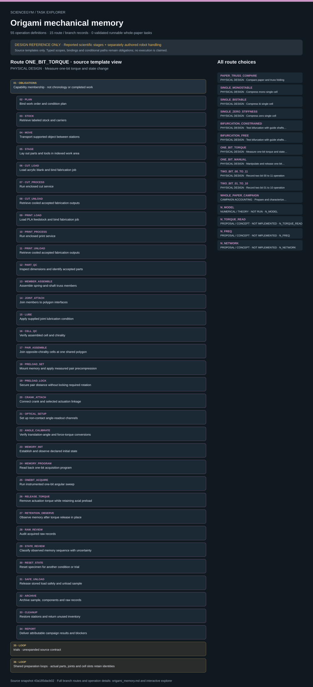

# Origami mechanical memory: task route map



Paper: **Origami-based tunable truss structures for non-volatile mechanical memory operation** · [DOI](https://doi.org/10.1038/s41467-017-00670-w)

Author/evaluator design reference only; not an actor projection, task runner, solver, physical simulation or execution receipt. Missing inputs stay blocked. Numerical training is not physical self-updating hardware; derived torque is not direct torque measurement.. Counts describe task representation, not experiments or success.

**Reading rule:** rows retain the source display structure only. Membership has no inferred chronology. Where the source supplies a typed body, one unexpanded template is shown; no condition, trial or specimen count is inferred. An unordered obligation group has no inferred chronological edges. Source-reported scientific facts and authored handling are distinct.

[Immutable source task package](https://github.com/openags/ScienceGym/blob/43a185dacb02a979148bee93d5d9559e569086f3/tasks/origami_memory_operations_v2/) · [Interactive inspector](../index.html)

## PAPER_TRUSS_COMPARE — PHYSICAL DESIGN · Compare paper and truss folding

Author/evaluator design reference only; not an actor projection, task runner, solver, physical simulation or execution receipt. Missing inputs stay blocked. Numerical training is not physical self-updating hardware; derived torque is not direct torque measurement. Typed bodies are unexpanded templates, with source-declared nesting, bindings and concurrency retained. Campaigns preserve independent branch identities.

[Exact route source](https://github.com/openags/ScienceGym/blob/43a185dacb02a979148bee93d5d9559e569086f3/tasks/origami_memory_operations_v2/branches.json) · JSON pointer: `/branches/0`

- **OBLIGATIONS: Capability membership · not chronology or completed work**
  - Binding: {"order":"Source operation membership only. Apply scoped dependencies and conditional gates; no list adjacency is a causal edge."}
  - `PLAN` Bind work order and condition plan
  - `STOCK` Retrieve labeled stock and carriers
  - `MOVE` Transport supported object between stations
  - `STAGE` Lay out parts and tools in indexed work area
  - `CUT_LOAD` Load acrylic blank and bind fabrication job
  - `CUT_PROCESS` Run enclosed cut service
  - `CUT_UNLOAD` Retrieve cooled accepted fabrication outputs
  - `PRINT_LOAD` Load PLA feedstock and bind fabrication job
  - `PRINT_PROCESS` Run enclosed print service
  - `PRINT_UNLOAD` Retrieve cooled accepted fabrication outputs
  - `PART_QC` Inspect dimensions and identify accepted parts
  - `MEMBER_ASSEMBLE` Assemble spring-and-shaft truss members
  - `JOINT_ATTACH` Join members to polygon interfaces
  - `LUBE` Apply supplied joint lubrication condition
  - `CELL_QC` Verify assembled cell and chirality
  - `PAPER_CUT` Prepare paper net from qualified pattern
  - `PAPER_FOLD` Fold and join paper demonstrator
  - `COMPARE_SETUP` Start comparison observation before manipulation
  - `COMPARE_FOLD` Manipulate paper and truss comparators
  - `COMPARE_OBSERVE` Observe paper/truss deformation in place
  - `RESET_STATE` Reset specimen for another condition or trial
  - `SAFE_UNLOAD` Release stored load safely and unload sample
  - `ARCHIVE` Archive sample, components and raw records
  - `CLEANUP` Restore stations and return unused inventory
  - `REPORT` Deliver attributable campaign results and blockers
- **LOOP: trials · unexpanded source contract**
  - Binding: {"source_contract":{"loop_id":"trials","iterator":"trial_id","values":null,"values_from":"episode.repetition_plan.trials","cardinality":"positive_integer_required","reset_between":"RESET_STATE","identity":"trial ID is not specimen ID","failure_policy":"Keep all attempts chronologically; failures are not zero measurements; retry links predecessor and does not erase it","body":["COMPARE_SETUP","COMPARE_FOLD","COMPARE_OBSERVE","RESET_STATE"]}}
- **LOOP: Shared preparation loops · actual parts, joints and cell slots retain identities**
  - Binding: {"source_contract":[{"iterator":"part_id","values_from":"qualified_BOM","body":["PART_QC"]},{"iterator":"member_id","values_from":"qualified_member_manifest","body":["MEMBER_ASSEMBLE"]},{"iterator":"joint_id","values_from":"qualified_joint_manifest","body":["JOINT_ATTACH"]},{"iterator":"cell_slot","values_from":"selected_assembly_geometry_card","body":["CELL_QC"],"warning":"shared plates keep single identities; card supplies number of parts"}]}

<details><summary>Branch state, choices, lineage and loop obligations</summary>

```json
{
  "id": "PAPER_TRUSS_COMPARE",
  "title": "Compare paper and truss folding",
  "family_ids": [
    "F_PREP",
    "F_COMPARE"
  ],
  "geometry_ids": [
    "BI",
    "PAPER_UNSPECIFIED"
  ],
  "operation_ids": [
    "PLAN",
    "STOCK",
    "MOVE",
    "STAGE",
    "CUT_LOAD",
    "CUT_PROCESS",
    "CUT_UNLOAD",
    "PRINT_LOAD",
    "PRINT_PROCESS",
    "PRINT_UNLOAD",
    "PART_QC",
    "MEMBER_ASSEMBLE",
    "JOINT_ATTACH",
    "LUBE",
    "CELL_QC",
    "PAPER_CUT",
    "PAPER_FOLD",
    "COMPARE_SETUP",
    "COMPARE_FOLD",
    "COMPARE_OBSERVE",
    "RESET_STATE",
    "SAFE_UNLOAD",
    "ARCHIVE",
    "CLEANUP",
    "REPORT"
  ],
  "condition_card": {
    "specimen_conditions": [
      "paper",
      "truss"
    ],
    "comparison": "qualitative_shape_only",
    "paper_geometry": "unknown_do_not_inherit_truss_dimensions",
    "truss_geometry_selection": "Task uses the documented BI prototype geometry as a qualified comparison choice; Movie 1 does not independently establish its specimen dimensions"
  },
  "loops": [
    {
      "loop_id": "trials",
      "iterator": "trial_id",
      "values": null,
      "values_from": "episode.repetition_plan.trials",
      "cardinality": "positive_integer_required",
      "reset_between": "RESET_STATE",
      "identity": "trial ID is not specimen ID",
      "failure_policy": "Keep all attempts chronologically; failures are not zero measurements; retry links predecessor and does not erase it",
      "body": [
        "COMPARE_SETUP",
        "COMPARE_FOLD",
        "COMPARE_OBSERVE",
        "RESET_STATE"
      ]
    }
  ],
  "required_input_ids": [
    "U_FAB",
    "U_GEOMETRY",
    "U_JOINT",
    "U_LUBE",
    "U_ONEPROGRAM",
    "U_PAPER",
    "U_REPEAT",
    "U_RESET",
    "U_ROBOT",
    "U_STATE"
  ],
  "evidence_ids": [
    "E_MOV1"
  ],
  "goal": "Compare paper and truss folding with attributable observations and safe station closure",
  "preparation_requirement": "Robot performs selected fabrication and all assembly. A preassembled handoff is permitted only if the episode explicitly changes preparation scope, with actual identity and receipt. It cannot count as fabricated.",
  "completion": "Each required selected condition has valid acquired evidence and closure; a source-gap stop is partial, not experimental completion",
  "source_repetition_count": null,
  "specimen_allocation": "supplied episode card; no historical same-specimen reuse inferred"
}
```

</details>

## SINGLE_MONOSTABLE — PHYSICAL DESIGN · Compress mono single cell

Author/evaluator design reference only; not an actor projection, task runner, solver, physical simulation or execution receipt. Missing inputs stay blocked. Numerical training is not physical self-updating hardware; derived torque is not direct torque measurement. Typed bodies are unexpanded templates, with source-declared nesting, bindings and concurrency retained. Campaigns preserve independent branch identities.

[Exact route source](https://github.com/openags/ScienceGym/blob/43a185dacb02a979148bee93d5d9559e569086f3/tasks/origami_memory_operations_v2/branches.json) · JSON pointer: `/branches/1`

- **OBLIGATIONS: Capability membership · not chronology or completed work**
  - Binding: {"order":"Source operation membership only. Apply scoped dependencies and conditional gates; no list adjacency is a causal edge."}
  - `PLAN` Bind work order and condition plan
  - `STOCK` Retrieve labeled stock and carriers
  - `MOVE` Transport supported object between stations
  - `STAGE` Lay out parts and tools in indexed work area
  - `CUT_LOAD` Load acrylic blank and bind fabrication job
  - `CUT_PROCESS` Run enclosed cut service
  - `CUT_UNLOAD` Retrieve cooled accepted fabrication outputs
  - `PRINT_LOAD` Load PLA feedstock and bind fabrication job
  - `PRINT_PROCESS` Run enclosed print service
  - `PRINT_UNLOAD` Retrieve cooled accepted fabrication outputs
  - `PART_QC` Inspect dimensions and identify accepted parts
  - `MEMBER_ASSEMBLE` Assemble spring-and-shaft truss members
  - `JOINT_ATTACH` Join members to polygon interfaces
  - `LUBE` Apply supplied joint lubrication condition
  - `CELL_QC` Verify assembled cell and chirality
  - `SENSOR_SETUP` Connect force and stage measurement channels
  - `CALIBRATE` Verify force/displacement baseline and calibration
  - `CELL_MOUNT` Mount single cell on horizontal load frame
  - `MOUNT_CHECK` Verify mounted baseline and boundary freedom
  - `PROGRAM_CONFIG` Configure bounded compression program
  - `COMPRESSION_ACQUIRE` Execute and record one compression trace
  - `COMPRESSION_RETRACT` Return compression fixture through safe reset
  - `RAW_REVIEW` Audit acquired raw records
  - `DERIVE_WORK` Derive normalized work and repeat summaries
  - `RESET_STATE` Reset specimen for another condition or trial
  - `SAFE_UNLOAD` Release stored load safely and unload sample
  - `ARCHIVE` Archive sample, components and raw records
  - `CLEANUP` Restore stations and return unused inventory
  - `REPORT` Deliver attributable campaign results and blockers
- **LOOP: trials · unexpanded source contract**
  - Binding: {"source_contract":{"loop_id":"trials","iterator":"trial_id","values":null,"values_from":"episode.repetition_plan.trials","cardinality":"positive_integer_required","reset_between":"RESET_STATE","identity":"trial ID is not specimen ID","failure_policy":"Keep all attempts chronologically; failures are not zero measurements; retry links predecessor and does not erase it","body":["PROGRAM_CONFIG","COMPRESSION_ACQUIRE","COMPRESSION_RETRACT","RAW_REVIEW","RESET_STATE"]}}
- **LOOP: Shared preparation loops · actual parts, joints and cell slots retain identities**
  - Binding: {"source_contract":[{"iterator":"part_id","values_from":"qualified_BOM","body":["PART_QC"]},{"iterator":"member_id","values_from":"qualified_member_manifest","body":["MEMBER_ASSEMBLE"]},{"iterator":"joint_id","values_from":"qualified_joint_manifest","body":["JOINT_ATTACH"]},{"iterator":"cell_slot","values_from":"selected_assembly_geometry_card","body":["CELL_QC"],"warning":"shared plates keep single identities; card supplies number of parts"}]}

<details><summary>Branch state, choices, lineage and loop obligations</summary>

```json
{
  "id": "SINGLE_MONOSTABLE",
  "title": "Compress mono single cell",
  "family_ids": [
    "F_PREP",
    "F_COMP"
  ],
  "geometry_ids": [
    "MONO"
  ],
  "operation_ids": [
    "PLAN",
    "STOCK",
    "MOVE",
    "STAGE",
    "CUT_LOAD",
    "CUT_PROCESS",
    "CUT_UNLOAD",
    "PRINT_LOAD",
    "PRINT_PROCESS",
    "PRINT_UNLOAD",
    "PART_QC",
    "MEMBER_ASSEMBLE",
    "JOINT_ATTACH",
    "LUBE",
    "CELL_QC",
    "SENSOR_SETUP",
    "CALIBRATE",
    "CELL_MOUNT",
    "MOUNT_CHECK",
    "PROGRAM_CONFIG",
    "COMPRESSION_ACQUIRE",
    "COMPRESSION_RETRACT",
    "RAW_REVIEW",
    "DERIVE_WORK",
    "RESET_STATE",
    "SAFE_UNLOAD",
    "ARCHIVE",
    "CLEANUP",
    "REPORT"
  ],
  "condition_card": {
    "geometry": "MONO",
    "right_boundary": "fixed_axial_and_rotational",
    "left_boundary": "free_rotation_controlled_translation",
    "range": "qualified_card_not_source_plot_extent"
  },
  "loops": [
    {
      "loop_id": "trials",
      "iterator": "trial_id",
      "values": null,
      "values_from": "episode.repetition_plan.trials",
      "cardinality": "positive_integer_required",
      "reset_between": "RESET_STATE",
      "identity": "trial ID is not specimen ID",
      "failure_policy": "Keep all attempts chronologically; failures are not zero measurements; retry links predecessor and does not erase it",
      "body": [
        "PROGRAM_CONFIG",
        "COMPRESSION_ACQUIRE",
        "COMPRESSION_RETRACT",
        "RAW_REVIEW",
        "RESET_STATE"
      ]
    }
  ],
  "required_input_ids": [
    "U_CAL",
    "U_COMP",
    "U_FAB",
    "U_GEOMETRY",
    "U_JOINT",
    "U_LUBE",
    "U_PROCESS",
    "U_REPEAT",
    "U_RESET",
    "U_ROBOT"
  ],
  "evidence_ids": [
    "E_COMP",
    "E_STIFF"
  ],
  "goal": "Compress mono single cell with attributable observations and safe station closure",
  "preparation_requirement": "Robot performs selected fabrication and all assembly. A preassembled handoff is permitted only if the episode explicitly changes preparation scope, with actual identity and receipt. It cannot count as fabricated.",
  "completion": "Each required selected condition has valid acquired evidence and closure; a source-gap stop is partial, not experimental completion",
  "source_repetition_count": null,
  "specimen_allocation": "supplied episode card; no historical same-specimen reuse inferred"
}
```

</details>

## SINGLE_BISTABLE — PHYSICAL DESIGN · Compress bi single cell

Author/evaluator design reference only; not an actor projection, task runner, solver, physical simulation or execution receipt. Missing inputs stay blocked. Numerical training is not physical self-updating hardware; derived torque is not direct torque measurement. Typed bodies are unexpanded templates, with source-declared nesting, bindings and concurrency retained. Campaigns preserve independent branch identities.

[Exact route source](https://github.com/openags/ScienceGym/blob/43a185dacb02a979148bee93d5d9559e569086f3/tasks/origami_memory_operations_v2/branches.json) · JSON pointer: `/branches/2`

- **OBLIGATIONS: Capability membership · not chronology or completed work**
  - Binding: {"order":"Source operation membership only. Apply scoped dependencies and conditional gates; no list adjacency is a causal edge."}
  - `PLAN` Bind work order and condition plan
  - `STOCK` Retrieve labeled stock and carriers
  - `MOVE` Transport supported object between stations
  - `STAGE` Lay out parts and tools in indexed work area
  - `CUT_LOAD` Load acrylic blank and bind fabrication job
  - `CUT_PROCESS` Run enclosed cut service
  - `CUT_UNLOAD` Retrieve cooled accepted fabrication outputs
  - `PRINT_LOAD` Load PLA feedstock and bind fabrication job
  - `PRINT_PROCESS` Run enclosed print service
  - `PRINT_UNLOAD` Retrieve cooled accepted fabrication outputs
  - `PART_QC` Inspect dimensions and identify accepted parts
  - `MEMBER_ASSEMBLE` Assemble spring-and-shaft truss members
  - `JOINT_ATTACH` Join members to polygon interfaces
  - `LUBE` Apply supplied joint lubrication condition
  - `CELL_QC` Verify assembled cell and chirality
  - `SENSOR_SETUP` Connect force and stage measurement channels
  - `CALIBRATE` Verify force/displacement baseline and calibration
  - `CELL_MOUNT` Mount single cell on horizontal load frame
  - `MOUNT_CHECK` Verify mounted baseline and boundary freedom
  - `PROGRAM_CONFIG` Configure bounded compression program
  - `COMPRESSION_ACQUIRE` Execute and record one compression trace
  - `COMPRESSION_RETRACT` Return compression fixture through safe reset
  - `RAW_REVIEW` Audit acquired raw records
  - `DERIVE_WORK` Derive normalized work and repeat summaries
  - `RESET_STATE` Reset specimen for another condition or trial
  - `SAFE_UNLOAD` Release stored load safely and unload sample
  - `ARCHIVE` Archive sample, components and raw records
  - `CLEANUP` Restore stations and return unused inventory
  - `REPORT` Deliver attributable campaign results and blockers
- **LOOP: trials · unexpanded source contract**
  - Binding: {"source_contract":{"loop_id":"trials","iterator":"trial_id","values":null,"values_from":"episode.repetition_plan.trials","cardinality":"positive_integer_required","reset_between":"RESET_STATE","identity":"trial ID is not specimen ID","failure_policy":"Keep all attempts chronologically; failures are not zero measurements; retry links predecessor and does not erase it","body":["PROGRAM_CONFIG","COMPRESSION_ACQUIRE","COMPRESSION_RETRACT","RAW_REVIEW","RESET_STATE"]}}
- **LOOP: Shared preparation loops · actual parts, joints and cell slots retain identities**
  - Binding: {"source_contract":[{"iterator":"part_id","values_from":"qualified_BOM","body":["PART_QC"]},{"iterator":"member_id","values_from":"qualified_member_manifest","body":["MEMBER_ASSEMBLE"]},{"iterator":"joint_id","values_from":"qualified_joint_manifest","body":["JOINT_ATTACH"]},{"iterator":"cell_slot","values_from":"selected_assembly_geometry_card","body":["CELL_QC"],"warning":"shared plates keep single identities; card supplies number of parts"}]}

<details><summary>Branch state, choices, lineage and loop obligations</summary>

```json
{
  "id": "SINGLE_BISTABLE",
  "title": "Compress bi single cell",
  "family_ids": [
    "F_PREP",
    "F_COMP"
  ],
  "geometry_ids": [
    "BI"
  ],
  "operation_ids": [
    "PLAN",
    "STOCK",
    "MOVE",
    "STAGE",
    "CUT_LOAD",
    "CUT_PROCESS",
    "CUT_UNLOAD",
    "PRINT_LOAD",
    "PRINT_PROCESS",
    "PRINT_UNLOAD",
    "PART_QC",
    "MEMBER_ASSEMBLE",
    "JOINT_ATTACH",
    "LUBE",
    "CELL_QC",
    "SENSOR_SETUP",
    "CALIBRATE",
    "CELL_MOUNT",
    "MOUNT_CHECK",
    "PROGRAM_CONFIG",
    "COMPRESSION_ACQUIRE",
    "COMPRESSION_RETRACT",
    "RAW_REVIEW",
    "DERIVE_WORK",
    "RESET_STATE",
    "SAFE_UNLOAD",
    "ARCHIVE",
    "CLEANUP",
    "REPORT"
  ],
  "condition_card": {
    "geometry": "BI",
    "right_boundary": "fixed_axial_and_rotational",
    "left_boundary": "free_rotation_controlled_translation",
    "range": "qualified_card_not_source_plot_extent"
  },
  "loops": [
    {
      "loop_id": "trials",
      "iterator": "trial_id",
      "values": null,
      "values_from": "episode.repetition_plan.trials",
      "cardinality": "positive_integer_required",
      "reset_between": "RESET_STATE",
      "identity": "trial ID is not specimen ID",
      "failure_policy": "Keep all attempts chronologically; failures are not zero measurements; retry links predecessor and does not erase it",
      "body": [
        "PROGRAM_CONFIG",
        "COMPRESSION_ACQUIRE",
        "COMPRESSION_RETRACT",
        "RAW_REVIEW",
        "RESET_STATE"
      ]
    }
  ],
  "required_input_ids": [
    "U_CAL",
    "U_COMP",
    "U_FAB",
    "U_GEOMETRY",
    "U_JOINT",
    "U_LUBE",
    "U_PROCESS",
    "U_REPEAT",
    "U_RESET",
    "U_ROBOT"
  ],
  "evidence_ids": [
    "E_COMP",
    "E_STIFF"
  ],
  "goal": "Compress bi single cell with attributable observations and safe station closure",
  "preparation_requirement": "Robot performs selected fabrication and all assembly. A preassembled handoff is permitted only if the episode explicitly changes preparation scope, with actual identity and receipt. It cannot count as fabricated.",
  "completion": "Each required selected condition has valid acquired evidence and closure; a source-gap stop is partial, not experimental completion",
  "source_repetition_count": null,
  "specimen_allocation": "supplied episode card; no historical same-specimen reuse inferred"
}
```

</details>

## SINGLE_ZERO_STIFFNESS — PHYSICAL DESIGN · Compress zero single cell

Author/evaluator design reference only; not an actor projection, task runner, solver, physical simulation or execution receipt. Missing inputs stay blocked. Numerical training is not physical self-updating hardware; derived torque is not direct torque measurement. Typed bodies are unexpanded templates, with source-declared nesting, bindings and concurrency retained. Campaigns preserve independent branch identities.

[Exact route source](https://github.com/openags/ScienceGym/blob/43a185dacb02a979148bee93d5d9559e569086f3/tasks/origami_memory_operations_v2/branches.json) · JSON pointer: `/branches/3`

- **OBLIGATIONS: Capability membership · not chronology or completed work**
  - Binding: {"order":"Source operation membership only. Apply scoped dependencies and conditional gates; no list adjacency is a causal edge."}
  - `PLAN` Bind work order and condition plan
  - `STOCK` Retrieve labeled stock and carriers
  - `MOVE` Transport supported object between stations
  - `STAGE` Lay out parts and tools in indexed work area
  - `CUT_LOAD` Load acrylic blank and bind fabrication job
  - `CUT_PROCESS` Run enclosed cut service
  - `CUT_UNLOAD` Retrieve cooled accepted fabrication outputs
  - `PRINT_LOAD` Load PLA feedstock and bind fabrication job
  - `PRINT_PROCESS` Run enclosed print service
  - `PRINT_UNLOAD` Retrieve cooled accepted fabrication outputs
  - `PART_QC` Inspect dimensions and identify accepted parts
  - `MEMBER_ASSEMBLE` Assemble spring-and-shaft truss members
  - `JOINT_ATTACH` Join members to polygon interfaces
  - `LUBE` Apply supplied joint lubrication condition
  - `CELL_QC` Verify assembled cell and chirality
  - `SENSOR_SETUP` Connect force and stage measurement channels
  - `CALIBRATE` Verify force/displacement baseline and calibration
  - `CELL_MOUNT` Mount single cell on horizontal load frame
  - `MOUNT_CHECK` Verify mounted baseline and boundary freedom
  - `PROGRAM_CONFIG` Configure bounded compression program
  - `COMPRESSION_ACQUIRE` Execute and record one compression trace
  - `COMPRESSION_RETRACT` Return compression fixture through safe reset
  - `RAW_REVIEW` Audit acquired raw records
  - `DERIVE_WORK` Derive normalized work and repeat summaries
  - `RESET_STATE` Reset specimen for another condition or trial
  - `SAFE_UNLOAD` Release stored load safely and unload sample
  - `ARCHIVE` Archive sample, components and raw records
  - `CLEANUP` Restore stations and return unused inventory
  - `REPORT` Deliver attributable campaign results and blockers
- **LOOP: trials · unexpanded source contract**
  - Binding: {"source_contract":{"loop_id":"trials","iterator":"trial_id","values":null,"values_from":"episode.repetition_plan.trials","cardinality":"positive_integer_required","reset_between":"RESET_STATE","identity":"trial ID is not specimen ID","failure_policy":"Keep all attempts chronologically; failures are not zero measurements; retry links predecessor and does not erase it","body":["PROGRAM_CONFIG","COMPRESSION_ACQUIRE","COMPRESSION_RETRACT","RAW_REVIEW","RESET_STATE"]}}
- **LOOP: Shared preparation loops · actual parts, joints and cell slots retain identities**
  - Binding: {"source_contract":[{"iterator":"part_id","values_from":"qualified_BOM","body":["PART_QC"]},{"iterator":"member_id","values_from":"qualified_member_manifest","body":["MEMBER_ASSEMBLE"]},{"iterator":"joint_id","values_from":"qualified_joint_manifest","body":["JOINT_ATTACH"]},{"iterator":"cell_slot","values_from":"selected_assembly_geometry_card","body":["CELL_QC"],"warning":"shared plates keep single identities; card supplies number of parts"}]}

<details><summary>Branch state, choices, lineage and loop obligations</summary>

```json
{
  "id": "SINGLE_ZERO_STIFFNESS",
  "title": "Compress zero single cell",
  "family_ids": [
    "F_PREP",
    "F_COMP"
  ],
  "geometry_ids": [
    "ZERO"
  ],
  "operation_ids": [
    "PLAN",
    "STOCK",
    "MOVE",
    "STAGE",
    "CUT_LOAD",
    "CUT_PROCESS",
    "CUT_UNLOAD",
    "PRINT_LOAD",
    "PRINT_PROCESS",
    "PRINT_UNLOAD",
    "PART_QC",
    "MEMBER_ASSEMBLE",
    "JOINT_ATTACH",
    "LUBE",
    "CELL_QC",
    "SENSOR_SETUP",
    "CALIBRATE",
    "CELL_MOUNT",
    "MOUNT_CHECK",
    "PROGRAM_CONFIG",
    "COMPRESSION_ACQUIRE",
    "COMPRESSION_RETRACT",
    "RAW_REVIEW",
    "DERIVE_WORK",
    "RESET_STATE",
    "SAFE_UNLOAD",
    "ARCHIVE",
    "CLEANUP",
    "REPORT"
  ],
  "condition_card": {
    "geometry": "ZERO",
    "right_boundary": "fixed_axial_and_rotational",
    "left_boundary": "free_rotation_controlled_translation",
    "range": "qualified_card_not_source_plot_extent"
  },
  "loops": [
    {
      "loop_id": "trials",
      "iterator": "trial_id",
      "values": null,
      "values_from": "episode.repetition_plan.trials",
      "cardinality": "positive_integer_required",
      "reset_between": "RESET_STATE",
      "identity": "trial ID is not specimen ID",
      "failure_policy": "Keep all attempts chronologically; failures are not zero measurements; retry links predecessor and does not erase it",
      "body": [
        "PROGRAM_CONFIG",
        "COMPRESSION_ACQUIRE",
        "COMPRESSION_RETRACT",
        "RAW_REVIEW",
        "RESET_STATE"
      ]
    }
  ],
  "required_input_ids": [
    "U_CAL",
    "U_COMP",
    "U_FAB",
    "U_GEOMETRY",
    "U_JOINT",
    "U_LUBE",
    "U_PROCESS",
    "U_REPEAT",
    "U_RESET",
    "U_ROBOT"
  ],
  "evidence_ids": [
    "E_COMP",
    "E_STIFF"
  ],
  "goal": "Compress zero single cell with attributable observations and safe station closure",
  "preparation_requirement": "Robot performs selected fabrication and all assembly. A preassembled handoff is permitted only if the episode explicitly changes preparation scope, with actual identity and receipt. It cannot count as fabricated.",
  "completion": "Each required selected condition has valid acquired evidence and closure; a source-gap stop is partial, not experimental completion",
  "source_repetition_count": null,
  "specimen_allocation": "supplied episode card; no historical same-specimen reuse inferred"
}
```

</details>

## BIFURCATION_CONSTRAINED — PHYSICAL DESIGN · Test bifurcation with guide shafts installed

Author/evaluator design reference only; not an actor projection, task runner, solver, physical simulation or execution receipt. Missing inputs stay blocked. Numerical training is not physical self-updating hardware; derived torque is not direct torque measurement. Typed bodies are unexpanded templates, with source-declared nesting, bindings and concurrency retained. Campaigns preserve independent branch identities.

[Exact route source](https://github.com/openags/ScienceGym/blob/43a185dacb02a979148bee93d5d9559e569086f3/tasks/origami_memory_operations_v2/branches.json) · JSON pointer: `/branches/4`

- **OBLIGATIONS: Capability membership · not chronology or completed work**
  - Binding: {"order":"Source operation membership only. Apply scoped dependencies and conditional gates; no list adjacency is a causal edge."}
  - `PLAN` Bind work order and condition plan
  - `STOCK` Retrieve labeled stock and carriers
  - `MOVE` Transport supported object between stations
  - `STAGE` Lay out parts and tools in indexed work area
  - `CUT_LOAD` Load acrylic blank and bind fabrication job
  - `CUT_PROCESS` Run enclosed cut service
  - `CUT_UNLOAD` Retrieve cooled accepted fabrication outputs
  - `PRINT_LOAD` Load PLA feedstock and bind fabrication job
  - `PRINT_PROCESS` Run enclosed print service
  - `PRINT_UNLOAD` Retrieve cooled accepted fabrication outputs
  - `PART_QC` Inspect dimensions and identify accepted parts
  - `MEMBER_ASSEMBLE` Assemble spring-and-shaft truss members
  - `JOINT_ATTACH` Join members to polygon interfaces
  - `LUBE` Apply supplied joint lubrication condition
  - `CELL_QC` Verify assembled cell and chirality
  - `SENSOR_SETUP` Connect force and stage measurement channels
  - `CALIBRATE` Verify force/displacement baseline and calibration
  - `CELL_MOUNT` Mount single cell on horizontal load frame
  - `GUIDE_CONFIG` Set actual constrained or free rotational boundary
  - `MOUNT_CHECK` Verify mounted baseline and boundary freedom
  - `PROGRAM_CONFIG` Configure bounded compression program
  - `COMPRESSION_ACQUIRE` Execute and record one compression trace
  - `COMPRESSION_RETRACT` Return compression fixture through safe reset
  - `RAW_REVIEW` Audit acquired raw records
  - `DERIVE_WORK` Derive normalized work and repeat summaries
  - `RESET_STATE` Reset specimen for another condition or trial
  - `SAFE_UNLOAD` Release stored load safely and unload sample
  - `ARCHIVE` Archive sample, components and raw records
  - `CLEANUP` Restore stations and return unused inventory
  - `REPORT` Deliver attributable campaign results and blockers
- **LOOP: trials · unexpanded source contract**
  - Binding: {"source_contract":{"loop_id":"trials","iterator":"trial_id","values":null,"values_from":"episode.repetition_plan.trials","cardinality":"positive_integer_required","reset_between":"RESET_STATE","identity":"trial ID is not specimen ID","failure_policy":"Keep all attempts chronologically; failures are not zero measurements; retry links predecessor and does not erase it","body":["MOUNT_CHECK","PROGRAM_CONFIG","COMPRESSION_ACQUIRE","COMPRESSION_RETRACT","RAW_REVIEW","RESET_STATE"]}}
- **LOOP: Shared preparation loops · actual parts, joints and cell slots retain identities**
  - Binding: {"source_contract":[{"iterator":"part_id","values_from":"qualified_BOM","body":["PART_QC"]},{"iterator":"member_id","values_from":"qualified_member_manifest","body":["MEMBER_ASSEMBLE"]},{"iterator":"joint_id","values_from":"qualified_joint_manifest","body":["JOINT_ATTACH"]},{"iterator":"cell_slot","values_from":"selected_assembly_geometry_card","body":["CELL_QC"],"warning":"shared plates keep single identities; card supplies number of parts"}]}

<details><summary>Branch state, choices, lineage and loop obligations</summary>

```json
{
  "id": "BIFURCATION_CONSTRAINED",
  "title": "Test bifurcation with guide shafts installed",
  "family_ids": [
    "F_PREP",
    "F_BIF"
  ],
  "geometry_ids": [
    "BIF"
  ],
  "operation_ids": [
    "PLAN",
    "STOCK",
    "MOVE",
    "STAGE",
    "CUT_LOAD",
    "CUT_PROCESS",
    "CUT_UNLOAD",
    "PRINT_LOAD",
    "PRINT_PROCESS",
    "PRINT_UNLOAD",
    "PART_QC",
    "MEMBER_ASSEMBLE",
    "JOINT_ATTACH",
    "LUBE",
    "CELL_QC",
    "SENSOR_SETUP",
    "CALIBRATE",
    "CELL_MOUNT",
    "GUIDE_CONFIG",
    "MOUNT_CHECK",
    "PROGRAM_CONFIG",
    "COMPRESSION_ACQUIRE",
    "COMPRESSION_RETRACT",
    "RAW_REVIEW",
    "DERIVE_WORK",
    "RESET_STATE",
    "SAFE_UNLOAD",
    "ARCHIVE",
    "CLEANUP",
    "REPORT"
  ],
  "condition_card": {
    "geometry": "BIF",
    "guide_condition": "guide_shafts_installed",
    "free_twist_sign": "observed_not_forced"
  },
  "loops": [
    {
      "loop_id": "trials",
      "iterator": "trial_id",
      "values": null,
      "values_from": "episode.repetition_plan.trials",
      "cardinality": "positive_integer_required",
      "reset_between": "RESET_STATE",
      "identity": "trial ID is not specimen ID",
      "failure_policy": "Keep all attempts chronologically; failures are not zero measurements; retry links predecessor and does not erase it",
      "body": [
        "MOUNT_CHECK",
        "PROGRAM_CONFIG",
        "COMPRESSION_ACQUIRE",
        "COMPRESSION_RETRACT",
        "RAW_REVIEW",
        "RESET_STATE"
      ]
    }
  ],
  "required_input_ids": [
    "U_CAL",
    "U_COMP",
    "U_FAB",
    "U_GEOMETRY",
    "U_GUIDE",
    "U_JOINT",
    "U_LUBE",
    "U_PROCESS",
    "U_REPEAT",
    "U_RESET",
    "U_ROBOT"
  ],
  "evidence_ids": [
    "E_BIF"
  ],
  "goal": "Test bifurcation with guide shafts installed with attributable observations and safe station closure",
  "preparation_requirement": "Robot performs selected fabrication and all assembly. A preassembled handoff is permitted only if the episode explicitly changes preparation scope, with actual identity and receipt. It cannot count as fabricated.",
  "completion": "Each required selected condition has valid acquired evidence and closure; a source-gap stop is partial, not experimental completion",
  "source_repetition_count": null,
  "specimen_allocation": "supplied episode card; no historical same-specimen reuse inferred"
}
```

</details>

## BIFURCATION_FREE — PHYSICAL DESIGN · Test bifurcation with guide shafts removed

Author/evaluator design reference only; not an actor projection, task runner, solver, physical simulation or execution receipt. Missing inputs stay blocked. Numerical training is not physical self-updating hardware; derived torque is not direct torque measurement. Typed bodies are unexpanded templates, with source-declared nesting, bindings and concurrency retained. Campaigns preserve independent branch identities.

[Exact route source](https://github.com/openags/ScienceGym/blob/43a185dacb02a979148bee93d5d9559e569086f3/tasks/origami_memory_operations_v2/branches.json) · JSON pointer: `/branches/5`

- **OBLIGATIONS: Capability membership · not chronology or completed work**
  - Binding: {"order":"Source operation membership only. Apply scoped dependencies and conditional gates; no list adjacency is a causal edge."}
  - `PLAN` Bind work order and condition plan
  - `STOCK` Retrieve labeled stock and carriers
  - `MOVE` Transport supported object between stations
  - `STAGE` Lay out parts and tools in indexed work area
  - `CUT_LOAD` Load acrylic blank and bind fabrication job
  - `CUT_PROCESS` Run enclosed cut service
  - `CUT_UNLOAD` Retrieve cooled accepted fabrication outputs
  - `PRINT_LOAD` Load PLA feedstock and bind fabrication job
  - `PRINT_PROCESS` Run enclosed print service
  - `PRINT_UNLOAD` Retrieve cooled accepted fabrication outputs
  - `PART_QC` Inspect dimensions and identify accepted parts
  - `MEMBER_ASSEMBLE` Assemble spring-and-shaft truss members
  - `JOINT_ATTACH` Join members to polygon interfaces
  - `LUBE` Apply supplied joint lubrication condition
  - `CELL_QC` Verify assembled cell and chirality
  - `SENSOR_SETUP` Connect force and stage measurement channels
  - `CALIBRATE` Verify force/displacement baseline and calibration
  - `CELL_MOUNT` Mount single cell on horizontal load frame
  - `GUIDE_CONFIG` Set actual constrained or free rotational boundary
  - `MOUNT_CHECK` Verify mounted baseline and boundary freedom
  - `PROGRAM_CONFIG` Configure bounded compression program
  - `COMPRESSION_ACQUIRE` Execute and record one compression trace
  - `COMPRESSION_RETRACT` Return compression fixture through safe reset
  - `RAW_REVIEW` Audit acquired raw records
  - `DERIVE_WORK` Derive normalized work and repeat summaries
  - `RESET_STATE` Reset specimen for another condition or trial
  - `SAFE_UNLOAD` Release stored load safely and unload sample
  - `ARCHIVE` Archive sample, components and raw records
  - `CLEANUP` Restore stations and return unused inventory
  - `REPORT` Deliver attributable campaign results and blockers
- **LOOP: trials · unexpanded source contract**
  - Binding: {"source_contract":{"loop_id":"trials","iterator":"trial_id","values":null,"values_from":"episode.repetition_plan.trials","cardinality":"positive_integer_required","reset_between":"RESET_STATE","identity":"trial ID is not specimen ID","failure_policy":"Keep all attempts chronologically; failures are not zero measurements; retry links predecessor and does not erase it","body":["MOUNT_CHECK","PROGRAM_CONFIG","COMPRESSION_ACQUIRE","COMPRESSION_RETRACT","RAW_REVIEW","RESET_STATE"]}}
- **LOOP: Shared preparation loops · actual parts, joints and cell slots retain identities**
  - Binding: {"source_contract":[{"iterator":"part_id","values_from":"qualified_BOM","body":["PART_QC"]},{"iterator":"member_id","values_from":"qualified_member_manifest","body":["MEMBER_ASSEMBLE"]},{"iterator":"joint_id","values_from":"qualified_joint_manifest","body":["JOINT_ATTACH"]},{"iterator":"cell_slot","values_from":"selected_assembly_geometry_card","body":["CELL_QC"],"warning":"shared plates keep single identities; card supplies number of parts"}]}

<details><summary>Branch state, choices, lineage and loop obligations</summary>

```json
{
  "id": "BIFURCATION_FREE",
  "title": "Test bifurcation with guide shafts removed",
  "family_ids": [
    "F_PREP",
    "F_BIF"
  ],
  "geometry_ids": [
    "BIF"
  ],
  "operation_ids": [
    "PLAN",
    "STOCK",
    "MOVE",
    "STAGE",
    "CUT_LOAD",
    "CUT_PROCESS",
    "CUT_UNLOAD",
    "PRINT_LOAD",
    "PRINT_PROCESS",
    "PRINT_UNLOAD",
    "PART_QC",
    "MEMBER_ASSEMBLE",
    "JOINT_ATTACH",
    "LUBE",
    "CELL_QC",
    "SENSOR_SETUP",
    "CALIBRATE",
    "CELL_MOUNT",
    "GUIDE_CONFIG",
    "MOUNT_CHECK",
    "PROGRAM_CONFIG",
    "COMPRESSION_ACQUIRE",
    "COMPRESSION_RETRACT",
    "RAW_REVIEW",
    "DERIVE_WORK",
    "RESET_STATE",
    "SAFE_UNLOAD",
    "ARCHIVE",
    "CLEANUP",
    "REPORT"
  ],
  "condition_card": {
    "geometry": "BIF",
    "guide_condition": "guide_shafts_removed",
    "free_twist_sign": "observed_not_forced"
  },
  "loops": [
    {
      "loop_id": "trials",
      "iterator": "trial_id",
      "values": null,
      "values_from": "episode.repetition_plan.trials",
      "cardinality": "positive_integer_required",
      "reset_between": "RESET_STATE",
      "identity": "trial ID is not specimen ID",
      "failure_policy": "Keep all attempts chronologically; failures are not zero measurements; retry links predecessor and does not erase it",
      "body": [
        "MOUNT_CHECK",
        "PROGRAM_CONFIG",
        "COMPRESSION_ACQUIRE",
        "COMPRESSION_RETRACT",
        "RAW_REVIEW",
        "RESET_STATE"
      ]
    }
  ],
  "required_input_ids": [
    "U_CAL",
    "U_COMP",
    "U_FAB",
    "U_GEOMETRY",
    "U_GUIDE",
    "U_JOINT",
    "U_LUBE",
    "U_PROCESS",
    "U_REPEAT",
    "U_RESET",
    "U_ROBOT"
  ],
  "evidence_ids": [
    "E_BIF"
  ],
  "goal": "Test bifurcation with guide shafts removed with attributable observations and safe station closure",
  "preparation_requirement": "Robot performs selected fabrication and all assembly. A preassembled handoff is permitted only if the episode explicitly changes preparation scope, with actual identity and receipt. It cannot count as fabricated.",
  "completion": "Each required selected condition has valid acquired evidence and closure; a source-gap stop is partial, not experimental completion",
  "source_repetition_count": null,
  "specimen_allocation": "supplied episode card; no historical same-specimen reuse inferred"
}
```

</details>

## ONE_BIT_TORQUE — PHYSICAL DESIGN · Measure one-bit torque and state change

Author/evaluator design reference only; not an actor projection, task runner, solver, physical simulation or execution receipt. Missing inputs stay blocked. Numerical training is not physical self-updating hardware; derived torque is not direct torque measurement. Typed bodies are unexpanded templates, with source-declared nesting, bindings and concurrency retained. Campaigns preserve independent branch identities.

[Exact route source](https://github.com/openags/ScienceGym/blob/43a185dacb02a979148bee93d5d9559e569086f3/tasks/origami_memory_operations_v2/branches.json) · JSON pointer: `/branches/6`

- **OBLIGATIONS: Capability membership · not chronology or completed work**
  - Binding: {"order":"Source operation membership only. Apply scoped dependencies and conditional gates; no list adjacency is a causal edge."}
  - `PLAN` Bind work order and condition plan
  - `STOCK` Retrieve labeled stock and carriers
  - `MOVE` Transport supported object between stations
  - `STAGE` Lay out parts and tools in indexed work area
  - `CUT_LOAD` Load acrylic blank and bind fabrication job
  - `CUT_PROCESS` Run enclosed cut service
  - `CUT_UNLOAD` Retrieve cooled accepted fabrication outputs
  - `PRINT_LOAD` Load PLA feedstock and bind fabrication job
  - `PRINT_PROCESS` Run enclosed print service
  - `PRINT_UNLOAD` Retrieve cooled accepted fabrication outputs
  - `PART_QC` Inspect dimensions and identify accepted parts
  - `MEMBER_ASSEMBLE` Assemble spring-and-shaft truss members
  - `JOINT_ATTACH` Join members to polygon interfaces
  - `LUBE` Apply supplied joint lubrication condition
  - `CELL_QC` Verify assembled cell and chirality
  - `PAIR_ASSEMBLE` Join opposite-chirality cells at one shared polygon
  - `PRELOAD_SET` Mount memory and apply measured pair precompression
  - `PRELOAD_LOCK` Secure pair distance without locking required rotation
  - `CRANK_ATTACH` Connect crank and selected actuation linkage
  - `OPTICAL_SETUP` Set up non-contact angle-readout channels
  - `ANGLE_CALIBRATE` Verify translation-angle and force-torque conversions
  - `MEMORY_INIT` Establish and observe declared initial state
  - `MEMORY_PROGRAM` Read back one-bit acquisition program
  - `ONEBIT_ACQUIRE` Run instrumented one-bit angular sweep
  - `RELEASE_TORQUE` Remove actuation torque while retaining axial preload
  - `RETENTION_OBSERVE` Observe memory after torque release in place
  - `RAW_REVIEW` Audit acquired raw records
  - `STATE_REVIEW` Classify observed memory sequence with uncertainty
  - `RESET_STATE` Reset specimen for another condition or trial
  - `SAFE_UNLOAD` Release stored load safely and unload sample
  - `ARCHIVE` Archive sample, components and raw records
  - `CLEANUP` Restore stations and return unused inventory
  - `REPORT` Deliver attributable campaign results and blockers
- **LOOP: trials · unexpanded source contract**
  - Binding: {"source_contract":{"loop_id":"trials","iterator":"trial_id","values":null,"values_from":"episode.repetition_plan.trials","cardinality":"positive_integer_required","reset_between":"RESET_STATE","identity":"trial ID is not specimen ID","failure_policy":"Keep all attempts chronologically; failures are not zero measurements; retry links predecessor and does not erase it","body":["MEMORY_INIT","MEMORY_PROGRAM","ONEBIT_ACQUIRE","RELEASE_TORQUE","RETENTION_OBSERVE","RAW_REVIEW","STATE_REVIEW","RESET_STATE"]}}
- **LOOP: Shared preparation loops · actual parts, joints and cell slots retain identities**
  - Binding: {"source_contract":[{"iterator":"part_id","values_from":"qualified_BOM","body":["PART_QC"]},{"iterator":"member_id","values_from":"qualified_member_manifest","body":["MEMBER_ASSEMBLE"]},{"iterator":"joint_id","values_from":"qualified_joint_manifest","body":["JOINT_ATTACH"]},{"iterator":"cell_slot","values_from":"selected_assembly_geometry_card","body":["CELL_QC"],"warning":"shared plates keep single identities; card supplies number of parts"}]}

<details><summary>Branch state, choices, lineage and loop obligations</summary>

```json
{
  "id": "ONE_BIT_TORQUE",
  "title": "Measure one-bit torque and state change",
  "family_ids": [
    "F_PREP",
    "F_ONE"
  ],
  "geometry_ids": [
    "MONO",
    "PAIR"
  ],
  "operation_ids": [
    "PLAN",
    "STOCK",
    "MOVE",
    "STAGE",
    "CUT_LOAD",
    "CUT_PROCESS",
    "CUT_UNLOAD",
    "PRINT_LOAD",
    "PRINT_PROCESS",
    "PRINT_UNLOAD",
    "PART_QC",
    "MEMBER_ASSEMBLE",
    "JOINT_ATTACH",
    "LUBE",
    "CELL_QC",
    "PAIR_ASSEMBLE",
    "PRELOAD_SET",
    "PRELOAD_LOCK",
    "CRANK_ATTACH",
    "OPTICAL_SETUP",
    "ANGLE_CALIBRATE",
    "MEMORY_INIT",
    "MEMORY_PROGRAM",
    "ONEBIT_ACQUIRE",
    "RELEASE_TORQUE",
    "RETENTION_OBSERVE",
    "RAW_REVIEW",
    "STATE_REVIEW",
    "RESET_STATE",
    "SAFE_UNLOAD",
    "ARCHIVE",
    "CLEANUP",
    "REPORT"
  ],
  "condition_card": {
    "pair_precompression_mm": 45,
    "primary_source_measured_direction": "0_to_1",
    "extra_reverse_instrumented_attempt": "task_authored_if_requested"
  },
  "loops": [
    {
      "loop_id": "trials",
      "iterator": "trial_id",
      "values": null,
      "values_from": "episode.repetition_plan.trials",
      "cardinality": "positive_integer_required",
      "reset_between": "RESET_STATE",
      "identity": "trial ID is not specimen ID",
      "failure_policy": "Keep all attempts chronologically; failures are not zero measurements; retry links predecessor and does not erase it",
      "body": [
        "MEMORY_INIT",
        "MEMORY_PROGRAM",
        "ONEBIT_ACQUIRE",
        "RELEASE_TORQUE",
        "RETENTION_OBSERVE",
        "RAW_REVIEW",
        "STATE_REVIEW",
        "RESET_STATE"
      ]
    }
  ],
  "required_input_ids": [
    "U_CAL",
    "U_CRANK",
    "U_FAB",
    "U_GEOMETRY",
    "U_JOINT",
    "U_LUBE",
    "U_ONEPROGRAM",
    "U_OPTICAL",
    "U_PRELOAD",
    "U_PROCESS",
    "U_REPEAT",
    "U_RESET",
    "U_RETAIN",
    "U_ROBOT",
    "U_STATE"
  ],
  "evidence_ids": [
    "E_ONE"
  ],
  "goal": "Measure one-bit torque and state change with attributable observations and safe station closure",
  "preparation_requirement": "Robot performs selected fabrication and all assembly. A preassembled handoff is permitted only if the episode explicitly changes preparation scope, with actual identity and receipt. It cannot count as fabricated.",
  "completion": "Each required selected condition has valid acquired evidence and closure; a source-gap stop is partial, not experimental completion",
  "source_repetition_count": null,
  "specimen_allocation": "supplied episode card; no historical same-specimen reuse inferred"
}
```

</details>

## ONE_BIT_MANUAL — PHYSICAL DESIGN · Manipulate and release one-bit memory

Author/evaluator design reference only; not an actor projection, task runner, solver, physical simulation or execution receipt. Missing inputs stay blocked. Numerical training is not physical self-updating hardware; derived torque is not direct torque measurement. Typed bodies are unexpanded templates, with source-declared nesting, bindings and concurrency retained. Campaigns preserve independent branch identities.

[Exact route source](https://github.com/openags/ScienceGym/blob/43a185dacb02a979148bee93d5d9559e569086f3/tasks/origami_memory_operations_v2/branches.json) · JSON pointer: `/branches/7`

- **OBLIGATIONS: Capability membership · not chronology or completed work**
  - Binding: {"order":"Source operation membership only. Apply scoped dependencies and conditional gates; no list adjacency is a causal edge."}
  - `PLAN` Bind work order and condition plan
  - `STOCK` Retrieve labeled stock and carriers
  - `MOVE` Transport supported object between stations
  - `STAGE` Lay out parts and tools in indexed work area
  - `CUT_LOAD` Load acrylic blank and bind fabrication job
  - `CUT_PROCESS` Run enclosed cut service
  - `CUT_UNLOAD` Retrieve cooled accepted fabrication outputs
  - `PRINT_LOAD` Load PLA feedstock and bind fabrication job
  - `PRINT_PROCESS` Run enclosed print service
  - `PRINT_UNLOAD` Retrieve cooled accepted fabrication outputs
  - `PART_QC` Inspect dimensions and identify accepted parts
  - `MEMBER_ASSEMBLE` Assemble spring-and-shaft truss members
  - `JOINT_ATTACH` Join members to polygon interfaces
  - `LUBE` Apply supplied joint lubrication condition
  - `CELL_QC` Verify assembled cell and chirality
  - `PAIR_ASSEMBLE` Join opposite-chirality cells at one shared polygon
  - `PRELOAD_SET` Mount memory and apply measured pair precompression
  - `PRELOAD_LOCK` Secure pair distance without locking required rotation
  - `OPTICAL_SETUP` Set up non-contact angle-readout channels
  - `STATE_SENSOR_CHECK` Verify manual-route state observation channel
  - `MEMORY_INIT` Establish and observe declared initial state
  - `MANUAL_SWITCH` Perform bounded robot one-bit manipulation
  - `RELEASE_TORQUE` Remove actuation torque while retaining axial preload
  - `RETENTION_OBSERVE` Observe memory after torque release in place
  - `STATE_REVIEW` Classify observed memory sequence with uncertainty
  - `RESET_STATE` Reset specimen for another condition or trial
  - `SAFE_UNLOAD` Release stored load safely and unload sample
  - `ARCHIVE` Archive sample, components and raw records
  - `CLEANUP` Restore stations and return unused inventory
  - `REPORT` Deliver attributable campaign results and blockers
- **LOOP: trials · unexpanded source contract**
  - Binding: {"source_contract":{"loop_id":"trials","iterator":"trial_id","values":null,"values_from":"episode.repetition_plan.trials","cardinality":"positive_integer_required","reset_between":"RESET_STATE","identity":"trial ID is not specimen ID","failure_policy":"Keep all attempts chronologically; failures are not zero measurements; retry links predecessor and does not erase it","body":["MEMORY_INIT","MANUAL_SWITCH","RELEASE_TORQUE","RETENTION_OBSERVE","STATE_REVIEW","RESET_STATE"]}}
- **LOOP: Shared preparation loops · actual parts, joints and cell slots retain identities**
  - Binding: {"source_contract":[{"iterator":"part_id","values_from":"qualified_BOM","body":["PART_QC"]},{"iterator":"member_id","values_from":"qualified_member_manifest","body":["MEMBER_ASSEMBLE"]},{"iterator":"joint_id","values_from":"qualified_joint_manifest","body":["JOINT_ATTACH"]},{"iterator":"cell_slot","values_from":"selected_assembly_geometry_card","body":["CELL_QC"],"warning":"shared plates keep single identities; card supplies number of parts"}]}

<details><summary>Branch state, choices, lineage and loop obligations</summary>

```json
{
  "id": "ONE_BIT_MANUAL",
  "title": "Manipulate and release one-bit memory",
  "family_ids": [
    "F_PREP",
    "F_ONE"
  ],
  "geometry_ids": [
    "MONO",
    "PAIR"
  ],
  "operation_ids": [
    "PLAN",
    "STOCK",
    "MOVE",
    "STAGE",
    "CUT_LOAD",
    "CUT_PROCESS",
    "CUT_UNLOAD",
    "PRINT_LOAD",
    "PRINT_PROCESS",
    "PRINT_UNLOAD",
    "PART_QC",
    "MEMBER_ASSEMBLE",
    "JOINT_ATTACH",
    "LUBE",
    "CELL_QC",
    "PAIR_ASSEMBLE",
    "PRELOAD_SET",
    "PRELOAD_LOCK",
    "OPTICAL_SETUP",
    "STATE_SENSOR_CHECK",
    "MEMORY_INIT",
    "MANUAL_SWITCH",
    "RELEASE_TORQUE",
    "RETENTION_OBSERVE",
    "STATE_REVIEW",
    "RESET_STATE",
    "SAFE_UNLOAD",
    "ARCHIVE",
    "CLEANUP",
    "REPORT"
  ],
  "condition_card": {
    "pair_precompression_mm": 45,
    "observed_movie_direction": "sampled_frames_include_1_to_0",
    "state_channel": "qualified_camera_or_optical_card_not_command",
    "torque_release_variant": "grip_released_and_powered_linkage_absent_or_released"
  },
  "loops": [
    {
      "loop_id": "trials",
      "iterator": "trial_id",
      "values": null,
      "values_from": "episode.repetition_plan.trials",
      "cardinality": "positive_integer_required",
      "reset_between": "RESET_STATE",
      "identity": "trial ID is not specimen ID",
      "failure_policy": "Keep all attempts chronologically; failures are not zero measurements; retry links predecessor and does not erase it",
      "body": [
        "MEMORY_INIT",
        "MANUAL_SWITCH",
        "RELEASE_TORQUE",
        "RETENTION_OBSERVE",
        "STATE_REVIEW",
        "RESET_STATE"
      ]
    }
  ],
  "required_input_ids": [
    "U_CAL",
    "U_FAB",
    "U_GEOMETRY",
    "U_JOINT",
    "U_LUBE",
    "U_ONEPROGRAM",
    "U_OPTICAL",
    "U_PRELOAD",
    "U_REPEAT",
    "U_RESET",
    "U_RETAIN",
    "U_ROBOT",
    "U_STATE"
  ],
  "evidence_ids": [
    "E_ONE",
    "E_MOV5"
  ],
  "goal": "Manipulate and release one-bit memory with attributable observations and safe station closure",
  "preparation_requirement": "Robot performs selected fabrication and all assembly. A preassembled handoff is permitted only if the episode explicitly changes preparation scope, with actual identity and receipt. It cannot count as fabricated.",
  "completion": "Each required selected condition has valid acquired evidence and closure; a source-gap stop is partial, not experimental completion",
  "source_repetition_count": null,
  "specimen_allocation": "supplied episode card; no historical same-specimen reuse inferred"
}
```

</details>

## TWO_BIT_00_TO_11 — PHYSICAL DESIGN · Record two bit 00 to 11 operation

Author/evaluator design reference only; not an actor projection, task runner, solver, physical simulation or execution receipt. Missing inputs stay blocked. Numerical training is not physical self-updating hardware; derived torque is not direct torque measurement. Typed bodies are unexpanded templates, with source-declared nesting, bindings and concurrency retained. Campaigns preserve independent branch identities.

[Exact route source](https://github.com/openags/ScienceGym/blob/43a185dacb02a979148bee93d5d9559e569086f3/tasks/origami_memory_operations_v2/branches.json) · JSON pointer: `/branches/8`

- **OBLIGATIONS: Capability membership · not chronology or completed work**
  - Binding: {"order":"Source operation membership only. Apply scoped dependencies and conditional gates; no list adjacency is a causal edge."}
  - `PLAN` Bind work order and condition plan
  - `STOCK` Retrieve labeled stock and carriers
  - `MOVE` Transport supported object between stations
  - `STAGE` Lay out parts and tools in indexed work area
  - `CUT_LOAD` Load acrylic blank and bind fabrication job
  - `CUT_PROCESS` Run enclosed cut service
  - `CUT_UNLOAD` Retrieve cooled accepted fabrication outputs
  - `PRINT_LOAD` Load PLA feedstock and bind fabrication job
  - `PRINT_PROCESS` Run enclosed print service
  - `PRINT_UNLOAD` Retrieve cooled accepted fabrication outputs
  - `PART_QC` Inspect dimensions and identify accepted parts
  - `MEMBER_ASSEMBLE` Assemble spring-and-shaft truss members
  - `JOINT_ATTACH` Join members to polygon interfaces
  - `LUBE` Apply supplied joint lubrication condition
  - `CELL_QC` Verify assembled cell and chirality
  - `FOUR_ASSEMBLE` Construct four-cell two-bit assembly
  - `PRELOAD_SET` Mount memory and apply measured pair precompression
  - `PRELOAD_LOCK` Secure pair distance without locking required rotation
  - `CRANK_ATTACH` Connect crank and selected actuation linkage
  - `OPTICAL_SETUP` Set up non-contact angle-readout channels
  - `ANGLE_CALIBRATE` Verify translation-angle and force-torque conversions
  - `MEMORY_INIT` Establish and observe declared initial state
  - `DRIVE_HANDOFF` End preparation and engage first-bit control
  - `COUPLED_ACQUIRE` Run selected coupled two-bit operation
  - `RELEASE_TORQUE` Remove actuation torque while retaining axial preload
  - `RETENTION_OBSERVE` Observe memory after torque release in place
  - `RAW_REVIEW` Audit acquired raw records
  - `STATE_REVIEW` Classify observed memory sequence with uncertainty
  - `RESET_STATE` Reset specimen for another condition or trial
  - `SAFE_UNLOAD` Release stored load safely and unload sample
  - `ARCHIVE` Archive sample, components and raw records
  - `CLEANUP` Restore stations and return unused inventory
  - `REPORT` Deliver attributable campaign results and blockers
- **LOOP: trials · unexpanded source contract**
  - Binding: {"source_contract":{"loop_id":"trials","iterator":"trial_id","values":null,"values_from":"episode.repetition_plan.trials","cardinality":"positive_integer_required","reset_between":"RESET_STATE","identity":"trial ID is not specimen ID","failure_policy":"Keep all attempts chronologically; failures are not zero measurements; retry links predecessor and does not erase it","body":["MEMORY_INIT","DRIVE_HANDOFF","COUPLED_ACQUIRE","RELEASE_TORQUE","RETENTION_OBSERVE","RAW_REVIEW","STATE_REVIEW","RESET_STATE"]}}
- **LOOP: Shared preparation loops · actual parts, joints and cell slots retain identities**
  - Binding: {"source_contract":[{"iterator":"part_id","values_from":"qualified_BOM","body":["PART_QC"]},{"iterator":"member_id","values_from":"qualified_member_manifest","body":["MEMBER_ASSEMBLE"]},{"iterator":"joint_id","values_from":"qualified_joint_manifest","body":["JOINT_ATTACH"]},{"iterator":"cell_slot","values_from":"selected_assembly_geometry_card","body":["CELL_QC"],"warning":"shared plates keep single identities; card supplies number of parts"}]}

<details><summary>Branch state, choices, lineage and loop obligations</summary>

```json
{
  "id": "TWO_BIT_00_TO_11",
  "title": "Record two bit 00 to 11 operation",
  "family_ids": [
    "F_PREP",
    "F_TWO"
  ],
  "geometry_ids": [
    "MONO",
    "FOUR"
  ],
  "operation_ids": [
    "PLAN",
    "STOCK",
    "MOVE",
    "STAGE",
    "CUT_LOAD",
    "CUT_PROCESS",
    "CUT_UNLOAD",
    "PRINT_LOAD",
    "PRINT_PROCESS",
    "PRINT_UNLOAD",
    "PART_QC",
    "MEMBER_ASSEMBLE",
    "JOINT_ATTACH",
    "LUBE",
    "CELL_QC",
    "FOUR_ASSEMBLE",
    "PRELOAD_SET",
    "PRELOAD_LOCK",
    "CRANK_ATTACH",
    "OPTICAL_SETUP",
    "ANGLE_CALIBRATE",
    "MEMORY_INIT",
    "DRIVE_HANDOFF",
    "COUPLED_ACQUIRE",
    "RELEASE_TORQUE",
    "RETENTION_OBSERVE",
    "RAW_REVIEW",
    "STATE_REVIEW",
    "RESET_STATE",
    "SAFE_UNLOAD",
    "ARCHIVE",
    "CLEANUP",
    "REPORT"
  ],
  "condition_card": {
    "cell_h0_mm": [
      90,
      90,
      90,
      90
    ],
    "slot_theta0_deg": [
      46,
      -46,
      46,
      -46
    ],
    "pair_precompression_mm": [
      50,
      47.5
    ],
    "program_shape": "monotonic_rising_segment",
    "initialization": "observed_00_required",
    "preparation": "none_after_00_verified",
    "coupled_epoch_input": "first_bit_only"
  },
  "loops": [
    {
      "loop_id": "trials",
      "iterator": "trial_id",
      "values": null,
      "values_from": "episode.repetition_plan.trials",
      "cardinality": "positive_integer_required",
      "reset_between": "RESET_STATE",
      "identity": "trial ID is not specimen ID",
      "failure_policy": "Keep all attempts chronologically; failures are not zero measurements; retry links predecessor and does not erase it",
      "body": [
        "MEMORY_INIT",
        "DRIVE_HANDOFF",
        "COUPLED_ACQUIRE",
        "RELEASE_TORQUE",
        "RETENTION_OBSERVE",
        "RAW_REVIEW",
        "STATE_REVIEW",
        "RESET_STATE"
      ]
    }
  ],
  "required_input_ids": [
    "U_CAL",
    "U_CRANK",
    "U_FAB",
    "U_GEOMETRY",
    "U_JOINT",
    "U_LUBE",
    "U_OPTICAL",
    "U_PRELOAD",
    "U_PROCESS",
    "U_PULSE",
    "U_REPEAT",
    "U_RESET",
    "U_RETAIN",
    "U_ROBOT",
    "U_STATE"
  ],
  "evidence_ids": [
    "E_TWO",
    "E_READ",
    "E_0011"
  ],
  "goal": "Record two bit 00 to 11 operation with attributable observations and safe station closure",
  "preparation_requirement": "Robot performs selected fabrication and all assembly. A preassembled handoff is permitted only if the episode explicitly changes preparation scope, with actual identity and receipt. It cannot count as fabricated.",
  "completion": "Each required selected condition has valid acquired evidence and closure; a source-gap stop is partial, not experimental completion",
  "source_repetition_count": null,
  "specimen_allocation": "supplied episode card; no historical same-specimen reuse inferred"
}
```

</details>

## TWO_BIT_01_TO_10 — PHYSICAL DESIGN · Record two bit 01 to 10 operation

Author/evaluator design reference only; not an actor projection, task runner, solver, physical simulation or execution receipt. Missing inputs stay blocked. Numerical training is not physical self-updating hardware; derived torque is not direct torque measurement. Typed bodies are unexpanded templates, with source-declared nesting, bindings and concurrency retained. Campaigns preserve independent branch identities.

[Exact route source](https://github.com/openags/ScienceGym/blob/43a185dacb02a979148bee93d5d9559e569086f3/tasks/origami_memory_operations_v2/branches.json) · JSON pointer: `/branches/9`

- **OBLIGATIONS: Capability membership · not chronology or completed work**
  - Binding: {"order":"Source operation membership only. Apply scoped dependencies and conditional gates; no list adjacency is a causal edge."}
  - `PLAN` Bind work order and condition plan
  - `STOCK` Retrieve labeled stock and carriers
  - `MOVE` Transport supported object between stations
  - `STAGE` Lay out parts and tools in indexed work area
  - `CUT_LOAD` Load acrylic blank and bind fabrication job
  - `CUT_PROCESS` Run enclosed cut service
  - `CUT_UNLOAD` Retrieve cooled accepted fabrication outputs
  - `PRINT_LOAD` Load PLA feedstock and bind fabrication job
  - `PRINT_PROCESS` Run enclosed print service
  - `PRINT_UNLOAD` Retrieve cooled accepted fabrication outputs
  - `PART_QC` Inspect dimensions and identify accepted parts
  - `MEMBER_ASSEMBLE` Assemble spring-and-shaft truss members
  - `JOINT_ATTACH` Join members to polygon interfaces
  - `LUBE` Apply supplied joint lubrication condition
  - `CELL_QC` Verify assembled cell and chirality
  - `FOUR_ASSEMBLE` Construct four-cell two-bit assembly
  - `PRELOAD_SET` Mount memory and apply measured pair precompression
  - `PRELOAD_LOCK` Secure pair distance without locking required rotation
  - `CRANK_ATTACH` Connect crank and selected actuation linkage
  - `OPTICAL_SETUP` Set up non-contact angle-readout channels
  - `ANGLE_CALIBRATE` Verify translation-angle and force-torque conversions
  - `MEMORY_INIT` Establish and observe declared initial state
  - `PREP_TARGET2` Bind second-bit preparation with first input free
  - `PREP_01` Drive second bit and measure preparation result
  - `DRIVE_HANDOFF` End preparation and engage first-bit control
  - `COUPLED_ACQUIRE` Run selected coupled two-bit operation
  - `RELEASE_TORQUE` Remove actuation torque while retaining axial preload
  - `RETENTION_OBSERVE` Observe memory after torque release in place
  - `RAW_REVIEW` Audit acquired raw records
  - `STATE_REVIEW` Classify observed memory sequence with uncertainty
  - `RESET_STATE` Reset specimen for another condition or trial
  - `SAFE_UNLOAD` Release stored load safely and unload sample
  - `ARCHIVE` Archive sample, components and raw records
  - `CLEANUP` Restore stations and return unused inventory
  - `REPORT` Deliver attributable campaign results and blockers
- **LOOP: trials · unexpanded source contract**
  - Binding: {"source_contract":{"loop_id":"trials","iterator":"trial_id","values":null,"values_from":"episode.repetition_plan.trials","cardinality":"positive_integer_required","reset_between":"RESET_STATE","identity":"trial ID is not specimen ID","failure_policy":"Keep all attempts chronologically; failures are not zero measurements; retry links predecessor and does not erase it","body":["MEMORY_INIT","PREP_TARGET2","PREP_01","DRIVE_HANDOFF","COUPLED_ACQUIRE","RELEASE_TORQUE","RETENTION_OBSERVE","RAW_REVIEW","STATE_REVIEW","RESET_STATE"]}}
- **LOOP: Shared preparation loops · actual parts, joints and cell slots retain identities**
  - Binding: {"source_contract":[{"iterator":"part_id","values_from":"qualified_BOM","body":["PART_QC"]},{"iterator":"member_id","values_from":"qualified_member_manifest","body":["MEMBER_ASSEMBLE"]},{"iterator":"joint_id","values_from":"qualified_joint_manifest","body":["JOINT_ATTACH"]},{"iterator":"cell_slot","values_from":"selected_assembly_geometry_card","body":["CELL_QC"],"warning":"shared plates keep single identities; card supplies number of parts"}]}

<details><summary>Branch state, choices, lineage and loop obligations</summary>

```json
{
  "id": "TWO_BIT_01_TO_10",
  "title": "Record two bit 01 to 10 operation",
  "family_ids": [
    "F_PREP",
    "F_TWO"
  ],
  "geometry_ids": [
    "MONO",
    "FOUR"
  ],
  "operation_ids": [
    "PLAN",
    "STOCK",
    "MOVE",
    "STAGE",
    "CUT_LOAD",
    "CUT_PROCESS",
    "CUT_UNLOAD",
    "PRINT_LOAD",
    "PRINT_PROCESS",
    "PRINT_UNLOAD",
    "PART_QC",
    "MEMBER_ASSEMBLE",
    "JOINT_ATTACH",
    "LUBE",
    "CELL_QC",
    "FOUR_ASSEMBLE",
    "PRELOAD_SET",
    "PRELOAD_LOCK",
    "CRANK_ATTACH",
    "OPTICAL_SETUP",
    "ANGLE_CALIBRATE",
    "MEMORY_INIT",
    "PREP_TARGET2",
    "PREP_01",
    "DRIVE_HANDOFF",
    "COUPLED_ACQUIRE",
    "RELEASE_TORQUE",
    "RETENTION_OBSERVE",
    "RAW_REVIEW",
    "STATE_REVIEW",
    "RESET_STATE",
    "SAFE_UNLOAD",
    "ARCHIVE",
    "CLEANUP",
    "REPORT"
  ],
  "condition_card": {
    "cell_h0_mm": [
      90,
      90,
      90,
      90
    ],
    "slot_theta0_deg": [
      46,
      -46,
      46,
      -46
    ],
    "pair_precompression_mm": [
      50,
      47.5
    ],
    "program_shape": "increasing_then_decreasing_segment",
    "initialization": "observed_00_required",
    "preparation": "direct_second_bit_with_first_input_free",
    "coupled_epoch_input": "first_bit_only"
  },
  "loops": [
    {
      "loop_id": "trials",
      "iterator": "trial_id",
      "values": null,
      "values_from": "episode.repetition_plan.trials",
      "cardinality": "positive_integer_required",
      "reset_between": "RESET_STATE",
      "identity": "trial ID is not specimen ID",
      "failure_policy": "Keep all attempts chronologically; failures are not zero measurements; retry links predecessor and does not erase it",
      "body": [
        "MEMORY_INIT",
        "PREP_TARGET2",
        "PREP_01",
        "DRIVE_HANDOFF",
        "COUPLED_ACQUIRE",
        "RELEASE_TORQUE",
        "RETENTION_OBSERVE",
        "RAW_REVIEW",
        "STATE_REVIEW",
        "RESET_STATE"
      ]
    }
  ],
  "required_input_ids": [
    "U_CAL",
    "U_CRANK",
    "U_FAB",
    "U_GEOMETRY",
    "U_JOINT",
    "U_LUBE",
    "U_OPTICAL",
    "U_PRELOAD",
    "U_PROCESS",
    "U_PULSE",
    "U_REPEAT",
    "U_RESET",
    "U_RETAIN",
    "U_ROBOT",
    "U_STATE"
  ],
  "evidence_ids": [
    "E_TWO",
    "E_READ",
    "E_0110"
  ],
  "goal": "Record two bit 01 to 10 operation with attributable observations and safe station closure",
  "preparation_requirement": "Robot performs selected fabrication and all assembly. A preassembled handoff is permitted only if the episode explicitly changes preparation scope, with actual identity and receipt. It cannot count as fabricated.",
  "completion": "Each required selected condition has valid acquired evidence and closure; a source-gap stop is partial, not experimental completion",
  "source_repetition_count": null,
  "specimen_allocation": "supplied episode card; no historical same-specimen reuse inferred"
}
```

</details>

## WHOLE_PAPER_CAMPAIGN — CAMPAIGN ACCOUNTING · Prepare and characterize complete reported physical program

Author/evaluator design reference only; not an actor projection, task runner, solver, physical simulation or execution receipt. Missing inputs stay blocked. Numerical training is not physical self-updating hardware; derived torque is not direct torque measurement. Typed bodies are unexpanded templates, with source-declared nesting, bindings and concurrency retained. Campaigns preserve independent branch identities.

[Exact route source](https://github.com/openags/ScienceGym/blob/43a185dacb02a979148bee93d5d9559e569086f3/tasks/origami_memory_operations_v2/branches.json) · JSON pointer: `/branches/10`

- **OBLIGATIONS: Capability membership · not chronology or completed work**
  - Binding: {"order":"Source operation membership only. Apply scoped dependencies and conditional gates; no list adjacency is a causal edge."}
  - `PLAN` Bind work order and condition plan
  - `STOCK` Retrieve labeled stock and carriers
  - `MOVE` Transport supported object between stations
  - `STAGE` Lay out parts and tools in indexed work area
  - `CUT_LOAD` Load acrylic blank and bind fabrication job
  - `CUT_PROCESS` Run enclosed cut service
  - `CUT_UNLOAD` Retrieve cooled accepted fabrication outputs
  - `PRINT_LOAD` Load PLA feedstock and bind fabrication job
  - `PRINT_PROCESS` Run enclosed print service
  - `PRINT_UNLOAD` Retrieve cooled accepted fabrication outputs
  - `PART_QC` Inspect dimensions and identify accepted parts
  - `MEMBER_ASSEMBLE` Assemble spring-and-shaft truss members
  - `JOINT_ATTACH` Join members to polygon interfaces
  - `LUBE` Apply supplied joint lubrication condition
  - `CELL_QC` Verify assembled cell and chirality
  - `PAPER_CUT` Prepare paper net from qualified pattern
  - `PAPER_FOLD` Fold and join paper demonstrator
  - `COMPARE_FOLD` Manipulate paper and truss comparators
  - `COMPARE_OBSERVE` Observe paper/truss deformation in place
  - `RESET_STATE` Reset specimen for another condition or trial
  - `SAFE_UNLOAD` Release stored load safely and unload sample
  - `ARCHIVE` Archive sample, components and raw records
  - `CLEANUP` Restore stations and return unused inventory
  - `REPORT` Deliver attributable campaign results and blockers
  - `SENSOR_SETUP` Connect force and stage measurement channels
  - `CALIBRATE` Verify force/displacement baseline and calibration
  - `CELL_MOUNT` Mount single cell on horizontal load frame
  - `MOUNT_CHECK` Verify mounted baseline and boundary freedom
  - `PROGRAM_CONFIG` Configure bounded compression program
  - `COMPRESSION_ACQUIRE` Execute and record one compression trace
  - `COMPRESSION_RETRACT` Return compression fixture through safe reset
  - `RAW_REVIEW` Audit acquired raw records
  - `DERIVE_WORK` Derive normalized work and repeat summaries
  - `GUIDE_CONFIG` Set actual constrained or free rotational boundary
  - `PAIR_ASSEMBLE` Join opposite-chirality cells at one shared polygon
  - `PRELOAD_SET` Mount memory and apply measured pair precompression
  - `PRELOAD_LOCK` Secure pair distance without locking required rotation
  - `CRANK_ATTACH` Connect crank and selected actuation linkage
  - `OPTICAL_SETUP` Set up non-contact angle-readout channels
  - `ANGLE_CALIBRATE` Verify translation-angle and force-torque conversions
  - `MEMORY_INIT` Establish and observe declared initial state
  - `MEMORY_PROGRAM` Read back one-bit acquisition program
  - `ONEBIT_ACQUIRE` Run instrumented one-bit angular sweep
  - `RELEASE_TORQUE` Remove actuation torque while retaining axial preload
  - `RETENTION_OBSERVE` Observe memory after torque release in place
  - `STATE_REVIEW` Classify observed memory sequence with uncertainty
  - `MANUAL_SWITCH` Perform bounded robot one-bit manipulation
  - `FOUR_ASSEMBLE` Construct four-cell two-bit assembly
  - `DRIVE_HANDOFF` End preparation and engage first-bit control
  - `COUPLED_ACQUIRE` Run selected coupled two-bit operation
  - `PREP_TARGET2` Bind second-bit preparation with first input free
  - `PREP_01` Drive second bit and measure preparation result
  - `STIFFNESS_SUMMARY` Compare three near-origin stiffness fits
  - `COMPARE_SETUP` Start comparison observation before manipulation
  - `STATE_SENSOR_CHECK` Verify manual-route state observation channel
- **LOOP: selected_physical_conditions · unexpanded source contract**
  - Binding: {"source_contract":{"loop_id":"selected_physical_conditions","iterator":"branch_id","values":["PAPER_TRUSS_COMPARE","SINGLE_MONOSTABLE","SINGLE_BISTABLE","SINGLE_ZERO_STIFFNESS","BIFURCATION_CONSTRAINED","BIFURCATION_FREE","ONE_BIT_TORQUE","ONE_BIT_MANUAL","TWO_BIT_00_TO_11","TWO_BIT_01_TO_10"],"body":"expand selected branch with its own identities, conditions and loops","required":"all ten conditions; no empty successful loop"}}
- **LOOP: Shared preparation loops · actual parts, joints and cell slots retain identities**
  - Binding: {"source_contract":[{"iterator":"part_id","values_from":"qualified_BOM","body":["PART_QC"]},{"iterator":"member_id","values_from":"qualified_member_manifest","body":["MEMBER_ASSEMBLE"]},{"iterator":"joint_id","values_from":"qualified_joint_manifest","body":["JOINT_ATTACH"]},{"iterator":"cell_slot","values_from":"selected_assembly_geometry_card","body":["CELL_QC"],"warning":"shared plates keep single identities; card supplies number of parts"}]}
- **CONDITION: Independent branch accounting · no merged specimen history**
  - Binding: {"source_contract":["PAPER_TRUSS_COMPARE","SINGLE_MONOSTABLE","SINGLE_BISTABLE","SINGLE_ZERO_STIFFNESS","BIFURCATION_CONSTRAINED","BIFURCATION_FREE","ONE_BIT_TORQUE","ONE_BIT_MANUAL","TWO_BIT_00_TO_11","TWO_BIT_01_TO_10"]}

<details><summary>Branch state, choices, lineage and loop obligations</summary>

```json
{
  "id": "WHOLE_PAPER_CAMPAIGN",
  "title": "Prepare and characterize complete reported physical program",
  "family_ids": [
    "F_PREP",
    "F_COMPARE",
    "F_COMP",
    "F_BIF",
    "F_ONE",
    "F_TWO"
  ],
  "subbranch_ids": [
    "PAPER_TRUSS_COMPARE",
    "SINGLE_MONOSTABLE",
    "SINGLE_BISTABLE",
    "SINGLE_ZERO_STIFFNESS",
    "BIFURCATION_CONSTRAINED",
    "BIFURCATION_FREE",
    "ONE_BIT_TORQUE",
    "ONE_BIT_MANUAL",
    "TWO_BIT_00_TO_11",
    "TWO_BIT_01_TO_10"
  ],
  "operation_ids": [
    "PLAN",
    "STOCK",
    "MOVE",
    "STAGE",
    "CUT_LOAD",
    "CUT_PROCESS",
    "CUT_UNLOAD",
    "PRINT_LOAD",
    "PRINT_PROCESS",
    "PRINT_UNLOAD",
    "PART_QC",
    "MEMBER_ASSEMBLE",
    "JOINT_ATTACH",
    "LUBE",
    "CELL_QC",
    "PAPER_CUT",
    "PAPER_FOLD",
    "COMPARE_FOLD",
    "COMPARE_OBSERVE",
    "RESET_STATE",
    "SAFE_UNLOAD",
    "ARCHIVE",
    "CLEANUP",
    "REPORT",
    "SENSOR_SETUP",
    "CALIBRATE",
    "CELL_MOUNT",
    "MOUNT_CHECK",
    "PROGRAM_CONFIG",
    "COMPRESSION_ACQUIRE",
    "COMPRESSION_RETRACT",
    "RAW_REVIEW",
    "DERIVE_WORK",
    "GUIDE_CONFIG",
    "PAIR_ASSEMBLE",
    "PRELOAD_SET",
    "PRELOAD_LOCK",
    "CRANK_ATTACH",
    "OPTICAL_SETUP",
    "ANGLE_CALIBRATE",
    "MEMORY_INIT",
    "MEMORY_PROGRAM",
    "ONEBIT_ACQUIRE",
    "RELEASE_TORQUE",
    "RETENTION_OBSERVE",
    "STATE_REVIEW",
    "MANUAL_SWITCH",
    "FOUR_ASSEMBLE",
    "DRIVE_HANDOFF",
    "COUPLED_ACQUIRE",
    "PREP_TARGET2",
    "PREP_01",
    "STIFFNESS_SUMMARY",
    "COMPARE_SETUP",
    "STATE_SENSOR_CHECK"
  ],
  "required_input_ids": [
    "U_CAL",
    "U_COMP",
    "U_CRANK",
    "U_FAB",
    "U_GEOMETRY",
    "U_GUIDE",
    "U_JOINT",
    "U_LUBE",
    "U_ONEPROGRAM",
    "U_OPTICAL",
    "U_PAPER",
    "U_PRELOAD",
    "U_PROCESS",
    "U_PULSE",
    "U_REPEAT",
    "U_RESET",
    "U_RETAIN",
    "U_ROBOT",
    "U_STATE"
  ],
  "loops": [
    {
      "loop_id": "selected_physical_conditions",
      "iterator": "branch_id",
      "values": [
        "PAPER_TRUSS_COMPARE",
        "SINGLE_MONOSTABLE",
        "SINGLE_BISTABLE",
        "SINGLE_ZERO_STIFFNESS",
        "BIFURCATION_CONSTRAINED",
        "BIFURCATION_FREE",
        "ONE_BIT_TORQUE",
        "ONE_BIT_MANUAL",
        "TWO_BIT_00_TO_11",
        "TWO_BIT_01_TO_10"
      ],
      "body": "expand selected branch with its own identities, conditions and loops",
      "required": "all ten conditions; no empty successful loop"
    }
  ],
  "evidence_ids": [
    "E_GEOM",
    "E_BUILD",
    "E_COMP",
    "E_STIFF",
    "E_LUBE",
    "E_BIF",
    "E_ONE",
    "E_READ",
    "E_TWO",
    "E_0011",
    "E_0110",
    "E_MOV1",
    "E_MOV5",
    "E_MODEL",
    "E_PROPOSED_READ",
    "E_EXTEND",
    "E_DATA"
  ],
  "completion": "All ten required physical configurations plus cross-geometry stiffness comparison and safe closure; any missing execution input yields honest partial status, not loss of task-design scope",
  "historical_specimen_count": null,
  "serial_handoff": "00->11 ends at 11; before 01->10 input preparation require independently verified reset to 00 or separately initialized assembly"
}
```

</details>

## N_MODEL — NUMERICAL / THEORY · NOT RUN · N_MODEL

Author/evaluator design reference only; not an actor projection, task runner, solver, physical simulation or execution receipt. Missing inputs stay blocked. Numerical training is not physical self-updating hardware; derived torque is not direct torque measurement. Typed bodies are unexpanded templates, with source-declared nesting, bindings and concurrency retained. Campaigns preserve independent branch identities.

[Exact route source](https://github.com/openags/ScienceGym/blob/43a185dacb02a979148bee93d5d9559e569086f3/tasks/origami_memory_operations_v2/nonmanual_scope.json) · JSON pointer: `/items/0`

- **CONDITION: NUMERICAL / THEORY · NOT RUN · source disposition**
  - Binding: {"source_contract":{"id":"N_MODEL","classification":"analytical_or_numerical","evidence_ids":["E_MODEL"],"scope":"Truss geometry/energy, minimum-energy trajectories, bifurcation stability and parameter map","physical_action_policy":"Only optional analysis of supplied data; no solver executed here"}}

<details><summary>Branch state, choices, lineage and loop obligations</summary>

```json
{
  "id": "N_MODEL",
  "classification": "analytical_or_numerical",
  "evidence_ids": [
    "E_MODEL"
  ],
  "scope": "Truss geometry/energy, minimum-energy trajectories, bifurcation stability and parameter map",
  "physical_action_policy": "Only optional analysis of supplied data; no solver executed here"
}
```

</details>

## N_TORQUE_READ — PROPOSAL / CONCEPT · NOT IMPLEMENTED · N_TORQUE_READ

Author/evaluator design reference only; not an actor projection, task runner, solver, physical simulation or execution receipt. Missing inputs stay blocked. Numerical training is not physical self-updating hardware; derived torque is not direct torque measurement. Typed bodies are unexpanded templates, with source-declared nesting, bindings and concurrency retained. Campaigns preserve independent branch identities.

[Exact route source](https://github.com/openags/ScienceGym/blob/43a185dacb02a979148bee93d5d9559e569086f3/tasks/origami_memory_operations_v2/nonmanual_scope.json) · JSON pointer: `/items/1`

- **CONDITION: PROPOSAL / CONCEPT · NOT IMPLEMENTED · source disposition**
  - Binding: {"source_contract":{"id":"N_TORQUE_READ","classification":"numerical_readout_proposal","evidence_ids":["E_PROPOSED_READ"],"scope":"Single/two-bit +/-15 degree perturbation torque curves","physical_action_policy":"No fabricated experimental branch; an implemented perturbation study would require new task scope and cards"}}

<details><summary>Branch state, choices, lineage and loop obligations</summary>

```json
{
  "id": "N_TORQUE_READ",
  "classification": "numerical_readout_proposal",
  "evidence_ids": [
    "E_PROPOSED_READ"
  ],
  "scope": "Single/two-bit +/-15 degree perturbation torque curves",
  "physical_action_policy": "No fabricated experimental branch; an implemented perturbation study would require new task scope and cards"
}
```

</details>

## N_FREQ — PROPOSAL / CONCEPT · NOT IMPLEMENTED · N_FREQ

Author/evaluator design reference only; not an actor projection, task runner, solver, physical simulation or execution receipt. Missing inputs stay blocked. Numerical training is not physical self-updating hardware; derived torque is not direct torque measurement. Typed bodies are unexpanded templates, with source-declared nesting, bindings and concurrency retained. Campaigns preserve independent branch identities.

[Exact route source](https://github.com/openags/ScienceGym/blob/43a185dacb02a979148bee93d5d9559e569086f3/tasks/origami_memory_operations_v2/nonmanual_scope.json) · JSON pointer: `/items/2`

- **CONDITION: PROPOSAL / CONCEPT · NOT IMPLEMENTED · source disposition**
  - Binding: {"source_contract":{"id":"N_FREQ","classification":"proposed_not_performed","evidence_ids":["E_PROPOSED_READ"],"scope":"Frequency-response memory readout","physical_action_policy":"No frequency sweep in recovered experimental program"}}

<details><summary>Branch state, choices, lineage and loop obligations</summary>

```json
{
  "id": "N_FREQ",
  "classification": "proposed_not_performed",
  "evidence_ids": [
    "E_PROPOSED_READ"
  ],
  "scope": "Frequency-response memory readout",
  "physical_action_policy": "No frequency sweep in recovered experimental program"
}
```

</details>

## N_NETWORK — PROPOSAL / CONCEPT · NOT IMPLEMENTED · N_NETWORK

Author/evaluator design reference only; not an actor projection, task runner, solver, physical simulation or execution receipt. Missing inputs stay blocked. Numerical training is not physical self-updating hardware; derived torque is not direct torque measurement. Typed bodies are unexpanded templates, with source-declared nesting, bindings and concurrency retained. Campaigns preserve independent branch identities.

[Exact route source](https://github.com/openags/ScienceGym/blob/43a185dacb02a979148bee93d5d9559e569086f3/tasks/origami_memory_operations_v2/nonmanual_scope.json) · JSON pointer: `/items/3`

- **CONDITION: PROPOSAL / CONCEPT · NOT IMPLEMENTED · source disposition**
  - Binding: {"source_contract":{"id":"N_NETWORK","classification":"conceptual_extension","evidence_ids":["E_EXTEND"],"scope":"Planar linked bits, clutches, six-bit 000000 to 101001 example, graded serial barriers","physical_action_policy":"No claims of constructed/tested arrays, NEMS, radiation/temperature or impact demonstrators"}}

<details><summary>Branch state, choices, lineage and loop obligations</summary>

```json
{
  "id": "N_NETWORK",
  "classification": "conceptual_extension",
  "evidence_ids": [
    "E_EXTEND"
  ],
  "scope": "Planar linked bits, clutches, six-bit 000000 to 101001 example, graded serial barriers",
  "physical_action_policy": "No claims of constructed/tested arrays, NEMS, radiation/temperature or impact demonstrators"
}
```

</details>

## Operation contracts

Every operation is clickable in the offline inspector, with robot actions, target objects, pre/post state, provenance, unknowns and acceptance/recovery. Raw task JSON is the source of truth; this visualization is a public evaluator/reference view, not an agent prompt.

## Reference contracts and boundaries

Representation counts: {"physical_records": 10, "campaign_records": 1, "numerical_records": 1, "proposal_records": 3, "unresolved_input_groups": 20, "dependency_edges": 38}.

All source JSON, dependency rules, controls, lineage, unknowns, source conflicts, unread-video gates and release boundaries remain exact. Numerical training is not physical self-updating hardware. Ring torque is derived semi-experimentally from matched measured force and geometry; it is not directly measured torque. Proposals and conceptual extensions remain separate from physical designs.

Origami-memory memberships are unordered. Ring preparation, condition, trial and concurrent bodies preserve the source grammar without expanding missing counts. Backprop uses the authoritative typed reference tree with distinct forward/adjoint operation entries, transfer contracts and phase bindings. A displayed template is not a trial, specimen or completed result.

- [RELEASE_BOUNDARY.json](https://github.com/openags/ScienceGym/blob/43a185dacb02a979148bee93d5d9559e569086f3/tasks/origami_memory_operations_v2/RELEASE_BOUNDARY.json)
- [VERIFICATION.json](https://github.com/openags/ScienceGym/blob/43a185dacb02a979148bee93d5d9559e569086f3/tasks/origami_memory_operations_v2/VERIFICATION.json)
- [agent_visible.json](https://github.com/openags/ScienceGym/blob/43a185dacb02a979148bee93d5d9559e569086f3/tasks/origami_memory_operations_v2/agent_visible.json)
- [branches.json](https://github.com/openags/ScienceGym/blob/43a185dacb02a979148bee93d5d9559e569086f3/tasks/origami_memory_operations_v2/branches.json)
- [control_packages.json](https://github.com/openags/ScienceGym/blob/43a185dacb02a979148bee93d5d9559e569086f3/tasks/origami_memory_operations_v2/control_packages.json)
- [coverage_matrix.json](https://github.com/openags/ScienceGym/blob/43a185dacb02a979148bee93d5d9559e569086f3/tasks/origami_memory_operations_v2/coverage_matrix.json)
- [dependencies.json](https://github.com/openags/ScienceGym/blob/43a185dacb02a979148bee93d5d9559e569086f3/tasks/origami_memory_operations_v2/dependencies.json)
- [episode_input_contract.json](https://github.com/openags/ScienceGym/blob/43a185dacb02a979148bee93d5d9559e569086f3/tasks/origami_memory_operations_v2/episode_input_contract.json)
- [evaluator_reference.json](https://github.com/openags/ScienceGym/blob/43a185dacb02a979148bee93d5d9559e569086f3/tasks/origami_memory_operations_v2/evaluator_reference.json)
- [independent_review/audit.json](https://github.com/openags/ScienceGym/blob/43a185dacb02a979148bee93d5d9559e569086f3/tasks/origami_memory_operations_v2/independent_review/audit.json)
- [lineage_contract.json](https://github.com/openags/ScienceGym/blob/43a185dacb02a979148bee93d5d9559e569086f3/tasks/origami_memory_operations_v2/lineage_contract.json)
- [material_cards.json](https://github.com/openags/ScienceGym/blob/43a185dacb02a979148bee93d5d9559e569086f3/tasks/origami_memory_operations_v2/material_cards.json)
- [mock_contract.json](https://github.com/openags/ScienceGym/blob/43a185dacb02a979148bee93d5d9559e569086f3/tasks/origami_memory_operations_v2/mock_contract.json)
- [nonmanual_scope.json](https://github.com/openags/ScienceGym/blob/43a185dacb02a979148bee93d5d9559e569086f3/tasks/origami_memory_operations_v2/nonmanual_scope.json)
- [operations.json](https://github.com/openags/ScienceGym/blob/43a185dacb02a979148bee93d5d9559e569086f3/tasks/origami_memory_operations_v2/operations.json)
- [provenance.json](https://github.com/openags/ScienceGym/blob/43a185dacb02a979148bee93d5d9559e569086f3/tasks/origami_memory_operations_v2/provenance.json)
- [source_access_audit.json](https://github.com/openags/ScienceGym/blob/43a185dacb02a979148bee93d5d9559e569086f3/tasks/origami_memory_operations_v2/source_access_audit.json)
- [source_conflicts.json](https://github.com/openags/ScienceGym/blob/43a185dacb02a979148bee93d5d9559e569086f3/tasks/origami_memory_operations_v2/source_conflicts.json)
- [source_outcomes.json](https://github.com/openags/ScienceGym/blob/43a185dacb02a979148bee93d5d9559e569086f3/tasks/origami_memory_operations_v2/source_outcomes.json)
- [station_contracts.json](https://github.com/openags/ScienceGym/blob/43a185dacb02a979148bee93d5d9559e569086f3/tasks/origami_memory_operations_v2/station_contracts.json)
- [tests/validation_report.json](https://github.com/openags/ScienceGym/blob/43a185dacb02a979148bee93d5d9559e569086f3/tasks/origami_memory_operations_v2/tests/validation_report.json)
- [unknown_parameters.json](https://github.com/openags/ScienceGym/blob/43a185dacb02a979148bee93d5d9559e569086f3/tasks/origami_memory_operations_v2/unknown_parameters.json)
