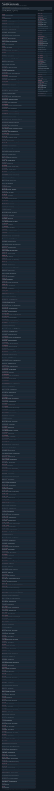

# Perovskite solar modules: task route map



Paper: **Dopant-additive synergism enhances perovskite solar modules** · [DOI](https://doi.org/10.1038/s41586-024-07228-z)

Task-design reference; no task execution or scientific reproduction. Counts describe task representation, not experiments or success.

**Reading rule:** numbered rows preserve reference-list occurrences. A loop body is shown once and must be repeated under its original binding, not treated as executed. An unordered obligation group has no inferred chronological edges. Source-reported scientific facts and authored handling are distinct.

[Immutable source task package](https://github.com/openags/ScienceGym/blob/e27d456e2fe99bec9100cc37f7bcd68485504c2b/tasks/perovskite_operations_v2/) · [Interactive inspector](../index.html)

## ADDITIVE_INTAKE — Receive externally prepared additive families

Authored reference order; condition and replicate obligations are not silently expanded

[Exact route source](https://github.com/openags/ScienceGym/blob/e27d456e2fe99bec9100cc37f7bcd68485504c2b/tasks/perovskite_operations_v2/branches.json) · JSON pointer: `/branches/0/full_operation_sequence`

- `STOCK` Inspect stock and reserve episode inventory
- `LABEL` Label and split independent lineages
- `INCOMING_MOVE` Carry to receiving — Register externally prepared additive lots
- `INCOMING_LOAD` Load and seat — Register externally prepared additive lots
- `INCOMING_VERIFY` Bind source condition and input state — Register externally prepared additive lots
- `INCOMING_GUARD` Close and confirm guard — Register externally prepared additive lots
- `INCOMING_START` Start inert work order — Register externally prepared additive lots
- `INCOMING_OBSERVE` Observe completion and acquire records — Register externally prepared additive lots
- `INCOMING_RELEASE` Wait for safe release — Register externally prepared additive lots
- `INCOMING_UNLOAD` Retrieve and record handoff — Register externally prepared additive lots
- `ARCHIVE` Archive all samples and data
- `CLEAN` Reset inert task workstations

<details><summary>Branch state, choices, lineage and loop obligations</summary>

```json
{
  "source_branch_ids": [
    "B01",
    "B07"
  ],
  "evidence_ids": [
    "MATERIALS"
  ],
  "representation": "bounded_handoff_not_complete_synthesis",
  "initial_state": "unused substrate proxies or sealed assigned stock tokens; empty stopped stations; no finished sample or observation",
  "manufacturing_prefix_required": true,
  "reference_service_sequence": [
    "INCOMING"
  ],
  "condition_package": {
    "families": [
      "[Bcmim]Cl",
      "[Bcmim]TFSI",
      "[Bcmim]BF4",
      "[Bcmim]I",
      "[Bcmim]PF6",
      "[Bcmim]SCN",
      "[C1SCNmim]Cl"
    ]
  },
  "condition_loop": "Repeat the complete specimen route for each condition and authored independent replicate; do not relabel an existing specimen.",
  "condition_card_ids": [],
  "unknown_ids": [
    "U01"
  ],
  "source_vs_task_note": "The cited syntheses are explicit preparation dependencies. The task exercises incoming identity/provenance handling; it does not invent or credit their unavailable chemical synthesis.",
  "physical_identity_rule": "Every specimen, aliquot, parent batch, carrier, destructive region, job, attempt and acquisition has its own linked ID.",
  "success": "Complete required handling, raw acquisitions, lineage, honest unknowns, archive and cleanup; no numerical literature-performance target.",
  "source_independent_replicate_count": null,
  "authored_default_replicates_per_condition": 1,
  "operation_count_per_base_route": 12,
  "not_claimed": "No actual run, dynamic validation, source-author chronology, statistical reproduction or external certification.",
  "loop_service_ids": [],
  "conditional_reference_warning": null,
  "independent_order": "Independent branches may run in any order subject to object, contamination and service-resource dependencies. Source presentation order is not experiment chronology."
}
```

</details>

## CRYSTAL_MODELS — Compare three model-crystal parent routes

Authored reference order; condition and replicate obligations are not silently expanded

[Exact route source](https://github.com/openags/ScienceGym/blob/e27d456e2fe99bec9100cc37f7bcd68485504c2b/tasks/perovskite_operations_v2/branches.json) · JSON pointer: `/branches/1/full_operation_sequence`

- `STOCK` Inspect stock and reserve episode inventory
- `LABEL` Label and split independent lineages
- `PORTION_MOVE` Carry to preparation — Allocate sealed material portions
- `PORTION_LOAD` Load and seat — Allocate sealed material portions
- `PORTION_VERIFY` Bind source condition and input state — Allocate sealed material portions
- `PORTION_GUARD` Close and confirm guard — Allocate sealed material portions
- `PORTION_START` Start inert work order — Allocate sealed material portions
- `PORTION_OBSERVE` Observe completion and acquire records — Allocate sealed material portions
- `PORTION_RELEASE` Wait for safe release — Allocate sealed material portions
- `PORTION_UNLOAD` Retrieve and record handoff — Allocate sealed material portions
- `CRYSTAL_MIX_MOVE` Carry to chemical_service — Prepare model-adduct solution proxy
- `CRYSTAL_MIX_LOAD` Load and seat — Prepare model-adduct solution proxy
- `CRYSTAL_MIX_VERIFY` Bind source condition and input state — Prepare model-adduct solution proxy
- `CRYSTAL_MIX_GUARD` Close and confirm guard — Prepare model-adduct solution proxy
- `CRYSTAL_MIX_START` Start inert work order — Prepare model-adduct solution proxy
- `CRYSTAL_MIX_OBSERVE` Observe completion and acquire records — Prepare model-adduct solution proxy
- `CRYSTAL_MIX_RELEASE` Wait for safe release — Prepare model-adduct solution proxy
- `CRYSTAL_MIX_UNLOAD` Retrieve and record handoff — Prepare model-adduct solution proxy
- `CRYSTAL_HEAT_MOVE` Carry to thermal_service — Heat model-adduct mixture proxy
- `CRYSTAL_HEAT_LOAD` Load and seat — Heat model-adduct mixture proxy
- `CRYSTAL_HEAT_VERIFY` Bind source condition and input state — Heat model-adduct mixture proxy
- `CRYSTAL_HEAT_GUARD` Close and confirm guard — Heat model-adduct mixture proxy
- `CRYSTAL_HEAT_START` Start inert work order — Heat model-adduct mixture proxy
- `CRYSTAL_HEAT_OBSERVE` Observe completion and acquire records — Heat model-adduct mixture proxy
- `CRYSTAL_HEAT_RELEASE` Wait for safe release — Heat model-adduct mixture proxy
- `CRYSTAL_HEAT_UNLOAD` Retrieve and record handoff — Heat model-adduct mixture proxy
- `CRYSTAL_EVAP_MOVE` Carry to evaporation_service — Grow model crystal proxy
- `CRYSTAL_EVAP_LOAD` Load and seat — Grow model crystal proxy
- `CRYSTAL_EVAP_VERIFY` Bind source condition and input state — Grow model crystal proxy
- `CRYSTAL_EVAP_GUARD` Close and confirm guard — Grow model crystal proxy
- `CRYSTAL_EVAP_START` Start inert work order — Grow model crystal proxy
- `CRYSTAL_EVAP_OBSERVE` Observe completion and acquire records — Grow model crystal proxy
- `CRYSTAL_EVAP_RELEASE` Wait for safe release — Grow model crystal proxy
- `CRYSTAL_EVAP_UNLOAD` Retrieve and record handoff — Grow model crystal proxy
- `CRYSTAL_PICK_MOVE` Carry to micromanipulation_service — Select and mount crystal proxy
- `CRYSTAL_PICK_LOAD` Load and seat — Select and mount crystal proxy
- `CRYSTAL_PICK_VERIFY` Bind source condition and input state — Select and mount crystal proxy
- `CRYSTAL_PICK_GUARD` Close and confirm guard — Select and mount crystal proxy
- `CRYSTAL_PICK_START` Start inert work order — Select and mount crystal proxy
- `CRYSTAL_PICK_OBSERVE` Observe completion and acquire records — Select and mount crystal proxy
- `CRYSTAL_PICK_RELEASE` Wait for safe release — Select and mount crystal proxy
- `CRYSTAL_PICK_UNLOAD` Retrieve and record handoff — Select and mount crystal proxy
- `SCXRD_MOVE` Carry to SCXRD_station — Acquire single-crystal diffraction
- `SCXRD_LOAD` Load and seat — Acquire single-crystal diffraction
- `SCXRD_VERIFY` Bind source condition and input state — Acquire single-crystal diffraction
- `SCXRD_GUARD` Close and confirm guard — Acquire single-crystal diffraction
- `SCXRD_START` Start inert work order — Acquire single-crystal diffraction
- `SCXRD_OBSERVE` Observe completion and acquire records — Acquire single-crystal diffraction
- `SCXRD_RELEASE` Wait for safe release — Acquire single-crystal diffraction
- `SCXRD_UNLOAD` Retrieve and record handoff — Acquire single-crystal diffraction
- `ARCHIVE` Archive all samples and data
- `CLEAN` Reset inert task workstations

<details><summary>Branch state, choices, lineage and loop obligations</summary>

```json
{
  "source_branch_ids": [
    "B01"
  ],
  "evidence_ids": [
    "CRYSTAL",
    "S28",
    "T5"
  ],
  "representation": "hands_on_mock",
  "initial_state": "unused substrate proxies or sealed assigned stock tokens; empty stopped stations; no finished sample or observation",
  "manufacturing_prefix_required": true,
  "reference_service_sequence": [
    "PORTION",
    "CRYSTAL_MIX",
    "CRYSTAL_HEAT",
    "CRYSTAL_EVAP",
    "CRYSTAL_PICK",
    "SCXRD"
  ],
  "condition_package": {
    "reaction_groups": [
      "[Bcmim]Cl+PbI2",
      "[Bcmim]Cl+PbI2+MAI",
      "[Bcmim]Cl+PbI2+FAI"
    ]
  },
  "condition_loop": "Repeat the complete specimen route for each condition and authored independent replicate; do not relabel an existing specimen.",
  "condition_card_ids": [
    "CRYSTALS"
  ],
  "unknown_ids": [
    "Q02",
    "Q07",
    "U16"
  ],
  "source_vs_task_note": "MAI and FAI parent routes remain independent even where reported crystal product is the same.",
  "physical_identity_rule": "Every specimen, aliquot, parent batch, carrier, destructive region, job, attempt and acquisition has its own linked ID.",
  "success": "Complete required handling, raw acquisitions, lineage, honest unknowns, archive and cleanup; no numerical literature-performance target.",
  "source_independent_replicate_count": null,
  "authored_default_replicates_per_condition": 1,
  "operation_count_per_base_route": 52,
  "not_claimed": "No actual run, dynamic validation, source-author chronology, statistical reproduction or external certification.",
  "loop_service_ids": [],
  "conditional_reference_warning": null,
  "independent_order": "Independent branches may run in any order subject to object, contamination and service-resource dependencies. Source presentation order is not experiment chronology."
}
```

</details>

## ETL_PREPARATION — Prepare compact transport-layer substrates

Authored reference order; condition and replicate obligations are not silently expanded

[Exact route source](https://github.com/openags/ScienceGym/blob/e27d456e2fe99bec9100cc37f7bcd68485504c2b/tasks/perovskite_operations_v2/branches.json) · JSON pointer: `/branches/2/full_operation_sequence`

- `STOCK` Inspect stock and reserve episode inventory
- `LABEL` Label and split independent lineages
- `PORTION_MOVE` Carry to preparation — Allocate sealed material portions
- `PORTION_LOAD` Load and seat — Allocate sealed material portions
- `PORTION_VERIFY` Bind source condition and input state — Allocate sealed material portions
- `PORTION_GUARD` Close and confirm guard — Allocate sealed material portions
- `PORTION_START` Start inert work order — Allocate sealed material portions
- `PORTION_OBSERVE` Observe completion and acquire records — Allocate sealed material portions
- `PORTION_RELEASE` Wait for safe release — Allocate sealed material portions
- `PORTION_UNLOAD` Retrieve and record handoff — Allocate sealed material portions
- `CLEAN_AC_MOVE` Carry to cleaning_service — Ultrasonic cleaning proxy: acetone
- `CLEAN_AC_LOAD` Load and seat — Ultrasonic cleaning proxy: acetone
- `CLEAN_AC_VERIFY` Bind source condition and input state — Ultrasonic cleaning proxy: acetone
- `CLEAN_AC_GUARD` Close and confirm guard — Ultrasonic cleaning proxy: acetone
- `CLEAN_AC_START` Start inert work order — Ultrasonic cleaning proxy: acetone
- `CLEAN_AC_OBSERVE` Observe completion and acquire records — Ultrasonic cleaning proxy: acetone
- `CLEAN_AC_RELEASE` Wait for safe release — Ultrasonic cleaning proxy: acetone
- `CLEAN_AC_UNLOAD` Retrieve and record handoff — Ultrasonic cleaning proxy: acetone
- `CLEAN_IPA_MOVE` Carry to cleaning_service — Ultrasonic cleaning proxy: isopropanol
- `CLEAN_IPA_LOAD` Load and seat — Ultrasonic cleaning proxy: isopropanol
- `CLEAN_IPA_VERIFY` Bind source condition and input state — Ultrasonic cleaning proxy: isopropanol
- `CLEAN_IPA_GUARD` Close and confirm guard — Ultrasonic cleaning proxy: isopropanol
- `CLEAN_IPA_START` Start inert work order — Ultrasonic cleaning proxy: isopropanol
- `CLEAN_IPA_OBSERVE` Observe completion and acquire records — Ultrasonic cleaning proxy: isopropanol
- `CLEAN_IPA_RELEASE` Wait for safe release — Ultrasonic cleaning proxy: isopropanol
- `CLEAN_IPA_UNLOAD` Retrieve and record handoff — Ultrasonic cleaning proxy: isopropanol
- `CLEAN_WATER_MOVE` Carry to cleaning_service — Ultrasonic cleaning proxy: deionized water
- `CLEAN_WATER_LOAD` Load and seat — Ultrasonic cleaning proxy: deionized water
- `CLEAN_WATER_VERIFY` Bind source condition and input state — Ultrasonic cleaning proxy: deionized water
- `CLEAN_WATER_GUARD` Close and confirm guard — Ultrasonic cleaning proxy: deionized water
- `CLEAN_WATER_START` Start inert work order — Ultrasonic cleaning proxy: deionized water
- `CLEAN_WATER_OBSERVE` Observe completion and acquire records — Ultrasonic cleaning proxy: deionized water
- `CLEAN_WATER_RELEASE` Wait for safe release — Ultrasonic cleaning proxy: deionized water
- `CLEAN_WATER_UNLOAD` Retrieve and record handoff — Ultrasonic cleaning proxy: deionized water
- `TI_STOCK_MOVE` Carry to chemical_service — Prepare and store Ti stock proxy
- `TI_STOCK_LOAD` Load and seat — Prepare and store Ti stock proxy
- `TI_STOCK_VERIFY` Bind source condition and input state — Prepare and store Ti stock proxy
- `TI_STOCK_GUARD` Close and confirm guard — Prepare and store Ti stock proxy
- `TI_STOCK_START` Start inert work order — Prepare and store Ti stock proxy
- `TI_STOCK_OBSERVE` Observe completion and acquire records — Prepare and store Ti stock proxy
- `TI_STOCK_RELEASE` Wait for safe release — Prepare and store Ti stock proxy
- `TI_STOCK_UNLOAD` Retrieve and record handoff — Prepare and store Ti stock proxy
- `TI_BATH_MOVE` Carry to bath_service — Form compact Ti layer proxy
- `TI_BATH_LOAD` Load and seat — Form compact Ti layer proxy
- `TI_BATH_VERIFY` Bind source condition and input state — Form compact Ti layer proxy
- `TI_BATH_GUARD` Close and confirm guard — Form compact Ti layer proxy
- `TI_BATH_START` Start inert work order — Form compact Ti layer proxy
- `TI_BATH_OBSERVE` Observe completion and acquire records — Form compact Ti layer proxy
- `TI_BATH_RELEASE` Wait for safe release — Form compact Ti layer proxy
- `TI_BATH_UNLOAD` Retrieve and record handoff — Form compact Ti layer proxy
- `TI_RINSE_MOVE` Carry to rinse_service — Rinse Ti plate proxy
- `TI_RINSE_LOAD` Load and seat — Rinse Ti plate proxy
- `TI_RINSE_VERIFY` Bind source condition and input state — Rinse Ti plate proxy
- `TI_RINSE_GUARD` Close and confirm guard — Rinse Ti plate proxy
- `TI_RINSE_START` Start inert work order — Rinse Ti plate proxy
- `TI_RINSE_OBSERVE` Observe completion and acquire records — Rinse Ti plate proxy
- `TI_RINSE_RELEASE` Wait for safe release — Rinse Ti plate proxy
- `TI_RINSE_UNLOAD` Retrieve and record handoff — Rinse Ti plate proxy
- `TI_ANNEAL_MOVE` Carry to thermal_service — Anneal Ti layer proxy
- `TI_ANNEAL_LOAD` Load and seat — Anneal Ti layer proxy
- `TI_ANNEAL_VERIFY` Bind source condition and input state — Anneal Ti layer proxy
- `TI_ANNEAL_GUARD` Close and confirm guard — Anneal Ti layer proxy
- `TI_ANNEAL_START` Start inert work order — Anneal Ti layer proxy
- `TI_ANNEAL_OBSERVE` Observe completion and acquire records — Anneal Ti layer proxy
- `TI_ANNEAL_RELEASE` Wait for safe release — Anneal Ti layer proxy
- `TI_ANNEAL_UNLOAD` Retrieve and record handoff — Anneal Ti layer proxy
- `SN_STOCK_MOVE` Carry to chemical_service — Prepare and store Sn stock proxy
- `SN_STOCK_LOAD` Load and seat — Prepare and store Sn stock proxy
- `SN_STOCK_VERIFY` Bind source condition and input state — Prepare and store Sn stock proxy
- `SN_STOCK_GUARD` Close and confirm guard — Prepare and store Sn stock proxy
- `SN_STOCK_START` Start inert work order — Prepare and store Sn stock proxy
- `SN_STOCK_OBSERVE` Observe completion and acquire records — Prepare and store Sn stock proxy
- `SN_STOCK_RELEASE` Wait for safe release — Prepare and store Sn stock proxy
- `SN_STOCK_UNLOAD` Retrieve and record handoff — Prepare and store Sn stock proxy
- `SN_BATH_MOVE` Carry to bath_service — Modify Ti layer with Sn proxy
- `SN_BATH_LOAD` Load and seat — Modify Ti layer with Sn proxy
- `SN_BATH_VERIFY` Bind source condition and input state — Modify Ti layer with Sn proxy
- `SN_BATH_GUARD` Close and confirm guard — Modify Ti layer with Sn proxy
- `SN_BATH_START` Start inert work order — Modify Ti layer with Sn proxy
- `SN_BATH_OBSERVE` Observe completion and acquire records — Modify Ti layer with Sn proxy
- `SN_BATH_RELEASE` Wait for safe release — Modify Ti layer with Sn proxy
- `SN_BATH_UNLOAD` Retrieve and record handoff — Modify Ti layer with Sn proxy
- `SN_RINSE_MOVE` Carry to rinse_service — Rinse modified plate proxy
- `SN_RINSE_LOAD` Load and seat — Rinse modified plate proxy
- `SN_RINSE_VERIFY` Bind source condition and input state — Rinse modified plate proxy
- `SN_RINSE_GUARD` Close and confirm guard — Rinse modified plate proxy
- `SN_RINSE_START` Start inert work order — Rinse modified plate proxy
- `SN_RINSE_OBSERVE` Observe completion and acquire records — Rinse modified plate proxy
- `SN_RINSE_RELEASE` Wait for safe release — Rinse modified plate proxy
- `SN_RINSE_UNLOAD` Retrieve and record handoff — Rinse modified plate proxy
- `SN_ANNEAL_MOVE` Carry to thermal_service — Anneal modified compact layer proxy
- `SN_ANNEAL_LOAD` Load and seat — Anneal modified compact layer proxy
- `SN_ANNEAL_VERIFY` Bind source condition and input state — Anneal modified compact layer proxy
- `SN_ANNEAL_GUARD` Close and confirm guard — Anneal modified compact layer proxy
- `SN_ANNEAL_START` Start inert work order — Anneal modified compact layer proxy
- `SN_ANNEAL_OBSERVE` Observe completion and acquire records — Anneal modified compact layer proxy
- `SN_ANNEAL_RELEASE` Wait for safe release — Anneal modified compact layer proxy
- `SN_ANNEAL_UNLOAD` Retrieve and record handoff — Anneal modified compact layer proxy
- `ARCHIVE` Archive all samples and data
- `CLEAN` Reset inert task workstations

<details><summary>Branch state, choices, lineage and loop obligations</summary>

```json
{
  "source_branch_ids": [
    "B02"
  ],
  "evidence_ids": [
    "ETL"
  ],
  "representation": "hands_on_mock",
  "initial_state": "unused substrate proxies or sealed assigned stock tokens; empty stopped stations; no finished sample or observation",
  "manufacturing_prefix_required": true,
  "reference_service_sequence": [
    "PORTION",
    "CLEAN_AC",
    "CLEAN_IPA",
    "CLEAN_WATER",
    "TI_STOCK",
    "TI_BATH",
    "TI_RINSE",
    "TI_ANNEAL",
    "SN_STOCK",
    "SN_BATH",
    "SN_RINSE",
    "SN_ANNEAL"
  ],
  "condition_package": {
    "substrate": "FTO"
  },
  "condition_loop": "Repeat the complete specimen route for each condition and authored independent replicate; do not relabel an existing specimen.",
  "condition_card_ids": [
    "ETL"
  ],
  "unknown_ids": [
    "Q01",
    "U03"
  ],
  "source_vs_task_note": "Ti preparation, rinsing and annealing precede separately identified Sn modification; mock unresolved-card treatment required.",
  "physical_identity_rule": "Every specimen, aliquot, parent batch, carrier, destructive region, job, attempt and acquisition has its own linked ID.",
  "success": "Complete required handling, raw acquisitions, lineage, honest unknowns, archive and cleanup; no numerical literature-performance target.",
  "source_independent_replicate_count": null,
  "authored_default_replicates_per_condition": 1,
  "operation_count_per_base_route": 100,
  "not_claimed": "No actual run, dynamic validation, source-author chronology, statistical reproduction or external certification.",
  "loop_service_ids": [
    "TI_RINSE",
    "SN_RINSE"
  ],
  "conditional_reference_warning": null,
  "independent_order": "Independent branches may run in any order subject to object, contamination and service-resource dependencies. Source presentation order is not experiment chronology."
}
```

</details>

## CELL_CONTROL_TARGET — Fabricate and test control and target cells

Authored reference order; condition and replicate obligations are not silently expanded

[Exact route source](https://github.com/openags/ScienceGym/blob/e27d456e2fe99bec9100cc37f7bcd68485504c2b/tasks/perovskite_operations_v2/branches.json) · JSON pointer: `/branches/3/full_operation_sequence`

- `STOCK` Inspect stock and reserve episode inventory
- `LABEL` Label and split independent lineages
- `PORTION_MOVE` Carry to preparation — Allocate sealed material portions
- `PORTION_LOAD` Load and seat — Allocate sealed material portions
- `PORTION_VERIFY` Bind source condition and input state — Allocate sealed material portions
- `PORTION_GUARD` Close and confirm guard — Allocate sealed material portions
- `PORTION_START` Start inert work order — Allocate sealed material portions
- `PORTION_OBSERVE` Observe completion and acquire records — Allocate sealed material portions
- `PORTION_RELEASE` Wait for safe release — Allocate sealed material portions
- `PORTION_UNLOAD` Retrieve and record handoff — Allocate sealed material portions
- `CLEAN_AC_MOVE` Carry to cleaning_service — Ultrasonic cleaning proxy: acetone
- `CLEAN_AC_LOAD` Load and seat — Ultrasonic cleaning proxy: acetone
- `CLEAN_AC_VERIFY` Bind source condition and input state — Ultrasonic cleaning proxy: acetone
- `CLEAN_AC_GUARD` Close and confirm guard — Ultrasonic cleaning proxy: acetone
- `CLEAN_AC_START` Start inert work order — Ultrasonic cleaning proxy: acetone
- `CLEAN_AC_OBSERVE` Observe completion and acquire records — Ultrasonic cleaning proxy: acetone
- `CLEAN_AC_RELEASE` Wait for safe release — Ultrasonic cleaning proxy: acetone
- `CLEAN_AC_UNLOAD` Retrieve and record handoff — Ultrasonic cleaning proxy: acetone
- `CLEAN_IPA_MOVE` Carry to cleaning_service — Ultrasonic cleaning proxy: isopropanol
- `CLEAN_IPA_LOAD` Load and seat — Ultrasonic cleaning proxy: isopropanol
- `CLEAN_IPA_VERIFY` Bind source condition and input state — Ultrasonic cleaning proxy: isopropanol
- `CLEAN_IPA_GUARD` Close and confirm guard — Ultrasonic cleaning proxy: isopropanol
- `CLEAN_IPA_START` Start inert work order — Ultrasonic cleaning proxy: isopropanol
- `CLEAN_IPA_OBSERVE` Observe completion and acquire records — Ultrasonic cleaning proxy: isopropanol
- `CLEAN_IPA_RELEASE` Wait for safe release — Ultrasonic cleaning proxy: isopropanol
- `CLEAN_IPA_UNLOAD` Retrieve and record handoff — Ultrasonic cleaning proxy: isopropanol
- `CLEAN_WATER_MOVE` Carry to cleaning_service — Ultrasonic cleaning proxy: deionized water
- `CLEAN_WATER_LOAD` Load and seat — Ultrasonic cleaning proxy: deionized water
- `CLEAN_WATER_VERIFY` Bind source condition and input state — Ultrasonic cleaning proxy: deionized water
- `CLEAN_WATER_GUARD` Close and confirm guard — Ultrasonic cleaning proxy: deionized water
- `CLEAN_WATER_START` Start inert work order — Ultrasonic cleaning proxy: deionized water
- `CLEAN_WATER_OBSERVE` Observe completion and acquire records — Ultrasonic cleaning proxy: deionized water
- `CLEAN_WATER_RELEASE` Wait for safe release — Ultrasonic cleaning proxy: deionized water
- `CLEAN_WATER_UNLOAD` Retrieve and record handoff — Ultrasonic cleaning proxy: deionized water
- `TI_STOCK_MOVE` Carry to chemical_service — Prepare and store Ti stock proxy
- `TI_STOCK_LOAD` Load and seat — Prepare and store Ti stock proxy
- `TI_STOCK_VERIFY` Bind source condition and input state — Prepare and store Ti stock proxy
- `TI_STOCK_GUARD` Close and confirm guard — Prepare and store Ti stock proxy
- `TI_STOCK_START` Start inert work order — Prepare and store Ti stock proxy
- `TI_STOCK_OBSERVE` Observe completion and acquire records — Prepare and store Ti stock proxy
- `TI_STOCK_RELEASE` Wait for safe release — Prepare and store Ti stock proxy
- `TI_STOCK_UNLOAD` Retrieve and record handoff — Prepare and store Ti stock proxy
- `TI_BATH_MOVE` Carry to bath_service — Form compact Ti layer proxy
- `TI_BATH_LOAD` Load and seat — Form compact Ti layer proxy
- `TI_BATH_VERIFY` Bind source condition and input state — Form compact Ti layer proxy
- `TI_BATH_GUARD` Close and confirm guard — Form compact Ti layer proxy
- `TI_BATH_START` Start inert work order — Form compact Ti layer proxy
- `TI_BATH_OBSERVE` Observe completion and acquire records — Form compact Ti layer proxy
- `TI_BATH_RELEASE` Wait for safe release — Form compact Ti layer proxy
- `TI_BATH_UNLOAD` Retrieve and record handoff — Form compact Ti layer proxy
- `TI_RINSE_MOVE` Carry to rinse_service — Rinse Ti plate proxy
- `TI_RINSE_LOAD` Load and seat — Rinse Ti plate proxy
- `TI_RINSE_VERIFY` Bind source condition and input state — Rinse Ti plate proxy
- `TI_RINSE_GUARD` Close and confirm guard — Rinse Ti plate proxy
- `TI_RINSE_START` Start inert work order — Rinse Ti plate proxy
- `TI_RINSE_OBSERVE` Observe completion and acquire records — Rinse Ti plate proxy
- `TI_RINSE_RELEASE` Wait for safe release — Rinse Ti plate proxy
- `TI_RINSE_UNLOAD` Retrieve and record handoff — Rinse Ti plate proxy
- `TI_ANNEAL_MOVE` Carry to thermal_service — Anneal Ti layer proxy
- `TI_ANNEAL_LOAD` Load and seat — Anneal Ti layer proxy
- `TI_ANNEAL_VERIFY` Bind source condition and input state — Anneal Ti layer proxy
- `TI_ANNEAL_GUARD` Close and confirm guard — Anneal Ti layer proxy
- `TI_ANNEAL_START` Start inert work order — Anneal Ti layer proxy
- `TI_ANNEAL_OBSERVE` Observe completion and acquire records — Anneal Ti layer proxy
- `TI_ANNEAL_RELEASE` Wait for safe release — Anneal Ti layer proxy
- `TI_ANNEAL_UNLOAD` Retrieve and record handoff — Anneal Ti layer proxy
- `SN_STOCK_MOVE` Carry to chemical_service — Prepare and store Sn stock proxy
- `SN_STOCK_LOAD` Load and seat — Prepare and store Sn stock proxy
- `SN_STOCK_VERIFY` Bind source condition and input state — Prepare and store Sn stock proxy
- `SN_STOCK_GUARD` Close and confirm guard — Prepare and store Sn stock proxy
- `SN_STOCK_START` Start inert work order — Prepare and store Sn stock proxy
- `SN_STOCK_OBSERVE` Observe completion and acquire records — Prepare and store Sn stock proxy
- `SN_STOCK_RELEASE` Wait for safe release — Prepare and store Sn stock proxy
- `SN_STOCK_UNLOAD` Retrieve and record handoff — Prepare and store Sn stock proxy
- `SN_BATH_MOVE` Carry to bath_service — Modify Ti layer with Sn proxy
- `SN_BATH_LOAD` Load and seat — Modify Ti layer with Sn proxy
- `SN_BATH_VERIFY` Bind source condition and input state — Modify Ti layer with Sn proxy
- `SN_BATH_GUARD` Close and confirm guard — Modify Ti layer with Sn proxy
- `SN_BATH_START` Start inert work order — Modify Ti layer with Sn proxy
- `SN_BATH_OBSERVE` Observe completion and acquire records — Modify Ti layer with Sn proxy
- `SN_BATH_RELEASE` Wait for safe release — Modify Ti layer with Sn proxy
- `SN_BATH_UNLOAD` Retrieve and record handoff — Modify Ti layer with Sn proxy
- `SN_RINSE_MOVE` Carry to rinse_service — Rinse modified plate proxy
- `SN_RINSE_LOAD` Load and seat — Rinse modified plate proxy
- `SN_RINSE_VERIFY` Bind source condition and input state — Rinse modified plate proxy
- `SN_RINSE_GUARD` Close and confirm guard — Rinse modified plate proxy
- `SN_RINSE_START` Start inert work order — Rinse modified plate proxy
- `SN_RINSE_OBSERVE` Observe completion and acquire records — Rinse modified plate proxy
- `SN_RINSE_RELEASE` Wait for safe release — Rinse modified plate proxy
- `SN_RINSE_UNLOAD` Retrieve and record handoff — Rinse modified plate proxy
- `SN_ANNEAL_MOVE` Carry to thermal_service — Anneal modified compact layer proxy
- `SN_ANNEAL_LOAD` Load and seat — Anneal modified compact layer proxy
- `SN_ANNEAL_VERIFY` Bind source condition and input state — Anneal modified compact layer proxy
- `SN_ANNEAL_GUARD` Close and confirm guard — Anneal modified compact layer proxy
- `SN_ANNEAL_START` Start inert work order — Anneal modified compact layer proxy
- `SN_ANNEAL_OBSERVE` Observe completion and acquire records — Anneal modified compact layer proxy
- `SN_ANNEAL_RELEASE` Wait for safe release — Anneal modified compact layer proxy
- `SN_ANNEAL_UNLOAD` Retrieve and record handoff — Anneal modified compact layer proxy
- `PCBM_MIX_MOVE` Carry to chemical_service — Prepare PMMA:PCBM solution proxy
- `PCBM_MIX_LOAD` Load and seat — Prepare PMMA:PCBM solution proxy
- `PCBM_MIX_VERIFY` Bind source condition and input state — Prepare PMMA:PCBM solution proxy
- `PCBM_MIX_GUARD` Close and confirm guard — Prepare PMMA:PCBM solution proxy
- `PCBM_MIX_START` Start inert work order — Prepare PMMA:PCBM solution proxy
- `PCBM_MIX_OBSERVE` Observe completion and acquire records — Prepare PMMA:PCBM solution proxy
- `PCBM_MIX_RELEASE` Wait for safe release — Prepare PMMA:PCBM solution proxy
- `PCBM_MIX_UNLOAD` Retrieve and record handoff — Prepare PMMA:PCBM solution proxy
- `PCBM_SPIN_MOVE` Carry to coating_service — Spin PMMA:PCBM interface proxy
- `PCBM_SPIN_LOAD` Load and seat — Spin PMMA:PCBM interface proxy
- `PCBM_SPIN_VERIFY` Bind source condition and input state — Spin PMMA:PCBM interface proxy
- `PCBM_SPIN_GUARD` Close and confirm guard — Spin PMMA:PCBM interface proxy
- `PCBM_SPIN_START` Start inert work order — Spin PMMA:PCBM interface proxy
- `PCBM_SPIN_OBSERVE` Observe completion and acquire records — Spin PMMA:PCBM interface proxy
- `PCBM_SPIN_RELEASE` Wait for safe release — Spin PMMA:PCBM interface proxy
- `PCBM_SPIN_UNLOAD` Retrieve and record handoff — Spin PMMA:PCBM interface proxy
- `PCBM_ANNEAL_MOVE` Carry to thermal_service — Anneal PMMA:PCBM interface
- `PCBM_ANNEAL_LOAD` Load and seat — Anneal PMMA:PCBM interface
- `PCBM_ANNEAL_VERIFY` Bind source condition and input state — Anneal PMMA:PCBM interface
- `PCBM_ANNEAL_GUARD` Close and confirm guard — Anneal PMMA:PCBM interface
- `PCBM_ANNEAL_START` Start inert work order — Anneal PMMA:PCBM interface
- `PCBM_ANNEAL_OBSERVE` Observe completion and acquire records — Anneal PMMA:PCBM interface
- `PCBM_ANNEAL_RELEASE` Wait for safe release — Anneal PMMA:PCBM interface
- `PCBM_ANNEAL_UNLOAD` Retrieve and record handoff — Anneal PMMA:PCBM interface
- `PPS_SPIN_MOVE` Carry to chemical_service — Prepare spin precursor proxy
- `PPS_SPIN_LOAD` Load and seat — Prepare spin precursor proxy
- `PPS_SPIN_VERIFY` Bind source condition and input state — Prepare spin precursor proxy
- `PPS_SPIN_GUARD` Close and confirm guard — Prepare spin precursor proxy
- `PPS_SPIN_START` Start inert work order — Prepare spin precursor proxy
- `PPS_SPIN_OBSERVE` Observe completion and acquire records — Prepare spin precursor proxy
- `PPS_SPIN_RELEASE` Wait for safe release — Prepare spin precursor proxy
- `PPS_SPIN_UNLOAD` Retrieve and record handoff — Prepare spin precursor proxy
- `STIR_SPIN_MOVE` Carry to stirring_service — Stir spin precursor proxy
- `STIR_SPIN_LOAD` Load and seat — Stir spin precursor proxy
- `STIR_SPIN_VERIFY` Bind source condition and input state — Stir spin precursor proxy
- `STIR_SPIN_GUARD` Close and confirm guard — Stir spin precursor proxy
- `STIR_SPIN_START` Start inert work order — Stir spin precursor proxy
- `STIR_SPIN_OBSERVE` Observe completion and acquire records — Stir spin precursor proxy
- `STIR_SPIN_RELEASE` Wait for safe release — Stir spin precursor proxy
- `STIR_SPIN_UNLOAD` Retrieve and record handoff — Stir spin precursor proxy
- `PPS_COAT_SPIN_MOVE` Carry to coating_service — Spin perovskite wet-film proxy
- `PPS_COAT_SPIN_LOAD` Load and seat — Spin perovskite wet-film proxy
- `PPS_COAT_SPIN_VERIFY` Bind source condition and input state — Spin perovskite wet-film proxy
- `PPS_COAT_SPIN_GUARD` Close and confirm guard — Spin perovskite wet-film proxy
- `PPS_COAT_SPIN_START` Start inert work order — Spin perovskite wet-film proxy
- `PPS_COAT_SPIN_OBSERVE` Observe completion and acquire records — Spin perovskite wet-film proxy
- `PPS_COAT_SPIN_RELEASE` Wait for safe release — Spin perovskite wet-film proxy
- `PPS_COAT_SPIN_UNLOAD` Retrieve and record handoff — Spin perovskite wet-film proxy
- `DRY_VAC_MOVE` Carry to vacuum_service — Rapid vacuum drying proxy
- `DRY_VAC_LOAD` Load and seat — Rapid vacuum drying proxy
- `DRY_VAC_VERIFY` Bind source condition and input state — Rapid vacuum drying proxy
- `DRY_VAC_GUARD` Close and confirm guard — Rapid vacuum drying proxy
- `DRY_VAC_START` Start inert work order — Rapid vacuum drying proxy
- `DRY_VAC_OBSERVE` Observe completion and acquire records — Rapid vacuum drying proxy
- `DRY_VAC_RELEASE` Wait for safe release — Rapid vacuum drying proxy
- `DRY_VAC_UNLOAD` Retrieve and record handoff — Rapid vacuum drying proxy
- `ANNEAL_100_MOVE` Carry to thermal_service — First perovskite anneal proxy
- `ANNEAL_100_LOAD` Load and seat — First perovskite anneal proxy
- `ANNEAL_100_VERIFY` Bind source condition and input state — First perovskite anneal proxy
- `ANNEAL_100_GUARD` Close and confirm guard — First perovskite anneal proxy
- `ANNEAL_100_START` Start inert work order — First perovskite anneal proxy
- `ANNEAL_100_OBSERVE` Observe completion and acquire records — First perovskite anneal proxy
- `ANNEAL_100_RELEASE` Wait for safe release — First perovskite anneal proxy
- `ANNEAL_100_UNLOAD` Retrieve and record handoff — First perovskite anneal proxy
- `ANNEAL_150_MOVE` Carry to thermal_service — Second perovskite anneal proxy
- `ANNEAL_150_LOAD` Load and seat — Second perovskite anneal proxy
- `ANNEAL_150_VERIFY` Bind source condition and input state — Second perovskite anneal proxy
- `ANNEAL_150_GUARD` Close and confirm guard — Second perovskite anneal proxy
- `ANNEAL_150_START` Start inert work order — Second perovskite anneal proxy
- `ANNEAL_150_OBSERVE` Observe completion and acquire records — Second perovskite anneal proxy
- `ANNEAL_150_RELEASE` Wait for safe release — Second perovskite anneal proxy
- `ANNEAL_150_UNLOAD` Retrieve and record handoff — Second perovskite anneal proxy
- `PEAI_MIX_MOVE` Carry to chemical_service — Prepare PEAI solution proxy
- `PEAI_MIX_LOAD` Load and seat — Prepare PEAI solution proxy
- `PEAI_MIX_VERIFY` Bind source condition and input state — Prepare PEAI solution proxy
- `PEAI_MIX_GUARD` Close and confirm guard — Prepare PEAI solution proxy
- `PEAI_MIX_START` Start inert work order — Prepare PEAI solution proxy
- `PEAI_MIX_OBSERVE` Observe completion and acquire records — Prepare PEAI solution proxy
- `PEAI_MIX_RELEASE` Wait for safe release — Prepare PEAI solution proxy
- `PEAI_MIX_UNLOAD` Retrieve and record handoff — Prepare PEAI solution proxy
- `PEAI_SPIN_MOVE` Carry to coating_service — Spin PEAI layer proxy
- `PEAI_SPIN_LOAD` Load and seat — Spin PEAI layer proxy
- `PEAI_SPIN_VERIFY` Bind source condition and input state — Spin PEAI layer proxy
- `PEAI_SPIN_GUARD` Close and confirm guard — Spin PEAI layer proxy
- `PEAI_SPIN_START` Start inert work order — Spin PEAI layer proxy
- `PEAI_SPIN_OBSERVE` Observe completion and acquire records — Spin PEAI layer proxy
- `PEAI_SPIN_RELEASE` Wait for safe release — Spin PEAI layer proxy
- `PEAI_SPIN_UNLOAD` Retrieve and record handoff — Spin PEAI layer proxy
- `HTL_MIX_MOVE` Carry to chemical_service — Prepare doped Spiro-OMeTAD solution proxy
- `HTL_MIX_LOAD` Load and seat — Prepare doped Spiro-OMeTAD solution proxy
- `HTL_MIX_VERIFY` Bind source condition and input state — Prepare doped Spiro-OMeTAD solution proxy
- `HTL_MIX_GUARD` Close and confirm guard — Prepare doped Spiro-OMeTAD solution proxy
- `HTL_MIX_START` Start inert work order — Prepare doped Spiro-OMeTAD solution proxy
- `HTL_MIX_OBSERVE` Observe completion and acquire records — Prepare doped Spiro-OMeTAD solution proxy
- `HTL_MIX_RELEASE` Wait for safe release — Prepare doped Spiro-OMeTAD solution proxy
- `HTL_MIX_UNLOAD` Retrieve and record handoff — Prepare doped Spiro-OMeTAD solution proxy
- `HTL_SPIN_MOVE` Carry to coating_service — Spin hole-transport layer proxy
- `HTL_SPIN_LOAD` Load and seat — Spin hole-transport layer proxy
- `HTL_SPIN_VERIFY` Bind source condition and input state — Spin hole-transport layer proxy
- `HTL_SPIN_GUARD` Close and confirm guard — Spin hole-transport layer proxy
- `HTL_SPIN_START` Start inert work order — Spin hole-transport layer proxy
- `HTL_SPIN_OBSERVE` Observe completion and acquire records — Spin hole-transport layer proxy
- `HTL_SPIN_RELEASE` Wait for safe release — Spin hole-transport layer proxy
- `HTL_SPIN_UNLOAD` Retrieve and record handoff — Spin hole-transport layer proxy
- `MOO3_MOVE` Carry to evaporation_service — Deposit MoO3 layer proxy
- `MOO3_LOAD` Load and seat — Deposit MoO3 layer proxy
- `MOO3_VERIFY` Bind source condition and input state — Deposit MoO3 layer proxy
- `MOO3_GUARD` Close and confirm guard — Deposit MoO3 layer proxy
- `MOO3_START` Start inert work order — Deposit MoO3 layer proxy
- `MOO3_OBSERVE` Observe completion and acquire records — Deposit MoO3 layer proxy
- `MOO3_RELEASE` Wait for safe release — Deposit MoO3 layer proxy
- `MOO3_UNLOAD` Retrieve and record handoff — Deposit MoO3 layer proxy
- `ITO_MOVE` Carry to sputter_service — Deposit ITO layer proxy
- `ITO_LOAD` Load and seat — Deposit ITO layer proxy
- `ITO_VERIFY` Bind source condition and input state — Deposit ITO layer proxy
- `ITO_GUARD` Close and confirm guard — Deposit ITO layer proxy
- `ITO_START` Start inert work order — Deposit ITO layer proxy
- `ITO_OBSERVE` Observe completion and acquire records — Deposit ITO layer proxy
- `ITO_RELEASE` Wait for safe release — Deposit ITO layer proxy
- `ITO_UNLOAD` Retrieve and record handoff — Deposit ITO layer proxy
- `AU_MOVE` Carry to evaporation_service — Deposit Au layer proxy
- `AU_LOAD` Load and seat — Deposit Au layer proxy
- `AU_VERIFY` Bind source condition and input state — Deposit Au layer proxy
- `AU_GUARD` Close and confirm guard — Deposit Au layer proxy
- `AU_START` Start inert work order — Deposit Au layer proxy
- `AU_OBSERVE` Observe completion and acquire records — Deposit Au layer proxy
- `AU_RELEASE` Wait for safe release — Deposit Au layer proxy
- `AU_UNLOAD` Retrieve and record handoff — Deposit Au layer proxy
- `PV_SETUP_MOVE` Carry photovoltaic items — Mount and calibrate photovoltaic station
- `PV_SETUP_MOUNT` Mount and connect — Mount and calibrate photovoltaic station
- `PV_SETUP_CHECK` Read reference and readiness — Mount and calibrate photovoltaic station
- `PV_FWD_VERIFY` Verify retained mounted object — Acquire forward electrical scan
- `PV_FWD_CONFIG` Configure acquisition — Acquire forward electrical scan
- `PV_FWD_START` Start guarded acquisition — Acquire forward electrical scan
- `PV_FWD_ACQUIRE` Acquire and save point sequence — Acquire forward electrical scan
- `PV_FWD_STOP` Stop sequence and retain mounting — Acquire forward electrical scan
- `PV_REV_VERIFY` Verify retained mounted object — Acquire reverse electrical scan
- `PV_REV_CONFIG` Configure acquisition — Acquire reverse electrical scan
- `PV_REV_START` Start guarded acquisition — Acquire reverse electrical scan
- `PV_REV_ACQUIRE` Acquire and save point sequence — Acquire reverse electrical scan
- `PV_REV_STOP` Stop sequence and retain mounting — Acquire reverse electrical scan
- `PV_RELEASE_STOP` Stop and inspect safe state — Stop and unload photovoltaic fixture
- `PV_RELEASE_DISCONNECT` Support and disconnect — Stop and unload photovoltaic fixture
- `EQE_MOVE` Carry to EQE_station — Acquire spectral response
- `EQE_LOAD` Load and seat — Acquire spectral response
- `EQE_VERIFY` Bind source condition and input state — Acquire spectral response
- `EQE_GUARD` Close and confirm guard — Acquire spectral response
- `EQE_START` Start inert work order — Acquire spectral response
- `EQE_OBSERVE` Observe completion and acquire records — Acquire spectral response
- `EQE_RELEASE` Wait for safe release — Acquire spectral response
- `EQE_UNLOAD` Retrieve and record handoff — Acquire spectral response
- `ARCHIVE` Archive all samples and data
- `CLEAN` Reset inert task workstations

<details><summary>Branch state, choices, lineage and loop obligations</summary>

```json
{
  "source_branch_ids": [
    "B03",
    "B07"
  ],
  "evidence_ids": [
    "CELL",
    "PV",
    "S4"
  ],
  "representation": "hands_on_mock",
  "initial_state": "unused substrate proxies or sealed assigned stock tokens; empty stopped stations; no finished sample or observation",
  "manufacturing_prefix_required": true,
  "reference_service_sequence": [
    "PORTION",
    "CLEAN_AC",
    "CLEAN_IPA",
    "CLEAN_WATER",
    "TI_STOCK",
    "TI_BATH",
    "TI_RINSE",
    "TI_ANNEAL",
    "SN_STOCK",
    "SN_BATH",
    "SN_RINSE",
    "SN_ANNEAL",
    "PCBM_MIX",
    "PCBM_SPIN",
    "PCBM_ANNEAL",
    "PPS_SPIN",
    "STIR_SPIN",
    "PPS_COAT_SPIN",
    "DRY_VAC",
    "ANNEAL_100",
    "ANNEAL_150",
    "PEAI_MIX",
    "PEAI_SPIN",
    "HTL_MIX",
    "HTL_SPIN",
    "MOO3",
    "ITO",
    "AU",
    "PV_SETUP",
    "PV_FWD",
    "PV_REV",
    "PV_RELEASE",
    "EQE"
  ],
  "condition_package": {
    "groups": [
      "control",
      "target"
    ],
    "architecture": "small-area n-i-p"
  },
  "condition_loop": "Repeat the complete specimen route for each condition and authored independent replicate; do not relabel an existing specimen.",
  "condition_card_ids": [
    "ETL",
    "LAYER_SOLUTIONS",
    "COATING",
    "SPIN_PPS",
    "MODULE",
    "PV"
  ],
  "unknown_ids": [
    "U03",
    "Q01",
    "U06",
    "U04",
    "Q03",
    "U10"
  ],
  "source_vs_task_note": "Small-area route has no module P1/P2/P3 steps.",
  "physical_identity_rule": "Every specimen, aliquot, parent batch, carrier, destructive region, job, attempt and acquisition has its own linked ID.",
  "success": "Complete required handling, raw acquisitions, lineage, honest unknowns, archive and cleanup; no numerical literature-performance target.",
  "source_independent_replicate_count": null,
  "authored_default_replicates_per_condition": 1,
  "operation_count_per_base_route": 251,
  "not_claimed": "No actual run, dynamic validation, source-author chronology, statistical reproduction or external certification.",
  "loop_service_ids": [
    "TI_RINSE",
    "SN_RINSE",
    "PV_FWD",
    "PV_REV",
    "EQE"
  ],
  "conditional_reference_warning": null,
  "independent_order": "Independent branches may run in any order subject to object, contamination and service-resource dependencies. Source presentation order is not experiment chronology."
}
```

</details>

## CATION_SCREEN — Compare reported additive cation identities

Authored reference order; condition and replicate obligations are not silently expanded

[Exact route source](https://github.com/openags/ScienceGym/blob/e27d456e2fe99bec9100cc37f7bcd68485504c2b/tasks/perovskite_operations_v2/branches.json) · JSON pointer: `/branches/4/full_operation_sequence`

- `STOCK` Inspect stock and reserve episode inventory
- `LABEL` Label and split independent lineages
- `PORTION_MOVE` Carry to preparation — Allocate sealed material portions
- `PORTION_LOAD` Load and seat — Allocate sealed material portions
- `PORTION_VERIFY` Bind source condition and input state — Allocate sealed material portions
- `PORTION_GUARD` Close and confirm guard — Allocate sealed material portions
- `PORTION_START` Start inert work order — Allocate sealed material portions
- `PORTION_OBSERVE` Observe completion and acquire records — Allocate sealed material portions
- `PORTION_RELEASE` Wait for safe release — Allocate sealed material portions
- `PORTION_UNLOAD` Retrieve and record handoff — Allocate sealed material portions
- `CLEAN_AC_MOVE` Carry to cleaning_service — Ultrasonic cleaning proxy: acetone
- `CLEAN_AC_LOAD` Load and seat — Ultrasonic cleaning proxy: acetone
- `CLEAN_AC_VERIFY` Bind source condition and input state — Ultrasonic cleaning proxy: acetone
- `CLEAN_AC_GUARD` Close and confirm guard — Ultrasonic cleaning proxy: acetone
- `CLEAN_AC_START` Start inert work order — Ultrasonic cleaning proxy: acetone
- `CLEAN_AC_OBSERVE` Observe completion and acquire records — Ultrasonic cleaning proxy: acetone
- `CLEAN_AC_RELEASE` Wait for safe release — Ultrasonic cleaning proxy: acetone
- `CLEAN_AC_UNLOAD` Retrieve and record handoff — Ultrasonic cleaning proxy: acetone
- `CLEAN_IPA_MOVE` Carry to cleaning_service — Ultrasonic cleaning proxy: isopropanol
- `CLEAN_IPA_LOAD` Load and seat — Ultrasonic cleaning proxy: isopropanol
- `CLEAN_IPA_VERIFY` Bind source condition and input state — Ultrasonic cleaning proxy: isopropanol
- `CLEAN_IPA_GUARD` Close and confirm guard — Ultrasonic cleaning proxy: isopropanol
- `CLEAN_IPA_START` Start inert work order — Ultrasonic cleaning proxy: isopropanol
- `CLEAN_IPA_OBSERVE` Observe completion and acquire records — Ultrasonic cleaning proxy: isopropanol
- `CLEAN_IPA_RELEASE` Wait for safe release — Ultrasonic cleaning proxy: isopropanol
- `CLEAN_IPA_UNLOAD` Retrieve and record handoff — Ultrasonic cleaning proxy: isopropanol
- `CLEAN_WATER_MOVE` Carry to cleaning_service — Ultrasonic cleaning proxy: deionized water
- `CLEAN_WATER_LOAD` Load and seat — Ultrasonic cleaning proxy: deionized water
- `CLEAN_WATER_VERIFY` Bind source condition and input state — Ultrasonic cleaning proxy: deionized water
- `CLEAN_WATER_GUARD` Close and confirm guard — Ultrasonic cleaning proxy: deionized water
- `CLEAN_WATER_START` Start inert work order — Ultrasonic cleaning proxy: deionized water
- `CLEAN_WATER_OBSERVE` Observe completion and acquire records — Ultrasonic cleaning proxy: deionized water
- `CLEAN_WATER_RELEASE` Wait for safe release — Ultrasonic cleaning proxy: deionized water
- `CLEAN_WATER_UNLOAD` Retrieve and record handoff — Ultrasonic cleaning proxy: deionized water
- `TI_STOCK_MOVE` Carry to chemical_service — Prepare and store Ti stock proxy
- `TI_STOCK_LOAD` Load and seat — Prepare and store Ti stock proxy
- `TI_STOCK_VERIFY` Bind source condition and input state — Prepare and store Ti stock proxy
- `TI_STOCK_GUARD` Close and confirm guard — Prepare and store Ti stock proxy
- `TI_STOCK_START` Start inert work order — Prepare and store Ti stock proxy
- `TI_STOCK_OBSERVE` Observe completion and acquire records — Prepare and store Ti stock proxy
- `TI_STOCK_RELEASE` Wait for safe release — Prepare and store Ti stock proxy
- `TI_STOCK_UNLOAD` Retrieve and record handoff — Prepare and store Ti stock proxy
- `TI_BATH_MOVE` Carry to bath_service — Form compact Ti layer proxy
- `TI_BATH_LOAD` Load and seat — Form compact Ti layer proxy
- `TI_BATH_VERIFY` Bind source condition and input state — Form compact Ti layer proxy
- `TI_BATH_GUARD` Close and confirm guard — Form compact Ti layer proxy
- `TI_BATH_START` Start inert work order — Form compact Ti layer proxy
- `TI_BATH_OBSERVE` Observe completion and acquire records — Form compact Ti layer proxy
- `TI_BATH_RELEASE` Wait for safe release — Form compact Ti layer proxy
- `TI_BATH_UNLOAD` Retrieve and record handoff — Form compact Ti layer proxy
- `TI_RINSE_MOVE` Carry to rinse_service — Rinse Ti plate proxy
- `TI_RINSE_LOAD` Load and seat — Rinse Ti plate proxy
- `TI_RINSE_VERIFY` Bind source condition and input state — Rinse Ti plate proxy
- `TI_RINSE_GUARD` Close and confirm guard — Rinse Ti plate proxy
- `TI_RINSE_START` Start inert work order — Rinse Ti plate proxy
- `TI_RINSE_OBSERVE` Observe completion and acquire records — Rinse Ti plate proxy
- `TI_RINSE_RELEASE` Wait for safe release — Rinse Ti plate proxy
- `TI_RINSE_UNLOAD` Retrieve and record handoff — Rinse Ti plate proxy
- `TI_ANNEAL_MOVE` Carry to thermal_service — Anneal Ti layer proxy
- `TI_ANNEAL_LOAD` Load and seat — Anneal Ti layer proxy
- `TI_ANNEAL_VERIFY` Bind source condition and input state — Anneal Ti layer proxy
- `TI_ANNEAL_GUARD` Close and confirm guard — Anneal Ti layer proxy
- `TI_ANNEAL_START` Start inert work order — Anneal Ti layer proxy
- `TI_ANNEAL_OBSERVE` Observe completion and acquire records — Anneal Ti layer proxy
- `TI_ANNEAL_RELEASE` Wait for safe release — Anneal Ti layer proxy
- `TI_ANNEAL_UNLOAD` Retrieve and record handoff — Anneal Ti layer proxy
- `SN_STOCK_MOVE` Carry to chemical_service — Prepare and store Sn stock proxy
- `SN_STOCK_LOAD` Load and seat — Prepare and store Sn stock proxy
- `SN_STOCK_VERIFY` Bind source condition and input state — Prepare and store Sn stock proxy
- `SN_STOCK_GUARD` Close and confirm guard — Prepare and store Sn stock proxy
- `SN_STOCK_START` Start inert work order — Prepare and store Sn stock proxy
- `SN_STOCK_OBSERVE` Observe completion and acquire records — Prepare and store Sn stock proxy
- `SN_STOCK_RELEASE` Wait for safe release — Prepare and store Sn stock proxy
- `SN_STOCK_UNLOAD` Retrieve and record handoff — Prepare and store Sn stock proxy
- `SN_BATH_MOVE` Carry to bath_service — Modify Ti layer with Sn proxy
- `SN_BATH_LOAD` Load and seat — Modify Ti layer with Sn proxy
- `SN_BATH_VERIFY` Bind source condition and input state — Modify Ti layer with Sn proxy
- `SN_BATH_GUARD` Close and confirm guard — Modify Ti layer with Sn proxy
- `SN_BATH_START` Start inert work order — Modify Ti layer with Sn proxy
- `SN_BATH_OBSERVE` Observe completion and acquire records — Modify Ti layer with Sn proxy
- `SN_BATH_RELEASE` Wait for safe release — Modify Ti layer with Sn proxy
- `SN_BATH_UNLOAD` Retrieve and record handoff — Modify Ti layer with Sn proxy
- `SN_RINSE_MOVE` Carry to rinse_service — Rinse modified plate proxy
- `SN_RINSE_LOAD` Load and seat — Rinse modified plate proxy
- `SN_RINSE_VERIFY` Bind source condition and input state — Rinse modified plate proxy
- `SN_RINSE_GUARD` Close and confirm guard — Rinse modified plate proxy
- `SN_RINSE_START` Start inert work order — Rinse modified plate proxy
- `SN_RINSE_OBSERVE` Observe completion and acquire records — Rinse modified plate proxy
- `SN_RINSE_RELEASE` Wait for safe release — Rinse modified plate proxy
- `SN_RINSE_UNLOAD` Retrieve and record handoff — Rinse modified plate proxy
- `SN_ANNEAL_MOVE` Carry to thermal_service — Anneal modified compact layer proxy
- `SN_ANNEAL_LOAD` Load and seat — Anneal modified compact layer proxy
- `SN_ANNEAL_VERIFY` Bind source condition and input state — Anneal modified compact layer proxy
- `SN_ANNEAL_GUARD` Close and confirm guard — Anneal modified compact layer proxy
- `SN_ANNEAL_START` Start inert work order — Anneal modified compact layer proxy
- `SN_ANNEAL_OBSERVE` Observe completion and acquire records — Anneal modified compact layer proxy
- `SN_ANNEAL_RELEASE` Wait for safe release — Anneal modified compact layer proxy
- `SN_ANNEAL_UNLOAD` Retrieve and record handoff — Anneal modified compact layer proxy
- `PCBM_MIX_MOVE` Carry to chemical_service — Prepare PMMA:PCBM solution proxy
- `PCBM_MIX_LOAD` Load and seat — Prepare PMMA:PCBM solution proxy
- `PCBM_MIX_VERIFY` Bind source condition and input state — Prepare PMMA:PCBM solution proxy
- `PCBM_MIX_GUARD` Close and confirm guard — Prepare PMMA:PCBM solution proxy
- `PCBM_MIX_START` Start inert work order — Prepare PMMA:PCBM solution proxy
- `PCBM_MIX_OBSERVE` Observe completion and acquire records — Prepare PMMA:PCBM solution proxy
- `PCBM_MIX_RELEASE` Wait for safe release — Prepare PMMA:PCBM solution proxy
- `PCBM_MIX_UNLOAD` Retrieve and record handoff — Prepare PMMA:PCBM solution proxy
- `PCBM_SPIN_MOVE` Carry to coating_service — Spin PMMA:PCBM interface proxy
- `PCBM_SPIN_LOAD` Load and seat — Spin PMMA:PCBM interface proxy
- `PCBM_SPIN_VERIFY` Bind source condition and input state — Spin PMMA:PCBM interface proxy
- `PCBM_SPIN_GUARD` Close and confirm guard — Spin PMMA:PCBM interface proxy
- `PCBM_SPIN_START` Start inert work order — Spin PMMA:PCBM interface proxy
- `PCBM_SPIN_OBSERVE` Observe completion and acquire records — Spin PMMA:PCBM interface proxy
- `PCBM_SPIN_RELEASE` Wait for safe release — Spin PMMA:PCBM interface proxy
- `PCBM_SPIN_UNLOAD` Retrieve and record handoff — Spin PMMA:PCBM interface proxy
- `PCBM_ANNEAL_MOVE` Carry to thermal_service — Anneal PMMA:PCBM interface
- `PCBM_ANNEAL_LOAD` Load and seat — Anneal PMMA:PCBM interface
- `PCBM_ANNEAL_VERIFY` Bind source condition and input state — Anneal PMMA:PCBM interface
- `PCBM_ANNEAL_GUARD` Close and confirm guard — Anneal PMMA:PCBM interface
- `PCBM_ANNEAL_START` Start inert work order — Anneal PMMA:PCBM interface
- `PCBM_ANNEAL_OBSERVE` Observe completion and acquire records — Anneal PMMA:PCBM interface
- `PCBM_ANNEAL_RELEASE` Wait for safe release — Anneal PMMA:PCBM interface
- `PCBM_ANNEAL_UNLOAD` Retrieve and record handoff — Anneal PMMA:PCBM interface
- `PPS_SPIN_MOVE` Carry to chemical_service — Prepare spin precursor proxy
- `PPS_SPIN_LOAD` Load and seat — Prepare spin precursor proxy
- `PPS_SPIN_VERIFY` Bind source condition and input state — Prepare spin precursor proxy
- `PPS_SPIN_GUARD` Close and confirm guard — Prepare spin precursor proxy
- `PPS_SPIN_START` Start inert work order — Prepare spin precursor proxy
- `PPS_SPIN_OBSERVE` Observe completion and acquire records — Prepare spin precursor proxy
- `PPS_SPIN_RELEASE` Wait for safe release — Prepare spin precursor proxy
- `PPS_SPIN_UNLOAD` Retrieve and record handoff — Prepare spin precursor proxy
- `STIR_SPIN_MOVE` Carry to stirring_service — Stir spin precursor proxy
- `STIR_SPIN_LOAD` Load and seat — Stir spin precursor proxy
- `STIR_SPIN_VERIFY` Bind source condition and input state — Stir spin precursor proxy
- `STIR_SPIN_GUARD` Close and confirm guard — Stir spin precursor proxy
- `STIR_SPIN_START` Start inert work order — Stir spin precursor proxy
- `STIR_SPIN_OBSERVE` Observe completion and acquire records — Stir spin precursor proxy
- `STIR_SPIN_RELEASE` Wait for safe release — Stir spin precursor proxy
- `STIR_SPIN_UNLOAD` Retrieve and record handoff — Stir spin precursor proxy
- `PPS_COAT_SPIN_MOVE` Carry to coating_service — Spin perovskite wet-film proxy
- `PPS_COAT_SPIN_LOAD` Load and seat — Spin perovskite wet-film proxy
- `PPS_COAT_SPIN_VERIFY` Bind source condition and input state — Spin perovskite wet-film proxy
- `PPS_COAT_SPIN_GUARD` Close and confirm guard — Spin perovskite wet-film proxy
- `PPS_COAT_SPIN_START` Start inert work order — Spin perovskite wet-film proxy
- `PPS_COAT_SPIN_OBSERVE` Observe completion and acquire records — Spin perovskite wet-film proxy
- `PPS_COAT_SPIN_RELEASE` Wait for safe release — Spin perovskite wet-film proxy
- `PPS_COAT_SPIN_UNLOAD` Retrieve and record handoff — Spin perovskite wet-film proxy
- `DRY_VAC_MOVE` Carry to vacuum_service — Rapid vacuum drying proxy
- `DRY_VAC_LOAD` Load and seat — Rapid vacuum drying proxy
- `DRY_VAC_VERIFY` Bind source condition and input state — Rapid vacuum drying proxy
- `DRY_VAC_GUARD` Close and confirm guard — Rapid vacuum drying proxy
- `DRY_VAC_START` Start inert work order — Rapid vacuum drying proxy
- `DRY_VAC_OBSERVE` Observe completion and acquire records — Rapid vacuum drying proxy
- `DRY_VAC_RELEASE` Wait for safe release — Rapid vacuum drying proxy
- `DRY_VAC_UNLOAD` Retrieve and record handoff — Rapid vacuum drying proxy
- `ANNEAL_100_MOVE` Carry to thermal_service — First perovskite anneal proxy
- `ANNEAL_100_LOAD` Load and seat — First perovskite anneal proxy
- `ANNEAL_100_VERIFY` Bind source condition and input state — First perovskite anneal proxy
- `ANNEAL_100_GUARD` Close and confirm guard — First perovskite anneal proxy
- `ANNEAL_100_START` Start inert work order — First perovskite anneal proxy
- `ANNEAL_100_OBSERVE` Observe completion and acquire records — First perovskite anneal proxy
- `ANNEAL_100_RELEASE` Wait for safe release — First perovskite anneal proxy
- `ANNEAL_100_UNLOAD` Retrieve and record handoff — First perovskite anneal proxy
- `ANNEAL_150_MOVE` Carry to thermal_service — Second perovskite anneal proxy
- `ANNEAL_150_LOAD` Load and seat — Second perovskite anneal proxy
- `ANNEAL_150_VERIFY` Bind source condition and input state — Second perovskite anneal proxy
- `ANNEAL_150_GUARD` Close and confirm guard — Second perovskite anneal proxy
- `ANNEAL_150_START` Start inert work order — Second perovskite anneal proxy
- `ANNEAL_150_OBSERVE` Observe completion and acquire records — Second perovskite anneal proxy
- `ANNEAL_150_RELEASE` Wait for safe release — Second perovskite anneal proxy
- `ANNEAL_150_UNLOAD` Retrieve and record handoff — Second perovskite anneal proxy
- `PEAI_MIX_MOVE` Carry to chemical_service — Prepare PEAI solution proxy
- `PEAI_MIX_LOAD` Load and seat — Prepare PEAI solution proxy
- `PEAI_MIX_VERIFY` Bind source condition and input state — Prepare PEAI solution proxy
- `PEAI_MIX_GUARD` Close and confirm guard — Prepare PEAI solution proxy
- `PEAI_MIX_START` Start inert work order — Prepare PEAI solution proxy
- `PEAI_MIX_OBSERVE` Observe completion and acquire records — Prepare PEAI solution proxy
- `PEAI_MIX_RELEASE` Wait for safe release — Prepare PEAI solution proxy
- `PEAI_MIX_UNLOAD` Retrieve and record handoff — Prepare PEAI solution proxy
- `PEAI_SPIN_MOVE` Carry to coating_service — Spin PEAI layer proxy
- `PEAI_SPIN_LOAD` Load and seat — Spin PEAI layer proxy
- `PEAI_SPIN_VERIFY` Bind source condition and input state — Spin PEAI layer proxy
- `PEAI_SPIN_GUARD` Close and confirm guard — Spin PEAI layer proxy
- `PEAI_SPIN_START` Start inert work order — Spin PEAI layer proxy
- `PEAI_SPIN_OBSERVE` Observe completion and acquire records — Spin PEAI layer proxy
- `PEAI_SPIN_RELEASE` Wait for safe release — Spin PEAI layer proxy
- `PEAI_SPIN_UNLOAD` Retrieve and record handoff — Spin PEAI layer proxy
- `HTL_MIX_MOVE` Carry to chemical_service — Prepare doped Spiro-OMeTAD solution proxy
- `HTL_MIX_LOAD` Load and seat — Prepare doped Spiro-OMeTAD solution proxy
- `HTL_MIX_VERIFY` Bind source condition and input state — Prepare doped Spiro-OMeTAD solution proxy
- `HTL_MIX_GUARD` Close and confirm guard — Prepare doped Spiro-OMeTAD solution proxy
- `HTL_MIX_START` Start inert work order — Prepare doped Spiro-OMeTAD solution proxy
- `HTL_MIX_OBSERVE` Observe completion and acquire records — Prepare doped Spiro-OMeTAD solution proxy
- `HTL_MIX_RELEASE` Wait for safe release — Prepare doped Spiro-OMeTAD solution proxy
- `HTL_MIX_UNLOAD` Retrieve and record handoff — Prepare doped Spiro-OMeTAD solution proxy
- `HTL_SPIN_MOVE` Carry to coating_service — Spin hole-transport layer proxy
- `HTL_SPIN_LOAD` Load and seat — Spin hole-transport layer proxy
- `HTL_SPIN_VERIFY` Bind source condition and input state — Spin hole-transport layer proxy
- `HTL_SPIN_GUARD` Close and confirm guard — Spin hole-transport layer proxy
- `HTL_SPIN_START` Start inert work order — Spin hole-transport layer proxy
- `HTL_SPIN_OBSERVE` Observe completion and acquire records — Spin hole-transport layer proxy
- `HTL_SPIN_RELEASE` Wait for safe release — Spin hole-transport layer proxy
- `HTL_SPIN_UNLOAD` Retrieve and record handoff — Spin hole-transport layer proxy
- `MOO3_MOVE` Carry to evaporation_service — Deposit MoO3 layer proxy
- `MOO3_LOAD` Load and seat — Deposit MoO3 layer proxy
- `MOO3_VERIFY` Bind source condition and input state — Deposit MoO3 layer proxy
- `MOO3_GUARD` Close and confirm guard — Deposit MoO3 layer proxy
- `MOO3_START` Start inert work order — Deposit MoO3 layer proxy
- `MOO3_OBSERVE` Observe completion and acquire records — Deposit MoO3 layer proxy
- `MOO3_RELEASE` Wait for safe release — Deposit MoO3 layer proxy
- `MOO3_UNLOAD` Retrieve and record handoff — Deposit MoO3 layer proxy
- `ITO_MOVE` Carry to sputter_service — Deposit ITO layer proxy
- `ITO_LOAD` Load and seat — Deposit ITO layer proxy
- `ITO_VERIFY` Bind source condition and input state — Deposit ITO layer proxy
- `ITO_GUARD` Close and confirm guard — Deposit ITO layer proxy
- `ITO_START` Start inert work order — Deposit ITO layer proxy
- `ITO_OBSERVE` Observe completion and acquire records — Deposit ITO layer proxy
- `ITO_RELEASE` Wait for safe release — Deposit ITO layer proxy
- `ITO_UNLOAD` Retrieve and record handoff — Deposit ITO layer proxy
- `AU_MOVE` Carry to evaporation_service — Deposit Au layer proxy
- `AU_LOAD` Load and seat — Deposit Au layer proxy
- `AU_VERIFY` Bind source condition and input state — Deposit Au layer proxy
- `AU_GUARD` Close and confirm guard — Deposit Au layer proxy
- `AU_START` Start inert work order — Deposit Au layer proxy
- `AU_OBSERVE` Observe completion and acquire records — Deposit Au layer proxy
- `AU_RELEASE` Wait for safe release — Deposit Au layer proxy
- `AU_UNLOAD` Retrieve and record handoff — Deposit Au layer proxy
- `PV_SETUP_MOVE` Carry photovoltaic items — Mount and calibrate photovoltaic station
- `PV_SETUP_MOUNT` Mount and connect — Mount and calibrate photovoltaic station
- `PV_SETUP_CHECK` Read reference and readiness — Mount and calibrate photovoltaic station
- `PV_FWD_VERIFY` Verify retained mounted object — Acquire forward electrical scan
- `PV_FWD_CONFIG` Configure acquisition — Acquire forward electrical scan
- `PV_FWD_START` Start guarded acquisition — Acquire forward electrical scan
- `PV_FWD_ACQUIRE` Acquire and save point sequence — Acquire forward electrical scan
- `PV_FWD_STOP` Stop sequence and retain mounting — Acquire forward electrical scan
- `PV_REV_VERIFY` Verify retained mounted object — Acquire reverse electrical scan
- `PV_REV_CONFIG` Configure acquisition — Acquire reverse electrical scan
- `PV_REV_START` Start guarded acquisition — Acquire reverse electrical scan
- `PV_REV_ACQUIRE` Acquire and save point sequence — Acquire reverse electrical scan
- `PV_REV_STOP` Stop sequence and retain mounting — Acquire reverse electrical scan
- `PV_RELEASE_STOP` Stop and inspect safe state — Stop and unload photovoltaic fixture
- `PV_RELEASE_DISCONNECT` Support and disconnect — Stop and unload photovoltaic fixture
- `ARCHIVE` Archive all samples and data
- `CLEAN` Reset inert task workstations

<details><summary>Branch state, choices, lineage and loop obligations</summary>

```json
{
  "source_branch_ids": [
    "B03",
    "B07"
  ],
  "evidence_ids": [
    "CELL",
    "PV",
    "S1"
  ],
  "representation": "hands_on_mock",
  "initial_state": "unused substrate proxies or sealed assigned stock tokens; empty stopped stations; no finished sample or observation",
  "manufacturing_prefix_required": true,
  "reference_service_sequence": [
    "PORTION",
    "CLEAN_AC",
    "CLEAN_IPA",
    "CLEAN_WATER",
    "TI_STOCK",
    "TI_BATH",
    "TI_RINSE",
    "TI_ANNEAL",
    "SN_STOCK",
    "SN_BATH",
    "SN_RINSE",
    "SN_ANNEAL",
    "PCBM_MIX",
    "PCBM_SPIN",
    "PCBM_ANNEAL",
    "PPS_SPIN",
    "STIR_SPIN",
    "PPS_COAT_SPIN",
    "DRY_VAC",
    "ANNEAL_100",
    "ANNEAL_150",
    "PEAI_MIX",
    "PEAI_SPIN",
    "HTL_MIX",
    "HTL_SPIN",
    "MOO3",
    "ITO",
    "AU",
    "PV_SETUP",
    "PV_FWD",
    "PV_REV",
    "PV_RELEASE"
  ],
  "condition_package": {
    "MACl_mol_percent": 20,
    "ionic_liquid_mol_percent": 0.6,
    "ionic_liquids": [
      "none (control)",
      "[Im]Cl",
      "[Dmim]Cl",
      "[C1SCNmim]Cl",
      "[Bmim]Cl",
      "[Cmmim]Cl",
      "[Bcmim]Cl"
    ]
  },
  "condition_loop": "Repeat the complete specimen route for each condition and authored independent replicate; do not relabel an existing specimen.",
  "condition_card_ids": [
    "ETL",
    "LAYER_SOLUTIONS",
    "COATING",
    "SPIN_PPS",
    "MODULE",
    "PV"
  ],
  "unknown_ids": [
    "U03",
    "Q01",
    "U06",
    "U04",
    "Q03",
    "U10"
  ],
  "source_vs_task_note": "Reported panel replay, not new optimization. Distinct stocks must not be chemically transformed into other additives by renaming.",
  "physical_identity_rule": "Every specimen, aliquot, parent batch, carrier, destructive region, job, attempt and acquisition has its own linked ID.",
  "success": "Complete required handling, raw acquisitions, lineage, honest unknowns, archive and cleanup; no numerical literature-performance target.",
  "source_independent_replicate_count": null,
  "authored_default_replicates_per_condition": 1,
  "operation_count_per_base_route": 243,
  "not_claimed": "No actual run, dynamic validation, source-author chronology, statistical reproduction or external certification.",
  "loop_service_ids": [
    "TI_RINSE",
    "SN_RINSE",
    "PV_FWD",
    "PV_REV"
  ],
  "conditional_reference_warning": null,
  "independent_order": "Independent branches may run in any order subject to object, contamination and service-resource dependencies. Source presentation order is not experiment chronology."
}
```

</details>

## ANION_SCREEN — Compare reported additive counterions

Authored reference order; condition and replicate obligations are not silently expanded

[Exact route source](https://github.com/openags/ScienceGym/blob/e27d456e2fe99bec9100cc37f7bcd68485504c2b/tasks/perovskite_operations_v2/branches.json) · JSON pointer: `/branches/5/full_operation_sequence`

- `STOCK` Inspect stock and reserve episode inventory
- `LABEL` Label and split independent lineages
- `PORTION_MOVE` Carry to preparation — Allocate sealed material portions
- `PORTION_LOAD` Load and seat — Allocate sealed material portions
- `PORTION_VERIFY` Bind source condition and input state — Allocate sealed material portions
- `PORTION_GUARD` Close and confirm guard — Allocate sealed material portions
- `PORTION_START` Start inert work order — Allocate sealed material portions
- `PORTION_OBSERVE` Observe completion and acquire records — Allocate sealed material portions
- `PORTION_RELEASE` Wait for safe release — Allocate sealed material portions
- `PORTION_UNLOAD` Retrieve and record handoff — Allocate sealed material portions
- `CLEAN_AC_MOVE` Carry to cleaning_service — Ultrasonic cleaning proxy: acetone
- `CLEAN_AC_LOAD` Load and seat — Ultrasonic cleaning proxy: acetone
- `CLEAN_AC_VERIFY` Bind source condition and input state — Ultrasonic cleaning proxy: acetone
- `CLEAN_AC_GUARD` Close and confirm guard — Ultrasonic cleaning proxy: acetone
- `CLEAN_AC_START` Start inert work order — Ultrasonic cleaning proxy: acetone
- `CLEAN_AC_OBSERVE` Observe completion and acquire records — Ultrasonic cleaning proxy: acetone
- `CLEAN_AC_RELEASE` Wait for safe release — Ultrasonic cleaning proxy: acetone
- `CLEAN_AC_UNLOAD` Retrieve and record handoff — Ultrasonic cleaning proxy: acetone
- `CLEAN_IPA_MOVE` Carry to cleaning_service — Ultrasonic cleaning proxy: isopropanol
- `CLEAN_IPA_LOAD` Load and seat — Ultrasonic cleaning proxy: isopropanol
- `CLEAN_IPA_VERIFY` Bind source condition and input state — Ultrasonic cleaning proxy: isopropanol
- `CLEAN_IPA_GUARD` Close and confirm guard — Ultrasonic cleaning proxy: isopropanol
- `CLEAN_IPA_START` Start inert work order — Ultrasonic cleaning proxy: isopropanol
- `CLEAN_IPA_OBSERVE` Observe completion and acquire records — Ultrasonic cleaning proxy: isopropanol
- `CLEAN_IPA_RELEASE` Wait for safe release — Ultrasonic cleaning proxy: isopropanol
- `CLEAN_IPA_UNLOAD` Retrieve and record handoff — Ultrasonic cleaning proxy: isopropanol
- `CLEAN_WATER_MOVE` Carry to cleaning_service — Ultrasonic cleaning proxy: deionized water
- `CLEAN_WATER_LOAD` Load and seat — Ultrasonic cleaning proxy: deionized water
- `CLEAN_WATER_VERIFY` Bind source condition and input state — Ultrasonic cleaning proxy: deionized water
- `CLEAN_WATER_GUARD` Close and confirm guard — Ultrasonic cleaning proxy: deionized water
- `CLEAN_WATER_START` Start inert work order — Ultrasonic cleaning proxy: deionized water
- `CLEAN_WATER_OBSERVE` Observe completion and acquire records — Ultrasonic cleaning proxy: deionized water
- `CLEAN_WATER_RELEASE` Wait for safe release — Ultrasonic cleaning proxy: deionized water
- `CLEAN_WATER_UNLOAD` Retrieve and record handoff — Ultrasonic cleaning proxy: deionized water
- `TI_STOCK_MOVE` Carry to chemical_service — Prepare and store Ti stock proxy
- `TI_STOCK_LOAD` Load and seat — Prepare and store Ti stock proxy
- `TI_STOCK_VERIFY` Bind source condition and input state — Prepare and store Ti stock proxy
- `TI_STOCK_GUARD` Close and confirm guard — Prepare and store Ti stock proxy
- `TI_STOCK_START` Start inert work order — Prepare and store Ti stock proxy
- `TI_STOCK_OBSERVE` Observe completion and acquire records — Prepare and store Ti stock proxy
- `TI_STOCK_RELEASE` Wait for safe release — Prepare and store Ti stock proxy
- `TI_STOCK_UNLOAD` Retrieve and record handoff — Prepare and store Ti stock proxy
- `TI_BATH_MOVE` Carry to bath_service — Form compact Ti layer proxy
- `TI_BATH_LOAD` Load and seat — Form compact Ti layer proxy
- `TI_BATH_VERIFY` Bind source condition and input state — Form compact Ti layer proxy
- `TI_BATH_GUARD` Close and confirm guard — Form compact Ti layer proxy
- `TI_BATH_START` Start inert work order — Form compact Ti layer proxy
- `TI_BATH_OBSERVE` Observe completion and acquire records — Form compact Ti layer proxy
- `TI_BATH_RELEASE` Wait for safe release — Form compact Ti layer proxy
- `TI_BATH_UNLOAD` Retrieve and record handoff — Form compact Ti layer proxy
- `TI_RINSE_MOVE` Carry to rinse_service — Rinse Ti plate proxy
- `TI_RINSE_LOAD` Load and seat — Rinse Ti plate proxy
- `TI_RINSE_VERIFY` Bind source condition and input state — Rinse Ti plate proxy
- `TI_RINSE_GUARD` Close and confirm guard — Rinse Ti plate proxy
- `TI_RINSE_START` Start inert work order — Rinse Ti plate proxy
- `TI_RINSE_OBSERVE` Observe completion and acquire records — Rinse Ti plate proxy
- `TI_RINSE_RELEASE` Wait for safe release — Rinse Ti plate proxy
- `TI_RINSE_UNLOAD` Retrieve and record handoff — Rinse Ti plate proxy
- `TI_ANNEAL_MOVE` Carry to thermal_service — Anneal Ti layer proxy
- `TI_ANNEAL_LOAD` Load and seat — Anneal Ti layer proxy
- `TI_ANNEAL_VERIFY` Bind source condition and input state — Anneal Ti layer proxy
- `TI_ANNEAL_GUARD` Close and confirm guard — Anneal Ti layer proxy
- `TI_ANNEAL_START` Start inert work order — Anneal Ti layer proxy
- `TI_ANNEAL_OBSERVE` Observe completion and acquire records — Anneal Ti layer proxy
- `TI_ANNEAL_RELEASE` Wait for safe release — Anneal Ti layer proxy
- `TI_ANNEAL_UNLOAD` Retrieve and record handoff — Anneal Ti layer proxy
- `SN_STOCK_MOVE` Carry to chemical_service — Prepare and store Sn stock proxy
- `SN_STOCK_LOAD` Load and seat — Prepare and store Sn stock proxy
- `SN_STOCK_VERIFY` Bind source condition and input state — Prepare and store Sn stock proxy
- `SN_STOCK_GUARD` Close and confirm guard — Prepare and store Sn stock proxy
- `SN_STOCK_START` Start inert work order — Prepare and store Sn stock proxy
- `SN_STOCK_OBSERVE` Observe completion and acquire records — Prepare and store Sn stock proxy
- `SN_STOCK_RELEASE` Wait for safe release — Prepare and store Sn stock proxy
- `SN_STOCK_UNLOAD` Retrieve and record handoff — Prepare and store Sn stock proxy
- `SN_BATH_MOVE` Carry to bath_service — Modify Ti layer with Sn proxy
- `SN_BATH_LOAD` Load and seat — Modify Ti layer with Sn proxy
- `SN_BATH_VERIFY` Bind source condition and input state — Modify Ti layer with Sn proxy
- `SN_BATH_GUARD` Close and confirm guard — Modify Ti layer with Sn proxy
- `SN_BATH_START` Start inert work order — Modify Ti layer with Sn proxy
- `SN_BATH_OBSERVE` Observe completion and acquire records — Modify Ti layer with Sn proxy
- `SN_BATH_RELEASE` Wait for safe release — Modify Ti layer with Sn proxy
- `SN_BATH_UNLOAD` Retrieve and record handoff — Modify Ti layer with Sn proxy
- `SN_RINSE_MOVE` Carry to rinse_service — Rinse modified plate proxy
- `SN_RINSE_LOAD` Load and seat — Rinse modified plate proxy
- `SN_RINSE_VERIFY` Bind source condition and input state — Rinse modified plate proxy
- `SN_RINSE_GUARD` Close and confirm guard — Rinse modified plate proxy
- `SN_RINSE_START` Start inert work order — Rinse modified plate proxy
- `SN_RINSE_OBSERVE` Observe completion and acquire records — Rinse modified plate proxy
- `SN_RINSE_RELEASE` Wait for safe release — Rinse modified plate proxy
- `SN_RINSE_UNLOAD` Retrieve and record handoff — Rinse modified plate proxy
- `SN_ANNEAL_MOVE` Carry to thermal_service — Anneal modified compact layer proxy
- `SN_ANNEAL_LOAD` Load and seat — Anneal modified compact layer proxy
- `SN_ANNEAL_VERIFY` Bind source condition and input state — Anneal modified compact layer proxy
- `SN_ANNEAL_GUARD` Close and confirm guard — Anneal modified compact layer proxy
- `SN_ANNEAL_START` Start inert work order — Anneal modified compact layer proxy
- `SN_ANNEAL_OBSERVE` Observe completion and acquire records — Anneal modified compact layer proxy
- `SN_ANNEAL_RELEASE` Wait for safe release — Anneal modified compact layer proxy
- `SN_ANNEAL_UNLOAD` Retrieve and record handoff — Anneal modified compact layer proxy
- `PCBM_MIX_MOVE` Carry to chemical_service — Prepare PMMA:PCBM solution proxy
- `PCBM_MIX_LOAD` Load and seat — Prepare PMMA:PCBM solution proxy
- `PCBM_MIX_VERIFY` Bind source condition and input state — Prepare PMMA:PCBM solution proxy
- `PCBM_MIX_GUARD` Close and confirm guard — Prepare PMMA:PCBM solution proxy
- `PCBM_MIX_START` Start inert work order — Prepare PMMA:PCBM solution proxy
- `PCBM_MIX_OBSERVE` Observe completion and acquire records — Prepare PMMA:PCBM solution proxy
- `PCBM_MIX_RELEASE` Wait for safe release — Prepare PMMA:PCBM solution proxy
- `PCBM_MIX_UNLOAD` Retrieve and record handoff — Prepare PMMA:PCBM solution proxy
- `PCBM_SPIN_MOVE` Carry to coating_service — Spin PMMA:PCBM interface proxy
- `PCBM_SPIN_LOAD` Load and seat — Spin PMMA:PCBM interface proxy
- `PCBM_SPIN_VERIFY` Bind source condition and input state — Spin PMMA:PCBM interface proxy
- `PCBM_SPIN_GUARD` Close and confirm guard — Spin PMMA:PCBM interface proxy
- `PCBM_SPIN_START` Start inert work order — Spin PMMA:PCBM interface proxy
- `PCBM_SPIN_OBSERVE` Observe completion and acquire records — Spin PMMA:PCBM interface proxy
- `PCBM_SPIN_RELEASE` Wait for safe release — Spin PMMA:PCBM interface proxy
- `PCBM_SPIN_UNLOAD` Retrieve and record handoff — Spin PMMA:PCBM interface proxy
- `PCBM_ANNEAL_MOVE` Carry to thermal_service — Anneal PMMA:PCBM interface
- `PCBM_ANNEAL_LOAD` Load and seat — Anneal PMMA:PCBM interface
- `PCBM_ANNEAL_VERIFY` Bind source condition and input state — Anneal PMMA:PCBM interface
- `PCBM_ANNEAL_GUARD` Close and confirm guard — Anneal PMMA:PCBM interface
- `PCBM_ANNEAL_START` Start inert work order — Anneal PMMA:PCBM interface
- `PCBM_ANNEAL_OBSERVE` Observe completion and acquire records — Anneal PMMA:PCBM interface
- `PCBM_ANNEAL_RELEASE` Wait for safe release — Anneal PMMA:PCBM interface
- `PCBM_ANNEAL_UNLOAD` Retrieve and record handoff — Anneal PMMA:PCBM interface
- `PPS_SPIN_MOVE` Carry to chemical_service — Prepare spin precursor proxy
- `PPS_SPIN_LOAD` Load and seat — Prepare spin precursor proxy
- `PPS_SPIN_VERIFY` Bind source condition and input state — Prepare spin precursor proxy
- `PPS_SPIN_GUARD` Close and confirm guard — Prepare spin precursor proxy
- `PPS_SPIN_START` Start inert work order — Prepare spin precursor proxy
- `PPS_SPIN_OBSERVE` Observe completion and acquire records — Prepare spin precursor proxy
- `PPS_SPIN_RELEASE` Wait for safe release — Prepare spin precursor proxy
- `PPS_SPIN_UNLOAD` Retrieve and record handoff — Prepare spin precursor proxy
- `STIR_SPIN_MOVE` Carry to stirring_service — Stir spin precursor proxy
- `STIR_SPIN_LOAD` Load and seat — Stir spin precursor proxy
- `STIR_SPIN_VERIFY` Bind source condition and input state — Stir spin precursor proxy
- `STIR_SPIN_GUARD` Close and confirm guard — Stir spin precursor proxy
- `STIR_SPIN_START` Start inert work order — Stir spin precursor proxy
- `STIR_SPIN_OBSERVE` Observe completion and acquire records — Stir spin precursor proxy
- `STIR_SPIN_RELEASE` Wait for safe release — Stir spin precursor proxy
- `STIR_SPIN_UNLOAD` Retrieve and record handoff — Stir spin precursor proxy
- `PPS_COAT_SPIN_MOVE` Carry to coating_service — Spin perovskite wet-film proxy
- `PPS_COAT_SPIN_LOAD` Load and seat — Spin perovskite wet-film proxy
- `PPS_COAT_SPIN_VERIFY` Bind source condition and input state — Spin perovskite wet-film proxy
- `PPS_COAT_SPIN_GUARD` Close and confirm guard — Spin perovskite wet-film proxy
- `PPS_COAT_SPIN_START` Start inert work order — Spin perovskite wet-film proxy
- `PPS_COAT_SPIN_OBSERVE` Observe completion and acquire records — Spin perovskite wet-film proxy
- `PPS_COAT_SPIN_RELEASE` Wait for safe release — Spin perovskite wet-film proxy
- `PPS_COAT_SPIN_UNLOAD` Retrieve and record handoff — Spin perovskite wet-film proxy
- `DRY_VAC_MOVE` Carry to vacuum_service — Rapid vacuum drying proxy
- `DRY_VAC_LOAD` Load and seat — Rapid vacuum drying proxy
- `DRY_VAC_VERIFY` Bind source condition and input state — Rapid vacuum drying proxy
- `DRY_VAC_GUARD` Close and confirm guard — Rapid vacuum drying proxy
- `DRY_VAC_START` Start inert work order — Rapid vacuum drying proxy
- `DRY_VAC_OBSERVE` Observe completion and acquire records — Rapid vacuum drying proxy
- `DRY_VAC_RELEASE` Wait for safe release — Rapid vacuum drying proxy
- `DRY_VAC_UNLOAD` Retrieve and record handoff — Rapid vacuum drying proxy
- `ANNEAL_100_MOVE` Carry to thermal_service — First perovskite anneal proxy
- `ANNEAL_100_LOAD` Load and seat — First perovskite anneal proxy
- `ANNEAL_100_VERIFY` Bind source condition and input state — First perovskite anneal proxy
- `ANNEAL_100_GUARD` Close and confirm guard — First perovskite anneal proxy
- `ANNEAL_100_START` Start inert work order — First perovskite anneal proxy
- `ANNEAL_100_OBSERVE` Observe completion and acquire records — First perovskite anneal proxy
- `ANNEAL_100_RELEASE` Wait for safe release — First perovskite anneal proxy
- `ANNEAL_100_UNLOAD` Retrieve and record handoff — First perovskite anneal proxy
- `ANNEAL_150_MOVE` Carry to thermal_service — Second perovskite anneal proxy
- `ANNEAL_150_LOAD` Load and seat — Second perovskite anneal proxy
- `ANNEAL_150_VERIFY` Bind source condition and input state — Second perovskite anneal proxy
- `ANNEAL_150_GUARD` Close and confirm guard — Second perovskite anneal proxy
- `ANNEAL_150_START` Start inert work order — Second perovskite anneal proxy
- `ANNEAL_150_OBSERVE` Observe completion and acquire records — Second perovskite anneal proxy
- `ANNEAL_150_RELEASE` Wait for safe release — Second perovskite anneal proxy
- `ANNEAL_150_UNLOAD` Retrieve and record handoff — Second perovskite anneal proxy
- `PEAI_MIX_MOVE` Carry to chemical_service — Prepare PEAI solution proxy
- `PEAI_MIX_LOAD` Load and seat — Prepare PEAI solution proxy
- `PEAI_MIX_VERIFY` Bind source condition and input state — Prepare PEAI solution proxy
- `PEAI_MIX_GUARD` Close and confirm guard — Prepare PEAI solution proxy
- `PEAI_MIX_START` Start inert work order — Prepare PEAI solution proxy
- `PEAI_MIX_OBSERVE` Observe completion and acquire records — Prepare PEAI solution proxy
- `PEAI_MIX_RELEASE` Wait for safe release — Prepare PEAI solution proxy
- `PEAI_MIX_UNLOAD` Retrieve and record handoff — Prepare PEAI solution proxy
- `PEAI_SPIN_MOVE` Carry to coating_service — Spin PEAI layer proxy
- `PEAI_SPIN_LOAD` Load and seat — Spin PEAI layer proxy
- `PEAI_SPIN_VERIFY` Bind source condition and input state — Spin PEAI layer proxy
- `PEAI_SPIN_GUARD` Close and confirm guard — Spin PEAI layer proxy
- `PEAI_SPIN_START` Start inert work order — Spin PEAI layer proxy
- `PEAI_SPIN_OBSERVE` Observe completion and acquire records — Spin PEAI layer proxy
- `PEAI_SPIN_RELEASE` Wait for safe release — Spin PEAI layer proxy
- `PEAI_SPIN_UNLOAD` Retrieve and record handoff — Spin PEAI layer proxy
- `HTL_MIX_MOVE` Carry to chemical_service — Prepare doped Spiro-OMeTAD solution proxy
- `HTL_MIX_LOAD` Load and seat — Prepare doped Spiro-OMeTAD solution proxy
- `HTL_MIX_VERIFY` Bind source condition and input state — Prepare doped Spiro-OMeTAD solution proxy
- `HTL_MIX_GUARD` Close and confirm guard — Prepare doped Spiro-OMeTAD solution proxy
- `HTL_MIX_START` Start inert work order — Prepare doped Spiro-OMeTAD solution proxy
- `HTL_MIX_OBSERVE` Observe completion and acquire records — Prepare doped Spiro-OMeTAD solution proxy
- `HTL_MIX_RELEASE` Wait for safe release — Prepare doped Spiro-OMeTAD solution proxy
- `HTL_MIX_UNLOAD` Retrieve and record handoff — Prepare doped Spiro-OMeTAD solution proxy
- `HTL_SPIN_MOVE` Carry to coating_service — Spin hole-transport layer proxy
- `HTL_SPIN_LOAD` Load and seat — Spin hole-transport layer proxy
- `HTL_SPIN_VERIFY` Bind source condition and input state — Spin hole-transport layer proxy
- `HTL_SPIN_GUARD` Close and confirm guard — Spin hole-transport layer proxy
- `HTL_SPIN_START` Start inert work order — Spin hole-transport layer proxy
- `HTL_SPIN_OBSERVE` Observe completion and acquire records — Spin hole-transport layer proxy
- `HTL_SPIN_RELEASE` Wait for safe release — Spin hole-transport layer proxy
- `HTL_SPIN_UNLOAD` Retrieve and record handoff — Spin hole-transport layer proxy
- `MOO3_MOVE` Carry to evaporation_service — Deposit MoO3 layer proxy
- `MOO3_LOAD` Load and seat — Deposit MoO3 layer proxy
- `MOO3_VERIFY` Bind source condition and input state — Deposit MoO3 layer proxy
- `MOO3_GUARD` Close and confirm guard — Deposit MoO3 layer proxy
- `MOO3_START` Start inert work order — Deposit MoO3 layer proxy
- `MOO3_OBSERVE` Observe completion and acquire records — Deposit MoO3 layer proxy
- `MOO3_RELEASE` Wait for safe release — Deposit MoO3 layer proxy
- `MOO3_UNLOAD` Retrieve and record handoff — Deposit MoO3 layer proxy
- `ITO_MOVE` Carry to sputter_service — Deposit ITO layer proxy
- `ITO_LOAD` Load and seat — Deposit ITO layer proxy
- `ITO_VERIFY` Bind source condition and input state — Deposit ITO layer proxy
- `ITO_GUARD` Close and confirm guard — Deposit ITO layer proxy
- `ITO_START` Start inert work order — Deposit ITO layer proxy
- `ITO_OBSERVE` Observe completion and acquire records — Deposit ITO layer proxy
- `ITO_RELEASE` Wait for safe release — Deposit ITO layer proxy
- `ITO_UNLOAD` Retrieve and record handoff — Deposit ITO layer proxy
- `AU_MOVE` Carry to evaporation_service — Deposit Au layer proxy
- `AU_LOAD` Load and seat — Deposit Au layer proxy
- `AU_VERIFY` Bind source condition and input state — Deposit Au layer proxy
- `AU_GUARD` Close and confirm guard — Deposit Au layer proxy
- `AU_START` Start inert work order — Deposit Au layer proxy
- `AU_OBSERVE` Observe completion and acquire records — Deposit Au layer proxy
- `AU_RELEASE` Wait for safe release — Deposit Au layer proxy
- `AU_UNLOAD` Retrieve and record handoff — Deposit Au layer proxy
- `PV_SETUP_MOVE` Carry photovoltaic items — Mount and calibrate photovoltaic station
- `PV_SETUP_MOUNT` Mount and connect — Mount and calibrate photovoltaic station
- `PV_SETUP_CHECK` Read reference and readiness — Mount and calibrate photovoltaic station
- `PV_FWD_VERIFY` Verify retained mounted object — Acquire forward electrical scan
- `PV_FWD_CONFIG` Configure acquisition — Acquire forward electrical scan
- `PV_FWD_START` Start guarded acquisition — Acquire forward electrical scan
- `PV_FWD_ACQUIRE` Acquire and save point sequence — Acquire forward electrical scan
- `PV_FWD_STOP` Stop sequence and retain mounting — Acquire forward electrical scan
- `PV_REV_VERIFY` Verify retained mounted object — Acquire reverse electrical scan
- `PV_REV_CONFIG` Configure acquisition — Acquire reverse electrical scan
- `PV_REV_START` Start guarded acquisition — Acquire reverse electrical scan
- `PV_REV_ACQUIRE` Acquire and save point sequence — Acquire reverse electrical scan
- `PV_REV_STOP` Stop sequence and retain mounting — Acquire reverse electrical scan
- `PV_RELEASE_STOP` Stop and inspect safe state — Stop and unload photovoltaic fixture
- `PV_RELEASE_DISCONNECT` Support and disconnect — Stop and unload photovoltaic fixture
- `ARCHIVE` Archive all samples and data
- `CLEAN` Reset inert task workstations

<details><summary>Branch state, choices, lineage and loop obligations</summary>

```json
{
  "source_branch_ids": [
    "B03",
    "B07"
  ],
  "evidence_ids": [
    "CELL",
    "PV",
    "S2"
  ],
  "representation": "hands_on_mock",
  "initial_state": "unused substrate proxies or sealed assigned stock tokens; empty stopped stations; no finished sample or observation",
  "manufacturing_prefix_required": true,
  "reference_service_sequence": [
    "PORTION",
    "CLEAN_AC",
    "CLEAN_IPA",
    "CLEAN_WATER",
    "TI_STOCK",
    "TI_BATH",
    "TI_RINSE",
    "TI_ANNEAL",
    "SN_STOCK",
    "SN_BATH",
    "SN_RINSE",
    "SN_ANNEAL",
    "PCBM_MIX",
    "PCBM_SPIN",
    "PCBM_ANNEAL",
    "PPS_SPIN",
    "STIR_SPIN",
    "PPS_COAT_SPIN",
    "DRY_VAC",
    "ANNEAL_100",
    "ANNEAL_150",
    "PEAI_MIX",
    "PEAI_SPIN",
    "HTL_MIX",
    "HTL_SPIN",
    "MOO3",
    "ITO",
    "AU",
    "PV_SETUP",
    "PV_FWD",
    "PV_REV",
    "PV_RELEASE"
  ],
  "condition_package": {
    "MACl_mol_percent": 20,
    "ionic_liquid_mol_percent": 0.6,
    "ionic_liquids": [
      "none (control)",
      "[Bcmim]BF4",
      "[Bcmim]PF6",
      "[Bcmim]I",
      "[Bcmim]SCN"
    ]
  },
  "condition_loop": "Repeat the complete specimen route for each condition and authored independent replicate; do not relabel an existing specimen.",
  "condition_card_ids": [
    "ETL",
    "LAYER_SOLUTIONS",
    "COATING",
    "SPIN_PPS",
    "MODULE",
    "PV"
  ],
  "unknown_ids": [
    "U03",
    "Q01",
    "U06",
    "U04",
    "Q03",
    "U10"
  ],
  "source_vs_task_note": "Cross-panel Cl comparison may use independently fabricated [Bcmim]Cl condition; S2 is not an arbitrary search domain.",
  "physical_identity_rule": "Every specimen, aliquot, parent batch, carrier, destructive region, job, attempt and acquisition has its own linked ID.",
  "success": "Complete required handling, raw acquisitions, lineage, honest unknowns, archive and cleanup; no numerical literature-performance target.",
  "source_independent_replicate_count": null,
  "authored_default_replicates_per_condition": 1,
  "operation_count_per_base_route": 243,
  "not_claimed": "No actual run, dynamic validation, source-author chronology, statistical reproduction or external certification.",
  "loop_service_ids": [
    "TI_RINSE",
    "SN_RINSE",
    "PV_FWD",
    "PV_REV"
  ],
  "conditional_reference_warning": null,
  "independent_order": "Independent branches may run in any order subject to object, contamination and service-resource dependencies. Source presentation order is not experiment chronology."
}
```

</details>

## MACL_SCREEN — Compare the reported MACl concentration panel

Authored reference order; condition and replicate obligations are not silently expanded

[Exact route source](https://github.com/openags/ScienceGym/blob/e27d456e2fe99bec9100cc37f7bcd68485504c2b/tasks/perovskite_operations_v2/branches.json) · JSON pointer: `/branches/6/full_operation_sequence`

- `STOCK` Inspect stock and reserve episode inventory
- `LABEL` Label and split independent lineages
- `PORTION_MOVE` Carry to preparation — Allocate sealed material portions
- `PORTION_LOAD` Load and seat — Allocate sealed material portions
- `PORTION_VERIFY` Bind source condition and input state — Allocate sealed material portions
- `PORTION_GUARD` Close and confirm guard — Allocate sealed material portions
- `PORTION_START` Start inert work order — Allocate sealed material portions
- `PORTION_OBSERVE` Observe completion and acquire records — Allocate sealed material portions
- `PORTION_RELEASE` Wait for safe release — Allocate sealed material portions
- `PORTION_UNLOAD` Retrieve and record handoff — Allocate sealed material portions
- `CLEAN_AC_MOVE` Carry to cleaning_service — Ultrasonic cleaning proxy: acetone
- `CLEAN_AC_LOAD` Load and seat — Ultrasonic cleaning proxy: acetone
- `CLEAN_AC_VERIFY` Bind source condition and input state — Ultrasonic cleaning proxy: acetone
- `CLEAN_AC_GUARD` Close and confirm guard — Ultrasonic cleaning proxy: acetone
- `CLEAN_AC_START` Start inert work order — Ultrasonic cleaning proxy: acetone
- `CLEAN_AC_OBSERVE` Observe completion and acquire records — Ultrasonic cleaning proxy: acetone
- `CLEAN_AC_RELEASE` Wait for safe release — Ultrasonic cleaning proxy: acetone
- `CLEAN_AC_UNLOAD` Retrieve and record handoff — Ultrasonic cleaning proxy: acetone
- `CLEAN_IPA_MOVE` Carry to cleaning_service — Ultrasonic cleaning proxy: isopropanol
- `CLEAN_IPA_LOAD` Load and seat — Ultrasonic cleaning proxy: isopropanol
- `CLEAN_IPA_VERIFY` Bind source condition and input state — Ultrasonic cleaning proxy: isopropanol
- `CLEAN_IPA_GUARD` Close and confirm guard — Ultrasonic cleaning proxy: isopropanol
- `CLEAN_IPA_START` Start inert work order — Ultrasonic cleaning proxy: isopropanol
- `CLEAN_IPA_OBSERVE` Observe completion and acquire records — Ultrasonic cleaning proxy: isopropanol
- `CLEAN_IPA_RELEASE` Wait for safe release — Ultrasonic cleaning proxy: isopropanol
- `CLEAN_IPA_UNLOAD` Retrieve and record handoff — Ultrasonic cleaning proxy: isopropanol
- `CLEAN_WATER_MOVE` Carry to cleaning_service — Ultrasonic cleaning proxy: deionized water
- `CLEAN_WATER_LOAD` Load and seat — Ultrasonic cleaning proxy: deionized water
- `CLEAN_WATER_VERIFY` Bind source condition and input state — Ultrasonic cleaning proxy: deionized water
- `CLEAN_WATER_GUARD` Close and confirm guard — Ultrasonic cleaning proxy: deionized water
- `CLEAN_WATER_START` Start inert work order — Ultrasonic cleaning proxy: deionized water
- `CLEAN_WATER_OBSERVE` Observe completion and acquire records — Ultrasonic cleaning proxy: deionized water
- `CLEAN_WATER_RELEASE` Wait for safe release — Ultrasonic cleaning proxy: deionized water
- `CLEAN_WATER_UNLOAD` Retrieve and record handoff — Ultrasonic cleaning proxy: deionized water
- `TI_STOCK_MOVE` Carry to chemical_service — Prepare and store Ti stock proxy
- `TI_STOCK_LOAD` Load and seat — Prepare and store Ti stock proxy
- `TI_STOCK_VERIFY` Bind source condition and input state — Prepare and store Ti stock proxy
- `TI_STOCK_GUARD` Close and confirm guard — Prepare and store Ti stock proxy
- `TI_STOCK_START` Start inert work order — Prepare and store Ti stock proxy
- `TI_STOCK_OBSERVE` Observe completion and acquire records — Prepare and store Ti stock proxy
- `TI_STOCK_RELEASE` Wait for safe release — Prepare and store Ti stock proxy
- `TI_STOCK_UNLOAD` Retrieve and record handoff — Prepare and store Ti stock proxy
- `TI_BATH_MOVE` Carry to bath_service — Form compact Ti layer proxy
- `TI_BATH_LOAD` Load and seat — Form compact Ti layer proxy
- `TI_BATH_VERIFY` Bind source condition and input state — Form compact Ti layer proxy
- `TI_BATH_GUARD` Close and confirm guard — Form compact Ti layer proxy
- `TI_BATH_START` Start inert work order — Form compact Ti layer proxy
- `TI_BATH_OBSERVE` Observe completion and acquire records — Form compact Ti layer proxy
- `TI_BATH_RELEASE` Wait for safe release — Form compact Ti layer proxy
- `TI_BATH_UNLOAD` Retrieve and record handoff — Form compact Ti layer proxy
- `TI_RINSE_MOVE` Carry to rinse_service — Rinse Ti plate proxy
- `TI_RINSE_LOAD` Load and seat — Rinse Ti plate proxy
- `TI_RINSE_VERIFY` Bind source condition and input state — Rinse Ti plate proxy
- `TI_RINSE_GUARD` Close and confirm guard — Rinse Ti plate proxy
- `TI_RINSE_START` Start inert work order — Rinse Ti plate proxy
- `TI_RINSE_OBSERVE` Observe completion and acquire records — Rinse Ti plate proxy
- `TI_RINSE_RELEASE` Wait for safe release — Rinse Ti plate proxy
- `TI_RINSE_UNLOAD` Retrieve and record handoff — Rinse Ti plate proxy
- `TI_ANNEAL_MOVE` Carry to thermal_service — Anneal Ti layer proxy
- `TI_ANNEAL_LOAD` Load and seat — Anneal Ti layer proxy
- `TI_ANNEAL_VERIFY` Bind source condition and input state — Anneal Ti layer proxy
- `TI_ANNEAL_GUARD` Close and confirm guard — Anneal Ti layer proxy
- `TI_ANNEAL_START` Start inert work order — Anneal Ti layer proxy
- `TI_ANNEAL_OBSERVE` Observe completion and acquire records — Anneal Ti layer proxy
- `TI_ANNEAL_RELEASE` Wait for safe release — Anneal Ti layer proxy
- `TI_ANNEAL_UNLOAD` Retrieve and record handoff — Anneal Ti layer proxy
- `SN_STOCK_MOVE` Carry to chemical_service — Prepare and store Sn stock proxy
- `SN_STOCK_LOAD` Load and seat — Prepare and store Sn stock proxy
- `SN_STOCK_VERIFY` Bind source condition and input state — Prepare and store Sn stock proxy
- `SN_STOCK_GUARD` Close and confirm guard — Prepare and store Sn stock proxy
- `SN_STOCK_START` Start inert work order — Prepare and store Sn stock proxy
- `SN_STOCK_OBSERVE` Observe completion and acquire records — Prepare and store Sn stock proxy
- `SN_STOCK_RELEASE` Wait for safe release — Prepare and store Sn stock proxy
- `SN_STOCK_UNLOAD` Retrieve and record handoff — Prepare and store Sn stock proxy
- `SN_BATH_MOVE` Carry to bath_service — Modify Ti layer with Sn proxy
- `SN_BATH_LOAD` Load and seat — Modify Ti layer with Sn proxy
- `SN_BATH_VERIFY` Bind source condition and input state — Modify Ti layer with Sn proxy
- `SN_BATH_GUARD` Close and confirm guard — Modify Ti layer with Sn proxy
- `SN_BATH_START` Start inert work order — Modify Ti layer with Sn proxy
- `SN_BATH_OBSERVE` Observe completion and acquire records — Modify Ti layer with Sn proxy
- `SN_BATH_RELEASE` Wait for safe release — Modify Ti layer with Sn proxy
- `SN_BATH_UNLOAD` Retrieve and record handoff — Modify Ti layer with Sn proxy
- `SN_RINSE_MOVE` Carry to rinse_service — Rinse modified plate proxy
- `SN_RINSE_LOAD` Load and seat — Rinse modified plate proxy
- `SN_RINSE_VERIFY` Bind source condition and input state — Rinse modified plate proxy
- `SN_RINSE_GUARD` Close and confirm guard — Rinse modified plate proxy
- `SN_RINSE_START` Start inert work order — Rinse modified plate proxy
- `SN_RINSE_OBSERVE` Observe completion and acquire records — Rinse modified plate proxy
- `SN_RINSE_RELEASE` Wait for safe release — Rinse modified plate proxy
- `SN_RINSE_UNLOAD` Retrieve and record handoff — Rinse modified plate proxy
- `SN_ANNEAL_MOVE` Carry to thermal_service — Anneal modified compact layer proxy
- `SN_ANNEAL_LOAD` Load and seat — Anneal modified compact layer proxy
- `SN_ANNEAL_VERIFY` Bind source condition and input state — Anneal modified compact layer proxy
- `SN_ANNEAL_GUARD` Close and confirm guard — Anneal modified compact layer proxy
- `SN_ANNEAL_START` Start inert work order — Anneal modified compact layer proxy
- `SN_ANNEAL_OBSERVE` Observe completion and acquire records — Anneal modified compact layer proxy
- `SN_ANNEAL_RELEASE` Wait for safe release — Anneal modified compact layer proxy
- `SN_ANNEAL_UNLOAD` Retrieve and record handoff — Anneal modified compact layer proxy
- `PCBM_MIX_MOVE` Carry to chemical_service — Prepare PMMA:PCBM solution proxy
- `PCBM_MIX_LOAD` Load and seat — Prepare PMMA:PCBM solution proxy
- `PCBM_MIX_VERIFY` Bind source condition and input state — Prepare PMMA:PCBM solution proxy
- `PCBM_MIX_GUARD` Close and confirm guard — Prepare PMMA:PCBM solution proxy
- `PCBM_MIX_START` Start inert work order — Prepare PMMA:PCBM solution proxy
- `PCBM_MIX_OBSERVE` Observe completion and acquire records — Prepare PMMA:PCBM solution proxy
- `PCBM_MIX_RELEASE` Wait for safe release — Prepare PMMA:PCBM solution proxy
- `PCBM_MIX_UNLOAD` Retrieve and record handoff — Prepare PMMA:PCBM solution proxy
- `PCBM_SPIN_MOVE` Carry to coating_service — Spin PMMA:PCBM interface proxy
- `PCBM_SPIN_LOAD` Load and seat — Spin PMMA:PCBM interface proxy
- `PCBM_SPIN_VERIFY` Bind source condition and input state — Spin PMMA:PCBM interface proxy
- `PCBM_SPIN_GUARD` Close and confirm guard — Spin PMMA:PCBM interface proxy
- `PCBM_SPIN_START` Start inert work order — Spin PMMA:PCBM interface proxy
- `PCBM_SPIN_OBSERVE` Observe completion and acquire records — Spin PMMA:PCBM interface proxy
- `PCBM_SPIN_RELEASE` Wait for safe release — Spin PMMA:PCBM interface proxy
- `PCBM_SPIN_UNLOAD` Retrieve and record handoff — Spin PMMA:PCBM interface proxy
- `PCBM_ANNEAL_MOVE` Carry to thermal_service — Anneal PMMA:PCBM interface
- `PCBM_ANNEAL_LOAD` Load and seat — Anneal PMMA:PCBM interface
- `PCBM_ANNEAL_VERIFY` Bind source condition and input state — Anneal PMMA:PCBM interface
- `PCBM_ANNEAL_GUARD` Close and confirm guard — Anneal PMMA:PCBM interface
- `PCBM_ANNEAL_START` Start inert work order — Anneal PMMA:PCBM interface
- `PCBM_ANNEAL_OBSERVE` Observe completion and acquire records — Anneal PMMA:PCBM interface
- `PCBM_ANNEAL_RELEASE` Wait for safe release — Anneal PMMA:PCBM interface
- `PCBM_ANNEAL_UNLOAD` Retrieve and record handoff — Anneal PMMA:PCBM interface
- `PPS_SPIN_MOVE` Carry to chemical_service — Prepare spin precursor proxy
- `PPS_SPIN_LOAD` Load and seat — Prepare spin precursor proxy
- `PPS_SPIN_VERIFY` Bind source condition and input state — Prepare spin precursor proxy
- `PPS_SPIN_GUARD` Close and confirm guard — Prepare spin precursor proxy
- `PPS_SPIN_START` Start inert work order — Prepare spin precursor proxy
- `PPS_SPIN_OBSERVE` Observe completion and acquire records — Prepare spin precursor proxy
- `PPS_SPIN_RELEASE` Wait for safe release — Prepare spin precursor proxy
- `PPS_SPIN_UNLOAD` Retrieve and record handoff — Prepare spin precursor proxy
- `STIR_SPIN_MOVE` Carry to stirring_service — Stir spin precursor proxy
- `STIR_SPIN_LOAD` Load and seat — Stir spin precursor proxy
- `STIR_SPIN_VERIFY` Bind source condition and input state — Stir spin precursor proxy
- `STIR_SPIN_GUARD` Close and confirm guard — Stir spin precursor proxy
- `STIR_SPIN_START` Start inert work order — Stir spin precursor proxy
- `STIR_SPIN_OBSERVE` Observe completion and acquire records — Stir spin precursor proxy
- `STIR_SPIN_RELEASE` Wait for safe release — Stir spin precursor proxy
- `STIR_SPIN_UNLOAD` Retrieve and record handoff — Stir spin precursor proxy
- `PPS_COAT_SPIN_MOVE` Carry to coating_service — Spin perovskite wet-film proxy
- `PPS_COAT_SPIN_LOAD` Load and seat — Spin perovskite wet-film proxy
- `PPS_COAT_SPIN_VERIFY` Bind source condition and input state — Spin perovskite wet-film proxy
- `PPS_COAT_SPIN_GUARD` Close and confirm guard — Spin perovskite wet-film proxy
- `PPS_COAT_SPIN_START` Start inert work order — Spin perovskite wet-film proxy
- `PPS_COAT_SPIN_OBSERVE` Observe completion and acquire records — Spin perovskite wet-film proxy
- `PPS_COAT_SPIN_RELEASE` Wait for safe release — Spin perovskite wet-film proxy
- `PPS_COAT_SPIN_UNLOAD` Retrieve and record handoff — Spin perovskite wet-film proxy
- `DRY_VAC_MOVE` Carry to vacuum_service — Rapid vacuum drying proxy
- `DRY_VAC_LOAD` Load and seat — Rapid vacuum drying proxy
- `DRY_VAC_VERIFY` Bind source condition and input state — Rapid vacuum drying proxy
- `DRY_VAC_GUARD` Close and confirm guard — Rapid vacuum drying proxy
- `DRY_VAC_START` Start inert work order — Rapid vacuum drying proxy
- `DRY_VAC_OBSERVE` Observe completion and acquire records — Rapid vacuum drying proxy
- `DRY_VAC_RELEASE` Wait for safe release — Rapid vacuum drying proxy
- `DRY_VAC_UNLOAD` Retrieve and record handoff — Rapid vacuum drying proxy
- `ANNEAL_100_MOVE` Carry to thermal_service — First perovskite anneal proxy
- `ANNEAL_100_LOAD` Load and seat — First perovskite anneal proxy
- `ANNEAL_100_VERIFY` Bind source condition and input state — First perovskite anneal proxy
- `ANNEAL_100_GUARD` Close and confirm guard — First perovskite anneal proxy
- `ANNEAL_100_START` Start inert work order — First perovskite anneal proxy
- `ANNEAL_100_OBSERVE` Observe completion and acquire records — First perovskite anneal proxy
- `ANNEAL_100_RELEASE` Wait for safe release — First perovskite anneal proxy
- `ANNEAL_100_UNLOAD` Retrieve and record handoff — First perovskite anneal proxy
- `ANNEAL_150_MOVE` Carry to thermal_service — Second perovskite anneal proxy
- `ANNEAL_150_LOAD` Load and seat — Second perovskite anneal proxy
- `ANNEAL_150_VERIFY` Bind source condition and input state — Second perovskite anneal proxy
- `ANNEAL_150_GUARD` Close and confirm guard — Second perovskite anneal proxy
- `ANNEAL_150_START` Start inert work order — Second perovskite anneal proxy
- `ANNEAL_150_OBSERVE` Observe completion and acquire records — Second perovskite anneal proxy
- `ANNEAL_150_RELEASE` Wait for safe release — Second perovskite anneal proxy
- `ANNEAL_150_UNLOAD` Retrieve and record handoff — Second perovskite anneal proxy
- `PEAI_MIX_MOVE` Carry to chemical_service — Prepare PEAI solution proxy
- `PEAI_MIX_LOAD` Load and seat — Prepare PEAI solution proxy
- `PEAI_MIX_VERIFY` Bind source condition and input state — Prepare PEAI solution proxy
- `PEAI_MIX_GUARD` Close and confirm guard — Prepare PEAI solution proxy
- `PEAI_MIX_START` Start inert work order — Prepare PEAI solution proxy
- `PEAI_MIX_OBSERVE` Observe completion and acquire records — Prepare PEAI solution proxy
- `PEAI_MIX_RELEASE` Wait for safe release — Prepare PEAI solution proxy
- `PEAI_MIX_UNLOAD` Retrieve and record handoff — Prepare PEAI solution proxy
- `PEAI_SPIN_MOVE` Carry to coating_service — Spin PEAI layer proxy
- `PEAI_SPIN_LOAD` Load and seat — Spin PEAI layer proxy
- `PEAI_SPIN_VERIFY` Bind source condition and input state — Spin PEAI layer proxy
- `PEAI_SPIN_GUARD` Close and confirm guard — Spin PEAI layer proxy
- `PEAI_SPIN_START` Start inert work order — Spin PEAI layer proxy
- `PEAI_SPIN_OBSERVE` Observe completion and acquire records — Spin PEAI layer proxy
- `PEAI_SPIN_RELEASE` Wait for safe release — Spin PEAI layer proxy
- `PEAI_SPIN_UNLOAD` Retrieve and record handoff — Spin PEAI layer proxy
- `HTL_MIX_MOVE` Carry to chemical_service — Prepare doped Spiro-OMeTAD solution proxy
- `HTL_MIX_LOAD` Load and seat — Prepare doped Spiro-OMeTAD solution proxy
- `HTL_MIX_VERIFY` Bind source condition and input state — Prepare doped Spiro-OMeTAD solution proxy
- `HTL_MIX_GUARD` Close and confirm guard — Prepare doped Spiro-OMeTAD solution proxy
- `HTL_MIX_START` Start inert work order — Prepare doped Spiro-OMeTAD solution proxy
- `HTL_MIX_OBSERVE` Observe completion and acquire records — Prepare doped Spiro-OMeTAD solution proxy
- `HTL_MIX_RELEASE` Wait for safe release — Prepare doped Spiro-OMeTAD solution proxy
- `HTL_MIX_UNLOAD` Retrieve and record handoff — Prepare doped Spiro-OMeTAD solution proxy
- `HTL_SPIN_MOVE` Carry to coating_service — Spin hole-transport layer proxy
- `HTL_SPIN_LOAD` Load and seat — Spin hole-transport layer proxy
- `HTL_SPIN_VERIFY` Bind source condition and input state — Spin hole-transport layer proxy
- `HTL_SPIN_GUARD` Close and confirm guard — Spin hole-transport layer proxy
- `HTL_SPIN_START` Start inert work order — Spin hole-transport layer proxy
- `HTL_SPIN_OBSERVE` Observe completion and acquire records — Spin hole-transport layer proxy
- `HTL_SPIN_RELEASE` Wait for safe release — Spin hole-transport layer proxy
- `HTL_SPIN_UNLOAD` Retrieve and record handoff — Spin hole-transport layer proxy
- `MOO3_MOVE` Carry to evaporation_service — Deposit MoO3 layer proxy
- `MOO3_LOAD` Load and seat — Deposit MoO3 layer proxy
- `MOO3_VERIFY` Bind source condition and input state — Deposit MoO3 layer proxy
- `MOO3_GUARD` Close and confirm guard — Deposit MoO3 layer proxy
- `MOO3_START` Start inert work order — Deposit MoO3 layer proxy
- `MOO3_OBSERVE` Observe completion and acquire records — Deposit MoO3 layer proxy
- `MOO3_RELEASE` Wait for safe release — Deposit MoO3 layer proxy
- `MOO3_UNLOAD` Retrieve and record handoff — Deposit MoO3 layer proxy
- `ITO_MOVE` Carry to sputter_service — Deposit ITO layer proxy
- `ITO_LOAD` Load and seat — Deposit ITO layer proxy
- `ITO_VERIFY` Bind source condition and input state — Deposit ITO layer proxy
- `ITO_GUARD` Close and confirm guard — Deposit ITO layer proxy
- `ITO_START` Start inert work order — Deposit ITO layer proxy
- `ITO_OBSERVE` Observe completion and acquire records — Deposit ITO layer proxy
- `ITO_RELEASE` Wait for safe release — Deposit ITO layer proxy
- `ITO_UNLOAD` Retrieve and record handoff — Deposit ITO layer proxy
- `AU_MOVE` Carry to evaporation_service — Deposit Au layer proxy
- `AU_LOAD` Load and seat — Deposit Au layer proxy
- `AU_VERIFY` Bind source condition and input state — Deposit Au layer proxy
- `AU_GUARD` Close and confirm guard — Deposit Au layer proxy
- `AU_START` Start inert work order — Deposit Au layer proxy
- `AU_OBSERVE` Observe completion and acquire records — Deposit Au layer proxy
- `AU_RELEASE` Wait for safe release — Deposit Au layer proxy
- `AU_UNLOAD` Retrieve and record handoff — Deposit Au layer proxy
- `PV_SETUP_MOVE` Carry photovoltaic items — Mount and calibrate photovoltaic station
- `PV_SETUP_MOUNT` Mount and connect — Mount and calibrate photovoltaic station
- `PV_SETUP_CHECK` Read reference and readiness — Mount and calibrate photovoltaic station
- `PV_FWD_VERIFY` Verify retained mounted object — Acquire forward electrical scan
- `PV_FWD_CONFIG` Configure acquisition — Acquire forward electrical scan
- `PV_FWD_START` Start guarded acquisition — Acquire forward electrical scan
- `PV_FWD_ACQUIRE` Acquire and save point sequence — Acquire forward electrical scan
- `PV_FWD_STOP` Stop sequence and retain mounting — Acquire forward electrical scan
- `PV_REV_VERIFY` Verify retained mounted object — Acquire reverse electrical scan
- `PV_REV_CONFIG` Configure acquisition — Acquire reverse electrical scan
- `PV_REV_START` Start guarded acquisition — Acquire reverse electrical scan
- `PV_REV_ACQUIRE` Acquire and save point sequence — Acquire reverse electrical scan
- `PV_REV_STOP` Stop sequence and retain mounting — Acquire reverse electrical scan
- `PV_RELEASE_STOP` Stop and inspect safe state — Stop and unload photovoltaic fixture
- `PV_RELEASE_DISCONNECT` Support and disconnect — Stop and unload photovoltaic fixture
- `ARCHIVE` Archive all samples and data
- `CLEAN` Reset inert task workstations

<details><summary>Branch state, choices, lineage and loop obligations</summary>

```json
{
  "source_branch_ids": [
    "B03",
    "B07"
  ],
  "evidence_ids": [
    "CELL",
    "PV",
    "S3"
  ],
  "representation": "hands_on_mock",
  "initial_state": "unused substrate proxies or sealed assigned stock tokens; empty stopped stations; no finished sample or observation",
  "manufacturing_prefix_required": true,
  "reference_service_sequence": [
    "PORTION",
    "CLEAN_AC",
    "CLEAN_IPA",
    "CLEAN_WATER",
    "TI_STOCK",
    "TI_BATH",
    "TI_RINSE",
    "TI_ANNEAL",
    "SN_STOCK",
    "SN_BATH",
    "SN_RINSE",
    "SN_ANNEAL",
    "PCBM_MIX",
    "PCBM_SPIN",
    "PCBM_ANNEAL",
    "PPS_SPIN",
    "STIR_SPIN",
    "PPS_COAT_SPIN",
    "DRY_VAC",
    "ANNEAL_100",
    "ANNEAL_150",
    "PEAI_MIX",
    "PEAI_SPIN",
    "HTL_MIX",
    "HTL_SPIN",
    "MOO3",
    "ITO",
    "AU",
    "PV_SETUP",
    "PV_FWD",
    "PV_REV",
    "PV_RELEASE"
  ],
  "condition_package": {
    "MACl_mol_percent": [
      0,
      10,
      20,
      30,
      40,
      50,
      60
    ],
    "Bcmim": "absent"
  },
  "condition_loop": "Repeat the complete specimen route for each condition and authored independent replicate; do not relabel an existing specimen.",
  "condition_card_ids": [
    "ETL",
    "LAYER_SOLUTIONS",
    "COATING",
    "SPIN_PPS",
    "MODULE",
    "PV"
  ],
  "unknown_ids": [
    "U03",
    "Q01",
    "U06",
    "U04",
    "Q03",
    "U10"
  ],
  "source_vs_task_note": "The source grid is fixed; no new adaptive optimization.",
  "physical_identity_rule": "Every specimen, aliquot, parent batch, carrier, destructive region, job, attempt and acquisition has its own linked ID.",
  "success": "Complete required handling, raw acquisitions, lineage, honest unknowns, archive and cleanup; no numerical literature-performance target.",
  "source_independent_replicate_count": null,
  "authored_default_replicates_per_condition": 1,
  "operation_count_per_base_route": 243,
  "not_claimed": "No actual run, dynamic validation, source-author chronology, statistical reproduction or external certification.",
  "loop_service_ids": [
    "TI_RINSE",
    "SN_RINSE",
    "PV_FWD",
    "PV_REV"
  ],
  "conditional_reference_warning": null,
  "independent_order": "Independent branches may run in any order subject to object, contamination and service-resource dependencies. Source presentation order is not experiment chronology."
}
```

</details>

## BCMIM_SCREEN — Compare the reported additive concentration panel

Authored reference order; condition and replicate obligations are not silently expanded

[Exact route source](https://github.com/openags/ScienceGym/blob/e27d456e2fe99bec9100cc37f7bcd68485504c2b/tasks/perovskite_operations_v2/branches.json) · JSON pointer: `/branches/7/full_operation_sequence`

- `STOCK` Inspect stock and reserve episode inventory
- `LABEL` Label and split independent lineages
- `PORTION_MOVE` Carry to preparation — Allocate sealed material portions
- `PORTION_LOAD` Load and seat — Allocate sealed material portions
- `PORTION_VERIFY` Bind source condition and input state — Allocate sealed material portions
- `PORTION_GUARD` Close and confirm guard — Allocate sealed material portions
- `PORTION_START` Start inert work order — Allocate sealed material portions
- `PORTION_OBSERVE` Observe completion and acquire records — Allocate sealed material portions
- `PORTION_RELEASE` Wait for safe release — Allocate sealed material portions
- `PORTION_UNLOAD` Retrieve and record handoff — Allocate sealed material portions
- `CLEAN_AC_MOVE` Carry to cleaning_service — Ultrasonic cleaning proxy: acetone
- `CLEAN_AC_LOAD` Load and seat — Ultrasonic cleaning proxy: acetone
- `CLEAN_AC_VERIFY` Bind source condition and input state — Ultrasonic cleaning proxy: acetone
- `CLEAN_AC_GUARD` Close and confirm guard — Ultrasonic cleaning proxy: acetone
- `CLEAN_AC_START` Start inert work order — Ultrasonic cleaning proxy: acetone
- `CLEAN_AC_OBSERVE` Observe completion and acquire records — Ultrasonic cleaning proxy: acetone
- `CLEAN_AC_RELEASE` Wait for safe release — Ultrasonic cleaning proxy: acetone
- `CLEAN_AC_UNLOAD` Retrieve and record handoff — Ultrasonic cleaning proxy: acetone
- `CLEAN_IPA_MOVE` Carry to cleaning_service — Ultrasonic cleaning proxy: isopropanol
- `CLEAN_IPA_LOAD` Load and seat — Ultrasonic cleaning proxy: isopropanol
- `CLEAN_IPA_VERIFY` Bind source condition and input state — Ultrasonic cleaning proxy: isopropanol
- `CLEAN_IPA_GUARD` Close and confirm guard — Ultrasonic cleaning proxy: isopropanol
- `CLEAN_IPA_START` Start inert work order — Ultrasonic cleaning proxy: isopropanol
- `CLEAN_IPA_OBSERVE` Observe completion and acquire records — Ultrasonic cleaning proxy: isopropanol
- `CLEAN_IPA_RELEASE` Wait for safe release — Ultrasonic cleaning proxy: isopropanol
- `CLEAN_IPA_UNLOAD` Retrieve and record handoff — Ultrasonic cleaning proxy: isopropanol
- `CLEAN_WATER_MOVE` Carry to cleaning_service — Ultrasonic cleaning proxy: deionized water
- `CLEAN_WATER_LOAD` Load and seat — Ultrasonic cleaning proxy: deionized water
- `CLEAN_WATER_VERIFY` Bind source condition and input state — Ultrasonic cleaning proxy: deionized water
- `CLEAN_WATER_GUARD` Close and confirm guard — Ultrasonic cleaning proxy: deionized water
- `CLEAN_WATER_START` Start inert work order — Ultrasonic cleaning proxy: deionized water
- `CLEAN_WATER_OBSERVE` Observe completion and acquire records — Ultrasonic cleaning proxy: deionized water
- `CLEAN_WATER_RELEASE` Wait for safe release — Ultrasonic cleaning proxy: deionized water
- `CLEAN_WATER_UNLOAD` Retrieve and record handoff — Ultrasonic cleaning proxy: deionized water
- `TI_STOCK_MOVE` Carry to chemical_service — Prepare and store Ti stock proxy
- `TI_STOCK_LOAD` Load and seat — Prepare and store Ti stock proxy
- `TI_STOCK_VERIFY` Bind source condition and input state — Prepare and store Ti stock proxy
- `TI_STOCK_GUARD` Close and confirm guard — Prepare and store Ti stock proxy
- `TI_STOCK_START` Start inert work order — Prepare and store Ti stock proxy
- `TI_STOCK_OBSERVE` Observe completion and acquire records — Prepare and store Ti stock proxy
- `TI_STOCK_RELEASE` Wait for safe release — Prepare and store Ti stock proxy
- `TI_STOCK_UNLOAD` Retrieve and record handoff — Prepare and store Ti stock proxy
- `TI_BATH_MOVE` Carry to bath_service — Form compact Ti layer proxy
- `TI_BATH_LOAD` Load and seat — Form compact Ti layer proxy
- `TI_BATH_VERIFY` Bind source condition and input state — Form compact Ti layer proxy
- `TI_BATH_GUARD` Close and confirm guard — Form compact Ti layer proxy
- `TI_BATH_START` Start inert work order — Form compact Ti layer proxy
- `TI_BATH_OBSERVE` Observe completion and acquire records — Form compact Ti layer proxy
- `TI_BATH_RELEASE` Wait for safe release — Form compact Ti layer proxy
- `TI_BATH_UNLOAD` Retrieve and record handoff — Form compact Ti layer proxy
- `TI_RINSE_MOVE` Carry to rinse_service — Rinse Ti plate proxy
- `TI_RINSE_LOAD` Load and seat — Rinse Ti plate proxy
- `TI_RINSE_VERIFY` Bind source condition and input state — Rinse Ti plate proxy
- `TI_RINSE_GUARD` Close and confirm guard — Rinse Ti plate proxy
- `TI_RINSE_START` Start inert work order — Rinse Ti plate proxy
- `TI_RINSE_OBSERVE` Observe completion and acquire records — Rinse Ti plate proxy
- `TI_RINSE_RELEASE` Wait for safe release — Rinse Ti plate proxy
- `TI_RINSE_UNLOAD` Retrieve and record handoff — Rinse Ti plate proxy
- `TI_ANNEAL_MOVE` Carry to thermal_service — Anneal Ti layer proxy
- `TI_ANNEAL_LOAD` Load and seat — Anneal Ti layer proxy
- `TI_ANNEAL_VERIFY` Bind source condition and input state — Anneal Ti layer proxy
- `TI_ANNEAL_GUARD` Close and confirm guard — Anneal Ti layer proxy
- `TI_ANNEAL_START` Start inert work order — Anneal Ti layer proxy
- `TI_ANNEAL_OBSERVE` Observe completion and acquire records — Anneal Ti layer proxy
- `TI_ANNEAL_RELEASE` Wait for safe release — Anneal Ti layer proxy
- `TI_ANNEAL_UNLOAD` Retrieve and record handoff — Anneal Ti layer proxy
- `SN_STOCK_MOVE` Carry to chemical_service — Prepare and store Sn stock proxy
- `SN_STOCK_LOAD` Load and seat — Prepare and store Sn stock proxy
- `SN_STOCK_VERIFY` Bind source condition and input state — Prepare and store Sn stock proxy
- `SN_STOCK_GUARD` Close and confirm guard — Prepare and store Sn stock proxy
- `SN_STOCK_START` Start inert work order — Prepare and store Sn stock proxy
- `SN_STOCK_OBSERVE` Observe completion and acquire records — Prepare and store Sn stock proxy
- `SN_STOCK_RELEASE` Wait for safe release — Prepare and store Sn stock proxy
- `SN_STOCK_UNLOAD` Retrieve and record handoff — Prepare and store Sn stock proxy
- `SN_BATH_MOVE` Carry to bath_service — Modify Ti layer with Sn proxy
- `SN_BATH_LOAD` Load and seat — Modify Ti layer with Sn proxy
- `SN_BATH_VERIFY` Bind source condition and input state — Modify Ti layer with Sn proxy
- `SN_BATH_GUARD` Close and confirm guard — Modify Ti layer with Sn proxy
- `SN_BATH_START` Start inert work order — Modify Ti layer with Sn proxy
- `SN_BATH_OBSERVE` Observe completion and acquire records — Modify Ti layer with Sn proxy
- `SN_BATH_RELEASE` Wait for safe release — Modify Ti layer with Sn proxy
- `SN_BATH_UNLOAD` Retrieve and record handoff — Modify Ti layer with Sn proxy
- `SN_RINSE_MOVE` Carry to rinse_service — Rinse modified plate proxy
- `SN_RINSE_LOAD` Load and seat — Rinse modified plate proxy
- `SN_RINSE_VERIFY` Bind source condition and input state — Rinse modified plate proxy
- `SN_RINSE_GUARD` Close and confirm guard — Rinse modified plate proxy
- `SN_RINSE_START` Start inert work order — Rinse modified plate proxy
- `SN_RINSE_OBSERVE` Observe completion and acquire records — Rinse modified plate proxy
- `SN_RINSE_RELEASE` Wait for safe release — Rinse modified plate proxy
- `SN_RINSE_UNLOAD` Retrieve and record handoff — Rinse modified plate proxy
- `SN_ANNEAL_MOVE` Carry to thermal_service — Anneal modified compact layer proxy
- `SN_ANNEAL_LOAD` Load and seat — Anneal modified compact layer proxy
- `SN_ANNEAL_VERIFY` Bind source condition and input state — Anneal modified compact layer proxy
- `SN_ANNEAL_GUARD` Close and confirm guard — Anneal modified compact layer proxy
- `SN_ANNEAL_START` Start inert work order — Anneal modified compact layer proxy
- `SN_ANNEAL_OBSERVE` Observe completion and acquire records — Anneal modified compact layer proxy
- `SN_ANNEAL_RELEASE` Wait for safe release — Anneal modified compact layer proxy
- `SN_ANNEAL_UNLOAD` Retrieve and record handoff — Anneal modified compact layer proxy
- `PCBM_MIX_MOVE` Carry to chemical_service — Prepare PMMA:PCBM solution proxy
- `PCBM_MIX_LOAD` Load and seat — Prepare PMMA:PCBM solution proxy
- `PCBM_MIX_VERIFY` Bind source condition and input state — Prepare PMMA:PCBM solution proxy
- `PCBM_MIX_GUARD` Close and confirm guard — Prepare PMMA:PCBM solution proxy
- `PCBM_MIX_START` Start inert work order — Prepare PMMA:PCBM solution proxy
- `PCBM_MIX_OBSERVE` Observe completion and acquire records — Prepare PMMA:PCBM solution proxy
- `PCBM_MIX_RELEASE` Wait for safe release — Prepare PMMA:PCBM solution proxy
- `PCBM_MIX_UNLOAD` Retrieve and record handoff — Prepare PMMA:PCBM solution proxy
- `PCBM_SPIN_MOVE` Carry to coating_service — Spin PMMA:PCBM interface proxy
- `PCBM_SPIN_LOAD` Load and seat — Spin PMMA:PCBM interface proxy
- `PCBM_SPIN_VERIFY` Bind source condition and input state — Spin PMMA:PCBM interface proxy
- `PCBM_SPIN_GUARD` Close and confirm guard — Spin PMMA:PCBM interface proxy
- `PCBM_SPIN_START` Start inert work order — Spin PMMA:PCBM interface proxy
- `PCBM_SPIN_OBSERVE` Observe completion and acquire records — Spin PMMA:PCBM interface proxy
- `PCBM_SPIN_RELEASE` Wait for safe release — Spin PMMA:PCBM interface proxy
- `PCBM_SPIN_UNLOAD` Retrieve and record handoff — Spin PMMA:PCBM interface proxy
- `PCBM_ANNEAL_MOVE` Carry to thermal_service — Anneal PMMA:PCBM interface
- `PCBM_ANNEAL_LOAD` Load and seat — Anneal PMMA:PCBM interface
- `PCBM_ANNEAL_VERIFY` Bind source condition and input state — Anneal PMMA:PCBM interface
- `PCBM_ANNEAL_GUARD` Close and confirm guard — Anneal PMMA:PCBM interface
- `PCBM_ANNEAL_START` Start inert work order — Anneal PMMA:PCBM interface
- `PCBM_ANNEAL_OBSERVE` Observe completion and acquire records — Anneal PMMA:PCBM interface
- `PCBM_ANNEAL_RELEASE` Wait for safe release — Anneal PMMA:PCBM interface
- `PCBM_ANNEAL_UNLOAD` Retrieve and record handoff — Anneal PMMA:PCBM interface
- `PPS_SPIN_MOVE` Carry to chemical_service — Prepare spin precursor proxy
- `PPS_SPIN_LOAD` Load and seat — Prepare spin precursor proxy
- `PPS_SPIN_VERIFY` Bind source condition and input state — Prepare spin precursor proxy
- `PPS_SPIN_GUARD` Close and confirm guard — Prepare spin precursor proxy
- `PPS_SPIN_START` Start inert work order — Prepare spin precursor proxy
- `PPS_SPIN_OBSERVE` Observe completion and acquire records — Prepare spin precursor proxy
- `PPS_SPIN_RELEASE` Wait for safe release — Prepare spin precursor proxy
- `PPS_SPIN_UNLOAD` Retrieve and record handoff — Prepare spin precursor proxy
- `STIR_SPIN_MOVE` Carry to stirring_service — Stir spin precursor proxy
- `STIR_SPIN_LOAD` Load and seat — Stir spin precursor proxy
- `STIR_SPIN_VERIFY` Bind source condition and input state — Stir spin precursor proxy
- `STIR_SPIN_GUARD` Close and confirm guard — Stir spin precursor proxy
- `STIR_SPIN_START` Start inert work order — Stir spin precursor proxy
- `STIR_SPIN_OBSERVE` Observe completion and acquire records — Stir spin precursor proxy
- `STIR_SPIN_RELEASE` Wait for safe release — Stir spin precursor proxy
- `STIR_SPIN_UNLOAD` Retrieve and record handoff — Stir spin precursor proxy
- `PPS_COAT_SPIN_MOVE` Carry to coating_service — Spin perovskite wet-film proxy
- `PPS_COAT_SPIN_LOAD` Load and seat — Spin perovskite wet-film proxy
- `PPS_COAT_SPIN_VERIFY` Bind source condition and input state — Spin perovskite wet-film proxy
- `PPS_COAT_SPIN_GUARD` Close and confirm guard — Spin perovskite wet-film proxy
- `PPS_COAT_SPIN_START` Start inert work order — Spin perovskite wet-film proxy
- `PPS_COAT_SPIN_OBSERVE` Observe completion and acquire records — Spin perovskite wet-film proxy
- `PPS_COAT_SPIN_RELEASE` Wait for safe release — Spin perovskite wet-film proxy
- `PPS_COAT_SPIN_UNLOAD` Retrieve and record handoff — Spin perovskite wet-film proxy
- `DRY_VAC_MOVE` Carry to vacuum_service — Rapid vacuum drying proxy
- `DRY_VAC_LOAD` Load and seat — Rapid vacuum drying proxy
- `DRY_VAC_VERIFY` Bind source condition and input state — Rapid vacuum drying proxy
- `DRY_VAC_GUARD` Close and confirm guard — Rapid vacuum drying proxy
- `DRY_VAC_START` Start inert work order — Rapid vacuum drying proxy
- `DRY_VAC_OBSERVE` Observe completion and acquire records — Rapid vacuum drying proxy
- `DRY_VAC_RELEASE` Wait for safe release — Rapid vacuum drying proxy
- `DRY_VAC_UNLOAD` Retrieve and record handoff — Rapid vacuum drying proxy
- `ANNEAL_100_MOVE` Carry to thermal_service — First perovskite anneal proxy
- `ANNEAL_100_LOAD` Load and seat — First perovskite anneal proxy
- `ANNEAL_100_VERIFY` Bind source condition and input state — First perovskite anneal proxy
- `ANNEAL_100_GUARD` Close and confirm guard — First perovskite anneal proxy
- `ANNEAL_100_START` Start inert work order — First perovskite anneal proxy
- `ANNEAL_100_OBSERVE` Observe completion and acquire records — First perovskite anneal proxy
- `ANNEAL_100_RELEASE` Wait for safe release — First perovskite anneal proxy
- `ANNEAL_100_UNLOAD` Retrieve and record handoff — First perovskite anneal proxy
- `ANNEAL_150_MOVE` Carry to thermal_service — Second perovskite anneal proxy
- `ANNEAL_150_LOAD` Load and seat — Second perovskite anneal proxy
- `ANNEAL_150_VERIFY` Bind source condition and input state — Second perovskite anneal proxy
- `ANNEAL_150_GUARD` Close and confirm guard — Second perovskite anneal proxy
- `ANNEAL_150_START` Start inert work order — Second perovskite anneal proxy
- `ANNEAL_150_OBSERVE` Observe completion and acquire records — Second perovskite anneal proxy
- `ANNEAL_150_RELEASE` Wait for safe release — Second perovskite anneal proxy
- `ANNEAL_150_UNLOAD` Retrieve and record handoff — Second perovskite anneal proxy
- `PEAI_MIX_MOVE` Carry to chemical_service — Prepare PEAI solution proxy
- `PEAI_MIX_LOAD` Load and seat — Prepare PEAI solution proxy
- `PEAI_MIX_VERIFY` Bind source condition and input state — Prepare PEAI solution proxy
- `PEAI_MIX_GUARD` Close and confirm guard — Prepare PEAI solution proxy
- `PEAI_MIX_START` Start inert work order — Prepare PEAI solution proxy
- `PEAI_MIX_OBSERVE` Observe completion and acquire records — Prepare PEAI solution proxy
- `PEAI_MIX_RELEASE` Wait for safe release — Prepare PEAI solution proxy
- `PEAI_MIX_UNLOAD` Retrieve and record handoff — Prepare PEAI solution proxy
- `PEAI_SPIN_MOVE` Carry to coating_service — Spin PEAI layer proxy
- `PEAI_SPIN_LOAD` Load and seat — Spin PEAI layer proxy
- `PEAI_SPIN_VERIFY` Bind source condition and input state — Spin PEAI layer proxy
- `PEAI_SPIN_GUARD` Close and confirm guard — Spin PEAI layer proxy
- `PEAI_SPIN_START` Start inert work order — Spin PEAI layer proxy
- `PEAI_SPIN_OBSERVE` Observe completion and acquire records — Spin PEAI layer proxy
- `PEAI_SPIN_RELEASE` Wait for safe release — Spin PEAI layer proxy
- `PEAI_SPIN_UNLOAD` Retrieve and record handoff — Spin PEAI layer proxy
- `HTL_MIX_MOVE` Carry to chemical_service — Prepare doped Spiro-OMeTAD solution proxy
- `HTL_MIX_LOAD` Load and seat — Prepare doped Spiro-OMeTAD solution proxy
- `HTL_MIX_VERIFY` Bind source condition and input state — Prepare doped Spiro-OMeTAD solution proxy
- `HTL_MIX_GUARD` Close and confirm guard — Prepare doped Spiro-OMeTAD solution proxy
- `HTL_MIX_START` Start inert work order — Prepare doped Spiro-OMeTAD solution proxy
- `HTL_MIX_OBSERVE` Observe completion and acquire records — Prepare doped Spiro-OMeTAD solution proxy
- `HTL_MIX_RELEASE` Wait for safe release — Prepare doped Spiro-OMeTAD solution proxy
- `HTL_MIX_UNLOAD` Retrieve and record handoff — Prepare doped Spiro-OMeTAD solution proxy
- `HTL_SPIN_MOVE` Carry to coating_service — Spin hole-transport layer proxy
- `HTL_SPIN_LOAD` Load and seat — Spin hole-transport layer proxy
- `HTL_SPIN_VERIFY` Bind source condition and input state — Spin hole-transport layer proxy
- `HTL_SPIN_GUARD` Close and confirm guard — Spin hole-transport layer proxy
- `HTL_SPIN_START` Start inert work order — Spin hole-transport layer proxy
- `HTL_SPIN_OBSERVE` Observe completion and acquire records — Spin hole-transport layer proxy
- `HTL_SPIN_RELEASE` Wait for safe release — Spin hole-transport layer proxy
- `HTL_SPIN_UNLOAD` Retrieve and record handoff — Spin hole-transport layer proxy
- `MOO3_MOVE` Carry to evaporation_service — Deposit MoO3 layer proxy
- `MOO3_LOAD` Load and seat — Deposit MoO3 layer proxy
- `MOO3_VERIFY` Bind source condition and input state — Deposit MoO3 layer proxy
- `MOO3_GUARD` Close and confirm guard — Deposit MoO3 layer proxy
- `MOO3_START` Start inert work order — Deposit MoO3 layer proxy
- `MOO3_OBSERVE` Observe completion and acquire records — Deposit MoO3 layer proxy
- `MOO3_RELEASE` Wait for safe release — Deposit MoO3 layer proxy
- `MOO3_UNLOAD` Retrieve and record handoff — Deposit MoO3 layer proxy
- `ITO_MOVE` Carry to sputter_service — Deposit ITO layer proxy
- `ITO_LOAD` Load and seat — Deposit ITO layer proxy
- `ITO_VERIFY` Bind source condition and input state — Deposit ITO layer proxy
- `ITO_GUARD` Close and confirm guard — Deposit ITO layer proxy
- `ITO_START` Start inert work order — Deposit ITO layer proxy
- `ITO_OBSERVE` Observe completion and acquire records — Deposit ITO layer proxy
- `ITO_RELEASE` Wait for safe release — Deposit ITO layer proxy
- `ITO_UNLOAD` Retrieve and record handoff — Deposit ITO layer proxy
- `AU_MOVE` Carry to evaporation_service — Deposit Au layer proxy
- `AU_LOAD` Load and seat — Deposit Au layer proxy
- `AU_VERIFY` Bind source condition and input state — Deposit Au layer proxy
- `AU_GUARD` Close and confirm guard — Deposit Au layer proxy
- `AU_START` Start inert work order — Deposit Au layer proxy
- `AU_OBSERVE` Observe completion and acquire records — Deposit Au layer proxy
- `AU_RELEASE` Wait for safe release — Deposit Au layer proxy
- `AU_UNLOAD` Retrieve and record handoff — Deposit Au layer proxy
- `PV_SETUP_MOVE` Carry photovoltaic items — Mount and calibrate photovoltaic station
- `PV_SETUP_MOUNT` Mount and connect — Mount and calibrate photovoltaic station
- `PV_SETUP_CHECK` Read reference and readiness — Mount and calibrate photovoltaic station
- `PV_FWD_VERIFY` Verify retained mounted object — Acquire forward electrical scan
- `PV_FWD_CONFIG` Configure acquisition — Acquire forward electrical scan
- `PV_FWD_START` Start guarded acquisition — Acquire forward electrical scan
- `PV_FWD_ACQUIRE` Acquire and save point sequence — Acquire forward electrical scan
- `PV_FWD_STOP` Stop sequence and retain mounting — Acquire forward electrical scan
- `PV_REV_VERIFY` Verify retained mounted object — Acquire reverse electrical scan
- `PV_REV_CONFIG` Configure acquisition — Acquire reverse electrical scan
- `PV_REV_START` Start guarded acquisition — Acquire reverse electrical scan
- `PV_REV_ACQUIRE` Acquire and save point sequence — Acquire reverse electrical scan
- `PV_REV_STOP` Stop sequence and retain mounting — Acquire reverse electrical scan
- `PV_RELEASE_STOP` Stop and inspect safe state — Stop and unload photovoltaic fixture
- `PV_RELEASE_DISCONNECT` Support and disconnect — Stop and unload photovoltaic fixture
- `EQE_MOVE` Carry to EQE_station — Acquire spectral response
- `EQE_LOAD` Load and seat — Acquire spectral response
- `EQE_VERIFY` Bind source condition and input state — Acquire spectral response
- `EQE_GUARD` Close and confirm guard — Acquire spectral response
- `EQE_START` Start inert work order — Acquire spectral response
- `EQE_OBSERVE` Observe completion and acquire records — Acquire spectral response
- `EQE_RELEASE` Wait for safe release — Acquire spectral response
- `EQE_UNLOAD` Retrieve and record handoff — Acquire spectral response
- `ARCHIVE` Archive all samples and data
- `CLEAN` Reset inert task workstations

<details><summary>Branch state, choices, lineage and loop obligations</summary>

```json
{
  "source_branch_ids": [
    "B03",
    "B07"
  ],
  "evidence_ids": [
    "CELL",
    "PV",
    "S4"
  ],
  "representation": "hands_on_mock",
  "initial_state": "unused substrate proxies or sealed assigned stock tokens; empty stopped stations; no finished sample or observation",
  "manufacturing_prefix_required": true,
  "reference_service_sequence": [
    "PORTION",
    "CLEAN_AC",
    "CLEAN_IPA",
    "CLEAN_WATER",
    "TI_STOCK",
    "TI_BATH",
    "TI_RINSE",
    "TI_ANNEAL",
    "SN_STOCK",
    "SN_BATH",
    "SN_RINSE",
    "SN_ANNEAL",
    "PCBM_MIX",
    "PCBM_SPIN",
    "PCBM_ANNEAL",
    "PPS_SPIN",
    "STIR_SPIN",
    "PPS_COAT_SPIN",
    "DRY_VAC",
    "ANNEAL_100",
    "ANNEAL_150",
    "PEAI_MIX",
    "PEAI_SPIN",
    "HTL_MIX",
    "HTL_SPIN",
    "MOO3",
    "ITO",
    "AU",
    "PV_SETUP",
    "PV_FWD",
    "PV_REV",
    "PV_RELEASE",
    "EQE"
  ],
  "condition_package": {
    "MACl_mol_percent": 20,
    "Bcmim_mol_percent": [
      0,
      0.2,
      0.6,
      1.0,
      1.4
    ]
  },
  "condition_loop": "Repeat the complete specimen route for each condition and authored independent replicate; do not relabel an existing specimen.",
  "condition_card_ids": [
    "ETL",
    "LAYER_SOLUTIONS",
    "COATING",
    "SPIN_PPS",
    "MODULE",
    "PV"
  ],
  "unknown_ids": [
    "U03",
    "Q01",
    "U06",
    "U04",
    "Q03",
    "U10"
  ],
  "source_vs_task_note": "EQE integral is derived with an explicitly specified spectrum or remains unknown.",
  "physical_identity_rule": "Every specimen, aliquot, parent batch, carrier, destructive region, job, attempt and acquisition has its own linked ID.",
  "success": "Complete required handling, raw acquisitions, lineage, honest unknowns, archive and cleanup; no numerical literature-performance target.",
  "source_independent_replicate_count": null,
  "authored_default_replicates_per_condition": 1,
  "operation_count_per_base_route": 251,
  "not_claimed": "No actual run, dynamic validation, source-author chronology, statistical reproduction or external certification.",
  "loop_service_ids": [
    "TI_RINSE",
    "SN_RINSE",
    "PV_FWD",
    "PV_REV",
    "EQE"
  ],
  "conditional_reference_warning": null,
  "independent_order": "Independent branches may run in any order subject to object, contamination and service-resource dependencies. Source presentation order is not experiment chronology."
}
```

</details>

## SPIN_MODULES — Fabricate and test spin-coated modules

Authored reference order; condition and replicate obligations are not silently expanded

[Exact route source](https://github.com/openags/ScienceGym/blob/e27d456e2fe99bec9100cc37f7bcd68485504c2b/tasks/perovskite_operations_v2/branches.json) · JSON pointer: `/branches/8/full_operation_sequence`

- `STOCK` Inspect stock and reserve episode inventory
- `LABEL` Label and split independent lineages
- `PORTION_MOVE` Carry to preparation — Allocate sealed material portions
- `PORTION_LOAD` Load and seat — Allocate sealed material portions
- `PORTION_VERIFY` Bind source condition and input state — Allocate sealed material portions
- `PORTION_GUARD` Close and confirm guard — Allocate sealed material portions
- `PORTION_START` Start inert work order — Allocate sealed material portions
- `PORTION_OBSERVE` Observe completion and acquire records — Allocate sealed material portions
- `PORTION_RELEASE` Wait for safe release — Allocate sealed material portions
- `PORTION_UNLOAD` Retrieve and record handoff — Allocate sealed material portions
- `P1_MOVE` Carry to laser_service — Pattern P1 module lines
- `P1_LOAD` Load and seat — Pattern P1 module lines
- `P1_VERIFY` Bind source condition and input state — Pattern P1 module lines
- `P1_GUARD` Close and confirm guard — Pattern P1 module lines
- `P1_START` Start inert work order — Pattern P1 module lines
- `P1_OBSERVE` Observe completion and acquire records — Pattern P1 module lines
- `P1_RELEASE` Wait for safe release — Pattern P1 module lines
- `P1_UNLOAD` Retrieve and record handoff — Pattern P1 module lines
- `CLEAN_AC_MOVE` Carry to cleaning_service — Ultrasonic cleaning proxy: acetone
- `CLEAN_AC_LOAD` Load and seat — Ultrasonic cleaning proxy: acetone
- `CLEAN_AC_VERIFY` Bind source condition and input state — Ultrasonic cleaning proxy: acetone
- `CLEAN_AC_GUARD` Close and confirm guard — Ultrasonic cleaning proxy: acetone
- `CLEAN_AC_START` Start inert work order — Ultrasonic cleaning proxy: acetone
- `CLEAN_AC_OBSERVE` Observe completion and acquire records — Ultrasonic cleaning proxy: acetone
- `CLEAN_AC_RELEASE` Wait for safe release — Ultrasonic cleaning proxy: acetone
- `CLEAN_AC_UNLOAD` Retrieve and record handoff — Ultrasonic cleaning proxy: acetone
- `CLEAN_IPA_MOVE` Carry to cleaning_service — Ultrasonic cleaning proxy: isopropanol
- `CLEAN_IPA_LOAD` Load and seat — Ultrasonic cleaning proxy: isopropanol
- `CLEAN_IPA_VERIFY` Bind source condition and input state — Ultrasonic cleaning proxy: isopropanol
- `CLEAN_IPA_GUARD` Close and confirm guard — Ultrasonic cleaning proxy: isopropanol
- `CLEAN_IPA_START` Start inert work order — Ultrasonic cleaning proxy: isopropanol
- `CLEAN_IPA_OBSERVE` Observe completion and acquire records — Ultrasonic cleaning proxy: isopropanol
- `CLEAN_IPA_RELEASE` Wait for safe release — Ultrasonic cleaning proxy: isopropanol
- `CLEAN_IPA_UNLOAD` Retrieve and record handoff — Ultrasonic cleaning proxy: isopropanol
- `CLEAN_WATER_MOVE` Carry to cleaning_service — Ultrasonic cleaning proxy: deionized water
- `CLEAN_WATER_LOAD` Load and seat — Ultrasonic cleaning proxy: deionized water
- `CLEAN_WATER_VERIFY` Bind source condition and input state — Ultrasonic cleaning proxy: deionized water
- `CLEAN_WATER_GUARD` Close and confirm guard — Ultrasonic cleaning proxy: deionized water
- `CLEAN_WATER_START` Start inert work order — Ultrasonic cleaning proxy: deionized water
- `CLEAN_WATER_OBSERVE` Observe completion and acquire records — Ultrasonic cleaning proxy: deionized water
- `CLEAN_WATER_RELEASE` Wait for safe release — Ultrasonic cleaning proxy: deionized water
- `CLEAN_WATER_UNLOAD` Retrieve and record handoff — Ultrasonic cleaning proxy: deionized water
- `TI_STOCK_MOVE` Carry to chemical_service — Prepare and store Ti stock proxy
- `TI_STOCK_LOAD` Load and seat — Prepare and store Ti stock proxy
- `TI_STOCK_VERIFY` Bind source condition and input state — Prepare and store Ti stock proxy
- `TI_STOCK_GUARD` Close and confirm guard — Prepare and store Ti stock proxy
- `TI_STOCK_START` Start inert work order — Prepare and store Ti stock proxy
- `TI_STOCK_OBSERVE` Observe completion and acquire records — Prepare and store Ti stock proxy
- `TI_STOCK_RELEASE` Wait for safe release — Prepare and store Ti stock proxy
- `TI_STOCK_UNLOAD` Retrieve and record handoff — Prepare and store Ti stock proxy
- `TI_BATH_MOVE` Carry to bath_service — Form compact Ti layer proxy
- `TI_BATH_LOAD` Load and seat — Form compact Ti layer proxy
- `TI_BATH_VERIFY` Bind source condition and input state — Form compact Ti layer proxy
- `TI_BATH_GUARD` Close and confirm guard — Form compact Ti layer proxy
- `TI_BATH_START` Start inert work order — Form compact Ti layer proxy
- `TI_BATH_OBSERVE` Observe completion and acquire records — Form compact Ti layer proxy
- `TI_BATH_RELEASE` Wait for safe release — Form compact Ti layer proxy
- `TI_BATH_UNLOAD` Retrieve and record handoff — Form compact Ti layer proxy
- `TI_RINSE_MOVE` Carry to rinse_service — Rinse Ti plate proxy
- `TI_RINSE_LOAD` Load and seat — Rinse Ti plate proxy
- `TI_RINSE_VERIFY` Bind source condition and input state — Rinse Ti plate proxy
- `TI_RINSE_GUARD` Close and confirm guard — Rinse Ti plate proxy
- `TI_RINSE_START` Start inert work order — Rinse Ti plate proxy
- `TI_RINSE_OBSERVE` Observe completion and acquire records — Rinse Ti plate proxy
- `TI_RINSE_RELEASE` Wait for safe release — Rinse Ti plate proxy
- `TI_RINSE_UNLOAD` Retrieve and record handoff — Rinse Ti plate proxy
- `TI_ANNEAL_MOVE` Carry to thermal_service — Anneal Ti layer proxy
- `TI_ANNEAL_LOAD` Load and seat — Anneal Ti layer proxy
- `TI_ANNEAL_VERIFY` Bind source condition and input state — Anneal Ti layer proxy
- `TI_ANNEAL_GUARD` Close and confirm guard — Anneal Ti layer proxy
- `TI_ANNEAL_START` Start inert work order — Anneal Ti layer proxy
- `TI_ANNEAL_OBSERVE` Observe completion and acquire records — Anneal Ti layer proxy
- `TI_ANNEAL_RELEASE` Wait for safe release — Anneal Ti layer proxy
- `TI_ANNEAL_UNLOAD` Retrieve and record handoff — Anneal Ti layer proxy
- `SN_STOCK_MOVE` Carry to chemical_service — Prepare and store Sn stock proxy
- `SN_STOCK_LOAD` Load and seat — Prepare and store Sn stock proxy
- `SN_STOCK_VERIFY` Bind source condition and input state — Prepare and store Sn stock proxy
- `SN_STOCK_GUARD` Close and confirm guard — Prepare and store Sn stock proxy
- `SN_STOCK_START` Start inert work order — Prepare and store Sn stock proxy
- `SN_STOCK_OBSERVE` Observe completion and acquire records — Prepare and store Sn stock proxy
- `SN_STOCK_RELEASE` Wait for safe release — Prepare and store Sn stock proxy
- `SN_STOCK_UNLOAD` Retrieve and record handoff — Prepare and store Sn stock proxy
- `SN_BATH_MOVE` Carry to bath_service — Modify Ti layer with Sn proxy
- `SN_BATH_LOAD` Load and seat — Modify Ti layer with Sn proxy
- `SN_BATH_VERIFY` Bind source condition and input state — Modify Ti layer with Sn proxy
- `SN_BATH_GUARD` Close and confirm guard — Modify Ti layer with Sn proxy
- `SN_BATH_START` Start inert work order — Modify Ti layer with Sn proxy
- `SN_BATH_OBSERVE` Observe completion and acquire records — Modify Ti layer with Sn proxy
- `SN_BATH_RELEASE` Wait for safe release — Modify Ti layer with Sn proxy
- `SN_BATH_UNLOAD` Retrieve and record handoff — Modify Ti layer with Sn proxy
- `SN_RINSE_MOVE` Carry to rinse_service — Rinse modified plate proxy
- `SN_RINSE_LOAD` Load and seat — Rinse modified plate proxy
- `SN_RINSE_VERIFY` Bind source condition and input state — Rinse modified plate proxy
- `SN_RINSE_GUARD` Close and confirm guard — Rinse modified plate proxy
- `SN_RINSE_START` Start inert work order — Rinse modified plate proxy
- `SN_RINSE_OBSERVE` Observe completion and acquire records — Rinse modified plate proxy
- `SN_RINSE_RELEASE` Wait for safe release — Rinse modified plate proxy
- `SN_RINSE_UNLOAD` Retrieve and record handoff — Rinse modified plate proxy
- `SN_ANNEAL_MOVE` Carry to thermal_service — Anneal modified compact layer proxy
- `SN_ANNEAL_LOAD` Load and seat — Anneal modified compact layer proxy
- `SN_ANNEAL_VERIFY` Bind source condition and input state — Anneal modified compact layer proxy
- `SN_ANNEAL_GUARD` Close and confirm guard — Anneal modified compact layer proxy
- `SN_ANNEAL_START` Start inert work order — Anneal modified compact layer proxy
- `SN_ANNEAL_OBSERVE` Observe completion and acquire records — Anneal modified compact layer proxy
- `SN_ANNEAL_RELEASE` Wait for safe release — Anneal modified compact layer proxy
- `SN_ANNEAL_UNLOAD` Retrieve and record handoff — Anneal modified compact layer proxy
- `PCBM_MIX_MOVE` Carry to chemical_service — Prepare PMMA:PCBM solution proxy
- `PCBM_MIX_LOAD` Load and seat — Prepare PMMA:PCBM solution proxy
- `PCBM_MIX_VERIFY` Bind source condition and input state — Prepare PMMA:PCBM solution proxy
- `PCBM_MIX_GUARD` Close and confirm guard — Prepare PMMA:PCBM solution proxy
- `PCBM_MIX_START` Start inert work order — Prepare PMMA:PCBM solution proxy
- `PCBM_MIX_OBSERVE` Observe completion and acquire records — Prepare PMMA:PCBM solution proxy
- `PCBM_MIX_RELEASE` Wait for safe release — Prepare PMMA:PCBM solution proxy
- `PCBM_MIX_UNLOAD` Retrieve and record handoff — Prepare PMMA:PCBM solution proxy
- `PCBM_SPIN_MOVE` Carry to coating_service — Spin PMMA:PCBM interface proxy
- `PCBM_SPIN_LOAD` Load and seat — Spin PMMA:PCBM interface proxy
- `PCBM_SPIN_VERIFY` Bind source condition and input state — Spin PMMA:PCBM interface proxy
- `PCBM_SPIN_GUARD` Close and confirm guard — Spin PMMA:PCBM interface proxy
- `PCBM_SPIN_START` Start inert work order — Spin PMMA:PCBM interface proxy
- `PCBM_SPIN_OBSERVE` Observe completion and acquire records — Spin PMMA:PCBM interface proxy
- `PCBM_SPIN_RELEASE` Wait for safe release — Spin PMMA:PCBM interface proxy
- `PCBM_SPIN_UNLOAD` Retrieve and record handoff — Spin PMMA:PCBM interface proxy
- `PCBM_ANNEAL_MOVE` Carry to thermal_service — Anneal PMMA:PCBM interface
- `PCBM_ANNEAL_LOAD` Load and seat — Anneal PMMA:PCBM interface
- `PCBM_ANNEAL_VERIFY` Bind source condition and input state — Anneal PMMA:PCBM interface
- `PCBM_ANNEAL_GUARD` Close and confirm guard — Anneal PMMA:PCBM interface
- `PCBM_ANNEAL_START` Start inert work order — Anneal PMMA:PCBM interface
- `PCBM_ANNEAL_OBSERVE` Observe completion and acquire records — Anneal PMMA:PCBM interface
- `PCBM_ANNEAL_RELEASE` Wait for safe release — Anneal PMMA:PCBM interface
- `PCBM_ANNEAL_UNLOAD` Retrieve and record handoff — Anneal PMMA:PCBM interface
- `PPS_SPIN_MOVE` Carry to chemical_service — Prepare spin precursor proxy
- `PPS_SPIN_LOAD` Load and seat — Prepare spin precursor proxy
- `PPS_SPIN_VERIFY` Bind source condition and input state — Prepare spin precursor proxy
- `PPS_SPIN_GUARD` Close and confirm guard — Prepare spin precursor proxy
- `PPS_SPIN_START` Start inert work order — Prepare spin precursor proxy
- `PPS_SPIN_OBSERVE` Observe completion and acquire records — Prepare spin precursor proxy
- `PPS_SPIN_RELEASE` Wait for safe release — Prepare spin precursor proxy
- `PPS_SPIN_UNLOAD` Retrieve and record handoff — Prepare spin precursor proxy
- `STIR_SPIN_MOVE` Carry to stirring_service — Stir spin precursor proxy
- `STIR_SPIN_LOAD` Load and seat — Stir spin precursor proxy
- `STIR_SPIN_VERIFY` Bind source condition and input state — Stir spin precursor proxy
- `STIR_SPIN_GUARD` Close and confirm guard — Stir spin precursor proxy
- `STIR_SPIN_START` Start inert work order — Stir spin precursor proxy
- `STIR_SPIN_OBSERVE` Observe completion and acquire records — Stir spin precursor proxy
- `STIR_SPIN_RELEASE` Wait for safe release — Stir spin precursor proxy
- `STIR_SPIN_UNLOAD` Retrieve and record handoff — Stir spin precursor proxy
- `PPS_COAT_SPIN_MOVE` Carry to coating_service — Spin perovskite wet-film proxy
- `PPS_COAT_SPIN_LOAD` Load and seat — Spin perovskite wet-film proxy
- `PPS_COAT_SPIN_VERIFY` Bind source condition and input state — Spin perovskite wet-film proxy
- `PPS_COAT_SPIN_GUARD` Close and confirm guard — Spin perovskite wet-film proxy
- `PPS_COAT_SPIN_START` Start inert work order — Spin perovskite wet-film proxy
- `PPS_COAT_SPIN_OBSERVE` Observe completion and acquire records — Spin perovskite wet-film proxy
- `PPS_COAT_SPIN_RELEASE` Wait for safe release — Spin perovskite wet-film proxy
- `PPS_COAT_SPIN_UNLOAD` Retrieve and record handoff — Spin perovskite wet-film proxy
- `DRY_VAC_MOVE` Carry to vacuum_service — Rapid vacuum drying proxy
- `DRY_VAC_LOAD` Load and seat — Rapid vacuum drying proxy
- `DRY_VAC_VERIFY` Bind source condition and input state — Rapid vacuum drying proxy
- `DRY_VAC_GUARD` Close and confirm guard — Rapid vacuum drying proxy
- `DRY_VAC_START` Start inert work order — Rapid vacuum drying proxy
- `DRY_VAC_OBSERVE` Observe completion and acquire records — Rapid vacuum drying proxy
- `DRY_VAC_RELEASE` Wait for safe release — Rapid vacuum drying proxy
- `DRY_VAC_UNLOAD` Retrieve and record handoff — Rapid vacuum drying proxy
- `ANNEAL_100_MOVE` Carry to thermal_service — First perovskite anneal proxy
- `ANNEAL_100_LOAD` Load and seat — First perovskite anneal proxy
- `ANNEAL_100_VERIFY` Bind source condition and input state — First perovskite anneal proxy
- `ANNEAL_100_GUARD` Close and confirm guard — First perovskite anneal proxy
- `ANNEAL_100_START` Start inert work order — First perovskite anneal proxy
- `ANNEAL_100_OBSERVE` Observe completion and acquire records — First perovskite anneal proxy
- `ANNEAL_100_RELEASE` Wait for safe release — First perovskite anneal proxy
- `ANNEAL_100_UNLOAD` Retrieve and record handoff — First perovskite anneal proxy
- `ANNEAL_150_MOVE` Carry to thermal_service — Second perovskite anneal proxy
- `ANNEAL_150_LOAD` Load and seat — Second perovskite anneal proxy
- `ANNEAL_150_VERIFY` Bind source condition and input state — Second perovskite anneal proxy
- `ANNEAL_150_GUARD` Close and confirm guard — Second perovskite anneal proxy
- `ANNEAL_150_START` Start inert work order — Second perovskite anneal proxy
- `ANNEAL_150_OBSERVE` Observe completion and acquire records — Second perovskite anneal proxy
- `ANNEAL_150_RELEASE` Wait for safe release — Second perovskite anneal proxy
- `ANNEAL_150_UNLOAD` Retrieve and record handoff — Second perovskite anneal proxy
- `PEAI_MIX_MOVE` Carry to chemical_service — Prepare PEAI solution proxy
- `PEAI_MIX_LOAD` Load and seat — Prepare PEAI solution proxy
- `PEAI_MIX_VERIFY` Bind source condition and input state — Prepare PEAI solution proxy
- `PEAI_MIX_GUARD` Close and confirm guard — Prepare PEAI solution proxy
- `PEAI_MIX_START` Start inert work order — Prepare PEAI solution proxy
- `PEAI_MIX_OBSERVE` Observe completion and acquire records — Prepare PEAI solution proxy
- `PEAI_MIX_RELEASE` Wait for safe release — Prepare PEAI solution proxy
- `PEAI_MIX_UNLOAD` Retrieve and record handoff — Prepare PEAI solution proxy
- `PEAI_SPIN_MOVE` Carry to coating_service — Spin PEAI layer proxy
- `PEAI_SPIN_LOAD` Load and seat — Spin PEAI layer proxy
- `PEAI_SPIN_VERIFY` Bind source condition and input state — Spin PEAI layer proxy
- `PEAI_SPIN_GUARD` Close and confirm guard — Spin PEAI layer proxy
- `PEAI_SPIN_START` Start inert work order — Spin PEAI layer proxy
- `PEAI_SPIN_OBSERVE` Observe completion and acquire records — Spin PEAI layer proxy
- `PEAI_SPIN_RELEASE` Wait for safe release — Spin PEAI layer proxy
- `PEAI_SPIN_UNLOAD` Retrieve and record handoff — Spin PEAI layer proxy
- `HTL_MIX_MOVE` Carry to chemical_service — Prepare doped Spiro-OMeTAD solution proxy
- `HTL_MIX_LOAD` Load and seat — Prepare doped Spiro-OMeTAD solution proxy
- `HTL_MIX_VERIFY` Bind source condition and input state — Prepare doped Spiro-OMeTAD solution proxy
- `HTL_MIX_GUARD` Close and confirm guard — Prepare doped Spiro-OMeTAD solution proxy
- `HTL_MIX_START` Start inert work order — Prepare doped Spiro-OMeTAD solution proxy
- `HTL_MIX_OBSERVE` Observe completion and acquire records — Prepare doped Spiro-OMeTAD solution proxy
- `HTL_MIX_RELEASE` Wait for safe release — Prepare doped Spiro-OMeTAD solution proxy
- `HTL_MIX_UNLOAD` Retrieve and record handoff — Prepare doped Spiro-OMeTAD solution proxy
- `HTL_SPIN_MOVE` Carry to coating_service — Spin hole-transport layer proxy
- `HTL_SPIN_LOAD` Load and seat — Spin hole-transport layer proxy
- `HTL_SPIN_VERIFY` Bind source condition and input state — Spin hole-transport layer proxy
- `HTL_SPIN_GUARD` Close and confirm guard — Spin hole-transport layer proxy
- `HTL_SPIN_START` Start inert work order — Spin hole-transport layer proxy
- `HTL_SPIN_OBSERVE` Observe completion and acquire records — Spin hole-transport layer proxy
- `HTL_SPIN_RELEASE` Wait for safe release — Spin hole-transport layer proxy
- `HTL_SPIN_UNLOAD` Retrieve and record handoff — Spin hole-transport layer proxy
- `P2_MOVE` Carry to laser_service — Pattern P2 module lines
- `P2_LOAD` Load and seat — Pattern P2 module lines
- `P2_VERIFY` Bind source condition and input state — Pattern P2 module lines
- `P2_GUARD` Close and confirm guard — Pattern P2 module lines
- `P2_START` Start inert work order — Pattern P2 module lines
- `P2_OBSERVE` Observe completion and acquire records — Pattern P2 module lines
- `P2_RELEASE` Wait for safe release — Pattern P2 module lines
- `P2_UNLOAD` Retrieve and record handoff — Pattern P2 module lines
- `MOO3_MOVE` Carry to evaporation_service — Deposit MoO3 layer proxy
- `MOO3_LOAD` Load and seat — Deposit MoO3 layer proxy
- `MOO3_VERIFY` Bind source condition and input state — Deposit MoO3 layer proxy
- `MOO3_GUARD` Close and confirm guard — Deposit MoO3 layer proxy
- `MOO3_START` Start inert work order — Deposit MoO3 layer proxy
- `MOO3_OBSERVE` Observe completion and acquire records — Deposit MoO3 layer proxy
- `MOO3_RELEASE` Wait for safe release — Deposit MoO3 layer proxy
- `MOO3_UNLOAD` Retrieve and record handoff — Deposit MoO3 layer proxy
- `ITO_MOVE` Carry to sputter_service — Deposit ITO layer proxy
- `ITO_LOAD` Load and seat — Deposit ITO layer proxy
- `ITO_VERIFY` Bind source condition and input state — Deposit ITO layer proxy
- `ITO_GUARD` Close and confirm guard — Deposit ITO layer proxy
- `ITO_START` Start inert work order — Deposit ITO layer proxy
- `ITO_OBSERVE` Observe completion and acquire records — Deposit ITO layer proxy
- `ITO_RELEASE` Wait for safe release — Deposit ITO layer proxy
- `ITO_UNLOAD` Retrieve and record handoff — Deposit ITO layer proxy
- `AU_MOVE` Carry to evaporation_service — Deposit Au layer proxy
- `AU_LOAD` Load and seat — Deposit Au layer proxy
- `AU_VERIFY` Bind source condition and input state — Deposit Au layer proxy
- `AU_GUARD` Close and confirm guard — Deposit Au layer proxy
- `AU_START` Start inert work order — Deposit Au layer proxy
- `AU_OBSERVE` Observe completion and acquire records — Deposit Au layer proxy
- `AU_RELEASE` Wait for safe release — Deposit Au layer proxy
- `AU_UNLOAD` Retrieve and record handoff — Deposit Au layer proxy
- `P3_MOVE` Carry to laser_service — Pattern P3 module lines
- `P3_LOAD` Load and seat — Pattern P3 module lines
- `P3_VERIFY` Bind source condition and input state — Pattern P3 module lines
- `P3_GUARD` Close and confirm guard — Pattern P3 module lines
- `P3_START` Start inert work order — Pattern P3 module lines
- `P3_OBSERVE` Observe completion and acquire records — Pattern P3 module lines
- `P3_RELEASE` Wait for safe release — Pattern P3 module lines
- `P3_UNLOAD` Retrieve and record handoff — Pattern P3 module lines
- `PV_SETUP_MOVE` Carry photovoltaic items — Mount and calibrate photovoltaic station
- `PV_SETUP_MOUNT` Mount and connect — Mount and calibrate photovoltaic station
- `PV_SETUP_CHECK` Read reference and readiness — Mount and calibrate photovoltaic station
- `PV_FWD_VERIFY` Verify retained mounted object — Acquire forward electrical scan
- `PV_FWD_CONFIG` Configure acquisition — Acquire forward electrical scan
- `PV_FWD_START` Start guarded acquisition — Acquire forward electrical scan
- `PV_FWD_ACQUIRE` Acquire and save point sequence — Acquire forward electrical scan
- `PV_FWD_STOP` Stop sequence and retain mounting — Acquire forward electrical scan
- `PV_REV_VERIFY` Verify retained mounted object — Acquire reverse electrical scan
- `PV_REV_CONFIG` Configure acquisition — Acquire reverse electrical scan
- `PV_REV_START` Start guarded acquisition — Acquire reverse electrical scan
- `PV_REV_ACQUIRE` Acquire and save point sequence — Acquire reverse electrical scan
- `PV_REV_STOP` Stop sequence and retain mounting — Acquire reverse electrical scan
- `PV_RELEASE_STOP` Stop and inspect safe state — Stop and unload photovoltaic fixture
- `PV_RELEASE_DISCONNECT` Support and disconnect — Stop and unload photovoltaic fixture
- `ARCHIVE` Archive all samples and data
- `CLEAN` Reset inert task workstations

<details><summary>Branch state, choices, lineage and loop obligations</summary>

```json
{
  "source_branch_ids": [
    "B02",
    "B04",
    "B08"
  ],
  "evidence_ids": [
    "SPIN_MODULE",
    "F1",
    "PV"
  ],
  "representation": "hands_on_mock",
  "initial_state": "unused substrate proxies or sealed assigned stock tokens; empty stopped stations; no finished sample or observation",
  "manufacturing_prefix_required": true,
  "reference_service_sequence": [
    "PORTION",
    "P1",
    "CLEAN_AC",
    "CLEAN_IPA",
    "CLEAN_WATER",
    "TI_STOCK",
    "TI_BATH",
    "TI_RINSE",
    "TI_ANNEAL",
    "SN_STOCK",
    "SN_BATH",
    "SN_RINSE",
    "SN_ANNEAL",
    "PCBM_MIX",
    "PCBM_SPIN",
    "PCBM_ANNEAL",
    "PPS_SPIN",
    "STIR_SPIN",
    "PPS_COAT_SPIN",
    "DRY_VAC",
    "ANNEAL_100",
    "ANNEAL_150",
    "PEAI_MIX",
    "PEAI_SPIN",
    "HTL_MIX",
    "HTL_SPIN",
    "P2",
    "MOO3",
    "ITO",
    "AU",
    "P3",
    "PV_SETUP",
    "PV_FWD",
    "PV_REV",
    "PV_RELEASE"
  ],
  "condition_package": {
    "groups": [
      "control",
      "target"
    ],
    "series_subcells": 8
  },
  "condition_loop": "Repeat the complete specimen route for each condition and authored independent replicate; do not relabel an existing specimen.",
  "condition_card_ids": [
    "MODULE",
    "ETL",
    "LAYER_SOLUTIONS",
    "COATING",
    "SPIN_PPS",
    "PV"
  ],
  "unknown_ids": [
    "U03",
    "Q01",
    "U06",
    "U04",
    "Q03",
    "U10"
  ],
  "source_vs_task_note": "P1 precedes stack, P2 precedes electrode deposition, P3 follows Au. No eight cells are inferred from a single photograph.",
  "physical_identity_rule": "Every specimen, aliquot, parent batch, carrier, destructive region, job, attempt and acquisition has its own linked ID.",
  "success": "Complete required handling, raw acquisitions, lineage, honest unknowns, archive and cleanup; no numerical literature-performance target.",
  "source_independent_replicate_count": null,
  "authored_default_replicates_per_condition": 1,
  "operation_count_per_base_route": 267,
  "not_claimed": "No actual run, dynamic validation, source-author chronology, statistical reproduction or external certification.",
  "loop_service_ids": [
    "TI_RINSE",
    "SN_RINSE",
    "PV_FWD",
    "PV_REV"
  ],
  "conditional_reference_warning": null,
  "independent_order": "Independent branches may run in any order subject to object, contamination and service-resource dependencies. Source presentation order is not experiment chronology."
}
```

</details>

## BLADE_MODULES — Fabricate and test blade-coated modules

Authored reference order; condition and replicate obligations are not silently expanded

[Exact route source](https://github.com/openags/ScienceGym/blob/e27d456e2fe99bec9100cc37f7bcd68485504c2b/tasks/perovskite_operations_v2/branches.json) · JSON pointer: `/branches/9/full_operation_sequence`

- `STOCK` Inspect stock and reserve episode inventory
- `LABEL` Label and split independent lineages
- `PORTION_MOVE` Carry to preparation — Allocate sealed material portions
- `PORTION_LOAD` Load and seat — Allocate sealed material portions
- `PORTION_VERIFY` Bind source condition and input state — Allocate sealed material portions
- `PORTION_GUARD` Close and confirm guard — Allocate sealed material portions
- `PORTION_START` Start inert work order — Allocate sealed material portions
- `PORTION_OBSERVE` Observe completion and acquire records — Allocate sealed material portions
- `PORTION_RELEASE` Wait for safe release — Allocate sealed material portions
- `PORTION_UNLOAD` Retrieve and record handoff — Allocate sealed material portions
- `P1_MOVE` Carry to laser_service — Pattern P1 module lines
- `P1_LOAD` Load and seat — Pattern P1 module lines
- `P1_VERIFY` Bind source condition and input state — Pattern P1 module lines
- `P1_GUARD` Close and confirm guard — Pattern P1 module lines
- `P1_START` Start inert work order — Pattern P1 module lines
- `P1_OBSERVE` Observe completion and acquire records — Pattern P1 module lines
- `P1_RELEASE` Wait for safe release — Pattern P1 module lines
- `P1_UNLOAD` Retrieve and record handoff — Pattern P1 module lines
- `CLEAN_AC_MOVE` Carry to cleaning_service — Ultrasonic cleaning proxy: acetone
- `CLEAN_AC_LOAD` Load and seat — Ultrasonic cleaning proxy: acetone
- `CLEAN_AC_VERIFY` Bind source condition and input state — Ultrasonic cleaning proxy: acetone
- `CLEAN_AC_GUARD` Close and confirm guard — Ultrasonic cleaning proxy: acetone
- `CLEAN_AC_START` Start inert work order — Ultrasonic cleaning proxy: acetone
- `CLEAN_AC_OBSERVE` Observe completion and acquire records — Ultrasonic cleaning proxy: acetone
- `CLEAN_AC_RELEASE` Wait for safe release — Ultrasonic cleaning proxy: acetone
- `CLEAN_AC_UNLOAD` Retrieve and record handoff — Ultrasonic cleaning proxy: acetone
- `CLEAN_IPA_MOVE` Carry to cleaning_service — Ultrasonic cleaning proxy: isopropanol
- `CLEAN_IPA_LOAD` Load and seat — Ultrasonic cleaning proxy: isopropanol
- `CLEAN_IPA_VERIFY` Bind source condition and input state — Ultrasonic cleaning proxy: isopropanol
- `CLEAN_IPA_GUARD` Close and confirm guard — Ultrasonic cleaning proxy: isopropanol
- `CLEAN_IPA_START` Start inert work order — Ultrasonic cleaning proxy: isopropanol
- `CLEAN_IPA_OBSERVE` Observe completion and acquire records — Ultrasonic cleaning proxy: isopropanol
- `CLEAN_IPA_RELEASE` Wait for safe release — Ultrasonic cleaning proxy: isopropanol
- `CLEAN_IPA_UNLOAD` Retrieve and record handoff — Ultrasonic cleaning proxy: isopropanol
- `CLEAN_WATER_MOVE` Carry to cleaning_service — Ultrasonic cleaning proxy: deionized water
- `CLEAN_WATER_LOAD` Load and seat — Ultrasonic cleaning proxy: deionized water
- `CLEAN_WATER_VERIFY` Bind source condition and input state — Ultrasonic cleaning proxy: deionized water
- `CLEAN_WATER_GUARD` Close and confirm guard — Ultrasonic cleaning proxy: deionized water
- `CLEAN_WATER_START` Start inert work order — Ultrasonic cleaning proxy: deionized water
- `CLEAN_WATER_OBSERVE` Observe completion and acquire records — Ultrasonic cleaning proxy: deionized water
- `CLEAN_WATER_RELEASE` Wait for safe release — Ultrasonic cleaning proxy: deionized water
- `CLEAN_WATER_UNLOAD` Retrieve and record handoff — Ultrasonic cleaning proxy: deionized water
- `TI_STOCK_MOVE` Carry to chemical_service — Prepare and store Ti stock proxy
- `TI_STOCK_LOAD` Load and seat — Prepare and store Ti stock proxy
- `TI_STOCK_VERIFY` Bind source condition and input state — Prepare and store Ti stock proxy
- `TI_STOCK_GUARD` Close and confirm guard — Prepare and store Ti stock proxy
- `TI_STOCK_START` Start inert work order — Prepare and store Ti stock proxy
- `TI_STOCK_OBSERVE` Observe completion and acquire records — Prepare and store Ti stock proxy
- `TI_STOCK_RELEASE` Wait for safe release — Prepare and store Ti stock proxy
- `TI_STOCK_UNLOAD` Retrieve and record handoff — Prepare and store Ti stock proxy
- `TI_BATH_MOVE` Carry to bath_service — Form compact Ti layer proxy
- `TI_BATH_LOAD` Load and seat — Form compact Ti layer proxy
- `TI_BATH_VERIFY` Bind source condition and input state — Form compact Ti layer proxy
- `TI_BATH_GUARD` Close and confirm guard — Form compact Ti layer proxy
- `TI_BATH_START` Start inert work order — Form compact Ti layer proxy
- `TI_BATH_OBSERVE` Observe completion and acquire records — Form compact Ti layer proxy
- `TI_BATH_RELEASE` Wait for safe release — Form compact Ti layer proxy
- `TI_BATH_UNLOAD` Retrieve and record handoff — Form compact Ti layer proxy
- `TI_RINSE_MOVE` Carry to rinse_service — Rinse Ti plate proxy
- `TI_RINSE_LOAD` Load and seat — Rinse Ti plate proxy
- `TI_RINSE_VERIFY` Bind source condition and input state — Rinse Ti plate proxy
- `TI_RINSE_GUARD` Close and confirm guard — Rinse Ti plate proxy
- `TI_RINSE_START` Start inert work order — Rinse Ti plate proxy
- `TI_RINSE_OBSERVE` Observe completion and acquire records — Rinse Ti plate proxy
- `TI_RINSE_RELEASE` Wait for safe release — Rinse Ti plate proxy
- `TI_RINSE_UNLOAD` Retrieve and record handoff — Rinse Ti plate proxy
- `TI_ANNEAL_MOVE` Carry to thermal_service — Anneal Ti layer proxy
- `TI_ANNEAL_LOAD` Load and seat — Anneal Ti layer proxy
- `TI_ANNEAL_VERIFY` Bind source condition and input state — Anneal Ti layer proxy
- `TI_ANNEAL_GUARD` Close and confirm guard — Anneal Ti layer proxy
- `TI_ANNEAL_START` Start inert work order — Anneal Ti layer proxy
- `TI_ANNEAL_OBSERVE` Observe completion and acquire records — Anneal Ti layer proxy
- `TI_ANNEAL_RELEASE` Wait for safe release — Anneal Ti layer proxy
- `TI_ANNEAL_UNLOAD` Retrieve and record handoff — Anneal Ti layer proxy
- `SN_STOCK_MOVE` Carry to chemical_service — Prepare and store Sn stock proxy
- `SN_STOCK_LOAD` Load and seat — Prepare and store Sn stock proxy
- `SN_STOCK_VERIFY` Bind source condition and input state — Prepare and store Sn stock proxy
- `SN_STOCK_GUARD` Close and confirm guard — Prepare and store Sn stock proxy
- `SN_STOCK_START` Start inert work order — Prepare and store Sn stock proxy
- `SN_STOCK_OBSERVE` Observe completion and acquire records — Prepare and store Sn stock proxy
- `SN_STOCK_RELEASE` Wait for safe release — Prepare and store Sn stock proxy
- `SN_STOCK_UNLOAD` Retrieve and record handoff — Prepare and store Sn stock proxy
- `SN_BATH_MOVE` Carry to bath_service — Modify Ti layer with Sn proxy
- `SN_BATH_LOAD` Load and seat — Modify Ti layer with Sn proxy
- `SN_BATH_VERIFY` Bind source condition and input state — Modify Ti layer with Sn proxy
- `SN_BATH_GUARD` Close and confirm guard — Modify Ti layer with Sn proxy
- `SN_BATH_START` Start inert work order — Modify Ti layer with Sn proxy
- `SN_BATH_OBSERVE` Observe completion and acquire records — Modify Ti layer with Sn proxy
- `SN_BATH_RELEASE` Wait for safe release — Modify Ti layer with Sn proxy
- `SN_BATH_UNLOAD` Retrieve and record handoff — Modify Ti layer with Sn proxy
- `SN_RINSE_MOVE` Carry to rinse_service — Rinse modified plate proxy
- `SN_RINSE_LOAD` Load and seat — Rinse modified plate proxy
- `SN_RINSE_VERIFY` Bind source condition and input state — Rinse modified plate proxy
- `SN_RINSE_GUARD` Close and confirm guard — Rinse modified plate proxy
- `SN_RINSE_START` Start inert work order — Rinse modified plate proxy
- `SN_RINSE_OBSERVE` Observe completion and acquire records — Rinse modified plate proxy
- `SN_RINSE_RELEASE` Wait for safe release — Rinse modified plate proxy
- `SN_RINSE_UNLOAD` Retrieve and record handoff — Rinse modified plate proxy
- `SN_ANNEAL_MOVE` Carry to thermal_service — Anneal modified compact layer proxy
- `SN_ANNEAL_LOAD` Load and seat — Anneal modified compact layer proxy
- `SN_ANNEAL_VERIFY` Bind source condition and input state — Anneal modified compact layer proxy
- `SN_ANNEAL_GUARD` Close and confirm guard — Anneal modified compact layer proxy
- `SN_ANNEAL_START` Start inert work order — Anneal modified compact layer proxy
- `SN_ANNEAL_OBSERVE` Observe completion and acquire records — Anneal modified compact layer proxy
- `SN_ANNEAL_RELEASE` Wait for safe release — Anneal modified compact layer proxy
- `SN_ANNEAL_UNLOAD` Retrieve and record handoff — Anneal modified compact layer proxy
- `PCBM_MIX_MOVE` Carry to chemical_service — Prepare PMMA:PCBM solution proxy
- `PCBM_MIX_LOAD` Load and seat — Prepare PMMA:PCBM solution proxy
- `PCBM_MIX_VERIFY` Bind source condition and input state — Prepare PMMA:PCBM solution proxy
- `PCBM_MIX_GUARD` Close and confirm guard — Prepare PMMA:PCBM solution proxy
- `PCBM_MIX_START` Start inert work order — Prepare PMMA:PCBM solution proxy
- `PCBM_MIX_OBSERVE` Observe completion and acquire records — Prepare PMMA:PCBM solution proxy
- `PCBM_MIX_RELEASE` Wait for safe release — Prepare PMMA:PCBM solution proxy
- `PCBM_MIX_UNLOAD` Retrieve and record handoff — Prepare PMMA:PCBM solution proxy
- `PCBM_BLADE_MOVE` Carry to coating_service — Blade PMMA:PCBM interface proxy
- `PCBM_BLADE_LOAD` Load and seat — Blade PMMA:PCBM interface proxy
- `PCBM_BLADE_VERIFY` Bind source condition and input state — Blade PMMA:PCBM interface proxy
- `PCBM_BLADE_GUARD` Close and confirm guard — Blade PMMA:PCBM interface proxy
- `PCBM_BLADE_START` Start inert work order — Blade PMMA:PCBM interface proxy
- `PCBM_BLADE_OBSERVE` Observe completion and acquire records — Blade PMMA:PCBM interface proxy
- `PCBM_BLADE_RELEASE` Wait for safe release — Blade PMMA:PCBM interface proxy
- `PCBM_BLADE_UNLOAD` Retrieve and record handoff — Blade PMMA:PCBM interface proxy
- `PCBM_ANNEAL_MOVE` Carry to thermal_service — Anneal PMMA:PCBM interface
- `PCBM_ANNEAL_LOAD` Load and seat — Anneal PMMA:PCBM interface
- `PCBM_ANNEAL_VERIFY` Bind source condition and input state — Anneal PMMA:PCBM interface
- `PCBM_ANNEAL_GUARD` Close and confirm guard — Anneal PMMA:PCBM interface
- `PCBM_ANNEAL_START` Start inert work order — Anneal PMMA:PCBM interface
- `PCBM_ANNEAL_OBSERVE` Observe completion and acquire records — Anneal PMMA:PCBM interface
- `PCBM_ANNEAL_RELEASE` Wait for safe release — Anneal PMMA:PCBM interface
- `PCBM_ANNEAL_UNLOAD` Retrieve and record handoff — Anneal PMMA:PCBM interface
- `PPS_BLADE_MOVE` Carry to chemical_service — Prepare blade precursor proxy
- `PPS_BLADE_LOAD` Load and seat — Prepare blade precursor proxy
- `PPS_BLADE_VERIFY` Bind source condition and input state — Prepare blade precursor proxy
- `PPS_BLADE_GUARD` Close and confirm guard — Prepare blade precursor proxy
- `PPS_BLADE_START` Start inert work order — Prepare blade precursor proxy
- `PPS_BLADE_OBSERVE` Observe completion and acquire records — Prepare blade precursor proxy
- `PPS_BLADE_RELEASE` Wait for safe release — Prepare blade precursor proxy
- `PPS_BLADE_UNLOAD` Retrieve and record handoff — Prepare blade precursor proxy
- `PPS_COAT_BLADE_MOVE` Carry to coating_service — Blade perovskite wet-film proxy
- `PPS_COAT_BLADE_LOAD` Load and seat — Blade perovskite wet-film proxy
- `PPS_COAT_BLADE_VERIFY` Bind source condition and input state — Blade perovskite wet-film proxy
- `PPS_COAT_BLADE_GUARD` Close and confirm guard — Blade perovskite wet-film proxy
- `PPS_COAT_BLADE_START` Start inert work order — Blade perovskite wet-film proxy
- `PPS_COAT_BLADE_OBSERVE` Observe completion and acquire records — Blade perovskite wet-film proxy
- `PPS_COAT_BLADE_RELEASE` Wait for safe release — Blade perovskite wet-film proxy
- `PPS_COAT_BLADE_UNLOAD` Retrieve and record handoff — Blade perovskite wet-film proxy
- `DRY_GAS_MOVE` Carry to gas_drying_service — Gas-pump drying proxy
- `DRY_GAS_LOAD` Load and seat — Gas-pump drying proxy
- `DRY_GAS_VERIFY` Bind source condition and input state — Gas-pump drying proxy
- `DRY_GAS_GUARD` Close and confirm guard — Gas-pump drying proxy
- `DRY_GAS_START` Start inert work order — Gas-pump drying proxy
- `DRY_GAS_OBSERVE` Observe completion and acquire records — Gas-pump drying proxy
- `DRY_GAS_RELEASE` Wait for safe release — Gas-pump drying proxy
- `DRY_GAS_UNLOAD` Retrieve and record handoff — Gas-pump drying proxy
- `ANNEAL_100_MOVE` Carry to thermal_service — First perovskite anneal proxy
- `ANNEAL_100_LOAD` Load and seat — First perovskite anneal proxy
- `ANNEAL_100_VERIFY` Bind source condition and input state — First perovskite anneal proxy
- `ANNEAL_100_GUARD` Close and confirm guard — First perovskite anneal proxy
- `ANNEAL_100_START` Start inert work order — First perovskite anneal proxy
- `ANNEAL_100_OBSERVE` Observe completion and acquire records — First perovskite anneal proxy
- `ANNEAL_100_RELEASE` Wait for safe release — First perovskite anneal proxy
- `ANNEAL_100_UNLOAD` Retrieve and record handoff — First perovskite anneal proxy
- `ANNEAL_150_MOVE` Carry to thermal_service — Second perovskite anneal proxy
- `ANNEAL_150_LOAD` Load and seat — Second perovskite anneal proxy
- `ANNEAL_150_VERIFY` Bind source condition and input state — Second perovskite anneal proxy
- `ANNEAL_150_GUARD` Close and confirm guard — Second perovskite anneal proxy
- `ANNEAL_150_START` Start inert work order — Second perovskite anneal proxy
- `ANNEAL_150_OBSERVE` Observe completion and acquire records — Second perovskite anneal proxy
- `ANNEAL_150_RELEASE` Wait for safe release — Second perovskite anneal proxy
- `ANNEAL_150_UNLOAD` Retrieve and record handoff — Second perovskite anneal proxy
- `PEAI_MIX_MOVE` Carry to chemical_service — Prepare PEAI solution proxy
- `PEAI_MIX_LOAD` Load and seat — Prepare PEAI solution proxy
- `PEAI_MIX_VERIFY` Bind source condition and input state — Prepare PEAI solution proxy
- `PEAI_MIX_GUARD` Close and confirm guard — Prepare PEAI solution proxy
- `PEAI_MIX_START` Start inert work order — Prepare PEAI solution proxy
- `PEAI_MIX_OBSERVE` Observe completion and acquire records — Prepare PEAI solution proxy
- `PEAI_MIX_RELEASE` Wait for safe release — Prepare PEAI solution proxy
- `PEAI_MIX_UNLOAD` Retrieve and record handoff — Prepare PEAI solution proxy
- `PEAI_BLADE_MOVE` Carry to coating_service — Blade PEAI layer proxy
- `PEAI_BLADE_LOAD` Load and seat — Blade PEAI layer proxy
- `PEAI_BLADE_VERIFY` Bind source condition and input state — Blade PEAI layer proxy
- `PEAI_BLADE_GUARD` Close and confirm guard — Blade PEAI layer proxy
- `PEAI_BLADE_START` Start inert work order — Blade PEAI layer proxy
- `PEAI_BLADE_OBSERVE` Observe completion and acquire records — Blade PEAI layer proxy
- `PEAI_BLADE_RELEASE` Wait for safe release — Blade PEAI layer proxy
- `PEAI_BLADE_UNLOAD` Retrieve and record handoff — Blade PEAI layer proxy
- `KNIFE_PEAI_MOVE` Carry to gas_drying_service — Dry blade PEAI with N2-knife proxy
- `KNIFE_PEAI_LOAD` Load and seat — Dry blade PEAI with N2-knife proxy
- `KNIFE_PEAI_VERIFY` Bind source condition and input state — Dry blade PEAI with N2-knife proxy
- `KNIFE_PEAI_GUARD` Close and confirm guard — Dry blade PEAI with N2-knife proxy
- `KNIFE_PEAI_START` Start inert work order — Dry blade PEAI with N2-knife proxy
- `KNIFE_PEAI_OBSERVE` Observe completion and acquire records — Dry blade PEAI with N2-knife proxy
- `KNIFE_PEAI_RELEASE` Wait for safe release — Dry blade PEAI with N2-knife proxy
- `KNIFE_PEAI_UNLOAD` Retrieve and record handoff — Dry blade PEAI with N2-knife proxy
- `HTL_MIX_MOVE` Carry to chemical_service — Prepare doped Spiro-OMeTAD solution proxy
- `HTL_MIX_LOAD` Load and seat — Prepare doped Spiro-OMeTAD solution proxy
- `HTL_MIX_VERIFY` Bind source condition and input state — Prepare doped Spiro-OMeTAD solution proxy
- `HTL_MIX_GUARD` Close and confirm guard — Prepare doped Spiro-OMeTAD solution proxy
- `HTL_MIX_START` Start inert work order — Prepare doped Spiro-OMeTAD solution proxy
- `HTL_MIX_OBSERVE` Observe completion and acquire records — Prepare doped Spiro-OMeTAD solution proxy
- `HTL_MIX_RELEASE` Wait for safe release — Prepare doped Spiro-OMeTAD solution proxy
- `HTL_MIX_UNLOAD` Retrieve and record handoff — Prepare doped Spiro-OMeTAD solution proxy
- `HTL_BLADE_MOVE` Carry to coating_service — Blade hole-transport layer proxy
- `HTL_BLADE_LOAD` Load and seat — Blade hole-transport layer proxy
- `HTL_BLADE_VERIFY` Bind source condition and input state — Blade hole-transport layer proxy
- `HTL_BLADE_GUARD` Close and confirm guard — Blade hole-transport layer proxy
- `HTL_BLADE_START` Start inert work order — Blade hole-transport layer proxy
- `HTL_BLADE_OBSERVE` Observe completion and acquire records — Blade hole-transport layer proxy
- `HTL_BLADE_RELEASE` Wait for safe release — Blade hole-transport layer proxy
- `HTL_BLADE_UNLOAD` Retrieve and record handoff — Blade hole-transport layer proxy
- `KNIFE_HTL_MOVE` Carry to gas_drying_service — Dry blade HTL with N2-knife proxy
- `KNIFE_HTL_LOAD` Load and seat — Dry blade HTL with N2-knife proxy
- `KNIFE_HTL_VERIFY` Bind source condition and input state — Dry blade HTL with N2-knife proxy
- `KNIFE_HTL_GUARD` Close and confirm guard — Dry blade HTL with N2-knife proxy
- `KNIFE_HTL_START` Start inert work order — Dry blade HTL with N2-knife proxy
- `KNIFE_HTL_OBSERVE` Observe completion and acquire records — Dry blade HTL with N2-knife proxy
- `KNIFE_HTL_RELEASE` Wait for safe release — Dry blade HTL with N2-knife proxy
- `KNIFE_HTL_UNLOAD` Retrieve and record handoff — Dry blade HTL with N2-knife proxy
- `P2_MOVE` Carry to laser_service — Pattern P2 module lines
- `P2_LOAD` Load and seat — Pattern P2 module lines
- `P2_VERIFY` Bind source condition and input state — Pattern P2 module lines
- `P2_GUARD` Close and confirm guard — Pattern P2 module lines
- `P2_START` Start inert work order — Pattern P2 module lines
- `P2_OBSERVE` Observe completion and acquire records — Pattern P2 module lines
- `P2_RELEASE` Wait for safe release — Pattern P2 module lines
- `P2_UNLOAD` Retrieve and record handoff — Pattern P2 module lines
- `MOO3_MOVE` Carry to evaporation_service — Deposit MoO3 layer proxy
- `MOO3_LOAD` Load and seat — Deposit MoO3 layer proxy
- `MOO3_VERIFY` Bind source condition and input state — Deposit MoO3 layer proxy
- `MOO3_GUARD` Close and confirm guard — Deposit MoO3 layer proxy
- `MOO3_START` Start inert work order — Deposit MoO3 layer proxy
- `MOO3_OBSERVE` Observe completion and acquire records — Deposit MoO3 layer proxy
- `MOO3_RELEASE` Wait for safe release — Deposit MoO3 layer proxy
- `MOO3_UNLOAD` Retrieve and record handoff — Deposit MoO3 layer proxy
- `ITO_MOVE` Carry to sputter_service — Deposit ITO layer proxy
- `ITO_LOAD` Load and seat — Deposit ITO layer proxy
- `ITO_VERIFY` Bind source condition and input state — Deposit ITO layer proxy
- `ITO_GUARD` Close and confirm guard — Deposit ITO layer proxy
- `ITO_START` Start inert work order — Deposit ITO layer proxy
- `ITO_OBSERVE` Observe completion and acquire records — Deposit ITO layer proxy
- `ITO_RELEASE` Wait for safe release — Deposit ITO layer proxy
- `ITO_UNLOAD` Retrieve and record handoff — Deposit ITO layer proxy
- `AU_MOVE` Carry to evaporation_service — Deposit Au layer proxy
- `AU_LOAD` Load and seat — Deposit Au layer proxy
- `AU_VERIFY` Bind source condition and input state — Deposit Au layer proxy
- `AU_GUARD` Close and confirm guard — Deposit Au layer proxy
- `AU_START` Start inert work order — Deposit Au layer proxy
- `AU_OBSERVE` Observe completion and acquire records — Deposit Au layer proxy
- `AU_RELEASE` Wait for safe release — Deposit Au layer proxy
- `AU_UNLOAD` Retrieve and record handoff — Deposit Au layer proxy
- `P3_MOVE` Carry to laser_service — Pattern P3 module lines
- `P3_LOAD` Load and seat — Pattern P3 module lines
- `P3_VERIFY` Bind source condition and input state — Pattern P3 module lines
- `P3_GUARD` Close and confirm guard — Pattern P3 module lines
- `P3_START` Start inert work order — Pattern P3 module lines
- `P3_OBSERVE` Observe completion and acquire records — Pattern P3 module lines
- `P3_RELEASE` Wait for safe release — Pattern P3 module lines
- `P3_UNLOAD` Retrieve and record handoff — Pattern P3 module lines
- `PV_SETUP_MOVE` Carry photovoltaic items — Mount and calibrate photovoltaic station
- `PV_SETUP_MOUNT` Mount and connect — Mount and calibrate photovoltaic station
- `PV_SETUP_CHECK` Read reference and readiness — Mount and calibrate photovoltaic station
- `PV_FWD_VERIFY` Verify retained mounted object — Acquire forward electrical scan
- `PV_FWD_CONFIG` Configure acquisition — Acquire forward electrical scan
- `PV_FWD_START` Start guarded acquisition — Acquire forward electrical scan
- `PV_FWD_ACQUIRE` Acquire and save point sequence — Acquire forward electrical scan
- `PV_FWD_STOP` Stop sequence and retain mounting — Acquire forward electrical scan
- `PV_REV_VERIFY` Verify retained mounted object — Acquire reverse electrical scan
- `PV_REV_CONFIG` Configure acquisition — Acquire reverse electrical scan
- `PV_REV_START` Start guarded acquisition — Acquire reverse electrical scan
- `PV_REV_ACQUIRE` Acquire and save point sequence — Acquire reverse electrical scan
- `PV_REV_STOP` Stop sequence and retain mounting — Acquire reverse electrical scan
- `PV_RELEASE_STOP` Stop and inspect safe state — Stop and unload photovoltaic fixture
- `PV_RELEASE_DISCONNECT` Support and disconnect — Stop and unload photovoltaic fixture
- `ARCHIVE` Archive all samples and data
- `CLEAN` Reset inert task workstations

<details><summary>Branch state, choices, lineage and loop obligations</summary>

```json
{
  "source_branch_ids": [
    "B02",
    "B05",
    "B08"
  ],
  "evidence_ids": [
    "BLADE_MODULE",
    "S7",
    "PV"
  ],
  "representation": "hands_on_mock",
  "initial_state": "unused substrate proxies or sealed assigned stock tokens; empty stopped stations; no finished sample or observation",
  "manufacturing_prefix_required": true,
  "reference_service_sequence": [
    "PORTION",
    "P1",
    "CLEAN_AC",
    "CLEAN_IPA",
    "CLEAN_WATER",
    "TI_STOCK",
    "TI_BATH",
    "TI_RINSE",
    "TI_ANNEAL",
    "SN_STOCK",
    "SN_BATH",
    "SN_RINSE",
    "SN_ANNEAL",
    "PCBM_MIX",
    "PCBM_BLADE",
    "PCBM_ANNEAL",
    "PPS_BLADE",
    "PPS_COAT_BLADE",
    "DRY_GAS",
    "ANNEAL_100",
    "ANNEAL_150",
    "PEAI_MIX",
    "PEAI_BLADE",
    "KNIFE_PEAI",
    "HTL_MIX",
    "HTL_BLADE",
    "KNIFE_HTL",
    "P2",
    "MOO3",
    "ITO",
    "AU",
    "P3",
    "PV_SETUP",
    "PV_FWD",
    "PV_REV",
    "PV_RELEASE"
  ],
  "condition_package": {
    "groups": [
      "control",
      "target"
    ]
  },
  "condition_loop": "Repeat the complete specimen route for each condition and authored independent replicate; do not relabel an existing specimen.",
  "condition_card_ids": [
    "MODULE",
    "ETL",
    "LAYER_SOLUTIONS",
    "COATING",
    "BLADE_PPS",
    "PV"
  ],
  "unknown_ids": [
    "U03",
    "Q01",
    "U04",
    "U06",
    "Q03",
    "U10"
  ],
  "source_vs_task_note": "Blade concentrations differ from spin. N2-knife drying is coupled with layer coating; consecutive service entries are interface segmentation, not claimed real timing.",
  "physical_identity_rule": "Every specimen, aliquot, parent batch, carrier, destructive region, job, attempt and acquisition has its own linked ID.",
  "success": "Complete required handling, raw acquisitions, lineage, honest unknowns, archive and cleanup; no numerical literature-performance target.",
  "source_independent_replicate_count": null,
  "authored_default_replicates_per_condition": 1,
  "operation_count_per_base_route": 275,
  "not_claimed": "No actual run, dynamic validation, source-author chronology, statistical reproduction or external certification.",
  "loop_service_ids": [
    "TI_RINSE",
    "SN_RINSE",
    "PV_FWD",
    "PV_REV"
  ],
  "conditional_reference_warning": null,
  "independent_order": "Independent branches may run in any order subject to object, contamination and service-resource dependencies. Source presentation order is not experiment chronology."
}
```

</details>

## ENCAPSULATION — Fabricate and encapsulate matched modules

Authored reference order; condition and replicate obligations are not silently expanded

[Exact route source](https://github.com/openags/ScienceGym/blob/e27d456e2fe99bec9100cc37f7bcd68485504c2b/tasks/perovskite_operations_v2/branches.json) · JSON pointer: `/branches/10/full_operation_sequence`

- `STOCK` Inspect stock and reserve episode inventory
- `LABEL` Label and split independent lineages
- `PORTION_MOVE` Carry to preparation — Allocate sealed material portions
- `PORTION_LOAD` Load and seat — Allocate sealed material portions
- `PORTION_VERIFY` Bind source condition and input state — Allocate sealed material portions
- `PORTION_GUARD` Close and confirm guard — Allocate sealed material portions
- `PORTION_START` Start inert work order — Allocate sealed material portions
- `PORTION_OBSERVE` Observe completion and acquire records — Allocate sealed material portions
- `PORTION_RELEASE` Wait for safe release — Allocate sealed material portions
- `PORTION_UNLOAD` Retrieve and record handoff — Allocate sealed material portions
- `P1_MOVE` Carry to laser_service — Pattern P1 module lines
- `P1_LOAD` Load and seat — Pattern P1 module lines
- `P1_VERIFY` Bind source condition and input state — Pattern P1 module lines
- `P1_GUARD` Close and confirm guard — Pattern P1 module lines
- `P1_START` Start inert work order — Pattern P1 module lines
- `P1_OBSERVE` Observe completion and acquire records — Pattern P1 module lines
- `P1_RELEASE` Wait for safe release — Pattern P1 module lines
- `P1_UNLOAD` Retrieve and record handoff — Pattern P1 module lines
- `CLEAN_AC_MOVE` Carry to cleaning_service — Ultrasonic cleaning proxy: acetone
- `CLEAN_AC_LOAD` Load and seat — Ultrasonic cleaning proxy: acetone
- `CLEAN_AC_VERIFY` Bind source condition and input state — Ultrasonic cleaning proxy: acetone
- `CLEAN_AC_GUARD` Close and confirm guard — Ultrasonic cleaning proxy: acetone
- `CLEAN_AC_START` Start inert work order — Ultrasonic cleaning proxy: acetone
- `CLEAN_AC_OBSERVE` Observe completion and acquire records — Ultrasonic cleaning proxy: acetone
- `CLEAN_AC_RELEASE` Wait for safe release — Ultrasonic cleaning proxy: acetone
- `CLEAN_AC_UNLOAD` Retrieve and record handoff — Ultrasonic cleaning proxy: acetone
- `CLEAN_IPA_MOVE` Carry to cleaning_service — Ultrasonic cleaning proxy: isopropanol
- `CLEAN_IPA_LOAD` Load and seat — Ultrasonic cleaning proxy: isopropanol
- `CLEAN_IPA_VERIFY` Bind source condition and input state — Ultrasonic cleaning proxy: isopropanol
- `CLEAN_IPA_GUARD` Close and confirm guard — Ultrasonic cleaning proxy: isopropanol
- `CLEAN_IPA_START` Start inert work order — Ultrasonic cleaning proxy: isopropanol
- `CLEAN_IPA_OBSERVE` Observe completion and acquire records — Ultrasonic cleaning proxy: isopropanol
- `CLEAN_IPA_RELEASE` Wait for safe release — Ultrasonic cleaning proxy: isopropanol
- `CLEAN_IPA_UNLOAD` Retrieve and record handoff — Ultrasonic cleaning proxy: isopropanol
- `CLEAN_WATER_MOVE` Carry to cleaning_service — Ultrasonic cleaning proxy: deionized water
- `CLEAN_WATER_LOAD` Load and seat — Ultrasonic cleaning proxy: deionized water
- `CLEAN_WATER_VERIFY` Bind source condition and input state — Ultrasonic cleaning proxy: deionized water
- `CLEAN_WATER_GUARD` Close and confirm guard — Ultrasonic cleaning proxy: deionized water
- `CLEAN_WATER_START` Start inert work order — Ultrasonic cleaning proxy: deionized water
- `CLEAN_WATER_OBSERVE` Observe completion and acquire records — Ultrasonic cleaning proxy: deionized water
- `CLEAN_WATER_RELEASE` Wait for safe release — Ultrasonic cleaning proxy: deionized water
- `CLEAN_WATER_UNLOAD` Retrieve and record handoff — Ultrasonic cleaning proxy: deionized water
- `TI_STOCK_MOVE` Carry to chemical_service — Prepare and store Ti stock proxy
- `TI_STOCK_LOAD` Load and seat — Prepare and store Ti stock proxy
- `TI_STOCK_VERIFY` Bind source condition and input state — Prepare and store Ti stock proxy
- `TI_STOCK_GUARD` Close and confirm guard — Prepare and store Ti stock proxy
- `TI_STOCK_START` Start inert work order — Prepare and store Ti stock proxy
- `TI_STOCK_OBSERVE` Observe completion and acquire records — Prepare and store Ti stock proxy
- `TI_STOCK_RELEASE` Wait for safe release — Prepare and store Ti stock proxy
- `TI_STOCK_UNLOAD` Retrieve and record handoff — Prepare and store Ti stock proxy
- `TI_BATH_MOVE` Carry to bath_service — Form compact Ti layer proxy
- `TI_BATH_LOAD` Load and seat — Form compact Ti layer proxy
- `TI_BATH_VERIFY` Bind source condition and input state — Form compact Ti layer proxy
- `TI_BATH_GUARD` Close and confirm guard — Form compact Ti layer proxy
- `TI_BATH_START` Start inert work order — Form compact Ti layer proxy
- `TI_BATH_OBSERVE` Observe completion and acquire records — Form compact Ti layer proxy
- `TI_BATH_RELEASE` Wait for safe release — Form compact Ti layer proxy
- `TI_BATH_UNLOAD` Retrieve and record handoff — Form compact Ti layer proxy
- `TI_RINSE_MOVE` Carry to rinse_service — Rinse Ti plate proxy
- `TI_RINSE_LOAD` Load and seat — Rinse Ti plate proxy
- `TI_RINSE_VERIFY` Bind source condition and input state — Rinse Ti plate proxy
- `TI_RINSE_GUARD` Close and confirm guard — Rinse Ti plate proxy
- `TI_RINSE_START` Start inert work order — Rinse Ti plate proxy
- `TI_RINSE_OBSERVE` Observe completion and acquire records — Rinse Ti plate proxy
- `TI_RINSE_RELEASE` Wait for safe release — Rinse Ti plate proxy
- `TI_RINSE_UNLOAD` Retrieve and record handoff — Rinse Ti plate proxy
- `TI_ANNEAL_MOVE` Carry to thermal_service — Anneal Ti layer proxy
- `TI_ANNEAL_LOAD` Load and seat — Anneal Ti layer proxy
- `TI_ANNEAL_VERIFY` Bind source condition and input state — Anneal Ti layer proxy
- `TI_ANNEAL_GUARD` Close and confirm guard — Anneal Ti layer proxy
- `TI_ANNEAL_START` Start inert work order — Anneal Ti layer proxy
- `TI_ANNEAL_OBSERVE` Observe completion and acquire records — Anneal Ti layer proxy
- `TI_ANNEAL_RELEASE` Wait for safe release — Anneal Ti layer proxy
- `TI_ANNEAL_UNLOAD` Retrieve and record handoff — Anneal Ti layer proxy
- `SN_STOCK_MOVE` Carry to chemical_service — Prepare and store Sn stock proxy
- `SN_STOCK_LOAD` Load and seat — Prepare and store Sn stock proxy
- `SN_STOCK_VERIFY` Bind source condition and input state — Prepare and store Sn stock proxy
- `SN_STOCK_GUARD` Close and confirm guard — Prepare and store Sn stock proxy
- `SN_STOCK_START` Start inert work order — Prepare and store Sn stock proxy
- `SN_STOCK_OBSERVE` Observe completion and acquire records — Prepare and store Sn stock proxy
- `SN_STOCK_RELEASE` Wait for safe release — Prepare and store Sn stock proxy
- `SN_STOCK_UNLOAD` Retrieve and record handoff — Prepare and store Sn stock proxy
- `SN_BATH_MOVE` Carry to bath_service — Modify Ti layer with Sn proxy
- `SN_BATH_LOAD` Load and seat — Modify Ti layer with Sn proxy
- `SN_BATH_VERIFY` Bind source condition and input state — Modify Ti layer with Sn proxy
- `SN_BATH_GUARD` Close and confirm guard — Modify Ti layer with Sn proxy
- `SN_BATH_START` Start inert work order — Modify Ti layer with Sn proxy
- `SN_BATH_OBSERVE` Observe completion and acquire records — Modify Ti layer with Sn proxy
- `SN_BATH_RELEASE` Wait for safe release — Modify Ti layer with Sn proxy
- `SN_BATH_UNLOAD` Retrieve and record handoff — Modify Ti layer with Sn proxy
- `SN_RINSE_MOVE` Carry to rinse_service — Rinse modified plate proxy
- `SN_RINSE_LOAD` Load and seat — Rinse modified plate proxy
- `SN_RINSE_VERIFY` Bind source condition and input state — Rinse modified plate proxy
- `SN_RINSE_GUARD` Close and confirm guard — Rinse modified plate proxy
- `SN_RINSE_START` Start inert work order — Rinse modified plate proxy
- `SN_RINSE_OBSERVE` Observe completion and acquire records — Rinse modified plate proxy
- `SN_RINSE_RELEASE` Wait for safe release — Rinse modified plate proxy
- `SN_RINSE_UNLOAD` Retrieve and record handoff — Rinse modified plate proxy
- `SN_ANNEAL_MOVE` Carry to thermal_service — Anneal modified compact layer proxy
- `SN_ANNEAL_LOAD` Load and seat — Anneal modified compact layer proxy
- `SN_ANNEAL_VERIFY` Bind source condition and input state — Anneal modified compact layer proxy
- `SN_ANNEAL_GUARD` Close and confirm guard — Anneal modified compact layer proxy
- `SN_ANNEAL_START` Start inert work order — Anneal modified compact layer proxy
- `SN_ANNEAL_OBSERVE` Observe completion and acquire records — Anneal modified compact layer proxy
- `SN_ANNEAL_RELEASE` Wait for safe release — Anneal modified compact layer proxy
- `SN_ANNEAL_UNLOAD` Retrieve and record handoff — Anneal modified compact layer proxy
- `PCBM_MIX_MOVE` Carry to chemical_service — Prepare PMMA:PCBM solution proxy
- `PCBM_MIX_LOAD` Load and seat — Prepare PMMA:PCBM solution proxy
- `PCBM_MIX_VERIFY` Bind source condition and input state — Prepare PMMA:PCBM solution proxy
- `PCBM_MIX_GUARD` Close and confirm guard — Prepare PMMA:PCBM solution proxy
- `PCBM_MIX_START` Start inert work order — Prepare PMMA:PCBM solution proxy
- `PCBM_MIX_OBSERVE` Observe completion and acquire records — Prepare PMMA:PCBM solution proxy
- `PCBM_MIX_RELEASE` Wait for safe release — Prepare PMMA:PCBM solution proxy
- `PCBM_MIX_UNLOAD` Retrieve and record handoff — Prepare PMMA:PCBM solution proxy
- `PCBM_SPIN_MOVE` Carry to coating_service — Spin PMMA:PCBM interface proxy
- `PCBM_SPIN_LOAD` Load and seat — Spin PMMA:PCBM interface proxy
- `PCBM_SPIN_VERIFY` Bind source condition and input state — Spin PMMA:PCBM interface proxy
- `PCBM_SPIN_GUARD` Close and confirm guard — Spin PMMA:PCBM interface proxy
- `PCBM_SPIN_START` Start inert work order — Spin PMMA:PCBM interface proxy
- `PCBM_SPIN_OBSERVE` Observe completion and acquire records — Spin PMMA:PCBM interface proxy
- `PCBM_SPIN_RELEASE` Wait for safe release — Spin PMMA:PCBM interface proxy
- `PCBM_SPIN_UNLOAD` Retrieve and record handoff — Spin PMMA:PCBM interface proxy
- `PCBM_ANNEAL_MOVE` Carry to thermal_service — Anneal PMMA:PCBM interface
- `PCBM_ANNEAL_LOAD` Load and seat — Anneal PMMA:PCBM interface
- `PCBM_ANNEAL_VERIFY` Bind source condition and input state — Anneal PMMA:PCBM interface
- `PCBM_ANNEAL_GUARD` Close and confirm guard — Anneal PMMA:PCBM interface
- `PCBM_ANNEAL_START` Start inert work order — Anneal PMMA:PCBM interface
- `PCBM_ANNEAL_OBSERVE` Observe completion and acquire records — Anneal PMMA:PCBM interface
- `PCBM_ANNEAL_RELEASE` Wait for safe release — Anneal PMMA:PCBM interface
- `PCBM_ANNEAL_UNLOAD` Retrieve and record handoff — Anneal PMMA:PCBM interface
- `PPS_SPIN_MOVE` Carry to chemical_service — Prepare spin precursor proxy
- `PPS_SPIN_LOAD` Load and seat — Prepare spin precursor proxy
- `PPS_SPIN_VERIFY` Bind source condition and input state — Prepare spin precursor proxy
- `PPS_SPIN_GUARD` Close and confirm guard — Prepare spin precursor proxy
- `PPS_SPIN_START` Start inert work order — Prepare spin precursor proxy
- `PPS_SPIN_OBSERVE` Observe completion and acquire records — Prepare spin precursor proxy
- `PPS_SPIN_RELEASE` Wait for safe release — Prepare spin precursor proxy
- `PPS_SPIN_UNLOAD` Retrieve and record handoff — Prepare spin precursor proxy
- `STIR_SPIN_MOVE` Carry to stirring_service — Stir spin precursor proxy
- `STIR_SPIN_LOAD` Load and seat — Stir spin precursor proxy
- `STIR_SPIN_VERIFY` Bind source condition and input state — Stir spin precursor proxy
- `STIR_SPIN_GUARD` Close and confirm guard — Stir spin precursor proxy
- `STIR_SPIN_START` Start inert work order — Stir spin precursor proxy
- `STIR_SPIN_OBSERVE` Observe completion and acquire records — Stir spin precursor proxy
- `STIR_SPIN_RELEASE` Wait for safe release — Stir spin precursor proxy
- `STIR_SPIN_UNLOAD` Retrieve and record handoff — Stir spin precursor proxy
- `PPS_COAT_SPIN_MOVE` Carry to coating_service — Spin perovskite wet-film proxy
- `PPS_COAT_SPIN_LOAD` Load and seat — Spin perovskite wet-film proxy
- `PPS_COAT_SPIN_VERIFY` Bind source condition and input state — Spin perovskite wet-film proxy
- `PPS_COAT_SPIN_GUARD` Close and confirm guard — Spin perovskite wet-film proxy
- `PPS_COAT_SPIN_START` Start inert work order — Spin perovskite wet-film proxy
- `PPS_COAT_SPIN_OBSERVE` Observe completion and acquire records — Spin perovskite wet-film proxy
- `PPS_COAT_SPIN_RELEASE` Wait for safe release — Spin perovskite wet-film proxy
- `PPS_COAT_SPIN_UNLOAD` Retrieve and record handoff — Spin perovskite wet-film proxy
- `DRY_VAC_MOVE` Carry to vacuum_service — Rapid vacuum drying proxy
- `DRY_VAC_LOAD` Load and seat — Rapid vacuum drying proxy
- `DRY_VAC_VERIFY` Bind source condition and input state — Rapid vacuum drying proxy
- `DRY_VAC_GUARD` Close and confirm guard — Rapid vacuum drying proxy
- `DRY_VAC_START` Start inert work order — Rapid vacuum drying proxy
- `DRY_VAC_OBSERVE` Observe completion and acquire records — Rapid vacuum drying proxy
- `DRY_VAC_RELEASE` Wait for safe release — Rapid vacuum drying proxy
- `DRY_VAC_UNLOAD` Retrieve and record handoff — Rapid vacuum drying proxy
- `ANNEAL_100_MOVE` Carry to thermal_service — First perovskite anneal proxy
- `ANNEAL_100_LOAD` Load and seat — First perovskite anneal proxy
- `ANNEAL_100_VERIFY` Bind source condition and input state — First perovskite anneal proxy
- `ANNEAL_100_GUARD` Close and confirm guard — First perovskite anneal proxy
- `ANNEAL_100_START` Start inert work order — First perovskite anneal proxy
- `ANNEAL_100_OBSERVE` Observe completion and acquire records — First perovskite anneal proxy
- `ANNEAL_100_RELEASE` Wait for safe release — First perovskite anneal proxy
- `ANNEAL_100_UNLOAD` Retrieve and record handoff — First perovskite anneal proxy
- `ANNEAL_150_MOVE` Carry to thermal_service — Second perovskite anneal proxy
- `ANNEAL_150_LOAD` Load and seat — Second perovskite anneal proxy
- `ANNEAL_150_VERIFY` Bind source condition and input state — Second perovskite anneal proxy
- `ANNEAL_150_GUARD` Close and confirm guard — Second perovskite anneal proxy
- `ANNEAL_150_START` Start inert work order — Second perovskite anneal proxy
- `ANNEAL_150_OBSERVE` Observe completion and acquire records — Second perovskite anneal proxy
- `ANNEAL_150_RELEASE` Wait for safe release — Second perovskite anneal proxy
- `ANNEAL_150_UNLOAD` Retrieve and record handoff — Second perovskite anneal proxy
- `PEAI_MIX_MOVE` Carry to chemical_service — Prepare PEAI solution proxy
- `PEAI_MIX_LOAD` Load and seat — Prepare PEAI solution proxy
- `PEAI_MIX_VERIFY` Bind source condition and input state — Prepare PEAI solution proxy
- `PEAI_MIX_GUARD` Close and confirm guard — Prepare PEAI solution proxy
- `PEAI_MIX_START` Start inert work order — Prepare PEAI solution proxy
- `PEAI_MIX_OBSERVE` Observe completion and acquire records — Prepare PEAI solution proxy
- `PEAI_MIX_RELEASE` Wait for safe release — Prepare PEAI solution proxy
- `PEAI_MIX_UNLOAD` Retrieve and record handoff — Prepare PEAI solution proxy
- `PEAI_SPIN_MOVE` Carry to coating_service — Spin PEAI layer proxy
- `PEAI_SPIN_LOAD` Load and seat — Spin PEAI layer proxy
- `PEAI_SPIN_VERIFY` Bind source condition and input state — Spin PEAI layer proxy
- `PEAI_SPIN_GUARD` Close and confirm guard — Spin PEAI layer proxy
- `PEAI_SPIN_START` Start inert work order — Spin PEAI layer proxy
- `PEAI_SPIN_OBSERVE` Observe completion and acquire records — Spin PEAI layer proxy
- `PEAI_SPIN_RELEASE` Wait for safe release — Spin PEAI layer proxy
- `PEAI_SPIN_UNLOAD` Retrieve and record handoff — Spin PEAI layer proxy
- `HTL_MIX_MOVE` Carry to chemical_service — Prepare doped Spiro-OMeTAD solution proxy
- `HTL_MIX_LOAD` Load and seat — Prepare doped Spiro-OMeTAD solution proxy
- `HTL_MIX_VERIFY` Bind source condition and input state — Prepare doped Spiro-OMeTAD solution proxy
- `HTL_MIX_GUARD` Close and confirm guard — Prepare doped Spiro-OMeTAD solution proxy
- `HTL_MIX_START` Start inert work order — Prepare doped Spiro-OMeTAD solution proxy
- `HTL_MIX_OBSERVE` Observe completion and acquire records — Prepare doped Spiro-OMeTAD solution proxy
- `HTL_MIX_RELEASE` Wait for safe release — Prepare doped Spiro-OMeTAD solution proxy
- `HTL_MIX_UNLOAD` Retrieve and record handoff — Prepare doped Spiro-OMeTAD solution proxy
- `HTL_SPIN_MOVE` Carry to coating_service — Spin hole-transport layer proxy
- `HTL_SPIN_LOAD` Load and seat — Spin hole-transport layer proxy
- `HTL_SPIN_VERIFY` Bind source condition and input state — Spin hole-transport layer proxy
- `HTL_SPIN_GUARD` Close and confirm guard — Spin hole-transport layer proxy
- `HTL_SPIN_START` Start inert work order — Spin hole-transport layer proxy
- `HTL_SPIN_OBSERVE` Observe completion and acquire records — Spin hole-transport layer proxy
- `HTL_SPIN_RELEASE` Wait for safe release — Spin hole-transport layer proxy
- `HTL_SPIN_UNLOAD` Retrieve and record handoff — Spin hole-transport layer proxy
- `P2_MOVE` Carry to laser_service — Pattern P2 module lines
- `P2_LOAD` Load and seat — Pattern P2 module lines
- `P2_VERIFY` Bind source condition and input state — Pattern P2 module lines
- `P2_GUARD` Close and confirm guard — Pattern P2 module lines
- `P2_START` Start inert work order — Pattern P2 module lines
- `P2_OBSERVE` Observe completion and acquire records — Pattern P2 module lines
- `P2_RELEASE` Wait for safe release — Pattern P2 module lines
- `P2_UNLOAD` Retrieve and record handoff — Pattern P2 module lines
- `MOO3_MOVE` Carry to evaporation_service — Deposit MoO3 layer proxy
- `MOO3_LOAD` Load and seat — Deposit MoO3 layer proxy
- `MOO3_VERIFY` Bind source condition and input state — Deposit MoO3 layer proxy
- `MOO3_GUARD` Close and confirm guard — Deposit MoO3 layer proxy
- `MOO3_START` Start inert work order — Deposit MoO3 layer proxy
- `MOO3_OBSERVE` Observe completion and acquire records — Deposit MoO3 layer proxy
- `MOO3_RELEASE` Wait for safe release — Deposit MoO3 layer proxy
- `MOO3_UNLOAD` Retrieve and record handoff — Deposit MoO3 layer proxy
- `ITO_MOVE` Carry to sputter_service — Deposit ITO layer proxy
- `ITO_LOAD` Load and seat — Deposit ITO layer proxy
- `ITO_VERIFY` Bind source condition and input state — Deposit ITO layer proxy
- `ITO_GUARD` Close and confirm guard — Deposit ITO layer proxy
- `ITO_START` Start inert work order — Deposit ITO layer proxy
- `ITO_OBSERVE` Observe completion and acquire records — Deposit ITO layer proxy
- `ITO_RELEASE` Wait for safe release — Deposit ITO layer proxy
- `ITO_UNLOAD` Retrieve and record handoff — Deposit ITO layer proxy
- `AU_MOVE` Carry to evaporation_service — Deposit Au layer proxy
- `AU_LOAD` Load and seat — Deposit Au layer proxy
- `AU_VERIFY` Bind source condition and input state — Deposit Au layer proxy
- `AU_GUARD` Close and confirm guard — Deposit Au layer proxy
- `AU_START` Start inert work order — Deposit Au layer proxy
- `AU_OBSERVE` Observe completion and acquire records — Deposit Au layer proxy
- `AU_RELEASE` Wait for safe release — Deposit Au layer proxy
- `AU_UNLOAD` Retrieve and record handoff — Deposit Au layer proxy
- `P3_MOVE` Carry to laser_service — Pattern P3 module lines
- `P3_LOAD` Load and seat — Pattern P3 module lines
- `P3_VERIFY` Bind source condition and input state — Pattern P3 module lines
- `P3_GUARD` Close and confirm guard — Pattern P3 module lines
- `P3_START` Start inert work order — Pattern P3 module lines
- `P3_OBSERVE` Observe completion and acquire records — Pattern P3 module lines
- `P3_RELEASE` Wait for safe release — Pattern P3 module lines
- `P3_UNLOAD` Retrieve and record handoff — Pattern P3 module lines
- `EDGE_CLEAN_MOVE` Carry to laser_service — Clean module edge proxy
- `EDGE_CLEAN_LOAD` Load and seat — Clean module edge proxy
- `EDGE_CLEAN_VERIFY` Bind source condition and input state — Clean module edge proxy
- `EDGE_CLEAN_GUARD` Close and confirm guard — Clean module edge proxy
- `EDGE_CLEAN_START` Start inert work order — Clean module edge proxy
- `EDGE_CLEAN_OBSERVE` Observe completion and acquire records — Clean module edge proxy
- `EDGE_CLEAN_RELEASE` Wait for safe release — Clean module edge proxy
- `EDGE_CLEAN_UNLOAD` Retrieve and record handoff — Clean module edge proxy
- `CONTACTS_MOVE` Carry to assembly — Lay module edge contact proxies
- `CONTACTS_LOAD` Load and seat — Lay module edge contact proxies
- `CONTACTS_VERIFY` Bind source condition and input state — Lay module edge contact proxies
- `CONTACTS_GUARD` Close and confirm guard — Lay module edge contact proxies
- `CONTACTS_START` Start inert work order — Lay module edge contact proxies
- `CONTACTS_OBSERVE` Observe completion and acquire records — Lay module edge contact proxies
- `CONTACTS_RELEASE` Wait for safe release — Lay module edge contact proxies
- `CONTACTS_UNLOAD` Retrieve and record handoff — Lay module edge contact proxies
- `COVER_MOVE` Carry to assembly — Place cover-glass proxy
- `COVER_LOAD` Load and seat — Place cover-glass proxy
- `COVER_VERIFY` Bind source condition and input state — Place cover-glass proxy
- `COVER_GUARD` Close and confirm guard — Place cover-glass proxy
- `COVER_START` Start inert work order — Place cover-glass proxy
- `COVER_OBSERVE` Observe completion and acquire records — Place cover-glass proxy
- `COVER_RELEASE` Wait for safe release — Place cover-glass proxy
- `COVER_UNLOAD` Retrieve and record handoff — Place cover-glass proxy
- `SEAL_MOVE` Carry to seal_service — Apply edge-seal proxy
- `SEAL_LOAD` Load and seat — Apply edge-seal proxy
- `SEAL_VERIFY` Bind source condition and input state — Apply edge-seal proxy
- `SEAL_GUARD` Close and confirm guard — Apply edge-seal proxy
- `SEAL_START` Start inert work order — Apply edge-seal proxy
- `SEAL_OBSERVE` Observe completion and acquire records — Apply edge-seal proxy
- `SEAL_RELEASE` Wait for safe release — Apply edge-seal proxy
- `SEAL_UNLOAD` Retrieve and record handoff — Apply edge-seal proxy
- `CURE_MOVE` Carry to UV_service — Cure package proxy
- `CURE_LOAD` Load and seat — Cure package proxy
- `CURE_VERIFY` Bind source condition and input state — Cure package proxy
- `CURE_GUARD` Close and confirm guard — Cure package proxy
- `CURE_START` Start inert work order — Cure package proxy
- `CURE_OBSERVE` Observe completion and acquire records — Cure package proxy
- `CURE_RELEASE` Wait for safe release — Cure package proxy
- `CURE_UNLOAD` Retrieve and record handoff — Cure package proxy
- `ARCHIVE` Archive all samples and data
- `CLEAN` Reset inert task workstations

<details><summary>Branch state, choices, lineage and loop obligations</summary>

```json
{
  "source_branch_ids": [
    "B04",
    "B06"
  ],
  "evidence_ids": [
    "SPIN_MODULE",
    "PACKAGE"
  ],
  "representation": "hands_on_mock",
  "initial_state": "unused substrate proxies or sealed assigned stock tokens; empty stopped stations; no finished sample or observation",
  "manufacturing_prefix_required": true,
  "reference_service_sequence": [
    "PORTION",
    "P1",
    "CLEAN_AC",
    "CLEAN_IPA",
    "CLEAN_WATER",
    "TI_STOCK",
    "TI_BATH",
    "TI_RINSE",
    "TI_ANNEAL",
    "SN_STOCK",
    "SN_BATH",
    "SN_RINSE",
    "SN_ANNEAL",
    "PCBM_MIX",
    "PCBM_SPIN",
    "PCBM_ANNEAL",
    "PPS_SPIN",
    "STIR_SPIN",
    "PPS_COAT_SPIN",
    "DRY_VAC",
    "ANNEAL_100",
    "ANNEAL_150",
    "PEAI_MIX",
    "PEAI_SPIN",
    "HTL_MIX",
    "HTL_SPIN",
    "P2",
    "MOO3",
    "ITO",
    "AU",
    "P3",
    "EDGE_CLEAN",
    "CONTACTS",
    "COVER",
    "SEAL",
    "CURE"
  ],
  "condition_package": {
    "groups": [
      "control",
      "target"
    ]
  },
  "condition_loop": "Repeat the complete specimen route for each condition and authored independent replicate; do not relabel an existing specimen.",
  "condition_card_ids": [
    "MODULE",
    "ETL",
    "LAYER_SOLUTIONS",
    "COATING",
    "SPIN_PPS"
  ],
  "unknown_ids": [
    "U03",
    "Q01",
    "U06",
    "U04"
  ],
  "source_vs_task_note": "No finished modules initially; dedicated standalone packaging stress tests may start from traced route output only and must say so.",
  "physical_identity_rule": "Every specimen, aliquot, parent batch, carrier, destructive region, job, attempt and acquisition has its own linked ID.",
  "success": "Complete required handling, raw acquisitions, lineage, honest unknowns, archive and cleanup; no numerical literature-performance target.",
  "source_independent_replicate_count": null,
  "authored_default_replicates_per_condition": 1,
  "operation_count_per_base_route": 292,
  "not_claimed": "No actual run, dynamic validation, source-author chronology, statistical reproduction or external certification.",
  "loop_service_ids": [
    "TI_RINSE",
    "SN_RINSE"
  ],
  "conditional_reference_warning": null,
  "independent_order": "Independent branches may run in any order subject to object, contamination and service-resource dependencies. Source presentation order is not experiment chronology."
}
```

</details>

## CERTIFICATION_HANDOFF — Track a mock external performance handoff

Authored reference order; condition and replicate obligations are not silently expanded

[Exact route source](https://github.com/openags/ScienceGym/blob/e27d456e2fe99bec9100cc37f7bcd68485504c2b/tasks/perovskite_operations_v2/branches.json) · JSON pointer: `/branches/11/full_operation_sequence`

- `STOCK` Inspect stock and reserve episode inventory
- `LABEL` Label and split independent lineages
- `PORTION_MOVE` Carry to preparation — Allocate sealed material portions
- `PORTION_LOAD` Load and seat — Allocate sealed material portions
- `PORTION_VERIFY` Bind source condition and input state — Allocate sealed material portions
- `PORTION_GUARD` Close and confirm guard — Allocate sealed material portions
- `PORTION_START` Start inert work order — Allocate sealed material portions
- `PORTION_OBSERVE` Observe completion and acquire records — Allocate sealed material portions
- `PORTION_RELEASE` Wait for safe release — Allocate sealed material portions
- `PORTION_UNLOAD` Retrieve and record handoff — Allocate sealed material portions
- `P1_MOVE` Carry to laser_service — Pattern P1 module lines
- `P1_LOAD` Load and seat — Pattern P1 module lines
- `P1_VERIFY` Bind source condition and input state — Pattern P1 module lines
- `P1_GUARD` Close and confirm guard — Pattern P1 module lines
- `P1_START` Start inert work order — Pattern P1 module lines
- `P1_OBSERVE` Observe completion and acquire records — Pattern P1 module lines
- `P1_RELEASE` Wait for safe release — Pattern P1 module lines
- `P1_UNLOAD` Retrieve and record handoff — Pattern P1 module lines
- `CLEAN_AC_MOVE` Carry to cleaning_service — Ultrasonic cleaning proxy: acetone
- `CLEAN_AC_LOAD` Load and seat — Ultrasonic cleaning proxy: acetone
- `CLEAN_AC_VERIFY` Bind source condition and input state — Ultrasonic cleaning proxy: acetone
- `CLEAN_AC_GUARD` Close and confirm guard — Ultrasonic cleaning proxy: acetone
- `CLEAN_AC_START` Start inert work order — Ultrasonic cleaning proxy: acetone
- `CLEAN_AC_OBSERVE` Observe completion and acquire records — Ultrasonic cleaning proxy: acetone
- `CLEAN_AC_RELEASE` Wait for safe release — Ultrasonic cleaning proxy: acetone
- `CLEAN_AC_UNLOAD` Retrieve and record handoff — Ultrasonic cleaning proxy: acetone
- `CLEAN_IPA_MOVE` Carry to cleaning_service — Ultrasonic cleaning proxy: isopropanol
- `CLEAN_IPA_LOAD` Load and seat — Ultrasonic cleaning proxy: isopropanol
- `CLEAN_IPA_VERIFY` Bind source condition and input state — Ultrasonic cleaning proxy: isopropanol
- `CLEAN_IPA_GUARD` Close and confirm guard — Ultrasonic cleaning proxy: isopropanol
- `CLEAN_IPA_START` Start inert work order — Ultrasonic cleaning proxy: isopropanol
- `CLEAN_IPA_OBSERVE` Observe completion and acquire records — Ultrasonic cleaning proxy: isopropanol
- `CLEAN_IPA_RELEASE` Wait for safe release — Ultrasonic cleaning proxy: isopropanol
- `CLEAN_IPA_UNLOAD` Retrieve and record handoff — Ultrasonic cleaning proxy: isopropanol
- `CLEAN_WATER_MOVE` Carry to cleaning_service — Ultrasonic cleaning proxy: deionized water
- `CLEAN_WATER_LOAD` Load and seat — Ultrasonic cleaning proxy: deionized water
- `CLEAN_WATER_VERIFY` Bind source condition and input state — Ultrasonic cleaning proxy: deionized water
- `CLEAN_WATER_GUARD` Close and confirm guard — Ultrasonic cleaning proxy: deionized water
- `CLEAN_WATER_START` Start inert work order — Ultrasonic cleaning proxy: deionized water
- `CLEAN_WATER_OBSERVE` Observe completion and acquire records — Ultrasonic cleaning proxy: deionized water
- `CLEAN_WATER_RELEASE` Wait for safe release — Ultrasonic cleaning proxy: deionized water
- `CLEAN_WATER_UNLOAD` Retrieve and record handoff — Ultrasonic cleaning proxy: deionized water
- `TI_STOCK_MOVE` Carry to chemical_service — Prepare and store Ti stock proxy
- `TI_STOCK_LOAD` Load and seat — Prepare and store Ti stock proxy
- `TI_STOCK_VERIFY` Bind source condition and input state — Prepare and store Ti stock proxy
- `TI_STOCK_GUARD` Close and confirm guard — Prepare and store Ti stock proxy
- `TI_STOCK_START` Start inert work order — Prepare and store Ti stock proxy
- `TI_STOCK_OBSERVE` Observe completion and acquire records — Prepare and store Ti stock proxy
- `TI_STOCK_RELEASE` Wait for safe release — Prepare and store Ti stock proxy
- `TI_STOCK_UNLOAD` Retrieve and record handoff — Prepare and store Ti stock proxy
- `TI_BATH_MOVE` Carry to bath_service — Form compact Ti layer proxy
- `TI_BATH_LOAD` Load and seat — Form compact Ti layer proxy
- `TI_BATH_VERIFY` Bind source condition and input state — Form compact Ti layer proxy
- `TI_BATH_GUARD` Close and confirm guard — Form compact Ti layer proxy
- `TI_BATH_START` Start inert work order — Form compact Ti layer proxy
- `TI_BATH_OBSERVE` Observe completion and acquire records — Form compact Ti layer proxy
- `TI_BATH_RELEASE` Wait for safe release — Form compact Ti layer proxy
- `TI_BATH_UNLOAD` Retrieve and record handoff — Form compact Ti layer proxy
- `TI_RINSE_MOVE` Carry to rinse_service — Rinse Ti plate proxy
- `TI_RINSE_LOAD` Load and seat — Rinse Ti plate proxy
- `TI_RINSE_VERIFY` Bind source condition and input state — Rinse Ti plate proxy
- `TI_RINSE_GUARD` Close and confirm guard — Rinse Ti plate proxy
- `TI_RINSE_START` Start inert work order — Rinse Ti plate proxy
- `TI_RINSE_OBSERVE` Observe completion and acquire records — Rinse Ti plate proxy
- `TI_RINSE_RELEASE` Wait for safe release — Rinse Ti plate proxy
- `TI_RINSE_UNLOAD` Retrieve and record handoff — Rinse Ti plate proxy
- `TI_ANNEAL_MOVE` Carry to thermal_service — Anneal Ti layer proxy
- `TI_ANNEAL_LOAD` Load and seat — Anneal Ti layer proxy
- `TI_ANNEAL_VERIFY` Bind source condition and input state — Anneal Ti layer proxy
- `TI_ANNEAL_GUARD` Close and confirm guard — Anneal Ti layer proxy
- `TI_ANNEAL_START` Start inert work order — Anneal Ti layer proxy
- `TI_ANNEAL_OBSERVE` Observe completion and acquire records — Anneal Ti layer proxy
- `TI_ANNEAL_RELEASE` Wait for safe release — Anneal Ti layer proxy
- `TI_ANNEAL_UNLOAD` Retrieve and record handoff — Anneal Ti layer proxy
- `SN_STOCK_MOVE` Carry to chemical_service — Prepare and store Sn stock proxy
- `SN_STOCK_LOAD` Load and seat — Prepare and store Sn stock proxy
- `SN_STOCK_VERIFY` Bind source condition and input state — Prepare and store Sn stock proxy
- `SN_STOCK_GUARD` Close and confirm guard — Prepare and store Sn stock proxy
- `SN_STOCK_START` Start inert work order — Prepare and store Sn stock proxy
- `SN_STOCK_OBSERVE` Observe completion and acquire records — Prepare and store Sn stock proxy
- `SN_STOCK_RELEASE` Wait for safe release — Prepare and store Sn stock proxy
- `SN_STOCK_UNLOAD` Retrieve and record handoff — Prepare and store Sn stock proxy
- `SN_BATH_MOVE` Carry to bath_service — Modify Ti layer with Sn proxy
- `SN_BATH_LOAD` Load and seat — Modify Ti layer with Sn proxy
- `SN_BATH_VERIFY` Bind source condition and input state — Modify Ti layer with Sn proxy
- `SN_BATH_GUARD` Close and confirm guard — Modify Ti layer with Sn proxy
- `SN_BATH_START` Start inert work order — Modify Ti layer with Sn proxy
- `SN_BATH_OBSERVE` Observe completion and acquire records — Modify Ti layer with Sn proxy
- `SN_BATH_RELEASE` Wait for safe release — Modify Ti layer with Sn proxy
- `SN_BATH_UNLOAD` Retrieve and record handoff — Modify Ti layer with Sn proxy
- `SN_RINSE_MOVE` Carry to rinse_service — Rinse modified plate proxy
- `SN_RINSE_LOAD` Load and seat — Rinse modified plate proxy
- `SN_RINSE_VERIFY` Bind source condition and input state — Rinse modified plate proxy
- `SN_RINSE_GUARD` Close and confirm guard — Rinse modified plate proxy
- `SN_RINSE_START` Start inert work order — Rinse modified plate proxy
- `SN_RINSE_OBSERVE` Observe completion and acquire records — Rinse modified plate proxy
- `SN_RINSE_RELEASE` Wait for safe release — Rinse modified plate proxy
- `SN_RINSE_UNLOAD` Retrieve and record handoff — Rinse modified plate proxy
- `SN_ANNEAL_MOVE` Carry to thermal_service — Anneal modified compact layer proxy
- `SN_ANNEAL_LOAD` Load and seat — Anneal modified compact layer proxy
- `SN_ANNEAL_VERIFY` Bind source condition and input state — Anneal modified compact layer proxy
- `SN_ANNEAL_GUARD` Close and confirm guard — Anneal modified compact layer proxy
- `SN_ANNEAL_START` Start inert work order — Anneal modified compact layer proxy
- `SN_ANNEAL_OBSERVE` Observe completion and acquire records — Anneal modified compact layer proxy
- `SN_ANNEAL_RELEASE` Wait for safe release — Anneal modified compact layer proxy
- `SN_ANNEAL_UNLOAD` Retrieve and record handoff — Anneal modified compact layer proxy
- `PCBM_MIX_MOVE` Carry to chemical_service — Prepare PMMA:PCBM solution proxy
- `PCBM_MIX_LOAD` Load and seat — Prepare PMMA:PCBM solution proxy
- `PCBM_MIX_VERIFY` Bind source condition and input state — Prepare PMMA:PCBM solution proxy
- `PCBM_MIX_GUARD` Close and confirm guard — Prepare PMMA:PCBM solution proxy
- `PCBM_MIX_START` Start inert work order — Prepare PMMA:PCBM solution proxy
- `PCBM_MIX_OBSERVE` Observe completion and acquire records — Prepare PMMA:PCBM solution proxy
- `PCBM_MIX_RELEASE` Wait for safe release — Prepare PMMA:PCBM solution proxy
- `PCBM_MIX_UNLOAD` Retrieve and record handoff — Prepare PMMA:PCBM solution proxy
- `PCBM_SPIN_MOVE` Carry to coating_service — Spin PMMA:PCBM interface proxy
- `PCBM_SPIN_LOAD` Load and seat — Spin PMMA:PCBM interface proxy
- `PCBM_SPIN_VERIFY` Bind source condition and input state — Spin PMMA:PCBM interface proxy
- `PCBM_SPIN_GUARD` Close and confirm guard — Spin PMMA:PCBM interface proxy
- `PCBM_SPIN_START` Start inert work order — Spin PMMA:PCBM interface proxy
- `PCBM_SPIN_OBSERVE` Observe completion and acquire records — Spin PMMA:PCBM interface proxy
- `PCBM_SPIN_RELEASE` Wait for safe release — Spin PMMA:PCBM interface proxy
- `PCBM_SPIN_UNLOAD` Retrieve and record handoff — Spin PMMA:PCBM interface proxy
- `PCBM_ANNEAL_MOVE` Carry to thermal_service — Anneal PMMA:PCBM interface
- `PCBM_ANNEAL_LOAD` Load and seat — Anneal PMMA:PCBM interface
- `PCBM_ANNEAL_VERIFY` Bind source condition and input state — Anneal PMMA:PCBM interface
- `PCBM_ANNEAL_GUARD` Close and confirm guard — Anneal PMMA:PCBM interface
- `PCBM_ANNEAL_START` Start inert work order — Anneal PMMA:PCBM interface
- `PCBM_ANNEAL_OBSERVE` Observe completion and acquire records — Anneal PMMA:PCBM interface
- `PCBM_ANNEAL_RELEASE` Wait for safe release — Anneal PMMA:PCBM interface
- `PCBM_ANNEAL_UNLOAD` Retrieve and record handoff — Anneal PMMA:PCBM interface
- `PPS_SPIN_MOVE` Carry to chemical_service — Prepare spin precursor proxy
- `PPS_SPIN_LOAD` Load and seat — Prepare spin precursor proxy
- `PPS_SPIN_VERIFY` Bind source condition and input state — Prepare spin precursor proxy
- `PPS_SPIN_GUARD` Close and confirm guard — Prepare spin precursor proxy
- `PPS_SPIN_START` Start inert work order — Prepare spin precursor proxy
- `PPS_SPIN_OBSERVE` Observe completion and acquire records — Prepare spin precursor proxy
- `PPS_SPIN_RELEASE` Wait for safe release — Prepare spin precursor proxy
- `PPS_SPIN_UNLOAD` Retrieve and record handoff — Prepare spin precursor proxy
- `STIR_SPIN_MOVE` Carry to stirring_service — Stir spin precursor proxy
- `STIR_SPIN_LOAD` Load and seat — Stir spin precursor proxy
- `STIR_SPIN_VERIFY` Bind source condition and input state — Stir spin precursor proxy
- `STIR_SPIN_GUARD` Close and confirm guard — Stir spin precursor proxy
- `STIR_SPIN_START` Start inert work order — Stir spin precursor proxy
- `STIR_SPIN_OBSERVE` Observe completion and acquire records — Stir spin precursor proxy
- `STIR_SPIN_RELEASE` Wait for safe release — Stir spin precursor proxy
- `STIR_SPIN_UNLOAD` Retrieve and record handoff — Stir spin precursor proxy
- `PPS_COAT_SPIN_MOVE` Carry to coating_service — Spin perovskite wet-film proxy
- `PPS_COAT_SPIN_LOAD` Load and seat — Spin perovskite wet-film proxy
- `PPS_COAT_SPIN_VERIFY` Bind source condition and input state — Spin perovskite wet-film proxy
- `PPS_COAT_SPIN_GUARD` Close and confirm guard — Spin perovskite wet-film proxy
- `PPS_COAT_SPIN_START` Start inert work order — Spin perovskite wet-film proxy
- `PPS_COAT_SPIN_OBSERVE` Observe completion and acquire records — Spin perovskite wet-film proxy
- `PPS_COAT_SPIN_RELEASE` Wait for safe release — Spin perovskite wet-film proxy
- `PPS_COAT_SPIN_UNLOAD` Retrieve and record handoff — Spin perovskite wet-film proxy
- `DRY_VAC_MOVE` Carry to vacuum_service — Rapid vacuum drying proxy
- `DRY_VAC_LOAD` Load and seat — Rapid vacuum drying proxy
- `DRY_VAC_VERIFY` Bind source condition and input state — Rapid vacuum drying proxy
- `DRY_VAC_GUARD` Close and confirm guard — Rapid vacuum drying proxy
- `DRY_VAC_START` Start inert work order — Rapid vacuum drying proxy
- `DRY_VAC_OBSERVE` Observe completion and acquire records — Rapid vacuum drying proxy
- `DRY_VAC_RELEASE` Wait for safe release — Rapid vacuum drying proxy
- `DRY_VAC_UNLOAD` Retrieve and record handoff — Rapid vacuum drying proxy
- `ANNEAL_100_MOVE` Carry to thermal_service — First perovskite anneal proxy
- `ANNEAL_100_LOAD` Load and seat — First perovskite anneal proxy
- `ANNEAL_100_VERIFY` Bind source condition and input state — First perovskite anneal proxy
- `ANNEAL_100_GUARD` Close and confirm guard — First perovskite anneal proxy
- `ANNEAL_100_START` Start inert work order — First perovskite anneal proxy
- `ANNEAL_100_OBSERVE` Observe completion and acquire records — First perovskite anneal proxy
- `ANNEAL_100_RELEASE` Wait for safe release — First perovskite anneal proxy
- `ANNEAL_100_UNLOAD` Retrieve and record handoff — First perovskite anneal proxy
- `ANNEAL_150_MOVE` Carry to thermal_service — Second perovskite anneal proxy
- `ANNEAL_150_LOAD` Load and seat — Second perovskite anneal proxy
- `ANNEAL_150_VERIFY` Bind source condition and input state — Second perovskite anneal proxy
- `ANNEAL_150_GUARD` Close and confirm guard — Second perovskite anneal proxy
- `ANNEAL_150_START` Start inert work order — Second perovskite anneal proxy
- `ANNEAL_150_OBSERVE` Observe completion and acquire records — Second perovskite anneal proxy
- `ANNEAL_150_RELEASE` Wait for safe release — Second perovskite anneal proxy
- `ANNEAL_150_UNLOAD` Retrieve and record handoff — Second perovskite anneal proxy
- `PEAI_MIX_MOVE` Carry to chemical_service — Prepare PEAI solution proxy
- `PEAI_MIX_LOAD` Load and seat — Prepare PEAI solution proxy
- `PEAI_MIX_VERIFY` Bind source condition and input state — Prepare PEAI solution proxy
- `PEAI_MIX_GUARD` Close and confirm guard — Prepare PEAI solution proxy
- `PEAI_MIX_START` Start inert work order — Prepare PEAI solution proxy
- `PEAI_MIX_OBSERVE` Observe completion and acquire records — Prepare PEAI solution proxy
- `PEAI_MIX_RELEASE` Wait for safe release — Prepare PEAI solution proxy
- `PEAI_MIX_UNLOAD` Retrieve and record handoff — Prepare PEAI solution proxy
- `PEAI_SPIN_MOVE` Carry to coating_service — Spin PEAI layer proxy
- `PEAI_SPIN_LOAD` Load and seat — Spin PEAI layer proxy
- `PEAI_SPIN_VERIFY` Bind source condition and input state — Spin PEAI layer proxy
- `PEAI_SPIN_GUARD` Close and confirm guard — Spin PEAI layer proxy
- `PEAI_SPIN_START` Start inert work order — Spin PEAI layer proxy
- `PEAI_SPIN_OBSERVE` Observe completion and acquire records — Spin PEAI layer proxy
- `PEAI_SPIN_RELEASE` Wait for safe release — Spin PEAI layer proxy
- `PEAI_SPIN_UNLOAD` Retrieve and record handoff — Spin PEAI layer proxy
- `HTL_MIX_MOVE` Carry to chemical_service — Prepare doped Spiro-OMeTAD solution proxy
- `HTL_MIX_LOAD` Load and seat — Prepare doped Spiro-OMeTAD solution proxy
- `HTL_MIX_VERIFY` Bind source condition and input state — Prepare doped Spiro-OMeTAD solution proxy
- `HTL_MIX_GUARD` Close and confirm guard — Prepare doped Spiro-OMeTAD solution proxy
- `HTL_MIX_START` Start inert work order — Prepare doped Spiro-OMeTAD solution proxy
- `HTL_MIX_OBSERVE` Observe completion and acquire records — Prepare doped Spiro-OMeTAD solution proxy
- `HTL_MIX_RELEASE` Wait for safe release — Prepare doped Spiro-OMeTAD solution proxy
- `HTL_MIX_UNLOAD` Retrieve and record handoff — Prepare doped Spiro-OMeTAD solution proxy
- `HTL_SPIN_MOVE` Carry to coating_service — Spin hole-transport layer proxy
- `HTL_SPIN_LOAD` Load and seat — Spin hole-transport layer proxy
- `HTL_SPIN_VERIFY` Bind source condition and input state — Spin hole-transport layer proxy
- `HTL_SPIN_GUARD` Close and confirm guard — Spin hole-transport layer proxy
- `HTL_SPIN_START` Start inert work order — Spin hole-transport layer proxy
- `HTL_SPIN_OBSERVE` Observe completion and acquire records — Spin hole-transport layer proxy
- `HTL_SPIN_RELEASE` Wait for safe release — Spin hole-transport layer proxy
- `HTL_SPIN_UNLOAD` Retrieve and record handoff — Spin hole-transport layer proxy
- `P2_MOVE` Carry to laser_service — Pattern P2 module lines
- `P2_LOAD` Load and seat — Pattern P2 module lines
- `P2_VERIFY` Bind source condition and input state — Pattern P2 module lines
- `P2_GUARD` Close and confirm guard — Pattern P2 module lines
- `P2_START` Start inert work order — Pattern P2 module lines
- `P2_OBSERVE` Observe completion and acquire records — Pattern P2 module lines
- `P2_RELEASE` Wait for safe release — Pattern P2 module lines
- `P2_UNLOAD` Retrieve and record handoff — Pattern P2 module lines
- `MOO3_MOVE` Carry to evaporation_service — Deposit MoO3 layer proxy
- `MOO3_LOAD` Load and seat — Deposit MoO3 layer proxy
- `MOO3_VERIFY` Bind source condition and input state — Deposit MoO3 layer proxy
- `MOO3_GUARD` Close and confirm guard — Deposit MoO3 layer proxy
- `MOO3_START` Start inert work order — Deposit MoO3 layer proxy
- `MOO3_OBSERVE` Observe completion and acquire records — Deposit MoO3 layer proxy
- `MOO3_RELEASE` Wait for safe release — Deposit MoO3 layer proxy
- `MOO3_UNLOAD` Retrieve and record handoff — Deposit MoO3 layer proxy
- `ITO_MOVE` Carry to sputter_service — Deposit ITO layer proxy
- `ITO_LOAD` Load and seat — Deposit ITO layer proxy
- `ITO_VERIFY` Bind source condition and input state — Deposit ITO layer proxy
- `ITO_GUARD` Close and confirm guard — Deposit ITO layer proxy
- `ITO_START` Start inert work order — Deposit ITO layer proxy
- `ITO_OBSERVE` Observe completion and acquire records — Deposit ITO layer proxy
- `ITO_RELEASE` Wait for safe release — Deposit ITO layer proxy
- `ITO_UNLOAD` Retrieve and record handoff — Deposit ITO layer proxy
- `AU_MOVE` Carry to evaporation_service — Deposit Au layer proxy
- `AU_LOAD` Load and seat — Deposit Au layer proxy
- `AU_VERIFY` Bind source condition and input state — Deposit Au layer proxy
- `AU_GUARD` Close and confirm guard — Deposit Au layer proxy
- `AU_START` Start inert work order — Deposit Au layer proxy
- `AU_OBSERVE` Observe completion and acquire records — Deposit Au layer proxy
- `AU_RELEASE` Wait for safe release — Deposit Au layer proxy
- `AU_UNLOAD` Retrieve and record handoff — Deposit Au layer proxy
- `P3_MOVE` Carry to laser_service — Pattern P3 module lines
- `P3_LOAD` Load and seat — Pattern P3 module lines
- `P3_VERIFY` Bind source condition and input state — Pattern P3 module lines
- `P3_GUARD` Close and confirm guard — Pattern P3 module lines
- `P3_START` Start inert work order — Pattern P3 module lines
- `P3_OBSERVE` Observe completion and acquire records — Pattern P3 module lines
- `P3_RELEASE` Wait for safe release — Pattern P3 module lines
- `P3_UNLOAD` Retrieve and record handoff — Pattern P3 module lines
- `PV_SETUP_MOVE` Carry photovoltaic items — Mount and calibrate photovoltaic station
- `PV_SETUP_MOUNT` Mount and connect — Mount and calibrate photovoltaic station
- `PV_SETUP_CHECK` Read reference and readiness — Mount and calibrate photovoltaic station
- `PV_FWD_VERIFY` Verify retained mounted object — Acquire forward electrical scan
- `PV_FWD_CONFIG` Configure acquisition — Acquire forward electrical scan
- `PV_FWD_START` Start guarded acquisition — Acquire forward electrical scan
- `PV_FWD_ACQUIRE` Acquire and save point sequence — Acquire forward electrical scan
- `PV_FWD_STOP` Stop sequence and retain mounting — Acquire forward electrical scan
- `PV_REV_VERIFY` Verify retained mounted object — Acquire reverse electrical scan
- `PV_REV_CONFIG` Configure acquisition — Acquire reverse electrical scan
- `PV_REV_START` Start guarded acquisition — Acquire reverse electrical scan
- `PV_REV_ACQUIRE` Acquire and save point sequence — Acquire reverse electrical scan
- `PV_REV_STOP` Stop sequence and retain mounting — Acquire reverse electrical scan
- `PV_RELEASE_STOP` Stop and inspect safe state — Stop and unload photovoltaic fixture
- `PV_RELEASE_DISCONNECT` Support and disconnect — Stop and unload photovoltaic fixture
- `CERT_SEND_MOVE` Carry to receiving — Dispatch mock external-test carrier
- `CERT_SEND_LOAD` Load and seat — Dispatch mock external-test carrier
- `CERT_SEND_VERIFY` Bind source condition and input state — Dispatch mock external-test carrier
- `CERT_SEND_GUARD` Close and confirm guard — Dispatch mock external-test carrier
- `CERT_SEND_START` Start inert work order — Dispatch mock external-test carrier
- `CERT_SEND_OBSERVE` Observe completion and acquire records — Dispatch mock external-test carrier
- `CERT_SEND_RELEASE` Wait for safe release — Dispatch mock external-test carrier
- `CERT_SEND_UNLOAD` Retrieve and record handoff — Dispatch mock external-test carrier
- `CERT_RETURN_MOVE` Carry to receiving — Receive mock external-test report
- `CERT_RETURN_LOAD` Load and seat — Receive mock external-test report
- `CERT_RETURN_VERIFY` Bind source condition and input state — Receive mock external-test report
- `CERT_RETURN_GUARD` Close and confirm guard — Receive mock external-test report
- `CERT_RETURN_START` Start inert work order — Receive mock external-test report
- `CERT_RETURN_OBSERVE` Observe completion and acquire records — Receive mock external-test report
- `CERT_RETURN_RELEASE` Wait for safe release — Receive mock external-test report
- `CERT_RETURN_UNLOAD` Retrieve and record handoff — Receive mock external-test report
- `ARCHIVE` Archive all samples and data
- `CLEAN` Reset inert task workstations

<details><summary>Branch state, choices, lineage and loop obligations</summary>

```json
{
  "source_branch_ids": [
    "B04",
    "B08"
  ],
  "evidence_ids": [
    "SPIN_MODULE",
    "S5",
    "S6"
  ],
  "representation": "hands_on_mock",
  "initial_state": "unused substrate proxies or sealed assigned stock tokens; empty stopped stations; no finished sample or observation",
  "manufacturing_prefix_required": true,
  "reference_service_sequence": [
    "PORTION",
    "P1",
    "CLEAN_AC",
    "CLEAN_IPA",
    "CLEAN_WATER",
    "TI_STOCK",
    "TI_BATH",
    "TI_RINSE",
    "TI_ANNEAL",
    "SN_STOCK",
    "SN_BATH",
    "SN_RINSE",
    "SN_ANNEAL",
    "PCBM_MIX",
    "PCBM_SPIN",
    "PCBM_ANNEAL",
    "PPS_SPIN",
    "STIR_SPIN",
    "PPS_COAT_SPIN",
    "DRY_VAC",
    "ANNEAL_100",
    "ANNEAL_150",
    "PEAI_MIX",
    "PEAI_SPIN",
    "HTL_MIX",
    "HTL_SPIN",
    "P2",
    "MOO3",
    "ITO",
    "AU",
    "P3",
    "PV_SETUP",
    "PV_FWD",
    "PV_REV",
    "PV_RELEASE",
    "CERT_SEND",
    "CERT_RETURN"
  ],
  "condition_package": {
    "group": "target",
    "certificate_scan_pairs": 3,
    "stabilized_output_seconds": 300
  },
  "condition_loop": "Repeat the complete specimen route for each condition and authored independent replicate; do not relabel an existing specimen.",
  "condition_card_ids": [
    "MODULE",
    "ETL",
    "LAYER_SOLUTIONS",
    "COATING",
    "SPIN_PPS",
    "PV"
  ],
  "unknown_ids": [
    "U12",
    "U03",
    "Q01",
    "U06",
    "U04",
    "Q03",
    "U10"
  ],
  "source_vs_task_note": "No real external communication or fresh certification. Published report is evidence; mock receipt must be marked mock.",
  "physical_identity_rule": "Every specimen, aliquot, parent batch, carrier, destructive region, job, attempt and acquisition has its own linked ID.",
  "success": "Complete required handling, raw acquisitions, lineage, honest unknowns, archive and cleanup; no numerical literature-performance target.",
  "source_independent_replicate_count": null,
  "authored_default_replicates_per_condition": 1,
  "operation_count_per_base_route": 283,
  "not_claimed": "No actual run, dynamic validation, source-author chronology, statistical reproduction or external certification.",
  "loop_service_ids": [
    "TI_RINSE",
    "SN_RINSE",
    "PV_FWD",
    "PV_REV"
  ],
  "conditional_reference_warning": null,
  "independent_order": "Independent branches may run in any order subject to object, contamination and service-resource dependencies. Source presentation order is not experiment chronology."
}
```

</details>

## NMR_TEMPERATURE — Measure precursor variable-temperature stability

Authored reference order; condition and replicate obligations are not silently expanded

[Exact route source](https://github.com/openags/ScienceGym/blob/e27d456e2fe99bec9100cc37f7bcd68485504c2b/tasks/perovskite_operations_v2/branches.json) · JSON pointer: `/branches/12/full_operation_sequence`

- `STOCK` Inspect stock and reserve episode inventory
- `LABEL` Label and split independent lineages
- `PORTION_MOVE` Carry to preparation — Allocate sealed material portions
- `PORTION_LOAD` Load and seat — Allocate sealed material portions
- `PORTION_VERIFY` Bind source condition and input state — Allocate sealed material portions
- `PORTION_GUARD` Close and confirm guard — Allocate sealed material portions
- `PORTION_START` Start inert work order — Allocate sealed material portions
- `PORTION_OBSERVE` Observe completion and acquire records — Allocate sealed material portions
- `PORTION_RELEASE` Wait for safe release — Allocate sealed material portions
- `PORTION_UNLOAD` Retrieve and record handoff — Allocate sealed material portions
- `PPS_NMR_MOVE` Carry to chemical_service — Prepare deuterated operando precursor proxy
- `PPS_NMR_LOAD` Load and seat — Prepare deuterated operando precursor proxy
- `PPS_NMR_VERIFY` Bind source condition and input state — Prepare deuterated operando precursor proxy
- `PPS_NMR_GUARD` Close and confirm guard — Prepare deuterated operando precursor proxy
- `PPS_NMR_START` Start inert work order — Prepare deuterated operando precursor proxy
- `PPS_NMR_OBSERVE` Observe completion and acquire records — Prepare deuterated operando precursor proxy
- `PPS_NMR_RELEASE` Wait for safe release — Prepare deuterated operando precursor proxy
- `PPS_NMR_UNLOAD` Retrieve and record handoff — Prepare deuterated operando precursor proxy
- `SONICATE_NMR_MOVE` Carry to chemical_service — Dissolve NMR solution proxy
- `SONICATE_NMR_LOAD` Load and seat — Dissolve NMR solution proxy
- `SONICATE_NMR_VERIFY` Bind source condition and input state — Dissolve NMR solution proxy
- `SONICATE_NMR_GUARD` Close and confirm guard — Dissolve NMR solution proxy
- `SONICATE_NMR_START` Start inert work order — Dissolve NMR solution proxy
- `SONICATE_NMR_OBSERVE` Observe completion and acquire records — Dissolve NMR solution proxy
- `SONICATE_NMR_RELEASE` Wait for safe release — Dissolve NMR solution proxy
- `SONICATE_NMR_UNLOAD` Retrieve and record handoff — Dissolve NMR solution proxy
- `NMR_ALIQUOT_MOVE` Carry to preparation — Load NMR tube proxy
- `NMR_ALIQUOT_LOAD` Load and seat — Load NMR tube proxy
- `NMR_ALIQUOT_VERIFY` Bind source condition and input state — Load NMR tube proxy
- `NMR_ALIQUOT_GUARD` Close and confirm guard — Load NMR tube proxy
- `NMR_ALIQUOT_START` Start inert work order — Load NMR tube proxy
- `NMR_ALIQUOT_OBSERVE` Observe completion and acquire records — Load NMR tube proxy
- `NMR_ALIQUOT_RELEASE` Wait for safe release — Load NMR tube proxy
- `NMR_ALIQUOT_UNLOAD` Retrieve and record handoff — Load NMR tube proxy
- `NMR_VT_MOVE` Carry to NMR_station — Acquire variable-temperature NMR series
- `NMR_VT_LOAD` Load and seat — Acquire variable-temperature NMR series
- `NMR_VT_VERIFY` Bind source condition and input state — Acquire variable-temperature NMR series
- `NMR_VT_GUARD` Close and confirm guard — Acquire variable-temperature NMR series
- `NMR_VT_START` Start inert work order — Acquire variable-temperature NMR series
- `NMR_VT_OBSERVE` Observe completion and acquire records — Acquire variable-temperature NMR series
- `NMR_VT_RELEASE` Wait for safe release — Acquire variable-temperature NMR series
- `NMR_VT_UNLOAD` Retrieve and record handoff — Acquire variable-temperature NMR series
- `ARCHIVE` Archive all samples and data
- `CLEAN` Reset inert task workstations

<details><summary>Branch state, choices, lineage and loop obligations</summary>

```json
{
  "source_branch_ids": [
    "B09"
  ],
  "evidence_ids": [
    "NMR",
    "S10"
  ],
  "representation": "hands_on_mock",
  "initial_state": "unused substrate proxies or sealed assigned stock tokens; empty stopped stations; no finished sample or observation",
  "manufacturing_prefix_required": true,
  "reference_service_sequence": [
    "PORTION",
    "PPS_NMR",
    "SONICATE_NMR",
    "NMR_ALIQUOT",
    "NMR_VT"
  ],
  "condition_package": {
    "groups": [
      "control",
      "target"
    ],
    "temperature_C": [
      25,
      30,
      35,
      40,
      45,
      50,
      55,
      60,
      65,
      70,
      75,
      80,
      85,
      90,
      95,
      100
    ]
  },
  "condition_loop": "Independent control and target tubes. Within each tube, register ordered temperature steps and individual acquisitions; cannot reset degradation between temperatures.",
  "condition_card_ids": [
    "NMR_OPERANDO",
    "NMR_MODEL"
  ],
  "unknown_ids": [
    "Q08"
  ],
  "source_vs_task_note": "",
  "physical_identity_rule": "Every specimen, aliquot, parent batch, carrier, destructive region, job, attempt and acquisition has its own linked ID.",
  "success": "Complete required handling, raw acquisitions, lineage, honest unknowns, archive and cleanup; no numerical literature-performance target.",
  "source_independent_replicate_count": null,
  "authored_default_replicates_per_condition": 1,
  "operation_count_per_base_route": 44,
  "not_claimed": "No actual run, dynamic validation, source-author chronology, statistical reproduction or external certification.",
  "loop_service_ids": [
    "NMR_VT"
  ],
  "conditional_reference_warning": null,
  "independent_order": "Independent branches may run in any order subject to object, contamination and service-resource dependencies. Source presentation order is not experiment chronology."
}
```

</details>

## NMR_TIMECOURSE — Measure precursor time-dependent stability

Authored reference order; condition and replicate obligations are not silently expanded

[Exact route source](https://github.com/openags/ScienceGym/blob/e27d456e2fe99bec9100cc37f7bcd68485504c2b/tasks/perovskite_operations_v2/branches.json) · JSON pointer: `/branches/13/full_operation_sequence`

- `STOCK` Inspect stock and reserve episode inventory
- `LABEL` Label and split independent lineages
- `PORTION_MOVE` Carry to preparation — Allocate sealed material portions
- `PORTION_LOAD` Load and seat — Allocate sealed material portions
- `PORTION_VERIFY` Bind source condition and input state — Allocate sealed material portions
- `PORTION_GUARD` Close and confirm guard — Allocate sealed material portions
- `PORTION_START` Start inert work order — Allocate sealed material portions
- `PORTION_OBSERVE` Observe completion and acquire records — Allocate sealed material portions
- `PORTION_RELEASE` Wait for safe release — Allocate sealed material portions
- `PORTION_UNLOAD` Retrieve and record handoff — Allocate sealed material portions
- `PPS_NMR_MOVE` Carry to chemical_service — Prepare deuterated operando precursor proxy
- `PPS_NMR_LOAD` Load and seat — Prepare deuterated operando precursor proxy
- `PPS_NMR_VERIFY` Bind source condition and input state — Prepare deuterated operando precursor proxy
- `PPS_NMR_GUARD` Close and confirm guard — Prepare deuterated operando precursor proxy
- `PPS_NMR_START` Start inert work order — Prepare deuterated operando precursor proxy
- `PPS_NMR_OBSERVE` Observe completion and acquire records — Prepare deuterated operando precursor proxy
- `PPS_NMR_RELEASE` Wait for safe release — Prepare deuterated operando precursor proxy
- `PPS_NMR_UNLOAD` Retrieve and record handoff — Prepare deuterated operando precursor proxy
- `SONICATE_NMR_MOVE` Carry to chemical_service — Dissolve NMR solution proxy
- `SONICATE_NMR_LOAD` Load and seat — Dissolve NMR solution proxy
- `SONICATE_NMR_VERIFY` Bind source condition and input state — Dissolve NMR solution proxy
- `SONICATE_NMR_GUARD` Close and confirm guard — Dissolve NMR solution proxy
- `SONICATE_NMR_START` Start inert work order — Dissolve NMR solution proxy
- `SONICATE_NMR_OBSERVE` Observe completion and acquire records — Dissolve NMR solution proxy
- `SONICATE_NMR_RELEASE` Wait for safe release — Dissolve NMR solution proxy
- `SONICATE_NMR_UNLOAD` Retrieve and record handoff — Dissolve NMR solution proxy
- `NMR_ALIQUOT_MOVE` Carry to preparation — Load NMR tube proxy
- `NMR_ALIQUOT_LOAD` Load and seat — Load NMR tube proxy
- `NMR_ALIQUOT_VERIFY` Bind source condition and input state — Load NMR tube proxy
- `NMR_ALIQUOT_GUARD` Close and confirm guard — Load NMR tube proxy
- `NMR_ALIQUOT_START` Start inert work order — Load NMR tube proxy
- `NMR_ALIQUOT_OBSERVE` Observe completion and acquire records — Load NMR tube proxy
- `NMR_ALIQUOT_RELEASE` Wait for safe release — Load NMR tube proxy
- `NMR_ALIQUOT_UNLOAD` Retrieve and record handoff — Load NMR tube proxy
- `NMR_TIME_MOVE` Carry to NMR_station — Acquire time-dependent NMR series
- `NMR_TIME_LOAD` Load and seat — Acquire time-dependent NMR series
- `NMR_TIME_VERIFY` Bind source condition and input state — Acquire time-dependent NMR series
- `NMR_TIME_GUARD` Close and confirm guard — Acquire time-dependent NMR series
- `NMR_TIME_START` Start inert work order — Acquire time-dependent NMR series
- `NMR_TIME_OBSERVE` Observe completion and acquire records — Acquire time-dependent NMR series
- `NMR_TIME_RELEASE` Wait for safe release — Acquire time-dependent NMR series
- `NMR_TIME_UNLOAD` Retrieve and record handoff — Acquire time-dependent NMR series
- `ARCHIVE` Archive all samples and data
- `CLEAN` Reset inert task workstations

<details><summary>Branch state, choices, lineage and loop obligations</summary>

```json
{
  "source_branch_ids": [
    "B09"
  ],
  "evidence_ids": [
    "NMR",
    "F2",
    "S11",
    "S12"
  ],
  "representation": "hands_on_mock",
  "initial_state": "unused substrate proxies or sealed assigned stock tokens; empty stopped stations; no finished sample or observation",
  "manufacturing_prefix_required": true,
  "reference_service_sequence": [
    "PORTION",
    "PPS_NMR",
    "SONICATE_NMR",
    "NMR_ALIQUOT",
    "NMR_TIME"
  ],
  "condition_package": {
    "groups": [
      "control",
      "target"
    ],
    "temperature_C": [
      25,
      60
    ],
    "duration_h": 24,
    "reported_timepoints": 96
  },
  "condition_loop": "Four separate group-temperature tubes by authored allocation. Acquire 1H time grid plus linked baseline/end 207Pb records. Preserve all missing intervals.",
  "condition_card_ids": [
    "NMR_OPERANDO",
    "NMR_MODEL"
  ],
  "unknown_ids": [
    "Q05",
    "Q08",
    "Q10",
    "U15"
  ],
  "source_vs_task_note": "",
  "physical_identity_rule": "Every specimen, aliquot, parent batch, carrier, destructive region, job, attempt and acquisition has its own linked ID.",
  "success": "Complete required handling, raw acquisitions, lineage, honest unknowns, archive and cleanup; no numerical literature-performance target.",
  "source_independent_replicate_count": null,
  "authored_default_replicates_per_condition": 1,
  "operation_count_per_base_route": 44,
  "not_claimed": "No actual run, dynamic validation, source-author chronology, statistical reproduction or external certification.",
  "loop_service_ids": [
    "NMR_TIME"
  ],
  "conditional_reference_warning": null,
  "independent_order": "Independent branches may run in any order subject to object, contamination and service-resource dependencies. Source presentation order is not experiment chronology."
}
```

</details>

## PPS_STORAGE_FILMS — Compare fresh and stored precursor-derived films

Authored reference order; condition and replicate obligations are not silently expanded

[Exact route source](https://github.com/openags/ScienceGym/blob/e27d456e2fe99bec9100cc37f7bcd68485504c2b/tasks/perovskite_operations_v2/branches.json) · JSON pointer: `/branches/14/full_operation_sequence`

- `STOCK` Inspect stock and reserve episode inventory
- `LABEL` Label and split independent lineages
- `PORTION_MOVE` Carry to preparation — Allocate sealed material portions
- `PORTION_LOAD` Load and seat — Allocate sealed material portions
- `PORTION_VERIFY` Bind source condition and input state — Allocate sealed material portions
- `PORTION_GUARD` Close and confirm guard — Allocate sealed material portions
- `PORTION_START` Start inert work order — Allocate sealed material portions
- `PORTION_OBSERVE` Observe completion and acquire records — Allocate sealed material portions
- `PORTION_RELEASE` Wait for safe release — Allocate sealed material portions
- `PORTION_UNLOAD` Retrieve and record handoff — Allocate sealed material portions
- `CLEAN_AC_MOVE` Carry to cleaning_service — Ultrasonic cleaning proxy: acetone
- `CLEAN_AC_LOAD` Load and seat — Ultrasonic cleaning proxy: acetone
- `CLEAN_AC_VERIFY` Bind source condition and input state — Ultrasonic cleaning proxy: acetone
- `CLEAN_AC_GUARD` Close and confirm guard — Ultrasonic cleaning proxy: acetone
- `CLEAN_AC_START` Start inert work order — Ultrasonic cleaning proxy: acetone
- `CLEAN_AC_OBSERVE` Observe completion and acquire records — Ultrasonic cleaning proxy: acetone
- `CLEAN_AC_RELEASE` Wait for safe release — Ultrasonic cleaning proxy: acetone
- `CLEAN_AC_UNLOAD` Retrieve and record handoff — Ultrasonic cleaning proxy: acetone
- `CLEAN_IPA_MOVE` Carry to cleaning_service — Ultrasonic cleaning proxy: isopropanol
- `CLEAN_IPA_LOAD` Load and seat — Ultrasonic cleaning proxy: isopropanol
- `CLEAN_IPA_VERIFY` Bind source condition and input state — Ultrasonic cleaning proxy: isopropanol
- `CLEAN_IPA_GUARD` Close and confirm guard — Ultrasonic cleaning proxy: isopropanol
- `CLEAN_IPA_START` Start inert work order — Ultrasonic cleaning proxy: isopropanol
- `CLEAN_IPA_OBSERVE` Observe completion and acquire records — Ultrasonic cleaning proxy: isopropanol
- `CLEAN_IPA_RELEASE` Wait for safe release — Ultrasonic cleaning proxy: isopropanol
- `CLEAN_IPA_UNLOAD` Retrieve and record handoff — Ultrasonic cleaning proxy: isopropanol
- `CLEAN_WATER_MOVE` Carry to cleaning_service — Ultrasonic cleaning proxy: deionized water
- `CLEAN_WATER_LOAD` Load and seat — Ultrasonic cleaning proxy: deionized water
- `CLEAN_WATER_VERIFY` Bind source condition and input state — Ultrasonic cleaning proxy: deionized water
- `CLEAN_WATER_GUARD` Close and confirm guard — Ultrasonic cleaning proxy: deionized water
- `CLEAN_WATER_START` Start inert work order — Ultrasonic cleaning proxy: deionized water
- `CLEAN_WATER_OBSERVE` Observe completion and acquire records — Ultrasonic cleaning proxy: deionized water
- `CLEAN_WATER_RELEASE` Wait for safe release — Ultrasonic cleaning proxy: deionized water
- `CLEAN_WATER_UNLOAD` Retrieve and record handoff — Ultrasonic cleaning proxy: deionized water
- `TI_STOCK_MOVE` Carry to chemical_service — Prepare and store Ti stock proxy
- `TI_STOCK_LOAD` Load and seat — Prepare and store Ti stock proxy
- `TI_STOCK_VERIFY` Bind source condition and input state — Prepare and store Ti stock proxy
- `TI_STOCK_GUARD` Close and confirm guard — Prepare and store Ti stock proxy
- `TI_STOCK_START` Start inert work order — Prepare and store Ti stock proxy
- `TI_STOCK_OBSERVE` Observe completion and acquire records — Prepare and store Ti stock proxy
- `TI_STOCK_RELEASE` Wait for safe release — Prepare and store Ti stock proxy
- `TI_STOCK_UNLOAD` Retrieve and record handoff — Prepare and store Ti stock proxy
- `TI_BATH_MOVE` Carry to bath_service — Form compact Ti layer proxy
- `TI_BATH_LOAD` Load and seat — Form compact Ti layer proxy
- `TI_BATH_VERIFY` Bind source condition and input state — Form compact Ti layer proxy
- `TI_BATH_GUARD` Close and confirm guard — Form compact Ti layer proxy
- `TI_BATH_START` Start inert work order — Form compact Ti layer proxy
- `TI_BATH_OBSERVE` Observe completion and acquire records — Form compact Ti layer proxy
- `TI_BATH_RELEASE` Wait for safe release — Form compact Ti layer proxy
- `TI_BATH_UNLOAD` Retrieve and record handoff — Form compact Ti layer proxy
- `TI_RINSE_MOVE` Carry to rinse_service — Rinse Ti plate proxy
- `TI_RINSE_LOAD` Load and seat — Rinse Ti plate proxy
- `TI_RINSE_VERIFY` Bind source condition and input state — Rinse Ti plate proxy
- `TI_RINSE_GUARD` Close and confirm guard — Rinse Ti plate proxy
- `TI_RINSE_START` Start inert work order — Rinse Ti plate proxy
- `TI_RINSE_OBSERVE` Observe completion and acquire records — Rinse Ti plate proxy
- `TI_RINSE_RELEASE` Wait for safe release — Rinse Ti plate proxy
- `TI_RINSE_UNLOAD` Retrieve and record handoff — Rinse Ti plate proxy
- `TI_ANNEAL_MOVE` Carry to thermal_service — Anneal Ti layer proxy
- `TI_ANNEAL_LOAD` Load and seat — Anneal Ti layer proxy
- `TI_ANNEAL_VERIFY` Bind source condition and input state — Anneal Ti layer proxy
- `TI_ANNEAL_GUARD` Close and confirm guard — Anneal Ti layer proxy
- `TI_ANNEAL_START` Start inert work order — Anneal Ti layer proxy
- `TI_ANNEAL_OBSERVE` Observe completion and acquire records — Anneal Ti layer proxy
- `TI_ANNEAL_RELEASE` Wait for safe release — Anneal Ti layer proxy
- `TI_ANNEAL_UNLOAD` Retrieve and record handoff — Anneal Ti layer proxy
- `SN_STOCK_MOVE` Carry to chemical_service — Prepare and store Sn stock proxy
- `SN_STOCK_LOAD` Load and seat — Prepare and store Sn stock proxy
- `SN_STOCK_VERIFY` Bind source condition and input state — Prepare and store Sn stock proxy
- `SN_STOCK_GUARD` Close and confirm guard — Prepare and store Sn stock proxy
- `SN_STOCK_START` Start inert work order — Prepare and store Sn stock proxy
- `SN_STOCK_OBSERVE` Observe completion and acquire records — Prepare and store Sn stock proxy
- `SN_STOCK_RELEASE` Wait for safe release — Prepare and store Sn stock proxy
- `SN_STOCK_UNLOAD` Retrieve and record handoff — Prepare and store Sn stock proxy
- `SN_BATH_MOVE` Carry to bath_service — Modify Ti layer with Sn proxy
- `SN_BATH_LOAD` Load and seat — Modify Ti layer with Sn proxy
- `SN_BATH_VERIFY` Bind source condition and input state — Modify Ti layer with Sn proxy
- `SN_BATH_GUARD` Close and confirm guard — Modify Ti layer with Sn proxy
- `SN_BATH_START` Start inert work order — Modify Ti layer with Sn proxy
- `SN_BATH_OBSERVE` Observe completion and acquire records — Modify Ti layer with Sn proxy
- `SN_BATH_RELEASE` Wait for safe release — Modify Ti layer with Sn proxy
- `SN_BATH_UNLOAD` Retrieve and record handoff — Modify Ti layer with Sn proxy
- `SN_RINSE_MOVE` Carry to rinse_service — Rinse modified plate proxy
- `SN_RINSE_LOAD` Load and seat — Rinse modified plate proxy
- `SN_RINSE_VERIFY` Bind source condition and input state — Rinse modified plate proxy
- `SN_RINSE_GUARD` Close and confirm guard — Rinse modified plate proxy
- `SN_RINSE_START` Start inert work order — Rinse modified plate proxy
- `SN_RINSE_OBSERVE` Observe completion and acquire records — Rinse modified plate proxy
- `SN_RINSE_RELEASE` Wait for safe release — Rinse modified plate proxy
- `SN_RINSE_UNLOAD` Retrieve and record handoff — Rinse modified plate proxy
- `SN_ANNEAL_MOVE` Carry to thermal_service — Anneal modified compact layer proxy
- `SN_ANNEAL_LOAD` Load and seat — Anneal modified compact layer proxy
- `SN_ANNEAL_VERIFY` Bind source condition and input state — Anneal modified compact layer proxy
- `SN_ANNEAL_GUARD` Close and confirm guard — Anneal modified compact layer proxy
- `SN_ANNEAL_START` Start inert work order — Anneal modified compact layer proxy
- `SN_ANNEAL_OBSERVE` Observe completion and acquire records — Anneal modified compact layer proxy
- `SN_ANNEAL_RELEASE` Wait for safe release — Anneal modified compact layer proxy
- `SN_ANNEAL_UNLOAD` Retrieve and record handoff — Anneal modified compact layer proxy
- `PCBM_MIX_MOVE` Carry to chemical_service — Prepare PMMA:PCBM solution proxy
- `PCBM_MIX_LOAD` Load and seat — Prepare PMMA:PCBM solution proxy
- `PCBM_MIX_VERIFY` Bind source condition and input state — Prepare PMMA:PCBM solution proxy
- `PCBM_MIX_GUARD` Close and confirm guard — Prepare PMMA:PCBM solution proxy
- `PCBM_MIX_START` Start inert work order — Prepare PMMA:PCBM solution proxy
- `PCBM_MIX_OBSERVE` Observe completion and acquire records — Prepare PMMA:PCBM solution proxy
- `PCBM_MIX_RELEASE` Wait for safe release — Prepare PMMA:PCBM solution proxy
- `PCBM_MIX_UNLOAD` Retrieve and record handoff — Prepare PMMA:PCBM solution proxy
- `PCBM_SPIN_MOVE` Carry to coating_service — Spin PMMA:PCBM interface proxy
- `PCBM_SPIN_LOAD` Load and seat — Spin PMMA:PCBM interface proxy
- `PCBM_SPIN_VERIFY` Bind source condition and input state — Spin PMMA:PCBM interface proxy
- `PCBM_SPIN_GUARD` Close and confirm guard — Spin PMMA:PCBM interface proxy
- `PCBM_SPIN_START` Start inert work order — Spin PMMA:PCBM interface proxy
- `PCBM_SPIN_OBSERVE` Observe completion and acquire records — Spin PMMA:PCBM interface proxy
- `PCBM_SPIN_RELEASE` Wait for safe release — Spin PMMA:PCBM interface proxy
- `PCBM_SPIN_UNLOAD` Retrieve and record handoff — Spin PMMA:PCBM interface proxy
- `PCBM_ANNEAL_MOVE` Carry to thermal_service — Anneal PMMA:PCBM interface
- `PCBM_ANNEAL_LOAD` Load and seat — Anneal PMMA:PCBM interface
- `PCBM_ANNEAL_VERIFY` Bind source condition and input state — Anneal PMMA:PCBM interface
- `PCBM_ANNEAL_GUARD` Close and confirm guard — Anneal PMMA:PCBM interface
- `PCBM_ANNEAL_START` Start inert work order — Anneal PMMA:PCBM interface
- `PCBM_ANNEAL_OBSERVE` Observe completion and acquire records — Anneal PMMA:PCBM interface
- `PCBM_ANNEAL_RELEASE` Wait for safe release — Anneal PMMA:PCBM interface
- `PCBM_ANNEAL_UNLOAD` Retrieve and record handoff — Anneal PMMA:PCBM interface
- `PPS_SPIN_MOVE` Carry to chemical_service — Prepare spin precursor proxy
- `PPS_SPIN_LOAD` Load and seat — Prepare spin precursor proxy
- `PPS_SPIN_VERIFY` Bind source condition and input state — Prepare spin precursor proxy
- `PPS_SPIN_GUARD` Close and confirm guard — Prepare spin precursor proxy
- `PPS_SPIN_START` Start inert work order — Prepare spin precursor proxy
- `PPS_SPIN_OBSERVE` Observe completion and acquire records — Prepare spin precursor proxy
- `PPS_SPIN_RELEASE` Wait for safe release — Prepare spin precursor proxy
- `PPS_SPIN_UNLOAD` Retrieve and record handoff — Prepare spin precursor proxy
- `STIR_SPIN_MOVE` Carry to stirring_service — Stir spin precursor proxy
- `STIR_SPIN_LOAD` Load and seat — Stir spin precursor proxy
- `STIR_SPIN_VERIFY` Bind source condition and input state — Stir spin precursor proxy
- `STIR_SPIN_GUARD` Close and confirm guard — Stir spin precursor proxy
- `STIR_SPIN_START` Start inert work order — Stir spin precursor proxy
- `STIR_SPIN_OBSERVE` Observe completion and acquire records — Stir spin precursor proxy
- `STIR_SPIN_RELEASE` Wait for safe release — Stir spin precursor proxy
- `STIR_SPIN_UNLOAD` Retrieve and record handoff — Stir spin precursor proxy
- `STORE_PPS_MOVE` Carry to storage_service — Age precursor proxy
- `STORE_PPS_LOAD` Load and seat — Age precursor proxy
- `STORE_PPS_VERIFY` Bind source condition and input state — Age precursor proxy
- `STORE_PPS_GUARD` Close and confirm guard — Age precursor proxy
- `STORE_PPS_START` Start inert work order — Age precursor proxy
- `STORE_PPS_OBSERVE` Observe completion and acquire records — Age precursor proxy
- `STORE_PPS_RELEASE` Wait for safe release — Age precursor proxy
- `STORE_PPS_UNLOAD` Retrieve and record handoff — Age precursor proxy
- `PPS_COAT_SPIN_MOVE` Carry to coating_service — Spin perovskite wet-film proxy
- `PPS_COAT_SPIN_LOAD` Load and seat — Spin perovskite wet-film proxy
- `PPS_COAT_SPIN_VERIFY` Bind source condition and input state — Spin perovskite wet-film proxy
- `PPS_COAT_SPIN_GUARD` Close and confirm guard — Spin perovskite wet-film proxy
- `PPS_COAT_SPIN_START` Start inert work order — Spin perovskite wet-film proxy
- `PPS_COAT_SPIN_OBSERVE` Observe completion and acquire records — Spin perovskite wet-film proxy
- `PPS_COAT_SPIN_RELEASE` Wait for safe release — Spin perovskite wet-film proxy
- `PPS_COAT_SPIN_UNLOAD` Retrieve and record handoff — Spin perovskite wet-film proxy
- `DRY_VAC_MOVE` Carry to vacuum_service — Rapid vacuum drying proxy
- `DRY_VAC_LOAD` Load and seat — Rapid vacuum drying proxy
- `DRY_VAC_VERIFY` Bind source condition and input state — Rapid vacuum drying proxy
- `DRY_VAC_GUARD` Close and confirm guard — Rapid vacuum drying proxy
- `DRY_VAC_START` Start inert work order — Rapid vacuum drying proxy
- `DRY_VAC_OBSERVE` Observe completion and acquire records — Rapid vacuum drying proxy
- `DRY_VAC_RELEASE` Wait for safe release — Rapid vacuum drying proxy
- `DRY_VAC_UNLOAD` Retrieve and record handoff — Rapid vacuum drying proxy
- `PHOTO_MOVE` Carry to imaging_station — Record film appearance
- `PHOTO_LOAD` Load and seat — Record film appearance
- `PHOTO_VERIFY` Bind source condition and input state — Record film appearance
- `PHOTO_GUARD` Close and confirm guard — Record film appearance
- `PHOTO_START` Start inert work order — Record film appearance
- `PHOTO_OBSERVE` Observe completion and acquire records — Record film appearance
- `PHOTO_RELEASE` Wait for safe release — Record film appearance
- `PHOTO_UNLOAD` Retrieve and record handoff — Record film appearance
- `ANNEAL_100_MOVE` Carry to thermal_service — First perovskite anneal proxy
- `ANNEAL_100_LOAD` Load and seat — First perovskite anneal proxy
- `ANNEAL_100_VERIFY` Bind source condition and input state — First perovskite anneal proxy
- `ANNEAL_100_GUARD` Close and confirm guard — First perovskite anneal proxy
- `ANNEAL_100_START` Start inert work order — First perovskite anneal proxy
- `ANNEAL_100_OBSERVE` Observe completion and acquire records — First perovskite anneal proxy
- `ANNEAL_100_RELEASE` Wait for safe release — First perovskite anneal proxy
- `ANNEAL_100_UNLOAD` Retrieve and record handoff — First perovskite anneal proxy
- `ANNEAL_150_MOVE` Carry to thermal_service — Second perovskite anneal proxy
- `ANNEAL_150_LOAD` Load and seat — Second perovskite anneal proxy
- `ANNEAL_150_VERIFY` Bind source condition and input state — Second perovskite anneal proxy
- `ANNEAL_150_GUARD` Close and confirm guard — Second perovskite anneal proxy
- `ANNEAL_150_START` Start inert work order — Second perovskite anneal proxy
- `ANNEAL_150_OBSERVE` Observe completion and acquire records — Second perovskite anneal proxy
- `ANNEAL_150_RELEASE` Wait for safe release — Second perovskite anneal proxy
- `ANNEAL_150_UNLOAD` Retrieve and record handoff — Second perovskite anneal proxy
- `PHOTO_MOVE` Carry to imaging_station — Record film appearance
- `PHOTO_LOAD` Load and seat — Record film appearance
- `PHOTO_VERIFY` Bind source condition and input state — Record film appearance
- `PHOTO_GUARD` Close and confirm guard — Record film appearance
- `PHOTO_START` Start inert work order — Record film appearance
- `PHOTO_OBSERVE` Observe completion and acquire records — Record film appearance
- `PHOTO_RELEASE` Wait for safe release — Record film appearance
- `PHOTO_UNLOAD` Retrieve and record handoff — Record film appearance
- `ARCHIVE` Archive all samples and data
- `CLEAN` Reset inert task workstations

<details><summary>Branch state, choices, lineage and loop obligations</summary>

```json
{
  "source_branch_ids": [
    "B09",
    "B13"
  ],
  "evidence_ids": [
    "S13",
    "CELL"
  ],
  "representation": "hands_on_mock",
  "initial_state": "unused substrate proxies or sealed assigned stock tokens; empty stopped stations; no finished sample or observation",
  "manufacturing_prefix_required": true,
  "reference_service_sequence": [
    "PORTION",
    "CLEAN_AC",
    "CLEAN_IPA",
    "CLEAN_WATER",
    "TI_STOCK",
    "TI_BATH",
    "TI_RINSE",
    "TI_ANNEAL",
    "SN_STOCK",
    "SN_BATH",
    "SN_RINSE",
    "SN_ANNEAL",
    "PCBM_MIX",
    "PCBM_SPIN",
    "PCBM_ANNEAL",
    "PPS_SPIN",
    "STIR_SPIN",
    "STORE_PPS",
    "PPS_COAT_SPIN",
    "DRY_VAC",
    "PHOTO",
    "ANNEAL_100",
    "ANNEAL_150",
    "PHOTO"
  ],
  "condition_package": {
    "age_days": [
      0,
      10
    ],
    "Bcmim_mol_percent": [
      0,
      0.2,
      0.6,
      1.0,
      1.4
    ],
    "MACl_mol_percent": 20
  },
  "condition_loop": "For each formulation allocate fresh/aged aliquots from a registered parent batch. Fresh condition bypasses STORE_PPS rather than performing ten-day storage. Each film is photographed unannealed then annealed.",
  "condition_card_ids": [
    "ETL",
    "LAYER_SOLUTIONS",
    "COATING",
    "SPIN_PPS",
    "AGE"
  ],
  "unknown_ids": [
    "U11",
    "U03",
    "Q01",
    "U06",
    "U04",
    "U18"
  ],
  "source_vs_task_note": "Zero-day branch explicitly omits storage. Source substrate/handling allocation not fully specified; device-underlayer choice is authored. A shared preparation prefix is an authored connection where this assay does not report a complete standalone method; relevant source-specific cards override it.",
  "physical_identity_rule": "Every specimen, aliquot, parent batch, carrier, destructive region, job, attempt and acquisition has its own linked ID.",
  "success": "Complete required handling, raw acquisitions, lineage, honest unknowns, archive and cleanup; no numerical literature-performance target.",
  "source_independent_replicate_count": null,
  "authored_default_replicates_per_condition": 1,
  "operation_count_per_base_route": 196,
  "not_claimed": "No actual run, dynamic validation, source-author chronology, statistical reproduction or external certification.",
  "route_variants": [
    {
      "id": "PPS_STORAGE_FILMS__0D",
      "binding": {
        "age_days": 0
      },
      "reference_service_sequence": [
        "PORTION",
        "CLEAN_AC",
        "CLEAN_IPA",
        "CLEAN_WATER",
        "TI_STOCK",
        "TI_BATH",
        "TI_RINSE",
        "TI_ANNEAL",
        "SN_STOCK",
        "SN_BATH",
        "SN_RINSE",
        "SN_ANNEAL",
        "PCBM_MIX",
        "PCBM_SPIN",
        "PCBM_ANNEAL",
        "PPS_SPIN",
        "STIR_SPIN",
        "PPS_COAT_SPIN",
        "DRY_VAC",
        "PHOTO",
        "ANNEAL_100",
        "ANNEAL_150",
        "PHOTO"
      ],
      "full_operation_sequence": [
        "STOCK",
        "LABEL",
        "PORTION_MOVE",
        "PORTION_LOAD",
        "PORTION_VERIFY",
        "PORTION_GUARD",
        "PORTION_START",
        "PORTION_OBSERVE",
        "PORTION_RELEASE",
        "PORTION_UNLOAD",
        "CLEAN_AC_MOVE",
        "CLEAN_AC_LOAD",
        "CLEAN_AC_VERIFY",
        "CLEAN_AC_GUARD",
        "CLEAN_AC_START",
        "CLEAN_AC_OBSERVE",
        "CLEAN_AC_RELEASE",
        "CLEAN_AC_UNLOAD",
        "CLEAN_IPA_MOVE",
        "CLEAN_IPA_LOAD",
        "CLEAN_IPA_VERIFY",
        "CLEAN_IPA_GUARD",
        "CLEAN_IPA_START",
        "CLEAN_IPA_OBSERVE",
        "CLEAN_IPA_RELEASE",
        "CLEAN_IPA_UNLOAD",
        "CLEAN_WATER_MOVE",
        "CLEAN_WATER_LOAD",
        "CLEAN_WATER_VERIFY",
        "CLEAN_WATER_GUARD",
        "CLEAN_WATER_START",
        "CLEAN_WATER_OBSERVE",
        "CLEAN_WATER_RELEASE",
        "CLEAN_WATER_UNLOAD",
        "TI_STOCK_MOVE",
        "TI_STOCK_LOAD",
        "TI_STOCK_VERIFY",
        "TI_STOCK_GUARD",
        "TI_STOCK_START",
        "TI_STOCK_OBSERVE",
        "TI_STOCK_RELEASE",
        "TI_STOCK_UNLOAD",
        "TI_BATH_MOVE",
        "TI_BATH_LOAD",
        "TI_BATH_VERIFY",
        "TI_BATH_GUARD",
        "TI_BATH_START",
        "TI_BATH_OBSERVE",
        "TI_BATH_RELEASE",
        "TI_BATH_UNLOAD",
        "TI_RINSE_MOVE",
        "TI_RINSE_LOAD",
        "TI_RINSE_VERIFY",
        "TI_RINSE_GUARD",
        "TI_RINSE_START",
        "TI_RINSE_OBSERVE",
        "TI_RINSE_RELEASE",
        "TI_RINSE_UNLOAD",
        "TI_ANNEAL_MOVE",
        "TI_ANNEAL_LOAD",
        "TI_ANNEAL_VERIFY",
        "TI_ANNEAL_GUARD",
        "TI_ANNEAL_START",
        "TI_ANNEAL_OBSERVE",
        "TI_ANNEAL_RELEASE",
        "TI_ANNEAL_UNLOAD",
        "SN_STOCK_MOVE",
        "SN_STOCK_LOAD",
        "SN_STOCK_VERIFY",
        "SN_STOCK_GUARD",
        "SN_STOCK_START",
        "SN_STOCK_OBSERVE",
        "SN_STOCK_RELEASE",
        "SN_STOCK_UNLOAD",
        "SN_BATH_MOVE",
        "SN_BATH_LOAD",
        "SN_BATH_VERIFY",
        "SN_BATH_GUARD",
        "SN_BATH_START",
        "SN_BATH_OBSERVE",
        "SN_BATH_RELEASE",
        "SN_BATH_UNLOAD",
        "SN_RINSE_MOVE",
        "SN_RINSE_LOAD",
        "SN_RINSE_VERIFY",
        "SN_RINSE_GUARD",
        "SN_RINSE_START",
        "SN_RINSE_OBSERVE",
        "SN_RINSE_RELEASE",
        "SN_RINSE_UNLOAD",
        "SN_ANNEAL_MOVE",
        "SN_ANNEAL_LOAD",
        "SN_ANNEAL_VERIFY",
        "SN_ANNEAL_GUARD",
        "SN_ANNEAL_START",
        "SN_ANNEAL_OBSERVE",
        "SN_ANNEAL_RELEASE",
        "SN_ANNEAL_UNLOAD",
        "PCBM_MIX_MOVE",
        "PCBM_MIX_LOAD",
        "PCBM_MIX_VERIFY",
        "PCBM_MIX_GUARD",
        "PCBM_MIX_START",
        "PCBM_MIX_OBSERVE",
        "PCBM_MIX_RELEASE",
        "PCBM_MIX_UNLOAD",
        "PCBM_SPIN_MOVE",
        "PCBM_SPIN_LOAD",
        "PCBM_SPIN_VERIFY",
        "PCBM_SPIN_GUARD",
        "PCBM_SPIN_START",
        "PCBM_SPIN_OBSERVE",
        "PCBM_SPIN_RELEASE",
        "PCBM_SPIN_UNLOAD",
        "PCBM_ANNEAL_MOVE",
        "PCBM_ANNEAL_LOAD",
        "PCBM_ANNEAL_VERIFY",
        "PCBM_ANNEAL_GUARD",
        "PCBM_ANNEAL_START",
        "PCBM_ANNEAL_OBSERVE",
        "PCBM_ANNEAL_RELEASE",
        "PCBM_ANNEAL_UNLOAD",
        "PPS_SPIN_MOVE",
        "PPS_SPIN_LOAD",
        "PPS_SPIN_VERIFY",
        "PPS_SPIN_GUARD",
        "PPS_SPIN_START",
        "PPS_SPIN_OBSERVE",
        "PPS_SPIN_RELEASE",
        "PPS_SPIN_UNLOAD",
        "STIR_SPIN_MOVE",
        "STIR_SPIN_LOAD",
        "STIR_SPIN_VERIFY",
        "STIR_SPIN_GUARD",
        "STIR_SPIN_START",
        "STIR_SPIN_OBSERVE",
        "STIR_SPIN_RELEASE",
        "STIR_SPIN_UNLOAD",
        "PPS_COAT_SPIN_MOVE",
        "PPS_COAT_SPIN_LOAD",
        "PPS_COAT_SPIN_VERIFY",
        "PPS_COAT_SPIN_GUARD",
        "PPS_COAT_SPIN_START",
        "PPS_COAT_SPIN_OBSERVE",
        "PPS_COAT_SPIN_RELEASE",
        "PPS_COAT_SPIN_UNLOAD",
        "DRY_VAC_MOVE",
        "DRY_VAC_LOAD",
        "DRY_VAC_VERIFY",
        "DRY_VAC_GUARD",
        "DRY_VAC_START",
        "DRY_VAC_OBSERVE",
        "DRY_VAC_RELEASE",
        "DRY_VAC_UNLOAD",
        "PHOTO_MOVE",
        "PHOTO_LOAD",
        "PHOTO_VERIFY",
        "PHOTO_GUARD",
        "PHOTO_START",
        "PHOTO_OBSERVE",
        "PHOTO_RELEASE",
        "PHOTO_UNLOAD",
        "ANNEAL_100_MOVE",
        "ANNEAL_100_LOAD",
        "ANNEAL_100_VERIFY",
        "ANNEAL_100_GUARD",
        "ANNEAL_100_START",
        "ANNEAL_100_OBSERVE",
        "ANNEAL_100_RELEASE",
        "ANNEAL_100_UNLOAD",
        "ANNEAL_150_MOVE",
        "ANNEAL_150_LOAD",
        "ANNEAL_150_VERIFY",
        "ANNEAL_150_GUARD",
        "ANNEAL_150_START",
        "ANNEAL_150_OBSERVE",
        "ANNEAL_150_RELEASE",
        "ANNEAL_150_UNLOAD",
        "PHOTO_MOVE",
        "PHOTO_LOAD",
        "PHOTO_VERIFY",
        "PHOTO_GUARD",
        "PHOTO_START",
        "PHOTO_OBSERVE",
        "PHOTO_RELEASE",
        "PHOTO_UNLOAD",
        "ARCHIVE",
        "CLEAN"
      ],
      "repeat_contract": "Repeat separately for each of five additive labels; fresh and aged aliquots retain their parent batch relation.",
      "authority": "Explicit authored route selection grounded in cited source conditions; source original sample allocation is not claimed."
    },
    {
      "id": "PPS_STORAGE_FILMS__10D",
      "binding": {
        "age_days": 10
      },
      "reference_service_sequence": [
        "PORTION",
        "CLEAN_AC",
        "CLEAN_IPA",
        "CLEAN_WATER",
        "TI_STOCK",
        "TI_BATH",
        "TI_RINSE",
        "TI_ANNEAL",
        "SN_STOCK",
        "SN_BATH",
        "SN_RINSE",
        "SN_ANNEAL",
        "PCBM_MIX",
        "PCBM_SPIN",
        "PCBM_ANNEAL",
        "PPS_SPIN",
        "STIR_SPIN",
        "STORE_PPS",
        "PPS_COAT_SPIN",
        "DRY_VAC",
        "PHOTO",
        "ANNEAL_100",
        "ANNEAL_150",
        "PHOTO"
      ],
      "full_operation_sequence": [
        "STOCK",
        "LABEL",
        "PORTION_MOVE",
        "PORTION_LOAD",
        "PORTION_VERIFY",
        "PORTION_GUARD",
        "PORTION_START",
        "PORTION_OBSERVE",
        "PORTION_RELEASE",
        "PORTION_UNLOAD",
        "CLEAN_AC_MOVE",
        "CLEAN_AC_LOAD",
        "CLEAN_AC_VERIFY",
        "CLEAN_AC_GUARD",
        "CLEAN_AC_START",
        "CLEAN_AC_OBSERVE",
        "CLEAN_AC_RELEASE",
        "CLEAN_AC_UNLOAD",
        "CLEAN_IPA_MOVE",
        "CLEAN_IPA_LOAD",
        "CLEAN_IPA_VERIFY",
        "CLEAN_IPA_GUARD",
        "CLEAN_IPA_START",
        "CLEAN_IPA_OBSERVE",
        "CLEAN_IPA_RELEASE",
        "CLEAN_IPA_UNLOAD",
        "CLEAN_WATER_MOVE",
        "CLEAN_WATER_LOAD",
        "CLEAN_WATER_VERIFY",
        "CLEAN_WATER_GUARD",
        "CLEAN_WATER_START",
        "CLEAN_WATER_OBSERVE",
        "CLEAN_WATER_RELEASE",
        "CLEAN_WATER_UNLOAD",
        "TI_STOCK_MOVE",
        "TI_STOCK_LOAD",
        "TI_STOCK_VERIFY",
        "TI_STOCK_GUARD",
        "TI_STOCK_START",
        "TI_STOCK_OBSERVE",
        "TI_STOCK_RELEASE",
        "TI_STOCK_UNLOAD",
        "TI_BATH_MOVE",
        "TI_BATH_LOAD",
        "TI_BATH_VERIFY",
        "TI_BATH_GUARD",
        "TI_BATH_START",
        "TI_BATH_OBSERVE",
        "TI_BATH_RELEASE",
        "TI_BATH_UNLOAD",
        "TI_RINSE_MOVE",
        "TI_RINSE_LOAD",
        "TI_RINSE_VERIFY",
        "TI_RINSE_GUARD",
        "TI_RINSE_START",
        "TI_RINSE_OBSERVE",
        "TI_RINSE_RELEASE",
        "TI_RINSE_UNLOAD",
        "TI_ANNEAL_MOVE",
        "TI_ANNEAL_LOAD",
        "TI_ANNEAL_VERIFY",
        "TI_ANNEAL_GUARD",
        "TI_ANNEAL_START",
        "TI_ANNEAL_OBSERVE",
        "TI_ANNEAL_RELEASE",
        "TI_ANNEAL_UNLOAD",
        "SN_STOCK_MOVE",
        "SN_STOCK_LOAD",
        "SN_STOCK_VERIFY",
        "SN_STOCK_GUARD",
        "SN_STOCK_START",
        "SN_STOCK_OBSERVE",
        "SN_STOCK_RELEASE",
        "SN_STOCK_UNLOAD",
        "SN_BATH_MOVE",
        "SN_BATH_LOAD",
        "SN_BATH_VERIFY",
        "SN_BATH_GUARD",
        "SN_BATH_START",
        "SN_BATH_OBSERVE",
        "SN_BATH_RELEASE",
        "SN_BATH_UNLOAD",
        "SN_RINSE_MOVE",
        "SN_RINSE_LOAD",
        "SN_RINSE_VERIFY",
        "SN_RINSE_GUARD",
        "SN_RINSE_START",
        "SN_RINSE_OBSERVE",
        "SN_RINSE_RELEASE",
        "SN_RINSE_UNLOAD",
        "SN_ANNEAL_MOVE",
        "SN_ANNEAL_LOAD",
        "SN_ANNEAL_VERIFY",
        "SN_ANNEAL_GUARD",
        "SN_ANNEAL_START",
        "SN_ANNEAL_OBSERVE",
        "SN_ANNEAL_RELEASE",
        "SN_ANNEAL_UNLOAD",
        "PCBM_MIX_MOVE",
        "PCBM_MIX_LOAD",
        "PCBM_MIX_VERIFY",
        "PCBM_MIX_GUARD",
        "PCBM_MIX_START",
        "PCBM_MIX_OBSERVE",
        "PCBM_MIX_RELEASE",
        "PCBM_MIX_UNLOAD",
        "PCBM_SPIN_MOVE",
        "PCBM_SPIN_LOAD",
        "PCBM_SPIN_VERIFY",
        "PCBM_SPIN_GUARD",
        "PCBM_SPIN_START",
        "PCBM_SPIN_OBSERVE",
        "PCBM_SPIN_RELEASE",
        "PCBM_SPIN_UNLOAD",
        "PCBM_ANNEAL_MOVE",
        "PCBM_ANNEAL_LOAD",
        "PCBM_ANNEAL_VERIFY",
        "PCBM_ANNEAL_GUARD",
        "PCBM_ANNEAL_START",
        "PCBM_ANNEAL_OBSERVE",
        "PCBM_ANNEAL_RELEASE",
        "PCBM_ANNEAL_UNLOAD",
        "PPS_SPIN_MOVE",
        "PPS_SPIN_LOAD",
        "PPS_SPIN_VERIFY",
        "PPS_SPIN_GUARD",
        "PPS_SPIN_START",
        "PPS_SPIN_OBSERVE",
        "PPS_SPIN_RELEASE",
        "PPS_SPIN_UNLOAD",
        "STIR_SPIN_MOVE",
        "STIR_SPIN_LOAD",
        "STIR_SPIN_VERIFY",
        "STIR_SPIN_GUARD",
        "STIR_SPIN_START",
        "STIR_SPIN_OBSERVE",
        "STIR_SPIN_RELEASE",
        "STIR_SPIN_UNLOAD",
        "STORE_PPS_MOVE",
        "STORE_PPS_LOAD",
        "STORE_PPS_VERIFY",
        "STORE_PPS_GUARD",
        "STORE_PPS_START",
        "STORE_PPS_OBSERVE",
        "STORE_PPS_RELEASE",
        "STORE_PPS_UNLOAD",
        "PPS_COAT_SPIN_MOVE",
        "PPS_COAT_SPIN_LOAD",
        "PPS_COAT_SPIN_VERIFY",
        "PPS_COAT_SPIN_GUARD",
        "PPS_COAT_SPIN_START",
        "PPS_COAT_SPIN_OBSERVE",
        "PPS_COAT_SPIN_RELEASE",
        "PPS_COAT_SPIN_UNLOAD",
        "DRY_VAC_MOVE",
        "DRY_VAC_LOAD",
        "DRY_VAC_VERIFY",
        "DRY_VAC_GUARD",
        "DRY_VAC_START",
        "DRY_VAC_OBSERVE",
        "DRY_VAC_RELEASE",
        "DRY_VAC_UNLOAD",
        "PHOTO_MOVE",
        "PHOTO_LOAD",
        "PHOTO_VERIFY",
        "PHOTO_GUARD",
        "PHOTO_START",
        "PHOTO_OBSERVE",
        "PHOTO_RELEASE",
        "PHOTO_UNLOAD",
        "ANNEAL_100_MOVE",
        "ANNEAL_100_LOAD",
        "ANNEAL_100_VERIFY",
        "ANNEAL_100_GUARD",
        "ANNEAL_100_START",
        "ANNEAL_100_OBSERVE",
        "ANNEAL_100_RELEASE",
        "ANNEAL_100_UNLOAD",
        "ANNEAL_150_MOVE",
        "ANNEAL_150_LOAD",
        "ANNEAL_150_VERIFY",
        "ANNEAL_150_GUARD",
        "ANNEAL_150_START",
        "ANNEAL_150_OBSERVE",
        "ANNEAL_150_RELEASE",
        "ANNEAL_150_UNLOAD",
        "PHOTO_MOVE",
        "PHOTO_LOAD",
        "PHOTO_VERIFY",
        "PHOTO_GUARD",
        "PHOTO_START",
        "PHOTO_OBSERVE",
        "PHOTO_RELEASE",
        "PHOTO_UNLOAD",
        "ARCHIVE",
        "CLEAN"
      ],
      "repeat_contract": "Repeat separately for each of five additive labels; fresh and aged aliquots retain their parent batch relation.",
      "authority": "Explicit authored route selection grounded in cited source conditions; source original sample allocation is not claimed."
    }
  ],
  "loop_service_ids": [
    "TI_RINSE",
    "SN_RINSE"
  ],
  "conditional_reference_warning": "When route_variants exist, select a variant and use its sequence. The base sequence is illustrative and is not an additional required trajectory.",
  "independent_order": "Independent branches may run in any order subject to object, contamination and service-resource dependencies. Source presentation order is not experiment chronology."
}
```

</details>

## NMR_INTERACTIONS — Compare model ionic-liquid interaction series

Authored reference order; condition and replicate obligations are not silently expanded

[Exact route source](https://github.com/openags/ScienceGym/blob/e27d456e2fe99bec9100cc37f7bcd68485504c2b/tasks/perovskite_operations_v2/branches.json) · JSON pointer: `/branches/15/full_operation_sequence`

- `STOCK` Inspect stock and reserve episode inventory
- `LABEL` Label and split independent lineages
- `PORTION_MOVE` Carry to preparation — Allocate sealed material portions
- `PORTION_LOAD` Load and seat — Allocate sealed material portions
- `PORTION_VERIFY` Bind source condition and input state — Allocate sealed material portions
- `PORTION_GUARD` Close and confirm guard — Allocate sealed material portions
- `PORTION_START` Start inert work order — Allocate sealed material portions
- `PORTION_OBSERVE` Observe completion and acquire records — Allocate sealed material portions
- `PORTION_RELEASE` Wait for safe release — Allocate sealed material portions
- `PORTION_UNLOAD` Retrieve and record handoff — Allocate sealed material portions
- `MODEL_MIX_MOVE` Carry to chemical_service — Prepare model-solution comparison proxy
- `MODEL_MIX_LOAD` Load and seat — Prepare model-solution comparison proxy
- `MODEL_MIX_VERIFY` Bind source condition and input state — Prepare model-solution comparison proxy
- `MODEL_MIX_GUARD` Close and confirm guard — Prepare model-solution comparison proxy
- `MODEL_MIX_START` Start inert work order — Prepare model-solution comparison proxy
- `MODEL_MIX_OBSERVE` Observe completion and acquire records — Prepare model-solution comparison proxy
- `MODEL_MIX_RELEASE` Wait for safe release — Prepare model-solution comparison proxy
- `MODEL_MIX_UNLOAD` Retrieve and record handoff — Prepare model-solution comparison proxy
- `NMR_ALIQUOT_MOVE` Carry to preparation — Load NMR tube proxy
- `NMR_ALIQUOT_LOAD` Load and seat — Load NMR tube proxy
- `NMR_ALIQUOT_VERIFY` Bind source condition and input state — Load NMR tube proxy
- `NMR_ALIQUOT_GUARD` Close and confirm guard — Load NMR tube proxy
- `NMR_ALIQUOT_START` Start inert work order — Load NMR tube proxy
- `NMR_ALIQUOT_OBSERVE` Observe completion and acquire records — Load NMR tube proxy
- `NMR_ALIQUOT_RELEASE` Wait for safe release — Load NMR tube proxy
- `NMR_ALIQUOT_UNLOAD` Retrieve and record handoff — Load NMR tube proxy
- `NMR_1D_MOVE` Carry to NMR_station — Acquire one-dimensional model NMR
- `NMR_1D_LOAD` Load and seat — Acquire one-dimensional model NMR
- `NMR_1D_VERIFY` Bind source condition and input state — Acquire one-dimensional model NMR
- `NMR_1D_GUARD` Close and confirm guard — Acquire one-dimensional model NMR
- `NMR_1D_START` Start inert work order — Acquire one-dimensional model NMR
- `NMR_1D_OBSERVE` Observe completion and acquire records — Acquire one-dimensional model NMR
- `NMR_1D_RELEASE` Wait for safe release — Acquire one-dimensional model NMR
- `NMR_1D_UNLOAD` Retrieve and record handoff — Acquire one-dimensional model NMR
- `ARCHIVE` Archive all samples and data
- `CLEAN` Reset inert task workstations

<details><summary>Branch state, choices, lineage and loop obligations</summary>

```json
{
  "source_branch_ids": [
    "B10"
  ],
  "evidence_ids": [
    "NMR",
    "F3",
    "S14"
  ],
  "representation": "hands_on_mock",
  "initial_state": "unused substrate proxies or sealed assigned stock tokens; empty stopped stations; no finished sample or observation",
  "manufacturing_prefix_required": true,
  "reference_service_sequence": [
    "PORTION",
    "MODEL_MIX",
    "NMR_ALIQUOT",
    "NMR_1D"
  ],
  "condition_package": {
    "MA_salt": [
      "MACl"
    ],
    "ionic_liquids": [
      "[Bcmim]Cl",
      "[Cmmim]Cl",
      "[Dmim]Cl",
      "[Bmim]Cl"
    ],
    "ratio_percent": [
      0,
      1,
      2,
      3,
      4,
      5,
      10,
      20,
      40,
      60,
      80,
      100
    ]
  },
  "condition_loop": "Repeat the complete specimen route for each condition and authored independent replicate; do not relabel an existing specimen.",
  "condition_card_ids": [
    "NMR_MODEL",
    "NMR_CONTROLS",
    "NMR_OPERANDO",
    "NMR_GENERAL"
  ],
  "unknown_ids": [
    "Q11",
    "U13"
  ],
  "source_vs_task_note": "Separate labelled tube per ratio is authored to avoid unreported sequential-addition history. Ratio 0 can be a shared matched baseline within a stock batch; never counted as extra independent replicates.",
  "physical_identity_rule": "Every specimen, aliquot, parent batch, carrier, destructive region, job, attempt and acquisition has its own linked ID.",
  "success": "Complete required handling, raw acquisitions, lineage, honest unknowns, archive and cleanup; no numerical literature-performance target.",
  "source_independent_replicate_count": null,
  "authored_default_replicates_per_condition": 1,
  "operation_count_per_base_route": 36,
  "not_claimed": "No actual run, dynamic validation, source-author chronology, statistical reproduction or external certification.",
  "loop_service_ids": [],
  "conditional_reference_warning": null,
  "independent_order": "Independent branches may run in any order subject to object, contamination and service-resource dependencies. Source presentation order is not experiment chronology."
}
```

</details>

## NMR_MAI_CONTROLS — Compare iodide substitution controls

Authored reference order; condition and replicate obligations are not silently expanded

[Exact route source](https://github.com/openags/ScienceGym/blob/e27d456e2fe99bec9100cc37f7bcd68485504c2b/tasks/perovskite_operations_v2/branches.json) · JSON pointer: `/branches/16/full_operation_sequence`

- `STOCK` Inspect stock and reserve episode inventory
- `LABEL` Label and split independent lineages
- `PORTION_MOVE` Carry to preparation — Allocate sealed material portions
- `PORTION_LOAD` Load and seat — Allocate sealed material portions
- `PORTION_VERIFY` Bind source condition and input state — Allocate sealed material portions
- `PORTION_GUARD` Close and confirm guard — Allocate sealed material portions
- `PORTION_START` Start inert work order — Allocate sealed material portions
- `PORTION_OBSERVE` Observe completion and acquire records — Allocate sealed material portions
- `PORTION_RELEASE` Wait for safe release — Allocate sealed material portions
- `PORTION_UNLOAD` Retrieve and record handoff — Allocate sealed material portions
- `MODEL_MIX_MOVE` Carry to chemical_service — Prepare model-solution comparison proxy
- `MODEL_MIX_LOAD` Load and seat — Prepare model-solution comparison proxy
- `MODEL_MIX_VERIFY` Bind source condition and input state — Prepare model-solution comparison proxy
- `MODEL_MIX_GUARD` Close and confirm guard — Prepare model-solution comparison proxy
- `MODEL_MIX_START` Start inert work order — Prepare model-solution comparison proxy
- `MODEL_MIX_OBSERVE` Observe completion and acquire records — Prepare model-solution comparison proxy
- `MODEL_MIX_RELEASE` Wait for safe release — Prepare model-solution comparison proxy
- `MODEL_MIX_UNLOAD` Retrieve and record handoff — Prepare model-solution comparison proxy
- `NMR_ALIQUOT_MOVE` Carry to preparation — Load NMR tube proxy
- `NMR_ALIQUOT_LOAD` Load and seat — Load NMR tube proxy
- `NMR_ALIQUOT_VERIFY` Bind source condition and input state — Load NMR tube proxy
- `NMR_ALIQUOT_GUARD` Close and confirm guard — Load NMR tube proxy
- `NMR_ALIQUOT_START` Start inert work order — Load NMR tube proxy
- `NMR_ALIQUOT_OBSERVE` Observe completion and acquire records — Load NMR tube proxy
- `NMR_ALIQUOT_RELEASE` Wait for safe release — Load NMR tube proxy
- `NMR_ALIQUOT_UNLOAD` Retrieve and record handoff — Load NMR tube proxy
- `NMR_1D_MOVE` Carry to NMR_station — Acquire one-dimensional model NMR
- `NMR_1D_LOAD` Load and seat — Acquire one-dimensional model NMR
- `NMR_1D_VERIFY` Bind source condition and input state — Acquire one-dimensional model NMR
- `NMR_1D_GUARD` Close and confirm guard — Acquire one-dimensional model NMR
- `NMR_1D_START` Start inert work order — Acquire one-dimensional model NMR
- `NMR_1D_OBSERVE` Observe completion and acquire records — Acquire one-dimensional model NMR
- `NMR_1D_RELEASE` Wait for safe release — Acquire one-dimensional model NMR
- `NMR_1D_UNLOAD` Retrieve and record handoff — Acquire one-dimensional model NMR
- `ARCHIVE` Archive all samples and data
- `CLEAN` Reset inert task workstations

<details><summary>Branch state, choices, lineage and loop obligations</summary>

```json
{
  "source_branch_ids": [
    "B10",
    "B11"
  ],
  "evidence_ids": [
    "NMR",
    "S14",
    "T2"
  ],
  "representation": "hands_on_mock",
  "initial_state": "unused substrate proxies or sealed assigned stock tokens; empty stopped stations; no finished sample or observation",
  "manufacturing_prefix_required": true,
  "reference_service_sequence": [
    "PORTION",
    "MODEL_MIX",
    "NMR_ALIQUOT",
    "NMR_1D"
  ],
  "condition_package": {
    "MA_salt": "MAI",
    "ionic_liquids": [
      "[Dmim]Cl",
      "[Bcmim]Cl"
    ],
    "ratio_domain": "0–100% reported; exact SI S14 grid retained as unresolved unless explicitly issued"
  },
  "condition_loop": "Repeat the complete specimen route for each condition and authored independent replicate; do not relabel an existing specimen.",
  "condition_card_ids": [
    "NMR_MODEL",
    "NMR_CONTROLS",
    "NMR_OPERANDO",
    "NMR_GENERAL"
  ],
  "unknown_ids": [
    "U06",
    "Q11",
    "U13"
  ],
  "source_vs_task_note": "",
  "physical_identity_rule": "Every specimen, aliquot, parent batch, carrier, destructive region, job, attempt and acquisition has its own linked ID.",
  "success": "Complete required handling, raw acquisitions, lineage, honest unknowns, archive and cleanup; no numerical literature-performance target.",
  "source_independent_replicate_count": null,
  "authored_default_replicates_per_condition": 1,
  "operation_count_per_base_route": 36,
  "not_claimed": "No actual run, dynamic validation, source-author chronology, statistical reproduction or external certification.",
  "loop_service_ids": [],
  "conditional_reference_warning": null,
  "independent_order": "Independent branches may run in any order subject to object, contamination and service-resource dependencies. Source presentation order is not experiment chronology."
}
```

</details>

## NMR_SELF_DILUTION — Measure additive self-concentration shifts

Authored reference order; condition and replicate obligations are not silently expanded

[Exact route source](https://github.com/openags/ScienceGym/blob/e27d456e2fe99bec9100cc37f7bcd68485504c2b/tasks/perovskite_operations_v2/branches.json) · JSON pointer: `/branches/17/full_operation_sequence`

- `STOCK` Inspect stock and reserve episode inventory
- `LABEL` Label and split independent lineages
- `PORTION_MOVE` Carry to preparation — Allocate sealed material portions
- `PORTION_LOAD` Load and seat — Allocate sealed material portions
- `PORTION_VERIFY` Bind source condition and input state — Allocate sealed material portions
- `PORTION_GUARD` Close and confirm guard — Allocate sealed material portions
- `PORTION_START` Start inert work order — Allocate sealed material portions
- `PORTION_OBSERVE` Observe completion and acquire records — Allocate sealed material portions
- `PORTION_RELEASE` Wait for safe release — Allocate sealed material portions
- `PORTION_UNLOAD` Retrieve and record handoff — Allocate sealed material portions
- `MODEL_MIX_MOVE` Carry to chemical_service — Prepare model-solution comparison proxy
- `MODEL_MIX_LOAD` Load and seat — Prepare model-solution comparison proxy
- `MODEL_MIX_VERIFY` Bind source condition and input state — Prepare model-solution comparison proxy
- `MODEL_MIX_GUARD` Close and confirm guard — Prepare model-solution comparison proxy
- `MODEL_MIX_START` Start inert work order — Prepare model-solution comparison proxy
- `MODEL_MIX_OBSERVE` Observe completion and acquire records — Prepare model-solution comparison proxy
- `MODEL_MIX_RELEASE` Wait for safe release — Prepare model-solution comparison proxy
- `MODEL_MIX_UNLOAD` Retrieve and record handoff — Prepare model-solution comparison proxy
- `NMR_ALIQUOT_MOVE` Carry to preparation — Load NMR tube proxy
- `NMR_ALIQUOT_LOAD` Load and seat — Load NMR tube proxy
- `NMR_ALIQUOT_VERIFY` Bind source condition and input state — Load NMR tube proxy
- `NMR_ALIQUOT_GUARD` Close and confirm guard — Load NMR tube proxy
- `NMR_ALIQUOT_START` Start inert work order — Load NMR tube proxy
- `NMR_ALIQUOT_OBSERVE` Observe completion and acquire records — Load NMR tube proxy
- `NMR_ALIQUOT_RELEASE` Wait for safe release — Load NMR tube proxy
- `NMR_ALIQUOT_UNLOAD` Retrieve and record handoff — Load NMR tube proxy
- `NMR_1D_MOVE` Carry to NMR_station — Acquire one-dimensional model NMR
- `NMR_1D_LOAD` Load and seat — Acquire one-dimensional model NMR
- `NMR_1D_VERIFY` Bind source condition and input state — Acquire one-dimensional model NMR
- `NMR_1D_GUARD` Close and confirm guard — Acquire one-dimensional model NMR
- `NMR_1D_START` Start inert work order — Acquire one-dimensional model NMR
- `NMR_1D_OBSERVE` Observe completion and acquire records — Acquire one-dimensional model NMR
- `NMR_1D_RELEASE` Wait for safe release — Acquire one-dimensional model NMR
- `NMR_1D_UNLOAD` Retrieve and record handoff — Acquire one-dimensional model NMR
- `ARCHIVE` Archive all samples and data
- `CLEAN` Reset inert task workstations

<details><summary>Branch state, choices, lineage and loop obligations</summary>

```json
{
  "source_branch_ids": [
    "B10"
  ],
  "evidence_ids": [
    "NMR"
  ],
  "representation": "hands_on_mock",
  "initial_state": "unused substrate proxies or sealed assigned stock tokens; empty stopped stations; no finished sample or observation",
  "manufacturing_prefix_required": true,
  "reference_service_sequence": [
    "PORTION",
    "MODEL_MIX",
    "NMR_ALIQUOT",
    "NMR_1D"
  ],
  "condition_package": {
    "solute": "[Bcmim]Cl",
    "concentration_M": [
      0.0015,
      0.003,
      0.0045,
      0.006,
      0.0075
    ]
  },
  "condition_loop": "Repeat the complete specimen route for each condition and authored independent replicate; do not relabel an existing specimen.",
  "condition_card_ids": [
    "NMR_MODEL",
    "NMR_CONTROLS",
    "NMR_OPERANDO",
    "NMR_GENERAL"
  ],
  "unknown_ids": [
    "Q11",
    "U13"
  ],
  "source_vs_task_note": "No MACl added in this self-concentration control; NMR_MODEL self-dilution card overrides interaction-mixture fields.",
  "physical_identity_rule": "Every specimen, aliquot, parent batch, carrier, destructive region, job, attempt and acquisition has its own linked ID.",
  "success": "Complete required handling, raw acquisitions, lineage, honest unknowns, archive and cleanup; no numerical literature-performance target.",
  "source_independent_replicate_count": null,
  "authored_default_replicates_per_condition": 1,
  "operation_count_per_base_route": 36,
  "not_claimed": "No actual run, dynamic validation, source-author chronology, statistical reproduction or external certification.",
  "loop_service_ids": [],
  "conditional_reference_warning": null,
  "independent_order": "Independent branches may run in any order subject to object, contamination and service-resource dependencies. Source presentation order is not experiment chronology."
}
```

</details>

## NMR_ALTERNATIVES — Measure alternative-explanation controls

Authored reference order; condition and replicate obligations are not silently expanded

[Exact route source](https://github.com/openags/ScienceGym/blob/e27d456e2fe99bec9100cc37f7bcd68485504c2b/tasks/perovskite_operations_v2/branches.json) · JSON pointer: `/branches/18/full_operation_sequence`

- `STOCK` Inspect stock and reserve episode inventory
- `LABEL` Label and split independent lineages
- `PORTION_MOVE` Carry to preparation — Allocate sealed material portions
- `PORTION_LOAD` Load and seat — Allocate sealed material portions
- `PORTION_VERIFY` Bind source condition and input state — Allocate sealed material portions
- `PORTION_GUARD` Close and confirm guard — Allocate sealed material portions
- `PORTION_START` Start inert work order — Allocate sealed material portions
- `PORTION_OBSERVE` Observe completion and acquire records — Allocate sealed material portions
- `PORTION_RELEASE` Wait for safe release — Allocate sealed material portions
- `PORTION_UNLOAD` Retrieve and record handoff — Allocate sealed material portions
- `MODEL_MIX_MOVE` Carry to chemical_service — Prepare model-solution comparison proxy
- `MODEL_MIX_LOAD` Load and seat — Prepare model-solution comparison proxy
- `MODEL_MIX_VERIFY` Bind source condition and input state — Prepare model-solution comparison proxy
- `MODEL_MIX_GUARD` Close and confirm guard — Prepare model-solution comparison proxy
- `MODEL_MIX_START` Start inert work order — Prepare model-solution comparison proxy
- `MODEL_MIX_OBSERVE` Observe completion and acquire records — Prepare model-solution comparison proxy
- `MODEL_MIX_RELEASE` Wait for safe release — Prepare model-solution comparison proxy
- `MODEL_MIX_UNLOAD` Retrieve and record handoff — Prepare model-solution comparison proxy
- `NMR_ALIQUOT_MOVE` Carry to preparation — Load NMR tube proxy
- `NMR_ALIQUOT_LOAD` Load and seat — Load NMR tube proxy
- `NMR_ALIQUOT_VERIFY` Bind source condition and input state — Load NMR tube proxy
- `NMR_ALIQUOT_GUARD` Close and confirm guard — Load NMR tube proxy
- `NMR_ALIQUOT_START` Start inert work order — Load NMR tube proxy
- `NMR_ALIQUOT_OBSERVE` Observe completion and acquire records — Load NMR tube proxy
- `NMR_ALIQUOT_RELEASE` Wait for safe release — Load NMR tube proxy
- `NMR_ALIQUOT_UNLOAD` Retrieve and record handoff — Load NMR tube proxy
- `NMR_1D_MOVE` Carry to NMR_station — Acquire one-dimensional model NMR
- `NMR_1D_LOAD` Load and seat — Acquire one-dimensional model NMR
- `NMR_1D_VERIFY` Bind source condition and input state — Acquire one-dimensional model NMR
- `NMR_1D_GUARD` Close and confirm guard — Acquire one-dimensional model NMR
- `NMR_1D_START` Start inert work order — Acquire one-dimensional model NMR
- `NMR_1D_OBSERVE` Observe completion and acquire records — Acquire one-dimensional model NMR
- `NMR_1D_RELEASE` Wait for safe release — Acquire one-dimensional model NMR
- `NMR_1D_UNLOAD` Retrieve and record handoff — Acquire one-dimensional model NMR
- `ARCHIVE` Archive all samples and data
- `CLEAN` Reset inert task workstations

<details><summary>Branch state, choices, lineage and loop obligations</summary>

```json
{
  "source_branch_ids": [
    "B11"
  ],
  "evidence_ids": [
    "N1",
    "T2",
    "S14"
  ],
  "representation": "hands_on_mock",
  "initial_state": "unused substrate proxies or sealed assigned stock tokens; empty stopped stations; no finished sample or observation",
  "manufacturing_prefix_required": true,
  "reference_service_sequence": [
    "PORTION",
    "MODEL_MIX",
    "NMR_ALIQUOT",
    "NMR_1D"
  ],
  "condition_package": {
    "groups": [
      "MACl+LiCl",
      "MACl+HCl",
      "MACl+TFA",
      "MACl+LiCl+[Bcmim]Cl",
      "MACl+HCl+[Bcmim]Cl",
      "MACl+[Bcmim]BF4",
      "MAI+[Bcmim]Cl",
      "MACl+TFA+[Bcmim]Cl (prose-only preparation gap)"
    ]
  },
  "condition_loop": "Repeat the complete specimen route for each condition and authored independent replicate; do not relabel an existing specimen.",
  "condition_card_ids": [
    "NMR_MODEL",
    "NMR_CONTROLS",
    "NMR_OPERANDO",
    "NMR_GENERAL"
  ],
  "unknown_ids": [
    "Q11",
    "U13"
  ],
  "source_vs_task_note": "Seven table rows plus the TFA/Bcmim pair mentioned by Note1 are represented. Last route is protocol-underdetermined, not falsely inferred complete.",
  "physical_identity_rule": "Every specimen, aliquot, parent batch, carrier, destructive region, job, attempt and acquisition has its own linked ID.",
  "success": "Complete required handling, raw acquisitions, lineage, honest unknowns, archive and cleanup; no numerical literature-performance target.",
  "source_independent_replicate_count": null,
  "authored_default_replicates_per_condition": 1,
  "operation_count_per_base_route": 36,
  "not_claimed": "No actual run, dynamic validation, source-author chronology, statistical reproduction or external certification.",
  "loop_service_ids": [],
  "conditional_reference_warning": null,
  "independent_order": "Independent branches may run in any order subject to object, contamination and service-resource dependencies. Source presentation order is not experiment chronology."
}
```

</details>

## HBA_COMPARISON — Measure relative hydrogen-bond accepting comparison

Authored reference order; condition and replicate obligations are not silently expanded

[Exact route source](https://github.com/openags/ScienceGym/blob/e27d456e2fe99bec9100cc37f7bcd68485504c2b/tasks/perovskite_operations_v2/branches.json) · JSON pointer: `/branches/19/full_operation_sequence`

- `STOCK` Inspect stock and reserve episode inventory
- `LABEL` Label and split independent lineages
- `PORTION_MOVE` Carry to preparation — Allocate sealed material portions
- `PORTION_LOAD` Load and seat — Allocate sealed material portions
- `PORTION_VERIFY` Bind source condition and input state — Allocate sealed material portions
- `PORTION_GUARD` Close and confirm guard — Allocate sealed material portions
- `PORTION_START` Start inert work order — Allocate sealed material portions
- `PORTION_OBSERVE` Observe completion and acquire records — Allocate sealed material portions
- `PORTION_RELEASE` Wait for safe release — Allocate sealed material portions
- `PORTION_UNLOAD` Retrieve and record handoff — Allocate sealed material portions
- `HBA_MIX_MOVE` Carry to chemical_service — Prepare hydrogen-bond comparison proxy
- `HBA_MIX_LOAD` Load and seat — Prepare hydrogen-bond comparison proxy
- `HBA_MIX_VERIFY` Bind source condition and input state — Prepare hydrogen-bond comparison proxy
- `HBA_MIX_GUARD` Close and confirm guard — Prepare hydrogen-bond comparison proxy
- `HBA_MIX_START` Start inert work order — Prepare hydrogen-bond comparison proxy
- `HBA_MIX_OBSERVE` Observe completion and acquire records — Prepare hydrogen-bond comparison proxy
- `HBA_MIX_RELEASE` Wait for safe release — Prepare hydrogen-bond comparison proxy
- `HBA_MIX_UNLOAD` Retrieve and record handoff — Prepare hydrogen-bond comparison proxy
- `NMR_1D_MOVE` Carry to NMR_station — Acquire one-dimensional model NMR
- `NMR_1D_LOAD` Load and seat — Acquire one-dimensional model NMR
- `NMR_1D_VERIFY` Bind source condition and input state — Acquire one-dimensional model NMR
- `NMR_1D_GUARD` Close and confirm guard — Acquire one-dimensional model NMR
- `NMR_1D_START` Start inert work order — Acquire one-dimensional model NMR
- `NMR_1D_OBSERVE` Observe completion and acquire records — Acquire one-dimensional model NMR
- `NMR_1D_RELEASE` Wait for safe release — Acquire one-dimensional model NMR
- `NMR_1D_UNLOAD` Retrieve and record handoff — Acquire one-dimensional model NMR
- `ARCHIVE` Archive all samples and data
- `CLEAN` Reset inert task workstations

<details><summary>Branch state, choices, lineage and loop obligations</summary>

```json
{
  "source_branch_ids": [
    "B10"
  ],
  "evidence_ids": [
    "NMR",
    "S15"
  ],
  "representation": "hands_on_mock",
  "initial_state": "unused substrate proxies or sealed assigned stock tokens; empty stopped stations; no finished sample or observation",
  "manufacturing_prefix_required": true,
  "reference_service_sequence": [
    "PORTION",
    "HBA_MIX",
    "NMR_1D"
  ],
  "condition_package": {
    "groups": [
      "[Bcmim]Cl+PPA",
      "[Bcmim]TFSI+PPA",
      "PPA external reference"
    ],
    "nucleus": "31P"
  },
  "condition_loop": "Repeat the complete specimen route for each condition and authored independent replicate; do not relabel an existing specimen.",
  "condition_card_ids": [
    "HBA",
    "NMR_GENERAL",
    "NMR_MODEL"
  ],
  "unknown_ids": [],
  "source_vs_task_note": "PPA shifts support a relative comparison only.",
  "physical_identity_rule": "Every specimen, aliquot, parent batch, carrier, destructive region, job, attempt and acquisition has its own linked ID.",
  "success": "Complete required handling, raw acquisitions, lineage, honest unknowns, archive and cleanup; no numerical literature-performance target.",
  "source_independent_replicate_count": null,
  "authored_default_replicates_per_condition": 1,
  "operation_count_per_base_route": 28,
  "not_claimed": "No actual run, dynamic validation, source-author chronology, statistical reproduction or external certification.",
  "loop_service_ids": [],
  "conditional_reference_warning": null,
  "independent_order": "Independent branches may run in any order subject to object, contamination and service-resource dependencies. Source presentation order is not experiment chronology."
}
```

</details>

## EXSY_COMPARISON — Compare model and precursor proton exchange

Authored reference order; condition and replicate obligations are not silently expanded

[Exact route source](https://github.com/openags/ScienceGym/blob/e27d456e2fe99bec9100cc37f7bcd68485504c2b/tasks/perovskite_operations_v2/branches.json) · JSON pointer: `/branches/20/full_operation_sequence`

- `STOCK` Inspect stock and reserve episode inventory
- `LABEL` Label and split independent lineages
- `PORTION_MOVE` Carry to preparation — Allocate sealed material portions
- `PORTION_LOAD` Load and seat — Allocate sealed material portions
- `PORTION_VERIFY` Bind source condition and input state — Allocate sealed material portions
- `PORTION_GUARD` Close and confirm guard — Allocate sealed material portions
- `PORTION_START` Start inert work order — Allocate sealed material portions
- `PORTION_OBSERVE` Observe completion and acquire records — Allocate sealed material portions
- `PORTION_RELEASE` Wait for safe release — Allocate sealed material portions
- `PORTION_UNLOAD` Retrieve and record handoff — Allocate sealed material portions
- `MODEL_MIX_MOVE` Carry to chemical_service — Prepare model-solution comparison proxy
- `MODEL_MIX_LOAD` Load and seat — Prepare model-solution comparison proxy
- `MODEL_MIX_VERIFY` Bind source condition and input state — Prepare model-solution comparison proxy
- `MODEL_MIX_GUARD` Close and confirm guard — Prepare model-solution comparison proxy
- `MODEL_MIX_START` Start inert work order — Prepare model-solution comparison proxy
- `MODEL_MIX_OBSERVE` Observe completion and acquire records — Prepare model-solution comparison proxy
- `MODEL_MIX_RELEASE` Wait for safe release — Prepare model-solution comparison proxy
- `MODEL_MIX_UNLOAD` Retrieve and record handoff — Prepare model-solution comparison proxy
- `NMR_ALIQUOT_MOVE` Carry to preparation — Load NMR tube proxy
- `NMR_ALIQUOT_LOAD` Load and seat — Load NMR tube proxy
- `NMR_ALIQUOT_VERIFY` Bind source condition and input state — Load NMR tube proxy
- `NMR_ALIQUOT_GUARD` Close and confirm guard — Load NMR tube proxy
- `NMR_ALIQUOT_START` Start inert work order — Load NMR tube proxy
- `NMR_ALIQUOT_OBSERVE` Observe completion and acquire records — Load NMR tube proxy
- `NMR_ALIQUOT_RELEASE` Wait for safe release — Load NMR tube proxy
- `NMR_ALIQUOT_UNLOAD` Retrieve and record handoff — Load NMR tube proxy
- `EXSY_MOVE` Carry to NMR_station — Acquire exchange NMR
- `EXSY_LOAD` Load and seat — Acquire exchange NMR
- `EXSY_VERIFY` Bind source condition and input state — Acquire exchange NMR
- `EXSY_GUARD` Close and confirm guard — Acquire exchange NMR
- `EXSY_START` Start inert work order — Acquire exchange NMR
- `EXSY_OBSERVE` Observe completion and acquire records — Acquire exchange NMR
- `EXSY_RELEASE` Wait for safe release — Acquire exchange NMR
- `EXSY_UNLOAD` Retrieve and record handoff — Acquire exchange NMR
- `ARCHIVE` Archive all samples and data
- `CLEAN` Reset inert task workstations

<details><summary>Branch state, choices, lineage and loop obligations</summary>

```json
{
  "source_branch_ids": [
    "B10",
    "B11"
  ],
  "evidence_ids": [
    "NMR",
    "S16",
    "S17"
  ],
  "representation": "hands_on_mock",
  "initial_state": "unused substrate proxies or sealed assigned stock tokens; empty stopped stations; no finished sample or observation",
  "manufacturing_prefix_required": true,
  "reference_service_sequence": [
    "PORTION",
    "MODEL_MIX",
    "NMR_ALIQUOT",
    "EXSY"
  ],
  "condition_package": {
    "model_additives_at_1_mol_percent": [
      "[Bcmim]Cl",
      "[Bcmim]BF4",
      "[Bcmim]PF6",
      "[Bcmim]I",
      "[Bcmim]SCN"
    ],
    "additional_group": "target PPS"
  },
  "condition_loop": "Repeat the complete specimen route for each condition and authored independent replicate; do not relabel an existing specimen.",
  "condition_card_ids": [
    "NMR_MODEL",
    "NMR_CONTROLS",
    "NMR_OPERANDO",
    "NMR_GENERAL"
  ],
  "unknown_ids": [
    "Q08",
    "Q11",
    "U13"
  ],
  "source_vs_task_note": "Target PPS uses operando precursor preparation instead of MODEL_MIX; its tube type is selected from the resolved assay card, not guessed from EXSY figure.",
  "physical_identity_rule": "Every specimen, aliquot, parent batch, carrier, destructive region, job, attempt and acquisition has its own linked ID.",
  "success": "Complete required handling, raw acquisitions, lineage, honest unknowns, archive and cleanup; no numerical literature-performance target.",
  "source_independent_replicate_count": null,
  "authored_default_replicates_per_condition": 1,
  "operation_count_per_base_route": 36,
  "not_claimed": "No actual run, dynamic validation, source-author chronology, statistical reproduction or external certification.",
  "route_variants": [
    {
      "id": "EXSY_COMPARISON__MODEL",
      "binding": {
        "solution_family": "MACl model"
      },
      "reference_service_sequence": [
        "PORTION",
        "MODEL_MIX",
        "NMR_ALIQUOT",
        "EXSY"
      ],
      "full_operation_sequence": [
        "STOCK",
        "LABEL",
        "PORTION_MOVE",
        "PORTION_LOAD",
        "PORTION_VERIFY",
        "PORTION_GUARD",
        "PORTION_START",
        "PORTION_OBSERVE",
        "PORTION_RELEASE",
        "PORTION_UNLOAD",
        "MODEL_MIX_MOVE",
        "MODEL_MIX_LOAD",
        "MODEL_MIX_VERIFY",
        "MODEL_MIX_GUARD",
        "MODEL_MIX_START",
        "MODEL_MIX_OBSERVE",
        "MODEL_MIX_RELEASE",
        "MODEL_MIX_UNLOAD",
        "NMR_ALIQUOT_MOVE",
        "NMR_ALIQUOT_LOAD",
        "NMR_ALIQUOT_VERIFY",
        "NMR_ALIQUOT_GUARD",
        "NMR_ALIQUOT_START",
        "NMR_ALIQUOT_OBSERVE",
        "NMR_ALIQUOT_RELEASE",
        "NMR_ALIQUOT_UNLOAD",
        "EXSY_MOVE",
        "EXSY_LOAD",
        "EXSY_VERIFY",
        "EXSY_GUARD",
        "EXSY_START",
        "EXSY_OBSERVE",
        "EXSY_RELEASE",
        "EXSY_UNLOAD",
        "ARCHIVE",
        "CLEAN"
      ],
      "repeat_contract": "Repeat for the five reported 1 mol% additive identities.",
      "authority": "Explicit authored route selection grounded in cited source conditions; source original sample allocation is not claimed."
    },
    {
      "id": "EXSY_COMPARISON__PPS",
      "binding": {
        "solution_family": "target PPS"
      },
      "reference_service_sequence": [
        "PORTION",
        "PPS_NMR",
        "SONICATE_NMR",
        "NMR_ALIQUOT",
        "EXSY"
      ],
      "full_operation_sequence": [
        "STOCK",
        "LABEL",
        "PORTION_MOVE",
        "PORTION_LOAD",
        "PORTION_VERIFY",
        "PORTION_GUARD",
        "PORTION_START",
        "PORTION_OBSERVE",
        "PORTION_RELEASE",
        "PORTION_UNLOAD",
        "PPS_NMR_MOVE",
        "PPS_NMR_LOAD",
        "PPS_NMR_VERIFY",
        "PPS_NMR_GUARD",
        "PPS_NMR_START",
        "PPS_NMR_OBSERVE",
        "PPS_NMR_RELEASE",
        "PPS_NMR_UNLOAD",
        "SONICATE_NMR_MOVE",
        "SONICATE_NMR_LOAD",
        "SONICATE_NMR_VERIFY",
        "SONICATE_NMR_GUARD",
        "SONICATE_NMR_START",
        "SONICATE_NMR_OBSERVE",
        "SONICATE_NMR_RELEASE",
        "SONICATE_NMR_UNLOAD",
        "NMR_ALIQUOT_MOVE",
        "NMR_ALIQUOT_LOAD",
        "NMR_ALIQUOT_VERIFY",
        "NMR_ALIQUOT_GUARD",
        "NMR_ALIQUOT_START",
        "NMR_ALIQUOT_OBSERVE",
        "NMR_ALIQUOT_RELEASE",
        "NMR_ALIQUOT_UNLOAD",
        "EXSY_MOVE",
        "EXSY_LOAD",
        "EXSY_VERIFY",
        "EXSY_GUARD",
        "EXSY_START",
        "EXSY_OBSERVE",
        "EXSY_RELEASE",
        "EXSY_UNLOAD",
        "ARCHIVE",
        "CLEAN"
      ],
      "repeat_contract": "One independent target aliquot per authored replicate; Q08 remains unresolved.",
      "authority": "Explicit authored route selection grounded in cited source conditions; source original sample allocation is not claimed."
    }
  ],
  "loop_service_ids": [
    "EXSY"
  ],
  "conditional_reference_warning": "When route_variants exist, select a variant and use its sequence. The base sequence is illustrative and is not an additional required trajectory.",
  "independent_order": "Independent branches may run in any order subject to object, contamination and service-resource dependencies. Source presentation order is not experiment chronology."
}
```

</details>

## NMR_ASSIGNMENTS — Acquire supporting molecular assignment spectra

Authored reference order; condition and replicate obligations are not silently expanded

[Exact route source](https://github.com/openags/ScienceGym/blob/e27d456e2fe99bec9100cc37f7bcd68485504c2b/tasks/perovskite_operations_v2/branches.json) · JSON pointer: `/branches/21/full_operation_sequence`

- `STOCK` Inspect stock and reserve episode inventory
- `LABEL` Label and split independent lineages
- `PORTION_MOVE` Carry to preparation — Allocate sealed material portions
- `PORTION_LOAD` Load and seat — Allocate sealed material portions
- `PORTION_VERIFY` Bind source condition and input state — Allocate sealed material portions
- `PORTION_GUARD` Close and confirm guard — Allocate sealed material portions
- `PORTION_START` Start inert work order — Allocate sealed material portions
- `PORTION_OBSERVE` Observe completion and acquire records — Allocate sealed material portions
- `PORTION_RELEASE` Wait for safe release — Allocate sealed material portions
- `PORTION_UNLOAD` Retrieve and record handoff — Allocate sealed material portions
- `MODEL_MIX_MOVE` Carry to chemical_service — Prepare model-solution comparison proxy
- `MODEL_MIX_LOAD` Load and seat — Prepare model-solution comparison proxy
- `MODEL_MIX_VERIFY` Bind source condition and input state — Prepare model-solution comparison proxy
- `MODEL_MIX_GUARD` Close and confirm guard — Prepare model-solution comparison proxy
- `MODEL_MIX_START` Start inert work order — Prepare model-solution comparison proxy
- `MODEL_MIX_OBSERVE` Observe completion and acquire records — Prepare model-solution comparison proxy
- `MODEL_MIX_RELEASE` Wait for safe release — Prepare model-solution comparison proxy
- `MODEL_MIX_UNLOAD` Retrieve and record handoff — Prepare model-solution comparison proxy
- `NMR_ALIQUOT_MOVE` Carry to preparation — Load NMR tube proxy
- `NMR_ALIQUOT_LOAD` Load and seat — Load NMR tube proxy
- `NMR_ALIQUOT_VERIFY` Bind source condition and input state — Load NMR tube proxy
- `NMR_ALIQUOT_GUARD` Close and confirm guard — Load NMR tube proxy
- `NMR_ALIQUOT_START` Start inert work order — Load NMR tube proxy
- `NMR_ALIQUOT_OBSERVE` Observe completion and acquire records — Load NMR tube proxy
- `NMR_ALIQUOT_RELEASE` Wait for safe release — Load NMR tube proxy
- `NMR_ALIQUOT_UNLOAD` Retrieve and record handoff — Load NMR tube proxy
- `NMR_1D_MOVE` Carry to NMR_station — Acquire one-dimensional model NMR
- `NMR_1D_LOAD` Load and seat — Acquire one-dimensional model NMR
- `NMR_1D_VERIFY` Bind source condition and input state — Acquire one-dimensional model NMR
- `NMR_1D_GUARD` Close and confirm guard — Acquire one-dimensional model NMR
- `NMR_1D_START` Start inert work order — Acquire one-dimensional model NMR
- `NMR_1D_OBSERVE` Observe completion and acquire records — Acquire one-dimensional model NMR
- `NMR_1D_RELEASE` Wait for safe release — Acquire one-dimensional model NMR
- `NMR_1D_UNLOAD` Retrieve and record handoff — Acquire one-dimensional model NMR
- `NMR_2D_MOVE` Carry to NMR_station — Acquire assignment-support two-dimensional NMR
- `NMR_2D_LOAD` Load and seat — Acquire assignment-support two-dimensional NMR
- `NMR_2D_VERIFY` Bind source condition and input state — Acquire assignment-support two-dimensional NMR
- `NMR_2D_GUARD` Close and confirm guard — Acquire assignment-support two-dimensional NMR
- `NMR_2D_START` Start inert work order — Acquire assignment-support two-dimensional NMR
- `NMR_2D_OBSERVE` Observe completion and acquire records — Acquire assignment-support two-dimensional NMR
- `NMR_2D_RELEASE` Wait for safe release — Acquire assignment-support two-dimensional NMR
- `NMR_2D_UNLOAD` Retrieve and record handoff — Acquire assignment-support two-dimensional NMR
- `ARCHIVE` Archive all samples and data
- `CLEAN` Reset inert task workstations

<details><summary>Branch state, choices, lineage and loop obligations</summary>

```json
{
  "source_branch_ids": [
    "B10",
    "B22"
  ],
  "evidence_ids": [
    "NMR",
    "S9"
  ],
  "representation": "hands_on_mock",
  "initial_state": "unused substrate proxies or sealed assigned stock tokens; empty stopped stations; no finished sample or observation",
  "manufacturing_prefix_required": true,
  "reference_service_sequence": [
    "PORTION",
    "MODEL_MIX",
    "NMR_ALIQUOT",
    "NMR_1D",
    "NMR_2D"
  ],
  "condition_package": {
    "sequences": [
      "1H",
      "13C",
      "COSY",
      "HSQC",
      "HMBC"
    ],
    "sample_mapping": "not fully reported"
  },
  "condition_loop": "Repeat the complete specimen route for each condition and authored independent replicate; do not relabel an existing specimen.",
  "condition_card_ids": [
    "NMR_MODEL",
    "NMR_CONTROLS",
    "NMR_OPERANDO",
    "NMR_GENERAL"
  ],
  "unknown_ids": [
    "U13",
    "Q11"
  ],
  "source_vs_task_note": "The source reports these acquisition families but does not give all spectra-to-mixture mappings. This is bounded assay coverage, not a fabricated assignment campaign.",
  "physical_identity_rule": "Every specimen, aliquot, parent batch, carrier, destructive region, job, attempt and acquisition has its own linked ID.",
  "success": "Complete required handling, raw acquisitions, lineage, honest unknowns, archive and cleanup; no numerical literature-performance target.",
  "source_independent_replicate_count": null,
  "authored_default_replicates_per_condition": 1,
  "operation_count_per_base_route": 44,
  "not_claimed": "No actual run, dynamic validation, source-author chronology, statistical reproduction or external certification.",
  "loop_service_ids": [],
  "conditional_reference_warning": null,
  "independent_order": "Independent branches may run in any order subject to object, contamination and service-resource dependencies. Source presentation order is not experiment chronology."
}
```

</details>

## LEAD_INTERACTIONS — Compare lead-environment model spectra

Authored reference order; condition and replicate obligations are not silently expanded

[Exact route source](https://github.com/openags/ScienceGym/blob/e27d456e2fe99bec9100cc37f7bcd68485504c2b/tasks/perovskite_operations_v2/branches.json) · JSON pointer: `/branches/22/full_operation_sequence`

- `STOCK` Inspect stock and reserve episode inventory
- `LABEL` Label and split independent lineages
- `PORTION_MOVE` Carry to preparation — Allocate sealed material portions
- `PORTION_LOAD` Load and seat — Allocate sealed material portions
- `PORTION_VERIFY` Bind source condition and input state — Allocate sealed material portions
- `PORTION_GUARD` Close and confirm guard — Allocate sealed material portions
- `PORTION_START` Start inert work order — Allocate sealed material portions
- `PORTION_OBSERVE` Observe completion and acquire records — Allocate sealed material portions
- `PORTION_RELEASE` Wait for safe release — Allocate sealed material portions
- `PORTION_UNLOAD` Retrieve and record handoff — Allocate sealed material portions
- `MODEL_MIX_MOVE` Carry to chemical_service — Prepare model-solution comparison proxy
- `MODEL_MIX_LOAD` Load and seat — Prepare model-solution comparison proxy
- `MODEL_MIX_VERIFY` Bind source condition and input state — Prepare model-solution comparison proxy
- `MODEL_MIX_GUARD` Close and confirm guard — Prepare model-solution comparison proxy
- `MODEL_MIX_START` Start inert work order — Prepare model-solution comparison proxy
- `MODEL_MIX_OBSERVE` Observe completion and acquire records — Prepare model-solution comparison proxy
- `MODEL_MIX_RELEASE` Wait for safe release — Prepare model-solution comparison proxy
- `MODEL_MIX_UNLOAD` Retrieve and record handoff — Prepare model-solution comparison proxy
- `NMR_ALIQUOT_MOVE` Carry to preparation — Load NMR tube proxy
- `NMR_ALIQUOT_LOAD` Load and seat — Load NMR tube proxy
- `NMR_ALIQUOT_VERIFY` Bind source condition and input state — Load NMR tube proxy
- `NMR_ALIQUOT_GUARD` Close and confirm guard — Load NMR tube proxy
- `NMR_ALIQUOT_START` Start inert work order — Load NMR tube proxy
- `NMR_ALIQUOT_OBSERVE` Observe completion and acquire records — Load NMR tube proxy
- `NMR_ALIQUOT_RELEASE` Wait for safe release — Load NMR tube proxy
- `NMR_ALIQUOT_UNLOAD` Retrieve and record handoff — Load NMR tube proxy
- `NMR_1D_MOVE` Carry to NMR_station — Acquire one-dimensional model NMR
- `NMR_1D_LOAD` Load and seat — Acquire one-dimensional model NMR
- `NMR_1D_VERIFY` Bind source condition and input state — Acquire one-dimensional model NMR
- `NMR_1D_GUARD` Close and confirm guard — Acquire one-dimensional model NMR
- `NMR_1D_START` Start inert work order — Acquire one-dimensional model NMR
- `NMR_1D_OBSERVE` Observe completion and acquire records — Acquire one-dimensional model NMR
- `NMR_1D_RELEASE` Wait for safe release — Acquire one-dimensional model NMR
- `NMR_1D_UNLOAD` Retrieve and record handoff — Acquire one-dimensional model NMR
- `ARCHIVE` Archive all samples and data
- `CLEAN` Reset inert task workstations

<details><summary>Branch state, choices, lineage and loop obligations</summary>

```json
{
  "source_branch_ids": [
    "B10",
    "B11"
  ],
  "evidence_ids": [
    "NMR",
    "S27"
  ],
  "representation": "hands_on_mock",
  "initial_state": "unused substrate proxies or sealed assigned stock tokens; empty stopped stations; no finished sample or observation",
  "manufacturing_prefix_required": true,
  "reference_service_sequence": [
    "PORTION",
    "MODEL_MIX",
    "NMR_ALIQUOT",
    "NMR_1D"
  ],
  "condition_package": {
    "Pb207_groups": [
      "control PPS",
      "target PPS",
      "PbI2",
      "NaPbI3",
      "[Bcmim]PbI3",
      "equimolar PbI2+[Bcmim]PbI3",
      "PbI2+0.6 mol% [Bcmim]BF4",
      "PbI2+50 mol% [Bcmim]BF4"
    ],
    "B11_groups": [
      "[Bcmim]BF4",
      "PbI2+0.6 mol% [Bcmim]BF4",
      "PbI2+50 mol% [Bcmim]BF4"
    ]
  },
  "condition_loop": "Repeat the complete specimen route for each condition and authored independent replicate; do not relabel an existing specimen.",
  "condition_card_ids": [
    "NMR_MODEL",
    "NMR_CONTROLS",
    "NMR_OPERANDO",
    "NMR_GENERAL"
  ],
  "unknown_ids": [
    "U13",
    "Q08",
    "Q11"
  ],
  "source_vs_task_note": "Nucleus-specific records and parent solution routes are mandatory. 50 mol% equimolar wording retained, not normalized silently.",
  "physical_identity_rule": "Every specimen, aliquot, parent batch, carrier, destructive region, job, attempt and acquisition has its own linked ID.",
  "success": "Complete required handling, raw acquisitions, lineage, honest unknowns, archive and cleanup; no numerical literature-performance target.",
  "source_independent_replicate_count": null,
  "authored_default_replicates_per_condition": 1,
  "operation_count_per_base_route": 36,
  "not_claimed": "No actual run, dynamic validation, source-author chronology, statistical reproduction or external certification.",
  "route_variants": [
    {
      "id": "LEAD_INTERACTIONS__PPS",
      "binding": {
        "solution_family": "PPS",
        "nucleus": "207Pb"
      },
      "reference_service_sequence": [
        "PORTION",
        "PPS_NMR",
        "SONICATE_NMR",
        "NMR_ALIQUOT",
        "NMR_1D"
      ],
      "full_operation_sequence": [
        "STOCK",
        "LABEL",
        "PORTION_MOVE",
        "PORTION_LOAD",
        "PORTION_VERIFY",
        "PORTION_GUARD",
        "PORTION_START",
        "PORTION_OBSERVE",
        "PORTION_RELEASE",
        "PORTION_UNLOAD",
        "PPS_NMR_MOVE",
        "PPS_NMR_LOAD",
        "PPS_NMR_VERIFY",
        "PPS_NMR_GUARD",
        "PPS_NMR_START",
        "PPS_NMR_OBSERVE",
        "PPS_NMR_RELEASE",
        "PPS_NMR_UNLOAD",
        "SONICATE_NMR_MOVE",
        "SONICATE_NMR_LOAD",
        "SONICATE_NMR_VERIFY",
        "SONICATE_NMR_GUARD",
        "SONICATE_NMR_START",
        "SONICATE_NMR_OBSERVE",
        "SONICATE_NMR_RELEASE",
        "SONICATE_NMR_UNLOAD",
        "NMR_ALIQUOT_MOVE",
        "NMR_ALIQUOT_LOAD",
        "NMR_ALIQUOT_VERIFY",
        "NMR_ALIQUOT_GUARD",
        "NMR_ALIQUOT_START",
        "NMR_ALIQUOT_OBSERVE",
        "NMR_ALIQUOT_RELEASE",
        "NMR_ALIQUOT_UNLOAD",
        "NMR_1D_MOVE",
        "NMR_1D_LOAD",
        "NMR_1D_VERIFY",
        "NMR_1D_GUARD",
        "NMR_1D_START",
        "NMR_1D_OBSERVE",
        "NMR_1D_RELEASE",
        "NMR_1D_UNLOAD",
        "ARCHIVE",
        "CLEAN"
      ],
      "repeat_contract": "Repeat control and target; proper deuterated precursor lineage.",
      "authority": "Explicit authored route selection grounded in cited source conditions; source original sample allocation is not claimed."
    },
    {
      "id": "LEAD_INTERACTIONS__MODEL_PB",
      "binding": {
        "solution_family": "model",
        "nucleus": "207Pb"
      },
      "reference_service_sequence": [
        "PORTION",
        "MODEL_MIX",
        "NMR_ALIQUOT",
        "NMR_1D"
      ],
      "full_operation_sequence": [
        "STOCK",
        "LABEL",
        "PORTION_MOVE",
        "PORTION_LOAD",
        "PORTION_VERIFY",
        "PORTION_GUARD",
        "PORTION_START",
        "PORTION_OBSERVE",
        "PORTION_RELEASE",
        "PORTION_UNLOAD",
        "MODEL_MIX_MOVE",
        "MODEL_MIX_LOAD",
        "MODEL_MIX_VERIFY",
        "MODEL_MIX_GUARD",
        "MODEL_MIX_START",
        "MODEL_MIX_OBSERVE",
        "MODEL_MIX_RELEASE",
        "MODEL_MIX_UNLOAD",
        "NMR_ALIQUOT_MOVE",
        "NMR_ALIQUOT_LOAD",
        "NMR_ALIQUOT_VERIFY",
        "NMR_ALIQUOT_GUARD",
        "NMR_ALIQUOT_START",
        "NMR_ALIQUOT_OBSERVE",
        "NMR_ALIQUOT_RELEASE",
        "NMR_ALIQUOT_UNLOAD",
        "NMR_1D_MOVE",
        "NMR_1D_LOAD",
        "NMR_1D_VERIFY",
        "NMR_1D_GUARD",
        "NMR_1D_START",
        "NMR_1D_OBSERVE",
        "NMR_1D_RELEASE",
        "NMR_1D_UNLOAD",
        "ARCHIVE",
        "CLEAN"
      ],
      "repeat_contract": "Repeat PbI2, NaPbI3, BcmimPbI3, equimolar PbI2/BcmimPbI3 and two PbI2/BcmimBF4 conditions.",
      "authority": "Explicit authored route selection grounded in cited source conditions; source original sample allocation is not claimed."
    },
    {
      "id": "LEAD_INTERACTIONS__MODEL_B",
      "binding": {
        "solution_family": "model",
        "nucleus": "11B"
      },
      "reference_service_sequence": [
        "PORTION",
        "MODEL_MIX",
        "NMR_ALIQUOT",
        "NMR_1D"
      ],
      "full_operation_sequence": [
        "STOCK",
        "LABEL",
        "PORTION_MOVE",
        "PORTION_LOAD",
        "PORTION_VERIFY",
        "PORTION_GUARD",
        "PORTION_START",
        "PORTION_OBSERVE",
        "PORTION_RELEASE",
        "PORTION_UNLOAD",
        "MODEL_MIX_MOVE",
        "MODEL_MIX_LOAD",
        "MODEL_MIX_VERIFY",
        "MODEL_MIX_GUARD",
        "MODEL_MIX_START",
        "MODEL_MIX_OBSERVE",
        "MODEL_MIX_RELEASE",
        "MODEL_MIX_UNLOAD",
        "NMR_ALIQUOT_MOVE",
        "NMR_ALIQUOT_LOAD",
        "NMR_ALIQUOT_VERIFY",
        "NMR_ALIQUOT_GUARD",
        "NMR_ALIQUOT_START",
        "NMR_ALIQUOT_OBSERVE",
        "NMR_ALIQUOT_RELEASE",
        "NMR_ALIQUOT_UNLOAD",
        "NMR_1D_MOVE",
        "NMR_1D_LOAD",
        "NMR_1D_VERIFY",
        "NMR_1D_GUARD",
        "NMR_1D_START",
        "NMR_1D_OBSERVE",
        "NMR_1D_RELEASE",
        "NMR_1D_UNLOAD",
        "ARCHIVE",
        "CLEAN"
      ],
      "repeat_contract": "Repeat BcmimBF4 alone and both PbI2/BcmimBF4 conditions.",
      "authority": "Explicit authored route selection grounded in cited source conditions; source original sample allocation is not claimed."
    }
  ],
  "loop_service_ids": [],
  "conditional_reference_warning": "When route_variants exist, select a variant and use its sequence. The base sequence is illustrative and is not an additional required trajectory.",
  "independent_order": "Independent branches may run in any order subject to object, contamination and service-resource dependencies. Source presentation order is not experiment chronology."
}
```

</details>

## ACIDITY_COMPARISON — Compare six ionic-liquid acidity labels

Authored reference order; condition and replicate obligations are not silently expanded

[Exact route source](https://github.com/openags/ScienceGym/blob/e27d456e2fe99bec9100cc37f7bcd68485504c2b/tasks/perovskite_operations_v2/branches.json) · JSON pointer: `/branches/23/full_operation_sequence`

- `STOCK` Inspect stock and reserve episode inventory
- `LABEL` Label and split independent lineages
- `PORTION_MOVE` Carry to preparation — Allocate sealed material portions
- `PORTION_LOAD` Load and seat — Allocate sealed material portions
- `PORTION_VERIFY` Bind source condition and input state — Allocate sealed material portions
- `PORTION_GUARD` Close and confirm guard — Allocate sealed material portions
- `PORTION_START` Start inert work order — Allocate sealed material portions
- `PORTION_OBSERVE` Observe completion and acquire records — Allocate sealed material portions
- `PORTION_RELEASE` Wait for safe release — Allocate sealed material portions
- `PORTION_UNLOAD` Retrieve and record handoff — Allocate sealed material portions
- `PH_MIX_MOVE` Carry to chemical_service — Prepare ionic-liquid acidity proxy
- `PH_MIX_LOAD` Load and seat — Prepare ionic-liquid acidity proxy
- `PH_MIX_VERIFY` Bind source condition and input state — Prepare ionic-liquid acidity proxy
- `PH_MIX_GUARD` Close and confirm guard — Prepare ionic-liquid acidity proxy
- `PH_MIX_START` Start inert work order — Prepare ionic-liquid acidity proxy
- `PH_MIX_OBSERVE` Observe completion and acquire records — Prepare ionic-liquid acidity proxy
- `PH_MIX_RELEASE` Wait for safe release — Prepare ionic-liquid acidity proxy
- `PH_MIX_UNLOAD` Retrieve and record handoff — Prepare ionic-liquid acidity proxy
- `PH_READ_MOVE` Carry to pH_station — Acquire pH comparison
- `PH_READ_LOAD` Load and seat — Acquire pH comparison
- `PH_READ_VERIFY` Bind source condition and input state — Acquire pH comparison
- `PH_READ_GUARD` Close and confirm guard — Acquire pH comparison
- `PH_READ_START` Start inert work order — Acquire pH comparison
- `PH_READ_OBSERVE` Observe completion and acquire records — Acquire pH comparison
- `PH_READ_RELEASE` Wait for safe release — Acquire pH comparison
- `PH_READ_UNLOAD` Retrieve and record handoff — Acquire pH comparison
- `ARCHIVE` Archive all samples and data
- `CLEAN` Reset inert task workstations

<details><summary>Branch state, choices, lineage and loop obligations</summary>

```json
{
  "source_branch_ids": [
    "B12"
  ],
  "evidence_ids": [
    "PH",
    "T3"
  ],
  "representation": "hands_on_mock",
  "initial_state": "unused substrate proxies or sealed assigned stock tokens; empty stopped stations; no finished sample or observation",
  "manufacturing_prefix_required": true,
  "reference_service_sequence": [
    "PORTION",
    "PH_MIX",
    "PH_READ"
  ],
  "condition_package": {
    "ionic_liquids": [
      "[Dmim]Cl",
      "[Bmim]Cl",
      "[Cmmim]Cl",
      "[Bcmim]Cl",
      "[Bcmim]BF4",
      "[Bcmim]TFSI"
    ]
  },
  "condition_loop": "Repeat the complete specimen route for each condition and authored independent replicate; do not relabel an existing specimen.",
  "condition_card_ids": [
    "PH"
  ],
  "unknown_ids": [
    "Q09"
  ],
  "source_vs_task_note": "",
  "physical_identity_rule": "Every specimen, aliquot, parent batch, carrier, destructive region, job, attempt and acquisition has its own linked ID.",
  "success": "Complete required handling, raw acquisitions, lineage, honest unknowns, archive and cleanup; no numerical literature-performance target.",
  "source_independent_replicate_count": null,
  "authored_default_replicates_per_condition": 1,
  "operation_count_per_base_route": 28,
  "not_claimed": "No actual run, dynamic validation, source-author chronology, statistical reproduction or external certification.",
  "loop_service_ids": [],
  "conditional_reference_warning": null,
  "independent_order": "Independent branches may run in any order subject to object, contamination and service-resource dependencies. Source presentation order is not experiment chronology."
}
```

</details>

## FILM_STRUCTURE — Compare additive-dependent film structure

Authored reference order; condition and replicate obligations are not silently expanded

[Exact route source](https://github.com/openags/ScienceGym/blob/e27d456e2fe99bec9100cc37f7bcd68485504c2b/tasks/perovskite_operations_v2/branches.json) · JSON pointer: `/branches/24/full_operation_sequence`

- `STOCK` Inspect stock and reserve episode inventory
- `LABEL` Label and split independent lineages
- `PORTION_MOVE` Carry to preparation — Allocate sealed material portions
- `PORTION_LOAD` Load and seat — Allocate sealed material portions
- `PORTION_VERIFY` Bind source condition and input state — Allocate sealed material portions
- `PORTION_GUARD` Close and confirm guard — Allocate sealed material portions
- `PORTION_START` Start inert work order — Allocate sealed material portions
- `PORTION_OBSERVE` Observe completion and acquire records — Allocate sealed material portions
- `PORTION_RELEASE` Wait for safe release — Allocate sealed material portions
- `PORTION_UNLOAD` Retrieve and record handoff — Allocate sealed material portions
- `CLEAN_AC_MOVE` Carry to cleaning_service — Ultrasonic cleaning proxy: acetone
- `CLEAN_AC_LOAD` Load and seat — Ultrasonic cleaning proxy: acetone
- `CLEAN_AC_VERIFY` Bind source condition and input state — Ultrasonic cleaning proxy: acetone
- `CLEAN_AC_GUARD` Close and confirm guard — Ultrasonic cleaning proxy: acetone
- `CLEAN_AC_START` Start inert work order — Ultrasonic cleaning proxy: acetone
- `CLEAN_AC_OBSERVE` Observe completion and acquire records — Ultrasonic cleaning proxy: acetone
- `CLEAN_AC_RELEASE` Wait for safe release — Ultrasonic cleaning proxy: acetone
- `CLEAN_AC_UNLOAD` Retrieve and record handoff — Ultrasonic cleaning proxy: acetone
- `CLEAN_IPA_MOVE` Carry to cleaning_service — Ultrasonic cleaning proxy: isopropanol
- `CLEAN_IPA_LOAD` Load and seat — Ultrasonic cleaning proxy: isopropanol
- `CLEAN_IPA_VERIFY` Bind source condition and input state — Ultrasonic cleaning proxy: isopropanol
- `CLEAN_IPA_GUARD` Close and confirm guard — Ultrasonic cleaning proxy: isopropanol
- `CLEAN_IPA_START` Start inert work order — Ultrasonic cleaning proxy: isopropanol
- `CLEAN_IPA_OBSERVE` Observe completion and acquire records — Ultrasonic cleaning proxy: isopropanol
- `CLEAN_IPA_RELEASE` Wait for safe release — Ultrasonic cleaning proxy: isopropanol
- `CLEAN_IPA_UNLOAD` Retrieve and record handoff — Ultrasonic cleaning proxy: isopropanol
- `CLEAN_WATER_MOVE` Carry to cleaning_service — Ultrasonic cleaning proxy: deionized water
- `CLEAN_WATER_LOAD` Load and seat — Ultrasonic cleaning proxy: deionized water
- `CLEAN_WATER_VERIFY` Bind source condition and input state — Ultrasonic cleaning proxy: deionized water
- `CLEAN_WATER_GUARD` Close and confirm guard — Ultrasonic cleaning proxy: deionized water
- `CLEAN_WATER_START` Start inert work order — Ultrasonic cleaning proxy: deionized water
- `CLEAN_WATER_OBSERVE` Observe completion and acquire records — Ultrasonic cleaning proxy: deionized water
- `CLEAN_WATER_RELEASE` Wait for safe release — Ultrasonic cleaning proxy: deionized water
- `CLEAN_WATER_UNLOAD` Retrieve and record handoff — Ultrasonic cleaning proxy: deionized water
- `TI_STOCK_MOVE` Carry to chemical_service — Prepare and store Ti stock proxy
- `TI_STOCK_LOAD` Load and seat — Prepare and store Ti stock proxy
- `TI_STOCK_VERIFY` Bind source condition and input state — Prepare and store Ti stock proxy
- `TI_STOCK_GUARD` Close and confirm guard — Prepare and store Ti stock proxy
- `TI_STOCK_START` Start inert work order — Prepare and store Ti stock proxy
- `TI_STOCK_OBSERVE` Observe completion and acquire records — Prepare and store Ti stock proxy
- `TI_STOCK_RELEASE` Wait for safe release — Prepare and store Ti stock proxy
- `TI_STOCK_UNLOAD` Retrieve and record handoff — Prepare and store Ti stock proxy
- `TI_BATH_MOVE` Carry to bath_service — Form compact Ti layer proxy
- `TI_BATH_LOAD` Load and seat — Form compact Ti layer proxy
- `TI_BATH_VERIFY` Bind source condition and input state — Form compact Ti layer proxy
- `TI_BATH_GUARD` Close and confirm guard — Form compact Ti layer proxy
- `TI_BATH_START` Start inert work order — Form compact Ti layer proxy
- `TI_BATH_OBSERVE` Observe completion and acquire records — Form compact Ti layer proxy
- `TI_BATH_RELEASE` Wait for safe release — Form compact Ti layer proxy
- `TI_BATH_UNLOAD` Retrieve and record handoff — Form compact Ti layer proxy
- `TI_RINSE_MOVE` Carry to rinse_service — Rinse Ti plate proxy
- `TI_RINSE_LOAD` Load and seat — Rinse Ti plate proxy
- `TI_RINSE_VERIFY` Bind source condition and input state — Rinse Ti plate proxy
- `TI_RINSE_GUARD` Close and confirm guard — Rinse Ti plate proxy
- `TI_RINSE_START` Start inert work order — Rinse Ti plate proxy
- `TI_RINSE_OBSERVE` Observe completion and acquire records — Rinse Ti plate proxy
- `TI_RINSE_RELEASE` Wait for safe release — Rinse Ti plate proxy
- `TI_RINSE_UNLOAD` Retrieve and record handoff — Rinse Ti plate proxy
- `TI_ANNEAL_MOVE` Carry to thermal_service — Anneal Ti layer proxy
- `TI_ANNEAL_LOAD` Load and seat — Anneal Ti layer proxy
- `TI_ANNEAL_VERIFY` Bind source condition and input state — Anneal Ti layer proxy
- `TI_ANNEAL_GUARD` Close and confirm guard — Anneal Ti layer proxy
- `TI_ANNEAL_START` Start inert work order — Anneal Ti layer proxy
- `TI_ANNEAL_OBSERVE` Observe completion and acquire records — Anneal Ti layer proxy
- `TI_ANNEAL_RELEASE` Wait for safe release — Anneal Ti layer proxy
- `TI_ANNEAL_UNLOAD` Retrieve and record handoff — Anneal Ti layer proxy
- `SN_STOCK_MOVE` Carry to chemical_service — Prepare and store Sn stock proxy
- `SN_STOCK_LOAD` Load and seat — Prepare and store Sn stock proxy
- `SN_STOCK_VERIFY` Bind source condition and input state — Prepare and store Sn stock proxy
- `SN_STOCK_GUARD` Close and confirm guard — Prepare and store Sn stock proxy
- `SN_STOCK_START` Start inert work order — Prepare and store Sn stock proxy
- `SN_STOCK_OBSERVE` Observe completion and acquire records — Prepare and store Sn stock proxy
- `SN_STOCK_RELEASE` Wait for safe release — Prepare and store Sn stock proxy
- `SN_STOCK_UNLOAD` Retrieve and record handoff — Prepare and store Sn stock proxy
- `SN_BATH_MOVE` Carry to bath_service — Modify Ti layer with Sn proxy
- `SN_BATH_LOAD` Load and seat — Modify Ti layer with Sn proxy
- `SN_BATH_VERIFY` Bind source condition and input state — Modify Ti layer with Sn proxy
- `SN_BATH_GUARD` Close and confirm guard — Modify Ti layer with Sn proxy
- `SN_BATH_START` Start inert work order — Modify Ti layer with Sn proxy
- `SN_BATH_OBSERVE` Observe completion and acquire records — Modify Ti layer with Sn proxy
- `SN_BATH_RELEASE` Wait for safe release — Modify Ti layer with Sn proxy
- `SN_BATH_UNLOAD` Retrieve and record handoff — Modify Ti layer with Sn proxy
- `SN_RINSE_MOVE` Carry to rinse_service — Rinse modified plate proxy
- `SN_RINSE_LOAD` Load and seat — Rinse modified plate proxy
- `SN_RINSE_VERIFY` Bind source condition and input state — Rinse modified plate proxy
- `SN_RINSE_GUARD` Close and confirm guard — Rinse modified plate proxy
- `SN_RINSE_START` Start inert work order — Rinse modified plate proxy
- `SN_RINSE_OBSERVE` Observe completion and acquire records — Rinse modified plate proxy
- `SN_RINSE_RELEASE` Wait for safe release — Rinse modified plate proxy
- `SN_RINSE_UNLOAD` Retrieve and record handoff — Rinse modified plate proxy
- `SN_ANNEAL_MOVE` Carry to thermal_service — Anneal modified compact layer proxy
- `SN_ANNEAL_LOAD` Load and seat — Anneal modified compact layer proxy
- `SN_ANNEAL_VERIFY` Bind source condition and input state — Anneal modified compact layer proxy
- `SN_ANNEAL_GUARD` Close and confirm guard — Anneal modified compact layer proxy
- `SN_ANNEAL_START` Start inert work order — Anneal modified compact layer proxy
- `SN_ANNEAL_OBSERVE` Observe completion and acquire records — Anneal modified compact layer proxy
- `SN_ANNEAL_RELEASE` Wait for safe release — Anneal modified compact layer proxy
- `SN_ANNEAL_UNLOAD` Retrieve and record handoff — Anneal modified compact layer proxy
- `PCBM_MIX_MOVE` Carry to chemical_service — Prepare PMMA:PCBM solution proxy
- `PCBM_MIX_LOAD` Load and seat — Prepare PMMA:PCBM solution proxy
- `PCBM_MIX_VERIFY` Bind source condition and input state — Prepare PMMA:PCBM solution proxy
- `PCBM_MIX_GUARD` Close and confirm guard — Prepare PMMA:PCBM solution proxy
- `PCBM_MIX_START` Start inert work order — Prepare PMMA:PCBM solution proxy
- `PCBM_MIX_OBSERVE` Observe completion and acquire records — Prepare PMMA:PCBM solution proxy
- `PCBM_MIX_RELEASE` Wait for safe release — Prepare PMMA:PCBM solution proxy
- `PCBM_MIX_UNLOAD` Retrieve and record handoff — Prepare PMMA:PCBM solution proxy
- `PCBM_SPIN_MOVE` Carry to coating_service — Spin PMMA:PCBM interface proxy
- `PCBM_SPIN_LOAD` Load and seat — Spin PMMA:PCBM interface proxy
- `PCBM_SPIN_VERIFY` Bind source condition and input state — Spin PMMA:PCBM interface proxy
- `PCBM_SPIN_GUARD` Close and confirm guard — Spin PMMA:PCBM interface proxy
- `PCBM_SPIN_START` Start inert work order — Spin PMMA:PCBM interface proxy
- `PCBM_SPIN_OBSERVE` Observe completion and acquire records — Spin PMMA:PCBM interface proxy
- `PCBM_SPIN_RELEASE` Wait for safe release — Spin PMMA:PCBM interface proxy
- `PCBM_SPIN_UNLOAD` Retrieve and record handoff — Spin PMMA:PCBM interface proxy
- `PCBM_ANNEAL_MOVE` Carry to thermal_service — Anneal PMMA:PCBM interface
- `PCBM_ANNEAL_LOAD` Load and seat — Anneal PMMA:PCBM interface
- `PCBM_ANNEAL_VERIFY` Bind source condition and input state — Anneal PMMA:PCBM interface
- `PCBM_ANNEAL_GUARD` Close and confirm guard — Anneal PMMA:PCBM interface
- `PCBM_ANNEAL_START` Start inert work order — Anneal PMMA:PCBM interface
- `PCBM_ANNEAL_OBSERVE` Observe completion and acquire records — Anneal PMMA:PCBM interface
- `PCBM_ANNEAL_RELEASE` Wait for safe release — Anneal PMMA:PCBM interface
- `PCBM_ANNEAL_UNLOAD` Retrieve and record handoff — Anneal PMMA:PCBM interface
- `PPS_SPIN_MOVE` Carry to chemical_service — Prepare spin precursor proxy
- `PPS_SPIN_LOAD` Load and seat — Prepare spin precursor proxy
- `PPS_SPIN_VERIFY` Bind source condition and input state — Prepare spin precursor proxy
- `PPS_SPIN_GUARD` Close and confirm guard — Prepare spin precursor proxy
- `PPS_SPIN_START` Start inert work order — Prepare spin precursor proxy
- `PPS_SPIN_OBSERVE` Observe completion and acquire records — Prepare spin precursor proxy
- `PPS_SPIN_RELEASE` Wait for safe release — Prepare spin precursor proxy
- `PPS_SPIN_UNLOAD` Retrieve and record handoff — Prepare spin precursor proxy
- `STIR_SPIN_MOVE` Carry to stirring_service — Stir spin precursor proxy
- `STIR_SPIN_LOAD` Load and seat — Stir spin precursor proxy
- `STIR_SPIN_VERIFY` Bind source condition and input state — Stir spin precursor proxy
- `STIR_SPIN_GUARD` Close and confirm guard — Stir spin precursor proxy
- `STIR_SPIN_START` Start inert work order — Stir spin precursor proxy
- `STIR_SPIN_OBSERVE` Observe completion and acquire records — Stir spin precursor proxy
- `STIR_SPIN_RELEASE` Wait for safe release — Stir spin precursor proxy
- `STIR_SPIN_UNLOAD` Retrieve and record handoff — Stir spin precursor proxy
- `PPS_COAT_SPIN_MOVE` Carry to coating_service — Spin perovskite wet-film proxy
- `PPS_COAT_SPIN_LOAD` Load and seat — Spin perovskite wet-film proxy
- `PPS_COAT_SPIN_VERIFY` Bind source condition and input state — Spin perovskite wet-film proxy
- `PPS_COAT_SPIN_GUARD` Close and confirm guard — Spin perovskite wet-film proxy
- `PPS_COAT_SPIN_START` Start inert work order — Spin perovskite wet-film proxy
- `PPS_COAT_SPIN_OBSERVE` Observe completion and acquire records — Spin perovskite wet-film proxy
- `PPS_COAT_SPIN_RELEASE` Wait for safe release — Spin perovskite wet-film proxy
- `PPS_COAT_SPIN_UNLOAD` Retrieve and record handoff — Spin perovskite wet-film proxy
- `DRY_VAC_MOVE` Carry to vacuum_service — Rapid vacuum drying proxy
- `DRY_VAC_LOAD` Load and seat — Rapid vacuum drying proxy
- `DRY_VAC_VERIFY` Bind source condition and input state — Rapid vacuum drying proxy
- `DRY_VAC_GUARD` Close and confirm guard — Rapid vacuum drying proxy
- `DRY_VAC_START` Start inert work order — Rapid vacuum drying proxy
- `DRY_VAC_OBSERVE` Observe completion and acquire records — Rapid vacuum drying proxy
- `DRY_VAC_RELEASE` Wait for safe release — Rapid vacuum drying proxy
- `DRY_VAC_UNLOAD` Retrieve and record handoff — Rapid vacuum drying proxy
- `ANNEAL_100_MOVE` Carry to thermal_service — First perovskite anneal proxy
- `ANNEAL_100_LOAD` Load and seat — First perovskite anneal proxy
- `ANNEAL_100_VERIFY` Bind source condition and input state — First perovskite anneal proxy
- `ANNEAL_100_GUARD` Close and confirm guard — First perovskite anneal proxy
- `ANNEAL_100_START` Start inert work order — First perovskite anneal proxy
- `ANNEAL_100_OBSERVE` Observe completion and acquire records — First perovskite anneal proxy
- `ANNEAL_100_RELEASE` Wait for safe release — First perovskite anneal proxy
- `ANNEAL_100_UNLOAD` Retrieve and record handoff — First perovskite anneal proxy
- `ANNEAL_150_MOVE` Carry to thermal_service — Second perovskite anneal proxy
- `ANNEAL_150_LOAD` Load and seat — Second perovskite anneal proxy
- `ANNEAL_150_VERIFY` Bind source condition and input state — Second perovskite anneal proxy
- `ANNEAL_150_GUARD` Close and confirm guard — Second perovskite anneal proxy
- `ANNEAL_150_START` Start inert work order — Second perovskite anneal proxy
- `ANNEAL_150_OBSERVE` Observe completion and acquire records — Second perovskite anneal proxy
- `ANNEAL_150_RELEASE` Wait for safe release — Second perovskite anneal proxy
- `ANNEAL_150_UNLOAD` Retrieve and record handoff — Second perovskite anneal proxy
- `XRD_MOVE` Carry to XRD_station — Acquire film diffraction
- `XRD_LOAD` Load and seat — Acquire film diffraction
- `XRD_VERIFY` Bind source condition and input state — Acquire film diffraction
- `XRD_GUARD` Close and confirm guard — Acquire film diffraction
- `XRD_START` Start inert work order — Acquire film diffraction
- `XRD_OBSERVE` Observe completion and acquire records — Acquire film diffraction
- `XRD_RELEASE` Wait for safe release — Acquire film diffraction
- `XRD_UNLOAD` Retrieve and record handoff — Acquire film diffraction
- `ROCK_MOVE` Carry to XRD_station — Acquire rocking curves
- `ROCK_LOAD` Load and seat — Acquire rocking curves
- `ROCK_VERIFY` Bind source condition and input state — Acquire rocking curves
- `ROCK_GUARD` Close and confirm guard — Acquire rocking curves
- `ROCK_START` Start inert work order — Acquire rocking curves
- `ROCK_OBSERVE` Observe completion and acquire records — Acquire rocking curves
- `ROCK_RELEASE` Wait for safe release — Acquire rocking curves
- `ROCK_UNLOAD` Retrieve and record handoff — Acquire rocking curves
- `GIWAXS_MOVE` Carry to beamline_service — Acquire grazing-incidence scattering
- `GIWAXS_LOAD` Load and seat — Acquire grazing-incidence scattering
- `GIWAXS_VERIFY` Bind source condition and input state — Acquire grazing-incidence scattering
- `GIWAXS_GUARD` Close and confirm guard — Acquire grazing-incidence scattering
- `GIWAXS_START` Start inert work order — Acquire grazing-incidence scattering
- `GIWAXS_OBSERVE` Observe completion and acquire records — Acquire grazing-incidence scattering
- `GIWAXS_RELEASE` Wait for safe release — Acquire grazing-incidence scattering
- `GIWAXS_UNLOAD` Retrieve and record handoff — Acquire grazing-incidence scattering
- `SEM_TOP_MOVE` Carry to SEM_station — Acquire top-view morphology
- `SEM_TOP_LOAD` Load and seat — Acquire top-view morphology
- `SEM_TOP_VERIFY` Bind source condition and input state — Acquire top-view morphology
- `SEM_TOP_GUARD` Close and confirm guard — Acquire top-view morphology
- `SEM_TOP_START` Start inert work order — Acquire top-view morphology
- `SEM_TOP_OBSERVE` Observe completion and acquire records — Acquire top-view morphology
- `SEM_TOP_RELEASE` Wait for safe release — Acquire top-view morphology
- `SEM_TOP_UNLOAD` Retrieve and record handoff — Acquire top-view morphology
- `ARCHIVE` Archive all samples and data
- `CLEAN` Reset inert task workstations

<details><summary>Branch state, choices, lineage and loop obligations</summary>

```json
{
  "source_branch_ids": [
    "B13"
  ],
  "evidence_ids": [
    "FILM_MEASURE",
    "S18"
  ],
  "representation": "hands_on_mock",
  "initial_state": "unused substrate proxies or sealed assigned stock tokens; empty stopped stations; no finished sample or observation",
  "manufacturing_prefix_required": true,
  "reference_service_sequence": [
    "PORTION",
    "CLEAN_AC",
    "CLEAN_IPA",
    "CLEAN_WATER",
    "TI_STOCK",
    "TI_BATH",
    "TI_RINSE",
    "TI_ANNEAL",
    "SN_STOCK",
    "SN_BATH",
    "SN_RINSE",
    "SN_ANNEAL",
    "PCBM_MIX",
    "PCBM_SPIN",
    "PCBM_ANNEAL",
    "PPS_SPIN",
    "STIR_SPIN",
    "PPS_COAT_SPIN",
    "DRY_VAC",
    "ANNEAL_100",
    "ANNEAL_150",
    "XRD",
    "ROCK",
    "GIWAXS",
    "SEM_TOP"
  ],
  "condition_package": {
    "Bcmim_mol_percent": [
      0,
      0.2,
      0.6,
      1.0,
      1.4
    ],
    "MACl_mol_percent": 20
  },
  "condition_loop": "Allocate assay-specific sister films by authored default; apply complete preparation to each. Four assays are parallel branches, not proof of source specimen reuse.",
  "condition_card_ids": [
    "ETL",
    "LAYER_SOLUTIONS",
    "COATING",
    "SPIN_PPS",
    "STRUCTURE"
  ],
  "unknown_ids": [
    "U03",
    "Q01",
    "U06",
    "U04",
    "U18"
  ],
  "source_vs_task_note": " A shared preparation prefix is an authored connection where this assay does not report a complete standalone method; relevant source-specific cards override it.",
  "physical_identity_rule": "Every specimen, aliquot, parent batch, carrier, destructive region, job, attempt and acquisition has its own linked ID.",
  "success": "Complete required handling, raw acquisitions, lineage, honest unknowns, archive and cleanup; no numerical literature-performance target.",
  "source_independent_replicate_count": null,
  "authored_default_replicates_per_condition": 1,
  "operation_count_per_base_route": 204,
  "not_claimed": "No actual run, dynamic validation, source-author chronology, statistical reproduction or external certification.",
  "route_variants": [
    {
      "id": "FILM_STRUCTURE__XRD",
      "binding": {
        "assay": "XRD"
      },
      "reference_service_sequence": [
        "PORTION",
        "CLEAN_AC",
        "CLEAN_IPA",
        "CLEAN_WATER",
        "TI_STOCK",
        "TI_BATH",
        "TI_RINSE",
        "TI_ANNEAL",
        "SN_STOCK",
        "SN_BATH",
        "SN_RINSE",
        "SN_ANNEAL",
        "PCBM_MIX",
        "PCBM_SPIN",
        "PCBM_ANNEAL",
        "PPS_SPIN",
        "STIR_SPIN",
        "PPS_COAT_SPIN",
        "DRY_VAC",
        "ANNEAL_100",
        "ANNEAL_150",
        "XRD"
      ],
      "full_operation_sequence": [
        "STOCK",
        "LABEL",
        "PORTION_MOVE",
        "PORTION_LOAD",
        "PORTION_VERIFY",
        "PORTION_GUARD",
        "PORTION_START",
        "PORTION_OBSERVE",
        "PORTION_RELEASE",
        "PORTION_UNLOAD",
        "CLEAN_AC_MOVE",
        "CLEAN_AC_LOAD",
        "CLEAN_AC_VERIFY",
        "CLEAN_AC_GUARD",
        "CLEAN_AC_START",
        "CLEAN_AC_OBSERVE",
        "CLEAN_AC_RELEASE",
        "CLEAN_AC_UNLOAD",
        "CLEAN_IPA_MOVE",
        "CLEAN_IPA_LOAD",
        "CLEAN_IPA_VERIFY",
        "CLEAN_IPA_GUARD",
        "CLEAN_IPA_START",
        "CLEAN_IPA_OBSERVE",
        "CLEAN_IPA_RELEASE",
        "CLEAN_IPA_UNLOAD",
        "CLEAN_WATER_MOVE",
        "CLEAN_WATER_LOAD",
        "CLEAN_WATER_VERIFY",
        "CLEAN_WATER_GUARD",
        "CLEAN_WATER_START",
        "CLEAN_WATER_OBSERVE",
        "CLEAN_WATER_RELEASE",
        "CLEAN_WATER_UNLOAD",
        "TI_STOCK_MOVE",
        "TI_STOCK_LOAD",
        "TI_STOCK_VERIFY",
        "TI_STOCK_GUARD",
        "TI_STOCK_START",
        "TI_STOCK_OBSERVE",
        "TI_STOCK_RELEASE",
        "TI_STOCK_UNLOAD",
        "TI_BATH_MOVE",
        "TI_BATH_LOAD",
        "TI_BATH_VERIFY",
        "TI_BATH_GUARD",
        "TI_BATH_START",
        "TI_BATH_OBSERVE",
        "TI_BATH_RELEASE",
        "TI_BATH_UNLOAD",
        "TI_RINSE_MOVE",
        "TI_RINSE_LOAD",
        "TI_RINSE_VERIFY",
        "TI_RINSE_GUARD",
        "TI_RINSE_START",
        "TI_RINSE_OBSERVE",
        "TI_RINSE_RELEASE",
        "TI_RINSE_UNLOAD",
        "TI_ANNEAL_MOVE",
        "TI_ANNEAL_LOAD",
        "TI_ANNEAL_VERIFY",
        "TI_ANNEAL_GUARD",
        "TI_ANNEAL_START",
        "TI_ANNEAL_OBSERVE",
        "TI_ANNEAL_RELEASE",
        "TI_ANNEAL_UNLOAD",
        "SN_STOCK_MOVE",
        "SN_STOCK_LOAD",
        "SN_STOCK_VERIFY",
        "SN_STOCK_GUARD",
        "SN_STOCK_START",
        "SN_STOCK_OBSERVE",
        "SN_STOCK_RELEASE",
        "SN_STOCK_UNLOAD",
        "SN_BATH_MOVE",
        "SN_BATH_LOAD",
        "SN_BATH_VERIFY",
        "SN_BATH_GUARD",
        "SN_BATH_START",
        "SN_BATH_OBSERVE",
        "SN_BATH_RELEASE",
        "SN_BATH_UNLOAD",
        "SN_RINSE_MOVE",
        "SN_RINSE_LOAD",
        "SN_RINSE_VERIFY",
        "SN_RINSE_GUARD",
        "SN_RINSE_START",
        "SN_RINSE_OBSERVE",
        "SN_RINSE_RELEASE",
        "SN_RINSE_UNLOAD",
        "SN_ANNEAL_MOVE",
        "SN_ANNEAL_LOAD",
        "SN_ANNEAL_VERIFY",
        "SN_ANNEAL_GUARD",
        "SN_ANNEAL_START",
        "SN_ANNEAL_OBSERVE",
        "SN_ANNEAL_RELEASE",
        "SN_ANNEAL_UNLOAD",
        "PCBM_MIX_MOVE",
        "PCBM_MIX_LOAD",
        "PCBM_MIX_VERIFY",
        "PCBM_MIX_GUARD",
        "PCBM_MIX_START",
        "PCBM_MIX_OBSERVE",
        "PCBM_MIX_RELEASE",
        "PCBM_MIX_UNLOAD",
        "PCBM_SPIN_MOVE",
        "PCBM_SPIN_LOAD",
        "PCBM_SPIN_VERIFY",
        "PCBM_SPIN_GUARD",
        "PCBM_SPIN_START",
        "PCBM_SPIN_OBSERVE",
        "PCBM_SPIN_RELEASE",
        "PCBM_SPIN_UNLOAD",
        "PCBM_ANNEAL_MOVE",
        "PCBM_ANNEAL_LOAD",
        "PCBM_ANNEAL_VERIFY",
        "PCBM_ANNEAL_GUARD",
        "PCBM_ANNEAL_START",
        "PCBM_ANNEAL_OBSERVE",
        "PCBM_ANNEAL_RELEASE",
        "PCBM_ANNEAL_UNLOAD",
        "PPS_SPIN_MOVE",
        "PPS_SPIN_LOAD",
        "PPS_SPIN_VERIFY",
        "PPS_SPIN_GUARD",
        "PPS_SPIN_START",
        "PPS_SPIN_OBSERVE",
        "PPS_SPIN_RELEASE",
        "PPS_SPIN_UNLOAD",
        "STIR_SPIN_MOVE",
        "STIR_SPIN_LOAD",
        "STIR_SPIN_VERIFY",
        "STIR_SPIN_GUARD",
        "STIR_SPIN_START",
        "STIR_SPIN_OBSERVE",
        "STIR_SPIN_RELEASE",
        "STIR_SPIN_UNLOAD",
        "PPS_COAT_SPIN_MOVE",
        "PPS_COAT_SPIN_LOAD",
        "PPS_COAT_SPIN_VERIFY",
        "PPS_COAT_SPIN_GUARD",
        "PPS_COAT_SPIN_START",
        "PPS_COAT_SPIN_OBSERVE",
        "PPS_COAT_SPIN_RELEASE",
        "PPS_COAT_SPIN_UNLOAD",
        "DRY_VAC_MOVE",
        "DRY_VAC_LOAD",
        "DRY_VAC_VERIFY",
        "DRY_VAC_GUARD",
        "DRY_VAC_START",
        "DRY_VAC_OBSERVE",
        "DRY_VAC_RELEASE",
        "DRY_VAC_UNLOAD",
        "ANNEAL_100_MOVE",
        "ANNEAL_100_LOAD",
        "ANNEAL_100_VERIFY",
        "ANNEAL_100_GUARD",
        "ANNEAL_100_START",
        "ANNEAL_100_OBSERVE",
        "ANNEAL_100_RELEASE",
        "ANNEAL_100_UNLOAD",
        "ANNEAL_150_MOVE",
        "ANNEAL_150_LOAD",
        "ANNEAL_150_VERIFY",
        "ANNEAL_150_GUARD",
        "ANNEAL_150_START",
        "ANNEAL_150_OBSERVE",
        "ANNEAL_150_RELEASE",
        "ANNEAL_150_UNLOAD",
        "XRD_MOVE",
        "XRD_LOAD",
        "XRD_VERIFY",
        "XRD_GUARD",
        "XRD_START",
        "XRD_OBSERVE",
        "XRD_RELEASE",
        "XRD_UNLOAD",
        "ARCHIVE",
        "CLEAN"
      ],
      "repeat_contract": "Repeat for all five Bcmim levels with separate sister films by default.",
      "authority": "Explicit authored route selection grounded in cited source conditions; source original sample allocation is not claimed."
    },
    {
      "id": "FILM_STRUCTURE__ROCK",
      "binding": {
        "assay": "ROCK"
      },
      "reference_service_sequence": [
        "PORTION",
        "CLEAN_AC",
        "CLEAN_IPA",
        "CLEAN_WATER",
        "TI_STOCK",
        "TI_BATH",
        "TI_RINSE",
        "TI_ANNEAL",
        "SN_STOCK",
        "SN_BATH",
        "SN_RINSE",
        "SN_ANNEAL",
        "PCBM_MIX",
        "PCBM_SPIN",
        "PCBM_ANNEAL",
        "PPS_SPIN",
        "STIR_SPIN",
        "PPS_COAT_SPIN",
        "DRY_VAC",
        "ANNEAL_100",
        "ANNEAL_150",
        "ROCK"
      ],
      "full_operation_sequence": [
        "STOCK",
        "LABEL",
        "PORTION_MOVE",
        "PORTION_LOAD",
        "PORTION_VERIFY",
        "PORTION_GUARD",
        "PORTION_START",
        "PORTION_OBSERVE",
        "PORTION_RELEASE",
        "PORTION_UNLOAD",
        "CLEAN_AC_MOVE",
        "CLEAN_AC_LOAD",
        "CLEAN_AC_VERIFY",
        "CLEAN_AC_GUARD",
        "CLEAN_AC_START",
        "CLEAN_AC_OBSERVE",
        "CLEAN_AC_RELEASE",
        "CLEAN_AC_UNLOAD",
        "CLEAN_IPA_MOVE",
        "CLEAN_IPA_LOAD",
        "CLEAN_IPA_VERIFY",
        "CLEAN_IPA_GUARD",
        "CLEAN_IPA_START",
        "CLEAN_IPA_OBSERVE",
        "CLEAN_IPA_RELEASE",
        "CLEAN_IPA_UNLOAD",
        "CLEAN_WATER_MOVE",
        "CLEAN_WATER_LOAD",
        "CLEAN_WATER_VERIFY",
        "CLEAN_WATER_GUARD",
        "CLEAN_WATER_START",
        "CLEAN_WATER_OBSERVE",
        "CLEAN_WATER_RELEASE",
        "CLEAN_WATER_UNLOAD",
        "TI_STOCK_MOVE",
        "TI_STOCK_LOAD",
        "TI_STOCK_VERIFY",
        "TI_STOCK_GUARD",
        "TI_STOCK_START",
        "TI_STOCK_OBSERVE",
        "TI_STOCK_RELEASE",
        "TI_STOCK_UNLOAD",
        "TI_BATH_MOVE",
        "TI_BATH_LOAD",
        "TI_BATH_VERIFY",
        "TI_BATH_GUARD",
        "TI_BATH_START",
        "TI_BATH_OBSERVE",
        "TI_BATH_RELEASE",
        "TI_BATH_UNLOAD",
        "TI_RINSE_MOVE",
        "TI_RINSE_LOAD",
        "TI_RINSE_VERIFY",
        "TI_RINSE_GUARD",
        "TI_RINSE_START",
        "TI_RINSE_OBSERVE",
        "TI_RINSE_RELEASE",
        "TI_RINSE_UNLOAD",
        "TI_ANNEAL_MOVE",
        "TI_ANNEAL_LOAD",
        "TI_ANNEAL_VERIFY",
        "TI_ANNEAL_GUARD",
        "TI_ANNEAL_START",
        "TI_ANNEAL_OBSERVE",
        "TI_ANNEAL_RELEASE",
        "TI_ANNEAL_UNLOAD",
        "SN_STOCK_MOVE",
        "SN_STOCK_LOAD",
        "SN_STOCK_VERIFY",
        "SN_STOCK_GUARD",
        "SN_STOCK_START",
        "SN_STOCK_OBSERVE",
        "SN_STOCK_RELEASE",
        "SN_STOCK_UNLOAD",
        "SN_BATH_MOVE",
        "SN_BATH_LOAD",
        "SN_BATH_VERIFY",
        "SN_BATH_GUARD",
        "SN_BATH_START",
        "SN_BATH_OBSERVE",
        "SN_BATH_RELEASE",
        "SN_BATH_UNLOAD",
        "SN_RINSE_MOVE",
        "SN_RINSE_LOAD",
        "SN_RINSE_VERIFY",
        "SN_RINSE_GUARD",
        "SN_RINSE_START",
        "SN_RINSE_OBSERVE",
        "SN_RINSE_RELEASE",
        "SN_RINSE_UNLOAD",
        "SN_ANNEAL_MOVE",
        "SN_ANNEAL_LOAD",
        "SN_ANNEAL_VERIFY",
        "SN_ANNEAL_GUARD",
        "SN_ANNEAL_START",
        "SN_ANNEAL_OBSERVE",
        "SN_ANNEAL_RELEASE",
        "SN_ANNEAL_UNLOAD",
        "PCBM_MIX_MOVE",
        "PCBM_MIX_LOAD",
        "PCBM_MIX_VERIFY",
        "PCBM_MIX_GUARD",
        "PCBM_MIX_START",
        "PCBM_MIX_OBSERVE",
        "PCBM_MIX_RELEASE",
        "PCBM_MIX_UNLOAD",
        "PCBM_SPIN_MOVE",
        "PCBM_SPIN_LOAD",
        "PCBM_SPIN_VERIFY",
        "PCBM_SPIN_GUARD",
        "PCBM_SPIN_START",
        "PCBM_SPIN_OBSERVE",
        "PCBM_SPIN_RELEASE",
        "PCBM_SPIN_UNLOAD",
        "PCBM_ANNEAL_MOVE",
        "PCBM_ANNEAL_LOAD",
        "PCBM_ANNEAL_VERIFY",
        "PCBM_ANNEAL_GUARD",
        "PCBM_ANNEAL_START",
        "PCBM_ANNEAL_OBSERVE",
        "PCBM_ANNEAL_RELEASE",
        "PCBM_ANNEAL_UNLOAD",
        "PPS_SPIN_MOVE",
        "PPS_SPIN_LOAD",
        "PPS_SPIN_VERIFY",
        "PPS_SPIN_GUARD",
        "PPS_SPIN_START",
        "PPS_SPIN_OBSERVE",
        "PPS_SPIN_RELEASE",
        "PPS_SPIN_UNLOAD",
        "STIR_SPIN_MOVE",
        "STIR_SPIN_LOAD",
        "STIR_SPIN_VERIFY",
        "STIR_SPIN_GUARD",
        "STIR_SPIN_START",
        "STIR_SPIN_OBSERVE",
        "STIR_SPIN_RELEASE",
        "STIR_SPIN_UNLOAD",
        "PPS_COAT_SPIN_MOVE",
        "PPS_COAT_SPIN_LOAD",
        "PPS_COAT_SPIN_VERIFY",
        "PPS_COAT_SPIN_GUARD",
        "PPS_COAT_SPIN_START",
        "PPS_COAT_SPIN_OBSERVE",
        "PPS_COAT_SPIN_RELEASE",
        "PPS_COAT_SPIN_UNLOAD",
        "DRY_VAC_MOVE",
        "DRY_VAC_LOAD",
        "DRY_VAC_VERIFY",
        "DRY_VAC_GUARD",
        "DRY_VAC_START",
        "DRY_VAC_OBSERVE",
        "DRY_VAC_RELEASE",
        "DRY_VAC_UNLOAD",
        "ANNEAL_100_MOVE",
        "ANNEAL_100_LOAD",
        "ANNEAL_100_VERIFY",
        "ANNEAL_100_GUARD",
        "ANNEAL_100_START",
        "ANNEAL_100_OBSERVE",
        "ANNEAL_100_RELEASE",
        "ANNEAL_100_UNLOAD",
        "ANNEAL_150_MOVE",
        "ANNEAL_150_LOAD",
        "ANNEAL_150_VERIFY",
        "ANNEAL_150_GUARD",
        "ANNEAL_150_START",
        "ANNEAL_150_OBSERVE",
        "ANNEAL_150_RELEASE",
        "ANNEAL_150_UNLOAD",
        "ROCK_MOVE",
        "ROCK_LOAD",
        "ROCK_VERIFY",
        "ROCK_GUARD",
        "ROCK_START",
        "ROCK_OBSERVE",
        "ROCK_RELEASE",
        "ROCK_UNLOAD",
        "ARCHIVE",
        "CLEAN"
      ],
      "repeat_contract": "Repeat for all five Bcmim levels with separate sister films by default.",
      "authority": "Explicit authored route selection grounded in cited source conditions; source original sample allocation is not claimed."
    },
    {
      "id": "FILM_STRUCTURE__GIWAXS",
      "binding": {
        "assay": "GIWAXS"
      },
      "reference_service_sequence": [
        "PORTION",
        "CLEAN_AC",
        "CLEAN_IPA",
        "CLEAN_WATER",
        "TI_STOCK",
        "TI_BATH",
        "TI_RINSE",
        "TI_ANNEAL",
        "SN_STOCK",
        "SN_BATH",
        "SN_RINSE",
        "SN_ANNEAL",
        "PCBM_MIX",
        "PCBM_SPIN",
        "PCBM_ANNEAL",
        "PPS_SPIN",
        "STIR_SPIN",
        "PPS_COAT_SPIN",
        "DRY_VAC",
        "ANNEAL_100",
        "ANNEAL_150",
        "GIWAXS"
      ],
      "full_operation_sequence": [
        "STOCK",
        "LABEL",
        "PORTION_MOVE",
        "PORTION_LOAD",
        "PORTION_VERIFY",
        "PORTION_GUARD",
        "PORTION_START",
        "PORTION_OBSERVE",
        "PORTION_RELEASE",
        "PORTION_UNLOAD",
        "CLEAN_AC_MOVE",
        "CLEAN_AC_LOAD",
        "CLEAN_AC_VERIFY",
        "CLEAN_AC_GUARD",
        "CLEAN_AC_START",
        "CLEAN_AC_OBSERVE",
        "CLEAN_AC_RELEASE",
        "CLEAN_AC_UNLOAD",
        "CLEAN_IPA_MOVE",
        "CLEAN_IPA_LOAD",
        "CLEAN_IPA_VERIFY",
        "CLEAN_IPA_GUARD",
        "CLEAN_IPA_START",
        "CLEAN_IPA_OBSERVE",
        "CLEAN_IPA_RELEASE",
        "CLEAN_IPA_UNLOAD",
        "CLEAN_WATER_MOVE",
        "CLEAN_WATER_LOAD",
        "CLEAN_WATER_VERIFY",
        "CLEAN_WATER_GUARD",
        "CLEAN_WATER_START",
        "CLEAN_WATER_OBSERVE",
        "CLEAN_WATER_RELEASE",
        "CLEAN_WATER_UNLOAD",
        "TI_STOCK_MOVE",
        "TI_STOCK_LOAD",
        "TI_STOCK_VERIFY",
        "TI_STOCK_GUARD",
        "TI_STOCK_START",
        "TI_STOCK_OBSERVE",
        "TI_STOCK_RELEASE",
        "TI_STOCK_UNLOAD",
        "TI_BATH_MOVE",
        "TI_BATH_LOAD",
        "TI_BATH_VERIFY",
        "TI_BATH_GUARD",
        "TI_BATH_START",
        "TI_BATH_OBSERVE",
        "TI_BATH_RELEASE",
        "TI_BATH_UNLOAD",
        "TI_RINSE_MOVE",
        "TI_RINSE_LOAD",
        "TI_RINSE_VERIFY",
        "TI_RINSE_GUARD",
        "TI_RINSE_START",
        "TI_RINSE_OBSERVE",
        "TI_RINSE_RELEASE",
        "TI_RINSE_UNLOAD",
        "TI_ANNEAL_MOVE",
        "TI_ANNEAL_LOAD",
        "TI_ANNEAL_VERIFY",
        "TI_ANNEAL_GUARD",
        "TI_ANNEAL_START",
        "TI_ANNEAL_OBSERVE",
        "TI_ANNEAL_RELEASE",
        "TI_ANNEAL_UNLOAD",
        "SN_STOCK_MOVE",
        "SN_STOCK_LOAD",
        "SN_STOCK_VERIFY",
        "SN_STOCK_GUARD",
        "SN_STOCK_START",
        "SN_STOCK_OBSERVE",
        "SN_STOCK_RELEASE",
        "SN_STOCK_UNLOAD",
        "SN_BATH_MOVE",
        "SN_BATH_LOAD",
        "SN_BATH_VERIFY",
        "SN_BATH_GUARD",
        "SN_BATH_START",
        "SN_BATH_OBSERVE",
        "SN_BATH_RELEASE",
        "SN_BATH_UNLOAD",
        "SN_RINSE_MOVE",
        "SN_RINSE_LOAD",
        "SN_RINSE_VERIFY",
        "SN_RINSE_GUARD",
        "SN_RINSE_START",
        "SN_RINSE_OBSERVE",
        "SN_RINSE_RELEASE",
        "SN_RINSE_UNLOAD",
        "SN_ANNEAL_MOVE",
        "SN_ANNEAL_LOAD",
        "SN_ANNEAL_VERIFY",
        "SN_ANNEAL_GUARD",
        "SN_ANNEAL_START",
        "SN_ANNEAL_OBSERVE",
        "SN_ANNEAL_RELEASE",
        "SN_ANNEAL_UNLOAD",
        "PCBM_MIX_MOVE",
        "PCBM_MIX_LOAD",
        "PCBM_MIX_VERIFY",
        "PCBM_MIX_GUARD",
        "PCBM_MIX_START",
        "PCBM_MIX_OBSERVE",
        "PCBM_MIX_RELEASE",
        "PCBM_MIX_UNLOAD",
        "PCBM_SPIN_MOVE",
        "PCBM_SPIN_LOAD",
        "PCBM_SPIN_VERIFY",
        "PCBM_SPIN_GUARD",
        "PCBM_SPIN_START",
        "PCBM_SPIN_OBSERVE",
        "PCBM_SPIN_RELEASE",
        "PCBM_SPIN_UNLOAD",
        "PCBM_ANNEAL_MOVE",
        "PCBM_ANNEAL_LOAD",
        "PCBM_ANNEAL_VERIFY",
        "PCBM_ANNEAL_GUARD",
        "PCBM_ANNEAL_START",
        "PCBM_ANNEAL_OBSERVE",
        "PCBM_ANNEAL_RELEASE",
        "PCBM_ANNEAL_UNLOAD",
        "PPS_SPIN_MOVE",
        "PPS_SPIN_LOAD",
        "PPS_SPIN_VERIFY",
        "PPS_SPIN_GUARD",
        "PPS_SPIN_START",
        "PPS_SPIN_OBSERVE",
        "PPS_SPIN_RELEASE",
        "PPS_SPIN_UNLOAD",
        "STIR_SPIN_MOVE",
        "STIR_SPIN_LOAD",
        "STIR_SPIN_VERIFY",
        "STIR_SPIN_GUARD",
        "STIR_SPIN_START",
        "STIR_SPIN_OBSERVE",
        "STIR_SPIN_RELEASE",
        "STIR_SPIN_UNLOAD",
        "PPS_COAT_SPIN_MOVE",
        "PPS_COAT_SPIN_LOAD",
        "PPS_COAT_SPIN_VERIFY",
        "PPS_COAT_SPIN_GUARD",
        "PPS_COAT_SPIN_START",
        "PPS_COAT_SPIN_OBSERVE",
        "PPS_COAT_SPIN_RELEASE",
        "PPS_COAT_SPIN_UNLOAD",
        "DRY_VAC_MOVE",
        "DRY_VAC_LOAD",
        "DRY_VAC_VERIFY",
        "DRY_VAC_GUARD",
        "DRY_VAC_START",
        "DRY_VAC_OBSERVE",
        "DRY_VAC_RELEASE",
        "DRY_VAC_UNLOAD",
        "ANNEAL_100_MOVE",
        "ANNEAL_100_LOAD",
        "ANNEAL_100_VERIFY",
        "ANNEAL_100_GUARD",
        "ANNEAL_100_START",
        "ANNEAL_100_OBSERVE",
        "ANNEAL_100_RELEASE",
        "ANNEAL_100_UNLOAD",
        "ANNEAL_150_MOVE",
        "ANNEAL_150_LOAD",
        "ANNEAL_150_VERIFY",
        "ANNEAL_150_GUARD",
        "ANNEAL_150_START",
        "ANNEAL_150_OBSERVE",
        "ANNEAL_150_RELEASE",
        "ANNEAL_150_UNLOAD",
        "GIWAXS_MOVE",
        "GIWAXS_LOAD",
        "GIWAXS_VERIFY",
        "GIWAXS_GUARD",
        "GIWAXS_START",
        "GIWAXS_OBSERVE",
        "GIWAXS_RELEASE",
        "GIWAXS_UNLOAD",
        "ARCHIVE",
        "CLEAN"
      ],
      "repeat_contract": "Repeat for all five Bcmim levels with separate sister films by default.",
      "authority": "Explicit authored route selection grounded in cited source conditions; source original sample allocation is not claimed."
    },
    {
      "id": "FILM_STRUCTURE__SEM_TOP",
      "binding": {
        "assay": "SEM_TOP"
      },
      "reference_service_sequence": [
        "PORTION",
        "CLEAN_AC",
        "CLEAN_IPA",
        "CLEAN_WATER",
        "TI_STOCK",
        "TI_BATH",
        "TI_RINSE",
        "TI_ANNEAL",
        "SN_STOCK",
        "SN_BATH",
        "SN_RINSE",
        "SN_ANNEAL",
        "PCBM_MIX",
        "PCBM_SPIN",
        "PCBM_ANNEAL",
        "PPS_SPIN",
        "STIR_SPIN",
        "PPS_COAT_SPIN",
        "DRY_VAC",
        "ANNEAL_100",
        "ANNEAL_150",
        "SEM_TOP"
      ],
      "full_operation_sequence": [
        "STOCK",
        "LABEL",
        "PORTION_MOVE",
        "PORTION_LOAD",
        "PORTION_VERIFY",
        "PORTION_GUARD",
        "PORTION_START",
        "PORTION_OBSERVE",
        "PORTION_RELEASE",
        "PORTION_UNLOAD",
        "CLEAN_AC_MOVE",
        "CLEAN_AC_LOAD",
        "CLEAN_AC_VERIFY",
        "CLEAN_AC_GUARD",
        "CLEAN_AC_START",
        "CLEAN_AC_OBSERVE",
        "CLEAN_AC_RELEASE",
        "CLEAN_AC_UNLOAD",
        "CLEAN_IPA_MOVE",
        "CLEAN_IPA_LOAD",
        "CLEAN_IPA_VERIFY",
        "CLEAN_IPA_GUARD",
        "CLEAN_IPA_START",
        "CLEAN_IPA_OBSERVE",
        "CLEAN_IPA_RELEASE",
        "CLEAN_IPA_UNLOAD",
        "CLEAN_WATER_MOVE",
        "CLEAN_WATER_LOAD",
        "CLEAN_WATER_VERIFY",
        "CLEAN_WATER_GUARD",
        "CLEAN_WATER_START",
        "CLEAN_WATER_OBSERVE",
        "CLEAN_WATER_RELEASE",
        "CLEAN_WATER_UNLOAD",
        "TI_STOCK_MOVE",
        "TI_STOCK_LOAD",
        "TI_STOCK_VERIFY",
        "TI_STOCK_GUARD",
        "TI_STOCK_START",
        "TI_STOCK_OBSERVE",
        "TI_STOCK_RELEASE",
        "TI_STOCK_UNLOAD",
        "TI_BATH_MOVE",
        "TI_BATH_LOAD",
        "TI_BATH_VERIFY",
        "TI_BATH_GUARD",
        "TI_BATH_START",
        "TI_BATH_OBSERVE",
        "TI_BATH_RELEASE",
        "TI_BATH_UNLOAD",
        "TI_RINSE_MOVE",
        "TI_RINSE_LOAD",
        "TI_RINSE_VERIFY",
        "TI_RINSE_GUARD",
        "TI_RINSE_START",
        "TI_RINSE_OBSERVE",
        "TI_RINSE_RELEASE",
        "TI_RINSE_UNLOAD",
        "TI_ANNEAL_MOVE",
        "TI_ANNEAL_LOAD",
        "TI_ANNEAL_VERIFY",
        "TI_ANNEAL_GUARD",
        "TI_ANNEAL_START",
        "TI_ANNEAL_OBSERVE",
        "TI_ANNEAL_RELEASE",
        "TI_ANNEAL_UNLOAD",
        "SN_STOCK_MOVE",
        "SN_STOCK_LOAD",
        "SN_STOCK_VERIFY",
        "SN_STOCK_GUARD",
        "SN_STOCK_START",
        "SN_STOCK_OBSERVE",
        "SN_STOCK_RELEASE",
        "SN_STOCK_UNLOAD",
        "SN_BATH_MOVE",
        "SN_BATH_LOAD",
        "SN_BATH_VERIFY",
        "SN_BATH_GUARD",
        "SN_BATH_START",
        "SN_BATH_OBSERVE",
        "SN_BATH_RELEASE",
        "SN_BATH_UNLOAD",
        "SN_RINSE_MOVE",
        "SN_RINSE_LOAD",
        "SN_RINSE_VERIFY",
        "SN_RINSE_GUARD",
        "SN_RINSE_START",
        "SN_RINSE_OBSERVE",
        "SN_RINSE_RELEASE",
        "SN_RINSE_UNLOAD",
        "SN_ANNEAL_MOVE",
        "SN_ANNEAL_LOAD",
        "SN_ANNEAL_VERIFY",
        "SN_ANNEAL_GUARD",
        "SN_ANNEAL_START",
        "SN_ANNEAL_OBSERVE",
        "SN_ANNEAL_RELEASE",
        "SN_ANNEAL_UNLOAD",
        "PCBM_MIX_MOVE",
        "PCBM_MIX_LOAD",
        "PCBM_MIX_VERIFY",
        "PCBM_MIX_GUARD",
        "PCBM_MIX_START",
        "PCBM_MIX_OBSERVE",
        "PCBM_MIX_RELEASE",
        "PCBM_MIX_UNLOAD",
        "PCBM_SPIN_MOVE",
        "PCBM_SPIN_LOAD",
        "PCBM_SPIN_VERIFY",
        "PCBM_SPIN_GUARD",
        "PCBM_SPIN_START",
        "PCBM_SPIN_OBSERVE",
        "PCBM_SPIN_RELEASE",
        "PCBM_SPIN_UNLOAD",
        "PCBM_ANNEAL_MOVE",
        "PCBM_ANNEAL_LOAD",
        "PCBM_ANNEAL_VERIFY",
        "PCBM_ANNEAL_GUARD",
        "PCBM_ANNEAL_START",
        "PCBM_ANNEAL_OBSERVE",
        "PCBM_ANNEAL_RELEASE",
        "PCBM_ANNEAL_UNLOAD",
        "PPS_SPIN_MOVE",
        "PPS_SPIN_LOAD",
        "PPS_SPIN_VERIFY",
        "PPS_SPIN_GUARD",
        "PPS_SPIN_START",
        "PPS_SPIN_OBSERVE",
        "PPS_SPIN_RELEASE",
        "PPS_SPIN_UNLOAD",
        "STIR_SPIN_MOVE",
        "STIR_SPIN_LOAD",
        "STIR_SPIN_VERIFY",
        "STIR_SPIN_GUARD",
        "STIR_SPIN_START",
        "STIR_SPIN_OBSERVE",
        "STIR_SPIN_RELEASE",
        "STIR_SPIN_UNLOAD",
        "PPS_COAT_SPIN_MOVE",
        "PPS_COAT_SPIN_LOAD",
        "PPS_COAT_SPIN_VERIFY",
        "PPS_COAT_SPIN_GUARD",
        "PPS_COAT_SPIN_START",
        "PPS_COAT_SPIN_OBSERVE",
        "PPS_COAT_SPIN_RELEASE",
        "PPS_COAT_SPIN_UNLOAD",
        "DRY_VAC_MOVE",
        "DRY_VAC_LOAD",
        "DRY_VAC_VERIFY",
        "DRY_VAC_GUARD",
        "DRY_VAC_START",
        "DRY_VAC_OBSERVE",
        "DRY_VAC_RELEASE",
        "DRY_VAC_UNLOAD",
        "ANNEAL_100_MOVE",
        "ANNEAL_100_LOAD",
        "ANNEAL_100_VERIFY",
        "ANNEAL_100_GUARD",
        "ANNEAL_100_START",
        "ANNEAL_100_OBSERVE",
        "ANNEAL_100_RELEASE",
        "ANNEAL_100_UNLOAD",
        "ANNEAL_150_MOVE",
        "ANNEAL_150_LOAD",
        "ANNEAL_150_VERIFY",
        "ANNEAL_150_GUARD",
        "ANNEAL_150_START",
        "ANNEAL_150_OBSERVE",
        "ANNEAL_150_RELEASE",
        "ANNEAL_150_UNLOAD",
        "SEM_TOP_MOVE",
        "SEM_TOP_LOAD",
        "SEM_TOP_VERIFY",
        "SEM_TOP_GUARD",
        "SEM_TOP_START",
        "SEM_TOP_OBSERVE",
        "SEM_TOP_RELEASE",
        "SEM_TOP_UNLOAD",
        "ARCHIVE",
        "CLEAN"
      ],
      "repeat_contract": "Repeat for all five Bcmim levels with separate sister films by default.",
      "authority": "Explicit authored route selection grounded in cited source conditions; source original sample allocation is not claimed."
    }
  ],
  "loop_service_ids": [
    "TI_RINSE",
    "SN_RINSE"
  ],
  "conditional_reference_warning": "When route_variants exist, select a variant and use its sequence. The base sequence is illustrative and is not an additional required trajectory.",
  "independent_order": "Independent branches may run in any order subject to object, contamination and service-resource dependencies. Source presentation order is not experiment chronology."
}
```

</details>

## FILM_ANIONS — Compare counterion-dependent film diffraction

Authored reference order; condition and replicate obligations are not silently expanded

[Exact route source](https://github.com/openags/ScienceGym/blob/e27d456e2fe99bec9100cc37f7bcd68485504c2b/tasks/perovskite_operations_v2/branches.json) · JSON pointer: `/branches/25/full_operation_sequence`

- `STOCK` Inspect stock and reserve episode inventory
- `LABEL` Label and split independent lineages
- `PORTION_MOVE` Carry to preparation — Allocate sealed material portions
- `PORTION_LOAD` Load and seat — Allocate sealed material portions
- `PORTION_VERIFY` Bind source condition and input state — Allocate sealed material portions
- `PORTION_GUARD` Close and confirm guard — Allocate sealed material portions
- `PORTION_START` Start inert work order — Allocate sealed material portions
- `PORTION_OBSERVE` Observe completion and acquire records — Allocate sealed material portions
- `PORTION_RELEASE` Wait for safe release — Allocate sealed material portions
- `PORTION_UNLOAD` Retrieve and record handoff — Allocate sealed material portions
- `CLEAN_AC_MOVE` Carry to cleaning_service — Ultrasonic cleaning proxy: acetone
- `CLEAN_AC_LOAD` Load and seat — Ultrasonic cleaning proxy: acetone
- `CLEAN_AC_VERIFY` Bind source condition and input state — Ultrasonic cleaning proxy: acetone
- `CLEAN_AC_GUARD` Close and confirm guard — Ultrasonic cleaning proxy: acetone
- `CLEAN_AC_START` Start inert work order — Ultrasonic cleaning proxy: acetone
- `CLEAN_AC_OBSERVE` Observe completion and acquire records — Ultrasonic cleaning proxy: acetone
- `CLEAN_AC_RELEASE` Wait for safe release — Ultrasonic cleaning proxy: acetone
- `CLEAN_AC_UNLOAD` Retrieve and record handoff — Ultrasonic cleaning proxy: acetone
- `CLEAN_IPA_MOVE` Carry to cleaning_service — Ultrasonic cleaning proxy: isopropanol
- `CLEAN_IPA_LOAD` Load and seat — Ultrasonic cleaning proxy: isopropanol
- `CLEAN_IPA_VERIFY` Bind source condition and input state — Ultrasonic cleaning proxy: isopropanol
- `CLEAN_IPA_GUARD` Close and confirm guard — Ultrasonic cleaning proxy: isopropanol
- `CLEAN_IPA_START` Start inert work order — Ultrasonic cleaning proxy: isopropanol
- `CLEAN_IPA_OBSERVE` Observe completion and acquire records — Ultrasonic cleaning proxy: isopropanol
- `CLEAN_IPA_RELEASE` Wait for safe release — Ultrasonic cleaning proxy: isopropanol
- `CLEAN_IPA_UNLOAD` Retrieve and record handoff — Ultrasonic cleaning proxy: isopropanol
- `CLEAN_WATER_MOVE` Carry to cleaning_service — Ultrasonic cleaning proxy: deionized water
- `CLEAN_WATER_LOAD` Load and seat — Ultrasonic cleaning proxy: deionized water
- `CLEAN_WATER_VERIFY` Bind source condition and input state — Ultrasonic cleaning proxy: deionized water
- `CLEAN_WATER_GUARD` Close and confirm guard — Ultrasonic cleaning proxy: deionized water
- `CLEAN_WATER_START` Start inert work order — Ultrasonic cleaning proxy: deionized water
- `CLEAN_WATER_OBSERVE` Observe completion and acquire records — Ultrasonic cleaning proxy: deionized water
- `CLEAN_WATER_RELEASE` Wait for safe release — Ultrasonic cleaning proxy: deionized water
- `CLEAN_WATER_UNLOAD` Retrieve and record handoff — Ultrasonic cleaning proxy: deionized water
- `TI_STOCK_MOVE` Carry to chemical_service — Prepare and store Ti stock proxy
- `TI_STOCK_LOAD` Load and seat — Prepare and store Ti stock proxy
- `TI_STOCK_VERIFY` Bind source condition and input state — Prepare and store Ti stock proxy
- `TI_STOCK_GUARD` Close and confirm guard — Prepare and store Ti stock proxy
- `TI_STOCK_START` Start inert work order — Prepare and store Ti stock proxy
- `TI_STOCK_OBSERVE` Observe completion and acquire records — Prepare and store Ti stock proxy
- `TI_STOCK_RELEASE` Wait for safe release — Prepare and store Ti stock proxy
- `TI_STOCK_UNLOAD` Retrieve and record handoff — Prepare and store Ti stock proxy
- `TI_BATH_MOVE` Carry to bath_service — Form compact Ti layer proxy
- `TI_BATH_LOAD` Load and seat — Form compact Ti layer proxy
- `TI_BATH_VERIFY` Bind source condition and input state — Form compact Ti layer proxy
- `TI_BATH_GUARD` Close and confirm guard — Form compact Ti layer proxy
- `TI_BATH_START` Start inert work order — Form compact Ti layer proxy
- `TI_BATH_OBSERVE` Observe completion and acquire records — Form compact Ti layer proxy
- `TI_BATH_RELEASE` Wait for safe release — Form compact Ti layer proxy
- `TI_BATH_UNLOAD` Retrieve and record handoff — Form compact Ti layer proxy
- `TI_RINSE_MOVE` Carry to rinse_service — Rinse Ti plate proxy
- `TI_RINSE_LOAD` Load and seat — Rinse Ti plate proxy
- `TI_RINSE_VERIFY` Bind source condition and input state — Rinse Ti plate proxy
- `TI_RINSE_GUARD` Close and confirm guard — Rinse Ti plate proxy
- `TI_RINSE_START` Start inert work order — Rinse Ti plate proxy
- `TI_RINSE_OBSERVE` Observe completion and acquire records — Rinse Ti plate proxy
- `TI_RINSE_RELEASE` Wait for safe release — Rinse Ti plate proxy
- `TI_RINSE_UNLOAD` Retrieve and record handoff — Rinse Ti plate proxy
- `TI_ANNEAL_MOVE` Carry to thermal_service — Anneal Ti layer proxy
- `TI_ANNEAL_LOAD` Load and seat — Anneal Ti layer proxy
- `TI_ANNEAL_VERIFY` Bind source condition and input state — Anneal Ti layer proxy
- `TI_ANNEAL_GUARD` Close and confirm guard — Anneal Ti layer proxy
- `TI_ANNEAL_START` Start inert work order — Anneal Ti layer proxy
- `TI_ANNEAL_OBSERVE` Observe completion and acquire records — Anneal Ti layer proxy
- `TI_ANNEAL_RELEASE` Wait for safe release — Anneal Ti layer proxy
- `TI_ANNEAL_UNLOAD` Retrieve and record handoff — Anneal Ti layer proxy
- `SN_STOCK_MOVE` Carry to chemical_service — Prepare and store Sn stock proxy
- `SN_STOCK_LOAD` Load and seat — Prepare and store Sn stock proxy
- `SN_STOCK_VERIFY` Bind source condition and input state — Prepare and store Sn stock proxy
- `SN_STOCK_GUARD` Close and confirm guard — Prepare and store Sn stock proxy
- `SN_STOCK_START` Start inert work order — Prepare and store Sn stock proxy
- `SN_STOCK_OBSERVE` Observe completion and acquire records — Prepare and store Sn stock proxy
- `SN_STOCK_RELEASE` Wait for safe release — Prepare and store Sn stock proxy
- `SN_STOCK_UNLOAD` Retrieve and record handoff — Prepare and store Sn stock proxy
- `SN_BATH_MOVE` Carry to bath_service — Modify Ti layer with Sn proxy
- `SN_BATH_LOAD` Load and seat — Modify Ti layer with Sn proxy
- `SN_BATH_VERIFY` Bind source condition and input state — Modify Ti layer with Sn proxy
- `SN_BATH_GUARD` Close and confirm guard — Modify Ti layer with Sn proxy
- `SN_BATH_START` Start inert work order — Modify Ti layer with Sn proxy
- `SN_BATH_OBSERVE` Observe completion and acquire records — Modify Ti layer with Sn proxy
- `SN_BATH_RELEASE` Wait for safe release — Modify Ti layer with Sn proxy
- `SN_BATH_UNLOAD` Retrieve and record handoff — Modify Ti layer with Sn proxy
- `SN_RINSE_MOVE` Carry to rinse_service — Rinse modified plate proxy
- `SN_RINSE_LOAD` Load and seat — Rinse modified plate proxy
- `SN_RINSE_VERIFY` Bind source condition and input state — Rinse modified plate proxy
- `SN_RINSE_GUARD` Close and confirm guard — Rinse modified plate proxy
- `SN_RINSE_START` Start inert work order — Rinse modified plate proxy
- `SN_RINSE_OBSERVE` Observe completion and acquire records — Rinse modified plate proxy
- `SN_RINSE_RELEASE` Wait for safe release — Rinse modified plate proxy
- `SN_RINSE_UNLOAD` Retrieve and record handoff — Rinse modified plate proxy
- `SN_ANNEAL_MOVE` Carry to thermal_service — Anneal modified compact layer proxy
- `SN_ANNEAL_LOAD` Load and seat — Anneal modified compact layer proxy
- `SN_ANNEAL_VERIFY` Bind source condition and input state — Anneal modified compact layer proxy
- `SN_ANNEAL_GUARD` Close and confirm guard — Anneal modified compact layer proxy
- `SN_ANNEAL_START` Start inert work order — Anneal modified compact layer proxy
- `SN_ANNEAL_OBSERVE` Observe completion and acquire records — Anneal modified compact layer proxy
- `SN_ANNEAL_RELEASE` Wait for safe release — Anneal modified compact layer proxy
- `SN_ANNEAL_UNLOAD` Retrieve and record handoff — Anneal modified compact layer proxy
- `PCBM_MIX_MOVE` Carry to chemical_service — Prepare PMMA:PCBM solution proxy
- `PCBM_MIX_LOAD` Load and seat — Prepare PMMA:PCBM solution proxy
- `PCBM_MIX_VERIFY` Bind source condition and input state — Prepare PMMA:PCBM solution proxy
- `PCBM_MIX_GUARD` Close and confirm guard — Prepare PMMA:PCBM solution proxy
- `PCBM_MIX_START` Start inert work order — Prepare PMMA:PCBM solution proxy
- `PCBM_MIX_OBSERVE` Observe completion and acquire records — Prepare PMMA:PCBM solution proxy
- `PCBM_MIX_RELEASE` Wait for safe release — Prepare PMMA:PCBM solution proxy
- `PCBM_MIX_UNLOAD` Retrieve and record handoff — Prepare PMMA:PCBM solution proxy
- `PCBM_SPIN_MOVE` Carry to coating_service — Spin PMMA:PCBM interface proxy
- `PCBM_SPIN_LOAD` Load and seat — Spin PMMA:PCBM interface proxy
- `PCBM_SPIN_VERIFY` Bind source condition and input state — Spin PMMA:PCBM interface proxy
- `PCBM_SPIN_GUARD` Close and confirm guard — Spin PMMA:PCBM interface proxy
- `PCBM_SPIN_START` Start inert work order — Spin PMMA:PCBM interface proxy
- `PCBM_SPIN_OBSERVE` Observe completion and acquire records — Spin PMMA:PCBM interface proxy
- `PCBM_SPIN_RELEASE` Wait for safe release — Spin PMMA:PCBM interface proxy
- `PCBM_SPIN_UNLOAD` Retrieve and record handoff — Spin PMMA:PCBM interface proxy
- `PCBM_ANNEAL_MOVE` Carry to thermal_service — Anneal PMMA:PCBM interface
- `PCBM_ANNEAL_LOAD` Load and seat — Anneal PMMA:PCBM interface
- `PCBM_ANNEAL_VERIFY` Bind source condition and input state — Anneal PMMA:PCBM interface
- `PCBM_ANNEAL_GUARD` Close and confirm guard — Anneal PMMA:PCBM interface
- `PCBM_ANNEAL_START` Start inert work order — Anneal PMMA:PCBM interface
- `PCBM_ANNEAL_OBSERVE` Observe completion and acquire records — Anneal PMMA:PCBM interface
- `PCBM_ANNEAL_RELEASE` Wait for safe release — Anneal PMMA:PCBM interface
- `PCBM_ANNEAL_UNLOAD` Retrieve and record handoff — Anneal PMMA:PCBM interface
- `PPS_SPIN_MOVE` Carry to chemical_service — Prepare spin precursor proxy
- `PPS_SPIN_LOAD` Load and seat — Prepare spin precursor proxy
- `PPS_SPIN_VERIFY` Bind source condition and input state — Prepare spin precursor proxy
- `PPS_SPIN_GUARD` Close and confirm guard — Prepare spin precursor proxy
- `PPS_SPIN_START` Start inert work order — Prepare spin precursor proxy
- `PPS_SPIN_OBSERVE` Observe completion and acquire records — Prepare spin precursor proxy
- `PPS_SPIN_RELEASE` Wait for safe release — Prepare spin precursor proxy
- `PPS_SPIN_UNLOAD` Retrieve and record handoff — Prepare spin precursor proxy
- `STIR_SPIN_MOVE` Carry to stirring_service — Stir spin precursor proxy
- `STIR_SPIN_LOAD` Load and seat — Stir spin precursor proxy
- `STIR_SPIN_VERIFY` Bind source condition and input state — Stir spin precursor proxy
- `STIR_SPIN_GUARD` Close and confirm guard — Stir spin precursor proxy
- `STIR_SPIN_START` Start inert work order — Stir spin precursor proxy
- `STIR_SPIN_OBSERVE` Observe completion and acquire records — Stir spin precursor proxy
- `STIR_SPIN_RELEASE` Wait for safe release — Stir spin precursor proxy
- `STIR_SPIN_UNLOAD` Retrieve and record handoff — Stir spin precursor proxy
- `PPS_COAT_SPIN_MOVE` Carry to coating_service — Spin perovskite wet-film proxy
- `PPS_COAT_SPIN_LOAD` Load and seat — Spin perovskite wet-film proxy
- `PPS_COAT_SPIN_VERIFY` Bind source condition and input state — Spin perovskite wet-film proxy
- `PPS_COAT_SPIN_GUARD` Close and confirm guard — Spin perovskite wet-film proxy
- `PPS_COAT_SPIN_START` Start inert work order — Spin perovskite wet-film proxy
- `PPS_COAT_SPIN_OBSERVE` Observe completion and acquire records — Spin perovskite wet-film proxy
- `PPS_COAT_SPIN_RELEASE` Wait for safe release — Spin perovskite wet-film proxy
- `PPS_COAT_SPIN_UNLOAD` Retrieve and record handoff — Spin perovskite wet-film proxy
- `DRY_VAC_MOVE` Carry to vacuum_service — Rapid vacuum drying proxy
- `DRY_VAC_LOAD` Load and seat — Rapid vacuum drying proxy
- `DRY_VAC_VERIFY` Bind source condition and input state — Rapid vacuum drying proxy
- `DRY_VAC_GUARD` Close and confirm guard — Rapid vacuum drying proxy
- `DRY_VAC_START` Start inert work order — Rapid vacuum drying proxy
- `DRY_VAC_OBSERVE` Observe completion and acquire records — Rapid vacuum drying proxy
- `DRY_VAC_RELEASE` Wait for safe release — Rapid vacuum drying proxy
- `DRY_VAC_UNLOAD` Retrieve and record handoff — Rapid vacuum drying proxy
- `ANNEAL_100_MOVE` Carry to thermal_service — First perovskite anneal proxy
- `ANNEAL_100_LOAD` Load and seat — First perovskite anneal proxy
- `ANNEAL_100_VERIFY` Bind source condition and input state — First perovskite anneal proxy
- `ANNEAL_100_GUARD` Close and confirm guard — First perovskite anneal proxy
- `ANNEAL_100_START` Start inert work order — First perovskite anneal proxy
- `ANNEAL_100_OBSERVE` Observe completion and acquire records — First perovskite anneal proxy
- `ANNEAL_100_RELEASE` Wait for safe release — First perovskite anneal proxy
- `ANNEAL_100_UNLOAD` Retrieve and record handoff — First perovskite anneal proxy
- `ANNEAL_150_MOVE` Carry to thermal_service — Second perovskite anneal proxy
- `ANNEAL_150_LOAD` Load and seat — Second perovskite anneal proxy
- `ANNEAL_150_VERIFY` Bind source condition and input state — Second perovskite anneal proxy
- `ANNEAL_150_GUARD` Close and confirm guard — Second perovskite anneal proxy
- `ANNEAL_150_START` Start inert work order — Second perovskite anneal proxy
- `ANNEAL_150_OBSERVE` Observe completion and acquire records — Second perovskite anneal proxy
- `ANNEAL_150_RELEASE` Wait for safe release — Second perovskite anneal proxy
- `ANNEAL_150_UNLOAD` Retrieve and record handoff — Second perovskite anneal proxy
- `XRD_MOVE` Carry to XRD_station — Acquire film diffraction
- `XRD_LOAD` Load and seat — Acquire film diffraction
- `XRD_VERIFY` Bind source condition and input state — Acquire film diffraction
- `XRD_GUARD` Close and confirm guard — Acquire film diffraction
- `XRD_START` Start inert work order — Acquire film diffraction
- `XRD_OBSERVE` Observe completion and acquire records — Acquire film diffraction
- `XRD_RELEASE` Wait for safe release — Acquire film diffraction
- `XRD_UNLOAD` Retrieve and record handoff — Acquire film diffraction
- `ARCHIVE` Archive all samples and data
- `CLEAN` Reset inert task workstations

<details><summary>Branch state, choices, lineage and loop obligations</summary>

```json
{
  "source_branch_ids": [
    "B13"
  ],
  "evidence_ids": [
    "S19",
    "FILM_MEASURE"
  ],
  "representation": "hands_on_mock",
  "initial_state": "unused substrate proxies or sealed assigned stock tokens; empty stopped stations; no finished sample or observation",
  "manufacturing_prefix_required": true,
  "reference_service_sequence": [
    "PORTION",
    "CLEAN_AC",
    "CLEAN_IPA",
    "CLEAN_WATER",
    "TI_STOCK",
    "TI_BATH",
    "TI_RINSE",
    "TI_ANNEAL",
    "SN_STOCK",
    "SN_BATH",
    "SN_RINSE",
    "SN_ANNEAL",
    "PCBM_MIX",
    "PCBM_SPIN",
    "PCBM_ANNEAL",
    "PPS_SPIN",
    "STIR_SPIN",
    "PPS_COAT_SPIN",
    "DRY_VAC",
    "ANNEAL_100",
    "ANNEAL_150",
    "XRD"
  ],
  "condition_package": {
    "ionic_liquids": [
      "none (control)",
      "[Bcmim]PF6",
      "[Bcmim]BF4",
      "[Bcmim]I",
      "[Bcmim]SCN"
    ]
  },
  "condition_loop": "Repeat the complete specimen route for each condition and authored independent replicate; do not relabel an existing specimen.",
  "condition_card_ids": [
    "ETL",
    "LAYER_SOLUTIONS",
    "COATING",
    "SPIN_PPS",
    "STRUCTURE"
  ],
  "unknown_ids": [
    "U03",
    "Q01",
    "U06",
    "U04",
    "U18"
  ],
  "source_vs_task_note": " A shared preparation prefix is an authored connection where this assay does not report a complete standalone method; relevant source-specific cards override it.",
  "physical_identity_rule": "Every specimen, aliquot, parent batch, carrier, destructive region, job, attempt and acquisition has its own linked ID.",
  "success": "Complete required handling, raw acquisitions, lineage, honest unknowns, archive and cleanup; no numerical literature-performance target.",
  "source_independent_replicate_count": null,
  "authored_default_replicates_per_condition": 1,
  "operation_count_per_base_route": 180,
  "not_claimed": "No actual run, dynamic validation, source-author chronology, statistical reproduction or external certification.",
  "loop_service_ids": [
    "TI_RINSE",
    "SN_RINSE"
  ],
  "conditional_reference_warning": null,
  "independent_order": "Independent branches may run in any order subject to object, contamination and service-resource dependencies. Source presentation order is not experiment chronology."
}
```

</details>

## FILM_MACL — Compare dopant-dependent morphology and diffraction

Authored reference order; condition and replicate obligations are not silently expanded

[Exact route source](https://github.com/openags/ScienceGym/blob/e27d456e2fe99bec9100cc37f7bcd68485504c2b/tasks/perovskite_operations_v2/branches.json) · JSON pointer: `/branches/26/full_operation_sequence`

- `STOCK` Inspect stock and reserve episode inventory
- `LABEL` Label and split independent lineages
- `PORTION_MOVE` Carry to preparation — Allocate sealed material portions
- `PORTION_LOAD` Load and seat — Allocate sealed material portions
- `PORTION_VERIFY` Bind source condition and input state — Allocate sealed material portions
- `PORTION_GUARD` Close and confirm guard — Allocate sealed material portions
- `PORTION_START` Start inert work order — Allocate sealed material portions
- `PORTION_OBSERVE` Observe completion and acquire records — Allocate sealed material portions
- `PORTION_RELEASE` Wait for safe release — Allocate sealed material portions
- `PORTION_UNLOAD` Retrieve and record handoff — Allocate sealed material portions
- `CLEAN_AC_MOVE` Carry to cleaning_service — Ultrasonic cleaning proxy: acetone
- `CLEAN_AC_LOAD` Load and seat — Ultrasonic cleaning proxy: acetone
- `CLEAN_AC_VERIFY` Bind source condition and input state — Ultrasonic cleaning proxy: acetone
- `CLEAN_AC_GUARD` Close and confirm guard — Ultrasonic cleaning proxy: acetone
- `CLEAN_AC_START` Start inert work order — Ultrasonic cleaning proxy: acetone
- `CLEAN_AC_OBSERVE` Observe completion and acquire records — Ultrasonic cleaning proxy: acetone
- `CLEAN_AC_RELEASE` Wait for safe release — Ultrasonic cleaning proxy: acetone
- `CLEAN_AC_UNLOAD` Retrieve and record handoff — Ultrasonic cleaning proxy: acetone
- `CLEAN_IPA_MOVE` Carry to cleaning_service — Ultrasonic cleaning proxy: isopropanol
- `CLEAN_IPA_LOAD` Load and seat — Ultrasonic cleaning proxy: isopropanol
- `CLEAN_IPA_VERIFY` Bind source condition and input state — Ultrasonic cleaning proxy: isopropanol
- `CLEAN_IPA_GUARD` Close and confirm guard — Ultrasonic cleaning proxy: isopropanol
- `CLEAN_IPA_START` Start inert work order — Ultrasonic cleaning proxy: isopropanol
- `CLEAN_IPA_OBSERVE` Observe completion and acquire records — Ultrasonic cleaning proxy: isopropanol
- `CLEAN_IPA_RELEASE` Wait for safe release — Ultrasonic cleaning proxy: isopropanol
- `CLEAN_IPA_UNLOAD` Retrieve and record handoff — Ultrasonic cleaning proxy: isopropanol
- `CLEAN_WATER_MOVE` Carry to cleaning_service — Ultrasonic cleaning proxy: deionized water
- `CLEAN_WATER_LOAD` Load and seat — Ultrasonic cleaning proxy: deionized water
- `CLEAN_WATER_VERIFY` Bind source condition and input state — Ultrasonic cleaning proxy: deionized water
- `CLEAN_WATER_GUARD` Close and confirm guard — Ultrasonic cleaning proxy: deionized water
- `CLEAN_WATER_START` Start inert work order — Ultrasonic cleaning proxy: deionized water
- `CLEAN_WATER_OBSERVE` Observe completion and acquire records — Ultrasonic cleaning proxy: deionized water
- `CLEAN_WATER_RELEASE` Wait for safe release — Ultrasonic cleaning proxy: deionized water
- `CLEAN_WATER_UNLOAD` Retrieve and record handoff — Ultrasonic cleaning proxy: deionized water
- `TI_STOCK_MOVE` Carry to chemical_service — Prepare and store Ti stock proxy
- `TI_STOCK_LOAD` Load and seat — Prepare and store Ti stock proxy
- `TI_STOCK_VERIFY` Bind source condition and input state — Prepare and store Ti stock proxy
- `TI_STOCK_GUARD` Close and confirm guard — Prepare and store Ti stock proxy
- `TI_STOCK_START` Start inert work order — Prepare and store Ti stock proxy
- `TI_STOCK_OBSERVE` Observe completion and acquire records — Prepare and store Ti stock proxy
- `TI_STOCK_RELEASE` Wait for safe release — Prepare and store Ti stock proxy
- `TI_STOCK_UNLOAD` Retrieve and record handoff — Prepare and store Ti stock proxy
- `TI_BATH_MOVE` Carry to bath_service — Form compact Ti layer proxy
- `TI_BATH_LOAD` Load and seat — Form compact Ti layer proxy
- `TI_BATH_VERIFY` Bind source condition and input state — Form compact Ti layer proxy
- `TI_BATH_GUARD` Close and confirm guard — Form compact Ti layer proxy
- `TI_BATH_START` Start inert work order — Form compact Ti layer proxy
- `TI_BATH_OBSERVE` Observe completion and acquire records — Form compact Ti layer proxy
- `TI_BATH_RELEASE` Wait for safe release — Form compact Ti layer proxy
- `TI_BATH_UNLOAD` Retrieve and record handoff — Form compact Ti layer proxy
- `TI_RINSE_MOVE` Carry to rinse_service — Rinse Ti plate proxy
- `TI_RINSE_LOAD` Load and seat — Rinse Ti plate proxy
- `TI_RINSE_VERIFY` Bind source condition and input state — Rinse Ti plate proxy
- `TI_RINSE_GUARD` Close and confirm guard — Rinse Ti plate proxy
- `TI_RINSE_START` Start inert work order — Rinse Ti plate proxy
- `TI_RINSE_OBSERVE` Observe completion and acquire records — Rinse Ti plate proxy
- `TI_RINSE_RELEASE` Wait for safe release — Rinse Ti plate proxy
- `TI_RINSE_UNLOAD` Retrieve and record handoff — Rinse Ti plate proxy
- `TI_ANNEAL_MOVE` Carry to thermal_service — Anneal Ti layer proxy
- `TI_ANNEAL_LOAD` Load and seat — Anneal Ti layer proxy
- `TI_ANNEAL_VERIFY` Bind source condition and input state — Anneal Ti layer proxy
- `TI_ANNEAL_GUARD` Close and confirm guard — Anneal Ti layer proxy
- `TI_ANNEAL_START` Start inert work order — Anneal Ti layer proxy
- `TI_ANNEAL_OBSERVE` Observe completion and acquire records — Anneal Ti layer proxy
- `TI_ANNEAL_RELEASE` Wait for safe release — Anneal Ti layer proxy
- `TI_ANNEAL_UNLOAD` Retrieve and record handoff — Anneal Ti layer proxy
- `SN_STOCK_MOVE` Carry to chemical_service — Prepare and store Sn stock proxy
- `SN_STOCK_LOAD` Load and seat — Prepare and store Sn stock proxy
- `SN_STOCK_VERIFY` Bind source condition and input state — Prepare and store Sn stock proxy
- `SN_STOCK_GUARD` Close and confirm guard — Prepare and store Sn stock proxy
- `SN_STOCK_START` Start inert work order — Prepare and store Sn stock proxy
- `SN_STOCK_OBSERVE` Observe completion and acquire records — Prepare and store Sn stock proxy
- `SN_STOCK_RELEASE` Wait for safe release — Prepare and store Sn stock proxy
- `SN_STOCK_UNLOAD` Retrieve and record handoff — Prepare and store Sn stock proxy
- `SN_BATH_MOVE` Carry to bath_service — Modify Ti layer with Sn proxy
- `SN_BATH_LOAD` Load and seat — Modify Ti layer with Sn proxy
- `SN_BATH_VERIFY` Bind source condition and input state — Modify Ti layer with Sn proxy
- `SN_BATH_GUARD` Close and confirm guard — Modify Ti layer with Sn proxy
- `SN_BATH_START` Start inert work order — Modify Ti layer with Sn proxy
- `SN_BATH_OBSERVE` Observe completion and acquire records — Modify Ti layer with Sn proxy
- `SN_BATH_RELEASE` Wait for safe release — Modify Ti layer with Sn proxy
- `SN_BATH_UNLOAD` Retrieve and record handoff — Modify Ti layer with Sn proxy
- `SN_RINSE_MOVE` Carry to rinse_service — Rinse modified plate proxy
- `SN_RINSE_LOAD` Load and seat — Rinse modified plate proxy
- `SN_RINSE_VERIFY` Bind source condition and input state — Rinse modified plate proxy
- `SN_RINSE_GUARD` Close and confirm guard — Rinse modified plate proxy
- `SN_RINSE_START` Start inert work order — Rinse modified plate proxy
- `SN_RINSE_OBSERVE` Observe completion and acquire records — Rinse modified plate proxy
- `SN_RINSE_RELEASE` Wait for safe release — Rinse modified plate proxy
- `SN_RINSE_UNLOAD` Retrieve and record handoff — Rinse modified plate proxy
- `SN_ANNEAL_MOVE` Carry to thermal_service — Anneal modified compact layer proxy
- `SN_ANNEAL_LOAD` Load and seat — Anneal modified compact layer proxy
- `SN_ANNEAL_VERIFY` Bind source condition and input state — Anneal modified compact layer proxy
- `SN_ANNEAL_GUARD` Close and confirm guard — Anneal modified compact layer proxy
- `SN_ANNEAL_START` Start inert work order — Anneal modified compact layer proxy
- `SN_ANNEAL_OBSERVE` Observe completion and acquire records — Anneal modified compact layer proxy
- `SN_ANNEAL_RELEASE` Wait for safe release — Anneal modified compact layer proxy
- `SN_ANNEAL_UNLOAD` Retrieve and record handoff — Anneal modified compact layer proxy
- `PCBM_MIX_MOVE` Carry to chemical_service — Prepare PMMA:PCBM solution proxy
- `PCBM_MIX_LOAD` Load and seat — Prepare PMMA:PCBM solution proxy
- `PCBM_MIX_VERIFY` Bind source condition and input state — Prepare PMMA:PCBM solution proxy
- `PCBM_MIX_GUARD` Close and confirm guard — Prepare PMMA:PCBM solution proxy
- `PCBM_MIX_START` Start inert work order — Prepare PMMA:PCBM solution proxy
- `PCBM_MIX_OBSERVE` Observe completion and acquire records — Prepare PMMA:PCBM solution proxy
- `PCBM_MIX_RELEASE` Wait for safe release — Prepare PMMA:PCBM solution proxy
- `PCBM_MIX_UNLOAD` Retrieve and record handoff — Prepare PMMA:PCBM solution proxy
- `PCBM_SPIN_MOVE` Carry to coating_service — Spin PMMA:PCBM interface proxy
- `PCBM_SPIN_LOAD` Load and seat — Spin PMMA:PCBM interface proxy
- `PCBM_SPIN_VERIFY` Bind source condition and input state — Spin PMMA:PCBM interface proxy
- `PCBM_SPIN_GUARD` Close and confirm guard — Spin PMMA:PCBM interface proxy
- `PCBM_SPIN_START` Start inert work order — Spin PMMA:PCBM interface proxy
- `PCBM_SPIN_OBSERVE` Observe completion and acquire records — Spin PMMA:PCBM interface proxy
- `PCBM_SPIN_RELEASE` Wait for safe release — Spin PMMA:PCBM interface proxy
- `PCBM_SPIN_UNLOAD` Retrieve and record handoff — Spin PMMA:PCBM interface proxy
- `PCBM_ANNEAL_MOVE` Carry to thermal_service — Anneal PMMA:PCBM interface
- `PCBM_ANNEAL_LOAD` Load and seat — Anneal PMMA:PCBM interface
- `PCBM_ANNEAL_VERIFY` Bind source condition and input state — Anneal PMMA:PCBM interface
- `PCBM_ANNEAL_GUARD` Close and confirm guard — Anneal PMMA:PCBM interface
- `PCBM_ANNEAL_START` Start inert work order — Anneal PMMA:PCBM interface
- `PCBM_ANNEAL_OBSERVE` Observe completion and acquire records — Anneal PMMA:PCBM interface
- `PCBM_ANNEAL_RELEASE` Wait for safe release — Anneal PMMA:PCBM interface
- `PCBM_ANNEAL_UNLOAD` Retrieve and record handoff — Anneal PMMA:PCBM interface
- `PPS_SPIN_MOVE` Carry to chemical_service — Prepare spin precursor proxy
- `PPS_SPIN_LOAD` Load and seat — Prepare spin precursor proxy
- `PPS_SPIN_VERIFY` Bind source condition and input state — Prepare spin precursor proxy
- `PPS_SPIN_GUARD` Close and confirm guard — Prepare spin precursor proxy
- `PPS_SPIN_START` Start inert work order — Prepare spin precursor proxy
- `PPS_SPIN_OBSERVE` Observe completion and acquire records — Prepare spin precursor proxy
- `PPS_SPIN_RELEASE` Wait for safe release — Prepare spin precursor proxy
- `PPS_SPIN_UNLOAD` Retrieve and record handoff — Prepare spin precursor proxy
- `STIR_SPIN_MOVE` Carry to stirring_service — Stir spin precursor proxy
- `STIR_SPIN_LOAD` Load and seat — Stir spin precursor proxy
- `STIR_SPIN_VERIFY` Bind source condition and input state — Stir spin precursor proxy
- `STIR_SPIN_GUARD` Close and confirm guard — Stir spin precursor proxy
- `STIR_SPIN_START` Start inert work order — Stir spin precursor proxy
- `STIR_SPIN_OBSERVE` Observe completion and acquire records — Stir spin precursor proxy
- `STIR_SPIN_RELEASE` Wait for safe release — Stir spin precursor proxy
- `STIR_SPIN_UNLOAD` Retrieve and record handoff — Stir spin precursor proxy
- `PPS_COAT_SPIN_MOVE` Carry to coating_service — Spin perovskite wet-film proxy
- `PPS_COAT_SPIN_LOAD` Load and seat — Spin perovskite wet-film proxy
- `PPS_COAT_SPIN_VERIFY` Bind source condition and input state — Spin perovskite wet-film proxy
- `PPS_COAT_SPIN_GUARD` Close and confirm guard — Spin perovskite wet-film proxy
- `PPS_COAT_SPIN_START` Start inert work order — Spin perovskite wet-film proxy
- `PPS_COAT_SPIN_OBSERVE` Observe completion and acquire records — Spin perovskite wet-film proxy
- `PPS_COAT_SPIN_RELEASE` Wait for safe release — Spin perovskite wet-film proxy
- `PPS_COAT_SPIN_UNLOAD` Retrieve and record handoff — Spin perovskite wet-film proxy
- `DRY_VAC_MOVE` Carry to vacuum_service — Rapid vacuum drying proxy
- `DRY_VAC_LOAD` Load and seat — Rapid vacuum drying proxy
- `DRY_VAC_VERIFY` Bind source condition and input state — Rapid vacuum drying proxy
- `DRY_VAC_GUARD` Close and confirm guard — Rapid vacuum drying proxy
- `DRY_VAC_START` Start inert work order — Rapid vacuum drying proxy
- `DRY_VAC_OBSERVE` Observe completion and acquire records — Rapid vacuum drying proxy
- `DRY_VAC_RELEASE` Wait for safe release — Rapid vacuum drying proxy
- `DRY_VAC_UNLOAD` Retrieve and record handoff — Rapid vacuum drying proxy
- `ANNEAL_100_MOVE` Carry to thermal_service — First perovskite anneal proxy
- `ANNEAL_100_LOAD` Load and seat — First perovskite anneal proxy
- `ANNEAL_100_VERIFY` Bind source condition and input state — First perovskite anneal proxy
- `ANNEAL_100_GUARD` Close and confirm guard — First perovskite anneal proxy
- `ANNEAL_100_START` Start inert work order — First perovskite anneal proxy
- `ANNEAL_100_OBSERVE` Observe completion and acquire records — First perovskite anneal proxy
- `ANNEAL_100_RELEASE` Wait for safe release — First perovskite anneal proxy
- `ANNEAL_100_UNLOAD` Retrieve and record handoff — First perovskite anneal proxy
- `XRD_MOVE` Carry to XRD_station — Acquire film diffraction
- `XRD_LOAD` Load and seat — Acquire film diffraction
- `XRD_VERIFY` Bind source condition and input state — Acquire film diffraction
- `XRD_GUARD` Close and confirm guard — Acquire film diffraction
- `XRD_START` Start inert work order — Acquire film diffraction
- `XRD_OBSERVE` Observe completion and acquire records — Acquire film diffraction
- `XRD_RELEASE` Wait for safe release — Acquire film diffraction
- `XRD_UNLOAD` Retrieve and record handoff — Acquire film diffraction
- `SEM_TOP_MOVE` Carry to SEM_station — Acquire top-view morphology
- `SEM_TOP_LOAD` Load and seat — Acquire top-view morphology
- `SEM_TOP_VERIFY` Bind source condition and input state — Acquire top-view morphology
- `SEM_TOP_GUARD` Close and confirm guard — Acquire top-view morphology
- `SEM_TOP_START` Start inert work order — Acquire top-view morphology
- `SEM_TOP_OBSERVE` Observe completion and acquire records — Acquire top-view morphology
- `SEM_TOP_RELEASE` Wait for safe release — Acquire top-view morphology
- `SEM_TOP_UNLOAD` Retrieve and record handoff — Acquire top-view morphology
- `ARCHIVE` Archive all samples and data
- `CLEAN` Reset inert task workstations

<details><summary>Branch state, choices, lineage and loop obligations</summary>

```json
{
  "source_branch_ids": [
    "B13"
  ],
  "evidence_ids": [
    "S21",
    "S22",
    "S23"
  ],
  "representation": "hands_on_mock",
  "initial_state": "unused substrate proxies or sealed assigned stock tokens; empty stopped stations; no finished sample or observation",
  "manufacturing_prefix_required": true,
  "reference_service_sequence": [
    "PORTION",
    "CLEAN_AC",
    "CLEAN_IPA",
    "CLEAN_WATER",
    "TI_STOCK",
    "TI_BATH",
    "TI_RINSE",
    "TI_ANNEAL",
    "SN_STOCK",
    "SN_BATH",
    "SN_RINSE",
    "SN_ANNEAL",
    "PCBM_MIX",
    "PCBM_SPIN",
    "PCBM_ANNEAL",
    "PPS_SPIN",
    "STIR_SPIN",
    "PPS_COAT_SPIN",
    "DRY_VAC",
    "ANNEAL_100",
    "XRD",
    "SEM_TOP"
  ],
  "condition_package": {
    "MACl_mol_percent": [
      0,
      10,
      20,
      30,
      40,
      50,
      60
    ],
    "Bcmim_mol_percent": [
      0,
      0.6
    ]
  },
  "condition_loop": "Repeat the complete specimen route for each condition and authored independent replicate; do not relabel an existing specimen.",
  "condition_card_ids": [
    "ETL",
    "LAYER_SOLUTIONS",
    "COATING",
    "SPIN_PPS",
    "STRUCTURE"
  ],
  "unknown_ids": [
    "U08",
    "U03",
    "Q01",
    "U06",
    "U04",
    "U18"
  ],
  "source_vs_task_note": "XRD series explicitly stops at 100 C for 1 h; no extra 150 C anneal is silently added. SEM thermal endpoint is less explicit and retained as source gap. A shared preparation prefix is an authored connection where this assay does not report a complete standalone method; relevant source-specific cards override it.",
  "physical_identity_rule": "Every specimen, aliquot, parent batch, carrier, destructive region, job, attempt and acquisition has its own linked ID.",
  "success": "Complete required handling, raw acquisitions, lineage, honest unknowns, archive and cleanup; no numerical literature-performance target.",
  "source_independent_replicate_count": null,
  "authored_default_replicates_per_condition": 1,
  "operation_count_per_base_route": 180,
  "not_claimed": "No actual run, dynamic validation, source-author chronology, statistical reproduction or external certification.",
  "route_variants": [
    {
      "id": "FILM_MACL__XRD",
      "binding": {
        "assay": "XRD"
      },
      "reference_service_sequence": [
        "PORTION",
        "CLEAN_AC",
        "CLEAN_IPA",
        "CLEAN_WATER",
        "TI_STOCK",
        "TI_BATH",
        "TI_RINSE",
        "TI_ANNEAL",
        "SN_STOCK",
        "SN_BATH",
        "SN_RINSE",
        "SN_ANNEAL",
        "PCBM_MIX",
        "PCBM_SPIN",
        "PCBM_ANNEAL",
        "PPS_SPIN",
        "STIR_SPIN",
        "PPS_COAT_SPIN",
        "DRY_VAC",
        "ANNEAL_100",
        "XRD"
      ],
      "full_operation_sequence": [
        "STOCK",
        "LABEL",
        "PORTION_MOVE",
        "PORTION_LOAD",
        "PORTION_VERIFY",
        "PORTION_GUARD",
        "PORTION_START",
        "PORTION_OBSERVE",
        "PORTION_RELEASE",
        "PORTION_UNLOAD",
        "CLEAN_AC_MOVE",
        "CLEAN_AC_LOAD",
        "CLEAN_AC_VERIFY",
        "CLEAN_AC_GUARD",
        "CLEAN_AC_START",
        "CLEAN_AC_OBSERVE",
        "CLEAN_AC_RELEASE",
        "CLEAN_AC_UNLOAD",
        "CLEAN_IPA_MOVE",
        "CLEAN_IPA_LOAD",
        "CLEAN_IPA_VERIFY",
        "CLEAN_IPA_GUARD",
        "CLEAN_IPA_START",
        "CLEAN_IPA_OBSERVE",
        "CLEAN_IPA_RELEASE",
        "CLEAN_IPA_UNLOAD",
        "CLEAN_WATER_MOVE",
        "CLEAN_WATER_LOAD",
        "CLEAN_WATER_VERIFY",
        "CLEAN_WATER_GUARD",
        "CLEAN_WATER_START",
        "CLEAN_WATER_OBSERVE",
        "CLEAN_WATER_RELEASE",
        "CLEAN_WATER_UNLOAD",
        "TI_STOCK_MOVE",
        "TI_STOCK_LOAD",
        "TI_STOCK_VERIFY",
        "TI_STOCK_GUARD",
        "TI_STOCK_START",
        "TI_STOCK_OBSERVE",
        "TI_STOCK_RELEASE",
        "TI_STOCK_UNLOAD",
        "TI_BATH_MOVE",
        "TI_BATH_LOAD",
        "TI_BATH_VERIFY",
        "TI_BATH_GUARD",
        "TI_BATH_START",
        "TI_BATH_OBSERVE",
        "TI_BATH_RELEASE",
        "TI_BATH_UNLOAD",
        "TI_RINSE_MOVE",
        "TI_RINSE_LOAD",
        "TI_RINSE_VERIFY",
        "TI_RINSE_GUARD",
        "TI_RINSE_START",
        "TI_RINSE_OBSERVE",
        "TI_RINSE_RELEASE",
        "TI_RINSE_UNLOAD",
        "TI_ANNEAL_MOVE",
        "TI_ANNEAL_LOAD",
        "TI_ANNEAL_VERIFY",
        "TI_ANNEAL_GUARD",
        "TI_ANNEAL_START",
        "TI_ANNEAL_OBSERVE",
        "TI_ANNEAL_RELEASE",
        "TI_ANNEAL_UNLOAD",
        "SN_STOCK_MOVE",
        "SN_STOCK_LOAD",
        "SN_STOCK_VERIFY",
        "SN_STOCK_GUARD",
        "SN_STOCK_START",
        "SN_STOCK_OBSERVE",
        "SN_STOCK_RELEASE",
        "SN_STOCK_UNLOAD",
        "SN_BATH_MOVE",
        "SN_BATH_LOAD",
        "SN_BATH_VERIFY",
        "SN_BATH_GUARD",
        "SN_BATH_START",
        "SN_BATH_OBSERVE",
        "SN_BATH_RELEASE",
        "SN_BATH_UNLOAD",
        "SN_RINSE_MOVE",
        "SN_RINSE_LOAD",
        "SN_RINSE_VERIFY",
        "SN_RINSE_GUARD",
        "SN_RINSE_START",
        "SN_RINSE_OBSERVE",
        "SN_RINSE_RELEASE",
        "SN_RINSE_UNLOAD",
        "SN_ANNEAL_MOVE",
        "SN_ANNEAL_LOAD",
        "SN_ANNEAL_VERIFY",
        "SN_ANNEAL_GUARD",
        "SN_ANNEAL_START",
        "SN_ANNEAL_OBSERVE",
        "SN_ANNEAL_RELEASE",
        "SN_ANNEAL_UNLOAD",
        "PCBM_MIX_MOVE",
        "PCBM_MIX_LOAD",
        "PCBM_MIX_VERIFY",
        "PCBM_MIX_GUARD",
        "PCBM_MIX_START",
        "PCBM_MIX_OBSERVE",
        "PCBM_MIX_RELEASE",
        "PCBM_MIX_UNLOAD",
        "PCBM_SPIN_MOVE",
        "PCBM_SPIN_LOAD",
        "PCBM_SPIN_VERIFY",
        "PCBM_SPIN_GUARD",
        "PCBM_SPIN_START",
        "PCBM_SPIN_OBSERVE",
        "PCBM_SPIN_RELEASE",
        "PCBM_SPIN_UNLOAD",
        "PCBM_ANNEAL_MOVE",
        "PCBM_ANNEAL_LOAD",
        "PCBM_ANNEAL_VERIFY",
        "PCBM_ANNEAL_GUARD",
        "PCBM_ANNEAL_START",
        "PCBM_ANNEAL_OBSERVE",
        "PCBM_ANNEAL_RELEASE",
        "PCBM_ANNEAL_UNLOAD",
        "PPS_SPIN_MOVE",
        "PPS_SPIN_LOAD",
        "PPS_SPIN_VERIFY",
        "PPS_SPIN_GUARD",
        "PPS_SPIN_START",
        "PPS_SPIN_OBSERVE",
        "PPS_SPIN_RELEASE",
        "PPS_SPIN_UNLOAD",
        "STIR_SPIN_MOVE",
        "STIR_SPIN_LOAD",
        "STIR_SPIN_VERIFY",
        "STIR_SPIN_GUARD",
        "STIR_SPIN_START",
        "STIR_SPIN_OBSERVE",
        "STIR_SPIN_RELEASE",
        "STIR_SPIN_UNLOAD",
        "PPS_COAT_SPIN_MOVE",
        "PPS_COAT_SPIN_LOAD",
        "PPS_COAT_SPIN_VERIFY",
        "PPS_COAT_SPIN_GUARD",
        "PPS_COAT_SPIN_START",
        "PPS_COAT_SPIN_OBSERVE",
        "PPS_COAT_SPIN_RELEASE",
        "PPS_COAT_SPIN_UNLOAD",
        "DRY_VAC_MOVE",
        "DRY_VAC_LOAD",
        "DRY_VAC_VERIFY",
        "DRY_VAC_GUARD",
        "DRY_VAC_START",
        "DRY_VAC_OBSERVE",
        "DRY_VAC_RELEASE",
        "DRY_VAC_UNLOAD",
        "ANNEAL_100_MOVE",
        "ANNEAL_100_LOAD",
        "ANNEAL_100_VERIFY",
        "ANNEAL_100_GUARD",
        "ANNEAL_100_START",
        "ANNEAL_100_OBSERVE",
        "ANNEAL_100_RELEASE",
        "ANNEAL_100_UNLOAD",
        "XRD_MOVE",
        "XRD_LOAD",
        "XRD_VERIFY",
        "XRD_GUARD",
        "XRD_START",
        "XRD_OBSERVE",
        "XRD_RELEASE",
        "XRD_UNLOAD",
        "ARCHIVE",
        "CLEAN"
      ],
      "repeat_contract": "Repeat for seven MACl levels crossed with two Bcmim states. SEM endpoint route is explicitly authored from incomplete thermal details.",
      "authority": "Explicit authored route selection grounded in cited source conditions; source original sample allocation is not claimed."
    },
    {
      "id": "FILM_MACL__SEM_TOP",
      "binding": {
        "assay": "SEM_TOP"
      },
      "reference_service_sequence": [
        "PORTION",
        "CLEAN_AC",
        "CLEAN_IPA",
        "CLEAN_WATER",
        "TI_STOCK",
        "TI_BATH",
        "TI_RINSE",
        "TI_ANNEAL",
        "SN_STOCK",
        "SN_BATH",
        "SN_RINSE",
        "SN_ANNEAL",
        "PCBM_MIX",
        "PCBM_SPIN",
        "PCBM_ANNEAL",
        "PPS_SPIN",
        "STIR_SPIN",
        "PPS_COAT_SPIN",
        "DRY_VAC",
        "ANNEAL_100",
        "SEM_TOP"
      ],
      "full_operation_sequence": [
        "STOCK",
        "LABEL",
        "PORTION_MOVE",
        "PORTION_LOAD",
        "PORTION_VERIFY",
        "PORTION_GUARD",
        "PORTION_START",
        "PORTION_OBSERVE",
        "PORTION_RELEASE",
        "PORTION_UNLOAD",
        "CLEAN_AC_MOVE",
        "CLEAN_AC_LOAD",
        "CLEAN_AC_VERIFY",
        "CLEAN_AC_GUARD",
        "CLEAN_AC_START",
        "CLEAN_AC_OBSERVE",
        "CLEAN_AC_RELEASE",
        "CLEAN_AC_UNLOAD",
        "CLEAN_IPA_MOVE",
        "CLEAN_IPA_LOAD",
        "CLEAN_IPA_VERIFY",
        "CLEAN_IPA_GUARD",
        "CLEAN_IPA_START",
        "CLEAN_IPA_OBSERVE",
        "CLEAN_IPA_RELEASE",
        "CLEAN_IPA_UNLOAD",
        "CLEAN_WATER_MOVE",
        "CLEAN_WATER_LOAD",
        "CLEAN_WATER_VERIFY",
        "CLEAN_WATER_GUARD",
        "CLEAN_WATER_START",
        "CLEAN_WATER_OBSERVE",
        "CLEAN_WATER_RELEASE",
        "CLEAN_WATER_UNLOAD",
        "TI_STOCK_MOVE",
        "TI_STOCK_LOAD",
        "TI_STOCK_VERIFY",
        "TI_STOCK_GUARD",
        "TI_STOCK_START",
        "TI_STOCK_OBSERVE",
        "TI_STOCK_RELEASE",
        "TI_STOCK_UNLOAD",
        "TI_BATH_MOVE",
        "TI_BATH_LOAD",
        "TI_BATH_VERIFY",
        "TI_BATH_GUARD",
        "TI_BATH_START",
        "TI_BATH_OBSERVE",
        "TI_BATH_RELEASE",
        "TI_BATH_UNLOAD",
        "TI_RINSE_MOVE",
        "TI_RINSE_LOAD",
        "TI_RINSE_VERIFY",
        "TI_RINSE_GUARD",
        "TI_RINSE_START",
        "TI_RINSE_OBSERVE",
        "TI_RINSE_RELEASE",
        "TI_RINSE_UNLOAD",
        "TI_ANNEAL_MOVE",
        "TI_ANNEAL_LOAD",
        "TI_ANNEAL_VERIFY",
        "TI_ANNEAL_GUARD",
        "TI_ANNEAL_START",
        "TI_ANNEAL_OBSERVE",
        "TI_ANNEAL_RELEASE",
        "TI_ANNEAL_UNLOAD",
        "SN_STOCK_MOVE",
        "SN_STOCK_LOAD",
        "SN_STOCK_VERIFY",
        "SN_STOCK_GUARD",
        "SN_STOCK_START",
        "SN_STOCK_OBSERVE",
        "SN_STOCK_RELEASE",
        "SN_STOCK_UNLOAD",
        "SN_BATH_MOVE",
        "SN_BATH_LOAD",
        "SN_BATH_VERIFY",
        "SN_BATH_GUARD",
        "SN_BATH_START",
        "SN_BATH_OBSERVE",
        "SN_BATH_RELEASE",
        "SN_BATH_UNLOAD",
        "SN_RINSE_MOVE",
        "SN_RINSE_LOAD",
        "SN_RINSE_VERIFY",
        "SN_RINSE_GUARD",
        "SN_RINSE_START",
        "SN_RINSE_OBSERVE",
        "SN_RINSE_RELEASE",
        "SN_RINSE_UNLOAD",
        "SN_ANNEAL_MOVE",
        "SN_ANNEAL_LOAD",
        "SN_ANNEAL_VERIFY",
        "SN_ANNEAL_GUARD",
        "SN_ANNEAL_START",
        "SN_ANNEAL_OBSERVE",
        "SN_ANNEAL_RELEASE",
        "SN_ANNEAL_UNLOAD",
        "PCBM_MIX_MOVE",
        "PCBM_MIX_LOAD",
        "PCBM_MIX_VERIFY",
        "PCBM_MIX_GUARD",
        "PCBM_MIX_START",
        "PCBM_MIX_OBSERVE",
        "PCBM_MIX_RELEASE",
        "PCBM_MIX_UNLOAD",
        "PCBM_SPIN_MOVE",
        "PCBM_SPIN_LOAD",
        "PCBM_SPIN_VERIFY",
        "PCBM_SPIN_GUARD",
        "PCBM_SPIN_START",
        "PCBM_SPIN_OBSERVE",
        "PCBM_SPIN_RELEASE",
        "PCBM_SPIN_UNLOAD",
        "PCBM_ANNEAL_MOVE",
        "PCBM_ANNEAL_LOAD",
        "PCBM_ANNEAL_VERIFY",
        "PCBM_ANNEAL_GUARD",
        "PCBM_ANNEAL_START",
        "PCBM_ANNEAL_OBSERVE",
        "PCBM_ANNEAL_RELEASE",
        "PCBM_ANNEAL_UNLOAD",
        "PPS_SPIN_MOVE",
        "PPS_SPIN_LOAD",
        "PPS_SPIN_VERIFY",
        "PPS_SPIN_GUARD",
        "PPS_SPIN_START",
        "PPS_SPIN_OBSERVE",
        "PPS_SPIN_RELEASE",
        "PPS_SPIN_UNLOAD",
        "STIR_SPIN_MOVE",
        "STIR_SPIN_LOAD",
        "STIR_SPIN_VERIFY",
        "STIR_SPIN_GUARD",
        "STIR_SPIN_START",
        "STIR_SPIN_OBSERVE",
        "STIR_SPIN_RELEASE",
        "STIR_SPIN_UNLOAD",
        "PPS_COAT_SPIN_MOVE",
        "PPS_COAT_SPIN_LOAD",
        "PPS_COAT_SPIN_VERIFY",
        "PPS_COAT_SPIN_GUARD",
        "PPS_COAT_SPIN_START",
        "PPS_COAT_SPIN_OBSERVE",
        "PPS_COAT_SPIN_RELEASE",
        "PPS_COAT_SPIN_UNLOAD",
        "DRY_VAC_MOVE",
        "DRY_VAC_LOAD",
        "DRY_VAC_VERIFY",
        "DRY_VAC_GUARD",
        "DRY_VAC_START",
        "DRY_VAC_OBSERVE",
        "DRY_VAC_RELEASE",
        "DRY_VAC_UNLOAD",
        "ANNEAL_100_MOVE",
        "ANNEAL_100_LOAD",
        "ANNEAL_100_VERIFY",
        "ANNEAL_100_GUARD",
        "ANNEAL_100_START",
        "ANNEAL_100_OBSERVE",
        "ANNEAL_100_RELEASE",
        "ANNEAL_100_UNLOAD",
        "SEM_TOP_MOVE",
        "SEM_TOP_LOAD",
        "SEM_TOP_VERIFY",
        "SEM_TOP_GUARD",
        "SEM_TOP_START",
        "SEM_TOP_OBSERVE",
        "SEM_TOP_RELEASE",
        "SEM_TOP_UNLOAD",
        "ARCHIVE",
        "CLEAN"
      ],
      "repeat_contract": "Repeat for seven MACl levels crossed with two Bcmim states. SEM endpoint route is explicitly authored from incomplete thermal details.",
      "authority": "Explicit authored route selection grounded in cited source conditions; source original sample allocation is not claimed."
    }
  ],
  "loop_service_ids": [
    "TI_RINSE",
    "SN_RINSE"
  ],
  "conditional_reference_warning": "When route_variants exist, select a variant and use its sequence. The base sequence is illustrative and is not an additional required trajectory.",
  "independent_order": "Independent branches may run in any order subject to object, contamination and service-resource dependencies. Source presentation order is not experiment chronology."
}
```

</details>

## PHASE_EVOLUTION — Capture four phase-transition time series

Authored reference order; condition and replicate obligations are not silently expanded

[Exact route source](https://github.com/openags/ScienceGym/blob/e27d456e2fe99bec9100cc37f7bcd68485504c2b/tasks/perovskite_operations_v2/branches.json) · JSON pointer: `/branches/27/full_operation_sequence`

- `STOCK` Inspect stock and reserve episode inventory
- `LABEL` Label and split independent lineages
- `PORTION_MOVE` Carry to preparation — Allocate sealed material portions
- `PORTION_LOAD` Load and seat — Allocate sealed material portions
- `PORTION_VERIFY` Bind source condition and input state — Allocate sealed material portions
- `PORTION_GUARD` Close and confirm guard — Allocate sealed material portions
- `PORTION_START` Start inert work order — Allocate sealed material portions
- `PORTION_OBSERVE` Observe completion and acquire records — Allocate sealed material portions
- `PORTION_RELEASE` Wait for safe release — Allocate sealed material portions
- `PORTION_UNLOAD` Retrieve and record handoff — Allocate sealed material portions
- `CLEAN_AC_MOVE` Carry to cleaning_service — Ultrasonic cleaning proxy: acetone
- `CLEAN_AC_LOAD` Load and seat — Ultrasonic cleaning proxy: acetone
- `CLEAN_AC_VERIFY` Bind source condition and input state — Ultrasonic cleaning proxy: acetone
- `CLEAN_AC_GUARD` Close and confirm guard — Ultrasonic cleaning proxy: acetone
- `CLEAN_AC_START` Start inert work order — Ultrasonic cleaning proxy: acetone
- `CLEAN_AC_OBSERVE` Observe completion and acquire records — Ultrasonic cleaning proxy: acetone
- `CLEAN_AC_RELEASE` Wait for safe release — Ultrasonic cleaning proxy: acetone
- `CLEAN_AC_UNLOAD` Retrieve and record handoff — Ultrasonic cleaning proxy: acetone
- `CLEAN_IPA_MOVE` Carry to cleaning_service — Ultrasonic cleaning proxy: isopropanol
- `CLEAN_IPA_LOAD` Load and seat — Ultrasonic cleaning proxy: isopropanol
- `CLEAN_IPA_VERIFY` Bind source condition and input state — Ultrasonic cleaning proxy: isopropanol
- `CLEAN_IPA_GUARD` Close and confirm guard — Ultrasonic cleaning proxy: isopropanol
- `CLEAN_IPA_START` Start inert work order — Ultrasonic cleaning proxy: isopropanol
- `CLEAN_IPA_OBSERVE` Observe completion and acquire records — Ultrasonic cleaning proxy: isopropanol
- `CLEAN_IPA_RELEASE` Wait for safe release — Ultrasonic cleaning proxy: isopropanol
- `CLEAN_IPA_UNLOAD` Retrieve and record handoff — Ultrasonic cleaning proxy: isopropanol
- `CLEAN_WATER_MOVE` Carry to cleaning_service — Ultrasonic cleaning proxy: deionized water
- `CLEAN_WATER_LOAD` Load and seat — Ultrasonic cleaning proxy: deionized water
- `CLEAN_WATER_VERIFY` Bind source condition and input state — Ultrasonic cleaning proxy: deionized water
- `CLEAN_WATER_GUARD` Close and confirm guard — Ultrasonic cleaning proxy: deionized water
- `CLEAN_WATER_START` Start inert work order — Ultrasonic cleaning proxy: deionized water
- `CLEAN_WATER_OBSERVE` Observe completion and acquire records — Ultrasonic cleaning proxy: deionized water
- `CLEAN_WATER_RELEASE` Wait for safe release — Ultrasonic cleaning proxy: deionized water
- `CLEAN_WATER_UNLOAD` Retrieve and record handoff — Ultrasonic cleaning proxy: deionized water
- `TI_STOCK_MOVE` Carry to chemical_service — Prepare and store Ti stock proxy
- `TI_STOCK_LOAD` Load and seat — Prepare and store Ti stock proxy
- `TI_STOCK_VERIFY` Bind source condition and input state — Prepare and store Ti stock proxy
- `TI_STOCK_GUARD` Close and confirm guard — Prepare and store Ti stock proxy
- `TI_STOCK_START` Start inert work order — Prepare and store Ti stock proxy
- `TI_STOCK_OBSERVE` Observe completion and acquire records — Prepare and store Ti stock proxy
- `TI_STOCK_RELEASE` Wait for safe release — Prepare and store Ti stock proxy
- `TI_STOCK_UNLOAD` Retrieve and record handoff — Prepare and store Ti stock proxy
- `TI_BATH_MOVE` Carry to bath_service — Form compact Ti layer proxy
- `TI_BATH_LOAD` Load and seat — Form compact Ti layer proxy
- `TI_BATH_VERIFY` Bind source condition and input state — Form compact Ti layer proxy
- `TI_BATH_GUARD` Close and confirm guard — Form compact Ti layer proxy
- `TI_BATH_START` Start inert work order — Form compact Ti layer proxy
- `TI_BATH_OBSERVE` Observe completion and acquire records — Form compact Ti layer proxy
- `TI_BATH_RELEASE` Wait for safe release — Form compact Ti layer proxy
- `TI_BATH_UNLOAD` Retrieve and record handoff — Form compact Ti layer proxy
- `TI_RINSE_MOVE` Carry to rinse_service — Rinse Ti plate proxy
- `TI_RINSE_LOAD` Load and seat — Rinse Ti plate proxy
- `TI_RINSE_VERIFY` Bind source condition and input state — Rinse Ti plate proxy
- `TI_RINSE_GUARD` Close and confirm guard — Rinse Ti plate proxy
- `TI_RINSE_START` Start inert work order — Rinse Ti plate proxy
- `TI_RINSE_OBSERVE` Observe completion and acquire records — Rinse Ti plate proxy
- `TI_RINSE_RELEASE` Wait for safe release — Rinse Ti plate proxy
- `TI_RINSE_UNLOAD` Retrieve and record handoff — Rinse Ti plate proxy
- `TI_ANNEAL_MOVE` Carry to thermal_service — Anneal Ti layer proxy
- `TI_ANNEAL_LOAD` Load and seat — Anneal Ti layer proxy
- `TI_ANNEAL_VERIFY` Bind source condition and input state — Anneal Ti layer proxy
- `TI_ANNEAL_GUARD` Close and confirm guard — Anneal Ti layer proxy
- `TI_ANNEAL_START` Start inert work order — Anneal Ti layer proxy
- `TI_ANNEAL_OBSERVE` Observe completion and acquire records — Anneal Ti layer proxy
- `TI_ANNEAL_RELEASE` Wait for safe release — Anneal Ti layer proxy
- `TI_ANNEAL_UNLOAD` Retrieve and record handoff — Anneal Ti layer proxy
- `SN_STOCK_MOVE` Carry to chemical_service — Prepare and store Sn stock proxy
- `SN_STOCK_LOAD` Load and seat — Prepare and store Sn stock proxy
- `SN_STOCK_VERIFY` Bind source condition and input state — Prepare and store Sn stock proxy
- `SN_STOCK_GUARD` Close and confirm guard — Prepare and store Sn stock proxy
- `SN_STOCK_START` Start inert work order — Prepare and store Sn stock proxy
- `SN_STOCK_OBSERVE` Observe completion and acquire records — Prepare and store Sn stock proxy
- `SN_STOCK_RELEASE` Wait for safe release — Prepare and store Sn stock proxy
- `SN_STOCK_UNLOAD` Retrieve and record handoff — Prepare and store Sn stock proxy
- `SN_BATH_MOVE` Carry to bath_service — Modify Ti layer with Sn proxy
- `SN_BATH_LOAD` Load and seat — Modify Ti layer with Sn proxy
- `SN_BATH_VERIFY` Bind source condition and input state — Modify Ti layer with Sn proxy
- `SN_BATH_GUARD` Close and confirm guard — Modify Ti layer with Sn proxy
- `SN_BATH_START` Start inert work order — Modify Ti layer with Sn proxy
- `SN_BATH_OBSERVE` Observe completion and acquire records — Modify Ti layer with Sn proxy
- `SN_BATH_RELEASE` Wait for safe release — Modify Ti layer with Sn proxy
- `SN_BATH_UNLOAD` Retrieve and record handoff — Modify Ti layer with Sn proxy
- `SN_RINSE_MOVE` Carry to rinse_service — Rinse modified plate proxy
- `SN_RINSE_LOAD` Load and seat — Rinse modified plate proxy
- `SN_RINSE_VERIFY` Bind source condition and input state — Rinse modified plate proxy
- `SN_RINSE_GUARD` Close and confirm guard — Rinse modified plate proxy
- `SN_RINSE_START` Start inert work order — Rinse modified plate proxy
- `SN_RINSE_OBSERVE` Observe completion and acquire records — Rinse modified plate proxy
- `SN_RINSE_RELEASE` Wait for safe release — Rinse modified plate proxy
- `SN_RINSE_UNLOAD` Retrieve and record handoff — Rinse modified plate proxy
- `SN_ANNEAL_MOVE` Carry to thermal_service — Anneal modified compact layer proxy
- `SN_ANNEAL_LOAD` Load and seat — Anneal modified compact layer proxy
- `SN_ANNEAL_VERIFY` Bind source condition and input state — Anneal modified compact layer proxy
- `SN_ANNEAL_GUARD` Close and confirm guard — Anneal modified compact layer proxy
- `SN_ANNEAL_START` Start inert work order — Anneal modified compact layer proxy
- `SN_ANNEAL_OBSERVE` Observe completion and acquire records — Anneal modified compact layer proxy
- `SN_ANNEAL_RELEASE` Wait for safe release — Anneal modified compact layer proxy
- `SN_ANNEAL_UNLOAD` Retrieve and record handoff — Anneal modified compact layer proxy
- `PCBM_MIX_MOVE` Carry to chemical_service — Prepare PMMA:PCBM solution proxy
- `PCBM_MIX_LOAD` Load and seat — Prepare PMMA:PCBM solution proxy
- `PCBM_MIX_VERIFY` Bind source condition and input state — Prepare PMMA:PCBM solution proxy
- `PCBM_MIX_GUARD` Close and confirm guard — Prepare PMMA:PCBM solution proxy
- `PCBM_MIX_START` Start inert work order — Prepare PMMA:PCBM solution proxy
- `PCBM_MIX_OBSERVE` Observe completion and acquire records — Prepare PMMA:PCBM solution proxy
- `PCBM_MIX_RELEASE` Wait for safe release — Prepare PMMA:PCBM solution proxy
- `PCBM_MIX_UNLOAD` Retrieve and record handoff — Prepare PMMA:PCBM solution proxy
- `PCBM_SPIN_MOVE` Carry to coating_service — Spin PMMA:PCBM interface proxy
- `PCBM_SPIN_LOAD` Load and seat — Spin PMMA:PCBM interface proxy
- `PCBM_SPIN_VERIFY` Bind source condition and input state — Spin PMMA:PCBM interface proxy
- `PCBM_SPIN_GUARD` Close and confirm guard — Spin PMMA:PCBM interface proxy
- `PCBM_SPIN_START` Start inert work order — Spin PMMA:PCBM interface proxy
- `PCBM_SPIN_OBSERVE` Observe completion and acquire records — Spin PMMA:PCBM interface proxy
- `PCBM_SPIN_RELEASE` Wait for safe release — Spin PMMA:PCBM interface proxy
- `PCBM_SPIN_UNLOAD` Retrieve and record handoff — Spin PMMA:PCBM interface proxy
- `PCBM_ANNEAL_MOVE` Carry to thermal_service — Anneal PMMA:PCBM interface
- `PCBM_ANNEAL_LOAD` Load and seat — Anneal PMMA:PCBM interface
- `PCBM_ANNEAL_VERIFY` Bind source condition and input state — Anneal PMMA:PCBM interface
- `PCBM_ANNEAL_GUARD` Close and confirm guard — Anneal PMMA:PCBM interface
- `PCBM_ANNEAL_START` Start inert work order — Anneal PMMA:PCBM interface
- `PCBM_ANNEAL_OBSERVE` Observe completion and acquire records — Anneal PMMA:PCBM interface
- `PCBM_ANNEAL_RELEASE` Wait for safe release — Anneal PMMA:PCBM interface
- `PCBM_ANNEAL_UNLOAD` Retrieve and record handoff — Anneal PMMA:PCBM interface
- `PPS_SPIN_MOVE` Carry to chemical_service — Prepare spin precursor proxy
- `PPS_SPIN_LOAD` Load and seat — Prepare spin precursor proxy
- `PPS_SPIN_VERIFY` Bind source condition and input state — Prepare spin precursor proxy
- `PPS_SPIN_GUARD` Close and confirm guard — Prepare spin precursor proxy
- `PPS_SPIN_START` Start inert work order — Prepare spin precursor proxy
- `PPS_SPIN_OBSERVE` Observe completion and acquire records — Prepare spin precursor proxy
- `PPS_SPIN_RELEASE` Wait for safe release — Prepare spin precursor proxy
- `PPS_SPIN_UNLOAD` Retrieve and record handoff — Prepare spin precursor proxy
- `STIR_SPIN_MOVE` Carry to stirring_service — Stir spin precursor proxy
- `STIR_SPIN_LOAD` Load and seat — Stir spin precursor proxy
- `STIR_SPIN_VERIFY` Bind source condition and input state — Stir spin precursor proxy
- `STIR_SPIN_GUARD` Close and confirm guard — Stir spin precursor proxy
- `STIR_SPIN_START` Start inert work order — Stir spin precursor proxy
- `STIR_SPIN_OBSERVE` Observe completion and acquire records — Stir spin precursor proxy
- `STIR_SPIN_RELEASE` Wait for safe release — Stir spin precursor proxy
- `STIR_SPIN_UNLOAD` Retrieve and record handoff — Stir spin precursor proxy
- `PPS_COAT_SPIN_MOVE` Carry to coating_service — Spin perovskite wet-film proxy
- `PPS_COAT_SPIN_LOAD` Load and seat — Spin perovskite wet-film proxy
- `PPS_COAT_SPIN_VERIFY` Bind source condition and input state — Spin perovskite wet-film proxy
- `PPS_COAT_SPIN_GUARD` Close and confirm guard — Spin perovskite wet-film proxy
- `PPS_COAT_SPIN_START` Start inert work order — Spin perovskite wet-film proxy
- `PPS_COAT_SPIN_OBSERVE` Observe completion and acquire records — Spin perovskite wet-film proxy
- `PPS_COAT_SPIN_RELEASE` Wait for safe release — Spin perovskite wet-film proxy
- `PPS_COAT_SPIN_UNLOAD` Retrieve and record handoff — Spin perovskite wet-film proxy
- `PHASE_HOLD_MOVE` Carry to thermal_service — Create phase-time checkpoint
- `PHASE_HOLD_LOAD` Load and seat — Create phase-time checkpoint
- `PHASE_HOLD_VERIFY` Bind source condition and input state — Create phase-time checkpoint
- `PHASE_HOLD_GUARD` Close and confirm guard — Create phase-time checkpoint
- `PHASE_HOLD_START` Start inert work order — Create phase-time checkpoint
- `PHASE_HOLD_OBSERVE` Observe completion and acquire records — Create phase-time checkpoint
- `PHASE_HOLD_RELEASE` Wait for safe release — Create phase-time checkpoint
- `PHASE_HOLD_UNLOAD` Retrieve and record handoff — Create phase-time checkpoint
- `XRD_MOVE` Carry to XRD_station — Acquire film diffraction
- `XRD_LOAD` Load and seat — Acquire film diffraction
- `XRD_VERIFY` Bind source condition and input state — Acquire film diffraction
- `XRD_GUARD` Close and confirm guard — Acquire film diffraction
- `XRD_START` Start inert work order — Acquire film diffraction
- `XRD_OBSERVE` Observe completion and acquire records — Acquire film diffraction
- `XRD_RELEASE` Wait for safe release — Acquire film diffraction
- `XRD_UNLOAD` Retrieve and record handoff — Acquire film diffraction
- `ARCHIVE` Archive all samples and data
- `CLEAN` Reset inert task workstations

<details><summary>Branch state, choices, lineage and loop obligations</summary>

```json
{
  "source_branch_ids": [
    "B14"
  ],
  "evidence_ids": [
    "F4",
    "CELL"
  ],
  "representation": "hands_on_mock",
  "initial_state": "unused substrate proxies or sealed assigned stock tokens; empty stopped stations; no finished sample or observation",
  "manufacturing_prefix_required": true,
  "reference_service_sequence": [
    "PORTION",
    "CLEAN_AC",
    "CLEAN_IPA",
    "CLEAN_WATER",
    "TI_STOCK",
    "TI_BATH",
    "TI_RINSE",
    "TI_ANNEAL",
    "SN_STOCK",
    "SN_BATH",
    "SN_RINSE",
    "SN_ANNEAL",
    "PCBM_MIX",
    "PCBM_SPIN",
    "PCBM_ANNEAL",
    "PPS_SPIN",
    "STIR_SPIN",
    "PPS_COAT_SPIN",
    "PHASE_HOLD",
    "XRD"
  ],
  "condition_package": {
    "formulations": [
      "pristine",
      "Bcmim_only",
      "control",
      "target"
    ],
    "seconds": [
      2,
      5,
      10,
      15,
      20,
      30
    ],
    "temperature_C": 100
  },
  "condition_loop": "Twenty-four independent checkpoint films per authored replicate; do not anneal a 30 s film back to 2 s. Initial drying and snapshot method remain unresolved.",
  "condition_card_ids": [
    "ETL",
    "LAYER_SOLUTIONS",
    "COATING",
    "SPIN_PPS",
    "STRUCTURE"
  ],
  "unknown_ids": [
    "U08",
    "U03",
    "Q01",
    "U06",
    "U18"
  ],
  "source_vs_task_note": " A shared preparation prefix is an authored connection where this assay does not report a complete standalone method; relevant source-specific cards override it.",
  "physical_identity_rule": "Every specimen, aliquot, parent batch, carrier, destructive region, job, attempt and acquisition has its own linked ID.",
  "success": "Complete required handling, raw acquisitions, lineage, honest unknowns, archive and cleanup; no numerical literature-performance target.",
  "source_independent_replicate_count": null,
  "authored_default_replicates_per_condition": 1,
  "operation_count_per_base_route": 164,
  "not_claimed": "No actual run, dynamic validation, source-author chronology, statistical reproduction or external certification.",
  "loop_service_ids": [
    "TI_RINSE",
    "SN_RINSE"
  ],
  "conditional_reference_warning": null,
  "independent_order": "Independent branches may run in any order subject to object, contamination and service-resource dependencies. Source presentation order is not experiment chronology."
}
```

</details>

## PHASE_ENDPOINTS — Compare four final annealed phase patterns

Authored reference order; condition and replicate obligations are not silently expanded

[Exact route source](https://github.com/openags/ScienceGym/blob/e27d456e2fe99bec9100cc37f7bcd68485504c2b/tasks/perovskite_operations_v2/branches.json) · JSON pointer: `/branches/28/full_operation_sequence`

- `STOCK` Inspect stock and reserve episode inventory
- `LABEL` Label and split independent lineages
- `PORTION_MOVE` Carry to preparation — Allocate sealed material portions
- `PORTION_LOAD` Load and seat — Allocate sealed material portions
- `PORTION_VERIFY` Bind source condition and input state — Allocate sealed material portions
- `PORTION_GUARD` Close and confirm guard — Allocate sealed material portions
- `PORTION_START` Start inert work order — Allocate sealed material portions
- `PORTION_OBSERVE` Observe completion and acquire records — Allocate sealed material portions
- `PORTION_RELEASE` Wait for safe release — Allocate sealed material portions
- `PORTION_UNLOAD` Retrieve and record handoff — Allocate sealed material portions
- `CLEAN_AC_MOVE` Carry to cleaning_service — Ultrasonic cleaning proxy: acetone
- `CLEAN_AC_LOAD` Load and seat — Ultrasonic cleaning proxy: acetone
- `CLEAN_AC_VERIFY` Bind source condition and input state — Ultrasonic cleaning proxy: acetone
- `CLEAN_AC_GUARD` Close and confirm guard — Ultrasonic cleaning proxy: acetone
- `CLEAN_AC_START` Start inert work order — Ultrasonic cleaning proxy: acetone
- `CLEAN_AC_OBSERVE` Observe completion and acquire records — Ultrasonic cleaning proxy: acetone
- `CLEAN_AC_RELEASE` Wait for safe release — Ultrasonic cleaning proxy: acetone
- `CLEAN_AC_UNLOAD` Retrieve and record handoff — Ultrasonic cleaning proxy: acetone
- `CLEAN_IPA_MOVE` Carry to cleaning_service — Ultrasonic cleaning proxy: isopropanol
- `CLEAN_IPA_LOAD` Load and seat — Ultrasonic cleaning proxy: isopropanol
- `CLEAN_IPA_VERIFY` Bind source condition and input state — Ultrasonic cleaning proxy: isopropanol
- `CLEAN_IPA_GUARD` Close and confirm guard — Ultrasonic cleaning proxy: isopropanol
- `CLEAN_IPA_START` Start inert work order — Ultrasonic cleaning proxy: isopropanol
- `CLEAN_IPA_OBSERVE` Observe completion and acquire records — Ultrasonic cleaning proxy: isopropanol
- `CLEAN_IPA_RELEASE` Wait for safe release — Ultrasonic cleaning proxy: isopropanol
- `CLEAN_IPA_UNLOAD` Retrieve and record handoff — Ultrasonic cleaning proxy: isopropanol
- `CLEAN_WATER_MOVE` Carry to cleaning_service — Ultrasonic cleaning proxy: deionized water
- `CLEAN_WATER_LOAD` Load and seat — Ultrasonic cleaning proxy: deionized water
- `CLEAN_WATER_VERIFY` Bind source condition and input state — Ultrasonic cleaning proxy: deionized water
- `CLEAN_WATER_GUARD` Close and confirm guard — Ultrasonic cleaning proxy: deionized water
- `CLEAN_WATER_START` Start inert work order — Ultrasonic cleaning proxy: deionized water
- `CLEAN_WATER_OBSERVE` Observe completion and acquire records — Ultrasonic cleaning proxy: deionized water
- `CLEAN_WATER_RELEASE` Wait for safe release — Ultrasonic cleaning proxy: deionized water
- `CLEAN_WATER_UNLOAD` Retrieve and record handoff — Ultrasonic cleaning proxy: deionized water
- `TI_STOCK_MOVE` Carry to chemical_service — Prepare and store Ti stock proxy
- `TI_STOCK_LOAD` Load and seat — Prepare and store Ti stock proxy
- `TI_STOCK_VERIFY` Bind source condition and input state — Prepare and store Ti stock proxy
- `TI_STOCK_GUARD` Close and confirm guard — Prepare and store Ti stock proxy
- `TI_STOCK_START` Start inert work order — Prepare and store Ti stock proxy
- `TI_STOCK_OBSERVE` Observe completion and acquire records — Prepare and store Ti stock proxy
- `TI_STOCK_RELEASE` Wait for safe release — Prepare and store Ti stock proxy
- `TI_STOCK_UNLOAD` Retrieve and record handoff — Prepare and store Ti stock proxy
- `TI_BATH_MOVE` Carry to bath_service — Form compact Ti layer proxy
- `TI_BATH_LOAD` Load and seat — Form compact Ti layer proxy
- `TI_BATH_VERIFY` Bind source condition and input state — Form compact Ti layer proxy
- `TI_BATH_GUARD` Close and confirm guard — Form compact Ti layer proxy
- `TI_BATH_START` Start inert work order — Form compact Ti layer proxy
- `TI_BATH_OBSERVE` Observe completion and acquire records — Form compact Ti layer proxy
- `TI_BATH_RELEASE` Wait for safe release — Form compact Ti layer proxy
- `TI_BATH_UNLOAD` Retrieve and record handoff — Form compact Ti layer proxy
- `TI_RINSE_MOVE` Carry to rinse_service — Rinse Ti plate proxy
- `TI_RINSE_LOAD` Load and seat — Rinse Ti plate proxy
- `TI_RINSE_VERIFY` Bind source condition and input state — Rinse Ti plate proxy
- `TI_RINSE_GUARD` Close and confirm guard — Rinse Ti plate proxy
- `TI_RINSE_START` Start inert work order — Rinse Ti plate proxy
- `TI_RINSE_OBSERVE` Observe completion and acquire records — Rinse Ti plate proxy
- `TI_RINSE_RELEASE` Wait for safe release — Rinse Ti plate proxy
- `TI_RINSE_UNLOAD` Retrieve and record handoff — Rinse Ti plate proxy
- `TI_ANNEAL_MOVE` Carry to thermal_service — Anneal Ti layer proxy
- `TI_ANNEAL_LOAD` Load and seat — Anneal Ti layer proxy
- `TI_ANNEAL_VERIFY` Bind source condition and input state — Anneal Ti layer proxy
- `TI_ANNEAL_GUARD` Close and confirm guard — Anneal Ti layer proxy
- `TI_ANNEAL_START` Start inert work order — Anneal Ti layer proxy
- `TI_ANNEAL_OBSERVE` Observe completion and acquire records — Anneal Ti layer proxy
- `TI_ANNEAL_RELEASE` Wait for safe release — Anneal Ti layer proxy
- `TI_ANNEAL_UNLOAD` Retrieve and record handoff — Anneal Ti layer proxy
- `SN_STOCK_MOVE` Carry to chemical_service — Prepare and store Sn stock proxy
- `SN_STOCK_LOAD` Load and seat — Prepare and store Sn stock proxy
- `SN_STOCK_VERIFY` Bind source condition and input state — Prepare and store Sn stock proxy
- `SN_STOCK_GUARD` Close and confirm guard — Prepare and store Sn stock proxy
- `SN_STOCK_START` Start inert work order — Prepare and store Sn stock proxy
- `SN_STOCK_OBSERVE` Observe completion and acquire records — Prepare and store Sn stock proxy
- `SN_STOCK_RELEASE` Wait for safe release — Prepare and store Sn stock proxy
- `SN_STOCK_UNLOAD` Retrieve and record handoff — Prepare and store Sn stock proxy
- `SN_BATH_MOVE` Carry to bath_service — Modify Ti layer with Sn proxy
- `SN_BATH_LOAD` Load and seat — Modify Ti layer with Sn proxy
- `SN_BATH_VERIFY` Bind source condition and input state — Modify Ti layer with Sn proxy
- `SN_BATH_GUARD` Close and confirm guard — Modify Ti layer with Sn proxy
- `SN_BATH_START` Start inert work order — Modify Ti layer with Sn proxy
- `SN_BATH_OBSERVE` Observe completion and acquire records — Modify Ti layer with Sn proxy
- `SN_BATH_RELEASE` Wait for safe release — Modify Ti layer with Sn proxy
- `SN_BATH_UNLOAD` Retrieve and record handoff — Modify Ti layer with Sn proxy
- `SN_RINSE_MOVE` Carry to rinse_service — Rinse modified plate proxy
- `SN_RINSE_LOAD` Load and seat — Rinse modified plate proxy
- `SN_RINSE_VERIFY` Bind source condition and input state — Rinse modified plate proxy
- `SN_RINSE_GUARD` Close and confirm guard — Rinse modified plate proxy
- `SN_RINSE_START` Start inert work order — Rinse modified plate proxy
- `SN_RINSE_OBSERVE` Observe completion and acquire records — Rinse modified plate proxy
- `SN_RINSE_RELEASE` Wait for safe release — Rinse modified plate proxy
- `SN_RINSE_UNLOAD` Retrieve and record handoff — Rinse modified plate proxy
- `SN_ANNEAL_MOVE` Carry to thermal_service — Anneal modified compact layer proxy
- `SN_ANNEAL_LOAD` Load and seat — Anneal modified compact layer proxy
- `SN_ANNEAL_VERIFY` Bind source condition and input state — Anneal modified compact layer proxy
- `SN_ANNEAL_GUARD` Close and confirm guard — Anneal modified compact layer proxy
- `SN_ANNEAL_START` Start inert work order — Anneal modified compact layer proxy
- `SN_ANNEAL_OBSERVE` Observe completion and acquire records — Anneal modified compact layer proxy
- `SN_ANNEAL_RELEASE` Wait for safe release — Anneal modified compact layer proxy
- `SN_ANNEAL_UNLOAD` Retrieve and record handoff — Anneal modified compact layer proxy
- `PCBM_MIX_MOVE` Carry to chemical_service — Prepare PMMA:PCBM solution proxy
- `PCBM_MIX_LOAD` Load and seat — Prepare PMMA:PCBM solution proxy
- `PCBM_MIX_VERIFY` Bind source condition and input state — Prepare PMMA:PCBM solution proxy
- `PCBM_MIX_GUARD` Close and confirm guard — Prepare PMMA:PCBM solution proxy
- `PCBM_MIX_START` Start inert work order — Prepare PMMA:PCBM solution proxy
- `PCBM_MIX_OBSERVE` Observe completion and acquire records — Prepare PMMA:PCBM solution proxy
- `PCBM_MIX_RELEASE` Wait for safe release — Prepare PMMA:PCBM solution proxy
- `PCBM_MIX_UNLOAD` Retrieve and record handoff — Prepare PMMA:PCBM solution proxy
- `PCBM_SPIN_MOVE` Carry to coating_service — Spin PMMA:PCBM interface proxy
- `PCBM_SPIN_LOAD` Load and seat — Spin PMMA:PCBM interface proxy
- `PCBM_SPIN_VERIFY` Bind source condition and input state — Spin PMMA:PCBM interface proxy
- `PCBM_SPIN_GUARD` Close and confirm guard — Spin PMMA:PCBM interface proxy
- `PCBM_SPIN_START` Start inert work order — Spin PMMA:PCBM interface proxy
- `PCBM_SPIN_OBSERVE` Observe completion and acquire records — Spin PMMA:PCBM interface proxy
- `PCBM_SPIN_RELEASE` Wait for safe release — Spin PMMA:PCBM interface proxy
- `PCBM_SPIN_UNLOAD` Retrieve and record handoff — Spin PMMA:PCBM interface proxy
- `PCBM_ANNEAL_MOVE` Carry to thermal_service — Anneal PMMA:PCBM interface
- `PCBM_ANNEAL_LOAD` Load and seat — Anneal PMMA:PCBM interface
- `PCBM_ANNEAL_VERIFY` Bind source condition and input state — Anneal PMMA:PCBM interface
- `PCBM_ANNEAL_GUARD` Close and confirm guard — Anneal PMMA:PCBM interface
- `PCBM_ANNEAL_START` Start inert work order — Anneal PMMA:PCBM interface
- `PCBM_ANNEAL_OBSERVE` Observe completion and acquire records — Anneal PMMA:PCBM interface
- `PCBM_ANNEAL_RELEASE` Wait for safe release — Anneal PMMA:PCBM interface
- `PCBM_ANNEAL_UNLOAD` Retrieve and record handoff — Anneal PMMA:PCBM interface
- `PPS_SPIN_MOVE` Carry to chemical_service — Prepare spin precursor proxy
- `PPS_SPIN_LOAD` Load and seat — Prepare spin precursor proxy
- `PPS_SPIN_VERIFY` Bind source condition and input state — Prepare spin precursor proxy
- `PPS_SPIN_GUARD` Close and confirm guard — Prepare spin precursor proxy
- `PPS_SPIN_START` Start inert work order — Prepare spin precursor proxy
- `PPS_SPIN_OBSERVE` Observe completion and acquire records — Prepare spin precursor proxy
- `PPS_SPIN_RELEASE` Wait for safe release — Prepare spin precursor proxy
- `PPS_SPIN_UNLOAD` Retrieve and record handoff — Prepare spin precursor proxy
- `STIR_SPIN_MOVE` Carry to stirring_service — Stir spin precursor proxy
- `STIR_SPIN_LOAD` Load and seat — Stir spin precursor proxy
- `STIR_SPIN_VERIFY` Bind source condition and input state — Stir spin precursor proxy
- `STIR_SPIN_GUARD` Close and confirm guard — Stir spin precursor proxy
- `STIR_SPIN_START` Start inert work order — Stir spin precursor proxy
- `STIR_SPIN_OBSERVE` Observe completion and acquire records — Stir spin precursor proxy
- `STIR_SPIN_RELEASE` Wait for safe release — Stir spin precursor proxy
- `STIR_SPIN_UNLOAD` Retrieve and record handoff — Stir spin precursor proxy
- `PPS_COAT_SPIN_MOVE` Carry to coating_service — Spin perovskite wet-film proxy
- `PPS_COAT_SPIN_LOAD` Load and seat — Spin perovskite wet-film proxy
- `PPS_COAT_SPIN_VERIFY` Bind source condition and input state — Spin perovskite wet-film proxy
- `PPS_COAT_SPIN_GUARD` Close and confirm guard — Spin perovskite wet-film proxy
- `PPS_COAT_SPIN_START` Start inert work order — Spin perovskite wet-film proxy
- `PPS_COAT_SPIN_OBSERVE` Observe completion and acquire records — Spin perovskite wet-film proxy
- `PPS_COAT_SPIN_RELEASE` Wait for safe release — Spin perovskite wet-film proxy
- `PPS_COAT_SPIN_UNLOAD` Retrieve and record handoff — Spin perovskite wet-film proxy
- `DRY_VAC_MOVE` Carry to vacuum_service — Rapid vacuum drying proxy
- `DRY_VAC_LOAD` Load and seat — Rapid vacuum drying proxy
- `DRY_VAC_VERIFY` Bind source condition and input state — Rapid vacuum drying proxy
- `DRY_VAC_GUARD` Close and confirm guard — Rapid vacuum drying proxy
- `DRY_VAC_START` Start inert work order — Rapid vacuum drying proxy
- `DRY_VAC_OBSERVE` Observe completion and acquire records — Rapid vacuum drying proxy
- `DRY_VAC_RELEASE` Wait for safe release — Rapid vacuum drying proxy
- `DRY_VAC_UNLOAD` Retrieve and record handoff — Rapid vacuum drying proxy
- `ANNEAL_100_MOVE` Carry to thermal_service — First perovskite anneal proxy
- `ANNEAL_100_LOAD` Load and seat — First perovskite anneal proxy
- `ANNEAL_100_VERIFY` Bind source condition and input state — First perovskite anneal proxy
- `ANNEAL_100_GUARD` Close and confirm guard — First perovskite anneal proxy
- `ANNEAL_100_START` Start inert work order — First perovskite anneal proxy
- `ANNEAL_100_OBSERVE` Observe completion and acquire records — First perovskite anneal proxy
- `ANNEAL_100_RELEASE` Wait for safe release — First perovskite anneal proxy
- `ANNEAL_100_UNLOAD` Retrieve and record handoff — First perovskite anneal proxy
- `ANNEAL_150_MOVE` Carry to thermal_service — Second perovskite anneal proxy
- `ANNEAL_150_LOAD` Load and seat — Second perovskite anneal proxy
- `ANNEAL_150_VERIFY` Bind source condition and input state — Second perovskite anneal proxy
- `ANNEAL_150_GUARD` Close and confirm guard — Second perovskite anneal proxy
- `ANNEAL_150_START` Start inert work order — Second perovskite anneal proxy
- `ANNEAL_150_OBSERVE` Observe completion and acquire records — Second perovskite anneal proxy
- `ANNEAL_150_RELEASE` Wait for safe release — Second perovskite anneal proxy
- `ANNEAL_150_UNLOAD` Retrieve and record handoff — Second perovskite anneal proxy
- `XRD_MOVE` Carry to XRD_station — Acquire film diffraction
- `XRD_LOAD` Load and seat — Acquire film diffraction
- `XRD_VERIFY` Bind source condition and input state — Acquire film diffraction
- `XRD_GUARD` Close and confirm guard — Acquire film diffraction
- `XRD_START` Start inert work order — Acquire film diffraction
- `XRD_OBSERVE` Observe completion and acquire records — Acquire film diffraction
- `XRD_RELEASE` Wait for safe release — Acquire film diffraction
- `XRD_UNLOAD` Retrieve and record handoff — Acquire film diffraction
- `ARCHIVE` Archive all samples and data
- `CLEAN` Reset inert task workstations

<details><summary>Branch state, choices, lineage and loop obligations</summary>

```json
{
  "source_branch_ids": [
    "B14"
  ],
  "evidence_ids": [
    "F4",
    "CELL"
  ],
  "representation": "hands_on_mock",
  "initial_state": "unused substrate proxies or sealed assigned stock tokens; empty stopped stations; no finished sample or observation",
  "manufacturing_prefix_required": true,
  "reference_service_sequence": [
    "PORTION",
    "CLEAN_AC",
    "CLEAN_IPA",
    "CLEAN_WATER",
    "TI_STOCK",
    "TI_BATH",
    "TI_RINSE",
    "TI_ANNEAL",
    "SN_STOCK",
    "SN_BATH",
    "SN_RINSE",
    "SN_ANNEAL",
    "PCBM_MIX",
    "PCBM_SPIN",
    "PCBM_ANNEAL",
    "PPS_SPIN",
    "STIR_SPIN",
    "PPS_COAT_SPIN",
    "DRY_VAC",
    "ANNEAL_100",
    "ANNEAL_150",
    "XRD"
  ],
  "condition_package": {
    "formulations": [
      "pristine",
      "Bcmim_only",
      "control",
      "target"
    ]
  },
  "condition_loop": "Repeat the complete specimen route for each condition and authored independent replicate; do not relabel an existing specimen.",
  "condition_card_ids": [
    "ETL",
    "LAYER_SOLUTIONS",
    "COATING",
    "SPIN_PPS",
    "STRUCTURE"
  ],
  "unknown_ids": [
    "U03",
    "Q01",
    "U06",
    "U04",
    "U18"
  ],
  "source_vs_task_note": " A shared preparation prefix is an authored connection where this assay does not report a complete standalone method; relevant source-specific cards override it.",
  "physical_identity_rule": "Every specimen, aliquot, parent batch, carrier, destructive region, job, attempt and acquisition has its own linked ID.",
  "success": "Complete required handling, raw acquisitions, lineage, honest unknowns, archive and cleanup; no numerical literature-performance target.",
  "source_independent_replicate_count": null,
  "authored_default_replicates_per_condition": 1,
  "operation_count_per_base_route": 180,
  "not_claimed": "No actual run, dynamic validation, source-author chronology, statistical reproduction or external certification.",
  "loop_service_ids": [
    "TI_RINSE",
    "SN_RINSE"
  ],
  "conditional_reference_warning": null,
  "independent_order": "Independent branches may run in any order subject to object, contamination and service-resource dependencies. Source presentation order is not experiment chronology."
}
```

</details>

## LATERAL_MAPS — Map initial and annealed film composition

Authored reference order; condition and replicate obligations are not silently expanded

[Exact route source](https://github.com/openags/ScienceGym/blob/e27d456e2fe99bec9100cc37f7bcd68485504c2b/tasks/perovskite_operations_v2/branches.json) · JSON pointer: `/branches/29/full_operation_sequence`

- `STOCK` Inspect stock and reserve episode inventory
- `LABEL` Label and split independent lineages
- `PORTION_MOVE` Carry to preparation — Allocate sealed material portions
- `PORTION_LOAD` Load and seat — Allocate sealed material portions
- `PORTION_VERIFY` Bind source condition and input state — Allocate sealed material portions
- `PORTION_GUARD` Close and confirm guard — Allocate sealed material portions
- `PORTION_START` Start inert work order — Allocate sealed material portions
- `PORTION_OBSERVE` Observe completion and acquire records — Allocate sealed material portions
- `PORTION_RELEASE` Wait for safe release — Allocate sealed material portions
- `PORTION_UNLOAD` Retrieve and record handoff — Allocate sealed material portions
- `CLEAN_AC_MOVE` Carry to cleaning_service — Ultrasonic cleaning proxy: acetone
- `CLEAN_AC_LOAD` Load and seat — Ultrasonic cleaning proxy: acetone
- `CLEAN_AC_VERIFY` Bind source condition and input state — Ultrasonic cleaning proxy: acetone
- `CLEAN_AC_GUARD` Close and confirm guard — Ultrasonic cleaning proxy: acetone
- `CLEAN_AC_START` Start inert work order — Ultrasonic cleaning proxy: acetone
- `CLEAN_AC_OBSERVE` Observe completion and acquire records — Ultrasonic cleaning proxy: acetone
- `CLEAN_AC_RELEASE` Wait for safe release — Ultrasonic cleaning proxy: acetone
- `CLEAN_AC_UNLOAD` Retrieve and record handoff — Ultrasonic cleaning proxy: acetone
- `CLEAN_IPA_MOVE` Carry to cleaning_service — Ultrasonic cleaning proxy: isopropanol
- `CLEAN_IPA_LOAD` Load and seat — Ultrasonic cleaning proxy: isopropanol
- `CLEAN_IPA_VERIFY` Bind source condition and input state — Ultrasonic cleaning proxy: isopropanol
- `CLEAN_IPA_GUARD` Close and confirm guard — Ultrasonic cleaning proxy: isopropanol
- `CLEAN_IPA_START` Start inert work order — Ultrasonic cleaning proxy: isopropanol
- `CLEAN_IPA_OBSERVE` Observe completion and acquire records — Ultrasonic cleaning proxy: isopropanol
- `CLEAN_IPA_RELEASE` Wait for safe release — Ultrasonic cleaning proxy: isopropanol
- `CLEAN_IPA_UNLOAD` Retrieve and record handoff — Ultrasonic cleaning proxy: isopropanol
- `CLEAN_WATER_MOVE` Carry to cleaning_service — Ultrasonic cleaning proxy: deionized water
- `CLEAN_WATER_LOAD` Load and seat — Ultrasonic cleaning proxy: deionized water
- `CLEAN_WATER_VERIFY` Bind source condition and input state — Ultrasonic cleaning proxy: deionized water
- `CLEAN_WATER_GUARD` Close and confirm guard — Ultrasonic cleaning proxy: deionized water
- `CLEAN_WATER_START` Start inert work order — Ultrasonic cleaning proxy: deionized water
- `CLEAN_WATER_OBSERVE` Observe completion and acquire records — Ultrasonic cleaning proxy: deionized water
- `CLEAN_WATER_RELEASE` Wait for safe release — Ultrasonic cleaning proxy: deionized water
- `CLEAN_WATER_UNLOAD` Retrieve and record handoff — Ultrasonic cleaning proxy: deionized water
- `TI_STOCK_MOVE` Carry to chemical_service — Prepare and store Ti stock proxy
- `TI_STOCK_LOAD` Load and seat — Prepare and store Ti stock proxy
- `TI_STOCK_VERIFY` Bind source condition and input state — Prepare and store Ti stock proxy
- `TI_STOCK_GUARD` Close and confirm guard — Prepare and store Ti stock proxy
- `TI_STOCK_START` Start inert work order — Prepare and store Ti stock proxy
- `TI_STOCK_OBSERVE` Observe completion and acquire records — Prepare and store Ti stock proxy
- `TI_STOCK_RELEASE` Wait for safe release — Prepare and store Ti stock proxy
- `TI_STOCK_UNLOAD` Retrieve and record handoff — Prepare and store Ti stock proxy
- `TI_BATH_MOVE` Carry to bath_service — Form compact Ti layer proxy
- `TI_BATH_LOAD` Load and seat — Form compact Ti layer proxy
- `TI_BATH_VERIFY` Bind source condition and input state — Form compact Ti layer proxy
- `TI_BATH_GUARD` Close and confirm guard — Form compact Ti layer proxy
- `TI_BATH_START` Start inert work order — Form compact Ti layer proxy
- `TI_BATH_OBSERVE` Observe completion and acquire records — Form compact Ti layer proxy
- `TI_BATH_RELEASE` Wait for safe release — Form compact Ti layer proxy
- `TI_BATH_UNLOAD` Retrieve and record handoff — Form compact Ti layer proxy
- `TI_RINSE_MOVE` Carry to rinse_service — Rinse Ti plate proxy
- `TI_RINSE_LOAD` Load and seat — Rinse Ti plate proxy
- `TI_RINSE_VERIFY` Bind source condition and input state — Rinse Ti plate proxy
- `TI_RINSE_GUARD` Close and confirm guard — Rinse Ti plate proxy
- `TI_RINSE_START` Start inert work order — Rinse Ti plate proxy
- `TI_RINSE_OBSERVE` Observe completion and acquire records — Rinse Ti plate proxy
- `TI_RINSE_RELEASE` Wait for safe release — Rinse Ti plate proxy
- `TI_RINSE_UNLOAD` Retrieve and record handoff — Rinse Ti plate proxy
- `TI_ANNEAL_MOVE` Carry to thermal_service — Anneal Ti layer proxy
- `TI_ANNEAL_LOAD` Load and seat — Anneal Ti layer proxy
- `TI_ANNEAL_VERIFY` Bind source condition and input state — Anneal Ti layer proxy
- `TI_ANNEAL_GUARD` Close and confirm guard — Anneal Ti layer proxy
- `TI_ANNEAL_START` Start inert work order — Anneal Ti layer proxy
- `TI_ANNEAL_OBSERVE` Observe completion and acquire records — Anneal Ti layer proxy
- `TI_ANNEAL_RELEASE` Wait for safe release — Anneal Ti layer proxy
- `TI_ANNEAL_UNLOAD` Retrieve and record handoff — Anneal Ti layer proxy
- `SN_STOCK_MOVE` Carry to chemical_service — Prepare and store Sn stock proxy
- `SN_STOCK_LOAD` Load and seat — Prepare and store Sn stock proxy
- `SN_STOCK_VERIFY` Bind source condition and input state — Prepare and store Sn stock proxy
- `SN_STOCK_GUARD` Close and confirm guard — Prepare and store Sn stock proxy
- `SN_STOCK_START` Start inert work order — Prepare and store Sn stock proxy
- `SN_STOCK_OBSERVE` Observe completion and acquire records — Prepare and store Sn stock proxy
- `SN_STOCK_RELEASE` Wait for safe release — Prepare and store Sn stock proxy
- `SN_STOCK_UNLOAD` Retrieve and record handoff — Prepare and store Sn stock proxy
- `SN_BATH_MOVE` Carry to bath_service — Modify Ti layer with Sn proxy
- `SN_BATH_LOAD` Load and seat — Modify Ti layer with Sn proxy
- `SN_BATH_VERIFY` Bind source condition and input state — Modify Ti layer with Sn proxy
- `SN_BATH_GUARD` Close and confirm guard — Modify Ti layer with Sn proxy
- `SN_BATH_START` Start inert work order — Modify Ti layer with Sn proxy
- `SN_BATH_OBSERVE` Observe completion and acquire records — Modify Ti layer with Sn proxy
- `SN_BATH_RELEASE` Wait for safe release — Modify Ti layer with Sn proxy
- `SN_BATH_UNLOAD` Retrieve and record handoff — Modify Ti layer with Sn proxy
- `SN_RINSE_MOVE` Carry to rinse_service — Rinse modified plate proxy
- `SN_RINSE_LOAD` Load and seat — Rinse modified plate proxy
- `SN_RINSE_VERIFY` Bind source condition and input state — Rinse modified plate proxy
- `SN_RINSE_GUARD` Close and confirm guard — Rinse modified plate proxy
- `SN_RINSE_START` Start inert work order — Rinse modified plate proxy
- `SN_RINSE_OBSERVE` Observe completion and acquire records — Rinse modified plate proxy
- `SN_RINSE_RELEASE` Wait for safe release — Rinse modified plate proxy
- `SN_RINSE_UNLOAD` Retrieve and record handoff — Rinse modified plate proxy
- `SN_ANNEAL_MOVE` Carry to thermal_service — Anneal modified compact layer proxy
- `SN_ANNEAL_LOAD` Load and seat — Anneal modified compact layer proxy
- `SN_ANNEAL_VERIFY` Bind source condition and input state — Anneal modified compact layer proxy
- `SN_ANNEAL_GUARD` Close and confirm guard — Anneal modified compact layer proxy
- `SN_ANNEAL_START` Start inert work order — Anneal modified compact layer proxy
- `SN_ANNEAL_OBSERVE` Observe completion and acquire records — Anneal modified compact layer proxy
- `SN_ANNEAL_RELEASE` Wait for safe release — Anneal modified compact layer proxy
- `SN_ANNEAL_UNLOAD` Retrieve and record handoff — Anneal modified compact layer proxy
- `PPS_SPIN_MOVE` Carry to chemical_service — Prepare spin precursor proxy
- `PPS_SPIN_LOAD` Load and seat — Prepare spin precursor proxy
- `PPS_SPIN_VERIFY` Bind source condition and input state — Prepare spin precursor proxy
- `PPS_SPIN_GUARD` Close and confirm guard — Prepare spin precursor proxy
- `PPS_SPIN_START` Start inert work order — Prepare spin precursor proxy
- `PPS_SPIN_OBSERVE` Observe completion and acquire records — Prepare spin precursor proxy
- `PPS_SPIN_RELEASE` Wait for safe release — Prepare spin precursor proxy
- `PPS_SPIN_UNLOAD` Retrieve and record handoff — Prepare spin precursor proxy
- `STIR_SPIN_MOVE` Carry to stirring_service — Stir spin precursor proxy
- `STIR_SPIN_LOAD` Load and seat — Stir spin precursor proxy
- `STIR_SPIN_VERIFY` Bind source condition and input state — Stir spin precursor proxy
- `STIR_SPIN_GUARD` Close and confirm guard — Stir spin precursor proxy
- `STIR_SPIN_START` Start inert work order — Stir spin precursor proxy
- `STIR_SPIN_OBSERVE` Observe completion and acquire records — Stir spin precursor proxy
- `STIR_SPIN_RELEASE` Wait for safe release — Stir spin precursor proxy
- `STIR_SPIN_UNLOAD` Retrieve and record handoff — Stir spin precursor proxy
- `PPS_COAT_SPIN_MOVE` Carry to coating_service — Spin perovskite wet-film proxy
- `PPS_COAT_SPIN_LOAD` Load and seat — Spin perovskite wet-film proxy
- `PPS_COAT_SPIN_VERIFY` Bind source condition and input state — Spin perovskite wet-film proxy
- `PPS_COAT_SPIN_GUARD` Close and confirm guard — Spin perovskite wet-film proxy
- `PPS_COAT_SPIN_START` Start inert work order — Spin perovskite wet-film proxy
- `PPS_COAT_SPIN_OBSERVE` Observe completion and acquire records — Spin perovskite wet-film proxy
- `PPS_COAT_SPIN_RELEASE` Wait for safe release — Spin perovskite wet-film proxy
- `PPS_COAT_SPIN_UNLOAD` Retrieve and record handoff — Spin perovskite wet-film proxy
- `DRY_HIM_MOVE` Carry to gas_drying_service — Prepare initial HIM film proxy
- `DRY_HIM_LOAD` Load and seat — Prepare initial HIM film proxy
- `DRY_HIM_VERIFY` Bind source condition and input state — Prepare initial HIM film proxy
- `DRY_HIM_GUARD` Close and confirm guard — Prepare initial HIM film proxy
- `DRY_HIM_START` Start inert work order — Prepare initial HIM film proxy
- `DRY_HIM_OBSERVE` Observe completion and acquire records — Prepare initial HIM film proxy
- `DRY_HIM_RELEASE` Wait for safe release — Prepare initial HIM film proxy
- `DRY_HIM_UNLOAD` Retrieve and record handoff — Prepare initial HIM film proxy
- `HIM_SE_MOVE` Carry to HIM_service — Acquire helium secondary-electron image
- `HIM_SE_LOAD` Load and seat — Acquire helium secondary-electron image
- `HIM_SE_VERIFY` Bind source condition and input state — Acquire helium secondary-electron image
- `HIM_SE_GUARD` Close and confirm guard — Acquire helium secondary-electron image
- `HIM_SE_START` Start inert work order — Acquire helium secondary-electron image
- `HIM_SE_OBSERVE` Observe completion and acquire records — Acquire helium secondary-electron image
- `HIM_SE_RELEASE` Wait for safe release — Acquire helium secondary-electron image
- `HIM_SE_UNLOAD` Retrieve and record handoff — Acquire helium secondary-electron image
- `HIM_NEG_MOVE` Carry to HIM_service — Acquire negative-ion lateral map
- `HIM_NEG_LOAD` Load and seat — Acquire negative-ion lateral map
- `HIM_NEG_VERIFY` Bind source condition and input state — Acquire negative-ion lateral map
- `HIM_NEG_GUARD` Close and confirm guard — Acquire negative-ion lateral map
- `HIM_NEG_START` Start inert work order — Acquire negative-ion lateral map
- `HIM_NEG_OBSERVE` Observe completion and acquire records — Acquire negative-ion lateral map
- `HIM_NEG_RELEASE` Wait for safe release — Acquire negative-ion lateral map
- `HIM_NEG_UNLOAD` Retrieve and record handoff — Acquire negative-ion lateral map
- `HIM_POS_MOVE` Carry to HIM_service — Acquire positive-ion lateral map
- `HIM_POS_LOAD` Load and seat — Acquire positive-ion lateral map
- `HIM_POS_VERIFY` Bind source condition and input state — Acquire positive-ion lateral map
- `HIM_POS_GUARD` Close and confirm guard — Acquire positive-ion lateral map
- `HIM_POS_START` Start inert work order — Acquire positive-ion lateral map
- `HIM_POS_OBSERVE` Observe completion and acquire records — Acquire positive-ion lateral map
- `HIM_POS_RELEASE` Wait for safe release — Acquire positive-ion lateral map
- `HIM_POS_UNLOAD` Retrieve and record handoff — Acquire positive-ion lateral map
- `ARCHIVE` Archive all samples and data
- `CLEAN` Reset inert task workstations

<details><summary>Branch state, choices, lineage and loop obligations</summary>

```json
{
  "source_branch_ids": [
    "B15"
  ],
  "evidence_ids": [
    "HIM",
    "F5"
  ],
  "representation": "hands_on_mock",
  "initial_state": "unused substrate proxies or sealed assigned stock tokens; empty stopped stations; no finished sample or observation",
  "manufacturing_prefix_required": true,
  "reference_service_sequence": [
    "PORTION",
    "CLEAN_AC",
    "CLEAN_IPA",
    "CLEAN_WATER",
    "TI_STOCK",
    "TI_BATH",
    "TI_RINSE",
    "TI_ANNEAL",
    "SN_STOCK",
    "SN_BATH",
    "SN_RINSE",
    "SN_ANNEAL",
    "PPS_SPIN",
    "STIR_SPIN",
    "PPS_COAT_SPIN",
    "DRY_HIM",
    "HIM_SE",
    "HIM_NEG",
    "HIM_POS"
  ],
  "condition_package": {
    "formulations": [
      "control",
      "target"
    ],
    "thermal_state": [
      "initial",
      "final annealed"
    ]
  },
  "condition_loop": "Repeat the complete specimen route for each condition and authored independent replicate; do not relabel an existing specimen.",
  "condition_card_ids": [
    "ETL",
    "SPIN_PPS",
    "COATING",
    "HIM"
  ],
  "unknown_ids": [
    "U09",
    "U03",
    "Q01",
    "U06"
  ],
  "source_vs_task_note": "Final-state branch inserts ANNEAL_100, ANNEAL_150 after DRY_HIM. Polarity measurements use separate registered regions or sister specimens by authored default; not reused pristine sputtered area.",
  "physical_identity_rule": "Every specimen, aliquot, parent batch, carrier, destructive region, job, attempt and acquisition has its own linked ID.",
  "success": "Complete required handling, raw acquisitions, lineage, honest unknowns, archive and cleanup; no numerical literature-performance target.",
  "source_independent_replicate_count": null,
  "authored_default_replicates_per_condition": 1,
  "operation_count_per_base_route": 156,
  "not_claimed": "No actual run, dynamic validation, source-author chronology, statistical reproduction or external certification.",
  "route_variants": [
    {
      "id": "LATERAL_MAPS__INITIAL_HIM_NEG",
      "binding": {
        "thermal_state": "INITIAL",
        "polarity_service": "HIM_NEG"
      },
      "reference_service_sequence": [
        "PORTION",
        "CLEAN_AC",
        "CLEAN_IPA",
        "CLEAN_WATER",
        "TI_STOCK",
        "TI_BATH",
        "TI_RINSE",
        "TI_ANNEAL",
        "SN_STOCK",
        "SN_BATH",
        "SN_RINSE",
        "SN_ANNEAL",
        "PPS_SPIN",
        "STIR_SPIN",
        "PPS_COAT_SPIN",
        "DRY_HIM",
        "HIM_SE",
        "HIM_NEG"
      ],
      "full_operation_sequence": [
        "STOCK",
        "LABEL",
        "PORTION_MOVE",
        "PORTION_LOAD",
        "PORTION_VERIFY",
        "PORTION_GUARD",
        "PORTION_START",
        "PORTION_OBSERVE",
        "PORTION_RELEASE",
        "PORTION_UNLOAD",
        "CLEAN_AC_MOVE",
        "CLEAN_AC_LOAD",
        "CLEAN_AC_VERIFY",
        "CLEAN_AC_GUARD",
        "CLEAN_AC_START",
        "CLEAN_AC_OBSERVE",
        "CLEAN_AC_RELEASE",
        "CLEAN_AC_UNLOAD",
        "CLEAN_IPA_MOVE",
        "CLEAN_IPA_LOAD",
        "CLEAN_IPA_VERIFY",
        "CLEAN_IPA_GUARD",
        "CLEAN_IPA_START",
        "CLEAN_IPA_OBSERVE",
        "CLEAN_IPA_RELEASE",
        "CLEAN_IPA_UNLOAD",
        "CLEAN_WATER_MOVE",
        "CLEAN_WATER_LOAD",
        "CLEAN_WATER_VERIFY",
        "CLEAN_WATER_GUARD",
        "CLEAN_WATER_START",
        "CLEAN_WATER_OBSERVE",
        "CLEAN_WATER_RELEASE",
        "CLEAN_WATER_UNLOAD",
        "TI_STOCK_MOVE",
        "TI_STOCK_LOAD",
        "TI_STOCK_VERIFY",
        "TI_STOCK_GUARD",
        "TI_STOCK_START",
        "TI_STOCK_OBSERVE",
        "TI_STOCK_RELEASE",
        "TI_STOCK_UNLOAD",
        "TI_BATH_MOVE",
        "TI_BATH_LOAD",
        "TI_BATH_VERIFY",
        "TI_BATH_GUARD",
        "TI_BATH_START",
        "TI_BATH_OBSERVE",
        "TI_BATH_RELEASE",
        "TI_BATH_UNLOAD",
        "TI_RINSE_MOVE",
        "TI_RINSE_LOAD",
        "TI_RINSE_VERIFY",
        "TI_RINSE_GUARD",
        "TI_RINSE_START",
        "TI_RINSE_OBSERVE",
        "TI_RINSE_RELEASE",
        "TI_RINSE_UNLOAD",
        "TI_ANNEAL_MOVE",
        "TI_ANNEAL_LOAD",
        "TI_ANNEAL_VERIFY",
        "TI_ANNEAL_GUARD",
        "TI_ANNEAL_START",
        "TI_ANNEAL_OBSERVE",
        "TI_ANNEAL_RELEASE",
        "TI_ANNEAL_UNLOAD",
        "SN_STOCK_MOVE",
        "SN_STOCK_LOAD",
        "SN_STOCK_VERIFY",
        "SN_STOCK_GUARD",
        "SN_STOCK_START",
        "SN_STOCK_OBSERVE",
        "SN_STOCK_RELEASE",
        "SN_STOCK_UNLOAD",
        "SN_BATH_MOVE",
        "SN_BATH_LOAD",
        "SN_BATH_VERIFY",
        "SN_BATH_GUARD",
        "SN_BATH_START",
        "SN_BATH_OBSERVE",
        "SN_BATH_RELEASE",
        "SN_BATH_UNLOAD",
        "SN_RINSE_MOVE",
        "SN_RINSE_LOAD",
        "SN_RINSE_VERIFY",
        "SN_RINSE_GUARD",
        "SN_RINSE_START",
        "SN_RINSE_OBSERVE",
        "SN_RINSE_RELEASE",
        "SN_RINSE_UNLOAD",
        "SN_ANNEAL_MOVE",
        "SN_ANNEAL_LOAD",
        "SN_ANNEAL_VERIFY",
        "SN_ANNEAL_GUARD",
        "SN_ANNEAL_START",
        "SN_ANNEAL_OBSERVE",
        "SN_ANNEAL_RELEASE",
        "SN_ANNEAL_UNLOAD",
        "PPS_SPIN_MOVE",
        "PPS_SPIN_LOAD",
        "PPS_SPIN_VERIFY",
        "PPS_SPIN_GUARD",
        "PPS_SPIN_START",
        "PPS_SPIN_OBSERVE",
        "PPS_SPIN_RELEASE",
        "PPS_SPIN_UNLOAD",
        "STIR_SPIN_MOVE",
        "STIR_SPIN_LOAD",
        "STIR_SPIN_VERIFY",
        "STIR_SPIN_GUARD",
        "STIR_SPIN_START",
        "STIR_SPIN_OBSERVE",
        "STIR_SPIN_RELEASE",
        "STIR_SPIN_UNLOAD",
        "PPS_COAT_SPIN_MOVE",
        "PPS_COAT_SPIN_LOAD",
        "PPS_COAT_SPIN_VERIFY",
        "PPS_COAT_SPIN_GUARD",
        "PPS_COAT_SPIN_START",
        "PPS_COAT_SPIN_OBSERVE",
        "PPS_COAT_SPIN_RELEASE",
        "PPS_COAT_SPIN_UNLOAD",
        "DRY_HIM_MOVE",
        "DRY_HIM_LOAD",
        "DRY_HIM_VERIFY",
        "DRY_HIM_GUARD",
        "DRY_HIM_START",
        "DRY_HIM_OBSERVE",
        "DRY_HIM_RELEASE",
        "DRY_HIM_UNLOAD",
        "HIM_SE_MOVE",
        "HIM_SE_LOAD",
        "HIM_SE_VERIFY",
        "HIM_SE_GUARD",
        "HIM_SE_START",
        "HIM_SE_OBSERVE",
        "HIM_SE_RELEASE",
        "HIM_SE_UNLOAD",
        "HIM_NEG_MOVE",
        "HIM_NEG_LOAD",
        "HIM_NEG_VERIFY",
        "HIM_NEG_GUARD",
        "HIM_NEG_START",
        "HIM_NEG_OBSERVE",
        "HIM_NEG_RELEASE",
        "HIM_NEG_UNLOAD",
        "ARCHIVE",
        "CLEAN"
      ],
      "repeat_contract": "Repeat for control and target. Separate sister specimens or registered regions for polarities; do not reset sputtered material.",
      "authority": "Explicit authored route selection grounded in cited source conditions; source original sample allocation is not claimed."
    },
    {
      "id": "LATERAL_MAPS__INITIAL_HIM_POS",
      "binding": {
        "thermal_state": "INITIAL",
        "polarity_service": "HIM_POS"
      },
      "reference_service_sequence": [
        "PORTION",
        "CLEAN_AC",
        "CLEAN_IPA",
        "CLEAN_WATER",
        "TI_STOCK",
        "TI_BATH",
        "TI_RINSE",
        "TI_ANNEAL",
        "SN_STOCK",
        "SN_BATH",
        "SN_RINSE",
        "SN_ANNEAL",
        "PPS_SPIN",
        "STIR_SPIN",
        "PPS_COAT_SPIN",
        "DRY_HIM",
        "HIM_SE",
        "HIM_POS"
      ],
      "full_operation_sequence": [
        "STOCK",
        "LABEL",
        "PORTION_MOVE",
        "PORTION_LOAD",
        "PORTION_VERIFY",
        "PORTION_GUARD",
        "PORTION_START",
        "PORTION_OBSERVE",
        "PORTION_RELEASE",
        "PORTION_UNLOAD",
        "CLEAN_AC_MOVE",
        "CLEAN_AC_LOAD",
        "CLEAN_AC_VERIFY",
        "CLEAN_AC_GUARD",
        "CLEAN_AC_START",
        "CLEAN_AC_OBSERVE",
        "CLEAN_AC_RELEASE",
        "CLEAN_AC_UNLOAD",
        "CLEAN_IPA_MOVE",
        "CLEAN_IPA_LOAD",
        "CLEAN_IPA_VERIFY",
        "CLEAN_IPA_GUARD",
        "CLEAN_IPA_START",
        "CLEAN_IPA_OBSERVE",
        "CLEAN_IPA_RELEASE",
        "CLEAN_IPA_UNLOAD",
        "CLEAN_WATER_MOVE",
        "CLEAN_WATER_LOAD",
        "CLEAN_WATER_VERIFY",
        "CLEAN_WATER_GUARD",
        "CLEAN_WATER_START",
        "CLEAN_WATER_OBSERVE",
        "CLEAN_WATER_RELEASE",
        "CLEAN_WATER_UNLOAD",
        "TI_STOCK_MOVE",
        "TI_STOCK_LOAD",
        "TI_STOCK_VERIFY",
        "TI_STOCK_GUARD",
        "TI_STOCK_START",
        "TI_STOCK_OBSERVE",
        "TI_STOCK_RELEASE",
        "TI_STOCK_UNLOAD",
        "TI_BATH_MOVE",
        "TI_BATH_LOAD",
        "TI_BATH_VERIFY",
        "TI_BATH_GUARD",
        "TI_BATH_START",
        "TI_BATH_OBSERVE",
        "TI_BATH_RELEASE",
        "TI_BATH_UNLOAD",
        "TI_RINSE_MOVE",
        "TI_RINSE_LOAD",
        "TI_RINSE_VERIFY",
        "TI_RINSE_GUARD",
        "TI_RINSE_START",
        "TI_RINSE_OBSERVE",
        "TI_RINSE_RELEASE",
        "TI_RINSE_UNLOAD",
        "TI_ANNEAL_MOVE",
        "TI_ANNEAL_LOAD",
        "TI_ANNEAL_VERIFY",
        "TI_ANNEAL_GUARD",
        "TI_ANNEAL_START",
        "TI_ANNEAL_OBSERVE",
        "TI_ANNEAL_RELEASE",
        "TI_ANNEAL_UNLOAD",
        "SN_STOCK_MOVE",
        "SN_STOCK_LOAD",
        "SN_STOCK_VERIFY",
        "SN_STOCK_GUARD",
        "SN_STOCK_START",
        "SN_STOCK_OBSERVE",
        "SN_STOCK_RELEASE",
        "SN_STOCK_UNLOAD",
        "SN_BATH_MOVE",
        "SN_BATH_LOAD",
        "SN_BATH_VERIFY",
        "SN_BATH_GUARD",
        "SN_BATH_START",
        "SN_BATH_OBSERVE",
        "SN_BATH_RELEASE",
        "SN_BATH_UNLOAD",
        "SN_RINSE_MOVE",
        "SN_RINSE_LOAD",
        "SN_RINSE_VERIFY",
        "SN_RINSE_GUARD",
        "SN_RINSE_START",
        "SN_RINSE_OBSERVE",
        "SN_RINSE_RELEASE",
        "SN_RINSE_UNLOAD",
        "SN_ANNEAL_MOVE",
        "SN_ANNEAL_LOAD",
        "SN_ANNEAL_VERIFY",
        "SN_ANNEAL_GUARD",
        "SN_ANNEAL_START",
        "SN_ANNEAL_OBSERVE",
        "SN_ANNEAL_RELEASE",
        "SN_ANNEAL_UNLOAD",
        "PPS_SPIN_MOVE",
        "PPS_SPIN_LOAD",
        "PPS_SPIN_VERIFY",
        "PPS_SPIN_GUARD",
        "PPS_SPIN_START",
        "PPS_SPIN_OBSERVE",
        "PPS_SPIN_RELEASE",
        "PPS_SPIN_UNLOAD",
        "STIR_SPIN_MOVE",
        "STIR_SPIN_LOAD",
        "STIR_SPIN_VERIFY",
        "STIR_SPIN_GUARD",
        "STIR_SPIN_START",
        "STIR_SPIN_OBSERVE",
        "STIR_SPIN_RELEASE",
        "STIR_SPIN_UNLOAD",
        "PPS_COAT_SPIN_MOVE",
        "PPS_COAT_SPIN_LOAD",
        "PPS_COAT_SPIN_VERIFY",
        "PPS_COAT_SPIN_GUARD",
        "PPS_COAT_SPIN_START",
        "PPS_COAT_SPIN_OBSERVE",
        "PPS_COAT_SPIN_RELEASE",
        "PPS_COAT_SPIN_UNLOAD",
        "DRY_HIM_MOVE",
        "DRY_HIM_LOAD",
        "DRY_HIM_VERIFY",
        "DRY_HIM_GUARD",
        "DRY_HIM_START",
        "DRY_HIM_OBSERVE",
        "DRY_HIM_RELEASE",
        "DRY_HIM_UNLOAD",
        "HIM_SE_MOVE",
        "HIM_SE_LOAD",
        "HIM_SE_VERIFY",
        "HIM_SE_GUARD",
        "HIM_SE_START",
        "HIM_SE_OBSERVE",
        "HIM_SE_RELEASE",
        "HIM_SE_UNLOAD",
        "HIM_POS_MOVE",
        "HIM_POS_LOAD",
        "HIM_POS_VERIFY",
        "HIM_POS_GUARD",
        "HIM_POS_START",
        "HIM_POS_OBSERVE",
        "HIM_POS_RELEASE",
        "HIM_POS_UNLOAD",
        "ARCHIVE",
        "CLEAN"
      ],
      "repeat_contract": "Repeat for control and target. Separate sister specimens or registered regions for polarities; do not reset sputtered material.",
      "authority": "Explicit authored route selection grounded in cited source conditions; source original sample allocation is not claimed."
    },
    {
      "id": "LATERAL_MAPS__FINAL_HIM_NEG",
      "binding": {
        "thermal_state": "FINAL",
        "polarity_service": "HIM_NEG"
      },
      "reference_service_sequence": [
        "PORTION",
        "CLEAN_AC",
        "CLEAN_IPA",
        "CLEAN_WATER",
        "TI_STOCK",
        "TI_BATH",
        "TI_RINSE",
        "TI_ANNEAL",
        "SN_STOCK",
        "SN_BATH",
        "SN_RINSE",
        "SN_ANNEAL",
        "PPS_SPIN",
        "STIR_SPIN",
        "PPS_COAT_SPIN",
        "DRY_HIM",
        "ANNEAL_100",
        "ANNEAL_150",
        "HIM_SE",
        "HIM_NEG"
      ],
      "full_operation_sequence": [
        "STOCK",
        "LABEL",
        "PORTION_MOVE",
        "PORTION_LOAD",
        "PORTION_VERIFY",
        "PORTION_GUARD",
        "PORTION_START",
        "PORTION_OBSERVE",
        "PORTION_RELEASE",
        "PORTION_UNLOAD",
        "CLEAN_AC_MOVE",
        "CLEAN_AC_LOAD",
        "CLEAN_AC_VERIFY",
        "CLEAN_AC_GUARD",
        "CLEAN_AC_START",
        "CLEAN_AC_OBSERVE",
        "CLEAN_AC_RELEASE",
        "CLEAN_AC_UNLOAD",
        "CLEAN_IPA_MOVE",
        "CLEAN_IPA_LOAD",
        "CLEAN_IPA_VERIFY",
        "CLEAN_IPA_GUARD",
        "CLEAN_IPA_START",
        "CLEAN_IPA_OBSERVE",
        "CLEAN_IPA_RELEASE",
        "CLEAN_IPA_UNLOAD",
        "CLEAN_WATER_MOVE",
        "CLEAN_WATER_LOAD",
        "CLEAN_WATER_VERIFY",
        "CLEAN_WATER_GUARD",
        "CLEAN_WATER_START",
        "CLEAN_WATER_OBSERVE",
        "CLEAN_WATER_RELEASE",
        "CLEAN_WATER_UNLOAD",
        "TI_STOCK_MOVE",
        "TI_STOCK_LOAD",
        "TI_STOCK_VERIFY",
        "TI_STOCK_GUARD",
        "TI_STOCK_START",
        "TI_STOCK_OBSERVE",
        "TI_STOCK_RELEASE",
        "TI_STOCK_UNLOAD",
        "TI_BATH_MOVE",
        "TI_BATH_LOAD",
        "TI_BATH_VERIFY",
        "TI_BATH_GUARD",
        "TI_BATH_START",
        "TI_BATH_OBSERVE",
        "TI_BATH_RELEASE",
        "TI_BATH_UNLOAD",
        "TI_RINSE_MOVE",
        "TI_RINSE_LOAD",
        "TI_RINSE_VERIFY",
        "TI_RINSE_GUARD",
        "TI_RINSE_START",
        "TI_RINSE_OBSERVE",
        "TI_RINSE_RELEASE",
        "TI_RINSE_UNLOAD",
        "TI_ANNEAL_MOVE",
        "TI_ANNEAL_LOAD",
        "TI_ANNEAL_VERIFY",
        "TI_ANNEAL_GUARD",
        "TI_ANNEAL_START",
        "TI_ANNEAL_OBSERVE",
        "TI_ANNEAL_RELEASE",
        "TI_ANNEAL_UNLOAD",
        "SN_STOCK_MOVE",
        "SN_STOCK_LOAD",
        "SN_STOCK_VERIFY",
        "SN_STOCK_GUARD",
        "SN_STOCK_START",
        "SN_STOCK_OBSERVE",
        "SN_STOCK_RELEASE",
        "SN_STOCK_UNLOAD",
        "SN_BATH_MOVE",
        "SN_BATH_LOAD",
        "SN_BATH_VERIFY",
        "SN_BATH_GUARD",
        "SN_BATH_START",
        "SN_BATH_OBSERVE",
        "SN_BATH_RELEASE",
        "SN_BATH_UNLOAD",
        "SN_RINSE_MOVE",
        "SN_RINSE_LOAD",
        "SN_RINSE_VERIFY",
        "SN_RINSE_GUARD",
        "SN_RINSE_START",
        "SN_RINSE_OBSERVE",
        "SN_RINSE_RELEASE",
        "SN_RINSE_UNLOAD",
        "SN_ANNEAL_MOVE",
        "SN_ANNEAL_LOAD",
        "SN_ANNEAL_VERIFY",
        "SN_ANNEAL_GUARD",
        "SN_ANNEAL_START",
        "SN_ANNEAL_OBSERVE",
        "SN_ANNEAL_RELEASE",
        "SN_ANNEAL_UNLOAD",
        "PPS_SPIN_MOVE",
        "PPS_SPIN_LOAD",
        "PPS_SPIN_VERIFY",
        "PPS_SPIN_GUARD",
        "PPS_SPIN_START",
        "PPS_SPIN_OBSERVE",
        "PPS_SPIN_RELEASE",
        "PPS_SPIN_UNLOAD",
        "STIR_SPIN_MOVE",
        "STIR_SPIN_LOAD",
        "STIR_SPIN_VERIFY",
        "STIR_SPIN_GUARD",
        "STIR_SPIN_START",
        "STIR_SPIN_OBSERVE",
        "STIR_SPIN_RELEASE",
        "STIR_SPIN_UNLOAD",
        "PPS_COAT_SPIN_MOVE",
        "PPS_COAT_SPIN_LOAD",
        "PPS_COAT_SPIN_VERIFY",
        "PPS_COAT_SPIN_GUARD",
        "PPS_COAT_SPIN_START",
        "PPS_COAT_SPIN_OBSERVE",
        "PPS_COAT_SPIN_RELEASE",
        "PPS_COAT_SPIN_UNLOAD",
        "DRY_HIM_MOVE",
        "DRY_HIM_LOAD",
        "DRY_HIM_VERIFY",
        "DRY_HIM_GUARD",
        "DRY_HIM_START",
        "DRY_HIM_OBSERVE",
        "DRY_HIM_RELEASE",
        "DRY_HIM_UNLOAD",
        "ANNEAL_100_MOVE",
        "ANNEAL_100_LOAD",
        "ANNEAL_100_VERIFY",
        "ANNEAL_100_GUARD",
        "ANNEAL_100_START",
        "ANNEAL_100_OBSERVE",
        "ANNEAL_100_RELEASE",
        "ANNEAL_100_UNLOAD",
        "ANNEAL_150_MOVE",
        "ANNEAL_150_LOAD",
        "ANNEAL_150_VERIFY",
        "ANNEAL_150_GUARD",
        "ANNEAL_150_START",
        "ANNEAL_150_OBSERVE",
        "ANNEAL_150_RELEASE",
        "ANNEAL_150_UNLOAD",
        "HIM_SE_MOVE",
        "HIM_SE_LOAD",
        "HIM_SE_VERIFY",
        "HIM_SE_GUARD",
        "HIM_SE_START",
        "HIM_SE_OBSERVE",
        "HIM_SE_RELEASE",
        "HIM_SE_UNLOAD",
        "HIM_NEG_MOVE",
        "HIM_NEG_LOAD",
        "HIM_NEG_VERIFY",
        "HIM_NEG_GUARD",
        "HIM_NEG_START",
        "HIM_NEG_OBSERVE",
        "HIM_NEG_RELEASE",
        "HIM_NEG_UNLOAD",
        "ARCHIVE",
        "CLEAN"
      ],
      "repeat_contract": "Repeat for control and target. Separate sister specimens or registered regions for polarities; do not reset sputtered material.",
      "authority": "Explicit authored route selection grounded in cited source conditions; source original sample allocation is not claimed."
    },
    {
      "id": "LATERAL_MAPS__FINAL_HIM_POS",
      "binding": {
        "thermal_state": "FINAL",
        "polarity_service": "HIM_POS"
      },
      "reference_service_sequence": [
        "PORTION",
        "CLEAN_AC",
        "CLEAN_IPA",
        "CLEAN_WATER",
        "TI_STOCK",
        "TI_BATH",
        "TI_RINSE",
        "TI_ANNEAL",
        "SN_STOCK",
        "SN_BATH",
        "SN_RINSE",
        "SN_ANNEAL",
        "PPS_SPIN",
        "STIR_SPIN",
        "PPS_COAT_SPIN",
        "DRY_HIM",
        "ANNEAL_100",
        "ANNEAL_150",
        "HIM_SE",
        "HIM_POS"
      ],
      "full_operation_sequence": [
        "STOCK",
        "LABEL",
        "PORTION_MOVE",
        "PORTION_LOAD",
        "PORTION_VERIFY",
        "PORTION_GUARD",
        "PORTION_START",
        "PORTION_OBSERVE",
        "PORTION_RELEASE",
        "PORTION_UNLOAD",
        "CLEAN_AC_MOVE",
        "CLEAN_AC_LOAD",
        "CLEAN_AC_VERIFY",
        "CLEAN_AC_GUARD",
        "CLEAN_AC_START",
        "CLEAN_AC_OBSERVE",
        "CLEAN_AC_RELEASE",
        "CLEAN_AC_UNLOAD",
        "CLEAN_IPA_MOVE",
        "CLEAN_IPA_LOAD",
        "CLEAN_IPA_VERIFY",
        "CLEAN_IPA_GUARD",
        "CLEAN_IPA_START",
        "CLEAN_IPA_OBSERVE",
        "CLEAN_IPA_RELEASE",
        "CLEAN_IPA_UNLOAD",
        "CLEAN_WATER_MOVE",
        "CLEAN_WATER_LOAD",
        "CLEAN_WATER_VERIFY",
        "CLEAN_WATER_GUARD",
        "CLEAN_WATER_START",
        "CLEAN_WATER_OBSERVE",
        "CLEAN_WATER_RELEASE",
        "CLEAN_WATER_UNLOAD",
        "TI_STOCK_MOVE",
        "TI_STOCK_LOAD",
        "TI_STOCK_VERIFY",
        "TI_STOCK_GUARD",
        "TI_STOCK_START",
        "TI_STOCK_OBSERVE",
        "TI_STOCK_RELEASE",
        "TI_STOCK_UNLOAD",
        "TI_BATH_MOVE",
        "TI_BATH_LOAD",
        "TI_BATH_VERIFY",
        "TI_BATH_GUARD",
        "TI_BATH_START",
        "TI_BATH_OBSERVE",
        "TI_BATH_RELEASE",
        "TI_BATH_UNLOAD",
        "TI_RINSE_MOVE",
        "TI_RINSE_LOAD",
        "TI_RINSE_VERIFY",
        "TI_RINSE_GUARD",
        "TI_RINSE_START",
        "TI_RINSE_OBSERVE",
        "TI_RINSE_RELEASE",
        "TI_RINSE_UNLOAD",
        "TI_ANNEAL_MOVE",
        "TI_ANNEAL_LOAD",
        "TI_ANNEAL_VERIFY",
        "TI_ANNEAL_GUARD",
        "TI_ANNEAL_START",
        "TI_ANNEAL_OBSERVE",
        "TI_ANNEAL_RELEASE",
        "TI_ANNEAL_UNLOAD",
        "SN_STOCK_MOVE",
        "SN_STOCK_LOAD",
        "SN_STOCK_VERIFY",
        "SN_STOCK_GUARD",
        "SN_STOCK_START",
        "SN_STOCK_OBSERVE",
        "SN_STOCK_RELEASE",
        "SN_STOCK_UNLOAD",
        "SN_BATH_MOVE",
        "SN_BATH_LOAD",
        "SN_BATH_VERIFY",
        "SN_BATH_GUARD",
        "SN_BATH_START",
        "SN_BATH_OBSERVE",
        "SN_BATH_RELEASE",
        "SN_BATH_UNLOAD",
        "SN_RINSE_MOVE",
        "SN_RINSE_LOAD",
        "SN_RINSE_VERIFY",
        "SN_RINSE_GUARD",
        "SN_RINSE_START",
        "SN_RINSE_OBSERVE",
        "SN_RINSE_RELEASE",
        "SN_RINSE_UNLOAD",
        "SN_ANNEAL_MOVE",
        "SN_ANNEAL_LOAD",
        "SN_ANNEAL_VERIFY",
        "SN_ANNEAL_GUARD",
        "SN_ANNEAL_START",
        "SN_ANNEAL_OBSERVE",
        "SN_ANNEAL_RELEASE",
        "SN_ANNEAL_UNLOAD",
        "PPS_SPIN_MOVE",
        "PPS_SPIN_LOAD",
        "PPS_SPIN_VERIFY",
        "PPS_SPIN_GUARD",
        "PPS_SPIN_START",
        "PPS_SPIN_OBSERVE",
        "PPS_SPIN_RELEASE",
        "PPS_SPIN_UNLOAD",
        "STIR_SPIN_MOVE",
        "STIR_SPIN_LOAD",
        "STIR_SPIN_VERIFY",
        "STIR_SPIN_GUARD",
        "STIR_SPIN_START",
        "STIR_SPIN_OBSERVE",
        "STIR_SPIN_RELEASE",
        "STIR_SPIN_UNLOAD",
        "PPS_COAT_SPIN_MOVE",
        "PPS_COAT_SPIN_LOAD",
        "PPS_COAT_SPIN_VERIFY",
        "PPS_COAT_SPIN_GUARD",
        "PPS_COAT_SPIN_START",
        "PPS_COAT_SPIN_OBSERVE",
        "PPS_COAT_SPIN_RELEASE",
        "PPS_COAT_SPIN_UNLOAD",
        "DRY_HIM_MOVE",
        "DRY_HIM_LOAD",
        "DRY_HIM_VERIFY",
        "DRY_HIM_GUARD",
        "DRY_HIM_START",
        "DRY_HIM_OBSERVE",
        "DRY_HIM_RELEASE",
        "DRY_HIM_UNLOAD",
        "ANNEAL_100_MOVE",
        "ANNEAL_100_LOAD",
        "ANNEAL_100_VERIFY",
        "ANNEAL_100_GUARD",
        "ANNEAL_100_START",
        "ANNEAL_100_OBSERVE",
        "ANNEAL_100_RELEASE",
        "ANNEAL_100_UNLOAD",
        "ANNEAL_150_MOVE",
        "ANNEAL_150_LOAD",
        "ANNEAL_150_VERIFY",
        "ANNEAL_150_GUARD",
        "ANNEAL_150_START",
        "ANNEAL_150_OBSERVE",
        "ANNEAL_150_RELEASE",
        "ANNEAL_150_UNLOAD",
        "HIM_SE_MOVE",
        "HIM_SE_LOAD",
        "HIM_SE_VERIFY",
        "HIM_SE_GUARD",
        "HIM_SE_START",
        "HIM_SE_OBSERVE",
        "HIM_SE_RELEASE",
        "HIM_SE_UNLOAD",
        "HIM_POS_MOVE",
        "HIM_POS_LOAD",
        "HIM_POS_VERIFY",
        "HIM_POS_GUARD",
        "HIM_POS_START",
        "HIM_POS_OBSERVE",
        "HIM_POS_RELEASE",
        "HIM_POS_UNLOAD",
        "ARCHIVE",
        "CLEAN"
      ],
      "repeat_contract": "Repeat for control and target. Separate sister specimens or registered regions for polarities; do not reset sputtered material.",
      "authority": "Explicit authored route selection grounded in cited source conditions; source original sample allocation is not claimed."
    }
  ],
  "loop_service_ids": [
    "TI_RINSE",
    "SN_RINSE"
  ],
  "conditional_reference_warning": "When route_variants exist, select a variant and use its sequence. The base sequence is illustrative and is not an additional required trajectory.",
  "independent_order": "Independent branches may run in any order subject to object, contamination and service-resource dependencies. Source presentation order is not experiment chronology."
}
```

</details>

## DEPTH_PROFILES — Measure destructive composition depth profiles

Authored reference order; condition and replicate obligations are not silently expanded

[Exact route source](https://github.com/openags/ScienceGym/blob/e27d456e2fe99bec9100cc37f7bcd68485504c2b/tasks/perovskite_operations_v2/branches.json) · JSON pointer: `/branches/30/full_operation_sequence`

- `STOCK` Inspect stock and reserve episode inventory
- `LABEL` Label and split independent lineages
- `PORTION_MOVE` Carry to preparation — Allocate sealed material portions
- `PORTION_LOAD` Load and seat — Allocate sealed material portions
- `PORTION_VERIFY` Bind source condition and input state — Allocate sealed material portions
- `PORTION_GUARD` Close and confirm guard — Allocate sealed material portions
- `PORTION_START` Start inert work order — Allocate sealed material portions
- `PORTION_OBSERVE` Observe completion and acquire records — Allocate sealed material portions
- `PORTION_RELEASE` Wait for safe release — Allocate sealed material portions
- `PORTION_UNLOAD` Retrieve and record handoff — Allocate sealed material portions
- `CLEAN_AC_MOVE` Carry to cleaning_service — Ultrasonic cleaning proxy: acetone
- `CLEAN_AC_LOAD` Load and seat — Ultrasonic cleaning proxy: acetone
- `CLEAN_AC_VERIFY` Bind source condition and input state — Ultrasonic cleaning proxy: acetone
- `CLEAN_AC_GUARD` Close and confirm guard — Ultrasonic cleaning proxy: acetone
- `CLEAN_AC_START` Start inert work order — Ultrasonic cleaning proxy: acetone
- `CLEAN_AC_OBSERVE` Observe completion and acquire records — Ultrasonic cleaning proxy: acetone
- `CLEAN_AC_RELEASE` Wait for safe release — Ultrasonic cleaning proxy: acetone
- `CLEAN_AC_UNLOAD` Retrieve and record handoff — Ultrasonic cleaning proxy: acetone
- `CLEAN_IPA_MOVE` Carry to cleaning_service — Ultrasonic cleaning proxy: isopropanol
- `CLEAN_IPA_LOAD` Load and seat — Ultrasonic cleaning proxy: isopropanol
- `CLEAN_IPA_VERIFY` Bind source condition and input state — Ultrasonic cleaning proxy: isopropanol
- `CLEAN_IPA_GUARD` Close and confirm guard — Ultrasonic cleaning proxy: isopropanol
- `CLEAN_IPA_START` Start inert work order — Ultrasonic cleaning proxy: isopropanol
- `CLEAN_IPA_OBSERVE` Observe completion and acquire records — Ultrasonic cleaning proxy: isopropanol
- `CLEAN_IPA_RELEASE` Wait for safe release — Ultrasonic cleaning proxy: isopropanol
- `CLEAN_IPA_UNLOAD` Retrieve and record handoff — Ultrasonic cleaning proxy: isopropanol
- `CLEAN_WATER_MOVE` Carry to cleaning_service — Ultrasonic cleaning proxy: deionized water
- `CLEAN_WATER_LOAD` Load and seat — Ultrasonic cleaning proxy: deionized water
- `CLEAN_WATER_VERIFY` Bind source condition and input state — Ultrasonic cleaning proxy: deionized water
- `CLEAN_WATER_GUARD` Close and confirm guard — Ultrasonic cleaning proxy: deionized water
- `CLEAN_WATER_START` Start inert work order — Ultrasonic cleaning proxy: deionized water
- `CLEAN_WATER_OBSERVE` Observe completion and acquire records — Ultrasonic cleaning proxy: deionized water
- `CLEAN_WATER_RELEASE` Wait for safe release — Ultrasonic cleaning proxy: deionized water
- `CLEAN_WATER_UNLOAD` Retrieve and record handoff — Ultrasonic cleaning proxy: deionized water
- `TI_STOCK_MOVE` Carry to chemical_service — Prepare and store Ti stock proxy
- `TI_STOCK_LOAD` Load and seat — Prepare and store Ti stock proxy
- `TI_STOCK_VERIFY` Bind source condition and input state — Prepare and store Ti stock proxy
- `TI_STOCK_GUARD` Close and confirm guard — Prepare and store Ti stock proxy
- `TI_STOCK_START` Start inert work order — Prepare and store Ti stock proxy
- `TI_STOCK_OBSERVE` Observe completion and acquire records — Prepare and store Ti stock proxy
- `TI_STOCK_RELEASE` Wait for safe release — Prepare and store Ti stock proxy
- `TI_STOCK_UNLOAD` Retrieve and record handoff — Prepare and store Ti stock proxy
- `TI_BATH_MOVE` Carry to bath_service — Form compact Ti layer proxy
- `TI_BATH_LOAD` Load and seat — Form compact Ti layer proxy
- `TI_BATH_VERIFY` Bind source condition and input state — Form compact Ti layer proxy
- `TI_BATH_GUARD` Close and confirm guard — Form compact Ti layer proxy
- `TI_BATH_START` Start inert work order — Form compact Ti layer proxy
- `TI_BATH_OBSERVE` Observe completion and acquire records — Form compact Ti layer proxy
- `TI_BATH_RELEASE` Wait for safe release — Form compact Ti layer proxy
- `TI_BATH_UNLOAD` Retrieve and record handoff — Form compact Ti layer proxy
- `TI_RINSE_MOVE` Carry to rinse_service — Rinse Ti plate proxy
- `TI_RINSE_LOAD` Load and seat — Rinse Ti plate proxy
- `TI_RINSE_VERIFY` Bind source condition and input state — Rinse Ti plate proxy
- `TI_RINSE_GUARD` Close and confirm guard — Rinse Ti plate proxy
- `TI_RINSE_START` Start inert work order — Rinse Ti plate proxy
- `TI_RINSE_OBSERVE` Observe completion and acquire records — Rinse Ti plate proxy
- `TI_RINSE_RELEASE` Wait for safe release — Rinse Ti plate proxy
- `TI_RINSE_UNLOAD` Retrieve and record handoff — Rinse Ti plate proxy
- `TI_ANNEAL_MOVE` Carry to thermal_service — Anneal Ti layer proxy
- `TI_ANNEAL_LOAD` Load and seat — Anneal Ti layer proxy
- `TI_ANNEAL_VERIFY` Bind source condition and input state — Anneal Ti layer proxy
- `TI_ANNEAL_GUARD` Close and confirm guard — Anneal Ti layer proxy
- `TI_ANNEAL_START` Start inert work order — Anneal Ti layer proxy
- `TI_ANNEAL_OBSERVE` Observe completion and acquire records — Anneal Ti layer proxy
- `TI_ANNEAL_RELEASE` Wait for safe release — Anneal Ti layer proxy
- `TI_ANNEAL_UNLOAD` Retrieve and record handoff — Anneal Ti layer proxy
- `SN_STOCK_MOVE` Carry to chemical_service — Prepare and store Sn stock proxy
- `SN_STOCK_LOAD` Load and seat — Prepare and store Sn stock proxy
- `SN_STOCK_VERIFY` Bind source condition and input state — Prepare and store Sn stock proxy
- `SN_STOCK_GUARD` Close and confirm guard — Prepare and store Sn stock proxy
- `SN_STOCK_START` Start inert work order — Prepare and store Sn stock proxy
- `SN_STOCK_OBSERVE` Observe completion and acquire records — Prepare and store Sn stock proxy
- `SN_STOCK_RELEASE` Wait for safe release — Prepare and store Sn stock proxy
- `SN_STOCK_UNLOAD` Retrieve and record handoff — Prepare and store Sn stock proxy
- `SN_BATH_MOVE` Carry to bath_service — Modify Ti layer with Sn proxy
- `SN_BATH_LOAD` Load and seat — Modify Ti layer with Sn proxy
- `SN_BATH_VERIFY` Bind source condition and input state — Modify Ti layer with Sn proxy
- `SN_BATH_GUARD` Close and confirm guard — Modify Ti layer with Sn proxy
- `SN_BATH_START` Start inert work order — Modify Ti layer with Sn proxy
- `SN_BATH_OBSERVE` Observe completion and acquire records — Modify Ti layer with Sn proxy
- `SN_BATH_RELEASE` Wait for safe release — Modify Ti layer with Sn proxy
- `SN_BATH_UNLOAD` Retrieve and record handoff — Modify Ti layer with Sn proxy
- `SN_RINSE_MOVE` Carry to rinse_service — Rinse modified plate proxy
- `SN_RINSE_LOAD` Load and seat — Rinse modified plate proxy
- `SN_RINSE_VERIFY` Bind source condition and input state — Rinse modified plate proxy
- `SN_RINSE_GUARD` Close and confirm guard — Rinse modified plate proxy
- `SN_RINSE_START` Start inert work order — Rinse modified plate proxy
- `SN_RINSE_OBSERVE` Observe completion and acquire records — Rinse modified plate proxy
- `SN_RINSE_RELEASE` Wait for safe release — Rinse modified plate proxy
- `SN_RINSE_UNLOAD` Retrieve and record handoff — Rinse modified plate proxy
- `SN_ANNEAL_MOVE` Carry to thermal_service — Anneal modified compact layer proxy
- `SN_ANNEAL_LOAD` Load and seat — Anneal modified compact layer proxy
- `SN_ANNEAL_VERIFY` Bind source condition and input state — Anneal modified compact layer proxy
- `SN_ANNEAL_GUARD` Close and confirm guard — Anneal modified compact layer proxy
- `SN_ANNEAL_START` Start inert work order — Anneal modified compact layer proxy
- `SN_ANNEAL_OBSERVE` Observe completion and acquire records — Anneal modified compact layer proxy
- `SN_ANNEAL_RELEASE` Wait for safe release — Anneal modified compact layer proxy
- `SN_ANNEAL_UNLOAD` Retrieve and record handoff — Anneal modified compact layer proxy
- `PPS_SPIN_MOVE` Carry to chemical_service — Prepare spin precursor proxy
- `PPS_SPIN_LOAD` Load and seat — Prepare spin precursor proxy
- `PPS_SPIN_VERIFY` Bind source condition and input state — Prepare spin precursor proxy
- `PPS_SPIN_GUARD` Close and confirm guard — Prepare spin precursor proxy
- `PPS_SPIN_START` Start inert work order — Prepare spin precursor proxy
- `PPS_SPIN_OBSERVE` Observe completion and acquire records — Prepare spin precursor proxy
- `PPS_SPIN_RELEASE` Wait for safe release — Prepare spin precursor proxy
- `PPS_SPIN_UNLOAD` Retrieve and record handoff — Prepare spin precursor proxy
- `STIR_SPIN_MOVE` Carry to stirring_service — Stir spin precursor proxy
- `STIR_SPIN_LOAD` Load and seat — Stir spin precursor proxy
- `STIR_SPIN_VERIFY` Bind source condition and input state — Stir spin precursor proxy
- `STIR_SPIN_GUARD` Close and confirm guard — Stir spin precursor proxy
- `STIR_SPIN_START` Start inert work order — Stir spin precursor proxy
- `STIR_SPIN_OBSERVE` Observe completion and acquire records — Stir spin precursor proxy
- `STIR_SPIN_RELEASE` Wait for safe release — Stir spin precursor proxy
- `STIR_SPIN_UNLOAD` Retrieve and record handoff — Stir spin precursor proxy
- `PPS_COAT_SPIN_MOVE` Carry to coating_service — Spin perovskite wet-film proxy
- `PPS_COAT_SPIN_LOAD` Load and seat — Spin perovskite wet-film proxy
- `PPS_COAT_SPIN_VERIFY` Bind source condition and input state — Spin perovskite wet-film proxy
- `PPS_COAT_SPIN_GUARD` Close and confirm guard — Spin perovskite wet-film proxy
- `PPS_COAT_SPIN_START` Start inert work order — Spin perovskite wet-film proxy
- `PPS_COAT_SPIN_OBSERVE` Observe completion and acquire records — Spin perovskite wet-film proxy
- `PPS_COAT_SPIN_RELEASE` Wait for safe release — Spin perovskite wet-film proxy
- `PPS_COAT_SPIN_UNLOAD` Retrieve and record handoff — Spin perovskite wet-film proxy
- `DRY_VAC_MOVE` Carry to vacuum_service — Rapid vacuum drying proxy
- `DRY_VAC_LOAD` Load and seat — Rapid vacuum drying proxy
- `DRY_VAC_VERIFY` Bind source condition and input state — Rapid vacuum drying proxy
- `DRY_VAC_GUARD` Close and confirm guard — Rapid vacuum drying proxy
- `DRY_VAC_START` Start inert work order — Rapid vacuum drying proxy
- `DRY_VAC_OBSERVE` Observe completion and acquire records — Rapid vacuum drying proxy
- `DRY_VAC_RELEASE` Wait for safe release — Rapid vacuum drying proxy
- `DRY_VAC_UNLOAD` Retrieve and record handoff — Rapid vacuum drying proxy
- `ANNEAL_100_MOVE` Carry to thermal_service — First perovskite anneal proxy
- `ANNEAL_100_LOAD` Load and seat — First perovskite anneal proxy
- `ANNEAL_100_VERIFY` Bind source condition and input state — First perovskite anneal proxy
- `ANNEAL_100_GUARD` Close and confirm guard — First perovskite anneal proxy
- `ANNEAL_100_START` Start inert work order — First perovskite anneal proxy
- `ANNEAL_100_OBSERVE` Observe completion and acquire records — First perovskite anneal proxy
- `ANNEAL_100_RELEASE` Wait for safe release — First perovskite anneal proxy
- `ANNEAL_100_UNLOAD` Retrieve and record handoff — First perovskite anneal proxy
- `ANNEAL_150_MOVE` Carry to thermal_service — Second perovskite anneal proxy
- `ANNEAL_150_LOAD` Load and seat — Second perovskite anneal proxy
- `ANNEAL_150_VERIFY` Bind source condition and input state — Second perovskite anneal proxy
- `ANNEAL_150_GUARD` Close and confirm guard — Second perovskite anneal proxy
- `ANNEAL_150_START` Start inert work order — Second perovskite anneal proxy
- `ANNEAL_150_OBSERVE` Observe completion and acquire records — Second perovskite anneal proxy
- `ANNEAL_150_RELEASE` Wait for safe release — Second perovskite anneal proxy
- `ANNEAL_150_UNLOAD` Retrieve and record handoff — Second perovskite anneal proxy
- `TOF_DEPTH_MOVE` Carry to ToF_service — Acquire alternating sputter-depth profile
- `TOF_DEPTH_LOAD` Load and seat — Acquire alternating sputter-depth profile
- `TOF_DEPTH_VERIFY` Bind source condition and input state — Acquire alternating sputter-depth profile
- `TOF_DEPTH_GUARD` Close and confirm guard — Acquire alternating sputter-depth profile
- `TOF_DEPTH_START` Start inert work order — Acquire alternating sputter-depth profile
- `TOF_DEPTH_OBSERVE` Observe completion and acquire records — Acquire alternating sputter-depth profile
- `TOF_DEPTH_RELEASE` Wait for safe release — Acquire alternating sputter-depth profile
- `TOF_DEPTH_UNLOAD` Retrieve and record handoff — Acquire alternating sputter-depth profile
- `ARCHIVE` Archive all samples and data
- `CLEAN` Reset inert task workstations

<details><summary>Branch state, choices, lineage and loop obligations</summary>

```json
{
  "source_branch_ids": [
    "B16"
  ],
  "evidence_ids": [
    "TOF",
    "S24"
  ],
  "representation": "hands_on_mock",
  "initial_state": "unused substrate proxies or sealed assigned stock tokens; empty stopped stations; no finished sample or observation",
  "manufacturing_prefix_required": true,
  "reference_service_sequence": [
    "PORTION",
    "CLEAN_AC",
    "CLEAN_IPA",
    "CLEAN_WATER",
    "TI_STOCK",
    "TI_BATH",
    "TI_RINSE",
    "TI_ANNEAL",
    "SN_STOCK",
    "SN_BATH",
    "SN_RINSE",
    "SN_ANNEAL",
    "PPS_SPIN",
    "STIR_SPIN",
    "PPS_COAT_SPIN",
    "DRY_VAC",
    "ANNEAL_100",
    "ANNEAL_150",
    "TOF_DEPTH"
  ],
  "condition_package": {
    "formulations": [
      "control",
      "target"
    ],
    "substrate_stack": "perovskite/SnO2@TiO2/FTO"
  },
  "condition_loop": "Repeat the complete specimen route for each condition and authored independent replicate; do not relabel an existing specimen.",
  "condition_card_ids": [
    "ETL",
    "SPIN_PPS",
    "COATING",
    "TOF"
  ],
  "unknown_ids": [
    "U09",
    "U10",
    "U03",
    "Q01",
    "U06",
    "U04"
  ],
  "source_vs_task_note": "S24 named stack omits PMMA:PCBM; this route preserves it. Spin-preparation link/drying is authored where figure does not repeat complete fabrication details.",
  "physical_identity_rule": "Every specimen, aliquot, parent batch, carrier, destructive region, job, attempt and acquisition has its own linked ID.",
  "success": "Complete required handling, raw acquisitions, lineage, honest unknowns, archive and cleanup; no numerical literature-performance target.",
  "source_independent_replicate_count": null,
  "authored_default_replicates_per_condition": 1,
  "operation_count_per_base_route": 156,
  "not_claimed": "No actual run, dynamic validation, source-author chronology, statistical reproduction or external certification.",
  "loop_service_ids": [
    "TI_RINSE",
    "SN_RINSE",
    "TOF_DEPTH"
  ],
  "conditional_reference_warning": null,
  "independent_order": "Independent branches may run in any order subject to object, contamination and service-resource dependencies. Source presentation order is not experiment chronology."
}
```

</details>

## SURFACE_SPECTRA — Compare film surface chemical environments

Authored reference order; condition and replicate obligations are not silently expanded

[Exact route source](https://github.com/openags/ScienceGym/blob/e27d456e2fe99bec9100cc37f7bcd68485504c2b/tasks/perovskite_operations_v2/branches.json) · JSON pointer: `/branches/31/full_operation_sequence`

- `STOCK` Inspect stock and reserve episode inventory
- `LABEL` Label and split independent lineages
- `PORTION_MOVE` Carry to preparation — Allocate sealed material portions
- `PORTION_LOAD` Load and seat — Allocate sealed material portions
- `PORTION_VERIFY` Bind source condition and input state — Allocate sealed material portions
- `PORTION_GUARD` Close and confirm guard — Allocate sealed material portions
- `PORTION_START` Start inert work order — Allocate sealed material portions
- `PORTION_OBSERVE` Observe completion and acquire records — Allocate sealed material portions
- `PORTION_RELEASE` Wait for safe release — Allocate sealed material portions
- `PORTION_UNLOAD` Retrieve and record handoff — Allocate sealed material portions
- `CLEAN_AC_MOVE` Carry to cleaning_service — Ultrasonic cleaning proxy: acetone
- `CLEAN_AC_LOAD` Load and seat — Ultrasonic cleaning proxy: acetone
- `CLEAN_AC_VERIFY` Bind source condition and input state — Ultrasonic cleaning proxy: acetone
- `CLEAN_AC_GUARD` Close and confirm guard — Ultrasonic cleaning proxy: acetone
- `CLEAN_AC_START` Start inert work order — Ultrasonic cleaning proxy: acetone
- `CLEAN_AC_OBSERVE` Observe completion and acquire records — Ultrasonic cleaning proxy: acetone
- `CLEAN_AC_RELEASE` Wait for safe release — Ultrasonic cleaning proxy: acetone
- `CLEAN_AC_UNLOAD` Retrieve and record handoff — Ultrasonic cleaning proxy: acetone
- `CLEAN_IPA_MOVE` Carry to cleaning_service — Ultrasonic cleaning proxy: isopropanol
- `CLEAN_IPA_LOAD` Load and seat — Ultrasonic cleaning proxy: isopropanol
- `CLEAN_IPA_VERIFY` Bind source condition and input state — Ultrasonic cleaning proxy: isopropanol
- `CLEAN_IPA_GUARD` Close and confirm guard — Ultrasonic cleaning proxy: isopropanol
- `CLEAN_IPA_START` Start inert work order — Ultrasonic cleaning proxy: isopropanol
- `CLEAN_IPA_OBSERVE` Observe completion and acquire records — Ultrasonic cleaning proxy: isopropanol
- `CLEAN_IPA_RELEASE` Wait for safe release — Ultrasonic cleaning proxy: isopropanol
- `CLEAN_IPA_UNLOAD` Retrieve and record handoff — Ultrasonic cleaning proxy: isopropanol
- `CLEAN_WATER_MOVE` Carry to cleaning_service — Ultrasonic cleaning proxy: deionized water
- `CLEAN_WATER_LOAD` Load and seat — Ultrasonic cleaning proxy: deionized water
- `CLEAN_WATER_VERIFY` Bind source condition and input state — Ultrasonic cleaning proxy: deionized water
- `CLEAN_WATER_GUARD` Close and confirm guard — Ultrasonic cleaning proxy: deionized water
- `CLEAN_WATER_START` Start inert work order — Ultrasonic cleaning proxy: deionized water
- `CLEAN_WATER_OBSERVE` Observe completion and acquire records — Ultrasonic cleaning proxy: deionized water
- `CLEAN_WATER_RELEASE` Wait for safe release — Ultrasonic cleaning proxy: deionized water
- `CLEAN_WATER_UNLOAD` Retrieve and record handoff — Ultrasonic cleaning proxy: deionized water
- `TI_STOCK_MOVE` Carry to chemical_service — Prepare and store Ti stock proxy
- `TI_STOCK_LOAD` Load and seat — Prepare and store Ti stock proxy
- `TI_STOCK_VERIFY` Bind source condition and input state — Prepare and store Ti stock proxy
- `TI_STOCK_GUARD` Close and confirm guard — Prepare and store Ti stock proxy
- `TI_STOCK_START` Start inert work order — Prepare and store Ti stock proxy
- `TI_STOCK_OBSERVE` Observe completion and acquire records — Prepare and store Ti stock proxy
- `TI_STOCK_RELEASE` Wait for safe release — Prepare and store Ti stock proxy
- `TI_STOCK_UNLOAD` Retrieve and record handoff — Prepare and store Ti stock proxy
- `TI_BATH_MOVE` Carry to bath_service — Form compact Ti layer proxy
- `TI_BATH_LOAD` Load and seat — Form compact Ti layer proxy
- `TI_BATH_VERIFY` Bind source condition and input state — Form compact Ti layer proxy
- `TI_BATH_GUARD` Close and confirm guard — Form compact Ti layer proxy
- `TI_BATH_START` Start inert work order — Form compact Ti layer proxy
- `TI_BATH_OBSERVE` Observe completion and acquire records — Form compact Ti layer proxy
- `TI_BATH_RELEASE` Wait for safe release — Form compact Ti layer proxy
- `TI_BATH_UNLOAD` Retrieve and record handoff — Form compact Ti layer proxy
- `TI_RINSE_MOVE` Carry to rinse_service — Rinse Ti plate proxy
- `TI_RINSE_LOAD` Load and seat — Rinse Ti plate proxy
- `TI_RINSE_VERIFY` Bind source condition and input state — Rinse Ti plate proxy
- `TI_RINSE_GUARD` Close and confirm guard — Rinse Ti plate proxy
- `TI_RINSE_START` Start inert work order — Rinse Ti plate proxy
- `TI_RINSE_OBSERVE` Observe completion and acquire records — Rinse Ti plate proxy
- `TI_RINSE_RELEASE` Wait for safe release — Rinse Ti plate proxy
- `TI_RINSE_UNLOAD` Retrieve and record handoff — Rinse Ti plate proxy
- `TI_ANNEAL_MOVE` Carry to thermal_service — Anneal Ti layer proxy
- `TI_ANNEAL_LOAD` Load and seat — Anneal Ti layer proxy
- `TI_ANNEAL_VERIFY` Bind source condition and input state — Anneal Ti layer proxy
- `TI_ANNEAL_GUARD` Close and confirm guard — Anneal Ti layer proxy
- `TI_ANNEAL_START` Start inert work order — Anneal Ti layer proxy
- `TI_ANNEAL_OBSERVE` Observe completion and acquire records — Anneal Ti layer proxy
- `TI_ANNEAL_RELEASE` Wait for safe release — Anneal Ti layer proxy
- `TI_ANNEAL_UNLOAD` Retrieve and record handoff — Anneal Ti layer proxy
- `SN_STOCK_MOVE` Carry to chemical_service — Prepare and store Sn stock proxy
- `SN_STOCK_LOAD` Load and seat — Prepare and store Sn stock proxy
- `SN_STOCK_VERIFY` Bind source condition and input state — Prepare and store Sn stock proxy
- `SN_STOCK_GUARD` Close and confirm guard — Prepare and store Sn stock proxy
- `SN_STOCK_START` Start inert work order — Prepare and store Sn stock proxy
- `SN_STOCK_OBSERVE` Observe completion and acquire records — Prepare and store Sn stock proxy
- `SN_STOCK_RELEASE` Wait for safe release — Prepare and store Sn stock proxy
- `SN_STOCK_UNLOAD` Retrieve and record handoff — Prepare and store Sn stock proxy
- `SN_BATH_MOVE` Carry to bath_service — Modify Ti layer with Sn proxy
- `SN_BATH_LOAD` Load and seat — Modify Ti layer with Sn proxy
- `SN_BATH_VERIFY` Bind source condition and input state — Modify Ti layer with Sn proxy
- `SN_BATH_GUARD` Close and confirm guard — Modify Ti layer with Sn proxy
- `SN_BATH_START` Start inert work order — Modify Ti layer with Sn proxy
- `SN_BATH_OBSERVE` Observe completion and acquire records — Modify Ti layer with Sn proxy
- `SN_BATH_RELEASE` Wait for safe release — Modify Ti layer with Sn proxy
- `SN_BATH_UNLOAD` Retrieve and record handoff — Modify Ti layer with Sn proxy
- `SN_RINSE_MOVE` Carry to rinse_service — Rinse modified plate proxy
- `SN_RINSE_LOAD` Load and seat — Rinse modified plate proxy
- `SN_RINSE_VERIFY` Bind source condition and input state — Rinse modified plate proxy
- `SN_RINSE_GUARD` Close and confirm guard — Rinse modified plate proxy
- `SN_RINSE_START` Start inert work order — Rinse modified plate proxy
- `SN_RINSE_OBSERVE` Observe completion and acquire records — Rinse modified plate proxy
- `SN_RINSE_RELEASE` Wait for safe release — Rinse modified plate proxy
- `SN_RINSE_UNLOAD` Retrieve and record handoff — Rinse modified plate proxy
- `SN_ANNEAL_MOVE` Carry to thermal_service — Anneal modified compact layer proxy
- `SN_ANNEAL_LOAD` Load and seat — Anneal modified compact layer proxy
- `SN_ANNEAL_VERIFY` Bind source condition and input state — Anneal modified compact layer proxy
- `SN_ANNEAL_GUARD` Close and confirm guard — Anneal modified compact layer proxy
- `SN_ANNEAL_START` Start inert work order — Anneal modified compact layer proxy
- `SN_ANNEAL_OBSERVE` Observe completion and acquire records — Anneal modified compact layer proxy
- `SN_ANNEAL_RELEASE` Wait for safe release — Anneal modified compact layer proxy
- `SN_ANNEAL_UNLOAD` Retrieve and record handoff — Anneal modified compact layer proxy
- `PCBM_MIX_MOVE` Carry to chemical_service — Prepare PMMA:PCBM solution proxy
- `PCBM_MIX_LOAD` Load and seat — Prepare PMMA:PCBM solution proxy
- `PCBM_MIX_VERIFY` Bind source condition and input state — Prepare PMMA:PCBM solution proxy
- `PCBM_MIX_GUARD` Close and confirm guard — Prepare PMMA:PCBM solution proxy
- `PCBM_MIX_START` Start inert work order — Prepare PMMA:PCBM solution proxy
- `PCBM_MIX_OBSERVE` Observe completion and acquire records — Prepare PMMA:PCBM solution proxy
- `PCBM_MIX_RELEASE` Wait for safe release — Prepare PMMA:PCBM solution proxy
- `PCBM_MIX_UNLOAD` Retrieve and record handoff — Prepare PMMA:PCBM solution proxy
- `PCBM_SPIN_MOVE` Carry to coating_service — Spin PMMA:PCBM interface proxy
- `PCBM_SPIN_LOAD` Load and seat — Spin PMMA:PCBM interface proxy
- `PCBM_SPIN_VERIFY` Bind source condition and input state — Spin PMMA:PCBM interface proxy
- `PCBM_SPIN_GUARD` Close and confirm guard — Spin PMMA:PCBM interface proxy
- `PCBM_SPIN_START` Start inert work order — Spin PMMA:PCBM interface proxy
- `PCBM_SPIN_OBSERVE` Observe completion and acquire records — Spin PMMA:PCBM interface proxy
- `PCBM_SPIN_RELEASE` Wait for safe release — Spin PMMA:PCBM interface proxy
- `PCBM_SPIN_UNLOAD` Retrieve and record handoff — Spin PMMA:PCBM interface proxy
- `PCBM_ANNEAL_MOVE` Carry to thermal_service — Anneal PMMA:PCBM interface
- `PCBM_ANNEAL_LOAD` Load and seat — Anneal PMMA:PCBM interface
- `PCBM_ANNEAL_VERIFY` Bind source condition and input state — Anneal PMMA:PCBM interface
- `PCBM_ANNEAL_GUARD` Close and confirm guard — Anneal PMMA:PCBM interface
- `PCBM_ANNEAL_START` Start inert work order — Anneal PMMA:PCBM interface
- `PCBM_ANNEAL_OBSERVE` Observe completion and acquire records — Anneal PMMA:PCBM interface
- `PCBM_ANNEAL_RELEASE` Wait for safe release — Anneal PMMA:PCBM interface
- `PCBM_ANNEAL_UNLOAD` Retrieve and record handoff — Anneal PMMA:PCBM interface
- `PPS_SPIN_MOVE` Carry to chemical_service — Prepare spin precursor proxy
- `PPS_SPIN_LOAD` Load and seat — Prepare spin precursor proxy
- `PPS_SPIN_VERIFY` Bind source condition and input state — Prepare spin precursor proxy
- `PPS_SPIN_GUARD` Close and confirm guard — Prepare spin precursor proxy
- `PPS_SPIN_START` Start inert work order — Prepare spin precursor proxy
- `PPS_SPIN_OBSERVE` Observe completion and acquire records — Prepare spin precursor proxy
- `PPS_SPIN_RELEASE` Wait for safe release — Prepare spin precursor proxy
- `PPS_SPIN_UNLOAD` Retrieve and record handoff — Prepare spin precursor proxy
- `STIR_SPIN_MOVE` Carry to stirring_service — Stir spin precursor proxy
- `STIR_SPIN_LOAD` Load and seat — Stir spin precursor proxy
- `STIR_SPIN_VERIFY` Bind source condition and input state — Stir spin precursor proxy
- `STIR_SPIN_GUARD` Close and confirm guard — Stir spin precursor proxy
- `STIR_SPIN_START` Start inert work order — Stir spin precursor proxy
- `STIR_SPIN_OBSERVE` Observe completion and acquire records — Stir spin precursor proxy
- `STIR_SPIN_RELEASE` Wait for safe release — Stir spin precursor proxy
- `STIR_SPIN_UNLOAD` Retrieve and record handoff — Stir spin precursor proxy
- `PPS_COAT_SPIN_MOVE` Carry to coating_service — Spin perovskite wet-film proxy
- `PPS_COAT_SPIN_LOAD` Load and seat — Spin perovskite wet-film proxy
- `PPS_COAT_SPIN_VERIFY` Bind source condition and input state — Spin perovskite wet-film proxy
- `PPS_COAT_SPIN_GUARD` Close and confirm guard — Spin perovskite wet-film proxy
- `PPS_COAT_SPIN_START` Start inert work order — Spin perovskite wet-film proxy
- `PPS_COAT_SPIN_OBSERVE` Observe completion and acquire records — Spin perovskite wet-film proxy
- `PPS_COAT_SPIN_RELEASE` Wait for safe release — Spin perovskite wet-film proxy
- `PPS_COAT_SPIN_UNLOAD` Retrieve and record handoff — Spin perovskite wet-film proxy
- `DRY_VAC_MOVE` Carry to vacuum_service — Rapid vacuum drying proxy
- `DRY_VAC_LOAD` Load and seat — Rapid vacuum drying proxy
- `DRY_VAC_VERIFY` Bind source condition and input state — Rapid vacuum drying proxy
- `DRY_VAC_GUARD` Close and confirm guard — Rapid vacuum drying proxy
- `DRY_VAC_START` Start inert work order — Rapid vacuum drying proxy
- `DRY_VAC_OBSERVE` Observe completion and acquire records — Rapid vacuum drying proxy
- `DRY_VAC_RELEASE` Wait for safe release — Rapid vacuum drying proxy
- `DRY_VAC_UNLOAD` Retrieve and record handoff — Rapid vacuum drying proxy
- `ANNEAL_100_MOVE` Carry to thermal_service — First perovskite anneal proxy
- `ANNEAL_100_LOAD` Load and seat — First perovskite anneal proxy
- `ANNEAL_100_VERIFY` Bind source condition and input state — First perovskite anneal proxy
- `ANNEAL_100_GUARD` Close and confirm guard — First perovskite anneal proxy
- `ANNEAL_100_START` Start inert work order — First perovskite anneal proxy
- `ANNEAL_100_OBSERVE` Observe completion and acquire records — First perovskite anneal proxy
- `ANNEAL_100_RELEASE` Wait for safe release — First perovskite anneal proxy
- `ANNEAL_100_UNLOAD` Retrieve and record handoff — First perovskite anneal proxy
- `ANNEAL_150_MOVE` Carry to thermal_service — Second perovskite anneal proxy
- `ANNEAL_150_LOAD` Load and seat — Second perovskite anneal proxy
- `ANNEAL_150_VERIFY` Bind source condition and input state — Second perovskite anneal proxy
- `ANNEAL_150_GUARD` Close and confirm guard — Second perovskite anneal proxy
- `ANNEAL_150_START` Start inert work order — Second perovskite anneal proxy
- `ANNEAL_150_OBSERVE` Observe completion and acquire records — Second perovskite anneal proxy
- `ANNEAL_150_RELEASE` Wait for safe release — Second perovskite anneal proxy
- `ANNEAL_150_UNLOAD` Retrieve and record handoff — Second perovskite anneal proxy
- `XPS_MOVE` Carry to XPS_station — Acquire surface photoelectron spectra
- `XPS_LOAD` Load and seat — Acquire surface photoelectron spectra
- `XPS_VERIFY` Bind source condition and input state — Acquire surface photoelectron spectra
- `XPS_GUARD` Close and confirm guard — Acquire surface photoelectron spectra
- `XPS_START` Start inert work order — Acquire surface photoelectron spectra
- `XPS_OBSERVE` Observe completion and acquire records — Acquire surface photoelectron spectra
- `XPS_RELEASE` Wait for safe release — Acquire surface photoelectron spectra
- `XPS_UNLOAD` Retrieve and record handoff — Acquire surface photoelectron spectra
- `ARCHIVE` Archive all samples and data
- `CLEAN` Reset inert task workstations

<details><summary>Branch state, choices, lineage and loop obligations</summary>

```json
{
  "source_branch_ids": [
    "B17"
  ],
  "evidence_ids": [
    "S25",
    "FILM_MEASURE"
  ],
  "representation": "hands_on_mock",
  "initial_state": "unused substrate proxies or sealed assigned stock tokens; empty stopped stations; no finished sample or observation",
  "manufacturing_prefix_required": true,
  "reference_service_sequence": [
    "PORTION",
    "CLEAN_AC",
    "CLEAN_IPA",
    "CLEAN_WATER",
    "TI_STOCK",
    "TI_BATH",
    "TI_RINSE",
    "TI_ANNEAL",
    "SN_STOCK",
    "SN_BATH",
    "SN_RINSE",
    "SN_ANNEAL",
    "PCBM_MIX",
    "PCBM_SPIN",
    "PCBM_ANNEAL",
    "PPS_SPIN",
    "STIR_SPIN",
    "PPS_COAT_SPIN",
    "DRY_VAC",
    "ANNEAL_100",
    "ANNEAL_150",
    "XPS"
  ],
  "condition_package": {
    "groups": [
      "control",
      "Bcmim-modified"
    ],
    "exact_Bcmim_series": "not fully enumerated by S25"
  },
  "condition_loop": "Repeat the complete specimen route for each condition and authored independent replicate; do not relabel an existing specimen.",
  "condition_card_ids": [
    "ETL",
    "LAYER_SOLUTIONS",
    "COATING",
    "SPIN_PPS",
    "XPS"
  ],
  "unknown_ids": [
    "U03",
    "Q01",
    "U06",
    "U04",
    "U18"
  ],
  "source_vs_task_note": "Main text mentions increasing additive content, but S25 does not give an explicit full concentration grid; no new series invented. A shared preparation prefix is an authored connection where this assay does not report a complete standalone method; relevant source-specific cards override it.",
  "physical_identity_rule": "Every specimen, aliquot, parent batch, carrier, destructive region, job, attempt and acquisition has its own linked ID.",
  "success": "Complete required handling, raw acquisitions, lineage, honest unknowns, archive and cleanup; no numerical literature-performance target.",
  "source_independent_replicate_count": null,
  "authored_default_replicates_per_condition": 1,
  "operation_count_per_base_route": 180,
  "not_claimed": "No actual run, dynamic validation, source-author chronology, statistical reproduction or external certification.",
  "loop_service_ids": [
    "TI_RINSE",
    "SN_RINSE"
  ],
  "conditional_reference_warning": null,
  "independent_order": "Independent branches may run in any order subject to object, contamination and service-resource dependencies. Source presentation order is not experiment chronology."
}
```

</details>

## LUMINESCENCE — Measure substrate-specific emission and lifetime

Authored reference order; condition and replicate obligations are not silently expanded

[Exact route source](https://github.com/openags/ScienceGym/blob/e27d456e2fe99bec9100cc37f7bcd68485504c2b/tasks/perovskite_operations_v2/branches.json) · JSON pointer: `/branches/32/full_operation_sequence`

- `STOCK` Inspect stock and reserve episode inventory
- `LABEL` Label and split independent lineages
- `PORTION_MOVE` Carry to preparation — Allocate sealed material portions
- `PORTION_LOAD` Load and seat — Allocate sealed material portions
- `PORTION_VERIFY` Bind source condition and input state — Allocate sealed material portions
- `PORTION_GUARD` Close and confirm guard — Allocate sealed material portions
- `PORTION_START` Start inert work order — Allocate sealed material portions
- `PORTION_OBSERVE` Observe completion and acquire records — Allocate sealed material portions
- `PORTION_RELEASE` Wait for safe release — Allocate sealed material portions
- `PORTION_UNLOAD` Retrieve and record handoff — Allocate sealed material portions
- `OPTICAL_SUBSTRATE_MOVE` Carry to substrate_service — Prepare optical substrate proxy
- `OPTICAL_SUBSTRATE_LOAD` Load and seat — Prepare optical substrate proxy
- `OPTICAL_SUBSTRATE_VERIFY` Bind source condition and input state — Prepare optical substrate proxy
- `OPTICAL_SUBSTRATE_GUARD` Close and confirm guard — Prepare optical substrate proxy
- `OPTICAL_SUBSTRATE_START` Start inert work order — Prepare optical substrate proxy
- `OPTICAL_SUBSTRATE_OBSERVE` Observe completion and acquire records — Prepare optical substrate proxy
- `OPTICAL_SUBSTRATE_RELEASE` Wait for safe release — Prepare optical substrate proxy
- `OPTICAL_SUBSTRATE_UNLOAD` Retrieve and record handoff — Prepare optical substrate proxy
- `PPS_SPIN_MOVE` Carry to chemical_service — Prepare spin precursor proxy
- `PPS_SPIN_LOAD` Load and seat — Prepare spin precursor proxy
- `PPS_SPIN_VERIFY` Bind source condition and input state — Prepare spin precursor proxy
- `PPS_SPIN_GUARD` Close and confirm guard — Prepare spin precursor proxy
- `PPS_SPIN_START` Start inert work order — Prepare spin precursor proxy
- `PPS_SPIN_OBSERVE` Observe completion and acquire records — Prepare spin precursor proxy
- `PPS_SPIN_RELEASE` Wait for safe release — Prepare spin precursor proxy
- `PPS_SPIN_UNLOAD` Retrieve and record handoff — Prepare spin precursor proxy
- `STIR_SPIN_MOVE` Carry to stirring_service — Stir spin precursor proxy
- `STIR_SPIN_LOAD` Load and seat — Stir spin precursor proxy
- `STIR_SPIN_VERIFY` Bind source condition and input state — Stir spin precursor proxy
- `STIR_SPIN_GUARD` Close and confirm guard — Stir spin precursor proxy
- `STIR_SPIN_START` Start inert work order — Stir spin precursor proxy
- `STIR_SPIN_OBSERVE` Observe completion and acquire records — Stir spin precursor proxy
- `STIR_SPIN_RELEASE` Wait for safe release — Stir spin precursor proxy
- `STIR_SPIN_UNLOAD` Retrieve and record handoff — Stir spin precursor proxy
- `PPS_COAT_SPIN_MOVE` Carry to coating_service — Spin perovskite wet-film proxy
- `PPS_COAT_SPIN_LOAD` Load and seat — Spin perovskite wet-film proxy
- `PPS_COAT_SPIN_VERIFY` Bind source condition and input state — Spin perovskite wet-film proxy
- `PPS_COAT_SPIN_GUARD` Close and confirm guard — Spin perovskite wet-film proxy
- `PPS_COAT_SPIN_START` Start inert work order — Spin perovskite wet-film proxy
- `PPS_COAT_SPIN_OBSERVE` Observe completion and acquire records — Spin perovskite wet-film proxy
- `PPS_COAT_SPIN_RELEASE` Wait for safe release — Spin perovskite wet-film proxy
- `PPS_COAT_SPIN_UNLOAD` Retrieve and record handoff — Spin perovskite wet-film proxy
- `DRY_VAC_MOVE` Carry to vacuum_service — Rapid vacuum drying proxy
- `DRY_VAC_LOAD` Load and seat — Rapid vacuum drying proxy
- `DRY_VAC_VERIFY` Bind source condition and input state — Rapid vacuum drying proxy
- `DRY_VAC_GUARD` Close and confirm guard — Rapid vacuum drying proxy
- `DRY_VAC_START` Start inert work order — Rapid vacuum drying proxy
- `DRY_VAC_OBSERVE` Observe completion and acquire records — Rapid vacuum drying proxy
- `DRY_VAC_RELEASE` Wait for safe release — Rapid vacuum drying proxy
- `DRY_VAC_UNLOAD` Retrieve and record handoff — Rapid vacuum drying proxy
- `ANNEAL_100_MOVE` Carry to thermal_service — First perovskite anneal proxy
- `ANNEAL_100_LOAD` Load and seat — First perovskite anneal proxy
- `ANNEAL_100_VERIFY` Bind source condition and input state — First perovskite anneal proxy
- `ANNEAL_100_GUARD` Close and confirm guard — First perovskite anneal proxy
- `ANNEAL_100_START` Start inert work order — First perovskite anneal proxy
- `ANNEAL_100_OBSERVE` Observe completion and acquire records — First perovskite anneal proxy
- `ANNEAL_100_RELEASE` Wait for safe release — First perovskite anneal proxy
- `ANNEAL_100_UNLOAD` Retrieve and record handoff — First perovskite anneal proxy
- `ANNEAL_150_MOVE` Carry to thermal_service — Second perovskite anneal proxy
- `ANNEAL_150_LOAD` Load and seat — Second perovskite anneal proxy
- `ANNEAL_150_VERIFY` Bind source condition and input state — Second perovskite anneal proxy
- `ANNEAL_150_GUARD` Close and confirm guard — Second perovskite anneal proxy
- `ANNEAL_150_START` Start inert work order — Second perovskite anneal proxy
- `ANNEAL_150_OBSERVE` Observe completion and acquire records — Second perovskite anneal proxy
- `ANNEAL_150_RELEASE` Wait for safe release — Second perovskite anneal proxy
- `ANNEAL_150_UNLOAD` Retrieve and record handoff — Second perovskite anneal proxy
- `PL_MAP_MOVE` Carry to PL_station — Acquire photoluminescence mapping
- `PL_MAP_LOAD` Load and seat — Acquire photoluminescence mapping
- `PL_MAP_VERIFY` Bind source condition and input state — Acquire photoluminescence mapping
- `PL_MAP_GUARD` Close and confirm guard — Acquire photoluminescence mapping
- `PL_MAP_START` Start inert work order — Acquire photoluminescence mapping
- `PL_MAP_OBSERVE` Observe completion and acquire records — Acquire photoluminescence mapping
- `PL_MAP_RELEASE` Wait for safe release — Acquire photoluminescence mapping
- `PL_MAP_UNLOAD` Retrieve and record handoff — Acquire photoluminescence mapping
- `PLQY_MOVE` Carry to sphere_service — Acquire photoluminescence yield
- `PLQY_LOAD` Load and seat — Acquire photoluminescence yield
- `PLQY_VERIFY` Bind source condition and input state — Acquire photoluminescence yield
- `PLQY_GUARD` Close and confirm guard — Acquire photoluminescence yield
- `PLQY_START` Start inert work order — Acquire photoluminescence yield
- `PLQY_OBSERVE` Observe completion and acquire records — Acquire photoluminescence yield
- `PLQY_RELEASE` Wait for safe release — Acquire photoluminescence yield
- `PLQY_UNLOAD` Retrieve and record handoff — Acquire photoluminescence yield
- `TRPL_MOVE` Carry to TRPL_station — Acquire time-resolved photoluminescence
- `TRPL_LOAD` Load and seat — Acquire time-resolved photoluminescence
- `TRPL_VERIFY` Bind source condition and input state — Acquire time-resolved photoluminescence
- `TRPL_GUARD` Close and confirm guard — Acquire time-resolved photoluminescence
- `TRPL_START` Start inert work order — Acquire time-resolved photoluminescence
- `TRPL_OBSERVE` Observe completion and acquire records — Acquire time-resolved photoluminescence
- `TRPL_RELEASE` Wait for safe release — Acquire time-resolved photoluminescence
- `TRPL_UNLOAD` Retrieve and record handoff — Acquire time-resolved photoluminescence
- `ARCHIVE` Archive all samples and data
- `CLEAN` Reset inert task workstations

<details><summary>Branch state, choices, lineage and loop obligations</summary>

```json
{
  "source_branch_ids": [
    "B18"
  ],
  "evidence_ids": [
    "FILM_MEASURE",
    "S20",
    "T4"
  ],
  "representation": "hands_on_mock",
  "initial_state": "unused substrate proxies or sealed assigned stock tokens; empty stopped stations; no finished sample or observation",
  "manufacturing_prefix_required": true,
  "reference_service_sequence": [
    "PORTION",
    "OPTICAL_SUBSTRATE",
    "PPS_SPIN",
    "STIR_SPIN",
    "PPS_COAT_SPIN",
    "DRY_VAC",
    "ANNEAL_100",
    "ANNEAL_150",
    "PL_MAP",
    "PLQY",
    "TRPL"
  ],
  "condition_package": {
    "formulations": [
      "control",
      "target"
    ],
    "quartz_assays": [
      "PL_MAP",
      "PLQY",
      "TRPL"
    ],
    "mesoporous_FTO_assays": [
      "TRPL"
    ]
  },
  "condition_loop": "Separate substrate/formulation/assay specimen allocations. Mesoporous FTO skips PL_MAP and PLQY. Each raw record retains substrate; diffusion length is a separate derived record.",
  "condition_card_ids": [
    "OPTICS",
    "SPIN_PPS",
    "COATING"
  ],
  "unknown_ids": [
    "U07",
    "U10",
    "U06",
    "U04",
    "U18"
  ],
  "source_vs_task_note": " A shared preparation prefix is an authored connection where this assay does not report a complete standalone method; relevant source-specific cards override it.",
  "physical_identity_rule": "Every specimen, aliquot, parent batch, carrier, destructive region, job, attempt and acquisition has its own linked ID.",
  "success": "Complete required handling, raw acquisitions, lineage, honest unknowns, archive and cleanup; no numerical literature-performance target.",
  "source_independent_replicate_count": null,
  "authored_default_replicates_per_condition": 1,
  "operation_count_per_base_route": 92,
  "not_claimed": "No actual run, dynamic validation, source-author chronology, statistical reproduction or external certification.",
  "route_variants": [
    {
      "id": "LUMINESCENCE__quartz_PL_MAP",
      "binding": {
        "substrate": "quartz",
        "assay": "PL_MAP"
      },
      "reference_service_sequence": [
        "PORTION",
        "OPTICAL_SUBSTRATE",
        "PPS_SPIN",
        "STIR_SPIN",
        "PPS_COAT_SPIN",
        "DRY_VAC",
        "ANNEAL_100",
        "ANNEAL_150",
        "PL_MAP"
      ],
      "full_operation_sequence": [
        "STOCK",
        "LABEL",
        "PORTION_MOVE",
        "PORTION_LOAD",
        "PORTION_VERIFY",
        "PORTION_GUARD",
        "PORTION_START",
        "PORTION_OBSERVE",
        "PORTION_RELEASE",
        "PORTION_UNLOAD",
        "OPTICAL_SUBSTRATE_MOVE",
        "OPTICAL_SUBSTRATE_LOAD",
        "OPTICAL_SUBSTRATE_VERIFY",
        "OPTICAL_SUBSTRATE_GUARD",
        "OPTICAL_SUBSTRATE_START",
        "OPTICAL_SUBSTRATE_OBSERVE",
        "OPTICAL_SUBSTRATE_RELEASE",
        "OPTICAL_SUBSTRATE_UNLOAD",
        "PPS_SPIN_MOVE",
        "PPS_SPIN_LOAD",
        "PPS_SPIN_VERIFY",
        "PPS_SPIN_GUARD",
        "PPS_SPIN_START",
        "PPS_SPIN_OBSERVE",
        "PPS_SPIN_RELEASE",
        "PPS_SPIN_UNLOAD",
        "STIR_SPIN_MOVE",
        "STIR_SPIN_LOAD",
        "STIR_SPIN_VERIFY",
        "STIR_SPIN_GUARD",
        "STIR_SPIN_START",
        "STIR_SPIN_OBSERVE",
        "STIR_SPIN_RELEASE",
        "STIR_SPIN_UNLOAD",
        "PPS_COAT_SPIN_MOVE",
        "PPS_COAT_SPIN_LOAD",
        "PPS_COAT_SPIN_VERIFY",
        "PPS_COAT_SPIN_GUARD",
        "PPS_COAT_SPIN_START",
        "PPS_COAT_SPIN_OBSERVE",
        "PPS_COAT_SPIN_RELEASE",
        "PPS_COAT_SPIN_UNLOAD",
        "DRY_VAC_MOVE",
        "DRY_VAC_LOAD",
        "DRY_VAC_VERIFY",
        "DRY_VAC_GUARD",
        "DRY_VAC_START",
        "DRY_VAC_OBSERVE",
        "DRY_VAC_RELEASE",
        "DRY_VAC_UNLOAD",
        "ANNEAL_100_MOVE",
        "ANNEAL_100_LOAD",
        "ANNEAL_100_VERIFY",
        "ANNEAL_100_GUARD",
        "ANNEAL_100_START",
        "ANNEAL_100_OBSERVE",
        "ANNEAL_100_RELEASE",
        "ANNEAL_100_UNLOAD",
        "ANNEAL_150_MOVE",
        "ANNEAL_150_LOAD",
        "ANNEAL_150_VERIFY",
        "ANNEAL_150_GUARD",
        "ANNEAL_150_START",
        "ANNEAL_150_OBSERVE",
        "ANNEAL_150_RELEASE",
        "ANNEAL_150_UNLOAD",
        "PL_MAP_MOVE",
        "PL_MAP_LOAD",
        "PL_MAP_VERIFY",
        "PL_MAP_GUARD",
        "PL_MAP_START",
        "PL_MAP_OBSERVE",
        "PL_MAP_RELEASE",
        "PL_MAP_UNLOAD",
        "ARCHIVE",
        "CLEAN"
      ],
      "repeat_contract": "Repeat for control and target with separately allocated optical films.",
      "authority": "Explicit authored route selection grounded in cited source conditions; source original sample allocation is not claimed."
    },
    {
      "id": "LUMINESCENCE__quartz_PLQY",
      "binding": {
        "substrate": "quartz",
        "assay": "PLQY"
      },
      "reference_service_sequence": [
        "PORTION",
        "OPTICAL_SUBSTRATE",
        "PPS_SPIN",
        "STIR_SPIN",
        "PPS_COAT_SPIN",
        "DRY_VAC",
        "ANNEAL_100",
        "ANNEAL_150",
        "PLQY"
      ],
      "full_operation_sequence": [
        "STOCK",
        "LABEL",
        "PORTION_MOVE",
        "PORTION_LOAD",
        "PORTION_VERIFY",
        "PORTION_GUARD",
        "PORTION_START",
        "PORTION_OBSERVE",
        "PORTION_RELEASE",
        "PORTION_UNLOAD",
        "OPTICAL_SUBSTRATE_MOVE",
        "OPTICAL_SUBSTRATE_LOAD",
        "OPTICAL_SUBSTRATE_VERIFY",
        "OPTICAL_SUBSTRATE_GUARD",
        "OPTICAL_SUBSTRATE_START",
        "OPTICAL_SUBSTRATE_OBSERVE",
        "OPTICAL_SUBSTRATE_RELEASE",
        "OPTICAL_SUBSTRATE_UNLOAD",
        "PPS_SPIN_MOVE",
        "PPS_SPIN_LOAD",
        "PPS_SPIN_VERIFY",
        "PPS_SPIN_GUARD",
        "PPS_SPIN_START",
        "PPS_SPIN_OBSERVE",
        "PPS_SPIN_RELEASE",
        "PPS_SPIN_UNLOAD",
        "STIR_SPIN_MOVE",
        "STIR_SPIN_LOAD",
        "STIR_SPIN_VERIFY",
        "STIR_SPIN_GUARD",
        "STIR_SPIN_START",
        "STIR_SPIN_OBSERVE",
        "STIR_SPIN_RELEASE",
        "STIR_SPIN_UNLOAD",
        "PPS_COAT_SPIN_MOVE",
        "PPS_COAT_SPIN_LOAD",
        "PPS_COAT_SPIN_VERIFY",
        "PPS_COAT_SPIN_GUARD",
        "PPS_COAT_SPIN_START",
        "PPS_COAT_SPIN_OBSERVE",
        "PPS_COAT_SPIN_RELEASE",
        "PPS_COAT_SPIN_UNLOAD",
        "DRY_VAC_MOVE",
        "DRY_VAC_LOAD",
        "DRY_VAC_VERIFY",
        "DRY_VAC_GUARD",
        "DRY_VAC_START",
        "DRY_VAC_OBSERVE",
        "DRY_VAC_RELEASE",
        "DRY_VAC_UNLOAD",
        "ANNEAL_100_MOVE",
        "ANNEAL_100_LOAD",
        "ANNEAL_100_VERIFY",
        "ANNEAL_100_GUARD",
        "ANNEAL_100_START",
        "ANNEAL_100_OBSERVE",
        "ANNEAL_100_RELEASE",
        "ANNEAL_100_UNLOAD",
        "ANNEAL_150_MOVE",
        "ANNEAL_150_LOAD",
        "ANNEAL_150_VERIFY",
        "ANNEAL_150_GUARD",
        "ANNEAL_150_START",
        "ANNEAL_150_OBSERVE",
        "ANNEAL_150_RELEASE",
        "ANNEAL_150_UNLOAD",
        "PLQY_MOVE",
        "PLQY_LOAD",
        "PLQY_VERIFY",
        "PLQY_GUARD",
        "PLQY_START",
        "PLQY_OBSERVE",
        "PLQY_RELEASE",
        "PLQY_UNLOAD",
        "ARCHIVE",
        "CLEAN"
      ],
      "repeat_contract": "Repeat for control and target with separately allocated optical films.",
      "authority": "Explicit authored route selection grounded in cited source conditions; source original sample allocation is not claimed."
    },
    {
      "id": "LUMINESCENCE__quartz_TRPL",
      "binding": {
        "substrate": "quartz",
        "assay": "TRPL"
      },
      "reference_service_sequence": [
        "PORTION",
        "OPTICAL_SUBSTRATE",
        "PPS_SPIN",
        "STIR_SPIN",
        "PPS_COAT_SPIN",
        "DRY_VAC",
        "ANNEAL_100",
        "ANNEAL_150",
        "TRPL"
      ],
      "full_operation_sequence": [
        "STOCK",
        "LABEL",
        "PORTION_MOVE",
        "PORTION_LOAD",
        "PORTION_VERIFY",
        "PORTION_GUARD",
        "PORTION_START",
        "PORTION_OBSERVE",
        "PORTION_RELEASE",
        "PORTION_UNLOAD",
        "OPTICAL_SUBSTRATE_MOVE",
        "OPTICAL_SUBSTRATE_LOAD",
        "OPTICAL_SUBSTRATE_VERIFY",
        "OPTICAL_SUBSTRATE_GUARD",
        "OPTICAL_SUBSTRATE_START",
        "OPTICAL_SUBSTRATE_OBSERVE",
        "OPTICAL_SUBSTRATE_RELEASE",
        "OPTICAL_SUBSTRATE_UNLOAD",
        "PPS_SPIN_MOVE",
        "PPS_SPIN_LOAD",
        "PPS_SPIN_VERIFY",
        "PPS_SPIN_GUARD",
        "PPS_SPIN_START",
        "PPS_SPIN_OBSERVE",
        "PPS_SPIN_RELEASE",
        "PPS_SPIN_UNLOAD",
        "STIR_SPIN_MOVE",
        "STIR_SPIN_LOAD",
        "STIR_SPIN_VERIFY",
        "STIR_SPIN_GUARD",
        "STIR_SPIN_START",
        "STIR_SPIN_OBSERVE",
        "STIR_SPIN_RELEASE",
        "STIR_SPIN_UNLOAD",
        "PPS_COAT_SPIN_MOVE",
        "PPS_COAT_SPIN_LOAD",
        "PPS_COAT_SPIN_VERIFY",
        "PPS_COAT_SPIN_GUARD",
        "PPS_COAT_SPIN_START",
        "PPS_COAT_SPIN_OBSERVE",
        "PPS_COAT_SPIN_RELEASE",
        "PPS_COAT_SPIN_UNLOAD",
        "DRY_VAC_MOVE",
        "DRY_VAC_LOAD",
        "DRY_VAC_VERIFY",
        "DRY_VAC_GUARD",
        "DRY_VAC_START",
        "DRY_VAC_OBSERVE",
        "DRY_VAC_RELEASE",
        "DRY_VAC_UNLOAD",
        "ANNEAL_100_MOVE",
        "ANNEAL_100_LOAD",
        "ANNEAL_100_VERIFY",
        "ANNEAL_100_GUARD",
        "ANNEAL_100_START",
        "ANNEAL_100_OBSERVE",
        "ANNEAL_100_RELEASE",
        "ANNEAL_100_UNLOAD",
        "ANNEAL_150_MOVE",
        "ANNEAL_150_LOAD",
        "ANNEAL_150_VERIFY",
        "ANNEAL_150_GUARD",
        "ANNEAL_150_START",
        "ANNEAL_150_OBSERVE",
        "ANNEAL_150_RELEASE",
        "ANNEAL_150_UNLOAD",
        "TRPL_MOVE",
        "TRPL_LOAD",
        "TRPL_VERIFY",
        "TRPL_GUARD",
        "TRPL_START",
        "TRPL_OBSERVE",
        "TRPL_RELEASE",
        "TRPL_UNLOAD",
        "ARCHIVE",
        "CLEAN"
      ],
      "repeat_contract": "Repeat for control and target with separately allocated optical films.",
      "authority": "Explicit authored route selection grounded in cited source conditions; source original sample allocation is not claimed."
    },
    {
      "id": "LUMINESCENCE__mesoporous_FTO_TRPL",
      "binding": {
        "substrate": "mesoporous_FTO",
        "assay": "TRPL"
      },
      "reference_service_sequence": [
        "PORTION",
        "OPTICAL_SUBSTRATE",
        "PPS_SPIN",
        "STIR_SPIN",
        "PPS_COAT_SPIN",
        "DRY_VAC",
        "ANNEAL_100",
        "ANNEAL_150",
        "TRPL"
      ],
      "full_operation_sequence": [
        "STOCK",
        "LABEL",
        "PORTION_MOVE",
        "PORTION_LOAD",
        "PORTION_VERIFY",
        "PORTION_GUARD",
        "PORTION_START",
        "PORTION_OBSERVE",
        "PORTION_RELEASE",
        "PORTION_UNLOAD",
        "OPTICAL_SUBSTRATE_MOVE",
        "OPTICAL_SUBSTRATE_LOAD",
        "OPTICAL_SUBSTRATE_VERIFY",
        "OPTICAL_SUBSTRATE_GUARD",
        "OPTICAL_SUBSTRATE_START",
        "OPTICAL_SUBSTRATE_OBSERVE",
        "OPTICAL_SUBSTRATE_RELEASE",
        "OPTICAL_SUBSTRATE_UNLOAD",
        "PPS_SPIN_MOVE",
        "PPS_SPIN_LOAD",
        "PPS_SPIN_VERIFY",
        "PPS_SPIN_GUARD",
        "PPS_SPIN_START",
        "PPS_SPIN_OBSERVE",
        "PPS_SPIN_RELEASE",
        "PPS_SPIN_UNLOAD",
        "STIR_SPIN_MOVE",
        "STIR_SPIN_LOAD",
        "STIR_SPIN_VERIFY",
        "STIR_SPIN_GUARD",
        "STIR_SPIN_START",
        "STIR_SPIN_OBSERVE",
        "STIR_SPIN_RELEASE",
        "STIR_SPIN_UNLOAD",
        "PPS_COAT_SPIN_MOVE",
        "PPS_COAT_SPIN_LOAD",
        "PPS_COAT_SPIN_VERIFY",
        "PPS_COAT_SPIN_GUARD",
        "PPS_COAT_SPIN_START",
        "PPS_COAT_SPIN_OBSERVE",
        "PPS_COAT_SPIN_RELEASE",
        "PPS_COAT_SPIN_UNLOAD",
        "DRY_VAC_MOVE",
        "DRY_VAC_LOAD",
        "DRY_VAC_VERIFY",
        "DRY_VAC_GUARD",
        "DRY_VAC_START",
        "DRY_VAC_OBSERVE",
        "DRY_VAC_RELEASE",
        "DRY_VAC_UNLOAD",
        "ANNEAL_100_MOVE",
        "ANNEAL_100_LOAD",
        "ANNEAL_100_VERIFY",
        "ANNEAL_100_GUARD",
        "ANNEAL_100_START",
        "ANNEAL_100_OBSERVE",
        "ANNEAL_100_RELEASE",
        "ANNEAL_100_UNLOAD",
        "ANNEAL_150_MOVE",
        "ANNEAL_150_LOAD",
        "ANNEAL_150_VERIFY",
        "ANNEAL_150_GUARD",
        "ANNEAL_150_START",
        "ANNEAL_150_OBSERVE",
        "ANNEAL_150_RELEASE",
        "ANNEAL_150_UNLOAD",
        "TRPL_MOVE",
        "TRPL_LOAD",
        "TRPL_VERIFY",
        "TRPL_GUARD",
        "TRPL_START",
        "TRPL_OBSERVE",
        "TRPL_RELEASE",
        "TRPL_UNLOAD",
        "ARCHIVE",
        "CLEAN"
      ],
      "repeat_contract": "Repeat for control and target with separately allocated optical films.",
      "authority": "Explicit authored route selection grounded in cited source conditions; source original sample allocation is not claimed."
    }
  ],
  "loop_service_ids": [
    "PL_MAP",
    "PLQY"
  ],
  "conditional_reference_warning": "When route_variants exist, select a variant and use its sequence. The base sequence is illustrative and is not an additional required trajectory.",
  "independent_order": "Independent branches may run in any order subject to object, contamination and service-resource dependencies. Source presentation order is not experiment chronology."
}
```

</details>

## MICROWAVE_CARRIERS — Measure sapphire-film microwave response

Authored reference order; condition and replicate obligations are not silently expanded

[Exact route source](https://github.com/openags/ScienceGym/blob/e27d456e2fe99bec9100cc37f7bcd68485504c2b/tasks/perovskite_operations_v2/branches.json) · JSON pointer: `/branches/33/full_operation_sequence`

- `STOCK` Inspect stock and reserve episode inventory
- `LABEL` Label and split independent lineages
- `PORTION_MOVE` Carry to preparation — Allocate sealed material portions
- `PORTION_LOAD` Load and seat — Allocate sealed material portions
- `PORTION_VERIFY` Bind source condition and input state — Allocate sealed material portions
- `PORTION_GUARD` Close and confirm guard — Allocate sealed material portions
- `PORTION_START` Start inert work order — Allocate sealed material portions
- `PORTION_OBSERVE` Observe completion and acquire records — Allocate sealed material portions
- `PORTION_RELEASE` Wait for safe release — Allocate sealed material portions
- `PORTION_UNLOAD` Retrieve and record handoff — Allocate sealed material portions
- `OPTICAL_SUBSTRATE_MOVE` Carry to substrate_service — Prepare optical substrate proxy
- `OPTICAL_SUBSTRATE_LOAD` Load and seat — Prepare optical substrate proxy
- `OPTICAL_SUBSTRATE_VERIFY` Bind source condition and input state — Prepare optical substrate proxy
- `OPTICAL_SUBSTRATE_GUARD` Close and confirm guard — Prepare optical substrate proxy
- `OPTICAL_SUBSTRATE_START` Start inert work order — Prepare optical substrate proxy
- `OPTICAL_SUBSTRATE_OBSERVE` Observe completion and acquire records — Prepare optical substrate proxy
- `OPTICAL_SUBSTRATE_RELEASE` Wait for safe release — Prepare optical substrate proxy
- `OPTICAL_SUBSTRATE_UNLOAD` Retrieve and record handoff — Prepare optical substrate proxy
- `PPS_SPIN_MOVE` Carry to chemical_service — Prepare spin precursor proxy
- `PPS_SPIN_LOAD` Load and seat — Prepare spin precursor proxy
- `PPS_SPIN_VERIFY` Bind source condition and input state — Prepare spin precursor proxy
- `PPS_SPIN_GUARD` Close and confirm guard — Prepare spin precursor proxy
- `PPS_SPIN_START` Start inert work order — Prepare spin precursor proxy
- `PPS_SPIN_OBSERVE` Observe completion and acquire records — Prepare spin precursor proxy
- `PPS_SPIN_RELEASE` Wait for safe release — Prepare spin precursor proxy
- `PPS_SPIN_UNLOAD` Retrieve and record handoff — Prepare spin precursor proxy
- `STIR_SPIN_MOVE` Carry to stirring_service — Stir spin precursor proxy
- `STIR_SPIN_LOAD` Load and seat — Stir spin precursor proxy
- `STIR_SPIN_VERIFY` Bind source condition and input state — Stir spin precursor proxy
- `STIR_SPIN_GUARD` Close and confirm guard — Stir spin precursor proxy
- `STIR_SPIN_START` Start inert work order — Stir spin precursor proxy
- `STIR_SPIN_OBSERVE` Observe completion and acquire records — Stir spin precursor proxy
- `STIR_SPIN_RELEASE` Wait for safe release — Stir spin precursor proxy
- `STIR_SPIN_UNLOAD` Retrieve and record handoff — Stir spin precursor proxy
- `PPS_COAT_SPIN_MOVE` Carry to coating_service — Spin perovskite wet-film proxy
- `PPS_COAT_SPIN_LOAD` Load and seat — Spin perovskite wet-film proxy
- `PPS_COAT_SPIN_VERIFY` Bind source condition and input state — Spin perovskite wet-film proxy
- `PPS_COAT_SPIN_GUARD` Close and confirm guard — Spin perovskite wet-film proxy
- `PPS_COAT_SPIN_START` Start inert work order — Spin perovskite wet-film proxy
- `PPS_COAT_SPIN_OBSERVE` Observe completion and acquire records — Spin perovskite wet-film proxy
- `PPS_COAT_SPIN_RELEASE` Wait for safe release — Spin perovskite wet-film proxy
- `PPS_COAT_SPIN_UNLOAD` Retrieve and record handoff — Spin perovskite wet-film proxy
- `DRY_VAC_MOVE` Carry to vacuum_service — Rapid vacuum drying proxy
- `DRY_VAC_LOAD` Load and seat — Rapid vacuum drying proxy
- `DRY_VAC_VERIFY` Bind source condition and input state — Rapid vacuum drying proxy
- `DRY_VAC_GUARD` Close and confirm guard — Rapid vacuum drying proxy
- `DRY_VAC_START` Start inert work order — Rapid vacuum drying proxy
- `DRY_VAC_OBSERVE` Observe completion and acquire records — Rapid vacuum drying proxy
- `DRY_VAC_RELEASE` Wait for safe release — Rapid vacuum drying proxy
- `DRY_VAC_UNLOAD` Retrieve and record handoff — Rapid vacuum drying proxy
- `ANNEAL_100_MOVE` Carry to thermal_service — First perovskite anneal proxy
- `ANNEAL_100_LOAD` Load and seat — First perovskite anneal proxy
- `ANNEAL_100_VERIFY` Bind source condition and input state — First perovskite anneal proxy
- `ANNEAL_100_GUARD` Close and confirm guard — First perovskite anneal proxy
- `ANNEAL_100_START` Start inert work order — First perovskite anneal proxy
- `ANNEAL_100_OBSERVE` Observe completion and acquire records — First perovskite anneal proxy
- `ANNEAL_100_RELEASE` Wait for safe release — First perovskite anneal proxy
- `ANNEAL_100_UNLOAD` Retrieve and record handoff — First perovskite anneal proxy
- `ANNEAL_150_MOVE` Carry to thermal_service — Second perovskite anneal proxy
- `ANNEAL_150_LOAD` Load and seat — Second perovskite anneal proxy
- `ANNEAL_150_VERIFY` Bind source condition and input state — Second perovskite anneal proxy
- `ANNEAL_150_GUARD` Close and confirm guard — Second perovskite anneal proxy
- `ANNEAL_150_START` Start inert work order — Second perovskite anneal proxy
- `ANNEAL_150_OBSERVE` Observe completion and acquire records — Second perovskite anneal proxy
- `ANNEAL_150_RELEASE` Wait for safe release — Second perovskite anneal proxy
- `ANNEAL_150_UNLOAD` Retrieve and record handoff — Second perovskite anneal proxy
- `TRMC_MOVE` Carry to TRMC_station — Acquire microwave conductivity
- `TRMC_LOAD` Load and seat — Acquire microwave conductivity
- `TRMC_VERIFY` Bind source condition and input state — Acquire microwave conductivity
- `TRMC_GUARD` Close and confirm guard — Acquire microwave conductivity
- `TRMC_START` Start inert work order — Acquire microwave conductivity
- `TRMC_OBSERVE` Observe completion and acquire records — Acquire microwave conductivity
- `TRMC_RELEASE` Wait for safe release — Acquire microwave conductivity
- `TRMC_UNLOAD` Retrieve and record handoff — Acquire microwave conductivity
- `ARCHIVE` Archive all samples and data
- `CLEAN` Reset inert task workstations

<details><summary>Branch state, choices, lineage and loop obligations</summary>

```json
{
  "source_branch_ids": [
    "B18"
  ],
  "evidence_ids": [
    "TRMC",
    "S20",
    "T4"
  ],
  "representation": "hands_on_mock",
  "initial_state": "unused substrate proxies or sealed assigned stock tokens; empty stopped stations; no finished sample or observation",
  "manufacturing_prefix_required": true,
  "reference_service_sequence": [
    "PORTION",
    "OPTICAL_SUBSTRATE",
    "PPS_SPIN",
    "STIR_SPIN",
    "PPS_COAT_SPIN",
    "DRY_VAC",
    "ANNEAL_100",
    "ANNEAL_150",
    "TRMC"
  ],
  "condition_package": {
    "formulations": [
      "control",
      "target"
    ],
    "substrate": "sapphire"
  },
  "condition_loop": "Repeat the complete specimen route for each condition and authored independent replicate; do not relabel an existing specimen.",
  "condition_card_ids": [
    "OPTICS",
    "SPIN_PPS",
    "COATING"
  ],
  "unknown_ids": [
    "U07",
    "U10",
    "U06",
    "U04",
    "U18"
  ],
  "source_vs_task_note": "Mobility on sapphire is not silently a direct measurement on quartz/mesoporous substrates; combining it with lifetimes is a reported modelling assumption. A shared preparation prefix is an authored connection where this assay does not report a complete standalone method; relevant source-specific cards override it.",
  "physical_identity_rule": "Every specimen, aliquot, parent batch, carrier, destructive region, job, attempt and acquisition has its own linked ID.",
  "success": "Complete required handling, raw acquisitions, lineage, honest unknowns, archive and cleanup; no numerical literature-performance target.",
  "source_independent_replicate_count": null,
  "authored_default_replicates_per_condition": 1,
  "operation_count_per_base_route": 76,
  "not_claimed": "No actual run, dynamic validation, source-author chronology, statistical reproduction or external certification.",
  "loop_service_ids": [],
  "conditional_reference_warning": null,
  "independent_order": "Independent branches may run in any order subject to object, contamination and service-resource dependencies. Source presentation order is not experiment chronology."
}
```

</details>

## AGGREGATE_SIZES — Measure precursor aggregate distributions

Authored reference order; condition and replicate obligations are not silently expanded

[Exact route source](https://github.com/openags/ScienceGym/blob/e27d456e2fe99bec9100cc37f7bcd68485504c2b/tasks/perovskite_operations_v2/branches.json) · JSON pointer: `/branches/34/full_operation_sequence`

- `STOCK` Inspect stock and reserve episode inventory
- `LABEL` Label and split independent lineages
- `PORTION_MOVE` Carry to preparation — Allocate sealed material portions
- `PORTION_LOAD` Load and seat — Allocate sealed material portions
- `PORTION_VERIFY` Bind source condition and input state — Allocate sealed material portions
- `PORTION_GUARD` Close and confirm guard — Allocate sealed material portions
- `PORTION_START` Start inert work order — Allocate sealed material portions
- `PORTION_OBSERVE` Observe completion and acquire records — Allocate sealed material portions
- `PORTION_RELEASE` Wait for safe release — Allocate sealed material portions
- `PORTION_UNLOAD` Retrieve and record handoff — Allocate sealed material portions
- `PPS_SPIN_MOVE` Carry to chemical_service — Prepare spin precursor proxy
- `PPS_SPIN_LOAD` Load and seat — Prepare spin precursor proxy
- `PPS_SPIN_VERIFY` Bind source condition and input state — Prepare spin precursor proxy
- `PPS_SPIN_GUARD` Close and confirm guard — Prepare spin precursor proxy
- `PPS_SPIN_START` Start inert work order — Prepare spin precursor proxy
- `PPS_SPIN_OBSERVE` Observe completion and acquire records — Prepare spin precursor proxy
- `PPS_SPIN_RELEASE` Wait for safe release — Prepare spin precursor proxy
- `PPS_SPIN_UNLOAD` Retrieve and record handoff — Prepare spin precursor proxy
- `STIR_SPIN_MOVE` Carry to stirring_service — Stir spin precursor proxy
- `STIR_SPIN_LOAD` Load and seat — Stir spin precursor proxy
- `STIR_SPIN_VERIFY` Bind source condition and input state — Stir spin precursor proxy
- `STIR_SPIN_GUARD` Close and confirm guard — Stir spin precursor proxy
- `STIR_SPIN_START` Start inert work order — Stir spin precursor proxy
- `STIR_SPIN_OBSERVE` Observe completion and acquire records — Stir spin precursor proxy
- `STIR_SPIN_RELEASE` Wait for safe release — Stir spin precursor proxy
- `STIR_SPIN_UNLOAD` Retrieve and record handoff — Stir spin precursor proxy
- `DLS_MOVE` Carry to DLS_station — Acquire precursor aggregate distributions
- `DLS_LOAD` Load and seat — Acquire precursor aggregate distributions
- `DLS_VERIFY` Bind source condition and input state — Acquire precursor aggregate distributions
- `DLS_GUARD` Close and confirm guard — Acquire precursor aggregate distributions
- `DLS_START` Start inert work order — Acquire precursor aggregate distributions
- `DLS_OBSERVE` Observe completion and acquire records — Acquire precursor aggregate distributions
- `DLS_RELEASE` Wait for safe release — Acquire precursor aggregate distributions
- `DLS_UNLOAD` Retrieve and record handoff — Acquire precursor aggregate distributions
- `ARCHIVE` Archive all samples and data
- `CLEAN` Reset inert task workstations

<details><summary>Branch state, choices, lineage and loop obligations</summary>

```json
{
  "source_branch_ids": [
    "B19"
  ],
  "evidence_ids": [
    "FILM_MEASURE",
    "S29"
  ],
  "representation": "hands_on_mock",
  "initial_state": "unused substrate proxies or sealed assigned stock tokens; empty stopped stations; no finished sample or observation",
  "manufacturing_prefix_required": true,
  "reference_service_sequence": [
    "PORTION",
    "PPS_SPIN",
    "STIR_SPIN",
    "DLS"
  ],
  "condition_package": {
    "Bcmim_mol_percent": [
      0,
      0.2,
      0.6,
      1.0,
      1.4
    ],
    "concentration": "device-fabrication-equivalent"
  },
  "condition_loop": "Repeat the complete specimen route for each condition and authored independent replicate; do not relabel an existing specimen.",
  "condition_card_ids": [
    "SPIN_PPS",
    "GROWTH"
  ],
  "unknown_ids": [
    "U06"
  ],
  "source_vs_task_note": "DLS receives aliquots, not fabricated film; no filtration/dilution invented.",
  "physical_identity_rule": "Every specimen, aliquot, parent batch, carrier, destructive region, job, attempt and acquisition has its own linked ID.",
  "success": "Complete required handling, raw acquisitions, lineage, honest unknowns, archive and cleanup; no numerical literature-performance target.",
  "source_independent_replicate_count": null,
  "authored_default_replicates_per_condition": 1,
  "operation_count_per_base_route": 36,
  "not_claimed": "No actual run, dynamic validation, source-author chronology, statistical reproduction or external certification.",
  "loop_service_ids": [],
  "conditional_reference_warning": null,
  "independent_order": "Independent branches may run in any order subject to object, contamination and service-resource dependencies. Source presentation order is not experiment chronology."
}
```

</details>

## CRYSTAL_GROWTH — Observe wet-film nucleation and growth

Authored reference order; condition and replicate obligations are not silently expanded

[Exact route source](https://github.com/openags/ScienceGym/blob/e27d456e2fe99bec9100cc37f7bcd68485504c2b/tasks/perovskite_operations_v2/branches.json) · JSON pointer: `/branches/35/full_operation_sequence`

- `STOCK` Inspect stock and reserve episode inventory
- `LABEL` Label and split independent lineages
- `PORTION_MOVE` Carry to preparation — Allocate sealed material portions
- `PORTION_LOAD` Load and seat — Allocate sealed material portions
- `PORTION_VERIFY` Bind source condition and input state — Allocate sealed material portions
- `PORTION_GUARD` Close and confirm guard — Allocate sealed material portions
- `PORTION_START` Start inert work order — Allocate sealed material portions
- `PORTION_OBSERVE` Observe completion and acquire records — Allocate sealed material portions
- `PORTION_RELEASE` Wait for safe release — Allocate sealed material portions
- `PORTION_UNLOAD` Retrieve and record handoff — Allocate sealed material portions
- `CLEAN_AC_MOVE` Carry to cleaning_service — Ultrasonic cleaning proxy: acetone
- `CLEAN_AC_LOAD` Load and seat — Ultrasonic cleaning proxy: acetone
- `CLEAN_AC_VERIFY` Bind source condition and input state — Ultrasonic cleaning proxy: acetone
- `CLEAN_AC_GUARD` Close and confirm guard — Ultrasonic cleaning proxy: acetone
- `CLEAN_AC_START` Start inert work order — Ultrasonic cleaning proxy: acetone
- `CLEAN_AC_OBSERVE` Observe completion and acquire records — Ultrasonic cleaning proxy: acetone
- `CLEAN_AC_RELEASE` Wait for safe release — Ultrasonic cleaning proxy: acetone
- `CLEAN_AC_UNLOAD` Retrieve and record handoff — Ultrasonic cleaning proxy: acetone
- `CLEAN_IPA_MOVE` Carry to cleaning_service — Ultrasonic cleaning proxy: isopropanol
- `CLEAN_IPA_LOAD` Load and seat — Ultrasonic cleaning proxy: isopropanol
- `CLEAN_IPA_VERIFY` Bind source condition and input state — Ultrasonic cleaning proxy: isopropanol
- `CLEAN_IPA_GUARD` Close and confirm guard — Ultrasonic cleaning proxy: isopropanol
- `CLEAN_IPA_START` Start inert work order — Ultrasonic cleaning proxy: isopropanol
- `CLEAN_IPA_OBSERVE` Observe completion and acquire records — Ultrasonic cleaning proxy: isopropanol
- `CLEAN_IPA_RELEASE` Wait for safe release — Ultrasonic cleaning proxy: isopropanol
- `CLEAN_IPA_UNLOAD` Retrieve and record handoff — Ultrasonic cleaning proxy: isopropanol
- `CLEAN_WATER_MOVE` Carry to cleaning_service — Ultrasonic cleaning proxy: deionized water
- `CLEAN_WATER_LOAD` Load and seat — Ultrasonic cleaning proxy: deionized water
- `CLEAN_WATER_VERIFY` Bind source condition and input state — Ultrasonic cleaning proxy: deionized water
- `CLEAN_WATER_GUARD` Close and confirm guard — Ultrasonic cleaning proxy: deionized water
- `CLEAN_WATER_START` Start inert work order — Ultrasonic cleaning proxy: deionized water
- `CLEAN_WATER_OBSERVE` Observe completion and acquire records — Ultrasonic cleaning proxy: deionized water
- `CLEAN_WATER_RELEASE` Wait for safe release — Ultrasonic cleaning proxy: deionized water
- `CLEAN_WATER_UNLOAD` Retrieve and record handoff — Ultrasonic cleaning proxy: deionized water
- `PPS_GROWTH_MOVE` Carry to chemical_service — Prepare growth-observation precursor proxy
- `PPS_GROWTH_LOAD` Load and seat — Prepare growth-observation precursor proxy
- `PPS_GROWTH_VERIFY` Bind source condition and input state — Prepare growth-observation precursor proxy
- `PPS_GROWTH_GUARD` Close and confirm guard — Prepare growth-observation precursor proxy
- `PPS_GROWTH_START` Start inert work order — Prepare growth-observation precursor proxy
- `PPS_GROWTH_OBSERVE` Observe completion and acquire records — Prepare growth-observation precursor proxy
- `PPS_GROWTH_RELEASE` Wait for safe release — Prepare growth-observation precursor proxy
- `PPS_GROWTH_UNLOAD` Retrieve and record handoff — Prepare growth-observation precursor proxy
- `PPS_COAT_SPIN_MOVE` Carry to coating_service — Spin perovskite wet-film proxy
- `PPS_COAT_SPIN_LOAD` Load and seat — Spin perovskite wet-film proxy
- `PPS_COAT_SPIN_VERIFY` Bind source condition and input state — Spin perovskite wet-film proxy
- `PPS_COAT_SPIN_GUARD` Close and confirm guard — Spin perovskite wet-film proxy
- `PPS_COAT_SPIN_START` Start inert work order — Spin perovskite wet-film proxy
- `PPS_COAT_SPIN_OBSERVE` Observe completion and acquire records — Spin perovskite wet-film proxy
- `PPS_COAT_SPIN_RELEASE` Wait for safe release — Spin perovskite wet-film proxy
- `PPS_COAT_SPIN_UNLOAD` Retrieve and record handoff — Spin perovskite wet-film proxy
- `GROWTH_VIDEO_MOVE` Carry to hotstage_microscope — Observe wet-film crystal growth
- `GROWTH_VIDEO_LOAD` Load and seat — Observe wet-film crystal growth
- `GROWTH_VIDEO_VERIFY` Bind source condition and input state — Observe wet-film crystal growth
- `GROWTH_VIDEO_GUARD` Close and confirm guard — Observe wet-film crystal growth
- `GROWTH_VIDEO_START` Start inert work order — Observe wet-film crystal growth
- `GROWTH_VIDEO_OBSERVE` Observe completion and acquire records — Observe wet-film crystal growth
- `GROWTH_VIDEO_RELEASE` Wait for safe release — Observe wet-film crystal growth
- `GROWTH_VIDEO_UNLOAD` Retrieve and record handoff — Observe wet-film crystal growth
- `ARCHIVE` Archive all samples and data
- `CLEAN` Reset inert task workstations

<details><summary>Branch state, choices, lineage and loop obligations</summary>

```json
{
  "source_branch_ids": [
    "B19"
  ],
  "evidence_ids": [
    "FILM_MEASURE",
    "S30"
  ],
  "representation": "hands_on_mock",
  "initial_state": "unused substrate proxies or sealed assigned stock tokens; empty stopped stations; no finished sample or observation",
  "manufacturing_prefix_required": true,
  "reference_service_sequence": [
    "PORTION",
    "CLEAN_AC",
    "CLEAN_IPA",
    "CLEAN_WATER",
    "PPS_GROWTH",
    "PPS_COAT_SPIN",
    "GROWTH_VIDEO"
  ],
  "condition_package": {
    "Bcmim_mol_percent": [
      0,
      0.2,
      0.6,
      1.0,
      1.4
    ],
    "substrate": "FTO",
    "temperature_C": 100,
    "video_window_s": [
      0,
      5.4
    ]
  },
  "condition_loop": "Repeat the complete specimen route for each condition and authored independent replicate; do not relabel an existing specimen.",
  "condition_card_ids": [
    "ETL",
    "GROWTH",
    "COATING"
  ],
  "unknown_ids": [
    "U06",
    "U03",
    "U04",
    "U18"
  ],
  "source_vs_task_note": "Wet film goes directly to hot-stage observation. Concentration basis explicitly references 1.0 M PbI2; use a distinct card, not an automatic 1.365 M conversion. A shared preparation prefix is an authored connection where this assay does not report a complete standalone method; relevant source-specific cards override it. GROWTH.growth_spin_program remains unknown and overrides the shared COATING.PPS_spin metadata; the common coating action is an unresolved-source inert affordance for this branch.",
  "physical_identity_rule": "Every specimen, aliquot, parent batch, carrier, destructive region, job, attempt and acquisition has its own linked ID.",
  "success": "Complete required handling, raw acquisitions, lineage, honest unknowns, archive and cleanup; no numerical literature-performance target.",
  "source_independent_replicate_count": null,
  "authored_default_replicates_per_condition": 1,
  "operation_count_per_base_route": 60,
  "not_claimed": "No actual run, dynamic validation, source-author chronology, statistical reproduction or external certification.",
  "loop_service_ids": [
    "GROWTH_VIDEO"
  ],
  "conditional_reference_warning": null,
  "independent_order": "Independent branches may run in any order subject to object, contamination and service-resource dependencies. Source presentation order is not experiment chronology."
}
```

</details>

## FILM_THERMAL_AGE — Track film thermal stability

Authored reference order; condition and replicate obligations are not silently expanded

[Exact route source](https://github.com/openags/ScienceGym/blob/e27d456e2fe99bec9100cc37f7bcd68485504c2b/tasks/perovskite_operations_v2/branches.json) · JSON pointer: `/branches/36/full_operation_sequence`

- `STOCK` Inspect stock and reserve episode inventory
- `LABEL` Label and split independent lineages
- `PORTION_MOVE` Carry to preparation — Allocate sealed material portions
- `PORTION_LOAD` Load and seat — Allocate sealed material portions
- `PORTION_VERIFY` Bind source condition and input state — Allocate sealed material portions
- `PORTION_GUARD` Close and confirm guard — Allocate sealed material portions
- `PORTION_START` Start inert work order — Allocate sealed material portions
- `PORTION_OBSERVE` Observe completion and acquire records — Allocate sealed material portions
- `PORTION_RELEASE` Wait for safe release — Allocate sealed material portions
- `PORTION_UNLOAD` Retrieve and record handoff — Allocate sealed material portions
- `CLEAN_AC_MOVE` Carry to cleaning_service — Ultrasonic cleaning proxy: acetone
- `CLEAN_AC_LOAD` Load and seat — Ultrasonic cleaning proxy: acetone
- `CLEAN_AC_VERIFY` Bind source condition and input state — Ultrasonic cleaning proxy: acetone
- `CLEAN_AC_GUARD` Close and confirm guard — Ultrasonic cleaning proxy: acetone
- `CLEAN_AC_START` Start inert work order — Ultrasonic cleaning proxy: acetone
- `CLEAN_AC_OBSERVE` Observe completion and acquire records — Ultrasonic cleaning proxy: acetone
- `CLEAN_AC_RELEASE` Wait for safe release — Ultrasonic cleaning proxy: acetone
- `CLEAN_AC_UNLOAD` Retrieve and record handoff — Ultrasonic cleaning proxy: acetone
- `CLEAN_IPA_MOVE` Carry to cleaning_service — Ultrasonic cleaning proxy: isopropanol
- `CLEAN_IPA_LOAD` Load and seat — Ultrasonic cleaning proxy: isopropanol
- `CLEAN_IPA_VERIFY` Bind source condition and input state — Ultrasonic cleaning proxy: isopropanol
- `CLEAN_IPA_GUARD` Close and confirm guard — Ultrasonic cleaning proxy: isopropanol
- `CLEAN_IPA_START` Start inert work order — Ultrasonic cleaning proxy: isopropanol
- `CLEAN_IPA_OBSERVE` Observe completion and acquire records — Ultrasonic cleaning proxy: isopropanol
- `CLEAN_IPA_RELEASE` Wait for safe release — Ultrasonic cleaning proxy: isopropanol
- `CLEAN_IPA_UNLOAD` Retrieve and record handoff — Ultrasonic cleaning proxy: isopropanol
- `CLEAN_WATER_MOVE` Carry to cleaning_service — Ultrasonic cleaning proxy: deionized water
- `CLEAN_WATER_LOAD` Load and seat — Ultrasonic cleaning proxy: deionized water
- `CLEAN_WATER_VERIFY` Bind source condition and input state — Ultrasonic cleaning proxy: deionized water
- `CLEAN_WATER_GUARD` Close and confirm guard — Ultrasonic cleaning proxy: deionized water
- `CLEAN_WATER_START` Start inert work order — Ultrasonic cleaning proxy: deionized water
- `CLEAN_WATER_OBSERVE` Observe completion and acquire records — Ultrasonic cleaning proxy: deionized water
- `CLEAN_WATER_RELEASE` Wait for safe release — Ultrasonic cleaning proxy: deionized water
- `CLEAN_WATER_UNLOAD` Retrieve and record handoff — Ultrasonic cleaning proxy: deionized water
- `TI_STOCK_MOVE` Carry to chemical_service — Prepare and store Ti stock proxy
- `TI_STOCK_LOAD` Load and seat — Prepare and store Ti stock proxy
- `TI_STOCK_VERIFY` Bind source condition and input state — Prepare and store Ti stock proxy
- `TI_STOCK_GUARD` Close and confirm guard — Prepare and store Ti stock proxy
- `TI_STOCK_START` Start inert work order — Prepare and store Ti stock proxy
- `TI_STOCK_OBSERVE` Observe completion and acquire records — Prepare and store Ti stock proxy
- `TI_STOCK_RELEASE` Wait for safe release — Prepare and store Ti stock proxy
- `TI_STOCK_UNLOAD` Retrieve and record handoff — Prepare and store Ti stock proxy
- `TI_BATH_MOVE` Carry to bath_service — Form compact Ti layer proxy
- `TI_BATH_LOAD` Load and seat — Form compact Ti layer proxy
- `TI_BATH_VERIFY` Bind source condition and input state — Form compact Ti layer proxy
- `TI_BATH_GUARD` Close and confirm guard — Form compact Ti layer proxy
- `TI_BATH_START` Start inert work order — Form compact Ti layer proxy
- `TI_BATH_OBSERVE` Observe completion and acquire records — Form compact Ti layer proxy
- `TI_BATH_RELEASE` Wait for safe release — Form compact Ti layer proxy
- `TI_BATH_UNLOAD` Retrieve and record handoff — Form compact Ti layer proxy
- `TI_RINSE_MOVE` Carry to rinse_service — Rinse Ti plate proxy
- `TI_RINSE_LOAD` Load and seat — Rinse Ti plate proxy
- `TI_RINSE_VERIFY` Bind source condition and input state — Rinse Ti plate proxy
- `TI_RINSE_GUARD` Close and confirm guard — Rinse Ti plate proxy
- `TI_RINSE_START` Start inert work order — Rinse Ti plate proxy
- `TI_RINSE_OBSERVE` Observe completion and acquire records — Rinse Ti plate proxy
- `TI_RINSE_RELEASE` Wait for safe release — Rinse Ti plate proxy
- `TI_RINSE_UNLOAD` Retrieve and record handoff — Rinse Ti plate proxy
- `TI_ANNEAL_MOVE` Carry to thermal_service — Anneal Ti layer proxy
- `TI_ANNEAL_LOAD` Load and seat — Anneal Ti layer proxy
- `TI_ANNEAL_VERIFY` Bind source condition and input state — Anneal Ti layer proxy
- `TI_ANNEAL_GUARD` Close and confirm guard — Anneal Ti layer proxy
- `TI_ANNEAL_START` Start inert work order — Anneal Ti layer proxy
- `TI_ANNEAL_OBSERVE` Observe completion and acquire records — Anneal Ti layer proxy
- `TI_ANNEAL_RELEASE` Wait for safe release — Anneal Ti layer proxy
- `TI_ANNEAL_UNLOAD` Retrieve and record handoff — Anneal Ti layer proxy
- `SN_STOCK_MOVE` Carry to chemical_service — Prepare and store Sn stock proxy
- `SN_STOCK_LOAD` Load and seat — Prepare and store Sn stock proxy
- `SN_STOCK_VERIFY` Bind source condition and input state — Prepare and store Sn stock proxy
- `SN_STOCK_GUARD` Close and confirm guard — Prepare and store Sn stock proxy
- `SN_STOCK_START` Start inert work order — Prepare and store Sn stock proxy
- `SN_STOCK_OBSERVE` Observe completion and acquire records — Prepare and store Sn stock proxy
- `SN_STOCK_RELEASE` Wait for safe release — Prepare and store Sn stock proxy
- `SN_STOCK_UNLOAD` Retrieve and record handoff — Prepare and store Sn stock proxy
- `SN_BATH_MOVE` Carry to bath_service — Modify Ti layer with Sn proxy
- `SN_BATH_LOAD` Load and seat — Modify Ti layer with Sn proxy
- `SN_BATH_VERIFY` Bind source condition and input state — Modify Ti layer with Sn proxy
- `SN_BATH_GUARD` Close and confirm guard — Modify Ti layer with Sn proxy
- `SN_BATH_START` Start inert work order — Modify Ti layer with Sn proxy
- `SN_BATH_OBSERVE` Observe completion and acquire records — Modify Ti layer with Sn proxy
- `SN_BATH_RELEASE` Wait for safe release — Modify Ti layer with Sn proxy
- `SN_BATH_UNLOAD` Retrieve and record handoff — Modify Ti layer with Sn proxy
- `SN_RINSE_MOVE` Carry to rinse_service — Rinse modified plate proxy
- `SN_RINSE_LOAD` Load and seat — Rinse modified plate proxy
- `SN_RINSE_VERIFY` Bind source condition and input state — Rinse modified plate proxy
- `SN_RINSE_GUARD` Close and confirm guard — Rinse modified plate proxy
- `SN_RINSE_START` Start inert work order — Rinse modified plate proxy
- `SN_RINSE_OBSERVE` Observe completion and acquire records — Rinse modified plate proxy
- `SN_RINSE_RELEASE` Wait for safe release — Rinse modified plate proxy
- `SN_RINSE_UNLOAD` Retrieve and record handoff — Rinse modified plate proxy
- `SN_ANNEAL_MOVE` Carry to thermal_service — Anneal modified compact layer proxy
- `SN_ANNEAL_LOAD` Load and seat — Anneal modified compact layer proxy
- `SN_ANNEAL_VERIFY` Bind source condition and input state — Anneal modified compact layer proxy
- `SN_ANNEAL_GUARD` Close and confirm guard — Anneal modified compact layer proxy
- `SN_ANNEAL_START` Start inert work order — Anneal modified compact layer proxy
- `SN_ANNEAL_OBSERVE` Observe completion and acquire records — Anneal modified compact layer proxy
- `SN_ANNEAL_RELEASE` Wait for safe release — Anneal modified compact layer proxy
- `SN_ANNEAL_UNLOAD` Retrieve and record handoff — Anneal modified compact layer proxy
- `PCBM_MIX_MOVE` Carry to chemical_service — Prepare PMMA:PCBM solution proxy
- `PCBM_MIX_LOAD` Load and seat — Prepare PMMA:PCBM solution proxy
- `PCBM_MIX_VERIFY` Bind source condition and input state — Prepare PMMA:PCBM solution proxy
- `PCBM_MIX_GUARD` Close and confirm guard — Prepare PMMA:PCBM solution proxy
- `PCBM_MIX_START` Start inert work order — Prepare PMMA:PCBM solution proxy
- `PCBM_MIX_OBSERVE` Observe completion and acquire records — Prepare PMMA:PCBM solution proxy
- `PCBM_MIX_RELEASE` Wait for safe release — Prepare PMMA:PCBM solution proxy
- `PCBM_MIX_UNLOAD` Retrieve and record handoff — Prepare PMMA:PCBM solution proxy
- `PCBM_SPIN_MOVE` Carry to coating_service — Spin PMMA:PCBM interface proxy
- `PCBM_SPIN_LOAD` Load and seat — Spin PMMA:PCBM interface proxy
- `PCBM_SPIN_VERIFY` Bind source condition and input state — Spin PMMA:PCBM interface proxy
- `PCBM_SPIN_GUARD` Close and confirm guard — Spin PMMA:PCBM interface proxy
- `PCBM_SPIN_START` Start inert work order — Spin PMMA:PCBM interface proxy
- `PCBM_SPIN_OBSERVE` Observe completion and acquire records — Spin PMMA:PCBM interface proxy
- `PCBM_SPIN_RELEASE` Wait for safe release — Spin PMMA:PCBM interface proxy
- `PCBM_SPIN_UNLOAD` Retrieve and record handoff — Spin PMMA:PCBM interface proxy
- `PCBM_ANNEAL_MOVE` Carry to thermal_service — Anneal PMMA:PCBM interface
- `PCBM_ANNEAL_LOAD` Load and seat — Anneal PMMA:PCBM interface
- `PCBM_ANNEAL_VERIFY` Bind source condition and input state — Anneal PMMA:PCBM interface
- `PCBM_ANNEAL_GUARD` Close and confirm guard — Anneal PMMA:PCBM interface
- `PCBM_ANNEAL_START` Start inert work order — Anneal PMMA:PCBM interface
- `PCBM_ANNEAL_OBSERVE` Observe completion and acquire records — Anneal PMMA:PCBM interface
- `PCBM_ANNEAL_RELEASE` Wait for safe release — Anneal PMMA:PCBM interface
- `PCBM_ANNEAL_UNLOAD` Retrieve and record handoff — Anneal PMMA:PCBM interface
- `PPS_SPIN_MOVE` Carry to chemical_service — Prepare spin precursor proxy
- `PPS_SPIN_LOAD` Load and seat — Prepare spin precursor proxy
- `PPS_SPIN_VERIFY` Bind source condition and input state — Prepare spin precursor proxy
- `PPS_SPIN_GUARD` Close and confirm guard — Prepare spin precursor proxy
- `PPS_SPIN_START` Start inert work order — Prepare spin precursor proxy
- `PPS_SPIN_OBSERVE` Observe completion and acquire records — Prepare spin precursor proxy
- `PPS_SPIN_RELEASE` Wait for safe release — Prepare spin precursor proxy
- `PPS_SPIN_UNLOAD` Retrieve and record handoff — Prepare spin precursor proxy
- `STIR_SPIN_MOVE` Carry to stirring_service — Stir spin precursor proxy
- `STIR_SPIN_LOAD` Load and seat — Stir spin precursor proxy
- `STIR_SPIN_VERIFY` Bind source condition and input state — Stir spin precursor proxy
- `STIR_SPIN_GUARD` Close and confirm guard — Stir spin precursor proxy
- `STIR_SPIN_START` Start inert work order — Stir spin precursor proxy
- `STIR_SPIN_OBSERVE` Observe completion and acquire records — Stir spin precursor proxy
- `STIR_SPIN_RELEASE` Wait for safe release — Stir spin precursor proxy
- `STIR_SPIN_UNLOAD` Retrieve and record handoff — Stir spin precursor proxy
- `PPS_COAT_SPIN_MOVE` Carry to coating_service — Spin perovskite wet-film proxy
- `PPS_COAT_SPIN_LOAD` Load and seat — Spin perovskite wet-film proxy
- `PPS_COAT_SPIN_VERIFY` Bind source condition and input state — Spin perovskite wet-film proxy
- `PPS_COAT_SPIN_GUARD` Close and confirm guard — Spin perovskite wet-film proxy
- `PPS_COAT_SPIN_START` Start inert work order — Spin perovskite wet-film proxy
- `PPS_COAT_SPIN_OBSERVE` Observe completion and acquire records — Spin perovskite wet-film proxy
- `PPS_COAT_SPIN_RELEASE` Wait for safe release — Spin perovskite wet-film proxy
- `PPS_COAT_SPIN_UNLOAD` Retrieve and record handoff — Spin perovskite wet-film proxy
- `DRY_VAC_MOVE` Carry to vacuum_service — Rapid vacuum drying proxy
- `DRY_VAC_LOAD` Load and seat — Rapid vacuum drying proxy
- `DRY_VAC_VERIFY` Bind source condition and input state — Rapid vacuum drying proxy
- `DRY_VAC_GUARD` Close and confirm guard — Rapid vacuum drying proxy
- `DRY_VAC_START` Start inert work order — Rapid vacuum drying proxy
- `DRY_VAC_OBSERVE` Observe completion and acquire records — Rapid vacuum drying proxy
- `DRY_VAC_RELEASE` Wait for safe release — Rapid vacuum drying proxy
- `DRY_VAC_UNLOAD` Retrieve and record handoff — Rapid vacuum drying proxy
- `ANNEAL_100_MOVE` Carry to thermal_service — First perovskite anneal proxy
- `ANNEAL_100_LOAD` Load and seat — First perovskite anneal proxy
- `ANNEAL_100_VERIFY` Bind source condition and input state — First perovskite anneal proxy
- `ANNEAL_100_GUARD` Close and confirm guard — First perovskite anneal proxy
- `ANNEAL_100_START` Start inert work order — First perovskite anneal proxy
- `ANNEAL_100_OBSERVE` Observe completion and acquire records — First perovskite anneal proxy
- `ANNEAL_100_RELEASE` Wait for safe release — First perovskite anneal proxy
- `ANNEAL_100_UNLOAD` Retrieve and record handoff — First perovskite anneal proxy
- `ANNEAL_150_MOVE` Carry to thermal_service — Second perovskite anneal proxy
- `ANNEAL_150_LOAD` Load and seat — Second perovskite anneal proxy
- `ANNEAL_150_VERIFY` Bind source condition and input state — Second perovskite anneal proxy
- `ANNEAL_150_GUARD` Close and confirm guard — Second perovskite anneal proxy
- `ANNEAL_150_START` Start inert work order — Second perovskite anneal proxy
- `ANNEAL_150_OBSERVE` Observe completion and acquire records — Second perovskite anneal proxy
- `ANNEAL_150_RELEASE` Wait for safe release — Second perovskite anneal proxy
- `ANNEAL_150_UNLOAD` Retrieve and record handoff — Second perovskite anneal proxy
- `UVVIS_MOVE` Carry to optical_station — Acquire absorption spectrum
- `UVVIS_LOAD` Load and seat — Acquire absorption spectrum
- `UVVIS_VERIFY` Bind source condition and input state — Acquire absorption spectrum
- `UVVIS_GUARD` Close and confirm guard — Acquire absorption spectrum
- `UVVIS_START` Start inert work order — Acquire absorption spectrum
- `UVVIS_OBSERVE` Observe completion and acquire records — Acquire absorption spectrum
- `UVVIS_RELEASE` Wait for safe release — Acquire absorption spectrum
- `UVVIS_UNLOAD` Retrieve and record handoff — Acquire absorption spectrum
- `XRD_MOVE` Carry to XRD_station — Acquire film diffraction
- `XRD_LOAD` Load and seat — Acquire film diffraction
- `XRD_VERIFY` Bind source condition and input state — Acquire film diffraction
- `XRD_GUARD` Close and confirm guard — Acquire film diffraction
- `XRD_START` Start inert work order — Acquire film diffraction
- `XRD_OBSERVE` Observe completion and acquire records — Acquire film diffraction
- `XRD_RELEASE` Wait for safe release — Acquire film diffraction
- `XRD_UNLOAD` Retrieve and record handoff — Acquire film diffraction
- `FILM_AGE_MOVE` Carry to thermal_age_service — Thermally age film to next checkpoint
- `FILM_AGE_LOAD` Load and seat — Thermally age film to next checkpoint
- `FILM_AGE_VERIFY` Bind source condition and input state — Thermally age film to next checkpoint
- `FILM_AGE_GUARD` Close and confirm guard — Thermally age film to next checkpoint
- `FILM_AGE_START` Start inert work order — Thermally age film to next checkpoint
- `FILM_AGE_OBSERVE` Observe completion and acquire records — Thermally age film to next checkpoint
- `FILM_AGE_RELEASE` Wait for safe release — Thermally age film to next checkpoint
- `FILM_AGE_UNLOAD` Retrieve and record handoff — Thermally age film to next checkpoint
- `UVVIS_MOVE` Carry to optical_station — Acquire absorption spectrum
- `UVVIS_LOAD` Load and seat — Acquire absorption spectrum
- `UVVIS_VERIFY` Bind source condition and input state — Acquire absorption spectrum
- `UVVIS_GUARD` Close and confirm guard — Acquire absorption spectrum
- `UVVIS_START` Start inert work order — Acquire absorption spectrum
- `UVVIS_OBSERVE` Observe completion and acquire records — Acquire absorption spectrum
- `UVVIS_RELEASE` Wait for safe release — Acquire absorption spectrum
- `UVVIS_UNLOAD` Retrieve and record handoff — Acquire absorption spectrum
- `XRD_MOVE` Carry to XRD_station — Acquire film diffraction
- `XRD_LOAD` Load and seat — Acquire film diffraction
- `XRD_VERIFY` Bind source condition and input state — Acquire film diffraction
- `XRD_GUARD` Close and confirm guard — Acquire film diffraction
- `XRD_START` Start inert work order — Acquire film diffraction
- `XRD_OBSERVE` Observe completion and acquire records — Acquire film diffraction
- `XRD_RELEASE` Wait for safe release — Acquire film diffraction
- `XRD_UNLOAD` Retrieve and record handoff — Acquire film diffraction
- `ARCHIVE` Archive all samples and data
- `CLEAN` Reset inert task workstations

<details><summary>Branch state, choices, lineage and loop obligations</summary>

```json
{
  "source_branch_ids": [
    "B20"
  ],
  "evidence_ids": [
    "AGE",
    "S31",
    "S32"
  ],
  "representation": "hands_on_mock",
  "initial_state": "unused substrate proxies or sealed assigned stock tokens; empty stopped stations; no finished sample or observation",
  "manufacturing_prefix_required": true,
  "reference_service_sequence": [
    "PORTION",
    "CLEAN_AC",
    "CLEAN_IPA",
    "CLEAN_WATER",
    "TI_STOCK",
    "TI_BATH",
    "TI_RINSE",
    "TI_ANNEAL",
    "SN_STOCK",
    "SN_BATH",
    "SN_RINSE",
    "SN_ANNEAL",
    "PCBM_MIX",
    "PCBM_SPIN",
    "PCBM_ANNEAL",
    "PPS_SPIN",
    "STIR_SPIN",
    "PPS_COAT_SPIN",
    "DRY_VAC",
    "ANNEAL_100",
    "ANNEAL_150",
    "UVVIS",
    "XRD",
    "FILM_AGE",
    "UVVIS",
    "XRD"
  ],
  "condition_package": {
    "formulations": [
      "control",
      "target"
    ],
    "cumulative_age_h": [
      0,
      48,
      96,
      192,
      360,
      600
    ],
    "environment": "N2",
    "temperature_C": "60 ± 5"
  },
  "condition_loop": "Baseline UVVIS/XRD precede ageing. Repeat FILM_AGE→UVVIS→XRD for each subsequent cumulative checkpoint using the assigned same-film/sister-film policy; never replay fabrication on the same ID.",
  "condition_card_ids": [
    "ETL",
    "LAYER_SOLUTIONS",
    "COATING",
    "SPIN_PPS",
    "AGE",
    "STRUCTURE"
  ],
  "unknown_ids": [
    "U11",
    "U03",
    "Q01",
    "U06",
    "U04",
    "U18"
  ],
  "source_vs_task_note": " A shared preparation prefix is an authored connection where this assay does not report a complete standalone method; relevant source-specific cards override it.",
  "physical_identity_rule": "Every specimen, aliquot, parent batch, carrier, destructive region, job, attempt and acquisition has its own linked ID.",
  "success": "Complete required handling, raw acquisitions, lineage, honest unknowns, archive and cleanup; no numerical literature-performance target.",
  "source_independent_replicate_count": null,
  "authored_default_replicates_per_condition": 1,
  "operation_count_per_base_route": 212,
  "not_claimed": "No actual run, dynamic validation, source-author chronology, statistical reproduction or external certification.",
  "loop_service_ids": [
    "TI_RINSE",
    "SN_RINSE",
    "FILM_AGE"
  ],
  "conditional_reference_warning": null,
  "independent_order": "Independent branches may run in any order subject to object, contamination and service-resource dependencies. Source presentation order is not experiment chronology."
}
```

</details>

## MODULE_OPERATIONAL_AGE — Track two operational module ageing conditions

Authored reference order; condition and replicate obligations are not silently expanded

[Exact route source](https://github.com/openags/ScienceGym/blob/e27d456e2fe99bec9100cc37f7bcd68485504c2b/tasks/perovskite_operations_v2/branches.json) · JSON pointer: `/branches/37/full_operation_sequence`

- `STOCK` Inspect stock and reserve episode inventory
- `LABEL` Label and split independent lineages
- `PORTION_MOVE` Carry to preparation — Allocate sealed material portions
- `PORTION_LOAD` Load and seat — Allocate sealed material portions
- `PORTION_VERIFY` Bind source condition and input state — Allocate sealed material portions
- `PORTION_GUARD` Close and confirm guard — Allocate sealed material portions
- `PORTION_START` Start inert work order — Allocate sealed material portions
- `PORTION_OBSERVE` Observe completion and acquire records — Allocate sealed material portions
- `PORTION_RELEASE` Wait for safe release — Allocate sealed material portions
- `PORTION_UNLOAD` Retrieve and record handoff — Allocate sealed material portions
- `P1_MOVE` Carry to laser_service — Pattern P1 module lines
- `P1_LOAD` Load and seat — Pattern P1 module lines
- `P1_VERIFY` Bind source condition and input state — Pattern P1 module lines
- `P1_GUARD` Close and confirm guard — Pattern P1 module lines
- `P1_START` Start inert work order — Pattern P1 module lines
- `P1_OBSERVE` Observe completion and acquire records — Pattern P1 module lines
- `P1_RELEASE` Wait for safe release — Pattern P1 module lines
- `P1_UNLOAD` Retrieve and record handoff — Pattern P1 module lines
- `CLEAN_AC_MOVE` Carry to cleaning_service — Ultrasonic cleaning proxy: acetone
- `CLEAN_AC_LOAD` Load and seat — Ultrasonic cleaning proxy: acetone
- `CLEAN_AC_VERIFY` Bind source condition and input state — Ultrasonic cleaning proxy: acetone
- `CLEAN_AC_GUARD` Close and confirm guard — Ultrasonic cleaning proxy: acetone
- `CLEAN_AC_START` Start inert work order — Ultrasonic cleaning proxy: acetone
- `CLEAN_AC_OBSERVE` Observe completion and acquire records — Ultrasonic cleaning proxy: acetone
- `CLEAN_AC_RELEASE` Wait for safe release — Ultrasonic cleaning proxy: acetone
- `CLEAN_AC_UNLOAD` Retrieve and record handoff — Ultrasonic cleaning proxy: acetone
- `CLEAN_IPA_MOVE` Carry to cleaning_service — Ultrasonic cleaning proxy: isopropanol
- `CLEAN_IPA_LOAD` Load and seat — Ultrasonic cleaning proxy: isopropanol
- `CLEAN_IPA_VERIFY` Bind source condition and input state — Ultrasonic cleaning proxy: isopropanol
- `CLEAN_IPA_GUARD` Close and confirm guard — Ultrasonic cleaning proxy: isopropanol
- `CLEAN_IPA_START` Start inert work order — Ultrasonic cleaning proxy: isopropanol
- `CLEAN_IPA_OBSERVE` Observe completion and acquire records — Ultrasonic cleaning proxy: isopropanol
- `CLEAN_IPA_RELEASE` Wait for safe release — Ultrasonic cleaning proxy: isopropanol
- `CLEAN_IPA_UNLOAD` Retrieve and record handoff — Ultrasonic cleaning proxy: isopropanol
- `CLEAN_WATER_MOVE` Carry to cleaning_service — Ultrasonic cleaning proxy: deionized water
- `CLEAN_WATER_LOAD` Load and seat — Ultrasonic cleaning proxy: deionized water
- `CLEAN_WATER_VERIFY` Bind source condition and input state — Ultrasonic cleaning proxy: deionized water
- `CLEAN_WATER_GUARD` Close and confirm guard — Ultrasonic cleaning proxy: deionized water
- `CLEAN_WATER_START` Start inert work order — Ultrasonic cleaning proxy: deionized water
- `CLEAN_WATER_OBSERVE` Observe completion and acquire records — Ultrasonic cleaning proxy: deionized water
- `CLEAN_WATER_RELEASE` Wait for safe release — Ultrasonic cleaning proxy: deionized water
- `CLEAN_WATER_UNLOAD` Retrieve and record handoff — Ultrasonic cleaning proxy: deionized water
- `TI_STOCK_MOVE` Carry to chemical_service — Prepare and store Ti stock proxy
- `TI_STOCK_LOAD` Load and seat — Prepare and store Ti stock proxy
- `TI_STOCK_VERIFY` Bind source condition and input state — Prepare and store Ti stock proxy
- `TI_STOCK_GUARD` Close and confirm guard — Prepare and store Ti stock proxy
- `TI_STOCK_START` Start inert work order — Prepare and store Ti stock proxy
- `TI_STOCK_OBSERVE` Observe completion and acquire records — Prepare and store Ti stock proxy
- `TI_STOCK_RELEASE` Wait for safe release — Prepare and store Ti stock proxy
- `TI_STOCK_UNLOAD` Retrieve and record handoff — Prepare and store Ti stock proxy
- `TI_BATH_MOVE` Carry to bath_service — Form compact Ti layer proxy
- `TI_BATH_LOAD` Load and seat — Form compact Ti layer proxy
- `TI_BATH_VERIFY` Bind source condition and input state — Form compact Ti layer proxy
- `TI_BATH_GUARD` Close and confirm guard — Form compact Ti layer proxy
- `TI_BATH_START` Start inert work order — Form compact Ti layer proxy
- `TI_BATH_OBSERVE` Observe completion and acquire records — Form compact Ti layer proxy
- `TI_BATH_RELEASE` Wait for safe release — Form compact Ti layer proxy
- `TI_BATH_UNLOAD` Retrieve and record handoff — Form compact Ti layer proxy
- `TI_RINSE_MOVE` Carry to rinse_service — Rinse Ti plate proxy
- `TI_RINSE_LOAD` Load and seat — Rinse Ti plate proxy
- `TI_RINSE_VERIFY` Bind source condition and input state — Rinse Ti plate proxy
- `TI_RINSE_GUARD` Close and confirm guard — Rinse Ti plate proxy
- `TI_RINSE_START` Start inert work order — Rinse Ti plate proxy
- `TI_RINSE_OBSERVE` Observe completion and acquire records — Rinse Ti plate proxy
- `TI_RINSE_RELEASE` Wait for safe release — Rinse Ti plate proxy
- `TI_RINSE_UNLOAD` Retrieve and record handoff — Rinse Ti plate proxy
- `TI_ANNEAL_MOVE` Carry to thermal_service — Anneal Ti layer proxy
- `TI_ANNEAL_LOAD` Load and seat — Anneal Ti layer proxy
- `TI_ANNEAL_VERIFY` Bind source condition and input state — Anneal Ti layer proxy
- `TI_ANNEAL_GUARD` Close and confirm guard — Anneal Ti layer proxy
- `TI_ANNEAL_START` Start inert work order — Anneal Ti layer proxy
- `TI_ANNEAL_OBSERVE` Observe completion and acquire records — Anneal Ti layer proxy
- `TI_ANNEAL_RELEASE` Wait for safe release — Anneal Ti layer proxy
- `TI_ANNEAL_UNLOAD` Retrieve and record handoff — Anneal Ti layer proxy
- `SN_STOCK_MOVE` Carry to chemical_service — Prepare and store Sn stock proxy
- `SN_STOCK_LOAD` Load and seat — Prepare and store Sn stock proxy
- `SN_STOCK_VERIFY` Bind source condition and input state — Prepare and store Sn stock proxy
- `SN_STOCK_GUARD` Close and confirm guard — Prepare and store Sn stock proxy
- `SN_STOCK_START` Start inert work order — Prepare and store Sn stock proxy
- `SN_STOCK_OBSERVE` Observe completion and acquire records — Prepare and store Sn stock proxy
- `SN_STOCK_RELEASE` Wait for safe release — Prepare and store Sn stock proxy
- `SN_STOCK_UNLOAD` Retrieve and record handoff — Prepare and store Sn stock proxy
- `SN_BATH_MOVE` Carry to bath_service — Modify Ti layer with Sn proxy
- `SN_BATH_LOAD` Load and seat — Modify Ti layer with Sn proxy
- `SN_BATH_VERIFY` Bind source condition and input state — Modify Ti layer with Sn proxy
- `SN_BATH_GUARD` Close and confirm guard — Modify Ti layer with Sn proxy
- `SN_BATH_START` Start inert work order — Modify Ti layer with Sn proxy
- `SN_BATH_OBSERVE` Observe completion and acquire records — Modify Ti layer with Sn proxy
- `SN_BATH_RELEASE` Wait for safe release — Modify Ti layer with Sn proxy
- `SN_BATH_UNLOAD` Retrieve and record handoff — Modify Ti layer with Sn proxy
- `SN_RINSE_MOVE` Carry to rinse_service — Rinse modified plate proxy
- `SN_RINSE_LOAD` Load and seat — Rinse modified plate proxy
- `SN_RINSE_VERIFY` Bind source condition and input state — Rinse modified plate proxy
- `SN_RINSE_GUARD` Close and confirm guard — Rinse modified plate proxy
- `SN_RINSE_START` Start inert work order — Rinse modified plate proxy
- `SN_RINSE_OBSERVE` Observe completion and acquire records — Rinse modified plate proxy
- `SN_RINSE_RELEASE` Wait for safe release — Rinse modified plate proxy
- `SN_RINSE_UNLOAD` Retrieve and record handoff — Rinse modified plate proxy
- `SN_ANNEAL_MOVE` Carry to thermal_service — Anneal modified compact layer proxy
- `SN_ANNEAL_LOAD` Load and seat — Anneal modified compact layer proxy
- `SN_ANNEAL_VERIFY` Bind source condition and input state — Anneal modified compact layer proxy
- `SN_ANNEAL_GUARD` Close and confirm guard — Anneal modified compact layer proxy
- `SN_ANNEAL_START` Start inert work order — Anneal modified compact layer proxy
- `SN_ANNEAL_OBSERVE` Observe completion and acquire records — Anneal modified compact layer proxy
- `SN_ANNEAL_RELEASE` Wait for safe release — Anneal modified compact layer proxy
- `SN_ANNEAL_UNLOAD` Retrieve and record handoff — Anneal modified compact layer proxy
- `PCBM_MIX_MOVE` Carry to chemical_service — Prepare PMMA:PCBM solution proxy
- `PCBM_MIX_LOAD` Load and seat — Prepare PMMA:PCBM solution proxy
- `PCBM_MIX_VERIFY` Bind source condition and input state — Prepare PMMA:PCBM solution proxy
- `PCBM_MIX_GUARD` Close and confirm guard — Prepare PMMA:PCBM solution proxy
- `PCBM_MIX_START` Start inert work order — Prepare PMMA:PCBM solution proxy
- `PCBM_MIX_OBSERVE` Observe completion and acquire records — Prepare PMMA:PCBM solution proxy
- `PCBM_MIX_RELEASE` Wait for safe release — Prepare PMMA:PCBM solution proxy
- `PCBM_MIX_UNLOAD` Retrieve and record handoff — Prepare PMMA:PCBM solution proxy
- `PCBM_SPIN_MOVE` Carry to coating_service — Spin PMMA:PCBM interface proxy
- `PCBM_SPIN_LOAD` Load and seat — Spin PMMA:PCBM interface proxy
- `PCBM_SPIN_VERIFY` Bind source condition and input state — Spin PMMA:PCBM interface proxy
- `PCBM_SPIN_GUARD` Close and confirm guard — Spin PMMA:PCBM interface proxy
- `PCBM_SPIN_START` Start inert work order — Spin PMMA:PCBM interface proxy
- `PCBM_SPIN_OBSERVE` Observe completion and acquire records — Spin PMMA:PCBM interface proxy
- `PCBM_SPIN_RELEASE` Wait for safe release — Spin PMMA:PCBM interface proxy
- `PCBM_SPIN_UNLOAD` Retrieve and record handoff — Spin PMMA:PCBM interface proxy
- `PCBM_ANNEAL_MOVE` Carry to thermal_service — Anneal PMMA:PCBM interface
- `PCBM_ANNEAL_LOAD` Load and seat — Anneal PMMA:PCBM interface
- `PCBM_ANNEAL_VERIFY` Bind source condition and input state — Anneal PMMA:PCBM interface
- `PCBM_ANNEAL_GUARD` Close and confirm guard — Anneal PMMA:PCBM interface
- `PCBM_ANNEAL_START` Start inert work order — Anneal PMMA:PCBM interface
- `PCBM_ANNEAL_OBSERVE` Observe completion and acquire records — Anneal PMMA:PCBM interface
- `PCBM_ANNEAL_RELEASE` Wait for safe release — Anneal PMMA:PCBM interface
- `PCBM_ANNEAL_UNLOAD` Retrieve and record handoff — Anneal PMMA:PCBM interface
- `PPS_SPIN_MOVE` Carry to chemical_service — Prepare spin precursor proxy
- `PPS_SPIN_LOAD` Load and seat — Prepare spin precursor proxy
- `PPS_SPIN_VERIFY` Bind source condition and input state — Prepare spin precursor proxy
- `PPS_SPIN_GUARD` Close and confirm guard — Prepare spin precursor proxy
- `PPS_SPIN_START` Start inert work order — Prepare spin precursor proxy
- `PPS_SPIN_OBSERVE` Observe completion and acquire records — Prepare spin precursor proxy
- `PPS_SPIN_RELEASE` Wait for safe release — Prepare spin precursor proxy
- `PPS_SPIN_UNLOAD` Retrieve and record handoff — Prepare spin precursor proxy
- `STIR_SPIN_MOVE` Carry to stirring_service — Stir spin precursor proxy
- `STIR_SPIN_LOAD` Load and seat — Stir spin precursor proxy
- `STIR_SPIN_VERIFY` Bind source condition and input state — Stir spin precursor proxy
- `STIR_SPIN_GUARD` Close and confirm guard — Stir spin precursor proxy
- `STIR_SPIN_START` Start inert work order — Stir spin precursor proxy
- `STIR_SPIN_OBSERVE` Observe completion and acquire records — Stir spin precursor proxy
- `STIR_SPIN_RELEASE` Wait for safe release — Stir spin precursor proxy
- `STIR_SPIN_UNLOAD` Retrieve and record handoff — Stir spin precursor proxy
- `PPS_COAT_SPIN_MOVE` Carry to coating_service — Spin perovskite wet-film proxy
- `PPS_COAT_SPIN_LOAD` Load and seat — Spin perovskite wet-film proxy
- `PPS_COAT_SPIN_VERIFY` Bind source condition and input state — Spin perovskite wet-film proxy
- `PPS_COAT_SPIN_GUARD` Close and confirm guard — Spin perovskite wet-film proxy
- `PPS_COAT_SPIN_START` Start inert work order — Spin perovskite wet-film proxy
- `PPS_COAT_SPIN_OBSERVE` Observe completion and acquire records — Spin perovskite wet-film proxy
- `PPS_COAT_SPIN_RELEASE` Wait for safe release — Spin perovskite wet-film proxy
- `PPS_COAT_SPIN_UNLOAD` Retrieve and record handoff — Spin perovskite wet-film proxy
- `DRY_VAC_MOVE` Carry to vacuum_service — Rapid vacuum drying proxy
- `DRY_VAC_LOAD` Load and seat — Rapid vacuum drying proxy
- `DRY_VAC_VERIFY` Bind source condition and input state — Rapid vacuum drying proxy
- `DRY_VAC_GUARD` Close and confirm guard — Rapid vacuum drying proxy
- `DRY_VAC_START` Start inert work order — Rapid vacuum drying proxy
- `DRY_VAC_OBSERVE` Observe completion and acquire records — Rapid vacuum drying proxy
- `DRY_VAC_RELEASE` Wait for safe release — Rapid vacuum drying proxy
- `DRY_VAC_UNLOAD` Retrieve and record handoff — Rapid vacuum drying proxy
- `ANNEAL_100_MOVE` Carry to thermal_service — First perovskite anneal proxy
- `ANNEAL_100_LOAD` Load and seat — First perovskite anneal proxy
- `ANNEAL_100_VERIFY` Bind source condition and input state — First perovskite anneal proxy
- `ANNEAL_100_GUARD` Close and confirm guard — First perovskite anneal proxy
- `ANNEAL_100_START` Start inert work order — First perovskite anneal proxy
- `ANNEAL_100_OBSERVE` Observe completion and acquire records — First perovskite anneal proxy
- `ANNEAL_100_RELEASE` Wait for safe release — First perovskite anneal proxy
- `ANNEAL_100_UNLOAD` Retrieve and record handoff — First perovskite anneal proxy
- `ANNEAL_150_MOVE` Carry to thermal_service — Second perovskite anneal proxy
- `ANNEAL_150_LOAD` Load and seat — Second perovskite anneal proxy
- `ANNEAL_150_VERIFY` Bind source condition and input state — Second perovskite anneal proxy
- `ANNEAL_150_GUARD` Close and confirm guard — Second perovskite anneal proxy
- `ANNEAL_150_START` Start inert work order — Second perovskite anneal proxy
- `ANNEAL_150_OBSERVE` Observe completion and acquire records — Second perovskite anneal proxy
- `ANNEAL_150_RELEASE` Wait for safe release — Second perovskite anneal proxy
- `ANNEAL_150_UNLOAD` Retrieve and record handoff — Second perovskite anneal proxy
- `PEAI_MIX_MOVE` Carry to chemical_service — Prepare PEAI solution proxy
- `PEAI_MIX_LOAD` Load and seat — Prepare PEAI solution proxy
- `PEAI_MIX_VERIFY` Bind source condition and input state — Prepare PEAI solution proxy
- `PEAI_MIX_GUARD` Close and confirm guard — Prepare PEAI solution proxy
- `PEAI_MIX_START` Start inert work order — Prepare PEAI solution proxy
- `PEAI_MIX_OBSERVE` Observe completion and acquire records — Prepare PEAI solution proxy
- `PEAI_MIX_RELEASE` Wait for safe release — Prepare PEAI solution proxy
- `PEAI_MIX_UNLOAD` Retrieve and record handoff — Prepare PEAI solution proxy
- `PEAI_SPIN_MOVE` Carry to coating_service — Spin PEAI layer proxy
- `PEAI_SPIN_LOAD` Load and seat — Spin PEAI layer proxy
- `PEAI_SPIN_VERIFY` Bind source condition and input state — Spin PEAI layer proxy
- `PEAI_SPIN_GUARD` Close and confirm guard — Spin PEAI layer proxy
- `PEAI_SPIN_START` Start inert work order — Spin PEAI layer proxy
- `PEAI_SPIN_OBSERVE` Observe completion and acquire records — Spin PEAI layer proxy
- `PEAI_SPIN_RELEASE` Wait for safe release — Spin PEAI layer proxy
- `PEAI_SPIN_UNLOAD` Retrieve and record handoff — Spin PEAI layer proxy
- `HTL_MIX_MOVE` Carry to chemical_service — Prepare doped Spiro-OMeTAD solution proxy
- `HTL_MIX_LOAD` Load and seat — Prepare doped Spiro-OMeTAD solution proxy
- `HTL_MIX_VERIFY` Bind source condition and input state — Prepare doped Spiro-OMeTAD solution proxy
- `HTL_MIX_GUARD` Close and confirm guard — Prepare doped Spiro-OMeTAD solution proxy
- `HTL_MIX_START` Start inert work order — Prepare doped Spiro-OMeTAD solution proxy
- `HTL_MIX_OBSERVE` Observe completion and acquire records — Prepare doped Spiro-OMeTAD solution proxy
- `HTL_MIX_RELEASE` Wait for safe release — Prepare doped Spiro-OMeTAD solution proxy
- `HTL_MIX_UNLOAD` Retrieve and record handoff — Prepare doped Spiro-OMeTAD solution proxy
- `HTL_SPIN_MOVE` Carry to coating_service — Spin hole-transport layer proxy
- `HTL_SPIN_LOAD` Load and seat — Spin hole-transport layer proxy
- `HTL_SPIN_VERIFY` Bind source condition and input state — Spin hole-transport layer proxy
- `HTL_SPIN_GUARD` Close and confirm guard — Spin hole-transport layer proxy
- `HTL_SPIN_START` Start inert work order — Spin hole-transport layer proxy
- `HTL_SPIN_OBSERVE` Observe completion and acquire records — Spin hole-transport layer proxy
- `HTL_SPIN_RELEASE` Wait for safe release — Spin hole-transport layer proxy
- `HTL_SPIN_UNLOAD` Retrieve and record handoff — Spin hole-transport layer proxy
- `P2_MOVE` Carry to laser_service — Pattern P2 module lines
- `P2_LOAD` Load and seat — Pattern P2 module lines
- `P2_VERIFY` Bind source condition and input state — Pattern P2 module lines
- `P2_GUARD` Close and confirm guard — Pattern P2 module lines
- `P2_START` Start inert work order — Pattern P2 module lines
- `P2_OBSERVE` Observe completion and acquire records — Pattern P2 module lines
- `P2_RELEASE` Wait for safe release — Pattern P2 module lines
- `P2_UNLOAD` Retrieve and record handoff — Pattern P2 module lines
- `MOO3_MOVE` Carry to evaporation_service — Deposit MoO3 layer proxy
- `MOO3_LOAD` Load and seat — Deposit MoO3 layer proxy
- `MOO3_VERIFY` Bind source condition and input state — Deposit MoO3 layer proxy
- `MOO3_GUARD` Close and confirm guard — Deposit MoO3 layer proxy
- `MOO3_START` Start inert work order — Deposit MoO3 layer proxy
- `MOO3_OBSERVE` Observe completion and acquire records — Deposit MoO3 layer proxy
- `MOO3_RELEASE` Wait for safe release — Deposit MoO3 layer proxy
- `MOO3_UNLOAD` Retrieve and record handoff — Deposit MoO3 layer proxy
- `ITO_MOVE` Carry to sputter_service — Deposit ITO layer proxy
- `ITO_LOAD` Load and seat — Deposit ITO layer proxy
- `ITO_VERIFY` Bind source condition and input state — Deposit ITO layer proxy
- `ITO_GUARD` Close and confirm guard — Deposit ITO layer proxy
- `ITO_START` Start inert work order — Deposit ITO layer proxy
- `ITO_OBSERVE` Observe completion and acquire records — Deposit ITO layer proxy
- `ITO_RELEASE` Wait for safe release — Deposit ITO layer proxy
- `ITO_UNLOAD` Retrieve and record handoff — Deposit ITO layer proxy
- `AU_MOVE` Carry to evaporation_service — Deposit Au layer proxy
- `AU_LOAD` Load and seat — Deposit Au layer proxy
- `AU_VERIFY` Bind source condition and input state — Deposit Au layer proxy
- `AU_GUARD` Close and confirm guard — Deposit Au layer proxy
- `AU_START` Start inert work order — Deposit Au layer proxy
- `AU_OBSERVE` Observe completion and acquire records — Deposit Au layer proxy
- `AU_RELEASE` Wait for safe release — Deposit Au layer proxy
- `AU_UNLOAD` Retrieve and record handoff — Deposit Au layer proxy
- `P3_MOVE` Carry to laser_service — Pattern P3 module lines
- `P3_LOAD` Load and seat — Pattern P3 module lines
- `P3_VERIFY` Bind source condition and input state — Pattern P3 module lines
- `P3_GUARD` Close and confirm guard — Pattern P3 module lines
- `P3_START` Start inert work order — Pattern P3 module lines
- `P3_OBSERVE` Observe completion and acquire records — Pattern P3 module lines
- `P3_RELEASE` Wait for safe release — Pattern P3 module lines
- `P3_UNLOAD` Retrieve and record handoff — Pattern P3 module lines
- `PV_SETUP_MOVE` Carry photovoltaic items — Mount and calibrate photovoltaic station
- `PV_SETUP_MOUNT` Mount and connect — Mount and calibrate photovoltaic station
- `PV_SETUP_CHECK` Read reference and readiness — Mount and calibrate photovoltaic station
- `PV_FWD_VERIFY` Verify retained mounted object — Acquire forward electrical scan
- `PV_FWD_CONFIG` Configure acquisition — Acquire forward electrical scan
- `PV_FWD_START` Start guarded acquisition — Acquire forward electrical scan
- `PV_FWD_ACQUIRE` Acquire and save point sequence — Acquire forward electrical scan
- `PV_FWD_STOP` Stop sequence and retain mounting — Acquire forward electrical scan
- `PV_REV_VERIFY` Verify retained mounted object — Acquire reverse electrical scan
- `PV_REV_CONFIG` Configure acquisition — Acquire reverse electrical scan
- `PV_REV_START` Start guarded acquisition — Acquire reverse electrical scan
- `PV_REV_ACQUIRE` Acquire and save point sequence — Acquire reverse electrical scan
- `PV_REV_STOP` Stop sequence and retain mounting — Acquire reverse electrical scan
- `PV_RELEASE_STOP` Stop and inspect safe state — Stop and unload photovoltaic fixture
- `PV_RELEASE_DISCONNECT` Support and disconnect — Stop and unload photovoltaic fixture
- `EDGE_CLEAN_MOVE` Carry to laser_service — Clean module edge proxy
- `EDGE_CLEAN_LOAD` Load and seat — Clean module edge proxy
- `EDGE_CLEAN_VERIFY` Bind source condition and input state — Clean module edge proxy
- `EDGE_CLEAN_GUARD` Close and confirm guard — Clean module edge proxy
- `EDGE_CLEAN_START` Start inert work order — Clean module edge proxy
- `EDGE_CLEAN_OBSERVE` Observe completion and acquire records — Clean module edge proxy
- `EDGE_CLEAN_RELEASE` Wait for safe release — Clean module edge proxy
- `EDGE_CLEAN_UNLOAD` Retrieve and record handoff — Clean module edge proxy
- `CONTACTS_MOVE` Carry to assembly — Lay module edge contact proxies
- `CONTACTS_LOAD` Load and seat — Lay module edge contact proxies
- `CONTACTS_VERIFY` Bind source condition and input state — Lay module edge contact proxies
- `CONTACTS_GUARD` Close and confirm guard — Lay module edge contact proxies
- `CONTACTS_START` Start inert work order — Lay module edge contact proxies
- `CONTACTS_OBSERVE` Observe completion and acquire records — Lay module edge contact proxies
- `CONTACTS_RELEASE` Wait for safe release — Lay module edge contact proxies
- `CONTACTS_UNLOAD` Retrieve and record handoff — Lay module edge contact proxies
- `COVER_MOVE` Carry to assembly — Place cover-glass proxy
- `COVER_LOAD` Load and seat — Place cover-glass proxy
- `COVER_VERIFY` Bind source condition and input state — Place cover-glass proxy
- `COVER_GUARD` Close and confirm guard — Place cover-glass proxy
- `COVER_START` Start inert work order — Place cover-glass proxy
- `COVER_OBSERVE` Observe completion and acquire records — Place cover-glass proxy
- `COVER_RELEASE` Wait for safe release — Place cover-glass proxy
- `COVER_UNLOAD` Retrieve and record handoff — Place cover-glass proxy
- `SEAL_MOVE` Carry to seal_service — Apply edge-seal proxy
- `SEAL_LOAD` Load and seat — Apply edge-seal proxy
- `SEAL_VERIFY` Bind source condition and input state — Apply edge-seal proxy
- `SEAL_GUARD` Close and confirm guard — Apply edge-seal proxy
- `SEAL_START` Start inert work order — Apply edge-seal proxy
- `SEAL_OBSERVE` Observe completion and acquire records — Apply edge-seal proxy
- `SEAL_RELEASE` Wait for safe release — Apply edge-seal proxy
- `SEAL_UNLOAD` Retrieve and record handoff — Apply edge-seal proxy
- `CURE_MOVE` Carry to UV_service — Cure package proxy
- `CURE_LOAD` Load and seat — Cure package proxy
- `CURE_VERIFY` Bind source condition and input state — Cure package proxy
- `CURE_GUARD` Close and confirm guard — Cure package proxy
- `CURE_START` Start inert work order — Cure package proxy
- `CURE_OBSERVE` Observe completion and acquire records — Cure package proxy
- `CURE_RELEASE` Wait for safe release — Cure package proxy
- `CURE_UNLOAD` Retrieve and record handoff — Cure package proxy
- `MODULE_AGE_MOVE` Carry to ageing_solar_station — Operate encapsulated module ageing
- `MODULE_AGE_LOAD` Load and seat — Operate encapsulated module ageing
- `MODULE_AGE_VERIFY` Bind source condition and input state — Operate encapsulated module ageing
- `MODULE_AGE_GUARD` Close and confirm guard — Operate encapsulated module ageing
- `MODULE_AGE_START` Start inert work order — Operate encapsulated module ageing
- `MODULE_AGE_OBSERVE` Observe completion and acquire records — Operate encapsulated module ageing
- `MODULE_AGE_RELEASE` Wait for safe release — Operate encapsulated module ageing
- `MODULE_AGE_UNLOAD` Retrieve and record handoff — Operate encapsulated module ageing
- `ARCHIVE` Archive all samples and data
- `CLEAN` Reset inert task workstations

<details><summary>Branch state, choices, lineage and loop obligations</summary>

```json
{
  "source_branch_ids": [
    "B21",
    "B06"
  ],
  "evidence_ids": [
    "AGE",
    "S33",
    "PACKAGE"
  ],
  "representation": "hands_on_mock",
  "initial_state": "unused substrate proxies or sealed assigned stock tokens; empty stopped stations; no finished sample or observation",
  "manufacturing_prefix_required": true,
  "reference_service_sequence": [
    "PORTION",
    "P1",
    "CLEAN_AC",
    "CLEAN_IPA",
    "CLEAN_WATER",
    "TI_STOCK",
    "TI_BATH",
    "TI_RINSE",
    "TI_ANNEAL",
    "SN_STOCK",
    "SN_BATH",
    "SN_RINSE",
    "SN_ANNEAL",
    "PCBM_MIX",
    "PCBM_SPIN",
    "PCBM_ANNEAL",
    "PPS_SPIN",
    "STIR_SPIN",
    "PPS_COAT_SPIN",
    "DRY_VAC",
    "ANNEAL_100",
    "ANNEAL_150",
    "PEAI_MIX",
    "PEAI_SPIN",
    "HTL_MIX",
    "HTL_SPIN",
    "P2",
    "MOO3",
    "ITO",
    "AU",
    "P3",
    "PV_SETUP",
    "PV_FWD",
    "PV_REV",
    "PV_RELEASE",
    "EDGE_CLEAN",
    "CONTACTS",
    "COVER",
    "SEAL",
    "CURE",
    "MODULE_AGE"
  ],
  "condition_package": {
    "formulations": [
      "control",
      "target"
    ],
    "temperature": [
      "room temperature",
      "65 C"
    ],
    "window_h": 1000
  },
  "condition_loop": "Four independently fabricated/encapsulated module proxies by authored minimum. Each condition retains its own timeline, reference signal and missing-data intervals.",
  "condition_card_ids": [
    "MODULE",
    "ETL",
    "LAYER_SOLUTIONS",
    "COATING",
    "SPIN_PPS",
    "PV",
    "AGE"
  ],
  "unknown_ids": [
    "U11",
    "U03",
    "Q01",
    "U06",
    "U04",
    "Q03",
    "U10"
  ],
  "source_vs_task_note": "Original source does not report one sequence linking all scans, packaging and ageing; pre-age scans are an authored baseline connection.",
  "physical_identity_rule": "Every specimen, aliquot, parent batch, carrier, destructive region, job, attempt and acquisition has its own linked ID.",
  "success": "Complete required handling, raw acquisitions, lineage, honest unknowns, archive and cleanup; no numerical literature-performance target.",
  "source_independent_replicate_count": null,
  "authored_default_replicates_per_condition": 1,
  "operation_count_per_base_route": 315,
  "not_claimed": "No actual run, dynamic validation, source-author chronology, statistical reproduction or external certification.",
  "loop_service_ids": [
    "TI_RINSE",
    "SN_RINSE",
    "PV_FWD",
    "PV_REV",
    "MODULE_AGE"
  ],
  "conditional_reference_warning": null,
  "independent_order": "Independent branches may run in any order subject to object, contamination and service-resource dependencies. Source presentation order is not experiment chronology."
}
```

</details>

## DEVICE_CROSS_SECTION — Inspect a sacrificial device cross section

Authored reference order; condition and replicate obligations are not silently expanded

[Exact route source](https://github.com/openags/ScienceGym/blob/e27d456e2fe99bec9100cc37f7bcd68485504c2b/tasks/perovskite_operations_v2/branches.json) · JSON pointer: `/branches/38/full_operation_sequence`

- `STOCK` Inspect stock and reserve episode inventory
- `LABEL` Label and split independent lineages
- `PORTION_MOVE` Carry to preparation — Allocate sealed material portions
- `PORTION_LOAD` Load and seat — Allocate sealed material portions
- `PORTION_VERIFY` Bind source condition and input state — Allocate sealed material portions
- `PORTION_GUARD` Close and confirm guard — Allocate sealed material portions
- `PORTION_START` Start inert work order — Allocate sealed material portions
- `PORTION_OBSERVE` Observe completion and acquire records — Allocate sealed material portions
- `PORTION_RELEASE` Wait for safe release — Allocate sealed material portions
- `PORTION_UNLOAD` Retrieve and record handoff — Allocate sealed material portions
- `CLEAN_AC_MOVE` Carry to cleaning_service — Ultrasonic cleaning proxy: acetone
- `CLEAN_AC_LOAD` Load and seat — Ultrasonic cleaning proxy: acetone
- `CLEAN_AC_VERIFY` Bind source condition and input state — Ultrasonic cleaning proxy: acetone
- `CLEAN_AC_GUARD` Close and confirm guard — Ultrasonic cleaning proxy: acetone
- `CLEAN_AC_START` Start inert work order — Ultrasonic cleaning proxy: acetone
- `CLEAN_AC_OBSERVE` Observe completion and acquire records — Ultrasonic cleaning proxy: acetone
- `CLEAN_AC_RELEASE` Wait for safe release — Ultrasonic cleaning proxy: acetone
- `CLEAN_AC_UNLOAD` Retrieve and record handoff — Ultrasonic cleaning proxy: acetone
- `CLEAN_IPA_MOVE` Carry to cleaning_service — Ultrasonic cleaning proxy: isopropanol
- `CLEAN_IPA_LOAD` Load and seat — Ultrasonic cleaning proxy: isopropanol
- `CLEAN_IPA_VERIFY` Bind source condition and input state — Ultrasonic cleaning proxy: isopropanol
- `CLEAN_IPA_GUARD` Close and confirm guard — Ultrasonic cleaning proxy: isopropanol
- `CLEAN_IPA_START` Start inert work order — Ultrasonic cleaning proxy: isopropanol
- `CLEAN_IPA_OBSERVE` Observe completion and acquire records — Ultrasonic cleaning proxy: isopropanol
- `CLEAN_IPA_RELEASE` Wait for safe release — Ultrasonic cleaning proxy: isopropanol
- `CLEAN_IPA_UNLOAD` Retrieve and record handoff — Ultrasonic cleaning proxy: isopropanol
- `CLEAN_WATER_MOVE` Carry to cleaning_service — Ultrasonic cleaning proxy: deionized water
- `CLEAN_WATER_LOAD` Load and seat — Ultrasonic cleaning proxy: deionized water
- `CLEAN_WATER_VERIFY` Bind source condition and input state — Ultrasonic cleaning proxy: deionized water
- `CLEAN_WATER_GUARD` Close and confirm guard — Ultrasonic cleaning proxy: deionized water
- `CLEAN_WATER_START` Start inert work order — Ultrasonic cleaning proxy: deionized water
- `CLEAN_WATER_OBSERVE` Observe completion and acquire records — Ultrasonic cleaning proxy: deionized water
- `CLEAN_WATER_RELEASE` Wait for safe release — Ultrasonic cleaning proxy: deionized water
- `CLEAN_WATER_UNLOAD` Retrieve and record handoff — Ultrasonic cleaning proxy: deionized water
- `TI_STOCK_MOVE` Carry to chemical_service — Prepare and store Ti stock proxy
- `TI_STOCK_LOAD` Load and seat — Prepare and store Ti stock proxy
- `TI_STOCK_VERIFY` Bind source condition and input state — Prepare and store Ti stock proxy
- `TI_STOCK_GUARD` Close and confirm guard — Prepare and store Ti stock proxy
- `TI_STOCK_START` Start inert work order — Prepare and store Ti stock proxy
- `TI_STOCK_OBSERVE` Observe completion and acquire records — Prepare and store Ti stock proxy
- `TI_STOCK_RELEASE` Wait for safe release — Prepare and store Ti stock proxy
- `TI_STOCK_UNLOAD` Retrieve and record handoff — Prepare and store Ti stock proxy
- `TI_BATH_MOVE` Carry to bath_service — Form compact Ti layer proxy
- `TI_BATH_LOAD` Load and seat — Form compact Ti layer proxy
- `TI_BATH_VERIFY` Bind source condition and input state — Form compact Ti layer proxy
- `TI_BATH_GUARD` Close and confirm guard — Form compact Ti layer proxy
- `TI_BATH_START` Start inert work order — Form compact Ti layer proxy
- `TI_BATH_OBSERVE` Observe completion and acquire records — Form compact Ti layer proxy
- `TI_BATH_RELEASE` Wait for safe release — Form compact Ti layer proxy
- `TI_BATH_UNLOAD` Retrieve and record handoff — Form compact Ti layer proxy
- `TI_RINSE_MOVE` Carry to rinse_service — Rinse Ti plate proxy
- `TI_RINSE_LOAD` Load and seat — Rinse Ti plate proxy
- `TI_RINSE_VERIFY` Bind source condition and input state — Rinse Ti plate proxy
- `TI_RINSE_GUARD` Close and confirm guard — Rinse Ti plate proxy
- `TI_RINSE_START` Start inert work order — Rinse Ti plate proxy
- `TI_RINSE_OBSERVE` Observe completion and acquire records — Rinse Ti plate proxy
- `TI_RINSE_RELEASE` Wait for safe release — Rinse Ti plate proxy
- `TI_RINSE_UNLOAD` Retrieve and record handoff — Rinse Ti plate proxy
- `TI_ANNEAL_MOVE` Carry to thermal_service — Anneal Ti layer proxy
- `TI_ANNEAL_LOAD` Load and seat — Anneal Ti layer proxy
- `TI_ANNEAL_VERIFY` Bind source condition and input state — Anneal Ti layer proxy
- `TI_ANNEAL_GUARD` Close and confirm guard — Anneal Ti layer proxy
- `TI_ANNEAL_START` Start inert work order — Anneal Ti layer proxy
- `TI_ANNEAL_OBSERVE` Observe completion and acquire records — Anneal Ti layer proxy
- `TI_ANNEAL_RELEASE` Wait for safe release — Anneal Ti layer proxy
- `TI_ANNEAL_UNLOAD` Retrieve and record handoff — Anneal Ti layer proxy
- `SN_STOCK_MOVE` Carry to chemical_service — Prepare and store Sn stock proxy
- `SN_STOCK_LOAD` Load and seat — Prepare and store Sn stock proxy
- `SN_STOCK_VERIFY` Bind source condition and input state — Prepare and store Sn stock proxy
- `SN_STOCK_GUARD` Close and confirm guard — Prepare and store Sn stock proxy
- `SN_STOCK_START` Start inert work order — Prepare and store Sn stock proxy
- `SN_STOCK_OBSERVE` Observe completion and acquire records — Prepare and store Sn stock proxy
- `SN_STOCK_RELEASE` Wait for safe release — Prepare and store Sn stock proxy
- `SN_STOCK_UNLOAD` Retrieve and record handoff — Prepare and store Sn stock proxy
- `SN_BATH_MOVE` Carry to bath_service — Modify Ti layer with Sn proxy
- `SN_BATH_LOAD` Load and seat — Modify Ti layer with Sn proxy
- `SN_BATH_VERIFY` Bind source condition and input state — Modify Ti layer with Sn proxy
- `SN_BATH_GUARD` Close and confirm guard — Modify Ti layer with Sn proxy
- `SN_BATH_START` Start inert work order — Modify Ti layer with Sn proxy
- `SN_BATH_OBSERVE` Observe completion and acquire records — Modify Ti layer with Sn proxy
- `SN_BATH_RELEASE` Wait for safe release — Modify Ti layer with Sn proxy
- `SN_BATH_UNLOAD` Retrieve and record handoff — Modify Ti layer with Sn proxy
- `SN_RINSE_MOVE` Carry to rinse_service — Rinse modified plate proxy
- `SN_RINSE_LOAD` Load and seat — Rinse modified plate proxy
- `SN_RINSE_VERIFY` Bind source condition and input state — Rinse modified plate proxy
- `SN_RINSE_GUARD` Close and confirm guard — Rinse modified plate proxy
- `SN_RINSE_START` Start inert work order — Rinse modified plate proxy
- `SN_RINSE_OBSERVE` Observe completion and acquire records — Rinse modified plate proxy
- `SN_RINSE_RELEASE` Wait for safe release — Rinse modified plate proxy
- `SN_RINSE_UNLOAD` Retrieve and record handoff — Rinse modified plate proxy
- `SN_ANNEAL_MOVE` Carry to thermal_service — Anneal modified compact layer proxy
- `SN_ANNEAL_LOAD` Load and seat — Anneal modified compact layer proxy
- `SN_ANNEAL_VERIFY` Bind source condition and input state — Anneal modified compact layer proxy
- `SN_ANNEAL_GUARD` Close and confirm guard — Anneal modified compact layer proxy
- `SN_ANNEAL_START` Start inert work order — Anneal modified compact layer proxy
- `SN_ANNEAL_OBSERVE` Observe completion and acquire records — Anneal modified compact layer proxy
- `SN_ANNEAL_RELEASE` Wait for safe release — Anneal modified compact layer proxy
- `SN_ANNEAL_UNLOAD` Retrieve and record handoff — Anneal modified compact layer proxy
- `PCBM_MIX_MOVE` Carry to chemical_service — Prepare PMMA:PCBM solution proxy
- `PCBM_MIX_LOAD` Load and seat — Prepare PMMA:PCBM solution proxy
- `PCBM_MIX_VERIFY` Bind source condition and input state — Prepare PMMA:PCBM solution proxy
- `PCBM_MIX_GUARD` Close and confirm guard — Prepare PMMA:PCBM solution proxy
- `PCBM_MIX_START` Start inert work order — Prepare PMMA:PCBM solution proxy
- `PCBM_MIX_OBSERVE` Observe completion and acquire records — Prepare PMMA:PCBM solution proxy
- `PCBM_MIX_RELEASE` Wait for safe release — Prepare PMMA:PCBM solution proxy
- `PCBM_MIX_UNLOAD` Retrieve and record handoff — Prepare PMMA:PCBM solution proxy
- `PCBM_SPIN_MOVE` Carry to coating_service — Spin PMMA:PCBM interface proxy
- `PCBM_SPIN_LOAD` Load and seat — Spin PMMA:PCBM interface proxy
- `PCBM_SPIN_VERIFY` Bind source condition and input state — Spin PMMA:PCBM interface proxy
- `PCBM_SPIN_GUARD` Close and confirm guard — Spin PMMA:PCBM interface proxy
- `PCBM_SPIN_START` Start inert work order — Spin PMMA:PCBM interface proxy
- `PCBM_SPIN_OBSERVE` Observe completion and acquire records — Spin PMMA:PCBM interface proxy
- `PCBM_SPIN_RELEASE` Wait for safe release — Spin PMMA:PCBM interface proxy
- `PCBM_SPIN_UNLOAD` Retrieve and record handoff — Spin PMMA:PCBM interface proxy
- `PCBM_ANNEAL_MOVE` Carry to thermal_service — Anneal PMMA:PCBM interface
- `PCBM_ANNEAL_LOAD` Load and seat — Anneal PMMA:PCBM interface
- `PCBM_ANNEAL_VERIFY` Bind source condition and input state — Anneal PMMA:PCBM interface
- `PCBM_ANNEAL_GUARD` Close and confirm guard — Anneal PMMA:PCBM interface
- `PCBM_ANNEAL_START` Start inert work order — Anneal PMMA:PCBM interface
- `PCBM_ANNEAL_OBSERVE` Observe completion and acquire records — Anneal PMMA:PCBM interface
- `PCBM_ANNEAL_RELEASE` Wait for safe release — Anneal PMMA:PCBM interface
- `PCBM_ANNEAL_UNLOAD` Retrieve and record handoff — Anneal PMMA:PCBM interface
- `PPS_SPIN_MOVE` Carry to chemical_service — Prepare spin precursor proxy
- `PPS_SPIN_LOAD` Load and seat — Prepare spin precursor proxy
- `PPS_SPIN_VERIFY` Bind source condition and input state — Prepare spin precursor proxy
- `PPS_SPIN_GUARD` Close and confirm guard — Prepare spin precursor proxy
- `PPS_SPIN_START` Start inert work order — Prepare spin precursor proxy
- `PPS_SPIN_OBSERVE` Observe completion and acquire records — Prepare spin precursor proxy
- `PPS_SPIN_RELEASE` Wait for safe release — Prepare spin precursor proxy
- `PPS_SPIN_UNLOAD` Retrieve and record handoff — Prepare spin precursor proxy
- `STIR_SPIN_MOVE` Carry to stirring_service — Stir spin precursor proxy
- `STIR_SPIN_LOAD` Load and seat — Stir spin precursor proxy
- `STIR_SPIN_VERIFY` Bind source condition and input state — Stir spin precursor proxy
- `STIR_SPIN_GUARD` Close and confirm guard — Stir spin precursor proxy
- `STIR_SPIN_START` Start inert work order — Stir spin precursor proxy
- `STIR_SPIN_OBSERVE` Observe completion and acquire records — Stir spin precursor proxy
- `STIR_SPIN_RELEASE` Wait for safe release — Stir spin precursor proxy
- `STIR_SPIN_UNLOAD` Retrieve and record handoff — Stir spin precursor proxy
- `PPS_COAT_SPIN_MOVE` Carry to coating_service — Spin perovskite wet-film proxy
- `PPS_COAT_SPIN_LOAD` Load and seat — Spin perovskite wet-film proxy
- `PPS_COAT_SPIN_VERIFY` Bind source condition and input state — Spin perovskite wet-film proxy
- `PPS_COAT_SPIN_GUARD` Close and confirm guard — Spin perovskite wet-film proxy
- `PPS_COAT_SPIN_START` Start inert work order — Spin perovskite wet-film proxy
- `PPS_COAT_SPIN_OBSERVE` Observe completion and acquire records — Spin perovskite wet-film proxy
- `PPS_COAT_SPIN_RELEASE` Wait for safe release — Spin perovskite wet-film proxy
- `PPS_COAT_SPIN_UNLOAD` Retrieve and record handoff — Spin perovskite wet-film proxy
- `DRY_VAC_MOVE` Carry to vacuum_service — Rapid vacuum drying proxy
- `DRY_VAC_LOAD` Load and seat — Rapid vacuum drying proxy
- `DRY_VAC_VERIFY` Bind source condition and input state — Rapid vacuum drying proxy
- `DRY_VAC_GUARD` Close and confirm guard — Rapid vacuum drying proxy
- `DRY_VAC_START` Start inert work order — Rapid vacuum drying proxy
- `DRY_VAC_OBSERVE` Observe completion and acquire records — Rapid vacuum drying proxy
- `DRY_VAC_RELEASE` Wait for safe release — Rapid vacuum drying proxy
- `DRY_VAC_UNLOAD` Retrieve and record handoff — Rapid vacuum drying proxy
- `ANNEAL_100_MOVE` Carry to thermal_service — First perovskite anneal proxy
- `ANNEAL_100_LOAD` Load and seat — First perovskite anneal proxy
- `ANNEAL_100_VERIFY` Bind source condition and input state — First perovskite anneal proxy
- `ANNEAL_100_GUARD` Close and confirm guard — First perovskite anneal proxy
- `ANNEAL_100_START` Start inert work order — First perovskite anneal proxy
- `ANNEAL_100_OBSERVE` Observe completion and acquire records — First perovskite anneal proxy
- `ANNEAL_100_RELEASE` Wait for safe release — First perovskite anneal proxy
- `ANNEAL_100_UNLOAD` Retrieve and record handoff — First perovskite anneal proxy
- `ANNEAL_150_MOVE` Carry to thermal_service — Second perovskite anneal proxy
- `ANNEAL_150_LOAD` Load and seat — Second perovskite anneal proxy
- `ANNEAL_150_VERIFY` Bind source condition and input state — Second perovskite anneal proxy
- `ANNEAL_150_GUARD` Close and confirm guard — Second perovskite anneal proxy
- `ANNEAL_150_START` Start inert work order — Second perovskite anneal proxy
- `ANNEAL_150_OBSERVE` Observe completion and acquire records — Second perovskite anneal proxy
- `ANNEAL_150_RELEASE` Wait for safe release — Second perovskite anneal proxy
- `ANNEAL_150_UNLOAD` Retrieve and record handoff — Second perovskite anneal proxy
- `PEAI_MIX_MOVE` Carry to chemical_service — Prepare PEAI solution proxy
- `PEAI_MIX_LOAD` Load and seat — Prepare PEAI solution proxy
- `PEAI_MIX_VERIFY` Bind source condition and input state — Prepare PEAI solution proxy
- `PEAI_MIX_GUARD` Close and confirm guard — Prepare PEAI solution proxy
- `PEAI_MIX_START` Start inert work order — Prepare PEAI solution proxy
- `PEAI_MIX_OBSERVE` Observe completion and acquire records — Prepare PEAI solution proxy
- `PEAI_MIX_RELEASE` Wait for safe release — Prepare PEAI solution proxy
- `PEAI_MIX_UNLOAD` Retrieve and record handoff — Prepare PEAI solution proxy
- `PEAI_SPIN_MOVE` Carry to coating_service — Spin PEAI layer proxy
- `PEAI_SPIN_LOAD` Load and seat — Spin PEAI layer proxy
- `PEAI_SPIN_VERIFY` Bind source condition and input state — Spin PEAI layer proxy
- `PEAI_SPIN_GUARD` Close and confirm guard — Spin PEAI layer proxy
- `PEAI_SPIN_START` Start inert work order — Spin PEAI layer proxy
- `PEAI_SPIN_OBSERVE` Observe completion and acquire records — Spin PEAI layer proxy
- `PEAI_SPIN_RELEASE` Wait for safe release — Spin PEAI layer proxy
- `PEAI_SPIN_UNLOAD` Retrieve and record handoff — Spin PEAI layer proxy
- `HTL_MIX_MOVE` Carry to chemical_service — Prepare doped Spiro-OMeTAD solution proxy
- `HTL_MIX_LOAD` Load and seat — Prepare doped Spiro-OMeTAD solution proxy
- `HTL_MIX_VERIFY` Bind source condition and input state — Prepare doped Spiro-OMeTAD solution proxy
- `HTL_MIX_GUARD` Close and confirm guard — Prepare doped Spiro-OMeTAD solution proxy
- `HTL_MIX_START` Start inert work order — Prepare doped Spiro-OMeTAD solution proxy
- `HTL_MIX_OBSERVE` Observe completion and acquire records — Prepare doped Spiro-OMeTAD solution proxy
- `HTL_MIX_RELEASE` Wait for safe release — Prepare doped Spiro-OMeTAD solution proxy
- `HTL_MIX_UNLOAD` Retrieve and record handoff — Prepare doped Spiro-OMeTAD solution proxy
- `HTL_SPIN_MOVE` Carry to coating_service — Spin hole-transport layer proxy
- `HTL_SPIN_LOAD` Load and seat — Spin hole-transport layer proxy
- `HTL_SPIN_VERIFY` Bind source condition and input state — Spin hole-transport layer proxy
- `HTL_SPIN_GUARD` Close and confirm guard — Spin hole-transport layer proxy
- `HTL_SPIN_START` Start inert work order — Spin hole-transport layer proxy
- `HTL_SPIN_OBSERVE` Observe completion and acquire records — Spin hole-transport layer proxy
- `HTL_SPIN_RELEASE` Wait for safe release — Spin hole-transport layer proxy
- `HTL_SPIN_UNLOAD` Retrieve and record handoff — Spin hole-transport layer proxy
- `MOO3_MOVE` Carry to evaporation_service — Deposit MoO3 layer proxy
- `MOO3_LOAD` Load and seat — Deposit MoO3 layer proxy
- `MOO3_VERIFY` Bind source condition and input state — Deposit MoO3 layer proxy
- `MOO3_GUARD` Close and confirm guard — Deposit MoO3 layer proxy
- `MOO3_START` Start inert work order — Deposit MoO3 layer proxy
- `MOO3_OBSERVE` Observe completion and acquire records — Deposit MoO3 layer proxy
- `MOO3_RELEASE` Wait for safe release — Deposit MoO3 layer proxy
- `MOO3_UNLOAD` Retrieve and record handoff — Deposit MoO3 layer proxy
- `ITO_MOVE` Carry to sputter_service — Deposit ITO layer proxy
- `ITO_LOAD` Load and seat — Deposit ITO layer proxy
- `ITO_VERIFY` Bind source condition and input state — Deposit ITO layer proxy
- `ITO_GUARD` Close and confirm guard — Deposit ITO layer proxy
- `ITO_START` Start inert work order — Deposit ITO layer proxy
- `ITO_OBSERVE` Observe completion and acquire records — Deposit ITO layer proxy
- `ITO_RELEASE` Wait for safe release — Deposit ITO layer proxy
- `ITO_UNLOAD` Retrieve and record handoff — Deposit ITO layer proxy
- `AU_MOVE` Carry to evaporation_service — Deposit Au layer proxy
- `AU_LOAD` Load and seat — Deposit Au layer proxy
- `AU_VERIFY` Bind source condition and input state — Deposit Au layer proxy
- `AU_GUARD` Close and confirm guard — Deposit Au layer proxy
- `AU_START` Start inert work order — Deposit Au layer proxy
- `AU_OBSERVE` Observe completion and acquire records — Deposit Au layer proxy
- `AU_RELEASE` Wait for safe release — Deposit Au layer proxy
- `AU_UNLOAD` Retrieve and record handoff — Deposit Au layer proxy
- `SECTION_MOVE` Carry to sectioning_service — Prepare cross-section proxy
- `SECTION_LOAD` Load and seat — Prepare cross-section proxy
- `SECTION_VERIFY` Bind source condition and input state — Prepare cross-section proxy
- `SECTION_GUARD` Close and confirm guard — Prepare cross-section proxy
- `SECTION_START` Start inert work order — Prepare cross-section proxy
- `SECTION_OBSERVE` Observe completion and acquire records — Prepare cross-section proxy
- `SECTION_RELEASE` Wait for safe release — Prepare cross-section proxy
- `SECTION_UNLOAD` Retrieve and record handoff — Prepare cross-section proxy
- `SEM_CROSS_MOVE` Carry to SEM_station — Acquire cross-section morphology
- `SEM_CROSS_LOAD` Load and seat — Acquire cross-section morphology
- `SEM_CROSS_VERIFY` Bind source condition and input state — Acquire cross-section morphology
- `SEM_CROSS_GUARD` Close and confirm guard — Acquire cross-section morphology
- `SEM_CROSS_START` Start inert work order — Acquire cross-section morphology
- `SEM_CROSS_OBSERVE` Observe completion and acquire records — Acquire cross-section morphology
- `SEM_CROSS_RELEASE` Wait for safe release — Acquire cross-section morphology
- `SEM_CROSS_UNLOAD` Retrieve and record handoff — Acquire cross-section morphology
- `ARCHIVE` Archive all samples and data
- `CLEAN` Reset inert task workstations

<details><summary>Branch state, choices, lineage and loop obligations</summary>

```json
{
  "source_branch_ids": [
    "B03",
    "B13"
  ],
  "evidence_ids": [
    "F1",
    "FILM_MEASURE"
  ],
  "representation": "hands_on_mock",
  "initial_state": "unused substrate proxies or sealed assigned stock tokens; empty stopped stations; no finished sample or observation",
  "manufacturing_prefix_required": true,
  "reference_service_sequence": [
    "PORTION",
    "CLEAN_AC",
    "CLEAN_IPA",
    "CLEAN_WATER",
    "TI_STOCK",
    "TI_BATH",
    "TI_RINSE",
    "TI_ANNEAL",
    "SN_STOCK",
    "SN_BATH",
    "SN_RINSE",
    "SN_ANNEAL",
    "PCBM_MIX",
    "PCBM_SPIN",
    "PCBM_ANNEAL",
    "PPS_SPIN",
    "STIR_SPIN",
    "PPS_COAT_SPIN",
    "DRY_VAC",
    "ANNEAL_100",
    "ANNEAL_150",
    "PEAI_MIX",
    "PEAI_SPIN",
    "HTL_MIX",
    "HTL_SPIN",
    "MOO3",
    "ITO",
    "AU",
    "SECTION",
    "SEM_CROSS"
  ],
  "condition_package": {
    "group": "target"
  },
  "condition_loop": "Repeat the complete specimen route for each condition and authored independent replicate; do not relabel an existing specimen.",
  "condition_card_ids": [
    "ETL",
    "LAYER_SOLUTIONS",
    "COATING",
    "SPIN_PPS",
    "MODULE",
    "STRUCTURE"
  ],
  "unknown_ids": [
    "U09",
    "U03",
    "Q01",
    "U06",
    "U04"
  ],
  "source_vs_task_note": "Destructive sister-device route; sectioned device cannot later enter intact PV/certification/ageing routes.",
  "physical_identity_rule": "Every specimen, aliquot, parent batch, carrier, destructive region, job, attempt and acquisition has its own linked ID.",
  "success": "Complete required handling, raw acquisitions, lineage, honest unknowns, archive and cleanup; no numerical literature-performance target.",
  "source_independent_replicate_count": null,
  "authored_default_replicates_per_condition": 1,
  "operation_count_per_base_route": 244,
  "not_claimed": "No actual run, dynamic validation, source-author chronology, statistical reproduction or external certification.",
  "loop_service_ids": [
    "TI_RINSE",
    "SN_RINSE"
  ],
  "conditional_reference_warning": null,
  "independent_order": "Independent branches may run in any order subject to object, contamination and service-resource dependencies. Source presentation order is not experiment chronology."
}
```

</details>

## STABILIZED_MODULE_OUTPUT — Acquire separate stabilized module output

Authored reference order; condition and replicate obligations are not silently expanded

[Exact route source](https://github.com/openags/ScienceGym/blob/e27d456e2fe99bec9100cc37f7bcd68485504c2b/tasks/perovskite_operations_v2/branches.json) · JSON pointer: `/branches/39/full_operation_sequence`

- `STOCK` Inspect stock and reserve episode inventory
- `LABEL` Label and split independent lineages
- `PORTION_MOVE` Carry to preparation — Allocate sealed material portions
- `PORTION_LOAD` Load and seat — Allocate sealed material portions
- `PORTION_VERIFY` Bind source condition and input state — Allocate sealed material portions
- `PORTION_GUARD` Close and confirm guard — Allocate sealed material portions
- `PORTION_START` Start inert work order — Allocate sealed material portions
- `PORTION_OBSERVE` Observe completion and acquire records — Allocate sealed material portions
- `PORTION_RELEASE` Wait for safe release — Allocate sealed material portions
- `PORTION_UNLOAD` Retrieve and record handoff — Allocate sealed material portions
- `P1_MOVE` Carry to laser_service — Pattern P1 module lines
- `P1_LOAD` Load and seat — Pattern P1 module lines
- `P1_VERIFY` Bind source condition and input state — Pattern P1 module lines
- `P1_GUARD` Close and confirm guard — Pattern P1 module lines
- `P1_START` Start inert work order — Pattern P1 module lines
- `P1_OBSERVE` Observe completion and acquire records — Pattern P1 module lines
- `P1_RELEASE` Wait for safe release — Pattern P1 module lines
- `P1_UNLOAD` Retrieve and record handoff — Pattern P1 module lines
- `CLEAN_AC_MOVE` Carry to cleaning_service — Ultrasonic cleaning proxy: acetone
- `CLEAN_AC_LOAD` Load and seat — Ultrasonic cleaning proxy: acetone
- `CLEAN_AC_VERIFY` Bind source condition and input state — Ultrasonic cleaning proxy: acetone
- `CLEAN_AC_GUARD` Close and confirm guard — Ultrasonic cleaning proxy: acetone
- `CLEAN_AC_START` Start inert work order — Ultrasonic cleaning proxy: acetone
- `CLEAN_AC_OBSERVE` Observe completion and acquire records — Ultrasonic cleaning proxy: acetone
- `CLEAN_AC_RELEASE` Wait for safe release — Ultrasonic cleaning proxy: acetone
- `CLEAN_AC_UNLOAD` Retrieve and record handoff — Ultrasonic cleaning proxy: acetone
- `CLEAN_IPA_MOVE` Carry to cleaning_service — Ultrasonic cleaning proxy: isopropanol
- `CLEAN_IPA_LOAD` Load and seat — Ultrasonic cleaning proxy: isopropanol
- `CLEAN_IPA_VERIFY` Bind source condition and input state — Ultrasonic cleaning proxy: isopropanol
- `CLEAN_IPA_GUARD` Close and confirm guard — Ultrasonic cleaning proxy: isopropanol
- `CLEAN_IPA_START` Start inert work order — Ultrasonic cleaning proxy: isopropanol
- `CLEAN_IPA_OBSERVE` Observe completion and acquire records — Ultrasonic cleaning proxy: isopropanol
- `CLEAN_IPA_RELEASE` Wait for safe release — Ultrasonic cleaning proxy: isopropanol
- `CLEAN_IPA_UNLOAD` Retrieve and record handoff — Ultrasonic cleaning proxy: isopropanol
- `CLEAN_WATER_MOVE` Carry to cleaning_service — Ultrasonic cleaning proxy: deionized water
- `CLEAN_WATER_LOAD` Load and seat — Ultrasonic cleaning proxy: deionized water
- `CLEAN_WATER_VERIFY` Bind source condition and input state — Ultrasonic cleaning proxy: deionized water
- `CLEAN_WATER_GUARD` Close and confirm guard — Ultrasonic cleaning proxy: deionized water
- `CLEAN_WATER_START` Start inert work order — Ultrasonic cleaning proxy: deionized water
- `CLEAN_WATER_OBSERVE` Observe completion and acquire records — Ultrasonic cleaning proxy: deionized water
- `CLEAN_WATER_RELEASE` Wait for safe release — Ultrasonic cleaning proxy: deionized water
- `CLEAN_WATER_UNLOAD` Retrieve and record handoff — Ultrasonic cleaning proxy: deionized water
- `TI_STOCK_MOVE` Carry to chemical_service — Prepare and store Ti stock proxy
- `TI_STOCK_LOAD` Load and seat — Prepare and store Ti stock proxy
- `TI_STOCK_VERIFY` Bind source condition and input state — Prepare and store Ti stock proxy
- `TI_STOCK_GUARD` Close and confirm guard — Prepare and store Ti stock proxy
- `TI_STOCK_START` Start inert work order — Prepare and store Ti stock proxy
- `TI_STOCK_OBSERVE` Observe completion and acquire records — Prepare and store Ti stock proxy
- `TI_STOCK_RELEASE` Wait for safe release — Prepare and store Ti stock proxy
- `TI_STOCK_UNLOAD` Retrieve and record handoff — Prepare and store Ti stock proxy
- `TI_BATH_MOVE` Carry to bath_service — Form compact Ti layer proxy
- `TI_BATH_LOAD` Load and seat — Form compact Ti layer proxy
- `TI_BATH_VERIFY` Bind source condition and input state — Form compact Ti layer proxy
- `TI_BATH_GUARD` Close and confirm guard — Form compact Ti layer proxy
- `TI_BATH_START` Start inert work order — Form compact Ti layer proxy
- `TI_BATH_OBSERVE` Observe completion and acquire records — Form compact Ti layer proxy
- `TI_BATH_RELEASE` Wait for safe release — Form compact Ti layer proxy
- `TI_BATH_UNLOAD` Retrieve and record handoff — Form compact Ti layer proxy
- `TI_RINSE_MOVE` Carry to rinse_service — Rinse Ti plate proxy
- `TI_RINSE_LOAD` Load and seat — Rinse Ti plate proxy
- `TI_RINSE_VERIFY` Bind source condition and input state — Rinse Ti plate proxy
- `TI_RINSE_GUARD` Close and confirm guard — Rinse Ti plate proxy
- `TI_RINSE_START` Start inert work order — Rinse Ti plate proxy
- `TI_RINSE_OBSERVE` Observe completion and acquire records — Rinse Ti plate proxy
- `TI_RINSE_RELEASE` Wait for safe release — Rinse Ti plate proxy
- `TI_RINSE_UNLOAD` Retrieve and record handoff — Rinse Ti plate proxy
- `TI_ANNEAL_MOVE` Carry to thermal_service — Anneal Ti layer proxy
- `TI_ANNEAL_LOAD` Load and seat — Anneal Ti layer proxy
- `TI_ANNEAL_VERIFY` Bind source condition and input state — Anneal Ti layer proxy
- `TI_ANNEAL_GUARD` Close and confirm guard — Anneal Ti layer proxy
- `TI_ANNEAL_START` Start inert work order — Anneal Ti layer proxy
- `TI_ANNEAL_OBSERVE` Observe completion and acquire records — Anneal Ti layer proxy
- `TI_ANNEAL_RELEASE` Wait for safe release — Anneal Ti layer proxy
- `TI_ANNEAL_UNLOAD` Retrieve and record handoff — Anneal Ti layer proxy
- `SN_STOCK_MOVE` Carry to chemical_service — Prepare and store Sn stock proxy
- `SN_STOCK_LOAD` Load and seat — Prepare and store Sn stock proxy
- `SN_STOCK_VERIFY` Bind source condition and input state — Prepare and store Sn stock proxy
- `SN_STOCK_GUARD` Close and confirm guard — Prepare and store Sn stock proxy
- `SN_STOCK_START` Start inert work order — Prepare and store Sn stock proxy
- `SN_STOCK_OBSERVE` Observe completion and acquire records — Prepare and store Sn stock proxy
- `SN_STOCK_RELEASE` Wait for safe release — Prepare and store Sn stock proxy
- `SN_STOCK_UNLOAD` Retrieve and record handoff — Prepare and store Sn stock proxy
- `SN_BATH_MOVE` Carry to bath_service — Modify Ti layer with Sn proxy
- `SN_BATH_LOAD` Load and seat — Modify Ti layer with Sn proxy
- `SN_BATH_VERIFY` Bind source condition and input state — Modify Ti layer with Sn proxy
- `SN_BATH_GUARD` Close and confirm guard — Modify Ti layer with Sn proxy
- `SN_BATH_START` Start inert work order — Modify Ti layer with Sn proxy
- `SN_BATH_OBSERVE` Observe completion and acquire records — Modify Ti layer with Sn proxy
- `SN_BATH_RELEASE` Wait for safe release — Modify Ti layer with Sn proxy
- `SN_BATH_UNLOAD` Retrieve and record handoff — Modify Ti layer with Sn proxy
- `SN_RINSE_MOVE` Carry to rinse_service — Rinse modified plate proxy
- `SN_RINSE_LOAD` Load and seat — Rinse modified plate proxy
- `SN_RINSE_VERIFY` Bind source condition and input state — Rinse modified plate proxy
- `SN_RINSE_GUARD` Close and confirm guard — Rinse modified plate proxy
- `SN_RINSE_START` Start inert work order — Rinse modified plate proxy
- `SN_RINSE_OBSERVE` Observe completion and acquire records — Rinse modified plate proxy
- `SN_RINSE_RELEASE` Wait for safe release — Rinse modified plate proxy
- `SN_RINSE_UNLOAD` Retrieve and record handoff — Rinse modified plate proxy
- `SN_ANNEAL_MOVE` Carry to thermal_service — Anneal modified compact layer proxy
- `SN_ANNEAL_LOAD` Load and seat — Anneal modified compact layer proxy
- `SN_ANNEAL_VERIFY` Bind source condition and input state — Anneal modified compact layer proxy
- `SN_ANNEAL_GUARD` Close and confirm guard — Anneal modified compact layer proxy
- `SN_ANNEAL_START` Start inert work order — Anneal modified compact layer proxy
- `SN_ANNEAL_OBSERVE` Observe completion and acquire records — Anneal modified compact layer proxy
- `SN_ANNEAL_RELEASE` Wait for safe release — Anneal modified compact layer proxy
- `SN_ANNEAL_UNLOAD` Retrieve and record handoff — Anneal modified compact layer proxy
- `PCBM_MIX_MOVE` Carry to chemical_service — Prepare PMMA:PCBM solution proxy
- `PCBM_MIX_LOAD` Load and seat — Prepare PMMA:PCBM solution proxy
- `PCBM_MIX_VERIFY` Bind source condition and input state — Prepare PMMA:PCBM solution proxy
- `PCBM_MIX_GUARD` Close and confirm guard — Prepare PMMA:PCBM solution proxy
- `PCBM_MIX_START` Start inert work order — Prepare PMMA:PCBM solution proxy
- `PCBM_MIX_OBSERVE` Observe completion and acquire records — Prepare PMMA:PCBM solution proxy
- `PCBM_MIX_RELEASE` Wait for safe release — Prepare PMMA:PCBM solution proxy
- `PCBM_MIX_UNLOAD` Retrieve and record handoff — Prepare PMMA:PCBM solution proxy
- `PCBM_SPIN_MOVE` Carry to coating_service — Spin PMMA:PCBM interface proxy
- `PCBM_SPIN_LOAD` Load and seat — Spin PMMA:PCBM interface proxy
- `PCBM_SPIN_VERIFY` Bind source condition and input state — Spin PMMA:PCBM interface proxy
- `PCBM_SPIN_GUARD` Close and confirm guard — Spin PMMA:PCBM interface proxy
- `PCBM_SPIN_START` Start inert work order — Spin PMMA:PCBM interface proxy
- `PCBM_SPIN_OBSERVE` Observe completion and acquire records — Spin PMMA:PCBM interface proxy
- `PCBM_SPIN_RELEASE` Wait for safe release — Spin PMMA:PCBM interface proxy
- `PCBM_SPIN_UNLOAD` Retrieve and record handoff — Spin PMMA:PCBM interface proxy
- `PCBM_ANNEAL_MOVE` Carry to thermal_service — Anneal PMMA:PCBM interface
- `PCBM_ANNEAL_LOAD` Load and seat — Anneal PMMA:PCBM interface
- `PCBM_ANNEAL_VERIFY` Bind source condition and input state — Anneal PMMA:PCBM interface
- `PCBM_ANNEAL_GUARD` Close and confirm guard — Anneal PMMA:PCBM interface
- `PCBM_ANNEAL_START` Start inert work order — Anneal PMMA:PCBM interface
- `PCBM_ANNEAL_OBSERVE` Observe completion and acquire records — Anneal PMMA:PCBM interface
- `PCBM_ANNEAL_RELEASE` Wait for safe release — Anneal PMMA:PCBM interface
- `PCBM_ANNEAL_UNLOAD` Retrieve and record handoff — Anneal PMMA:PCBM interface
- `PPS_SPIN_MOVE` Carry to chemical_service — Prepare spin precursor proxy
- `PPS_SPIN_LOAD` Load and seat — Prepare spin precursor proxy
- `PPS_SPIN_VERIFY` Bind source condition and input state — Prepare spin precursor proxy
- `PPS_SPIN_GUARD` Close and confirm guard — Prepare spin precursor proxy
- `PPS_SPIN_START` Start inert work order — Prepare spin precursor proxy
- `PPS_SPIN_OBSERVE` Observe completion and acquire records — Prepare spin precursor proxy
- `PPS_SPIN_RELEASE` Wait for safe release — Prepare spin precursor proxy
- `PPS_SPIN_UNLOAD` Retrieve and record handoff — Prepare spin precursor proxy
- `STIR_SPIN_MOVE` Carry to stirring_service — Stir spin precursor proxy
- `STIR_SPIN_LOAD` Load and seat — Stir spin precursor proxy
- `STIR_SPIN_VERIFY` Bind source condition and input state — Stir spin precursor proxy
- `STIR_SPIN_GUARD` Close and confirm guard — Stir spin precursor proxy
- `STIR_SPIN_START` Start inert work order — Stir spin precursor proxy
- `STIR_SPIN_OBSERVE` Observe completion and acquire records — Stir spin precursor proxy
- `STIR_SPIN_RELEASE` Wait for safe release — Stir spin precursor proxy
- `STIR_SPIN_UNLOAD` Retrieve and record handoff — Stir spin precursor proxy
- `PPS_COAT_SPIN_MOVE` Carry to coating_service — Spin perovskite wet-film proxy
- `PPS_COAT_SPIN_LOAD` Load and seat — Spin perovskite wet-film proxy
- `PPS_COAT_SPIN_VERIFY` Bind source condition and input state — Spin perovskite wet-film proxy
- `PPS_COAT_SPIN_GUARD` Close and confirm guard — Spin perovskite wet-film proxy
- `PPS_COAT_SPIN_START` Start inert work order — Spin perovskite wet-film proxy
- `PPS_COAT_SPIN_OBSERVE` Observe completion and acquire records — Spin perovskite wet-film proxy
- `PPS_COAT_SPIN_RELEASE` Wait for safe release — Spin perovskite wet-film proxy
- `PPS_COAT_SPIN_UNLOAD` Retrieve and record handoff — Spin perovskite wet-film proxy
- `DRY_VAC_MOVE` Carry to vacuum_service — Rapid vacuum drying proxy
- `DRY_VAC_LOAD` Load and seat — Rapid vacuum drying proxy
- `DRY_VAC_VERIFY` Bind source condition and input state — Rapid vacuum drying proxy
- `DRY_VAC_GUARD` Close and confirm guard — Rapid vacuum drying proxy
- `DRY_VAC_START` Start inert work order — Rapid vacuum drying proxy
- `DRY_VAC_OBSERVE` Observe completion and acquire records — Rapid vacuum drying proxy
- `DRY_VAC_RELEASE` Wait for safe release — Rapid vacuum drying proxy
- `DRY_VAC_UNLOAD` Retrieve and record handoff — Rapid vacuum drying proxy
- `ANNEAL_100_MOVE` Carry to thermal_service — First perovskite anneal proxy
- `ANNEAL_100_LOAD` Load and seat — First perovskite anneal proxy
- `ANNEAL_100_VERIFY` Bind source condition and input state — First perovskite anneal proxy
- `ANNEAL_100_GUARD` Close and confirm guard — First perovskite anneal proxy
- `ANNEAL_100_START` Start inert work order — First perovskite anneal proxy
- `ANNEAL_100_OBSERVE` Observe completion and acquire records — First perovskite anneal proxy
- `ANNEAL_100_RELEASE` Wait for safe release — First perovskite anneal proxy
- `ANNEAL_100_UNLOAD` Retrieve and record handoff — First perovskite anneal proxy
- `ANNEAL_150_MOVE` Carry to thermal_service — Second perovskite anneal proxy
- `ANNEAL_150_LOAD` Load and seat — Second perovskite anneal proxy
- `ANNEAL_150_VERIFY` Bind source condition and input state — Second perovskite anneal proxy
- `ANNEAL_150_GUARD` Close and confirm guard — Second perovskite anneal proxy
- `ANNEAL_150_START` Start inert work order — Second perovskite anneal proxy
- `ANNEAL_150_OBSERVE` Observe completion and acquire records — Second perovskite anneal proxy
- `ANNEAL_150_RELEASE` Wait for safe release — Second perovskite anneal proxy
- `ANNEAL_150_UNLOAD` Retrieve and record handoff — Second perovskite anneal proxy
- `PEAI_MIX_MOVE` Carry to chemical_service — Prepare PEAI solution proxy
- `PEAI_MIX_LOAD` Load and seat — Prepare PEAI solution proxy
- `PEAI_MIX_VERIFY` Bind source condition and input state — Prepare PEAI solution proxy
- `PEAI_MIX_GUARD` Close and confirm guard — Prepare PEAI solution proxy
- `PEAI_MIX_START` Start inert work order — Prepare PEAI solution proxy
- `PEAI_MIX_OBSERVE` Observe completion and acquire records — Prepare PEAI solution proxy
- `PEAI_MIX_RELEASE` Wait for safe release — Prepare PEAI solution proxy
- `PEAI_MIX_UNLOAD` Retrieve and record handoff — Prepare PEAI solution proxy
- `PEAI_SPIN_MOVE` Carry to coating_service — Spin PEAI layer proxy
- `PEAI_SPIN_LOAD` Load and seat — Spin PEAI layer proxy
- `PEAI_SPIN_VERIFY` Bind source condition and input state — Spin PEAI layer proxy
- `PEAI_SPIN_GUARD` Close and confirm guard — Spin PEAI layer proxy
- `PEAI_SPIN_START` Start inert work order — Spin PEAI layer proxy
- `PEAI_SPIN_OBSERVE` Observe completion and acquire records — Spin PEAI layer proxy
- `PEAI_SPIN_RELEASE` Wait for safe release — Spin PEAI layer proxy
- `PEAI_SPIN_UNLOAD` Retrieve and record handoff — Spin PEAI layer proxy
- `HTL_MIX_MOVE` Carry to chemical_service — Prepare doped Spiro-OMeTAD solution proxy
- `HTL_MIX_LOAD` Load and seat — Prepare doped Spiro-OMeTAD solution proxy
- `HTL_MIX_VERIFY` Bind source condition and input state — Prepare doped Spiro-OMeTAD solution proxy
- `HTL_MIX_GUARD` Close and confirm guard — Prepare doped Spiro-OMeTAD solution proxy
- `HTL_MIX_START` Start inert work order — Prepare doped Spiro-OMeTAD solution proxy
- `HTL_MIX_OBSERVE` Observe completion and acquire records — Prepare doped Spiro-OMeTAD solution proxy
- `HTL_MIX_RELEASE` Wait for safe release — Prepare doped Spiro-OMeTAD solution proxy
- `HTL_MIX_UNLOAD` Retrieve and record handoff — Prepare doped Spiro-OMeTAD solution proxy
- `HTL_SPIN_MOVE` Carry to coating_service — Spin hole-transport layer proxy
- `HTL_SPIN_LOAD` Load and seat — Spin hole-transport layer proxy
- `HTL_SPIN_VERIFY` Bind source condition and input state — Spin hole-transport layer proxy
- `HTL_SPIN_GUARD` Close and confirm guard — Spin hole-transport layer proxy
- `HTL_SPIN_START` Start inert work order — Spin hole-transport layer proxy
- `HTL_SPIN_OBSERVE` Observe completion and acquire records — Spin hole-transport layer proxy
- `HTL_SPIN_RELEASE` Wait for safe release — Spin hole-transport layer proxy
- `HTL_SPIN_UNLOAD` Retrieve and record handoff — Spin hole-transport layer proxy
- `P2_MOVE` Carry to laser_service — Pattern P2 module lines
- `P2_LOAD` Load and seat — Pattern P2 module lines
- `P2_VERIFY` Bind source condition and input state — Pattern P2 module lines
- `P2_GUARD` Close and confirm guard — Pattern P2 module lines
- `P2_START` Start inert work order — Pattern P2 module lines
- `P2_OBSERVE` Observe completion and acquire records — Pattern P2 module lines
- `P2_RELEASE` Wait for safe release — Pattern P2 module lines
- `P2_UNLOAD` Retrieve and record handoff — Pattern P2 module lines
- `MOO3_MOVE` Carry to evaporation_service — Deposit MoO3 layer proxy
- `MOO3_LOAD` Load and seat — Deposit MoO3 layer proxy
- `MOO3_VERIFY` Bind source condition and input state — Deposit MoO3 layer proxy
- `MOO3_GUARD` Close and confirm guard — Deposit MoO3 layer proxy
- `MOO3_START` Start inert work order — Deposit MoO3 layer proxy
- `MOO3_OBSERVE` Observe completion and acquire records — Deposit MoO3 layer proxy
- `MOO3_RELEASE` Wait for safe release — Deposit MoO3 layer proxy
- `MOO3_UNLOAD` Retrieve and record handoff — Deposit MoO3 layer proxy
- `ITO_MOVE` Carry to sputter_service — Deposit ITO layer proxy
- `ITO_LOAD` Load and seat — Deposit ITO layer proxy
- `ITO_VERIFY` Bind source condition and input state — Deposit ITO layer proxy
- `ITO_GUARD` Close and confirm guard — Deposit ITO layer proxy
- `ITO_START` Start inert work order — Deposit ITO layer proxy
- `ITO_OBSERVE` Observe completion and acquire records — Deposit ITO layer proxy
- `ITO_RELEASE` Wait for safe release — Deposit ITO layer proxy
- `ITO_UNLOAD` Retrieve and record handoff — Deposit ITO layer proxy
- `AU_MOVE` Carry to evaporation_service — Deposit Au layer proxy
- `AU_LOAD` Load and seat — Deposit Au layer proxy
- `AU_VERIFY` Bind source condition and input state — Deposit Au layer proxy
- `AU_GUARD` Close and confirm guard — Deposit Au layer proxy
- `AU_START` Start inert work order — Deposit Au layer proxy
- `AU_OBSERVE` Observe completion and acquire records — Deposit Au layer proxy
- `AU_RELEASE` Wait for safe release — Deposit Au layer proxy
- `AU_UNLOAD` Retrieve and record handoff — Deposit Au layer proxy
- `P3_MOVE` Carry to laser_service — Pattern P3 module lines
- `P3_LOAD` Load and seat — Pattern P3 module lines
- `P3_VERIFY` Bind source condition and input state — Pattern P3 module lines
- `P3_GUARD` Close and confirm guard — Pattern P3 module lines
- `P3_START` Start inert work order — Pattern P3 module lines
- `P3_OBSERVE` Observe completion and acquire records — Pattern P3 module lines
- `P3_RELEASE` Wait for safe release — Pattern P3 module lines
- `P3_UNLOAD` Retrieve and record handoff — Pattern P3 module lines
- `PV_SETUP_MOVE` Carry photovoltaic items — Mount and calibrate photovoltaic station
- `PV_SETUP_MOUNT` Mount and connect — Mount and calibrate photovoltaic station
- `PV_SETUP_CHECK` Read reference and readiness — Mount and calibrate photovoltaic station
- `PV_FWD_VERIFY` Verify retained mounted object — Acquire forward electrical scan
- `PV_FWD_CONFIG` Configure acquisition — Acquire forward electrical scan
- `PV_FWD_START` Start guarded acquisition — Acquire forward electrical scan
- `PV_FWD_ACQUIRE` Acquire and save point sequence — Acquire forward electrical scan
- `PV_FWD_STOP` Stop sequence and retain mounting — Acquire forward electrical scan
- `PV_REV_VERIFY` Verify retained mounted object — Acquire reverse electrical scan
- `PV_REV_CONFIG` Configure acquisition — Acquire reverse electrical scan
- `PV_REV_START` Start guarded acquisition — Acquire reverse electrical scan
- `PV_REV_ACQUIRE` Acquire and save point sequence — Acquire reverse electrical scan
- `PV_REV_STOP` Stop sequence and retain mounting — Acquire reverse electrical scan
- `MPP_VERIFY` Verify retained mounted object — Acquire stabilized-output trace
- `MPP_CONFIG` Configure acquisition — Acquire stabilized-output trace
- `MPP_START` Start guarded acquisition — Acquire stabilized-output trace
- `MPP_ACQUIRE` Acquire and save point sequence — Acquire stabilized-output trace
- `MPP_STOP` Stop sequence and retain mounting — Acquire stabilized-output trace
- `PV_RELEASE_STOP` Stop and inspect safe state — Stop and unload photovoltaic fixture
- `PV_RELEASE_DISCONNECT` Support and disconnect — Stop and unload photovoltaic fixture
- `ARCHIVE` Archive all samples and data
- `CLEAN` Reset inert task workstations

<details><summary>Branch state, choices, lineage and loop obligations</summary>

```json
{
  "source_branch_ids": [
    "B04",
    "B08"
  ],
  "evidence_ids": [
    "SPIN_MODULE",
    "F1",
    "S6"
  ],
  "representation": "hands_on_mock",
  "initial_state": "unused substrate proxies or sealed assigned stock tokens; empty stopped stations; no finished sample or observation",
  "manufacturing_prefix_required": true,
  "reference_service_sequence": [
    "PORTION",
    "P1",
    "CLEAN_AC",
    "CLEAN_IPA",
    "CLEAN_WATER",
    "TI_STOCK",
    "TI_BATH",
    "TI_RINSE",
    "TI_ANNEAL",
    "SN_STOCK",
    "SN_BATH",
    "SN_RINSE",
    "SN_ANNEAL",
    "PCBM_MIX",
    "PCBM_SPIN",
    "PCBM_ANNEAL",
    "PPS_SPIN",
    "STIR_SPIN",
    "PPS_COAT_SPIN",
    "DRY_VAC",
    "ANNEAL_100",
    "ANNEAL_150",
    "PEAI_MIX",
    "PEAI_SPIN",
    "HTL_MIX",
    "HTL_SPIN",
    "P2",
    "MOO3",
    "ITO",
    "AU",
    "P3",
    "PV_SETUP",
    "PV_FWD",
    "PV_REV",
    "MPP",
    "PV_RELEASE"
  ],
  "condition_package": {
    "group": "target",
    "MPP_window_s": 300
  },
  "condition_loop": "Repeat the complete specimen route for each condition and authored independent replicate; do not relabel an existing specimen.",
  "condition_card_ids": [
    "MODULE",
    "ETL",
    "LAYER_SOLUTIONS",
    "COATING",
    "SPIN_PPS",
    "PV"
  ],
  "unknown_ids": [
    "U03",
    "Q01",
    "U06",
    "U04",
    "Q03",
    "U10"
  ],
  "source_vs_task_note": "The source trace is from the certified target module. This is a source-grounded mock acquisition task, not new certification. A control MPP comparison, if issued, is labelled authored expansion.",
  "physical_identity_rule": "Every specimen, aliquot, parent batch, carrier, destructive region, job, attempt and acquisition has its own linked ID.",
  "success": "Complete required handling, raw acquisitions, lineage, honest unknowns, archive and cleanup; no numerical literature-performance target.",
  "source_independent_replicate_count": null,
  "authored_default_replicates_per_condition": 1,
  "operation_count_per_base_route": 272,
  "not_claimed": "No actual run, dynamic validation, source-author chronology, statistical reproduction or external certification.",
  "loop_service_ids": [
    "TI_RINSE",
    "SN_RINSE",
    "PV_FWD",
    "PV_REV",
    "MPP"
  ],
  "conditional_reference_warning": null,
  "independent_order": "Independent branches may run in any order subject to object, contamination and service-resource dependencies. Source presentation order is not experiment chronology."
}
```

</details>

## Operation contracts

Every operation is clickable in the offline inspector, with robot actions, target objects, pre/post state, provenance, unknowns and acceptance/recovery. Raw task JSON is the source of truth; this visualization is a public evaluator/reference view, not an agent prompt.
