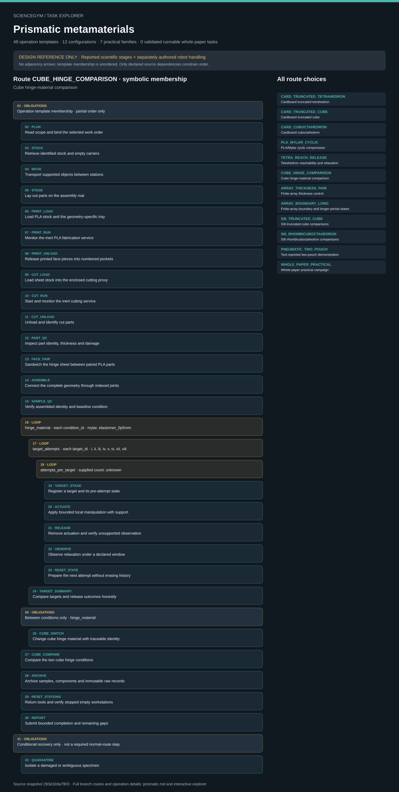

# Prismatic metamaterials: task route map



Paper: **Exploring multistability in prismatic metamaterials through local actuation** · [DOI](https://doi.org/10.1038/s41467-019-13319-7)

Author/evaluator logical inspector; symbolic task design only; no embodied execution, simulation or actor projection. Counts describe task representation, not experiments or success.

**Reading rule:** rows show unordered template membership; only declared dependencies impose order. A loop body is shown once and must be repeated under its original binding, not treated as executed. An unordered obligation group has no inferred chronological edges. Source-reported scientific facts and authored handling are distinct.

[Immutable source task package](https://github.com/openags/ScienceGym/blob/293e32da790303c1a17131e036235f69a5f342e0/tasks/prismatic_operations_v2/) · [Interactive inspector](../index.html)

## CARD_TRUNCATED_TETRAHEDRON — Cardboard truncated tetrahedron

Unordered operation-template membership with source-declared nested loops; only explicit dependencies constrain order. No cardinalities expanded or execution claimed.

[Exact route source](https://github.com/openags/ScienceGym/blob/293e32da790303c1a17131e036235f69a5f342e0/tasks/prismatic_operations_v2/branches.json) · JSON pointer: `/branches/0`

- **OBLIGATIONS: Operation template membership · partial order only**
  - Binding: {"order":"No list-order edges asserted; inspect explicit dependencies and loop_expansion","loop_expansion":{"type":"sequential_then_nested","setup_loop":"card_joints","observation_nesting":["target_attempts","attempts_per_target"],"required_record_key":["sample_id","target_id","attempt_index"]}}
  - `PLAN` Read scope and bind the selected work order
  - `STOCK` Retrieve identified stock and empty carriers
  - `MOVE` Transport supported objects between stations
  - `STAGE` Lay out parts on the assembly mat
  - `CUT_LOAD` Load sheet stock into the enclosed cutting proxy
  - `CUT_RUN` Start and monitor the inert cutting service
  - `CUT_UNLOAD` Unload and identify cut parts
  - `PART_QC` Inspect part identity, thickness and damage
  - **LOOP: card_joints · each joint_id · unknown; supplied geometry_card.joint_ids**
    - Binding: {"loop_id":"card_joints","iterator":"joint_id","values":null,"values_from":"geometry_card.joint_ids","status":"unknown_card_required"}
    - `CARD_ALIGN` Align cardboard faces and tape hinges
    - `CARD_JOIN` Secure and inspect each tape joint
  - `SAMPLE_QC` Verify assembled identity and baseline condition
  - **LOOP: target_attempts · each target_id · unknown; supplied input required**
    - Binding: {"loop_id":"target_attempts","iterator":"target_id","values":null,"values_status":"displayed_states_require_supplied_target_cards","inner_repetitions":{"input":"attempts_per_target","value":null,"status":"task_input_not_reported_independent_replicates"},"failed_attempts":"Retain every attempt; no target is forced to be retained after release","stop":"Stop current attempt at public actuation/contact limit; mark unattempted targets blocked when safe reset/sample integrity is unavailable"}
    - **LOOP: attempts_per_target · supplied count: unknown**
      - Binding: {"input":"attempts_per_target","value":null,"status":"task_input_not_reported_independent_replicates"}
      - `TARGET_STAGE` Register a target and its pre-attempt state
      - `ACTUATE` Apply bounded local manipulation with support
      - `RELEASE` Remove actuation and verify unsupported observation
      - `OBSERVE` Observe relaxation under a declared window
      - `RESET_STATE` Prepare the next attempt without erasing history
  - `TARGET_SUMMARY` Compare targets and release outcomes honestly
  - `ARCHIVE` Archive samples, components and immutable raw records
  - `RESET_STATIONS` Return tools and verify stopped empty workstations
  - `REPORT` Submit bounded completion and remaining gaps
- **OBLIGATIONS: Conditional recovery only · not a required normal-route step**
  - Binding: {"activation":"Only when source recovery conditions apply"}
  - `QUARANTINE` Isolate a damaged or ambiguous specimen

<details><summary>Branch state, choices, lineage and loop obligations</summary>

```json
{
  "family_ids": [
    "F_CARD"
  ],
  "geometry_ids": [
    "truncated_tetrahedron"
  ],
  "operation_ids": [
    "PLAN",
    "STOCK",
    "MOVE",
    "STAGE",
    "CUT_LOAD",
    "CUT_RUN",
    "CUT_UNLOAD",
    "PART_QC",
    "CARD_ALIGN",
    "CARD_JOIN",
    "SAMPLE_QC",
    "TARGET_STAGE",
    "ACTUATE",
    "RELEASE",
    "OBSERVE",
    "RESET_STATE",
    "TARGET_SUMMARY",
    "ARCHIVE",
    "RESET_STATIONS",
    "REPORT"
  ],
  "loops": [
    {
      "loop_id": "card_joints",
      "iterator": "joint_id",
      "values": null,
      "values_from": "geometry_card.joint_ids",
      "body": [
        "CARD_ALIGN",
        "CARD_JOIN"
      ],
      "status": "unknown_card_required"
    },
    {
      "loop_id": "target_attempts",
      "iterator": "target_id",
      "values": null,
      "values_status": "displayed_states_require_supplied_target_cards",
      "inner_repetitions": {
        "input": "attempts_per_target",
        "value": null,
        "status": "task_input_not_reported_independent_replicates"
      },
      "body": [
        "TARGET_STAGE",
        "ACTUATE",
        "RELEASE",
        "OBSERVE",
        "RESET_STATE"
      ],
      "failed_attempts": "Retain every attempt; no target is forced to be retained after release",
      "stop": "Stop current attempt at public actuation/contact limit; mark unattempted targets blocked when safe reset/sample integrity is unavailable"
    }
  ],
  "required_input_ids": [
    "U_GEOM",
    "U_CUT",
    "U_ACTUATION",
    "U_TARGETS",
    "U_TOLERANCE",
    "U_ROBOT"
  ],
  "evidence_ids": [
    "CARD"
  ],
  "goal": "Build the selected cardboard demonstrator, document bounded state-change attempts and archive its observed outcomes",
  "identity_policy": "One allocated specimen identity per work order; any replacement has a new ID; source historical counts unresolved",
  "completion": "Every selected required condition has records or an explicit incomplete/blocker status; blockers do not count as completed experimental conditions",
  "count_warning": "Branch count, target count, cycle count and array cell count are not independent specimen counts",
  "conditional_recovery_operation_ids": [
    "QUARANTINE"
  ],
  "loop_expansion": {
    "type": "sequential_then_nested",
    "setup_loop": "card_joints",
    "observation_nesting": [
      "target_attempts",
      "attempts_per_target"
    ],
    "required_record_key": [
      "sample_id",
      "target_id",
      "attempt_index"
    ]
  }
}
```

</details>

## CARD_TRUNCATED_CUBE — Cardboard truncated cube

Unordered operation-template membership with source-declared nested loops; only explicit dependencies constrain order. No cardinalities expanded or execution claimed.

[Exact route source](https://github.com/openags/ScienceGym/blob/293e32da790303c1a17131e036235f69a5f342e0/tasks/prismatic_operations_v2/branches.json) · JSON pointer: `/branches/1`

- **OBLIGATIONS: Operation template membership · partial order only**
  - Binding: {"order":"No list-order edges asserted; inspect explicit dependencies and loop_expansion","loop_expansion":{"type":"sequential_then_nested","setup_loop":"card_joints","observation_nesting":["target_attempts","attempts_per_target"],"required_record_key":["sample_id","target_id","attempt_index"]}}
  - `PLAN` Read scope and bind the selected work order
  - `STOCK` Retrieve identified stock and empty carriers
  - `MOVE` Transport supported objects between stations
  - `STAGE` Lay out parts on the assembly mat
  - `CUT_LOAD` Load sheet stock into the enclosed cutting proxy
  - `CUT_RUN` Start and monitor the inert cutting service
  - `CUT_UNLOAD` Unload and identify cut parts
  - `PART_QC` Inspect part identity, thickness and damage
  - **LOOP: card_joints · each joint_id · unknown; supplied geometry_card.joint_ids**
    - Binding: {"loop_id":"card_joints","iterator":"joint_id","values":null,"values_from":"geometry_card.joint_ids","status":"unknown_card_required"}
    - `CARD_ALIGN` Align cardboard faces and tape hinges
    - `CARD_JOIN` Secure and inspect each tape joint
  - `SAMPLE_QC` Verify assembled identity and baseline condition
  - **LOOP: target_attempts · each target_id · unknown; supplied input required**
    - Binding: {"loop_id":"target_attempts","iterator":"target_id","values":null,"values_status":"displayed_states_require_supplied_target_cards","inner_repetitions":{"input":"attempts_per_target","value":null,"status":"task_input_not_reported_independent_replicates"},"failed_attempts":"Retain every attempt; no target is forced to be retained after release","stop":"Stop current attempt at public actuation/contact limit; mark unattempted targets blocked when safe reset/sample integrity is unavailable"}
    - **LOOP: attempts_per_target · supplied count: unknown**
      - Binding: {"input":"attempts_per_target","value":null,"status":"task_input_not_reported_independent_replicates"}
      - `TARGET_STAGE` Register a target and its pre-attempt state
      - `ACTUATE` Apply bounded local manipulation with support
      - `RELEASE` Remove actuation and verify unsupported observation
      - `OBSERVE` Observe relaxation under a declared window
      - `RESET_STATE` Prepare the next attempt without erasing history
  - `TARGET_SUMMARY` Compare targets and release outcomes honestly
  - `ARCHIVE` Archive samples, components and immutable raw records
  - `RESET_STATIONS` Return tools and verify stopped empty workstations
  - `REPORT` Submit bounded completion and remaining gaps
- **OBLIGATIONS: Conditional recovery only · not a required normal-route step**
  - Binding: {"activation":"Only when source recovery conditions apply"}
  - `QUARANTINE` Isolate a damaged or ambiguous specimen

<details><summary>Branch state, choices, lineage and loop obligations</summary>

```json
{
  "family_ids": [
    "F_CARD"
  ],
  "geometry_ids": [
    "truncated_cube"
  ],
  "operation_ids": [
    "PLAN",
    "STOCK",
    "MOVE",
    "STAGE",
    "CUT_LOAD",
    "CUT_RUN",
    "CUT_UNLOAD",
    "PART_QC",
    "CARD_ALIGN",
    "CARD_JOIN",
    "SAMPLE_QC",
    "TARGET_STAGE",
    "ACTUATE",
    "RELEASE",
    "OBSERVE",
    "RESET_STATE",
    "TARGET_SUMMARY",
    "ARCHIVE",
    "RESET_STATIONS",
    "REPORT"
  ],
  "loops": [
    {
      "loop_id": "card_joints",
      "iterator": "joint_id",
      "values": null,
      "values_from": "geometry_card.joint_ids",
      "body": [
        "CARD_ALIGN",
        "CARD_JOIN"
      ],
      "status": "unknown_card_required"
    },
    {
      "loop_id": "target_attempts",
      "iterator": "target_id",
      "values": null,
      "values_status": "displayed_states_require_supplied_target_cards",
      "inner_repetitions": {
        "input": "attempts_per_target",
        "value": null,
        "status": "task_input_not_reported_independent_replicates"
      },
      "body": [
        "TARGET_STAGE",
        "ACTUATE",
        "RELEASE",
        "OBSERVE",
        "RESET_STATE"
      ],
      "failed_attempts": "Retain every attempt; no target is forced to be retained after release",
      "stop": "Stop current attempt at public actuation/contact limit; mark unattempted targets blocked when safe reset/sample integrity is unavailable"
    }
  ],
  "required_input_ids": [
    "U_GEOM",
    "U_CUT",
    "U_ACTUATION",
    "U_TARGETS",
    "U_TOLERANCE",
    "U_ROBOT"
  ],
  "evidence_ids": [
    "CARD"
  ],
  "goal": "Build the selected cardboard demonstrator, document bounded state-change attempts and archive its observed outcomes",
  "identity_policy": "One allocated specimen identity per work order; any replacement has a new ID; source historical counts unresolved",
  "completion": "Every selected required condition has records or an explicit incomplete/blocker status; blockers do not count as completed experimental conditions",
  "count_warning": "Branch count, target count, cycle count and array cell count are not independent specimen counts",
  "conditional_recovery_operation_ids": [
    "QUARANTINE"
  ],
  "loop_expansion": {
    "type": "sequential_then_nested",
    "setup_loop": "card_joints",
    "observation_nesting": [
      "target_attempts",
      "attempts_per_target"
    ],
    "required_record_key": [
      "sample_id",
      "target_id",
      "attempt_index"
    ]
  }
}
```

</details>

## CARD_CUBOCTAHEDRON — Cardboard cuboctahedron

Unordered operation-template membership with source-declared nested loops; only explicit dependencies constrain order. No cardinalities expanded or execution claimed.

[Exact route source](https://github.com/openags/ScienceGym/blob/293e32da790303c1a17131e036235f69a5f342e0/tasks/prismatic_operations_v2/branches.json) · JSON pointer: `/branches/2`

- **OBLIGATIONS: Operation template membership · partial order only**
  - Binding: {"order":"No list-order edges asserted; inspect explicit dependencies and loop_expansion","loop_expansion":{"type":"sequential_then_nested","setup_loop":"card_joints","observation_nesting":["target_attempts","attempts_per_target"],"required_record_key":["sample_id","target_id","attempt_index"]}}
  - `PLAN` Read scope and bind the selected work order
  - `STOCK` Retrieve identified stock and empty carriers
  - `MOVE` Transport supported objects between stations
  - `STAGE` Lay out parts on the assembly mat
  - `CUT_LOAD` Load sheet stock into the enclosed cutting proxy
  - `CUT_RUN` Start and monitor the inert cutting service
  - `CUT_UNLOAD` Unload and identify cut parts
  - `PART_QC` Inspect part identity, thickness and damage
  - **LOOP: card_joints · each joint_id · unknown; supplied geometry_card.joint_ids**
    - Binding: {"loop_id":"card_joints","iterator":"joint_id","values":null,"values_from":"geometry_card.joint_ids","status":"unknown_card_required"}
    - `CARD_ALIGN` Align cardboard faces and tape hinges
    - `CARD_JOIN` Secure and inspect each tape joint
  - `SAMPLE_QC` Verify assembled identity and baseline condition
  - **LOOP: target_attempts · each target_id · unknown; supplied input required**
    - Binding: {"loop_id":"target_attempts","iterator":"target_id","values":null,"values_status":"displayed_states_require_supplied_target_cards","inner_repetitions":{"input":"attempts_per_target","value":null,"status":"task_input_not_reported_independent_replicates"},"failed_attempts":"Retain every attempt; no target is forced to be retained after release","stop":"Stop current attempt at public actuation/contact limit; mark unattempted targets blocked when safe reset/sample integrity is unavailable"}
    - **LOOP: attempts_per_target · supplied count: unknown**
      - Binding: {"input":"attempts_per_target","value":null,"status":"task_input_not_reported_independent_replicates"}
      - `TARGET_STAGE` Register a target and its pre-attempt state
      - `ACTUATE` Apply bounded local manipulation with support
      - `RELEASE` Remove actuation and verify unsupported observation
      - `OBSERVE` Observe relaxation under a declared window
      - `RESET_STATE` Prepare the next attempt without erasing history
  - `TARGET_SUMMARY` Compare targets and release outcomes honestly
  - `ARCHIVE` Archive samples, components and immutable raw records
  - `RESET_STATIONS` Return tools and verify stopped empty workstations
  - `REPORT` Submit bounded completion and remaining gaps
- **OBLIGATIONS: Conditional recovery only · not a required normal-route step**
  - Binding: {"activation":"Only when source recovery conditions apply"}
  - `QUARANTINE` Isolate a damaged or ambiguous specimen

<details><summary>Branch state, choices, lineage and loop obligations</summary>

```json
{
  "family_ids": [
    "F_CARD"
  ],
  "geometry_ids": [
    "cuboctahedron"
  ],
  "operation_ids": [
    "PLAN",
    "STOCK",
    "MOVE",
    "STAGE",
    "CUT_LOAD",
    "CUT_RUN",
    "CUT_UNLOAD",
    "PART_QC",
    "CARD_ALIGN",
    "CARD_JOIN",
    "SAMPLE_QC",
    "TARGET_STAGE",
    "ACTUATE",
    "RELEASE",
    "OBSERVE",
    "RESET_STATE",
    "TARGET_SUMMARY",
    "ARCHIVE",
    "RESET_STATIONS",
    "REPORT"
  ],
  "loops": [
    {
      "loop_id": "card_joints",
      "iterator": "joint_id",
      "values": null,
      "values_from": "geometry_card.joint_ids",
      "body": [
        "CARD_ALIGN",
        "CARD_JOIN"
      ],
      "status": "unknown_card_required"
    },
    {
      "loop_id": "target_attempts",
      "iterator": "target_id",
      "values": null,
      "values_status": "displayed_states_require_supplied_target_cards",
      "inner_repetitions": {
        "input": "attempts_per_target",
        "value": null,
        "status": "task_input_not_reported_independent_replicates"
      },
      "body": [
        "TARGET_STAGE",
        "ACTUATE",
        "RELEASE",
        "OBSERVE",
        "RESET_STATE"
      ],
      "failed_attempts": "Retain every attempt; no target is forced to be retained after release",
      "stop": "Stop current attempt at public actuation/contact limit; mark unattempted targets blocked when safe reset/sample integrity is unavailable"
    }
  ],
  "required_input_ids": [
    "U_GEOM",
    "U_CUT",
    "U_ACTUATION",
    "U_TARGETS",
    "U_TOLERANCE",
    "U_ROBOT"
  ],
  "evidence_ids": [
    "CARD"
  ],
  "goal": "Build the selected cardboard demonstrator, document bounded state-change attempts and archive its observed outcomes",
  "identity_policy": "One allocated specimen identity per work order; any replacement has a new ID; source historical counts unresolved",
  "completion": "Every selected required condition has records or an explicit incomplete/blocker status; blockers do not count as completed experimental conditions",
  "count_warning": "Branch count, target count, cycle count and array cell count are not independent specimen counts",
  "conditional_recovery_operation_ids": [
    "QUARANTINE"
  ],
  "loop_expansion": {
    "type": "sequential_then_nested",
    "setup_loop": "card_joints",
    "observation_nesting": [
      "target_attempts",
      "attempts_per_target"
    ],
    "required_record_key": [
      "sample_id",
      "target_id",
      "attempt_index"
    ]
  }
}
```

</details>

## PLA_MYLAR_CYCLIC — PLA/Mylar cyclic compression

Unordered operation-template membership with source-declared nested loops; only explicit dependencies constrain order. No cardinalities expanded or execution claimed.

[Exact route source](https://github.com/openags/ScienceGym/blob/293e32da790303c1a17131e036235f69a5f342e0/tasks/prismatic_operations_v2/branches.json) · JSON pointer: `/branches/3`

- **OBLIGATIONS: Operation template membership · partial order only**
  - Binding: {"order":"No list-order edges asserted; inspect explicit dependencies and loop_expansion","loop_expansion":{"type":"sequential_stages","stages":[{"loop":"face_pairs","input":"geometry_card.face_ids"},{"loop":"cycles","input":"compression_card.total_cycles"}],"per_cycle_order":["COMP_LOAD","COMP_UNLOAD"],"summary_after":"declared_run_completed","required_record_key":["sample_id","assembly_version","run_id","cycle_index","leg"]}}
  - `PLAN` Read scope and bind the selected work order
  - `STOCK` Retrieve identified stock and empty carriers
  - `MOVE` Transport supported objects between stations
  - `STAGE` Lay out parts on the assembly mat
  - `PRINT_LOAD` Load PLA stock and the geometry-specific tray
  - `PRINT_RUN` Monitor the inert PLA fabrication service
  - `PRINT_UNLOAD` Release printed face pieces into numbered pockets
  - `CUT_LOAD` Load sheet stock into the enclosed cutting proxy
  - `CUT_RUN` Start and monitor the inert cutting service
  - `CUT_UNLOAD` Unload and identify cut parts
  - `PART_QC` Inspect part identity, thickness and damage
  - **LOOP: face_pairs · each face_id · unknown; supplied geometry_card.face_ids**
    - Binding: {"loop_id":"face_pairs","iterator":"face_id","values":null,"values_from":"geometry_card.face_ids","status":"unknown_card_required"}
    - `FACE_PAIR` Sandwich the hinge sheet between paired PLA parts
  - `ASSEMBLE` Connect the complete geometry through indexed joints
  - `SAMPLE_QC` Verify assembled identity and baseline condition
  - `FIXTURE_QC` Inspect the unloaded compression fixture
  - `COMP_MOUNT` Align and secure the cuboctahedron
  - `COMP_CONFIG` Set and read back the displacement program
  - **LOOP: cycles · each cycle_index · unknown; supplied compression_card.total_cycles**
    - Binding: {"loop_id":"cycles","iterator":"cycle_index","count":null,"count_from":"compression_card.total_cycles","minimum_for_summary":5,"aggregation":"Chronological last five complete cycles of the declared run; invalid final cycles yield incomplete, never select older good cycles","historical_total":"unresolved_last_five_does_not_establish_conditioning_history"}
    - `COMP_LOAD` Acquire the loading leg of one indexed cycle
    - `COMP_UNLOAD` Acquire unloading and endpoint evidence
  - `COMP_REPEAT` Continue the declared cycle plan without deleting failures
  - `COMP_AGG` Summarize the actual last five cycles
  - `COMP_UNMOUNT` Unload the specimen after verified stop
  - `ARCHIVE` Archive samples, components and immutable raw records
  - `RESET_STATIONS` Return tools and verify stopped empty workstations
  - `REPORT` Submit bounded completion and remaining gaps
- **OBLIGATIONS: Conditional recovery only · not a required normal-route step**
  - Binding: {"activation":"Only when source recovery conditions apply"}
  - `QUARANTINE` Isolate a damaged or ambiguous specimen

<details><summary>Branch state, choices, lineage and loop obligations</summary>

```json
{
  "family_ids": [
    "F_COMP"
  ],
  "geometry_ids": [
    "cuboctahedron"
  ],
  "operation_ids": [
    "PLAN",
    "STOCK",
    "MOVE",
    "STAGE",
    "PRINT_LOAD",
    "PRINT_RUN",
    "PRINT_UNLOAD",
    "CUT_LOAD",
    "CUT_RUN",
    "CUT_UNLOAD",
    "PART_QC",
    "FACE_PAIR",
    "ASSEMBLE",
    "SAMPLE_QC",
    "FIXTURE_QC",
    "COMP_MOUNT",
    "COMP_CONFIG",
    "COMP_LOAD",
    "COMP_UNLOAD",
    "COMP_REPEAT",
    "COMP_AGG",
    "COMP_UNMOUNT",
    "ARCHIVE",
    "RESET_STATIONS",
    "REPORT"
  ],
  "loops": [
    {
      "loop_id": "face_pairs",
      "iterator": "face_id",
      "values": null,
      "values_from": "geometry_card.face_ids",
      "body": [
        "FACE_PAIR"
      ],
      "status": "unknown_card_required"
    },
    {
      "loop_id": "cycles",
      "iterator": "cycle_index",
      "count": null,
      "count_from": "compression_card.total_cycles",
      "minimum_for_summary": 5,
      "body": [
        "COMP_LOAD",
        "COMP_UNLOAD"
      ],
      "aggregation": "Chronological last five complete cycles of the declared run; invalid final cycles yield incomplete, never select older good cycles",
      "historical_total": "unresolved_last_five_does_not_establish_conditioning_history"
    }
  ],
  "required_input_ids": [
    "U_GEOM",
    "U_PRINT",
    "U_CUT",
    "U_LENGTH",
    "U_LOAD",
    "U_CYCLES",
    "U_AGGREGATION",
    "U_ROBOT"
  ],
  "evidence_ids": [
    "COMP"
  ],
  "goal": "Fabricate the cuboctahedral PLA/Mylar specimen, collect both legs of the declared cyclic-compression run and summarize its actual last five cycles",
  "identity_policy": "Cycles are repeated measures on the same identified sample/version/run; independent specimen count remains unspecified",
  "completion": "Every selected required condition has records or an explicit incomplete/blocker status; blockers do not count as completed experimental conditions",
  "count_warning": "Branch count, target count, cycle count and array cell count are not independent specimen counts",
  "conditional_recovery_operation_ids": [
    "QUARANTINE"
  ],
  "loop_expansion": {
    "type": "sequential_stages",
    "stages": [
      {
        "loop": "face_pairs",
        "input": "geometry_card.face_ids"
      },
      {
        "loop": "cycles",
        "input": "compression_card.total_cycles"
      }
    ],
    "per_cycle_order": [
      "COMP_LOAD",
      "COMP_UNLOAD"
    ],
    "summary_after": "declared_run_completed",
    "required_record_key": [
      "sample_id",
      "assembly_version",
      "run_id",
      "cycle_index",
      "leg"
    ]
  }
}
```

</details>

## TETRA_REACH_RELEASE — Tetrahedron reachability and relaxation

Unordered operation-template membership with source-declared nested loops; only explicit dependencies constrain order. No cardinalities expanded or execution claimed.

[Exact route source](https://github.com/openags/ScienceGym/blob/293e32da790303c1a17131e036235f69a5f342e0/tasks/prismatic_operations_v2/branches.json) · JSON pointer: `/branches/4`

- **OBLIGATIONS: Operation template membership · partial order only**
  - Binding: {"order":"No list-order edges asserted; inspect explicit dependencies and loop_expansion","loop_expansion":{"type":"nested","outer":"target_attempts","inner":["attempts_per_target"],"required_record_key":["sample_id","target_id","attempt_index"]}}
  - `PLAN` Read scope and bind the selected work order
  - `STOCK` Retrieve identified stock and empty carriers
  - `MOVE` Transport supported objects between stations
  - `STAGE` Lay out parts on the assembly mat
  - `PRINT_LOAD` Load PLA stock and the geometry-specific tray
  - `PRINT_RUN` Monitor the inert PLA fabrication service
  - `PRINT_UNLOAD` Release printed face pieces into numbered pockets
  - `CUT_LOAD` Load sheet stock into the enclosed cutting proxy
  - `CUT_RUN` Start and monitor the inert cutting service
  - `CUT_UNLOAD` Unload and identify cut parts
  - `PART_QC` Inspect part identity, thickness and damage
  - `FACE_PAIR` Sandwich the hinge sheet between paired PLA parts
  - `ASSEMBLE` Connect the complete geometry through indexed joints
  - `SAMPLE_QC` Verify assembled identity and baseline condition
  - **LOOP: target_attempts · each target_id · i, ii, iii, iv, v, vi, vii, viii, ix, x, xi, xii, xiii, xiv, xv, xvi, xvii**
    - Binding: {"loop_id":"target_attempts","iterator":"target_id","values":["i","ii","iii","iv","v","vi","vii","viii","ix","x","xi","xii","xiii","xiv","xv","xvi","xvii"],"values_status":"17_target_labels_from_Fig4_not_17_specimens","inner_repetitions":{"input":"attempts_per_target","value":null,"status":"task_input_not_reported_independent_replicates"},"failed_attempts":"Retain every attempt; no target is forced to be retained after release","stop":"Stop current attempt at public actuation/contact limit; mark unattempted targets blocked when safe reset/sample integrity is unavailable"}
    - **LOOP: attempts_per_target · supplied count: unknown**
      - Binding: {"input":"attempts_per_target","value":null,"status":"task_input_not_reported_independent_replicates"}
      - `TARGET_STAGE` Register a target and its pre-attempt state
      - `ACTUATE` Apply bounded local manipulation with support
      - `RELEASE` Remove actuation and verify unsupported observation
      - `OBSERVE` Observe relaxation under a declared window
      - `RESET_STATE` Prepare the next attempt without erasing history
  - `TARGET_SUMMARY` Compare targets and release outcomes honestly
  - `ARCHIVE` Archive samples, components and immutable raw records
  - `RESET_STATIONS` Return tools and verify stopped empty workstations
  - `REPORT` Submit bounded completion and remaining gaps
- **OBLIGATIONS: Conditional recovery only · not a required normal-route step**
  - Binding: {"activation":"Only when source recovery conditions apply"}
  - `QUARANTINE` Isolate a damaged or ambiguous specimen

<details><summary>Branch state, choices, lineage and loop obligations</summary>

```json
{
  "family_ids": [
    "F_TETRA"
  ],
  "geometry_ids": [
    "truncated_tetrahedron"
  ],
  "operation_ids": [
    "PLAN",
    "STOCK",
    "MOVE",
    "STAGE",
    "PRINT_LOAD",
    "PRINT_RUN",
    "PRINT_UNLOAD",
    "CUT_LOAD",
    "CUT_RUN",
    "CUT_UNLOAD",
    "PART_QC",
    "FACE_PAIR",
    "ASSEMBLE",
    "SAMPLE_QC",
    "TARGET_STAGE",
    "ACTUATE",
    "RELEASE",
    "OBSERVE",
    "RESET_STATE",
    "TARGET_SUMMARY",
    "ARCHIVE",
    "RESET_STATIONS",
    "REPORT"
  ],
  "loops": [
    {
      "loop_id": "target_attempts",
      "iterator": "target_id",
      "values": [
        "i",
        "ii",
        "iii",
        "iv",
        "v",
        "vi",
        "vii",
        "viii",
        "ix",
        "x",
        "xi",
        "xii",
        "xiii",
        "xiv",
        "xv",
        "xvi",
        "xvii"
      ],
      "values_status": "17_target_labels_from_Fig4_not_17_specimens",
      "inner_repetitions": {
        "input": "attempts_per_target",
        "value": null,
        "status": "task_input_not_reported_independent_replicates"
      },
      "body": [
        "TARGET_STAGE",
        "ACTUATE",
        "RELEASE",
        "OBSERVE",
        "RESET_STATE"
      ],
      "failed_attempts": "Retain every attempt; no target is forced to be retained after release",
      "stop": "Stop current attempt at public actuation/contact limit; mark unattempted targets blocked when safe reset/sample integrity is unavailable"
    }
  ],
  "required_input_ids": [
    "U_GEOM",
    "U_PRINT",
    "U_CUT",
    "U_ACTUATION",
    "U_TARGETS",
    "U_REPLICATES",
    "U_ROBOT"
  ],
  "evidence_ids": [
    "TETRA"
  ],
  "goal": "Attempt the 17 supplied configurations within the permitted actuation envelope and distinguish loaded reachability from post-release outcomes",
  "identity_policy": "Reuse is permitted only with a safe documented reset; every attempt references the same sample or an explicit replacement",
  "completion": "Every selected required condition has records or an explicit incomplete/blocker status; blockers do not count as completed experimental conditions",
  "count_warning": "Branch count, target count, cycle count and array cell count are not independent specimen counts",
  "conditional_recovery_operation_ids": [
    "QUARANTINE"
  ],
  "loop_expansion": {
    "type": "nested",
    "outer": "target_attempts",
    "inner": [
      "attempts_per_target"
    ],
    "required_record_key": [
      "sample_id",
      "target_id",
      "attempt_index"
    ]
  }
}
```

</details>

## CUBE_HINGE_COMPARISON — Cube hinge-material comparison

Unordered operation-template membership with source-declared nested loops; only explicit dependencies constrain order. No cardinalities expanded or execution claimed.

[Exact route source](https://github.com/openags/ScienceGym/blob/293e32da790303c1a17131e036235f69a5f342e0/tasks/prismatic_operations_v2/branches.json) · JSON pointer: `/branches/5`

- **OBLIGATIONS: Operation template membership · partial order only**
  - Binding: {"order":"No list-order edges asserted; inspect explicit dependencies and loop_expansion","loop_expansion":{"type":"nested","outer":"hinge_material","inner":["target_attempts","attempts_per_target"],"order":"Finish or explicitly block the material-specific target inventory before material exchange/next matched specimen","required_record_key":["sample_id","assembly_version","condition_id","target_id","attempt_index"],"condition_target_grid":{"conditions":["mylar","elastomer_0p5mm"],"targets":["i","ii","iii","iv","v","vi","vii","viii"],"cartesian_product_required":true,"minimum_distinct_condition_target_cells":16,"counts_are":"scheduled condition-target cells, not samples or successful retained states"}}}
  - `PLAN` Read scope and bind the selected work order
  - `STOCK` Retrieve identified stock and empty carriers
  - `MOVE` Transport supported objects between stations
  - `STAGE` Lay out parts on the assembly mat
  - `PRINT_LOAD` Load PLA stock and the geometry-specific tray
  - `PRINT_RUN` Monitor the inert PLA fabrication service
  - `PRINT_UNLOAD` Release printed face pieces into numbered pockets
  - `CUT_LOAD` Load sheet stock into the enclosed cutting proxy
  - `CUT_RUN` Start and monitor the inert cutting service
  - `CUT_UNLOAD` Unload and identify cut parts
  - `PART_QC` Inspect part identity, thickness and damage
  - `FACE_PAIR` Sandwich the hinge sheet between paired PLA parts
  - `ASSEMBLE` Connect the complete geometry through indexed joints
  - `SAMPLE_QC` Verify assembled identity and baseline condition
  - **LOOP: hinge_material · each condition_id · mylar, elastomer_0p5mm**
    - Binding: {"loop_id":"hinge_material","iterator":"condition_id","values":["mylar","elastomer_0p5mm"],"between_conditions":["CUBE_SWITCH"],"identity_option":"Explicit matched separate specimens or supported same-body new-version hinge replacement, chosen in episode card"}
    - **LOOP: target_attempts · each target_id · i, ii, iii, iv, v, vi, vii, viii**
      - Binding: {"loop_id":"target_attempts","iterator":"target_id","values":["i","ii","iii","iv","v","vi","vii","viii"],"values_status":"8_model_target_labels_not_sample_count","inner_repetitions":{"input":"attempts_per_target","value":null,"status":"task_input_not_reported_independent_replicates"},"failed_attempts":"Retain every attempt; no target is forced to be retained after release","stop":"Stop current attempt at public actuation/contact limit; mark unattempted targets blocked when safe reset/sample integrity is unavailable"}
      - **LOOP: attempts_per_target · supplied count: unknown**
        - Binding: {"input":"attempts_per_target","value":null,"status":"task_input_not_reported_independent_replicates"}
        - `TARGET_STAGE` Register a target and its pre-attempt state
        - `ACTUATE` Apply bounded local manipulation with support
        - `RELEASE` Remove actuation and verify unsupported observation
        - `OBSERVE` Observe relaxation under a declared window
        - `RESET_STATE` Prepare the next attempt without erasing history
    - `TARGET_SUMMARY` Compare targets and release outcomes honestly
  - **OBLIGATIONS: Between conditions only · hinge_material**
    - Binding: {"between_conditions":["CUBE_SWITCH"],"identity_option":"Explicit matched separate specimens or supported same-body new-version hinge replacement, chosen in episode card"}
    - `CUBE_SWITCH` Change cube hinge material with traceable identity
  - `CUBE_COMPARE` Compare the two cube hinge conditions
  - `ARCHIVE` Archive samples, components and immutable raw records
  - `RESET_STATIONS` Return tools and verify stopped empty workstations
  - `REPORT` Submit bounded completion and remaining gaps
- **OBLIGATIONS: Conditional recovery only · not a required normal-route step**
  - Binding: {"activation":"Only when source recovery conditions apply"}
  - `QUARANTINE` Isolate a damaged or ambiguous specimen

<details><summary>Branch state, choices, lineage and loop obligations</summary>

```json
{
  "family_ids": [
    "F_CUBE"
  ],
  "geometry_ids": [
    "cube"
  ],
  "operation_ids": [
    "PLAN",
    "STOCK",
    "MOVE",
    "STAGE",
    "PRINT_LOAD",
    "PRINT_RUN",
    "PRINT_UNLOAD",
    "CUT_LOAD",
    "CUT_RUN",
    "CUT_UNLOAD",
    "PART_QC",
    "FACE_PAIR",
    "ASSEMBLE",
    "SAMPLE_QC",
    "TARGET_STAGE",
    "ACTUATE",
    "RELEASE",
    "OBSERVE",
    "RESET_STATE",
    "TARGET_SUMMARY",
    "CUBE_SWITCH",
    "CUBE_COMPARE",
    "ARCHIVE",
    "RESET_STATIONS",
    "REPORT"
  ],
  "loops": [
    {
      "loop_id": "hinge_material",
      "iterator": "condition_id",
      "values": [
        "mylar",
        "elastomer_0p5mm"
      ],
      "body": [
        "TARGET_STAGE",
        "ACTUATE",
        "RELEASE",
        "OBSERVE",
        "RESET_STATE",
        "TARGET_SUMMARY"
      ],
      "between_conditions": [
        "CUBE_SWITCH"
      ],
      "identity_option": "Explicit matched separate specimens or supported same-body new-version hinge replacement, chosen in episode card"
    },
    {
      "loop_id": "target_attempts",
      "iterator": "target_id",
      "values": [
        "i",
        "ii",
        "iii",
        "iv",
        "v",
        "vi",
        "vii",
        "viii"
      ],
      "values_status": "8_model_target_labels_not_sample_count",
      "inner_repetitions": {
        "input": "attempts_per_target",
        "value": null,
        "status": "task_input_not_reported_independent_replicates"
      },
      "body": [
        "TARGET_STAGE",
        "ACTUATE",
        "RELEASE",
        "OBSERVE",
        "RESET_STATE"
      ],
      "failed_attempts": "Retain every attempt; no target is forced to be retained after release",
      "stop": "Stop current attempt at public actuation/contact limit; mark unattempted targets blocked when safe reset/sample integrity is unavailable"
    }
  ],
  "required_input_ids": [
    "U_GEOM",
    "U_PRINT",
    "U_CUT",
    "U_ACTUATION",
    "U_ELASTOMER",
    "U_TARGETS",
    "U_HISTORY",
    "U_ROBOT"
  ],
  "evidence_ids": [
    "CUBE"
  ],
  "goal": "Compare the bounded target and release outcomes of Mylar- and elastomer-hinged cubes without discarding failures",
  "identity_policy": "Material changes require new physical components and assembly version or new matched sample; do not silently relabel or count replacement as an independent specimen",
  "completion": "Every selected required condition has records or an explicit incomplete/blocker status; blockers do not count as completed experimental conditions",
  "count_warning": "Branch count, target count, cycle count and array cell count are not independent specimen counts",
  "conditional_recovery_operation_ids": [
    "QUARANTINE"
  ],
  "loop_expansion": {
    "type": "nested",
    "outer": "hinge_material",
    "inner": [
      "target_attempts",
      "attempts_per_target"
    ],
    "order": "Finish or explicitly block the material-specific target inventory before material exchange/next matched specimen",
    "required_record_key": [
      "sample_id",
      "assembly_version",
      "condition_id",
      "target_id",
      "attempt_index"
    ],
    "condition_target_grid": {
      "conditions": [
        "mylar",
        "elastomer_0p5mm"
      ],
      "targets": [
        "i",
        "ii",
        "iii",
        "iv",
        "v",
        "vi",
        "vii",
        "viii"
      ],
      "cartesian_product_required": true,
      "minimum_distinct_condition_target_cells": 16,
      "counts_are": "scheduled condition-target cells, not samples or successful retained states"
    }
  }
}
```

</details>

## ARRAY_THICKNESS_PAIR — Finite-array thickness control

Unordered operation-template membership with source-declared nested loops; only explicit dependencies constrain order. No cardinalities expanded or execution claimed.

[Exact route source](https://github.com/openags/ScienceGym/blob/293e32da790303c1a17131e036235f69a5f342e0/tasks/prismatic_operations_v2/branches.json) · JSON pointer: `/branches/6`

- **OBLIGATIONS: Operation template membership · partial order only**
  - Binding: {"order":"No list-order edges asserted; inspect explicit dependencies and loop_expansion","loop_expansion":{"type":"nested_with_setup","outer":"array_thickness","per_outer_setup_loop":"array_slots","inner":["target_attempts","attempts_per_target"],"unit_slots_per_outer":8,"required_record_key":["array_id","assembly_version","condition_id","target_id","attempt_index"],"condition_target_grid":{"conditions":["mylar_50um","mylar_125um"],"targets_from":"array_card.bulk_target_ids","cartesian_product_required":true,"null_target_list_blocks":true},"slot_identity_scope":"Eight distinct unit IDs per separately identified array; no unit belongs simultaneously to both arrays"}}
  - `PLAN` Read scope and bind the selected work order
  - `STOCK` Retrieve identified stock and empty carriers
  - `MOVE` Transport supported objects between stations
  - **LOOP: array_thickness · each condition_id · mylar_50um, mylar_125um**
    - Binding: {"loop_id":"array_thickness","iterator":"condition_id","values":["mylar_50um","mylar_125um"],"independent_samples":"Source explicitly reports a second thicker-sheet sample; episode supplies separate IDs for thickness conditions"}
    - **LOOP: array_slots · each slot_xyz · 8 slot bindings, not specimens**
      - Binding: {"loop_id":"array_slots","iterator":"slot_xyz","values":[[0,0,0],[0,0,1],[0,1,0],[0,1,1],[1,0,0],[1,0,1],[1,1,0],[1,1,1]],"semantics":"8 unit slots inside one array, not 8 experimental specimens"}
      - `ARRAY_PREP` Bind finite-array units and eight cell slots
      - `ARRAY_JOIN` Assemble and inspect intercell connections
    - `SAMPLE_QC` Verify assembled identity and baseline condition
    - **LOOP: target_attempts · each target_id · unknown; supplied input required**
      - Binding: {"loop_id":"target_attempts","iterator":"target_id","values":null,"values_status":"bulk_target_geometry_cards_missing","inner_repetitions":{"input":"attempts_per_target","value":null,"status":"task_input_not_reported_independent_replicates"},"failed_attempts":"Retain every attempt; no target is forced to be retained after release","stop":"Stop current attempt at public actuation/contact limit; mark unattempted targets blocked when safe reset/sample integrity is unavailable","targets_from":"array_card.bulk_target_ids","null_target_list_blocks":true}
      - **LOOP: attempts_per_target · supplied count: unknown**
        - Binding: {"input":"attempts_per_target","value":null,"status":"task_input_not_reported_independent_replicates"}
        - `TARGET_STAGE` Register a target and its pre-attempt state
        - `ACTUATE` Apply bounded local manipulation with support
        - `RELEASE` Remove actuation and verify unsupported observation
        - `OBSERVE` Observe relaxation under a declared window
        - `RESET_STATE` Prepare the next attempt without erasing history
    - `TARGET_SUMMARY` Compare targets and release outcomes honestly
    - `ARRAY_CLASSIFY` Record bulk, boundary and longer-period observations
  - `ARRAY_THICKNESS` Compare 50 and 125 micrometre arrays
  - `ARCHIVE` Archive samples, components and immutable raw records
  - `RESET_STATIONS` Return tools and verify stopped empty workstations
  - `REPORT` Submit bounded completion and remaining gaps
- **OBLIGATIONS: Conditional recovery only · not a required normal-route step**
  - Binding: {"activation":"Only when source recovery conditions apply"}
  - `QUARANTINE` Isolate a damaged or ambiguous specimen

<details><summary>Branch state, choices, lineage and loop obligations</summary>

```json
{
  "family_ids": [
    "F_ARRAY"
  ],
  "geometry_ids": [
    "cuboctahedron_2x2x2"
  ],
  "operation_ids": [
    "PLAN",
    "STOCK",
    "MOVE",
    "ARRAY_PREP",
    "ARRAY_JOIN",
    "SAMPLE_QC",
    "TARGET_STAGE",
    "ACTUATE",
    "RELEASE",
    "OBSERVE",
    "RESET_STATE",
    "TARGET_SUMMARY",
    "ARRAY_CLASSIFY",
    "ARRAY_THICKNESS",
    "ARCHIVE",
    "RESET_STATIONS",
    "REPORT"
  ],
  "loops": [
    {
      "loop_id": "array_thickness",
      "iterator": "condition_id",
      "values": [
        "mylar_50um",
        "mylar_125um"
      ],
      "body": [
        "ARRAY_PREP",
        "ARRAY_JOIN",
        "SAMPLE_QC",
        "TARGET_STAGE",
        "ACTUATE",
        "RELEASE",
        "OBSERVE",
        "RESET_STATE",
        "TARGET_SUMMARY",
        "ARRAY_CLASSIFY"
      ],
      "independent_samples": "Source explicitly reports a second thicker-sheet sample; episode supplies separate IDs for thickness conditions"
    },
    {
      "loop_id": "array_slots",
      "iterator": "slot_xyz",
      "values": [
        [
          0,
          0,
          0
        ],
        [
          0,
          0,
          1
        ],
        [
          0,
          1,
          0
        ],
        [
          0,
          1,
          1
        ],
        [
          1,
          0,
          0
        ],
        [
          1,
          0,
          1
        ],
        [
          1,
          1,
          0
        ],
        [
          1,
          1,
          1
        ]
      ],
      "body": [
        "ARRAY_PREP",
        "ARRAY_JOIN"
      ],
      "semantics": "8 unit slots inside one array, not 8 experimental specimens"
    },
    {
      "loop_id": "target_attempts",
      "iterator": "target_id",
      "values": null,
      "values_status": "bulk_target_geometry_cards_missing",
      "inner_repetitions": {
        "input": "attempts_per_target",
        "value": null,
        "status": "task_input_not_reported_independent_replicates"
      },
      "body": [
        "TARGET_STAGE",
        "ACTUATE",
        "RELEASE",
        "OBSERVE",
        "RESET_STATE"
      ],
      "failed_attempts": "Retain every attempt; no target is forced to be retained after release",
      "stop": "Stop current attempt at public actuation/contact limit; mark unattempted targets blocked when safe reset/sample integrity is unavailable"
    }
  ],
  "required_input_ids": [
    "U_GEOM",
    "U_ARRAY_FACE",
    "U_ARRAY_TOPOLOGY",
    "U_ACTUATION",
    "U_TARGETS",
    "U_ROBOT"
  ],
  "evidence_ids": [
    "ARRAY"
  ],
  "goal": "Prepare and compare the 50 and 125 micrometre Mylar finite arrays using matched attempted target conditions",
  "identity_policy": "Two separately identified thickness-condition arrays; eight unit identities belong to each parent assembly, not 16 independent experimental replicates",
  "completion": "Every selected required condition has records or an explicit incomplete/blocker status; blockers do not count as completed experimental conditions",
  "count_warning": "Branch count, target count, cycle count and array cell count are not independent specimen counts",
  "conditional_recovery_operation_ids": [
    "QUARANTINE"
  ],
  "loop_expansion": {
    "type": "nested_with_setup",
    "outer": "array_thickness",
    "per_outer_setup_loop": "array_slots",
    "inner": [
      "target_attempts",
      "attempts_per_target"
    ],
    "unit_slots_per_outer": 8,
    "required_record_key": [
      "array_id",
      "assembly_version",
      "condition_id",
      "target_id",
      "attempt_index"
    ],
    "condition_target_grid": {
      "conditions": [
        "mylar_50um",
        "mylar_125um"
      ],
      "targets_from": "array_card.bulk_target_ids",
      "cartesian_product_required": true,
      "null_target_list_blocks": true
    },
    "slot_identity_scope": "Eight distinct unit IDs per separately identified array; no unit belongs simultaneously to both arrays"
  }
}
```

</details>

## ARRAY_BOUNDARY_LONG — Finite-array boundary and longer-period states

Unordered operation-template membership with source-declared nested loops; only explicit dependencies constrain order. No cardinalities expanded or execution claimed.

[Exact route source](https://github.com/openags/ScienceGym/blob/293e32da790303c1a17131e036235f69a5f342e0/tasks/prismatic_operations_v2/branches.json) · JSON pointer: `/branches/7`

- **OBLIGATIONS: Operation template membership · partial order only**
  - Binding: {"order":"No list-order edges asserted; inspect explicit dependencies and loop_expansion","loop_expansion":{"type":"nested","outer":"target_class","inner":["target_ids_for_class","attempts_per_target"],"target_ids_from":"array_card.targets_by_class","required_record_key":["array_id","target_class","target_id","attempt_index"],"required_classes":["bulk_compatible","edge_or_corner","longer_than_one_cell"],"null_class_target_list_blocks":true}}
  - `PLAN` Read scope and bind the selected work order
  - `STOCK` Retrieve identified stock and empty carriers
  - `MOVE` Transport supported objects between stations
  - `ARRAY_PREP` Bind finite-array units and eight cell slots
  - `ARRAY_JOIN` Assemble and inspect intercell connections
  - `SAMPLE_QC` Verify assembled identity and baseline condition
  - **LOOP: target_class · each condition_id · bulk_compatible, edge_or_corner, longer_than_one_cell**
    - Binding: {"loop_id":"target_class","iterator":"condition_id","values":["bulk_compatible","edge_or_corner","longer_than_one_cell"],"source_scope":"Observed finite-boundary/longer-period effects, not all possible edge or corner states"}
    - **LOOP: target_attempts · each target_id · unknown; supplied input required**
      - Binding: {"loop_id":"target_attempts","iterator":"target_id","values":null,"values_status":"target_geometries_and_count_require_public_card","inner_repetitions":{"input":"attempts_per_target","value":null,"status":"task_input_not_reported_independent_replicates"},"failed_attempts":"Retain every attempt; no target is forced to be retained after release","stop":"Stop current attempt at public actuation/contact limit; mark unattempted targets blocked when safe reset/sample integrity is unavailable","targets_from":"array_card.targets_by_class","null_class_target_list_blocks":true}
      - **LOOP: attempts_per_target · supplied count: unknown**
        - Binding: {"input":"attempts_per_target","value":null,"status":"task_input_not_reported_independent_replicates"}
        - `TARGET_STAGE` Register a target and its pre-attempt state
        - `ACTUATE` Apply bounded local manipulation with support
        - `RELEASE` Remove actuation and verify unsupported observation
        - `OBSERVE` Observe relaxation under a declared window
        - `RESET_STATE` Prepare the next attempt without erasing history
    - `TARGET_SUMMARY` Compare targets and release outcomes honestly
    - `ARRAY_CLASSIFY` Record bulk, boundary and longer-period observations
  - `ARCHIVE` Archive samples, components and immutable raw records
  - `RESET_STATIONS` Return tools and verify stopped empty workstations
  - `REPORT` Submit bounded completion and remaining gaps
- **OBLIGATIONS: Conditional recovery only · not a required normal-route step**
  - Binding: {"activation":"Only when source recovery conditions apply"}
  - `QUARANTINE` Isolate a damaged or ambiguous specimen

<details><summary>Branch state, choices, lineage and loop obligations</summary>

```json
{
  "family_ids": [
    "F_ARRAY"
  ],
  "geometry_ids": [
    "cuboctahedron_2x2x2"
  ],
  "operation_ids": [
    "PLAN",
    "STOCK",
    "MOVE",
    "ARRAY_PREP",
    "ARRAY_JOIN",
    "SAMPLE_QC",
    "TARGET_STAGE",
    "ACTUATE",
    "RELEASE",
    "OBSERVE",
    "RESET_STATE",
    "TARGET_SUMMARY",
    "ARRAY_CLASSIFY",
    "ARCHIVE",
    "RESET_STATIONS",
    "REPORT"
  ],
  "loops": [
    {
      "loop_id": "target_class",
      "iterator": "condition_id",
      "values": [
        "bulk_compatible",
        "edge_or_corner",
        "longer_than_one_cell"
      ],
      "body": [
        "TARGET_STAGE",
        "ACTUATE",
        "RELEASE",
        "OBSERVE",
        "RESET_STATE",
        "TARGET_SUMMARY",
        "ARRAY_CLASSIFY"
      ],
      "source_scope": "Observed finite-boundary/longer-period effects, not all possible edge or corner states"
    },
    {
      "loop_id": "target_attempts",
      "iterator": "target_id",
      "values": null,
      "values_status": "target_geometries_and_count_require_public_card",
      "inner_repetitions": {
        "input": "attempts_per_target",
        "value": null,
        "status": "task_input_not_reported_independent_replicates"
      },
      "body": [
        "TARGET_STAGE",
        "ACTUATE",
        "RELEASE",
        "OBSERVE",
        "RESET_STATE"
      ],
      "failed_attempts": "Retain every attempt; no target is forced to be retained after release",
      "stop": "Stop current attempt at public actuation/contact limit; mark unattempted targets blocked when safe reset/sample integrity is unavailable"
    }
  ],
  "required_input_ids": [
    "U_GEOM",
    "U_ARRAY_FACE",
    "U_ARRAY_TOPOLOGY",
    "U_ACTUATION",
    "U_TARGETS",
    "U_ROBOT"
  ],
  "evidence_ids": [
    "ARRAY"
  ],
  "goal": "Record finite-array bulk, boundary and longer-period configuration attempts with per-cell observations",
  "identity_policy": "May reuse an explicit thin-array parent from another branch only with history, starting state and safe transfer; reuse is never assumed",
  "completion": "Every selected required condition has records or an explicit incomplete/blocker status; blockers do not count as completed experimental conditions",
  "count_warning": "Branch count, target count, cycle count and array cell count are not independent specimen counts",
  "conditional_recovery_operation_ids": [
    "QUARANTINE"
  ],
  "loop_expansion": {
    "type": "nested",
    "outer": "target_class",
    "inner": [
      "target_ids_for_class",
      "attempts_per_target"
    ],
    "target_ids_from": "array_card.targets_by_class",
    "required_record_key": [
      "array_id",
      "target_class",
      "target_id",
      "attempt_index"
    ],
    "required_classes": [
      "bulk_compatible",
      "edge_or_corner",
      "longer_than_one_cell"
    ],
    "null_class_target_list_blocks": true
  }
}
```

</details>

## SI6_TRUNCATED_CUBE — SI6 truncated cube comparisons

Unordered operation-template membership with source-declared nested loops; only explicit dependencies constrain order. No cardinalities expanded or execution claimed.

[Exact route source](https://github.com/openags/ScienceGym/blob/293e32da790303c1a17131e036235f69a5f342e0/tasks/prismatic_operations_v2/branches.json) · JSON pointer: `/branches/8`

- **OBLIGATIONS: Operation template membership · partial order only**
  - Binding: {"order":"No list-order edges asserted; inspect explicit dependencies and loop_expansion","loop_expansion":{"type":"nested","outer":"target_attempts","inner":["attempts_per_target"],"required_record_key":["sample_id","target_id","attempt_index"]}}
  - `PLAN` Read scope and bind the selected work order
  - `MOVE` Transport supported objects between stations
  - `SI_HANDOFF` Receive or construct the qualified SI6 specimen
  - `SAMPLE_QC` Verify assembled identity and baseline condition
  - **LOOP: target_attempts · each target_id · 1, 2, 3, 4, 5, 6, 7, 8, 9, 10, 11**
    - Binding: {"loop_id":"target_attempts","iterator":"target_id","values":["1","2","3","4","5","6","7","8","9","10","11"],"values_status":"11_selected_displayed_model_physical_pairs_not_exhaustive_or_replicate_count","inner_repetitions":{"input":"attempts_per_target","value":null,"status":"task_input_not_reported_independent_replicates"},"failed_attempts":"Retain every attempt; no target is forced to be retained after release","stop":"Stop current attempt at public actuation/contact limit; mark unattempted targets blocked when safe reset/sample integrity is unavailable"}
    - **LOOP: attempts_per_target · supplied count: unknown**
      - Binding: {"input":"attempts_per_target","value":null,"status":"task_input_not_reported_independent_replicates"}
      - `TARGET_STAGE` Register a target and its pre-attempt state
      - `ACTUATE` Apply bounded local manipulation with support
      - `RELEASE` Remove actuation and verify unsupported observation
      - `OBSERVE` Observe relaxation under a declared window
      - `RESET_STATE` Prepare the next attempt without erasing history
  - `TARGET_SUMMARY` Compare targets and release outcomes honestly
  - `SI_COMPARE` Match SI6 selected model/physical configuration pairs
  - `ARCHIVE` Archive samples, components and immutable raw records
  - `RESET_STATIONS` Return tools and verify stopped empty workstations
  - `REPORT` Submit bounded completion and remaining gaps
- **OBLIGATIONS: Conditional recovery only · not a required normal-route step**
  - Binding: {"activation":"Only when source recovery conditions apply"}
  - `QUARANTINE` Isolate a damaged or ambiguous specimen

<details><summary>Branch state, choices, lineage and loop obligations</summary>

```json
{
  "family_ids": [
    "F_SI6"
  ],
  "geometry_ids": [
    "truncated_cube"
  ],
  "operation_ids": [
    "PLAN",
    "MOVE",
    "SI_HANDOFF",
    "SAMPLE_QC",
    "TARGET_STAGE",
    "ACTUATE",
    "RELEASE",
    "OBSERVE",
    "RESET_STATE",
    "TARGET_SUMMARY",
    "SI_COMPARE",
    "ARCHIVE",
    "RESET_STATIONS",
    "REPORT"
  ],
  "loops": [
    {
      "loop_id": "target_attempts",
      "iterator": "target_id",
      "values": [
        "1",
        "2",
        "3",
        "4",
        "5",
        "6",
        "7",
        "8",
        "9",
        "10",
        "11"
      ],
      "values_status": "11_selected_displayed_model_physical_pairs_not_exhaustive_or_replicate_count",
      "inner_repetitions": {
        "input": "attempts_per_target",
        "value": null,
        "status": "task_input_not_reported_independent_replicates"
      },
      "body": [
        "TARGET_STAGE",
        "ACTUATE",
        "RELEASE",
        "OBSERVE",
        "RESET_STATE"
      ],
      "failed_attempts": "Retain every attempt; no target is forced to be retained after release",
      "stop": "Stop current attempt at public actuation/contact limit; mark unattempted targets blocked when safe reset/sample integrity is unavailable"
    }
  ],
  "required_input_ids": [
    "U_SI_MATERIAL",
    "U_GEOM",
    "U_ACTUATION",
    "U_TARGETS",
    "U_HISTORY",
    "U_ROBOT"
  ],
  "evidence_ids": [
    "SI6"
  ],
  "goal": "Compare observed configurations with the selected SI6 target-view cards, preserving uncertain matches and release behavior",
  "identity_policy": "Published pictures do not establish number/reuse of historical specimens; episode manifest explicitly allocates/reuses specimens",
  "completion": "Every selected required condition has records or an explicit incomplete/blocker status; blockers do not count as completed experimental conditions",
  "count_warning": "Branch count, target count, cycle count and array cell count are not independent specimen counts",
  "conditional_recovery_operation_ids": [
    "QUARANTINE"
  ],
  "loop_expansion": {
    "type": "nested",
    "outer": "target_attempts",
    "inner": [
      "attempts_per_target"
    ],
    "required_record_key": [
      "sample_id",
      "target_id",
      "attempt_index"
    ]
  }
}
```

</details>

## SI6_RHOMBICUBOCTAHEDRON — SI6 rhombicuboctahedron comparisons

Unordered operation-template membership with source-declared nested loops; only explicit dependencies constrain order. No cardinalities expanded or execution claimed.

[Exact route source](https://github.com/openags/ScienceGym/blob/293e32da790303c1a17131e036235f69a5f342e0/tasks/prismatic_operations_v2/branches.json) · JSON pointer: `/branches/9`

- **OBLIGATIONS: Operation template membership · partial order only**
  - Binding: {"order":"No list-order edges asserted; inspect explicit dependencies and loop_expansion","loop_expansion":{"type":"nested","outer":"target_attempts","inner":["attempts_per_target"],"required_record_key":["sample_id","target_id","attempt_index"]}}
  - `PLAN` Read scope and bind the selected work order
  - `MOVE` Transport supported objects between stations
  - `SI_HANDOFF` Receive or construct the qualified SI6 specimen
  - `SAMPLE_QC` Verify assembled identity and baseline condition
  - **LOOP: target_attempts · each target_id · 1, 2, 3, 4, 5, 6, 7, 8, 9, 10, 11, 12, 13, 14, 15**
    - Binding: {"loop_id":"target_attempts","iterator":"target_id","values":["1","2","3","4","5","6","7","8","9","10","11","12","13","14","15"],"values_status":"15_selected_displayed_model_physical_pairs_not_exhaustive_or_replicate_count","inner_repetitions":{"input":"attempts_per_target","value":null,"status":"task_input_not_reported_independent_replicates"},"failed_attempts":"Retain every attempt; no target is forced to be retained after release","stop":"Stop current attempt at public actuation/contact limit; mark unattempted targets blocked when safe reset/sample integrity is unavailable"}
    - **LOOP: attempts_per_target · supplied count: unknown**
      - Binding: {"input":"attempts_per_target","value":null,"status":"task_input_not_reported_independent_replicates"}
      - `TARGET_STAGE` Register a target and its pre-attempt state
      - `ACTUATE` Apply bounded local manipulation with support
      - `RELEASE` Remove actuation and verify unsupported observation
      - `OBSERVE` Observe relaxation under a declared window
      - `RESET_STATE` Prepare the next attempt without erasing history
  - `TARGET_SUMMARY` Compare targets and release outcomes honestly
  - `SI_COMPARE` Match SI6 selected model/physical configuration pairs
  - `ARCHIVE` Archive samples, components and immutable raw records
  - `RESET_STATIONS` Return tools and verify stopped empty workstations
  - `REPORT` Submit bounded completion and remaining gaps
- **OBLIGATIONS: Conditional recovery only · not a required normal-route step**
  - Binding: {"activation":"Only when source recovery conditions apply"}
  - `QUARANTINE` Isolate a damaged or ambiguous specimen

<details><summary>Branch state, choices, lineage and loop obligations</summary>

```json
{
  "family_ids": [
    "F_SI6"
  ],
  "geometry_ids": [
    "rhombicuboctahedron"
  ],
  "operation_ids": [
    "PLAN",
    "MOVE",
    "SI_HANDOFF",
    "SAMPLE_QC",
    "TARGET_STAGE",
    "ACTUATE",
    "RELEASE",
    "OBSERVE",
    "RESET_STATE",
    "TARGET_SUMMARY",
    "SI_COMPARE",
    "ARCHIVE",
    "RESET_STATIONS",
    "REPORT"
  ],
  "loops": [
    {
      "loop_id": "target_attempts",
      "iterator": "target_id",
      "values": [
        "1",
        "2",
        "3",
        "4",
        "5",
        "6",
        "7",
        "8",
        "9",
        "10",
        "11",
        "12",
        "13",
        "14",
        "15"
      ],
      "values_status": "15_selected_displayed_model_physical_pairs_not_exhaustive_or_replicate_count",
      "inner_repetitions": {
        "input": "attempts_per_target",
        "value": null,
        "status": "task_input_not_reported_independent_replicates"
      },
      "body": [
        "TARGET_STAGE",
        "ACTUATE",
        "RELEASE",
        "OBSERVE",
        "RESET_STATE"
      ],
      "failed_attempts": "Retain every attempt; no target is forced to be retained after release",
      "stop": "Stop current attempt at public actuation/contact limit; mark unattempted targets blocked when safe reset/sample integrity is unavailable"
    }
  ],
  "required_input_ids": [
    "U_SI_MATERIAL",
    "U_GEOM",
    "U_ACTUATION",
    "U_TARGETS",
    "U_HISTORY",
    "U_ROBOT"
  ],
  "evidence_ids": [
    "SI6"
  ],
  "goal": "Compare observed configurations with the selected SI6 target-view cards, preserving uncertain matches and release behavior",
  "identity_policy": "Published pictures do not establish number/reuse of historical specimens; episode manifest explicitly allocates/reuses specimens",
  "completion": "Every selected required condition has records or an explicit incomplete/blocker status; blockers do not count as completed experimental conditions",
  "count_warning": "Branch count, target count, cycle count and array cell count are not independent specimen counts",
  "conditional_recovery_operation_ids": [
    "QUARANTINE"
  ],
  "loop_expansion": {
    "type": "nested",
    "outer": "target_attempts",
    "inner": [
      "attempts_per_target"
    ],
    "required_record_key": [
      "sample_id",
      "target_id",
      "attempt_index"
    ]
  }
}
```

</details>

## PNEUMATIC_TWO_POUCH — Text-reported two-pouch demonstration

Unordered operation-template membership with source-declared nested loops; only explicit dependencies constrain order. No cardinalities expanded or execution claimed.

[Exact route source](https://github.com/openags/ScienceGym/blob/293e32da790303c1a17131e036235f69a5f342e0/tasks/prismatic_operations_v2/branches.json) · JSON pointer: `/branches/10`

- **OBLIGATIONS: Operation template membership · partial order only**
  - Binding: {"order":"No list-order edges asserted; inspect explicit dependencies and loop_expansion","loop_expansion":{"type":"nested","outer":"pneumatic_programs","inner":["attempts_per_program"],"counts_from":"pneumatic_card.program_ids and repetitions","required_record_key":["sample_id","program_id","attempt_index"],"null_program_list_blocks":true,"no_inferred_four_programs":true}}
  - `PLAN` Read scope and bind the selected work order
  - `MOVE` Transport supported objects between stations
  - `PNEU_PREP` Prepare the text-reported two-pouch branch
  - `SAMPLE_QC` Verify assembled identity and baseline condition
  - `PNEU_CONNECT` Connect and verify stopped pneumatic interfaces
  - **LOOP: pneumatic_programs · each program_id · unknown; supplied pneumatic_card.program_ids**
    - Binding: {"loop_id":"pneumatic_programs","iterator":"program_id","values":null,"values_from":"pneumatic_card.program_ids","reported_context":"Two pouches and four states only; command/state mapping, program count and trajectories are unknown","reset":"Each program requires verified starting state; qualified reset or new specimen receipt before next program"}
    - **LOOP: attempts_per_program · supplied repetitions required**
      - Binding: {"input":"attempts_per_program","counts_from":"pneumatic_card.program_ids and repetitions","no_inferred_four_programs":true}
      - `PNEU_PROGRAM` Read back a supplied discrete actuation program
      - `PNEU_ACTUATE` Execute one bounded pouch attempt
      - `PNEU_VENT` Remove actuation and record relaxation
  - `PNEU_DISCONNECT` Disconnect and archive the pouch setup safely
  - `PNEU_SUMMARY` Report only the observed pneumatic scope
  - `ARCHIVE` Archive samples, components and immutable raw records
  - `RESET_STATIONS` Return tools and verify stopped empty workstations
  - `REPORT` Submit bounded completion and remaining gaps
- **OBLIGATIONS: Conditional recovery only · not a required normal-route step**
  - Binding: {"activation":"Only when source recovery conditions apply"}
  - `QUARANTINE` Isolate a damaged or ambiguous specimen

<details><summary>Branch state, choices, lineage and loop obligations</summary>

```json
{
  "family_ids": [
    "F_PNEU"
  ],
  "geometry_ids": [
    "truncated_tetrahedron"
  ],
  "operation_ids": [
    "PLAN",
    "MOVE",
    "PNEU_PREP",
    "SAMPLE_QC",
    "PNEU_CONNECT",
    "PNEU_PROGRAM",
    "PNEU_ACTUATE",
    "PNEU_VENT",
    "PNEU_DISCONNECT",
    "PNEU_SUMMARY",
    "ARCHIVE",
    "RESET_STATIONS",
    "REPORT"
  ],
  "loops": [
    {
      "loop_id": "pneumatic_programs",
      "iterator": "program_id",
      "values": null,
      "values_from": "pneumatic_card.program_ids",
      "body": [
        "PNEU_PROGRAM",
        "PNEU_ACTUATE",
        "PNEU_VENT"
      ],
      "reported_context": "Two pouches and four states only; command/state mapping, program count and trajectories are unknown",
      "reset": "Each program requires verified starting state; qualified reset or new specimen receipt before next program"
    }
  ],
  "required_input_ids": [
    "U_GEOM",
    "U_POUCH",
    "U_ACTUATION",
    "U_HISTORY",
    "U_ROBOT"
  ],
  "evidence_ids": [
    "PNEU"
  ],
  "goal": "Prepare the two-pouch setup and record the supplied bounded actuation programs and load-off outcomes; stop if required program inputs are absent",
  "identity_policy": "Two pouch components are attached to one allocated sample, not two independent specimens; four reported states do not establish four commands or specimens",
  "completion": "Every selected required condition has records or an explicit incomplete/blocker status; blockers do not count as completed experimental conditions",
  "count_warning": "Branch count, target count, cycle count and array cell count are not independent specimen counts",
  "conditional_recovery_operation_ids": [
    "QUARANTINE"
  ],
  "loop_expansion": {
    "type": "nested",
    "outer": "pneumatic_programs",
    "inner": [
      "attempts_per_program"
    ],
    "counts_from": "pneumatic_card.program_ids and repetitions",
    "required_record_key": [
      "sample_id",
      "program_id",
      "attempt_index"
    ],
    "null_program_list_blocks": true,
    "no_inferred_four_programs": true
  }
}
```

</details>

## WHOLE_PAPER_PRACTICAL — Whole-paper practical campaign

Unordered operation-template membership with source-declared nested loops; only explicit dependencies constrain order. No cardinalities expanded or execution claimed.

[Exact route source](https://github.com/openags/ScienceGym/blob/293e32da790303c1a17131e036235f69a5f342e0/tasks/prismatic_operations_v2/branches.json) · JSON pointer: `/branches/11`

- **OBLIGATIONS: Independent subcampaign dispatch · each branch retains its own loops**
  - Binding: {"dispatch":{"loop_id":"subcampaigns","iterator":"branch_id","values":["CARD_TRUNCATED_TETRAHEDRON","CARD_TRUNCATED_CUBE","CARD_CUBOCTAHEDRON","PLA_MYLAR_CYCLIC","TETRA_REACH_RELEASE","CUBE_HINGE_COMPARISON","ARRAY_THICKNESS_PAIR","ARRAY_BOUNDARY_LONG","SI6_TRUNCATED_CUBE","SI6_RHOMBICUBOCTAHEDRON","PNEUMATIC_TWO_POUCH"],"body":"Each selected branch expands its own typed loops; no merging of identity or output claims"},"loop_expansion":{"type":"subcampaign_dispatch","outer":"subcampaigns","rule":"Recursively use each referenced branch loop_expansion; preserve independent identities/conditions and do not flatten Cartesian coverage"},"order":"No edges or shared sample identity inferred between subcampaigns"}
  - **OBLIGATIONS: CARD_TRUNCATED_TETRAHEDRON · Cardboard truncated tetrahedron**
    - Binding: {"order":"Independent subcampaign; no chronology between branches","branch_id":"CARD_TRUNCATED_TETRAHEDRON","source_pointer":"/branches/0","loop_expansion":{"type":"sequential_then_nested","setup_loop":"card_joints","observation_nesting":["target_attempts","attempts_per_target"],"required_record_key":["sample_id","target_id","attempt_index"]}}
    - **OBLIGATIONS: Operation template membership · partial order only**
      - Binding: {"order":"No list-order edges asserted; inspect explicit dependencies and loop_expansion","loop_expansion":{"type":"sequential_then_nested","setup_loop":"card_joints","observation_nesting":["target_attempts","attempts_per_target"],"required_record_key":["sample_id","target_id","attempt_index"]}}
      - `PLAN` Read scope and bind the selected work order
      - `STOCK` Retrieve identified stock and empty carriers
      - `MOVE` Transport supported objects between stations
      - `STAGE` Lay out parts on the assembly mat
      - `CUT_LOAD` Load sheet stock into the enclosed cutting proxy
      - `CUT_RUN` Start and monitor the inert cutting service
      - `CUT_UNLOAD` Unload and identify cut parts
      - `PART_QC` Inspect part identity, thickness and damage
      - **LOOP: card_joints · each joint_id · unknown; supplied geometry_card.joint_ids**
        - Binding: {"loop_id":"card_joints","iterator":"joint_id","values":null,"values_from":"geometry_card.joint_ids","status":"unknown_card_required"}
        - `CARD_ALIGN` Align cardboard faces and tape hinges
        - `CARD_JOIN` Secure and inspect each tape joint
      - `SAMPLE_QC` Verify assembled identity and baseline condition
      - **LOOP: target_attempts · each target_id · unknown; supplied input required**
        - Binding: {"loop_id":"target_attempts","iterator":"target_id","values":null,"values_status":"displayed_states_require_supplied_target_cards","inner_repetitions":{"input":"attempts_per_target","value":null,"status":"task_input_not_reported_independent_replicates"},"failed_attempts":"Retain every attempt; no target is forced to be retained after release","stop":"Stop current attempt at public actuation/contact limit; mark unattempted targets blocked when safe reset/sample integrity is unavailable"}
        - **LOOP: attempts_per_target · supplied count: unknown**
          - Binding: {"input":"attempts_per_target","value":null,"status":"task_input_not_reported_independent_replicates"}
          - `TARGET_STAGE` Register a target and its pre-attempt state
          - `ACTUATE` Apply bounded local manipulation with support
          - `RELEASE` Remove actuation and verify unsupported observation
          - `OBSERVE` Observe relaxation under a declared window
          - `RESET_STATE` Prepare the next attempt without erasing history
      - `TARGET_SUMMARY` Compare targets and release outcomes honestly
      - `ARCHIVE` Archive samples, components and immutable raw records
      - `RESET_STATIONS` Return tools and verify stopped empty workstations
      - `REPORT` Submit bounded completion and remaining gaps
    - **OBLIGATIONS: Conditional recovery only · not a required normal-route step**
      - Binding: {"activation":"Only when source recovery conditions apply"}
      - `QUARANTINE` Isolate a damaged or ambiguous specimen
  - **OBLIGATIONS: CARD_TRUNCATED_CUBE · Cardboard truncated cube**
    - Binding: {"order":"Independent subcampaign; no chronology between branches","branch_id":"CARD_TRUNCATED_CUBE","source_pointer":"/branches/1","loop_expansion":{"type":"sequential_then_nested","setup_loop":"card_joints","observation_nesting":["target_attempts","attempts_per_target"],"required_record_key":["sample_id","target_id","attempt_index"]}}
    - **OBLIGATIONS: Operation template membership · partial order only**
      - Binding: {"order":"No list-order edges asserted; inspect explicit dependencies and loop_expansion","loop_expansion":{"type":"sequential_then_nested","setup_loop":"card_joints","observation_nesting":["target_attempts","attempts_per_target"],"required_record_key":["sample_id","target_id","attempt_index"]}}
      - `PLAN` Read scope and bind the selected work order
      - `STOCK` Retrieve identified stock and empty carriers
      - `MOVE` Transport supported objects between stations
      - `STAGE` Lay out parts on the assembly mat
      - `CUT_LOAD` Load sheet stock into the enclosed cutting proxy
      - `CUT_RUN` Start and monitor the inert cutting service
      - `CUT_UNLOAD` Unload and identify cut parts
      - `PART_QC` Inspect part identity, thickness and damage
      - **LOOP: card_joints · each joint_id · unknown; supplied geometry_card.joint_ids**
        - Binding: {"loop_id":"card_joints","iterator":"joint_id","values":null,"values_from":"geometry_card.joint_ids","status":"unknown_card_required"}
        - `CARD_ALIGN` Align cardboard faces and tape hinges
        - `CARD_JOIN` Secure and inspect each tape joint
      - `SAMPLE_QC` Verify assembled identity and baseline condition
      - **LOOP: target_attempts · each target_id · unknown; supplied input required**
        - Binding: {"loop_id":"target_attempts","iterator":"target_id","values":null,"values_status":"displayed_states_require_supplied_target_cards","inner_repetitions":{"input":"attempts_per_target","value":null,"status":"task_input_not_reported_independent_replicates"},"failed_attempts":"Retain every attempt; no target is forced to be retained after release","stop":"Stop current attempt at public actuation/contact limit; mark unattempted targets blocked when safe reset/sample integrity is unavailable"}
        - **LOOP: attempts_per_target · supplied count: unknown**
          - Binding: {"input":"attempts_per_target","value":null,"status":"task_input_not_reported_independent_replicates"}
          - `TARGET_STAGE` Register a target and its pre-attempt state
          - `ACTUATE` Apply bounded local manipulation with support
          - `RELEASE` Remove actuation and verify unsupported observation
          - `OBSERVE` Observe relaxation under a declared window
          - `RESET_STATE` Prepare the next attempt without erasing history
      - `TARGET_SUMMARY` Compare targets and release outcomes honestly
      - `ARCHIVE` Archive samples, components and immutable raw records
      - `RESET_STATIONS` Return tools and verify stopped empty workstations
      - `REPORT` Submit bounded completion and remaining gaps
    - **OBLIGATIONS: Conditional recovery only · not a required normal-route step**
      - Binding: {"activation":"Only when source recovery conditions apply"}
      - `QUARANTINE` Isolate a damaged or ambiguous specimen
  - **OBLIGATIONS: CARD_CUBOCTAHEDRON · Cardboard cuboctahedron**
    - Binding: {"order":"Independent subcampaign; no chronology between branches","branch_id":"CARD_CUBOCTAHEDRON","source_pointer":"/branches/2","loop_expansion":{"type":"sequential_then_nested","setup_loop":"card_joints","observation_nesting":["target_attempts","attempts_per_target"],"required_record_key":["sample_id","target_id","attempt_index"]}}
    - **OBLIGATIONS: Operation template membership · partial order only**
      - Binding: {"order":"No list-order edges asserted; inspect explicit dependencies and loop_expansion","loop_expansion":{"type":"sequential_then_nested","setup_loop":"card_joints","observation_nesting":["target_attempts","attempts_per_target"],"required_record_key":["sample_id","target_id","attempt_index"]}}
      - `PLAN` Read scope and bind the selected work order
      - `STOCK` Retrieve identified stock and empty carriers
      - `MOVE` Transport supported objects between stations
      - `STAGE` Lay out parts on the assembly mat
      - `CUT_LOAD` Load sheet stock into the enclosed cutting proxy
      - `CUT_RUN` Start and monitor the inert cutting service
      - `CUT_UNLOAD` Unload and identify cut parts
      - `PART_QC` Inspect part identity, thickness and damage
      - **LOOP: card_joints · each joint_id · unknown; supplied geometry_card.joint_ids**
        - Binding: {"loop_id":"card_joints","iterator":"joint_id","values":null,"values_from":"geometry_card.joint_ids","status":"unknown_card_required"}
        - `CARD_ALIGN` Align cardboard faces and tape hinges
        - `CARD_JOIN` Secure and inspect each tape joint
      - `SAMPLE_QC` Verify assembled identity and baseline condition
      - **LOOP: target_attempts · each target_id · unknown; supplied input required**
        - Binding: {"loop_id":"target_attempts","iterator":"target_id","values":null,"values_status":"displayed_states_require_supplied_target_cards","inner_repetitions":{"input":"attempts_per_target","value":null,"status":"task_input_not_reported_independent_replicates"},"failed_attempts":"Retain every attempt; no target is forced to be retained after release","stop":"Stop current attempt at public actuation/contact limit; mark unattempted targets blocked when safe reset/sample integrity is unavailable"}
        - **LOOP: attempts_per_target · supplied count: unknown**
          - Binding: {"input":"attempts_per_target","value":null,"status":"task_input_not_reported_independent_replicates"}
          - `TARGET_STAGE` Register a target and its pre-attempt state
          - `ACTUATE` Apply bounded local manipulation with support
          - `RELEASE` Remove actuation and verify unsupported observation
          - `OBSERVE` Observe relaxation under a declared window
          - `RESET_STATE` Prepare the next attempt without erasing history
      - `TARGET_SUMMARY` Compare targets and release outcomes honestly
      - `ARCHIVE` Archive samples, components and immutable raw records
      - `RESET_STATIONS` Return tools and verify stopped empty workstations
      - `REPORT` Submit bounded completion and remaining gaps
    - **OBLIGATIONS: Conditional recovery only · not a required normal-route step**
      - Binding: {"activation":"Only when source recovery conditions apply"}
      - `QUARANTINE` Isolate a damaged or ambiguous specimen
  - **OBLIGATIONS: PLA_MYLAR_CYCLIC · PLA/Mylar cyclic compression**
    - Binding: {"order":"Independent subcampaign; no chronology between branches","branch_id":"PLA_MYLAR_CYCLIC","source_pointer":"/branches/3","loop_expansion":{"type":"sequential_stages","stages":[{"loop":"face_pairs","input":"geometry_card.face_ids"},{"loop":"cycles","input":"compression_card.total_cycles"}],"per_cycle_order":["COMP_LOAD","COMP_UNLOAD"],"summary_after":"declared_run_completed","required_record_key":["sample_id","assembly_version","run_id","cycle_index","leg"]}}
    - **OBLIGATIONS: Operation template membership · partial order only**
      - Binding: {"order":"No list-order edges asserted; inspect explicit dependencies and loop_expansion","loop_expansion":{"type":"sequential_stages","stages":[{"loop":"face_pairs","input":"geometry_card.face_ids"},{"loop":"cycles","input":"compression_card.total_cycles"}],"per_cycle_order":["COMP_LOAD","COMP_UNLOAD"],"summary_after":"declared_run_completed","required_record_key":["sample_id","assembly_version","run_id","cycle_index","leg"]}}
      - `PLAN` Read scope and bind the selected work order
      - `STOCK` Retrieve identified stock and empty carriers
      - `MOVE` Transport supported objects between stations
      - `STAGE` Lay out parts on the assembly mat
      - `PRINT_LOAD` Load PLA stock and the geometry-specific tray
      - `PRINT_RUN` Monitor the inert PLA fabrication service
      - `PRINT_UNLOAD` Release printed face pieces into numbered pockets
      - `CUT_LOAD` Load sheet stock into the enclosed cutting proxy
      - `CUT_RUN` Start and monitor the inert cutting service
      - `CUT_UNLOAD` Unload and identify cut parts
      - `PART_QC` Inspect part identity, thickness and damage
      - **LOOP: face_pairs · each face_id · unknown; supplied geometry_card.face_ids**
        - Binding: {"loop_id":"face_pairs","iterator":"face_id","values":null,"values_from":"geometry_card.face_ids","status":"unknown_card_required"}
        - `FACE_PAIR` Sandwich the hinge sheet between paired PLA parts
      - `ASSEMBLE` Connect the complete geometry through indexed joints
      - `SAMPLE_QC` Verify assembled identity and baseline condition
      - `FIXTURE_QC` Inspect the unloaded compression fixture
      - `COMP_MOUNT` Align and secure the cuboctahedron
      - `COMP_CONFIG` Set and read back the displacement program
      - **LOOP: cycles · each cycle_index · unknown; supplied compression_card.total_cycles**
        - Binding: {"loop_id":"cycles","iterator":"cycle_index","count":null,"count_from":"compression_card.total_cycles","minimum_for_summary":5,"aggregation":"Chronological last five complete cycles of the declared run; invalid final cycles yield incomplete, never select older good cycles","historical_total":"unresolved_last_five_does_not_establish_conditioning_history"}
        - `COMP_LOAD` Acquire the loading leg of one indexed cycle
        - `COMP_UNLOAD` Acquire unloading and endpoint evidence
      - `COMP_REPEAT` Continue the declared cycle plan without deleting failures
      - `COMP_AGG` Summarize the actual last five cycles
      - `COMP_UNMOUNT` Unload the specimen after verified stop
      - `ARCHIVE` Archive samples, components and immutable raw records
      - `RESET_STATIONS` Return tools and verify stopped empty workstations
      - `REPORT` Submit bounded completion and remaining gaps
    - **OBLIGATIONS: Conditional recovery only · not a required normal-route step**
      - Binding: {"activation":"Only when source recovery conditions apply"}
      - `QUARANTINE` Isolate a damaged or ambiguous specimen
  - **OBLIGATIONS: TETRA_REACH_RELEASE · Tetrahedron reachability and relaxation**
    - Binding: {"order":"Independent subcampaign; no chronology between branches","branch_id":"TETRA_REACH_RELEASE","source_pointer":"/branches/4","loop_expansion":{"type":"nested","outer":"target_attempts","inner":["attempts_per_target"],"required_record_key":["sample_id","target_id","attempt_index"]}}
    - **OBLIGATIONS: Operation template membership · partial order only**
      - Binding: {"order":"No list-order edges asserted; inspect explicit dependencies and loop_expansion","loop_expansion":{"type":"nested","outer":"target_attempts","inner":["attempts_per_target"],"required_record_key":["sample_id","target_id","attempt_index"]}}
      - `PLAN` Read scope and bind the selected work order
      - `STOCK` Retrieve identified stock and empty carriers
      - `MOVE` Transport supported objects between stations
      - `STAGE` Lay out parts on the assembly mat
      - `PRINT_LOAD` Load PLA stock and the geometry-specific tray
      - `PRINT_RUN` Monitor the inert PLA fabrication service
      - `PRINT_UNLOAD` Release printed face pieces into numbered pockets
      - `CUT_LOAD` Load sheet stock into the enclosed cutting proxy
      - `CUT_RUN` Start and monitor the inert cutting service
      - `CUT_UNLOAD` Unload and identify cut parts
      - `PART_QC` Inspect part identity, thickness and damage
      - `FACE_PAIR` Sandwich the hinge sheet between paired PLA parts
      - `ASSEMBLE` Connect the complete geometry through indexed joints
      - `SAMPLE_QC` Verify assembled identity and baseline condition
      - **LOOP: target_attempts · each target_id · i, ii, iii, iv, v, vi, vii, viii, ix, x, xi, xii, xiii, xiv, xv, xvi, xvii**
        - Binding: {"loop_id":"target_attempts","iterator":"target_id","values":["i","ii","iii","iv","v","vi","vii","viii","ix","x","xi","xii","xiii","xiv","xv","xvi","xvii"],"values_status":"17_target_labels_from_Fig4_not_17_specimens","inner_repetitions":{"input":"attempts_per_target","value":null,"status":"task_input_not_reported_independent_replicates"},"failed_attempts":"Retain every attempt; no target is forced to be retained after release","stop":"Stop current attempt at public actuation/contact limit; mark unattempted targets blocked when safe reset/sample integrity is unavailable"}
        - **LOOP: attempts_per_target · supplied count: unknown**
          - Binding: {"input":"attempts_per_target","value":null,"status":"task_input_not_reported_independent_replicates"}
          - `TARGET_STAGE` Register a target and its pre-attempt state
          - `ACTUATE` Apply bounded local manipulation with support
          - `RELEASE` Remove actuation and verify unsupported observation
          - `OBSERVE` Observe relaxation under a declared window
          - `RESET_STATE` Prepare the next attempt without erasing history
      - `TARGET_SUMMARY` Compare targets and release outcomes honestly
      - `ARCHIVE` Archive samples, components and immutable raw records
      - `RESET_STATIONS` Return tools and verify stopped empty workstations
      - `REPORT` Submit bounded completion and remaining gaps
    - **OBLIGATIONS: Conditional recovery only · not a required normal-route step**
      - Binding: {"activation":"Only when source recovery conditions apply"}
      - `QUARANTINE` Isolate a damaged or ambiguous specimen
  - **OBLIGATIONS: CUBE_HINGE_COMPARISON · Cube hinge-material comparison**
    - Binding: {"order":"Independent subcampaign; no chronology between branches","branch_id":"CUBE_HINGE_COMPARISON","source_pointer":"/branches/5","loop_expansion":{"type":"nested","outer":"hinge_material","inner":["target_attempts","attempts_per_target"],"order":"Finish or explicitly block the material-specific target inventory before material exchange/next matched specimen","required_record_key":["sample_id","assembly_version","condition_id","target_id","attempt_index"],"condition_target_grid":{"conditions":["mylar","elastomer_0p5mm"],"targets":["i","ii","iii","iv","v","vi","vii","viii"],"cartesian_product_required":true,"minimum_distinct_condition_target_cells":16,"counts_are":"scheduled condition-target cells, not samples or successful retained states"}}}
    - **OBLIGATIONS: Operation template membership · partial order only**
      - Binding: {"order":"No list-order edges asserted; inspect explicit dependencies and loop_expansion","loop_expansion":{"type":"nested","outer":"hinge_material","inner":["target_attempts","attempts_per_target"],"order":"Finish or explicitly block the material-specific target inventory before material exchange/next matched specimen","required_record_key":["sample_id","assembly_version","condition_id","target_id","attempt_index"],"condition_target_grid":{"conditions":["mylar","elastomer_0p5mm"],"targets":["i","ii","iii","iv","v","vi","vii","viii"],"cartesian_product_required":true,"minimum_distinct_condition_target_cells":16,"counts_are":"scheduled condition-target cells, not samples or successful retained states"}}}
      - `PLAN` Read scope and bind the selected work order
      - `STOCK` Retrieve identified stock and empty carriers
      - `MOVE` Transport supported objects between stations
      - `STAGE` Lay out parts on the assembly mat
      - `PRINT_LOAD` Load PLA stock and the geometry-specific tray
      - `PRINT_RUN` Monitor the inert PLA fabrication service
      - `PRINT_UNLOAD` Release printed face pieces into numbered pockets
      - `CUT_LOAD` Load sheet stock into the enclosed cutting proxy
      - `CUT_RUN` Start and monitor the inert cutting service
      - `CUT_UNLOAD` Unload and identify cut parts
      - `PART_QC` Inspect part identity, thickness and damage
      - `FACE_PAIR` Sandwich the hinge sheet between paired PLA parts
      - `ASSEMBLE` Connect the complete geometry through indexed joints
      - `SAMPLE_QC` Verify assembled identity and baseline condition
      - **LOOP: hinge_material · each condition_id · mylar, elastomer_0p5mm**
        - Binding: {"loop_id":"hinge_material","iterator":"condition_id","values":["mylar","elastomer_0p5mm"],"between_conditions":["CUBE_SWITCH"],"identity_option":"Explicit matched separate specimens or supported same-body new-version hinge replacement, chosen in episode card"}
        - **LOOP: target_attempts · each target_id · i, ii, iii, iv, v, vi, vii, viii**
          - Binding: {"loop_id":"target_attempts","iterator":"target_id","values":["i","ii","iii","iv","v","vi","vii","viii"],"values_status":"8_model_target_labels_not_sample_count","inner_repetitions":{"input":"attempts_per_target","value":null,"status":"task_input_not_reported_independent_replicates"},"failed_attempts":"Retain every attempt; no target is forced to be retained after release","stop":"Stop current attempt at public actuation/contact limit; mark unattempted targets blocked when safe reset/sample integrity is unavailable"}
          - **LOOP: attempts_per_target · supplied count: unknown**
            - Binding: {"input":"attempts_per_target","value":null,"status":"task_input_not_reported_independent_replicates"}
            - `TARGET_STAGE` Register a target and its pre-attempt state
            - `ACTUATE` Apply bounded local manipulation with support
            - `RELEASE` Remove actuation and verify unsupported observation
            - `OBSERVE` Observe relaxation under a declared window
            - `RESET_STATE` Prepare the next attempt without erasing history
        - `TARGET_SUMMARY` Compare targets and release outcomes honestly
      - **OBLIGATIONS: Between conditions only · hinge_material**
        - Binding: {"between_conditions":["CUBE_SWITCH"],"identity_option":"Explicit matched separate specimens or supported same-body new-version hinge replacement, chosen in episode card"}
        - `CUBE_SWITCH` Change cube hinge material with traceable identity
      - `CUBE_COMPARE` Compare the two cube hinge conditions
      - `ARCHIVE` Archive samples, components and immutable raw records
      - `RESET_STATIONS` Return tools and verify stopped empty workstations
      - `REPORT` Submit bounded completion and remaining gaps
    - **OBLIGATIONS: Conditional recovery only · not a required normal-route step**
      - Binding: {"activation":"Only when source recovery conditions apply"}
      - `QUARANTINE` Isolate a damaged or ambiguous specimen
  - **OBLIGATIONS: ARRAY_THICKNESS_PAIR · Finite-array thickness control**
    - Binding: {"order":"Independent subcampaign; no chronology between branches","branch_id":"ARRAY_THICKNESS_PAIR","source_pointer":"/branches/6","loop_expansion":{"type":"nested_with_setup","outer":"array_thickness","per_outer_setup_loop":"array_slots","inner":["target_attempts","attempts_per_target"],"unit_slots_per_outer":8,"required_record_key":["array_id","assembly_version","condition_id","target_id","attempt_index"],"condition_target_grid":{"conditions":["mylar_50um","mylar_125um"],"targets_from":"array_card.bulk_target_ids","cartesian_product_required":true,"null_target_list_blocks":true},"slot_identity_scope":"Eight distinct unit IDs per separately identified array; no unit belongs simultaneously to both arrays"}}
    - **OBLIGATIONS: Operation template membership · partial order only**
      - Binding: {"order":"No list-order edges asserted; inspect explicit dependencies and loop_expansion","loop_expansion":{"type":"nested_with_setup","outer":"array_thickness","per_outer_setup_loop":"array_slots","inner":["target_attempts","attempts_per_target"],"unit_slots_per_outer":8,"required_record_key":["array_id","assembly_version","condition_id","target_id","attempt_index"],"condition_target_grid":{"conditions":["mylar_50um","mylar_125um"],"targets_from":"array_card.bulk_target_ids","cartesian_product_required":true,"null_target_list_blocks":true},"slot_identity_scope":"Eight distinct unit IDs per separately identified array; no unit belongs simultaneously to both arrays"}}
      - `PLAN` Read scope and bind the selected work order
      - `STOCK` Retrieve identified stock and empty carriers
      - `MOVE` Transport supported objects between stations
      - **LOOP: array_thickness · each condition_id · mylar_50um, mylar_125um**
        - Binding: {"loop_id":"array_thickness","iterator":"condition_id","values":["mylar_50um","mylar_125um"],"independent_samples":"Source explicitly reports a second thicker-sheet sample; episode supplies separate IDs for thickness conditions"}
        - **LOOP: array_slots · each slot_xyz · 8 slot bindings, not specimens**
          - Binding: {"loop_id":"array_slots","iterator":"slot_xyz","values":[[0,0,0],[0,0,1],[0,1,0],[0,1,1],[1,0,0],[1,0,1],[1,1,0],[1,1,1]],"semantics":"8 unit slots inside one array, not 8 experimental specimens"}
          - `ARRAY_PREP` Bind finite-array units and eight cell slots
          - `ARRAY_JOIN` Assemble and inspect intercell connections
        - `SAMPLE_QC` Verify assembled identity and baseline condition
        - **LOOP: target_attempts · each target_id · unknown; supplied input required**
          - Binding: {"loop_id":"target_attempts","iterator":"target_id","values":null,"values_status":"bulk_target_geometry_cards_missing","inner_repetitions":{"input":"attempts_per_target","value":null,"status":"task_input_not_reported_independent_replicates"},"failed_attempts":"Retain every attempt; no target is forced to be retained after release","stop":"Stop current attempt at public actuation/contact limit; mark unattempted targets blocked when safe reset/sample integrity is unavailable","targets_from":"array_card.bulk_target_ids","null_target_list_blocks":true}
          - **LOOP: attempts_per_target · supplied count: unknown**
            - Binding: {"input":"attempts_per_target","value":null,"status":"task_input_not_reported_independent_replicates"}
            - `TARGET_STAGE` Register a target and its pre-attempt state
            - `ACTUATE` Apply bounded local manipulation with support
            - `RELEASE` Remove actuation and verify unsupported observation
            - `OBSERVE` Observe relaxation under a declared window
            - `RESET_STATE` Prepare the next attempt without erasing history
        - `TARGET_SUMMARY` Compare targets and release outcomes honestly
        - `ARRAY_CLASSIFY` Record bulk, boundary and longer-period observations
      - `ARRAY_THICKNESS` Compare 50 and 125 micrometre arrays
      - `ARCHIVE` Archive samples, components and immutable raw records
      - `RESET_STATIONS` Return tools and verify stopped empty workstations
      - `REPORT` Submit bounded completion and remaining gaps
    - **OBLIGATIONS: Conditional recovery only · not a required normal-route step**
      - Binding: {"activation":"Only when source recovery conditions apply"}
      - `QUARANTINE` Isolate a damaged or ambiguous specimen
  - **OBLIGATIONS: ARRAY_BOUNDARY_LONG · Finite-array boundary and longer-period states**
    - Binding: {"order":"Independent subcampaign; no chronology between branches","branch_id":"ARRAY_BOUNDARY_LONG","source_pointer":"/branches/7","loop_expansion":{"type":"nested","outer":"target_class","inner":["target_ids_for_class","attempts_per_target"],"target_ids_from":"array_card.targets_by_class","required_record_key":["array_id","target_class","target_id","attempt_index"],"required_classes":["bulk_compatible","edge_or_corner","longer_than_one_cell"],"null_class_target_list_blocks":true}}
    - **OBLIGATIONS: Operation template membership · partial order only**
      - Binding: {"order":"No list-order edges asserted; inspect explicit dependencies and loop_expansion","loop_expansion":{"type":"nested","outer":"target_class","inner":["target_ids_for_class","attempts_per_target"],"target_ids_from":"array_card.targets_by_class","required_record_key":["array_id","target_class","target_id","attempt_index"],"required_classes":["bulk_compatible","edge_or_corner","longer_than_one_cell"],"null_class_target_list_blocks":true}}
      - `PLAN` Read scope and bind the selected work order
      - `STOCK` Retrieve identified stock and empty carriers
      - `MOVE` Transport supported objects between stations
      - `ARRAY_PREP` Bind finite-array units and eight cell slots
      - `ARRAY_JOIN` Assemble and inspect intercell connections
      - `SAMPLE_QC` Verify assembled identity and baseline condition
      - **LOOP: target_class · each condition_id · bulk_compatible, edge_or_corner, longer_than_one_cell**
        - Binding: {"loop_id":"target_class","iterator":"condition_id","values":["bulk_compatible","edge_or_corner","longer_than_one_cell"],"source_scope":"Observed finite-boundary/longer-period effects, not all possible edge or corner states"}
        - **LOOP: target_attempts · each target_id · unknown; supplied input required**
          - Binding: {"loop_id":"target_attempts","iterator":"target_id","values":null,"values_status":"target_geometries_and_count_require_public_card","inner_repetitions":{"input":"attempts_per_target","value":null,"status":"task_input_not_reported_independent_replicates"},"failed_attempts":"Retain every attempt; no target is forced to be retained after release","stop":"Stop current attempt at public actuation/contact limit; mark unattempted targets blocked when safe reset/sample integrity is unavailable","targets_from":"array_card.targets_by_class","null_class_target_list_blocks":true}
          - **LOOP: attempts_per_target · supplied count: unknown**
            - Binding: {"input":"attempts_per_target","value":null,"status":"task_input_not_reported_independent_replicates"}
            - `TARGET_STAGE` Register a target and its pre-attempt state
            - `ACTUATE` Apply bounded local manipulation with support
            - `RELEASE` Remove actuation and verify unsupported observation
            - `OBSERVE` Observe relaxation under a declared window
            - `RESET_STATE` Prepare the next attempt without erasing history
        - `TARGET_SUMMARY` Compare targets and release outcomes honestly
        - `ARRAY_CLASSIFY` Record bulk, boundary and longer-period observations
      - `ARCHIVE` Archive samples, components and immutable raw records
      - `RESET_STATIONS` Return tools and verify stopped empty workstations
      - `REPORT` Submit bounded completion and remaining gaps
    - **OBLIGATIONS: Conditional recovery only · not a required normal-route step**
      - Binding: {"activation":"Only when source recovery conditions apply"}
      - `QUARANTINE` Isolate a damaged or ambiguous specimen
  - **OBLIGATIONS: SI6_TRUNCATED_CUBE · SI6 truncated cube comparisons**
    - Binding: {"order":"Independent subcampaign; no chronology between branches","branch_id":"SI6_TRUNCATED_CUBE","source_pointer":"/branches/8","loop_expansion":{"type":"nested","outer":"target_attempts","inner":["attempts_per_target"],"required_record_key":["sample_id","target_id","attempt_index"]}}
    - **OBLIGATIONS: Operation template membership · partial order only**
      - Binding: {"order":"No list-order edges asserted; inspect explicit dependencies and loop_expansion","loop_expansion":{"type":"nested","outer":"target_attempts","inner":["attempts_per_target"],"required_record_key":["sample_id","target_id","attempt_index"]}}
      - `PLAN` Read scope and bind the selected work order
      - `MOVE` Transport supported objects between stations
      - `SI_HANDOFF` Receive or construct the qualified SI6 specimen
      - `SAMPLE_QC` Verify assembled identity and baseline condition
      - **LOOP: target_attempts · each target_id · 1, 2, 3, 4, 5, 6, 7, 8, 9, 10, 11**
        - Binding: {"loop_id":"target_attempts","iterator":"target_id","values":["1","2","3","4","5","6","7","8","9","10","11"],"values_status":"11_selected_displayed_model_physical_pairs_not_exhaustive_or_replicate_count","inner_repetitions":{"input":"attempts_per_target","value":null,"status":"task_input_not_reported_independent_replicates"},"failed_attempts":"Retain every attempt; no target is forced to be retained after release","stop":"Stop current attempt at public actuation/contact limit; mark unattempted targets blocked when safe reset/sample integrity is unavailable"}
        - **LOOP: attempts_per_target · supplied count: unknown**
          - Binding: {"input":"attempts_per_target","value":null,"status":"task_input_not_reported_independent_replicates"}
          - `TARGET_STAGE` Register a target and its pre-attempt state
          - `ACTUATE` Apply bounded local manipulation with support
          - `RELEASE` Remove actuation and verify unsupported observation
          - `OBSERVE` Observe relaxation under a declared window
          - `RESET_STATE` Prepare the next attempt without erasing history
      - `TARGET_SUMMARY` Compare targets and release outcomes honestly
      - `SI_COMPARE` Match SI6 selected model/physical configuration pairs
      - `ARCHIVE` Archive samples, components and immutable raw records
      - `RESET_STATIONS` Return tools and verify stopped empty workstations
      - `REPORT` Submit bounded completion and remaining gaps
    - **OBLIGATIONS: Conditional recovery only · not a required normal-route step**
      - Binding: {"activation":"Only when source recovery conditions apply"}
      - `QUARANTINE` Isolate a damaged or ambiguous specimen
  - **OBLIGATIONS: SI6_RHOMBICUBOCTAHEDRON · SI6 rhombicuboctahedron comparisons**
    - Binding: {"order":"Independent subcampaign; no chronology between branches","branch_id":"SI6_RHOMBICUBOCTAHEDRON","source_pointer":"/branches/9","loop_expansion":{"type":"nested","outer":"target_attempts","inner":["attempts_per_target"],"required_record_key":["sample_id","target_id","attempt_index"]}}
    - **OBLIGATIONS: Operation template membership · partial order only**
      - Binding: {"order":"No list-order edges asserted; inspect explicit dependencies and loop_expansion","loop_expansion":{"type":"nested","outer":"target_attempts","inner":["attempts_per_target"],"required_record_key":["sample_id","target_id","attempt_index"]}}
      - `PLAN` Read scope and bind the selected work order
      - `MOVE` Transport supported objects between stations
      - `SI_HANDOFF` Receive or construct the qualified SI6 specimen
      - `SAMPLE_QC` Verify assembled identity and baseline condition
      - **LOOP: target_attempts · each target_id · 1, 2, 3, 4, 5, 6, 7, 8, 9, 10, 11, 12, 13, 14, 15**
        - Binding: {"loop_id":"target_attempts","iterator":"target_id","values":["1","2","3","4","5","6","7","8","9","10","11","12","13","14","15"],"values_status":"15_selected_displayed_model_physical_pairs_not_exhaustive_or_replicate_count","inner_repetitions":{"input":"attempts_per_target","value":null,"status":"task_input_not_reported_independent_replicates"},"failed_attempts":"Retain every attempt; no target is forced to be retained after release","stop":"Stop current attempt at public actuation/contact limit; mark unattempted targets blocked when safe reset/sample integrity is unavailable"}
        - **LOOP: attempts_per_target · supplied count: unknown**
          - Binding: {"input":"attempts_per_target","value":null,"status":"task_input_not_reported_independent_replicates"}
          - `TARGET_STAGE` Register a target and its pre-attempt state
          - `ACTUATE` Apply bounded local manipulation with support
          - `RELEASE` Remove actuation and verify unsupported observation
          - `OBSERVE` Observe relaxation under a declared window
          - `RESET_STATE` Prepare the next attempt without erasing history
      - `TARGET_SUMMARY` Compare targets and release outcomes honestly
      - `SI_COMPARE` Match SI6 selected model/physical configuration pairs
      - `ARCHIVE` Archive samples, components and immutable raw records
      - `RESET_STATIONS` Return tools and verify stopped empty workstations
      - `REPORT` Submit bounded completion and remaining gaps
    - **OBLIGATIONS: Conditional recovery only · not a required normal-route step**
      - Binding: {"activation":"Only when source recovery conditions apply"}
      - `QUARANTINE` Isolate a damaged or ambiguous specimen
  - **OBLIGATIONS: PNEUMATIC_TWO_POUCH · Text-reported two-pouch demonstration**
    - Binding: {"order":"Independent subcampaign; no chronology between branches","branch_id":"PNEUMATIC_TWO_POUCH","source_pointer":"/branches/10","loop_expansion":{"type":"nested","outer":"pneumatic_programs","inner":["attempts_per_program"],"counts_from":"pneumatic_card.program_ids and repetitions","required_record_key":["sample_id","program_id","attempt_index"],"null_program_list_blocks":true,"no_inferred_four_programs":true}}
    - **OBLIGATIONS: Operation template membership · partial order only**
      - Binding: {"order":"No list-order edges asserted; inspect explicit dependencies and loop_expansion","loop_expansion":{"type":"nested","outer":"pneumatic_programs","inner":["attempts_per_program"],"counts_from":"pneumatic_card.program_ids and repetitions","required_record_key":["sample_id","program_id","attempt_index"],"null_program_list_blocks":true,"no_inferred_four_programs":true}}
      - `PLAN` Read scope and bind the selected work order
      - `MOVE` Transport supported objects between stations
      - `PNEU_PREP` Prepare the text-reported two-pouch branch
      - `SAMPLE_QC` Verify assembled identity and baseline condition
      - `PNEU_CONNECT` Connect and verify stopped pneumatic interfaces
      - **LOOP: pneumatic_programs · each program_id · unknown; supplied pneumatic_card.program_ids**
        - Binding: {"loop_id":"pneumatic_programs","iterator":"program_id","values":null,"values_from":"pneumatic_card.program_ids","reported_context":"Two pouches and four states only; command/state mapping, program count and trajectories are unknown","reset":"Each program requires verified starting state; qualified reset or new specimen receipt before next program"}
        - **LOOP: attempts_per_program · supplied repetitions required**
          - Binding: {"input":"attempts_per_program","counts_from":"pneumatic_card.program_ids and repetitions","no_inferred_four_programs":true}
          - `PNEU_PROGRAM` Read back a supplied discrete actuation program
          - `PNEU_ACTUATE` Execute one bounded pouch attempt
          - `PNEU_VENT` Remove actuation and record relaxation
      - `PNEU_DISCONNECT` Disconnect and archive the pouch setup safely
      - `PNEU_SUMMARY` Report only the observed pneumatic scope
      - `ARCHIVE` Archive samples, components and immutable raw records
      - `RESET_STATIONS` Return tools and verify stopped empty workstations
      - `REPORT` Submit bounded completion and remaining gaps
    - **OBLIGATIONS: Conditional recovery only · not a required normal-route step**
      - Binding: {"activation":"Only when source recovery conditions apply"}
      - `QUARANTINE` Isolate a damaged or ambiguous specimen

<details><summary>Branch state, choices, lineage and loop obligations</summary>

```json
{
  "family_ids": [
    "F_CARD",
    "F_COMP",
    "F_TETRA",
    "F_CUBE",
    "F_ARRAY",
    "F_SI6",
    "F_PNEU"
  ],
  "geometry_ids": [
    "truncated_tetrahedron",
    "truncated_cube",
    "cuboctahedron",
    "cube",
    "cuboctahedron_2x2x2",
    "rhombicuboctahedron"
  ],
  "operation_ids": [
    "PLAN",
    "STOCK",
    "MOVE",
    "STAGE",
    "CUT_LOAD",
    "CUT_RUN",
    "CUT_UNLOAD",
    "PART_QC",
    "CARD_ALIGN",
    "CARD_JOIN",
    "SAMPLE_QC",
    "TARGET_STAGE",
    "ACTUATE",
    "RELEASE",
    "OBSERVE",
    "RESET_STATE",
    "TARGET_SUMMARY",
    "ARCHIVE",
    "RESET_STATIONS",
    "REPORT",
    "PRINT_LOAD",
    "PRINT_RUN",
    "PRINT_UNLOAD",
    "FACE_PAIR",
    "ASSEMBLE",
    "FIXTURE_QC",
    "COMP_MOUNT",
    "COMP_CONFIG",
    "COMP_LOAD",
    "COMP_UNLOAD",
    "COMP_REPEAT",
    "COMP_AGG",
    "COMP_UNMOUNT",
    "CUBE_SWITCH",
    "CUBE_COMPARE",
    "ARRAY_PREP",
    "ARRAY_JOIN",
    "ARRAY_CLASSIFY",
    "ARRAY_THICKNESS",
    "SI_HANDOFF",
    "SI_COMPARE",
    "PNEU_PREP",
    "PNEU_CONNECT",
    "PNEU_PROGRAM",
    "PNEU_ACTUATE",
    "PNEU_VENT",
    "PNEU_DISCONNECT",
    "PNEU_SUMMARY"
  ],
  "loops": [
    {
      "loop_id": "subcampaigns",
      "iterator": "branch_id",
      "values": [
        "CARD_TRUNCATED_TETRAHEDRON",
        "CARD_TRUNCATED_CUBE",
        "CARD_CUBOCTAHEDRON",
        "PLA_MYLAR_CYCLIC",
        "TETRA_REACH_RELEASE",
        "CUBE_HINGE_COMPARISON",
        "ARRAY_THICKNESS_PAIR",
        "ARRAY_BOUNDARY_LONG",
        "SI6_TRUNCATED_CUBE",
        "SI6_RHOMBICUBOCTAHEDRON",
        "PNEUMATIC_TWO_POUCH"
      ],
      "body": "Each selected branch expands its own typed loops; no merging of identity or output claims"
    }
  ],
  "required_input_ids": [
    "U_ACTUATION",
    "U_AGGREGATION",
    "U_ARRAY_FACE",
    "U_ARRAY_TOPOLOGY",
    "U_CUT",
    "U_CYCLES",
    "U_ELASTOMER",
    "U_GEOM",
    "U_HISTORY",
    "U_LENGTH",
    "U_LOAD",
    "U_POUCH",
    "U_PRINT",
    "U_REPLICATES",
    "U_ROBOT",
    "U_SI_MATERIAL",
    "U_TARGETS",
    "U_TOLERANCE"
  ],
  "evidence_ids": [
    "CARD",
    "COMP",
    "TETRA",
    "CUBE",
    "ARRAY",
    "SI6",
    "PNEU"
  ],
  "goal": "Connect all seven reported hands-on families through preparation, control comparisons, records and archiving, with missing-input blocks kept explicit",
  "identity_policy": "No universal specimen is assumed; allocate identities by work order and declare any cross-branch reuse with full history",
  "completion": "Every selected required condition has records or an explicit incomplete/blocker status; blockers do not count as completed experimental conditions",
  "count_warning": "Branch count, target count, cycle count and array cell count are not independent specimen counts",
  "conditional_recovery_operation_ids": [
    "QUARANTINE"
  ],
  "loop_expansion": {
    "type": "subcampaign_dispatch",
    "outer": "subcampaigns",
    "rule": "Recursively use each referenced branch loop_expansion; preserve independent identities/conditions and do not flatten Cartesian coverage"
  }
}
```

</details>

## Operation contracts

Every operation is clickable in the offline inspector, with robot actions, target objects, pre/post state, provenance, unknowns and acceptance/recovery. Raw task JSON is the source of truth; this visualization is a public evaluator/reference view, not an agent prompt.

## Reference contracts and boundaries

This is an author/evaluator logical inspector. Operation lists are membership inventories, not a fixed solution. Null repetition counts remain blocked inputs. Conditional recovery is not a required normal step. The whole-paper configuration dispatches independent subcampaigns without merging identity or output claims.

All 49 operation templates, 12 configurations and 7 practical families are retained. Cube material × target coverage contains 16 scheduled cells, not 16 specimens or successful states. Thickness × target coverage remains blocked while its target list is null.

- [control packages](https://github.com/openags/ScienceGym/blob/293e32da790303c1a17131e036235f69a5f342e0/tasks/prismatic_operations_v2/control_packages.json)
- [unknown parameters](https://github.com/openags/ScienceGym/blob/293e32da790303c1a17131e036235f69a5f342e0/tasks/prismatic_operations_v2/unknown_parameters.json)
- [source conflicts](https://github.com/openags/ScienceGym/blob/293e32da790303c1a17131e036235f69a5f342e0/tasks/prismatic_operations_v2/source_conflicts.json)
- [lineage contract](https://github.com/openags/ScienceGym/blob/293e32da790303c1a17131e036235f69a5f342e0/tasks/prismatic_operations_v2/lineage_contract.json)
- [agent visible](https://github.com/openags/ScienceGym/blob/293e32da790303c1a17131e036235f69a5f342e0/tasks/prismatic_operations_v2/agent_visible.json)
- [RELEASE BOUNDARY](https://github.com/openags/ScienceGym/blob/293e32da790303c1a17131e036235f69a5f342e0/tasks/prismatic_operations_v2/RELEASE_BOUNDARY.json)
- [evaluator reference](https://github.com/openags/ScienceGym/blob/293e32da790303c1a17131e036235f69a5f342e0/tasks/prismatic_operations_v2/evaluator_reference.json)
- [independent source audit/audit](https://github.com/openags/ScienceGym/blob/293e32da790303c1a17131e036235f69a5f342e0/tasks/prismatic_operations_v2/independent_source_audit/audit.json)
