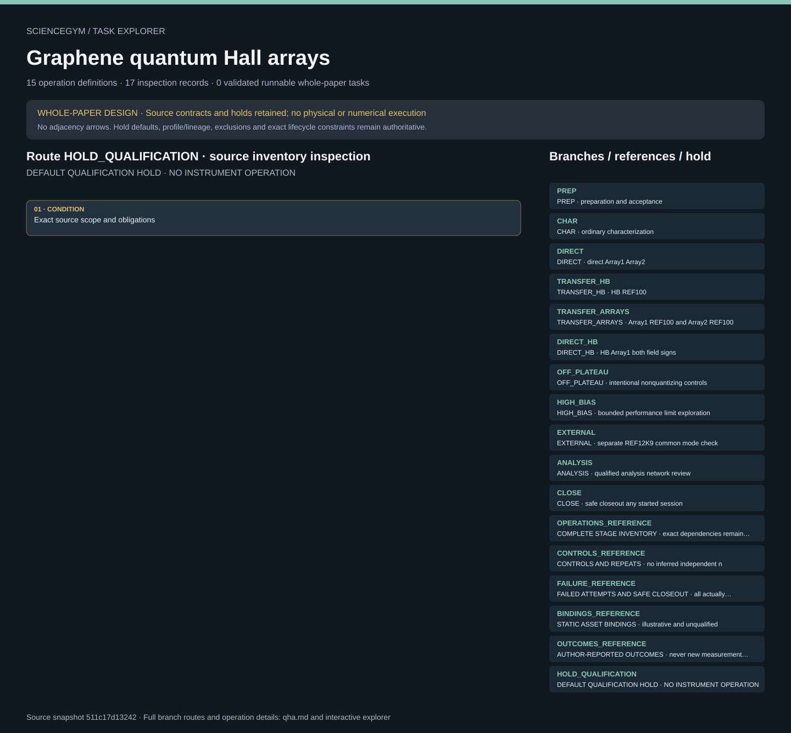

# Graphene quantum Hall arrays: task route map



Paper: **Accurate graphene quantum Hall arrays for the new International System of Units** · [DOI](https://doi.org/10.1038/s41467-022-34680-0)

Whole-paper DESIGN only; zero validated runnable whole-paper tasks. Read-only author/evaluator inspection, not an actor context, instrument controller, simulation or scientific reproduction. Source facts, authored requirements, finite synthetic checks and original illustrative geometry remain separate. Operation memberships do not create chronology; only exact dependency and lifecycle contracts constrain order. Required receipts and completion evidence remain obligations, never observed states. HOLD_QUALIFICATION remains active. Fifteen authored stages R00–R14 and eleven coverage branches describe one paper-level design. Eleven original scene groups and thirty-two symbolic anchors are illustrative and unqualified. Each 118-element parallel subarray has nominal resistance R_K/236, approximately 109 ohm. The whole 236-element device connects two subarrays in series, R_K/118, approximately 219 ohm. Subarrays, the whole device, a separate Hall bar and external references must retain separate identities. Twenty-nine source facts, eighteen ambiguities and fourteen author-reported outcomes are reference material, never generated measurement telemetry, actor reward or success thresholds. Twenty unresolved-input groups, fourteen controls, null repeat counts and null planned conditions remain explicit. The five-edge comparison graph is distinct from acquired edges, which may remain empty, partial, failed or held. Disputed loop algebra and Eq. 1 remain unresolved; pooled precision, Allan-limited per-set uncertainty and standard offsets are distinct. R09 nonquantizing controls remain required design coverage without requiring unsafe acquisition. R10/R11 optional acquisition stays separate from design coverage. R14 joins every actually started service job after R03, including partial failures, independently of analysis success. Microfabrication, cryogenics, magnetic fields, electrical work and precision instruments remain closed qualified services. Source ranges and reported maxima are historical facts, never operating defaults. Upstream review read and visually inspected nine main pages and four SI pages, with all main-table cells. Raw data, source code, CAD and optional peer review remain unread. No video was listed in the inspected technical inventory. This integration does not reread publications, recompute source results or resolve scientific inconsistencies. No physical execution, hardware control, electrical or physics simulation, qualified motion, new scientific measurements or scientific reproduction is supplied.. Counts describe task representation, not experiments or success.

**Reading rule:** rows show unordered source inventory for inspection. Exact phase, lifecycle and dependency contracts remain authoritative; no loop, specimen, condition or chronology is inferred. An unordered obligation group has no inferred chronological edges. Source-reported scientific facts and authored handling are distinct.

[Frozen local source task package](../../../tasks/qha_operations_v2/) · [Interactive inspector](../index.html)

## PREP — PREP · preparation and acceptance

Whole-paper DESIGN only; zero validated runnable whole-paper tasks. Read-only author/evaluator inspection, not an actor context, instrument controller, simulation or scientific reproduction. Source facts, authored requirements, finite synthetic checks and original illustrative geometry remain separate. Operation memberships do not create chronology; only exact dependency and lifecycle contracts constrain order. Required receipts and completion evidence remain obligations, never observed states. HOLD_QUALIFICATION remains active.

[Exact route source](../../../tasks/qha_operations_v2/branches.json) · JSON pointer: `/branches/0`

- **OBLIGATIONS: Exact operation membership; no adjacency chronology**
  - Binding: {"order":"Whole-paper DESIGN only; zero validated runnable whole-paper tasks. Read-only author/evaluator inspection, not an actor context, instrument controller, simulation or scientific reproduction. Source facts, authored requirements, finite synthetic checks and original illustrative geometry remain separate. Operation memberships do not create chronology; only exact dependency and lifecycle contracts constrain order. Required receipts and completion evidence remain obligations, never observed states. HOLD_QUALIFICATION remains active."}
  - `R00` Approve the scientific and safety contract
    - Source occurrence binding: {"source_file":"branches.json","source_pointer":"/branches/0/operations/0","source_node":"R00","meaning":"Exact authored task membership; not execution or inferred chronology"}
  - `R01` Receive qualified material and preparation evidence
    - Source occurrence binding: {"source_file":"branches.json","source_pointer":"/branches/0/operations/1","source_node":"R01","meaning":"Exact authored task membership; not execution or inferred chronology"}
  - `R02` Register protected custody and pre-test condition
    - Source occurrence binding: {"source_file":"branches.json","source_pointer":"/branches/0/operations/2","source_node":"R02","meaning":"Exact authored task membership; not execution or inferred chronology"}
  - `R03` Hand over and qualify the closed measurement configuration
    - Source occurrence binding: {"source_file":"branches.json","source_pointer":"/branches/0/operations/3","source_node":"R03","meaning":"Exact authored task membership; not execution or inferred chronology"}
- **CONDITION: Exact source scope and obligations**
  - Binding: {"source_file":"branches.json","source_pointer":"/branches/0","source_contract":{"id":"PREP","operations":["R00","R01","R02","R03"],"purpose":"preparation_and_acceptance","optional_physical_execution":false,"initial_state":"held_qualification","planned_conditions":null,"repeat_count":null,"qualification":"External evidence required; no operation may execute from this package"}}

<details><summary>Branch state, choices, lineage and loop obligations</summary>

```json
{
  "id": "PREP",
  "operations": [
    "R00",
    "R01",
    "R02",
    "R03"
  ],
  "purpose": "preparation_and_acceptance",
  "optional_physical_execution": false,
  "initial_state": "held_qualification",
  "planned_conditions": null,
  "repeat_count": null,
  "qualification": "External evidence required; no operation may execute from this package"
}
```

</details>

## CHAR — CHAR · ordinary characterization

Whole-paper DESIGN only; zero validated runnable whole-paper tasks. Read-only author/evaluator inspection, not an actor context, instrument controller, simulation or scientific reproduction. Source facts, authored requirements, finite synthetic checks and original illustrative geometry remain separate. Operation memberships do not create chronology; only exact dependency and lifecycle contracts constrain order. Required receipts and completion evidence remain obligations, never observed states. HOLD_QUALIFICATION remains active.

[Exact route source](../../../tasks/qha_operations_v2/branches.json) · JSON pointer: `/branches/1`

- **OBLIGATIONS: Exact operation membership; no adjacency chronology**
  - Binding: {"order":"Whole-paper DESIGN only; zero validated runnable whole-paper tasks. Read-only author/evaluator inspection, not an actor context, instrument controller, simulation or scientific reproduction. Source facts, authored requirements, finite synthetic checks and original illustrative geometry remain separate. Operation memberships do not create chronology; only exact dependency and lifecycle contracts constrain order. Required receipts and completion evidence remain obligations, never observed states. HOLD_QUALIFICATION remains active."}
  - `R04` Request initial Hall-bar and subarray characterization
    - Source occurrence binding: {"source_file":"branches.json","source_pointer":"/branches/1/operations/0","source_node":"R04","meaning":"Exact authored task membership; not execution or inferred chronology"}
- **CONDITION: Exact source scope and obligations**
  - Binding: {"source_file":"branches.json","source_pointer":"/branches/1","source_contract":{"id":"CHAR","operations":["R04"],"purpose":"ordinary_characterization","optional_physical_execution":false,"initial_state":"held_qualification","planned_conditions":null,"repeat_count":null,"qualification":"External evidence required; no operation may execute from this package"}}

<details><summary>Branch state, choices, lineage and loop obligations</summary>

```json
{
  "id": "CHAR",
  "operations": [
    "R04"
  ],
  "purpose": "ordinary_characterization",
  "optional_physical_execution": false,
  "initial_state": "held_qualification",
  "planned_conditions": null,
  "repeat_count": null,
  "qualification": "External evidence required; no operation may execute from this package"
}
```

</details>

## DIRECT — DIRECT · direct Array1 Array2

Whole-paper DESIGN only; zero validated runnable whole-paper tasks. Read-only author/evaluator inspection, not an actor context, instrument controller, simulation or scientific reproduction. Source facts, authored requirements, finite synthetic checks and original illustrative geometry remain separate. Operation memberships do not create chronology; only exact dependency and lifecycle contracts constrain order. Required receipts and completion evidence remain obligations, never observed states. HOLD_QUALIFICATION remains active.

[Exact route source](../../../tasks/qha_operations_v2/branches.json) · JSON pointer: `/branches/2`

- **OBLIGATIONS: Exact operation membership; no adjacency chronology**
  - Binding: {"order":"Whole-paper DESIGN only; zero validated runnable whole-paper tasks. Read-only author/evaluator inspection, not an actor context, instrument controller, simulation or scientific reproduction. Source facts, authored requirements, finite synthetic checks and original illustrative geometry remain separate. Operation memberships do not create chronology; only exact dependency and lifecycle contracts constrain order. Required receipts and completion evidence remain obligations, never observed states. HOLD_QUALIFICATION remains active."}
  - `R05` Request direct subarray precision comparisons
    - Source occurrence binding: {"source_file":"branches.json","source_pointer":"/branches/2/operations/0","source_node":"R05","meaning":"Exact authored task membership; not execution or inferred chronology"}
- **CONDITION: Exact source scope and obligations**
  - Binding: {"source_file":"branches.json","source_pointer":"/branches/2","source_contract":{"id":"DIRECT","operations":["R05"],"purpose":"direct_Array1_Array2","optional_physical_execution":false,"initial_state":"held_qualification","planned_conditions":null,"repeat_count":null,"qualification":"External evidence required; no operation may execute from this package"}}

<details><summary>Branch state, choices, lineage and loop obligations</summary>

```json
{
  "id": "DIRECT",
  "operations": [
    "R05"
  ],
  "purpose": "direct_Array1_Array2",
  "optional_physical_execution": false,
  "initial_state": "held_qualification",
  "planned_conditions": null,
  "repeat_count": null,
  "qualification": "External evidence required; no operation may execute from this package"
}
```

</details>

## TRANSFER_HB — TRANSFER_HB · HB REF100

Whole-paper DESIGN only; zero validated runnable whole-paper tasks. Read-only author/evaluator inspection, not an actor context, instrument controller, simulation or scientific reproduction. Source facts, authored requirements, finite synthetic checks and original illustrative geometry remain separate. Operation memberships do not create chronology; only exact dependency and lifecycle contracts constrain order. Required receipts and completion evidence remain obligations, never observed states. HOLD_QUALIFICATION remains active.

[Exact route source](../../../tasks/qha_operations_v2/branches.json) · JSON pointer: `/branches/3`

- **OBLIGATIONS: Exact operation membership; no adjacency chronology**
  - Binding: {"order":"Whole-paper DESIGN only; zero validated runnable whole-paper tasks. Read-only author/evaluator inspection, not an actor context, instrument controller, simulation or scientific reproduction. Source facts, authored requirements, finite synthetic checks and original illustrative geometry remain separate. Operation memberships do not create chronology; only exact dependency and lifecycle contracts constrain order. Required receipts and completion evidence remain obligations, never observed states. HOLD_QUALIFICATION remains active."}
  - `R06` Request Hall-bar versus 100-ohm transfer comparison
    - Source occurrence binding: {"source_file":"branches.json","source_pointer":"/branches/3/operations/0","source_node":"R06","meaning":"Exact authored task membership; not execution or inferred chronology"}
- **CONDITION: Exact source scope and obligations**
  - Binding: {"source_file":"branches.json","source_pointer":"/branches/3","source_contract":{"id":"TRANSFER_HB","operations":["R06"],"purpose":"HB_REF100","optional_physical_execution":false,"initial_state":"held_qualification","planned_conditions":null,"repeat_count":null,"qualification":"External evidence required; no operation may execute from this package"}}

<details><summary>Branch state, choices, lineage and loop obligations</summary>

```json
{
  "id": "TRANSFER_HB",
  "operations": [
    "R06"
  ],
  "purpose": "HB_REF100",
  "optional_physical_execution": false,
  "initial_state": "held_qualification",
  "planned_conditions": null,
  "repeat_count": null,
  "qualification": "External evidence required; no operation may execute from this package"
}
```

</details>

## TRANSFER_ARRAYS — TRANSFER_ARRAYS · Array1 REF100 and Array2 REF100

Whole-paper DESIGN only; zero validated runnable whole-paper tasks. Read-only author/evaluator inspection, not an actor context, instrument controller, simulation or scientific reproduction. Source facts, authored requirements, finite synthetic checks and original illustrative geometry remain separate. Operation memberships do not create chronology; only exact dependency and lifecycle contracts constrain order. Required receipts and completion evidence remain obligations, never observed states. HOLD_QUALIFICATION remains active.

[Exact route source](../../../tasks/qha_operations_v2/branches.json) · JSON pointer: `/branches/4`

- **OBLIGATIONS: Exact operation membership; no adjacency chronology**
  - Binding: {"order":"Whole-paper DESIGN only; zero validated runnable whole-paper tasks. Read-only author/evaluator inspection, not an actor context, instrument controller, simulation or scientific reproduction. Source facts, authored requirements, finite synthetic checks and original illustrative geometry remain separate. Operation memberships do not create chronology; only exact dependency and lifecycle contracts constrain order. Required receipts and completion evidence remain obligations, never observed states. HOLD_QUALIFICATION remains active."}
  - `R07` Request both subarray versus 100-ohm comparisons
    - Source occurrence binding: {"source_file":"branches.json","source_pointer":"/branches/4/operations/0","source_node":"R07","meaning":"Exact authored task membership; not execution or inferred chronology"}
- **CONDITION: Exact source scope and obligations**
  - Binding: {"source_file":"branches.json","source_pointer":"/branches/4","source_contract":{"id":"TRANSFER_ARRAYS","operations":["R07"],"purpose":"Array1_REF100_and_Array2_REF100","optional_physical_execution":false,"initial_state":"held_qualification","planned_conditions":null,"repeat_count":null,"qualification":"External evidence required; no operation may execute from this package"}}

<details><summary>Branch state, choices, lineage and loop obligations</summary>

```json
{
  "id": "TRANSFER_ARRAYS",
  "operations": [
    "R07"
  ],
  "purpose": "Array1_REF100_and_Array2_REF100",
  "optional_physical_execution": false,
  "initial_state": "held_qualification",
  "planned_conditions": null,
  "repeat_count": null,
  "qualification": "External evidence required; no operation may execute from this package"
}
```

</details>

## DIRECT_HB — DIRECT_HB · HB Array1 both field signs

Whole-paper DESIGN only; zero validated runnable whole-paper tasks. Read-only author/evaluator inspection, not an actor context, instrument controller, simulation or scientific reproduction. Source facts, authored requirements, finite synthetic checks and original illustrative geometry remain separate. Operation memberships do not create chronology; only exact dependency and lifecycle contracts constrain order. Required receipts and completion evidence remain obligations, never observed states. HOLD_QUALIFICATION remains active.

[Exact route source](../../../tasks/qha_operations_v2/branches.json) · JSON pointer: `/branches/5`

- **OBLIGATIONS: Exact operation membership; no adjacency chronology**
  - Binding: {"order":"Whole-paper DESIGN only; zero validated runnable whole-paper tasks. Read-only author/evaluator inspection, not an actor context, instrument controller, simulation or scientific reproduction. Source facts, authored requirements, finite synthetic checks and original illustrative geometry remain separate. Operation memberships do not create chronology; only exact dependency and lifecycle contracts constrain order. Required receipts and completion evidence remain obligations, never observed states. HOLD_QUALIFICATION remains active."}
  - `R08` Request direct Hall-bar versusArray1 checks
    - Source occurrence binding: {"source_file":"branches.json","source_pointer":"/branches/5/operations/0","source_node":"R08","meaning":"Exact authored task membership; not execution or inferred chronology"}
- **CONDITION: Exact source scope and obligations**
  - Binding: {"source_file":"branches.json","source_pointer":"/branches/5","source_contract":{"id":"DIRECT_HB","operations":["R08"],"purpose":"HB_Array1_both_field_signs","optional_physical_execution":false,"initial_state":"held_qualification","planned_conditions":null,"repeat_count":null,"qualification":"External evidence required; no operation may execute from this package"}}

<details><summary>Branch state, choices, lineage and loop obligations</summary>

```json
{
  "id": "DIRECT_HB",
  "operations": [
    "R08"
  ],
  "purpose": "HB_Array1_both_field_signs",
  "optional_physical_execution": false,
  "initial_state": "held_qualification",
  "planned_conditions": null,
  "repeat_count": null,
  "qualification": "External evidence required; no operation may execute from this package"
}
```

</details>

## OFF_PLATEAU — OFF_PLATEAU · intentional nonquantizing controls

Whole-paper DESIGN only; zero validated runnable whole-paper tasks. Read-only author/evaluator inspection, not an actor context, instrument controller, simulation or scientific reproduction. Source facts, authored requirements, finite synthetic checks and original illustrative geometry remain separate. Operation memberships do not create chronology; only exact dependency and lifecycle contracts constrain order. Required receipts and completion evidence remain obligations, never observed states. HOLD_QUALIFICATION remains active.

[Exact route source](../../../tasks/qha_operations_v2/branches.json) · JSON pointer: `/branches/6`

- **OBLIGATIONS: Exact operation membership; no adjacency chronology**
  - Binding: {"order":"Whole-paper DESIGN only; zero validated runnable whole-paper tasks. Read-only author/evaluator inspection, not an actor context, instrument controller, simulation or scientific reproduction. Source facts, authored requirements, finite synthetic checks and original illustrative geometry remain separate. Operation memberships do not create chronology; only exact dependency and lifecycle contracts constrain order. Required receipts and completion evidence remain obligations, never observed states. HOLD_QUALIFICATION remains active."}
  - `R09` Request nonquantizing comparison controls
    - Source occurrence binding: {"source_file":"branches.json","source_pointer":"/branches/6/operations/0","source_node":"R09","meaning":"Exact authored task membership; not execution or inferred chronology"}
- **CONDITION: Exact source scope and obligations**
  - Binding: {"source_file":"branches.json","source_pointer":"/branches/6","source_contract":{"id":"OFF_PLATEAU","operations":["R09"],"purpose":"intentional_nonquantizing_controls","optional_physical_execution":false,"initial_state":"held_qualification","planned_conditions":null,"repeat_count":null,"qualification":"External evidence required; no operation may execute from this package"}}

<details><summary>Branch state, choices, lineage and loop obligations</summary>

```json
{
  "id": "OFF_PLATEAU",
  "operations": [
    "R09"
  ],
  "purpose": "intentional_nonquantizing_controls",
  "optional_physical_execution": false,
  "initial_state": "held_qualification",
  "planned_conditions": null,
  "repeat_count": null,
  "qualification": "External evidence required; no operation may execute from this package"
}
```

</details>

## HIGH_BIAS — HIGH_BIAS · bounded performance limit exploration

Whole-paper DESIGN only; zero validated runnable whole-paper tasks. Read-only author/evaluator inspection, not an actor context, instrument controller, simulation or scientific reproduction. Source facts, authored requirements, finite synthetic checks and original illustrative geometry remain separate. Operation memberships do not create chronology; only exact dependency and lifecycle contracts constrain order. Required receipts and completion evidence remain obligations, never observed states. HOLD_QUALIFICATION remains active.

[Exact route source](../../../tasks/qha_operations_v2/branches.json) · JSON pointer: `/branches/7`

- **OBLIGATIONS: Exact operation membership; no adjacency chronology**
  - Binding: {"order":"Whole-paper DESIGN only; zero validated runnable whole-paper tasks. Read-only author/evaluator inspection, not an actor context, instrument controller, simulation or scientific reproduction. Source facts, authored requirements, finite synthetic checks and original illustrative geometry remain separate. Operation memberships do not create chronology; only exact dependency and lifecycle contracts constrain order. Required receipts and completion evidence remain obligations, never observed states. HOLD_QUALIFICATION remains active."}
  - `R10` Request bounded high-bias exploration
    - Source occurrence binding: {"source_file":"branches.json","source_pointer":"/branches/7/operations/0","source_node":"R10","meaning":"Exact authored task membership; not execution or inferred chronology"}
- **CONDITION: Exact source scope and obligations**
  - Binding: {"source_file":"branches.json","source_pointer":"/branches/7","source_contract":{"id":"HIGH_BIAS","operations":["R10"],"purpose":"bounded_performance_limit_exploration","optional_physical_execution":true,"initial_state":"held_qualification","planned_conditions":null,"repeat_count":null,"qualification":"External evidence required; no operation may execute from this package"}}

<details><summary>Branch state, choices, lineage and loop obligations</summary>

```json
{
  "id": "HIGH_BIAS",
  "operations": [
    "R10"
  ],
  "purpose": "bounded_performance_limit_exploration",
  "optional_physical_execution": true,
  "initial_state": "held_qualification",
  "planned_conditions": null,
  "repeat_count": null,
  "qualification": "External evidence required; no operation may execute from this package"
}
```

</details>

## EXTERNAL — EXTERNAL · separate REF12K9 common mode check

Whole-paper DESIGN only; zero validated runnable whole-paper tasks. Read-only author/evaluator inspection, not an actor context, instrument controller, simulation or scientific reproduction. Source facts, authored requirements, finite synthetic checks and original illustrative geometry remain separate. Operation memberships do not create chronology; only exact dependency and lifecycle contracts constrain order. Required receipts and completion evidence remain obligations, never observed states. HOLD_QUALIFICATION remains active.

[Exact route source](../../../tasks/qha_operations_v2/branches.json) · JSON pointer: `/branches/8`

- **OBLIGATIONS: Exact operation membership; no adjacency chronology**
  - Binding: {"order":"Whole-paper DESIGN only; zero validated runnable whole-paper tasks. Read-only author/evaluator inspection, not an actor context, instrument controller, simulation or scientific reproduction. Source facts, authored requirements, finite synthetic checks and original illustrative geometry remain separate. Operation memberships do not create chronology; only exact dependency and lifecycle contracts constrain order. Required receipts and completion evidence remain obligations, never observed states. HOLD_QUALIFICATION remains active."}
  - `R11` Request the external high-bias common-mode check
    - Source occurrence binding: {"source_file":"branches.json","source_pointer":"/branches/8/operations/0","source_node":"R11","meaning":"Exact authored task membership; not execution or inferred chronology"}
- **CONDITION: Exact source scope and obligations**
  - Binding: {"source_file":"branches.json","source_pointer":"/branches/8","source_contract":{"id":"EXTERNAL","operations":["R11"],"purpose":"separate_REF12K9_common_mode_check","optional_physical_execution":true,"initial_state":"held_qualification","planned_conditions":null,"repeat_count":null,"qualification":"External evidence required; no operation may execute from this package"}}

<details><summary>Branch state, choices, lineage and loop obligations</summary>

```json
{
  "id": "EXTERNAL",
  "operations": [
    "R11"
  ],
  "purpose": "separate_REF12K9_common_mode_check",
  "optional_physical_execution": true,
  "initial_state": "held_qualification",
  "planned_conditions": null,
  "repeat_count": null,
  "qualification": "External evidence required; no operation may execute from this package"
}
```

</details>

## ANALYSIS — ANALYSIS · qualified analysis network review

Whole-paper DESIGN only; zero validated runnable whole-paper tasks. Read-only author/evaluator inspection, not an actor context, instrument controller, simulation or scientific reproduction. Source facts, authored requirements, finite synthetic checks and original illustrative geometry remain separate. Operation memberships do not create chronology; only exact dependency and lifecycle contracts constrain order. Required receipts and completion evidence remain obligations, never observed states. HOLD_QUALIFICATION remains active.

[Exact route source](../../../tasks/qha_operations_v2/branches.json) · JSON pointer: `/branches/9`

- **OBLIGATIONS: Exact operation membership; no adjacency chronology**
  - Binding: {"order":"Whole-paper DESIGN only; zero validated runnable whole-paper tasks. Read-only author/evaluator inspection, not an actor context, instrument controller, simulation or scientific reproduction. Source facts, authored requirements, finite synthetic checks and original illustrative geometry remain separate. Operation memberships do not create chronology; only exact dependency and lifecycle contracts constrain order. Required receipts and completion evidence remain obligations, never observed states. HOLD_QUALIFICATION remains active."}
  - `R12` Validate each measurement bundle and approved analysis
    - Source occurrence binding: {"source_file":"branches.json","source_pointer":"/branches/9/operations/0","source_node":"R12","meaning":"Exact authored task membership; not execution or inferred chronology"}
  - `R13` Evaluate the comparison network and coverage
    - Source occurrence binding: {"source_file":"branches.json","source_pointer":"/branches/9/operations/1","source_node":"R13","meaning":"Exact authored task membership; not execution or inferred chronology"}
- **CONDITION: Exact source scope and obligations**
  - Binding: {"source_file":"branches.json","source_pointer":"/branches/9","source_contract":{"id":"ANALYSIS","operations":["R12","R13"],"purpose":"qualified_analysis_network_review","optional_physical_execution":false,"initial_state":"held_qualification","planned_conditions":null,"repeat_count":null,"qualification":"External evidence required; no operation may execute from this package"}}

<details><summary>Branch state, choices, lineage and loop obligations</summary>

```json
{
  "id": "ANALYSIS",
  "operations": [
    "R12",
    "R13"
  ],
  "purpose": "qualified_analysis_network_review",
  "optional_physical_execution": false,
  "initial_state": "held_qualification",
  "planned_conditions": null,
  "repeat_count": null,
  "qualification": "External evidence required; no operation may execute from this package"
}
```

</details>

## CLOSE — CLOSE · safe closeout any started session

Whole-paper DESIGN only; zero validated runnable whole-paper tasks. Read-only author/evaluator inspection, not an actor context, instrument controller, simulation or scientific reproduction. Source facts, authored requirements, finite synthetic checks and original illustrative geometry remain separate. Operation memberships do not create chronology; only exact dependency and lifecycle contracts constrain order. Required receipts and completion evidence remain obligations, never observed states. HOLD_QUALIFICATION remains active.

[Exact route source](../../../tasks/qha_operations_v2/branches.json) · JSON pointer: `/branches/10`

- **OBLIGATIONS: Exact operation membership; no adjacency chronology**
  - Binding: {"order":"Whole-paper DESIGN only; zero validated runnable whole-paper tasks. Read-only author/evaluator inspection, not an actor context, instrument controller, simulation or scientific reproduction. Source facts, authored requirements, finite synthetic checks and original illustrative geometry remain separate. Operation memberships do not create chronology; only exact dependency and lifecycle contracts constrain order. Required receipts and completion evidence remain obligations, never observed states. HOLD_QUALIFICATION remains active."}
  - `R14` Close the service session and return custody
    - Source occurrence binding: {"source_file":"branches.json","source_pointer":"/branches/10/operations/0","source_node":"R14","meaning":"Exact authored task membership; not execution or inferred chronology"}
- **CONDITION: Exact source scope and obligations**
  - Binding: {"source_file":"branches.json","source_pointer":"/branches/10","source_contract":{"id":"CLOSE","operations":["R14"],"purpose":"safe_closeout_any_started_session","optional_physical_execution":false,"initial_state":"held_qualification","planned_conditions":null,"repeat_count":null,"qualification":"External evidence required; no operation may execute from this package"}}

<details><summary>Branch state, choices, lineage and loop obligations</summary>

```json
{
  "id": "CLOSE",
  "operations": [
    "R14"
  ],
  "purpose": "safe_closeout_any_started_session",
  "optional_physical_execution": false,
  "initial_state": "held_qualification",
  "planned_conditions": null,
  "repeat_count": null,
  "qualification": "External evidence required; no operation may execute from this package"
}
```

</details>

## OPERATIONS_REFERENCE — COMPLETE STAGE INVENTORY · exact dependencies remain authoritative

Whole-paper DESIGN only; zero validated runnable whole-paper tasks. Read-only author/evaluator inspection, not an actor context, instrument controller, simulation or scientific reproduction. Source facts, authored requirements, finite synthetic checks and original illustrative geometry remain separate. Operation memberships do not create chronology; only exact dependency and lifecycle contracts constrain order. Required receipts and completion evidence remain obligations, never observed states. HOLD_QUALIFICATION remains active.

[Exact route source](../../../tasks/qha_operations_v2/operations.json) · JSON pointer: ``

- **OBLIGATIONS: Exact operation membership; no adjacency chronology**
  - Binding: {"order":"Whole-paper DESIGN only; zero validated runnable whole-paper tasks. Read-only author/evaluator inspection, not an actor context, instrument controller, simulation or scientific reproduction. Source facts, authored requirements, finite synthetic checks and original illustrative geometry remain separate. Operation memberships do not create chronology; only exact dependency and lifecycle contracts constrain order. Required receipts and completion evidence remain obligations, never observed states. HOLD_QUALIFICATION remains active."}
  - `R00` Approve the scientific and safety contract
    - Source occurrence binding: {"source_file":"operations.json","source_pointer":"/operations/0/id","source_node":"R00","meaning":"Exact authored task membership; not execution or inferred chronology"}
  - `R01` Receive qualified material and preparation evidence
    - Source occurrence binding: {"source_file":"operations.json","source_pointer":"/operations/1/id","source_node":"R01","meaning":"Exact authored task membership; not execution or inferred chronology"}
  - `R02` Register protected custody and pre-test condition
    - Source occurrence binding: {"source_file":"operations.json","source_pointer":"/operations/2/id","source_node":"R02","meaning":"Exact authored task membership; not execution or inferred chronology"}
  - `R03` Hand over and qualify the closed measurement configuration
    - Source occurrence binding: {"source_file":"operations.json","source_pointer":"/operations/3/id","source_node":"R03","meaning":"Exact authored task membership; not execution or inferred chronology"}
  - `R04` Request initial Hall-bar and subarray characterization
    - Source occurrence binding: {"source_file":"operations.json","source_pointer":"/operations/4/id","source_node":"R04","meaning":"Exact authored task membership; not execution or inferred chronology"}
  - `R05` Request direct subarray precision comparisons
    - Source occurrence binding: {"source_file":"operations.json","source_pointer":"/operations/5/id","source_node":"R05","meaning":"Exact authored task membership; not execution or inferred chronology"}
  - `R06` Request Hall-bar versus 100-ohm transfer comparison
    - Source occurrence binding: {"source_file":"operations.json","source_pointer":"/operations/6/id","source_node":"R06","meaning":"Exact authored task membership; not execution or inferred chronology"}
  - `R07` Request both subarray versus 100-ohm comparisons
    - Source occurrence binding: {"source_file":"operations.json","source_pointer":"/operations/7/id","source_node":"R07","meaning":"Exact authored task membership; not execution or inferred chronology"}
  - `R08` Request direct Hall-bar versusArray1 checks
    - Source occurrence binding: {"source_file":"operations.json","source_pointer":"/operations/8/id","source_node":"R08","meaning":"Exact authored task membership; not execution or inferred chronology"}
  - `R09` Request nonquantizing comparison controls
    - Source occurrence binding: {"source_file":"operations.json","source_pointer":"/operations/9/id","source_node":"R09","meaning":"Exact authored task membership; not execution or inferred chronology"}
  - `R10` Request bounded high-bias exploration
    - Source occurrence binding: {"source_file":"operations.json","source_pointer":"/operations/10/id","source_node":"R10","meaning":"Exact authored task membership; not execution or inferred chronology"}
  - `R11` Request the external high-bias common-mode check
    - Source occurrence binding: {"source_file":"operations.json","source_pointer":"/operations/11/id","source_node":"R11","meaning":"Exact authored task membership; not execution or inferred chronology"}
  - `R12` Validate each measurement bundle and approved analysis
    - Source occurrence binding: {"source_file":"operations.json","source_pointer":"/operations/12/id","source_node":"R12","meaning":"Exact authored task membership; not execution or inferred chronology"}
  - `R13` Evaluate the comparison network and coverage
    - Source occurrence binding: {"source_file":"operations.json","source_pointer":"/operations/13/id","source_node":"R13","meaning":"Exact authored task membership; not execution or inferred chronology"}
  - `R14` Close the service session and return custody
    - Source occurrence binding: {"source_file":"operations.json","source_pointer":"/operations/14/id","source_node":"R14","meaning":"Exact authored task membership; not execution or inferred chronology"}
- **CONDITION: Exact source scope and obligations**
  - Binding: {"source_file":"operations.json","source_pointer":"","source_contract":{"schema_version":"sciencegym.qha.operations.v2","task_id":"graphene_quantum_hall_arrays","operations":[{"id":"R00","action":"Approve the scientific and safety contract","depends_on":[],"stations":["ST07"],"unresolved_inputs":["U01","U02","U15","U16"],"required_evidence":["approved_scope","qualified_service_contract","analysis_decisions"],"guards":["All safety-critical unknowns resolved before physical work; source outcomes excluded from action rewards"],"failure_closeout":"No physical action; unresolved branches remain held","name":"Approve the scientific and safety contract","origin":"authored_robot_contract_derived_from_accepted_route","kind":"read_only_evidence_review","branch_ids":["PREP"],"physical_execution_enabled":false,"action_interface":{"allowed_keys":["operation_id","evidence_ids"],"numeric_or_hardware_arguments_allowed":false},"asset_ids":["AS09"],"anchor_ids":["AS09.scope_approval","AS09.raw_evidence","AS09.analysis_qualification","AS09.comparison_network"],"receipt_authentication":"not_implemented; finite synthetic metadata tests only","completion":"Design/evidence-schema coverage only. No physical step is completed by validation."},{"id":"R01","action":"Receive qualified material and preparation evidence","depends_on":["R00"],"stations":["ST01","ST02"],"unresolved_inputs":["U03","U19"],"required_evidence":["supplier_lot","die_id","process_receipt","encapsulation_condition","release_record"],"guards":["Preparation is not skipped: require full service receipt, measured dimensions/condition and sample identity"],"failure_closeout":"Quarantine ambiguous, damaged, unqualified or unmatched carrier; no attempt to repair chemically","name":"Receive qualified material and preparation evidence","origin":"authored_robot_contract_derived_from_accepted_route","kind":"read_only_evidence_review","branch_ids":["PREP"],"physical_execution_enabled":false,"action_interface":{"allowed_keys":["operation_id","evidence_ids"],"numeric_or_hardware_arguments_allowed":false},"asset_ids":["AS01","AS04"],"anchor_ids":["AS01.carrier_identity","AS01.intake_support","AS01.custody_receipt","AS04.preparation_receipt","AS04.provider_custody_port"],"receipt_authentication":"not_implemented; finite synthetic metadata tests only","completion":"Design/evidence-schema coverage only. No physical step is completed by validation."},{"id":"R02","action":"Register protected custody and pre-test condition","depends_on":["R01"],"stations":["ST01"],"unresolved_inputs":["U02","U18","U19"],"required_evidence":["carrier_id","sample_id","condition_observation","orientation_datum","storage_record"],"guards":["Carrier supported before releasing previous holder; receiving occupancy and identity accepted"],"failure_closeout":"Keep last accepted holder; do not drop, place bare die on generic surface or claim transfer completed from a command","name":"Register protected custody and pre-test condition","origin":"authored_robot_contract_derived_from_accepted_route","kind":"read_only_evidence_review","branch_ids":["PREP"],"physical_execution_enabled":false,"action_interface":{"allowed_keys":["operation_id","evidence_ids"],"numeric_or_hardware_arguments_allowed":false},"asset_ids":["AS01","AS02","AS11"],"anchor_ids":["AS01.carrier_identity","AS01.intake_support","AS01.custody_receipt","AS02.chip_identity","AS02.array1_region","AS02.array2_region","AS02.hall_bar_region","AS11.carrier_grasp_datum","AS11.transport_envelope","AS11.robot_base_datum"],"receipt_authentication":"not_implemented; finite synthetic metadata tests only","completion":"Design/evidence-schema coverage only. No physical step is completed by validation."},{"id":"R03","action":"Hand over and qualify the closed measurement configuration","depends_on":["R02"],"stations":["ST03","ST04","ST05","ST06"],"unresolved_inputs":["U04","U05","U06","U13","U15"],"required_evidence":["accepted_handoff","mount_id","terminal_map_revision","calibration_receipts","leakage_check","approved_envelope"],"guards":["Named provider accepts sample custody; verify independent interlock/status evidence; no robot enters magnet zone"],"failure_closeout":"Freeze dependent requests; service owns safe containment and support; preserve lease until acknowledged","name":"Hand over and qualify the closed measurement configuration","origin":"authored_robot_contract_derived_from_accepted_route","kind":"read_only_evidence_review","branch_ids":["PREP"],"physical_execution_enabled":false,"action_interface":{"allowed_keys":["operation_id","evidence_ids"],"numeric_or_hardware_arguments_allowed":false},"asset_ids":["AS05","AS11"],"anchor_ids":["AS05.service_boundary","AS05.handoff_port","AS05.independent_safe_state","AS11.carrier_grasp_datum","AS11.transport_envelope","AS11.robot_base_datum"],"receipt_authentication":"not_implemented; finite synthetic metadata tests only","completion":"Design/evidence-schema coverage only. No physical step is completed by validation."},{"id":"R04","action":"Request initial Hall-bar and subarray characterization","depends_on":["R03"],"stations":["ST03","ST04"],"unresolved_inputs":["U05","U08","U16"],"required_evidence":["HB_Rxx_Rxy_series","contact_check","subarray_transition_series","voltmeter_offset","noise_floor"],"guards":["Cover MAIN Fig 3 and SI S1 as distinct paths; flag apparent plateau versus precision quantization; no per-element carrier values inferred"],"failure_closeout":"Preserve failed characterization and block precision interpretation; qualified provider decides disposition","name":"Request initial Hall-bar and subarray characterization","origin":"authored_robot_contract_derived_from_accepted_route","kind":"closed_service_evidence_request","branch_ids":["CHAR"],"physical_execution_enabled":false,"action_interface":{"allowed_keys":["operation_id","evidence_ids"],"numeric_or_hardware_arguments_allowed":false},"asset_ids":["AS02","AS03","AS05","AS06"],"anchor_ids":["AS02.chip_identity","AS02.array1_region","AS02.array2_region","AS02.hall_bar_region","AS03.subarray_topology","AS03.whole_device_topology","AS03.source_dimension_key","AS05.service_boundary","AS05.handoff_port","AS05.independent_safe_state","AS06.characterization_receipt","AS06.ccc_comparison_receipt","AS06.shared_instrument_lease"],"receipt_authentication":"not_implemented; finite synthetic metadata tests only","completion":"Design/evidence-schema coverage only. No physical step is completed by validation."},{"id":"R05","action":"Request direct subarray precision comparisons","depends_on":["R04"],"stations":["ST03","ST05"],"unresolved_inputs":["U06","U07","U08"],"required_evidence":["A1_A2_ratio_series","cycle_timestamps","per_reading_SD","field_temperature_logs"],"guards":["Reference/test identities and winding mapping explicit; current reversal is a provider-owned method; count readings without inventing chip replicates"],"failure_closeout":"Stop only by approved service action; retain partial/time-gap/fault evidence and no automatic restart","name":"Request direct subarray precision comparisons","origin":"authored_robot_contract_derived_from_accepted_route","kind":"closed_service_evidence_request","branch_ids":["DIRECT"],"physical_execution_enabled":false,"action_interface":{"allowed_keys":["operation_id","evidence_ids"],"numeric_or_hardware_arguments_allowed":false},"asset_ids":["AS02","AS03","AS05","AS06"],"anchor_ids":["AS02.chip_identity","AS02.array1_region","AS02.array2_region","AS02.hall_bar_region","AS03.subarray_topology","AS03.whole_device_topology","AS03.source_dimension_key","AS05.service_boundary","AS05.handoff_port","AS05.independent_safe_state","AS06.characterization_receipt","AS06.ccc_comparison_receipt","AS06.shared_instrument_lease"],"receipt_authentication":"not_implemented; finite synthetic metadata tests only","completion":"Design/evidence-schema coverage only. No physical step is completed by validation."},{"id":"R06","action":"Request Hall-bar versus 100-ohm transfer comparison","depends_on":["R04"],"stations":["ST03","ST05","ST06"],"unresolved_inputs":["U06","U07","U13"],"required_evidence":["HB_100_ratio_series","reference_state","bath_stability","per_device_current"],"guards":["100-ohm standard heating/current limit independently qualified; source 3 mA is reference context, not safety permission"],"failure_closeout":"Hold reference-chain inference if reference drift, identity or stability is unacceptable","name":"Request Hall-bar versus 100-ohm transfer comparison","origin":"authored_robot_contract_derived_from_accepted_route","kind":"closed_service_evidence_request","branch_ids":["TRANSFER_HB"],"physical_execution_enabled":false,"action_interface":{"allowed_keys":["operation_id","evidence_ids"],"numeric_or_hardware_arguments_allowed":false},"asset_ids":["AS06","AS07"],"anchor_ids":["AS06.characterization_receipt","AS06.ccc_comparison_receipt","AS06.shared_instrument_lease","AS07.reference_100_identity","AS07.oil_bath_state"],"receipt_authentication":"not_implemented; finite synthetic metadata tests only","completion":"Design/evidence-schema coverage only. No physical step is completed by validation."},{"id":"R07","action":"Request both subarray versus 100-ohm comparisons","depends_on":["R05","R06"],"stations":["ST03","ST05","ST06"],"unresolved_inputs":["U06","U07","U13"],"required_evidence":["A1_100_ratio_series","A2_100_ratio_series","shared_reference_covariance_inputs"],"guards":["Maintain two directed edges, common reference ID and time interval; do not treat as independent references"],"failure_closeout":"Partial completion remains per-edge; do not substitute one array result for the other","name":"Request both subarray versus 100-ohm comparisons","origin":"authored_robot_contract_derived_from_accepted_route","kind":"closed_service_evidence_request","branch_ids":["TRANSFER_ARRAYS"],"physical_execution_enabled":false,"action_interface":{"allowed_keys":["operation_id","evidence_ids"],"numeric_or_hardware_arguments_allowed":false},"asset_ids":["AS06","AS07"],"anchor_ids":["AS06.characterization_receipt","AS06.ccc_comparison_receipt","AS06.shared_instrument_lease","AS07.reference_100_identity","AS07.oil_bath_state"],"receipt_authentication":"not_implemented; finite synthetic metadata tests only","completion":"Design/evidence-schema coverage only. No physical step is completed by validation."},{"id":"R08","action":"Request direct Hall-bar versusArray1 checks","depends_on":["R05"],"stations":["ST03","ST05"],"unresolved_inputs":["U06","U07","U08"],"required_evidence":["HB_A1_ratio_series","field_sign","field_magnitude","current_by_device"],"guards":["Source includes both field signs and three magnitudes; hold exact cycle plan; no source direct HB_Array2 edge invented"],"failure_closeout":"Reject ambiguous sign/polarity mapping; keep all acquired results and service state","name":"Request direct Hall-bar versusArray1 checks","origin":"authored_robot_contract_derived_from_accepted_route","kind":"closed_service_evidence_request","branch_ids":["DIRECT_HB"],"physical_execution_enabled":false,"action_interface":{"allowed_keys":["operation_id","evidence_ids"],"numeric_or_hardware_arguments_allowed":false},"asset_ids":["AS02","AS05","AS06"],"anchor_ids":["AS02.chip_identity","AS02.array1_region","AS02.array2_region","AS02.hall_bar_region","AS05.service_boundary","AS05.handoff_port","AS05.independent_safe_state","AS06.characterization_receipt","AS06.ccc_comparison_receipt","AS06.shared_instrument_lease"],"receipt_authentication":"not_implemented; finite synthetic metadata tests only","completion":"Design/evidence-schema coverage only. No physical step is completed by validation."},{"id":"R09","action":"Request nonquantizing comparison controls","depends_on":["R05","R07"],"stations":["ST03","ST05","ST06"],"unresolved_inputs":["U05","U06","U08","U16"],"required_evidence":["off_plateau_A1_A2","off_plateau_A1_100","off_plateau_A2_100"],"guards":["This is an intentionally failing quantization condition, not equipment failure; qualified envelope still required; retain precision versus crude-plateau distinction"],"failure_closeout":"An unexpected physical state is handled by provider; scientific lack of quantization alone never triggers unbounded control escalation","name":"Request nonquantizing comparison controls","origin":"authored_robot_contract_derived_from_accepted_route","kind":"closed_service_evidence_request","branch_ids":["OFF_PLATEAU"],"physical_execution_enabled":false,"action_interface":{"allowed_keys":["operation_id","evidence_ids"],"numeric_or_hardware_arguments_allowed":false},"asset_ids":["AS05","AS06","AS07"],"anchor_ids":["AS05.service_boundary","AS05.handoff_port","AS05.independent_safe_state","AS06.characterization_receipt","AS06.ccc_comparison_receipt","AS06.shared_instrument_lease","AS07.reference_100_identity","AS07.oil_bath_state"],"receipt_authentication":"not_implemented; finite synthetic metadata tests only","completion":"Design/evidence-schema coverage only. No physical step is completed by validation."},{"id":"R10","action":"Request bounded high-bias exploration","depends_on":["R05","R08"],"stations":["ST03","ST05"],"unresolved_inputs":["U06","U07","U08","U15"],"required_evidence":["short_screen_series","long_record_series","field_dependent_bias_check"],"guards":["Separate 5–10-reading screen SD from long-record Allan SEM; high-current branch optional and held without approved performance-limit test contract"],"failure_closeout":"Abort/request containment per service policy at abnormal heating/current/contact/noise state; no autonomous attempt to reproduce paper maximum","name":"Request bounded high-bias exploration","origin":"authored_robot_contract_derived_from_accepted_route","kind":"closed_service_evidence_request","branch_ids":["HIGH_BIAS"],"physical_execution_enabled":false,"action_interface":{"allowed_keys":["operation_id","evidence_ids"],"numeric_or_hardware_arguments_allowed":false},"asset_ids":["AS05","AS06"],"anchor_ids":["AS05.service_boundary","AS05.handoff_port","AS05.independent_safe_state","AS06.characterization_receipt","AS06.ccc_comparison_receipt","AS06.shared_instrument_lease"],"receipt_authentication":"not_implemented; finite synthetic metadata tests only","completion":"Design/evidence-schema coverage only. No physical step is completed by validation."},{"id":"R11","action":"Request the external high-bias common-mode check","depends_on":["R10"],"stations":["ST03","ST05","ST06"],"unresolved_inputs":["U13","U14","U16"],"required_evidence":["identified_subarray_12k9_series","reference_current_power","air_bath_state","actual_temperature"],"guards":["Resolve SI 4 unknown array and 2-versus 2.1 K; distinguish subarray current from reference current; outcome bounds change only at its uncertainty"],"failure_closeout":"If reference or identities are unqualified, mark this branch unattempted/held and limit common-mode conclusions","name":"Request the external high-bias common-mode check","origin":"authored_robot_contract_derived_from_accepted_route","kind":"closed_service_evidence_request","branch_ids":["EXTERNAL"],"physical_execution_enabled":false,"action_interface":{"allowed_keys":["operation_id","evidence_ids"],"numeric_or_hardware_arguments_allowed":false},"asset_ids":["AS05","AS06","AS08"],"anchor_ids":["AS05.service_boundary","AS05.handoff_port","AS05.independent_safe_state","AS06.characterization_receipt","AS06.ccc_comparison_receipt","AS06.shared_instrument_lease","AS08.reference_12k9_identity","AS08.air_bath_state"],"receipt_authentication":"not_implemented; finite synthetic metadata tests only","completion":"Design/evidence-schema coverage only. No physical step is completed by validation."},{"id":"R12","action":"Validate each measurement bundle and approved analysis","depends_on":["R05","R06","R07","R08"],"stations":["ST07"],"unresolved_inputs":["U10","U11","U12","U17"],"required_evidence":["qualified_algorithm_revision","ratio_direction","weighted_summaries","Allan_checks","uncertainty_budget","exclusion_log"],"guards":["No printed Eq 3/Eq 4 execution until semantics resolved; no plot-digitized raw evidence; dependent optional branches analyzed only if actually acquired"],"failure_closeout":"Freeze derived claims for missing units/timestamps/reference; retain source and new-observation categories separately","name":"Validate each measurement bundle and approved analysis","origin":"authored_robot_contract_derived_from_accepted_route","kind":"read_only_evidence_review","branch_ids":["ANALYSIS"],"physical_execution_enabled":false,"action_interface":{"allowed_keys":["operation_id","evidence_ids"],"numeric_or_hardware_arguments_allowed":false},"asset_ids":["AS09"],"anchor_ids":["AS09.scope_approval","AS09.raw_evidence","AS09.analysis_qualification","AS09.comparison_network"],"receipt_authentication":"not_implemented; finite synthetic metadata tests only","completion":"Design/evidence-schema coverage only. No physical step is completed by validation."},{"id":"R13","action":"Evaluate the comparison network and coverage","depends_on":["R12"],"stations":["ST07"],"unresolved_inputs":["U09","U12","U16","U17"],"required_evidence":["direct_edge_register","derived_path_register","covariance_aware_closure","comparison_limitations","branch_coverage"],"guards":["Five direct edge types and four connected nodes give three simple closed loops but only two independent graph cycles. Shared-reference relations do not establish statistically independent measurements or independent sample replication; do not claim exact absolute quantization from agreement alone."],"failure_closeout":"Report disagreement and uncertainties without forcing zero or paper-matching results; unresolved/source-bug analysis stays held","name":"Evaluate the comparison network and coverage","origin":"authored_robot_contract_derived_from_accepted_route","kind":"read_only_evidence_review","branch_ids":["ANALYSIS"],"physical_execution_enabled":false,"action_interface":{"allowed_keys":["operation_id","evidence_ids"],"numeric_or_hardware_arguments_allowed":false},"asset_ids":["AS03","AS09"],"anchor_ids":["AS03.subarray_topology","AS03.whole_device_topology","AS03.source_dimension_key","AS09.scope_approval","AS09.raw_evidence","AS09.analysis_qualification","AS09.comparison_network"],"receipt_authentication":"not_implemented; finite synthetic metadata tests only","completion":"Design/evidence-schema coverage only. No physical step is completed by validation."},{"id":"R14","action":"Close the service session and return custody","depends_on":["R03"],"stations":["ST03","ST08","ST01"],"unresolved_inputs":["U02","U15","U19"],"required_evidence":["safe_state_receipt","supported_handoff","post_test_condition","storage_acceptance","final_run_status"],"guards":["Join every started service branch and pending job; require independently observed electrical-safe, accessible field-safe, warm/pressure-safe, motion-safe and support-safe state according to provider SOP; close leases only after acknowledged final custody"],"failure_closeout":"Maintain supported hold/quarantine and provider custody while any safety state or receiver acceptance is unverified","name":"Close the service session and return custody","origin":"authored_robot_contract_derived_from_accepted_route","kind":"read_only_evidence_review","branch_ids":["CLOSE"],"physical_execution_enabled":false,"action_interface":{"allowed_keys":["operation_id","evidence_ids"],"numeric_or_hardware_arguments_allowed":false},"asset_ids":["AS01","AS05","AS10","AS11"],"anchor_ids":["AS01.carrier_identity","AS01.intake_support","AS01.custody_receipt","AS05.service_boundary","AS05.handoff_port","AS05.independent_safe_state","AS10.return_support","AS10.quarantine_custody","AS10.receiver_acceptance","AS11.carrier_grasp_datum","AS11.transport_envelope","AS11.robot_base_datum"],"receipt_authentication":"not_implemented; finite synthetic metadata tests only","completion":"Design/evidence-schema coverage only. No physical step is completed by validation."}]}}

<details><summary>Branch state, choices, lineage and loop obligations</summary>

```json
{
  "schema_version": "sciencegym.qha.operations.v2",
  "task_id": "graphene_quantum_hall_arrays",
  "operations": [
    {
      "id": "R00",
      "action": "Approve the scientific and safety contract",
      "depends_on": [],
      "stations": [
        "ST07"
      ],
      "unresolved_inputs": [
        "U01",
        "U02",
        "U15",
        "U16"
      ],
      "required_evidence": [
        "approved_scope",
        "qualified_service_contract",
        "analysis_decisions"
      ],
      "guards": [
        "All safety-critical unknowns resolved before physical work; source outcomes excluded from action rewards"
      ],
      "failure_closeout": "No physical action; unresolved branches remain held",
      "name": "Approve the scientific and safety contract",
      "origin": "authored_robot_contract_derived_from_accepted_route",
      "kind": "read_only_evidence_review",
      "branch_ids": [
        "PREP"
      ],
      "physical_execution_enabled": false,
      "action_interface": {
        "allowed_keys": [
          "operation_id",
          "evidence_ids"
        ],
        "numeric_or_hardware_arguments_allowed": false
      },
      "asset_ids": [
        "AS09"
      ],
      "anchor_ids": [
        "AS09.scope_approval",
        "AS09.raw_evidence",
        "AS09.analysis_qualification",
        "AS09.comparison_network"
      ],
      "receipt_authentication": "not_implemented; finite synthetic metadata tests only",
      "completion": "Design/evidence-schema coverage only. No physical step is completed by validation."
    },
    {
      "id": "R01",
      "action": "Receive qualified material and preparation evidence",
      "depends_on": [
        "R00"
      ],
      "stations": [
        "ST01",
        "ST02"
      ],
      "unresolved_inputs": [
        "U03",
        "U19"
      ],
      "required_evidence": [
        "supplier_lot",
        "die_id",
        "process_receipt",
        "encapsulation_condition",
        "release_record"
      ],
      "guards": [
        "Preparation is not skipped: require full service receipt, measured dimensions/condition and sample identity"
      ],
      "failure_closeout": "Quarantine ambiguous, damaged, unqualified or unmatched carrier; no attempt to repair chemically",
      "name": "Receive qualified material and preparation evidence",
      "origin": "authored_robot_contract_derived_from_accepted_route",
      "kind": "read_only_evidence_review",
      "branch_ids": [
        "PREP"
      ],
      "physical_execution_enabled": false,
      "action_interface": {
        "allowed_keys": [
          "operation_id",
          "evidence_ids"
        ],
        "numeric_or_hardware_arguments_allowed": false
      },
      "asset_ids": [
        "AS01",
        "AS04"
      ],
      "anchor_ids": [
        "AS01.carrier_identity",
        "AS01.intake_support",
        "AS01.custody_receipt",
        "AS04.preparation_receipt",
        "AS04.provider_custody_port"
      ],
      "receipt_authentication": "not_implemented; finite synthetic metadata tests only",
      "completion": "Design/evidence-schema coverage only. No physical step is completed by validation."
    },
    {
      "id": "R02",
      "action": "Register protected custody and pre-test condition",
      "depends_on": [
        "R01"
      ],
      "stations": [
        "ST01"
      ],
      "unresolved_inputs": [
        "U02",
        "U18",
        "U19"
      ],
      "required_evidence": [
        "carrier_id",
        "sample_id",
        "condition_observation",
        "orientation_datum",
        "storage_record"
      ],
      "guards": [
        "Carrier supported before releasing previous holder; receiving occupancy and identity accepted"
      ],
      "failure_closeout": "Keep last accepted holder; do not drop, place bare die on generic surface or claim transfer completed from a command",
      "name": "Register protected custody and pre-test condition",
      "origin": "authored_robot_contract_derived_from_accepted_route",
      "kind": "read_only_evidence_review",
      "branch_ids": [
        "PREP"
      ],
      "physical_execution_enabled": false,
      "action_interface": {
        "allowed_keys": [
          "operation_id",
          "evidence_ids"
        ],
        "numeric_or_hardware_arguments_allowed": false
      },
      "asset_ids": [
        "AS01",
        "AS02",
        "AS11"
      ],
      "anchor_ids": [
        "AS01.carrier_identity",
        "AS01.intake_support",
        "AS01.custody_receipt",
        "AS02.chip_identity",
        "AS02.array1_region",
        "AS02.array2_region",
        "AS02.hall_bar_region",
        "AS11.carrier_grasp_datum",
        "AS11.transport_envelope",
        "AS11.robot_base_datum"
      ],
      "receipt_authentication": "not_implemented; finite synthetic metadata tests only",
      "completion": "Design/evidence-schema coverage only. No physical step is completed by validation."
    },
    {
      "id": "R03",
      "action": "Hand over and qualify the closed measurement configuration",
      "depends_on": [
        "R02"
      ],
      "stations": [
        "ST03",
        "ST04",
        "ST05",
        "ST06"
      ],
      "unresolved_inputs": [
        "U04",
        "U05",
        "U06",
        "U13",
        "U15"
      ],
      "required_evidence": [
        "accepted_handoff",
        "mount_id",
        "terminal_map_revision",
        "calibration_receipts",
        "leakage_check",
        "approved_envelope"
      ],
      "guards": [
        "Named provider accepts sample custody; verify independent interlock/status evidence; no robot enters magnet zone"
      ],
      "failure_closeout": "Freeze dependent requests; service owns safe containment and support; preserve lease until acknowledged",
      "name": "Hand over and qualify the closed measurement configuration",
      "origin": "authored_robot_contract_derived_from_accepted_route",
      "kind": "read_only_evidence_review",
      "branch_ids": [
        "PREP"
      ],
      "physical_execution_enabled": false,
      "action_interface": {
        "allowed_keys": [
          "operation_id",
          "evidence_ids"
        ],
        "numeric_or_hardware_arguments_allowed": false
      },
      "asset_ids": [
        "AS05",
        "AS11"
      ],
      "anchor_ids": [
        "AS05.service_boundary",
        "AS05.handoff_port",
        "AS05.independent_safe_state",
        "AS11.carrier_grasp_datum",
        "AS11.transport_envelope",
        "AS11.robot_base_datum"
      ],
      "receipt_authentication": "not_implemented; finite synthetic metadata tests only",
      "completion": "Design/evidence-schema coverage only. No physical step is completed by validation."
    },
    {
      "id": "R04",
      "action": "Request initial Hall-bar and subarray characterization",
      "depends_on": [
        "R03"
      ],
      "stations": [
        "ST03",
        "ST04"
      ],
      "unresolved_inputs": [
        "U05",
        "U08",
        "U16"
      ],
      "required_evidence": [
        "HB_Rxx_Rxy_series",
        "contact_check",
        "subarray_transition_series",
        "voltmeter_offset",
        "noise_floor"
      ],
      "guards": [
        "Cover MAIN Fig 3 and SI S1 as distinct paths; flag apparent plateau versus precision quantization; no per-element carrier values inferred"
      ],
      "failure_closeout": "Preserve failed characterization and block precision interpretation; qualified provider decides disposition",
      "name": "Request initial Hall-bar and subarray characterization",
      "origin": "authored_robot_contract_derived_from_accepted_route",
      "kind": "closed_service_evidence_request",
      "branch_ids": [
        "CHAR"
      ],
      "physical_execution_enabled": false,
      "action_interface": {
        "allowed_keys": [
          "operation_id",
          "evidence_ids"
        ],
        "numeric_or_hardware_arguments_allowed": false
      },
      "asset_ids": [
        "AS02",
        "AS03",
        "AS05",
        "AS06"
      ],
      "anchor_ids": [
        "AS02.chip_identity",
        "AS02.array1_region",
        "AS02.array2_region",
        "AS02.hall_bar_region",
        "AS03.subarray_topology",
        "AS03.whole_device_topology",
        "AS03.source_dimension_key",
        "AS05.service_boundary",
        "AS05.handoff_port",
        "AS05.independent_safe_state",
        "AS06.characterization_receipt",
        "AS06.ccc_comparison_receipt",
        "AS06.shared_instrument_lease"
      ],
      "receipt_authentication": "not_implemented; finite synthetic metadata tests only",
      "completion": "Design/evidence-schema coverage only. No physical step is completed by validation."
    },
    {
      "id": "R05",
      "action": "Request direct subarray precision comparisons",
      "depends_on": [
        "R04"
      ],
      "stations": [
        "ST03",
        "ST05"
      ],
      "unresolved_inputs": [
        "U06",
        "U07",
        "U08"
      ],
      "required_evidence": [
        "A1_A2_ratio_series",
        "cycle_timestamps",
        "per_reading_SD",
        "field_temperature_logs"
      ],
      "guards": [
        "Reference/test identities and winding mapping explicit; current reversal is a provider-owned method; count readings without inventing chip replicates"
      ],
      "failure_closeout": "Stop only by approved service action; retain partial/time-gap/fault evidence and no automatic restart",
      "name": "Request direct subarray precision comparisons",
      "origin": "authored_robot_contract_derived_from_accepted_route",
      "kind": "closed_service_evidence_request",
      "branch_ids": [
        "DIRECT"
      ],
      "physical_execution_enabled": false,
      "action_interface": {
        "allowed_keys": [
          "operation_id",
          "evidence_ids"
        ],
        "numeric_or_hardware_arguments_allowed": false
      },
      "asset_ids": [
        "AS02",
        "AS03",
        "AS05",
        "AS06"
      ],
      "anchor_ids": [
        "AS02.chip_identity",
        "AS02.array1_region",
        "AS02.array2_region",
        "AS02.hall_bar_region",
        "AS03.subarray_topology",
        "AS03.whole_device_topology",
        "AS03.source_dimension_key",
        "AS05.service_boundary",
        "AS05.handoff_port",
        "AS05.independent_safe_state",
        "AS06.characterization_receipt",
        "AS06.ccc_comparison_receipt",
        "AS06.shared_instrument_lease"
      ],
      "receipt_authentication": "not_implemented; finite synthetic metadata tests only",
      "completion": "Design/evidence-schema coverage only. No physical step is completed by validation."
    },
    {
      "id": "R06",
      "action": "Request Hall-bar versus 100-ohm transfer comparison",
      "depends_on": [
        "R04"
      ],
      "stations": [
        "ST03",
        "ST05",
        "ST06"
      ],
      "unresolved_inputs": [
        "U06",
        "U07",
        "U13"
      ],
      "required_evidence": [
        "HB_100_ratio_series",
        "reference_state",
        "bath_stability",
        "per_device_current"
      ],
      "guards": [
        "100-ohm standard heating/current limit independently qualified; source 3 mA is reference context, not safety permission"
      ],
      "failure_closeout": "Hold reference-chain inference if reference drift, identity or stability is unacceptable",
      "name": "Request Hall-bar versus 100-ohm transfer comparison",
      "origin": "authored_robot_contract_derived_from_accepted_route",
      "kind": "closed_service_evidence_request",
      "branch_ids": [
        "TRANSFER_HB"
      ],
      "physical_execution_enabled": false,
      "action_interface": {
        "allowed_keys": [
          "operation_id",
          "evidence_ids"
        ],
        "numeric_or_hardware_arguments_allowed": false
      },
      "asset_ids": [
        "AS06",
        "AS07"
      ],
      "anchor_ids": [
        "AS06.characterization_receipt",
        "AS06.ccc_comparison_receipt",
        "AS06.shared_instrument_lease",
        "AS07.reference_100_identity",
        "AS07.oil_bath_state"
      ],
      "receipt_authentication": "not_implemented; finite synthetic metadata tests only",
      "completion": "Design/evidence-schema coverage only. No physical step is completed by validation."
    },
    {
      "id": "R07",
      "action": "Request both subarray versus 100-ohm comparisons",
      "depends_on": [
        "R05",
        "R06"
      ],
      "stations": [
        "ST03",
        "ST05",
        "ST06"
      ],
      "unresolved_inputs": [
        "U06",
        "U07",
        "U13"
      ],
      "required_evidence": [
        "A1_100_ratio_series",
        "A2_100_ratio_series",
        "shared_reference_covariance_inputs"
      ],
      "guards": [
        "Maintain two directed edges, common reference ID and time interval; do not treat as independent references"
      ],
      "failure_closeout": "Partial completion remains per-edge; do not substitute one array result for the other",
      "name": "Request both subarray versus 100-ohm comparisons",
      "origin": "authored_robot_contract_derived_from_accepted_route",
      "kind": "closed_service_evidence_request",
      "branch_ids": [
        "TRANSFER_ARRAYS"
      ],
      "physical_execution_enabled": false,
      "action_interface": {
        "allowed_keys": [
          "operation_id",
          "evidence_ids"
        ],
        "numeric_or_hardware_arguments_allowed": false
      },
      "asset_ids": [
        "AS06",
        "AS07"
      ],
      "anchor_ids": [
        "AS06.characterization_receipt",
        "AS06.ccc_comparison_receipt",
        "AS06.shared_instrument_lease",
        "AS07.reference_100_identity",
        "AS07.oil_bath_state"
      ],
      "receipt_authentication": "not_implemented; finite synthetic metadata tests only",
      "completion": "Design/evidence-schema coverage only. No physical step is completed by validation."
    },
    {
      "id": "R08",
      "action": "Request direct Hall-bar versusArray1 checks",
      "depends_on": [
        "R05"
      ],
      "stations": [
        "ST03",
        "ST05"
      ],
      "unresolved_inputs": [
        "U06",
        "U07",
        "U08"
      ],
      "required_evidence": [
        "HB_A1_ratio_series",
        "field_sign",
        "field_magnitude",
        "current_by_device"
      ],
      "guards": [
        "Source includes both field signs and three magnitudes; hold exact cycle plan; no source direct HB_Array2 edge invented"
      ],
      "failure_closeout": "Reject ambiguous sign/polarity mapping; keep all acquired results and service state",
      "name": "Request direct Hall-bar versusArray1 checks",
      "origin": "authored_robot_contract_derived_from_accepted_route",
      "kind": "closed_service_evidence_request",
      "branch_ids": [
        "DIRECT_HB"
      ],
      "physical_execution_enabled": false,
      "action_interface": {
        "allowed_keys": [
          "operation_id",
          "evidence_ids"
        ],
        "numeric_or_hardware_arguments_allowed": false
      },
      "asset_ids": [
        "AS02",
        "AS05",
        "AS06"
      ],
      "anchor_ids": [
        "AS02.chip_identity",
        "AS02.array1_region",
        "AS02.array2_region",
        "AS02.hall_bar_region",
        "AS05.service_boundary",
        "AS05.handoff_port",
        "AS05.independent_safe_state",
        "AS06.characterization_receipt",
        "AS06.ccc_comparison_receipt",
        "AS06.shared_instrument_lease"
      ],
      "receipt_authentication": "not_implemented; finite synthetic metadata tests only",
      "completion": "Design/evidence-schema coverage only. No physical step is completed by validation."
    },
    {
      "id": "R09",
      "action": "Request nonquantizing comparison controls",
      "depends_on": [
        "R05",
        "R07"
      ],
      "stations": [
        "ST03",
        "ST05",
        "ST06"
      ],
      "unresolved_inputs": [
        "U05",
        "U06",
        "U08",
        "U16"
      ],
      "required_evidence": [
        "off_plateau_A1_A2",
        "off_plateau_A1_100",
        "off_plateau_A2_100"
      ],
      "guards": [
        "This is an intentionally failing quantization condition, not equipment failure; qualified envelope still required; retain precision versus crude-plateau distinction"
      ],
      "failure_closeout": "An unexpected physical state is handled by provider; scientific lack of quantization alone never triggers unbounded control escalation",
      "name": "Request nonquantizing comparison controls",
      "origin": "authored_robot_contract_derived_from_accepted_route",
      "kind": "closed_service_evidence_request",
      "branch_ids": [
        "OFF_PLATEAU"
      ],
      "physical_execution_enabled": false,
      "action_interface": {
        "allowed_keys": [
          "operation_id",
          "evidence_ids"
        ],
        "numeric_or_hardware_arguments_allowed": false
      },
      "asset_ids": [
        "AS05",
        "AS06",
        "AS07"
      ],
      "anchor_ids": [
        "AS05.service_boundary",
        "AS05.handoff_port",
        "AS05.independent_safe_state",
        "AS06.characterization_receipt",
        "AS06.ccc_comparison_receipt",
        "AS06.shared_instrument_lease",
        "AS07.reference_100_identity",
        "AS07.oil_bath_state"
      ],
      "receipt_authentication": "not_implemented; finite synthetic metadata tests only",
      "completion": "Design/evidence-schema coverage only. No physical step is completed by validation."
    },
    {
      "id": "R10",
      "action": "Request bounded high-bias exploration",
      "depends_on": [
        "R05",
        "R08"
      ],
      "stations": [
        "ST03",
        "ST05"
      ],
      "unresolved_inputs": [
        "U06",
        "U07",
        "U08",
        "U15"
      ],
      "required_evidence": [
        "short_screen_series",
        "long_record_series",
        "field_dependent_bias_check"
      ],
      "guards": [
        "Separate 5–10-reading screen SD from long-record Allan SEM; high-current branch optional and held without approved performance-limit test contract"
      ],
      "failure_closeout": "Abort/request containment per service policy at abnormal heating/current/contact/noise state; no autonomous attempt to reproduce paper maximum",
      "name": "Request bounded high-bias exploration",
      "origin": "authored_robot_contract_derived_from_accepted_route",
      "kind": "closed_service_evidence_request",
      "branch_ids": [
        "HIGH_BIAS"
      ],
      "physical_execution_enabled": false,
      "action_interface": {
        "allowed_keys": [
          "operation_id",
          "evidence_ids"
        ],
        "numeric_or_hardware_arguments_allowed": false
      },
      "asset_ids": [
        "AS05",
        "AS06"
      ],
      "anchor_ids": [
        "AS05.service_boundary",
        "AS05.handoff_port",
        "AS05.independent_safe_state",
        "AS06.characterization_receipt",
        "AS06.ccc_comparison_receipt",
        "AS06.shared_instrument_lease"
      ],
      "receipt_authentication": "not_implemented; finite synthetic metadata tests only",
      "completion": "Design/evidence-schema coverage only. No physical step is completed by validation."
    },
    {
      "id": "R11",
      "action": "Request the external high-bias common-mode check",
      "depends_on": [
        "R10"
      ],
      "stations": [
        "ST03",
        "ST05",
        "ST06"
      ],
      "unresolved_inputs": [
        "U13",
        "U14",
        "U16"
      ],
      "required_evidence": [
        "identified_subarray_12k9_series",
        "reference_current_power",
        "air_bath_state",
        "actual_temperature"
      ],
      "guards": [
        "Resolve SI 4 unknown array and 2-versus 2.1 K; distinguish subarray current from reference current; outcome bounds change only at its uncertainty"
      ],
      "failure_closeout": "If reference or identities are unqualified, mark this branch unattempted/held and limit common-mode conclusions",
      "name": "Request the external high-bias common-mode check",
      "origin": "authored_robot_contract_derived_from_accepted_route",
      "kind": "closed_service_evidence_request",
      "branch_ids": [
        "EXTERNAL"
      ],
      "physical_execution_enabled": false,
      "action_interface": {
        "allowed_keys": [
          "operation_id",
          "evidence_ids"
        ],
        "numeric_or_hardware_arguments_allowed": false
      },
      "asset_ids": [
        "AS05",
        "AS06",
        "AS08"
      ],
      "anchor_ids": [
        "AS05.service_boundary",
        "AS05.handoff_port",
        "AS05.independent_safe_state",
        "AS06.characterization_receipt",
        "AS06.ccc_comparison_receipt",
        "AS06.shared_instrument_lease",
        "AS08.reference_12k9_identity",
        "AS08.air_bath_state"
      ],
      "receipt_authentication": "not_implemented; finite synthetic metadata tests only",
      "completion": "Design/evidence-schema coverage only. No physical step is completed by validation."
    },
    {
      "id": "R12",
      "action": "Validate each measurement bundle and approved analysis",
      "depends_on": [
        "R05",
        "R06",
        "R07",
        "R08"
      ],
      "stations": [
        "ST07"
      ],
      "unresolved_inputs": [
        "U10",
        "U11",
        "U12",
        "U17"
      ],
      "required_evidence": [
        "qualified_algorithm_revision",
        "ratio_direction",
        "weighted_summaries",
        "Allan_checks",
        "uncertainty_budget",
        "exclusion_log"
      ],
      "guards": [
        "No printed Eq 3/Eq 4 execution until semantics resolved; no plot-digitized raw evidence; dependent optional branches analyzed only if actually acquired"
      ],
      "failure_closeout": "Freeze derived claims for missing units/timestamps/reference; retain source and new-observation categories separately",
      "name": "Validate each measurement bundle and approved analysis",
      "origin": "authored_robot_contract_derived_from_accepted_route",
      "kind": "read_only_evidence_review",
      "branch_ids": [
        "ANALYSIS"
      ],
      "physical_execution_enabled": false,
      "action_interface": {
        "allowed_keys": [
          "operation_id",
          "evidence_ids"
        ],
        "numeric_or_hardware_arguments_allowed": false
      },
      "asset_ids": [
        "AS09"
      ],
      "anchor_ids": [
        "AS09.scope_approval",
        "AS09.raw_evidence",
        "AS09.analysis_qualification",
        "AS09.comparison_network"
      ],
      "receipt_authentication": "not_implemented; finite synthetic metadata tests only",
      "completion": "Design/evidence-schema coverage only. No physical step is completed by validation."
    },
    {
      "id": "R13",
      "action": "Evaluate the comparison network and coverage",
      "depends_on": [
        "R12"
      ],
      "stations": [
        "ST07"
      ],
      "unresolved_inputs": [
        "U09",
        "U12",
        "U16",
        "U17"
      ],
      "required_evidence": [
        "direct_edge_register",
        "derived_path_register",
        "covariance_aware_closure",
        "comparison_limitations",
        "branch_coverage"
      ],
      "guards": [
        "Five direct edge types and four connected nodes give three simple closed loops but only two independent graph cycles. Shared-reference relations do not establish statistically independent measurements or independent sample replication; do not claim exact absolute quantization from agreement alone."
      ],
      "failure_closeout": "Report disagreement and uncertainties without forcing zero or paper-matching results; unresolved/source-bug analysis stays held",
      "name": "Evaluate the comparison network and coverage",
      "origin": "authored_robot_contract_derived_from_accepted_route",
      "kind": "read_only_evidence_review",
      "branch_ids": [
        "ANALYSIS"
      ],
      "physical_execution_enabled": false,
      "action_interface": {
        "allowed_keys": [
          "operation_id",
          "evidence_ids"
        ],
        "numeric_or_hardware_arguments_allowed": false
      },
      "asset_ids": [
        "AS03",
        "AS09"
      ],
      "anchor_ids": [
        "AS03.subarray_topology",
        "AS03.whole_device_topology",
        "AS03.source_dimension_key",
        "AS09.scope_approval",
        "AS09.raw_evidence",
        "AS09.analysis_qualification",
        "AS09.comparison_network"
      ],
      "receipt_authentication": "not_implemented; finite synthetic metadata tests only",
      "completion": "Design/evidence-schema coverage only. No physical step is completed by validation."
    },
    {
      "id": "R14",
      "action": "Close the service session and return custody",
      "depends_on": [
        "R03"
      ],
      "stations": [
        "ST03",
        "ST08",
        "ST01"
      ],
      "unresolved_inputs": [
        "U02",
        "U15",
        "U19"
      ],
      "required_evidence": [
        "safe_state_receipt",
        "supported_handoff",
        "post_test_condition",
        "storage_acceptance",
        "final_run_status"
      ],
      "guards": [
        "Join every started service branch and pending job; require independently observed electrical-safe, accessible field-safe, warm/pressure-safe, motion-safe and support-safe state according to provider SOP; close leases only after acknowledged final custody"
      ],
      "failure_closeout": "Maintain supported hold/quarantine and provider custody while any safety state or receiver acceptance is unverified",
      "name": "Close the service session and return custody",
      "origin": "authored_robot_contract_derived_from_accepted_route",
      "kind": "read_only_evidence_review",
      "branch_ids": [
        "CLOSE"
      ],
      "physical_execution_enabled": false,
      "action_interface": {
        "allowed_keys": [
          "operation_id",
          "evidence_ids"
        ],
        "numeric_or_hardware_arguments_allowed": false
      },
      "asset_ids": [
        "AS01",
        "AS05",
        "AS10",
        "AS11"
      ],
      "anchor_ids": [
        "AS01.carrier_identity",
        "AS01.intake_support",
        "AS01.custody_receipt",
        "AS05.service_boundary",
        "AS05.handoff_port",
        "AS05.independent_safe_state",
        "AS10.return_support",
        "AS10.quarantine_custody",
        "AS10.receiver_acceptance",
        "AS11.carrier_grasp_datum",
        "AS11.transport_envelope",
        "AS11.robot_base_datum"
      ],
      "receipt_authentication": "not_implemented; finite synthetic metadata tests only",
      "completion": "Design/evidence-schema coverage only. No physical step is completed by validation."
    }
  ]
}
```

</details>

## CONTROLS_REFERENCE — CONTROLS AND REPEATS · no inferred independent n

Whole-paper DESIGN only; zero validated runnable whole-paper tasks. Read-only author/evaluator inspection, not an actor context, instrument controller, simulation or scientific reproduction. Source facts, authored requirements, finite synthetic checks and original illustrative geometry remain separate. Operation memberships do not create chronology; only exact dependency and lifecycle contracts constrain order. Required receipts and completion evidence remain obligations, never observed states. HOLD_QUALIFICATION remains active.

[Exact route source](../../../tasks/qha_operations_v2/controls_and_repeats.json) · JSON pointer: ``

- **CONDITION: Exact source scope and obligations**
  - Binding: {"source_file":"controls_and_repeats.json","source_pointer":"","source_contract":{"classification_policy":"Each item says source-reported or authored prospective; authored items are proposals pending qualification","controls":[{"id":"CT01","classification":"Source-reported","design":"Repeated current polarity within a CCC reading reduces thermal-offset and short-term-drift influence. Exact sequence unresolved.","basis":"F12","routes":"R05–R11"},{"id":"CT02","classification":"Source-reported","design":"At least 45 readings for full direct comparison sets; 53 in the example; approximately 20 min each. Readings can become time-correlated outside the white-noise region; they are not independent fabricated-chip replicates.","basis":"F12","routes":"R05"},{"id":"CT03","classification":"Source-reported","design":"Single-Hall-bar longitudinal/transverse/contact tests provide a distinct physical characterization path.","basis":"F09,F10","routes":"R04"},{"id":"CT04","classification":"Source-reported","design":"Near 12 K NbN transition and basic subarray magnetotransport are distinct tests; visual plateau does not certify ppb performance.","basis":"F11","routes":"R04"},{"id":"CT05","classification":"Source-reported","design":"Direct/indirect comparisons against an oil-bath 100-ohm resistor build a five-edge network. Shared measurements create covariance.","basis":"F15,F17","routes":"R05–R08,R13"},{"id":"CT06","classification":"Source-reported","design":"Direct HB–Array1 comparisons include field sign reversal and multiple magnitudes.","basis":"F18","routes":"R08"},{"id":"CT07","classification":"Source-reported","design":"Intentional nonquantizing condition tests sensitivity to differential resistance; it is not a positive quantization reference.","basis":"F21","routes":"R09"},{"id":"CT08","classification":"Source-reported","design":"Short high-current screens useSD without Allan analysis; long records use Allan-based uncertainty. Do not merge error conventions.","basis":"F19,F20","routes":"R10"},{"id":"CT09","classification":"Source-reported","design":"External 12.9-kiloohm reference restricts common-mode change at higher bias with a noisier few-ppb bound.","basis":"F22,F23","routes":"R11"},{"id":"CT10","classification":"Authored prospective","design":"Before/after reference and baseline checks bracket drift, connection changes and thermal history. Exact cadence and limits must be approved before acquisition.","basis":"U08,U13,U16","routes":"R03–R13"},{"id":"CT11","classification":"Authored prospective","design":"Repeat-chip, remount/cooldown and independent-provider tests require named sample populations, covariance-aware analysis and predeclared counts; no default count is invented.","basis":"U09","routes":"R01,R13"},{"id":"CT12","classification":"Authored prospective","design":"Use qualified open/short/leakage or instrument-diagnostic controls only under provider-approved configurations; never disconnect live measurement leads.","basis":"U04,U06","routes":"R03"},{"id":"CT13","classification":"Authored prospective","design":"Preserve chronological order, timing gaps, rejected transients and all failed observations. Missing data are not zero deviation; no adaptive deletion to improve agreement.","basis":"U07,U08,U10","routes":"R12"},{"id":"CT14","classification":"Authored prospective","design":"Randomization or blinded analysis may reduce analyst/ordering bias only when compatible with thermal/field safety and explicitly predeclared; not attributed to the paper.","basis":"U08,U09","routes":"R00,R13"}],"independent_sample_count":"not established beyond the described chip; no number invented","time_budget":"A>=45×20-min measurement set entails at least~15 hours of nominal reading time, excluding stabilization and overhead. This is an authored arithmetic implication, not a promised runtime."}}

<details><summary>Branch state, choices, lineage and loop obligations</summary>

```json
{
  "classification_policy": "Each item says source-reported or authored prospective; authored items are proposals pending qualification",
  "controls": [
    {
      "id": "CT01",
      "classification": "Source-reported",
      "design": "Repeated current polarity within a CCC reading reduces thermal-offset and short-term-drift influence. Exact sequence unresolved.",
      "basis": "F12",
      "routes": "R05–R11"
    },
    {
      "id": "CT02",
      "classification": "Source-reported",
      "design": "At least 45 readings for full direct comparison sets; 53 in the example; approximately 20 min each. Readings can become time-correlated outside the white-noise region; they are not independent fabricated-chip replicates.",
      "basis": "F12",
      "routes": "R05"
    },
    {
      "id": "CT03",
      "classification": "Source-reported",
      "design": "Single-Hall-bar longitudinal/transverse/contact tests provide a distinct physical characterization path.",
      "basis": "F09,F10",
      "routes": "R04"
    },
    {
      "id": "CT04",
      "classification": "Source-reported",
      "design": "Near 12 K NbN transition and basic subarray magnetotransport are distinct tests; visual plateau does not certify ppb performance.",
      "basis": "F11",
      "routes": "R04"
    },
    {
      "id": "CT05",
      "classification": "Source-reported",
      "design": "Direct/indirect comparisons against an oil-bath 100-ohm resistor build a five-edge network. Shared measurements create covariance.",
      "basis": "F15,F17",
      "routes": "R05–R08,R13"
    },
    {
      "id": "CT06",
      "classification": "Source-reported",
      "design": "Direct HB–Array1 comparisons include field sign reversal and multiple magnitudes.",
      "basis": "F18",
      "routes": "R08"
    },
    {
      "id": "CT07",
      "classification": "Source-reported",
      "design": "Intentional nonquantizing condition tests sensitivity to differential resistance; it is not a positive quantization reference.",
      "basis": "F21",
      "routes": "R09"
    },
    {
      "id": "CT08",
      "classification": "Source-reported",
      "design": "Short high-current screens useSD without Allan analysis; long records use Allan-based uncertainty. Do not merge error conventions.",
      "basis": "F19,F20",
      "routes": "R10"
    },
    {
      "id": "CT09",
      "classification": "Source-reported",
      "design": "External 12.9-kiloohm reference restricts common-mode change at higher bias with a noisier few-ppb bound.",
      "basis": "F22,F23",
      "routes": "R11"
    },
    {
      "id": "CT10",
      "classification": "Authored prospective",
      "design": "Before/after reference and baseline checks bracket drift, connection changes and thermal history. Exact cadence and limits must be approved before acquisition.",
      "basis": "U08,U13,U16",
      "routes": "R03–R13"
    },
    {
      "id": "CT11",
      "classification": "Authored prospective",
      "design": "Repeat-chip, remount/cooldown and independent-provider tests require named sample populations, covariance-aware analysis and predeclared counts; no default count is invented.",
      "basis": "U09",
      "routes": "R01,R13"
    },
    {
      "id": "CT12",
      "classification": "Authored prospective",
      "design": "Use qualified open/short/leakage or instrument-diagnostic controls only under provider-approved configurations; never disconnect live measurement leads.",
      "basis": "U04,U06",
      "routes": "R03"
    },
    {
      "id": "CT13",
      "classification": "Authored prospective",
      "design": "Preserve chronological order, timing gaps, rejected transients and all failed observations. Missing data are not zero deviation; no adaptive deletion to improve agreement.",
      "basis": "U07,U08,U10",
      "routes": "R12"
    },
    {
      "id": "CT14",
      "classification": "Authored prospective",
      "design": "Randomization or blinded analysis may reduce analyst/ordering bias only when compatible with thermal/field safety and explicitly predeclared; not attributed to the paper.",
      "basis": "U08,U09",
      "routes": "R00,R13"
    }
  ],
  "independent_sample_count": "not established beyond the described chip; no number invented",
  "time_budget": "A>=45×20-min measurement set entails at least~15 hours of nominal reading time, excluding stabilization and overhead. This is an authored arithmetic implication, not a promised runtime."
}
```

</details>

## FAILURE_REFERENCE — FAILED ATTEMPTS AND SAFE CLOSEOUT · all actually started jobs

Whole-paper DESIGN only; zero validated runnable whole-paper tasks. Read-only author/evaluator inspection, not an actor context, instrument controller, simulation or scientific reproduction. Source facts, authored requirements, finite synthetic checks and original illustrative geometry remain separate. Operation memberships do not create chronology; only exact dependency and lifecycle contracts constrain order. Required receipts and completion evidence remain obligations, never observed states. HOLD_QUALIFICATION remains active.

[Exact route source](../../../tasks/qha_operations_v2/failure_and_closeout.json) · JSON pointer: ``

- **CONDITION: Exact source scope and obligations**
  - Binding: {"source_file":"failure_and_closeout.json","source_pointer":"","source_contract":{"classification":"authored_closed_service_policy","failures":[{"id":"FL01","trigger":"Sample or region identity mismatch","response":"Block measurement; preserve supported carrier and compare release/custody records","forbidden_shortcut":"No guessing from visual resemblance"},{"id":"FL02","trigger":"Carrier handoff uncertain","response":"Keep last accepted support/custodian and active lease; resolve occupancy/receipt","forbidden_shortcut":"No release until positive acceptance"},{"id":"FL03","trigger":"Leakage/contact/continuity or calibration fails","response":"Quarantine affected configuration; retain diagnostics; provider decides approved repair/requalification","forbidden_shortcut":"No live cable reseating or automatic current increase"},{"id":"FL04","trigger":"Thermal, pressure/vacuum, oxygen, quench or field alarm","response":"Provider executes its independently approved emergency plan; robot stays outside exclusion boundary","forbidden_shortcut":"No invented magnet ramp, venting, cryogen transfer or chamber-opening response"},{"id":"FL05","trigger":"Current/power/heating or noise anomaly","response":"Request approved service stop; preserve partial evidence; provider validates isolation and state","forbidden_shortcut":"No attempt to force paper-level signal by increasing current or averaging indefinitely"},{"id":"FL06","trigger":"Lost communications or timed-out job","response":"Maintain lease and pending closeout; obtain independent provider state and containment status","forbidden_shortcut":"Timeout is neither stop confirmation nor safe-to-handle proof"},{"id":"FL07","trigger":"Insufficient/irregular/noisy measurement sequence","response":"Flag incomplete set and preserve raw timestamps; evaluate only with qualified method or hold","forbidden_shortcut":"No padding readings, zero fill, arbitrary exclusion or fake independent repeats"},{"id":"FL08","trigger":"Conflicting comparison signs/covariances or Eq 3/Eq 4 ambiguity","response":"Hold dependent statistics and interpretation while preserving raw data and source conflicts","forbidden_shortcut":"No silent equation repair or forced loop closure"},{"id":"FL09","trigger":"Scientific disagreement without physical fault","response":"Report magnitude/uncertainty and hypotheses; separately decide whether qualified follow-up is warranted","forbidden_shortcut":"Scientific failure is a valid observation, not reward-driven equipment escalation"},{"id":"FL10","trigger":"Unsafe or incomplete closeout","response":"Provider retains supported custody; record unresolved energy/temperature/pressure/field/motion evidence; quarantine as qualified","forbidden_shortcut":"No automatic robot unloading and no lease release merely because analysis is finished"}],"required_independent_closeout_observations":["Electrical sources isolated and connector-access state accepted by provider","Accessible magnetic field state and exclusion-zone release accepted by provider; no assumption magnet power-off means field absent","Sample/carrier temperature and pressure/vacuum accessibility accepted by provider","Mechanisms stopped/supported and active motion jobs reconciled","Receiving carrier supported, identity/occupancy verified, recipient acceptance recorded"],"final_receipt":["all jobs terminal or explicitly retained in supported service hold","per-branch complete/partial/failed/held/unattempted labels","raw/derived evidence and unresolved claims archived","sample post-condition and storage/quarantine accepted","custodian and station lease closure acknowledged"],"boundary":"These are evidence requirements, not an emergency operating procedure. Qualification, observation channels, tolerances and actual emergency actions remain external SOP inputs."}}

<details><summary>Branch state, choices, lineage and loop obligations</summary>

```json
{
  "classification": "authored_closed_service_policy",
  "failures": [
    {
      "id": "FL01",
      "trigger": "Sample or region identity mismatch",
      "response": "Block measurement; preserve supported carrier and compare release/custody records",
      "forbidden_shortcut": "No guessing from visual resemblance"
    },
    {
      "id": "FL02",
      "trigger": "Carrier handoff uncertain",
      "response": "Keep last accepted support/custodian and active lease; resolve occupancy/receipt",
      "forbidden_shortcut": "No release until positive acceptance"
    },
    {
      "id": "FL03",
      "trigger": "Leakage/contact/continuity or calibration fails",
      "response": "Quarantine affected configuration; retain diagnostics; provider decides approved repair/requalification",
      "forbidden_shortcut": "No live cable reseating or automatic current increase"
    },
    {
      "id": "FL04",
      "trigger": "Thermal, pressure/vacuum, oxygen, quench or field alarm",
      "response": "Provider executes its independently approved emergency plan; robot stays outside exclusion boundary",
      "forbidden_shortcut": "No invented magnet ramp, venting, cryogen transfer or chamber-opening response"
    },
    {
      "id": "FL05",
      "trigger": "Current/power/heating or noise anomaly",
      "response": "Request approved service stop; preserve partial evidence; provider validates isolation and state",
      "forbidden_shortcut": "No attempt to force paper-level signal by increasing current or averaging indefinitely"
    },
    {
      "id": "FL06",
      "trigger": "Lost communications or timed-out job",
      "response": "Maintain lease and pending closeout; obtain independent provider state and containment status",
      "forbidden_shortcut": "Timeout is neither stop confirmation nor safe-to-handle proof"
    },
    {
      "id": "FL07",
      "trigger": "Insufficient/irregular/noisy measurement sequence",
      "response": "Flag incomplete set and preserve raw timestamps; evaluate only with qualified method or hold",
      "forbidden_shortcut": "No padding readings, zero fill, arbitrary exclusion or fake independent repeats"
    },
    {
      "id": "FL08",
      "trigger": "Conflicting comparison signs/covariances or Eq 3/Eq 4 ambiguity",
      "response": "Hold dependent statistics and interpretation while preserving raw data and source conflicts",
      "forbidden_shortcut": "No silent equation repair or forced loop closure"
    },
    {
      "id": "FL09",
      "trigger": "Scientific disagreement without physical fault",
      "response": "Report magnitude/uncertainty and hypotheses; separately decide whether qualified follow-up is warranted",
      "forbidden_shortcut": "Scientific failure is a valid observation, not reward-driven equipment escalation"
    },
    {
      "id": "FL10",
      "trigger": "Unsafe or incomplete closeout",
      "response": "Provider retains supported custody; record unresolved energy/temperature/pressure/field/motion evidence; quarantine as qualified",
      "forbidden_shortcut": "No automatic robot unloading and no lease release merely because analysis is finished"
    }
  ],
  "required_independent_closeout_observations": [
    "Electrical sources isolated and connector-access state accepted by provider",
    "Accessible magnetic field state and exclusion-zone release accepted by provider; no assumption magnet power-off means field absent",
    "Sample/carrier temperature and pressure/vacuum accessibility accepted by provider",
    "Mechanisms stopped/supported and active motion jobs reconciled",
    "Receiving carrier supported, identity/occupancy verified, recipient acceptance recorded"
  ],
  "final_receipt": [
    "all jobs terminal or explicitly retained in supported service hold",
    "per-branch complete/partial/failed/held/unattempted labels",
    "raw/derived evidence and unresolved claims archived",
    "sample post-condition and storage/quarantine accepted",
    "custodian and station lease closure acknowledged"
  ],
  "boundary": "These are evidence requirements, not an emergency operating procedure. Qualification, observation channels, tolerances and actual emergency actions remain external SOP inputs."
}
```

</details>

## BINDINGS_REFERENCE — STATIC ASSET BINDINGS · illustrative and unqualified

Whole-paper DESIGN only; zero validated runnable whole-paper tasks. Read-only author/evaluator inspection, not an actor context, instrument controller, simulation or scientific reproduction. Source facts, authored requirements, finite synthetic checks and original illustrative geometry remain separate. Operation memberships do not create chronology; only exact dependency and lifecycle contracts constrain order. Required receipts and completion evidence remain obligations, never observed states. HOLD_QUALIFICATION remains active.

[Exact route source](../../../tasks/qha_operations_v2/shared_binding_contract.json) · JSON pointer: ``

- **CONDITION: Exact source scope and obligations**
  - Binding: {"source_file":"shared_binding_contract.json","source_pointer":"","source_contract":{"schema":"sciencegym3d.qha.binding.v1","task_id":"graphene_quantum_hall_arrays","task_package":"QHA-WHOLE-PAPER-OPERATIONS-V2","asset_package":"qha_scene_assets_v1","source_doi":"10.1038/s41467-022-34680-0","coordinate_system":{"handedness":"right","up_axis":"Z","linear_unit":"metre"},"non_executable":true,"physical_actuation_enabled":false,"hardware_commands_allowed":false,"electrical_simulation_performed":false,"physics_simulation_performed":false,"default_state":"HOLD_UNQUALIFIED","assets":[{"asset_id":"AS01","asset_root_object":"AS01","name":"Protected chip carrier and intake nest","route_ids":["R01","R02","R14"],"station_ids":["ST01","ST08"],"anchors":[{"anchor_id":"AS01.carrier_identity","object_name":"AS01.carrier_identity","mode":"evidence_only","physical_actuation_enabled":false},{"anchor_id":"AS01.intake_support","object_name":"AS01.intake_support","mode":"evidence_only","physical_actuation_enabled":false},{"anchor_id":"AS01.custody_receipt","object_name":"AS01.custody_receipt","mode":"evidence_only","physical_actuation_enabled":false}],"qualified_inputs_needed":["carrier outer envelope","datums","ESD/nonmagnetic material approval","grasp and support load limits"],"geometry_status":"original_illustrative_unqualified","source_asset_requirement_id":"AS01"},{"asset_id":"AS02","asset_root_object":"AS02","name":"Logical chip identity with separate electrical regions","route_ids":["R02","R04","R05","R08"],"station_ids":["ST01","ST03","ST04","ST05"],"anchors":[{"anchor_id":"AS02.chip_identity","object_name":"AS02.chip_identity","mode":"evidence_only","physical_actuation_enabled":false},{"anchor_id":"AS02.array1_region","object_name":"AS02.array1_region","mode":"evidence_only","physical_actuation_enabled":false},{"anchor_id":"AS02.array2_region","object_name":"AS02.array2_region","mode":"evidence_only","physical_actuation_enabled":false},{"anchor_id":"AS02.hall_bar_region","object_name":"AS02.hall_bar_region","mode":"evidence_only","physical_actuation_enabled":false}],"qualified_inputs_needed":["7×7 mm source chip extent","qualified package orientation","unknown chip thickness","actual contact map"],"geometry_status":"original_illustrative_unqualified","source_asset_requirement_id":"AS02"},{"asset_id":"AS03","asset_root_object":"AS03","name":"Array topology explanation object","route_ids":["R04","R05","R13"],"station_ids":["ST04","ST05","ST07"],"anchors":[{"anchor_id":"AS03.subarray_topology","object_name":"AS03.subarray_topology","mode":"evidence_only","physical_actuation_enabled":false},{"anchor_id":"AS03.whole_device_topology","object_name":"AS03.whole_device_topology","mode":"evidence_only","physical_actuation_enabled":false},{"anchor_id":"AS03.source_dimension_key","object_name":"AS03.source_dimension_key","mode":"evidence_only","physical_actuation_enabled":false}],"qualified_inputs_needed":["118 parallel elements per logical region","236 total","109-ohm subarray versus 219-ohm whole-device labels"],"geometry_status":"original_illustrative_unqualified","source_asset_requirement_id":"AS03"},{"asset_id":"AS04","asset_root_object":"AS04","name":"External preparation service enclosure","route_ids":["R01"],"station_ids":["ST02"],"anchors":[{"anchor_id":"AS04.preparation_receipt","object_name":"AS04.preparation_receipt","mode":"evidence_only","physical_actuation_enabled":false},{"anchor_id":"AS04.provider_custody_port","object_name":"AS04.provider_custody_port","mode":"evidence_only","physical_actuation_enabled":false}],"qualified_inputs_needed":["closed boundary and custody port","facility/provider identity placeholder"],"geometry_status":"original_illustrative_unqualified","source_asset_requirement_id":"AS04"},{"asset_id":"AS05","asset_root_object":"AS05","name":"Closed cryostat/magnet service and exclusion region","route_ids":["R03","R04","R05","R08","R09","R10","R11","R14"],"station_ids":["ST03"],"anchors":[{"anchor_id":"AS05.service_boundary","object_name":"AS05.service_boundary","mode":"evidence_only","physical_actuation_enabled":false},{"anchor_id":"AS05.handoff_port","object_name":"AS05.handoff_port","mode":"evidence_only","physical_actuation_enabled":false},{"anchor_id":"AS05.independent_safe_state","object_name":"AS05.independent_safe_state","mode":"evidence_only","physical_actuation_enabled":false}],"qualified_inputs_needed":["actual hazard-zone envelope","port location","nonmagnetic transport clearance","safe-state channels"],"geometry_status":"original_illustrative_unqualified","source_asset_requirement_id":"AS05"},{"asset_id":"AS06","asset_root_object":"AS06","name":"Electrical characterization and CCC service faces","route_ids":["R04","R05","R06","R07","R08","R09","R10","R11"],"station_ids":["ST04","ST05"],"anchors":[{"anchor_id":"AS06.characterization_receipt","object_name":"AS06.characterization_receipt","mode":"evidence_only","physical_actuation_enabled":false},{"anchor_id":"AS06.ccc_comparison_receipt","object_name":"AS06.ccc_comparison_receipt","mode":"evidence_only","physical_actuation_enabled":false},{"anchor_id":"AS06.shared_instrument_lease","object_name":"AS06.shared_instrument_lease","mode":"evidence_only","physical_actuation_enabled":false}],"qualified_inputs_needed":["instrument footprints","connector identities","cable constraints","shared equipment lease"],"geometry_status":"original_illustrative_unqualified","source_asset_requirement_id":"AS06"},{"asset_id":"AS07","asset_root_object":"AS07","name":"Distinct oil-bath100-ohm reference","route_ids":["R06","R07","R09"],"station_ids":["ST06"],"anchors":[{"anchor_id":"AS07.reference_100_identity","object_name":"AS07.reference_100_identity","mode":"evidence_only","physical_actuation_enabled":false},{"anchor_id":"AS07.oil_bath_state","object_name":"AS07.oil_bath_state","mode":"evidence_only","physical_actuation_enabled":false}],"qualified_inputs_needed":["resistor container","oil-bath approved enclosure","asset ID plate","current/temperature evidence slot"],"geometry_status":"original_illustrative_unqualified","source_asset_requirement_id":"AS07"},{"asset_id":"AS08","asset_root_object":"AS08","name":"Distinct air-bath12.9-kiloohm reference","route_ids":["R11"],"station_ids":["ST06"],"anchors":[{"anchor_id":"AS08.reference_12k9_identity","object_name":"AS08.reference_12k9_identity","mode":"evidence_only","physical_actuation_enabled":false},{"anchor_id":"AS08.air_bath_state","object_name":"AS08.air_bath_state","mode":"evidence_only","physical_actuation_enabled":false}],"qualified_inputs_needed":["air-bath approved enclosure","resistor ID","separate load/current evidence slot"],"geometry_status":"original_illustrative_unqualified","source_asset_requirement_id":"AS08"},{"asset_id":"AS09","asset_root_object":"AS09","name":"Evidence review and comparison-network panel","route_ids":["R00","R12","R13"],"station_ids":["ST07"],"anchors":[{"anchor_id":"AS09.scope_approval","object_name":"AS09.scope_approval","mode":"evidence_only","physical_actuation_enabled":false},{"anchor_id":"AS09.raw_evidence","object_name":"AS09.raw_evidence","mode":"evidence_only","physical_actuation_enabled":false},{"anchor_id":"AS09.analysis_qualification","object_name":"AS09.analysis_qualification","mode":"evidence_only","physical_actuation_enabled":false},{"anchor_id":"AS09.comparison_network","object_name":"AS09.comparison_network","mode":"evidence_only","physical_actuation_enabled":false}],"qualified_inputs_needed":["record anchors","signed reference/test edges","uncertainty category","source/design/unknown tags"],"geometry_status":"original_illustrative_unqualified","source_asset_requirement_id":"AS09"},{"asset_id":"AS10","asset_root_object":"AS10","name":"Supported return and quarantine station","route_ids":["R14"],"station_ids":["ST08"],"anchors":[{"anchor_id":"AS10.return_support","object_name":"AS10.return_support","mode":"evidence_only","physical_actuation_enabled":false},{"anchor_id":"AS10.quarantine_custody","object_name":"AS10.quarantine_custody","mode":"evidence_only","physical_actuation_enabled":false},{"anchor_id":"AS10.receiver_acceptance","object_name":"AS10.receiver_acceptance","mode":"evidence_only","physical_actuation_enabled":false}],"qualified_inputs_needed":["qualified support pose","storage environment","receiver acceptance sensor/channel"],"geometry_status":"original_illustrative_unqualified","source_asset_requirement_id":"AS10"},{"asset_id":"AS11","asset_root_object":"AS11","name":"Original carrier-transfer path envelope","route_ids":["R02","R03","R14"],"station_ids":["ST01","ST03","ST08"],"anchors":[{"anchor_id":"AS11.carrier_grasp_datum","object_name":"AS11.carrier_grasp_datum","mode":"evidence_only","physical_actuation_enabled":false},{"anchor_id":"AS11.transport_envelope","object_name":"AS11.transport_envelope","mode":"evidence_only","physical_actuation_enabled":false},{"anchor_id":"AS11.robot_base_datum","object_name":"AS11.robot_base_datum","mode":"evidence_only","physical_actuation_enabled":false}],"qualified_inputs_needed":["collision mesh","approach/retreat datums","robot workspace limits","field-zone clearance"],"geometry_status":"original_illustrative_unqualified","source_asset_requirement_id":"AS11"}],"route_bindings":[{"route_id":"R00","station_ids":["ST07"],"asset_ids":["AS09"],"target_anchor_ids":["AS09.scope_approval","AS09.raw_evidence","AS09.analysis_qualification","AS09.comparison_network"],"mode":"evidence_only","physical_actuation_enabled":false},{"route_id":"R01","station_ids":["ST01","ST02"],"asset_ids":["AS01","AS04"],"target_anchor_ids":["AS01.carrier_identity","AS01.intake_support","AS01.custody_receipt","AS04.preparation_receipt","AS04.provider_custody_port"],"mode":"evidence_only","physical_actuation_enabled":false},{"route_id":"R02","station_ids":["ST01"],"asset_ids":["AS01","AS02","AS11"],"target_anchor_ids":["AS01.carrier_identity","AS01.intake_support","AS01.custody_receipt","AS02.chip_identity","AS02.array1_region","AS02.array2_region","AS02.hall_bar_region","AS11.carrier_grasp_datum","AS11.transport_envelope","AS11.robot_base_datum"],"mode":"evidence_only","physical_actuation_enabled":false},{"route_id":"R03","station_ids":["ST03","ST04","ST05","ST06"],"asset_ids":["AS05","AS11"],"target_anchor_ids":["AS05.service_boundary","AS05.handoff_port","AS05.independent_safe_state","AS11.carrier_grasp_datum","AS11.transport_envelope","AS11.robot_base_datum"],"mode":"evidence_only","physical_actuation_enabled":false},{"route_id":"R04","station_ids":["ST03","ST04"],"asset_ids":["AS02","AS03","AS05","AS06"],"target_anchor_ids":["AS02.chip_identity","AS02.array1_region","AS02.array2_region","AS02.hall_bar_region","AS03.subarray_topology","AS03.whole_device_topology","AS03.source_dimension_key","AS05.service_boundary","AS05.handoff_port","AS05.independent_safe_state","AS06.characterization_receipt","AS06.ccc_comparison_receipt","AS06.shared_instrument_lease"],"mode":"evidence_only","physical_actuation_enabled":false},{"route_id":"R05","station_ids":["ST03","ST05"],"asset_ids":["AS02","AS03","AS05","AS06"],"target_anchor_ids":["AS02.chip_identity","AS02.array1_region","AS02.array2_region","AS02.hall_bar_region","AS03.subarray_topology","AS03.whole_device_topology","AS03.source_dimension_key","AS05.service_boundary","AS05.handoff_port","AS05.independent_safe_state","AS06.characterization_receipt","AS06.ccc_comparison_receipt","AS06.shared_instrument_lease"],"mode":"evidence_only","physical_actuation_enabled":false},{"route_id":"R06","station_ids":["ST03","ST05","ST06"],"asset_ids":["AS06","AS07"],"target_anchor_ids":["AS06.characterization_receipt","AS06.ccc_comparison_receipt","AS06.shared_instrument_lease","AS07.reference_100_identity","AS07.oil_bath_state"],"mode":"evidence_only","physical_actuation_enabled":false},{"route_id":"R07","station_ids":["ST03","ST05","ST06"],"asset_ids":["AS06","AS07"],"target_anchor_ids":["AS06.characterization_receipt","AS06.ccc_comparison_receipt","AS06.shared_instrument_lease","AS07.reference_100_identity","AS07.oil_bath_state"],"mode":"evidence_only","physical_actuation_enabled":false},{"route_id":"R08","station_ids":["ST03","ST05"],"asset_ids":["AS02","AS05","AS06"],"target_anchor_ids":["AS02.chip_identity","AS02.array1_region","AS02.array2_region","AS02.hall_bar_region","AS05.service_boundary","AS05.handoff_port","AS05.independent_safe_state","AS06.characterization_receipt","AS06.ccc_comparison_receipt","AS06.shared_instrument_lease"],"mode":"evidence_only","physical_actuation_enabled":false},{"route_id":"R09","station_ids":["ST03","ST05","ST06"],"asset_ids":["AS05","AS06","AS07"],"target_anchor_ids":["AS05.service_boundary","AS05.handoff_port","AS05.independent_safe_state","AS06.characterization_receipt","AS06.ccc_comparison_receipt","AS06.shared_instrument_lease","AS07.reference_100_identity","AS07.oil_bath_state"],"mode":"evidence_only","physical_actuation_enabled":false},{"route_id":"R10","station_ids":["ST03","ST05"],"asset_ids":["AS05","AS06"],"target_anchor_ids":["AS05.service_boundary","AS05.handoff_port","AS05.independent_safe_state","AS06.characterization_receipt","AS06.ccc_comparison_receipt","AS06.shared_instrument_lease"],"mode":"evidence_only","physical_actuation_enabled":false},{"route_id":"R11","station_ids":["ST03","ST05","ST06"],"asset_ids":["AS05","AS06","AS08"],"target_anchor_ids":["AS05.service_boundary","AS05.handoff_port","AS05.independent_safe_state","AS06.characterization_receipt","AS06.ccc_comparison_receipt","AS06.shared_instrument_lease","AS08.reference_12k9_identity","AS08.air_bath_state"],"mode":"evidence_only","physical_actuation_enabled":false},{"route_id":"R12","station_ids":["ST07"],"asset_ids":["AS09"],"target_anchor_ids":["AS09.scope_approval","AS09.raw_evidence","AS09.analysis_qualification","AS09.comparison_network"],"mode":"evidence_only","physical_actuation_enabled":false},{"route_id":"R13","station_ids":["ST07"],"asset_ids":["AS03","AS09"],"target_anchor_ids":["AS03.subarray_topology","AS03.whole_device_topology","AS03.source_dimension_key","AS09.scope_approval","AS09.raw_evidence","AS09.analysis_qualification","AS09.comparison_network"],"mode":"evidence_only","physical_actuation_enabled":false},{"route_id":"R14","station_ids":["ST03","ST08","ST01"],"asset_ids":["AS01","AS05","AS10","AS11"],"target_anchor_ids":["AS01.carrier_identity","AS01.intake_support","AS01.custody_receipt","AS05.service_boundary","AS05.handoff_port","AS05.independent_safe_state","AS10.return_support","AS10.quarantine_custody","AS10.receiver_acceptance","AS11.carrier_grasp_datum","AS11.transport_envelope","AS11.robot_base_datum"],"mode":"evidence_only","physical_actuation_enabled":false}],"identity_invariants":{"physical_chip_count":1,"subarray_count":2,"elements_per_subarray":118,"total_elements":236,"subarray_nominal_ohms_approx":109,"whole_device_nominal_ohms_approx":219,"subarray_nominal_formula":"R_K/236","whole_device_nominal_formula":"R_K/118","hall_bar_region":"same_physical_chip_separate_region","oil_reference_ohms":100,"air_reference_ohms":12900,"references_interchangeable":false,"source_results_are_measurement_evidence":false,"source_results_are_success_thresholds":false},"analysis_holds":["Main Eq 3 input representation unresolved","Main Eq 4 formula versus bin-size wording unresolved","Supplement comparison-loop expansion has repeated wrong edge","No original raw data or author analysis code acquired"],"safe_release_requires":["independent_electrical_access_evidence","independent_accessible_field_evidence","independent_thermal_pressure_evidence","stopped_supported_motion_evidence","supported_handoff","receiver_custody_acceptance"],"prohibitions":["bare-chip grasp","energized rewiring","magnet or cryogenic operation","microfabrication or chemical recipe","hardware command emission","source outcome reward matching","synthetic telemetry represented as measured","whole-device and subarray identity conflation","safe-release inferred from an icon or timer"]}}

<details><summary>Branch state, choices, lineage and loop obligations</summary>

```json
{
  "schema": "sciencegym3d.qha.binding.v1",
  "task_id": "graphene_quantum_hall_arrays",
  "task_package": "QHA-WHOLE-PAPER-OPERATIONS-V2",
  "asset_package": "qha_scene_assets_v1",
  "source_doi": "10.1038/s41467-022-34680-0",
  "coordinate_system": {
    "handedness": "right",
    "up_axis": "Z",
    "linear_unit": "metre"
  },
  "non_executable": true,
  "physical_actuation_enabled": false,
  "hardware_commands_allowed": false,
  "electrical_simulation_performed": false,
  "physics_simulation_performed": false,
  "default_state": "HOLD_UNQUALIFIED",
  "assets": [
    {
      "asset_id": "AS01",
      "asset_root_object": "AS01",
      "name": "Protected chip carrier and intake nest",
      "route_ids": [
        "R01",
        "R02",
        "R14"
      ],
      "station_ids": [
        "ST01",
        "ST08"
      ],
      "anchors": [
        {
          "anchor_id": "AS01.carrier_identity",
          "object_name": "AS01.carrier_identity",
          "mode": "evidence_only",
          "physical_actuation_enabled": false
        },
        {
          "anchor_id": "AS01.intake_support",
          "object_name": "AS01.intake_support",
          "mode": "evidence_only",
          "physical_actuation_enabled": false
        },
        {
          "anchor_id": "AS01.custody_receipt",
          "object_name": "AS01.custody_receipt",
          "mode": "evidence_only",
          "physical_actuation_enabled": false
        }
      ],
      "qualified_inputs_needed": [
        "carrier outer envelope",
        "datums",
        "ESD/nonmagnetic material approval",
        "grasp and support load limits"
      ],
      "geometry_status": "original_illustrative_unqualified",
      "source_asset_requirement_id": "AS01"
    },
    {
      "asset_id": "AS02",
      "asset_root_object": "AS02",
      "name": "Logical chip identity with separate electrical regions",
      "route_ids": [
        "R02",
        "R04",
        "R05",
        "R08"
      ],
      "station_ids": [
        "ST01",
        "ST03",
        "ST04",
        "ST05"
      ],
      "anchors": [
        {
          "anchor_id": "AS02.chip_identity",
          "object_name": "AS02.chip_identity",
          "mode": "evidence_only",
          "physical_actuation_enabled": false
        },
        {
          "anchor_id": "AS02.array1_region",
          "object_name": "AS02.array1_region",
          "mode": "evidence_only",
          "physical_actuation_enabled": false
        },
        {
          "anchor_id": "AS02.array2_region",
          "object_name": "AS02.array2_region",
          "mode": "evidence_only",
          "physical_actuation_enabled": false
        },
        {
          "anchor_id": "AS02.hall_bar_region",
          "object_name": "AS02.hall_bar_region",
          "mode": "evidence_only",
          "physical_actuation_enabled": false
        }
      ],
      "qualified_inputs_needed": [
        "7×7 mm source chip extent",
        "qualified package orientation",
        "unknown chip thickness",
        "actual contact map"
      ],
      "geometry_status": "original_illustrative_unqualified",
      "source_asset_requirement_id": "AS02"
    },
    {
      "asset_id": "AS03",
      "asset_root_object": "AS03",
      "name": "Array topology explanation object",
      "route_ids": [
        "R04",
        "R05",
        "R13"
      ],
      "station_ids": [
        "ST04",
        "ST05",
        "ST07"
      ],
      "anchors": [
        {
          "anchor_id": "AS03.subarray_topology",
          "object_name": "AS03.subarray_topology",
          "mode": "evidence_only",
          "physical_actuation_enabled": false
        },
        {
          "anchor_id": "AS03.whole_device_topology",
          "object_name": "AS03.whole_device_topology",
          "mode": "evidence_only",
          "physical_actuation_enabled": false
        },
        {
          "anchor_id": "AS03.source_dimension_key",
          "object_name": "AS03.source_dimension_key",
          "mode": "evidence_only",
          "physical_actuation_enabled": false
        }
      ],
      "qualified_inputs_needed": [
        "118 parallel elements per logical region",
        "236 total",
        "109-ohm subarray versus 219-ohm whole-device labels"
      ],
      "geometry_status": "original_illustrative_unqualified",
      "source_asset_requirement_id": "AS03"
    },
    {
      "asset_id": "AS04",
      "asset_root_object": "AS04",
      "name": "External preparation service enclosure",
      "route_ids": [
        "R01"
      ],
      "station_ids": [
        "ST02"
      ],
      "anchors": [
        {
          "anchor_id": "AS04.preparation_receipt",
          "object_name": "AS04.preparation_receipt",
          "mode": "evidence_only",
          "physical_actuation_enabled": false
        },
        {
          "anchor_id": "AS04.provider_custody_port",
          "object_name": "AS04.provider_custody_port",
          "mode": "evidence_only",
          "physical_actuation_enabled": false
        }
      ],
      "qualified_inputs_needed": [
        "closed boundary and custody port",
        "facility/provider identity placeholder"
      ],
      "geometry_status": "original_illustrative_unqualified",
      "source_asset_requirement_id": "AS04"
    },
    {
      "asset_id": "AS05",
      "asset_root_object": "AS05",
      "name": "Closed cryostat/magnet service and exclusion region",
      "route_ids": [
        "R03",
        "R04",
        "R05",
        "R08",
        "R09",
        "R10",
        "R11",
        "R14"
      ],
      "station_ids": [
        "ST03"
      ],
      "anchors": [
        {
          "anchor_id": "AS05.service_boundary",
          "object_name": "AS05.service_boundary",
          "mode": "evidence_only",
          "physical_actuation_enabled": false
        },
        {
          "anchor_id": "AS05.handoff_port",
          "object_name": "AS05.handoff_port",
          "mode": "evidence_only",
          "physical_actuation_enabled": false
        },
        {
          "anchor_id": "AS05.independent_safe_state",
          "object_name": "AS05.independent_safe_state",
          "mode": "evidence_only",
          "physical_actuation_enabled": false
        }
      ],
      "qualified_inputs_needed": [
        "actual hazard-zone envelope",
        "port location",
        "nonmagnetic transport clearance",
        "safe-state channels"
      ],
      "geometry_status": "original_illustrative_unqualified",
      "source_asset_requirement_id": "AS05"
    },
    {
      "asset_id": "AS06",
      "asset_root_object": "AS06",
      "name": "Electrical characterization and CCC service faces",
      "route_ids": [
        "R04",
        "R05",
        "R06",
        "R07",
        "R08",
        "R09",
        "R10",
        "R11"
      ],
      "station_ids": [
        "ST04",
        "ST05"
      ],
      "anchors": [
        {
          "anchor_id": "AS06.characterization_receipt",
          "object_name": "AS06.characterization_receipt",
          "mode": "evidence_only",
          "physical_actuation_enabled": false
        },
        {
          "anchor_id": "AS06.ccc_comparison_receipt",
          "object_name": "AS06.ccc_comparison_receipt",
          "mode": "evidence_only",
          "physical_actuation_enabled": false
        },
        {
          "anchor_id": "AS06.shared_instrument_lease",
          "object_name": "AS06.shared_instrument_lease",
          "mode": "evidence_only",
          "physical_actuation_enabled": false
        }
      ],
      "qualified_inputs_needed": [
        "instrument footprints",
        "connector identities",
        "cable constraints",
        "shared equipment lease"
      ],
      "geometry_status": "original_illustrative_unqualified",
      "source_asset_requirement_id": "AS06"
    },
    {
      "asset_id": "AS07",
      "asset_root_object": "AS07",
      "name": "Distinct oil-bath100-ohm reference",
      "route_ids": [
        "R06",
        "R07",
        "R09"
      ],
      "station_ids": [
        "ST06"
      ],
      "anchors": [
        {
          "anchor_id": "AS07.reference_100_identity",
          "object_name": "AS07.reference_100_identity",
          "mode": "evidence_only",
          "physical_actuation_enabled": false
        },
        {
          "anchor_id": "AS07.oil_bath_state",
          "object_name": "AS07.oil_bath_state",
          "mode": "evidence_only",
          "physical_actuation_enabled": false
        }
      ],
      "qualified_inputs_needed": [
        "resistor container",
        "oil-bath approved enclosure",
        "asset ID plate",
        "current/temperature evidence slot"
      ],
      "geometry_status": "original_illustrative_unqualified",
      "source_asset_requirement_id": "AS07"
    },
    {
      "asset_id": "AS08",
      "asset_root_object": "AS08",
      "name": "Distinct air-bath12.9-kiloohm reference",
      "route_ids": [
        "R11"
      ],
      "station_ids": [
        "ST06"
      ],
      "anchors": [
        {
          "anchor_id": "AS08.reference_12k9_identity",
          "object_name": "AS08.reference_12k9_identity",
          "mode": "evidence_only",
          "physical_actuation_enabled": false
        },
        {
          "anchor_id": "AS08.air_bath_state",
          "object_name": "AS08.air_bath_state",
          "mode": "evidence_only",
          "physical_actuation_enabled": false
        }
      ],
      "qualified_inputs_needed": [
        "air-bath approved enclosure",
        "resistor ID",
        "separate load/current evidence slot"
      ],
      "geometry_status": "original_illustrative_unqualified",
      "source_asset_requirement_id": "AS08"
    },
    {
      "asset_id": "AS09",
      "asset_root_object": "AS09",
      "name": "Evidence review and comparison-network panel",
      "route_ids": [
        "R00",
        "R12",
        "R13"
      ],
      "station_ids": [
        "ST07"
      ],
      "anchors": [
        {
          "anchor_id": "AS09.scope_approval",
          "object_name": "AS09.scope_approval",
          "mode": "evidence_only",
          "physical_actuation_enabled": false
        },
        {
          "anchor_id": "AS09.raw_evidence",
          "object_name": "AS09.raw_evidence",
          "mode": "evidence_only",
          "physical_actuation_enabled": false
        },
        {
          "anchor_id": "AS09.analysis_qualification",
          "object_name": "AS09.analysis_qualification",
          "mode": "evidence_only",
          "physical_actuation_enabled": false
        },
        {
          "anchor_id": "AS09.comparison_network",
          "object_name": "AS09.comparison_network",
          "mode": "evidence_only",
          "physical_actuation_enabled": false
        }
      ],
      "qualified_inputs_needed": [
        "record anchors",
        "signed reference/test edges",
        "uncertainty category",
        "source/design/unknown tags"
      ],
      "geometry_status": "original_illustrative_unqualified",
      "source_asset_requirement_id": "AS09"
    },
    {
      "asset_id": "AS10",
      "asset_root_object": "AS10",
      "name": "Supported return and quarantine station",
      "route_ids": [
        "R14"
      ],
      "station_ids": [
        "ST08"
      ],
      "anchors": [
        {
          "anchor_id": "AS10.return_support",
          "object_name": "AS10.return_support",
          "mode": "evidence_only",
          "physical_actuation_enabled": false
        },
        {
          "anchor_id": "AS10.quarantine_custody",
          "object_name": "AS10.quarantine_custody",
          "mode": "evidence_only",
          "physical_actuation_enabled": false
        },
        {
          "anchor_id": "AS10.receiver_acceptance",
          "object_name": "AS10.receiver_acceptance",
          "mode": "evidence_only",
          "physical_actuation_enabled": false
        }
      ],
      "qualified_inputs_needed": [
        "qualified support pose",
        "storage environment",
        "receiver acceptance sensor/channel"
      ],
      "geometry_status": "original_illustrative_unqualified",
      "source_asset_requirement_id": "AS10"
    },
    {
      "asset_id": "AS11",
      "asset_root_object": "AS11",
      "name": "Original carrier-transfer path envelope",
      "route_ids": [
        "R02",
        "R03",
        "R14"
      ],
      "station_ids": [
        "ST01",
        "ST03",
        "ST08"
      ],
      "anchors": [
        {
          "anchor_id": "AS11.carrier_grasp_datum",
          "object_name": "AS11.carrier_grasp_datum",
          "mode": "evidence_only",
          "physical_actuation_enabled": false
        },
        {
          "anchor_id": "AS11.transport_envelope",
          "object_name": "AS11.transport_envelope",
          "mode": "evidence_only",
          "physical_actuation_enabled": false
        },
        {
          "anchor_id": "AS11.robot_base_datum",
          "object_name": "AS11.robot_base_datum",
          "mode": "evidence_only",
          "physical_actuation_enabled": false
        }
      ],
      "qualified_inputs_needed": [
        "collision mesh",
        "approach/retreat datums",
        "robot workspace limits",
        "field-zone clearance"
      ],
      "geometry_status": "original_illustrative_unqualified",
      "source_asset_requirement_id": "AS11"
    }
  ],
  "route_bindings": [
    {
      "route_id": "R00",
      "station_ids": [
        "ST07"
      ],
      "asset_ids": [
        "AS09"
      ],
      "target_anchor_ids": [
        "AS09.scope_approval",
        "AS09.raw_evidence",
        "AS09.analysis_qualification",
        "AS09.comparison_network"
      ],
      "mode": "evidence_only",
      "physical_actuation_enabled": false
    },
    {
      "route_id": "R01",
      "station_ids": [
        "ST01",
        "ST02"
      ],
      "asset_ids": [
        "AS01",
        "AS04"
      ],
      "target_anchor_ids": [
        "AS01.carrier_identity",
        "AS01.intake_support",
        "AS01.custody_receipt",
        "AS04.preparation_receipt",
        "AS04.provider_custody_port"
      ],
      "mode": "evidence_only",
      "physical_actuation_enabled": false
    },
    {
      "route_id": "R02",
      "station_ids": [
        "ST01"
      ],
      "asset_ids": [
        "AS01",
        "AS02",
        "AS11"
      ],
      "target_anchor_ids": [
        "AS01.carrier_identity",
        "AS01.intake_support",
        "AS01.custody_receipt",
        "AS02.chip_identity",
        "AS02.array1_region",
        "AS02.array2_region",
        "AS02.hall_bar_region",
        "AS11.carrier_grasp_datum",
        "AS11.transport_envelope",
        "AS11.robot_base_datum"
      ],
      "mode": "evidence_only",
      "physical_actuation_enabled": false
    },
    {
      "route_id": "R03",
      "station_ids": [
        "ST03",
        "ST04",
        "ST05",
        "ST06"
      ],
      "asset_ids": [
        "AS05",
        "AS11"
      ],
      "target_anchor_ids": [
        "AS05.service_boundary",
        "AS05.handoff_port",
        "AS05.independent_safe_state",
        "AS11.carrier_grasp_datum",
        "AS11.transport_envelope",
        "AS11.robot_base_datum"
      ],
      "mode": "evidence_only",
      "physical_actuation_enabled": false
    },
    {
      "route_id": "R04",
      "station_ids": [
        "ST03",
        "ST04"
      ],
      "asset_ids": [
        "AS02",
        "AS03",
        "AS05",
        "AS06"
      ],
      "target_anchor_ids": [
        "AS02.chip_identity",
        "AS02.array1_region",
        "AS02.array2_region",
        "AS02.hall_bar_region",
        "AS03.subarray_topology",
        "AS03.whole_device_topology",
        "AS03.source_dimension_key",
        "AS05.service_boundary",
        "AS05.handoff_port",
        "AS05.independent_safe_state",
        "AS06.characterization_receipt",
        "AS06.ccc_comparison_receipt",
        "AS06.shared_instrument_lease"
      ],
      "mode": "evidence_only",
      "physical_actuation_enabled": false
    },
    {
      "route_id": "R05",
      "station_ids": [
        "ST03",
        "ST05"
      ],
      "asset_ids": [
        "AS02",
        "AS03",
        "AS05",
        "AS06"
      ],
      "target_anchor_ids": [
        "AS02.chip_identity",
        "AS02.array1_region",
        "AS02.array2_region",
        "AS02.hall_bar_region",
        "AS03.subarray_topology",
        "AS03.whole_device_topology",
        "AS03.source_dimension_key",
        "AS05.service_boundary",
        "AS05.handoff_port",
        "AS05.independent_safe_state",
        "AS06.characterization_receipt",
        "AS06.ccc_comparison_receipt",
        "AS06.shared_instrument_lease"
      ],
      "mode": "evidence_only",
      "physical_actuation_enabled": false
    },
    {
      "route_id": "R06",
      "station_ids": [
        "ST03",
        "ST05",
        "ST06"
      ],
      "asset_ids": [
        "AS06",
        "AS07"
      ],
      "target_anchor_ids": [
        "AS06.characterization_receipt",
        "AS06.ccc_comparison_receipt",
        "AS06.shared_instrument_lease",
        "AS07.reference_100_identity",
        "AS07.oil_bath_state"
      ],
      "mode": "evidence_only",
      "physical_actuation_enabled": false
    },
    {
      "route_id": "R07",
      "station_ids": [
        "ST03",
        "ST05",
        "ST06"
      ],
      "asset_ids": [
        "AS06",
        "AS07"
      ],
      "target_anchor_ids": [
        "AS06.characterization_receipt",
        "AS06.ccc_comparison_receipt",
        "AS06.shared_instrument_lease",
        "AS07.reference_100_identity",
        "AS07.oil_bath_state"
      ],
      "mode": "evidence_only",
      "physical_actuation_enabled": false
    },
    {
      "route_id": "R08",
      "station_ids": [
        "ST03",
        "ST05"
      ],
      "asset_ids": [
        "AS02",
        "AS05",
        "AS06"
      ],
      "target_anchor_ids": [
        "AS02.chip_identity",
        "AS02.array1_region",
        "AS02.array2_region",
        "AS02.hall_bar_region",
        "AS05.service_boundary",
        "AS05.handoff_port",
        "AS05.independent_safe_state",
        "AS06.characterization_receipt",
        "AS06.ccc_comparison_receipt",
        "AS06.shared_instrument_lease"
      ],
      "mode": "evidence_only",
      "physical_actuation_enabled": false
    },
    {
      "route_id": "R09",
      "station_ids": [
        "ST03",
        "ST05",
        "ST06"
      ],
      "asset_ids": [
        "AS05",
        "AS06",
        "AS07"
      ],
      "target_anchor_ids": [
        "AS05.service_boundary",
        "AS05.handoff_port",
        "AS05.independent_safe_state",
        "AS06.characterization_receipt",
        "AS06.ccc_comparison_receipt",
        "AS06.shared_instrument_lease",
        "AS07.reference_100_identity",
        "AS07.oil_bath_state"
      ],
      "mode": "evidence_only",
      "physical_actuation_enabled": false
    },
    {
      "route_id": "R10",
      "station_ids": [
        "ST03",
        "ST05"
      ],
      "asset_ids": [
        "AS05",
        "AS06"
      ],
      "target_anchor_ids": [
        "AS05.service_boundary",
        "AS05.handoff_port",
        "AS05.independent_safe_state",
        "AS06.characterization_receipt",
        "AS06.ccc_comparison_receipt",
        "AS06.shared_instrument_lease"
      ],
      "mode": "evidence_only",
      "physical_actuation_enabled": false
    },
    {
      "route_id": "R11",
      "station_ids": [
        "ST03",
        "ST05",
        "ST06"
      ],
      "asset_ids": [
        "AS05",
        "AS06",
        "AS08"
      ],
      "target_anchor_ids": [
        "AS05.service_boundary",
        "AS05.handoff_port",
        "AS05.independent_safe_state",
        "AS06.characterization_receipt",
        "AS06.ccc_comparison_receipt",
        "AS06.shared_instrument_lease",
        "AS08.reference_12k9_identity",
        "AS08.air_bath_state"
      ],
      "mode": "evidence_only",
      "physical_actuation_enabled": false
    },
    {
      "route_id": "R12",
      "station_ids": [
        "ST07"
      ],
      "asset_ids": [
        "AS09"
      ],
      "target_anchor_ids": [
        "AS09.scope_approval",
        "AS09.raw_evidence",
        "AS09.analysis_qualification",
        "AS09.comparison_network"
      ],
      "mode": "evidence_only",
      "physical_actuation_enabled": false
    },
    {
      "route_id": "R13",
      "station_ids": [
        "ST07"
      ],
      "asset_ids": [
        "AS03",
        "AS09"
      ],
      "target_anchor_ids": [
        "AS03.subarray_topology",
        "AS03.whole_device_topology",
        "AS03.source_dimension_key",
        "AS09.scope_approval",
        "AS09.raw_evidence",
        "AS09.analysis_qualification",
        "AS09.comparison_network"
      ],
      "mode": "evidence_only",
      "physical_actuation_enabled": false
    },
    {
      "route_id": "R14",
      "station_ids": [
        "ST03",
        "ST08",
        "ST01"
      ],
      "asset_ids": [
        "AS01",
        "AS05",
        "AS10",
        "AS11"
      ],
      "target_anchor_ids": [
        "AS01.carrier_identity",
        "AS01.intake_support",
        "AS01.custody_receipt",
        "AS05.service_boundary",
        "AS05.handoff_port",
        "AS05.independent_safe_state",
        "AS10.return_support",
        "AS10.quarantine_custody",
        "AS10.receiver_acceptance",
        "AS11.carrier_grasp_datum",
        "AS11.transport_envelope",
        "AS11.robot_base_datum"
      ],
      "mode": "evidence_only",
      "physical_actuation_enabled": false
    }
  ],
  "identity_invariants": {
    "physical_chip_count": 1,
    "subarray_count": 2,
    "elements_per_subarray": 118,
    "total_elements": 236,
    "subarray_nominal_ohms_approx": 109,
    "whole_device_nominal_ohms_approx": 219,
    "subarray_nominal_formula": "R_K/236",
    "whole_device_nominal_formula": "R_K/118",
    "hall_bar_region": "same_physical_chip_separate_region",
    "oil_reference_ohms": 100,
    "air_reference_ohms": 12900,
    "references_interchangeable": false,
    "source_results_are_measurement_evidence": false,
    "source_results_are_success_thresholds": false
  },
  "analysis_holds": [
    "Main Eq 3 input representation unresolved",
    "Main Eq 4 formula versus bin-size wording unresolved",
    "Supplement comparison-loop expansion has repeated wrong edge",
    "No original raw data or author analysis code acquired"
  ],
  "safe_release_requires": [
    "independent_electrical_access_evidence",
    "independent_accessible_field_evidence",
    "independent_thermal_pressure_evidence",
    "stopped_supported_motion_evidence",
    "supported_handoff",
    "receiver_custody_acceptance"
  ],
  "prohibitions": [
    "bare-chip grasp",
    "energized rewiring",
    "magnet or cryogenic operation",
    "microfabrication or chemical recipe",
    "hardware command emission",
    "source outcome reward matching",
    "synthetic telemetry represented as measured",
    "whole-device and subarray identity conflation",
    "safe-release inferred from an icon or timer"
  ]
}
```

</details>

## OUTCOMES_REFERENCE — AUTHOR-REPORTED OUTCOMES · never new measurement telemetry

Whole-paper DESIGN only; zero validated runnable whole-paper tasks. Read-only author/evaluator inspection, not an actor context, instrument controller, simulation or scientific reproduction. Source facts, authored requirements, finite synthetic checks and original illustrative geometry remain separate. Operation memberships do not create chronology; only exact dependency and lifecycle contracts constrain order. Required receipts and completion evidence remain obligations, never observed states. HOLD_QUALIFICATION remains active.

[Exact route source](../../../tasks/qha_operations_v2/source_outcomes_reference.json) · JSON pointer: ``

- **CONDITION: Exact source scope and obligations**
  - Binding: {"source_file":"source_outcomes_reference.json","source_pointer":"","source_contract":{"classification":"author_reported_outcomes_not_new_measurements_or_success_thresholds","paper_doi":"10.1038/s41467-022-34680-0","outcomes":[{"id":"O01","measurement":"Pooled direct Array1–Array2 relative deviation","value":0.033,"uncertainty":0.082,"units":"nΩ/Ω","uncertainty_semantics":"Experimental standard deviation of pooled weighted mean; default k=1","evidence":"MAIN p4 text","guard":"Different aggregation from approximately 0.2 nΩ/Ω practical per-set Allan-limited uncertainty"},{"id":"O02","measurement":"Hall-bar referenced 100-ohm standard deviation","value":-4.4521,"uncertainty":0.0019,"units":"microΩ/Ω","uncertainty_semantics":"Mean uncertainty from Allan at 10^4 s; default k=1","evidence":"MAIN p5 Fig4a,b caption","guard":"Offset of measured secondary standard relative to its nominal value; not graphene quantization error"},{"id":"O03","measurement":"Array1 referenced 100-ohm standard deviation","value":-4.4519,"uncertainty":0.0003,"units":"microΩ/Ω","uncertainty_semantics":"Mean uncertainty from Allan at 10^4 s; default k=1","evidence":"MAIN p5 Fig4a,b caption","guard":"Shares the 100-ohm reference; covariance not provided"},{"id":"O04","measurement":"Array2 referenced 100-ohm standard deviation","value":-4.4522,"uncertainty":0.0005,"units":"microΩ/Ω","uncertainty_semantics":"Mean uncertainty from Allan at 10^4 s; default k=1","evidence":"MAIN p5 Fig4a,b caption","guard":"Shares the 100-ohm reference; covariance not provided"},{"id":"O05","measurement":"Indirect HB–Array1 via 100-ohm standard","value":-0.2,"uncertainty":1.9,"units":"nΩ/Ω","uncertainty_semantics":"Source combined uncertainty; default k=1","evidence":"MAIN p5 comparison text","guard":"Derived difference, not an extra independent acquisition"},{"id":"O06","measurement":"Indirect HB–Array2 via 100-ohm standard","value":0.1,"uncertainty":2.0,"units":"nΩ/Ω","uncertainty_semantics":"Source combined uncertainty; default k=1","evidence":"MAIN p5 comparison text","guard":"No source direct HB–Array2 acquisition is reported"},{"id":"O07","measurement":"Indirect Array1–Array2 via 100-ohm standard","value":0.3,"uncertainty":0.6,"units":"nΩ/Ω","uncertainty_semantics":"Source combined uncertainty; default k=1","evidence":"MAIN p5 comparison text","guard":"Shared-reference relation, not independent fabricated sample validation"},{"id":"O08","measurement":"Pooled direct HB–Array1","value":-0.04,"uncertainty":0.2,"units":"nΩ/Ω","uncertainty_semantics":"Pooled result as stated; default k=1","evidence":"MAIN p5 Fig4 and comparison text","guard":"Data include both field directions; exact acquisition chronology and covariance unavailable"},{"id":"O09","measurement":"Off-plateau direct Array1–Array2","value":-0.069,"uncertainty":0.0006,"units":"microΩ/Ω","uncertainty_semantics":"SEM from Allan; default k=1","evidence":"SI pp2–3 S2 at 3.6 T","guard":"Do not affirm agreement with O12 without covariance and drift analysis"},{"id":"O10","measurement":"Off-plateau Array1 referenced 100-ohm standard","value":-4.528,"uncertainty":0.0011,"units":"microΩ/Ω","uncertainty_semantics":"SEM from Allan; default k=1","evidence":"SI p2 S2","guard":"This reference is intentionally not quantized; not a valid absolute calibration transfer"},{"id":"O11","measurement":"Off-plateau Array2 referenced 100-ohm standard","value":-4.455,"uncertainty":0.0004,"units":"microΩ/Ω","uncertainty_semantics":"SEM from Allan; default k=1","evidence":"SI p3 S2 continuation","guard":"Source interprets its smaller departure as different subarray onset; microscopic cause unresolved"},{"id":"O12","measurement":"Off-plateau indirect Array1–Array2","value":-0.073,"uncertainty":0.0013,"units":"microΩ/Ω","uncertainty_semantics":"Reported combined result; default k=1","evidence":"SI p3 S2 continuation","guard":"4 nΩ/Ω difference from O09 is material against reported errors; C07 holds consistency interpretation"},{"id":"O13","measurement":"Pooled comparison-network total","value":0.03,"uncertainty":0.04,"units":"nΩ/Ω","uncertainty_semantics":"Source reports weighted mean; full covariance/weights not available","evidence":"SI p3 S3 prose","guard":"Do not reproduce the pooling as if overlapping derived paths were independent"},{"id":"O14","measurement":"Printed example comparison-loop result","value":0.033,"uncertainty":0.62,"units":"nΩ/Ω","uncertainty_semantics":"Source calls expanded measurement uncertainty without explicit k in this sentence","evidence":"SI p3 S3 prose","guard":"Printed loop expansion is defective; this value is recorded as a source claim only, not validated closure"}],"other_outcome_locations":["source_table_inventory.json contains both rounded current-work table rows and their sign caveat","source_facts.json F10–F11 covers ordinary characterization outcomes","source_facts.json F20–F23 covers high-bias and external-reference bounds"],"grading_rule":"No listed value or uncertainty is a robot reward, acceptance threshold, fabricated raw observation or claim of reproduction"}}

<details><summary>Branch state, choices, lineage and loop obligations</summary>

```json
{
  "classification": "author_reported_outcomes_not_new_measurements_or_success_thresholds",
  "paper_doi": "10.1038/s41467-022-34680-0",
  "outcomes": [
    {
      "id": "O01",
      "measurement": "Pooled direct Array1–Array2 relative deviation",
      "value": 0.033,
      "uncertainty": 0.082,
      "units": "nΩ/Ω",
      "uncertainty_semantics": "Experimental standard deviation of pooled weighted mean; default k=1",
      "evidence": "MAIN p4 text",
      "guard": "Different aggregation from approximately 0.2 nΩ/Ω practical per-set Allan-limited uncertainty"
    },
    {
      "id": "O02",
      "measurement": "Hall-bar referenced 100-ohm standard deviation",
      "value": -4.4521,
      "uncertainty": 0.0019,
      "units": "microΩ/Ω",
      "uncertainty_semantics": "Mean uncertainty from Allan at 10^4 s; default k=1",
      "evidence": "MAIN p5 Fig4a,b caption",
      "guard": "Offset of measured secondary standard relative to its nominal value; not graphene quantization error"
    },
    {
      "id": "O03",
      "measurement": "Array1 referenced 100-ohm standard deviation",
      "value": -4.4519,
      "uncertainty": 0.0003,
      "units": "microΩ/Ω",
      "uncertainty_semantics": "Mean uncertainty from Allan at 10^4 s; default k=1",
      "evidence": "MAIN p5 Fig4a,b caption",
      "guard": "Shares the 100-ohm reference; covariance not provided"
    },
    {
      "id": "O04",
      "measurement": "Array2 referenced 100-ohm standard deviation",
      "value": -4.4522,
      "uncertainty": 0.0005,
      "units": "microΩ/Ω",
      "uncertainty_semantics": "Mean uncertainty from Allan at 10^4 s; default k=1",
      "evidence": "MAIN p5 Fig4a,b caption",
      "guard": "Shares the 100-ohm reference; covariance not provided"
    },
    {
      "id": "O05",
      "measurement": "Indirect HB–Array1 via 100-ohm standard",
      "value": -0.2,
      "uncertainty": 1.9,
      "units": "nΩ/Ω",
      "uncertainty_semantics": "Source combined uncertainty; default k=1",
      "evidence": "MAIN p5 comparison text",
      "guard": "Derived difference, not an extra independent acquisition"
    },
    {
      "id": "O06",
      "measurement": "Indirect HB–Array2 via 100-ohm standard",
      "value": 0.1,
      "uncertainty": 2.0,
      "units": "nΩ/Ω",
      "uncertainty_semantics": "Source combined uncertainty; default k=1",
      "evidence": "MAIN p5 comparison text",
      "guard": "No source direct HB–Array2 acquisition is reported"
    },
    {
      "id": "O07",
      "measurement": "Indirect Array1–Array2 via 100-ohm standard",
      "value": 0.3,
      "uncertainty": 0.6,
      "units": "nΩ/Ω",
      "uncertainty_semantics": "Source combined uncertainty; default k=1",
      "evidence": "MAIN p5 comparison text",
      "guard": "Shared-reference relation, not independent fabricated sample validation"
    },
    {
      "id": "O08",
      "measurement": "Pooled direct HB–Array1",
      "value": -0.04,
      "uncertainty": 0.2,
      "units": "nΩ/Ω",
      "uncertainty_semantics": "Pooled result as stated; default k=1",
      "evidence": "MAIN p5 Fig4 and comparison text",
      "guard": "Data include both field directions; exact acquisition chronology and covariance unavailable"
    },
    {
      "id": "O09",
      "measurement": "Off-plateau direct Array1–Array2",
      "value": -0.069,
      "uncertainty": 0.0006,
      "units": "microΩ/Ω",
      "uncertainty_semantics": "SEM from Allan; default k=1",
      "evidence": "SI pp2–3 S2 at 3.6 T",
      "guard": "Do not affirm agreement with O12 without covariance and drift analysis"
    },
    {
      "id": "O10",
      "measurement": "Off-plateau Array1 referenced 100-ohm standard",
      "value": -4.528,
      "uncertainty": 0.0011,
      "units": "microΩ/Ω",
      "uncertainty_semantics": "SEM from Allan; default k=1",
      "evidence": "SI p2 S2",
      "guard": "This reference is intentionally not quantized; not a valid absolute calibration transfer"
    },
    {
      "id": "O11",
      "measurement": "Off-plateau Array2 referenced 100-ohm standard",
      "value": -4.455,
      "uncertainty": 0.0004,
      "units": "microΩ/Ω",
      "uncertainty_semantics": "SEM from Allan; default k=1",
      "evidence": "SI p3 S2 continuation",
      "guard": "Source interprets its smaller departure as different subarray onset; microscopic cause unresolved"
    },
    {
      "id": "O12",
      "measurement": "Off-plateau indirect Array1–Array2",
      "value": -0.073,
      "uncertainty": 0.0013,
      "units": "microΩ/Ω",
      "uncertainty_semantics": "Reported combined result; default k=1",
      "evidence": "SI p3 S2 continuation",
      "guard": "4 nΩ/Ω difference from O09 is material against reported errors; C07 holds consistency interpretation"
    },
    {
      "id": "O13",
      "measurement": "Pooled comparison-network total",
      "value": 0.03,
      "uncertainty": 0.04,
      "units": "nΩ/Ω",
      "uncertainty_semantics": "Source reports weighted mean; full covariance/weights not available",
      "evidence": "SI p3 S3 prose",
      "guard": "Do not reproduce the pooling as if overlapping derived paths were independent"
    },
    {
      "id": "O14",
      "measurement": "Printed example comparison-loop result",
      "value": 0.033,
      "uncertainty": 0.62,
      "units": "nΩ/Ω",
      "uncertainty_semantics": "Source calls expanded measurement uncertainty without explicit k in this sentence",
      "evidence": "SI p3 S3 prose",
      "guard": "Printed loop expansion is defective; this value is recorded as a source claim only, not validated closure"
    }
  ],
  "other_outcome_locations": [
    "source_table_inventory.json contains both rounded current-work table rows and their sign caveat",
    "source_facts.json F10–F11 covers ordinary characterization outcomes",
    "source_facts.json F20–F23 covers high-bias and external-reference bounds"
  ],
  "grading_rule": "No listed value or uncertainty is a robot reward, acceptance threshold, fabricated raw observation or claim of reproduction"
}
```

</details>

## HOLD_QUALIFICATION — DEFAULT QUALIFICATION HOLD · NO INSTRUMENT OPERATION

Whole-paper DESIGN only; zero validated runnable whole-paper tasks. Read-only author/evaluator inspection, not an actor context, instrument controller, simulation or scientific reproduction. Source facts, authored requirements, finite synthetic checks and original illustrative geometry remain separate. Operation memberships do not create chronology; only exact dependency and lifecycle contracts constrain order. Required receipts and completion evidence remain obligations, never observed states. HOLD_QUALIFICATION remains active.

[Exact route source](../../../tasks/qha_operations_v2/release_boundary.json) · JSON pointer: ``

- **CONDITION: Exact source scope and obligations**
  - Binding: {"source_file":"release_boundary.json","source_pointer":"","source_contract":{"classification":"original_whole_paper_task_design_with_finite_metadata_contract_tests","paper_design_count":1,"validated_runnable_whole_paper_tasks":0,"physical_execution_enabled":false,"physical_default":"HOLD_QUALIFICATION","hardware_actions":0,"physical_simulations":0,"scientific_reproductions":0,"production_receipt_authentication_implemented":false,"physical_observations_generated":false,"publisher_assets_exported":false,"exact_source_CAD":false,"numerical_analysis_implemented":false,"source_outcomes_used_for_reward":false,"all_thresholds_and_repeat_defaults":null,"qualification_state":"No future receipt or synthetic test in this package enables real-world execution"}}

<details><summary>Branch state, choices, lineage and loop obligations</summary>

```json
{
  "classification": "original_whole_paper_task_design_with_finite_metadata_contract_tests",
  "paper_design_count": 1,
  "validated_runnable_whole_paper_tasks": 0,
  "physical_execution_enabled": false,
  "physical_default": "HOLD_QUALIFICATION",
  "hardware_actions": 0,
  "physical_simulations": 0,
  "scientific_reproductions": 0,
  "production_receipt_authentication_implemented": false,
  "physical_observations_generated": false,
  "publisher_assets_exported": false,
  "exact_source_CAD": false,
  "numerical_analysis_implemented": false,
  "source_outcomes_used_for_reward": false,
  "all_thresholds_and_repeat_defaults": null,
  "qualification_state": "No future receipt or synthetic test in this package enables real-world execution"
}
```

</details>

## Operation contracts

Every operation is clickable in the offline inspector, with robot actions, target objects, pre/post state, provenance, unknowns and acceptance/recovery. Raw task JSON is the source of truth; this visualization is a public evaluator/reference view, not an agent prompt.

## Scope and exact source contracts

**WHOLE-PAPER DESIGN**

Fifteen authored stages R00–R14 and eleven coverage branches describe one paper-level design. Eleven original scene groups and thirty-two symbolic anchors are illustrative and unqualified. Each 118-element parallel subarray has nominal resistance R_K/236, approximately 109 ohm. The whole 236-element device connects two subarrays in series, R_K/118, approximately 219 ohm. Subarrays, the whole device, a separate Hall bar and external references must retain separate identities. Twenty-nine source facts, eighteen ambiguities and fourteen author-reported outcomes are reference material, never generated measurement telemetry, actor reward or success thresholds. Twenty unresolved-input groups, fourteen controls, null repeat counts and null planned conditions remain explicit. The five-edge comparison graph is distinct from acquired edges, which may remain empty, partial, failed or held. Disputed loop algebra and Eq. 1 remain unresolved; pooled precision, Allan-limited per-set uncertainty and standard offsets are distinct. R09 nonquantizing controls remain required design coverage without requiring unsafe acquisition. R10/R11 optional acquisition stays separate from design coverage. R14 joins every actually started service job after R03, including partial failures, independently of analysis success. Microfabrication, cryogenics, magnetic fields, electrical work and precision instruments remain closed qualified services. Source ranges and reported maxima are historical facts, never operating defaults. Upstream review read and visually inspected nine main pages and four SI pages, with all main-table cells. Raw data, source code, CAD and optional peer review remain unread. No video was listed in the inspected technical inventory. This integration does not reread publications, recompute source results or resolve scientific inconsistencies. No physical execution, hardware control, electrical or physics simulation, qualified motion, new scientific measurements or scientific reproduction is supplied.

Representation counts: {"authored_coverage_branches": 11, "authored_reference_views": 5, "metadata_only_hold_views": 1, "source_json_documents": 40, "asset_json_documents": 28, "operation_templates": 15, "source_evidence_entries": 29, "source_ambiguities": 18, "reported_outcomes": 14, "unresolved_input_groups": 20, "controls": 14, "scene_groups": 11, "symbolic_anchors": 32, "task_core_files": 41, "asset_core_files": 30}.

Every source JSON document is retained losslessly. Operation details, source branches, preparation, controls, unknowns, exclusions, profiles, lineage and source audits are exact. Navigation labels are authored; missing fields remain explicit absence notices. Required output is an acceptance obligation, never observed state.

Inventories are unordered inspection membership. Separate teardown and conditional recovery views are not new scientific branches or mandatory normal steps. Source lifecycle ordering remains authoritative. Default hold selection never grants qualification or activates a device.

Original editable static scene and rendered illustrations only. Geometry, anchors, dimensions and interfaces are illustrative and unqualified. No source-exact CAD, robot motion, electrical or physics simulation, instrument operation or scientific measurement is supplied.

- [Original editable static 3D guide](../../../assets/qha_scene_assets_v1/README.md)
- [Static render: preview_01_overview](../../../assets/qha_scene_assets_v1/previews/preview_01_overview.png)
- [Static render: preview_02_specimen](../../../assets/qha_scene_assets_v1/previews/preview_02_specimen.png)
- [Static render: preview_03_services](../../../assets/qha_scene_assets_v1/previews/preview_03_services.png)

### Immutable source JSON

- [EXPORT_ALLOWLIST.json](../../../tasks/qha_operations_v2/EXPORT_ALLOWLIST.json)
- [STATUS.json](../../../tasks/qha_operations_v2/STATUS.json)
- [VERIFICATION.json](../../../tasks/qha_operations_v2/VERIFICATION.json)
- [agent_visible.json](../../../tasks/qha_operations_v2/agent_visible.json)
- [analysis_holds.json](../../../tasks/qha_operations_v2/analysis_holds.json)
- [asset_requirements.json](../../../tasks/qha_operations_v2/asset_requirements.json)
- [branches.json](../../../tasks/qha_operations_v2/branches.json)
- [calibration_contract.json](../../../tasks/qha_operations_v2/calibration_contract.json)
- [controls_and_repeats.json](../../../tasks/qha_operations_v2/controls_and_repeats.json)
- [coverage_map.json](../../../tasks/qha_operations_v2/coverage_map.json)
- [cross_device_measurements.json](../../../tasks/qha_operations_v2/cross_device_measurements.json)
- [device_lease_contract.json](../../../tasks/qha_operations_v2/device_lease_contract.json)
- [evaluator_reference.json](../../../tasks/qha_operations_v2/evaluator_reference.json)
- [failure_and_closeout.json](../../../tasks/qha_operations_v2/failure_and_closeout.json)
- [identity_contract.json](../../../tasks/qha_operations_v2/identity_contract.json)
- [lineage_contract.json](../../../tasks/qha_operations_v2/lineage_contract.json)
- [material_and_sample_dependencies.json](../../../tasks/qha_operations_v2/material_and_sample_dependencies.json)
- [measurement_contract.json](../../../tasks/qha_operations_v2/measurement_contract.json)
- [operations.json](../../../tasks/qha_operations_v2/operations.json)
- [paired_asset_reference.json](../../../tasks/qha_operations_v2/paired_asset_reference.json)
- [release_boundary.json](../../../tasks/qha_operations_v2/release_boundary.json)
- [repeat_contract.json](../../../tasks/qha_operations_v2/repeat_contract.json)
- [review/INDEPENDENT_REVIEW.json](../../../tasks/qha_operations_v2/review/INDEPENDENT_REVIEW.json)
- [review/SANITIZED_REPIN_LINEAGE.json](../../../tasks/qha_operations_v2/review/SANITIZED_REPIN_LINEAGE.json)
- [review/SANITIZED_REPIN_REVIEW.json](../../../tasks/qha_operations_v2/review/SANITIZED_REPIN_REVIEW.json)
- [route_proposal.json](../../../tasks/qha_operations_v2/route_proposal.json)
- [safety_boundaries.json](../../../tasks/qha_operations_v2/safety_boundaries.json)
- [sample_custody.json](../../../tasks/qha_operations_v2/sample_custody.json)
- [shared_binding_contract.json](../../../tasks/qha_operations_v2/shared_binding_contract.json)
- [source_access_audit.json](../../../tasks/qha_operations_v2/source_access_audit.json)
- [source_conflicts.json](../../../tasks/qha_operations_v2/source_conflicts.json)
- [source_facts.json](../../../tasks/qha_operations_v2/source_facts.json)
- [source_outcomes_reference.json](../../../tasks/qha_operations_v2/source_outcomes_reference.json)
- [source_packet_reference.json](../../../tasks/qha_operations_v2/source_packet_reference.json)
- [source_table_inventory.json](../../../tasks/qha_operations_v2/source_table_inventory.json)
- [source_update_status.json](../../../tasks/qha_operations_v2/source_update_status.json)
- [station_contracts.json](../../../tasks/qha_operations_v2/station_contracts.json)
- [task_semantic_core_manifest.json](../../../tasks/qha_operations_v2/task_semantic_core_manifest.json)
- [unknown_inputs.json](../../../tasks/qha_operations_v2/unknown_inputs.json)
- [workflow.json](../../../tasks/qha_operations_v2/workflow.json)
- [static_assets/EXPORT_ALLOWLIST.json](../../../assets/qha_scene_assets_v1/EXPORT_ALLOWLIST.json)
- [static_assets/asset_inventory.json](../../../assets/qha_scene_assets_v1/asset_inventory.json)
- [static_assets/asset_requirements_snapshot.json](../../../assets/qha_scene_assets_v1/asset_requirements_snapshot.json)
- [static_assets/paired_task_core_manifest.json](../../../assets/qha_scene_assets_v1/paired_task_core_manifest.json)
- [static_assets/paired_task_reference.json](../../../assets/qha_scene_assets_v1/paired_task_reference.json)
- [static_assets/provenance.json](../../../assets/qha_scene_assets_v1/provenance.json)
- [static_assets/public_metadata_audit.json](../../../assets/qha_scene_assets_v1/public_metadata_audit.json)
- [static_assets/review/authored_guard_results.json](../../../assets/qha_scene_assets_v1/review/authored_guard_results.json)
- [static_assets/review/baseline_preservation.json](../../../assets/qha_scene_assets_v1/review/baseline_preservation.json)
- [static_assets/review/clean_revision_tests.json](../../../assets/qha_scene_assets_v1/review/clean_revision_tests.json)
- [static_assets/review/deep_buffer_cleanup.json](../../../assets/qha_scene_assets_v1/review/deep_buffer_cleanup.json)
- [static_assets/review/deep_buffer_scan.json](../../../assets/qha_scene_assets_v1/review/deep_buffer_scan.json)
- [static_assets/review/independent_clean_revision.json](../../../assets/qha_scene_assets_v1/review/independent_clean_revision.json)
- [static_assets/review/independent_glb_scene.json](../../../assets/qha_scene_assets_v1/review/independent_glb_scene.json)
- [static_assets/review/independent_guard_results.json](../../../assets/qha_scene_assets_v1/review/independent_guard_results.json)
- [static_assets/review/metadata_sanitization.json](../../../assets/qha_scene_assets_v1/review/metadata_sanitization.json)
- [static_assets/review/native_equivalence.json](../../../assets/qha_scene_assets_v1/review/native_equivalence.json)
- [static_assets/review/render_receipt.json](../../../assets/qha_scene_assets_v1/review/render_receipt.json)
- [static_assets/review/unchanged_visual_assets.json](../../../assets/qha_scene_assets_v1/review/unchanged_visual_assets.json)
- [static_assets/route_proposal_snapshot.json](../../../assets/qha_scene_assets_v1/route_proposal_snapshot.json)
- [static_assets/sanitized_revision.json](../../../assets/qha_scene_assets_v1/sanitized_revision.json)
- [static_assets/scene_core_manifest.json](../../../assets/qha_scene_assets_v1/scene_core_manifest.json)
- [static_assets/scene_manifest.json](../../../assets/qha_scene_assets_v1/scene_manifest.json)
- [static_assets/shared_binding_contract.json](../../../assets/qha_scene_assets_v1/shared_binding_contract.json)
- [static_assets/source_conflicts_snapshot.json](../../../assets/qha_scene_assets_v1/source_conflicts_snapshot.json)
- [static_assets/source_facts_snapshot.json](../../../assets/qha_scene_assets_v1/source_facts_snapshot.json)
- [static_assets/station_contracts_snapshot.json](../../../assets/qha_scene_assets_v1/station_contracts_snapshot.json)
- [static_assets/unknown_inputs_snapshot.json](../../../assets/qha_scene_assets_v1/unknown_inputs_snapshot.json)

Source links are repository-relative. The recorded archive SHA-256 and file hashes do not assert remote publication.
