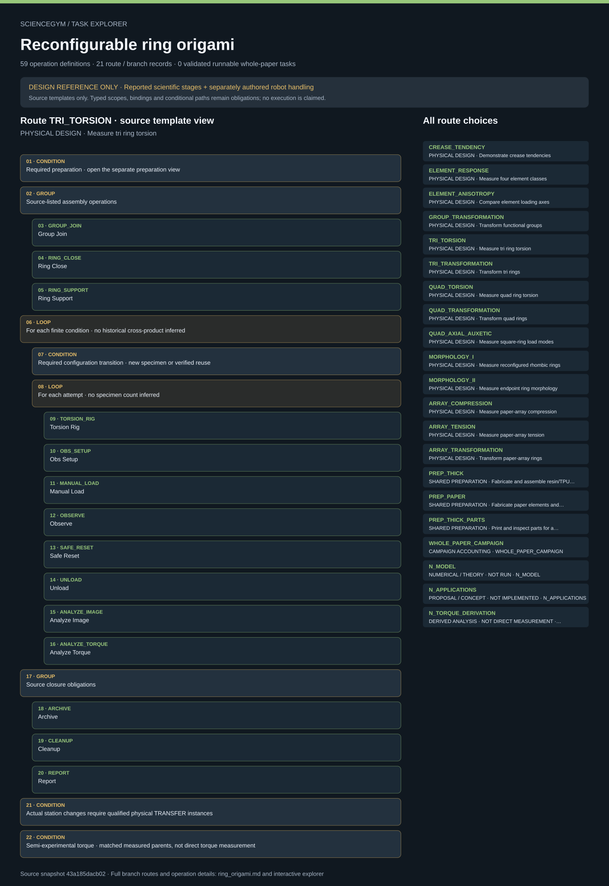

# Reconfigurable ring origami: task route map



Paper: **A reprogrammable mechanical metamaterial with origami functional-group transformation and ring reconfiguration** · [DOI](https://doi.org/10.1038/s41467-023-42323-1)

Author/evaluator design reference only; not an actor projection, task runner, solver, physical simulation or execution receipt. Missing inputs stay blocked. Numerical training is not physical self-updating hardware; derived torque is not direct torque measurement.. Counts describe task representation, not experiments or success.

**Reading rule:** rows retain the source display structure only. Membership has no inferred chronology. Where the source supplies a typed body, one unexpanded template is shown; no condition, trial or specimen count is inferred. An unordered obligation group has no inferred chronological edges. Source-reported scientific facts and authored handling are distinct.

[Immutable source task package](https://github.com/openags/ScienceGym/blob/43a185dacb02a979148bee93d5d9559e569086f3/tasks/ring_origami_operations_v2/) · [Interactive inspector](../index.html)

## CREASE_TENDENCY — PHYSICAL DESIGN · Demonstrate crease tendencies

Author/evaluator design reference only; not an actor projection, task runner, solver, physical simulation or execution receipt. Missing inputs stay blocked. Numerical training is not physical self-updating hardware; derived torque is not direct torque measurement. Typed bodies are unexpanded templates, with source-declared nesting, bindings and concurrency retained. Campaigns preserve independent branch identities.

[Exact route source](https://github.com/openags/ScienceGym/blob/43a185dacb02a979148bee93d5d9559e569086f3/tasks/ring_origami_operations_v2/branches.json) · JSON pointer: `/branches/0`

- **CONDITION: Required preparation · open the separate preparation view**
  - Binding: {"source_contract":{"preparation_route":"PREP_THICK_PARTS","preparation_product_requirement":"crease/facet demonstrator subassembly plus required printed parts; do not fabricate unneeded full elements"}}
- **GROUP: Source-listed assembly operations**
  - `HINGE_JOIN` Hinge Join
    - Source occurrence binding: {"source_file":"branches.json","source_pointer":"/branches/0/assembly_operations/0","source_node":"HINGE_JOIN"}
  - `CREASE_FASTEN` Crease Fasten
    - Source occurrence binding: {"source_file":"branches.json","source_pointer":"/branches/0/assembly_operations/1","source_node":"CREASE_FASTEN"}
  - `TRIM_SCREWS` Trim Screws
    - Source occurrence binding: {"source_file":"branches.json","source_pointer":"/branches/0/assembly_operations/2","source_node":"TRIM_SCREWS"}
- **LOOP: For each finite condition · no historical cross-product inferred**
  - Binding: {"conditions":[{"crease_class":4,"initial_angle_cases_from":"episode.crease_demonstration_card","historical_case_grid":"not recovered; representative examples only"}],"condition_count_policy":"Finite listed conditions; any parameterized angle/replicate schedule must be nonempty finite episode input before execution","condition_expansion_contract":"Before execution expand each condition entry into individual class/load/mode/orientation/angle instances. Arrays of load_modes or orientations are required subconditions, not a single averaged condition. Optional authored extensions must be labeled separately. Each instantiated condition has its own ID, initial state, raw records and disposition."}
  - **CONDITION: Required configuration transition · new specimen or verified reuse**
    - Binding: {"source_contract":{"required_before_each_condition":true,"new_specimen_path":"Receive independently prepared accepted specimen whose observed configuration matches the selected condition; bind its actual ID and geometry receipt.","reuse_path":{"precondition":"Previous loaded attempt ended with SAFE_RESET and UNLOAD; or explicit initial unloaded-state receipt","transport":"Move secured unloaded sample to qualified reconfiguration/inspection dock; WS_OBSERVE does not move sample","operations":[],"configuration_check":"Verify actual class/mode, graph, angle, axis and supports/pins; create a new configuration epoch if anything changed","remount":"Return to active station; run the full fixture/mount/calibration/readback prefix of test_body before another load"},"no_label_only_transition":true,"damage_rule":"Inspect after previous attempt; damaged/rejected specimen cannot be reused without an explicit qualified disposition","class_change_policy":"Hinge/ring reconfiguration changes functional-group mode, not the intrinsic C-I/C-II/C-III crease recipe. Changing intrinsic element class requires a separately prepared matched specimen or an explicit qualified rebuild through the relevant preparation/assembly route, retaining old/new part ancestry. No implicit crease replacement."}}
  - **LOOP: For each attempt · no specimen count inferred**
    - Binding: {"source_contract":{"iterator":"attempt_id","values_from":"episode.repetition_plan[branch_id,condition_id,specimen_id]","reset_between":"SAFE_RESET","body":"test_body with operation_bindings","failure_policy":"Append attempt with actual result; never replace failure or synthesize missing data"}}
    - `OBS_SETUP` Obs Setup
      - Source occurrence binding: {"source_file":"branches.json","source_pointer":"/branches/0/test_body/0","source_node":"OBS_SETUP"}
    - `MANUAL_LOAD` Manual Load
      - Source occurrence binding: {"source_file":"branches.json","source_pointer":"/branches/0/test_body/1","source_node":"@MANIPULATE","macro_binding":{"@MANIPULATE":"MANUAL_LOAD"}}
    - `OBSERVE` Observe
      - Source occurrence binding: {"source_file":"branches.json","source_pointer":"/branches/0/test_body/2","source_node":"OBSERVE"}
    - `SAFE_RESET` Safe Reset
      - Source occurrence binding: {"source_file":"branches.json","source_pointer":"/branches/0/test_body/3","source_node":"SAFE_RESET"}
- **GROUP: Source closure obligations**
  - `ARCHIVE` Archive
    - Source occurrence binding: {"source_file":"branches.json","source_pointer":"/branches/0/closure_operations/0","source_node":"ARCHIVE"}
  - `CLEANUP` Cleanup
    - Source occurrence binding: {"source_file":"branches.json","source_pointer":"/branches/0/closure_operations/1","source_node":"CLEANUP"}
  - `REPORT` Report
    - Source occurrence binding: {"source_file":"branches.json","source_pointer":"/branches/0/closure_operations/2","source_node":"REPORT"}
- **CONDITION: Actual station changes require qualified physical TRANSFER instances**
  - Binding: {"source_contract":"Instantiate TRANSFER when a physical object changes physical station. WS_OBSERVE is a co-located/remote service: the mounted specimen does not move. Preparation receipts determine the current origin."}

<details><summary>Branch state, choices, lineage and loop obligations</summary>

```json
{
  "id": "CREASE_TENDENCY",
  "title": "Demonstrate crease tendencies",
  "family_id": "F_CREASE",
  "preparation_route": "PREP_THICK_PARTS",
  "assembly_operations": [
    "HINGE_JOIN",
    "CREASE_FASTEN",
    "TRIM_SCREWS"
  ],
  "conditions": [
    {
      "crease_class": 4,
      "initial_angle_cases_from": "episode.crease_demonstration_card",
      "historical_case_grid": "not recovered; representative examples only"
    }
  ],
  "condition_count_policy": "Finite listed conditions; any parameterized angle/replicate schedule must be nonempty finite episode input before execution",
  "execution_mode": "qualitative",
  "test_body": [
    "OBS_SETUP",
    "@MANIPULATE",
    "OBSERVE",
    "SAFE_RESET"
  ],
  "source_evidence_ids": [
    "E_CREASE"
  ],
  "required_input_ids": [
    "U_ASM",
    "U_TORSION",
    "U_MOVIES"
  ],
  "goal": "Record supported crease recovery tendencies without inferring a calibrated bending law",
  "closure_operations": [
    "ARCHIVE",
    "CLEANUP",
    "REPORT"
  ],
  "source_repetition_count": null,
  "specimen_policy": "Actual specimen allocation and reuse must be declared; new graph/configuration gets an epoch, not a new fictional specimen. Three element prototypes does not imply three rings or arrays.",
  "completion": "All selected condition/trial instances have valid evidence and safe closure. Missing gate gives partial_with_valid_blocker, never an invented measurement.",
  "operation_bindings": {
    "@MOUNT": "MOUNT_RING",
    "@MANIPULATE": "MANUAL_LOAD"
  },
  "station_route": [
    "WS_STOCK",
    "preparation stations",
    "WS_ASSEMBLY",
    "WS_INSPECT",
    "WS_RECONFIG",
    "WS_RECONFIG",
    "WS_ARCHIVE",
    "WS_CLEAN"
  ],
  "transport_rule": "Instantiate TRANSFER when a physical object changes physical station. WS_OBSERVE is a co-located/remote service: the mounted specimen does not move. Preparation receipts determine the current origin.",
  "trial_loop": {
    "iterator": "attempt_id",
    "values_from": "episode.repetition_plan[branch_id,condition_id,specimen_id]",
    "reset_between": "SAFE_RESET",
    "body": "test_body with operation_bindings",
    "failure_policy": "Append attempt with actual result; never replace failure or synthesize missing data"
  },
  "preparation_product_requirement": "crease/facet demonstrator subassembly plus required printed parts; do not fabricate unneeded full elements",
  "preparation_loop_binding": "Dedicated parts-only route; no complete element exists before demonstrator assembly.",
  "condition_transition": {
    "required_before_each_condition": true,
    "new_specimen_path": "Receive independently prepared accepted specimen whose observed configuration matches the selected condition; bind its actual ID and geometry receipt.",
    "reuse_path": {
      "precondition": "Previous loaded attempt ended with SAFE_RESET and UNLOAD; or explicit initial unloaded-state receipt",
      "transport": "Move secured unloaded sample to qualified reconfiguration/inspection dock; WS_OBSERVE does not move sample",
      "operations": [],
      "configuration_check": "Verify actual class/mode, graph, angle, axis and supports/pins; create a new configuration epoch if anything changed",
      "remount": "Return to active station; run the full fixture/mount/calibration/readback prefix of test_body before another load"
    },
    "no_label_only_transition": true,
    "damage_rule": "Inspect after previous attempt; damaged/rejected specimen cannot be reused without an explicit qualified disposition",
    "class_change_policy": "Hinge/ring reconfiguration changes functional-group mode, not the intrinsic C-I/C-II/C-III crease recipe. Changing intrinsic element class requires a separately prepared matched specimen or an explicit qualified rebuild through the relevant preparation/assembly route, retaining old/new part ancestry. No implicit crease replacement."
  }
}
```

</details>

## ELEMENT_RESPONSE — PHYSICAL DESIGN · Measure four element classes

Author/evaluator design reference only; not an actor projection, task runner, solver, physical simulation or execution receipt. Missing inputs stay blocked. Numerical training is not physical self-updating hardware; derived torque is not direct torque measurement. Typed bodies are unexpanded templates, with source-declared nesting, bindings and concurrency retained. Campaigns preserve independent branch identities.

[Exact route source](https://github.com/openags/ScienceGym/blob/43a185dacb02a979148bee93d5d9559e569086f3/tasks/ring_origami_operations_v2/branches.json) · JSON pointer: `/branches/1`

- **CONDITION: Required preparation · open the separate preparation view**
  - Binding: {"source_contract":{"preparation_route":"PREP_THICK","preparation_product_requirement":"Accepted identified complete elements and downstream groups/rings/array for the selected condition BOM"}}
- **GROUP: Source-listed assembly operations**
- **LOOP: For each finite condition · no historical cross-product inferred**
  - Binding: {"conditions":[{"element_class":"C_I","load_modes":["tension"]},{"element_class":"C_II","load_modes":["tension","compression"]},{"element_class":"C_III","load_modes":["compression"]},{"element_class":"R","load_modes":["compression"]}],"condition_count_policy":"Finite listed conditions; any parameterized angle/replicate schedule must be nonempty finite episode input before execution","condition_expansion_contract":"Before execution expand each condition entry into individual class/load/mode/orientation/angle instances. Arrays of load_modes or orientations are required subconditions, not a single averaged condition. Optional authored extensions must be labeled separately. Each instantiated condition has its own ID, initial state, raw records and disposition."}
  - **CONDITION: Required configuration transition · new specimen or verified reuse**
    - Binding: {"source_contract":{"required_before_each_condition":true,"new_specimen_path":"Receive independently prepared accepted specimen whose observed configuration matches the selected condition; bind its actual ID and geometry receipt.","reuse_path":{"precondition":"Previous loaded attempt ended with SAFE_RESET and UNLOAD; or explicit initial unloaded-state receipt","transport":"Move secured unloaded sample to qualified reconfiguration/inspection dock; WS_OBSERVE does not move sample","operations":[],"configuration_check":"Verify actual class/mode, graph, angle, axis and supports/pins; create a new configuration epoch if anything changed","remount":"Return to active station; run the full fixture/mount/calibration/readback prefix of test_body before another load"},"no_label_only_transition":true,"damage_rule":"Inspect after previous attempt; damaged/rejected specimen cannot be reused without an explicit qualified disposition","class_change_policy":"Hinge/ring reconfiguration changes functional-group mode, not the intrinsic C-I/C-II/C-III crease recipe. Changing intrinsic element class requires a separately prepared matched specimen or an explicit qualified rebuild through the relevant preparation/assembly route, retaining old/new part ancestry. No implicit crease replacement."}}
  - **LOOP: For each attempt · no specimen count inferred**
    - Binding: {"source_contract":{"iterator":"attempt_id","values_from":"episode.repetition_plan[branch_id,condition_id,specimen_id]","reset_between":"SAFE_RESET","body":"test_body with operation_bindings","failure_policy":"Append attempt with actual result; never replace failure or synthesize missing data"}}
    - `FIXTURE_SELECT` Fixture Select
      - Source occurrence binding: {"source_file":"branches.json","source_pointer":"/branches/1/test_body/0","source_node":"FIXTURE_SELECT"}
    - `MOUNT_ELEMENT` Mount Element
      - Source occurrence binding: {"source_file":"branches.json","source_pointer":"/branches/1/test_body/1","source_node":"@MOUNT","macro_binding":{"@MOUNT":"MOUNT_ELEMENT"}}
    - `OBS_SETUP` Obs Setup
      - Source occurrence binding: {"source_file":"branches.json","source_pointer":"/branches/1/test_body/2","source_node":"OBS_SETUP"}
    - `CALIBRATE` Calibrate
      - Source occurrence binding: {"source_file":"branches.json","source_pointer":"/branches/1/test_body/3","source_node":"CALIBRATE"}
    - `CONFIG_TEST` Config Test
      - Source occurrence binding: {"source_file":"branches.json","source_pointer":"/branches/1/test_body/4","source_node":"CONFIG_TEST"}
    - `ARM_TEST` Arm Test
      - Source occurrence binding: {"source_file":"branches.json","source_pointer":"/branches/1/test_body/5","source_node":"ARM_TEST"}
    - **OBLIGATIONS: Concurrent source obligations · safe remote observation**
      - Binding: {"source_file":"branches.json","source_pointer":"/branches/1/test_body/6","source_node":{"concurrent":["TEST_PROCESS","OBSERVE"],"constraint":"observer remains outside motion envelope"}}
      - `TEST_PROCESS` Test Process
        - Source occurrence binding: {"source_file":"branches.json","source_pointer":"/branches/1/test_body/6/concurrent/0","source_node":"TEST_PROCESS"}
      - `OBSERVE` Observe
        - Source occurrence binding: {"source_file":"branches.json","source_pointer":"/branches/1/test_body/6/concurrent/1","source_node":"OBSERVE"}
    - `SAFE_RESET` Safe Reset
      - Source occurrence binding: {"source_file":"branches.json","source_pointer":"/branches/1/test_body/7","source_node":"SAFE_RESET"}
    - `UNLOAD` Unload
      - Source occurrence binding: {"source_file":"branches.json","source_pointer":"/branches/1/test_body/8","source_node":"UNLOAD"}
    - `ANALYZE_ELEMENT` Analyze Element
      - Source occurrence binding: {"source_file":"branches.json","source_pointer":"/branches/1/test_body/9","source_node":"ANALYZE_ELEMENT"}
- **GROUP: Source closure obligations**
  - `ARCHIVE` Archive
    - Source occurrence binding: {"source_file":"branches.json","source_pointer":"/branches/1/closure_operations/0","source_node":"ARCHIVE"}
  - `CLEANUP` Cleanup
    - Source occurrence binding: {"source_file":"branches.json","source_pointer":"/branches/1/closure_operations/1","source_node":"CLEANUP"}
  - `REPORT` Report
    - Source occurrence binding: {"source_file":"branches.json","source_pointer":"/branches/1/closure_operations/2","source_node":"REPORT"}
- **CONDITION: Actual station changes require qualified physical TRANSFER instances**
  - Binding: {"source_contract":"Instantiate TRANSFER when a physical object changes physical station. WS_OBSERVE is a co-located/remote service: the mounted specimen does not move. Preparation receipts determine the current origin."}

<details><summary>Branch state, choices, lineage and loop obligations</summary>

```json
{
  "id": "ELEMENT_RESPONSE",
  "title": "Measure four element classes",
  "family_id": "F_ELEMENT",
  "preparation_route": "PREP_THICK",
  "assembly_operations": [],
  "conditions": [
    {
      "element_class": "C_I",
      "load_modes": [
        "tension"
      ]
    },
    {
      "element_class": "C_II",
      "load_modes": [
        "tension",
        "compression"
      ]
    },
    {
      "element_class": "C_III",
      "load_modes": [
        "compression"
      ]
    },
    {
      "element_class": "R",
      "load_modes": [
        "compression"
      ]
    }
  ],
  "condition_count_policy": "Finite listed conditions; any parameterized angle/replicate schedule must be nonempty finite episode input before execution",
  "execution_mode": "mechanical",
  "test_body": [
    "FIXTURE_SELECT",
    "@MOUNT",
    "OBS_SETUP",
    "CALIBRATE",
    "CONFIG_TEST",
    "ARM_TEST",
    {
      "concurrent": [
        "TEST_PROCESS",
        "OBSERVE"
      ],
      "constraint": "observer remains outside motion envelope"
    },
    "SAFE_RESET",
    "UNLOAD",
    "ANALYZE_ELEMENT"
  ],
  "source_evidence_ids": [
    "E_ELEMENT",
    "E_GEOM"
  ],
  "required_input_ids": [
    "U_DIRECTION",
    "U_FIX",
    "U_CAL",
    "U_ANALYSIS",
    "U_REPEAT"
  ],
  "goal": "Acquire attributable force/deformation data for C-I, C-II, C-III and R",
  "closure_operations": [
    "ARCHIVE",
    "CLEANUP",
    "REPORT"
  ],
  "source_repetition_count": 3,
  "specimen_policy": "Actual specimen allocation and reuse must be declared; new graph/configuration gets an epoch, not a new fictional specimen. Three element prototypes does not imply three rings or arrays.",
  "completion": "All selected condition/trial instances have valid evidence and safe closure. Missing gate gives partial_with_valid_blocker, never an invented measurement.",
  "operation_bindings": {
    "@MOUNT": "MOUNT_ELEMENT",
    "@MANIPULATE": "MANUAL_LOAD"
  },
  "station_route": [
    "WS_STOCK",
    "preparation stations",
    "WS_ASSEMBLY",
    "WS_INSPECT",
    "WS_INSPECT",
    "WS_TEST",
    "WS_ARCHIVE",
    "WS_CLEAN"
  ],
  "transport_rule": "Instantiate TRANSFER when a physical object changes physical station. WS_OBSERVE is a co-located/remote service: the mounted specimen does not move. Preparation receipts determine the current origin.",
  "trial_loop": {
    "iterator": "attempt_id",
    "values_from": "episode.repetition_plan[branch_id,condition_id,specimen_id]",
    "reset_between": "SAFE_RESET",
    "body": "test_body with operation_bindings",
    "failure_policy": "Append attempt with actual result; never replace failure or synthesize missing data"
  },
  "preparation_product_requirement": "Accepted identified complete elements and downstream groups/rings/array for the selected condition BOM",
  "condition_transition": {
    "required_before_each_condition": true,
    "new_specimen_path": "Receive independently prepared accepted specimen whose observed configuration matches the selected condition; bind its actual ID and geometry receipt.",
    "reuse_path": {
      "precondition": "Previous loaded attempt ended with SAFE_RESET and UNLOAD; or explicit initial unloaded-state receipt",
      "transport": "Move secured unloaded sample to qualified reconfiguration/inspection dock; WS_OBSERVE does not move sample",
      "operations": [],
      "configuration_check": "Verify actual class/mode, graph, angle, axis and supports/pins; create a new configuration epoch if anything changed",
      "remount": "Return to active station; run the full fixture/mount/calibration/readback prefix of test_body before another load"
    },
    "no_label_only_transition": true,
    "damage_rule": "Inspect after previous attempt; damaged/rejected specimen cannot be reused without an explicit qualified disposition",
    "class_change_policy": "Hinge/ring reconfiguration changes functional-group mode, not the intrinsic C-I/C-II/C-III crease recipe. Changing intrinsic element class requires a separately prepared matched specimen or an explicit qualified rebuild through the relevant preparation/assembly route, retaining old/new part ancestry. No implicit crease replacement."
  }
}
```

</details>

## ELEMENT_ANISOTROPY — PHYSICAL DESIGN · Compare element loading axes

Author/evaluator design reference only; not an actor projection, task runner, solver, physical simulation or execution receipt. Missing inputs stay blocked. Numerical training is not physical self-updating hardware; derived torque is not direct torque measurement. Typed bodies are unexpanded templates, with source-declared nesting, bindings and concurrency retained. Campaigns preserve independent branch identities.

[Exact route source](https://github.com/openags/ScienceGym/blob/43a185dacb02a979148bee93d5d9559e569086f3/tasks/ring_origami_operations_v2/branches.json) · JSON pointer: `/branches/2`

- **CONDITION: Required preparation · open the separate preparation view**
  - Binding: {"source_contract":{"preparation_route":"PREP_THICK","preparation_product_requirement":"Accepted identified complete elements and downstream groups/rings/array for the selected condition BOM"}}
- **GROUP: Source-listed assembly operations**
- **LOOP: For each finite condition · no historical cross-product inferred**
  - Binding: {"conditions":[{"direction":"transverse_F1_F2","class":"source prototype class unresolved"},{"direction":"axial_F3","class":"source prototype class unresolved"}],"condition_count_policy":"Finite listed conditions; any parameterized angle/replicate schedule must be nonempty finite episode input before execution","condition_expansion_contract":"Before execution expand each condition entry into individual class/load/mode/orientation/angle instances. Arrays of load_modes or orientations are required subconditions, not a single averaged condition. Optional authored extensions must be labeled separately. Each instantiated condition has its own ID, initial state, raw records and disposition."}
  - **CONDITION: Required configuration transition · new specimen or verified reuse**
    - Binding: {"source_contract":{"required_before_each_condition":true,"new_specimen_path":"Receive independently prepared accepted specimen whose observed configuration matches the selected condition; bind its actual ID and geometry receipt.","reuse_path":{"precondition":"Previous loaded attempt ended with SAFE_RESET and UNLOAD; or explicit initial unloaded-state receipt","transport":"Move secured unloaded sample to qualified reconfiguration/inspection dock; WS_OBSERVE does not move sample","operations":[],"configuration_check":"Verify actual class/mode, graph, angle, axis and supports/pins; create a new configuration epoch if anything changed","remount":"Return to active station; run the full fixture/mount/calibration/readback prefix of test_body before another load"},"no_label_only_transition":true,"damage_rule":"Inspect after previous attempt; damaged/rejected specimen cannot be reused without an explicit qualified disposition","class_change_policy":"Hinge/ring reconfiguration changes functional-group mode, not the intrinsic C-I/C-II/C-III crease recipe. Changing intrinsic element class requires a separately prepared matched specimen or an explicit qualified rebuild through the relevant preparation/assembly route, retaining old/new part ancestry. No implicit crease replacement."}}
  - **LOOP: For each attempt · no specimen count inferred**
    - Binding: {"source_contract":{"iterator":"attempt_id","values_from":"episode.repetition_plan[branch_id,condition_id,specimen_id]","reset_between":"SAFE_RESET","body":"test_body with operation_bindings","failure_policy":"Append attempt with actual result; never replace failure or synthesize missing data"}}
    - `FIXTURE_SELECT` Fixture Select
      - Source occurrence binding: {"source_file":"branches.json","source_pointer":"/branches/2/test_body/0","source_node":"FIXTURE_SELECT"}
    - `MOUNT_ELEMENT` Mount Element
      - Source occurrence binding: {"source_file":"branches.json","source_pointer":"/branches/2/test_body/1","source_node":"@MOUNT","macro_binding":{"@MOUNT":"MOUNT_ELEMENT"}}
    - `OBS_SETUP` Obs Setup
      - Source occurrence binding: {"source_file":"branches.json","source_pointer":"/branches/2/test_body/2","source_node":"OBS_SETUP"}
    - `CALIBRATE` Calibrate
      - Source occurrence binding: {"source_file":"branches.json","source_pointer":"/branches/2/test_body/3","source_node":"CALIBRATE"}
    - `CONFIG_TEST` Config Test
      - Source occurrence binding: {"source_file":"branches.json","source_pointer":"/branches/2/test_body/4","source_node":"CONFIG_TEST"}
    - `ARM_TEST` Arm Test
      - Source occurrence binding: {"source_file":"branches.json","source_pointer":"/branches/2/test_body/5","source_node":"ARM_TEST"}
    - **OBLIGATIONS: Concurrent source obligations · safe remote observation**
      - Binding: {"source_file":"branches.json","source_pointer":"/branches/2/test_body/6","source_node":{"concurrent":["TEST_PROCESS","OBSERVE"],"constraint":"observer remains outside motion envelope"}}
      - `TEST_PROCESS` Test Process
        - Source occurrence binding: {"source_file":"branches.json","source_pointer":"/branches/2/test_body/6/concurrent/0","source_node":"TEST_PROCESS"}
      - `OBSERVE` Observe
        - Source occurrence binding: {"source_file":"branches.json","source_pointer":"/branches/2/test_body/6/concurrent/1","source_node":"OBSERVE"}
    - `SAFE_RESET` Safe Reset
      - Source occurrence binding: {"source_file":"branches.json","source_pointer":"/branches/2/test_body/7","source_node":"SAFE_RESET"}
    - `UNLOAD` Unload
      - Source occurrence binding: {"source_file":"branches.json","source_pointer":"/branches/2/test_body/8","source_node":"UNLOAD"}
    - `ANALYZE_ELEMENT` Analyze Element
      - Source occurrence binding: {"source_file":"branches.json","source_pointer":"/branches/2/test_body/9","source_node":"ANALYZE_ELEMENT"}
- **GROUP: Source closure obligations**
  - `ARCHIVE` Archive
    - Source occurrence binding: {"source_file":"branches.json","source_pointer":"/branches/2/closure_operations/0","source_node":"ARCHIVE"}
  - `CLEANUP` Cleanup
    - Source occurrence binding: {"source_file":"branches.json","source_pointer":"/branches/2/closure_operations/1","source_node":"CLEANUP"}
  - `REPORT` Report
    - Source occurrence binding: {"source_file":"branches.json","source_pointer":"/branches/2/closure_operations/2","source_node":"REPORT"}
- **CONDITION: Actual station changes require qualified physical TRANSFER instances**
  - Binding: {"source_contract":"Instantiate TRANSFER when a physical object changes physical station. WS_OBSERVE is a co-located/remote service: the mounted specimen does not move. Preparation receipts determine the current origin."}

<details><summary>Branch state, choices, lineage and loop obligations</summary>

```json
{
  "id": "ELEMENT_ANISOTROPY",
  "title": "Compare element loading axes",
  "family_id": "F_ANISO",
  "preparation_route": "PREP_THICK",
  "assembly_operations": [],
  "conditions": [
    {
      "direction": "transverse_F1_F2",
      "class": "source prototype class unresolved"
    },
    {
      "direction": "axial_F3",
      "class": "source prototype class unresolved"
    }
  ],
  "condition_count_policy": "Finite listed conditions; any parameterized angle/replicate schedule must be nonempty finite episode input before execution",
  "execution_mode": "mechanical",
  "test_body": [
    "FIXTURE_SELECT",
    "@MOUNT",
    "OBS_SETUP",
    "CALIBRATE",
    "CONFIG_TEST",
    "ARM_TEST",
    {
      "concurrent": [
        "TEST_PROCESS",
        "OBSERVE"
      ],
      "constraint": "observer remains outside motion envelope"
    },
    "SAFE_RESET",
    "UNLOAD",
    "ANALYZE_ELEMENT"
  ],
  "source_evidence_ids": [
    "E_ANISO"
  ],
  "required_input_ids": [
    "U_FIX",
    "U_DIRECTION",
    "U_REPEAT"
  ],
  "goal": "Compare measured response for orthogonal contacts without substituting one axis trace for another",
  "closure_operations": [
    "ARCHIVE",
    "CLEANUP",
    "REPORT"
  ],
  "source_repetition_count": null,
  "specimen_policy": "Actual specimen allocation and reuse must be declared; new graph/configuration gets an epoch, not a new fictional specimen. Three element prototypes does not imply three rings or arrays.",
  "completion": "All selected condition/trial instances have valid evidence and safe closure. Missing gate gives partial_with_valid_blocker, never an invented measurement.",
  "operation_bindings": {
    "@MOUNT": "MOUNT_ELEMENT",
    "@MANIPULATE": "MANUAL_LOAD"
  },
  "station_route": [
    "WS_STOCK",
    "preparation stations",
    "WS_ASSEMBLY",
    "WS_INSPECT",
    "WS_INSPECT",
    "WS_TEST",
    "WS_ARCHIVE",
    "WS_CLEAN"
  ],
  "transport_rule": "Instantiate TRANSFER when a physical object changes physical station. WS_OBSERVE is a co-located/remote service: the mounted specimen does not move. Preparation receipts determine the current origin.",
  "trial_loop": {
    "iterator": "attempt_id",
    "values_from": "episode.repetition_plan[branch_id,condition_id,specimen_id]",
    "reset_between": "SAFE_RESET",
    "body": "test_body with operation_bindings",
    "failure_policy": "Append attempt with actual result; never replace failure or synthesize missing data"
  },
  "preparation_product_requirement": "Accepted identified complete elements and downstream groups/rings/array for the selected condition BOM",
  "condition_transition": {
    "required_before_each_condition": true,
    "new_specimen_path": "Receive independently prepared accepted specimen whose observed configuration matches the selected condition; bind its actual ID and geometry receipt.",
    "reuse_path": {
      "precondition": "Previous loaded attempt ended with SAFE_RESET and UNLOAD; or explicit initial unloaded-state receipt",
      "transport": "Move secured unloaded sample to qualified reconfiguration/inspection dock; WS_OBSERVE does not move sample",
      "operations": [],
      "configuration_check": "Verify actual class/mode, graph, angle, axis and supports/pins; create a new configuration epoch if anything changed",
      "remount": "Return to active station; run the full fixture/mount/calibration/readback prefix of test_body before another load"
    },
    "no_label_only_transition": true,
    "damage_rule": "Inspect after previous attempt; damaged/rejected specimen cannot be reused without an explicit qualified disposition",
    "class_change_policy": "Hinge/ring reconfiguration changes functional-group mode, not the intrinsic C-I/C-II/C-III crease recipe. Changing intrinsic element class requires a separately prepared matched specimen or an explicit qualified rebuild through the relevant preparation/assembly route, retaining old/new part ancestry. No implicit crease replacement."
  }
}
```

</details>

## GROUP_TRANSFORMATION — PHYSICAL DESIGN · Transform functional groups

Author/evaluator design reference only; not an actor projection, task runner, solver, physical simulation or execution receipt. Missing inputs stay blocked. Numerical training is not physical self-updating hardware; derived torque is not direct torque measurement. Typed bodies are unexpanded templates, with source-declared nesting, bindings and concurrency retained. Campaigns preserve independent branch identities.

[Exact route source](https://github.com/openags/ScienceGym/blob/43a185dacb02a979148bee93d5d9559e569086f3/tasks/ring_origami_operations_v2/branches.json) · JSON pointer: `/branches/3`

- **CONDITION: Required preparation · open the separate preparation view**
  - Binding: {"source_contract":{"preparation_route":"PREP_THICK","preparation_product_requirement":"Accepted identified complete elements and downstream groups/rings/array for the selected condition BOM"}}
- **GROUP: Source-listed assembly operations**
  - `GROUP_JOIN` Group Join
    - Source occurrence binding: {"source_file":"branches.json","source_pointer":"/branches/3/assembly_operations/0","source_node":"GROUP_JOIN"}
- **LOOP: For each finite condition · no historical cross-product inferred**
  - Binding: {"conditions":[{"C_type":"C_I","states":["C_I","R"],"directions":["C_to_R","R_to_C"]},{"C_type":"C_II","states":["C_II","R"],"directions":["C_to_R","R_to_C"]},{"C_type":"C_III","states":["C_III","R"],"directions":["C_to_R","R_to_C"]}],"condition_count_policy":"Finite listed conditions; any parameterized angle/replicate schedule must be nonempty finite episode input before execution","condition_expansion_contract":"Before execution expand each condition entry into individual class/load/mode/orientation/angle instances. Arrays of load_modes or orientations are required subconditions, not a single averaged condition. Optional authored extensions must be labeled separately. Each instantiated condition has its own ID, initial state, raw records and disposition."}
  - **CONDITION: Required configuration transition · new specimen or verified reuse**
    - Binding: {"source_contract":{"required_before_each_condition":true,"new_specimen_path":"Receive independently prepared accepted specimen whose observed configuration matches the selected condition; bind its actual ID and geometry receipt.","reuse_path":{"precondition":"Previous loaded attempt ended with SAFE_RESET and UNLOAD; or explicit initial unloaded-state receipt","transport":"Move secured unloaded sample to qualified reconfiguration/inspection dock; WS_OBSERVE does not move sample","operations":["GROUP_TRANSFORM"],"configuration_check":"Verify actual class/mode, graph, angle, axis and supports/pins; create a new configuration epoch if anything changed","remount":"Return to active station; run the full fixture/mount/calibration/readback prefix of test_body before another load"},"no_label_only_transition":true,"damage_rule":"Inspect after previous attempt; damaged/rejected specimen cannot be reused without an explicit qualified disposition","class_change_policy":"Hinge/ring reconfiguration changes functional-group mode, not the intrinsic C-I/C-II/C-III crease recipe. Changing intrinsic element class requires a separately prepared matched specimen or an explicit qualified rebuild through the relevant preparation/assembly route, retaining old/new part ancestry. No implicit crease replacement."}}
  - **LOOP: For each attempt · no specimen count inferred**
    - Binding: {"source_contract":{"iterator":"attempt_id","values_from":"episode.repetition_plan[branch_id,condition_id,specimen_id]","reset_between":"SAFE_RESET","body":"test_body with operation_bindings","failure_policy":"Append attempt with actual result; never replace failure or synthesize missing data"}}
    - `OBS_SETUP` Obs Setup
      - Source occurrence binding: {"source_file":"branches.json","source_pointer":"/branches/3/test_body/0","source_node":"OBS_SETUP"}
    - `GROUP_TRANSFORM` Group Transform
      - Source occurrence binding: {"source_file":"branches.json","source_pointer":"/branches/3/test_body/1","source_node":"@MANIPULATE","macro_binding":{"@MANIPULATE":"GROUP_TRANSFORM"}}
    - `OBSERVE` Observe
      - Source occurrence binding: {"source_file":"branches.json","source_pointer":"/branches/3/test_body/2","source_node":"OBSERVE"}
    - `SAFE_RESET` Safe Reset
      - Source occurrence binding: {"source_file":"branches.json","source_pointer":"/branches/3/test_body/3","source_node":"SAFE_RESET"}
- **GROUP: Source closure obligations**
  - `ARCHIVE` Archive
    - Source occurrence binding: {"source_file":"branches.json","source_pointer":"/branches/3/closure_operations/0","source_node":"ARCHIVE"}
  - `CLEANUP` Cleanup
    - Source occurrence binding: {"source_file":"branches.json","source_pointer":"/branches/3/closure_operations/1","source_node":"CLEANUP"}
  - `REPORT` Report
    - Source occurrence binding: {"source_file":"branches.json","source_pointer":"/branches/3/closure_operations/2","source_node":"REPORT"}
- **CONDITION: Actual station changes require qualified physical TRANSFER instances**
  - Binding: {"source_contract":"Instantiate TRANSFER when a physical object changes physical station. WS_OBSERVE is a co-located/remote service: the mounted specimen does not move. Preparation receipts determine the current origin."}

<details><summary>Branch state, choices, lineage and loop obligations</summary>

```json
{
  "id": "GROUP_TRANSFORMATION",
  "title": "Transform functional groups",
  "family_id": "F_GROUP",
  "preparation_route": "PREP_THICK",
  "assembly_operations": [
    "GROUP_JOIN"
  ],
  "conditions": [
    {
      "C_type": "C_I",
      "states": [
        "C_I",
        "R"
      ],
      "directions": [
        "C_to_R",
        "R_to_C"
      ]
    },
    {
      "C_type": "C_II",
      "states": [
        "C_II",
        "R"
      ],
      "directions": [
        "C_to_R",
        "R_to_C"
      ]
    },
    {
      "C_type": "C_III",
      "states": [
        "C_III",
        "R"
      ],
      "directions": [
        "C_to_R",
        "R_to_C"
      ]
    }
  ],
  "condition_count_policy": "Finite listed conditions; any parameterized angle/replicate schedule must be nonempty finite episode input before execution",
  "execution_mode": "qualitative",
  "test_body": [
    "OBS_SETUP",
    "@MANIPULATE",
    "OBSERVE",
    "SAFE_RESET"
  ],
  "source_evidence_ids": [
    "E_GROUP"
  ],
  "required_input_ids": [
    "U_ASM",
    "U_MOVIES"
  ],
  "goal": "Observe actual hinge rotation and active-axis change with preserved component identity",
  "closure_operations": [
    "ARCHIVE",
    "CLEANUP",
    "REPORT"
  ],
  "source_repetition_count": null,
  "specimen_policy": "Actual specimen allocation and reuse must be declared; new graph/configuration gets an epoch, not a new fictional specimen. Three element prototypes does not imply three rings or arrays.",
  "completion": "All selected condition/trial instances have valid evidence and safe closure. Missing gate gives partial_with_valid_blocker, never an invented measurement.",
  "operation_bindings": {
    "@MOUNT": "MOUNT_RING",
    "@MANIPULATE": "GROUP_TRANSFORM"
  },
  "station_route": [
    "WS_STOCK",
    "preparation stations",
    "WS_ASSEMBLY",
    "WS_INSPECT",
    "WS_RECONFIG",
    "WS_RECONFIG",
    "WS_ARCHIVE",
    "WS_CLEAN"
  ],
  "transport_rule": "Instantiate TRANSFER when a physical object changes physical station. WS_OBSERVE is a co-located/remote service: the mounted specimen does not move. Preparation receipts determine the current origin.",
  "trial_loop": {
    "iterator": "attempt_id",
    "values_from": "episode.repetition_plan[branch_id,condition_id,specimen_id]",
    "reset_between": "SAFE_RESET",
    "body": "test_body with operation_bindings",
    "failure_policy": "Append attempt with actual result; never replace failure or synthesize missing data"
  },
  "preparation_product_requirement": "Accepted identified complete elements and downstream groups/rings/array for the selected condition BOM",
  "condition_transition": {
    "required_before_each_condition": true,
    "new_specimen_path": "Receive independently prepared accepted specimen whose observed configuration matches the selected condition; bind its actual ID and geometry receipt.",
    "reuse_path": {
      "precondition": "Previous loaded attempt ended with SAFE_RESET and UNLOAD; or explicit initial unloaded-state receipt",
      "transport": "Move secured unloaded sample to qualified reconfiguration/inspection dock; WS_OBSERVE does not move sample",
      "operations": [
        "GROUP_TRANSFORM"
      ],
      "configuration_check": "Verify actual class/mode, graph, angle, axis and supports/pins; create a new configuration epoch if anything changed",
      "remount": "Return to active station; run the full fixture/mount/calibration/readback prefix of test_body before another load"
    },
    "no_label_only_transition": true,
    "damage_rule": "Inspect after previous attempt; damaged/rejected specimen cannot be reused without an explicit qualified disposition",
    "class_change_policy": "Hinge/ring reconfiguration changes functional-group mode, not the intrinsic C-I/C-II/C-III crease recipe. Changing intrinsic element class requires a separately prepared matched specimen or an explicit qualified rebuild through the relevant preparation/assembly route, retaining old/new part ancestry. No implicit crease replacement."
  }
}
```

</details>

## TRI_TORSION — PHYSICAL DESIGN · Measure tri ring torsion

Author/evaluator design reference only; not an actor projection, task runner, solver, physical simulation or execution receipt. Missing inputs stay blocked. Numerical training is not physical self-updating hardware; derived torque is not direct torque measurement. Typed bodies are unexpanded templates, with source-declared nesting, bindings and concurrency retained. Campaigns preserve independent branch identities.

[Exact route source](https://github.com/openags/ScienceGym/blob/43a185dacb02a979148bee93d5d9559e569086f3/tasks/ring_origami_operations_v2/branches.json) · JSON pointer: `/branches/4`

- **CONDITION: Required preparation · open the separate preparation view**
  - Binding: {"source_contract":{"preparation_route":"PREP_THICK","preparation_product_requirement":"Accepted identified complete elements and downstream groups/rings/array for the selected condition BOM"}}
- **GROUP: Source-listed assembly operations**
  - `GROUP_JOIN` Group Join
    - Source occurrence binding: {"source_file":"branches.json","source_pointer":"/branches/4/assembly_operations/0","source_node":"GROUP_JOIN"}
  - `RING_CLOSE` Ring Close
    - Source occurrence binding: {"source_file":"branches.json","source_pointer":"/branches/4/assembly_operations/1","source_node":"RING_CLOSE"}
  - `RING_SUPPORT` Ring Support
    - Source occurrence binding: {"source_file":"branches.json","source_pointer":"/branches/4/assembly_operations/2","source_node":"RING_SUPPORT"}
- **LOOP: For each finite condition · no historical cross-product inferred**
  - Binding: {"conditions":[{"class":"C_I","motion_modes":["expansion"],"group_count":3,"C_angle_deg":60,"R_angle_deg":60},{"class":"C_II","motion_modes":["expansion","contraction"],"group_count":3,"C_angle_deg":60,"R_angle_deg":60},{"class":"C_III","motion_modes":["contraction"],"group_count":3,"C_angle_deg":60,"R_angle_deg":60},{"class":"R","motion_modes":["contraction"],"group_count":3,"C_angle_deg":60,"R_angle_deg":60}],"condition_count_policy":"Finite listed conditions; any parameterized angle/replicate schedule must be nonempty finite episode input before execution","condition_expansion_contract":"Before execution expand each condition entry into individual class/load/mode/orientation/angle instances. Arrays of load_modes or orientations are required subconditions, not a single averaged condition. Optional authored extensions must be labeled separately. Each instantiated condition has its own ID, initial state, raw records and disposition."}
  - **CONDITION: Required configuration transition · new specimen or verified reuse**
    - Binding: {"source_contract":{"required_before_each_condition":true,"new_specimen_path":"Receive independently prepared accepted specimen whose observed configuration matches the selected condition; bind its actual ID and geometry receipt.","reuse_path":{"precondition":"Previous loaded attempt ended with SAFE_RESET and UNLOAD; or explicit initial unloaded-state receipt","transport":"Move secured unloaded sample to qualified reconfiguration/inspection dock; WS_OBSERVE does not move sample","operations":["RING_RECONFIG","RING_SUPPORT"],"configuration_check":"Verify actual class/mode, graph, angle, axis and supports/pins; create a new configuration epoch if anything changed","remount":"Return to active station; run the full fixture/mount/calibration/readback prefix of test_body before another load"},"no_label_only_transition":true,"damage_rule":"Inspect after previous attempt; damaged/rejected specimen cannot be reused without an explicit qualified disposition","class_change_policy":"Hinge/ring reconfiguration changes functional-group mode, not the intrinsic C-I/C-II/C-III crease recipe. Changing intrinsic element class requires a separately prepared matched specimen or an explicit qualified rebuild through the relevant preparation/assembly route, retaining old/new part ancestry. No implicit crease replacement.","R_precursor_policy":"Record the C-element precursor class and actual R-element identities in every transformed ring; do not hide precursor differences by using a single R label."}}
  - **LOOP: For each attempt · no specimen count inferred**
    - Binding: {"source_contract":{"iterator":"attempt_id","values_from":"episode.repetition_plan[branch_id,condition_id,specimen_id]","reset_between":"SAFE_RESET","body":"test_body with operation_bindings","failure_policy":"Append attempt with actual result; never replace failure or synthesize missing data"}}
    - `TORSION_RIG` Torsion Rig
      - Source occurrence binding: {"source_file":"branches.json","source_pointer":"/branches/4/test_body/0","source_node":"TORSION_RIG"}
    - `OBS_SETUP` Obs Setup
      - Source occurrence binding: {"source_file":"branches.json","source_pointer":"/branches/4/test_body/1","source_node":"OBS_SETUP"}
    - `MANUAL_LOAD` Manual Load
      - Source occurrence binding: {"source_file":"branches.json","source_pointer":"/branches/4/test_body/2","source_node":"MANUAL_LOAD"}
    - `OBSERVE` Observe
      - Source occurrence binding: {"source_file":"branches.json","source_pointer":"/branches/4/test_body/3","source_node":"OBSERVE"}
    - `SAFE_RESET` Safe Reset
      - Source occurrence binding: {"source_file":"branches.json","source_pointer":"/branches/4/test_body/4","source_node":"SAFE_RESET"}
    - `UNLOAD` Unload
      - Source occurrence binding: {"source_file":"branches.json","source_pointer":"/branches/4/test_body/5","source_node":"UNLOAD"}
    - `ANALYZE_IMAGE` Analyze Image
      - Source occurrence binding: {"source_file":"branches.json","source_pointer":"/branches/4/test_body/6","source_node":"ANALYZE_IMAGE"}
    - `ANALYZE_TORQUE` Analyze Torque
      - Source occurrence binding: {"source_file":"branches.json","source_pointer":"/branches/4/test_body/7","source_node":"ANALYZE_TORQUE"}
- **GROUP: Source closure obligations**
  - `ARCHIVE` Archive
    - Source occurrence binding: {"source_file":"branches.json","source_pointer":"/branches/4/closure_operations/0","source_node":"ARCHIVE"}
  - `CLEANUP` Cleanup
    - Source occurrence binding: {"source_file":"branches.json","source_pointer":"/branches/4/closure_operations/1","source_node":"CLEANUP"}
  - `REPORT` Report
    - Source occurrence binding: {"source_file":"branches.json","source_pointer":"/branches/4/closure_operations/2","source_node":"REPORT"}
- **CONDITION: Actual station changes require qualified physical TRANSFER instances**
  - Binding: {"source_contract":"Instantiate TRANSFER when a physical object changes physical station. WS_OBSERVE is a co-located/remote service: the mounted specimen does not move. Preparation receipts determine the current origin."}
- **CONDITION: Semi-experimental torque · matched measured parents, not direct torque measurement**
  - Binding: {"source_contract":{"required":"ANALYZE_ELEMENT output with raw measured force/displacement parents","allowed_sources":["completed matched ELEMENT_RESPONSE attempt","explicit supplied external measured element dataset with calibration, geometry/material and condition lineage"],"disallowed":["theoretical element curve","source plot digitization as current measurement","uninspected Source Data workbook","unmatched paper-element data"],"missing_policy":"Geometry observations may complete; semi-experimental torque result remains blocked and branch is partial."}}

<details><summary>Branch state, choices, lineage and loop obligations</summary>

```json
{
  "id": "TRI_TORSION",
  "title": "Measure tri ring torsion",
  "family_id": "F_TRI",
  "preparation_route": "PREP_THICK",
  "assembly_operations": [
    "GROUP_JOIN",
    "RING_CLOSE",
    "RING_SUPPORT"
  ],
  "conditions": [
    {
      "class": "C_I",
      "motion_modes": [
        "expansion"
      ],
      "group_count": 3,
      "C_angle_deg": 60,
      "R_angle_deg": 60
    },
    {
      "class": "C_II",
      "motion_modes": [
        "expansion",
        "contraction"
      ],
      "group_count": 3,
      "C_angle_deg": 60,
      "R_angle_deg": 60
    },
    {
      "class": "C_III",
      "motion_modes": [
        "contraction"
      ],
      "group_count": 3,
      "C_angle_deg": 60,
      "R_angle_deg": 60
    },
    {
      "class": "R",
      "motion_modes": [
        "contraction"
      ],
      "group_count": 3,
      "C_angle_deg": 60,
      "R_angle_deg": 60
    }
  ],
  "condition_count_policy": "Finite listed conditions; any parameterized angle/replicate schedule must be nonempty finite episode input before execution",
  "execution_mode": "torsion",
  "test_body": [
    "TORSION_RIG",
    "OBS_SETUP",
    "MANUAL_LOAD",
    "OBSERVE",
    "SAFE_RESET",
    "UNLOAD",
    "ANALYZE_IMAGE",
    "ANALYZE_TORQUE"
  ],
  "source_evidence_ids": [
    "E_TRI",
    "E_TORQUE"
  ],
  "required_input_ids": [
    "U_TORSION",
    "U_LANDMARK",
    "U_ANALYSIS",
    "U_REPEAT"
  ],
  "goal": "Measure ring geometry and calculate explicitly semi-experimental torque using matched measured element inputs",
  "closure_operations": [
    "ARCHIVE",
    "CLEANUP",
    "REPORT"
  ],
  "source_repetition_count": null,
  "specimen_policy": "Actual specimen allocation and reuse must be declared; new graph/configuration gets an epoch, not a new fictional specimen. Three element prototypes does not imply three rings or arrays.",
  "completion": "All selected condition/trial instances have valid evidence and safe closure. Missing gate gives partial_with_valid_blocker, never an invented measurement.",
  "operation_bindings": {
    "@MOUNT": "MOUNT_RING",
    "@MANIPULATE": "MANUAL_LOAD"
  },
  "station_route": [
    "WS_STOCK",
    "preparation stations",
    "WS_ASSEMBLY",
    "WS_INSPECT",
    "WS_RECONFIG",
    "WS_TORSION",
    "WS_ARCHIVE",
    "WS_CLEAN"
  ],
  "transport_rule": "Instantiate TRANSFER when a physical object changes physical station. WS_OBSERVE is a co-located/remote service: the mounted specimen does not move. Preparation receipts determine the current origin.",
  "trial_loop": {
    "iterator": "attempt_id",
    "values_from": "episode.repetition_plan[branch_id,condition_id,specimen_id]",
    "reset_between": "SAFE_RESET",
    "body": "test_body with operation_bindings",
    "failure_policy": "Append attempt with actual result; never replace failure or synthesize missing data"
  },
  "preparation_product_requirement": "Accepted identified complete elements and downstream groups/rings/array for the selected condition BOM",
  "upstream_measurement_dependency": {
    "required": "ANALYZE_ELEMENT output with raw measured force/displacement parents",
    "allowed_sources": [
      "completed matched ELEMENT_RESPONSE attempt",
      "explicit supplied external measured element dataset with calibration, geometry/material and condition lineage"
    ],
    "disallowed": [
      "theoretical element curve",
      "source plot digitization as current measurement",
      "uninspected Source Data workbook",
      "unmatched paper-element data"
    ],
    "missing_policy": "Geometry observations may complete; semi-experimental torque result remains blocked and branch is partial."
  },
  "condition_transition": {
    "required_before_each_condition": true,
    "new_specimen_path": "Receive independently prepared accepted specimen whose observed configuration matches the selected condition; bind its actual ID and geometry receipt.",
    "reuse_path": {
      "precondition": "Previous loaded attempt ended with SAFE_RESET and UNLOAD; or explicit initial unloaded-state receipt",
      "transport": "Move secured unloaded sample to qualified reconfiguration/inspection dock; WS_OBSERVE does not move sample",
      "operations": [
        "RING_RECONFIG",
        "RING_SUPPORT"
      ],
      "configuration_check": "Verify actual class/mode, graph, angle, axis and supports/pins; create a new configuration epoch if anything changed",
      "remount": "Return to active station; run the full fixture/mount/calibration/readback prefix of test_body before another load"
    },
    "no_label_only_transition": true,
    "damage_rule": "Inspect after previous attempt; damaged/rejected specimen cannot be reused without an explicit qualified disposition",
    "class_change_policy": "Hinge/ring reconfiguration changes functional-group mode, not the intrinsic C-I/C-II/C-III crease recipe. Changing intrinsic element class requires a separately prepared matched specimen or an explicit qualified rebuild through the relevant preparation/assembly route, retaining old/new part ancestry. No implicit crease replacement.",
    "R_precursor_policy": "Record the C-element precursor class and actual R-element identities in every transformed ring; do not hide precursor differences by using a single R label."
  }
}
```

</details>

## TRI_TRANSFORMATION — PHYSICAL DESIGN · Transform tri rings

Author/evaluator design reference only; not an actor projection, task runner, solver, physical simulation or execution receipt. Missing inputs stay blocked. Numerical training is not physical self-updating hardware; derived torque is not direct torque measurement. Typed bodies are unexpanded templates, with source-declared nesting, bindings and concurrency retained. Campaigns preserve independent branch identities.

[Exact route source](https://github.com/openags/ScienceGym/blob/43a185dacb02a979148bee93d5d9559e569086f3/tasks/ring_origami_operations_v2/branches.json) · JSON pointer: `/branches/5`

- **CONDITION: Required preparation · open the separate preparation view**
  - Binding: {"source_contract":{"preparation_route":"PREP_THICK","preparation_product_requirement":"Accepted identified complete elements and downstream groups/rings/array for the selected condition BOM"}}
- **GROUP: Source-listed assembly operations**
  - `GROUP_JOIN` Group Join
    - Source occurrence binding: {"source_file":"branches.json","source_pointer":"/branches/5/assembly_operations/0","source_node":"GROUP_JOIN"}
  - `RING_CLOSE` Ring Close
    - Source occurrence binding: {"source_file":"branches.json","source_pointer":"/branches/5/assembly_operations/1","source_node":"RING_CLOSE"}
  - `RING_SUPPORT` Ring Support
    - Source occurrence binding: {"source_file":"branches.json","source_pointer":"/branches/5/assembly_operations/2","source_node":"RING_SUPPORT"}
- **LOOP: For each finite condition · no historical cross-product inferred**
  - Binding: {"conditions":[{"C_type":"C_I","transitions":["C_to_R","R_to_C"],"zero_deformation_before_transition":true},{"C_type":"C_II","transitions":["C_to_R","R_to_C"],"zero_deformation_before_transition":true},{"C_type":"C_III","transitions":["C_to_R","R_to_C"],"zero_deformation_before_transition":true}],"condition_count_policy":"Finite listed conditions; any parameterized angle/replicate schedule must be nonempty finite episode input before execution","condition_expansion_contract":"Before execution expand each condition entry into individual class/load/mode/orientation/angle instances. Arrays of load_modes or orientations are required subconditions, not a single averaged condition. Optional authored extensions must be labeled separately. Each instantiated condition has its own ID, initial state, raw records and disposition."}
  - **CONDITION: Required configuration transition · new specimen or verified reuse**
    - Binding: {"source_contract":{"required_before_each_condition":true,"new_specimen_path":"Receive independently prepared accepted specimen whose observed configuration matches the selected condition; bind its actual ID and geometry receipt.","reuse_path":{"precondition":"Previous loaded attempt ended with SAFE_RESET and UNLOAD; or explicit initial unloaded-state receipt","transport":"Move secured unloaded sample to qualified reconfiguration/inspection dock; WS_OBSERVE does not move sample","operations":["RING_RECONFIG","RING_SUPPORT"],"configuration_check":"Verify actual class/mode, graph, angle, axis and supports/pins; create a new configuration epoch if anything changed","remount":"Return to active station; run the full fixture/mount/calibration/readback prefix of test_body before another load"},"no_label_only_transition":true,"damage_rule":"Inspect after previous attempt; damaged/rejected specimen cannot be reused without an explicit qualified disposition","class_change_policy":"Hinge/ring reconfiguration changes functional-group mode, not the intrinsic C-I/C-II/C-III crease recipe. Changing intrinsic element class requires a separately prepared matched specimen or an explicit qualified rebuild through the relevant preparation/assembly route, retaining old/new part ancestry. No implicit crease replacement.","R_precursor_policy":"Record the C-element precursor class and actual R-element identities in every transformed ring; do not hide precursor differences by using a single R label."}}
  - **LOOP: For each attempt · no specimen count inferred**
    - Binding: {"source_contract":{"iterator":"attempt_id","values_from":"episode.repetition_plan[branch_id,condition_id,specimen_id]","reset_between":"SAFE_RESET","body":"test_body with operation_bindings","failure_policy":"Append attempt with actual result; never replace failure or synthesize missing data"}}
    - `OBS_SETUP` Obs Setup
      - Source occurrence binding: {"source_file":"branches.json","source_pointer":"/branches/5/test_body/0","source_node":"OBS_SETUP"}
    - `RING_RECONFIG` Ring Reconfig
      - Source occurrence binding: {"source_file":"branches.json","source_pointer":"/branches/5/test_body/1","source_node":"@MANIPULATE","macro_binding":{"@MANIPULATE":"RING_RECONFIG"}}
    - `OBSERVE` Observe
      - Source occurrence binding: {"source_file":"branches.json","source_pointer":"/branches/5/test_body/2","source_node":"OBSERVE"}
    - `SAFE_RESET` Safe Reset
      - Source occurrence binding: {"source_file":"branches.json","source_pointer":"/branches/5/test_body/3","source_node":"SAFE_RESET"}
- **GROUP: Source closure obligations**
  - `ARCHIVE` Archive
    - Source occurrence binding: {"source_file":"branches.json","source_pointer":"/branches/5/closure_operations/0","source_node":"ARCHIVE"}
  - `CLEANUP` Cleanup
    - Source occurrence binding: {"source_file":"branches.json","source_pointer":"/branches/5/closure_operations/1","source_node":"CLEANUP"}
  - `REPORT` Report
    - Source occurrence binding: {"source_file":"branches.json","source_pointer":"/branches/5/closure_operations/2","source_node":"REPORT"}
- **CONDITION: Actual station changes require qualified physical TRANSFER instances**
  - Binding: {"source_contract":"Instantiate TRANSFER when a physical object changes physical station. WS_OBSERVE is a co-located/remote service: the mounted specimen does not move. Preparation receipts determine the current origin."}

<details><summary>Branch state, choices, lineage and loop obligations</summary>

```json
{
  "id": "TRI_TRANSFORMATION",
  "title": "Transform tri rings",
  "family_id": "F_RINGX",
  "preparation_route": "PREP_THICK",
  "assembly_operations": [
    "GROUP_JOIN",
    "RING_CLOSE",
    "RING_SUPPORT"
  ],
  "conditions": [
    {
      "C_type": "C_I",
      "transitions": [
        "C_to_R",
        "R_to_C"
      ],
      "zero_deformation_before_transition": true
    },
    {
      "C_type": "C_II",
      "transitions": [
        "C_to_R",
        "R_to_C"
      ],
      "zero_deformation_before_transition": true
    },
    {
      "C_type": "C_III",
      "transitions": [
        "C_to_R",
        "R_to_C"
      ],
      "zero_deformation_before_transition": true
    }
  ],
  "condition_count_policy": "Finite listed conditions; any parameterized angle/replicate schedule must be nonempty finite episode input before execution",
  "execution_mode": "qualitative",
  "test_body": [
    "OBS_SETUP",
    "@MANIPULATE",
    "OBSERVE",
    "SAFE_RESET"
  ],
  "source_evidence_ids": [
    "E_TRI",
    "E_GROUP"
  ],
  "required_input_ids": [
    "U_ASM",
    "U_ANGLE",
    "U_MOVIES"
  ],
  "goal": "Record actual group exchange and unloaded ring state before/after transformation",
  "closure_operations": [
    "ARCHIVE",
    "CLEANUP",
    "REPORT"
  ],
  "source_repetition_count": null,
  "specimen_policy": "Actual specimen allocation and reuse must be declared; new graph/configuration gets an epoch, not a new fictional specimen. Three element prototypes does not imply three rings or arrays.",
  "completion": "All selected condition/trial instances have valid evidence and safe closure. Missing gate gives partial_with_valid_blocker, never an invented measurement.",
  "operation_bindings": {
    "@MOUNT": "MOUNT_RING",
    "@MANIPULATE": "RING_RECONFIG"
  },
  "station_route": [
    "WS_STOCK",
    "preparation stations",
    "WS_ASSEMBLY",
    "WS_INSPECT",
    "WS_RECONFIG",
    "WS_RECONFIG",
    "WS_ARCHIVE",
    "WS_CLEAN"
  ],
  "transport_rule": "Instantiate TRANSFER when a physical object changes physical station. WS_OBSERVE is a co-located/remote service: the mounted specimen does not move. Preparation receipts determine the current origin.",
  "trial_loop": {
    "iterator": "attempt_id",
    "values_from": "episode.repetition_plan[branch_id,condition_id,specimen_id]",
    "reset_between": "SAFE_RESET",
    "body": "test_body with operation_bindings",
    "failure_policy": "Append attempt with actual result; never replace failure or synthesize missing data"
  },
  "preparation_product_requirement": "Accepted identified complete elements and downstream groups/rings/array for the selected condition BOM",
  "condition_transition": {
    "required_before_each_condition": true,
    "new_specimen_path": "Receive independently prepared accepted specimen whose observed configuration matches the selected condition; bind its actual ID and geometry receipt.",
    "reuse_path": {
      "precondition": "Previous loaded attempt ended with SAFE_RESET and UNLOAD; or explicit initial unloaded-state receipt",
      "transport": "Move secured unloaded sample to qualified reconfiguration/inspection dock; WS_OBSERVE does not move sample",
      "operations": [
        "RING_RECONFIG",
        "RING_SUPPORT"
      ],
      "configuration_check": "Verify actual class/mode, graph, angle, axis and supports/pins; create a new configuration epoch if anything changed",
      "remount": "Return to active station; run the full fixture/mount/calibration/readback prefix of test_body before another load"
    },
    "no_label_only_transition": true,
    "damage_rule": "Inspect after previous attempt; damaged/rejected specimen cannot be reused without an explicit qualified disposition",
    "class_change_policy": "Hinge/ring reconfiguration changes functional-group mode, not the intrinsic C-I/C-II/C-III crease recipe. Changing intrinsic element class requires a separately prepared matched specimen or an explicit qualified rebuild through the relevant preparation/assembly route, retaining old/new part ancestry. No implicit crease replacement.",
    "R_precursor_policy": "Record the C-element precursor class and actual R-element identities in every transformed ring; do not hide precursor differences by using a single R label."
  }
}
```

</details>

## QUAD_TORSION — PHYSICAL DESIGN · Measure quad ring torsion

Author/evaluator design reference only; not an actor projection, task runner, solver, physical simulation or execution receipt. Missing inputs stay blocked. Numerical training is not physical self-updating hardware; derived torque is not direct torque measurement. Typed bodies are unexpanded templates, with source-declared nesting, bindings and concurrency retained. Campaigns preserve independent branch identities.

[Exact route source](https://github.com/openags/ScienceGym/blob/43a185dacb02a979148bee93d5d9559e569086f3/tasks/ring_origami_operations_v2/branches.json) · JSON pointer: `/branches/6`

- **CONDITION: Required preparation · open the separate preparation view**
  - Binding: {"source_contract":{"preparation_route":"PREP_THICK","preparation_product_requirement":"Accepted identified complete elements and downstream groups/rings/array for the selected condition BOM"}}
- **GROUP: Source-listed assembly operations**
  - `GROUP_JOIN` Group Join
    - Source occurrence binding: {"source_file":"branches.json","source_pointer":"/branches/6/assembly_operations/0","source_node":"GROUP_JOIN"}
  - `RING_CLOSE` Ring Close
    - Source occurrence binding: {"source_file":"branches.json","source_pointer":"/branches/6/assembly_operations/1","source_node":"RING_CLOSE"}
  - `RING_SUPPORT` Ring Support
    - Source occurrence binding: {"source_file":"branches.json","source_pointer":"/branches/6/assembly_operations/2","source_node":"RING_SUPPORT"}
- **LOOP: For each finite condition · no historical cross-product inferred**
  - Binding: {"conditions":[{"class":"C_I","motion_modes":["expansion"],"group_count":4,"C_angle_deg":90,"R_angle_deg":90},{"class":"C_II","motion_modes":["expansion","contraction"],"group_count":4,"C_angle_deg":90,"R_angle_deg":90},{"class":"C_III","motion_modes":["contraction"],"group_count":4,"C_angle_deg":90,"R_angle_deg":90},{"class":"R","motion_modes":["contraction"],"group_count":4,"C_angle_deg":90,"R_angle_deg":90}],"condition_count_policy":"Finite listed conditions; any parameterized angle/replicate schedule must be nonempty finite episode input before execution","condition_expansion_contract":"Before execution expand each condition entry into individual class/load/mode/orientation/angle instances. Arrays of load_modes or orientations are required subconditions, not a single averaged condition. Optional authored extensions must be labeled separately. Each instantiated condition has its own ID, initial state, raw records and disposition."}
  - **CONDITION: Required configuration transition · new specimen or verified reuse**
    - Binding: {"source_contract":{"required_before_each_condition":true,"new_specimen_path":"Receive independently prepared accepted specimen whose observed configuration matches the selected condition; bind its actual ID and geometry receipt.","reuse_path":{"precondition":"Previous loaded attempt ended with SAFE_RESET and UNLOAD; or explicit initial unloaded-state receipt","transport":"Move secured unloaded sample to qualified reconfiguration/inspection dock; WS_OBSERVE does not move sample","operations":["RING_RECONFIG","RING_SUPPORT"],"configuration_check":"Verify actual class/mode, graph, angle, axis and supports/pins; create a new configuration epoch if anything changed","remount":"Return to active station; run the full fixture/mount/calibration/readback prefix of test_body before another load"},"no_label_only_transition":true,"damage_rule":"Inspect after previous attempt; damaged/rejected specimen cannot be reused without an explicit qualified disposition","class_change_policy":"Hinge/ring reconfiguration changes functional-group mode, not the intrinsic C-I/C-II/C-III crease recipe. Changing intrinsic element class requires a separately prepared matched specimen or an explicit qualified rebuild through the relevant preparation/assembly route, retaining old/new part ancestry. No implicit crease replacement.","R_precursor_policy":"Record the C-element precursor class and actual R-element identities in every transformed ring; do not hide precursor differences by using a single R label."}}
  - **LOOP: For each attempt · no specimen count inferred**
    - Binding: {"source_contract":{"iterator":"attempt_id","values_from":"episode.repetition_plan[branch_id,condition_id,specimen_id]","reset_between":"SAFE_RESET","body":"test_body with operation_bindings","failure_policy":"Append attempt with actual result; never replace failure or synthesize missing data"}}
    - `TORSION_RIG` Torsion Rig
      - Source occurrence binding: {"source_file":"branches.json","source_pointer":"/branches/6/test_body/0","source_node":"TORSION_RIG"}
    - `OBS_SETUP` Obs Setup
      - Source occurrence binding: {"source_file":"branches.json","source_pointer":"/branches/6/test_body/1","source_node":"OBS_SETUP"}
    - `MANUAL_LOAD` Manual Load
      - Source occurrence binding: {"source_file":"branches.json","source_pointer":"/branches/6/test_body/2","source_node":"MANUAL_LOAD"}
    - `OBSERVE` Observe
      - Source occurrence binding: {"source_file":"branches.json","source_pointer":"/branches/6/test_body/3","source_node":"OBSERVE"}
    - `SAFE_RESET` Safe Reset
      - Source occurrence binding: {"source_file":"branches.json","source_pointer":"/branches/6/test_body/4","source_node":"SAFE_RESET"}
    - `UNLOAD` Unload
      - Source occurrence binding: {"source_file":"branches.json","source_pointer":"/branches/6/test_body/5","source_node":"UNLOAD"}
    - `ANALYZE_IMAGE` Analyze Image
      - Source occurrence binding: {"source_file":"branches.json","source_pointer":"/branches/6/test_body/6","source_node":"ANALYZE_IMAGE"}
    - `ANALYZE_TORQUE` Analyze Torque
      - Source occurrence binding: {"source_file":"branches.json","source_pointer":"/branches/6/test_body/7","source_node":"ANALYZE_TORQUE"}
- **GROUP: Source closure obligations**
  - `ARCHIVE` Archive
    - Source occurrence binding: {"source_file":"branches.json","source_pointer":"/branches/6/closure_operations/0","source_node":"ARCHIVE"}
  - `CLEANUP` Cleanup
    - Source occurrence binding: {"source_file":"branches.json","source_pointer":"/branches/6/closure_operations/1","source_node":"CLEANUP"}
  - `REPORT` Report
    - Source occurrence binding: {"source_file":"branches.json","source_pointer":"/branches/6/closure_operations/2","source_node":"REPORT"}
- **CONDITION: Actual station changes require qualified physical TRANSFER instances**
  - Binding: {"source_contract":"Instantiate TRANSFER when a physical object changes physical station. WS_OBSERVE is a co-located/remote service: the mounted specimen does not move. Preparation receipts determine the current origin."}
- **CONDITION: Semi-experimental torque · matched measured parents, not direct torque measurement**
  - Binding: {"source_contract":{"required":"ANALYZE_ELEMENT output with raw measured force/displacement parents","allowed_sources":["completed matched ELEMENT_RESPONSE attempt","explicit supplied external measured element dataset with calibration, geometry/material and condition lineage"],"disallowed":["theoretical element curve","source plot digitization as current measurement","uninspected Source Data workbook","unmatched paper-element data"],"missing_policy":"Geometry observations may complete; semi-experimental torque result remains blocked and branch is partial."}}

<details><summary>Branch state, choices, lineage and loop obligations</summary>

```json
{
  "id": "QUAD_TORSION",
  "title": "Measure quad ring torsion",
  "family_id": "F_QUADTOR",
  "preparation_route": "PREP_THICK",
  "assembly_operations": [
    "GROUP_JOIN",
    "RING_CLOSE",
    "RING_SUPPORT"
  ],
  "conditions": [
    {
      "class": "C_I",
      "motion_modes": [
        "expansion"
      ],
      "group_count": 4,
      "C_angle_deg": 90,
      "R_angle_deg": 90
    },
    {
      "class": "C_II",
      "motion_modes": [
        "expansion",
        "contraction"
      ],
      "group_count": 4,
      "C_angle_deg": 90,
      "R_angle_deg": 90
    },
    {
      "class": "C_III",
      "motion_modes": [
        "contraction"
      ],
      "group_count": 4,
      "C_angle_deg": 90,
      "R_angle_deg": 90
    },
    {
      "class": "R",
      "motion_modes": [
        "contraction"
      ],
      "group_count": 4,
      "C_angle_deg": 90,
      "R_angle_deg": 90
    }
  ],
  "condition_count_policy": "Finite listed conditions; any parameterized angle/replicate schedule must be nonempty finite episode input before execution",
  "execution_mode": "torsion",
  "test_body": [
    "TORSION_RIG",
    "OBS_SETUP",
    "MANUAL_LOAD",
    "OBSERVE",
    "SAFE_RESET",
    "UNLOAD",
    "ANALYZE_IMAGE",
    "ANALYZE_TORQUE"
  ],
  "source_evidence_ids": [
    "E_QUADTOR",
    "E_TORQUE"
  ],
  "required_input_ids": [
    "U_TORSION",
    "U_LANDMARK",
    "U_ANALYSIS",
    "U_REPEAT"
  ],
  "goal": "Measure ring geometry and calculate explicitly semi-experimental torque using matched measured element inputs",
  "closure_operations": [
    "ARCHIVE",
    "CLEANUP",
    "REPORT"
  ],
  "source_repetition_count": null,
  "specimen_policy": "Actual specimen allocation and reuse must be declared; new graph/configuration gets an epoch, not a new fictional specimen. Three element prototypes does not imply three rings or arrays.",
  "completion": "All selected condition/trial instances have valid evidence and safe closure. Missing gate gives partial_with_valid_blocker, never an invented measurement.",
  "operation_bindings": {
    "@MOUNT": "MOUNT_RING",
    "@MANIPULATE": "MANUAL_LOAD"
  },
  "station_route": [
    "WS_STOCK",
    "preparation stations",
    "WS_ASSEMBLY",
    "WS_INSPECT",
    "WS_RECONFIG",
    "WS_TORSION",
    "WS_ARCHIVE",
    "WS_CLEAN"
  ],
  "transport_rule": "Instantiate TRANSFER when a physical object changes physical station. WS_OBSERVE is a co-located/remote service: the mounted specimen does not move. Preparation receipts determine the current origin.",
  "trial_loop": {
    "iterator": "attempt_id",
    "values_from": "episode.repetition_plan[branch_id,condition_id,specimen_id]",
    "reset_between": "SAFE_RESET",
    "body": "test_body with operation_bindings",
    "failure_policy": "Append attempt with actual result; never replace failure or synthesize missing data"
  },
  "preparation_product_requirement": "Accepted identified complete elements and downstream groups/rings/array for the selected condition BOM",
  "upstream_measurement_dependency": {
    "required": "ANALYZE_ELEMENT output with raw measured force/displacement parents",
    "allowed_sources": [
      "completed matched ELEMENT_RESPONSE attempt",
      "explicit supplied external measured element dataset with calibration, geometry/material and condition lineage"
    ],
    "disallowed": [
      "theoretical element curve",
      "source plot digitization as current measurement",
      "uninspected Source Data workbook",
      "unmatched paper-element data"
    ],
    "missing_policy": "Geometry observations may complete; semi-experimental torque result remains blocked and branch is partial."
  },
  "condition_transition": {
    "required_before_each_condition": true,
    "new_specimen_path": "Receive independently prepared accepted specimen whose observed configuration matches the selected condition; bind its actual ID and geometry receipt.",
    "reuse_path": {
      "precondition": "Previous loaded attempt ended with SAFE_RESET and UNLOAD; or explicit initial unloaded-state receipt",
      "transport": "Move secured unloaded sample to qualified reconfiguration/inspection dock; WS_OBSERVE does not move sample",
      "operations": [
        "RING_RECONFIG",
        "RING_SUPPORT"
      ],
      "configuration_check": "Verify actual class/mode, graph, angle, axis and supports/pins; create a new configuration epoch if anything changed",
      "remount": "Return to active station; run the full fixture/mount/calibration/readback prefix of test_body before another load"
    },
    "no_label_only_transition": true,
    "damage_rule": "Inspect after previous attempt; damaged/rejected specimen cannot be reused without an explicit qualified disposition",
    "class_change_policy": "Hinge/ring reconfiguration changes functional-group mode, not the intrinsic C-I/C-II/C-III crease recipe. Changing intrinsic element class requires a separately prepared matched specimen or an explicit qualified rebuild through the relevant preparation/assembly route, retaining old/new part ancestry. No implicit crease replacement.",
    "R_precursor_policy": "Record the C-element precursor class and actual R-element identities in every transformed ring; do not hide precursor differences by using a single R label."
  }
}
```

</details>

## QUAD_TRANSFORMATION — PHYSICAL DESIGN · Transform quad rings

Author/evaluator design reference only; not an actor projection, task runner, solver, physical simulation or execution receipt. Missing inputs stay blocked. Numerical training is not physical self-updating hardware; derived torque is not direct torque measurement. Typed bodies are unexpanded templates, with source-declared nesting, bindings and concurrency retained. Campaigns preserve independent branch identities.

[Exact route source](https://github.com/openags/ScienceGym/blob/43a185dacb02a979148bee93d5d9559e569086f3/tasks/ring_origami_operations_v2/branches.json) · JSON pointer: `/branches/7`

- **CONDITION: Required preparation · open the separate preparation view**
  - Binding: {"source_contract":{"preparation_route":"PREP_THICK","preparation_product_requirement":"Accepted identified complete elements and downstream groups/rings/array for the selected condition BOM"}}
- **GROUP: Source-listed assembly operations**
  - `GROUP_JOIN` Group Join
    - Source occurrence binding: {"source_file":"branches.json","source_pointer":"/branches/7/assembly_operations/0","source_node":"GROUP_JOIN"}
  - `RING_CLOSE` Ring Close
    - Source occurrence binding: {"source_file":"branches.json","source_pointer":"/branches/7/assembly_operations/1","source_node":"RING_CLOSE"}
  - `RING_SUPPORT` Ring Support
    - Source occurrence binding: {"source_file":"branches.json","source_pointer":"/branches/7/assembly_operations/2","source_node":"RING_SUPPORT"}
- **LOOP: For each finite condition · no historical cross-product inferred**
  - Binding: {"conditions":[{"C_type":"C_I","transitions":["C_to_R","R_to_C"],"zero_deformation_before_transition":true},{"C_type":"C_II","transitions":["C_to_R","R_to_C"],"zero_deformation_before_transition":true},{"C_type":"C_III","transitions":["C_to_R","R_to_C"],"zero_deformation_before_transition":true}],"condition_count_policy":"Finite listed conditions; any parameterized angle/replicate schedule must be nonempty finite episode input before execution","condition_expansion_contract":"Before execution expand each condition entry into individual class/load/mode/orientation/angle instances. Arrays of load_modes or orientations are required subconditions, not a single averaged condition. Optional authored extensions must be labeled separately. Each instantiated condition has its own ID, initial state, raw records and disposition."}
  - **CONDITION: Required configuration transition · new specimen or verified reuse**
    - Binding: {"source_contract":{"required_before_each_condition":true,"new_specimen_path":"Receive independently prepared accepted specimen whose observed configuration matches the selected condition; bind its actual ID and geometry receipt.","reuse_path":{"precondition":"Previous loaded attempt ended with SAFE_RESET and UNLOAD; or explicit initial unloaded-state receipt","transport":"Move secured unloaded sample to qualified reconfiguration/inspection dock; WS_OBSERVE does not move sample","operations":["RING_RECONFIG","RING_SUPPORT"],"configuration_check":"Verify actual class/mode, graph, angle, axis and supports/pins; create a new configuration epoch if anything changed","remount":"Return to active station; run the full fixture/mount/calibration/readback prefix of test_body before another load"},"no_label_only_transition":true,"damage_rule":"Inspect after previous attempt; damaged/rejected specimen cannot be reused without an explicit qualified disposition","class_change_policy":"Hinge/ring reconfiguration changes functional-group mode, not the intrinsic C-I/C-II/C-III crease recipe. Changing intrinsic element class requires a separately prepared matched specimen or an explicit qualified rebuild through the relevant preparation/assembly route, retaining old/new part ancestry. No implicit crease replacement.","R_precursor_policy":"Record the C-element precursor class and actual R-element identities in every transformed ring; do not hide precursor differences by using a single R label."}}
  - **LOOP: For each attempt · no specimen count inferred**
    - Binding: {"source_contract":{"iterator":"attempt_id","values_from":"episode.repetition_plan[branch_id,condition_id,specimen_id]","reset_between":"SAFE_RESET","body":"test_body with operation_bindings","failure_policy":"Append attempt with actual result; never replace failure or synthesize missing data"}}
    - `OBS_SETUP` Obs Setup
      - Source occurrence binding: {"source_file":"branches.json","source_pointer":"/branches/7/test_body/0","source_node":"OBS_SETUP"}
    - `RING_RECONFIG` Ring Reconfig
      - Source occurrence binding: {"source_file":"branches.json","source_pointer":"/branches/7/test_body/1","source_node":"@MANIPULATE","macro_binding":{"@MANIPULATE":"RING_RECONFIG"}}
    - `OBSERVE` Observe
      - Source occurrence binding: {"source_file":"branches.json","source_pointer":"/branches/7/test_body/2","source_node":"OBSERVE"}
    - `SAFE_RESET` Safe Reset
      - Source occurrence binding: {"source_file":"branches.json","source_pointer":"/branches/7/test_body/3","source_node":"SAFE_RESET"}
- **GROUP: Source closure obligations**
  - `ARCHIVE` Archive
    - Source occurrence binding: {"source_file":"branches.json","source_pointer":"/branches/7/closure_operations/0","source_node":"ARCHIVE"}
  - `CLEANUP` Cleanup
    - Source occurrence binding: {"source_file":"branches.json","source_pointer":"/branches/7/closure_operations/1","source_node":"CLEANUP"}
  - `REPORT` Report
    - Source occurrence binding: {"source_file":"branches.json","source_pointer":"/branches/7/closure_operations/2","source_node":"REPORT"}
- **CONDITION: Actual station changes require qualified physical TRANSFER instances**
  - Binding: {"source_contract":"Instantiate TRANSFER when a physical object changes physical station. WS_OBSERVE is a co-located/remote service: the mounted specimen does not move. Preparation receipts determine the current origin."}

<details><summary>Branch state, choices, lineage and loop obligations</summary>

```json
{
  "id": "QUAD_TRANSFORMATION",
  "title": "Transform quad rings",
  "family_id": "F_RINGX",
  "preparation_route": "PREP_THICK",
  "assembly_operations": [
    "GROUP_JOIN",
    "RING_CLOSE",
    "RING_SUPPORT"
  ],
  "conditions": [
    {
      "C_type": "C_I",
      "transitions": [
        "C_to_R",
        "R_to_C"
      ],
      "zero_deformation_before_transition": true
    },
    {
      "C_type": "C_II",
      "transitions": [
        "C_to_R",
        "R_to_C"
      ],
      "zero_deformation_before_transition": true
    },
    {
      "C_type": "C_III",
      "transitions": [
        "C_to_R",
        "R_to_C"
      ],
      "zero_deformation_before_transition": true
    }
  ],
  "condition_count_policy": "Finite listed conditions; any parameterized angle/replicate schedule must be nonempty finite episode input before execution",
  "execution_mode": "qualitative",
  "test_body": [
    "OBS_SETUP",
    "@MANIPULATE",
    "OBSERVE",
    "SAFE_RESET"
  ],
  "source_evidence_ids": [
    "E_QUADTOR",
    "E_GROUP"
  ],
  "required_input_ids": [
    "U_ASM",
    "U_ANGLE",
    "U_MOVIES"
  ],
  "goal": "Record actual group exchange and unloaded ring state before/after transformation",
  "closure_operations": [
    "ARCHIVE",
    "CLEANUP",
    "REPORT"
  ],
  "source_repetition_count": null,
  "specimen_policy": "Actual specimen allocation and reuse must be declared; new graph/configuration gets an epoch, not a new fictional specimen. Three element prototypes does not imply three rings or arrays.",
  "completion": "All selected condition/trial instances have valid evidence and safe closure. Missing gate gives partial_with_valid_blocker, never an invented measurement.",
  "operation_bindings": {
    "@MOUNT": "MOUNT_RING",
    "@MANIPULATE": "RING_RECONFIG"
  },
  "station_route": [
    "WS_STOCK",
    "preparation stations",
    "WS_ASSEMBLY",
    "WS_INSPECT",
    "WS_RECONFIG",
    "WS_RECONFIG",
    "WS_ARCHIVE",
    "WS_CLEAN"
  ],
  "transport_rule": "Instantiate TRANSFER when a physical object changes physical station. WS_OBSERVE is a co-located/remote service: the mounted specimen does not move. Preparation receipts determine the current origin.",
  "trial_loop": {
    "iterator": "attempt_id",
    "values_from": "episode.repetition_plan[branch_id,condition_id,specimen_id]",
    "reset_between": "SAFE_RESET",
    "body": "test_body with operation_bindings",
    "failure_policy": "Append attempt with actual result; never replace failure or synthesize missing data"
  },
  "preparation_product_requirement": "Accepted identified complete elements and downstream groups/rings/array for the selected condition BOM",
  "condition_transition": {
    "required_before_each_condition": true,
    "new_specimen_path": "Receive independently prepared accepted specimen whose observed configuration matches the selected condition; bind its actual ID and geometry receipt.",
    "reuse_path": {
      "precondition": "Previous loaded attempt ended with SAFE_RESET and UNLOAD; or explicit initial unloaded-state receipt",
      "transport": "Move secured unloaded sample to qualified reconfiguration/inspection dock; WS_OBSERVE does not move sample",
      "operations": [
        "RING_RECONFIG",
        "RING_SUPPORT"
      ],
      "configuration_check": "Verify actual class/mode, graph, angle, axis and supports/pins; create a new configuration epoch if anything changed",
      "remount": "Return to active station; run the full fixture/mount/calibration/readback prefix of test_body before another load"
    },
    "no_label_only_transition": true,
    "damage_rule": "Inspect after previous attempt; damaged/rejected specimen cannot be reused without an explicit qualified disposition",
    "class_change_policy": "Hinge/ring reconfiguration changes functional-group mode, not the intrinsic C-I/C-II/C-III crease recipe. Changing intrinsic element class requires a separately prepared matched specimen or an explicit qualified rebuild through the relevant preparation/assembly route, retaining old/new part ancestry. No implicit crease replacement.",
    "R_precursor_policy": "Record the C-element precursor class and actual R-element identities in every transformed ring; do not hide precursor differences by using a single R label."
  }
}
```

</details>

## QUAD_AXIAL_AUXETIC — PHYSICAL DESIGN · Measure square-ring load modes

Author/evaluator design reference only; not an actor projection, task runner, solver, physical simulation or execution receipt. Missing inputs stay blocked. Numerical training is not physical self-updating hardware; derived torque is not direct torque measurement. Typed bodies are unexpanded templates, with source-declared nesting, bindings and concurrency retained. Campaigns preserve independent branch identities.

[Exact route source](https://github.com/openags/ScienceGym/blob/43a185dacb02a979148bee93d5d9559e569086f3/tasks/ring_origami_operations_v2/branches.json) · JSON pointer: `/branches/8`

- **CONDITION: Required preparation · open the separate preparation view**
  - Binding: {"source_contract":{"preparation_route":"PREP_THICK","preparation_product_requirement":"Accepted identified complete elements and downstream groups/rings/array for the selected condition BOM"}}
- **GROUP: Source-listed assembly operations**
  - `GROUP_JOIN` Group Join
    - Source occurrence binding: {"source_file":"branches.json","source_pointer":"/branches/8/assembly_operations/0","source_node":"GROUP_JOIN"}
  - `RING_CLOSE` Ring Close
    - Source occurrence binding: {"source_file":"branches.json","source_pointer":"/branches/8/assembly_operations/1","source_node":"RING_CLOSE"}
  - `RING_SUPPORT` Ring Support
    - Source occurrence binding: {"source_file":"branches.json","source_pointer":"/branches/8/assembly_operations/2","source_node":"RING_SUPPORT"}
- **LOOP: For each finite condition · no historical cross-product inferred**
  - Binding: {"conditions":[{"class":"C_I","load_mode":"tension","deformation_mode":"zero_poisson","load_axis":"resolve from current element graph; transformed R axes differ from C laboratory axes"},{"class":"C_I","load_mode":"tension","deformation_mode":"auxetic","load_axis":"resolve from current element graph; transformed R axes differ from C laboratory axes"},{"class":"C_II","load_mode":"tension","deformation_mode":"zero_poisson","load_axis":"resolve from current element graph; transformed R axes differ from C laboratory axes"},{"class":"C_II","load_mode":"tension","deformation_mode":"auxetic","load_axis":"resolve from current element graph; transformed R axes differ from C laboratory axes"},{"class":"C_II","load_mode":"compression","deformation_mode":"zero_poisson","load_axis":"resolve from current element graph; transformed R axes differ from C laboratory axes"},{"class":"C_II","load_mode":"compression","deformation_mode":"auxetic","load_axis":"resolve from current element graph; transformed R axes differ from C laboratory axes"},{"class":"C_III","load_mode":"compression","deformation_mode":"zero_poisson","load_axis":"resolve from current element graph; transformed R axes differ from C laboratory axes"},{"class":"C_III","load_mode":"compression","deformation_mode":"auxetic","load_axis":"resolve from current element graph; transformed R axes differ from C laboratory axes"},{"class":"R","load_mode":"compression","deformation_mode":"zero_poisson","load_axis":"resolve from current element graph; transformed R axes differ from C laboratory axes"},{"class":"R","load_mode":"compression","deformation_mode":"auxetic","load_axis":"resolve from current element graph; transformed R axes differ from C laboratory axes"}],"condition_count_policy":"Finite listed conditions; any parameterized angle/replicate schedule must be nonempty finite episode input before execution","condition_expansion_contract":"Before execution expand each condition entry into individual class/load/mode/orientation/angle instances. Arrays of load_modes or orientations are required subconditions, not a single averaged condition. Optional authored extensions must be labeled separately. Each instantiated condition has its own ID, initial state, raw records and disposition."}
  - **CONDITION: Required configuration transition · new specimen or verified reuse**
    - Binding: {"source_contract":{"required_before_each_condition":true,"new_specimen_path":"Receive independently prepared accepted specimen whose observed configuration matches the selected condition; bind its actual ID and geometry receipt.","reuse_path":{"precondition":"Previous loaded attempt ended with SAFE_RESET and UNLOAD; or explicit initial unloaded-state receipt","transport":"Move secured unloaded sample to qualified reconfiguration/inspection dock; WS_OBSERVE does not move sample","operations":["RING_RECONFIG","RING_SUPPORT"],"configuration_check":"Verify actual class/mode, graph, angle, axis and supports/pins; create a new configuration epoch if anything changed","remount":"Return to active station; run the full fixture/mount/calibration/readback prefix of test_body before another load"},"no_label_only_transition":true,"damage_rule":"Inspect after previous attempt; damaged/rejected specimen cannot be reused without an explicit qualified disposition","class_change_policy":"Hinge/ring reconfiguration changes functional-group mode, not the intrinsic C-I/C-II/C-III crease recipe. Changing intrinsic element class requires a separately prepared matched specimen or an explicit qualified rebuild through the relevant preparation/assembly route, retaining old/new part ancestry. No implicit crease replacement."}}
  - **LOOP: For each attempt · no specimen count inferred**
    - Binding: {"source_contract":{"iterator":"attempt_id","values_from":"episode.repetition_plan[branch_id,condition_id,specimen_id]","reset_between":"SAFE_RESET","body":"test_body with operation_bindings","failure_policy":"Append attempt with actual result; never replace failure or synthesize missing data"}}
    - `FIXTURE_SELECT` Fixture Select
      - Source occurrence binding: {"source_file":"branches.json","source_pointer":"/branches/8/test_body/0","source_node":"FIXTURE_SELECT"}
    - `MOUNT_RING` Mount Ring
      - Source occurrence binding: {"source_file":"branches.json","source_pointer":"/branches/8/test_body/1","source_node":"@MOUNT","macro_binding":{"@MOUNT":"MOUNT_RING"}}
    - `OBS_SETUP` Obs Setup
      - Source occurrence binding: {"source_file":"branches.json","source_pointer":"/branches/8/test_body/2","source_node":"OBS_SETUP"}
    - `CALIBRATE` Calibrate
      - Source occurrence binding: {"source_file":"branches.json","source_pointer":"/branches/8/test_body/3","source_node":"CALIBRATE"}
    - `CONFIG_TEST` Config Test
      - Source occurrence binding: {"source_file":"branches.json","source_pointer":"/branches/8/test_body/4","source_node":"CONFIG_TEST"}
    - `ARM_TEST` Arm Test
      - Source occurrence binding: {"source_file":"branches.json","source_pointer":"/branches/8/test_body/5","source_node":"ARM_TEST"}
    - **OBLIGATIONS: Concurrent source obligations · safe remote observation**
      - Binding: {"source_file":"branches.json","source_pointer":"/branches/8/test_body/6","source_node":{"concurrent":["TEST_PROCESS","OBSERVE"],"constraint":"observer remains outside motion envelope"}}
      - `TEST_PROCESS` Test Process
        - Source occurrence binding: {"source_file":"branches.json","source_pointer":"/branches/8/test_body/6/concurrent/0","source_node":"TEST_PROCESS"}
      - `OBSERVE` Observe
        - Source occurrence binding: {"source_file":"branches.json","source_pointer":"/branches/8/test_body/6/concurrent/1","source_node":"OBSERVE"}
    - `SAFE_RESET` Safe Reset
      - Source occurrence binding: {"source_file":"branches.json","source_pointer":"/branches/8/test_body/7","source_node":"SAFE_RESET"}
    - `UNLOAD` Unload
      - Source occurrence binding: {"source_file":"branches.json","source_pointer":"/branches/8/test_body/8","source_node":"UNLOAD"}
    - `ANALYZE_ELEMENT` Analyze Element
      - Source occurrence binding: {"source_file":"branches.json","source_pointer":"/branches/8/test_body/9","source_node":"ANALYZE_ELEMENT"}
- **GROUP: Source closure obligations**
  - `ARCHIVE` Archive
    - Source occurrence binding: {"source_file":"branches.json","source_pointer":"/branches/8/closure_operations/0","source_node":"ARCHIVE"}
  - `CLEANUP` Cleanup
    - Source occurrence binding: {"source_file":"branches.json","source_pointer":"/branches/8/closure_operations/1","source_node":"CLEANUP"}
  - `REPORT` Report
    - Source occurrence binding: {"source_file":"branches.json","source_pointer":"/branches/8/closure_operations/2","source_node":"REPORT"}
- **CONDITION: Actual station changes require qualified physical TRANSFER instances**
  - Binding: {"source_contract":"Instantiate TRANSFER when a physical object changes physical station. WS_OBSERVE is a co-located/remote service: the mounted specimen does not move. Preparation receipts determine the current origin."}

<details><summary>Branch state, choices, lineage and loop obligations</summary>

```json
{
  "id": "QUAD_AXIAL_AUXETIC",
  "title": "Measure square-ring load modes",
  "family_id": "F_AXIAL",
  "preparation_route": "PREP_THICK",
  "assembly_operations": [
    "GROUP_JOIN",
    "RING_CLOSE",
    "RING_SUPPORT"
  ],
  "conditions": [
    {
      "class": "C_I",
      "load_mode": "tension",
      "deformation_mode": "zero_poisson",
      "load_axis": "resolve from current element graph; transformed R axes differ from C laboratory axes"
    },
    {
      "class": "C_I",
      "load_mode": "tension",
      "deformation_mode": "auxetic",
      "load_axis": "resolve from current element graph; transformed R axes differ from C laboratory axes"
    },
    {
      "class": "C_II",
      "load_mode": "tension",
      "deformation_mode": "zero_poisson",
      "load_axis": "resolve from current element graph; transformed R axes differ from C laboratory axes"
    },
    {
      "class": "C_II",
      "load_mode": "tension",
      "deformation_mode": "auxetic",
      "load_axis": "resolve from current element graph; transformed R axes differ from C laboratory axes"
    },
    {
      "class": "C_II",
      "load_mode": "compression",
      "deformation_mode": "zero_poisson",
      "load_axis": "resolve from current element graph; transformed R axes differ from C laboratory axes"
    },
    {
      "class": "C_II",
      "load_mode": "compression",
      "deformation_mode": "auxetic",
      "load_axis": "resolve from current element graph; transformed R axes differ from C laboratory axes"
    },
    {
      "class": "C_III",
      "load_mode": "compression",
      "deformation_mode": "zero_poisson",
      "load_axis": "resolve from current element graph; transformed R axes differ from C laboratory axes"
    },
    {
      "class": "C_III",
      "load_mode": "compression",
      "deformation_mode": "auxetic",
      "load_axis": "resolve from current element graph; transformed R axes differ from C laboratory axes"
    },
    {
      "class": "R",
      "load_mode": "compression",
      "deformation_mode": "zero_poisson",
      "load_axis": "resolve from current element graph; transformed R axes differ from C laboratory axes"
    },
    {
      "class": "R",
      "load_mode": "compression",
      "deformation_mode": "auxetic",
      "load_axis": "resolve from current element graph; transformed R axes differ from C laboratory axes"
    }
  ],
  "condition_count_policy": "Finite listed conditions; any parameterized angle/replicate schedule must be nonempty finite episode input before execution",
  "execution_mode": "mechanical",
  "test_body": [
    "FIXTURE_SELECT",
    "@MOUNT",
    "OBS_SETUP",
    "CALIBRATE",
    "CONFIG_TEST",
    "ARM_TEST",
    {
      "concurrent": [
        "TEST_PROCESS",
        "OBSERVE"
      ],
      "constraint": "observer remains outside motion envelope"
    },
    "SAFE_RESET",
    "UNLOAD",
    "ANALYZE_ELEMENT"
  ],
  "source_evidence_ids": [
    "E_AXIAL"
  ],
  "required_input_ids": [
    "U_DIRECTION",
    "U_FIX",
    "U_CAL",
    "U_ANALYSIS",
    "U_REPEAT"
  ],
  "goal": "Acquire each class/load/orientation separately and preserve the actual boundary condition",
  "closure_operations": [
    "ARCHIVE",
    "CLEANUP",
    "REPORT"
  ],
  "source_repetition_count": null,
  "specimen_policy": "Actual specimen allocation and reuse must be declared; new graph/configuration gets an epoch, not a new fictional specimen. Three element prototypes does not imply three rings or arrays.",
  "completion": "All selected condition/trial instances have valid evidence and safe closure. Missing gate gives partial_with_valid_blocker, never an invented measurement.",
  "operation_bindings": {
    "@MOUNT": "MOUNT_RING",
    "@MANIPULATE": "MANUAL_LOAD"
  },
  "station_route": [
    "WS_STOCK",
    "preparation stations",
    "WS_ASSEMBLY",
    "WS_INSPECT",
    "WS_RECONFIG",
    "WS_TEST",
    "WS_ARCHIVE",
    "WS_CLEAN"
  ],
  "transport_rule": "Instantiate TRANSFER when a physical object changes physical station. WS_OBSERVE is a co-located/remote service: the mounted specimen does not move. Preparation receipts determine the current origin.",
  "trial_loop": {
    "iterator": "attempt_id",
    "values_from": "episode.repetition_plan[branch_id,condition_id,specimen_id]",
    "reset_between": "SAFE_RESET",
    "body": "test_body with operation_bindings",
    "failure_policy": "Append attempt with actual result; never replace failure or synthesize missing data"
  },
  "preparation_product_requirement": "Accepted identified complete elements and downstream groups/rings/array for the selected condition BOM",
  "condition_transition": {
    "required_before_each_condition": true,
    "new_specimen_path": "Receive independently prepared accepted specimen whose observed configuration matches the selected condition; bind its actual ID and geometry receipt.",
    "reuse_path": {
      "precondition": "Previous loaded attempt ended with SAFE_RESET and UNLOAD; or explicit initial unloaded-state receipt",
      "transport": "Move secured unloaded sample to qualified reconfiguration/inspection dock; WS_OBSERVE does not move sample",
      "operations": [
        "RING_RECONFIG",
        "RING_SUPPORT"
      ],
      "configuration_check": "Verify actual class/mode, graph, angle, axis and supports/pins; create a new configuration epoch if anything changed",
      "remount": "Return to active station; run the full fixture/mount/calibration/readback prefix of test_body before another load"
    },
    "no_label_only_transition": true,
    "damage_rule": "Inspect after previous attempt; damaged/rejected specimen cannot be reused without an explicit qualified disposition",
    "class_change_policy": "Hinge/ring reconfiguration changes functional-group mode, not the intrinsic C-I/C-II/C-III crease recipe. Changing intrinsic element class requires a separately prepared matched specimen or an explicit qualified rebuild through the relevant preparation/assembly route, retaining old/new part ancestry. No implicit crease replacement."
  }
}
```

</details>

## MORPHOLOGY_I — PHYSICAL DESIGN · Measure reconfigured rhombic rings

Author/evaluator design reference only; not an actor projection, task runner, solver, physical simulation or execution receipt. Missing inputs stay blocked. Numerical training is not physical self-updating hardware; derived torque is not direct torque measurement. Typed bodies are unexpanded templates, with source-declared nesting, bindings and concurrency retained. Campaigns preserve independent branch identities.

[Exact route source](https://github.com/openags/ScienceGym/blob/43a185dacb02a979148bee93d5d9559e569086f3/tasks/ring_origami_operations_v2/branches.json) · JSON pointer: `/branches/9`

- **CONDITION: Required preparation · open the separate preparation view**
  - Binding: {"source_contract":{"preparation_route":"PREP_THICK","preparation_product_requirement":"Accepted identified complete elements and downstream groups/rings/array for the selected condition BOM"}}
- **GROUP: Source-listed assembly operations**
  - `GROUP_JOIN` Group Join
    - Source occurrence binding: {"source_file":"branches.json","source_pointer":"/branches/9/assembly_operations/0","source_node":"GROUP_JOIN"}
  - `RING_CLOSE` Ring Close
    - Source occurrence binding: {"source_file":"branches.json","source_pointer":"/branches/9/assembly_operations/1","source_node":"RING_CLOSE"}
  - `RING_RECONFIG` Ring Reconfig
    - Source occurrence binding: {"source_file":"branches.json","source_pointer":"/branches/9/assembly_operations/2","source_node":"RING_RECONFIG"}
  - `RING_SUPPORT` Ring Support
    - Source occurrence binding: {"source_file":"branches.json","source_pointer":"/branches/9/assembly_operations/3","source_node":"RING_SUPPORT"}
- **LOOP: For each finite condition · no historical cross-product inferred**
  - Binding: {"conditions":[{"class":"C_I","load_modes":["tension"],"orientations":["long_axis","short_axis"],"angle_schedule_from":"episode.morphology_I_angle_card","source_example_deg":60,"source_example_applies_to":"illustrated C-II configuration; not all historical trial angles"},{"class":"C_II","load_modes":["tension","compression"],"orientations":["long_axis","short_axis"],"angle_schedule_from":"episode.morphology_I_angle_card","source_example_deg":60,"source_example_applies_to":"illustrated C-II configuration; not all historical trial angles"},{"class":"C_III","load_modes":["compression"],"orientations":["long_axis","short_axis"],"angle_schedule_from":"episode.morphology_I_angle_card","source_example_deg":60,"source_example_applies_to":"illustrated C-II configuration; not all historical trial angles"},{"class":"R","load_modes":["compression"],"orientations":["long_axis","short_axis"],"angle_schedule_from":"episode.morphology_I_angle_card","source_example_deg":60,"source_example_applies_to":"illustrated C-II configuration; not all historical trial angles"}],"condition_count_policy":"Finite listed conditions; any parameterized angle/replicate schedule must be nonempty finite episode input before execution","condition_expansion_contract":"Before execution expand each condition entry into individual class/load/mode/orientation/angle instances. Arrays of load_modes or orientations are required subconditions, not a single averaged condition. Optional authored extensions must be labeled separately. Each instantiated condition has its own ID, initial state, raw records and disposition."}
  - **CONDITION: Required configuration transition · new specimen or verified reuse**
    - Binding: {"source_contract":{"required_before_each_condition":true,"new_specimen_path":"Receive independently prepared accepted specimen whose observed configuration matches the selected condition; bind its actual ID and geometry receipt.","reuse_path":{"precondition":"Previous loaded attempt ended with SAFE_RESET and UNLOAD; or explicit initial unloaded-state receipt","transport":"Move secured unloaded sample to qualified reconfiguration/inspection dock; WS_OBSERVE does not move sample","operations":["RING_RECONFIG","RING_SUPPORT"],"configuration_check":"Verify actual class/mode, graph, angle, axis and supports/pins; create a new configuration epoch if anything changed","remount":"Return to active station; run the full fixture/mount/calibration/readback prefix of test_body before another load"},"no_label_only_transition":true,"damage_rule":"Inspect after previous attempt; damaged/rejected specimen cannot be reused without an explicit qualified disposition","class_change_policy":"Hinge/ring reconfiguration changes functional-group mode, not the intrinsic C-I/C-II/C-III crease recipe. Changing intrinsic element class requires a separately prepared matched specimen or an explicit qualified rebuild through the relevant preparation/assembly route, retaining old/new part ancestry. No implicit crease replacement."}}
  - **LOOP: For each attempt · no specimen count inferred**
    - Binding: {"source_contract":{"iterator":"attempt_id","values_from":"episode.repetition_plan[branch_id,condition_id,specimen_id]","reset_between":"SAFE_RESET","body":"test_body with operation_bindings","failure_policy":"Append attempt with actual result; never replace failure or synthesize missing data"}}
    - `FIXTURE_SELECT` Fixture Select
      - Source occurrence binding: {"source_file":"branches.json","source_pointer":"/branches/9/test_body/0","source_node":"FIXTURE_SELECT"}
    - `MOUNT_RING` Mount Ring
      - Source occurrence binding: {"source_file":"branches.json","source_pointer":"/branches/9/test_body/1","source_node":"@MOUNT","macro_binding":{"@MOUNT":"MOUNT_RING"}}
    - `OBS_SETUP` Obs Setup
      - Source occurrence binding: {"source_file":"branches.json","source_pointer":"/branches/9/test_body/2","source_node":"OBS_SETUP"}
    - `CALIBRATE` Calibrate
      - Source occurrence binding: {"source_file":"branches.json","source_pointer":"/branches/9/test_body/3","source_node":"CALIBRATE"}
    - `CONFIG_TEST` Config Test
      - Source occurrence binding: {"source_file":"branches.json","source_pointer":"/branches/9/test_body/4","source_node":"CONFIG_TEST"}
    - `ARM_TEST` Arm Test
      - Source occurrence binding: {"source_file":"branches.json","source_pointer":"/branches/9/test_body/5","source_node":"ARM_TEST"}
    - **OBLIGATIONS: Concurrent source obligations · safe remote observation**
      - Binding: {"source_file":"branches.json","source_pointer":"/branches/9/test_body/6","source_node":{"concurrent":["TEST_PROCESS","OBSERVE"],"constraint":"observer remains outside motion envelope"}}
      - `TEST_PROCESS` Test Process
        - Source occurrence binding: {"source_file":"branches.json","source_pointer":"/branches/9/test_body/6/concurrent/0","source_node":"TEST_PROCESS"}
      - `OBSERVE` Observe
        - Source occurrence binding: {"source_file":"branches.json","source_pointer":"/branches/9/test_body/6/concurrent/1","source_node":"OBSERVE"}
    - `SAFE_RESET` Safe Reset
      - Source occurrence binding: {"source_file":"branches.json","source_pointer":"/branches/9/test_body/7","source_node":"SAFE_RESET"}
    - `UNLOAD` Unload
      - Source occurrence binding: {"source_file":"branches.json","source_pointer":"/branches/9/test_body/8","source_node":"UNLOAD"}
    - `ANALYZE_ELEMENT` Analyze Element
      - Source occurrence binding: {"source_file":"branches.json","source_pointer":"/branches/9/test_body/9","source_node":"ANALYZE_ELEMENT"}
- **GROUP: Source closure obligations**
  - `ARCHIVE` Archive
    - Source occurrence binding: {"source_file":"branches.json","source_pointer":"/branches/9/closure_operations/0","source_node":"ARCHIVE"}
  - `CLEANUP` Cleanup
    - Source occurrence binding: {"source_file":"branches.json","source_pointer":"/branches/9/closure_operations/1","source_node":"CLEANUP"}
  - `REPORT` Report
    - Source occurrence binding: {"source_file":"branches.json","source_pointer":"/branches/9/closure_operations/2","source_node":"REPORT"}
- **CONDITION: Actual station changes require qualified physical TRANSFER instances**
  - Binding: {"source_contract":"Instantiate TRANSFER when a physical object changes physical station. WS_OBSERVE is a co-located/remote service: the mounted specimen does not move. Preparation receipts determine the current origin."}

<details><summary>Branch state, choices, lineage and loop obligations</summary>

```json
{
  "id": "MORPHOLOGY_I",
  "title": "Measure reconfigured rhombic rings",
  "family_id": "F_MORPHI",
  "preparation_route": "PREP_THICK",
  "assembly_operations": [
    "GROUP_JOIN",
    "RING_CLOSE",
    "RING_RECONFIG",
    "RING_SUPPORT"
  ],
  "conditions": [
    {
      "class": "C_I",
      "load_modes": [
        "tension"
      ],
      "orientations": [
        "long_axis",
        "short_axis"
      ],
      "angle_schedule_from": "episode.morphology_I_angle_card",
      "source_example_deg": 60,
      "source_example_applies_to": "illustrated C-II configuration; not all historical trial angles"
    },
    {
      "class": "C_II",
      "load_modes": [
        "tension",
        "compression"
      ],
      "orientations": [
        "long_axis",
        "short_axis"
      ],
      "angle_schedule_from": "episode.morphology_I_angle_card",
      "source_example_deg": 60,
      "source_example_applies_to": "illustrated C-II configuration; not all historical trial angles"
    },
    {
      "class": "C_III",
      "load_modes": [
        "compression"
      ],
      "orientations": [
        "long_axis",
        "short_axis"
      ],
      "angle_schedule_from": "episode.morphology_I_angle_card",
      "source_example_deg": 60,
      "source_example_applies_to": "illustrated C-II configuration; not all historical trial angles"
    },
    {
      "class": "R",
      "load_modes": [
        "compression"
      ],
      "orientations": [
        "long_axis",
        "short_axis"
      ],
      "angle_schedule_from": "episode.morphology_I_angle_card",
      "source_example_deg": 60,
      "source_example_applies_to": "illustrated C-II configuration; not all historical trial angles"
    }
  ],
  "condition_count_policy": "Finite listed conditions; any parameterized angle/replicate schedule must be nonempty finite episode input before execution",
  "execution_mode": "mechanical",
  "test_body": [
    "FIXTURE_SELECT",
    "@MOUNT",
    "OBS_SETUP",
    "CALIBRATE",
    "CONFIG_TEST",
    "ARM_TEST",
    {
      "concurrent": [
        "TEST_PROCESS",
        "OBSERVE"
      ],
      "constraint": "observer remains outside motion envelope"
    },
    "SAFE_RESET",
    "UNLOAD",
    "ANALYZE_ELEMENT"
  ],
  "source_evidence_ids": [
    "E_MORPHI"
  ],
  "required_input_ids": [
    "U_ANGLE",
    "U_DIRECTION",
    "U_FIX",
    "U_CAL",
    "U_ANALYSIS",
    "U_REPEAT"
  ],
  "goal": "Test declared finite angles and both fixture orientations with transparent observed-versus-authored sampling",
  "closure_operations": [
    "ARCHIVE",
    "CLEANUP",
    "REPORT"
  ],
  "source_repetition_count": null,
  "specimen_policy": "Actual specimen allocation and reuse must be declared; new graph/configuration gets an epoch, not a new fictional specimen. Three element prototypes does not imply three rings or arrays.",
  "completion": "All selected condition/trial instances have valid evidence and safe closure. Missing gate gives partial_with_valid_blocker, never an invented measurement.",
  "operation_bindings": {
    "@MOUNT": "MOUNT_RING",
    "@MANIPULATE": "MANUAL_LOAD"
  },
  "station_route": [
    "WS_STOCK",
    "preparation stations",
    "WS_ASSEMBLY",
    "WS_INSPECT",
    "WS_RECONFIG",
    "WS_TEST",
    "WS_ARCHIVE",
    "WS_CLEAN"
  ],
  "transport_rule": "Instantiate TRANSFER when a physical object changes physical station. WS_OBSERVE is a co-located/remote service: the mounted specimen does not move. Preparation receipts determine the current origin.",
  "trial_loop": {
    "iterator": "attempt_id",
    "values_from": "episode.repetition_plan[branch_id,condition_id,specimen_id]",
    "reset_between": "SAFE_RESET",
    "body": "test_body with operation_bindings",
    "failure_policy": "Append attempt with actual result; never replace failure or synthesize missing data"
  },
  "preparation_product_requirement": "Accepted identified complete elements and downstream groups/rings/array for the selected condition BOM",
  "historical_matrix_limit": "Both fixture orientations and all classes belong to the reported family; the full class x angle x axis measured cross-product is not established. The explicit finite episode matrix is an authored coverage plan and must label additional comparisons.",
  "condition_transition": {
    "required_before_each_condition": true,
    "new_specimen_path": "Receive independently prepared accepted specimen whose observed configuration matches the selected condition; bind its actual ID and geometry receipt.",
    "reuse_path": {
      "precondition": "Previous loaded attempt ended with SAFE_RESET and UNLOAD; or explicit initial unloaded-state receipt",
      "transport": "Move secured unloaded sample to qualified reconfiguration/inspection dock; WS_OBSERVE does not move sample",
      "operations": [
        "RING_RECONFIG",
        "RING_SUPPORT"
      ],
      "configuration_check": "Verify actual class/mode, graph, angle, axis and supports/pins; create a new configuration epoch if anything changed",
      "remount": "Return to active station; run the full fixture/mount/calibration/readback prefix of test_body before another load"
    },
    "no_label_only_transition": true,
    "damage_rule": "Inspect after previous attempt; damaged/rejected specimen cannot be reused without an explicit qualified disposition",
    "class_change_policy": "Hinge/ring reconfiguration changes functional-group mode, not the intrinsic C-I/C-II/C-III crease recipe. Changing intrinsic element class requires a separately prepared matched specimen or an explicit qualified rebuild through the relevant preparation/assembly route, retaining old/new part ancestry. No implicit crease replacement."
  }
}
```

</details>

## MORPHOLOGY_II — PHYSICAL DESIGN · Measure endpoint ring morphology

Author/evaluator design reference only; not an actor projection, task runner, solver, physical simulation or execution receipt. Missing inputs stay blocked. Numerical training is not physical self-updating hardware; derived torque is not direct torque measurement. Typed bodies are unexpanded templates, with source-declared nesting, bindings and concurrency retained. Campaigns preserve independent branch identities.

[Exact route source](https://github.com/openags/ScienceGym/blob/43a185dacb02a979148bee93d5d9559e569086f3/tasks/ring_origami_operations_v2/branches.json) · JSON pointer: `/branches/10`

- **CONDITION: Required preparation · open the separate preparation view**
  - Binding: {"source_contract":{"preparation_route":"PREP_THICK","preparation_product_requirement":"Accepted identified complete elements and downstream groups/rings/array for the selected condition BOM"}}
- **GROUP: Source-listed assembly operations**
  - `GROUP_JOIN` Group Join
    - Source occurrence binding: {"source_file":"branches.json","source_pointer":"/branches/10/assembly_operations/0","source_node":"GROUP_JOIN"}
  - `RING_CLOSE` Ring Close
    - Source occurrence binding: {"source_file":"branches.json","source_pointer":"/branches/10/assembly_operations/1","source_node":"RING_CLOSE"}
  - `RING_RECONFIG` Ring Reconfig
    - Source occurrence binding: {"source_file":"branches.json","source_pointer":"/branches/10/assembly_operations/2","source_node":"RING_RECONFIG"}
  - `RING_SUPPORT` Ring Support
    - Source occurrence binding: {"source_file":"branches.json","source_pointer":"/branches/10/assembly_operations/3","source_node":"RING_SUPPORT"}
- **LOOP: For each finite condition · no historical cross-product inferred**
  - Binding: {"conditions":[{"class":"C_I","load_modes":["tension"],"angle_deg":0,"alternate_180_deg":"source-described endpoint equivalence; do not count as separately measured unless assigned as authored extension"},{"class":"C_II","load_modes":["tension","compression"],"angle_deg":0,"alternate_180_deg":"source-described endpoint equivalence; do not count as separately measured unless assigned as authored extension"},{"class":"C_III","load_modes":["compression"],"angle_deg":0,"alternate_180_deg":"source-described endpoint equivalence; do not count as separately measured unless assigned as authored extension"},{"class":"R","load_modes":["compression"],"angle_deg":0,"alternate_180_deg":"source-described endpoint equivalence; do not count as separately measured unless assigned as authored extension"}],"condition_count_policy":"Finite listed conditions; any parameterized angle/replicate schedule must be nonempty finite episode input before execution","condition_expansion_contract":"Before execution expand each condition entry into individual class/load/mode/orientation/angle instances. Arrays of load_modes or orientations are required subconditions, not a single averaged condition. Optional authored extensions must be labeled separately. Each instantiated condition has its own ID, initial state, raw records and disposition."}
  - **CONDITION: Required configuration transition · new specimen or verified reuse**
    - Binding: {"source_contract":{"required_before_each_condition":true,"new_specimen_path":"Receive independently prepared accepted specimen whose observed configuration matches the selected condition; bind its actual ID and geometry receipt.","reuse_path":{"precondition":"Previous loaded attempt ended with SAFE_RESET and UNLOAD; or explicit initial unloaded-state receipt","transport":"Move secured unloaded sample to qualified reconfiguration/inspection dock; WS_OBSERVE does not move sample","operations":["RING_RECONFIG","RING_SUPPORT"],"configuration_check":"Verify actual class/mode, graph, angle, axis and supports/pins; create a new configuration epoch if anything changed","remount":"Return to active station; run the full fixture/mount/calibration/readback prefix of test_body before another load"},"no_label_only_transition":true,"damage_rule":"Inspect after previous attempt; damaged/rejected specimen cannot be reused without an explicit qualified disposition","class_change_policy":"Hinge/ring reconfiguration changes functional-group mode, not the intrinsic C-I/C-II/C-III crease recipe. Changing intrinsic element class requires a separately prepared matched specimen or an explicit qualified rebuild through the relevant preparation/assembly route, retaining old/new part ancestry. No implicit crease replacement."}}
  - **LOOP: For each attempt · no specimen count inferred**
    - Binding: {"source_contract":{"iterator":"attempt_id","values_from":"episode.repetition_plan[branch_id,condition_id,specimen_id]","reset_between":"SAFE_RESET","body":"test_body with operation_bindings","failure_policy":"Append attempt with actual result; never replace failure or synthesize missing data"}}
    - `FIXTURE_SELECT` Fixture Select
      - Source occurrence binding: {"source_file":"branches.json","source_pointer":"/branches/10/test_body/0","source_node":"FIXTURE_SELECT"}
    - `MOUNT_RING` Mount Ring
      - Source occurrence binding: {"source_file":"branches.json","source_pointer":"/branches/10/test_body/1","source_node":"@MOUNT","macro_binding":{"@MOUNT":"MOUNT_RING"}}
    - `OBS_SETUP` Obs Setup
      - Source occurrence binding: {"source_file":"branches.json","source_pointer":"/branches/10/test_body/2","source_node":"OBS_SETUP"}
    - `CALIBRATE` Calibrate
      - Source occurrence binding: {"source_file":"branches.json","source_pointer":"/branches/10/test_body/3","source_node":"CALIBRATE"}
    - `CONFIG_TEST` Config Test
      - Source occurrence binding: {"source_file":"branches.json","source_pointer":"/branches/10/test_body/4","source_node":"CONFIG_TEST"}
    - `ARM_TEST` Arm Test
      - Source occurrence binding: {"source_file":"branches.json","source_pointer":"/branches/10/test_body/5","source_node":"ARM_TEST"}
    - **OBLIGATIONS: Concurrent source obligations · safe remote observation**
      - Binding: {"source_file":"branches.json","source_pointer":"/branches/10/test_body/6","source_node":{"concurrent":["TEST_PROCESS","OBSERVE"],"constraint":"observer remains outside motion envelope"}}
      - `TEST_PROCESS` Test Process
        - Source occurrence binding: {"source_file":"branches.json","source_pointer":"/branches/10/test_body/6/concurrent/0","source_node":"TEST_PROCESS"}
      - `OBSERVE` Observe
        - Source occurrence binding: {"source_file":"branches.json","source_pointer":"/branches/10/test_body/6/concurrent/1","source_node":"OBSERVE"}
    - `SAFE_RESET` Safe Reset
      - Source occurrence binding: {"source_file":"branches.json","source_pointer":"/branches/10/test_body/7","source_node":"SAFE_RESET"}
    - `UNLOAD` Unload
      - Source occurrence binding: {"source_file":"branches.json","source_pointer":"/branches/10/test_body/8","source_node":"UNLOAD"}
    - `ANALYZE_ELEMENT` Analyze Element
      - Source occurrence binding: {"source_file":"branches.json","source_pointer":"/branches/10/test_body/9","source_node":"ANALYZE_ELEMENT"}
- **GROUP: Source closure obligations**
  - `ARCHIVE` Archive
    - Source occurrence binding: {"source_file":"branches.json","source_pointer":"/branches/10/closure_operations/0","source_node":"ARCHIVE"}
  - `CLEANUP` Cleanup
    - Source occurrence binding: {"source_file":"branches.json","source_pointer":"/branches/10/closure_operations/1","source_node":"CLEANUP"}
  - `REPORT` Report
    - Source occurrence binding: {"source_file":"branches.json","source_pointer":"/branches/10/closure_operations/2","source_node":"REPORT"}
- **CONDITION: Actual station changes require qualified physical TRANSFER instances**
  - Binding: {"source_contract":"Instantiate TRANSFER when a physical object changes physical station. WS_OBSERVE is a co-located/remote service: the mounted specimen does not move. Preparation receipts determine the current origin."}

<details><summary>Branch state, choices, lineage and loop obligations</summary>

```json
{
  "id": "MORPHOLOGY_II",
  "title": "Measure endpoint ring morphology",
  "family_id": "F_MORPHII",
  "preparation_route": "PREP_THICK",
  "assembly_operations": [
    "GROUP_JOIN",
    "RING_CLOSE",
    "RING_RECONFIG",
    "RING_SUPPORT"
  ],
  "conditions": [
    {
      "class": "C_I",
      "load_modes": [
        "tension"
      ],
      "angle_deg": 0,
      "alternate_180_deg": "source-described endpoint equivalence; do not count as separately measured unless assigned as authored extension"
    },
    {
      "class": "C_II",
      "load_modes": [
        "tension",
        "compression"
      ],
      "angle_deg": 0,
      "alternate_180_deg": "source-described endpoint equivalence; do not count as separately measured unless assigned as authored extension"
    },
    {
      "class": "C_III",
      "load_modes": [
        "compression"
      ],
      "angle_deg": 0,
      "alternate_180_deg": "source-described endpoint equivalence; do not count as separately measured unless assigned as authored extension"
    },
    {
      "class": "R",
      "load_modes": [
        "compression"
      ],
      "angle_deg": 0,
      "alternate_180_deg": "source-described endpoint equivalence; do not count as separately measured unless assigned as authored extension"
    }
  ],
  "condition_count_policy": "Finite listed conditions; any parameterized angle/replicate schedule must be nonempty finite episode input before execution",
  "execution_mode": "mechanical",
  "test_body": [
    "FIXTURE_SELECT",
    "@MOUNT",
    "OBS_SETUP",
    "CALIBRATE",
    "CONFIG_TEST",
    "ARM_TEST",
    {
      "concurrent": [
        "TEST_PROCESS",
        "OBSERVE"
      ],
      "constraint": "observer remains outside motion envelope"
    },
    "SAFE_RESET",
    "UNLOAD",
    "ANALYZE_ELEMENT"
  ],
  "source_evidence_ids": [
    "E_MORPHII"
  ],
  "required_input_ids": [
    "U_DIRECTION",
    "U_ANGLE",
    "U_FIX",
    "U_CAL",
    "U_ANALYSIS",
    "U_REPEAT"
  ],
  "goal": "Observe endpoint response and possible alternating collapse without prescribing source curve agreement",
  "closure_operations": [
    "ARCHIVE",
    "CLEANUP",
    "REPORT"
  ],
  "source_repetition_count": null,
  "specimen_policy": "Actual specimen allocation and reuse must be declared; new graph/configuration gets an epoch, not a new fictional specimen. Three element prototypes does not imply three rings or arrays.",
  "completion": "All selected condition/trial instances have valid evidence and safe closure. Missing gate gives partial_with_valid_blocker, never an invented measurement.",
  "operation_bindings": {
    "@MOUNT": "MOUNT_RING",
    "@MANIPULATE": "MANUAL_LOAD"
  },
  "station_route": [
    "WS_STOCK",
    "preparation stations",
    "WS_ASSEMBLY",
    "WS_INSPECT",
    "WS_RECONFIG",
    "WS_TEST",
    "WS_ARCHIVE",
    "WS_CLEAN"
  ],
  "transport_rule": "Instantiate TRANSFER when a physical object changes physical station. WS_OBSERVE is a co-located/remote service: the mounted specimen does not move. Preparation receipts determine the current origin.",
  "trial_loop": {
    "iterator": "attempt_id",
    "values_from": "episode.repetition_plan[branch_id,condition_id,specimen_id]",
    "reset_between": "SAFE_RESET",
    "body": "test_body with operation_bindings",
    "failure_policy": "Append attempt with actual result; never replace failure or synthesize missing data"
  },
  "preparation_product_requirement": "Accepted identified complete elements and downstream groups/rings/array for the selected condition BOM",
  "condition_transition": {
    "required_before_each_condition": true,
    "new_specimen_path": "Receive independently prepared accepted specimen whose observed configuration matches the selected condition; bind its actual ID and geometry receipt.",
    "reuse_path": {
      "precondition": "Previous loaded attempt ended with SAFE_RESET and UNLOAD; or explicit initial unloaded-state receipt",
      "transport": "Move secured unloaded sample to qualified reconfiguration/inspection dock; WS_OBSERVE does not move sample",
      "operations": [
        "RING_RECONFIG",
        "RING_SUPPORT"
      ],
      "configuration_check": "Verify actual class/mode, graph, angle, axis and supports/pins; create a new configuration epoch if anything changed",
      "remount": "Return to active station; run the full fixture/mount/calibration/readback prefix of test_body before another load"
    },
    "no_label_only_transition": true,
    "damage_rule": "Inspect after previous attempt; damaged/rejected specimen cannot be reused without an explicit qualified disposition",
    "class_change_policy": "Hinge/ring reconfiguration changes functional-group mode, not the intrinsic C-I/C-II/C-III crease recipe. Changing intrinsic element class requires a separately prepared matched specimen or an explicit qualified rebuild through the relevant preparation/assembly route, retaining old/new part ancestry. No implicit crease replacement."
  }
}
```

</details>

## ARRAY_COMPRESSION — PHYSICAL DESIGN · Measure paper-array compression

Author/evaluator design reference only; not an actor projection, task runner, solver, physical simulation or execution receipt. Missing inputs stay blocked. Numerical training is not physical self-updating hardware; derived torque is not direct torque measurement. Typed bodies are unexpanded templates, with source-declared nesting, bindings and concurrency retained. Campaigns preserve independent branch identities.

[Exact route source](https://github.com/openags/ScienceGym/blob/43a185dacb02a979148bee93d5d9559e569086f3/tasks/ring_origami_operations_v2/branches.json) · JSON pointer: `/branches/11`

- **CONDITION: Required preparation · open the separate preparation view**
  - Binding: {"source_contract":{"preparation_route":"PREP_PAPER","preparation_product_requirement":"Accepted identified complete elements and downstream groups/rings/array for the selected condition BOM"}}
- **GROUP: Source-listed assembly operations**
  - `GROUP_JOIN` Group Join
    - Source occurrence binding: {"source_file":"branches.json","source_pointer":"/branches/11/assembly_operations/0","source_node":"GROUP_JOIN"}
  - `RING_CLOSE` Ring Close
    - Source occurrence binding: {"source_file":"branches.json","source_pointer":"/branches/11/assembly_operations/1","source_node":"RING_CLOSE"}
  - `ARRAY_JOIN` Array Join
    - Source occurrence binding: {"source_file":"branches.json","source_pointer":"/branches/11/assembly_operations/2","source_node":"ARRAY_JOIN"}
  - `ARRAY_PIN` Array Pin
    - Source occurrence binding: {"source_file":"branches.json","source_pointer":"/branches/11/assembly_operations/3","source_node":"ARRAY_PIN"}
- **LOOP: For each finite condition · no historical cross-product inferred**
  - Binding: {"conditions":[{"class":"C_III","angle_deg":22.5,"load_mode":"compression","array_shape":[3,2]},{"class":"C_III","angle_deg":45,"load_mode":"compression","array_shape":[3,2]},{"class":"C_III","angle_deg":67.5,"load_mode":"compression","array_shape":[3,2]},{"class":"C_III","angle_deg":90,"load_mode":"compression","array_shape":[3,2]},{"class":"C_III","angle_deg":112.5,"load_mode":"compression","array_shape":[3,2]},{"class":"C_III","angle_deg":135,"load_mode":"compression","array_shape":[3,2]},{"class":"C_III","angle_deg":157.5,"load_mode":"compression","array_shape":[3,2]}],"condition_count_policy":"Finite listed conditions; any parameterized angle/replicate schedule must be nonempty finite episode input before execution","condition_expansion_contract":"Before execution expand each condition entry into individual class/load/mode/orientation/angle instances. Arrays of load_modes or orientations are required subconditions, not a single averaged condition. Optional authored extensions must be labeled separately. Each instantiated condition has its own ID, initial state, raw records and disposition."}
  - **CONDITION: Required configuration transition · new specimen or verified reuse**
    - Binding: {"source_contract":{"required_before_each_condition":true,"new_specimen_path":"Receive independently prepared accepted specimen whose observed configuration matches the selected condition; bind its actual ID and geometry receipt.","reuse_path":{"precondition":"Previous loaded attempt ended with SAFE_RESET and UNLOAD; or explicit initial unloaded-state receipt","transport":"Move secured unloaded sample to qualified reconfiguration/inspection dock; WS_OBSERVE does not move sample","operations":["ARRAY_PIN"],"configuration_check":"Verify actual class/mode, graph, angle, axis and supports/pins; create a new configuration epoch if anything changed","remount":"Return to active station; run the full fixture/mount/calibration/readback prefix of test_body before another load"},"no_label_only_transition":true,"damage_rule":"Inspect after previous attempt; damaged/rejected specimen cannot be reused without an explicit qualified disposition","class_change_policy":"Hinge/ring reconfiguration changes functional-group mode, not the intrinsic C-I/C-II/C-III crease recipe. Changing intrinsic element class requires a separately prepared matched specimen or an explicit qualified rebuild through the relevant preparation/assembly route, retaining old/new part ancestry. No implicit crease replacement."}}
  - **LOOP: For each attempt · no specimen count inferred**
    - Binding: {"source_contract":{"iterator":"attempt_id","values_from":"episode.repetition_plan[branch_id,condition_id,specimen_id]","reset_between":"SAFE_RESET","body":"test_body with operation_bindings","failure_policy":"Append attempt with actual result; never replace failure or synthesize missing data"}}
    - `FIXTURE_SELECT` Fixture Select
      - Source occurrence binding: {"source_file":"branches.json","source_pointer":"/branches/11/test_body/0","source_node":"FIXTURE_SELECT"}
    - `MOUNT_ARRAY` Mount Array
      - Source occurrence binding: {"source_file":"branches.json","source_pointer":"/branches/11/test_body/1","source_node":"MOUNT_ARRAY"}
    - `OBS_SETUP` Obs Setup
      - Source occurrence binding: {"source_file":"branches.json","source_pointer":"/branches/11/test_body/2","source_node":"OBS_SETUP"}
    - `CALIBRATE` Calibrate
      - Source occurrence binding: {"source_file":"branches.json","source_pointer":"/branches/11/test_body/3","source_node":"CALIBRATE"}
    - `CONFIG_TEST` Config Test
      - Source occurrence binding: {"source_file":"branches.json","source_pointer":"/branches/11/test_body/4","source_node":"CONFIG_TEST"}
    - `ARM_TEST` Arm Test
      - Source occurrence binding: {"source_file":"branches.json","source_pointer":"/branches/11/test_body/5","source_node":"ARM_TEST"}
    - **OBLIGATIONS: Concurrent source obligations · safe remote observation**
      - Binding: {"source_file":"branches.json","source_pointer":"/branches/11/test_body/6","source_node":{"concurrent":["TEST_PROCESS","OBSERVE","MEASURE_WIDTH"],"constraint":"read ruler optically or through a qualified external interface; never reach into moving rig"}}
      - `TEST_PROCESS` Test Process
        - Source occurrence binding: {"source_file":"branches.json","source_pointer":"/branches/11/test_body/6/concurrent/0","source_node":"TEST_PROCESS"}
      - `OBSERVE` Observe
        - Source occurrence binding: {"source_file":"branches.json","source_pointer":"/branches/11/test_body/6/concurrent/1","source_node":"OBSERVE"}
      - `MEASURE_WIDTH` Measure Width
        - Source occurrence binding: {"source_file":"branches.json","source_pointer":"/branches/11/test_body/6/concurrent/2","source_node":"MEASURE_WIDTH"}
    - `SAFE_RESET` Safe Reset
      - Source occurrence binding: {"source_file":"branches.json","source_pointer":"/branches/11/test_body/7","source_node":"SAFE_RESET"}
    - `UNLOAD` Unload
      - Source occurrence binding: {"source_file":"branches.json","source_pointer":"/branches/11/test_body/8","source_node":"UNLOAD"}
    - `ANALYZE_ARRAY` Analyze Array
      - Source occurrence binding: {"source_file":"branches.json","source_pointer":"/branches/11/test_body/9","source_node":"ANALYZE_ARRAY"}
- **GROUP: Source closure obligations**
  - `ARCHIVE` Archive
    - Source occurrence binding: {"source_file":"branches.json","source_pointer":"/branches/11/closure_operations/0","source_node":"ARCHIVE"}
  - `CLEANUP` Cleanup
    - Source occurrence binding: {"source_file":"branches.json","source_pointer":"/branches/11/closure_operations/1","source_node":"CLEANUP"}
  - `REPORT` Report
    - Source occurrence binding: {"source_file":"branches.json","source_pointer":"/branches/11/closure_operations/2","source_node":"REPORT"}
- **CONDITION: Actual station changes require qualified physical TRANSFER instances**
  - Binding: {"source_contract":"Instantiate TRANSFER when a physical object changes physical station. WS_OBSERVE is a co-located/remote service: the mounted specimen does not move. Preparation receipts determine the current origin."}

<details><summary>Branch state, choices, lineage and loop obligations</summary>

```json
{
  "id": "ARRAY_COMPRESSION",
  "title": "Measure paper-array compression",
  "family_id": "F_ARRAY",
  "preparation_route": "PREP_PAPER",
  "assembly_operations": [
    "GROUP_JOIN",
    "RING_CLOSE",
    "ARRAY_JOIN",
    "ARRAY_PIN"
  ],
  "conditions": [
    {
      "class": "C_III",
      "angle_deg": 22.5,
      "load_mode": "compression",
      "array_shape": [
        3,
        2
      ]
    },
    {
      "class": "C_III",
      "angle_deg": 45,
      "load_mode": "compression",
      "array_shape": [
        3,
        2
      ]
    },
    {
      "class": "C_III",
      "angle_deg": 67.5,
      "load_mode": "compression",
      "array_shape": [
        3,
        2
      ]
    },
    {
      "class": "C_III",
      "angle_deg": 90,
      "load_mode": "compression",
      "array_shape": [
        3,
        2
      ]
    },
    {
      "class": "C_III",
      "angle_deg": 112.5,
      "load_mode": "compression",
      "array_shape": [
        3,
        2
      ]
    },
    {
      "class": "C_III",
      "angle_deg": 135,
      "load_mode": "compression",
      "array_shape": [
        3,
        2
      ]
    },
    {
      "class": "C_III",
      "angle_deg": 157.5,
      "load_mode": "compression",
      "array_shape": [
        3,
        2
      ]
    }
  ],
  "condition_count_policy": "Finite listed conditions; any parameterized angle/replicate schedule must be nonempty finite episode input before execution",
  "execution_mode": "array",
  "test_body": [
    "FIXTURE_SELECT",
    "MOUNT_ARRAY",
    "OBS_SETUP",
    "CALIBRATE",
    "CONFIG_TEST",
    "ARM_TEST",
    {
      "concurrent": [
        "TEST_PROCESS",
        "OBSERVE",
        "MEASURE_WIDTH"
      ],
      "constraint": "read ruler optically or through a qualified external interface; never reach into moving rig"
    },
    "SAFE_RESET",
    "UNLOAD",
    "ANALYZE_ARRAY"
  ],
  "source_evidence_ids": [
    "E_PAPER",
    "E_ARRAYC"
  ],
  "required_input_ids": [
    "U_PAPER",
    "U_ARRAY",
    "U_FIX",
    "U_CAL",
    "U_ANALYSIS",
    "U_REPEAT"
  ],
  "goal": "Acquire the seven angle conditions and three-position transverse strain for the identified paper array",
  "closure_operations": [
    "ARCHIVE",
    "CLEANUP",
    "REPORT"
  ],
  "source_repetition_count": null,
  "specimen_policy": "Actual specimen allocation and reuse must be declared; new graph/configuration gets an epoch, not a new fictional specimen. Three element prototypes does not imply three rings or arrays.",
  "completion": "All selected condition/trial instances have valid evidence and safe closure. Missing gate gives partial_with_valid_blocker, never an invented measurement.",
  "operation_bindings": {
    "@MOUNT": "MOUNT_RING",
    "@MANIPULATE": "MANUAL_LOAD"
  },
  "station_route": [
    "WS_STOCK",
    "preparation stations",
    "WS_ASSEMBLY",
    "WS_INSPECT",
    "WS_RECONFIG",
    "WS_TEST",
    "WS_ARCHIVE",
    "WS_CLEAN"
  ],
  "transport_rule": "Instantiate TRANSFER when a physical object changes physical station. WS_OBSERVE is a co-located/remote service: the mounted specimen does not move. Preparation receipts determine the current origin.",
  "trial_loop": {
    "iterator": "attempt_id",
    "values_from": "episode.repetition_plan[branch_id,condition_id,specimen_id]",
    "reset_between": "SAFE_RESET",
    "body": "test_body with operation_bindings",
    "failure_policy": "Append attempt with actual result; never replace failure or synthesize missing data"
  },
  "preparation_product_requirement": "Accepted identified complete elements and downstream groups/rings/array for the selected condition BOM",
  "condition_transition": {
    "required_before_each_condition": true,
    "new_specimen_path": "Receive independently prepared accepted specimen whose observed configuration matches the selected condition; bind its actual ID and geometry receipt.",
    "reuse_path": {
      "precondition": "Previous loaded attempt ended with SAFE_RESET and UNLOAD; or explicit initial unloaded-state receipt",
      "transport": "Move secured unloaded sample to qualified reconfiguration/inspection dock; WS_OBSERVE does not move sample",
      "operations": [
        "ARRAY_PIN"
      ],
      "configuration_check": "Verify actual class/mode, graph, angle, axis and supports/pins; create a new configuration epoch if anything changed",
      "remount": "Return to active station; run the full fixture/mount/calibration/readback prefix of test_body before another load"
    },
    "no_label_only_transition": true,
    "damage_rule": "Inspect after previous attempt; damaged/rejected specimen cannot be reused without an explicit qualified disposition",
    "class_change_policy": "Hinge/ring reconfiguration changes functional-group mode, not the intrinsic C-I/C-II/C-III crease recipe. Changing intrinsic element class requires a separately prepared matched specimen or an explicit qualified rebuild through the relevant preparation/assembly route, retaining old/new part ancestry. No implicit crease replacement."
  }
}
```

</details>

## ARRAY_TENSION — PHYSICAL DESIGN · Measure paper-array tension

Author/evaluator design reference only; not an actor projection, task runner, solver, physical simulation or execution receipt. Missing inputs stay blocked. Numerical training is not physical self-updating hardware; derived torque is not direct torque measurement. Typed bodies are unexpanded templates, with source-declared nesting, bindings and concurrency retained. Campaigns preserve independent branch identities.

[Exact route source](https://github.com/openags/ScienceGym/blob/43a185dacb02a979148bee93d5d9559e569086f3/tasks/ring_origami_operations_v2/branches.json) · JSON pointer: `/branches/12`

- **CONDITION: Required preparation · open the separate preparation view**
  - Binding: {"source_contract":{"preparation_route":"PREP_PAPER","preparation_product_requirement":"Accepted identified complete elements and downstream groups/rings/array for the selected condition BOM"}}
- **GROUP: Source-listed assembly operations**
  - `GROUP_JOIN` Group Join
    - Source occurrence binding: {"source_file":"branches.json","source_pointer":"/branches/12/assembly_operations/0","source_node":"GROUP_JOIN"}
  - `RING_CLOSE` Ring Close
    - Source occurrence binding: {"source_file":"branches.json","source_pointer":"/branches/12/assembly_operations/1","source_node":"RING_CLOSE"}
  - `ARRAY_JOIN` Array Join
    - Source occurrence binding: {"source_file":"branches.json","source_pointer":"/branches/12/assembly_operations/2","source_node":"ARRAY_JOIN"}
  - `ARRAY_PIN` Array Pin
    - Source occurrence binding: {"source_file":"branches.json","source_pointer":"/branches/12/assembly_operations/3","source_node":"ARRAY_PIN"}
- **LOOP: For each finite condition · no historical cross-product inferred**
  - Binding: {"conditions":[{"class":"C_I","angle_deg":22.5,"load_mode":"tension","array_shape":[3,2]},{"class":"C_I","angle_deg":45,"load_mode":"tension","array_shape":[3,2]},{"class":"C_I","angle_deg":67.5,"load_mode":"tension","array_shape":[3,2]},{"class":"C_I","angle_deg":90,"load_mode":"tension","array_shape":[3,2]},{"class":"C_I","angle_deg":112.5,"load_mode":"tension","array_shape":[3,2]},{"class":"C_I","angle_deg":135,"load_mode":"tension","array_shape":[3,2]},{"class":"C_I","angle_deg":157.5,"load_mode":"tension","array_shape":[3,2]}],"condition_count_policy":"Finite listed conditions; any parameterized angle/replicate schedule must be nonempty finite episode input before execution","condition_expansion_contract":"Before execution expand each condition entry into individual class/load/mode/orientation/angle instances. Arrays of load_modes or orientations are required subconditions, not a single averaged condition. Optional authored extensions must be labeled separately. Each instantiated condition has its own ID, initial state, raw records and disposition."}
  - **CONDITION: Required configuration transition · new specimen or verified reuse**
    - Binding: {"source_contract":{"required_before_each_condition":true,"new_specimen_path":"Receive independently prepared accepted specimen whose observed configuration matches the selected condition; bind its actual ID and geometry receipt.","reuse_path":{"precondition":"Previous loaded attempt ended with SAFE_RESET and UNLOAD; or explicit initial unloaded-state receipt","transport":"Move secured unloaded sample to qualified reconfiguration/inspection dock; WS_OBSERVE does not move sample","operations":["ARRAY_PIN"],"configuration_check":"Verify actual class/mode, graph, angle, axis and supports/pins; create a new configuration epoch if anything changed","remount":"Return to active station; run the full fixture/mount/calibration/readback prefix of test_body before another load"},"no_label_only_transition":true,"damage_rule":"Inspect after previous attempt; damaged/rejected specimen cannot be reused without an explicit qualified disposition","class_change_policy":"Hinge/ring reconfiguration changes functional-group mode, not the intrinsic C-I/C-II/C-III crease recipe. Changing intrinsic element class requires a separately prepared matched specimen or an explicit qualified rebuild through the relevant preparation/assembly route, retaining old/new part ancestry. No implicit crease replacement."}}
  - **LOOP: For each attempt · no specimen count inferred**
    - Binding: {"source_contract":{"iterator":"attempt_id","values_from":"episode.repetition_plan[branch_id,condition_id,specimen_id]","reset_between":"SAFE_RESET","body":"test_body with operation_bindings","failure_policy":"Append attempt with actual result; never replace failure or synthesize missing data"}}
    - `FIXTURE_SELECT` Fixture Select
      - Source occurrence binding: {"source_file":"branches.json","source_pointer":"/branches/12/test_body/0","source_node":"FIXTURE_SELECT"}
    - `MOUNT_ARRAY` Mount Array
      - Source occurrence binding: {"source_file":"branches.json","source_pointer":"/branches/12/test_body/1","source_node":"MOUNT_ARRAY"}
    - `OBS_SETUP` Obs Setup
      - Source occurrence binding: {"source_file":"branches.json","source_pointer":"/branches/12/test_body/2","source_node":"OBS_SETUP"}
    - `CALIBRATE` Calibrate
      - Source occurrence binding: {"source_file":"branches.json","source_pointer":"/branches/12/test_body/3","source_node":"CALIBRATE"}
    - `CONFIG_TEST` Config Test
      - Source occurrence binding: {"source_file":"branches.json","source_pointer":"/branches/12/test_body/4","source_node":"CONFIG_TEST"}
    - `ARM_TEST` Arm Test
      - Source occurrence binding: {"source_file":"branches.json","source_pointer":"/branches/12/test_body/5","source_node":"ARM_TEST"}
    - **OBLIGATIONS: Concurrent source obligations · safe remote observation**
      - Binding: {"source_file":"branches.json","source_pointer":"/branches/12/test_body/6","source_node":{"concurrent":["TEST_PROCESS","OBSERVE","MEASURE_WIDTH"],"constraint":"read ruler optically or through a qualified external interface; never reach into moving rig"}}
      - `TEST_PROCESS` Test Process
        - Source occurrence binding: {"source_file":"branches.json","source_pointer":"/branches/12/test_body/6/concurrent/0","source_node":"TEST_PROCESS"}
      - `OBSERVE` Observe
        - Source occurrence binding: {"source_file":"branches.json","source_pointer":"/branches/12/test_body/6/concurrent/1","source_node":"OBSERVE"}
      - `MEASURE_WIDTH` Measure Width
        - Source occurrence binding: {"source_file":"branches.json","source_pointer":"/branches/12/test_body/6/concurrent/2","source_node":"MEASURE_WIDTH"}
    - `SAFE_RESET` Safe Reset
      - Source occurrence binding: {"source_file":"branches.json","source_pointer":"/branches/12/test_body/7","source_node":"SAFE_RESET"}
    - `UNLOAD` Unload
      - Source occurrence binding: {"source_file":"branches.json","source_pointer":"/branches/12/test_body/8","source_node":"UNLOAD"}
    - `ANALYZE_ARRAY` Analyze Array
      - Source occurrence binding: {"source_file":"branches.json","source_pointer":"/branches/12/test_body/9","source_node":"ANALYZE_ARRAY"}
- **GROUP: Source closure obligations**
  - `ARCHIVE` Archive
    - Source occurrence binding: {"source_file":"branches.json","source_pointer":"/branches/12/closure_operations/0","source_node":"ARCHIVE"}
  - `CLEANUP` Cleanup
    - Source occurrence binding: {"source_file":"branches.json","source_pointer":"/branches/12/closure_operations/1","source_node":"CLEANUP"}
  - `REPORT` Report
    - Source occurrence binding: {"source_file":"branches.json","source_pointer":"/branches/12/closure_operations/2","source_node":"REPORT"}
- **CONDITION: Actual station changes require qualified physical TRANSFER instances**
  - Binding: {"source_contract":"Instantiate TRANSFER when a physical object changes physical station. WS_OBSERVE is a co-located/remote service: the mounted specimen does not move. Preparation receipts determine the current origin."}

<details><summary>Branch state, choices, lineage and loop obligations</summary>

```json
{
  "id": "ARRAY_TENSION",
  "title": "Measure paper-array tension",
  "family_id": "F_ARRAY",
  "preparation_route": "PREP_PAPER",
  "assembly_operations": [
    "GROUP_JOIN",
    "RING_CLOSE",
    "ARRAY_JOIN",
    "ARRAY_PIN"
  ],
  "conditions": [
    {
      "class": "C_I",
      "angle_deg": 22.5,
      "load_mode": "tension",
      "array_shape": [
        3,
        2
      ]
    },
    {
      "class": "C_I",
      "angle_deg": 45,
      "load_mode": "tension",
      "array_shape": [
        3,
        2
      ]
    },
    {
      "class": "C_I",
      "angle_deg": 67.5,
      "load_mode": "tension",
      "array_shape": [
        3,
        2
      ]
    },
    {
      "class": "C_I",
      "angle_deg": 90,
      "load_mode": "tension",
      "array_shape": [
        3,
        2
      ]
    },
    {
      "class": "C_I",
      "angle_deg": 112.5,
      "load_mode": "tension",
      "array_shape": [
        3,
        2
      ]
    },
    {
      "class": "C_I",
      "angle_deg": 135,
      "load_mode": "tension",
      "array_shape": [
        3,
        2
      ]
    },
    {
      "class": "C_I",
      "angle_deg": 157.5,
      "load_mode": "tension",
      "array_shape": [
        3,
        2
      ]
    }
  ],
  "condition_count_policy": "Finite listed conditions; any parameterized angle/replicate schedule must be nonempty finite episode input before execution",
  "execution_mode": "array",
  "test_body": [
    "FIXTURE_SELECT",
    "MOUNT_ARRAY",
    "OBS_SETUP",
    "CALIBRATE",
    "CONFIG_TEST",
    "ARM_TEST",
    {
      "concurrent": [
        "TEST_PROCESS",
        "OBSERVE",
        "MEASURE_WIDTH"
      ],
      "constraint": "read ruler optically or through a qualified external interface; never reach into moving rig"
    },
    "SAFE_RESET",
    "UNLOAD",
    "ANALYZE_ARRAY"
  ],
  "source_evidence_ids": [
    "E_PAPER",
    "E_ARRAYT"
  ],
  "required_input_ids": [
    "U_PAPER",
    "U_ARRAY",
    "U_FIX",
    "U_CAL",
    "U_ANALYSIS",
    "U_REPEAT"
  ],
  "goal": "Acquire the seven angle conditions and three-position transverse strain for the identified paper array",
  "closure_operations": [
    "ARCHIVE",
    "CLEANUP",
    "REPORT"
  ],
  "source_repetition_count": null,
  "specimen_policy": "Actual specimen allocation and reuse must be declared; new graph/configuration gets an epoch, not a new fictional specimen. Three element prototypes does not imply three rings or arrays.",
  "completion": "All selected condition/trial instances have valid evidence and safe closure. Missing gate gives partial_with_valid_blocker, never an invented measurement.",
  "operation_bindings": {
    "@MOUNT": "MOUNT_RING",
    "@MANIPULATE": "MANUAL_LOAD"
  },
  "station_route": [
    "WS_STOCK",
    "preparation stations",
    "WS_ASSEMBLY",
    "WS_INSPECT",
    "WS_RECONFIG",
    "WS_TEST",
    "WS_ARCHIVE",
    "WS_CLEAN"
  ],
  "transport_rule": "Instantiate TRANSFER when a physical object changes physical station. WS_OBSERVE is a co-located/remote service: the mounted specimen does not move. Preparation receipts determine the current origin.",
  "trial_loop": {
    "iterator": "attempt_id",
    "values_from": "episode.repetition_plan[branch_id,condition_id,specimen_id]",
    "reset_between": "SAFE_RESET",
    "body": "test_body with operation_bindings",
    "failure_policy": "Append attempt with actual result; never replace failure or synthesize missing data"
  },
  "preparation_product_requirement": "Accepted identified complete elements and downstream groups/rings/array for the selected condition BOM",
  "condition_transition": {
    "required_before_each_condition": true,
    "new_specimen_path": "Receive independently prepared accepted specimen whose observed configuration matches the selected condition; bind its actual ID and geometry receipt.",
    "reuse_path": {
      "precondition": "Previous loaded attempt ended with SAFE_RESET and UNLOAD; or explicit initial unloaded-state receipt",
      "transport": "Move secured unloaded sample to qualified reconfiguration/inspection dock; WS_OBSERVE does not move sample",
      "operations": [
        "ARRAY_PIN"
      ],
      "configuration_check": "Verify actual class/mode, graph, angle, axis and supports/pins; create a new configuration epoch if anything changed",
      "remount": "Return to active station; run the full fixture/mount/calibration/readback prefix of test_body before another load"
    },
    "no_label_only_transition": true,
    "damage_rule": "Inspect after previous attempt; damaged/rejected specimen cannot be reused without an explicit qualified disposition",
    "class_change_policy": "Hinge/ring reconfiguration changes functional-group mode, not the intrinsic C-I/C-II/C-III crease recipe. Changing intrinsic element class requires a separately prepared matched specimen or an explicit qualified rebuild through the relevant preparation/assembly route, retaining old/new part ancestry. No implicit crease replacement."
  }
}
```

</details>

## ARRAY_TRANSFORMATION — PHYSICAL DESIGN · Transform paper-array rings

Author/evaluator design reference only; not an actor projection, task runner, solver, physical simulation or execution receipt. Missing inputs stay blocked. Numerical training is not physical self-updating hardware; derived torque is not direct torque measurement. Typed bodies are unexpanded templates, with source-declared nesting, bindings and concurrency retained. Campaigns preserve independent branch identities.

[Exact route source](https://github.com/openags/ScienceGym/blob/43a185dacb02a979148bee93d5d9559e569086f3/tasks/ring_origami_operations_v2/branches.json) · JSON pointer: `/branches/13`

- **CONDITION: Required preparation · open the separate preparation view**
  - Binding: {"source_contract":{"preparation_route":"PREP_PAPER","preparation_product_requirement":"Accepted identified complete elements and downstream groups/rings/array for the selected condition BOM"}}
- **GROUP: Source-listed assembly operations**
  - `GROUP_JOIN` Group Join
    - Source occurrence binding: {"source_file":"branches.json","source_pointer":"/branches/13/assembly_operations/0","source_node":"GROUP_JOIN"}
  - `RING_CLOSE` Ring Close
    - Source occurrence binding: {"source_file":"branches.json","source_pointer":"/branches/13/assembly_operations/1","source_node":"RING_CLOSE"}
  - `ARRAY_JOIN` Array Join
    - Source occurrence binding: {"source_file":"branches.json","source_pointer":"/branches/13/assembly_operations/2","source_node":"ARRAY_JOIN"}
  - `ARRAY_PIN` Array Pin
    - Source occurrence binding: {"source_file":"branches.json","source_pointer":"/branches/13/assembly_operations/3","source_node":"ARRAY_PIN"}
- **LOOP: For each finite condition · no historical cross-product inferred**
  - Binding: {"conditions":[{"initial":"C_III array","target":"R array","connector_variant":"recess_block_SI41"},{"initial":"homogeneous array","target":"mixed C/R local state map","source_detail":"main text/Movie12 reference only; exact local map and sequence unresolved"}],"condition_count_policy":"Finite listed conditions; any parameterized angle/replicate schedule must be nonempty finite episode input before execution","condition_expansion_contract":"Before execution expand each condition entry into individual class/load/mode/orientation/angle instances. Arrays of load_modes or orientations are required subconditions, not a single averaged condition. Optional authored extensions must be labeled separately. Each instantiated condition has its own ID, initial state, raw records and disposition."}
  - **CONDITION: Required configuration transition · new specimen or verified reuse**
    - Binding: {"source_contract":{"required_before_each_condition":true,"new_specimen_path":"Receive independently prepared accepted specimen whose observed configuration matches the selected condition; bind its actual ID and geometry receipt.","reuse_path":{"precondition":"Previous loaded attempt ended with SAFE_RESET and UNLOAD; or explicit initial unloaded-state receipt","transport":"Move secured unloaded sample to qualified reconfiguration/inspection dock; WS_OBSERVE does not move sample","operations":["ARRAY_TRANSFORM"],"configuration_check":"Verify actual class/mode, graph, angle, axis and supports/pins; create a new configuration epoch if anything changed","remount":"Return to active station; run the full fixture/mount/calibration/readback prefix of test_body before another load"},"no_label_only_transition":true,"damage_rule":"Inspect after previous attempt; damaged/rejected specimen cannot be reused without an explicit qualified disposition","class_change_policy":"Hinge/ring reconfiguration changes functional-group mode, not the intrinsic C-I/C-II/C-III crease recipe. Changing intrinsic element class requires a separately prepared matched specimen or an explicit qualified rebuild through the relevant preparation/assembly route, retaining old/new part ancestry. No implicit crease replacement."}}
  - **LOOP: For each attempt · no specimen count inferred**
    - Binding: {"source_contract":{"iterator":"attempt_id","values_from":"episode.repetition_plan[branch_id,condition_id,specimen_id]","reset_between":"SAFE_RESET","body":"test_body with operation_bindings","failure_policy":"Append attempt with actual result; never replace failure or synthesize missing data"}}
    - `OBS_SETUP` Obs Setup
      - Source occurrence binding: {"source_file":"branches.json","source_pointer":"/branches/13/test_body/0","source_node":"OBS_SETUP"}
    - `ARRAY_TRANSFORM` Array Transform
      - Source occurrence binding: {"source_file":"branches.json","source_pointer":"/branches/13/test_body/1","source_node":"@MANIPULATE","macro_binding":{"@MANIPULATE":"ARRAY_TRANSFORM"}}
    - `OBSERVE` Observe
      - Source occurrence binding: {"source_file":"branches.json","source_pointer":"/branches/13/test_body/2","source_node":"OBSERVE"}
    - `SAFE_RESET` Safe Reset
      - Source occurrence binding: {"source_file":"branches.json","source_pointer":"/branches/13/test_body/3","source_node":"SAFE_RESET"}
- **GROUP: Source closure obligations**
  - `ARCHIVE` Archive
    - Source occurrence binding: {"source_file":"branches.json","source_pointer":"/branches/13/closure_operations/0","source_node":"ARCHIVE"}
  - `CLEANUP` Cleanup
    - Source occurrence binding: {"source_file":"branches.json","source_pointer":"/branches/13/closure_operations/1","source_node":"CLEANUP"}
  - `REPORT` Report
    - Source occurrence binding: {"source_file":"branches.json","source_pointer":"/branches/13/closure_operations/2","source_node":"REPORT"}
- **CONDITION: Actual station changes require qualified physical TRANSFER instances**
  - Binding: {"source_contract":"Instantiate TRANSFER when a physical object changes physical station. WS_OBSERVE is a co-located/remote service: the mounted specimen does not move. Preparation receipts determine the current origin."}

<details><summary>Branch state, choices, lineage and loop obligations</summary>

```json
{
  "id": "ARRAY_TRANSFORMATION",
  "title": "Transform paper-array rings",
  "family_id": "F_ARRAYX",
  "preparation_route": "PREP_PAPER",
  "assembly_operations": [
    "GROUP_JOIN",
    "RING_CLOSE",
    "ARRAY_JOIN",
    "ARRAY_PIN"
  ],
  "conditions": [
    {
      "initial": "C_III array",
      "target": "R array",
      "connector_variant": "recess_block_SI41"
    },
    {
      "initial": "homogeneous array",
      "target": "mixed C/R local state map",
      "source_detail": "main text/Movie12 reference only; exact local map and sequence unresolved"
    }
  ],
  "condition_count_policy": "Finite listed conditions; any parameterized angle/replicate schedule must be nonempty finite episode input before execution",
  "execution_mode": "qualitative",
  "test_body": [
    "OBS_SETUP",
    "@MANIPULATE",
    "OBSERVE",
    "SAFE_RESET"
  ],
  "source_evidence_ids": [
    "E_ARRAYX"
  ],
  "required_input_ids": [
    "U_ARRAY",
    "U_ASM",
    "U_MOVIES"
  ],
  "goal": "Document qualitative transformation/coexistence; no unsupported mixed-array force measurement",
  "closure_operations": [
    "ARCHIVE",
    "CLEANUP",
    "REPORT"
  ],
  "source_repetition_count": null,
  "specimen_policy": "Actual specimen allocation and reuse must be declared; new graph/configuration gets an epoch, not a new fictional specimen. Three element prototypes does not imply three rings or arrays.",
  "completion": "All selected condition/trial instances have valid evidence and safe closure. Missing gate gives partial_with_valid_blocker, never an invented measurement.",
  "operation_bindings": {
    "@MOUNT": "MOUNT_RING",
    "@MANIPULATE": "ARRAY_TRANSFORM"
  },
  "station_route": [
    "WS_STOCK",
    "preparation stations",
    "WS_ASSEMBLY",
    "WS_INSPECT",
    "WS_RECONFIG",
    "WS_RECONFIG",
    "WS_ARCHIVE",
    "WS_CLEAN"
  ],
  "transport_rule": "Instantiate TRANSFER when a physical object changes physical station. WS_OBSERVE is a co-located/remote service: the mounted specimen does not move. Preparation receipts determine the current origin.",
  "trial_loop": {
    "iterator": "attempt_id",
    "values_from": "episode.repetition_plan[branch_id,condition_id,specimen_id]",
    "reset_between": "SAFE_RESET",
    "body": "test_body with operation_bindings",
    "failure_policy": "Append attempt with actual result; never replace failure or synthesize missing data"
  },
  "preparation_product_requirement": "Accepted identified complete elements and downstream groups/rings/array for the selected condition BOM",
  "condition_transition": {
    "required_before_each_condition": true,
    "new_specimen_path": "Receive independently prepared accepted specimen whose observed configuration matches the selected condition; bind its actual ID and geometry receipt.",
    "reuse_path": {
      "precondition": "Previous loaded attempt ended with SAFE_RESET and UNLOAD; or explicit initial unloaded-state receipt",
      "transport": "Move secured unloaded sample to qualified reconfiguration/inspection dock; WS_OBSERVE does not move sample",
      "operations": [
        "ARRAY_TRANSFORM"
      ],
      "configuration_check": "Verify actual class/mode, graph, angle, axis and supports/pins; create a new configuration epoch if anything changed",
      "remount": "Return to active station; run the full fixture/mount/calibration/readback prefix of test_body before another load"
    },
    "no_label_only_transition": true,
    "damage_rule": "Inspect after previous attempt; damaged/rejected specimen cannot be reused without an explicit qualified disposition",
    "class_change_policy": "Hinge/ring reconfiguration changes functional-group mode, not the intrinsic C-I/C-II/C-III crease recipe. Changing intrinsic element class requires a separately prepared matched specimen or an explicit qualified rebuild through the relevant preparation/assembly route, retaining old/new part ancestry. No implicit crease replacement."
  }
}
```

</details>

## PREP_THICK — SHARED PREPARATION · Fabricate and assemble resin/TPU elements

Author/evaluator design reference only; not an actor projection, task runner, solver, physical simulation or execution receipt. Missing inputs stay blocked. Numerical training is not physical self-updating hardware; derived torque is not direct torque measurement. Typed bodies are unexpanded templates, with source-declared nesting, bindings and concurrency retained. Campaigns preserve independent branch identities.

[Exact route source](https://github.com/openags/ScienceGym/blob/43a185dacb02a979148bee93d5d9559e569086f3/tasks/ring_origami_operations_v2/branches.json) · JSON pointer: `/preparation_routes/PREP_THICK`

- **GROUP: Source preparation tree · unexpanded loops and conditional processing**
  - `PLAN` Plan
    - Source occurrence binding: {"source_file":"branches.json","source_pointer":"/preparation_routes/PREP_THICK/steps/0","source_node":{"operation":"PLAN"}}
  - `STOCK` Stock
    - Source occurrence binding: {"source_file":"branches.json","source_pointer":"/preparation_routes/PREP_THICK/steps/1","source_node":{"operation":"STOCK"}}
  - `TRANSFER` Transfer
    - Source occurrence binding: {"source_file":"branches.json","source_pointer":"/preparation_routes/PREP_THICK/steps/2","source_node":{"operation":"TRANSFER","from":"WS_STOCK","to":"WS_FAB"}}
  - **LOOP: part_job · one unexpanded body template**
    - Binding: {"source_file":"branches.json","source_pointer":"/preparation_routes/PREP_THICK/steps/3","source_node":{"loop":"part_job","values_from":"episode.fabrication_jobs","required_part_families":["resin_facets","TPU_creases","frames_supports_connectors"],"body":["MATERIAL_PREP","PRINT_LOAD","PRINT_SET","PRINT_START","PRINT_PROCESS","PRINT_RECEIVE"],"postprocess":{"when":"qualified job requires postprocessing","body":[{"operation":"TRANSFER","from":"WS_FAB","to":"WS_POST"},"POST_LOAD","POST_PROCESS","POST_RECEIVE"],"else":"TPU/accessory job does not inherit resin wash/cure"}}}
    - `MATERIAL_PREP` Material Prep
      - Source occurrence binding: {"source_file":"branches.json","source_pointer":"/preparation_routes/PREP_THICK/steps/3/body/0","source_node":"MATERIAL_PREP"}
    - `PRINT_LOAD` Print Load
      - Source occurrence binding: {"source_file":"branches.json","source_pointer":"/preparation_routes/PREP_THICK/steps/3/body/1","source_node":"PRINT_LOAD"}
    - `PRINT_SET` Print Set
      - Source occurrence binding: {"source_file":"branches.json","source_pointer":"/preparation_routes/PREP_THICK/steps/3/body/2","source_node":"PRINT_SET"}
    - `PRINT_START` Print Start
      - Source occurrence binding: {"source_file":"branches.json","source_pointer":"/preparation_routes/PREP_THICK/steps/3/body/3","source_node":"PRINT_START"}
    - `PRINT_PROCESS` Print Process
      - Source occurrence binding: {"source_file":"branches.json","source_pointer":"/preparation_routes/PREP_THICK/steps/3/body/4","source_node":"PRINT_PROCESS"}
    - `PRINT_RECEIVE` Print Receive
      - Source occurrence binding: {"source_file":"branches.json","source_pointer":"/preparation_routes/PREP_THICK/steps/3/body/5","source_node":"PRINT_RECEIVE"}
    - **CONDITION: Conditional postprocessing only · no inherited resin default**
      - Binding: {"source_contract":{"when":"qualified job requires postprocessing","body":[{"operation":"TRANSFER","from":"WS_FAB","to":"WS_POST"},"POST_LOAD","POST_PROCESS","POST_RECEIVE"],"else":"TPU/accessory job does not inherit resin wash/cure"}}
      - `TRANSFER` Transfer
        - Source occurrence binding: {"source_file":"branches.json","source_pointer":"/preparation_routes/PREP_THICK/steps/3/postprocess/body/0","source_node":{"operation":"TRANSFER","from":"WS_FAB","to":"WS_POST"}}
      - `POST_LOAD` Post Load
        - Source occurrence binding: {"source_file":"branches.json","source_pointer":"/preparation_routes/PREP_THICK/steps/3/postprocess/body/1","source_node":"POST_LOAD"}
      - `POST_PROCESS` Post Process
        - Source occurrence binding: {"source_file":"branches.json","source_pointer":"/preparation_routes/PREP_THICK/steps/3/postprocess/body/2","source_node":"POST_PROCESS"}
      - `POST_RECEIVE` Post Receive
        - Source occurrence binding: {"source_file":"branches.json","source_pointer":"/preparation_routes/PREP_THICK/steps/3/postprocess/body/3","source_node":"POST_RECEIVE"}
  - `TRANSFER` Transfer
    - Source occurrence binding: {"source_file":"branches.json","source_pointer":"/preparation_routes/PREP_THICK/steps/4","source_node":{"operation":"TRANSFER","from":"current_fabrication_output","to":"WS_INSPECT"}}
  - `PART_QC` Part Qc
    - Source occurrence binding: {"source_file":"branches.json","source_pointer":"/preparation_routes/PREP_THICK/steps/5","source_node":{"operation":"PART_QC"}}
  - `TRANSFER` Transfer
    - Source occurrence binding: {"source_file":"branches.json","source_pointer":"/preparation_routes/PREP_THICK/steps/6","source_node":{"operation":"TRANSFER","from":"WS_INSPECT","to":"WS_ASSEMBLY"}}
  - **LOOP: element · one unexpanded body template**
    - Binding: {"source_file":"branches.json","source_pointer":"/preparation_routes/PREP_THICK/steps/7","source_node":{"loop":"element","values_from":"episode.thick_BOM.element_instances","body":["STAGE",{"loop":"subcomponent","count":4,"body":["HINGE_JOIN",{"loop":"crease_class","values":[2,3,1,4],"body":["CREASE_FASTEN","TRIM_SCREWS"]}]},"FACET_III_JOIN","ELEMENT_CLOSE","FRAME_JOIN",{"operation":"TRANSFER","from":"WS_ASSEMBLY","to":"WS_INSPECT"},"ELEMENT_QC"]}}
    - `STAGE` Stage
      - Source occurrence binding: {"source_file":"branches.json","source_pointer":"/preparation_routes/PREP_THICK/steps/7/body/0","source_node":"STAGE"}
    - **LOOP: subcomponent · one unexpanded body template**
      - Binding: {"source_file":"branches.json","source_pointer":"/preparation_routes/PREP_THICK/steps/7/body/1","source_node":{"loop":"subcomponent","count":4,"body":["HINGE_JOIN",{"loop":"crease_class","values":[2,3,1,4],"body":["CREASE_FASTEN","TRIM_SCREWS"]}]}}
      - `HINGE_JOIN` Hinge Join
        - Source occurrence binding: {"source_file":"branches.json","source_pointer":"/preparation_routes/PREP_THICK/steps/7/body/1/body/0","source_node":"HINGE_JOIN"}
      - **LOOP: crease_class · one unexpanded body template**
        - Binding: {"source_file":"branches.json","source_pointer":"/preparation_routes/PREP_THICK/steps/7/body/1/body/1","source_node":{"loop":"crease_class","values":[2,3,1,4],"body":["CREASE_FASTEN","TRIM_SCREWS"]}}
        - `CREASE_FASTEN` Crease Fasten
          - Source occurrence binding: {"source_file":"branches.json","source_pointer":"/preparation_routes/PREP_THICK/steps/7/body/1/body/1/body/0","source_node":"CREASE_FASTEN"}
        - `TRIM_SCREWS` Trim Screws
          - Source occurrence binding: {"source_file":"branches.json","source_pointer":"/preparation_routes/PREP_THICK/steps/7/body/1/body/1/body/1","source_node":"TRIM_SCREWS"}
    - `FACET_III_JOIN` Facet Iii Join
      - Source occurrence binding: {"source_file":"branches.json","source_pointer":"/preparation_routes/PREP_THICK/steps/7/body/2","source_node":"FACET_III_JOIN"}
    - `ELEMENT_CLOSE` Element Close
      - Source occurrence binding: {"source_file":"branches.json","source_pointer":"/preparation_routes/PREP_THICK/steps/7/body/3","source_node":"ELEMENT_CLOSE"}
    - `FRAME_JOIN` Frame Join
      - Source occurrence binding: {"source_file":"branches.json","source_pointer":"/preparation_routes/PREP_THICK/steps/7/body/4","source_node":"FRAME_JOIN"}
    - `TRANSFER` Transfer
      - Source occurrence binding: {"source_file":"branches.json","source_pointer":"/preparation_routes/PREP_THICK/steps/7/body/5","source_node":{"operation":"TRANSFER","from":"WS_ASSEMBLY","to":"WS_INSPECT"}}
    - `ELEMENT_QC` Element Qc
      - Source occurrence binding: {"source_file":"branches.json","source_pointer":"/preparation_routes/PREP_THICK/steps/7/body/6","source_node":"ELEMENT_QC"}

<details><summary>Branch state, choices, lineage and loop obligations</summary>

```json
{
  "goal": "Fabricate and assemble resin/TPU elements",
  "steps": [
    {
      "operation": "PLAN"
    },
    {
      "operation": "STOCK"
    },
    {
      "operation": "TRANSFER",
      "from": "WS_STOCK",
      "to": "WS_FAB"
    },
    {
      "loop": "part_job",
      "values_from": "episode.fabrication_jobs",
      "required_part_families": [
        "resin_facets",
        "TPU_creases",
        "frames_supports_connectors"
      ],
      "body": [
        "MATERIAL_PREP",
        "PRINT_LOAD",
        "PRINT_SET",
        "PRINT_START",
        "PRINT_PROCESS",
        "PRINT_RECEIVE"
      ],
      "postprocess": {
        "when": "qualified job requires postprocessing",
        "body": [
          {
            "operation": "TRANSFER",
            "from": "WS_FAB",
            "to": "WS_POST"
          },
          "POST_LOAD",
          "POST_PROCESS",
          "POST_RECEIVE"
        ],
        "else": "TPU/accessory job does not inherit resin wash/cure"
      }
    },
    {
      "operation": "TRANSFER",
      "from": "current_fabrication_output",
      "to": "WS_INSPECT"
    },
    {
      "operation": "PART_QC"
    },
    {
      "operation": "TRANSFER",
      "from": "WS_INSPECT",
      "to": "WS_ASSEMBLY"
    },
    {
      "loop": "element",
      "values_from": "episode.thick_BOM.element_instances",
      "body": [
        "STAGE",
        {
          "loop": "subcomponent",
          "count": 4,
          "body": [
            "HINGE_JOIN",
            {
              "loop": "crease_class",
              "values": [
                2,
                3,
                1,
                4
              ],
              "body": [
                "CREASE_FASTEN",
                "TRIM_SCREWS"
              ]
            }
          ]
        },
        "FACET_III_JOIN",
        "ELEMENT_CLOSE",
        "FRAME_JOIN",
        {
          "operation": "TRANSFER",
          "from": "WS_ASSEMBLY",
          "to": "WS_INSPECT"
        },
        "ELEMENT_QC"
      ]
    }
  ],
  "source_ids": [
    "E_FAB",
    "E_ASM",
    "E_GEOM"
  ],
  "automatic_processes": [
    "PRINT_PROCESS",
    "POST_PROCESS"
  ],
  "requires": [
    "U_CAD",
    "U_PRINT",
    "U_ASM",
    "U_ROBOT",
    "U_MOVIES"
  ]
}
```

</details>

## PREP_PAPER — SHARED PREPARATION · Fabricate paper elements and printed frame/connector accessories

Author/evaluator design reference only; not an actor projection, task runner, solver, physical simulation or execution receipt. Missing inputs stay blocked. Numerical training is not physical self-updating hardware; derived torque is not direct torque measurement. Typed bodies are unexpanded templates, with source-declared nesting, bindings and concurrency retained. Campaigns preserve independent branch identities.

[Exact route source](https://github.com/openags/ScienceGym/blob/43a185dacb02a979148bee93d5d9559e569086f3/tasks/ring_origami_operations_v2/branches.json) · JSON pointer: `/preparation_routes/PREP_PAPER`

- **GROUP: Source preparation tree · unexpanded loops and conditional processing**
  - `PLAN` Plan
    - Source occurrence binding: {"source_file":"branches.json","source_pointer":"/preparation_routes/PREP_PAPER/steps/0","source_node":{"operation":"PLAN"}}
  - `STOCK` Stock
    - Source occurrence binding: {"source_file":"branches.json","source_pointer":"/preparation_routes/PREP_PAPER/steps/1","source_node":{"operation":"STOCK"}}
  - `TRANSFER` Transfer
    - Source occurrence binding: {"source_file":"branches.json","source_pointer":"/preparation_routes/PREP_PAPER/steps/2","source_node":{"operation":"TRANSFER","from":"WS_STOCK","to":"WS_FAB"}}
  - **LOOP: accessory_job · one unexpanded body template**
    - Binding: {"source_file":"branches.json","source_pointer":"/preparation_routes/PREP_PAPER/steps/3","source_node":{"loop":"accessory_job","values_from":"episode.paper_accessory_jobs","body":["MATERIAL_PREP","PRINT_LOAD","PRINT_SET","PRINT_START","PRINT_PROCESS","PRINT_RECEIVE"],"postprocess":"Use supplied accessory process route if required; no invented resin default"}}
    - `MATERIAL_PREP` Material Prep
      - Source occurrence binding: {"source_file":"branches.json","source_pointer":"/preparation_routes/PREP_PAPER/steps/3/body/0","source_node":"MATERIAL_PREP"}
    - `PRINT_LOAD` Print Load
      - Source occurrence binding: {"source_file":"branches.json","source_pointer":"/preparation_routes/PREP_PAPER/steps/3/body/1","source_node":"PRINT_LOAD"}
    - `PRINT_SET` Print Set
      - Source occurrence binding: {"source_file":"branches.json","source_pointer":"/preparation_routes/PREP_PAPER/steps/3/body/2","source_node":"PRINT_SET"}
    - `PRINT_START` Print Start
      - Source occurrence binding: {"source_file":"branches.json","source_pointer":"/preparation_routes/PREP_PAPER/steps/3/body/3","source_node":"PRINT_START"}
    - `PRINT_PROCESS` Print Process
      - Source occurrence binding: {"source_file":"branches.json","source_pointer":"/preparation_routes/PREP_PAPER/steps/3/body/4","source_node":"PRINT_PROCESS"}
    - `PRINT_RECEIVE` Print Receive
      - Source occurrence binding: {"source_file":"branches.json","source_pointer":"/preparation_routes/PREP_PAPER/steps/3/body/5","source_node":"PRINT_RECEIVE"}
  - `TRANSFER` Transfer
    - Source occurrence binding: {"source_file":"branches.json","source_pointer":"/preparation_routes/PREP_PAPER/steps/4","source_node":{"operation":"TRANSFER","from":"WS_FAB","to":"WS_INSPECT"}}
  - `PART_QC` Part Qc
    - Source occurrence binding: {"source_file":"branches.json","source_pointer":"/preparation_routes/PREP_PAPER/steps/5","source_node":"PART_QC"}
  - `TRANSFER` Transfer
    - Source occurrence binding: {"source_file":"branches.json","source_pointer":"/preparation_routes/PREP_PAPER/steps/6","source_node":{"operation":"TRANSFER","from":"WS_STOCK","to":"WS_PLOTTER","object":"cardboard sheets"}}
  - **LOOP: sheet · one unexpanded body template**
    - Binding: {"source_file":"branches.json","source_pointer":"/preparation_routes/PREP_PAPER/steps/7","source_node":{"loop":"sheet","values_from":"episode.paper_sheet_plan","body":["PLOTTER_LOAD","PLOTTER_SET","PLOTTER_START","PLOTTER_PROCESS","PLOTTER_RECEIVE"]}}
    - `PLOTTER_LOAD` Plotter Load
      - Source occurrence binding: {"source_file":"branches.json","source_pointer":"/preparation_routes/PREP_PAPER/steps/7/body/0","source_node":"PLOTTER_LOAD"}
    - `PLOTTER_SET` Plotter Set
      - Source occurrence binding: {"source_file":"branches.json","source_pointer":"/preparation_routes/PREP_PAPER/steps/7/body/1","source_node":"PLOTTER_SET"}
    - `PLOTTER_START` Plotter Start
      - Source occurrence binding: {"source_file":"branches.json","source_pointer":"/preparation_routes/PREP_PAPER/steps/7/body/2","source_node":"PLOTTER_START"}
    - `PLOTTER_PROCESS` Plotter Process
      - Source occurrence binding: {"source_file":"branches.json","source_pointer":"/preparation_routes/PREP_PAPER/steps/7/body/3","source_node":"PLOTTER_PROCESS"}
    - `PLOTTER_RECEIVE` Plotter Receive
      - Source occurrence binding: {"source_file":"branches.json","source_pointer":"/preparation_routes/PREP_PAPER/steps/7/body/4","source_node":"PLOTTER_RECEIVE"}
  - `TRANSFER` Transfer
    - Source occurrence binding: {"source_file":"branches.json","source_pointer":"/preparation_routes/PREP_PAPER/steps/8","source_node":{"operation":"TRANSFER","from":"WS_PLOTTER","to":"WS_ASSEMBLY"}}
  - `TRANSFER` Transfer
    - Source occurrence binding: {"source_file":"branches.json","source_pointer":"/preparation_routes/PREP_PAPER/steps/9","source_node":{"operation":"TRANSFER","from":"WS_INSPECT","to":"WS_ASSEMBLY","object":"accepted accessory parts"}}
  - **LOOP: paper_element · one unexpanded body template**
    - Binding: {"source_file":"branches.json","source_pointer":"/preparation_routes/PREP_PAPER/steps/10","source_node":{"loop":"paper_element","values_from":"episode.paper_BOM.element_instances","body":["STAGE","PAPER_FOLD","PAPER_FRAME","PAPER_CONNECT",{"operation":"TRANSFER","from":"WS_ASSEMBLY","to":"WS_INSPECT"},"ELEMENT_QC"]}}
    - `STAGE` Stage
      - Source occurrence binding: {"source_file":"branches.json","source_pointer":"/preparation_routes/PREP_PAPER/steps/10/body/0","source_node":"STAGE"}
    - `PAPER_FOLD` Paper Fold
      - Source occurrence binding: {"source_file":"branches.json","source_pointer":"/preparation_routes/PREP_PAPER/steps/10/body/1","source_node":"PAPER_FOLD"}
    - `PAPER_FRAME` Paper Frame
      - Source occurrence binding: {"source_file":"branches.json","source_pointer":"/preparation_routes/PREP_PAPER/steps/10/body/2","source_node":"PAPER_FRAME"}
    - `PAPER_CONNECT` Paper Connect
      - Source occurrence binding: {"source_file":"branches.json","source_pointer":"/preparation_routes/PREP_PAPER/steps/10/body/3","source_node":"PAPER_CONNECT"}
    - `TRANSFER` Transfer
      - Source occurrence binding: {"source_file":"branches.json","source_pointer":"/preparation_routes/PREP_PAPER/steps/10/body/4","source_node":{"operation":"TRANSFER","from":"WS_ASSEMBLY","to":"WS_INSPECT"}}
    - `ELEMENT_QC` Element Qc
      - Source occurrence binding: {"source_file":"branches.json","source_pointer":"/preparation_routes/PREP_PAPER/steps/10/body/5","source_node":"ELEMENT_QC"}

<details><summary>Branch state, choices, lineage and loop obligations</summary>

```json
{
  "goal": "Fabricate paper elements and printed frame/connector accessories",
  "steps": [
    {
      "operation": "PLAN"
    },
    {
      "operation": "STOCK"
    },
    {
      "operation": "TRANSFER",
      "from": "WS_STOCK",
      "to": "WS_FAB"
    },
    {
      "loop": "accessory_job",
      "values_from": "episode.paper_accessory_jobs",
      "body": [
        "MATERIAL_PREP",
        "PRINT_LOAD",
        "PRINT_SET",
        "PRINT_START",
        "PRINT_PROCESS",
        "PRINT_RECEIVE"
      ],
      "postprocess": "Use supplied accessory process route if required; no invented resin default"
    },
    {
      "operation": "TRANSFER",
      "from": "WS_FAB",
      "to": "WS_INSPECT"
    },
    "PART_QC",
    {
      "operation": "TRANSFER",
      "from": "WS_STOCK",
      "to": "WS_PLOTTER",
      "object": "cardboard sheets"
    },
    {
      "loop": "sheet",
      "values_from": "episode.paper_sheet_plan",
      "body": [
        "PLOTTER_LOAD",
        "PLOTTER_SET",
        "PLOTTER_START",
        "PLOTTER_PROCESS",
        "PLOTTER_RECEIVE"
      ]
    },
    {
      "operation": "TRANSFER",
      "from": "WS_PLOTTER",
      "to": "WS_ASSEMBLY"
    },
    {
      "operation": "TRANSFER",
      "from": "WS_INSPECT",
      "to": "WS_ASSEMBLY",
      "object": "accepted accessory parts"
    },
    {
      "loop": "paper_element",
      "values_from": "episode.paper_BOM.element_instances",
      "body": [
        "STAGE",
        "PAPER_FOLD",
        "PAPER_FRAME",
        "PAPER_CONNECT",
        {
          "operation": "TRANSFER",
          "from": "WS_ASSEMBLY",
          "to": "WS_INSPECT"
        },
        "ELEMENT_QC"
      ]
    }
  ],
  "source_ids": [
    "E_PAPER"
  ],
  "automatic_processes": [
    "PRINT_PROCESS",
    "PLOTTER_PROCESS"
  ],
  "requires": [
    "U_CAD",
    "U_PRINT",
    "U_PAPER",
    "U_ASM",
    "U_ARRAY",
    "U_ROBOT"
  ]
}
```

</details>

## PREP_THICK_PARTS — SHARED PREPARATION · Print and inspect parts for a crease/facet demonstrator; stop before complete-element assembly

Author/evaluator design reference only; not an actor projection, task runner, solver, physical simulation or execution receipt. Missing inputs stay blocked. Numerical training is not physical self-updating hardware; derived torque is not direct torque measurement. Typed bodies are unexpanded templates, with source-declared nesting, bindings and concurrency retained. Campaigns preserve independent branch identities.

[Exact route source](https://github.com/openags/ScienceGym/blob/43a185dacb02a979148bee93d5d9559e569086f3/tasks/ring_origami_operations_v2/branches.json) · JSON pointer: `/preparation_routes/PREP_THICK_PARTS`

- **GROUP: Source preparation tree · unexpanded loops and conditional processing**
  - `PLAN` Plan
    - Source occurrence binding: {"source_file":"branches.json","source_pointer":"/preparation_routes/PREP_THICK_PARTS/steps/0","source_node":{"operation":"PLAN"}}
  - `STOCK` Stock
    - Source occurrence binding: {"source_file":"branches.json","source_pointer":"/preparation_routes/PREP_THICK_PARTS/steps/1","source_node":{"operation":"STOCK"}}
  - `TRANSFER` Transfer
    - Source occurrence binding: {"source_file":"branches.json","source_pointer":"/preparation_routes/PREP_THICK_PARTS/steps/2","source_node":{"operation":"TRANSFER","from":"WS_STOCK","to":"WS_FAB"}}
  - **LOOP: part_job · one unexpanded body template**
    - Binding: {"source_file":"branches.json","source_pointer":"/preparation_routes/PREP_THICK_PARTS/steps/3","source_node":{"loop":"part_job","values_from":"episode.fabrication_jobs","required_part_families":["resin_facets","TPU_creases","frames_supports_connectors"],"body":["MATERIAL_PREP","PRINT_LOAD","PRINT_SET","PRINT_START","PRINT_PROCESS","PRINT_RECEIVE"],"postprocess":{"when":"qualified job requires postprocessing","body":[{"operation":"TRANSFER","from":"WS_FAB","to":"WS_POST"},"POST_LOAD","POST_PROCESS","POST_RECEIVE"],"else":"TPU/accessory job does not inherit resin wash/cure"}}}
    - `MATERIAL_PREP` Material Prep
      - Source occurrence binding: {"source_file":"branches.json","source_pointer":"/preparation_routes/PREP_THICK_PARTS/steps/3/body/0","source_node":"MATERIAL_PREP"}
    - `PRINT_LOAD` Print Load
      - Source occurrence binding: {"source_file":"branches.json","source_pointer":"/preparation_routes/PREP_THICK_PARTS/steps/3/body/1","source_node":"PRINT_LOAD"}
    - `PRINT_SET` Print Set
      - Source occurrence binding: {"source_file":"branches.json","source_pointer":"/preparation_routes/PREP_THICK_PARTS/steps/3/body/2","source_node":"PRINT_SET"}
    - `PRINT_START` Print Start
      - Source occurrence binding: {"source_file":"branches.json","source_pointer":"/preparation_routes/PREP_THICK_PARTS/steps/3/body/3","source_node":"PRINT_START"}
    - `PRINT_PROCESS` Print Process
      - Source occurrence binding: {"source_file":"branches.json","source_pointer":"/preparation_routes/PREP_THICK_PARTS/steps/3/body/4","source_node":"PRINT_PROCESS"}
    - `PRINT_RECEIVE` Print Receive
      - Source occurrence binding: {"source_file":"branches.json","source_pointer":"/preparation_routes/PREP_THICK_PARTS/steps/3/body/5","source_node":"PRINT_RECEIVE"}
    - **CONDITION: Conditional postprocessing only · no inherited resin default**
      - Binding: {"source_contract":{"when":"qualified job requires postprocessing","body":[{"operation":"TRANSFER","from":"WS_FAB","to":"WS_POST"},"POST_LOAD","POST_PROCESS","POST_RECEIVE"],"else":"TPU/accessory job does not inherit resin wash/cure"}}
      - `TRANSFER` Transfer
        - Source occurrence binding: {"source_file":"branches.json","source_pointer":"/preparation_routes/PREP_THICK_PARTS/steps/3/postprocess/body/0","source_node":{"operation":"TRANSFER","from":"WS_FAB","to":"WS_POST"}}
      - `POST_LOAD` Post Load
        - Source occurrence binding: {"source_file":"branches.json","source_pointer":"/preparation_routes/PREP_THICK_PARTS/steps/3/postprocess/body/1","source_node":"POST_LOAD"}
      - `POST_PROCESS` Post Process
        - Source occurrence binding: {"source_file":"branches.json","source_pointer":"/preparation_routes/PREP_THICK_PARTS/steps/3/postprocess/body/2","source_node":"POST_PROCESS"}
      - `POST_RECEIVE` Post Receive
        - Source occurrence binding: {"source_file":"branches.json","source_pointer":"/preparation_routes/PREP_THICK_PARTS/steps/3/postprocess/body/3","source_node":"POST_RECEIVE"}
  - `TRANSFER` Transfer
    - Source occurrence binding: {"source_file":"branches.json","source_pointer":"/preparation_routes/PREP_THICK_PARTS/steps/4","source_node":{"operation":"TRANSFER","from":"current_fabrication_output","to":"WS_INSPECT"}}
  - `PART_QC` Part Qc
    - Source occurrence binding: {"source_file":"branches.json","source_pointer":"/preparation_routes/PREP_THICK_PARTS/steps/5","source_node":{"operation":"PART_QC"}}
  - `TRANSFER` Transfer
    - Source occurrence binding: {"source_file":"branches.json","source_pointer":"/preparation_routes/PREP_THICK_PARTS/steps/6","source_node":{"operation":"TRANSFER","from":"WS_INSPECT","to":"WS_ASSEMBLY"}}

<details><summary>Branch state, choices, lineage and loop obligations</summary>

```json
{
  "goal": "Print and inspect parts for a crease/facet demonstrator; stop before complete-element assembly",
  "steps": [
    {
      "operation": "PLAN"
    },
    {
      "operation": "STOCK"
    },
    {
      "operation": "TRANSFER",
      "from": "WS_STOCK",
      "to": "WS_FAB"
    },
    {
      "loop": "part_job",
      "values_from": "episode.fabrication_jobs",
      "required_part_families": [
        "resin_facets",
        "TPU_creases",
        "frames_supports_connectors"
      ],
      "body": [
        "MATERIAL_PREP",
        "PRINT_LOAD",
        "PRINT_SET",
        "PRINT_START",
        "PRINT_PROCESS",
        "PRINT_RECEIVE"
      ],
      "postprocess": {
        "when": "qualified job requires postprocessing",
        "body": [
          {
            "operation": "TRANSFER",
            "from": "WS_FAB",
            "to": "WS_POST"
          },
          "POST_LOAD",
          "POST_PROCESS",
          "POST_RECEIVE"
        ],
        "else": "TPU/accessory job does not inherit resin wash/cure"
      }
    },
    {
      "operation": "TRANSFER",
      "from": "current_fabrication_output",
      "to": "WS_INSPECT"
    },
    {
      "operation": "PART_QC"
    },
    {
      "operation": "TRANSFER",
      "from": "WS_INSPECT",
      "to": "WS_ASSEMBLY"
    }
  ],
  "source_ids": [
    "E_FAB",
    "E_ASM",
    "E_GEOM"
  ],
  "automatic_processes": [
    "PRINT_PROCESS",
    "POST_PROCESS"
  ],
  "requires": [
    "U_CAD",
    "U_PRINT",
    "U_ASM",
    "U_ROBOT",
    "U_MOVIES"
  ]
}
```

</details>

## WHOLE_PAPER_CAMPAIGN — CAMPAIGN ACCOUNTING · WHOLE_PAPER_CAMPAIGN

Author/evaluator design reference only; not an actor projection, task runner, solver, physical simulation or execution receipt. Missing inputs stay blocked. Numerical training is not physical self-updating hardware; derived torque is not direct torque measurement. Typed bodies are unexpanded templates, with source-declared nesting, bindings and concurrency retained. Campaigns preserve independent branch identities.

[Exact route source](https://github.com/openags/ScienceGym/blob/43a185dacb02a979148bee93d5d9559e569086f3/tasks/ring_origami_operations_v2/branches.json) · JSON pointer: `/campaign`

- **CONDITION: Fourteen independent physical branch obligations**
  - Binding: {"source_contract":{"id":"WHOLE_PAPER_CAMPAIGN","required_branch_ids":["CREASE_TENDENCY","ELEMENT_RESPONSE","ELEMENT_ANISOTROPY","GROUP_TRANSFORMATION","TRI_TORSION","TRI_TRANSFORMATION","QUAD_TORSION","QUAD_TRANSFORMATION","QUAD_AXIAL_AUXETIC","MORPHOLOGY_I","MORPHOLOGY_II","ARRAY_COMPRESSION","ARRAY_TENSION","ARRAY_TRANSFORMATION"],"meaning":"All finite physical families represented. Parameterized schedules need qualified inputs; campaigns blocked on gaps are partial.","preparation_credit":"Thick and paper fabrication required; parts-only preparation serves the crease demo. Reused real parts require declared lineage."}}

<details><summary>Branch state, choices, lineage and loop obligations</summary>

```json
{
  "id": "WHOLE_PAPER_CAMPAIGN",
  "required_branch_ids": [
    "CREASE_TENDENCY",
    "ELEMENT_RESPONSE",
    "ELEMENT_ANISOTROPY",
    "GROUP_TRANSFORMATION",
    "TRI_TORSION",
    "TRI_TRANSFORMATION",
    "QUAD_TORSION",
    "QUAD_TRANSFORMATION",
    "QUAD_AXIAL_AUXETIC",
    "MORPHOLOGY_I",
    "MORPHOLOGY_II",
    "ARRAY_COMPRESSION",
    "ARRAY_TENSION",
    "ARRAY_TRANSFORMATION"
  ],
  "meaning": "All finite physical families represented. Parameterized schedules need qualified inputs; campaigns blocked on gaps are partial.",
  "preparation_credit": "Thick and paper fabrication required; parts-only preparation serves the crease demo. Reused real parts require declared lineage."
}
```

</details>

## N_MODEL — NUMERICAL / THEORY · NOT RUN · N_MODEL

Author/evaluator design reference only; not an actor projection, task runner, solver, physical simulation or execution receipt. Missing inputs stay blocked. Numerical training is not physical self-updating hardware; derived torque is not direct torque measurement. Typed bodies are unexpanded templates, with source-declared nesting, bindings and concurrency retained. Campaigns preserve independent branch identities.

[Exact route source](https://github.com/openags/ScienceGym/blob/43a185dacb02a979148bee93d5d9559e569086f3/tasks/ring_origami_operations_v2/nonmanual_scope.json) · JSON pointer: `/entries/0`

- **CONDITION: NUMERICAL / THEORY · NOT RUN · source disposition**
  - Binding: {"source_contract":{"id":"N_MODEL","source_evidence_ids":["E_MODEL"],"items":["rigid-fold geometry and n-dependent comparisons","potential energy/force-threshold parameter maps","R/C response classification","ring and periodic-medium constitutive calculations","triangular periodic-network response discussion"],"disposition":"Reference calculations only; not extra robot-acquired experiments"}}

<details><summary>Branch state, choices, lineage and loop obligations</summary>

```json
{
  "id": "N_MODEL",
  "source_evidence_ids": [
    "E_MODEL"
  ],
  "items": [
    "rigid-fold geometry and n-dependent comparisons",
    "potential energy/force-threshold parameter maps",
    "R/C response classification",
    "ring and periodic-medium constitutive calculations",
    "triangular periodic-network response discussion"
  ],
  "disposition": "Reference calculations only; not extra robot-acquired experiments"
}
```

</details>

## N_APPLICATIONS — PROPOSAL / CONCEPT · NOT IMPLEMENTED · N_APPLICATIONS

Author/evaluator design reference only; not an actor projection, task runner, solver, physical simulation or execution receipt. Missing inputs stay blocked. Numerical training is not physical self-updating hardware; derived torque is not direct torque measurement. Typed bodies are unexpanded templates, with source-declared nesting, bindings and concurrency retained. Campaigns preserve independent branch identities.

[Exact route source](https://github.com/openags/ScienceGym/blob/43a185dacb02a979148bee93d5d9559e569086f3/tasks/ring_origami_operations_v2/nonmanual_scope.json) · JSON pointer: `/entries/1`

- **CONDITION: PROPOSAL / CONCEPT · NOT IMPLEMENTED · source disposition**
  - Binding: {"source_contract":{"id":"N_APPLICATIONS","source_evidence_ids":["E_APP"],"items":["robot legs/arms","worming/rolling actuation","pipeline anchoring and gripping","Buffer/NOT contactors","AND/OR/NOR/NAND/XOR/XNOR gates and circuits"],"disposition":"Potential-application schematics; no fabricated measured hardware route asserted"}}

<details><summary>Branch state, choices, lineage and loop obligations</summary>

```json
{
  "id": "N_APPLICATIONS",
  "source_evidence_ids": [
    "E_APP"
  ],
  "items": [
    "robot legs/arms",
    "worming/rolling actuation",
    "pipeline anchoring and gripping",
    "Buffer/NOT contactors",
    "AND/OR/NOR/NAND/XOR/XNOR gates and circuits"
  ],
  "disposition": "Potential-application schematics; no fabricated measured hardware route asserted"
}
```

</details>

## N_TORQUE_DERIVATION — DERIVED ANALYSIS · NOT DIRECT MEASUREMENT · N_TORQUE_DERIVATION

Author/evaluator design reference only; not an actor projection, task runner, solver, physical simulation or execution receipt. Missing inputs stay blocked. Numerical training is not physical self-updating hardware; derived torque is not direct torque measurement. Typed bodies are unexpanded templates, with source-declared nesting, bindings and concurrency retained. Campaigns preserve independent branch identities.

[Exact route source](https://github.com/openags/ScienceGym/blob/43a185dacb02a979148bee93d5d9559e569086f3/tasks/ring_origami_operations_v2/nonmanual_scope.json) · JSON pointer: `/entries/2`

- **CONDITION: DERIVED ANALYSIS · NOT DIRECT MEASUREMENT · source disposition**
  - Binding: {"source_contract":{"id":"N_TORQUE_DERIVATION","source_evidence_ids":["E_TORQUE"],"items":["semi-experimental torque and equivalent modulus"],"disposition":"Analysis dependency of physical torsion branches, not direct torque measurement"}}

<details><summary>Branch state, choices, lineage and loop obligations</summary>

```json
{
  "id": "N_TORQUE_DERIVATION",
  "source_evidence_ids": [
    "E_TORQUE"
  ],
  "items": [
    "semi-experimental torque and equivalent modulus"
  ],
  "disposition": "Analysis dependency of physical torsion branches, not direct torque measurement"
}
```

</details>

## Operation contracts

Every operation is clickable in the offline inspector, with robot actions, target objects, pre/post state, provenance, unknowns and acceptance/recovery. Raw task JSON is the source of truth; this visualization is a public evaluator/reference view, not an agent prompt.

## Reference contracts and boundaries

Representation counts: {"physical_records": 14, "campaign_records": 1, "prerequisite_records": 3, "numerical_records": 1, "analysis_records": 1, "proposal_records": 1, "unresolved_input_groups": 16, "dependency_rules": 8}.

All source JSON, dependency rules, controls, lineage, unknowns, source conflicts, unread-video gates and release boundaries remain exact. Numerical training is not physical self-updating hardware. Ring torque is derived semi-experimentally from matched measured force and geometry; it is not directly measured torque. Proposals and conceptual extensions remain separate from physical designs.

Origami-memory memberships are unordered. Ring preparation, condition, trial and concurrent bodies preserve the source grammar without expanding missing counts. Backprop uses the authoritative typed reference tree with distinct forward/adjoint operation entries, transfer contracts and phase bindings. A displayed template is not a trial, specimen or completed result.

- [EXPORT_ALLOWLIST.json](https://github.com/openags/ScienceGym/blob/43a185dacb02a979148bee93d5d9559e569086f3/tasks/ring_origami_operations_v2/EXPORT_ALLOWLIST.json)
- [RELEASE_BOUNDARY.json](https://github.com/openags/ScienceGym/blob/43a185dacb02a979148bee93d5d9559e569086f3/tasks/ring_origami_operations_v2/RELEASE_BOUNDARY.json)
- [VERIFICATION.json](https://github.com/openags/ScienceGym/blob/43a185dacb02a979148bee93d5d9559e569086f3/tasks/ring_origami_operations_v2/VERIFICATION.json)
- [agent_visible.json](https://github.com/openags/ScienceGym/blob/43a185dacb02a979148bee93d5d9559e569086f3/tasks/ring_origami_operations_v2/agent_visible.json)
- [branches.json](https://github.com/openags/ScienceGym/blob/43a185dacb02a979148bee93d5d9559e569086f3/tasks/ring_origami_operations_v2/branches.json)
- [control_packages.json](https://github.com/openags/ScienceGym/blob/43a185dacb02a979148bee93d5d9559e569086f3/tasks/ring_origami_operations_v2/control_packages.json)
- [coverage_matrix.json](https://github.com/openags/ScienceGym/blob/43a185dacb02a979148bee93d5d9559e569086f3/tasks/ring_origami_operations_v2/coverage_matrix.json)
- [dependencies.json](https://github.com/openags/ScienceGym/blob/43a185dacb02a979148bee93d5d9559e569086f3/tasks/ring_origami_operations_v2/dependencies.json)
- [episode_input_contract.json](https://github.com/openags/ScienceGym/blob/43a185dacb02a979148bee93d5d9559e569086f3/tasks/ring_origami_operations_v2/episode_input_contract.json)
- [evaluator_reference.json](https://github.com/openags/ScienceGym/blob/43a185dacb02a979148bee93d5d9559e569086f3/tasks/ring_origami_operations_v2/evaluator_reference.json)
- [independent_review/audit.json](https://github.com/openags/ScienceGym/blob/43a185dacb02a979148bee93d5d9559e569086f3/tasks/ring_origami_operations_v2/independent_review/audit.json)
- [independent_review/contract_check_results.json](https://github.com/openags/ScienceGym/blob/43a185dacb02a979148bee93d5d9559e569086f3/tasks/ring_origami_operations_v2/independent_review/contract_check_results.json)
- [lineage_contract.json](https://github.com/openags/ScienceGym/blob/43a185dacb02a979148bee93d5d9559e569086f3/tasks/ring_origami_operations_v2/lineage_contract.json)
- [material_cards.json](https://github.com/openags/ScienceGym/blob/43a185dacb02a979148bee93d5d9559e569086f3/tasks/ring_origami_operations_v2/material_cards.json)
- [mock_contract.json](https://github.com/openags/ScienceGym/blob/43a185dacb02a979148bee93d5d9559e569086f3/tasks/ring_origami_operations_v2/mock_contract.json)
- [nonmanual_scope.json](https://github.com/openags/ScienceGym/blob/43a185dacb02a979148bee93d5d9559e569086f3/tasks/ring_origami_operations_v2/nonmanual_scope.json)
- [operations.json](https://github.com/openags/ScienceGym/blob/43a185dacb02a979148bee93d5d9559e569086f3/tasks/ring_origami_operations_v2/operations.json)
- [provenance.json](https://github.com/openags/ScienceGym/blob/43a185dacb02a979148bee93d5d9559e569086f3/tasks/ring_origami_operations_v2/provenance.json)
- [source_access_audit.json](https://github.com/openags/ScienceGym/blob/43a185dacb02a979148bee93d5d9559e569086f3/tasks/ring_origami_operations_v2/source_access_audit.json)
- [source_conflicts.json](https://github.com/openags/ScienceGym/blob/43a185dacb02a979148bee93d5d9559e569086f3/tasks/ring_origami_operations_v2/source_conflicts.json)
- [source_outcomes.json](https://github.com/openags/ScienceGym/blob/43a185dacb02a979148bee93d5d9559e569086f3/tasks/ring_origami_operations_v2/source_outcomes.json)
- [station_contracts.json](https://github.com/openags/ScienceGym/blob/43a185dacb02a979148bee93d5d9559e569086f3/tasks/ring_origami_operations_v2/station_contracts.json)
- [unknown_parameters.json](https://github.com/openags/ScienceGym/blob/43a185dacb02a979148bee93d5d9559e569086f3/tasks/ring_origami_operations_v2/unknown_parameters.json)
