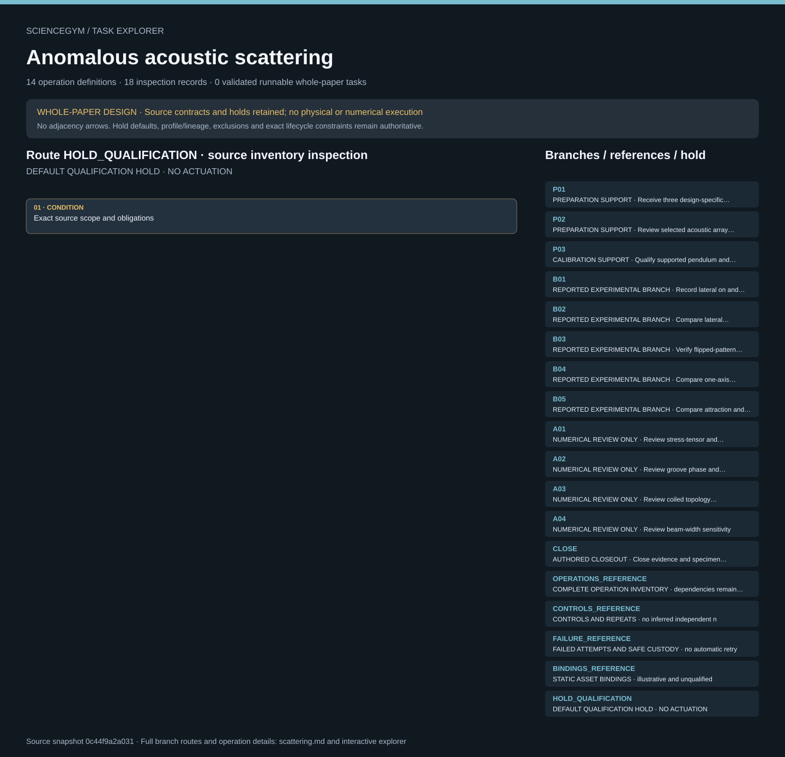

# Anomalous acoustic scattering: task route map



Paper: **Shaping contactless radiation forces through anomalous acoustic scattering** · [DOI](https://doi.org/10.1038/s41467-022-34207-7)

Whole-paper DESIGN only; zero validated runnable whole-paper tasks. Read-only author/evaluator inspection, not an actor context, acoustic controller, simulation or scientific reproduction. Source facts, authored requirements, finite synthetic checks and original illustrative geometry remain separate. Operation memberships do not create chronology; only exact source dependency and lifecycle contracts constrain order. Required receipts, outputs and completion evidence are obligations, never observed outcomes. HOLD_QUALIFICATION remains active. Five experimental branches B01–B05 and four numerical-review extensions A01–A04 remain distinct. Three preparation/calibration records and one authored closeout are separate supporting scope. Fourteen symbolic operations, eleven scene groups and thirty-two anchors describe one paper-level design. The reported apparatus is a suspended torsion pendulum, not free-flight levitation. M1 and M2 have thirty cells; M3 has twenty; cell counts are not independent replicates. Source repeat counts remain unknown and prospective counts remain null. Eight ambiguities and sixteen unresolved-input groups stay explicit. Screen pixels, angles, displacement, force, modeled force per length and normalized force remain separate; reported trends are not success thresholds. Experimental 8 cm and self-guiding numerical 12 cm separations are distinct historical facts, never operating defaults. Requests do not prove completion or safe release. Current scoped calibration, sign and clock transformations, typed raw data, failed attempts and accepted supported custody remain required. Fabrication, acoustic/electrical actuation, laser calibration, source motion and safe release remain closed qualified services. Upstream review read eight main pages, eight SI pages, the media-description sheet and five tables with 152 entries. Three movies were decoded and 6/6/5 frames sampled, not continuously reviewed. Additional supporting data, code and CAD remain unread; bounded update checking is not exhaustive. This integration does not reread papers or prove mathematics. No physical execution, acoustic actuation, simulation, qualified motion, exposure-safety certification or scientific reproduction is supplied.. Counts describe task representation, not experiments or success.

**Reading rule:** rows show unordered source inventory for inspection. Exact phase, lifecycle and dependency contracts remain authoritative; no loop, specimen, condition or chronology is inferred. An unordered obligation group has no inferred chronological edges. Source-reported scientific facts and authored handling are distinct.

[Frozen local source task package](../../../tasks/scattering_operations_v2/) · [Interactive inspector](../index.html)

## P01 — PREPARATION SUPPORT · Receive three design-specific specimen families

Whole-paper DESIGN only; zero validated runnable whole-paper tasks. Read-only author/evaluator inspection, not an actor context, acoustic controller, simulation or scientific reproduction. Source facts, authored requirements, finite synthetic checks and original illustrative geometry remain separate. Operation memberships do not create chronology; only exact source dependency and lifecycle contracts constrain order. Required receipts, outputs and completion evidence are obligations, never observed outcomes. HOLD_QUALIFICATION remains active.

[Exact route source](../../../tasks/scattering_operations_v2/branches.json) · JSON pointer: `/branches/0`

- **OBLIGATIONS: Exact operation membership; no adjacency chronology**
  - Binding: {"order":"Whole-paper DESIGN only; zero validated runnable whole-paper tasks. Read-only author/evaluator inspection, not an actor context, acoustic controller, simulation or scientific reproduction. Source facts, authored requirements, finite synthetic checks and original illustrative geometry remain separate. Operation memberships do not create chronology; only exact source dependency and lifecycle contracts constrain order. Required receipts, outputs and completion evidence are obligations, never observed outcomes. HOLD_QUALIFICATION remains active."}
  - `R01` Register source and branch plan
    - Source occurrence binding: {"source_file":"branches.json","source_pointer":"/branches/0/operation_ids/0","source_node":"R01","meaning":"Exact authored task membership; not execution or inferred chronology"}
  - `R02` Resolve prospective repeat and decision plan
    - Source occurrence binding: {"source_file":"branches.json","source_pointer":"/branches/0/operation_ids/1","source_node":"R02","meaning":"Exact authored task membership; not execution or inferred chronology"}
  - `R03` Accept design-specific protected specimens
    - Source occurrence binding: {"source_file":"branches.json","source_pointer":"/branches/0/operation_ids/2","source_node":"R03","meaning":"Exact authored task membership; not execution or inferred chronology"}
- **CONDITION: Exact source scope and obligations**
  - Binding: {"source_file":"branches.json","source_pointer":"/branches/0","source_contract":{"id":"P01","name":"Receive three design-specific specimen families","source_facts":["F01","F03","F04","F05"],"blocking_unknowns":["U02","U03","U11","U12"],"controls":["K12"],"required_evidence":"Qualified fabrication and QA receipt, specimen IDs, documented differences, sealed supported custody","boundary":"No robot printing, curing, finishing or source-CAD reconstruction","default_repeat_count":null,"implemented":false,"source_reported_kind":"preparation_support","task_design_implemented":true,"synthetic_guards_implemented":true,"physical_executed":false,"numerical_executed":false,"operation_ids":["R01","R02","R03"],"family_id":null,"required_source_outcome_for_success":null}}

<details><summary>Branch state, choices, lineage and loop obligations</summary>

```json
{
  "id": "P01",
  "name": "Receive three design-specific specimen families",
  "source_facts": [
    "F01",
    "F03",
    "F04",
    "F05"
  ],
  "blocking_unknowns": [
    "U02",
    "U03",
    "U11",
    "U12"
  ],
  "controls": [
    "K12"
  ],
  "required_evidence": "Qualified fabrication and QA receipt, specimen IDs, documented differences, sealed supported custody",
  "boundary": "No robot printing, curing, finishing or source-CAD reconstruction",
  "default_repeat_count": null,
  "implemented": false,
  "source_reported_kind": "preparation_support",
  "task_design_implemented": true,
  "synthetic_guards_implemented": true,
  "physical_executed": false,
  "numerical_executed": false,
  "operation_ids": [
    "R01",
    "R02",
    "R03"
  ],
  "family_id": null,
  "required_source_outcome_for_success": null
}
```

</details>

## P02 — PREPARATION SUPPORT · Review selected acoustic array characterization

Whole-paper DESIGN only; zero validated runnable whole-paper tasks. Read-only author/evaluator inspection, not an actor context, acoustic controller, simulation or scientific reproduction. Source facts, authored requirements, finite synthetic checks and original illustrative geometry remain separate. Operation memberships do not create chronology; only exact source dependency and lifecycle contracts constrain order. Required receipts, outputs and completion evidence are obligations, never observed outcomes. HOLD_QUALIFICATION remains active.

[Exact route source](../../../tasks/scattering_operations_v2/branches.json) · JSON pointer: `/branches/1`

- **OBLIGATIONS: Exact operation membership; no adjacency chronology**
  - Binding: {"order":"Whole-paper DESIGN only; zero validated runnable whole-paper tasks. Read-only author/evaluator inspection, not an actor context, acoustic controller, simulation or scientific reproduction. Source facts, authored requirements, finite synthetic checks and original illustrative geometry remain separate. Operation memberships do not create chronology; only exact source dependency and lifecycle contracts constrain order. Required receipts, outputs and completion evidence are obligations, never observed outcomes. HOLD_QUALIFICATION remains active."}
  - `R01` Register source and branch plan
    - Source occurrence binding: {"source_file":"branches.json","source_pointer":"/branches/1/operation_ids/0","source_node":"R01","meaning":"Exact authored task membership; not execution or inferred chronology"}
  - `R02` Resolve prospective repeat and decision plan
    - Source occurrence binding: {"source_file":"branches.json","source_pointer":"/branches/1/operation_ids/1","source_node":"R02","meaning":"Exact authored task membership; not execution or inferred chronology"}
  - `R04` Accept current array characterization
    - Source occurrence binding: {"source_file":"branches.json","source_pointer":"/branches/1/operation_ids/2","source_node":"R04","meaning":"Exact authored task membership; not execution or inferred chronology"}
- **CONDITION: Exact source scope and obligations**
  - Binding: {"source_file":"branches.json","source_pointer":"/branches/1","source_contract":{"id":"P02","name":"Review selected acoustic array characterization","source_facts":["F08","F09"],"blocking_unknowns":["U04","U10"],"controls":["K03"],"required_evidence":"Individual transducer records and current array-level characterization with branch assignment","boundary":"No assumed equivalence of voltage to pressure/intensity","default_repeat_count":null,"implemented":false,"source_reported_kind":"preparation_support","task_design_implemented":true,"synthetic_guards_implemented":true,"physical_executed":false,"numerical_executed":false,"operation_ids":["R01","R02","R04"],"family_id":null,"required_source_outcome_for_success":null}}

<details><summary>Branch state, choices, lineage and loop obligations</summary>

```json
{
  "id": "P02",
  "name": "Review selected acoustic array characterization",
  "source_facts": [
    "F08",
    "F09"
  ],
  "blocking_unknowns": [
    "U04",
    "U10"
  ],
  "controls": [
    "K03"
  ],
  "required_evidence": "Individual transducer records and current array-level characterization with branch assignment",
  "boundary": "No assumed equivalence of voltage to pressure/intensity",
  "default_repeat_count": null,
  "implemented": false,
  "source_reported_kind": "preparation_support",
  "task_design_implemented": true,
  "synthetic_guards_implemented": true,
  "physical_executed": false,
  "numerical_executed": false,
  "operation_ids": [
    "R01",
    "R02",
    "R04"
  ],
  "family_id": null,
  "required_source_outcome_for_success": null
}
```

</details>

## P03 — CALIBRATION SUPPORT · Qualify supported pendulum and optical metrology

Whole-paper DESIGN only; zero validated runnable whole-paper tasks. Read-only author/evaluator inspection, not an actor context, acoustic controller, simulation or scientific reproduction. Source facts, authored requirements, finite synthetic checks and original illustrative geometry remain separate. Operation memberships do not create chronology; only exact source dependency and lifecycle contracts constrain order. Required receipts, outputs and completion evidence are obligations, never observed outcomes. HOLD_QUALIFICATION remains active.

[Exact route source](../../../tasks/scattering_operations_v2/branches.json) · JSON pointer: `/branches/2`

- **OBLIGATIONS: Exact operation membership; no adjacency chronology**
  - Binding: {"order":"Whole-paper DESIGN only; zero validated runnable whole-paper tasks. Read-only author/evaluator inspection, not an actor context, acoustic controller, simulation or scientific reproduction. Source facts, authored requirements, finite synthetic checks and original illustrative geometry remain separate. Operation memberships do not create chronology; only exact source dependency and lifecycle contracts constrain order. Required receipts, outputs and completion evidence are obligations, never observed outcomes. HOLD_QUALIFICATION remains active."}
  - `R01` Register source and branch plan
    - Source occurrence binding: {"source_file":"branches.json","source_pointer":"/branches/2/operation_ids/0","source_node":"R01","meaning":"Exact authored task membership; not execution or inferred chronology"}
  - `R02` Resolve prospective repeat and decision plan
    - Source occurrence binding: {"source_file":"branches.json","source_pointer":"/branches/2/operation_ids/1","source_node":"R02","meaning":"Exact authored task membership; not execution or inferred chronology"}
  - `R05` Accept supported station custody
    - Source occurrence binding: {"source_file":"branches.json","source_pointer":"/branches/2/operation_ids/2","source_node":"R05","meaning":"Exact authored task membership; not execution or inferred chronology"}
  - `R06` Validate optical and torsion transformations
    - Source occurrence binding: {"source_file":"branches.json","source_pointer":"/branches/2/operation_ids/3","source_node":"R06","meaning":"Exact authored task membership; not execution or inferred chronology"}
- **CONDITION: Exact source scope and obligations**
  - Binding: {"source_file":"branches.json","source_pointer":"/branches/2","source_contract":{"id":"P03","name":"Qualify supported pendulum and optical metrology","source_facts":["F06","F07","F25"],"blocking_unknowns":["U05","U06","U08","U10","U11","U15"],"controls":["K04","K11"],"required_evidence":"Fixture acceptance, optical transform, torsion calibration, environment and protected-access evidence","boundary":"No source number substitutes for current calibration","default_repeat_count":null,"implemented":false,"source_reported_kind":"calibration_support","task_design_implemented":true,"synthetic_guards_implemented":true,"physical_executed":false,"numerical_executed":false,"operation_ids":["R01","R02","R05","R06"],"family_id":null,"required_source_outcome_for_success":null}}

<details><summary>Branch state, choices, lineage and loop obligations</summary>

```json
{
  "id": "P03",
  "name": "Qualify supported pendulum and optical metrology",
  "source_facts": [
    "F06",
    "F07",
    "F25"
  ],
  "blocking_unknowns": [
    "U05",
    "U06",
    "U08",
    "U10",
    "U11",
    "U15"
  ],
  "controls": [
    "K04",
    "K11"
  ],
  "required_evidence": "Fixture acceptance, optical transform, torsion calibration, environment and protected-access evidence",
  "boundary": "No source number substitutes for current calibration",
  "default_repeat_count": null,
  "implemented": false,
  "source_reported_kind": "calibration_support",
  "task_design_implemented": true,
  "synthetic_guards_implemented": true,
  "physical_executed": false,
  "numerical_executed": false,
  "operation_ids": [
    "R01",
    "R02",
    "R05",
    "R06"
  ],
  "family_id": null,
  "required_source_outcome_for_success": null
}
```

</details>

## B01 — REPORTED EXPERIMENTAL BRANCH · Record lateral on and off response

Whole-paper DESIGN only; zero validated runnable whole-paper tasks. Read-only author/evaluator inspection, not an actor context, acoustic controller, simulation or scientific reproduction. Source facts, authored requirements, finite synthetic checks and original illustrative geometry remain separate. Operation memberships do not create chronology; only exact source dependency and lifecycle contracts constrain order. Required receipts, outputs and completion evidence are obligations, never observed outcomes. HOLD_QUALIFICATION remains active.

[Exact route source](../../../tasks/scattering_operations_v2/branches.json) · JSON pointer: `/branches/3`

- **OBLIGATIONS: Exact operation membership; no adjacency chronology**
  - Binding: {"order":"Whole-paper DESIGN only; zero validated runnable whole-paper tasks. Read-only author/evaluator inspection, not an actor context, acoustic controller, simulation or scientific reproduction. Source facts, authored requirements, finite synthetic checks and original illustrative geometry remain separate. Operation memberships do not create chronology; only exact source dependency and lifecycle contracts constrain order. Required receipts, outputs and completion evidence are obligations, never observed outcomes. HOLD_QUALIFICATION remains active."}
  - `R01` Register source and branch plan
    - Source occurrence binding: {"source_file":"branches.json","source_pointer":"/branches/3/operation_ids/0","source_node":"R01","meaning":"Exact authored task membership; not execution or inferred chronology"}
  - `R02` Resolve prospective repeat and decision plan
    - Source occurrence binding: {"source_file":"branches.json","source_pointer":"/branches/3/operation_ids/1","source_node":"R02","meaning":"Exact authored task membership; not execution or inferred chronology"}
  - `R07` Admit one branch attempt
    - Source occurrence binding: {"source_file":"branches.json","source_pointer":"/branches/3/operation_ids/2","source_node":"R07","meaning":"Exact authored task membership; not execution or inferred chronology"}
  - `R08` Collect branch service evidence
    - Source occurrence binding: {"source_file":"branches.json","source_pointer":"/branches/3/operation_ids/3","source_node":"R08","meaning":"Exact authored task membership; not execution or inferred chronology"}
  - `R09` Review baseline and control pairing
    - Source occurrence binding: {"source_file":"branches.json","source_pointer":"/branches/3/operation_ids/4","source_node":"R09","meaning":"Exact authored task membership; not execution or inferred chronology"}
  - `R10` Determine continuation or remount need
    - Source occurrence binding: {"source_file":"branches.json","source_pointer":"/branches/3/operation_ids/5","source_node":"R10","meaning":"Exact authored task membership; not execution or inferred chronology"}
- **CONDITION: Exact source scope and obligations**
  - Binding: {"source_file":"branches.json","source_pointer":"/branches/3","source_contract":{"id":"B01","name":"Record lateral on and off response","source_facts":["F10"],"blocking_unknowns":["U07","U08","U09"],"controls":["K01"],"required_evidence":"M1 identity, raw timed trace and observed source-state events with baseline/recovery","boundary":"No match-to-paper reward threshold","default_repeat_count":null,"implemented":false,"source_reported_kind":"reported_experimental_branch","task_design_implemented":true,"synthetic_guards_implemented":true,"physical_executed":false,"numerical_executed":false,"operation_ids":["R01","R02","R07","R08","R09","R10"],"family_id":"GROOVE_M1","required_source_outcome_for_success":null}}

<details><summary>Branch state, choices, lineage and loop obligations</summary>

```json
{
  "id": "B01",
  "name": "Record lateral on and off response",
  "source_facts": [
    "F10"
  ],
  "blocking_unknowns": [
    "U07",
    "U08",
    "U09"
  ],
  "controls": [
    "K01"
  ],
  "required_evidence": "M1 identity, raw timed trace and observed source-state events with baseline/recovery",
  "boundary": "No match-to-paper reward threshold",
  "default_repeat_count": null,
  "implemented": false,
  "source_reported_kind": "reported_experimental_branch",
  "task_design_implemented": true,
  "synthetic_guards_implemented": true,
  "physical_executed": false,
  "numerical_executed": false,
  "operation_ids": [
    "R01",
    "R02",
    "R07",
    "R08",
    "R09",
    "R10"
  ],
  "family_id": "GROOVE_M1",
  "required_source_outcome_for_success": null
}
```

</details>

## B02 — REPORTED EXPERIMENTAL BRANCH · Compare lateral response across source conditions

Whole-paper DESIGN only; zero validated runnable whole-paper tasks. Read-only author/evaluator inspection, not an actor context, acoustic controller, simulation or scientific reproduction. Source facts, authored requirements, finite synthetic checks and original illustrative geometry remain separate. Operation memberships do not create chronology; only exact source dependency and lifecycle contracts constrain order. Required receipts, outputs and completion evidence are obligations, never observed outcomes. HOLD_QUALIFICATION remains active.

[Exact route source](../../../tasks/scattering_operations_v2/branches.json) · JSON pointer: `/branches/4`

- **OBLIGATIONS: Exact operation membership; no adjacency chronology**
  - Binding: {"order":"Whole-paper DESIGN only; zero validated runnable whole-paper tasks. Read-only author/evaluator inspection, not an actor context, acoustic controller, simulation or scientific reproduction. Source facts, authored requirements, finite synthetic checks and original illustrative geometry remain separate. Operation memberships do not create chronology; only exact source dependency and lifecycle contracts constrain order. Required receipts, outputs and completion evidence are obligations, never observed outcomes. HOLD_QUALIFICATION remains active."}
  - `R01` Register source and branch plan
    - Source occurrence binding: {"source_file":"branches.json","source_pointer":"/branches/4/operation_ids/0","source_node":"R01","meaning":"Exact authored task membership; not execution or inferred chronology"}
  - `R02` Resolve prospective repeat and decision plan
    - Source occurrence binding: {"source_file":"branches.json","source_pointer":"/branches/4/operation_ids/1","source_node":"R02","meaning":"Exact authored task membership; not execution or inferred chronology"}
  - `R07` Admit one branch attempt
    - Source occurrence binding: {"source_file":"branches.json","source_pointer":"/branches/4/operation_ids/2","source_node":"R07","meaning":"Exact authored task membership; not execution or inferred chronology"}
  - `R08` Collect branch service evidence
    - Source occurrence binding: {"source_file":"branches.json","source_pointer":"/branches/4/operation_ids/3","source_node":"R08","meaning":"Exact authored task membership; not execution or inferred chronology"}
  - `R09` Review baseline and control pairing
    - Source occurrence binding: {"source_file":"branches.json","source_pointer":"/branches/4/operation_ids/4","source_node":"R09","meaning":"Exact authored task membership; not execution or inferred chronology"}
  - `R10` Determine continuation or remount need
    - Source occurrence binding: {"source_file":"branches.json","source_pointer":"/branches/4/operation_ids/5","source_node":"R10","meaning":"Exact authored task membership; not execution or inferred chronology"}
- **CONDITION: Exact source scope and obligations**
  - Binding: {"source_file":"branches.json","source_pointer":"/branches/4","source_contract":{"id":"B02","name":"Compare lateral response across source conditions","source_facts":["F09","F10","F15"],"blocking_unknowns":["U04","U07","U08","U09"],"controls":["K01","K11"],"required_evidence":"M1 condition-level results and uncertainty with qualified plan and repeat units","boundary":"Supply voltage is not force, acoustic output or safety limit","default_repeat_count":null,"implemented":false,"source_reported_kind":"reported_experimental_branch","task_design_implemented":true,"synthetic_guards_implemented":true,"physical_executed":false,"numerical_executed":false,"operation_ids":["R01","R02","R07","R08","R09","R10"],"family_id":"GROOVE_M1","required_source_outcome_for_success":null}}

<details><summary>Branch state, choices, lineage and loop obligations</summary>

```json
{
  "id": "B02",
  "name": "Compare lateral response across source conditions",
  "source_facts": [
    "F09",
    "F10",
    "F15"
  ],
  "blocking_unknowns": [
    "U04",
    "U07",
    "U08",
    "U09"
  ],
  "controls": [
    "K01",
    "K11"
  ],
  "required_evidence": "M1 condition-level results and uncertainty with qualified plan and repeat units",
  "boundary": "Supply voltage is not force, acoustic output or safety limit",
  "default_repeat_count": null,
  "implemented": false,
  "source_reported_kind": "reported_experimental_branch",
  "task_design_implemented": true,
  "synthetic_guards_implemented": true,
  "physical_executed": false,
  "numerical_executed": false,
  "operation_ids": [
    "R01",
    "R02",
    "R07",
    "R08",
    "R09",
    "R10"
  ],
  "family_id": "GROOVE_M1",
  "required_source_outcome_for_success": null
}
```

</details>

## B03 — REPORTED EXPERIMENTAL BRANCH · Verify flipped-pattern response

Whole-paper DESIGN only; zero validated runnable whole-paper tasks. Read-only author/evaluator inspection, not an actor context, acoustic controller, simulation or scientific reproduction. Source facts, authored requirements, finite synthetic checks and original illustrative geometry remain separate. Operation memberships do not create chronology; only exact source dependency and lifecycle contracts constrain order. Required receipts, outputs and completion evidence are obligations, never observed outcomes. HOLD_QUALIFICATION remains active.

[Exact route source](../../../tasks/scattering_operations_v2/branches.json) · JSON pointer: `/branches/5`

- **OBLIGATIONS: Exact operation membership; no adjacency chronology**
  - Binding: {"order":"Whole-paper DESIGN only; zero validated runnable whole-paper tasks. Read-only author/evaluator inspection, not an actor context, acoustic controller, simulation or scientific reproduction. Source facts, authored requirements, finite synthetic checks and original illustrative geometry remain separate. Operation memberships do not create chronology; only exact source dependency and lifecycle contracts constrain order. Required receipts, outputs and completion evidence are obligations, never observed outcomes. HOLD_QUALIFICATION remains active."}
  - `R01` Register source and branch plan
    - Source occurrence binding: {"source_file":"branches.json","source_pointer":"/branches/5/operation_ids/0","source_node":"R01","meaning":"Exact authored task membership; not execution or inferred chronology"}
  - `R02` Resolve prospective repeat and decision plan
    - Source occurrence binding: {"source_file":"branches.json","source_pointer":"/branches/5/operation_ids/1","source_node":"R02","meaning":"Exact authored task membership; not execution or inferred chronology"}
  - `R07` Admit one branch attempt
    - Source occurrence binding: {"source_file":"branches.json","source_pointer":"/branches/5/operation_ids/2","source_node":"R07","meaning":"Exact authored task membership; not execution or inferred chronology"}
  - `R08` Collect branch service evidence
    - Source occurrence binding: {"source_file":"branches.json","source_pointer":"/branches/5/operation_ids/3","source_node":"R08","meaning":"Exact authored task membership; not execution or inferred chronology"}
  - `R09` Review baseline and control pairing
    - Source occurrence binding: {"source_file":"branches.json","source_pointer":"/branches/5/operation_ids/4","source_node":"R09","meaning":"Exact authored task membership; not execution or inferred chronology"}
  - `R10` Determine continuation or remount need
    - Source occurrence binding: {"source_file":"branches.json","source_pointer":"/branches/5/operation_ids/5","source_node":"R10","meaning":"Exact authored task membership; not execution or inferred chronology"}
- **CONDITION: Exact source scope and obligations**
  - Binding: {"source_file":"branches.json","source_pointer":"/branches/5","source_contract":{"id":"B03","name":"Verify flipped-pattern response","source_facts":["F11"],"blocking_unknowns":["U03","U05","U07","U09","U11","U15"],"controls":["K02"],"required_evidence":"M1 orientation-linked paired trials and verified sign convention","boundary":"Do not introduce a flat specimen as source-reported control","default_repeat_count":null,"implemented":false,"source_reported_kind":"reported_experimental_branch","task_design_implemented":true,"synthetic_guards_implemented":true,"physical_executed":false,"numerical_executed":false,"operation_ids":["R01","R02","R07","R08","R09","R10"],"family_id":"GROOVE_M1","required_source_outcome_for_success":null}}

<details><summary>Branch state, choices, lineage and loop obligations</summary>

```json
{
  "id": "B03",
  "name": "Verify flipped-pattern response",
  "source_facts": [
    "F11"
  ],
  "blocking_unknowns": [
    "U03",
    "U05",
    "U07",
    "U09",
    "U11",
    "U15"
  ],
  "controls": [
    "K02"
  ],
  "required_evidence": "M1 orientation-linked paired trials and verified sign convention",
  "boundary": "Do not introduce a flat specimen as source-reported control",
  "default_repeat_count": null,
  "implemented": false,
  "source_reported_kind": "reported_experimental_branch",
  "task_design_implemented": true,
  "synthetic_guards_implemented": true,
  "physical_executed": false,
  "numerical_executed": false,
  "operation_ids": [
    "R01",
    "R02",
    "R07",
    "R08",
    "R09",
    "R10"
  ],
  "family_id": "GROOVE_M1",
  "required_source_outcome_for_success": null
}
```

</details>

## B04 — REPORTED EXPERIMENTAL BRANCH · Compare one-axis guiding and source motion

Whole-paper DESIGN only; zero validated runnable whole-paper tasks. Read-only author/evaluator inspection, not an actor context, acoustic controller, simulation or scientific reproduction. Source facts, authored requirements, finite synthetic checks and original illustrative geometry remain separate. Operation memberships do not create chronology; only exact source dependency and lifecycle contracts constrain order. Required receipts, outputs and completion evidence are obligations, never observed outcomes. HOLD_QUALIFICATION remains active.

[Exact route source](../../../tasks/scattering_operations_v2/branches.json) · JSON pointer: `/branches/6`

- **OBLIGATIONS: Exact operation membership; no adjacency chronology**
  - Binding: {"order":"Whole-paper DESIGN only; zero validated runnable whole-paper tasks. Read-only author/evaluator inspection, not an actor context, acoustic controller, simulation or scientific reproduction. Source facts, authored requirements, finite synthetic checks and original illustrative geometry remain separate. Operation memberships do not create chronology; only exact source dependency and lifecycle contracts constrain order. Required receipts, outputs and completion evidence are obligations, never observed outcomes. HOLD_QUALIFICATION remains active."}
  - `R01` Register source and branch plan
    - Source occurrence binding: {"source_file":"branches.json","source_pointer":"/branches/6/operation_ids/0","source_node":"R01","meaning":"Exact authored task membership; not execution or inferred chronology"}
  - `R02` Resolve prospective repeat and decision plan
    - Source occurrence binding: {"source_file":"branches.json","source_pointer":"/branches/6/operation_ids/1","source_node":"R02","meaning":"Exact authored task membership; not execution or inferred chronology"}
  - `R07` Admit one branch attempt
    - Source occurrence binding: {"source_file":"branches.json","source_pointer":"/branches/6/operation_ids/2","source_node":"R07","meaning":"Exact authored task membership; not execution or inferred chronology"}
  - `R08` Collect branch service evidence
    - Source occurrence binding: {"source_file":"branches.json","source_pointer":"/branches/6/operation_ids/3","source_node":"R08","meaning":"Exact authored task membership; not execution or inferred chronology"}
  - `R09` Review baseline and control pairing
    - Source occurrence binding: {"source_file":"branches.json","source_pointer":"/branches/6/operation_ids/4","source_node":"R09","meaning":"Exact authored task membership; not execution or inferred chronology"}
  - `R10` Determine continuation or remount need
    - Source occurrence binding: {"source_file":"branches.json","source_pointer":"/branches/6/operation_ids/5","source_node":"R10","meaning":"Exact authored task membership; not execution or inferred chronology"}
- **CONDITION: Exact source scope and obligations**
  - Binding: {"source_file":"branches.json","source_pointer":"/branches/6","source_contract":{"id":"B04","name":"Compare one-axis guiding and source motion","source_facts":["F12","F13","F18","F23"],"blocking_unknowns":["U05","U07","U08","U09","U15"],"controls":["K05"],"required_evidence":"M2 synchronized source-position readback and response with separate coordinate transformations","boundary":"No free-flight, multi-axis guiding or movie-time inference","default_repeat_count":null,"implemented":false,"source_reported_kind":"reported_experimental_branch","task_design_implemented":true,"synthetic_guards_implemented":true,"physical_executed":false,"numerical_executed":false,"operation_ids":["R01","R02","R07","R08","R09","R10"],"family_id":"GROOVE_M2","required_source_outcome_for_success":null}}

<details><summary>Branch state, choices, lineage and loop obligations</summary>

```json
{
  "id": "B04",
  "name": "Compare one-axis guiding and source motion",
  "source_facts": [
    "F12",
    "F13",
    "F18",
    "F23"
  ],
  "blocking_unknowns": [
    "U05",
    "U07",
    "U08",
    "U09",
    "U15"
  ],
  "controls": [
    "K05"
  ],
  "required_evidence": "M2 synchronized source-position readback and response with separate coordinate transformations",
  "boundary": "No free-flight, multi-axis guiding or movie-time inference",
  "default_repeat_count": null,
  "implemented": false,
  "source_reported_kind": "reported_experimental_branch",
  "task_design_implemented": true,
  "synthetic_guards_implemented": true,
  "physical_executed": false,
  "numerical_executed": false,
  "operation_ids": [
    "R01",
    "R02",
    "R07",
    "R08",
    "R09",
    "R10"
  ],
  "family_id": "GROOVE_M2",
  "required_source_outcome_for_success": null
}
```

</details>

## B05 — REPORTED EXPERIMENTAL BRANCH · Compare attraction and repulsion by source angle

Whole-paper DESIGN only; zero validated runnable whole-paper tasks. Read-only author/evaluator inspection, not an actor context, acoustic controller, simulation or scientific reproduction. Source facts, authored requirements, finite synthetic checks and original illustrative geometry remain separate. Operation memberships do not create chronology; only exact source dependency and lifecycle contracts constrain order. Required receipts, outputs and completion evidence are obligations, never observed outcomes. HOLD_QUALIFICATION remains active.

[Exact route source](../../../tasks/scattering_operations_v2/branches.json) · JSON pointer: `/branches/7`

- **OBLIGATIONS: Exact operation membership; no adjacency chronology**
  - Binding: {"order":"Whole-paper DESIGN only; zero validated runnable whole-paper tasks. Read-only author/evaluator inspection, not an actor context, acoustic controller, simulation or scientific reproduction. Source facts, authored requirements, finite synthetic checks and original illustrative geometry remain separate. Operation memberships do not create chronology; only exact source dependency and lifecycle contracts constrain order. Required receipts, outputs and completion evidence are obligations, never observed outcomes. HOLD_QUALIFICATION remains active."}
  - `R01` Register source and branch plan
    - Source occurrence binding: {"source_file":"branches.json","source_pointer":"/branches/7/operation_ids/0","source_node":"R01","meaning":"Exact authored task membership; not execution or inferred chronology"}
  - `R02` Resolve prospective repeat and decision plan
    - Source occurrence binding: {"source_file":"branches.json","source_pointer":"/branches/7/operation_ids/1","source_node":"R02","meaning":"Exact authored task membership; not execution or inferred chronology"}
  - `R07` Admit one branch attempt
    - Source occurrence binding: {"source_file":"branches.json","source_pointer":"/branches/7/operation_ids/2","source_node":"R07","meaning":"Exact authored task membership; not execution or inferred chronology"}
  - `R08` Collect branch service evidence
    - Source occurrence binding: {"source_file":"branches.json","source_pointer":"/branches/7/operation_ids/3","source_node":"R08","meaning":"Exact authored task membership; not execution or inferred chronology"}
  - `R09` Review baseline and control pairing
    - Source occurrence binding: {"source_file":"branches.json","source_pointer":"/branches/7/operation_ids/4","source_node":"R09","meaning":"Exact authored task membership; not execution or inferred chronology"}
  - `R10` Determine continuation or remount need
    - Source occurrence binding: {"source_file":"branches.json","source_pointer":"/branches/7/operation_ids/5","source_node":"R10","meaning":"Exact authored task membership; not execution or inferred chronology"}
- **CONDITION: Exact source scope and obligations**
  - Binding: {"source_file":"branches.json","source_pointer":"/branches/7","source_contract":{"id":"B05","name":"Compare attraction and repulsion by source angle","source_facts":["F09","F14","F17"],"blocking_unknowns":["U05","U07","U08","U09","U15"],"controls":["K06"],"required_evidence":"M3 complete angle-conditioned measured displacement series, sign and uncertainty","boundary":"Do not convert normalized simulated force into measured newtons","default_repeat_count":null,"implemented":false,"source_reported_kind":"reported_experimental_branch","task_design_implemented":true,"synthetic_guards_implemented":true,"physical_executed":false,"numerical_executed":false,"operation_ids":["R01","R02","R07","R08","R09","R10"],"family_id":"GROOVE_M3","required_source_outcome_for_success":null}}

<details><summary>Branch state, choices, lineage and loop obligations</summary>

```json
{
  "id": "B05",
  "name": "Compare attraction and repulsion by source angle",
  "source_facts": [
    "F09",
    "F14",
    "F17"
  ],
  "blocking_unknowns": [
    "U05",
    "U07",
    "U08",
    "U09",
    "U15"
  ],
  "controls": [
    "K06"
  ],
  "required_evidence": "M3 complete angle-conditioned measured displacement series, sign and uncertainty",
  "boundary": "Do not convert normalized simulated force into measured newtons",
  "default_repeat_count": null,
  "implemented": false,
  "source_reported_kind": "reported_experimental_branch",
  "task_design_implemented": true,
  "synthetic_guards_implemented": true,
  "physical_executed": false,
  "numerical_executed": false,
  "operation_ids": [
    "R01",
    "R02",
    "R07",
    "R08",
    "R09",
    "R10"
  ],
  "family_id": "GROOVE_M3",
  "required_source_outcome_for_success": null
}
```

</details>

## A01 — NUMERICAL REVIEW ONLY · Review stress-tensor and prism comparison

Whole-paper DESIGN only; zero validated runnable whole-paper tasks. Read-only author/evaluator inspection, not an actor context, acoustic controller, simulation or scientific reproduction. Source facts, authored requirements, finite synthetic checks and original illustrative geometry remain separate. Operation memberships do not create chronology; only exact source dependency and lifecycle contracts constrain order. Required receipts, outputs and completion evidence are obligations, never observed outcomes. HOLD_QUALIFICATION remains active.

[Exact route source](../../../tasks/scattering_operations_v2/branches.json) · JSON pointer: `/branches/8`

- **OBLIGATIONS: Exact operation membership; no adjacency chronology**
  - Binding: {"order":"Whole-paper DESIGN only; zero validated runnable whole-paper tasks. Read-only author/evaluator inspection, not an actor context, acoustic controller, simulation or scientific reproduction. Source facts, authored requirements, finite synthetic checks and original illustrative geometry remain separate. Operation memberships do not create chronology; only exact source dependency and lifecycle contracts constrain order. Required receipts, outputs and completion evidence are obligations, never observed outcomes. HOLD_QUALIFICATION remains active."}
  - `R01` Register source and branch plan
    - Source occurrence binding: {"source_file":"branches.json","source_pointer":"/branches/8/operation_ids/0","source_node":"R01","meaning":"Exact authored task membership; not execution or inferred chronology"}
  - `R11` Review remaining numerical source arms
    - Source occurrence binding: {"source_file":"branches.json","source_pointer":"/branches/8/operation_ids/1","source_node":"R11","meaning":"Exact authored task membership; not execution or inferred chronology"}
- **CONDITION: Exact source scope and obligations**
  - Binding: {"source_file":"branches.json","source_pointer":"/branches/8","source_contract":{"id":"A01","name":"Review stress-tensor and prism comparison","source_facts":["F16","F17"],"blocking_unknowns":["U14"],"controls":["K07"],"required_evidence":"Read-source comparison record and explicit unexecuted status","boundary":"No FEM run or model validation claimed","default_repeat_count":null,"implemented":false,"source_reported_kind":"numerical_review_only","task_design_implemented":true,"synthetic_guards_implemented":true,"physical_executed":false,"numerical_executed":false,"operation_ids":["R01","R11"],"family_id":null,"required_source_outcome_for_success":null}}

<details><summary>Branch state, choices, lineage and loop obligations</summary>

```json
{
  "id": "A01",
  "name": "Review stress-tensor and prism comparison",
  "source_facts": [
    "F16",
    "F17"
  ],
  "blocking_unknowns": [
    "U14"
  ],
  "controls": [
    "K07"
  ],
  "required_evidence": "Read-source comparison record and explicit unexecuted status",
  "boundary": "No FEM run or model validation claimed",
  "default_repeat_count": null,
  "implemented": false,
  "source_reported_kind": "numerical_review_only",
  "task_design_implemented": true,
  "synthetic_guards_implemented": true,
  "physical_executed": false,
  "numerical_executed": false,
  "operation_ids": [
    "R01",
    "R11"
  ],
  "family_id": null,
  "required_source_outcome_for_success": null
}
```

</details>

## A02 — NUMERICAL REVIEW ONLY · Review groove phase and optimization comparisons

Whole-paper DESIGN only; zero validated runnable whole-paper tasks. Read-only author/evaluator inspection, not an actor context, acoustic controller, simulation or scientific reproduction. Source facts, authored requirements, finite synthetic checks and original illustrative geometry remain separate. Operation memberships do not create chronology; only exact source dependency and lifecycle contracts constrain order. Required receipts, outputs and completion evidence are obligations, never observed outcomes. HOLD_QUALIFICATION remains active.

[Exact route source](../../../tasks/scattering_operations_v2/branches.json) · JSON pointer: `/branches/9`

- **OBLIGATIONS: Exact operation membership; no adjacency chronology**
  - Binding: {"order":"Whole-paper DESIGN only; zero validated runnable whole-paper tasks. Read-only author/evaluator inspection, not an actor context, acoustic controller, simulation or scientific reproduction. Source facts, authored requirements, finite synthetic checks and original illustrative geometry remain separate. Operation memberships do not create chronology; only exact source dependency and lifecycle contracts constrain order. Required receipts, outputs and completion evidence are obligations, never observed outcomes. HOLD_QUALIFICATION remains active."}
  - `R01` Register source and branch plan
    - Source occurrence binding: {"source_file":"branches.json","source_pointer":"/branches/9/operation_ids/0","source_node":"R01","meaning":"Exact authored task membership; not execution or inferred chronology"}
  - `R11` Review remaining numerical source arms
    - Source occurrence binding: {"source_file":"branches.json","source_pointer":"/branches/9/operation_ids/1","source_node":"R11","meaning":"Exact authored task membership; not execution or inferred chronology"}
- **CONDITION: Exact source scope and obligations**
  - Binding: {"source_file":"branches.json","source_pointer":"/branches/9","source_contract":{"id":"A02","name":"Review groove phase and optimization comparisons","source_facts":["F05","F19","F20"],"blocking_unknowns":["U03","U14"],"controls":["K08"],"required_evidence":"Analysis lineage for M1 analytical/optimized, M2 analytical symmetry, M3 optimized","boundary":"Optimization ratios never physical acceptance targets","default_repeat_count":null,"implemented":false,"source_reported_kind":"numerical_review_only","task_design_implemented":true,"synthetic_guards_implemented":true,"physical_executed":false,"numerical_executed":false,"operation_ids":["R01","R11"],"family_id":null,"required_source_outcome_for_success":null}}

<details><summary>Branch state, choices, lineage and loop obligations</summary>

```json
{
  "id": "A02",
  "name": "Review groove phase and optimization comparisons",
  "source_facts": [
    "F05",
    "F19",
    "F20"
  ],
  "blocking_unknowns": [
    "U03",
    "U14"
  ],
  "controls": [
    "K08"
  ],
  "required_evidence": "Analysis lineage for M1 analytical/optimized, M2 analytical symmetry, M3 optimized",
  "boundary": "Optimization ratios never physical acceptance targets",
  "default_repeat_count": null,
  "implemented": false,
  "source_reported_kind": "numerical_review_only",
  "task_design_implemented": true,
  "synthetic_guards_implemented": true,
  "physical_executed": false,
  "numerical_executed": false,
  "operation_ids": [
    "R01",
    "R11"
  ],
  "family_id": null,
  "required_source_outcome_for_success": null
}
```

</details>

## A03 — NUMERICAL REVIEW ONLY · Review coiled topology alternatives

Whole-paper DESIGN only; zero validated runnable whole-paper tasks. Read-only author/evaluator inspection, not an actor context, acoustic controller, simulation or scientific reproduction. Source facts, authored requirements, finite synthetic checks and original illustrative geometry remain separate. Operation memberships do not create chronology; only exact source dependency and lifecycle contracts constrain order. Required receipts, outputs and completion evidence are obligations, never observed outcomes. HOLD_QUALIFICATION remains active.

[Exact route source](../../../tasks/scattering_operations_v2/branches.json) · JSON pointer: `/branches/10`

- **OBLIGATIONS: Exact operation membership; no adjacency chronology**
  - Binding: {"order":"Whole-paper DESIGN only; zero validated runnable whole-paper tasks. Read-only author/evaluator inspection, not an actor context, acoustic controller, simulation or scientific reproduction. Source facts, authored requirements, finite synthetic checks and original illustrative geometry remain separate. Operation memberships do not create chronology; only exact source dependency and lifecycle contracts constrain order. Required receipts, outputs and completion evidence are obligations, never observed outcomes. HOLD_QUALIFICATION remains active."}
  - `R01` Register source and branch plan
    - Source occurrence binding: {"source_file":"branches.json","source_pointer":"/branches/10/operation_ids/0","source_node":"R01","meaning":"Exact authored task membership; not execution or inferred chronology"}
  - `R11` Review remaining numerical source arms
    - Source occurrence binding: {"source_file":"branches.json","source_pointer":"/branches/10/operation_ids/1","source_node":"R11","meaning":"Exact authored task membership; not execution or inferred chronology"}
- **CONDITION: Exact source scope and obligations**
  - Binding: {"source_file":"branches.json","source_pointer":"/branches/10","source_contract":{"id":"A03","name":"Review coiled topology alternatives","source_facts":["F20","F21"],"blocking_unknowns":["U03","U14"],"controls":["K09"],"required_evidence":"Two 36-value source tables and numerical-only interpretation","boundary":"No coiled fabrication branch or meshes","default_repeat_count":null,"implemented":false,"source_reported_kind":"numerical_review_only","task_design_implemented":true,"synthetic_guards_implemented":true,"physical_executed":false,"numerical_executed":false,"operation_ids":["R01","R11"],"family_id":null,"required_source_outcome_for_success":null}}

<details><summary>Branch state, choices, lineage and loop obligations</summary>

```json
{
  "id": "A03",
  "name": "Review coiled topology alternatives",
  "source_facts": [
    "F20",
    "F21"
  ],
  "blocking_unknowns": [
    "U03",
    "U14"
  ],
  "controls": [
    "K09"
  ],
  "required_evidence": "Two 36-value source tables and numerical-only interpretation",
  "boundary": "No coiled fabrication branch or meshes",
  "default_repeat_count": null,
  "implemented": false,
  "source_reported_kind": "numerical_review_only",
  "task_design_implemented": true,
  "synthetic_guards_implemented": true,
  "physical_executed": false,
  "numerical_executed": false,
  "operation_ids": [
    "R01",
    "R11"
  ],
  "family_id": null,
  "required_source_outcome_for_success": null
}
```

</details>

## A04 — NUMERICAL REVIEW ONLY · Review beam-width sensitivity

Whole-paper DESIGN only; zero validated runnable whole-paper tasks. Read-only author/evaluator inspection, not an actor context, acoustic controller, simulation or scientific reproduction. Source facts, authored requirements, finite synthetic checks and original illustrative geometry remain separate. Operation memberships do not create chronology; only exact source dependency and lifecycle contracts constrain order. Required receipts, outputs and completion evidence are obligations, never observed outcomes. HOLD_QUALIFICATION remains active.

[Exact route source](../../../tasks/scattering_operations_v2/branches.json) · JSON pointer: `/branches/11`

- **OBLIGATIONS: Exact operation membership; no adjacency chronology**
  - Binding: {"order":"Whole-paper DESIGN only; zero validated runnable whole-paper tasks. Read-only author/evaluator inspection, not an actor context, acoustic controller, simulation or scientific reproduction. Source facts, authored requirements, finite synthetic checks and original illustrative geometry remain separate. Operation memberships do not create chronology; only exact source dependency and lifecycle contracts constrain order. Required receipts, outputs and completion evidence are obligations, never observed outcomes. HOLD_QUALIFICATION remains active."}
  - `R01` Register source and branch plan
    - Source occurrence binding: {"source_file":"branches.json","source_pointer":"/branches/11/operation_ids/0","source_node":"R01","meaning":"Exact authored task membership; not execution or inferred chronology"}
  - `R11` Review remaining numerical source arms
    - Source occurrence binding: {"source_file":"branches.json","source_pointer":"/branches/11/operation_ids/1","source_node":"R11","meaning":"Exact authored task membership; not execution or inferred chronology"}
- **CONDITION: Exact source scope and obligations**
  - Binding: {"source_file":"branches.json","source_pointer":"/branches/11","source_contract":{"id":"A04","name":"Review beam-width sensitivity","source_facts":["F22"],"blocking_unknowns":["U14"],"controls":["K10"],"required_evidence":"Read-only SI S6 comparison with common normalization retained","boundary":"No experimental beam-width controls invented","default_repeat_count":null,"implemented":false,"source_reported_kind":"numerical_review_only","task_design_implemented":true,"synthetic_guards_implemented":true,"physical_executed":false,"numerical_executed":false,"operation_ids":["R01","R11"],"family_id":null,"required_source_outcome_for_success":null}}

<details><summary>Branch state, choices, lineage and loop obligations</summary>

```json
{
  "id": "A04",
  "name": "Review beam-width sensitivity",
  "source_facts": [
    "F22"
  ],
  "blocking_unknowns": [
    "U14"
  ],
  "controls": [
    "K10"
  ],
  "required_evidence": "Read-only SI S6 comparison with common normalization retained",
  "boundary": "No experimental beam-width controls invented",
  "default_repeat_count": null,
  "implemented": false,
  "source_reported_kind": "numerical_review_only",
  "task_design_implemented": true,
  "synthetic_guards_implemented": true,
  "physical_executed": false,
  "numerical_executed": false,
  "operation_ids": [
    "R01",
    "R11"
  ],
  "family_id": null,
  "required_source_outcome_for_success": null
}
```

</details>

## CLOSE — AUTHORED CLOSEOUT · Close evidence and specimen custody

Whole-paper DESIGN only; zero validated runnable whole-paper tasks. Read-only author/evaluator inspection, not an actor context, acoustic controller, simulation or scientific reproduction. Source facts, authored requirements, finite synthetic checks and original illustrative geometry remain separate. Operation memberships do not create chronology; only exact source dependency and lifecycle contracts constrain order. Required receipts, outputs and completion evidence are obligations, never observed outcomes. HOLD_QUALIFICATION remains active.

[Exact route source](../../../tasks/scattering_operations_v2/branches.json) · JSON pointer: `/branches/12`

- **OBLIGATIONS: Exact operation membership; no adjacency chronology**
  - Binding: {"order":"Whole-paper DESIGN only; zero validated runnable whole-paper tasks. Read-only author/evaluator inspection, not an actor context, acoustic controller, simulation or scientific reproduction. Source facts, authored requirements, finite synthetic checks and original illustrative geometry remain separate. Operation memberships do not create chronology; only exact source dependency and lifecycle contracts constrain order. Required receipts, outputs and completion evidence are obligations, never observed outcomes. HOLD_QUALIFICATION remains active."}
  - `R01` Register source and branch plan
    - Source occurrence binding: {"source_file":"branches.json","source_pointer":"/branches/12/operation_ids/0","source_node":"R01","meaning":"Exact authored task membership; not execution or inferred chronology"}
  - `R12` Establish independent safe closeout
    - Source occurrence binding: {"source_file":"branches.json","source_pointer":"/branches/12/operation_ids/1","source_node":"R12","meaning":"Exact authored task membership; not execution or inferred chronology"}
  - `R13` Complete supported return or quarantine
    - Source occurrence binding: {"source_file":"branches.json","source_pointer":"/branches/12/operation_ids/2","source_node":"R13","meaning":"Exact authored task membership; not execution or inferred chronology"}
  - `R14` Seal review or experiment evidence state
    - Source occurrence binding: {"source_file":"branches.json","source_pointer":"/branches/12/operation_ids/3","source_node":"R14","meaning":"Exact authored task membership; not execution or inferred chronology"}
- **CONDITION: Exact source scope and obligations**
  - Binding: {"source_file":"branches.json","source_pointer":"/branches/12","source_contract":{"id":"CLOSE","name":"Close evidence and specimen custody","source_facts":[],"blocking_unknowns":["U10","U11","U12","U13"],"controls":["K12"],"required_evidence":"Independent source-off, beam-safe, motion-safe and supported custody receipts, archived attempts","boundary":"A command or timeout is not safe-state or return evidence","default_repeat_count":null,"implemented":false,"source_reported_kind":"authored_closeout","task_design_implemented":true,"synthetic_guards_implemented":true,"physical_executed":false,"numerical_executed":false,"operation_ids":["R01","R12","R13","R14"],"family_id":null,"required_source_outcome_for_success":null}}

<details><summary>Branch state, choices, lineage and loop obligations</summary>

```json
{
  "id": "CLOSE",
  "name": "Close evidence and specimen custody",
  "source_facts": [],
  "blocking_unknowns": [
    "U10",
    "U11",
    "U12",
    "U13"
  ],
  "controls": [
    "K12"
  ],
  "required_evidence": "Independent source-off, beam-safe, motion-safe and supported custody receipts, archived attempts",
  "boundary": "A command or timeout is not safe-state or return evidence",
  "default_repeat_count": null,
  "implemented": false,
  "source_reported_kind": "authored_closeout",
  "task_design_implemented": true,
  "synthetic_guards_implemented": true,
  "physical_executed": false,
  "numerical_executed": false,
  "operation_ids": [
    "R01",
    "R12",
    "R13",
    "R14"
  ],
  "family_id": null,
  "required_source_outcome_for_success": null
}
```

</details>

## OPERATIONS_REFERENCE — COMPLETE OPERATION INVENTORY · dependencies remain authoritative

Whole-paper DESIGN only; zero validated runnable whole-paper tasks. Read-only author/evaluator inspection, not an actor context, acoustic controller, simulation or scientific reproduction. Source facts, authored requirements, finite synthetic checks and original illustrative geometry remain separate. Operation memberships do not create chronology; only exact source dependency and lifecycle contracts constrain order. Required receipts, outputs and completion evidence are obligations, never observed outcomes. HOLD_QUALIFICATION remains active.

[Exact route source](../../../tasks/scattering_operations_v2/operations.json) · JSON pointer: ``

- **OBLIGATIONS: Exact operation membership; no adjacency chronology**
  - Binding: {"order":"Whole-paper DESIGN only; zero validated runnable whole-paper tasks. Read-only author/evaluator inspection, not an actor context, acoustic controller, simulation or scientific reproduction. Source facts, authored requirements, finite synthetic checks and original illustrative geometry remain separate. Operation memberships do not create chronology; only exact source dependency and lifecycle contracts constrain order. Required receipts, outputs and completion evidence are obligations, never observed outcomes. HOLD_QUALIFICATION remains active."}
  - `R01` Register source and branch plan
    - Source occurrence binding: {"source_file":"operations.json","source_pointer":"/operations/0/id","source_node":"R01","meaning":"Exact authored task membership; not execution or inferred chronology"}
  - `R02` Resolve prospective repeat and decision plan
    - Source occurrence binding: {"source_file":"operations.json","source_pointer":"/operations/1/id","source_node":"R02","meaning":"Exact authored task membership; not execution or inferred chronology"}
  - `R03` Accept design-specific protected specimens
    - Source occurrence binding: {"source_file":"operations.json","source_pointer":"/operations/2/id","source_node":"R03","meaning":"Exact authored task membership; not execution or inferred chronology"}
  - `R04` Accept current array characterization
    - Source occurrence binding: {"source_file":"operations.json","source_pointer":"/operations/3/id","source_node":"R04","meaning":"Exact authored task membership; not execution or inferred chronology"}
  - `R05` Accept supported station custody
    - Source occurrence binding: {"source_file":"operations.json","source_pointer":"/operations/4/id","source_node":"R05","meaning":"Exact authored task membership; not execution or inferred chronology"}
  - `R06` Validate optical and torsion transformations
    - Source occurrence binding: {"source_file":"operations.json","source_pointer":"/operations/5/id","source_node":"R06","meaning":"Exact authored task membership; not execution or inferred chronology"}
  - `R07` Admit one branch attempt
    - Source occurrence binding: {"source_file":"operations.json","source_pointer":"/operations/6/id","source_node":"R07","meaning":"Exact authored task membership; not execution or inferred chronology"}
  - `R08` Collect branch service evidence
    - Source occurrence binding: {"source_file":"operations.json","source_pointer":"/operations/7/id","source_node":"R08","meaning":"Exact authored task membership; not execution or inferred chronology"}
  - `R09` Review baseline and control pairing
    - Source occurrence binding: {"source_file":"operations.json","source_pointer":"/operations/8/id","source_node":"R09","meaning":"Exact authored task membership; not execution or inferred chronology"}
  - `R10` Determine continuation or remount need
    - Source occurrence binding: {"source_file":"operations.json","source_pointer":"/operations/9/id","source_node":"R10","meaning":"Exact authored task membership; not execution or inferred chronology"}
  - `R11` Review remaining numerical source arms
    - Source occurrence binding: {"source_file":"operations.json","source_pointer":"/operations/10/id","source_node":"R11","meaning":"Exact authored task membership; not execution or inferred chronology"}
  - `R12` Establish independent safe closeout
    - Source occurrence binding: {"source_file":"operations.json","source_pointer":"/operations/11/id","source_node":"R12","meaning":"Exact authored task membership; not execution or inferred chronology"}
  - `R13` Complete supported return or quarantine
    - Source occurrence binding: {"source_file":"operations.json","source_pointer":"/operations/12/id","source_node":"R13","meaning":"Exact authored task membership; not execution or inferred chronology"}
  - `R14` Seal review or experiment evidence state
    - Source occurrence binding: {"source_file":"operations.json","source_pointer":"/operations/13/id","source_node":"R14","meaning":"Exact authored task membership; not execution or inferred chronology"}
- **CONDITION: Exact source scope and obligations**
  - Binding: {"source_file":"operations.json","source_pointer":"","source_contract":{"schema_version":"sciencegym.scattering.operations.v2","operations":[{"id":"R01","name":"Register source and branch plan","origin":"original_authored_robot_task_design","kind":"source_registration","station_id":"S01","branch_ids":["P01","P02","P03","B01","B02","B03","B04","B05","A01","A02","A03","A04","CLOSE"],"asset_ids":["AS01"],"anchor_ids":["AS01.plan_slot","AS01.receipt_slot"],"action":"Register the reviewed final article and technical supplement by hash, inspect full coverage, and freeze source facts separately from authored control requirements.","precondition":"Complete written source coverage; inspect every unresolved input","required_receipt_types":["source_review"],"required_outputs":["source_version","branch_inventory","unknown_ledger"],"completion_evidence":"Source-qualified review only; physical route stays on HOLD_QUALIFICATION","guard":"No execution enabled","on_failure":"Keep accepted holder and lease; record failed/uncertain evidence; request qualified containment through future approved external service; reconcile status without blind retry.","action_interface":{"allowed_keys":["operation_id","evidence_ids"],"numeric_or_hardware_arguments_allowed":false},"physical_execution_enabled":false,"receipt_authentication":"not_implemented; synthetic evaluator store only"},{"id":"R02","name":"Resolve prospective repeat and decision plan","origin":"original_authored_robot_task_design","kind":"plan_review","station_id":"S01","branch_ids":["P01","P02","P03","B01","B02","B03","B04","B05"],"asset_ids":["AS01"],"anchor_ids":["AS01.plan_slot","AS01.receipt_slot"],"action":"Review a prospectively approved branch plan. Keep repeat count, thresholds, durations and condition values null until external qualification; reject frame count as n.","precondition":"Qualified plan for branch conditions, repeat units, exclusions and acceptance","required_receipt_types":["plan"],"required_outputs":["repeat_units","condition_inventory","exclusion_policy"],"completion_evidence":"Plan ID and independently approved scope","guard":"Missing count, dwell or threshold is not auto-filled","on_failure":"Keep accepted holder and lease; record failed/uncertain evidence; request qualified containment through future approved external service; reconcile status without blind retry.","action_interface":{"allowed_keys":["operation_id","evidence_ids"],"numeric_or_hardware_arguments_allowed":false},"physical_execution_enabled":false,"receipt_authentication":"not_implemented; synthetic evaluator store only"},{"id":"R03","name":"Accept design-specific protected specimens","origin":"original_authored_robot_task_design","kind":"protected_receipt","station_id":"S02","branch_ids":["P01"],"asset_ids":["AS02","AS03","AS04"],"anchor_ids":["AS02.M1.carrier_acceptance","AS02.M1.specimen_identity","AS02.M2.carrier_acceptance","AS02.M2.specimen_identity","AS02.M3.carrier_acceptance","AS02.M3.specimen_identity","AS03.M1.supported_specimen_pose","AS03.M1.orientation_reference","AS03.M2.supported_specimen_pose","AS03.M2.orientation_reference","AS03.M3.supported_specimen_pose","AS03.M3.orientation_reference","AS04.service_output_receipt"],"action":"Bind a unique specimen to its own M1/M2/M3 family, fabrication batch and supported carrier. Review release, material safety and groove condition. No fabrication or direct handling is performed.","precondition":"Fabrication and handling receipts from S03","required_receipt_types":["fabrication","custody"],"required_outputs":["specimen_identity","carrier_occupancy","condition_before"],"completion_evidence":"Carrier acceptance and actual occupancy","guard":"Reject/hold mismatched identity or blocked grooves","on_failure":"Keep accepted holder and lease; record failed/uncertain evidence; request qualified containment through future approved external service; reconcile status without blind retry.","action_interface":{"allowed_keys":["operation_id","evidence_ids"],"numeric_or_hardware_arguments_allowed":false},"physical_execution_enabled":false,"receipt_authentication":"not_implemented; synthetic evaluator store only"},{"id":"R04","name":"Accept current array characterization","origin":"original_authored_robot_task_design","kind":"array_review","station_id":"S04","branch_ids":["P02"],"asset_ids":["AS05"],"anchor_ids":["AS05.array_identity","AS05.service_state"],"action":"Review individual transducer identities, selected/rejected membership, current aggregate characterization and assigned branch. Replacements or drift invalidate downstream evidence.","precondition":"Individual member and aggregate array records","required_receipt_types":["array"],"required_outputs":["member_inventory","array_revision","drift_review"],"completion_evidence":"Selected-array membership and branch correspondence","guard":"Drift or replacement invalidates dependent calibration","on_failure":"Keep accepted holder and lease; record failed/uncertain evidence; request qualified containment through future approved external service; reconcile status without blind retry.","action_interface":{"allowed_keys":["operation_id","evidence_ids"],"numeric_or_hardware_arguments_allowed":false},"physical_execution_enabled":false,"receipt_authentication":"not_implemented; synthetic evaluator store only"},{"id":"R05","name":"Accept supported station custody","origin":"original_authored_robot_task_design","kind":"supported_station_receipt","station_id":"S05","branch_ids":["P03"],"asset_ids":["AS03","AS06"],"anchor_ids":["AS03.M1.supported_specimen_pose","AS03.M1.orientation_reference","AS03.M2.supported_specimen_pose","AS03.M2.orientation_reference","AS03.M3.supported_specimen_pose","AS03.M3.orientation_reference","AS06.support_lock","AS06.mount_lease","AS06.containment"],"action":"Review safe access and supported handoff to the closed metrology service; keep old custody until receiver acceptance and require exclusive current resource leases.","precondition":"Safe access and qualified support before transfer","required_receipt_types":["custody","support"],"required_outputs":["accepted_mount","exclusive_lease","support_occupancy"],"completion_evidence":"Accepted mounted custody and exclusive lease","guard":"No unsupported suspended transfer","on_failure":"Keep accepted holder and lease; record failed/uncertain evidence; request qualified containment through future approved external service; reconcile status without blind retry.","action_interface":{"allowed_keys":["operation_id","evidence_ids"],"numeric_or_hardware_arguments_allowed":false},"physical_execution_enabled":false,"receipt_authentication":"not_implemented; synthetic evaluator store only"},{"id":"R06","name":"Validate optical and torsion transformations","origin":"original_authored_robot_task_design","kind":"calibration_review","station_id":"S05","branch_ids":["P03"],"asset_ids":["AS06","AS07"],"anchor_ids":["AS06.support_lock","AS06.mount_lease","AS06.containment","AS07.camera_stream","AS07.screen_reference","AS07.calibration_epoch"],"action":"Review separate pixel, screen, pendulum, specimen-displacement and optional force transformations with uncertainty, signs and units. Do not infer the effective lever from rod length.","precondition":"Reference calibration, sign check, clock mapping and uncertainty","required_receipt_types":["calibration","coordinates","clock"],"required_outputs":["optical_transform","torsion_transform","coordinate_signs","clock_mapping"],"completion_evidence":"Current calibration epoch linked to specimen and array","guard":"No conversion from spot motion alone","on_failure":"Keep accepted holder and lease; record failed/uncertain evidence; request qualified containment through future approved external service; reconcile status without blind retry.","action_interface":{"allowed_keys":["operation_id","evidence_ids"],"numeric_or_hardware_arguments_allowed":false},"physical_execution_enabled":false,"receipt_authentication":"not_implemented; synthetic evaluator store only"},{"id":"R07","name":"Admit one branch attempt","origin":"original_authored_robot_task_design","kind":"attempt_admission","station_id":"S01","branch_ids":["B01","B02","B03","B04","B05"],"asset_ids":["AS01"],"anchor_ids":["AS01.plan_slot","AS01.receipt_slot"],"action":"Admit a finite synthetic attempt only after all branch dependencies resolve. A request creates no physical service action; uncertain external admission must be reconciled before any future retry.","precondition":"Branch-specific dependencies resolved; current qualified service plan","required_receipt_types":["plan","fabrication","array","custody","support","calibration","coordinates","clock","capture_ready"],"required_outputs":["unique_attempt","branch_scope","dependency_closure"],"completion_evidence":"Unique trial/attempt ID; actual capture readiness","guard":"No blind retry after uncertain admission","on_failure":"Keep accepted holder and lease; record failed/uncertain evidence; request qualified containment through future approved external service; reconcile status without blind retry.","action_interface":{"allowed_keys":["operation_id","evidence_ids"],"numeric_or_hardware_arguments_allowed":false},"physical_execution_enabled":false,"receipt_authentication":"not_implemented; synthetic evaluator store only"},{"id":"R08","name":"Collect branch service evidence","origin":"original_authored_robot_task_design","kind":"measurement_review","station_id":"S04-S06","branch_ids":["B01","B02","B03","B04","B05"],"asset_ids":["AS05","AS06","AS07","AS08"],"anchor_ids":["AS05.array_identity","AS05.service_state","AS06.support_lock","AS06.mount_lease","AS06.containment","AS07.camera_stream","AS07.screen_reference","AS07.calibration_epoch","AS08.source_pose_readback","AS08.motion_safe"],"action":"Review returned raw records from closed equipment services. Keep source command separate from observed emission and source-position readback; require matching clocks, identities and epochs.","precondition":"Qualified services retain control over powered operation","required_receipt_types":["plan","measurement","source_observed","calibration","coordinates","clock"],"required_outputs":["raw_camera","observed_source_events","actual_pose_if_required","terminal_attempt_status"],"completion_evidence":"Raw camera/source-state/pose/time records with result status","guard":"Requests, program schedules and plot samples are not execution receipts","on_failure":"Keep accepted holder and lease; record failed/uncertain evidence; request qualified containment through future approved external service; reconcile status without blind retry.","action_interface":{"allowed_keys":["operation_id","evidence_ids"],"numeric_or_hardware_arguments_allowed":false},"physical_execution_enabled":false,"receipt_authentication":"not_implemented; synthetic evaluator store only"},{"id":"R09","name":"Review baseline and control pairing","origin":"original_authored_robot_task_design","kind":"analysis_review","station_id":"S07","branch_ids":["B01","B02","B03","B04","B05"],"asset_ids":["AS11"],"anchor_ids":["AS11.raw_evidence","AS11.transform","AS11.analysis_record"],"action":"Review baseline and controls without deleting raw observations or failed attempts. Derived quantities retain every transform and raw parent. Source outcomes are never evaluator pass constants.","precondition":"Raw records, plan and valid calibration","required_receipt_types":["plan","measurement","source_observed","calibration","coordinates","clock","baseline","analysis"],"required_outputs":["raw_parent_links","control_pairing","condition_completeness","uncertainty"],"completion_evidence":"Paired observations and explicit exclusions","guard":"Keep lost tracking, drift and nonresponses","on_failure":"Keep accepted holder and lease; record failed/uncertain evidence; request qualified containment through future approved external service; reconcile status without blind retry.","action_interface":{"allowed_keys":["operation_id","evidence_ids"],"numeric_or_hardware_arguments_allowed":false},"physical_execution_enabled":false,"receipt_authentication":"not_implemented; synthetic evaluator store only"},{"id":"R10","name":"Determine continuation or remount need","origin":"original_authored_robot_task_design","kind":"continuation_review","station_id":"S01","branch_ids":["B01","B02","B03","B04","B05"],"asset_ids":["AS01","AS09"],"anchor_ids":["AS01.plan_slot","AS01.receipt_slot","AS09.safe_hold_occupancy","AS09.access_release"],"action":"Require observed terminal attempt status before continuation. Any flip, remount, array revision, optics movement, clock break or support fault re-enters affected acceptance and calibration gates.","precondition":"Observed attempt terminal state and scientific sufficiency review","required_receipt_types":["attempt_terminal"],"required_outputs":["continuation_decision","remount_invalidation"],"completion_evidence":"Continue same qualified lease, or route through safe hold before change","guard":"Changing mount/array requires new acceptance and requalification","on_failure":"Keep accepted holder and lease; record failed/uncertain evidence; request qualified containment through future approved external service; reconcile status without blind retry.","action_interface":{"allowed_keys":["operation_id","evidence_ids"],"numeric_or_hardware_arguments_allowed":false},"physical_execution_enabled":false,"receipt_authentication":"not_implemented; synthetic evaluator store only"},{"id":"R11","name":"Review remaining numerical source arms","origin":"original_authored_robot_task_design","kind":"source_numerical_review","station_id":"S07","branch_ids":["A01","A02","A03","A04"],"asset_ids":["AS11"],"anchor_ids":["AS11.raw_evidence","AS11.transform","AS11.analysis_record"],"action":"Record stress-tensor/prism, analytical/optimized groove, coiled topology and beam-width branches as numerical/theoretical source reviews only. No solver, mesh, field or physical-data comparison is run.","precondition":"A01-A04 source facts and tables","required_receipt_types":["source_numerical"],"required_outputs":["typed_source_comparison","unexecuted_marker"],"completion_evidence":"Typed review-only records for every theoretical/numerical extension","guard":"No solver or physics run","on_failure":"Keep accepted holder and lease; record failed/uncertain evidence; request qualified containment through future approved external service; reconcile status without blind retry.","action_interface":{"allowed_keys":["operation_id","evidence_ids"],"numeric_or_hardware_arguments_allowed":false},"physical_execution_enabled":false,"receipt_authentication":"not_implemented; synthetic evaluator store only"},{"id":"R12","name":"Establish independent safe closeout","origin":"original_authored_robot_task_design","kind":"independent_safe_closeout","station_id":"S04-S06","branch_ids":["CLOSE"],"asset_ids":["AS05","AS06","AS07","AS08","AS09"],"anchor_ids":["AS05.array_identity","AS05.service_state","AS06.support_lock","AS06.mount_lease","AS06.containment","AS07.camera_stream","AS07.screen_reference","AS07.calibration_epoch","AS08.source_pose_readback","AS08.motion_safe","AS09.safe_hold_occupancy","AS09.access_release"],"action":"Require independently observed current acoustic-off, beam-safe, motion-safe and support-safe records that cover the actual configuration. A request, timeout or disabled control is insufficient.","precondition":"Authoritative observed source-off, beam-safe, motion-safe, support-safe evidence","required_receipt_types":["acoustic_off","beam_safe","motion_safe","support_safe"],"required_outputs":["independent_observed_safe_states","current_access_release"],"completion_evidence":"Safe-to-access release covering the actual configuration","guard":"Stop/disable requests and timeouts do not prove safety","on_failure":"Keep accepted holder and lease; record failed/uncertain evidence; request qualified containment through future approved external service; reconcile status without blind retry.","action_interface":{"allowed_keys":["operation_id","evidence_ids"],"numeric_or_hardware_arguments_allowed":false},"physical_execution_enabled":false,"receipt_authentication":"not_implemented; synthetic evaluator store only"},{"id":"R13","name":"Complete supported return or quarantine","origin":"original_authored_robot_task_design","kind":"supported_return_review","station_id":"S08","branch_ids":["CLOSE"],"asset_ids":["AS02","AS09","AS10"],"anchor_ids":["AS02.M1.carrier_acceptance","AS02.M1.specimen_identity","AS02.M2.carrier_acceptance","AS02.M2.specimen_identity","AS02.M3.carrier_acceptance","AS02.M3.specimen_identity","AS09.safe_hold_occupancy","AS09.access_release","AS10.return_acceptance","AS10.quarantine_acceptance"],"action":"Review supported return or accepted quarantine and from/to holder chain. Never release an unsupported suspended specimen, infer custody from location, or perform automatic cleaning/disposal.","precondition":"Current access release and documented support","required_receipt_types":["custody","support","acoustic_off","beam_safe","motion_safe","support_safe","custody_return"],"required_outputs":["receiver_acceptance","known_final_occupancy","condition_after"],"completion_evidence":"Receiver acceptance, condition and known final occupancy","guard":"Uncertain specimen location blocks normal completion","on_failure":"Keep accepted holder and lease; record failed/uncertain evidence; request qualified containment through future approved external service; reconcile status without blind retry.","action_interface":{"allowed_keys":["operation_id","evidence_ids"],"numeric_or_hardware_arguments_allowed":false},"physical_execution_enabled":false,"receipt_authentication":"not_implemented; synthetic evaluator store only"},{"id":"R14","name":"Seal review or experiment evidence state","origin":"original_authored_robot_task_design","kind":"archive_review","station_id":"S07","branch_ids":["CLOSE"],"asset_ids":["AS10","AS11"],"anchor_ids":["AS10.return_acceptance","AS10.quarantine_acceptance","AS11.raw_evidence","AS11.transform","AS11.analysis_record"],"action":"Seal an evidence archive distinguishing complete synthetic bookkeeping, unresolved scientific holds and actual execution. Every admitted specimen and attempt remains accounted for; branch end is not session end.","precondition":"All branch attempts, exclusions and custody closures accounted","required_receipt_types":["custody","support","acoustic_off","beam_safe","motion_safe","support_safe","custody_return","archive"],"required_outputs":["all_attempts_accounted","failed_records_preserved","final_custody","sealed_lineage"],"completion_evidence":"Read-only archive with unresolved science and failures retained","guard":"A review never increments completed conversions","on_failure":"Keep accepted holder and lease; record failed/uncertain evidence; request qualified containment through future approved external service; reconcile status without blind retry.","action_interface":{"allowed_keys":["operation_id","evidence_ids"],"numeric_or_hardware_arguments_allowed":false},"physical_execution_enabled":false,"receipt_authentication":"not_implemented; synthetic evaluator store only"}],"operation_id_semantics":"R01–R14 are reusable symbolic operation definitions, not one-shot physical script instructions. Per-branch instance order is defined by dependencies and observed receipts.","physical_execution_enabled":false}}

<details><summary>Branch state, choices, lineage and loop obligations</summary>

```json
{
  "schema_version": "sciencegym.scattering.operations.v2",
  "operations": [
    {
      "id": "R01",
      "name": "Register source and branch plan",
      "origin": "original_authored_robot_task_design",
      "kind": "source_registration",
      "station_id": "S01",
      "branch_ids": [
        "P01",
        "P02",
        "P03",
        "B01",
        "B02",
        "B03",
        "B04",
        "B05",
        "A01",
        "A02",
        "A03",
        "A04",
        "CLOSE"
      ],
      "asset_ids": [
        "AS01"
      ],
      "anchor_ids": [
        "AS01.plan_slot",
        "AS01.receipt_slot"
      ],
      "action": "Register the reviewed final article and technical supplement by hash, inspect full coverage, and freeze source facts separately from authored control requirements.",
      "precondition": "Complete written source coverage; inspect every unresolved input",
      "required_receipt_types": [
        "source_review"
      ],
      "required_outputs": [
        "source_version",
        "branch_inventory",
        "unknown_ledger"
      ],
      "completion_evidence": "Source-qualified review only; physical route stays on HOLD_QUALIFICATION",
      "guard": "No execution enabled",
      "on_failure": "Keep accepted holder and lease; record failed/uncertain evidence; request qualified containment through future approved external service; reconcile status without blind retry.",
      "action_interface": {
        "allowed_keys": [
          "operation_id",
          "evidence_ids"
        ],
        "numeric_or_hardware_arguments_allowed": false
      },
      "physical_execution_enabled": false,
      "receipt_authentication": "not_implemented; synthetic evaluator store only"
    },
    {
      "id": "R02",
      "name": "Resolve prospective repeat and decision plan",
      "origin": "original_authored_robot_task_design",
      "kind": "plan_review",
      "station_id": "S01",
      "branch_ids": [
        "P01",
        "P02",
        "P03",
        "B01",
        "B02",
        "B03",
        "B04",
        "B05"
      ],
      "asset_ids": [
        "AS01"
      ],
      "anchor_ids": [
        "AS01.plan_slot",
        "AS01.receipt_slot"
      ],
      "action": "Review a prospectively approved branch plan. Keep repeat count, thresholds, durations and condition values null until external qualification; reject frame count as n.",
      "precondition": "Qualified plan for branch conditions, repeat units, exclusions and acceptance",
      "required_receipt_types": [
        "plan"
      ],
      "required_outputs": [
        "repeat_units",
        "condition_inventory",
        "exclusion_policy"
      ],
      "completion_evidence": "Plan ID and independently approved scope",
      "guard": "Missing count, dwell or threshold is not auto-filled",
      "on_failure": "Keep accepted holder and lease; record failed/uncertain evidence; request qualified containment through future approved external service; reconcile status without blind retry.",
      "action_interface": {
        "allowed_keys": [
          "operation_id",
          "evidence_ids"
        ],
        "numeric_or_hardware_arguments_allowed": false
      },
      "physical_execution_enabled": false,
      "receipt_authentication": "not_implemented; synthetic evaluator store only"
    },
    {
      "id": "R03",
      "name": "Accept design-specific protected specimens",
      "origin": "original_authored_robot_task_design",
      "kind": "protected_receipt",
      "station_id": "S02",
      "branch_ids": [
        "P01"
      ],
      "asset_ids": [
        "AS02",
        "AS03",
        "AS04"
      ],
      "anchor_ids": [
        "AS02.M1.carrier_acceptance",
        "AS02.M1.specimen_identity",
        "AS02.M2.carrier_acceptance",
        "AS02.M2.specimen_identity",
        "AS02.M3.carrier_acceptance",
        "AS02.M3.specimen_identity",
        "AS03.M1.supported_specimen_pose",
        "AS03.M1.orientation_reference",
        "AS03.M2.supported_specimen_pose",
        "AS03.M2.orientation_reference",
        "AS03.M3.supported_specimen_pose",
        "AS03.M3.orientation_reference",
        "AS04.service_output_receipt"
      ],
      "action": "Bind a unique specimen to its own M1/M2/M3 family, fabrication batch and supported carrier. Review release, material safety and groove condition. No fabrication or direct handling is performed.",
      "precondition": "Fabrication and handling receipts from S03",
      "required_receipt_types": [
        "fabrication",
        "custody"
      ],
      "required_outputs": [
        "specimen_identity",
        "carrier_occupancy",
        "condition_before"
      ],
      "completion_evidence": "Carrier acceptance and actual occupancy",
      "guard": "Reject/hold mismatched identity or blocked grooves",
      "on_failure": "Keep accepted holder and lease; record failed/uncertain evidence; request qualified containment through future approved external service; reconcile status without blind retry.",
      "action_interface": {
        "allowed_keys": [
          "operation_id",
          "evidence_ids"
        ],
        "numeric_or_hardware_arguments_allowed": false
      },
      "physical_execution_enabled": false,
      "receipt_authentication": "not_implemented; synthetic evaluator store only"
    },
    {
      "id": "R04",
      "name": "Accept current array characterization",
      "origin": "original_authored_robot_task_design",
      "kind": "array_review",
      "station_id": "S04",
      "branch_ids": [
        "P02"
      ],
      "asset_ids": [
        "AS05"
      ],
      "anchor_ids": [
        "AS05.array_identity",
        "AS05.service_state"
      ],
      "action": "Review individual transducer identities, selected/rejected membership, current aggregate characterization and assigned branch. Replacements or drift invalidate downstream evidence.",
      "precondition": "Individual member and aggregate array records",
      "required_receipt_types": [
        "array"
      ],
      "required_outputs": [
        "member_inventory",
        "array_revision",
        "drift_review"
      ],
      "completion_evidence": "Selected-array membership and branch correspondence",
      "guard": "Drift or replacement invalidates dependent calibration",
      "on_failure": "Keep accepted holder and lease; record failed/uncertain evidence; request qualified containment through future approved external service; reconcile status without blind retry.",
      "action_interface": {
        "allowed_keys": [
          "operation_id",
          "evidence_ids"
        ],
        "numeric_or_hardware_arguments_allowed": false
      },
      "physical_execution_enabled": false,
      "receipt_authentication": "not_implemented; synthetic evaluator store only"
    },
    {
      "id": "R05",
      "name": "Accept supported station custody",
      "origin": "original_authored_robot_task_design",
      "kind": "supported_station_receipt",
      "station_id": "S05",
      "branch_ids": [
        "P03"
      ],
      "asset_ids": [
        "AS03",
        "AS06"
      ],
      "anchor_ids": [
        "AS03.M1.supported_specimen_pose",
        "AS03.M1.orientation_reference",
        "AS03.M2.supported_specimen_pose",
        "AS03.M2.orientation_reference",
        "AS03.M3.supported_specimen_pose",
        "AS03.M3.orientation_reference",
        "AS06.support_lock",
        "AS06.mount_lease",
        "AS06.containment"
      ],
      "action": "Review safe access and supported handoff to the closed metrology service; keep old custody until receiver acceptance and require exclusive current resource leases.",
      "precondition": "Safe access and qualified support before transfer",
      "required_receipt_types": [
        "custody",
        "support"
      ],
      "required_outputs": [
        "accepted_mount",
        "exclusive_lease",
        "support_occupancy"
      ],
      "completion_evidence": "Accepted mounted custody and exclusive lease",
      "guard": "No unsupported suspended transfer",
      "on_failure": "Keep accepted holder and lease; record failed/uncertain evidence; request qualified containment through future approved external service; reconcile status without blind retry.",
      "action_interface": {
        "allowed_keys": [
          "operation_id",
          "evidence_ids"
        ],
        "numeric_or_hardware_arguments_allowed": false
      },
      "physical_execution_enabled": false,
      "receipt_authentication": "not_implemented; synthetic evaluator store only"
    },
    {
      "id": "R06",
      "name": "Validate optical and torsion transformations",
      "origin": "original_authored_robot_task_design",
      "kind": "calibration_review",
      "station_id": "S05",
      "branch_ids": [
        "P03"
      ],
      "asset_ids": [
        "AS06",
        "AS07"
      ],
      "anchor_ids": [
        "AS06.support_lock",
        "AS06.mount_lease",
        "AS06.containment",
        "AS07.camera_stream",
        "AS07.screen_reference",
        "AS07.calibration_epoch"
      ],
      "action": "Review separate pixel, screen, pendulum, specimen-displacement and optional force transformations with uncertainty, signs and units. Do not infer the effective lever from rod length.",
      "precondition": "Reference calibration, sign check, clock mapping and uncertainty",
      "required_receipt_types": [
        "calibration",
        "coordinates",
        "clock"
      ],
      "required_outputs": [
        "optical_transform",
        "torsion_transform",
        "coordinate_signs",
        "clock_mapping"
      ],
      "completion_evidence": "Current calibration epoch linked to specimen and array",
      "guard": "No conversion from spot motion alone",
      "on_failure": "Keep accepted holder and lease; record failed/uncertain evidence; request qualified containment through future approved external service; reconcile status without blind retry.",
      "action_interface": {
        "allowed_keys": [
          "operation_id",
          "evidence_ids"
        ],
        "numeric_or_hardware_arguments_allowed": false
      },
      "physical_execution_enabled": false,
      "receipt_authentication": "not_implemented; synthetic evaluator store only"
    },
    {
      "id": "R07",
      "name": "Admit one branch attempt",
      "origin": "original_authored_robot_task_design",
      "kind": "attempt_admission",
      "station_id": "S01",
      "branch_ids": [
        "B01",
        "B02",
        "B03",
        "B04",
        "B05"
      ],
      "asset_ids": [
        "AS01"
      ],
      "anchor_ids": [
        "AS01.plan_slot",
        "AS01.receipt_slot"
      ],
      "action": "Admit a finite synthetic attempt only after all branch dependencies resolve. A request creates no physical service action; uncertain external admission must be reconciled before any future retry.",
      "precondition": "Branch-specific dependencies resolved; current qualified service plan",
      "required_receipt_types": [
        "plan",
        "fabrication",
        "array",
        "custody",
        "support",
        "calibration",
        "coordinates",
        "clock",
        "capture_ready"
      ],
      "required_outputs": [
        "unique_attempt",
        "branch_scope",
        "dependency_closure"
      ],
      "completion_evidence": "Unique trial/attempt ID; actual capture readiness",
      "guard": "No blind retry after uncertain admission",
      "on_failure": "Keep accepted holder and lease; record failed/uncertain evidence; request qualified containment through future approved external service; reconcile status without blind retry.",
      "action_interface": {
        "allowed_keys": [
          "operation_id",
          "evidence_ids"
        ],
        "numeric_or_hardware_arguments_allowed": false
      },
      "physical_execution_enabled": false,
      "receipt_authentication": "not_implemented; synthetic evaluator store only"
    },
    {
      "id": "R08",
      "name": "Collect branch service evidence",
      "origin": "original_authored_robot_task_design",
      "kind": "measurement_review",
      "station_id": "S04-S06",
      "branch_ids": [
        "B01",
        "B02",
        "B03",
        "B04",
        "B05"
      ],
      "asset_ids": [
        "AS05",
        "AS06",
        "AS07",
        "AS08"
      ],
      "anchor_ids": [
        "AS05.array_identity",
        "AS05.service_state",
        "AS06.support_lock",
        "AS06.mount_lease",
        "AS06.containment",
        "AS07.camera_stream",
        "AS07.screen_reference",
        "AS07.calibration_epoch",
        "AS08.source_pose_readback",
        "AS08.motion_safe"
      ],
      "action": "Review returned raw records from closed equipment services. Keep source command separate from observed emission and source-position readback; require matching clocks, identities and epochs.",
      "precondition": "Qualified services retain control over powered operation",
      "required_receipt_types": [
        "plan",
        "measurement",
        "source_observed",
        "calibration",
        "coordinates",
        "clock"
      ],
      "required_outputs": [
        "raw_camera",
        "observed_source_events",
        "actual_pose_if_required",
        "terminal_attempt_status"
      ],
      "completion_evidence": "Raw camera/source-state/pose/time records with result status",
      "guard": "Requests, program schedules and plot samples are not execution receipts",
      "on_failure": "Keep accepted holder and lease; record failed/uncertain evidence; request qualified containment through future approved external service; reconcile status without blind retry.",
      "action_interface": {
        "allowed_keys": [
          "operation_id",
          "evidence_ids"
        ],
        "numeric_or_hardware_arguments_allowed": false
      },
      "physical_execution_enabled": false,
      "receipt_authentication": "not_implemented; synthetic evaluator store only"
    },
    {
      "id": "R09",
      "name": "Review baseline and control pairing",
      "origin": "original_authored_robot_task_design",
      "kind": "analysis_review",
      "station_id": "S07",
      "branch_ids": [
        "B01",
        "B02",
        "B03",
        "B04",
        "B05"
      ],
      "asset_ids": [
        "AS11"
      ],
      "anchor_ids": [
        "AS11.raw_evidence",
        "AS11.transform",
        "AS11.analysis_record"
      ],
      "action": "Review baseline and controls without deleting raw observations or failed attempts. Derived quantities retain every transform and raw parent. Source outcomes are never evaluator pass constants.",
      "precondition": "Raw records, plan and valid calibration",
      "required_receipt_types": [
        "plan",
        "measurement",
        "source_observed",
        "calibration",
        "coordinates",
        "clock",
        "baseline",
        "analysis"
      ],
      "required_outputs": [
        "raw_parent_links",
        "control_pairing",
        "condition_completeness",
        "uncertainty"
      ],
      "completion_evidence": "Paired observations and explicit exclusions",
      "guard": "Keep lost tracking, drift and nonresponses",
      "on_failure": "Keep accepted holder and lease; record failed/uncertain evidence; request qualified containment through future approved external service; reconcile status without blind retry.",
      "action_interface": {
        "allowed_keys": [
          "operation_id",
          "evidence_ids"
        ],
        "numeric_or_hardware_arguments_allowed": false
      },
      "physical_execution_enabled": false,
      "receipt_authentication": "not_implemented; synthetic evaluator store only"
    },
    {
      "id": "R10",
      "name": "Determine continuation or remount need",
      "origin": "original_authored_robot_task_design",
      "kind": "continuation_review",
      "station_id": "S01",
      "branch_ids": [
        "B01",
        "B02",
        "B03",
        "B04",
        "B05"
      ],
      "asset_ids": [
        "AS01",
        "AS09"
      ],
      "anchor_ids": [
        "AS01.plan_slot",
        "AS01.receipt_slot",
        "AS09.safe_hold_occupancy",
        "AS09.access_release"
      ],
      "action": "Require observed terminal attempt status before continuation. Any flip, remount, array revision, optics movement, clock break or support fault re-enters affected acceptance and calibration gates.",
      "precondition": "Observed attempt terminal state and scientific sufficiency review",
      "required_receipt_types": [
        "attempt_terminal"
      ],
      "required_outputs": [
        "continuation_decision",
        "remount_invalidation"
      ],
      "completion_evidence": "Continue same qualified lease, or route through safe hold before change",
      "guard": "Changing mount/array requires new acceptance and requalification",
      "on_failure": "Keep accepted holder and lease; record failed/uncertain evidence; request qualified containment through future approved external service; reconcile status without blind retry.",
      "action_interface": {
        "allowed_keys": [
          "operation_id",
          "evidence_ids"
        ],
        "numeric_or_hardware_arguments_allowed": false
      },
      "physical_execution_enabled": false,
      "receipt_authentication": "not_implemented; synthetic evaluator store only"
    },
    {
      "id": "R11",
      "name": "Review remaining numerical source arms",
      "origin": "original_authored_robot_task_design",
      "kind": "source_numerical_review",
      "station_id": "S07",
      "branch_ids": [
        "A01",
        "A02",
        "A03",
        "A04"
      ],
      "asset_ids": [
        "AS11"
      ],
      "anchor_ids": [
        "AS11.raw_evidence",
        "AS11.transform",
        "AS11.analysis_record"
      ],
      "action": "Record stress-tensor/prism, analytical/optimized groove, coiled topology and beam-width branches as numerical/theoretical source reviews only. No solver, mesh, field or physical-data comparison is run.",
      "precondition": "A01-A04 source facts and tables",
      "required_receipt_types": [
        "source_numerical"
      ],
      "required_outputs": [
        "typed_source_comparison",
        "unexecuted_marker"
      ],
      "completion_evidence": "Typed review-only records for every theoretical/numerical extension",
      "guard": "No solver or physics run",
      "on_failure": "Keep accepted holder and lease; record failed/uncertain evidence; request qualified containment through future approved external service; reconcile status without blind retry.",
      "action_interface": {
        "allowed_keys": [
          "operation_id",
          "evidence_ids"
        ],
        "numeric_or_hardware_arguments_allowed": false
      },
      "physical_execution_enabled": false,
      "receipt_authentication": "not_implemented; synthetic evaluator store only"
    },
    {
      "id": "R12",
      "name": "Establish independent safe closeout",
      "origin": "original_authored_robot_task_design",
      "kind": "independent_safe_closeout",
      "station_id": "S04-S06",
      "branch_ids": [
        "CLOSE"
      ],
      "asset_ids": [
        "AS05",
        "AS06",
        "AS07",
        "AS08",
        "AS09"
      ],
      "anchor_ids": [
        "AS05.array_identity",
        "AS05.service_state",
        "AS06.support_lock",
        "AS06.mount_lease",
        "AS06.containment",
        "AS07.camera_stream",
        "AS07.screen_reference",
        "AS07.calibration_epoch",
        "AS08.source_pose_readback",
        "AS08.motion_safe",
        "AS09.safe_hold_occupancy",
        "AS09.access_release"
      ],
      "action": "Require independently observed current acoustic-off, beam-safe, motion-safe and support-safe records that cover the actual configuration. A request, timeout or disabled control is insufficient.",
      "precondition": "Authoritative observed source-off, beam-safe, motion-safe, support-safe evidence",
      "required_receipt_types": [
        "acoustic_off",
        "beam_safe",
        "motion_safe",
        "support_safe"
      ],
      "required_outputs": [
        "independent_observed_safe_states",
        "current_access_release"
      ],
      "completion_evidence": "Safe-to-access release covering the actual configuration",
      "guard": "Stop/disable requests and timeouts do not prove safety",
      "on_failure": "Keep accepted holder and lease; record failed/uncertain evidence; request qualified containment through future approved external service; reconcile status without blind retry.",
      "action_interface": {
        "allowed_keys": [
          "operation_id",
          "evidence_ids"
        ],
        "numeric_or_hardware_arguments_allowed": false
      },
      "physical_execution_enabled": false,
      "receipt_authentication": "not_implemented; synthetic evaluator store only"
    },
    {
      "id": "R13",
      "name": "Complete supported return or quarantine",
      "origin": "original_authored_robot_task_design",
      "kind": "supported_return_review",
      "station_id": "S08",
      "branch_ids": [
        "CLOSE"
      ],
      "asset_ids": [
        "AS02",
        "AS09",
        "AS10"
      ],
      "anchor_ids": [
        "AS02.M1.carrier_acceptance",
        "AS02.M1.specimen_identity",
        "AS02.M2.carrier_acceptance",
        "AS02.M2.specimen_identity",
        "AS02.M3.carrier_acceptance",
        "AS02.M3.specimen_identity",
        "AS09.safe_hold_occupancy",
        "AS09.access_release",
        "AS10.return_acceptance",
        "AS10.quarantine_acceptance"
      ],
      "action": "Review supported return or accepted quarantine and from/to holder chain. Never release an unsupported suspended specimen, infer custody from location, or perform automatic cleaning/disposal.",
      "precondition": "Current access release and documented support",
      "required_receipt_types": [
        "custody",
        "support",
        "acoustic_off",
        "beam_safe",
        "motion_safe",
        "support_safe",
        "custody_return"
      ],
      "required_outputs": [
        "receiver_acceptance",
        "known_final_occupancy",
        "condition_after"
      ],
      "completion_evidence": "Receiver acceptance, condition and known final occupancy",
      "guard": "Uncertain specimen location blocks normal completion",
      "on_failure": "Keep accepted holder and lease; record failed/uncertain evidence; request qualified containment through future approved external service; reconcile status without blind retry.",
      "action_interface": {
        "allowed_keys": [
          "operation_id",
          "evidence_ids"
        ],
        "numeric_or_hardware_arguments_allowed": false
      },
      "physical_execution_enabled": false,
      "receipt_authentication": "not_implemented; synthetic evaluator store only"
    },
    {
      "id": "R14",
      "name": "Seal review or experiment evidence state",
      "origin": "original_authored_robot_task_design",
      "kind": "archive_review",
      "station_id": "S07",
      "branch_ids": [
        "CLOSE"
      ],
      "asset_ids": [
        "AS10",
        "AS11"
      ],
      "anchor_ids": [
        "AS10.return_acceptance",
        "AS10.quarantine_acceptance",
        "AS11.raw_evidence",
        "AS11.transform",
        "AS11.analysis_record"
      ],
      "action": "Seal an evidence archive distinguishing complete synthetic bookkeeping, unresolved scientific holds and actual execution. Every admitted specimen and attempt remains accounted for; branch end is not session end.",
      "precondition": "All branch attempts, exclusions and custody closures accounted",
      "required_receipt_types": [
        "custody",
        "support",
        "acoustic_off",
        "beam_safe",
        "motion_safe",
        "support_safe",
        "custody_return",
        "archive"
      ],
      "required_outputs": [
        "all_attempts_accounted",
        "failed_records_preserved",
        "final_custody",
        "sealed_lineage"
      ],
      "completion_evidence": "Read-only archive with unresolved science and failures retained",
      "guard": "A review never increments completed conversions",
      "on_failure": "Keep accepted holder and lease; record failed/uncertain evidence; request qualified containment through future approved external service; reconcile status without blind retry.",
      "action_interface": {
        "allowed_keys": [
          "operation_id",
          "evidence_ids"
        ],
        "numeric_or_hardware_arguments_allowed": false
      },
      "physical_execution_enabled": false,
      "receipt_authentication": "not_implemented; synthetic evaluator store only"
    }
  ],
  "operation_id_semantics": "R01–R14 are reusable symbolic operation definitions, not one-shot physical script instructions. Per-branch instance order is defined by dependencies and observed receipts.",
  "physical_execution_enabled": false
}
```

</details>

## CONTROLS_REFERENCE — CONTROLS AND REPEATS · no inferred independent n

Whole-paper DESIGN only; zero validated runnable whole-paper tasks. Read-only author/evaluator inspection, not an actor context, acoustic controller, simulation or scientific reproduction. Source facts, authored requirements, finite synthetic checks and original illustrative geometry remain separate. Operation memberships do not create chronology; only exact source dependency and lifecycle contracts constrain order. Required receipts, outputs and completion evidence are obligations, never observed outcomes. HOLD_QUALIFICATION remains active.

[Exact route source](../../../tasks/scattering_operations_v2/controls_and_repeats.json) · JSON pointer: ``

- **CONDITION: Exact source scope and obligations**
  - Binding: {"source_file":"controls_and_repeats.json","source_pointer":"","source_contract":{"classification_policy":"Each record states source-reported, numerical-only or authored status.","source_independent_specimen_count":null,"source_independent_repeat_count":null,"prospective_default_repeat_count":null,"repeat_units":["design family","fabricated specimen","mounting epoch","trial","measurement condition","camera frame","video playback frame"],"prohibitions":["Unit-cell count is not replicate count","Video frames are not independent experiments","SD does not establish sample n or confidence level","No fixed repeat count inferred from plotted markers"],"controls":[{"id":"K01","name":"Source-off baseline and recovery","kind":"reported","source_fact":"F10","branch":"B01","review_requirement":"Preserve pre-on, on, post-off records as distinct phases; return of an image coordinate is not safety release."},{"id":"K02","name":"Pattern-flip sign reversal","kind":"reported","source_fact":"F11","branch":"B03","review_requirement":"Reorientation is a new mounting epoch; link pre/post specimen identity and sign mapping."},{"id":"K03","name":"Array uniformity screening","kind":"reported_unspecified_method","source_fact":"F08","branch":"P02","review_requirement":"Preserve rejected element IDs and failed screening attempts; no inferred tolerance."},{"id":"K04","name":"Torsion-axis isolation","kind":"reported_reasoning","source_fact":"F25","branch":"P03","review_requirement":"Geometric argument is not comprehensive experimental parasitic-force elimination."},{"id":"K05","name":"Source trajectory paired with pendulum response","kind":"reported","source_fact":"F12","branch":"B04","review_requirement":"Keep source degrees and response centimetres on separate calibrated channels."},{"id":"K06","name":"Angle-dependent sign change","kind":"reported","source_fact":"F14","branch":"B05","review_requirement":"Keep the whole planned angle series and failed attempts; no selective inclusion around the transition."},{"id":"K07","name":"Analytical prism versus finite elements","kind":"numerical_only","source_fact":"F16","branch":"A01","review_requirement":"Not a measured calibration or fabricated control."},{"id":"K08","name":"Analytical versus optimized design","kind":"numerical_only","source_fact":"F19","branch":"A02","review_requirement":"No manufactured baseline inferred."},{"id":"K09","name":"Coiled topology comparison","kind":"numerical_only","source_fact":"F21","branch":"A03","review_requirement":"No experimental coiled specimen or yield inferred."},{"id":"K10","name":"Beam-diameter sensitivity","kind":"numerical_only","source_fact":"F22","branch":"A04","review_requirement":"No physical beam-width sweep inferred."},{"id":"K11","name":"Pre/post calibration and drift checks","kind":"authored_proposed_control","source_fact":null,"branch":"P03","review_requirement":"Needs qualified thresholds and review plan; not stated as performed by paper authors."},{"id":"K12","name":"Blind identity and completeness accounting","kind":"authored_proposed_control","source_fact":null,"branch":"CLOSE","review_requirement":"Retain every admitted attempt, exclusions and custody return."}]}}

<details><summary>Branch state, choices, lineage and loop obligations</summary>

```json
{
  "classification_policy": "Each record states source-reported, numerical-only or authored status.",
  "source_independent_specimen_count": null,
  "source_independent_repeat_count": null,
  "prospective_default_repeat_count": null,
  "repeat_units": [
    "design family",
    "fabricated specimen",
    "mounting epoch",
    "trial",
    "measurement condition",
    "camera frame",
    "video playback frame"
  ],
  "prohibitions": [
    "Unit-cell count is not replicate count",
    "Video frames are not independent experiments",
    "SD does not establish sample n or confidence level",
    "No fixed repeat count inferred from plotted markers"
  ],
  "controls": [
    {
      "id": "K01",
      "name": "Source-off baseline and recovery",
      "kind": "reported",
      "source_fact": "F10",
      "branch": "B01",
      "review_requirement": "Preserve pre-on, on, post-off records as distinct phases; return of an image coordinate is not safety release."
    },
    {
      "id": "K02",
      "name": "Pattern-flip sign reversal",
      "kind": "reported",
      "source_fact": "F11",
      "branch": "B03",
      "review_requirement": "Reorientation is a new mounting epoch; link pre/post specimen identity and sign mapping."
    },
    {
      "id": "K03",
      "name": "Array uniformity screening",
      "kind": "reported_unspecified_method",
      "source_fact": "F08",
      "branch": "P02",
      "review_requirement": "Preserve rejected element IDs and failed screening attempts; no inferred tolerance."
    },
    {
      "id": "K04",
      "name": "Torsion-axis isolation",
      "kind": "reported_reasoning",
      "source_fact": "F25",
      "branch": "P03",
      "review_requirement": "Geometric argument is not comprehensive experimental parasitic-force elimination."
    },
    {
      "id": "K05",
      "name": "Source trajectory paired with pendulum response",
      "kind": "reported",
      "source_fact": "F12",
      "branch": "B04",
      "review_requirement": "Keep source degrees and response centimetres on separate calibrated channels."
    },
    {
      "id": "K06",
      "name": "Angle-dependent sign change",
      "kind": "reported",
      "source_fact": "F14",
      "branch": "B05",
      "review_requirement": "Keep the whole planned angle series and failed attempts; no selective inclusion around the transition."
    },
    {
      "id": "K07",
      "name": "Analytical prism versus finite elements",
      "kind": "numerical_only",
      "source_fact": "F16",
      "branch": "A01",
      "review_requirement": "Not a measured calibration or fabricated control."
    },
    {
      "id": "K08",
      "name": "Analytical versus optimized design",
      "kind": "numerical_only",
      "source_fact": "F19",
      "branch": "A02",
      "review_requirement": "No manufactured baseline inferred."
    },
    {
      "id": "K09",
      "name": "Coiled topology comparison",
      "kind": "numerical_only",
      "source_fact": "F21",
      "branch": "A03",
      "review_requirement": "No experimental coiled specimen or yield inferred."
    },
    {
      "id": "K10",
      "name": "Beam-diameter sensitivity",
      "kind": "numerical_only",
      "source_fact": "F22",
      "branch": "A04",
      "review_requirement": "No physical beam-width sweep inferred."
    },
    {
      "id": "K11",
      "name": "Pre/post calibration and drift checks",
      "kind": "authored_proposed_control",
      "source_fact": null,
      "branch": "P03",
      "review_requirement": "Needs qualified thresholds and review plan; not stated as performed by paper authors."
    },
    {
      "id": "K12",
      "name": "Blind identity and completeness accounting",
      "kind": "authored_proposed_control",
      "source_fact": null,
      "branch": "CLOSE",
      "review_requirement": "Retain every admitted attempt, exclusions and custody return."
    }
  ]
}
```

</details>

## FAILURE_REFERENCE — FAILED ATTEMPTS AND SAFE CUSTODY · no automatic retry

Whole-paper DESIGN only; zero validated runnable whole-paper tasks. Read-only author/evaluator inspection, not an actor context, acoustic controller, simulation or scientific reproduction. Source facts, authored requirements, finite synthetic checks and original illustrative geometry remain separate. Operation memberships do not create chronology; only exact source dependency and lifecycle contracts constrain order. Required receipts, outputs and completion evidence are obligations, never observed outcomes. HOLD_QUALIFICATION remains active.

[Exact route source](../../../tasks/scattering_operations_v2/failure_contract.json) · JSON pointer: ``

- **CONDITION: Exact source scope and obligations**
  - Binding: {"source_file":"failure_contract.json","source_pointer":"","source_contract":{"classification":"authored_failure_and_custody_contract","faults":["missing_receipt","stale_receipt","wrong_specimen","wrong_array_revision","lost_tracking","clock_discontinuity","sign_unresolved","support_fault","unknown_service_status","duplicate_admission","unknown_final_custody","partial_sweep","unexplained_drift","interlock_fault"],"on_fault":["Retain current accepted holder and lease","Record terminal or uncertain attempt status without rewriting raw records","Keep all partial traces and exclusions with reasons","Require qualified containment and independently observed safe state","Reconcile service status before any newly authorized attempt","Preserve failure ancestry and requalify affected scope","Return or quarantine only after receiver acceptance"],"no_automatic_retries":true,"commands_are_not_observations":true,"failure_is_not_scientific_zero":true,"unknown_final_custody_blocks_normal_completion":true}}

<details><summary>Branch state, choices, lineage and loop obligations</summary>

```json
{
  "classification": "authored_failure_and_custody_contract",
  "faults": [
    "missing_receipt",
    "stale_receipt",
    "wrong_specimen",
    "wrong_array_revision",
    "lost_tracking",
    "clock_discontinuity",
    "sign_unresolved",
    "support_fault",
    "unknown_service_status",
    "duplicate_admission",
    "unknown_final_custody",
    "partial_sweep",
    "unexplained_drift",
    "interlock_fault"
  ],
  "on_fault": [
    "Retain current accepted holder and lease",
    "Record terminal or uncertain attempt status without rewriting raw records",
    "Keep all partial traces and exclusions with reasons",
    "Require qualified containment and independently observed safe state",
    "Reconcile service status before any newly authorized attempt",
    "Preserve failure ancestry and requalify affected scope",
    "Return or quarantine only after receiver acceptance"
  ],
  "no_automatic_retries": true,
  "commands_are_not_observations": true,
  "failure_is_not_scientific_zero": true,
  "unknown_final_custody_blocks_normal_completion": true
}
```

</details>

## BINDINGS_REFERENCE — STATIC ASSET BINDINGS · illustrative and unqualified

Whole-paper DESIGN only; zero validated runnable whole-paper tasks. Read-only author/evaluator inspection, not an actor context, acoustic controller, simulation or scientific reproduction. Source facts, authored requirements, finite synthetic checks and original illustrative geometry remain separate. Operation memberships do not create chronology; only exact source dependency and lifecycle contracts constrain order. Required receipts, outputs and completion evidence are obligations, never observed outcomes. HOLD_QUALIFICATION remains active.

[Exact route source](../../../tasks/scattering_operations_v2/shared_binding_contract.json) · JSON pointer: ``

- **CONDITION: Exact source scope and obligations**
  - Binding: {"source_file":"shared_binding_contract.json","source_pointer":"","source_contract":{"schema_version":"sciencegym.scattering.shared_binding.v1","paper_doi":"10.1038/s41467-022-34207-7","task_id":"anomalous_acoustic_scattering","operation_ids":["R01","R02","R03","R04","R05","R06","R07","R08","R09","R10","R11","R12","R13","R14"],"asset_groups":[{"asset_id":"AS01","name":"Review and receipt console","station_id":"S01","operation_ids":["R01","R02","R07","R10"],"anchor_ids":["AS01.plan_slot","AS01.receipt_slot"],"boundary":"Illustrative dimensions only; no operational controls or implied controller"},{"asset_id":"AS02","name":"Three labelled specimen carriers","station_id":"S02","operation_ids":["R03","R13"],"anchor_ids":["AS02.M1.carrier_acceptance","AS02.M1.specimen_identity","AS02.M2.carrier_acceptance","AS02.M2.specimen_identity","AS02.M3.carrier_acceptance","AS02.M3.specimen_identity"],"boundary":"Count labels refer to designs, not asserted physical replicates"},{"asset_id":"AS03","name":"Groove specimen illustrations","station_id":"S02-S05","operation_ids":["R03","R05"],"anchor_ids":["AS03.M1.supported_specimen_pose","AS03.M1.orientation_reference","AS03.M2.supported_specimen_pose","AS03.M2.orientation_reference","AS03.M3.supported_specimen_pose","AS03.M3.orientation_reference"],"boundary":"Source parameter tables remain reference text. Illustrations are not source CAD, manufacturing models or qualified grasp surfaces"},{"asset_id":"AS04","name":"Closed fabrication service enclosure","station_id":"S03","operation_ids":["R03"],"anchor_ids":["AS04.service_output_receipt"],"boundary":"No printer internals, resin workflow, curing recipe or manufacturing simulation"},{"asset_id":"AS05","name":"Closed array characterization service","station_id":"S04","operation_ids":["R04","R08","R12"],"anchor_ids":["AS05.array_identity","AS05.service_state"],"boundary":"No transducer-count inference from photos; no wiring, drive endpoints or pressure field"},{"asset_id":"AS06","name":"Guarded pendulum enclosure","station_id":"S05","operation_ids":["R05","R06","R08","R12"],"anchor_ids":["AS06.support_lock","AS06.mount_lease","AS06.containment"],"boundary":"No validated suspension dynamics, torsion model or inferred lever arm"},{"asset_id":"AS07","name":"Closed optical tracking assembly","station_id":"S05","operation_ids":["R06","R08","R12"],"anchor_ids":["AS07.camera_stream","AS07.screen_reference","AS07.calibration_epoch"],"boundary":"No actual optics, laser emission, alignment instructions or pixel-to-force assumption"},{"asset_id":"AS08","name":"Closed source positioning assembly","station_id":"S06","operation_ids":["R08","R12"],"anchor_ids":["AS08.source_pose_readback","AS08.motion_safe"],"boundary":"Source angle and laboratory offset remain different fields; no motion controller or trajectory defaults"},{"asset_id":"AS09","name":"Safe-hold support fixture","station_id":"S05-S08","operation_ids":["R10","R12","R13"],"anchor_ids":["AS09.safe_hold_occupancy","AS09.access_release"],"boundary":"Safe appearance is not evidence of actual safe state"},{"asset_id":"AS10","name":"Return and quarantine cabinet","station_id":"S08","operation_ids":["R13","R14"],"anchor_ids":["AS10.return_acceptance","AS10.quarantine_acceptance"],"boundary":"No autonomous disposal or cleaning path"},{"asset_id":"AS11","name":"Evidence and numerical review display","station_id":"S07","operation_ids":["R09","R11","R14"],"anchor_ids":["AS11.raw_evidence","AS11.transform","AS11.analysis_record"],"boundary":"No source figure tracing, simulated wave field, fabricated observations or scientific solver"}],"sample_families":[{"family_id":"GROOVE_M1","design_id":"M1","runtime_specimen_id":null,"runtime_carrier_id":null,"independent_specimen_count":null},{"family_id":"GROOVE_M2","design_id":"M2","runtime_specimen_id":null,"runtime_carrier_id":null,"independent_specimen_count":null},{"family_id":"GROOVE_M3","design_id":"M3","runtime_specimen_id":null,"runtime_carrier_id":null,"independent_specimen_count":null}],"operation_bindings":[{"operation_id":"R01","asset_ids":["AS01"],"anchor_ids":["AS01.plan_slot","AS01.receipt_slot"]},{"operation_id":"R02","asset_ids":["AS01"],"anchor_ids":["AS01.plan_slot","AS01.receipt_slot"]},{"operation_id":"R03","asset_ids":["AS02","AS03","AS04"],"anchor_ids":["AS02.M1.carrier_acceptance","AS02.M1.specimen_identity","AS02.M2.carrier_acceptance","AS02.M2.specimen_identity","AS02.M3.carrier_acceptance","AS02.M3.specimen_identity","AS03.M1.supported_specimen_pose","AS03.M1.orientation_reference","AS03.M2.supported_specimen_pose","AS03.M2.orientation_reference","AS03.M3.supported_specimen_pose","AS03.M3.orientation_reference","AS04.service_output_receipt"]},{"operation_id":"R04","asset_ids":["AS05"],"anchor_ids":["AS05.array_identity","AS05.service_state"]},{"operation_id":"R05","asset_ids":["AS03","AS06"],"anchor_ids":["AS03.M1.supported_specimen_pose","AS03.M1.orientation_reference","AS03.M2.supported_specimen_pose","AS03.M2.orientation_reference","AS03.M3.supported_specimen_pose","AS03.M3.orientation_reference","AS06.support_lock","AS06.mount_lease","AS06.containment"]},{"operation_id":"R06","asset_ids":["AS06","AS07"],"anchor_ids":["AS06.support_lock","AS06.mount_lease","AS06.containment","AS07.camera_stream","AS07.screen_reference","AS07.calibration_epoch"]},{"operation_id":"R07","asset_ids":["AS01"],"anchor_ids":["AS01.plan_slot","AS01.receipt_slot"]},{"operation_id":"R08","asset_ids":["AS05","AS06","AS07","AS08"],"anchor_ids":["AS05.array_identity","AS05.service_state","AS06.support_lock","AS06.mount_lease","AS06.containment","AS07.camera_stream","AS07.screen_reference","AS07.calibration_epoch","AS08.source_pose_readback","AS08.motion_safe"]},{"operation_id":"R09","asset_ids":["AS11"],"anchor_ids":["AS11.raw_evidence","AS11.transform","AS11.analysis_record"]},{"operation_id":"R10","asset_ids":["AS01","AS09"],"anchor_ids":["AS01.plan_slot","AS01.receipt_slot","AS09.safe_hold_occupancy","AS09.access_release"]},{"operation_id":"R11","asset_ids":["AS11"],"anchor_ids":["AS11.raw_evidence","AS11.transform","AS11.analysis_record"]},{"operation_id":"R12","asset_ids":["AS05","AS06","AS07","AS08","AS09"],"anchor_ids":["AS05.array_identity","AS05.service_state","AS06.support_lock","AS06.mount_lease","AS06.containment","AS07.camera_stream","AS07.screen_reference","AS07.calibration_epoch","AS08.source_pose_readback","AS08.motion_safe","AS09.safe_hold_occupancy","AS09.access_release"]},{"operation_id":"R13","asset_ids":["AS02","AS09","AS10"],"anchor_ids":["AS02.M1.carrier_acceptance","AS02.M1.specimen_identity","AS02.M2.carrier_acceptance","AS02.M2.specimen_identity","AS02.M3.carrier_acceptance","AS02.M3.specimen_identity","AS09.safe_hold_occupancy","AS09.access_release","AS10.return_acceptance","AS10.quarantine_acceptance"]},{"operation_id":"R14","asset_ids":["AS10","AS11"],"anchor_ids":["AS10.return_acceptance","AS10.quarantine_acceptance","AS11.raw_evidence","AS11.transform","AS11.analysis_record"]}],"qualification":{"geometry":"authored_illustrative_only","numeric_poses":"illustrative_only","grasps":"unqualified","collision":"unqualified","physics":"not_run","physical_execution_enabled":false,"default_state":"HOLD_QUALIFICATION"},"safe_interface":"Closed qualified equipment services; protected supported specimen handling only; visual state is not a receipt."}}

<details><summary>Branch state, choices, lineage and loop obligations</summary>

```json
{
  "schema_version": "sciencegym.scattering.shared_binding.v1",
  "paper_doi": "10.1038/s41467-022-34207-7",
  "task_id": "anomalous_acoustic_scattering",
  "operation_ids": [
    "R01",
    "R02",
    "R03",
    "R04",
    "R05",
    "R06",
    "R07",
    "R08",
    "R09",
    "R10",
    "R11",
    "R12",
    "R13",
    "R14"
  ],
  "asset_groups": [
    {
      "asset_id": "AS01",
      "name": "Review and receipt console",
      "station_id": "S01",
      "operation_ids": [
        "R01",
        "R02",
        "R07",
        "R10"
      ],
      "anchor_ids": [
        "AS01.plan_slot",
        "AS01.receipt_slot"
      ],
      "boundary": "Illustrative dimensions only; no operational controls or implied controller"
    },
    {
      "asset_id": "AS02",
      "name": "Three labelled specimen carriers",
      "station_id": "S02",
      "operation_ids": [
        "R03",
        "R13"
      ],
      "anchor_ids": [
        "AS02.M1.carrier_acceptance",
        "AS02.M1.specimen_identity",
        "AS02.M2.carrier_acceptance",
        "AS02.M2.specimen_identity",
        "AS02.M3.carrier_acceptance",
        "AS02.M3.specimen_identity"
      ],
      "boundary": "Count labels refer to designs, not asserted physical replicates"
    },
    {
      "asset_id": "AS03",
      "name": "Groove specimen illustrations",
      "station_id": "S02-S05",
      "operation_ids": [
        "R03",
        "R05"
      ],
      "anchor_ids": [
        "AS03.M1.supported_specimen_pose",
        "AS03.M1.orientation_reference",
        "AS03.M2.supported_specimen_pose",
        "AS03.M2.orientation_reference",
        "AS03.M3.supported_specimen_pose",
        "AS03.M3.orientation_reference"
      ],
      "boundary": "Source parameter tables remain reference text. Illustrations are not source CAD, manufacturing models or qualified grasp surfaces"
    },
    {
      "asset_id": "AS04",
      "name": "Closed fabrication service enclosure",
      "station_id": "S03",
      "operation_ids": [
        "R03"
      ],
      "anchor_ids": [
        "AS04.service_output_receipt"
      ],
      "boundary": "No printer internals, resin workflow, curing recipe or manufacturing simulation"
    },
    {
      "asset_id": "AS05",
      "name": "Closed array characterization service",
      "station_id": "S04",
      "operation_ids": [
        "R04",
        "R08",
        "R12"
      ],
      "anchor_ids": [
        "AS05.array_identity",
        "AS05.service_state"
      ],
      "boundary": "No transducer-count inference from photos; no wiring, drive endpoints or pressure field"
    },
    {
      "asset_id": "AS06",
      "name": "Guarded pendulum enclosure",
      "station_id": "S05",
      "operation_ids": [
        "R05",
        "R06",
        "R08",
        "R12"
      ],
      "anchor_ids": [
        "AS06.support_lock",
        "AS06.mount_lease",
        "AS06.containment"
      ],
      "boundary": "No validated suspension dynamics, torsion model or inferred lever arm"
    },
    {
      "asset_id": "AS07",
      "name": "Closed optical tracking assembly",
      "station_id": "S05",
      "operation_ids": [
        "R06",
        "R08",
        "R12"
      ],
      "anchor_ids": [
        "AS07.camera_stream",
        "AS07.screen_reference",
        "AS07.calibration_epoch"
      ],
      "boundary": "No actual optics, laser emission, alignment instructions or pixel-to-force assumption"
    },
    {
      "asset_id": "AS08",
      "name": "Closed source positioning assembly",
      "station_id": "S06",
      "operation_ids": [
        "R08",
        "R12"
      ],
      "anchor_ids": [
        "AS08.source_pose_readback",
        "AS08.motion_safe"
      ],
      "boundary": "Source angle and laboratory offset remain different fields; no motion controller or trajectory defaults"
    },
    {
      "asset_id": "AS09",
      "name": "Safe-hold support fixture",
      "station_id": "S05-S08",
      "operation_ids": [
        "R10",
        "R12",
        "R13"
      ],
      "anchor_ids": [
        "AS09.safe_hold_occupancy",
        "AS09.access_release"
      ],
      "boundary": "Safe appearance is not evidence of actual safe state"
    },
    {
      "asset_id": "AS10",
      "name": "Return and quarantine cabinet",
      "station_id": "S08",
      "operation_ids": [
        "R13",
        "R14"
      ],
      "anchor_ids": [
        "AS10.return_acceptance",
        "AS10.quarantine_acceptance"
      ],
      "boundary": "No autonomous disposal or cleaning path"
    },
    {
      "asset_id": "AS11",
      "name": "Evidence and numerical review display",
      "station_id": "S07",
      "operation_ids": [
        "R09",
        "R11",
        "R14"
      ],
      "anchor_ids": [
        "AS11.raw_evidence",
        "AS11.transform",
        "AS11.analysis_record"
      ],
      "boundary": "No source figure tracing, simulated wave field, fabricated observations or scientific solver"
    }
  ],
  "sample_families": [
    {
      "family_id": "GROOVE_M1",
      "design_id": "M1",
      "runtime_specimen_id": null,
      "runtime_carrier_id": null,
      "independent_specimen_count": null
    },
    {
      "family_id": "GROOVE_M2",
      "design_id": "M2",
      "runtime_specimen_id": null,
      "runtime_carrier_id": null,
      "independent_specimen_count": null
    },
    {
      "family_id": "GROOVE_M3",
      "design_id": "M3",
      "runtime_specimen_id": null,
      "runtime_carrier_id": null,
      "independent_specimen_count": null
    }
  ],
  "operation_bindings": [
    {
      "operation_id": "R01",
      "asset_ids": [
        "AS01"
      ],
      "anchor_ids": [
        "AS01.plan_slot",
        "AS01.receipt_slot"
      ]
    },
    {
      "operation_id": "R02",
      "asset_ids": [
        "AS01"
      ],
      "anchor_ids": [
        "AS01.plan_slot",
        "AS01.receipt_slot"
      ]
    },
    {
      "operation_id": "R03",
      "asset_ids": [
        "AS02",
        "AS03",
        "AS04"
      ],
      "anchor_ids": [
        "AS02.M1.carrier_acceptance",
        "AS02.M1.specimen_identity",
        "AS02.M2.carrier_acceptance",
        "AS02.M2.specimen_identity",
        "AS02.M3.carrier_acceptance",
        "AS02.M3.specimen_identity",
        "AS03.M1.supported_specimen_pose",
        "AS03.M1.orientation_reference",
        "AS03.M2.supported_specimen_pose",
        "AS03.M2.orientation_reference",
        "AS03.M3.supported_specimen_pose",
        "AS03.M3.orientation_reference",
        "AS04.service_output_receipt"
      ]
    },
    {
      "operation_id": "R04",
      "asset_ids": [
        "AS05"
      ],
      "anchor_ids": [
        "AS05.array_identity",
        "AS05.service_state"
      ]
    },
    {
      "operation_id": "R05",
      "asset_ids": [
        "AS03",
        "AS06"
      ],
      "anchor_ids": [
        "AS03.M1.supported_specimen_pose",
        "AS03.M1.orientation_reference",
        "AS03.M2.supported_specimen_pose",
        "AS03.M2.orientation_reference",
        "AS03.M3.supported_specimen_pose",
        "AS03.M3.orientation_reference",
        "AS06.support_lock",
        "AS06.mount_lease",
        "AS06.containment"
      ]
    },
    {
      "operation_id": "R06",
      "asset_ids": [
        "AS06",
        "AS07"
      ],
      "anchor_ids": [
        "AS06.support_lock",
        "AS06.mount_lease",
        "AS06.containment",
        "AS07.camera_stream",
        "AS07.screen_reference",
        "AS07.calibration_epoch"
      ]
    },
    {
      "operation_id": "R07",
      "asset_ids": [
        "AS01"
      ],
      "anchor_ids": [
        "AS01.plan_slot",
        "AS01.receipt_slot"
      ]
    },
    {
      "operation_id": "R08",
      "asset_ids": [
        "AS05",
        "AS06",
        "AS07",
        "AS08"
      ],
      "anchor_ids": [
        "AS05.array_identity",
        "AS05.service_state",
        "AS06.support_lock",
        "AS06.mount_lease",
        "AS06.containment",
        "AS07.camera_stream",
        "AS07.screen_reference",
        "AS07.calibration_epoch",
        "AS08.source_pose_readback",
        "AS08.motion_safe"
      ]
    },
    {
      "operation_id": "R09",
      "asset_ids": [
        "AS11"
      ],
      "anchor_ids": [
        "AS11.raw_evidence",
        "AS11.transform",
        "AS11.analysis_record"
      ]
    },
    {
      "operation_id": "R10",
      "asset_ids": [
        "AS01",
        "AS09"
      ],
      "anchor_ids": [
        "AS01.plan_slot",
        "AS01.receipt_slot",
        "AS09.safe_hold_occupancy",
        "AS09.access_release"
      ]
    },
    {
      "operation_id": "R11",
      "asset_ids": [
        "AS11"
      ],
      "anchor_ids": [
        "AS11.raw_evidence",
        "AS11.transform",
        "AS11.analysis_record"
      ]
    },
    {
      "operation_id": "R12",
      "asset_ids": [
        "AS05",
        "AS06",
        "AS07",
        "AS08",
        "AS09"
      ],
      "anchor_ids": [
        "AS05.array_identity",
        "AS05.service_state",
        "AS06.support_lock",
        "AS06.mount_lease",
        "AS06.containment",
        "AS07.camera_stream",
        "AS07.screen_reference",
        "AS07.calibration_epoch",
        "AS08.source_pose_readback",
        "AS08.motion_safe",
        "AS09.safe_hold_occupancy",
        "AS09.access_release"
      ]
    },
    {
      "operation_id": "R13",
      "asset_ids": [
        "AS02",
        "AS09",
        "AS10"
      ],
      "anchor_ids": [
        "AS02.M1.carrier_acceptance",
        "AS02.M1.specimen_identity",
        "AS02.M2.carrier_acceptance",
        "AS02.M2.specimen_identity",
        "AS02.M3.carrier_acceptance",
        "AS02.M3.specimen_identity",
        "AS09.safe_hold_occupancy",
        "AS09.access_release",
        "AS10.return_acceptance",
        "AS10.quarantine_acceptance"
      ]
    },
    {
      "operation_id": "R14",
      "asset_ids": [
        "AS10",
        "AS11"
      ],
      "anchor_ids": [
        "AS10.return_acceptance",
        "AS10.quarantine_acceptance",
        "AS11.raw_evidence",
        "AS11.transform",
        "AS11.analysis_record"
      ]
    }
  ],
  "qualification": {
    "geometry": "authored_illustrative_only",
    "numeric_poses": "illustrative_only",
    "grasps": "unqualified",
    "collision": "unqualified",
    "physics": "not_run",
    "physical_execution_enabled": false,
    "default_state": "HOLD_QUALIFICATION"
  },
  "safe_interface": "Closed qualified equipment services; protected supported specimen handling only; visual state is not a receipt."
}
```

</details>

## HOLD_QUALIFICATION — DEFAULT QUALIFICATION HOLD · NO ACTUATION

Whole-paper DESIGN only; zero validated runnable whole-paper tasks. Read-only author/evaluator inspection, not an actor context, acoustic controller, simulation or scientific reproduction. Source facts, authored requirements, finite synthetic checks and original illustrative geometry remain separate. Operation memberships do not create chronology; only exact source dependency and lifecycle contracts constrain order. Required receipts, outputs and completion evidence are obligations, never observed outcomes. HOLD_QUALIFICATION remains active.

[Exact route source](../../../tasks/scattering_operations_v2/STATUS.json) · JSON pointer: ``

- **CONDITION: Exact source scope and obligations**
  - Binding: {"source_file":"STATUS.json","source_pointer":"","source_contract":{"schema_version":"sciencegym.scattering.status.v1","task_design_status":"INDEPENDENTLY_REVIEWED_DESIGN_STATIC_SCENE_PAIRED","source_review":"complete written main/SI and visual page inspection with bounded limitations","paper_design_count":1,"published":false,"library_saved":false,"physical_execution_enabled":false,"physical_default":"HOLD_QUALIFICATION","hardware_actions":0,"physical_simulations":0,"scientific_reproduction":false,"unknown_parameter_groups":16,"source_ambiguities":8,"paired_scene_status":"exact immutable reviewed scene archive bound","source_update_status":"bounded check found no matching notice; exhaustive status unknown"}}

<details><summary>Branch state, choices, lineage and loop obligations</summary>

```json
{
  "schema_version": "sciencegym.scattering.status.v1",
  "task_design_status": "INDEPENDENTLY_REVIEWED_DESIGN_STATIC_SCENE_PAIRED",
  "source_review": "complete written main/SI and visual page inspection with bounded limitations",
  "paper_design_count": 1,
  "published": false,
  "library_saved": false,
  "physical_execution_enabled": false,
  "physical_default": "HOLD_QUALIFICATION",
  "hardware_actions": 0,
  "physical_simulations": 0,
  "scientific_reproduction": false,
  "unknown_parameter_groups": 16,
  "source_ambiguities": 8,
  "paired_scene_status": "exact immutable reviewed scene archive bound",
  "source_update_status": "bounded check found no matching notice; exhaustive status unknown"
}
```

</details>

## Operation contracts

Every operation is clickable in the offline inspector, with robot actions, target objects, pre/post state, provenance, unknowns and acceptance/recovery. Raw task JSON is the source of truth; this visualization is a public evaluator/reference view, not an agent prompt.

## Scope and exact source contracts

**WHOLE-PAPER DESIGN**

Five experimental branches B01–B05 and four numerical-review extensions A01–A04 remain distinct. Three preparation/calibration records and one authored closeout are separate supporting scope. Fourteen symbolic operations, eleven scene groups and thirty-two anchors describe one paper-level design. The reported apparatus is a suspended torsion pendulum, not free-flight levitation. M1 and M2 have thirty cells; M3 has twenty; cell counts are not independent replicates. Source repeat counts remain unknown and prospective counts remain null. Eight ambiguities and sixteen unresolved-input groups stay explicit. Screen pixels, angles, displacement, force, modeled force per length and normalized force remain separate; reported trends are not success thresholds. Experimental 8 cm and self-guiding numerical 12 cm separations are distinct historical facts, never operating defaults. Requests do not prove completion or safe release. Current scoped calibration, sign and clock transformations, typed raw data, failed attempts and accepted supported custody remain required. Fabrication, acoustic/electrical actuation, laser calibration, source motion and safe release remain closed qualified services. Upstream review read eight main pages, eight SI pages, the media-description sheet and five tables with 152 entries. Three movies were decoded and 6/6/5 frames sampled, not continuously reviewed. Additional supporting data, code and CAD remain unread; bounded update checking is not exhaustive. This integration does not reread papers or prove mathematics. No physical execution, acoustic actuation, simulation, qualified motion, exposure-safety certification or scientific reproduction is supplied.

Representation counts: {"source_scope_branches": 13, "physical_experimental_branches": 5, "numerical_review_extensions": 4, "preparation_calibration_branches": 3, "authored_closeout_branches": 1, "authored_reference_views": 4, "metadata_only_hold_views": 1, "source_json_documents": 27, "asset_json_documents": 13, "operation_templates": 14, "source_evidence_entries": 26, "source_ambiguities": 8, "unresolved_input_groups": 16, "controls": 12, "scene_groups": 11, "symbolic_anchors": 32, "task_pinned_asset_hashes": 5, "asset_pinned_task_hashes": 13}.

Every source JSON document is retained losslessly. Operation details, source branches, preparation, controls, unknowns, exclusions, profiles, lineage and source audits are exact. Navigation labels are authored; missing fields remain explicit absence notices. Required output is an acceptance obligation, never observed state.

Inventories are unordered inspection membership. Separate teardown and conditional recovery views are not new scientific branches or mandatory normal steps. Source lifecycle ordering remains authoritative. Default hold selection never grants qualification or activates a device.

Original editable static scene and rendered illustrations only. Geometry, anchors, dimensions and interfaces are illustrative and unqualified. No source-exact CAD, robot motion, physics, acoustic actuation or scientific measurement is supplied.

- [Original editable static 3D guide](../../../assets/scattering_scene_assets_v1/README.md)
- [Static render: preview_01_overview](../../../assets/scattering_scene_assets_v1/preview_01_overview.png)
- [Static render: preview_02_preparation](../../../assets/scattering_scene_assets_v1/preview_02_preparation.png)
- [Static render: preview_03_metrology](../../../assets/scattering_scene_assets_v1/preview_03_metrology.png)

### Immutable source JSON

- [EXPORT_ALLOWLIST.json](../../../tasks/scattering_operations_v2/EXPORT_ALLOWLIST.json)
- [STATUS.json](../../../tasks/scattering_operations_v2/STATUS.json)
- [VERIFICATION.json](../../../tasks/scattering_operations_v2/VERIFICATION.json)
- [agent_visible.json](../../../tasks/scattering_operations_v2/agent_visible.json)
- [branches.json](../../../tasks/scattering_operations_v2/branches.json)
- [controls_and_repeats.json](../../../tasks/scattering_operations_v2/controls_and_repeats.json)
- [coverage_map.json](../../../tasks/scattering_operations_v2/coverage_map.json)
- [evaluator_reference.json](../../../tasks/scattering_operations_v2/evaluator_reference.json)
- [failure_contract.json](../../../tasks/scattering_operations_v2/failure_contract.json)
- [lineage_contract.json](../../../tasks/scattering_operations_v2/lineage_contract.json)
- [material_and_sample_dependencies.json](../../../tasks/scattering_operations_v2/material_and_sample_dependencies.json)
- [measurement_contract.json](../../../tasks/scattering_operations_v2/measurement_contract.json)
- [operations.json](../../../tasks/scattering_operations_v2/operations.json)
- [paired_asset_reference.json](../../../tasks/scattering_operations_v2/paired_asset_reference.json)
- [provenance.json](../../../tasks/scattering_operations_v2/provenance.json)
- [read_coverage.json](../../../tasks/scattering_operations_v2/read_coverage.json)
- [release_boundary.json](../../../tasks/scattering_operations_v2/release_boundary.json)
- [review/INDEPENDENT_REVIEW.json](../../../tasks/scattering_operations_v2/review/INDEPENDENT_REVIEW.json)
- [safety_boundaries.json](../../../tasks/scattering_operations_v2/safety_boundaries.json)
- [shared_binding_contract.json](../../../tasks/scattering_operations_v2/shared_binding_contract.json)
- [source_conflicts.json](../../../tasks/scattering_operations_v2/source_conflicts.json)
- [source_evidence.json](../../../tasks/scattering_operations_v2/source_evidence.json)
- [source_table_inventory.json](../../../tasks/scattering_operations_v2/source_table_inventory.json)
- [source_update_status.json](../../../tasks/scattering_operations_v2/source_update_status.json)
- [station_contracts.json](../../../tasks/scattering_operations_v2/station_contracts.json)
- [unknowns.json](../../../tasks/scattering_operations_v2/unknowns.json)
- [workflow.json](../../../tasks/scattering_operations_v2/workflow.json)
- [static_assets/DELIVERABLE_MANIFEST.json](../../../assets/scattering_scene_assets_v1/DELIVERABLE_MANIFEST.json)
- [static_assets/EXPORT_ALLOWLIST.json](../../../assets/scattering_scene_assets_v1/EXPORT_ALLOWLIST.json)
- [static_assets/asset_binding_contract.json](../../../assets/scattering_scene_assets_v1/asset_binding_contract.json)
- [static_assets/blender_validation.json](../../../assets/scattering_scene_assets_v1/blender_validation.json)
- [static_assets/guard_test_results.json](../../../assets/scattering_scene_assets_v1/guard_test_results.json)
- [static_assets/independent_guard_probe_results.json](../../../assets/scattering_scene_assets_v1/independent_guard_probe_results.json)
- [static_assets/independent_review.json](../../../assets/scattering_scene_assets_v1/independent_review.json)
- [static_assets/metadata_sanitization.json](../../../assets/scattering_scene_assets_v1/metadata_sanitization.json)
- [static_assets/paired_task_core_reference.json](../../../assets/scattering_scene_assets_v1/paired_task_core_reference.json)
- [static_assets/provenance.json](../../../assets/scattering_scene_assets_v1/provenance.json)
- [static_assets/render_receipt.json](../../../assets/scattering_scene_assets_v1/render_receipt.json)
- [static_assets/scene_core_manifest.json](../../../assets/scattering_scene_assets_v1/scene_core_manifest.json)
- [static_assets/scene_manifest.json](../../../assets/scattering_scene_assets_v1/scene_manifest.json)

Source links are repository-relative. The recorded archive SHA-256 and file hashes do not assert remote publication.
