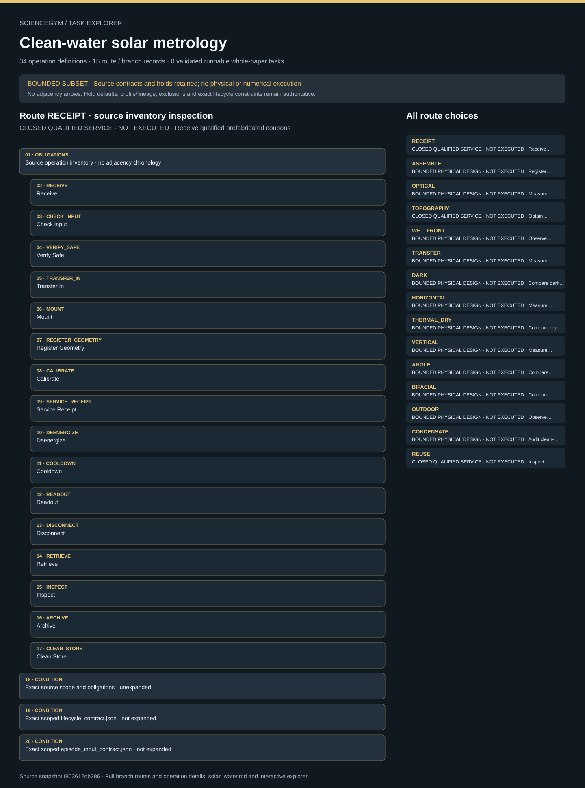

# Clean-water solar metrology: task route map



Paper: **Solar-trackable super-wicking black metal panel for photothermal water sanitation** · [DOI](https://doi.org/10.1038/s41893-020-0566-x)

BOUNDED SUBSET · Read-only author/evaluator reference; no actor loader, task runner, solver, physical simulation, hardware activation or scientific reproduction. Membership is not chronology; exact source contracts remain authoritative. BOUNDED NONBIOLOGICAL SUBSET; not a complete whole-paper design. Clean-water metrology only: all biological work remains excluded and no potability claim is supported. Prefabricated input never earns fabrication credit. Operation inventories do not replace the canonical lifecycle; coupon/water/setup/calibration lineage, independent safe-state evidence, unresolved qualification and source-conflict gates remain intact.. Counts describe task representation, not experiments or success.

**Reading rule:** rows show unordered source inventory for inspection. Exact phase, lifecycle and dependency contracts remain authoritative; no loop, specimen, condition or chronology is inferred. An unordered obligation group has no inferred chronological edges. Source-reported scientific facts and authored handling are distinct.

[Immutable source task package](https://github.com/openags/ScienceGym/blob/f803612db28652d2e2dd574d8039c36b7136f399/tasks/solar_water_operations_v2/) · [Interactive inspector](../index.html)

## RECEIPT — CLOSED QUALIFIED SERVICE · NOT EXECUTED · Receive qualified prefabricated coupons

Read-only author/evaluator reference; no actor loader, task runner, solver, physical simulation, hardware activation or scientific reproduction. Membership is not chronology; exact source contracts remain authoritative.

[Exact route source](https://github.com/openags/ScienceGym/blob/f803612db28652d2e2dd574d8039c36b7136f399/tasks/solar_water_operations_v2/branches.json) · JSON pointer: `/branches/0`

- **OBLIGATIONS: Source operation inventory · no adjacency chronology**
  - Binding: {"order":"Inspection membership only. Conditional recovery remains conditional; exact lifecycle and source causal constraints remain authoritative.","membership_source":"Exact source operation_ids"}
  - `RECEIVE` Receive
  - `CHECK_INPUT` Check Input
  - `VERIFY_SAFE` Verify Safe
  - `TRANSFER_IN` Transfer In
  - `MOUNT` Mount
  - `REGISTER_GEOMETRY` Register Geometry
  - `CALIBRATE` Calibrate
  - `SERVICE_RECEIPT` Service Receipt
  - `DEENERGIZE` Deenergize
  - `COOLDOWN` Cooldown
  - `READOUT` Readout
  - `DISCONNECT` Disconnect
  - `RETRIEVE` Retrieve
  - `INSPECT` Inspect
  - `ARCHIVE` Archive
  - `CLEAN_STORE` Clean Store
- **CONDITION: Exact source scope and obligations · unexpanded**
  - Binding: {"source_file":"branches.json","source_pointer":"/branches/0","source_contract":{"id":"RECEIPT","title":"Receive qualified prefabricated coupons","route_group_id":"B1","station_id":"intake","depends_on":[],"conflict_ids":["C1"],"unknown_parameter_ids":["U_AUTHORITY","U_ROBOT","U_CUSTODY","U_CALIBRATION","U_CLEANUP","U_COUPON"],"source_evidence_ids":["E_B1"],"expected_output":"Qualified coupon identity, fabrication receipt and nonbiological clearance","type":"closed_service_interface","operation_ids_semantics":"Available action inventory; causal ordering is defined by lifecycle_contract.json and tests/contract.py","physical_execution_implemented":false,"replicate_count":null,"numerical_analysis_is_separate":true,"operation_ids":["RECEIVE","CHECK_INPUT","VERIFY_SAFE","TRANSFER_IN","MOUNT","REGISTER_GEOMETRY","CALIBRATE","SERVICE_RECEIPT","DEENERGIZE","COOLDOWN","READOUT","DISCONNECT","RETRIEVE","INSPECT","ARCHIVE","CLEAN_STORE"],"canonical_lifecycle":"lifecycle_contract.json and tests/contract.py","source_vs_authored":"Cited physical observable and controls are source facts; custody, qualified service handoff and safe ordering are original design interfaces"}}
- **CONDITION: Exact scoped lifecycle_contract.json · not expanded**
  - Binding: {"source_file":"lifecycle_contract.json","source_pointer":"","source_contract":{"schema_version":"solar_water_task.v1","doi":"10.1038/s41893-020-0566-x","causal_source":"tests/contract.py plan_for","pre_access":["RECEIVE","CHECK_INPUT","VERIFY_SAFE","TRANSFER_IN","MOUNT","VERIFY_SAFE","REGISTER_GEOMETRY","CALIBRATE"],"illumination":["PREPARE_CLEAN_WATER if wet route","DARK_ACQUIRE with current geometry","RESET_WATER","CONFIGURE_LIGHT","CHECK_INTERLOCKS","LIGHT_ACQUIRE","DEENERGIZE","COOLDOWN","VERIFY_SAFE"],"orientation_change":["DEENERGIZE","COOLDOWN","VERIFY_SAFE","ORIENT","REGISTER_GEOMETRY","CALIBRATE","new geometry-matched DARK_ACQUIRE"],"release":["DEENERGIZE","COOLDOWN","VERIFY_SAFE","READOUT","DISCONNECT","RETRIEVE","INSPECT","ARCHIVE","CLEAN_STORE"],"command_does_not_prove_state":true,"new_mount_invalidates_calibration":true,"cleaning_invalidates_surface_baselines":true,"full_paper_complete":false}}
- **CONDITION: Exact scoped episode_input_contract.json · not expanded**
  - Binding: {"source_file":"episode_input_contract.json","source_pointer":"","source_contract":{"schema_version":"solar_water_task.v1","doi":"10.1038/s41893-020-0566-x","actor_fields":["event_id","job_id","phase"],"environment_fields":["selected_branches","qualified_input_inventory","source_conflict_dispositions","qualification_cards","independent_observations","immutable_record_store","material_dispositions"],"real_execution_gate":"Absent production authentication, hardware adapters, numerical tolerances and qualified equipment. Fixture authority cannot authorize physical execution.","required_missing_values":["CAD/keep-outs and forces","illumination/exposure safety limits","spill/dry-out/temperature trip values","water volumes and acceptance specification","calibration uncertainty/expiry","fit window and independent replicate design","storage and cleaning endpoint criteria"],"all_unknown_values_remain_null_until_qualified":true}}

<details><summary>Branch state, choices, lineage and loop obligations</summary>

```json
{
  "id": "RECEIPT",
  "title": "Receive qualified prefabricated coupons",
  "route_group_id": "B1",
  "station_id": "intake",
  "depends_on": [],
  "conflict_ids": [
    "C1"
  ],
  "unknown_parameter_ids": [
    "U_AUTHORITY",
    "U_ROBOT",
    "U_CUSTODY",
    "U_CALIBRATION",
    "U_CLEANUP",
    "U_COUPON"
  ],
  "source_evidence_ids": [
    "E_B1"
  ],
  "expected_output": "Qualified coupon identity, fabrication receipt and nonbiological clearance",
  "type": "closed_service_interface",
  "operation_ids_semantics": "Available action inventory; causal ordering is defined by lifecycle_contract.json and tests/contract.py",
  "physical_execution_implemented": false,
  "replicate_count": null,
  "numerical_analysis_is_separate": true,
  "operation_ids": [
    "RECEIVE",
    "CHECK_INPUT",
    "VERIFY_SAFE",
    "TRANSFER_IN",
    "MOUNT",
    "REGISTER_GEOMETRY",
    "CALIBRATE",
    "SERVICE_RECEIPT",
    "DEENERGIZE",
    "COOLDOWN",
    "READOUT",
    "DISCONNECT",
    "RETRIEVE",
    "INSPECT",
    "ARCHIVE",
    "CLEAN_STORE"
  ],
  "canonical_lifecycle": "lifecycle_contract.json and tests/contract.py",
  "source_vs_authored": "Cited physical observable and controls are source facts; custody, qualified service handoff and safe ordering are original design interfaces"
}
```

</details>

## ASSEMBLE — BOUNDED PHYSICAL DESIGN · NOT EXECUTED · Register clean-water device assemblies

Read-only author/evaluator reference; no actor loader, task runner, solver, physical simulation, hardware activation or scientific reproduction. Membership is not chronology; exact source contracts remain authoritative.

[Exact route source](https://github.com/openags/ScienceGym/blob/f803612db28652d2e2dd574d8039c36b7136f399/tasks/solar_water_operations_v2/branches.json) · JSON pointer: `/branches/1`

- **OBLIGATIONS: Source operation inventory · no adjacency chronology**
  - Binding: {"order":"Inspection membership only. Conditional recovery remains conditional; exact lifecycle and source causal constraints remain authoritative.","membership_source":"Exact source operation_ids"}
  - `RECEIVE` Receive
  - `CHECK_INPUT` Check Input
  - `VERIFY_SAFE` Verify Safe
  - `TRANSFER_IN` Transfer In
  - `MOUNT` Mount
  - `REGISTER_GEOMETRY` Register Geometry
  - `CALIBRATE` Calibrate
  - `ASSEMBLY_SERVICE` Assembly Service
  - `DEENERGIZE` Deenergize
  - `COOLDOWN` Cooldown
  - `READOUT` Readout
  - `DISCONNECT` Disconnect
  - `RETRIEVE` Retrieve
  - `INSPECT` Inspect
  - `ARCHIVE` Archive
  - `CLEAN_STORE` Clean Store
- **CONDITION: Exact source scope and obligations · unexpanded**
  - Binding: {"source_file":"branches.json","source_pointer":"/branches/1","source_contract":{"id":"ASSEMBLE","title":"Register clean-water device assemblies","route_group_id":"B6","station_id":"assembly","depends_on":["RECEIPT"],"conflict_ids":[],"unknown_parameter_ids":["U_AUTHORITY","U_ROBOT","U_CUSTODY","U_CALIBRATION","U_CLEANUP","U_GEOMETRY","U_AREA"],"source_evidence_ids":["E_B6"],"expected_output":"Assembly identity for coupon, support, aperture and reservoir; geometry qualified locally","type":"bounded_physical_design","operation_ids_semantics":"Available action inventory; causal ordering is defined by lifecycle_contract.json and tests/contract.py","physical_execution_implemented":false,"replicate_count":null,"numerical_analysis_is_separate":true,"operation_ids":["RECEIVE","CHECK_INPUT","VERIFY_SAFE","TRANSFER_IN","MOUNT","REGISTER_GEOMETRY","CALIBRATE","ASSEMBLY_SERVICE","DEENERGIZE","COOLDOWN","READOUT","DISCONNECT","RETRIEVE","INSPECT","ARCHIVE","CLEAN_STORE"],"canonical_lifecycle":"lifecycle_contract.json and tests/contract.py","source_vs_authored":"Cited physical observable and controls are source facts; custody, qualified service handoff and safe ordering are original design interfaces"}}
- **CONDITION: Exact scoped lifecycle_contract.json · not expanded**
  - Binding: {"source_file":"lifecycle_contract.json","source_pointer":"","source_contract":{"schema_version":"solar_water_task.v1","doi":"10.1038/s41893-020-0566-x","causal_source":"tests/contract.py plan_for","pre_access":["RECEIVE","CHECK_INPUT","VERIFY_SAFE","TRANSFER_IN","MOUNT","VERIFY_SAFE","REGISTER_GEOMETRY","CALIBRATE"],"illumination":["PREPARE_CLEAN_WATER if wet route","DARK_ACQUIRE with current geometry","RESET_WATER","CONFIGURE_LIGHT","CHECK_INTERLOCKS","LIGHT_ACQUIRE","DEENERGIZE","COOLDOWN","VERIFY_SAFE"],"orientation_change":["DEENERGIZE","COOLDOWN","VERIFY_SAFE","ORIENT","REGISTER_GEOMETRY","CALIBRATE","new geometry-matched DARK_ACQUIRE"],"release":["DEENERGIZE","COOLDOWN","VERIFY_SAFE","READOUT","DISCONNECT","RETRIEVE","INSPECT","ARCHIVE","CLEAN_STORE"],"command_does_not_prove_state":true,"new_mount_invalidates_calibration":true,"cleaning_invalidates_surface_baselines":true,"full_paper_complete":false}}
- **CONDITION: Exact scoped episode_input_contract.json · not expanded**
  - Binding: {"source_file":"episode_input_contract.json","source_pointer":"","source_contract":{"schema_version":"solar_water_task.v1","doi":"10.1038/s41893-020-0566-x","actor_fields":["event_id","job_id","phase"],"environment_fields":["selected_branches","qualified_input_inventory","source_conflict_dispositions","qualification_cards","independent_observations","immutable_record_store","material_dispositions"],"real_execution_gate":"Absent production authentication, hardware adapters, numerical tolerances and qualified equipment. Fixture authority cannot authorize physical execution.","required_missing_values":["CAD/keep-outs and forces","illumination/exposure safety limits","spill/dry-out/temperature trip values","water volumes and acceptance specification","calibration uncertainty/expiry","fit window and independent replicate design","storage and cleaning endpoint criteria"],"all_unknown_values_remain_null_until_qualified":true}}

<details><summary>Branch state, choices, lineage and loop obligations</summary>

```json
{
  "id": "ASSEMBLE",
  "title": "Register clean-water device assemblies",
  "route_group_id": "B6",
  "station_id": "assembly",
  "depends_on": [
    "RECEIPT"
  ],
  "conflict_ids": [],
  "unknown_parameter_ids": [
    "U_AUTHORITY",
    "U_ROBOT",
    "U_CUSTODY",
    "U_CALIBRATION",
    "U_CLEANUP",
    "U_GEOMETRY",
    "U_AREA"
  ],
  "source_evidence_ids": [
    "E_B6"
  ],
  "expected_output": "Assembly identity for coupon, support, aperture and reservoir; geometry qualified locally",
  "type": "bounded_physical_design",
  "operation_ids_semantics": "Available action inventory; causal ordering is defined by lifecycle_contract.json and tests/contract.py",
  "physical_execution_implemented": false,
  "replicate_count": null,
  "numerical_analysis_is_separate": true,
  "operation_ids": [
    "RECEIVE",
    "CHECK_INPUT",
    "VERIFY_SAFE",
    "TRANSFER_IN",
    "MOUNT",
    "REGISTER_GEOMETRY",
    "CALIBRATE",
    "ASSEMBLY_SERVICE",
    "DEENERGIZE",
    "COOLDOWN",
    "READOUT",
    "DISCONNECT",
    "RETRIEVE",
    "INSPECT",
    "ARCHIVE",
    "CLEAN_STORE"
  ],
  "canonical_lifecycle": "lifecycle_contract.json and tests/contract.py",
  "source_vs_authored": "Cited physical observable and controls are source facts; custody, qualified service handoff and safe ordering are original design interfaces"
}
```

</details>

## OPTICAL — BOUNDED PHYSICAL DESIGN · NOT EXECUTED · Measure optical response

Read-only author/evaluator reference; no actor loader, task runner, solver, physical simulation, hardware activation or scientific reproduction. Membership is not chronology; exact source contracts remain authoritative.

[Exact route source](https://github.com/openags/ScienceGym/blob/f803612db28652d2e2dd574d8039c36b7136f399/tasks/solar_water_operations_v2/branches.json) · JSON pointer: `/branches/2`

- **OBLIGATIONS: Source operation inventory · no adjacency chronology**
  - Binding: {"order":"Inspection membership only. Conditional recovery remains conditional; exact lifecycle and source causal constraints remain authoritative.","membership_source":"Exact source operation_ids"}
  - `RECEIVE` Receive
  - `CHECK_INPUT` Check Input
  - `VERIFY_SAFE` Verify Safe
  - `TRANSFER_IN` Transfer In
  - `MOUNT` Mount
  - `REGISTER_GEOMETRY` Register Geometry
  - `CALIBRATE` Calibrate
  - `OPTICAL_ACQUIRE` Optical Acquire
  - `DEENERGIZE` Deenergize
  - `COOLDOWN` Cooldown
  - `READOUT` Readout
  - `DISCONNECT` Disconnect
  - `RETRIEVE` Retrieve
  - `INSPECT` Inspect
  - `ARCHIVE` Archive
  - `CLEAN_STORE` Clean Store
- **CONDITION: Exact source scope and obligations · unexpanded**
  - Binding: {"source_file":"branches.json","source_pointer":"/branches/2","source_contract":{"id":"OPTICAL","title":"Measure optical response","route_group_id":"B2","station_id":"enclosed_metrology","depends_on":["RECEIPT"],"conflict_ids":["C11"],"unknown_parameter_ids":["U_AUTHORITY","U_ROBOT","U_CUSTODY","U_CALIBRATION","U_CLEANUP","U_OPTICS"],"source_evidence_ids":["E_B2"],"expected_output":"Reflectance records with measured quantity, wavelength, angle and references","type":"bounded_physical_design","operation_ids_semantics":"Available action inventory; causal ordering is defined by lifecycle_contract.json and tests/contract.py","physical_execution_implemented":false,"replicate_count":null,"numerical_analysis_is_separate":true,"operation_ids":["RECEIVE","CHECK_INPUT","VERIFY_SAFE","TRANSFER_IN","MOUNT","REGISTER_GEOMETRY","CALIBRATE","OPTICAL_ACQUIRE","DEENERGIZE","COOLDOWN","READOUT","DISCONNECT","RETRIEVE","INSPECT","ARCHIVE","CLEAN_STORE"],"canonical_lifecycle":"lifecycle_contract.json and tests/contract.py","source_vs_authored":"Cited physical observable and controls are source facts; custody, qualified service handoff and safe ordering are original design interfaces"}}
- **CONDITION: Exact scoped lifecycle_contract.json · not expanded**
  - Binding: {"source_file":"lifecycle_contract.json","source_pointer":"","source_contract":{"schema_version":"solar_water_task.v1","doi":"10.1038/s41893-020-0566-x","causal_source":"tests/contract.py plan_for","pre_access":["RECEIVE","CHECK_INPUT","VERIFY_SAFE","TRANSFER_IN","MOUNT","VERIFY_SAFE","REGISTER_GEOMETRY","CALIBRATE"],"illumination":["PREPARE_CLEAN_WATER if wet route","DARK_ACQUIRE with current geometry","RESET_WATER","CONFIGURE_LIGHT","CHECK_INTERLOCKS","LIGHT_ACQUIRE","DEENERGIZE","COOLDOWN","VERIFY_SAFE"],"orientation_change":["DEENERGIZE","COOLDOWN","VERIFY_SAFE","ORIENT","REGISTER_GEOMETRY","CALIBRATE","new geometry-matched DARK_ACQUIRE"],"release":["DEENERGIZE","COOLDOWN","VERIFY_SAFE","READOUT","DISCONNECT","RETRIEVE","INSPECT","ARCHIVE","CLEAN_STORE"],"command_does_not_prove_state":true,"new_mount_invalidates_calibration":true,"cleaning_invalidates_surface_baselines":true,"full_paper_complete":false}}
- **CONDITION: Exact scoped episode_input_contract.json · not expanded**
  - Binding: {"source_file":"episode_input_contract.json","source_pointer":"","source_contract":{"schema_version":"solar_water_task.v1","doi":"10.1038/s41893-020-0566-x","actor_fields":["event_id","job_id","phase"],"environment_fields":["selected_branches","qualified_input_inventory","source_conflict_dispositions","qualification_cards","independent_observations","immutable_record_store","material_dispositions"],"real_execution_gate":"Absent production authentication, hardware adapters, numerical tolerances and qualified equipment. Fixture authority cannot authorize physical execution.","required_missing_values":["CAD/keep-outs and forces","illumination/exposure safety limits","spill/dry-out/temperature trip values","water volumes and acceptance specification","calibration uncertainty/expiry","fit window and independent replicate design","storage and cleaning endpoint criteria"],"all_unknown_values_remain_null_until_qualified":true}}

<details><summary>Branch state, choices, lineage and loop obligations</summary>

```json
{
  "id": "OPTICAL",
  "title": "Measure optical response",
  "route_group_id": "B2",
  "station_id": "enclosed_metrology",
  "depends_on": [
    "RECEIPT"
  ],
  "conflict_ids": [
    "C11"
  ],
  "unknown_parameter_ids": [
    "U_AUTHORITY",
    "U_ROBOT",
    "U_CUSTODY",
    "U_CALIBRATION",
    "U_CLEANUP",
    "U_OPTICS"
  ],
  "source_evidence_ids": [
    "E_B2"
  ],
  "expected_output": "Reflectance records with measured quantity, wavelength, angle and references",
  "type": "bounded_physical_design",
  "operation_ids_semantics": "Available action inventory; causal ordering is defined by lifecycle_contract.json and tests/contract.py",
  "physical_execution_implemented": false,
  "replicate_count": null,
  "numerical_analysis_is_separate": true,
  "operation_ids": [
    "RECEIVE",
    "CHECK_INPUT",
    "VERIFY_SAFE",
    "TRANSFER_IN",
    "MOUNT",
    "REGISTER_GEOMETRY",
    "CALIBRATE",
    "OPTICAL_ACQUIRE",
    "DEENERGIZE",
    "COOLDOWN",
    "READOUT",
    "DISCONNECT",
    "RETRIEVE",
    "INSPECT",
    "ARCHIVE",
    "CLEAN_STORE"
  ],
  "canonical_lifecycle": "lifecycle_contract.json and tests/contract.py",
  "source_vs_authored": "Cited physical observable and controls are source facts; custody, qualified service handoff and safe ordering are original design interfaces"
}
```

</details>

## TOPOGRAPHY — CLOSED QUALIFIED SERVICE · NOT EXECUTED · Obtain surface metrology records

Read-only author/evaluator reference; no actor loader, task runner, solver, physical simulation, hardware activation or scientific reproduction. Membership is not chronology; exact source contracts remain authoritative.

[Exact route source](https://github.com/openags/ScienceGym/blob/f803612db28652d2e2dd574d8039c36b7136f399/tasks/solar_water_operations_v2/branches.json) · JSON pointer: `/branches/3`

- **OBLIGATIONS: Source operation inventory · no adjacency chronology**
  - Binding: {"order":"Inspection membership only. Conditional recovery remains conditional; exact lifecycle and source causal constraints remain authoritative.","membership_source":"Exact source operation_ids"}
  - `RECEIVE` Receive
  - `CHECK_INPUT` Check Input
  - `VERIFY_SAFE` Verify Safe
  - `TRANSFER_IN` Transfer In
  - `MOUNT` Mount
  - `REGISTER_GEOMETRY` Register Geometry
  - `CALIBRATE` Calibrate
  - `METROLOGY_SERVICE` Metrology Service
  - `DEENERGIZE` Deenergize
  - `COOLDOWN` Cooldown
  - `READOUT` Readout
  - `DISCONNECT` Disconnect
  - `RETRIEVE` Retrieve
  - `INSPECT` Inspect
  - `ARCHIVE` Archive
  - `CLEAN_STORE` Clean Store
- **CONDITION: Exact source scope and obligations · unexpanded**
  - Binding: {"source_file":"branches.json","source_pointer":"/branches/3","source_contract":{"id":"TOPOGRAPHY","title":"Obtain surface metrology records","route_group_id":"B2","station_id":"enclosed_metrology","depends_on":["RECEIPT"],"conflict_ids":[],"unknown_parameter_ids":["U_AUTHORITY","U_ROBOT","U_CUSTODY","U_CALIBRATION","U_CLEANUP","U_METROLOGY"],"source_evidence_ids":["E_B2"],"expected_output":"Qualified topography or microscopy service receipt tied to region and surface version","type":"closed_service_interface","operation_ids_semantics":"Available action inventory; causal ordering is defined by lifecycle_contract.json and tests/contract.py","physical_execution_implemented":false,"replicate_count":null,"numerical_analysis_is_separate":true,"operation_ids":["RECEIVE","CHECK_INPUT","VERIFY_SAFE","TRANSFER_IN","MOUNT","REGISTER_GEOMETRY","CALIBRATE","METROLOGY_SERVICE","DEENERGIZE","COOLDOWN","READOUT","DISCONNECT","RETRIEVE","INSPECT","ARCHIVE","CLEAN_STORE"],"canonical_lifecycle":"lifecycle_contract.json and tests/contract.py","source_vs_authored":"Cited physical observable and controls are source facts; custody, qualified service handoff and safe ordering are original design interfaces"}}
- **CONDITION: Exact scoped lifecycle_contract.json · not expanded**
  - Binding: {"source_file":"lifecycle_contract.json","source_pointer":"","source_contract":{"schema_version":"solar_water_task.v1","doi":"10.1038/s41893-020-0566-x","causal_source":"tests/contract.py plan_for","pre_access":["RECEIVE","CHECK_INPUT","VERIFY_SAFE","TRANSFER_IN","MOUNT","VERIFY_SAFE","REGISTER_GEOMETRY","CALIBRATE"],"illumination":["PREPARE_CLEAN_WATER if wet route","DARK_ACQUIRE with current geometry","RESET_WATER","CONFIGURE_LIGHT","CHECK_INTERLOCKS","LIGHT_ACQUIRE","DEENERGIZE","COOLDOWN","VERIFY_SAFE"],"orientation_change":["DEENERGIZE","COOLDOWN","VERIFY_SAFE","ORIENT","REGISTER_GEOMETRY","CALIBRATE","new geometry-matched DARK_ACQUIRE"],"release":["DEENERGIZE","COOLDOWN","VERIFY_SAFE","READOUT","DISCONNECT","RETRIEVE","INSPECT","ARCHIVE","CLEAN_STORE"],"command_does_not_prove_state":true,"new_mount_invalidates_calibration":true,"cleaning_invalidates_surface_baselines":true,"full_paper_complete":false}}
- **CONDITION: Exact scoped episode_input_contract.json · not expanded**
  - Binding: {"source_file":"episode_input_contract.json","source_pointer":"","source_contract":{"schema_version":"solar_water_task.v1","doi":"10.1038/s41893-020-0566-x","actor_fields":["event_id","job_id","phase"],"environment_fields":["selected_branches","qualified_input_inventory","source_conflict_dispositions","qualification_cards","independent_observations","immutable_record_store","material_dispositions"],"real_execution_gate":"Absent production authentication, hardware adapters, numerical tolerances and qualified equipment. Fixture authority cannot authorize physical execution.","required_missing_values":["CAD/keep-outs and forces","illumination/exposure safety limits","spill/dry-out/temperature trip values","water volumes and acceptance specification","calibration uncertainty/expiry","fit window and independent replicate design","storage and cleaning endpoint criteria"],"all_unknown_values_remain_null_until_qualified":true}}

<details><summary>Branch state, choices, lineage and loop obligations</summary>

```json
{
  "id": "TOPOGRAPHY",
  "title": "Obtain surface metrology records",
  "route_group_id": "B2",
  "station_id": "enclosed_metrology",
  "depends_on": [
    "RECEIPT"
  ],
  "conflict_ids": [],
  "unknown_parameter_ids": [
    "U_AUTHORITY",
    "U_ROBOT",
    "U_CUSTODY",
    "U_CALIBRATION",
    "U_CLEANUP",
    "U_METROLOGY"
  ],
  "source_evidence_ids": [
    "E_B2"
  ],
  "expected_output": "Qualified topography or microscopy service receipt tied to region and surface version",
  "type": "closed_service_interface",
  "operation_ids_semantics": "Available action inventory; causal ordering is defined by lifecycle_contract.json and tests/contract.py",
  "physical_execution_implemented": false,
  "replicate_count": null,
  "numerical_analysis_is_separate": true,
  "operation_ids": [
    "RECEIVE",
    "CHECK_INPUT",
    "VERIFY_SAFE",
    "TRANSFER_IN",
    "MOUNT",
    "REGISTER_GEOMETRY",
    "CALIBRATE",
    "METROLOGY_SERVICE",
    "DEENERGIZE",
    "COOLDOWN",
    "READOUT",
    "DISCONNECT",
    "RETRIEVE",
    "INSPECT",
    "ARCHIVE",
    "CLEAN_STORE"
  ],
  "canonical_lifecycle": "lifecycle_contract.json and tests/contract.py",
  "source_vs_authored": "Cited physical observable and controls are source facts; custody, qualified service handoff and safe ordering are original design interfaces"
}
```

</details>

## WET_FRONT — BOUNDED PHYSICAL DESIGN · NOT EXECUTED · Observe clean-water wet fronts

Read-only author/evaluator reference; no actor loader, task runner, solver, physical simulation, hardware activation or scientific reproduction. Membership is not chronology; exact source contracts remain authoritative.

[Exact route source](https://github.com/openags/ScienceGym/blob/f803612db28652d2e2dd574d8039c36b7136f399/tasks/solar_water_operations_v2/branches.json) · JSON pointer: `/branches/4`

- **OBLIGATIONS: Source operation inventory · no adjacency chronology**
  - Binding: {"order":"Inspection membership only. Conditional recovery remains conditional; exact lifecycle and source causal constraints remain authoritative.","membership_source":"Exact source operation_ids"}
  - `RECEIVE` Receive
  - `CHECK_INPUT` Check Input
  - `VERIFY_SAFE` Verify Safe
  - `TRANSFER_IN` Transfer In
  - `MOUNT` Mount
  - `REGISTER_GEOMETRY` Register Geometry
  - `CALIBRATE` Calibrate
  - `PREPARE_CLEAN_WATER` Prepare Clean Water
  - `REGISTER_INITIAL_WETNESS` Register Initial Wetness
  - `WET_FRONT_ACQUIRE` Wet Front Acquire
  - `DEENERGIZE` Deenergize
  - `COOLDOWN` Cooldown
  - `READOUT` Readout
  - `DISCONNECT` Disconnect
  - `RETRIEVE` Retrieve
  - `INSPECT` Inspect
  - `ARCHIVE` Archive
  - `CLEAN_STORE` Clean Store
- **CONDITION: Exact source scope and obligations · unexpanded**
  - Binding: {"source_file":"branches.json","source_pointer":"/branches/4","source_contract":{"id":"WET_FRONT","title":"Observe clean-water wet fronts","route_group_id":"B3","station_id":"wicking_camera","depends_on":["RECEIPT"],"conflict_ids":[],"unknown_parameter_ids":["U_AUTHORITY","U_ROBOT","U_CUSTODY","U_CALIBRATION","U_CLEANUP","U_CAMERA","U_WETTING"],"source_evidence_ids":["E_B3"],"expected_output":"Calibrated wet-front video with acquisition time and scale","type":"bounded_physical_design","operation_ids_semantics":"Available action inventory; causal ordering is defined by lifecycle_contract.json and tests/contract.py","physical_execution_implemented":false,"replicate_count":null,"numerical_analysis_is_separate":true,"operation_ids":["RECEIVE","CHECK_INPUT","VERIFY_SAFE","TRANSFER_IN","MOUNT","REGISTER_GEOMETRY","CALIBRATE","PREPARE_CLEAN_WATER","REGISTER_INITIAL_WETNESS","WET_FRONT_ACQUIRE","DEENERGIZE","COOLDOWN","READOUT","DISCONNECT","RETRIEVE","INSPECT","ARCHIVE","CLEAN_STORE"],"canonical_lifecycle":"lifecycle_contract.json and tests/contract.py","source_vs_authored":"Cited physical observable and controls are source facts; custody, qualified service handoff and safe ordering are original design interfaces"}}
- **CONDITION: Exact scoped lifecycle_contract.json · not expanded**
  - Binding: {"source_file":"lifecycle_contract.json","source_pointer":"","source_contract":{"schema_version":"solar_water_task.v1","doi":"10.1038/s41893-020-0566-x","causal_source":"tests/contract.py plan_for","pre_access":["RECEIVE","CHECK_INPUT","VERIFY_SAFE","TRANSFER_IN","MOUNT","VERIFY_SAFE","REGISTER_GEOMETRY","CALIBRATE"],"illumination":["PREPARE_CLEAN_WATER if wet route","DARK_ACQUIRE with current geometry","RESET_WATER","CONFIGURE_LIGHT","CHECK_INTERLOCKS","LIGHT_ACQUIRE","DEENERGIZE","COOLDOWN","VERIFY_SAFE"],"orientation_change":["DEENERGIZE","COOLDOWN","VERIFY_SAFE","ORIENT","REGISTER_GEOMETRY","CALIBRATE","new geometry-matched DARK_ACQUIRE"],"release":["DEENERGIZE","COOLDOWN","VERIFY_SAFE","READOUT","DISCONNECT","RETRIEVE","INSPECT","ARCHIVE","CLEAN_STORE"],"command_does_not_prove_state":true,"new_mount_invalidates_calibration":true,"cleaning_invalidates_surface_baselines":true,"full_paper_complete":false}}
- **CONDITION: Exact scoped episode_input_contract.json · not expanded**
  - Binding: {"source_file":"episode_input_contract.json","source_pointer":"","source_contract":{"schema_version":"solar_water_task.v1","doi":"10.1038/s41893-020-0566-x","actor_fields":["event_id","job_id","phase"],"environment_fields":["selected_branches","qualified_input_inventory","source_conflict_dispositions","qualification_cards","independent_observations","immutable_record_store","material_dispositions"],"real_execution_gate":"Absent production authentication, hardware adapters, numerical tolerances and qualified equipment. Fixture authority cannot authorize physical execution.","required_missing_values":["CAD/keep-outs and forces","illumination/exposure safety limits","spill/dry-out/temperature trip values","water volumes and acceptance specification","calibration uncertainty/expiry","fit window and independent replicate design","storage and cleaning endpoint criteria"],"all_unknown_values_remain_null_until_qualified":true}}

<details><summary>Branch state, choices, lineage and loop obligations</summary>

```json
{
  "id": "WET_FRONT",
  "title": "Observe clean-water wet fronts",
  "route_group_id": "B3",
  "station_id": "wicking_camera",
  "depends_on": [
    "RECEIPT"
  ],
  "conflict_ids": [],
  "unknown_parameter_ids": [
    "U_AUTHORITY",
    "U_ROBOT",
    "U_CUSTODY",
    "U_CALIBRATION",
    "U_CLEANUP",
    "U_CAMERA",
    "U_WETTING"
  ],
  "source_evidence_ids": [
    "E_B3"
  ],
  "expected_output": "Calibrated wet-front video with acquisition time and scale",
  "type": "bounded_physical_design",
  "operation_ids_semantics": "Available action inventory; causal ordering is defined by lifecycle_contract.json and tests/contract.py",
  "physical_execution_implemented": false,
  "replicate_count": null,
  "numerical_analysis_is_separate": true,
  "operation_ids": [
    "RECEIVE",
    "CHECK_INPUT",
    "VERIFY_SAFE",
    "TRANSFER_IN",
    "MOUNT",
    "REGISTER_GEOMETRY",
    "CALIBRATE",
    "PREPARE_CLEAN_WATER",
    "REGISTER_INITIAL_WETNESS",
    "WET_FRONT_ACQUIRE",
    "DEENERGIZE",
    "COOLDOWN",
    "READOUT",
    "DISCONNECT",
    "RETRIEVE",
    "INSPECT",
    "ARCHIVE",
    "CLEAN_STORE"
  ],
  "canonical_lifecycle": "lifecycle_contract.json and tests/contract.py",
  "source_vs_authored": "Cited physical observable and controls are source facts; custody, qualified service handoff and safe ordering are original design interfaces"
}
```

</details>

## TRANSFER — BOUNDED PHYSICAL DESIGN · NOT EXECUTED · Measure reservoir transfer transients

Read-only author/evaluator reference; no actor loader, task runner, solver, physical simulation, hardware activation or scientific reproduction. Membership is not chronology; exact source contracts remain authoritative.

[Exact route source](https://github.com/openags/ScienceGym/blob/f803612db28652d2e2dd574d8039c36b7136f399/tasks/solar_water_operations_v2/branches.json) · JSON pointer: `/branches/5`

- **OBLIGATIONS: Source operation inventory · no adjacency chronology**
  - Binding: {"order":"Inspection membership only. Conditional recovery remains conditional; exact lifecycle and source causal constraints remain authoritative.","membership_source":"Exact source operation_ids"}
  - `RECEIVE` Receive
  - `CHECK_INPUT` Check Input
  - `VERIFY_SAFE` Verify Safe
  - `TRANSFER_IN` Transfer In
  - `MOUNT` Mount
  - `REGISTER_GEOMETRY` Register Geometry
  - `CALIBRATE` Calibrate
  - `PREPARE_CLEAN_WATER` Prepare Clean Water
  - `REGISTER_INITIAL_WETNESS` Register Initial Wetness
  - `CONTACT_ACQUIRE` Contact Acquire
  - `DEENERGIZE` Deenergize
  - `COOLDOWN` Cooldown
  - `READOUT` Readout
  - `DISCONNECT` Disconnect
  - `RETRIEVE` Retrieve
  - `INSPECT` Inspect
  - `ARCHIVE` Archive
  - `CLEAN_STORE` Clean Store
- **CONDITION: Exact source scope and obligations · unexpanded**
  - Binding: {"source_file":"branches.json","source_pointer":"/branches/5","source_contract":{"id":"TRANSFER","title":"Measure reservoir transfer transients","route_group_id":"B3","station_id":"transfer_balance","depends_on":["RECEIPT"],"conflict_ids":[],"unknown_parameter_ids":["U_AUTHORITY","U_ROBOT","U_CUSTODY","U_CALIBRATION","U_CLEANUP","U_BALANCE","U_CONTACT"],"source_evidence_ids":["E_B3"],"expected_output":"Time-labelled contact, uptake, withdrawal and release transients","type":"bounded_physical_design","operation_ids_semantics":"Available action inventory; causal ordering is defined by lifecycle_contract.json and tests/contract.py","physical_execution_implemented":false,"replicate_count":null,"numerical_analysis_is_separate":true,"operation_ids":["RECEIVE","CHECK_INPUT","VERIFY_SAFE","TRANSFER_IN","MOUNT","REGISTER_GEOMETRY","CALIBRATE","PREPARE_CLEAN_WATER","REGISTER_INITIAL_WETNESS","CONTACT_ACQUIRE","DEENERGIZE","COOLDOWN","READOUT","DISCONNECT","RETRIEVE","INSPECT","ARCHIVE","CLEAN_STORE"],"canonical_lifecycle":"lifecycle_contract.json and tests/contract.py","source_vs_authored":"Cited physical observable and controls are source facts; custody, qualified service handoff and safe ordering are original design interfaces"}}
- **CONDITION: Exact scoped lifecycle_contract.json · not expanded**
  - Binding: {"source_file":"lifecycle_contract.json","source_pointer":"","source_contract":{"schema_version":"solar_water_task.v1","doi":"10.1038/s41893-020-0566-x","causal_source":"tests/contract.py plan_for","pre_access":["RECEIVE","CHECK_INPUT","VERIFY_SAFE","TRANSFER_IN","MOUNT","VERIFY_SAFE","REGISTER_GEOMETRY","CALIBRATE"],"illumination":["PREPARE_CLEAN_WATER if wet route","DARK_ACQUIRE with current geometry","RESET_WATER","CONFIGURE_LIGHT","CHECK_INTERLOCKS","LIGHT_ACQUIRE","DEENERGIZE","COOLDOWN","VERIFY_SAFE"],"orientation_change":["DEENERGIZE","COOLDOWN","VERIFY_SAFE","ORIENT","REGISTER_GEOMETRY","CALIBRATE","new geometry-matched DARK_ACQUIRE"],"release":["DEENERGIZE","COOLDOWN","VERIFY_SAFE","READOUT","DISCONNECT","RETRIEVE","INSPECT","ARCHIVE","CLEAN_STORE"],"command_does_not_prove_state":true,"new_mount_invalidates_calibration":true,"cleaning_invalidates_surface_baselines":true,"full_paper_complete":false}}
- **CONDITION: Exact scoped episode_input_contract.json · not expanded**
  - Binding: {"source_file":"episode_input_contract.json","source_pointer":"","source_contract":{"schema_version":"solar_water_task.v1","doi":"10.1038/s41893-020-0566-x","actor_fields":["event_id","job_id","phase"],"environment_fields":["selected_branches","qualified_input_inventory","source_conflict_dispositions","qualification_cards","independent_observations","immutable_record_store","material_dispositions"],"real_execution_gate":"Absent production authentication, hardware adapters, numerical tolerances and qualified equipment. Fixture authority cannot authorize physical execution.","required_missing_values":["CAD/keep-outs and forces","illumination/exposure safety limits","spill/dry-out/temperature trip values","water volumes and acceptance specification","calibration uncertainty/expiry","fit window and independent replicate design","storage and cleaning endpoint criteria"],"all_unknown_values_remain_null_until_qualified":true}}

<details><summary>Branch state, choices, lineage and loop obligations</summary>

```json
{
  "id": "TRANSFER",
  "title": "Measure reservoir transfer transients",
  "route_group_id": "B3",
  "station_id": "transfer_balance",
  "depends_on": [
    "RECEIPT"
  ],
  "conflict_ids": [],
  "unknown_parameter_ids": [
    "U_AUTHORITY",
    "U_ROBOT",
    "U_CUSTODY",
    "U_CALIBRATION",
    "U_CLEANUP",
    "U_BALANCE",
    "U_CONTACT"
  ],
  "source_evidence_ids": [
    "E_B3"
  ],
  "expected_output": "Time-labelled contact, uptake, withdrawal and release transients",
  "type": "bounded_physical_design",
  "operation_ids_semantics": "Available action inventory; causal ordering is defined by lifecycle_contract.json and tests/contract.py",
  "physical_execution_implemented": false,
  "replicate_count": null,
  "numerical_analysis_is_separate": true,
  "operation_ids": [
    "RECEIVE",
    "CHECK_INPUT",
    "VERIFY_SAFE",
    "TRANSFER_IN",
    "MOUNT",
    "REGISTER_GEOMETRY",
    "CALIBRATE",
    "PREPARE_CLEAN_WATER",
    "REGISTER_INITIAL_WETNESS",
    "CONTACT_ACQUIRE",
    "DEENERGIZE",
    "COOLDOWN",
    "READOUT",
    "DISCONNECT",
    "RETRIEVE",
    "INSPECT",
    "ARCHIVE",
    "CLEAN_STORE"
  ],
  "canonical_lifecycle": "lifecycle_contract.json and tests/contract.py",
  "source_vs_authored": "Cited physical observable and controls are source facts; custody, qualified service handoff and safe ordering are original design interfaces"
}
```

</details>

## DARK — BOUNDED PHYSICAL DESIGN · NOT EXECUTED · Compare dark mass loss

Read-only author/evaluator reference; no actor loader, task runner, solver, physical simulation, hardware activation or scientific reproduction. Membership is not chronology; exact source contracts remain authoritative.

[Exact route source](https://github.com/openags/ScienceGym/blob/f803612db28652d2e2dd574d8039c36b7136f399/tasks/solar_water_operations_v2/branches.json) · JSON pointer: `/branches/6`

- **OBLIGATIONS: Source operation inventory · no adjacency chronology**
  - Binding: {"order":"Inspection membership only. Conditional recovery remains conditional; exact lifecycle and source causal constraints remain authoritative.","membership_source":"Exact source operation_ids"}
  - `RECEIVE` Receive
  - `CHECK_INPUT` Check Input
  - `VERIFY_SAFE` Verify Safe
  - `TRANSFER_IN` Transfer In
  - `MOUNT` Mount
  - `REGISTER_GEOMETRY` Register Geometry
  - `CALIBRATE` Calibrate
  - `PREPARE_CLEAN_WATER` Prepare Clean Water
  - `REGISTER_INITIAL_WETNESS` Register Initial Wetness
  - `DARK_ACQUIRE` Dark Acquire
  - `DEENERGIZE` Deenergize
  - `COOLDOWN` Cooldown
  - `READOUT` Readout
  - `DISCONNECT` Disconnect
  - `RETRIEVE` Retrieve
  - `INSPECT` Inspect
  - `ARCHIVE` Archive
  - `CLEAN_STORE` Clean Store
- **CONDITION: Exact source scope and obligations · unexpanded**
  - Binding: {"source_file":"branches.json","source_pointer":"/branches/6","source_contract":{"id":"DARK","title":"Compare dark mass loss","route_group_id":"B4","station_id":"evaporation_balance","depends_on":["ASSEMBLE"],"conflict_ids":["C4","C5"],"unknown_parameter_ids":["U_AUTHORITY","U_ROBOT","U_CUSTODY","U_CALIBRATION","U_CLEANUP","U_BALANCE","U_ENVIRONMENT","U_AREA","U_FIT"],"source_evidence_ids":["E_B4"],"expected_output":"Matched clean-water dark controls and area-specific mass records","type":"bounded_physical_design","operation_ids_semantics":"Available action inventory; causal ordering is defined by lifecycle_contract.json and tests/contract.py","physical_execution_implemented":false,"replicate_count":null,"numerical_analysis_is_separate":true,"operation_ids":["RECEIVE","CHECK_INPUT","VERIFY_SAFE","TRANSFER_IN","MOUNT","REGISTER_GEOMETRY","CALIBRATE","PREPARE_CLEAN_WATER","REGISTER_INITIAL_WETNESS","DARK_ACQUIRE","DEENERGIZE","COOLDOWN","READOUT","DISCONNECT","RETRIEVE","INSPECT","ARCHIVE","CLEAN_STORE"],"canonical_lifecycle":"lifecycle_contract.json and tests/contract.py","source_vs_authored":"Cited physical observable and controls are source facts; custody, qualified service handoff and safe ordering are original design interfaces"}}
- **CONDITION: Exact scoped lifecycle_contract.json · not expanded**
  - Binding: {"source_file":"lifecycle_contract.json","source_pointer":"","source_contract":{"schema_version":"solar_water_task.v1","doi":"10.1038/s41893-020-0566-x","causal_source":"tests/contract.py plan_for","pre_access":["RECEIVE","CHECK_INPUT","VERIFY_SAFE","TRANSFER_IN","MOUNT","VERIFY_SAFE","REGISTER_GEOMETRY","CALIBRATE"],"illumination":["PREPARE_CLEAN_WATER if wet route","DARK_ACQUIRE with current geometry","RESET_WATER","CONFIGURE_LIGHT","CHECK_INTERLOCKS","LIGHT_ACQUIRE","DEENERGIZE","COOLDOWN","VERIFY_SAFE"],"orientation_change":["DEENERGIZE","COOLDOWN","VERIFY_SAFE","ORIENT","REGISTER_GEOMETRY","CALIBRATE","new geometry-matched DARK_ACQUIRE"],"release":["DEENERGIZE","COOLDOWN","VERIFY_SAFE","READOUT","DISCONNECT","RETRIEVE","INSPECT","ARCHIVE","CLEAN_STORE"],"command_does_not_prove_state":true,"new_mount_invalidates_calibration":true,"cleaning_invalidates_surface_baselines":true,"full_paper_complete":false}}
- **CONDITION: Exact scoped episode_input_contract.json · not expanded**
  - Binding: {"source_file":"episode_input_contract.json","source_pointer":"","source_contract":{"schema_version":"solar_water_task.v1","doi":"10.1038/s41893-020-0566-x","actor_fields":["event_id","job_id","phase"],"environment_fields":["selected_branches","qualified_input_inventory","source_conflict_dispositions","qualification_cards","independent_observations","immutable_record_store","material_dispositions"],"real_execution_gate":"Absent production authentication, hardware adapters, numerical tolerances and qualified equipment. Fixture authority cannot authorize physical execution.","required_missing_values":["CAD/keep-outs and forces","illumination/exposure safety limits","spill/dry-out/temperature trip values","water volumes and acceptance specification","calibration uncertainty/expiry","fit window and independent replicate design","storage and cleaning endpoint criteria"],"all_unknown_values_remain_null_until_qualified":true}}

<details><summary>Branch state, choices, lineage and loop obligations</summary>

```json
{
  "id": "DARK",
  "title": "Compare dark mass loss",
  "route_group_id": "B4",
  "station_id": "evaporation_balance",
  "depends_on": [
    "ASSEMBLE"
  ],
  "conflict_ids": [
    "C4",
    "C5"
  ],
  "unknown_parameter_ids": [
    "U_AUTHORITY",
    "U_ROBOT",
    "U_CUSTODY",
    "U_CALIBRATION",
    "U_CLEANUP",
    "U_BALANCE",
    "U_ENVIRONMENT",
    "U_AREA",
    "U_FIT"
  ],
  "source_evidence_ids": [
    "E_B4"
  ],
  "expected_output": "Matched clean-water dark controls and area-specific mass records",
  "type": "bounded_physical_design",
  "operation_ids_semantics": "Available action inventory; causal ordering is defined by lifecycle_contract.json and tests/contract.py",
  "physical_execution_implemented": false,
  "replicate_count": null,
  "numerical_analysis_is_separate": true,
  "operation_ids": [
    "RECEIVE",
    "CHECK_INPUT",
    "VERIFY_SAFE",
    "TRANSFER_IN",
    "MOUNT",
    "REGISTER_GEOMETRY",
    "CALIBRATE",
    "PREPARE_CLEAN_WATER",
    "REGISTER_INITIAL_WETNESS",
    "DARK_ACQUIRE",
    "DEENERGIZE",
    "COOLDOWN",
    "READOUT",
    "DISCONNECT",
    "RETRIEVE",
    "INSPECT",
    "ARCHIVE",
    "CLEAN_STORE"
  ],
  "canonical_lifecycle": "lifecycle_contract.json and tests/contract.py",
  "source_vs_authored": "Cited physical observable and controls are source facts; custody, qualified service handoff and safe ordering are original design interfaces"
}
```

</details>

## HORIZONTAL — BOUNDED PHYSICAL DESIGN · NOT EXECUTED · Measure horizontal light-driven evaporation

Read-only author/evaluator reference; no actor loader, task runner, solver, physical simulation, hardware activation or scientific reproduction. Membership is not chronology; exact source contracts remain authoritative.

[Exact route source](https://github.com/openags/ScienceGym/blob/f803612db28652d2e2dd574d8039c36b7136f399/tasks/solar_water_operations_v2/branches.json) · JSON pointer: `/branches/7`

- **OBLIGATIONS: Source operation inventory · no adjacency chronology**
  - Binding: {"order":"Inspection membership only. Conditional recovery remains conditional; exact lifecycle and source causal constraints remain authoritative.","membership_source":"Exact source operation_ids"}
  - `RECEIVE` Receive
  - `CHECK_INPUT` Check Input
  - `VERIFY_SAFE` Verify Safe
  - `TRANSFER_IN` Transfer In
  - `MOUNT` Mount
  - `REGISTER_GEOMETRY` Register Geometry
  - `CALIBRATE` Calibrate
  - `PREPARE_CLEAN_WATER` Prepare Clean Water
  - `REGISTER_INITIAL_WETNESS` Register Initial Wetness
  - `DARK_ACQUIRE` Dark Acquire
  - `RESET_WATER` Reset Water
  - `CONFIGURE_LIGHT` Configure Light
  - `CHECK_INTERLOCKS` Check Interlocks
  - `LIGHT_ACQUIRE` Light Acquire
  - `DEENERGIZE` Deenergize
  - `COOLDOWN` Cooldown
  - `READOUT` Readout
  - `DISCONNECT` Disconnect
  - `RETRIEVE` Retrieve
  - `INSPECT` Inspect
  - `ARCHIVE` Archive
  - `CLEAN_STORE` Clean Store
- **CONDITION: Exact source scope and obligations · unexpanded**
  - Binding: {"source_file":"branches.json","source_pointer":"/branches/7","source_contract":{"id":"HORIZONTAL","title":"Measure horizontal light-driven evaporation","route_group_id":"B6","station_id":"enclosed_illumination","depends_on":["ASSEMBLE"],"conflict_ids":["C4","C5","C11"],"unknown_parameter_ids":["U_AUTHORITY","U_ROBOT","U_CUSTODY","U_CALIBRATION","U_CLEANUP","U_BALANCE","U_ILLUMINATION","U_THERMAL","U_AREA","U_FIT"],"source_evidence_ids":["E_B6"],"expected_output":"Matched dark and illuminated mass/temperature/irradiance records","type":"bounded_physical_design","operation_ids_semantics":"Available action inventory; causal ordering is defined by lifecycle_contract.json and tests/contract.py","physical_execution_implemented":false,"replicate_count":null,"numerical_analysis_is_separate":true,"operation_ids":["RECEIVE","CHECK_INPUT","VERIFY_SAFE","TRANSFER_IN","MOUNT","REGISTER_GEOMETRY","CALIBRATE","PREPARE_CLEAN_WATER","REGISTER_INITIAL_WETNESS","DARK_ACQUIRE","RESET_WATER","CONFIGURE_LIGHT","CHECK_INTERLOCKS","LIGHT_ACQUIRE","DEENERGIZE","COOLDOWN","READOUT","DISCONNECT","RETRIEVE","INSPECT","ARCHIVE","CLEAN_STORE"],"canonical_lifecycle":"lifecycle_contract.json and tests/contract.py","source_vs_authored":"Cited physical observable and controls are source facts; custody, qualified service handoff and safe ordering are original design interfaces"}}
- **CONDITION: Exact scoped lifecycle_contract.json · not expanded**
  - Binding: {"source_file":"lifecycle_contract.json","source_pointer":"","source_contract":{"schema_version":"solar_water_task.v1","doi":"10.1038/s41893-020-0566-x","causal_source":"tests/contract.py plan_for","pre_access":["RECEIVE","CHECK_INPUT","VERIFY_SAFE","TRANSFER_IN","MOUNT","VERIFY_SAFE","REGISTER_GEOMETRY","CALIBRATE"],"illumination":["PREPARE_CLEAN_WATER if wet route","DARK_ACQUIRE with current geometry","RESET_WATER","CONFIGURE_LIGHT","CHECK_INTERLOCKS","LIGHT_ACQUIRE","DEENERGIZE","COOLDOWN","VERIFY_SAFE"],"orientation_change":["DEENERGIZE","COOLDOWN","VERIFY_SAFE","ORIENT","REGISTER_GEOMETRY","CALIBRATE","new geometry-matched DARK_ACQUIRE"],"release":["DEENERGIZE","COOLDOWN","VERIFY_SAFE","READOUT","DISCONNECT","RETRIEVE","INSPECT","ARCHIVE","CLEAN_STORE"],"command_does_not_prove_state":true,"new_mount_invalidates_calibration":true,"cleaning_invalidates_surface_baselines":true,"full_paper_complete":false}}
- **CONDITION: Exact scoped episode_input_contract.json · not expanded**
  - Binding: {"source_file":"episode_input_contract.json","source_pointer":"","source_contract":{"schema_version":"solar_water_task.v1","doi":"10.1038/s41893-020-0566-x","actor_fields":["event_id","job_id","phase"],"environment_fields":["selected_branches","qualified_input_inventory","source_conflict_dispositions","qualification_cards","independent_observations","immutable_record_store","material_dispositions"],"real_execution_gate":"Absent production authentication, hardware adapters, numerical tolerances and qualified equipment. Fixture authority cannot authorize physical execution.","required_missing_values":["CAD/keep-outs and forces","illumination/exposure safety limits","spill/dry-out/temperature trip values","water volumes and acceptance specification","calibration uncertainty/expiry","fit window and independent replicate design","storage and cleaning endpoint criteria"],"all_unknown_values_remain_null_until_qualified":true}}

<details><summary>Branch state, choices, lineage and loop obligations</summary>

```json
{
  "id": "HORIZONTAL",
  "title": "Measure horizontal light-driven evaporation",
  "route_group_id": "B6",
  "station_id": "enclosed_illumination",
  "depends_on": [
    "ASSEMBLE"
  ],
  "conflict_ids": [
    "C4",
    "C5",
    "C11"
  ],
  "unknown_parameter_ids": [
    "U_AUTHORITY",
    "U_ROBOT",
    "U_CUSTODY",
    "U_CALIBRATION",
    "U_CLEANUP",
    "U_BALANCE",
    "U_ILLUMINATION",
    "U_THERMAL",
    "U_AREA",
    "U_FIT"
  ],
  "source_evidence_ids": [
    "E_B6"
  ],
  "expected_output": "Matched dark and illuminated mass/temperature/irradiance records",
  "type": "bounded_physical_design",
  "operation_ids_semantics": "Available action inventory; causal ordering is defined by lifecycle_contract.json and tests/contract.py",
  "physical_execution_implemented": false,
  "replicate_count": null,
  "numerical_analysis_is_separate": true,
  "operation_ids": [
    "RECEIVE",
    "CHECK_INPUT",
    "VERIFY_SAFE",
    "TRANSFER_IN",
    "MOUNT",
    "REGISTER_GEOMETRY",
    "CALIBRATE",
    "PREPARE_CLEAN_WATER",
    "REGISTER_INITIAL_WETNESS",
    "DARK_ACQUIRE",
    "RESET_WATER",
    "CONFIGURE_LIGHT",
    "CHECK_INTERLOCKS",
    "LIGHT_ACQUIRE",
    "DEENERGIZE",
    "COOLDOWN",
    "READOUT",
    "DISCONNECT",
    "RETRIEVE",
    "INSPECT",
    "ARCHIVE",
    "CLEAN_STORE"
  ],
  "canonical_lifecycle": "lifecycle_contract.json and tests/contract.py",
  "source_vs_authored": "Cited physical observable and controls are source facts; custody, qualified service handoff and safe ordering are original design interfaces"
}
```

</details>

## THERMAL_DRY — BOUNDED PHYSICAL DESIGN · NOT EXECUTED · Compare dry coupon thermal response

Read-only author/evaluator reference; no actor loader, task runner, solver, physical simulation, hardware activation or scientific reproduction. Membership is not chronology; exact source contracts remain authoritative.

[Exact route source](https://github.com/openags/ScienceGym/blob/f803612db28652d2e2dd574d8039c36b7136f399/tasks/solar_water_operations_v2/branches.json) · JSON pointer: `/branches/8`

- **OBLIGATIONS: Source operation inventory · no adjacency chronology**
  - Binding: {"order":"Inspection membership only. Conditional recovery remains conditional; exact lifecycle and source causal constraints remain authoritative.","membership_source":"Exact source operation_ids"}
  - `RECEIVE` Receive
  - `CHECK_INPUT` Check Input
  - `VERIFY_SAFE` Verify Safe
  - `TRANSFER_IN` Transfer In
  - `MOUNT` Mount
  - `REGISTER_GEOMETRY` Register Geometry
  - `CALIBRATE` Calibrate
  - `CONFIGURE_LIGHT` Configure Light
  - `CHECK_INTERLOCKS` Check Interlocks
  - `THERMAL_ACQUIRE` Thermal Acquire
  - `DEENERGIZE` Deenergize
  - `COOLDOWN` Cooldown
  - `READOUT` Readout
  - `DISCONNECT` Disconnect
  - `RETRIEVE` Retrieve
  - `INSPECT` Inspect
  - `ARCHIVE` Archive
  - `CLEAN_STORE` Clean Store
- **CONDITION: Exact source scope and obligations · unexpanded**
  - Binding: {"source_file":"branches.json","source_pointer":"/branches/8","source_contract":{"id":"THERMAL_DRY","title":"Compare dry coupon thermal response","route_group_id":"B6","station_id":"enclosed_illumination","depends_on":["RECEIPT"],"conflict_ids":[],"unknown_parameter_ids":["U_AUTHORITY","U_ROBOT","U_CUSTODY","U_CALIBRATION","U_CLEANUP","U_ILLUMINATION","U_THERMAL"],"source_evidence_ids":["E_B6"],"expected_output":"Separate front/back thermal records for processed and unprocessed coupons","type":"bounded_physical_design","operation_ids_semantics":"Available action inventory; causal ordering is defined by lifecycle_contract.json and tests/contract.py","physical_execution_implemented":false,"replicate_count":null,"numerical_analysis_is_separate":true,"operation_ids":["RECEIVE","CHECK_INPUT","VERIFY_SAFE","TRANSFER_IN","MOUNT","REGISTER_GEOMETRY","CALIBRATE","CONFIGURE_LIGHT","CHECK_INTERLOCKS","THERMAL_ACQUIRE","DEENERGIZE","COOLDOWN","READOUT","DISCONNECT","RETRIEVE","INSPECT","ARCHIVE","CLEAN_STORE"],"canonical_lifecycle":"lifecycle_contract.json and tests/contract.py","source_vs_authored":"Cited physical observable and controls are source facts; custody, qualified service handoff and safe ordering are original design interfaces"}}
- **CONDITION: Exact scoped lifecycle_contract.json · not expanded**
  - Binding: {"source_file":"lifecycle_contract.json","source_pointer":"","source_contract":{"schema_version":"solar_water_task.v1","doi":"10.1038/s41893-020-0566-x","causal_source":"tests/contract.py plan_for","pre_access":["RECEIVE","CHECK_INPUT","VERIFY_SAFE","TRANSFER_IN","MOUNT","VERIFY_SAFE","REGISTER_GEOMETRY","CALIBRATE"],"illumination":["PREPARE_CLEAN_WATER if wet route","DARK_ACQUIRE with current geometry","RESET_WATER","CONFIGURE_LIGHT","CHECK_INTERLOCKS","LIGHT_ACQUIRE","DEENERGIZE","COOLDOWN","VERIFY_SAFE"],"orientation_change":["DEENERGIZE","COOLDOWN","VERIFY_SAFE","ORIENT","REGISTER_GEOMETRY","CALIBRATE","new geometry-matched DARK_ACQUIRE"],"release":["DEENERGIZE","COOLDOWN","VERIFY_SAFE","READOUT","DISCONNECT","RETRIEVE","INSPECT","ARCHIVE","CLEAN_STORE"],"command_does_not_prove_state":true,"new_mount_invalidates_calibration":true,"cleaning_invalidates_surface_baselines":true,"full_paper_complete":false}}
- **CONDITION: Exact scoped episode_input_contract.json · not expanded**
  - Binding: {"source_file":"episode_input_contract.json","source_pointer":"","source_contract":{"schema_version":"solar_water_task.v1","doi":"10.1038/s41893-020-0566-x","actor_fields":["event_id","job_id","phase"],"environment_fields":["selected_branches","qualified_input_inventory","source_conflict_dispositions","qualification_cards","independent_observations","immutable_record_store","material_dispositions"],"real_execution_gate":"Absent production authentication, hardware adapters, numerical tolerances and qualified equipment. Fixture authority cannot authorize physical execution.","required_missing_values":["CAD/keep-outs and forces","illumination/exposure safety limits","spill/dry-out/temperature trip values","water volumes and acceptance specification","calibration uncertainty/expiry","fit window and independent replicate design","storage and cleaning endpoint criteria"],"all_unknown_values_remain_null_until_qualified":true}}

<details><summary>Branch state, choices, lineage and loop obligations</summary>

```json
{
  "id": "THERMAL_DRY",
  "title": "Compare dry coupon thermal response",
  "route_group_id": "B6",
  "station_id": "enclosed_illumination",
  "depends_on": [
    "RECEIPT"
  ],
  "conflict_ids": [],
  "unknown_parameter_ids": [
    "U_AUTHORITY",
    "U_ROBOT",
    "U_CUSTODY",
    "U_CALIBRATION",
    "U_CLEANUP",
    "U_ILLUMINATION",
    "U_THERMAL"
  ],
  "source_evidence_ids": [
    "E_B6"
  ],
  "expected_output": "Separate front/back thermal records for processed and unprocessed coupons",
  "type": "bounded_physical_design",
  "operation_ids_semantics": "Available action inventory; causal ordering is defined by lifecycle_contract.json and tests/contract.py",
  "physical_execution_implemented": false,
  "replicate_count": null,
  "numerical_analysis_is_separate": true,
  "operation_ids": [
    "RECEIVE",
    "CHECK_INPUT",
    "VERIFY_SAFE",
    "TRANSFER_IN",
    "MOUNT",
    "REGISTER_GEOMETRY",
    "CALIBRATE",
    "CONFIGURE_LIGHT",
    "CHECK_INTERLOCKS",
    "THERMAL_ACQUIRE",
    "DEENERGIZE",
    "COOLDOWN",
    "READOUT",
    "DISCONNECT",
    "RETRIEVE",
    "INSPECT",
    "ARCHIVE",
    "CLEAN_STORE"
  ],
  "canonical_lifecycle": "lifecycle_contract.json and tests/contract.py",
  "source_vs_authored": "Cited physical observable and controls are source facts; custody, qualified service handoff and safe ordering are original design interfaces"
}
```

</details>

## VERTICAL — BOUNDED PHYSICAL DESIGN · NOT EXECUTED · Measure vertical light-driven evaporation

Read-only author/evaluator reference; no actor loader, task runner, solver, physical simulation, hardware activation or scientific reproduction. Membership is not chronology; exact source contracts remain authoritative.

[Exact route source](https://github.com/openags/ScienceGym/blob/f803612db28652d2e2dd574d8039c36b7136f399/tasks/solar_water_operations_v2/branches.json) · JSON pointer: `/branches/9`

- **OBLIGATIONS: Source operation inventory · no adjacency chronology**
  - Binding: {"order":"Inspection membership only. Conditional recovery remains conditional; exact lifecycle and source causal constraints remain authoritative.","membership_source":"Exact source operation_ids"}
  - `RECEIVE` Receive
  - `CHECK_INPUT` Check Input
  - `VERIFY_SAFE` Verify Safe
  - `TRANSFER_IN` Transfer In
  - `MOUNT` Mount
  - `REGISTER_GEOMETRY` Register Geometry
  - `CALIBRATE` Calibrate
  - `PREPARE_CLEAN_WATER` Prepare Clean Water
  - `REGISTER_INITIAL_WETNESS` Register Initial Wetness
  - `DARK_ACQUIRE` Dark Acquire
  - `RESET_WATER` Reset Water
  - `CONFIGURE_LIGHT` Configure Light
  - `CHECK_INTERLOCKS` Check Interlocks
  - `LIGHT_ACQUIRE` Light Acquire
  - `DEENERGIZE` Deenergize
  - `COOLDOWN` Cooldown
  - `READOUT` Readout
  - `DISCONNECT` Disconnect
  - `RETRIEVE` Retrieve
  - `INSPECT` Inspect
  - `ARCHIVE` Archive
  - `CLEAN_STORE` Clean Store
- **CONDITION: Exact source scope and obligations · unexpanded**
  - Binding: {"source_file":"branches.json","source_pointer":"/branches/9","source_contract":{"id":"VERTICAL","title":"Measure vertical light-driven evaporation","route_group_id":"B7","station_id":"enclosed_illumination","depends_on":["ASSEMBLE"],"conflict_ids":["C3","C13"],"unknown_parameter_ids":["U_AUTHORITY","U_ROBOT","U_CUSTODY","U_CALIBRATION","U_CLEANUP","U_ILLUMINATION","U_ORIENTATION","U_AREA","U_FIT"],"source_evidence_ids":["E_B7"],"expected_output":"Vertical single-side mass records and current geometry-matched dark baseline","type":"bounded_physical_design","operation_ids_semantics":"Available action inventory; causal ordering is defined by lifecycle_contract.json and tests/contract.py","physical_execution_implemented":false,"replicate_count":null,"numerical_analysis_is_separate":true,"operation_ids":["RECEIVE","CHECK_INPUT","VERIFY_SAFE","TRANSFER_IN","MOUNT","REGISTER_GEOMETRY","CALIBRATE","PREPARE_CLEAN_WATER","REGISTER_INITIAL_WETNESS","DARK_ACQUIRE","RESET_WATER","CONFIGURE_LIGHT","CHECK_INTERLOCKS","LIGHT_ACQUIRE","DEENERGIZE","COOLDOWN","READOUT","DISCONNECT","RETRIEVE","INSPECT","ARCHIVE","CLEAN_STORE"],"canonical_lifecycle":"lifecycle_contract.json and tests/contract.py","source_vs_authored":"Cited physical observable and controls are source facts; custody, qualified service handoff and safe ordering are original design interfaces"}}
- **CONDITION: Exact scoped lifecycle_contract.json · not expanded**
  - Binding: {"source_file":"lifecycle_contract.json","source_pointer":"","source_contract":{"schema_version":"solar_water_task.v1","doi":"10.1038/s41893-020-0566-x","causal_source":"tests/contract.py plan_for","pre_access":["RECEIVE","CHECK_INPUT","VERIFY_SAFE","TRANSFER_IN","MOUNT","VERIFY_SAFE","REGISTER_GEOMETRY","CALIBRATE"],"illumination":["PREPARE_CLEAN_WATER if wet route","DARK_ACQUIRE with current geometry","RESET_WATER","CONFIGURE_LIGHT","CHECK_INTERLOCKS","LIGHT_ACQUIRE","DEENERGIZE","COOLDOWN","VERIFY_SAFE"],"orientation_change":["DEENERGIZE","COOLDOWN","VERIFY_SAFE","ORIENT","REGISTER_GEOMETRY","CALIBRATE","new geometry-matched DARK_ACQUIRE"],"release":["DEENERGIZE","COOLDOWN","VERIFY_SAFE","READOUT","DISCONNECT","RETRIEVE","INSPECT","ARCHIVE","CLEAN_STORE"],"command_does_not_prove_state":true,"new_mount_invalidates_calibration":true,"cleaning_invalidates_surface_baselines":true,"full_paper_complete":false}}
- **CONDITION: Exact scoped episode_input_contract.json · not expanded**
  - Binding: {"source_file":"episode_input_contract.json","source_pointer":"","source_contract":{"schema_version":"solar_water_task.v1","doi":"10.1038/s41893-020-0566-x","actor_fields":["event_id","job_id","phase"],"environment_fields":["selected_branches","qualified_input_inventory","source_conflict_dispositions","qualification_cards","independent_observations","immutable_record_store","material_dispositions"],"real_execution_gate":"Absent production authentication, hardware adapters, numerical tolerances and qualified equipment. Fixture authority cannot authorize physical execution.","required_missing_values":["CAD/keep-outs and forces","illumination/exposure safety limits","spill/dry-out/temperature trip values","water volumes and acceptance specification","calibration uncertainty/expiry","fit window and independent replicate design","storage and cleaning endpoint criteria"],"all_unknown_values_remain_null_until_qualified":true}}

<details><summary>Branch state, choices, lineage and loop obligations</summary>

```json
{
  "id": "VERTICAL",
  "title": "Measure vertical light-driven evaporation",
  "route_group_id": "B7",
  "station_id": "enclosed_illumination",
  "depends_on": [
    "ASSEMBLE"
  ],
  "conflict_ids": [
    "C3",
    "C13"
  ],
  "unknown_parameter_ids": [
    "U_AUTHORITY",
    "U_ROBOT",
    "U_CUSTODY",
    "U_CALIBRATION",
    "U_CLEANUP",
    "U_ILLUMINATION",
    "U_ORIENTATION",
    "U_AREA",
    "U_FIT"
  ],
  "source_evidence_ids": [
    "E_B7"
  ],
  "expected_output": "Vertical single-side mass records and current geometry-matched dark baseline",
  "type": "bounded_physical_design",
  "operation_ids_semantics": "Available action inventory; causal ordering is defined by lifecycle_contract.json and tests/contract.py",
  "physical_execution_implemented": false,
  "replicate_count": null,
  "numerical_analysis_is_separate": true,
  "operation_ids": [
    "RECEIVE",
    "CHECK_INPUT",
    "VERIFY_SAFE",
    "TRANSFER_IN",
    "MOUNT",
    "REGISTER_GEOMETRY",
    "CALIBRATE",
    "PREPARE_CLEAN_WATER",
    "REGISTER_INITIAL_WETNESS",
    "DARK_ACQUIRE",
    "RESET_WATER",
    "CONFIGURE_LIGHT",
    "CHECK_INTERLOCKS",
    "LIGHT_ACQUIRE",
    "DEENERGIZE",
    "COOLDOWN",
    "READOUT",
    "DISCONNECT",
    "RETRIEVE",
    "INSPECT",
    "ARCHIVE",
    "CLEAN_STORE"
  ],
  "canonical_lifecycle": "lifecycle_contract.json and tests/contract.py",
  "source_vs_authored": "Cited physical observable and controls are source facts; custody, qualified service handoff and safe ordering are original design interfaces"
}
```

</details>

## ANGLE — BOUNDED PHYSICAL DESIGN · NOT EXECUTED · Compare registered orientations

Read-only author/evaluator reference; no actor loader, task runner, solver, physical simulation, hardware activation or scientific reproduction. Membership is not chronology; exact source contracts remain authoritative.

[Exact route source](https://github.com/openags/ScienceGym/blob/f803612db28652d2e2dd574d8039c36b7136f399/tasks/solar_water_operations_v2/branches.json) · JSON pointer: `/branches/10`

- **OBLIGATIONS: Source operation inventory · no adjacency chronology**
  - Binding: {"order":"Inspection membership only. Conditional recovery remains conditional; exact lifecycle and source causal constraints remain authoritative.","membership_source":"Exact source operation_ids"}
  - `RECEIVE` Receive
  - `CHECK_INPUT` Check Input
  - `VERIFY_SAFE` Verify Safe
  - `TRANSFER_IN` Transfer In
  - `MOUNT` Mount
  - `REGISTER_GEOMETRY` Register Geometry
  - `CALIBRATE` Calibrate
  - `PREPARE_CLEAN_WATER` Prepare Clean Water
  - `REGISTER_INITIAL_WETNESS` Register Initial Wetness
  - `ORIENT` Orient
  - `DARK_ACQUIRE` Dark Acquire
  - `RESET_WATER` Reset Water
  - `CONFIGURE_LIGHT` Configure Light
  - `CHECK_INTERLOCKS` Check Interlocks
  - `LIGHT_ACQUIRE` Light Acquire
  - `DEENERGIZE` Deenergize
  - `COOLDOWN` Cooldown
  - `READOUT` Readout
  - `DISCONNECT` Disconnect
  - `RETRIEVE` Retrieve
  - `INSPECT` Inspect
  - `ARCHIVE` Archive
  - `CLEAN_STORE` Clean Store
- **CONDITION: Exact source scope and obligations · unexpanded**
  - Binding: {"source_file":"branches.json","source_pointer":"/branches/10","source_contract":{"id":"ANGLE","title":"Compare registered orientations","route_group_id":"B7","station_id":"enclosed_illumination","depends_on":["ASSEMBLE"],"conflict_ids":["C2","C3","C13"],"unknown_parameter_ids":["U_AUTHORITY","U_ROBOT","U_CUSTODY","U_CALIBRATION","U_CLEANUP","U_ILLUMINATION","U_ORIENTATION","U_AREA","U_FIT"],"source_evidence_ids":["E_B7"],"expected_output":"Per-orientation dark and light records with explicit normal/beam geometry","type":"bounded_physical_design","operation_ids_semantics":"Available action inventory; causal ordering is defined by lifecycle_contract.json and tests/contract.py","physical_execution_implemented":false,"replicate_count":null,"numerical_analysis_is_separate":true,"operation_ids":["RECEIVE","CHECK_INPUT","VERIFY_SAFE","TRANSFER_IN","MOUNT","REGISTER_GEOMETRY","CALIBRATE","PREPARE_CLEAN_WATER","REGISTER_INITIAL_WETNESS","ORIENT","DARK_ACQUIRE","RESET_WATER","CONFIGURE_LIGHT","CHECK_INTERLOCKS","LIGHT_ACQUIRE","DEENERGIZE","COOLDOWN","READOUT","DISCONNECT","RETRIEVE","INSPECT","ARCHIVE","CLEAN_STORE"],"canonical_lifecycle":"lifecycle_contract.json and tests/contract.py","source_vs_authored":"Cited physical observable and controls are source facts; custody, qualified service handoff and safe ordering are original design interfaces"}}
- **CONDITION: Exact scoped lifecycle_contract.json · not expanded**
  - Binding: {"source_file":"lifecycle_contract.json","source_pointer":"","source_contract":{"schema_version":"solar_water_task.v1","doi":"10.1038/s41893-020-0566-x","causal_source":"tests/contract.py plan_for","pre_access":["RECEIVE","CHECK_INPUT","VERIFY_SAFE","TRANSFER_IN","MOUNT","VERIFY_SAFE","REGISTER_GEOMETRY","CALIBRATE"],"illumination":["PREPARE_CLEAN_WATER if wet route","DARK_ACQUIRE with current geometry","RESET_WATER","CONFIGURE_LIGHT","CHECK_INTERLOCKS","LIGHT_ACQUIRE","DEENERGIZE","COOLDOWN","VERIFY_SAFE"],"orientation_change":["DEENERGIZE","COOLDOWN","VERIFY_SAFE","ORIENT","REGISTER_GEOMETRY","CALIBRATE","new geometry-matched DARK_ACQUIRE"],"release":["DEENERGIZE","COOLDOWN","VERIFY_SAFE","READOUT","DISCONNECT","RETRIEVE","INSPECT","ARCHIVE","CLEAN_STORE"],"command_does_not_prove_state":true,"new_mount_invalidates_calibration":true,"cleaning_invalidates_surface_baselines":true,"full_paper_complete":false}}
- **CONDITION: Exact scoped episode_input_contract.json · not expanded**
  - Binding: {"source_file":"episode_input_contract.json","source_pointer":"","source_contract":{"schema_version":"solar_water_task.v1","doi":"10.1038/s41893-020-0566-x","actor_fields":["event_id","job_id","phase"],"environment_fields":["selected_branches","qualified_input_inventory","source_conflict_dispositions","qualification_cards","independent_observations","immutable_record_store","material_dispositions"],"real_execution_gate":"Absent production authentication, hardware adapters, numerical tolerances and qualified equipment. Fixture authority cannot authorize physical execution.","required_missing_values":["CAD/keep-outs and forces","illumination/exposure safety limits","spill/dry-out/temperature trip values","water volumes and acceptance specification","calibration uncertainty/expiry","fit window and independent replicate design","storage and cleaning endpoint criteria"],"all_unknown_values_remain_null_until_qualified":true}}

<details><summary>Branch state, choices, lineage and loop obligations</summary>

```json
{
  "id": "ANGLE",
  "title": "Compare registered orientations",
  "route_group_id": "B7",
  "station_id": "enclosed_illumination",
  "depends_on": [
    "ASSEMBLE"
  ],
  "conflict_ids": [
    "C2",
    "C3",
    "C13"
  ],
  "unknown_parameter_ids": [
    "U_AUTHORITY",
    "U_ROBOT",
    "U_CUSTODY",
    "U_CALIBRATION",
    "U_CLEANUP",
    "U_ILLUMINATION",
    "U_ORIENTATION",
    "U_AREA",
    "U_FIT"
  ],
  "source_evidence_ids": [
    "E_B7"
  ],
  "expected_output": "Per-orientation dark and light records with explicit normal/beam geometry",
  "type": "bounded_physical_design",
  "operation_ids_semantics": "Available action inventory; causal ordering is defined by lifecycle_contract.json and tests/contract.py",
  "physical_execution_implemented": false,
  "replicate_count": null,
  "numerical_analysis_is_separate": true,
  "operation_ids": [
    "RECEIVE",
    "CHECK_INPUT",
    "VERIFY_SAFE",
    "TRANSFER_IN",
    "MOUNT",
    "REGISTER_GEOMETRY",
    "CALIBRATE",
    "PREPARE_CLEAN_WATER",
    "REGISTER_INITIAL_WETNESS",
    "ORIENT",
    "DARK_ACQUIRE",
    "RESET_WATER",
    "CONFIGURE_LIGHT",
    "CHECK_INTERLOCKS",
    "LIGHT_ACQUIRE",
    "DEENERGIZE",
    "COOLDOWN",
    "READOUT",
    "DISCONNECT",
    "RETRIEVE",
    "INSPECT",
    "ARCHIVE",
    "CLEAN_STORE"
  ],
  "canonical_lifecycle": "lifecycle_contract.json and tests/contract.py",
  "source_vs_authored": "Cited physical observable and controls are source facts; custody, qualified service handoff and safe ordering are original design interfaces"
}
```

</details>

## BIFACIAL — BOUNDED PHYSICAL DESIGN · NOT EXECUTED · Compare single and double sides

Read-only author/evaluator reference; no actor loader, task runner, solver, physical simulation, hardware activation or scientific reproduction. Membership is not chronology; exact source contracts remain authoritative.

[Exact route source](https://github.com/openags/ScienceGym/blob/f803612db28652d2e2dd574d8039c36b7136f399/tasks/solar_water_operations_v2/branches.json) · JSON pointer: `/branches/11`

- **OBLIGATIONS: Source operation inventory · no adjacency chronology**
  - Binding: {"order":"Inspection membership only. Conditional recovery remains conditional; exact lifecycle and source causal constraints remain authoritative.","membership_source":"Exact source operation_ids"}
  - `RECEIVE` Receive
  - `CHECK_INPUT` Check Input
  - `VERIFY_SAFE` Verify Safe
  - `TRANSFER_IN` Transfer In
  - `MOUNT` Mount
  - `REGISTER_GEOMETRY` Register Geometry
  - `CALIBRATE` Calibrate
  - `PREPARE_CLEAN_WATER` Prepare Clean Water
  - `REGISTER_INITIAL_WETNESS` Register Initial Wetness
  - `DARK_ACQUIRE` Dark Acquire
  - `RESET_WATER` Reset Water
  - `CONFIGURE_LIGHT` Configure Light
  - `CHECK_INTERLOCKS` Check Interlocks
  - `LIGHT_ACQUIRE` Light Acquire
  - `REAR_FLUX_ACQUIRE` Rear Flux Acquire
  - `DEENERGIZE` Deenergize
  - `COOLDOWN` Cooldown
  - `READOUT` Readout
  - `DISCONNECT` Disconnect
  - `RETRIEVE` Retrieve
  - `INSPECT` Inspect
  - `ARCHIVE` Archive
  - `CLEAN_STORE` Clean Store
- **CONDITION: Exact source scope and obligations · unexpanded**
  - Binding: {"source_file":"branches.json","source_pointer":"/branches/11","source_contract":{"id":"BIFACIAL","title":"Compare single and double sides","route_group_id":"B7","station_id":"enclosed_illumination","depends_on":["ASSEMBLE"],"conflict_ids":["C3","C13"],"unknown_parameter_ids":["U_AUTHORITY","U_ROBOT","U_CUSTODY","U_CALIBRATION","U_CLEANUP","U_ILLUMINATION","U_REAR_FLUX","U_AREA","U_FIT"],"source_evidence_ids":["E_B7"],"expected_output":"Separate coupon and front/rear energy records with reflector identity","type":"bounded_physical_design","operation_ids_semantics":"Available action inventory; causal ordering is defined by lifecycle_contract.json and tests/contract.py","physical_execution_implemented":false,"replicate_count":null,"numerical_analysis_is_separate":true,"operation_ids":["RECEIVE","CHECK_INPUT","VERIFY_SAFE","TRANSFER_IN","MOUNT","REGISTER_GEOMETRY","CALIBRATE","PREPARE_CLEAN_WATER","REGISTER_INITIAL_WETNESS","DARK_ACQUIRE","RESET_WATER","CONFIGURE_LIGHT","CHECK_INTERLOCKS","LIGHT_ACQUIRE","REAR_FLUX_ACQUIRE","DEENERGIZE","COOLDOWN","READOUT","DISCONNECT","RETRIEVE","INSPECT","ARCHIVE","CLEAN_STORE"],"canonical_lifecycle":"lifecycle_contract.json and tests/contract.py","source_vs_authored":"Cited physical observable and controls are source facts; custody, qualified service handoff and safe ordering are original design interfaces"}}
- **CONDITION: Exact scoped lifecycle_contract.json · not expanded**
  - Binding: {"source_file":"lifecycle_contract.json","source_pointer":"","source_contract":{"schema_version":"solar_water_task.v1","doi":"10.1038/s41893-020-0566-x","causal_source":"tests/contract.py plan_for","pre_access":["RECEIVE","CHECK_INPUT","VERIFY_SAFE","TRANSFER_IN","MOUNT","VERIFY_SAFE","REGISTER_GEOMETRY","CALIBRATE"],"illumination":["PREPARE_CLEAN_WATER if wet route","DARK_ACQUIRE with current geometry","RESET_WATER","CONFIGURE_LIGHT","CHECK_INTERLOCKS","LIGHT_ACQUIRE","DEENERGIZE","COOLDOWN","VERIFY_SAFE"],"orientation_change":["DEENERGIZE","COOLDOWN","VERIFY_SAFE","ORIENT","REGISTER_GEOMETRY","CALIBRATE","new geometry-matched DARK_ACQUIRE"],"release":["DEENERGIZE","COOLDOWN","VERIFY_SAFE","READOUT","DISCONNECT","RETRIEVE","INSPECT","ARCHIVE","CLEAN_STORE"],"command_does_not_prove_state":true,"new_mount_invalidates_calibration":true,"cleaning_invalidates_surface_baselines":true,"full_paper_complete":false}}
- **CONDITION: Exact scoped episode_input_contract.json · not expanded**
  - Binding: {"source_file":"episode_input_contract.json","source_pointer":"","source_contract":{"schema_version":"solar_water_task.v1","doi":"10.1038/s41893-020-0566-x","actor_fields":["event_id","job_id","phase"],"environment_fields":["selected_branches","qualified_input_inventory","source_conflict_dispositions","qualification_cards","independent_observations","immutable_record_store","material_dispositions"],"real_execution_gate":"Absent production authentication, hardware adapters, numerical tolerances and qualified equipment. Fixture authority cannot authorize physical execution.","required_missing_values":["CAD/keep-outs and forces","illumination/exposure safety limits","spill/dry-out/temperature trip values","water volumes and acceptance specification","calibration uncertainty/expiry","fit window and independent replicate design","storage and cleaning endpoint criteria"],"all_unknown_values_remain_null_until_qualified":true}}

<details><summary>Branch state, choices, lineage and loop obligations</summary>

```json
{
  "id": "BIFACIAL",
  "title": "Compare single and double sides",
  "route_group_id": "B7",
  "station_id": "enclosed_illumination",
  "depends_on": [
    "ASSEMBLE"
  ],
  "conflict_ids": [
    "C3",
    "C13"
  ],
  "unknown_parameter_ids": [
    "U_AUTHORITY",
    "U_ROBOT",
    "U_CUSTODY",
    "U_CALIBRATION",
    "U_CLEANUP",
    "U_ILLUMINATION",
    "U_REAR_FLUX",
    "U_AREA",
    "U_FIT"
  ],
  "source_evidence_ids": [
    "E_B7"
  ],
  "expected_output": "Separate coupon and front/rear energy records with reflector identity",
  "type": "bounded_physical_design",
  "operation_ids_semantics": "Available action inventory; causal ordering is defined by lifecycle_contract.json and tests/contract.py",
  "physical_execution_implemented": false,
  "replicate_count": null,
  "numerical_analysis_is_separate": true,
  "operation_ids": [
    "RECEIVE",
    "CHECK_INPUT",
    "VERIFY_SAFE",
    "TRANSFER_IN",
    "MOUNT",
    "REGISTER_GEOMETRY",
    "CALIBRATE",
    "PREPARE_CLEAN_WATER",
    "REGISTER_INITIAL_WETNESS",
    "DARK_ACQUIRE",
    "RESET_WATER",
    "CONFIGURE_LIGHT",
    "CHECK_INTERLOCKS",
    "LIGHT_ACQUIRE",
    "REAR_FLUX_ACQUIRE",
    "DEENERGIZE",
    "COOLDOWN",
    "READOUT",
    "DISCONNECT",
    "RETRIEVE",
    "INSPECT",
    "ARCHIVE",
    "CLEAN_STORE"
  ],
  "canonical_lifecycle": "lifecycle_contract.json and tests/contract.py",
  "source_vs_authored": "Cited physical observable and controls are source facts; custody, qualified service handoff and safe ordering are original design interfaces"
}
```

</details>

## OUTDOOR — BOUNDED PHYSICAL DESIGN · NOT EXECUTED · Observe fixed outdoor orientations

Read-only author/evaluator reference; no actor loader, task runner, solver, physical simulation, hardware activation or scientific reproduction. Membership is not chronology; exact source contracts remain authoritative.

[Exact route source](https://github.com/openags/ScienceGym/blob/f803612db28652d2e2dd574d8039c36b7136f399/tasks/solar_water_operations_v2/branches.json) · JSON pointer: `/branches/12`

- **OBLIGATIONS: Source operation inventory · no adjacency chronology**
  - Binding: {"order":"Inspection membership only. Conditional recovery remains conditional; exact lifecycle and source causal constraints remain authoritative.","membership_source":"Exact source operation_ids"}
  - `RECEIVE` Receive
  - `CHECK_INPUT` Check Input
  - `VERIFY_SAFE` Verify Safe
  - `TRANSFER_IN` Transfer In
  - `MOUNT` Mount
  - `REGISTER_GEOMETRY` Register Geometry
  - `CALIBRATE` Calibrate
  - `PREPARE_CLEAN_WATER` Prepare Clean Water
  - `REGISTER_INITIAL_WETNESS` Register Initial Wetness
  - `ORIENT` Orient
  - `DARK_ACQUIRE` Dark Acquire
  - `RESET_WATER` Reset Water
  - `CHECK_INTERLOCKS` Check Interlocks
  - `WEATHER_ACQUIRE` Weather Acquire
  - `LIGHT_ACQUIRE` Light Acquire
  - `DEENERGIZE` Deenergize
  - `COOLDOWN` Cooldown
  - `READOUT` Readout
  - `DISCONNECT` Disconnect
  - `RETRIEVE` Retrieve
  - `INSPECT` Inspect
  - `ARCHIVE` Archive
  - `CLEAN_STORE` Clean Store
- **CONDITION: Exact source scope and obligations · unexpanded**
  - Binding: {"source_file":"branches.json","source_pointer":"/branches/12","source_contract":{"id":"OUTDOOR","title":"Observe fixed outdoor orientations","route_group_id":"B7","station_id":"outdoor_enclosure","depends_on":["ASSEMBLE"],"conflict_ids":["C2","C14"],"unknown_parameter_ids":["U_AUTHORITY","U_ROBOT","U_CUSTODY","U_CALIBRATION","U_CLEANUP","U_WEATHER","U_ORIENTATION","U_FIT"],"source_evidence_ids":["E_B7"],"expected_output":"Fixed mount records, ambient/wind/shading metadata and sensor-plane irradiance","type":"bounded_physical_design","operation_ids_semantics":"Available action inventory; causal ordering is defined by lifecycle_contract.json and tests/contract.py","physical_execution_implemented":false,"replicate_count":null,"numerical_analysis_is_separate":true,"operation_ids":["RECEIVE","CHECK_INPUT","VERIFY_SAFE","TRANSFER_IN","MOUNT","REGISTER_GEOMETRY","CALIBRATE","PREPARE_CLEAN_WATER","REGISTER_INITIAL_WETNESS","ORIENT","DARK_ACQUIRE","RESET_WATER","CHECK_INTERLOCKS","WEATHER_ACQUIRE","LIGHT_ACQUIRE","DEENERGIZE","COOLDOWN","READOUT","DISCONNECT","RETRIEVE","INSPECT","ARCHIVE","CLEAN_STORE"],"canonical_lifecycle":"lifecycle_contract.json and tests/contract.py","source_vs_authored":"Cited physical observable and controls are source facts; custody, qualified service handoff and safe ordering are original design interfaces"}}
- **CONDITION: Exact scoped lifecycle_contract.json · not expanded**
  - Binding: {"source_file":"lifecycle_contract.json","source_pointer":"","source_contract":{"schema_version":"solar_water_task.v1","doi":"10.1038/s41893-020-0566-x","causal_source":"tests/contract.py plan_for","pre_access":["RECEIVE","CHECK_INPUT","VERIFY_SAFE","TRANSFER_IN","MOUNT","VERIFY_SAFE","REGISTER_GEOMETRY","CALIBRATE"],"illumination":["PREPARE_CLEAN_WATER if wet route","DARK_ACQUIRE with current geometry","RESET_WATER","CONFIGURE_LIGHT","CHECK_INTERLOCKS","LIGHT_ACQUIRE","DEENERGIZE","COOLDOWN","VERIFY_SAFE"],"orientation_change":["DEENERGIZE","COOLDOWN","VERIFY_SAFE","ORIENT","REGISTER_GEOMETRY","CALIBRATE","new geometry-matched DARK_ACQUIRE"],"release":["DEENERGIZE","COOLDOWN","VERIFY_SAFE","READOUT","DISCONNECT","RETRIEVE","INSPECT","ARCHIVE","CLEAN_STORE"],"command_does_not_prove_state":true,"new_mount_invalidates_calibration":true,"cleaning_invalidates_surface_baselines":true,"full_paper_complete":false}}
- **CONDITION: Exact scoped episode_input_contract.json · not expanded**
  - Binding: {"source_file":"episode_input_contract.json","source_pointer":"","source_contract":{"schema_version":"solar_water_task.v1","doi":"10.1038/s41893-020-0566-x","actor_fields":["event_id","job_id","phase"],"environment_fields":["selected_branches","qualified_input_inventory","source_conflict_dispositions","qualification_cards","independent_observations","immutable_record_store","material_dispositions"],"real_execution_gate":"Absent production authentication, hardware adapters, numerical tolerances and qualified equipment. Fixture authority cannot authorize physical execution.","required_missing_values":["CAD/keep-outs and forces","illumination/exposure safety limits","spill/dry-out/temperature trip values","water volumes and acceptance specification","calibration uncertainty/expiry","fit window and independent replicate design","storage and cleaning endpoint criteria"],"all_unknown_values_remain_null_until_qualified":true}}

<details><summary>Branch state, choices, lineage and loop obligations</summary>

```json
{
  "id": "OUTDOOR",
  "title": "Observe fixed outdoor orientations",
  "route_group_id": "B7",
  "station_id": "outdoor_enclosure",
  "depends_on": [
    "ASSEMBLE"
  ],
  "conflict_ids": [
    "C2",
    "C14"
  ],
  "unknown_parameter_ids": [
    "U_AUTHORITY",
    "U_ROBOT",
    "U_CUSTODY",
    "U_CALIBRATION",
    "U_CLEANUP",
    "U_WEATHER",
    "U_ORIENTATION",
    "U_FIT"
  ],
  "source_evidence_ids": [
    "E_B7"
  ],
  "expected_output": "Fixed mount records, ambient/wind/shading metadata and sensor-plane irradiance",
  "type": "bounded_physical_design",
  "operation_ids_semantics": "Available action inventory; causal ordering is defined by lifecycle_contract.json and tests/contract.py",
  "physical_execution_implemented": false,
  "replicate_count": null,
  "numerical_analysis_is_separate": true,
  "operation_ids": [
    "RECEIVE",
    "CHECK_INPUT",
    "VERIFY_SAFE",
    "TRANSFER_IN",
    "MOUNT",
    "REGISTER_GEOMETRY",
    "CALIBRATE",
    "PREPARE_CLEAN_WATER",
    "REGISTER_INITIAL_WETNESS",
    "ORIENT",
    "DARK_ACQUIRE",
    "RESET_WATER",
    "CHECK_INTERLOCKS",
    "WEATHER_ACQUIRE",
    "LIGHT_ACQUIRE",
    "DEENERGIZE",
    "COOLDOWN",
    "READOUT",
    "DISCONNECT",
    "RETRIEVE",
    "INSPECT",
    "ARCHIVE",
    "CLEAN_STORE"
  ],
  "canonical_lifecycle": "lifecycle_contract.json and tests/contract.py",
  "source_vs_authored": "Cited physical observable and controls are source facts; custody, qualified service handoff and safe ordering are original design interfaces"
}
```

</details>

## CONDENSATE — BOUNDED PHYSICAL DESIGN · NOT EXECUTED · Audit clean-water condensation balance

Read-only author/evaluator reference; no actor loader, task runner, solver, physical simulation, hardware activation or scientific reproduction. Membership is not chronology; exact source contracts remain authoritative.

[Exact route source](https://github.com/openags/ScienceGym/blob/f803612db28652d2e2dd574d8039c36b7136f399/tasks/solar_water_operations_v2/branches.json) · JSON pointer: `/branches/13`

- **OBLIGATIONS: Source operation inventory · no adjacency chronology**
  - Binding: {"order":"Inspection membership only. Conditional recovery remains conditional; exact lifecycle and source causal constraints remain authoritative.","membership_source":"Exact source operation_ids"}
  - `RECEIVE` Receive
  - `CHECK_INPUT` Check Input
  - `VERIFY_SAFE` Verify Safe
  - `TRANSFER_IN` Transfer In
  - `MOUNT` Mount
  - `REGISTER_GEOMETRY` Register Geometry
  - `CALIBRATE` Calibrate
  - `PREPARE_CLEAN_WATER` Prepare Clean Water
  - `REGISTER_INITIAL_WETNESS` Register Initial Wetness
  - `DARK_ACQUIRE` Dark Acquire
  - `RESET_WATER` Reset Water
  - `CONFIGURE_LIGHT` Configure Light
  - `CHECK_INTERLOCKS` Check Interlocks
  - `LIGHT_ACQUIRE` Light Acquire
  - `CONDENSATE_ACQUIRE` Condensate Acquire
  - `DEENERGIZE` Deenergize
  - `COOLDOWN` Cooldown
  - `READOUT` Readout
  - `DISCONNECT` Disconnect
  - `RETRIEVE` Retrieve
  - `INSPECT` Inspect
  - `ARCHIVE` Archive
  - `CLEAN_STORE` Clean Store
- **CONDITION: Exact source scope and obligations · unexpanded**
  - Binding: {"source_file":"branches.json","source_pointer":"/branches/13","source_contract":{"id":"CONDENSATE","title":"Audit clean-water condensation balance","route_group_id":"B8","station_id":"closed_condensation","depends_on":["ASSEMBLE"],"conflict_ids":["C12"],"unknown_parameter_ids":["U_AUTHORITY","U_ROBOT","U_CUSTODY","U_CALIBRATION","U_CLEANUP","U_CONDENSATION","U_BALANCE"],"source_evidence_ids":["E_B8"],"expected_output":"Input, reservoir, condensate, holdup and loss identities; no safety claim","type":"bounded_physical_design","operation_ids_semantics":"Available action inventory; causal ordering is defined by lifecycle_contract.json and tests/contract.py","physical_execution_implemented":false,"replicate_count":null,"numerical_analysis_is_separate":true,"operation_ids":["RECEIVE","CHECK_INPUT","VERIFY_SAFE","TRANSFER_IN","MOUNT","REGISTER_GEOMETRY","CALIBRATE","PREPARE_CLEAN_WATER","REGISTER_INITIAL_WETNESS","DARK_ACQUIRE","RESET_WATER","CONFIGURE_LIGHT","CHECK_INTERLOCKS","LIGHT_ACQUIRE","CONDENSATE_ACQUIRE","DEENERGIZE","COOLDOWN","READOUT","DISCONNECT","RETRIEVE","INSPECT","ARCHIVE","CLEAN_STORE"],"canonical_lifecycle":"lifecycle_contract.json and tests/contract.py","source_vs_authored":"Cited physical observable and controls are source facts; custody, qualified service handoff and safe ordering are original design interfaces"}}
- **CONDITION: Exact scoped lifecycle_contract.json · not expanded**
  - Binding: {"source_file":"lifecycle_contract.json","source_pointer":"","source_contract":{"schema_version":"solar_water_task.v1","doi":"10.1038/s41893-020-0566-x","causal_source":"tests/contract.py plan_for","pre_access":["RECEIVE","CHECK_INPUT","VERIFY_SAFE","TRANSFER_IN","MOUNT","VERIFY_SAFE","REGISTER_GEOMETRY","CALIBRATE"],"illumination":["PREPARE_CLEAN_WATER if wet route","DARK_ACQUIRE with current geometry","RESET_WATER","CONFIGURE_LIGHT","CHECK_INTERLOCKS","LIGHT_ACQUIRE","DEENERGIZE","COOLDOWN","VERIFY_SAFE"],"orientation_change":["DEENERGIZE","COOLDOWN","VERIFY_SAFE","ORIENT","REGISTER_GEOMETRY","CALIBRATE","new geometry-matched DARK_ACQUIRE"],"release":["DEENERGIZE","COOLDOWN","VERIFY_SAFE","READOUT","DISCONNECT","RETRIEVE","INSPECT","ARCHIVE","CLEAN_STORE"],"command_does_not_prove_state":true,"new_mount_invalidates_calibration":true,"cleaning_invalidates_surface_baselines":true,"full_paper_complete":false}}
- **CONDITION: Exact scoped episode_input_contract.json · not expanded**
  - Binding: {"source_file":"episode_input_contract.json","source_pointer":"","source_contract":{"schema_version":"solar_water_task.v1","doi":"10.1038/s41893-020-0566-x","actor_fields":["event_id","job_id","phase"],"environment_fields":["selected_branches","qualified_input_inventory","source_conflict_dispositions","qualification_cards","independent_observations","immutable_record_store","material_dispositions"],"real_execution_gate":"Absent production authentication, hardware adapters, numerical tolerances and qualified equipment. Fixture authority cannot authorize physical execution.","required_missing_values":["CAD/keep-outs and forces","illumination/exposure safety limits","spill/dry-out/temperature trip values","water volumes and acceptance specification","calibration uncertainty/expiry","fit window and independent replicate design","storage and cleaning endpoint criteria"],"all_unknown_values_remain_null_until_qualified":true}}

<details><summary>Branch state, choices, lineage and loop obligations</summary>

```json
{
  "id": "CONDENSATE",
  "title": "Audit clean-water condensation balance",
  "route_group_id": "B8",
  "station_id": "closed_condensation",
  "depends_on": [
    "ASSEMBLE"
  ],
  "conflict_ids": [
    "C12"
  ],
  "unknown_parameter_ids": [
    "U_AUTHORITY",
    "U_ROBOT",
    "U_CUSTODY",
    "U_CALIBRATION",
    "U_CLEANUP",
    "U_CONDENSATION",
    "U_BALANCE"
  ],
  "source_evidence_ids": [
    "E_B8"
  ],
  "expected_output": "Input, reservoir, condensate, holdup and loss identities; no safety claim",
  "type": "bounded_physical_design",
  "operation_ids_semantics": "Available action inventory; causal ordering is defined by lifecycle_contract.json and tests/contract.py",
  "physical_execution_implemented": false,
  "replicate_count": null,
  "numerical_analysis_is_separate": true,
  "operation_ids": [
    "RECEIVE",
    "CHECK_INPUT",
    "VERIFY_SAFE",
    "TRANSFER_IN",
    "MOUNT",
    "REGISTER_GEOMETRY",
    "CALIBRATE",
    "PREPARE_CLEAN_WATER",
    "REGISTER_INITIAL_WETNESS",
    "DARK_ACQUIRE",
    "RESET_WATER",
    "CONFIGURE_LIGHT",
    "CHECK_INTERLOCKS",
    "LIGHT_ACQUIRE",
    "CONDENSATE_ACQUIRE",
    "DEENERGIZE",
    "COOLDOWN",
    "READOUT",
    "DISCONNECT",
    "RETRIEVE",
    "INSPECT",
    "ARCHIVE",
    "CLEAN_STORE"
  ],
  "canonical_lifecycle": "lifecycle_contract.json and tests/contract.py",
  "source_vs_authored": "Cited physical observable and controls are source facts; custody, qualified service handoff and safe ordering are original design interfaces"
}
```

</details>

## REUSE — CLOSED QUALIFIED SERVICE · NOT EXECUTED · Inspect benign-material reuse

Read-only author/evaluator reference; no actor loader, task runner, solver, physical simulation, hardware activation or scientific reproduction. Membership is not chronology; exact source contracts remain authoritative.

[Exact route source](https://github.com/openags/ScienceGym/blob/f803612db28652d2e2dd574d8039c36b7136f399/tasks/solar_water_operations_v2/branches.json) · JSON pointer: `/branches/14`

- **OBLIGATIONS: Source operation inventory · no adjacency chronology**
  - Binding: {"order":"Inspection membership only. Conditional recovery remains conditional; exact lifecycle and source causal constraints remain authoritative.","membership_source":"Exact source operation_ids"}
  - `RECEIVE` Receive
  - `CHECK_INPUT` Check Input
  - `VERIFY_SAFE` Verify Safe
  - `TRANSFER_IN` Transfer In
  - `MOUNT` Mount
  - `REGISTER_GEOMETRY` Register Geometry
  - `CALIBRATE` Calibrate
  - `CLEANING_SERVICE` Cleaning Service
  - `METROLOGY_SERVICE` Metrology Service
  - `DEENERGIZE` Deenergize
  - `COOLDOWN` Cooldown
  - `READOUT` Readout
  - `DISCONNECT` Disconnect
  - `RETRIEVE` Retrieve
  - `INSPECT` Inspect
  - `ARCHIVE` Archive
  - `CLEAN_STORE` Clean Store
- **CONDITION: Exact source scope and obligations · unexpanded**
  - Binding: {"source_file":"branches.json","source_pointer":"/branches/14","source_contract":{"id":"REUSE","title":"Inspect benign-material reuse","route_group_id":"B9","station_id":"closed_cleaning","depends_on":["RECEIPT"],"conflict_ids":["C10","C12","C14"],"unknown_parameter_ids":["U_AUTHORITY","U_ROBOT","U_CUSTODY","U_CALIBRATION","U_CLEANUP","U_BENIGN","U_REUSE"],"source_evidence_ids":["E_B9"],"expected_output":"Approved benign deposit/service-cleaning handoff and changed surface-state record","type":"closed_service_interface","operation_ids_semantics":"Available action inventory; causal ordering is defined by lifecycle_contract.json and tests/contract.py","physical_execution_implemented":false,"replicate_count":null,"numerical_analysis_is_separate":true,"operation_ids":["RECEIVE","CHECK_INPUT","VERIFY_SAFE","TRANSFER_IN","MOUNT","REGISTER_GEOMETRY","CALIBRATE","CLEANING_SERVICE","METROLOGY_SERVICE","DEENERGIZE","COOLDOWN","READOUT","DISCONNECT","RETRIEVE","INSPECT","ARCHIVE","CLEAN_STORE"],"canonical_lifecycle":"lifecycle_contract.json and tests/contract.py","source_vs_authored":"Cited physical observable and controls are source facts; custody, qualified service handoff and safe ordering are original design interfaces"}}
- **CONDITION: Exact scoped lifecycle_contract.json · not expanded**
  - Binding: {"source_file":"lifecycle_contract.json","source_pointer":"","source_contract":{"schema_version":"solar_water_task.v1","doi":"10.1038/s41893-020-0566-x","causal_source":"tests/contract.py plan_for","pre_access":["RECEIVE","CHECK_INPUT","VERIFY_SAFE","TRANSFER_IN","MOUNT","VERIFY_SAFE","REGISTER_GEOMETRY","CALIBRATE"],"illumination":["PREPARE_CLEAN_WATER if wet route","DARK_ACQUIRE with current geometry","RESET_WATER","CONFIGURE_LIGHT","CHECK_INTERLOCKS","LIGHT_ACQUIRE","DEENERGIZE","COOLDOWN","VERIFY_SAFE"],"orientation_change":["DEENERGIZE","COOLDOWN","VERIFY_SAFE","ORIENT","REGISTER_GEOMETRY","CALIBRATE","new geometry-matched DARK_ACQUIRE"],"release":["DEENERGIZE","COOLDOWN","VERIFY_SAFE","READOUT","DISCONNECT","RETRIEVE","INSPECT","ARCHIVE","CLEAN_STORE"],"command_does_not_prove_state":true,"new_mount_invalidates_calibration":true,"cleaning_invalidates_surface_baselines":true,"full_paper_complete":false}}
- **CONDITION: Exact scoped episode_input_contract.json · not expanded**
  - Binding: {"source_file":"episode_input_contract.json","source_pointer":"","source_contract":{"schema_version":"solar_water_task.v1","doi":"10.1038/s41893-020-0566-x","actor_fields":["event_id","job_id","phase"],"environment_fields":["selected_branches","qualified_input_inventory","source_conflict_dispositions","qualification_cards","independent_observations","immutable_record_store","material_dispositions"],"real_execution_gate":"Absent production authentication, hardware adapters, numerical tolerances and qualified equipment. Fixture authority cannot authorize physical execution.","required_missing_values":["CAD/keep-outs and forces","illumination/exposure safety limits","spill/dry-out/temperature trip values","water volumes and acceptance specification","calibration uncertainty/expiry","fit window and independent replicate design","storage and cleaning endpoint criteria"],"all_unknown_values_remain_null_until_qualified":true}}

<details><summary>Branch state, choices, lineage and loop obligations</summary>

```json
{
  "id": "REUSE",
  "title": "Inspect benign-material reuse",
  "route_group_id": "B9",
  "station_id": "closed_cleaning",
  "depends_on": [
    "RECEIPT"
  ],
  "conflict_ids": [
    "C10",
    "C12",
    "C14"
  ],
  "unknown_parameter_ids": [
    "U_AUTHORITY",
    "U_ROBOT",
    "U_CUSTODY",
    "U_CALIBRATION",
    "U_CLEANUP",
    "U_BENIGN",
    "U_REUSE"
  ],
  "source_evidence_ids": [
    "E_B9"
  ],
  "expected_output": "Approved benign deposit/service-cleaning handoff and changed surface-state record",
  "type": "closed_service_interface",
  "operation_ids_semantics": "Available action inventory; causal ordering is defined by lifecycle_contract.json and tests/contract.py",
  "physical_execution_implemented": false,
  "replicate_count": null,
  "numerical_analysis_is_separate": true,
  "operation_ids": [
    "RECEIVE",
    "CHECK_INPUT",
    "VERIFY_SAFE",
    "TRANSFER_IN",
    "MOUNT",
    "REGISTER_GEOMETRY",
    "CALIBRATE",
    "CLEANING_SERVICE",
    "METROLOGY_SERVICE",
    "DEENERGIZE",
    "COOLDOWN",
    "READOUT",
    "DISCONNECT",
    "RETRIEVE",
    "INSPECT",
    "ARCHIVE",
    "CLEAN_STORE"
  ],
  "canonical_lifecycle": "lifecycle_contract.json and tests/contract.py",
  "source_vs_authored": "Cited physical observable and controls are source facts; custody, qualified service handoff and safe ordering are original design interfaces"
}
```

</details>

## Operation contracts

Every operation is clickable in the offline inspector, with robot actions, target objects, pre/post state, provenance, unknowns and acceptance/recovery. Raw task JSON is the source of truth; this visualization is a public evaluator/reference view, not an agent prompt.

## Scope and exact source contracts

**BOUNDED SUBSET**

BOUNDED NONBIOLOGICAL SUBSET; not a complete whole-paper design. Clean-water metrology only: all biological work remains excluded and no potability claim is supported. Prefabricated input never earns fabrication credit. Operation inventories do not replace the canonical lifecycle; coupon/water/setup/calibration lineage, independent safe-state evidence, unresolved qualification and source-conflict gates remain intact.

Representation counts: {"closed_service_records": 3, "bounded_physical_records": 12, "source_branches": 15, "source_json_documents": 30, "unresolved_input_groups": 24, "control_records": 15}.

Every source JSON document is retained losslessly. Operation details, source branches, preparation, controls, unknowns, exclusions, profiles, lineage and source audits are exact. Navigation labels are authored; missing fields remain explicit absence notices. Required output is an acceptance obligation, never observed state.

Inventories are unordered inspection membership. Separate teardown and conditional recovery views are not new scientific branches or mandatory normal steps. Source lifecycle ordering remains authoritative. Default hold selection never grants qualification or activates a device.

Existing original authored 3D assets and static renders only. These links do not implement interactive browser physics or physical execution.

No paired original 3D asset bundle is present for this subset in the pinned release.

### Immutable source JSON

- [EXPORT_ALLOWLIST.json](https://github.com/openags/ScienceGym/blob/f803612db28652d2e2dd574d8039c36b7136f399/tasks/solar_water_operations_v2/EXPORT_ALLOWLIST.json)
- [RELEASE_BOUNDARY.json](https://github.com/openags/ScienceGym/blob/f803612db28652d2e2dd574d8039c36b7136f399/tasks/solar_water_operations_v2/RELEASE_BOUNDARY.json)
- [STATUS.json](https://github.com/openags/ScienceGym/blob/f803612db28652d2e2dd574d8039c36b7136f399/tasks/solar_water_operations_v2/STATUS.json)
- [VERIFICATION.json](https://github.com/openags/ScienceGym/blob/f803612db28652d2e2dd574d8039c36b7136f399/tasks/solar_water_operations_v2/VERIFICATION.json)
- [adversarial_cases.json](https://github.com/openags/ScienceGym/blob/f803612db28652d2e2dd574d8039c36b7136f399/tasks/solar_water_operations_v2/adversarial_cases.json)
- [agent_visible.json](https://github.com/openags/ScienceGym/blob/f803612db28652d2e2dd574d8039c36b7136f399/tasks/solar_water_operations_v2/agent_visible.json)
- [analysis_contracts.json](https://github.com/openags/ScienceGym/blob/f803612db28652d2e2dd574d8039c36b7136f399/tasks/solar_water_operations_v2/analysis_contracts.json)
- [asset_needs.json](https://github.com/openags/ScienceGym/blob/f803612db28652d2e2dd574d8039c36b7136f399/tasks/solar_water_operations_v2/asset_needs.json)
- [branches.json](https://github.com/openags/ScienceGym/blob/f803612db28652d2e2dd574d8039c36b7136f399/tasks/solar_water_operations_v2/branches.json)
- [control_packages.json](https://github.com/openags/ScienceGym/blob/f803612db28652d2e2dd574d8039c36b7136f399/tasks/solar_water_operations_v2/control_packages.json)
- [coverage_matrix.json](https://github.com/openags/ScienceGym/blob/f803612db28652d2e2dd574d8039c36b7136f399/tasks/solar_water_operations_v2/coverage_matrix.json)
- [dependencies.json](https://github.com/openags/ScienceGym/blob/f803612db28652d2e2dd574d8039c36b7136f399/tasks/solar_water_operations_v2/dependencies.json)
- [design_assumptions.json](https://github.com/openags/ScienceGym/blob/f803612db28652d2e2dd574d8039c36b7136f399/tasks/solar_water_operations_v2/design_assumptions.json)
- [episode_input_contract.json](https://github.com/openags/ScienceGym/blob/f803612db28652d2e2dd574d8039c36b7136f399/tasks/solar_water_operations_v2/episode_input_contract.json)
- [evaluator_reference.json](https://github.com/openags/ScienceGym/blob/f803612db28652d2e2dd574d8039c36b7136f399/tasks/solar_water_operations_v2/evaluator_reference.json)
- [lifecycle_contract.json](https://github.com/openags/ScienceGym/blob/f803612db28652d2e2dd574d8039c36b7136f399/tasks/solar_water_operations_v2/lifecycle_contract.json)
- [lineage_contract.json](https://github.com/openags/ScienceGym/blob/f803612db28652d2e2dd574d8039c36b7136f399/tasks/solar_water_operations_v2/lineage_contract.json)
- [material_cards.json](https://github.com/openags/ScienceGym/blob/f803612db28652d2e2dd574d8039c36b7136f399/tasks/solar_water_operations_v2/material_cards.json)
- [mock_contract.json](https://github.com/openags/ScienceGym/blob/f803612db28652d2e2dd574d8039c36b7136f399/tasks/solar_water_operations_v2/mock_contract.json)
- [nonmanual_scope.json](https://github.com/openags/ScienceGym/blob/f803612db28652d2e2dd574d8039c36b7136f399/tasks/solar_water_operations_v2/nonmanual_scope.json)
- [operations.json](https://github.com/openags/ScienceGym/blob/f803612db28652d2e2dd574d8039c36b7136f399/tasks/solar_water_operations_v2/operations.json)
- [preparation_routes.json](https://github.com/openags/ScienceGym/blob/f803612db28652d2e2dd574d8039c36b7136f399/tasks/solar_water_operations_v2/preparation_routes.json)
- [provenance.json](https://github.com/openags/ScienceGym/blob/f803612db28652d2e2dd574d8039c36b7136f399/tasks/solar_water_operations_v2/provenance.json)
- [review/INDEPENDENT_REVIEW.json](https://github.com/openags/ScienceGym/blob/f803612db28652d2e2dd574d8039c36b7136f399/tasks/solar_water_operations_v2/review/INDEPENDENT_REVIEW.json)
- [source_access_audit.json](https://github.com/openags/ScienceGym/blob/f803612db28652d2e2dd574d8039c36b7136f399/tasks/solar_water_operations_v2/source_access_audit.json)
- [source_conflicts.json](https://github.com/openags/ScienceGym/blob/f803612db28652d2e2dd574d8039c36b7136f399/tasks/solar_water_operations_v2/source_conflicts.json)
- [source_outcomes.json](https://github.com/openags/ScienceGym/blob/f803612db28652d2e2dd574d8039c36b7136f399/tasks/solar_water_operations_v2/source_outcomes.json)
- [station_contracts.json](https://github.com/openags/ScienceGym/blob/f803612db28652d2e2dd574d8039c36b7136f399/tasks/solar_water_operations_v2/station_contracts.json)
- [transport_routes.json](https://github.com/openags/ScienceGym/blob/f803612db28652d2e2dd574d8039c36b7136f399/tasks/solar_water_operations_v2/transport_routes.json)
- [unknown_parameters.json](https://github.com/openags/ScienceGym/blob/f803612db28652d2e2dd574d8039c36b7136f399/tasks/solar_water_operations_v2/unknown_parameters.json)
