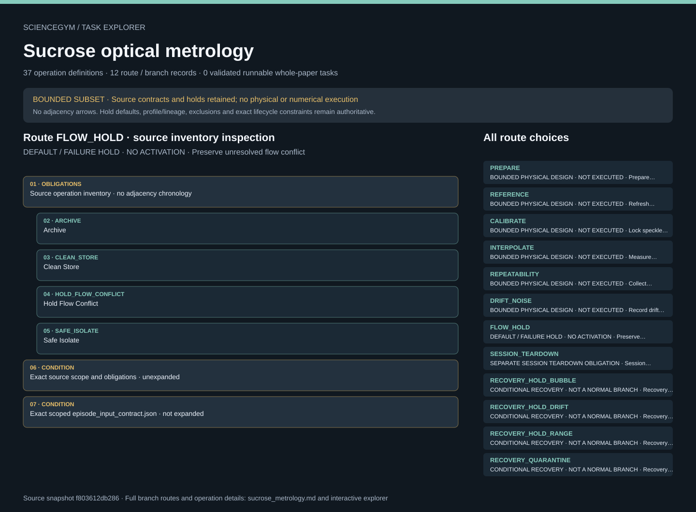

# Sucrose optical metrology: task route map



Paper: **Speckle-based measurement of the fractional azimuthal index of orbital angular momentum beams for refractive index sensing** · [DOI](https://doi.org/10.1038/s41467-026-72281-3)

BOUNDED SUBSET · Read-only author/evaluator reference; no actor loader, task runner, solver, physical simulation, hardware activation or scientific reproduction. Membership is not chronology; exact source contracts remain authoritative. BOUNDED NONBIOLOGICAL SUBSET; not a complete whole-paper design. Default FLOW_HOLD preserves the unresolved 40x flow conflict; no pump setting is chosen or averaged. Three optical profiles and the 589.29 nm reference remain distinct. Cartridge retention, calibration revisions, session teardown, immutable sample/reference/frame lineage and excluded biological scope remain explicit. Main Figs 2-4 pixels and raw source data remain uninspected. No open-beam operation or numerical PCA execution.. Counts describe task representation, not experiments or success.

**Reading rule:** rows show unordered source inventory for inspection. Exact phase, lifecycle and dependency contracts remain authoritative; no loop, specimen, condition or chronology is inferred. An unordered obligation group has no inferred chronological edges. Source-reported scientific facts and authored handling are distinct.

[Immutable source task package](https://github.com/openags/ScienceGym/blob/f803612db28652d2e2dd574d8039c36b7136f399/tasks/sucrose_metrology_operations_v2/) · [Interactive inspector](../index.html)

## PREPARE — BOUNDED PHYSICAL DESIGN · NOT EXECUTED · Prepare aqueous standards

Read-only author/evaluator reference; no actor loader, task runner, solver, physical simulation, hardware activation or scientific reproduction. Membership is not chronology; exact source contracts remain authoritative.

[Exact route source](https://github.com/openags/ScienceGym/blob/f803612db28652d2e2dd574d8039c36b7136f399/tasks/sucrose_metrology_operations_v2/branches.json) · JSON pointer: `/branches/0`

- **OBLIGATIONS: Source operation inventory · no adjacency chronology**
  - Binding: {"order":"Inspection membership only. Conditional recovery remains conditional; exact lifecycle and source causal constraints remain authoritative.","membership_source":"Exact source operation_ids"}
  - `ARCHIVE` Archive
  - `CLEAN_STORE` Clean Store
  - `FILTER` Filter
  - `LABEL_CAP` Label Cap
  - `MIX` Mix
  - `RECORD_CUSTODY` Record Custody
  - `TARE` Tare
  - `VERIFY_MATERIAL` Verify Material
  - `WEIGH` Weigh
- **CONDITION: Exact source scope and obligations · unexpanded**
  - Binding: {"source_file":"branches.json","source_pointer":"/branches/0","source_contract":{"id":"PREPARE","title":"Prepare aqueous standards","depends_on":[],"source_evidence_ids":["E01"],"operation_ids":["ARCHIVE","CLEAN_STORE","FILTER","LABEL_CAP","MIX","RECORD_CUSTODY","TARE","VERIFY_MATERIAL","WEIGH"],"unknown_parameter_ids":["U_FILTER","U_STANDARD_LABELS","U_CUSTODY","U_CLEANUP"],"branch_type":"authored_bounded_nonbiological_design","physical_execution_implemented":false,"whole_paper_complete":false}}
- **CONDITION: Exact scoped episode_input_contract.json · not expanded**
  - Binding: {"source_file":"episode_input_contract.json","source_pointer":"","source_contract":{"schema_version":"sucrose_metrology_task.v1","doi":"10.1038/s41467-026-72281-3","mode":"synthetic_contract_only","selected_branches":"Nonempty unique list; dependencies closed topologically","profiles":["SPP2_1064","SPP5_1064","SPP5_532"],"flow":"Either safe-held branch with no service clearance or fixture-only qualified-service card; source conflict always unresolved","production_authority":false}}

<details><summary>Branch state, choices, lineage and loop obligations</summary>

```json
{
  "id": "PREPARE",
  "title": "Prepare aqueous standards",
  "depends_on": [],
  "source_evidence_ids": [
    "E01"
  ],
  "operation_ids": [
    "ARCHIVE",
    "CLEAN_STORE",
    "FILTER",
    "LABEL_CAP",
    "MIX",
    "RECORD_CUSTODY",
    "TARE",
    "VERIFY_MATERIAL",
    "WEIGH"
  ],
  "unknown_parameter_ids": [
    "U_FILTER",
    "U_STANDARD_LABELS",
    "U_CUSTODY",
    "U_CLEANUP"
  ],
  "branch_type": "authored_bounded_nonbiological_design",
  "physical_execution_implemented": false,
  "whole_paper_complete": false
}
```

</details>

## REFERENCE — BOUNDED PHYSICAL DESIGN · NOT EXECUTED · Refresh reference measurements

Read-only author/evaluator reference; no actor loader, task runner, solver, physical simulation, hardware activation or scientific reproduction. Membership is not chronology; exact source contracts remain authoritative.

[Exact route source](https://github.com/openags/ScienceGym/blob/f803612db28652d2e2dd574d8039c36b7136f399/tasks/sucrose_metrology_operations_v2/branches.json) · JSON pointer: `/branches/1`

- **OBLIGATIONS: Source operation inventory · no adjacency chronology**
  - Binding: {"order":"Inspection membership only. Conditional recovery remains conditional; exact lifecycle and source causal constraints remain authoritative.","membership_source":"Exact source operation_ids"}
  - `ARCHIVE` Archive
  - `CHECK_REFERENCE` Check Reference
  - `CLEAN_REFERENCE` Clean Reference
  - `CLEAN_STORE` Clean Store
  - `PRESENT_REFERENCE` Present Reference
  - `READ_REFERENCE` Read Reference
  - `RECORD_CUSTODY` Record Custody
- **CONDITION: Exact source scope and obligations · unexpanded**
  - Binding: {"source_file":"branches.json","source_pointer":"/branches/1","source_contract":{"id":"REFERENCE","title":"Refresh reference measurements","depends_on":["PREPARE"],"source_evidence_ids":["E01","E02"],"operation_ids":["ARCHIVE","CHECK_REFERENCE","CLEAN_REFERENCE","CLEAN_STORE","PRESENT_REFERENCE","READ_REFERENCE","RECORD_CUSTODY"],"unknown_parameter_ids":["U_REFERENCE","U_CUSTODY","U_CLEANUP"],"branch_type":"authored_bounded_nonbiological_design","physical_execution_implemented":false,"whole_paper_complete":false}}
- **CONDITION: Exact scoped episode_input_contract.json · not expanded**
  - Binding: {"source_file":"episode_input_contract.json","source_pointer":"","source_contract":{"schema_version":"sucrose_metrology_task.v1","doi":"10.1038/s41467-026-72281-3","mode":"synthetic_contract_only","selected_branches":"Nonempty unique list; dependencies closed topologically","profiles":["SPP2_1064","SPP5_1064","SPP5_532"],"flow":"Either safe-held branch with no service clearance or fixture-only qualified-service card; source conflict always unresolved","production_authority":false}}

<details><summary>Branch state, choices, lineage and loop obligations</summary>

```json
{
  "id": "REFERENCE",
  "title": "Refresh reference measurements",
  "depends_on": [
    "PREPARE"
  ],
  "source_evidence_ids": [
    "E01",
    "E02"
  ],
  "operation_ids": [
    "ARCHIVE",
    "CHECK_REFERENCE",
    "CLEAN_REFERENCE",
    "CLEAN_STORE",
    "PRESENT_REFERENCE",
    "READ_REFERENCE",
    "RECORD_CUSTODY"
  ],
  "unknown_parameter_ids": [
    "U_REFERENCE",
    "U_CUSTODY",
    "U_CLEANUP"
  ],
  "branch_type": "authored_bounded_nonbiological_design",
  "physical_execution_implemented": false,
  "whole_paper_complete": false
}
```

</details>

## CALIBRATE — BOUNDED PHYSICAL DESIGN · NOT EXECUTED · Lock speckle calibration

Read-only author/evaluator reference; no actor loader, task runner, solver, physical simulation, hardware activation or scientific reproduction. Membership is not chronology; exact source contracts remain authoritative.

[Exact route source](https://github.com/openags/ScienceGym/blob/f803612db28652d2e2dd574d8039c36b7136f399/tasks/sucrose_metrology_operations_v2/branches.json) · JSON pointer: `/branches/2`

- **OBLIGATIONS: Source operation inventory · no adjacency chronology**
  - Binding: {"order":"Inspection membership only. Conditional recovery remains conditional; exact lifecycle and source causal constraints remain authoritative.","membership_source":"Exact source operation_ids"}
  - `ARCHIVE` Archive
  - `CLAMP` Clamp
  - `DOCK_CARTRIDGE` Dock Cartridge
  - `FREEZE_CALIBRATION` Freeze Calibration
  - `OBSERVE_BUBBLES` Observe Bubbles
  - `READ_PAIR` Read Pair
  - `REQUEST_ACQUISITION` Request Acquisition
  - `SERVICE_EXCHANGE` Service Exchange
  - `SWITCH_SAMPLE` Switch Sample
  - `VERIFY_CARTRIDGE` Verify Cartridge
  - `VERIFY_CLAMP` Verify Clamp
  - `VERIFY_ENCLOSURE` Verify Enclosure
- **CONDITION: Exact source scope and obligations · unexpanded**
  - Binding: {"source_file":"branches.json","source_pointer":"/branches/2","source_contract":{"id":"CALIBRATE","title":"Lock speckle calibration","depends_on":["REFERENCE"],"source_evidence_ids":["E02","E03","E04"],"operation_ids":["ARCHIVE","CLAMP","DOCK_CARTRIDGE","FREEZE_CALIBRATION","OBSERVE_BUBBLES","READ_PAIR","REQUEST_ACQUISITION","SERVICE_EXCHANGE","SWITCH_SAMPLE","VERIFY_CARTRIDGE","VERIFY_CLAMP","VERIFY_ENCLOSURE"],"unknown_parameter_ids":["U_FLOW","U_EXCHANGE","U_GEOMETRY","U_ENCLOSURE","U_REFERENCE","U_FILTER","U_STANDARD_LABELS","U_CAMERA","U_ANALYSIS","U_CUSTODY","U_CLEANUP","U_AUTHORITY"],"branch_type":"authored_bounded_nonbiological_design","physical_execution_implemented":false,"whole_paper_complete":false,"session_teardown_operation_ids":["SAFE_ISOLATE","INVALIDATE_CALIBRATION","UNDOCK","INSPECT","ARCHIVE","CLEAN_STORE"]}}
- **CONDITION: Exact scoped episode_input_contract.json · not expanded**
  - Binding: {"source_file":"episode_input_contract.json","source_pointer":"","source_contract":{"schema_version":"sucrose_metrology_task.v1","doi":"10.1038/s41467-026-72281-3","mode":"synthetic_contract_only","selected_branches":"Nonempty unique list; dependencies closed topologically","profiles":["SPP2_1064","SPP5_1064","SPP5_532"],"flow":"Either safe-held branch with no service clearance or fixture-only qualified-service card; source conflict always unresolved","production_authority":false}}

<details><summary>Branch state, choices, lineage and loop obligations</summary>

```json
{
  "id": "CALIBRATE",
  "title": "Lock speckle calibration",
  "depends_on": [
    "REFERENCE"
  ],
  "source_evidence_ids": [
    "E02",
    "E03",
    "E04"
  ],
  "operation_ids": [
    "ARCHIVE",
    "CLAMP",
    "DOCK_CARTRIDGE",
    "FREEZE_CALIBRATION",
    "OBSERVE_BUBBLES",
    "READ_PAIR",
    "REQUEST_ACQUISITION",
    "SERVICE_EXCHANGE",
    "SWITCH_SAMPLE",
    "VERIFY_CARTRIDGE",
    "VERIFY_CLAMP",
    "VERIFY_ENCLOSURE"
  ],
  "unknown_parameter_ids": [
    "U_FLOW",
    "U_EXCHANGE",
    "U_GEOMETRY",
    "U_ENCLOSURE",
    "U_REFERENCE",
    "U_FILTER",
    "U_STANDARD_LABELS",
    "U_CAMERA",
    "U_ANALYSIS",
    "U_CUSTODY",
    "U_CLEANUP",
    "U_AUTHORITY"
  ],
  "branch_type": "authored_bounded_nonbiological_design",
  "physical_execution_implemented": false,
  "whole_paper_complete": false,
  "session_teardown_operation_ids": [
    "SAFE_ISOLATE",
    "INVALIDATE_CALIBRATION",
    "UNDOCK",
    "INSPECT",
    "ARCHIVE",
    "CLEAN_STORE"
  ]
}
```

</details>

## INTERPOLATE — BOUNDED PHYSICAL DESIGN · NOT EXECUTED · Measure held-out sucrose

Read-only author/evaluator reference; no actor loader, task runner, solver, physical simulation, hardware activation or scientific reproduction. Membership is not chronology; exact source contracts remain authoritative.

[Exact route source](https://github.com/openags/ScienceGym/blob/f803612db28652d2e2dd574d8039c36b7136f399/tasks/sucrose_metrology_operations_v2/branches.json) · JSON pointer: `/branches/3`

- **OBLIGATIONS: Source operation inventory · no adjacency chronology**
  - Binding: {"order":"Inspection membership only. Conditional recovery remains conditional; exact lifecycle and source causal constraints remain authoritative.","membership_source":"Exact source operation_ids"}
  - `ARCHIVE` Archive
  - `BIND_RECORDS` Bind Records
  - `CLAMP` Clamp
  - `OBSERVE_BUBBLES` Observe Bubbles
  - `READ_PAIR` Read Pair
  - `REQUEST_ACQUISITION` Request Acquisition
  - `SERVICE_EXCHANGE` Service Exchange
  - `SWITCH_SAMPLE` Switch Sample
  - `VERIFY_CLAMP` Verify Clamp
- **CONDITION: Exact source scope and obligations · unexpanded**
  - Binding: {"source_file":"branches.json","source_pointer":"/branches/3","source_contract":{"id":"INTERPOLATE","title":"Measure held-out sucrose","depends_on":["CALIBRATE"],"source_evidence_ids":["E02","E03","E04"],"operation_ids":["ARCHIVE","BIND_RECORDS","CLAMP","OBSERVE_BUBBLES","READ_PAIR","REQUEST_ACQUISITION","SERVICE_EXCHANGE","SWITCH_SAMPLE","VERIFY_CLAMP"],"unknown_parameter_ids":["U_FLOW","U_EXCHANGE","U_GEOMETRY","U_ENCLOSURE","U_REFERENCE","U_FILTER","U_STANDARD_LABELS","U_CAMERA","U_ANALYSIS","U_CUSTODY","U_CLEANUP","U_AUTHORITY"],"branch_type":"authored_bounded_nonbiological_design","physical_execution_implemented":false,"whole_paper_complete":false,"session_teardown_operation_ids":["SAFE_ISOLATE","INVALIDATE_CALIBRATION","UNDOCK","INSPECT","ARCHIVE","CLEAN_STORE"]}}
- **CONDITION: Exact scoped episode_input_contract.json · not expanded**
  - Binding: {"source_file":"episode_input_contract.json","source_pointer":"","source_contract":{"schema_version":"sucrose_metrology_task.v1","doi":"10.1038/s41467-026-72281-3","mode":"synthetic_contract_only","selected_branches":"Nonempty unique list; dependencies closed topologically","profiles":["SPP2_1064","SPP5_1064","SPP5_532"],"flow":"Either safe-held branch with no service clearance or fixture-only qualified-service card; source conflict always unresolved","production_authority":false}}

<details><summary>Branch state, choices, lineage and loop obligations</summary>

```json
{
  "id": "INTERPOLATE",
  "title": "Measure held-out sucrose",
  "depends_on": [
    "CALIBRATE"
  ],
  "source_evidence_ids": [
    "E02",
    "E03",
    "E04"
  ],
  "operation_ids": [
    "ARCHIVE",
    "BIND_RECORDS",
    "CLAMP",
    "OBSERVE_BUBBLES",
    "READ_PAIR",
    "REQUEST_ACQUISITION",
    "SERVICE_EXCHANGE",
    "SWITCH_SAMPLE",
    "VERIFY_CLAMP"
  ],
  "unknown_parameter_ids": [
    "U_FLOW",
    "U_EXCHANGE",
    "U_GEOMETRY",
    "U_ENCLOSURE",
    "U_REFERENCE",
    "U_FILTER",
    "U_STANDARD_LABELS",
    "U_CAMERA",
    "U_ANALYSIS",
    "U_CUSTODY",
    "U_CLEANUP",
    "U_AUTHORITY"
  ],
  "branch_type": "authored_bounded_nonbiological_design",
  "physical_execution_implemented": false,
  "whole_paper_complete": false,
  "session_teardown_operation_ids": [
    "SAFE_ISOLATE",
    "INVALIDATE_CALIBRATION",
    "UNDOCK",
    "INSPECT",
    "ARCHIVE",
    "CLEAN_STORE"
  ]
}
```

</details>

## REPEATABILITY — BOUNDED PHYSICAL DESIGN · NOT EXECUTED · Collect same-sample repeats

Read-only author/evaluator reference; no actor loader, task runner, solver, physical simulation, hardware activation or scientific reproduction. Membership is not chronology; exact source contracts remain authoritative.

[Exact route source](https://github.com/openags/ScienceGym/blob/f803612db28652d2e2dd574d8039c36b7136f399/tasks/sucrose_metrology_operations_v2/branches.json) · JSON pointer: `/branches/4`

- **OBLIGATIONS: Source operation inventory · no adjacency chronology**
  - Binding: {"order":"Inspection membership only. Conditional recovery remains conditional; exact lifecycle and source causal constraints remain authoritative.","membership_source":"Exact source operation_ids"}
  - `ARCHIVE` Archive
  - `BIND_RECORDS` Bind Records
  - `CLAMP` Clamp
  - `OBSERVE_BUBBLES` Observe Bubbles
  - `READ_PAIR` Read Pair
  - `REQUEST_ACQUISITION` Request Acquisition
  - `SERVICE_EXCHANGE` Service Exchange
  - `SWITCH_SAMPLE` Switch Sample
  - `VERIFY_CLAMP` Verify Clamp
- **CONDITION: Exact source scope and obligations · unexpanded**
  - Binding: {"source_file":"branches.json","source_pointer":"/branches/4","source_contract":{"id":"REPEATABILITY","title":"Collect same-sample repeats","depends_on":["CALIBRATE"],"source_evidence_ids":["E02","E06"],"operation_ids":["ARCHIVE","BIND_RECORDS","CLAMP","OBSERVE_BUBBLES","READ_PAIR","REQUEST_ACQUISITION","SERVICE_EXCHANGE","SWITCH_SAMPLE","VERIFY_CLAMP"],"unknown_parameter_ids":["U_FLOW","U_EXCHANGE","U_GEOMETRY","U_ENCLOSURE","U_REFERENCE","U_FILTER","U_STANDARD_LABELS","U_CAMERA","U_ANALYSIS","U_CUSTODY","U_CLEANUP","U_AUTHORITY"],"branch_type":"authored_bounded_nonbiological_design","physical_execution_implemented":false,"whole_paper_complete":false,"session_teardown_operation_ids":["SAFE_ISOLATE","INVALIDATE_CALIBRATION","UNDOCK","INSPECT","ARCHIVE","CLEAN_STORE"]}}
- **CONDITION: Exact scoped episode_input_contract.json · not expanded**
  - Binding: {"source_file":"episode_input_contract.json","source_pointer":"","source_contract":{"schema_version":"sucrose_metrology_task.v1","doi":"10.1038/s41467-026-72281-3","mode":"synthetic_contract_only","selected_branches":"Nonempty unique list; dependencies closed topologically","profiles":["SPP2_1064","SPP5_1064","SPP5_532"],"flow":"Either safe-held branch with no service clearance or fixture-only qualified-service card; source conflict always unresolved","production_authority":false}}

<details><summary>Branch state, choices, lineage and loop obligations</summary>

```json
{
  "id": "REPEATABILITY",
  "title": "Collect same-sample repeats",
  "depends_on": [
    "CALIBRATE"
  ],
  "source_evidence_ids": [
    "E02",
    "E06"
  ],
  "operation_ids": [
    "ARCHIVE",
    "BIND_RECORDS",
    "CLAMP",
    "OBSERVE_BUBBLES",
    "READ_PAIR",
    "REQUEST_ACQUISITION",
    "SERVICE_EXCHANGE",
    "SWITCH_SAMPLE",
    "VERIFY_CLAMP"
  ],
  "unknown_parameter_ids": [
    "U_FLOW",
    "U_EXCHANGE",
    "U_GEOMETRY",
    "U_ENCLOSURE",
    "U_REFERENCE",
    "U_FILTER",
    "U_STANDARD_LABELS",
    "U_CAMERA",
    "U_ANALYSIS",
    "U_CUSTODY",
    "U_CLEANUP",
    "U_AUTHORITY"
  ],
  "branch_type": "authored_bounded_nonbiological_design",
  "physical_execution_implemented": false,
  "whole_paper_complete": false,
  "session_teardown_operation_ids": [
    "SAFE_ISOLATE",
    "INVALIDATE_CALIBRATION",
    "UNDOCK",
    "INSPECT",
    "ARCHIVE",
    "CLEAN_STORE"
  ]
}
```

</details>

## DRIFT_NOISE — BOUNDED PHYSICAL DESIGN · NOT EXECUTED · Record drift and dark frames

Read-only author/evaluator reference; no actor loader, task runner, solver, physical simulation, hardware activation or scientific reproduction. Membership is not chronology; exact source contracts remain authoritative.

[Exact route source](https://github.com/openags/ScienceGym/blob/f803612db28652d2e2dd574d8039c36b7136f399/tasks/sucrose_metrology_operations_v2/branches.json) · JSON pointer: `/branches/5`

- **OBLIGATIONS: Source operation inventory · no adjacency chronology**
  - Binding: {"order":"Inspection membership only. Conditional recovery remains conditional; exact lifecycle and source causal constraints remain authoritative.","membership_source":"Exact source operation_ids"}
  - `ARCHIVE` Archive
  - `BIND_RECORDS` Bind Records
  - `LOG_TEMPERATURE` Log Temperature
  - `READ_DARK` Read Dark
  - `REQUEST_DARK` Request Dark
- **CONDITION: Exact source scope and obligations · unexpanded**
  - Binding: {"source_file":"branches.json","source_pointer":"/branches/5","source_contract":{"id":"DRIFT_NOISE","title":"Record drift and dark frames","depends_on":["CALIBRATE"],"source_evidence_ids":["E04","E05"],"operation_ids":["ARCHIVE","BIND_RECORDS","LOG_TEMPERATURE","READ_DARK","REQUEST_DARK"],"unknown_parameter_ids":["U_FLOW","U_EXCHANGE","U_GEOMETRY","U_ENCLOSURE","U_REFERENCE","U_FILTER","U_STANDARD_LABELS","U_CAMERA","U_ANALYSIS","U_CUSTODY","U_CLEANUP","U_AUTHORITY"],"branch_type":"authored_bounded_nonbiological_design","physical_execution_implemented":false,"whole_paper_complete":false,"session_teardown_operation_ids":["SAFE_ISOLATE","INVALIDATE_CALIBRATION","UNDOCK","INSPECT","ARCHIVE","CLEAN_STORE"]}}
- **CONDITION: Exact scoped episode_input_contract.json · not expanded**
  - Binding: {"source_file":"episode_input_contract.json","source_pointer":"","source_contract":{"schema_version":"sucrose_metrology_task.v1","doi":"10.1038/s41467-026-72281-3","mode":"synthetic_contract_only","selected_branches":"Nonempty unique list; dependencies closed topologically","profiles":["SPP2_1064","SPP5_1064","SPP5_532"],"flow":"Either safe-held branch with no service clearance or fixture-only qualified-service card; source conflict always unresolved","production_authority":false}}

<details><summary>Branch state, choices, lineage and loop obligations</summary>

```json
{
  "id": "DRIFT_NOISE",
  "title": "Record drift and dark frames",
  "depends_on": [
    "CALIBRATE"
  ],
  "source_evidence_ids": [
    "E04",
    "E05"
  ],
  "operation_ids": [
    "ARCHIVE",
    "BIND_RECORDS",
    "LOG_TEMPERATURE",
    "READ_DARK",
    "REQUEST_DARK"
  ],
  "unknown_parameter_ids": [
    "U_FLOW",
    "U_EXCHANGE",
    "U_GEOMETRY",
    "U_ENCLOSURE",
    "U_REFERENCE",
    "U_FILTER",
    "U_STANDARD_LABELS",
    "U_CAMERA",
    "U_ANALYSIS",
    "U_CUSTODY",
    "U_CLEANUP",
    "U_AUTHORITY"
  ],
  "branch_type": "authored_bounded_nonbiological_design",
  "physical_execution_implemented": false,
  "whole_paper_complete": false,
  "session_teardown_operation_ids": [
    "SAFE_ISOLATE",
    "INVALIDATE_CALIBRATION",
    "UNDOCK",
    "INSPECT",
    "ARCHIVE",
    "CLEAN_STORE"
  ]
}
```

</details>

## FLOW_HOLD — DEFAULT / FAILURE HOLD · NO ACTIVATION · Preserve unresolved flow conflict

Read-only author/evaluator reference; no actor loader, task runner, solver, physical simulation, hardware activation or scientific reproduction. Membership is not chronology; exact source contracts remain authoritative.

[Exact route source](https://github.com/openags/ScienceGym/blob/f803612db28652d2e2dd574d8039c36b7136f399/tasks/sucrose_metrology_operations_v2/branches.json) · JSON pointer: `/branches/6`

- **OBLIGATIONS: Source operation inventory · no adjacency chronology**
  - Binding: {"order":"Inspection membership only. Conditional recovery remains conditional; exact lifecycle and source causal constraints remain authoritative.","membership_source":"Exact source operation_ids"}
  - `ARCHIVE` Archive
  - `CLEAN_STORE` Clean Store
  - `HOLD_FLOW_CONFLICT` Hold Flow Conflict
  - `SAFE_ISOLATE` Safe Isolate
- **CONDITION: Exact source scope and obligations · unexpanded**
  - Binding: {"source_file":"branches.json","source_pointer":"/branches/6","source_contract":{"id":"FLOW_HOLD","title":"Preserve unresolved flow conflict","depends_on":[],"source_evidence_ids":["E03"],"operation_ids":["ARCHIVE","CLEAN_STORE","HOLD_FLOW_CONFLICT","SAFE_ISOLATE"],"unknown_parameter_ids":["U_FLOW"],"branch_type":"authored_bounded_nonbiological_design","physical_execution_implemented":false,"whole_paper_complete":false}}
- **CONDITION: Exact scoped episode_input_contract.json · not expanded**
  - Binding: {"source_file":"episode_input_contract.json","source_pointer":"","source_contract":{"schema_version":"sucrose_metrology_task.v1","doi":"10.1038/s41467-026-72281-3","mode":"synthetic_contract_only","selected_branches":"Nonempty unique list; dependencies closed topologically","profiles":["SPP2_1064","SPP5_1064","SPP5_532"],"flow":"Either safe-held branch with no service clearance or fixture-only qualified-service card; source conflict always unresolved","production_authority":false}}

<details><summary>Branch state, choices, lineage and loop obligations</summary>

```json
{
  "id": "FLOW_HOLD",
  "title": "Preserve unresolved flow conflict",
  "depends_on": [],
  "source_evidence_ids": [
    "E03"
  ],
  "operation_ids": [
    "ARCHIVE",
    "CLEAN_STORE",
    "HOLD_FLOW_CONFLICT",
    "SAFE_ISOLATE"
  ],
  "unknown_parameter_ids": [
    "U_FLOW"
  ],
  "branch_type": "authored_bounded_nonbiological_design",
  "physical_execution_implemented": false,
  "whole_paper_complete": false
}
```

</details>

## SESSION_TEARDOWN — SEPARATE SESSION TEARDOWN OBLIGATION · Session Teardown

Read-only author/evaluator reference; no actor loader, task runner, solver, physical simulation, hardware activation or scientific reproduction. Membership is not chronology; exact source contracts remain authoritative.

[Exact route source](https://github.com/openags/ScienceGym/blob/f803612db28652d2e2dd574d8039c36b7136f399/tasks/sucrose_metrology_operations_v2/branches.json) · JSON pointer: `/branches/2/session_teardown_operation_ids`

- **OBLIGATIONS: Source operation inventory · no adjacency chronology**
  - Binding: {"order":"Inspection membership only. Conditional recovery remains conditional; exact lifecycle and source causal constraints remain authoritative.","membership_source":"Separate source session teardown; never appended to each measurement branch"}
  - `SAFE_ISOLATE` Safe Isolate
  - `INVALIDATE_CALIBRATION` Invalidate Calibration
  - `UNDOCK` Undock
  - `INSPECT` Inspect
  - `ARCHIVE` Archive
  - `CLEAN_STORE` Clean Store
- **CONDITION: Exact source scope and obligations · unexpanded**
  - Binding: {"source_file":"branches.json","source_pointer":"/branches/2/session_teardown_operation_ids","source_contract":["SAFE_ISOLATE","INVALIDATE_CALIBRATION","UNDOCK","INSPECT","ARCHIVE","CLEAN_STORE"]}

<details><summary>Branch state, choices, lineage and loop obligations</summary>

```json
{
  "source_record": [
    "SAFE_ISOLATE",
    "INVALIDATE_CALIBRATION",
    "UNDOCK",
    "INSPECT",
    "ARCHIVE",
    "CLEAN_STORE"
  ]
}
```

</details>

## RECOVERY_HOLD_BUBBLE — CONDITIONAL RECOVERY · NOT A NORMAL BRANCH · Recovery Hold Bubble

Read-only author/evaluator reference; no actor loader, task runner, solver, physical simulation, hardware activation or scientific reproduction. Membership is not chronology; exact source contracts remain authoritative.

[Exact route source](https://github.com/openags/ScienceGym/blob/f803612db28652d2e2dd574d8039c36b7136f399/tasks/sucrose_metrology_operations_v2/operations.json) · JSON pointer: `/operations/9`

- **OBLIGATIONS: Source operation inventory · no adjacency chronology**
  - Binding: {"order":"Inspection membership only. Conditional recovery remains conditional; exact lifecycle and source causal constraints remain authoritative.","membership_source":"Operation-level conditional recovery contract; no mandatory branch placement inferred"}
  - `HOLD_BUBBLE` Hold Bubble
- **CONDITION: Exact source scope and obligations · unexpanded**
  - Binding: {"source_file":"operations.json","source_pointer":"/operations/9","source_contract":{"id":"HOLD_BUBBLE","asset_ids":["A_HOLD_PANEL"],"origin":"authored_robot_service_interface","device_command_implemented":false,"guard":"Current identity, qualified service state and custody; unknown or conflicting state holds","failure":"Preserve receipt; quarantine affected sample; do not continue dependent acquisition","precondition":"Current bound identity and qualified input","required_output":"Independent record with immutable attempt and custody"}}

<details><summary>Branch state, choices, lineage and loop obligations</summary>

```json
{
  "id": "HOLD_BUBBLE",
  "asset_ids": [
    "A_HOLD_PANEL"
  ],
  "origin": "authored_robot_service_interface",
  "device_command_implemented": false,
  "guard": "Current identity, qualified service state and custody; unknown or conflicting state holds",
  "failure": "Preserve receipt; quarantine affected sample; do not continue dependent acquisition",
  "precondition": "Current bound identity and qualified input",
  "required_output": "Independent record with immutable attempt and custody"
}
```

</details>

## RECOVERY_HOLD_DRIFT — CONDITIONAL RECOVERY · NOT A NORMAL BRANCH · Recovery Hold Drift

Read-only author/evaluator reference; no actor loader, task runner, solver, physical simulation, hardware activation or scientific reproduction. Membership is not chronology; exact source contracts remain authoritative.

[Exact route source](https://github.com/openags/ScienceGym/blob/f803612db28652d2e2dd574d8039c36b7136f399/tasks/sucrose_metrology_operations_v2/operations.json) · JSON pointer: `/operations/10`

- **OBLIGATIONS: Source operation inventory · no adjacency chronology**
  - Binding: {"order":"Inspection membership only. Conditional recovery remains conditional; exact lifecycle and source causal constraints remain authoritative.","membership_source":"Operation-level conditional recovery contract; no mandatory branch placement inferred"}
  - `HOLD_DRIFT` Hold Drift
- **CONDITION: Exact source scope and obligations · unexpanded**
  - Binding: {"source_file":"operations.json","source_pointer":"/operations/10","source_contract":{"id":"HOLD_DRIFT","asset_ids":["A_HOLD_PANEL"],"origin":"authored_robot_service_interface","device_command_implemented":false,"guard":"Current identity, qualified service state and custody; unknown or conflicting state holds","failure":"Preserve receipt; quarantine affected sample; do not continue dependent acquisition","precondition":"Current bound identity and qualified input","required_output":"Independent record with immutable attempt and custody"}}

<details><summary>Branch state, choices, lineage and loop obligations</summary>

```json
{
  "id": "HOLD_DRIFT",
  "asset_ids": [
    "A_HOLD_PANEL"
  ],
  "origin": "authored_robot_service_interface",
  "device_command_implemented": false,
  "guard": "Current identity, qualified service state and custody; unknown or conflicting state holds",
  "failure": "Preserve receipt; quarantine affected sample; do not continue dependent acquisition",
  "precondition": "Current bound identity and qualified input",
  "required_output": "Independent record with immutable attempt and custody"
}
```

</details>

## RECOVERY_HOLD_RANGE — CONDITIONAL RECOVERY · NOT A NORMAL BRANCH · Recovery Hold Range

Read-only author/evaluator reference; no actor loader, task runner, solver, physical simulation, hardware activation or scientific reproduction. Membership is not chronology; exact source contracts remain authoritative.

[Exact route source](https://github.com/openags/ScienceGym/blob/f803612db28652d2e2dd574d8039c36b7136f399/tasks/sucrose_metrology_operations_v2/operations.json) · JSON pointer: `/operations/12`

- **OBLIGATIONS: Source operation inventory · no adjacency chronology**
  - Binding: {"order":"Inspection membership only. Conditional recovery remains conditional; exact lifecycle and source causal constraints remain authoritative.","membership_source":"Operation-level conditional recovery contract; no mandatory branch placement inferred"}
  - `HOLD_RANGE` Hold Range
- **CONDITION: Exact source scope and obligations · unexpanded**
  - Binding: {"source_file":"operations.json","source_pointer":"/operations/12","source_contract":{"id":"HOLD_RANGE","asset_ids":["A_HOLD_PANEL"],"origin":"authored_robot_service_interface","device_command_implemented":false,"guard":"Current identity, qualified service state and custody; unknown or conflicting state holds","failure":"Preserve receipt; quarantine affected sample; do not continue dependent acquisition","precondition":"Current bound identity and qualified input","required_output":"Independent record with immutable attempt and custody"}}

<details><summary>Branch state, choices, lineage and loop obligations</summary>

```json
{
  "id": "HOLD_RANGE",
  "asset_ids": [
    "A_HOLD_PANEL"
  ],
  "origin": "authored_robot_service_interface",
  "device_command_implemented": false,
  "guard": "Current identity, qualified service state and custody; unknown or conflicting state holds",
  "failure": "Preserve receipt; quarantine affected sample; do not continue dependent acquisition",
  "precondition": "Current bound identity and qualified input",
  "required_output": "Independent record with immutable attempt and custody"
}
```

</details>

## RECOVERY_QUARANTINE — CONDITIONAL RECOVERY · NOT A NORMAL BRANCH · Recovery Quarantine

Read-only author/evaluator reference; no actor loader, task runner, solver, physical simulation, hardware activation or scientific reproduction. Membership is not chronology; exact source contracts remain authoritative.

[Exact route source](https://github.com/openags/ScienceGym/blob/f803612db28652d2e2dd574d8039c36b7136f399/tasks/sucrose_metrology_operations_v2/operations.json) · JSON pointer: `/operations/20`

- **OBLIGATIONS: Source operation inventory · no adjacency chronology**
  - Binding: {"order":"Inspection membership only. Conditional recovery remains conditional; exact lifecycle and source causal constraints remain authoritative.","membership_source":"Operation-level conditional recovery contract; no mandatory branch placement inferred"}
  - `QUARANTINE` Quarantine
- **CONDITION: Exact source scope and obligations · unexpanded**
  - Binding: {"source_file":"operations.json","source_pointer":"/operations/20","source_contract":{"id":"QUARANTINE","asset_ids":["A_HOLD_PANEL"],"origin":"authored_robot_service_interface","device_command_implemented":false,"guard":"Current identity, qualified service state and custody; unknown or conflicting state holds","failure":"Preserve receipt; quarantine affected sample; do not continue dependent acquisition","precondition":"Current bound identity and qualified input","required_output":"Independent record with immutable attempt and custody"}}

<details><summary>Branch state, choices, lineage and loop obligations</summary>

```json
{
  "id": "QUARANTINE",
  "asset_ids": [
    "A_HOLD_PANEL"
  ],
  "origin": "authored_robot_service_interface",
  "device_command_implemented": false,
  "guard": "Current identity, qualified service state and custody; unknown or conflicting state holds",
  "failure": "Preserve receipt; quarantine affected sample; do not continue dependent acquisition",
  "precondition": "Current bound identity and qualified input",
  "required_output": "Independent record with immutable attempt and custody"
}
```

</details>

## Operation contracts

Every operation is clickable in the offline inspector, with robot actions, target objects, pre/post state, provenance, unknowns and acceptance/recovery. Raw task JSON is the source of truth; this visualization is a public evaluator/reference view, not an agent prompt.

## Scope and exact source contracts

**BOUNDED SUBSET**

BOUNDED NONBIOLOGICAL SUBSET; not a complete whole-paper design. Default FLOW_HOLD preserves the unresolved 40x flow conflict; no pump setting is chosen or averaged. Three optical profiles and the 589.29 nm reference remain distinct. Cartridge retention, calibration revisions, session teardown, immutable sample/reference/frame lineage and excluded biological scope remain explicit. Main Figs 2-4 pixels and raw source data remain uninspected. No open-beam operation or numerical PCA execution.

Representation counts: {"bounded_physical_records": 6, "failure_hold_records": 1, "session_teardown_records": 1, "conditional_recovery_records": 4, "source_branches": 7, "source_json_documents": 28, "unresolved_input_groups": 12, "control_records": 8}.

Every source JSON document is retained losslessly. Operation details, source branches, preparation, controls, unknowns, exclusions, profiles, lineage and source audits are exact. Navigation labels are authored; missing fields remain explicit absence notices. Required output is an acceptance obligation, never observed state.

Inventories are unordered inspection membership. Separate teardown and conditional recovery views are not new scientific branches or mandatory normal steps. Source lifecycle ordering remains authoritative. Default hold selection never grants qualification or activates a device.

Existing original authored 3D assets and static renders only. These links do not implement interactive browser physics or physical execution.

- [Original 3D asset guide](https://github.com/openags/ScienceGym/blob/f803612db28652d2e2dd574d8039c36b7136f399/assets/sucrose_scene_assets_v1/README.md)
- [Static render: cartridge service](https://github.com/openags/ScienceGym/blob/f803612db28652d2e2dd574d8039c36b7136f399/assets/sucrose_scene_assets_v1/evidence/cartridge_service.png)
- [Static render: overview](https://github.com/openags/ScienceGym/blob/f803612db28652d2e2dd574d8039c36b7136f399/assets/sucrose_scene_assets_v1/evidence/overview.png)
- [Static render: volume lineage](https://github.com/openags/ScienceGym/blob/f803612db28652d2e2dd574d8039c36b7136f399/assets/sucrose_scene_assets_v1/evidence/volume_lineage.png)

### Immutable source JSON

- [EXPORT_ALLOWLIST.json](https://github.com/openags/ScienceGym/blob/f803612db28652d2e2dd574d8039c36b7136f399/tasks/sucrose_metrology_operations_v2/EXPORT_ALLOWLIST.json)
- [RELEASE_BOUNDARY.json](https://github.com/openags/ScienceGym/blob/f803612db28652d2e2dd574d8039c36b7136f399/tasks/sucrose_metrology_operations_v2/RELEASE_BOUNDARY.json)
- [STATUS.json](https://github.com/openags/ScienceGym/blob/f803612db28652d2e2dd574d8039c36b7136f399/tasks/sucrose_metrology_operations_v2/STATUS.json)
- [VERIFICATION.json](https://github.com/openags/ScienceGym/blob/f803612db28652d2e2dd574d8039c36b7136f399/tasks/sucrose_metrology_operations_v2/VERIFICATION.json)
- [adversarial_cases.json](https://github.com/openags/ScienceGym/blob/f803612db28652d2e2dd574d8039c36b7136f399/tasks/sucrose_metrology_operations_v2/adversarial_cases.json)
- [agent_visible.json](https://github.com/openags/ScienceGym/blob/f803612db28652d2e2dd574d8039c36b7136f399/tasks/sucrose_metrology_operations_v2/agent_visible.json)
- [analysis_contracts.json](https://github.com/openags/ScienceGym/blob/f803612db28652d2e2dd574d8039c36b7136f399/tasks/sucrose_metrology_operations_v2/analysis_contracts.json)
- [asset_binding_plan.json](https://github.com/openags/ScienceGym/blob/f803612db28652d2e2dd574d8039c36b7136f399/tasks/sucrose_metrology_operations_v2/asset_binding_plan.json)
- [branches.json](https://github.com/openags/ScienceGym/blob/f803612db28652d2e2dd574d8039c36b7136f399/tasks/sucrose_metrology_operations_v2/branches.json)
- [control_packages.json](https://github.com/openags/ScienceGym/blob/f803612db28652d2e2dd574d8039c36b7136f399/tasks/sucrose_metrology_operations_v2/control_packages.json)
- [coverage_matrix.json](https://github.com/openags/ScienceGym/blob/f803612db28652d2e2dd574d8039c36b7136f399/tasks/sucrose_metrology_operations_v2/coverage_matrix.json)
- [design_assumptions.json](https://github.com/openags/ScienceGym/blob/f803612db28652d2e2dd574d8039c36b7136f399/tasks/sucrose_metrology_operations_v2/design_assumptions.json)
- [episode_input_contract.json](https://github.com/openags/ScienceGym/blob/f803612db28652d2e2dd574d8039c36b7136f399/tasks/sucrose_metrology_operations_v2/episode_input_contract.json)
- [evaluator_reference.json](https://github.com/openags/ScienceGym/blob/f803612db28652d2e2dd574d8039c36b7136f399/tasks/sucrose_metrology_operations_v2/evaluator_reference.json)
- [evidence_map.json](https://github.com/openags/ScienceGym/blob/f803612db28652d2e2dd574d8039c36b7136f399/tasks/sucrose_metrology_operations_v2/evidence_map.json)
- [lineage_contract.json](https://github.com/openags/ScienceGym/blob/f803612db28652d2e2dd574d8039c36b7136f399/tasks/sucrose_metrology_operations_v2/lineage_contract.json)
- [material_cards.json](https://github.com/openags/ScienceGym/blob/f803612db28652d2e2dd574d8039c36b7136f399/tasks/sucrose_metrology_operations_v2/material_cards.json)
- [mock_contract.json](https://github.com/openags/ScienceGym/blob/f803612db28652d2e2dd574d8039c36b7136f399/tasks/sucrose_metrology_operations_v2/mock_contract.json)
- [nonmanual_scope.json](https://github.com/openags/ScienceGym/blob/f803612db28652d2e2dd574d8039c36b7136f399/tasks/sucrose_metrology_operations_v2/nonmanual_scope.json)
- [operations.json](https://github.com/openags/ScienceGym/blob/f803612db28652d2e2dd574d8039c36b7136f399/tasks/sucrose_metrology_operations_v2/operations.json)
- [preparation_routes.json](https://github.com/openags/ScienceGym/blob/f803612db28652d2e2dd574d8039c36b7136f399/tasks/sucrose_metrology_operations_v2/preparation_routes.json)
- [provenance.json](https://github.com/openags/ScienceGym/blob/f803612db28652d2e2dd574d8039c36b7136f399/tasks/sucrose_metrology_operations_v2/provenance.json)
- [review/audit.json](https://github.com/openags/ScienceGym/blob/f803612db28652d2e2dd574d8039c36b7136f399/tasks/sucrose_metrology_operations_v2/review/audit.json)
- [source_access_audit.json](https://github.com/openags/ScienceGym/blob/f803612db28652d2e2dd574d8039c36b7136f399/tasks/sucrose_metrology_operations_v2/source_access_audit.json)
- [source_conflicts.json](https://github.com/openags/ScienceGym/blob/f803612db28652d2e2dd574d8039c36b7136f399/tasks/sucrose_metrology_operations_v2/source_conflicts.json)
- [station_contracts.json](https://github.com/openags/ScienceGym/blob/f803612db28652d2e2dd574d8039c36b7136f399/tasks/sucrose_metrology_operations_v2/station_contracts.json)
- [transport_routes.json](https://github.com/openags/ScienceGym/blob/f803612db28652d2e2dd574d8039c36b7136f399/tasks/sucrose_metrology_operations_v2/transport_routes.json)
- [unknown_parameters.json](https://github.com/openags/ScienceGym/blob/f803612db28652d2e2dd574d8039c36b7136f399/tasks/sucrose_metrology_operations_v2/unknown_parameters.json)
