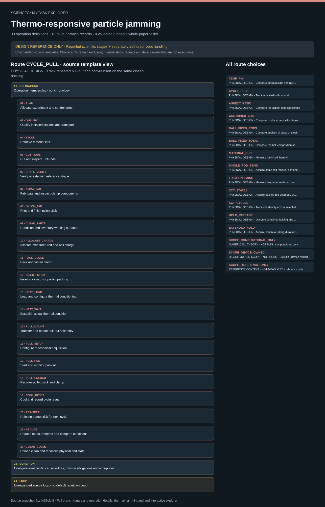

# Thermo-responsive particle jamming: task route map



Paper: **Thermo-responsive jamming by particle shape change** · [DOI](https://doi.org/10.1038/s41467-025-57475-5)

Author/evaluator design reference only; not an actor projection, task runner, solver, physical simulation or execution receipt. Missing inputs stay blocked. Preparation, device processes, measured data and numerical/reference scope remain distinct.. Counts describe task representation, not experiments or success.

**Reading rule:** rows retain the source display structure only. Membership has no inferred chronology. Where the source supplies a typed body, one unexpanded template is shown; no condition, trial or specimen count is inferred. An unordered obligation group has no inferred chronological edges. Source-reported scientific facts and authored handling are distinct.

[Immutable source task package](https://github.com/openags/ScienceGym/blob/41c4c52cfcf9d5b222404f2fd7ed9d6553f807cb/tasks/thermal_jamming_operations_v2/) · [Interactive inspector](../index.html)

## TEMP_PHI — PHYSICAL DESIGN · Compare thermal state and rod packing fraction

Author/evaluator design reference only; not an actor projection, task runner, solver, physical simulation or execution receipt. Missing inputs stay blocked. Preparation, device processes, measured data and numerical/reference scope remain distinct. Membership lists do not assert chronology. Source-declared typed sequence, choice, loop and dispatch scopes are displayed without selecting alternatives or instantiating counts.

[Exact route source](https://github.com/openags/ScienceGym/blob/41c4c52cfcf9d5b222404f2fd7ed9d6553f807cb/tasks/thermal_jamming_operations_v2/branches.json) · JSON pointer: `/configurations/0`

- **OBLIGATIONS: Operation membership · not chronology**
  - Binding: {"order":"Only source-declared causal edges and gates constrain order. Display adjacency is not an edge."}
  - `PLAN` Allocate experiment and control arms
  - `QUALIFY` Qualify installed stations and transport
  - `STOCK` Retrieve material lots
  - `CUT_RODS` Cut and inspect TiNi rods
  - `SHAPE_VERIFY` Verify or establish reference shape
  - `PMMA_FAB` Fabricate and inspect clamp components
  - `NYLON_FAB` Print and finish nylon stick
  - `CLEAN_PARTS` Condition and inventory working surfaces
  - `ALLOCATE_CHARGE` Allocate measured rod and ball charge
  - `PACK_CLOSE` Pack and fasten clamp
  - `INSERT_STICK` Insert stick into supported packing
  - `HEAT_LOAD` Load and configure thermal conditioning
  - `HEAT_WAIT` Establish actual thermal condition
  - `PULL_MOUNT` Transfer and mount pull-out assembly
  - `PULL_SETUP` Configure mechanical acquisition
  - `PULL_RUN` Start and monitor pull-out
  - `PULL_UNLOAD` Recover pulled stick and clamp
  - `COOL_RESET` Cool and record cycle reset
  - `REDUCE` Reduce measurements and compare conditions
  - `CLEAN_CLOSE` Unload clean and reconcile physical end state
- **CONDITION: Configuration-specific causal edges, transfer obligations and exceptions**
  - Binding: {"source_file":"dependencies.json","source_pointer":"/routes/0","source_contract":{"configuration_id":"TEMP_PHI","suggested_operation_ids":["PLAN","QUALIFY","STOCK","CUT_RODS","SHAPE_VERIFY","PMMA_FAB","NYLON_FAB","CLEAN_PARTS","ALLOCATE_CHARGE","PACK_CLOSE","INSERT_STICK","HEAT_LOAD","HEAT_WAIT","PULL_MOUNT","PULL_SETUP","PULL_RUN","PULL_UNLOAD","COOL_RESET","REDUCE","CLEAN_CLOSE"],"causal_edges":[["PLAN","QUALIFY"],["QUALIFY","STOCK"],["STOCK","CUT_RODS"],["CUT_RODS","SHAPE_VERIFY"],["SHAPE_VERIFY","PMMA_FAB"],["PMMA_FAB","NYLON_FAB"],["NYLON_FAB","CLEAN_PARTS"],["CLEAN_PARTS","ALLOCATE_CHARGE"],["ALLOCATE_CHARGE","PACK_CLOSE"],["PACK_CLOSE","INSERT_STICK"],["INSERT_STICK","HEAT_LOAD"],["HEAT_LOAD","HEAT_WAIT"],["HEAT_WAIT","PULL_MOUNT"],["PULL_MOUNT","PULL_SETUP"],["PULL_SETUP","PULL_RUN"],["PULL_RUN","PULL_UNLOAD"],["PULL_UNLOAD","COOL_RESET"],["COOL_RESET","REDUCE"],["REDUCE","CLEAN_CLOSE"]],"loop_contracts":[],"transport_edges":"Instantiate MOVE for each station change with observed custody and appropriate temperature constraints","optional_cold_arm":{"allowed_omissions":["HEAT_LOAD","HEAT_WAIT"],"condition":"A declared ambient control at the target low temperature; still requires actual temperature and safe transfer records"}}}

<details><summary>Branch state, choices, lineage and loop obligations</summary>

```json
{
  "id": "TEMP_PHI",
  "family": "Clamp force",
  "goal": "Compare thermal state and rod packing fraction",
  "operation_ids": [
    "PLAN",
    "QUALIFY",
    "STOCK",
    "CUT_RODS",
    "SHAPE_VERIFY",
    "PMMA_FAB",
    "NYLON_FAB",
    "CLEAN_PARTS",
    "ALLOCATE_CHARGE",
    "PACK_CLOSE",
    "INSERT_STICK",
    "HEAT_LOAD",
    "HEAT_WAIT",
    "PULL_MOUNT",
    "PULL_SETUP",
    "PULL_RUN",
    "PULL_UNLOAD",
    "COOL_RESET",
    "REDUCE",
    "CLEAN_CLOSE"
  ],
  "condition_contract": {
    "vary": [
      "temperature",
      "rod volume fraction"
    ],
    "fixture": "P_BASE_INNER and P_BASE_STICK",
    "grid": "Finite work order; no plot-derived grid invented",
    "fresh_vs_shared": "Every pull changes state; fresh independent packing or declared reuse must be allocated",
    "phase_map": "If selected, classify measured peak forces using P_JAM_THRESHOLD and the declared single-rod mass/gravity convention; do not reuse the published boundary as observed data"
  },
  "required_controls": [
    "C_COLD_HOT",
    "C_PHI",
    "C_THERMAL",
    "C_MECH",
    "C_REPLICATES"
  ],
  "source_refs": [
    "M_PULL",
    "M_TEMP"
  ],
  "required_unknowns": [
    "U_ALLOC",
    "U_ANALYSIS",
    "U_ASSETS",
    "U_BALLS",
    "U_CLEAN",
    "U_COOL",
    "U_CUT",
    "U_CYCLES",
    "U_DISPOSITION",
    "U_GEOMETRY",
    "U_HEAT",
    "U_HOT_TRANSFER",
    "U_LOTS",
    "U_NYLON_PRINT",
    "U_PACK",
    "U_PHI",
    "U_PMMA_FAB",
    "U_PROGRAM",
    "U_PULL"
  ],
  "implementation_status": "task_design_only_inputs_unresolved",
  "route_extensions": [],
  "outcome_rule": "Completion rewards actual preparation/custody/acquisition and truthful reporting, not matching a published force or trend."
}
```

</details>

## CYCLE_PULL — PHYSICAL DESIGN · Track repeated pull-out and cool/reinsert on the same closed packing

Author/evaluator design reference only; not an actor projection, task runner, solver, physical simulation or execution receipt. Missing inputs stay blocked. Preparation, device processes, measured data and numerical/reference scope remain distinct. Membership lists do not assert chronology. Source-declared typed sequence, choice, loop and dispatch scopes are displayed without selecting alternatives or instantiating counts.

[Exact route source](https://github.com/openags/ScienceGym/blob/41c4c52cfcf9d5b222404f2fd7ed9d6553f807cb/tasks/thermal_jamming_operations_v2/branches.json) · JSON pointer: `/configurations/1`

- **OBLIGATIONS: Operation membership · not chronology**
  - Binding: {"order":"Only source-declared causal edges and gates constrain order. Display adjacency is not an edge."}
  - `PLAN` Allocate experiment and control arms
  - `QUALIFY` Qualify installed stations and transport
  - `STOCK` Retrieve material lots
  - `CUT_RODS` Cut and inspect TiNi rods
  - `SHAPE_VERIFY` Verify or establish reference shape
  - `PMMA_FAB` Fabricate and inspect clamp components
  - `NYLON_FAB` Print and finish nylon stick
  - `CLEAN_PARTS` Condition and inventory working surfaces
  - `ALLOCATE_CHARGE` Allocate measured rod and ball charge
  - `PACK_CLOSE` Pack and fasten clamp
  - `INSERT_STICK` Insert stick into supported packing
  - `HEAT_LOAD` Load and configure thermal conditioning
  - `HEAT_WAIT` Establish actual thermal condition
  - `PULL_MOUNT` Transfer and mount pull-out assembly
  - `PULL_SETUP` Configure mechanical acquisition
  - `PULL_RUN` Start and monitor pull-out
  - `PULL_UNLOAD` Recover pulled stick and clamp
  - `COOL_RESET` Cool and record cycle reset
  - `REINSERT` Reinsert same stick for next cycle
  - `REDUCE` Reduce measurements and compare conditions
  - `CLEAN_CLOSE` Unload clean and reconcile physical end state
- **CONDITION: Configuration-specific causal edges, transfer obligations and exceptions**
  - Binding: {"source_file":"dependencies.json","source_pointer":"/routes/1","source_contract":{"configuration_id":"CYCLE_PULL","suggested_operation_ids":["PLAN","QUALIFY","STOCK","CUT_RODS","SHAPE_VERIFY","PMMA_FAB","NYLON_FAB","CLEAN_PARTS","ALLOCATE_CHARGE","PACK_CLOSE","INSERT_STICK","HEAT_LOAD","HEAT_WAIT","PULL_MOUNT","PULL_SETUP","PULL_RUN","PULL_UNLOAD","COOL_RESET","REINSERT","REDUCE","CLEAN_CLOSE"],"causal_edges":[["PLAN","QUALIFY"],["QUALIFY","STOCK"],["STOCK","CUT_RODS"],["CUT_RODS","SHAPE_VERIFY"],["SHAPE_VERIFY","PMMA_FAB"],["PMMA_FAB","NYLON_FAB"],["NYLON_FAB","CLEAN_PARTS"],["CLEAN_PARTS","ALLOCATE_CHARGE"],["ALLOCATE_CHARGE","PACK_CLOSE"],["PACK_CLOSE","INSERT_STICK"],["INSERT_STICK","HEAT_LOAD"],["HEAT_LOAD","HEAT_WAIT"],["HEAT_WAIT","PULL_MOUNT"],["PULL_MOUNT","PULL_SETUP"],["PULL_SETUP","PULL_RUN"],["PULL_RUN","PULL_UNLOAD"],["PULL_UNLOAD","COOL_RESET"],["COOL_RESET","REINSERT"],["REINSERT","REDUCE"],["REDUCE","CLEAN_CLOSE"]],"loop_contracts":[{"type":"finite_loop","repeat_operation_ids":["HEAT_LOAD","HEAT_WAIT","PULL_MOUNT","PULL_SETUP","PULL_RUN","PULL_UNLOAD","COOL_RESET","REINSERT"],"until":"allocated cycles complete, qualified stop or blocking fault","initial_condition":"INSERT_STICK completed before first hot pull","last_cycle":"Final REINSERT may be omitted only if manifest specifies no next cycle; preserve terminal pulled state","rule":"Cooling and reinsertion required before each next pull; do not silently repack"}],"transport_edges":"Instantiate MOVE for each station change with observed custody and appropriate temperature constraints","optional_cold_arm":null}}
- **LOOP: Unexpanded source loop · no default repetition count**
  - Binding: {"source_contract":{"type":"finite_loop","repeat_operation_ids":["HEAT_LOAD","HEAT_WAIT","PULL_MOUNT","PULL_SETUP","PULL_RUN","PULL_UNLOAD","COOL_RESET","REINSERT"],"until":"allocated cycles complete, qualified stop or blocking fault","initial_condition":"INSERT_STICK completed before first hot pull","last_cycle":"Final REINSERT may be omitted only if manifest specifies no next cycle; preserve terminal pulled state","rule":"Cooling and reinsertion required before each next pull; do not silently repack"}}

<details><summary>Branch state, choices, lineage and loop obligations</summary>

```json
{
  "id": "CYCLE_PULL",
  "family": "Cyclic performance",
  "goal": "Track repeated pull-out and cool/reinsert on the same closed packing",
  "operation_ids": [
    "PLAN",
    "QUALIFY",
    "STOCK",
    "CUT_RODS",
    "SHAPE_VERIFY",
    "PMMA_FAB",
    "NYLON_FAB",
    "CLEAN_PARTS",
    "ALLOCATE_CHARGE",
    "PACK_CLOSE",
    "INSERT_STICK",
    "HEAT_LOAD",
    "HEAT_WAIT",
    "PULL_MOUNT",
    "PULL_SETUP",
    "PULL_RUN",
    "PULL_UNLOAD",
    "COOL_RESET",
    "REINSERT",
    "REDUCE",
    "CLEAN_CLOSE"
  ],
  "condition_contract": {
    "endpoints_parameter": "P_CYCLE_T",
    "cycle_count": "U_CYCLES",
    "repeat_unit": "same packing across declared cycles, separate independent packings",
    "temperature_trace": "continuous per test including transfer"
  },
  "required_controls": [
    "C_CYCLE",
    "C_THERMAL",
    "C_MECH",
    "C_REPLICATES"
  ],
  "source_refs": [
    "M_CYCLE"
  ],
  "required_unknowns": [
    "U_ALLOC",
    "U_ANALYSIS",
    "U_ASSETS",
    "U_BALLS",
    "U_CLEAN",
    "U_COOL",
    "U_CUT",
    "U_CYCLES",
    "U_DISPOSITION",
    "U_GEOMETRY",
    "U_HEAT",
    "U_HOT_TRANSFER",
    "U_LOTS",
    "U_NYLON_PRINT",
    "U_PACK",
    "U_PHI",
    "U_PMMA_FAB",
    "U_PROGRAM",
    "U_PULL"
  ],
  "implementation_status": "task_design_only_inputs_unresolved",
  "route_extensions": [
    {
      "type": "finite_loop",
      "repeat_operation_ids": [
        "HEAT_LOAD",
        "HEAT_WAIT",
        "PULL_MOUNT",
        "PULL_SETUP",
        "PULL_RUN",
        "PULL_UNLOAD",
        "COOL_RESET",
        "REINSERT"
      ],
      "until": "allocated cycles complete, qualified stop or blocking fault",
      "initial_condition": "INSERT_STICK completed before first hot pull",
      "last_cycle": "Final REINSERT may be omitted only if manifest specifies no next cycle; preserve terminal pulled state",
      "rule": "Cooling and reinsertion required before each next pull; do not silently repack"
    }
  ],
  "outcome_rule": "Completion rewards actual preparation/custody/acquisition and truthful reporting, not matching a published force or trend."
}
```

</details>

## ASPECT_RATIO — PHYSICAL DESIGN · Compare rod aspect-ratio allocations

Author/evaluator design reference only; not an actor projection, task runner, solver, physical simulation or execution receipt. Missing inputs stay blocked. Preparation, device processes, measured data and numerical/reference scope remain distinct. Membership lists do not assert chronology. Source-declared typed sequence, choice, loop and dispatch scopes are displayed without selecting alternatives or instantiating counts.

[Exact route source](https://github.com/openags/ScienceGym/blob/41c4c52cfcf9d5b222404f2fd7ed9d6553f807cb/tasks/thermal_jamming_operations_v2/branches.json) · JSON pointer: `/configurations/2`

- **OBLIGATIONS: Operation membership · not chronology**
  - Binding: {"order":"Only source-declared causal edges and gates constrain order. Display adjacency is not an edge."}
  - `PLAN` Allocate experiment and control arms
  - `QUALIFY` Qualify installed stations and transport
  - `STOCK` Retrieve material lots
  - `CUT_RODS` Cut and inspect TiNi rods
  - `SHAPE_VERIFY` Verify or establish reference shape
  - `PMMA_FAB` Fabricate and inspect clamp components
  - `NYLON_FAB` Print and finish nylon stick
  - `CLEAN_PARTS` Condition and inventory working surfaces
  - `ALLOCATE_CHARGE` Allocate measured rod and ball charge
  - `PACK_CLOSE` Pack and fasten clamp
  - `INSERT_STICK` Insert stick into supported packing
  - `HEAT_LOAD` Load and configure thermal conditioning
  - `HEAT_WAIT` Establish actual thermal condition
  - `PULL_MOUNT` Transfer and mount pull-out assembly
  - `PULL_SETUP` Configure mechanical acquisition
  - `PULL_RUN` Start and monitor pull-out
  - `PULL_UNLOAD` Recover pulled stick and clamp
  - `COOL_RESET` Cool and record cycle reset
  - `REDUCE` Reduce measurements and compare conditions
  - `CLEAN_CLOSE` Unload clean and reconcile physical end state
- **CONDITION: Configuration-specific causal edges, transfer obligations and exceptions**
  - Binding: {"source_file":"dependencies.json","source_pointer":"/routes/2","source_contract":{"configuration_id":"ASPECT_RATIO","suggested_operation_ids":["PLAN","QUALIFY","STOCK","CUT_RODS","SHAPE_VERIFY","PMMA_FAB","NYLON_FAB","CLEAN_PARTS","ALLOCATE_CHARGE","PACK_CLOSE","INSERT_STICK","HEAT_LOAD","HEAT_WAIT","PULL_MOUNT","PULL_SETUP","PULL_RUN","PULL_UNLOAD","COOL_RESET","REDUCE","CLEAN_CLOSE"],"causal_edges":[["PLAN","QUALIFY"],["QUALIFY","STOCK"],["STOCK","CUT_RODS"],["CUT_RODS","SHAPE_VERIFY"],["SHAPE_VERIFY","PMMA_FAB"],["PMMA_FAB","NYLON_FAB"],["NYLON_FAB","CLEAN_PARTS"],["CLEAN_PARTS","ALLOCATE_CHARGE"],["ALLOCATE_CHARGE","PACK_CLOSE"],["PACK_CLOSE","INSERT_STICK"],["INSERT_STICK","HEAT_LOAD"],["HEAT_LOAD","HEAT_WAIT"],["HEAT_WAIT","PULL_MOUNT"],["PULL_MOUNT","PULL_SETUP"],["PULL_SETUP","PULL_RUN"],["PULL_RUN","PULL_UNLOAD"],["PULL_UNLOAD","COOL_RESET"],["COOL_RESET","REDUCE"],["REDUCE","CLEAN_CLOSE"]],"loop_contracts":[],"transport_edges":"Instantiate MOVE for each station change with observed custody and appropriate temperature constraints","optional_cold_arm":null}}

<details><summary>Branch state, choices, lineage and loop obligations</summary>

```json
{
  "id": "ASPECT_RATIO",
  "family": "Geometry",
  "goal": "Compare rod aspect-ratio allocations",
  "operation_ids": [
    "PLAN",
    "QUALIFY",
    "STOCK",
    "CUT_RODS",
    "SHAPE_VERIFY",
    "PMMA_FAB",
    "NYLON_FAB",
    "CLEAN_PARTS",
    "ALLOCATE_CHARGE",
    "PACK_CLOSE",
    "INSERT_STICK",
    "HEAT_LOAD",
    "HEAT_WAIT",
    "PULL_MOUNT",
    "PULL_SETUP",
    "PULL_RUN",
    "PULL_UNLOAD",
    "COOL_RESET",
    "REDUCE",
    "CLEAN_CLOSE"
  ],
  "condition_contract": {
    "rod_length_parameter": "P_ROD_LENGTHS",
    "fixture_parameter": "P_AR_FIXTURE",
    "keep_fixed": [
      "declared fraction",
      "selected temperature",
      "matched surface and manufacturing controls"
    ],
    "independence": "Do not reuse baseline 32/14 mm fixture definition"
  },
  "required_controls": [
    "C_AR",
    "C_THERMAL",
    "C_MECH",
    "C_REPLICATES"
  ],
  "source_refs": [
    "M_AR",
    "M_MAT"
  ],
  "required_unknowns": [
    "U_ALLOC",
    "U_ANALYSIS",
    "U_ASSETS",
    "U_BALLS",
    "U_CLEAN",
    "U_COOL",
    "U_CUT",
    "U_CYCLES",
    "U_DISPOSITION",
    "U_GEOMETRY",
    "U_HEAT",
    "U_HOT_TRANSFER",
    "U_LOTS",
    "U_NYLON_PRINT",
    "U_PACK",
    "U_PHI",
    "U_PMMA_FAB",
    "U_PROGRAM",
    "U_PULL"
  ],
  "implementation_status": "task_design_only_inputs_unresolved",
  "route_extensions": [],
  "outcome_rule": "Completion rewards actual preparation/custody/acquisition and truthful reporting, not matching a published force or trend."
}
```

</details>

## CONTAINER_SIZE — PHYSICAL DESIGN · Compare container-size allocations

Author/evaluator design reference only; not an actor projection, task runner, solver, physical simulation or execution receipt. Missing inputs stay blocked. Preparation, device processes, measured data and numerical/reference scope remain distinct. Membership lists do not assert chronology. Source-declared typed sequence, choice, loop and dispatch scopes are displayed without selecting alternatives or instantiating counts.

[Exact route source](https://github.com/openags/ScienceGym/blob/41c4c52cfcf9d5b222404f2fd7ed9d6553f807cb/tasks/thermal_jamming_operations_v2/branches.json) · JSON pointer: `/configurations/3`

- **OBLIGATIONS: Operation membership · not chronology**
  - Binding: {"order":"Only source-declared causal edges and gates constrain order. Display adjacency is not an edge."}
  - `PLAN` Allocate experiment and control arms
  - `QUALIFY` Qualify installed stations and transport
  - `STOCK` Retrieve material lots
  - `CUT_RODS` Cut and inspect TiNi rods
  - `SHAPE_VERIFY` Verify or establish reference shape
  - `PMMA_FAB` Fabricate and inspect clamp components
  - `NYLON_FAB` Print and finish nylon stick
  - `CLEAN_PARTS` Condition and inventory working surfaces
  - `ALLOCATE_CHARGE` Allocate measured rod and ball charge
  - `PACK_CLOSE` Pack and fasten clamp
  - `INSERT_STICK` Insert stick into supported packing
  - `HEAT_LOAD` Load and configure thermal conditioning
  - `HEAT_WAIT` Establish actual thermal condition
  - `PULL_MOUNT` Transfer and mount pull-out assembly
  - `PULL_SETUP` Configure mechanical acquisition
  - `PULL_RUN` Start and monitor pull-out
  - `PULL_UNLOAD` Recover pulled stick and clamp
  - `COOL_RESET` Cool and record cycle reset
  - `REDUCE` Reduce measurements and compare conditions
  - `CLEAN_CLOSE` Unload clean and reconcile physical end state
- **CONDITION: Configuration-specific causal edges, transfer obligations and exceptions**
  - Binding: {"source_file":"dependencies.json","source_pointer":"/routes/3","source_contract":{"configuration_id":"CONTAINER_SIZE","suggested_operation_ids":["PLAN","QUALIFY","STOCK","CUT_RODS","SHAPE_VERIFY","PMMA_FAB","NYLON_FAB","CLEAN_PARTS","ALLOCATE_CHARGE","PACK_CLOSE","INSERT_STICK","HEAT_LOAD","HEAT_WAIT","PULL_MOUNT","PULL_SETUP","PULL_RUN","PULL_UNLOAD","COOL_RESET","REDUCE","CLEAN_CLOSE"],"causal_edges":[["PLAN","QUALIFY"],["QUALIFY","STOCK"],["STOCK","CUT_RODS"],["CUT_RODS","SHAPE_VERIFY"],["SHAPE_VERIFY","PMMA_FAB"],["PMMA_FAB","NYLON_FAB"],["NYLON_FAB","CLEAN_PARTS"],["CLEAN_PARTS","ALLOCATE_CHARGE"],["ALLOCATE_CHARGE","PACK_CLOSE"],["PACK_CLOSE","INSERT_STICK"],["INSERT_STICK","HEAT_LOAD"],["HEAT_LOAD","HEAT_WAIT"],["HEAT_WAIT","PULL_MOUNT"],["PULL_MOUNT","PULL_SETUP"],["PULL_SETUP","PULL_RUN"],["PULL_RUN","PULL_UNLOAD"],["PULL_UNLOAD","COOL_RESET"],["COOL_RESET","REDUCE"],["REDUCE","CLEAN_CLOSE"]],"loop_contracts":[],"transport_edges":"Instantiate MOVE for each station change with observed custody and appropriate temperature constraints","optional_cold_arm":null}}

<details><summary>Branch state, choices, lineage and loop obligations</summary>

```json
{
  "id": "CONTAINER_SIZE",
  "family": "Geometry",
  "goal": "Compare container-size allocations",
  "operation_ids": [
    "PLAN",
    "QUALIFY",
    "STOCK",
    "CUT_RODS",
    "SHAPE_VERIFY",
    "PMMA_FAB",
    "NYLON_FAB",
    "CLEAN_PARTS",
    "ALLOCATE_CHARGE",
    "PACK_CLOSE",
    "INSERT_STICK",
    "HEAT_LOAD",
    "HEAT_WAIT",
    "PULL_MOUNT",
    "PULL_SETUP",
    "PULL_RUN",
    "PULL_UNLOAD",
    "COOL_RESET",
    "REDUCE",
    "CLEAN_CLOSE"
  ],
  "condition_contract": {
    "inner_diameter_parameter": "P_SIZE_DINS",
    "rod_AR_parameter": "P_SIZE_AR",
    "additional_fractions": "Finite Fig.5D-inspired selection; exact source grid unresolved",
    "geometry_gate": "Resolve full outer geometry and stick diameter per variant; no impossible 80 mm exterior around 84 mm cavity"
  },
  "required_controls": [
    "C_SIZE",
    "C_THERMAL",
    "C_MECH",
    "C_REPLICATES"
  ],
  "source_refs": [
    "M_SIZE",
    "M_MAT"
  ],
  "required_unknowns": [
    "U_ALLOC",
    "U_ANALYSIS",
    "U_ASSETS",
    "U_BALLS",
    "U_CLEAN",
    "U_COOL",
    "U_CUT",
    "U_CYCLES",
    "U_DISPOSITION",
    "U_GEOMETRY",
    "U_HEAT",
    "U_HOT_TRANSFER",
    "U_LOTS",
    "U_NYLON_PRINT",
    "U_PACK",
    "U_PHI",
    "U_PMMA_FAB",
    "U_PROGRAM",
    "U_PULL"
  ],
  "implementation_status": "task_design_only_inputs_unresolved",
  "route_extensions": [],
  "outcome_rule": "Completion rewards actual preparation/custody/acquisition and truthful reporting, not matching a published force or trend."
}
```

</details>

## BALL_FIXED_RODS — PHYSICAL DESIGN · Compare addition of glass or steel balls at fixed rod allocation

Author/evaluator design reference only; not an actor projection, task runner, solver, physical simulation or execution receipt. Missing inputs stay blocked. Preparation, device processes, measured data and numerical/reference scope remain distinct. Membership lists do not assert chronology. Source-declared typed sequence, choice, loop and dispatch scopes are displayed without selecting alternatives or instantiating counts.

[Exact route source](https://github.com/openags/ScienceGym/blob/41c4c52cfcf9d5b222404f2fd7ed9d6553f807cb/tasks/thermal_jamming_operations_v2/branches.json) · JSON pointer: `/configurations/4`

- **OBLIGATIONS: Operation membership · not chronology**
  - Binding: {"order":"Only source-declared causal edges and gates constrain order. Display adjacency is not an edge."}
  - `PLAN` Allocate experiment and control arms
  - `QUALIFY` Qualify installed stations and transport
  - `STOCK` Retrieve material lots
  - `CUT_RODS` Cut and inspect TiNi rods
  - `SHAPE_VERIFY` Verify or establish reference shape
  - `PMMA_FAB` Fabricate and inspect clamp components
  - `NYLON_FAB` Print and finish nylon stick
  - `CLEAN_PARTS` Condition and inventory working surfaces
  - `ALLOCATE_CHARGE` Allocate measured rod and ball charge
  - `PACK_CLOSE` Pack and fasten clamp
  - `INSERT_STICK` Insert stick into supported packing
  - `HEAT_LOAD` Load and configure thermal conditioning
  - `HEAT_WAIT` Establish actual thermal condition
  - `PULL_MOUNT` Transfer and mount pull-out assembly
  - `PULL_SETUP` Configure mechanical acquisition
  - `PULL_RUN` Start and monitor pull-out
  - `PULL_UNLOAD` Recover pulled stick and clamp
  - `COOL_RESET` Cool and record cycle reset
  - `REDUCE` Reduce measurements and compare conditions
  - `CLEAN_CLOSE` Unload clean and reconcile physical end state
- **CONDITION: Configuration-specific causal edges, transfer obligations and exceptions**
  - Binding: {"source_file":"dependencies.json","source_pointer":"/routes/4","source_contract":{"configuration_id":"BALL_FIXED_RODS","suggested_operation_ids":["PLAN","QUALIFY","STOCK","CUT_RODS","SHAPE_VERIFY","PMMA_FAB","NYLON_FAB","CLEAN_PARTS","ALLOCATE_CHARGE","PACK_CLOSE","INSERT_STICK","HEAT_LOAD","HEAT_WAIT","PULL_MOUNT","PULL_SETUP","PULL_RUN","PULL_UNLOAD","COOL_RESET","REDUCE","CLEAN_CLOSE"],"causal_edges":[["PLAN","QUALIFY"],["QUALIFY","STOCK"],["STOCK","CUT_RODS"],["CUT_RODS","SHAPE_VERIFY"],["SHAPE_VERIFY","PMMA_FAB"],["PMMA_FAB","NYLON_FAB"],["NYLON_FAB","CLEAN_PARTS"],["CLEAN_PARTS","ALLOCATE_CHARGE"],["ALLOCATE_CHARGE","PACK_CLOSE"],["PACK_CLOSE","INSERT_STICK"],["INSERT_STICK","HEAT_LOAD"],["HEAT_LOAD","HEAT_WAIT"],["HEAT_WAIT","PULL_MOUNT"],["PULL_MOUNT","PULL_SETUP"],["PULL_SETUP","PULL_RUN"],["PULL_RUN","PULL_UNLOAD"],["PULL_UNLOAD","COOL_RESET"],["COOL_RESET","REDUCE"],["REDUCE","CLEAN_CLOSE"]],"loop_contracts":[],"transport_edges":"Instantiate MOVE for each station change with observed custody and appropriate temperature constraints","optional_cold_arm":null}}

<details><summary>Branch state, choices, lineage and loop obligations</summary>

```json
{
  "id": "BALL_FIXED_RODS",
  "family": "Mixtures",
  "goal": "Compare addition of glass or steel balls at fixed rod allocation",
  "operation_ids": [
    "PLAN",
    "QUALIFY",
    "STOCK",
    "CUT_RODS",
    "SHAPE_VERIFY",
    "PMMA_FAB",
    "NYLON_FAB",
    "CLEAN_PARTS",
    "ALLOCATE_CHARGE",
    "PACK_CLOSE",
    "INSERT_STICK",
    "HEAT_LOAD",
    "HEAT_WAIT",
    "PULL_MOUNT",
    "PULL_SETUP",
    "PULL_RUN",
    "PULL_UNLOAD",
    "COOL_RESET",
    "REDUCE",
    "CLEAN_CLOSE"
  ],
  "condition_contract": {
    "rod_fraction_parameter": "P_BALL_FIXED_ROD",
    "vary": [
      "ball fraction",
      "glass versus steel"
    ],
    "no_ball": "matched rod-only control",
    "diameter_parameter": "P_BALL_DIAM"
  },
  "required_controls": [
    "C_MIXTURE",
    "C_THERMAL",
    "C_MECH",
    "C_REPLICATES"
  ],
  "source_refs": [
    "M_BALL"
  ],
  "required_unknowns": [
    "U_ALLOC",
    "U_ANALYSIS",
    "U_ASSETS",
    "U_BALLS",
    "U_CLEAN",
    "U_COOL",
    "U_CUT",
    "U_CYCLES",
    "U_DISPOSITION",
    "U_GEOMETRY",
    "U_HEAT",
    "U_HOT_TRANSFER",
    "U_LOTS",
    "U_NYLON_PRINT",
    "U_PACK",
    "U_PHI",
    "U_PMMA_FAB",
    "U_PROGRAM",
    "U_PULL"
  ],
  "implementation_status": "task_design_only_inputs_unresolved",
  "route_extensions": [],
  "outcome_rule": "Completion rewards actual preparation/custody/acquisition and truthful reporting, not matching a published force or trend."
}
```

</details>

## BALL_FIXED_TOTAL — PHYSICAL DESIGN · Compare rod/ball composition at fixed total fraction

Author/evaluator design reference only; not an actor projection, task runner, solver, physical simulation or execution receipt. Missing inputs stay blocked. Preparation, device processes, measured data and numerical/reference scope remain distinct. Membership lists do not assert chronology. Source-declared typed sequence, choice, loop and dispatch scopes are displayed without selecting alternatives or instantiating counts.

[Exact route source](https://github.com/openags/ScienceGym/blob/41c4c52cfcf9d5b222404f2fd7ed9d6553f807cb/tasks/thermal_jamming_operations_v2/branches.json) · JSON pointer: `/configurations/5`

- **OBLIGATIONS: Operation membership · not chronology**
  - Binding: {"order":"Only source-declared causal edges and gates constrain order. Display adjacency is not an edge."}
  - `PLAN` Allocate experiment and control arms
  - `QUALIFY` Qualify installed stations and transport
  - `STOCK` Retrieve material lots
  - `CUT_RODS` Cut and inspect TiNi rods
  - `SHAPE_VERIFY` Verify or establish reference shape
  - `PMMA_FAB` Fabricate and inspect clamp components
  - `NYLON_FAB` Print and finish nylon stick
  - `CLEAN_PARTS` Condition and inventory working surfaces
  - `ALLOCATE_CHARGE` Allocate measured rod and ball charge
  - `PACK_CLOSE` Pack and fasten clamp
  - `INSERT_STICK` Insert stick into supported packing
  - `HEAT_LOAD` Load and configure thermal conditioning
  - `HEAT_WAIT` Establish actual thermal condition
  - `PULL_MOUNT` Transfer and mount pull-out assembly
  - `PULL_SETUP` Configure mechanical acquisition
  - `PULL_RUN` Start and monitor pull-out
  - `PULL_UNLOAD` Recover pulled stick and clamp
  - `COOL_RESET` Cool and record cycle reset
  - `REDUCE` Reduce measurements and compare conditions
  - `CLEAN_CLOSE` Unload clean and reconcile physical end state
- **CONDITION: Configuration-specific causal edges, transfer obligations and exceptions**
  - Binding: {"source_file":"dependencies.json","source_pointer":"/routes/5","source_contract":{"configuration_id":"BALL_FIXED_TOTAL","suggested_operation_ids":["PLAN","QUALIFY","STOCK","CUT_RODS","SHAPE_VERIFY","PMMA_FAB","NYLON_FAB","CLEAN_PARTS","ALLOCATE_CHARGE","PACK_CLOSE","INSERT_STICK","HEAT_LOAD","HEAT_WAIT","PULL_MOUNT","PULL_SETUP","PULL_RUN","PULL_UNLOAD","COOL_RESET","REDUCE","CLEAN_CLOSE"],"causal_edges":[["PLAN","QUALIFY"],["QUALIFY","STOCK"],["STOCK","CUT_RODS"],["CUT_RODS","SHAPE_VERIFY"],["SHAPE_VERIFY","PMMA_FAB"],["PMMA_FAB","NYLON_FAB"],["NYLON_FAB","CLEAN_PARTS"],["CLEAN_PARTS","ALLOCATE_CHARGE"],["ALLOCATE_CHARGE","PACK_CLOSE"],["PACK_CLOSE","INSERT_STICK"],["INSERT_STICK","HEAT_LOAD"],["HEAT_LOAD","HEAT_WAIT"],["HEAT_WAIT","PULL_MOUNT"],["PULL_MOUNT","PULL_SETUP"],["PULL_SETUP","PULL_RUN"],["PULL_RUN","PULL_UNLOAD"],["PULL_UNLOAD","COOL_RESET"],["COOL_RESET","REDUCE"],["REDUCE","CLEAN_CLOSE"]],"loop_contracts":[],"transport_edges":"Instantiate MOVE for each station change with observed custody and appropriate temperature constraints","optional_cold_arm":null}}

<details><summary>Branch state, choices, lineage and loop obligations</summary>

```json
{
  "id": "BALL_FIXED_TOTAL",
  "family": "Mixtures",
  "goal": "Compare rod/ball composition at fixed total fraction",
  "operation_ids": [
    "PLAN",
    "QUALIFY",
    "STOCK",
    "CUT_RODS",
    "SHAPE_VERIFY",
    "PMMA_FAB",
    "NYLON_FAB",
    "CLEAN_PARTS",
    "ALLOCATE_CHARGE",
    "PACK_CLOSE",
    "INSERT_STICK",
    "HEAT_LOAD",
    "HEAT_WAIT",
    "PULL_MOUNT",
    "PULL_SETUP",
    "PULL_RUN",
    "PULL_UNLOAD",
    "COOL_RESET",
    "REDUCE",
    "CLEAN_CLOSE"
  ],
  "condition_contract": {
    "total_fraction_parameter": "P_BALL_FIXED_TOTAL",
    "vary": [
      "rod fraction with compensating ball fraction"
    ],
    "identity": "Keep total, rod and ball fractions independently recorded"
  },
  "required_controls": [
    "C_COMPOSITION",
    "C_THERMAL",
    "C_MECH",
    "C_REPLICATES"
  ],
  "source_refs": [
    "M_BALL"
  ],
  "required_unknowns": [
    "U_ALLOC",
    "U_ANALYSIS",
    "U_ASSETS",
    "U_BALLS",
    "U_CLEAN",
    "U_COOL",
    "U_CUT",
    "U_CYCLES",
    "U_DISPOSITION",
    "U_GEOMETRY",
    "U_HEAT",
    "U_HOT_TRANSFER",
    "U_LOTS",
    "U_NYLON_PRINT",
    "U_PACK",
    "U_PHI",
    "U_PMMA_FAB",
    "U_PROGRAM",
    "U_PULL"
  ],
  "implementation_status": "task_design_only_inputs_unresolved",
  "route_extensions": [],
  "outcome_rule": "Completion rewards actual preparation/custody/acquisition and truthful reporting, not matching a published force or trend."
}
```

</details>

## MATERIAL_DSC — PHYSICAL DESIGN · Measure lot-linked thermal transitions

Author/evaluator design reference only; not an actor projection, task runner, solver, physical simulation or execution receipt. Missing inputs stay blocked. Preparation, device processes, measured data and numerical/reference scope remain distinct. Membership lists do not assert chronology. Source-declared typed sequence, choice, loop and dispatch scopes are displayed without selecting alternatives or instantiating counts.

[Exact route source](https://github.com/openags/ScienceGym/blob/41c4c52cfcf9d5b222404f2fd7ed9d6553f807cb/tasks/thermal_jamming_operations_v2/branches.json) · JSON pointer: `/configurations/6`

- **OBLIGATIONS: Operation membership · not chronology**
  - Binding: {"order":"Only source-declared causal edges and gates constrain order. Display adjacency is not an edge."}
  - `PLAN` Allocate experiment and control arms
  - `QUALIFY` Qualify installed stations and transport
  - `STOCK` Retrieve material lots
  - `CUT_RODS` Cut and inspect TiNi rods
  - `DSC_PREP` Prepare DSC sample and reference
  - `DSC_RUN` Run and retrieve calorimetry
  - `REDUCE` Reduce measurements and compare conditions
  - `CLEAN_CLOSE` Unload clean and reconcile physical end state
- **CONDITION: Configuration-specific causal edges, transfer obligations and exceptions**
  - Binding: {"source_file":"dependencies.json","source_pointer":"/routes/6","source_contract":{"configuration_id":"MATERIAL_DSC","suggested_operation_ids":["PLAN","QUALIFY","STOCK","CUT_RODS","DSC_PREP","DSC_RUN","REDUCE","CLEAN_CLOSE"],"causal_edges":[["PLAN","QUALIFY"],["QUALIFY","STOCK"],["STOCK","CUT_RODS"],["CUT_RODS","DSC_PREP"],["DSC_PREP","DSC_RUN"],["DSC_RUN","REDUCE"],["REDUCE","CLEAN_CLOSE"]],"loop_contracts":[],"transport_edges":"Instantiate MOVE for each station change with observed custody and appropriate temperature constraints","optional_cold_arm":null}}

<details><summary>Branch state, choices, lineage and loop obligations</summary>

```json
{
  "id": "MATERIAL_DSC",
  "family": "Material qualification",
  "goal": "Measure lot-linked thermal transitions",
  "operation_ids": [
    "PLAN",
    "QUALIFY",
    "STOCK",
    "CUT_RODS",
    "DSC_PREP",
    "DSC_RUN",
    "REDUCE",
    "CLEAN_CLOSE"
  ],
  "condition_contract": {
    "parent": "TiNi lot/cut batch",
    "repeat_unit": "independent pan/subsample as allocated",
    "transition_outputs": "measured outcomes, not copied As/Af"
  },
  "required_controls": [
    "C_DSC",
    "C_REPLICATES"
  ],
  "source_refs": [
    "S_DSC"
  ],
  "required_unknowns": [
    "U_ALLOC",
    "U_ANALYSIS",
    "U_ASSETS",
    "U_CLEAN",
    "U_CUT",
    "U_DISPOSITION",
    "U_DSC",
    "U_LOTS"
  ],
  "implementation_status": "task_design_only_inputs_unresolved",
  "route_extensions": [],
  "outcome_rule": "Completion rewards actual preparation/custody/acquisition and truthful reporting, not matching a published force or trend."
}
```

</details>

## SINGLE_ROD_BEND — PHYSICAL DESIGN · Acquire same-rod residual bending and thermal recovery

Author/evaluator design reference only; not an actor projection, task runner, solver, physical simulation or execution receipt. Missing inputs stay blocked. Preparation, device processes, measured data and numerical/reference scope remain distinct. Membership lists do not assert chronology. Source-declared typed sequence, choice, loop and dispatch scopes are displayed without selecting alternatives or instantiating counts.

[Exact route source](https://github.com/openags/ScienceGym/blob/41c4c52cfcf9d5b222404f2fd7ed9d6553f807cb/tasks/thermal_jamming_operations_v2/branches.json) · JSON pointer: `/configurations/7`

- **OBLIGATIONS: Operation membership · not chronology**
  - Binding: {"order":"Only source-declared causal edges and gates constrain order. Display adjacency is not an edge."}
  - `PLAN` Allocate experiment and control arms
  - `QUALIFY` Qualify installed stations and transport
  - `STOCK` Retrieve material lots
  - `CUT_RODS` Cut and inspect TiNi rods
  - `SHAPE_VERIFY` Verify or establish reference shape
  - `BEND_PREP` Mount and mechanically program cantilever
  - `BEND_RECOVER` Observe temperature-dependent shape recovery
  - `REDUCE` Reduce measurements and compare conditions
  - `CLEAN_CLOSE` Unload clean and reconcile physical end state
- **CONDITION: Configuration-specific causal edges, transfer obligations and exceptions**
  - Binding: {"source_file":"dependencies.json","source_pointer":"/routes/7","source_contract":{"configuration_id":"SINGLE_ROD_BEND","suggested_operation_ids":["PLAN","QUALIFY","STOCK","CUT_RODS","SHAPE_VERIFY","BEND_PREP","BEND_RECOVER","REDUCE","CLEAN_CLOSE"],"causal_edges":[["PLAN","QUALIFY"],["QUALIFY","STOCK"],["STOCK","CUT_RODS"],["CUT_RODS","SHAPE_VERIFY"],["SHAPE_VERIFY","BEND_PREP"],["BEND_PREP","BEND_RECOVER"],["BEND_RECOVER","REDUCE"],["REDUCE","CLEAN_CLOSE"]],"loop_contracts":[],"transport_edges":"Instantiate MOVE for each station change with observed custody and appropriate temperature constraints","optional_cold_arm":null}}

<details><summary>Branch state, choices, lineage and loop obligations</summary>

```json
{
  "id": "SINGLE_ROD_BEND",
  "family": "Material validation",
  "goal": "Acquire same-rod residual bending and thermal recovery",
  "operation_ids": [
    "PLAN",
    "QUALIFY",
    "STOCK",
    "CUT_RODS",
    "SHAPE_VERIFY",
    "BEND_PREP",
    "BEND_RECOVER",
    "REDUCE",
    "CLEAN_CLOSE"
  ],
  "condition_contract": {
    "states": [
      "initial",
      "loaded",
      "unloaded at low temperature",
      "temperature-indexed recovered states"
    ],
    "source_limit": "No numerical tip load, fixture span or full temperature program recovered"
  },
  "required_controls": [
    "C_BEND",
    "C_THERMAL",
    "C_REPLICATES"
  ],
  "source_refs": [
    "S_CANTILEVER"
  ],
  "required_unknowns": [
    "U_ALLOC",
    "U_ANALYSIS",
    "U_ASSETS",
    "U_BEND",
    "U_CLEAN",
    "U_CUT",
    "U_DISPOSITION",
    "U_HEAT",
    "U_LOTS",
    "U_PROGRAM"
  ],
  "implementation_status": "task_design_only_inputs_unresolved",
  "route_extensions": [],
  "outcome_rule": "Completion rewards actual preparation/custody/acquisition and truthful reporting, not matching a published force or trend."
}
```

</details>

## FRICTION_PAIRS — PHYSICAL DESIGN · Measure temperature-dependent static slip for declared material pairs

Author/evaluator design reference only; not an actor projection, task runner, solver, physical simulation or execution receipt. Missing inputs stay blocked. Preparation, device processes, measured data and numerical/reference scope remain distinct. Membership lists do not assert chronology. Source-declared typed sequence, choice, loop and dispatch scopes are displayed without selecting alternatives or instantiating counts.

[Exact route source](https://github.com/openags/ScienceGym/blob/41c4c52cfcf9d5b222404f2fd7ed9d6553f807cb/tasks/thermal_jamming_operations_v2/branches.json) · JSON pointer: `/configurations/8`

- **OBLIGATIONS: Operation membership · not chronology**
  - Binding: {"order":"Only source-declared causal edges and gates constrain order. Display adjacency is not an edge."}
  - `PLAN` Allocate experiment and control arms
  - `QUALIFY` Qualify installed stations and transport
  - `STOCK` Retrieve material lots
  - `CUT_RODS` Cut and inspect TiNi rods
  - `SHAPE_VERIFY` Verify or establish reference shape
  - `NYLON_FAB` Print and finish nylon stick
  - `CLEAN_PARTS` Condition and inventory working surfaces
  - `FRICTION_PREP` Build contact coupon and place slider
  - `FRICTION_RUN` Acquire slip angle at assigned temperatures
  - `REDUCE` Reduce measurements and compare conditions
  - `CLEAN_CLOSE` Unload clean and reconcile physical end state
- **CONDITION: Configuration-specific causal edges, transfer obligations and exceptions**
  - Binding: {"source_file":"dependencies.json","source_pointer":"/routes/8","source_contract":{"configuration_id":"FRICTION_PAIRS","suggested_operation_ids":["PLAN","QUALIFY","STOCK","CUT_RODS","SHAPE_VERIFY","NYLON_FAB","CLEAN_PARTS","FRICTION_PREP","FRICTION_RUN","REDUCE","CLEAN_CLOSE"],"causal_edges":[["PLAN","QUALIFY"],["QUALIFY","STOCK"],["STOCK","CUT_RODS"],["CUT_RODS","SHAPE_VERIFY"],["SHAPE_VERIFY","NYLON_FAB"],["NYLON_FAB","CLEAN_PARTS"],["CLEAN_PARTS","FRICTION_PREP"],["FRICTION_PREP","FRICTION_RUN"],["FRICTION_RUN","REDUCE"],["REDUCE","CLEAN_CLOSE"]],"loop_contracts":[],"transport_edges":"Instantiate MOVE for each station change with observed custody and appropriate temperature constraints","optional_cold_arm":null}}

<details><summary>Branch state, choices, lineage and loop obligations</summary>

```json
{
  "id": "FRICTION_PAIRS",
  "family": "Contact characterization",
  "goal": "Measure temperature-dependent static slip for declared material pairs",
  "operation_ids": [
    "PLAN",
    "QUALIFY",
    "STOCK",
    "CUT_RODS",
    "SHAPE_VERIFY",
    "NYLON_FAB",
    "CLEAN_PARTS",
    "FRICTION_PREP",
    "FRICTION_RUN",
    "REDUCE",
    "CLEAN_CLOSE"
  ],
  "condition_contract": {
    "substrates": [
      "fixed SMA rods",
      "fixed glass balls",
      "fixed steel balls"
    ],
    "slider": [
      "SMA rod",
      "nylon stick"
    ],
    "finite_pairs": "Work order enumerates applicable source-supported pairs and independent coupons/placements",
    "analysis": "tan of qualified first-slip angle"
  },
  "required_controls": [
    "C_FRICTION",
    "C_THERMAL",
    "C_REPLICATES"
  ],
  "source_refs": [
    "S_FRICTION"
  ],
  "required_unknowns": [
    "U_ALLOC",
    "U_ANALYSIS",
    "U_ASSETS",
    "U_CLEAN",
    "U_CUT",
    "U_DISPOSITION",
    "U_FRICTION",
    "U_GEOMETRY",
    "U_HEAT",
    "U_LOTS",
    "U_NYLON_PRINT",
    "U_PROGRAM"
  ],
  "implementation_status": "task_design_only_inputs_unresolved",
  "route_extensions": [],
  "outcome_rule": "Completion rewards actual preparation/custody/acquisition and truthful reporting, not matching a published force or trend."
}
```

</details>

## XCT_STATES — PHYSICAL DESIGN · Acquire packed-rod geometry at selected thermal/fraction/geometry states

Author/evaluator design reference only; not an actor projection, task runner, solver, physical simulation or execution receipt. Missing inputs stay blocked. Preparation, device processes, measured data and numerical/reference scope remain distinct. Membership lists do not assert chronology. Source-declared typed sequence, choice, loop and dispatch scopes are displayed without selecting alternatives or instantiating counts.

[Exact route source](https://github.com/openags/ScienceGym/blob/41c4c52cfcf9d5b222404f2fd7ed9d6553f807cb/tasks/thermal_jamming_operations_v2/branches.json) · JSON pointer: `/configurations/9`

- **OBLIGATIONS: Operation membership · not chronology**
  - Binding: {"order":"Only source-declared causal edges and gates constrain order. Display adjacency is not an edge."}
  - `PLAN` Allocate experiment and control arms
  - `QUALIFY` Qualify installed stations and transport
  - `STOCK` Retrieve material lots
  - `CUT_RODS` Cut and inspect TiNi rods
  - `SHAPE_VERIFY` Verify or establish reference shape
  - `PMMA_FAB` Fabricate and inspect clamp components
  - `NYLON_FAB` Print and finish nylon stick
  - `CLEAN_PARTS` Condition and inventory working surfaces
  - `ALLOCATE_CHARGE` Allocate measured rod and ball charge
  - `PACK_CLOSE` Pack and fasten clamp
  - `INSERT_STICK` Insert stick into supported packing
  - `HEAT_LOAD` Load and configure thermal conditioning
  - `HEAT_WAIT` Establish actual thermal condition
  - `XCT_MOUNT` Transport and mount closed clamp for XCT
  - `XCT_ACQUIRE` Configure start and retrieve XCT scan
  - `XCT_ANALYZE` Derive and register rod geometry
  - `COOL_RESET` Cool and record cycle reset
  - `REDUCE` Reduce measurements and compare conditions
  - `CLEAN_CLOSE` Unload clean and reconcile physical end state
- **CONDITION: Configuration-specific causal edges, transfer obligations and exceptions**
  - Binding: {"source_file":"dependencies.json","source_pointer":"/routes/9","source_contract":{"configuration_id":"XCT_STATES","suggested_operation_ids":["PLAN","QUALIFY","STOCK","CUT_RODS","SHAPE_VERIFY","PMMA_FAB","NYLON_FAB","CLEAN_PARTS","ALLOCATE_CHARGE","PACK_CLOSE","INSERT_STICK","HEAT_LOAD","HEAT_WAIT","XCT_MOUNT","XCT_ACQUIRE","XCT_ANALYZE","COOL_RESET","REDUCE","CLEAN_CLOSE"],"causal_edges":[["PLAN","QUALIFY"],["QUALIFY","STOCK"],["STOCK","CUT_RODS"],["CUT_RODS","SHAPE_VERIFY"],["SHAPE_VERIFY","PMMA_FAB"],["PMMA_FAB","NYLON_FAB"],["NYLON_FAB","CLEAN_PARTS"],["CLEAN_PARTS","ALLOCATE_CHARGE"],["ALLOCATE_CHARGE","PACK_CLOSE"],["PACK_CLOSE","INSERT_STICK"],["INSERT_STICK","HEAT_LOAD"],["HEAT_LOAD","HEAT_WAIT"],["HEAT_WAIT","XCT_MOUNT"],["XCT_MOUNT","XCT_ACQUIRE"],["XCT_ACQUIRE","XCT_ANALYZE"],["XCT_ANALYZE","COOL_RESET"],["COOL_RESET","REDUCE"],["REDUCE","CLEAN_CLOSE"]],"loop_contracts":[],"transport_edges":"Instantiate MOVE for each station change with observed custody and appropriate temperature constraints","optional_cold_arm":{"allowed_omissions":["HEAT_LOAD","HEAT_WAIT"],"condition":"A declared ambient control at the target low temperature; still requires actual temperature and safe transfer records"}}}

<details><summary>Branch state, choices, lineage and loop obligations</summary>

```json
{
  "id": "XCT_STATES",
  "family": "Microstructure",
  "goal": "Acquire packed-rod geometry at selected thermal/fraction/geometry states",
  "operation_ids": [
    "PLAN",
    "QUALIFY",
    "STOCK",
    "CUT_RODS",
    "SHAPE_VERIFY",
    "PMMA_FAB",
    "NYLON_FAB",
    "CLEAN_PARTS",
    "ALLOCATE_CHARGE",
    "PACK_CLOSE",
    "INSERT_STICK",
    "HEAT_LOAD",
    "HEAT_WAIT",
    "XCT_MOUNT",
    "XCT_ACQUIRE",
    "XCT_ANALYZE",
    "COOL_RESET",
    "REDUCE",
    "CLEAN_CLOSE"
  ],
  "condition_contract": {
    "states": "Finite manifest linked to Figs.1,2,5 comparisons",
    "cold_arm": "Ambient qualified arm can omit HEAT_LOAD/HEAT_WAIT; actual temperature remains required",
    "registration": "Same specimen only if declared, with unique rod matching and scan histories"
  },
  "required_controls": [
    "C_XCT",
    "C_THERMAL",
    "C_REPLICATES"
  ],
  "source_refs": [
    "M_XCT"
  ],
  "required_unknowns": [
    "U_ALLOC",
    "U_ANALYSIS",
    "U_ASSETS",
    "U_BALLS",
    "U_CLEAN",
    "U_COOL",
    "U_CUT",
    "U_CYCLES",
    "U_DISPOSITION",
    "U_GEOMETRY",
    "U_HEAT",
    "U_HOT_TRANSFER",
    "U_LOTS",
    "U_NYLON_PRINT",
    "U_PACK",
    "U_PHI",
    "U_PMMA_FAB",
    "U_PROGRAM",
    "U_SEGMENT",
    "U_XCT"
  ],
  "implementation_status": "task_design_only_inputs_unresolved",
  "route_extensions": [],
  "outcome_rule": "Completion rewards actual preparation/custody/acquisition and truthful reporting, not matching a published force or trend."
}
```

</details>

## XCT_CYCLES — PHYSICAL DESIGN · Track rod identity across selected thermal cycles

Author/evaluator design reference only; not an actor projection, task runner, solver, physical simulation or execution receipt. Missing inputs stay blocked. Preparation, device processes, measured data and numerical/reference scope remain distinct. Membership lists do not assert chronology. Source-declared typed sequence, choice, loop and dispatch scopes are displayed without selecting alternatives or instantiating counts.

[Exact route source](https://github.com/openags/ScienceGym/blob/41c4c52cfcf9d5b222404f2fd7ed9d6553f807cb/tasks/thermal_jamming_operations_v2/branches.json) · JSON pointer: `/configurations/10`

- **OBLIGATIONS: Operation membership · not chronology**
  - Binding: {"order":"Only source-declared causal edges and gates constrain order. Display adjacency is not an edge."}
  - `PLAN` Allocate experiment and control arms
  - `QUALIFY` Qualify installed stations and transport
  - `STOCK` Retrieve material lots
  - `CUT_RODS` Cut and inspect TiNi rods
  - `SHAPE_VERIFY` Verify or establish reference shape
  - `PMMA_FAB` Fabricate and inspect clamp components
  - `NYLON_FAB` Print and finish nylon stick
  - `CLEAN_PARTS` Condition and inventory working surfaces
  - `ALLOCATE_CHARGE` Allocate measured rod and ball charge
  - `PACK_CLOSE` Pack and fasten clamp
  - `INSERT_STICK` Insert stick into supported packing
  - `HEAT_LOAD` Load and configure thermal conditioning
  - `HEAT_WAIT` Establish actual thermal condition
  - `XCT_MOUNT` Transport and mount closed clamp for XCT
  - `XCT_ACQUIRE` Configure start and retrieve XCT scan
  - `XCT_ANALYZE` Derive and register rod geometry
  - `COOL_RESET` Cool and record cycle reset
  - `REDUCE` Reduce measurements and compare conditions
  - `CLEAN_CLOSE` Unload clean and reconcile physical end state
- **CONDITION: Configuration-specific causal edges, transfer obligations and exceptions**
  - Binding: {"source_file":"dependencies.json","source_pointer":"/routes/10","source_contract":{"configuration_id":"XCT_CYCLES","suggested_operation_ids":["PLAN","QUALIFY","STOCK","CUT_RODS","SHAPE_VERIFY","PMMA_FAB","NYLON_FAB","CLEAN_PARTS","ALLOCATE_CHARGE","PACK_CLOSE","INSERT_STICK","HEAT_LOAD","HEAT_WAIT","XCT_MOUNT","XCT_ACQUIRE","XCT_ANALYZE","COOL_RESET","REDUCE","CLEAN_CLOSE"],"causal_edges":[["PLAN","QUALIFY"],["QUALIFY","STOCK"],["STOCK","CUT_RODS"],["CUT_RODS","SHAPE_VERIFY"],["SHAPE_VERIFY","PMMA_FAB"],["PMMA_FAB","NYLON_FAB"],["NYLON_FAB","CLEAN_PARTS"],["CLEAN_PARTS","ALLOCATE_CHARGE"],["ALLOCATE_CHARGE","PACK_CLOSE"],["PACK_CLOSE","INSERT_STICK"],["INSERT_STICK","HEAT_LOAD"],["HEAT_LOAD","HEAT_WAIT"],["HEAT_WAIT","XCT_MOUNT"],["XCT_MOUNT","XCT_ACQUIRE"],["XCT_ACQUIRE","XCT_ANALYZE"],["XCT_ANALYZE","COOL_RESET"],["COOL_RESET","REDUCE"],["REDUCE","CLEAN_CLOSE"]],"loop_contracts":[{"type":"finite_loop","repeat_operation_ids":["HEAT_LOAD","HEAT_WAIT","XCT_MOUNT","XCT_ACQUIRE","XCT_ANALYZE","COOL_RESET"],"until":"allocated scan/cycle matrix complete or valid stop","additional_cold_scans":"Acquire from observed low-temperature state when manifest requires; not a hot scan relabeled cold"}],"transport_edges":"Instantiate MOVE for each station change with observed custody and appropriate temperature constraints","optional_cold_arm":{"allowed_omissions":["HEAT_LOAD","HEAT_WAIT"],"condition":"A declared ambient control at the target low temperature; still requires actual temperature and safe transfer records"}}}
- **LOOP: Unexpanded source loop · no default repetition count**
  - Binding: {"source_contract":{"type":"finite_loop","repeat_operation_ids":["HEAT_LOAD","HEAT_WAIT","XCT_MOUNT","XCT_ACQUIRE","XCT_ANALYZE","COOL_RESET"],"until":"allocated scan/cycle matrix complete or valid stop","additional_cold_scans":"Acquire from observed low-temperature state when manifest requires; not a hot scan relabeled cold"}}

<details><summary>Branch state, choices, lineage and loop obligations</summary>

```json
{
  "id": "XCT_CYCLES",
  "family": "Microstructure",
  "goal": "Track rod identity across selected thermal cycles",
  "operation_ids": [
    "PLAN",
    "QUALIFY",
    "STOCK",
    "CUT_RODS",
    "SHAPE_VERIFY",
    "PMMA_FAB",
    "NYLON_FAB",
    "CLEAN_PARTS",
    "ALLOCATE_CHARGE",
    "PACK_CLOSE",
    "INSERT_STICK",
    "HEAT_LOAD",
    "HEAT_WAIT",
    "XCT_MOUNT",
    "XCT_ACQUIRE",
    "XCT_ANALYZE",
    "COOL_RESET",
    "REDUCE",
    "CLEAN_CLOSE"
  ],
  "condition_contract": {
    "repeat_unit": "same rod identities and packing across finite temperature cycles",
    "reference_frames": [
      "initial state",
      "previous corresponding-temperature cycle"
    ],
    "critical_ambiguity": "Whether scan sequence includes intervening pull-out or only thermal cycling must be resolved from U_XCT/U_CYCLES; no invented linkage to CYCLE_PULL"
  },
  "required_controls": [
    "C_XCT",
    "C_XCT_CYCLE",
    "C_THERMAL",
    "C_REPLICATES"
  ],
  "source_refs": [
    "M_XCT",
    "M_CYCLE"
  ],
  "required_unknowns": [
    "U_ALLOC",
    "U_ANALYSIS",
    "U_ASSETS",
    "U_BALLS",
    "U_CLEAN",
    "U_COOL",
    "U_CUT",
    "U_CYCLES",
    "U_DISPOSITION",
    "U_GEOMETRY",
    "U_HEAT",
    "U_HOT_TRANSFER",
    "U_LOTS",
    "U_NYLON_PRINT",
    "U_PACK",
    "U_PHI",
    "U_PMMA_FAB",
    "U_PROGRAM",
    "U_SEGMENT",
    "U_XCT"
  ],
  "implementation_status": "task_design_only_inputs_unresolved",
  "route_extensions": [
    {
      "type": "finite_loop",
      "repeat_operation_ids": [
        "HEAT_LOAD",
        "HEAT_WAIT",
        "XCT_MOUNT",
        "XCT_ACQUIRE",
        "XCT_ANALYZE",
        "COOL_RESET"
      ],
      "until": "allocated scan/cycle matrix complete or valid stop",
      "additional_cold_scans": "Acquire from observed low-temperature state when manifest requires; not a hot scan relabeled cold"
    }
  ],
  "outcome_rule": "Completion rewards actual preparation/custody/acquisition and truthful reporting, not matching a published force or trend."
}
```

</details>

## HOLD_RELEASE — PHYSICAL DESIGN · Observe contained holding and cooling-triggered release

Author/evaluator design reference only; not an actor projection, task runner, solver, physical simulation or execution receipt. Missing inputs stay blocked. Preparation, device processes, measured data and numerical/reference scope remain distinct. Membership lists do not assert chronology. Source-declared typed sequence, choice, loop and dispatch scopes are displayed without selecting alternatives or instantiating counts.

[Exact route source](https://github.com/openags/ScienceGym/blob/41c4c52cfcf9d5b222404f2fd7ed9d6553f807cb/tasks/thermal_jamming_operations_v2/branches.json) · JSON pointer: `/configurations/11`

- **OBLIGATIONS: Operation membership · not chronology**
  - Binding: {"order":"Only source-declared causal edges and gates constrain order. Display adjacency is not an edge."}
  - `PLAN` Allocate experiment and control arms
  - `QUALIFY` Qualify installed stations and transport
  - `STOCK` Retrieve material lots
  - `CUT_RODS` Cut and inspect TiNi rods
  - `SHAPE_VERIFY` Verify or establish reference shape
  - `PMMA_FAB` Fabricate and inspect clamp components
  - `NYLON_FAB` Print and finish nylon stick
  - `CLEAN_PARTS` Condition and inventory working surfaces
  - `ALLOCATE_CHARGE` Allocate measured rod and ball charge
  - `PACK_CLOSE` Pack and fasten clamp
  - `INSERT_STICK` Insert stick into supported packing
  - `HEAT_LOAD` Load and configure thermal conditioning
  - `HEAT_WAIT` Establish actual thermal condition
  - `HOLD_PREP` Prepare contained holding demonstration
  - `HOLD_OBSERVE` Observe hold with custody and temperature history
  - `HOLD_RELEASE` Observe contained cooling-triggered release
  - `REDUCE` Reduce measurements and compare conditions
  - `CLEAN_CLOSE` Unload clean and reconcile physical end state
- **CONDITION: Configuration-specific causal edges, transfer obligations and exceptions**
  - Binding: {"source_file":"dependencies.json","source_pointer":"/routes/11","source_contract":{"configuration_id":"HOLD_RELEASE","suggested_operation_ids":["PLAN","QUALIFY","STOCK","CUT_RODS","SHAPE_VERIFY","PMMA_FAB","NYLON_FAB","CLEAN_PARTS","ALLOCATE_CHARGE","PACK_CLOSE","INSERT_STICK","HEAT_LOAD","HEAT_WAIT","HOLD_PREP","HOLD_OBSERVE","HOLD_RELEASE","REDUCE","CLEAN_CLOSE"],"causal_edges":[["PLAN","QUALIFY"],["QUALIFY","STOCK"],["STOCK","CUT_RODS"],["CUT_RODS","SHAPE_VERIFY"],["SHAPE_VERIFY","PMMA_FAB"],["PMMA_FAB","NYLON_FAB"],["NYLON_FAB","CLEAN_PARTS"],["CLEAN_PARTS","ALLOCATE_CHARGE"],["ALLOCATE_CHARGE","PACK_CLOSE"],["PACK_CLOSE","INSERT_STICK"],["INSERT_STICK","HEAT_LOAD"],["HEAT_LOAD","HEAT_WAIT"],["HEAT_WAIT","HOLD_PREP"],["HOLD_PREP","HOLD_OBSERVE"],["HOLD_OBSERVE","HOLD_RELEASE"],["HOLD_RELEASE","REDUCE"],["REDUCE","CLEAN_CLOSE"]],"loop_contracts":[],"transport_edges":"Instantiate MOVE for each station change with observed custody and appropriate temperature constraints","optional_cold_arm":{"allowed_omissions":["HEAT_LOAD","HEAT_WAIT"],"condition":"A declared ambient control at the target low temperature; still requires actual temperature and safe transfer records"}}}

<details><summary>Branch state, choices, lineage and loop obligations</summary>

```json
{
  "id": "HOLD_RELEASE",
  "family": "Demonstration",
  "goal": "Observe contained holding and cooling-triggered release",
  "operation_ids": [
    "PLAN",
    "QUALIFY",
    "STOCK",
    "CUT_RODS",
    "SHAPE_VERIFY",
    "PMMA_FAB",
    "NYLON_FAB",
    "CLEAN_PARTS",
    "ALLOCATE_CHARGE",
    "PACK_CLOSE",
    "INSERT_STICK",
    "HEAT_LOAD",
    "HEAT_WAIT",
    "HOLD_PREP",
    "HOLD_OBSERVE",
    "HOLD_RELEASE",
    "REDUCE",
    "CLEAN_CLOSE"
  ],
  "condition_contract": {
    "demonstration": "Movie S1/S2 descriptions only; movies uninspected",
    "cold_hot": "Matched supported low/high-temperature attempts",
    "load": "U_HOLD resolves actual load; no force-curve peak converted into safe hanging mass"
  },
  "required_controls": [
    "C_HOLD",
    "C_THERMAL"
  ],
  "source_refs": [
    "M_FAB",
    "S_MOVIES"
  ],
  "required_unknowns": [
    "U_ALLOC",
    "U_ANALYSIS",
    "U_ASSETS",
    "U_BALLS",
    "U_CLEAN",
    "U_COOL",
    "U_CUT",
    "U_DISPOSITION",
    "U_GEOMETRY",
    "U_HEAT",
    "U_HOLD",
    "U_HOT_TRANSFER",
    "U_LOTS",
    "U_NYLON_PRINT",
    "U_PACK",
    "U_PHI",
    "U_PMMA_FAB",
    "U_PROGRAM"
  ],
  "implementation_status": "task_design_only_inputs_unresolved",
  "route_extensions": [],
  "outcome_rule": "Completion rewards actual preparation/custody/acquisition and truthful reporting, not matching a published force or trend."
}
```

</details>

## EXTENDED_HOLD — PHYSICAL DESIGN · Acquire continuous long-duration load holding then contained release

Author/evaluator design reference only; not an actor projection, task runner, solver, physical simulation or execution receipt. Missing inputs stay blocked. Preparation, device processes, measured data and numerical/reference scope remain distinct. Membership lists do not assert chronology. Source-declared typed sequence, choice, loop and dispatch scopes are displayed without selecting alternatives or instantiating counts.

[Exact route source](https://github.com/openags/ScienceGym/blob/41c4c52cfcf9d5b222404f2fd7ed9d6553f807cb/tasks/thermal_jamming_operations_v2/branches.json) · JSON pointer: `/configurations/12`

- **OBLIGATIONS: Operation membership · not chronology**
  - Binding: {"order":"Only source-declared causal edges and gates constrain order. Display adjacency is not an edge."}
  - `PLAN` Allocate experiment and control arms
  - `QUALIFY` Qualify installed stations and transport
  - `STOCK` Retrieve material lots
  - `CUT_RODS` Cut and inspect TiNi rods
  - `SHAPE_VERIFY` Verify or establish reference shape
  - `PMMA_FAB` Fabricate and inspect clamp components
  - `NYLON_FAB` Print and finish nylon stick
  - `CLEAN_PARTS` Condition and inventory working surfaces
  - `ALLOCATE_CHARGE` Allocate measured rod and ball charge
  - `PACK_CLOSE` Pack and fasten clamp
  - `INSERT_STICK` Insert stick into supported packing
  - `HEAT_LOAD` Load and configure thermal conditioning
  - `HEAT_WAIT` Establish actual thermal condition
  - `HOLD_PREP` Prepare contained holding demonstration
  - `HOLD_OBSERVE` Observe hold with custody and temperature history
  - `HOLD_RELEASE` Observe contained cooling-triggered release
  - `REDUCE` Reduce measurements and compare conditions
  - `CLEAN_CLOSE` Unload clean and reconcile physical end state
- **CONDITION: Configuration-specific causal edges, transfer obligations and exceptions**
  - Binding: {"source_file":"dependencies.json","source_pointer":"/routes/12","source_contract":{"configuration_id":"EXTENDED_HOLD","suggested_operation_ids":["PLAN","QUALIFY","STOCK","CUT_RODS","SHAPE_VERIFY","PMMA_FAB","NYLON_FAB","CLEAN_PARTS","ALLOCATE_CHARGE","PACK_CLOSE","INSERT_STICK","HEAT_LOAD","HEAT_WAIT","HOLD_PREP","HOLD_OBSERVE","HOLD_RELEASE","REDUCE","CLEAN_CLOSE"],"causal_edges":[["PLAN","QUALIFY"],["QUALIFY","STOCK"],["STOCK","CUT_RODS"],["CUT_RODS","SHAPE_VERIFY"],["SHAPE_VERIFY","PMMA_FAB"],["PMMA_FAB","NYLON_FAB"],["NYLON_FAB","CLEAN_PARTS"],["CLEAN_PARTS","ALLOCATE_CHARGE"],["ALLOCATE_CHARGE","PACK_CLOSE"],["PACK_CLOSE","INSERT_STICK"],["INSERT_STICK","HEAT_LOAD"],["HEAT_LOAD","HEAT_WAIT"],["HEAT_WAIT","HOLD_PREP"],["HOLD_PREP","HOLD_OBSERVE"],["HOLD_OBSERVE","HOLD_RELEASE"],["HOLD_RELEASE","REDUCE"],["REDUCE","CLEAN_CLOSE"]],"loop_contracts":[],"transport_edges":"Instantiate MOVE for each station change with observed custody and appropriate temperature constraints","optional_cold_arm":null}}

<details><summary>Branch state, choices, lineage and loop obligations</summary>

```json
{
  "id": "EXTENDED_HOLD",
  "family": "Durability",
  "goal": "Acquire continuous long-duration load holding then contained release",
  "operation_ids": [
    "PLAN",
    "QUALIFY",
    "STOCK",
    "CUT_RODS",
    "SHAPE_VERIFY",
    "PMMA_FAB",
    "NYLON_FAB",
    "CLEAN_PARTS",
    "ALLOCATE_CHARGE",
    "PACK_CLOSE",
    "INSERT_STICK",
    "HEAT_LOAD",
    "HEAT_WAIT",
    "HOLD_PREP",
    "HOLD_OBSERVE",
    "HOLD_RELEASE",
    "REDUCE",
    "CLEAN_CLOSE"
  ],
  "condition_contract": {
    "duration_parameter": "P_HOLD_DURATION",
    "duration_rule": "Source description exceeds 15 hours; episode must resolve finite longer observation window and actual uninterrupted hold evidence",
    "temperature_parameter": "P_HOLD_TEMP",
    "not_equivalent_to": "Repeated pull-out cycles or a mocked elapsed-time field"
  },
  "required_controls": [
    "C_HOLD",
    "C_THERMAL"
  ],
  "source_refs": [
    "S_MOVIES"
  ],
  "required_unknowns": [
    "U_ALLOC",
    "U_ANALYSIS",
    "U_ASSETS",
    "U_BALLS",
    "U_CLEAN",
    "U_COOL",
    "U_CUT",
    "U_DISPOSITION",
    "U_GEOMETRY",
    "U_HEAT",
    "U_HOLD",
    "U_HOT_TRANSFER",
    "U_LOTS",
    "U_NYLON_PRINT",
    "U_PACK",
    "U_PHI",
    "U_PMMA_FAB",
    "U_PROGRAM"
  ],
  "implementation_status": "task_design_only_inputs_unresolved",
  "route_extensions": [],
  "outcome_rule": "Completion rewards actual preparation/custody/acquisition and truthful reporting, not matching a published force or trend."
}
```

</details>

## SCOPE_COMPUTATIONAL_ONLY — NUMERICAL / THEORY · NOT RUN · computational only

Author/evaluator design reference only; not an actor projection, task runner, solver, physical simulation or execution receipt. Missing inputs stay blocked. Preparation, device processes, measured data and numerical/reference scope remain distinct. Membership lists do not assert chronology. Source-declared typed sequence, choice, loop and dispatch scopes are displayed without selecting alternatives or instantiating counts.

[Exact route source](https://github.com/openags/ScienceGym/blob/41c4c52cfcf9d5b222404f2fd7ed9d6553f807cb/tasks/thermal_jamming_operations_v2/nonmanual_scope.json) · JSON pointer: `/computational_only`

- **CONDITION: NUMERICAL / THEORY · NOT RUN · source section**
  - Binding: {"source_contract":[{"source_refs":["S_MODEL","S_SIMCLAMP","S_CONTACT","M_DEM"],"scope":"DEM equations, material law, force chains, contact distributions and simulated parameter sweeps","status":"External audited computational dependency; no solver implementation or run claim"}]}

<details><summary>Branch state, choices, lineage and loop obligations</summary>

```json
{
  "source_section": [
    {
      "source_refs": [
        "S_MODEL",
        "S_SIMCLAMP",
        "S_CONTACT",
        "M_DEM"
      ],
      "scope": "DEM equations, material law, force chains, contact distributions and simulated parameter sweeps",
      "status": "External audited computational dependency; no solver implementation or run claim"
    }
  ],
  "display_identifier_basis": "Authored navigation ID for a source section without its own ID; not a new scientific branch"
}
```

</details>

## SCOPE_DEVICE_OWNED — DEVICE-OWNED SCOPE · NOT ROBOT LABOR · device owned

Author/evaluator design reference only; not an actor projection, task runner, solver, physical simulation or execution receipt. Missing inputs stay blocked. Preparation, device processes, measured data and numerical/reference scope remain distinct. Membership lists do not assert chronology. Source-declared typed sequence, choice, loop and dispatch scopes are displayed without selecting alternatives or instantiating counts.

[Exact route source](https://github.com/openags/ScienceGym/blob/41c4c52cfcf9d5b222404f2fd7ed9d6553f807cb/tasks/thermal_jamming_operations_v2/nonmanual_scope.json) · JSON pointer: `/device_owned`

- **CONDITION: DEVICE-OWNED SCOPE · NOT ROBOT LABOR · source section**
  - Binding: {"source_contract":["oven and pad temperature regulation","printer and guarded fabrication motion","universal tester crosshead trajectory and load sensing","DSC thermal scan","XCT radiation/scan/reconstruction","autonomous logging during a long hold"]}

<details><summary>Branch state, choices, lineage and loop obligations</summary>

```json
{
  "source_section": [
    "oven and pad temperature regulation",
    "printer and guarded fabrication motion",
    "universal tester crosshead trajectory and load sensing",
    "DSC thermal scan",
    "XCT radiation/scan/reconstruction",
    "autonomous logging during a long hold"
  ],
  "display_identifier_basis": "Authored navigation ID for a source section without its own ID; not a new scientific branch"
}
```

</details>

## SCOPE_REFERENCE_ONLY — REFERENCE CONTEXT · NOT MEASURED · reference only

Author/evaluator design reference only; not an actor projection, task runner, solver, physical simulation or execution receipt. Missing inputs stay blocked. Preparation, device processes, measured data and numerical/reference scope remain distinct. Membership lists do not assert chronology. Source-declared typed sequence, choice, loop and dispatch scopes are displayed without selecting alternatives or instantiating counts.

[Exact route source](https://github.com/openags/ScienceGym/blob/41c4c52cfcf9d5b222404f2fd7ed9d6553f807cb/tasks/thermal_jamming_operations_v2/nonmanual_scope.json) · JSON pointer: `/reference_only`

- **CONDITION: REFERENCE CONTEXT · NOT MEASURED · source section**
  - Binding: {"source_contract":["conceptual phase sketch","literature-derived material parameters not newly measured","proposed future Z/U shapes"]}

<details><summary>Branch state, choices, lineage and loop obligations</summary>

```json
{
  "source_section": [
    "conceptual phase sketch",
    "literature-derived material parameters not newly measured",
    "proposed future Z/U shapes"
  ],
  "display_identifier_basis": "Authored navigation ID for a source section without its own ID; not a new scientific branch"
}
```

</details>

## Operation contracts

Every operation is clickable in the offline inspector, with robot actions, target objects, pre/post state, provenance, unknowns and acceptance/recovery. Raw task JSON is the source of truth; this visualization is a public evaluator/reference view, not an agent prompt.

## Reference contracts and boundaries

Representation counts: {"physical_records": 13, "numerical_records": 1, "reference_records": 1, "device_records": 1, "unresolved_input_groups": 27, "control_records": 16}.

All source JSON, scoped dependencies, preparation alternatives, controls, lineage, unknown inputs, factual parameters, source conflicts and access gates remain exact. These are static author/evaluator views. No fabricated chronology, sample count, measured outcome, solver run, robot execution or preparation credit is introduced.

Granular and thermal configurations retain operation memberships once, with explicit causal constraints and symbolic repeats. Beaded views preserve the authoritative sequence/loop/choice/dispatch grammar and every occurrence binding. Mutually exclusive arms are displayed for inspection, never selected or concatenated into one specimen history. Conditional recovery remains conditional. Thermal scope sections have explicitly authored navigation IDs, not invented scientific branches.

- [EXPORT_ALLOWLIST.json](https://github.com/openags/ScienceGym/blob/41c4c52cfcf9d5b222404f2fd7ed9d6553f807cb/tasks/thermal_jamming_operations_v2/EXPORT_ALLOWLIST.json)
- [FILES_SHA256.json](https://github.com/openags/ScienceGym/blob/41c4c52cfcf9d5b222404f2fd7ed9d6553f807cb/tasks/thermal_jamming_operations_v2/FILES_SHA256.json)
- [RELEASE_BOUNDARY.json](https://github.com/openags/ScienceGym/blob/41c4c52cfcf9d5b222404f2fd7ed9d6553f807cb/tasks/thermal_jamming_operations_v2/RELEASE_BOUNDARY.json)
- [STATUS.json](https://github.com/openags/ScienceGym/blob/41c4c52cfcf9d5b222404f2fd7ed9d6553f807cb/tasks/thermal_jamming_operations_v2/STATUS.json)
- [VERIFICATION.json](https://github.com/openags/ScienceGym/blob/41c4c52cfcf9d5b222404f2fd7ed9d6553f807cb/tasks/thermal_jamming_operations_v2/VERIFICATION.json)
- [agent_visible.json](https://github.com/openags/ScienceGym/blob/41c4c52cfcf9d5b222404f2fd7ed9d6553f807cb/tasks/thermal_jamming_operations_v2/agent_visible.json)
- [asset_needs.json](https://github.com/openags/ScienceGym/blob/41c4c52cfcf9d5b222404f2fd7ed9d6553f807cb/tasks/thermal_jamming_operations_v2/asset_needs.json)
- [branches.json](https://github.com/openags/ScienceGym/blob/41c4c52cfcf9d5b222404f2fd7ed9d6553f807cb/tasks/thermal_jamming_operations_v2/branches.json)
- [control_packages.json](https://github.com/openags/ScienceGym/blob/41c4c52cfcf9d5b222404f2fd7ed9d6553f807cb/tasks/thermal_jamming_operations_v2/control_packages.json)
- [coverage_matrix.json](https://github.com/openags/ScienceGym/blob/41c4c52cfcf9d5b222404f2fd7ed9d6553f807cb/tasks/thermal_jamming_operations_v2/coverage_matrix.json)
- [dependencies.json](https://github.com/openags/ScienceGym/blob/41c4c52cfcf9d5b222404f2fd7ed9d6553f807cb/tasks/thermal_jamming_operations_v2/dependencies.json)
- [episode_input_contract.json](https://github.com/openags/ScienceGym/blob/41c4c52cfcf9d5b222404f2fd7ed9d6553f807cb/tasks/thermal_jamming_operations_v2/episode_input_contract.json)
- [evaluator_reference.json](https://github.com/openags/ScienceGym/blob/41c4c52cfcf9d5b222404f2fd7ed9d6553f807cb/tasks/thermal_jamming_operations_v2/evaluator_reference.json)
- [independent_review/audit.json](https://github.com/openags/ScienceGym/blob/41c4c52cfcf9d5b222404f2fd7ed9d6553f807cb/tasks/thermal_jamming_operations_v2/independent_review/audit.json)
- [independent_review/contract_check_results.json](https://github.com/openags/ScienceGym/blob/41c4c52cfcf9d5b222404f2fd7ed9d6553f807cb/tasks/thermal_jamming_operations_v2/independent_review/contract_check_results.json)
- [lineage_contract.json](https://github.com/openags/ScienceGym/blob/41c4c52cfcf9d5b222404f2fd7ed9d6553f807cb/tasks/thermal_jamming_operations_v2/lineage_contract.json)
- [material_cards.json](https://github.com/openags/ScienceGym/blob/41c4c52cfcf9d5b222404f2fd7ed9d6553f807cb/tasks/thermal_jamming_operations_v2/material_cards.json)
- [mock_contract.json](https://github.com/openags/ScienceGym/blob/41c4c52cfcf9d5b222404f2fd7ed9d6553f807cb/tasks/thermal_jamming_operations_v2/mock_contract.json)
- [nonmanual_scope.json](https://github.com/openags/ScienceGym/blob/41c4c52cfcf9d5b222404f2fd7ed9d6553f807cb/tasks/thermal_jamming_operations_v2/nonmanual_scope.json)
- [operations.json](https://github.com/openags/ScienceGym/blob/41c4c52cfcf9d5b222404f2fd7ed9d6553f807cb/tasks/thermal_jamming_operations_v2/operations.json)
- [provenance.json](https://github.com/openags/ScienceGym/blob/41c4c52cfcf9d5b222404f2fd7ed9d6553f807cb/tasks/thermal_jamming_operations_v2/provenance.json)
- [source_access_audit.json](https://github.com/openags/ScienceGym/blob/41c4c52cfcf9d5b222404f2fd7ed9d6553f807cb/tasks/thermal_jamming_operations_v2/source_access_audit.json)
- [source_conflicts.json](https://github.com/openags/ScienceGym/blob/41c4c52cfcf9d5b222404f2fd7ed9d6553f807cb/tasks/thermal_jamming_operations_v2/source_conflicts.json)
- [source_outcomes.json](https://github.com/openags/ScienceGym/blob/41c4c52cfcf9d5b222404f2fd7ed9d6553f807cb/tasks/thermal_jamming_operations_v2/source_outcomes.json)
- [source_parameters.json](https://github.com/openags/ScienceGym/blob/41c4c52cfcf9d5b222404f2fd7ed9d6553f807cb/tasks/thermal_jamming_operations_v2/source_parameters.json)
- [station_contracts.json](https://github.com/openags/ScienceGym/blob/41c4c52cfcf9d5b222404f2fd7ed9d6553f807cb/tasks/thermal_jamming_operations_v2/station_contracts.json)
- [unknown_parameters.json](https://github.com/openags/ScienceGym/blob/41c4c52cfcf9d5b222404f2fd7ed9d6553f807cb/tasks/thermal_jamming_operations_v2/unknown_parameters.json)
