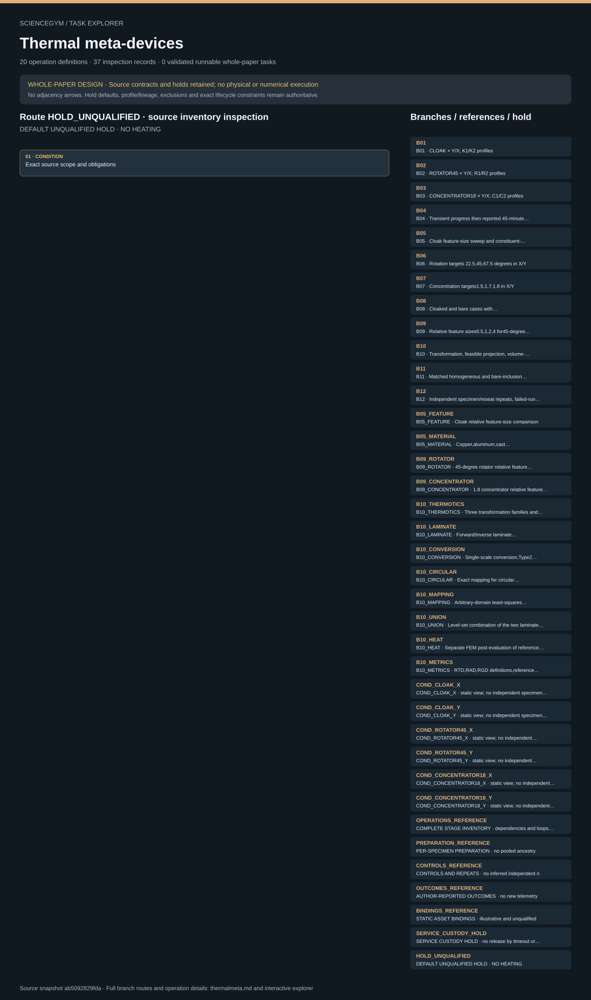

# Thermal meta-devices: task route map



Paper: **Analytical realization of complex thermal meta-devices** · [DOI](https://doi.org/10.1038/s41467-024-49630-1)

Whole-paper DESIGN only; zero validated runnable whole-paper tasks. Read-only author/evaluator inspection, not an actor context, controller, numerical solver or physical simulation. Source facts, authored requirements, finite symbolic tests and original illustrative geometry stay separate. Unordered coverage membership does not create chronology. Exact dependency, loop, failure and custody contracts remain authoritative. Required outputs and receipts are obligations, never observed outcomes; HOLD_UNQUALIFIED remains active. Twenty authored stages P01–P20 describe one paper-level design. Twelve coverage families and twelve child scopes remain distinct. Three physical reference device families, CLOAK, ROTATOR45 and CONCENTRATOR18, each have X/Y condition views. These six cells and static views are not six independent specimens; source independent and technical counts remain unknown. B01–B04 retain reported experimental/media scope; B05–B10 and their children retain analytical/numerical source scope with no execution. B11/B12 are authored controls/reliability, not newly claimed source experiments. Nine source conflicts and thirteen unresolved-input groups remain held. The 2-norm versus squared-error ambiguity, Eq.16 residual index, coarsest cloak label 3.0 versus curve endpoint 2.5, and physical-unit/absolute-flux uncertainties are not silently repaired. The source method mixes analytical and iterative numerical elements. No optimizer, FEM solver or metric computation is implemented. Fifteen source facts and all reported experimental/numerical outcomes are reference material, never measured episode telemetry, rewards or success thresholds. K1/R1/C1 to X and K2/R2/C2 to Y are authored visual selectors; only the parallel/transverse profile relation is source-reported. A reported 37-degree-Celsius boundary and 45-minute interval are historical context, not commands or safe-release criteria. Preparation remains a per-specimen chain; supplier lots and common jobs never replace family-specific design, lattice, intermediate and final-specimen parents. Six repeat/reorientation/rework/control/next-preparation loops remain unexpanded and require approved plans plus safe release. Every powered failure or stop at P11–P14 routes to P15; indeterminate release retains SERVICE_CUSTODY_HOLD. Administrative closeout cannot release custody or claim success. Fabrication, casting, thermal, wet and electrical work stay closed qualified services. Nominal source dimensions and original illustrative shapes do not qualify geometry, grasps or robot motion. Upstream review covered ten main pages, twelve SI pages, five main and seven SI figures, nine SI notes and six sampled frames per movie across three decoded movies. Movies were not continuously reviewed or calibrated to raw acquisition time. Zenodo README was read; matrices, source code, raw experimental data and optional peer review remain unread. This integration does not reread publications, recompute results or reproduce science. No heat-flow telemetry, new scientific measurement or physical execution is supplied.. Counts describe task representation, not experiments or success.

**Reading rule:** rows show unordered source inventory for inspection. Exact phase, lifecycle and dependency contracts remain authoritative; no loop, specimen, condition or chronology is inferred. An unordered obligation group has no inferred chronological edges. Source-reported scientific facts and authored handling are distinct.

[Frozen local source task package](../../../tasks/thermalmeta_operations_v2/) · [Interactive inspector](../index.html)

## B01 — B01 · CLOAK × Y/X; K1/K2 profiles

Whole-paper DESIGN only; zero validated runnable whole-paper tasks. Read-only author/evaluator inspection, not an actor context, controller, numerical solver or physical simulation. Source facts, authored requirements, finite symbolic tests and original illustrative geometry stay separate. Unordered coverage membership does not create chronology. Exact dependency, loop, failure and custody contracts remain authoritative. Required outputs and receipts are obligations, never observed outcomes; HOLD_UNQUALIFIED remains active.

[Exact route source](../../../tasks/thermalmeta_operations_v2/branches.json) · JSON pointer: `/families/0`

- **OBLIGATIONS: Exact coverage membership; no adjacency chronology**
  - Binding: {"order":"Whole-paper DESIGN only; zero validated runnable whole-paper tasks. Read-only author/evaluator inspection, not an actor context, controller, numerical solver or physical simulation. Source facts, authored requirements, finite symbolic tests and original illustrative geometry stay separate. Unordered coverage membership does not create chronology. Exact dependency, loop, failure and custody contracts remain authoritative. Required outputs and receipts are obligations, never observed outcomes; HOLD_UNQUALIFIED remains active."}
  - `P02` Approve paper-level condition plan
    - Source occurrence binding: {"source_file":"coverage_matrix.json","source_pointer":"/stages/1/stage_id","source_node":"P02","meaning":"Exact authored coverage membership; no execution or adjacency chronology","coverage_record":{"stage_id":"P02","branch_ids":["B01","B02","B03","B04","B05","B06","B07","B08","B09","B10","B11","B12"],"scene_binding_required":true}}
  - `P04` Receive materials and tooling identities
    - Source occurrence binding: {"source_file":"coverage_matrix.json","source_pointer":"/stages/3/stage_id","source_node":"P04","meaning":"Exact authored coverage membership; no execution or adjacency chronology","coverage_record":{"stage_id":"P04","branch_ids":["B01","B02","B03"],"scene_binding_required":true}}
  - `P05` Produce and release metal lattice
    - Source occurrence binding: {"source_file":"coverage_matrix.json","source_pointer":"/stages/4/stage_id","source_node":"P05","meaning":"Exact authored coverage membership; no execution or adjacency chronology","coverage_record":{"stage_id":"P05","branch_ids":["B01","B02","B03"],"scene_binding_required":true}}
  - `P06` Produce filled lattice intermediate
    - Source occurrence binding: {"source_file":"coverage_matrix.json","source_pointer":"/stages/5/stage_id","source_node":"P06","meaning":"Exact authored coverage membership; no execution or adjacency chronology","coverage_record":{"stage_id":"P06","branch_ids":["B01","B02","B03"],"scene_binding_required":true}}
  - `P07` Produce encapsulated specimen
    - Source occurrence binding: {"source_file":"coverage_matrix.json","source_pointer":"/stages/6/stage_id","source_node":"P07","meaning":"Exact authored coverage membership; no execution or adjacency chronology","coverage_record":{"stage_id":"P07","branch_ids":["B01","B02","B03"],"scene_binding_required":true}}
  - `P08` Receive and inspect released specimen
    - Source occurrence binding: {"source_file":"coverage_matrix.json","source_pointer":"/stages/7/stage_id","source_node":"P08","meaning":"Exact authored coverage membership; no execution or adjacency chronology","coverage_record":{"stage_id":"P08","branch_ids":["B01","B02","B03"],"scene_binding_required":true}}
  - `P10` Stage orientation-specific unpowered fixture
    - Source occurrence binding: {"source_file":"coverage_matrix.json","source_pointer":"/stages/9/stage_id","source_node":"P10","meaning":"Exact authored coverage membership; no execution or adjacency chronology","coverage_record":{"stage_id":"P10","branch_ids":["B01","B02","B03"],"scene_binding_required":true}}
  - `P11` Transfer custody to thermal-test service
    - Source occurrence binding: {"source_file":"coverage_matrix.json","source_pointer":"/stages/10/stage_id","source_node":"P11","meaning":"Exact authored coverage membership; no execution or adjacency chronology","coverage_record":{"stage_id":"P11","branch_ids":["B01","B02","B03","B04"],"scene_binding_required":true}}
  - `P13` Review steady-state qualification
    - Source occurrence binding: {"source_file":"coverage_matrix.json","source_pointer":"/stages/12/stage_id","source_node":"P13","meaning":"Exact authored coverage membership; no execution or adjacency chronology","coverage_record":{"stage_id":"P13","branch_ids":["B01","B02","B03","B04"],"scene_binding_required":true}}
  - `P14` Acquire registered steady-state result
    - Source occurrence binding: {"source_file":"coverage_matrix.json","source_pointer":"/stages/13/stage_id","source_node":"P14","meaning":"Exact authored coverage membership; no execution or adjacency chronology","coverage_record":{"stage_id":"P14","branch_ids":["B01","B02","B03"],"scene_binding_required":true}}
  - `P15` Release station and specimen safely
    - Source occurrence binding: {"source_file":"coverage_matrix.json","source_pointer":"/stages/14/stage_id","source_node":"P15","meaning":"Exact authored coverage membership; no execution or adjacency chronology","coverage_record":{"stage_id":"P15","branch_ids":["B01","B02","B03","B04"],"scene_binding_required":true}}
  - `P16` Execute condition/repeat traversal
    - Source occurrence binding: {"source_file":"coverage_matrix.json","source_pointer":"/stages/15/stage_id","source_node":"P16","meaning":"Exact authored coverage membership; no execution or adjacency chronology","coverage_record":{"stage_id":"P16","branch_ids":["B01","B02","B03","B04","B12"],"scene_binding_required":true}}
  - `P18` Perform qualified result assessment
    - Source occurrence binding: {"source_file":"coverage_matrix.json","source_pointer":"/stages/17/stage_id","source_node":"P18","meaning":"Exact authored coverage membership; no execution or adjacency chronology","coverage_record":{"stage_id":"P18","branch_ids":["B01","B02","B03","B04"],"scene_binding_required":true}}
  - `P20` Close paper-level episode
    - Source occurrence binding: {"source_file":"coverage_matrix.json","source_pointer":"/stages/19/stage_id","source_node":"P20","meaning":"Exact authored coverage membership; no execution or adjacency chronology","coverage_record":{"stage_id":"P20","branch_ids":["B01","B02","B03","B04","B05","B06","B07","B08","B09","B10","B11","B12"],"scene_binding_required":true}}
- **CONDITION: Exact source scope and obligations**
  - Binding: {"source_file":"branches.json","source_pointer":"/families/0","source_contract":{"id":"B01","evidence_class":"source-reported experiment","coverage":"CLOAK × Y/X; K1/K2 profiles","source":"MAIN Figs.4-5; Movie1","proposal_handling":"Required two orientation records on tracked specimen(s)"}}

<details><summary>Branch state, choices, lineage and loop obligations</summary>

```json
{
  "id": "B01",
  "evidence_class": "source-reported experiment",
  "coverage": "CLOAK × Y/X; K1/K2 profiles",
  "source": "MAIN Figs.4-5; Movie1",
  "proposal_handling": "Required two orientation records on tracked specimen(s)"
}
```

</details>

## B02 — B02 · ROTATOR45 × Y/X; R1/R2 profiles

Whole-paper DESIGN only; zero validated runnable whole-paper tasks. Read-only author/evaluator inspection, not an actor context, controller, numerical solver or physical simulation. Source facts, authored requirements, finite symbolic tests and original illustrative geometry stay separate. Unordered coverage membership does not create chronology. Exact dependency, loop, failure and custody contracts remain authoritative. Required outputs and receipts are obligations, never observed outcomes; HOLD_UNQUALIFIED remains active.

[Exact route source](../../../tasks/thermalmeta_operations_v2/branches.json) · JSON pointer: `/families/1`

- **OBLIGATIONS: Exact coverage membership; no adjacency chronology**
  - Binding: {"order":"Whole-paper DESIGN only; zero validated runnable whole-paper tasks. Read-only author/evaluator inspection, not an actor context, controller, numerical solver or physical simulation. Source facts, authored requirements, finite symbolic tests and original illustrative geometry stay separate. Unordered coverage membership does not create chronology. Exact dependency, loop, failure and custody contracts remain authoritative. Required outputs and receipts are obligations, never observed outcomes; HOLD_UNQUALIFIED remains active."}
  - `P02` Approve paper-level condition plan
    - Source occurrence binding: {"source_file":"coverage_matrix.json","source_pointer":"/stages/1/stage_id","source_node":"P02","meaning":"Exact authored coverage membership; no execution or adjacency chronology","coverage_record":{"stage_id":"P02","branch_ids":["B01","B02","B03","B04","B05","B06","B07","B08","B09","B10","B11","B12"],"scene_binding_required":true}}
  - `P04` Receive materials and tooling identities
    - Source occurrence binding: {"source_file":"coverage_matrix.json","source_pointer":"/stages/3/stage_id","source_node":"P04","meaning":"Exact authored coverage membership; no execution or adjacency chronology","coverage_record":{"stage_id":"P04","branch_ids":["B01","B02","B03"],"scene_binding_required":true}}
  - `P05` Produce and release metal lattice
    - Source occurrence binding: {"source_file":"coverage_matrix.json","source_pointer":"/stages/4/stage_id","source_node":"P05","meaning":"Exact authored coverage membership; no execution or adjacency chronology","coverage_record":{"stage_id":"P05","branch_ids":["B01","B02","B03"],"scene_binding_required":true}}
  - `P06` Produce filled lattice intermediate
    - Source occurrence binding: {"source_file":"coverage_matrix.json","source_pointer":"/stages/5/stage_id","source_node":"P06","meaning":"Exact authored coverage membership; no execution or adjacency chronology","coverage_record":{"stage_id":"P06","branch_ids":["B01","B02","B03"],"scene_binding_required":true}}
  - `P07` Produce encapsulated specimen
    - Source occurrence binding: {"source_file":"coverage_matrix.json","source_pointer":"/stages/6/stage_id","source_node":"P07","meaning":"Exact authored coverage membership; no execution or adjacency chronology","coverage_record":{"stage_id":"P07","branch_ids":["B01","B02","B03"],"scene_binding_required":true}}
  - `P08` Receive and inspect released specimen
    - Source occurrence binding: {"source_file":"coverage_matrix.json","source_pointer":"/stages/7/stage_id","source_node":"P08","meaning":"Exact authored coverage membership; no execution or adjacency chronology","coverage_record":{"stage_id":"P08","branch_ids":["B01","B02","B03"],"scene_binding_required":true}}
  - `P10` Stage orientation-specific unpowered fixture
    - Source occurrence binding: {"source_file":"coverage_matrix.json","source_pointer":"/stages/9/stage_id","source_node":"P10","meaning":"Exact authored coverage membership; no execution or adjacency chronology","coverage_record":{"stage_id":"P10","branch_ids":["B01","B02","B03"],"scene_binding_required":true}}
  - `P11` Transfer custody to thermal-test service
    - Source occurrence binding: {"source_file":"coverage_matrix.json","source_pointer":"/stages/10/stage_id","source_node":"P11","meaning":"Exact authored coverage membership; no execution or adjacency chronology","coverage_record":{"stage_id":"P11","branch_ids":["B01","B02","B03","B04"],"scene_binding_required":true}}
  - `P13` Review steady-state qualification
    - Source occurrence binding: {"source_file":"coverage_matrix.json","source_pointer":"/stages/12/stage_id","source_node":"P13","meaning":"Exact authored coverage membership; no execution or adjacency chronology","coverage_record":{"stage_id":"P13","branch_ids":["B01","B02","B03","B04"],"scene_binding_required":true}}
  - `P14` Acquire registered steady-state result
    - Source occurrence binding: {"source_file":"coverage_matrix.json","source_pointer":"/stages/13/stage_id","source_node":"P14","meaning":"Exact authored coverage membership; no execution or adjacency chronology","coverage_record":{"stage_id":"P14","branch_ids":["B01","B02","B03"],"scene_binding_required":true}}
  - `P15` Release station and specimen safely
    - Source occurrence binding: {"source_file":"coverage_matrix.json","source_pointer":"/stages/14/stage_id","source_node":"P15","meaning":"Exact authored coverage membership; no execution or adjacency chronology","coverage_record":{"stage_id":"P15","branch_ids":["B01","B02","B03","B04"],"scene_binding_required":true}}
  - `P16` Execute condition/repeat traversal
    - Source occurrence binding: {"source_file":"coverage_matrix.json","source_pointer":"/stages/15/stage_id","source_node":"P16","meaning":"Exact authored coverage membership; no execution or adjacency chronology","coverage_record":{"stage_id":"P16","branch_ids":["B01","B02","B03","B04","B12"],"scene_binding_required":true}}
  - `P18` Perform qualified result assessment
    - Source occurrence binding: {"source_file":"coverage_matrix.json","source_pointer":"/stages/17/stage_id","source_node":"P18","meaning":"Exact authored coverage membership; no execution or adjacency chronology","coverage_record":{"stage_id":"P18","branch_ids":["B01","B02","B03","B04"],"scene_binding_required":true}}
  - `P20` Close paper-level episode
    - Source occurrence binding: {"source_file":"coverage_matrix.json","source_pointer":"/stages/19/stage_id","source_node":"P20","meaning":"Exact authored coverage membership; no execution or adjacency chronology","coverage_record":{"stage_id":"P20","branch_ids":["B01","B02","B03","B04","B05","B06","B07","B08","B09","B10","B11","B12"],"scene_binding_required":true}}
- **CONDITION: Exact source scope and obligations**
  - Binding: {"source_file":"branches.json","source_pointer":"/families/1","source_contract":{"id":"B02","evidence_class":"source-reported experiment","coverage":"ROTATOR45 × Y/X; R1/R2 profiles","source":"MAIN Figs.4-5; Movie2","proposal_handling":"Required two orientation records; distinguish signed angle from absolute orientation"}}

<details><summary>Branch state, choices, lineage and loop obligations</summary>

```json
{
  "id": "B02",
  "evidence_class": "source-reported experiment",
  "coverage": "ROTATOR45 × Y/X; R1/R2 profiles",
  "source": "MAIN Figs.4-5; Movie2",
  "proposal_handling": "Required two orientation records; distinguish signed angle from absolute orientation"
}
```

</details>

## B03 — B03 · CONCENTRATOR18 × Y/X; C1/C2 profiles

Whole-paper DESIGN only; zero validated runnable whole-paper tasks. Read-only author/evaluator inspection, not an actor context, controller, numerical solver or physical simulation. Source facts, authored requirements, finite symbolic tests and original illustrative geometry stay separate. Unordered coverage membership does not create chronology. Exact dependency, loop, failure and custody contracts remain authoritative. Required outputs and receipts are obligations, never observed outcomes; HOLD_UNQUALIFIED remains active.

[Exact route source](../../../tasks/thermalmeta_operations_v2/branches.json) · JSON pointer: `/families/2`

- **OBLIGATIONS: Exact coverage membership; no adjacency chronology**
  - Binding: {"order":"Whole-paper DESIGN only; zero validated runnable whole-paper tasks. Read-only author/evaluator inspection, not an actor context, controller, numerical solver or physical simulation. Source facts, authored requirements, finite symbolic tests and original illustrative geometry stay separate. Unordered coverage membership does not create chronology. Exact dependency, loop, failure and custody contracts remain authoritative. Required outputs and receipts are obligations, never observed outcomes; HOLD_UNQUALIFIED remains active."}
  - `P02` Approve paper-level condition plan
    - Source occurrence binding: {"source_file":"coverage_matrix.json","source_pointer":"/stages/1/stage_id","source_node":"P02","meaning":"Exact authored coverage membership; no execution or adjacency chronology","coverage_record":{"stage_id":"P02","branch_ids":["B01","B02","B03","B04","B05","B06","B07","B08","B09","B10","B11","B12"],"scene_binding_required":true}}
  - `P04` Receive materials and tooling identities
    - Source occurrence binding: {"source_file":"coverage_matrix.json","source_pointer":"/stages/3/stage_id","source_node":"P04","meaning":"Exact authored coverage membership; no execution or adjacency chronology","coverage_record":{"stage_id":"P04","branch_ids":["B01","B02","B03"],"scene_binding_required":true}}
  - `P05` Produce and release metal lattice
    - Source occurrence binding: {"source_file":"coverage_matrix.json","source_pointer":"/stages/4/stage_id","source_node":"P05","meaning":"Exact authored coverage membership; no execution or adjacency chronology","coverage_record":{"stage_id":"P05","branch_ids":["B01","B02","B03"],"scene_binding_required":true}}
  - `P06` Produce filled lattice intermediate
    - Source occurrence binding: {"source_file":"coverage_matrix.json","source_pointer":"/stages/5/stage_id","source_node":"P06","meaning":"Exact authored coverage membership; no execution or adjacency chronology","coverage_record":{"stage_id":"P06","branch_ids":["B01","B02","B03"],"scene_binding_required":true}}
  - `P07` Produce encapsulated specimen
    - Source occurrence binding: {"source_file":"coverage_matrix.json","source_pointer":"/stages/6/stage_id","source_node":"P07","meaning":"Exact authored coverage membership; no execution or adjacency chronology","coverage_record":{"stage_id":"P07","branch_ids":["B01","B02","B03"],"scene_binding_required":true}}
  - `P08` Receive and inspect released specimen
    - Source occurrence binding: {"source_file":"coverage_matrix.json","source_pointer":"/stages/7/stage_id","source_node":"P08","meaning":"Exact authored coverage membership; no execution or adjacency chronology","coverage_record":{"stage_id":"P08","branch_ids":["B01","B02","B03"],"scene_binding_required":true}}
  - `P10` Stage orientation-specific unpowered fixture
    - Source occurrence binding: {"source_file":"coverage_matrix.json","source_pointer":"/stages/9/stage_id","source_node":"P10","meaning":"Exact authored coverage membership; no execution or adjacency chronology","coverage_record":{"stage_id":"P10","branch_ids":["B01","B02","B03"],"scene_binding_required":true}}
  - `P11` Transfer custody to thermal-test service
    - Source occurrence binding: {"source_file":"coverage_matrix.json","source_pointer":"/stages/10/stage_id","source_node":"P11","meaning":"Exact authored coverage membership; no execution or adjacency chronology","coverage_record":{"stage_id":"P11","branch_ids":["B01","B02","B03","B04"],"scene_binding_required":true}}
  - `P13` Review steady-state qualification
    - Source occurrence binding: {"source_file":"coverage_matrix.json","source_pointer":"/stages/12/stage_id","source_node":"P13","meaning":"Exact authored coverage membership; no execution or adjacency chronology","coverage_record":{"stage_id":"P13","branch_ids":["B01","B02","B03","B04"],"scene_binding_required":true}}
  - `P14` Acquire registered steady-state result
    - Source occurrence binding: {"source_file":"coverage_matrix.json","source_pointer":"/stages/13/stage_id","source_node":"P14","meaning":"Exact authored coverage membership; no execution or adjacency chronology","coverage_record":{"stage_id":"P14","branch_ids":["B01","B02","B03"],"scene_binding_required":true}}
  - `P15` Release station and specimen safely
    - Source occurrence binding: {"source_file":"coverage_matrix.json","source_pointer":"/stages/14/stage_id","source_node":"P15","meaning":"Exact authored coverage membership; no execution or adjacency chronology","coverage_record":{"stage_id":"P15","branch_ids":["B01","B02","B03","B04"],"scene_binding_required":true}}
  - `P16` Execute condition/repeat traversal
    - Source occurrence binding: {"source_file":"coverage_matrix.json","source_pointer":"/stages/15/stage_id","source_node":"P16","meaning":"Exact authored coverage membership; no execution or adjacency chronology","coverage_record":{"stage_id":"P16","branch_ids":["B01","B02","B03","B04","B12"],"scene_binding_required":true}}
  - `P18` Perform qualified result assessment
    - Source occurrence binding: {"source_file":"coverage_matrix.json","source_pointer":"/stages/17/stage_id","source_node":"P18","meaning":"Exact authored coverage membership; no execution or adjacency chronology","coverage_record":{"stage_id":"P18","branch_ids":["B01","B02","B03","B04"],"scene_binding_required":true}}
  - `P20` Close paper-level episode
    - Source occurrence binding: {"source_file":"coverage_matrix.json","source_pointer":"/stages/19/stage_id","source_node":"P20","meaning":"Exact authored coverage membership; no execution or adjacency chronology","coverage_record":{"stage_id":"P20","branch_ids":["B01","B02","B03","B04","B05","B06","B07","B08","B09","B10","B11","B12"],"scene_binding_required":true}}
- **CONDITION: Exact source scope and obligations**
  - Binding: {"source_file":"branches.json","source_pointer":"/families/2","source_contract":{"id":"B03","evidence_class":"source-reported experiment","coverage":"CONCENTRATOR18 × Y/X; C1/C2 profiles","source":"MAIN Figs.4-5; Movie3","proposal_handling":"Required two orientation records; core and background separately registered"}}

<details><summary>Branch state, choices, lineage and loop obligations</summary>

```json
{
  "id": "B03",
  "evidence_class": "source-reported experiment",
  "coverage": "CONCENTRATOR18 × Y/X; C1/C2 profiles",
  "source": "MAIN Figs.4-5; Movie3",
  "proposal_handling": "Required two orientation records; core and background separately registered"
}
```

</details>

## B04 — B04 · Transient progress then reported 45-minute steady state for each reference device

Whole-paper DESIGN only; zero validated runnable whole-paper tasks. Read-only author/evaluator inspection, not an actor context, controller, numerical solver or physical simulation. Source facts, authored requirements, finite symbolic tests and original illustrative geometry stay separate. Unordered coverage membership does not create chronology. Exact dependency, loop, failure and custody contracts remain authoritative. Required outputs and receipts are obligations, never observed outcomes; HOLD_UNQUALIFIED remains active.

[Exact route source](../../../tasks/thermalmeta_operations_v2/branches.json) · JSON pointer: `/families/3`

- **OBLIGATIONS: Exact coverage membership; no adjacency chronology**
  - Binding: {"order":"Whole-paper DESIGN only; zero validated runnable whole-paper tasks. Read-only author/evaluator inspection, not an actor context, controller, numerical solver or physical simulation. Source facts, authored requirements, finite symbolic tests and original illustrative geometry stay separate. Unordered coverage membership does not create chronology. Exact dependency, loop, failure and custody contracts remain authoritative. Required outputs and receipts are obligations, never observed outcomes; HOLD_UNQUALIFIED remains active."}
  - `P02` Approve paper-level condition plan
    - Source occurrence binding: {"source_file":"coverage_matrix.json","source_pointer":"/stages/1/stage_id","source_node":"P02","meaning":"Exact authored coverage membership; no execution or adjacency chronology","coverage_record":{"stage_id":"P02","branch_ids":["B01","B02","B03","B04","B05","B06","B07","B08","B09","B10","B11","B12"],"scene_binding_required":true}}
  - `P11` Transfer custody to thermal-test service
    - Source occurrence binding: {"source_file":"coverage_matrix.json","source_pointer":"/stages/10/stage_id","source_node":"P11","meaning":"Exact authored coverage membership; no execution or adjacency chronology","coverage_record":{"stage_id":"P11","branch_ids":["B01","B02","B03","B04"],"scene_binding_required":true}}
  - `P12` Acquire transient observation series
    - Source occurrence binding: {"source_file":"coverage_matrix.json","source_pointer":"/stages/11/stage_id","source_node":"P12","meaning":"Exact authored coverage membership; no execution or adjacency chronology","coverage_record":{"stage_id":"P12","branch_ids":["B04"],"scene_binding_required":true}}
  - `P13` Review steady-state qualification
    - Source occurrence binding: {"source_file":"coverage_matrix.json","source_pointer":"/stages/12/stage_id","source_node":"P13","meaning":"Exact authored coverage membership; no execution or adjacency chronology","coverage_record":{"stage_id":"P13","branch_ids":["B01","B02","B03","B04"],"scene_binding_required":true}}
  - `P15` Release station and specimen safely
    - Source occurrence binding: {"source_file":"coverage_matrix.json","source_pointer":"/stages/14/stage_id","source_node":"P15","meaning":"Exact authored coverage membership; no execution or adjacency chronology","coverage_record":{"stage_id":"P15","branch_ids":["B01","B02","B03","B04"],"scene_binding_required":true}}
  - `P16` Execute condition/repeat traversal
    - Source occurrence binding: {"source_file":"coverage_matrix.json","source_pointer":"/stages/15/stage_id","source_node":"P16","meaning":"Exact authored coverage membership; no execution or adjacency chronology","coverage_record":{"stage_id":"P16","branch_ids":["B01","B02","B03","B04","B12"],"scene_binding_required":true}}
  - `P18` Perform qualified result assessment
    - Source occurrence binding: {"source_file":"coverage_matrix.json","source_pointer":"/stages/17/stage_id","source_node":"P18","meaning":"Exact authored coverage membership; no execution or adjacency chronology","coverage_record":{"stage_id":"P18","branch_ids":["B01","B02","B03","B04"],"scene_binding_required":true}}
  - `P20` Close paper-level episode
    - Source occurrence binding: {"source_file":"coverage_matrix.json","source_pointer":"/stages/19/stage_id","source_node":"P20","meaning":"Exact authored coverage membership; no execution or adjacency chronology","coverage_record":{"stage_id":"P20","branch_ids":["B01","B02","B03","B04","B05","B06","B07","B08","B09","B10","B11","B12"],"scene_binding_required":true}}
- **CONDITION: Exact source scope and obligations**
  - Binding: {"source_file":"branches.json","source_pointer":"/families/3","source_contract":{"id":"B04","evidence_class":"source-reported experimental media","coverage":"Transient progress then reported 45-minute steady state for each reference device","source":"Movies1-3 and SI Note9","proposal_handling":"Continuous acquisition/release proposal; movie samples are qualitative, not raw timing evidence"}}

<details><summary>Branch state, choices, lineage and loop obligations</summary>

```json
{
  "id": "B04",
  "evidence_class": "source-reported experimental media",
  "coverage": "Transient progress then reported 45-minute steady state for each reference device",
  "source": "Movies1-3 and SI Note9",
  "proposal_handling": "Continuous acquisition/release proposal; movie samples are qualitative, not raw timing evidence"
}
```

</details>

## B05 — B05 · Cloak feature-size sweep and constituent-material sweep

Whole-paper DESIGN only; zero validated runnable whole-paper tasks. Read-only author/evaluator inspection, not an actor context, controller, numerical solver or physical simulation. Source facts, authored requirements, finite symbolic tests and original illustrative geometry stay separate. Unordered coverage membership does not create chronology. Exact dependency, loop, failure and custody contracts remain authoritative. Required outputs and receipts are obligations, never observed outcomes; HOLD_UNQUALIFIED remains active.

[Exact route source](../../../tasks/thermalmeta_operations_v2/branches.json) · JSON pointer: `/families/4`

- **OBLIGATIONS: Exact coverage membership; no adjacency chronology**
  - Binding: {"order":"Whole-paper DESIGN only; zero validated runnable whole-paper tasks. Read-only author/evaluator inspection, not an actor context, controller, numerical solver or physical simulation. Source facts, authored requirements, finite symbolic tests and original illustrative geometry stay separate. Unordered coverage membership does not create chronology. Exact dependency, loop, failure and custody contracts remain authoritative. Required outputs and receipts are obligations, never observed outcomes; HOLD_UNQUALIFIED remains active."}
  - `P02` Approve paper-level condition plan
    - Source occurrence binding: {"source_file":"coverage_matrix.json","source_pointer":"/stages/1/stage_id","source_node":"P02","meaning":"Exact authored coverage membership; no execution or adjacency chronology","coverage_record":{"stage_id":"P02","branch_ids":["B01","B02","B03","B04","B05","B06","B07","B08","B09","B10","B11","B12"],"scene_binding_required":true}}
  - `P19` Reconcile broader paper numerical families
    - Source occurrence binding: {"source_file":"coverage_matrix.json","source_pointer":"/stages/18/stage_id","source_node":"P19","meaning":"Exact authored coverage membership; no execution or adjacency chronology","coverage_record":{"stage_id":"P19","branch_ids":["B05","B06","B07","B08","B09","B10"],"scene_binding_required":true}}
  - `P20` Close paper-level episode
    - Source occurrence binding: {"source_file":"coverage_matrix.json","source_pointer":"/stages/19/stage_id","source_node":"P20","meaning":"Exact authored coverage membership; no execution or adjacency chronology","coverage_record":{"stage_id":"P20","branch_ids":["B01","B02","B03","B04","B05","B06","B07","B08","B09","B10","B11","B12"],"scene_binding_required":true}}
- **CONDITION: Exact source scope and obligations**
  - Binding: {"source_file":"branches.json","source_pointer":"/families/4","source_contract":{"id":"B05","evidence_class":"source-reported numerical family","coverage":"Cloak feature-size sweep and constituent-material sweep","source":"MAIN Fig.2F/G","proposal_handling":"Ingest qualified result receipts only; coarsest feature label held by C03"}}

<details><summary>Branch state, choices, lineage and loop obligations</summary>

```json
{
  "id": "B05",
  "evidence_class": "source-reported numerical family",
  "coverage": "Cloak feature-size sweep and constituent-material sweep",
  "source": "MAIN Fig.2F/G",
  "proposal_handling": "Ingest qualified result receipts only; coarsest feature label held by C03"
}
```

</details>

## B06 — B06 · Rotation targets 22.5,45,67.5 degrees in X/Y

Whole-paper DESIGN only; zero validated runnable whole-paper tasks. Read-only author/evaluator inspection, not an actor context, controller, numerical solver or physical simulation. Source facts, authored requirements, finite symbolic tests and original illustrative geometry stay separate. Unordered coverage membership does not create chronology. Exact dependency, loop, failure and custody contracts remain authoritative. Required outputs and receipts are obligations, never observed outcomes; HOLD_UNQUALIFIED remains active.

[Exact route source](../../../tasks/thermalmeta_operations_v2/branches.json) · JSON pointer: `/families/5`

- **OBLIGATIONS: Exact coverage membership; no adjacency chronology**
  - Binding: {"order":"Whole-paper DESIGN only; zero validated runnable whole-paper tasks. Read-only author/evaluator inspection, not an actor context, controller, numerical solver or physical simulation. Source facts, authored requirements, finite symbolic tests and original illustrative geometry stay separate. Unordered coverage membership does not create chronology. Exact dependency, loop, failure and custody contracts remain authoritative. Required outputs and receipts are obligations, never observed outcomes; HOLD_UNQUALIFIED remains active."}
  - `P02` Approve paper-level condition plan
    - Source occurrence binding: {"source_file":"coverage_matrix.json","source_pointer":"/stages/1/stage_id","source_node":"P02","meaning":"Exact authored coverage membership; no execution or adjacency chronology","coverage_record":{"stage_id":"P02","branch_ids":["B01","B02","B03","B04","B05","B06","B07","B08","B09","B10","B11","B12"],"scene_binding_required":true}}
  - `P19` Reconcile broader paper numerical families
    - Source occurrence binding: {"source_file":"coverage_matrix.json","source_pointer":"/stages/18/stage_id","source_node":"P19","meaning":"Exact authored coverage membership; no execution or adjacency chronology","coverage_record":{"stage_id":"P19","branch_ids":["B05","B06","B07","B08","B09","B10"],"scene_binding_required":true}}
  - `P20` Close paper-level episode
    - Source occurrence binding: {"source_file":"coverage_matrix.json","source_pointer":"/stages/19/stage_id","source_node":"P20","meaning":"Exact authored coverage membership; no execution or adjacency chronology","coverage_record":{"stage_id":"P20","branch_ids":["B01","B02","B03","B04","B05","B06","B07","B08","B09","B10","B11","B12"],"scene_binding_required":true}}
- **CONDITION: Exact source scope and obligations**
  - Binding: {"source_file":"branches.json","source_pointer":"/families/5","source_contract":{"id":"B06","evidence_class":"source-reported numerical family","coverage":"Rotation targets 22.5,45,67.5 degrees in X/Y","source":"MAIN Fig.3B-D","proposal_handling":"Track as model comparisons, never three physical rotator experiments"}}

<details><summary>Branch state, choices, lineage and loop obligations</summary>

```json
{
  "id": "B06",
  "evidence_class": "source-reported numerical family",
  "coverage": "Rotation targets 22.5,45,67.5 degrees in X/Y",
  "source": "MAIN Fig.3B-D",
  "proposal_handling": "Track as model comparisons, never three physical rotator experiments"
}
```

</details>

## B07 — B07 · Concentration targets1.5,1.7,1.8 in X/Y

Whole-paper DESIGN only; zero validated runnable whole-paper tasks. Read-only author/evaluator inspection, not an actor context, controller, numerical solver or physical simulation. Source facts, authored requirements, finite symbolic tests and original illustrative geometry stay separate. Unordered coverage membership does not create chronology. Exact dependency, loop, failure and custody contracts remain authoritative. Required outputs and receipts are obligations, never observed outcomes; HOLD_UNQUALIFIED remains active.

[Exact route source](../../../tasks/thermalmeta_operations_v2/branches.json) · JSON pointer: `/families/6`

- **OBLIGATIONS: Exact coverage membership; no adjacency chronology**
  - Binding: {"order":"Whole-paper DESIGN only; zero validated runnable whole-paper tasks. Read-only author/evaluator inspection, not an actor context, controller, numerical solver or physical simulation. Source facts, authored requirements, finite symbolic tests and original illustrative geometry stay separate. Unordered coverage membership does not create chronology. Exact dependency, loop, failure and custody contracts remain authoritative. Required outputs and receipts are obligations, never observed outcomes; HOLD_UNQUALIFIED remains active."}
  - `P02` Approve paper-level condition plan
    - Source occurrence binding: {"source_file":"coverage_matrix.json","source_pointer":"/stages/1/stage_id","source_node":"P02","meaning":"Exact authored coverage membership; no execution or adjacency chronology","coverage_record":{"stage_id":"P02","branch_ids":["B01","B02","B03","B04","B05","B06","B07","B08","B09","B10","B11","B12"],"scene_binding_required":true}}
  - `P19` Reconcile broader paper numerical families
    - Source occurrence binding: {"source_file":"coverage_matrix.json","source_pointer":"/stages/18/stage_id","source_node":"P19","meaning":"Exact authored coverage membership; no execution or adjacency chronology","coverage_record":{"stage_id":"P19","branch_ids":["B05","B06","B07","B08","B09","B10"],"scene_binding_required":true}}
  - `P20` Close paper-level episode
    - Source occurrence binding: {"source_file":"coverage_matrix.json","source_pointer":"/stages/19/stage_id","source_node":"P20","meaning":"Exact authored coverage membership; no execution or adjacency chronology","coverage_record":{"stage_id":"P20","branch_ids":["B01","B02","B03","B04","B05","B06","B07","B08","B09","B10","B11","B12"],"scene_binding_required":true}}
- **CONDITION: Exact source scope and obligations**
  - Binding: {"source_file":"branches.json","source_pointer":"/families/6","source_contract":{"id":"B07","evidence_class":"source-reported numerical family","coverage":"Concentration targets1.5,1.7,1.8 in X/Y","source":"MAIN Fig.3F-H","proposal_handling":"Track as model comparisons; only reference physical route above"}}

<details><summary>Branch state, choices, lineage and loop obligations</summary>

```json
{
  "id": "B07",
  "evidence_class": "source-reported numerical family",
  "coverage": "Concentration targets1.5,1.7,1.8 in X/Y",
  "source": "MAIN Fig.3F-H",
  "proposal_handling": "Track as model comparisons; only reference physical route above"
}
```

</details>

## B08 — B08 · Cloaked and bare cases with air,PDMS,steel,aluminum cores under Y

Whole-paper DESIGN only; zero validated runnable whole-paper tasks. Read-only author/evaluator inspection, not an actor context, controller, numerical solver or physical simulation. Source facts, authored requirements, finite symbolic tests and original illustrative geometry stay separate. Unordered coverage membership does not create chronology. Exact dependency, loop, failure and custody contracts remain authoritative. Required outputs and receipts are obligations, never observed outcomes; HOLD_UNQUALIFIED remains active.

[Exact route source](../../../tasks/thermalmeta_operations_v2/branches.json) · JSON pointer: `/families/7`

- **OBLIGATIONS: Exact coverage membership; no adjacency chronology**
  - Binding: {"order":"Whole-paper DESIGN only; zero validated runnable whole-paper tasks. Read-only author/evaluator inspection, not an actor context, controller, numerical solver or physical simulation. Source facts, authored requirements, finite symbolic tests and original illustrative geometry stay separate. Unordered coverage membership does not create chronology. Exact dependency, loop, failure and custody contracts remain authoritative. Required outputs and receipts are obligations, never observed outcomes; HOLD_UNQUALIFIED remains active."}
  - `P02` Approve paper-level condition plan
    - Source occurrence binding: {"source_file":"coverage_matrix.json","source_pointer":"/stages/1/stage_id","source_node":"P02","meaning":"Exact authored coverage membership; no execution or adjacency chronology","coverage_record":{"stage_id":"P02","branch_ids":["B01","B02","B03","B04","B05","B06","B07","B08","B09","B10","B11","B12"],"scene_binding_required":true}}
  - `P19` Reconcile broader paper numerical families
    - Source occurrence binding: {"source_file":"coverage_matrix.json","source_pointer":"/stages/18/stage_id","source_node":"P19","meaning":"Exact authored coverage membership; no execution or adjacency chronology","coverage_record":{"stage_id":"P19","branch_ids":["B05","B06","B07","B08","B09","B10"],"scene_binding_required":true}}
  - `P20` Close paper-level episode
    - Source occurrence binding: {"source_file":"coverage_matrix.json","source_pointer":"/stages/19/stage_id","source_node":"P20","meaning":"Exact authored coverage membership; no execution or adjacency chronology","coverage_record":{"stage_id":"P20","branch_ids":["B01","B02","B03","B04","B05","B06","B07","B08","B09","B10","B11","B12"],"scene_binding_required":true}}
- **CONDITION: Exact source scope and obligations**
  - Binding: {"source_file":"branches.json","source_pointer":"/families/7","source_contract":{"id":"B08","evidence_class":"source-reported numerical family","coverage":"Cloaked and bare cases with air,PDMS,steel,aluminum cores under Y","source":"SI Note8.1, Fig.6","proposal_handling":"Keep core provenance; no unsupported X-direction sweep"}}

<details><summary>Branch state, choices, lineage and loop obligations</summary>

```json
{
  "id": "B08",
  "evidence_class": "source-reported numerical family",
  "coverage": "Cloaked and bare cases with air,PDMS,steel,aluminum cores under Y",
  "source": "SI Note8.1, Fig.6",
  "proposal_handling": "Keep core provenance; no unsupported X-direction sweep"
}
```

</details>

## B09 — B09 · Relative feature sizes0.5,1,2,4 for45-degree rotator and1.8 concentrator in X/Y

Whole-paper DESIGN only; zero validated runnable whole-paper tasks. Read-only author/evaluator inspection, not an actor context, controller, numerical solver or physical simulation. Source facts, authored requirements, finite symbolic tests and original illustrative geometry stay separate. Unordered coverage membership does not create chronology. Exact dependency, loop, failure and custody contracts remain authoritative. Required outputs and receipts are obligations, never observed outcomes; HOLD_UNQUALIFIED remains active.

[Exact route source](../../../tasks/thermalmeta_operations_v2/branches.json) · JSON pointer: `/families/8`

- **OBLIGATIONS: Exact coverage membership; no adjacency chronology**
  - Binding: {"order":"Whole-paper DESIGN only; zero validated runnable whole-paper tasks. Read-only author/evaluator inspection, not an actor context, controller, numerical solver or physical simulation. Source facts, authored requirements, finite symbolic tests and original illustrative geometry stay separate. Unordered coverage membership does not create chronology. Exact dependency, loop, failure and custody contracts remain authoritative. Required outputs and receipts are obligations, never observed outcomes; HOLD_UNQUALIFIED remains active."}
  - `P02` Approve paper-level condition plan
    - Source occurrence binding: {"source_file":"coverage_matrix.json","source_pointer":"/stages/1/stage_id","source_node":"P02","meaning":"Exact authored coverage membership; no execution or adjacency chronology","coverage_record":{"stage_id":"P02","branch_ids":["B01","B02","B03","B04","B05","B06","B07","B08","B09","B10","B11","B12"],"scene_binding_required":true}}
  - `P19` Reconcile broader paper numerical families
    - Source occurrence binding: {"source_file":"coverage_matrix.json","source_pointer":"/stages/18/stage_id","source_node":"P19","meaning":"Exact authored coverage membership; no execution or adjacency chronology","coverage_record":{"stage_id":"P19","branch_ids":["B05","B06","B07","B08","B09","B10"],"scene_binding_required":true}}
  - `P20` Close paper-level episode
    - Source occurrence binding: {"source_file":"coverage_matrix.json","source_pointer":"/stages/19/stage_id","source_node":"P20","meaning":"Exact authored coverage membership; no execution or adjacency chronology","coverage_record":{"stage_id":"P20","branch_ids":["B01","B02","B03","B04","B05","B06","B07","B08","B09","B10","B11","B12"],"scene_binding_required":true}}
- **CONDITION: Exact source scope and obligations**
  - Binding: {"source_file":"branches.json","source_pointer":"/families/8","source_contract":{"id":"B09","evidence_class":"source-reported numerical family","coverage":"Relative feature sizes0.5,1,2,4 for45-degree rotator and1.8 concentrator in X/Y","source":"SI Fig.7","proposal_handling":"No physical extension implied; no monotonic predicate"}}

<details><summary>Branch state, choices, lineage and loop obligations</summary>

```json
{
  "id": "B09",
  "evidence_class": "source-reported numerical family",
  "coverage": "Relative feature sizes0.5,1,2,4 for45-degree rotator and1.8 concentrator in X/Y",
  "source": "SI Fig.7",
  "proposal_handling": "No physical extension implied; no monotonic predicate"
}
```

</details>

## B10 — B10 · Transformation, feasible projection, volume-equivalent conversion, mapping and validation

Whole-paper DESIGN only; zero validated runnable whole-paper tasks. Read-only author/evaluator inspection, not an actor context, controller, numerical solver or physical simulation. Source facts, authored requirements, finite symbolic tests and original illustrative geometry stay separate. Unordered coverage membership does not create chronology. Exact dependency, loop, failure and custody contracts remain authoritative. Required outputs and receipts are obligations, never observed outcomes; HOLD_UNQUALIFIED remains active.

[Exact route source](../../../tasks/thermalmeta_operations_v2/branches.json) · JSON pointer: `/families/9`

- **OBLIGATIONS: Exact coverage membership; no adjacency chronology**
  - Binding: {"order":"Whole-paper DESIGN only; zero validated runnable whole-paper tasks. Read-only author/evaluator inspection, not an actor context, controller, numerical solver or physical simulation. Source facts, authored requirements, finite symbolic tests and original illustrative geometry stay separate. Unordered coverage membership does not create chronology. Exact dependency, loop, failure and custody contracts remain authoritative. Required outputs and receipts are obligations, never observed outcomes; HOLD_UNQUALIFIED remains active."}
  - `P01` Lock review identity and exclusions
    - Source occurrence binding: {"source_file":"coverage_matrix.json","source_pointer":"/stages/0/stage_id","source_node":"P01","meaning":"Exact authored coverage membership; no execution or adjacency chronology","coverage_record":{"stage_id":"P01","branch_ids":["B10"],"scene_binding_required":true}}
  - `P02` Approve paper-level condition plan
    - Source occurrence binding: {"source_file":"coverage_matrix.json","source_pointer":"/stages/1/stage_id","source_node":"P02","meaning":"Exact authored coverage membership; no execution or adjacency chronology","coverage_record":{"stage_id":"P02","branch_ids":["B01","B02","B03","B04","B05","B06","B07","B08","B09","B10","B11","B12"],"scene_binding_required":true}}
  - `P03` Accept qualified design package
    - Source occurrence binding: {"source_file":"coverage_matrix.json","source_pointer":"/stages/2/stage_id","source_node":"P03","meaning":"Exact authored coverage membership; no execution or adjacency chronology","coverage_record":{"stage_id":"P03","branch_ids":["B10"],"scene_binding_required":true}}
  - `P19` Reconcile broader paper numerical families
    - Source occurrence binding: {"source_file":"coverage_matrix.json","source_pointer":"/stages/18/stage_id","source_node":"P19","meaning":"Exact authored coverage membership; no execution or adjacency chronology","coverage_record":{"stage_id":"P19","branch_ids":["B05","B06","B07","B08","B09","B10"],"scene_binding_required":true}}
  - `P20` Close paper-level episode
    - Source occurrence binding: {"source_file":"coverage_matrix.json","source_pointer":"/stages/19/stage_id","source_node":"P20","meaning":"Exact authored coverage membership; no execution or adjacency chronology","coverage_record":{"stage_id":"P20","branch_ids":["B01","B02","B03","B04","B05","B06","B07","B08","B09","B10","B11","B12"],"scene_binding_required":true}}
- **CONDITION: Exact source scope and obligations**
  - Binding: {"source_file":"branches.json","source_pointer":"/families/9","source_contract":{"id":"B10","evidence_class":"source-reported design dependencies","coverage":"Transformation, feasible projection, volume-equivalent conversion, mapping and validation","source":"SI Notes1-7","proposal_handling":"Complete dependency register, no simulation execution or hidden solver implementation"}}

<details><summary>Branch state, choices, lineage and loop obligations</summary>

```json
{
  "id": "B10",
  "evidence_class": "source-reported design dependencies",
  "coverage": "Transformation, feasible projection, volume-equivalent conversion, mapping and validation",
  "source": "SI Notes1-7",
  "proposal_handling": "Complete dependency register, no simulation execution or hidden solver implementation"
}
```

</details>

## B11 — B11 · Matched homogeneous and bare-inclusion controls; calibration/reference checks

Whole-paper DESIGN only; zero validated runnable whole-paper tasks. Read-only author/evaluator inspection, not an actor context, controller, numerical solver or physical simulation. Source facts, authored requirements, finite symbolic tests and original illustrative geometry stay separate. Unordered coverage membership does not create chronology. Exact dependency, loop, failure and custody contracts remain authoritative. Required outputs and receipts are obligations, never observed outcomes; HOLD_UNQUALIFIED remains active.

[Exact route source](../../../tasks/thermalmeta_operations_v2/branches.json) · JSON pointer: `/families/10`

- **OBLIGATIONS: Exact coverage membership; no adjacency chronology**
  - Binding: {"order":"Whole-paper DESIGN only; zero validated runnable whole-paper tasks. Read-only author/evaluator inspection, not an actor context, controller, numerical solver or physical simulation. Source facts, authored requirements, finite symbolic tests and original illustrative geometry stay separate. Unordered coverage membership does not create chronology. Exact dependency, loop, failure and custody contracts remain authoritative. Required outputs and receipts are obligations, never observed outcomes; HOLD_UNQUALIFIED remains active."}
  - `P02` Approve paper-level condition plan
    - Source occurrence binding: {"source_file":"coverage_matrix.json","source_pointer":"/stages/1/stage_id","source_node":"P02","meaning":"Exact authored coverage membership; no execution or adjacency chronology","coverage_record":{"stage_id":"P02","branch_ids":["B01","B02","B03","B04","B05","B06","B07","B08","B09","B10","B11","B12"],"scene_binding_required":true}}
  - `P09` Qualify calibration and control measurements
    - Source occurrence binding: {"source_file":"coverage_matrix.json","source_pointer":"/stages/8/stage_id","source_node":"P09","meaning":"Exact authored coverage membership; no execution or adjacency chronology","coverage_record":{"stage_id":"P09","branch_ids":["B11"],"scene_binding_required":true}}
  - `P17` Reconcile empirical controls
    - Source occurrence binding: {"source_file":"coverage_matrix.json","source_pointer":"/stages/16/stage_id","source_node":"P17","meaning":"Exact authored coverage membership; no execution or adjacency chronology","coverage_record":{"stage_id":"P17","branch_ids":["B11"],"scene_binding_required":true}}
  - `P20` Close paper-level episode
    - Source occurrence binding: {"source_file":"coverage_matrix.json","source_pointer":"/stages/19/stage_id","source_node":"P20","meaning":"Exact authored coverage membership; no execution or adjacency chronology","coverage_record":{"stage_id":"P20","branch_ids":["B01","B02","B03","B04","B05","B06","B07","B08","B09","B10","B11","B12"],"scene_binding_required":true}}
- **CONDITION: Exact source scope and obligations**
  - Binding: {"source_file":"branches.json","source_pointer":"/families/10","source_contract":{"id":"B11","evidence_class":"authored proposed controls","coverage":"Matched homogeneous and bare-inclusion controls; calibration/reference checks","source":"Authored, motivated by SI Note7 reference definitions","proposal_handling":"Separate control specimen IDs and empirical evidence required; not claimed source experiments"}}

<details><summary>Branch state, choices, lineage and loop obligations</summary>

```json
{
  "id": "B11",
  "evidence_class": "authored proposed controls",
  "coverage": "Matched homogeneous and bare-inclusion controls; calibration/reference checks",
  "source": "Authored, motivated by SI Note7 reference definitions",
  "proposal_handling": "Separate control specimen IDs and empirical evidence required; not claimed source experiments"
}
```

</details>

## B12 — B12 · Independent specimen/reseat repeats, failed-run handling, data/custody archive

Whole-paper DESIGN only; zero validated runnable whole-paper tasks. Read-only author/evaluator inspection, not an actor context, controller, numerical solver or physical simulation. Source facts, authored requirements, finite symbolic tests and original illustrative geometry stay separate. Unordered coverage membership does not create chronology. Exact dependency, loop, failure and custody contracts remain authoritative. Required outputs and receipts are obligations, never observed outcomes; HOLD_UNQUALIFIED remains active.

[Exact route source](../../../tasks/thermalmeta_operations_v2/branches.json) · JSON pointer: `/families/11`

- **OBLIGATIONS: Exact coverage membership; no adjacency chronology**
  - Binding: {"order":"Whole-paper DESIGN only; zero validated runnable whole-paper tasks. Read-only author/evaluator inspection, not an actor context, controller, numerical solver or physical simulation. Source facts, authored requirements, finite symbolic tests and original illustrative geometry stay separate. Unordered coverage membership does not create chronology. Exact dependency, loop, failure and custody contracts remain authoritative. Required outputs and receipts are obligations, never observed outcomes; HOLD_UNQUALIFIED remains active."}
  - `P02` Approve paper-level condition plan
    - Source occurrence binding: {"source_file":"coverage_matrix.json","source_pointer":"/stages/1/stage_id","source_node":"P02","meaning":"Exact authored coverage membership; no execution or adjacency chronology","coverage_record":{"stage_id":"P02","branch_ids":["B01","B02","B03","B04","B05","B06","B07","B08","B09","B10","B11","B12"],"scene_binding_required":true}}
  - `P16` Execute condition/repeat traversal
    - Source occurrence binding: {"source_file":"coverage_matrix.json","source_pointer":"/stages/15/stage_id","source_node":"P16","meaning":"Exact authored coverage membership; no execution or adjacency chronology","coverage_record":{"stage_id":"P16","branch_ids":["B01","B02","B03","B04","B12"],"scene_binding_required":true}}
  - `P20` Close paper-level episode
    - Source occurrence binding: {"source_file":"coverage_matrix.json","source_pointer":"/stages/19/stage_id","source_node":"P20","meaning":"Exact authored coverage membership; no execution or adjacency chronology","coverage_record":{"stage_id":"P20","branch_ids":["B01","B02","B03","B04","B05","B06","B07","B08","B09","B10","B11","B12"],"scene_binding_required":true}}
- **CONDITION: Exact source scope and obligations**
  - Binding: {"source_file":"branches.json","source_pointer":"/families/11","source_contract":{"id":"B12","evidence_class":"authored reliability/closeout","coverage":"Independent specimen/reseat repeats, failed-run handling, data/custody archive","source":"Authored","proposal_handling":"Counts and tolerances must be approved before any execution"}}

<details><summary>Branch state, choices, lineage and loop obligations</summary>

```json
{
  "id": "B12",
  "evidence_class": "authored reliability/closeout",
  "coverage": "Independent specimen/reseat repeats, failed-run handling, data/custody archive",
  "source": "Authored",
  "proposal_handling": "Counts and tolerances must be approved before any execution"
}
```

</details>

## B05_FEATURE — B05_FEATURE · Cloak relative feature-size comparison

Whole-paper DESIGN only; zero validated runnable whole-paper tasks. Read-only author/evaluator inspection, not an actor context, controller, numerical solver or physical simulation. Source facts, authored requirements, finite symbolic tests and original illustrative geometry stay separate. Unordered coverage membership does not create chronology. Exact dependency, loop, failure and custody contracts remain authoritative. Required outputs and receipts are obligations, never observed outcomes; HOLD_UNQUALIFIED remains active.

[Exact route source](../../../tasks/thermalmeta_operations_v2/branches.json) · JSON pointer: `/child_branches/0`

- **CONDITION: Exact source scope and obligations**
  - Binding: {"source_file":"branches.json","source_pointer":"/child_branches/0","source_contract":{"id":"B05_FEATURE","parent":"B05","source":"MAIN Fig2F/G","scope":"Cloak relative feature-size comparison","status":"numerical_source_evidence_only; coarsest3.0/2.5 pairing held"}}

<details><summary>Branch state, choices, lineage and loop obligations</summary>

```json
{
  "id": "B05_FEATURE",
  "parent": "B05",
  "source": "MAIN Fig2F/G",
  "scope": "Cloak relative feature-size comparison",
  "status": "numerical_source_evidence_only; coarsest3.0/2.5 pairing held"
}
```

</details>

## B05_MATERIAL — B05_MATERIAL · Copper,aluminum,cast iron,steel,titanium comparison

Whole-paper DESIGN only; zero validated runnable whole-paper tasks. Read-only author/evaluator inspection, not an actor context, controller, numerical solver or physical simulation. Source facts, authored requirements, finite symbolic tests and original illustrative geometry stay separate. Unordered coverage membership does not create chronology. Exact dependency, loop, failure and custody contracts remain authoritative. Required outputs and receipts are obligations, never observed outcomes; HOLD_UNQUALIFIED remains active.

[Exact route source](../../../tasks/thermalmeta_operations_v2/branches.json) · JSON pointer: `/child_branches/1`

- **CONDITION: Exact source scope and obligations**
  - Binding: {"source_file":"branches.json","source_pointer":"/child_branches/1","source_contract":{"id":"B05_MATERIAL","parent":"B05","source":"MAIN Fig2F/G","scope":"Copper,aluminum,cast iron,steel,titanium comparison","status":"numerical_source_evidence_only"}}

<details><summary>Branch state, choices, lineage and loop obligations</summary>

```json
{
  "id": "B05_MATERIAL",
  "parent": "B05",
  "source": "MAIN Fig2F/G",
  "scope": "Copper,aluminum,cast iron,steel,titanium comparison",
  "status": "numerical_source_evidence_only"
}
```

</details>

## B09_ROTATOR — B09_ROTATOR · 45-degree rotator relative feature sizes0.5,1,2,4 in X/Y

Whole-paper DESIGN only; zero validated runnable whole-paper tasks. Read-only author/evaluator inspection, not an actor context, controller, numerical solver or physical simulation. Source facts, authored requirements, finite symbolic tests and original illustrative geometry stay separate. Unordered coverage membership does not create chronology. Exact dependency, loop, failure and custody contracts remain authoritative. Required outputs and receipts are obligations, never observed outcomes; HOLD_UNQUALIFIED remains active.

[Exact route source](../../../tasks/thermalmeta_operations_v2/branches.json) · JSON pointer: `/child_branches/2`

- **CONDITION: Exact source scope and obligations**
  - Binding: {"source_file":"branches.json","source_pointer":"/child_branches/2","source_contract":{"id":"B09_ROTATOR","parent":"B09","source":"SI Fig7B","scope":"45-degree rotator relative feature sizes0.5,1,2,4 in X/Y","status":"numerical_source_evidence_only"}}

<details><summary>Branch state, choices, lineage and loop obligations</summary>

```json
{
  "id": "B09_ROTATOR",
  "parent": "B09",
  "source": "SI Fig7B",
  "scope": "45-degree rotator relative feature sizes0.5,1,2,4 in X/Y",
  "status": "numerical_source_evidence_only"
}
```

</details>

## B09_CONCENTRATOR — B09_CONCENTRATOR · 1.8 concentrator relative feature sizes0.5,1,2,4 in X/Y

Whole-paper DESIGN only; zero validated runnable whole-paper tasks. Read-only author/evaluator inspection, not an actor context, controller, numerical solver or physical simulation. Source facts, authored requirements, finite symbolic tests and original illustrative geometry stay separate. Unordered coverage membership does not create chronology. Exact dependency, loop, failure and custody contracts remain authoritative. Required outputs and receipts are obligations, never observed outcomes; HOLD_UNQUALIFIED remains active.

[Exact route source](../../../tasks/thermalmeta_operations_v2/branches.json) · JSON pointer: `/child_branches/3`

- **CONDITION: Exact source scope and obligations**
  - Binding: {"source_file":"branches.json","source_pointer":"/child_branches/3","source_contract":{"id":"B09_CONCENTRATOR","parent":"B09","source":"SI Fig7C","scope":"1.8 concentrator relative feature sizes0.5,1,2,4 in X/Y","status":"numerical_source_evidence_only"}}

<details><summary>Branch state, choices, lineage and loop obligations</summary>

```json
{
  "id": "B09_CONCENTRATOR",
  "parent": "B09",
  "source": "SI Fig7C",
  "scope": "1.8 concentrator relative feature sizes0.5,1,2,4 in X/Y",
  "status": "numerical_source_evidence_only"
}
```

</details>

## B10_THERMOTICS — B10_THERMOTICS · Three transformation families and domain definitions; rotator inverse and homothetic concentrator-core assumption

Whole-paper DESIGN only; zero validated runnable whole-paper tasks. Read-only author/evaluator inspection, not an actor context, controller, numerical solver or physical simulation. Source facts, authored requirements, finite symbolic tests and original illustrative geometry stay separate. Unordered coverage membership does not create chronology. Exact dependency, loop, failure and custody contracts remain authoritative. Required outputs and receipts are obligations, never observed outcomes; HOLD_UNQUALIFIED remains active.

[Exact route source](../../../tasks/thermalmeta_operations_v2/branches.json) · JSON pointer: `/child_branches/4`

- **CONDITION: Exact source scope and obligations**
  - Binding: {"source_file":"branches.json","source_pointer":"/child_branches/4","source_contract":{"id":"B10_THERMOTICS","parent":"B10","source":"SI Notes1-2","scope":"Three transformation families and domain definitions; rotator inverse and homothetic concentrator-core assumption","status":"analytical_and_numerical_dependency_not_implemented"}}

<details><summary>Branch state, choices, lineage and loop obligations</summary>

```json
{
  "id": "B10_THERMOTICS",
  "parent": "B10",
  "source": "SI Notes1-2",
  "scope": "Three transformation families and domain definitions; rotator inverse and homothetic concentrator-core assumption",
  "status": "analytical_and_numerical_dependency_not_implemented"
}
```

</details>

## B10_LAMINATE — B10_LAMINATE · Forward/inverse laminate relations,feasible property region and projection

Whole-paper DESIGN only; zero validated runnable whole-paper tasks. Read-only author/evaluator inspection, not an actor context, controller, numerical solver or physical simulation. Source facts, authored requirements, finite symbolic tests and original illustrative geometry stay separate. Unordered coverage membership does not create chronology. Exact dependency, loop, failure and custody contracts remain authoritative. Required outputs and receipts are obligations, never observed outcomes; HOLD_UNQUALIFIED remains active.

[Exact route source](../../../tasks/thermalmeta_operations_v2/branches.json) · JSON pointer: `/child_branches/5`

- **CONDITION: Exact source scope and obligations**
  - Binding: {"source_file":"branches.json","source_pointer":"/child_branches/5","source_contract":{"id":"B10_LAMINATE","parent":"B10","source":"SI Notes3.1-3.2,Figs1-2","scope":"Forward/inverse laminate relations,feasible property region and projection","status":"analytical_dependency_not_implemented"}}

<details><summary>Branch state, choices, lineage and loop obligations</summary>

```json
{
  "id": "B10_LAMINATE",
  "parent": "B10",
  "source": "SI Notes3.1-3.2,Figs1-2",
  "scope": "Forward/inverse laminate relations,feasible property region and projection",
  "status": "analytical_dependency_not_implemented"
}
```

</details>

## B10_CONVERSION — B10_CONVERSION · Single-scale conversion,Type2 cloak/rotator vs Type1 concentrator,error normalized by conductor conductivity

Whole-paper DESIGN only; zero validated runnable whole-paper tasks. Read-only author/evaluator inspection, not an actor context, controller, numerical solver or physical simulation. Source facts, authored requirements, finite symbolic tests and original illustrative geometry stay separate. Unordered coverage membership does not create chronology. Exact dependency, loop, failure and custody contracts remain authoritative. Required outputs and receipts are obligations, never observed outcomes; HOLD_UNQUALIFIED remains active.

[Exact route source](../../../tasks/thermalmeta_operations_v2/branches.json) · JSON pointer: `/child_branches/6`

- **CONDITION: Exact source scope and obligations**
  - Binding: {"source_file":"branches.json","source_pointer":"/child_branches/6","source_contract":{"id":"B10_CONVERSION","parent":"B10","source":"SI Note3.3,Fig3","scope":"Single-scale conversion,Type2 cloak/rotator vs Type1 concentrator,error normalized by conductor conductivity","status":"analytical_and_numerical_dependency_not_implemented"}}

<details><summary>Branch state, choices, lineage and loop obligations</summary>

```json
{
  "id": "B10_CONVERSION",
  "parent": "B10",
  "source": "SI Note3.3,Fig3",
  "scope": "Single-scale conversion,Type2 cloak/rotator vs Type1 concentrator,error normalized by conductor conductivity",
  "status": "analytical_and_numerical_dependency_not_implemented"
}
```

</details>

## B10_CIRCULAR — B10_CIRCULAR · Exact mapping for circular cloak/concentrator,not extra physical specimens

Whole-paper DESIGN only; zero validated runnable whole-paper tasks. Read-only author/evaluator inspection, not an actor context, controller, numerical solver or physical simulation. Source facts, authored requirements, finite symbolic tests and original illustrative geometry stay separate. Unordered coverage membership does not create chronology. Exact dependency, loop, failure and custody contracts remain authoritative. Required outputs and receipts are obligations, never observed outcomes; HOLD_UNQUALIFIED remains active.

[Exact route source](../../../tasks/thermalmeta_operations_v2/branches.json) · JSON pointer: `/child_branches/7`

- **CONDITION: Exact source scope and obligations**
  - Binding: {"source_file":"branches.json","source_pointer":"/child_branches/7","source_contract":{"id":"B10_CIRCULAR","parent":"B10","source":"SI Note4","scope":"Exact mapping for circular cloak/concentrator,not extra physical specimens","status":"analytical_dependency_not_implemented"}}

<details><summary>Branch state, choices, lineage and loop obligations</summary>

```json
{
  "id": "B10_CIRCULAR",
  "parent": "B10",
  "source": "SI Note4",
  "scope": "Exact mapping for circular cloak/concentrator,not extra physical specimens",
  "status": "analytical_dependency_not_implemented"
}
```

</details>

## B10_MAPPING — B10_MAPPING · Arbitrary-domain least-squares mapping,cut domain,jump constraints and phase matching

Whole-paper DESIGN only; zero validated runnable whole-paper tasks. Read-only author/evaluator inspection, not an actor context, controller, numerical solver or physical simulation. Source facts, authored requirements, finite symbolic tests and original illustrative geometry stay separate. Unordered coverage membership does not create chronology. Exact dependency, loop, failure and custody contracts remain authoritative. Required outputs and receipts are obligations, never observed outcomes; HOLD_UNQUALIFIED remains active.

[Exact route source](../../../tasks/thermalmeta_operations_v2/branches.json) · JSON pointer: `/child_branches/8`

- **CONDITION: Exact source scope and obligations**
  - Binding: {"source_file":"branches.json","source_pointer":"/child_branches/8","source_contract":{"id":"B10_MAPPING","parent":"B10","source":"SI Note5.1-5.2,Fig4","scope":"Arbitrary-domain least-squares mapping,cut domain,jump constraints and phase matching","status":"numerical_dependency_not_implemented; C02,C08 held"}}

<details><summary>Branch state, choices, lineage and loop obligations</summary>

```json
{
  "id": "B10_MAPPING",
  "parent": "B10",
  "source": "SI Note5.1-5.2,Fig4",
  "scope": "Arbitrary-domain least-squares mapping,cut domain,jump constraints and phase matching",
  "status": "numerical_dependency_not_implemented; C02,C08 held"
}
```

</details>

## B10_UNION — B10_UNION · Level-set combination of the two laminate families

Whole-paper DESIGN only; zero validated runnable whole-paper tasks. Read-only author/evaluator inspection, not an actor context, controller, numerical solver or physical simulation. Source facts, authored requirements, finite symbolic tests and original illustrative geometry stay separate. Unordered coverage membership does not create chronology. Exact dependency, loop, failure and custody contracts remain authoritative. Required outputs and receipts are obligations, never observed outcomes; HOLD_UNQUALIFIED remains active.

[Exact route source](../../../tasks/thermalmeta_operations_v2/branches.json) · JSON pointer: `/child_branches/9`

- **CONDITION: Exact source scope and obligations**
  - Binding: {"source_file":"branches.json","source_pointer":"/child_branches/9","source_contract":{"id":"B10_UNION","parent":"B10","source":"SI Note5.3,Fig5","scope":"Level-set combination of the two laminate families","status":"design_dependency_not_implemented"}}

<details><summary>Branch state, choices, lineage and loop obligations</summary>

```json
{
  "id": "B10_UNION",
  "parent": "B10",
  "source": "SI Note5.3,Fig5",
  "scope": "Level-set combination of the two laminate families",
  "status": "design_dependency_not_implemented"
}
```

</details>

## B10_HEAT — B10_HEAT · Separate FEM post-evaluation of reference X/Y fields

Whole-paper DESIGN only; zero validated runnable whole-paper tasks. Read-only author/evaluator inspection, not an actor context, controller, numerical solver or physical simulation. Source facts, authored requirements, finite symbolic tests and original illustrative geometry stay separate. Unordered coverage membership does not create chronology. Exact dependency, loop, failure and custody contracts remain authoritative. Required outputs and receipts are obligations, never observed outcomes; HOLD_UNQUALIFIED remains active.

[Exact route source](../../../tasks/thermalmeta_operations_v2/branches.json) · JSON pointer: `/child_branches/10`

- **CONDITION: Exact source scope and obligations**
  - Binding: {"source_file":"branches.json","source_pointer":"/child_branches/10","source_contract":{"id":"B10_HEAT","parent":"B10","source":"SI Note6; MAIN Figs2D/E,3C/D/G/H","scope":"Separate FEM post-evaluation of reference X/Y fields","status":"numerical_source_evidence_only; no solver run"}}

<details><summary>Branch state, choices, lineage and loop obligations</summary>

```json
{
  "id": "B10_HEAT",
  "parent": "B10",
  "source": "SI Note6; MAIN Figs2D/E,3C/D/G/H",
  "scope": "Separate FEM post-evaluation of reference X/Y fields",
  "status": "numerical_source_evidence_only; no solver run"
}
```

</details>

## B10_METRICS — B10_METRICS · RTD,RAD,RGD definitions,reference denominators and source conflicts

Whole-paper DESIGN only; zero validated runnable whole-paper tasks. Read-only author/evaluator inspection, not an actor context, controller, numerical solver or physical simulation. Source facts, authored requirements, finite symbolic tests and original illustrative geometry stay separate. Unordered coverage membership does not create chronology. Exact dependency, loop, failure and custody contracts remain authoritative. Required outputs and receipts are obligations, never observed outcomes; HOLD_UNQUALIFIED remains active.

[Exact route source](../../../tasks/thermalmeta_operations_v2/branches.json) · JSON pointer: `/child_branches/11`

- **CONDITION: Exact source scope and obligations**
  - Binding: {"source_file":"branches.json","source_pointer":"/child_branches/11","source_contract":{"id":"B10_METRICS","parent":"B10","source":"SI Note7","scope":"RTD,RAD,RGD definitions,reference denominators and source conflicts","status":"analysis_contract_held; no metric computation"}}

<details><summary>Branch state, choices, lineage and loop obligations</summary>

```json
{
  "id": "B10_METRICS",
  "parent": "B10",
  "source": "SI Note7",
  "scope": "RTD,RAD,RGD definitions,reference denominators and source conflicts",
  "status": "analysis_contract_held; no metric computation"
}
```

</details>

## COND_CLOAK_X — COND_CLOAK_X · static view; no independent specimen claim

Whole-paper DESIGN only; zero validated runnable whole-paper tasks. Read-only author/evaluator inspection, not an actor context, controller, numerical solver or physical simulation. Source facts, authored requirements, finite symbolic tests and original illustrative geometry stay separate. Unordered coverage membership does not create chronology. Exact dependency, loop, failure and custody contracts remain authoritative. Required outputs and receipts are obligations, never observed outcomes; HOLD_UNQUALIFIED remains active.

[Exact route source](../../../tasks/thermalmeta_operations_v2/scene_binding_contract.json) · JSON pointer: `/condition_views/0`

- **CONDITION: Exact source scope and obligations**
  - Binding: {"source_file":"scene_binding_contract.json","source_pointer":"/condition_views/0","source_contract":{"condition_id":"COND_CLOAK_X","sample_family_id":"CLOAK","orientation":"X","specimen_id":"SPEC_CLOAK_DEMO_001","design_id":"DES_CLOAK_DEMO","design_revision":"R0","asset_id":"A02","root_object":"COND_CLOAK_X","envelope_object":"COND_CLOAK_X.source_envelope","carrier_object":"COND_CLOAK_X.protected_carrier","support_object":"COND_CLOAK_X.support_pad","cover_object":"COND_CLOAK_X.closed_clear_cover","profile_object":"COND_CLOAK_X.profile_selector","profile_id":"K1","profile_direction":"parallel_to_applied_reference","position_m":[-0.25,-0.35,0.883],"rotation_deg":0,"identity_status":"synthetic_demo_token_not_executed","independent_specimen_claim":false,"profile_number_to_orientation_status":"authored_visual_selector_not_source_verified"}}

<details><summary>Branch state, choices, lineage and loop obligations</summary>

```json
{
  "condition_id": "COND_CLOAK_X",
  "sample_family_id": "CLOAK",
  "orientation": "X",
  "specimen_id": "SPEC_CLOAK_DEMO_001",
  "design_id": "DES_CLOAK_DEMO",
  "design_revision": "R0",
  "asset_id": "A02",
  "root_object": "COND_CLOAK_X",
  "envelope_object": "COND_CLOAK_X.source_envelope",
  "carrier_object": "COND_CLOAK_X.protected_carrier",
  "support_object": "COND_CLOAK_X.support_pad",
  "cover_object": "COND_CLOAK_X.closed_clear_cover",
  "profile_object": "COND_CLOAK_X.profile_selector",
  "profile_id": "K1",
  "profile_direction": "parallel_to_applied_reference",
  "position_m": [
    -0.25,
    -0.35,
    0.883
  ],
  "rotation_deg": 0,
  "identity_status": "synthetic_demo_token_not_executed",
  "independent_specimen_claim": false,
  "profile_number_to_orientation_status": "authored_visual_selector_not_source_verified"
}
```

</details>

## COND_CLOAK_Y — COND_CLOAK_Y · static view; no independent specimen claim

Whole-paper DESIGN only; zero validated runnable whole-paper tasks. Read-only author/evaluator inspection, not an actor context, controller, numerical solver or physical simulation. Source facts, authored requirements, finite symbolic tests and original illustrative geometry stay separate. Unordered coverage membership does not create chronology. Exact dependency, loop, failure and custody contracts remain authoritative. Required outputs and receipts are obligations, never observed outcomes; HOLD_UNQUALIFIED remains active.

[Exact route source](../../../tasks/thermalmeta_operations_v2/scene_binding_contract.json) · JSON pointer: `/condition_views/1`

- **CONDITION: Exact source scope and obligations**
  - Binding: {"source_file":"scene_binding_contract.json","source_pointer":"/condition_views/1","source_contract":{"condition_id":"COND_CLOAK_Y","sample_family_id":"CLOAK","orientation":"Y","specimen_id":"SPEC_CLOAK_DEMO_001","design_id":"DES_CLOAK_DEMO","design_revision":"R0","asset_id":"A02","root_object":"COND_CLOAK_Y","envelope_object":"COND_CLOAK_Y.source_envelope","carrier_object":"COND_CLOAK_Y.protected_carrier","support_object":"COND_CLOAK_Y.support_pad","cover_object":"COND_CLOAK_Y.closed_clear_cover","profile_object":"COND_CLOAK_Y.profile_selector","profile_id":"K2","profile_direction":"parallel_to_applied_reference","position_m":[-0.25,-0.63,0.883],"rotation_deg":90,"identity_status":"synthetic_demo_token_not_executed","independent_specimen_claim":false,"profile_number_to_orientation_status":"authored_visual_selector_not_source_verified"}}

<details><summary>Branch state, choices, lineage and loop obligations</summary>

```json
{
  "condition_id": "COND_CLOAK_Y",
  "sample_family_id": "CLOAK",
  "orientation": "Y",
  "specimen_id": "SPEC_CLOAK_DEMO_001",
  "design_id": "DES_CLOAK_DEMO",
  "design_revision": "R0",
  "asset_id": "A02",
  "root_object": "COND_CLOAK_Y",
  "envelope_object": "COND_CLOAK_Y.source_envelope",
  "carrier_object": "COND_CLOAK_Y.protected_carrier",
  "support_object": "COND_CLOAK_Y.support_pad",
  "cover_object": "COND_CLOAK_Y.closed_clear_cover",
  "profile_object": "COND_CLOAK_Y.profile_selector",
  "profile_id": "K2",
  "profile_direction": "parallel_to_applied_reference",
  "position_m": [
    -0.25,
    -0.63,
    0.883
  ],
  "rotation_deg": 90,
  "identity_status": "synthetic_demo_token_not_executed",
  "independent_specimen_claim": false,
  "profile_number_to_orientation_status": "authored_visual_selector_not_source_verified"
}
```

</details>

## COND_ROTATOR45_X — COND_ROTATOR45_X · static view; no independent specimen claim

Whole-paper DESIGN only; zero validated runnable whole-paper tasks. Read-only author/evaluator inspection, not an actor context, controller, numerical solver or physical simulation. Source facts, authored requirements, finite symbolic tests and original illustrative geometry stay separate. Unordered coverage membership does not create chronology. Exact dependency, loop, failure and custody contracts remain authoritative. Required outputs and receipts are obligations, never observed outcomes; HOLD_UNQUALIFIED remains active.

[Exact route source](../../../tasks/thermalmeta_operations_v2/scene_binding_contract.json) · JSON pointer: `/condition_views/2`

- **CONDITION: Exact source scope and obligations**
  - Binding: {"source_file":"scene_binding_contract.json","source_pointer":"/condition_views/2","source_contract":{"condition_id":"COND_ROTATOR45_X","sample_family_id":"ROTATOR45","orientation":"X","specimen_id":"SPEC_ROTATOR45_DEMO_001","design_id":"DES_ROTATOR45_DEMO","design_revision":"R0","asset_id":"A02","root_object":"COND_ROTATOR45_X","envelope_object":"COND_ROTATOR45_X.source_envelope","carrier_object":"COND_ROTATOR45_X.protected_carrier","support_object":"COND_ROTATOR45_X.support_pad","cover_object":"COND_ROTATOR45_X.closed_clear_cover","profile_object":"COND_ROTATOR45_X.profile_selector","profile_id":"R1","profile_direction":"transverse_to_applied_reference","position_m":[0.0,-0.35,0.883],"rotation_deg":0,"identity_status":"synthetic_demo_token_not_executed","independent_specimen_claim":false,"profile_number_to_orientation_status":"authored_visual_selector_not_source_verified"}}

<details><summary>Branch state, choices, lineage and loop obligations</summary>

```json
{
  "condition_id": "COND_ROTATOR45_X",
  "sample_family_id": "ROTATOR45",
  "orientation": "X",
  "specimen_id": "SPEC_ROTATOR45_DEMO_001",
  "design_id": "DES_ROTATOR45_DEMO",
  "design_revision": "R0",
  "asset_id": "A02",
  "root_object": "COND_ROTATOR45_X",
  "envelope_object": "COND_ROTATOR45_X.source_envelope",
  "carrier_object": "COND_ROTATOR45_X.protected_carrier",
  "support_object": "COND_ROTATOR45_X.support_pad",
  "cover_object": "COND_ROTATOR45_X.closed_clear_cover",
  "profile_object": "COND_ROTATOR45_X.profile_selector",
  "profile_id": "R1",
  "profile_direction": "transverse_to_applied_reference",
  "position_m": [
    0.0,
    -0.35,
    0.883
  ],
  "rotation_deg": 0,
  "identity_status": "synthetic_demo_token_not_executed",
  "independent_specimen_claim": false,
  "profile_number_to_orientation_status": "authored_visual_selector_not_source_verified"
}
```

</details>

## COND_ROTATOR45_Y — COND_ROTATOR45_Y · static view; no independent specimen claim

Whole-paper DESIGN only; zero validated runnable whole-paper tasks. Read-only author/evaluator inspection, not an actor context, controller, numerical solver or physical simulation. Source facts, authored requirements, finite symbolic tests and original illustrative geometry stay separate. Unordered coverage membership does not create chronology. Exact dependency, loop, failure and custody contracts remain authoritative. Required outputs and receipts are obligations, never observed outcomes; HOLD_UNQUALIFIED remains active.

[Exact route source](../../../tasks/thermalmeta_operations_v2/scene_binding_contract.json) · JSON pointer: `/condition_views/3`

- **CONDITION: Exact source scope and obligations**
  - Binding: {"source_file":"scene_binding_contract.json","source_pointer":"/condition_views/3","source_contract":{"condition_id":"COND_ROTATOR45_Y","sample_family_id":"ROTATOR45","orientation":"Y","specimen_id":"SPEC_ROTATOR45_DEMO_001","design_id":"DES_ROTATOR45_DEMO","design_revision":"R0","asset_id":"A02","root_object":"COND_ROTATOR45_Y","envelope_object":"COND_ROTATOR45_Y.source_envelope","carrier_object":"COND_ROTATOR45_Y.protected_carrier","support_object":"COND_ROTATOR45_Y.support_pad","cover_object":"COND_ROTATOR45_Y.closed_clear_cover","profile_object":"COND_ROTATOR45_Y.profile_selector","profile_id":"R2","profile_direction":"transverse_to_applied_reference","position_m":[0.0,-0.63,0.883],"rotation_deg":90,"identity_status":"synthetic_demo_token_not_executed","independent_specimen_claim":false,"profile_number_to_orientation_status":"authored_visual_selector_not_source_verified"}}

<details><summary>Branch state, choices, lineage and loop obligations</summary>

```json
{
  "condition_id": "COND_ROTATOR45_Y",
  "sample_family_id": "ROTATOR45",
  "orientation": "Y",
  "specimen_id": "SPEC_ROTATOR45_DEMO_001",
  "design_id": "DES_ROTATOR45_DEMO",
  "design_revision": "R0",
  "asset_id": "A02",
  "root_object": "COND_ROTATOR45_Y",
  "envelope_object": "COND_ROTATOR45_Y.source_envelope",
  "carrier_object": "COND_ROTATOR45_Y.protected_carrier",
  "support_object": "COND_ROTATOR45_Y.support_pad",
  "cover_object": "COND_ROTATOR45_Y.closed_clear_cover",
  "profile_object": "COND_ROTATOR45_Y.profile_selector",
  "profile_id": "R2",
  "profile_direction": "transverse_to_applied_reference",
  "position_m": [
    0.0,
    -0.63,
    0.883
  ],
  "rotation_deg": 90,
  "identity_status": "synthetic_demo_token_not_executed",
  "independent_specimen_claim": false,
  "profile_number_to_orientation_status": "authored_visual_selector_not_source_verified"
}
```

</details>

## COND_CONCENTRATOR18_X — COND_CONCENTRATOR18_X · static view; no independent specimen claim

Whole-paper DESIGN only; zero validated runnable whole-paper tasks. Read-only author/evaluator inspection, not an actor context, controller, numerical solver or physical simulation. Source facts, authored requirements, finite symbolic tests and original illustrative geometry stay separate. Unordered coverage membership does not create chronology. Exact dependency, loop, failure and custody contracts remain authoritative. Required outputs and receipts are obligations, never observed outcomes; HOLD_UNQUALIFIED remains active.

[Exact route source](../../../tasks/thermalmeta_operations_v2/scene_binding_contract.json) · JSON pointer: `/condition_views/4`

- **CONDITION: Exact source scope and obligations**
  - Binding: {"source_file":"scene_binding_contract.json","source_pointer":"/condition_views/4","source_contract":{"condition_id":"COND_CONCENTRATOR18_X","sample_family_id":"CONCENTRATOR18","orientation":"X","specimen_id":"SPEC_CONCENTRATOR18_DEMO_001","design_id":"DES_CONCENTRATOR18_DEMO","design_revision":"R0","asset_id":"A02","root_object":"COND_CONCENTRATOR18_X","envelope_object":"COND_CONCENTRATOR18_X.source_envelope","carrier_object":"COND_CONCENTRATOR18_X.protected_carrier","support_object":"COND_CONCENTRATOR18_X.support_pad","cover_object":"COND_CONCENTRATOR18_X.closed_clear_cover","profile_object":"COND_CONCENTRATOR18_X.profile_selector","profile_id":"C1","profile_direction":"parallel_to_applied_reference","position_m":[0.25,-0.35,0.883],"rotation_deg":0,"identity_status":"synthetic_demo_token_not_executed","independent_specimen_claim":false,"profile_number_to_orientation_status":"authored_visual_selector_not_source_verified"}}

<details><summary>Branch state, choices, lineage and loop obligations</summary>

```json
{
  "condition_id": "COND_CONCENTRATOR18_X",
  "sample_family_id": "CONCENTRATOR18",
  "orientation": "X",
  "specimen_id": "SPEC_CONCENTRATOR18_DEMO_001",
  "design_id": "DES_CONCENTRATOR18_DEMO",
  "design_revision": "R0",
  "asset_id": "A02",
  "root_object": "COND_CONCENTRATOR18_X",
  "envelope_object": "COND_CONCENTRATOR18_X.source_envelope",
  "carrier_object": "COND_CONCENTRATOR18_X.protected_carrier",
  "support_object": "COND_CONCENTRATOR18_X.support_pad",
  "cover_object": "COND_CONCENTRATOR18_X.closed_clear_cover",
  "profile_object": "COND_CONCENTRATOR18_X.profile_selector",
  "profile_id": "C1",
  "profile_direction": "parallel_to_applied_reference",
  "position_m": [
    0.25,
    -0.35,
    0.883
  ],
  "rotation_deg": 0,
  "identity_status": "synthetic_demo_token_not_executed",
  "independent_specimen_claim": false,
  "profile_number_to_orientation_status": "authored_visual_selector_not_source_verified"
}
```

</details>

## COND_CONCENTRATOR18_Y — COND_CONCENTRATOR18_Y · static view; no independent specimen claim

Whole-paper DESIGN only; zero validated runnable whole-paper tasks. Read-only author/evaluator inspection, not an actor context, controller, numerical solver or physical simulation. Source facts, authored requirements, finite symbolic tests and original illustrative geometry stay separate. Unordered coverage membership does not create chronology. Exact dependency, loop, failure and custody contracts remain authoritative. Required outputs and receipts are obligations, never observed outcomes; HOLD_UNQUALIFIED remains active.

[Exact route source](../../../tasks/thermalmeta_operations_v2/scene_binding_contract.json) · JSON pointer: `/condition_views/5`

- **CONDITION: Exact source scope and obligations**
  - Binding: {"source_file":"scene_binding_contract.json","source_pointer":"/condition_views/5","source_contract":{"condition_id":"COND_CONCENTRATOR18_Y","sample_family_id":"CONCENTRATOR18","orientation":"Y","specimen_id":"SPEC_CONCENTRATOR18_DEMO_001","design_id":"DES_CONCENTRATOR18_DEMO","design_revision":"R0","asset_id":"A02","root_object":"COND_CONCENTRATOR18_Y","envelope_object":"COND_CONCENTRATOR18_Y.source_envelope","carrier_object":"COND_CONCENTRATOR18_Y.protected_carrier","support_object":"COND_CONCENTRATOR18_Y.support_pad","cover_object":"COND_CONCENTRATOR18_Y.closed_clear_cover","profile_object":"COND_CONCENTRATOR18_Y.profile_selector","profile_id":"C2","profile_direction":"parallel_to_applied_reference","position_m":[0.25,-0.63,0.883],"rotation_deg":90,"identity_status":"synthetic_demo_token_not_executed","independent_specimen_claim":false,"profile_number_to_orientation_status":"authored_visual_selector_not_source_verified"}}

<details><summary>Branch state, choices, lineage and loop obligations</summary>

```json
{
  "condition_id": "COND_CONCENTRATOR18_Y",
  "sample_family_id": "CONCENTRATOR18",
  "orientation": "Y",
  "specimen_id": "SPEC_CONCENTRATOR18_DEMO_001",
  "design_id": "DES_CONCENTRATOR18_DEMO",
  "design_revision": "R0",
  "asset_id": "A02",
  "root_object": "COND_CONCENTRATOR18_Y",
  "envelope_object": "COND_CONCENTRATOR18_Y.source_envelope",
  "carrier_object": "COND_CONCENTRATOR18_Y.protected_carrier",
  "support_object": "COND_CONCENTRATOR18_Y.support_pad",
  "cover_object": "COND_CONCENTRATOR18_Y.closed_clear_cover",
  "profile_object": "COND_CONCENTRATOR18_Y.profile_selector",
  "profile_id": "C2",
  "profile_direction": "parallel_to_applied_reference",
  "position_m": [
    0.25,
    -0.63,
    0.883
  ],
  "rotation_deg": 90,
  "identity_status": "synthetic_demo_token_not_executed",
  "independent_specimen_claim": false,
  "profile_number_to_orientation_status": "authored_visual_selector_not_source_verified"
}
```

</details>

## OPERATIONS_REFERENCE — COMPLETE STAGE INVENTORY · dependencies and loops remain authoritative

Whole-paper DESIGN only; zero validated runnable whole-paper tasks. Read-only author/evaluator inspection, not an actor context, controller, numerical solver or physical simulation. Source facts, authored requirements, finite symbolic tests and original illustrative geometry stay separate. Unordered coverage membership does not create chronology. Exact dependency, loop, failure and custody contracts remain authoritative. Required outputs and receipts are obligations, never observed outcomes; HOLD_UNQUALIFIED remains active.

[Exact route source](../../../tasks/thermalmeta_operations_v2/operations.json) · JSON pointer: ``

- **OBLIGATIONS: Exact coverage membership; no adjacency chronology**
  - Binding: {"order":"Whole-paper DESIGN only; zero validated runnable whole-paper tasks. Read-only author/evaluator inspection, not an actor context, controller, numerical solver or physical simulation. Source facts, authored requirements, finite symbolic tests and original illustrative geometry stay separate. Unordered coverage membership does not create chronology. Exact dependency, loop, failure and custody contracts remain authoritative. Required outputs and receipts are obligations, never observed outcomes; HOLD_UNQUALIFIED remains active."}
  - `P01` Lock review identity and exclusions
    - Source occurrence binding: {"source_file":"operations.json","source_pointer":"/stages/0/id","source_node":"P01","meaning":"Exact authored coverage membership; no execution or adjacency chronology"}
  - `P02` Approve paper-level condition plan
    - Source occurrence binding: {"source_file":"operations.json","source_pointer":"/stages/1/id","source_node":"P02","meaning":"Exact authored coverage membership; no execution or adjacency chronology"}
  - `P03` Accept qualified design package
    - Source occurrence binding: {"source_file":"operations.json","source_pointer":"/stages/2/id","source_node":"P03","meaning":"Exact authored coverage membership; no execution or adjacency chronology"}
  - `P04` Receive materials and tooling identities
    - Source occurrence binding: {"source_file":"operations.json","source_pointer":"/stages/3/id","source_node":"P04","meaning":"Exact authored coverage membership; no execution or adjacency chronology"}
  - `P05` Produce and release metal lattice
    - Source occurrence binding: {"source_file":"operations.json","source_pointer":"/stages/4/id","source_node":"P05","meaning":"Exact authored coverage membership; no execution or adjacency chronology"}
  - `P06` Produce filled lattice intermediate
    - Source occurrence binding: {"source_file":"operations.json","source_pointer":"/stages/5/id","source_node":"P06","meaning":"Exact authored coverage membership; no execution or adjacency chronology"}
  - `P07` Produce encapsulated specimen
    - Source occurrence binding: {"source_file":"operations.json","source_pointer":"/stages/6/id","source_node":"P07","meaning":"Exact authored coverage membership; no execution or adjacency chronology"}
  - `P08` Receive and inspect released specimen
    - Source occurrence binding: {"source_file":"operations.json","source_pointer":"/stages/7/id","source_node":"P08","meaning":"Exact authored coverage membership; no execution or adjacency chronology"}
  - `P09` Qualify calibration and control measurements
    - Source occurrence binding: {"source_file":"operations.json","source_pointer":"/stages/8/id","source_node":"P09","meaning":"Exact authored coverage membership; no execution or adjacency chronology"}
  - `P10` Stage orientation-specific unpowered fixture
    - Source occurrence binding: {"source_file":"operations.json","source_pointer":"/stages/9/id","source_node":"P10","meaning":"Exact authored coverage membership; no execution or adjacency chronology"}
  - `P11` Transfer custody to thermal-test service
    - Source occurrence binding: {"source_file":"operations.json","source_pointer":"/stages/10/id","source_node":"P11","meaning":"Exact authored coverage membership; no execution or adjacency chronology"}
  - `P12` Acquire transient observation series
    - Source occurrence binding: {"source_file":"operations.json","source_pointer":"/stages/11/id","source_node":"P12","meaning":"Exact authored coverage membership; no execution or adjacency chronology"}
  - `P13` Review steady-state qualification
    - Source occurrence binding: {"source_file":"operations.json","source_pointer":"/stages/12/id","source_node":"P13","meaning":"Exact authored coverage membership; no execution or adjacency chronology"}
  - `P14` Acquire registered steady-state result
    - Source occurrence binding: {"source_file":"operations.json","source_pointer":"/stages/13/id","source_node":"P14","meaning":"Exact authored coverage membership; no execution or adjacency chronology"}
  - `P15` Release station and specimen safely
    - Source occurrence binding: {"source_file":"operations.json","source_pointer":"/stages/14/id","source_node":"P15","meaning":"Exact authored coverage membership; no execution or adjacency chronology"}
  - `P16` Execute condition/repeat traversal
    - Source occurrence binding: {"source_file":"operations.json","source_pointer":"/stages/15/id","source_node":"P16","meaning":"Exact authored coverage membership; no execution or adjacency chronology"}
  - `P17` Reconcile empirical controls
    - Source occurrence binding: {"source_file":"operations.json","source_pointer":"/stages/16/id","source_node":"P17","meaning":"Exact authored coverage membership; no execution or adjacency chronology"}
  - `P18` Perform qualified result assessment
    - Source occurrence binding: {"source_file":"operations.json","source_pointer":"/stages/17/id","source_node":"P18","meaning":"Exact authored coverage membership; no execution or adjacency chronology"}
  - `P19` Reconcile broader paper numerical families
    - Source occurrence binding: {"source_file":"operations.json","source_pointer":"/stages/18/id","source_node":"P19","meaning":"Exact authored coverage membership; no execution or adjacency chronology"}
  - `P20` Close paper-level episode
    - Source occurrence binding: {"source_file":"operations.json","source_pointer":"/stages/19/id","source_node":"P20","meaning":"Exact authored coverage membership; no execution or adjacency chronology"}
- **CONDITION: Exact source scope and obligations**
  - Binding: {"source_file":"operations.json","source_pointer":"","source_contract":{"route_id":"RT_THERMALMETA_MAIN","stages":[{"id":"P01","title":"Lock review identity and exclusions","role":"reviewer","input":"source records","output":"revisioned source/hold register","gate":"DOI, journal, prior holds and version are consistent","failure_route":"H_SOURCE","coverage":"B10","depends_on":[],"status":"authored_contract_not_executed","evidence_class":"authored_task_design","route_id":"RT_THERMALMETA_MAIN","source_proposal_id":"P01","required_receipt_fields":["source_identity","review_revision","exclusion_register"],"station_id":"ST_REVIEW","execution_surface":"symbolic_review_or_qualified_ambient_handling","commands_enabled":false,"scene_asset_ids":["A01","A10"],"scene_anchor_id":"AN_REVIEW"},{"id":"P02","title":"Approve paper-level condition plan","role":"experiment owner","input":"source review and unknown register","output":"condition list covering B01-B12 with experimental/numerical flags","gate":"Scope, repeats, controls and admissible observations signed off","failure_route":"H_PLAN","coverage":"B01-B12","depends_on":["P01"],"status":"authored_contract_not_executed","evidence_class":"authored_task_design","route_id":"RT_THERMALMETA_MAIN","source_proposal_id":"P02","required_receipt_fields":["approved_plan","six_cell_scope","repeat_policy","control_policy","abort_policy"],"station_id":"ST_REVIEW","execution_surface":"symbolic_review_or_qualified_ambient_handling","commands_enabled":false,"scene_asset_ids":["A01","A10"],"scene_anchor_id":"AN_PLAN"},{"id":"P03","title":"Accept qualified design package","role":"design specialist","input":"new original geometry or separately approved verified drawing","output":"Per-family design receipt with design_id,design_revision,sample_family_id,units,shape,baseline mapping and fit metadata","gate":"C02/C03/C05 disposition and geometry provenance complete for claimed use","failure_route":"H_GEOMETRY","coverage":"B10","depends_on":["P02"],"status":"authored_contract_not_executed","evidence_class":"authored_task_design","route_id":"RT_THERMALMETA_MAIN","source_proposal_id":"P03","required_receipt_fields":["design_id","design_revision","sample_family_id","design_units","geometry_provenance","qualified_fit_receipt","C02_disposition","C03_disposition","C05_disposition"],"station_id":"ST_REVIEW","execution_surface":"symbolic_review_or_qualified_ambient_handling","commands_enabled":false,"scene_asset_ids":["A01","A10"],"scene_anchor_id":"AN_DESIGN"},{"id":"P04","title":"Receive materials and tooling identities","role":"qualified fabrication service","input":"supplier and lot records","output":"Material acceptance and tooling manifest attached to the specific family design/job; shared lots may be referenced but never substitute specimen-specific lineage","gate":"Specified grades and traceability accepted; unknowns remain held","failure_route":"H_MATERIAL","coverage":"B01-B03","depends_on":["P03"],"status":"authored_contract_not_executed","evidence_class":"authored_task_design","route_id":"RT_THERMALMETA_MAIN","source_proposal_id":"P04","required_receipt_fields":["service_job_id","material_lot_ids","tooling_id","design_parent_id"],"station_id":"ST_FAB","execution_surface":"receipt_only_closed_service","commands_enabled":false,"scene_asset_ids":["A03","A10"],"scene_anchor_id":"AN_FAB_RECEIPT"},{"id":"P05","title":"Produce and release metal lattice","role":"qualified closed service","input":"design/material acceptance","output":"Family-specific lattice receipt with design/job/lattice IDs and inspection evidence","gate":"Vendor manufacturing work complete; no robot powder or laser control","failure_route":"H_FAB","coverage":"B01-B03","depends_on":["P04"],"status":"authored_contract_not_executed","evidence_class":"authored_task_design","route_id":"RT_THERMALMETA_MAIN","source_proposal_id":"P05","required_receipt_fields":["lattice_id","service_job_id","design_parent_id","material_lot_ids","lattice_inspection"],"station_id":"ST_FAB","execution_surface":"receipt_only_closed_service","commands_enabled":false,"scene_asset_ids":["A03","A10"],"scene_anchor_id":"AN_LATTICE_RECEIPT"},{"id":"P06","title":"Produce filled lattice intermediate","role":"qualified closed service","input":"lattice receipt and approved PDMS lot","output":"Family-specific intermediate receipt linking lattice and PDMS lot,core assignment and service job","gate":"Service certifies cast/degassed/cured/trimmed intermediate; no recipe exposed","failure_route":"H_CAST","coverage":"B01-B03","depends_on":["P05"],"status":"authored_contract_not_executed","evidence_class":"authored_task_design","route_id":"RT_THERMALMETA_MAIN","source_proposal_id":"P06","required_receipt_fields":["intermediate_id","lattice_parent_id","pdms_lot_id","core_assignment","service_job_id"],"station_id":"ST_FAB","execution_surface":"receipt_only_closed_service","commands_enabled":false,"scene_asset_ids":["A03","A10"],"scene_anchor_id":"AN_INTERMEDIATE_RECEIPT"},{"id":"P07","title":"Produce encapsulated specimen","role":"qualified closed service","input":"intermediate and background lot","output":"Final specimen receipt binding specimen_id,sample_family_id,design_revision,all lattice/intermediate/material parents,nominal envelope and safe-release evidence","gate":"Core material correct for family; void/damage/flatness limits qualified","failure_route":"H_ENCAP","coverage":"B01-B03","depends_on":["P06"],"status":"authored_contract_not_executed","evidence_class":"authored_task_design","route_id":"RT_THERMALMETA_MAIN","source_proposal_id":"P07","required_receipt_fields":["specimen_id","intermediate_parent_id","lattice_parent_id","design_id","design_revision","sample_family_id","material_lot_ids","core_assignment","safe_release_receipt"],"station_id":"ST_FAB","execution_surface":"receipt_only_closed_service","commands_enabled":false,"scene_asset_ids":["A03","A10"],"scene_anchor_id":"AN_FINAL_RECEIPT"},{"id":"P08","title":"Receive and inspect released specimen","role":"safe handling agent plus metrologist","input":"dry ambient specimen and release receipt","output":"identity/photo/condition/dimension report","gate":"All P03-P07 family-specific parent receipts exist and match incoming specimen ID/design revision; geometry,condition and safe handling envelope verified","failure_route":"H_CUSTODY","coverage":"B01-B03","depends_on":["P07"],"status":"authored_contract_not_executed","evidence_class":"authored_task_design","route_id":"RT_THERMALMETA_MAIN","source_proposal_id":"P08","required_receipt_fields":["specimen_identity_match","all_preparation_parents_match","dry_ambient_release","inspection_receipt","handling_qualification"],"station_id":"ST_RECEIVE","execution_surface":"symbolic_review_or_qualified_ambient_handling","commands_enabled":false,"scene_asset_ids":["A04","A10","A02","A07"],"scene_anchor_id":"AN_INSPECT"},{"id":"P09","title":"Qualify calibration and control measurements","role":"IR specialist","input":"calibration reference and planned controls","output":"dated calibration receipt and matched control data","gate":"U04/U09/U11 resolved; reference and bare data not confused with simulation","failure_route":"H_CAL","coverage":"B11","depends_on":["P08"],"status":"authored_contract_not_executed","evidence_class":"authored_task_design","route_id":"RT_THERMALMETA_MAIN","source_proposal_id":"P09","required_receipt_fields":["calibration_id","reference_identity","emissivity_contract","uncertainty_contract","camera_configuration","control_plan"],"station_id":"ST_IR_CAL","execution_surface":"receipt_only_closed_service","commands_enabled":false,"scene_asset_ids":["A05","A10"],"scene_anchor_id":"AN_IR_CAL"},{"id":"P10","title":"Stage orientation-specific unpowered fixture","role":"safe handling agent","input":"released specimen and zero-energy fixture","output":"mount record with orientation transform and slot engagement evidence","gate":"Qualified dry/ambient fixture permits touch; placement accepted without forcing","failure_route":"H_MOUNT","coverage":"B01-B03","depends_on":["P09"],"status":"authored_contract_not_executed","evidence_class":"authored_task_design","route_id":"RT_THERMALMETA_MAIN","source_proposal_id":"P10","required_receipt_fields":["specimen_id","condition_id","orientation","coordinate_transform","fixture_revision","zero_energy_fixture","dry_ambient_fixture","mount_id","qualified_placement"],"station_id":"ST_THERMAL","execution_surface":"symbolic_review_or_qualified_ambient_handling","commands_enabled":false,"scene_asset_ids":["A06","A10","A02","A04","A07"],"scene_anchor_id":"AN_MOUNT"},{"id":"P11","title":"Transfer custody to thermal-test service","role":"qualified powered station","input":"mount, calibration and run plan","output":"station acceptance/run ID","gate":"Water/electric isolation, permitted envelope and abort channels verified by service","failure_route":"H_SERVICE","coverage":"B01-B04","depends_on":["P10"],"status":"authored_contract_not_executed","evidence_class":"authored_task_design","route_id":"RT_THERMALMETA_MAIN","source_proposal_id":"P11","required_receipt_fields":["run_id","mount_id","specimen_id","calibration_id","service_acceptance","service_interlocks","custody_acceptance"],"station_id":"ST_THERMAL","execution_surface":"receipt_only_closed_service","commands_enabled":false,"scene_asset_ids":["A06","A10"],"scene_anchor_id":"AN_SERVICE_HANDOFF"},{"id":"P12","title":"Acquire transient observation series","role":"qualified powered station","input":"accepted run ID","output":"timestamped IR and boundary-sensor stream","gate":"No manipulation inside powered zone; no dropped metadata or out-of-envelope state","failure_route":"H_RUN","coverage":"B04","depends_on":["P11"],"status":"authored_contract_not_executed","evidence_class":"authored_task_design","route_id":"RT_THERMALMETA_MAIN","source_proposal_id":"P12","required_receipt_fields":["dataset_id","run_id","timestamps","timebase","camera_configuration","boundary_records","stream_integrity"],"station_id":"ST_THERMAL","execution_surface":"receipt_only_closed_service","commands_enabled":false,"scene_asset_ids":["A06","A10"],"scene_anchor_id":"AN_TRANSIENT"},{"id":"P13","title":"Review steady-state qualification","role":"IR specialist","input":"time series plus stability contract","output":"stable/not-stable decision with reasons","gate":"Reported45-minute interval is context; quantitative drift/uncertainty criteria also pass","failure_route":"H_STABILITY","coverage":"B01-B04","depends_on":["P12"],"status":"authored_contract_not_executed","evidence_class":"authored_task_design","route_id":"RT_THERMALMETA_MAIN","source_proposal_id":"P13","required_receipt_fields":["run_id","stability_contract_id","drift_assessment","uncertainty_assessment","qualified_stable_decision"],"station_id":"ST_THERMAL","execution_surface":"receipt_only_closed_service","commands_enabled":false,"scene_asset_ids":["A06","A10"],"scene_anchor_id":"AN_STABILITY"},{"id":"P14","title":"Acquire registered steady-state result","role":"IR specialist","input":"stable run and verified masks","output":"temperature map, line profiles, boundary/ambient record","gate":"Coordinate/orientation, calibration, masks and data integrity all valid","failure_route":"H_MEASURE","coverage":"B01-B03","depends_on":["P13"],"status":"authored_contract_not_executed","evidence_class":"authored_task_design","route_id":"RT_THERMALMETA_MAIN","source_proposal_id":"P14","required_receipt_fields":["dataset_id","run_id","registered_masks","profile_family_rule","coordinate_transform","measured_boundary_values","ambient_record","data_hash","measurement_uncertainty"],"station_id":"ST_THERMAL","execution_surface":"receipt_only_closed_service","commands_enabled":false,"scene_asset_ids":["A07","A10","A02","A04"],"scene_anchor_id":"AN_REGISTER"},{"id":"P15","title":"Release station and specimen safely","role":"qualified powered station","input":"Successful acquisition OR failed/aborted/stopped run from any accepted or possibly energized service stage P11-P14","output":"zero-energy,cool/dry release and condition report","gate":"No handling until service release; abort record kept intact","failure_route":"H_RELEASE","coverage":"B01-B04","depends_on":[],"status":"authored_contract_not_executed","evidence_class":"authored_task_design","entry_contract":{"required":"Service owns stopping,energy isolation and cool/dry qualification; a failure never returns custody to handler automatically","success_exit":"P16 only after signed zero-energy,cool/dry release","blocked_exit":"SERVICE_CUSTODY_HOLD; no retrieval,rotation,reseat or material disposal","successful_terminal_stage":["P14"],"stop_failure_or_abort_from_stages":["P11","P12","P13","P14"],"normal_intermediate_success_path":"P11 -> P12 -> P13 -> P14; no mandatory release between successful intermediate stages"},"route_id":"RT_THERMALMETA_MAIN","source_proposal_id":"P15","required_receipt_fields":["run_id","service_release_id","zero_energy","cool","dry","service_signature","specimen_condition"],"station_id":"ST_THERMAL","execution_surface":"receipt_only_closed_service","commands_enabled":false,"scene_asset_ids":["A06","A10"],"scene_anchor_id":"AN_SAFE_RELEASE"},{"id":"P16","title":"Execute condition/repeat traversal","role":"experiment owner plus safe handler","input":"released specimen and remaining run slots","output":"new IDs for each rotation,reseat,repeat or replacement","gate":"P15 release succeeds,all incoming specimen family-parent receipts are valid,and approved matrix remains; technical repeats never become independent specimens","failure_route":"H_MATRIX","coverage":"B01-B04,B12","depends_on":["P15"],"status":"authored_contract_not_executed","evidence_class":"authored_task_design","route_id":"RT_THERMALMETA_MAIN","source_proposal_id":"P16","required_receipt_fields":["release_parent_id","remaining_approved_matrix","new_run_identity","specimen_parent_check"],"station_id":"ST_THERMAL","execution_surface":"symbolic_review_or_qualified_ambient_handling","commands_enabled":false,"scene_asset_ids":["A07","A10","A02","A04"],"scene_anchor_id":"AN_ORIENT"},{"id":"P17","title":"Reconcile empirical controls","role":"IR specialist","input":"matched homogeneous/bare calibration/control runs","output":"control linkage and validity report","gate":"Controls match material,boundary,orientation and time conditions; no fabricated reference arrays","failure_route":"H_CONTROL","coverage":"B11","depends_on":["P16"],"status":"authored_contract_not_executed","evidence_class":"authored_task_design","route_id":"RT_THERMALMETA_MAIN","source_proposal_id":"P17","required_receipt_fields":["control_run_ids","control_dataset_hashes","matching_report","denominator_policy"],"station_id":"ST_IR_CAL","execution_surface":"symbolic_review_or_qualified_ambient_handling","commands_enabled":false,"scene_asset_ids":["A05","A10"],"scene_anchor_id":"AN_CONTROL"},{"id":"P18","title":"Perform qualified result assessment","role":"analysis specialist","input":"registered measured data and approved metric contract","output":"profile comparisons,uncertainty,failures and limitations","gate":"C01/C05/U09 resolved for any numeric claim; qualitative result remains distinct","failure_route":"H_ANALYSIS","coverage":"B01-B04","depends_on":["P17"],"status":"authored_contract_not_executed","evidence_class":"authored_task_design","route_id":"RT_THERMALMETA_MAIN","source_proposal_id":"P18","required_receipt_fields":["analysis_id","dataset_hashes","metric_contract_id","coordinate_contract","uncertainty_report","claim_scope","C01_disposition","C05_disposition"],"station_id":"ST_ANALYSIS","execution_surface":"symbolic_review_or_qualified_ambient_handling","commands_enabled":false,"scene_asset_ids":["A08","A10"],"scene_anchor_id":"AN_ANALYSIS"},{"id":"P19","title":"Reconcile broader paper numerical families","role":"reviewer/analysis specialist","input":"lawfully sourced or newly qualified result receipts only","output":"coverage ledger for B05-B10","gate":"Label unrun,unread and unresolved branches; no synthetic result passed as source truth","failure_route":"H_MODEL","coverage":"B05-B10","depends_on":["P18"],"status":"authored_contract_not_executed","evidence_class":"authored_task_design","route_id":"RT_THERMALMETA_MAIN","source_proposal_id":"P19","required_receipt_fields":["branch_ledger","source_vs_observed_labels","all_numerical_branches_unexecuted"],"station_id":"ST_ANALYSIS","execution_surface":"symbolic_review_or_qualified_ambient_handling","commands_enabled":false,"scene_asset_ids":["A08","A10"],"scene_anchor_id":"AN_NUMERICAL"},{"id":"P20","title":"Close paper-level episode","role":"experiment owner and custodian","input":"all branch records and safe releases","output":"complete/incomplete/aborted decision; archive and custody disposition","gate":"Open holds explicitly block affected claims; lineage and cleanup receipts verified","failure_route":"H_CLOSEOUT","coverage":"B01-B12","depends_on":["P19"],"status":"authored_contract_not_executed","evidence_class":"authored_task_design","route_id":"RT_THERMALMETA_MAIN","source_proposal_id":"P20","required_receipt_fields":["data_archive_hashes","failed_run_ledger","matrix_report","specimen_dispositions","service_release_reconciliation","open_hold_register"],"station_id":"ST_CLOSE","execution_surface":"symbolic_review_or_qualified_ambient_handling","commands_enabled":false,"scene_asset_ids":["A09","A10","A08"],"scene_anchor_id":"AN_CLOSEOUT"}],"loops":[{"id":"L_ORIENTATION","from":"P16","to":"P10","condition":"Next approved orthogonal orientation exists; require safe release and coordinate transform"},{"id":"L_REPEAT","from":"P16","to":"P10","condition":"Approved repeated mount/run remains; new run ID, same specimen ID where appropriate"},{"id":"L_NEXT_SPECIMEN","from":"P16","to":"P08","condition":"Next independently identified specimen/device family has complete matching P03-P07 parent receipts; otherwise use L_NEXT_PREPARATION before P08"},{"id":"L_CONTROL","from":"P17","to":"P09","condition":"Approved missing control is feasible; do not fill with simulation"},{"id":"L_REWORK","from":"P08","to":"P04","condition":"Specimen defect; qualified service creates replacement/rework receipt and new revision; no uncontrolled robot repair"},{"id":"L_NEXT_PREPARATION","from":"P16","to":"P03","condition":"New family/design/revision or missing preparation receipts; complete family-specific P03-P07 before P08"}],"failure_edges":[{"from":"P11","on":"any stop,fault,abort,failed acquisition,invalid measurement or indeterminate energy state","to":"P15","owner":"qualified thermal-test service","guard":"Mandatory even when no valid dataset exists"},{"from":"P12","on":"any stop,fault,abort,failed acquisition,invalid measurement or indeterminate energy state","to":"P15","owner":"qualified thermal-test service","guard":"Mandatory even when no valid dataset exists"},{"from":"P13","on":"any stop,fault,abort,failed acquisition,invalid measurement or indeterminate energy state","to":"P15","owner":"qualified thermal-test service","guard":"Mandatory even when no valid dataset exists"},{"from":"P14","on":"any stop,fault,abort,failed acquisition,invalid measurement or indeterminate energy state","to":"P15","owner":"qualified thermal-test service","guard":"Mandatory even when no valid dataset exists"},{"from":"P15","on":"release qualification cannot be established","to":"SERVICE_CUSTODY_HOLD","owner":"qualified thermal-test service","guard":"Keep specimen and station in service custody; no handler retrieval or implicit safe state"},{"from":"SERVICE_CUSTODY_HOLD","on":"service independently establishes signed safe release","to":"P15","owner":"qualified thermal-test service","guard":"Recheck release evidence; elapsed time is not a release"}],"exception_closeout":{"from":"SERVICE_CUSTODY_HOLD","to":"P20","allowed_claim":"administrative incomplete/aborted record only","retained_obligation":"Service-custody hold remains open until evidenced release; never count successful closeout or transfer material"},"completion_contract":"A design package may be accepted with open scientific qualification holds. An actual successful episode cannot close with incomplete required cells, unqualified controls, missing safe release, or missing provenance. The symbolic suite demonstrates bookkeeping only."}}

<details><summary>Branch state, choices, lineage and loop obligations</summary>

```json
{
  "route_id": "RT_THERMALMETA_MAIN",
  "stages": [
    {
      "id": "P01",
      "title": "Lock review identity and exclusions",
      "role": "reviewer",
      "input": "source records",
      "output": "revisioned source/hold register",
      "gate": "DOI, journal, prior holds and version are consistent",
      "failure_route": "H_SOURCE",
      "coverage": "B10",
      "depends_on": [],
      "status": "authored_contract_not_executed",
      "evidence_class": "authored_task_design",
      "route_id": "RT_THERMALMETA_MAIN",
      "source_proposal_id": "P01",
      "required_receipt_fields": [
        "source_identity",
        "review_revision",
        "exclusion_register"
      ],
      "station_id": "ST_REVIEW",
      "execution_surface": "symbolic_review_or_qualified_ambient_handling",
      "commands_enabled": false,
      "scene_asset_ids": [
        "A01",
        "A10"
      ],
      "scene_anchor_id": "AN_REVIEW"
    },
    {
      "id": "P02",
      "title": "Approve paper-level condition plan",
      "role": "experiment owner",
      "input": "source review and unknown register",
      "output": "condition list covering B01-B12 with experimental/numerical flags",
      "gate": "Scope, repeats, controls and admissible observations signed off",
      "failure_route": "H_PLAN",
      "coverage": "B01-B12",
      "depends_on": [
        "P01"
      ],
      "status": "authored_contract_not_executed",
      "evidence_class": "authored_task_design",
      "route_id": "RT_THERMALMETA_MAIN",
      "source_proposal_id": "P02",
      "required_receipt_fields": [
        "approved_plan",
        "six_cell_scope",
        "repeat_policy",
        "control_policy",
        "abort_policy"
      ],
      "station_id": "ST_REVIEW",
      "execution_surface": "symbolic_review_or_qualified_ambient_handling",
      "commands_enabled": false,
      "scene_asset_ids": [
        "A01",
        "A10"
      ],
      "scene_anchor_id": "AN_PLAN"
    },
    {
      "id": "P03",
      "title": "Accept qualified design package",
      "role": "design specialist",
      "input": "new original geometry or separately approved verified drawing",
      "output": "Per-family design receipt with design_id,design_revision,sample_family_id,units,shape,baseline mapping and fit metadata",
      "gate": "C02/C03/C05 disposition and geometry provenance complete for claimed use",
      "failure_route": "H_GEOMETRY",
      "coverage": "B10",
      "depends_on": [
        "P02"
      ],
      "status": "authored_contract_not_executed",
      "evidence_class": "authored_task_design",
      "route_id": "RT_THERMALMETA_MAIN",
      "source_proposal_id": "P03",
      "required_receipt_fields": [
        "design_id",
        "design_revision",
        "sample_family_id",
        "design_units",
        "geometry_provenance",
        "qualified_fit_receipt",
        "C02_disposition",
        "C03_disposition",
        "C05_disposition"
      ],
      "station_id": "ST_REVIEW",
      "execution_surface": "symbolic_review_or_qualified_ambient_handling",
      "commands_enabled": false,
      "scene_asset_ids": [
        "A01",
        "A10"
      ],
      "scene_anchor_id": "AN_DESIGN"
    },
    {
      "id": "P04",
      "title": "Receive materials and tooling identities",
      "role": "qualified fabrication service",
      "input": "supplier and lot records",
      "output": "Material acceptance and tooling manifest attached to the specific family design/job; shared lots may be referenced but never substitute specimen-specific lineage",
      "gate": "Specified grades and traceability accepted; unknowns remain held",
      "failure_route": "H_MATERIAL",
      "coverage": "B01-B03",
      "depends_on": [
        "P03"
      ],
      "status": "authored_contract_not_executed",
      "evidence_class": "authored_task_design",
      "route_id": "RT_THERMALMETA_MAIN",
      "source_proposal_id": "P04",
      "required_receipt_fields": [
        "service_job_id",
        "material_lot_ids",
        "tooling_id",
        "design_parent_id"
      ],
      "station_id": "ST_FAB",
      "execution_surface": "receipt_only_closed_service",
      "commands_enabled": false,
      "scene_asset_ids": [
        "A03",
        "A10"
      ],
      "scene_anchor_id": "AN_FAB_RECEIPT"
    },
    {
      "id": "P05",
      "title": "Produce and release metal lattice",
      "role": "qualified closed service",
      "input": "design/material acceptance",
      "output": "Family-specific lattice receipt with design/job/lattice IDs and inspection evidence",
      "gate": "Vendor manufacturing work complete; no robot powder or laser control",
      "failure_route": "H_FAB",
      "coverage": "B01-B03",
      "depends_on": [
        "P04"
      ],
      "status": "authored_contract_not_executed",
      "evidence_class": "authored_task_design",
      "route_id": "RT_THERMALMETA_MAIN",
      "source_proposal_id": "P05",
      "required_receipt_fields": [
        "lattice_id",
        "service_job_id",
        "design_parent_id",
        "material_lot_ids",
        "lattice_inspection"
      ],
      "station_id": "ST_FAB",
      "execution_surface": "receipt_only_closed_service",
      "commands_enabled": false,
      "scene_asset_ids": [
        "A03",
        "A10"
      ],
      "scene_anchor_id": "AN_LATTICE_RECEIPT"
    },
    {
      "id": "P06",
      "title": "Produce filled lattice intermediate",
      "role": "qualified closed service",
      "input": "lattice receipt and approved PDMS lot",
      "output": "Family-specific intermediate receipt linking lattice and PDMS lot,core assignment and service job",
      "gate": "Service certifies cast/degassed/cured/trimmed intermediate; no recipe exposed",
      "failure_route": "H_CAST",
      "coverage": "B01-B03",
      "depends_on": [
        "P05"
      ],
      "status": "authored_contract_not_executed",
      "evidence_class": "authored_task_design",
      "route_id": "RT_THERMALMETA_MAIN",
      "source_proposal_id": "P06",
      "required_receipt_fields": [
        "intermediate_id",
        "lattice_parent_id",
        "pdms_lot_id",
        "core_assignment",
        "service_job_id"
      ],
      "station_id": "ST_FAB",
      "execution_surface": "receipt_only_closed_service",
      "commands_enabled": false,
      "scene_asset_ids": [
        "A03",
        "A10"
      ],
      "scene_anchor_id": "AN_INTERMEDIATE_RECEIPT"
    },
    {
      "id": "P07",
      "title": "Produce encapsulated specimen",
      "role": "qualified closed service",
      "input": "intermediate and background lot",
      "output": "Final specimen receipt binding specimen_id,sample_family_id,design_revision,all lattice/intermediate/material parents,nominal envelope and safe-release evidence",
      "gate": "Core material correct for family; void/damage/flatness limits qualified",
      "failure_route": "H_ENCAP",
      "coverage": "B01-B03",
      "depends_on": [
        "P06"
      ],
      "status": "authored_contract_not_executed",
      "evidence_class": "authored_task_design",
      "route_id": "RT_THERMALMETA_MAIN",
      "source_proposal_id": "P07",
      "required_receipt_fields": [
        "specimen_id",
        "intermediate_parent_id",
        "lattice_parent_id",
        "design_id",
        "design_revision",
        "sample_family_id",
        "material_lot_ids",
        "core_assignment",
        "safe_release_receipt"
      ],
      "station_id": "ST_FAB",
      "execution_surface": "receipt_only_closed_service",
      "commands_enabled": false,
      "scene_asset_ids": [
        "A03",
        "A10"
      ],
      "scene_anchor_id": "AN_FINAL_RECEIPT"
    },
    {
      "id": "P08",
      "title": "Receive and inspect released specimen",
      "role": "safe handling agent plus metrologist",
      "input": "dry ambient specimen and release receipt",
      "output": "identity/photo/condition/dimension report",
      "gate": "All P03-P07 family-specific parent receipts exist and match incoming specimen ID/design revision; geometry,condition and safe handling envelope verified",
      "failure_route": "H_CUSTODY",
      "coverage": "B01-B03",
      "depends_on": [
        "P07"
      ],
      "status": "authored_contract_not_executed",
      "evidence_class": "authored_task_design",
      "route_id": "RT_THERMALMETA_MAIN",
      "source_proposal_id": "P08",
      "required_receipt_fields": [
        "specimen_identity_match",
        "all_preparation_parents_match",
        "dry_ambient_release",
        "inspection_receipt",
        "handling_qualification"
      ],
      "station_id": "ST_RECEIVE",
      "execution_surface": "symbolic_review_or_qualified_ambient_handling",
      "commands_enabled": false,
      "scene_asset_ids": [
        "A04",
        "A10",
        "A02",
        "A07"
      ],
      "scene_anchor_id": "AN_INSPECT"
    },
    {
      "id": "P09",
      "title": "Qualify calibration and control measurements",
      "role": "IR specialist",
      "input": "calibration reference and planned controls",
      "output": "dated calibration receipt and matched control data",
      "gate": "U04/U09/U11 resolved; reference and bare data not confused with simulation",
      "failure_route": "H_CAL",
      "coverage": "B11",
      "depends_on": [
        "P08"
      ],
      "status": "authored_contract_not_executed",
      "evidence_class": "authored_task_design",
      "route_id": "RT_THERMALMETA_MAIN",
      "source_proposal_id": "P09",
      "required_receipt_fields": [
        "calibration_id",
        "reference_identity",
        "emissivity_contract",
        "uncertainty_contract",
        "camera_configuration",
        "control_plan"
      ],
      "station_id": "ST_IR_CAL",
      "execution_surface": "receipt_only_closed_service",
      "commands_enabled": false,
      "scene_asset_ids": [
        "A05",
        "A10"
      ],
      "scene_anchor_id": "AN_IR_CAL"
    },
    {
      "id": "P10",
      "title": "Stage orientation-specific unpowered fixture",
      "role": "safe handling agent",
      "input": "released specimen and zero-energy fixture",
      "output": "mount record with orientation transform and slot engagement evidence",
      "gate": "Qualified dry/ambient fixture permits touch; placement accepted without forcing",
      "failure_route": "H_MOUNT",
      "coverage": "B01-B03",
      "depends_on": [
        "P09"
      ],
      "status": "authored_contract_not_executed",
      "evidence_class": "authored_task_design",
      "route_id": "RT_THERMALMETA_MAIN",
      "source_proposal_id": "P10",
      "required_receipt_fields": [
        "specimen_id",
        "condition_id",
        "orientation",
        "coordinate_transform",
        "fixture_revision",
        "zero_energy_fixture",
        "dry_ambient_fixture",
        "mount_id",
        "qualified_placement"
      ],
      "station_id": "ST_THERMAL",
      "execution_surface": "symbolic_review_or_qualified_ambient_handling",
      "commands_enabled": false,
      "scene_asset_ids": [
        "A06",
        "A10",
        "A02",
        "A04",
        "A07"
      ],
      "scene_anchor_id": "AN_MOUNT"
    },
    {
      "id": "P11",
      "title": "Transfer custody to thermal-test service",
      "role": "qualified powered station",
      "input": "mount, calibration and run plan",
      "output": "station acceptance/run ID",
      "gate": "Water/electric isolation, permitted envelope and abort channels verified by service",
      "failure_route": "H_SERVICE",
      "coverage": "B01-B04",
      "depends_on": [
        "P10"
      ],
      "status": "authored_contract_not_executed",
      "evidence_class": "authored_task_design",
      "route_id": "RT_THERMALMETA_MAIN",
      "source_proposal_id": "P11",
      "required_receipt_fields": [
        "run_id",
        "mount_id",
        "specimen_id",
        "calibration_id",
        "service_acceptance",
        "service_interlocks",
        "custody_acceptance"
      ],
      "station_id": "ST_THERMAL",
      "execution_surface": "receipt_only_closed_service",
      "commands_enabled": false,
      "scene_asset_ids": [
        "A06",
        "A10"
      ],
      "scene_anchor_id": "AN_SERVICE_HANDOFF"
    },
    {
      "id": "P12",
      "title": "Acquire transient observation series",
      "role": "qualified powered station",
      "input": "accepted run ID",
      "output": "timestamped IR and boundary-sensor stream",
      "gate": "No manipulation inside powered zone; no dropped metadata or out-of-envelope state",
      "failure_route": "H_RUN",
      "coverage": "B04",
      "depends_on": [
        "P11"
      ],
      "status": "authored_contract_not_executed",
      "evidence_class": "authored_task_design",
      "route_id": "RT_THERMALMETA_MAIN",
      "source_proposal_id": "P12",
      "required_receipt_fields": [
        "dataset_id",
        "run_id",
        "timestamps",
        "timebase",
        "camera_configuration",
        "boundary_records",
        "stream_integrity"
      ],
      "station_id": "ST_THERMAL",
      "execution_surface": "receipt_only_closed_service",
      "commands_enabled": false,
      "scene_asset_ids": [
        "A06",
        "A10"
      ],
      "scene_anchor_id": "AN_TRANSIENT"
    },
    {
      "id": "P13",
      "title": "Review steady-state qualification",
      "role": "IR specialist",
      "input": "time series plus stability contract",
      "output": "stable/not-stable decision with reasons",
      "gate": "Reported45-minute interval is context; quantitative drift/uncertainty criteria also pass",
      "failure_route": "H_STABILITY",
      "coverage": "B01-B04",
      "depends_on": [
        "P12"
      ],
      "status": "authored_contract_not_executed",
      "evidence_class": "authored_task_design",
      "route_id": "RT_THERMALMETA_MAIN",
      "source_proposal_id": "P13",
      "required_receipt_fields": [
        "run_id",
        "stability_contract_id",
        "drift_assessment",
        "uncertainty_assessment",
        "qualified_stable_decision"
      ],
      "station_id": "ST_THERMAL",
      "execution_surface": "receipt_only_closed_service",
      "commands_enabled": false,
      "scene_asset_ids": [
        "A06",
        "A10"
      ],
      "scene_anchor_id": "AN_STABILITY"
    },
    {
      "id": "P14",
      "title": "Acquire registered steady-state result",
      "role": "IR specialist",
      "input": "stable run and verified masks",
      "output": "temperature map, line profiles, boundary/ambient record",
      "gate": "Coordinate/orientation, calibration, masks and data integrity all valid",
      "failure_route": "H_MEASURE",
      "coverage": "B01-B03",
      "depends_on": [
        "P13"
      ],
      "status": "authored_contract_not_executed",
      "evidence_class": "authored_task_design",
      "route_id": "RT_THERMALMETA_MAIN",
      "source_proposal_id": "P14",
      "required_receipt_fields": [
        "dataset_id",
        "run_id",
        "registered_masks",
        "profile_family_rule",
        "coordinate_transform",
        "measured_boundary_values",
        "ambient_record",
        "data_hash",
        "measurement_uncertainty"
      ],
      "station_id": "ST_THERMAL",
      "execution_surface": "receipt_only_closed_service",
      "commands_enabled": false,
      "scene_asset_ids": [
        "A07",
        "A10",
        "A02",
        "A04"
      ],
      "scene_anchor_id": "AN_REGISTER"
    },
    {
      "id": "P15",
      "title": "Release station and specimen safely",
      "role": "qualified powered station",
      "input": "Successful acquisition OR failed/aborted/stopped run from any accepted or possibly energized service stage P11-P14",
      "output": "zero-energy,cool/dry release and condition report",
      "gate": "No handling until service release; abort record kept intact",
      "failure_route": "H_RELEASE",
      "coverage": "B01-B04",
      "depends_on": [],
      "status": "authored_contract_not_executed",
      "evidence_class": "authored_task_design",
      "entry_contract": {
        "required": "Service owns stopping,energy isolation and cool/dry qualification; a failure never returns custody to handler automatically",
        "success_exit": "P16 only after signed zero-energy,cool/dry release",
        "blocked_exit": "SERVICE_CUSTODY_HOLD; no retrieval,rotation,reseat or material disposal",
        "successful_terminal_stage": [
          "P14"
        ],
        "stop_failure_or_abort_from_stages": [
          "P11",
          "P12",
          "P13",
          "P14"
        ],
        "normal_intermediate_success_path": "P11 -> P12 -> P13 -> P14; no mandatory release between successful intermediate stages"
      },
      "route_id": "RT_THERMALMETA_MAIN",
      "source_proposal_id": "P15",
      "required_receipt_fields": [
        "run_id",
        "service_release_id",
        "zero_energy",
        "cool",
        "dry",
        "service_signature",
        "specimen_condition"
      ],
      "station_id": "ST_THERMAL",
      "execution_surface": "receipt_only_closed_service",
      "commands_enabled": false,
      "scene_asset_ids": [
        "A06",
        "A10"
      ],
      "scene_anchor_id": "AN_SAFE_RELEASE"
    },
    {
      "id": "P16",
      "title": "Execute condition/repeat traversal",
      "role": "experiment owner plus safe handler",
      "input": "released specimen and remaining run slots",
      "output": "new IDs for each rotation,reseat,repeat or replacement",
      "gate": "P15 release succeeds,all incoming specimen family-parent receipts are valid,and approved matrix remains; technical repeats never become independent specimens",
      "failure_route": "H_MATRIX",
      "coverage": "B01-B04,B12",
      "depends_on": [
        "P15"
      ],
      "status": "authored_contract_not_executed",
      "evidence_class": "authored_task_design",
      "route_id": "RT_THERMALMETA_MAIN",
      "source_proposal_id": "P16",
      "required_receipt_fields": [
        "release_parent_id",
        "remaining_approved_matrix",
        "new_run_identity",
        "specimen_parent_check"
      ],
      "station_id": "ST_THERMAL",
      "execution_surface": "symbolic_review_or_qualified_ambient_handling",
      "commands_enabled": false,
      "scene_asset_ids": [
        "A07",
        "A10",
        "A02",
        "A04"
      ],
      "scene_anchor_id": "AN_ORIENT"
    },
    {
      "id": "P17",
      "title": "Reconcile empirical controls",
      "role": "IR specialist",
      "input": "matched homogeneous/bare calibration/control runs",
      "output": "control linkage and validity report",
      "gate": "Controls match material,boundary,orientation and time conditions; no fabricated reference arrays",
      "failure_route": "H_CONTROL",
      "coverage": "B11",
      "depends_on": [
        "P16"
      ],
      "status": "authored_contract_not_executed",
      "evidence_class": "authored_task_design",
      "route_id": "RT_THERMALMETA_MAIN",
      "source_proposal_id": "P17",
      "required_receipt_fields": [
        "control_run_ids",
        "control_dataset_hashes",
        "matching_report",
        "denominator_policy"
      ],
      "station_id": "ST_IR_CAL",
      "execution_surface": "symbolic_review_or_qualified_ambient_handling",
      "commands_enabled": false,
      "scene_asset_ids": [
        "A05",
        "A10"
      ],
      "scene_anchor_id": "AN_CONTROL"
    },
    {
      "id": "P18",
      "title": "Perform qualified result assessment",
      "role": "analysis specialist",
      "input": "registered measured data and approved metric contract",
      "output": "profile comparisons,uncertainty,failures and limitations",
      "gate": "C01/C05/U09 resolved for any numeric claim; qualitative result remains distinct",
      "failure_route": "H_ANALYSIS",
      "coverage": "B01-B04",
      "depends_on": [
        "P17"
      ],
      "status": "authored_contract_not_executed",
      "evidence_class": "authored_task_design",
      "route_id": "RT_THERMALMETA_MAIN",
      "source_proposal_id": "P18",
      "required_receipt_fields": [
        "analysis_id",
        "dataset_hashes",
        "metric_contract_id",
        "coordinate_contract",
        "uncertainty_report",
        "claim_scope",
        "C01_disposition",
        "C05_disposition"
      ],
      "station_id": "ST_ANALYSIS",
      "execution_surface": "symbolic_review_or_qualified_ambient_handling",
      "commands_enabled": false,
      "scene_asset_ids": [
        "A08",
        "A10"
      ],
      "scene_anchor_id": "AN_ANALYSIS"
    },
    {
      "id": "P19",
      "title": "Reconcile broader paper numerical families",
      "role": "reviewer/analysis specialist",
      "input": "lawfully sourced or newly qualified result receipts only",
      "output": "coverage ledger for B05-B10",
      "gate": "Label unrun,unread and unresolved branches; no synthetic result passed as source truth",
      "failure_route": "H_MODEL",
      "coverage": "B05-B10",
      "depends_on": [
        "P18"
      ],
      "status": "authored_contract_not_executed",
      "evidence_class": "authored_task_design",
      "route_id": "RT_THERMALMETA_MAIN",
      "source_proposal_id": "P19",
      "required_receipt_fields": [
        "branch_ledger",
        "source_vs_observed_labels",
        "all_numerical_branches_unexecuted"
      ],
      "station_id": "ST_ANALYSIS",
      "execution_surface": "symbolic_review_or_qualified_ambient_handling",
      "commands_enabled": false,
      "scene_asset_ids": [
        "A08",
        "A10"
      ],
      "scene_anchor_id": "AN_NUMERICAL"
    },
    {
      "id": "P20",
      "title": "Close paper-level episode",
      "role": "experiment owner and custodian",
      "input": "all branch records and safe releases",
      "output": "complete/incomplete/aborted decision; archive and custody disposition",
      "gate": "Open holds explicitly block affected claims; lineage and cleanup receipts verified",
      "failure_route": "H_CLOSEOUT",
      "coverage": "B01-B12",
      "depends_on": [
        "P19"
      ],
      "status": "authored_contract_not_executed",
      "evidence_class": "authored_task_design",
      "route_id": "RT_THERMALMETA_MAIN",
      "source_proposal_id": "P20",
      "required_receipt_fields": [
        "data_archive_hashes",
        "failed_run_ledger",
        "matrix_report",
        "specimen_dispositions",
        "service_release_reconciliation",
        "open_hold_register"
      ],
      "station_id": "ST_CLOSE",
      "execution_surface": "symbolic_review_or_qualified_ambient_handling",
      "commands_enabled": false,
      "scene_asset_ids": [
        "A09",
        "A10",
        "A08"
      ],
      "scene_anchor_id": "AN_CLOSEOUT"
    }
  ],
  "loops": [
    {
      "id": "L_ORIENTATION",
      "from": "P16",
      "to": "P10",
      "condition": "Next approved orthogonal orientation exists; require safe release and coordinate transform"
    },
    {
      "id": "L_REPEAT",
      "from": "P16",
      "to": "P10",
      "condition": "Approved repeated mount/run remains; new run ID, same specimen ID where appropriate"
    },
    {
      "id": "L_NEXT_SPECIMEN",
      "from": "P16",
      "to": "P08",
      "condition": "Next independently identified specimen/device family has complete matching P03-P07 parent receipts; otherwise use L_NEXT_PREPARATION before P08"
    },
    {
      "id": "L_CONTROL",
      "from": "P17",
      "to": "P09",
      "condition": "Approved missing control is feasible; do not fill with simulation"
    },
    {
      "id": "L_REWORK",
      "from": "P08",
      "to": "P04",
      "condition": "Specimen defect; qualified service creates replacement/rework receipt and new revision; no uncontrolled robot repair"
    },
    {
      "id": "L_NEXT_PREPARATION",
      "from": "P16",
      "to": "P03",
      "condition": "New family/design/revision or missing preparation receipts; complete family-specific P03-P07 before P08"
    }
  ],
  "failure_edges": [
    {
      "from": "P11",
      "on": "any stop,fault,abort,failed acquisition,invalid measurement or indeterminate energy state",
      "to": "P15",
      "owner": "qualified thermal-test service",
      "guard": "Mandatory even when no valid dataset exists"
    },
    {
      "from": "P12",
      "on": "any stop,fault,abort,failed acquisition,invalid measurement or indeterminate energy state",
      "to": "P15",
      "owner": "qualified thermal-test service",
      "guard": "Mandatory even when no valid dataset exists"
    },
    {
      "from": "P13",
      "on": "any stop,fault,abort,failed acquisition,invalid measurement or indeterminate energy state",
      "to": "P15",
      "owner": "qualified thermal-test service",
      "guard": "Mandatory even when no valid dataset exists"
    },
    {
      "from": "P14",
      "on": "any stop,fault,abort,failed acquisition,invalid measurement or indeterminate energy state",
      "to": "P15",
      "owner": "qualified thermal-test service",
      "guard": "Mandatory even when no valid dataset exists"
    },
    {
      "from": "P15",
      "on": "release qualification cannot be established",
      "to": "SERVICE_CUSTODY_HOLD",
      "owner": "qualified thermal-test service",
      "guard": "Keep specimen and station in service custody; no handler retrieval or implicit safe state"
    },
    {
      "from": "SERVICE_CUSTODY_HOLD",
      "on": "service independently establishes signed safe release",
      "to": "P15",
      "owner": "qualified thermal-test service",
      "guard": "Recheck release evidence; elapsed time is not a release"
    }
  ],
  "exception_closeout": {
    "from": "SERVICE_CUSTODY_HOLD",
    "to": "P20",
    "allowed_claim": "administrative incomplete/aborted record only",
    "retained_obligation": "Service-custody hold remains open until evidenced release; never count successful closeout or transfer material"
  },
  "completion_contract": "A design package may be accepted with open scientific qualification holds. An actual successful episode cannot close with incomplete required cells, unqualified controls, missing safe release, or missing provenance. The symbolic suite demonstrates bookkeeping only."
}
```

</details>

## PREPARATION_REFERENCE — PER-SPECIMEN PREPARATION · no pooled ancestry

Whole-paper DESIGN only; zero validated runnable whole-paper tasks. Read-only author/evaluator inspection, not an actor context, controller, numerical solver or physical simulation. Source facts, authored requirements, finite symbolic tests and original illustrative geometry stay separate. Unordered coverage membership does not create chronology. Exact dependency, loop, failure and custody contracts remain authoritative. Required outputs and receipts are obligations, never observed outcomes; HOLD_UNQUALIFIED remains active.

[Exact route source](../../../tasks/thermalmeta_operations_v2/preparation_contract.json) · JSON pointer: ``

- **CONDITION: Exact source scope and obligations**
  - Binding: {"source_file":"preparation_contract.json","source_pointer":"","source_contract":{"closed_service_only":true,"per_specimen_chain":["qualified design revision","material/tooling acceptance","metal lattice receipt","PDMS-filled intermediate receipt","background-encapsulated specimen receipt","safe release and incoming inspection"],"required_identity_per_node":["paper_id","sample_family_id","design_id","design_revision","service_job_id","object_id","parent_ids","material_lot_ids","receipt_id","issuer_role","validity","content_hash"],"cross_family_substitution_allowed":false,"shared_lot_policy":"One material lot may have many explicitly linked children, but a common supplier/job/process never substitutes for object-specific design, lattice, intermediate and final specimen parentage.","rework":"Preserve original failed object and all run references. New revision or replacement records superseded_by and derives_from. Do not rewrite original history.","prohibited_controls":["metal-powder handling","laser parameters","casting recipes","degassing/vacuum settings","cure settings","blade operation","thermal actuation","fluid handling"]}}

<details><summary>Branch state, choices, lineage and loop obligations</summary>

```json
{
  "closed_service_only": true,
  "per_specimen_chain": [
    "qualified design revision",
    "material/tooling acceptance",
    "metal lattice receipt",
    "PDMS-filled intermediate receipt",
    "background-encapsulated specimen receipt",
    "safe release and incoming inspection"
  ],
  "required_identity_per_node": [
    "paper_id",
    "sample_family_id",
    "design_id",
    "design_revision",
    "service_job_id",
    "object_id",
    "parent_ids",
    "material_lot_ids",
    "receipt_id",
    "issuer_role",
    "validity",
    "content_hash"
  ],
  "cross_family_substitution_allowed": false,
  "shared_lot_policy": "One material lot may have many explicitly linked children, but a common supplier/job/process never substitutes for object-specific design, lattice, intermediate and final specimen parentage.",
  "rework": "Preserve original failed object and all run references. New revision or replacement records superseded_by and derives_from. Do not rewrite original history.",
  "prohibited_controls": [
    "metal-powder handling",
    "laser parameters",
    "casting recipes",
    "degassing/vacuum settings",
    "cure settings",
    "blade operation",
    "thermal actuation",
    "fluid handling"
  ]
}
```

</details>

## CONTROLS_REFERENCE — CONTROLS AND REPEATS · no inferred independent n

Whole-paper DESIGN only; zero validated runnable whole-paper tasks. Read-only author/evaluator inspection, not an actor context, controller, numerical solver or physical simulation. Source facts, authored requirements, finite symbolic tests and original illustrative geometry stay separate. Unordered coverage membership does not create chronology. Exact dependency, loop, failure and custody contracts remain authoritative. Required outputs and receipts are obligations, never observed outcomes; HOLD_UNQUALIFIED remains active.

[Exact route source](../../../tasks/thermalmeta_operations_v2/controls_and_repeats.json) · JSON pointer: ``

- **CONDITION: Exact source scope and obligations**
  - Binding: {"source_file":"controls_and_repeats.json","source_pointer":"","source_contract":{"reported":{"independent_n":"Not specified in complete main/SI","technical_repeat_n":"Not specified","physical_controls":"Physical homogeneous and bare-inclusion runs not established; those references appear in metric definitions/numerical comparisons","orientations":"X and Y physical reference-device examples; orientations are conditions, not replicates","comparison":"Experimental and simulated central profiles use matching measured endpoint temperatures per main p8"},"authored_proposal":[{"id":"CTRL_CAL","purpose":"Establish IR mapping and drift validity","design":"Use qualified reference before/after measurement batch; acceptance values and cadence require specialist approval"},{"id":"CTRL_HOMOGENEOUS","purpose":"Separate background/nonuniform-boundary effects from device response","design":"Matched background-only specimen per orientation; separate identity and provenance"},{"id":"CTRL_BARE","purpose":"Support cloak reference denominator if empirical RTD is claimed","design":"Same core inclusion and background without cloak, with matched condition; denominator-near-zero policy required"},{"id":"CTRL_RESEAT","purpose":"Assess contact/position contribution","design":"Repeated release/reseat on same specimen, with unique run IDs; count determined in approved plan"},{"id":"CTRL_INDEPENDENT","purpose":"Assess fabrication variability","design":"Independent specimen lots only if approved; not simulated geometry changes counted as replication"},{"id":"CTRL_ORDER","purpose":"Limit time/order bias","design":"Predeclare direction/order and calibration bracketing; randomization is authored, not reported"}],"no_fabricated_counts":true,"failure_accounting":"Preserve all attempted runs; replacement never erases original failure. Do not average repeats into an apparent independent sample count."}}

<details><summary>Branch state, choices, lineage and loop obligations</summary>

```json
{
  "reported": {
    "independent_n": "Not specified in complete main/SI",
    "technical_repeat_n": "Not specified",
    "physical_controls": "Physical homogeneous and bare-inclusion runs not established; those references appear in metric definitions/numerical comparisons",
    "orientations": "X and Y physical reference-device examples; orientations are conditions, not replicates",
    "comparison": "Experimental and simulated central profiles use matching measured endpoint temperatures per main p8"
  },
  "authored_proposal": [
    {
      "id": "CTRL_CAL",
      "purpose": "Establish IR mapping and drift validity",
      "design": "Use qualified reference before/after measurement batch; acceptance values and cadence require specialist approval"
    },
    {
      "id": "CTRL_HOMOGENEOUS",
      "purpose": "Separate background/nonuniform-boundary effects from device response",
      "design": "Matched background-only specimen per orientation; separate identity and provenance"
    },
    {
      "id": "CTRL_BARE",
      "purpose": "Support cloak reference denominator if empirical RTD is claimed",
      "design": "Same core inclusion and background without cloak, with matched condition; denominator-near-zero policy required"
    },
    {
      "id": "CTRL_RESEAT",
      "purpose": "Assess contact/position contribution",
      "design": "Repeated release/reseat on same specimen, with unique run IDs; count determined in approved plan"
    },
    {
      "id": "CTRL_INDEPENDENT",
      "purpose": "Assess fabrication variability",
      "design": "Independent specimen lots only if approved; not simulated geometry changes counted as replication"
    },
    {
      "id": "CTRL_ORDER",
      "purpose": "Limit time/order bias",
      "design": "Predeclare direction/order and calibration bracketing; randomization is authored, not reported"
    }
  ],
  "no_fabricated_counts": true,
  "failure_accounting": "Preserve all attempted runs; replacement never erases original failure. Do not average repeats into an apparent independent sample count."
}
```

</details>

## OUTCOMES_REFERENCE — AUTHOR-REPORTED OUTCOMES · no new telemetry

Whole-paper DESIGN only; zero validated runnable whole-paper tasks. Read-only author/evaluator inspection, not an actor context, controller, numerical solver or physical simulation. Source facts, authored requirements, finite symbolic tests and original illustrative geometry stay separate. Unordered coverage membership does not create chronology. Exact dependency, loop, failure and custody contracts remain authoritative. Required outputs and receipts are obligations, never observed outcomes; HOLD_UNQUALIFIED remains active.

[Exact route source](../../../tasks/thermalmeta_operations_v2/source_outcomes_reference.json) · JSON pointer: ``

- **CONDITION: Exact source scope and obligations**
  - Binding: {"source_file":"source_outcomes_reference.json","source_pointer":"","source_contract":{"status":"Author-reported reference observations, never evaluator acceptance thresholds","experimental":{"source":"MAIN Fig.5 pp7-8","observations":["Cloak shows a low-gradient core with relatively uniform background isotherms","Rotator shows a changed core gradient direction","Concentrator shows an increased core gradient","Experimental central-section profiles compared graphically with matching-boundary simulations"],"experimental_metric_values":"No tabulated RTD/RAD/RGD experimental values identified","raw_numeric_curves":"Not acquired; no digitization performed"},"numerical":{"cloak_reference":{"source":"MAIN Fig.2D p4","RTD_Y_percent":1.37,"RTD_X_percent":1.27},"rotator_angle_sweep":{"source":"MAIN Fig.3B p5","rows":[{"angle_deg":22.5,"violation_percent":0.01,"RAD_Y_percent":0.96,"RAD_X_percent":0.67},{"angle_deg":45,"violation_percent":6.2,"RAD_Y_percent":0.66,"RAD_X_percent":2.39},{"angle_deg":67.5,"violation_percent":16.29,"RAD_Y_percent":5.87,"RAD_X_percent":10.12}]},"concentration_sweep":{"source":"MAIN Fig.3F p5","rows":[{"target":1.5,"violation_percent":0,"RGD_Y_percent":0.15,"RGD_X_percent":0.26},{"target":1.7,"violation_percent":2.03,"RGD_Y_percent":0.3,"RGD_X_percent":0.7},{"target":1.8,"violation_percent":9.03,"RGD_Y_percent":0.59,"RGD_X_percent":1.57}]},"cloak_core_sweep":{"source":"SI Fig.6 p11, Y-direction only","rows":[{"core":"air","conductivity_W_mK":0.026,"RTD_percent":1.15},{"core":"PDMS","conductivity_W_mK":0.16,"RTD_percent":1.37},{"core":"steel","conductivity_W_mK":17.9,"RTD_percent":2.04},{"core":"aluminum","conductivity_W_mK":160,"RTD_percent":1.44}]},"feature_size_sweeps":{"source":"SI Fig.7 p11","relative_sizes":[0.5,1,2,4],"rotator_RAD_Y_percent":[0.79,0.66,2.18,8.03],"rotator_RAD_X_percent":[1.97,2.39,2.56,23.58],"concentrator_RGD_Y_percent":[0.52,0.59,1.29,0.99],"concentrator_RGD_X_percent":[1.33,1.57,2.38,2.61]},"cloak_material_sweep":{"source":"MAIN Fig2F/G p4","materials":["copper","aluminum","cast iron","steel","titanium"],"reported_conductivity_W_mK":[413,160,52,17.9,6.7],"scope":"Numerical RTD-Y and violation-index comparison; no graph-derived approximate values transcribed except explicitly labeled reference facts"}},"qualification_warning":"Metric definitions conflict with norm wording; graphs contain further source ambiguities. Do not convert these percentages into robot success tolerances."}}

<details><summary>Branch state, choices, lineage and loop obligations</summary>

```json
{
  "status": "Author-reported reference observations, never evaluator acceptance thresholds",
  "experimental": {
    "source": "MAIN Fig.5 pp7-8",
    "observations": [
      "Cloak shows a low-gradient core with relatively uniform background isotherms",
      "Rotator shows a changed core gradient direction",
      "Concentrator shows an increased core gradient",
      "Experimental central-section profiles compared graphically with matching-boundary simulations"
    ],
    "experimental_metric_values": "No tabulated RTD/RAD/RGD experimental values identified",
    "raw_numeric_curves": "Not acquired; no digitization performed"
  },
  "numerical": {
    "cloak_reference": {
      "source": "MAIN Fig.2D p4",
      "RTD_Y_percent": 1.37,
      "RTD_X_percent": 1.27
    },
    "rotator_angle_sweep": {
      "source": "MAIN Fig.3B p5",
      "rows": [
        {
          "angle_deg": 22.5,
          "violation_percent": 0.01,
          "RAD_Y_percent": 0.96,
          "RAD_X_percent": 0.67
        },
        {
          "angle_deg": 45,
          "violation_percent": 6.2,
          "RAD_Y_percent": 0.66,
          "RAD_X_percent": 2.39
        },
        {
          "angle_deg": 67.5,
          "violation_percent": 16.29,
          "RAD_Y_percent": 5.87,
          "RAD_X_percent": 10.12
        }
      ]
    },
    "concentration_sweep": {
      "source": "MAIN Fig.3F p5",
      "rows": [
        {
          "target": 1.5,
          "violation_percent": 0,
          "RGD_Y_percent": 0.15,
          "RGD_X_percent": 0.26
        },
        {
          "target": 1.7,
          "violation_percent": 2.03,
          "RGD_Y_percent": 0.3,
          "RGD_X_percent": 0.7
        },
        {
          "target": 1.8,
          "violation_percent": 9.03,
          "RGD_Y_percent": 0.59,
          "RGD_X_percent": 1.57
        }
      ]
    },
    "cloak_core_sweep": {
      "source": "SI Fig.6 p11, Y-direction only",
      "rows": [
        {
          "core": "air",
          "conductivity_W_mK": 0.026,
          "RTD_percent": 1.15
        },
        {
          "core": "PDMS",
          "conductivity_W_mK": 0.16,
          "RTD_percent": 1.37
        },
        {
          "core": "steel",
          "conductivity_W_mK": 17.9,
          "RTD_percent": 2.04
        },
        {
          "core": "aluminum",
          "conductivity_W_mK": 160,
          "RTD_percent": 1.44
        }
      ]
    },
    "feature_size_sweeps": {
      "source": "SI Fig.7 p11",
      "relative_sizes": [
        0.5,
        1,
        2,
        4
      ],
      "rotator_RAD_Y_percent": [
        0.79,
        0.66,
        2.18,
        8.03
      ],
      "rotator_RAD_X_percent": [
        1.97,
        2.39,
        2.56,
        23.58
      ],
      "concentrator_RGD_Y_percent": [
        0.52,
        0.59,
        1.29,
        0.99
      ],
      "concentrator_RGD_X_percent": [
        1.33,
        1.57,
        2.38,
        2.61
      ]
    },
    "cloak_material_sweep": {
      "source": "MAIN Fig2F/G p4",
      "materials": [
        "copper",
        "aluminum",
        "cast iron",
        "steel",
        "titanium"
      ],
      "reported_conductivity_W_mK": [
        413,
        160,
        52,
        17.9,
        6.7
      ],
      "scope": "Numerical RTD-Y and violation-index comparison; no graph-derived approximate values transcribed except explicitly labeled reference facts"
    }
  },
  "qualification_warning": "Metric definitions conflict with norm wording; graphs contain further source ambiguities. Do not convert these percentages into robot success tolerances."
}
```

</details>

## BINDINGS_REFERENCE — STATIC ASSET BINDINGS · illustrative and unqualified

Whole-paper DESIGN only; zero validated runnable whole-paper tasks. Read-only author/evaluator inspection, not an actor context, controller, numerical solver or physical simulation. Source facts, authored requirements, finite symbolic tests and original illustrative geometry stay separate. Unordered coverage membership does not create chronology. Exact dependency, loop, failure and custody contracts remain authoritative. Required outputs and receipts are obligations, never observed outcomes; HOLD_UNQUALIFIED remains active.

[Exact route source](../../../tasks/thermalmeta_operations_v2/scene_binding_contract.json) · JSON pointer: ``

- **CONDITION: Exact source scope and obligations**
  - Binding: {"source_file":"scene_binding_contract.json","source_pointer":"","source_contract":{"schema":"sciencegym3d.thermalmeta.binding.v1","paper_id":"thermalmeta-2024-49630","route_id":"RT_THERMALMETA_MAIN","source_doi":"10.1038/s41467-024-49630-1","task_package":"thermalmeta_operations_v2","asset_package":"thermalmeta_scene_assets_v1","coordinate_system":{"handedness":"right","up_axis":"Z","unit":"metre"},"default_state":"HOLD_UNQUALIFIED","physical_actuation_enabled":false,"hardware_commands_allowed":false,"physics_simulation_performed":false,"source_dimensions_nominal_mm":[120,120,4.5],"geometry_interface_qualified":false,"assets":[{"asset_id":"A01","asset_root_object":"A01","name":"Paper and plan workstation","station_id":"ST_REVIEW","geometry_status":"original_illustrative_unqualified","stage_ids":["P01","P02","P03"],"anchor_ids":["AN_REVIEW","AN_PLAN","AN_DESIGN"]},{"asset_id":"A02","asset_root_object":"A02","name":"Six condition-view specimen cassettes","station_id":"ST_RECEIVE","geometry_status":"original_illustrative_unqualified","stage_ids":["P08","P10","P14","P16"],"anchor_ids":[]},{"asset_id":"A03","asset_root_object":"A03","name":"Closed manufacturing service","station_id":"ST_FAB","geometry_status":"original_illustrative_unqualified","stage_ids":["P04","P05","P06","P07"],"anchor_ids":["AN_FAB_RECEIPT","AN_LATTICE_RECEIPT","AN_INTERMEDIATE_RECEIPT","AN_FINAL_RECEIPT"]},{"asset_id":"A04","asset_root_object":"A04","name":"Dry metrology cradle","station_id":"ST_RECEIVE","geometry_status":"original_illustrative_unqualified","stage_ids":["P08","P10","P14","P16"],"anchor_ids":["AN_INSPECT"]},{"asset_id":"A05","asset_root_object":"A05","name":"IR calibration reference stand","station_id":"ST_IR_CAL","geometry_status":"original_illustrative_unqualified","stage_ids":["P09","P17"],"anchor_ids":["AN_IR_CAL","AN_CONTROL"]},{"asset_id":"A06","asset_root_object":"A06","name":"Guarded thermal service bay","station_id":"ST_THERMAL","geometry_status":"original_illustrative_unqualified","stage_ids":["P10","P11","P12","P13","P15"],"anchor_ids":["AN_MOUNT","AN_SERVICE_HANDOFF","AN_TRANSIENT","AN_STABILITY","AN_SAFE_RELEASE"]},{"asset_id":"A07","asset_root_object":"A07","name":"Orientation and profile overlays","station_id":"ST_THERMAL","geometry_status":"original_illustrative_unqualified","stage_ids":["P08","P10","P14","P16"],"anchor_ids":["AN_REGISTER","AN_ORIENT"]},{"asset_id":"A08","asset_root_object":"A08","name":"Evidence analysis terminal","station_id":"ST_ANALYSIS","geometry_status":"original_illustrative_unqualified","stage_ids":["P18","P19","P20"],"anchor_ids":["AN_ANALYSIS","AN_NUMERICAL"]},{"asset_id":"A09","asset_root_object":"A09","name":"Closeout and quarantine","station_id":"ST_CLOSE","geometry_status":"original_illustrative_unqualified","stage_ids":["P20"],"anchor_ids":["AN_CLOSEOUT","AN_QUARANTINE","AN_STORAGE"]},{"asset_id":"A10","asset_root_object":"A10","name":"Lineage tokens and protected robot-operation proxies","station_id":"all","geometry_status":"original_illustrative_unqualified","stage_ids":["P01","P02","P03","P04","P05","P06","P07","P08","P09","P10","P11","P12","P13","P14","P15","P16","P17","P18","P19","P20"],"anchor_ids":["AN_CARRIER_GRASP","AN_ROBOT_BASE","AN_SAFE_PARK"]}],"stage_bindings":[{"stage_id":"P01","title":"Lock review identity and exclusions","anchor_id":"AN_REVIEW","asset_ids":["A01","A10"],"route_id":"RT_THERMALMETA_MAIN","mode":"static_evidence_only"},{"stage_id":"P02","title":"Approve paper-level condition plan","anchor_id":"AN_PLAN","asset_ids":["A01","A10"],"route_id":"RT_THERMALMETA_MAIN","mode":"static_evidence_only"},{"stage_id":"P03","title":"Accept qualified design package","anchor_id":"AN_DESIGN","asset_ids":["A01","A10"],"route_id":"RT_THERMALMETA_MAIN","mode":"static_evidence_only"},{"stage_id":"P04","title":"Receive materials and tooling identities","anchor_id":"AN_FAB_RECEIPT","asset_ids":["A03","A10"],"route_id":"RT_THERMALMETA_MAIN","mode":"static_evidence_only"},{"stage_id":"P05","title":"Produce and release metal lattice","anchor_id":"AN_LATTICE_RECEIPT","asset_ids":["A03","A10"],"route_id":"RT_THERMALMETA_MAIN","mode":"static_evidence_only"},{"stage_id":"P06","title":"Produce filled lattice intermediate","anchor_id":"AN_INTERMEDIATE_RECEIPT","asset_ids":["A03","A10"],"route_id":"RT_THERMALMETA_MAIN","mode":"static_evidence_only"},{"stage_id":"P07","title":"Produce encapsulated specimen","anchor_id":"AN_FINAL_RECEIPT","asset_ids":["A03","A10"],"route_id":"RT_THERMALMETA_MAIN","mode":"static_evidence_only"},{"stage_id":"P08","title":"Receive and inspect released specimen","anchor_id":"AN_INSPECT","asset_ids":["A04","A10","A02","A07"],"route_id":"RT_THERMALMETA_MAIN","mode":"static_evidence_only"},{"stage_id":"P09","title":"Qualify calibration and control measurements","anchor_id":"AN_IR_CAL","asset_ids":["A05","A10"],"route_id":"RT_THERMALMETA_MAIN","mode":"static_evidence_only"},{"stage_id":"P10","title":"Stage orientation-specific unpowered fixture","anchor_id":"AN_MOUNT","asset_ids":["A06","A10","A02","A04","A07"],"route_id":"RT_THERMALMETA_MAIN","mode":"static_evidence_only"},{"stage_id":"P11","title":"Transfer custody to thermal-test service","anchor_id":"AN_SERVICE_HANDOFF","asset_ids":["A06","A10"],"route_id":"RT_THERMALMETA_MAIN","mode":"static_evidence_only"},{"stage_id":"P12","title":"Acquire transient observation series","anchor_id":"AN_TRANSIENT","asset_ids":["A06","A10"],"route_id":"RT_THERMALMETA_MAIN","mode":"static_evidence_only"},{"stage_id":"P13","title":"Review steady-state qualification","anchor_id":"AN_STABILITY","asset_ids":["A06","A10"],"route_id":"RT_THERMALMETA_MAIN","mode":"static_evidence_only"},{"stage_id":"P14","title":"Acquire registered steady-state result","anchor_id":"AN_REGISTER","asset_ids":["A07","A10","A02","A04"],"route_id":"RT_THERMALMETA_MAIN","mode":"static_evidence_only"},{"stage_id":"P15","title":"Release station and specimen safely","anchor_id":"AN_SAFE_RELEASE","asset_ids":["A06","A10"],"route_id":"RT_THERMALMETA_MAIN","mode":"static_evidence_only"},{"stage_id":"P16","title":"Execute condition/repeat traversal","anchor_id":"AN_ORIENT","asset_ids":["A07","A10","A02","A04"],"route_id":"RT_THERMALMETA_MAIN","mode":"static_evidence_only"},{"stage_id":"P17","title":"Reconcile empirical controls","anchor_id":"AN_CONTROL","asset_ids":["A05","A10"],"route_id":"RT_THERMALMETA_MAIN","mode":"static_evidence_only"},{"stage_id":"P18","title":"Perform qualified result assessment","anchor_id":"AN_ANALYSIS","asset_ids":["A08","A10"],"route_id":"RT_THERMALMETA_MAIN","mode":"static_evidence_only"},{"stage_id":"P19","title":"Reconcile broader paper numerical families","anchor_id":"AN_NUMERICAL","asset_ids":["A08","A10"],"route_id":"RT_THERMALMETA_MAIN","mode":"static_evidence_only"},{"stage_id":"P20","title":"Close paper-level episode","anchor_id":"AN_CLOSEOUT","asset_ids":["A09","A10","A08"],"route_id":"RT_THERMALMETA_MAIN","mode":"static_evidence_only"}],"anchors":[{"anchor_id":"AN_REVIEW","object_name":"AN_REVIEW","asset_id":"A01","position_m":[-1.8,0.9,1.1],"mode":"static_evidence_only","physical_actuation_enabled":false},{"anchor_id":"AN_PLAN","object_name":"AN_PLAN","asset_id":"A01","position_m":[-1.75,0.72,0.91],"mode":"static_evidence_only","physical_actuation_enabled":false},{"anchor_id":"AN_DESIGN","object_name":"AN_DESIGN","asset_id":"A01","position_m":[-1.5,0.72,0.91],"mode":"static_evidence_only","physical_actuation_enabled":false},{"anchor_id":"AN_FAB_RECEIPT","object_name":"AN_FAB_RECEIPT","asset_id":"A03","position_m":[-2.05,1.7,0.8],"mode":"static_evidence_only","physical_actuation_enabled":false},{"anchor_id":"AN_LATTICE_RECEIPT","object_name":"AN_LATTICE_RECEIPT","asset_id":"A03","position_m":[-2.3,1.68,1.05],"mode":"static_evidence_only","physical_actuation_enabled":false},{"anchor_id":"AN_INTERMEDIATE_RECEIPT","object_name":"AN_INTERMEDIATE_RECEIPT","asset_id":"A03","position_m":[-2.05,1.68,1.05],"mode":"static_evidence_only","physical_actuation_enabled":false},{"anchor_id":"AN_FINAL_RECEIPT","object_name":"AN_FINAL_RECEIPT","asset_id":"A03","position_m":[-1.8,1.68,1.05],"mode":"static_evidence_only","physical_actuation_enabled":false},{"anchor_id":"AN_INSPECT","object_name":"AN_INSPECT","asset_id":"A04","position_m":[-1.7,-0.67,0.88],"mode":"static_evidence_only","physical_actuation_enabled":false},{"anchor_id":"AN_IR_CAL","object_name":"AN_IR_CAL","asset_id":"A05","position_m":[0.05,1.6,1.12],"mode":"static_evidence_only","physical_actuation_enabled":false},{"anchor_id":"AN_MOUNT","object_name":"AN_MOUNT","asset_id":"A06","position_m":[1.6,0.48,0.9],"mode":"static_evidence_only","physical_actuation_enabled":false},{"anchor_id":"AN_SERVICE_HANDOFF","object_name":"AN_SERVICE_HANDOFF","asset_id":"A06","position_m":[1.8,0.4,0.9],"mode":"static_evidence_only","physical_actuation_enabled":false},{"anchor_id":"AN_TRANSIENT","object_name":"AN_TRANSIENT","asset_id":"A06","position_m":[2.12,0.72,1.4],"mode":"static_evidence_only","physical_actuation_enabled":false},{"anchor_id":"AN_STABILITY","object_name":"AN_STABILITY","asset_id":"A06","position_m":[2.12,0.72,1.2],"mode":"static_evidence_only","physical_actuation_enabled":false},{"anchor_id":"AN_REGISTER","object_name":"AN_REGISTER","asset_id":"A07","position_m":[0.0,-0.55,0.9],"mode":"static_evidence_only","physical_actuation_enabled":false},{"anchor_id":"AN_SAFE_RELEASE","object_name":"AN_SAFE_RELEASE","asset_id":"A06","position_m":[1.8,0.4,0.7],"mode":"static_evidence_only","physical_actuation_enabled":false},{"anchor_id":"AN_ORIENT","object_name":"AN_ORIENT","asset_id":"A07","position_m":[0.0,-0.55,1.0],"mode":"static_evidence_only","physical_actuation_enabled":false},{"anchor_id":"AN_CONTROL","object_name":"AN_CONTROL","asset_id":"A05","position_m":[0.27,1.5,0.92],"mode":"static_evidence_only","physical_actuation_enabled":false},{"anchor_id":"AN_ANALYSIS","object_name":"AN_ANALYSIS","asset_id":"A08","position_m":[0.85,1.8,1.2],"mode":"static_evidence_only","physical_actuation_enabled":false},{"anchor_id":"AN_NUMERICAL","object_name":"AN_NUMERICAL","asset_id":"A08","position_m":[1.15,1.8,1.2],"mode":"static_evidence_only","physical_actuation_enabled":false},{"anchor_id":"AN_CLOSEOUT","object_name":"AN_CLOSEOUT","asset_id":"A09","position_m":[1.72,-1.15,0.8],"mode":"static_evidence_only","physical_actuation_enabled":false},{"anchor_id":"AN_CARRIER_GRASP","object_name":"AN_CARRIER_GRASP","asset_id":"A10","position_m":[-0.25,-1.6,1.0],"mode":"static_evidence_only","physical_actuation_enabled":false},{"anchor_id":"AN_ROBOT_BASE","object_name":"AN_ROBOT_BASE","asset_id":"A10","position_m":[-0.5,-1.68,0.1],"mode":"static_evidence_only","physical_actuation_enabled":false},{"anchor_id":"AN_SAFE_PARK","object_name":"AN_SAFE_PARK","asset_id":"A10","position_m":[-0.5,-1.6,0.95],"mode":"static_evidence_only","physical_actuation_enabled":false},{"anchor_id":"AN_QUARANTINE","object_name":"AN_QUARANTINE","asset_id":"A09","position_m":[2.15,-1.2,0.8],"mode":"static_evidence_only","physical_actuation_enabled":false},{"anchor_id":"AN_STORAGE","object_name":"AN_STORAGE","asset_id":"A09","position_m":[1.45,-1.2,0.8],"mode":"static_evidence_only","physical_actuation_enabled":false}],"condition_views":[{"condition_id":"COND_CLOAK_X","sample_family_id":"CLOAK","orientation":"X","specimen_id":"SPEC_CLOAK_DEMO_001","design_id":"DES_CLOAK_DEMO","design_revision":"R0","asset_id":"A02","root_object":"COND_CLOAK_X","envelope_object":"COND_CLOAK_X.source_envelope","carrier_object":"COND_CLOAK_X.protected_carrier","support_object":"COND_CLOAK_X.support_pad","cover_object":"COND_CLOAK_X.closed_clear_cover","profile_object":"COND_CLOAK_X.profile_selector","profile_id":"K1","profile_direction":"parallel_to_applied_reference","position_m":[-0.25,-0.35,0.883],"rotation_deg":0,"identity_status":"synthetic_demo_token_not_executed","independent_specimen_claim":false,"profile_number_to_orientation_status":"authored_visual_selector_not_source_verified"},{"condition_id":"COND_CLOAK_Y","sample_family_id":"CLOAK","orientation":"Y","specimen_id":"SPEC_CLOAK_DEMO_001","design_id":"DES_CLOAK_DEMO","design_revision":"R0","asset_id":"A02","root_object":"COND_CLOAK_Y","envelope_object":"COND_CLOAK_Y.source_envelope","carrier_object":"COND_CLOAK_Y.protected_carrier","support_object":"COND_CLOAK_Y.support_pad","cover_object":"COND_CLOAK_Y.closed_clear_cover","profile_object":"COND_CLOAK_Y.profile_selector","profile_id":"K2","profile_direction":"parallel_to_applied_reference","position_m":[-0.25,-0.63,0.883],"rotation_deg":90,"identity_status":"synthetic_demo_token_not_executed","independent_specimen_claim":false,"profile_number_to_orientation_status":"authored_visual_selector_not_source_verified"},{"condition_id":"COND_ROTATOR45_X","sample_family_id":"ROTATOR45","orientation":"X","specimen_id":"SPEC_ROTATOR45_DEMO_001","design_id":"DES_ROTATOR45_DEMO","design_revision":"R0","asset_id":"A02","root_object":"COND_ROTATOR45_X","envelope_object":"COND_ROTATOR45_X.source_envelope","carrier_object":"COND_ROTATOR45_X.protected_carrier","support_object":"COND_ROTATOR45_X.support_pad","cover_object":"COND_ROTATOR45_X.closed_clear_cover","profile_object":"COND_ROTATOR45_X.profile_selector","profile_id":"R1","profile_direction":"transverse_to_applied_reference","position_m":[0.0,-0.35,0.883],"rotation_deg":0,"identity_status":"synthetic_demo_token_not_executed","independent_specimen_claim":false,"profile_number_to_orientation_status":"authored_visual_selector_not_source_verified"},{"condition_id":"COND_ROTATOR45_Y","sample_family_id":"ROTATOR45","orientation":"Y","specimen_id":"SPEC_ROTATOR45_DEMO_001","design_id":"DES_ROTATOR45_DEMO","design_revision":"R0","asset_id":"A02","root_object":"COND_ROTATOR45_Y","envelope_object":"COND_ROTATOR45_Y.source_envelope","carrier_object":"COND_ROTATOR45_Y.protected_carrier","support_object":"COND_ROTATOR45_Y.support_pad","cover_object":"COND_ROTATOR45_Y.closed_clear_cover","profile_object":"COND_ROTATOR45_Y.profile_selector","profile_id":"R2","profile_direction":"transverse_to_applied_reference","position_m":[0.0,-0.63,0.883],"rotation_deg":90,"identity_status":"synthetic_demo_token_not_executed","independent_specimen_claim":false,"profile_number_to_orientation_status":"authored_visual_selector_not_source_verified"},{"condition_id":"COND_CONCENTRATOR18_X","sample_family_id":"CONCENTRATOR18","orientation":"X","specimen_id":"SPEC_CONCENTRATOR18_DEMO_001","design_id":"DES_CONCENTRATOR18_DEMO","design_revision":"R0","asset_id":"A02","root_object":"COND_CONCENTRATOR18_X","envelope_object":"COND_CONCENTRATOR18_X.source_envelope","carrier_object":"COND_CONCENTRATOR18_X.protected_carrier","support_object":"COND_CONCENTRATOR18_X.support_pad","cover_object":"COND_CONCENTRATOR18_X.closed_clear_cover","profile_object":"COND_CONCENTRATOR18_X.profile_selector","profile_id":"C1","profile_direction":"parallel_to_applied_reference","position_m":[0.25,-0.35,0.883],"rotation_deg":0,"identity_status":"synthetic_demo_token_not_executed","independent_specimen_claim":false,"profile_number_to_orientation_status":"authored_visual_selector_not_source_verified"},{"condition_id":"COND_CONCENTRATOR18_Y","sample_family_id":"CONCENTRATOR18","orientation":"Y","specimen_id":"SPEC_CONCENTRATOR18_DEMO_001","design_id":"DES_CONCENTRATOR18_DEMO","design_revision":"R0","asset_id":"A02","root_object":"COND_CONCENTRATOR18_Y","envelope_object":"COND_CONCENTRATOR18_Y.source_envelope","carrier_object":"COND_CONCENTRATOR18_Y.protected_carrier","support_object":"COND_CONCENTRATOR18_Y.support_pad","cover_object":"COND_CONCENTRATOR18_Y.closed_clear_cover","profile_object":"COND_CONCENTRATOR18_Y.profile_selector","profile_id":"C2","profile_direction":"parallel_to_applied_reference","position_m":[0.25,-0.63,0.883],"rotation_deg":90,"identity_status":"synthetic_demo_token_not_executed","independent_specimen_claim":false,"profile_number_to_orientation_status":"authored_visual_selector_not_source_verified"}],"safe_release_requires":["zero_energy_evidence","cool_dry_evidence","supported_carrier_evidence","service_release_receipt","receiver_custody_acceptance"],"analysis_holds":["C01 metric norm versus squared error","C02 mapping residual index","C03 feature label 3.0 versus curve 2.5","C05 physical units and absolute heat flux"],"prohibitions":["real heating","fabrication or casting recipe","bare sample grasp","powered zone access","source values as pass thresholds","synthetic heat-flow telemetry","automatic retrieval after abort","scene pose as qualified robot trajectory"],"profile_mapping_boundary":"K1/R1/C1 -> X and K2/R2/C2 -> Y are authored scene selectors, not an independently verified source label-number mapping; the parallel/transverse relation is source-reported."}}

<details><summary>Branch state, choices, lineage and loop obligations</summary>

```json
{
  "schema": "sciencegym3d.thermalmeta.binding.v1",
  "paper_id": "thermalmeta-2024-49630",
  "route_id": "RT_THERMALMETA_MAIN",
  "source_doi": "10.1038/s41467-024-49630-1",
  "task_package": "thermalmeta_operations_v2",
  "asset_package": "thermalmeta_scene_assets_v1",
  "coordinate_system": {
    "handedness": "right",
    "up_axis": "Z",
    "unit": "metre"
  },
  "default_state": "HOLD_UNQUALIFIED",
  "physical_actuation_enabled": false,
  "hardware_commands_allowed": false,
  "physics_simulation_performed": false,
  "source_dimensions_nominal_mm": [
    120,
    120,
    4.5
  ],
  "geometry_interface_qualified": false,
  "assets": [
    {
      "asset_id": "A01",
      "asset_root_object": "A01",
      "name": "Paper and plan workstation",
      "station_id": "ST_REVIEW",
      "geometry_status": "original_illustrative_unqualified",
      "stage_ids": [
        "P01",
        "P02",
        "P03"
      ],
      "anchor_ids": [
        "AN_REVIEW",
        "AN_PLAN",
        "AN_DESIGN"
      ]
    },
    {
      "asset_id": "A02",
      "asset_root_object": "A02",
      "name": "Six condition-view specimen cassettes",
      "station_id": "ST_RECEIVE",
      "geometry_status": "original_illustrative_unqualified",
      "stage_ids": [
        "P08",
        "P10",
        "P14",
        "P16"
      ],
      "anchor_ids": []
    },
    {
      "asset_id": "A03",
      "asset_root_object": "A03",
      "name": "Closed manufacturing service",
      "station_id": "ST_FAB",
      "geometry_status": "original_illustrative_unqualified",
      "stage_ids": [
        "P04",
        "P05",
        "P06",
        "P07"
      ],
      "anchor_ids": [
        "AN_FAB_RECEIPT",
        "AN_LATTICE_RECEIPT",
        "AN_INTERMEDIATE_RECEIPT",
        "AN_FINAL_RECEIPT"
      ]
    },
    {
      "asset_id": "A04",
      "asset_root_object": "A04",
      "name": "Dry metrology cradle",
      "station_id": "ST_RECEIVE",
      "geometry_status": "original_illustrative_unqualified",
      "stage_ids": [
        "P08",
        "P10",
        "P14",
        "P16"
      ],
      "anchor_ids": [
        "AN_INSPECT"
      ]
    },
    {
      "asset_id": "A05",
      "asset_root_object": "A05",
      "name": "IR calibration reference stand",
      "station_id": "ST_IR_CAL",
      "geometry_status": "original_illustrative_unqualified",
      "stage_ids": [
        "P09",
        "P17"
      ],
      "anchor_ids": [
        "AN_IR_CAL",
        "AN_CONTROL"
      ]
    },
    {
      "asset_id": "A06",
      "asset_root_object": "A06",
      "name": "Guarded thermal service bay",
      "station_id": "ST_THERMAL",
      "geometry_status": "original_illustrative_unqualified",
      "stage_ids": [
        "P10",
        "P11",
        "P12",
        "P13",
        "P15"
      ],
      "anchor_ids": [
        "AN_MOUNT",
        "AN_SERVICE_HANDOFF",
        "AN_TRANSIENT",
        "AN_STABILITY",
        "AN_SAFE_RELEASE"
      ]
    },
    {
      "asset_id": "A07",
      "asset_root_object": "A07",
      "name": "Orientation and profile overlays",
      "station_id": "ST_THERMAL",
      "geometry_status": "original_illustrative_unqualified",
      "stage_ids": [
        "P08",
        "P10",
        "P14",
        "P16"
      ],
      "anchor_ids": [
        "AN_REGISTER",
        "AN_ORIENT"
      ]
    },
    {
      "asset_id": "A08",
      "asset_root_object": "A08",
      "name": "Evidence analysis terminal",
      "station_id": "ST_ANALYSIS",
      "geometry_status": "original_illustrative_unqualified",
      "stage_ids": [
        "P18",
        "P19",
        "P20"
      ],
      "anchor_ids": [
        "AN_ANALYSIS",
        "AN_NUMERICAL"
      ]
    },
    {
      "asset_id": "A09",
      "asset_root_object": "A09",
      "name": "Closeout and quarantine",
      "station_id": "ST_CLOSE",
      "geometry_status": "original_illustrative_unqualified",
      "stage_ids": [
        "P20"
      ],
      "anchor_ids": [
        "AN_CLOSEOUT",
        "AN_QUARANTINE",
        "AN_STORAGE"
      ]
    },
    {
      "asset_id": "A10",
      "asset_root_object": "A10",
      "name": "Lineage tokens and protected robot-operation proxies",
      "station_id": "all",
      "geometry_status": "original_illustrative_unqualified",
      "stage_ids": [
        "P01",
        "P02",
        "P03",
        "P04",
        "P05",
        "P06",
        "P07",
        "P08",
        "P09",
        "P10",
        "P11",
        "P12",
        "P13",
        "P14",
        "P15",
        "P16",
        "P17",
        "P18",
        "P19",
        "P20"
      ],
      "anchor_ids": [
        "AN_CARRIER_GRASP",
        "AN_ROBOT_BASE",
        "AN_SAFE_PARK"
      ]
    }
  ],
  "stage_bindings": [
    {
      "stage_id": "P01",
      "title": "Lock review identity and exclusions",
      "anchor_id": "AN_REVIEW",
      "asset_ids": [
        "A01",
        "A10"
      ],
      "route_id": "RT_THERMALMETA_MAIN",
      "mode": "static_evidence_only"
    },
    {
      "stage_id": "P02",
      "title": "Approve paper-level condition plan",
      "anchor_id": "AN_PLAN",
      "asset_ids": [
        "A01",
        "A10"
      ],
      "route_id": "RT_THERMALMETA_MAIN",
      "mode": "static_evidence_only"
    },
    {
      "stage_id": "P03",
      "title": "Accept qualified design package",
      "anchor_id": "AN_DESIGN",
      "asset_ids": [
        "A01",
        "A10"
      ],
      "route_id": "RT_THERMALMETA_MAIN",
      "mode": "static_evidence_only"
    },
    {
      "stage_id": "P04",
      "title": "Receive materials and tooling identities",
      "anchor_id": "AN_FAB_RECEIPT",
      "asset_ids": [
        "A03",
        "A10"
      ],
      "route_id": "RT_THERMALMETA_MAIN",
      "mode": "static_evidence_only"
    },
    {
      "stage_id": "P05",
      "title": "Produce and release metal lattice",
      "anchor_id": "AN_LATTICE_RECEIPT",
      "asset_ids": [
        "A03",
        "A10"
      ],
      "route_id": "RT_THERMALMETA_MAIN",
      "mode": "static_evidence_only"
    },
    {
      "stage_id": "P06",
      "title": "Produce filled lattice intermediate",
      "anchor_id": "AN_INTERMEDIATE_RECEIPT",
      "asset_ids": [
        "A03",
        "A10"
      ],
      "route_id": "RT_THERMALMETA_MAIN",
      "mode": "static_evidence_only"
    },
    {
      "stage_id": "P07",
      "title": "Produce encapsulated specimen",
      "anchor_id": "AN_FINAL_RECEIPT",
      "asset_ids": [
        "A03",
        "A10"
      ],
      "route_id": "RT_THERMALMETA_MAIN",
      "mode": "static_evidence_only"
    },
    {
      "stage_id": "P08",
      "title": "Receive and inspect released specimen",
      "anchor_id": "AN_INSPECT",
      "asset_ids": [
        "A04",
        "A10",
        "A02",
        "A07"
      ],
      "route_id": "RT_THERMALMETA_MAIN",
      "mode": "static_evidence_only"
    },
    {
      "stage_id": "P09",
      "title": "Qualify calibration and control measurements",
      "anchor_id": "AN_IR_CAL",
      "asset_ids": [
        "A05",
        "A10"
      ],
      "route_id": "RT_THERMALMETA_MAIN",
      "mode": "static_evidence_only"
    },
    {
      "stage_id": "P10",
      "title": "Stage orientation-specific unpowered fixture",
      "anchor_id": "AN_MOUNT",
      "asset_ids": [
        "A06",
        "A10",
        "A02",
        "A04",
        "A07"
      ],
      "route_id": "RT_THERMALMETA_MAIN",
      "mode": "static_evidence_only"
    },
    {
      "stage_id": "P11",
      "title": "Transfer custody to thermal-test service",
      "anchor_id": "AN_SERVICE_HANDOFF",
      "asset_ids": [
        "A06",
        "A10"
      ],
      "route_id": "RT_THERMALMETA_MAIN",
      "mode": "static_evidence_only"
    },
    {
      "stage_id": "P12",
      "title": "Acquire transient observation series",
      "anchor_id": "AN_TRANSIENT",
      "asset_ids": [
        "A06",
        "A10"
      ],
      "route_id": "RT_THERMALMETA_MAIN",
      "mode": "static_evidence_only"
    },
    {
      "stage_id": "P13",
      "title": "Review steady-state qualification",
      "anchor_id": "AN_STABILITY",
      "asset_ids": [
        "A06",
        "A10"
      ],
      "route_id": "RT_THERMALMETA_MAIN",
      "mode": "static_evidence_only"
    },
    {
      "stage_id": "P14",
      "title": "Acquire registered steady-state result",
      "anchor_id": "AN_REGISTER",
      "asset_ids": [
        "A07",
        "A10",
        "A02",
        "A04"
      ],
      "route_id": "RT_THERMALMETA_MAIN",
      "mode": "static_evidence_only"
    },
    {
      "stage_id": "P15",
      "title": "Release station and specimen safely",
      "anchor_id": "AN_SAFE_RELEASE",
      "asset_ids": [
        "A06",
        "A10"
      ],
      "route_id": "RT_THERMALMETA_MAIN",
      "mode": "static_evidence_only"
    },
    {
      "stage_id": "P16",
      "title": "Execute condition/repeat traversal",
      "anchor_id": "AN_ORIENT",
      "asset_ids": [
        "A07",
        "A10",
        "A02",
        "A04"
      ],
      "route_id": "RT_THERMALMETA_MAIN",
      "mode": "static_evidence_only"
    },
    {
      "stage_id": "P17",
      "title": "Reconcile empirical controls",
      "anchor_id": "AN_CONTROL",
      "asset_ids": [
        "A05",
        "A10"
      ],
      "route_id": "RT_THERMALMETA_MAIN",
      "mode": "static_evidence_only"
    },
    {
      "stage_id": "P18",
      "title": "Perform qualified result assessment",
      "anchor_id": "AN_ANALYSIS",
      "asset_ids": [
        "A08",
        "A10"
      ],
      "route_id": "RT_THERMALMETA_MAIN",
      "mode": "static_evidence_only"
    },
    {
      "stage_id": "P19",
      "title": "Reconcile broader paper numerical families",
      "anchor_id": "AN_NUMERICAL",
      "asset_ids": [
        "A08",
        "A10"
      ],
      "route_id": "RT_THERMALMETA_MAIN",
      "mode": "static_evidence_only"
    },
    {
      "stage_id": "P20",
      "title": "Close paper-level episode",
      "anchor_id": "AN_CLOSEOUT",
      "asset_ids": [
        "A09",
        "A10",
        "A08"
      ],
      "route_id": "RT_THERMALMETA_MAIN",
      "mode": "static_evidence_only"
    }
  ],
  "anchors": [
    {
      "anchor_id": "AN_REVIEW",
      "object_name": "AN_REVIEW",
      "asset_id": "A01",
      "position_m": [
        -1.8,
        0.9,
        1.1
      ],
      "mode": "static_evidence_only",
      "physical_actuation_enabled": false
    },
    {
      "anchor_id": "AN_PLAN",
      "object_name": "AN_PLAN",
      "asset_id": "A01",
      "position_m": [
        -1.75,
        0.72,
        0.91
      ],
      "mode": "static_evidence_only",
      "physical_actuation_enabled": false
    },
    {
      "anchor_id": "AN_DESIGN",
      "object_name": "AN_DESIGN",
      "asset_id": "A01",
      "position_m": [
        -1.5,
        0.72,
        0.91
      ],
      "mode": "static_evidence_only",
      "physical_actuation_enabled": false
    },
    {
      "anchor_id": "AN_FAB_RECEIPT",
      "object_name": "AN_FAB_RECEIPT",
      "asset_id": "A03",
      "position_m": [
        -2.05,
        1.7,
        0.8
      ],
      "mode": "static_evidence_only",
      "physical_actuation_enabled": false
    },
    {
      "anchor_id": "AN_LATTICE_RECEIPT",
      "object_name": "AN_LATTICE_RECEIPT",
      "asset_id": "A03",
      "position_m": [
        -2.3,
        1.68,
        1.05
      ],
      "mode": "static_evidence_only",
      "physical_actuation_enabled": false
    },
    {
      "anchor_id": "AN_INTERMEDIATE_RECEIPT",
      "object_name": "AN_INTERMEDIATE_RECEIPT",
      "asset_id": "A03",
      "position_m": [
        -2.05,
        1.68,
        1.05
      ],
      "mode": "static_evidence_only",
      "physical_actuation_enabled": false
    },
    {
      "anchor_id": "AN_FINAL_RECEIPT",
      "object_name": "AN_FINAL_RECEIPT",
      "asset_id": "A03",
      "position_m": [
        -1.8,
        1.68,
        1.05
      ],
      "mode": "static_evidence_only",
      "physical_actuation_enabled": false
    },
    {
      "anchor_id": "AN_INSPECT",
      "object_name": "AN_INSPECT",
      "asset_id": "A04",
      "position_m": [
        -1.7,
        -0.67,
        0.88
      ],
      "mode": "static_evidence_only",
      "physical_actuation_enabled": false
    },
    {
      "anchor_id": "AN_IR_CAL",
      "object_name": "AN_IR_CAL",
      "asset_id": "A05",
      "position_m": [
        0.05,
        1.6,
        1.12
      ],
      "mode": "static_evidence_only",
      "physical_actuation_enabled": false
    },
    {
      "anchor_id": "AN_MOUNT",
      "object_name": "AN_MOUNT",
      "asset_id": "A06",
      "position_m": [
        1.6,
        0.48,
        0.9
      ],
      "mode": "static_evidence_only",
      "physical_actuation_enabled": false
    },
    {
      "anchor_id": "AN_SERVICE_HANDOFF",
      "object_name": "AN_SERVICE_HANDOFF",
      "asset_id": "A06",
      "position_m": [
        1.8,
        0.4,
        0.9
      ],
      "mode": "static_evidence_only",
      "physical_actuation_enabled": false
    },
    {
      "anchor_id": "AN_TRANSIENT",
      "object_name": "AN_TRANSIENT",
      "asset_id": "A06",
      "position_m": [
        2.12,
        0.72,
        1.4
      ],
      "mode": "static_evidence_only",
      "physical_actuation_enabled": false
    },
    {
      "anchor_id": "AN_STABILITY",
      "object_name": "AN_STABILITY",
      "asset_id": "A06",
      "position_m": [
        2.12,
        0.72,
        1.2
      ],
      "mode": "static_evidence_only",
      "physical_actuation_enabled": false
    },
    {
      "anchor_id": "AN_REGISTER",
      "object_name": "AN_REGISTER",
      "asset_id": "A07",
      "position_m": [
        0.0,
        -0.55,
        0.9
      ],
      "mode": "static_evidence_only",
      "physical_actuation_enabled": false
    },
    {
      "anchor_id": "AN_SAFE_RELEASE",
      "object_name": "AN_SAFE_RELEASE",
      "asset_id": "A06",
      "position_m": [
        1.8,
        0.4,
        0.7
      ],
      "mode": "static_evidence_only",
      "physical_actuation_enabled": false
    },
    {
      "anchor_id": "AN_ORIENT",
      "object_name": "AN_ORIENT",
      "asset_id": "A07",
      "position_m": [
        0.0,
        -0.55,
        1.0
      ],
      "mode": "static_evidence_only",
      "physical_actuation_enabled": false
    },
    {
      "anchor_id": "AN_CONTROL",
      "object_name": "AN_CONTROL",
      "asset_id": "A05",
      "position_m": [
        0.27,
        1.5,
        0.92
      ],
      "mode": "static_evidence_only",
      "physical_actuation_enabled": false
    },
    {
      "anchor_id": "AN_ANALYSIS",
      "object_name": "AN_ANALYSIS",
      "asset_id": "A08",
      "position_m": [
        0.85,
        1.8,
        1.2
      ],
      "mode": "static_evidence_only",
      "physical_actuation_enabled": false
    },
    {
      "anchor_id": "AN_NUMERICAL",
      "object_name": "AN_NUMERICAL",
      "asset_id": "A08",
      "position_m": [
        1.15,
        1.8,
        1.2
      ],
      "mode": "static_evidence_only",
      "physical_actuation_enabled": false
    },
    {
      "anchor_id": "AN_CLOSEOUT",
      "object_name": "AN_CLOSEOUT",
      "asset_id": "A09",
      "position_m": [
        1.72,
        -1.15,
        0.8
      ],
      "mode": "static_evidence_only",
      "physical_actuation_enabled": false
    },
    {
      "anchor_id": "AN_CARRIER_GRASP",
      "object_name": "AN_CARRIER_GRASP",
      "asset_id": "A10",
      "position_m": [
        -0.25,
        -1.6,
        1.0
      ],
      "mode": "static_evidence_only",
      "physical_actuation_enabled": false
    },
    {
      "anchor_id": "AN_ROBOT_BASE",
      "object_name": "AN_ROBOT_BASE",
      "asset_id": "A10",
      "position_m": [
        -0.5,
        -1.68,
        0.1
      ],
      "mode": "static_evidence_only",
      "physical_actuation_enabled": false
    },
    {
      "anchor_id": "AN_SAFE_PARK",
      "object_name": "AN_SAFE_PARK",
      "asset_id": "A10",
      "position_m": [
        -0.5,
        -1.6,
        0.95
      ],
      "mode": "static_evidence_only",
      "physical_actuation_enabled": false
    },
    {
      "anchor_id": "AN_QUARANTINE",
      "object_name": "AN_QUARANTINE",
      "asset_id": "A09",
      "position_m": [
        2.15,
        -1.2,
        0.8
      ],
      "mode": "static_evidence_only",
      "physical_actuation_enabled": false
    },
    {
      "anchor_id": "AN_STORAGE",
      "object_name": "AN_STORAGE",
      "asset_id": "A09",
      "position_m": [
        1.45,
        -1.2,
        0.8
      ],
      "mode": "static_evidence_only",
      "physical_actuation_enabled": false
    }
  ],
  "condition_views": [
    {
      "condition_id": "COND_CLOAK_X",
      "sample_family_id": "CLOAK",
      "orientation": "X",
      "specimen_id": "SPEC_CLOAK_DEMO_001",
      "design_id": "DES_CLOAK_DEMO",
      "design_revision": "R0",
      "asset_id": "A02",
      "root_object": "COND_CLOAK_X",
      "envelope_object": "COND_CLOAK_X.source_envelope",
      "carrier_object": "COND_CLOAK_X.protected_carrier",
      "support_object": "COND_CLOAK_X.support_pad",
      "cover_object": "COND_CLOAK_X.closed_clear_cover",
      "profile_object": "COND_CLOAK_X.profile_selector",
      "profile_id": "K1",
      "profile_direction": "parallel_to_applied_reference",
      "position_m": [
        -0.25,
        -0.35,
        0.883
      ],
      "rotation_deg": 0,
      "identity_status": "synthetic_demo_token_not_executed",
      "independent_specimen_claim": false,
      "profile_number_to_orientation_status": "authored_visual_selector_not_source_verified"
    },
    {
      "condition_id": "COND_CLOAK_Y",
      "sample_family_id": "CLOAK",
      "orientation": "Y",
      "specimen_id": "SPEC_CLOAK_DEMO_001",
      "design_id": "DES_CLOAK_DEMO",
      "design_revision": "R0",
      "asset_id": "A02",
      "root_object": "COND_CLOAK_Y",
      "envelope_object": "COND_CLOAK_Y.source_envelope",
      "carrier_object": "COND_CLOAK_Y.protected_carrier",
      "support_object": "COND_CLOAK_Y.support_pad",
      "cover_object": "COND_CLOAK_Y.closed_clear_cover",
      "profile_object": "COND_CLOAK_Y.profile_selector",
      "profile_id": "K2",
      "profile_direction": "parallel_to_applied_reference",
      "position_m": [
        -0.25,
        -0.63,
        0.883
      ],
      "rotation_deg": 90,
      "identity_status": "synthetic_demo_token_not_executed",
      "independent_specimen_claim": false,
      "profile_number_to_orientation_status": "authored_visual_selector_not_source_verified"
    },
    {
      "condition_id": "COND_ROTATOR45_X",
      "sample_family_id": "ROTATOR45",
      "orientation": "X",
      "specimen_id": "SPEC_ROTATOR45_DEMO_001",
      "design_id": "DES_ROTATOR45_DEMO",
      "design_revision": "R0",
      "asset_id": "A02",
      "root_object": "COND_ROTATOR45_X",
      "envelope_object": "COND_ROTATOR45_X.source_envelope",
      "carrier_object": "COND_ROTATOR45_X.protected_carrier",
      "support_object": "COND_ROTATOR45_X.support_pad",
      "cover_object": "COND_ROTATOR45_X.closed_clear_cover",
      "profile_object": "COND_ROTATOR45_X.profile_selector",
      "profile_id": "R1",
      "profile_direction": "transverse_to_applied_reference",
      "position_m": [
        0.0,
        -0.35,
        0.883
      ],
      "rotation_deg": 0,
      "identity_status": "synthetic_demo_token_not_executed",
      "independent_specimen_claim": false,
      "profile_number_to_orientation_status": "authored_visual_selector_not_source_verified"
    },
    {
      "condition_id": "COND_ROTATOR45_Y",
      "sample_family_id": "ROTATOR45",
      "orientation": "Y",
      "specimen_id": "SPEC_ROTATOR45_DEMO_001",
      "design_id": "DES_ROTATOR45_DEMO",
      "design_revision": "R0",
      "asset_id": "A02",
      "root_object": "COND_ROTATOR45_Y",
      "envelope_object": "COND_ROTATOR45_Y.source_envelope",
      "carrier_object": "COND_ROTATOR45_Y.protected_carrier",
      "support_object": "COND_ROTATOR45_Y.support_pad",
      "cover_object": "COND_ROTATOR45_Y.closed_clear_cover",
      "profile_object": "COND_ROTATOR45_Y.profile_selector",
      "profile_id": "R2",
      "profile_direction": "transverse_to_applied_reference",
      "position_m": [
        0.0,
        -0.63,
        0.883
      ],
      "rotation_deg": 90,
      "identity_status": "synthetic_demo_token_not_executed",
      "independent_specimen_claim": false,
      "profile_number_to_orientation_status": "authored_visual_selector_not_source_verified"
    },
    {
      "condition_id": "COND_CONCENTRATOR18_X",
      "sample_family_id": "CONCENTRATOR18",
      "orientation": "X",
      "specimen_id": "SPEC_CONCENTRATOR18_DEMO_001",
      "design_id": "DES_CONCENTRATOR18_DEMO",
      "design_revision": "R0",
      "asset_id": "A02",
      "root_object": "COND_CONCENTRATOR18_X",
      "envelope_object": "COND_CONCENTRATOR18_X.source_envelope",
      "carrier_object": "COND_CONCENTRATOR18_X.protected_carrier",
      "support_object": "COND_CONCENTRATOR18_X.support_pad",
      "cover_object": "COND_CONCENTRATOR18_X.closed_clear_cover",
      "profile_object": "COND_CONCENTRATOR18_X.profile_selector",
      "profile_id": "C1",
      "profile_direction": "parallel_to_applied_reference",
      "position_m": [
        0.25,
        -0.35,
        0.883
      ],
      "rotation_deg": 0,
      "identity_status": "synthetic_demo_token_not_executed",
      "independent_specimen_claim": false,
      "profile_number_to_orientation_status": "authored_visual_selector_not_source_verified"
    },
    {
      "condition_id": "COND_CONCENTRATOR18_Y",
      "sample_family_id": "CONCENTRATOR18",
      "orientation": "Y",
      "specimen_id": "SPEC_CONCENTRATOR18_DEMO_001",
      "design_id": "DES_CONCENTRATOR18_DEMO",
      "design_revision": "R0",
      "asset_id": "A02",
      "root_object": "COND_CONCENTRATOR18_Y",
      "envelope_object": "COND_CONCENTRATOR18_Y.source_envelope",
      "carrier_object": "COND_CONCENTRATOR18_Y.protected_carrier",
      "support_object": "COND_CONCENTRATOR18_Y.support_pad",
      "cover_object": "COND_CONCENTRATOR18_Y.closed_clear_cover",
      "profile_object": "COND_CONCENTRATOR18_Y.profile_selector",
      "profile_id": "C2",
      "profile_direction": "parallel_to_applied_reference",
      "position_m": [
        0.25,
        -0.63,
        0.883
      ],
      "rotation_deg": 90,
      "identity_status": "synthetic_demo_token_not_executed",
      "independent_specimen_claim": false,
      "profile_number_to_orientation_status": "authored_visual_selector_not_source_verified"
    }
  ],
  "safe_release_requires": [
    "zero_energy_evidence",
    "cool_dry_evidence",
    "supported_carrier_evidence",
    "service_release_receipt",
    "receiver_custody_acceptance"
  ],
  "analysis_holds": [
    "C01 metric norm versus squared error",
    "C02 mapping residual index",
    "C03 feature label 3.0 versus curve 2.5",
    "C05 physical units and absolute heat flux"
  ],
  "prohibitions": [
    "real heating",
    "fabrication or casting recipe",
    "bare sample grasp",
    "powered zone access",
    "source values as pass thresholds",
    "synthetic heat-flow telemetry",
    "automatic retrieval after abort",
    "scene pose as qualified robot trajectory"
  ],
  "profile_mapping_boundary": "K1/R1/C1 -> X and K2/R2/C2 -> Y are authored scene selectors, not an independently verified source label-number mapping; the parallel/transverse relation is source-reported."
}
```

</details>

## SERVICE_CUSTODY_HOLD — SERVICE CUSTODY HOLD · no release by timeout or administrative closure

Whole-paper DESIGN only; zero validated runnable whole-paper tasks. Read-only author/evaluator inspection, not an actor context, controller, numerical solver or physical simulation. Source facts, authored requirements, finite symbolic tests and original illustrative geometry stay separate. Unordered coverage membership does not create chronology. Exact dependency, loop, failure and custody contracts remain authoritative. Required outputs and receipts are obligations, never observed outcomes; HOLD_UNQUALIFIED remains active.

[Exact route source](../../../tasks/thermalmeta_operations_v2/lifecycle_contract.json) · JSON pointer: ``

- **CONDITION: Exact source scope and obligations**
  - Binding: {"source_file":"lifecycle_contract.json","source_pointer":"","source_contract":{"normal_powered_path":["P11","P12","P13","P14","P15"],"failure_or_stop_at":["P11","P12","P13","P14"],"failure_target":"P15","release_failure_target":"SERVICE_CUSTODY_HOLD","custody_during_release_uncertainty":"qualified thermal service","handler_allowed_only_if":["matching specimen/run release","zero-energy attestation","cool attestation","dry attestation","service-issued release identity","valid specimen condition"],"after_release":["retrieval","approved reorientation","approved reseat","next specimen","safe storage or quarantine"],"administrative_incomplete_closeout":"Allowed while service custody is held, preserving open custody and hazard obligations. Never successful and never authorizes retrieval.","no_implicit_release":["timeout","data invalidity","stop request","software exit","successful profile capture","restarting an episode","administrative closure"],"final_success_requires":["complete required condition matrix","approved repeat accounting","matched controls for claims","qualified analysis evidence or narrow explicitly held claim scope","all service releases","data integrity","safe custody dispositions"],"safety_and_cleanup":"Only the qualified service determines facility-specific shutdown, fluid/electrical isolation, cleanup, waste handling and real release criteria. No physical procedure is implemented."}}

<details><summary>Branch state, choices, lineage and loop obligations</summary>

```json
{
  "normal_powered_path": [
    "P11",
    "P12",
    "P13",
    "P14",
    "P15"
  ],
  "failure_or_stop_at": [
    "P11",
    "P12",
    "P13",
    "P14"
  ],
  "failure_target": "P15",
  "release_failure_target": "SERVICE_CUSTODY_HOLD",
  "custody_during_release_uncertainty": "qualified thermal service",
  "handler_allowed_only_if": [
    "matching specimen/run release",
    "zero-energy attestation",
    "cool attestation",
    "dry attestation",
    "service-issued release identity",
    "valid specimen condition"
  ],
  "after_release": [
    "retrieval",
    "approved reorientation",
    "approved reseat",
    "next specimen",
    "safe storage or quarantine"
  ],
  "administrative_incomplete_closeout": "Allowed while service custody is held, preserving open custody and hazard obligations. Never successful and never authorizes retrieval.",
  "no_implicit_release": [
    "timeout",
    "data invalidity",
    "stop request",
    "software exit",
    "successful profile capture",
    "restarting an episode",
    "administrative closure"
  ],
  "final_success_requires": [
    "complete required condition matrix",
    "approved repeat accounting",
    "matched controls for claims",
    "qualified analysis evidence or narrow explicitly held claim scope",
    "all service releases",
    "data integrity",
    "safe custody dispositions"
  ],
  "safety_and_cleanup": "Only the qualified service determines facility-specific shutdown, fluid/electrical isolation, cleanup, waste handling and real release criteria. No physical procedure is implemented."
}
```

</details>

## HOLD_UNQUALIFIED — DEFAULT UNQUALIFIED HOLD · NO HEATING

Whole-paper DESIGN only; zero validated runnable whole-paper tasks. Read-only author/evaluator inspection, not an actor context, controller, numerical solver or physical simulation. Source facts, authored requirements, finite symbolic tests and original illustrative geometry stay separate. Unordered coverage membership does not create chronology. Exact dependency, loop, failure and custody contracts remain authoritative. Required outputs and receipts are obligations, never observed outcomes; HOLD_UNQUALIFIED remains active.

[Exact route source](../../../tasks/thermalmeta_operations_v2/scene_binding_contract.json) · JSON pointer: ``

- **CONDITION: Exact source scope and obligations**
  - Binding: {"source_file":"scene_binding_contract.json","source_pointer":"","source_contract":{"schema":"sciencegym3d.thermalmeta.binding.v1","paper_id":"thermalmeta-2024-49630","route_id":"RT_THERMALMETA_MAIN","source_doi":"10.1038/s41467-024-49630-1","task_package":"thermalmeta_operations_v2","asset_package":"thermalmeta_scene_assets_v1","coordinate_system":{"handedness":"right","up_axis":"Z","unit":"metre"},"default_state":"HOLD_UNQUALIFIED","physical_actuation_enabled":false,"hardware_commands_allowed":false,"physics_simulation_performed":false,"source_dimensions_nominal_mm":[120,120,4.5],"geometry_interface_qualified":false,"assets":[{"asset_id":"A01","asset_root_object":"A01","name":"Paper and plan workstation","station_id":"ST_REVIEW","geometry_status":"original_illustrative_unqualified","stage_ids":["P01","P02","P03"],"anchor_ids":["AN_REVIEW","AN_PLAN","AN_DESIGN"]},{"asset_id":"A02","asset_root_object":"A02","name":"Six condition-view specimen cassettes","station_id":"ST_RECEIVE","geometry_status":"original_illustrative_unqualified","stage_ids":["P08","P10","P14","P16"],"anchor_ids":[]},{"asset_id":"A03","asset_root_object":"A03","name":"Closed manufacturing service","station_id":"ST_FAB","geometry_status":"original_illustrative_unqualified","stage_ids":["P04","P05","P06","P07"],"anchor_ids":["AN_FAB_RECEIPT","AN_LATTICE_RECEIPT","AN_INTERMEDIATE_RECEIPT","AN_FINAL_RECEIPT"]},{"asset_id":"A04","asset_root_object":"A04","name":"Dry metrology cradle","station_id":"ST_RECEIVE","geometry_status":"original_illustrative_unqualified","stage_ids":["P08","P10","P14","P16"],"anchor_ids":["AN_INSPECT"]},{"asset_id":"A05","asset_root_object":"A05","name":"IR calibration reference stand","station_id":"ST_IR_CAL","geometry_status":"original_illustrative_unqualified","stage_ids":["P09","P17"],"anchor_ids":["AN_IR_CAL","AN_CONTROL"]},{"asset_id":"A06","asset_root_object":"A06","name":"Guarded thermal service bay","station_id":"ST_THERMAL","geometry_status":"original_illustrative_unqualified","stage_ids":["P10","P11","P12","P13","P15"],"anchor_ids":["AN_MOUNT","AN_SERVICE_HANDOFF","AN_TRANSIENT","AN_STABILITY","AN_SAFE_RELEASE"]},{"asset_id":"A07","asset_root_object":"A07","name":"Orientation and profile overlays","station_id":"ST_THERMAL","geometry_status":"original_illustrative_unqualified","stage_ids":["P08","P10","P14","P16"],"anchor_ids":["AN_REGISTER","AN_ORIENT"]},{"asset_id":"A08","asset_root_object":"A08","name":"Evidence analysis terminal","station_id":"ST_ANALYSIS","geometry_status":"original_illustrative_unqualified","stage_ids":["P18","P19","P20"],"anchor_ids":["AN_ANALYSIS","AN_NUMERICAL"]},{"asset_id":"A09","asset_root_object":"A09","name":"Closeout and quarantine","station_id":"ST_CLOSE","geometry_status":"original_illustrative_unqualified","stage_ids":["P20"],"anchor_ids":["AN_CLOSEOUT","AN_QUARANTINE","AN_STORAGE"]},{"asset_id":"A10","asset_root_object":"A10","name":"Lineage tokens and protected robot-operation proxies","station_id":"all","geometry_status":"original_illustrative_unqualified","stage_ids":["P01","P02","P03","P04","P05","P06","P07","P08","P09","P10","P11","P12","P13","P14","P15","P16","P17","P18","P19","P20"],"anchor_ids":["AN_CARRIER_GRASP","AN_ROBOT_BASE","AN_SAFE_PARK"]}],"stage_bindings":[{"stage_id":"P01","title":"Lock review identity and exclusions","anchor_id":"AN_REVIEW","asset_ids":["A01","A10"],"route_id":"RT_THERMALMETA_MAIN","mode":"static_evidence_only"},{"stage_id":"P02","title":"Approve paper-level condition plan","anchor_id":"AN_PLAN","asset_ids":["A01","A10"],"route_id":"RT_THERMALMETA_MAIN","mode":"static_evidence_only"},{"stage_id":"P03","title":"Accept qualified design package","anchor_id":"AN_DESIGN","asset_ids":["A01","A10"],"route_id":"RT_THERMALMETA_MAIN","mode":"static_evidence_only"},{"stage_id":"P04","title":"Receive materials and tooling identities","anchor_id":"AN_FAB_RECEIPT","asset_ids":["A03","A10"],"route_id":"RT_THERMALMETA_MAIN","mode":"static_evidence_only"},{"stage_id":"P05","title":"Produce and release metal lattice","anchor_id":"AN_LATTICE_RECEIPT","asset_ids":["A03","A10"],"route_id":"RT_THERMALMETA_MAIN","mode":"static_evidence_only"},{"stage_id":"P06","title":"Produce filled lattice intermediate","anchor_id":"AN_INTERMEDIATE_RECEIPT","asset_ids":["A03","A10"],"route_id":"RT_THERMALMETA_MAIN","mode":"static_evidence_only"},{"stage_id":"P07","title":"Produce encapsulated specimen","anchor_id":"AN_FINAL_RECEIPT","asset_ids":["A03","A10"],"route_id":"RT_THERMALMETA_MAIN","mode":"static_evidence_only"},{"stage_id":"P08","title":"Receive and inspect released specimen","anchor_id":"AN_INSPECT","asset_ids":["A04","A10","A02","A07"],"route_id":"RT_THERMALMETA_MAIN","mode":"static_evidence_only"},{"stage_id":"P09","title":"Qualify calibration and control measurements","anchor_id":"AN_IR_CAL","asset_ids":["A05","A10"],"route_id":"RT_THERMALMETA_MAIN","mode":"static_evidence_only"},{"stage_id":"P10","title":"Stage orientation-specific unpowered fixture","anchor_id":"AN_MOUNT","asset_ids":["A06","A10","A02","A04","A07"],"route_id":"RT_THERMALMETA_MAIN","mode":"static_evidence_only"},{"stage_id":"P11","title":"Transfer custody to thermal-test service","anchor_id":"AN_SERVICE_HANDOFF","asset_ids":["A06","A10"],"route_id":"RT_THERMALMETA_MAIN","mode":"static_evidence_only"},{"stage_id":"P12","title":"Acquire transient observation series","anchor_id":"AN_TRANSIENT","asset_ids":["A06","A10"],"route_id":"RT_THERMALMETA_MAIN","mode":"static_evidence_only"},{"stage_id":"P13","title":"Review steady-state qualification","anchor_id":"AN_STABILITY","asset_ids":["A06","A10"],"route_id":"RT_THERMALMETA_MAIN","mode":"static_evidence_only"},{"stage_id":"P14","title":"Acquire registered steady-state result","anchor_id":"AN_REGISTER","asset_ids":["A07","A10","A02","A04"],"route_id":"RT_THERMALMETA_MAIN","mode":"static_evidence_only"},{"stage_id":"P15","title":"Release station and specimen safely","anchor_id":"AN_SAFE_RELEASE","asset_ids":["A06","A10"],"route_id":"RT_THERMALMETA_MAIN","mode":"static_evidence_only"},{"stage_id":"P16","title":"Execute condition/repeat traversal","anchor_id":"AN_ORIENT","asset_ids":["A07","A10","A02","A04"],"route_id":"RT_THERMALMETA_MAIN","mode":"static_evidence_only"},{"stage_id":"P17","title":"Reconcile empirical controls","anchor_id":"AN_CONTROL","asset_ids":["A05","A10"],"route_id":"RT_THERMALMETA_MAIN","mode":"static_evidence_only"},{"stage_id":"P18","title":"Perform qualified result assessment","anchor_id":"AN_ANALYSIS","asset_ids":["A08","A10"],"route_id":"RT_THERMALMETA_MAIN","mode":"static_evidence_only"},{"stage_id":"P19","title":"Reconcile broader paper numerical families","anchor_id":"AN_NUMERICAL","asset_ids":["A08","A10"],"route_id":"RT_THERMALMETA_MAIN","mode":"static_evidence_only"},{"stage_id":"P20","title":"Close paper-level episode","anchor_id":"AN_CLOSEOUT","asset_ids":["A09","A10","A08"],"route_id":"RT_THERMALMETA_MAIN","mode":"static_evidence_only"}],"anchors":[{"anchor_id":"AN_REVIEW","object_name":"AN_REVIEW","asset_id":"A01","position_m":[-1.8,0.9,1.1],"mode":"static_evidence_only","physical_actuation_enabled":false},{"anchor_id":"AN_PLAN","object_name":"AN_PLAN","asset_id":"A01","position_m":[-1.75,0.72,0.91],"mode":"static_evidence_only","physical_actuation_enabled":false},{"anchor_id":"AN_DESIGN","object_name":"AN_DESIGN","asset_id":"A01","position_m":[-1.5,0.72,0.91],"mode":"static_evidence_only","physical_actuation_enabled":false},{"anchor_id":"AN_FAB_RECEIPT","object_name":"AN_FAB_RECEIPT","asset_id":"A03","position_m":[-2.05,1.7,0.8],"mode":"static_evidence_only","physical_actuation_enabled":false},{"anchor_id":"AN_LATTICE_RECEIPT","object_name":"AN_LATTICE_RECEIPT","asset_id":"A03","position_m":[-2.3,1.68,1.05],"mode":"static_evidence_only","physical_actuation_enabled":false},{"anchor_id":"AN_INTERMEDIATE_RECEIPT","object_name":"AN_INTERMEDIATE_RECEIPT","asset_id":"A03","position_m":[-2.05,1.68,1.05],"mode":"static_evidence_only","physical_actuation_enabled":false},{"anchor_id":"AN_FINAL_RECEIPT","object_name":"AN_FINAL_RECEIPT","asset_id":"A03","position_m":[-1.8,1.68,1.05],"mode":"static_evidence_only","physical_actuation_enabled":false},{"anchor_id":"AN_INSPECT","object_name":"AN_INSPECT","asset_id":"A04","position_m":[-1.7,-0.67,0.88],"mode":"static_evidence_only","physical_actuation_enabled":false},{"anchor_id":"AN_IR_CAL","object_name":"AN_IR_CAL","asset_id":"A05","position_m":[0.05,1.6,1.12],"mode":"static_evidence_only","physical_actuation_enabled":false},{"anchor_id":"AN_MOUNT","object_name":"AN_MOUNT","asset_id":"A06","position_m":[1.6,0.48,0.9],"mode":"static_evidence_only","physical_actuation_enabled":false},{"anchor_id":"AN_SERVICE_HANDOFF","object_name":"AN_SERVICE_HANDOFF","asset_id":"A06","position_m":[1.8,0.4,0.9],"mode":"static_evidence_only","physical_actuation_enabled":false},{"anchor_id":"AN_TRANSIENT","object_name":"AN_TRANSIENT","asset_id":"A06","position_m":[2.12,0.72,1.4],"mode":"static_evidence_only","physical_actuation_enabled":false},{"anchor_id":"AN_STABILITY","object_name":"AN_STABILITY","asset_id":"A06","position_m":[2.12,0.72,1.2],"mode":"static_evidence_only","physical_actuation_enabled":false},{"anchor_id":"AN_REGISTER","object_name":"AN_REGISTER","asset_id":"A07","position_m":[0.0,-0.55,0.9],"mode":"static_evidence_only","physical_actuation_enabled":false},{"anchor_id":"AN_SAFE_RELEASE","object_name":"AN_SAFE_RELEASE","asset_id":"A06","position_m":[1.8,0.4,0.7],"mode":"static_evidence_only","physical_actuation_enabled":false},{"anchor_id":"AN_ORIENT","object_name":"AN_ORIENT","asset_id":"A07","position_m":[0.0,-0.55,1.0],"mode":"static_evidence_only","physical_actuation_enabled":false},{"anchor_id":"AN_CONTROL","object_name":"AN_CONTROL","asset_id":"A05","position_m":[0.27,1.5,0.92],"mode":"static_evidence_only","physical_actuation_enabled":false},{"anchor_id":"AN_ANALYSIS","object_name":"AN_ANALYSIS","asset_id":"A08","position_m":[0.85,1.8,1.2],"mode":"static_evidence_only","physical_actuation_enabled":false},{"anchor_id":"AN_NUMERICAL","object_name":"AN_NUMERICAL","asset_id":"A08","position_m":[1.15,1.8,1.2],"mode":"static_evidence_only","physical_actuation_enabled":false},{"anchor_id":"AN_CLOSEOUT","object_name":"AN_CLOSEOUT","asset_id":"A09","position_m":[1.72,-1.15,0.8],"mode":"static_evidence_only","physical_actuation_enabled":false},{"anchor_id":"AN_CARRIER_GRASP","object_name":"AN_CARRIER_GRASP","asset_id":"A10","position_m":[-0.25,-1.6,1.0],"mode":"static_evidence_only","physical_actuation_enabled":false},{"anchor_id":"AN_ROBOT_BASE","object_name":"AN_ROBOT_BASE","asset_id":"A10","position_m":[-0.5,-1.68,0.1],"mode":"static_evidence_only","physical_actuation_enabled":false},{"anchor_id":"AN_SAFE_PARK","object_name":"AN_SAFE_PARK","asset_id":"A10","position_m":[-0.5,-1.6,0.95],"mode":"static_evidence_only","physical_actuation_enabled":false},{"anchor_id":"AN_QUARANTINE","object_name":"AN_QUARANTINE","asset_id":"A09","position_m":[2.15,-1.2,0.8],"mode":"static_evidence_only","physical_actuation_enabled":false},{"anchor_id":"AN_STORAGE","object_name":"AN_STORAGE","asset_id":"A09","position_m":[1.45,-1.2,0.8],"mode":"static_evidence_only","physical_actuation_enabled":false}],"condition_views":[{"condition_id":"COND_CLOAK_X","sample_family_id":"CLOAK","orientation":"X","specimen_id":"SPEC_CLOAK_DEMO_001","design_id":"DES_CLOAK_DEMO","design_revision":"R0","asset_id":"A02","root_object":"COND_CLOAK_X","envelope_object":"COND_CLOAK_X.source_envelope","carrier_object":"COND_CLOAK_X.protected_carrier","support_object":"COND_CLOAK_X.support_pad","cover_object":"COND_CLOAK_X.closed_clear_cover","profile_object":"COND_CLOAK_X.profile_selector","profile_id":"K1","profile_direction":"parallel_to_applied_reference","position_m":[-0.25,-0.35,0.883],"rotation_deg":0,"identity_status":"synthetic_demo_token_not_executed","independent_specimen_claim":false,"profile_number_to_orientation_status":"authored_visual_selector_not_source_verified"},{"condition_id":"COND_CLOAK_Y","sample_family_id":"CLOAK","orientation":"Y","specimen_id":"SPEC_CLOAK_DEMO_001","design_id":"DES_CLOAK_DEMO","design_revision":"R0","asset_id":"A02","root_object":"COND_CLOAK_Y","envelope_object":"COND_CLOAK_Y.source_envelope","carrier_object":"COND_CLOAK_Y.protected_carrier","support_object":"COND_CLOAK_Y.support_pad","cover_object":"COND_CLOAK_Y.closed_clear_cover","profile_object":"COND_CLOAK_Y.profile_selector","profile_id":"K2","profile_direction":"parallel_to_applied_reference","position_m":[-0.25,-0.63,0.883],"rotation_deg":90,"identity_status":"synthetic_demo_token_not_executed","independent_specimen_claim":false,"profile_number_to_orientation_status":"authored_visual_selector_not_source_verified"},{"condition_id":"COND_ROTATOR45_X","sample_family_id":"ROTATOR45","orientation":"X","specimen_id":"SPEC_ROTATOR45_DEMO_001","design_id":"DES_ROTATOR45_DEMO","design_revision":"R0","asset_id":"A02","root_object":"COND_ROTATOR45_X","envelope_object":"COND_ROTATOR45_X.source_envelope","carrier_object":"COND_ROTATOR45_X.protected_carrier","support_object":"COND_ROTATOR45_X.support_pad","cover_object":"COND_ROTATOR45_X.closed_clear_cover","profile_object":"COND_ROTATOR45_X.profile_selector","profile_id":"R1","profile_direction":"transverse_to_applied_reference","position_m":[0.0,-0.35,0.883],"rotation_deg":0,"identity_status":"synthetic_demo_token_not_executed","independent_specimen_claim":false,"profile_number_to_orientation_status":"authored_visual_selector_not_source_verified"},{"condition_id":"COND_ROTATOR45_Y","sample_family_id":"ROTATOR45","orientation":"Y","specimen_id":"SPEC_ROTATOR45_DEMO_001","design_id":"DES_ROTATOR45_DEMO","design_revision":"R0","asset_id":"A02","root_object":"COND_ROTATOR45_Y","envelope_object":"COND_ROTATOR45_Y.source_envelope","carrier_object":"COND_ROTATOR45_Y.protected_carrier","support_object":"COND_ROTATOR45_Y.support_pad","cover_object":"COND_ROTATOR45_Y.closed_clear_cover","profile_object":"COND_ROTATOR45_Y.profile_selector","profile_id":"R2","profile_direction":"transverse_to_applied_reference","position_m":[0.0,-0.63,0.883],"rotation_deg":90,"identity_status":"synthetic_demo_token_not_executed","independent_specimen_claim":false,"profile_number_to_orientation_status":"authored_visual_selector_not_source_verified"},{"condition_id":"COND_CONCENTRATOR18_X","sample_family_id":"CONCENTRATOR18","orientation":"X","specimen_id":"SPEC_CONCENTRATOR18_DEMO_001","design_id":"DES_CONCENTRATOR18_DEMO","design_revision":"R0","asset_id":"A02","root_object":"COND_CONCENTRATOR18_X","envelope_object":"COND_CONCENTRATOR18_X.source_envelope","carrier_object":"COND_CONCENTRATOR18_X.protected_carrier","support_object":"COND_CONCENTRATOR18_X.support_pad","cover_object":"COND_CONCENTRATOR18_X.closed_clear_cover","profile_object":"COND_CONCENTRATOR18_X.profile_selector","profile_id":"C1","profile_direction":"parallel_to_applied_reference","position_m":[0.25,-0.35,0.883],"rotation_deg":0,"identity_status":"synthetic_demo_token_not_executed","independent_specimen_claim":false,"profile_number_to_orientation_status":"authored_visual_selector_not_source_verified"},{"condition_id":"COND_CONCENTRATOR18_Y","sample_family_id":"CONCENTRATOR18","orientation":"Y","specimen_id":"SPEC_CONCENTRATOR18_DEMO_001","design_id":"DES_CONCENTRATOR18_DEMO","design_revision":"R0","asset_id":"A02","root_object":"COND_CONCENTRATOR18_Y","envelope_object":"COND_CONCENTRATOR18_Y.source_envelope","carrier_object":"COND_CONCENTRATOR18_Y.protected_carrier","support_object":"COND_CONCENTRATOR18_Y.support_pad","cover_object":"COND_CONCENTRATOR18_Y.closed_clear_cover","profile_object":"COND_CONCENTRATOR18_Y.profile_selector","profile_id":"C2","profile_direction":"parallel_to_applied_reference","position_m":[0.25,-0.63,0.883],"rotation_deg":90,"identity_status":"synthetic_demo_token_not_executed","independent_specimen_claim":false,"profile_number_to_orientation_status":"authored_visual_selector_not_source_verified"}],"safe_release_requires":["zero_energy_evidence","cool_dry_evidence","supported_carrier_evidence","service_release_receipt","receiver_custody_acceptance"],"analysis_holds":["C01 metric norm versus squared error","C02 mapping residual index","C03 feature label 3.0 versus curve 2.5","C05 physical units and absolute heat flux"],"prohibitions":["real heating","fabrication or casting recipe","bare sample grasp","powered zone access","source values as pass thresholds","synthetic heat-flow telemetry","automatic retrieval after abort","scene pose as qualified robot trajectory"],"profile_mapping_boundary":"K1/R1/C1 -> X and K2/R2/C2 -> Y are authored scene selectors, not an independently verified source label-number mapping; the parallel/transverse relation is source-reported."}}

<details><summary>Branch state, choices, lineage and loop obligations</summary>

```json
{
  "schema": "sciencegym3d.thermalmeta.binding.v1",
  "paper_id": "thermalmeta-2024-49630",
  "route_id": "RT_THERMALMETA_MAIN",
  "source_doi": "10.1038/s41467-024-49630-1",
  "task_package": "thermalmeta_operations_v2",
  "asset_package": "thermalmeta_scene_assets_v1",
  "coordinate_system": {
    "handedness": "right",
    "up_axis": "Z",
    "unit": "metre"
  },
  "default_state": "HOLD_UNQUALIFIED",
  "physical_actuation_enabled": false,
  "hardware_commands_allowed": false,
  "physics_simulation_performed": false,
  "source_dimensions_nominal_mm": [
    120,
    120,
    4.5
  ],
  "geometry_interface_qualified": false,
  "assets": [
    {
      "asset_id": "A01",
      "asset_root_object": "A01",
      "name": "Paper and plan workstation",
      "station_id": "ST_REVIEW",
      "geometry_status": "original_illustrative_unqualified",
      "stage_ids": [
        "P01",
        "P02",
        "P03"
      ],
      "anchor_ids": [
        "AN_REVIEW",
        "AN_PLAN",
        "AN_DESIGN"
      ]
    },
    {
      "asset_id": "A02",
      "asset_root_object": "A02",
      "name": "Six condition-view specimen cassettes",
      "station_id": "ST_RECEIVE",
      "geometry_status": "original_illustrative_unqualified",
      "stage_ids": [
        "P08",
        "P10",
        "P14",
        "P16"
      ],
      "anchor_ids": []
    },
    {
      "asset_id": "A03",
      "asset_root_object": "A03",
      "name": "Closed manufacturing service",
      "station_id": "ST_FAB",
      "geometry_status": "original_illustrative_unqualified",
      "stage_ids": [
        "P04",
        "P05",
        "P06",
        "P07"
      ],
      "anchor_ids": [
        "AN_FAB_RECEIPT",
        "AN_LATTICE_RECEIPT",
        "AN_INTERMEDIATE_RECEIPT",
        "AN_FINAL_RECEIPT"
      ]
    },
    {
      "asset_id": "A04",
      "asset_root_object": "A04",
      "name": "Dry metrology cradle",
      "station_id": "ST_RECEIVE",
      "geometry_status": "original_illustrative_unqualified",
      "stage_ids": [
        "P08",
        "P10",
        "P14",
        "P16"
      ],
      "anchor_ids": [
        "AN_INSPECT"
      ]
    },
    {
      "asset_id": "A05",
      "asset_root_object": "A05",
      "name": "IR calibration reference stand",
      "station_id": "ST_IR_CAL",
      "geometry_status": "original_illustrative_unqualified",
      "stage_ids": [
        "P09",
        "P17"
      ],
      "anchor_ids": [
        "AN_IR_CAL",
        "AN_CONTROL"
      ]
    },
    {
      "asset_id": "A06",
      "asset_root_object": "A06",
      "name": "Guarded thermal service bay",
      "station_id": "ST_THERMAL",
      "geometry_status": "original_illustrative_unqualified",
      "stage_ids": [
        "P10",
        "P11",
        "P12",
        "P13",
        "P15"
      ],
      "anchor_ids": [
        "AN_MOUNT",
        "AN_SERVICE_HANDOFF",
        "AN_TRANSIENT",
        "AN_STABILITY",
        "AN_SAFE_RELEASE"
      ]
    },
    {
      "asset_id": "A07",
      "asset_root_object": "A07",
      "name": "Orientation and profile overlays",
      "station_id": "ST_THERMAL",
      "geometry_status": "original_illustrative_unqualified",
      "stage_ids": [
        "P08",
        "P10",
        "P14",
        "P16"
      ],
      "anchor_ids": [
        "AN_REGISTER",
        "AN_ORIENT"
      ]
    },
    {
      "asset_id": "A08",
      "asset_root_object": "A08",
      "name": "Evidence analysis terminal",
      "station_id": "ST_ANALYSIS",
      "geometry_status": "original_illustrative_unqualified",
      "stage_ids": [
        "P18",
        "P19",
        "P20"
      ],
      "anchor_ids": [
        "AN_ANALYSIS",
        "AN_NUMERICAL"
      ]
    },
    {
      "asset_id": "A09",
      "asset_root_object": "A09",
      "name": "Closeout and quarantine",
      "station_id": "ST_CLOSE",
      "geometry_status": "original_illustrative_unqualified",
      "stage_ids": [
        "P20"
      ],
      "anchor_ids": [
        "AN_CLOSEOUT",
        "AN_QUARANTINE",
        "AN_STORAGE"
      ]
    },
    {
      "asset_id": "A10",
      "asset_root_object": "A10",
      "name": "Lineage tokens and protected robot-operation proxies",
      "station_id": "all",
      "geometry_status": "original_illustrative_unqualified",
      "stage_ids": [
        "P01",
        "P02",
        "P03",
        "P04",
        "P05",
        "P06",
        "P07",
        "P08",
        "P09",
        "P10",
        "P11",
        "P12",
        "P13",
        "P14",
        "P15",
        "P16",
        "P17",
        "P18",
        "P19",
        "P20"
      ],
      "anchor_ids": [
        "AN_CARRIER_GRASP",
        "AN_ROBOT_BASE",
        "AN_SAFE_PARK"
      ]
    }
  ],
  "stage_bindings": [
    {
      "stage_id": "P01",
      "title": "Lock review identity and exclusions",
      "anchor_id": "AN_REVIEW",
      "asset_ids": [
        "A01",
        "A10"
      ],
      "route_id": "RT_THERMALMETA_MAIN",
      "mode": "static_evidence_only"
    },
    {
      "stage_id": "P02",
      "title": "Approve paper-level condition plan",
      "anchor_id": "AN_PLAN",
      "asset_ids": [
        "A01",
        "A10"
      ],
      "route_id": "RT_THERMALMETA_MAIN",
      "mode": "static_evidence_only"
    },
    {
      "stage_id": "P03",
      "title": "Accept qualified design package",
      "anchor_id": "AN_DESIGN",
      "asset_ids": [
        "A01",
        "A10"
      ],
      "route_id": "RT_THERMALMETA_MAIN",
      "mode": "static_evidence_only"
    },
    {
      "stage_id": "P04",
      "title": "Receive materials and tooling identities",
      "anchor_id": "AN_FAB_RECEIPT",
      "asset_ids": [
        "A03",
        "A10"
      ],
      "route_id": "RT_THERMALMETA_MAIN",
      "mode": "static_evidence_only"
    },
    {
      "stage_id": "P05",
      "title": "Produce and release metal lattice",
      "anchor_id": "AN_LATTICE_RECEIPT",
      "asset_ids": [
        "A03",
        "A10"
      ],
      "route_id": "RT_THERMALMETA_MAIN",
      "mode": "static_evidence_only"
    },
    {
      "stage_id": "P06",
      "title": "Produce filled lattice intermediate",
      "anchor_id": "AN_INTERMEDIATE_RECEIPT",
      "asset_ids": [
        "A03",
        "A10"
      ],
      "route_id": "RT_THERMALMETA_MAIN",
      "mode": "static_evidence_only"
    },
    {
      "stage_id": "P07",
      "title": "Produce encapsulated specimen",
      "anchor_id": "AN_FINAL_RECEIPT",
      "asset_ids": [
        "A03",
        "A10"
      ],
      "route_id": "RT_THERMALMETA_MAIN",
      "mode": "static_evidence_only"
    },
    {
      "stage_id": "P08",
      "title": "Receive and inspect released specimen",
      "anchor_id": "AN_INSPECT",
      "asset_ids": [
        "A04",
        "A10",
        "A02",
        "A07"
      ],
      "route_id": "RT_THERMALMETA_MAIN",
      "mode": "static_evidence_only"
    },
    {
      "stage_id": "P09",
      "title": "Qualify calibration and control measurements",
      "anchor_id": "AN_IR_CAL",
      "asset_ids": [
        "A05",
        "A10"
      ],
      "route_id": "RT_THERMALMETA_MAIN",
      "mode": "static_evidence_only"
    },
    {
      "stage_id": "P10",
      "title": "Stage orientation-specific unpowered fixture",
      "anchor_id": "AN_MOUNT",
      "asset_ids": [
        "A06",
        "A10",
        "A02",
        "A04",
        "A07"
      ],
      "route_id": "RT_THERMALMETA_MAIN",
      "mode": "static_evidence_only"
    },
    {
      "stage_id": "P11",
      "title": "Transfer custody to thermal-test service",
      "anchor_id": "AN_SERVICE_HANDOFF",
      "asset_ids": [
        "A06",
        "A10"
      ],
      "route_id": "RT_THERMALMETA_MAIN",
      "mode": "static_evidence_only"
    },
    {
      "stage_id": "P12",
      "title": "Acquire transient observation series",
      "anchor_id": "AN_TRANSIENT",
      "asset_ids": [
        "A06",
        "A10"
      ],
      "route_id": "RT_THERMALMETA_MAIN",
      "mode": "static_evidence_only"
    },
    {
      "stage_id": "P13",
      "title": "Review steady-state qualification",
      "anchor_id": "AN_STABILITY",
      "asset_ids": [
        "A06",
        "A10"
      ],
      "route_id": "RT_THERMALMETA_MAIN",
      "mode": "static_evidence_only"
    },
    {
      "stage_id": "P14",
      "title": "Acquire registered steady-state result",
      "anchor_id": "AN_REGISTER",
      "asset_ids": [
        "A07",
        "A10",
        "A02",
        "A04"
      ],
      "route_id": "RT_THERMALMETA_MAIN",
      "mode": "static_evidence_only"
    },
    {
      "stage_id": "P15",
      "title": "Release station and specimen safely",
      "anchor_id": "AN_SAFE_RELEASE",
      "asset_ids": [
        "A06",
        "A10"
      ],
      "route_id": "RT_THERMALMETA_MAIN",
      "mode": "static_evidence_only"
    },
    {
      "stage_id": "P16",
      "title": "Execute condition/repeat traversal",
      "anchor_id": "AN_ORIENT",
      "asset_ids": [
        "A07",
        "A10",
        "A02",
        "A04"
      ],
      "route_id": "RT_THERMALMETA_MAIN",
      "mode": "static_evidence_only"
    },
    {
      "stage_id": "P17",
      "title": "Reconcile empirical controls",
      "anchor_id": "AN_CONTROL",
      "asset_ids": [
        "A05",
        "A10"
      ],
      "route_id": "RT_THERMALMETA_MAIN",
      "mode": "static_evidence_only"
    },
    {
      "stage_id": "P18",
      "title": "Perform qualified result assessment",
      "anchor_id": "AN_ANALYSIS",
      "asset_ids": [
        "A08",
        "A10"
      ],
      "route_id": "RT_THERMALMETA_MAIN",
      "mode": "static_evidence_only"
    },
    {
      "stage_id": "P19",
      "title": "Reconcile broader paper numerical families",
      "anchor_id": "AN_NUMERICAL",
      "asset_ids": [
        "A08",
        "A10"
      ],
      "route_id": "RT_THERMALMETA_MAIN",
      "mode": "static_evidence_only"
    },
    {
      "stage_id": "P20",
      "title": "Close paper-level episode",
      "anchor_id": "AN_CLOSEOUT",
      "asset_ids": [
        "A09",
        "A10",
        "A08"
      ],
      "route_id": "RT_THERMALMETA_MAIN",
      "mode": "static_evidence_only"
    }
  ],
  "anchors": [
    {
      "anchor_id": "AN_REVIEW",
      "object_name": "AN_REVIEW",
      "asset_id": "A01",
      "position_m": [
        -1.8,
        0.9,
        1.1
      ],
      "mode": "static_evidence_only",
      "physical_actuation_enabled": false
    },
    {
      "anchor_id": "AN_PLAN",
      "object_name": "AN_PLAN",
      "asset_id": "A01",
      "position_m": [
        -1.75,
        0.72,
        0.91
      ],
      "mode": "static_evidence_only",
      "physical_actuation_enabled": false
    },
    {
      "anchor_id": "AN_DESIGN",
      "object_name": "AN_DESIGN",
      "asset_id": "A01",
      "position_m": [
        -1.5,
        0.72,
        0.91
      ],
      "mode": "static_evidence_only",
      "physical_actuation_enabled": false
    },
    {
      "anchor_id": "AN_FAB_RECEIPT",
      "object_name": "AN_FAB_RECEIPT",
      "asset_id": "A03",
      "position_m": [
        -2.05,
        1.7,
        0.8
      ],
      "mode": "static_evidence_only",
      "physical_actuation_enabled": false
    },
    {
      "anchor_id": "AN_LATTICE_RECEIPT",
      "object_name": "AN_LATTICE_RECEIPT",
      "asset_id": "A03",
      "position_m": [
        -2.3,
        1.68,
        1.05
      ],
      "mode": "static_evidence_only",
      "physical_actuation_enabled": false
    },
    {
      "anchor_id": "AN_INTERMEDIATE_RECEIPT",
      "object_name": "AN_INTERMEDIATE_RECEIPT",
      "asset_id": "A03",
      "position_m": [
        -2.05,
        1.68,
        1.05
      ],
      "mode": "static_evidence_only",
      "physical_actuation_enabled": false
    },
    {
      "anchor_id": "AN_FINAL_RECEIPT",
      "object_name": "AN_FINAL_RECEIPT",
      "asset_id": "A03",
      "position_m": [
        -1.8,
        1.68,
        1.05
      ],
      "mode": "static_evidence_only",
      "physical_actuation_enabled": false
    },
    {
      "anchor_id": "AN_INSPECT",
      "object_name": "AN_INSPECT",
      "asset_id": "A04",
      "position_m": [
        -1.7,
        -0.67,
        0.88
      ],
      "mode": "static_evidence_only",
      "physical_actuation_enabled": false
    },
    {
      "anchor_id": "AN_IR_CAL",
      "object_name": "AN_IR_CAL",
      "asset_id": "A05",
      "position_m": [
        0.05,
        1.6,
        1.12
      ],
      "mode": "static_evidence_only",
      "physical_actuation_enabled": false
    },
    {
      "anchor_id": "AN_MOUNT",
      "object_name": "AN_MOUNT",
      "asset_id": "A06",
      "position_m": [
        1.6,
        0.48,
        0.9
      ],
      "mode": "static_evidence_only",
      "physical_actuation_enabled": false
    },
    {
      "anchor_id": "AN_SERVICE_HANDOFF",
      "object_name": "AN_SERVICE_HANDOFF",
      "asset_id": "A06",
      "position_m": [
        1.8,
        0.4,
        0.9
      ],
      "mode": "static_evidence_only",
      "physical_actuation_enabled": false
    },
    {
      "anchor_id": "AN_TRANSIENT",
      "object_name": "AN_TRANSIENT",
      "asset_id": "A06",
      "position_m": [
        2.12,
        0.72,
        1.4
      ],
      "mode": "static_evidence_only",
      "physical_actuation_enabled": false
    },
    {
      "anchor_id": "AN_STABILITY",
      "object_name": "AN_STABILITY",
      "asset_id": "A06",
      "position_m": [
        2.12,
        0.72,
        1.2
      ],
      "mode": "static_evidence_only",
      "physical_actuation_enabled": false
    },
    {
      "anchor_id": "AN_REGISTER",
      "object_name": "AN_REGISTER",
      "asset_id": "A07",
      "position_m": [
        0.0,
        -0.55,
        0.9
      ],
      "mode": "static_evidence_only",
      "physical_actuation_enabled": false
    },
    {
      "anchor_id": "AN_SAFE_RELEASE",
      "object_name": "AN_SAFE_RELEASE",
      "asset_id": "A06",
      "position_m": [
        1.8,
        0.4,
        0.7
      ],
      "mode": "static_evidence_only",
      "physical_actuation_enabled": false
    },
    {
      "anchor_id": "AN_ORIENT",
      "object_name": "AN_ORIENT",
      "asset_id": "A07",
      "position_m": [
        0.0,
        -0.55,
        1.0
      ],
      "mode": "static_evidence_only",
      "physical_actuation_enabled": false
    },
    {
      "anchor_id": "AN_CONTROL",
      "object_name": "AN_CONTROL",
      "asset_id": "A05",
      "position_m": [
        0.27,
        1.5,
        0.92
      ],
      "mode": "static_evidence_only",
      "physical_actuation_enabled": false
    },
    {
      "anchor_id": "AN_ANALYSIS",
      "object_name": "AN_ANALYSIS",
      "asset_id": "A08",
      "position_m": [
        0.85,
        1.8,
        1.2
      ],
      "mode": "static_evidence_only",
      "physical_actuation_enabled": false
    },
    {
      "anchor_id": "AN_NUMERICAL",
      "object_name": "AN_NUMERICAL",
      "asset_id": "A08",
      "position_m": [
        1.15,
        1.8,
        1.2
      ],
      "mode": "static_evidence_only",
      "physical_actuation_enabled": false
    },
    {
      "anchor_id": "AN_CLOSEOUT",
      "object_name": "AN_CLOSEOUT",
      "asset_id": "A09",
      "position_m": [
        1.72,
        -1.15,
        0.8
      ],
      "mode": "static_evidence_only",
      "physical_actuation_enabled": false
    },
    {
      "anchor_id": "AN_CARRIER_GRASP",
      "object_name": "AN_CARRIER_GRASP",
      "asset_id": "A10",
      "position_m": [
        -0.25,
        -1.6,
        1.0
      ],
      "mode": "static_evidence_only",
      "physical_actuation_enabled": false
    },
    {
      "anchor_id": "AN_ROBOT_BASE",
      "object_name": "AN_ROBOT_BASE",
      "asset_id": "A10",
      "position_m": [
        -0.5,
        -1.68,
        0.1
      ],
      "mode": "static_evidence_only",
      "physical_actuation_enabled": false
    },
    {
      "anchor_id": "AN_SAFE_PARK",
      "object_name": "AN_SAFE_PARK",
      "asset_id": "A10",
      "position_m": [
        -0.5,
        -1.6,
        0.95
      ],
      "mode": "static_evidence_only",
      "physical_actuation_enabled": false
    },
    {
      "anchor_id": "AN_QUARANTINE",
      "object_name": "AN_QUARANTINE",
      "asset_id": "A09",
      "position_m": [
        2.15,
        -1.2,
        0.8
      ],
      "mode": "static_evidence_only",
      "physical_actuation_enabled": false
    },
    {
      "anchor_id": "AN_STORAGE",
      "object_name": "AN_STORAGE",
      "asset_id": "A09",
      "position_m": [
        1.45,
        -1.2,
        0.8
      ],
      "mode": "static_evidence_only",
      "physical_actuation_enabled": false
    }
  ],
  "condition_views": [
    {
      "condition_id": "COND_CLOAK_X",
      "sample_family_id": "CLOAK",
      "orientation": "X",
      "specimen_id": "SPEC_CLOAK_DEMO_001",
      "design_id": "DES_CLOAK_DEMO",
      "design_revision": "R0",
      "asset_id": "A02",
      "root_object": "COND_CLOAK_X",
      "envelope_object": "COND_CLOAK_X.source_envelope",
      "carrier_object": "COND_CLOAK_X.protected_carrier",
      "support_object": "COND_CLOAK_X.support_pad",
      "cover_object": "COND_CLOAK_X.closed_clear_cover",
      "profile_object": "COND_CLOAK_X.profile_selector",
      "profile_id": "K1",
      "profile_direction": "parallel_to_applied_reference",
      "position_m": [
        -0.25,
        -0.35,
        0.883
      ],
      "rotation_deg": 0,
      "identity_status": "synthetic_demo_token_not_executed",
      "independent_specimen_claim": false,
      "profile_number_to_orientation_status": "authored_visual_selector_not_source_verified"
    },
    {
      "condition_id": "COND_CLOAK_Y",
      "sample_family_id": "CLOAK",
      "orientation": "Y",
      "specimen_id": "SPEC_CLOAK_DEMO_001",
      "design_id": "DES_CLOAK_DEMO",
      "design_revision": "R0",
      "asset_id": "A02",
      "root_object": "COND_CLOAK_Y",
      "envelope_object": "COND_CLOAK_Y.source_envelope",
      "carrier_object": "COND_CLOAK_Y.protected_carrier",
      "support_object": "COND_CLOAK_Y.support_pad",
      "cover_object": "COND_CLOAK_Y.closed_clear_cover",
      "profile_object": "COND_CLOAK_Y.profile_selector",
      "profile_id": "K2",
      "profile_direction": "parallel_to_applied_reference",
      "position_m": [
        -0.25,
        -0.63,
        0.883
      ],
      "rotation_deg": 90,
      "identity_status": "synthetic_demo_token_not_executed",
      "independent_specimen_claim": false,
      "profile_number_to_orientation_status": "authored_visual_selector_not_source_verified"
    },
    {
      "condition_id": "COND_ROTATOR45_X",
      "sample_family_id": "ROTATOR45",
      "orientation": "X",
      "specimen_id": "SPEC_ROTATOR45_DEMO_001",
      "design_id": "DES_ROTATOR45_DEMO",
      "design_revision": "R0",
      "asset_id": "A02",
      "root_object": "COND_ROTATOR45_X",
      "envelope_object": "COND_ROTATOR45_X.source_envelope",
      "carrier_object": "COND_ROTATOR45_X.protected_carrier",
      "support_object": "COND_ROTATOR45_X.support_pad",
      "cover_object": "COND_ROTATOR45_X.closed_clear_cover",
      "profile_object": "COND_ROTATOR45_X.profile_selector",
      "profile_id": "R1",
      "profile_direction": "transverse_to_applied_reference",
      "position_m": [
        0.0,
        -0.35,
        0.883
      ],
      "rotation_deg": 0,
      "identity_status": "synthetic_demo_token_not_executed",
      "independent_specimen_claim": false,
      "profile_number_to_orientation_status": "authored_visual_selector_not_source_verified"
    },
    {
      "condition_id": "COND_ROTATOR45_Y",
      "sample_family_id": "ROTATOR45",
      "orientation": "Y",
      "specimen_id": "SPEC_ROTATOR45_DEMO_001",
      "design_id": "DES_ROTATOR45_DEMO",
      "design_revision": "R0",
      "asset_id": "A02",
      "root_object": "COND_ROTATOR45_Y",
      "envelope_object": "COND_ROTATOR45_Y.source_envelope",
      "carrier_object": "COND_ROTATOR45_Y.protected_carrier",
      "support_object": "COND_ROTATOR45_Y.support_pad",
      "cover_object": "COND_ROTATOR45_Y.closed_clear_cover",
      "profile_object": "COND_ROTATOR45_Y.profile_selector",
      "profile_id": "R2",
      "profile_direction": "transverse_to_applied_reference",
      "position_m": [
        0.0,
        -0.63,
        0.883
      ],
      "rotation_deg": 90,
      "identity_status": "synthetic_demo_token_not_executed",
      "independent_specimen_claim": false,
      "profile_number_to_orientation_status": "authored_visual_selector_not_source_verified"
    },
    {
      "condition_id": "COND_CONCENTRATOR18_X",
      "sample_family_id": "CONCENTRATOR18",
      "orientation": "X",
      "specimen_id": "SPEC_CONCENTRATOR18_DEMO_001",
      "design_id": "DES_CONCENTRATOR18_DEMO",
      "design_revision": "R0",
      "asset_id": "A02",
      "root_object": "COND_CONCENTRATOR18_X",
      "envelope_object": "COND_CONCENTRATOR18_X.source_envelope",
      "carrier_object": "COND_CONCENTRATOR18_X.protected_carrier",
      "support_object": "COND_CONCENTRATOR18_X.support_pad",
      "cover_object": "COND_CONCENTRATOR18_X.closed_clear_cover",
      "profile_object": "COND_CONCENTRATOR18_X.profile_selector",
      "profile_id": "C1",
      "profile_direction": "parallel_to_applied_reference",
      "position_m": [
        0.25,
        -0.35,
        0.883
      ],
      "rotation_deg": 0,
      "identity_status": "synthetic_demo_token_not_executed",
      "independent_specimen_claim": false,
      "profile_number_to_orientation_status": "authored_visual_selector_not_source_verified"
    },
    {
      "condition_id": "COND_CONCENTRATOR18_Y",
      "sample_family_id": "CONCENTRATOR18",
      "orientation": "Y",
      "specimen_id": "SPEC_CONCENTRATOR18_DEMO_001",
      "design_id": "DES_CONCENTRATOR18_DEMO",
      "design_revision": "R0",
      "asset_id": "A02",
      "root_object": "COND_CONCENTRATOR18_Y",
      "envelope_object": "COND_CONCENTRATOR18_Y.source_envelope",
      "carrier_object": "COND_CONCENTRATOR18_Y.protected_carrier",
      "support_object": "COND_CONCENTRATOR18_Y.support_pad",
      "cover_object": "COND_CONCENTRATOR18_Y.closed_clear_cover",
      "profile_object": "COND_CONCENTRATOR18_Y.profile_selector",
      "profile_id": "C2",
      "profile_direction": "parallel_to_applied_reference",
      "position_m": [
        0.25,
        -0.63,
        0.883
      ],
      "rotation_deg": 90,
      "identity_status": "synthetic_demo_token_not_executed",
      "independent_specimen_claim": false,
      "profile_number_to_orientation_status": "authored_visual_selector_not_source_verified"
    }
  ],
  "safe_release_requires": [
    "zero_energy_evidence",
    "cool_dry_evidence",
    "supported_carrier_evidence",
    "service_release_receipt",
    "receiver_custody_acceptance"
  ],
  "analysis_holds": [
    "C01 metric norm versus squared error",
    "C02 mapping residual index",
    "C03 feature label 3.0 versus curve 2.5",
    "C05 physical units and absolute heat flux"
  ],
  "prohibitions": [
    "real heating",
    "fabrication or casting recipe",
    "bare sample grasp",
    "powered zone access",
    "source values as pass thresholds",
    "synthetic heat-flow telemetry",
    "automatic retrieval after abort",
    "scene pose as qualified robot trajectory"
  ],
  "profile_mapping_boundary": "K1/R1/C1 -> X and K2/R2/C2 -> Y are authored scene selectors, not an independently verified source label-number mapping; the parallel/transverse relation is source-reported."
}
```

</details>

## Operation contracts

Every operation is clickable in the offline inspector, with robot actions, target objects, pre/post state, provenance, unknowns and acceptance/recovery. Raw task JSON is the source of truth; this visualization is a public evaluator/reference view, not an agent prompt.

## Scope and exact source contracts

**WHOLE-PAPER DESIGN**

Twenty authored stages P01–P20 describe one paper-level design. Twelve coverage families and twelve child scopes remain distinct. Three physical reference device families, CLOAK, ROTATOR45 and CONCENTRATOR18, each have X/Y condition views. These six cells and static views are not six independent specimens; source independent and technical counts remain unknown. B01–B04 retain reported experimental/media scope; B05–B10 and their children retain analytical/numerical source scope with no execution. B11/B12 are authored controls/reliability, not newly claimed source experiments. Nine source conflicts and thirteen unresolved-input groups remain held. The 2-norm versus squared-error ambiguity, Eq.16 residual index, coarsest cloak label 3.0 versus curve endpoint 2.5, and physical-unit/absolute-flux uncertainties are not silently repaired. The source method mixes analytical and iterative numerical elements. No optimizer, FEM solver or metric computation is implemented. Fifteen source facts and all reported experimental/numerical outcomes are reference material, never measured episode telemetry, rewards or success thresholds. K1/R1/C1 to X and K2/R2/C2 to Y are authored visual selectors; only the parallel/transverse profile relation is source-reported. A reported 37-degree-Celsius boundary and 45-minute interval are historical context, not commands or safe-release criteria. Preparation remains a per-specimen chain; supplier lots and common jobs never replace family-specific design, lattice, intermediate and final-specimen parents. Six repeat/reorientation/rework/control/next-preparation loops remain unexpanded and require approved plans plus safe release. Every powered failure or stop at P11–P14 routes to P15; indeterminate release retains SERVICE_CUSTODY_HOLD. Administrative closeout cannot release custody or claim success. Fabrication, casting, thermal, wet and electrical work stay closed qualified services. Nominal source dimensions and original illustrative shapes do not qualify geometry, grasps or robot motion. Upstream review covered ten main pages, twelve SI pages, five main and seven SI figures, nine SI notes and six sampled frames per movie across three decoded movies. Movies were not continuously reviewed or calibrated to raw acquisition time. Zenodo README was read; matrices, source code, raw experimental data and optional peer review remain unread. This integration does not reread publications, recompute results or reproduce science. No heat-flow telemetry, new scientific measurement or physical execution is supplied.

Representation counts: {"source_coverage_families": 12, "source_child_scopes": 12, "physical_device_families": 3, "condition_views": 6, "authored_reference_views": 5, "metadata_only_hold_views": 2, "source_json_documents": 29, "asset_json_documents": 27, "operation_templates": 20, "source_evidence_entries": 15, "source_ambiguities": 9, "unresolved_input_groups": 13, "authored_control_proposals": 6, "symbolic_loops": 6, "scene_groups": 10, "symbolic_anchors": 25, "task_content_files": 41, "asset_content_files": 48}.

Every source JSON document is retained losslessly. Operation details, source branches, preparation, controls, unknowns, exclusions, profiles, lineage and source audits are exact. Navigation labels are authored; missing fields remain explicit absence notices. Required output is an acceptance obligation, never observed state.

Inventories are unordered inspection membership. Separate teardown and conditional recovery views are not new scientific branches or mandatory normal steps. Source lifecycle ordering remains authoritative. Default hold selection never grants qualification or activates a device.

Original editable static scene and three rendered illustrations only. Geometry, anchors, carrier/fixture shapes and interfaces remain illustrative and unqualified. No source-exact CAD, robot motion, heating, heat-flow telemetry, physical simulation or scientific measurement is supplied.

- [Original editable static 3D guide](../../../assets/thermalmeta_scene_assets_v1/README.md)
- [Static render: preview_01_overview](../../../assets/thermalmeta_scene_assets_v1/previews/preview_01_overview.png)
- [Static render: preview_02_condition_views](../../../assets/thermalmeta_scene_assets_v1/previews/preview_02_condition_views.png)
- [Static render: preview_03_guarded_services](../../../assets/thermalmeta_scene_assets_v1/previews/preview_03_guarded_services.png)

### Immutable source JSON

- [CONTENT_MANIFEST.json](../../../tasks/thermalmeta_operations_v2/CONTENT_MANIFEST.json)
- [DEPENDENCIES.json](../../../tasks/thermalmeta_operations_v2/DEPENDENCIES.json)
- [EXPORT_ALLOWLIST.json](../../../tasks/thermalmeta_operations_v2/EXPORT_ALLOWLIST.json)
- [PAIR_SEAL.json](../../../tasks/thermalmeta_operations_v2/PAIR_SEAL.json)
- [RELEASE_BOUNDARY.json](../../../tasks/thermalmeta_operations_v2/RELEASE_BOUNDARY.json)
- [STATUS.json](../../../tasks/thermalmeta_operations_v2/STATUS.json)
- [VERIFICATION.json](../../../tasks/thermalmeta_operations_v2/VERIFICATION.json)
- [agent_visible.json](../../../tasks/thermalmeta_operations_v2/agent_visible.json)
- [analysis_contract.json](../../../tasks/thermalmeta_operations_v2/analysis_contract.json)
- [asset_binding_plan.json](../../../tasks/thermalmeta_operations_v2/asset_binding_plan.json)
- [branches.json](../../../tasks/thermalmeta_operations_v2/branches.json)
- [controls_and_repeats.json](../../../tasks/thermalmeta_operations_v2/controls_and_repeats.json)
- [coverage_matrix.json](../../../tasks/thermalmeta_operations_v2/coverage_matrix.json)
- [failure_catalog.json](../../../tasks/thermalmeta_operations_v2/failure_catalog.json)
- [lifecycle_contract.json](../../../tasks/thermalmeta_operations_v2/lifecycle_contract.json)
- [lineage_contract.json](../../../tasks/thermalmeta_operations_v2/lineage_contract.json)
- [observation_contract.json](../../../tasks/thermalmeta_operations_v2/observation_contract.json)
- [operations.json](../../../tasks/thermalmeta_operations_v2/operations.json)
- [preparation_contract.json](../../../tasks/thermalmeta_operations_v2/preparation_contract.json)
- [provenance.json](../../../tasks/thermalmeta_operations_v2/provenance.json)
- [review/independent_task_review.json](../../../tasks/thermalmeta_operations_v2/review/independent_task_review.json)
- [sample_contract.json](../../../tasks/thermalmeta_operations_v2/sample_contract.json)
- [scene_binding_contract.json](../../../tasks/thermalmeta_operations_v2/scene_binding_contract.json)
- [source_conflicts.json](../../../tasks/thermalmeta_operations_v2/source_conflicts.json)
- [source_facts.json](../../../tasks/thermalmeta_operations_v2/source_facts.json)
- [source_outcomes_reference.json](../../../tasks/thermalmeta_operations_v2/source_outcomes_reference.json)
- [station_contracts.json](../../../tasks/thermalmeta_operations_v2/station_contracts.json)
- [task.json](../../../tasks/thermalmeta_operations_v2/task.json)
- [unknown_inputs.json](../../../tasks/thermalmeta_operations_v2/unknown_inputs.json)
- [static_assets/CONTENT_MANIFEST.json](../../../assets/thermalmeta_scene_assets_v1/CONTENT_MANIFEST.json)
- [static_assets/EXPORT_ALLOWLIST.json](../../../assets/thermalmeta_scene_assets_v1/EXPORT_ALLOWLIST.json)
- [static_assets/PAIR_SEAL.json](../../../assets/thermalmeta_scene_assets_v1/PAIR_SEAL.json)
- [static_assets/SERIALIZATION_BUDGET.json](../../../assets/thermalmeta_scene_assets_v1/SERIALIZATION_BUDGET.json)
- [static_assets/STATUS.json](../../../assets/thermalmeta_scene_assets_v1/STATUS.json)
- [static_assets/asset_requirements_snapshot.json](../../../assets/thermalmeta_scene_assets_v1/asset_requirements_snapshot.json)
- [static_assets/branch_asset_coverage.json](../../../assets/thermalmeta_scene_assets_v1/branch_asset_coverage.json)
- [static_assets/contact_contract.json](../../../assets/thermalmeta_scene_assets_v1/contact_contract.json)
- [static_assets/coverage_map_snapshot.json](../../../assets/thermalmeta_scene_assets_v1/coverage_map_snapshot.json)
- [static_assets/provenance.json](../../../assets/thermalmeta_scene_assets_v1/provenance.json)
- [static_assets/review/geometry_audit.json](../../../assets/thermalmeta_scene_assets_v1/review/geometry_audit.json)
- [static_assets/review/independent_blender_equivalence.json](../../../assets/thermalmeta_scene_assets_v1/review/independent_blender_equivalence.json)
- [static_assets/review/independent_contract_audit.json](../../../assets/thermalmeta_scene_assets_v1/review/independent_contract_audit.json)
- [static_assets/review/independent_geometry_audit.json](../../../assets/thermalmeta_scene_assets_v1/review/independent_geometry_audit.json)
- [static_assets/review/independent_native_sanitization_audit.json](../../../assets/thermalmeta_scene_assets_v1/review/independent_native_sanitization_audit.json)
- [static_assets/review/independent_scene_review.json](../../../assets/thermalmeta_scene_assets_v1/review/independent_scene_review.json)
- [static_assets/review/native_buffer_sanitization.json](../../../assets/thermalmeta_scene_assets_v1/review/native_buffer_sanitization.json)
- [static_assets/review/preview_sanitization.json](../../../assets/thermalmeta_scene_assets_v1/review/preview_sanitization.json)
- [static_assets/review/render_receipt.json](../../../assets/thermalmeta_scene_assets_v1/review/render_receipt.json)
- [static_assets/route_proposal_snapshot.json](../../../assets/thermalmeta_scene_assets_v1/route_proposal_snapshot.json)
- [static_assets/scene_binding_contract.json](../../../assets/thermalmeta_scene_assets_v1/scene_binding_contract.json)
- [static_assets/scene_manifest.json](../../../assets/thermalmeta_scene_assets_v1/scene_manifest.json)
- [static_assets/source_conflicts_snapshot.json](../../../assets/thermalmeta_scene_assets_v1/source_conflicts_snapshot.json)
- [static_assets/source_facts_snapshot.json](../../../assets/thermalmeta_scene_assets_v1/source_facts_snapshot.json)
- [static_assets/static_controls.json](../../../assets/thermalmeta_scene_assets_v1/static_controls.json)
- [static_assets/station_contracts_snapshot.json](../../../assets/thermalmeta_scene_assets_v1/station_contracts_snapshot.json)
- [static_assets/unknown_inputs_snapshot.json](../../../assets/thermalmeta_scene_assets_v1/unknown_inputs_snapshot.json)

Source links are repository-relative. The recorded archive SHA-256 and file hashes do not assert remote publication.
