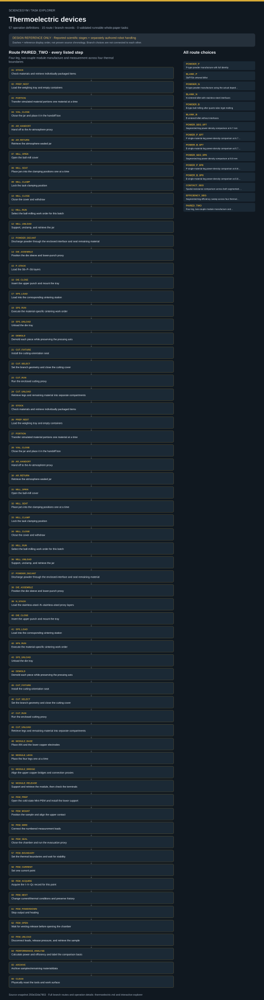

# Thermoelectric devices: task route map



Paper: **Composable neural emulators accelerate thermoelectric generator design** · [DOI](https://doi.org/10.1038/s41586-026-10223-1)

Task-design reference; no task execution or scientific reproduction. Counts describe task representation, not experiments or success.

**Reading rule:** numbered rows preserve reference-list occurrences. A loop body is shown once and must be repeated under its original binding, not treated as executed. An unordered obligation group has no inferred chronological edges. Source-reported scientific facts and authored handling are distinct.

[Immutable source task package](https://github.com/openags/ScienceGym/blob/2f926a9d2c2b8a0c71e8939feaa6ca5696e14c27/tasks/thermoelectric_operations_v2/) · [Interactive inspector](../index.html)

## POWDER_P — P-type powder manufacture with full identity

Authored reference sequence; independent material phases may be reordered subject to stated constraints

[Exact route source](https://github.com/openags/ScienceGym/blob/2f926a9d2c2b8a0c71e8939feaa6ca5696e14c27/tasks/thermoelectric_operations_v2/branches.json) · JSON pointer: `/branches/0/full_operation_sequence`

- `STOCK` Check materials and retrieve individually packaged items
- `PREP_NEST` Load the weighing tray and empty containers
- `PORTION` Transfer simulated material portions one material at a time
- `VIAL_CLOSE` Close the jar and place it in the handoff box
- `AR_HANDOFF` Hand off to the Ar-atmosphere proxy
- `AR_RETURN` Retrieve the atmosphere-sealed jar
- `MILL_OPEN` Open the ball-mill cover
- `MILL_SEAT` Place jars into the clamping positions one at a time
- `MILL_CLAMP` Lock the task clamping position
- `MILL_CLOSE` Close the cover and withdraw
- `MILL_RUN` Select the ball-milling work order for this batch
- `MILL_UNLOAD` Support, unclamp, and retrieve the jar
- `POWDER_DECANT` Discharge powder through the enclosed interface and seal remaining material
- `ARCHIVE` Archive samples/remaining material/data
- `CLEAN` Physically reset the tools and work surface

<details><summary>Branch state, choices, lineage and loop obligations</summary>

```json
{
  "source_branch_ids": [
    "T-B01"
  ],
  "evidence_ids": [
    "t.synthesis"
  ],
  "initial_state": "raw_stock_and_empty_stopped_equipment",
  "phases": [
    {
      "material": "P",
      "instance_binding": "P_parent_phase",
      "output_count_required": 1,
      "operations": [
        "STOCK",
        "PREP_NEST",
        "PORTION",
        "VIAL_CLOSE",
        "AR_HANDOFF",
        "AR_RETURN",
        "MILL_OPEN",
        "MILL_SEAT",
        "MILL_CLAMP",
        "MILL_CLOSE",
        "MILL_RUN",
        "MILL_UNLOAD",
        "POWDER_DECANT"
      ],
      "quantity_rule": "Enough issued symbolic portions for this phase; count cannot be created by relabelling. Real masses/yield unknown."
    }
  ],
  "parameters": {
    "material_card": "P"
  },
  "control_peer_ids": [],
  "physical_item_identity": "Each phase binds distinct material/object IDs; merge creates a new ID with all component parents.",
  "transport_binding": "Insert MOVE at every changed location; carry supported object, never teleport.",
  "condition_loop": "PEM_CURRENT/PEM_ACQUIRE repeat over current grid; PEM_BOUNDARY repeated for each thermal condition. Each repeat has unique run/point ID; PEM_NEXT is a branching template, not a one-click complete scan.",
  "source_vs_task_note": "",
  "success": "Complete physical operations, lineage, conditions/raw readings, and reset; mock values need not match literature performance",
  "not_claimed": "not author replicate count, not physical execution, not a recovered human microtrajectory"
}
```

</details>

## BLANK_P — Sb/P/Sb sintered billet

Authored reference sequence; independent material phases may be reordered subject to stated constraints

[Exact route source](https://github.com/openags/ScienceGym/blob/2f926a9d2c2b8a0c71e8939feaa6ca5696e14c27/tasks/thermoelectric_operations_v2/branches.json) · JSON pointer: `/branches/1/full_operation_sequence`

- `STOCK` Check materials and retrieve individually packaged items
- `PREP_NEST` Load the weighing tray and empty containers
- `PORTION` Transfer simulated material portions one material at a time
- `VIAL_CLOSE` Close the jar and place it in the handoff box
- `AR_HANDOFF` Hand off to the Ar-atmosphere proxy
- `AR_RETURN` Retrieve the atmosphere-sealed jar
- `MILL_OPEN` Open the ball-mill cover
- `MILL_SEAT` Place jars into the clamping positions one at a time
- `MILL_CLAMP` Lock the task clamping position
- `MILL_CLOSE` Close the cover and withdraw
- `MILL_RUN` Select the ball-milling work order for this batch
- `MILL_UNLOAD` Support, unclamp, and retrieve the jar
- `POWDER_DECANT` Discharge powder through the enclosed interface and seal remaining material
- `DIE_ASSEMBLE` Position the die sleeve and lower-punch proxy
- `P_STACK` Load the Sb–P–Sb layers
- `DIE_CLOSE` Insert the upper punch and mount the tray
- `SPS_LOAD` Load into the corresponding sintering station
- `SPS_RUN` Execute the material-specific sintering work order
- `SPS_UNLOAD` Unload the die tray
- `DEMOLD` Demold each piece while preserving the pressing axis
- `ARCHIVE` Archive samples/remaining material/data
- `CLEAN` Physically reset the tools and work surface

<details><summary>Branch state, choices, lineage and loop obligations</summary>

```json
{
  "source_branch_ids": [
    "T-B01",
    "T-B02"
  ],
  "evidence_ids": [
    "t.synthesis",
    "t.fabrication"
  ],
  "initial_state": "raw_stock_and_empty_stopped_equipment",
  "phases": [
    {
      "material": "P",
      "instance_binding": "P_parent_phase",
      "output_count_required": 1,
      "operations": [
        "STOCK",
        "PREP_NEST",
        "PORTION",
        "VIAL_CLOSE",
        "AR_HANDOFF",
        "AR_RETURN",
        "MILL_OPEN",
        "MILL_SEAT",
        "MILL_CLAMP",
        "MILL_CLOSE",
        "MILL_RUN",
        "MILL_UNLOAD",
        "POWDER_DECANT",
        "DIE_ASSEMBLE",
        "P_STACK",
        "DIE_CLOSE",
        "SPS_LOAD",
        "SPS_RUN",
        "SPS_UNLOAD",
        "DEMOLD"
      ],
      "quantity_rule": "Enough issued symbolic portions for this phase; count cannot be created by relabelling. Real masses/yield unknown."
    }
  ],
  "parameters": {
    "material_card": "P",
    "sinter": {
      "model": "SPS-322LX",
      "temperature_K": 573,
      "hold_min": 5,
      "pressure_MPa": 60
    }
  },
  "control_peer_ids": [],
  "physical_item_identity": "Each phase binds distinct material/object IDs; merge creates a new ID with all component parents.",
  "transport_binding": "Insert MOVE at every changed location; carry supported object, never teleport.",
  "condition_loop": "PEM_CURRENT/PEM_ACQUIRE repeat over current grid; PEM_BOUNDARY repeated for each thermal condition. Each repeat has unique run/point ID; PEM_NEXT is a branching template, not a one-click complete scan.",
  "source_vs_task_note": "",
  "success": "Complete physical operations, lineage, conditions/raw readings, and reset; mock values need not match literature performance",
  "not_claimed": "not author replicate count, not physical execution, not a recovered human microtrajectory"
}
```

</details>

## POWDER_N — N-type powder manufacture using the actual doped formulation

Authored reference sequence; independent material phases may be reordered subject to stated constraints

[Exact route source](https://github.com/openags/ScienceGym/blob/2f926a9d2c2b8a0c71e8939feaa6ca5696e14c27/tasks/thermoelectric_operations_v2/branches.json) · JSON pointer: `/branches/2/full_operation_sequence`

- `STOCK` Check materials and retrieve individually packaged items
- `PREP_NEST` Load the weighing tray and empty containers
- `PORTION` Transfer simulated material portions one material at a time
- `VIAL_CLOSE` Close the jar and place it in the handoff box
- `AR_HANDOFF` Hand off to the Ar-atmosphere proxy
- `AR_RETURN` Retrieve the atmosphere-sealed jar
- `MILL_OPEN` Open the ball-mill cover
- `MILL_SEAT` Place jars into the clamping positions one at a time
- `MILL_CLAMP` Lock the task clamping position
- `MILL_CLOSE` Close the cover and withdraw
- `MILL_RUN` Select the ball-milling work order for this batch
- `MILL_UNLOAD` Support, unclamp, and retrieve the jar
- `POWDER_DECANT` Discharge powder through the enclosed interface and seal remaining material
- `ARCHIVE` Archive samples/remaining material/data
- `CLEAN` Physically reset the tools and work surface

<details><summary>Branch state, choices, lineage and loop obligations</summary>

```json
{
  "source_branch_ids": [
    "T-B01"
  ],
  "evidence_ids": [
    "t.synthesis"
  ],
  "initial_state": "raw_stock_and_empty_stopped_equipment",
  "phases": [
    {
      "material": "N",
      "instance_binding": "N_parent_phase",
      "output_count_required": 1,
      "operations": [
        "STOCK",
        "PREP_NEST",
        "PORTION",
        "VIAL_CLOSE",
        "AR_HANDOFF",
        "AR_RETURN",
        "MILL_OPEN",
        "MILL_SEAT",
        "MILL_CLAMP",
        "MILL_CLOSE",
        "MILL_RUN",
        "MILL_UNLOAD",
        "POWDER_DECANT"
      ],
      "quantity_rule": "Enough issued symbolic portions for this phase; count cannot be created by relabelling. Real masses/yield unknown."
    }
  ],
  "parameters": {
    "material_card": "N"
  },
  "control_peer_ids": [],
  "physical_item_identity": "Each phase binds distinct material/object IDs; merge creates a new ID with all component parents.",
  "transport_binding": "Insert MOVE at every changed location; carry supported object, never teleport.",
  "condition_loop": "PEM_CURRENT/PEM_ACQUIRE repeat over current grid; PEM_BOUNDARY repeated for each thermal condition. Each repeat has unique run/point ID; PEM_NEXT is a branching template, not a one-click complete scan.",
  "source_vs_task_note": "",
  "success": "Complete physical operations, lineage, conditions/raw readings, and reset; mock values need not match literature performance",
  "not_claimed": "not author replicate count, not physical execution, not a recovered human microtrajectory"
}
```

</details>

## BLANK_N — N sintered billet with stainless-steel interfaces

Authored reference sequence; independent material phases may be reordered subject to stated constraints

[Exact route source](https://github.com/openags/ScienceGym/blob/2f926a9d2c2b8a0c71e8939feaa6ca5696e14c27/tasks/thermoelectric_operations_v2/branches.json) · JSON pointer: `/branches/3/full_operation_sequence`

- `STOCK` Check materials and retrieve individually packaged items
- `PREP_NEST` Load the weighing tray and empty containers
- `PORTION` Transfer simulated material portions one material at a time
- `VIAL_CLOSE` Close the jar and place it in the handoff box
- `AR_HANDOFF` Hand off to the Ar-atmosphere proxy
- `AR_RETURN` Retrieve the atmosphere-sealed jar
- `MILL_OPEN` Open the ball-mill cover
- `MILL_SEAT` Place jars into the clamping positions one at a time
- `MILL_CLAMP` Lock the task clamping position
- `MILL_CLOSE` Close the cover and withdraw
- `MILL_RUN` Select the ball-milling work order for this batch
- `MILL_UNLOAD` Support, unclamp, and retrieve the jar
- `POWDER_DECANT` Discharge powder through the enclosed interface and seal remaining material
- `DIE_ASSEMBLE` Position the die sleeve and lower-punch proxy
- `N_STACK` Load the stainless-steel–N–stainless-steel proxy layers
- `DIE_CLOSE` Insert the upper punch and mount the tray
- `SPS_LOAD` Load into the corresponding sintering station
- `SPS_RUN` Execute the material-specific sintering work order
- `SPS_UNLOAD` Unload the die tray
- `DEMOLD` Demold each piece while preserving the pressing axis
- `ARCHIVE` Archive samples/remaining material/data
- `CLEAN` Physically reset the tools and work surface

<details><summary>Branch state, choices, lineage and loop obligations</summary>

```json
{
  "source_branch_ids": [
    "T-B01",
    "T-B03"
  ],
  "evidence_ids": [
    "t.synthesis",
    "t.fabrication"
  ],
  "initial_state": "raw_stock_and_empty_stopped_equipment",
  "phases": [
    {
      "material": "N",
      "instance_binding": "N_parent_phase",
      "output_count_required": 1,
      "operations": [
        "STOCK",
        "PREP_NEST",
        "PORTION",
        "VIAL_CLOSE",
        "AR_HANDOFF",
        "AR_RETURN",
        "MILL_OPEN",
        "MILL_SEAT",
        "MILL_CLAMP",
        "MILL_CLOSE",
        "MILL_RUN",
        "MILL_UNLOAD",
        "POWDER_DECANT",
        "DIE_ASSEMBLE",
        "N_STACK",
        "DIE_CLOSE",
        "SPS_LOAD",
        "SPS_RUN",
        "SPS_UNLOAD",
        "DEMOLD"
      ],
      "quantity_rule": "Enough issued symbolic portions for this phase; count cannot be created by relabelling. Real masses/yield unknown."
    }
  ],
  "parameters": {
    "material_card": "N",
    "sinter": {
      "model": "SPS-1080 System",
      "temperature_K": 973,
      "hold_min": 10,
      "pressure_MPa": 60
    }
  },
  "control_peer_ids": [],
  "physical_item_identity": "Each phase binds distinct material/object IDs; merge creates a new ID with all component parents.",
  "transport_binding": "Insert MOVE at every changed location; carry supported object, never teleport.",
  "condition_loop": "PEM_CURRENT/PEM_ACQUIRE repeat over current grid; PEM_BOUNDARY repeated for each thermal condition. Each repeat has unique run/point ID; PEM_NEXT is a branching template, not a one-click complete scan.",
  "source_vs_task_note": "",
  "success": "Complete physical operations, lineage, conditions/raw readings, and reset; mock values need not match literature performance",
  "not_claimed": "not author replicate count, not physical execution, not a recovered human microtrajectory"
}
```

</details>

## POWDER_B — B-type ball milling after quartz-tube ingot melting

Authored reference sequence; independent material phases may be reordered subject to stated constraints

[Exact route source](https://github.com/openags/ScienceGym/blob/2f926a9d2c2b8a0c71e8939feaa6ca5696e14c27/tasks/thermoelectric_operations_v2/branches.json) · JSON pointer: `/branches/4/full_operation_sequence`

- `STOCK` Check materials and retrieve individually packaged items
- `PREP_NEST` Load the weighing tray and empty containers
- `PORTION` Transfer simulated material portions one material at a time
- `TUBE_LOAD` Load the quartz tube and hand off for encapsulation
- `MELT_LOAD` Load the quartz-tube rack into the cold-state heat-treatment slot
- `MELT_RUN` Start the melting work order
- `MELT_UNLOAD` Retrieve the ingot and transfer it to the ball-milling jar
- `MILL_OPEN` Open the ball-mill cover
- `MILL_SEAT` Place jars into the clamping positions one at a time
- `MILL_CLAMP` Lock the task clamping position
- `MILL_CLOSE` Close the cover and withdraw
- `MILL_RUN` Select the ball-milling work order for this batch
- `MILL_UNLOAD` Support, unclamp, and retrieve the jar
- `POWDER_DECANT` Discharge powder through the enclosed interface and seal remaining material
- `ARCHIVE` Archive samples/remaining material/data
- `CLEAN` Physically reset the tools and work surface

<details><summary>Branch state, choices, lineage and loop obligations</summary>

```json
{
  "source_branch_ids": [
    "T-B01"
  ],
  "evidence_ids": [
    "t.synthesis"
  ],
  "initial_state": "raw_stock_and_empty_stopped_equipment",
  "phases": [
    {
      "material": "B",
      "instance_binding": "B_parent_phase",
      "output_count_required": 1,
      "operations": [
        "STOCK",
        "PREP_NEST",
        "PORTION",
        "TUBE_LOAD",
        "MELT_LOAD",
        "MELT_RUN",
        "MELT_UNLOAD",
        "MILL_OPEN",
        "MILL_SEAT",
        "MILL_CLAMP",
        "MILL_CLOSE",
        "MILL_RUN",
        "MILL_UNLOAD",
        "POWDER_DECANT"
      ],
      "quantity_rule": "Enough issued symbolic portions for this phase; count cannot be created by relabelling. Real masses/yield unknown."
    }
  ],
  "parameters": {
    "material_card": "B"
  },
  "control_peer_ids": [],
  "physical_item_identity": "Each phase binds distinct material/object IDs; merge creates a new ID with all component parents.",
  "transport_binding": "Insert MOVE at every changed location; carry supported object, never teleport.",
  "condition_loop": "PEM_CURRENT/PEM_ACQUIRE repeat over current grid; PEM_BOUNDARY repeated for each thermal condition. Each repeat has unique run/point ID; PEM_NEXT is a branching template, not a one-click complete scan.",
  "source_vs_task_note": "",
  "success": "Complete physical operations, lineage, conditions/raw readings, and reset; mock values need not match literature performance",
  "not_claimed": "not author replicate count, not physical execution, not a recovered human microtrajectory"
}
```

</details>

## BLANK_B — B sintered billet without interfaces

Authored reference sequence; independent material phases may be reordered subject to stated constraints

[Exact route source](https://github.com/openags/ScienceGym/blob/2f926a9d2c2b8a0c71e8939feaa6ca5696e14c27/tasks/thermoelectric_operations_v2/branches.json) · JSON pointer: `/branches/5/full_operation_sequence`

- `STOCK` Check materials and retrieve individually packaged items
- `PREP_NEST` Load the weighing tray and empty containers
- `PORTION` Transfer simulated material portions one material at a time
- `TUBE_LOAD` Load the quartz tube and hand off for encapsulation
- `MELT_LOAD` Load the quartz-tube rack into the cold-state heat-treatment slot
- `MELT_RUN` Start the melting work order
- `MELT_UNLOAD` Retrieve the ingot and transfer it to the ball-milling jar
- `MILL_OPEN` Open the ball-mill cover
- `MILL_SEAT` Place jars into the clamping positions one at a time
- `MILL_CLAMP` Lock the task clamping position
- `MILL_CLOSE` Close the cover and withdraw
- `MILL_RUN` Select the ball-milling work order for this batch
- `MILL_UNLOAD` Support, unclamp, and retrieve the jar
- `POWDER_DECANT` Discharge powder through the enclosed interface and seal remaining material
- `DIE_ASSEMBLE` Position the die sleeve and lower-punch proxy
- `B_STACK` Load B material without an interface
- `DIE_CLOSE` Insert the upper punch and mount the tray
- `SPS_LOAD` Load into the corresponding sintering station
- `SPS_RUN` Execute the material-specific sintering work order
- `SPS_UNLOAD` Unload the die tray
- `DEMOLD` Demold each piece while preserving the pressing axis
- `ARCHIVE` Archive samples/remaining material/data
- `CLEAN` Physically reset the tools and work surface

<details><summary>Branch state, choices, lineage and loop obligations</summary>

```json
{
  "source_branch_ids": [
    "T-B01",
    "T-B02"
  ],
  "evidence_ids": [
    "t.synthesis",
    "t.fabrication"
  ],
  "initial_state": "raw_stock_and_empty_stopped_equipment",
  "phases": [
    {
      "material": "B",
      "instance_binding": "B_parent_phase",
      "output_count_required": 1,
      "operations": [
        "STOCK",
        "PREP_NEST",
        "PORTION",
        "TUBE_LOAD",
        "MELT_LOAD",
        "MELT_RUN",
        "MELT_UNLOAD",
        "MILL_OPEN",
        "MILL_SEAT",
        "MILL_CLAMP",
        "MILL_CLOSE",
        "MILL_RUN",
        "MILL_UNLOAD",
        "POWDER_DECANT",
        "DIE_ASSEMBLE",
        "B_STACK",
        "DIE_CLOSE",
        "SPS_LOAD",
        "SPS_RUN",
        "SPS_UNLOAD",
        "DEMOLD"
      ],
      "quantity_rule": "Enough issued symbolic portions for this phase; count cannot be created by relabelling. Real masses/yield unknown."
    }
  ],
  "parameters": {
    "material_card": "B",
    "sinter": {
      "model": "SPS-322LX",
      "temperature_K": 693,
      "hold_min": 10,
      "pressure_MPa": 60
    }
  },
  "control_peer_ids": [],
  "physical_item_identity": "Each phase binds distinct material/object IDs; merge creates a new ID with all component parents.",
  "transport_binding": "Insert MOVE at every changed location; carry supported object, never teleport.",
  "condition_loop": "PEM_CURRENT/PEM_ACQUIRE repeat over current grid; PEM_BOUNDARY repeated for each thermal condition. Each repeat has unique run/point ID; PEM_NEXT is a branching template, not a one-click complete scan.",
  "source_vs_task_note": "",
  "success": "Complete physical operations, lineage, conditions/raw readings, and reset; mock values need not match literature performance",
  "not_claimed": "not author replicate count, not physical execution, not a recovered human microtrajectory"
}
```

</details>

## POWER_SEG_6P7 — Segmented-leg power-density comparison at 6.7 mm

Authored reference sequence; independent material phases may be reordered subject to stated constraints

[Exact route source](https://github.com/openags/ScienceGym/blob/2f926a9d2c2b8a0c71e8939feaa6ca5696e14c27/tasks/thermoelectric_operations_v2/branches.json) · JSON pointer: `/branches/6/full_operation_sequence`

- `STOCK` Check materials and retrieve individually packaged items
- `PREP_NEST` Load the weighing tray and empty containers
- `PORTION` Transfer simulated material portions one material at a time
- `VIAL_CLOSE` Close the jar and place it in the handoff box
- `AR_HANDOFF` Hand off to the Ar-atmosphere proxy
- `AR_RETURN` Retrieve the atmosphere-sealed jar
- `MILL_OPEN` Open the ball-mill cover
- `MILL_SEAT` Place jars into the clamping positions one at a time
- `MILL_CLAMP` Lock the task clamping position
- `MILL_CLOSE` Close the cover and withdraw
- `MILL_RUN` Select the ball-milling work order for this batch
- `MILL_UNLOAD` Support, unclamp, and retrieve the jar
- `POWDER_DECANT` Discharge powder through the enclosed interface and seal remaining material
- `DIE_ASSEMBLE` Position the die sleeve and lower-punch proxy
- `P_STACK` Load the Sb–P–Sb layers
- `DIE_CLOSE` Insert the upper punch and mount the tray
- `SPS_LOAD` Load into the corresponding sintering station
- `SPS_RUN` Execute the material-specific sintering work order
- `SPS_UNLOAD` Unload the die tray
- `DEMOLD` Demold each piece while preserving the pressing axis
- `CUT_FIXTURE` Install the cutting-orientation seat
- `CUT_SELECT` Set the branch geometry and close the cutting cover
- `CUT_RUN` Run the enclosed cutting proxy
- `CUT_UNLOAD` Retrieve legs and remaining material into separate compartments
- `STOCK` Check materials and retrieve individually packaged items
- `PREP_NEST` Load the weighing tray and empty containers
- `PORTION` Transfer simulated material portions one material at a time
- `TUBE_LOAD` Load the quartz tube and hand off for encapsulation
- `MELT_LOAD` Load the quartz-tube rack into the cold-state heat-treatment slot
- `MELT_RUN` Start the melting work order
- `MELT_UNLOAD` Retrieve the ingot and transfer it to the ball-milling jar
- `MILL_OPEN` Open the ball-mill cover
- `MILL_SEAT` Place jars into the clamping positions one at a time
- `MILL_CLAMP` Lock the task clamping position
- `MILL_CLOSE` Close the cover and withdraw
- `MILL_RUN` Select the ball-milling work order for this batch
- `MILL_UNLOAD` Support, unclamp, and retrieve the jar
- `POWDER_DECANT` Discharge powder through the enclosed interface and seal remaining material
- `DIE_ASSEMBLE` Position the die sleeve and lower-punch proxy
- `B_STACK` Load B material without an interface
- `DIE_CLOSE` Insert the upper punch and mount the tray
- `SPS_LOAD` Load into the corresponding sintering station
- `SPS_RUN` Execute the material-specific sintering work order
- `SPS_UNLOAD` Unload the die tray
- `DEMOLD` Demold each piece while preserving the pressing axis
- `CUT_FIXTURE` Install the cutting-orientation seat
- `CUT_SELECT` Set the branch geometry and close the cutting cover
- `CUT_RUN` Run the enclosed cutting proxy
- `CUT_UNLOAD` Retrieve legs and remaining material into separate compartments
- `GA_SETUP` Install the segment-alignment fixture
- `GA_APPLY` Add the Ga–In proxy layer to the joining end
- `SEG_JOIN` Bring the segments together and secure them for transfer
- `PEM_PREP` Open the cold-state Mini-PEM and install the lower support
- `PEM_MOUNT` Position the sample and align the upper contact
- `PEM_WIRE` Connect the numbered measurement leads
- `PEM_SEAL` Close the chamber and run the evacuation proxy
- `PEM_BOUNDARY` Set the thermal boundaries and wait for stability
- `PEM_CURRENT` Set one current point
- `PEM_ACQUIRE` Acquire the I–V–Qc record for this point
- `PEM_NEXT` Change current/thermal conditions and preserve history
- `PEM_POWERDOWN` Stop output and heating
- `PEM_OPEN` Wait for venting release before opening the chamber
- `PEM_UNLOAD` Disconnect leads, release pressure, and retrieve the sample
- `PERFORMANCE_ANALYSE` Calculate power and efficiency and label the comparison basis
- `ARCHIVE` Archive samples/remaining material/data
- `CLEAN` Physically reset the tools and work surface

<details><summary>Branch state, choices, lineage and loop obligations</summary>

```json
{
  "source_branch_ids": [
    "T-B01",
    "T-B02",
    "T-B05"
  ],
  "evidence_ids": [
    "t.segment",
    "t.fabrication",
    "t.measure"
  ],
  "initial_state": "raw_stock_and_empty_stopped_equipment",
  "phases": [
    {
      "material": "P",
      "instance_binding": "P_parent_phase",
      "output_count_required": 1,
      "operations": [
        "STOCK",
        "PREP_NEST",
        "PORTION",
        "VIAL_CLOSE",
        "AR_HANDOFF",
        "AR_RETURN",
        "MILL_OPEN",
        "MILL_SEAT",
        "MILL_CLAMP",
        "MILL_CLOSE",
        "MILL_RUN",
        "MILL_UNLOAD",
        "POWDER_DECANT",
        "DIE_ASSEMBLE",
        "P_STACK",
        "DIE_CLOSE",
        "SPS_LOAD",
        "SPS_RUN",
        "SPS_UNLOAD",
        "DEMOLD",
        "CUT_FIXTURE",
        "CUT_SELECT",
        "CUT_RUN",
        "CUT_UNLOAD"
      ],
      "quantity_rule": "Enough issued symbolic portions for this phase; count cannot be created by relabelling. Real masses/yield unknown.",
      "geometry_binding": {
        "task_envelope_mm": [
          4,
          4,
          3.35
        ],
        "reported_finished_total_length_mm": 6.7,
        "status": "cross-section authored; component length partition authored to implement source0.5ratio and preserve total",
        "interface_thickness_partition": "unresolved in source; mock represents interface as logical surface within envelope, no added length"
      }
    },
    {
      "material": "B",
      "instance_binding": "B_parent_phase",
      "output_count_required": 1,
      "operations": [
        "STOCK",
        "PREP_NEST",
        "PORTION",
        "TUBE_LOAD",
        "MELT_LOAD",
        "MELT_RUN",
        "MELT_UNLOAD",
        "MILL_OPEN",
        "MILL_SEAT",
        "MILL_CLAMP",
        "MILL_CLOSE",
        "MILL_RUN",
        "MILL_UNLOAD",
        "POWDER_DECANT",
        "DIE_ASSEMBLE",
        "B_STACK",
        "DIE_CLOSE",
        "SPS_LOAD",
        "SPS_RUN",
        "SPS_UNLOAD",
        "DEMOLD",
        "CUT_FIXTURE",
        "CUT_SELECT",
        "CUT_RUN",
        "CUT_UNLOAD"
      ],
      "quantity_rule": "Enough issued symbolic portions for this phase; count cannot be created by relabelling. Real masses/yield unknown.",
      "geometry_binding": {
        "task_envelope_mm": [
          4,
          4,
          3.35
        ],
        "reported_finished_total_length_mm": 6.7,
        "status": "cross-section authored; component length partition authored to implement source0.5ratio and preserve total",
        "interface_thickness_partition": "unresolved in source; mock represents interface as logical surface within envelope, no added length"
      }
    },
    {
      "material": "SEG",
      "instance_binding": "new_object(P_leg,B_leg,GaIn)",
      "operations": [
        "GA_SETUP",
        "GA_APPLY",
        "SEG_JOIN"
      ]
    },
    {
      "material": "SEG",
      "instance_binding": "measured_POWER_SEG_6P7",
      "operations": [
        "PEM_PREP",
        "PEM_MOUNT",
        "PEM_WIRE",
        "PEM_SEAL",
        "PEM_BOUNDARY",
        "PEM_CURRENT",
        "PEM_ACQUIRE",
        "PEM_NEXT",
        "PEM_POWERDOWN",
        "PEM_OPEN",
        "PEM_UNLOAD",
        "PERFORMANCE_ANALYSE"
      ]
    }
  ],
  "parameters": {
    "source_reported_total_length_mm": 6.7,
    "source_physical_cross_section_mm": null,
    "task_proxy_cross_section_mm": [
      4,
      4
    ],
    "task_proxy_cross_section_status": "authored_for_fixture_only_not_inferred_from_computation",
    "source_segment_P_length_ratio": 0.5,
    "source_Fig3i_thermal_boundary": null,
    "task_thermal_card": {
      "Th_K": 473,
      "Tc_K": 293,
      "status": "authored_matched_comparison_not_Fig3i_reconstruction"
    },
    "single_control_contact_architecture": null
  },
  "control_peer_ids": [
    "POWER_P_6P7",
    "POWER_B_6P7"
  ],
  "physical_item_identity": "Each phase binds distinct material/object IDs; merge creates a new ID with all component parents.",
  "transport_binding": "Insert MOVE at every changed location; carry supported object, never teleport.",
  "condition_loop": "PEM_CURRENT/PEM_ACQUIRE repeat over current grid; PEM_BOUNDARY repeated for each thermal condition. Each repeat has unique run/point ID; PEM_NEXT is a branching template, not a one-click complete scan.",
  "source_vs_task_note": "Fig.3i gives two total lengths for all three categories. Cross-section and boundary are not stated; mock equal-area/equal-boundary fixture is an authored matched comparison. 3.5×3.5 mm and 7–10 mm in Fig.3d/e are computational, not this specimen.",
  "success": "Complete physical operations, lineage, conditions/raw readings, and reset; mock values need not match literature performance",
  "not_claimed": "not author replicate count, not physical execution, not a recovered human microtrajectory"
}
```

</details>

## POWER_P_6P7 — P single-material-leg power-density comparison at 6.7 mm

Authored reference sequence; independent material phases may be reordered subject to stated constraints

[Exact route source](https://github.com/openags/ScienceGym/blob/2f926a9d2c2b8a0c71e8939feaa6ca5696e14c27/tasks/thermoelectric_operations_v2/branches.json) · JSON pointer: `/branches/7/full_operation_sequence`

- `STOCK` Check materials and retrieve individually packaged items
- `PREP_NEST` Load the weighing tray and empty containers
- `PORTION` Transfer simulated material portions one material at a time
- `VIAL_CLOSE` Close the jar and place it in the handoff box
- `AR_HANDOFF` Hand off to the Ar-atmosphere proxy
- `AR_RETURN` Retrieve the atmosphere-sealed jar
- `MILL_OPEN` Open the ball-mill cover
- `MILL_SEAT` Place jars into the clamping positions one at a time
- `MILL_CLAMP` Lock the task clamping position
- `MILL_CLOSE` Close the cover and withdraw
- `MILL_RUN` Select the ball-milling work order for this batch
- `MILL_UNLOAD` Support, unclamp, and retrieve the jar
- `POWDER_DECANT` Discharge powder through the enclosed interface and seal remaining material
- `DIE_ASSEMBLE` Position the die sleeve and lower-punch proxy
- `P_STACK` Load the Sb–P–Sb layers
- `DIE_CLOSE` Insert the upper punch and mount the tray
- `SPS_LOAD` Load into the corresponding sintering station
- `SPS_RUN` Execute the material-specific sintering work order
- `SPS_UNLOAD` Unload the die tray
- `DEMOLD` Demold each piece while preserving the pressing axis
- `CUT_FIXTURE` Install the cutting-orientation seat
- `CUT_SELECT` Set the branch geometry and close the cutting cover
- `CUT_RUN` Run the enclosed cutting proxy
- `CUT_UNLOAD` Retrieve legs and remaining material into separate compartments
- `PEM_PREP` Open the cold-state Mini-PEM and install the lower support
- `PEM_MOUNT` Position the sample and align the upper contact
- `PEM_WIRE` Connect the numbered measurement leads
- `PEM_SEAL` Close the chamber and run the evacuation proxy
- `PEM_BOUNDARY` Set the thermal boundaries and wait for stability
- `PEM_CURRENT` Set one current point
- `PEM_ACQUIRE` Acquire the I–V–Qc record for this point
- `PEM_NEXT` Change current/thermal conditions and preserve history
- `PEM_POWERDOWN` Stop output and heating
- `PEM_OPEN` Wait for venting release before opening the chamber
- `PEM_UNLOAD` Disconnect leads, release pressure, and retrieve the sample
- `PERFORMANCE_ANALYSE` Calculate power and efficiency and label the comparison basis
- `ARCHIVE` Archive samples/remaining material/data
- `CLEAN` Physically reset the tools and work surface

<details><summary>Branch state, choices, lineage and loop obligations</summary>

```json
{
  "source_branch_ids": [
    "T-B01",
    "T-B02",
    "T-B05"
  ],
  "evidence_ids": [
    "t.segment",
    "t.fabrication",
    "t.measure"
  ],
  "initial_state": "raw_stock_and_empty_stopped_equipment",
  "phases": [
    {
      "material": "P",
      "instance_binding": "P_parent_phase",
      "output_count_required": 1,
      "operations": [
        "STOCK",
        "PREP_NEST",
        "PORTION",
        "VIAL_CLOSE",
        "AR_HANDOFF",
        "AR_RETURN",
        "MILL_OPEN",
        "MILL_SEAT",
        "MILL_CLAMP",
        "MILL_CLOSE",
        "MILL_RUN",
        "MILL_UNLOAD",
        "POWDER_DECANT",
        "DIE_ASSEMBLE",
        "P_STACK",
        "DIE_CLOSE",
        "SPS_LOAD",
        "SPS_RUN",
        "SPS_UNLOAD",
        "DEMOLD",
        "CUT_FIXTURE",
        "CUT_SELECT",
        "CUT_RUN",
        "CUT_UNLOAD"
      ],
      "quantity_rule": "Enough issued symbolic portions for this phase; count cannot be created by relabelling. Real masses/yield unknown.",
      "geometry_binding": {
        "task_envelope_mm": [
          4,
          4,
          6.7
        ],
        "reported_finished_total_length_mm": 6.7,
        "status": "cross-section authored; finished length source-reported",
        "interface_thickness_partition": "unresolved in source; mock represents interface as logical surface within envelope, no added length"
      }
    },
    {
      "material": "P",
      "instance_binding": "measured_POWER_P_6P7",
      "operations": [
        "PEM_PREP",
        "PEM_MOUNT",
        "PEM_WIRE",
        "PEM_SEAL",
        "PEM_BOUNDARY",
        "PEM_CURRENT",
        "PEM_ACQUIRE",
        "PEM_NEXT",
        "PEM_POWERDOWN",
        "PEM_OPEN",
        "PEM_UNLOAD",
        "PERFORMANCE_ANALYSE"
      ]
    }
  ],
  "parameters": {
    "source_reported_total_length_mm": 6.7,
    "source_physical_cross_section_mm": null,
    "task_proxy_cross_section_mm": [
      4,
      4
    ],
    "task_proxy_cross_section_status": "authored_for_fixture_only_not_inferred_from_computation",
    "source_segment_P_length_ratio": null,
    "source_Fig3i_thermal_boundary": null,
    "task_thermal_card": {
      "Th_K": 473,
      "Tc_K": 293,
      "status": "authored_matched_comparison_not_Fig3i_reconstruction"
    },
    "single_control_contact_architecture": "unreported independently; reuse component preparation in task only"
  },
  "control_peer_ids": [
    "POWER_SEG_6P7",
    "POWER_B_6P7"
  ],
  "physical_item_identity": "Each phase binds distinct material/object IDs; merge creates a new ID with all component parents.",
  "transport_binding": "Insert MOVE at every changed location; carry supported object, never teleport.",
  "condition_loop": "PEM_CURRENT/PEM_ACQUIRE repeat over current grid; PEM_BOUNDARY repeated for each thermal condition. Each repeat has unique run/point ID; PEM_NEXT is a branching template, not a one-click complete scan.",
  "source_vs_task_note": "Fig.3i gives two total lengths for all three categories. Cross-section and boundary are not stated; mock equal-area/equal-boundary fixture is an authored matched comparison. 3.5×3.5 mm and 7–10 mm in Fig.3d/e are computational, not this specimen.",
  "success": "Complete physical operations, lineage, conditions/raw readings, and reset; mock values need not match literature performance",
  "not_claimed": "not author replicate count, not physical execution, not a recovered human microtrajectory"
}
```

</details>

## POWER_B_6P7 — B single-material-leg power-density comparison at 6.7 mm

Authored reference sequence; independent material phases may be reordered subject to stated constraints

[Exact route source](https://github.com/openags/ScienceGym/blob/2f926a9d2c2b8a0c71e8939feaa6ca5696e14c27/tasks/thermoelectric_operations_v2/branches.json) · JSON pointer: `/branches/8/full_operation_sequence`

- `STOCK` Check materials and retrieve individually packaged items
- `PREP_NEST` Load the weighing tray and empty containers
- `PORTION` Transfer simulated material portions one material at a time
- `TUBE_LOAD` Load the quartz tube and hand off for encapsulation
- `MELT_LOAD` Load the quartz-tube rack into the cold-state heat-treatment slot
- `MELT_RUN` Start the melting work order
- `MELT_UNLOAD` Retrieve the ingot and transfer it to the ball-milling jar
- `MILL_OPEN` Open the ball-mill cover
- `MILL_SEAT` Place jars into the clamping positions one at a time
- `MILL_CLAMP` Lock the task clamping position
- `MILL_CLOSE` Close the cover and withdraw
- `MILL_RUN` Select the ball-milling work order for this batch
- `MILL_UNLOAD` Support, unclamp, and retrieve the jar
- `POWDER_DECANT` Discharge powder through the enclosed interface and seal remaining material
- `DIE_ASSEMBLE` Position the die sleeve and lower-punch proxy
- `B_STACK` Load B material without an interface
- `DIE_CLOSE` Insert the upper punch and mount the tray
- `SPS_LOAD` Load into the corresponding sintering station
- `SPS_RUN` Execute the material-specific sintering work order
- `SPS_UNLOAD` Unload the die tray
- `DEMOLD` Demold each piece while preserving the pressing axis
- `CUT_FIXTURE` Install the cutting-orientation seat
- `CUT_SELECT` Set the branch geometry and close the cutting cover
- `CUT_RUN` Run the enclosed cutting proxy
- `CUT_UNLOAD` Retrieve legs and remaining material into separate compartments
- `PEM_PREP` Open the cold-state Mini-PEM and install the lower support
- `PEM_MOUNT` Position the sample and align the upper contact
- `PEM_WIRE` Connect the numbered measurement leads
- `PEM_SEAL` Close the chamber and run the evacuation proxy
- `PEM_BOUNDARY` Set the thermal boundaries and wait for stability
- `PEM_CURRENT` Set one current point
- `PEM_ACQUIRE` Acquire the I–V–Qc record for this point
- `PEM_NEXT` Change current/thermal conditions and preserve history
- `PEM_POWERDOWN` Stop output and heating
- `PEM_OPEN` Wait for venting release before opening the chamber
- `PEM_UNLOAD` Disconnect leads, release pressure, and retrieve the sample
- `PERFORMANCE_ANALYSE` Calculate power and efficiency and label the comparison basis
- `ARCHIVE` Archive samples/remaining material/data
- `CLEAN` Physically reset the tools and work surface

<details><summary>Branch state, choices, lineage and loop obligations</summary>

```json
{
  "source_branch_ids": [
    "T-B01",
    "T-B02",
    "T-B05"
  ],
  "evidence_ids": [
    "t.segment",
    "t.fabrication",
    "t.measure"
  ],
  "initial_state": "raw_stock_and_empty_stopped_equipment",
  "phases": [
    {
      "material": "B",
      "instance_binding": "B_parent_phase",
      "output_count_required": 1,
      "operations": [
        "STOCK",
        "PREP_NEST",
        "PORTION",
        "TUBE_LOAD",
        "MELT_LOAD",
        "MELT_RUN",
        "MELT_UNLOAD",
        "MILL_OPEN",
        "MILL_SEAT",
        "MILL_CLAMP",
        "MILL_CLOSE",
        "MILL_RUN",
        "MILL_UNLOAD",
        "POWDER_DECANT",
        "DIE_ASSEMBLE",
        "B_STACK",
        "DIE_CLOSE",
        "SPS_LOAD",
        "SPS_RUN",
        "SPS_UNLOAD",
        "DEMOLD",
        "CUT_FIXTURE",
        "CUT_SELECT",
        "CUT_RUN",
        "CUT_UNLOAD"
      ],
      "quantity_rule": "Enough issued symbolic portions for this phase; count cannot be created by relabelling. Real masses/yield unknown.",
      "geometry_binding": {
        "task_envelope_mm": [
          4,
          4,
          6.7
        ],
        "reported_finished_total_length_mm": 6.7,
        "status": "cross-section authored; finished length source-reported",
        "interface_thickness_partition": "unresolved in source; mock represents interface as logical surface within envelope, no added length"
      }
    },
    {
      "material": "B",
      "instance_binding": "measured_POWER_B_6P7",
      "operations": [
        "PEM_PREP",
        "PEM_MOUNT",
        "PEM_WIRE",
        "PEM_SEAL",
        "PEM_BOUNDARY",
        "PEM_CURRENT",
        "PEM_ACQUIRE",
        "PEM_NEXT",
        "PEM_POWERDOWN",
        "PEM_OPEN",
        "PEM_UNLOAD",
        "PERFORMANCE_ANALYSE"
      ]
    }
  ],
  "parameters": {
    "source_reported_total_length_mm": 6.7,
    "source_physical_cross_section_mm": null,
    "task_proxy_cross_section_mm": [
      4,
      4
    ],
    "task_proxy_cross_section_status": "authored_for_fixture_only_not_inferred_from_computation",
    "source_segment_P_length_ratio": null,
    "source_Fig3i_thermal_boundary": null,
    "task_thermal_card": {
      "Th_K": 473,
      "Tc_K": 293,
      "status": "authored_matched_comparison_not_Fig3i_reconstruction"
    },
    "single_control_contact_architecture": "unreported independently; reuse component preparation in task only"
  },
  "control_peer_ids": [
    "POWER_SEG_6P7",
    "POWER_P_6P7"
  ],
  "physical_item_identity": "Each phase binds distinct material/object IDs; merge creates a new ID with all component parents.",
  "transport_binding": "Insert MOVE at every changed location; carry supported object, never teleport.",
  "condition_loop": "PEM_CURRENT/PEM_ACQUIRE repeat over current grid; PEM_BOUNDARY repeated for each thermal condition. Each repeat has unique run/point ID; PEM_NEXT is a branching template, not a one-click complete scan.",
  "source_vs_task_note": "Fig.3i gives two total lengths for all three categories. Cross-section and boundary are not stated; mock equal-area/equal-boundary fixture is an authored matched comparison. 3.5×3.5 mm and 7–10 mm in Fig.3d/e are computational, not this specimen.",
  "success": "Complete physical operations, lineage, conditions/raw readings, and reset; mock values need not match literature performance",
  "not_claimed": "not author replicate count, not physical execution, not a recovered human microtrajectory"
}
```

</details>

## POWER_SEG_8P8 — Segmented-leg power-density comparison at 8.8 mm

Authored reference sequence; independent material phases may be reordered subject to stated constraints

[Exact route source](https://github.com/openags/ScienceGym/blob/2f926a9d2c2b8a0c71e8939feaa6ca5696e14c27/tasks/thermoelectric_operations_v2/branches.json) · JSON pointer: `/branches/9/full_operation_sequence`

- `STOCK` Check materials and retrieve individually packaged items
- `PREP_NEST` Load the weighing tray and empty containers
- `PORTION` Transfer simulated material portions one material at a time
- `VIAL_CLOSE` Close the jar and place it in the handoff box
- `AR_HANDOFF` Hand off to the Ar-atmosphere proxy
- `AR_RETURN` Retrieve the atmosphere-sealed jar
- `MILL_OPEN` Open the ball-mill cover
- `MILL_SEAT` Place jars into the clamping positions one at a time
- `MILL_CLAMP` Lock the task clamping position
- `MILL_CLOSE` Close the cover and withdraw
- `MILL_RUN` Select the ball-milling work order for this batch
- `MILL_UNLOAD` Support, unclamp, and retrieve the jar
- `POWDER_DECANT` Discharge powder through the enclosed interface and seal remaining material
- `DIE_ASSEMBLE` Position the die sleeve and lower-punch proxy
- `P_STACK` Load the Sb–P–Sb layers
- `DIE_CLOSE` Insert the upper punch and mount the tray
- `SPS_LOAD` Load into the corresponding sintering station
- `SPS_RUN` Execute the material-specific sintering work order
- `SPS_UNLOAD` Unload the die tray
- `DEMOLD` Demold each piece while preserving the pressing axis
- `CUT_FIXTURE` Install the cutting-orientation seat
- `CUT_SELECT` Set the branch geometry and close the cutting cover
- `CUT_RUN` Run the enclosed cutting proxy
- `CUT_UNLOAD` Retrieve legs and remaining material into separate compartments
- `STOCK` Check materials and retrieve individually packaged items
- `PREP_NEST` Load the weighing tray and empty containers
- `PORTION` Transfer simulated material portions one material at a time
- `TUBE_LOAD` Load the quartz tube and hand off for encapsulation
- `MELT_LOAD` Load the quartz-tube rack into the cold-state heat-treatment slot
- `MELT_RUN` Start the melting work order
- `MELT_UNLOAD` Retrieve the ingot and transfer it to the ball-milling jar
- `MILL_OPEN` Open the ball-mill cover
- `MILL_SEAT` Place jars into the clamping positions one at a time
- `MILL_CLAMP` Lock the task clamping position
- `MILL_CLOSE` Close the cover and withdraw
- `MILL_RUN` Select the ball-milling work order for this batch
- `MILL_UNLOAD` Support, unclamp, and retrieve the jar
- `POWDER_DECANT` Discharge powder through the enclosed interface and seal remaining material
- `DIE_ASSEMBLE` Position the die sleeve and lower-punch proxy
- `B_STACK` Load B material without an interface
- `DIE_CLOSE` Insert the upper punch and mount the tray
- `SPS_LOAD` Load into the corresponding sintering station
- `SPS_RUN` Execute the material-specific sintering work order
- `SPS_UNLOAD` Unload the die tray
- `DEMOLD` Demold each piece while preserving the pressing axis
- `CUT_FIXTURE` Install the cutting-orientation seat
- `CUT_SELECT` Set the branch geometry and close the cutting cover
- `CUT_RUN` Run the enclosed cutting proxy
- `CUT_UNLOAD` Retrieve legs and remaining material into separate compartments
- `GA_SETUP` Install the segment-alignment fixture
- `GA_APPLY` Add the Ga–In proxy layer to the joining end
- `SEG_JOIN` Bring the segments together and secure them for transfer
- `PEM_PREP` Open the cold-state Mini-PEM and install the lower support
- `PEM_MOUNT` Position the sample and align the upper contact
- `PEM_WIRE` Connect the numbered measurement leads
- `PEM_SEAL` Close the chamber and run the evacuation proxy
- `PEM_BOUNDARY` Set the thermal boundaries and wait for stability
- `PEM_CURRENT` Set one current point
- `PEM_ACQUIRE` Acquire the I–V–Qc record for this point
- `PEM_NEXT` Change current/thermal conditions and preserve history
- `PEM_POWERDOWN` Stop output and heating
- `PEM_OPEN` Wait for venting release before opening the chamber
- `PEM_UNLOAD` Disconnect leads, release pressure, and retrieve the sample
- `PERFORMANCE_ANALYSE` Calculate power and efficiency and label the comparison basis
- `ARCHIVE` Archive samples/remaining material/data
- `CLEAN` Physically reset the tools and work surface

<details><summary>Branch state, choices, lineage and loop obligations</summary>

```json
{
  "source_branch_ids": [
    "T-B01",
    "T-B02",
    "T-B05"
  ],
  "evidence_ids": [
    "t.segment",
    "t.fabrication",
    "t.measure"
  ],
  "initial_state": "raw_stock_and_empty_stopped_equipment",
  "phases": [
    {
      "material": "P",
      "instance_binding": "P_parent_phase",
      "output_count_required": 1,
      "operations": [
        "STOCK",
        "PREP_NEST",
        "PORTION",
        "VIAL_CLOSE",
        "AR_HANDOFF",
        "AR_RETURN",
        "MILL_OPEN",
        "MILL_SEAT",
        "MILL_CLAMP",
        "MILL_CLOSE",
        "MILL_RUN",
        "MILL_UNLOAD",
        "POWDER_DECANT",
        "DIE_ASSEMBLE",
        "P_STACK",
        "DIE_CLOSE",
        "SPS_LOAD",
        "SPS_RUN",
        "SPS_UNLOAD",
        "DEMOLD",
        "CUT_FIXTURE",
        "CUT_SELECT",
        "CUT_RUN",
        "CUT_UNLOAD"
      ],
      "quantity_rule": "Enough issued symbolic portions for this phase; count cannot be created by relabelling. Real masses/yield unknown.",
      "geometry_binding": {
        "task_envelope_mm": [
          4,
          4,
          4.4
        ],
        "reported_finished_total_length_mm": 8.8,
        "status": "cross-section authored; component length partition authored to implement source0.5ratio and preserve total",
        "interface_thickness_partition": "unresolved in source; mock represents interface as logical surface within envelope, no added length"
      }
    },
    {
      "material": "B",
      "instance_binding": "B_parent_phase",
      "output_count_required": 1,
      "operations": [
        "STOCK",
        "PREP_NEST",
        "PORTION",
        "TUBE_LOAD",
        "MELT_LOAD",
        "MELT_RUN",
        "MELT_UNLOAD",
        "MILL_OPEN",
        "MILL_SEAT",
        "MILL_CLAMP",
        "MILL_CLOSE",
        "MILL_RUN",
        "MILL_UNLOAD",
        "POWDER_DECANT",
        "DIE_ASSEMBLE",
        "B_STACK",
        "DIE_CLOSE",
        "SPS_LOAD",
        "SPS_RUN",
        "SPS_UNLOAD",
        "DEMOLD",
        "CUT_FIXTURE",
        "CUT_SELECT",
        "CUT_RUN",
        "CUT_UNLOAD"
      ],
      "quantity_rule": "Enough issued symbolic portions for this phase; count cannot be created by relabelling. Real masses/yield unknown.",
      "geometry_binding": {
        "task_envelope_mm": [
          4,
          4,
          4.4
        ],
        "reported_finished_total_length_mm": 8.8,
        "status": "cross-section authored; component length partition authored to implement source0.5ratio and preserve total",
        "interface_thickness_partition": "unresolved in source; mock represents interface as logical surface within envelope, no added length"
      }
    },
    {
      "material": "SEG",
      "instance_binding": "new_object(P_leg,B_leg,GaIn)",
      "operations": [
        "GA_SETUP",
        "GA_APPLY",
        "SEG_JOIN"
      ]
    },
    {
      "material": "SEG",
      "instance_binding": "measured_POWER_SEG_8P8",
      "operations": [
        "PEM_PREP",
        "PEM_MOUNT",
        "PEM_WIRE",
        "PEM_SEAL",
        "PEM_BOUNDARY",
        "PEM_CURRENT",
        "PEM_ACQUIRE",
        "PEM_NEXT",
        "PEM_POWERDOWN",
        "PEM_OPEN",
        "PEM_UNLOAD",
        "PERFORMANCE_ANALYSE"
      ]
    }
  ],
  "parameters": {
    "source_reported_total_length_mm": 8.8,
    "source_physical_cross_section_mm": null,
    "task_proxy_cross_section_mm": [
      4,
      4
    ],
    "task_proxy_cross_section_status": "authored_for_fixture_only_not_inferred_from_computation",
    "source_segment_P_length_ratio": 0.5,
    "source_Fig3i_thermal_boundary": null,
    "task_thermal_card": {
      "Th_K": 473,
      "Tc_K": 293,
      "status": "authored_matched_comparison_not_Fig3i_reconstruction"
    },
    "single_control_contact_architecture": null
  },
  "control_peer_ids": [
    "POWER_P_8P8",
    "POWER_B_8P8"
  ],
  "physical_item_identity": "Each phase binds distinct material/object IDs; merge creates a new ID with all component parents.",
  "transport_binding": "Insert MOVE at every changed location; carry supported object, never teleport.",
  "condition_loop": "PEM_CURRENT/PEM_ACQUIRE repeat over current grid; PEM_BOUNDARY repeated for each thermal condition. Each repeat has unique run/point ID; PEM_NEXT is a branching template, not a one-click complete scan.",
  "source_vs_task_note": "Fig.3i gives two total lengths for all three categories. Cross-section and boundary are not stated; mock equal-area/equal-boundary fixture is an authored matched comparison. 3.5×3.5 mm and 7–10 mm in Fig.3d/e are computational, not this specimen.",
  "success": "Complete physical operations, lineage, conditions/raw readings, and reset; mock values need not match literature performance",
  "not_claimed": "not author replicate count, not physical execution, not a recovered human microtrajectory"
}
```

</details>

## POWER_P_8P8 — P single-material-leg power-density comparison at 8.8 mm

Authored reference sequence; independent material phases may be reordered subject to stated constraints

[Exact route source](https://github.com/openags/ScienceGym/blob/2f926a9d2c2b8a0c71e8939feaa6ca5696e14c27/tasks/thermoelectric_operations_v2/branches.json) · JSON pointer: `/branches/10/full_operation_sequence`

- `STOCK` Check materials and retrieve individually packaged items
- `PREP_NEST` Load the weighing tray and empty containers
- `PORTION` Transfer simulated material portions one material at a time
- `VIAL_CLOSE` Close the jar and place it in the handoff box
- `AR_HANDOFF` Hand off to the Ar-atmosphere proxy
- `AR_RETURN` Retrieve the atmosphere-sealed jar
- `MILL_OPEN` Open the ball-mill cover
- `MILL_SEAT` Place jars into the clamping positions one at a time
- `MILL_CLAMP` Lock the task clamping position
- `MILL_CLOSE` Close the cover and withdraw
- `MILL_RUN` Select the ball-milling work order for this batch
- `MILL_UNLOAD` Support, unclamp, and retrieve the jar
- `POWDER_DECANT` Discharge powder through the enclosed interface and seal remaining material
- `DIE_ASSEMBLE` Position the die sleeve and lower-punch proxy
- `P_STACK` Load the Sb–P–Sb layers
- `DIE_CLOSE` Insert the upper punch and mount the tray
- `SPS_LOAD` Load into the corresponding sintering station
- `SPS_RUN` Execute the material-specific sintering work order
- `SPS_UNLOAD` Unload the die tray
- `DEMOLD` Demold each piece while preserving the pressing axis
- `CUT_FIXTURE` Install the cutting-orientation seat
- `CUT_SELECT` Set the branch geometry and close the cutting cover
- `CUT_RUN` Run the enclosed cutting proxy
- `CUT_UNLOAD` Retrieve legs and remaining material into separate compartments
- `PEM_PREP` Open the cold-state Mini-PEM and install the lower support
- `PEM_MOUNT` Position the sample and align the upper contact
- `PEM_WIRE` Connect the numbered measurement leads
- `PEM_SEAL` Close the chamber and run the evacuation proxy
- `PEM_BOUNDARY` Set the thermal boundaries and wait for stability
- `PEM_CURRENT` Set one current point
- `PEM_ACQUIRE` Acquire the I–V–Qc record for this point
- `PEM_NEXT` Change current/thermal conditions and preserve history
- `PEM_POWERDOWN` Stop output and heating
- `PEM_OPEN` Wait for venting release before opening the chamber
- `PEM_UNLOAD` Disconnect leads, release pressure, and retrieve the sample
- `PERFORMANCE_ANALYSE` Calculate power and efficiency and label the comparison basis
- `ARCHIVE` Archive samples/remaining material/data
- `CLEAN` Physically reset the tools and work surface

<details><summary>Branch state, choices, lineage and loop obligations</summary>

```json
{
  "source_branch_ids": [
    "T-B01",
    "T-B02",
    "T-B05"
  ],
  "evidence_ids": [
    "t.segment",
    "t.fabrication",
    "t.measure"
  ],
  "initial_state": "raw_stock_and_empty_stopped_equipment",
  "phases": [
    {
      "material": "P",
      "instance_binding": "P_parent_phase",
      "output_count_required": 1,
      "operations": [
        "STOCK",
        "PREP_NEST",
        "PORTION",
        "VIAL_CLOSE",
        "AR_HANDOFF",
        "AR_RETURN",
        "MILL_OPEN",
        "MILL_SEAT",
        "MILL_CLAMP",
        "MILL_CLOSE",
        "MILL_RUN",
        "MILL_UNLOAD",
        "POWDER_DECANT",
        "DIE_ASSEMBLE",
        "P_STACK",
        "DIE_CLOSE",
        "SPS_LOAD",
        "SPS_RUN",
        "SPS_UNLOAD",
        "DEMOLD",
        "CUT_FIXTURE",
        "CUT_SELECT",
        "CUT_RUN",
        "CUT_UNLOAD"
      ],
      "quantity_rule": "Enough issued symbolic portions for this phase; count cannot be created by relabelling. Real masses/yield unknown.",
      "geometry_binding": {
        "task_envelope_mm": [
          4,
          4,
          8.8
        ],
        "reported_finished_total_length_mm": 8.8,
        "status": "cross-section authored; finished length source-reported",
        "interface_thickness_partition": "unresolved in source; mock represents interface as logical surface within envelope, no added length"
      }
    },
    {
      "material": "P",
      "instance_binding": "measured_POWER_P_8P8",
      "operations": [
        "PEM_PREP",
        "PEM_MOUNT",
        "PEM_WIRE",
        "PEM_SEAL",
        "PEM_BOUNDARY",
        "PEM_CURRENT",
        "PEM_ACQUIRE",
        "PEM_NEXT",
        "PEM_POWERDOWN",
        "PEM_OPEN",
        "PEM_UNLOAD",
        "PERFORMANCE_ANALYSE"
      ]
    }
  ],
  "parameters": {
    "source_reported_total_length_mm": 8.8,
    "source_physical_cross_section_mm": null,
    "task_proxy_cross_section_mm": [
      4,
      4
    ],
    "task_proxy_cross_section_status": "authored_for_fixture_only_not_inferred_from_computation",
    "source_segment_P_length_ratio": null,
    "source_Fig3i_thermal_boundary": null,
    "task_thermal_card": {
      "Th_K": 473,
      "Tc_K": 293,
      "status": "authored_matched_comparison_not_Fig3i_reconstruction"
    },
    "single_control_contact_architecture": "unreported independently; reuse component preparation in task only"
  },
  "control_peer_ids": [
    "POWER_SEG_8P8",
    "POWER_B_8P8"
  ],
  "physical_item_identity": "Each phase binds distinct material/object IDs; merge creates a new ID with all component parents.",
  "transport_binding": "Insert MOVE at every changed location; carry supported object, never teleport.",
  "condition_loop": "PEM_CURRENT/PEM_ACQUIRE repeat over current grid; PEM_BOUNDARY repeated for each thermal condition. Each repeat has unique run/point ID; PEM_NEXT is a branching template, not a one-click complete scan.",
  "source_vs_task_note": "Fig.3i gives two total lengths for all three categories. Cross-section and boundary are not stated; mock equal-area/equal-boundary fixture is an authored matched comparison. 3.5×3.5 mm and 7–10 mm in Fig.3d/e are computational, not this specimen.",
  "success": "Complete physical operations, lineage, conditions/raw readings, and reset; mock values need not match literature performance",
  "not_claimed": "not author replicate count, not physical execution, not a recovered human microtrajectory"
}
```

</details>

## POWER_B_8P8 — B single-material-leg power-density comparison at 8.8 mm

Authored reference sequence; independent material phases may be reordered subject to stated constraints

[Exact route source](https://github.com/openags/ScienceGym/blob/2f926a9d2c2b8a0c71e8939feaa6ca5696e14c27/tasks/thermoelectric_operations_v2/branches.json) · JSON pointer: `/branches/11/full_operation_sequence`

- `STOCK` Check materials and retrieve individually packaged items
- `PREP_NEST` Load the weighing tray and empty containers
- `PORTION` Transfer simulated material portions one material at a time
- `TUBE_LOAD` Load the quartz tube and hand off for encapsulation
- `MELT_LOAD` Load the quartz-tube rack into the cold-state heat-treatment slot
- `MELT_RUN` Start the melting work order
- `MELT_UNLOAD` Retrieve the ingot and transfer it to the ball-milling jar
- `MILL_OPEN` Open the ball-mill cover
- `MILL_SEAT` Place jars into the clamping positions one at a time
- `MILL_CLAMP` Lock the task clamping position
- `MILL_CLOSE` Close the cover and withdraw
- `MILL_RUN` Select the ball-milling work order for this batch
- `MILL_UNLOAD` Support, unclamp, and retrieve the jar
- `POWDER_DECANT` Discharge powder through the enclosed interface and seal remaining material
- `DIE_ASSEMBLE` Position the die sleeve and lower-punch proxy
- `B_STACK` Load B material without an interface
- `DIE_CLOSE` Insert the upper punch and mount the tray
- `SPS_LOAD` Load into the corresponding sintering station
- `SPS_RUN` Execute the material-specific sintering work order
- `SPS_UNLOAD` Unload the die tray
- `DEMOLD` Demold each piece while preserving the pressing axis
- `CUT_FIXTURE` Install the cutting-orientation seat
- `CUT_SELECT` Set the branch geometry and close the cutting cover
- `CUT_RUN` Run the enclosed cutting proxy
- `CUT_UNLOAD` Retrieve legs and remaining material into separate compartments
- `PEM_PREP` Open the cold-state Mini-PEM and install the lower support
- `PEM_MOUNT` Position the sample and align the upper contact
- `PEM_WIRE` Connect the numbered measurement leads
- `PEM_SEAL` Close the chamber and run the evacuation proxy
- `PEM_BOUNDARY` Set the thermal boundaries and wait for stability
- `PEM_CURRENT` Set one current point
- `PEM_ACQUIRE` Acquire the I–V–Qc record for this point
- `PEM_NEXT` Change current/thermal conditions and preserve history
- `PEM_POWERDOWN` Stop output and heating
- `PEM_OPEN` Wait for venting release before opening the chamber
- `PEM_UNLOAD` Disconnect leads, release pressure, and retrieve the sample
- `PERFORMANCE_ANALYSE` Calculate power and efficiency and label the comparison basis
- `ARCHIVE` Archive samples/remaining material/data
- `CLEAN` Physically reset the tools and work surface

<details><summary>Branch state, choices, lineage and loop obligations</summary>

```json
{
  "source_branch_ids": [
    "T-B01",
    "T-B02",
    "T-B05"
  ],
  "evidence_ids": [
    "t.segment",
    "t.fabrication",
    "t.measure"
  ],
  "initial_state": "raw_stock_and_empty_stopped_equipment",
  "phases": [
    {
      "material": "B",
      "instance_binding": "B_parent_phase",
      "output_count_required": 1,
      "operations": [
        "STOCK",
        "PREP_NEST",
        "PORTION",
        "TUBE_LOAD",
        "MELT_LOAD",
        "MELT_RUN",
        "MELT_UNLOAD",
        "MILL_OPEN",
        "MILL_SEAT",
        "MILL_CLAMP",
        "MILL_CLOSE",
        "MILL_RUN",
        "MILL_UNLOAD",
        "POWDER_DECANT",
        "DIE_ASSEMBLE",
        "B_STACK",
        "DIE_CLOSE",
        "SPS_LOAD",
        "SPS_RUN",
        "SPS_UNLOAD",
        "DEMOLD",
        "CUT_FIXTURE",
        "CUT_SELECT",
        "CUT_RUN",
        "CUT_UNLOAD"
      ],
      "quantity_rule": "Enough issued symbolic portions for this phase; count cannot be created by relabelling. Real masses/yield unknown.",
      "geometry_binding": {
        "task_envelope_mm": [
          4,
          4,
          8.8
        ],
        "reported_finished_total_length_mm": 8.8,
        "status": "cross-section authored; finished length source-reported",
        "interface_thickness_partition": "unresolved in source; mock represents interface as logical surface within envelope, no added length"
      }
    },
    {
      "material": "B",
      "instance_binding": "measured_POWER_B_8P8",
      "operations": [
        "PEM_PREP",
        "PEM_MOUNT",
        "PEM_WIRE",
        "PEM_SEAL",
        "PEM_BOUNDARY",
        "PEM_CURRENT",
        "PEM_ACQUIRE",
        "PEM_NEXT",
        "PEM_POWERDOWN",
        "PEM_OPEN",
        "PEM_UNLOAD",
        "PERFORMANCE_ANALYSE"
      ]
    }
  ],
  "parameters": {
    "source_reported_total_length_mm": 8.8,
    "source_physical_cross_section_mm": null,
    "task_proxy_cross_section_mm": [
      4,
      4
    ],
    "task_proxy_cross_section_status": "authored_for_fixture_only_not_inferred_from_computation",
    "source_segment_P_length_ratio": null,
    "source_Fig3i_thermal_boundary": null,
    "task_thermal_card": {
      "Th_K": 473,
      "Tc_K": 293,
      "status": "authored_matched_comparison_not_Fig3i_reconstruction"
    },
    "single_control_contact_architecture": "unreported independently; reuse component preparation in task only"
  },
  "control_peer_ids": [
    "POWER_SEG_8P8",
    "POWER_P_8P8"
  ],
  "physical_item_identity": "Each phase binds distinct material/object IDs; merge creates a new ID with all component parents.",
  "transport_binding": "Insert MOVE at every changed location; carry supported object, never teleport.",
  "condition_loop": "PEM_CURRENT/PEM_ACQUIRE repeat over current grid; PEM_BOUNDARY repeated for each thermal condition. Each repeat has unique run/point ID; PEM_NEXT is a branching template, not a one-click complete scan.",
  "source_vs_task_note": "Fig.3i gives two total lengths for all three categories. Cross-section and boundary are not stated; mock equal-area/equal-boundary fixture is an authored matched comparison. 3.5×3.5 mm and 7–10 mm in Fig.3d/e are computational, not this specimen.",
  "success": "Complete physical operations, lineage, conditions/raw readings, and reset; mock values need not match literature performance",
  "not_claimed": "not author replicate count, not physical execution, not a recovered human microtrajectory"
}
```

</details>

## CONTACT_SEG — Spatial-resistance comparison across both segmented-leg interfaces

Authored reference sequence; independent material phases may be reordered subject to stated constraints

[Exact route source](https://github.com/openags/ScienceGym/blob/2f926a9d2c2b8a0c71e8939feaa6ca5696e14c27/tasks/thermoelectric_operations_v2/branches.json) · JSON pointer: `/branches/12/full_operation_sequence`

- `STOCK` Check materials and retrieve individually packaged items
- `PREP_NEST` Load the weighing tray and empty containers
- `PORTION` Transfer simulated material portions one material at a time
- `VIAL_CLOSE` Close the jar and place it in the handoff box
- `AR_HANDOFF` Hand off to the Ar-atmosphere proxy
- `AR_RETURN` Retrieve the atmosphere-sealed jar
- `MILL_OPEN` Open the ball-mill cover
- `MILL_SEAT` Place jars into the clamping positions one at a time
- `MILL_CLAMP` Lock the task clamping position
- `MILL_CLOSE` Close the cover and withdraw
- `MILL_RUN` Select the ball-milling work order for this batch
- `MILL_UNLOAD` Support, unclamp, and retrieve the jar
- `POWDER_DECANT` Discharge powder through the enclosed interface and seal remaining material
- `DIE_ASSEMBLE` Position the die sleeve and lower-punch proxy
- `P_STACK` Load the Sb–P–Sb layers
- `DIE_CLOSE` Insert the upper punch and mount the tray
- `SPS_LOAD` Load into the corresponding sintering station
- `SPS_RUN` Execute the material-specific sintering work order
- `SPS_UNLOAD` Unload the die tray
- `DEMOLD` Demold each piece while preserving the pressing axis
- `CUT_FIXTURE` Install the cutting-orientation seat
- `CUT_SELECT` Set the branch geometry and close the cutting cover
- `CUT_RUN` Run the enclosed cutting proxy
- `CUT_UNLOAD` Retrieve legs and remaining material into separate compartments
- `STOCK` Check materials and retrieve individually packaged items
- `PREP_NEST` Load the weighing tray and empty containers
- `PORTION` Transfer simulated material portions one material at a time
- `TUBE_LOAD` Load the quartz tube and hand off for encapsulation
- `MELT_LOAD` Load the quartz-tube rack into the cold-state heat-treatment slot
- `MELT_RUN` Start the melting work order
- `MELT_UNLOAD` Retrieve the ingot and transfer it to the ball-milling jar
- `MILL_OPEN` Open the ball-mill cover
- `MILL_SEAT` Place jars into the clamping positions one at a time
- `MILL_CLAMP` Lock the task clamping position
- `MILL_CLOSE` Close the cover and withdraw
- `MILL_RUN` Select the ball-milling work order for this batch
- `MILL_UNLOAD` Support, unclamp, and retrieve the jar
- `POWDER_DECANT` Discharge powder through the enclosed interface and seal remaining material
- `DIE_ASSEMBLE` Position the die sleeve and lower-punch proxy
- `B_STACK` Load B material without an interface
- `DIE_CLOSE` Insert the upper punch and mount the tray
- `SPS_LOAD` Load into the corresponding sintering station
- `SPS_RUN` Execute the material-specific sintering work order
- `SPS_UNLOAD` Unload the die tray
- `DEMOLD` Demold each piece while preserving the pressing axis
- `CUT_FIXTURE` Install the cutting-orientation seat
- `CUT_SELECT` Set the branch geometry and close the cutting cover
- `CUT_RUN` Run the enclosed cutting proxy
- `CUT_UNLOAD` Retrieve legs and remaining material into separate compartments
- `GA_SETUP` Install the segment-alignment fixture
- `GA_APPLY` Add the Ga–In proxy layer to the joining end
- `SEG_JOIN` Bring the segments together and secure them for transfer
- `CONTACT_MOUNT` Mount the contact-resistance-profile sample
- `CONTACT_PROBE` Align the probe and contact the first point
- `CONTACT_SCAN` Measure and save each position
- `CONTACT_UNLOAD` Stop measurement, withdraw the probe, disconnect leads, and retrieve the sample
- `CONTACT_ANALYSE` Identify both interfaces and process resistivity
- `ARCHIVE` Archive samples/remaining material/data
- `CLEAN` Physically reset the tools and work surface

<details><summary>Branch state, choices, lineage and loop obligations</summary>

```json
{
  "source_branch_ids": [
    "T-B01",
    "T-B02",
    "T-B04"
  ],
  "evidence_ids": [
    "t.segment",
    "t.fabrication",
    "t.setup"
  ],
  "initial_state": "raw_stock_and_empty_stopped_equipment",
  "phases": [
    {
      "material": "P",
      "instance_binding": "P_parent_phase",
      "output_count_required": 1,
      "operations": [
        "STOCK",
        "PREP_NEST",
        "PORTION",
        "VIAL_CLOSE",
        "AR_HANDOFF",
        "AR_RETURN",
        "MILL_OPEN",
        "MILL_SEAT",
        "MILL_CLAMP",
        "MILL_CLOSE",
        "MILL_RUN",
        "MILL_UNLOAD",
        "POWDER_DECANT",
        "DIE_ASSEMBLE",
        "P_STACK",
        "DIE_CLOSE",
        "SPS_LOAD",
        "SPS_RUN",
        "SPS_UNLOAD",
        "DEMOLD",
        "CUT_FIXTURE",
        "CUT_SELECT",
        "CUT_RUN",
        "CUT_UNLOAD"
      ],
      "quantity_rule": "Enough issued symbolic portions for this phase; count cannot be created by relabelling. Real masses/yield unknown.",
      "geometry_binding": {
        "task_envelope_mm": [
          4,
          4,
          4
        ],
        "status": "authored component geometry; two4mm components form8mm mock specimen; exact source specimen unknown",
        "interface_thickness_partition": "logical surface with no added mock length; not real fabrication fact"
      }
    },
    {
      "material": "B",
      "instance_binding": "B_parent_phase",
      "output_count_required": 1,
      "operations": [
        "STOCK",
        "PREP_NEST",
        "PORTION",
        "TUBE_LOAD",
        "MELT_LOAD",
        "MELT_RUN",
        "MELT_UNLOAD",
        "MILL_OPEN",
        "MILL_SEAT",
        "MILL_CLAMP",
        "MILL_CLOSE",
        "MILL_RUN",
        "MILL_UNLOAD",
        "POWDER_DECANT",
        "DIE_ASSEMBLE",
        "B_STACK",
        "DIE_CLOSE",
        "SPS_LOAD",
        "SPS_RUN",
        "SPS_UNLOAD",
        "DEMOLD",
        "CUT_FIXTURE",
        "CUT_SELECT",
        "CUT_RUN",
        "CUT_UNLOAD"
      ],
      "quantity_rule": "Enough issued symbolic portions for this phase; count cannot be created by relabelling. Real masses/yield unknown.",
      "geometry_binding": {
        "task_envelope_mm": [
          4,
          4,
          4
        ],
        "status": "authored component geometry; two4mm components form8mm mock specimen; exact source specimen unknown",
        "interface_thickness_partition": "logical surface with no added mock length; not real fabrication fact"
      }
    },
    {
      "material": "SEG",
      "instance_binding": "new_object(P_leg,B_leg,GaIn)",
      "operations": [
        "GA_SETUP",
        "GA_APPLY",
        "SEG_JOIN"
      ]
    },
    {
      "material": "SEG",
      "instance_binding": "contact_only_segment",
      "operations": [
        "CONTACT_MOUNT",
        "CONTACT_PROBE",
        "CONTACT_SCAN",
        "CONTACT_UNLOAD",
        "CONTACT_ANALYSE"
      ]
    }
  ],
  "parameters": {
    "source_geometry_mm": null,
    "task_proxy_geometry_mm": [
      4,
      4,
      8
    ],
    "source_contact_resistivity_reference_microohm_cm2": {
      "Sb/P": 4.0,
      "B/GaIn/Sb": 4.9
    },
    "scan_axis": "B → GaIn/Sb → P",
    "source_scan_grid": null,
    "mock_scan_grid_mm": [
      0,
      1,
      2,
      3,
      4,
      5,
      6,
      7,
      8
    ]
  },
  "control_peer_ids": [],
  "physical_item_identity": "Each phase binds distinct material/object IDs; merge creates a new ID with all component parents.",
  "transport_binding": "Insert MOVE at every changed location; carry supported object, never teleport.",
  "condition_loop": "PEM_CURRENT/PEM_ACQUIRE repeat over current grid; PEM_BOUNDARY repeated for each thermal condition. Each repeat has unique run/point ID; PEM_NEXT is a branching template, not a one-click complete scan.",
  "source_vs_task_note": "Reference values are not supplied as new measurements or grading targets. Coordinate grid and fixture geometry are authored, no exact raw source points are claimed.",
  "success": "Complete physical operations, lineage, conditions/raw readings, and reset; mock values need not match literature performance",
  "not_claimed": "not author replicate count, not physical execution, not a recovered human microtrajectory"
}
```

</details>

## EFFICIENCY_SEG — Segmented-leg efficiency sweep across four thermal boundaries

Authored reference sequence; independent material phases may be reordered subject to stated constraints

[Exact route source](https://github.com/openags/ScienceGym/blob/2f926a9d2c2b8a0c71e8939feaa6ca5696e14c27/tasks/thermoelectric_operations_v2/branches.json) · JSON pointer: `/branches/13/full_operation_sequence`

- `STOCK` Check materials and retrieve individually packaged items
- `PREP_NEST` Load the weighing tray and empty containers
- `PORTION` Transfer simulated material portions one material at a time
- `VIAL_CLOSE` Close the jar and place it in the handoff box
- `AR_HANDOFF` Hand off to the Ar-atmosphere proxy
- `AR_RETURN` Retrieve the atmosphere-sealed jar
- `MILL_OPEN` Open the ball-mill cover
- `MILL_SEAT` Place jars into the clamping positions one at a time
- `MILL_CLAMP` Lock the task clamping position
- `MILL_CLOSE` Close the cover and withdraw
- `MILL_RUN` Select the ball-milling work order for this batch
- `MILL_UNLOAD` Support, unclamp, and retrieve the jar
- `POWDER_DECANT` Discharge powder through the enclosed interface and seal remaining material
- `DIE_ASSEMBLE` Position the die sleeve and lower-punch proxy
- `P_STACK` Load the Sb–P–Sb layers
- `DIE_CLOSE` Insert the upper punch and mount the tray
- `SPS_LOAD` Load into the corresponding sintering station
- `SPS_RUN` Execute the material-specific sintering work order
- `SPS_UNLOAD` Unload the die tray
- `DEMOLD` Demold each piece while preserving the pressing axis
- `CUT_FIXTURE` Install the cutting-orientation seat
- `CUT_SELECT` Set the branch geometry and close the cutting cover
- `CUT_RUN` Run the enclosed cutting proxy
- `CUT_UNLOAD` Retrieve legs and remaining material into separate compartments
- `STOCK` Check materials and retrieve individually packaged items
- `PREP_NEST` Load the weighing tray and empty containers
- `PORTION` Transfer simulated material portions one material at a time
- `TUBE_LOAD` Load the quartz tube and hand off for encapsulation
- `MELT_LOAD` Load the quartz-tube rack into the cold-state heat-treatment slot
- `MELT_RUN` Start the melting work order
- `MELT_UNLOAD` Retrieve the ingot and transfer it to the ball-milling jar
- `MILL_OPEN` Open the ball-mill cover
- `MILL_SEAT` Place jars into the clamping positions one at a time
- `MILL_CLAMP` Lock the task clamping position
- `MILL_CLOSE` Close the cover and withdraw
- `MILL_RUN` Select the ball-milling work order for this batch
- `MILL_UNLOAD` Support, unclamp, and retrieve the jar
- `POWDER_DECANT` Discharge powder through the enclosed interface and seal remaining material
- `DIE_ASSEMBLE` Position the die sleeve and lower-punch proxy
- `B_STACK` Load B material without an interface
- `DIE_CLOSE` Insert the upper punch and mount the tray
- `SPS_LOAD` Load into the corresponding sintering station
- `SPS_RUN` Execute the material-specific sintering work order
- `SPS_UNLOAD` Unload the die tray
- `DEMOLD` Demold each piece while preserving the pressing axis
- `CUT_FIXTURE` Install the cutting-orientation seat
- `CUT_SELECT` Set the branch geometry and close the cutting cover
- `CUT_RUN` Run the enclosed cutting proxy
- `CUT_UNLOAD` Retrieve legs and remaining material into separate compartments
- `GA_SETUP` Install the segment-alignment fixture
- `GA_APPLY` Add the Ga–In proxy layer to the joining end
- `SEG_JOIN` Bring the segments together and secure them for transfer
- `PEM_PREP` Open the cold-state Mini-PEM and install the lower support
- `PEM_MOUNT` Position the sample and align the upper contact
- `PEM_WIRE` Connect the numbered measurement leads
- `PEM_SEAL` Close the chamber and run the evacuation proxy
- `PEM_BOUNDARY` Set the thermal boundaries and wait for stability
- `PEM_CURRENT` Set one current point
- `PEM_ACQUIRE` Acquire the I–V–Qc record for this point
- `PEM_NEXT` Change current/thermal conditions and preserve history
- `PEM_POWERDOWN` Stop output and heating
- `PEM_OPEN` Wait for venting release before opening the chamber
- `PEM_UNLOAD` Disconnect leads, release pressure, and retrieve the sample
- `PERFORMANCE_ANALYSE` Calculate power and efficiency and label the comparison basis
- `ARCHIVE` Archive samples/remaining material/data
- `CLEAN` Physically reset the tools and work surface

<details><summary>Branch state, choices, lineage and loop obligations</summary>

```json
{
  "source_branch_ids": [
    "T-B01",
    "T-B02",
    "T-B05"
  ],
  "evidence_ids": [
    "t.segment",
    "t.measure",
    "t.setup"
  ],
  "initial_state": "raw_stock_and_empty_stopped_equipment",
  "phases": [
    {
      "material": "P",
      "instance_binding": "P_parent_phase",
      "output_count_required": 1,
      "operations": [
        "STOCK",
        "PREP_NEST",
        "PORTION",
        "VIAL_CLOSE",
        "AR_HANDOFF",
        "AR_RETURN",
        "MILL_OPEN",
        "MILL_SEAT",
        "MILL_CLAMP",
        "MILL_CLOSE",
        "MILL_RUN",
        "MILL_UNLOAD",
        "POWDER_DECANT",
        "DIE_ASSEMBLE",
        "P_STACK",
        "DIE_CLOSE",
        "SPS_LOAD",
        "SPS_RUN",
        "SPS_UNLOAD",
        "DEMOLD",
        "CUT_FIXTURE",
        "CUT_SELECT",
        "CUT_RUN",
        "CUT_UNLOAD"
      ],
      "quantity_rule": "Enough issued symbolic portions for this phase; count cannot be created by relabelling. Real masses/yield unknown.",
      "geometry_binding": {
        "task_envelope_mm": [
          4,
          4,
          4
        ],
        "status": "authored component geometry; two4mm components form8mm mock specimen; exact source specimen unknown",
        "interface_thickness_partition": "logical surface with no added mock length; not real fabrication fact"
      }
    },
    {
      "material": "B",
      "instance_binding": "B_parent_phase",
      "output_count_required": 1,
      "operations": [
        "STOCK",
        "PREP_NEST",
        "PORTION",
        "TUBE_LOAD",
        "MELT_LOAD",
        "MELT_RUN",
        "MELT_UNLOAD",
        "MILL_OPEN",
        "MILL_SEAT",
        "MILL_CLAMP",
        "MILL_CLOSE",
        "MILL_RUN",
        "MILL_UNLOAD",
        "POWDER_DECANT",
        "DIE_ASSEMBLE",
        "B_STACK",
        "DIE_CLOSE",
        "SPS_LOAD",
        "SPS_RUN",
        "SPS_UNLOAD",
        "DEMOLD",
        "CUT_FIXTURE",
        "CUT_SELECT",
        "CUT_RUN",
        "CUT_UNLOAD"
      ],
      "quantity_rule": "Enough issued symbolic portions for this phase; count cannot be created by relabelling. Real masses/yield unknown.",
      "geometry_binding": {
        "task_envelope_mm": [
          4,
          4,
          4
        ],
        "status": "authored component geometry; two4mm components form8mm mock specimen; exact source specimen unknown",
        "interface_thickness_partition": "logical surface with no added mock length; not real fabrication fact"
      }
    },
    {
      "material": "SEG",
      "instance_binding": "new_object(P_leg,B_leg,GaIn)",
      "operations": [
        "GA_SETUP",
        "GA_APPLY",
        "SEG_JOIN"
      ]
    },
    {
      "material": "SEG",
      "instance_binding": "efficiency_segment",
      "operations": [
        "PEM_PREP",
        "PEM_MOUNT",
        "PEM_WIRE",
        "PEM_SEAL",
        "PEM_BOUNDARY",
        "PEM_CURRENT",
        "PEM_ACQUIRE",
        "PEM_NEXT",
        "PEM_POWERDOWN",
        "PEM_OPEN",
        "PEM_UNLOAD",
        "PERFORMANCE_ANALYSE"
      ]
    }
  ],
  "parameters": {
    "source_specimen_geometry_mm": null,
    "task_proxy_geometry_mm": [
      4,
      4,
      8
    ],
    "source_P_length_ratio": 0.5,
    "source_Th_K": [
      373,
      473,
      573,
      593
    ],
    "source_Tc_K": 293,
    "top_material": "P",
    "bottom_material": "B",
    "source_eta_percent_reference": 9.3
  },
  "control_peer_ids": [],
  "physical_item_identity": "Each phase binds distinct material/object IDs; merge creates a new ID with all component parents.",
  "transport_binding": "Insert MOVE at every changed location; carry supported object, never teleport.",
  "condition_loop": "PEM_CURRENT/PEM_ACQUIRE repeat over current grid; PEM_BOUNDARY repeated for each thermal condition. Each repeat has unique run/point ID; PEM_NEXT is a branching template, not a one-click complete scan.",
  "source_vs_task_note": "Fig.3j specimen dimensions and relationship to Fig.3i specimens are unknown. Task uses an independent mock sibling, not an invented author replicate or inherited geometry.",
  "success": "Complete physical operations, lineage, conditions/raw readings, and reset; mock values need not match literature performance",
  "not_claimed": "not author replicate count, not physical execution, not a recovered human microtrajectory"
}
```

</details>

## PAIRED_TWO — Four-leg, two-couple module manufacture and measurement across four thermal boundaries

Authored reference sequence; independent material phases may be reordered subject to stated constraints

[Exact route source](https://github.com/openags/ScienceGym/blob/2f926a9d2c2b8a0c71e8939feaa6ca5696e14c27/tasks/thermoelectric_operations_v2/branches.json) · JSON pointer: `/branches/14/full_operation_sequence`

- `STOCK` Check materials and retrieve individually packaged items
- `PREP_NEST` Load the weighing tray and empty containers
- `PORTION` Transfer simulated material portions one material at a time
- `VIAL_CLOSE` Close the jar and place it in the handoff box
- `AR_HANDOFF` Hand off to the Ar-atmosphere proxy
- `AR_RETURN` Retrieve the atmosphere-sealed jar
- `MILL_OPEN` Open the ball-mill cover
- `MILL_SEAT` Place jars into the clamping positions one at a time
- `MILL_CLAMP` Lock the task clamping position
- `MILL_CLOSE` Close the cover and withdraw
- `MILL_RUN` Select the ball-milling work order for this batch
- `MILL_UNLOAD` Support, unclamp, and retrieve the jar
- `POWDER_DECANT` Discharge powder through the enclosed interface and seal remaining material
- `DIE_ASSEMBLE` Position the die sleeve and lower-punch proxy
- `P_STACK` Load the Sb–P–Sb layers
- `DIE_CLOSE` Insert the upper punch and mount the tray
- `SPS_LOAD` Load into the corresponding sintering station
- `SPS_RUN` Execute the material-specific sintering work order
- `SPS_UNLOAD` Unload the die tray
- `DEMOLD` Demold each piece while preserving the pressing axis
- `CUT_FIXTURE` Install the cutting-orientation seat
- `CUT_SELECT` Set the branch geometry and close the cutting cover
- `CUT_RUN` Run the enclosed cutting proxy
- `CUT_UNLOAD` Retrieve legs and remaining material into separate compartments
- `STOCK` Check materials and retrieve individually packaged items
- `PREP_NEST` Load the weighing tray and empty containers
- `PORTION` Transfer simulated material portions one material at a time
- `VIAL_CLOSE` Close the jar and place it in the handoff box
- `AR_HANDOFF` Hand off to the Ar-atmosphere proxy
- `AR_RETURN` Retrieve the atmosphere-sealed jar
- `MILL_OPEN` Open the ball-mill cover
- `MILL_SEAT` Place jars into the clamping positions one at a time
- `MILL_CLAMP` Lock the task clamping position
- `MILL_CLOSE` Close the cover and withdraw
- `MILL_RUN` Select the ball-milling work order for this batch
- `MILL_UNLOAD` Support, unclamp, and retrieve the jar
- `POWDER_DECANT` Discharge powder through the enclosed interface and seal remaining material
- `DIE_ASSEMBLE` Position the die sleeve and lower-punch proxy
- `N_STACK` Load the stainless-steel–N–stainless-steel proxy layers
- `DIE_CLOSE` Insert the upper punch and mount the tray
- `SPS_LOAD` Load into the corresponding sintering station
- `SPS_RUN` Execute the material-specific sintering work order
- `SPS_UNLOAD` Unload the die tray
- `DEMOLD` Demold each piece while preserving the pressing axis
- `CUT_FIXTURE` Install the cutting-orientation seat
- `CUT_SELECT` Set the branch geometry and close the cutting cover
- `CUT_RUN` Run the enclosed cutting proxy
- `CUT_UNLOAD` Retrieve legs and remaining material into separate compartments
- `MODULE_BASE` Place AlN and the lower copper electrodes
- `MODULE_LEGS` Place the four legs one at a time
- `MODULE_BRIDGE` Align the upper copper bridges and connection proxies
- `MODULE_RELEASE` Support and retrieve the module, then check the terminals
- `PEM_PREP` Open the cold-state Mini-PEM and install the lower support
- `PEM_MOUNT` Position the sample and align the upper contact
- `PEM_WIRE` Connect the numbered measurement leads
- `PEM_SEAL` Close the chamber and run the evacuation proxy
- `PEM_BOUNDARY` Set the thermal boundaries and wait for stability
- `PEM_CURRENT` Set one current point
- `PEM_ACQUIRE` Acquire the I–V–Qc record for this point
- `PEM_NEXT` Change current/thermal conditions and preserve history
- `PEM_POWERDOWN` Stop output and heating
- `PEM_OPEN` Wait for venting release before opening the chamber
- `PEM_UNLOAD` Disconnect leads, release pressure, and retrieve the sample
- `PERFORMANCE_ANALYSE` Calculate power and efficiency and label the comparison basis
- `ARCHIVE` Archive samples/remaining material/data
- `CLEAN` Physically reset the tools and work surface

<details><summary>Branch state, choices, lineage and loop obligations</summary>

```json
{
  "source_branch_ids": [
    "T-B01",
    "T-B03",
    "T-B06"
  ],
  "evidence_ids": [
    "t.synthesis",
    "t.fabrication",
    "t.paired",
    "t.measure"
  ],
  "initial_state": "raw_stock_and_empty_stopped_equipment",
  "phases": [
    {
      "material": "P",
      "instance_binding": "P_parent_phase",
      "output_count_required": 2,
      "operations": [
        "STOCK",
        "PREP_NEST",
        "PORTION",
        "VIAL_CLOSE",
        "AR_HANDOFF",
        "AR_RETURN",
        "MILL_OPEN",
        "MILL_SEAT",
        "MILL_CLAMP",
        "MILL_CLOSE",
        "MILL_RUN",
        "MILL_UNLOAD",
        "POWDER_DECANT",
        "DIE_ASSEMBLE",
        "P_STACK",
        "DIE_CLOSE",
        "SPS_LOAD",
        "SPS_RUN",
        "SPS_UNLOAD",
        "DEMOLD",
        "CUT_FIXTURE",
        "CUT_SELECT",
        "CUT_RUN",
        "CUT_UNLOAD"
      ],
      "quantity_rule": "Enough issued symbolic portions for this phase; count cannot be created by relabelling. Real masses/yield unknown.",
      "geometry_binding": {
        "leg_envelope_mm": [
          3.3,
          3.3,
          6.6
        ],
        "count": 2,
        "status": "source reported leg envelope; source treatment of interface thickness unknown"
      }
    },
    {
      "material": "N",
      "instance_binding": "N_parent_phase",
      "output_count_required": 2,
      "operations": [
        "STOCK",
        "PREP_NEST",
        "PORTION",
        "VIAL_CLOSE",
        "AR_HANDOFF",
        "AR_RETURN",
        "MILL_OPEN",
        "MILL_SEAT",
        "MILL_CLAMP",
        "MILL_CLOSE",
        "MILL_RUN",
        "MILL_UNLOAD",
        "POWDER_DECANT",
        "DIE_ASSEMBLE",
        "N_STACK",
        "DIE_CLOSE",
        "SPS_LOAD",
        "SPS_RUN",
        "SPS_UNLOAD",
        "DEMOLD",
        "CUT_FIXTURE",
        "CUT_SELECT",
        "CUT_RUN",
        "CUT_UNLOAD"
      ],
      "quantity_rule": "Enough issued symbolic portions for this phase; count cannot be created by relabelling. Real masses/yield unknown.",
      "geometry_binding": {
        "leg_envelope_mm": [
          2.9,
          2.9,
          6.6
        ],
        "count": 2,
        "status": "source reported leg envelope; source treatment of interface thickness unknown"
      }
    },
    {
      "material": "PAIR",
      "instance_binding": "new_module(P1,N1,P2,N2,AlN,Cu)",
      "operations": [
        "MODULE_BASE",
        "MODULE_LEGS",
        "MODULE_BRIDGE",
        "MODULE_RELEASE"
      ]
    },
    {
      "material": "PAIR",
      "instance_binding": "same_measured_module",
      "operations": [
        "PEM_PREP",
        "PEM_MOUNT",
        "PEM_WIRE",
        "PEM_SEAL",
        "PEM_BOUNDARY",
        "PEM_CURRENT",
        "PEM_ACQUIRE",
        "PEM_NEXT",
        "PEM_POWERDOWN",
        "PEM_OPEN",
        "PEM_UNLOAD",
        "PERFORMANCE_ANALYSE"
      ]
    }
  ],
  "parameters": {
    "source_p_leg_xyz_mm": [
      3.3,
      3.3,
      6.6
    ],
    "source_n_leg_xyz_mm": [
      2.9,
      2.9,
      6.6
    ],
    "P_count": 2,
    "N_count": 2,
    "source_Th_K": [
      373,
      473,
      573,
      593
    ],
    "source_Tc_K": 293,
    "source_eta_percent_reference": 8.7,
    "AlN_dimensions": null,
    "Cu_topology": "authored series implementation consistent with source series/thermal-parallel architecture; detailed route unreported",
    "N_cut_direction": null
  },
  "control_peer_ids": [],
  "physical_item_identity": "Each phase binds distinct material/object IDs; merge creates a new ID with all component parents.",
  "transport_binding": "Insert MOVE at every changed location; carry supported object, never teleport.",
  "condition_loop": "PEM_CURRENT/PEM_ACQUIRE repeat over current grid; PEM_BOUNDARY repeated for each thermal condition. Each repeat has unique run/point ID; PEM_NEXT is a branching template, not a one-click complete scan.",
  "source_vs_task_note": "Source dimensions kept distinct. Same module across boundaries is authored condition-scan identity; source fabrication replicate counts unreported.",
  "success": "Complete physical operations, lineage, conditions/raw readings, and reset; mock values need not match literature performance",
  "not_claimed": "not author replicate count, not physical execution, not a recovered human microtrajectory"
}
```

</details>

## Operation contracts

Every operation is clickable in the offline inspector, with robot actions, target objects, pre/post state, provenance, unknowns and acceptance/recovery. Raw task JSON is the source of truth; this visualization is a public evaluator/reference view, not an agent prompt.
