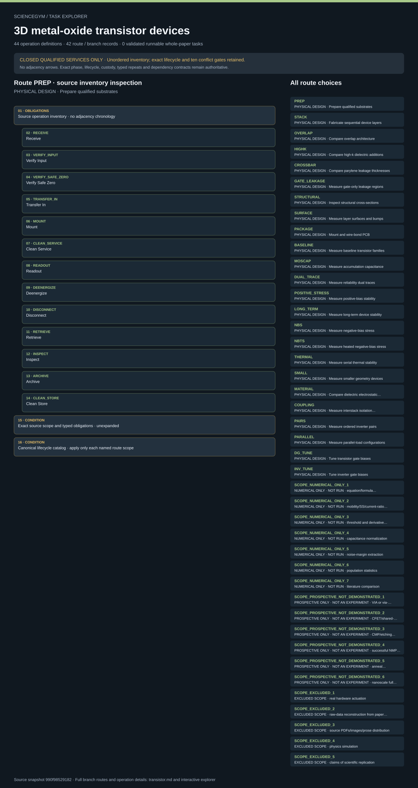

# 3D metal-oxide transistor devices: task route map



Paper: **Three-dimensional integrated metal-oxide transistors** · [DOI](https://doi.org/10.1038/s41928-024-01205-0)

Author/evaluator design reference only; not an actor projection, executable procedure, task runner, solver, physical simulation or execution receipt. Navigation and operation membership do not invent chronology, control settings, specimen counts or completed services. Operation lists are UNORDERED available inventories; repeated safe transitions and causal order belong to the lifecycle contract. Separate cohorts, destructive daughters, netlists, stack identities and persistent damage are never merged into one specimen history. Closed qualified services own fabrication, chemicals, thermal and electrical processes. Ten source conflicts remain gates. Independent safe-zero receipts, cooldown and elapsed-time obligations cannot be replaced by commands, source outcomes or synthetic fixture cases.. Counts describe task representation, not experiments or success.

**Reading rule:** rows show unordered source inventory for inspection. Exact phase, lifecycle and dependency contracts remain authoritative; no loop, specimen, condition or chronology is inferred. An unordered obligation group has no inferred chronological edges. Source-reported scientific facts and authored handling are distinct.

[Immutable source task package](https://github.com/openags/ScienceGym/blob/990f98529182af0ddd03fba53587b0931630de96/tasks/transistor_operations_v2/) · [Interactive inspector](../index.html)

## PREP — PHYSICAL DESIGN · Prepare qualified substrates

Author/evaluator design reference only; not an actor projection, executable procedure, task runner, solver, physical simulation or execution receipt. Navigation and operation membership do not invent chronology, control settings, specimen counts or completed services. Operation lists are UNORDERED available inventories; repeated safe transitions and causal order belong to the lifecycle contract. Separate cohorts, destructive daughters, netlists, stack identities and persistent damage are never merged into one specimen history. Closed qualified services own fabrication, chemicals, thermal and electrical processes. Ten source conflicts remain gates. Independent safe-zero receipts, cooldown and elapsed-time obligations cannot be replaced by commands, source outcomes or synthetic fixture cases.

[Exact route source](https://github.com/openags/ScienceGym/blob/990f98529182af0ddd03fba53587b0931630de96/tasks/transistor_operations_v2/branches.json) · JSON pointer: `/branches/0`

- **OBLIGATIONS: Source operation inventory · no adjacency chronology**
  - Binding: {"order":"Unordered inspection membership. Apply exact source phase, lifecycle and dependency contracts; no counts or schedule are instantiated."}
  - `RECEIVE` Receive
  - `VERIFY_INPUT` Verify Input
  - `VERIFY_SAFE_ZERO` Verify Safe Zero
  - `TRANSFER_IN` Transfer In
  - `MOUNT` Mount
  - `CLEAN_SERVICE` Clean Service
  - `READOUT` Readout
  - `DEENERGIZE` Deenergize
  - `DISCONNECT` Disconnect
  - `RETRIEVE` Retrieve
  - `INSPECT` Inspect
  - `ARCHIVE` Archive
  - `CLEAN_STORE` Clean Store
- **CONDITION: Exact source scope and typed obligations · unexpanded**
  - Binding: {"source_file":"branches.json","source_pointer":"/branches/0","source_contract":{"id":"PREP","title":"Prepare qualified substrates","route_group_id":"R01","type":"closed_preparation_design","station_id":"fabrication","source_evidence_ids":["E_R01"],"unknown_parameter_ids":["U_AUTHORITY","U_CUSTODY","U_ROBOT","U_CLEANUP","U_CLEAN","U_OXIDE"],"conflict_ids":[],"depends_on":[],"operation_ids":["RECEIVE","VERIFY_INPUT","VERIFY_SAFE_ZERO","TRANSFER_IN","MOUNT","CLEAN_SERVICE","READOUT","DEENERGIZE","DISCONNECT","RETRIEVE","INSPECT","ARCHIVE","CLEAN_STORE"],"initial_inputs":"Route-specific qualified specimen and service cards. Independently prepared inputs may start downstream branches; this does not complete historical fabrication or packaging.","expected_output":"Substrate certificate and closed chemical cleaning receipt","source_vs_authored":"Scientific sequence and named controls follow source locators; robot custody, safe transitions, receipts and fixture mechanics are original design bridges.","physical_execution_implemented":false,"numerical_analysis_is_separate":true,"default_repeat_count":null,"operation_ids_semantics":"Unordered available operation inventory only; repeated safe transitions and causal order are defined in lifecycle_contract.json and tests/contract.py plan_for.","canonical_lifecycle":"lifecycle_contract.json"}}
- **CONDITION: Canonical lifecycle catalog · apply only each named route scope**
  - Binding: {"source_file":"lifecycle_contract.json","source_pointer":"","source_contract":{"schema_version":"transistor_task.v1","doi":"10.1038/s41928-024-01205-0","safe_state_principle":"Commands never prove safe state. All carrier transfers and fixture access require independent safe-state evidence.","routes":{"HIGHK":["distinct material specimen input","electrical mount and fresh calibration","baseline acquisition","deenergize","independent safe zero","disconnect","retrieve","fabrication transfer and mount","qualified dielectric service","independent safe zero","release fixture and retrieve","electrical transfer and new mount/calibration","post acquisition","deenergize","independent safe zero","disconnect","retrieve"],"THERMAL":["safe transfer and mount for stack","temperature series with independent safe zero after acquisition","disconnect","remove hotplate","six hours off-hotplate cooldown","next stack transfer and new mount/calibration"],"LONG_TERM":["architecture-specific custody and elapsed-time checkpoint","safe transfer and mount","acquire","deenergize","independent safe zero","disconnect","return storage"],"PREP_TO_STACK":["same substrate identity","cleaning returns specimen version 2","STACK names PREP material parent and released version 2","layer service history begins only after PREP cleanup"],"STRUCTURAL":["distinct SEM/TEM/EDX parent coupons from registered material inventory","safe transfer and fresh mount for each coupon","qualified destructive preparation consumes parent and creates identified daughter","image daughter","independent safe zero","fixture release","retrieve and inspect each daughter","archive and cleanup include all consumed parents and stored daughters"]},"mock_population_scope":"One authored representative per required architecture/control case; no source population count or elapsed-time replication.","mock_case_devices":"Qualified synthetic carrier manifests retain distinct architecture/material device identities. No apparatus geometry is implemented.","all_material_disposition_required":true}}

<details><summary>Branch state, choices, lineage and loop obligations</summary>

```json
{
  "id": "PREP",
  "title": "Prepare qualified substrates",
  "route_group_id": "R01",
  "type": "closed_preparation_design",
  "station_id": "fabrication",
  "source_evidence_ids": [
    "E_R01"
  ],
  "unknown_parameter_ids": [
    "U_AUTHORITY",
    "U_CUSTODY",
    "U_ROBOT",
    "U_CLEANUP",
    "U_CLEAN",
    "U_OXIDE"
  ],
  "conflict_ids": [],
  "depends_on": [],
  "operation_ids": [
    "RECEIVE",
    "VERIFY_INPUT",
    "VERIFY_SAFE_ZERO",
    "TRANSFER_IN",
    "MOUNT",
    "CLEAN_SERVICE",
    "READOUT",
    "DEENERGIZE",
    "DISCONNECT",
    "RETRIEVE",
    "INSPECT",
    "ARCHIVE",
    "CLEAN_STORE"
  ],
  "initial_inputs": "Route-specific qualified specimen and service cards. Independently prepared inputs may start downstream branches; this does not complete historical fabrication or packaging.",
  "expected_output": "Substrate certificate and closed chemical cleaning receipt",
  "source_vs_authored": "Scientific sequence and named controls follow source locators; robot custody, safe transitions, receipts and fixture mechanics are original design bridges.",
  "physical_execution_implemented": false,
  "numerical_analysis_is_separate": true,
  "default_repeat_count": null,
  "operation_ids_semantics": "Unordered available operation inventory only; repeated safe transitions and causal order are defined in lifecycle_contract.json and tests/contract.py plan_for.",
  "canonical_lifecycle": "lifecycle_contract.json"
}
```

</details>

## STACK — PHYSICAL DESIGN · Fabricate sequential device layers

Author/evaluator design reference only; not an actor projection, executable procedure, task runner, solver, physical simulation or execution receipt. Navigation and operation membership do not invent chronology, control settings, specimen counts or completed services. Operation lists are UNORDERED available inventories; repeated safe transitions and causal order belong to the lifecycle contract. Separate cohorts, destructive daughters, netlists, stack identities and persistent damage are never merged into one specimen history. Closed qualified services own fabrication, chemicals, thermal and electrical processes. Ten source conflicts remain gates. Independent safe-zero receipts, cooldown and elapsed-time obligations cannot be replaced by commands, source outcomes or synthetic fixture cases.

[Exact route source](https://github.com/openags/ScienceGym/blob/990f98529182af0ddd03fba53587b0931630de96/tasks/transistor_operations_v2/branches.json) · JSON pointer: `/branches/1`

- **OBLIGATIONS: Source operation inventory · no adjacency chronology**
  - Binding: {"order":"Unordered inspection membership. Apply exact source phase, lifecycle and dependency contracts; no counts or schedule are instantiated."}
  - `RECEIVE` Receive
  - `VERIFY_INPUT` Verify Input
  - `VERIFY_SAFE_ZERO` Verify Safe Zero
  - `TRANSFER_IN` Transfer In
  - `MOUNT` Mount
  - `LAYER_SERVICE` Layer Service
  - `READOUT` Readout
  - `DEENERGIZE` Deenergize
  - `DISCONNECT` Disconnect
  - `RETRIEVE` Retrieve
  - `INSPECT` Inspect
  - `ARCHIVE` Archive
  - `CLEAN_STORE` Clean Store
- **CONDITION: Exact source scope and typed obligations · unexpanded**
  - Binding: {"source_file":"branches.json","source_pointer":"/branches/1","source_contract":{"id":"STACK","title":"Fabricate sequential device layers","route_group_id":"R02","type":"closed_preparation_design","station_id":"fabrication","source_evidence_ids":["E_R02"],"unknown_parameter_ids":["U_AUTHORITY","U_CUSTODY","U_ROBOT","U_CLEANUP","U_SPUTTER","U_PARYLENE","U_PATTERN","U_BUFFER"],"conflict_ids":["C01"],"depends_on":["PREP"],"operation_ids":["RECEIVE","VERIFY_INPUT","VERIFY_SAFE_ZERO","TRANSFER_IN","MOUNT","LAYER_SERVICE","READOUT","DEENERGIZE","DISCONNECT","RETRIEVE","INSPECT","ARCHIVE","CLEAN_STORE"],"initial_inputs":"Route-specific qualified specimen and service cards. Independently prepared inputs may start downstream branches; this does not complete historical fabrication or packaging.","expected_output":"Ordered 72-layer ledger with nine interstack buffers and one cap","source_vs_authored":"Scientific sequence and named controls follow source locators; robot custody, safe transitions, receipts and fixture mechanics are original design bridges.","physical_execution_implemented":false,"numerical_analysis_is_separate":true,"default_repeat_count":null,"operation_ids_semantics":"Unordered available operation inventory only; repeated safe transitions and causal order are defined in lifecycle_contract.json and tests/contract.py plan_for.","canonical_lifecycle":"lifecycle_contract.json"}}
- **CONDITION: Canonical lifecycle catalog · apply only each named route scope**
  - Binding: {"source_file":"lifecycle_contract.json","source_pointer":"","source_contract":{"schema_version":"transistor_task.v1","doi":"10.1038/s41928-024-01205-0","safe_state_principle":"Commands never prove safe state. All carrier transfers and fixture access require independent safe-state evidence.","routes":{"HIGHK":["distinct material specimen input","electrical mount and fresh calibration","baseline acquisition","deenergize","independent safe zero","disconnect","retrieve","fabrication transfer and mount","qualified dielectric service","independent safe zero","release fixture and retrieve","electrical transfer and new mount/calibration","post acquisition","deenergize","independent safe zero","disconnect","retrieve"],"THERMAL":["safe transfer and mount for stack","temperature series with independent safe zero after acquisition","disconnect","remove hotplate","six hours off-hotplate cooldown","next stack transfer and new mount/calibration"],"LONG_TERM":["architecture-specific custody and elapsed-time checkpoint","safe transfer and mount","acquire","deenergize","independent safe zero","disconnect","return storage"],"PREP_TO_STACK":["same substrate identity","cleaning returns specimen version 2","STACK names PREP material parent and released version 2","layer service history begins only after PREP cleanup"],"STRUCTURAL":["distinct SEM/TEM/EDX parent coupons from registered material inventory","safe transfer and fresh mount for each coupon","qualified destructive preparation consumes parent and creates identified daughter","image daughter","independent safe zero","fixture release","retrieve and inspect each daughter","archive and cleanup include all consumed parents and stored daughters"]},"mock_population_scope":"One authored representative per required architecture/control case; no source population count or elapsed-time replication.","mock_case_devices":"Qualified synthetic carrier manifests retain distinct architecture/material device identities. No apparatus geometry is implemented.","all_material_disposition_required":true}}

<details><summary>Branch state, choices, lineage and loop obligations</summary>

```json
{
  "id": "STACK",
  "title": "Fabricate sequential device layers",
  "route_group_id": "R02",
  "type": "closed_preparation_design",
  "station_id": "fabrication",
  "source_evidence_ids": [
    "E_R02"
  ],
  "unknown_parameter_ids": [
    "U_AUTHORITY",
    "U_CUSTODY",
    "U_ROBOT",
    "U_CLEANUP",
    "U_SPUTTER",
    "U_PARYLENE",
    "U_PATTERN",
    "U_BUFFER"
  ],
  "conflict_ids": [
    "C01"
  ],
  "depends_on": [
    "PREP"
  ],
  "operation_ids": [
    "RECEIVE",
    "VERIFY_INPUT",
    "VERIFY_SAFE_ZERO",
    "TRANSFER_IN",
    "MOUNT",
    "LAYER_SERVICE",
    "READOUT",
    "DEENERGIZE",
    "DISCONNECT",
    "RETRIEVE",
    "INSPECT",
    "ARCHIVE",
    "CLEAN_STORE"
  ],
  "initial_inputs": "Route-specific qualified specimen and service cards. Independently prepared inputs may start downstream branches; this does not complete historical fabrication or packaging.",
  "expected_output": "Ordered 72-layer ledger with nine interstack buffers and one cap",
  "source_vs_authored": "Scientific sequence and named controls follow source locators; robot custody, safe transitions, receipts and fixture mechanics are original design bridges.",
  "physical_execution_implemented": false,
  "numerical_analysis_is_separate": true,
  "default_repeat_count": null,
  "operation_ids_semantics": "Unordered available operation inventory only; repeated safe transitions and causal order are defined in lifecycle_contract.json and tests/contract.py plan_for.",
  "canonical_lifecycle": "lifecycle_contract.json"
}
```

</details>

## OVERLAP — PHYSICAL DESIGN · Compare overlap architecture

Author/evaluator design reference only; not an actor projection, executable procedure, task runner, solver, physical simulation or execution receipt. Navigation and operation membership do not invent chronology, control settings, specimen counts or completed services. Operation lists are UNORDERED available inventories; repeated safe transitions and causal order belong to the lifecycle contract. Separate cohorts, destructive daughters, netlists, stack identities and persistent damage are never merged into one specimen history. Closed qualified services own fabrication, chemicals, thermal and electrical processes. Ten source conflicts remain gates. Independent safe-zero receipts, cooldown and elapsed-time obligations cannot be replaced by commands, source outcomes or synthetic fixture cases.

[Exact route source](https://github.com/openags/ScienceGym/blob/990f98529182af0ddd03fba53587b0931630de96/tasks/transistor_operations_v2/branches.json) · JSON pointer: `/branches/2`

- **OBLIGATIONS: Source operation inventory · no adjacency chronology**
  - Binding: {"order":"Unordered inspection membership. Apply exact source phase, lifecycle and dependency contracts; no counts or schedule are instantiated."}
  - `RECEIVE` Receive
  - `VERIFY_INPUT` Verify Input
  - `VERIFY_SAFE_ZERO` Verify Safe Zero
  - `TRANSFER_IN` Transfer In
  - `MOUNT` Mount
  - `CONFIGURE` Configure
  - `CONTINUITY_CHECK` Continuity Check
  - `ACQUIRE` Acquire
  - `DEENERGIZE` Deenergize
  - `READOUT` Readout
  - `DISCONNECT` Disconnect
  - `RETRIEVE` Retrieve
  - `INSPECT` Inspect
  - `ARCHIVE` Archive
  - `CLEAN_STORE` Clean Store
- **CONDITION: Exact source scope and typed obligations · unexpanded**
  - Binding: {"source_file":"branches.json","source_pointer":"/branches/2","source_contract":{"id":"OVERLAP","title":"Compare overlap architecture","route_group_id":"R03","type":"control_design","station_id":"electrical","source_evidence_ids":["E_R03"],"unknown_parameter_ids":["U_AUTHORITY","U_CUSTODY","U_ROBOT","U_CLEANUP","U_PATTERN","U_NETLIST","U_ELECTRICAL","U_COHORT"],"conflict_ids":[],"depends_on":[],"operation_ids":["RECEIVE","VERIFY_INPUT","VERIFY_SAFE_ZERO","TRANSFER_IN","MOUNT","CONFIGURE","CONTINUITY_CHECK","ACQUIRE","DEENERGIZE","READOUT","DISCONNECT","RETRIEVE","INSPECT","ARCHIVE","CLEAN_STORE"],"initial_inputs":"Route-specific qualified specimen and service cards. Independently prepared inputs may start downstream branches; this does not complete historical fabrication or packaging.","expected_output":"Underlap versus failed overlap and before/after high-k controls","source_vs_authored":"Scientific sequence and named controls follow source locators; robot custody, safe transitions, receipts and fixture mechanics are original design bridges.","physical_execution_implemented":false,"numerical_analysis_is_separate":true,"default_repeat_count":null,"operation_ids_semantics":"Unordered available operation inventory only; repeated safe transitions and causal order are defined in lifecycle_contract.json and tests/contract.py plan_for.","canonical_lifecycle":"lifecycle_contract.json"}}
- **CONDITION: Canonical lifecycle catalog · apply only each named route scope**
  - Binding: {"source_file":"lifecycle_contract.json","source_pointer":"","source_contract":{"schema_version":"transistor_task.v1","doi":"10.1038/s41928-024-01205-0","safe_state_principle":"Commands never prove safe state. All carrier transfers and fixture access require independent safe-state evidence.","routes":{"HIGHK":["distinct material specimen input","electrical mount and fresh calibration","baseline acquisition","deenergize","independent safe zero","disconnect","retrieve","fabrication transfer and mount","qualified dielectric service","independent safe zero","release fixture and retrieve","electrical transfer and new mount/calibration","post acquisition","deenergize","independent safe zero","disconnect","retrieve"],"THERMAL":["safe transfer and mount for stack","temperature series with independent safe zero after acquisition","disconnect","remove hotplate","six hours off-hotplate cooldown","next stack transfer and new mount/calibration"],"LONG_TERM":["architecture-specific custody and elapsed-time checkpoint","safe transfer and mount","acquire","deenergize","independent safe zero","disconnect","return storage"],"PREP_TO_STACK":["same substrate identity","cleaning returns specimen version 2","STACK names PREP material parent and released version 2","layer service history begins only after PREP cleanup"],"STRUCTURAL":["distinct SEM/TEM/EDX parent coupons from registered material inventory","safe transfer and fresh mount for each coupon","qualified destructive preparation consumes parent and creates identified daughter","image daughter","independent safe zero","fixture release","retrieve and inspect each daughter","archive and cleanup include all consumed parents and stored daughters"]},"mock_population_scope":"One authored representative per required architecture/control case; no source population count or elapsed-time replication.","mock_case_devices":"Qualified synthetic carrier manifests retain distinct architecture/material device identities. No apparatus geometry is implemented.","all_material_disposition_required":true}}

<details><summary>Branch state, choices, lineage and loop obligations</summary>

```json
{
  "id": "OVERLAP",
  "title": "Compare overlap architecture",
  "route_group_id": "R03",
  "type": "control_design",
  "station_id": "electrical",
  "source_evidence_ids": [
    "E_R03"
  ],
  "unknown_parameter_ids": [
    "U_AUTHORITY",
    "U_CUSTODY",
    "U_ROBOT",
    "U_CLEANUP",
    "U_PATTERN",
    "U_NETLIST",
    "U_ELECTRICAL",
    "U_COHORT"
  ],
  "conflict_ids": [],
  "depends_on": [],
  "operation_ids": [
    "RECEIVE",
    "VERIFY_INPUT",
    "VERIFY_SAFE_ZERO",
    "TRANSFER_IN",
    "MOUNT",
    "CONFIGURE",
    "CONTINUITY_CHECK",
    "ACQUIRE",
    "DEENERGIZE",
    "READOUT",
    "DISCONNECT",
    "RETRIEVE",
    "INSPECT",
    "ARCHIVE",
    "CLEAN_STORE"
  ],
  "initial_inputs": "Route-specific qualified specimen and service cards. Independently prepared inputs may start downstream branches; this does not complete historical fabrication or packaging.",
  "expected_output": "Underlap versus failed overlap and before/after high-k controls",
  "source_vs_authored": "Scientific sequence and named controls follow source locators; robot custody, safe transitions, receipts and fixture mechanics are original design bridges.",
  "physical_execution_implemented": false,
  "numerical_analysis_is_separate": true,
  "default_repeat_count": null,
  "operation_ids_semantics": "Unordered available operation inventory only; repeated safe transitions and causal order are defined in lifecycle_contract.json and tests/contract.py plan_for.",
  "canonical_lifecycle": "lifecycle_contract.json"
}
```

</details>

## HIGHK — PHYSICAL DESIGN · Compare high-k dielectric additions

Author/evaluator design reference only; not an actor projection, executable procedure, task runner, solver, physical simulation or execution receipt. Navigation and operation membership do not invent chronology, control settings, specimen counts or completed services. Operation lists are UNORDERED available inventories; repeated safe transitions and causal order belong to the lifecycle contract. Separate cohorts, destructive daughters, netlists, stack identities and persistent damage are never merged into one specimen history. Closed qualified services own fabrication, chemicals, thermal and electrical processes. Ten source conflicts remain gates. Independent safe-zero receipts, cooldown and elapsed-time obligations cannot be replaced by commands, source outcomes or synthetic fixture cases.

[Exact route source](https://github.com/openags/ScienceGym/blob/990f98529182af0ddd03fba53587b0931630de96/tasks/transistor_operations_v2/branches.json) · JSON pointer: `/branches/3`

- **OBLIGATIONS: Source operation inventory · no adjacency chronology**
  - Binding: {"order":"Unordered inspection membership. Apply exact source phase, lifecycle and dependency contracts; no counts or schedule are instantiated."}
  - `RECEIVE` Receive
  - `VERIFY_INPUT` Verify Input
  - `VERIFY_SAFE_ZERO` Verify Safe Zero
  - `TRANSFER_IN` Transfer In
  - `MOUNT` Mount
  - `CONFIGURE` Configure
  - `CONTINUITY_CHECK` Continuity Check
  - `BASELINE_ACQUIRE` Baseline Acquire
  - `DEENERGIZE` Deenergize
  - `DISCONNECT` Disconnect
  - `RETRIEVE` Retrieve
  - `DIELECTRIC_SERVICE` Dielectric Service
  - `POST_ACQUIRE` Post Acquire
  - `INSPECT` Inspect
  - `READOUT` Readout
  - `ARCHIVE` Archive
  - `CLEAN_STORE` Clean Store
- **CONDITION: Exact source scope and typed obligations · unexpanded**
  - Binding: {"source_file":"branches.json","source_pointer":"/branches/3","source_contract":{"id":"HIGHK","title":"Compare high-k dielectric additions","route_group_id":"R03","type":"control_design","station_id":"fabrication_electrical_handoff","source_evidence_ids":["E_R03"],"unknown_parameter_ids":["U_AUTHORITY","U_CUSTODY","U_ROBOT","U_CLEANUP","U_SPUTTER","U_PATTERN","U_NETLIST","U_ELECTRICAL"],"conflict_ids":[],"depends_on":[],"operation_ids":["RECEIVE","VERIFY_INPUT","VERIFY_SAFE_ZERO","TRANSFER_IN","MOUNT","CONFIGURE","CONTINUITY_CHECK","BASELINE_ACQUIRE","DEENERGIZE","DISCONNECT","RETRIEVE","DIELECTRIC_SERVICE","POST_ACQUIRE","INSPECT","READOUT","ARCHIVE","CLEAN_STORE"],"initial_inputs":"Distinct qualified HfO2 and Al2O3 material specimens, each paired before/after its own dielectric service.","expected_output":"Underlap versus failed overlap and before/after high-k controls","source_vs_authored":"Scientific sequence and named controls follow source locators; robot custody, safe transitions, receipts and fixture mechanics are original design bridges.","physical_execution_implemented":false,"numerical_analysis_is_separate":true,"default_repeat_count":null,"operation_ids_semantics":"Unordered available operation inventory only; repeated safe transitions and causal order are defined in lifecycle_contract.json and tests/contract.py plan_for.","canonical_lifecycle":"lifecycle_contract.json"}}
- **CONDITION: Canonical lifecycle catalog · apply only each named route scope**
  - Binding: {"source_file":"lifecycle_contract.json","source_pointer":"","source_contract":{"schema_version":"transistor_task.v1","doi":"10.1038/s41928-024-01205-0","safe_state_principle":"Commands never prove safe state. All carrier transfers and fixture access require independent safe-state evidence.","routes":{"HIGHK":["distinct material specimen input","electrical mount and fresh calibration","baseline acquisition","deenergize","independent safe zero","disconnect","retrieve","fabrication transfer and mount","qualified dielectric service","independent safe zero","release fixture and retrieve","electrical transfer and new mount/calibration","post acquisition","deenergize","independent safe zero","disconnect","retrieve"],"THERMAL":["safe transfer and mount for stack","temperature series with independent safe zero after acquisition","disconnect","remove hotplate","six hours off-hotplate cooldown","next stack transfer and new mount/calibration"],"LONG_TERM":["architecture-specific custody and elapsed-time checkpoint","safe transfer and mount","acquire","deenergize","independent safe zero","disconnect","return storage"],"PREP_TO_STACK":["same substrate identity","cleaning returns specimen version 2","STACK names PREP material parent and released version 2","layer service history begins only after PREP cleanup"],"STRUCTURAL":["distinct SEM/TEM/EDX parent coupons from registered material inventory","safe transfer and fresh mount for each coupon","qualified destructive preparation consumes parent and creates identified daughter","image daughter","independent safe zero","fixture release","retrieve and inspect each daughter","archive and cleanup include all consumed parents and stored daughters"]},"mock_population_scope":"One authored representative per required architecture/control case; no source population count or elapsed-time replication.","mock_case_devices":"Qualified synthetic carrier manifests retain distinct architecture/material device identities. No apparatus geometry is implemented.","all_material_disposition_required":true}}

<details><summary>Branch state, choices, lineage and loop obligations</summary>

```json
{
  "id": "HIGHK",
  "title": "Compare high-k dielectric additions",
  "route_group_id": "R03",
  "type": "control_design",
  "station_id": "fabrication_electrical_handoff",
  "source_evidence_ids": [
    "E_R03"
  ],
  "unknown_parameter_ids": [
    "U_AUTHORITY",
    "U_CUSTODY",
    "U_ROBOT",
    "U_CLEANUP",
    "U_SPUTTER",
    "U_PATTERN",
    "U_NETLIST",
    "U_ELECTRICAL"
  ],
  "conflict_ids": [],
  "depends_on": [],
  "operation_ids": [
    "RECEIVE",
    "VERIFY_INPUT",
    "VERIFY_SAFE_ZERO",
    "TRANSFER_IN",
    "MOUNT",
    "CONFIGURE",
    "CONTINUITY_CHECK",
    "BASELINE_ACQUIRE",
    "DEENERGIZE",
    "DISCONNECT",
    "RETRIEVE",
    "DIELECTRIC_SERVICE",
    "POST_ACQUIRE",
    "INSPECT",
    "READOUT",
    "ARCHIVE",
    "CLEAN_STORE"
  ],
  "initial_inputs": "Distinct qualified HfO2 and Al2O3 material specimens, each paired before/after its own dielectric service.",
  "expected_output": "Underlap versus failed overlap and before/after high-k controls",
  "source_vs_authored": "Scientific sequence and named controls follow source locators; robot custody, safe transitions, receipts and fixture mechanics are original design bridges.",
  "physical_execution_implemented": false,
  "numerical_analysis_is_separate": true,
  "default_repeat_count": null,
  "operation_ids_semantics": "Unordered available operation inventory only; repeated safe transitions and causal order are defined in lifecycle_contract.json and tests/contract.py plan_for.",
  "canonical_lifecycle": "lifecycle_contract.json"
}
```

</details>

## CROSSBAR — PHYSICAL DESIGN · Compare parylene leakage thicknesses

Author/evaluator design reference only; not an actor projection, executable procedure, task runner, solver, physical simulation or execution receipt. Navigation and operation membership do not invent chronology, control settings, specimen counts or completed services. Operation lists are UNORDERED available inventories; repeated safe transitions and causal order belong to the lifecycle contract. Separate cohorts, destructive daughters, netlists, stack identities and persistent damage are never merged into one specimen history. Closed qualified services own fabrication, chemicals, thermal and electrical processes. Ten source conflicts remain gates. Independent safe-zero receipts, cooldown and elapsed-time obligations cannot be replaced by commands, source outcomes or synthetic fixture cases.

[Exact route source](https://github.com/openags/ScienceGym/blob/990f98529182af0ddd03fba53587b0931630de96/tasks/transistor_operations_v2/branches.json) · JSON pointer: `/branches/4`

- **OBLIGATIONS: Source operation inventory · no adjacency chronology**
  - Binding: {"order":"Unordered inspection membership. Apply exact source phase, lifecycle and dependency contracts; no counts or schedule are instantiated."}
  - `RECEIVE` Receive
  - `VERIFY_INPUT` Verify Input
  - `VERIFY_SAFE_ZERO` Verify Safe Zero
  - `TRANSFER_IN` Transfer In
  - `MOUNT` Mount
  - `CONFIGURE` Configure
  - `CONTINUITY_CHECK` Continuity Check
  - `ACQUIRE` Acquire
  - `DEENERGIZE` Deenergize
  - `READOUT` Readout
  - `DISCONNECT` Disconnect
  - `RETRIEVE` Retrieve
  - `INSPECT` Inspect
  - `ARCHIVE` Archive
  - `CLEAN_STORE` Clean Store
- **CONDITION: Exact source scope and typed obligations · unexpanded**
  - Binding: {"source_file":"branches.json","source_pointer":"/branches/4","source_contract":{"id":"CROSSBAR","title":"Compare parylene leakage thicknesses","route_group_id":"R04","type":"measurement_design","station_id":"electrical","source_evidence_ids":["E_R04"],"unknown_parameter_ids":["U_AUTHORITY","U_CUSTODY","U_ROBOT","U_CLEANUP","U_PARYLENE","U_NETLIST","U_ELECTRICAL"],"conflict_ids":[],"depends_on":[],"operation_ids":["RECEIVE","VERIFY_INPUT","VERIFY_SAFE_ZERO","TRANSFER_IN","MOUNT","CONFIGURE","CONTINUITY_CHECK","ACQUIRE","DEENERGIZE","READOUT","DISCONNECT","RETRIEVE","INSPECT","ARCHIVE","CLEAN_STORE"],"initial_inputs":"Route-specific qualified specimen and service cards. Independently prepared inputs may start downstream branches; this does not complete historical fabrication or packaging.","expected_output":"Thickness/material control identity and leakage records","source_vs_authored":"Scientific sequence and named controls follow source locators; robot custody, safe transitions, receipts and fixture mechanics are original design bridges.","physical_execution_implemented":false,"numerical_analysis_is_separate":true,"default_repeat_count":null,"operation_ids_semantics":"Unordered available operation inventory only; repeated safe transitions and causal order are defined in lifecycle_contract.json and tests/contract.py plan_for.","canonical_lifecycle":"lifecycle_contract.json"}}
- **CONDITION: Canonical lifecycle catalog · apply only each named route scope**
  - Binding: {"source_file":"lifecycle_contract.json","source_pointer":"","source_contract":{"schema_version":"transistor_task.v1","doi":"10.1038/s41928-024-01205-0","safe_state_principle":"Commands never prove safe state. All carrier transfers and fixture access require independent safe-state evidence.","routes":{"HIGHK":["distinct material specimen input","electrical mount and fresh calibration","baseline acquisition","deenergize","independent safe zero","disconnect","retrieve","fabrication transfer and mount","qualified dielectric service","independent safe zero","release fixture and retrieve","electrical transfer and new mount/calibration","post acquisition","deenergize","independent safe zero","disconnect","retrieve"],"THERMAL":["safe transfer and mount for stack","temperature series with independent safe zero after acquisition","disconnect","remove hotplate","six hours off-hotplate cooldown","next stack transfer and new mount/calibration"],"LONG_TERM":["architecture-specific custody and elapsed-time checkpoint","safe transfer and mount","acquire","deenergize","independent safe zero","disconnect","return storage"],"PREP_TO_STACK":["same substrate identity","cleaning returns specimen version 2","STACK names PREP material parent and released version 2","layer service history begins only after PREP cleanup"],"STRUCTURAL":["distinct SEM/TEM/EDX parent coupons from registered material inventory","safe transfer and fresh mount for each coupon","qualified destructive preparation consumes parent and creates identified daughter","image daughter","independent safe zero","fixture release","retrieve and inspect each daughter","archive and cleanup include all consumed parents and stored daughters"]},"mock_population_scope":"One authored representative per required architecture/control case; no source population count or elapsed-time replication.","mock_case_devices":"Qualified synthetic carrier manifests retain distinct architecture/material device identities. No apparatus geometry is implemented.","all_material_disposition_required":true}}

<details><summary>Branch state, choices, lineage and loop obligations</summary>

```json
{
  "id": "CROSSBAR",
  "title": "Compare parylene leakage thicknesses",
  "route_group_id": "R04",
  "type": "measurement_design",
  "station_id": "electrical",
  "source_evidence_ids": [
    "E_R04"
  ],
  "unknown_parameter_ids": [
    "U_AUTHORITY",
    "U_CUSTODY",
    "U_ROBOT",
    "U_CLEANUP",
    "U_PARYLENE",
    "U_NETLIST",
    "U_ELECTRICAL"
  ],
  "conflict_ids": [],
  "depends_on": [],
  "operation_ids": [
    "RECEIVE",
    "VERIFY_INPUT",
    "VERIFY_SAFE_ZERO",
    "TRANSFER_IN",
    "MOUNT",
    "CONFIGURE",
    "CONTINUITY_CHECK",
    "ACQUIRE",
    "DEENERGIZE",
    "READOUT",
    "DISCONNECT",
    "RETRIEVE",
    "INSPECT",
    "ARCHIVE",
    "CLEAN_STORE"
  ],
  "initial_inputs": "Route-specific qualified specimen and service cards. Independently prepared inputs may start downstream branches; this does not complete historical fabrication or packaging.",
  "expected_output": "Thickness/material control identity and leakage records",
  "source_vs_authored": "Scientific sequence and named controls follow source locators; robot custody, safe transitions, receipts and fixture mechanics are original design bridges.",
  "physical_execution_implemented": false,
  "numerical_analysis_is_separate": true,
  "default_repeat_count": null,
  "operation_ids_semantics": "Unordered available operation inventory only; repeated safe transitions and causal order are defined in lifecycle_contract.json and tests/contract.py plan_for.",
  "canonical_lifecycle": "lifecycle_contract.json"
}
```

</details>

## GATE_LEAKAGE — PHYSICAL DESIGN · Measure gate-only leakage regions

Author/evaluator design reference only; not an actor projection, executable procedure, task runner, solver, physical simulation or execution receipt. Navigation and operation membership do not invent chronology, control settings, specimen counts or completed services. Operation lists are UNORDERED available inventories; repeated safe transitions and causal order belong to the lifecycle contract. Separate cohorts, destructive daughters, netlists, stack identities and persistent damage are never merged into one specimen history. Closed qualified services own fabrication, chemicals, thermal and electrical processes. Ten source conflicts remain gates. Independent safe-zero receipts, cooldown and elapsed-time obligations cannot be replaced by commands, source outcomes or synthetic fixture cases.

[Exact route source](https://github.com/openags/ScienceGym/blob/990f98529182af0ddd03fba53587b0931630de96/tasks/transistor_operations_v2/branches.json) · JSON pointer: `/branches/5`

- **OBLIGATIONS: Source operation inventory · no adjacency chronology**
  - Binding: {"order":"Unordered inspection membership. Apply exact source phase, lifecycle and dependency contracts; no counts or schedule are instantiated."}
  - `RECEIVE` Receive
  - `VERIFY_INPUT` Verify Input
  - `VERIFY_SAFE_ZERO` Verify Safe Zero
  - `TRANSFER_IN` Transfer In
  - `MOUNT` Mount
  - `CONFIGURE` Configure
  - `CONTINUITY_CHECK` Continuity Check
  - `ACQUIRE` Acquire
  - `DEENERGIZE` Deenergize
  - `READOUT` Readout
  - `DISCONNECT` Disconnect
  - `RETRIEVE` Retrieve
  - `INSPECT` Inspect
  - `ARCHIVE` Archive
  - `CLEAN_STORE` Clean Store
- **CONDITION: Exact source scope and typed obligations · unexpanded**
  - Binding: {"source_file":"branches.json","source_pointer":"/branches/5","source_contract":{"id":"GATE_LEAKAGE","title":"Measure gate-only leakage regions","route_group_id":"R04","type":"measurement_design","station_id":"electrical","source_evidence_ids":["E_R04"],"unknown_parameter_ids":["U_AUTHORITY","U_CUSTODY","U_ROBOT","U_CLEANUP","U_PATTERN","U_NETLIST","U_ELECTRICAL","U_COHORT"],"conflict_ids":[],"depends_on":[],"operation_ids":["RECEIVE","VERIFY_INPUT","VERIFY_SAFE_ZERO","TRANSFER_IN","MOUNT","CONFIGURE","CONTINUITY_CHECK","ACQUIRE","DEENERGIZE","READOUT","DISCONNECT","RETRIEVE","INSPECT","ARCHIVE","CLEAN_STORE"],"initial_inputs":"Route-specific qualified specimen and service cards. Independently prepared inputs may start downstream branches; this does not complete historical fabrication or packaging.","expected_output":"Thickness/material control identity and leakage records","source_vs_authored":"Scientific sequence and named controls follow source locators; robot custody, safe transitions, receipts and fixture mechanics are original design bridges.","physical_execution_implemented":false,"numerical_analysis_is_separate":true,"default_repeat_count":null,"operation_ids_semantics":"Unordered available operation inventory only; repeated safe transitions and causal order are defined in lifecycle_contract.json and tests/contract.py plan_for.","canonical_lifecycle":"lifecycle_contract.json"}}
- **CONDITION: Canonical lifecycle catalog · apply only each named route scope**
  - Binding: {"source_file":"lifecycle_contract.json","source_pointer":"","source_contract":{"schema_version":"transistor_task.v1","doi":"10.1038/s41928-024-01205-0","safe_state_principle":"Commands never prove safe state. All carrier transfers and fixture access require independent safe-state evidence.","routes":{"HIGHK":["distinct material specimen input","electrical mount and fresh calibration","baseline acquisition","deenergize","independent safe zero","disconnect","retrieve","fabrication transfer and mount","qualified dielectric service","independent safe zero","release fixture and retrieve","electrical transfer and new mount/calibration","post acquisition","deenergize","independent safe zero","disconnect","retrieve"],"THERMAL":["safe transfer and mount for stack","temperature series with independent safe zero after acquisition","disconnect","remove hotplate","six hours off-hotplate cooldown","next stack transfer and new mount/calibration"],"LONG_TERM":["architecture-specific custody and elapsed-time checkpoint","safe transfer and mount","acquire","deenergize","independent safe zero","disconnect","return storage"],"PREP_TO_STACK":["same substrate identity","cleaning returns specimen version 2","STACK names PREP material parent and released version 2","layer service history begins only after PREP cleanup"],"STRUCTURAL":["distinct SEM/TEM/EDX parent coupons from registered material inventory","safe transfer and fresh mount for each coupon","qualified destructive preparation consumes parent and creates identified daughter","image daughter","independent safe zero","fixture release","retrieve and inspect each daughter","archive and cleanup include all consumed parents and stored daughters"]},"mock_population_scope":"One authored representative per required architecture/control case; no source population count or elapsed-time replication.","mock_case_devices":"Qualified synthetic carrier manifests retain distinct architecture/material device identities. No apparatus geometry is implemented.","all_material_disposition_required":true}}

<details><summary>Branch state, choices, lineage and loop obligations</summary>

```json
{
  "id": "GATE_LEAKAGE",
  "title": "Measure gate-only leakage regions",
  "route_group_id": "R04",
  "type": "measurement_design",
  "station_id": "electrical",
  "source_evidence_ids": [
    "E_R04"
  ],
  "unknown_parameter_ids": [
    "U_AUTHORITY",
    "U_CUSTODY",
    "U_ROBOT",
    "U_CLEANUP",
    "U_PATTERN",
    "U_NETLIST",
    "U_ELECTRICAL",
    "U_COHORT"
  ],
  "conflict_ids": [],
  "depends_on": [],
  "operation_ids": [
    "RECEIVE",
    "VERIFY_INPUT",
    "VERIFY_SAFE_ZERO",
    "TRANSFER_IN",
    "MOUNT",
    "CONFIGURE",
    "CONTINUITY_CHECK",
    "ACQUIRE",
    "DEENERGIZE",
    "READOUT",
    "DISCONNECT",
    "RETRIEVE",
    "INSPECT",
    "ARCHIVE",
    "CLEAN_STORE"
  ],
  "initial_inputs": "Route-specific qualified specimen and service cards. Independently prepared inputs may start downstream branches; this does not complete historical fabrication or packaging.",
  "expected_output": "Thickness/material control identity and leakage records",
  "source_vs_authored": "Scientific sequence and named controls follow source locators; robot custody, safe transitions, receipts and fixture mechanics are original design bridges.",
  "physical_execution_implemented": false,
  "numerical_analysis_is_separate": true,
  "default_repeat_count": null,
  "operation_ids_semantics": "Unordered available operation inventory only; repeated safe transitions and causal order are defined in lifecycle_contract.json and tests/contract.py plan_for.",
  "canonical_lifecycle": "lifecycle_contract.json"
}
```

</details>

## STRUCTURAL — PHYSICAL DESIGN · Inspect structural cross-sections

Author/evaluator design reference only; not an actor projection, executable procedure, task runner, solver, physical simulation or execution receipt. Navigation and operation membership do not invent chronology, control settings, specimen counts or completed services. Operation lists are UNORDERED available inventories; repeated safe transitions and causal order belong to the lifecycle contract. Separate cohorts, destructive daughters, netlists, stack identities and persistent damage are never merged into one specimen history. Closed qualified services own fabrication, chemicals, thermal and electrical processes. Ten source conflicts remain gates. Independent safe-zero receipts, cooldown and elapsed-time obligations cannot be replaced by commands, source outcomes or synthetic fixture cases.

[Exact route source](https://github.com/openags/ScienceGym/blob/990f98529182af0ddd03fba53587b0931630de96/tasks/transistor_operations_v2/branches.json) · JSON pointer: `/branches/6`

- **OBLIGATIONS: Source operation inventory · no adjacency chronology**
  - Binding: {"order":"Unordered inspection membership. Apply exact source phase, lifecycle and dependency contracts; no counts or schedule are instantiated."}
  - `RECEIVE` Receive
  - `VERIFY_INPUT` Verify Input
  - `VERIFY_SAFE_ZERO` Verify Safe Zero
  - `TRANSFER_IN` Transfer In
  - `MOUNT` Mount
  - `SECTION_SERVICE` Section Service
  - `IMAGE_SERVICE` Image Service
  - `DISCONNECT` Disconnect
  - `RETRIEVE` Retrieve
  - `INSPECT` Inspect
  - `READOUT` Readout
  - `ARCHIVE` Archive
  - `CLEAN_STORE` Clean Store
- **CONDITION: Exact source scope and typed obligations · unexpanded**
  - Binding: {"source_file":"branches.json","source_pointer":"/branches/6","source_contract":{"id":"STRUCTURAL","title":"Inspect structural cross-sections","route_group_id":"R05","type":"measurement_design","station_id":"metrology","source_evidence_ids":["E_R05"],"unknown_parameter_ids":["U_AUTHORITY","U_CUSTODY","U_ROBOT","U_CLEANUP","U_METROLOGY"],"conflict_ids":["C09"],"depends_on":[],"operation_ids":["RECEIVE","VERIFY_INPUT","VERIFY_SAFE_ZERO","TRANSFER_IN","MOUNT","SECTION_SERVICE","IMAGE_SERVICE","DISCONNECT","RETRIEVE","INSPECT","READOUT","ARCHIVE","CLEAN_STORE"],"initial_inputs":"Route-specific qualified specimen and service cards. Independently prepared inputs may start downstream branches; this does not complete historical fabrication or packaging.","expected_output":"Qualified structural maps and layer-specific roughness records","source_vs_authored":"Scientific sequence and named controls follow source locators; robot custody, safe transitions, receipts and fixture mechanics are original design bridges.","physical_execution_implemented":false,"numerical_analysis_is_separate":true,"default_repeat_count":null,"operation_ids_semantics":"Unordered available operation inventory only; repeated safe transitions and causal order are defined in lifecycle_contract.json and tests/contract.py plan_for.","canonical_lifecycle":"lifecycle_contract.json"}}
- **CONDITION: Canonical lifecycle catalog · apply only each named route scope**
  - Binding: {"source_file":"lifecycle_contract.json","source_pointer":"","source_contract":{"schema_version":"transistor_task.v1","doi":"10.1038/s41928-024-01205-0","safe_state_principle":"Commands never prove safe state. All carrier transfers and fixture access require independent safe-state evidence.","routes":{"HIGHK":["distinct material specimen input","electrical mount and fresh calibration","baseline acquisition","deenergize","independent safe zero","disconnect","retrieve","fabrication transfer and mount","qualified dielectric service","independent safe zero","release fixture and retrieve","electrical transfer and new mount/calibration","post acquisition","deenergize","independent safe zero","disconnect","retrieve"],"THERMAL":["safe transfer and mount for stack","temperature series with independent safe zero after acquisition","disconnect","remove hotplate","six hours off-hotplate cooldown","next stack transfer and new mount/calibration"],"LONG_TERM":["architecture-specific custody and elapsed-time checkpoint","safe transfer and mount","acquire","deenergize","independent safe zero","disconnect","return storage"],"PREP_TO_STACK":["same substrate identity","cleaning returns specimen version 2","STACK names PREP material parent and released version 2","layer service history begins only after PREP cleanup"],"STRUCTURAL":["distinct SEM/TEM/EDX parent coupons from registered material inventory","safe transfer and fresh mount for each coupon","qualified destructive preparation consumes parent and creates identified daughter","image daughter","independent safe zero","fixture release","retrieve and inspect each daughter","archive and cleanup include all consumed parents and stored daughters"]},"mock_population_scope":"One authored representative per required architecture/control case; no source population count or elapsed-time replication.","mock_case_devices":"Qualified synthetic carrier manifests retain distinct architecture/material device identities. No apparatus geometry is implemented.","all_material_disposition_required":true}}

<details><summary>Branch state, choices, lineage and loop obligations</summary>

```json
{
  "id": "STRUCTURAL",
  "title": "Inspect structural cross-sections",
  "route_group_id": "R05",
  "type": "measurement_design",
  "station_id": "metrology",
  "source_evidence_ids": [
    "E_R05"
  ],
  "unknown_parameter_ids": [
    "U_AUTHORITY",
    "U_CUSTODY",
    "U_ROBOT",
    "U_CLEANUP",
    "U_METROLOGY"
  ],
  "conflict_ids": [
    "C09"
  ],
  "depends_on": [],
  "operation_ids": [
    "RECEIVE",
    "VERIFY_INPUT",
    "VERIFY_SAFE_ZERO",
    "TRANSFER_IN",
    "MOUNT",
    "SECTION_SERVICE",
    "IMAGE_SERVICE",
    "DISCONNECT",
    "RETRIEVE",
    "INSPECT",
    "READOUT",
    "ARCHIVE",
    "CLEAN_STORE"
  ],
  "initial_inputs": "Route-specific qualified specimen and service cards. Independently prepared inputs may start downstream branches; this does not complete historical fabrication or packaging.",
  "expected_output": "Qualified structural maps and layer-specific roughness records",
  "source_vs_authored": "Scientific sequence and named controls follow source locators; robot custody, safe transitions, receipts and fixture mechanics are original design bridges.",
  "physical_execution_implemented": false,
  "numerical_analysis_is_separate": true,
  "default_repeat_count": null,
  "operation_ids_semantics": "Unordered available operation inventory only; repeated safe transitions and causal order are defined in lifecycle_contract.json and tests/contract.py plan_for.",
  "canonical_lifecycle": "lifecycle_contract.json"
}
```

</details>

## SURFACE — PHYSICAL DESIGN · Measure layer surfaces and bumps

Author/evaluator design reference only; not an actor projection, executable procedure, task runner, solver, physical simulation or execution receipt. Navigation and operation membership do not invent chronology, control settings, specimen counts or completed services. Operation lists are UNORDERED available inventories; repeated safe transitions and causal order belong to the lifecycle contract. Separate cohorts, destructive daughters, netlists, stack identities and persistent damage are never merged into one specimen history. Closed qualified services own fabrication, chemicals, thermal and electrical processes. Ten source conflicts remain gates. Independent safe-zero receipts, cooldown and elapsed-time obligations cannot be replaced by commands, source outcomes or synthetic fixture cases.

[Exact route source](https://github.com/openags/ScienceGym/blob/990f98529182af0ddd03fba53587b0931630de96/tasks/transistor_operations_v2/branches.json) · JSON pointer: `/branches/7`

- **OBLIGATIONS: Source operation inventory · no adjacency chronology**
  - Binding: {"order":"Unordered inspection membership. Apply exact source phase, lifecycle and dependency contracts; no counts or schedule are instantiated."}
  - `RECEIVE` Receive
  - `VERIFY_INPUT` Verify Input
  - `VERIFY_SAFE_ZERO` Verify Safe Zero
  - `TRANSFER_IN` Transfer In
  - `MOUNT` Mount
  - `REGISTER_REGION` Register Region
  - `IMAGE_SERVICE` Image Service
  - `READOUT` Readout
  - `DEENERGIZE` Deenergize
  - `DISCONNECT` Disconnect
  - `RETRIEVE` Retrieve
  - `INSPECT` Inspect
  - `ARCHIVE` Archive
  - `CLEAN_STORE` Clean Store
- **CONDITION: Exact source scope and typed obligations · unexpanded**
  - Binding: {"source_file":"branches.json","source_pointer":"/branches/7","source_contract":{"id":"SURFACE","title":"Measure layer surfaces and bumps","route_group_id":"R05","type":"measurement_design","station_id":"metrology","source_evidence_ids":["E_R05"],"unknown_parameter_ids":["U_AUTHORITY","U_CUSTODY","U_ROBOT","U_CLEANUP","U_METROLOGY","U_COHORT"],"conflict_ids":["C09"],"depends_on":[],"operation_ids":["RECEIVE","VERIFY_INPUT","VERIFY_SAFE_ZERO","TRANSFER_IN","MOUNT","REGISTER_REGION","IMAGE_SERVICE","READOUT","DEENERGIZE","DISCONNECT","RETRIEVE","INSPECT","ARCHIVE","CLEAN_STORE"],"initial_inputs":"Route-specific qualified specimen and service cards. Independently prepared inputs may start downstream branches; this does not complete historical fabrication or packaging.","expected_output":"Qualified structural maps and layer-specific roughness records","source_vs_authored":"Scientific sequence and named controls follow source locators; robot custody, safe transitions, receipts and fixture mechanics are original design bridges.","physical_execution_implemented":false,"numerical_analysis_is_separate":true,"default_repeat_count":null,"operation_ids_semantics":"Unordered available operation inventory only; repeated safe transitions and causal order are defined in lifecycle_contract.json and tests/contract.py plan_for.","canonical_lifecycle":"lifecycle_contract.json"}}
- **CONDITION: Canonical lifecycle catalog · apply only each named route scope**
  - Binding: {"source_file":"lifecycle_contract.json","source_pointer":"","source_contract":{"schema_version":"transistor_task.v1","doi":"10.1038/s41928-024-01205-0","safe_state_principle":"Commands never prove safe state. All carrier transfers and fixture access require independent safe-state evidence.","routes":{"HIGHK":["distinct material specimen input","electrical mount and fresh calibration","baseline acquisition","deenergize","independent safe zero","disconnect","retrieve","fabrication transfer and mount","qualified dielectric service","independent safe zero","release fixture and retrieve","electrical transfer and new mount/calibration","post acquisition","deenergize","independent safe zero","disconnect","retrieve"],"THERMAL":["safe transfer and mount for stack","temperature series with independent safe zero after acquisition","disconnect","remove hotplate","six hours off-hotplate cooldown","next stack transfer and new mount/calibration"],"LONG_TERM":["architecture-specific custody and elapsed-time checkpoint","safe transfer and mount","acquire","deenergize","independent safe zero","disconnect","return storage"],"PREP_TO_STACK":["same substrate identity","cleaning returns specimen version 2","STACK names PREP material parent and released version 2","layer service history begins only after PREP cleanup"],"STRUCTURAL":["distinct SEM/TEM/EDX parent coupons from registered material inventory","safe transfer and fresh mount for each coupon","qualified destructive preparation consumes parent and creates identified daughter","image daughter","independent safe zero","fixture release","retrieve and inspect each daughter","archive and cleanup include all consumed parents and stored daughters"]},"mock_population_scope":"One authored representative per required architecture/control case; no source population count or elapsed-time replication.","mock_case_devices":"Qualified synthetic carrier manifests retain distinct architecture/material device identities. No apparatus geometry is implemented.","all_material_disposition_required":true}}

<details><summary>Branch state, choices, lineage and loop obligations</summary>

```json
{
  "id": "SURFACE",
  "title": "Measure layer surfaces and bumps",
  "route_group_id": "R05",
  "type": "measurement_design",
  "station_id": "metrology",
  "source_evidence_ids": [
    "E_R05"
  ],
  "unknown_parameter_ids": [
    "U_AUTHORITY",
    "U_CUSTODY",
    "U_ROBOT",
    "U_CLEANUP",
    "U_METROLOGY",
    "U_COHORT"
  ],
  "conflict_ids": [
    "C09"
  ],
  "depends_on": [],
  "operation_ids": [
    "RECEIVE",
    "VERIFY_INPUT",
    "VERIFY_SAFE_ZERO",
    "TRANSFER_IN",
    "MOUNT",
    "REGISTER_REGION",
    "IMAGE_SERVICE",
    "READOUT",
    "DEENERGIZE",
    "DISCONNECT",
    "RETRIEVE",
    "INSPECT",
    "ARCHIVE",
    "CLEAN_STORE"
  ],
  "initial_inputs": "Route-specific qualified specimen and service cards. Independently prepared inputs may start downstream branches; this does not complete historical fabrication or packaging.",
  "expected_output": "Qualified structural maps and layer-specific roughness records",
  "source_vs_authored": "Scientific sequence and named controls follow source locators; robot custody, safe transitions, receipts and fixture mechanics are original design bridges.",
  "physical_execution_implemented": false,
  "numerical_analysis_is_separate": true,
  "default_repeat_count": null,
  "operation_ids_semantics": "Unordered available operation inventory only; repeated safe transitions and causal order are defined in lifecycle_contract.json and tests/contract.py plan_for.",
  "canonical_lifecycle": "lifecycle_contract.json"
}
```

</details>

## PACKAGE — PHYSICAL DESIGN · Mount and wire-bond PCB

Author/evaluator design reference only; not an actor projection, executable procedure, task runner, solver, physical simulation or execution receipt. Navigation and operation membership do not invent chronology, control settings, specimen counts or completed services. Operation lists are UNORDERED available inventories; repeated safe transitions and causal order belong to the lifecycle contract. Separate cohorts, destructive daughters, netlists, stack identities and persistent damage are never merged into one specimen history. Closed qualified services own fabrication, chemicals, thermal and electrical processes. Ten source conflicts remain gates. Independent safe-zero receipts, cooldown and elapsed-time obligations cannot be replaced by commands, source outcomes or synthetic fixture cases.

[Exact route source](https://github.com/openags/ScienceGym/blob/990f98529182af0ddd03fba53587b0931630de96/tasks/transistor_operations_v2/branches.json) · JSON pointer: `/branches/8`

- **OBLIGATIONS: Source operation inventory · no adjacency chronology**
  - Binding: {"order":"Unordered inspection membership. Apply exact source phase, lifecycle and dependency contracts; no counts or schedule are instantiated."}
  - `RECEIVE` Receive
  - `VERIFY_INPUT` Verify Input
  - `VERIFY_SAFE_ZERO` Verify Safe Zero
  - `TRANSFER_IN` Transfer In
  - `MOUNT` Mount
  - `ATTACH_CHIP` Attach Chip
  - `BOND_SERVICE` Bond Service
  - `INSPECT_BONDS` Inspect Bonds
  - `CONTINUITY_CHECK` Continuity Check
  - `READOUT` Readout
  - `DEENERGIZE` Deenergize
  - `DISCONNECT` Disconnect
  - `RETRIEVE` Retrieve
  - `INSPECT` Inspect
  - `ARCHIVE` Archive
  - `CLEAN_STORE` Clean Store
- **CONDITION: Exact source scope and typed obligations · unexpanded**
  - Binding: {"source_file":"branches.json","source_pointer":"/branches/8","source_contract":{"id":"PACKAGE","title":"Mount and wire-bond PCB","route_group_id":"R06","type":"closed_packaging_design","station_id":"packaging","source_evidence_ids":["E_R06"],"unknown_parameter_ids":["U_AUTHORITY","U_CUSTODY","U_ROBOT","U_CLEANUP","U_PACKAGE","U_NETLIST"],"conflict_ids":[],"depends_on":[],"operation_ids":["RECEIVE","VERIFY_INPUT","VERIFY_SAFE_ZERO","TRANSFER_IN","MOUNT","ATTACH_CHIP","BOND_SERVICE","INSPECT_BONDS","CONTINUITY_CHECK","READOUT","DEENERGIZE","DISCONNECT","RETRIEVE","INSPECT","ARCHIVE","CLEAN_STORE"],"initial_inputs":"Route-specific qualified specimen and service cards. Independently prepared inputs may start downstream branches; this does not complete historical fabrication or packaging.","expected_output":"Chip-to-PCB attachment and two-ended bond map","source_vs_authored":"Scientific sequence and named controls follow source locators; robot custody, safe transitions, receipts and fixture mechanics are original design bridges.","physical_execution_implemented":false,"numerical_analysis_is_separate":true,"default_repeat_count":null,"operation_ids_semantics":"Unordered available operation inventory only; repeated safe transitions and causal order are defined in lifecycle_contract.json and tests/contract.py plan_for.","canonical_lifecycle":"lifecycle_contract.json"}}
- **CONDITION: Canonical lifecycle catalog · apply only each named route scope**
  - Binding: {"source_file":"lifecycle_contract.json","source_pointer":"","source_contract":{"schema_version":"transistor_task.v1","doi":"10.1038/s41928-024-01205-0","safe_state_principle":"Commands never prove safe state. All carrier transfers and fixture access require independent safe-state evidence.","routes":{"HIGHK":["distinct material specimen input","electrical mount and fresh calibration","baseline acquisition","deenergize","independent safe zero","disconnect","retrieve","fabrication transfer and mount","qualified dielectric service","independent safe zero","release fixture and retrieve","electrical transfer and new mount/calibration","post acquisition","deenergize","independent safe zero","disconnect","retrieve"],"THERMAL":["safe transfer and mount for stack","temperature series with independent safe zero after acquisition","disconnect","remove hotplate","six hours off-hotplate cooldown","next stack transfer and new mount/calibration"],"LONG_TERM":["architecture-specific custody and elapsed-time checkpoint","safe transfer and mount","acquire","deenergize","independent safe zero","disconnect","return storage"],"PREP_TO_STACK":["same substrate identity","cleaning returns specimen version 2","STACK names PREP material parent and released version 2","layer service history begins only after PREP cleanup"],"STRUCTURAL":["distinct SEM/TEM/EDX parent coupons from registered material inventory","safe transfer and fresh mount for each coupon","qualified destructive preparation consumes parent and creates identified daughter","image daughter","independent safe zero","fixture release","retrieve and inspect each daughter","archive and cleanup include all consumed parents and stored daughters"]},"mock_population_scope":"One authored representative per required architecture/control case; no source population count or elapsed-time replication.","mock_case_devices":"Qualified synthetic carrier manifests retain distinct architecture/material device identities. No apparatus geometry is implemented.","all_material_disposition_required":true}}

<details><summary>Branch state, choices, lineage and loop obligations</summary>

```json
{
  "id": "PACKAGE",
  "title": "Mount and wire-bond PCB",
  "route_group_id": "R06",
  "type": "closed_packaging_design",
  "station_id": "packaging",
  "source_evidence_ids": [
    "E_R06"
  ],
  "unknown_parameter_ids": [
    "U_AUTHORITY",
    "U_CUSTODY",
    "U_ROBOT",
    "U_CLEANUP",
    "U_PACKAGE",
    "U_NETLIST"
  ],
  "conflict_ids": [],
  "depends_on": [],
  "operation_ids": [
    "RECEIVE",
    "VERIFY_INPUT",
    "VERIFY_SAFE_ZERO",
    "TRANSFER_IN",
    "MOUNT",
    "ATTACH_CHIP",
    "BOND_SERVICE",
    "INSPECT_BONDS",
    "CONTINUITY_CHECK",
    "READOUT",
    "DEENERGIZE",
    "DISCONNECT",
    "RETRIEVE",
    "INSPECT",
    "ARCHIVE",
    "CLEAN_STORE"
  ],
  "initial_inputs": "Route-specific qualified specimen and service cards. Independently prepared inputs may start downstream branches; this does not complete historical fabrication or packaging.",
  "expected_output": "Chip-to-PCB attachment and two-ended bond map",
  "source_vs_authored": "Scientific sequence and named controls follow source locators; robot custody, safe transitions, receipts and fixture mechanics are original design bridges.",
  "physical_execution_implemented": false,
  "numerical_analysis_is_separate": true,
  "default_repeat_count": null,
  "operation_ids_semantics": "Unordered available operation inventory only; repeated safe transitions and causal order are defined in lifecycle_contract.json and tests/contract.py plan_for.",
  "canonical_lifecycle": "lifecycle_contract.json"
}
```

</details>

## BASELINE — PHYSICAL DESIGN · Measure baseline transistor families

Author/evaluator design reference only; not an actor projection, executable procedure, task runner, solver, physical simulation or execution receipt. Navigation and operation membership do not invent chronology, control settings, specimen counts or completed services. Operation lists are UNORDERED available inventories; repeated safe transitions and causal order belong to the lifecycle contract. Separate cohorts, destructive daughters, netlists, stack identities and persistent damage are never merged into one specimen history. Closed qualified services own fabrication, chemicals, thermal and electrical processes. Ten source conflicts remain gates. Independent safe-zero receipts, cooldown and elapsed-time obligations cannot be replaced by commands, source outcomes or synthetic fixture cases.

[Exact route source](https://github.com/openags/ScienceGym/blob/990f98529182af0ddd03fba53587b0931630de96/tasks/transistor_operations_v2/branches.json) · JSON pointer: `/branches/9`

- **OBLIGATIONS: Source operation inventory · no adjacency chronology**
  - Binding: {"order":"Unordered inspection membership. Apply exact source phase, lifecycle and dependency contracts; no counts or schedule are instantiated."}
  - `RECEIVE` Receive
  - `VERIFY_INPUT` Verify Input
  - `VERIFY_SAFE_ZERO` Verify Safe Zero
  - `TRANSFER_IN` Transfer In
  - `MOUNT` Mount
  - `CONFIGURE` Configure
  - `CONTINUITY_CHECK` Continuity Check
  - `TRANSFER` Transfer
  - `OUTPUT` Output
  - `LEAKAGE` Leakage
  - `DEENERGIZE` Deenergize
  - `READOUT` Readout
  - `DISCONNECT` Disconnect
  - `RETRIEVE` Retrieve
  - `INSPECT` Inspect
  - `ARCHIVE` Archive
  - `CLEAN_STORE` Clean Store
- **CONDITION: Exact source scope and typed obligations · unexpanded**
  - Binding: {"source_file":"branches.json","source_pointer":"/branches/9","source_contract":{"id":"BASELINE","title":"Measure baseline transistor families","route_group_id":"R07","type":"measurement_design","station_id":"electrical","source_evidence_ids":["E_R07"],"unknown_parameter_ids":["U_AUTHORITY","U_CUSTODY","U_ROBOT","U_CLEANUP","U_NETLIST","U_ELECTRICAL","U_COHORT"],"conflict_ids":["C02","C03","C04","C05","C06","C07","C10"],"depends_on":[],"operation_ids":["RECEIVE","VERIFY_INPUT","VERIFY_SAFE_ZERO","TRANSFER_IN","MOUNT","CONFIGURE","CONTINUITY_CHECK","TRANSFER","OUTPUT","LEAKAGE","DEENERGIZE","READOUT","DISCONNECT","RETRIEVE","INSPECT","ARCHIVE","CLEAN_STORE"],"initial_inputs":"Route-specific qualified specimen and service cards. Independently prepared inputs may start downstream branches; this does not complete historical fabrication or packaging.","expected_output":"Architecture/stack/channel-bound raw transfer/output/leakage and C–V","source_vs_authored":"Scientific sequence and named controls follow source locators; robot custody, safe transitions, receipts and fixture mechanics are original design bridges.","physical_execution_implemented":false,"numerical_analysis_is_separate":true,"default_repeat_count":null,"operation_ids_semantics":"Unordered available operation inventory only; repeated safe transitions and causal order are defined in lifecycle_contract.json and tests/contract.py plan_for.","canonical_lifecycle":"lifecycle_contract.json"}}
- **CONDITION: Canonical lifecycle catalog · apply only each named route scope**
  - Binding: {"source_file":"lifecycle_contract.json","source_pointer":"","source_contract":{"schema_version":"transistor_task.v1","doi":"10.1038/s41928-024-01205-0","safe_state_principle":"Commands never prove safe state. All carrier transfers and fixture access require independent safe-state evidence.","routes":{"HIGHK":["distinct material specimen input","electrical mount and fresh calibration","baseline acquisition","deenergize","independent safe zero","disconnect","retrieve","fabrication transfer and mount","qualified dielectric service","independent safe zero","release fixture and retrieve","electrical transfer and new mount/calibration","post acquisition","deenergize","independent safe zero","disconnect","retrieve"],"THERMAL":["safe transfer and mount for stack","temperature series with independent safe zero after acquisition","disconnect","remove hotplate","six hours off-hotplate cooldown","next stack transfer and new mount/calibration"],"LONG_TERM":["architecture-specific custody and elapsed-time checkpoint","safe transfer and mount","acquire","deenergize","independent safe zero","disconnect","return storage"],"PREP_TO_STACK":["same substrate identity","cleaning returns specimen version 2","STACK names PREP material parent and released version 2","layer service history begins only after PREP cleanup"],"STRUCTURAL":["distinct SEM/TEM/EDX parent coupons from registered material inventory","safe transfer and fresh mount for each coupon","qualified destructive preparation consumes parent and creates identified daughter","image daughter","independent safe zero","fixture release","retrieve and inspect each daughter","archive and cleanup include all consumed parents and stored daughters"]},"mock_population_scope":"One authored representative per required architecture/control case; no source population count or elapsed-time replication.","mock_case_devices":"Qualified synthetic carrier manifests retain distinct architecture/material device identities. No apparatus geometry is implemented.","all_material_disposition_required":true}}

<details><summary>Branch state, choices, lineage and loop obligations</summary>

```json
{
  "id": "BASELINE",
  "title": "Measure baseline transistor families",
  "route_group_id": "R07",
  "type": "measurement_design",
  "station_id": "electrical",
  "source_evidence_ids": [
    "E_R07"
  ],
  "unknown_parameter_ids": [
    "U_AUTHORITY",
    "U_CUSTODY",
    "U_ROBOT",
    "U_CLEANUP",
    "U_NETLIST",
    "U_ELECTRICAL",
    "U_COHORT"
  ],
  "conflict_ids": [
    "C02",
    "C03",
    "C04",
    "C05",
    "C06",
    "C07",
    "C10"
  ],
  "depends_on": [],
  "operation_ids": [
    "RECEIVE",
    "VERIFY_INPUT",
    "VERIFY_SAFE_ZERO",
    "TRANSFER_IN",
    "MOUNT",
    "CONFIGURE",
    "CONTINUITY_CHECK",
    "TRANSFER",
    "OUTPUT",
    "LEAKAGE",
    "DEENERGIZE",
    "READOUT",
    "DISCONNECT",
    "RETRIEVE",
    "INSPECT",
    "ARCHIVE",
    "CLEAN_STORE"
  ],
  "initial_inputs": "Route-specific qualified specimen and service cards. Independently prepared inputs may start downstream branches; this does not complete historical fabrication or packaging.",
  "expected_output": "Architecture/stack/channel-bound raw transfer/output/leakage and C–V",
  "source_vs_authored": "Scientific sequence and named controls follow source locators; robot custody, safe transitions, receipts and fixture mechanics are original design bridges.",
  "physical_execution_implemented": false,
  "numerical_analysis_is_separate": true,
  "default_repeat_count": null,
  "operation_ids_semantics": "Unordered available operation inventory only; repeated safe transitions and causal order are defined in lifecycle_contract.json and tests/contract.py plan_for.",
  "canonical_lifecycle": "lifecycle_contract.json"
}
```

</details>

## MOSCAP — PHYSICAL DESIGN · Measure accumulation capacitance

Author/evaluator design reference only; not an actor projection, executable procedure, task runner, solver, physical simulation or execution receipt. Navigation and operation membership do not invent chronology, control settings, specimen counts or completed services. Operation lists are UNORDERED available inventories; repeated safe transitions and causal order belong to the lifecycle contract. Separate cohorts, destructive daughters, netlists, stack identities and persistent damage are never merged into one specimen history. Closed qualified services own fabrication, chemicals, thermal and electrical processes. Ten source conflicts remain gates. Independent safe-zero receipts, cooldown and elapsed-time obligations cannot be replaced by commands, source outcomes or synthetic fixture cases.

[Exact route source](https://github.com/openags/ScienceGym/blob/990f98529182af0ddd03fba53587b0931630de96/tasks/transistor_operations_v2/branches.json) · JSON pointer: `/branches/10`

- **OBLIGATIONS: Source operation inventory · no adjacency chronology**
  - Binding: {"order":"Unordered inspection membership. Apply exact source phase, lifecycle and dependency contracts; no counts or schedule are instantiated."}
  - `RECEIVE` Receive
  - `VERIFY_INPUT` Verify Input
  - `VERIFY_SAFE_ZERO` Verify Safe Zero
  - `TRANSFER_IN` Transfer In
  - `MOUNT` Mount
  - `CONFIGURE` Configure
  - `CONTINUITY_CHECK` Continuity Check
  - `CV_ACQUIRE` Cv Acquire
  - `DEENERGIZE` Deenergize
  - `READOUT` Readout
  - `DISCONNECT` Disconnect
  - `RETRIEVE` Retrieve
  - `INSPECT` Inspect
  - `ARCHIVE` Archive
  - `CLEAN_STORE` Clean Store
- **CONDITION: Exact source scope and typed obligations · unexpanded**
  - Binding: {"source_file":"branches.json","source_pointer":"/branches/10","source_contract":{"id":"MOSCAP","title":"Measure accumulation capacitance","route_group_id":"R07","type":"measurement_design","station_id":"electrical","source_evidence_ids":["E_R07"],"unknown_parameter_ids":["U_AUTHORITY","U_CUSTODY","U_ROBOT","U_CLEANUP","U_NETLIST","U_ELECTRICAL","U_CAPACITANCE"],"conflict_ids":["C02","C03","C04","C05","C06","C07","C10"],"depends_on":[],"operation_ids":["RECEIVE","VERIFY_INPUT","VERIFY_SAFE_ZERO","TRANSFER_IN","MOUNT","CONFIGURE","CONTINUITY_CHECK","CV_ACQUIRE","DEENERGIZE","READOUT","DISCONNECT","RETRIEVE","INSPECT","ARCHIVE","CLEAN_STORE"],"initial_inputs":"Route-specific qualified specimen and service cards. Independently prepared inputs may start downstream branches; this does not complete historical fabrication or packaging.","expected_output":"Architecture/stack/channel-bound raw transfer/output/leakage and C–V","source_vs_authored":"Scientific sequence and named controls follow source locators; robot custody, safe transitions, receipts and fixture mechanics are original design bridges.","physical_execution_implemented":false,"numerical_analysis_is_separate":true,"default_repeat_count":null,"operation_ids_semantics":"Unordered available operation inventory only; repeated safe transitions and causal order are defined in lifecycle_contract.json and tests/contract.py plan_for.","canonical_lifecycle":"lifecycle_contract.json"}}
- **CONDITION: Canonical lifecycle catalog · apply only each named route scope**
  - Binding: {"source_file":"lifecycle_contract.json","source_pointer":"","source_contract":{"schema_version":"transistor_task.v1","doi":"10.1038/s41928-024-01205-0","safe_state_principle":"Commands never prove safe state. All carrier transfers and fixture access require independent safe-state evidence.","routes":{"HIGHK":["distinct material specimen input","electrical mount and fresh calibration","baseline acquisition","deenergize","independent safe zero","disconnect","retrieve","fabrication transfer and mount","qualified dielectric service","independent safe zero","release fixture and retrieve","electrical transfer and new mount/calibration","post acquisition","deenergize","independent safe zero","disconnect","retrieve"],"THERMAL":["safe transfer and mount for stack","temperature series with independent safe zero after acquisition","disconnect","remove hotplate","six hours off-hotplate cooldown","next stack transfer and new mount/calibration"],"LONG_TERM":["architecture-specific custody and elapsed-time checkpoint","safe transfer and mount","acquire","deenergize","independent safe zero","disconnect","return storage"],"PREP_TO_STACK":["same substrate identity","cleaning returns specimen version 2","STACK names PREP material parent and released version 2","layer service history begins only after PREP cleanup"],"STRUCTURAL":["distinct SEM/TEM/EDX parent coupons from registered material inventory","safe transfer and fresh mount for each coupon","qualified destructive preparation consumes parent and creates identified daughter","image daughter","independent safe zero","fixture release","retrieve and inspect each daughter","archive and cleanup include all consumed parents and stored daughters"]},"mock_population_scope":"One authored representative per required architecture/control case; no source population count or elapsed-time replication.","mock_case_devices":"Qualified synthetic carrier manifests retain distinct architecture/material device identities. No apparatus geometry is implemented.","all_material_disposition_required":true}}

<details><summary>Branch state, choices, lineage and loop obligations</summary>

```json
{
  "id": "MOSCAP",
  "title": "Measure accumulation capacitance",
  "route_group_id": "R07",
  "type": "measurement_design",
  "station_id": "electrical",
  "source_evidence_ids": [
    "E_R07"
  ],
  "unknown_parameter_ids": [
    "U_AUTHORITY",
    "U_CUSTODY",
    "U_ROBOT",
    "U_CLEANUP",
    "U_NETLIST",
    "U_ELECTRICAL",
    "U_CAPACITANCE"
  ],
  "conflict_ids": [
    "C02",
    "C03",
    "C04",
    "C05",
    "C06",
    "C07",
    "C10"
  ],
  "depends_on": [],
  "operation_ids": [
    "RECEIVE",
    "VERIFY_INPUT",
    "VERIFY_SAFE_ZERO",
    "TRANSFER_IN",
    "MOUNT",
    "CONFIGURE",
    "CONTINUITY_CHECK",
    "CV_ACQUIRE",
    "DEENERGIZE",
    "READOUT",
    "DISCONNECT",
    "RETRIEVE",
    "INSPECT",
    "ARCHIVE",
    "CLEAN_STORE"
  ],
  "initial_inputs": "Route-specific qualified specimen and service cards. Independently prepared inputs may start downstream branches; this does not complete historical fabrication or packaging.",
  "expected_output": "Architecture/stack/channel-bound raw transfer/output/leakage and C–V",
  "source_vs_authored": "Scientific sequence and named controls follow source locators; robot custody, safe transitions, receipts and fixture mechanics are original design bridges.",
  "physical_execution_implemented": false,
  "numerical_analysis_is_separate": true,
  "default_repeat_count": null,
  "operation_ids_semantics": "Unordered available operation inventory only; repeated safe transitions and causal order are defined in lifecycle_contract.json and tests/contract.py plan_for.",
  "canonical_lifecycle": "lifecycle_contract.json"
}
```

</details>

## DUAL_TRACE — PHYSICAL DESIGN · Measure reliability dual traces

Author/evaluator design reference only; not an actor projection, executable procedure, task runner, solver, physical simulation or execution receipt. Navigation and operation membership do not invent chronology, control settings, specimen counts or completed services. Operation lists are UNORDERED available inventories; repeated safe transitions and causal order belong to the lifecycle contract. Separate cohorts, destructive daughters, netlists, stack identities and persistent damage are never merged into one specimen history. Closed qualified services own fabrication, chemicals, thermal and electrical processes. Ten source conflicts remain gates. Independent safe-zero receipts, cooldown and elapsed-time obligations cannot be replaced by commands, source outcomes or synthetic fixture cases.

[Exact route source](https://github.com/openags/ScienceGym/blob/990f98529182af0ddd03fba53587b0931630de96/tasks/transistor_operations_v2/branches.json) · JSON pointer: `/branches/11`

- **OBLIGATIONS: Source operation inventory · no adjacency chronology**
  - Binding: {"order":"Unordered inspection membership. Apply exact source phase, lifecycle and dependency contracts; no counts or schedule are instantiated."}
  - `RECEIVE` Receive
  - `VERIFY_INPUT` Verify Input
  - `VERIFY_SAFE_ZERO` Verify Safe Zero
  - `TRANSFER_IN` Transfer In
  - `MOUNT` Mount
  - `CONFIGURE` Configure
  - `CONTINUITY_CHECK` Continuity Check
  - `FORWARD` Forward
  - `REVERSE` Reverse
  - `DEENERGIZE` Deenergize
  - `READOUT` Readout
  - `DISCONNECT` Disconnect
  - `RETRIEVE` Retrieve
  - `INSPECT` Inspect
  - `ARCHIVE` Archive
  - `CLEAN_STORE` Clean Store
- **CONDITION: Exact source scope and typed obligations · unexpanded**
  - Binding: {"source_file":"branches.json","source_pointer":"/branches/11","source_contract":{"id":"DUAL_TRACE","title":"Measure reliability dual traces","route_group_id":"R08","type":"measurement_design","station_id":"electrical","source_evidence_ids":["E_R08"],"unknown_parameter_ids":["U_AUTHORITY","U_CUSTODY","U_ROBOT","U_CLEANUP","U_NETLIST","U_ELECTRICAL","U_COHORT","U_STRESS"],"conflict_ids":["C02","C03","C05","C07"],"depends_on":[],"operation_ids":["RECEIVE","VERIFY_INPUT","VERIFY_SAFE_ZERO","TRANSFER_IN","MOUNT","CONFIGURE","CONTINUITY_CHECK","FORWARD","REVERSE","DEENERGIZE","READOUT","DISCONNECT","RETRIEVE","INSPECT","ARCHIVE","CLEAN_STORE"],"initial_inputs":"Route-specific qualified specimen and service cards. Independently prepared inputs may start downstream branches; this does not complete historical fabrication or packaging.","expected_output":"Separate forward/reverse traces for three 100-device populations","source_vs_authored":"Scientific sequence and named controls follow source locators; robot custody, safe transitions, receipts and fixture mechanics are original design bridges.","physical_execution_implemented":false,"numerical_analysis_is_separate":true,"default_repeat_count":null,"operation_ids_semantics":"Unordered available operation inventory only; repeated safe transitions and causal order are defined in lifecycle_contract.json and tests/contract.py plan_for.","canonical_lifecycle":"lifecycle_contract.json"}}
- **CONDITION: Canonical lifecycle catalog · apply only each named route scope**
  - Binding: {"source_file":"lifecycle_contract.json","source_pointer":"","source_contract":{"schema_version":"transistor_task.v1","doi":"10.1038/s41928-024-01205-0","safe_state_principle":"Commands never prove safe state. All carrier transfers and fixture access require independent safe-state evidence.","routes":{"HIGHK":["distinct material specimen input","electrical mount and fresh calibration","baseline acquisition","deenergize","independent safe zero","disconnect","retrieve","fabrication transfer and mount","qualified dielectric service","independent safe zero","release fixture and retrieve","electrical transfer and new mount/calibration","post acquisition","deenergize","independent safe zero","disconnect","retrieve"],"THERMAL":["safe transfer and mount for stack","temperature series with independent safe zero after acquisition","disconnect","remove hotplate","six hours off-hotplate cooldown","next stack transfer and new mount/calibration"],"LONG_TERM":["architecture-specific custody and elapsed-time checkpoint","safe transfer and mount","acquire","deenergize","independent safe zero","disconnect","return storage"],"PREP_TO_STACK":["same substrate identity","cleaning returns specimen version 2","STACK names PREP material parent and released version 2","layer service history begins only after PREP cleanup"],"STRUCTURAL":["distinct SEM/TEM/EDX parent coupons from registered material inventory","safe transfer and fresh mount for each coupon","qualified destructive preparation consumes parent and creates identified daughter","image daughter","independent safe zero","fixture release","retrieve and inspect each daughter","archive and cleanup include all consumed parents and stored daughters"]},"mock_population_scope":"One authored representative per required architecture/control case; no source population count or elapsed-time replication.","mock_case_devices":"Qualified synthetic carrier manifests retain distinct architecture/material device identities. No apparatus geometry is implemented.","all_material_disposition_required":true}}

<details><summary>Branch state, choices, lineage and loop obligations</summary>

```json
{
  "id": "DUAL_TRACE",
  "title": "Measure reliability dual traces",
  "route_group_id": "R08",
  "type": "measurement_design",
  "station_id": "electrical",
  "source_evidence_ids": [
    "E_R08"
  ],
  "unknown_parameter_ids": [
    "U_AUTHORITY",
    "U_CUSTODY",
    "U_ROBOT",
    "U_CLEANUP",
    "U_NETLIST",
    "U_ELECTRICAL",
    "U_COHORT",
    "U_STRESS"
  ],
  "conflict_ids": [
    "C02",
    "C03",
    "C05",
    "C07"
  ],
  "depends_on": [],
  "operation_ids": [
    "RECEIVE",
    "VERIFY_INPUT",
    "VERIFY_SAFE_ZERO",
    "TRANSFER_IN",
    "MOUNT",
    "CONFIGURE",
    "CONTINUITY_CHECK",
    "FORWARD",
    "REVERSE",
    "DEENERGIZE",
    "READOUT",
    "DISCONNECT",
    "RETRIEVE",
    "INSPECT",
    "ARCHIVE",
    "CLEAN_STORE"
  ],
  "initial_inputs": "Route-specific qualified specimen and service cards. Independently prepared inputs may start downstream branches; this does not complete historical fabrication or packaging.",
  "expected_output": "Separate forward/reverse traces for three 100-device populations",
  "source_vs_authored": "Scientific sequence and named controls follow source locators; robot custody, safe transitions, receipts and fixture mechanics are original design bridges.",
  "physical_execution_implemented": false,
  "numerical_analysis_is_separate": true,
  "default_repeat_count": null,
  "operation_ids_semantics": "Unordered available operation inventory only; repeated safe transitions and causal order are defined in lifecycle_contract.json and tests/contract.py plan_for.",
  "canonical_lifecycle": "lifecycle_contract.json"
}
```

</details>

## POSITIVE_STRESS — PHYSICAL DESIGN · Measure positive-bias stability

Author/evaluator design reference only; not an actor projection, executable procedure, task runner, solver, physical simulation or execution receipt. Navigation and operation membership do not invent chronology, control settings, specimen counts or completed services. Operation lists are UNORDERED available inventories; repeated safe transitions and causal order belong to the lifecycle contract. Separate cohorts, destructive daughters, netlists, stack identities and persistent damage are never merged into one specimen history. Closed qualified services own fabrication, chemicals, thermal and electrical processes. Ten source conflicts remain gates. Independent safe-zero receipts, cooldown and elapsed-time obligations cannot be replaced by commands, source outcomes or synthetic fixture cases.

[Exact route source](https://github.com/openags/ScienceGym/blob/990f98529182af0ddd03fba53587b0931630de96/tasks/transistor_operations_v2/branches.json) · JSON pointer: `/branches/12`

- **OBLIGATIONS: Source operation inventory · no adjacency chronology**
  - Binding: {"order":"Unordered inspection membership. Apply exact source phase, lifecycle and dependency contracts; no counts or schedule are instantiated."}
  - `RECEIVE` Receive
  - `VERIFY_INPUT` Verify Input
  - `VERIFY_SAFE_ZERO` Verify Safe Zero
  - `TRANSFER_IN` Transfer In
  - `MOUNT` Mount
  - `CONFIGURE` Configure
  - `CONTINUITY_CHECK` Continuity Check
  - `STRESS_SERVICE` Stress Service
  - `TRANSIENT_READOUT` Transient Readout
  - `DEENERGIZE` Deenergize
  - `READOUT` Readout
  - `DISCONNECT` Disconnect
  - `RETRIEVE` Retrieve
  - `INSPECT` Inspect
  - `ARCHIVE` Archive
  - `CLEAN_STORE` Clean Store
- **CONDITION: Exact source scope and typed obligations · unexpanded**
  - Binding: {"source_file":"branches.json","source_pointer":"/branches/12","source_contract":{"id":"POSITIVE_STRESS","title":"Measure positive-bias stability","route_group_id":"R09","type":"stress_design","station_id":"electrical","source_evidence_ids":["E_R09"],"unknown_parameter_ids":["U_AUTHORITY","U_CUSTODY","U_ROBOT","U_CLEANUP","U_NETLIST","U_ELECTRICAL","U_COHORT","U_STRESS"],"conflict_ids":["C07"],"depends_on":[],"operation_ids":["RECEIVE","VERIFY_INPUT","VERIFY_SAFE_ZERO","TRANSFER_IN","MOUNT","CONFIGURE","CONTINUITY_CHECK","STRESS_SERVICE","TRANSIENT_READOUT","DEENERGIZE","READOUT","DISCONNECT","RETRIEVE","INSPECT","ARCHIVE","CLEAN_STORE"],"initial_inputs":"Route-specific qualified specimen and service cards. Independently prepared inputs may start downstream branches; this does not complete historical fabrication or packaging.","expected_output":"Time-resolved records and actual interrupted-stress accounting","source_vs_authored":"Scientific sequence and named controls follow source locators; robot custody, safe transitions, receipts and fixture mechanics are original design bridges.","physical_execution_implemented":false,"numerical_analysis_is_separate":true,"default_repeat_count":null,"operation_ids_semantics":"Unordered available operation inventory only; repeated safe transitions and causal order are defined in lifecycle_contract.json and tests/contract.py plan_for.","canonical_lifecycle":"lifecycle_contract.json"}}
- **CONDITION: Canonical lifecycle catalog · apply only each named route scope**
  - Binding: {"source_file":"lifecycle_contract.json","source_pointer":"","source_contract":{"schema_version":"transistor_task.v1","doi":"10.1038/s41928-024-01205-0","safe_state_principle":"Commands never prove safe state. All carrier transfers and fixture access require independent safe-state evidence.","routes":{"HIGHK":["distinct material specimen input","electrical mount and fresh calibration","baseline acquisition","deenergize","independent safe zero","disconnect","retrieve","fabrication transfer and mount","qualified dielectric service","independent safe zero","release fixture and retrieve","electrical transfer and new mount/calibration","post acquisition","deenergize","independent safe zero","disconnect","retrieve"],"THERMAL":["safe transfer and mount for stack","temperature series with independent safe zero after acquisition","disconnect","remove hotplate","six hours off-hotplate cooldown","next stack transfer and new mount/calibration"],"LONG_TERM":["architecture-specific custody and elapsed-time checkpoint","safe transfer and mount","acquire","deenergize","independent safe zero","disconnect","return storage"],"PREP_TO_STACK":["same substrate identity","cleaning returns specimen version 2","STACK names PREP material parent and released version 2","layer service history begins only after PREP cleanup"],"STRUCTURAL":["distinct SEM/TEM/EDX parent coupons from registered material inventory","safe transfer and fresh mount for each coupon","qualified destructive preparation consumes parent and creates identified daughter","image daughter","independent safe zero","fixture release","retrieve and inspect each daughter","archive and cleanup include all consumed parents and stored daughters"]},"mock_population_scope":"One authored representative per required architecture/control case; no source population count or elapsed-time replication.","mock_case_devices":"Qualified synthetic carrier manifests retain distinct architecture/material device identities. No apparatus geometry is implemented.","all_material_disposition_required":true}}

<details><summary>Branch state, choices, lineage and loop obligations</summary>

```json
{
  "id": "POSITIVE_STRESS",
  "title": "Measure positive-bias stability",
  "route_group_id": "R09",
  "type": "stress_design",
  "station_id": "electrical",
  "source_evidence_ids": [
    "E_R09"
  ],
  "unknown_parameter_ids": [
    "U_AUTHORITY",
    "U_CUSTODY",
    "U_ROBOT",
    "U_CLEANUP",
    "U_NETLIST",
    "U_ELECTRICAL",
    "U_COHORT",
    "U_STRESS"
  ],
  "conflict_ids": [
    "C07"
  ],
  "depends_on": [],
  "operation_ids": [
    "RECEIVE",
    "VERIFY_INPUT",
    "VERIFY_SAFE_ZERO",
    "TRANSFER_IN",
    "MOUNT",
    "CONFIGURE",
    "CONTINUITY_CHECK",
    "STRESS_SERVICE",
    "TRANSIENT_READOUT",
    "DEENERGIZE",
    "READOUT",
    "DISCONNECT",
    "RETRIEVE",
    "INSPECT",
    "ARCHIVE",
    "CLEAN_STORE"
  ],
  "initial_inputs": "Route-specific qualified specimen and service cards. Independently prepared inputs may start downstream branches; this does not complete historical fabrication or packaging.",
  "expected_output": "Time-resolved records and actual interrupted-stress accounting",
  "source_vs_authored": "Scientific sequence and named controls follow source locators; robot custody, safe transitions, receipts and fixture mechanics are original design bridges.",
  "physical_execution_implemented": false,
  "numerical_analysis_is_separate": true,
  "default_repeat_count": null,
  "operation_ids_semantics": "Unordered available operation inventory only; repeated safe transitions and causal order are defined in lifecycle_contract.json and tests/contract.py plan_for.",
  "canonical_lifecycle": "lifecycle_contract.json"
}
```

</details>

## LONG_TERM — PHYSICAL DESIGN · Measure long-term device stability

Author/evaluator design reference only; not an actor projection, executable procedure, task runner, solver, physical simulation or execution receipt. Navigation and operation membership do not invent chronology, control settings, specimen counts or completed services. Operation lists are UNORDERED available inventories; repeated safe transitions and causal order belong to the lifecycle contract. Separate cohorts, destructive daughters, netlists, stack identities and persistent damage are never merged into one specimen history. Closed qualified services own fabrication, chemicals, thermal and electrical processes. Ten source conflicts remain gates. Independent safe-zero receipts, cooldown and elapsed-time obligations cannot be replaced by commands, source outcomes or synthetic fixture cases.

[Exact route source](https://github.com/openags/ScienceGym/blob/990f98529182af0ddd03fba53587b0931630de96/tasks/transistor_operations_v2/branches.json) · JSON pointer: `/branches/13`

- **OBLIGATIONS: Source operation inventory · no adjacency chronology**
  - Binding: {"order":"Unordered inspection membership. Apply exact source phase, lifecycle and dependency contracts; no counts or schedule are instantiated."}
  - `RECEIVE` Receive
  - `VERIFY_INPUT` Verify Input
  - `VERIFY_SAFE_ZERO` Verify Safe Zero
  - `CUSTODY_CHECK` Custody Check
  - `TRANSFER_IN` Transfer In
  - `MOUNT` Mount
  - `CONFIGURE` Configure
  - `CONTINUITY_CHECK` Continuity Check
  - `TRANSFER` Transfer
  - `DEENERGIZE` Deenergize
  - `DISCONNECT` Disconnect
  - `RETURN_STORAGE` Return Storage
  - `READOUT` Readout
  - `INSPECT` Inspect
  - `ARCHIVE` Archive
  - `CLEAN_STORE` Clean Store
- **CONDITION: Exact source scope and typed obligations · unexpanded**
  - Binding: {"source_file":"branches.json","source_pointer":"/branches/13","source_contract":{"id":"LONG_TERM","title":"Measure long-term device stability","route_group_id":"R10","type":"long_term_design","station_id":"storage_electrical","source_evidence_ids":["E_R10"],"unknown_parameter_ids":["U_AUTHORITY","U_CUSTODY","U_ROBOT","U_CLEANUP","U_NETLIST","U_ELECTRICAL","U_COHORT","U_LONGTERM"],"conflict_ids":["C07"],"depends_on":[],"operation_ids":["RECEIVE","VERIFY_INPUT","VERIFY_SAFE_ZERO","CUSTODY_CHECK","TRANSFER_IN","MOUNT","CONFIGURE","CONTINUITY_CHECK","TRANSFER","DEENERGIZE","DISCONNECT","RETURN_STORAGE","READOUT","INSPECT","ARCHIVE","CLEAN_STORE"],"initial_inputs":"Route-specific qualified specimen and service cards. Independently prepared inputs may start downstream branches; this does not complete historical fabrication or packaging.","expected_output":"200-day time/custody ledger, ambiguous cohort allocation retained","source_vs_authored":"Scientific sequence and named controls follow source locators; robot custody, safe transitions, receipts and fixture mechanics are original design bridges.","physical_execution_implemented":false,"numerical_analysis_is_separate":true,"default_repeat_count":null,"operation_ids_semantics":"Unordered available operation inventory only; repeated safe transitions and causal order are defined in lifecycle_contract.json and tests/contract.py plan_for.","canonical_lifecycle":"lifecycle_contract.json"}}
- **CONDITION: Canonical lifecycle catalog · apply only each named route scope**
  - Binding: {"source_file":"lifecycle_contract.json","source_pointer":"","source_contract":{"schema_version":"transistor_task.v1","doi":"10.1038/s41928-024-01205-0","safe_state_principle":"Commands never prove safe state. All carrier transfers and fixture access require independent safe-state evidence.","routes":{"HIGHK":["distinct material specimen input","electrical mount and fresh calibration","baseline acquisition","deenergize","independent safe zero","disconnect","retrieve","fabrication transfer and mount","qualified dielectric service","independent safe zero","release fixture and retrieve","electrical transfer and new mount/calibration","post acquisition","deenergize","independent safe zero","disconnect","retrieve"],"THERMAL":["safe transfer and mount for stack","temperature series with independent safe zero after acquisition","disconnect","remove hotplate","six hours off-hotplate cooldown","next stack transfer and new mount/calibration"],"LONG_TERM":["architecture-specific custody and elapsed-time checkpoint","safe transfer and mount","acquire","deenergize","independent safe zero","disconnect","return storage"],"PREP_TO_STACK":["same substrate identity","cleaning returns specimen version 2","STACK names PREP material parent and released version 2","layer service history begins only after PREP cleanup"],"STRUCTURAL":["distinct SEM/TEM/EDX parent coupons from registered material inventory","safe transfer and fresh mount for each coupon","qualified destructive preparation consumes parent and creates identified daughter","image daughter","independent safe zero","fixture release","retrieve and inspect each daughter","archive and cleanup include all consumed parents and stored daughters"]},"mock_population_scope":"One authored representative per required architecture/control case; no source population count or elapsed-time replication.","mock_case_devices":"Qualified synthetic carrier manifests retain distinct architecture/material device identities. No apparatus geometry is implemented.","all_material_disposition_required":true}}

<details><summary>Branch state, choices, lineage and loop obligations</summary>

```json
{
  "id": "LONG_TERM",
  "title": "Measure long-term device stability",
  "route_group_id": "R10",
  "type": "long_term_design",
  "station_id": "storage_electrical",
  "source_evidence_ids": [
    "E_R10"
  ],
  "unknown_parameter_ids": [
    "U_AUTHORITY",
    "U_CUSTODY",
    "U_ROBOT",
    "U_CLEANUP",
    "U_NETLIST",
    "U_ELECTRICAL",
    "U_COHORT",
    "U_LONGTERM"
  ],
  "conflict_ids": [
    "C07"
  ],
  "depends_on": [],
  "operation_ids": [
    "RECEIVE",
    "VERIFY_INPUT",
    "VERIFY_SAFE_ZERO",
    "CUSTODY_CHECK",
    "TRANSFER_IN",
    "MOUNT",
    "CONFIGURE",
    "CONTINUITY_CHECK",
    "TRANSFER",
    "DEENERGIZE",
    "DISCONNECT",
    "RETURN_STORAGE",
    "READOUT",
    "INSPECT",
    "ARCHIVE",
    "CLEAN_STORE"
  ],
  "initial_inputs": "Route-specific qualified specimen and service cards. Independently prepared inputs may start downstream branches; this does not complete historical fabrication or packaging.",
  "expected_output": "200-day time/custody ledger, ambiguous cohort allocation retained",
  "source_vs_authored": "Scientific sequence and named controls follow source locators; robot custody, safe transitions, receipts and fixture mechanics are original design bridges.",
  "physical_execution_implemented": false,
  "numerical_analysis_is_separate": true,
  "default_repeat_count": null,
  "operation_ids_semantics": "Unordered available operation inventory only; repeated safe transitions and causal order are defined in lifecycle_contract.json and tests/contract.py plan_for.",
  "canonical_lifecycle": "lifecycle_contract.json"
}
```

</details>

## NBS — PHYSICAL DESIGN · Measure negative-bias stress

Author/evaluator design reference only; not an actor projection, executable procedure, task runner, solver, physical simulation or execution receipt. Navigation and operation membership do not invent chronology, control settings, specimen counts or completed services. Operation lists are UNORDERED available inventories; repeated safe transitions and causal order belong to the lifecycle contract. Separate cohorts, destructive daughters, netlists, stack identities and persistent damage are never merged into one specimen history. Closed qualified services own fabrication, chemicals, thermal and electrical processes. Ten source conflicts remain gates. Independent safe-zero receipts, cooldown and elapsed-time obligations cannot be replaced by commands, source outcomes or synthetic fixture cases.

[Exact route source](https://github.com/openags/ScienceGym/blob/990f98529182af0ddd03fba53587b0931630de96/tasks/transistor_operations_v2/branches.json) · JSON pointer: `/branches/14`

- **OBLIGATIONS: Source operation inventory · no adjacency chronology**
  - Binding: {"order":"Unordered inspection membership. Apply exact source phase, lifecycle and dependency contracts; no counts or schedule are instantiated."}
  - `RECEIVE` Receive
  - `VERIFY_INPUT` Verify Input
  - `VERIFY_SAFE_ZERO` Verify Safe Zero
  - `TRANSFER_IN` Transfer In
  - `MOUNT` Mount
  - `CONFIGURE` Configure
  - `CONTINUITY_CHECK` Continuity Check
  - `TRANSFER` Transfer
  - `DEENERGIZE` Deenergize
  - `STRESS_SERVICE` Stress Service
  - `READOUT` Readout
  - `DISCONNECT` Disconnect
  - `RETRIEVE` Retrieve
  - `INSPECT` Inspect
  - `ARCHIVE` Archive
  - `CLEAN_STORE` Clean Store
- **CONDITION: Exact source scope and typed obligations · unexpanded**
  - Binding: {"source_file":"branches.json","source_pointer":"/branches/14","source_contract":{"id":"NBS","title":"Measure negative-bias stress","route_group_id":"R11","type":"stress_design","station_id":"electrical","source_evidence_ids":["E_R11"],"unknown_parameter_ids":["U_AUTHORITY","U_CUSTODY","U_ROBOT","U_CLEANUP","U_NETLIST","U_ELECTRICAL","U_STRESS"],"conflict_ids":[],"depends_on":[],"operation_ids":["RECEIVE","VERIFY_INPUT","VERIFY_SAFE_ZERO","TRANSFER_IN","MOUNT","CONFIGURE","CONTINUITY_CHECK","TRANSFER","DEENERGIZE","STRESS_SERVICE","READOUT","DISCONNECT","RETRIEVE","INSPECT","ARCHIVE","CLEAN_STORE"],"initial_inputs":"Route-specific qualified specimen and service cards. Independently prepared inputs may start downstream branches; this does not complete historical fabrication or packaging.","expected_output":"Distinct bias-only and heated-stress histories for ten stacks","source_vs_authored":"Scientific sequence and named controls follow source locators; robot custody, safe transitions, receipts and fixture mechanics are original design bridges.","physical_execution_implemented":false,"numerical_analysis_is_separate":true,"default_repeat_count":null,"operation_ids_semantics":"Unordered available operation inventory only; repeated safe transitions and causal order are defined in lifecycle_contract.json and tests/contract.py plan_for.","canonical_lifecycle":"lifecycle_contract.json"}}
- **CONDITION: Canonical lifecycle catalog · apply only each named route scope**
  - Binding: {"source_file":"lifecycle_contract.json","source_pointer":"","source_contract":{"schema_version":"transistor_task.v1","doi":"10.1038/s41928-024-01205-0","safe_state_principle":"Commands never prove safe state. All carrier transfers and fixture access require independent safe-state evidence.","routes":{"HIGHK":["distinct material specimen input","electrical mount and fresh calibration","baseline acquisition","deenergize","independent safe zero","disconnect","retrieve","fabrication transfer and mount","qualified dielectric service","independent safe zero","release fixture and retrieve","electrical transfer and new mount/calibration","post acquisition","deenergize","independent safe zero","disconnect","retrieve"],"THERMAL":["safe transfer and mount for stack","temperature series with independent safe zero after acquisition","disconnect","remove hotplate","six hours off-hotplate cooldown","next stack transfer and new mount/calibration"],"LONG_TERM":["architecture-specific custody and elapsed-time checkpoint","safe transfer and mount","acquire","deenergize","independent safe zero","disconnect","return storage"],"PREP_TO_STACK":["same substrate identity","cleaning returns specimen version 2","STACK names PREP material parent and released version 2","layer service history begins only after PREP cleanup"],"STRUCTURAL":["distinct SEM/TEM/EDX parent coupons from registered material inventory","safe transfer and fresh mount for each coupon","qualified destructive preparation consumes parent and creates identified daughter","image daughter","independent safe zero","fixture release","retrieve and inspect each daughter","archive and cleanup include all consumed parents and stored daughters"]},"mock_population_scope":"One authored representative per required architecture/control case; no source population count or elapsed-time replication.","mock_case_devices":"Qualified synthetic carrier manifests retain distinct architecture/material device identities. No apparatus geometry is implemented.","all_material_disposition_required":true}}

<details><summary>Branch state, choices, lineage and loop obligations</summary>

```json
{
  "id": "NBS",
  "title": "Measure negative-bias stress",
  "route_group_id": "R11",
  "type": "stress_design",
  "station_id": "electrical",
  "source_evidence_ids": [
    "E_R11"
  ],
  "unknown_parameter_ids": [
    "U_AUTHORITY",
    "U_CUSTODY",
    "U_ROBOT",
    "U_CLEANUP",
    "U_NETLIST",
    "U_ELECTRICAL",
    "U_STRESS"
  ],
  "conflict_ids": [],
  "depends_on": [],
  "operation_ids": [
    "RECEIVE",
    "VERIFY_INPUT",
    "VERIFY_SAFE_ZERO",
    "TRANSFER_IN",
    "MOUNT",
    "CONFIGURE",
    "CONTINUITY_CHECK",
    "TRANSFER",
    "DEENERGIZE",
    "STRESS_SERVICE",
    "READOUT",
    "DISCONNECT",
    "RETRIEVE",
    "INSPECT",
    "ARCHIVE",
    "CLEAN_STORE"
  ],
  "initial_inputs": "Route-specific qualified specimen and service cards. Independently prepared inputs may start downstream branches; this does not complete historical fabrication or packaging.",
  "expected_output": "Distinct bias-only and heated-stress histories for ten stacks",
  "source_vs_authored": "Scientific sequence and named controls follow source locators; robot custody, safe transitions, receipts and fixture mechanics are original design bridges.",
  "physical_execution_implemented": false,
  "numerical_analysis_is_separate": true,
  "default_repeat_count": null,
  "operation_ids_semantics": "Unordered available operation inventory only; repeated safe transitions and causal order are defined in lifecycle_contract.json and tests/contract.py plan_for.",
  "canonical_lifecycle": "lifecycle_contract.json"
}
```

</details>

## NBTS — PHYSICAL DESIGN · Measure heated negative-bias stress

Author/evaluator design reference only; not an actor projection, executable procedure, task runner, solver, physical simulation or execution receipt. Navigation and operation membership do not invent chronology, control settings, specimen counts or completed services. Operation lists are UNORDERED available inventories; repeated safe transitions and causal order belong to the lifecycle contract. Separate cohorts, destructive daughters, netlists, stack identities and persistent damage are never merged into one specimen history. Closed qualified services own fabrication, chemicals, thermal and electrical processes. Ten source conflicts remain gates. Independent safe-zero receipts, cooldown and elapsed-time obligations cannot be replaced by commands, source outcomes or synthetic fixture cases.

[Exact route source](https://github.com/openags/ScienceGym/blob/990f98529182af0ddd03fba53587b0931630de96/tasks/transistor_operations_v2/branches.json) · JSON pointer: `/branches/15`

- **OBLIGATIONS: Source operation inventory · no adjacency chronology**
  - Binding: {"order":"Unordered inspection membership. Apply exact source phase, lifecycle and dependency contracts; no counts or schedule are instantiated."}
  - `RECEIVE` Receive
  - `VERIFY_INPUT` Verify Input
  - `VERIFY_SAFE_ZERO` Verify Safe Zero
  - `TRANSFER_IN` Transfer In
  - `MOUNT` Mount
  - `CONFIGURE` Configure
  - `CONTINUITY_CHECK` Continuity Check
  - `TRANSFER` Transfer
  - `DEENERGIZE` Deenergize
  - `THERMAL_SERVICE` Thermal Service
  - `STRESS_SERVICE` Stress Service
  - `READOUT` Readout
  - `DISCONNECT` Disconnect
  - `RETRIEVE` Retrieve
  - `INSPECT` Inspect
  - `ARCHIVE` Archive
  - `CLEAN_STORE` Clean Store
- **CONDITION: Exact source scope and typed obligations · unexpanded**
  - Binding: {"source_file":"branches.json","source_pointer":"/branches/15","source_contract":{"id":"NBTS","title":"Measure heated negative-bias stress","route_group_id":"R11","type":"stress_design","station_id":"thermal_electrical","source_evidence_ids":["E_R11"],"unknown_parameter_ids":["U_AUTHORITY","U_CUSTODY","U_ROBOT","U_CLEANUP","U_NETLIST","U_ELECTRICAL","U_STRESS","U_THERMAL"],"conflict_ids":[],"depends_on":[],"operation_ids":["RECEIVE","VERIFY_INPUT","VERIFY_SAFE_ZERO","TRANSFER_IN","MOUNT","CONFIGURE","CONTINUITY_CHECK","TRANSFER","DEENERGIZE","THERMAL_SERVICE","STRESS_SERVICE","READOUT","DISCONNECT","RETRIEVE","INSPECT","ARCHIVE","CLEAN_STORE"],"initial_inputs":"Route-specific qualified specimen and service cards. Independently prepared inputs may start downstream branches; this does not complete historical fabrication or packaging.","expected_output":"Distinct bias-only and heated-stress histories for ten stacks","source_vs_authored":"Scientific sequence and named controls follow source locators; robot custody, safe transitions, receipts and fixture mechanics are original design bridges.","physical_execution_implemented":false,"numerical_analysis_is_separate":true,"default_repeat_count":null,"operation_ids_semantics":"Unordered available operation inventory only; repeated safe transitions and causal order are defined in lifecycle_contract.json and tests/contract.py plan_for.","canonical_lifecycle":"lifecycle_contract.json"}}
- **CONDITION: Canonical lifecycle catalog · apply only each named route scope**
  - Binding: {"source_file":"lifecycle_contract.json","source_pointer":"","source_contract":{"schema_version":"transistor_task.v1","doi":"10.1038/s41928-024-01205-0","safe_state_principle":"Commands never prove safe state. All carrier transfers and fixture access require independent safe-state evidence.","routes":{"HIGHK":["distinct material specimen input","electrical mount and fresh calibration","baseline acquisition","deenergize","independent safe zero","disconnect","retrieve","fabrication transfer and mount","qualified dielectric service","independent safe zero","release fixture and retrieve","electrical transfer and new mount/calibration","post acquisition","deenergize","independent safe zero","disconnect","retrieve"],"THERMAL":["safe transfer and mount for stack","temperature series with independent safe zero after acquisition","disconnect","remove hotplate","six hours off-hotplate cooldown","next stack transfer and new mount/calibration"],"LONG_TERM":["architecture-specific custody and elapsed-time checkpoint","safe transfer and mount","acquire","deenergize","independent safe zero","disconnect","return storage"],"PREP_TO_STACK":["same substrate identity","cleaning returns specimen version 2","STACK names PREP material parent and released version 2","layer service history begins only after PREP cleanup"],"STRUCTURAL":["distinct SEM/TEM/EDX parent coupons from registered material inventory","safe transfer and fresh mount for each coupon","qualified destructive preparation consumes parent and creates identified daughter","image daughter","independent safe zero","fixture release","retrieve and inspect each daughter","archive and cleanup include all consumed parents and stored daughters"]},"mock_population_scope":"One authored representative per required architecture/control case; no source population count or elapsed-time replication.","mock_case_devices":"Qualified synthetic carrier manifests retain distinct architecture/material device identities. No apparatus geometry is implemented.","all_material_disposition_required":true}}

<details><summary>Branch state, choices, lineage and loop obligations</summary>

```json
{
  "id": "NBTS",
  "title": "Measure heated negative-bias stress",
  "route_group_id": "R11",
  "type": "stress_design",
  "station_id": "thermal_electrical",
  "source_evidence_ids": [
    "E_R11"
  ],
  "unknown_parameter_ids": [
    "U_AUTHORITY",
    "U_CUSTODY",
    "U_ROBOT",
    "U_CLEANUP",
    "U_NETLIST",
    "U_ELECTRICAL",
    "U_STRESS",
    "U_THERMAL"
  ],
  "conflict_ids": [],
  "depends_on": [],
  "operation_ids": [
    "RECEIVE",
    "VERIFY_INPUT",
    "VERIFY_SAFE_ZERO",
    "TRANSFER_IN",
    "MOUNT",
    "CONFIGURE",
    "CONTINUITY_CHECK",
    "TRANSFER",
    "DEENERGIZE",
    "THERMAL_SERVICE",
    "STRESS_SERVICE",
    "READOUT",
    "DISCONNECT",
    "RETRIEVE",
    "INSPECT",
    "ARCHIVE",
    "CLEAN_STORE"
  ],
  "initial_inputs": "Route-specific qualified specimen and service cards. Independently prepared inputs may start downstream branches; this does not complete historical fabrication or packaging.",
  "expected_output": "Distinct bias-only and heated-stress histories for ten stacks",
  "source_vs_authored": "Scientific sequence and named controls follow source locators; robot custody, safe transitions, receipts and fixture mechanics are original design bridges.",
  "physical_execution_implemented": false,
  "numerical_analysis_is_separate": true,
  "default_repeat_count": null,
  "operation_ids_semantics": "Unordered available operation inventory only; repeated safe transitions and causal order are defined in lifecycle_contract.json and tests/contract.py plan_for.",
  "canonical_lifecycle": "lifecycle_contract.json"
}
```

</details>

## THERMAL — PHYSICAL DESIGN · Measure serial thermal stability

Author/evaluator design reference only; not an actor projection, executable procedure, task runner, solver, physical simulation or execution receipt. Navigation and operation membership do not invent chronology, control settings, specimen counts or completed services. Operation lists are UNORDERED available inventories; repeated safe transitions and causal order belong to the lifecycle contract. Separate cohorts, destructive daughters, netlists, stack identities and persistent damage are never merged into one specimen history. Closed qualified services own fabrication, chemicals, thermal and electrical processes. Ten source conflicts remain gates. Independent safe-zero receipts, cooldown and elapsed-time obligations cannot be replaced by commands, source outcomes or synthetic fixture cases.

[Exact route source](https://github.com/openags/ScienceGym/blob/990f98529182af0ddd03fba53587b0931630de96/tasks/transistor_operations_v2/branches.json) · JSON pointer: `/branches/16`

- **OBLIGATIONS: Source operation inventory · no adjacency chronology**
  - Binding: {"order":"Unordered inspection membership. Apply exact source phase, lifecycle and dependency contracts; no counts or schedule are instantiated."}
  - `RECEIVE` Receive
  - `VERIFY_INPUT` Verify Input
  - `VERIFY_SAFE_ZERO` Verify Safe Zero
  - `TRANSFER_IN` Transfer In
  - `MOUNT` Mount
  - `CONFIGURE` Configure
  - `CONTINUITY_CHECK` Continuity Check
  - `THERMAL_SERVICE` Thermal Service
  - `TRANSFER` Transfer
  - `DEENERGIZE` Deenergize
  - `DISCONNECT` Disconnect
  - `REMOVE_HOTPLATE` Remove Hotplate
  - `COOLDOWN` Cooldown
  - `READOUT` Readout
  - `RETRIEVE` Retrieve
  - `INSPECT` Inspect
  - `ARCHIVE` Archive
  - `CLEAN_STORE` Clean Store
- **CONDITION: Exact source scope and typed obligations · unexpanded**
  - Binding: {"source_file":"branches.json","source_pointer":"/branches/16","source_contract":{"id":"THERMAL","title":"Measure serial thermal stability","route_group_id":"R12","type":"thermal_design","station_id":"thermal_electrical","source_evidence_ids":["E_R12"],"unknown_parameter_ids":["U_AUTHORITY","U_CUSTODY","U_ROBOT","U_CLEANUP","U_NETLIST","U_ELECTRICAL","U_THERMAL"],"conflict_ids":[],"depends_on":[],"operation_ids":["RECEIVE","VERIFY_INPUT","VERIFY_SAFE_ZERO","TRANSFER_IN","MOUNT","CONFIGURE","CONTINUITY_CHECK","THERMAL_SERVICE","TRANSFER","DEENERGIZE","DISCONNECT","REMOVE_HOTPLATE","COOLDOWN","READOUT","RETRIEVE","INSPECT","ARCHIVE","CLEAN_STORE"],"initial_inputs":"Route-specific qualified specimen and service cards. Independently prepared inputs may start downstream branches; this does not complete historical fabrication or packaging.","expected_output":"Four temperatures per stack, removal and six-hour cooldown before next stack","source_vs_authored":"Scientific sequence and named controls follow source locators; robot custody, safe transitions, receipts and fixture mechanics are original design bridges.","physical_execution_implemented":false,"numerical_analysis_is_separate":true,"default_repeat_count":null,"operation_ids_semantics":"Unordered available operation inventory only; repeated safe transitions and causal order are defined in lifecycle_contract.json and tests/contract.py plan_for.","canonical_lifecycle":"lifecycle_contract.json"}}
- **CONDITION: Canonical lifecycle catalog · apply only each named route scope**
  - Binding: {"source_file":"lifecycle_contract.json","source_pointer":"","source_contract":{"schema_version":"transistor_task.v1","doi":"10.1038/s41928-024-01205-0","safe_state_principle":"Commands never prove safe state. All carrier transfers and fixture access require independent safe-state evidence.","routes":{"HIGHK":["distinct material specimen input","electrical mount and fresh calibration","baseline acquisition","deenergize","independent safe zero","disconnect","retrieve","fabrication transfer and mount","qualified dielectric service","independent safe zero","release fixture and retrieve","electrical transfer and new mount/calibration","post acquisition","deenergize","independent safe zero","disconnect","retrieve"],"THERMAL":["safe transfer and mount for stack","temperature series with independent safe zero after acquisition","disconnect","remove hotplate","six hours off-hotplate cooldown","next stack transfer and new mount/calibration"],"LONG_TERM":["architecture-specific custody and elapsed-time checkpoint","safe transfer and mount","acquire","deenergize","independent safe zero","disconnect","return storage"],"PREP_TO_STACK":["same substrate identity","cleaning returns specimen version 2","STACK names PREP material parent and released version 2","layer service history begins only after PREP cleanup"],"STRUCTURAL":["distinct SEM/TEM/EDX parent coupons from registered material inventory","safe transfer and fresh mount for each coupon","qualified destructive preparation consumes parent and creates identified daughter","image daughter","independent safe zero","fixture release","retrieve and inspect each daughter","archive and cleanup include all consumed parents and stored daughters"]},"mock_population_scope":"One authored representative per required architecture/control case; no source population count or elapsed-time replication.","mock_case_devices":"Qualified synthetic carrier manifests retain distinct architecture/material device identities. No apparatus geometry is implemented.","all_material_disposition_required":true}}

<details><summary>Branch state, choices, lineage and loop obligations</summary>

```json
{
  "id": "THERMAL",
  "title": "Measure serial thermal stability",
  "route_group_id": "R12",
  "type": "thermal_design",
  "station_id": "thermal_electrical",
  "source_evidence_ids": [
    "E_R12"
  ],
  "unknown_parameter_ids": [
    "U_AUTHORITY",
    "U_CUSTODY",
    "U_ROBOT",
    "U_CLEANUP",
    "U_NETLIST",
    "U_ELECTRICAL",
    "U_THERMAL"
  ],
  "conflict_ids": [],
  "depends_on": [],
  "operation_ids": [
    "RECEIVE",
    "VERIFY_INPUT",
    "VERIFY_SAFE_ZERO",
    "TRANSFER_IN",
    "MOUNT",
    "CONFIGURE",
    "CONTINUITY_CHECK",
    "THERMAL_SERVICE",
    "TRANSFER",
    "DEENERGIZE",
    "DISCONNECT",
    "REMOVE_HOTPLATE",
    "COOLDOWN",
    "READOUT",
    "RETRIEVE",
    "INSPECT",
    "ARCHIVE",
    "CLEAN_STORE"
  ],
  "initial_inputs": "Route-specific qualified specimen and service cards. Independently prepared inputs may start downstream branches; this does not complete historical fabrication or packaging.",
  "expected_output": "Four temperatures per stack, removal and six-hour cooldown before next stack",
  "source_vs_authored": "Scientific sequence and named controls follow source locators; robot custody, safe transitions, receipts and fixture mechanics are original design bridges.",
  "physical_execution_implemented": false,
  "numerical_analysis_is_separate": true,
  "default_repeat_count": null,
  "operation_ids_semantics": "Unordered available operation inventory only; repeated safe transitions and causal order are defined in lifecycle_contract.json and tests/contract.py plan_for.",
  "canonical_lifecycle": "lifecycle_contract.json"
}
```

</details>

## SMALL — PHYSICAL DESIGN · Measure smaller geometry devices

Author/evaluator design reference only; not an actor projection, executable procedure, task runner, solver, physical simulation or execution receipt. Navigation and operation membership do not invent chronology, control settings, specimen counts or completed services. Operation lists are UNORDERED available inventories; repeated safe transitions and causal order belong to the lifecycle contract. Separate cohorts, destructive daughters, netlists, stack identities and persistent damage are never merged into one specimen history. Closed qualified services own fabrication, chemicals, thermal and electrical processes. Ten source conflicts remain gates. Independent safe-zero receipts, cooldown and elapsed-time obligations cannot be replaced by commands, source outcomes or synthetic fixture cases.

[Exact route source](https://github.com/openags/ScienceGym/blob/990f98529182af0ddd03fba53587b0931630de96/tasks/transistor_operations_v2/branches.json) · JSON pointer: `/branches/17`

- **OBLIGATIONS: Source operation inventory · no adjacency chronology**
  - Binding: {"order":"Unordered inspection membership. Apply exact source phase, lifecycle and dependency contracts; no counts or schedule are instantiated."}
  - `RECEIVE` Receive
  - `VERIFY_INPUT` Verify Input
  - `VERIFY_SAFE_ZERO` Verify Safe Zero
  - `TRANSFER_IN` Transfer In
  - `MOUNT` Mount
  - `CONFIGURE` Configure
  - `CONTINUITY_CHECK` Continuity Check
  - `TRANSFER` Transfer
  - `OUTPUT` Output
  - `DEENERGIZE` Deenergize
  - `READOUT` Readout
  - `DISCONNECT` Disconnect
  - `RETRIEVE` Retrieve
  - `INSPECT` Inspect
  - `ARCHIVE` Archive
  - `CLEAN_STORE` Clean Store
- **CONDITION: Exact source scope and typed obligations · unexpanded**
  - Binding: {"source_file":"branches.json","source_pointer":"/branches/17","source_contract":{"id":"SMALL","title":"Measure smaller geometry devices","route_group_id":"R13","type":"measurement_design","station_id":"electrical","source_evidence_ids":["E_R13"],"unknown_parameter_ids":["U_AUTHORITY","U_CUSTODY","U_ROBOT","U_CLEANUP","U_SMALL","U_NETLIST","U_ELECTRICAL"],"conflict_ids":[],"depends_on":[],"operation_ids":["RECEIVE","VERIFY_INPUT","VERIFY_SAFE_ZERO","TRANSFER_IN","MOUNT","CONFIGURE","CONTINUITY_CHECK","TRANSFER","OUTPUT","DEENERGIZE","READOUT","DISCONNECT","RETRIEVE","INSPECT","ARCHIVE","CLEAN_STORE"],"initial_inputs":"Route-specific qualified specimen and service cards. Independently prepared inputs may start downstream branches; this does not complete historical fabrication or packaging.","expected_output":"Separate BG/TG/DG small-device branch without ten-stack claim","source_vs_authored":"Scientific sequence and named controls follow source locators; robot custody, safe transitions, receipts and fixture mechanics are original design bridges.","physical_execution_implemented":false,"numerical_analysis_is_separate":true,"default_repeat_count":null,"operation_ids_semantics":"Unordered available operation inventory only; repeated safe transitions and causal order are defined in lifecycle_contract.json and tests/contract.py plan_for.","canonical_lifecycle":"lifecycle_contract.json"}}
- **CONDITION: Canonical lifecycle catalog · apply only each named route scope**
  - Binding: {"source_file":"lifecycle_contract.json","source_pointer":"","source_contract":{"schema_version":"transistor_task.v1","doi":"10.1038/s41928-024-01205-0","safe_state_principle":"Commands never prove safe state. All carrier transfers and fixture access require independent safe-state evidence.","routes":{"HIGHK":["distinct material specimen input","electrical mount and fresh calibration","baseline acquisition","deenergize","independent safe zero","disconnect","retrieve","fabrication transfer and mount","qualified dielectric service","independent safe zero","release fixture and retrieve","electrical transfer and new mount/calibration","post acquisition","deenergize","independent safe zero","disconnect","retrieve"],"THERMAL":["safe transfer and mount for stack","temperature series with independent safe zero after acquisition","disconnect","remove hotplate","six hours off-hotplate cooldown","next stack transfer and new mount/calibration"],"LONG_TERM":["architecture-specific custody and elapsed-time checkpoint","safe transfer and mount","acquire","deenergize","independent safe zero","disconnect","return storage"],"PREP_TO_STACK":["same substrate identity","cleaning returns specimen version 2","STACK names PREP material parent and released version 2","layer service history begins only after PREP cleanup"],"STRUCTURAL":["distinct SEM/TEM/EDX parent coupons from registered material inventory","safe transfer and fresh mount for each coupon","qualified destructive preparation consumes parent and creates identified daughter","image daughter","independent safe zero","fixture release","retrieve and inspect each daughter","archive and cleanup include all consumed parents and stored daughters"]},"mock_population_scope":"One authored representative per required architecture/control case; no source population count or elapsed-time replication.","mock_case_devices":"Qualified synthetic carrier manifests retain distinct architecture/material device identities. No apparatus geometry is implemented.","all_material_disposition_required":true}}

<details><summary>Branch state, choices, lineage and loop obligations</summary>

```json
{
  "id": "SMALL",
  "title": "Measure smaller geometry devices",
  "route_group_id": "R13",
  "type": "measurement_design",
  "station_id": "electrical",
  "source_evidence_ids": [
    "E_R13"
  ],
  "unknown_parameter_ids": [
    "U_AUTHORITY",
    "U_CUSTODY",
    "U_ROBOT",
    "U_CLEANUP",
    "U_SMALL",
    "U_NETLIST",
    "U_ELECTRICAL"
  ],
  "conflict_ids": [],
  "depends_on": [],
  "operation_ids": [
    "RECEIVE",
    "VERIFY_INPUT",
    "VERIFY_SAFE_ZERO",
    "TRANSFER_IN",
    "MOUNT",
    "CONFIGURE",
    "CONTINUITY_CHECK",
    "TRANSFER",
    "OUTPUT",
    "DEENERGIZE",
    "READOUT",
    "DISCONNECT",
    "RETRIEVE",
    "INSPECT",
    "ARCHIVE",
    "CLEAN_STORE"
  ],
  "initial_inputs": "Route-specific qualified specimen and service cards. Independently prepared inputs may start downstream branches; this does not complete historical fabrication or packaging.",
  "expected_output": "Separate BG/TG/DG small-device branch without ten-stack claim",
  "source_vs_authored": "Scientific sequence and named controls follow source locators; robot custody, safe transitions, receipts and fixture mechanics are original design bridges.",
  "physical_execution_implemented": false,
  "numerical_analysis_is_separate": true,
  "default_repeat_count": null,
  "operation_ids_semantics": "Unordered available operation inventory only; repeated safe transitions and causal order are defined in lifecycle_contract.json and tests/contract.py plan_for.",
  "canonical_lifecycle": "lifecycle_contract.json"
}
```

</details>

## MATERIAL — PHYSICAL DESIGN · Compare dielectric electrostatic control

Author/evaluator design reference only; not an actor projection, executable procedure, task runner, solver, physical simulation or execution receipt. Navigation and operation membership do not invent chronology, control settings, specimen counts or completed services. Operation lists are UNORDERED available inventories; repeated safe transitions and causal order belong to the lifecycle contract. Separate cohorts, destructive daughters, netlists, stack identities and persistent damage are never merged into one specimen history. Closed qualified services own fabrication, chemicals, thermal and electrical processes. Ten source conflicts remain gates. Independent safe-zero receipts, cooldown and elapsed-time obligations cannot be replaced by commands, source outcomes or synthetic fixture cases.

[Exact route source](https://github.com/openags/ScienceGym/blob/990f98529182af0ddd03fba53587b0931630de96/tasks/transistor_operations_v2/branches.json) · JSON pointer: `/branches/18`

- **OBLIGATIONS: Source operation inventory · no adjacency chronology**
  - Binding: {"order":"Unordered inspection membership. Apply exact source phase, lifecycle and dependency contracts; no counts or schedule are instantiated."}
  - `RECEIVE` Receive
  - `VERIFY_INPUT` Verify Input
  - `VERIFY_SAFE_ZERO` Verify Safe Zero
  - `TRANSFER_IN` Transfer In
  - `MOUNT` Mount
  - `CONFIGURE` Configure
  - `CONTINUITY_CHECK` Continuity Check
  - `TRANSFER` Transfer
  - `DEENERGIZE` Deenergize
  - `READOUT` Readout
  - `DISCONNECT` Disconnect
  - `RETRIEVE` Retrieve
  - `INSPECT` Inspect
  - `ARCHIVE` Archive
  - `CLEAN_STORE` Clean Store
- **CONDITION: Exact source scope and typed obligations · unexpanded**
  - Binding: {"source_file":"branches.json","source_pointer":"/branches/18","source_contract":{"id":"MATERIAL","title":"Compare dielectric electrostatic control","route_group_id":"R14","type":"control_design","station_id":"electrical","source_evidence_ids":["E_R14"],"unknown_parameter_ids":["U_AUTHORITY","U_CUSTODY","U_ROBOT","U_CLEANUP","U_NETLIST","U_ELECTRICAL","U_PATTERN"],"conflict_ids":["C01","C08"],"depends_on":[],"operation_ids":["RECEIVE","VERIFY_INPUT","VERIFY_SAFE_ZERO","TRANSFER_IN","MOUNT","CONFIGURE","CONTINUITY_CHECK","TRANSFER","DEENERGIZE","READOUT","DISCONNECT","RETRIEVE","INSPECT","ARCHIVE","CLEAN_STORE"],"initial_inputs":"Route-specific qualified specimen and service cards. Independently prepared inputs may start downstream branches; this does not complete historical fabrication or packaging.","expected_output":"25/50 nm buffers and four explicit terminal perturbation cases","source_vs_authored":"Scientific sequence and named controls follow source locators; robot custody, safe transitions, receipts and fixture mechanics are original design bridges.","physical_execution_implemented":false,"numerical_analysis_is_separate":true,"default_repeat_count":null,"operation_ids_semantics":"Unordered available operation inventory only; repeated safe transitions and causal order are defined in lifecycle_contract.json and tests/contract.py plan_for.","canonical_lifecycle":"lifecycle_contract.json"}}
- **CONDITION: Canonical lifecycle catalog · apply only each named route scope**
  - Binding: {"source_file":"lifecycle_contract.json","source_pointer":"","source_contract":{"schema_version":"transistor_task.v1","doi":"10.1038/s41928-024-01205-0","safe_state_principle":"Commands never prove safe state. All carrier transfers and fixture access require independent safe-state evidence.","routes":{"HIGHK":["distinct material specimen input","electrical mount and fresh calibration","baseline acquisition","deenergize","independent safe zero","disconnect","retrieve","fabrication transfer and mount","qualified dielectric service","independent safe zero","release fixture and retrieve","electrical transfer and new mount/calibration","post acquisition","deenergize","independent safe zero","disconnect","retrieve"],"THERMAL":["safe transfer and mount for stack","temperature series with independent safe zero after acquisition","disconnect","remove hotplate","six hours off-hotplate cooldown","next stack transfer and new mount/calibration"],"LONG_TERM":["architecture-specific custody and elapsed-time checkpoint","safe transfer and mount","acquire","deenergize","independent safe zero","disconnect","return storage"],"PREP_TO_STACK":["same substrate identity","cleaning returns specimen version 2","STACK names PREP material parent and released version 2","layer service history begins only after PREP cleanup"],"STRUCTURAL":["distinct SEM/TEM/EDX parent coupons from registered material inventory","safe transfer and fresh mount for each coupon","qualified destructive preparation consumes parent and creates identified daughter","image daughter","independent safe zero","fixture release","retrieve and inspect each daughter","archive and cleanup include all consumed parents and stored daughters"]},"mock_population_scope":"One authored representative per required architecture/control case; no source population count or elapsed-time replication.","mock_case_devices":"Qualified synthetic carrier manifests retain distinct architecture/material device identities. No apparatus geometry is implemented.","all_material_disposition_required":true}}

<details><summary>Branch state, choices, lineage and loop obligations</summary>

```json
{
  "id": "MATERIAL",
  "title": "Compare dielectric electrostatic control",
  "route_group_id": "R14",
  "type": "control_design",
  "station_id": "electrical",
  "source_evidence_ids": [
    "E_R14"
  ],
  "unknown_parameter_ids": [
    "U_AUTHORITY",
    "U_CUSTODY",
    "U_ROBOT",
    "U_CLEANUP",
    "U_NETLIST",
    "U_ELECTRICAL",
    "U_PATTERN"
  ],
  "conflict_ids": [
    "C01",
    "C08"
  ],
  "depends_on": [],
  "operation_ids": [
    "RECEIVE",
    "VERIFY_INPUT",
    "VERIFY_SAFE_ZERO",
    "TRANSFER_IN",
    "MOUNT",
    "CONFIGURE",
    "CONTINUITY_CHECK",
    "TRANSFER",
    "DEENERGIZE",
    "READOUT",
    "DISCONNECT",
    "RETRIEVE",
    "INSPECT",
    "ARCHIVE",
    "CLEAN_STORE"
  ],
  "initial_inputs": "Route-specific qualified specimen and service cards. Independently prepared inputs may start downstream branches; this does not complete historical fabrication or packaging.",
  "expected_output": "25/50 nm buffers and four explicit terminal perturbation cases",
  "source_vs_authored": "Scientific sequence and named controls follow source locators; robot custody, safe transitions, receipts and fixture mechanics are original design bridges.",
  "physical_execution_implemented": false,
  "numerical_analysis_is_separate": true,
  "default_repeat_count": null,
  "operation_ids_semantics": "Unordered available operation inventory only; repeated safe transitions and causal order are defined in lifecycle_contract.json and tests/contract.py plan_for.",
  "canonical_lifecycle": "lifecycle_contract.json"
}
```

</details>

## COUPLING — PHYSICAL DESIGN · Measure interstack isolation controls

Author/evaluator design reference only; not an actor projection, executable procedure, task runner, solver, physical simulation or execution receipt. Navigation and operation membership do not invent chronology, control settings, specimen counts or completed services. Operation lists are UNORDERED available inventories; repeated safe transitions and causal order belong to the lifecycle contract. Separate cohorts, destructive daughters, netlists, stack identities and persistent damage are never merged into one specimen history. Closed qualified services own fabrication, chemicals, thermal and electrical processes. Ten source conflicts remain gates. Independent safe-zero receipts, cooldown and elapsed-time obligations cannot be replaced by commands, source outcomes or synthetic fixture cases.

[Exact route source](https://github.com/openags/ScienceGym/blob/990f98529182af0ddd03fba53587b0931630de96/tasks/transistor_operations_v2/branches.json) · JSON pointer: `/branches/19`

- **OBLIGATIONS: Source operation inventory · no adjacency chronology**
  - Binding: {"order":"Unordered inspection membership. Apply exact source phase, lifecycle and dependency contracts; no counts or schedule are instantiated."}
  - `RECEIVE` Receive
  - `VERIFY_INPUT` Verify Input
  - `VERIFY_SAFE_ZERO` Verify Safe Zero
  - `TRANSFER_IN` Transfer In
  - `MOUNT` Mount
  - `CONFIGURE` Configure
  - `CONTINUITY_CHECK` Continuity Check
  - `VIRGIN` Virgin
  - `PERTURB_POSITIVE` Perturb Positive
  - `PERTURB_NEGATIVE` Perturb Negative
  - `DEENERGIZE` Deenergize
  - `READOUT` Readout
  - `DISCONNECT` Disconnect
  - `RETRIEVE` Retrieve
  - `INSPECT` Inspect
  - `ARCHIVE` Archive
  - `CLEAN_STORE` Clean Store
- **CONDITION: Exact source scope and typed obligations · unexpanded**
  - Binding: {"source_file":"branches.json","source_pointer":"/branches/19","source_contract":{"id":"COUPLING","title":"Measure interstack isolation controls","route_group_id":"R14","type":"control_design","station_id":"electrical","source_evidence_ids":["E_R14"],"unknown_parameter_ids":["U_AUTHORITY","U_CUSTODY","U_ROBOT","U_CLEANUP","U_BUFFER","U_NETLIST","U_ELECTRICAL","U_COUPLING"],"conflict_ids":["C01","C08"],"depends_on":[],"operation_ids":["RECEIVE","VERIFY_INPUT","VERIFY_SAFE_ZERO","TRANSFER_IN","MOUNT","CONFIGURE","CONTINUITY_CHECK","VIRGIN","PERTURB_POSITIVE","PERTURB_NEGATIVE","DEENERGIZE","READOUT","DISCONNECT","RETRIEVE","INSPECT","ARCHIVE","CLEAN_STORE"],"initial_inputs":"Route-specific qualified specimen and service cards. Independently prepared inputs may start downstream branches; this does not complete historical fabrication or packaging.","expected_output":"25/50 nm buffers and four explicit terminal perturbation cases","source_vs_authored":"Scientific sequence and named controls follow source locators; robot custody, safe transitions, receipts and fixture mechanics are original design bridges.","physical_execution_implemented":false,"numerical_analysis_is_separate":true,"default_repeat_count":null,"operation_ids_semantics":"Unordered available operation inventory only; repeated safe transitions and causal order are defined in lifecycle_contract.json and tests/contract.py plan_for.","canonical_lifecycle":"lifecycle_contract.json"}}
- **CONDITION: Canonical lifecycle catalog · apply only each named route scope**
  - Binding: {"source_file":"lifecycle_contract.json","source_pointer":"","source_contract":{"schema_version":"transistor_task.v1","doi":"10.1038/s41928-024-01205-0","safe_state_principle":"Commands never prove safe state. All carrier transfers and fixture access require independent safe-state evidence.","routes":{"HIGHK":["distinct material specimen input","electrical mount and fresh calibration","baseline acquisition","deenergize","independent safe zero","disconnect","retrieve","fabrication transfer and mount","qualified dielectric service","independent safe zero","release fixture and retrieve","electrical transfer and new mount/calibration","post acquisition","deenergize","independent safe zero","disconnect","retrieve"],"THERMAL":["safe transfer and mount for stack","temperature series with independent safe zero after acquisition","disconnect","remove hotplate","six hours off-hotplate cooldown","next stack transfer and new mount/calibration"],"LONG_TERM":["architecture-specific custody and elapsed-time checkpoint","safe transfer and mount","acquire","deenergize","independent safe zero","disconnect","return storage"],"PREP_TO_STACK":["same substrate identity","cleaning returns specimen version 2","STACK names PREP material parent and released version 2","layer service history begins only after PREP cleanup"],"STRUCTURAL":["distinct SEM/TEM/EDX parent coupons from registered material inventory","safe transfer and fresh mount for each coupon","qualified destructive preparation consumes parent and creates identified daughter","image daughter","independent safe zero","fixture release","retrieve and inspect each daughter","archive and cleanup include all consumed parents and stored daughters"]},"mock_population_scope":"One authored representative per required architecture/control case; no source population count or elapsed-time replication.","mock_case_devices":"Qualified synthetic carrier manifests retain distinct architecture/material device identities. No apparatus geometry is implemented.","all_material_disposition_required":true}}

<details><summary>Branch state, choices, lineage and loop obligations</summary>

```json
{
  "id": "COUPLING",
  "title": "Measure interstack isolation controls",
  "route_group_id": "R14",
  "type": "control_design",
  "station_id": "electrical",
  "source_evidence_ids": [
    "E_R14"
  ],
  "unknown_parameter_ids": [
    "U_AUTHORITY",
    "U_CUSTODY",
    "U_ROBOT",
    "U_CLEANUP",
    "U_BUFFER",
    "U_NETLIST",
    "U_ELECTRICAL",
    "U_COUPLING"
  ],
  "conflict_ids": [
    "C01",
    "C08"
  ],
  "depends_on": [],
  "operation_ids": [
    "RECEIVE",
    "VERIFY_INPUT",
    "VERIFY_SAFE_ZERO",
    "TRANSFER_IN",
    "MOUNT",
    "CONFIGURE",
    "CONTINUITY_CHECK",
    "VIRGIN",
    "PERTURB_POSITIVE",
    "PERTURB_NEGATIVE",
    "DEENERGIZE",
    "READOUT",
    "DISCONNECT",
    "RETRIEVE",
    "INSPECT",
    "ARCHIVE",
    "CLEAN_STORE"
  ],
  "initial_inputs": "Route-specific qualified specimen and service cards. Independently prepared inputs may start downstream branches; this does not complete historical fabrication or packaging.",
  "expected_output": "25/50 nm buffers and four explicit terminal perturbation cases",
  "source_vs_authored": "Scientific sequence and named controls follow source locators; robot custody, safe transitions, receipts and fixture mechanics are original design bridges.",
  "physical_execution_implemented": false,
  "numerical_analysis_is_separate": true,
  "default_repeat_count": null,
  "operation_ids_semantics": "Unordered available operation inventory only; repeated safe transitions and causal order are defined in lifecycle_contract.json and tests/contract.py plan_for.",
  "canonical_lifecycle": "lifecycle_contract.json"
}
```

</details>

## PAIRS — PHYSICAL DESIGN · Measure ordered inverter pairs

Author/evaluator design reference only; not an actor projection, executable procedure, task runner, solver, physical simulation or execution receipt. Navigation and operation membership do not invent chronology, control settings, specimen counts or completed services. Operation lists are UNORDERED available inventories; repeated safe transitions and causal order belong to the lifecycle contract. Separate cohorts, destructive daughters, netlists, stack identities and persistent damage are never merged into one specimen history. Closed qualified services own fabrication, chemicals, thermal and electrical processes. Ten source conflicts remain gates. Independent safe-zero receipts, cooldown and elapsed-time obligations cannot be replaced by commands, source outcomes or synthetic fixture cases.

[Exact route source](https://github.com/openags/ScienceGym/blob/990f98529182af0ddd03fba53587b0931630de96/tasks/transistor_operations_v2/branches.json) · JSON pointer: `/branches/20`

- **OBLIGATIONS: Source operation inventory · no adjacency chronology**
  - Binding: {"order":"Unordered inspection membership. Apply exact source phase, lifecycle and dependency contracts; no counts or schedule are instantiated."}
  - `RECEIVE` Receive
  - `VERIFY_INPUT` Verify Input
  - `VERIFY_SAFE_ZERO` Verify Safe Zero
  - `TRANSFER_IN` Transfer In
  - `MOUNT` Mount
  - `CONFIGURE` Configure
  - `CONTINUITY_CHECK` Continuity Check
  - `VTC` Vtc
  - `SUPPLY_CURRENT` Supply Current
  - `DEENERGIZE` Deenergize
  - `READOUT` Readout
  - `DISCONNECT` Disconnect
  - `RETRIEVE` Retrieve
  - `INSPECT` Inspect
  - `ARCHIVE` Archive
  - `CLEAN_STORE` Clean Store
- **CONDITION: Exact source scope and typed obligations · unexpanded**
  - Binding: {"source_file":"branches.json","source_pointer":"/branches/20","source_contract":{"id":"PAIRS","title":"Measure ordered inverter pairs","route_group_id":"R15","type":"circuit_design","station_id":"electrical","source_evidence_ids":["E_R15"],"unknown_parameter_ids":["U_AUTHORITY","U_CUSTODY","U_ROBOT","U_CLEANUP","U_NETLIST","U_ELECTRICAL"],"conflict_ids":[],"depends_on":[],"operation_ids":["RECEIVE","VERIFY_INPUT","VERIFY_SAFE_ZERO","TRANSFER_IN","MOUNT","CONFIGURE","CONTINUITY_CHECK","VTC","SUPPLY_CURRENT","DEENERGIZE","READOUT","DISCONNECT","RETRIEVE","INSPECT","ARCHIVE","CLEAN_STORE"],"initial_inputs":"Route-specific qualified specimen and service cards. Independently prepared inputs may start downstream branches; this does not complete historical fabrication or packaging.","expected_output":"90 ordered distinct-stack driver/load identities","source_vs_authored":"Scientific sequence and named controls follow source locators; robot custody, safe transitions, receipts and fixture mechanics are original design bridges.","physical_execution_implemented":false,"numerical_analysis_is_separate":true,"default_repeat_count":null,"operation_ids_semantics":"Unordered available operation inventory only; repeated safe transitions and causal order are defined in lifecycle_contract.json and tests/contract.py plan_for.","canonical_lifecycle":"lifecycle_contract.json"}}
- **CONDITION: Canonical lifecycle catalog · apply only each named route scope**
  - Binding: {"source_file":"lifecycle_contract.json","source_pointer":"","source_contract":{"schema_version":"transistor_task.v1","doi":"10.1038/s41928-024-01205-0","safe_state_principle":"Commands never prove safe state. All carrier transfers and fixture access require independent safe-state evidence.","routes":{"HIGHK":["distinct material specimen input","electrical mount and fresh calibration","baseline acquisition","deenergize","independent safe zero","disconnect","retrieve","fabrication transfer and mount","qualified dielectric service","independent safe zero","release fixture and retrieve","electrical transfer and new mount/calibration","post acquisition","deenergize","independent safe zero","disconnect","retrieve"],"THERMAL":["safe transfer and mount for stack","temperature series with independent safe zero after acquisition","disconnect","remove hotplate","six hours off-hotplate cooldown","next stack transfer and new mount/calibration"],"LONG_TERM":["architecture-specific custody and elapsed-time checkpoint","safe transfer and mount","acquire","deenergize","independent safe zero","disconnect","return storage"],"PREP_TO_STACK":["same substrate identity","cleaning returns specimen version 2","STACK names PREP material parent and released version 2","layer service history begins only after PREP cleanup"],"STRUCTURAL":["distinct SEM/TEM/EDX parent coupons from registered material inventory","safe transfer and fresh mount for each coupon","qualified destructive preparation consumes parent and creates identified daughter","image daughter","independent safe zero","fixture release","retrieve and inspect each daughter","archive and cleanup include all consumed parents and stored daughters"]},"mock_population_scope":"One authored representative per required architecture/control case; no source population count or elapsed-time replication.","mock_case_devices":"Qualified synthetic carrier manifests retain distinct architecture/material device identities. No apparatus geometry is implemented.","all_material_disposition_required":true}}

<details><summary>Branch state, choices, lineage and loop obligations</summary>

```json
{
  "id": "PAIRS",
  "title": "Measure ordered inverter pairs",
  "route_group_id": "R15",
  "type": "circuit_design",
  "station_id": "electrical",
  "source_evidence_ids": [
    "E_R15"
  ],
  "unknown_parameter_ids": [
    "U_AUTHORITY",
    "U_CUSTODY",
    "U_ROBOT",
    "U_CLEANUP",
    "U_NETLIST",
    "U_ELECTRICAL"
  ],
  "conflict_ids": [],
  "depends_on": [],
  "operation_ids": [
    "RECEIVE",
    "VERIFY_INPUT",
    "VERIFY_SAFE_ZERO",
    "TRANSFER_IN",
    "MOUNT",
    "CONFIGURE",
    "CONTINUITY_CHECK",
    "VTC",
    "SUPPLY_CURRENT",
    "DEENERGIZE",
    "READOUT",
    "DISCONNECT",
    "RETRIEVE",
    "INSPECT",
    "ARCHIVE",
    "CLEAN_STORE"
  ],
  "initial_inputs": "Route-specific qualified specimen and service cards. Independently prepared inputs may start downstream branches; this does not complete historical fabrication or packaging.",
  "expected_output": "90 ordered distinct-stack driver/load identities",
  "source_vs_authored": "Scientific sequence and named controls follow source locators; robot custody, safe transitions, receipts and fixture mechanics are original design bridges.",
  "physical_execution_implemented": false,
  "numerical_analysis_is_separate": true,
  "default_repeat_count": null,
  "operation_ids_semantics": "Unordered available operation inventory only; repeated safe transitions and causal order are defined in lifecycle_contract.json and tests/contract.py plan_for.",
  "canonical_lifecycle": "lifecycle_contract.json"
}
```

</details>

## PARALLEL — PHYSICAL DESIGN · Measure parallel-load configurations

Author/evaluator design reference only; not an actor projection, executable procedure, task runner, solver, physical simulation or execution receipt. Navigation and operation membership do not invent chronology, control settings, specimen counts or completed services. Operation lists are UNORDERED available inventories; repeated safe transitions and causal order belong to the lifecycle contract. Separate cohorts, destructive daughters, netlists, stack identities and persistent damage are never merged into one specimen history. Closed qualified services own fabrication, chemicals, thermal and electrical processes. Ten source conflicts remain gates. Independent safe-zero receipts, cooldown and elapsed-time obligations cannot be replaced by commands, source outcomes or synthetic fixture cases.

[Exact route source](https://github.com/openags/ScienceGym/blob/990f98529182af0ddd03fba53587b0931630de96/tasks/transistor_operations_v2/branches.json) · JSON pointer: `/branches/21`

- **OBLIGATIONS: Source operation inventory · no adjacency chronology**
  - Binding: {"order":"Unordered inspection membership. Apply exact source phase, lifecycle and dependency contracts; no counts or schedule are instantiated."}
  - `RECEIVE` Receive
  - `VERIFY_INPUT` Verify Input
  - `VERIFY_SAFE_ZERO` Verify Safe Zero
  - `TRANSFER_IN` Transfer In
  - `MOUNT` Mount
  - `CONFIGURE` Configure
  - `CONTINUITY_CHECK` Continuity Check
  - `VTC` Vtc
  - `SUPPLY_CURRENT` Supply Current
  - `DEENERGIZE` Deenergize
  - `READOUT` Readout
  - `DISCONNECT` Disconnect
  - `RETRIEVE` Retrieve
  - `INSPECT` Inspect
  - `ARCHIVE` Archive
  - `CLEAN_STORE` Clean Store
- **CONDITION: Exact source scope and typed obligations · unexpanded**
  - Binding: {"source_file":"branches.json","source_pointer":"/branches/21","source_contract":{"id":"PARALLEL","title":"Measure parallel-load configurations","route_group_id":"R16","type":"circuit_design","station_id":"electrical","source_evidence_ids":["E_R16"],"unknown_parameter_ids":["U_AUTHORITY","U_CUSTODY","U_ROBOT","U_CLEANUP","U_NETLIST","U_ELECTRICAL"],"conflict_ids":[],"depends_on":[],"operation_ids":["RECEIVE","VERIFY_INPUT","VERIFY_SAFE_ZERO","TRANSFER_IN","MOUNT","CONFIGURE","CONTINUITY_CHECK","VTC","SUPPLY_CURRENT","DEENERGIZE","READOUT","DISCONNECT","RETRIEVE","INSPECT","ARCHIVE","CLEAN_STORE"],"initial_inputs":"Route-specific qualified specimen and service cards. Independently prepared inputs may start downstream branches; this does not complete historical fabrication or packaging.","expected_output":"One to nine parallel loads with S1 driver","source_vs_authored":"Scientific sequence and named controls follow source locators; robot custody, safe transitions, receipts and fixture mechanics are original design bridges.","physical_execution_implemented":false,"numerical_analysis_is_separate":true,"default_repeat_count":null,"operation_ids_semantics":"Unordered available operation inventory only; repeated safe transitions and causal order are defined in lifecycle_contract.json and tests/contract.py plan_for.","canonical_lifecycle":"lifecycle_contract.json"}}
- **CONDITION: Canonical lifecycle catalog · apply only each named route scope**
  - Binding: {"source_file":"lifecycle_contract.json","source_pointer":"","source_contract":{"schema_version":"transistor_task.v1","doi":"10.1038/s41928-024-01205-0","safe_state_principle":"Commands never prove safe state. All carrier transfers and fixture access require independent safe-state evidence.","routes":{"HIGHK":["distinct material specimen input","electrical mount and fresh calibration","baseline acquisition","deenergize","independent safe zero","disconnect","retrieve","fabrication transfer and mount","qualified dielectric service","independent safe zero","release fixture and retrieve","electrical transfer and new mount/calibration","post acquisition","deenergize","independent safe zero","disconnect","retrieve"],"THERMAL":["safe transfer and mount for stack","temperature series with independent safe zero after acquisition","disconnect","remove hotplate","six hours off-hotplate cooldown","next stack transfer and new mount/calibration"],"LONG_TERM":["architecture-specific custody and elapsed-time checkpoint","safe transfer and mount","acquire","deenergize","independent safe zero","disconnect","return storage"],"PREP_TO_STACK":["same substrate identity","cleaning returns specimen version 2","STACK names PREP material parent and released version 2","layer service history begins only after PREP cleanup"],"STRUCTURAL":["distinct SEM/TEM/EDX parent coupons from registered material inventory","safe transfer and fresh mount for each coupon","qualified destructive preparation consumes parent and creates identified daughter","image daughter","independent safe zero","fixture release","retrieve and inspect each daughter","archive and cleanup include all consumed parents and stored daughters"]},"mock_population_scope":"One authored representative per required architecture/control case; no source population count or elapsed-time replication.","mock_case_devices":"Qualified synthetic carrier manifests retain distinct architecture/material device identities. No apparatus geometry is implemented.","all_material_disposition_required":true}}

<details><summary>Branch state, choices, lineage and loop obligations</summary>

```json
{
  "id": "PARALLEL",
  "title": "Measure parallel-load configurations",
  "route_group_id": "R16",
  "type": "circuit_design",
  "station_id": "electrical",
  "source_evidence_ids": [
    "E_R16"
  ],
  "unknown_parameter_ids": [
    "U_AUTHORITY",
    "U_CUSTODY",
    "U_ROBOT",
    "U_CLEANUP",
    "U_NETLIST",
    "U_ELECTRICAL"
  ],
  "conflict_ids": [],
  "depends_on": [],
  "operation_ids": [
    "RECEIVE",
    "VERIFY_INPUT",
    "VERIFY_SAFE_ZERO",
    "TRANSFER_IN",
    "MOUNT",
    "CONFIGURE",
    "CONTINUITY_CHECK",
    "VTC",
    "SUPPLY_CURRENT",
    "DEENERGIZE",
    "READOUT",
    "DISCONNECT",
    "RETRIEVE",
    "INSPECT",
    "ARCHIVE",
    "CLEAN_STORE"
  ],
  "initial_inputs": "Route-specific qualified specimen and service cards. Independently prepared inputs may start downstream branches; this does not complete historical fabrication or packaging.",
  "expected_output": "One to nine parallel loads with S1 driver",
  "source_vs_authored": "Scientific sequence and named controls follow source locators; robot custody, safe transitions, receipts and fixture mechanics are original design bridges.",
  "physical_execution_implemented": false,
  "numerical_analysis_is_separate": true,
  "default_repeat_count": null,
  "operation_ids_semantics": "Unordered available operation inventory only; repeated safe transitions and causal order are defined in lifecycle_contract.json and tests/contract.py plan_for.",
  "canonical_lifecycle": "lifecycle_contract.json"
}
```

</details>

## DG_TUNE — PHYSICAL DESIGN · Tune transistor gate biases

Author/evaluator design reference only; not an actor projection, executable procedure, task runner, solver, physical simulation or execution receipt. Navigation and operation membership do not invent chronology, control settings, specimen counts or completed services. Operation lists are UNORDERED available inventories; repeated safe transitions and causal order belong to the lifecycle contract. Separate cohorts, destructive daughters, netlists, stack identities and persistent damage are never merged into one specimen history. Closed qualified services own fabrication, chemicals, thermal and electrical processes. Ten source conflicts remain gates. Independent safe-zero receipts, cooldown and elapsed-time obligations cannot be replaced by commands, source outcomes or synthetic fixture cases.

[Exact route source](https://github.com/openags/ScienceGym/blob/990f98529182af0ddd03fba53587b0931630de96/tasks/transistor_operations_v2/branches.json) · JSON pointer: `/branches/22`

- **OBLIGATIONS: Source operation inventory · no adjacency chronology**
  - Binding: {"order":"Unordered inspection membership. Apply exact source phase, lifecycle and dependency contracts; no counts or schedule are instantiated."}
  - `RECEIVE` Receive
  - `VERIFY_INPUT` Verify Input
  - `VERIFY_SAFE_ZERO` Verify Safe Zero
  - `TRANSFER_IN` Transfer In
  - `MOUNT` Mount
  - `CONFIGURE` Configure
  - `CONTINUITY_CHECK` Continuity Check
  - `TRANSFER` Transfer
  - `DEENERGIZE` Deenergize
  - `READOUT` Readout
  - `DISCONNECT` Disconnect
  - `RETRIEVE` Retrieve
  - `INSPECT` Inspect
  - `ARCHIVE` Archive
  - `CLEAN_STORE` Clean Store
- **CONDITION: Exact source scope and typed obligations · unexpanded**
  - Binding: {"source_file":"branches.json","source_pointer":"/branches/22","source_contract":{"id":"DG_TUNE","title":"Tune transistor gate biases","route_group_id":"R17","type":"circuit_design","station_id":"electrical","source_evidence_ids":["E_R17"],"unknown_parameter_ids":["U_AUTHORITY","U_CUSTODY","U_ROBOT","U_CLEANUP","U_NETLIST","U_ELECTRICAL"],"conflict_ids":[],"depends_on":[],"operation_ids":["RECEIVE","VERIFY_INPUT","VERIFY_SAFE_ZERO","TRANSFER_IN","MOUNT","CONFIGURE","CONTINUITY_CHECK","TRANSFER","DEENERGIZE","READOUT","DISCONNECT","RETRIEVE","INSPECT","ARCHIVE","CLEAN_STORE"],"initial_inputs":"Route-specific qualified specimen and service cards. Independently prepared inputs may start downstream branches; this does not complete historical fabrication or packaging.","expected_output":"Separate transistor and S1/S2 independently biased inverter controls","source_vs_authored":"Scientific sequence and named controls follow source locators; robot custody, safe transitions, receipts and fixture mechanics are original design bridges.","physical_execution_implemented":false,"numerical_analysis_is_separate":true,"default_repeat_count":null,"operation_ids_semantics":"Unordered available operation inventory only; repeated safe transitions and causal order are defined in lifecycle_contract.json and tests/contract.py plan_for.","canonical_lifecycle":"lifecycle_contract.json"}}
- **CONDITION: Canonical lifecycle catalog · apply only each named route scope**
  - Binding: {"source_file":"lifecycle_contract.json","source_pointer":"","source_contract":{"schema_version":"transistor_task.v1","doi":"10.1038/s41928-024-01205-0","safe_state_principle":"Commands never prove safe state. All carrier transfers and fixture access require independent safe-state evidence.","routes":{"HIGHK":["distinct material specimen input","electrical mount and fresh calibration","baseline acquisition","deenergize","independent safe zero","disconnect","retrieve","fabrication transfer and mount","qualified dielectric service","independent safe zero","release fixture and retrieve","electrical transfer and new mount/calibration","post acquisition","deenergize","independent safe zero","disconnect","retrieve"],"THERMAL":["safe transfer and mount for stack","temperature series with independent safe zero after acquisition","disconnect","remove hotplate","six hours off-hotplate cooldown","next stack transfer and new mount/calibration"],"LONG_TERM":["architecture-specific custody and elapsed-time checkpoint","safe transfer and mount","acquire","deenergize","independent safe zero","disconnect","return storage"],"PREP_TO_STACK":["same substrate identity","cleaning returns specimen version 2","STACK names PREP material parent and released version 2","layer service history begins only after PREP cleanup"],"STRUCTURAL":["distinct SEM/TEM/EDX parent coupons from registered material inventory","safe transfer and fresh mount for each coupon","qualified destructive preparation consumes parent and creates identified daughter","image daughter","independent safe zero","fixture release","retrieve and inspect each daughter","archive and cleanup include all consumed parents and stored daughters"]},"mock_population_scope":"One authored representative per required architecture/control case; no source population count or elapsed-time replication.","mock_case_devices":"Qualified synthetic carrier manifests retain distinct architecture/material device identities. No apparatus geometry is implemented.","all_material_disposition_required":true}}

<details><summary>Branch state, choices, lineage and loop obligations</summary>

```json
{
  "id": "DG_TUNE",
  "title": "Tune transistor gate biases",
  "route_group_id": "R17",
  "type": "circuit_design",
  "station_id": "electrical",
  "source_evidence_ids": [
    "E_R17"
  ],
  "unknown_parameter_ids": [
    "U_AUTHORITY",
    "U_CUSTODY",
    "U_ROBOT",
    "U_CLEANUP",
    "U_NETLIST",
    "U_ELECTRICAL"
  ],
  "conflict_ids": [],
  "depends_on": [],
  "operation_ids": [
    "RECEIVE",
    "VERIFY_INPUT",
    "VERIFY_SAFE_ZERO",
    "TRANSFER_IN",
    "MOUNT",
    "CONFIGURE",
    "CONTINUITY_CHECK",
    "TRANSFER",
    "DEENERGIZE",
    "READOUT",
    "DISCONNECT",
    "RETRIEVE",
    "INSPECT",
    "ARCHIVE",
    "CLEAN_STORE"
  ],
  "initial_inputs": "Route-specific qualified specimen and service cards. Independently prepared inputs may start downstream branches; this does not complete historical fabrication or packaging.",
  "expected_output": "Separate transistor and S1/S2 independently biased inverter controls",
  "source_vs_authored": "Scientific sequence and named controls follow source locators; robot custody, safe transitions, receipts and fixture mechanics are original design bridges.",
  "physical_execution_implemented": false,
  "numerical_analysis_is_separate": true,
  "default_repeat_count": null,
  "operation_ids_semantics": "Unordered available operation inventory only; repeated safe transitions and causal order are defined in lifecycle_contract.json and tests/contract.py plan_for.",
  "canonical_lifecycle": "lifecycle_contract.json"
}
```

</details>

## INV_TUNE — PHYSICAL DESIGN · Tune inverter gate biases

Author/evaluator design reference only; not an actor projection, executable procedure, task runner, solver, physical simulation or execution receipt. Navigation and operation membership do not invent chronology, control settings, specimen counts or completed services. Operation lists are UNORDERED available inventories; repeated safe transitions and causal order belong to the lifecycle contract. Separate cohorts, destructive daughters, netlists, stack identities and persistent damage are never merged into one specimen history. Closed qualified services own fabrication, chemicals, thermal and electrical processes. Ten source conflicts remain gates. Independent safe-zero receipts, cooldown and elapsed-time obligations cannot be replaced by commands, source outcomes or synthetic fixture cases.

[Exact route source](https://github.com/openags/ScienceGym/blob/990f98529182af0ddd03fba53587b0931630de96/tasks/transistor_operations_v2/branches.json) · JSON pointer: `/branches/23`

- **OBLIGATIONS: Source operation inventory · no adjacency chronology**
  - Binding: {"order":"Unordered inspection membership. Apply exact source phase, lifecycle and dependency contracts; no counts or schedule are instantiated."}
  - `RECEIVE` Receive
  - `VERIFY_INPUT` Verify Input
  - `VERIFY_SAFE_ZERO` Verify Safe Zero
  - `TRANSFER_IN` Transfer In
  - `MOUNT` Mount
  - `CONFIGURE` Configure
  - `CONTINUITY_CHECK` Continuity Check
  - `VTC` Vtc
  - `SUPPLY_CURRENT` Supply Current
  - `DEENERGIZE` Deenergize
  - `READOUT` Readout
  - `DISCONNECT` Disconnect
  - `RETRIEVE` Retrieve
  - `INSPECT` Inspect
  - `ARCHIVE` Archive
  - `CLEAN_STORE` Clean Store
- **CONDITION: Exact source scope and typed obligations · unexpanded**
  - Binding: {"source_file":"branches.json","source_pointer":"/branches/23","source_contract":{"id":"INV_TUNE","title":"Tune inverter gate biases","route_group_id":"R17","type":"circuit_design","station_id":"electrical","source_evidence_ids":["E_R17"],"unknown_parameter_ids":["U_AUTHORITY","U_CUSTODY","U_ROBOT","U_CLEANUP","U_NETLIST","U_ELECTRICAL"],"conflict_ids":[],"depends_on":[],"operation_ids":["RECEIVE","VERIFY_INPUT","VERIFY_SAFE_ZERO","TRANSFER_IN","MOUNT","CONFIGURE","CONTINUITY_CHECK","VTC","SUPPLY_CURRENT","DEENERGIZE","READOUT","DISCONNECT","RETRIEVE","INSPECT","ARCHIVE","CLEAN_STORE"],"initial_inputs":"Route-specific qualified specimen and service cards. Independently prepared inputs may start downstream branches; this does not complete historical fabrication or packaging.","expected_output":"Separate transistor and S1/S2 independently biased inverter controls","source_vs_authored":"Scientific sequence and named controls follow source locators; robot custody, safe transitions, receipts and fixture mechanics are original design bridges.","physical_execution_implemented":false,"numerical_analysis_is_separate":true,"default_repeat_count":null,"operation_ids_semantics":"Unordered available operation inventory only; repeated safe transitions and causal order are defined in lifecycle_contract.json and tests/contract.py plan_for.","canonical_lifecycle":"lifecycle_contract.json"}}
- **CONDITION: Canonical lifecycle catalog · apply only each named route scope**
  - Binding: {"source_file":"lifecycle_contract.json","source_pointer":"","source_contract":{"schema_version":"transistor_task.v1","doi":"10.1038/s41928-024-01205-0","safe_state_principle":"Commands never prove safe state. All carrier transfers and fixture access require independent safe-state evidence.","routes":{"HIGHK":["distinct material specimen input","electrical mount and fresh calibration","baseline acquisition","deenergize","independent safe zero","disconnect","retrieve","fabrication transfer and mount","qualified dielectric service","independent safe zero","release fixture and retrieve","electrical transfer and new mount/calibration","post acquisition","deenergize","independent safe zero","disconnect","retrieve"],"THERMAL":["safe transfer and mount for stack","temperature series with independent safe zero after acquisition","disconnect","remove hotplate","six hours off-hotplate cooldown","next stack transfer and new mount/calibration"],"LONG_TERM":["architecture-specific custody and elapsed-time checkpoint","safe transfer and mount","acquire","deenergize","independent safe zero","disconnect","return storage"],"PREP_TO_STACK":["same substrate identity","cleaning returns specimen version 2","STACK names PREP material parent and released version 2","layer service history begins only after PREP cleanup"],"STRUCTURAL":["distinct SEM/TEM/EDX parent coupons from registered material inventory","safe transfer and fresh mount for each coupon","qualified destructive preparation consumes parent and creates identified daughter","image daughter","independent safe zero","fixture release","retrieve and inspect each daughter","archive and cleanup include all consumed parents and stored daughters"]},"mock_population_scope":"One authored representative per required architecture/control case; no source population count or elapsed-time replication.","mock_case_devices":"Qualified synthetic carrier manifests retain distinct architecture/material device identities. No apparatus geometry is implemented.","all_material_disposition_required":true}}

<details><summary>Branch state, choices, lineage and loop obligations</summary>

```json
{
  "id": "INV_TUNE",
  "title": "Tune inverter gate biases",
  "route_group_id": "R17",
  "type": "circuit_design",
  "station_id": "electrical",
  "source_evidence_ids": [
    "E_R17"
  ],
  "unknown_parameter_ids": [
    "U_AUTHORITY",
    "U_CUSTODY",
    "U_ROBOT",
    "U_CLEANUP",
    "U_NETLIST",
    "U_ELECTRICAL"
  ],
  "conflict_ids": [],
  "depends_on": [],
  "operation_ids": [
    "RECEIVE",
    "VERIFY_INPUT",
    "VERIFY_SAFE_ZERO",
    "TRANSFER_IN",
    "MOUNT",
    "CONFIGURE",
    "CONTINUITY_CHECK",
    "VTC",
    "SUPPLY_CURRENT",
    "DEENERGIZE",
    "READOUT",
    "DISCONNECT",
    "RETRIEVE",
    "INSPECT",
    "ARCHIVE",
    "CLEAN_STORE"
  ],
  "initial_inputs": "Route-specific qualified specimen and service cards. Independently prepared inputs may start downstream branches; this does not complete historical fabrication or packaging.",
  "expected_output": "Separate transistor and S1/S2 independently biased inverter controls",
  "source_vs_authored": "Scientific sequence and named controls follow source locators; robot custody, safe transitions, receipts and fixture mechanics are original design bridges.",
  "physical_execution_implemented": false,
  "numerical_analysis_is_separate": true,
  "default_repeat_count": null,
  "operation_ids_semantics": "Unordered available operation inventory only; repeated safe transitions and causal order are defined in lifecycle_contract.json and tests/contract.py plan_for.",
  "canonical_lifecycle": "lifecycle_contract.json"
}
```

</details>

## SCOPE_NUMERICAL_ONLY_1 — NUMERICAL ONLY · NOT RUN · equation/formula adjudication

Author/evaluator design reference only; not an actor projection, executable procedure, task runner, solver, physical simulation or execution receipt. Navigation and operation membership do not invent chronology, control settings, specimen counts or completed services. Operation lists are UNORDERED available inventories; repeated safe transitions and causal order belong to the lifecycle contract. Separate cohorts, destructive daughters, netlists, stack identities and persistent damage are never merged into one specimen history. Closed qualified services own fabrication, chemicals, thermal and electrical processes. Ten source conflicts remain gates. Independent safe-zero receipts, cooldown and elapsed-time obligations cannot be replaced by commands, source outcomes or synthetic fixture cases.

[Exact route source](https://github.com/openags/ScienceGym/blob/990f98529182af0ddd03fba53587b0931630de96/tasks/transistor_operations_v2/nonmanual_scope.json) · JSON pointer: `/numerical_only/0`

- **CONDITION: Exact source scope and typed obligations · unexpanded**
  - Binding: {"source_file":"nonmanual_scope.json","source_pointer":"/numerical_only/0","source_contract":"equation/formula adjudication"}

<details><summary>Branch state, choices, lineage and loop obligations</summary>

```json
{
  "source_record": "equation/formula adjudication"
}
```

</details>

## SCOPE_NUMERICAL_ONLY_2 — NUMERICAL ONLY · NOT RUN · mobility/SS/current-ratio extraction

Author/evaluator design reference only; not an actor projection, executable procedure, task runner, solver, physical simulation or execution receipt. Navigation and operation membership do not invent chronology, control settings, specimen counts or completed services. Operation lists are UNORDERED available inventories; repeated safe transitions and causal order belong to the lifecycle contract. Separate cohorts, destructive daughters, netlists, stack identities and persistent damage are never merged into one specimen history. Closed qualified services own fabrication, chemicals, thermal and electrical processes. Ten source conflicts remain gates. Independent safe-zero receipts, cooldown and elapsed-time obligations cannot be replaced by commands, source outcomes or synthetic fixture cases.

[Exact route source](https://github.com/openags/ScienceGym/blob/990f98529182af0ddd03fba53587b0931630de96/tasks/transistor_operations_v2/nonmanual_scope.json) · JSON pointer: `/numerical_only/1`

- **CONDITION: Exact source scope and typed obligations · unexpanded**
  - Binding: {"source_file":"nonmanual_scope.json","source_pointer":"/numerical_only/1","source_contract":"mobility/SS/current-ratio extraction"}

<details><summary>Branch state, choices, lineage and loop obligations</summary>

```json
{
  "source_record": "mobility/SS/current-ratio extraction"
}
```

</details>

## SCOPE_NUMERICAL_ONLY_3 — NUMERICAL ONLY · NOT RUN · threshold and derivative gain extraction

Author/evaluator design reference only; not an actor projection, executable procedure, task runner, solver, physical simulation or execution receipt. Navigation and operation membership do not invent chronology, control settings, specimen counts or completed services. Operation lists are UNORDERED available inventories; repeated safe transitions and causal order belong to the lifecycle contract. Separate cohorts, destructive daughters, netlists, stack identities and persistent damage are never merged into one specimen history. Closed qualified services own fabrication, chemicals, thermal and electrical processes. Ten source conflicts remain gates. Independent safe-zero receipts, cooldown and elapsed-time obligations cannot be replaced by commands, source outcomes or synthetic fixture cases.

[Exact route source](https://github.com/openags/ScienceGym/blob/990f98529182af0ddd03fba53587b0931630de96/tasks/transistor_operations_v2/nonmanual_scope.json) · JSON pointer: `/numerical_only/2`

- **CONDITION: Exact source scope and typed obligations · unexpanded**
  - Binding: {"source_file":"nonmanual_scope.json","source_pointer":"/numerical_only/2","source_contract":"threshold and derivative gain extraction"}

<details><summary>Branch state, choices, lineage and loop obligations</summary>

```json
{
  "source_record": "threshold and derivative gain extraction"
}
```

</details>

## SCOPE_NUMERICAL_ONLY_4 — NUMERICAL ONLY · NOT RUN · capacitance normalization

Author/evaluator design reference only; not an actor projection, executable procedure, task runner, solver, physical simulation or execution receipt. Navigation and operation membership do not invent chronology, control settings, specimen counts or completed services. Operation lists are UNORDERED available inventories; repeated safe transitions and causal order belong to the lifecycle contract. Separate cohorts, destructive daughters, netlists, stack identities and persistent damage are never merged into one specimen history. Closed qualified services own fabrication, chemicals, thermal and electrical processes. Ten source conflicts remain gates. Independent safe-zero receipts, cooldown and elapsed-time obligations cannot be replaced by commands, source outcomes or synthetic fixture cases.

[Exact route source](https://github.com/openags/ScienceGym/blob/990f98529182af0ddd03fba53587b0931630de96/tasks/transistor_operations_v2/nonmanual_scope.json) · JSON pointer: `/numerical_only/3`

- **CONDITION: Exact source scope and typed obligations · unexpanded**
  - Binding: {"source_file":"nonmanual_scope.json","source_pointer":"/numerical_only/3","source_contract":"capacitance normalization"}

<details><summary>Branch state, choices, lineage and loop obligations</summary>

```json
{
  "source_record": "capacitance normalization"
}
```

</details>

## SCOPE_NUMERICAL_ONLY_5 — NUMERICAL ONLY · NOT RUN · noise-margin extraction

Author/evaluator design reference only; not an actor projection, executable procedure, task runner, solver, physical simulation or execution receipt. Navigation and operation membership do not invent chronology, control settings, specimen counts or completed services. Operation lists are UNORDERED available inventories; repeated safe transitions and causal order belong to the lifecycle contract. Separate cohorts, destructive daughters, netlists, stack identities and persistent damage are never merged into one specimen history. Closed qualified services own fabrication, chemicals, thermal and electrical processes. Ten source conflicts remain gates. Independent safe-zero receipts, cooldown and elapsed-time obligations cannot be replaced by commands, source outcomes or synthetic fixture cases.

[Exact route source](https://github.com/openags/ScienceGym/blob/990f98529182af0ddd03fba53587b0931630de96/tasks/transistor_operations_v2/nonmanual_scope.json) · JSON pointer: `/numerical_only/4`

- **CONDITION: Exact source scope and typed obligations · unexpanded**
  - Binding: {"source_file":"nonmanual_scope.json","source_pointer":"/numerical_only/4","source_contract":"noise-margin extraction"}

<details><summary>Branch state, choices, lineage and loop obligations</summary>

```json
{
  "source_record": "noise-margin extraction"
}
```

</details>

## SCOPE_NUMERICAL_ONLY_6 — NUMERICAL ONLY · NOT RUN · population statistics

Author/evaluator design reference only; not an actor projection, executable procedure, task runner, solver, physical simulation or execution receipt. Navigation and operation membership do not invent chronology, control settings, specimen counts or completed services. Operation lists are UNORDERED available inventories; repeated safe transitions and causal order belong to the lifecycle contract. Separate cohorts, destructive daughters, netlists, stack identities and persistent damage are never merged into one specimen history. Closed qualified services own fabrication, chemicals, thermal and electrical processes. Ten source conflicts remain gates. Independent safe-zero receipts, cooldown and elapsed-time obligations cannot be replaced by commands, source outcomes or synthetic fixture cases.

[Exact route source](https://github.com/openags/ScienceGym/blob/990f98529182af0ddd03fba53587b0931630de96/tasks/transistor_operations_v2/nonmanual_scope.json) · JSON pointer: `/numerical_only/5`

- **CONDITION: Exact source scope and typed obligations · unexpanded**
  - Binding: {"source_file":"nonmanual_scope.json","source_pointer":"/numerical_only/5","source_contract":"population statistics"}

<details><summary>Branch state, choices, lineage and loop obligations</summary>

```json
{
  "source_record": "population statistics"
}
```

</details>

## SCOPE_NUMERICAL_ONLY_7 — NUMERICAL ONLY · NOT RUN · literature comparison

Author/evaluator design reference only; not an actor projection, executable procedure, task runner, solver, physical simulation or execution receipt. Navigation and operation membership do not invent chronology, control settings, specimen counts or completed services. Operation lists are UNORDERED available inventories; repeated safe transitions and causal order belong to the lifecycle contract. Separate cohorts, destructive daughters, netlists, stack identities and persistent damage are never merged into one specimen history. Closed qualified services own fabrication, chemicals, thermal and electrical processes. Ten source conflicts remain gates. Independent safe-zero receipts, cooldown and elapsed-time obligations cannot be replaced by commands, source outcomes or synthetic fixture cases.

[Exact route source](https://github.com/openags/ScienceGym/blob/990f98529182af0ddd03fba53587b0931630de96/tasks/transistor_operations_v2/nonmanual_scope.json) · JSON pointer: `/numerical_only/6`

- **CONDITION: Exact source scope and typed obligations · unexpanded**
  - Binding: {"source_file":"nonmanual_scope.json","source_pointer":"/numerical_only/6","source_contract":"literature comparison"}

<details><summary>Branch state, choices, lineage and loop obligations</summary>

```json
{
  "source_record": "literature comparison"
}
```

</details>

## SCOPE_PROSPECTIVE_NOT_DEMONSTRATED_1 — PROSPECTIVE ONLY · NOT AN EXPERIMENT · VIA or via-hole-less interconnect integration

Author/evaluator design reference only; not an actor projection, executable procedure, task runner, solver, physical simulation or execution receipt. Navigation and operation membership do not invent chronology, control settings, specimen counts or completed services. Operation lists are UNORDERED available inventories; repeated safe transitions and causal order belong to the lifecycle contract. Separate cohorts, destructive daughters, netlists, stack identities and persistent damage are never merged into one specimen history. Closed qualified services own fabrication, chemicals, thermal and electrical processes. Ten source conflicts remain gates. Independent safe-zero receipts, cooldown and elapsed-time obligations cannot be replaced by commands, source outcomes or synthetic fixture cases.

[Exact route source](https://github.com/openags/ScienceGym/blob/990f98529182af0ddd03fba53587b0931630de96/tasks/transistor_operations_v2/nonmanual_scope.json) · JSON pointer: `/prospective_not_demonstrated/0`

- **CONDITION: Exact source scope and typed obligations · unexpanded**
  - Binding: {"source_file":"nonmanual_scope.json","source_pointer":"/prospective_not_demonstrated/0","source_contract":"VIA or via-hole-less interconnect integration"}

<details><summary>Branch state, choices, lineage and loop obligations</summary>

```json
{
  "source_record": "VIA or via-hole-less interconnect integration"
}
```

</details>

## SCOPE_PROSPECTIVE_NOT_DEMONSTRATED_2 — PROSPECTIVE ONLY · NOT AN EXPERIMENT · CFET/shared-gate structures

Author/evaluator design reference only; not an actor projection, executable procedure, task runner, solver, physical simulation or execution receipt. Navigation and operation membership do not invent chronology, control settings, specimen counts or completed services. Operation lists are UNORDERED available inventories; repeated safe transitions and causal order belong to the lifecycle contract. Separate cohorts, destructive daughters, netlists, stack identities and persistent damage are never merged into one specimen history. Closed qualified services own fabrication, chemicals, thermal and electrical processes. Ten source conflicts remain gates. Independent safe-zero receipts, cooldown and elapsed-time obligations cannot be replaced by commands, source outcomes or synthetic fixture cases.

[Exact route source](https://github.com/openags/ScienceGym/blob/990f98529182af0ddd03fba53587b0931630de96/tasks/transistor_operations_v2/nonmanual_scope.json) · JSON pointer: `/prospective_not_demonstrated/1`

- **CONDITION: Exact source scope and typed obligations · unexpanded**
  - Binding: {"source_file":"nonmanual_scope.json","source_pointer":"/prospective_not_demonstrated/1","source_contract":"CFET/shared-gate structures"}

<details><summary>Branch state, choices, lineage and loop obligations</summary>

```json
{
  "source_record": "CFET/shared-gate structures"
}
```

</details>

## SCOPE_PROSPECTIVE_NOT_DEMONSTRATED_3 — PROSPECTIVE ONLY · NOT AN EXPERIMENT · CMP/etching repair

Author/evaluator design reference only; not an actor projection, executable procedure, task runner, solver, physical simulation or execution receipt. Navigation and operation membership do not invent chronology, control settings, specimen counts or completed services. Operation lists are UNORDERED available inventories; repeated safe transitions and causal order belong to the lifecycle contract. Separate cohorts, destructive daughters, netlists, stack identities and persistent damage are never merged into one specimen history. Closed qualified services own fabrication, chemicals, thermal and electrical processes. Ten source conflicts remain gates. Independent safe-zero receipts, cooldown and elapsed-time obligations cannot be replaced by commands, source outcomes or synthetic fixture cases.

[Exact route source](https://github.com/openags/ScienceGym/blob/990f98529182af0ddd03fba53587b0931630de96/tasks/transistor_operations_v2/nonmanual_scope.json) · JSON pointer: `/prospective_not_demonstrated/2`

- **CONDITION: Exact source scope and typed obligations · unexpanded**
  - Binding: {"source_file":"nonmanual_scope.json","source_pointer":"/prospective_not_demonstrated/2","source_contract":"CMP/etching repair"}

<details><summary>Branch state, choices, lineage and loop obligations</summary>

```json
{
  "source_record": "CMP/etching repair"
}
```

</details>

## SCOPE_PROSPECTIVE_NOT_DEMONSTRATED_4 — PROSPECTIVE ONLY · NOT AN EXPERIMENT · successful NMP lift-off repair

Author/evaluator design reference only; not an actor projection, executable procedure, task runner, solver, physical simulation or execution receipt. Navigation and operation membership do not invent chronology, control settings, specimen counts or completed services. Operation lists are UNORDERED available inventories; repeated safe transitions and causal order belong to the lifecycle contract. Separate cohorts, destructive daughters, netlists, stack identities and persistent damage are never merged into one specimen history. Closed qualified services own fabrication, chemicals, thermal and electrical processes. Ten source conflicts remain gates. Independent safe-zero receipts, cooldown and elapsed-time obligations cannot be replaced by commands, source outcomes or synthetic fixture cases.

[Exact route source](https://github.com/openags/ScienceGym/blob/990f98529182af0ddd03fba53587b0931630de96/tasks/transistor_operations_v2/nonmanual_scope.json) · JSON pointer: `/prospective_not_demonstrated/3`

- **CONDITION: Exact source scope and typed obligations · unexpanded**
  - Binding: {"source_file":"nonmanual_scope.json","source_pointer":"/prospective_not_demonstrated/3","source_contract":"successful NMP lift-off repair"}

<details><summary>Branch state, choices, lineage and loop obligations</summary>

```json
{
  "source_record": "successful NMP lift-off repair"
}
```

</details>

## SCOPE_PROSPECTIVE_NOT_DEMONSTRATED_5 — PROSPECTIVE ONLY · NOT AN EXPERIMENT · anneal optimization

Author/evaluator design reference only; not an actor projection, executable procedure, task runner, solver, physical simulation or execution receipt. Navigation and operation membership do not invent chronology, control settings, specimen counts or completed services. Operation lists are UNORDERED available inventories; repeated safe transitions and causal order belong to the lifecycle contract. Separate cohorts, destructive daughters, netlists, stack identities and persistent damage are never merged into one specimen history. Closed qualified services own fabrication, chemicals, thermal and electrical processes. Ten source conflicts remain gates. Independent safe-zero receipts, cooldown and elapsed-time obligations cannot be replaced by commands, source outcomes or synthetic fixture cases.

[Exact route source](https://github.com/openags/ScienceGym/blob/990f98529182af0ddd03fba53587b0931630de96/tasks/transistor_operations_v2/nonmanual_scope.json) · JSON pointer: `/prospective_not_demonstrated/4`

- **CONDITION: Exact source scope and typed obligations · unexpanded**
  - Binding: {"source_file":"nonmanual_scope.json","source_pointer":"/prospective_not_demonstrated/4","source_contract":"anneal optimization"}

<details><summary>Branch state, choices, lineage and loop obligations</summary>

```json
{
  "source_record": "anneal optimization"
}
```

</details>

## SCOPE_PROSPECTIVE_NOT_DEMONSTRATED_6 — PROSPECTIVE ONLY · NOT AN EXPERIMENT · nanoscale full ten-stack extension

Author/evaluator design reference only; not an actor projection, executable procedure, task runner, solver, physical simulation or execution receipt. Navigation and operation membership do not invent chronology, control settings, specimen counts or completed services. Operation lists are UNORDERED available inventories; repeated safe transitions and causal order belong to the lifecycle contract. Separate cohorts, destructive daughters, netlists, stack identities and persistent damage are never merged into one specimen history. Closed qualified services own fabrication, chemicals, thermal and electrical processes. Ten source conflicts remain gates. Independent safe-zero receipts, cooldown and elapsed-time obligations cannot be replaced by commands, source outcomes or synthetic fixture cases.

[Exact route source](https://github.com/openags/ScienceGym/blob/990f98529182af0ddd03fba53587b0931630de96/tasks/transistor_operations_v2/nonmanual_scope.json) · JSON pointer: `/prospective_not_demonstrated/5`

- **CONDITION: Exact source scope and typed obligations · unexpanded**
  - Binding: {"source_file":"nonmanual_scope.json","source_pointer":"/prospective_not_demonstrated/5","source_contract":"nanoscale full ten-stack extension"}

<details><summary>Branch state, choices, lineage and loop obligations</summary>

```json
{
  "source_record": "nanoscale full ten-stack extension"
}
```

</details>

## SCOPE_EXCLUDED_1 — EXCLUDED SCOPE · real hardware actuation

Author/evaluator design reference only; not an actor projection, executable procedure, task runner, solver, physical simulation or execution receipt. Navigation and operation membership do not invent chronology, control settings, specimen counts or completed services. Operation lists are UNORDERED available inventories; repeated safe transitions and causal order belong to the lifecycle contract. Separate cohorts, destructive daughters, netlists, stack identities and persistent damage are never merged into one specimen history. Closed qualified services own fabrication, chemicals, thermal and electrical processes. Ten source conflicts remain gates. Independent safe-zero receipts, cooldown and elapsed-time obligations cannot be replaced by commands, source outcomes or synthetic fixture cases.

[Exact route source](https://github.com/openags/ScienceGym/blob/990f98529182af0ddd03fba53587b0931630de96/tasks/transistor_operations_v2/nonmanual_scope.json) · JSON pointer: `/excluded/0`

- **CONDITION: Exact source scope and typed obligations · unexpanded**
  - Binding: {"source_file":"nonmanual_scope.json","source_pointer":"/excluded/0","source_contract":"real hardware actuation"}

<details><summary>Branch state, choices, lineage and loop obligations</summary>

```json
{
  "source_record": "real hardware actuation"
}
```

</details>

## SCOPE_EXCLUDED_2 — EXCLUDED SCOPE · raw-data reconstruction from paper curves

Author/evaluator design reference only; not an actor projection, executable procedure, task runner, solver, physical simulation or execution receipt. Navigation and operation membership do not invent chronology, control settings, specimen counts or completed services. Operation lists are UNORDERED available inventories; repeated safe transitions and causal order belong to the lifecycle contract. Separate cohorts, destructive daughters, netlists, stack identities and persistent damage are never merged into one specimen history. Closed qualified services own fabrication, chemicals, thermal and electrical processes. Ten source conflicts remain gates. Independent safe-zero receipts, cooldown and elapsed-time obligations cannot be replaced by commands, source outcomes or synthetic fixture cases.

[Exact route source](https://github.com/openags/ScienceGym/blob/990f98529182af0ddd03fba53587b0931630de96/tasks/transistor_operations_v2/nonmanual_scope.json) · JSON pointer: `/excluded/1`

- **CONDITION: Exact source scope and typed obligations · unexpanded**
  - Binding: {"source_file":"nonmanual_scope.json","source_pointer":"/excluded/1","source_contract":"raw-data reconstruction from paper curves"}

<details><summary>Branch state, choices, lineage and loop obligations</summary>

```json
{
  "source_record": "raw-data reconstruction from paper curves"
}
```

</details>

## SCOPE_EXCLUDED_3 — EXCLUDED SCOPE · source PDFs/images/prose distribution

Author/evaluator design reference only; not an actor projection, executable procedure, task runner, solver, physical simulation or execution receipt. Navigation and operation membership do not invent chronology, control settings, specimen counts or completed services. Operation lists are UNORDERED available inventories; repeated safe transitions and causal order belong to the lifecycle contract. Separate cohorts, destructive daughters, netlists, stack identities and persistent damage are never merged into one specimen history. Closed qualified services own fabrication, chemicals, thermal and electrical processes. Ten source conflicts remain gates. Independent safe-zero receipts, cooldown and elapsed-time obligations cannot be replaced by commands, source outcomes or synthetic fixture cases.

[Exact route source](https://github.com/openags/ScienceGym/blob/990f98529182af0ddd03fba53587b0931630de96/tasks/transistor_operations_v2/nonmanual_scope.json) · JSON pointer: `/excluded/2`

- **CONDITION: Exact source scope and typed obligations · unexpanded**
  - Binding: {"source_file":"nonmanual_scope.json","source_pointer":"/excluded/2","source_contract":"source PDFs/images/prose distribution"}

<details><summary>Branch state, choices, lineage and loop obligations</summary>

```json
{
  "source_record": "source PDFs/images/prose distribution"
}
```

</details>

## SCOPE_EXCLUDED_4 — EXCLUDED SCOPE · physics simulation

Author/evaluator design reference only; not an actor projection, executable procedure, task runner, solver, physical simulation or execution receipt. Navigation and operation membership do not invent chronology, control settings, specimen counts or completed services. Operation lists are UNORDERED available inventories; repeated safe transitions and causal order belong to the lifecycle contract. Separate cohorts, destructive daughters, netlists, stack identities and persistent damage are never merged into one specimen history. Closed qualified services own fabrication, chemicals, thermal and electrical processes. Ten source conflicts remain gates. Independent safe-zero receipts, cooldown and elapsed-time obligations cannot be replaced by commands, source outcomes or synthetic fixture cases.

[Exact route source](https://github.com/openags/ScienceGym/blob/990f98529182af0ddd03fba53587b0931630de96/tasks/transistor_operations_v2/nonmanual_scope.json) · JSON pointer: `/excluded/3`

- **CONDITION: Exact source scope and typed obligations · unexpanded**
  - Binding: {"source_file":"nonmanual_scope.json","source_pointer":"/excluded/3","source_contract":"physics simulation"}

<details><summary>Branch state, choices, lineage and loop obligations</summary>

```json
{
  "source_record": "physics simulation"
}
```

</details>

## SCOPE_EXCLUDED_5 — EXCLUDED SCOPE · claims of scientific replication

Author/evaluator design reference only; not an actor projection, executable procedure, task runner, solver, physical simulation or execution receipt. Navigation and operation membership do not invent chronology, control settings, specimen counts or completed services. Operation lists are UNORDERED available inventories; repeated safe transitions and causal order belong to the lifecycle contract. Separate cohorts, destructive daughters, netlists, stack identities and persistent damage are never merged into one specimen history. Closed qualified services own fabrication, chemicals, thermal and electrical processes. Ten source conflicts remain gates. Independent safe-zero receipts, cooldown and elapsed-time obligations cannot be replaced by commands, source outcomes or synthetic fixture cases.

[Exact route source](https://github.com/openags/ScienceGym/blob/990f98529182af0ddd03fba53587b0931630de96/tasks/transistor_operations_v2/nonmanual_scope.json) · JSON pointer: `/excluded/4`

- **CONDITION: Exact source scope and typed obligations · unexpanded**
  - Binding: {"source_file":"nonmanual_scope.json","source_pointer":"/excluded/4","source_contract":"claims of scientific replication"}

<details><summary>Branch state, choices, lineage and loop obligations</summary>

```json
{
  "source_record": "claims of scientific replication"
}
```

</details>

## Operation contracts

Every operation is clickable in the offline inspector, with robot actions, target objects, pre/post state, provenance, unknowns and acceptance/recovery. Raw task JSON is the source of truth; this visualization is a public evaluator/reference view, not an agent prompt.

## Reference contracts and boundaries

Representation counts: {"physical_records": 24, "numerical_records": 7, "prospective_records": 6, "excluded_records": 5, "source_branches": 24, "source_json_documents": 32, "unresolved_input_groups": 23, "control_records": 24}.

Operation lists are UNORDERED available inventories; repeated safe transitions and causal order belong to the lifecycle contract. Separate cohorts, destructive daughters, netlists, stack identities and persistent damage are never merged into one specimen history. Closed qualified services own fabrication, chemicals, thermal and electrical processes. Ten source conflicts remain gates. Independent safe-zero receipts, cooldown and elapsed-time obligations cannot be replaced by commands, source outcomes or synthetic fixture cases.

All source JSON records, operations, branch metadata, source conflicts, unknown inputs, episode contracts, typed replicate distinctions and closed-service ownership remain exact. Each operation detail is its complete original record. Missing display fields are explicit absence notices, never guessed settings or acceptance predicates.

Operation inventories are shown once without adjacency. Source phase order, lifecycle transitions and scoped dependencies remain in exact metadata. No schedules, repetitions, allocation, preparation credit or scientific outcomes are instantiated. Scope navigation IDs are authored labels, not new scientific branches.

No actor loader, solver, physical simulation, new scene, robot controller or scientific execution is implemented.

- [EXPORT_ALLOWLIST.json](https://github.com/openags/ScienceGym/blob/990f98529182af0ddd03fba53587b0931630de96/tasks/transistor_operations_v2/EXPORT_ALLOWLIST.json)
- [RELEASE_BOUNDARY.json](https://github.com/openags/ScienceGym/blob/990f98529182af0ddd03fba53587b0931630de96/tasks/transistor_operations_v2/RELEASE_BOUNDARY.json)
- [STATUS.json](https://github.com/openags/ScienceGym/blob/990f98529182af0ddd03fba53587b0931630de96/tasks/transistor_operations_v2/STATUS.json)
- [VERIFICATION.json](https://github.com/openags/ScienceGym/blob/990f98529182af0ddd03fba53587b0931630de96/tasks/transistor_operations_v2/VERIFICATION.json)
- [adversarial_cases.json](https://github.com/openags/ScienceGym/blob/990f98529182af0ddd03fba53587b0931630de96/tasks/transistor_operations_v2/adversarial_cases.json)
- [agent_visible.json](https://github.com/openags/ScienceGym/blob/990f98529182af0ddd03fba53587b0931630de96/tasks/transistor_operations_v2/agent_visible.json)
- [analysis_contracts.json](https://github.com/openags/ScienceGym/blob/990f98529182af0ddd03fba53587b0931630de96/tasks/transistor_operations_v2/analysis_contracts.json)
- [asset_needs.json](https://github.com/openags/ScienceGym/blob/990f98529182af0ddd03fba53587b0931630de96/tasks/transistor_operations_v2/asset_needs.json)
- [branches.json](https://github.com/openags/ScienceGym/blob/990f98529182af0ddd03fba53587b0931630de96/tasks/transistor_operations_v2/branches.json)
- [control_packages.json](https://github.com/openags/ScienceGym/blob/990f98529182af0ddd03fba53587b0931630de96/tasks/transistor_operations_v2/control_packages.json)
- [coverage_matrix.json](https://github.com/openags/ScienceGym/blob/990f98529182af0ddd03fba53587b0931630de96/tasks/transistor_operations_v2/coverage_matrix.json)
- [dependencies.json](https://github.com/openags/ScienceGym/blob/990f98529182af0ddd03fba53587b0931630de96/tasks/transistor_operations_v2/dependencies.json)
- [design_assumptions.json](https://github.com/openags/ScienceGym/blob/990f98529182af0ddd03fba53587b0931630de96/tasks/transistor_operations_v2/design_assumptions.json)
- [episode_input_contract.json](https://github.com/openags/ScienceGym/blob/990f98529182af0ddd03fba53587b0931630de96/tasks/transistor_operations_v2/episode_input_contract.json)
- [evaluator_reference.json](https://github.com/openags/ScienceGym/blob/990f98529182af0ddd03fba53587b0931630de96/tasks/transistor_operations_v2/evaluator_reference.json)
- [layer_contract.json](https://github.com/openags/ScienceGym/blob/990f98529182af0ddd03fba53587b0931630de96/tasks/transistor_operations_v2/layer_contract.json)
- [lifecycle_contract.json](https://github.com/openags/ScienceGym/blob/990f98529182af0ddd03fba53587b0931630de96/tasks/transistor_operations_v2/lifecycle_contract.json)
- [lineage_contract.json](https://github.com/openags/ScienceGym/blob/990f98529182af0ddd03fba53587b0931630de96/tasks/transistor_operations_v2/lineage_contract.json)
- [material_cards.json](https://github.com/openags/ScienceGym/blob/990f98529182af0ddd03fba53587b0931630de96/tasks/transistor_operations_v2/material_cards.json)
- [mock_contract.json](https://github.com/openags/ScienceGym/blob/990f98529182af0ddd03fba53587b0931630de96/tasks/transistor_operations_v2/mock_contract.json)
- [netlist_contracts.json](https://github.com/openags/ScienceGym/blob/990f98529182af0ddd03fba53587b0931630de96/tasks/transistor_operations_v2/netlist_contracts.json)
- [nonmanual_scope.json](https://github.com/openags/ScienceGym/blob/990f98529182af0ddd03fba53587b0931630de96/tasks/transistor_operations_v2/nonmanual_scope.json)
- [operations.json](https://github.com/openags/ScienceGym/blob/990f98529182af0ddd03fba53587b0931630de96/tasks/transistor_operations_v2/operations.json)
- [preparation_routes.json](https://github.com/openags/ScienceGym/blob/990f98529182af0ddd03fba53587b0931630de96/tasks/transistor_operations_v2/preparation_routes.json)
- [provenance.json](https://github.com/openags/ScienceGym/blob/990f98529182af0ddd03fba53587b0931630de96/tasks/transistor_operations_v2/provenance.json)
- [review/INDEPENDENT_REVIEW.json](https://github.com/openags/ScienceGym/blob/990f98529182af0ddd03fba53587b0931630de96/tasks/transistor_operations_v2/review/INDEPENDENT_REVIEW.json)
- [source_access_audit.json](https://github.com/openags/ScienceGym/blob/990f98529182af0ddd03fba53587b0931630de96/tasks/transistor_operations_v2/source_access_audit.json)
- [source_conflicts.json](https://github.com/openags/ScienceGym/blob/990f98529182af0ddd03fba53587b0931630de96/tasks/transistor_operations_v2/source_conflicts.json)
- [source_outcomes.json](https://github.com/openags/ScienceGym/blob/990f98529182af0ddd03fba53587b0931630de96/tasks/transistor_operations_v2/source_outcomes.json)
- [station_contracts.json](https://github.com/openags/ScienceGym/blob/990f98529182af0ddd03fba53587b0931630de96/tasks/transistor_operations_v2/station_contracts.json)
- [transport_routes.json](https://github.com/openags/ScienceGym/blob/990f98529182af0ddd03fba53587b0931630de96/tasks/transistor_operations_v2/transport_routes.json)
- [unknown_parameters.json](https://github.com/openags/ScienceGym/blob/990f98529182af0ddd03fba53587b0931630de96/tasks/transistor_operations_v2/unknown_parameters.json)
