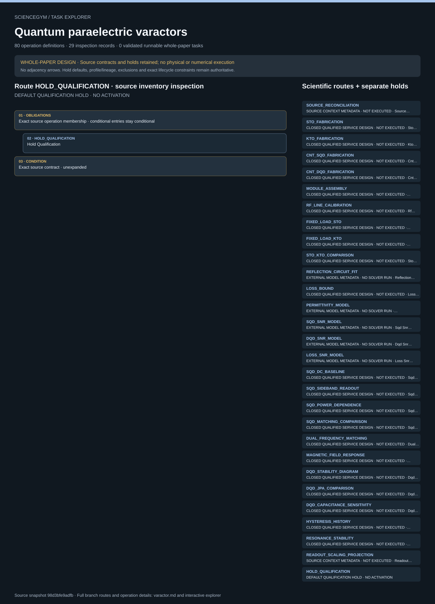

# Quantum paraelectric varactors: task route map



Paper: **Quantum paraelectric varactors for radiofrequency measurements at millikelvin temperatures** · [DOI](https://doi.org/10.1038/s41928-024-01214-z)

Whole-paper DESIGN coverage only; not scientific reproduction or a runnable environment. Read-only author/evaluator reference; no actor loader, hardware control, solver or physical simulation. Operation lists are unordered membership; exact dependencies, lifecycle and repeated occurrence contracts remain authoritative. Holds and quarantine remain conditional, never mandatory successful steps. Requests do not establish observations. Twenty-eight scientific design routes, eighty symbolic operations and 160 finite synthetic bookkeeping fixtures remain distinct. The separate default qualification hold is navigation, not a 29th scientific route. STO and KTO identities, fixed loads, SQD and DQD devices, JPA comparison settings and measured/modelled channels remain distinct. The same STO pair persists across SQD and DQD while circuit/calibration revisions change; the source 320 nH model and 0805CS-331 part code remain distinct; manufacturer nominal value is unverified, as are any substituted operational settings. Lattice and electron temperatures remain distinct. Prepared intake earns no fabrication credit; revision-bound calibration, sample/module/thermal/bias/control history, hysteresis and independent safe release cannot be replaced by acknowledgements or source outcomes. Twelve conflict/scope records and eighteen unknown-input groups remain explicit, including unavailable Section V and unresolved units/material descriptions. Main source access was full JATS, not a main PDF; the raw source archive and author code were not ingested. Cleanroom, chemical, growth, beam, bonding, cryogenic, magnetic, RF/DC and cleanup services are closed unimplemented external boundaries.. Counts describe task representation, not experiments or success.

**Reading rule:** rows show unordered source inventory for inspection. Exact phase, lifecycle and dependency contracts remain authoritative; no loop, specimen, condition or chronology is inferred. An unordered obligation group has no inferred chronological edges. Source-reported scientific facts and authored handling are distinct.

[Frozen local source task package](../../../tasks/varactor_operations_v2/) · [Interactive inspector](../index.html)

## SOURCE_RECONCILIATION — SOURCE CONTEXT METADATA · NOT EXECUTED · Source Reconciliation

Whole-paper DESIGN coverage only; not scientific reproduction or a runnable environment. Read-only author/evaluator reference; no actor loader, hardware control, solver or physical simulation. Operation lists are unordered membership; exact dependencies, lifecycle and repeated occurrence contracts remain authoritative. Holds and quarantine remain conditional, never mandatory successful steps. Requests do not establish observations.

[Exact route source](../../../tasks/varactor_operations_v2/branches.json) · JSON pointer: `/branches/0`

- **OBLIGATIONS: Exact source operation membership · conditional entries stay conditional**
  - Binding: {"order":"Whole-paper DESIGN coverage only; not scientific reproduction or a runnable environment. Read-only author/evaluator reference; no actor loader, hardware control, solver or physical simulation. Operation lists are unordered membership; exact dependencies, lifecycle and repeated occurrence contracts remain authoritative. Holds and quarantine remain conditional, never mandatory successful steps. Requests do not establish observations.","membership_source":"Exact branches.json operation_ids; design_sequence and route_operation_ids retain their separate meanings"}
  - `ARCHIVE_RECORDS` Archive Records
  - `CLEAN_STATION` Clean Station
  - `FREEZE_DESIGN` Freeze Design
  - `FREEZE_ROUTE_PLAN` Freeze Route Plan
  - `HOLD_QUALIFICATION` Hold Qualification
  - `HOLD_SOURCE_CONFLICT` Hold Source Conflict
  - `REGISTER_INPUTS` Register Inputs
  - `RELEASE_DESIGN` Release Design
  - `VERIFY_QUALIFICATION` Verify Qualification
- **CONDITION: Exact source contract · unexpanded**
  - Binding: {"source_file":"branches.json","source_pointer":"/branches/0","source_contract":{"id":"SOURCE_RECONCILIATION","execution_class":"source_context_metadata","source_evidence_ids":["P28","P30","P31","SI1","SI3","SI4","SF4","AVAIL"],"required_inputs":["Versioned source inventory","Branch-local conflict dispositions"],"design_sequence":["Reconcile locators and scope without silently editing inconsistent source words. Freeze missing-input holds and rights boundary."],"route_operation_ids":["HOLD_SOURCE_CONFLICT"],"required_outputs":["Conflict ledger and excluded operational settings"],"design_covered":true,"physical_executed":false,"numerical_executed":false,"interpretation_limit":"Original task design only; services and circuit solvers are unimplemented. Source results are not success criteria.","operation_ids":["ARCHIVE_RECORDS","CLEAN_STATION","FREEZE_DESIGN","FREEZE_ROUTE_PLAN","HOLD_QUALIFICATION","HOLD_SOURCE_CONFLICT","REGISTER_INPUTS","RELEASE_DESIGN","VERIFY_QUALIFICATION"],"operation_ids_semantics":"Membership only; route receipts and dependency graph define instance order and repeated occurrences."}}
- **CONDITION: Exact lifecycle closure · independent evidence remains required**
  - Binding: {"source_file":"lifecycle_contract.json","source_pointer":"","source_contract":{"schema_version":"quantum_paraelectric_varactor_task.v1","states":["UNREGISTERED","IDENTIFIED","FABRICATION_REQUESTED","FABRICATION_VERIFIED","MODULE_VERIFIED","MOUNTED","THERMAL_STATE_VERIFIED","CALIBRATED","MEASUREMENT_REQUESTED","RECORDED","ANALYZED","SAFE_RELEASE_VERIFIED","STORED","QUARANTINED","HELD_CONTAINED"],"closure":["A shutdown request is never safety evidence","Unknown electrical, magnetic or cryogenic safety remains contained","No undocking before current independent safe release","Preserve hysteresis, damage, process and prior-use history","Archive successful, failed and held attempts before final closure","Physical cleanup and disposal require external receipts; no implemented routine"]}}

<details><summary>Branch state, choices, lineage and loop obligations</summary>

```json
{
  "id": "SOURCE_RECONCILIATION",
  "execution_class": "source_context_metadata",
  "source_evidence_ids": [
    "P28",
    "P30",
    "P31",
    "SI1",
    "SI3",
    "SI4",
    "SF4",
    "AVAIL"
  ],
  "required_inputs": [
    "Versioned source inventory",
    "Branch-local conflict dispositions"
  ],
  "design_sequence": [
    "Reconcile locators and scope without silently editing inconsistent source words. Freeze missing-input holds and rights boundary."
  ],
  "route_operation_ids": [
    "HOLD_SOURCE_CONFLICT"
  ],
  "required_outputs": [
    "Conflict ledger and excluded operational settings"
  ],
  "design_covered": true,
  "physical_executed": false,
  "numerical_executed": false,
  "interpretation_limit": "Original task design only; services and circuit solvers are unimplemented. Source results are not success criteria.",
  "operation_ids": [
    "ARCHIVE_RECORDS",
    "CLEAN_STATION",
    "FREEZE_DESIGN",
    "FREEZE_ROUTE_PLAN",
    "HOLD_QUALIFICATION",
    "HOLD_SOURCE_CONFLICT",
    "REGISTER_INPUTS",
    "RELEASE_DESIGN",
    "VERIFY_QUALIFICATION"
  ],
  "operation_ids_semantics": "Membership only; route receipts and dependency graph define instance order and repeated occurrences."
}
```

</details>

## STO_FABRICATION — CLOSED QUALIFIED SERVICE DESIGN · NOT EXECUTED · Sto Fabrication

Whole-paper DESIGN coverage only; not scientific reproduction or a runnable environment. Read-only author/evaluator reference; no actor loader, hardware control, solver or physical simulation. Operation lists are unordered membership; exact dependencies, lifecycle and repeated occurrence contracts remain authoritative. Holds and quarantine remain conditional, never mandatory successful steps. Requests do not establish observations.

[Exact route source](../../../tasks/varactor_operations_v2/branches.json) · JSON pointer: `/branches/1`

- **OBLIGATIONS: Exact source operation membership · conditional entries stay conditional**
  - Binding: {"order":"Whole-paper DESIGN coverage only; not scientific reproduction or a runnable environment. Read-only author/evaluator reference; no actor loader, hardware control, solver or physical simulation. Operation lists are unordered membership; exact dependencies, lifecycle and repeated occurrence contracts remain authoritative. Holds and quarantine remain conditional, never mandatory successful steps. Requests do not establish observations.","membership_source":"Exact branches.json operation_ids; design_sequence and route_operation_ids retain their separate meanings"}
  - `ARCHIVE_RECORDS` Archive Records
  - `CLEAN_STATION` Clean Station
  - `FREEZE_DESIGN` Freeze Design
  - `FREEZE_ROUTE_PLAN` Freeze Route Plan
  - `HOLD_DATA` Hold Data
  - `HOLD_ISOLATION` Hold Isolation
  - `HOLD_QUALIFICATION` Hold Qualification
  - `HOLD_SOURCE_CONFLICT` Hold Source Conflict
  - `INSPECT_SAMPLE` Inspect Sample
  - `QUARANTINE_SAMPLE` Quarantine Sample
  - `RECEIVE_CRYSTAL` Receive Crystal
  - `REGISTER_INPUTS` Register Inputs
  - `RELEASE_DESIGN` Release Design
  - `REQUEST_BACK_METAL` Request Back Metal
  - `REQUEST_LIFT_OFF` Request Lift Off
  - `REQUEST_PAD_METAL` Request Pad Metal
  - `REQUEST_PHOTOPATTERN` Request Photopattern
  - `REQUEST_SAFE_OFF` Request Safe Off
  - `STORE_SAMPLE` Store Sample
  - `UNDOCK_MODULE` Undock Module
  - `VERIFY_BACK_METAL` Verify Back Metal
  - `VERIFY_CRYSTAL` Verify Crystal
  - `VERIFY_LIFT_OFF` Verify Lift Off
  - `VERIFY_PAD_METAL` Verify Pad Metal
  - `VERIFY_PHOTOPATTERN` Verify Photopattern
  - `VERIFY_QUALIFICATION` Verify Qualification
  - `VERIFY_SAFE_OFF` Verify Safe Off
- **CONDITION: Exact source contract · unexpanded**
  - Binding: {"source_file":"branches.json","source_pointer":"/branches/1","source_contract":{"id":"STO_FABRICATION","execution_class":"closed_service","source_evidence_ids":["P7","P28","P29","SI1"],"required_inputs":["Verified STO lot/orientation/termination","Original released mask and qualified process card"],"design_sequence":["Receive and identify crystal; request and independently verify backside metallization, photo-patterning, top-pad metallization and lift-off; inspect and preserve lot/geometry ancestry."],"route_operation_ids":["RECEIVE_CRYSTAL","VERIFY_CRYSTAL","REQUEST_BACK_METAL","VERIFY_BACK_METAL","REQUEST_PHOTOPATTERN","VERIFY_PHOTOPATTERN","REQUEST_PAD_METAL","VERIFY_PAD_METAL","REQUEST_LIFT_OFF","VERIFY_LIFT_OFF"],"required_outputs":["Independent fabrication receipts, images and post-process condition"],"design_covered":true,"physical_executed":false,"numerical_executed":false,"interpretation_limit":"Original task design only; services and circuit solvers are unimplemented. Source results are not success criteria.","operation_ids":["ARCHIVE_RECORDS","CLEAN_STATION","FREEZE_DESIGN","FREEZE_ROUTE_PLAN","HOLD_DATA","HOLD_ISOLATION","HOLD_QUALIFICATION","HOLD_SOURCE_CONFLICT","INSPECT_SAMPLE","QUARANTINE_SAMPLE","RECEIVE_CRYSTAL","REGISTER_INPUTS","RELEASE_DESIGN","REQUEST_BACK_METAL","REQUEST_LIFT_OFF","REQUEST_PAD_METAL","REQUEST_PHOTOPATTERN","REQUEST_SAFE_OFF","STORE_SAMPLE","UNDOCK_MODULE","VERIFY_BACK_METAL","VERIFY_CRYSTAL","VERIFY_LIFT_OFF","VERIFY_PAD_METAL","VERIFY_PHOTOPATTERN","VERIFY_QUALIFICATION","VERIFY_SAFE_OFF"],"operation_ids_semantics":"Membership only; route receipts and dependency graph define instance order and repeated occurrences."}}
- **CONDITION: Exact lifecycle closure · independent evidence remains required**
  - Binding: {"source_file":"lifecycle_contract.json","source_pointer":"","source_contract":{"schema_version":"quantum_paraelectric_varactor_task.v1","states":["UNREGISTERED","IDENTIFIED","FABRICATION_REQUESTED","FABRICATION_VERIFIED","MODULE_VERIFIED","MOUNTED","THERMAL_STATE_VERIFIED","CALIBRATED","MEASUREMENT_REQUESTED","RECORDED","ANALYZED","SAFE_RELEASE_VERIFIED","STORED","QUARANTINED","HELD_CONTAINED"],"closure":["A shutdown request is never safety evidence","Unknown electrical, magnetic or cryogenic safety remains contained","No undocking before current independent safe release","Preserve hysteresis, damage, process and prior-use history","Archive successful, failed and held attempts before final closure","Physical cleanup and disposal require external receipts; no implemented routine"]}}

<details><summary>Branch state, choices, lineage and loop obligations</summary>

```json
{
  "id": "STO_FABRICATION",
  "execution_class": "closed_service",
  "source_evidence_ids": [
    "P7",
    "P28",
    "P29",
    "SI1"
  ],
  "required_inputs": [
    "Verified STO lot/orientation/termination",
    "Original released mask and qualified process card"
  ],
  "design_sequence": [
    "Receive and identify crystal; request and independently verify backside metallization, photo-patterning, top-pad metallization and lift-off; inspect and preserve lot/geometry ancestry."
  ],
  "route_operation_ids": [
    "RECEIVE_CRYSTAL",
    "VERIFY_CRYSTAL",
    "REQUEST_BACK_METAL",
    "VERIFY_BACK_METAL",
    "REQUEST_PHOTOPATTERN",
    "VERIFY_PHOTOPATTERN",
    "REQUEST_PAD_METAL",
    "VERIFY_PAD_METAL",
    "REQUEST_LIFT_OFF",
    "VERIFY_LIFT_OFF"
  ],
  "required_outputs": [
    "Independent fabrication receipts, images and post-process condition"
  ],
  "design_covered": true,
  "physical_executed": false,
  "numerical_executed": false,
  "interpretation_limit": "Original task design only; services and circuit solvers are unimplemented. Source results are not success criteria.",
  "operation_ids": [
    "ARCHIVE_RECORDS",
    "CLEAN_STATION",
    "FREEZE_DESIGN",
    "FREEZE_ROUTE_PLAN",
    "HOLD_DATA",
    "HOLD_ISOLATION",
    "HOLD_QUALIFICATION",
    "HOLD_SOURCE_CONFLICT",
    "INSPECT_SAMPLE",
    "QUARANTINE_SAMPLE",
    "RECEIVE_CRYSTAL",
    "REGISTER_INPUTS",
    "RELEASE_DESIGN",
    "REQUEST_BACK_METAL",
    "REQUEST_LIFT_OFF",
    "REQUEST_PAD_METAL",
    "REQUEST_PHOTOPATTERN",
    "REQUEST_SAFE_OFF",
    "STORE_SAMPLE",
    "UNDOCK_MODULE",
    "VERIFY_BACK_METAL",
    "VERIFY_CRYSTAL",
    "VERIFY_LIFT_OFF",
    "VERIFY_PAD_METAL",
    "VERIFY_PHOTOPATTERN",
    "VERIFY_QUALIFICATION",
    "VERIFY_SAFE_OFF"
  ],
  "operation_ids_semantics": "Membership only; route receipts and dependency graph define instance order and repeated occurrences."
}
```

</details>

## KTO_FABRICATION — CLOSED QUALIFIED SERVICE DESIGN · NOT EXECUTED · Kto Fabrication

Whole-paper DESIGN coverage only; not scientific reproduction or a runnable environment. Read-only author/evaluator reference; no actor loader, hardware control, solver or physical simulation. Operation lists are unordered membership; exact dependencies, lifecycle and repeated occurrence contracts remain authoritative. Holds and quarantine remain conditional, never mandatory successful steps. Requests do not establish observations.

[Exact route source](../../../tasks/varactor_operations_v2/branches.json) · JSON pointer: `/branches/2`

- **OBLIGATIONS: Exact source operation membership · conditional entries stay conditional**
  - Binding: {"order":"Whole-paper DESIGN coverage only; not scientific reproduction or a runnable environment. Read-only author/evaluator reference; no actor loader, hardware control, solver or physical simulation. Operation lists are unordered membership; exact dependencies, lifecycle and repeated occurrence contracts remain authoritative. Holds and quarantine remain conditional, never mandatory successful steps. Requests do not establish observations.","membership_source":"Exact branches.json operation_ids; design_sequence and route_operation_ids retain their separate meanings"}
  - `ARCHIVE_RECORDS` Archive Records
  - `CLEAN_STATION` Clean Station
  - `FREEZE_DESIGN` Freeze Design
  - `FREEZE_ROUTE_PLAN` Freeze Route Plan
  - `HOLD_DATA` Hold Data
  - `HOLD_ISOLATION` Hold Isolation
  - `HOLD_QUALIFICATION` Hold Qualification
  - `HOLD_SOURCE_CONFLICT` Hold Source Conflict
  - `INSPECT_SAMPLE` Inspect Sample
  - `QUARANTINE_SAMPLE` Quarantine Sample
  - `RECEIVE_CRYSTAL` Receive Crystal
  - `REGISTER_INPUTS` Register Inputs
  - `RELEASE_DESIGN` Release Design
  - `REQUEST_BACK_METAL` Request Back Metal
  - `REQUEST_LIFT_OFF` Request Lift Off
  - `REQUEST_PAD_METAL` Request Pad Metal
  - `REQUEST_PHOTOPATTERN` Request Photopattern
  - `REQUEST_SAFE_OFF` Request Safe Off
  - `STORE_SAMPLE` Store Sample
  - `UNDOCK_MODULE` Undock Module
  - `VERIFY_BACK_METAL` Verify Back Metal
  - `VERIFY_CRYSTAL` Verify Crystal
  - `VERIFY_LIFT_OFF` Verify Lift Off
  - `VERIFY_PAD_METAL` Verify Pad Metal
  - `VERIFY_PHOTOPATTERN` Verify Photopattern
  - `VERIFY_QUALIFICATION` Verify Qualification
  - `VERIFY_SAFE_OFF` Verify Safe Off
- **CONDITION: Exact source contract · unexpanded**
  - Binding: {"source_file":"branches.json","source_pointer":"/branches/2","source_contract":{"id":"KTO_FABRICATION","execution_class":"closed_service","source_evidence_ids":["P28","SI3","SF4"],"required_inputs":["Verified KTO lot/orientation","Original mask, qualified process card and explicit material label"],"design_sequence":["Use separate KTO ancestry and same service sequence; never infer STO termination or orientation for KTO."],"route_operation_ids":["RECEIVE_CRYSTAL","VERIFY_CRYSTAL","REQUEST_BACK_METAL","VERIFY_BACK_METAL","REQUEST_PHOTOPATTERN","VERIFY_PHOTOPATTERN","REQUEST_PAD_METAL","VERIFY_PAD_METAL","REQUEST_LIFT_OFF","VERIFY_LIFT_OFF"],"required_outputs":["KTO fabrication receipts and resolved material identity"],"design_covered":true,"physical_executed":false,"numerical_executed":false,"interpretation_limit":"Original task design only; services and circuit solvers are unimplemented. Source results are not success criteria.","operation_ids":["ARCHIVE_RECORDS","CLEAN_STATION","FREEZE_DESIGN","FREEZE_ROUTE_PLAN","HOLD_DATA","HOLD_ISOLATION","HOLD_QUALIFICATION","HOLD_SOURCE_CONFLICT","INSPECT_SAMPLE","QUARANTINE_SAMPLE","RECEIVE_CRYSTAL","REGISTER_INPUTS","RELEASE_DESIGN","REQUEST_BACK_METAL","REQUEST_LIFT_OFF","REQUEST_PAD_METAL","REQUEST_PHOTOPATTERN","REQUEST_SAFE_OFF","STORE_SAMPLE","UNDOCK_MODULE","VERIFY_BACK_METAL","VERIFY_CRYSTAL","VERIFY_LIFT_OFF","VERIFY_PAD_METAL","VERIFY_PHOTOPATTERN","VERIFY_QUALIFICATION","VERIFY_SAFE_OFF"],"operation_ids_semantics":"Membership only; route receipts and dependency graph define instance order and repeated occurrences."}}
- **CONDITION: Exact lifecycle closure · independent evidence remains required**
  - Binding: {"source_file":"lifecycle_contract.json","source_pointer":"","source_contract":{"schema_version":"quantum_paraelectric_varactor_task.v1","states":["UNREGISTERED","IDENTIFIED","FABRICATION_REQUESTED","FABRICATION_VERIFIED","MODULE_VERIFIED","MOUNTED","THERMAL_STATE_VERIFIED","CALIBRATED","MEASUREMENT_REQUESTED","RECORDED","ANALYZED","SAFE_RELEASE_VERIFIED","STORED","QUARANTINED","HELD_CONTAINED"],"closure":["A shutdown request is never safety evidence","Unknown electrical, magnetic or cryogenic safety remains contained","No undocking before current independent safe release","Preserve hysteresis, damage, process and prior-use history","Archive successful, failed and held attempts before final closure","Physical cleanup and disposal require external receipts; no implemented routine"]}}

<details><summary>Branch state, choices, lineage and loop obligations</summary>

```json
{
  "id": "KTO_FABRICATION",
  "execution_class": "closed_service",
  "source_evidence_ids": [
    "P28",
    "SI3",
    "SF4"
  ],
  "required_inputs": [
    "Verified KTO lot/orientation",
    "Original mask, qualified process card and explicit material label"
  ],
  "design_sequence": [
    "Use separate KTO ancestry and same service sequence; never infer STO termination or orientation for KTO."
  ],
  "route_operation_ids": [
    "RECEIVE_CRYSTAL",
    "VERIFY_CRYSTAL",
    "REQUEST_BACK_METAL",
    "VERIFY_BACK_METAL",
    "REQUEST_PHOTOPATTERN",
    "VERIFY_PHOTOPATTERN",
    "REQUEST_PAD_METAL",
    "VERIFY_PAD_METAL",
    "REQUEST_LIFT_OFF",
    "VERIFY_LIFT_OFF"
  ],
  "required_outputs": [
    "KTO fabrication receipts and resolved material identity"
  ],
  "design_covered": true,
  "physical_executed": false,
  "numerical_executed": false,
  "interpretation_limit": "Original task design only; services and circuit solvers are unimplemented. Source results are not success criteria.",
  "operation_ids": [
    "ARCHIVE_RECORDS",
    "CLEAN_STATION",
    "FREEZE_DESIGN",
    "FREEZE_ROUTE_PLAN",
    "HOLD_DATA",
    "HOLD_ISOLATION",
    "HOLD_QUALIFICATION",
    "HOLD_SOURCE_CONFLICT",
    "INSPECT_SAMPLE",
    "QUARANTINE_SAMPLE",
    "RECEIVE_CRYSTAL",
    "REGISTER_INPUTS",
    "RELEASE_DESIGN",
    "REQUEST_BACK_METAL",
    "REQUEST_LIFT_OFF",
    "REQUEST_PAD_METAL",
    "REQUEST_PHOTOPATTERN",
    "REQUEST_SAFE_OFF",
    "STORE_SAMPLE",
    "UNDOCK_MODULE",
    "VERIFY_BACK_METAL",
    "VERIFY_CRYSTAL",
    "VERIFY_LIFT_OFF",
    "VERIFY_PAD_METAL",
    "VERIFY_PHOTOPATTERN",
    "VERIFY_QUALIFICATION",
    "VERIFY_SAFE_OFF"
  ],
  "operation_ids_semantics": "Membership only; route receipts and dependency graph define instance order and repeated occurrences."
}
```

</details>

## CNT_SQD_FABRICATION — CLOSED QUALIFIED SERVICE DESIGN · NOT EXECUTED · Cnt Sqd Fabrication

Whole-paper DESIGN coverage only; not scientific reproduction or a runnable environment. Read-only author/evaluator reference; no actor loader, hardware control, solver or physical simulation. Operation lists are unordered membership; exact dependencies, lifecycle and repeated occurrence contracts remain authoritative. Holds and quarantine remain conditional, never mandatory successful steps. Requests do not establish observations.

[Exact route source](../../../tasks/varactor_operations_v2/branches.json) · JSON pointer: `/branches/3`

- **OBLIGATIONS: Exact source operation membership · conditional entries stay conditional**
  - Binding: {"order":"Whole-paper DESIGN coverage only; not scientific reproduction or a runnable environment. Read-only author/evaluator reference; no actor loader, hardware control, solver or physical simulation. Operation lists are unordered membership; exact dependencies, lifecycle and repeated occurrence contracts remain authoritative. Holds and quarantine remain conditional, never mandatory successful steps. Requests do not establish observations.","membership_source":"Exact branches.json operation_ids; design_sequence and route_operation_ids retain their separate meanings"}
  - `ARCHIVE_RECORDS` Archive Records
  - `CLEAN_STATION` Clean Station
  - `FREEZE_DESIGN` Freeze Design
  - `FREEZE_ROUTE_PLAN` Freeze Route Plan
  - `HOLD_DATA` Hold Data
  - `HOLD_ISOLATION` Hold Isolation
  - `HOLD_QUALIFICATION` Hold Qualification
  - `HOLD_SOURCE_CONFLICT` Hold Source Conflict
  - `INSPECT_SAMPLE` Inspect Sample
  - `QUARANTINE_SAMPLE` Quarantine Sample
  - `REGISTER_INPUTS` Register Inputs
  - `RELEASE_DESIGN` Release Design
  - `REQUEST_AFM_LOCALIZATION` Request Afm Localization
  - `REQUEST_FIRST_LITHOGRAPHY` Request First Lithography
  - `REQUEST_NANOTUBE_GROWTH` Request Nanotube Growth
  - `REQUEST_SAFE_OFF` Request Safe Off
  - `REQUEST_SECOND_LITHOGRAPHY` Request Second Lithography
  - `STORE_SAMPLE` Store Sample
  - `UNDOCK_MODULE` Undock Module
  - `VERIFY_AFM_LOCALIZATION` Verify Afm Localization
  - `VERIFY_FIRST_LITHOGRAPHY` Verify First Lithography
  - `VERIFY_NANOTUBE_GROWTH` Verify Nanotube Growth
  - `VERIFY_QUALIFICATION` Verify Qualification
  - `VERIFY_SAFE_OFF` Verify Safe Off
  - `VERIFY_SECOND_LITHOGRAPHY` Verify Second Lithography
- **CONDITION: Exact source contract · unexpanded**
  - Binding: {"source_file":"branches.json","source_pointer":"/branches/3","source_contract":{"id":"CNT_SQD_FABRICATION","execution_class":"closed_service","source_evidence_ids":["P30","P16","SI1","SF2"],"required_inputs":["Branch-specific substrate identity and resistivity evidence","Original electrode design and qualified growth/beam/deposition service cards"],"design_sequence":["Receive substrate ancestry; verify closed nanotube-growth receipt; request first alignment/bond-pad lithography, independent AFM localization, and second source/drain electrode lithography. Preserve the substrate wording conflict; no source growth recipe is supplied."],"route_operation_ids":["REQUEST_NANOTUBE_GROWTH","VERIFY_NANOTUBE_GROWTH","REQUEST_FIRST_LITHOGRAPHY","VERIFY_FIRST_LITHOGRAPHY","REQUEST_AFM_LOCALIZATION","VERIFY_AFM_LOCALIZATION","REQUEST_SECOND_LITHOGRAPHY","VERIFY_SECOND_LITHOGRAPHY"],"required_outputs":["Device ID, substrate lineage, localization map, two-stage process receipts"],"design_covered":true,"physical_executed":false,"numerical_executed":false,"interpretation_limit":"Original task design only; services and circuit solvers are unimplemented. Source results are not success criteria.","operation_ids":["ARCHIVE_RECORDS","CLEAN_STATION","FREEZE_DESIGN","FREEZE_ROUTE_PLAN","HOLD_DATA","HOLD_ISOLATION","HOLD_QUALIFICATION","HOLD_SOURCE_CONFLICT","INSPECT_SAMPLE","QUARANTINE_SAMPLE","REGISTER_INPUTS","RELEASE_DESIGN","REQUEST_AFM_LOCALIZATION","REQUEST_FIRST_LITHOGRAPHY","REQUEST_NANOTUBE_GROWTH","REQUEST_SAFE_OFF","REQUEST_SECOND_LITHOGRAPHY","STORE_SAMPLE","UNDOCK_MODULE","VERIFY_AFM_LOCALIZATION","VERIFY_FIRST_LITHOGRAPHY","VERIFY_NANOTUBE_GROWTH","VERIFY_QUALIFICATION","VERIFY_SAFE_OFF","VERIFY_SECOND_LITHOGRAPHY"],"operation_ids_semantics":"Membership only; route receipts and dependency graph define instance order and repeated occurrences."}}
- **CONDITION: Exact lifecycle closure · independent evidence remains required**
  - Binding: {"source_file":"lifecycle_contract.json","source_pointer":"","source_contract":{"schema_version":"quantum_paraelectric_varactor_task.v1","states":["UNREGISTERED","IDENTIFIED","FABRICATION_REQUESTED","FABRICATION_VERIFIED","MODULE_VERIFIED","MOUNTED","THERMAL_STATE_VERIFIED","CALIBRATED","MEASUREMENT_REQUESTED","RECORDED","ANALYZED","SAFE_RELEASE_VERIFIED","STORED","QUARANTINED","HELD_CONTAINED"],"closure":["A shutdown request is never safety evidence","Unknown electrical, magnetic or cryogenic safety remains contained","No undocking before current independent safe release","Preserve hysteresis, damage, process and prior-use history","Archive successful, failed and held attempts before final closure","Physical cleanup and disposal require external receipts; no implemented routine"]}}

<details><summary>Branch state, choices, lineage and loop obligations</summary>

```json
{
  "id": "CNT_SQD_FABRICATION",
  "execution_class": "closed_service",
  "source_evidence_ids": [
    "P30",
    "P16",
    "SI1",
    "SF2"
  ],
  "required_inputs": [
    "Branch-specific substrate identity and resistivity evidence",
    "Original electrode design and qualified growth/beam/deposition service cards"
  ],
  "design_sequence": [
    "Receive substrate ancestry; verify closed nanotube-growth receipt; request first alignment/bond-pad lithography, independent AFM localization, and second source/drain electrode lithography. Preserve the substrate wording conflict; no source growth recipe is supplied."
  ],
  "route_operation_ids": [
    "REQUEST_NANOTUBE_GROWTH",
    "VERIFY_NANOTUBE_GROWTH",
    "REQUEST_FIRST_LITHOGRAPHY",
    "VERIFY_FIRST_LITHOGRAPHY",
    "REQUEST_AFM_LOCALIZATION",
    "VERIFY_AFM_LOCALIZATION",
    "REQUEST_SECOND_LITHOGRAPHY",
    "VERIFY_SECOND_LITHOGRAPHY"
  ],
  "required_outputs": [
    "Device ID, substrate lineage, localization map, two-stage process receipts"
  ],
  "design_covered": true,
  "physical_executed": false,
  "numerical_executed": false,
  "interpretation_limit": "Original task design only; services and circuit solvers are unimplemented. Source results are not success criteria.",
  "operation_ids": [
    "ARCHIVE_RECORDS",
    "CLEAN_STATION",
    "FREEZE_DESIGN",
    "FREEZE_ROUTE_PLAN",
    "HOLD_DATA",
    "HOLD_ISOLATION",
    "HOLD_QUALIFICATION",
    "HOLD_SOURCE_CONFLICT",
    "INSPECT_SAMPLE",
    "QUARANTINE_SAMPLE",
    "REGISTER_INPUTS",
    "RELEASE_DESIGN",
    "REQUEST_AFM_LOCALIZATION",
    "REQUEST_FIRST_LITHOGRAPHY",
    "REQUEST_NANOTUBE_GROWTH",
    "REQUEST_SAFE_OFF",
    "REQUEST_SECOND_LITHOGRAPHY",
    "STORE_SAMPLE",
    "UNDOCK_MODULE",
    "VERIFY_AFM_LOCALIZATION",
    "VERIFY_FIRST_LITHOGRAPHY",
    "VERIFY_NANOTUBE_GROWTH",
    "VERIFY_QUALIFICATION",
    "VERIFY_SAFE_OFF",
    "VERIFY_SECOND_LITHOGRAPHY"
  ],
  "operation_ids_semantics": "Membership only; route receipts and dependency graph define instance order and repeated occurrences."
}
```

</details>

## CNT_DQD_FABRICATION — CLOSED QUALIFIED SERVICE DESIGN · NOT EXECUTED · Cnt Dqd Fabrication

Whole-paper DESIGN coverage only; not scientific reproduction or a runnable environment. Read-only author/evaluator reference; no actor loader, hardware control, solver or physical simulation. Operation lists are unordered membership; exact dependencies, lifecycle and repeated occurrence contracts remain authoritative. Holds and quarantine remain conditional, never mandatory successful steps. Requests do not establish observations.

[Exact route source](../../../tasks/varactor_operations_v2/branches.json) · JSON pointer: `/branches/4`

- **OBLIGATIONS: Exact source operation membership · conditional entries stay conditional**
  - Binding: {"order":"Whole-paper DESIGN coverage only; not scientific reproduction or a runnable environment. Read-only author/evaluator reference; no actor loader, hardware control, solver or physical simulation. Operation lists are unordered membership; exact dependencies, lifecycle and repeated occurrence contracts remain authoritative. Holds and quarantine remain conditional, never mandatory successful steps. Requests do not establish observations.","membership_source":"Exact branches.json operation_ids; design_sequence and route_operation_ids retain their separate meanings"}
  - `ARCHIVE_RECORDS` Archive Records
  - `CLEAN_STATION` Clean Station
  - `FREEZE_DESIGN` Freeze Design
  - `FREEZE_ROUTE_PLAN` Freeze Route Plan
  - `HOLD_DATA` Hold Data
  - `HOLD_ISOLATION` Hold Isolation
  - `HOLD_QUALIFICATION` Hold Qualification
  - `HOLD_SOURCE_CONFLICT` Hold Source Conflict
  - `INSPECT_SAMPLE` Inspect Sample
  - `QUARANTINE_SAMPLE` Quarantine Sample
  - `REGISTER_INPUTS` Register Inputs
  - `RELEASE_DESIGN` Release Design
  - `REQUEST_AFM_LOCALIZATION` Request Afm Localization
  - `REQUEST_FIRST_LITHOGRAPHY` Request First Lithography
  - `REQUEST_NANOTUBE_GROWTH` Request Nanotube Growth
  - `REQUEST_SAFE_OFF` Request Safe Off
  - `REQUEST_SECOND_LITHOGRAPHY` Request Second Lithography
  - `STORE_SAMPLE` Store Sample
  - `UNDOCK_MODULE` Undock Module
  - `VERIFY_AFM_LOCALIZATION` Verify Afm Localization
  - `VERIFY_FIRST_LITHOGRAPHY` Verify First Lithography
  - `VERIFY_NANOTUBE_GROWTH` Verify Nanotube Growth
  - `VERIFY_QUALIFICATION` Verify Qualification
  - `VERIFY_SAFE_OFF` Verify Safe Off
  - `VERIFY_SECOND_LITHOGRAPHY` Verify Second Lithography
- **CONDITION: Exact source contract · unexpanded**
  - Binding: {"source_file":"branches.json","source_pointer":"/branches/4","source_contract":{"id":"CNT_DQD_FABRICATION","execution_class":"closed_service","source_evidence_ids":["P30","P22","SI1","SF2"],"required_inputs":["Branch-specific substrate identity and resistivity evidence","Original electrode design and qualified growth/beam/deposition service cards"],"design_sequence":["Receive substrate ancestry; verify closed nanotube-growth receipt; request first alignment/bond-pad lithography, independent AFM localization, and second source/drain electrode lithography. Preserve the substrate wording conflict; no source growth recipe is supplied."],"route_operation_ids":["REQUEST_NANOTUBE_GROWTH","VERIFY_NANOTUBE_GROWTH","REQUEST_FIRST_LITHOGRAPHY","VERIFY_FIRST_LITHOGRAPHY","REQUEST_AFM_LOCALIZATION","VERIFY_AFM_LOCALIZATION","REQUEST_SECOND_LITHOGRAPHY","VERIFY_SECOND_LITHOGRAPHY"],"required_outputs":["Device ID, substrate lineage, localization map, two-stage process receipts"],"design_covered":true,"physical_executed":false,"numerical_executed":false,"interpretation_limit":"Original task design only; services and circuit solvers are unimplemented. Source results are not success criteria.","operation_ids":["ARCHIVE_RECORDS","CLEAN_STATION","FREEZE_DESIGN","FREEZE_ROUTE_PLAN","HOLD_DATA","HOLD_ISOLATION","HOLD_QUALIFICATION","HOLD_SOURCE_CONFLICT","INSPECT_SAMPLE","QUARANTINE_SAMPLE","REGISTER_INPUTS","RELEASE_DESIGN","REQUEST_AFM_LOCALIZATION","REQUEST_FIRST_LITHOGRAPHY","REQUEST_NANOTUBE_GROWTH","REQUEST_SAFE_OFF","REQUEST_SECOND_LITHOGRAPHY","STORE_SAMPLE","UNDOCK_MODULE","VERIFY_AFM_LOCALIZATION","VERIFY_FIRST_LITHOGRAPHY","VERIFY_NANOTUBE_GROWTH","VERIFY_QUALIFICATION","VERIFY_SAFE_OFF","VERIFY_SECOND_LITHOGRAPHY"],"operation_ids_semantics":"Membership only; route receipts and dependency graph define instance order and repeated occurrences."}}
- **CONDITION: Exact lifecycle closure · independent evidence remains required**
  - Binding: {"source_file":"lifecycle_contract.json","source_pointer":"","source_contract":{"schema_version":"quantum_paraelectric_varactor_task.v1","states":["UNREGISTERED","IDENTIFIED","FABRICATION_REQUESTED","FABRICATION_VERIFIED","MODULE_VERIFIED","MOUNTED","THERMAL_STATE_VERIFIED","CALIBRATED","MEASUREMENT_REQUESTED","RECORDED","ANALYZED","SAFE_RELEASE_VERIFIED","STORED","QUARANTINED","HELD_CONTAINED"],"closure":["A shutdown request is never safety evidence","Unknown electrical, magnetic or cryogenic safety remains contained","No undocking before current independent safe release","Preserve hysteresis, damage, process and prior-use history","Archive successful, failed and held attempts before final closure","Physical cleanup and disposal require external receipts; no implemented routine"]}}

<details><summary>Branch state, choices, lineage and loop obligations</summary>

```json
{
  "id": "CNT_DQD_FABRICATION",
  "execution_class": "closed_service",
  "source_evidence_ids": [
    "P30",
    "P22",
    "SI1",
    "SF2"
  ],
  "required_inputs": [
    "Branch-specific substrate identity and resistivity evidence",
    "Original electrode design and qualified growth/beam/deposition service cards"
  ],
  "design_sequence": [
    "Receive substrate ancestry; verify closed nanotube-growth receipt; request first alignment/bond-pad lithography, independent AFM localization, and second source/drain electrode lithography. Preserve the substrate wording conflict; no source growth recipe is supplied."
  ],
  "route_operation_ids": [
    "REQUEST_NANOTUBE_GROWTH",
    "VERIFY_NANOTUBE_GROWTH",
    "REQUEST_FIRST_LITHOGRAPHY",
    "VERIFY_FIRST_LITHOGRAPHY",
    "REQUEST_AFM_LOCALIZATION",
    "VERIFY_AFM_LOCALIZATION",
    "REQUEST_SECOND_LITHOGRAPHY",
    "VERIFY_SECOND_LITHOGRAPHY"
  ],
  "required_outputs": [
    "Device ID, substrate lineage, localization map, two-stage process receipts"
  ],
  "design_covered": true,
  "physical_executed": false,
  "numerical_executed": false,
  "interpretation_limit": "Original task design only; services and circuit solvers are unimplemented. Source results are not success criteria.",
  "operation_ids": [
    "ARCHIVE_RECORDS",
    "CLEAN_STATION",
    "FREEZE_DESIGN",
    "FREEZE_ROUTE_PLAN",
    "HOLD_DATA",
    "HOLD_ISOLATION",
    "HOLD_QUALIFICATION",
    "HOLD_SOURCE_CONFLICT",
    "INSPECT_SAMPLE",
    "QUARANTINE_SAMPLE",
    "REGISTER_INPUTS",
    "RELEASE_DESIGN",
    "REQUEST_AFM_LOCALIZATION",
    "REQUEST_FIRST_LITHOGRAPHY",
    "REQUEST_NANOTUBE_GROWTH",
    "REQUEST_SAFE_OFF",
    "REQUEST_SECOND_LITHOGRAPHY",
    "STORE_SAMPLE",
    "UNDOCK_MODULE",
    "VERIFY_AFM_LOCALIZATION",
    "VERIFY_FIRST_LITHOGRAPHY",
    "VERIFY_NANOTUBE_GROWTH",
    "VERIFY_QUALIFICATION",
    "VERIFY_SAFE_OFF",
    "VERIFY_SECOND_LITHOGRAPHY"
  ],
  "operation_ids_semantics": "Membership only; route receipts and dependency graph define instance order and repeated occurrences."
}
```

</details>

## MODULE_ASSEMBLY — CLOSED QUALIFIED SERVICE DESIGN · NOT EXECUTED · Module Assembly

Whole-paper DESIGN coverage only; not scientific reproduction or a runnable environment. Read-only author/evaluator reference; no actor loader, hardware control, solver or physical simulation. Operation lists are unordered membership; exact dependencies, lifecycle and repeated occurrence contracts remain authoritative. Holds and quarantine remain conditional, never mandatory successful steps. Requests do not establish observations.

[Exact route source](../../../tasks/varactor_operations_v2/branches.json) · JSON pointer: `/branches/5`

- **OBLIGATIONS: Exact source operation membership · conditional entries stay conditional**
  - Binding: {"order":"Whole-paper DESIGN coverage only; not scientific reproduction or a runnable environment. Read-only author/evaluator reference; no actor loader, hardware control, solver or physical simulation. Operation lists are unordered membership; exact dependencies, lifecycle and repeated occurrence contracts remain authoritative. Holds and quarantine remain conditional, never mandatory successful steps. Requests do not establish observations.","membership_source":"Exact branches.json operation_ids; design_sequence and route_operation_ids retain their separate meanings"}
  - `ARCHIVE_RECORDS` Archive Records
  - `CLEAN_STATION` Clean Station
  - `FREEZE_CIRCUIT_CARD` Freeze Circuit Card
  - `FREEZE_DESIGN` Freeze Design
  - `FREEZE_ROUTE_PLAN` Freeze Route Plan
  - `HOLD_DATA` Hold Data
  - `HOLD_ISOLATION` Hold Isolation
  - `HOLD_QUALIFICATION` Hold Qualification
  - `HOLD_SOURCE_CONFLICT` Hold Source Conflict
  - `INSPECT_SAMPLE` Inspect Sample
  - `QUARANTINE_SAMPLE` Quarantine Sample
  - `RECEIVE_PREPARED` Receive Prepared
  - `REGISTER_INPUTS` Register Inputs
  - `RELEASE_DESIGN` Release Design
  - `RELEASE_MODULE` Release Module
  - `REQUEST_DIE_ATTACH` Request Die Attach
  - `REQUEST_MODULE_ASSEMBLY` Request Module Assembly
  - `REQUEST_SAFE_OFF` Request Safe Off
  - `REQUEST_WIRE_BOND` Request Wire Bond
  - `STORE_SAMPLE` Store Sample
  - `UNDOCK_MODULE` Undock Module
  - `VERIFY_ANCESTRY` Verify Ancestry
  - `VERIFY_DIE_ATTACH` Verify Die Attach
  - `VERIFY_MODULE_ASSEMBLY` Verify Module Assembly
  - `VERIFY_PORT_MAP` Verify Port Map
  - `VERIFY_QUALIFICATION` Verify Qualification
  - `VERIFY_SAFE_OFF` Verify Safe Off
  - `VERIFY_WIRE_BOND` Verify Wire Bond
- **CONDITION: Exact source contract · unexpanded**
  - Binding: {"source_file":"branches.json","source_pointer":"/branches/5","source_contract":{"id":"MODULE_ASSEMBLY","execution_class":"closed_service","source_evidence_ids":["P7","P29","P30","P31","SI2","SF3"],"required_inputs":["Fabricated varactors and optional identified quantum device","Released fixed-load/SQD/DQD circuit card","Qualified attachment and bonding cards"],"design_sequence":["Verify die-to-PCB attachment and wire bonds via closed-service receipts; verify holder, connector and RF/DC port map; keep fixed-load, SQD and DQD topologies distinct."],"route_operation_ids":["REQUEST_DIE_ATTACH","VERIFY_DIE_ATTACH","REQUEST_WIRE_BOND","VERIFY_WIRE_BOND","REQUEST_MODULE_ASSEMBLY","VERIFY_MODULE_ASSEMBLY","VERIFY_PORT_MAP","FREEZE_CIRCUIT_CARD","RELEASE_MODULE"],"required_outputs":["As-built module lineage, bonds, circuit revision and independent continuity/condition records"],"design_covered":true,"physical_executed":false,"numerical_executed":false,"interpretation_limit":"Original task design only; services and circuit solvers are unimplemented. Source results are not success criteria.","operation_ids":["ARCHIVE_RECORDS","CLEAN_STATION","FREEZE_CIRCUIT_CARD","FREEZE_DESIGN","FREEZE_ROUTE_PLAN","HOLD_DATA","HOLD_ISOLATION","HOLD_QUALIFICATION","HOLD_SOURCE_CONFLICT","INSPECT_SAMPLE","QUARANTINE_SAMPLE","RECEIVE_PREPARED","REGISTER_INPUTS","RELEASE_DESIGN","RELEASE_MODULE","REQUEST_DIE_ATTACH","REQUEST_MODULE_ASSEMBLY","REQUEST_SAFE_OFF","REQUEST_WIRE_BOND","STORE_SAMPLE","UNDOCK_MODULE","VERIFY_ANCESTRY","VERIFY_DIE_ATTACH","VERIFY_MODULE_ASSEMBLY","VERIFY_PORT_MAP","VERIFY_QUALIFICATION","VERIFY_SAFE_OFF","VERIFY_WIRE_BOND"],"operation_ids_semantics":"Membership only; route receipts and dependency graph define instance order and repeated occurrences.","preparation_credit_limit":"Assembly-only route verifies incoming fabricated ancestry; it does not independently earn raw-material fabrication credit"}}
- **CONDITION: Exact lifecycle closure · independent evidence remains required**
  - Binding: {"source_file":"lifecycle_contract.json","source_pointer":"","source_contract":{"schema_version":"quantum_paraelectric_varactor_task.v1","states":["UNREGISTERED","IDENTIFIED","FABRICATION_REQUESTED","FABRICATION_VERIFIED","MODULE_VERIFIED","MOUNTED","THERMAL_STATE_VERIFIED","CALIBRATED","MEASUREMENT_REQUESTED","RECORDED","ANALYZED","SAFE_RELEASE_VERIFIED","STORED","QUARANTINED","HELD_CONTAINED"],"closure":["A shutdown request is never safety evidence","Unknown electrical, magnetic or cryogenic safety remains contained","No undocking before current independent safe release","Preserve hysteresis, damage, process and prior-use history","Archive successful, failed and held attempts before final closure","Physical cleanup and disposal require external receipts; no implemented routine"]}}

<details><summary>Branch state, choices, lineage and loop obligations</summary>

```json
{
  "id": "MODULE_ASSEMBLY",
  "execution_class": "closed_service",
  "source_evidence_ids": [
    "P7",
    "P29",
    "P30",
    "P31",
    "SI2",
    "SF3"
  ],
  "required_inputs": [
    "Fabricated varactors and optional identified quantum device",
    "Released fixed-load/SQD/DQD circuit card",
    "Qualified attachment and bonding cards"
  ],
  "design_sequence": [
    "Verify die-to-PCB attachment and wire bonds via closed-service receipts; verify holder, connector and RF/DC port map; keep fixed-load, SQD and DQD topologies distinct."
  ],
  "route_operation_ids": [
    "REQUEST_DIE_ATTACH",
    "VERIFY_DIE_ATTACH",
    "REQUEST_WIRE_BOND",
    "VERIFY_WIRE_BOND",
    "REQUEST_MODULE_ASSEMBLY",
    "VERIFY_MODULE_ASSEMBLY",
    "VERIFY_PORT_MAP",
    "FREEZE_CIRCUIT_CARD",
    "RELEASE_MODULE"
  ],
  "required_outputs": [
    "As-built module lineage, bonds, circuit revision and independent continuity/condition records"
  ],
  "design_covered": true,
  "physical_executed": false,
  "numerical_executed": false,
  "interpretation_limit": "Original task design only; services and circuit solvers are unimplemented. Source results are not success criteria.",
  "operation_ids": [
    "ARCHIVE_RECORDS",
    "CLEAN_STATION",
    "FREEZE_CIRCUIT_CARD",
    "FREEZE_DESIGN",
    "FREEZE_ROUTE_PLAN",
    "HOLD_DATA",
    "HOLD_ISOLATION",
    "HOLD_QUALIFICATION",
    "HOLD_SOURCE_CONFLICT",
    "INSPECT_SAMPLE",
    "QUARANTINE_SAMPLE",
    "RECEIVE_PREPARED",
    "REGISTER_INPUTS",
    "RELEASE_DESIGN",
    "RELEASE_MODULE",
    "REQUEST_DIE_ATTACH",
    "REQUEST_MODULE_ASSEMBLY",
    "REQUEST_SAFE_OFF",
    "REQUEST_WIRE_BOND",
    "STORE_SAMPLE",
    "UNDOCK_MODULE",
    "VERIFY_ANCESTRY",
    "VERIFY_DIE_ATTACH",
    "VERIFY_MODULE_ASSEMBLY",
    "VERIFY_PORT_MAP",
    "VERIFY_QUALIFICATION",
    "VERIFY_SAFE_OFF",
    "VERIFY_WIRE_BOND"
  ],
  "operation_ids_semantics": "Membership only; route receipts and dependency graph define instance order and repeated occurrences.",
  "preparation_credit_limit": "Assembly-only route verifies incoming fabricated ancestry; it does not independently earn raw-material fabrication credit"
}
```

</details>

## RF_LINE_CALIBRATION — CLOSED QUALIFIED SERVICE DESIGN · NOT EXECUTED · Rf Line Calibration

Whole-paper DESIGN coverage only; not scientific reproduction or a runnable environment. Read-only author/evaluator reference; no actor loader, hardware control, solver or physical simulation. Operation lists are unordered membership; exact dependencies, lifecycle and repeated occurrence contracts remain authoritative. Holds and quarantine remain conditional, never mandatory successful steps. Requests do not establish observations.

[Exact route source](../../../tasks/varactor_operations_v2/branches.json) · JSON pointer: `/branches/6`

- **OBLIGATIONS: Exact source operation membership · conditional entries stay conditional**
  - Binding: {"order":"Whole-paper DESIGN coverage only; not scientific reproduction or a runnable environment. Read-only author/evaluator reference; no actor loader, hardware control, solver or physical simulation. Operation lists are unordered membership; exact dependencies, lifecycle and repeated occurrence contracts remain authoritative. Holds and quarantine remain conditional, never mandatory successful steps. Requests do not establish observations.","membership_source":"Exact branches.json operation_ids; design_sequence and route_operation_ids retain their separate meanings"}
  - `ACQUIRE_RECORDS` Acquire Records
  - `ARCHIVE_RECORDS` Archive Records
  - `CLEAN_STATION` Clean Station
  - `DOCK_MODULE` Dock Module
  - `FREEZE_CIRCUIT_CARD` Freeze Circuit Card
  - `FREEZE_DESIGN` Freeze Design
  - `FREEZE_MEASUREMENT_PLAN` Freeze Measurement Plan
  - `FREEZE_ROUTE_PLAN` Freeze Route Plan
  - `HOLD_CALIBRATION` Hold Calibration
  - `HOLD_DATA` Hold Data
  - `HOLD_ISOLATION` Hold Isolation
  - `HOLD_QUALIFICATION` Hold Qualification
  - `HOLD_SOURCE_CONFLICT` Hold Source Conflict
  - `INSPECT_SAMPLE` Inspect Sample
  - `QUARANTINE_SAMPLE` Quarantine Sample
  - `RECEIVE_CRYSTAL` Receive Crystal
  - `RECEIVE_PREPARED` Receive Prepared
  - `REGISTER_INPUTS` Register Inputs
  - `RELEASE_DESIGN` Release Design
  - `RELEASE_MODULE` Release Module
  - `REQUEST_BACK_METAL` Request Back Metal
  - `REQUEST_CRYOGENIC_SERVICE` Request Cryogenic Service
  - `REQUEST_DIE_ATTACH` Request Die Attach
  - `REQUEST_LIFT_OFF` Request Lift Off
  - `REQUEST_MODULE_ASSEMBLY` Request Module Assembly
  - `REQUEST_PAD_METAL` Request Pad Metal
  - `REQUEST_PHOTOPATTERN` Request Photopattern
  - `REQUEST_SAFE_OFF` Request Safe Off
  - `REQUEST_WIRE_BOND` Request Wire Bond
  - `STORE_SAMPLE` Store Sample
  - `TRANSFER_CARRIER` Transfer Carrier
  - `UNDOCK_MODULE` Undock Module
  - `VALIDATE_RECORDS` Validate Records
  - `VERIFY_ANCESTRY` Verify Ancestry
  - `VERIFY_BACK_METAL` Verify Back Metal
  - `VERIFY_CRYSTAL` Verify Crystal
  - `VERIFY_DIE_ATTACH` Verify Die Attach
  - `VERIFY_FILTER_CALIBRATION` Verify Filter Calibration
  - `VERIFY_GAIN_NOISE_CALIBRATION` Verify Gain Noise Calibration
  - `VERIFY_INTERLOCK` Verify Interlock
  - `VERIFY_LIFT_OFF` Verify Lift Off
  - `VERIFY_MODULE_ASSEMBLY` Verify Module Assembly
  - `VERIFY_MOUNT` Verify Mount
  - `VERIFY_PAD_METAL` Verify Pad Metal
  - `VERIFY_PHOTOPATTERN` Verify Photopattern
  - `VERIFY_PORT_MAP` Verify Port Map
  - `VERIFY_QUALIFICATION` Verify Qualification
  - `VERIFY_RF_CALIBRATION` Verify Rf Calibration
  - `VERIFY_SAFE_OFF` Verify Safe Off
  - `VERIFY_THERMAL_RECORD` Verify Thermal Record
  - `VERIFY_WIRE_BOND` Verify Wire Bond
- **CONDITION: Exact source contract · unexpanded**
  - Binding: {"source_file":"branches.json","source_pointer":"/branches/6","source_contract":{"id":"RF_LINE_CALIBRATION","execution_class":"closed_service","source_evidence_ids":["P28","P29","P30","P31","P8","SI1"],"required_inputs":["Module ID and immutable reference-plane definition","Independent line, amplifier, bandwidth and thermal records"],"design_sequence":["Dock verified module; request closed cryogenic service; establish observed thermal state, RF reference plane, line attenuation/gain, amplifier noise and filter equivalent bandwidth; do not derive calibration from requested settings."],"route_operation_ids":["VERIFY_RF_CALIBRATION","VERIFY_GAIN_NOISE_CALIBRATION","VERIFY_FILTER_CALIBRATION"],"required_outputs":["Versioned calibration chain with uncertainty and validity window"],"design_covered":true,"physical_executed":false,"numerical_executed":false,"interpretation_limit":"Original task design only; services and circuit solvers are unimplemented. Source results are not success criteria.","operation_ids":["ACQUIRE_RECORDS","ARCHIVE_RECORDS","CLEAN_STATION","DOCK_MODULE","FREEZE_CIRCUIT_CARD","FREEZE_DESIGN","FREEZE_MEASUREMENT_PLAN","FREEZE_ROUTE_PLAN","HOLD_CALIBRATION","HOLD_DATA","HOLD_ISOLATION","HOLD_QUALIFICATION","HOLD_SOURCE_CONFLICT","INSPECT_SAMPLE","QUARANTINE_SAMPLE","RECEIVE_CRYSTAL","RECEIVE_PREPARED","REGISTER_INPUTS","RELEASE_DESIGN","RELEASE_MODULE","REQUEST_BACK_METAL","REQUEST_CRYOGENIC_SERVICE","REQUEST_DIE_ATTACH","REQUEST_LIFT_OFF","REQUEST_MODULE_ASSEMBLY","REQUEST_PAD_METAL","REQUEST_PHOTOPATTERN","REQUEST_SAFE_OFF","REQUEST_WIRE_BOND","STORE_SAMPLE","TRANSFER_CARRIER","UNDOCK_MODULE","VALIDATE_RECORDS","VERIFY_ANCESTRY","VERIFY_BACK_METAL","VERIFY_CRYSTAL","VERIFY_DIE_ATTACH","VERIFY_FILTER_CALIBRATION","VERIFY_GAIN_NOISE_CALIBRATION","VERIFY_INTERLOCK","VERIFY_LIFT_OFF","VERIFY_MODULE_ASSEMBLY","VERIFY_MOUNT","VERIFY_PAD_METAL","VERIFY_PHOTOPATTERN","VERIFY_PORT_MAP","VERIFY_QUALIFICATION","VERIFY_RF_CALIBRATION","VERIFY_SAFE_OFF","VERIFY_THERMAL_RECORD","VERIFY_WIRE_BOND"],"operation_ids_semantics":"Membership only; route receipts and dependency graph define instance order and repeated occurrences.","full_preparation_branch_ids":["STO_FABRICATION","MODULE_ASSEMBLY"],"prepared_route_credit":"Independent ancestry only; zero fabrication credit"}}
- **CONDITION: Exact lifecycle closure · independent evidence remains required**
  - Binding: {"source_file":"lifecycle_contract.json","source_pointer":"","source_contract":{"schema_version":"quantum_paraelectric_varactor_task.v1","states":["UNREGISTERED","IDENTIFIED","FABRICATION_REQUESTED","FABRICATION_VERIFIED","MODULE_VERIFIED","MOUNTED","THERMAL_STATE_VERIFIED","CALIBRATED","MEASUREMENT_REQUESTED","RECORDED","ANALYZED","SAFE_RELEASE_VERIFIED","STORED","QUARANTINED","HELD_CONTAINED"],"closure":["A shutdown request is never safety evidence","Unknown electrical, magnetic or cryogenic safety remains contained","No undocking before current independent safe release","Preserve hysteresis, damage, process and prior-use history","Archive successful, failed and held attempts before final closure","Physical cleanup and disposal require external receipts; no implemented routine"]}}

<details><summary>Branch state, choices, lineage and loop obligations</summary>

```json
{
  "id": "RF_LINE_CALIBRATION",
  "execution_class": "closed_service",
  "source_evidence_ids": [
    "P28",
    "P29",
    "P30",
    "P31",
    "P8",
    "SI1"
  ],
  "required_inputs": [
    "Module ID and immutable reference-plane definition",
    "Independent line, amplifier, bandwidth and thermal records"
  ],
  "design_sequence": [
    "Dock verified module; request closed cryogenic service; establish observed thermal state, RF reference plane, line attenuation/gain, amplifier noise and filter equivalent bandwidth; do not derive calibration from requested settings."
  ],
  "route_operation_ids": [
    "VERIFY_RF_CALIBRATION",
    "VERIFY_GAIN_NOISE_CALIBRATION",
    "VERIFY_FILTER_CALIBRATION"
  ],
  "required_outputs": [
    "Versioned calibration chain with uncertainty and validity window"
  ],
  "design_covered": true,
  "physical_executed": false,
  "numerical_executed": false,
  "interpretation_limit": "Original task design only; services and circuit solvers are unimplemented. Source results are not success criteria.",
  "operation_ids": [
    "ACQUIRE_RECORDS",
    "ARCHIVE_RECORDS",
    "CLEAN_STATION",
    "DOCK_MODULE",
    "FREEZE_CIRCUIT_CARD",
    "FREEZE_DESIGN",
    "FREEZE_MEASUREMENT_PLAN",
    "FREEZE_ROUTE_PLAN",
    "HOLD_CALIBRATION",
    "HOLD_DATA",
    "HOLD_ISOLATION",
    "HOLD_QUALIFICATION",
    "HOLD_SOURCE_CONFLICT",
    "INSPECT_SAMPLE",
    "QUARANTINE_SAMPLE",
    "RECEIVE_CRYSTAL",
    "RECEIVE_PREPARED",
    "REGISTER_INPUTS",
    "RELEASE_DESIGN",
    "RELEASE_MODULE",
    "REQUEST_BACK_METAL",
    "REQUEST_CRYOGENIC_SERVICE",
    "REQUEST_DIE_ATTACH",
    "REQUEST_LIFT_OFF",
    "REQUEST_MODULE_ASSEMBLY",
    "REQUEST_PAD_METAL",
    "REQUEST_PHOTOPATTERN",
    "REQUEST_SAFE_OFF",
    "REQUEST_WIRE_BOND",
    "STORE_SAMPLE",
    "TRANSFER_CARRIER",
    "UNDOCK_MODULE",
    "VALIDATE_RECORDS",
    "VERIFY_ANCESTRY",
    "VERIFY_BACK_METAL",
    "VERIFY_CRYSTAL",
    "VERIFY_DIE_ATTACH",
    "VERIFY_FILTER_CALIBRATION",
    "VERIFY_GAIN_NOISE_CALIBRATION",
    "VERIFY_INTERLOCK",
    "VERIFY_LIFT_OFF",
    "VERIFY_MODULE_ASSEMBLY",
    "VERIFY_MOUNT",
    "VERIFY_PAD_METAL",
    "VERIFY_PHOTOPATTERN",
    "VERIFY_PORT_MAP",
    "VERIFY_QUALIFICATION",
    "VERIFY_RF_CALIBRATION",
    "VERIFY_SAFE_OFF",
    "VERIFY_THERMAL_RECORD",
    "VERIFY_WIRE_BOND"
  ],
  "operation_ids_semantics": "Membership only; route receipts and dependency graph define instance order and repeated occurrences.",
  "full_preparation_branch_ids": [
    "STO_FABRICATION",
    "MODULE_ASSEMBLY"
  ],
  "prepared_route_credit": "Independent ancestry only; zero fabrication credit"
}
```

</details>

## FIXED_LOAD_STO — CLOSED QUALIFIED SERVICE DESIGN · NOT EXECUTED · Fixed Load Sto

Whole-paper DESIGN coverage only; not scientific reproduction or a runnable environment. Read-only author/evaluator reference; no actor loader, hardware control, solver or physical simulation. Operation lists are unordered membership; exact dependencies, lifecycle and repeated occurrence contracts remain authoritative. Holds and quarantine remain conditional, never mandatory successful steps. Requests do not establish observations.

[Exact route source](../../../tasks/varactor_operations_v2/branches.json) · JSON pointer: `/branches/7`

- **OBLIGATIONS: Exact source operation membership · conditional entries stay conditional**
  - Binding: {"order":"Whole-paper DESIGN coverage only; not scientific reproduction or a runnable environment. Read-only author/evaluator reference; no actor loader, hardware control, solver or physical simulation. Operation lists are unordered membership; exact dependencies, lifecycle and repeated occurrence contracts remain authoritative. Holds and quarantine remain conditional, never mandatory successful steps. Requests do not establish observations.","membership_source":"Exact branches.json operation_ids; design_sequence and route_operation_ids retain their separate meanings"}
  - `ACQUIRE_RECORDS` Acquire Records
  - `ANALYZE_REFLECTION` Analyze Reflection
  - `ARCHIVE_RECORDS` Archive Records
  - `CLEAN_STATION` Clean Station
  - `DOCK_MODULE` Dock Module
  - `FREEZE_CIRCUIT_CARD` Freeze Circuit Card
  - `FREEZE_DESIGN` Freeze Design
  - `FREEZE_MEASUREMENT_PLAN` Freeze Measurement Plan
  - `FREEZE_ROUTE_PLAN` Freeze Route Plan
  - `HOLD_CALIBRATION` Hold Calibration
  - `HOLD_DATA` Hold Data
  - `HOLD_ISOLATION` Hold Isolation
  - `HOLD_QUALIFICATION` Hold Qualification
  - `HOLD_SOURCE_CONFLICT` Hold Source Conflict
  - `INSPECT_SAMPLE` Inspect Sample
  - `QUARANTINE_SAMPLE` Quarantine Sample
  - `RECEIVE_CRYSTAL` Receive Crystal
  - `RECEIVE_PREPARED` Receive Prepared
  - `REGISTER_INPUTS` Register Inputs
  - `RELEASE_DESIGN` Release Design
  - `RELEASE_MODULE` Release Module
  - `REQUEST_BACK_METAL` Request Back Metal
  - `REQUEST_CRYOGENIC_SERVICE` Request Cryogenic Service
  - `REQUEST_DIE_ATTACH` Request Die Attach
  - `REQUEST_FIXED_LOAD_SCAN` Request Fixed Load Scan
  - `REQUEST_LIFT_OFF` Request Lift Off
  - `REQUEST_MODULE_ASSEMBLY` Request Module Assembly
  - `REQUEST_PAD_METAL` Request Pad Metal
  - `REQUEST_PHOTOPATTERN` Request Photopattern
  - `REQUEST_SAFE_OFF` Request Safe Off
  - `REQUEST_WIRE_BOND` Request Wire Bond
  - `STORE_SAMPLE` Store Sample
  - `TRANSFER_CARRIER` Transfer Carrier
  - `UNDOCK_MODULE` Undock Module
  - `VALIDATE_RECORDS` Validate Records
  - `VERIFY_ANCESTRY` Verify Ancestry
  - `VERIFY_BACK_METAL` Verify Back Metal
  - `VERIFY_CRYSTAL` Verify Crystal
  - `VERIFY_DIE_ATTACH` Verify Die Attach
  - `VERIFY_FILTER_CALIBRATION` Verify Filter Calibration
  - `VERIFY_GAIN_NOISE_CALIBRATION` Verify Gain Noise Calibration
  - `VERIFY_INTERLOCK` Verify Interlock
  - `VERIFY_LIFT_OFF` Verify Lift Off
  - `VERIFY_MODULE_ASSEMBLY` Verify Module Assembly
  - `VERIFY_MOUNT` Verify Mount
  - `VERIFY_PAD_METAL` Verify Pad Metal
  - `VERIFY_PHOTOPATTERN` Verify Photopattern
  - `VERIFY_PORT_MAP` Verify Port Map
  - `VERIFY_QUALIFICATION` Verify Qualification
  - `VERIFY_RF_CALIBRATION` Verify Rf Calibration
  - `VERIFY_SAFE_OFF` Verify Safe Off
  - `VERIFY_THERMAL_RECORD` Verify Thermal Record
  - `VERIFY_WIRE_BOND` Verify Wire Bond
- **CONDITION: Exact source contract · unexpanded**
  - Binding: {"source_file":"branches.json","source_pointer":"/branches/7","source_contract":{"id":"FIXED_LOAD_STO","execution_class":"closed_service","source_evidence_ids":["F2","P10","P11","P28","P29","P30","P31","P9","SI1"],"required_inputs":["Separate-crystal varactor pair and fixed-load module","Qualified bounded sweep plan preserving actual sweep history","Complex response calibration"],"design_sequence":["Collect independent magnitude and phase versus frequency and tuning history on fixed load. Compare line traces and retain under/over-coupling evidence; source fit maxima are not acceptance targets."],"route_operation_ids":["REQUEST_FIXED_LOAD_SCAN","ANALYZE_REFLECTION"],"required_outputs":["Complex response grid, coupling-regime evidence, missing-data mask"],"design_covered":true,"physical_executed":false,"numerical_executed":false,"interpretation_limit":"Original task design only; services and circuit solvers are unimplemented. Source results are not success criteria.","operation_ids":["ACQUIRE_RECORDS","ANALYZE_REFLECTION","ARCHIVE_RECORDS","CLEAN_STATION","DOCK_MODULE","FREEZE_CIRCUIT_CARD","FREEZE_DESIGN","FREEZE_MEASUREMENT_PLAN","FREEZE_ROUTE_PLAN","HOLD_CALIBRATION","HOLD_DATA","HOLD_ISOLATION","HOLD_QUALIFICATION","HOLD_SOURCE_CONFLICT","INSPECT_SAMPLE","QUARANTINE_SAMPLE","RECEIVE_CRYSTAL","RECEIVE_PREPARED","REGISTER_INPUTS","RELEASE_DESIGN","RELEASE_MODULE","REQUEST_BACK_METAL","REQUEST_CRYOGENIC_SERVICE","REQUEST_DIE_ATTACH","REQUEST_FIXED_LOAD_SCAN","REQUEST_LIFT_OFF","REQUEST_MODULE_ASSEMBLY","REQUEST_PAD_METAL","REQUEST_PHOTOPATTERN","REQUEST_SAFE_OFF","REQUEST_WIRE_BOND","STORE_SAMPLE","TRANSFER_CARRIER","UNDOCK_MODULE","VALIDATE_RECORDS","VERIFY_ANCESTRY","VERIFY_BACK_METAL","VERIFY_CRYSTAL","VERIFY_DIE_ATTACH","VERIFY_FILTER_CALIBRATION","VERIFY_GAIN_NOISE_CALIBRATION","VERIFY_INTERLOCK","VERIFY_LIFT_OFF","VERIFY_MODULE_ASSEMBLY","VERIFY_MOUNT","VERIFY_PAD_METAL","VERIFY_PHOTOPATTERN","VERIFY_PORT_MAP","VERIFY_QUALIFICATION","VERIFY_RF_CALIBRATION","VERIFY_SAFE_OFF","VERIFY_THERMAL_RECORD","VERIFY_WIRE_BOND"],"operation_ids_semantics":"Membership only; route receipts and dependency graph define instance order and repeated occurrences.","full_preparation_branch_ids":["STO_FABRICATION","MODULE_ASSEMBLY"],"prepared_route_credit":"Independent ancestry only; zero fabrication credit"}}
- **CONDITION: Exact lifecycle closure · independent evidence remains required**
  - Binding: {"source_file":"lifecycle_contract.json","source_pointer":"","source_contract":{"schema_version":"quantum_paraelectric_varactor_task.v1","states":["UNREGISTERED","IDENTIFIED","FABRICATION_REQUESTED","FABRICATION_VERIFIED","MODULE_VERIFIED","MOUNTED","THERMAL_STATE_VERIFIED","CALIBRATED","MEASUREMENT_REQUESTED","RECORDED","ANALYZED","SAFE_RELEASE_VERIFIED","STORED","QUARANTINED","HELD_CONTAINED"],"closure":["A shutdown request is never safety evidence","Unknown electrical, magnetic or cryogenic safety remains contained","No undocking before current independent safe release","Preserve hysteresis, damage, process and prior-use history","Archive successful, failed and held attempts before final closure","Physical cleanup and disposal require external receipts; no implemented routine"]}}

<details><summary>Branch state, choices, lineage and loop obligations</summary>

```json
{
  "id": "FIXED_LOAD_STO",
  "execution_class": "closed_service",
  "source_evidence_ids": [
    "F2",
    "P10",
    "P11",
    "P28",
    "P29",
    "P30",
    "P31",
    "P9",
    "SI1"
  ],
  "required_inputs": [
    "Separate-crystal varactor pair and fixed-load module",
    "Qualified bounded sweep plan preserving actual sweep history",
    "Complex response calibration"
  ],
  "design_sequence": [
    "Collect independent magnitude and phase versus frequency and tuning history on fixed load. Compare line traces and retain under/over-coupling evidence; source fit maxima are not acceptance targets."
  ],
  "route_operation_ids": [
    "REQUEST_FIXED_LOAD_SCAN",
    "ANALYZE_REFLECTION"
  ],
  "required_outputs": [
    "Complex response grid, coupling-regime evidence, missing-data mask"
  ],
  "design_covered": true,
  "physical_executed": false,
  "numerical_executed": false,
  "interpretation_limit": "Original task design only; services and circuit solvers are unimplemented. Source results are not success criteria.",
  "operation_ids": [
    "ACQUIRE_RECORDS",
    "ANALYZE_REFLECTION",
    "ARCHIVE_RECORDS",
    "CLEAN_STATION",
    "DOCK_MODULE",
    "FREEZE_CIRCUIT_CARD",
    "FREEZE_DESIGN",
    "FREEZE_MEASUREMENT_PLAN",
    "FREEZE_ROUTE_PLAN",
    "HOLD_CALIBRATION",
    "HOLD_DATA",
    "HOLD_ISOLATION",
    "HOLD_QUALIFICATION",
    "HOLD_SOURCE_CONFLICT",
    "INSPECT_SAMPLE",
    "QUARANTINE_SAMPLE",
    "RECEIVE_CRYSTAL",
    "RECEIVE_PREPARED",
    "REGISTER_INPUTS",
    "RELEASE_DESIGN",
    "RELEASE_MODULE",
    "REQUEST_BACK_METAL",
    "REQUEST_CRYOGENIC_SERVICE",
    "REQUEST_DIE_ATTACH",
    "REQUEST_FIXED_LOAD_SCAN",
    "REQUEST_LIFT_OFF",
    "REQUEST_MODULE_ASSEMBLY",
    "REQUEST_PAD_METAL",
    "REQUEST_PHOTOPATTERN",
    "REQUEST_SAFE_OFF",
    "REQUEST_WIRE_BOND",
    "STORE_SAMPLE",
    "TRANSFER_CARRIER",
    "UNDOCK_MODULE",
    "VALIDATE_RECORDS",
    "VERIFY_ANCESTRY",
    "VERIFY_BACK_METAL",
    "VERIFY_CRYSTAL",
    "VERIFY_DIE_ATTACH",
    "VERIFY_FILTER_CALIBRATION",
    "VERIFY_GAIN_NOISE_CALIBRATION",
    "VERIFY_INTERLOCK",
    "VERIFY_LIFT_OFF",
    "VERIFY_MODULE_ASSEMBLY",
    "VERIFY_MOUNT",
    "VERIFY_PAD_METAL",
    "VERIFY_PHOTOPATTERN",
    "VERIFY_PORT_MAP",
    "VERIFY_QUALIFICATION",
    "VERIFY_RF_CALIBRATION",
    "VERIFY_SAFE_OFF",
    "VERIFY_THERMAL_RECORD",
    "VERIFY_WIRE_BOND"
  ],
  "operation_ids_semantics": "Membership only; route receipts and dependency graph define instance order and repeated occurrences.",
  "full_preparation_branch_ids": [
    "STO_FABRICATION",
    "MODULE_ASSEMBLY"
  ],
  "prepared_route_credit": "Independent ancestry only; zero fabrication credit"
}
```

</details>

## FIXED_LOAD_KTO — CLOSED QUALIFIED SERVICE DESIGN · NOT EXECUTED · Fixed Load Kto

Whole-paper DESIGN coverage only; not scientific reproduction or a runnable environment. Read-only author/evaluator reference; no actor loader, hardware control, solver or physical simulation. Operation lists are unordered membership; exact dependencies, lifecycle and repeated occurrence contracts remain authoritative. Holds and quarantine remain conditional, never mandatory successful steps. Requests do not establish observations.

[Exact route source](../../../tasks/varactor_operations_v2/branches.json) · JSON pointer: `/branches/8`

- **OBLIGATIONS: Exact source operation membership · conditional entries stay conditional**
  - Binding: {"order":"Whole-paper DESIGN coverage only; not scientific reproduction or a runnable environment. Read-only author/evaluator reference; no actor loader, hardware control, solver or physical simulation. Operation lists are unordered membership; exact dependencies, lifecycle and repeated occurrence contracts remain authoritative. Holds and quarantine remain conditional, never mandatory successful steps. Requests do not establish observations.","membership_source":"Exact branches.json operation_ids; design_sequence and route_operation_ids retain their separate meanings"}
  - `ACQUIRE_RECORDS` Acquire Records
  - `ANALYZE_REFLECTION` Analyze Reflection
  - `ARCHIVE_RECORDS` Archive Records
  - `CLEAN_STATION` Clean Station
  - `DOCK_MODULE` Dock Module
  - `FREEZE_CIRCUIT_CARD` Freeze Circuit Card
  - `FREEZE_DESIGN` Freeze Design
  - `FREEZE_MEASUREMENT_PLAN` Freeze Measurement Plan
  - `FREEZE_ROUTE_PLAN` Freeze Route Plan
  - `HOLD_CALIBRATION` Hold Calibration
  - `HOLD_DATA` Hold Data
  - `HOLD_ISOLATION` Hold Isolation
  - `HOLD_QUALIFICATION` Hold Qualification
  - `HOLD_SOURCE_CONFLICT` Hold Source Conflict
  - `INSPECT_SAMPLE` Inspect Sample
  - `QUARANTINE_SAMPLE` Quarantine Sample
  - `RECEIVE_CRYSTAL` Receive Crystal
  - `RECEIVE_PREPARED` Receive Prepared
  - `REGISTER_INPUTS` Register Inputs
  - `RELEASE_DESIGN` Release Design
  - `RELEASE_MODULE` Release Module
  - `REQUEST_BACK_METAL` Request Back Metal
  - `REQUEST_CRYOGENIC_SERVICE` Request Cryogenic Service
  - `REQUEST_DIE_ATTACH` Request Die Attach
  - `REQUEST_FIXED_LOAD_SCAN` Request Fixed Load Scan
  - `REQUEST_LIFT_OFF` Request Lift Off
  - `REQUEST_MODULE_ASSEMBLY` Request Module Assembly
  - `REQUEST_PAD_METAL` Request Pad Metal
  - `REQUEST_PHOTOPATTERN` Request Photopattern
  - `REQUEST_SAFE_OFF` Request Safe Off
  - `REQUEST_WIRE_BOND` Request Wire Bond
  - `STORE_SAMPLE` Store Sample
  - `TRANSFER_CARRIER` Transfer Carrier
  - `UNDOCK_MODULE` Undock Module
  - `VALIDATE_RECORDS` Validate Records
  - `VERIFY_ANCESTRY` Verify Ancestry
  - `VERIFY_BACK_METAL` Verify Back Metal
  - `VERIFY_CRYSTAL` Verify Crystal
  - `VERIFY_DIE_ATTACH` Verify Die Attach
  - `VERIFY_FILTER_CALIBRATION` Verify Filter Calibration
  - `VERIFY_GAIN_NOISE_CALIBRATION` Verify Gain Noise Calibration
  - `VERIFY_INTERLOCK` Verify Interlock
  - `VERIFY_LIFT_OFF` Verify Lift Off
  - `VERIFY_MODULE_ASSEMBLY` Verify Module Assembly
  - `VERIFY_MOUNT` Verify Mount
  - `VERIFY_PAD_METAL` Verify Pad Metal
  - `VERIFY_PHOTOPATTERN` Verify Photopattern
  - `VERIFY_PORT_MAP` Verify Port Map
  - `VERIFY_QUALIFICATION` Verify Qualification
  - `VERIFY_RF_CALIBRATION` Verify Rf Calibration
  - `VERIFY_SAFE_OFF` Verify Safe Off
  - `VERIFY_THERMAL_RECORD` Verify Thermal Record
  - `VERIFY_WIRE_BOND` Verify Wire Bond
- **CONDITION: Exact source contract · unexpanded**
  - Binding: {"source_file":"branches.json","source_pointer":"/branches/8","source_contract":{"id":"FIXED_LOAD_KTO","execution_class":"closed_service","source_evidence_ids":["P26","P28","P29","P30","P31","SF4","SI3"],"required_inputs":["Separate-crystal varactor pair and fixed-load module","Qualified bounded sweep plan preserving actual sweep history","Complex response calibration"],"design_sequence":["Collect independent magnitude and phase versus frequency and tuning history on fixed load. Compare line traces and retain under/over-coupling evidence; source fit maxima are not acceptance targets."],"route_operation_ids":["REQUEST_FIXED_LOAD_SCAN","ANALYZE_REFLECTION"],"required_outputs":["Complex response grid, coupling-regime evidence, missing-data mask"],"design_covered":true,"physical_executed":false,"numerical_executed":false,"interpretation_limit":"Original task design only; services and circuit solvers are unimplemented. Source results are not success criteria.","operation_ids":["ACQUIRE_RECORDS","ANALYZE_REFLECTION","ARCHIVE_RECORDS","CLEAN_STATION","DOCK_MODULE","FREEZE_CIRCUIT_CARD","FREEZE_DESIGN","FREEZE_MEASUREMENT_PLAN","FREEZE_ROUTE_PLAN","HOLD_CALIBRATION","HOLD_DATA","HOLD_ISOLATION","HOLD_QUALIFICATION","HOLD_SOURCE_CONFLICT","INSPECT_SAMPLE","QUARANTINE_SAMPLE","RECEIVE_CRYSTAL","RECEIVE_PREPARED","REGISTER_INPUTS","RELEASE_DESIGN","RELEASE_MODULE","REQUEST_BACK_METAL","REQUEST_CRYOGENIC_SERVICE","REQUEST_DIE_ATTACH","REQUEST_FIXED_LOAD_SCAN","REQUEST_LIFT_OFF","REQUEST_MODULE_ASSEMBLY","REQUEST_PAD_METAL","REQUEST_PHOTOPATTERN","REQUEST_SAFE_OFF","REQUEST_WIRE_BOND","STORE_SAMPLE","TRANSFER_CARRIER","UNDOCK_MODULE","VALIDATE_RECORDS","VERIFY_ANCESTRY","VERIFY_BACK_METAL","VERIFY_CRYSTAL","VERIFY_DIE_ATTACH","VERIFY_FILTER_CALIBRATION","VERIFY_GAIN_NOISE_CALIBRATION","VERIFY_INTERLOCK","VERIFY_LIFT_OFF","VERIFY_MODULE_ASSEMBLY","VERIFY_MOUNT","VERIFY_PAD_METAL","VERIFY_PHOTOPATTERN","VERIFY_PORT_MAP","VERIFY_QUALIFICATION","VERIFY_RF_CALIBRATION","VERIFY_SAFE_OFF","VERIFY_THERMAL_RECORD","VERIFY_WIRE_BOND"],"operation_ids_semantics":"Membership only; route receipts and dependency graph define instance order and repeated occurrences.","full_preparation_branch_ids":["KTO_FABRICATION","MODULE_ASSEMBLY"],"prepared_route_credit":"Independent ancestry only; zero fabrication credit"}}
- **CONDITION: Exact lifecycle closure · independent evidence remains required**
  - Binding: {"source_file":"lifecycle_contract.json","source_pointer":"","source_contract":{"schema_version":"quantum_paraelectric_varactor_task.v1","states":["UNREGISTERED","IDENTIFIED","FABRICATION_REQUESTED","FABRICATION_VERIFIED","MODULE_VERIFIED","MOUNTED","THERMAL_STATE_VERIFIED","CALIBRATED","MEASUREMENT_REQUESTED","RECORDED","ANALYZED","SAFE_RELEASE_VERIFIED","STORED","QUARANTINED","HELD_CONTAINED"],"closure":["A shutdown request is never safety evidence","Unknown electrical, magnetic or cryogenic safety remains contained","No undocking before current independent safe release","Preserve hysteresis, damage, process and prior-use history","Archive successful, failed and held attempts before final closure","Physical cleanup and disposal require external receipts; no implemented routine"]}}

<details><summary>Branch state, choices, lineage and loop obligations</summary>

```json
{
  "id": "FIXED_LOAD_KTO",
  "execution_class": "closed_service",
  "source_evidence_ids": [
    "P26",
    "P28",
    "P29",
    "P30",
    "P31",
    "SF4",
    "SI3"
  ],
  "required_inputs": [
    "Separate-crystal varactor pair and fixed-load module",
    "Qualified bounded sweep plan preserving actual sweep history",
    "Complex response calibration"
  ],
  "design_sequence": [
    "Collect independent magnitude and phase versus frequency and tuning history on fixed load. Compare line traces and retain under/over-coupling evidence; source fit maxima are not acceptance targets."
  ],
  "route_operation_ids": [
    "REQUEST_FIXED_LOAD_SCAN",
    "ANALYZE_REFLECTION"
  ],
  "required_outputs": [
    "Complex response grid, coupling-regime evidence, missing-data mask"
  ],
  "design_covered": true,
  "physical_executed": false,
  "numerical_executed": false,
  "interpretation_limit": "Original task design only; services and circuit solvers are unimplemented. Source results are not success criteria.",
  "operation_ids": [
    "ACQUIRE_RECORDS",
    "ANALYZE_REFLECTION",
    "ARCHIVE_RECORDS",
    "CLEAN_STATION",
    "DOCK_MODULE",
    "FREEZE_CIRCUIT_CARD",
    "FREEZE_DESIGN",
    "FREEZE_MEASUREMENT_PLAN",
    "FREEZE_ROUTE_PLAN",
    "HOLD_CALIBRATION",
    "HOLD_DATA",
    "HOLD_ISOLATION",
    "HOLD_QUALIFICATION",
    "HOLD_SOURCE_CONFLICT",
    "INSPECT_SAMPLE",
    "QUARANTINE_SAMPLE",
    "RECEIVE_CRYSTAL",
    "RECEIVE_PREPARED",
    "REGISTER_INPUTS",
    "RELEASE_DESIGN",
    "RELEASE_MODULE",
    "REQUEST_BACK_METAL",
    "REQUEST_CRYOGENIC_SERVICE",
    "REQUEST_DIE_ATTACH",
    "REQUEST_FIXED_LOAD_SCAN",
    "REQUEST_LIFT_OFF",
    "REQUEST_MODULE_ASSEMBLY",
    "REQUEST_PAD_METAL",
    "REQUEST_PHOTOPATTERN",
    "REQUEST_SAFE_OFF",
    "REQUEST_WIRE_BOND",
    "STORE_SAMPLE",
    "TRANSFER_CARRIER",
    "UNDOCK_MODULE",
    "VALIDATE_RECORDS",
    "VERIFY_ANCESTRY",
    "VERIFY_BACK_METAL",
    "VERIFY_CRYSTAL",
    "VERIFY_DIE_ATTACH",
    "VERIFY_FILTER_CALIBRATION",
    "VERIFY_GAIN_NOISE_CALIBRATION",
    "VERIFY_INTERLOCK",
    "VERIFY_LIFT_OFF",
    "VERIFY_MODULE_ASSEMBLY",
    "VERIFY_MOUNT",
    "VERIFY_PAD_METAL",
    "VERIFY_PHOTOPATTERN",
    "VERIFY_PORT_MAP",
    "VERIFY_QUALIFICATION",
    "VERIFY_RF_CALIBRATION",
    "VERIFY_SAFE_OFF",
    "VERIFY_THERMAL_RECORD",
    "VERIFY_WIRE_BOND"
  ],
  "operation_ids_semantics": "Membership only; route receipts and dependency graph define instance order and repeated occurrences.",
  "full_preparation_branch_ids": [
    "KTO_FABRICATION",
    "MODULE_ASSEMBLY"
  ],
  "prepared_route_credit": "Independent ancestry only; zero fabrication credit"
}
```

</details>

## STO_KTO_COMPARISON — CLOSED QUALIFIED SERVICE DESIGN · NOT EXECUTED · Sto Kto Comparison

Whole-paper DESIGN coverage only; not scientific reproduction or a runnable environment. Read-only author/evaluator reference; no actor loader, hardware control, solver or physical simulation. Operation lists are unordered membership; exact dependencies, lifecycle and repeated occurrence contracts remain authoritative. Holds and quarantine remain conditional, never mandatory successful steps. Requests do not establish observations.

[Exact route source](../../../tasks/varactor_operations_v2/branches.json) · JSON pointer: `/branches/9`

- **OBLIGATIONS: Exact source operation membership · conditional entries stay conditional**
  - Binding: {"order":"Whole-paper DESIGN coverage only; not scientific reproduction or a runnable environment. Read-only author/evaluator reference; no actor loader, hardware control, solver or physical simulation. Operation lists are unordered membership; exact dependencies, lifecycle and repeated occurrence contracts remain authoritative. Holds and quarantine remain conditional, never mandatory successful steps. Requests do not establish observations.","membership_source":"Exact branches.json operation_ids; design_sequence and route_operation_ids retain their separate meanings"}
  - `ACQUIRE_RECORDS` Acquire Records
  - `ANALYZE_LOSS_BOUND` Analyze Loss Bound
  - `ANALYZE_REFLECTION` Analyze Reflection
  - `ARCHIVE_RECORDS` Archive Records
  - `CLEAN_STATION` Clean Station
  - `COMPARE_MATERIALS` Compare Materials
  - `DOCK_MODULE` Dock Module
  - `FREEZE_CIRCUIT_CARD` Freeze Circuit Card
  - `FREEZE_DESIGN` Freeze Design
  - `FREEZE_MEASUREMENT_PLAN` Freeze Measurement Plan
  - `FREEZE_ROUTE_PLAN` Freeze Route Plan
  - `HOLD_CALIBRATION` Hold Calibration
  - `HOLD_DATA` Hold Data
  - `HOLD_ISOLATION` Hold Isolation
  - `HOLD_QUALIFICATION` Hold Qualification
  - `HOLD_SOURCE_CONFLICT` Hold Source Conflict
  - `INSPECT_SAMPLE` Inspect Sample
  - `QUARANTINE_SAMPLE` Quarantine Sample
  - `RECEIVE_CRYSTAL` Receive Crystal
  - `RECEIVE_PREPARED` Receive Prepared
  - `REGISTER_INPUTS` Register Inputs
  - `RELEASE_DESIGN` Release Design
  - `RELEASE_MODULE` Release Module
  - `REQUEST_BACK_METAL` Request Back Metal
  - `REQUEST_CRYOGENIC_SERVICE` Request Cryogenic Service
  - `REQUEST_DIE_ATTACH` Request Die Attach
  - `REQUEST_FIXED_LOAD_SCAN` Request Fixed Load Scan
  - `REQUEST_LIFT_OFF` Request Lift Off
  - `REQUEST_MODULE_ASSEMBLY` Request Module Assembly
  - `REQUEST_PAD_METAL` Request Pad Metal
  - `REQUEST_PHOTOPATTERN` Request Photopattern
  - `REQUEST_SAFE_OFF` Request Safe Off
  - `REQUEST_WIRE_BOND` Request Wire Bond
  - `STORE_SAMPLE` Store Sample
  - `TRANSFER_CARRIER` Transfer Carrier
  - `UNDOCK_MODULE` Undock Module
  - `VALIDATE_RECORDS` Validate Records
  - `VERIFY_ANCESTRY` Verify Ancestry
  - `VERIFY_BACK_METAL` Verify Back Metal
  - `VERIFY_CRYSTAL` Verify Crystal
  - `VERIFY_DIE_ATTACH` Verify Die Attach
  - `VERIFY_FILTER_CALIBRATION` Verify Filter Calibration
  - `VERIFY_GAIN_NOISE_CALIBRATION` Verify Gain Noise Calibration
  - `VERIFY_INTERLOCK` Verify Interlock
  - `VERIFY_LIFT_OFF` Verify Lift Off
  - `VERIFY_MODULE_ASSEMBLY` Verify Module Assembly
  - `VERIFY_MOUNT` Verify Mount
  - `VERIFY_PAD_METAL` Verify Pad Metal
  - `VERIFY_PHOTOPATTERN` Verify Photopattern
  - `VERIFY_PORT_MAP` Verify Port Map
  - `VERIFY_QUALIFICATION` Verify Qualification
  - `VERIFY_RF_CALIBRATION` Verify Rf Calibration
  - `VERIFY_SAFE_OFF` Verify Safe Off
  - `VERIFY_THERMAL_RECORD` Verify Thermal Record
  - `VERIFY_WIRE_BOND` Verify Wire Bond
- **CONDITION: Exact source contract · unexpanded**
  - Binding: {"source_file":"branches.json","source_pointer":"/branches/9","source_contract":{"id":"STO_KTO_COMPARISON","execution_class":"closed_service","source_evidence_ids":["F2","P26","P28","P29","P30","P31","SF4","SI3"],"required_inputs":["Independent STO and KTO records under compatible calibration","Geometry, thermal, history and topology comparability ledger"],"design_sequence":["Compare observed capacitance tunability and circuit-inclusive loss bounds without assuming KTO has lower measured losses. Resolve differences in geometry or control history before attribution."],"route_operation_ids":["REQUEST_FIXED_LOAD_SCAN","ANALYZE_REFLECTION","ANALYZE_LOSS_BOUND","COMPARE_MATERIALS"],"required_outputs":["Matched-record comparison and confounder/uncertainty ledger"],"design_covered":true,"physical_executed":false,"numerical_executed":false,"interpretation_limit":"Original task design only; services and circuit solvers are unimplemented. Source results are not success criteria.","operation_ids":["ACQUIRE_RECORDS","ANALYZE_LOSS_BOUND","ANALYZE_REFLECTION","ARCHIVE_RECORDS","CLEAN_STATION","COMPARE_MATERIALS","DOCK_MODULE","FREEZE_CIRCUIT_CARD","FREEZE_DESIGN","FREEZE_MEASUREMENT_PLAN","FREEZE_ROUTE_PLAN","HOLD_CALIBRATION","HOLD_DATA","HOLD_ISOLATION","HOLD_QUALIFICATION","HOLD_SOURCE_CONFLICT","INSPECT_SAMPLE","QUARANTINE_SAMPLE","RECEIVE_CRYSTAL","RECEIVE_PREPARED","REGISTER_INPUTS","RELEASE_DESIGN","RELEASE_MODULE","REQUEST_BACK_METAL","REQUEST_CRYOGENIC_SERVICE","REQUEST_DIE_ATTACH","REQUEST_FIXED_LOAD_SCAN","REQUEST_LIFT_OFF","REQUEST_MODULE_ASSEMBLY","REQUEST_PAD_METAL","REQUEST_PHOTOPATTERN","REQUEST_SAFE_OFF","REQUEST_WIRE_BOND","STORE_SAMPLE","TRANSFER_CARRIER","UNDOCK_MODULE","VALIDATE_RECORDS","VERIFY_ANCESTRY","VERIFY_BACK_METAL","VERIFY_CRYSTAL","VERIFY_DIE_ATTACH","VERIFY_FILTER_CALIBRATION","VERIFY_GAIN_NOISE_CALIBRATION","VERIFY_INTERLOCK","VERIFY_LIFT_OFF","VERIFY_MODULE_ASSEMBLY","VERIFY_MOUNT","VERIFY_PAD_METAL","VERIFY_PHOTOPATTERN","VERIFY_PORT_MAP","VERIFY_QUALIFICATION","VERIFY_RF_CALIBRATION","VERIFY_SAFE_OFF","VERIFY_THERMAL_RECORD","VERIFY_WIRE_BOND"],"operation_ids_semantics":"Membership only; route receipts and dependency graph define instance order and repeated occurrences.","full_preparation_branch_ids":["STO_FABRICATION","KTO_FABRICATION","MODULE_ASSEMBLY"],"prepared_route_credit":"Independent ancestry only; zero fabrication credit"}}
- **CONDITION: Exact lifecycle closure · independent evidence remains required**
  - Binding: {"source_file":"lifecycle_contract.json","source_pointer":"","source_contract":{"schema_version":"quantum_paraelectric_varactor_task.v1","states":["UNREGISTERED","IDENTIFIED","FABRICATION_REQUESTED","FABRICATION_VERIFIED","MODULE_VERIFIED","MOUNTED","THERMAL_STATE_VERIFIED","CALIBRATED","MEASUREMENT_REQUESTED","RECORDED","ANALYZED","SAFE_RELEASE_VERIFIED","STORED","QUARANTINED","HELD_CONTAINED"],"closure":["A shutdown request is never safety evidence","Unknown electrical, magnetic or cryogenic safety remains contained","No undocking before current independent safe release","Preserve hysteresis, damage, process and prior-use history","Archive successful, failed and held attempts before final closure","Physical cleanup and disposal require external receipts; no implemented routine"]}}

<details><summary>Branch state, choices, lineage and loop obligations</summary>

```json
{
  "id": "STO_KTO_COMPARISON",
  "execution_class": "closed_service",
  "source_evidence_ids": [
    "F2",
    "P26",
    "P28",
    "P29",
    "P30",
    "P31",
    "SF4",
    "SI3"
  ],
  "required_inputs": [
    "Independent STO and KTO records under compatible calibration",
    "Geometry, thermal, history and topology comparability ledger"
  ],
  "design_sequence": [
    "Compare observed capacitance tunability and circuit-inclusive loss bounds without assuming KTO has lower measured losses. Resolve differences in geometry or control history before attribution."
  ],
  "route_operation_ids": [
    "REQUEST_FIXED_LOAD_SCAN",
    "ANALYZE_REFLECTION",
    "ANALYZE_LOSS_BOUND",
    "COMPARE_MATERIALS"
  ],
  "required_outputs": [
    "Matched-record comparison and confounder/uncertainty ledger"
  ],
  "design_covered": true,
  "physical_executed": false,
  "numerical_executed": false,
  "interpretation_limit": "Original task design only; services and circuit solvers are unimplemented. Source results are not success criteria.",
  "operation_ids": [
    "ACQUIRE_RECORDS",
    "ANALYZE_LOSS_BOUND",
    "ANALYZE_REFLECTION",
    "ARCHIVE_RECORDS",
    "CLEAN_STATION",
    "COMPARE_MATERIALS",
    "DOCK_MODULE",
    "FREEZE_CIRCUIT_CARD",
    "FREEZE_DESIGN",
    "FREEZE_MEASUREMENT_PLAN",
    "FREEZE_ROUTE_PLAN",
    "HOLD_CALIBRATION",
    "HOLD_DATA",
    "HOLD_ISOLATION",
    "HOLD_QUALIFICATION",
    "HOLD_SOURCE_CONFLICT",
    "INSPECT_SAMPLE",
    "QUARANTINE_SAMPLE",
    "RECEIVE_CRYSTAL",
    "RECEIVE_PREPARED",
    "REGISTER_INPUTS",
    "RELEASE_DESIGN",
    "RELEASE_MODULE",
    "REQUEST_BACK_METAL",
    "REQUEST_CRYOGENIC_SERVICE",
    "REQUEST_DIE_ATTACH",
    "REQUEST_FIXED_LOAD_SCAN",
    "REQUEST_LIFT_OFF",
    "REQUEST_MODULE_ASSEMBLY",
    "REQUEST_PAD_METAL",
    "REQUEST_PHOTOPATTERN",
    "REQUEST_SAFE_OFF",
    "REQUEST_WIRE_BOND",
    "STORE_SAMPLE",
    "TRANSFER_CARRIER",
    "UNDOCK_MODULE",
    "VALIDATE_RECORDS",
    "VERIFY_ANCESTRY",
    "VERIFY_BACK_METAL",
    "VERIFY_CRYSTAL",
    "VERIFY_DIE_ATTACH",
    "VERIFY_FILTER_CALIBRATION",
    "VERIFY_GAIN_NOISE_CALIBRATION",
    "VERIFY_INTERLOCK",
    "VERIFY_LIFT_OFF",
    "VERIFY_MODULE_ASSEMBLY",
    "VERIFY_MOUNT",
    "VERIFY_PAD_METAL",
    "VERIFY_PHOTOPATTERN",
    "VERIFY_PORT_MAP",
    "VERIFY_QUALIFICATION",
    "VERIFY_RF_CALIBRATION",
    "VERIFY_SAFE_OFF",
    "VERIFY_THERMAL_RECORD",
    "VERIFY_WIRE_BOND"
  ],
  "operation_ids_semantics": "Membership only; route receipts and dependency graph define instance order and repeated occurrences.",
  "full_preparation_branch_ids": [
    "STO_FABRICATION",
    "KTO_FABRICATION",
    "MODULE_ASSEMBLY"
  ],
  "prepared_route_credit": "Independent ancestry only; zero fabrication credit"
}
```

</details>

## REFLECTION_CIRCUIT_FIT — EXTERNAL MODEL METADATA · NO SOLVER RUN · Reflection Circuit Fit

Whole-paper DESIGN coverage only; not scientific reproduction or a runnable environment. Read-only author/evaluator reference; no actor loader, hardware control, solver or physical simulation. Operation lists are unordered membership; exact dependencies, lifecycle and repeated occurrence contracts remain authoritative. Holds and quarantine remain conditional, never mandatory successful steps. Requests do not establish observations.

[Exact route source](../../../tasks/varactor_operations_v2/branches.json) · JSON pointer: `/branches/10`

- **OBLIGATIONS: Exact source operation membership · conditional entries stay conditional**
  - Binding: {"order":"Whole-paper DESIGN coverage only; not scientific reproduction or a runnable environment. Read-only author/evaluator reference; no actor loader, hardware control, solver or physical simulation. Operation lists are unordered membership; exact dependencies, lifecycle and repeated occurrence contracts remain authoritative. Holds and quarantine remain conditional, never mandatory successful steps. Requests do not establish observations.","membership_source":"Exact branches.json operation_ids; design_sequence and route_operation_ids retain their separate meanings"}
  - `ANALYZE_REFLECTION` Analyze Reflection
  - `ARCHIVE_RECORDS` Archive Records
  - `CLEAN_STATION` Clean Station
  - `FREEZE_DESIGN` Freeze Design
  - `FREEZE_ROUTE_PLAN` Freeze Route Plan
  - `HOLD_QUALIFICATION` Hold Qualification
  - `HOLD_SOURCE_CONFLICT` Hold Source Conflict
  - `REGISTER_INPUTS` Register Inputs
  - `RELEASE_DESIGN` Release Design
  - `REQUEST_CIRCUIT_MODEL` Request Circuit Model
  - `VERIFY_MODEL_RECORD` Verify Model Record
  - `VERIFY_QUALIFICATION` Verify Qualification
- **CONDITION: Exact source contract · unexpanded**
  - Binding: {"source_file":"branches.json","source_pointer":"/branches/10","source_contract":{"id":"REFLECTION_CIRCUIT_FIT","execution_class":"external_model_metadata","source_evidence_ids":["P10","SI1","SF1","SF2"],"required_inputs":["Original externally supplied circuit model","Fixed-load complex data, inductor parasitic metadata, reference-plane calibration"],"design_sequence":["Require independent phase-informed coupling regime, declared fit constraints and fit identifiability. Account for constant insertion offset and fixed parameters; fitted series resistance includes other circuit losses."],"route_operation_ids":["REQUEST_CIRCUIT_MODEL","VERIFY_MODEL_RECORD","ANALYZE_REFLECTION"],"required_outputs":["External model/fit provenance, residuals, phase disambiguation and uncertainty"],"design_covered":true,"physical_executed":false,"numerical_executed":false,"interpretation_limit":"Original task design only; services and circuit solvers are unimplemented. Source results are not success criteria.","operation_ids":["ANALYZE_REFLECTION","ARCHIVE_RECORDS","CLEAN_STATION","FREEZE_DESIGN","FREEZE_ROUTE_PLAN","HOLD_QUALIFICATION","HOLD_SOURCE_CONFLICT","REGISTER_INPUTS","RELEASE_DESIGN","REQUEST_CIRCUIT_MODEL","VERIFY_MODEL_RECORD","VERIFY_QUALIFICATION"],"operation_ids_semantics":"Membership only; route receipts and dependency graph define instance order and repeated occurrences."}}
- **CONDITION: Exact lifecycle closure · independent evidence remains required**
  - Binding: {"source_file":"lifecycle_contract.json","source_pointer":"","source_contract":{"schema_version":"quantum_paraelectric_varactor_task.v1","states":["UNREGISTERED","IDENTIFIED","FABRICATION_REQUESTED","FABRICATION_VERIFIED","MODULE_VERIFIED","MOUNTED","THERMAL_STATE_VERIFIED","CALIBRATED","MEASUREMENT_REQUESTED","RECORDED","ANALYZED","SAFE_RELEASE_VERIFIED","STORED","QUARANTINED","HELD_CONTAINED"],"closure":["A shutdown request is never safety evidence","Unknown electrical, magnetic or cryogenic safety remains contained","No undocking before current independent safe release","Preserve hysteresis, damage, process and prior-use history","Archive successful, failed and held attempts before final closure","Physical cleanup and disposal require external receipts; no implemented routine"]}}

<details><summary>Branch state, choices, lineage and loop obligations</summary>

```json
{
  "id": "REFLECTION_CIRCUIT_FIT",
  "execution_class": "external_model_metadata",
  "source_evidence_ids": [
    "P10",
    "SI1",
    "SF1",
    "SF2"
  ],
  "required_inputs": [
    "Original externally supplied circuit model",
    "Fixed-load complex data, inductor parasitic metadata, reference-plane calibration"
  ],
  "design_sequence": [
    "Require independent phase-informed coupling regime, declared fit constraints and fit identifiability. Account for constant insertion offset and fixed parameters; fitted series resistance includes other circuit losses."
  ],
  "route_operation_ids": [
    "REQUEST_CIRCUIT_MODEL",
    "VERIFY_MODEL_RECORD",
    "ANALYZE_REFLECTION"
  ],
  "required_outputs": [
    "External model/fit provenance, residuals, phase disambiguation and uncertainty"
  ],
  "design_covered": true,
  "physical_executed": false,
  "numerical_executed": false,
  "interpretation_limit": "Original task design only; services and circuit solvers are unimplemented. Source results are not success criteria.",
  "operation_ids": [
    "ANALYZE_REFLECTION",
    "ARCHIVE_RECORDS",
    "CLEAN_STATION",
    "FREEZE_DESIGN",
    "FREEZE_ROUTE_PLAN",
    "HOLD_QUALIFICATION",
    "HOLD_SOURCE_CONFLICT",
    "REGISTER_INPUTS",
    "RELEASE_DESIGN",
    "REQUEST_CIRCUIT_MODEL",
    "VERIFY_MODEL_RECORD",
    "VERIFY_QUALIFICATION"
  ],
  "operation_ids_semantics": "Membership only; route receipts and dependency graph define instance order and repeated occurrences."
}
```

</details>

## LOSS_BOUND — CLOSED QUALIFIED SERVICE DESIGN · NOT EXECUTED · Loss Bound

Whole-paper DESIGN coverage only; not scientific reproduction or a runnable environment. Read-only author/evaluator reference; no actor loader, hardware control, solver or physical simulation. Operation lists are unordered membership; exact dependencies, lifecycle and repeated occurrence contracts remain authoritative. Holds and quarantine remain conditional, never mandatory successful steps. Requests do not establish observations.

[Exact route source](../../../tasks/varactor_operations_v2/branches.json) · JSON pointer: `/branches/11`

- **OBLIGATIONS: Exact source operation membership · conditional entries stay conditional**
  - Binding: {"order":"Whole-paper DESIGN coverage only; not scientific reproduction or a runnable environment. Read-only author/evaluator reference; no actor loader, hardware control, solver or physical simulation. Operation lists are unordered membership; exact dependencies, lifecycle and repeated occurrence contracts remain authoritative. Holds and quarantine remain conditional, never mandatory successful steps. Requests do not establish observations.","membership_source":"Exact branches.json operation_ids; design_sequence and route_operation_ids retain their separate meanings"}
  - `ACQUIRE_RECORDS` Acquire Records
  - `ANALYZE_LOSS_BOUND` Analyze Loss Bound
  - `ARCHIVE_RECORDS` Archive Records
  - `CLEAN_STATION` Clean Station
  - `DOCK_MODULE` Dock Module
  - `FREEZE_CIRCUIT_CARD` Freeze Circuit Card
  - `FREEZE_DESIGN` Freeze Design
  - `FREEZE_MEASUREMENT_PLAN` Freeze Measurement Plan
  - `FREEZE_ROUTE_PLAN` Freeze Route Plan
  - `HOLD_CALIBRATION` Hold Calibration
  - `HOLD_DATA` Hold Data
  - `HOLD_ISOLATION` Hold Isolation
  - `HOLD_QUALIFICATION` Hold Qualification
  - `HOLD_SOURCE_CONFLICT` Hold Source Conflict
  - `INSPECT_SAMPLE` Inspect Sample
  - `QUARANTINE_SAMPLE` Quarantine Sample
  - `RECEIVE_CRYSTAL` Receive Crystal
  - `RECEIVE_PREPARED` Receive Prepared
  - `REGISTER_INPUTS` Register Inputs
  - `RELEASE_DESIGN` Release Design
  - `RELEASE_MODULE` Release Module
  - `REQUEST_BACK_METAL` Request Back Metal
  - `REQUEST_CRYOGENIC_SERVICE` Request Cryogenic Service
  - `REQUEST_DIE_ATTACH` Request Die Attach
  - `REQUEST_FIXED_LOAD_SCAN` Request Fixed Load Scan
  - `REQUEST_LIFT_OFF` Request Lift Off
  - `REQUEST_MODULE_ASSEMBLY` Request Module Assembly
  - `REQUEST_PAD_METAL` Request Pad Metal
  - `REQUEST_PHOTOPATTERN` Request Photopattern
  - `REQUEST_SAFE_OFF` Request Safe Off
  - `REQUEST_WIRE_BOND` Request Wire Bond
  - `STORE_SAMPLE` Store Sample
  - `TRANSFER_CARRIER` Transfer Carrier
  - `UNDOCK_MODULE` Undock Module
  - `VALIDATE_RECORDS` Validate Records
  - `VERIFY_ANCESTRY` Verify Ancestry
  - `VERIFY_BACK_METAL` Verify Back Metal
  - `VERIFY_CRYSTAL` Verify Crystal
  - `VERIFY_DIE_ATTACH` Verify Die Attach
  - `VERIFY_FILTER_CALIBRATION` Verify Filter Calibration
  - `VERIFY_GAIN_NOISE_CALIBRATION` Verify Gain Noise Calibration
  - `VERIFY_INTERLOCK` Verify Interlock
  - `VERIFY_LIFT_OFF` Verify Lift Off
  - `VERIFY_MODULE_ASSEMBLY` Verify Module Assembly
  - `VERIFY_MOUNT` Verify Mount
  - `VERIFY_PAD_METAL` Verify Pad Metal
  - `VERIFY_PHOTOPATTERN` Verify Photopattern
  - `VERIFY_PORT_MAP` Verify Port Map
  - `VERIFY_QUALIFICATION` Verify Qualification
  - `VERIFY_RF_CALIBRATION` Verify Rf Calibration
  - `VERIFY_SAFE_OFF` Verify Safe Off
  - `VERIFY_THERMAL_RECORD` Verify Thermal Record
  - `VERIFY_WIRE_BOND` Verify Wire Bond
- **CONDITION: Exact source contract · unexpanded**
  - Binding: {"source_file":"branches.json","source_pointer":"/branches/11","source_contract":{"id":"LOSS_BOUND","execution_class":"closed_service","source_evidence_ids":["F2","P10","P11","P28","P29","P30","P31","SI1"],"required_inputs":["Independently fitted capacitance, series resistance and frequency","Declared circuit-inclusive attribution"],"design_sequence":["Reduce effective series-loss estimate and retain upper-bound status for intrinsic varactor losses; never subtract unmeasured background loss."],"route_operation_ids":["REQUEST_FIXED_LOAD_SCAN","ANALYZE_LOSS_BOUND"],"required_outputs":["Circuit-inclusive loss-tangent estimate with attribution limit"],"design_covered":true,"physical_executed":false,"numerical_executed":false,"interpretation_limit":"Original task design only; services and circuit solvers are unimplemented. Source results are not success criteria.","operation_ids":["ACQUIRE_RECORDS","ANALYZE_LOSS_BOUND","ARCHIVE_RECORDS","CLEAN_STATION","DOCK_MODULE","FREEZE_CIRCUIT_CARD","FREEZE_DESIGN","FREEZE_MEASUREMENT_PLAN","FREEZE_ROUTE_PLAN","HOLD_CALIBRATION","HOLD_DATA","HOLD_ISOLATION","HOLD_QUALIFICATION","HOLD_SOURCE_CONFLICT","INSPECT_SAMPLE","QUARANTINE_SAMPLE","RECEIVE_CRYSTAL","RECEIVE_PREPARED","REGISTER_INPUTS","RELEASE_DESIGN","RELEASE_MODULE","REQUEST_BACK_METAL","REQUEST_CRYOGENIC_SERVICE","REQUEST_DIE_ATTACH","REQUEST_FIXED_LOAD_SCAN","REQUEST_LIFT_OFF","REQUEST_MODULE_ASSEMBLY","REQUEST_PAD_METAL","REQUEST_PHOTOPATTERN","REQUEST_SAFE_OFF","REQUEST_WIRE_BOND","STORE_SAMPLE","TRANSFER_CARRIER","UNDOCK_MODULE","VALIDATE_RECORDS","VERIFY_ANCESTRY","VERIFY_BACK_METAL","VERIFY_CRYSTAL","VERIFY_DIE_ATTACH","VERIFY_FILTER_CALIBRATION","VERIFY_GAIN_NOISE_CALIBRATION","VERIFY_INTERLOCK","VERIFY_LIFT_OFF","VERIFY_MODULE_ASSEMBLY","VERIFY_MOUNT","VERIFY_PAD_METAL","VERIFY_PHOTOPATTERN","VERIFY_PORT_MAP","VERIFY_QUALIFICATION","VERIFY_RF_CALIBRATION","VERIFY_SAFE_OFF","VERIFY_THERMAL_RECORD","VERIFY_WIRE_BOND"],"operation_ids_semantics":"Membership only; route receipts and dependency graph define instance order and repeated occurrences.","full_preparation_branch_ids":["STO_FABRICATION","MODULE_ASSEMBLY"],"prepared_route_credit":"Independent ancestry only; zero fabrication credit"}}
- **CONDITION: Exact lifecycle closure · independent evidence remains required**
  - Binding: {"source_file":"lifecycle_contract.json","source_pointer":"","source_contract":{"schema_version":"quantum_paraelectric_varactor_task.v1","states":["UNREGISTERED","IDENTIFIED","FABRICATION_REQUESTED","FABRICATION_VERIFIED","MODULE_VERIFIED","MOUNTED","THERMAL_STATE_VERIFIED","CALIBRATED","MEASUREMENT_REQUESTED","RECORDED","ANALYZED","SAFE_RELEASE_VERIFIED","STORED","QUARANTINED","HELD_CONTAINED"],"closure":["A shutdown request is never safety evidence","Unknown electrical, magnetic or cryogenic safety remains contained","No undocking before current independent safe release","Preserve hysteresis, damage, process and prior-use history","Archive successful, failed and held attempts before final closure","Physical cleanup and disposal require external receipts; no implemented routine"]}}

<details><summary>Branch state, choices, lineage and loop obligations</summary>

```json
{
  "id": "LOSS_BOUND",
  "execution_class": "closed_service",
  "source_evidence_ids": [
    "F2",
    "P10",
    "P11",
    "P28",
    "P29",
    "P30",
    "P31",
    "SI1"
  ],
  "required_inputs": [
    "Independently fitted capacitance, series resistance and frequency",
    "Declared circuit-inclusive attribution"
  ],
  "design_sequence": [
    "Reduce effective series-loss estimate and retain upper-bound status for intrinsic varactor losses; never subtract unmeasured background loss."
  ],
  "route_operation_ids": [
    "REQUEST_FIXED_LOAD_SCAN",
    "ANALYZE_LOSS_BOUND"
  ],
  "required_outputs": [
    "Circuit-inclusive loss-tangent estimate with attribution limit"
  ],
  "design_covered": true,
  "physical_executed": false,
  "numerical_executed": false,
  "interpretation_limit": "Original task design only; services and circuit solvers are unimplemented. Source results are not success criteria.",
  "operation_ids": [
    "ACQUIRE_RECORDS",
    "ANALYZE_LOSS_BOUND",
    "ARCHIVE_RECORDS",
    "CLEAN_STATION",
    "DOCK_MODULE",
    "FREEZE_CIRCUIT_CARD",
    "FREEZE_DESIGN",
    "FREEZE_MEASUREMENT_PLAN",
    "FREEZE_ROUTE_PLAN",
    "HOLD_CALIBRATION",
    "HOLD_DATA",
    "HOLD_ISOLATION",
    "HOLD_QUALIFICATION",
    "HOLD_SOURCE_CONFLICT",
    "INSPECT_SAMPLE",
    "QUARANTINE_SAMPLE",
    "RECEIVE_CRYSTAL",
    "RECEIVE_PREPARED",
    "REGISTER_INPUTS",
    "RELEASE_DESIGN",
    "RELEASE_MODULE",
    "REQUEST_BACK_METAL",
    "REQUEST_CRYOGENIC_SERVICE",
    "REQUEST_DIE_ATTACH",
    "REQUEST_FIXED_LOAD_SCAN",
    "REQUEST_LIFT_OFF",
    "REQUEST_MODULE_ASSEMBLY",
    "REQUEST_PAD_METAL",
    "REQUEST_PHOTOPATTERN",
    "REQUEST_SAFE_OFF",
    "REQUEST_WIRE_BOND",
    "STORE_SAMPLE",
    "TRANSFER_CARRIER",
    "UNDOCK_MODULE",
    "VALIDATE_RECORDS",
    "VERIFY_ANCESTRY",
    "VERIFY_BACK_METAL",
    "VERIFY_CRYSTAL",
    "VERIFY_DIE_ATTACH",
    "VERIFY_FILTER_CALIBRATION",
    "VERIFY_GAIN_NOISE_CALIBRATION",
    "VERIFY_INTERLOCK",
    "VERIFY_LIFT_OFF",
    "VERIFY_MODULE_ASSEMBLY",
    "VERIFY_MOUNT",
    "VERIFY_PAD_METAL",
    "VERIFY_PHOTOPATTERN",
    "VERIFY_PORT_MAP",
    "VERIFY_QUALIFICATION",
    "VERIFY_RF_CALIBRATION",
    "VERIFY_SAFE_OFF",
    "VERIFY_THERMAL_RECORD",
    "VERIFY_WIRE_BOND"
  ],
  "operation_ids_semantics": "Membership only; route receipts and dependency graph define instance order and repeated occurrences.",
  "full_preparation_branch_ids": [
    "STO_FABRICATION",
    "MODULE_ASSEMBLY"
  ],
  "prepared_route_credit": "Independent ancestry only; zero fabrication credit"
}
```

</details>

## PERMITTIVITY_MODEL — EXTERNAL MODEL METADATA · NO SOLVER RUN · Permittivity Model

Whole-paper DESIGN coverage only; not scientific reproduction or a runnable environment. Read-only author/evaluator reference; no actor loader, hardware control, solver or physical simulation. Operation lists are unordered membership; exact dependencies, lifecycle and repeated occurrence contracts remain authoritative. Holds and quarantine remain conditional, never mandatory successful steps. Requests do not establish observations.

[Exact route source](../../../tasks/varactor_operations_v2/branches.json) · JSON pointer: `/branches/12`

- **OBLIGATIONS: Exact source operation membership · conditional entries stay conditional**
  - Binding: {"order":"Whole-paper DESIGN coverage only; not scientific reproduction or a runnable environment. Read-only author/evaluator reference; no actor loader, hardware control, solver or physical simulation. Operation lists are unordered membership; exact dependencies, lifecycle and repeated occurrence contracts remain authoritative. Holds and quarantine remain conditional, never mandatory successful steps. Requests do not establish observations.","membership_source":"Exact branches.json operation_ids; design_sequence and route_operation_ids retain their separate meanings"}
  - `ARCHIVE_RECORDS` Archive Records
  - `CLEAN_STATION` Clean Station
  - `FREEZE_DESIGN` Freeze Design
  - `FREEZE_ROUTE_PLAN` Freeze Route Plan
  - `HOLD_QUALIFICATION` Hold Qualification
  - `HOLD_SOURCE_CONFLICT` Hold Source Conflict
  - `REGISTER_INPUTS` Register Inputs
  - `RELEASE_DESIGN` Release Design
  - `REQUEST_CIRCUIT_MODEL` Request Circuit Model
  - `VERIFY_MODEL_RECORD` Verify Model Record
  - `VERIFY_QUALIFICATION` Verify Qualification
- **CONDITION: Exact source contract · unexpanded**
  - Binding: {"source_file":"branches.json","source_pointer":"/branches/12","source_contract":{"id":"PERMITTIVITY_MODEL","execution_class":"external_model_metadata","source_evidence_ids":["P11"],"required_inputs":["Original geometry and independent electromagnetic model","Measured capacitance with uncertainty"],"design_sequence":["Record external finite-element permittivity inference without equating a parallel-plate hand formula to the reported device model."],"route_operation_ids":["REQUEST_CIRCUIT_MODEL","VERIFY_MODEL_RECORD"],"required_outputs":["External solver provenance, geometry, mesh/convergence and capacitance comparison"],"design_covered":true,"physical_executed":false,"numerical_executed":false,"interpretation_limit":"Original task design only; services and circuit solvers are unimplemented. Source results are not success criteria.","operation_ids":["ARCHIVE_RECORDS","CLEAN_STATION","FREEZE_DESIGN","FREEZE_ROUTE_PLAN","HOLD_QUALIFICATION","HOLD_SOURCE_CONFLICT","REGISTER_INPUTS","RELEASE_DESIGN","REQUEST_CIRCUIT_MODEL","VERIFY_MODEL_RECORD","VERIFY_QUALIFICATION"],"operation_ids_semantics":"Membership only; route receipts and dependency graph define instance order and repeated occurrences."}}
- **CONDITION: Exact lifecycle closure · independent evidence remains required**
  - Binding: {"source_file":"lifecycle_contract.json","source_pointer":"","source_contract":{"schema_version":"quantum_paraelectric_varactor_task.v1","states":["UNREGISTERED","IDENTIFIED","FABRICATION_REQUESTED","FABRICATION_VERIFIED","MODULE_VERIFIED","MOUNTED","THERMAL_STATE_VERIFIED","CALIBRATED","MEASUREMENT_REQUESTED","RECORDED","ANALYZED","SAFE_RELEASE_VERIFIED","STORED","QUARANTINED","HELD_CONTAINED"],"closure":["A shutdown request is never safety evidence","Unknown electrical, magnetic or cryogenic safety remains contained","No undocking before current independent safe release","Preserve hysteresis, damage, process and prior-use history","Archive successful, failed and held attempts before final closure","Physical cleanup and disposal require external receipts; no implemented routine"]}}

<details><summary>Branch state, choices, lineage and loop obligations</summary>

```json
{
  "id": "PERMITTIVITY_MODEL",
  "execution_class": "external_model_metadata",
  "source_evidence_ids": [
    "P11"
  ],
  "required_inputs": [
    "Original geometry and independent electromagnetic model",
    "Measured capacitance with uncertainty"
  ],
  "design_sequence": [
    "Record external finite-element permittivity inference without equating a parallel-plate hand formula to the reported device model."
  ],
  "route_operation_ids": [
    "REQUEST_CIRCUIT_MODEL",
    "VERIFY_MODEL_RECORD"
  ],
  "required_outputs": [
    "External solver provenance, geometry, mesh/convergence and capacitance comparison"
  ],
  "design_covered": true,
  "physical_executed": false,
  "numerical_executed": false,
  "interpretation_limit": "Original task design only; services and circuit solvers are unimplemented. Source results are not success criteria.",
  "operation_ids": [
    "ARCHIVE_RECORDS",
    "CLEAN_STATION",
    "FREEZE_DESIGN",
    "FREEZE_ROUTE_PLAN",
    "HOLD_QUALIFICATION",
    "HOLD_SOURCE_CONFLICT",
    "REGISTER_INPUTS",
    "RELEASE_DESIGN",
    "REQUEST_CIRCUIT_MODEL",
    "VERIFY_MODEL_RECORD",
    "VERIFY_QUALIFICATION"
  ],
  "operation_ids_semantics": "Membership only; route receipts and dependency graph define instance order and repeated occurrences."
}
```

</details>

## SQD_SNR_MODEL — EXTERNAL MODEL METADATA · NO SOLVER RUN · Sqd Snr Model

Whole-paper DESIGN coverage only; not scientific reproduction or a runnable environment. Read-only author/evaluator reference; no actor loader, hardware control, solver or physical simulation. Operation lists are unordered membership; exact dependencies, lifecycle and repeated occurrence contracts remain authoritative. Holds and quarantine remain conditional, never mandatory successful steps. Requests do not establish observations.

[Exact route source](../../../tasks/varactor_operations_v2/branches.json) · JSON pointer: `/branches/13`

- **OBLIGATIONS: Exact source operation membership · conditional entries stay conditional**
  - Binding: {"order":"Whole-paper DESIGN coverage only; not scientific reproduction or a runnable environment. Read-only author/evaluator reference; no actor loader, hardware control, solver or physical simulation. Operation lists are unordered membership; exact dependencies, lifecycle and repeated occurrence contracts remain authoritative. Holds and quarantine remain conditional, never mandatory successful steps. Requests do not establish observations.","membership_source":"Exact branches.json operation_ids; design_sequence and route_operation_ids retain their separate meanings"}
  - `ARCHIVE_RECORDS` Archive Records
  - `CLEAN_STATION` Clean Station
  - `COMPARE_READOUT` Compare Readout
  - `FREEZE_DESIGN` Freeze Design
  - `FREEZE_ROUTE_PLAN` Freeze Route Plan
  - `HOLD_QUALIFICATION` Hold Qualification
  - `HOLD_SOURCE_CONFLICT` Hold Source Conflict
  - `REGISTER_INPUTS` Register Inputs
  - `RELEASE_DESIGN` Release Design
  - `REQUEST_CIRCUIT_MODEL` Request Circuit Model
  - `VERIFY_MODEL_RECORD` Verify Model Record
  - `VERIFY_QUALIFICATION` Verify Qualification
- **CONDITION: Exact source contract · unexpanded**
  - Binding: {"source_file":"branches.json","source_pointer":"/branches/13","source_contract":{"id":"SQD_SNR_MODEL","execution_class":"external_model_metadata","source_evidence_ids":["P13","P14","F3","SI1","SF2"],"required_inputs":["Branch-specific circuit, perturbation and measured noise model","Defined power reference plane and equivalent noise bandwidth"],"design_sequence":["Model reflectance and sensitivity to the appropriate resistance or capacitance perturbation; compare matching/no-matching and maintain the fixed-resistance approximation separately from variable-loss observations."],"route_operation_ids":["REQUEST_CIRCUIT_MODEL","VERIFY_MODEL_RECORD","COMPARE_READOUT"],"required_outputs":["External model curves, approximation ledger and uncertainty"],"design_covered":true,"physical_executed":false,"numerical_executed":false,"interpretation_limit":"Original task design only; services and circuit solvers are unimplemented. Source results are not success criteria.","operation_ids":["ARCHIVE_RECORDS","CLEAN_STATION","COMPARE_READOUT","FREEZE_DESIGN","FREEZE_ROUTE_PLAN","HOLD_QUALIFICATION","HOLD_SOURCE_CONFLICT","REGISTER_INPUTS","RELEASE_DESIGN","REQUEST_CIRCUIT_MODEL","VERIFY_MODEL_RECORD","VERIFY_QUALIFICATION"],"operation_ids_semantics":"Membership only; route receipts and dependency graph define instance order and repeated occurrences."}}
- **CONDITION: Exact lifecycle closure · independent evidence remains required**
  - Binding: {"source_file":"lifecycle_contract.json","source_pointer":"","source_contract":{"schema_version":"quantum_paraelectric_varactor_task.v1","states":["UNREGISTERED","IDENTIFIED","FABRICATION_REQUESTED","FABRICATION_VERIFIED","MODULE_VERIFIED","MOUNTED","THERMAL_STATE_VERIFIED","CALIBRATED","MEASUREMENT_REQUESTED","RECORDED","ANALYZED","SAFE_RELEASE_VERIFIED","STORED","QUARANTINED","HELD_CONTAINED"],"closure":["A shutdown request is never safety evidence","Unknown electrical, magnetic or cryogenic safety remains contained","No undocking before current independent safe release","Preserve hysteresis, damage, process and prior-use history","Archive successful, failed and held attempts before final closure","Physical cleanup and disposal require external receipts; no implemented routine"]}}

<details><summary>Branch state, choices, lineage and loop obligations</summary>

```json
{
  "id": "SQD_SNR_MODEL",
  "execution_class": "external_model_metadata",
  "source_evidence_ids": [
    "P13",
    "P14",
    "F3",
    "SI1",
    "SF2"
  ],
  "required_inputs": [
    "Branch-specific circuit, perturbation and measured noise model",
    "Defined power reference plane and equivalent noise bandwidth"
  ],
  "design_sequence": [
    "Model reflectance and sensitivity to the appropriate resistance or capacitance perturbation; compare matching/no-matching and maintain the fixed-resistance approximation separately from variable-loss observations."
  ],
  "route_operation_ids": [
    "REQUEST_CIRCUIT_MODEL",
    "VERIFY_MODEL_RECORD",
    "COMPARE_READOUT"
  ],
  "required_outputs": [
    "External model curves, approximation ledger and uncertainty"
  ],
  "design_covered": true,
  "physical_executed": false,
  "numerical_executed": false,
  "interpretation_limit": "Original task design only; services and circuit solvers are unimplemented. Source results are not success criteria.",
  "operation_ids": [
    "ARCHIVE_RECORDS",
    "CLEAN_STATION",
    "COMPARE_READOUT",
    "FREEZE_DESIGN",
    "FREEZE_ROUTE_PLAN",
    "HOLD_QUALIFICATION",
    "HOLD_SOURCE_CONFLICT",
    "REGISTER_INPUTS",
    "RELEASE_DESIGN",
    "REQUEST_CIRCUIT_MODEL",
    "VERIFY_MODEL_RECORD",
    "VERIFY_QUALIFICATION"
  ],
  "operation_ids_semantics": "Membership only; route receipts and dependency graph define instance order and repeated occurrences."
}
```

</details>

## DQD_SNR_MODEL — EXTERNAL MODEL METADATA · NO SOLVER RUN · Dqd Snr Model

Whole-paper DESIGN coverage only; not scientific reproduction or a runnable environment. Read-only author/evaluator reference; no actor loader, hardware control, solver or physical simulation. Operation lists are unordered membership; exact dependencies, lifecycle and repeated occurrence contracts remain authoritative. Holds and quarantine remain conditional, never mandatory successful steps. Requests do not establish observations.

[Exact route source](../../../tasks/varactor_operations_v2/branches.json) · JSON pointer: `/branches/14`

- **OBLIGATIONS: Exact source operation membership · conditional entries stay conditional**
  - Binding: {"order":"Whole-paper DESIGN coverage only; not scientific reproduction or a runnable environment. Read-only author/evaluator reference; no actor loader, hardware control, solver or physical simulation. Operation lists are unordered membership; exact dependencies, lifecycle and repeated occurrence contracts remain authoritative. Holds and quarantine remain conditional, never mandatory successful steps. Requests do not establish observations.","membership_source":"Exact branches.json operation_ids; design_sequence and route_operation_ids retain their separate meanings"}
  - `ARCHIVE_RECORDS` Archive Records
  - `CLEAN_STATION` Clean Station
  - `COMPARE_READOUT` Compare Readout
  - `FREEZE_DESIGN` Freeze Design
  - `FREEZE_ROUTE_PLAN` Freeze Route Plan
  - `HOLD_QUALIFICATION` Hold Qualification
  - `HOLD_SOURCE_CONFLICT` Hold Source Conflict
  - `REGISTER_INPUTS` Register Inputs
  - `RELEASE_DESIGN` Release Design
  - `REQUEST_CIRCUIT_MODEL` Request Circuit Model
  - `VERIFY_MODEL_RECORD` Verify Model Record
  - `VERIFY_QUALIFICATION` Verify Qualification
- **CONDITION: Exact source contract · unexpanded**
  - Binding: {"source_file":"branches.json","source_pointer":"/branches/14","source_contract":{"id":"DQD_SNR_MODEL","execution_class":"external_model_metadata","source_evidence_ids":["P13","P14","F3","SI1","SF2"],"required_inputs":["Branch-specific circuit, perturbation and measured noise model","Defined power reference plane and equivalent noise bandwidth"],"design_sequence":["Model reflectance and sensitivity to the appropriate resistance or capacitance perturbation; compare matching/no-matching and maintain the fixed-resistance approximation separately from variable-loss observations."],"route_operation_ids":["REQUEST_CIRCUIT_MODEL","VERIFY_MODEL_RECORD","COMPARE_READOUT"],"required_outputs":["External model curves, approximation ledger and uncertainty"],"design_covered":true,"physical_executed":false,"numerical_executed":false,"interpretation_limit":"Original task design only; services and circuit solvers are unimplemented. Source results are not success criteria.","operation_ids":["ARCHIVE_RECORDS","CLEAN_STATION","COMPARE_READOUT","FREEZE_DESIGN","FREEZE_ROUTE_PLAN","HOLD_QUALIFICATION","HOLD_SOURCE_CONFLICT","REGISTER_INPUTS","RELEASE_DESIGN","REQUEST_CIRCUIT_MODEL","VERIFY_MODEL_RECORD","VERIFY_QUALIFICATION"],"operation_ids_semantics":"Membership only; route receipts and dependency graph define instance order and repeated occurrences."}}
- **CONDITION: Exact lifecycle closure · independent evidence remains required**
  - Binding: {"source_file":"lifecycle_contract.json","source_pointer":"","source_contract":{"schema_version":"quantum_paraelectric_varactor_task.v1","states":["UNREGISTERED","IDENTIFIED","FABRICATION_REQUESTED","FABRICATION_VERIFIED","MODULE_VERIFIED","MOUNTED","THERMAL_STATE_VERIFIED","CALIBRATED","MEASUREMENT_REQUESTED","RECORDED","ANALYZED","SAFE_RELEASE_VERIFIED","STORED","QUARANTINED","HELD_CONTAINED"],"closure":["A shutdown request is never safety evidence","Unknown electrical, magnetic or cryogenic safety remains contained","No undocking before current independent safe release","Preserve hysteresis, damage, process and prior-use history","Archive successful, failed and held attempts before final closure","Physical cleanup and disposal require external receipts; no implemented routine"]}}

<details><summary>Branch state, choices, lineage and loop obligations</summary>

```json
{
  "id": "DQD_SNR_MODEL",
  "execution_class": "external_model_metadata",
  "source_evidence_ids": [
    "P13",
    "P14",
    "F3",
    "SI1",
    "SF2"
  ],
  "required_inputs": [
    "Branch-specific circuit, perturbation and measured noise model",
    "Defined power reference plane and equivalent noise bandwidth"
  ],
  "design_sequence": [
    "Model reflectance and sensitivity to the appropriate resistance or capacitance perturbation; compare matching/no-matching and maintain the fixed-resistance approximation separately from variable-loss observations."
  ],
  "route_operation_ids": [
    "REQUEST_CIRCUIT_MODEL",
    "VERIFY_MODEL_RECORD",
    "COMPARE_READOUT"
  ],
  "required_outputs": [
    "External model curves, approximation ledger and uncertainty"
  ],
  "design_covered": true,
  "physical_executed": false,
  "numerical_executed": false,
  "interpretation_limit": "Original task design only; services and circuit solvers are unimplemented. Source results are not success criteria.",
  "operation_ids": [
    "ARCHIVE_RECORDS",
    "CLEAN_STATION",
    "COMPARE_READOUT",
    "FREEZE_DESIGN",
    "FREEZE_ROUTE_PLAN",
    "HOLD_QUALIFICATION",
    "HOLD_SOURCE_CONFLICT",
    "REGISTER_INPUTS",
    "RELEASE_DESIGN",
    "REQUEST_CIRCUIT_MODEL",
    "VERIFY_MODEL_RECORD",
    "VERIFY_QUALIFICATION"
  ],
  "operation_ids_semantics": "Membership only; route receipts and dependency graph define instance order and repeated occurrences."
}
```

</details>

## LOSS_SNR_MODEL — EXTERNAL MODEL METADATA · NO SOLVER RUN · Loss Snr Model

Whole-paper DESIGN coverage only; not scientific reproduction or a runnable environment. Read-only author/evaluator reference; no actor loader, hardware control, solver or physical simulation. Operation lists are unordered membership; exact dependencies, lifecycle and repeated occurrence contracts remain authoritative. Holds and quarantine remain conditional, never mandatory successful steps. Requests do not establish observations.

[Exact route source](../../../tasks/varactor_operations_v2/branches.json) · JSON pointer: `/branches/15`

- **OBLIGATIONS: Exact source operation membership · conditional entries stay conditional**
  - Binding: {"order":"Whole-paper DESIGN coverage only; not scientific reproduction or a runnable environment. Read-only author/evaluator reference; no actor loader, hardware control, solver or physical simulation. Operation lists are unordered membership; exact dependencies, lifecycle and repeated occurrence contracts remain authoritative. Holds and quarantine remain conditional, never mandatory successful steps. Requests do not establish observations.","membership_source":"Exact branches.json operation_ids; design_sequence and route_operation_ids retain their separate meanings"}
  - `ARCHIVE_RECORDS` Archive Records
  - `CLEAN_STATION` Clean Station
  - `COMPARE_READOUT` Compare Readout
  - `FREEZE_DESIGN` Freeze Design
  - `FREEZE_ROUTE_PLAN` Freeze Route Plan
  - `HOLD_QUALIFICATION` Hold Qualification
  - `HOLD_SOURCE_CONFLICT` Hold Source Conflict
  - `REGISTER_INPUTS` Register Inputs
  - `RELEASE_DESIGN` Release Design
  - `REQUEST_CIRCUIT_MODEL` Request Circuit Model
  - `VERIFY_MODEL_RECORD` Verify Model Record
  - `VERIFY_QUALIFICATION` Verify Qualification
- **CONDITION: Exact source contract · unexpanded**
  - Binding: {"source_file":"branches.json","source_pointer":"/branches/15","source_contract":{"id":"LOSS_SNR_MODEL","execution_class":"external_model_metadata","source_evidence_ids":["P14","P15","F3","SI1"],"required_inputs":["Independent circuit model and loss-grid specification","Amplification state and saturation/exclusion evidence"],"design_sequence":["Track modelled loss dependence and JPA dynamic-range context as external model metadata; do not turn sensitivity optimization into a live controller."],"route_operation_ids":["REQUEST_CIRCUIT_MODEL","VERIFY_MODEL_RECORD","COMPARE_READOUT"],"required_outputs":["Loss-grid model provenance and constrained interpretation"],"design_covered":true,"physical_executed":false,"numerical_executed":false,"interpretation_limit":"Original task design only; services and circuit solvers are unimplemented. Source results are not success criteria.","operation_ids":["ARCHIVE_RECORDS","CLEAN_STATION","COMPARE_READOUT","FREEZE_DESIGN","FREEZE_ROUTE_PLAN","HOLD_QUALIFICATION","HOLD_SOURCE_CONFLICT","REGISTER_INPUTS","RELEASE_DESIGN","REQUEST_CIRCUIT_MODEL","VERIFY_MODEL_RECORD","VERIFY_QUALIFICATION"],"operation_ids_semantics":"Membership only; route receipts and dependency graph define instance order and repeated occurrences."}}
- **CONDITION: Exact lifecycle closure · independent evidence remains required**
  - Binding: {"source_file":"lifecycle_contract.json","source_pointer":"","source_contract":{"schema_version":"quantum_paraelectric_varactor_task.v1","states":["UNREGISTERED","IDENTIFIED","FABRICATION_REQUESTED","FABRICATION_VERIFIED","MODULE_VERIFIED","MOUNTED","THERMAL_STATE_VERIFIED","CALIBRATED","MEASUREMENT_REQUESTED","RECORDED","ANALYZED","SAFE_RELEASE_VERIFIED","STORED","QUARANTINED","HELD_CONTAINED"],"closure":["A shutdown request is never safety evidence","Unknown electrical, magnetic or cryogenic safety remains contained","No undocking before current independent safe release","Preserve hysteresis, damage, process and prior-use history","Archive successful, failed and held attempts before final closure","Physical cleanup and disposal require external receipts; no implemented routine"]}}

<details><summary>Branch state, choices, lineage and loop obligations</summary>

```json
{
  "id": "LOSS_SNR_MODEL",
  "execution_class": "external_model_metadata",
  "source_evidence_ids": [
    "P14",
    "P15",
    "F3",
    "SI1"
  ],
  "required_inputs": [
    "Independent circuit model and loss-grid specification",
    "Amplification state and saturation/exclusion evidence"
  ],
  "design_sequence": [
    "Track modelled loss dependence and JPA dynamic-range context as external model metadata; do not turn sensitivity optimization into a live controller."
  ],
  "route_operation_ids": [
    "REQUEST_CIRCUIT_MODEL",
    "VERIFY_MODEL_RECORD",
    "COMPARE_READOUT"
  ],
  "required_outputs": [
    "Loss-grid model provenance and constrained interpretation"
  ],
  "design_covered": true,
  "physical_executed": false,
  "numerical_executed": false,
  "interpretation_limit": "Original task design only; services and circuit solvers are unimplemented. Source results are not success criteria.",
  "operation_ids": [
    "ARCHIVE_RECORDS",
    "CLEAN_STATION",
    "COMPARE_READOUT",
    "FREEZE_DESIGN",
    "FREEZE_ROUTE_PLAN",
    "HOLD_QUALIFICATION",
    "HOLD_SOURCE_CONFLICT",
    "REGISTER_INPUTS",
    "RELEASE_DESIGN",
    "REQUEST_CIRCUIT_MODEL",
    "VERIFY_MODEL_RECORD",
    "VERIFY_QUALIFICATION"
  ],
  "operation_ids_semantics": "Membership only; route receipts and dependency graph define instance order and repeated occurrences."
}
```

</details>

## SQD_DC_BASELINE — CLOSED QUALIFIED SERVICE DESIGN · NOT EXECUTED · Sqd Dc Baseline

Whole-paper DESIGN coverage only; not scientific reproduction or a runnable environment. Read-only author/evaluator reference; no actor loader, hardware control, solver or physical simulation. Operation lists are unordered membership; exact dependencies, lifecycle and repeated occurrence contracts remain authoritative. Holds and quarantine remain conditional, never mandatory successful steps. Requests do not establish observations.

[Exact route source](../../../tasks/varactor_operations_v2/branches.json) · JSON pointer: `/branches/16`

- **OBLIGATIONS: Exact source operation membership · conditional entries stay conditional**
  - Binding: {"order":"Whole-paper DESIGN coverage only; not scientific reproduction or a runnable environment. Read-only author/evaluator reference; no actor loader, hardware control, solver or physical simulation. Operation lists are unordered membership; exact dependencies, lifecycle and repeated occurrence contracts remain authoritative. Holds and quarantine remain conditional, never mandatory successful steps. Requests do not establish observations.","membership_source":"Exact branches.json operation_ids; design_sequence and route_operation_ids retain their separate meanings"}
  - `ACQUIRE_RECORDS` Acquire Records
  - `ARCHIVE_RECORDS` Archive Records
  - `CLEAN_STATION` Clean Station
  - `DOCK_MODULE` Dock Module
  - `FREEZE_CIRCUIT_CARD` Freeze Circuit Card
  - `FREEZE_DESIGN` Freeze Design
  - `FREEZE_MEASUREMENT_PLAN` Freeze Measurement Plan
  - `FREEZE_ROUTE_PLAN` Freeze Route Plan
  - `HOLD_CALIBRATION` Hold Calibration
  - `HOLD_DATA` Hold Data
  - `HOLD_ISOLATION` Hold Isolation
  - `HOLD_QUALIFICATION` Hold Qualification
  - `HOLD_SOURCE_CONFLICT` Hold Source Conflict
  - `INSPECT_SAMPLE` Inspect Sample
  - `QUARANTINE_SAMPLE` Quarantine Sample
  - `RECEIVE_CRYSTAL` Receive Crystal
  - `RECEIVE_PREPARED` Receive Prepared
  - `REGISTER_INPUTS` Register Inputs
  - `RELEASE_DESIGN` Release Design
  - `RELEASE_MODULE` Release Module
  - `REQUEST_AFM_LOCALIZATION` Request Afm Localization
  - `REQUEST_BACK_METAL` Request Back Metal
  - `REQUEST_CRYOGENIC_SERVICE` Request Cryogenic Service
  - `REQUEST_DIE_ATTACH` Request Die Attach
  - `REQUEST_FIRST_LITHOGRAPHY` Request First Lithography
  - `REQUEST_LIFT_OFF` Request Lift Off
  - `REQUEST_MODULE_ASSEMBLY` Request Module Assembly
  - `REQUEST_NANOTUBE_GROWTH` Request Nanotube Growth
  - `REQUEST_PAD_METAL` Request Pad Metal
  - `REQUEST_PHOTOPATTERN` Request Photopattern
  - `REQUEST_SAFE_OFF` Request Safe Off
  - `REQUEST_SECOND_LITHOGRAPHY` Request Second Lithography
  - `REQUEST_SQD_BASELINE` Request Sqd Baseline
  - `REQUEST_WIRE_BOND` Request Wire Bond
  - `STORE_SAMPLE` Store Sample
  - `TRANSFER_CARRIER` Transfer Carrier
  - `UNDOCK_MODULE` Undock Module
  - `VALIDATE_RECORDS` Validate Records
  - `VERIFY_AFM_LOCALIZATION` Verify Afm Localization
  - `VERIFY_ANCESTRY` Verify Ancestry
  - `VERIFY_BACK_METAL` Verify Back Metal
  - `VERIFY_CRYSTAL` Verify Crystal
  - `VERIFY_DEVICE_BASELINE` Verify Device Baseline
  - `VERIFY_DIE_ATTACH` Verify Die Attach
  - `VERIFY_FILTER_CALIBRATION` Verify Filter Calibration
  - `VERIFY_FIRST_LITHOGRAPHY` Verify First Lithography
  - `VERIFY_GAIN_NOISE_CALIBRATION` Verify Gain Noise Calibration
  - `VERIFY_INTERLOCK` Verify Interlock
  - `VERIFY_LIFT_OFF` Verify Lift Off
  - `VERIFY_MODULE_ASSEMBLY` Verify Module Assembly
  - `VERIFY_MOUNT` Verify Mount
  - `VERIFY_NANOTUBE_GROWTH` Verify Nanotube Growth
  - `VERIFY_PAD_METAL` Verify Pad Metal
  - `VERIFY_PHOTOPATTERN` Verify Photopattern
  - `VERIFY_PORT_MAP` Verify Port Map
  - `VERIFY_QUALIFICATION` Verify Qualification
  - `VERIFY_RF_CALIBRATION` Verify Rf Calibration
  - `VERIFY_SAFE_OFF` Verify Safe Off
  - `VERIFY_SECOND_LITHOGRAPHY` Verify Second Lithography
  - `VERIFY_THERMAL_RECORD` Verify Thermal Record
  - `VERIFY_WIRE_BOND` Verify Wire Bond
- **CONDITION: Exact source contract · unexpanded**
  - Binding: {"source_file":"branches.json","source_pointer":"/branches/16","source_contract":{"id":"SQD_DC_BASELINE","execution_class":"closed_service","source_evidence_ids":["F4","P16","P28","P29","P30","P31"],"required_inputs":["SQD module with substrate lineage","Independent conductance and gate-period records"],"design_sequence":["Request bounded device characterization through qualified service. Preserve Coulomb-peak identity, gate-period uncertainty and selected slope before sideband readout."],"route_operation_ids":["REQUEST_SQD_BASELINE","VERIFY_DEVICE_BASELINE"],"required_outputs":["Identified conductance peaks, slope region and charge conversion baseline"],"design_covered":true,"physical_executed":false,"numerical_executed":false,"interpretation_limit":"Original task design only; services and circuit solvers are unimplemented. Source results are not success criteria.","operation_ids":["ACQUIRE_RECORDS","ARCHIVE_RECORDS","CLEAN_STATION","DOCK_MODULE","FREEZE_CIRCUIT_CARD","FREEZE_DESIGN","FREEZE_MEASUREMENT_PLAN","FREEZE_ROUTE_PLAN","HOLD_CALIBRATION","HOLD_DATA","HOLD_ISOLATION","HOLD_QUALIFICATION","HOLD_SOURCE_CONFLICT","INSPECT_SAMPLE","QUARANTINE_SAMPLE","RECEIVE_CRYSTAL","RECEIVE_PREPARED","REGISTER_INPUTS","RELEASE_DESIGN","RELEASE_MODULE","REQUEST_AFM_LOCALIZATION","REQUEST_BACK_METAL","REQUEST_CRYOGENIC_SERVICE","REQUEST_DIE_ATTACH","REQUEST_FIRST_LITHOGRAPHY","REQUEST_LIFT_OFF","REQUEST_MODULE_ASSEMBLY","REQUEST_NANOTUBE_GROWTH","REQUEST_PAD_METAL","REQUEST_PHOTOPATTERN","REQUEST_SAFE_OFF","REQUEST_SECOND_LITHOGRAPHY","REQUEST_SQD_BASELINE","REQUEST_WIRE_BOND","STORE_SAMPLE","TRANSFER_CARRIER","UNDOCK_MODULE","VALIDATE_RECORDS","VERIFY_AFM_LOCALIZATION","VERIFY_ANCESTRY","VERIFY_BACK_METAL","VERIFY_CRYSTAL","VERIFY_DEVICE_BASELINE","VERIFY_DIE_ATTACH","VERIFY_FILTER_CALIBRATION","VERIFY_FIRST_LITHOGRAPHY","VERIFY_GAIN_NOISE_CALIBRATION","VERIFY_INTERLOCK","VERIFY_LIFT_OFF","VERIFY_MODULE_ASSEMBLY","VERIFY_MOUNT","VERIFY_NANOTUBE_GROWTH","VERIFY_PAD_METAL","VERIFY_PHOTOPATTERN","VERIFY_PORT_MAP","VERIFY_QUALIFICATION","VERIFY_RF_CALIBRATION","VERIFY_SAFE_OFF","VERIFY_SECOND_LITHOGRAPHY","VERIFY_THERMAL_RECORD","VERIFY_WIRE_BOND"],"operation_ids_semantics":"Membership only; route receipts and dependency graph define instance order and repeated occurrences.","full_preparation_branch_ids":["STO_FABRICATION","CNT_SQD_FABRICATION","MODULE_ASSEMBLY"],"prepared_route_credit":"Independent ancestry only; zero fabrication credit"}}
- **CONDITION: Exact lifecycle closure · independent evidence remains required**
  - Binding: {"source_file":"lifecycle_contract.json","source_pointer":"","source_contract":{"schema_version":"quantum_paraelectric_varactor_task.v1","states":["UNREGISTERED","IDENTIFIED","FABRICATION_REQUESTED","FABRICATION_VERIFIED","MODULE_VERIFIED","MOUNTED","THERMAL_STATE_VERIFIED","CALIBRATED","MEASUREMENT_REQUESTED","RECORDED","ANALYZED","SAFE_RELEASE_VERIFIED","STORED","QUARANTINED","HELD_CONTAINED"],"closure":["A shutdown request is never safety evidence","Unknown electrical, magnetic or cryogenic safety remains contained","No undocking before current independent safe release","Preserve hysteresis, damage, process and prior-use history","Archive successful, failed and held attempts before final closure","Physical cleanup and disposal require external receipts; no implemented routine"]}}

<details><summary>Branch state, choices, lineage and loop obligations</summary>

```json
{
  "id": "SQD_DC_BASELINE",
  "execution_class": "closed_service",
  "source_evidence_ids": [
    "F4",
    "P16",
    "P28",
    "P29",
    "P30",
    "P31"
  ],
  "required_inputs": [
    "SQD module with substrate lineage",
    "Independent conductance and gate-period records"
  ],
  "design_sequence": [
    "Request bounded device characterization through qualified service. Preserve Coulomb-peak identity, gate-period uncertainty and selected slope before sideband readout."
  ],
  "route_operation_ids": [
    "REQUEST_SQD_BASELINE",
    "VERIFY_DEVICE_BASELINE"
  ],
  "required_outputs": [
    "Identified conductance peaks, slope region and charge conversion baseline"
  ],
  "design_covered": true,
  "physical_executed": false,
  "numerical_executed": false,
  "interpretation_limit": "Original task design only; services and circuit solvers are unimplemented. Source results are not success criteria.",
  "operation_ids": [
    "ACQUIRE_RECORDS",
    "ARCHIVE_RECORDS",
    "CLEAN_STATION",
    "DOCK_MODULE",
    "FREEZE_CIRCUIT_CARD",
    "FREEZE_DESIGN",
    "FREEZE_MEASUREMENT_PLAN",
    "FREEZE_ROUTE_PLAN",
    "HOLD_CALIBRATION",
    "HOLD_DATA",
    "HOLD_ISOLATION",
    "HOLD_QUALIFICATION",
    "HOLD_SOURCE_CONFLICT",
    "INSPECT_SAMPLE",
    "QUARANTINE_SAMPLE",
    "RECEIVE_CRYSTAL",
    "RECEIVE_PREPARED",
    "REGISTER_INPUTS",
    "RELEASE_DESIGN",
    "RELEASE_MODULE",
    "REQUEST_AFM_LOCALIZATION",
    "REQUEST_BACK_METAL",
    "REQUEST_CRYOGENIC_SERVICE",
    "REQUEST_DIE_ATTACH",
    "REQUEST_FIRST_LITHOGRAPHY",
    "REQUEST_LIFT_OFF",
    "REQUEST_MODULE_ASSEMBLY",
    "REQUEST_NANOTUBE_GROWTH",
    "REQUEST_PAD_METAL",
    "REQUEST_PHOTOPATTERN",
    "REQUEST_SAFE_OFF",
    "REQUEST_SECOND_LITHOGRAPHY",
    "REQUEST_SQD_BASELINE",
    "REQUEST_WIRE_BOND",
    "STORE_SAMPLE",
    "TRANSFER_CARRIER",
    "UNDOCK_MODULE",
    "VALIDATE_RECORDS",
    "VERIFY_AFM_LOCALIZATION",
    "VERIFY_ANCESTRY",
    "VERIFY_BACK_METAL",
    "VERIFY_CRYSTAL",
    "VERIFY_DEVICE_BASELINE",
    "VERIFY_DIE_ATTACH",
    "VERIFY_FILTER_CALIBRATION",
    "VERIFY_FIRST_LITHOGRAPHY",
    "VERIFY_GAIN_NOISE_CALIBRATION",
    "VERIFY_INTERLOCK",
    "VERIFY_LIFT_OFF",
    "VERIFY_MODULE_ASSEMBLY",
    "VERIFY_MOUNT",
    "VERIFY_NANOTUBE_GROWTH",
    "VERIFY_PAD_METAL",
    "VERIFY_PHOTOPATTERN",
    "VERIFY_PORT_MAP",
    "VERIFY_QUALIFICATION",
    "VERIFY_RF_CALIBRATION",
    "VERIFY_SAFE_OFF",
    "VERIFY_SECOND_LITHOGRAPHY",
    "VERIFY_THERMAL_RECORD",
    "VERIFY_WIRE_BOND"
  ],
  "operation_ids_semantics": "Membership only; route receipts and dependency graph define instance order and repeated occurrences.",
  "full_preparation_branch_ids": [
    "STO_FABRICATION",
    "CNT_SQD_FABRICATION",
    "MODULE_ASSEMBLY"
  ],
  "prepared_route_credit": "Independent ancestry only; zero fabrication credit"
}
```

</details>

## SQD_SIDEBAND_READOUT — CLOSED QUALIFIED SERVICE DESIGN · NOT EXECUTED · Sqd Sideband Readout

Whole-paper DESIGN coverage only; not scientific reproduction or a runnable environment. Read-only author/evaluator reference; no actor loader, hardware control, solver or physical simulation. Operation lists are unordered membership; exact dependencies, lifecycle and repeated occurrence contracts remain authoritative. Holds and quarantine remain conditional, never mandatory successful steps. Requests do not establish observations.

[Exact route source](../../../tasks/varactor_operations_v2/branches.json) · JSON pointer: `/branches/17`

- **OBLIGATIONS: Exact source operation membership · conditional entries stay conditional**
  - Binding: {"order":"Whole-paper DESIGN coverage only; not scientific reproduction or a runnable environment. Read-only author/evaluator reference; no actor loader, hardware control, solver or physical simulation. Operation lists are unordered membership; exact dependencies, lifecycle and repeated occurrence contracts remain authoritative. Holds and quarantine remain conditional, never mandatory successful steps. Requests do not establish observations.","membership_source":"Exact branches.json operation_ids; design_sequence and route_operation_ids retain their separate meanings"}
  - `ACQUIRE_RECORDS` Acquire Records
  - `ANALYZE_SQD_SENSITIVITY` Analyze Sqd Sensitivity
  - `ARCHIVE_RECORDS` Archive Records
  - `CLEAN_STATION` Clean Station
  - `DOCK_MODULE` Dock Module
  - `FREEZE_CIRCUIT_CARD` Freeze Circuit Card
  - `FREEZE_DESIGN` Freeze Design
  - `FREEZE_MEASUREMENT_PLAN` Freeze Measurement Plan
  - `FREEZE_ROUTE_PLAN` Freeze Route Plan
  - `HOLD_CALIBRATION` Hold Calibration
  - `HOLD_DATA` Hold Data
  - `HOLD_ISOLATION` Hold Isolation
  - `HOLD_QUALIFICATION` Hold Qualification
  - `HOLD_SOURCE_CONFLICT` Hold Source Conflict
  - `INSPECT_SAMPLE` Inspect Sample
  - `QUARANTINE_SAMPLE` Quarantine Sample
  - `RECEIVE_CRYSTAL` Receive Crystal
  - `RECEIVE_PREPARED` Receive Prepared
  - `REGISTER_INPUTS` Register Inputs
  - `RELEASE_DESIGN` Release Design
  - `RELEASE_MODULE` Release Module
  - `REQUEST_AFM_LOCALIZATION` Request Afm Localization
  - `REQUEST_BACK_METAL` Request Back Metal
  - `REQUEST_CRYOGENIC_SERVICE` Request Cryogenic Service
  - `REQUEST_DIE_ATTACH` Request Die Attach
  - `REQUEST_FIRST_LITHOGRAPHY` Request First Lithography
  - `REQUEST_LIFT_OFF` Request Lift Off
  - `REQUEST_MODULE_ASSEMBLY` Request Module Assembly
  - `REQUEST_NANOTUBE_GROWTH` Request Nanotube Growth
  - `REQUEST_PAD_METAL` Request Pad Metal
  - `REQUEST_PHOTOPATTERN` Request Photopattern
  - `REQUEST_SAFE_OFF` Request Safe Off
  - `REQUEST_SECOND_LITHOGRAPHY` Request Second Lithography
  - `REQUEST_SQD_BASELINE` Request Sqd Baseline
  - `REQUEST_SQD_READOUT` Request Sqd Readout
  - `REQUEST_WIRE_BOND` Request Wire Bond
  - `STORE_SAMPLE` Store Sample
  - `TRANSFER_CARRIER` Transfer Carrier
  - `UNDOCK_MODULE` Undock Module
  - `VALIDATE_RECORDS` Validate Records
  - `VERIFY_AFM_LOCALIZATION` Verify Afm Localization
  - `VERIFY_ANCESTRY` Verify Ancestry
  - `VERIFY_BACK_METAL` Verify Back Metal
  - `VERIFY_CRYSTAL` Verify Crystal
  - `VERIFY_DEVICE_BASELINE` Verify Device Baseline
  - `VERIFY_DIE_ATTACH` Verify Die Attach
  - `VERIFY_FILTER_CALIBRATION` Verify Filter Calibration
  - `VERIFY_FIRST_LITHOGRAPHY` Verify First Lithography
  - `VERIFY_GAIN_NOISE_CALIBRATION` Verify Gain Noise Calibration
  - `VERIFY_INTERLOCK` Verify Interlock
  - `VERIFY_LIFT_OFF` Verify Lift Off
  - `VERIFY_MODULE_ASSEMBLY` Verify Module Assembly
  - `VERIFY_MOUNT` Verify Mount
  - `VERIFY_NANOTUBE_GROWTH` Verify Nanotube Growth
  - `VERIFY_PAD_METAL` Verify Pad Metal
  - `VERIFY_PHOTOPATTERN` Verify Photopattern
  - `VERIFY_PORT_MAP` Verify Port Map
  - `VERIFY_QUALIFICATION` Verify Qualification
  - `VERIFY_RF_CALIBRATION` Verify Rf Calibration
  - `VERIFY_SAFE_OFF` Verify Safe Off
  - `VERIFY_SECOND_LITHOGRAPHY` Verify Second Lithography
  - `VERIFY_THERMAL_RECORD` Verify Thermal Record
  - `VERIFY_WIRE_BOND` Verify Wire Bond
- **CONDITION: Exact source contract · unexpanded**
  - Binding: {"source_file":"branches.json","source_pointer":"/branches/17","source_contract":{"id":"SQD_SIDEBAND_READOUT","execution_class":"closed_service","source_evidence_ids":["F4","P16","P19","P28","P29","P30","P31"],"required_inputs":["SQD baseline and calibration","Independent spectral trace, modulation metadata and bandwidth"],"design_sequence":["Distinguish carrier, upper/lower sidebands and local noise floor; convert explicitly declared SNR convention to charge sensitivity using an independently measured charge modulation."],"route_operation_ids":["REQUEST_SQD_BASELINE","VERIFY_DEVICE_BASELINE","REQUEST_SQD_READOUT","ANALYZE_SQD_SENSITIVITY"],"required_outputs":["Raw spectrum, sideband/noise windows and charge-sensitivity uncertainty"],"design_covered":true,"physical_executed":false,"numerical_executed":false,"interpretation_limit":"Original task design only; services and circuit solvers are unimplemented. Source results are not success criteria.","operation_ids":["ACQUIRE_RECORDS","ANALYZE_SQD_SENSITIVITY","ARCHIVE_RECORDS","CLEAN_STATION","DOCK_MODULE","FREEZE_CIRCUIT_CARD","FREEZE_DESIGN","FREEZE_MEASUREMENT_PLAN","FREEZE_ROUTE_PLAN","HOLD_CALIBRATION","HOLD_DATA","HOLD_ISOLATION","HOLD_QUALIFICATION","HOLD_SOURCE_CONFLICT","INSPECT_SAMPLE","QUARANTINE_SAMPLE","RECEIVE_CRYSTAL","RECEIVE_PREPARED","REGISTER_INPUTS","RELEASE_DESIGN","RELEASE_MODULE","REQUEST_AFM_LOCALIZATION","REQUEST_BACK_METAL","REQUEST_CRYOGENIC_SERVICE","REQUEST_DIE_ATTACH","REQUEST_FIRST_LITHOGRAPHY","REQUEST_LIFT_OFF","REQUEST_MODULE_ASSEMBLY","REQUEST_NANOTUBE_GROWTH","REQUEST_PAD_METAL","REQUEST_PHOTOPATTERN","REQUEST_SAFE_OFF","REQUEST_SECOND_LITHOGRAPHY","REQUEST_SQD_BASELINE","REQUEST_SQD_READOUT","REQUEST_WIRE_BOND","STORE_SAMPLE","TRANSFER_CARRIER","UNDOCK_MODULE","VALIDATE_RECORDS","VERIFY_AFM_LOCALIZATION","VERIFY_ANCESTRY","VERIFY_BACK_METAL","VERIFY_CRYSTAL","VERIFY_DEVICE_BASELINE","VERIFY_DIE_ATTACH","VERIFY_FILTER_CALIBRATION","VERIFY_FIRST_LITHOGRAPHY","VERIFY_GAIN_NOISE_CALIBRATION","VERIFY_INTERLOCK","VERIFY_LIFT_OFF","VERIFY_MODULE_ASSEMBLY","VERIFY_MOUNT","VERIFY_NANOTUBE_GROWTH","VERIFY_PAD_METAL","VERIFY_PHOTOPATTERN","VERIFY_PORT_MAP","VERIFY_QUALIFICATION","VERIFY_RF_CALIBRATION","VERIFY_SAFE_OFF","VERIFY_SECOND_LITHOGRAPHY","VERIFY_THERMAL_RECORD","VERIFY_WIRE_BOND"],"operation_ids_semantics":"Membership only; route receipts and dependency graph define instance order and repeated occurrences.","full_preparation_branch_ids":["STO_FABRICATION","CNT_SQD_FABRICATION","MODULE_ASSEMBLY"],"prepared_route_credit":"Independent ancestry only; zero fabrication credit"}}
- **CONDITION: Exact lifecycle closure · independent evidence remains required**
  - Binding: {"source_file":"lifecycle_contract.json","source_pointer":"","source_contract":{"schema_version":"quantum_paraelectric_varactor_task.v1","states":["UNREGISTERED","IDENTIFIED","FABRICATION_REQUESTED","FABRICATION_VERIFIED","MODULE_VERIFIED","MOUNTED","THERMAL_STATE_VERIFIED","CALIBRATED","MEASUREMENT_REQUESTED","RECORDED","ANALYZED","SAFE_RELEASE_VERIFIED","STORED","QUARANTINED","HELD_CONTAINED"],"closure":["A shutdown request is never safety evidence","Unknown electrical, magnetic or cryogenic safety remains contained","No undocking before current independent safe release","Preserve hysteresis, damage, process and prior-use history","Archive successful, failed and held attempts before final closure","Physical cleanup and disposal require external receipts; no implemented routine"]}}

<details><summary>Branch state, choices, lineage and loop obligations</summary>

```json
{
  "id": "SQD_SIDEBAND_READOUT",
  "execution_class": "closed_service",
  "source_evidence_ids": [
    "F4",
    "P16",
    "P19",
    "P28",
    "P29",
    "P30",
    "P31"
  ],
  "required_inputs": [
    "SQD baseline and calibration",
    "Independent spectral trace, modulation metadata and bandwidth"
  ],
  "design_sequence": [
    "Distinguish carrier, upper/lower sidebands and local noise floor; convert explicitly declared SNR convention to charge sensitivity using an independently measured charge modulation."
  ],
  "route_operation_ids": [
    "REQUEST_SQD_BASELINE",
    "VERIFY_DEVICE_BASELINE",
    "REQUEST_SQD_READOUT",
    "ANALYZE_SQD_SENSITIVITY"
  ],
  "required_outputs": [
    "Raw spectrum, sideband/noise windows and charge-sensitivity uncertainty"
  ],
  "design_covered": true,
  "physical_executed": false,
  "numerical_executed": false,
  "interpretation_limit": "Original task design only; services and circuit solvers are unimplemented. Source results are not success criteria.",
  "operation_ids": [
    "ACQUIRE_RECORDS",
    "ANALYZE_SQD_SENSITIVITY",
    "ARCHIVE_RECORDS",
    "CLEAN_STATION",
    "DOCK_MODULE",
    "FREEZE_CIRCUIT_CARD",
    "FREEZE_DESIGN",
    "FREEZE_MEASUREMENT_PLAN",
    "FREEZE_ROUTE_PLAN",
    "HOLD_CALIBRATION",
    "HOLD_DATA",
    "HOLD_ISOLATION",
    "HOLD_QUALIFICATION",
    "HOLD_SOURCE_CONFLICT",
    "INSPECT_SAMPLE",
    "QUARANTINE_SAMPLE",
    "RECEIVE_CRYSTAL",
    "RECEIVE_PREPARED",
    "REGISTER_INPUTS",
    "RELEASE_DESIGN",
    "RELEASE_MODULE",
    "REQUEST_AFM_LOCALIZATION",
    "REQUEST_BACK_METAL",
    "REQUEST_CRYOGENIC_SERVICE",
    "REQUEST_DIE_ATTACH",
    "REQUEST_FIRST_LITHOGRAPHY",
    "REQUEST_LIFT_OFF",
    "REQUEST_MODULE_ASSEMBLY",
    "REQUEST_NANOTUBE_GROWTH",
    "REQUEST_PAD_METAL",
    "REQUEST_PHOTOPATTERN",
    "REQUEST_SAFE_OFF",
    "REQUEST_SECOND_LITHOGRAPHY",
    "REQUEST_SQD_BASELINE",
    "REQUEST_SQD_READOUT",
    "REQUEST_WIRE_BOND",
    "STORE_SAMPLE",
    "TRANSFER_CARRIER",
    "UNDOCK_MODULE",
    "VALIDATE_RECORDS",
    "VERIFY_AFM_LOCALIZATION",
    "VERIFY_ANCESTRY",
    "VERIFY_BACK_METAL",
    "VERIFY_CRYSTAL",
    "VERIFY_DEVICE_BASELINE",
    "VERIFY_DIE_ATTACH",
    "VERIFY_FILTER_CALIBRATION",
    "VERIFY_FIRST_LITHOGRAPHY",
    "VERIFY_GAIN_NOISE_CALIBRATION",
    "VERIFY_INTERLOCK",
    "VERIFY_LIFT_OFF",
    "VERIFY_MODULE_ASSEMBLY",
    "VERIFY_MOUNT",
    "VERIFY_NANOTUBE_GROWTH",
    "VERIFY_PAD_METAL",
    "VERIFY_PHOTOPATTERN",
    "VERIFY_PORT_MAP",
    "VERIFY_QUALIFICATION",
    "VERIFY_RF_CALIBRATION",
    "VERIFY_SAFE_OFF",
    "VERIFY_SECOND_LITHOGRAPHY",
    "VERIFY_THERMAL_RECORD",
    "VERIFY_WIRE_BOND"
  ],
  "operation_ids_semantics": "Membership only; route receipts and dependency graph define instance order and repeated occurrences.",
  "full_preparation_branch_ids": [
    "STO_FABRICATION",
    "CNT_SQD_FABRICATION",
    "MODULE_ASSEMBLY"
  ],
  "prepared_route_credit": "Independent ancestry only; zero fabrication credit"
}
```

</details>

## SQD_POWER_DEPENDENCE — CLOSED QUALIFIED SERVICE DESIGN · NOT EXECUTED · Sqd Power Dependence

Whole-paper DESIGN coverage only; not scientific reproduction or a runnable environment. Read-only author/evaluator reference; no actor loader, hardware control, solver or physical simulation. Operation lists are unordered membership; exact dependencies, lifecycle and repeated occurrence contracts remain authoritative. Holds and quarantine remain conditional, never mandatory successful steps. Requests do not establish observations.

[Exact route source](../../../tasks/varactor_operations_v2/branches.json) · JSON pointer: `/branches/18`

- **OBLIGATIONS: Exact source operation membership · conditional entries stay conditional**
  - Binding: {"order":"Whole-paper DESIGN coverage only; not scientific reproduction or a runnable environment. Read-only author/evaluator reference; no actor loader, hardware control, solver or physical simulation. Operation lists are unordered membership; exact dependencies, lifecycle and repeated occurrence contracts remain authoritative. Holds and quarantine remain conditional, never mandatory successful steps. Requests do not establish observations.","membership_source":"Exact branches.json operation_ids; design_sequence and route_operation_ids retain their separate meanings"}
  - `ACQUIRE_RECORDS` Acquire Records
  - `ANALYZE_SQD_SENSITIVITY` Analyze Sqd Sensitivity
  - `ARCHIVE_RECORDS` Archive Records
  - `CLEAN_STATION` Clean Station
  - `COMPARE_READOUT` Compare Readout
  - `DOCK_MODULE` Dock Module
  - `FREEZE_CIRCUIT_CARD` Freeze Circuit Card
  - `FREEZE_DESIGN` Freeze Design
  - `FREEZE_MEASUREMENT_PLAN` Freeze Measurement Plan
  - `FREEZE_ROUTE_PLAN` Freeze Route Plan
  - `HOLD_CALIBRATION` Hold Calibration
  - `HOLD_DATA` Hold Data
  - `HOLD_ISOLATION` Hold Isolation
  - `HOLD_QUALIFICATION` Hold Qualification
  - `HOLD_SOURCE_CONFLICT` Hold Source Conflict
  - `INSPECT_SAMPLE` Inspect Sample
  - `QUARANTINE_SAMPLE` Quarantine Sample
  - `RECEIVE_CRYSTAL` Receive Crystal
  - `RECEIVE_PREPARED` Receive Prepared
  - `REGISTER_INPUTS` Register Inputs
  - `RELEASE_DESIGN` Release Design
  - `RELEASE_MODULE` Release Module
  - `REQUEST_AFM_LOCALIZATION` Request Afm Localization
  - `REQUEST_BACK_METAL` Request Back Metal
  - `REQUEST_CRYOGENIC_SERVICE` Request Cryogenic Service
  - `REQUEST_DIE_ATTACH` Request Die Attach
  - `REQUEST_FIRST_LITHOGRAPHY` Request First Lithography
  - `REQUEST_LIFT_OFF` Request Lift Off
  - `REQUEST_MODULE_ASSEMBLY` Request Module Assembly
  - `REQUEST_NANOTUBE_GROWTH` Request Nanotube Growth
  - `REQUEST_PAD_METAL` Request Pad Metal
  - `REQUEST_PHOTOPATTERN` Request Photopattern
  - `REQUEST_SAFE_OFF` Request Safe Off
  - `REQUEST_SECOND_LITHOGRAPHY` Request Second Lithography
  - `REQUEST_SQD_BASELINE` Request Sqd Baseline
  - `REQUEST_SQD_READOUT` Request Sqd Readout
  - `REQUEST_WIRE_BOND` Request Wire Bond
  - `STORE_SAMPLE` Store Sample
  - `TRANSFER_CARRIER` Transfer Carrier
  - `UNDOCK_MODULE` Undock Module
  - `VALIDATE_RECORDS` Validate Records
  - `VERIFY_AFM_LOCALIZATION` Verify Afm Localization
  - `VERIFY_ANCESTRY` Verify Ancestry
  - `VERIFY_BACK_METAL` Verify Back Metal
  - `VERIFY_CRYSTAL` Verify Crystal
  - `VERIFY_DEVICE_BASELINE` Verify Device Baseline
  - `VERIFY_DIE_ATTACH` Verify Die Attach
  - `VERIFY_FILTER_CALIBRATION` Verify Filter Calibration
  - `VERIFY_FIRST_LITHOGRAPHY` Verify First Lithography
  - `VERIFY_GAIN_NOISE_CALIBRATION` Verify Gain Noise Calibration
  - `VERIFY_INTERLOCK` Verify Interlock
  - `VERIFY_LIFT_OFF` Verify Lift Off
  - `VERIFY_MODULE_ASSEMBLY` Verify Module Assembly
  - `VERIFY_MOUNT` Verify Mount
  - `VERIFY_NANOTUBE_GROWTH` Verify Nanotube Growth
  - `VERIFY_PAD_METAL` Verify Pad Metal
  - `VERIFY_PHOTOPATTERN` Verify Photopattern
  - `VERIFY_PORT_MAP` Verify Port Map
  - `VERIFY_QUALIFICATION` Verify Qualification
  - `VERIFY_RF_CALIBRATION` Verify Rf Calibration
  - `VERIFY_SAFE_OFF` Verify Safe Off
  - `VERIFY_SECOND_LITHOGRAPHY` Verify Second Lithography
  - `VERIFY_THERMAL_RECORD` Verify Thermal Record
  - `VERIFY_WIRE_BOND` Verify Wire Bond
- **CONDITION: Exact source contract · unexpanded**
  - Binding: {"source_file":"branches.json","source_pointer":"/branches/18","source_contract":{"id":"SQD_POWER_DEPENDENCE","execution_class":"closed_service","source_evidence_ids":["F4","P17","P18","P28","P29","P30","P31"],"required_inputs":["SQD baseline","Independent paired readout records at bounded qualified plan points"],"design_sequence":["Preserve point order, amplification/calibration and nonlinearity flags. Compare measured SNR and power broadening; a source maximum does not select the current optimum."],"route_operation_ids":["REQUEST_SQD_BASELINE","VERIFY_DEVICE_BASELINE","REQUEST_SQD_READOUT","ANALYZE_SQD_SENSITIVITY","COMPARE_READOUT"],"required_outputs":["SNR comparison, exclusions and power-broadening evidence"],"design_covered":true,"physical_executed":false,"numerical_executed":false,"interpretation_limit":"Original task design only; services and circuit solvers are unimplemented. Source results are not success criteria.","operation_ids":["ACQUIRE_RECORDS","ANALYZE_SQD_SENSITIVITY","ARCHIVE_RECORDS","CLEAN_STATION","COMPARE_READOUT","DOCK_MODULE","FREEZE_CIRCUIT_CARD","FREEZE_DESIGN","FREEZE_MEASUREMENT_PLAN","FREEZE_ROUTE_PLAN","HOLD_CALIBRATION","HOLD_DATA","HOLD_ISOLATION","HOLD_QUALIFICATION","HOLD_SOURCE_CONFLICT","INSPECT_SAMPLE","QUARANTINE_SAMPLE","RECEIVE_CRYSTAL","RECEIVE_PREPARED","REGISTER_INPUTS","RELEASE_DESIGN","RELEASE_MODULE","REQUEST_AFM_LOCALIZATION","REQUEST_BACK_METAL","REQUEST_CRYOGENIC_SERVICE","REQUEST_DIE_ATTACH","REQUEST_FIRST_LITHOGRAPHY","REQUEST_LIFT_OFF","REQUEST_MODULE_ASSEMBLY","REQUEST_NANOTUBE_GROWTH","REQUEST_PAD_METAL","REQUEST_PHOTOPATTERN","REQUEST_SAFE_OFF","REQUEST_SECOND_LITHOGRAPHY","REQUEST_SQD_BASELINE","REQUEST_SQD_READOUT","REQUEST_WIRE_BOND","STORE_SAMPLE","TRANSFER_CARRIER","UNDOCK_MODULE","VALIDATE_RECORDS","VERIFY_AFM_LOCALIZATION","VERIFY_ANCESTRY","VERIFY_BACK_METAL","VERIFY_CRYSTAL","VERIFY_DEVICE_BASELINE","VERIFY_DIE_ATTACH","VERIFY_FILTER_CALIBRATION","VERIFY_FIRST_LITHOGRAPHY","VERIFY_GAIN_NOISE_CALIBRATION","VERIFY_INTERLOCK","VERIFY_LIFT_OFF","VERIFY_MODULE_ASSEMBLY","VERIFY_MOUNT","VERIFY_NANOTUBE_GROWTH","VERIFY_PAD_METAL","VERIFY_PHOTOPATTERN","VERIFY_PORT_MAP","VERIFY_QUALIFICATION","VERIFY_RF_CALIBRATION","VERIFY_SAFE_OFF","VERIFY_SECOND_LITHOGRAPHY","VERIFY_THERMAL_RECORD","VERIFY_WIRE_BOND"],"operation_ids_semantics":"Membership only; route receipts and dependency graph define instance order and repeated occurrences.","full_preparation_branch_ids":["STO_FABRICATION","CNT_SQD_FABRICATION","MODULE_ASSEMBLY"],"prepared_route_credit":"Independent ancestry only; zero fabrication credit"}}
- **CONDITION: Exact lifecycle closure · independent evidence remains required**
  - Binding: {"source_file":"lifecycle_contract.json","source_pointer":"","source_contract":{"schema_version":"quantum_paraelectric_varactor_task.v1","states":["UNREGISTERED","IDENTIFIED","FABRICATION_REQUESTED","FABRICATION_VERIFIED","MODULE_VERIFIED","MOUNTED","THERMAL_STATE_VERIFIED","CALIBRATED","MEASUREMENT_REQUESTED","RECORDED","ANALYZED","SAFE_RELEASE_VERIFIED","STORED","QUARANTINED","HELD_CONTAINED"],"closure":["A shutdown request is never safety evidence","Unknown electrical, magnetic or cryogenic safety remains contained","No undocking before current independent safe release","Preserve hysteresis, damage, process and prior-use history","Archive successful, failed and held attempts before final closure","Physical cleanup and disposal require external receipts; no implemented routine"]}}

<details><summary>Branch state, choices, lineage and loop obligations</summary>

```json
{
  "id": "SQD_POWER_DEPENDENCE",
  "execution_class": "closed_service",
  "source_evidence_ids": [
    "F4",
    "P17",
    "P18",
    "P28",
    "P29",
    "P30",
    "P31"
  ],
  "required_inputs": [
    "SQD baseline",
    "Independent paired readout records at bounded qualified plan points"
  ],
  "design_sequence": [
    "Preserve point order, amplification/calibration and nonlinearity flags. Compare measured SNR and power broadening; a source maximum does not select the current optimum."
  ],
  "route_operation_ids": [
    "REQUEST_SQD_BASELINE",
    "VERIFY_DEVICE_BASELINE",
    "REQUEST_SQD_READOUT",
    "ANALYZE_SQD_SENSITIVITY",
    "COMPARE_READOUT"
  ],
  "required_outputs": [
    "SNR comparison, exclusions and power-broadening evidence"
  ],
  "design_covered": true,
  "physical_executed": false,
  "numerical_executed": false,
  "interpretation_limit": "Original task design only; services and circuit solvers are unimplemented. Source results are not success criteria.",
  "operation_ids": [
    "ACQUIRE_RECORDS",
    "ANALYZE_SQD_SENSITIVITY",
    "ARCHIVE_RECORDS",
    "CLEAN_STATION",
    "COMPARE_READOUT",
    "DOCK_MODULE",
    "FREEZE_CIRCUIT_CARD",
    "FREEZE_DESIGN",
    "FREEZE_MEASUREMENT_PLAN",
    "FREEZE_ROUTE_PLAN",
    "HOLD_CALIBRATION",
    "HOLD_DATA",
    "HOLD_ISOLATION",
    "HOLD_QUALIFICATION",
    "HOLD_SOURCE_CONFLICT",
    "INSPECT_SAMPLE",
    "QUARANTINE_SAMPLE",
    "RECEIVE_CRYSTAL",
    "RECEIVE_PREPARED",
    "REGISTER_INPUTS",
    "RELEASE_DESIGN",
    "RELEASE_MODULE",
    "REQUEST_AFM_LOCALIZATION",
    "REQUEST_BACK_METAL",
    "REQUEST_CRYOGENIC_SERVICE",
    "REQUEST_DIE_ATTACH",
    "REQUEST_FIRST_LITHOGRAPHY",
    "REQUEST_LIFT_OFF",
    "REQUEST_MODULE_ASSEMBLY",
    "REQUEST_NANOTUBE_GROWTH",
    "REQUEST_PAD_METAL",
    "REQUEST_PHOTOPATTERN",
    "REQUEST_SAFE_OFF",
    "REQUEST_SECOND_LITHOGRAPHY",
    "REQUEST_SQD_BASELINE",
    "REQUEST_SQD_READOUT",
    "REQUEST_WIRE_BOND",
    "STORE_SAMPLE",
    "TRANSFER_CARRIER",
    "UNDOCK_MODULE",
    "VALIDATE_RECORDS",
    "VERIFY_AFM_LOCALIZATION",
    "VERIFY_ANCESTRY",
    "VERIFY_BACK_METAL",
    "VERIFY_CRYSTAL",
    "VERIFY_DEVICE_BASELINE",
    "VERIFY_DIE_ATTACH",
    "VERIFY_FILTER_CALIBRATION",
    "VERIFY_FIRST_LITHOGRAPHY",
    "VERIFY_GAIN_NOISE_CALIBRATION",
    "VERIFY_INTERLOCK",
    "VERIFY_LIFT_OFF",
    "VERIFY_MODULE_ASSEMBLY",
    "VERIFY_MOUNT",
    "VERIFY_NANOTUBE_GROWTH",
    "VERIFY_PAD_METAL",
    "VERIFY_PHOTOPATTERN",
    "VERIFY_PORT_MAP",
    "VERIFY_QUALIFICATION",
    "VERIFY_RF_CALIBRATION",
    "VERIFY_SAFE_OFF",
    "VERIFY_SECOND_LITHOGRAPHY",
    "VERIFY_THERMAL_RECORD",
    "VERIFY_WIRE_BOND"
  ],
  "operation_ids_semantics": "Membership only; route receipts and dependency graph define instance order and repeated occurrences.",
  "full_preparation_branch_ids": [
    "STO_FABRICATION",
    "CNT_SQD_FABRICATION",
    "MODULE_ASSEMBLY"
  ],
  "prepared_route_credit": "Independent ancestry only; zero fabrication credit"
}
```

</details>

## SQD_MATCHING_COMPARISON — CLOSED QUALIFIED SERVICE DESIGN · NOT EXECUTED · Sqd Matching Comparison

Whole-paper DESIGN coverage only; not scientific reproduction or a runnable environment. Read-only author/evaluator reference; no actor loader, hardware control, solver or physical simulation. Operation lists are unordered membership; exact dependencies, lifecycle and repeated occurrence contracts remain authoritative. Holds and quarantine remain conditional, never mandatory successful steps. Requests do not establish observations.

[Exact route source](../../../tasks/varactor_operations_v2/branches.json) · JSON pointer: `/branches/19`

- **OBLIGATIONS: Exact source operation membership · conditional entries stay conditional**
  - Binding: {"order":"Whole-paper DESIGN coverage only; not scientific reproduction or a runnable environment. Read-only author/evaluator reference; no actor loader, hardware control, solver or physical simulation. Operation lists are unordered membership; exact dependencies, lifecycle and repeated occurrence contracts remain authoritative. Holds and quarantine remain conditional, never mandatory successful steps. Requests do not establish observations.","membership_source":"Exact branches.json operation_ids; design_sequence and route_operation_ids retain their separate meanings"}
  - `ACQUIRE_RECORDS` Acquire Records
  - `ANALYZE_SQD_SENSITIVITY` Analyze Sqd Sensitivity
  - `ARCHIVE_RECORDS` Archive Records
  - `CLEAN_STATION` Clean Station
  - `COMPARE_READOUT` Compare Readout
  - `DOCK_MODULE` Dock Module
  - `FREEZE_CIRCUIT_CARD` Freeze Circuit Card
  - `FREEZE_DESIGN` Freeze Design
  - `FREEZE_MEASUREMENT_PLAN` Freeze Measurement Plan
  - `FREEZE_ROUTE_PLAN` Freeze Route Plan
  - `HOLD_CALIBRATION` Hold Calibration
  - `HOLD_DATA` Hold Data
  - `HOLD_ISOLATION` Hold Isolation
  - `HOLD_QUALIFICATION` Hold Qualification
  - `HOLD_SOURCE_CONFLICT` Hold Source Conflict
  - `INSPECT_SAMPLE` Inspect Sample
  - `QUARANTINE_SAMPLE` Quarantine Sample
  - `RECEIVE_CRYSTAL` Receive Crystal
  - `RECEIVE_PREPARED` Receive Prepared
  - `REGISTER_INPUTS` Register Inputs
  - `RELEASE_DESIGN` Release Design
  - `RELEASE_MODULE` Release Module
  - `REQUEST_AFM_LOCALIZATION` Request Afm Localization
  - `REQUEST_BACK_METAL` Request Back Metal
  - `REQUEST_CRYOGENIC_SERVICE` Request Cryogenic Service
  - `REQUEST_DIE_ATTACH` Request Die Attach
  - `REQUEST_FIRST_LITHOGRAPHY` Request First Lithography
  - `REQUEST_LIFT_OFF` Request Lift Off
  - `REQUEST_MODULE_ASSEMBLY` Request Module Assembly
  - `REQUEST_NANOTUBE_GROWTH` Request Nanotube Growth
  - `REQUEST_PAD_METAL` Request Pad Metal
  - `REQUEST_PHOTOPATTERN` Request Photopattern
  - `REQUEST_SAFE_OFF` Request Safe Off
  - `REQUEST_SECOND_LITHOGRAPHY` Request Second Lithography
  - `REQUEST_SQD_READOUT` Request Sqd Readout
  - `REQUEST_WIRE_BOND` Request Wire Bond
  - `STORE_SAMPLE` Store Sample
  - `TRANSFER_CARRIER` Transfer Carrier
  - `UNDOCK_MODULE` Undock Module
  - `VALIDATE_RECORDS` Validate Records
  - `VERIFY_AFM_LOCALIZATION` Verify Afm Localization
  - `VERIFY_ANCESTRY` Verify Ancestry
  - `VERIFY_BACK_METAL` Verify Back Metal
  - `VERIFY_CRYSTAL` Verify Crystal
  - `VERIFY_DIE_ATTACH` Verify Die Attach
  - `VERIFY_FILTER_CALIBRATION` Verify Filter Calibration
  - `VERIFY_FIRST_LITHOGRAPHY` Verify First Lithography
  - `VERIFY_GAIN_NOISE_CALIBRATION` Verify Gain Noise Calibration
  - `VERIFY_INTERLOCK` Verify Interlock
  - `VERIFY_LIFT_OFF` Verify Lift Off
  - `VERIFY_MODULE_ASSEMBLY` Verify Module Assembly
  - `VERIFY_MOUNT` Verify Mount
  - `VERIFY_NANOTUBE_GROWTH` Verify Nanotube Growth
  - `VERIFY_PAD_METAL` Verify Pad Metal
  - `VERIFY_PHOTOPATTERN` Verify Photopattern
  - `VERIFY_PORT_MAP` Verify Port Map
  - `VERIFY_QUALIFICATION` Verify Qualification
  - `VERIFY_RF_CALIBRATION` Verify Rf Calibration
  - `VERIFY_SAFE_OFF` Verify Safe Off
  - `VERIFY_SECOND_LITHOGRAPHY` Verify Second Lithography
  - `VERIFY_THERMAL_RECORD` Verify Thermal Record
  - `VERIFY_WIRE_BOND` Verify Wire Bond
- **CONDITION: Exact source contract · unexpanded**
  - Binding: {"source_file":"branches.json","source_pointer":"/branches/19","source_contract":{"id":"SQD_MATCHING_COMPARISON","execution_class":"closed_service","source_evidence_ids":["F4","P18","P19","P28","P29","P30","P31"],"required_inputs":["Compatible under/matched/over-coupled records","Phase-based regime evidence and fixed reference plane"],"design_sequence":["Compare charge sensitivity across matching states while retaining covarying capacitance/loss and sweep history."],"route_operation_ids":["REQUEST_SQD_READOUT","ANALYZE_SQD_SENSITIVITY","COMPARE_READOUT"],"required_outputs":["Comparison with regime, confounders and uncertainty"],"design_covered":true,"physical_executed":false,"numerical_executed":false,"interpretation_limit":"Original task design only; services and circuit solvers are unimplemented. Source results are not success criteria.","operation_ids":["ACQUIRE_RECORDS","ANALYZE_SQD_SENSITIVITY","ARCHIVE_RECORDS","CLEAN_STATION","COMPARE_READOUT","DOCK_MODULE","FREEZE_CIRCUIT_CARD","FREEZE_DESIGN","FREEZE_MEASUREMENT_PLAN","FREEZE_ROUTE_PLAN","HOLD_CALIBRATION","HOLD_DATA","HOLD_ISOLATION","HOLD_QUALIFICATION","HOLD_SOURCE_CONFLICT","INSPECT_SAMPLE","QUARANTINE_SAMPLE","RECEIVE_CRYSTAL","RECEIVE_PREPARED","REGISTER_INPUTS","RELEASE_DESIGN","RELEASE_MODULE","REQUEST_AFM_LOCALIZATION","REQUEST_BACK_METAL","REQUEST_CRYOGENIC_SERVICE","REQUEST_DIE_ATTACH","REQUEST_FIRST_LITHOGRAPHY","REQUEST_LIFT_OFF","REQUEST_MODULE_ASSEMBLY","REQUEST_NANOTUBE_GROWTH","REQUEST_PAD_METAL","REQUEST_PHOTOPATTERN","REQUEST_SAFE_OFF","REQUEST_SECOND_LITHOGRAPHY","REQUEST_SQD_READOUT","REQUEST_WIRE_BOND","STORE_SAMPLE","TRANSFER_CARRIER","UNDOCK_MODULE","VALIDATE_RECORDS","VERIFY_AFM_LOCALIZATION","VERIFY_ANCESTRY","VERIFY_BACK_METAL","VERIFY_CRYSTAL","VERIFY_DIE_ATTACH","VERIFY_FILTER_CALIBRATION","VERIFY_FIRST_LITHOGRAPHY","VERIFY_GAIN_NOISE_CALIBRATION","VERIFY_INTERLOCK","VERIFY_LIFT_OFF","VERIFY_MODULE_ASSEMBLY","VERIFY_MOUNT","VERIFY_NANOTUBE_GROWTH","VERIFY_PAD_METAL","VERIFY_PHOTOPATTERN","VERIFY_PORT_MAP","VERIFY_QUALIFICATION","VERIFY_RF_CALIBRATION","VERIFY_SAFE_OFF","VERIFY_SECOND_LITHOGRAPHY","VERIFY_THERMAL_RECORD","VERIFY_WIRE_BOND"],"operation_ids_semantics":"Membership only; route receipts and dependency graph define instance order and repeated occurrences.","full_preparation_branch_ids":["STO_FABRICATION","CNT_SQD_FABRICATION","MODULE_ASSEMBLY"],"prepared_route_credit":"Independent ancestry only; zero fabrication credit"}}
- **CONDITION: Exact lifecycle closure · independent evidence remains required**
  - Binding: {"source_file":"lifecycle_contract.json","source_pointer":"","source_contract":{"schema_version":"quantum_paraelectric_varactor_task.v1","states":["UNREGISTERED","IDENTIFIED","FABRICATION_REQUESTED","FABRICATION_VERIFIED","MODULE_VERIFIED","MOUNTED","THERMAL_STATE_VERIFIED","CALIBRATED","MEASUREMENT_REQUESTED","RECORDED","ANALYZED","SAFE_RELEASE_VERIFIED","STORED","QUARANTINED","HELD_CONTAINED"],"closure":["A shutdown request is never safety evidence","Unknown electrical, magnetic or cryogenic safety remains contained","No undocking before current independent safe release","Preserve hysteresis, damage, process and prior-use history","Archive successful, failed and held attempts before final closure","Physical cleanup and disposal require external receipts; no implemented routine"]}}

<details><summary>Branch state, choices, lineage and loop obligations</summary>

```json
{
  "id": "SQD_MATCHING_COMPARISON",
  "execution_class": "closed_service",
  "source_evidence_ids": [
    "F4",
    "P18",
    "P19",
    "P28",
    "P29",
    "P30",
    "P31"
  ],
  "required_inputs": [
    "Compatible under/matched/over-coupled records",
    "Phase-based regime evidence and fixed reference plane"
  ],
  "design_sequence": [
    "Compare charge sensitivity across matching states while retaining covarying capacitance/loss and sweep history."
  ],
  "route_operation_ids": [
    "REQUEST_SQD_READOUT",
    "ANALYZE_SQD_SENSITIVITY",
    "COMPARE_READOUT"
  ],
  "required_outputs": [
    "Comparison with regime, confounders and uncertainty"
  ],
  "design_covered": true,
  "physical_executed": false,
  "numerical_executed": false,
  "interpretation_limit": "Original task design only; services and circuit solvers are unimplemented. Source results are not success criteria.",
  "operation_ids": [
    "ACQUIRE_RECORDS",
    "ANALYZE_SQD_SENSITIVITY",
    "ARCHIVE_RECORDS",
    "CLEAN_STATION",
    "COMPARE_READOUT",
    "DOCK_MODULE",
    "FREEZE_CIRCUIT_CARD",
    "FREEZE_DESIGN",
    "FREEZE_MEASUREMENT_PLAN",
    "FREEZE_ROUTE_PLAN",
    "HOLD_CALIBRATION",
    "HOLD_DATA",
    "HOLD_ISOLATION",
    "HOLD_QUALIFICATION",
    "HOLD_SOURCE_CONFLICT",
    "INSPECT_SAMPLE",
    "QUARANTINE_SAMPLE",
    "RECEIVE_CRYSTAL",
    "RECEIVE_PREPARED",
    "REGISTER_INPUTS",
    "RELEASE_DESIGN",
    "RELEASE_MODULE",
    "REQUEST_AFM_LOCALIZATION",
    "REQUEST_BACK_METAL",
    "REQUEST_CRYOGENIC_SERVICE",
    "REQUEST_DIE_ATTACH",
    "REQUEST_FIRST_LITHOGRAPHY",
    "REQUEST_LIFT_OFF",
    "REQUEST_MODULE_ASSEMBLY",
    "REQUEST_NANOTUBE_GROWTH",
    "REQUEST_PAD_METAL",
    "REQUEST_PHOTOPATTERN",
    "REQUEST_SAFE_OFF",
    "REQUEST_SECOND_LITHOGRAPHY",
    "REQUEST_SQD_READOUT",
    "REQUEST_WIRE_BOND",
    "STORE_SAMPLE",
    "TRANSFER_CARRIER",
    "UNDOCK_MODULE",
    "VALIDATE_RECORDS",
    "VERIFY_AFM_LOCALIZATION",
    "VERIFY_ANCESTRY",
    "VERIFY_BACK_METAL",
    "VERIFY_CRYSTAL",
    "VERIFY_DIE_ATTACH",
    "VERIFY_FILTER_CALIBRATION",
    "VERIFY_FIRST_LITHOGRAPHY",
    "VERIFY_GAIN_NOISE_CALIBRATION",
    "VERIFY_INTERLOCK",
    "VERIFY_LIFT_OFF",
    "VERIFY_MODULE_ASSEMBLY",
    "VERIFY_MOUNT",
    "VERIFY_NANOTUBE_GROWTH",
    "VERIFY_PAD_METAL",
    "VERIFY_PHOTOPATTERN",
    "VERIFY_PORT_MAP",
    "VERIFY_QUALIFICATION",
    "VERIFY_RF_CALIBRATION",
    "VERIFY_SAFE_OFF",
    "VERIFY_SECOND_LITHOGRAPHY",
    "VERIFY_THERMAL_RECORD",
    "VERIFY_WIRE_BOND"
  ],
  "operation_ids_semantics": "Membership only; route receipts and dependency graph define instance order and repeated occurrences.",
  "full_preparation_branch_ids": [
    "STO_FABRICATION",
    "CNT_SQD_FABRICATION",
    "MODULE_ASSEMBLY"
  ],
  "prepared_route_credit": "Independent ancestry only; zero fabrication credit"
}
```

</details>

## DUAL_FREQUENCY_MATCHING — CLOSED QUALIFIED SERVICE DESIGN · NOT EXECUTED · Dual Frequency Matching

Whole-paper DESIGN coverage only; not scientific reproduction or a runnable environment. Read-only author/evaluator reference; no actor loader, hardware control, solver or physical simulation. Operation lists are unordered membership; exact dependencies, lifecycle and repeated occurrence contracts remain authoritative. Holds and quarantine remain conditional, never mandatory successful steps. Requests do not establish observations.

[Exact route source](../../../tasks/varactor_operations_v2/branches.json) · JSON pointer: `/branches/20`

- **OBLIGATIONS: Exact source operation membership · conditional entries stay conditional**
  - Binding: {"order":"Whole-paper DESIGN coverage only; not scientific reproduction or a runnable environment. Read-only author/evaluator reference; no actor loader, hardware control, solver or physical simulation. Operation lists are unordered membership; exact dependencies, lifecycle and repeated occurrence contracts remain authoritative. Holds and quarantine remain conditional, never mandatory successful steps. Requests do not establish observations.","membership_source":"Exact branches.json operation_ids; design_sequence and route_operation_ids retain their separate meanings"}
  - `ACQUIRE_RECORDS` Acquire Records
  - `ANALYZE_REFLECTION` Analyze Reflection
  - `ARCHIVE_RECORDS` Archive Records
  - `CLEAN_STATION` Clean Station
  - `DOCK_MODULE` Dock Module
  - `FREEZE_CIRCUIT_CARD` Freeze Circuit Card
  - `FREEZE_DESIGN` Freeze Design
  - `FREEZE_MEASUREMENT_PLAN` Freeze Measurement Plan
  - `FREEZE_ROUTE_PLAN` Freeze Route Plan
  - `HOLD_CALIBRATION` Hold Calibration
  - `HOLD_DATA` Hold Data
  - `HOLD_ISOLATION` Hold Isolation
  - `HOLD_QUALIFICATION` Hold Qualification
  - `HOLD_SOURCE_CONFLICT` Hold Source Conflict
  - `INSPECT_SAMPLE` Inspect Sample
  - `QUARANTINE_SAMPLE` Quarantine Sample
  - `RECEIVE_CRYSTAL` Receive Crystal
  - `RECEIVE_PREPARED` Receive Prepared
  - `REGISTER_INPUTS` Register Inputs
  - `RELEASE_DESIGN` Release Design
  - `RELEASE_MODULE` Release Module
  - `REQUEST_AFM_LOCALIZATION` Request Afm Localization
  - `REQUEST_BACK_METAL` Request Back Metal
  - `REQUEST_CRYOGENIC_SERVICE` Request Cryogenic Service
  - `REQUEST_DIE_ATTACH` Request Die Attach
  - `REQUEST_DUAL_TUNING_SCAN` Request Dual Tuning Scan
  - `REQUEST_FIRST_LITHOGRAPHY` Request First Lithography
  - `REQUEST_LIFT_OFF` Request Lift Off
  - `REQUEST_MODULE_ASSEMBLY` Request Module Assembly
  - `REQUEST_NANOTUBE_GROWTH` Request Nanotube Growth
  - `REQUEST_PAD_METAL` Request Pad Metal
  - `REQUEST_PHOTOPATTERN` Request Photopattern
  - `REQUEST_SAFE_OFF` Request Safe Off
  - `REQUEST_SECOND_LITHOGRAPHY` Request Second Lithography
  - `REQUEST_SQD_BASELINE` Request Sqd Baseline
  - `REQUEST_WIRE_BOND` Request Wire Bond
  - `STORE_SAMPLE` Store Sample
  - `TRANSFER_CARRIER` Transfer Carrier
  - `UNDOCK_MODULE` Undock Module
  - `VALIDATE_RECORDS` Validate Records
  - `VERIFY_AFM_LOCALIZATION` Verify Afm Localization
  - `VERIFY_ANCESTRY` Verify Ancestry
  - `VERIFY_BACK_METAL` Verify Back Metal
  - `VERIFY_CRYSTAL` Verify Crystal
  - `VERIFY_DEVICE_BASELINE` Verify Device Baseline
  - `VERIFY_DIE_ATTACH` Verify Die Attach
  - `VERIFY_FILTER_CALIBRATION` Verify Filter Calibration
  - `VERIFY_FIRST_LITHOGRAPHY` Verify First Lithography
  - `VERIFY_GAIN_NOISE_CALIBRATION` Verify Gain Noise Calibration
  - `VERIFY_INTERLOCK` Verify Interlock
  - `VERIFY_LIFT_OFF` Verify Lift Off
  - `VERIFY_MODULE_ASSEMBLY` Verify Module Assembly
  - `VERIFY_MOUNT` Verify Mount
  - `VERIFY_NANOTUBE_GROWTH` Verify Nanotube Growth
  - `VERIFY_PAD_METAL` Verify Pad Metal
  - `VERIFY_PHOTOPATTERN` Verify Photopattern
  - `VERIFY_PORT_MAP` Verify Port Map
  - `VERIFY_QUALIFICATION` Verify Qualification
  - `VERIFY_RF_CALIBRATION` Verify Rf Calibration
  - `VERIFY_SAFE_OFF` Verify Safe Off
  - `VERIFY_SECOND_LITHOGRAPHY` Verify Second Lithography
  - `VERIFY_THERMAL_RECORD` Verify Thermal Record
  - `VERIFY_WIRE_BOND` Verify Wire Bond
- **CONDITION: Exact source contract · unexpanded**
  - Binding: {"source_file":"branches.json","source_pointer":"/branches/20","source_contract":{"id":"DUAL_FREQUENCY_MATCHING","execution_class":"closed_service","source_evidence_ids":["F4","P20","P28","P29","P30","P31"],"required_inputs":["Separate frequency and matching varactor identities","History-aware two-dimensional response plan","Verified SQD-circuit ancestry and current device baseline; source does not establish every specimen/session identity"],"design_sequence":["Record independently verified frequency/matching pairs using both varactors; retain cross-coupling and phase evidence rather than assuming perfect orthogonality."],"route_operation_ids":["REQUEST_SQD_BASELINE","VERIFY_DEVICE_BASELINE","REQUEST_DUAL_TUNING_SCAN","ANALYZE_REFLECTION"],"required_outputs":["Observed response map and achieved frequency/matching pairs"],"design_covered":true,"physical_executed":false,"numerical_executed":false,"interpretation_limit":"Original task design only; services and circuit solvers are unimplemented. Source results are not success criteria.","operation_ids":["ACQUIRE_RECORDS","ANALYZE_REFLECTION","ARCHIVE_RECORDS","CLEAN_STATION","DOCK_MODULE","FREEZE_CIRCUIT_CARD","FREEZE_DESIGN","FREEZE_MEASUREMENT_PLAN","FREEZE_ROUTE_PLAN","HOLD_CALIBRATION","HOLD_DATA","HOLD_ISOLATION","HOLD_QUALIFICATION","HOLD_SOURCE_CONFLICT","INSPECT_SAMPLE","QUARANTINE_SAMPLE","RECEIVE_CRYSTAL","RECEIVE_PREPARED","REGISTER_INPUTS","RELEASE_DESIGN","RELEASE_MODULE","REQUEST_AFM_LOCALIZATION","REQUEST_BACK_METAL","REQUEST_CRYOGENIC_SERVICE","REQUEST_DIE_ATTACH","REQUEST_DUAL_TUNING_SCAN","REQUEST_FIRST_LITHOGRAPHY","REQUEST_LIFT_OFF","REQUEST_MODULE_ASSEMBLY","REQUEST_NANOTUBE_GROWTH","REQUEST_PAD_METAL","REQUEST_PHOTOPATTERN","REQUEST_SAFE_OFF","REQUEST_SECOND_LITHOGRAPHY","REQUEST_SQD_BASELINE","REQUEST_WIRE_BOND","STORE_SAMPLE","TRANSFER_CARRIER","UNDOCK_MODULE","VALIDATE_RECORDS","VERIFY_AFM_LOCALIZATION","VERIFY_ANCESTRY","VERIFY_BACK_METAL","VERIFY_CRYSTAL","VERIFY_DEVICE_BASELINE","VERIFY_DIE_ATTACH","VERIFY_FILTER_CALIBRATION","VERIFY_FIRST_LITHOGRAPHY","VERIFY_GAIN_NOISE_CALIBRATION","VERIFY_INTERLOCK","VERIFY_LIFT_OFF","VERIFY_MODULE_ASSEMBLY","VERIFY_MOUNT","VERIFY_NANOTUBE_GROWTH","VERIFY_PAD_METAL","VERIFY_PHOTOPATTERN","VERIFY_PORT_MAP","VERIFY_QUALIFICATION","VERIFY_RF_CALIBRATION","VERIFY_SAFE_OFF","VERIFY_SECOND_LITHOGRAPHY","VERIFY_THERMAL_RECORD","VERIFY_WIRE_BOND"],"operation_ids_semantics":"Membership only; route receipts and dependency graph define instance order and repeated occurrences.","full_preparation_branch_ids":["STO_FABRICATION","CNT_SQD_FABRICATION","MODULE_ASSEMBLY"],"prepared_route_credit":"Independent ancestry only; zero fabrication credit","acquisition_mode":"SQD-circuit complex reflection and phase; no sideband/charge-sensitivity credit for these scans"}}
- **CONDITION: Exact lifecycle closure · independent evidence remains required**
  - Binding: {"source_file":"lifecycle_contract.json","source_pointer":"","source_contract":{"schema_version":"quantum_paraelectric_varactor_task.v1","states":["UNREGISTERED","IDENTIFIED","FABRICATION_REQUESTED","FABRICATION_VERIFIED","MODULE_VERIFIED","MOUNTED","THERMAL_STATE_VERIFIED","CALIBRATED","MEASUREMENT_REQUESTED","RECORDED","ANALYZED","SAFE_RELEASE_VERIFIED","STORED","QUARANTINED","HELD_CONTAINED"],"closure":["A shutdown request is never safety evidence","Unknown electrical, magnetic or cryogenic safety remains contained","No undocking before current independent safe release","Preserve hysteresis, damage, process and prior-use history","Archive successful, failed and held attempts before final closure","Physical cleanup and disposal require external receipts; no implemented routine"]}}

<details><summary>Branch state, choices, lineage and loop obligations</summary>

```json
{
  "id": "DUAL_FREQUENCY_MATCHING",
  "execution_class": "closed_service",
  "source_evidence_ids": [
    "F4",
    "P20",
    "P28",
    "P29",
    "P30",
    "P31"
  ],
  "required_inputs": [
    "Separate frequency and matching varactor identities",
    "History-aware two-dimensional response plan",
    "Verified SQD-circuit ancestry and current device baseline; source does not establish every specimen/session identity"
  ],
  "design_sequence": [
    "Record independently verified frequency/matching pairs using both varactors; retain cross-coupling and phase evidence rather than assuming perfect orthogonality."
  ],
  "route_operation_ids": [
    "REQUEST_SQD_BASELINE",
    "VERIFY_DEVICE_BASELINE",
    "REQUEST_DUAL_TUNING_SCAN",
    "ANALYZE_REFLECTION"
  ],
  "required_outputs": [
    "Observed response map and achieved frequency/matching pairs"
  ],
  "design_covered": true,
  "physical_executed": false,
  "numerical_executed": false,
  "interpretation_limit": "Original task design only; services and circuit solvers are unimplemented. Source results are not success criteria.",
  "operation_ids": [
    "ACQUIRE_RECORDS",
    "ANALYZE_REFLECTION",
    "ARCHIVE_RECORDS",
    "CLEAN_STATION",
    "DOCK_MODULE",
    "FREEZE_CIRCUIT_CARD",
    "FREEZE_DESIGN",
    "FREEZE_MEASUREMENT_PLAN",
    "FREEZE_ROUTE_PLAN",
    "HOLD_CALIBRATION",
    "HOLD_DATA",
    "HOLD_ISOLATION",
    "HOLD_QUALIFICATION",
    "HOLD_SOURCE_CONFLICT",
    "INSPECT_SAMPLE",
    "QUARANTINE_SAMPLE",
    "RECEIVE_CRYSTAL",
    "RECEIVE_PREPARED",
    "REGISTER_INPUTS",
    "RELEASE_DESIGN",
    "RELEASE_MODULE",
    "REQUEST_AFM_LOCALIZATION",
    "REQUEST_BACK_METAL",
    "REQUEST_CRYOGENIC_SERVICE",
    "REQUEST_DIE_ATTACH",
    "REQUEST_DUAL_TUNING_SCAN",
    "REQUEST_FIRST_LITHOGRAPHY",
    "REQUEST_LIFT_OFF",
    "REQUEST_MODULE_ASSEMBLY",
    "REQUEST_NANOTUBE_GROWTH",
    "REQUEST_PAD_METAL",
    "REQUEST_PHOTOPATTERN",
    "REQUEST_SAFE_OFF",
    "REQUEST_SECOND_LITHOGRAPHY",
    "REQUEST_SQD_BASELINE",
    "REQUEST_WIRE_BOND",
    "STORE_SAMPLE",
    "TRANSFER_CARRIER",
    "UNDOCK_MODULE",
    "VALIDATE_RECORDS",
    "VERIFY_AFM_LOCALIZATION",
    "VERIFY_ANCESTRY",
    "VERIFY_BACK_METAL",
    "VERIFY_CRYSTAL",
    "VERIFY_DEVICE_BASELINE",
    "VERIFY_DIE_ATTACH",
    "VERIFY_FILTER_CALIBRATION",
    "VERIFY_FIRST_LITHOGRAPHY",
    "VERIFY_GAIN_NOISE_CALIBRATION",
    "VERIFY_INTERLOCK",
    "VERIFY_LIFT_OFF",
    "VERIFY_MODULE_ASSEMBLY",
    "VERIFY_MOUNT",
    "VERIFY_NANOTUBE_GROWTH",
    "VERIFY_PAD_METAL",
    "VERIFY_PHOTOPATTERN",
    "VERIFY_PORT_MAP",
    "VERIFY_QUALIFICATION",
    "VERIFY_RF_CALIBRATION",
    "VERIFY_SAFE_OFF",
    "VERIFY_SECOND_LITHOGRAPHY",
    "VERIFY_THERMAL_RECORD",
    "VERIFY_WIRE_BOND"
  ],
  "operation_ids_semantics": "Membership only; route receipts and dependency graph define instance order and repeated occurrences.",
  "full_preparation_branch_ids": [
    "STO_FABRICATION",
    "CNT_SQD_FABRICATION",
    "MODULE_ASSEMBLY"
  ],
  "prepared_route_credit": "Independent ancestry only; zero fabrication credit",
  "acquisition_mode": "SQD-circuit complex reflection and phase; no sideband/charge-sensitivity credit for these scans"
}
```

</details>

## MAGNETIC_FIELD_RESPONSE — CLOSED QUALIFIED SERVICE DESIGN · NOT EXECUTED · Magnetic Field Response

Whole-paper DESIGN coverage only; not scientific reproduction or a runnable environment. Read-only author/evaluator reference; no actor loader, hardware control, solver or physical simulation. Operation lists are unordered membership; exact dependencies, lifecycle and repeated occurrence contracts remain authoritative. Holds and quarantine remain conditional, never mandatory successful steps. Requests do not establish observations.

[Exact route source](../../../tasks/varactor_operations_v2/branches.json) · JSON pointer: `/branches/21`

- **OBLIGATIONS: Exact source operation membership · conditional entries stay conditional**
  - Binding: {"order":"Whole-paper DESIGN coverage only; not scientific reproduction or a runnable environment. Read-only author/evaluator reference; no actor loader, hardware control, solver or physical simulation. Operation lists are unordered membership; exact dependencies, lifecycle and repeated occurrence contracts remain authoritative. Holds and quarantine remain conditional, never mandatory successful steps. Requests do not establish observations.","membership_source":"Exact branches.json operation_ids; design_sequence and route_operation_ids retain their separate meanings"}
  - `ACQUIRE_RECORDS` Acquire Records
  - `ANALYZE_REFLECTION` Analyze Reflection
  - `ARCHIVE_RECORDS` Archive Records
  - `CLEAN_STATION` Clean Station
  - `COMPARE_READOUT` Compare Readout
  - `DOCK_MODULE` Dock Module
  - `FREEZE_CIRCUIT_CARD` Freeze Circuit Card
  - `FREEZE_DESIGN` Freeze Design
  - `FREEZE_MEASUREMENT_PLAN` Freeze Measurement Plan
  - `FREEZE_ROUTE_PLAN` Freeze Route Plan
  - `HOLD_CALIBRATION` Hold Calibration
  - `HOLD_DATA` Hold Data
  - `HOLD_ISOLATION` Hold Isolation
  - `HOLD_QUALIFICATION` Hold Qualification
  - `HOLD_SOURCE_CONFLICT` Hold Source Conflict
  - `INSPECT_SAMPLE` Inspect Sample
  - `QUARANTINE_SAMPLE` Quarantine Sample
  - `RECEIVE_CRYSTAL` Receive Crystal
  - `RECEIVE_PREPARED` Receive Prepared
  - `REGISTER_INPUTS` Register Inputs
  - `RELEASE_DESIGN` Release Design
  - `RELEASE_MODULE` Release Module
  - `REQUEST_AFM_LOCALIZATION` Request Afm Localization
  - `REQUEST_BACK_METAL` Request Back Metal
  - `REQUEST_CRYOGENIC_SERVICE` Request Cryogenic Service
  - `REQUEST_DIE_ATTACH` Request Die Attach
  - `REQUEST_FIELD_SERVICE` Request Field Service
  - `REQUEST_FIRST_LITHOGRAPHY` Request First Lithography
  - `REQUEST_LIFT_OFF` Request Lift Off
  - `REQUEST_MODULE_ASSEMBLY` Request Module Assembly
  - `REQUEST_NANOTUBE_GROWTH` Request Nanotube Growth
  - `REQUEST_PAD_METAL` Request Pad Metal
  - `REQUEST_PHOTOPATTERN` Request Photopattern
  - `REQUEST_SAFE_OFF` Request Safe Off
  - `REQUEST_SECOND_LITHOGRAPHY` Request Second Lithography
  - `REQUEST_SQD_BASELINE` Request Sqd Baseline
  - `REQUEST_SQD_READOUT` Request Sqd Readout
  - `REQUEST_WIRE_BOND` Request Wire Bond
  - `STORE_SAMPLE` Store Sample
  - `TRANSFER_CARRIER` Transfer Carrier
  - `UNDOCK_MODULE` Undock Module
  - `VALIDATE_RECORDS` Validate Records
  - `VERIFY_AFM_LOCALIZATION` Verify Afm Localization
  - `VERIFY_ANCESTRY` Verify Ancestry
  - `VERIFY_BACK_METAL` Verify Back Metal
  - `VERIFY_CRYSTAL` Verify Crystal
  - `VERIFY_DEVICE_BASELINE` Verify Device Baseline
  - `VERIFY_DIE_ATTACH` Verify Die Attach
  - `VERIFY_FIELD_RECORD` Verify Field Record
  - `VERIFY_FILTER_CALIBRATION` Verify Filter Calibration
  - `VERIFY_FIRST_LITHOGRAPHY` Verify First Lithography
  - `VERIFY_GAIN_NOISE_CALIBRATION` Verify Gain Noise Calibration
  - `VERIFY_INTERLOCK` Verify Interlock
  - `VERIFY_LIFT_OFF` Verify Lift Off
  - `VERIFY_MODULE_ASSEMBLY` Verify Module Assembly
  - `VERIFY_MOUNT` Verify Mount
  - `VERIFY_NANOTUBE_GROWTH` Verify Nanotube Growth
  - `VERIFY_PAD_METAL` Verify Pad Metal
  - `VERIFY_PHOTOPATTERN` Verify Photopattern
  - `VERIFY_PORT_MAP` Verify Port Map
  - `VERIFY_QUALIFICATION` Verify Qualification
  - `VERIFY_RF_CALIBRATION` Verify Rf Calibration
  - `VERIFY_SAFE_OFF` Verify Safe Off
  - `VERIFY_SECOND_LITHOGRAPHY` Verify Second Lithography
  - `VERIFY_THERMAL_RECORD` Verify Thermal Record
  - `VERIFY_WIRE_BOND` Verify Wire Bond
- **CONDITION: Exact source contract · unexpanded**
  - Binding: {"source_file":"branches.json","source_pointer":"/branches/21","source_contract":{"id":"MAGNETIC_FIELD_RESPONSE","execution_class":"closed_service","source_evidence_ids":["F4","P20","P28","P29","P30","P31"],"required_inputs":["Closed qualified magnet/cryogenic service and independent interlock evidence","History- and temperature-matched RF references","Verified SQD-circuit ancestry and current device baseline; source does not establish every specimen/session identity"],"design_sequence":["Request external field-service records without field controls. Pair independent field observations with complex RF data, uncertainty and temperature/time drift controls; interpret only the observed range."],"route_operation_ids":["REQUEST_SQD_BASELINE","VERIFY_DEVICE_BASELINE","REQUEST_FIELD_SERVICE","VERIFY_FIELD_RECORD","REQUEST_SQD_READOUT","ANALYZE_REFLECTION","COMPARE_READOUT"],"required_outputs":["Observed field-dependent response and limited-range comparison"],"design_covered":true,"physical_executed":false,"numerical_executed":false,"interpretation_limit":"Original task design only; services and circuit solvers are unimplemented. Source results are not success criteria.","operation_ids":["ACQUIRE_RECORDS","ANALYZE_REFLECTION","ARCHIVE_RECORDS","CLEAN_STATION","COMPARE_READOUT","DOCK_MODULE","FREEZE_CIRCUIT_CARD","FREEZE_DESIGN","FREEZE_MEASUREMENT_PLAN","FREEZE_ROUTE_PLAN","HOLD_CALIBRATION","HOLD_DATA","HOLD_ISOLATION","HOLD_QUALIFICATION","HOLD_SOURCE_CONFLICT","INSPECT_SAMPLE","QUARANTINE_SAMPLE","RECEIVE_CRYSTAL","RECEIVE_PREPARED","REGISTER_INPUTS","RELEASE_DESIGN","RELEASE_MODULE","REQUEST_AFM_LOCALIZATION","REQUEST_BACK_METAL","REQUEST_CRYOGENIC_SERVICE","REQUEST_DIE_ATTACH","REQUEST_FIELD_SERVICE","REQUEST_FIRST_LITHOGRAPHY","REQUEST_LIFT_OFF","REQUEST_MODULE_ASSEMBLY","REQUEST_NANOTUBE_GROWTH","REQUEST_PAD_METAL","REQUEST_PHOTOPATTERN","REQUEST_SAFE_OFF","REQUEST_SECOND_LITHOGRAPHY","REQUEST_SQD_BASELINE","REQUEST_SQD_READOUT","REQUEST_WIRE_BOND","STORE_SAMPLE","TRANSFER_CARRIER","UNDOCK_MODULE","VALIDATE_RECORDS","VERIFY_AFM_LOCALIZATION","VERIFY_ANCESTRY","VERIFY_BACK_METAL","VERIFY_CRYSTAL","VERIFY_DEVICE_BASELINE","VERIFY_DIE_ATTACH","VERIFY_FIELD_RECORD","VERIFY_FILTER_CALIBRATION","VERIFY_FIRST_LITHOGRAPHY","VERIFY_GAIN_NOISE_CALIBRATION","VERIFY_INTERLOCK","VERIFY_LIFT_OFF","VERIFY_MODULE_ASSEMBLY","VERIFY_MOUNT","VERIFY_NANOTUBE_GROWTH","VERIFY_PAD_METAL","VERIFY_PHOTOPATTERN","VERIFY_PORT_MAP","VERIFY_QUALIFICATION","VERIFY_RF_CALIBRATION","VERIFY_SAFE_OFF","VERIFY_SECOND_LITHOGRAPHY","VERIFY_THERMAL_RECORD","VERIFY_WIRE_BOND"],"operation_ids_semantics":"Membership only; route receipts and dependency graph define instance order and repeated occurrences.","full_preparation_branch_ids":["STO_FABRICATION","CNT_SQD_FABRICATION","MODULE_ASSEMBLY"],"prepared_route_credit":"Independent ancestry only; zero fabrication credit","acquisition_mode":"SQD-circuit complex reflection and phase; no sideband/charge-sensitivity credit for these scans"}}
- **CONDITION: Exact lifecycle closure · independent evidence remains required**
  - Binding: {"source_file":"lifecycle_contract.json","source_pointer":"","source_contract":{"schema_version":"quantum_paraelectric_varactor_task.v1","states":["UNREGISTERED","IDENTIFIED","FABRICATION_REQUESTED","FABRICATION_VERIFIED","MODULE_VERIFIED","MOUNTED","THERMAL_STATE_VERIFIED","CALIBRATED","MEASUREMENT_REQUESTED","RECORDED","ANALYZED","SAFE_RELEASE_VERIFIED","STORED","QUARANTINED","HELD_CONTAINED"],"closure":["A shutdown request is never safety evidence","Unknown electrical, magnetic or cryogenic safety remains contained","No undocking before current independent safe release","Preserve hysteresis, damage, process and prior-use history","Archive successful, failed and held attempts before final closure","Physical cleanup and disposal require external receipts; no implemented routine"]}}

<details><summary>Branch state, choices, lineage and loop obligations</summary>

```json
{
  "id": "MAGNETIC_FIELD_RESPONSE",
  "execution_class": "closed_service",
  "source_evidence_ids": [
    "F4",
    "P20",
    "P28",
    "P29",
    "P30",
    "P31"
  ],
  "required_inputs": [
    "Closed qualified magnet/cryogenic service and independent interlock evidence",
    "History- and temperature-matched RF references",
    "Verified SQD-circuit ancestry and current device baseline; source does not establish every specimen/session identity"
  ],
  "design_sequence": [
    "Request external field-service records without field controls. Pair independent field observations with complex RF data, uncertainty and temperature/time drift controls; interpret only the observed range."
  ],
  "route_operation_ids": [
    "REQUEST_SQD_BASELINE",
    "VERIFY_DEVICE_BASELINE",
    "REQUEST_FIELD_SERVICE",
    "VERIFY_FIELD_RECORD",
    "REQUEST_SQD_READOUT",
    "ANALYZE_REFLECTION",
    "COMPARE_READOUT"
  ],
  "required_outputs": [
    "Observed field-dependent response and limited-range comparison"
  ],
  "design_covered": true,
  "physical_executed": false,
  "numerical_executed": false,
  "interpretation_limit": "Original task design only; services and circuit solvers are unimplemented. Source results are not success criteria.",
  "operation_ids": [
    "ACQUIRE_RECORDS",
    "ANALYZE_REFLECTION",
    "ARCHIVE_RECORDS",
    "CLEAN_STATION",
    "COMPARE_READOUT",
    "DOCK_MODULE",
    "FREEZE_CIRCUIT_CARD",
    "FREEZE_DESIGN",
    "FREEZE_MEASUREMENT_PLAN",
    "FREEZE_ROUTE_PLAN",
    "HOLD_CALIBRATION",
    "HOLD_DATA",
    "HOLD_ISOLATION",
    "HOLD_QUALIFICATION",
    "HOLD_SOURCE_CONFLICT",
    "INSPECT_SAMPLE",
    "QUARANTINE_SAMPLE",
    "RECEIVE_CRYSTAL",
    "RECEIVE_PREPARED",
    "REGISTER_INPUTS",
    "RELEASE_DESIGN",
    "RELEASE_MODULE",
    "REQUEST_AFM_LOCALIZATION",
    "REQUEST_BACK_METAL",
    "REQUEST_CRYOGENIC_SERVICE",
    "REQUEST_DIE_ATTACH",
    "REQUEST_FIELD_SERVICE",
    "REQUEST_FIRST_LITHOGRAPHY",
    "REQUEST_LIFT_OFF",
    "REQUEST_MODULE_ASSEMBLY",
    "REQUEST_NANOTUBE_GROWTH",
    "REQUEST_PAD_METAL",
    "REQUEST_PHOTOPATTERN",
    "REQUEST_SAFE_OFF",
    "REQUEST_SECOND_LITHOGRAPHY",
    "REQUEST_SQD_BASELINE",
    "REQUEST_SQD_READOUT",
    "REQUEST_WIRE_BOND",
    "STORE_SAMPLE",
    "TRANSFER_CARRIER",
    "UNDOCK_MODULE",
    "VALIDATE_RECORDS",
    "VERIFY_AFM_LOCALIZATION",
    "VERIFY_ANCESTRY",
    "VERIFY_BACK_METAL",
    "VERIFY_CRYSTAL",
    "VERIFY_DEVICE_BASELINE",
    "VERIFY_DIE_ATTACH",
    "VERIFY_FIELD_RECORD",
    "VERIFY_FILTER_CALIBRATION",
    "VERIFY_FIRST_LITHOGRAPHY",
    "VERIFY_GAIN_NOISE_CALIBRATION",
    "VERIFY_INTERLOCK",
    "VERIFY_LIFT_OFF",
    "VERIFY_MODULE_ASSEMBLY",
    "VERIFY_MOUNT",
    "VERIFY_NANOTUBE_GROWTH",
    "VERIFY_PAD_METAL",
    "VERIFY_PHOTOPATTERN",
    "VERIFY_PORT_MAP",
    "VERIFY_QUALIFICATION",
    "VERIFY_RF_CALIBRATION",
    "VERIFY_SAFE_OFF",
    "VERIFY_SECOND_LITHOGRAPHY",
    "VERIFY_THERMAL_RECORD",
    "VERIFY_WIRE_BOND"
  ],
  "operation_ids_semantics": "Membership only; route receipts and dependency graph define instance order and repeated occurrences.",
  "full_preparation_branch_ids": [
    "STO_FABRICATION",
    "CNT_SQD_FABRICATION",
    "MODULE_ASSEMBLY"
  ],
  "prepared_route_credit": "Independent ancestry only; zero fabrication credit",
  "acquisition_mode": "SQD-circuit complex reflection and phase; no sideband/charge-sensitivity credit for these scans"
}
```

</details>

## DQD_STABILITY_DIAGRAM — CLOSED QUALIFIED SERVICE DESIGN · NOT EXECUTED · Dqd Stability Diagram

Whole-paper DESIGN coverage only; not scientific reproduction or a runnable environment. Read-only author/evaluator reference; no actor loader, hardware control, solver or physical simulation. Operation lists are unordered membership; exact dependencies, lifecycle and repeated occurrence contracts remain authoritative. Holds and quarantine remain conditional, never mandatory successful steps. Requests do not establish observations.

[Exact route source](../../../tasks/varactor_operations_v2/branches.json) · JSON pointer: `/branches/22`

- **OBLIGATIONS: Exact source operation membership · conditional entries stay conditional**
  - Binding: {"order":"Whole-paper DESIGN coverage only; not scientific reproduction or a runnable environment. Read-only author/evaluator reference; no actor loader, hardware control, solver or physical simulation. Operation lists are unordered membership; exact dependencies, lifecycle and repeated occurrence contracts remain authoritative. Holds and quarantine remain conditional, never mandatory successful steps. Requests do not establish observations.","membership_source":"Exact branches.json operation_ids; design_sequence and route_operation_ids retain their separate meanings"}
  - `ACQUIRE_RECORDS` Acquire Records
  - `ARCHIVE_RECORDS` Archive Records
  - `CLEAN_STATION` Clean Station
  - `DOCK_MODULE` Dock Module
  - `FREEZE_CIRCUIT_CARD` Freeze Circuit Card
  - `FREEZE_DESIGN` Freeze Design
  - `FREEZE_MEASUREMENT_PLAN` Freeze Measurement Plan
  - `FREEZE_ROUTE_PLAN` Freeze Route Plan
  - `HOLD_CALIBRATION` Hold Calibration
  - `HOLD_DATA` Hold Data
  - `HOLD_ISOLATION` Hold Isolation
  - `HOLD_QUALIFICATION` Hold Qualification
  - `HOLD_SOURCE_CONFLICT` Hold Source Conflict
  - `INSPECT_SAMPLE` Inspect Sample
  - `QUARANTINE_SAMPLE` Quarantine Sample
  - `RECEIVE_CRYSTAL` Receive Crystal
  - `RECEIVE_PREPARED` Receive Prepared
  - `REGISTER_INPUTS` Register Inputs
  - `RELEASE_DESIGN` Release Design
  - `RELEASE_MODULE` Release Module
  - `REQUEST_AFM_LOCALIZATION` Request Afm Localization
  - `REQUEST_BACK_METAL` Request Back Metal
  - `REQUEST_CRYOGENIC_SERVICE` Request Cryogenic Service
  - `REQUEST_DIE_ATTACH` Request Die Attach
  - `REQUEST_DQD_BASELINE` Request Dqd Baseline
  - `REQUEST_DQD_READOUT` Request Dqd Readout
  - `REQUEST_FIRST_LITHOGRAPHY` Request First Lithography
  - `REQUEST_LIFT_OFF` Request Lift Off
  - `REQUEST_MODULE_ASSEMBLY` Request Module Assembly
  - `REQUEST_NANOTUBE_GROWTH` Request Nanotube Growth
  - `REQUEST_PAD_METAL` Request Pad Metal
  - `REQUEST_PHOTOPATTERN` Request Photopattern
  - `REQUEST_SAFE_OFF` Request Safe Off
  - `REQUEST_SECOND_LITHOGRAPHY` Request Second Lithography
  - `REQUEST_WIRE_BOND` Request Wire Bond
  - `STORE_SAMPLE` Store Sample
  - `TRANSFER_CARRIER` Transfer Carrier
  - `UNDOCK_MODULE` Undock Module
  - `VALIDATE_RECORDS` Validate Records
  - `VERIFY_AFM_LOCALIZATION` Verify Afm Localization
  - `VERIFY_ANCESTRY` Verify Ancestry
  - `VERIFY_BACK_METAL` Verify Back Metal
  - `VERIFY_CRYSTAL` Verify Crystal
  - `VERIFY_DEVICE_BASELINE` Verify Device Baseline
  - `VERIFY_DIE_ATTACH` Verify Die Attach
  - `VERIFY_FILTER_CALIBRATION` Verify Filter Calibration
  - `VERIFY_FIRST_LITHOGRAPHY` Verify First Lithography
  - `VERIFY_GAIN_NOISE_CALIBRATION` Verify Gain Noise Calibration
  - `VERIFY_INTERLOCK` Verify Interlock
  - `VERIFY_LIFT_OFF` Verify Lift Off
  - `VERIFY_MODULE_ASSEMBLY` Verify Module Assembly
  - `VERIFY_MOUNT` Verify Mount
  - `VERIFY_NANOTUBE_GROWTH` Verify Nanotube Growth
  - `VERIFY_PAD_METAL` Verify Pad Metal
  - `VERIFY_PHOTOPATTERN` Verify Photopattern
  - `VERIFY_PORT_MAP` Verify Port Map
  - `VERIFY_QUALIFICATION` Verify Qualification
  - `VERIFY_RF_CALIBRATION` Verify Rf Calibration
  - `VERIFY_SAFE_OFF` Verify Safe Off
  - `VERIFY_SECOND_LITHOGRAPHY` Verify Second Lithography
  - `VERIFY_THERMAL_RECORD` Verify Thermal Record
  - `VERIFY_WIRE_BOND` Verify Wire Bond
- **CONDITION: Exact source contract · unexpanded**
  - Binding: {"source_file":"branches.json","source_pointer":"/branches/22","source_contract":{"id":"DQD_STABILITY_DIAGRAM","execution_class":"closed_service","source_evidence_ids":["F5","P21","P22","P28","P29","P30","P31","SF2"],"required_inputs":["DQD module and two-gate/device baseline","Explicit transition A/B classification and acquisition mode"],"design_sequence":["Request independent gate-map records and identify source-to-left-dot and interdot transitions; preserve rate-versus-RF condition for capacitance interpretation."],"route_operation_ids":["REQUEST_DQD_BASELINE","VERIFY_DEVICE_BASELINE","REQUEST_DQD_READOUT"],"required_outputs":["Gate-map, transition labels, blocked background and uncertainty"],"design_covered":true,"physical_executed":false,"numerical_executed":false,"interpretation_limit":"Original task design only; services and circuit solvers are unimplemented. Source results are not success criteria.","operation_ids":["ACQUIRE_RECORDS","ARCHIVE_RECORDS","CLEAN_STATION","DOCK_MODULE","FREEZE_CIRCUIT_CARD","FREEZE_DESIGN","FREEZE_MEASUREMENT_PLAN","FREEZE_ROUTE_PLAN","HOLD_CALIBRATION","HOLD_DATA","HOLD_ISOLATION","HOLD_QUALIFICATION","HOLD_SOURCE_CONFLICT","INSPECT_SAMPLE","QUARANTINE_SAMPLE","RECEIVE_CRYSTAL","RECEIVE_PREPARED","REGISTER_INPUTS","RELEASE_DESIGN","RELEASE_MODULE","REQUEST_AFM_LOCALIZATION","REQUEST_BACK_METAL","REQUEST_CRYOGENIC_SERVICE","REQUEST_DIE_ATTACH","REQUEST_DQD_BASELINE","REQUEST_DQD_READOUT","REQUEST_FIRST_LITHOGRAPHY","REQUEST_LIFT_OFF","REQUEST_MODULE_ASSEMBLY","REQUEST_NANOTUBE_GROWTH","REQUEST_PAD_METAL","REQUEST_PHOTOPATTERN","REQUEST_SAFE_OFF","REQUEST_SECOND_LITHOGRAPHY","REQUEST_WIRE_BOND","STORE_SAMPLE","TRANSFER_CARRIER","UNDOCK_MODULE","VALIDATE_RECORDS","VERIFY_AFM_LOCALIZATION","VERIFY_ANCESTRY","VERIFY_BACK_METAL","VERIFY_CRYSTAL","VERIFY_DEVICE_BASELINE","VERIFY_DIE_ATTACH","VERIFY_FILTER_CALIBRATION","VERIFY_FIRST_LITHOGRAPHY","VERIFY_GAIN_NOISE_CALIBRATION","VERIFY_INTERLOCK","VERIFY_LIFT_OFF","VERIFY_MODULE_ASSEMBLY","VERIFY_MOUNT","VERIFY_NANOTUBE_GROWTH","VERIFY_PAD_METAL","VERIFY_PHOTOPATTERN","VERIFY_PORT_MAP","VERIFY_QUALIFICATION","VERIFY_RF_CALIBRATION","VERIFY_SAFE_OFF","VERIFY_SECOND_LITHOGRAPHY","VERIFY_THERMAL_RECORD","VERIFY_WIRE_BOND"],"operation_ids_semantics":"Membership only; route receipts and dependency graph define instance order and repeated occurrences.","full_preparation_branch_ids":["STO_FABRICATION","CNT_DQD_FABRICATION","MODULE_ASSEMBLY"],"prepared_route_credit":"Independent ancestry only; zero fabrication credit"}}
- **CONDITION: Exact lifecycle closure · independent evidence remains required**
  - Binding: {"source_file":"lifecycle_contract.json","source_pointer":"","source_contract":{"schema_version":"quantum_paraelectric_varactor_task.v1","states":["UNREGISTERED","IDENTIFIED","FABRICATION_REQUESTED","FABRICATION_VERIFIED","MODULE_VERIFIED","MOUNTED","THERMAL_STATE_VERIFIED","CALIBRATED","MEASUREMENT_REQUESTED","RECORDED","ANALYZED","SAFE_RELEASE_VERIFIED","STORED","QUARANTINED","HELD_CONTAINED"],"closure":["A shutdown request is never safety evidence","Unknown electrical, magnetic or cryogenic safety remains contained","No undocking before current independent safe release","Preserve hysteresis, damage, process and prior-use history","Archive successful, failed and held attempts before final closure","Physical cleanup and disposal require external receipts; no implemented routine"]}}

<details><summary>Branch state, choices, lineage and loop obligations</summary>

```json
{
  "id": "DQD_STABILITY_DIAGRAM",
  "execution_class": "closed_service",
  "source_evidence_ids": [
    "F5",
    "P21",
    "P22",
    "P28",
    "P29",
    "P30",
    "P31",
    "SF2"
  ],
  "required_inputs": [
    "DQD module and two-gate/device baseline",
    "Explicit transition A/B classification and acquisition mode"
  ],
  "design_sequence": [
    "Request independent gate-map records and identify source-to-left-dot and interdot transitions; preserve rate-versus-RF condition for capacitance interpretation."
  ],
  "route_operation_ids": [
    "REQUEST_DQD_BASELINE",
    "VERIFY_DEVICE_BASELINE",
    "REQUEST_DQD_READOUT"
  ],
  "required_outputs": [
    "Gate-map, transition labels, blocked background and uncertainty"
  ],
  "design_covered": true,
  "physical_executed": false,
  "numerical_executed": false,
  "interpretation_limit": "Original task design only; services and circuit solvers are unimplemented. Source results are not success criteria.",
  "operation_ids": [
    "ACQUIRE_RECORDS",
    "ARCHIVE_RECORDS",
    "CLEAN_STATION",
    "DOCK_MODULE",
    "FREEZE_CIRCUIT_CARD",
    "FREEZE_DESIGN",
    "FREEZE_MEASUREMENT_PLAN",
    "FREEZE_ROUTE_PLAN",
    "HOLD_CALIBRATION",
    "HOLD_DATA",
    "HOLD_ISOLATION",
    "HOLD_QUALIFICATION",
    "HOLD_SOURCE_CONFLICT",
    "INSPECT_SAMPLE",
    "QUARANTINE_SAMPLE",
    "RECEIVE_CRYSTAL",
    "RECEIVE_PREPARED",
    "REGISTER_INPUTS",
    "RELEASE_DESIGN",
    "RELEASE_MODULE",
    "REQUEST_AFM_LOCALIZATION",
    "REQUEST_BACK_METAL",
    "REQUEST_CRYOGENIC_SERVICE",
    "REQUEST_DIE_ATTACH",
    "REQUEST_DQD_BASELINE",
    "REQUEST_DQD_READOUT",
    "REQUEST_FIRST_LITHOGRAPHY",
    "REQUEST_LIFT_OFF",
    "REQUEST_MODULE_ASSEMBLY",
    "REQUEST_NANOTUBE_GROWTH",
    "REQUEST_PAD_METAL",
    "REQUEST_PHOTOPATTERN",
    "REQUEST_SAFE_OFF",
    "REQUEST_SECOND_LITHOGRAPHY",
    "REQUEST_WIRE_BOND",
    "STORE_SAMPLE",
    "TRANSFER_CARRIER",
    "UNDOCK_MODULE",
    "VALIDATE_RECORDS",
    "VERIFY_AFM_LOCALIZATION",
    "VERIFY_ANCESTRY",
    "VERIFY_BACK_METAL",
    "VERIFY_CRYSTAL",
    "VERIFY_DEVICE_BASELINE",
    "VERIFY_DIE_ATTACH",
    "VERIFY_FILTER_CALIBRATION",
    "VERIFY_FIRST_LITHOGRAPHY",
    "VERIFY_GAIN_NOISE_CALIBRATION",
    "VERIFY_INTERLOCK",
    "VERIFY_LIFT_OFF",
    "VERIFY_MODULE_ASSEMBLY",
    "VERIFY_MOUNT",
    "VERIFY_NANOTUBE_GROWTH",
    "VERIFY_PAD_METAL",
    "VERIFY_PHOTOPATTERN",
    "VERIFY_PORT_MAP",
    "VERIFY_QUALIFICATION",
    "VERIFY_RF_CALIBRATION",
    "VERIFY_SAFE_OFF",
    "VERIFY_SECOND_LITHOGRAPHY",
    "VERIFY_THERMAL_RECORD",
    "VERIFY_WIRE_BOND"
  ],
  "operation_ids_semantics": "Membership only; route receipts and dependency graph define instance order and repeated occurrences.",
  "full_preparation_branch_ids": [
    "STO_FABRICATION",
    "CNT_DQD_FABRICATION",
    "MODULE_ASSEMBLY"
  ],
  "prepared_route_credit": "Independent ancestry only; zero fabrication credit"
}
```

</details>

## DQD_JPA_COMPARISON — CLOSED QUALIFIED SERVICE DESIGN · NOT EXECUTED · Dqd Jpa Comparison

Whole-paper DESIGN coverage only; not scientific reproduction or a runnable environment. Read-only author/evaluator reference; no actor loader, hardware control, solver or physical simulation. Operation lists are unordered membership; exact dependencies, lifecycle and repeated occurrence contracts remain authoritative. Holds and quarantine remain conditional, never mandatory successful steps. Requests do not establish observations.

[Exact route source](../../../tasks/varactor_operations_v2/branches.json) · JSON pointer: `/branches/23`

- **OBLIGATIONS: Exact source operation membership · conditional entries stay conditional**
  - Binding: {"order":"Whole-paper DESIGN coverage only; not scientific reproduction or a runnable environment. Read-only author/evaluator reference; no actor loader, hardware control, solver or physical simulation. Operation lists are unordered membership; exact dependencies, lifecycle and repeated occurrence contracts remain authoritative. Holds and quarantine remain conditional, never mandatory successful steps. Requests do not establish observations.","membership_source":"Exact branches.json operation_ids; design_sequence and route_operation_ids retain their separate meanings"}
  - `ACQUIRE_RECORDS` Acquire Records
  - `ANALYZE_DQD_SENSITIVITY` Analyze Dqd Sensitivity
  - `ARCHIVE_RECORDS` Archive Records
  - `CLEAN_STATION` Clean Station
  - `COMPARE_READOUT` Compare Readout
  - `DOCK_MODULE` Dock Module
  - `FREEZE_CIRCUIT_CARD` Freeze Circuit Card
  - `FREEZE_DESIGN` Freeze Design
  - `FREEZE_MEASUREMENT_PLAN` Freeze Measurement Plan
  - `FREEZE_ROUTE_PLAN` Freeze Route Plan
  - `HOLD_CALIBRATION` Hold Calibration
  - `HOLD_DATA` Hold Data
  - `HOLD_ISOLATION` Hold Isolation
  - `HOLD_QUALIFICATION` Hold Qualification
  - `HOLD_SOURCE_CONFLICT` Hold Source Conflict
  - `INSPECT_SAMPLE` Inspect Sample
  - `QUARANTINE_SAMPLE` Quarantine Sample
  - `RECEIVE_CRYSTAL` Receive Crystal
  - `RECEIVE_PREPARED` Receive Prepared
  - `REGISTER_INPUTS` Register Inputs
  - `RELEASE_DESIGN` Release Design
  - `RELEASE_MODULE` Release Module
  - `REQUEST_AFM_LOCALIZATION` Request Afm Localization
  - `REQUEST_BACK_METAL` Request Back Metal
  - `REQUEST_CRYOGENIC_SERVICE` Request Cryogenic Service
  - `REQUEST_DIE_ATTACH` Request Die Attach
  - `REQUEST_DQD_BASELINE` Request Dqd Baseline
  - `REQUEST_DQD_READOUT` Request Dqd Readout
  - `REQUEST_FIRST_LITHOGRAPHY` Request First Lithography
  - `REQUEST_LIFT_OFF` Request Lift Off
  - `REQUEST_MODULE_ASSEMBLY` Request Module Assembly
  - `REQUEST_NANOTUBE_GROWTH` Request Nanotube Growth
  - `REQUEST_PAD_METAL` Request Pad Metal
  - `REQUEST_PHOTOPATTERN` Request Photopattern
  - `REQUEST_SAFE_OFF` Request Safe Off
  - `REQUEST_SECOND_LITHOGRAPHY` Request Second Lithography
  - `REQUEST_WIRE_BOND` Request Wire Bond
  - `STORE_SAMPLE` Store Sample
  - `TRANSFER_CARRIER` Transfer Carrier
  - `UNDOCK_MODULE` Undock Module
  - `VALIDATE_RECORDS` Validate Records
  - `VERIFY_AFM_LOCALIZATION` Verify Afm Localization
  - `VERIFY_ANCESTRY` Verify Ancestry
  - `VERIFY_BACK_METAL` Verify Back Metal
  - `VERIFY_CRYSTAL` Verify Crystal
  - `VERIFY_DEVICE_BASELINE` Verify Device Baseline
  - `VERIFY_DIE_ATTACH` Verify Die Attach
  - `VERIFY_FILTER_CALIBRATION` Verify Filter Calibration
  - `VERIFY_FIRST_LITHOGRAPHY` Verify First Lithography
  - `VERIFY_GAIN_NOISE_CALIBRATION` Verify Gain Noise Calibration
  - `VERIFY_INTERLOCK` Verify Interlock
  - `VERIFY_LIFT_OFF` Verify Lift Off
  - `VERIFY_MODULE_ASSEMBLY` Verify Module Assembly
  - `VERIFY_MOUNT` Verify Mount
  - `VERIFY_NANOTUBE_GROWTH` Verify Nanotube Growth
  - `VERIFY_PAD_METAL` Verify Pad Metal
  - `VERIFY_PHOTOPATTERN` Verify Photopattern
  - `VERIFY_PORT_MAP` Verify Port Map
  - `VERIFY_QUALIFICATION` Verify Qualification
  - `VERIFY_RF_CALIBRATION` Verify Rf Calibration
  - `VERIFY_SAFE_OFF` Verify Safe Off
  - `VERIFY_SECOND_LITHOGRAPHY` Verify Second Lithography
  - `VERIFY_THERMAL_RECORD` Verify Thermal Record
  - `VERIFY_WIRE_BOND` Verify Wire Bond
- **CONDITION: Exact source contract · unexpanded**
  - Binding: {"source_file":"branches.json","source_pointer":"/branches/23","source_contract":{"id":"DQD_JPA_COMPARISON","execution_class":"closed_service","source_evidence_ids":["F5","P15","P22","P23","P28","P29","P30","P31","SI1"],"required_inputs":["Paired pump-off/pump-on readout records with independent amplifier calibration","Same transition, carrier/reference plane, filter and comparison region"],"design_sequence":["Compare paired quadrature-domain readout under verified JPA states; retain gain, added noise, saturation and power-broadening exclusions."],"route_operation_ids":["REQUEST_DQD_BASELINE","VERIFY_DEVICE_BASELINE","REQUEST_DQD_READOUT","ANALYZE_DQD_SENSITIVITY","COMPARE_READOUT"],"required_outputs":["Paired SNR and calibrated noise comparison"],"design_covered":true,"physical_executed":false,"numerical_executed":false,"interpretation_limit":"Original task design only; services and circuit solvers are unimplemented. Source results are not success criteria.","operation_ids":["ACQUIRE_RECORDS","ANALYZE_DQD_SENSITIVITY","ARCHIVE_RECORDS","CLEAN_STATION","COMPARE_READOUT","DOCK_MODULE","FREEZE_CIRCUIT_CARD","FREEZE_DESIGN","FREEZE_MEASUREMENT_PLAN","FREEZE_ROUTE_PLAN","HOLD_CALIBRATION","HOLD_DATA","HOLD_ISOLATION","HOLD_QUALIFICATION","HOLD_SOURCE_CONFLICT","INSPECT_SAMPLE","QUARANTINE_SAMPLE","RECEIVE_CRYSTAL","RECEIVE_PREPARED","REGISTER_INPUTS","RELEASE_DESIGN","RELEASE_MODULE","REQUEST_AFM_LOCALIZATION","REQUEST_BACK_METAL","REQUEST_CRYOGENIC_SERVICE","REQUEST_DIE_ATTACH","REQUEST_DQD_BASELINE","REQUEST_DQD_READOUT","REQUEST_FIRST_LITHOGRAPHY","REQUEST_LIFT_OFF","REQUEST_MODULE_ASSEMBLY","REQUEST_NANOTUBE_GROWTH","REQUEST_PAD_METAL","REQUEST_PHOTOPATTERN","REQUEST_SAFE_OFF","REQUEST_SECOND_LITHOGRAPHY","REQUEST_WIRE_BOND","STORE_SAMPLE","TRANSFER_CARRIER","UNDOCK_MODULE","VALIDATE_RECORDS","VERIFY_AFM_LOCALIZATION","VERIFY_ANCESTRY","VERIFY_BACK_METAL","VERIFY_CRYSTAL","VERIFY_DEVICE_BASELINE","VERIFY_DIE_ATTACH","VERIFY_FILTER_CALIBRATION","VERIFY_FIRST_LITHOGRAPHY","VERIFY_GAIN_NOISE_CALIBRATION","VERIFY_INTERLOCK","VERIFY_LIFT_OFF","VERIFY_MODULE_ASSEMBLY","VERIFY_MOUNT","VERIFY_NANOTUBE_GROWTH","VERIFY_PAD_METAL","VERIFY_PHOTOPATTERN","VERIFY_PORT_MAP","VERIFY_QUALIFICATION","VERIFY_RF_CALIBRATION","VERIFY_SAFE_OFF","VERIFY_SECOND_LITHOGRAPHY","VERIFY_THERMAL_RECORD","VERIFY_WIRE_BOND"],"operation_ids_semantics":"Membership only; route receipts and dependency graph define instance order and repeated occurrences.","full_preparation_branch_ids":["STO_FABRICATION","CNT_DQD_FABRICATION","MODULE_ASSEMBLY"],"prepared_route_credit":"Independent ancestry only; zero fabrication credit"}}
- **CONDITION: Exact lifecycle closure · independent evidence remains required**
  - Binding: {"source_file":"lifecycle_contract.json","source_pointer":"","source_contract":{"schema_version":"quantum_paraelectric_varactor_task.v1","states":["UNREGISTERED","IDENTIFIED","FABRICATION_REQUESTED","FABRICATION_VERIFIED","MODULE_VERIFIED","MOUNTED","THERMAL_STATE_VERIFIED","CALIBRATED","MEASUREMENT_REQUESTED","RECORDED","ANALYZED","SAFE_RELEASE_VERIFIED","STORED","QUARANTINED","HELD_CONTAINED"],"closure":["A shutdown request is never safety evidence","Unknown electrical, magnetic or cryogenic safety remains contained","No undocking before current independent safe release","Preserve hysteresis, damage, process and prior-use history","Archive successful, failed and held attempts before final closure","Physical cleanup and disposal require external receipts; no implemented routine"]}}

<details><summary>Branch state, choices, lineage and loop obligations</summary>

```json
{
  "id": "DQD_JPA_COMPARISON",
  "execution_class": "closed_service",
  "source_evidence_ids": [
    "F5",
    "P15",
    "P22",
    "P23",
    "P28",
    "P29",
    "P30",
    "P31",
    "SI1"
  ],
  "required_inputs": [
    "Paired pump-off/pump-on readout records with independent amplifier calibration",
    "Same transition, carrier/reference plane, filter and comparison region"
  ],
  "design_sequence": [
    "Compare paired quadrature-domain readout under verified JPA states; retain gain, added noise, saturation and power-broadening exclusions."
  ],
  "route_operation_ids": [
    "REQUEST_DQD_BASELINE",
    "VERIFY_DEVICE_BASELINE",
    "REQUEST_DQD_READOUT",
    "ANALYZE_DQD_SENSITIVITY",
    "COMPARE_READOUT"
  ],
  "required_outputs": [
    "Paired SNR and calibrated noise comparison"
  ],
  "design_covered": true,
  "physical_executed": false,
  "numerical_executed": false,
  "interpretation_limit": "Original task design only; services and circuit solvers are unimplemented. Source results are not success criteria.",
  "operation_ids": [
    "ACQUIRE_RECORDS",
    "ANALYZE_DQD_SENSITIVITY",
    "ARCHIVE_RECORDS",
    "CLEAN_STATION",
    "COMPARE_READOUT",
    "DOCK_MODULE",
    "FREEZE_CIRCUIT_CARD",
    "FREEZE_DESIGN",
    "FREEZE_MEASUREMENT_PLAN",
    "FREEZE_ROUTE_PLAN",
    "HOLD_CALIBRATION",
    "HOLD_DATA",
    "HOLD_ISOLATION",
    "HOLD_QUALIFICATION",
    "HOLD_SOURCE_CONFLICT",
    "INSPECT_SAMPLE",
    "QUARANTINE_SAMPLE",
    "RECEIVE_CRYSTAL",
    "RECEIVE_PREPARED",
    "REGISTER_INPUTS",
    "RELEASE_DESIGN",
    "RELEASE_MODULE",
    "REQUEST_AFM_LOCALIZATION",
    "REQUEST_BACK_METAL",
    "REQUEST_CRYOGENIC_SERVICE",
    "REQUEST_DIE_ATTACH",
    "REQUEST_DQD_BASELINE",
    "REQUEST_DQD_READOUT",
    "REQUEST_FIRST_LITHOGRAPHY",
    "REQUEST_LIFT_OFF",
    "REQUEST_MODULE_ASSEMBLY",
    "REQUEST_NANOTUBE_GROWTH",
    "REQUEST_PAD_METAL",
    "REQUEST_PHOTOPATTERN",
    "REQUEST_SAFE_OFF",
    "REQUEST_SECOND_LITHOGRAPHY",
    "REQUEST_WIRE_BOND",
    "STORE_SAMPLE",
    "TRANSFER_CARRIER",
    "UNDOCK_MODULE",
    "VALIDATE_RECORDS",
    "VERIFY_AFM_LOCALIZATION",
    "VERIFY_ANCESTRY",
    "VERIFY_BACK_METAL",
    "VERIFY_CRYSTAL",
    "VERIFY_DEVICE_BASELINE",
    "VERIFY_DIE_ATTACH",
    "VERIFY_FILTER_CALIBRATION",
    "VERIFY_FIRST_LITHOGRAPHY",
    "VERIFY_GAIN_NOISE_CALIBRATION",
    "VERIFY_INTERLOCK",
    "VERIFY_LIFT_OFF",
    "VERIFY_MODULE_ASSEMBLY",
    "VERIFY_MOUNT",
    "VERIFY_NANOTUBE_GROWTH",
    "VERIFY_PAD_METAL",
    "VERIFY_PHOTOPATTERN",
    "VERIFY_PORT_MAP",
    "VERIFY_QUALIFICATION",
    "VERIFY_RF_CALIBRATION",
    "VERIFY_SAFE_OFF",
    "VERIFY_SECOND_LITHOGRAPHY",
    "VERIFY_THERMAL_RECORD",
    "VERIFY_WIRE_BOND"
  ],
  "operation_ids_semantics": "Membership only; route receipts and dependency graph define instance order and repeated occurrences.",
  "full_preparation_branch_ids": [
    "STO_FABRICATION",
    "CNT_DQD_FABRICATION",
    "MODULE_ASSEMBLY"
  ],
  "prepared_route_credit": "Independent ancestry only; zero fabrication credit"
}
```

</details>

## DQD_CAPACITANCE_SENSITIVITY — CLOSED QUALIFIED SERVICE DESIGN · NOT EXECUTED · Dqd Capacitance Sensitivity

Whole-paper DESIGN coverage only; not scientific reproduction or a runnable environment. Read-only author/evaluator reference; no actor loader, hardware control, solver or physical simulation. Operation lists are unordered membership; exact dependencies, lifecycle and repeated occurrence contracts remain authoritative. Holds and quarantine remain conditional, never mandatory successful steps. Requests do not establish observations.

[Exact route source](../../../tasks/varactor_operations_v2/branches.json) · JSON pointer: `/branches/24`

- **OBLIGATIONS: Exact source operation membership · conditional entries stay conditional**
  - Binding: {"order":"Whole-paper DESIGN coverage only; not scientific reproduction or a runnable environment. Read-only author/evaluator reference; no actor loader, hardware control, solver or physical simulation. Operation lists are unordered membership; exact dependencies, lifecycle and repeated occurrence contracts remain authoritative. Holds and quarantine remain conditional, never mandatory successful steps. Requests do not establish observations.","membership_source":"Exact branches.json operation_ids; design_sequence and route_operation_ids retain their separate meanings"}
  - `ACQUIRE_RECORDS` Acquire Records
  - `ANALYZE_DQD_SENSITIVITY` Analyze Dqd Sensitivity
  - `ARCHIVE_RECORDS` Archive Records
  - `CLEAN_STATION` Clean Station
  - `DOCK_MODULE` Dock Module
  - `FREEZE_CIRCUIT_CARD` Freeze Circuit Card
  - `FREEZE_DESIGN` Freeze Design
  - `FREEZE_MEASUREMENT_PLAN` Freeze Measurement Plan
  - `FREEZE_ROUTE_PLAN` Freeze Route Plan
  - `HOLD_CALIBRATION` Hold Calibration
  - `HOLD_DATA` Hold Data
  - `HOLD_ISOLATION` Hold Isolation
  - `HOLD_QUALIFICATION` Hold Qualification
  - `HOLD_SOURCE_CONFLICT` Hold Source Conflict
  - `INSPECT_SAMPLE` Inspect Sample
  - `QUARANTINE_SAMPLE` Quarantine Sample
  - `RECEIVE_CRYSTAL` Receive Crystal
  - `RECEIVE_PREPARED` Receive Prepared
  - `REGISTER_INPUTS` Register Inputs
  - `RELEASE_DESIGN` Release Design
  - `RELEASE_MODULE` Release Module
  - `REQUEST_AFM_LOCALIZATION` Request Afm Localization
  - `REQUEST_BACK_METAL` Request Back Metal
  - `REQUEST_CRYOGENIC_SERVICE` Request Cryogenic Service
  - `REQUEST_DIE_ATTACH` Request Die Attach
  - `REQUEST_DQD_BASELINE` Request Dqd Baseline
  - `REQUEST_DQD_READOUT` Request Dqd Readout
  - `REQUEST_FIRST_LITHOGRAPHY` Request First Lithography
  - `REQUEST_LIFT_OFF` Request Lift Off
  - `REQUEST_MODULE_ASSEMBLY` Request Module Assembly
  - `REQUEST_NANOTUBE_GROWTH` Request Nanotube Growth
  - `REQUEST_PAD_METAL` Request Pad Metal
  - `REQUEST_PHOTOPATTERN` Request Photopattern
  - `REQUEST_SAFE_OFF` Request Safe Off
  - `REQUEST_SECOND_LITHOGRAPHY` Request Second Lithography
  - `REQUEST_WIRE_BOND` Request Wire Bond
  - `STORE_SAMPLE` Store Sample
  - `TRANSFER_CARRIER` Transfer Carrier
  - `UNDOCK_MODULE` Undock Module
  - `VALIDATE_RECORDS` Validate Records
  - `VERIFY_AFM_LOCALIZATION` Verify Afm Localization
  - `VERIFY_ANCESTRY` Verify Ancestry
  - `VERIFY_BACK_METAL` Verify Back Metal
  - `VERIFY_CRYSTAL` Verify Crystal
  - `VERIFY_DEVICE_BASELINE` Verify Device Baseline
  - `VERIFY_DIE_ATTACH` Verify Die Attach
  - `VERIFY_FILTER_CALIBRATION` Verify Filter Calibration
  - `VERIFY_FIRST_LITHOGRAPHY` Verify First Lithography
  - `VERIFY_GAIN_NOISE_CALIBRATION` Verify Gain Noise Calibration
  - `VERIFY_INTERLOCK` Verify Interlock
  - `VERIFY_LIFT_OFF` Verify Lift Off
  - `VERIFY_MODULE_ASSEMBLY` Verify Module Assembly
  - `VERIFY_MOUNT` Verify Mount
  - `VERIFY_NANOTUBE_GROWTH` Verify Nanotube Growth
  - `VERIFY_PAD_METAL` Verify Pad Metal
  - `VERIFY_PHOTOPATTERN` Verify Photopattern
  - `VERIFY_PORT_MAP` Verify Port Map
  - `VERIFY_QUALIFICATION` Verify Qualification
  - `VERIFY_RF_CALIBRATION` Verify Rf Calibration
  - `VERIFY_SAFE_OFF` Verify Safe Off
  - `VERIFY_SECOND_LITHOGRAPHY` Verify Second Lithography
  - `VERIFY_THERMAL_RECORD` Verify Thermal Record
  - `VERIFY_WIRE_BOND` Verify Wire Bond
- **CONDITION: Exact source contract · unexpanded**
  - Binding: {"source_file":"branches.json","source_pointer":"/branches/24","source_contract":{"id":"DQD_CAPACITANCE_SENSITIVITY","execution_class":"closed_service","source_evidence_ids":["F5","P23","P24","P28","P29","P30","P31","SI1"],"required_inputs":["Independent lever arm/electron-temperature inference","Declared transition and equivalent noise bandwidth","Quadrature trace plus blocked-background region"],"design_sequence":["Estimate signal-to-background SNR with explicit amplitude/power convention; infer transition capacitance only with declared model assumptions; propagate uncertainty into capacitance sensitivity."],"route_operation_ids":["REQUEST_DQD_BASELINE","VERIFY_DEVICE_BASELINE","REQUEST_DQD_READOUT","ANALYZE_DQD_SENSITIVITY"],"required_outputs":["Capacitance model inputs, SNR and sensitivity with uncertainty"],"design_covered":true,"physical_executed":false,"numerical_executed":false,"interpretation_limit":"Original task design only; services and circuit solvers are unimplemented. Source results are not success criteria.","operation_ids":["ACQUIRE_RECORDS","ANALYZE_DQD_SENSITIVITY","ARCHIVE_RECORDS","CLEAN_STATION","DOCK_MODULE","FREEZE_CIRCUIT_CARD","FREEZE_DESIGN","FREEZE_MEASUREMENT_PLAN","FREEZE_ROUTE_PLAN","HOLD_CALIBRATION","HOLD_DATA","HOLD_ISOLATION","HOLD_QUALIFICATION","HOLD_SOURCE_CONFLICT","INSPECT_SAMPLE","QUARANTINE_SAMPLE","RECEIVE_CRYSTAL","RECEIVE_PREPARED","REGISTER_INPUTS","RELEASE_DESIGN","RELEASE_MODULE","REQUEST_AFM_LOCALIZATION","REQUEST_BACK_METAL","REQUEST_CRYOGENIC_SERVICE","REQUEST_DIE_ATTACH","REQUEST_DQD_BASELINE","REQUEST_DQD_READOUT","REQUEST_FIRST_LITHOGRAPHY","REQUEST_LIFT_OFF","REQUEST_MODULE_ASSEMBLY","REQUEST_NANOTUBE_GROWTH","REQUEST_PAD_METAL","REQUEST_PHOTOPATTERN","REQUEST_SAFE_OFF","REQUEST_SECOND_LITHOGRAPHY","REQUEST_WIRE_BOND","STORE_SAMPLE","TRANSFER_CARRIER","UNDOCK_MODULE","VALIDATE_RECORDS","VERIFY_AFM_LOCALIZATION","VERIFY_ANCESTRY","VERIFY_BACK_METAL","VERIFY_CRYSTAL","VERIFY_DEVICE_BASELINE","VERIFY_DIE_ATTACH","VERIFY_FILTER_CALIBRATION","VERIFY_FIRST_LITHOGRAPHY","VERIFY_GAIN_NOISE_CALIBRATION","VERIFY_INTERLOCK","VERIFY_LIFT_OFF","VERIFY_MODULE_ASSEMBLY","VERIFY_MOUNT","VERIFY_NANOTUBE_GROWTH","VERIFY_PAD_METAL","VERIFY_PHOTOPATTERN","VERIFY_PORT_MAP","VERIFY_QUALIFICATION","VERIFY_RF_CALIBRATION","VERIFY_SAFE_OFF","VERIFY_SECOND_LITHOGRAPHY","VERIFY_THERMAL_RECORD","VERIFY_WIRE_BOND"],"operation_ids_semantics":"Membership only; route receipts and dependency graph define instance order and repeated occurrences.","full_preparation_branch_ids":["STO_FABRICATION","CNT_DQD_FABRICATION","MODULE_ASSEMBLY"],"prepared_route_credit":"Independent ancestry only; zero fabrication credit"}}
- **CONDITION: Exact lifecycle closure · independent evidence remains required**
  - Binding: {"source_file":"lifecycle_contract.json","source_pointer":"","source_contract":{"schema_version":"quantum_paraelectric_varactor_task.v1","states":["UNREGISTERED","IDENTIFIED","FABRICATION_REQUESTED","FABRICATION_VERIFIED","MODULE_VERIFIED","MOUNTED","THERMAL_STATE_VERIFIED","CALIBRATED","MEASUREMENT_REQUESTED","RECORDED","ANALYZED","SAFE_RELEASE_VERIFIED","STORED","QUARANTINED","HELD_CONTAINED"],"closure":["A shutdown request is never safety evidence","Unknown electrical, magnetic or cryogenic safety remains contained","No undocking before current independent safe release","Preserve hysteresis, damage, process and prior-use history","Archive successful, failed and held attempts before final closure","Physical cleanup and disposal require external receipts; no implemented routine"]}}

<details><summary>Branch state, choices, lineage and loop obligations</summary>

```json
{
  "id": "DQD_CAPACITANCE_SENSITIVITY",
  "execution_class": "closed_service",
  "source_evidence_ids": [
    "F5",
    "P23",
    "P24",
    "P28",
    "P29",
    "P30",
    "P31",
    "SI1"
  ],
  "required_inputs": [
    "Independent lever arm/electron-temperature inference",
    "Declared transition and equivalent noise bandwidth",
    "Quadrature trace plus blocked-background region"
  ],
  "design_sequence": [
    "Estimate signal-to-background SNR with explicit amplitude/power convention; infer transition capacitance only with declared model assumptions; propagate uncertainty into capacitance sensitivity."
  ],
  "route_operation_ids": [
    "REQUEST_DQD_BASELINE",
    "VERIFY_DEVICE_BASELINE",
    "REQUEST_DQD_READOUT",
    "ANALYZE_DQD_SENSITIVITY"
  ],
  "required_outputs": [
    "Capacitance model inputs, SNR and sensitivity with uncertainty"
  ],
  "design_covered": true,
  "physical_executed": false,
  "numerical_executed": false,
  "interpretation_limit": "Original task design only; services and circuit solvers are unimplemented. Source results are not success criteria.",
  "operation_ids": [
    "ACQUIRE_RECORDS",
    "ANALYZE_DQD_SENSITIVITY",
    "ARCHIVE_RECORDS",
    "CLEAN_STATION",
    "DOCK_MODULE",
    "FREEZE_CIRCUIT_CARD",
    "FREEZE_DESIGN",
    "FREEZE_MEASUREMENT_PLAN",
    "FREEZE_ROUTE_PLAN",
    "HOLD_CALIBRATION",
    "HOLD_DATA",
    "HOLD_ISOLATION",
    "HOLD_QUALIFICATION",
    "HOLD_SOURCE_CONFLICT",
    "INSPECT_SAMPLE",
    "QUARANTINE_SAMPLE",
    "RECEIVE_CRYSTAL",
    "RECEIVE_PREPARED",
    "REGISTER_INPUTS",
    "RELEASE_DESIGN",
    "RELEASE_MODULE",
    "REQUEST_AFM_LOCALIZATION",
    "REQUEST_BACK_METAL",
    "REQUEST_CRYOGENIC_SERVICE",
    "REQUEST_DIE_ATTACH",
    "REQUEST_DQD_BASELINE",
    "REQUEST_DQD_READOUT",
    "REQUEST_FIRST_LITHOGRAPHY",
    "REQUEST_LIFT_OFF",
    "REQUEST_MODULE_ASSEMBLY",
    "REQUEST_NANOTUBE_GROWTH",
    "REQUEST_PAD_METAL",
    "REQUEST_PHOTOPATTERN",
    "REQUEST_SAFE_OFF",
    "REQUEST_SECOND_LITHOGRAPHY",
    "REQUEST_WIRE_BOND",
    "STORE_SAMPLE",
    "TRANSFER_CARRIER",
    "UNDOCK_MODULE",
    "VALIDATE_RECORDS",
    "VERIFY_AFM_LOCALIZATION",
    "VERIFY_ANCESTRY",
    "VERIFY_BACK_METAL",
    "VERIFY_CRYSTAL",
    "VERIFY_DEVICE_BASELINE",
    "VERIFY_DIE_ATTACH",
    "VERIFY_FILTER_CALIBRATION",
    "VERIFY_FIRST_LITHOGRAPHY",
    "VERIFY_GAIN_NOISE_CALIBRATION",
    "VERIFY_INTERLOCK",
    "VERIFY_LIFT_OFF",
    "VERIFY_MODULE_ASSEMBLY",
    "VERIFY_MOUNT",
    "VERIFY_NANOTUBE_GROWTH",
    "VERIFY_PAD_METAL",
    "VERIFY_PHOTOPATTERN",
    "VERIFY_PORT_MAP",
    "VERIFY_QUALIFICATION",
    "VERIFY_RF_CALIBRATION",
    "VERIFY_SAFE_OFF",
    "VERIFY_SECOND_LITHOGRAPHY",
    "VERIFY_THERMAL_RECORD",
    "VERIFY_WIRE_BOND"
  ],
  "operation_ids_semantics": "Membership only; route receipts and dependency graph define instance order and repeated occurrences.",
  "full_preparation_branch_ids": [
    "STO_FABRICATION",
    "CNT_DQD_FABRICATION",
    "MODULE_ASSEMBLY"
  ],
  "prepared_route_credit": "Independent ancestry only; zero fabrication credit"
}
```

</details>

## HYSTERESIS_HISTORY — CLOSED QUALIFIED SERVICE DESIGN · NOT EXECUTED · Hysteresis History

Whole-paper DESIGN coverage only; not scientific reproduction or a runnable environment. Read-only author/evaluator reference; no actor loader, hardware control, solver or physical simulation. Operation lists are unordered membership; exact dependencies, lifecycle and repeated occurrence contracts remain authoritative. Holds and quarantine remain conditional, never mandatory successful steps. Requests do not establish observations.

[Exact route source](../../../tasks/varactor_operations_v2/branches.json) · JSON pointer: `/branches/25`

- **OBLIGATIONS: Exact source operation membership · conditional entries stay conditional**
  - Binding: {"order":"Whole-paper DESIGN coverage only; not scientific reproduction or a runnable environment. Read-only author/evaluator reference; no actor loader, hardware control, solver or physical simulation. Operation lists are unordered membership; exact dependencies, lifecycle and repeated occurrence contracts remain authoritative. Holds and quarantine remain conditional, never mandatory successful steps. Requests do not establish observations.","membership_source":"Exact branches.json operation_ids; design_sequence and route_operation_ids retain their separate meanings"}
  - `ACQUIRE_RECORDS` Acquire Records
  - `ANALYZE_HYSTERESIS` Analyze Hysteresis
  - `ARCHIVE_RECORDS` Archive Records
  - `CLEAN_STATION` Clean Station
  - `DOCK_MODULE` Dock Module
  - `FREEZE_CIRCUIT_CARD` Freeze Circuit Card
  - `FREEZE_DESIGN` Freeze Design
  - `FREEZE_MEASUREMENT_PLAN` Freeze Measurement Plan
  - `FREEZE_ROUTE_PLAN` Freeze Route Plan
  - `HOLD_CALIBRATION` Hold Calibration
  - `HOLD_DATA` Hold Data
  - `HOLD_ISOLATION` Hold Isolation
  - `HOLD_QUALIFICATION` Hold Qualification
  - `HOLD_SOURCE_CONFLICT` Hold Source Conflict
  - `INSPECT_SAMPLE` Inspect Sample
  - `QUARANTINE_SAMPLE` Quarantine Sample
  - `RECEIVE_CRYSTAL` Receive Crystal
  - `RECEIVE_PREPARED` Receive Prepared
  - `REGISTER_INPUTS` Register Inputs
  - `RELEASE_DESIGN` Release Design
  - `RELEASE_MODULE` Release Module
  - `REQUEST_BACK_METAL` Request Back Metal
  - `REQUEST_CRYOGENIC_SERVICE` Request Cryogenic Service
  - `REQUEST_DIE_ATTACH` Request Die Attach
  - `REQUEST_HYSTERESIS_SCAN` Request Hysteresis Scan
  - `REQUEST_LIFT_OFF` Request Lift Off
  - `REQUEST_MODULE_ASSEMBLY` Request Module Assembly
  - `REQUEST_PAD_METAL` Request Pad Metal
  - `REQUEST_PHOTOPATTERN` Request Photopattern
  - `REQUEST_SAFE_OFF` Request Safe Off
  - `REQUEST_WIRE_BOND` Request Wire Bond
  - `STORE_SAMPLE` Store Sample
  - `TRANSFER_CARRIER` Transfer Carrier
  - `UNDOCK_MODULE` Undock Module
  - `VALIDATE_RECORDS` Validate Records
  - `VERIFY_ANCESTRY` Verify Ancestry
  - `VERIFY_BACK_METAL` Verify Back Metal
  - `VERIFY_CRYSTAL` Verify Crystal
  - `VERIFY_DIE_ATTACH` Verify Die Attach
  - `VERIFY_FILTER_CALIBRATION` Verify Filter Calibration
  - `VERIFY_GAIN_NOISE_CALIBRATION` Verify Gain Noise Calibration
  - `VERIFY_INTERLOCK` Verify Interlock
  - `VERIFY_LIFT_OFF` Verify Lift Off
  - `VERIFY_MODULE_ASSEMBLY` Verify Module Assembly
  - `VERIFY_MOUNT` Verify Mount
  - `VERIFY_PAD_METAL` Verify Pad Metal
  - `VERIFY_PHOTOPATTERN` Verify Photopattern
  - `VERIFY_PORT_MAP` Verify Port Map
  - `VERIFY_QUALIFICATION` Verify Qualification
  - `VERIFY_RF_CALIBRATION` Verify Rf Calibration
  - `VERIFY_SAFE_OFF` Verify Safe Off
  - `VERIFY_THERMAL_RECORD` Verify Thermal Record
  - `VERIFY_WIRE_BOND` Verify Wire Bond
- **CONDITION: Exact source contract · unexpanded**
  - Binding: {"source_file":"branches.json","source_pointer":"/branches/25","source_contract":{"id":"HYSTERESIS_HISTORY","execution_class":"closed_service","source_evidence_ids":["P12","P28","P29","P30","P31","SF5","SI4"],"required_inputs":["Two independently observed opposite sweep histories","Matched grid, thermal state, calibration and frequency-minimum definition"],"design_sequence":["Preserve ordered fast-axis sweep and slow-axis steps for both directions, including initial conditions. Do not average the histories into a single calibration or reset the memory through a carrier move."],"route_operation_ids":["REQUEST_HYSTERESIS_SCAN","ANALYZE_HYSTERESIS"],"required_outputs":["Direction-labelled maps, matched-coordinate differences and history lineage"],"design_covered":true,"physical_executed":false,"numerical_executed":false,"interpretation_limit":"Original task design only; services and circuit solvers are unimplemented. Source results are not success criteria.","operation_ids":["ACQUIRE_RECORDS","ANALYZE_HYSTERESIS","ARCHIVE_RECORDS","CLEAN_STATION","DOCK_MODULE","FREEZE_CIRCUIT_CARD","FREEZE_DESIGN","FREEZE_MEASUREMENT_PLAN","FREEZE_ROUTE_PLAN","HOLD_CALIBRATION","HOLD_DATA","HOLD_ISOLATION","HOLD_QUALIFICATION","HOLD_SOURCE_CONFLICT","INSPECT_SAMPLE","QUARANTINE_SAMPLE","RECEIVE_CRYSTAL","RECEIVE_PREPARED","REGISTER_INPUTS","RELEASE_DESIGN","RELEASE_MODULE","REQUEST_BACK_METAL","REQUEST_CRYOGENIC_SERVICE","REQUEST_DIE_ATTACH","REQUEST_HYSTERESIS_SCAN","REQUEST_LIFT_OFF","REQUEST_MODULE_ASSEMBLY","REQUEST_PAD_METAL","REQUEST_PHOTOPATTERN","REQUEST_SAFE_OFF","REQUEST_WIRE_BOND","STORE_SAMPLE","TRANSFER_CARRIER","UNDOCK_MODULE","VALIDATE_RECORDS","VERIFY_ANCESTRY","VERIFY_BACK_METAL","VERIFY_CRYSTAL","VERIFY_DIE_ATTACH","VERIFY_FILTER_CALIBRATION","VERIFY_GAIN_NOISE_CALIBRATION","VERIFY_INTERLOCK","VERIFY_LIFT_OFF","VERIFY_MODULE_ASSEMBLY","VERIFY_MOUNT","VERIFY_PAD_METAL","VERIFY_PHOTOPATTERN","VERIFY_PORT_MAP","VERIFY_QUALIFICATION","VERIFY_RF_CALIBRATION","VERIFY_SAFE_OFF","VERIFY_THERMAL_RECORD","VERIFY_WIRE_BOND"],"operation_ids_semantics":"Membership only; route receipts and dependency graph define instance order and repeated occurrences.","full_preparation_branch_ids":["STO_FABRICATION","MODULE_ASSEMBLY"],"prepared_route_credit":"Independent ancestry only; zero fabrication credit"}}
- **CONDITION: Exact lifecycle closure · independent evidence remains required**
  - Binding: {"source_file":"lifecycle_contract.json","source_pointer":"","source_contract":{"schema_version":"quantum_paraelectric_varactor_task.v1","states":["UNREGISTERED","IDENTIFIED","FABRICATION_REQUESTED","FABRICATION_VERIFIED","MODULE_VERIFIED","MOUNTED","THERMAL_STATE_VERIFIED","CALIBRATED","MEASUREMENT_REQUESTED","RECORDED","ANALYZED","SAFE_RELEASE_VERIFIED","STORED","QUARANTINED","HELD_CONTAINED"],"closure":["A shutdown request is never safety evidence","Unknown electrical, magnetic or cryogenic safety remains contained","No undocking before current independent safe release","Preserve hysteresis, damage, process and prior-use history","Archive successful, failed and held attempts before final closure","Physical cleanup and disposal require external receipts; no implemented routine"]}}

<details><summary>Branch state, choices, lineage and loop obligations</summary>

```json
{
  "id": "HYSTERESIS_HISTORY",
  "execution_class": "closed_service",
  "source_evidence_ids": [
    "P12",
    "P28",
    "P29",
    "P30",
    "P31",
    "SF5",
    "SI4"
  ],
  "required_inputs": [
    "Two independently observed opposite sweep histories",
    "Matched grid, thermal state, calibration and frequency-minimum definition"
  ],
  "design_sequence": [
    "Preserve ordered fast-axis sweep and slow-axis steps for both directions, including initial conditions. Do not average the histories into a single calibration or reset the memory through a carrier move."
  ],
  "route_operation_ids": [
    "REQUEST_HYSTERESIS_SCAN",
    "ANALYZE_HYSTERESIS"
  ],
  "required_outputs": [
    "Direction-labelled maps, matched-coordinate differences and history lineage"
  ],
  "design_covered": true,
  "physical_executed": false,
  "numerical_executed": false,
  "interpretation_limit": "Original task design only; services and circuit solvers are unimplemented. Source results are not success criteria.",
  "operation_ids": [
    "ACQUIRE_RECORDS",
    "ANALYZE_HYSTERESIS",
    "ARCHIVE_RECORDS",
    "CLEAN_STATION",
    "DOCK_MODULE",
    "FREEZE_CIRCUIT_CARD",
    "FREEZE_DESIGN",
    "FREEZE_MEASUREMENT_PLAN",
    "FREEZE_ROUTE_PLAN",
    "HOLD_CALIBRATION",
    "HOLD_DATA",
    "HOLD_ISOLATION",
    "HOLD_QUALIFICATION",
    "HOLD_SOURCE_CONFLICT",
    "INSPECT_SAMPLE",
    "QUARANTINE_SAMPLE",
    "RECEIVE_CRYSTAL",
    "RECEIVE_PREPARED",
    "REGISTER_INPUTS",
    "RELEASE_DESIGN",
    "RELEASE_MODULE",
    "REQUEST_BACK_METAL",
    "REQUEST_CRYOGENIC_SERVICE",
    "REQUEST_DIE_ATTACH",
    "REQUEST_HYSTERESIS_SCAN",
    "REQUEST_LIFT_OFF",
    "REQUEST_MODULE_ASSEMBLY",
    "REQUEST_PAD_METAL",
    "REQUEST_PHOTOPATTERN",
    "REQUEST_SAFE_OFF",
    "REQUEST_WIRE_BOND",
    "STORE_SAMPLE",
    "TRANSFER_CARRIER",
    "UNDOCK_MODULE",
    "VALIDATE_RECORDS",
    "VERIFY_ANCESTRY",
    "VERIFY_BACK_METAL",
    "VERIFY_CRYSTAL",
    "VERIFY_DIE_ATTACH",
    "VERIFY_FILTER_CALIBRATION",
    "VERIFY_GAIN_NOISE_CALIBRATION",
    "VERIFY_INTERLOCK",
    "VERIFY_LIFT_OFF",
    "VERIFY_MODULE_ASSEMBLY",
    "VERIFY_MOUNT",
    "VERIFY_PAD_METAL",
    "VERIFY_PHOTOPATTERN",
    "VERIFY_PORT_MAP",
    "VERIFY_QUALIFICATION",
    "VERIFY_RF_CALIBRATION",
    "VERIFY_SAFE_OFF",
    "VERIFY_THERMAL_RECORD",
    "VERIFY_WIRE_BOND"
  ],
  "operation_ids_semantics": "Membership only; route receipts and dependency graph define instance order and repeated occurrences.",
  "full_preparation_branch_ids": [
    "STO_FABRICATION",
    "MODULE_ASSEMBLY"
  ],
  "prepared_route_credit": "Independent ancestry only; zero fabrication credit"
}
```

</details>

## RESONANCE_STABILITY — CLOSED QUALIFIED SERVICE DESIGN · NOT EXECUTED · Resonance Stability

Whole-paper DESIGN coverage only; not scientific reproduction or a runnable environment. Read-only author/evaluator reference; no actor loader, hardware control, solver or physical simulation. Operation lists are unordered membership; exact dependencies, lifecycle and repeated occurrence contracts remain authoritative. Holds and quarantine remain conditional, never mandatory successful steps. Requests do not establish observations.

[Exact route source](../../../tasks/varactor_operations_v2/branches.json) · JSON pointer: `/branches/26`

- **OBLIGATIONS: Exact source operation membership · conditional entries stay conditional**
  - Binding: {"order":"Whole-paper DESIGN coverage only; not scientific reproduction or a runnable environment. Read-only author/evaluator reference; no actor loader, hardware control, solver or physical simulation. Operation lists are unordered membership; exact dependencies, lifecycle and repeated occurrence contracts remain authoritative. Holds and quarantine remain conditional, never mandatory successful steps. Requests do not establish observations.","membership_source":"Exact branches.json operation_ids; design_sequence and route_operation_ids retain their separate meanings"}
  - `ACQUIRE_RECORDS` Acquire Records
  - `ANALYZE_STABILITY` Analyze Stability
  - `ARCHIVE_RECORDS` Archive Records
  - `CLEAN_STATION` Clean Station
  - `DOCK_MODULE` Dock Module
  - `FREEZE_CIRCUIT_CARD` Freeze Circuit Card
  - `FREEZE_DESIGN` Freeze Design
  - `FREEZE_MEASUREMENT_PLAN` Freeze Measurement Plan
  - `FREEZE_ROUTE_PLAN` Freeze Route Plan
  - `HOLD_CALIBRATION` Hold Calibration
  - `HOLD_DATA` Hold Data
  - `HOLD_ISOLATION` Hold Isolation
  - `HOLD_QUALIFICATION` Hold Qualification
  - `HOLD_SOURCE_CONFLICT` Hold Source Conflict
  - `INSPECT_SAMPLE` Inspect Sample
  - `QUARANTINE_SAMPLE` Quarantine Sample
  - `RECEIVE_CRYSTAL` Receive Crystal
  - `RECEIVE_PREPARED` Receive Prepared
  - `REGISTER_INPUTS` Register Inputs
  - `RELEASE_DESIGN` Release Design
  - `RELEASE_MODULE` Release Module
  - `REQUEST_BACK_METAL` Request Back Metal
  - `REQUEST_CRYOGENIC_SERVICE` Request Cryogenic Service
  - `REQUEST_DIE_ATTACH` Request Die Attach
  - `REQUEST_LIFT_OFF` Request Lift Off
  - `REQUEST_MODULE_ASSEMBLY` Request Module Assembly
  - `REQUEST_PAD_METAL` Request Pad Metal
  - `REQUEST_PHOTOPATTERN` Request Photopattern
  - `REQUEST_SAFE_OFF` Request Safe Off
  - `REQUEST_STABILITY_SERIES` Request Stability Series
  - `REQUEST_WIRE_BOND` Request Wire Bond
  - `STORE_SAMPLE` Store Sample
  - `TRANSFER_CARRIER` Transfer Carrier
  - `UNDOCK_MODULE` Undock Module
  - `VALIDATE_RECORDS` Validate Records
  - `VERIFY_ANCESTRY` Verify Ancestry
  - `VERIFY_BACK_METAL` Verify Back Metal
  - `VERIFY_CRYSTAL` Verify Crystal
  - `VERIFY_DIE_ATTACH` Verify Die Attach
  - `VERIFY_FILTER_CALIBRATION` Verify Filter Calibration
  - `VERIFY_GAIN_NOISE_CALIBRATION` Verify Gain Noise Calibration
  - `VERIFY_INTERLOCK` Verify Interlock
  - `VERIFY_LIFT_OFF` Verify Lift Off
  - `VERIFY_MODULE_ASSEMBLY` Verify Module Assembly
  - `VERIFY_MOUNT` Verify Mount
  - `VERIFY_PAD_METAL` Verify Pad Metal
  - `VERIFY_PHOTOPATTERN` Verify Photopattern
  - `VERIFY_PORT_MAP` Verify Port Map
  - `VERIFY_QUALIFICATION` Verify Qualification
  - `VERIFY_RF_CALIBRATION` Verify Rf Calibration
  - `VERIFY_SAFE_OFF` Verify Safe Off
  - `VERIFY_THERMAL_RECORD` Verify Thermal Record
  - `VERIFY_WIRE_BOND` Verify Wire Bond
- **CONDITION: Exact source contract · unexpanded**
  - Binding: {"source_file":"branches.json","source_pointer":"/branches/26","source_contract":{"id":"RESONANCE_STABILITY","execution_class":"closed_service","source_evidence_ids":["P12","P28","P29","P30","P31","SF5","SI4"],"required_inputs":["Matched-state initial spectrum and sweep history","Independent timestamped quadratures, reference plane and noise model"],"design_sequence":["Track quadratures and distance from the run mean over the declared observation window. Report missing samples and drift uncertainty; the scatter statistic alone does not prove zero drift or absent varactor noise."],"route_operation_ids":["REQUEST_STABILITY_SERIES","ANALYZE_STABILITY"],"required_outputs":["Timestamped quadratures, centered scatter, drift/noise comparison and scope"],"design_covered":true,"physical_executed":false,"numerical_executed":false,"interpretation_limit":"Original task design only; services and circuit solvers are unimplemented. Source results are not success criteria.","operation_ids":["ACQUIRE_RECORDS","ANALYZE_STABILITY","ARCHIVE_RECORDS","CLEAN_STATION","DOCK_MODULE","FREEZE_CIRCUIT_CARD","FREEZE_DESIGN","FREEZE_MEASUREMENT_PLAN","FREEZE_ROUTE_PLAN","HOLD_CALIBRATION","HOLD_DATA","HOLD_ISOLATION","HOLD_QUALIFICATION","HOLD_SOURCE_CONFLICT","INSPECT_SAMPLE","QUARANTINE_SAMPLE","RECEIVE_CRYSTAL","RECEIVE_PREPARED","REGISTER_INPUTS","RELEASE_DESIGN","RELEASE_MODULE","REQUEST_BACK_METAL","REQUEST_CRYOGENIC_SERVICE","REQUEST_DIE_ATTACH","REQUEST_LIFT_OFF","REQUEST_MODULE_ASSEMBLY","REQUEST_PAD_METAL","REQUEST_PHOTOPATTERN","REQUEST_SAFE_OFF","REQUEST_STABILITY_SERIES","REQUEST_WIRE_BOND","STORE_SAMPLE","TRANSFER_CARRIER","UNDOCK_MODULE","VALIDATE_RECORDS","VERIFY_ANCESTRY","VERIFY_BACK_METAL","VERIFY_CRYSTAL","VERIFY_DIE_ATTACH","VERIFY_FILTER_CALIBRATION","VERIFY_GAIN_NOISE_CALIBRATION","VERIFY_INTERLOCK","VERIFY_LIFT_OFF","VERIFY_MODULE_ASSEMBLY","VERIFY_MOUNT","VERIFY_PAD_METAL","VERIFY_PHOTOPATTERN","VERIFY_PORT_MAP","VERIFY_QUALIFICATION","VERIFY_RF_CALIBRATION","VERIFY_SAFE_OFF","VERIFY_THERMAL_RECORD","VERIFY_WIRE_BOND"],"operation_ids_semantics":"Membership only; route receipts and dependency graph define instance order and repeated occurrences.","full_preparation_branch_ids":["STO_FABRICATION","MODULE_ASSEMBLY"],"prepared_route_credit":"Independent ancestry only; zero fabrication credit"}}
- **CONDITION: Exact lifecycle closure · independent evidence remains required**
  - Binding: {"source_file":"lifecycle_contract.json","source_pointer":"","source_contract":{"schema_version":"quantum_paraelectric_varactor_task.v1","states":["UNREGISTERED","IDENTIFIED","FABRICATION_REQUESTED","FABRICATION_VERIFIED","MODULE_VERIFIED","MOUNTED","THERMAL_STATE_VERIFIED","CALIBRATED","MEASUREMENT_REQUESTED","RECORDED","ANALYZED","SAFE_RELEASE_VERIFIED","STORED","QUARANTINED","HELD_CONTAINED"],"closure":["A shutdown request is never safety evidence","Unknown electrical, magnetic or cryogenic safety remains contained","No undocking before current independent safe release","Preserve hysteresis, damage, process and prior-use history","Archive successful, failed and held attempts before final closure","Physical cleanup and disposal require external receipts; no implemented routine"]}}

<details><summary>Branch state, choices, lineage and loop obligations</summary>

```json
{
  "id": "RESONANCE_STABILITY",
  "execution_class": "closed_service",
  "source_evidence_ids": [
    "P12",
    "P28",
    "P29",
    "P30",
    "P31",
    "SF5",
    "SI4"
  ],
  "required_inputs": [
    "Matched-state initial spectrum and sweep history",
    "Independent timestamped quadratures, reference plane and noise model"
  ],
  "design_sequence": [
    "Track quadratures and distance from the run mean over the declared observation window. Report missing samples and drift uncertainty; the scatter statistic alone does not prove zero drift or absent varactor noise."
  ],
  "route_operation_ids": [
    "REQUEST_STABILITY_SERIES",
    "ANALYZE_STABILITY"
  ],
  "required_outputs": [
    "Timestamped quadratures, centered scatter, drift/noise comparison and scope"
  ],
  "design_covered": true,
  "physical_executed": false,
  "numerical_executed": false,
  "interpretation_limit": "Original task design only; services and circuit solvers are unimplemented. Source results are not success criteria.",
  "operation_ids": [
    "ACQUIRE_RECORDS",
    "ANALYZE_STABILITY",
    "ARCHIVE_RECORDS",
    "CLEAN_STATION",
    "DOCK_MODULE",
    "FREEZE_CIRCUIT_CARD",
    "FREEZE_DESIGN",
    "FREEZE_MEASUREMENT_PLAN",
    "FREEZE_ROUTE_PLAN",
    "HOLD_CALIBRATION",
    "HOLD_DATA",
    "HOLD_ISOLATION",
    "HOLD_QUALIFICATION",
    "HOLD_SOURCE_CONFLICT",
    "INSPECT_SAMPLE",
    "QUARANTINE_SAMPLE",
    "RECEIVE_CRYSTAL",
    "RECEIVE_PREPARED",
    "REGISTER_INPUTS",
    "RELEASE_DESIGN",
    "RELEASE_MODULE",
    "REQUEST_BACK_METAL",
    "REQUEST_CRYOGENIC_SERVICE",
    "REQUEST_DIE_ATTACH",
    "REQUEST_LIFT_OFF",
    "REQUEST_MODULE_ASSEMBLY",
    "REQUEST_PAD_METAL",
    "REQUEST_PHOTOPATTERN",
    "REQUEST_SAFE_OFF",
    "REQUEST_STABILITY_SERIES",
    "REQUEST_WIRE_BOND",
    "STORE_SAMPLE",
    "TRANSFER_CARRIER",
    "UNDOCK_MODULE",
    "VALIDATE_RECORDS",
    "VERIFY_ANCESTRY",
    "VERIFY_BACK_METAL",
    "VERIFY_CRYSTAL",
    "VERIFY_DIE_ATTACH",
    "VERIFY_FILTER_CALIBRATION",
    "VERIFY_GAIN_NOISE_CALIBRATION",
    "VERIFY_INTERLOCK",
    "VERIFY_LIFT_OFF",
    "VERIFY_MODULE_ASSEMBLY",
    "VERIFY_MOUNT",
    "VERIFY_PAD_METAL",
    "VERIFY_PHOTOPATTERN",
    "VERIFY_PORT_MAP",
    "VERIFY_QUALIFICATION",
    "VERIFY_RF_CALIBRATION",
    "VERIFY_SAFE_OFF",
    "VERIFY_THERMAL_RECORD",
    "VERIFY_WIRE_BOND"
  ],
  "operation_ids_semantics": "Membership only; route receipts and dependency graph define instance order and repeated occurrences.",
  "full_preparation_branch_ids": [
    "STO_FABRICATION",
    "MODULE_ASSEMBLY"
  ],
  "prepared_route_credit": "Independent ancestry only; zero fabrication credit"
}
```

</details>

## READOUT_SCALING_PROJECTION — SOURCE CONTEXT METADATA · NOT EXECUTED · Readout Scaling Projection

Whole-paper DESIGN coverage only; not scientific reproduction or a runnable environment. Read-only author/evaluator reference; no actor loader, hardware control, solver or physical simulation. Operation lists are unordered membership; exact dependencies, lifecycle and repeated occurrence contracts remain authoritative. Holds and quarantine remain conditional, never mandatory successful steps. Requests do not establish observations.

[Exact route source](../../../tasks/varactor_operations_v2/branches.json) · JSON pointer: `/branches/27`

- **OBLIGATIONS: Exact source operation membership · conditional entries stay conditional**
  - Binding: {"order":"Whole-paper DESIGN coverage only; not scientific reproduction or a runnable environment. Read-only author/evaluator reference; no actor loader, hardware control, solver or physical simulation. Operation lists are unordered membership; exact dependencies, lifecycle and repeated occurrence contracts remain authoritative. Holds and quarantine remain conditional, never mandatory successful steps. Requests do not establish observations.","membership_source":"Exact branches.json operation_ids; design_sequence and route_operation_ids retain their separate meanings"}
  - `ARCHIVE_RECORDS` Archive Records
  - `CLEAN_STATION` Clean Station
  - `COMPARE_READOUT` Compare Readout
  - `FREEZE_DESIGN` Freeze Design
  - `FREEZE_ROUTE_PLAN` Freeze Route Plan
  - `HOLD_QUALIFICATION` Hold Qualification
  - `HOLD_SOURCE_CONFLICT` Hold Source Conflict
  - `REGISTER_INPUTS` Register Inputs
  - `RELEASE_DESIGN` Release Design
  - `VERIFY_QUALIFICATION` Verify Qualification
- **CONDITION: Exact source contract · unexpanded**
  - Binding: {"source_file":"branches.json","source_pointer":"/branches/27","source_contract":{"id":"READOUT_SCALING_PROJECTION","execution_class":"source_context_metadata","source_evidence_ids":["P24","P25","P26","P27"],"required_inputs":["Explicit assumed capacitance contrast and bandwidth convention","Source measured/predicted distinction"],"design_sequence":["Keep projected spin readout times, multiplexing and future GHz/lower-loss/alternative-geometry studies separate from demonstrated measurements."],"route_operation_ids":["COMPARE_READOUT"],"required_outputs":["Assumption-bound discussion record, no spin-readout or GHz demonstration credit"],"design_covered":true,"physical_executed":false,"numerical_executed":false,"interpretation_limit":"Original task design only; services and circuit solvers are unimplemented. Source results are not success criteria.","operation_ids":["ARCHIVE_RECORDS","CLEAN_STATION","COMPARE_READOUT","FREEZE_DESIGN","FREEZE_ROUTE_PLAN","HOLD_QUALIFICATION","HOLD_SOURCE_CONFLICT","REGISTER_INPUTS","RELEASE_DESIGN","VERIFY_QUALIFICATION"],"operation_ids_semantics":"Membership only; route receipts and dependency graph define instance order and repeated occurrences."}}
- **CONDITION: Exact lifecycle closure · independent evidence remains required**
  - Binding: {"source_file":"lifecycle_contract.json","source_pointer":"","source_contract":{"schema_version":"quantum_paraelectric_varactor_task.v1","states":["UNREGISTERED","IDENTIFIED","FABRICATION_REQUESTED","FABRICATION_VERIFIED","MODULE_VERIFIED","MOUNTED","THERMAL_STATE_VERIFIED","CALIBRATED","MEASUREMENT_REQUESTED","RECORDED","ANALYZED","SAFE_RELEASE_VERIFIED","STORED","QUARANTINED","HELD_CONTAINED"],"closure":["A shutdown request is never safety evidence","Unknown electrical, magnetic or cryogenic safety remains contained","No undocking before current independent safe release","Preserve hysteresis, damage, process and prior-use history","Archive successful, failed and held attempts before final closure","Physical cleanup and disposal require external receipts; no implemented routine"]}}

<details><summary>Branch state, choices, lineage and loop obligations</summary>

```json
{
  "id": "READOUT_SCALING_PROJECTION",
  "execution_class": "source_context_metadata",
  "source_evidence_ids": [
    "P24",
    "P25",
    "P26",
    "P27"
  ],
  "required_inputs": [
    "Explicit assumed capacitance contrast and bandwidth convention",
    "Source measured/predicted distinction"
  ],
  "design_sequence": [
    "Keep projected spin readout times, multiplexing and future GHz/lower-loss/alternative-geometry studies separate from demonstrated measurements."
  ],
  "route_operation_ids": [
    "COMPARE_READOUT"
  ],
  "required_outputs": [
    "Assumption-bound discussion record, no spin-readout or GHz demonstration credit"
  ],
  "design_covered": true,
  "physical_executed": false,
  "numerical_executed": false,
  "interpretation_limit": "Original task design only; services and circuit solvers are unimplemented. Source results are not success criteria.",
  "operation_ids": [
    "ARCHIVE_RECORDS",
    "CLEAN_STATION",
    "COMPARE_READOUT",
    "FREEZE_DESIGN",
    "FREEZE_ROUTE_PLAN",
    "HOLD_QUALIFICATION",
    "HOLD_SOURCE_CONFLICT",
    "REGISTER_INPUTS",
    "RELEASE_DESIGN",
    "VERIFY_QUALIFICATION"
  ],
  "operation_ids_semantics": "Membership only; route receipts and dependency graph define instance order and repeated occurrences."
}
```

</details>

## HOLD_QUALIFICATION — DEFAULT QUALIFICATION HOLD · NO ACTIVATION

Whole-paper DESIGN coverage only; not scientific reproduction or a runnable environment. Read-only author/evaluator reference; no actor loader, hardware control, solver or physical simulation. Operation lists are unordered membership; exact dependencies, lifecycle and repeated occurrence contracts remain authoritative. Holds and quarantine remain conditional, never mandatory successful steps. Requests do not establish observations.

[Exact route source](../../../tasks/varactor_operations_v2/episode_input_contract.json) · JSON pointer: ``

- **OBLIGATIONS: Exact source operation membership · conditional entries stay conditional**
  - Binding: {"order":"Whole-paper DESIGN coverage only; not scientific reproduction or a runnable environment. Read-only author/evaluator reference; no actor loader, hardware control, solver or physical simulation. Operation lists are unordered membership; exact dependencies, lifecycle and repeated occurrence contracts remain authoritative. Holds and quarantine remain conditional, never mandatory successful steps. Requests do not establish observations.","membership_source":"Authored navigation over the exact episode default operation"}
  - `HOLD_QUALIFICATION` Hold Qualification
- **CONDITION: Exact source contract · unexpanded**
  - Binding: {"source_file":"episode_input_contract.json","source_pointer":"","source_contract":{"schema_version":"quantum_paraelectric_varactor_task.v1","required":["Bounded branch instance and externally frozen comparison plan","Independent material/sample/control allocation and preparation route","Qualified closed-service cards with scoped validity","Immutable observation registry and all calibration/history revisions","Conflicts disposed or affected scope held","Independent safe release and cleanup/storage records"],"actor_event_fields":["event_id","operation_id","evidence_id"],"actor_values_forbidden":["sensor values","qualification assertions","success","source outcomes","safety assertions","control settings"],"default":"HOLD_QUALIFICATION","physical_runtime_available":false}}

<details><summary>Branch state, choices, lineage and loop obligations</summary>

```json
{
  "schema_version": "quantum_paraelectric_varactor_task.v1",
  "required": [
    "Bounded branch instance and externally frozen comparison plan",
    "Independent material/sample/control allocation and preparation route",
    "Qualified closed-service cards with scoped validity",
    "Immutable observation registry and all calibration/history revisions",
    "Conflicts disposed or affected scope held",
    "Independent safe release and cleanup/storage records"
  ],
  "actor_event_fields": [
    "event_id",
    "operation_id",
    "evidence_id"
  ],
  "actor_values_forbidden": [
    "sensor values",
    "qualification assertions",
    "success",
    "source outcomes",
    "safety assertions",
    "control settings"
  ],
  "default": "HOLD_QUALIFICATION",
  "physical_runtime_available": false
}
```

</details>

## Operation contracts

Every operation is clickable in the offline inspector, with robot actions, target objects, pre/post state, provenance, unknowns and acceptance/recovery. Raw task JSON is the source of truth; this visualization is a public evaluator/reference view, not an agent prompt.

## Scope and exact source contracts

**WHOLE-PAPER DESIGN**

Twenty-eight scientific design routes, eighty symbolic operations and 160 finite synthetic bookkeeping fixtures remain distinct. The separate default qualification hold is navigation, not a 29th scientific route. STO and KTO identities, fixed loads, SQD and DQD devices, JPA comparison settings and measured/modelled channels remain distinct. The same STO pair persists across SQD and DQD while circuit/calibration revisions change; the source 320 nH model and 0805CS-331 part code remain distinct; manufacturer nominal value is unverified, as are any substituted operational settings. Lattice and electron temperatures remain distinct. Prepared intake earns no fabrication credit; revision-bound calibration, sample/module/thermal/bias/control history, hysteresis and independent safe release cannot be replaced by acknowledgements or source outcomes. Twelve conflict/scope records and eighteen unknown-input groups remain explicit, including unavailable Section V and unresolved units/material descriptions. Main source access was full JATS, not a main PDF; the raw source archive and author code were not ingested. Cleanroom, chemical, growth, beam, bonding, cryogenic, magnetic, RF/DC and cleanup services are closed unimplemented external boundaries.

Representation counts: {"source_context_records": 2, "closed_service_records": 21, "numerical_records": 5, "qualification_hold_records": 1, "source_branches": 28, "source_json_documents": 34, "synthetic_configurations": 160, "scene_groups": 12, "symbolic_anchors": 65, "source_evidence_entries": 49, "source_conflicts": 12, "unresolved_input_groups": 18, "control_records": 6}.

Every source JSON document is retained losslessly. Operation details, source branches, preparation, controls, unknowns, exclusions, profiles, lineage and source audits are exact. Navigation labels are authored; missing fields remain explicit absence notices. Required output is an acceptance obligation, never observed state.

Inventories are unordered inspection membership. Separate teardown and conditional recovery views are not new scientific branches or mandatory normal steps. Source lifecycle ordering remains authoritative. Default hold selection never grants qualification or activates a device.

Existing original editable static 3D assets and renders, linked within this repository. Scene groups, anchors, dimensions and grasp markers are unqualified authored interfaces; no source-exact CAD, contact/grasp validation, interactive physics or physical execution.

- [Original editable static 3D asset guide](../../../assets/varactor_scene_assets_v1/README.md)
- [Static render: dimensions](../../../assets/varactor_scene_assets_v1/evidence/dimensions.png)
- [Static render: handling](../../../assets/varactor_scene_assets_v1/evidence/handling.png)
- [Static render: overview](../../../assets/varactor_scene_assets_v1/evidence/overview.png)

### Immutable source JSON

- [EXPORT_ALLOWLIST.json](../../../tasks/varactor_operations_v2/EXPORT_ALLOWLIST.json)
- [RELEASE_BOUNDARY.json](../../../tasks/varactor_operations_v2/RELEASE_BOUNDARY.json)
- [STATUS.json](../../../tasks/varactor_operations_v2/STATUS.json)
- [VERIFICATION.json](../../../tasks/varactor_operations_v2/VERIFICATION.json)
- [adversarial_cases.json](../../../tasks/varactor_operations_v2/adversarial_cases.json)
- [agent_visible.json](../../../tasks/varactor_operations_v2/agent_visible.json)
- [analysis_contracts.json](../../../tasks/varactor_operations_v2/analysis_contracts.json)
- [asset_binding_plan.json](../../../tasks/varactor_operations_v2/asset_binding_plan.json)
- [branches.json](../../../tasks/varactor_operations_v2/branches.json)
- [circuit_family_cards.json](../../../tasks/varactor_operations_v2/circuit_family_cards.json)
- [control_packages.json](../../../tasks/varactor_operations_v2/control_packages.json)
- [coverage_matrix.json](../../../tasks/varactor_operations_v2/coverage_matrix.json)
- [dependencies.json](../../../tasks/varactor_operations_v2/dependencies.json)
- [design_assumptions.json](../../../tasks/varactor_operations_v2/design_assumptions.json)
- [episode_input_contract.json](../../../tasks/varactor_operations_v2/episode_input_contract.json)
- [evaluator_reference.json](../../../tasks/varactor_operations_v2/evaluator_reference.json)
- [evidence_map.json](../../../tasks/varactor_operations_v2/evidence_map.json)
- [lifecycle_contract.json](../../../tasks/varactor_operations_v2/lifecycle_contract.json)
- [lineage_contract.json](../../../tasks/varactor_operations_v2/lineage_contract.json)
- [material_cards.json](../../../tasks/varactor_operations_v2/material_cards.json)
- [mock_contract.json](../../../tasks/varactor_operations_v2/mock_contract.json)
- [nonmanual_scope.json](../../../tasks/varactor_operations_v2/nonmanual_scope.json)
- [operations.json](../../../tasks/varactor_operations_v2/operations.json)
- [preparation_routes.json](../../../tasks/varactor_operations_v2/preparation_routes.json)
- [provenance.json](../../../tasks/varactor_operations_v2/provenance.json)
- [review/INDEPENDENT_REVIEW.json](../../../tasks/varactor_operations_v2/review/INDEPENDENT_REVIEW.json)
- [shared_specimen_contract.json](../../../tasks/varactor_operations_v2/shared_specimen_contract.json)
- [source_access_audit.json](../../../tasks/varactor_operations_v2/source_access_audit.json)
- [source_conflicts.json](../../../tasks/varactor_operations_v2/source_conflicts.json)
- [source_outcomes.json](../../../tasks/varactor_operations_v2/source_outcomes.json)
- [source_parameters.json](../../../tasks/varactor_operations_v2/source_parameters.json)
- [station_contracts.json](../../../tasks/varactor_operations_v2/station_contracts.json)
- [transport_routes.json](../../../tasks/varactor_operations_v2/transport_routes.json)
- [unknown_parameters.json](../../../tasks/varactor_operations_v2/unknown_parameters.json)

Source links are repository-relative. The recorded local commit and file hashes do not assert remote publication.
