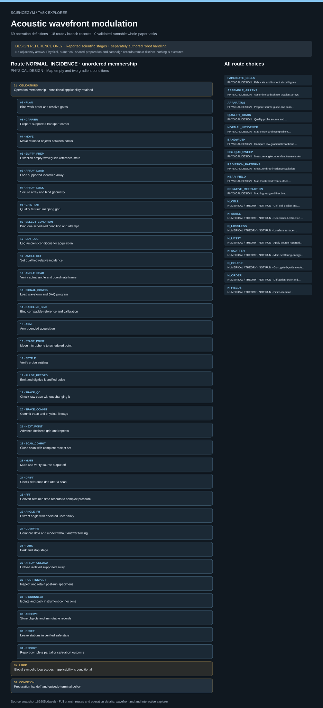

# Acoustic wavefront modulation: task route map



Paper: **Wavefront modulation and subwavelength diffractive acoustics with an acoustic metasurface** · [DOI](https://doi.org/10.1038/ncomms6553)

Author/evaluator logical inspector; source-bounded design only; no actor projection, solver, simulator or robot execution. Counts describe task representation, not experiments or success.

**Reading rule:** rows preserve source operation membership once, without chronology. Loop bodies, count text and nesting obligations are retained as metadata, not added occurrences or executed repetitions. An unordered obligation group has no inferred chronological edges. Source-reported scientific facts and authored handling are distinct.

[Immutable source task package](https://github.com/openags/ScienceGym/blob/162905c0aeebd6da5eb9794df118458c24bb7d63/tasks/acoustic_wavefront_operations_v2/) · [Interactive inspector](../index.html)

## FABRICATE_CELLS — PHYSICAL DESIGN · Fabricate and inspect six cell types

Source operation membership only; no chronological adjacency. Apply scoped dependencies, conditional gates and actual occurrence identities. Nothing here is executed. Numerical/theoretical records never count as physical measurements. Source facts, task-authored interfaces and qualified episode inputs stay distinct.

[Exact route source](https://github.com/openags/ScienceGym/blob/162905c0aeebd6da5eb9794df118458c24bb7d63/tasks/acoustic_wavefront_operations_v2/branches.json) · JSON pointer: `/branches/0`

- **OBLIGATIONS: Operation membership · conditional applicability retained**
  - Binding: {"order":"Source operation membership only; no chronological adjacency. Apply scoped dependencies, conditional gates and actual occurrence identities. Nothing here is executed."}
  - `PLAN` Bind work order and resolve gates
  - `CARRIER` Prepare supported transport carrier
  - `MOVE` Move retained objects between docks
  - `STOCK` Select ABS lot and labeled tools
  - `FAB_LOAD` Load stock into guarded print service
  - `FAB_VERIFY` Read back job and safety controls
  - `FAB_START` Start verified fabrication job
  - `FAB_CYCLE` Observe printer autonomous fabrication
  - `FAB_RELEASE` Wait for independent safe-release state
  - `FAB_UNLOAD` Unload supported printed parts
  - `PART_ID` Serialize and classify each cell
  - `PART_DIM` Inspect outline and layer-fit dimensions
  - `PART_CHANNEL` Inspect channels and surfaces
  - `QUARANTINE` Quarantine failed parts or assemblies
  - `REPORT` Report complete partial or safe-abort outcome
- **LOOP: Global symbolic loop scopes · applicability is conditional**
  - Binding: {"source_contract":{"loops":[{"id":"L_CELL","iterator":"per allocated physical cell","operation_ids":["PART_ID","PART_DIM","PART_CHANNEL"],"termination":"Each allocated cell accepted or quarantined; failed job/reprint has a new entity and predecessor","repeat_count":null},{"id":"L_LAYER","iterator":"per qualified recipe layer and slot","operation_ids":["ASM_LOWER","ASM_LOWER_QC","ASM_UPPER","ASM_REGISTER"],"termination":"Every layer-slot populated with accepted physical ID or explicit blocker; second layer cannot be omitted","repeat_count":null},{"id":"L_CONDITION","iterator":"per selected branch condition and declared technical repeat","operation_ids":["ANGLE_SET","ANGLE_READ","GRID_FAR","GRID_NEAR","SIGNAL_CONFIG","SCAN_COMMIT"],"termination":"All scheduled condition keys classified; only applicable grid operation runs","repeat_count":null},{"id":"L_GRID","iterator":"per point and declared pulse repeat","operation_ids":["STAGE_POINT","SETTLE","PULSE_RECORD","TRACE_QC","TRACE_COMMIT","NEXT_POINT"],"termination":"Every scheduled trace key classified; incomplete acquisition does not become success","repeat_count":null},{"id":"L_RETRY","iterator":"per failed trace or interrupted scan","operation_ids":["MUTE","TRACE_QC","TRACE_COMMIT","ARM"],"termination":"Follow work-order retry limit; new attempt ID references retained failed predecessor; exhaustion is partial","repeat_count":null},{"id":"L_REQUALIFY","iterator":"after changed gain sensor source angle grid or array state","operation_ids":["CAL_MOUNT","CAL_ACQUIRE","CAL_REVIEW","EMPTY_PREP","ASM_QC"],"termination":"Obtain new scope-compatible receipts before affected acquisition","repeat_count":null},{"id":"L_REUSE","iterator":"between conditions sharing physical array","operation_ids":["MUTE","PARK","ARRAY_UNLOAD","POST_INSPECT","RECONFIGURE","ASM_QC","ARRAY_LOAD"],"termination":"Retain IDs and increment revision if changed; no invented independent specimen","repeat_count":null}],"display_rule":"Global contracts, not seven local repeats; apply only declared compatible operation/condition scopes"}}
- **CONDITION: Preparation handoff and episode-terminal policy**
  - Binding: {"source_contract":{"required_branch_ids":[],"preparation_policy":"Receipt-backed included preparation/calibration or explicitly named outside-scope qualified handoff; never silently prebuilt.","terminal_operation_ids":[],"terminal_policy":"Run terminal operations at episode completion, safe abort or explicit station release; do not tear down a prepared state needed by a dependent selected route. ARRAY_UNLOAD/POST_INSPECT apply only to present specimens. MUTE remains mandatory between setup changes and on faults.","prepared_handoff":"A prepared-state receipt must record connected/isolated state, entity identities, pose, revision, calibrations and outstanding terminal work. A downstream route verifies current state and performs required remount/rewiring rather than assuming persistence."}}

<details><summary>Branch state, choices, lineage and loop obligations</summary>

```json
{
  "id": "FABRICATE_CELLS",
  "title": "Fabricate and inspect six cell types",
  "operation_ids": [
    "PLAN",
    "CARRIER",
    "MOVE",
    "STOCK",
    "FAB_LOAD",
    "FAB_VERIFY",
    "FAB_START",
    "FAB_CYCLE",
    "FAB_RELEASE",
    "FAB_UNLOAD",
    "PART_ID",
    "PART_DIM",
    "PART_CHANNEL",
    "QUARANTINE",
    "REPORT"
  ],
  "source_evidence_ids": [
    "E_FAB",
    "E_CELLS",
    "E_GEOM"
  ],
  "unknown_parameter_ids": [
    "U_ALLOC",
    "U_ANALYSIS",
    "U_CAD",
    "U_FAB",
    "U_SCENE"
  ],
  "required_branch_ids": [],
  "conditions": {
    "cell_types_spiral_angle_deg": [
      135,
      180,
      270,
      450,
      495,
      540
    ],
    "physical_part_count": null
  },
  "notes": "Counts and part topology require CAD and allocation. Inspection/reprint loops preserve rejected IDs.",
  "preparation_policy": "Receipt-backed included preparation/calibration or explicitly named outside-scope qualified handoff; never silently prebuilt.",
  "completion": "Every scheduled instance has classified trusted receipts and cleanup; selected blocked or failed acquisition remains partial.",
  "actor": "mobile_human_like_robot_operator",
  "readiness": "represented_not_executed",
  "direct_unknown_parameter_ids": [
    "U_ALLOC",
    "U_ANALYSIS",
    "U_CAD",
    "U_FAB",
    "U_SCENE"
  ],
  "terminal_operation_ids": [],
  "terminal_policy": "Run terminal operations at episode completion, safe abort or explicit station release; do not tear down a prepared state needed by a dependent selected route. ARRAY_UNLOAD/POST_INSPECT apply only to present specimens. MUTE remains mandatory between setup changes and on faults.",
  "prepared_handoff": "A prepared-state receipt must record connected/isolated state, entity identities, pose, revision, calibrations and outstanding terminal work. A downstream route verifies current state and performs required remount/rewiring rather than assuming persistence."
}
```

</details>

## ASSEMBLE_ARRAYS — PHYSICAL DESIGN · Assemble both phase-gradient arrays

Source operation membership only; no chronological adjacency. Apply scoped dependencies, conditional gates and actual occurrence identities. Nothing here is executed. Numerical/theoretical records never count as physical measurements. Source facts, task-authored interfaces and qualified episode inputs stay distinct.

[Exact route source](https://github.com/openags/ScienceGym/blob/162905c0aeebd6da5eb9794df118458c24bb7d63/tasks/acoustic_wavefront_operations_v2/branches.json) · JSON pointer: `/branches/1`

- **OBLIGATIONS: Operation membership · conditional applicability retained**
  - Binding: {"order":"Source operation membership only; no chronological adjacency. Apply scoped dependencies, conditional gates and actual occurrence identities. Nothing here is executed."}
  - `PLAN` Bind work order and resolve gates
  - `CARRIER` Prepare supported transport carrier
  - `MOVE` Move retained objects between docks
  - `ASM_LAYOUT` Lay out identified cells by recipe
  - `ASM_FIXTURE` Seat array support fixture
  - `ASM_LOWER` Place each first-layer cell
  - `ASM_LOWER_QC` Check first-layer order and joins
  - `ASM_UPPER` Place each second-layer cell
  - `ASM_REGISTER` Register layers and inspect seams
  - `ASM_LOCK` Lock array into supported carrier
  - `ASM_QC` Accept or reject assembly revision
  - `QUARANTINE` Quarantine failed parts or assemblies
  - `RECONFIGURE` Rebuild selected array configuration
  - `REPORT` Report complete partial or safe-abort outcome
- **LOOP: Global symbolic loop scopes · applicability is conditional**
  - Binding: {"source_contract":{"loops":[{"id":"L_CELL","iterator":"per allocated physical cell","operation_ids":["PART_ID","PART_DIM","PART_CHANNEL"],"termination":"Each allocated cell accepted or quarantined; failed job/reprint has a new entity and predecessor","repeat_count":null},{"id":"L_LAYER","iterator":"per qualified recipe layer and slot","operation_ids":["ASM_LOWER","ASM_LOWER_QC","ASM_UPPER","ASM_REGISTER"],"termination":"Every layer-slot populated with accepted physical ID or explicit blocker; second layer cannot be omitted","repeat_count":null},{"id":"L_CONDITION","iterator":"per selected branch condition and declared technical repeat","operation_ids":["ANGLE_SET","ANGLE_READ","GRID_FAR","GRID_NEAR","SIGNAL_CONFIG","SCAN_COMMIT"],"termination":"All scheduled condition keys classified; only applicable grid operation runs","repeat_count":null},{"id":"L_GRID","iterator":"per point and declared pulse repeat","operation_ids":["STAGE_POINT","SETTLE","PULSE_RECORD","TRACE_QC","TRACE_COMMIT","NEXT_POINT"],"termination":"Every scheduled trace key classified; incomplete acquisition does not become success","repeat_count":null},{"id":"L_RETRY","iterator":"per failed trace or interrupted scan","operation_ids":["MUTE","TRACE_QC","TRACE_COMMIT","ARM"],"termination":"Follow work-order retry limit; new attempt ID references retained failed predecessor; exhaustion is partial","repeat_count":null},{"id":"L_REQUALIFY","iterator":"after changed gain sensor source angle grid or array state","operation_ids":["CAL_MOUNT","CAL_ACQUIRE","CAL_REVIEW","EMPTY_PREP","ASM_QC"],"termination":"Obtain new scope-compatible receipts before affected acquisition","repeat_count":null},{"id":"L_REUSE","iterator":"between conditions sharing physical array","operation_ids":["MUTE","PARK","ARRAY_UNLOAD","POST_INSPECT","RECONFIGURE","ASM_QC","ARRAY_LOAD"],"termination":"Retain IDs and increment revision if changed; no invented independent specimen","repeat_count":null}],"display_rule":"Global contracts, not seven local repeats; apply only declared compatible operation/condition scopes"}}
- **CONDITION: Preparation handoff and episode-terminal policy**
  - Binding: {"source_contract":{"required_branch_ids":["FABRICATE_CELLS"],"preparation_policy":"Receipt-backed included preparation/calibration or explicitly named outside-scope qualified handoff; never silently prebuilt.","terminal_operation_ids":[],"terminal_policy":"Run terminal operations at episode completion, safe abort or explicit station release; do not tear down a prepared state needed by a dependent selected route. ARRAY_UNLOAD/POST_INSPECT apply only to present specimens. MUTE remains mandatory between setup changes and on faults.","prepared_handoff":"A prepared-state receipt must record connected/isolated state, entity identities, pose, revision, calibrations and outstanding terminal work. A downstream route verifies current state and performs required remount/rewiring rather than assuming persistence."}}

<details><summary>Branch state, choices, lineage and loop obligations</summary>

```json
{
  "id": "ASSEMBLE_ARRAYS",
  "title": "Assemble both phase-gradient arrays",
  "operation_ids": [
    "PLAN",
    "CARRIER",
    "MOVE",
    "ASM_LAYOUT",
    "ASM_FIXTURE",
    "ASM_LOWER",
    "ASM_LOWER_QC",
    "ASM_UPPER",
    "ASM_REGISTER",
    "ASM_LOCK",
    "ASM_QC",
    "QUARANTINE",
    "RECONFIGURE",
    "REPORT"
  ],
  "source_evidence_ids": [
    "E_CELLS",
    "E_GEOM",
    "E_NORMAL"
  ],
  "unknown_parameter_ids": [
    "U_ALLOC",
    "U_ANALYSIS",
    "U_ASSEMBLY",
    "U_CAD",
    "U_FAB",
    "U_SCENE"
  ],
  "required_branch_ids": [
    "FABRICATE_CELLS"
  ],
  "conditions": {
    "gradient_multiple_2pi_rad_per_m": [
      3.3,
      6.7
    ],
    "transmissive_layers": 2,
    "gradient_reference_frequency_hz": 3000,
    "gradient_semantics": "Specimen design label at 3000 Hz. For predictions at other frequencies use qualified xi(f); do not assume constant xi."
  },
  "notes": "Separate qualified recipes. Reused cells preserve IDs; reconfiguration increments assembly revision. Low-gradient recipe is not given by SI drawing.",
  "preparation_policy": "Receipt-backed included preparation/calibration or explicitly named outside-scope qualified handoff; never silently prebuilt.",
  "completion": "Every scheduled instance has classified trusted receipts and cleanup; selected blocked or failed acquisition remains partial.",
  "actor": "mobile_human_like_robot_operator",
  "readiness": "represented_not_executed",
  "direct_unknown_parameter_ids": [
    "U_ALLOC",
    "U_ANALYSIS",
    "U_ASSEMBLY",
    "U_SCENE"
  ],
  "terminal_operation_ids": [],
  "terminal_policy": "Run terminal operations at episode completion, safe abort or explicit station release; do not tear down a prepared state needed by a dependent selected route. ARRAY_UNLOAD/POST_INSPECT apply only to present specimens. MUTE remains mandatory between setup changes and on faults.",
  "prepared_handoff": "A prepared-state receipt must record connected/isolated state, entity identities, pose, revision, calibrations and outstanding terminal work. A downstream route verifies current state and performs required remount/rewiring rather than assuming persistence."
}
```

</details>

## APPARATUS — PHYSICAL DESIGN · Prepare source guide and scan apparatus

Source operation membership only; no chronological adjacency. Apply scoped dependencies, conditional gates and actual occurrence identities. Nothing here is executed. Numerical/theoretical records never count as physical measurements. Source facts, task-authored interfaces and qualified episode inputs stay distinct.

[Exact route source](https://github.com/openags/ScienceGym/blob/162905c0aeebd6da5eb9794df118458c24bb7d63/tasks/acoustic_wavefront_operations_v2/branches.json) · JSON pointer: `/branches/2`

- **OBLIGATIONS: Operation membership · conditional applicability retained**
  - Binding: {"order":"Source operation membership only; no chronological adjacency. Apply scoped dependencies, conditional gates and actual occurrence identities. Nothing here is executed."}
  - `PLAN` Bind work order and resolve gates
  - `CARRIER` Prepare supported transport carrier
  - `MOVE` Move retained objects between docks
  - `ENV_SETUP` Place task-authored ambient sensors
  - `GUIDE_PLATES` Prepare parallel-plate guide
  - `SOURCE_MOUNT` Mount and identify speaker source
  - `SOURCE_WIRE` Connect isolated amplifier and speakers
  - `MIC_MOUNT` Mount microphone and preamplifier
  - `DAQ_WIRE` Connect and map DAQ channels
  - `STAGE_HOME` Home stage and verify travel limits
  - `PARK` Park and stop stage
  - `DISCONNECT` Isolate and pack instrument connections
  - `RESET` Leave stations in verified safe state
  - `REPORT` Report complete partial or safe-abort outcome
- **LOOP: Global symbolic loop scopes · applicability is conditional**
  - Binding: {"source_contract":{"loops":[{"id":"L_CELL","iterator":"per allocated physical cell","operation_ids":["PART_ID","PART_DIM","PART_CHANNEL"],"termination":"Each allocated cell accepted or quarantined; failed job/reprint has a new entity and predecessor","repeat_count":null},{"id":"L_LAYER","iterator":"per qualified recipe layer and slot","operation_ids":["ASM_LOWER","ASM_LOWER_QC","ASM_UPPER","ASM_REGISTER"],"termination":"Every layer-slot populated with accepted physical ID or explicit blocker; second layer cannot be omitted","repeat_count":null},{"id":"L_CONDITION","iterator":"per selected branch condition and declared technical repeat","operation_ids":["ANGLE_SET","ANGLE_READ","GRID_FAR","GRID_NEAR","SIGNAL_CONFIG","SCAN_COMMIT"],"termination":"All scheduled condition keys classified; only applicable grid operation runs","repeat_count":null},{"id":"L_GRID","iterator":"per point and declared pulse repeat","operation_ids":["STAGE_POINT","SETTLE","PULSE_RECORD","TRACE_QC","TRACE_COMMIT","NEXT_POINT"],"termination":"Every scheduled trace key classified; incomplete acquisition does not become success","repeat_count":null},{"id":"L_RETRY","iterator":"per failed trace or interrupted scan","operation_ids":["MUTE","TRACE_QC","TRACE_COMMIT","ARM"],"termination":"Follow work-order retry limit; new attempt ID references retained failed predecessor; exhaustion is partial","repeat_count":null},{"id":"L_REQUALIFY","iterator":"after changed gain sensor source angle grid or array state","operation_ids":["CAL_MOUNT","CAL_ACQUIRE","CAL_REVIEW","EMPTY_PREP","ASM_QC"],"termination":"Obtain new scope-compatible receipts before affected acquisition","repeat_count":null},{"id":"L_REUSE","iterator":"between conditions sharing physical array","operation_ids":["MUTE","PARK","ARRAY_UNLOAD","POST_INSPECT","RECONFIGURE","ASM_QC","ARRAY_LOAD"],"termination":"Retain IDs and increment revision if changed; no invented independent specimen","repeat_count":null}],"display_rule":"Global contracts, not seven local repeats; apply only declared compatible operation/condition scopes"}}
- **CONDITION: Preparation handoff and episode-terminal policy**
  - Binding: {"source_contract":{"required_branch_ids":[],"preparation_policy":"Receipt-backed included preparation/calibration or explicitly named outside-scope qualified handoff; never silently prebuilt.","terminal_operation_ids":["PARK","DISCONNECT","RESET"],"terminal_policy":"Run terminal operations at episode completion, safe abort or explicit station release; do not tear down a prepared state needed by a dependent selected route. ARRAY_UNLOAD/POST_INSPECT apply only to present specimens. MUTE remains mandatory between setup changes and on faults.","prepared_handoff":"A prepared-state receipt must record connected/isolated state, entity identities, pose, revision, calibrations and outstanding terminal work. A downstream route verifies current state and performs required remount/rewiring rather than assuming persistence."}}

<details><summary>Branch state, choices, lineage and loop obligations</summary>

```json
{
  "id": "APPARATUS",
  "title": "Prepare source guide and scan apparatus",
  "operation_ids": [
    "PLAN",
    "CARRIER",
    "MOVE",
    "ENV_SETUP",
    "GUIDE_PLATES",
    "SOURCE_MOUNT",
    "SOURCE_WIRE",
    "MIC_MOUNT",
    "DAQ_WIRE",
    "STAGE_HOME",
    "PARK",
    "DISCONNECT",
    "RESET",
    "REPORT"
  ],
  "source_evidence_ids": [
    "E_GUIDE",
    "E_SETUP"
  ],
  "unknown_parameter_ids": [
    "U_ALLOC",
    "U_ANALYSIS",
    "U_ANGLE",
    "U_CAL",
    "U_DAQ",
    "U_ENV",
    "U_GRID",
    "U_GUIDE",
    "U_SCENE",
    "U_SOURCE"
  ],
  "required_branch_ids": [],
  "conditions": {
    "plate_gap_mm": 50.8,
    "reported_speaker_count": 18
  },
  "notes": "Full plate footprint, terminations, source weights and scan geometry remain qualified inputs.",
  "preparation_policy": "Receipt-backed included preparation/calibration or explicitly named outside-scope qualified handoff; never silently prebuilt.",
  "completion": "Every scheduled instance has classified trusted receipts and cleanup; selected blocked or failed acquisition remains partial.",
  "actor": "mobile_human_like_robot_operator",
  "readiness": "represented_not_executed",
  "direct_unknown_parameter_ids": [
    "U_ALLOC",
    "U_ANALYSIS",
    "U_ANGLE",
    "U_CAL",
    "U_DAQ",
    "U_ENV",
    "U_GRID",
    "U_GUIDE",
    "U_SCENE",
    "U_SOURCE"
  ],
  "terminal_operation_ids": [
    "PARK",
    "DISCONNECT",
    "RESET"
  ],
  "terminal_policy": "Run terminal operations at episode completion, safe abort or explicit station release; do not tear down a prepared state needed by a dependent selected route. ARRAY_UNLOAD/POST_INSPECT apply only to present specimens. MUTE remains mandatory between setup changes and on faults.",
  "prepared_handoff": "A prepared-state receipt must record connected/isolated state, entity identities, pose, revision, calibrations and outstanding terminal work. A downstream route verifies current state and performs required remount/rewiring rather than assuming persistence."
}
```

</details>

## QUALIFY_CHAIN — PHYSICAL DESIGN · Qualify probe source and acquisition chain

Source operation membership only; no chronological adjacency. Apply scoped dependencies, conditional gates and actual occurrence identities. Nothing here is executed. Numerical/theoretical records never count as physical measurements. Source facts, task-authored interfaces and qualified episode inputs stay distinct.

[Exact route source](https://github.com/openags/ScienceGym/blob/162905c0aeebd6da5eb9794df118458c24bb7d63/tasks/acoustic_wavefront_operations_v2/branches.json) · JSON pointer: `/branches/3`

- **OBLIGATIONS: Operation membership · conditional applicability retained**
  - Binding: {"order":"Source operation membership only; no chronological adjacency. Apply scoped dependencies, conditional gates and actual occurrence identities. Nothing here is executed."}
  - `PLAN` Bind work order and resolve gates
  - `CARRIER` Prepare supported transport carrier
  - `MUTE` Mute and verify source output off
  - `PARK` Park and stop stage
  - `PROBE_RELEASE` Release probe before calibration transport
  - `MOVE` Move retained objects between docks
  - `CAL_MOUNT` Seat probe and reference in calibration fixture
  - `CAL_ACQUIRE` Acquire task-authored calibration observations
  - `CAL_REVIEW` Evaluate calibration validity
  - `CAL_UNLOAD` Release calibration probe safely
  - `MIC_MOUNT` Mount microphone and preamplifier
  - `SOURCE_WIRE` Connect isolated amplifier and speakers
  - `DAQ_WIRE` Connect and map DAQ channels
  - `STAGE_HOME` Home stage and verify travel limits
  - `EMPTY_PREP` Establish empty-waveguide reference state
  - `SELECT_CONDITION` Bind one scheduled condition and attempt
  - `ENV_LOG` Log ambient conditions for acquisition
  - `ANGLE_SET` Set qualified relative incidence
  - `ANGLE_READ` Verify actual angle and coordinate frame
  - `GRID_FAR` Qualify far-field mapping grid
  - `SIGNAL_CONFIG` Load waveform and DAQ program
  - `BASELINE_BIND` Bind compatible reference and calibration
  - `ARM` Arm bounded acquisition
  - `STAGE_POINT` Move microphone to scheduled point
  - `SETTLE` Verify probe settling
  - `PULSE_RECORD` Emit and digitize identified pulse
  - `TRACE_QC` Check raw trace without changing it
  - `TRACE_COMMIT` Commit trace and physical lineage
  - `NEXT_POINT` Advance declared grid and repeats
  - `SCAN_COMMIT` Close scan with complete receipt set
  - `DRIFT` Check reference drift after a scan
  - `FFT` Convert retained time records to complex pressure
  - `REPORT` Report complete partial or safe-abort outcome
- **LOOP: Global symbolic loop scopes · applicability is conditional**
  - Binding: {"source_contract":{"loops":[{"id":"L_CELL","iterator":"per allocated physical cell","operation_ids":["PART_ID","PART_DIM","PART_CHANNEL"],"termination":"Each allocated cell accepted or quarantined; failed job/reprint has a new entity and predecessor","repeat_count":null},{"id":"L_LAYER","iterator":"per qualified recipe layer and slot","operation_ids":["ASM_LOWER","ASM_LOWER_QC","ASM_UPPER","ASM_REGISTER"],"termination":"Every layer-slot populated with accepted physical ID or explicit blocker; second layer cannot be omitted","repeat_count":null},{"id":"L_CONDITION","iterator":"per selected branch condition and declared technical repeat","operation_ids":["ANGLE_SET","ANGLE_READ","GRID_FAR","GRID_NEAR","SIGNAL_CONFIG","SCAN_COMMIT"],"termination":"All scheduled condition keys classified; only applicable grid operation runs","repeat_count":null},{"id":"L_GRID","iterator":"per point and declared pulse repeat","operation_ids":["STAGE_POINT","SETTLE","PULSE_RECORD","TRACE_QC","TRACE_COMMIT","NEXT_POINT"],"termination":"Every scheduled trace key classified; incomplete acquisition does not become success","repeat_count":null},{"id":"L_RETRY","iterator":"per failed trace or interrupted scan","operation_ids":["MUTE","TRACE_QC","TRACE_COMMIT","ARM"],"termination":"Follow work-order retry limit; new attempt ID references retained failed predecessor; exhaustion is partial","repeat_count":null},{"id":"L_REQUALIFY","iterator":"after changed gain sensor source angle grid or array state","operation_ids":["CAL_MOUNT","CAL_ACQUIRE","CAL_REVIEW","EMPTY_PREP","ASM_QC"],"termination":"Obtain new scope-compatible receipts before affected acquisition","repeat_count":null},{"id":"L_REUSE","iterator":"between conditions sharing physical array","operation_ids":["MUTE","PARK","ARRAY_UNLOAD","POST_INSPECT","RECONFIGURE","ASM_QC","ARRAY_LOAD"],"termination":"Retain IDs and increment revision if changed; no invented independent specimen","repeat_count":null}],"display_rule":"Global contracts, not seven local repeats; apply only declared compatible operation/condition scopes"}}
- **CONDITION: Preparation handoff and episode-terminal policy**
  - Binding: {"source_contract":{"required_branch_ids":["APPARATUS"],"preparation_policy":"Receipt-backed included preparation/calibration or explicitly named outside-scope qualified handoff; never silently prebuilt.","terminal_operation_ids":["PARK"],"terminal_policy":"Run terminal operations at episode completion, safe abort or explicit station release; do not tear down a prepared state needed by a dependent selected route. ARRAY_UNLOAD/POST_INSPECT apply only to present specimens. MUTE remains mandatory between setup changes and on faults.","prepared_handoff":"A prepared-state receipt must record connected/isolated state, entity identities, pose, revision, calibrations and outstanding terminal work. A downstream route verifies current state and performs required remount/rewiring rather than assuming persistence."}}

<details><summary>Branch state, choices, lineage and loop obligations</summary>

```json
{
  "id": "QUALIFY_CHAIN",
  "title": "Qualify probe source and acquisition chain",
  "operation_ids": [
    "PLAN",
    "CARRIER",
    "MUTE",
    "PARK",
    "PROBE_RELEASE",
    "MOVE",
    "CAL_MOUNT",
    "CAL_ACQUIRE",
    "CAL_REVIEW",
    "CAL_UNLOAD",
    "MIC_MOUNT",
    "SOURCE_WIRE",
    "DAQ_WIRE",
    "STAGE_HOME",
    "EMPTY_PREP",
    "SELECT_CONDITION",
    "ENV_LOG",
    "ANGLE_SET",
    "ANGLE_READ",
    "GRID_FAR",
    "SIGNAL_CONFIG",
    "BASELINE_BIND",
    "ARM",
    "STAGE_POINT",
    "SETTLE",
    "PULSE_RECORD",
    "TRACE_QC",
    "TRACE_COMMIT",
    "NEXT_POINT",
    "SCAN_COMMIT",
    "DRIFT",
    "FFT",
    "REPORT"
  ],
  "source_evidence_ids": [
    "E_SETUP",
    "E_NORMAL"
  ],
  "unknown_parameter_ids": [
    "U_ALLOC",
    "U_ANALYSIS",
    "U_ANGLE",
    "U_CAL",
    "U_DAQ",
    "U_ENV",
    "U_GRID",
    "U_GUIDE",
    "U_SCENE",
    "U_SOURCE"
  ],
  "required_branch_ids": [
    "APPARATUS"
  ],
  "conditions": {
    "calibration_schedule": null
  },
  "notes": "Task-authored qualification around reported setup. Does not assert physical unit-cell phase calibration in the source.",
  "preparation_policy": "Receipt-backed included preparation/calibration or explicitly named outside-scope qualified handoff; never silently prebuilt.",
  "completion": "Every scheduled instance has classified trusted receipts and cleanup; selected blocked or failed acquisition remains partial.",
  "actor": "mobile_human_like_robot_operator",
  "readiness": "represented_not_executed",
  "direct_unknown_parameter_ids": [
    "U_ALLOC",
    "U_ANALYSIS",
    "U_ANGLE",
    "U_CAL",
    "U_DAQ",
    "U_ENV",
    "U_GRID",
    "U_GUIDE",
    "U_SCENE",
    "U_SOURCE"
  ],
  "terminal_operation_ids": [
    "PARK"
  ],
  "terminal_policy": "Run terminal operations at episode completion, safe abort or explicit station release; do not tear down a prepared state needed by a dependent selected route. ARRAY_UNLOAD/POST_INSPECT apply only to present specimens. MUTE remains mandatory between setup changes and on faults.",
  "prepared_handoff": "A prepared-state receipt must record connected/isolated state, entity identities, pose, revision, calibrations and outstanding terminal work. A downstream route verifies current state and performs required remount/rewiring rather than assuming persistence."
}
```

</details>

## NORMAL_INCIDENCE — PHYSICAL DESIGN · Map empty and two gradient conditions

Source operation membership only; no chronological adjacency. Apply scoped dependencies, conditional gates and actual occurrence identities. Nothing here is executed. Numerical/theoretical records never count as physical measurements. Source facts, task-authored interfaces and qualified episode inputs stay distinct.

[Exact route source](https://github.com/openags/ScienceGym/blob/162905c0aeebd6da5eb9794df118458c24bb7d63/tasks/acoustic_wavefront_operations_v2/branches.json) · JSON pointer: `/branches/4`

- **OBLIGATIONS: Operation membership · conditional applicability retained**
  - Binding: {"order":"Source operation membership only; no chronological adjacency. Apply scoped dependencies, conditional gates and actual occurrence identities. Nothing here is executed."}
  - `PLAN` Bind work order and resolve gates
  - `CARRIER` Prepare supported transport carrier
  - `MOVE` Move retained objects between docks
  - `EMPTY_PREP` Establish empty-waveguide reference state
  - `ARRAY_LOAD` Load supported identified array
  - `ARRAY_LOCK` Secure array and bind geometry
  - `GRID_FAR` Qualify far-field mapping grid
  - `SELECT_CONDITION` Bind one scheduled condition and attempt
  - `ENV_LOG` Log ambient conditions for acquisition
  - `ANGLE_SET` Set qualified relative incidence
  - `ANGLE_READ` Verify actual angle and coordinate frame
  - `SIGNAL_CONFIG` Load waveform and DAQ program
  - `BASELINE_BIND` Bind compatible reference and calibration
  - `ARM` Arm bounded acquisition
  - `STAGE_POINT` Move microphone to scheduled point
  - `SETTLE` Verify probe settling
  - `PULSE_RECORD` Emit and digitize identified pulse
  - `TRACE_QC` Check raw trace without changing it
  - `TRACE_COMMIT` Commit trace and physical lineage
  - `NEXT_POINT` Advance declared grid and repeats
  - `SCAN_COMMIT` Close scan with complete receipt set
  - `MUTE` Mute and verify source output off
  - `DRIFT` Check reference drift after a scan
  - `FFT` Convert retained time records to complex pressure
  - `ANGLE_FIT` Extract angle with declared uncertainty
  - `COMPARE` Compare data and model without answer forcing
  - `PARK` Park and stop stage
  - `ARRAY_UNLOAD` Unload isolated supported array
  - `POST_INSPECT` Inspect and retain post-run specimens
  - `DISCONNECT` Isolate and pack instrument connections
  - `ARCHIVE` Store objects and immutable records
  - `RESET` Leave stations in verified safe state
  - `REPORT` Report complete partial or safe-abort outcome
- **LOOP: Global symbolic loop scopes · applicability is conditional**
  - Binding: {"source_contract":{"loops":[{"id":"L_CELL","iterator":"per allocated physical cell","operation_ids":["PART_ID","PART_DIM","PART_CHANNEL"],"termination":"Each allocated cell accepted or quarantined; failed job/reprint has a new entity and predecessor","repeat_count":null},{"id":"L_LAYER","iterator":"per qualified recipe layer and slot","operation_ids":["ASM_LOWER","ASM_LOWER_QC","ASM_UPPER","ASM_REGISTER"],"termination":"Every layer-slot populated with accepted physical ID or explicit blocker; second layer cannot be omitted","repeat_count":null},{"id":"L_CONDITION","iterator":"per selected branch condition and declared technical repeat","operation_ids":["ANGLE_SET","ANGLE_READ","GRID_FAR","GRID_NEAR","SIGNAL_CONFIG","SCAN_COMMIT"],"termination":"All scheduled condition keys classified; only applicable grid operation runs","repeat_count":null},{"id":"L_GRID","iterator":"per point and declared pulse repeat","operation_ids":["STAGE_POINT","SETTLE","PULSE_RECORD","TRACE_QC","TRACE_COMMIT","NEXT_POINT"],"termination":"Every scheduled trace key classified; incomplete acquisition does not become success","repeat_count":null},{"id":"L_RETRY","iterator":"per failed trace or interrupted scan","operation_ids":["MUTE","TRACE_QC","TRACE_COMMIT","ARM"],"termination":"Follow work-order retry limit; new attempt ID references retained failed predecessor; exhaustion is partial","repeat_count":null},{"id":"L_REQUALIFY","iterator":"after changed gain sensor source angle grid or array state","operation_ids":["CAL_MOUNT","CAL_ACQUIRE","CAL_REVIEW","EMPTY_PREP","ASM_QC"],"termination":"Obtain new scope-compatible receipts before affected acquisition","repeat_count":null},{"id":"L_REUSE","iterator":"between conditions sharing physical array","operation_ids":["MUTE","PARK","ARRAY_UNLOAD","POST_INSPECT","RECONFIGURE","ASM_QC","ARRAY_LOAD"],"termination":"Retain IDs and increment revision if changed; no invented independent specimen","repeat_count":null}],"display_rule":"Global contracts, not seven local repeats; apply only declared compatible operation/condition scopes"}}
- **CONDITION: Preparation handoff and episode-terminal policy**
  - Binding: {"source_contract":{"required_branch_ids":["ASSEMBLE_ARRAYS","QUALIFY_CHAIN"],"preparation_policy":"Receipt-backed included preparation/calibration or explicitly named outside-scope qualified handoff; never silently prebuilt.","terminal_operation_ids":["PARK","ARRAY_UNLOAD","POST_INSPECT","DISCONNECT","ARCHIVE","RESET"],"terminal_policy":"Run terminal operations at episode completion, safe abort or explicit station release; do not tear down a prepared state needed by a dependent selected route. ARRAY_UNLOAD/POST_INSPECT apply only to present specimens. MUTE remains mandatory between setup changes and on faults.","prepared_handoff":"A prepared-state receipt must record connected/isolated state, entity identities, pose, revision, calibrations and outstanding terminal work. A downstream route verifies current state and performs required remount/rewiring rather than assuming persistence."}}

<details><summary>Branch state, choices, lineage and loop obligations</summary>

```json
{
  "id": "NORMAL_INCIDENCE",
  "title": "Map empty and two gradient conditions",
  "operation_ids": [
    "PLAN",
    "CARRIER",
    "MOVE",
    "EMPTY_PREP",
    "ARRAY_LOAD",
    "ARRAY_LOCK",
    "GRID_FAR",
    "SELECT_CONDITION",
    "ENV_LOG",
    "ANGLE_SET",
    "ANGLE_READ",
    "SIGNAL_CONFIG",
    "BASELINE_BIND",
    "ARM",
    "STAGE_POINT",
    "SETTLE",
    "PULSE_RECORD",
    "TRACE_QC",
    "TRACE_COMMIT",
    "NEXT_POINT",
    "SCAN_COMMIT",
    "MUTE",
    "DRIFT",
    "FFT",
    "ANGLE_FIT",
    "COMPARE",
    "PARK",
    "ARRAY_UNLOAD",
    "POST_INSPECT",
    "DISCONNECT",
    "ARCHIVE",
    "RESET",
    "REPORT"
  ],
  "source_evidence_ids": [
    "E_NORMAL",
    "E_GUIDE",
    "E_SETUP"
  ],
  "unknown_parameter_ids": [
    "U_ALLOC",
    "U_ANALYSIS",
    "U_ANGLE",
    "U_ASSEMBLY",
    "U_CAD",
    "U_CAL",
    "U_DAQ",
    "U_ENV",
    "U_FAB",
    "U_GRID",
    "U_GUIDE",
    "U_MODEL",
    "U_SCENE",
    "U_SOURCE"
  ],
  "required_branch_ids": [
    "ASSEMBLE_ARRAYS",
    "QUALIFY_CHAIN"
  ],
  "conditions": {
    "gradient_multiple_2pi_rad_per_m": [
      0,
      3.3,
      6.7
    ],
    "incident_angle_deg": [
      0
    ],
    "frequency_hz": [
      3000
    ],
    "zero_gradient_meaning": "absent_metasurface",
    "gradient_reference_frequency_hz": 3000,
    "gradient_semantics": "Specimen design label at 3000 Hz. For predictions at other frequencies use qualified xi(f); do not assume constant xi."
  },
  "notes": "Array-free reference is a physical condition, not a simulated zero gradient. Installing/changing array requires output-off and a new setup signature.",
  "preparation_policy": "Receipt-backed included preparation/calibration or explicitly named outside-scope qualified handoff; never silently prebuilt.",
  "completion": "Every scheduled instance has classified trusted receipts and cleanup; selected blocked or failed acquisition remains partial.",
  "actor": "mobile_human_like_robot_operator",
  "readiness": "represented_not_executed",
  "direct_unknown_parameter_ids": [
    "U_ALLOC",
    "U_ANALYSIS",
    "U_ANGLE",
    "U_ASSEMBLY",
    "U_CAL",
    "U_DAQ",
    "U_ENV",
    "U_FAB",
    "U_GRID",
    "U_GUIDE",
    "U_MODEL",
    "U_SCENE",
    "U_SOURCE"
  ],
  "terminal_operation_ids": [
    "PARK",
    "ARRAY_UNLOAD",
    "POST_INSPECT",
    "DISCONNECT",
    "ARCHIVE",
    "RESET"
  ],
  "terminal_policy": "Run terminal operations at episode completion, safe abort or explicit station release; do not tear down a prepared state needed by a dependent selected route. ARRAY_UNLOAD/POST_INSPECT apply only to present specimens. MUTE remains mandatory between setup changes and on faults.",
  "prepared_handoff": "A prepared-state receipt must record connected/isolated state, entity identities, pose, revision, calibrations and outstanding terminal work. A downstream route verifies current state and performs required remount/rewiring rather than assuming persistence."
}
```

</details>

## BANDWIDTH — PHYSICAL DESIGN · Compare low-gradient broadband fields

Source operation membership only; no chronological adjacency. Apply scoped dependencies, conditional gates and actual occurrence identities. Nothing here is executed. Numerical/theoretical records never count as physical measurements. Source facts, task-authored interfaces and qualified episode inputs stay distinct.

[Exact route source](https://github.com/openags/ScienceGym/blob/162905c0aeebd6da5eb9794df118458c24bb7d63/tasks/acoustic_wavefront_operations_v2/branches.json) · JSON pointer: `/branches/5`

- **OBLIGATIONS: Operation membership · conditional applicability retained**
  - Binding: {"order":"Source operation membership only; no chronological adjacency. Apply scoped dependencies, conditional gates and actual occurrence identities. Nothing here is executed."}
  - `PLAN` Bind work order and resolve gates
  - `CARRIER` Prepare supported transport carrier
  - `MOVE` Move retained objects between docks
  - `ARRAY_LOAD` Load supported identified array
  - `ARRAY_LOCK` Secure array and bind geometry
  - `GRID_FAR` Qualify far-field mapping grid
  - `SELECT_CONDITION` Bind one scheduled condition and attempt
  - `ENV_LOG` Log ambient conditions for acquisition
  - `ANGLE_SET` Set qualified relative incidence
  - `ANGLE_READ` Verify actual angle and coordinate frame
  - `SIGNAL_CONFIG` Load waveform and DAQ program
  - `BASELINE_BIND` Bind compatible reference and calibration
  - `ARM` Arm bounded acquisition
  - `STAGE_POINT` Move microphone to scheduled point
  - `SETTLE` Verify probe settling
  - `PULSE_RECORD` Emit and digitize identified pulse
  - `TRACE_QC` Check raw trace without changing it
  - `TRACE_COMMIT` Commit trace and physical lineage
  - `NEXT_POINT` Advance declared grid and repeats
  - `SCAN_COMMIT` Close scan with complete receipt set
  - `MUTE` Mute and verify source output off
  - `DRIFT` Check reference drift after a scan
  - `FFT` Convert retained time records to complex pressure
  - `ANGLE_FIT` Extract angle with declared uncertainty
  - `BAND_COMPARE` Compare three frequency views
  - `COMPARE` Compare data and model without answer forcing
  - `PARK` Park and stop stage
  - `ARRAY_UNLOAD` Unload isolated supported array
  - `POST_INSPECT` Inspect and retain post-run specimens
  - `DISCONNECT` Isolate and pack instrument connections
  - `ARCHIVE` Store objects and immutable records
  - `RESET` Leave stations in verified safe state
  - `REPORT` Report complete partial or safe-abort outcome
- **LOOP: Global symbolic loop scopes · applicability is conditional**
  - Binding: {"source_contract":{"loops":[{"id":"L_CELL","iterator":"per allocated physical cell","operation_ids":["PART_ID","PART_DIM","PART_CHANNEL"],"termination":"Each allocated cell accepted or quarantined; failed job/reprint has a new entity and predecessor","repeat_count":null},{"id":"L_LAYER","iterator":"per qualified recipe layer and slot","operation_ids":["ASM_LOWER","ASM_LOWER_QC","ASM_UPPER","ASM_REGISTER"],"termination":"Every layer-slot populated with accepted physical ID or explicit blocker; second layer cannot be omitted","repeat_count":null},{"id":"L_CONDITION","iterator":"per selected branch condition and declared technical repeat","operation_ids":["ANGLE_SET","ANGLE_READ","GRID_FAR","GRID_NEAR","SIGNAL_CONFIG","SCAN_COMMIT"],"termination":"All scheduled condition keys classified; only applicable grid operation runs","repeat_count":null},{"id":"L_GRID","iterator":"per point and declared pulse repeat","operation_ids":["STAGE_POINT","SETTLE","PULSE_RECORD","TRACE_QC","TRACE_COMMIT","NEXT_POINT"],"termination":"Every scheduled trace key classified; incomplete acquisition does not become success","repeat_count":null},{"id":"L_RETRY","iterator":"per failed trace or interrupted scan","operation_ids":["MUTE","TRACE_QC","TRACE_COMMIT","ARM"],"termination":"Follow work-order retry limit; new attempt ID references retained failed predecessor; exhaustion is partial","repeat_count":null},{"id":"L_REQUALIFY","iterator":"after changed gain sensor source angle grid or array state","operation_ids":["CAL_MOUNT","CAL_ACQUIRE","CAL_REVIEW","EMPTY_PREP","ASM_QC"],"termination":"Obtain new scope-compatible receipts before affected acquisition","repeat_count":null},{"id":"L_REUSE","iterator":"between conditions sharing physical array","operation_ids":["MUTE","PARK","ARRAY_UNLOAD","POST_INSPECT","RECONFIGURE","ASM_QC","ARRAY_LOAD"],"termination":"Retain IDs and increment revision if changed; no invented independent specimen","repeat_count":null}],"display_rule":"Global contracts, not seven local repeats; apply only declared compatible operation/condition scopes"}}
- **CONDITION: Preparation handoff and episode-terminal policy**
  - Binding: {"source_contract":{"required_branch_ids":["ASSEMBLE_ARRAYS","QUALIFY_CHAIN"],"preparation_policy":"Receipt-backed included preparation/calibration or explicitly named outside-scope qualified handoff; never silently prebuilt.","terminal_operation_ids":["PARK","ARRAY_UNLOAD","POST_INSPECT","DISCONNECT","ARCHIVE","RESET"],"terminal_policy":"Run terminal operations at episode completion, safe abort or explicit station release; do not tear down a prepared state needed by a dependent selected route. ARRAY_UNLOAD/POST_INSPECT apply only to present specimens. MUTE remains mandatory between setup changes and on faults.","prepared_handoff":"A prepared-state receipt must record connected/isolated state, entity identities, pose, revision, calibrations and outstanding terminal work. A downstream route verifies current state and performs required remount/rewiring rather than assuming persistence."}}

<details><summary>Branch state, choices, lineage and loop obligations</summary>

```json
{
  "id": "BANDWIDTH",
  "title": "Compare low-gradient broadband fields",
  "operation_ids": [
    "PLAN",
    "CARRIER",
    "MOVE",
    "ARRAY_LOAD",
    "ARRAY_LOCK",
    "GRID_FAR",
    "SELECT_CONDITION",
    "ENV_LOG",
    "ANGLE_SET",
    "ANGLE_READ",
    "SIGNAL_CONFIG",
    "BASELINE_BIND",
    "ARM",
    "STAGE_POINT",
    "SETTLE",
    "PULSE_RECORD",
    "TRACE_QC",
    "TRACE_COMMIT",
    "NEXT_POINT",
    "SCAN_COMMIT",
    "MUTE",
    "DRIFT",
    "FFT",
    "ANGLE_FIT",
    "BAND_COMPARE",
    "COMPARE",
    "PARK",
    "ARRAY_UNLOAD",
    "POST_INSPECT",
    "DISCONNECT",
    "ARCHIVE",
    "RESET",
    "REPORT"
  ],
  "source_evidence_ids": [
    "E_BAND",
    "E_SETUP"
  ],
  "unknown_parameter_ids": [
    "U_ALLOC",
    "U_ANALYSIS",
    "U_ANGLE",
    "U_ASSEMBLY",
    "U_CAD",
    "U_CAL",
    "U_DAQ",
    "U_ENV",
    "U_FAB",
    "U_GRID",
    "U_GUIDE",
    "U_MODEL",
    "U_SCENE",
    "U_SOURCE"
  ],
  "required_branch_ids": [
    "ASSEMBLE_ARRAYS",
    "QUALIFY_CHAIN"
  ],
  "conditions": {
    "gradient_multiple_2pi_rad_per_m": [
      3.3
    ],
    "incident_angle_deg": [
      0
    ],
    "frequency_hz": [
      2800,
      3000,
      3200
    ],
    "gradient_reference_frequency_hz": 3000,
    "gradient_semantics": "Specimen design label at 3000 Hz. For predictions at other frequencies use qualified xi(f); do not assume constant xi."
  },
  "notes": "Frequency views may share one valid broadband scan. Shared views are not independent runs; each must be supported by actual acquisition bandwidth. SI explains approximately stable xi/k0 from frequency-normalized phase response; the 3.3 label is referenced to 3000 Hz, not a constant across frequency.",
  "preparation_policy": "Receipt-backed included preparation/calibration or explicitly named outside-scope qualified handoff; never silently prebuilt.",
  "completion": "Every scheduled instance has classified trusted receipts and cleanup; selected blocked or failed acquisition remains partial.",
  "actor": "mobile_human_like_robot_operator",
  "readiness": "represented_not_executed",
  "direct_unknown_parameter_ids": [
    "U_ALLOC",
    "U_ANALYSIS",
    "U_ANGLE",
    "U_ASSEMBLY",
    "U_CAL",
    "U_DAQ",
    "U_ENV",
    "U_FAB",
    "U_GRID",
    "U_GUIDE",
    "U_MODEL",
    "U_SCENE",
    "U_SOURCE"
  ],
  "terminal_operation_ids": [
    "PARK",
    "ARRAY_UNLOAD",
    "POST_INSPECT",
    "DISCONNECT",
    "ARCHIVE",
    "RESET"
  ],
  "terminal_policy": "Run terminal operations at episode completion, safe abort or explicit station release; do not tear down a prepared state needed by a dependent selected route. ARRAY_UNLOAD/POST_INSPECT apply only to present specimens. MUTE remains mandatory between setup changes and on faults.",
  "prepared_handoff": "A prepared-state receipt must record connected/isolated state, entity identities, pose, revision, calibrations and outstanding terminal work. A downstream route verifies current state and performs required remount/rewiring rather than assuming persistence."
}
```

</details>

## OBLIQUE_SWEEP — PHYSICAL DESIGN · Measure angle-dependent transmission

Source operation membership only; no chronological adjacency. Apply scoped dependencies, conditional gates and actual occurrence identities. Nothing here is executed. Numerical/theoretical records never count as physical measurements. Source facts, task-authored interfaces and qualified episode inputs stay distinct.

[Exact route source](https://github.com/openags/ScienceGym/blob/162905c0aeebd6da5eb9794df118458c24bb7d63/tasks/acoustic_wavefront_operations_v2/branches.json) · JSON pointer: `/branches/6`

- **OBLIGATIONS: Operation membership · conditional applicability retained**
  - Binding: {"order":"Source operation membership only; no chronological adjacency. Apply scoped dependencies, conditional gates and actual occurrence identities. Nothing here is executed."}
  - `PLAN` Bind work order and resolve gates
  - `CARRIER` Prepare supported transport carrier
  - `MOVE` Move retained objects between docks
  - `ARRAY_LOAD` Load supported identified array
  - `ARRAY_LOCK` Secure array and bind geometry
  - `GRID_FAR` Qualify far-field mapping grid
  - `SELECT_CONDITION` Bind one scheduled condition and attempt
  - `ENV_LOG` Log ambient conditions for acquisition
  - `ANGLE_SET` Set qualified relative incidence
  - `ANGLE_READ` Verify actual angle and coordinate frame
  - `SIGNAL_CONFIG` Load waveform and DAQ program
  - `BASELINE_BIND` Bind compatible reference and calibration
  - `ARM` Arm bounded acquisition
  - `STAGE_POINT` Move microphone to scheduled point
  - `SETTLE` Verify probe settling
  - `PULSE_RECORD` Emit and digitize identified pulse
  - `TRACE_QC` Check raw trace without changing it
  - `TRACE_COMMIT` Commit trace and physical lineage
  - `NEXT_POINT` Advance declared grid and repeats
  - `SCAN_COMMIT` Close scan with complete receipt set
  - `MUTE` Mute and verify source output off
  - `DRIFT` Check reference drift after a scan
  - `FFT` Convert retained time records to complex pressure
  - `ANGLE_FIT` Extract angle with declared uncertainty
  - `COMPARE` Compare data and model without answer forcing
  - `PARK` Park and stop stage
  - `ARRAY_UNLOAD` Unload isolated supported array
  - `POST_INSPECT` Inspect and retain post-run specimens
  - `DISCONNECT` Isolate and pack instrument connections
  - `ARCHIVE` Store objects and immutable records
  - `RESET` Leave stations in verified safe state
  - `REPORT` Report complete partial or safe-abort outcome
- **LOOP: Global symbolic loop scopes · applicability is conditional**
  - Binding: {"source_contract":{"loops":[{"id":"L_CELL","iterator":"per allocated physical cell","operation_ids":["PART_ID","PART_DIM","PART_CHANNEL"],"termination":"Each allocated cell accepted or quarantined; failed job/reprint has a new entity and predecessor","repeat_count":null},{"id":"L_LAYER","iterator":"per qualified recipe layer and slot","operation_ids":["ASM_LOWER","ASM_LOWER_QC","ASM_UPPER","ASM_REGISTER"],"termination":"Every layer-slot populated with accepted physical ID or explicit blocker; second layer cannot be omitted","repeat_count":null},{"id":"L_CONDITION","iterator":"per selected branch condition and declared technical repeat","operation_ids":["ANGLE_SET","ANGLE_READ","GRID_FAR","GRID_NEAR","SIGNAL_CONFIG","SCAN_COMMIT"],"termination":"All scheduled condition keys classified; only applicable grid operation runs","repeat_count":null},{"id":"L_GRID","iterator":"per point and declared pulse repeat","operation_ids":["STAGE_POINT","SETTLE","PULSE_RECORD","TRACE_QC","TRACE_COMMIT","NEXT_POINT"],"termination":"Every scheduled trace key classified; incomplete acquisition does not become success","repeat_count":null},{"id":"L_RETRY","iterator":"per failed trace or interrupted scan","operation_ids":["MUTE","TRACE_QC","TRACE_COMMIT","ARM"],"termination":"Follow work-order retry limit; new attempt ID references retained failed predecessor; exhaustion is partial","repeat_count":null},{"id":"L_REQUALIFY","iterator":"after changed gain sensor source angle grid or array state","operation_ids":["CAL_MOUNT","CAL_ACQUIRE","CAL_REVIEW","EMPTY_PREP","ASM_QC"],"termination":"Obtain new scope-compatible receipts before affected acquisition","repeat_count":null},{"id":"L_REUSE","iterator":"between conditions sharing physical array","operation_ids":["MUTE","PARK","ARRAY_UNLOAD","POST_INSPECT","RECONFIGURE","ASM_QC","ARRAY_LOAD"],"termination":"Retain IDs and increment revision if changed; no invented independent specimen","repeat_count":null}],"display_rule":"Global contracts, not seven local repeats; apply only declared compatible operation/condition scopes"}}
- **CONDITION: Preparation handoff and episode-terminal policy**
  - Binding: {"source_contract":{"required_branch_ids":["ASSEMBLE_ARRAYS","QUALIFY_CHAIN"],"preparation_policy":"Receipt-backed included preparation/calibration or explicitly named outside-scope qualified handoff; never silently prebuilt.","terminal_operation_ids":["PARK","ARRAY_UNLOAD","POST_INSPECT","DISCONNECT","ARCHIVE","RESET"],"terminal_policy":"Run terminal operations at episode completion, safe abort or explicit station release; do not tear down a prepared state needed by a dependent selected route. ARRAY_UNLOAD/POST_INSPECT apply only to present specimens. MUTE remains mandatory between setup changes and on faults.","prepared_handoff":"A prepared-state receipt must record connected/isolated state, entity identities, pose, revision, calibrations and outstanding terminal work. A downstream route verifies current state and performs required remount/rewiring rather than assuming persistence."}}

<details><summary>Branch state, choices, lineage and loop obligations</summary>

```json
{
  "id": "OBLIQUE_SWEEP",
  "title": "Measure angle-dependent transmission",
  "operation_ids": [
    "PLAN",
    "CARRIER",
    "MOVE",
    "ARRAY_LOAD",
    "ARRAY_LOCK",
    "GRID_FAR",
    "SELECT_CONDITION",
    "ENV_LOG",
    "ANGLE_SET",
    "ANGLE_READ",
    "SIGNAL_CONFIG",
    "BASELINE_BIND",
    "ARM",
    "STAGE_POINT",
    "SETTLE",
    "PULSE_RECORD",
    "TRACE_QC",
    "TRACE_COMMIT",
    "NEXT_POINT",
    "SCAN_COMMIT",
    "MUTE",
    "DRIFT",
    "FFT",
    "ANGLE_FIT",
    "COMPARE",
    "PARK",
    "ARRAY_UNLOAD",
    "POST_INSPECT",
    "DISCONNECT",
    "ARCHIVE",
    "RESET",
    "REPORT"
  ],
  "source_evidence_ids": [
    "E_SWEEP",
    "E_DIFFRACTION",
    "E_ORDER"
  ],
  "unknown_parameter_ids": [
    "U_ALLOC",
    "U_ANALYSIS",
    "U_ANGLE",
    "U_ASSEMBLY",
    "U_CAD",
    "U_CAL",
    "U_DAQ",
    "U_ENV",
    "U_FAB",
    "U_GRID",
    "U_GUIDE",
    "U_MODEL",
    "U_SCENE",
    "U_SOURCE"
  ],
  "required_branch_ids": [
    "ASSEMBLE_ARRAYS",
    "QUALIFY_CHAIN"
  ],
  "conditions": {
    "gradient_multiple_2pi_rad_per_m": [
      6.7
    ],
    "incident_angle_schedule_deg": null,
    "frequency_hz": [
      3000
    ],
    "gradient_reference_frequency_hz": 3000,
    "gradient_semantics": "Specimen design label at 3000 Hz. For predictions at other frequencies use qualified xi(f); do not assume constant xi.",
    "frequency_assignment_provenance": "task_authored_reference_frequency_not_explicit_historical_fact",
    "historical_acquisition_frequency_hz": null
  },
  "notes": "Full Figure 4a schedule is not a recovered numeric table. Qualified nonempty angle schedule is required; no fabrication of plotted points. The 3000 Hz task reference frequency is inferred from source design context, not explicitly stated for Figure 3/4 acquisitions. Exact historical frequency remains unknown; execution requires an explicit qualified work-order assignment.",
  "preparation_policy": "Receipt-backed included preparation/calibration or explicitly named outside-scope qualified handoff; never silently prebuilt.",
  "completion": "Every scheduled instance has classified trusted receipts and cleanup; selected blocked or failed acquisition remains partial.",
  "actor": "mobile_human_like_robot_operator",
  "readiness": "represented_not_executed",
  "direct_unknown_parameter_ids": [
    "U_ALLOC",
    "U_ANALYSIS",
    "U_ANGLE",
    "U_ASSEMBLY",
    "U_CAL",
    "U_DAQ",
    "U_ENV",
    "U_FAB",
    "U_GRID",
    "U_GUIDE",
    "U_MODEL",
    "U_SCENE",
    "U_SOURCE"
  ],
  "terminal_operation_ids": [
    "PARK",
    "ARRAY_UNLOAD",
    "POST_INSPECT",
    "DISCONNECT",
    "ARCHIVE",
    "RESET"
  ],
  "terminal_policy": "Run terminal operations at episode completion, safe abort or explicit station release; do not tear down a prepared state needed by a dependent selected route. ARRAY_UNLOAD/POST_INSPECT apply only to present specimens. MUTE remains mandatory between setup changes and on faults.",
  "prepared_handoff": "A prepared-state receipt must record connected/isolated state, entity identities, pose, revision, calibrations and outstanding terminal work. A downstream route verifies current state and performs required remount/rewiring rather than assuming persistence."
}
```

</details>

## RADIATION_PATTERNS — PHYSICAL DESIGN · Measure three incidence radiation patterns

Source operation membership only; no chronological adjacency. Apply scoped dependencies, conditional gates and actual occurrence identities. Nothing here is executed. Numerical/theoretical records never count as physical measurements. Source facts, task-authored interfaces and qualified episode inputs stay distinct.

[Exact route source](https://github.com/openags/ScienceGym/blob/162905c0aeebd6da5eb9794df118458c24bb7d63/tasks/acoustic_wavefront_operations_v2/branches.json) · JSON pointer: `/branches/7`

- **OBLIGATIONS: Operation membership · conditional applicability retained**
  - Binding: {"order":"Source operation membership only; no chronological adjacency. Apply scoped dependencies, conditional gates and actual occurrence identities. Nothing here is executed."}
  - `PLAN` Bind work order and resolve gates
  - `CARRIER` Prepare supported transport carrier
  - `MOVE` Move retained objects between docks
  - `ARRAY_LOAD` Load supported identified array
  - `ARRAY_LOCK` Secure array and bind geometry
  - `GRID_FAR` Qualify far-field mapping grid
  - `SELECT_CONDITION` Bind one scheduled condition and attempt
  - `ENV_LOG` Log ambient conditions for acquisition
  - `ANGLE_SET` Set qualified relative incidence
  - `ANGLE_READ` Verify actual angle and coordinate frame
  - `SIGNAL_CONFIG` Load waveform and DAQ program
  - `BASELINE_BIND` Bind compatible reference and calibration
  - `ARM` Arm bounded acquisition
  - `STAGE_POINT` Move microphone to scheduled point
  - `SETTLE` Verify probe settling
  - `PULSE_RECORD` Emit and digitize identified pulse
  - `TRACE_QC` Check raw trace without changing it
  - `TRACE_COMMIT` Commit trace and physical lineage
  - `NEXT_POINT` Advance declared grid and repeats
  - `SCAN_COMMIT` Close scan with complete receipt set
  - `MUTE` Mute and verify source output off
  - `DRIFT` Check reference drift after a scan
  - `FFT` Convert retained time records to complex pressure
  - `POLAR` Derive and separately normalize radiation patterns
  - `COMPARE` Compare data and model without answer forcing
  - `PARK` Park and stop stage
  - `ARRAY_UNLOAD` Unload isolated supported array
  - `POST_INSPECT` Inspect and retain post-run specimens
  - `DISCONNECT` Isolate and pack instrument connections
  - `ARCHIVE` Store objects and immutable records
  - `RESET` Leave stations in verified safe state
  - `REPORT` Report complete partial or safe-abort outcome
- **LOOP: Global symbolic loop scopes · applicability is conditional**
  - Binding: {"source_contract":{"loops":[{"id":"L_CELL","iterator":"per allocated physical cell","operation_ids":["PART_ID","PART_DIM","PART_CHANNEL"],"termination":"Each allocated cell accepted or quarantined; failed job/reprint has a new entity and predecessor","repeat_count":null},{"id":"L_LAYER","iterator":"per qualified recipe layer and slot","operation_ids":["ASM_LOWER","ASM_LOWER_QC","ASM_UPPER","ASM_REGISTER"],"termination":"Every layer-slot populated with accepted physical ID or explicit blocker; second layer cannot be omitted","repeat_count":null},{"id":"L_CONDITION","iterator":"per selected branch condition and declared technical repeat","operation_ids":["ANGLE_SET","ANGLE_READ","GRID_FAR","GRID_NEAR","SIGNAL_CONFIG","SCAN_COMMIT"],"termination":"All scheduled condition keys classified; only applicable grid operation runs","repeat_count":null},{"id":"L_GRID","iterator":"per point and declared pulse repeat","operation_ids":["STAGE_POINT","SETTLE","PULSE_RECORD","TRACE_QC","TRACE_COMMIT","NEXT_POINT"],"termination":"Every scheduled trace key classified; incomplete acquisition does not become success","repeat_count":null},{"id":"L_RETRY","iterator":"per failed trace or interrupted scan","operation_ids":["MUTE","TRACE_QC","TRACE_COMMIT","ARM"],"termination":"Follow work-order retry limit; new attempt ID references retained failed predecessor; exhaustion is partial","repeat_count":null},{"id":"L_REQUALIFY","iterator":"after changed gain sensor source angle grid or array state","operation_ids":["CAL_MOUNT","CAL_ACQUIRE","CAL_REVIEW","EMPTY_PREP","ASM_QC"],"termination":"Obtain new scope-compatible receipts before affected acquisition","repeat_count":null},{"id":"L_REUSE","iterator":"between conditions sharing physical array","operation_ids":["MUTE","PARK","ARRAY_UNLOAD","POST_INSPECT","RECONFIGURE","ASM_QC","ARRAY_LOAD"],"termination":"Retain IDs and increment revision if changed; no invented independent specimen","repeat_count":null}],"display_rule":"Global contracts, not seven local repeats; apply only declared compatible operation/condition scopes"}}
- **CONDITION: Preparation handoff and episode-terminal policy**
  - Binding: {"source_contract":{"required_branch_ids":["ASSEMBLE_ARRAYS","QUALIFY_CHAIN"],"preparation_policy":"Receipt-backed included preparation/calibration or explicitly named outside-scope qualified handoff; never silently prebuilt.","terminal_operation_ids":["PARK","ARRAY_UNLOAD","POST_INSPECT","DISCONNECT","ARCHIVE","RESET"],"terminal_policy":"Run terminal operations at episode completion, safe abort or explicit station release; do not tear down a prepared state needed by a dependent selected route. ARRAY_UNLOAD/POST_INSPECT apply only to present specimens. MUTE remains mandatory between setup changes and on faults.","prepared_handoff":"A prepared-state receipt must record connected/isolated state, entity identities, pose, revision, calibrations and outstanding terminal work. A downstream route verifies current state and performs required remount/rewiring rather than assuming persistence."}}

<details><summary>Branch state, choices, lineage and loop obligations</summary>

```json
{
  "id": "RADIATION_PATTERNS",
  "title": "Measure three incidence radiation patterns",
  "operation_ids": [
    "PLAN",
    "CARRIER",
    "MOVE",
    "ARRAY_LOAD",
    "ARRAY_LOCK",
    "GRID_FAR",
    "SELECT_CONDITION",
    "ENV_LOG",
    "ANGLE_SET",
    "ANGLE_READ",
    "SIGNAL_CONFIG",
    "BASELINE_BIND",
    "ARM",
    "STAGE_POINT",
    "SETTLE",
    "PULSE_RECORD",
    "TRACE_QC",
    "TRACE_COMMIT",
    "NEXT_POINT",
    "SCAN_COMMIT",
    "MUTE",
    "DRIFT",
    "FFT",
    "POLAR",
    "COMPARE",
    "PARK",
    "ARRAY_UNLOAD",
    "POST_INSPECT",
    "DISCONNECT",
    "ARCHIVE",
    "RESET",
    "REPORT"
  ],
  "source_evidence_ids": [
    "E_POLAR",
    "E_SETUP"
  ],
  "unknown_parameter_ids": [
    "U_ALLOC",
    "U_ANALYSIS",
    "U_ANGLE",
    "U_ASSEMBLY",
    "U_CAD",
    "U_CAL",
    "U_DAQ",
    "U_ENV",
    "U_FAB",
    "U_GRID",
    "U_GUIDE",
    "U_MODEL",
    "U_SCENE",
    "U_SOURCE"
  ],
  "required_branch_ids": [
    "ASSEMBLE_ARRAYS",
    "QUALIFY_CHAIN"
  ],
  "conditions": {
    "gradient_multiple_2pi_rad_per_m": [
      6.7
    ],
    "incident_angle_deg": [
      5,
      20,
      35
    ],
    "frequency_hz": [
      3000
    ],
    "gradient_reference_frequency_hz": 3000,
    "gradient_semantics": "Specimen design label at 3000 Hz. For predictions at other frequencies use qualified xi(f); do not assume constant xi.",
    "frequency_assignment_provenance": "task_authored_reference_frequency_not_explicit_historical_fact",
    "historical_acquisition_frequency_hz": null
  },
  "notes": "Normalize display only if matching simulation exists. Keep calibrated measured amplitudes. A weak or absent radiating beam is an allowed scientific result. The 3000 Hz task reference frequency is inferred from source design context, not explicitly stated for Figure 3/4 acquisitions. Exact historical frequency remains unknown; execution requires an explicit qualified work-order assignment.",
  "preparation_policy": "Receipt-backed included preparation/calibration or explicitly named outside-scope qualified handoff; never silently prebuilt.",
  "completion": "Every scheduled instance has classified trusted receipts and cleanup; selected blocked or failed acquisition remains partial.",
  "actor": "mobile_human_like_robot_operator",
  "readiness": "represented_not_executed",
  "direct_unknown_parameter_ids": [
    "U_ALLOC",
    "U_ANALYSIS",
    "U_ANGLE",
    "U_ASSEMBLY",
    "U_CAL",
    "U_DAQ",
    "U_ENV",
    "U_FAB",
    "U_GRID",
    "U_GUIDE",
    "U_MODEL",
    "U_SCENE",
    "U_SOURCE"
  ],
  "terminal_operation_ids": [
    "PARK",
    "ARRAY_UNLOAD",
    "POST_INSPECT",
    "DISCONNECT",
    "ARCHIVE",
    "RESET"
  ],
  "terminal_policy": "Run terminal operations at episode completion, safe abort or explicit station release; do not tear down a prepared state needed by a dependent selected route. ARRAY_UNLOAD/POST_INSPECT apply only to present specimens. MUTE remains mandatory between setup changes and on faults.",
  "prepared_handoff": "A prepared-state receipt must record connected/isolated state, entity identities, pose, revision, calibrations and outstanding terminal work. A downstream route verifies current state and performs required remount/rewiring rather than assuming persistence."
}
```

</details>

## NEAR_FIELD — PHYSICAL DESIGN · Map localized driven surface response

Source operation membership only; no chronological adjacency. Apply scoped dependencies, conditional gates and actual occurrence identities. Nothing here is executed. Numerical/theoretical records never count as physical measurements. Source facts, task-authored interfaces and qualified episode inputs stay distinct.

[Exact route source](https://github.com/openags/ScienceGym/blob/162905c0aeebd6da5eb9794df118458c24bb7d63/tasks/acoustic_wavefront_operations_v2/branches.json) · JSON pointer: `/branches/8`

- **OBLIGATIONS: Operation membership · conditional applicability retained**
  - Binding: {"order":"Source operation membership only; no chronological adjacency. Apply scoped dependencies, conditional gates and actual occurrence identities. Nothing here is executed."}
  - `PLAN` Bind work order and resolve gates
  - `CARRIER` Prepare supported transport carrier
  - `MOVE` Move retained objects between docks
  - `ARRAY_LOAD` Load supported identified array
  - `ARRAY_LOCK` Secure array and bind geometry
  - `GRID_NEAR` Qualify near-interface grid
  - `SELECT_CONDITION` Bind one scheduled condition and attempt
  - `ENV_LOG` Log ambient conditions for acquisition
  - `ANGLE_SET` Set qualified relative incidence
  - `ANGLE_READ` Verify actual angle and coordinate frame
  - `SIGNAL_CONFIG` Load waveform and DAQ program
  - `BASELINE_BIND` Bind compatible reference and calibration
  - `ARM` Arm bounded acquisition
  - `STAGE_POINT` Move microphone to scheduled point
  - `SETTLE` Verify probe settling
  - `PULSE_RECORD` Emit and digitize identified pulse
  - `TRACE_QC` Check raw trace without changing it
  - `TRACE_COMMIT` Commit trace and physical lineage
  - `NEXT_POINT` Advance declared grid and repeats
  - `SCAN_COMMIT` Close scan with complete receipt set
  - `MUTE` Mute and verify source output off
  - `DRIFT` Check reference drift after a scan
  - `FFT` Convert retained time records to complex pressure
  - `KX` Transform measured near-surface field
  - `COMPARE` Compare data and model without answer forcing
  - `PARK` Park and stop stage
  - `ARRAY_UNLOAD` Unload isolated supported array
  - `POST_INSPECT` Inspect and retain post-run specimens
  - `DISCONNECT` Isolate and pack instrument connections
  - `ARCHIVE` Store objects and immutable records
  - `RESET` Leave stations in verified safe state
  - `REPORT` Report complete partial or safe-abort outcome
- **LOOP: Global symbolic loop scopes · applicability is conditional**
  - Binding: {"source_contract":{"loops":[{"id":"L_CELL","iterator":"per allocated physical cell","operation_ids":["PART_ID","PART_DIM","PART_CHANNEL"],"termination":"Each allocated cell accepted or quarantined; failed job/reprint has a new entity and predecessor","repeat_count":null},{"id":"L_LAYER","iterator":"per qualified recipe layer and slot","operation_ids":["ASM_LOWER","ASM_LOWER_QC","ASM_UPPER","ASM_REGISTER"],"termination":"Every layer-slot populated with accepted physical ID or explicit blocker; second layer cannot be omitted","repeat_count":null},{"id":"L_CONDITION","iterator":"per selected branch condition and declared technical repeat","operation_ids":["ANGLE_SET","ANGLE_READ","GRID_FAR","GRID_NEAR","SIGNAL_CONFIG","SCAN_COMMIT"],"termination":"All scheduled condition keys classified; only applicable grid operation runs","repeat_count":null},{"id":"L_GRID","iterator":"per point and declared pulse repeat","operation_ids":["STAGE_POINT","SETTLE","PULSE_RECORD","TRACE_QC","TRACE_COMMIT","NEXT_POINT"],"termination":"Every scheduled trace key classified; incomplete acquisition does not become success","repeat_count":null},{"id":"L_RETRY","iterator":"per failed trace or interrupted scan","operation_ids":["MUTE","TRACE_QC","TRACE_COMMIT","ARM"],"termination":"Follow work-order retry limit; new attempt ID references retained failed predecessor; exhaustion is partial","repeat_count":null},{"id":"L_REQUALIFY","iterator":"after changed gain sensor source angle grid or array state","operation_ids":["CAL_MOUNT","CAL_ACQUIRE","CAL_REVIEW","EMPTY_PREP","ASM_QC"],"termination":"Obtain new scope-compatible receipts before affected acquisition","repeat_count":null},{"id":"L_REUSE","iterator":"between conditions sharing physical array","operation_ids":["MUTE","PARK","ARRAY_UNLOAD","POST_INSPECT","RECONFIGURE","ASM_QC","ARRAY_LOAD"],"termination":"Retain IDs and increment revision if changed; no invented independent specimen","repeat_count":null}],"display_rule":"Global contracts, not seven local repeats; apply only declared compatible operation/condition scopes"}}
- **CONDITION: Preparation handoff and episode-terminal policy**
  - Binding: {"source_contract":{"required_branch_ids":["ASSEMBLE_ARRAYS","QUALIFY_CHAIN"],"preparation_policy":"Receipt-backed included preparation/calibration or explicitly named outside-scope qualified handoff; never silently prebuilt.","terminal_operation_ids":["PARK","ARRAY_UNLOAD","POST_INSPECT","DISCONNECT","ARCHIVE","RESET"],"terminal_policy":"Run terminal operations at episode completion, safe abort or explicit station release; do not tear down a prepared state needed by a dependent selected route. ARRAY_UNLOAD/POST_INSPECT apply only to present specimens. MUTE remains mandatory between setup changes and on faults.","prepared_handoff":"A prepared-state receipt must record connected/isolated state, entity identities, pose, revision, calibrations and outstanding terminal work. A downstream route verifies current state and performs required remount/rewiring rather than assuming persistence."}}

<details><summary>Branch state, choices, lineage and loop obligations</summary>

```json
{
  "id": "NEAR_FIELD",
  "title": "Map localized driven surface response",
  "operation_ids": [
    "PLAN",
    "CARRIER",
    "MOVE",
    "ARRAY_LOAD",
    "ARRAY_LOCK",
    "GRID_NEAR",
    "SELECT_CONDITION",
    "ENV_LOG",
    "ANGLE_SET",
    "ANGLE_READ",
    "SIGNAL_CONFIG",
    "BASELINE_BIND",
    "ARM",
    "STAGE_POINT",
    "SETTLE",
    "PULSE_RECORD",
    "TRACE_QC",
    "TRACE_COMMIT",
    "NEXT_POINT",
    "SCAN_COMMIT",
    "MUTE",
    "DRIFT",
    "FFT",
    "KX",
    "COMPARE",
    "PARK",
    "ARRAY_UNLOAD",
    "POST_INSPECT",
    "DISCONNECT",
    "ARCHIVE",
    "RESET",
    "REPORT"
  ],
  "source_evidence_ids": [
    "E_NEAR",
    "E_SNELL",
    "E_SETUP"
  ],
  "unknown_parameter_ids": [
    "U_ALLOC",
    "U_ANALYSIS",
    "U_ANGLE",
    "U_ASSEMBLY",
    "U_CAD",
    "U_CAL",
    "U_DAQ",
    "U_ENV",
    "U_FAB",
    "U_GRID",
    "U_GUIDE",
    "U_MODEL",
    "U_SCENE",
    "U_SOURCE"
  ],
  "required_branch_ids": [
    "ASSEMBLE_ARRAYS",
    "QUALIFY_CHAIN"
  ],
  "conditions": {
    "gradient_multiple_2pi_rad_per_m": [
      6.7
    ],
    "incident_angle_deg": [
      25
    ],
    "frequency_hz": [
      3000
    ],
    "gradient_reference_frequency_hz": 3000,
    "gradient_semantics": "Specimen design label at 3000 Hz. For predictions at other frequencies use qualified xi(f); do not assume constant xi.",
    "frequency_assignment_provenance": "task_authored_reference_frequency_not_explicit_historical_fact",
    "historical_acquisition_frequency_hz": null
  },
  "notes": "Require distinct near-interface grid and spatial-sampling/clearance qualification. Driven mode is not freely propagating surface eigenmode. The 3000 Hz task reference frequency is inferred from source design context, not explicitly stated for Figure 3/4 acquisitions. Exact historical frequency remains unknown; execution requires an explicit qualified work-order assignment.",
  "preparation_policy": "Receipt-backed included preparation/calibration or explicitly named outside-scope qualified handoff; never silently prebuilt.",
  "completion": "Every scheduled instance has classified trusted receipts and cleanup; selected blocked or failed acquisition remains partial.",
  "actor": "mobile_human_like_robot_operator",
  "readiness": "represented_not_executed",
  "direct_unknown_parameter_ids": [
    "U_ALLOC",
    "U_ANALYSIS",
    "U_ANGLE",
    "U_ASSEMBLY",
    "U_CAL",
    "U_DAQ",
    "U_ENV",
    "U_FAB",
    "U_GRID",
    "U_GUIDE",
    "U_MODEL",
    "U_SCENE",
    "U_SOURCE"
  ],
  "terminal_operation_ids": [
    "PARK",
    "ARRAY_UNLOAD",
    "POST_INSPECT",
    "DISCONNECT",
    "ARCHIVE",
    "RESET"
  ],
  "terminal_policy": "Run terminal operations at episode completion, safe abort or explicit station release; do not tear down a prepared state needed by a dependent selected route. ARRAY_UNLOAD/POST_INSPECT apply only to present specimens. MUTE remains mandatory between setup changes and on faults.",
  "prepared_handoff": "A prepared-state receipt must record connected/isolated state, entity identities, pose, revision, calibrations and outstanding terminal work. A downstream route verifies current state and performs required remount/rewiring rather than assuming persistence."
}
```

</details>

## NEGATIVE_REFRACTION — PHYSICAL DESIGN · Map high-angle diffractive transmission

Source operation membership only; no chronological adjacency. Apply scoped dependencies, conditional gates and actual occurrence identities. Nothing here is executed. Numerical/theoretical records never count as physical measurements. Source facts, task-authored interfaces and qualified episode inputs stay distinct.

[Exact route source](https://github.com/openags/ScienceGym/blob/162905c0aeebd6da5eb9794df118458c24bb7d63/tasks/acoustic_wavefront_operations_v2/branches.json) · JSON pointer: `/branches/9`

- **OBLIGATIONS: Operation membership · conditional applicability retained**
  - Binding: {"order":"Source operation membership only; no chronological adjacency. Apply scoped dependencies, conditional gates and actual occurrence identities. Nothing here is executed."}
  - `PLAN` Bind work order and resolve gates
  - `CARRIER` Prepare supported transport carrier
  - `MOVE` Move retained objects between docks
  - `ARRAY_LOAD` Load supported identified array
  - `ARRAY_LOCK` Secure array and bind geometry
  - `GRID_FAR` Qualify far-field mapping grid
  - `SELECT_CONDITION` Bind one scheduled condition and attempt
  - `ENV_LOG` Log ambient conditions for acquisition
  - `ANGLE_SET` Set qualified relative incidence
  - `ANGLE_READ` Verify actual angle and coordinate frame
  - `SIGNAL_CONFIG` Load waveform and DAQ program
  - `BASELINE_BIND` Bind compatible reference and calibration
  - `ARM` Arm bounded acquisition
  - `STAGE_POINT` Move microphone to scheduled point
  - `SETTLE` Verify probe settling
  - `PULSE_RECORD` Emit and digitize identified pulse
  - `TRACE_QC` Check raw trace without changing it
  - `TRACE_COMMIT` Commit trace and physical lineage
  - `NEXT_POINT` Advance declared grid and repeats
  - `SCAN_COMMIT` Close scan with complete receipt set
  - `MUTE` Mute and verify source output off
  - `DRIFT` Check reference drift after a scan
  - `FFT` Convert retained time records to complex pressure
  - `ANGLE_FIT` Extract angle with declared uncertainty
  - `COMPARE` Compare data and model without answer forcing
  - `PARK` Park and stop stage
  - `ARRAY_UNLOAD` Unload isolated supported array
  - `POST_INSPECT` Inspect and retain post-run specimens
  - `DISCONNECT` Isolate and pack instrument connections
  - `ARCHIVE` Store objects and immutable records
  - `RESET` Leave stations in verified safe state
  - `REPORT` Report complete partial or safe-abort outcome
- **LOOP: Global symbolic loop scopes · applicability is conditional**
  - Binding: {"source_contract":{"loops":[{"id":"L_CELL","iterator":"per allocated physical cell","operation_ids":["PART_ID","PART_DIM","PART_CHANNEL"],"termination":"Each allocated cell accepted or quarantined; failed job/reprint has a new entity and predecessor","repeat_count":null},{"id":"L_LAYER","iterator":"per qualified recipe layer and slot","operation_ids":["ASM_LOWER","ASM_LOWER_QC","ASM_UPPER","ASM_REGISTER"],"termination":"Every layer-slot populated with accepted physical ID or explicit blocker; second layer cannot be omitted","repeat_count":null},{"id":"L_CONDITION","iterator":"per selected branch condition and declared technical repeat","operation_ids":["ANGLE_SET","ANGLE_READ","GRID_FAR","GRID_NEAR","SIGNAL_CONFIG","SCAN_COMMIT"],"termination":"All scheduled condition keys classified; only applicable grid operation runs","repeat_count":null},{"id":"L_GRID","iterator":"per point and declared pulse repeat","operation_ids":["STAGE_POINT","SETTLE","PULSE_RECORD","TRACE_QC","TRACE_COMMIT","NEXT_POINT"],"termination":"Every scheduled trace key classified; incomplete acquisition does not become success","repeat_count":null},{"id":"L_RETRY","iterator":"per failed trace or interrupted scan","operation_ids":["MUTE","TRACE_QC","TRACE_COMMIT","ARM"],"termination":"Follow work-order retry limit; new attempt ID references retained failed predecessor; exhaustion is partial","repeat_count":null},{"id":"L_REQUALIFY","iterator":"after changed gain sensor source angle grid or array state","operation_ids":["CAL_MOUNT","CAL_ACQUIRE","CAL_REVIEW","EMPTY_PREP","ASM_QC"],"termination":"Obtain new scope-compatible receipts before affected acquisition","repeat_count":null},{"id":"L_REUSE","iterator":"between conditions sharing physical array","operation_ids":["MUTE","PARK","ARRAY_UNLOAD","POST_INSPECT","RECONFIGURE","ASM_QC","ARRAY_LOAD"],"termination":"Retain IDs and increment revision if changed; no invented independent specimen","repeat_count":null}],"display_rule":"Global contracts, not seven local repeats; apply only declared compatible operation/condition scopes"}}
- **CONDITION: Preparation handoff and episode-terminal policy**
  - Binding: {"source_contract":{"required_branch_ids":["ASSEMBLE_ARRAYS","QUALIFY_CHAIN"],"preparation_policy":"Receipt-backed included preparation/calibration or explicitly named outside-scope qualified handoff; never silently prebuilt.","terminal_operation_ids":["PARK","ARRAY_UNLOAD","POST_INSPECT","DISCONNECT","ARCHIVE","RESET"],"terminal_policy":"Run terminal operations at episode completion, safe abort or explicit station release; do not tear down a prepared state needed by a dependent selected route. ARRAY_UNLOAD/POST_INSPECT apply only to present specimens. MUTE remains mandatory between setup changes and on faults.","prepared_handoff":"A prepared-state receipt must record connected/isolated state, entity identities, pose, revision, calibrations and outstanding terminal work. A downstream route verifies current state and performs required remount/rewiring rather than assuming persistence."}}

<details><summary>Branch state, choices, lineage and loop obligations</summary>

```json
{
  "id": "NEGATIVE_REFRACTION",
  "title": "Map high-angle diffractive transmission",
  "operation_ids": [
    "PLAN",
    "CARRIER",
    "MOVE",
    "ARRAY_LOAD",
    "ARRAY_LOCK",
    "GRID_FAR",
    "SELECT_CONDITION",
    "ENV_LOG",
    "ANGLE_SET",
    "ANGLE_READ",
    "SIGNAL_CONFIG",
    "BASELINE_BIND",
    "ARM",
    "STAGE_POINT",
    "SETTLE",
    "PULSE_RECORD",
    "TRACE_QC",
    "TRACE_COMMIT",
    "NEXT_POINT",
    "SCAN_COMMIT",
    "MUTE",
    "DRIFT",
    "FFT",
    "ANGLE_FIT",
    "COMPARE",
    "PARK",
    "ARRAY_UNLOAD",
    "POST_INSPECT",
    "DISCONNECT",
    "ARCHIVE",
    "RESET",
    "REPORT"
  ],
  "source_evidence_ids": [
    "E_NEGATIVE",
    "E_DIFFRACTION",
    "E_ORDER"
  ],
  "unknown_parameter_ids": [
    "U_ALLOC",
    "U_ANALYSIS",
    "U_ANGLE",
    "U_ASSEMBLY",
    "U_CAD",
    "U_CAL",
    "U_DAQ",
    "U_ENV",
    "U_FAB",
    "U_GRID",
    "U_GUIDE",
    "U_MODEL",
    "U_SCENE",
    "U_SOURCE"
  ],
  "required_branch_ids": [
    "ASSEMBLE_ARRAYS",
    "QUALIFY_CHAIN"
  ],
  "conditions": {
    "gradient_multiple_2pi_rad_per_m": [
      6.7
    ],
    "incident_angle_deg": [
      45
    ],
    "frequency_hz": [
      3000
    ],
    "gradient_reference_frequency_hz": 3000,
    "gradient_semantics": "Specimen design label at 3000 Hz. For predictions at other frequencies use qualified xi(f); do not assume constant xi.",
    "frequency_assignment_provenance": "task_authored_reference_frequency_not_explicit_historical_fact",
    "historical_acquisition_frequency_hz": null
  },
  "notes": "Retain signed coordinate convention. Apparent negative refraction is not evidence of a measured bulk negative index. The 3000 Hz task reference frequency is inferred from source design context, not explicitly stated for Figure 3/4 acquisitions. Exact historical frequency remains unknown; execution requires an explicit qualified work-order assignment.",
  "preparation_policy": "Receipt-backed included preparation/calibration or explicitly named outside-scope qualified handoff; never silently prebuilt.",
  "completion": "Every scheduled instance has classified trusted receipts and cleanup; selected blocked or failed acquisition remains partial.",
  "actor": "mobile_human_like_robot_operator",
  "readiness": "represented_not_executed",
  "direct_unknown_parameter_ids": [
    "U_ALLOC",
    "U_ANALYSIS",
    "U_ANGLE",
    "U_ASSEMBLY",
    "U_CAL",
    "U_DAQ",
    "U_ENV",
    "U_FAB",
    "U_GRID",
    "U_GUIDE",
    "U_MODEL",
    "U_SCENE",
    "U_SOURCE"
  ],
  "terminal_operation_ids": [
    "PARK",
    "ARRAY_UNLOAD",
    "POST_INSPECT",
    "DISCONNECT",
    "ARCHIVE",
    "RESET"
  ],
  "terminal_policy": "Run terminal operations at episode completion, safe abort or explicit station release; do not tear down a prepared state needed by a dependent selected route. ARRAY_UNLOAD/POST_INSPECT apply only to present specimens. MUTE remains mandatory between setup changes and on faults.",
  "prepared_handoff": "A prepared-state receipt must record connected/isolated state, entity identities, pose, revision, calibrations and outstanding terminal work. A downstream route verifies current state and performs required remount/rewiring rather than assuming persistence."
}
```

</details>

## N_CELL — NUMERICAL / THEORY · NOT RUN · Unit-cell design and effective-parameter retrieval

Source operation membership only; no chronological adjacency. Apply scoped dependencies, conditional gates and actual occurrence identities. Nothing here is executed. Numerical/theoretical records never count as physical measurements. Source facts, task-authored interfaces and qualified episode inputs stay distinct.

[Exact route source](https://github.com/openags/ScienceGym/blob/162905c0aeebd6da5eb9794df118458c24bb7d63/tasks/acoustic_wavefront_operations_v2/nonmanual_scope.json) · JSON pointer: `/items/0`

- **CONDITION: Numerical / theoretical disposition · no physical operation route**
  - Binding: {"source_contract":{"id":"N_CELL","title":"Unit-cell design and effective-parameter retrieval","evidence_ids":["E_CELLS","E_NUM"],"classification":"numerical_or_theoretical_only","operation_ids":[],"unknown_parameter_ids":["U_MODEL"],"disposition":"specified_not_run","notes":"Six cell phase responses, single-layer versus double-layer distinction; geometry/material/solver inputs are missing.","required_outputs":["input_geometry_and_material_hashes","solver_or_analysis_revision","boundary_and_sign_conventions","convergence_or_domain_checks","source_fit_vs_validation_label","immutable_results_or_explicit_blocker"]}}

<details><summary>Branch state, choices, lineage and loop obligations</summary>

```json
{
  "id": "N_CELL",
  "title": "Unit-cell design and effective-parameter retrieval",
  "evidence_ids": [
    "E_CELLS",
    "E_NUM"
  ],
  "classification": "numerical_or_theoretical_only",
  "operation_ids": [],
  "unknown_parameter_ids": [
    "U_MODEL"
  ],
  "disposition": "specified_not_run",
  "notes": "Six cell phase responses, single-layer versus double-layer distinction; geometry/material/solver inputs are missing.",
  "required_outputs": [
    "input_geometry_and_material_hashes",
    "solver_or_analysis_revision",
    "boundary_and_sign_conventions",
    "convergence_or_domain_checks",
    "source_fit_vs_validation_label",
    "immutable_results_or_explicit_blocker"
  ]
}
```

</details>

## N_SNELL — NUMERICAL / THEORY · NOT RUN · Generalized-refraction prediction

Source operation membership only; no chronological adjacency. Apply scoped dependencies, conditional gates and actual occurrence identities. Nothing here is executed. Numerical/theoretical records never count as physical measurements. Source facts, task-authored interfaces and qualified episode inputs stay distinct.

[Exact route source](https://github.com/openags/ScienceGym/blob/162905c0aeebd6da5eb9794df118458c24bb7d63/tasks/acoustic_wavefront_operations_v2/nonmanual_scope.json) · JSON pointer: `/items/1`

- **CONDITION: Numerical / theoretical disposition · no physical operation route**
  - Binding: {"source_contract":{"id":"N_SNELL","title":"Generalized-refraction prediction","evidence_ids":["E_SNELL","E_DIFFRACTION"],"classification":"numerical_or_theoretical_only","operation_ids":[],"unknown_parameter_ids":["U_MODEL"],"disposition":"specified_not_run","notes":"Use measured/supplied sound speed and array gradient; arcsin domain failure marks nonpropagating prediction, not a clipped beam angle. For broadband predictions xi(f)/k0(f) must come from a qualified dispersion model; 3.3 and 6.7 labels refer to 3000 Hz.","required_outputs":["input_geometry_and_material_hashes","solver_or_analysis_revision","boundary_and_sign_conventions","convergence_or_domain_checks","source_fit_vs_validation_label","immutable_results_or_explicit_blocker"]}}

<details><summary>Branch state, choices, lineage and loop obligations</summary>

```json
{
  "id": "N_SNELL",
  "title": "Generalized-refraction prediction",
  "evidence_ids": [
    "E_SNELL",
    "E_DIFFRACTION"
  ],
  "classification": "numerical_or_theoretical_only",
  "operation_ids": [],
  "unknown_parameter_ids": [
    "U_MODEL"
  ],
  "disposition": "specified_not_run",
  "notes": "Use measured/supplied sound speed and array gradient; arcsin domain failure marks nonpropagating prediction, not a clipped beam angle. For broadband predictions xi(f)/k0(f) must come from a qualified dispersion model; 3.3 and 6.7 labels refer to 3000 Hz.",
  "required_outputs": [
    "input_geometry_and_material_hashes",
    "solver_or_analysis_revision",
    "boundary_and_sign_conventions",
    "convergence_or_domain_checks",
    "source_fit_vs_validation_label",
    "immutable_results_or_explicit_blocker"
  ]
}
```

</details>

## N_LOSSLESS — NUMERICAL / THEORY · NOT RUN · Lossless surface-response simulation

Source operation membership only; no chronological adjacency. Apply scoped dependencies, conditional gates and actual occurrence identities. Nothing here is executed. Numerical/theoretical records never count as physical measurements. Source facts, task-authored interfaces and qualified episode inputs stay distinct.

[Exact route source](https://github.com/openags/ScienceGym/blob/162905c0aeebd6da5eb9794df118458c24bb7d63/tasks/acoustic_wavefront_operations_v2/nonmanual_scope.json) · JSON pointer: `/items/2`

- **CONDITION: Numerical / theoretical disposition · no physical operation route**
  - Binding: {"source_contract":{"id":"N_LOSSLESS","title":"Lossless surface-response simulation","evidence_ids":["E_LOSSLESS","E_NUM"],"classification":"numerical_or_theoretical_only","operation_ids":[],"unknown_parameter_ids":["U_MODEL"],"disposition":"specified_not_run","notes":"25-degree source case; reflected-energy context remains a simulated result.","required_outputs":["input_geometry_and_material_hashes","solver_or_analysis_revision","boundary_and_sign_conventions","convergence_or_domain_checks","source_fit_vs_validation_label","immutable_results_or_explicit_blocker"]}}

<details><summary>Branch state, choices, lineage and loop obligations</summary>

```json
{
  "id": "N_LOSSLESS",
  "title": "Lossless surface-response simulation",
  "evidence_ids": [
    "E_LOSSLESS",
    "E_NUM"
  ],
  "classification": "numerical_or_theoretical_only",
  "operation_ids": [],
  "unknown_parameter_ids": [
    "U_MODEL"
  ],
  "disposition": "specified_not_run",
  "notes": "25-degree source case; reflected-energy context remains a simulated result.",
  "required_outputs": [
    "input_geometry_and_material_hashes",
    "solver_or_analysis_revision",
    "boundary_and_sign_conventions",
    "convergence_or_domain_checks",
    "source_fit_vs_validation_label",
    "immutable_results_or_explicit_blocker"
  ]
}
```

</details>

## N_LOSSY — NUMERICAL / THEORY · NOT RUN · Apply source-reported loss parameter and assess sensitivity

Source operation membership only; no chronological adjacency. Apply scoped dependencies, conditional gates and actual occurrence identities. Nothing here is executed. Numerical/theoretical records never count as physical measurements. Source facts, task-authored interfaces and qualified episode inputs stay distinct.

[Exact route source](https://github.com/openags/ScienceGym/blob/162905c0aeebd6da5eb9794df118458c24bb7d63/tasks/acoustic_wavefront_operations_v2/nonmanual_scope.json) · JSON pointer: `/items/3`

- **CONDITION: Numerical / theoretical disposition · no physical operation route**
  - Binding: {"source_contract":{"id":"N_LOSSY","title":"Apply source-reported loss parameter and assess sensitivity","evidence_ids":["E_LOSSY","E_NUM"],"classification":"numerical_or_theoretical_only","operation_ids":[],"unknown_parameter_ids":["U_MODEL"],"disposition":"specified_not_run","notes":"SI illustration 25 degrees; 1-0.02i fit to 10-degree transmission; no independent validation claimed.","required_outputs":["input_geometry_and_material_hashes","solver_or_analysis_revision","boundary_and_sign_conventions","convergence_or_domain_checks","source_fit_vs_validation_label","immutable_results_or_explicit_blocker"],"fit_status":"No refit performed. Source reports fitting to measured 10-degree transmission; historical fit data unavailable.","optional_refit_gate":"Require identified actual measured 10-degree calibration record hashes and declared objective; new data are a new fit, not historical reconstruction. Separate validation cases. A parameter copied from source is not an independent calibration."}}

<details><summary>Branch state, choices, lineage and loop obligations</summary>

```json
{
  "id": "N_LOSSY",
  "title": "Apply source-reported loss parameter and assess sensitivity",
  "evidence_ids": [
    "E_LOSSY",
    "E_NUM"
  ],
  "classification": "numerical_or_theoretical_only",
  "operation_ids": [],
  "unknown_parameter_ids": [
    "U_MODEL"
  ],
  "disposition": "specified_not_run",
  "notes": "SI illustration 25 degrees; 1-0.02i fit to 10-degree transmission; no independent validation claimed.",
  "required_outputs": [
    "input_geometry_and_material_hashes",
    "solver_or_analysis_revision",
    "boundary_and_sign_conventions",
    "convergence_or_domain_checks",
    "source_fit_vs_validation_label",
    "immutable_results_or_explicit_blocker"
  ],
  "fit_status": "No refit performed. Source reports fitting to measured 10-degree transmission; historical fit data unavailable.",
  "optional_refit_gate": "Require identified actual measured 10-degree calibration record hashes and declared objective; new data are a new fit, not historical reconstruction. Separate validation cases. A parameter copied from source is not an independent calibration."
}
```

</details>

## N_SCATTER — NUMERICAL / THEORY · NOT RUN · Main scattering-energy comparison

Source operation membership only; no chronological adjacency. Apply scoped dependencies, conditional gates and actual occurrence identities. Nothing here is executed. Numerical/theoretical records never count as physical measurements. Source facts, task-authored interfaces and qualified episode inputs stay distinct.

[Exact route source](https://github.com/openags/ScienceGym/blob/162905c0aeebd6da5eb9794df118458c24bb7d63/tasks/acoustic_wavefront_operations_v2/nonmanual_scope.json) · JSON pointer: `/items/4`

- **CONDITION: Numerical / theoretical disposition · no physical operation route**
  - Binding: {"source_contract":{"id":"N_SCATTER","title":"Main scattering-energy comparison","evidence_ids":["E_SCATTER","E_NUM"],"classification":"numerical_or_theoretical_only","operation_ids":[],"unknown_parameter_ids":["U_MODEL"],"disposition":"specified_not_run","notes":"Main 20/10-degree cases and corresponding 27.8/89.0 percent source values stay separate from SI 25-degree label.","required_outputs":["input_geometry_and_material_hashes","solver_or_analysis_revision","boundary_and_sign_conventions","convergence_or_domain_checks","source_fit_vs_validation_label","immutable_results_or_explicit_blocker"]}}

<details><summary>Branch state, choices, lineage and loop obligations</summary>

```json
{
  "id": "N_SCATTER",
  "title": "Main scattering-energy comparison",
  "evidence_ids": [
    "E_SCATTER",
    "E_NUM"
  ],
  "classification": "numerical_or_theoretical_only",
  "operation_ids": [],
  "unknown_parameter_ids": [
    "U_MODEL"
  ],
  "disposition": "specified_not_run",
  "notes": "Main 20/10-degree cases and corresponding 27.8/89.0 percent source values stay separate from SI 25-degree label.",
  "required_outputs": [
    "input_geometry_and_material_hashes",
    "solver_or_analysis_revision",
    "boundary_and_sign_conventions",
    "convergence_or_domain_checks",
    "source_fit_vs_validation_label",
    "immutable_results_or_explicit_blocker"
  ]
}
```

</details>

## N_COUPLE — NUMERICAL / THEORY · NOT RUN · Corrugated-guide mode coupling

Source operation membership only; no chronological adjacency. Apply scoped dependencies, conditional gates and actual occurrence identities. Nothing here is executed. Numerical/theoretical records never count as physical measurements. Source facts, task-authored interfaces and qualified episode inputs stay distinct.

[Exact route source](https://github.com/openags/ScienceGym/blob/162905c0aeebd6da5eb9794df118458c24bb7d63/tasks/acoustic_wavefront_operations_v2/nonmanual_scope.json) · JSON pointer: `/items/5`

- **CONDITION: Numerical / theoretical disposition · no physical operation route**
  - Binding: {"source_contract":{"id":"N_COUPLE","title":"Corrugated-guide mode coupling","evidence_ids":["E_COUPLE"],"classification":"numerical_or_theoretical_only","operation_ids":[],"unknown_parameter_ids":["U_MODEL"],"disposition":"specified_not_run","notes":"Numerical-only: 20-degree incidence and 2.5 cm sound-hard corrugation period. No physical guide branch.","required_outputs":["input_geometry_and_material_hashes","solver_or_analysis_revision","boundary_and_sign_conventions","convergence_or_domain_checks","source_fit_vs_validation_label","immutable_results_or_explicit_blocker"]}}

<details><summary>Branch state, choices, lineage and loop obligations</summary>

```json
{
  "id": "N_COUPLE",
  "title": "Corrugated-guide mode coupling",
  "evidence_ids": [
    "E_COUPLE"
  ],
  "classification": "numerical_or_theoretical_only",
  "operation_ids": [],
  "unknown_parameter_ids": [
    "U_MODEL"
  ],
  "disposition": "specified_not_run",
  "notes": "Numerical-only: 20-degree incidence and 2.5 cm sound-hard corrugation period. No physical guide branch.",
  "required_outputs": [
    "input_geometry_and_material_hashes",
    "solver_or_analysis_revision",
    "boundary_and_sign_conventions",
    "convergence_or_domain_checks",
    "source_fit_vs_validation_label",
    "immutable_results_or_explicit_blocker"
  ]
}
```

</details>

## N_ORDER — NUMERICAL / THEORY · NOT RUN · Diffraction-order and critical-angle analysis

Source operation membership only; no chronological adjacency. Apply scoped dependencies, conditional gates and actual occurrence identities. Nothing here is executed. Numerical/theoretical records never count as physical measurements. Source facts, task-authored interfaces and qualified episode inputs stay distinct.

[Exact route source](https://github.com/openags/ScienceGym/blob/162905c0aeebd6da5eb9794df118458c24bb7d63/tasks/acoustic_wavefront_operations_v2/nonmanual_scope.json) · JSON pointer: `/items/6`

- **CONDITION: Numerical / theoretical disposition · no physical operation route**
  - Binding: {"source_contract":{"id":"N_ORDER","title":"Diffraction-order and critical-angle analysis","evidence_ids":["E_ORDER","E_DIFFRACTION"],"classification":"numerical_or_theoretical_only","operation_ids":[],"unknown_parameter_ids":["U_MODEL"],"disposition":"specified_not_run","notes":"nG=0 and -3 branch interpretation; upper transition near 31.6 degrees. Scalar diffraction limitations retained.","required_outputs":["input_geometry_and_material_hashes","solver_or_analysis_revision","boundary_and_sign_conventions","convergence_or_domain_checks","source_fit_vs_validation_label","immutable_results_or_explicit_blocker"]}}

<details><summary>Branch state, choices, lineage and loop obligations</summary>

```json
{
  "id": "N_ORDER",
  "title": "Diffraction-order and critical-angle analysis",
  "evidence_ids": [
    "E_ORDER",
    "E_DIFFRACTION"
  ],
  "classification": "numerical_or_theoretical_only",
  "operation_ids": [],
  "unknown_parameter_ids": [
    "U_MODEL"
  ],
  "disposition": "specified_not_run",
  "notes": "nG=0 and -3 branch interpretation; upper transition near 31.6 degrees. Scalar diffraction limitations retained.",
  "required_outputs": [
    "input_geometry_and_material_hashes",
    "solver_or_analysis_revision",
    "boundary_and_sign_conventions",
    "convergence_or_domain_checks",
    "source_fit_vs_validation_label",
    "immutable_results_or_explicit_blocker"
  ]
}
```

</details>

## N_FIELDS — NUMERICAL / THEORY · NOT RUN · Finite-element comparison fields spectra and radiation

Source operation membership only; no chronological adjacency. Apply scoped dependencies, conditional gates and actual occurrence identities. Nothing here is executed. Numerical/theoretical records never count as physical measurements. Source facts, task-authored interfaces and qualified episode inputs stay distinct.

[Exact route source](https://github.com/openags/ScienceGym/blob/162905c0aeebd6da5eb9794df118458c24bb7d63/tasks/acoustic_wavefront_operations_v2/nonmanual_scope.json) · JSON pointer: `/items/7`

- **CONDITION: Numerical / theoretical disposition · no physical operation route**
  - Binding: {"source_contract":{"id":"N_FIELDS","title":"Finite-element comparison fields spectra and radiation","evidence_ids":["E_NUM","E_NEAR","E_SWEEP","E_POLAR","E_NEGATIVE"],"classification":"numerical_or_theoretical_only","operation_ids":[],"unknown_parameter_ids":["U_MODEL"],"disposition":"specified_not_run","notes":"Pressure-field calculations and derived spectra/angles/radiation for main Figure 3b and Figure 4a/b/c. Main Figure 2 fields and Figure 3a are measured. Full solver setup, normalization and convergence remain gated.","required_outputs":["input_geometry_and_material_hashes","solver_or_analysis_revision","boundary_and_sign_conventions","convergence_or_domain_checks","source_fit_vs_validation_label","immutable_results_or_explicit_blocker"]}}

<details><summary>Branch state, choices, lineage and loop obligations</summary>

```json
{
  "id": "N_FIELDS",
  "title": "Finite-element comparison fields spectra and radiation",
  "evidence_ids": [
    "E_NUM",
    "E_NEAR",
    "E_SWEEP",
    "E_POLAR",
    "E_NEGATIVE"
  ],
  "classification": "numerical_or_theoretical_only",
  "operation_ids": [],
  "unknown_parameter_ids": [
    "U_MODEL"
  ],
  "disposition": "specified_not_run",
  "notes": "Pressure-field calculations and derived spectra/angles/radiation for main Figure 3b and Figure 4a/b/c. Main Figure 2 fields and Figure 3a are measured. Full solver setup, normalization and convergence remain gated.",
  "required_outputs": [
    "input_geometry_and_material_hashes",
    "solver_or_analysis_revision",
    "boundary_and_sign_conventions",
    "convergence_or_domain_checks",
    "source_fit_vs_validation_label",
    "immutable_results_or_explicit_blocker"
  ]
}
```

</details>

## Operation contracts

Every operation is clickable in the offline inspector, with robot actions, target objects, pre/post state, provenance, unknowns and acceptance/recovery. Raw task JSON is the source of truth; this visualization is a public evaluator/reference view, not an agent prompt.

## Reference contracts and boundaries

Representation counts: {"physical_routes": 10, "numerical_dispositions": 8, "symbolic_loops": 7, "input_gates": 15}.

The complete source contracts remain in the inspector, including unknown inputs, source conflicts, allocation/lineage, dependencies, actor allowlists and independent source audits. Numerical work is distinct from physical preparation and acquisition. All operation lists are membership; no chronology, new schedule, default value, sample count or observed result is inferred.

This public author/evaluator inspector is not actor-safe input. No runtime projection, solver, task loader, physical simulation, new storyboard or robot execution is implemented.

- [EXPORT_ALLOWLIST.json](https://github.com/openags/ScienceGym/blob/162905c0aeebd6da5eb9794df118458c24bb7d63/tasks/acoustic_wavefront_operations_v2/EXPORT_ALLOWLIST.json)
- [RELEASE_BOUNDARY.json](https://github.com/openags/ScienceGym/blob/162905c0aeebd6da5eb9794df118458c24bb7d63/tasks/acoustic_wavefront_operations_v2/RELEASE_BOUNDARY.json)
- [STATUS.json](https://github.com/openags/ScienceGym/blob/162905c0aeebd6da5eb9794df118458c24bb7d63/tasks/acoustic_wavefront_operations_v2/STATUS.json)
- [VERIFICATION.json](https://github.com/openags/ScienceGym/blob/162905c0aeebd6da5eb9794df118458c24bb7d63/tasks/acoustic_wavefront_operations_v2/VERIFICATION.json)
- [agent_visible.json](https://github.com/openags/ScienceGym/blob/162905c0aeebd6da5eb9794df118458c24bb7d63/tasks/acoustic_wavefront_operations_v2/agent_visible.json)
- [asset_needs.json](https://github.com/openags/ScienceGym/blob/162905c0aeebd6da5eb9794df118458c24bb7d63/tasks/acoustic_wavefront_operations_v2/asset_needs.json)
- [branches.json](https://github.com/openags/ScienceGym/blob/162905c0aeebd6da5eb9794df118458c24bb7d63/tasks/acoustic_wavefront_operations_v2/branches.json)
- [control_packages.json](https://github.com/openags/ScienceGym/blob/162905c0aeebd6da5eb9794df118458c24bb7d63/tasks/acoustic_wavefront_operations_v2/control_packages.json)
- [coverage_matrix.json](https://github.com/openags/ScienceGym/blob/162905c0aeebd6da5eb9794df118458c24bb7d63/tasks/acoustic_wavefront_operations_v2/coverage_matrix.json)
- [dependencies.json](https://github.com/openags/ScienceGym/blob/162905c0aeebd6da5eb9794df118458c24bb7d63/tasks/acoustic_wavefront_operations_v2/dependencies.json)
- [design_assumptions.json](https://github.com/openags/ScienceGym/blob/162905c0aeebd6da5eb9794df118458c24bb7d63/tasks/acoustic_wavefront_operations_v2/design_assumptions.json)
- [episode_input_contract.json](https://github.com/openags/ScienceGym/blob/162905c0aeebd6da5eb9794df118458c24bb7d63/tasks/acoustic_wavefront_operations_v2/episode_input_contract.json)
- [evaluator_reference.json](https://github.com/openags/ScienceGym/blob/162905c0aeebd6da5eb9794df118458c24bb7d63/tasks/acoustic_wavefront_operations_v2/evaluator_reference.json)
- [lineage_contract.json](https://github.com/openags/ScienceGym/blob/162905c0aeebd6da5eb9794df118458c24bb7d63/tasks/acoustic_wavefront_operations_v2/lineage_contract.json)
- [material_cards.json](https://github.com/openags/ScienceGym/blob/162905c0aeebd6da5eb9794df118458c24bb7d63/tasks/acoustic_wavefront_operations_v2/material_cards.json)
- [mock_contract.json](https://github.com/openags/ScienceGym/blob/162905c0aeebd6da5eb9794df118458c24bb7d63/tasks/acoustic_wavefront_operations_v2/mock_contract.json)
- [nonmanual_scope.json](https://github.com/openags/ScienceGym/blob/162905c0aeebd6da5eb9794df118458c24bb7d63/tasks/acoustic_wavefront_operations_v2/nonmanual_scope.json)
- [operations.json](https://github.com/openags/ScienceGym/blob/162905c0aeebd6da5eb9794df118458c24bb7d63/tasks/acoustic_wavefront_operations_v2/operations.json)
- [provenance.json](https://github.com/openags/ScienceGym/blob/162905c0aeebd6da5eb9794df118458c24bb7d63/tasks/acoustic_wavefront_operations_v2/provenance.json)
- [source_access_audit.json](https://github.com/openags/ScienceGym/blob/162905c0aeebd6da5eb9794df118458c24bb7d63/tasks/acoustic_wavefront_operations_v2/source_access_audit.json)
- [source_conflicts.json](https://github.com/openags/ScienceGym/blob/162905c0aeebd6da5eb9794df118458c24bb7d63/tasks/acoustic_wavefront_operations_v2/source_conflicts.json)
- [source_outcomes.json](https://github.com/openags/ScienceGym/blob/162905c0aeebd6da5eb9794df118458c24bb7d63/tasks/acoustic_wavefront_operations_v2/source_outcomes.json)
- [state_contract.json](https://github.com/openags/ScienceGym/blob/162905c0aeebd6da5eb9794df118458c24bb7d63/tasks/acoustic_wavefront_operations_v2/state_contract.json)
- [station_contracts.json](https://github.com/openags/ScienceGym/blob/162905c0aeebd6da5eb9794df118458c24bb7d63/tasks/acoustic_wavefront_operations_v2/station_contracts.json)
- [transport_routes.json](https://github.com/openags/ScienceGym/blob/162905c0aeebd6da5eb9794df118458c24bb7d63/tasks/acoustic_wavefront_operations_v2/transport_routes.json)
- [unknown_parameters.json](https://github.com/openags/ScienceGym/blob/162905c0aeebd6da5eb9794df118458c24bb7d63/tasks/acoustic_wavefront_operations_v2/unknown_parameters.json)
