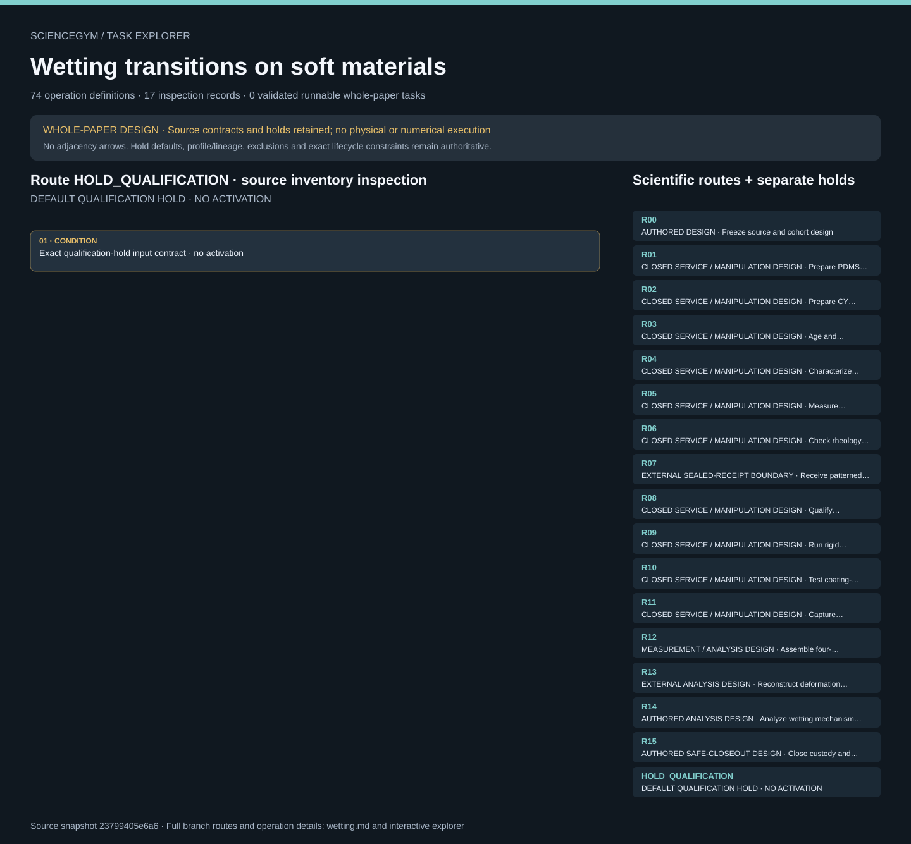

# Wetting transitions on soft materials: task route map



Paper: **Wetting transitions in droplet drying on soft materials** · [DOI](https://doi.org/10.1038/s41467-019-12093-w)

Whole-paper DESIGN only; zero validated runnable whole-paper tasks. Read-only author/evaluator inspection, not an actor context, physical simulation, hardware control or scientific reproduction. Source facts and independently authored robot contracts remain separate. Display membership is not chronology: exact predecessor, material-ancestry, lifecycle and route-output contracts govern scope; no universal all-material AND gate is inferred. Requests do not establish measurements, qualification, safe release or completed external services. Sixteen source design routes and seventy-four authored operation contracts remain distinct from the separate metadata-only default qualification-hold view. Ten source conflicts and twenty-five unresolved input groups remain open and claim-local. Cadmium-containing quantum-dot synthesis, ink handling and high-voltage deposition remain unmodeled closed external preparation; only a sealed specimen and independent receipt boundary is shown. Commercial silicone preparation and all hardware/analysis services remain unimplemented. Independent macro measurements, film specimens, image timepoints, fiducial sites, reference configurations and inverse-model results are not interchangeable replicates. No inferred 44-condition phase matrix, resolved thickness/modulus conflict, guessed missing SI Fig. 9 workbook, trusted source outcome or cTFM solver is supplied. Main text and all fifteen written SI pages were read upstream; main/SI figures were inspected. The movie was sampled at six times only, never continuously reviewed; workbook numerical cells remain unread. Original scene dimensions and anchors are illustrative, unqualified interfaces; no real physics, safe grasp or robot motion is established.. Counts describe task representation, not experiments or success.

**Reading rule:** rows show unordered source inventory for inspection. Exact phase, lifecycle and dependency contracts remain authoritative; no loop, specimen, condition or chronology is inferred. An unordered obligation group has no inferred chronological edges. Source-reported scientific facts and authored handling are distinct.

[Frozen local source task package](../../../tasks/wetting_operations_v2/) · [Interactive inspector](../index.html)

## R00 — AUTHORED DESIGN · Freeze source and cohort design

Whole-paper DESIGN only; zero validated runnable whole-paper tasks. Read-only author/evaluator inspection, not an actor context, physical simulation, hardware control or scientific reproduction. Source facts and independently authored robot contracts remain separate. Display membership is not chronology: exact predecessor, material-ancestry, lifecycle and route-output contracts govern scope; no universal all-material AND gate is inferred. Requests do not establish measurements, qualification, safe release or completed external services.

[Exact route source](../../../tasks/wetting_operations_v2/branches.json) · JSON pointer: `/branches/0`

- **OBLIGATIONS: Exact source operation membership · conditional entries stay conditional**
  - Binding: {"order":"Whole-paper DESIGN only; zero validated runnable whole-paper tasks. Read-only author/evaluator inspection, not an actor context, physical simulation, hardware control or scientific reproduction. Source facts and independently authored robot contracts remain separate. Display membership is not chronology: exact predecessor, material-ancestry, lifecycle and route-output contracts govern scope; no universal all-material AND gate is inferred. Requests do not establish measurements, qualification, safe release or completed external services.","membership_source":"Exact branches.json route_operation_ids; predecessor_operation_ids and required route outputs remain separately authoritative"}
  - `R00_O01` Pin source hashes and version; admit one paper-level task, not one task per plot.
  - `R00_O02` Create separate cohort plans for macro, thickness, mechanics, rheology, cTFM and phase-diagram studies.
  - `R00_O03` Freeze exclusion, uncertainty, calibration and analysis policies before observation.
  - `R00_O04` Keep source reference values in evaluator-only records; assign raw acquisition and service authority separately.
- **CONDITION: Exact source contract · unexpanded**
  - Binding: {"source_file":"branches.json","source_pointer":"/branches/0","source_contract":{"id":"R00","title":"Freeze source and cohort design","route_operation_ids":["R00_O01","R00_O02","R00_O03","R00_O04"],"kind":"authored_design","depends_on":[],"source_evidence_ids":["E01","E06","E09","E10","E16"],"required_outputs":["design_revision","cohort_matrix","analysis_plan_hash","source_version_id"],"qualification_gate":"Unresolved local branches stay HOLD; no inferred 44-condition matrix or pseudo-independent timepoints.","physical_implemented":false,"applicability":"Only relevant material/cohort ancestors, not every silicone family","source_conflict_ids":[],"unknown_ids":["U14","U23","U24"],"closeout_reachable_on_abort":true,"material_ids":["PDMS_9:1","PDMS_30:1","PDMS_50:1","CY_5:6","CY_9:10"],"family_scope":["CY","PDMS"],"mixed_material_policy":"Explicit constituent lineages; campaign bundle is not a physical specimen"}}
- **CONDITION: Exact lifecycle and safe closeout · independent records required**
  - Binding: {"source_file":"lifecycle_contract.json","source_pointer":"","source_contract":{"schema_version":"wetting_transition_task.v1","states":["UNREGISTERED","IDENTIFIED","SERVICE_REQUESTED","QUALIFIED_RECEIPT","AGED_CUSTODY","SPOT_RELEASED","MOUNT_VERIFIED","CALIBRATED","OBSERVED","DATA_HOLD","ANALYZED","CLOSEOUT_REQUEST","ISOLATION_VERIFIED","HELD_CONTAINED","QUARANTINED","ARCHIVED"],"failure_edges":[{"from_route":"R00","to":"CLOSEOUT_REQUEST","scientific_success_required":false},{"from_route":"R01","to":"CLOSEOUT_REQUEST","scientific_success_required":false},{"from_route":"R02","to":"CLOSEOUT_REQUEST","scientific_success_required":false},{"from_route":"R03","to":"CLOSEOUT_REQUEST","scientific_success_required":false},{"from_route":"R04","to":"CLOSEOUT_REQUEST","scientific_success_required":false},{"from_route":"R05","to":"CLOSEOUT_REQUEST","scientific_success_required":false},{"from_route":"R06","to":"CLOSEOUT_REQUEST","scientific_success_required":false},{"from_route":"R07","to":"CLOSEOUT_REQUEST","scientific_success_required":false},{"from_route":"R08","to":"CLOSEOUT_REQUEST","scientific_success_required":false},{"from_route":"R09","to":"CLOSEOUT_REQUEST","scientific_success_required":false},{"from_route":"R10","to":"CLOSEOUT_REQUEST","scientific_success_required":false},{"from_route":"R11","to":"CLOSEOUT_REQUEST","scientific_success_required":false},{"from_route":"R12","to":"CLOSEOUT_REQUEST","scientific_success_required":false},{"from_route":"R13","to":"CLOSEOUT_REQUEST","scientific_success_required":false},{"from_route":"R14","to":"CLOSEOUT_REQUEST","scientific_success_required":false},{"from_route":"R15","to":"CLOSEOUT_REQUEST","scientific_success_required":false}],"closure_rules":["Request is not safe-state evidence","Unknown isolation remains held_contained","No physical sample removal from an unqualified state","Raw failures, exclusions and every retry remain archived","Retry needs new attempt/droplet/acquisition IDs and separately qualified spot","No auto-cleaning, recuring, hazardous disposal or reuse recipe"]}}

<details><summary>Branch state, choices, lineage and loop obligations</summary>

```json
{
  "id": "R00",
  "title": "Freeze source and cohort design",
  "route_operation_ids": [
    "R00_O01",
    "R00_O02",
    "R00_O03",
    "R00_O04"
  ],
  "kind": "authored_design",
  "depends_on": [],
  "source_evidence_ids": [
    "E01",
    "E06",
    "E09",
    "E10",
    "E16"
  ],
  "required_outputs": [
    "design_revision",
    "cohort_matrix",
    "analysis_plan_hash",
    "source_version_id"
  ],
  "qualification_gate": "Unresolved local branches stay HOLD; no inferred 44-condition matrix or pseudo-independent timepoints.",
  "physical_implemented": false,
  "applicability": "Only relevant material/cohort ancestors, not every silicone family",
  "source_conflict_ids": [],
  "unknown_ids": [
    "U14",
    "U23",
    "U24"
  ],
  "closeout_reachable_on_abort": true,
  "material_ids": [
    "PDMS_9:1",
    "PDMS_30:1",
    "PDMS_50:1",
    "CY_5:6",
    "CY_9:10"
  ],
  "family_scope": [
    "CY",
    "PDMS"
  ],
  "mixed_material_policy": "Explicit constituent lineages; campaign bundle is not a physical specimen"
}
```

</details>

## R01 — CLOSED SERVICE / MANIPULATION DESIGN · Prepare PDMS film lineage

Whole-paper DESIGN only; zero validated runnable whole-paper tasks. Read-only author/evaluator inspection, not an actor context, physical simulation, hardware control or scientific reproduction. Source facts and independently authored robot contracts remain separate. Display membership is not chronology: exact predecessor, material-ancestry, lifecycle and route-output contracts govern scope; no universal all-material AND gate is inferred. Requests do not establish measurements, qualification, safe release or completed external services.

[Exact route source](../../../tasks/wetting_operations_v2/branches.json) · JSON pointer: `/branches/1`

- **OBLIGATIONS: Exact source operation membership · conditional entries stay conditional**
  - Binding: {"order":"Whole-paper DESIGN only; zero validated runnable whole-paper tasks. Read-only author/evaluator inspection, not an actor context, physical simulation, hardware control or scientific reproduction. Source facts and independently authored robot contracts remain separate. Display membership is not chronology: exact predecessor, material-ancestry, lifecycle and route-output contracts govern scope; no universal all-material AND gate is inferred. Requests do not establish measurements, qualification, safe release or completed external services.","membership_source":"Exact branches.json route_operation_ids; predecessor_operation_ids and required route outputs remain separately authoritative"}
  - `R01_O01` Register commercial base and curing-agent lots, glass carrier IDs and material identity.
  - `R01_O02` Assign 9:1, 30:1 and 50:1 formulation branches; weigh and reconcile documented quantities in a qualified preparation service.
  - `R01_O03` Request closed mixing, degassing, coating and curing service for the selected branch.
  - `R01_O04` Accept completion only from independent service receipt; inspect coating dimensions, defects and carrier identity.
  - `R01_O05` Route separately fabricated mechanical coupons to the characterization lineage; do not assume slide films are tensile bars.
- **CONDITION: Exact source contract · unexpanded**
  - Binding: {"source_file":"branches.json","source_pointer":"/branches/1","source_contract":{"id":"R01","title":"Prepare PDMS film lineage","route_operation_ids":["R01_O01","R01_O02","R01_O03","R01_O04","R01_O05"],"kind":"physical_service_and_manipulation_design","depends_on":["R00"],"source_evidence_ids":["E01"],"required_outputs":["formulation_ledger","process_receipt","film_id","thickness_measurement","coupon_parentage"],"qualification_gate":"Film thickness method, acceptance tolerances and mechanical-coupon fabrication remain unknown; no invented fully cured state.","physical_implemented":false,"applicability":"Only relevant material/cohort ancestors, not every silicone family","source_conflict_ids":[],"unknown_ids":["U01","U02","U24"],"closeout_reachable_on_abort":true,"material_ids":["PDMS_9:1","PDMS_30:1","PDMS_50:1"],"family_scope":["PDMS"],"mixed_material_policy":"Explicit constituent lineages; campaign bundle is not a physical specimen"}}
- **CONDITION: Exact lifecycle and safe closeout · independent records required**
  - Binding: {"source_file":"lifecycle_contract.json","source_pointer":"","source_contract":{"schema_version":"wetting_transition_task.v1","states":["UNREGISTERED","IDENTIFIED","SERVICE_REQUESTED","QUALIFIED_RECEIPT","AGED_CUSTODY","SPOT_RELEASED","MOUNT_VERIFIED","CALIBRATED","OBSERVED","DATA_HOLD","ANALYZED","CLOSEOUT_REQUEST","ISOLATION_VERIFIED","HELD_CONTAINED","QUARANTINED","ARCHIVED"],"failure_edges":[{"from_route":"R00","to":"CLOSEOUT_REQUEST","scientific_success_required":false},{"from_route":"R01","to":"CLOSEOUT_REQUEST","scientific_success_required":false},{"from_route":"R02","to":"CLOSEOUT_REQUEST","scientific_success_required":false},{"from_route":"R03","to":"CLOSEOUT_REQUEST","scientific_success_required":false},{"from_route":"R04","to":"CLOSEOUT_REQUEST","scientific_success_required":false},{"from_route":"R05","to":"CLOSEOUT_REQUEST","scientific_success_required":false},{"from_route":"R06","to":"CLOSEOUT_REQUEST","scientific_success_required":false},{"from_route":"R07","to":"CLOSEOUT_REQUEST","scientific_success_required":false},{"from_route":"R08","to":"CLOSEOUT_REQUEST","scientific_success_required":false},{"from_route":"R09","to":"CLOSEOUT_REQUEST","scientific_success_required":false},{"from_route":"R10","to":"CLOSEOUT_REQUEST","scientific_success_required":false},{"from_route":"R11","to":"CLOSEOUT_REQUEST","scientific_success_required":false},{"from_route":"R12","to":"CLOSEOUT_REQUEST","scientific_success_required":false},{"from_route":"R13","to":"CLOSEOUT_REQUEST","scientific_success_required":false},{"from_route":"R14","to":"CLOSEOUT_REQUEST","scientific_success_required":false},{"from_route":"R15","to":"CLOSEOUT_REQUEST","scientific_success_required":false}],"closure_rules":["Request is not safe-state evidence","Unknown isolation remains held_contained","No physical sample removal from an unqualified state","Raw failures, exclusions and every retry remain archived","Retry needs new attempt/droplet/acquisition IDs and separately qualified spot","No auto-cleaning, recuring, hazardous disposal or reuse recipe"]}}

<details><summary>Branch state, choices, lineage and loop obligations</summary>

```json
{
  "id": "R01",
  "title": "Prepare PDMS film lineage",
  "route_operation_ids": [
    "R01_O01",
    "R01_O02",
    "R01_O03",
    "R01_O04",
    "R01_O05"
  ],
  "kind": "physical_service_and_manipulation_design",
  "depends_on": [
    "R00"
  ],
  "source_evidence_ids": [
    "E01"
  ],
  "required_outputs": [
    "formulation_ledger",
    "process_receipt",
    "film_id",
    "thickness_measurement",
    "coupon_parentage"
  ],
  "qualification_gate": "Film thickness method, acceptance tolerances and mechanical-coupon fabrication remain unknown; no invented fully cured state.",
  "physical_implemented": false,
  "applicability": "Only relevant material/cohort ancestors, not every silicone family",
  "source_conflict_ids": [],
  "unknown_ids": [
    "U01",
    "U02",
    "U24"
  ],
  "closeout_reachable_on_abort": true,
  "material_ids": [
    "PDMS_9:1",
    "PDMS_30:1",
    "PDMS_50:1"
  ],
  "family_scope": [
    "PDMS"
  ],
  "mixed_material_policy": "Explicit constituent lineages; campaign bundle is not a physical specimen"
}
```

</details>

## R02 — CLOSED SERVICE / MANIPULATION DESIGN · Prepare CY film lineage

Whole-paper DESIGN only; zero validated runnable whole-paper tasks. Read-only author/evaluator inspection, not an actor context, physical simulation, hardware control or scientific reproduction. Source facts and independently authored robot contracts remain separate. Display membership is not chronology: exact predecessor, material-ancestry, lifecycle and route-output contracts govern scope; no universal all-material AND gate is inferred. Requests do not establish measurements, qualification, safe release or completed external services.

[Exact route source](../../../tasks/wetting_operations_v2/branches.json) · JSON pointer: `/branches/2`

- **OBLIGATIONS: Exact source operation membership · conditional entries stay conditional**
  - Binding: {"order":"Whole-paper DESIGN only; zero validated runnable whole-paper tasks. Read-only author/evaluator inspection, not an actor context, physical simulation, hardware control or scientific reproduction. Source facts and independently authored robot contracts remain separate. Display membership is not chronology: exact predecessor, material-ancestry, lifecycle and route-output contracts govern scope; no universal all-material AND gate is inferred. Requests do not establish measurements, qualification, safe release or completed external services.","membership_source":"Exact branches.json route_operation_ids; predecessor_operation_ids and required route outputs remain separately authoritative"}
  - `R02_O01` Register the distinct A and B component lots and additive identity.
  - `R02_O02` Resolve mixture basis and additive accounting before submitting 5:6 or 9:10 branch to the preparation service.
  - `R02_O03` Request closed mixing, degassing, coating and curing with separately logged carrier identity.
  - `R02_O04` Inspect returned film and issue sample/coupon parent-child links.
- **CONDITION: Exact source contract · unexpanded**
  - Binding: {"source_file":"branches.json","source_pointer":"/branches/2","source_contract":{"id":"R02","title":"Prepare CY film lineage","route_operation_ids":["R02_O01","R02_O02","R02_O03","R02_O04"],"kind":"physical_service_and_manipulation_design","depends_on":["R00"],"source_evidence_ids":["E01"],"required_outputs":["formulation_ledger","CY_process_receipt","film_id","thickness_measurement"],"qualification_gate":"CY mass/volume ratio basis and quality criteria must be qualified. This does not authorize unrelated chemical synthesis.","physical_implemented":false,"applicability":"Only relevant material/cohort ancestors, not every silicone family","source_conflict_ids":[],"unknown_ids":["U01","U02","U24"],"closeout_reachable_on_abort":true,"material_ids":["CY_5:6","CY_9:10"],"family_scope":["CY"],"mixed_material_policy":"Explicit constituent lineages; campaign bundle is not a physical specimen"}}
- **CONDITION: Exact lifecycle and safe closeout · independent records required**
  - Binding: {"source_file":"lifecycle_contract.json","source_pointer":"","source_contract":{"schema_version":"wetting_transition_task.v1","states":["UNREGISTERED","IDENTIFIED","SERVICE_REQUESTED","QUALIFIED_RECEIPT","AGED_CUSTODY","SPOT_RELEASED","MOUNT_VERIFIED","CALIBRATED","OBSERVED","DATA_HOLD","ANALYZED","CLOSEOUT_REQUEST","ISOLATION_VERIFIED","HELD_CONTAINED","QUARANTINED","ARCHIVED"],"failure_edges":[{"from_route":"R00","to":"CLOSEOUT_REQUEST","scientific_success_required":false},{"from_route":"R01","to":"CLOSEOUT_REQUEST","scientific_success_required":false},{"from_route":"R02","to":"CLOSEOUT_REQUEST","scientific_success_required":false},{"from_route":"R03","to":"CLOSEOUT_REQUEST","scientific_success_required":false},{"from_route":"R04","to":"CLOSEOUT_REQUEST","scientific_success_required":false},{"from_route":"R05","to":"CLOSEOUT_REQUEST","scientific_success_required":false},{"from_route":"R06","to":"CLOSEOUT_REQUEST","scientific_success_required":false},{"from_route":"R07","to":"CLOSEOUT_REQUEST","scientific_success_required":false},{"from_route":"R08","to":"CLOSEOUT_REQUEST","scientific_success_required":false},{"from_route":"R09","to":"CLOSEOUT_REQUEST","scientific_success_required":false},{"from_route":"R10","to":"CLOSEOUT_REQUEST","scientific_success_required":false},{"from_route":"R11","to":"CLOSEOUT_REQUEST","scientific_success_required":false},{"from_route":"R12","to":"CLOSEOUT_REQUEST","scientific_success_required":false},{"from_route":"R13","to":"CLOSEOUT_REQUEST","scientific_success_required":false},{"from_route":"R14","to":"CLOSEOUT_REQUEST","scientific_success_required":false},{"from_route":"R15","to":"CLOSEOUT_REQUEST","scientific_success_required":false}],"closure_rules":["Request is not safe-state evidence","Unknown isolation remains held_contained","No physical sample removal from an unqualified state","Raw failures, exclusions and every retry remain archived","Retry needs new attempt/droplet/acquisition IDs and separately qualified spot","No auto-cleaning, recuring, hazardous disposal or reuse recipe"]}}

<details><summary>Branch state, choices, lineage and loop obligations</summary>

```json
{
  "id": "R02",
  "title": "Prepare CY film lineage",
  "route_operation_ids": [
    "R02_O01",
    "R02_O02",
    "R02_O03",
    "R02_O04"
  ],
  "kind": "physical_service_and_manipulation_design",
  "depends_on": [
    "R00"
  ],
  "source_evidence_ids": [
    "E01"
  ],
  "required_outputs": [
    "formulation_ledger",
    "CY_process_receipt",
    "film_id",
    "thickness_measurement"
  ],
  "qualification_gate": "CY mass/volume ratio basis and quality criteria must be qualified. This does not authorize unrelated chemical synthesis.",
  "physical_implemented": false,
  "applicability": "Only relevant material/cohort ancestors, not every silicone family",
  "source_conflict_ids": [],
  "unknown_ids": [
    "U01",
    "U02",
    "U24"
  ],
  "closeout_reachable_on_abort": true,
  "material_ids": [
    "CY_5:6",
    "CY_9:10"
  ],
  "family_scope": [
    "CY"
  ],
  "mixed_material_policy": "Explicit constituent lineages; campaign bundle is not a physical specimen"
}
```

</details>

## R03 — CLOSED SERVICE / MANIPULATION DESIGN · Age and qualify sample custody

Whole-paper DESIGN only; zero validated runnable whole-paper tasks. Read-only author/evaluator inspection, not an actor context, physical simulation, hardware control or scientific reproduction. Source facts and independently authored robot contracts remain separate. Display membership is not chronology: exact predecessor, material-ancestry, lifecycle and route-output contracts govern scope; no universal all-material AND gate is inferred. Requests do not establish measurements, qualification, safe release or completed external services.

[Exact route source](../../../tasks/wetting_operations_v2/branches.json) · JSON pointer: `/branches/3`

- **OBLIGATIONS: Exact source operation membership · conditional entries stay conditional**
  - Binding: {"order":"Whole-paper DESIGN only; zero validated runnable whole-paper tasks. Read-only author/evaluator inspection, not an actor context, physical simulation, hardware control or scientific reproduction. Source facts and independently authored robot contracts remain separate. Display membership is not chronology: exact predecessor, material-ancestry, lifecycle and route-output contracts govern scope; no universal all-material AND gate is inferred. Requests do not establish measurements, qualification, safe release or completed external services.","membership_source":"Exact branches.json route_operation_ids; predecessor_operation_ids and required route outputs remain separately authoritative"}
  - `R03_O01` Keep separate PDMS and CY dated custody records in clean, dry, dust-protected storage.
  - `R03_O02` Compare experiment age to the appropriate source age interval; select like-aged controls.
  - `R03_O03` Inspect surface contamination and damage without touching active regions.
  - `R03_O04` Release only qualified sample/spot IDs; quarantine rejected films rather than silently cleaning or recuring them.
- **CONDITION: Exact source contract · unexpanded**
  - Binding: {"source_file":"branches.json","source_pointer":"/branches/3","source_contract":{"id":"R03","title":"Age and qualify sample custody","route_operation_ids":["R03_O01","R03_O02","R03_O03","R03_O04"],"kind":"physical_service_and_manipulation_design","depends_on":["R01","R02"],"source_evidence_ids":["E02"],"required_outputs":["age_receipt","storage_log","surface_inspection","released_spot_map"],"qualification_gate":"Elapsed wall time alone is not proof of storage conditions or surface recovery; reuse after a previous droplet requires a qualified policy.","physical_implemented":false,"applicability":"Only relevant material/cohort ancestors, not every silicone family","source_conflict_ids":[],"unknown_ids":["U21","U24"],"closeout_reachable_on_abort":true,"material_ids":["PDMS_9:1","PDMS_30:1","PDMS_50:1","CY_5:6","CY_9:10"],"family_scope":["CY","PDMS"],"mixed_material_policy":"Explicit constituent lineages; campaign bundle is not a physical specimen"}}
- **CONDITION: Exact lifecycle and safe closeout · independent records required**
  - Binding: {"source_file":"lifecycle_contract.json","source_pointer":"","source_contract":{"schema_version":"wetting_transition_task.v1","states":["UNREGISTERED","IDENTIFIED","SERVICE_REQUESTED","QUALIFIED_RECEIPT","AGED_CUSTODY","SPOT_RELEASED","MOUNT_VERIFIED","CALIBRATED","OBSERVED","DATA_HOLD","ANALYZED","CLOSEOUT_REQUEST","ISOLATION_VERIFIED","HELD_CONTAINED","QUARANTINED","ARCHIVED"],"failure_edges":[{"from_route":"R00","to":"CLOSEOUT_REQUEST","scientific_success_required":false},{"from_route":"R01","to":"CLOSEOUT_REQUEST","scientific_success_required":false},{"from_route":"R02","to":"CLOSEOUT_REQUEST","scientific_success_required":false},{"from_route":"R03","to":"CLOSEOUT_REQUEST","scientific_success_required":false},{"from_route":"R04","to":"CLOSEOUT_REQUEST","scientific_success_required":false},{"from_route":"R05","to":"CLOSEOUT_REQUEST","scientific_success_required":false},{"from_route":"R06","to":"CLOSEOUT_REQUEST","scientific_success_required":false},{"from_route":"R07","to":"CLOSEOUT_REQUEST","scientific_success_required":false},{"from_route":"R08","to":"CLOSEOUT_REQUEST","scientific_success_required":false},{"from_route":"R09","to":"CLOSEOUT_REQUEST","scientific_success_required":false},{"from_route":"R10","to":"CLOSEOUT_REQUEST","scientific_success_required":false},{"from_route":"R11","to":"CLOSEOUT_REQUEST","scientific_success_required":false},{"from_route":"R12","to":"CLOSEOUT_REQUEST","scientific_success_required":false},{"from_route":"R13","to":"CLOSEOUT_REQUEST","scientific_success_required":false},{"from_route":"R14","to":"CLOSEOUT_REQUEST","scientific_success_required":false},{"from_route":"R15","to":"CLOSEOUT_REQUEST","scientific_success_required":false}],"closure_rules":["Request is not safe-state evidence","Unknown isolation remains held_contained","No physical sample removal from an unqualified state","Raw failures, exclusions and every retry remain archived","Retry needs new attempt/droplet/acquisition IDs and separately qualified spot","No auto-cleaning, recuring, hazardous disposal or reuse recipe"]}}

<details><summary>Branch state, choices, lineage and loop obligations</summary>

```json
{
  "id": "R03",
  "title": "Age and qualify sample custody",
  "route_operation_ids": [
    "R03_O01",
    "R03_O02",
    "R03_O03",
    "R03_O04"
  ],
  "kind": "physical_service_and_manipulation_design",
  "depends_on": [
    "R01",
    "R02"
  ],
  "source_evidence_ids": [
    "E02"
  ],
  "required_outputs": [
    "age_receipt",
    "storage_log",
    "surface_inspection",
    "released_spot_map"
  ],
  "qualification_gate": "Elapsed wall time alone is not proof of storage conditions or surface recovery; reuse after a previous droplet requires a qualified policy.",
  "physical_implemented": false,
  "applicability": "Only relevant material/cohort ancestors, not every silicone family",
  "source_conflict_ids": [],
  "unknown_ids": [
    "U21",
    "U24"
  ],
  "closeout_reachable_on_abort": true,
  "material_ids": [
    "PDMS_9:1",
    "PDMS_30:1",
    "PDMS_50:1",
    "CY_5:6",
    "CY_9:10"
  ],
  "family_scope": [
    "CY",
    "PDMS"
  ],
  "mixed_material_policy": "Explicit constituent lineages; campaign bundle is not a physical specimen"
}
```

</details>

## R04 — CLOSED SERVICE / MANIPULATION DESIGN · Characterize tensile response

Whole-paper DESIGN only; zero validated runnable whole-paper tasks. Read-only author/evaluator inspection, not an actor context, physical simulation, hardware control or scientific reproduction. Source facts and independently authored robot contracts remain separate. Display membership is not chronology: exact predecessor, material-ancestry, lifecycle and route-output contracts govern scope; no universal all-material AND gate is inferred. Requests do not establish measurements, qualification, safe release or completed external services.

[Exact route source](../../../tasks/wetting_operations_v2/branches.json) · JSON pointer: `/branches/4`

- **OBLIGATIONS: Exact source operation membership · conditional entries stay conditional**
  - Binding: {"order":"Whole-paper DESIGN only; zero validated runnable whole-paper tasks. Read-only author/evaluator inspection, not an actor context, physical simulation, hardware control or scientific reproduction. Source facts and independently authored robot contracts remain separate. Display membership is not chronology: exact predecessor, material-ancestry, lifecycle and route-output contracts govern scope; no universal all-material AND gate is inferred. Requests do not establish measurements, qualification, safe release or completed external services.","membership_source":"Exact branches.json route_operation_ids; predecessor_operation_ids and required route outputs remain separately authoritative"}
  - `R04_O01` Receive traceable companion coupon and qualified geometry/gauge measurements.
  - `R04_O02` Mount in a closed tensile-test service with calibrated force and strain channels.
  - `R04_O03` Acquire PDMS9:1 and PDMS30:1 repeat series and separate available CY characterization.
  - `R04_O04` Fit the predeclared low-strain interval and label stress measure and specimen/repeat identities.
  - `R04_O05` Link literature-supplied moduli separately from newly measured coupon outcomes.
- **CONDITION: Exact source contract · unexpanded**
  - Binding: {"source_file":"branches.json","source_pointer":"/branches/4","source_contract":{"id":"R04","title":"Characterize tensile response","route_operation_ids":["R04_O01","R04_O02","R04_O03","R04_O04","R04_O05"],"kind":"physical_service_and_manipulation_design","depends_on":["R03"],"source_evidence_ids":["E03"],"required_outputs":["coupon_measurements","calibration_ids","raw_tensile_traces","modulus_fit","repeat_ledger"],"qualification_gate":"No coupon dimensions, strain rate, gauge method or complete CY tensile data supplied. CY9:10 measured-versus-inherited language is unresolved.","physical_implemented":false,"applicability":"Only relevant material/cohort ancestors, not every silicone family","source_conflict_ids":["C04"],"unknown_ids":["U04","U05","U06","U24"],"closeout_reachable_on_abort":true,"material_ids":["PDMS_9:1","PDMS_30:1","PDMS_50:1","CY_5:6","CY_9:10"],"family_scope":["CY","PDMS"],"mixed_material_policy":"Explicit constituent lineages; campaign bundle is not a physical specimen"}}
- **CONDITION: Exact lifecycle and safe closeout · independent records required**
  - Binding: {"source_file":"lifecycle_contract.json","source_pointer":"","source_contract":{"schema_version":"wetting_transition_task.v1","states":["UNREGISTERED","IDENTIFIED","SERVICE_REQUESTED","QUALIFIED_RECEIPT","AGED_CUSTODY","SPOT_RELEASED","MOUNT_VERIFIED","CALIBRATED","OBSERVED","DATA_HOLD","ANALYZED","CLOSEOUT_REQUEST","ISOLATION_VERIFIED","HELD_CONTAINED","QUARANTINED","ARCHIVED"],"failure_edges":[{"from_route":"R00","to":"CLOSEOUT_REQUEST","scientific_success_required":false},{"from_route":"R01","to":"CLOSEOUT_REQUEST","scientific_success_required":false},{"from_route":"R02","to":"CLOSEOUT_REQUEST","scientific_success_required":false},{"from_route":"R03","to":"CLOSEOUT_REQUEST","scientific_success_required":false},{"from_route":"R04","to":"CLOSEOUT_REQUEST","scientific_success_required":false},{"from_route":"R05","to":"CLOSEOUT_REQUEST","scientific_success_required":false},{"from_route":"R06","to":"CLOSEOUT_REQUEST","scientific_success_required":false},{"from_route":"R07","to":"CLOSEOUT_REQUEST","scientific_success_required":false},{"from_route":"R08","to":"CLOSEOUT_REQUEST","scientific_success_required":false},{"from_route":"R09","to":"CLOSEOUT_REQUEST","scientific_success_required":false},{"from_route":"R10","to":"CLOSEOUT_REQUEST","scientific_success_required":false},{"from_route":"R11","to":"CLOSEOUT_REQUEST","scientific_success_required":false},{"from_route":"R12","to":"CLOSEOUT_REQUEST","scientific_success_required":false},{"from_route":"R13","to":"CLOSEOUT_REQUEST","scientific_success_required":false},{"from_route":"R14","to":"CLOSEOUT_REQUEST","scientific_success_required":false},{"from_route":"R15","to":"CLOSEOUT_REQUEST","scientific_success_required":false}],"closure_rules":["Request is not safe-state evidence","Unknown isolation remains held_contained","No physical sample removal from an unqualified state","Raw failures, exclusions and every retry remain archived","Retry needs new attempt/droplet/acquisition IDs and separately qualified spot","No auto-cleaning, recuring, hazardous disposal or reuse recipe"]}}

<details><summary>Branch state, choices, lineage and loop obligations</summary>

```json
{
  "id": "R04",
  "title": "Characterize tensile response",
  "route_operation_ids": [
    "R04_O01",
    "R04_O02",
    "R04_O03",
    "R04_O04",
    "R04_O05"
  ],
  "kind": "physical_service_and_manipulation_design",
  "depends_on": [
    "R03"
  ],
  "source_evidence_ids": [
    "E03"
  ],
  "required_outputs": [
    "coupon_measurements",
    "calibration_ids",
    "raw_tensile_traces",
    "modulus_fit",
    "repeat_ledger"
  ],
  "qualification_gate": "No coupon dimensions, strain rate, gauge method or complete CY tensile data supplied. CY9:10 measured-versus-inherited language is unresolved.",
  "physical_implemented": false,
  "applicability": "Only relevant material/cohort ancestors, not every silicone family",
  "source_conflict_ids": [
    "C04"
  ],
  "unknown_ids": [
    "U04",
    "U05",
    "U06",
    "U24"
  ],
  "closeout_reachable_on_abort": true,
  "material_ids": [
    "PDMS_9:1",
    "PDMS_30:1",
    "PDMS_50:1",
    "CY_5:6",
    "CY_9:10"
  ],
  "family_scope": [
    "CY",
    "PDMS"
  ],
  "mixed_material_policy": "Explicit constituent lineages; campaign bundle is not a physical specimen"
}
```

</details>

## R05 — CLOSED SERVICE / MANIPULATION DESIGN · Measure material relaxation

Whole-paper DESIGN only; zero validated runnable whole-paper tasks. Read-only author/evaluator inspection, not an actor context, physical simulation, hardware control or scientific reproduction. Source facts and independently authored robot contracts remain separate. Display membership is not chronology: exact predecessor, material-ancestry, lifecycle and route-output contracts govern scope; no universal all-material AND gate is inferred. Requests do not establish measurements, qualification, safe release or completed external services.

[Exact route source](../../../tasks/wetting_operations_v2/branches.json) · JSON pointer: `/branches/5`

- **OBLIGATIONS: Exact source operation membership · conditional entries stay conditional**
  - Binding: {"order":"Whole-paper DESIGN only; zero validated runnable whole-paper tasks. Read-only author/evaluator inspection, not an actor context, physical simulation, hardware control or scientific reproduction. Source facts and independently authored robot contracts remain separate. Display membership is not chronology: exact predecessor, material-ancestry, lifecycle and route-output contracts govern scope; no universal all-material AND gate is inferred. Requests do not establish measurements, qualification, safe release or completed external services.","membership_source":"Exact branches.json route_operation_ids; predecessor_operation_ids and required route outputs remain separately authoritative"}
  - `R05_O01` Assign four material-specific strain/repeat cohorts to qualified companion coupons.
  - `R05_O02` Perform closed step-strain acquisition with recorded ramp, hold and baseline semantics.
  - `R05_O03` Preserve each unnormalized trace, time origin, stress measure and any normalization.
  - `R05_O04` Fit two Maxwell times and amplitude terms with versioned fitting policy.
  - `R05_O05` Select the short-time relaxation parameter for the paper comparison only after checking timescale applicability.
- **CONDITION: Exact source contract · unexpanded**
  - Binding: {"source_file":"branches.json","source_pointer":"/branches/5","source_contract":{"id":"R05","title":"Measure material relaxation","route_operation_ids":["R05_O01","R05_O02","R05_O03","R05_O04","R05_O05"],"kind":"physical_service_and_manipulation_design","depends_on":["R03"],"source_evidence_ids":["E04"],"required_outputs":["relaxation_traces","step_input_log","fit_parameters","fit_uncertainty","repeat_identity"],"qualification_gate":"Source N does not specify distinct specimens; ramp/hold schedule and stress-normalization conventions need qualification.","physical_implemented":false,"applicability":"Only relevant material/cohort ancestors, not every silicone family","source_conflict_ids":["C05"],"unknown_ids":["U04","U05","U24"],"closeout_reachable_on_abort":true,"material_ids":["PDMS_9:1","PDMS_30:1","CY_5:6","CY_9:10"],"family_scope":["CY","PDMS"],"mixed_material_policy":"Explicit constituent lineages; campaign bundle is not a physical specimen"}}
- **CONDITION: Exact lifecycle and safe closeout · independent records required**
  - Binding: {"source_file":"lifecycle_contract.json","source_pointer":"","source_contract":{"schema_version":"wetting_transition_task.v1","states":["UNREGISTERED","IDENTIFIED","SERVICE_REQUESTED","QUALIFIED_RECEIPT","AGED_CUSTODY","SPOT_RELEASED","MOUNT_VERIFIED","CALIBRATED","OBSERVED","DATA_HOLD","ANALYZED","CLOSEOUT_REQUEST","ISOLATION_VERIFIED","HELD_CONTAINED","QUARANTINED","ARCHIVED"],"failure_edges":[{"from_route":"R00","to":"CLOSEOUT_REQUEST","scientific_success_required":false},{"from_route":"R01","to":"CLOSEOUT_REQUEST","scientific_success_required":false},{"from_route":"R02","to":"CLOSEOUT_REQUEST","scientific_success_required":false},{"from_route":"R03","to":"CLOSEOUT_REQUEST","scientific_success_required":false},{"from_route":"R04","to":"CLOSEOUT_REQUEST","scientific_success_required":false},{"from_route":"R05","to":"CLOSEOUT_REQUEST","scientific_success_required":false},{"from_route":"R06","to":"CLOSEOUT_REQUEST","scientific_success_required":false},{"from_route":"R07","to":"CLOSEOUT_REQUEST","scientific_success_required":false},{"from_route":"R08","to":"CLOSEOUT_REQUEST","scientific_success_required":false},{"from_route":"R09","to":"CLOSEOUT_REQUEST","scientific_success_required":false},{"from_route":"R10","to":"CLOSEOUT_REQUEST","scientific_success_required":false},{"from_route":"R11","to":"CLOSEOUT_REQUEST","scientific_success_required":false},{"from_route":"R12","to":"CLOSEOUT_REQUEST","scientific_success_required":false},{"from_route":"R13","to":"CLOSEOUT_REQUEST","scientific_success_required":false},{"from_route":"R14","to":"CLOSEOUT_REQUEST","scientific_success_required":false},{"from_route":"R15","to":"CLOSEOUT_REQUEST","scientific_success_required":false}],"closure_rules":["Request is not safe-state evidence","Unknown isolation remains held_contained","No physical sample removal from an unqualified state","Raw failures, exclusions and every retry remain archived","Retry needs new attempt/droplet/acquisition IDs and separately qualified spot","No auto-cleaning, recuring, hazardous disposal or reuse recipe"]}}

<details><summary>Branch state, choices, lineage and loop obligations</summary>

```json
{
  "id": "R05",
  "title": "Measure material relaxation",
  "route_operation_ids": [
    "R05_O01",
    "R05_O02",
    "R05_O03",
    "R05_O04",
    "R05_O05"
  ],
  "kind": "physical_service_and_manipulation_design",
  "depends_on": [
    "R03"
  ],
  "source_evidence_ids": [
    "E04"
  ],
  "required_outputs": [
    "relaxation_traces",
    "step_input_log",
    "fit_parameters",
    "fit_uncertainty",
    "repeat_identity"
  ],
  "qualification_gate": "Source N does not specify distinct specimens; ramp/hold schedule and stress-normalization conventions need qualification.",
  "physical_implemented": false,
  "applicability": "Only relevant material/cohort ancestors, not every silicone family",
  "source_conflict_ids": [
    "C05"
  ],
  "unknown_ids": [
    "U04",
    "U05",
    "U24"
  ],
  "closeout_reachable_on_abort": true,
  "material_ids": [
    "PDMS_9:1",
    "PDMS_30:1",
    "CY_5:6",
    "CY_9:10"
  ],
  "family_scope": [
    "CY",
    "PDMS"
  ],
  "mixed_material_policy": "Explicit constituent lineages; campaign bundle is not a physical specimen"
}
```

</details>

## R06 — CLOSED SERVICE / MANIPULATION DESIGN · Check rheology and modality limits

Whole-paper DESIGN only; zero validated runnable whole-paper tasks. Read-only author/evaluator inspection, not an actor context, physical simulation, hardware control or scientific reproduction. Source facts and independently authored robot contracts remain separate. Display membership is not chronology: exact predecessor, material-ancestry, lifecycle and route-output contracts govern scope; no universal all-material AND gate is inferred. Requests do not establish measurements, qualification, safe release or completed external services.

[Exact route source](../../../tasks/wetting_operations_v2/branches.json) · JSON pointer: `/branches/6`

- **OBLIGATIONS: Exact source operation membership · conditional entries stay conditional**
  - Binding: {"order":"Whole-paper DESIGN only; zero validated runnable whole-paper tasks. Read-only author/evaluator inspection, not an actor context, physical simulation, hardware control or scientific reproduction. Source facts and independently authored robot contracts remain separate. Display membership is not chronology: exact predecessor, material-ancestry, lifecycle and route-output contracts govern scope; no universal all-material AND gate is inferred. Requests do not establish measurements, qualification, safe release or completed external services.","membership_source":"Exact branches.json route_operation_ids; predecessor_operation_ids and required route outputs remain separately authoritative"}
  - `R06_O01` Receive PDMS50:1 and CY9:10 rheology specimens with geometry and age records.
  - `R06_O02` Mount in a calibrated closed rheometer and record strain, temperature and the qualified frequency schedule.
  - `R06_O03` Return storage/loss-modulus and viscosity results with units and instrument limits.
  - `R06_O04` Record whether a crossover is actually observed; do not fabricate a relaxation time when absent.
  - `R06_O05` Retain SI Table1 as a literature-only modality comparison; the physical PDMS30:1 detection-limit acquisition is a distinct R11 branch, not a rheometer result.
- **CONDITION: Exact source contract · unexpanded**
  - Binding: {"source_file":"branches.json","source_pointer":"/branches/6","source_contract":{"id":"R06","title":"Check rheology and modality limits","route_operation_ids":["R06_O01","R06_O02","R06_O03","R06_O04","R06_O05"],"kind":"physical_service_and_manipulation_design","depends_on":["R03"],"source_evidence_ids":["E05","E15"],"required_outputs":["rheology_raw_data","frequency_schedule","crossover_assessment","literature_modality_comparison_record"],"qualification_gate":"Rheometer geometry, environmental conditions and repeats are not supplied. SI Table1 comparisons are literature context, not extra local experiments.","physical_implemented":false,"applicability":"Only relevant material/cohort ancestors, not every silicone family","source_conflict_ids":[],"unknown_ids":["U08","U24"],"closeout_reachable_on_abort":true,"material_ids":["PDMS_50:1","CY_9:10"],"family_scope":["CY","PDMS"],"mixed_material_policy":"Explicit constituent lineages; campaign bundle is not a physical specimen"}}
- **CONDITION: Exact lifecycle and safe closeout · independent records required**
  - Binding: {"source_file":"lifecycle_contract.json","source_pointer":"","source_contract":{"schema_version":"wetting_transition_task.v1","states":["UNREGISTERED","IDENTIFIED","SERVICE_REQUESTED","QUALIFIED_RECEIPT","AGED_CUSTODY","SPOT_RELEASED","MOUNT_VERIFIED","CALIBRATED","OBSERVED","DATA_HOLD","ANALYZED","CLOSEOUT_REQUEST","ISOLATION_VERIFIED","HELD_CONTAINED","QUARANTINED","ARCHIVED"],"failure_edges":[{"from_route":"R00","to":"CLOSEOUT_REQUEST","scientific_success_required":false},{"from_route":"R01","to":"CLOSEOUT_REQUEST","scientific_success_required":false},{"from_route":"R02","to":"CLOSEOUT_REQUEST","scientific_success_required":false},{"from_route":"R03","to":"CLOSEOUT_REQUEST","scientific_success_required":false},{"from_route":"R04","to":"CLOSEOUT_REQUEST","scientific_success_required":false},{"from_route":"R05","to":"CLOSEOUT_REQUEST","scientific_success_required":false},{"from_route":"R06","to":"CLOSEOUT_REQUEST","scientific_success_required":false},{"from_route":"R07","to":"CLOSEOUT_REQUEST","scientific_success_required":false},{"from_route":"R08","to":"CLOSEOUT_REQUEST","scientific_success_required":false},{"from_route":"R09","to":"CLOSEOUT_REQUEST","scientific_success_required":false},{"from_route":"R10","to":"CLOSEOUT_REQUEST","scientific_success_required":false},{"from_route":"R11","to":"CLOSEOUT_REQUEST","scientific_success_required":false},{"from_route":"R12","to":"CLOSEOUT_REQUEST","scientific_success_required":false},{"from_route":"R13","to":"CLOSEOUT_REQUEST","scientific_success_required":false},{"from_route":"R14","to":"CLOSEOUT_REQUEST","scientific_success_required":false},{"from_route":"R15","to":"CLOSEOUT_REQUEST","scientific_success_required":false}],"closure_rules":["Request is not safe-state evidence","Unknown isolation remains held_contained","No physical sample removal from an unqualified state","Raw failures, exclusions and every retry remain archived","Retry needs new attempt/droplet/acquisition IDs and separately qualified spot","No auto-cleaning, recuring, hazardous disposal or reuse recipe"]}}

<details><summary>Branch state, choices, lineage and loop obligations</summary>

```json
{
  "id": "R06",
  "title": "Check rheology and modality limits",
  "route_operation_ids": [
    "R06_O01",
    "R06_O02",
    "R06_O03",
    "R06_O04",
    "R06_O05"
  ],
  "kind": "physical_service_and_manipulation_design",
  "depends_on": [
    "R03"
  ],
  "source_evidence_ids": [
    "E05",
    "E15"
  ],
  "required_outputs": [
    "rheology_raw_data",
    "frequency_schedule",
    "crossover_assessment",
    "literature_modality_comparison_record"
  ],
  "qualification_gate": "Rheometer geometry, environmental conditions and repeats are not supplied. SI Table1 comparisons are literature context, not extra local experiments.",
  "physical_implemented": false,
  "applicability": "Only relevant material/cohort ancestors, not every silicone family",
  "source_conflict_ids": [],
  "unknown_ids": [
    "U08",
    "U24"
  ],
  "closeout_reachable_on_abort": true,
  "material_ids": [
    "PDMS_50:1",
    "CY_9:10"
  ],
  "family_scope": [
    "CY",
    "PDMS"
  ],
  "mixed_material_policy": "Explicit constituent lineages; campaign bundle is not a physical specimen"
}
```

</details>

## R07 — EXTERNAL SEALED-RECEIPT BOUNDARY · Receive patterned microscope specimens

Whole-paper DESIGN only; zero validated runnable whole-paper tasks. Read-only author/evaluator inspection, not an actor context, physical simulation, hardware control or scientific reproduction. Source facts and independently authored robot contracts remain separate. Display membership is not chronology: exact predecessor, material-ancestry, lifecycle and route-output contracts govern scope; no universal all-material AND gate is inferred. Requests do not establish measurements, qualification, safe release or completed external services.

[Exact route source](../../../tasks/wetting_operations_v2/branches.json) · JSON pointer: `/branches/7`

- **OBLIGATIONS: Exact source operation membership · conditional entries stay conditional**
  - Binding: {"order":"Whole-paper DESIGN only; zero validated runnable whole-paper tasks. Read-only author/evaluator inspection, not an actor context, physical simulation, hardware control or scientific reproduction. Source facts and independently authored robot contracts remain separate. Display membership is not chronology: exact predecessor, material-ancestry, lifecycle and route-output contracts govern scope; no universal all-material AND gate is inferred. Requests do not establish measurements, qualification, safe release or completed external services.","membership_source":"Exact branches.json route_operation_ids; predecessor_operation_ids and required route outputs remain separately authoritative"}
  - `R07_O01` Submit qualified silicone specimen identity and a fiducial-pattern request to an external specialist service.
  - `R07_O02` Receive a sealed or otherwise qualified-safe patterned substrate with chain of custody, array map and material compatibility evidence.
  - `R07_O03` Verify surface identity, lattice metadata, pattern extent, adhesion and containment through approved observations.
  - `R07_O04` Keep synthesis, ink handling and high-voltage deposition absent from robot controls.
- **CONDITION: Exact source contract · unexpanded**
  - Binding: {"source_file":"branches.json","source_pointer":"/branches/7","source_contract":{"id":"R07","title":"Receive patterned microscope specimens","route_operation_ids":["R07_O01","R07_O02","R07_O03","R07_O04"],"kind":"external_service_only","depends_on":["R03"],"source_evidence_ids":["E02","E08"],"required_outputs":["patterned_sample_receipt","array_geometry","containment_receipt","service_qualification"],"qualification_gate":"Outsourced and unmodeled preparation; no operational quantum-dot synthesis or NanoDrip recipe. Missing receipt cannot be replaced with an agent assertion.","physical_implemented":false,"applicability":"Only relevant material/cohort ancestors, not every silicone family","source_conflict_ids":[],"unknown_ids":["U09","U24"],"closeout_reachable_on_abort":true,"material_ids":["PDMS_30:1","CY_5:6","CY_9:10"],"family_scope":["CY","PDMS"],"mixed_material_policy":"Explicit constituent lineages; campaign bundle is not a physical specimen"}}
- **CONDITION: Exact lifecycle and safe closeout · independent records required**
  - Binding: {"source_file":"lifecycle_contract.json","source_pointer":"","source_contract":{"schema_version":"wetting_transition_task.v1","states":["UNREGISTERED","IDENTIFIED","SERVICE_REQUESTED","QUALIFIED_RECEIPT","AGED_CUSTODY","SPOT_RELEASED","MOUNT_VERIFIED","CALIBRATED","OBSERVED","DATA_HOLD","ANALYZED","CLOSEOUT_REQUEST","ISOLATION_VERIFIED","HELD_CONTAINED","QUARANTINED","ARCHIVED"],"failure_edges":[{"from_route":"R00","to":"CLOSEOUT_REQUEST","scientific_success_required":false},{"from_route":"R01","to":"CLOSEOUT_REQUEST","scientific_success_required":false},{"from_route":"R02","to":"CLOSEOUT_REQUEST","scientific_success_required":false},{"from_route":"R03","to":"CLOSEOUT_REQUEST","scientific_success_required":false},{"from_route":"R04","to":"CLOSEOUT_REQUEST","scientific_success_required":false},{"from_route":"R05","to":"CLOSEOUT_REQUEST","scientific_success_required":false},{"from_route":"R06","to":"CLOSEOUT_REQUEST","scientific_success_required":false},{"from_route":"R07","to":"CLOSEOUT_REQUEST","scientific_success_required":false},{"from_route":"R08","to":"CLOSEOUT_REQUEST","scientific_success_required":false},{"from_route":"R09","to":"CLOSEOUT_REQUEST","scientific_success_required":false},{"from_route":"R10","to":"CLOSEOUT_REQUEST","scientific_success_required":false},{"from_route":"R11","to":"CLOSEOUT_REQUEST","scientific_success_required":false},{"from_route":"R12","to":"CLOSEOUT_REQUEST","scientific_success_required":false},{"from_route":"R13","to":"CLOSEOUT_REQUEST","scientific_success_required":false},{"from_route":"R14","to":"CLOSEOUT_REQUEST","scientific_success_required":false},{"from_route":"R15","to":"CLOSEOUT_REQUEST","scientific_success_required":false}],"closure_rules":["Request is not safe-state evidence","Unknown isolation remains held_contained","No physical sample removal from an unqualified state","Raw failures, exclusions and every retry remain archived","Retry needs new attempt/droplet/acquisition IDs and separately qualified spot","No auto-cleaning, recuring, hazardous disposal or reuse recipe"]}}

<details><summary>Branch state, choices, lineage and loop obligations</summary>

```json
{
  "id": "R07",
  "title": "Receive patterned microscope specimens",
  "route_operation_ids": [
    "R07_O01",
    "R07_O02",
    "R07_O03",
    "R07_O04"
  ],
  "kind": "external_service_only",
  "depends_on": [
    "R03"
  ],
  "source_evidence_ids": [
    "E02",
    "E08"
  ],
  "required_outputs": [
    "patterned_sample_receipt",
    "array_geometry",
    "containment_receipt",
    "service_qualification"
  ],
  "qualification_gate": "Outsourced and unmodeled preparation; no operational quantum-dot synthesis or NanoDrip recipe. Missing receipt cannot be replaced with an agent assertion.",
  "physical_implemented": false,
  "applicability": "Only relevant material/cohort ancestors, not every silicone family",
  "source_conflict_ids": [],
  "unknown_ids": [
    "U09",
    "U24"
  ],
  "closeout_reachable_on_abort": true,
  "material_ids": [
    "PDMS_30:1",
    "CY_5:6",
    "CY_9:10"
  ],
  "family_scope": [
    "CY",
    "PDMS"
  ],
  "mixed_material_policy": "Explicit constituent lineages; campaign bundle is not a physical specimen"
}
```

</details>

## R08 — CLOSED SERVICE / MANIPULATION DESIGN · Qualify humidity and imaging station

Whole-paper DESIGN only; zero validated runnable whole-paper tasks. Read-only author/evaluator inspection, not an actor context, physical simulation, hardware control or scientific reproduction. Source facts and independently authored robot contracts remain separate. Display membership is not chronology: exact predecessor, material-ancestry, lifecycle and route-output contracts govern scope; no universal all-material AND gate is inferred. Requests do not establish measurements, qualification, safe release or completed external services.

[Exact route source](../../../tasks/wetting_operations_v2/branches.json) · JSON pointer: `/branches/8`

- **OBLIGATIONS: Exact source operation membership · conditional entries stay conditional**
  - Binding: {"order":"Whole-paper DESIGN only; zero validated runnable whole-paper tasks. Read-only author/evaluator inspection, not an actor context, physical simulation, hardware control or scientific reproduction. Source facts and independently authored robot contracts remain separate. Display membership is not chronology: exact predecessor, material-ancestry, lifecycle and route-output contracts govern scope; no universal all-material AND gate is inferred. Requests do not establish measurements, qualification, safe release or completed external services.","membership_source":"Exact branches.json route_operation_ids; predecessor_operation_ids and required route outputs remain separately authoritative"}
  - `R08_O01` Verify chamber, sample mount, dispensing, backlight, side camera, environmental sensors and isolated gas/optical services.
  - `R08_O02` Load spatial, angular, volume and timestamp calibrations for each camera and scan axis.
  - `R08_O03` Require a humidity-control service receipt with measured RH and temperature stability, flow/exhaust safety and dry/wet branch identity.
  - `R08_O04` Freeze side/bottom coordinate transforms and synchronization policy; verify focus and field of view before droplets.
- **CONDITION: Exact source contract · unexpanded**
  - Binding: {"source_file":"branches.json","source_pointer":"/branches/8","source_contract":{"id":"R08","title":"Qualify humidity and imaging station","route_operation_ids":["R08_O01","R08_O02","R08_O03","R08_O04"],"kind":"physical_service_and_manipulation_design","depends_on":["R00"],"source_evidence_ids":["E06","E08"],"required_outputs":["station_revision","calibration_bundle","environment_stability","coordinate_transforms","synchronization_test"],"qualification_gate":"Source sensor accuracy differs from plotted RH variation. Setpoint agreement is not accuracy. No gas, laser or stage operation permitted without qualified service.","physical_implemented":false,"applicability":"Only relevant material/cohort ancestors, not every silicone family","source_conflict_ids":["C08"],"unknown_ids":["U10","U11","U12","U13","U24"],"closeout_reachable_on_abort":true,"material_ids":["PDMS_9:1","PDMS_30:1","PDMS_50:1","CY_5:6","CY_9:10"],"family_scope":["CY","PDMS"],"mixed_material_policy":"Explicit constituent lineages; campaign bundle is not a physical specimen"}}
- **CONDITION: Exact lifecycle and safe closeout · independent records required**
  - Binding: {"source_file":"lifecycle_contract.json","source_pointer":"","source_contract":{"schema_version":"wetting_transition_task.v1","states":["UNREGISTERED","IDENTIFIED","SERVICE_REQUESTED","QUALIFIED_RECEIPT","AGED_CUSTODY","SPOT_RELEASED","MOUNT_VERIFIED","CALIBRATED","OBSERVED","DATA_HOLD","ANALYZED","CLOSEOUT_REQUEST","ISOLATION_VERIFIED","HELD_CONTAINED","QUARANTINED","ARCHIVED"],"failure_edges":[{"from_route":"R00","to":"CLOSEOUT_REQUEST","scientific_success_required":false},{"from_route":"R01","to":"CLOSEOUT_REQUEST","scientific_success_required":false},{"from_route":"R02","to":"CLOSEOUT_REQUEST","scientific_success_required":false},{"from_route":"R03","to":"CLOSEOUT_REQUEST","scientific_success_required":false},{"from_route":"R04","to":"CLOSEOUT_REQUEST","scientific_success_required":false},{"from_route":"R05","to":"CLOSEOUT_REQUEST","scientific_success_required":false},{"from_route":"R06","to":"CLOSEOUT_REQUEST","scientific_success_required":false},{"from_route":"R07","to":"CLOSEOUT_REQUEST","scientific_success_required":false},{"from_route":"R08","to":"CLOSEOUT_REQUEST","scientific_success_required":false},{"from_route":"R09","to":"CLOSEOUT_REQUEST","scientific_success_required":false},{"from_route":"R10","to":"CLOSEOUT_REQUEST","scientific_success_required":false},{"from_route":"R11","to":"CLOSEOUT_REQUEST","scientific_success_required":false},{"from_route":"R12","to":"CLOSEOUT_REQUEST","scientific_success_required":false},{"from_route":"R13","to":"CLOSEOUT_REQUEST","scientific_success_required":false},{"from_route":"R14","to":"CLOSEOUT_REQUEST","scientific_success_required":false},{"from_route":"R15","to":"CLOSEOUT_REQUEST","scientific_success_required":false}],"closure_rules":["Request is not safe-state evidence","Unknown isolation remains held_contained","No physical sample removal from an unqualified state","Raw failures, exclusions and every retry remain archived","Retry needs new attempt/droplet/acquisition IDs and separately qualified spot","No auto-cleaning, recuring, hazardous disposal or reuse recipe"]}}

<details><summary>Branch state, choices, lineage and loop obligations</summary>

```json
{
  "id": "R08",
  "title": "Qualify humidity and imaging station",
  "route_operation_ids": [
    "R08_O01",
    "R08_O02",
    "R08_O03",
    "R08_O04"
  ],
  "kind": "physical_service_and_manipulation_design",
  "depends_on": [
    "R00"
  ],
  "source_evidence_ids": [
    "E06",
    "E08"
  ],
  "required_outputs": [
    "station_revision",
    "calibration_bundle",
    "environment_stability",
    "coordinate_transforms",
    "synchronization_test"
  ],
  "qualification_gate": "Source sensor accuracy differs from plotted RH variation. Setpoint agreement is not accuracy. No gas, laser or stage operation permitted without qualified service.",
  "physical_implemented": false,
  "applicability": "Only relevant material/cohort ancestors, not every silicone family",
  "source_conflict_ids": [
    "C08"
  ],
  "unknown_ids": [
    "U10",
    "U11",
    "U12",
    "U13",
    "U24"
  ],
  "closeout_reachable_on_abort": true,
  "material_ids": [
    "PDMS_9:1",
    "PDMS_30:1",
    "PDMS_50:1",
    "CY_5:6",
    "CY_9:10"
  ],
  "family_scope": [
    "CY",
    "PDMS"
  ],
  "mixed_material_policy": "Explicit constituent lineages; campaign bundle is not a physical specimen"
}
```

</details>

## R09 — CLOSED SERVICE / MANIPULATION DESIGN · Run rigid versus compliant drying

Whole-paper DESIGN only; zero validated runnable whole-paper tasks. Read-only author/evaluator inspection, not an actor context, physical simulation, hardware control or scientific reproduction. Source facts and independently authored robot contracts remain separate. Display membership is not chronology: exact predecessor, material-ancestry, lifecycle and route-output contracts govern scope; no universal all-material AND gate is inferred. Requests do not establish measurements, qualification, safe release or completed external services.

[Exact route source](../../../tasks/wetting_operations_v2/branches.json) · JSON pointer: `/branches/9`

- **OBLIGATIONS: Exact source operation membership · conditional entries stay conditional**
  - Binding: {"order":"Whole-paper DESIGN only; zero validated runnable whole-paper tasks. Read-only author/evaluator inspection, not an actor context, physical simulation, hardware control or scientific reproduction. Source facts and independently authored robot contracts remain separate. Display membership is not chronology: exact predecessor, material-ancestry, lifecycle and route-output contracts govern scope; no universal all-material AND gate is inferred. Requests do not establish measurements, qualification, safe release or completed external services.","membership_source":"Exact branches.json route_operation_ids; predecessor_operation_ids and required route outputs remain separately authoritative"}
  - `R09_O01` Select PDMS9:1 or PDMS50:1 sample/spot with corresponding RH condition.
  - `R09_O02` Deposit a water droplet through qualified dispenser service, preserving placed volume and dispensing evidence.
  - `R09_O03` Acquire side-view history and environmental time series until an observed endpoint.
  - `R09_O04` Set analysis t0 at observed 55 nL crossing for this macro cohort, separately from dispensing start.
  - `R09_O05` Complete the six condition groups with nine reported independent measurements per displayed curve; preserve failed and excluded trials.
  - `R09_O06` Obtain or explicitly select a traceable smooth rigid-PDMS receding-angle control through a qualified measurement service. Record method, sample, environment and raw angular evidence; if only the paper value is available, mark it source-reference-only and keep the new-measurement gate held.
- **CONDITION: Exact source contract · unexpanded**
  - Binding: {"source_file":"branches.json","source_pointer":"/branches/9","source_contract":{"id":"R09","title":"Run rigid versus compliant drying","route_operation_ids":["R09_O01","R09_O02","R09_O03","R09_O04","R09_O05","R09_O06"],"kind":"physical_service_and_manipulation_design","depends_on":["R03","R08"],"source_evidence_ids":["E06","E12"],"required_outputs":["droplet_id","placed_volume_record","side_images","environment_trace","volume_crossing_event","macro_condition_repeats","rigid_reference_theta_r_record","reference_angle_evidence_kind"],"qualification_gate":"Never apply 55 nL rule to microscopy droplets already smaller than that. Distinct droplets, spots and substrates are separate lineage levels. The receding-angle measurement method is not specified in the paper and cannot be silently inferred from an evaporation trace.","physical_implemented":false,"applicability":"Only relevant material/cohort ancestors, not every silicone family","source_conflict_ids":["C08","C09"],"unknown_ids":["U10","U14","U24","U25"],"closeout_reachable_on_abort":true,"material_ids":["PDMS_9:1","PDMS_50:1"],"family_scope":["PDMS"],"mixed_material_policy":"Explicit constituent lineages; campaign bundle is not a physical specimen"}}
- **CONDITION: Exact lifecycle and safe closeout · independent records required**
  - Binding: {"source_file":"lifecycle_contract.json","source_pointer":"","source_contract":{"schema_version":"wetting_transition_task.v1","states":["UNREGISTERED","IDENTIFIED","SERVICE_REQUESTED","QUALIFIED_RECEIPT","AGED_CUSTODY","SPOT_RELEASED","MOUNT_VERIFIED","CALIBRATED","OBSERVED","DATA_HOLD","ANALYZED","CLOSEOUT_REQUEST","ISOLATION_VERIFIED","HELD_CONTAINED","QUARANTINED","ARCHIVED"],"failure_edges":[{"from_route":"R00","to":"CLOSEOUT_REQUEST","scientific_success_required":false},{"from_route":"R01","to":"CLOSEOUT_REQUEST","scientific_success_required":false},{"from_route":"R02","to":"CLOSEOUT_REQUEST","scientific_success_required":false},{"from_route":"R03","to":"CLOSEOUT_REQUEST","scientific_success_required":false},{"from_route":"R04","to":"CLOSEOUT_REQUEST","scientific_success_required":false},{"from_route":"R05","to":"CLOSEOUT_REQUEST","scientific_success_required":false},{"from_route":"R06","to":"CLOSEOUT_REQUEST","scientific_success_required":false},{"from_route":"R07","to":"CLOSEOUT_REQUEST","scientific_success_required":false},{"from_route":"R08","to":"CLOSEOUT_REQUEST","scientific_success_required":false},{"from_route":"R09","to":"CLOSEOUT_REQUEST","scientific_success_required":false},{"from_route":"R10","to":"CLOSEOUT_REQUEST","scientific_success_required":false},{"from_route":"R11","to":"CLOSEOUT_REQUEST","scientific_success_required":false},{"from_route":"R12","to":"CLOSEOUT_REQUEST","scientific_success_required":false},{"from_route":"R13","to":"CLOSEOUT_REQUEST","scientific_success_required":false},{"from_route":"R14","to":"CLOSEOUT_REQUEST","scientific_success_required":false},{"from_route":"R15","to":"CLOSEOUT_REQUEST","scientific_success_required":false}],"closure_rules":["Request is not safe-state evidence","Unknown isolation remains held_contained","No physical sample removal from an unqualified state","Raw failures, exclusions and every retry remain archived","Retry needs new attempt/droplet/acquisition IDs and separately qualified spot","No auto-cleaning, recuring, hazardous disposal or reuse recipe"]}}

<details><summary>Branch state, choices, lineage and loop obligations</summary>

```json
{
  "id": "R09",
  "title": "Run rigid versus compliant drying",
  "route_operation_ids": [
    "R09_O01",
    "R09_O02",
    "R09_O03",
    "R09_O04",
    "R09_O05",
    "R09_O06"
  ],
  "kind": "physical_service_and_manipulation_design",
  "depends_on": [
    "R03",
    "R08"
  ],
  "source_evidence_ids": [
    "E06",
    "E12"
  ],
  "required_outputs": [
    "droplet_id",
    "placed_volume_record",
    "side_images",
    "environment_trace",
    "volume_crossing_event",
    "macro_condition_repeats",
    "rigid_reference_theta_r_record",
    "reference_angle_evidence_kind"
  ],
  "qualification_gate": "Never apply 55 nL rule to microscopy droplets already smaller than that. Distinct droplets, spots and substrates are separate lineage levels. The receding-angle measurement method is not specified in the paper and cannot be silently inferred from an evaporation trace.",
  "physical_implemented": false,
  "applicability": "Only relevant material/cohort ancestors, not every silicone family",
  "source_conflict_ids": [
    "C08",
    "C09"
  ],
  "unknown_ids": [
    "U10",
    "U14",
    "U24",
    "U25"
  ],
  "closeout_reachable_on_abort": true,
  "material_ids": [
    "PDMS_9:1",
    "PDMS_50:1"
  ],
  "family_scope": [
    "PDMS"
  ],
  "mixed_material_policy": "Explicit constituent lineages; campaign bundle is not a physical specimen"
}
```

</details>

## R10 — CLOSED SERVICE / MANIPULATION DESIGN · Test coating-thickness control

Whole-paper DESIGN only; zero validated runnable whole-paper tasks. Read-only author/evaluator inspection, not an actor context, physical simulation, hardware control or scientific reproduction. Source facts and independently authored robot contracts remain separate. Display membership is not chronology: exact predecessor, material-ancestry, lifecycle and route-output contracts govern scope; no universal all-material AND gate is inferred. Requests do not establish measurements, qualification, safe release or completed external services.

[Exact route source](../../../tasks/wetting_operations_v2/branches.json) · JSON pointer: `/branches/10`

- **OBLIGATIONS: Exact source operation membership · conditional entries stay conditional**
  - Binding: {"order":"Whole-paper DESIGN only; zero validated runnable whole-paper tasks. Read-only author/evaluator inspection, not an actor context, physical simulation, hardware control or scientific reproduction. Source facts and independently authored robot contracts remain separate. Display membership is not chronology: exact predecessor, material-ancestry, lifecycle and route-output contracts govern scope; no universal all-material AND gate is inferred. Requests do not establish measurements, qualification, safe release or completed external services.","membership_source":"Exact branches.json route_operation_ids; predecessor_operation_ids and required route outputs remain separately authoritative"}
  - `R10_O01` Create PDMS50:1 thickness subcohorts with measured thickness and matched age.
  - `R10_O02` Run slow and fast humidity cases with independent droplet records.
  - `R10_O03` Compare contact-angle versus normalized radius under a frozen analysis procedure.
  - `R10_O04` Carry the 220 versus 228 micrometre conflict as a branch-local hold until actual measured thickness is available.
- **CONDITION: Exact source contract · unexpanded**
  - Binding: {"source_file":"branches.json","source_pointer":"/branches/10","source_contract":{"id":"R10","title":"Test coating-thickness control","route_operation_ids":["R10_O01","R10_O02","R10_O03","R10_O04"],"kind":"physical_service_and_manipulation_design","depends_on":["R03","R08"],"source_evidence_ids":["E07"],"required_outputs":["thickness_cohort_records","drying_traces","thickness_comparison"],"qualification_gate":"The reported high-thickness value is inconsistent; nominal preparation recipe for variant films and repeat count are unavailable.","physical_implemented":false,"applicability":"Only relevant material/cohort ancestors, not every silicone family","source_conflict_ids":["C01","C08"],"unknown_ids":["U03","U14","U24"],"closeout_reachable_on_abort":true,"material_ids":["PDMS_50:1"],"family_scope":["PDMS"],"mixed_material_policy":"Explicit constituent lineages; campaign bundle is not a physical specimen"}}
- **CONDITION: Exact lifecycle and safe closeout · independent records required**
  - Binding: {"source_file":"lifecycle_contract.json","source_pointer":"","source_contract":{"schema_version":"wetting_transition_task.v1","states":["UNREGISTERED","IDENTIFIED","SERVICE_REQUESTED","QUALIFIED_RECEIPT","AGED_CUSTODY","SPOT_RELEASED","MOUNT_VERIFIED","CALIBRATED","OBSERVED","DATA_HOLD","ANALYZED","CLOSEOUT_REQUEST","ISOLATION_VERIFIED","HELD_CONTAINED","QUARANTINED","ARCHIVED"],"failure_edges":[{"from_route":"R00","to":"CLOSEOUT_REQUEST","scientific_success_required":false},{"from_route":"R01","to":"CLOSEOUT_REQUEST","scientific_success_required":false},{"from_route":"R02","to":"CLOSEOUT_REQUEST","scientific_success_required":false},{"from_route":"R03","to":"CLOSEOUT_REQUEST","scientific_success_required":false},{"from_route":"R04","to":"CLOSEOUT_REQUEST","scientific_success_required":false},{"from_route":"R05","to":"CLOSEOUT_REQUEST","scientific_success_required":false},{"from_route":"R06","to":"CLOSEOUT_REQUEST","scientific_success_required":false},{"from_route":"R07","to":"CLOSEOUT_REQUEST","scientific_success_required":false},{"from_route":"R08","to":"CLOSEOUT_REQUEST","scientific_success_required":false},{"from_route":"R09","to":"CLOSEOUT_REQUEST","scientific_success_required":false},{"from_route":"R10","to":"CLOSEOUT_REQUEST","scientific_success_required":false},{"from_route":"R11","to":"CLOSEOUT_REQUEST","scientific_success_required":false},{"from_route":"R12","to":"CLOSEOUT_REQUEST","scientific_success_required":false},{"from_route":"R13","to":"CLOSEOUT_REQUEST","scientific_success_required":false},{"from_route":"R14","to":"CLOSEOUT_REQUEST","scientific_success_required":false},{"from_route":"R15","to":"CLOSEOUT_REQUEST","scientific_success_required":false}],"closure_rules":["Request is not safe-state evidence","Unknown isolation remains held_contained","No physical sample removal from an unqualified state","Raw failures, exclusions and every retry remain archived","Retry needs new attempt/droplet/acquisition IDs and separately qualified spot","No auto-cleaning, recuring, hazardous disposal or reuse recipe"]}}

<details><summary>Branch state, choices, lineage and loop obligations</summary>

```json
{
  "id": "R10",
  "title": "Test coating-thickness control",
  "route_operation_ids": [
    "R10_O01",
    "R10_O02",
    "R10_O03",
    "R10_O04"
  ],
  "kind": "physical_service_and_manipulation_design",
  "depends_on": [
    "R03",
    "R08"
  ],
  "source_evidence_ids": [
    "E07"
  ],
  "required_outputs": [
    "thickness_cohort_records",
    "drying_traces",
    "thickness_comparison"
  ],
  "qualification_gate": "The reported high-thickness value is inconsistent; nominal preparation recipe for variant films and repeat count are unavailable.",
  "physical_implemented": false,
  "applicability": "Only relevant material/cohort ancestors, not every silicone family",
  "source_conflict_ids": [
    "C01",
    "C08"
  ],
  "unknown_ids": [
    "U03",
    "U14",
    "U24"
  ],
  "closeout_reachable_on_abort": true,
  "material_ids": [
    "PDMS_50:1"
  ],
  "family_scope": [
    "PDMS"
  ],
  "mixed_material_policy": "Explicit constituent lineages; campaign bundle is not a physical specimen"
}
```

</details>

## R11 — CLOSED SERVICE / MANIPULATION DESIGN · Capture synchronized mesoscopic drying

Whole-paper DESIGN only; zero validated runnable whole-paper tasks. Read-only author/evaluator inspection, not an actor context, physical simulation, hardware control or scientific reproduction. Source facts and independently authored robot contracts remain separate. Display membership is not chronology: exact predecessor, material-ancestry, lifecycle and route-output contracts govern scope; no universal all-material AND gate is inferred. Requests do not establish measurements, qualification, safe release or completed external services.

[Exact route source](../../../tasks/wetting_operations_v2/branches.json) · JSON pointer: `/branches/11`

- **OBLIGATIONS: Exact source operation membership · conditional entries stay conditional**
  - Binding: {"order":"Whole-paper DESIGN only; zero validated runnable whole-paper tasks. Read-only author/evaluator inspection, not an actor context, physical simulation, hardware control or scientific reproduction. Source facts and independently authored robot contracts remain separate. Display membership is not chronology: exact predecessor, material-ancestry, lifecycle and route-output contracts govern scope; no universal all-material AND gate is inferred. Requests do not establish measurements, qualification, safe release or completed external services.","membership_source":"Exact branches.json route_operation_ids; predecessor_operation_ids and required route outputs remain separately authoritative"}
  - `R11_O01` Mount qualified patterned CY5:6 or CY9:10 sample for dynamic-wetting branches, or a separate patterned PDMS30:1 sample for the dedicated detection-limit branch; identify the branch and contact-line region.
  - `R11_O02` Place a distinct water droplet and record actual volume, material and actual RH, rather than silently substituting nominal targets.
  - `R11_O03` Acquire synchronized side view and timed z-stacks through a closed fluorescence service during evaporation.
  - `R11_O04` Keep scan start/end times and each focal-plane timestamp; reject motion-blurred or incomplete stacks under a qualified policy.
  - `R11_O05` Run CY9:10 and CY5:6 slow/fast branches; retain material, droplet and timepoint hierarchy.
  - `R11_O06` Acquire the SI Fig13-equivalent PDMS30:1 droplet and z-stack lineage through the same qualified patterning/imaging services, preserving unresolved ridge detection as an observed resolution limit rather than a successful shape reconstruction.
- **CONDITION: Exact source contract · unexpanded**
  - Binding: {"source_file":"branches.json","source_pointer":"/branches/11","source_contract":{"id":"R11","title":"Capture synchronized mesoscopic drying","route_operation_ids":["R11_O01","R11_O02","R11_O03","R11_O04","R11_O05","R11_O06"],"kind":"physical_service_and_manipulation_design","depends_on":["R07","R08"],"source_evidence_ids":["E08","E09","E15"],"required_outputs":["side_images","z_stack_images","frame_timestamps","scan_metadata","droplet_condition_record","branch_type","PDMS30_1_detection_limit_acquisition","resolution_limit_assessment","detection_limit_report"],"qualification_gate":"No source-complete autofocus, photobleaching, marker-spacing, illumination-dose or image-QC tolerances supplied. Scan duration is not instantaneous acquisition.","physical_implemented":false,"applicability":"Only relevant material/cohort ancestors, not every silicone family","source_conflict_ids":["C08","C09"],"unknown_ids":["U10","U12","U13","U14","U24"],"closeout_reachable_on_abort":true,"material_ids":["PDMS_30:1","CY_5:6","CY_9:10"],"family_scope":["CY","PDMS"],"mixed_material_policy":"Explicit constituent lineages; campaign bundle is not a physical specimen"}}
- **CONDITION: Exact lifecycle and safe closeout · independent records required**
  - Binding: {"source_file":"lifecycle_contract.json","source_pointer":"","source_contract":{"schema_version":"wetting_transition_task.v1","states":["UNREGISTERED","IDENTIFIED","SERVICE_REQUESTED","QUALIFIED_RECEIPT","AGED_CUSTODY","SPOT_RELEASED","MOUNT_VERIFIED","CALIBRATED","OBSERVED","DATA_HOLD","ANALYZED","CLOSEOUT_REQUEST","ISOLATION_VERIFIED","HELD_CONTAINED","QUARANTINED","ARCHIVED"],"failure_edges":[{"from_route":"R00","to":"CLOSEOUT_REQUEST","scientific_success_required":false},{"from_route":"R01","to":"CLOSEOUT_REQUEST","scientific_success_required":false},{"from_route":"R02","to":"CLOSEOUT_REQUEST","scientific_success_required":false},{"from_route":"R03","to":"CLOSEOUT_REQUEST","scientific_success_required":false},{"from_route":"R04","to":"CLOSEOUT_REQUEST","scientific_success_required":false},{"from_route":"R05","to":"CLOSEOUT_REQUEST","scientific_success_required":false},{"from_route":"R06","to":"CLOSEOUT_REQUEST","scientific_success_required":false},{"from_route":"R07","to":"CLOSEOUT_REQUEST","scientific_success_required":false},{"from_route":"R08","to":"CLOSEOUT_REQUEST","scientific_success_required":false},{"from_route":"R09","to":"CLOSEOUT_REQUEST","scientific_success_required":false},{"from_route":"R10","to":"CLOSEOUT_REQUEST","scientific_success_required":false},{"from_route":"R11","to":"CLOSEOUT_REQUEST","scientific_success_required":false},{"from_route":"R12","to":"CLOSEOUT_REQUEST","scientific_success_required":false},{"from_route":"R13","to":"CLOSEOUT_REQUEST","scientific_success_required":false},{"from_route":"R14","to":"CLOSEOUT_REQUEST","scientific_success_required":false},{"from_route":"R15","to":"CLOSEOUT_REQUEST","scientific_success_required":false}],"closure_rules":["Request is not safe-state evidence","Unknown isolation remains held_contained","No physical sample removal from an unqualified state","Raw failures, exclusions and every retry remain archived","Retry needs new attempt/droplet/acquisition IDs and separately qualified spot","No auto-cleaning, recuring, hazardous disposal or reuse recipe"]}}

<details><summary>Branch state, choices, lineage and loop obligations</summary>

```json
{
  "id": "R11",
  "title": "Capture synchronized mesoscopic drying",
  "route_operation_ids": [
    "R11_O01",
    "R11_O02",
    "R11_O03",
    "R11_O04",
    "R11_O05",
    "R11_O06"
  ],
  "kind": "physical_service_and_manipulation_design",
  "depends_on": [
    "R07",
    "R08"
  ],
  "source_evidence_ids": [
    "E08",
    "E09",
    "E15"
  ],
  "required_outputs": [
    "side_images",
    "z_stack_images",
    "frame_timestamps",
    "scan_metadata",
    "droplet_condition_record",
    "branch_type",
    "PDMS30_1_detection_limit_acquisition",
    "resolution_limit_assessment",
    "detection_limit_report"
  ],
  "qualification_gate": "No source-complete autofocus, photobleaching, marker-spacing, illumination-dose or image-QC tolerances supplied. Scan duration is not instantaneous acquisition.",
  "physical_implemented": false,
  "applicability": "Only relevant material/cohort ancestors, not every silicone family",
  "source_conflict_ids": [
    "C08",
    "C09"
  ],
  "unknown_ids": [
    "U10",
    "U12",
    "U13",
    "U14",
    "U24"
  ],
  "closeout_reachable_on_abort": true,
  "material_ids": [
    "PDMS_30:1",
    "CY_5:6",
    "CY_9:10"
  ],
  "family_scope": [
    "CY",
    "PDMS"
  ],
  "mixed_material_policy": "Explicit constituent lineages; campaign bundle is not a physical specimen"
}
```

</details>

## R12 — MEASUREMENT / ANALYSIS DESIGN · Assemble four-material phase study

Whole-paper DESIGN only; zero validated runnable whole-paper tasks. Read-only author/evaluator inspection, not an actor context, physical simulation, hardware control or scientific reproduction. Source facts and independently authored robot contracts remain separate. Display membership is not chronology: exact predecessor, material-ancestry, lifecycle and route-output contracts govern scope; no universal all-material AND gate is inferred. Requests do not establish measurements, qualification, safe release or completed external services.

[Exact route source](../../../tasks/wetting_operations_v2/branches.json) · JSON pointer: `/branches/12`

- **OBLIGATIONS: Exact source operation membership · conditional entries stay conditional**
  - Binding: {"order":"Whole-paper DESIGN only; zero validated runnable whole-paper tasks. Read-only author/evaluator inspection, not an actor context, physical simulation, hardware control or scientific reproduction. Source facts and independently authored robot contracts remain separate. Display membership is not chronology: exact predecessor, material-ancestry, lifecycle and route-output contracts govern scope; no universal all-material AND gate is inferred. Requests do not establish measurements, qualification, safe release or completed external services.","membership_source":"Exact branches.json route_operation_ids; predecessor_operation_ids and required route outputs remain separately authoritative"}
  - `R12_O01` Create controlled drying cohorts for PDMS9:1, PDMS30:1, CY5:6 and CY9:10 across the recorded humidity range.
  - `R12_O02` Link every phase-map record to its observed contact radius, angle and material-specific characterization.
  - `R12_O03` Track the 44 reported individual drying experiments without inventing allocation across materials/humidities or assuming independence beyond the source statement.
  - `R12_O04` Distinguish repeated timepoints from independent droplets and avoid duplicate counting with the other figures.
- **CONDITION: Exact source contract · unexpanded**
  - Binding: {"source_file":"branches.json","source_pointer":"/branches/12","source_contract":{"id":"R12","title":"Assemble four-material phase study","route_operation_ids":["R12_O01","R12_O02","R12_O03","R12_O04"],"kind":"physical_measurement_and_analysis_design","depends_on":["R03","R04","R05","R08"],"source_evidence_ids":["E10"],"required_outputs":["phase_cohort_ledger","raw_trace_links","characterization_links"],"qualification_gate":"Exact condition allocation of N44 is not recoverable from main/SI prose; source workbook remains numerically unread.","physical_implemented":false,"applicability":"Only relevant material/cohort ancestors, not every silicone family","source_conflict_ids":["C08"],"unknown_ids":["U14","U15","U22","U24"],"closeout_reachable_on_abort":true,"material_ids":["PDMS_9:1","PDMS_30:1","CY_5:6","CY_9:10"],"family_scope":["CY","PDMS"],"mixed_material_policy":"Explicit constituent lineages; campaign bundle is not a physical specimen"}}
- **CONDITION: Exact lifecycle and safe closeout · independent records required**
  - Binding: {"source_file":"lifecycle_contract.json","source_pointer":"","source_contract":{"schema_version":"wetting_transition_task.v1","states":["UNREGISTERED","IDENTIFIED","SERVICE_REQUESTED","QUALIFIED_RECEIPT","AGED_CUSTODY","SPOT_RELEASED","MOUNT_VERIFIED","CALIBRATED","OBSERVED","DATA_HOLD","ANALYZED","CLOSEOUT_REQUEST","ISOLATION_VERIFIED","HELD_CONTAINED","QUARANTINED","ARCHIVED"],"failure_edges":[{"from_route":"R00","to":"CLOSEOUT_REQUEST","scientific_success_required":false},{"from_route":"R01","to":"CLOSEOUT_REQUEST","scientific_success_required":false},{"from_route":"R02","to":"CLOSEOUT_REQUEST","scientific_success_required":false},{"from_route":"R03","to":"CLOSEOUT_REQUEST","scientific_success_required":false},{"from_route":"R04","to":"CLOSEOUT_REQUEST","scientific_success_required":false},{"from_route":"R05","to":"CLOSEOUT_REQUEST","scientific_success_required":false},{"from_route":"R06","to":"CLOSEOUT_REQUEST","scientific_success_required":false},{"from_route":"R07","to":"CLOSEOUT_REQUEST","scientific_success_required":false},{"from_route":"R08","to":"CLOSEOUT_REQUEST","scientific_success_required":false},{"from_route":"R09","to":"CLOSEOUT_REQUEST","scientific_success_required":false},{"from_route":"R10","to":"CLOSEOUT_REQUEST","scientific_success_required":false},{"from_route":"R11","to":"CLOSEOUT_REQUEST","scientific_success_required":false},{"from_route":"R12","to":"CLOSEOUT_REQUEST","scientific_success_required":false},{"from_route":"R13","to":"CLOSEOUT_REQUEST","scientific_success_required":false},{"from_route":"R14","to":"CLOSEOUT_REQUEST","scientific_success_required":false},{"from_route":"R15","to":"CLOSEOUT_REQUEST","scientific_success_required":false}],"closure_rules":["Request is not safe-state evidence","Unknown isolation remains held_contained","No physical sample removal from an unqualified state","Raw failures, exclusions and every retry remain archived","Retry needs new attempt/droplet/acquisition IDs and separately qualified spot","No auto-cleaning, recuring, hazardous disposal or reuse recipe"]}}

<details><summary>Branch state, choices, lineage and loop obligations</summary>

```json
{
  "id": "R12",
  "title": "Assemble four-material phase study",
  "route_operation_ids": [
    "R12_O01",
    "R12_O02",
    "R12_O03",
    "R12_O04"
  ],
  "kind": "physical_measurement_and_analysis_design",
  "depends_on": [
    "R03",
    "R04",
    "R05",
    "R08"
  ],
  "source_evidence_ids": [
    "E10"
  ],
  "required_outputs": [
    "phase_cohort_ledger",
    "raw_trace_links",
    "characterization_links"
  ],
  "qualification_gate": "Exact condition allocation of N44 is not recoverable from main/SI prose; source workbook remains numerically unread.",
  "physical_implemented": false,
  "applicability": "Only relevant material/cohort ancestors, not every silicone family",
  "source_conflict_ids": [
    "C08"
  ],
  "unknown_ids": [
    "U14",
    "U15",
    "U22",
    "U24"
  ],
  "closeout_reachable_on_abort": true,
  "material_ids": [
    "PDMS_9:1",
    "PDMS_30:1",
    "CY_5:6",
    "CY_9:10"
  ],
  "family_scope": [
    "CY",
    "PDMS"
  ],
  "mixed_material_policy": "Explicit constituent lineages; campaign bundle is not a physical specimen"
}
```

</details>

## R13 — EXTERNAL ANALYSIS DESIGN · Reconstruct deformation and traction

Whole-paper DESIGN only; zero validated runnable whole-paper tasks. Read-only author/evaluator inspection, not an actor context, physical simulation, hardware control or scientific reproduction. Source facts and independently authored robot contracts remain separate. Display membership is not chronology: exact predecessor, material-ancestry, lifecycle and route-output contracts govern scope; no universal all-material AND gate is inferred. Requests do not establish measurements, qualification, safe release or completed external services.

[Exact route source](../../../tasks/wetting_operations_v2/branches.json) · JSON pointer: `/branches/13`

- **OBLIGATIONS: Exact source operation membership · conditional entries stay conditional**
  - Binding: {"order":"Whole-paper DESIGN only; zero validated runnable whole-paper tasks. Read-only author/evaluator inspection, not an actor context, physical simulation, hardware control or scientific reproduction. Source facts and independently authored robot contracts remain separate. Display membership is not chronology: exact predecessor, material-ancestry, lifecycle and route-output contracts govern scope; no universal all-material AND gate is inferred. Requests do not establish measurements, qualification, safe release or completed external services.","membership_source":"Exact branches.json route_operation_ids; predecessor_operation_ids and required route outputs remain separately authoritative"}
  - `R13_O01` Preserve original z-stacks, apply versioned detection and fit marker centroids.
  - `R13_O02` Record reported manual missed-marker insertions and interpolated z coordinates as separate annotations, never direct observations.
  - `R13_O03` Match deformed and ideal array vertices under a one-to-one mapping, preserving array identity and boundary anchors.
  - `R13_O04` Infer unloaded placement through a qualified graph-relaxation implementation; never relabel the inferred field as a captured reference image.
  - `R13_O05` Send displacement field, material model and boundary conditions to an independently qualified inverse-FE service.
- **CONDITION: Exact source contract · unexpanded**
  - Binding: {"source_file":"branches.json","source_pointer":"/branches/13","source_contract":{"id":"R13","title":"Reconstruct deformation and traction","route_operation_ids":["R13_O01","R13_O02","R13_O03","R13_O04","R13_O05"],"kind":"authored_analysis_service_design","depends_on":["R04","R05","R11"],"source_evidence_ids":["E11"],"required_outputs":["detected_points","annotation_log","matching_map","inferred_reference","displacement_field","FE_input_output_receipt"],"qualification_gate":"Author code, full model parameters and numerical settings unavailable. Edges must be demonstrably suitable fixed references. Ogden modulus wording unresolved.","physical_implemented":false,"applicability":"Only relevant material/cohort ancestors, not every silicone family","source_conflict_ids":["C06"],"unknown_ids":["U07","U09","U16","U17","U22","U24"],"closeout_reachable_on_abort":true,"material_ids":["CY_5:6","CY_9:10"],"family_scope":["CY"],"mixed_material_policy":"Explicit constituent lineages; campaign bundle is not a physical specimen"}}
- **CONDITION: Exact lifecycle and safe closeout · independent records required**
  - Binding: {"source_file":"lifecycle_contract.json","source_pointer":"","source_contract":{"schema_version":"wetting_transition_task.v1","states":["UNREGISTERED","IDENTIFIED","SERVICE_REQUESTED","QUALIFIED_RECEIPT","AGED_CUSTODY","SPOT_RELEASED","MOUNT_VERIFIED","CALIBRATED","OBSERVED","DATA_HOLD","ANALYZED","CLOSEOUT_REQUEST","ISOLATION_VERIFIED","HELD_CONTAINED","QUARANTINED","ARCHIVED"],"failure_edges":[{"from_route":"R00","to":"CLOSEOUT_REQUEST","scientific_success_required":false},{"from_route":"R01","to":"CLOSEOUT_REQUEST","scientific_success_required":false},{"from_route":"R02","to":"CLOSEOUT_REQUEST","scientific_success_required":false},{"from_route":"R03","to":"CLOSEOUT_REQUEST","scientific_success_required":false},{"from_route":"R04","to":"CLOSEOUT_REQUEST","scientific_success_required":false},{"from_route":"R05","to":"CLOSEOUT_REQUEST","scientific_success_required":false},{"from_route":"R06","to":"CLOSEOUT_REQUEST","scientific_success_required":false},{"from_route":"R07","to":"CLOSEOUT_REQUEST","scientific_success_required":false},{"from_route":"R08","to":"CLOSEOUT_REQUEST","scientific_success_required":false},{"from_route":"R09","to":"CLOSEOUT_REQUEST","scientific_success_required":false},{"from_route":"R10","to":"CLOSEOUT_REQUEST","scientific_success_required":false},{"from_route":"R11","to":"CLOSEOUT_REQUEST","scientific_success_required":false},{"from_route":"R12","to":"CLOSEOUT_REQUEST","scientific_success_required":false},{"from_route":"R13","to":"CLOSEOUT_REQUEST","scientific_success_required":false},{"from_route":"R14","to":"CLOSEOUT_REQUEST","scientific_success_required":false},{"from_route":"R15","to":"CLOSEOUT_REQUEST","scientific_success_required":false}],"closure_rules":["Request is not safe-state evidence","Unknown isolation remains held_contained","No physical sample removal from an unqualified state","Raw failures, exclusions and every retry remain archived","Retry needs new attempt/droplet/acquisition IDs and separately qualified spot","No auto-cleaning, recuring, hazardous disposal or reuse recipe"]}}

<details><summary>Branch state, choices, lineage and loop obligations</summary>

```json
{
  "id": "R13",
  "title": "Reconstruct deformation and traction",
  "route_operation_ids": [
    "R13_O01",
    "R13_O02",
    "R13_O03",
    "R13_O04",
    "R13_O05"
  ],
  "kind": "authored_analysis_service_design",
  "depends_on": [
    "R04",
    "R05",
    "R11"
  ],
  "source_evidence_ids": [
    "E11"
  ],
  "required_outputs": [
    "detected_points",
    "annotation_log",
    "matching_map",
    "inferred_reference",
    "displacement_field",
    "FE_input_output_receipt"
  ],
  "qualification_gate": "Author code, full model parameters and numerical settings unavailable. Edges must be demonstrably suitable fixed references. Ogden modulus wording unresolved.",
  "physical_implemented": false,
  "applicability": "Only relevant material/cohort ancestors, not every silicone family",
  "source_conflict_ids": [
    "C06"
  ],
  "unknown_ids": [
    "U07",
    "U09",
    "U16",
    "U17",
    "U22",
    "U24"
  ],
  "closeout_reachable_on_abort": true,
  "material_ids": [
    "CY_5:6",
    "CY_9:10"
  ],
  "family_scope": [
    "CY"
  ],
  "mixed_material_policy": "Explicit constituent lineages; campaign bundle is not a physical specimen"
}
```

</details>

## R14 — AUTHORED ANALYSIS DESIGN · Analyze wetting mechanism and forces

Whole-paper DESIGN only; zero validated runnable whole-paper tasks. Read-only author/evaluator inspection, not an actor context, physical simulation, hardware control or scientific reproduction. Source facts and independently authored robot contracts remain separate. Display membership is not chronology: exact predecessor, material-ancestry, lifecycle and route-output contracts govern scope; no universal all-material AND gate is inferred. Requests do not establish measurements, qualification, safe release or completed external services.

[Exact route source](../../../tasks/wetting_operations_v2/branches.json) · JSON pointer: `/branches/14`

- **OBLIGATIONS: Exact source operation membership · conditional entries stay conditional**
  - Binding: {"order":"Whole-paper DESIGN only; zero validated runnable whole-paper tasks. Read-only author/evaluator inspection, not an actor context, physical simulation, hardware control or scientific reproduction. Source facts and independently authored robot contracts remain separate. Display membership is not chronology: exact predecessor, material-ancestry, lifecycle and route-output contracts govern scope; no universal all-material AND gate is inferred. Requests do not establish measurements, qualification, safe release or completed external services.","membership_source":"Exact branches.json route_operation_ids; predecessor_operation_ids and required route outputs remain separately authoritative"}
  - `R14_O01` Establish droplet-centred coordinates from a frozen contact-line selection and circle-fit policy.
  - `R14_O02` Compute angle/radius histories and derivative uncertainties; retain measured apparent angle, ridge-interface angle psi, qualified rigid reference theta_r, model angle theta_r minus psi, and residual theta_star minus that model angle as distinct quantities. Keep any paper-derived theta_r comparison explicitly source-reference-only.
  - `R14_O03` Fit the observed current placement field P1 with a separately registered ridge-shape fit to obtain the tangent angle psi. Separately fit Ur and Uz displacement fields near the contact line for the Fig6 analysis; do not use displacement-field tangents as the current-surface tangent. Preserve fit intervals and inward/outward sign conventions.
  - `R14_O04` Integrate qualified traction over a declared physical area and sector angle, then report normalized quantities with dimensional checks.
  - `R14_O05` Apply equilibrium surface-tension inference only as a labelled model comparison; retain strain-dependence assumptions and source conflicts.
- **CONDITION: Exact source contract · unexpanded**
  - Binding: {"source_file":"branches.json","source_pointer":"/branches/14","source_contract":{"id":"R14","title":"Analyze wetting mechanism and forces","route_operation_ids":["R14_O01","R14_O02","R14_O03","R14_O04","R14_O05"],"kind":"analysis_design","depends_on":["R09","R11","R12","R13"],"source_evidence_ids":["E12","E13","E14"],"required_outputs":["coordinate_transform","radius_angle_series","derivative_records","ridge_fits","traction_integral","model_comparison","theta_star_series","psi_series","theta_r_reference_link","theta_r_qs_series","residual_angle_series","normalized_contact_line_speed_series","reference_based_model_or_new_observation_flag","P1_ridge_shape_fit","P1_tangent_psi_provenance","Ur_displacement_fit","Uz_displacement_fit"],"qualification_gate":"Integration bound conflict, polar area factor, stress convention and surface-energy assumptions must be resolved before quantitative goldens. No observed depinning is claimed.","physical_implemented":false,"applicability":"Only relevant material/cohort ancestors, not every silicone family","source_conflict_ids":["C02","C03","C07","C10"],"unknown_ids":["U18","U19","U20","U22","U23","U24","U25"],"closeout_reachable_on_abort":true,"material_ids":["PDMS_9:1","PDMS_30:1","PDMS_50:1","CY_5:6","CY_9:10"],"family_scope":["CY","PDMS"],"mixed_material_policy":"Explicit constituent lineages; campaign bundle is not a physical specimen"}}
- **CONDITION: Exact lifecycle and safe closeout · independent records required**
  - Binding: {"source_file":"lifecycle_contract.json","source_pointer":"","source_contract":{"schema_version":"wetting_transition_task.v1","states":["UNREGISTERED","IDENTIFIED","SERVICE_REQUESTED","QUALIFIED_RECEIPT","AGED_CUSTODY","SPOT_RELEASED","MOUNT_VERIFIED","CALIBRATED","OBSERVED","DATA_HOLD","ANALYZED","CLOSEOUT_REQUEST","ISOLATION_VERIFIED","HELD_CONTAINED","QUARANTINED","ARCHIVED"],"failure_edges":[{"from_route":"R00","to":"CLOSEOUT_REQUEST","scientific_success_required":false},{"from_route":"R01","to":"CLOSEOUT_REQUEST","scientific_success_required":false},{"from_route":"R02","to":"CLOSEOUT_REQUEST","scientific_success_required":false},{"from_route":"R03","to":"CLOSEOUT_REQUEST","scientific_success_required":false},{"from_route":"R04","to":"CLOSEOUT_REQUEST","scientific_success_required":false},{"from_route":"R05","to":"CLOSEOUT_REQUEST","scientific_success_required":false},{"from_route":"R06","to":"CLOSEOUT_REQUEST","scientific_success_required":false},{"from_route":"R07","to":"CLOSEOUT_REQUEST","scientific_success_required":false},{"from_route":"R08","to":"CLOSEOUT_REQUEST","scientific_success_required":false},{"from_route":"R09","to":"CLOSEOUT_REQUEST","scientific_success_required":false},{"from_route":"R10","to":"CLOSEOUT_REQUEST","scientific_success_required":false},{"from_route":"R11","to":"CLOSEOUT_REQUEST","scientific_success_required":false},{"from_route":"R12","to":"CLOSEOUT_REQUEST","scientific_success_required":false},{"from_route":"R13","to":"CLOSEOUT_REQUEST","scientific_success_required":false},{"from_route":"R14","to":"CLOSEOUT_REQUEST","scientific_success_required":false},{"from_route":"R15","to":"CLOSEOUT_REQUEST","scientific_success_required":false}],"closure_rules":["Request is not safe-state evidence","Unknown isolation remains held_contained","No physical sample removal from an unqualified state","Raw failures, exclusions and every retry remain archived","Retry needs new attempt/droplet/acquisition IDs and separately qualified spot","No auto-cleaning, recuring, hazardous disposal or reuse recipe"]}}

<details><summary>Branch state, choices, lineage and loop obligations</summary>

```json
{
  "id": "R14",
  "title": "Analyze wetting mechanism and forces",
  "route_operation_ids": [
    "R14_O01",
    "R14_O02",
    "R14_O03",
    "R14_O04",
    "R14_O05"
  ],
  "kind": "analysis_design",
  "depends_on": [
    "R09",
    "R11",
    "R12",
    "R13"
  ],
  "source_evidence_ids": [
    "E12",
    "E13",
    "E14"
  ],
  "required_outputs": [
    "coordinate_transform",
    "radius_angle_series",
    "derivative_records",
    "ridge_fits",
    "traction_integral",
    "model_comparison",
    "theta_star_series",
    "psi_series",
    "theta_r_reference_link",
    "theta_r_qs_series",
    "residual_angle_series",
    "normalized_contact_line_speed_series",
    "reference_based_model_or_new_observation_flag",
    "P1_ridge_shape_fit",
    "P1_tangent_psi_provenance",
    "Ur_displacement_fit",
    "Uz_displacement_fit"
  ],
  "qualification_gate": "Integration bound conflict, polar area factor, stress convention and surface-energy assumptions must be resolved before quantitative goldens. No observed depinning is claimed.",
  "physical_implemented": false,
  "applicability": "Only relevant material/cohort ancestors, not every silicone family",
  "source_conflict_ids": [
    "C02",
    "C03",
    "C07",
    "C10"
  ],
  "unknown_ids": [
    "U18",
    "U19",
    "U20",
    "U22",
    "U23",
    "U24",
    "U25"
  ],
  "closeout_reachable_on_abort": true,
  "material_ids": [
    "PDMS_9:1",
    "PDMS_30:1",
    "PDMS_50:1",
    "CY_5:6",
    "CY_9:10"
  ],
  "family_scope": [
    "CY",
    "PDMS"
  ],
  "mixed_material_policy": "Explicit constituent lineages; campaign bundle is not a physical specimen"
}
```

</details>

## R15 — AUTHORED SAFE-CLOSEOUT DESIGN · Close custody and archive evidence

Whole-paper DESIGN only; zero validated runnable whole-paper tasks. Read-only author/evaluator inspection, not an actor context, physical simulation, hardware control or scientific reproduction. Source facts and independently authored robot contracts remain separate. Display membership is not chronology: exact predecessor, material-ancestry, lifecycle and route-output contracts govern scope; no universal all-material AND gate is inferred. Requests do not establish measurements, qualification, safe release or completed external services.

[Exact route source](../../../tasks/wetting_operations_v2/branches.json) · JSON pointer: `/branches/15`

- **OBLIGATIONS: Exact source operation membership · conditional entries stay conditional**
  - Binding: {"order":"Whole-paper DESIGN only; zero validated runnable whole-paper tasks. Read-only author/evaluator inspection, not an actor context, physical simulation, hardware control or scientific reproduction. Source facts and independently authored robot contracts remain separate. Display membership is not chronology: exact predecessor, material-ancestry, lifecycle and route-output contracts govern scope; no universal all-material AND gate is inferred. Requests do not establish measurements, qualification, safe release or completed external services.","membership_source":"Exact branches.json route_operation_ids; predecessor_operation_ids and required route outputs remain separately authoritative"}
  - `R15_O01` Return chamber and instruments to independently verified isolated state.
  - `R15_O02` Reconcile specimen, water and hazardous-fiducial custody; route patterned samples only through qualified containment/waste service.
  - `R15_O03` Archive raw data, exclusions, annotations, source versions and derived-result hashes without overwriting raw evidence.
  - `R15_O04` Report route-level status as completed observation, failed observation, unattempted, or held; never substitute source outcomes for new measurements.
- **CONDITION: Exact source contract · unexpanded**
  - Binding: {"source_file":"branches.json","source_pointer":"/branches/15","source_contract":{"id":"R15","title":"Close custody and archive evidence","route_operation_ids":["R15_O01","R15_O02","R15_O03","R15_O04"],"kind":"authored_safe_closeout","depends_on":["R09","R10","R11","R12","R14"],"source_evidence_ids":["E16"],"required_outputs":["safe_state_receipt","custody_closeout","immutable_manifest","route_status_report"],"qualification_gate":"This closing/recovery design is authored; the paper does not report a complete shutdown, cleaning or waste workflow.","physical_implemented":false,"applicability":"Only relevant material/cohort ancestors, not every silicone family","source_conflict_ids":[],"unknown_ids":["U21","U24"],"closeout_reachable_on_abort":true,"material_ids":["PDMS_9:1","PDMS_30:1","PDMS_50:1","CY_5:6","CY_9:10"],"family_scope":["CY","PDMS"],"mixed_material_policy":"Explicit constituent lineages; campaign bundle is not a physical specimen"}}
- **CONDITION: Exact lifecycle and safe closeout · independent records required**
  - Binding: {"source_file":"lifecycle_contract.json","source_pointer":"","source_contract":{"schema_version":"wetting_transition_task.v1","states":["UNREGISTERED","IDENTIFIED","SERVICE_REQUESTED","QUALIFIED_RECEIPT","AGED_CUSTODY","SPOT_RELEASED","MOUNT_VERIFIED","CALIBRATED","OBSERVED","DATA_HOLD","ANALYZED","CLOSEOUT_REQUEST","ISOLATION_VERIFIED","HELD_CONTAINED","QUARANTINED","ARCHIVED"],"failure_edges":[{"from_route":"R00","to":"CLOSEOUT_REQUEST","scientific_success_required":false},{"from_route":"R01","to":"CLOSEOUT_REQUEST","scientific_success_required":false},{"from_route":"R02","to":"CLOSEOUT_REQUEST","scientific_success_required":false},{"from_route":"R03","to":"CLOSEOUT_REQUEST","scientific_success_required":false},{"from_route":"R04","to":"CLOSEOUT_REQUEST","scientific_success_required":false},{"from_route":"R05","to":"CLOSEOUT_REQUEST","scientific_success_required":false},{"from_route":"R06","to":"CLOSEOUT_REQUEST","scientific_success_required":false},{"from_route":"R07","to":"CLOSEOUT_REQUEST","scientific_success_required":false},{"from_route":"R08","to":"CLOSEOUT_REQUEST","scientific_success_required":false},{"from_route":"R09","to":"CLOSEOUT_REQUEST","scientific_success_required":false},{"from_route":"R10","to":"CLOSEOUT_REQUEST","scientific_success_required":false},{"from_route":"R11","to":"CLOSEOUT_REQUEST","scientific_success_required":false},{"from_route":"R12","to":"CLOSEOUT_REQUEST","scientific_success_required":false},{"from_route":"R13","to":"CLOSEOUT_REQUEST","scientific_success_required":false},{"from_route":"R14","to":"CLOSEOUT_REQUEST","scientific_success_required":false},{"from_route":"R15","to":"CLOSEOUT_REQUEST","scientific_success_required":false}],"closure_rules":["Request is not safe-state evidence","Unknown isolation remains held_contained","No physical sample removal from an unqualified state","Raw failures, exclusions and every retry remain archived","Retry needs new attempt/droplet/acquisition IDs and separately qualified spot","No auto-cleaning, recuring, hazardous disposal or reuse recipe"]}}

<details><summary>Branch state, choices, lineage and loop obligations</summary>

```json
{
  "id": "R15",
  "title": "Close custody and archive evidence",
  "route_operation_ids": [
    "R15_O01",
    "R15_O02",
    "R15_O03",
    "R15_O04"
  ],
  "kind": "authored_safe_closeout",
  "depends_on": [
    "R09",
    "R10",
    "R11",
    "R12",
    "R14"
  ],
  "source_evidence_ids": [
    "E16"
  ],
  "required_outputs": [
    "safe_state_receipt",
    "custody_closeout",
    "immutable_manifest",
    "route_status_report"
  ],
  "qualification_gate": "This closing/recovery design is authored; the paper does not report a complete shutdown, cleaning or waste workflow.",
  "physical_implemented": false,
  "applicability": "Only relevant material/cohort ancestors, not every silicone family",
  "source_conflict_ids": [],
  "unknown_ids": [
    "U21",
    "U24"
  ],
  "closeout_reachable_on_abort": true,
  "material_ids": [
    "PDMS_9:1",
    "PDMS_30:1",
    "PDMS_50:1",
    "CY_5:6",
    "CY_9:10"
  ],
  "family_scope": [
    "CY",
    "PDMS"
  ],
  "mixed_material_policy": "Explicit constituent lineages; campaign bundle is not a physical specimen"
}
```

</details>

## HOLD_QUALIFICATION — DEFAULT QUALIFICATION HOLD · NO ACTIVATION

Whole-paper DESIGN only; zero validated runnable whole-paper tasks. Read-only author/evaluator inspection, not an actor context, physical simulation, hardware control or scientific reproduction. Source facts and independently authored robot contracts remain separate. Display membership is not chronology: exact predecessor, material-ancestry, lifecycle and route-output contracts govern scope; no universal all-material AND gate is inferred. Requests do not establish measurements, qualification, safe release or completed external services.

[Exact route source](../../../tasks/wetting_operations_v2/episode_input_contract.json) · JSON pointer: ``

- **CONDITION: Exact qualification-hold input contract · no activation**
  - Binding: {"source_file":"episode_input_contract.json","source_pointer":"","source_contract":{"schema_version":"wetting_transition_task.v1","required":["bounded route instance, active scope tags and material-specific ancestry","independent frozen cohort, exclusion and uncertainty plans","current qualified external service cards and immutable record registry","conflict and missing-input dispositions scoped to exact operations/claims","raw, annotation, model and source-reference evidence kinds","safe-state/custody disposition including held-contained closeout"],"actor_event_fields":["event_id","operation_id","evidence_id"],"forbidden_actor_fields":["sensor values","service qualification","physical control settings","success","safety claims","source outcomes","model parameters"],"physical_runtime_available":false,"default":"HOLD_QUALIFICATION"}}

<details><summary>Branch state, choices, lineage and loop obligations</summary>

```json
{
  "schema_version": "wetting_transition_task.v1",
  "required": [
    "bounded route instance, active scope tags and material-specific ancestry",
    "independent frozen cohort, exclusion and uncertainty plans",
    "current qualified external service cards and immutable record registry",
    "conflict and missing-input dispositions scoped to exact operations/claims",
    "raw, annotation, model and source-reference evidence kinds",
    "safe-state/custody disposition including held-contained closeout"
  ],
  "actor_event_fields": [
    "event_id",
    "operation_id",
    "evidence_id"
  ],
  "forbidden_actor_fields": [
    "sensor values",
    "service qualification",
    "physical control settings",
    "success",
    "safety claims",
    "source outcomes",
    "model parameters"
  ],
  "physical_runtime_available": false,
  "default": "HOLD_QUALIFICATION"
}
```

</details>

## Operation contracts

Every operation is clickable in the offline inspector, with robot actions, target objects, pre/post state, provenance, unknowns and acceptance/recovery. Raw task JSON is the source of truth; this visualization is a public evaluator/reference view, not an agent prompt.

## Scope and exact source contracts

**WHOLE-PAPER DESIGN**

Sixteen source design routes and seventy-four authored operation contracts remain distinct from the separate metadata-only default qualification-hold view. Ten source conflicts and twenty-five unresolved input groups remain open and claim-local. Cadmium-containing quantum-dot synthesis, ink handling and high-voltage deposition remain unmodeled closed external preparation; only a sealed specimen and independent receipt boundary is shown. Commercial silicone preparation and all hardware/analysis services remain unimplemented. Independent macro measurements, film specimens, image timepoints, fiducial sites, reference configurations and inverse-model results are not interchangeable replicates. No inferred 44-condition phase matrix, resolved thickness/modulus conflict, guessed missing SI Fig. 9 workbook, trusted source outcome or cTFM solver is supplied. Main text and all fifteen written SI pages were read upstream; main/SI figures were inspected. The movie was sampled at six times only, never continuously reviewed; workbook numerical cells remain unread. Original scene dimensions and anchors are illustrative, unqualified interfaces; no real physics, safe grasp or robot motion is established.

Representation counts: {"design_only_records": 1, "closed_service_records": 10, "external_service_records": 1, "measurement_analysis_records": 1, "numerical_records": 1, "analysis_records": 1, "closeout_records": 1, "qualification_hold_records": 1, "source_branches": 16, "source_json_documents": 33, "scene_groups": 12, "symbolic_anchors": 61, "source_evidence_entries": 16, "source_conflicts": 10, "unresolved_input_groups": 25, "source_reported_control_records": 9}.

Every source JSON document is retained losslessly. Operation details, source branches, preparation, controls, unknowns, exclusions, profiles, lineage and source audits are exact. Navigation labels are authored; missing fields remain explicit absence notices. Required output is an acceptance obligation, never observed state.

Inventories are unordered inspection membership. Separate teardown and conditional recovery views are not new scientific branches or mandatory normal steps. Source lifecycle ordering remains authoritative. Default hold selection never grants qualification or activates a device.

Original editable static 3D assets and renders only. The task asset_pack_id is a logical identifier; the repository folder is wetting_scene_assets_v1. Anchors, scales and handling interfaces remain unqualified, with no source-exact CAD, contact model, validated grasp, real physics or physical execution.

- [Original static 3D asset guide](../../../assets/wetting_scene_assets_v1/README.md)
- [Static render: dimensions](../../../assets/wetting_scene_assets_v1/evidence/dimensions.png)
- [Static render: handling](../../../assets/wetting_scene_assets_v1/evidence/handling.png)
- [Static render: overview](../../../assets/wetting_scene_assets_v1/evidence/overview.png)

### Immutable source JSON

- [EXPORT_ALLOWLIST.json](../../../tasks/wetting_operations_v2/EXPORT_ALLOWLIST.json)
- [RELEASE_BOUNDARY.json](../../../tasks/wetting_operations_v2/RELEASE_BOUNDARY.json)
- [STATUS.json](../../../tasks/wetting_operations_v2/STATUS.json)
- [VERIFICATION.json](../../../tasks/wetting_operations_v2/VERIFICATION.json)
- [adversarial_cases.json](../../../tasks/wetting_operations_v2/adversarial_cases.json)
- [agent_visible.json](../../../tasks/wetting_operations_v2/agent_visible.json)
- [analysis_contracts.json](../../../tasks/wetting_operations_v2/analysis_contracts.json)
- [asset_binding_plan.json](../../../tasks/wetting_operations_v2/asset_binding_plan.json)
- [branches.json](../../../tasks/wetting_operations_v2/branches.json)
- [controls_and_repeats.json](../../../tasks/wetting_operations_v2/controls_and_repeats.json)
- [coverage_matrix.json](../../../tasks/wetting_operations_v2/coverage_matrix.json)
- [dependencies.json](../../../tasks/wetting_operations_v2/dependencies.json)
- [design_assumptions.json](../../../tasks/wetting_operations_v2/design_assumptions.json)
- [episode_input_contract.json](../../../tasks/wetting_operations_v2/episode_input_contract.json)
- [evaluator_reference.json](../../../tasks/wetting_operations_v2/evaluator_reference.json)
- [evidence_map.json](../../../tasks/wetting_operations_v2/evidence_map.json)
- [lifecycle_contract.json](../../../tasks/wetting_operations_v2/lifecycle_contract.json)
- [lineage_contract.json](../../../tasks/wetting_operations_v2/lineage_contract.json)
- [material_cards.json](../../../tasks/wetting_operations_v2/material_cards.json)
- [mock_contract.json](../../../tasks/wetting_operations_v2/mock_contract.json)
- [nonmanual_scope.json](../../../tasks/wetting_operations_v2/nonmanual_scope.json)
- [operations.json](../../../tasks/wetting_operations_v2/operations.json)
- [preparation_routes.json](../../../tasks/wetting_operations_v2/preparation_routes.json)
- [provenance.json](../../../tasks/wetting_operations_v2/provenance.json)
- [recovery_boundaries.json](../../../tasks/wetting_operations_v2/recovery_boundaries.json)
- [review/INDEPENDENT_REVIEW.json](../../../tasks/wetting_operations_v2/review/INDEPENDENT_REVIEW.json)
- [source_access_audit.json](../../../tasks/wetting_operations_v2/source_access_audit.json)
- [source_conflicts.json](../../../tasks/wetting_operations_v2/source_conflicts.json)
- [source_outcomes.json](../../../tasks/wetting_operations_v2/source_outcomes.json)
- [source_parameters.json](../../../tasks/wetting_operations_v2/source_parameters.json)
- [station_contracts.json](../../../tasks/wetting_operations_v2/station_contracts.json)
- [transport_routes.json](../../../tasks/wetting_operations_v2/transport_routes.json)
- [unknown_parameters.json](../../../tasks/wetting_operations_v2/unknown_parameters.json)

Source links are repository-relative. The recorded local commit and file hashes do not assert remote publication.
