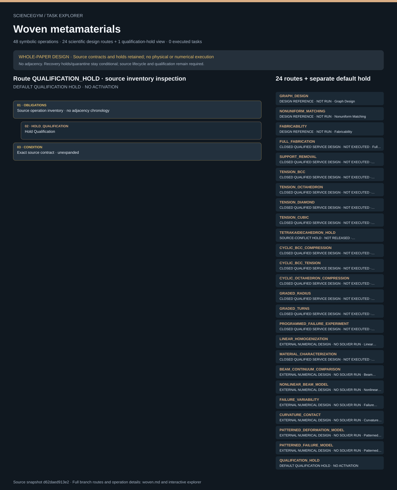

# Woven metamaterials: task route map



Paper: **Design framework for programmable three-dimensional woven metamaterials** · [DOI](https://doi.org/10.1038/s41467-026-68298-3)

Whole-paper DESIGN coverage only; not scientific reproduction or a runnable environment. Read-only author/evaluator reference; no actor projection, hardware control, scientific solver or execution. Source reverse-index memberships are unordered inventories, not chronology or performed operations. HOLD_* and QUARANTINE entries remain conditional recovery, never mandatory successful steps. WHOLE-PAPER DESIGN, NOT REPRODUCTION. The 24 scientific design routes and 48 symbolic operations cover design scope whose source suite reports 96 synthetic contract configurations, with 11 static scene groups and 43 symbolic anchors; none is a physical trial, qualified device, source-exact CAD or scientific result. Default QUALIFICATION_HOLD is a separate inspection record, not a 25th scientific route. Eleven source conflicts and twelve required input gates remain unresolved or scope-controlled. Tetrakaidecahedron remains held without blocking unaffected topologies. Physical and numerical pattern maps, failure variables and geometry contexts cannot substitute for one another. Plasma/coating relative order requires an external order card; source partial order is preserved. Full fabrication versus independently prepared intake keep distinct lineage and preparation credit. Mount, calibration, control, sample and attempt revisions require independent current evidence; requests are never observations. BCC compression, BCC tension and octahedron compression cycles remain distinct. Signed closed-cycle loss differs from loading work and is not made positive with absolute value. Unknown isolation stays contained; damage is quarantined. All hazardous work stays inside closed externally qualified services, none implemented. Complete written main/SI design coverage does not mean videos were played or workbook values inspected. Only source agent_visible.json is actor context; this public inspector includes evaluator-only material and is not actor-safe.. Counts describe task representation, not experiments or success.

**Reading rule:** rows show unordered source inventory for inspection. Exact phase, lifecycle and dependency contracts remain authoritative; no loop, specimen, condition or chronology is inferred. An unordered obligation group has no inferred chronological edges. Source-reported scientific facts and authored handling are distinct.

[Immutable source task package](https://github.com/openags/ScienceGym/blob/d62daed913e2ea04f0b7b0a0f20de9f6d42b7df6/tasks/woven_material_operations_v2/) · [Interactive inspector](../index.html)

## GRAPH_DESIGN — DESIGN REFERENCE · NOT RUN · Graph Design

Whole-paper DESIGN coverage only; not scientific reproduction or a runnable environment. Read-only author/evaluator reference; no actor projection, hardware control, scientific solver or execution. Source reverse-index memberships are unordered inventories, not chronology or performed operations. HOLD_* and QUARANTINE entries remain conditional recovery, never mandatory successful steps.

[Exact route source](https://github.com/openags/ScienceGym/blob/d62daed913e2ea04f0b7b0a0f20de9f6d42b7df6/tasks/woven_material_operations_v2/branches.json) · JSON pointer: `/branches/0`

- **OBLIGATIONS: Source operation inventory · no adjacency chronology**
  - Binding: {"order":"Whole-paper DESIGN coverage only; not scientific reproduction or a runnable environment. Read-only author/evaluator reference; no actor projection, hardware control, scientific solver or execution. Source reverse-index memberships are unordered inventories, not chronology or performed operations. HOLD_* and QUARANTINE entries remain conditional recovery, never mandatory successful steps.","membership_source":"Exact reverse index of operations.json /operations/*/branch_ids; source design_sequence remains distinct"}
  - `ARCHIVE` Archive
  - `CLEAN_STORE` Clean Store
  - `DECLARE_DESIGN` Declare Design
  - `FREEZE_GRAPH` Freeze Graph
  - `HOLD_GEOMETRY` Hold Geometry
  - `HOLD_QUALIFICATION` Hold Qualification
  - `REGISTER_INPUTS` Register Inputs
  - `RELEASE_DESIGN` Release Design
  - `VERIFY_FABRICABILITY` Verify Fabricability
- **CONDITION: Exact source contract · unexpanded**
  - Binding: {"source_file":"branches.json","source_pointer":"/branches/0","source_contract":{"id":"GRAPH_DESIGN","execution_class":"design_only","source_evidence_ids":["M008","M012","M013","SI_N1","SI_F1","SI_F2"],"required_inputs":["Original topology graph","constant node-graph degree","common chirality","rational turns and reviewed centerlines"],"design_sequence":["Declare beam topology","construct compatible nodal connectivity","freeze continuity and units"],"required_outputs":["Immutable branch-bound design/data record with provenance, uncertainty and missing inputs"],"interpretation_limit":"No author code or CAD is executed; illustrative mesh does not establish geometry","design_covered":true,"physical_executed":false,"numerical_executed":false}}
- **CONDITION: Exact lifecycle principles · qualification and safe release remain required**
  - Binding: {"source_file":"lifecycle_contract.json","source_pointer":"","source_contract":{"schema_version":"woven_material_task.v1","default":"QUALIFICATION_HOLD","stage_principles":["Requests separate from independent observations","Frozen qualified upstream state before service","Same-sample/attempt lineage mandatory","Support branch uses source partial order plus external order card","Physical and model data remain separate","Verified safe release before undock","Unknown isolation contained; damage quarantined","Prepared route earns no fabrication credit"],"terminal_states":["CLOSED_SYNTHETIC","QUARANTINED_SYNTHETIC","HELD_CONTAINED"],"physical_execution":false}}

<details><summary>Branch state, choices, lineage and loop obligations</summary>

```json
{
  "id": "GRAPH_DESIGN",
  "execution_class": "design_only",
  "source_evidence_ids": [
    "M008",
    "M012",
    "M013",
    "SI_N1",
    "SI_F1",
    "SI_F2"
  ],
  "required_inputs": [
    "Original topology graph",
    "constant node-graph degree",
    "common chirality",
    "rational turns and reviewed centerlines"
  ],
  "design_sequence": [
    "Declare beam topology",
    "construct compatible nodal connectivity",
    "freeze continuity and units"
  ],
  "required_outputs": [
    "Immutable branch-bound design/data record with provenance, uncertainty and missing inputs"
  ],
  "interpretation_limit": "No author code or CAD is executed; illustrative mesh does not establish geometry",
  "design_covered": true,
  "physical_executed": false,
  "numerical_executed": false
}
```

</details>

## NONUNIFORM_MATCHING — DESIGN REFERENCE · NOT RUN · Nonuniform Matching

Whole-paper DESIGN coverage only; not scientific reproduction or a runnable environment. Read-only author/evaluator reference; no actor projection, hardware control, scientific solver or execution. Source reverse-index memberships are unordered inventories, not chronology or performed operations. HOLD_* and QUARANTINE entries remain conditional recovery, never mandatory successful steps.

[Exact route source](https://github.com/openags/ScienceGym/blob/d62daed913e2ea04f0b7b0a0f20de9f6d42b7df6/tasks/woven_material_operations_v2/branches.json) · JSON pointer: `/branches/1`

- **OBLIGATIONS: Source operation inventory · no adjacency chronology**
  - Binding: {"order":"Whole-paper DESIGN coverage only; not scientific reproduction or a runnable environment. Read-only author/evaluator reference; no actor projection, hardware control, scientific solver or execution. Source reverse-index memberships are unordered inventories, not chronology or performed operations. HOLD_* and QUARANTINE entries remain conditional recovery, never mandatory successful steps.","membership_source":"Exact reverse index of operations.json /operations/*/branch_ids; source design_sequence remains distinct"}
  - `ARCHIVE` Archive
  - `CLEAN_STORE` Clean Store
  - `DECLARE_DESIGN` Declare Design
  - `FREEZE_GRAPH` Freeze Graph
  - `HOLD_GEOMETRY` Hold Geometry
  - `HOLD_QUALIFICATION` Hold Qualification
  - `REGISTER_INPUTS` Register Inputs
  - `RELEASE_DESIGN` Release Design
  - `VERIFY_FABRICABILITY` Verify Fabricability
- **CONDITION: Exact source contract · unexpanded**
  - Binding: {"source_file":"branches.json","source_pointer":"/branches/1","source_contract":{"id":"NONUNIFORM_MATCHING","execution_class":"design_only","source_evidence_ids":["M014","SI_N2","SI_F3","SI_F5"],"required_inputs":["Per-beam radius/turn map","node-clearance certificate","explicit reviewed strand adjacency"],"design_sequence":["Accommodate neighboring radii","verify tangent continuity and noncrossing","hold unresolved modular algorithm"],"required_outputs":["Immutable branch-bound design/data record with provenance, uncertainty and missing inputs"],"interpretation_limit":"SI F5 modular arithmetic conflicts with examples; no silently repaired rule","design_covered":true,"physical_executed":false,"numerical_executed":false}}
- **CONDITION: Exact lifecycle principles · qualification and safe release remain required**
  - Binding: {"source_file":"lifecycle_contract.json","source_pointer":"","source_contract":{"schema_version":"woven_material_task.v1","default":"QUALIFICATION_HOLD","stage_principles":["Requests separate from independent observations","Frozen qualified upstream state before service","Same-sample/attempt lineage mandatory","Support branch uses source partial order plus external order card","Physical and model data remain separate","Verified safe release before undock","Unknown isolation contained; damage quarantined","Prepared route earns no fabrication credit"],"terminal_states":["CLOSED_SYNTHETIC","QUARANTINED_SYNTHETIC","HELD_CONTAINED"],"physical_execution":false}}

<details><summary>Branch state, choices, lineage and loop obligations</summary>

```json
{
  "id": "NONUNIFORM_MATCHING",
  "execution_class": "design_only",
  "source_evidence_ids": [
    "M014",
    "SI_N2",
    "SI_F3",
    "SI_F5"
  ],
  "required_inputs": [
    "Per-beam radius/turn map",
    "node-clearance certificate",
    "explicit reviewed strand adjacency"
  ],
  "design_sequence": [
    "Accommodate neighboring radii",
    "verify tangent continuity and noncrossing",
    "hold unresolved modular algorithm"
  ],
  "required_outputs": [
    "Immutable branch-bound design/data record with provenance, uncertainty and missing inputs"
  ],
  "interpretation_limit": "SI F5 modular arithmetic conflicts with examples; no silently repaired rule",
  "design_covered": true,
  "physical_executed": false,
  "numerical_executed": false
}
```

</details>

## FABRICABILITY — DESIGN REFERENCE · NOT RUN · Fabricability

Whole-paper DESIGN coverage only; not scientific reproduction or a runnable environment. Read-only author/evaluator reference; no actor projection, hardware control, scientific solver or execution. Source reverse-index memberships are unordered inventories, not chronology or performed operations. HOLD_* and QUARANTINE entries remain conditional recovery, never mandatory successful steps.

[Exact route source](https://github.com/openags/ScienceGym/blob/d62daed913e2ea04f0b7b0a0f20de9f6d42b7df6/tasks/woven_material_operations_v2/branches.json) · JSON pointer: `/branches/2`

- **OBLIGATIONS: Source operation inventory · no adjacency chronology**
  - Binding: {"order":"Whole-paper DESIGN coverage only; not scientific reproduction or a runnable environment. Read-only author/evaluator reference; no actor projection, hardware control, scientific solver or execution. Source reverse-index memberships are unordered inventories, not chronology or performed operations. HOLD_* and QUARANTINE entries remain conditional recovery, never mandatory successful steps.","membership_source":"Exact reverse index of operations.json /operations/*/branch_ids; source design_sequence remains distinct"}
  - `ARCHIVE` Archive
  - `CLEAN_STORE` Clean Store
  - `DECLARE_DESIGN` Declare Design
  - `FREEZE_GRAPH` Freeze Graph
  - `HOLD_GEOMETRY` Hold Geometry
  - `HOLD_QUALIFICATION` Hold Qualification
  - `REGISTER_INPUTS` Register Inputs
  - `RELEASE_DESIGN` Release Design
  - `VERIFY_FABRICABILITY` Verify Fabricability
- **CONDITION: Exact source contract · unexpanded**
  - Binding: {"source_file":"branches.json","source_pointer":"/branches/2","source_contract":{"id":"FABRICABILITY","execution_class":"design_only","source_evidence_ids":["M013","M049","SI_F4"],"required_inputs":["Source-independent released fabrication CAD","qualified process resolution","clearance checks and external acceptance tolerances"],"design_sequence":["Validate geometry","validate source-specific manufacturability","release or hold"],"required_outputs":["Immutable branch-bound design/data record with provenance, uncertainty and missing inputs"],"interpretation_limit":"Figure examples and loose separation heuristic are not universal acceptance thresholds","design_covered":true,"physical_executed":false,"numerical_executed":false}}
- **CONDITION: Exact lifecycle principles · qualification and safe release remain required**
  - Binding: {"source_file":"lifecycle_contract.json","source_pointer":"","source_contract":{"schema_version":"woven_material_task.v1","default":"QUALIFICATION_HOLD","stage_principles":["Requests separate from independent observations","Frozen qualified upstream state before service","Same-sample/attempt lineage mandatory","Support branch uses source partial order plus external order card","Physical and model data remain separate","Verified safe release before undock","Unknown isolation contained; damage quarantined","Prepared route earns no fabrication credit"],"terminal_states":["CLOSED_SYNTHETIC","QUARANTINED_SYNTHETIC","HELD_CONTAINED"],"physical_execution":false}}

<details><summary>Branch state, choices, lineage and loop obligations</summary>

```json
{
  "id": "FABRICABILITY",
  "execution_class": "design_only",
  "source_evidence_ids": [
    "M013",
    "M049",
    "SI_F4"
  ],
  "required_inputs": [
    "Source-independent released fabrication CAD",
    "qualified process resolution",
    "clearance checks and external acceptance tolerances"
  ],
  "design_sequence": [
    "Validate geometry",
    "validate source-specific manufacturability",
    "release or hold"
  ],
  "required_outputs": [
    "Immutable branch-bound design/data record with provenance, uncertainty and missing inputs"
  ],
  "interpretation_limit": "Figure examples and loose separation heuristic are not universal acceptance thresholds",
  "design_covered": true,
  "physical_executed": false,
  "numerical_executed": false
}
```

</details>

## FULL_FABRICATION — CLOSED QUALIFIED SERVICE DESIGN · NOT EXECUTED · Full Fabrication

Whole-paper DESIGN coverage only; not scientific reproduction or a runnable environment. Read-only author/evaluator reference; no actor projection, hardware control, scientific solver or execution. Source reverse-index memberships are unordered inventories, not chronology or performed operations. HOLD_* and QUARANTINE entries remain conditional recovery, never mandatory successful steps.

[Exact route source](https://github.com/openags/ScienceGym/blob/d62daed913e2ea04f0b7b0a0f20de9f6d42b7df6/tasks/woven_material_operations_v2/branches.json) · JSON pointer: `/branches/3`

- **OBLIGATIONS: Source operation inventory · no adjacency chronology**
  - Binding: {"order":"Whole-paper DESIGN coverage only; not scientific reproduction or a runnable environment. Read-only author/evaluator reference; no actor projection, hardware control, scientific solver or execution. Source reverse-index memberships are unordered inventories, not chronology or performed operations. HOLD_* and QUARANTINE entries remain conditional recovery, never mandatory successful steps.","membership_source":"Exact reverse index of operations.json /operations/*/branch_ids; source design_sequence remains distinct"}
  - `ACQUIRE_TEST_DATA` Acquire Test Data
  - `ANALYZE_TENSION` Analyze Tension
  - `ARCHIVE` Archive
  - `CLEAN_STORE` Clean Store
  - `COMPARE_RESPONSE` Compare Response
  - `DECLARE_DESIGN` Declare Design
  - `DOCK_SAMPLE` Dock Sample
  - `FREEZE_GRAPH` Freeze Graph
  - `FREEZE_TEST_PLAN` Freeze Test Plan
  - `HOLD_CALIBRATION` Hold Calibration
  - `HOLD_DATA` Hold Data
  - `HOLD_GEOMETRY` Hold Geometry
  - `HOLD_ISOLATION` Hold Isolation
  - `HOLD_QUALIFICATION` Hold Qualification
  - `INSPECT_SAMPLE` Inspect Sample
  - `QUARANTINE` Quarantine
  - `RECEIVE_SAMPLE` Receive Sample
  - `REGISTER_INPUTS` Register Inputs
  - `RELEASE_DESIGN` Release Design
  - `REQUEST_COATING` Request Coating
  - `REQUEST_CPD` Request Cpd
  - `REQUEST_DEVELOP_RINSE` Request Develop Rinse
  - `REQUEST_PRINT` Request Print
  - `REQUEST_SAFE_OFF` Request Safe Off
  - `REQUEST_TENSION` Request Tension
  - `UNDOCK_SAMPLE` Undock Sample
  - `VALIDATE_DATA` Validate Data
  - `VERIFY_CALIBRATION` Verify Calibration
  - `VERIFY_COATING` Verify Coating
  - `VERIFY_CPD` Verify Cpd
  - `VERIFY_DEVELOP_RINSE` Verify Develop Rinse
  - `VERIFY_FABRICABILITY` Verify Fabricability
  - `VERIFY_INTERLOCK` Verify Interlock
  - `VERIFY_MOUNT` Verify Mount
  - `VERIFY_PRINT` Verify Print
  - `VERIFY_QUALIFICATION` Verify Qualification
  - `VERIFY_SAFE_OFF` Verify Safe Off
- **CONDITION: Exact source contract · unexpanded**
  - Binding: {"source_file":"branches.json","source_pointer":"/branches/3","source_contract":{"id":"FULL_FABRICATION","execution_class":"closed_qualified_service","source_evidence_ids":["M051","SI_F10"],"required_inputs":["Released geometry/material lot","silicon substrate identity","qualified hazard services"],"design_sequence":["Request/verify print","request/verify development and rinse","request/verify CPD","request/verify coating"],"required_outputs":["Immutable branch-bound design/data record with provenance, uncertainty and missing inputs"],"interpretation_limit":"No laser, solvent, pressure or coating hardware adapter","design_covered":true,"physical_executed":false,"numerical_executed":false}}
- **CONDITION: Exact lifecycle principles · qualification and safe release remain required**
  - Binding: {"source_file":"lifecycle_contract.json","source_pointer":"","source_contract":{"schema_version":"woven_material_task.v1","default":"QUALIFICATION_HOLD","stage_principles":["Requests separate from independent observations","Frozen qualified upstream state before service","Same-sample/attempt lineage mandatory","Support branch uses source partial order plus external order card","Physical and model data remain separate","Verified safe release before undock","Unknown isolation contained; damage quarantined","Prepared route earns no fabrication credit"],"terminal_states":["CLOSED_SYNTHETIC","QUARANTINED_SYNTHETIC","HELD_CONTAINED"],"physical_execution":false}}

<details><summary>Branch state, choices, lineage and loop obligations</summary>

```json
{
  "id": "FULL_FABRICATION",
  "execution_class": "closed_qualified_service",
  "source_evidence_ids": [
    "M051",
    "SI_F10"
  ],
  "required_inputs": [
    "Released geometry/material lot",
    "silicon substrate identity",
    "qualified hazard services"
  ],
  "design_sequence": [
    "Request/verify print",
    "request/verify development and rinse",
    "request/verify CPD",
    "request/verify coating"
  ],
  "required_outputs": [
    "Immutable branch-bound design/data record with provenance, uncertainty and missing inputs"
  ],
  "interpretation_limit": "No laser, solvent, pressure or coating hardware adapter",
  "design_covered": true,
  "physical_executed": false,
  "numerical_executed": false
}
```

</details>

## SUPPORT_REMOVAL — CLOSED QUALIFIED SERVICE DESIGN · NOT EXECUTED · Support Removal

Whole-paper DESIGN coverage only; not scientific reproduction or a runnable environment. Read-only author/evaluator reference; no actor projection, hardware control, scientific solver or execution. Source reverse-index memberships are unordered inventories, not chronology or performed operations. HOLD_* and QUARANTINE entries remain conditional recovery, never mandatory successful steps.

[Exact route source](https://github.com/openags/ScienceGym/blob/d62daed913e2ea04f0b7b0a0f20de9f6d42b7df6/tasks/woven_material_operations_v2/branches.json) · JSON pointer: `/branches/4`

- **OBLIGATIONS: Source operation inventory · no adjacency chronology**
  - Binding: {"order":"Whole-paper DESIGN coverage only; not scientific reproduction or a runnable environment. Read-only author/evaluator reference; no actor projection, hardware control, scientific solver or execution. Source reverse-index memberships are unordered inventories, not chronology or performed operations. HOLD_* and QUARANTINE entries remain conditional recovery, never mandatory successful steps.","membership_source":"Exact reverse index of operations.json /operations/*/branch_ids; source design_sequence remains distinct"}
  - `ACQUIRE_TEST_DATA` Acquire Test Data
  - `ANALYZE_TENSION` Analyze Tension
  - `ARCHIVE` Archive
  - `CLEAN_STORE` Clean Store
  - `COMPARE_RESPONSE` Compare Response
  - `DECLARE_DESIGN` Declare Design
  - `DOCK_SAMPLE` Dock Sample
  - `FREEZE_GRAPH` Freeze Graph
  - `FREEZE_TEST_PLAN` Freeze Test Plan
  - `HOLD_CALIBRATION` Hold Calibration
  - `HOLD_DATA` Hold Data
  - `HOLD_GEOMETRY` Hold Geometry
  - `HOLD_ISOLATION` Hold Isolation
  - `HOLD_QUALIFICATION` Hold Qualification
  - `INSPECT_SAMPLE` Inspect Sample
  - `QUARANTINE` Quarantine
  - `RECEIVE_SAMPLE` Receive Sample
  - `REGISTER_INPUTS` Register Inputs
  - `RELEASE_DESIGN` Release Design
  - `REQUEST_COATING` Request Coating
  - `REQUEST_CPD` Request Cpd
  - `REQUEST_DEVELOP_RINSE` Request Develop Rinse
  - `REQUEST_PRINT` Request Print
  - `REQUEST_SAFE_OFF` Request Safe Off
  - `REQUEST_SUPPORT_REMOVAL` Request Support Removal
  - `REQUEST_TENSION` Request Tension
  - `UNDOCK_SAMPLE` Undock Sample
  - `VALIDATE_DATA` Validate Data
  - `VERIFY_CALIBRATION` Verify Calibration
  - `VERIFY_COATING` Verify Coating
  - `VERIFY_CPD` Verify Cpd
  - `VERIFY_DEVELOP_RINSE` Verify Develop Rinse
  - `VERIFY_FABRICABILITY` Verify Fabricability
  - `VERIFY_INTERLOCK` Verify Interlock
  - `VERIFY_MOUNT` Verify Mount
  - `VERIFY_PRINT` Verify Print
  - `VERIFY_QUALIFICATION` Verify Qualification
  - `VERIFY_SAFE_OFF` Verify Safe Off
  - `VERIFY_SUPPORT_REMOVAL` Verify Support Removal
- **CONDITION: Exact source contract · unexpanded**
  - Binding: {"source_file":"branches.json","source_pointer":"/branches/4","source_contract":{"id":"SUPPORT_REMOVAL","execution_class":"closed_qualified_service","source_evidence_ids":["SI_N5","M043","SI_F16"],"required_inputs":["Co-printed simple-cubic scaffold","developed/dried specimen","qualified plasma service","external plasma/coating order card"],"design_sequence":["Co-print scaffold into base and fixture","verify development and CPD","request removal","independently inspect removal"],"required_outputs":["Immutable branch-bound design/data record with provenance, uncertainty and missing inputs"],"interpretation_limit":"Source does not establish plasma/coating relative order; patterned axes remain unresolved","design_covered":true,"physical_executed":false,"numerical_executed":false}}
- **CONDITION: Exact lifecycle principles · qualification and safe release remain required**
  - Binding: {"source_file":"lifecycle_contract.json","source_pointer":"","source_contract":{"schema_version":"woven_material_task.v1","default":"QUALIFICATION_HOLD","stage_principles":["Requests separate from independent observations","Frozen qualified upstream state before service","Same-sample/attempt lineage mandatory","Support branch uses source partial order plus external order card","Physical and model data remain separate","Verified safe release before undock","Unknown isolation contained; damage quarantined","Prepared route earns no fabrication credit"],"terminal_states":["CLOSED_SYNTHETIC","QUARANTINED_SYNTHETIC","HELD_CONTAINED"],"physical_execution":false}}

<details><summary>Branch state, choices, lineage and loop obligations</summary>

```json
{
  "id": "SUPPORT_REMOVAL",
  "execution_class": "closed_qualified_service",
  "source_evidence_ids": [
    "SI_N5",
    "M043",
    "SI_F16"
  ],
  "required_inputs": [
    "Co-printed simple-cubic scaffold",
    "developed/dried specimen",
    "qualified plasma service",
    "external plasma/coating order card"
  ],
  "design_sequence": [
    "Co-print scaffold into base and fixture",
    "verify development and CPD",
    "request removal",
    "independently inspect removal"
  ],
  "required_outputs": [
    "Immutable branch-bound design/data record with provenance, uncertainty and missing inputs"
  ],
  "interpretation_limit": "Source does not establish plasma/coating relative order; patterned axes remain unresolved",
  "design_covered": true,
  "physical_executed": false,
  "numerical_executed": false
}
```

</details>

## TENSION_BCC — CLOSED QUALIFIED SERVICE DESIGN · NOT EXECUTED · Tension Bcc

Whole-paper DESIGN coverage only; not scientific reproduction or a runnable environment. Read-only author/evaluator reference; no actor projection, hardware control, scientific solver or execution. Source reverse-index memberships are unordered inventories, not chronology or performed operations. HOLD_* and QUARANTINE entries remain conditional recovery, never mandatory successful steps.

[Exact route source](https://github.com/openags/ScienceGym/blob/d62daed913e2ea04f0b7b0a0f20de9f6d42b7df6/tasks/woven_material_operations_v2/branches.json) · JSON pointer: `/branches/5`

- **OBLIGATIONS: Source operation inventory · no adjacency chronology**
  - Binding: {"order":"Whole-paper DESIGN coverage only; not scientific reproduction or a runnable environment. Read-only author/evaluator reference; no actor projection, hardware control, scientific solver or execution. Source reverse-index memberships are unordered inventories, not chronology or performed operations. HOLD_* and QUARANTINE entries remain conditional recovery, never mandatory successful steps.","membership_source":"Exact reverse index of operations.json /operations/*/branch_ids; source design_sequence remains distinct"}
  - `ACQUIRE_TEST_DATA` Acquire Test Data
  - `ANALYZE_TENSION` Analyze Tension
  - `ARCHIVE` Archive
  - `CLEAN_STORE` Clean Store
  - `COMPARE_RESPONSE` Compare Response
  - `DECLARE_DESIGN` Declare Design
  - `DOCK_SAMPLE` Dock Sample
  - `FREEZE_GRAPH` Freeze Graph
  - `FREEZE_TEST_PLAN` Freeze Test Plan
  - `HOLD_CALIBRATION` Hold Calibration
  - `HOLD_DATA` Hold Data
  - `HOLD_GEOMETRY` Hold Geometry
  - `HOLD_ISOLATION` Hold Isolation
  - `HOLD_QUALIFICATION` Hold Qualification
  - `INSPECT_SAMPLE` Inspect Sample
  - `QUARANTINE` Quarantine
  - `RECEIVE_SAMPLE` Receive Sample
  - `REGISTER_INPUTS` Register Inputs
  - `RELEASE_DESIGN` Release Design
  - `REQUEST_COATING` Request Coating
  - `REQUEST_CPD` Request Cpd
  - `REQUEST_DEVELOP_RINSE` Request Develop Rinse
  - `REQUEST_PRINT` Request Print
  - `REQUEST_SAFE_OFF` Request Safe Off
  - `REQUEST_TENSION` Request Tension
  - `UNDOCK_SAMPLE` Undock Sample
  - `VALIDATE_DATA` Validate Data
  - `VERIFY_CALIBRATION` Verify Calibration
  - `VERIFY_COATING` Verify Coating
  - `VERIFY_CPD` Verify Cpd
  - `VERIFY_DEVELOP_RINSE` Verify Develop Rinse
  - `VERIFY_FABRICABILITY` Verify Fabricability
  - `VERIFY_INTERLOCK` Verify Interlock
  - `VERIFY_MOUNT` Verify Mount
  - `VERIFY_PRINT` Verify Print
  - `VERIFY_QUALIFICATION` Verify Qualification
  - `VERIFY_SAFE_OFF` Verify Safe Off
- **CONDITION: Exact source contract · unexpanded**
  - Binding: {"source_file":"branches.json","source_pointer":"/branches/5","source_contract":{"id":"TENSION_BCC","execution_class":"closed_qualified_service","source_evidence_ids":["M023","M024","M027","M028","M052","SI_F10"],"required_inputs":["Identified inspected coated specimen","current mount and nominal geometry","force/displacement/time/image calibration","approved endpoint/limits"],"design_sequence":["Dock carrier","verify mount/interlocks","freeze plan","request tension","acquire synchronized observations","reduce nominal stress/stretch","safe release and archive"],"required_outputs":["Immutable branch-bound design/data record with provenance, uncertainty and missing inputs"],"interpretation_limit":"Source curves, peaks, stretch and energy never constitute pass thresholds","design_covered":true,"physical_executed":false,"numerical_executed":false}}
- **CONDITION: Exact lifecycle principles · qualification and safe release remain required**
  - Binding: {"source_file":"lifecycle_contract.json","source_pointer":"","source_contract":{"schema_version":"woven_material_task.v1","default":"QUALIFICATION_HOLD","stage_principles":["Requests separate from independent observations","Frozen qualified upstream state before service","Same-sample/attempt lineage mandatory","Support branch uses source partial order plus external order card","Physical and model data remain separate","Verified safe release before undock","Unknown isolation contained; damage quarantined","Prepared route earns no fabrication credit"],"terminal_states":["CLOSED_SYNTHETIC","QUARANTINED_SYNTHETIC","HELD_CONTAINED"],"physical_execution":false}}

<details><summary>Branch state, choices, lineage and loop obligations</summary>

```json
{
  "id": "TENSION_BCC",
  "execution_class": "closed_qualified_service",
  "source_evidence_ids": [
    "M023",
    "M024",
    "M027",
    "M028",
    "M052",
    "SI_F10"
  ],
  "required_inputs": [
    "Identified inspected coated specimen",
    "current mount and nominal geometry",
    "force/displacement/time/image calibration",
    "approved endpoint/limits"
  ],
  "design_sequence": [
    "Dock carrier",
    "verify mount/interlocks",
    "freeze plan",
    "request tension",
    "acquire synchronized observations",
    "reduce nominal stress/stretch",
    "safe release and archive"
  ],
  "required_outputs": [
    "Immutable branch-bound design/data record with provenance, uncertainty and missing inputs"
  ],
  "interpretation_limit": "Source curves, peaks, stretch and energy never constitute pass thresholds",
  "design_covered": true,
  "physical_executed": false,
  "numerical_executed": false
}
```

</details>

## TENSION_OCTAHEDRON — CLOSED QUALIFIED SERVICE DESIGN · NOT EXECUTED · Tension Octahedron

Whole-paper DESIGN coverage only; not scientific reproduction or a runnable environment. Read-only author/evaluator reference; no actor projection, hardware control, scientific solver or execution. Source reverse-index memberships are unordered inventories, not chronology or performed operations. HOLD_* and QUARANTINE entries remain conditional recovery, never mandatory successful steps.

[Exact route source](https://github.com/openags/ScienceGym/blob/d62daed913e2ea04f0b7b0a0f20de9f6d42b7df6/tasks/woven_material_operations_v2/branches.json) · JSON pointer: `/branches/6`

- **OBLIGATIONS: Source operation inventory · no adjacency chronology**
  - Binding: {"order":"Whole-paper DESIGN coverage only; not scientific reproduction or a runnable environment. Read-only author/evaluator reference; no actor projection, hardware control, scientific solver or execution. Source reverse-index memberships are unordered inventories, not chronology or performed operations. HOLD_* and QUARANTINE entries remain conditional recovery, never mandatory successful steps.","membership_source":"Exact reverse index of operations.json /operations/*/branch_ids; source design_sequence remains distinct"}
  - `ACQUIRE_TEST_DATA` Acquire Test Data
  - `ANALYZE_TENSION` Analyze Tension
  - `ARCHIVE` Archive
  - `CLEAN_STORE` Clean Store
  - `COMPARE_RESPONSE` Compare Response
  - `DECLARE_DESIGN` Declare Design
  - `DOCK_SAMPLE` Dock Sample
  - `FREEZE_GRAPH` Freeze Graph
  - `FREEZE_TEST_PLAN` Freeze Test Plan
  - `HOLD_CALIBRATION` Hold Calibration
  - `HOLD_DATA` Hold Data
  - `HOLD_GEOMETRY` Hold Geometry
  - `HOLD_ISOLATION` Hold Isolation
  - `HOLD_QUALIFICATION` Hold Qualification
  - `INSPECT_SAMPLE` Inspect Sample
  - `QUARANTINE` Quarantine
  - `RECEIVE_SAMPLE` Receive Sample
  - `REGISTER_INPUTS` Register Inputs
  - `RELEASE_DESIGN` Release Design
  - `REQUEST_COATING` Request Coating
  - `REQUEST_CPD` Request Cpd
  - `REQUEST_DEVELOP_RINSE` Request Develop Rinse
  - `REQUEST_PRINT` Request Print
  - `REQUEST_SAFE_OFF` Request Safe Off
  - `REQUEST_TENSION` Request Tension
  - `UNDOCK_SAMPLE` Undock Sample
  - `VALIDATE_DATA` Validate Data
  - `VERIFY_CALIBRATION` Verify Calibration
  - `VERIFY_COATING` Verify Coating
  - `VERIFY_CPD` Verify Cpd
  - `VERIFY_DEVELOP_RINSE` Verify Develop Rinse
  - `VERIFY_FABRICABILITY` Verify Fabricability
  - `VERIFY_INTERLOCK` Verify Interlock
  - `VERIFY_MOUNT` Verify Mount
  - `VERIFY_PRINT` Verify Print
  - `VERIFY_QUALIFICATION` Verify Qualification
  - `VERIFY_SAFE_OFF` Verify Safe Off
- **CONDITION: Exact source contract · unexpanded**
  - Binding: {"source_file":"branches.json","source_pointer":"/branches/6","source_contract":{"id":"TENSION_OCTAHEDRON","execution_class":"closed_qualified_service","source_evidence_ids":["M024","M028","M052","SI_F10"],"required_inputs":["Identified inspected coated specimen","current mount and nominal geometry","force/displacement/time/image calibration","approved endpoint/limits"],"design_sequence":["Dock carrier","verify mount/interlocks","freeze plan","request tension","acquire synchronized observations","reduce nominal stress/stretch","safe release and archive"],"required_outputs":["Immutable branch-bound design/data record with provenance, uncertainty and missing inputs"],"interpretation_limit":"Source curves, peaks, stretch and energy never constitute pass thresholds","design_covered":true,"physical_executed":false,"numerical_executed":false}}
- **CONDITION: Exact lifecycle principles · qualification and safe release remain required**
  - Binding: {"source_file":"lifecycle_contract.json","source_pointer":"","source_contract":{"schema_version":"woven_material_task.v1","default":"QUALIFICATION_HOLD","stage_principles":["Requests separate from independent observations","Frozen qualified upstream state before service","Same-sample/attempt lineage mandatory","Support branch uses source partial order plus external order card","Physical and model data remain separate","Verified safe release before undock","Unknown isolation contained; damage quarantined","Prepared route earns no fabrication credit"],"terminal_states":["CLOSED_SYNTHETIC","QUARANTINED_SYNTHETIC","HELD_CONTAINED"],"physical_execution":false}}

<details><summary>Branch state, choices, lineage and loop obligations</summary>

```json
{
  "id": "TENSION_OCTAHEDRON",
  "execution_class": "closed_qualified_service",
  "source_evidence_ids": [
    "M024",
    "M028",
    "M052",
    "SI_F10"
  ],
  "required_inputs": [
    "Identified inspected coated specimen",
    "current mount and nominal geometry",
    "force/displacement/time/image calibration",
    "approved endpoint/limits"
  ],
  "design_sequence": [
    "Dock carrier",
    "verify mount/interlocks",
    "freeze plan",
    "request tension",
    "acquire synchronized observations",
    "reduce nominal stress/stretch",
    "safe release and archive"
  ],
  "required_outputs": [
    "Immutable branch-bound design/data record with provenance, uncertainty and missing inputs"
  ],
  "interpretation_limit": "Source curves, peaks, stretch and energy never constitute pass thresholds",
  "design_covered": true,
  "physical_executed": false,
  "numerical_executed": false
}
```

</details>

## TENSION_DIAMOND — CLOSED QUALIFIED SERVICE DESIGN · NOT EXECUTED · Tension Diamond

Whole-paper DESIGN coverage only; not scientific reproduction or a runnable environment. Read-only author/evaluator reference; no actor projection, hardware control, scientific solver or execution. Source reverse-index memberships are unordered inventories, not chronology or performed operations. HOLD_* and QUARANTINE entries remain conditional recovery, never mandatory successful steps.

[Exact route source](https://github.com/openags/ScienceGym/blob/d62daed913e2ea04f0b7b0a0f20de9f6d42b7df6/tasks/woven_material_operations_v2/branches.json) · JSON pointer: `/branches/7`

- **OBLIGATIONS: Source operation inventory · no adjacency chronology**
  - Binding: {"order":"Whole-paper DESIGN coverage only; not scientific reproduction or a runnable environment. Read-only author/evaluator reference; no actor projection, hardware control, scientific solver or execution. Source reverse-index memberships are unordered inventories, not chronology or performed operations. HOLD_* and QUARANTINE entries remain conditional recovery, never mandatory successful steps.","membership_source":"Exact reverse index of operations.json /operations/*/branch_ids; source design_sequence remains distinct"}
  - `ACQUIRE_TEST_DATA` Acquire Test Data
  - `ANALYZE_TENSION` Analyze Tension
  - `ARCHIVE` Archive
  - `CLEAN_STORE` Clean Store
  - `COMPARE_RESPONSE` Compare Response
  - `DECLARE_DESIGN` Declare Design
  - `DOCK_SAMPLE` Dock Sample
  - `FREEZE_GRAPH` Freeze Graph
  - `FREEZE_TEST_PLAN` Freeze Test Plan
  - `HOLD_CALIBRATION` Hold Calibration
  - `HOLD_DATA` Hold Data
  - `HOLD_GEOMETRY` Hold Geometry
  - `HOLD_ISOLATION` Hold Isolation
  - `HOLD_QUALIFICATION` Hold Qualification
  - `INSPECT_SAMPLE` Inspect Sample
  - `QUARANTINE` Quarantine
  - `RECEIVE_SAMPLE` Receive Sample
  - `REGISTER_INPUTS` Register Inputs
  - `RELEASE_DESIGN` Release Design
  - `REQUEST_COATING` Request Coating
  - `REQUEST_CPD` Request Cpd
  - `REQUEST_DEVELOP_RINSE` Request Develop Rinse
  - `REQUEST_PRINT` Request Print
  - `REQUEST_SAFE_OFF` Request Safe Off
  - `REQUEST_TENSION` Request Tension
  - `UNDOCK_SAMPLE` Undock Sample
  - `VALIDATE_DATA` Validate Data
  - `VERIFY_CALIBRATION` Verify Calibration
  - `VERIFY_COATING` Verify Coating
  - `VERIFY_CPD` Verify Cpd
  - `VERIFY_DEVELOP_RINSE` Verify Develop Rinse
  - `VERIFY_FABRICABILITY` Verify Fabricability
  - `VERIFY_INTERLOCK` Verify Interlock
  - `VERIFY_MOUNT` Verify Mount
  - `VERIFY_PRINT` Verify Print
  - `VERIFY_QUALIFICATION` Verify Qualification
  - `VERIFY_SAFE_OFF` Verify Safe Off
- **CONDITION: Exact source contract · unexpanded**
  - Binding: {"source_file":"branches.json","source_pointer":"/branches/7","source_contract":{"id":"TENSION_DIAMOND","execution_class":"closed_qualified_service","source_evidence_ids":["M024","M028","M052","SI_F10"],"required_inputs":["Identified inspected coated specimen","current mount and nominal geometry","force/displacement/time/image calibration","approved endpoint/limits"],"design_sequence":["Dock carrier","verify mount/interlocks","freeze plan","request tension","acquire synchronized observations","reduce nominal stress/stretch","safe release and archive"],"required_outputs":["Immutable branch-bound design/data record with provenance, uncertainty and missing inputs"],"interpretation_limit":"Source curves, peaks, stretch and energy never constitute pass thresholds","design_covered":true,"physical_executed":false,"numerical_executed":false}}
- **CONDITION: Exact lifecycle principles · qualification and safe release remain required**
  - Binding: {"source_file":"lifecycle_contract.json","source_pointer":"","source_contract":{"schema_version":"woven_material_task.v1","default":"QUALIFICATION_HOLD","stage_principles":["Requests separate from independent observations","Frozen qualified upstream state before service","Same-sample/attempt lineage mandatory","Support branch uses source partial order plus external order card","Physical and model data remain separate","Verified safe release before undock","Unknown isolation contained; damage quarantined","Prepared route earns no fabrication credit"],"terminal_states":["CLOSED_SYNTHETIC","QUARANTINED_SYNTHETIC","HELD_CONTAINED"],"physical_execution":false}}

<details><summary>Branch state, choices, lineage and loop obligations</summary>

```json
{
  "id": "TENSION_DIAMOND",
  "execution_class": "closed_qualified_service",
  "source_evidence_ids": [
    "M024",
    "M028",
    "M052",
    "SI_F10"
  ],
  "required_inputs": [
    "Identified inspected coated specimen",
    "current mount and nominal geometry",
    "force/displacement/time/image calibration",
    "approved endpoint/limits"
  ],
  "design_sequence": [
    "Dock carrier",
    "verify mount/interlocks",
    "freeze plan",
    "request tension",
    "acquire synchronized observations",
    "reduce nominal stress/stretch",
    "safe release and archive"
  ],
  "required_outputs": [
    "Immutable branch-bound design/data record with provenance, uncertainty and missing inputs"
  ],
  "interpretation_limit": "Source curves, peaks, stretch and energy never constitute pass thresholds",
  "design_covered": true,
  "physical_executed": false,
  "numerical_executed": false
}
```

</details>

## TENSION_CUBIC — CLOSED QUALIFIED SERVICE DESIGN · NOT EXECUTED · Tension Cubic

Whole-paper DESIGN coverage only; not scientific reproduction or a runnable environment. Read-only author/evaluator reference; no actor projection, hardware control, scientific solver or execution. Source reverse-index memberships are unordered inventories, not chronology or performed operations. HOLD_* and QUARANTINE entries remain conditional recovery, never mandatory successful steps.

[Exact route source](https://github.com/openags/ScienceGym/blob/d62daed913e2ea04f0b7b0a0f20de9f6d42b7df6/tasks/woven_material_operations_v2/branches.json) · JSON pointer: `/branches/8`

- **OBLIGATIONS: Source operation inventory · no adjacency chronology**
  - Binding: {"order":"Whole-paper DESIGN coverage only; not scientific reproduction or a runnable environment. Read-only author/evaluator reference; no actor projection, hardware control, scientific solver or execution. Source reverse-index memberships are unordered inventories, not chronology or performed operations. HOLD_* and QUARANTINE entries remain conditional recovery, never mandatory successful steps.","membership_source":"Exact reverse index of operations.json /operations/*/branch_ids; source design_sequence remains distinct"}
  - `ACQUIRE_TEST_DATA` Acquire Test Data
  - `ANALYZE_TENSION` Analyze Tension
  - `ARCHIVE` Archive
  - `CLEAN_STORE` Clean Store
  - `COMPARE_RESPONSE` Compare Response
  - `DECLARE_DESIGN` Declare Design
  - `DOCK_SAMPLE` Dock Sample
  - `FREEZE_GRAPH` Freeze Graph
  - `FREEZE_TEST_PLAN` Freeze Test Plan
  - `HOLD_CALIBRATION` Hold Calibration
  - `HOLD_DATA` Hold Data
  - `HOLD_GEOMETRY` Hold Geometry
  - `HOLD_ISOLATION` Hold Isolation
  - `HOLD_QUALIFICATION` Hold Qualification
  - `INSPECT_SAMPLE` Inspect Sample
  - `QUARANTINE` Quarantine
  - `RECEIVE_SAMPLE` Receive Sample
  - `REGISTER_INPUTS` Register Inputs
  - `RELEASE_DESIGN` Release Design
  - `REQUEST_COATING` Request Coating
  - `REQUEST_CPD` Request Cpd
  - `REQUEST_DEVELOP_RINSE` Request Develop Rinse
  - `REQUEST_PRINT` Request Print
  - `REQUEST_SAFE_OFF` Request Safe Off
  - `REQUEST_TENSION` Request Tension
  - `UNDOCK_SAMPLE` Undock Sample
  - `VALIDATE_DATA` Validate Data
  - `VERIFY_CALIBRATION` Verify Calibration
  - `VERIFY_COATING` Verify Coating
  - `VERIFY_CPD` Verify Cpd
  - `VERIFY_DEVELOP_RINSE` Verify Develop Rinse
  - `VERIFY_FABRICABILITY` Verify Fabricability
  - `VERIFY_INTERLOCK` Verify Interlock
  - `VERIFY_MOUNT` Verify Mount
  - `VERIFY_PRINT` Verify Print
  - `VERIFY_QUALIFICATION` Verify Qualification
  - `VERIFY_SAFE_OFF` Verify Safe Off
- **CONDITION: Exact source contract · unexpanded**
  - Binding: {"source_file":"branches.json","source_pointer":"/branches/8","source_contract":{"id":"TENSION_CUBIC","execution_class":"closed_qualified_service","source_evidence_ids":["SI_F11","M052","SI_F10"],"required_inputs":["Identified inspected coated specimen","current mount and nominal geometry","force/displacement/time/image calibration","approved endpoint/limits"],"design_sequence":["Dock carrier","verify mount/interlocks","freeze plan","request tension","acquire synchronized observations","reduce nominal stress/stretch","safe release and archive"],"required_outputs":["Immutable branch-bound design/data record with provenance, uncertainty and missing inputs"],"interpretation_limit":"Source curves, peaks, stretch and energy never constitute pass thresholds","design_covered":true,"physical_executed":false,"numerical_executed":false}}
- **CONDITION: Exact lifecycle principles · qualification and safe release remain required**
  - Binding: {"source_file":"lifecycle_contract.json","source_pointer":"","source_contract":{"schema_version":"woven_material_task.v1","default":"QUALIFICATION_HOLD","stage_principles":["Requests separate from independent observations","Frozen qualified upstream state before service","Same-sample/attempt lineage mandatory","Support branch uses source partial order plus external order card","Physical and model data remain separate","Verified safe release before undock","Unknown isolation contained; damage quarantined","Prepared route earns no fabrication credit"],"terminal_states":["CLOSED_SYNTHETIC","QUARANTINED_SYNTHETIC","HELD_CONTAINED"],"physical_execution":false}}

<details><summary>Branch state, choices, lineage and loop obligations</summary>

```json
{
  "id": "TENSION_CUBIC",
  "execution_class": "closed_qualified_service",
  "source_evidence_ids": [
    "SI_F11",
    "M052",
    "SI_F10"
  ],
  "required_inputs": [
    "Identified inspected coated specimen",
    "current mount and nominal geometry",
    "force/displacement/time/image calibration",
    "approved endpoint/limits"
  ],
  "design_sequence": [
    "Dock carrier",
    "verify mount/interlocks",
    "freeze plan",
    "request tension",
    "acquire synchronized observations",
    "reduce nominal stress/stretch",
    "safe release and archive"
  ],
  "required_outputs": [
    "Immutable branch-bound design/data record with provenance, uncertainty and missing inputs"
  ],
  "interpretation_limit": "Source curves, peaks, stretch and energy never constitute pass thresholds",
  "design_covered": true,
  "physical_executed": false,
  "numerical_executed": false
}
```

</details>

## TETRAKAIDECAHEDRON_HOLD — SOURCE-CONFLICT HOLD · NOT RELEASED · Tetrakaidecahedron Hold

Whole-paper DESIGN coverage only; not scientific reproduction or a runnable environment. Read-only author/evaluator reference; no actor projection, hardware control, scientific solver or execution. Source reverse-index memberships are unordered inventories, not chronology or performed operations. HOLD_* and QUARANTINE entries remain conditional recovery, never mandatory successful steps.

[Exact route source](https://github.com/openags/ScienceGym/blob/d62daed913e2ea04f0b7b0a0f20de9f6d42b7df6/tasks/woven_material_operations_v2/branches.json) · JSON pointer: `/branches/9`

- **OBLIGATIONS: Source operation inventory · no adjacency chronology**
  - Binding: {"order":"Whole-paper DESIGN coverage only; not scientific reproduction or a runnable environment. Read-only author/evaluator reference; no actor projection, hardware control, scientific solver or execution. Source reverse-index memberships are unordered inventories, not chronology or performed operations. HOLD_* and QUARANTINE entries remain conditional recovery, never mandatory successful steps.","membership_source":"Exact reverse index of operations.json /operations/*/branch_ids; source design_sequence remains distinct"}
  - `ARCHIVE` Archive
  - `CLEAN_STORE` Clean Store
  - `DECLARE_DESIGN` Declare Design
  - `FREEZE_GRAPH` Freeze Graph
  - `HOLD_GEOMETRY` Hold Geometry
  - `HOLD_QUALIFICATION` Hold Qualification
  - `REGISTER_INPUTS` Register Inputs
  - `RELEASE_DESIGN` Release Design
  - `VERIFY_FABRICABILITY` Verify Fabricability
- **CONDITION: Exact source contract · unexpanded**
  - Binding: {"source_file":"branches.json","source_pointer":"/branches/9","source_contract":{"id":"TETRAKAIDECAHEDRON_HOLD","execution_class":"conflict_hold","source_evidence_ids":["M049","SI_F2","M017"],"required_inputs":["Authoritative strand-count resolution","new geometry release"],"design_sequence":["Retain three-versus-four strand conflict","hold affected topology"],"required_outputs":["Immutable branch-bound design/data record with provenance, uncertainty and missing inputs"],"interpretation_limit":"Do not choose a count or spread this hold to BCC/cubic","design_covered":true,"physical_executed":false,"numerical_executed":false}}
- **CONDITION: Exact lifecycle principles · qualification and safe release remain required**
  - Binding: {"source_file":"lifecycle_contract.json","source_pointer":"","source_contract":{"schema_version":"woven_material_task.v1","default":"QUALIFICATION_HOLD","stage_principles":["Requests separate from independent observations","Frozen qualified upstream state before service","Same-sample/attempt lineage mandatory","Support branch uses source partial order plus external order card","Physical and model data remain separate","Verified safe release before undock","Unknown isolation contained; damage quarantined","Prepared route earns no fabrication credit"],"terminal_states":["CLOSED_SYNTHETIC","QUARANTINED_SYNTHETIC","HELD_CONTAINED"],"physical_execution":false}}

<details><summary>Branch state, choices, lineage and loop obligations</summary>

```json
{
  "id": "TETRAKAIDECAHEDRON_HOLD",
  "execution_class": "conflict_hold",
  "source_evidence_ids": [
    "M049",
    "SI_F2",
    "M017"
  ],
  "required_inputs": [
    "Authoritative strand-count resolution",
    "new geometry release"
  ],
  "design_sequence": [
    "Retain three-versus-four strand conflict",
    "hold affected topology"
  ],
  "required_outputs": [
    "Immutable branch-bound design/data record with provenance, uncertainty and missing inputs"
  ],
  "interpretation_limit": "Do not choose a count or spread this hold to BCC/cubic",
  "design_covered": true,
  "physical_executed": false,
  "numerical_executed": false
}
```

</details>

## CYCLIC_BCC_COMPRESSION — CLOSED QUALIFIED SERVICE DESIGN · NOT EXECUTED · Cyclic Bcc Compression

Whole-paper DESIGN coverage only; not scientific reproduction or a runnable environment. Read-only author/evaluator reference; no actor projection, hardware control, scientific solver or execution. Source reverse-index memberships are unordered inventories, not chronology or performed operations. HOLD_* and QUARANTINE entries remain conditional recovery, never mandatory successful steps.

[Exact route source](https://github.com/openags/ScienceGym/blob/d62daed913e2ea04f0b7b0a0f20de9f6d42b7df6/tasks/woven_material_operations_v2/branches.json) · JSON pointer: `/branches/10`

- **OBLIGATIONS: Source operation inventory · no adjacency chronology**
  - Binding: {"order":"Whole-paper DESIGN coverage only; not scientific reproduction or a runnable environment. Read-only author/evaluator reference; no actor projection, hardware control, scientific solver or execution. Source reverse-index memberships are unordered inventories, not chronology or performed operations. HOLD_* and QUARANTINE entries remain conditional recovery, never mandatory successful steps.","membership_source":"Exact reverse index of operations.json /operations/*/branch_ids; source design_sequence remains distinct"}
  - `ACQUIRE_TEST_DATA` Acquire Test Data
  - `ANALYZE_CYCLES` Analyze Cycles
  - `ARCHIVE` Archive
  - `CLEAN_STORE` Clean Store
  - `COMPARE_RESPONSE` Compare Response
  - `DECLARE_DESIGN` Declare Design
  - `DOCK_SAMPLE` Dock Sample
  - `FREEZE_GRAPH` Freeze Graph
  - `FREEZE_TEST_PLAN` Freeze Test Plan
  - `HOLD_CALIBRATION` Hold Calibration
  - `HOLD_DATA` Hold Data
  - `HOLD_GEOMETRY` Hold Geometry
  - `HOLD_ISOLATION` Hold Isolation
  - `HOLD_QUALIFICATION` Hold Qualification
  - `INSPECT_SAMPLE` Inspect Sample
  - `QUARANTINE` Quarantine
  - `RECEIVE_SAMPLE` Receive Sample
  - `REGISTER_INPUTS` Register Inputs
  - `RELEASE_DESIGN` Release Design
  - `REQUEST_COATING` Request Coating
  - `REQUEST_CPD` Request Cpd
  - `REQUEST_CYCLIC` Request Cyclic
  - `REQUEST_DEVELOP_RINSE` Request Develop Rinse
  - `REQUEST_PRINT` Request Print
  - `REQUEST_SAFE_OFF` Request Safe Off
  - `UNDOCK_SAMPLE` Undock Sample
  - `VALIDATE_DATA` Validate Data
  - `VERIFY_CALIBRATION` Verify Calibration
  - `VERIFY_COATING` Verify Coating
  - `VERIFY_CPD` Verify Cpd
  - `VERIFY_DEVELOP_RINSE` Verify Develop Rinse
  - `VERIFY_FABRICABILITY` Verify Fabricability
  - `VERIFY_INTERLOCK` Verify Interlock
  - `VERIFY_MOUNT` Verify Mount
  - `VERIFY_PRINT` Verify Print
  - `VERIFY_QUALIFICATION` Verify Qualification
  - `VERIFY_SAFE_OFF` Verify Safe Off
- **CONDITION: Exact source contract · unexpanded**
  - Binding: {"source_file":"branches.json","source_pointer":"/branches/10","source_contract":{"id":"CYCLIC_BCC_COMPRESSION","execution_class":"closed_qualified_service","source_evidence_ids":["SI_N3","SI_F8"],"required_inputs":["Identified direction-specific specimen","approved waveform/limits","calibration","external cycle segmentation and closure tolerance"],"design_sequence":["Acquire signed loading/unloading cycles","validate loop closure","report loss and first-cycle normalization"],"required_outputs":["Immutable branch-bound design/data record with provenance, uncertainty and missing inputs"],"interpretation_limit":"Reported ten cycles to15percent is context, not universal safe envelope; compression/tension remain distinct","design_covered":true,"physical_executed":false,"numerical_executed":false}}
- **CONDITION: Exact lifecycle principles · qualification and safe release remain required**
  - Binding: {"source_file":"lifecycle_contract.json","source_pointer":"","source_contract":{"schema_version":"woven_material_task.v1","default":"QUALIFICATION_HOLD","stage_principles":["Requests separate from independent observations","Frozen qualified upstream state before service","Same-sample/attempt lineage mandatory","Support branch uses source partial order plus external order card","Physical and model data remain separate","Verified safe release before undock","Unknown isolation contained; damage quarantined","Prepared route earns no fabrication credit"],"terminal_states":["CLOSED_SYNTHETIC","QUARANTINED_SYNTHETIC","HELD_CONTAINED"],"physical_execution":false}}

<details><summary>Branch state, choices, lineage and loop obligations</summary>

```json
{
  "id": "CYCLIC_BCC_COMPRESSION",
  "execution_class": "closed_qualified_service",
  "source_evidence_ids": [
    "SI_N3",
    "SI_F8"
  ],
  "required_inputs": [
    "Identified direction-specific specimen",
    "approved waveform/limits",
    "calibration",
    "external cycle segmentation and closure tolerance"
  ],
  "design_sequence": [
    "Acquire signed loading/unloading cycles",
    "validate loop closure",
    "report loss and first-cycle normalization"
  ],
  "required_outputs": [
    "Immutable branch-bound design/data record with provenance, uncertainty and missing inputs"
  ],
  "interpretation_limit": "Reported ten cycles to15percent is context, not universal safe envelope; compression/tension remain distinct",
  "design_covered": true,
  "physical_executed": false,
  "numerical_executed": false
}
```

</details>

## CYCLIC_BCC_TENSION — CLOSED QUALIFIED SERVICE DESIGN · NOT EXECUTED · Cyclic Bcc Tension

Whole-paper DESIGN coverage only; not scientific reproduction or a runnable environment. Read-only author/evaluator reference; no actor projection, hardware control, scientific solver or execution. Source reverse-index memberships are unordered inventories, not chronology or performed operations. HOLD_* and QUARANTINE entries remain conditional recovery, never mandatory successful steps.

[Exact route source](https://github.com/openags/ScienceGym/blob/d62daed913e2ea04f0b7b0a0f20de9f6d42b7df6/tasks/woven_material_operations_v2/branches.json) · JSON pointer: `/branches/11`

- **OBLIGATIONS: Source operation inventory · no adjacency chronology**
  - Binding: {"order":"Whole-paper DESIGN coverage only; not scientific reproduction or a runnable environment. Read-only author/evaluator reference; no actor projection, hardware control, scientific solver or execution. Source reverse-index memberships are unordered inventories, not chronology or performed operations. HOLD_* and QUARANTINE entries remain conditional recovery, never mandatory successful steps.","membership_source":"Exact reverse index of operations.json /operations/*/branch_ids; source design_sequence remains distinct"}
  - `ACQUIRE_TEST_DATA` Acquire Test Data
  - `ANALYZE_CYCLES` Analyze Cycles
  - `ARCHIVE` Archive
  - `CLEAN_STORE` Clean Store
  - `COMPARE_RESPONSE` Compare Response
  - `DECLARE_DESIGN` Declare Design
  - `DOCK_SAMPLE` Dock Sample
  - `FREEZE_GRAPH` Freeze Graph
  - `FREEZE_TEST_PLAN` Freeze Test Plan
  - `HOLD_CALIBRATION` Hold Calibration
  - `HOLD_DATA` Hold Data
  - `HOLD_GEOMETRY` Hold Geometry
  - `HOLD_ISOLATION` Hold Isolation
  - `HOLD_QUALIFICATION` Hold Qualification
  - `INSPECT_SAMPLE` Inspect Sample
  - `QUARANTINE` Quarantine
  - `RECEIVE_SAMPLE` Receive Sample
  - `REGISTER_INPUTS` Register Inputs
  - `RELEASE_DESIGN` Release Design
  - `REQUEST_COATING` Request Coating
  - `REQUEST_CPD` Request Cpd
  - `REQUEST_CYCLIC` Request Cyclic
  - `REQUEST_DEVELOP_RINSE` Request Develop Rinse
  - `REQUEST_PRINT` Request Print
  - `REQUEST_SAFE_OFF` Request Safe Off
  - `UNDOCK_SAMPLE` Undock Sample
  - `VALIDATE_DATA` Validate Data
  - `VERIFY_CALIBRATION` Verify Calibration
  - `VERIFY_COATING` Verify Coating
  - `VERIFY_CPD` Verify Cpd
  - `VERIFY_DEVELOP_RINSE` Verify Develop Rinse
  - `VERIFY_FABRICABILITY` Verify Fabricability
  - `VERIFY_INTERLOCK` Verify Interlock
  - `VERIFY_MOUNT` Verify Mount
  - `VERIFY_PRINT` Verify Print
  - `VERIFY_QUALIFICATION` Verify Qualification
  - `VERIFY_SAFE_OFF` Verify Safe Off
- **CONDITION: Exact source contract · unexpanded**
  - Binding: {"source_file":"branches.json","source_pointer":"/branches/11","source_contract":{"id":"CYCLIC_BCC_TENSION","execution_class":"closed_qualified_service","source_evidence_ids":["SI_N3","SI_F8"],"required_inputs":["Identified direction-specific specimen","approved waveform/limits","calibration","external cycle segmentation and closure tolerance"],"design_sequence":["Acquire signed loading/unloading cycles","validate loop closure","report loss and first-cycle normalization"],"required_outputs":["Immutable branch-bound design/data record with provenance, uncertainty and missing inputs"],"interpretation_limit":"Reported ten cycles to15percent is context, not universal safe envelope; compression/tension remain distinct","design_covered":true,"physical_executed":false,"numerical_executed":false}}
- **CONDITION: Exact lifecycle principles · qualification and safe release remain required**
  - Binding: {"source_file":"lifecycle_contract.json","source_pointer":"","source_contract":{"schema_version":"woven_material_task.v1","default":"QUALIFICATION_HOLD","stage_principles":["Requests separate from independent observations","Frozen qualified upstream state before service","Same-sample/attempt lineage mandatory","Support branch uses source partial order plus external order card","Physical and model data remain separate","Verified safe release before undock","Unknown isolation contained; damage quarantined","Prepared route earns no fabrication credit"],"terminal_states":["CLOSED_SYNTHETIC","QUARANTINED_SYNTHETIC","HELD_CONTAINED"],"physical_execution":false}}

<details><summary>Branch state, choices, lineage and loop obligations</summary>

```json
{
  "id": "CYCLIC_BCC_TENSION",
  "execution_class": "closed_qualified_service",
  "source_evidence_ids": [
    "SI_N3",
    "SI_F8"
  ],
  "required_inputs": [
    "Identified direction-specific specimen",
    "approved waveform/limits",
    "calibration",
    "external cycle segmentation and closure tolerance"
  ],
  "design_sequence": [
    "Acquire signed loading/unloading cycles",
    "validate loop closure",
    "report loss and first-cycle normalization"
  ],
  "required_outputs": [
    "Immutable branch-bound design/data record with provenance, uncertainty and missing inputs"
  ],
  "interpretation_limit": "Reported ten cycles to15percent is context, not universal safe envelope; compression/tension remain distinct",
  "design_covered": true,
  "physical_executed": false,
  "numerical_executed": false
}
```

</details>

## CYCLIC_OCTAHEDRON_COMPRESSION — CLOSED QUALIFIED SERVICE DESIGN · NOT EXECUTED · Cyclic Octahedron Compression

Whole-paper DESIGN coverage only; not scientific reproduction or a runnable environment. Read-only author/evaluator reference; no actor projection, hardware control, scientific solver or execution. Source reverse-index memberships are unordered inventories, not chronology or performed operations. HOLD_* and QUARANTINE entries remain conditional recovery, never mandatory successful steps.

[Exact route source](https://github.com/openags/ScienceGym/blob/d62daed913e2ea04f0b7b0a0f20de9f6d42b7df6/tasks/woven_material_operations_v2/branches.json) · JSON pointer: `/branches/12`

- **OBLIGATIONS: Source operation inventory · no adjacency chronology**
  - Binding: {"order":"Whole-paper DESIGN coverage only; not scientific reproduction or a runnable environment. Read-only author/evaluator reference; no actor projection, hardware control, scientific solver or execution. Source reverse-index memberships are unordered inventories, not chronology or performed operations. HOLD_* and QUARANTINE entries remain conditional recovery, never mandatory successful steps.","membership_source":"Exact reverse index of operations.json /operations/*/branch_ids; source design_sequence remains distinct"}
  - `ACQUIRE_TEST_DATA` Acquire Test Data
  - `ANALYZE_CYCLES` Analyze Cycles
  - `ARCHIVE` Archive
  - `CLEAN_STORE` Clean Store
  - `COMPARE_RESPONSE` Compare Response
  - `DECLARE_DESIGN` Declare Design
  - `DOCK_SAMPLE` Dock Sample
  - `FREEZE_GRAPH` Freeze Graph
  - `FREEZE_TEST_PLAN` Freeze Test Plan
  - `HOLD_CALIBRATION` Hold Calibration
  - `HOLD_DATA` Hold Data
  - `HOLD_GEOMETRY` Hold Geometry
  - `HOLD_ISOLATION` Hold Isolation
  - `HOLD_QUALIFICATION` Hold Qualification
  - `INSPECT_SAMPLE` Inspect Sample
  - `QUARANTINE` Quarantine
  - `RECEIVE_SAMPLE` Receive Sample
  - `REGISTER_INPUTS` Register Inputs
  - `RELEASE_DESIGN` Release Design
  - `REQUEST_COATING` Request Coating
  - `REQUEST_CPD` Request Cpd
  - `REQUEST_CYCLIC` Request Cyclic
  - `REQUEST_DEVELOP_RINSE` Request Develop Rinse
  - `REQUEST_PRINT` Request Print
  - `REQUEST_SAFE_OFF` Request Safe Off
  - `UNDOCK_SAMPLE` Undock Sample
  - `VALIDATE_DATA` Validate Data
  - `VERIFY_CALIBRATION` Verify Calibration
  - `VERIFY_COATING` Verify Coating
  - `VERIFY_CPD` Verify Cpd
  - `VERIFY_DEVELOP_RINSE` Verify Develop Rinse
  - `VERIFY_FABRICABILITY` Verify Fabricability
  - `VERIFY_INTERLOCK` Verify Interlock
  - `VERIFY_MOUNT` Verify Mount
  - `VERIFY_PRINT` Verify Print
  - `VERIFY_QUALIFICATION` Verify Qualification
  - `VERIFY_SAFE_OFF` Verify Safe Off
- **CONDITION: Exact source contract · unexpanded**
  - Binding: {"source_file":"branches.json","source_pointer":"/branches/12","source_contract":{"id":"CYCLIC_OCTAHEDRON_COMPRESSION","execution_class":"closed_qualified_service","source_evidence_ids":["SI_N3","SI_F8"],"required_inputs":["Identified direction-specific specimen","approved waveform/limits","calibration","external cycle segmentation and closure tolerance"],"design_sequence":["Acquire signed loading/unloading cycles","validate loop closure","report loss and first-cycle normalization"],"required_outputs":["Immutable branch-bound design/data record with provenance, uncertainty and missing inputs"],"interpretation_limit":"Reported ten cycles to15percent is context, not universal safe envelope; compression/tension remain distinct","design_covered":true,"physical_executed":false,"numerical_executed":false}}
- **CONDITION: Exact lifecycle principles · qualification and safe release remain required**
  - Binding: {"source_file":"lifecycle_contract.json","source_pointer":"","source_contract":{"schema_version":"woven_material_task.v1","default":"QUALIFICATION_HOLD","stage_principles":["Requests separate from independent observations","Frozen qualified upstream state before service","Same-sample/attempt lineage mandatory","Support branch uses source partial order plus external order card","Physical and model data remain separate","Verified safe release before undock","Unknown isolation contained; damage quarantined","Prepared route earns no fabrication credit"],"terminal_states":["CLOSED_SYNTHETIC","QUARANTINED_SYNTHETIC","HELD_CONTAINED"],"physical_execution":false}}

<details><summary>Branch state, choices, lineage and loop obligations</summary>

```json
{
  "id": "CYCLIC_OCTAHEDRON_COMPRESSION",
  "execution_class": "closed_qualified_service",
  "source_evidence_ids": [
    "SI_N3",
    "SI_F8"
  ],
  "required_inputs": [
    "Identified direction-specific specimen",
    "approved waveform/limits",
    "calibration",
    "external cycle segmentation and closure tolerance"
  ],
  "design_sequence": [
    "Acquire signed loading/unloading cycles",
    "validate loop closure",
    "report loss and first-cycle normalization"
  ],
  "required_outputs": [
    "Immutable branch-bound design/data record with provenance, uncertainty and missing inputs"
  ],
  "interpretation_limit": "Reported ten cycles to15percent is context, not universal safe envelope; compression/tension remain distinct",
  "design_covered": true,
  "physical_executed": false,
  "numerical_executed": false
}
```

</details>

## GRADED_RADIUS — CLOSED QUALIFIED SERVICE DESIGN · NOT EXECUTED · Graded Radius

Whole-paper DESIGN coverage only; not scientific reproduction or a runnable environment. Read-only author/evaluator reference; no actor projection, hardware control, scientific solver or execution. Source reverse-index memberships are unordered inventories, not chronology or performed operations. HOLD_* and QUARANTINE entries remain conditional recovery, never mandatory successful steps.

[Exact route source](https://github.com/openags/ScienceGym/blob/d62daed913e2ea04f0b7b0a0f20de9f6d42b7df6/tasks/woven_material_operations_v2/branches.json) · JSON pointer: `/branches/13`

- **OBLIGATIONS: Source operation inventory · no adjacency chronology**
  - Binding: {"order":"Whole-paper DESIGN coverage only; not scientific reproduction or a runnable environment. Read-only author/evaluator reference; no actor projection, hardware control, scientific solver or execution. Source reverse-index memberships are unordered inventories, not chronology or performed operations. HOLD_* and QUARANTINE entries remain conditional recovery, never mandatory successful steps.","membership_source":"Exact reverse index of operations.json /operations/*/branch_ids; source design_sequence remains distinct"}
  - `ACQUIRE_TEST_DATA` Acquire Test Data
  - `ANALYZE_TENSION` Analyze Tension
  - `ARCHIVE` Archive
  - `CLEAN_STORE` Clean Store
  - `COMPARE_RESPONSE` Compare Response
  - `DECLARE_DESIGN` Declare Design
  - `DOCK_SAMPLE` Dock Sample
  - `FREEZE_GRAPH` Freeze Graph
  - `FREEZE_TEST_PLAN` Freeze Test Plan
  - `HOLD_CALIBRATION` Hold Calibration
  - `HOLD_DATA` Hold Data
  - `HOLD_GEOMETRY` Hold Geometry
  - `HOLD_ISOLATION` Hold Isolation
  - `HOLD_QUALIFICATION` Hold Qualification
  - `INSPECT_SAMPLE` Inspect Sample
  - `QUARANTINE` Quarantine
  - `RECEIVE_SAMPLE` Receive Sample
  - `REGISTER_INPUTS` Register Inputs
  - `RELEASE_DESIGN` Release Design
  - `REQUEST_COATING` Request Coating
  - `REQUEST_CPD` Request Cpd
  - `REQUEST_DEVELOP_RINSE` Request Develop Rinse
  - `REQUEST_PRINT` Request Print
  - `REQUEST_SAFE_OFF` Request Safe Off
  - `REQUEST_TENSION` Request Tension
  - `UNDOCK_SAMPLE` Undock Sample
  - `VALIDATE_DATA` Validate Data
  - `VERIFY_CALIBRATION` Verify Calibration
  - `VERIFY_COATING` Verify Coating
  - `VERIFY_CPD` Verify Cpd
  - `VERIFY_DEVELOP_RINSE` Verify Develop Rinse
  - `VERIFY_FABRICABILITY` Verify Fabricability
  - `VERIFY_INTERLOCK` Verify Interlock
  - `VERIFY_MOUNT` Verify Mount
  - `VERIFY_PRINT` Verify Print
  - `VERIFY_QUALIFICATION` Verify Qualification
  - `VERIFY_SAFE_OFF` Verify Safe Off
- **CONDITION: Exact source contract · unexpanded**
  - Binding: {"source_file":"branches.json","source_pointer":"/branches/13","source_contract":{"id":"GRADED_RADIUS","execution_class":"closed_qualified_service","source_evidence_ids":["SI_N4","SI_F9"],"required_inputs":["Spatial radius map and orientation","approved geometry","registered image regions"],"design_sequence":["Load along declared gradient","map local observations to design cells","report uncertainty"],"required_outputs":["Immutable branch-bound design/data record with provenance, uncertainty and missing inputs"],"interpretation_limit":"No invented deformation target or registration threshold","design_covered":true,"physical_executed":false,"numerical_executed":false}}
- **CONDITION: Exact lifecycle principles · qualification and safe release remain required**
  - Binding: {"source_file":"lifecycle_contract.json","source_pointer":"","source_contract":{"schema_version":"woven_material_task.v1","default":"QUALIFICATION_HOLD","stage_principles":["Requests separate from independent observations","Frozen qualified upstream state before service","Same-sample/attempt lineage mandatory","Support branch uses source partial order plus external order card","Physical and model data remain separate","Verified safe release before undock","Unknown isolation contained; damage quarantined","Prepared route earns no fabrication credit"],"terminal_states":["CLOSED_SYNTHETIC","QUARANTINED_SYNTHETIC","HELD_CONTAINED"],"physical_execution":false}}

<details><summary>Branch state, choices, lineage and loop obligations</summary>

```json
{
  "id": "GRADED_RADIUS",
  "execution_class": "closed_qualified_service",
  "source_evidence_ids": [
    "SI_N4",
    "SI_F9"
  ],
  "required_inputs": [
    "Spatial radius map and orientation",
    "approved geometry",
    "registered image regions"
  ],
  "design_sequence": [
    "Load along declared gradient",
    "map local observations to design cells",
    "report uncertainty"
  ],
  "required_outputs": [
    "Immutable branch-bound design/data record with provenance, uncertainty and missing inputs"
  ],
  "interpretation_limit": "No invented deformation target or registration threshold",
  "design_covered": true,
  "physical_executed": false,
  "numerical_executed": false
}
```

</details>

## GRADED_TURNS — CLOSED QUALIFIED SERVICE DESIGN · NOT EXECUTED · Graded Turns

Whole-paper DESIGN coverage only; not scientific reproduction or a runnable environment. Read-only author/evaluator reference; no actor projection, hardware control, scientific solver or execution. Source reverse-index memberships are unordered inventories, not chronology or performed operations. HOLD_* and QUARANTINE entries remain conditional recovery, never mandatory successful steps.

[Exact route source](https://github.com/openags/ScienceGym/blob/d62daed913e2ea04f0b7b0a0f20de9f6d42b7df6/tasks/woven_material_operations_v2/branches.json) · JSON pointer: `/branches/14`

- **OBLIGATIONS: Source operation inventory · no adjacency chronology**
  - Binding: {"order":"Whole-paper DESIGN coverage only; not scientific reproduction or a runnable environment. Read-only author/evaluator reference; no actor projection, hardware control, scientific solver or execution. Source reverse-index memberships are unordered inventories, not chronology or performed operations. HOLD_* and QUARANTINE entries remain conditional recovery, never mandatory successful steps.","membership_source":"Exact reverse index of operations.json /operations/*/branch_ids; source design_sequence remains distinct"}
  - `ACQUIRE_TEST_DATA` Acquire Test Data
  - `ANALYZE_TENSION` Analyze Tension
  - `ARCHIVE` Archive
  - `CLEAN_STORE` Clean Store
  - `COMPARE_RESPONSE` Compare Response
  - `DECLARE_DESIGN` Declare Design
  - `DOCK_SAMPLE` Dock Sample
  - `FREEZE_GRAPH` Freeze Graph
  - `FREEZE_TEST_PLAN` Freeze Test Plan
  - `HOLD_CALIBRATION` Hold Calibration
  - `HOLD_DATA` Hold Data
  - `HOLD_GEOMETRY` Hold Geometry
  - `HOLD_ISOLATION` Hold Isolation
  - `HOLD_QUALIFICATION` Hold Qualification
  - `INSPECT_SAMPLE` Inspect Sample
  - `QUARANTINE` Quarantine
  - `RECEIVE_SAMPLE` Receive Sample
  - `REGISTER_INPUTS` Register Inputs
  - `RELEASE_DESIGN` Release Design
  - `REQUEST_COATING` Request Coating
  - `REQUEST_CPD` Request Cpd
  - `REQUEST_DEVELOP_RINSE` Request Develop Rinse
  - `REQUEST_PRINT` Request Print
  - `REQUEST_SAFE_OFF` Request Safe Off
  - `REQUEST_TENSION` Request Tension
  - `UNDOCK_SAMPLE` Undock Sample
  - `VALIDATE_DATA` Validate Data
  - `VERIFY_CALIBRATION` Verify Calibration
  - `VERIFY_COATING` Verify Coating
  - `VERIFY_CPD` Verify Cpd
  - `VERIFY_DEVELOP_RINSE` Verify Develop Rinse
  - `VERIFY_FABRICABILITY` Verify Fabricability
  - `VERIFY_INTERLOCK` Verify Interlock
  - `VERIFY_MOUNT` Verify Mount
  - `VERIFY_PRINT` Verify Print
  - `VERIFY_QUALIFICATION` Verify Qualification
  - `VERIFY_SAFE_OFF` Verify Safe Off
- **CONDITION: Exact source contract · unexpanded**
  - Binding: {"source_file":"branches.json","source_pointer":"/branches/14","source_contract":{"id":"GRADED_TURNS","execution_class":"closed_qualified_service","source_evidence_ids":["SI_N4","SI_F9"],"required_inputs":["Cubic spatial turn map","gradient orientation","image calibration"],"design_sequence":["Freeze turn map","request qualified tension","compare local deformation"],"required_outputs":["Immutable branch-bound design/data record with provenance, uncertainty and missing inputs"],"interpretation_limit":"Source larger graded cubic example is distinct from uniform2x2x2; no corrected modular rule inferred","design_covered":true,"physical_executed":false,"numerical_executed":false}}
- **CONDITION: Exact lifecycle principles · qualification and safe release remain required**
  - Binding: {"source_file":"lifecycle_contract.json","source_pointer":"","source_contract":{"schema_version":"woven_material_task.v1","default":"QUALIFICATION_HOLD","stage_principles":["Requests separate from independent observations","Frozen qualified upstream state before service","Same-sample/attempt lineage mandatory","Support branch uses source partial order plus external order card","Physical and model data remain separate","Verified safe release before undock","Unknown isolation contained; damage quarantined","Prepared route earns no fabrication credit"],"terminal_states":["CLOSED_SYNTHETIC","QUARANTINED_SYNTHETIC","HELD_CONTAINED"],"physical_execution":false}}

<details><summary>Branch state, choices, lineage and loop obligations</summary>

```json
{
  "id": "GRADED_TURNS",
  "execution_class": "closed_qualified_service",
  "source_evidence_ids": [
    "SI_N4",
    "SI_F9"
  ],
  "required_inputs": [
    "Cubic spatial turn map",
    "gradient orientation",
    "image calibration"
  ],
  "design_sequence": [
    "Freeze turn map",
    "request qualified tension",
    "compare local deformation"
  ],
  "required_outputs": [
    "Immutable branch-bound design/data record with provenance, uncertainty and missing inputs"
  ],
  "interpretation_limit": "Source larger graded cubic example is distinct from uniform2x2x2; no corrected modular rule inferred",
  "design_covered": true,
  "physical_executed": false,
  "numerical_executed": false
}
```

</details>

## PROGRAMMED_FAILURE_EXPERIMENT — CLOSED QUALIFIED SERVICE DESIGN · NOT EXECUTED · Programmed Failure Experiment

Whole-paper DESIGN coverage only; not scientific reproduction or a runnable environment. Read-only author/evaluator reference; no actor projection, hardware control, scientific solver or execution. Source reverse-index memberships are unordered inventories, not chronology or performed operations. HOLD_* and QUARANTINE entries remain conditional recovery, never mandatory successful steps.

[Exact route source](https://github.com/openags/ScienceGym/blob/d62daed913e2ea04f0b7b0a0f20de9f6d42b7df6/tasks/woven_material_operations_v2/branches.json) · JSON pointer: `/branches/15`

- **OBLIGATIONS: Source operation inventory · no adjacency chronology**
  - Binding: {"order":"Whole-paper DESIGN coverage only; not scientific reproduction or a runnable environment. Read-only author/evaluator reference; no actor projection, hardware control, scientific solver or execution. Source reverse-index memberships are unordered inventories, not chronology or performed operations. HOLD_* and QUARANTINE entries remain conditional recovery, never mandatory successful steps.","membership_source":"Exact reverse index of operations.json /operations/*/branch_ids; source design_sequence remains distinct"}
  - `ACQUIRE_TEST_DATA` Acquire Test Data
  - `ANALYZE_TENSION` Analyze Tension
  - `ARCHIVE` Archive
  - `CLEAN_STORE` Clean Store
  - `COMPARE_RESPONSE` Compare Response
  - `DECLARE_DESIGN` Declare Design
  - `DOCK_SAMPLE` Dock Sample
  - `FREEZE_GRAPH` Freeze Graph
  - `FREEZE_TEST_PLAN` Freeze Test Plan
  - `HOLD_CALIBRATION` Hold Calibration
  - `HOLD_DATA` Hold Data
  - `HOLD_GEOMETRY` Hold Geometry
  - `HOLD_ISOLATION` Hold Isolation
  - `HOLD_QUALIFICATION` Hold Qualification
  - `INSPECT_SAMPLE` Inspect Sample
  - `QUARANTINE` Quarantine
  - `RECEIVE_SAMPLE` Receive Sample
  - `REGISTER_INPUTS` Register Inputs
  - `RELEASE_DESIGN` Release Design
  - `REQUEST_COATING` Request Coating
  - `REQUEST_CPD` Request Cpd
  - `REQUEST_DEVELOP_RINSE` Request Develop Rinse
  - `REQUEST_PRINT` Request Print
  - `REQUEST_SAFE_OFF` Request Safe Off
  - `REQUEST_SUPPORT_REMOVAL` Request Support Removal
  - `REQUEST_TENSION` Request Tension
  - `UNDOCK_SAMPLE` Undock Sample
  - `VALIDATE_DATA` Validate Data
  - `VERIFY_CALIBRATION` Verify Calibration
  - `VERIFY_COATING` Verify Coating
  - `VERIFY_CPD` Verify Cpd
  - `VERIFY_DEVELOP_RINSE` Verify Develop Rinse
  - `VERIFY_FABRICABILITY` Verify Fabricability
  - `VERIFY_INTERLOCK` Verify Interlock
  - `VERIFY_MOUNT` Verify Mount
  - `VERIFY_PRINT` Verify Print
  - `VERIFY_QUALIFICATION` Verify Qualification
  - `VERIFY_SAFE_OFF` Verify Safe Off
  - `VERIFY_SUPPORT_REMOVAL` Verify Support Removal
- **CONDITION: Exact source contract · unexpanded**
  - Binding: {"source_file":"branches.json","source_pointer":"/branches/15","source_contract":{"id":"PROGRAMMED_FAILURE_EXPERIMENT","execution_class":"closed_qualified_service","source_evidence_ids":["M043","M040","SI_N5","VIDEO5"],"required_inputs":["Independent physical pattern map","explicit axis map","support/coating order qualification","damage definition"],"design_sequence":["Preserve fabrication/support ancestry","acquire tension/images","separate initiation/coalescence/final failure"],"required_outputs":["Immutable branch-bound design/data record with provenance, uncertainty and missing inputs"],"interpretation_limit":"Main10x5x2 versus SI10x2x5 axes unresolved; physical Fig5c8/3 cannot inherit numerical7/3","design_covered":true,"physical_executed":false,"numerical_executed":false}}
- **CONDITION: Exact lifecycle principles · qualification and safe release remain required**
  - Binding: {"source_file":"lifecycle_contract.json","source_pointer":"","source_contract":{"schema_version":"woven_material_task.v1","default":"QUALIFICATION_HOLD","stage_principles":["Requests separate from independent observations","Frozen qualified upstream state before service","Same-sample/attempt lineage mandatory","Support branch uses source partial order plus external order card","Physical and model data remain separate","Verified safe release before undock","Unknown isolation contained; damage quarantined","Prepared route earns no fabrication credit"],"terminal_states":["CLOSED_SYNTHETIC","QUARANTINED_SYNTHETIC","HELD_CONTAINED"],"physical_execution":false}}

<details><summary>Branch state, choices, lineage and loop obligations</summary>

```json
{
  "id": "PROGRAMMED_FAILURE_EXPERIMENT",
  "execution_class": "closed_qualified_service",
  "source_evidence_ids": [
    "M043",
    "M040",
    "SI_N5",
    "VIDEO5"
  ],
  "required_inputs": [
    "Independent physical pattern map",
    "explicit axis map",
    "support/coating order qualification",
    "damage definition"
  ],
  "design_sequence": [
    "Preserve fabrication/support ancestry",
    "acquire tension/images",
    "separate initiation/coalescence/final failure"
  ],
  "required_outputs": [
    "Immutable branch-bound design/data record with provenance, uncertainty and missing inputs"
  ],
  "interpretation_limit": "Main10x5x2 versus SI10x2x5 axes unresolved; physical Fig5c8/3 cannot inherit numerical7/3",
  "design_covered": true,
  "physical_executed": false,
  "numerical_executed": false
}
```

</details>

## LINEAR_HOMOGENIZATION — EXTERNAL NUMERICAL DESIGN · NO SOLVER RUN · Linear Homogenization

Whole-paper DESIGN coverage only; not scientific reproduction or a runnable environment. Read-only author/evaluator reference; no actor projection, hardware control, scientific solver or execution. Source reverse-index memberships are unordered inventories, not chronology or performed operations. HOLD_* and QUARANTINE entries remain conditional recovery, never mandatory successful steps.

[Exact route source](https://github.com/openags/ScienceGym/blob/d62daed913e2ea04f0b7b0a0f20de9f6d42b7df6/tasks/woven_material_operations_v2/branches.json) · JSON pointer: `/branches/16`

- **OBLIGATIONS: Source operation inventory · no adjacency chronology**
  - Binding: {"order":"Whole-paper DESIGN coverage only; not scientific reproduction or a runnable environment. Read-only author/evaluator reference; no actor projection, hardware control, scientific solver or execution. Source reverse-index memberships are unordered inventories, not chronology or performed operations. HOLD_* and QUARANTINE entries remain conditional recovery, never mandatory successful steps.","membership_source":"Exact reverse index of operations.json /operations/*/branch_ids; source design_sequence remains distinct"}
  - `ARCHIVE` Archive
  - `CLEAN_STORE` Clean Store
  - `COMPARE_RESPONSE` Compare Response
  - `DECLARE_DESIGN` Declare Design
  - `FREEZE_GRAPH` Freeze Graph
  - `HOLD_GEOMETRY` Hold Geometry
  - `HOLD_QUALIFICATION` Hold Qualification
  - `REGISTER_INPUTS` Register Inputs
  - `RELEASE_DESIGN` Release Design
  - `REQUEST_HOMOGENIZATION` Request Homogenization
  - `VERIFY_FABRICABILITY` Verify Fabricability
- **CONDITION: Exact source contract · unexpanded**
  - Binding: {"source_file":"branches.json","source_pointer":"/branches/16","source_contract":{"id":"LINEAR_HOMOGENIZATION","execution_class":"external_numerical_design","source_evidence_ids":["M016","M017","M020","M021","M055","SI_F6","SI_F7"],"required_inputs":["Original periodic mesh","material elastic tensor","independent strain basis","convergence criteria"],"design_sequence":["Request convergence","request perturbations","inspect tensors and directional extrema"],"required_outputs":["Immutable branch-bound design/data record with provenance, uncertainty and missing inputs"],"interpretation_limit":"No solver; all five topologies covered but tetra unresolved. Main1/5 versus Fig2b1/10 radius example cannot calibrate stiffness","design_covered":true,"physical_executed":false,"numerical_executed":false}}
- **CONDITION: Exact lifecycle principles · qualification and safe release remain required**
  - Binding: {"source_file":"lifecycle_contract.json","source_pointer":"","source_contract":{"schema_version":"woven_material_task.v1","default":"QUALIFICATION_HOLD","stage_principles":["Requests separate from independent observations","Frozen qualified upstream state before service","Same-sample/attempt lineage mandatory","Support branch uses source partial order plus external order card","Physical and model data remain separate","Verified safe release before undock","Unknown isolation contained; damage quarantined","Prepared route earns no fabrication credit"],"terminal_states":["CLOSED_SYNTHETIC","QUARANTINED_SYNTHETIC","HELD_CONTAINED"],"physical_execution":false}}

<details><summary>Branch state, choices, lineage and loop obligations</summary>

```json
{
  "id": "LINEAR_HOMOGENIZATION",
  "execution_class": "external_numerical_design",
  "source_evidence_ids": [
    "M016",
    "M017",
    "M020",
    "M021",
    "M055",
    "SI_F6",
    "SI_F7"
  ],
  "required_inputs": [
    "Original periodic mesh",
    "material elastic tensor",
    "independent strain basis",
    "convergence criteria"
  ],
  "design_sequence": [
    "Request convergence",
    "request perturbations",
    "inspect tensors and directional extrema"
  ],
  "required_outputs": [
    "Immutable branch-bound design/data record with provenance, uncertainty and missing inputs"
  ],
  "interpretation_limit": "No solver; all five topologies covered but tetra unresolved. Main1/5 versus Fig2b1/10 radius example cannot calibrate stiffness",
  "design_covered": true,
  "physical_executed": false,
  "numerical_executed": false
}
```

</details>

## MATERIAL_CHARACTERIZATION — CLOSED QUALIFIED SERVICE DESIGN · NOT EXECUTED · Material Characterization

Whole-paper DESIGN coverage only; not scientific reproduction or a runnable environment. Read-only author/evaluator reference; no actor projection, hardware control, scientific solver or execution. Source reverse-index memberships are unordered inventories, not chronology or performed operations. HOLD_* and QUARANTINE entries remain conditional recovery, never mandatory successful steps.

[Exact route source](https://github.com/openags/ScienceGym/blob/d62daed913e2ea04f0b7b0a0f20de9f6d42b7df6/tasks/woven_material_operations_v2/branches.json) · JSON pointer: `/branches/17`

- **OBLIGATIONS: Source operation inventory · no adjacency chronology**
  - Binding: {"order":"Whole-paper DESIGN coverage only; not scientific reproduction or a runnable environment. Read-only author/evaluator reference; no actor projection, hardware control, scientific solver or execution. Source reverse-index memberships are unordered inventories, not chronology or performed operations. HOLD_* and QUARANTINE entries remain conditional recovery, never mandatory successful steps.","membership_source":"Exact reverse index of operations.json /operations/*/branch_ids; source design_sequence remains distinct"}
  - `ACQUIRE_TEST_DATA` Acquire Test Data
  - `ANALYZE_TENSION` Analyze Tension
  - `ARCHIVE` Archive
  - `CLEAN_STORE` Clean Store
  - `COMPARE_RESPONSE` Compare Response
  - `DECLARE_DESIGN` Declare Design
  - `DOCK_SAMPLE` Dock Sample
  - `FREEZE_GRAPH` Freeze Graph
  - `FREEZE_TEST_PLAN` Freeze Test Plan
  - `HOLD_CALIBRATION` Hold Calibration
  - `HOLD_DATA` Hold Data
  - `HOLD_GEOMETRY` Hold Geometry
  - `HOLD_ISOLATION` Hold Isolation
  - `HOLD_QUALIFICATION` Hold Qualification
  - `INSPECT_SAMPLE` Inspect Sample
  - `QUARANTINE` Quarantine
  - `RECEIVE_SAMPLE` Receive Sample
  - `REGISTER_INPUTS` Register Inputs
  - `RELEASE_DESIGN` Release Design
  - `REQUEST_COATING` Request Coating
  - `REQUEST_CPD` Request Cpd
  - `REQUEST_DEVELOP_RINSE` Request Develop Rinse
  - `REQUEST_MATERIAL_MODEL` Request Material Model
  - `REQUEST_PRINT` Request Print
  - `REQUEST_SAFE_OFF` Request Safe Off
  - `REQUEST_TENSION` Request Tension
  - `UNDOCK_SAMPLE` Undock Sample
  - `VALIDATE_DATA` Validate Data
  - `VERIFY_CALIBRATION` Verify Calibration
  - `VERIFY_COATING` Verify Coating
  - `VERIFY_CPD` Verify Cpd
  - `VERIFY_DEVELOP_RINSE` Verify Develop Rinse
  - `VERIFY_FABRICABILITY` Verify Fabricability
  - `VERIFY_INTERLOCK` Verify Interlock
  - `VERIFY_MOUNT` Verify Mount
  - `VERIFY_PRINT` Verify Print
  - `VERIFY_QUALIFICATION` Verify Qualification
  - `VERIFY_SAFE_OFF` Verify Safe Off
- **CONDITION: Exact source contract · unexpanded**
  - Binding: {"source_file":"branches.json","source_pointer":"/branches/17","source_contract":{"id":"MATERIAL_CHARACTERIZATION","execution_class":"closed_qualified_service","source_evidence_ids":["M054","SI_F14"],"required_inputs":["Calibrated IP-Dip2 micropillar record","material lot/geometry","elastic/plastic convention"],"design_sequence":["Request qualified material characterization","bind constitutive metadata to evidence"],"required_outputs":["Immutable branch-bound design/data record with provenance, uncertainty and missing inputs"],"interpretation_limit":"No digitized source curve or inferred material law","design_covered":true,"physical_executed":false,"numerical_executed":false}}
- **CONDITION: Exact lifecycle principles · qualification and safe release remain required**
  - Binding: {"source_file":"lifecycle_contract.json","source_pointer":"","source_contract":{"schema_version":"woven_material_task.v1","default":"QUALIFICATION_HOLD","stage_principles":["Requests separate from independent observations","Frozen qualified upstream state before service","Same-sample/attempt lineage mandatory","Support branch uses source partial order plus external order card","Physical and model data remain separate","Verified safe release before undock","Unknown isolation contained; damage quarantined","Prepared route earns no fabrication credit"],"terminal_states":["CLOSED_SYNTHETIC","QUARANTINED_SYNTHETIC","HELD_CONTAINED"],"physical_execution":false}}

<details><summary>Branch state, choices, lineage and loop obligations</summary>

```json
{
  "id": "MATERIAL_CHARACTERIZATION",
  "execution_class": "closed_qualified_service",
  "source_evidence_ids": [
    "M054",
    "SI_F14"
  ],
  "required_inputs": [
    "Calibrated IP-Dip2 micropillar record",
    "material lot/geometry",
    "elastic/plastic convention"
  ],
  "design_sequence": [
    "Request qualified material characterization",
    "bind constitutive metadata to evidence"
  ],
  "required_outputs": [
    "Immutable branch-bound design/data record with provenance, uncertainty and missing inputs"
  ],
  "interpretation_limit": "No digitized source curve or inferred material law",
  "design_covered": true,
  "physical_executed": false,
  "numerical_executed": false
}
```

</details>

## BEAM_CONTINUUM_COMPARISON — EXTERNAL NUMERICAL DESIGN · NO SOLVER RUN · Beam Continuum Comparison

Whole-paper DESIGN coverage only; not scientific reproduction or a runnable environment. Read-only author/evaluator reference; no actor projection, hardware control, scientific solver or execution. Source reverse-index memberships are unordered inventories, not chronology or performed operations. HOLD_* and QUARANTINE entries remain conditional recovery, never mandatory successful steps.

[Exact route source](https://github.com/openags/ScienceGym/blob/d62daed913e2ea04f0b7b0a0f20de9f6d42b7df6/tasks/woven_material_operations_v2/branches.json) · JSON pointer: `/branches/18`

- **OBLIGATIONS: Source operation inventory · no adjacency chronology**
  - Binding: {"order":"Whole-paper DESIGN coverage only; not scientific reproduction or a runnable environment. Read-only author/evaluator reference; no actor projection, hardware control, scientific solver or execution. Source reverse-index memberships are unordered inventories, not chronology or performed operations. HOLD_* and QUARANTINE entries remain conditional recovery, never mandatory successful steps.","membership_source":"Exact reverse index of operations.json /operations/*/branch_ids; source design_sequence remains distinct"}
  - `ARCHIVE` Archive
  - `CLEAN_STORE` Clean Store
  - `COMPARE_RESPONSE` Compare Response
  - `DECLARE_DESIGN` Declare Design
  - `FREEZE_GRAPH` Freeze Graph
  - `HOLD_GEOMETRY` Hold Geometry
  - `HOLD_QUALIFICATION` Hold Qualification
  - `REGISTER_INPUTS` Register Inputs
  - `RELEASE_DESIGN` Release Design
  - `REQUEST_BEAM_CONTINUUM` Request Beam Continuum
  - `VERIFY_FABRICABILITY` Verify Fabricability
- **CONDITION: Exact source contract · unexpanded**
  - Binding: {"source_file":"branches.json","source_pointer":"/branches/18","source_contract":{"id":"BEAM_CONTINUUM_COMPARISON","execution_class":"external_numerical_design","source_evidence_ids":["M032","M033","M034","SI_F12"],"required_inputs":["Matched beam/continuum meshes","boundary/material/contact cards","hardware/runtime context","convergence criteria"],"design_sequence":["Request matched discretization study","compare common support","report runtime with hardware"],"required_outputs":["Immutable branch-bound design/data record with provenance, uncertainty and missing inputs"],"interpretation_limit":"SI F12 caption support disagrees with plot/main; no extrapolated validation","design_covered":true,"physical_executed":false,"numerical_executed":false}}
- **CONDITION: Exact lifecycle principles · qualification and safe release remain required**
  - Binding: {"source_file":"lifecycle_contract.json","source_pointer":"","source_contract":{"schema_version":"woven_material_task.v1","default":"QUALIFICATION_HOLD","stage_principles":["Requests separate from independent observations","Frozen qualified upstream state before service","Same-sample/attempt lineage mandatory","Support branch uses source partial order plus external order card","Physical and model data remain separate","Verified safe release before undock","Unknown isolation contained; damage quarantined","Prepared route earns no fabrication credit"],"terminal_states":["CLOSED_SYNTHETIC","QUARANTINED_SYNTHETIC","HELD_CONTAINED"],"physical_execution":false}}

<details><summary>Branch state, choices, lineage and loop obligations</summary>

```json
{
  "id": "BEAM_CONTINUUM_COMPARISON",
  "execution_class": "external_numerical_design",
  "source_evidence_ids": [
    "M032",
    "M033",
    "M034",
    "SI_F12"
  ],
  "required_inputs": [
    "Matched beam/continuum meshes",
    "boundary/material/contact cards",
    "hardware/runtime context",
    "convergence criteria"
  ],
  "design_sequence": [
    "Request matched discretization study",
    "compare common support",
    "report runtime with hardware"
  ],
  "required_outputs": [
    "Immutable branch-bound design/data record with provenance, uncertainty and missing inputs"
  ],
  "interpretation_limit": "SI F12 caption support disagrees with plot/main; no extrapolated validation",
  "design_covered": true,
  "physical_executed": false,
  "numerical_executed": false
}
```

</details>

## NONLINEAR_BEAM_MODEL — EXTERNAL NUMERICAL DESIGN · NO SOLVER RUN · Nonlinear Beam Model

Whole-paper DESIGN coverage only; not scientific reproduction or a runnable environment. Read-only author/evaluator reference; no actor projection, hardware control, scientific solver or execution. Source reverse-index memberships are unordered inventories, not chronology or performed operations. HOLD_* and QUARANTINE entries remain conditional recovery, never mandatory successful steps.

[Exact route source](https://github.com/openags/ScienceGym/blob/d62daed913e2ea04f0b7b0a0f20de9f6d42b7df6/tasks/woven_material_operations_v2/branches.json) · JSON pointer: `/branches/19`

- **OBLIGATIONS: Source operation inventory · no adjacency chronology**
  - Binding: {"order":"Whole-paper DESIGN coverage only; not scientific reproduction or a runnable environment. Read-only author/evaluator reference; no actor projection, hardware control, scientific solver or execution. Source reverse-index memberships are unordered inventories, not chronology or performed operations. HOLD_* and QUARANTINE entries remain conditional recovery, never mandatory successful steps.","membership_source":"Exact reverse index of operations.json /operations/*/branch_ids; source design_sequence remains distinct"}
  - `ARCHIVE` Archive
  - `CLEAN_STORE` Clean Store
  - `COMPARE_RESPONSE` Compare Response
  - `DECLARE_DESIGN` Declare Design
  - `FREEZE_GRAPH` Freeze Graph
  - `HOLD_GEOMETRY` Hold Geometry
  - `HOLD_QUALIFICATION` Hold Qualification
  - `REGISTER_INPUTS` Register Inputs
  - `RELEASE_DESIGN` Release Design
  - `REQUEST_MATERIAL_MODEL` Request Material Model
  - `REQUEST_NONLINEAR_MODEL` Request Nonlinear Model
  - `VERIFY_FABRICABILITY` Verify Fabricability
- **CONDITION: Exact source contract · unexpanded**
  - Binding: {"source_file":"branches.json","source_pointer":"/branches/19","source_contract":{"id":"NONLINEAR_BEAM_MODEL","execution_class":"external_numerical_design","source_evidence_ids":["M033","M034","M054","SI_F13","SI_F17"],"required_inputs":["B31 mesh","calibrated constitutive law","contact cards","resolved failure definition","density-matched monolithic/woven comparison controls"],"design_sequence":["Request nonlinear model","compare experiment on common support","compare monolithic/woven stretch modulus and work at declared densities"],"required_outputs":["Immutable branch-bound design/data record with provenance, uncertainty and missing inputs"],"interpretation_limit":"Model friction is fitted context; maximum-strain0.0377 and SI plastic-failure mean near0.13 are not interchangeable","design_covered":true,"physical_executed":false,"numerical_executed":false}}
- **CONDITION: Exact lifecycle principles · qualification and safe release remain required**
  - Binding: {"source_file":"lifecycle_contract.json","source_pointer":"","source_contract":{"schema_version":"woven_material_task.v1","default":"QUALIFICATION_HOLD","stage_principles":["Requests separate from independent observations","Frozen qualified upstream state before service","Same-sample/attempt lineage mandatory","Support branch uses source partial order plus external order card","Physical and model data remain separate","Verified safe release before undock","Unknown isolation contained; damage quarantined","Prepared route earns no fabrication credit"],"terminal_states":["CLOSED_SYNTHETIC","QUARANTINED_SYNTHETIC","HELD_CONTAINED"],"physical_execution":false}}

<details><summary>Branch state, choices, lineage and loop obligations</summary>

```json
{
  "id": "NONLINEAR_BEAM_MODEL",
  "execution_class": "external_numerical_design",
  "source_evidence_ids": [
    "M033",
    "M034",
    "M054",
    "SI_F13",
    "SI_F17"
  ],
  "required_inputs": [
    "B31 mesh",
    "calibrated constitutive law",
    "contact cards",
    "resolved failure definition",
    "density-matched monolithic/woven comparison controls"
  ],
  "design_sequence": [
    "Request nonlinear model",
    "compare experiment on common support",
    "compare monolithic/woven stretch modulus and work at declared densities"
  ],
  "required_outputs": [
    "Immutable branch-bound design/data record with provenance, uncertainty and missing inputs"
  ],
  "interpretation_limit": "Model friction is fitted context; maximum-strain0.0377 and SI plastic-failure mean near0.13 are not interchangeable",
  "design_covered": true,
  "physical_executed": false,
  "numerical_executed": false
}
```

</details>

## FAILURE_VARIABILITY — EXTERNAL NUMERICAL DESIGN · NO SOLVER RUN · Failure Variability

Whole-paper DESIGN coverage only; not scientific reproduction or a runnable environment. Read-only author/evaluator reference; no actor projection, hardware control, scientific solver or execution. Source reverse-index memberships are unordered inventories, not chronology or performed operations. HOLD_* and QUARANTINE entries remain conditional recovery, never mandatory successful steps.

[Exact route source](https://github.com/openags/ScienceGym/blob/d62daed913e2ea04f0b7b0a0f20de9f6d42b7df6/tasks/woven_material_operations_v2/branches.json) · JSON pointer: `/branches/20`

- **OBLIGATIONS: Source operation inventory · no adjacency chronology**
  - Binding: {"order":"Whole-paper DESIGN coverage only; not scientific reproduction or a runnable environment. Read-only author/evaluator reference; no actor projection, hardware control, scientific solver or execution. Source reverse-index memberships are unordered inventories, not chronology or performed operations. HOLD_* and QUARANTINE entries remain conditional recovery, never mandatory successful steps.","membership_source":"Exact reverse index of operations.json /operations/*/branch_ids; source design_sequence remains distinct"}
  - `ARCHIVE` Archive
  - `CLEAN_STORE` Clean Store
  - `COMPARE_RESPONSE` Compare Response
  - `DECLARE_DESIGN` Declare Design
  - `FREEZE_GRAPH` Freeze Graph
  - `HOLD_GEOMETRY` Hold Geometry
  - `HOLD_QUALIFICATION` Hold Qualification
  - `REGISTER_INPUTS` Register Inputs
  - `RELEASE_DESIGN` Release Design
  - `REQUEST_FAILURE_VARIABILITY` Request Failure Variability
  - `VERIFY_FABRICABILITY` Verify Fabricability
- **CONDITION: Exact source contract · unexpanded**
  - Binding: {"source_file":"branches.json","source_pointer":"/branches/20","source_contract":{"id":"FAILURE_VARIABILITY","execution_class":"external_numerical_design","source_evidence_ids":["M033","SI_F14"],"required_inputs":["Resolved failure variable","seed/assignment map","distribution support/replicate policy"],"design_sequence":["Request baseline","request variability ensemble","separate calibration and validation"],"required_outputs":["Immutable branch-bound design/data record with provenance, uncertainty and missing inputs"],"interpretation_limit":"Neither unresolved source threshold is a physical failure rule","design_covered":true,"physical_executed":false,"numerical_executed":false}}
- **CONDITION: Exact lifecycle principles · qualification and safe release remain required**
  - Binding: {"source_file":"lifecycle_contract.json","source_pointer":"","source_contract":{"schema_version":"woven_material_task.v1","default":"QUALIFICATION_HOLD","stage_principles":["Requests separate from independent observations","Frozen qualified upstream state before service","Same-sample/attempt lineage mandatory","Support branch uses source partial order plus external order card","Physical and model data remain separate","Verified safe release before undock","Unknown isolation contained; damage quarantined","Prepared route earns no fabrication credit"],"terminal_states":["CLOSED_SYNTHETIC","QUARANTINED_SYNTHETIC","HELD_CONTAINED"],"physical_execution":false}}

<details><summary>Branch state, choices, lineage and loop obligations</summary>

```json
{
  "id": "FAILURE_VARIABILITY",
  "execution_class": "external_numerical_design",
  "source_evidence_ids": [
    "M033",
    "SI_F14"
  ],
  "required_inputs": [
    "Resolved failure variable",
    "seed/assignment map",
    "distribution support/replicate policy"
  ],
  "design_sequence": [
    "Request baseline",
    "request variability ensemble",
    "separate calibration and validation"
  ],
  "required_outputs": [
    "Immutable branch-bound design/data record with provenance, uncertainty and missing inputs"
  ],
  "interpretation_limit": "Neither unresolved source threshold is a physical failure rule",
  "design_covered": true,
  "physical_executed": false,
  "numerical_executed": false
}
```

</details>

## CURVATURE_CONTACT — EXTERNAL NUMERICAL DESIGN · NO SOLVER RUN · Curvature Contact

Whole-paper DESIGN coverage only; not scientific reproduction or a runnable environment. Read-only author/evaluator reference; no actor projection, hardware control, scientific solver or execution. Source reverse-index memberships are unordered inventories, not chronology or performed operations. HOLD_* and QUARANTINE entries remain conditional recovery, never mandatory successful steps.

[Exact route source](https://github.com/openags/ScienceGym/blob/d62daed913e2ea04f0b7b0a0f20de9f6d42b7df6/tasks/woven_material_operations_v2/branches.json) · JSON pointer: `/branches/21`

- **OBLIGATIONS: Source operation inventory · no adjacency chronology**
  - Binding: {"order":"Whole-paper DESIGN coverage only; not scientific reproduction or a runnable environment. Read-only author/evaluator reference; no actor projection, hardware control, scientific solver or execution. Source reverse-index memberships are unordered inventories, not chronology or performed operations. HOLD_* and QUARANTINE entries remain conditional recovery, never mandatory successful steps.","membership_source":"Exact reverse index of operations.json /operations/*/branch_ids; source design_sequence remains distinct"}
  - `ARCHIVE` Archive
  - `CLEAN_STORE` Clean Store
  - `COMPARE_RESPONSE` Compare Response
  - `DECLARE_DESIGN` Declare Design
  - `FREEZE_GRAPH` Freeze Graph
  - `HOLD_GEOMETRY` Hold Geometry
  - `HOLD_QUALIFICATION` Hold Qualification
  - `REGISTER_INPUTS` Register Inputs
  - `RELEASE_DESIGN` Release Design
  - `REQUEST_CURVATURE_CONTACT` Request Curvature Contact
  - `VERIFY_FABRICABILITY` Verify Fabricability
- **CONDITION: Exact source contract · unexpanded**
  - Binding: {"source_file":"branches.json","source_pointer":"/branches/21","source_contract":{"id":"CURVATURE_CONTACT","execution_class":"external_numerical_design","source_evidence_ids":["M037","M034","SI_F15","VIDEO2"],"required_inputs":["Registered centerlines","derivative/smoothing convention","contact/mesh/time mapping"],"design_sequence":["Request fields","validate units and correspondence","report spatial pathways"],"required_outputs":["Immutable branch-bound design/data record with provenance, uncertainty and missing inputs"],"interpretation_limit":"Scene color/curvature is not simulation or observation","design_covered":true,"physical_executed":false,"numerical_executed":false}}
- **CONDITION: Exact lifecycle principles · qualification and safe release remain required**
  - Binding: {"source_file":"lifecycle_contract.json","source_pointer":"","source_contract":{"schema_version":"woven_material_task.v1","default":"QUALIFICATION_HOLD","stage_principles":["Requests separate from independent observations","Frozen qualified upstream state before service","Same-sample/attempt lineage mandatory","Support branch uses source partial order plus external order card","Physical and model data remain separate","Verified safe release before undock","Unknown isolation contained; damage quarantined","Prepared route earns no fabrication credit"],"terminal_states":["CLOSED_SYNTHETIC","QUARANTINED_SYNTHETIC","HELD_CONTAINED"],"physical_execution":false}}

<details><summary>Branch state, choices, lineage and loop obligations</summary>

```json
{
  "id": "CURVATURE_CONTACT",
  "execution_class": "external_numerical_design",
  "source_evidence_ids": [
    "M037",
    "M034",
    "SI_F15",
    "VIDEO2"
  ],
  "required_inputs": [
    "Registered centerlines",
    "derivative/smoothing convention",
    "contact/mesh/time mapping"
  ],
  "design_sequence": [
    "Request fields",
    "validate units and correspondence",
    "report spatial pathways"
  ],
  "required_outputs": [
    "Immutable branch-bound design/data record with provenance, uncertainty and missing inputs"
  ],
  "interpretation_limit": "Scene color/curvature is not simulation or observation",
  "design_covered": true,
  "physical_executed": false,
  "numerical_executed": false
}
```

</details>

## PATTERNED_DEFORMATION_MODEL — EXTERNAL NUMERICAL DESIGN · NO SOLVER RUN · Patterned Deformation Model

Whole-paper DESIGN coverage only; not scientific reproduction or a runnable environment. Read-only author/evaluator reference; no actor projection, hardware control, scientific solver or execution. Source reverse-index memberships are unordered inventories, not chronology or performed operations. HOLD_* and QUARANTINE entries remain conditional recovery, never mandatory successful steps.

[Exact route source](https://github.com/openags/ScienceGym/blob/d62daed913e2ea04f0b7b0a0f20de9f6d42b7df6/tasks/woven_material_operations_v2/branches.json) · JSON pointer: `/branches/22`

- **OBLIGATIONS: Source operation inventory · no adjacency chronology**
  - Binding: {"order":"Whole-paper DESIGN coverage only; not scientific reproduction or a runnable environment. Read-only author/evaluator reference; no actor projection, hardware control, scientific solver or execution. Source reverse-index memberships are unordered inventories, not chronology or performed operations. HOLD_* and QUARANTINE entries remain conditional recovery, never mandatory successful steps.","membership_source":"Exact reverse index of operations.json /operations/*/branch_ids; source design_sequence remains distinct"}
  - `ARCHIVE` Archive
  - `CLEAN_STORE` Clean Store
  - `COMPARE_RESPONSE` Compare Response
  - `DECLARE_DESIGN` Declare Design
  - `FREEZE_GRAPH` Freeze Graph
  - `HOLD_GEOMETRY` Hold Geometry
  - `HOLD_QUALIFICATION` Hold Qualification
  - `REGISTER_INPUTS` Register Inputs
  - `RELEASE_DESIGN` Release Design
  - `REQUEST_PATTERN_MODELS` Request Pattern Models
  - `VERIFY_FABRICABILITY` Verify Fabricability
- **CONDITION: Exact source contract · unexpanded**
  - Binding: {"source_file":"branches.json","source_pointer":"/branches/22","source_contract":{"id":"PATTERNED_DEFORMATION_MODEL","execution_class":"external_numerical_design","source_evidence_ids":["M039","SI_F16","VIDEO3"],"required_inputs":["Original region map","region parameters","model qualification"],"design_sequence":["Freeze parameters","request pattern model","inspect registered response"],"required_outputs":["Immutable branch-bound design/data record with provenance, uncertainty and missing inputs"],"interpretation_limit":"No copied source lettering/layout; numerical7/3 is separate from physical8/3","design_covered":true,"physical_executed":false,"numerical_executed":false}}
- **CONDITION: Exact lifecycle principles · qualification and safe release remain required**
  - Binding: {"source_file":"lifecycle_contract.json","source_pointer":"","source_contract":{"schema_version":"woven_material_task.v1","default":"QUALIFICATION_HOLD","stage_principles":["Requests separate from independent observations","Frozen qualified upstream state before service","Same-sample/attempt lineage mandatory","Support branch uses source partial order plus external order card","Physical and model data remain separate","Verified safe release before undock","Unknown isolation contained; damage quarantined","Prepared route earns no fabrication credit"],"terminal_states":["CLOSED_SYNTHETIC","QUARANTINED_SYNTHETIC","HELD_CONTAINED"],"physical_execution":false}}

<details><summary>Branch state, choices, lineage and loop obligations</summary>

```json
{
  "id": "PATTERNED_DEFORMATION_MODEL",
  "execution_class": "external_numerical_design",
  "source_evidence_ids": [
    "M039",
    "SI_F16",
    "VIDEO3"
  ],
  "required_inputs": [
    "Original region map",
    "region parameters",
    "model qualification"
  ],
  "design_sequence": [
    "Freeze parameters",
    "request pattern model",
    "inspect registered response"
  ],
  "required_outputs": [
    "Immutable branch-bound design/data record with provenance, uncertainty and missing inputs"
  ],
  "interpretation_limit": "No copied source lettering/layout; numerical7/3 is separate from physical8/3",
  "design_covered": true,
  "physical_executed": false,
  "numerical_executed": false
}
```

</details>

## PATTERNED_FAILURE_MODEL — EXTERNAL NUMERICAL DESIGN · NO SOLVER RUN · Patterned Failure Model

Whole-paper DESIGN coverage only; not scientific reproduction or a runnable environment. Read-only author/evaluator reference; no actor projection, hardware control, scientific solver or execution. Source reverse-index memberships are unordered inventories, not chronology or performed operations. HOLD_* and QUARANTINE entries remain conditional recovery, never mandatory successful steps.

[Exact route source](https://github.com/openags/ScienceGym/blob/d62daed913e2ea04f0b7b0a0f20de9f6d42b7df6/tasks/woven_material_operations_v2/branches.json) · JSON pointer: `/branches/23`

- **OBLIGATIONS: Source operation inventory · no adjacency chronology**
  - Binding: {"order":"Whole-paper DESIGN coverage only; not scientific reproduction or a runnable environment. Read-only author/evaluator reference; no actor projection, hardware control, scientific solver or execution. Source reverse-index memberships are unordered inventories, not chronology or performed operations. HOLD_* and QUARANTINE entries remain conditional recovery, never mandatory successful steps.","membership_source":"Exact reverse index of operations.json /operations/*/branch_ids; source design_sequence remains distinct"}
  - `ARCHIVE` Archive
  - `CLEAN_STORE` Clean Store
  - `COMPARE_RESPONSE` Compare Response
  - `DECLARE_DESIGN` Declare Design
  - `FREEZE_GRAPH` Freeze Graph
  - `HOLD_GEOMETRY` Hold Geometry
  - `HOLD_QUALIFICATION` Hold Qualification
  - `REGISTER_INPUTS` Register Inputs
  - `RELEASE_DESIGN` Release Design
  - `REQUEST_PATTERN_MODELS` Request Pattern Models
  - `VERIFY_FABRICABILITY` Verify Fabricability
- **CONDITION: Exact source contract · unexpanded**
  - Binding: {"source_file":"branches.json","source_pointer":"/branches/23","source_contract":{"id":"PATTERNED_FAILURE_MODEL","execution_class":"external_numerical_design","source_evidence_ids":["M043","SI_F16","VIDEO4"],"required_inputs":["Original failure path","explicit gradient units/axis","resolved failure law"],"design_sequence":["Freeze pattern/gradient","request model","separate onset and final failure"],"required_outputs":["Immutable branch-bound design/data record with provenance, uncertainty and missing inputs"],"interpretation_limit":"Main/SI gradient context needs clarification; numerical7/3 is separate from physical8/3","design_covered":true,"physical_executed":false,"numerical_executed":false}}
- **CONDITION: Exact lifecycle principles · qualification and safe release remain required**
  - Binding: {"source_file":"lifecycle_contract.json","source_pointer":"","source_contract":{"schema_version":"woven_material_task.v1","default":"QUALIFICATION_HOLD","stage_principles":["Requests separate from independent observations","Frozen qualified upstream state before service","Same-sample/attempt lineage mandatory","Support branch uses source partial order plus external order card","Physical and model data remain separate","Verified safe release before undock","Unknown isolation contained; damage quarantined","Prepared route earns no fabrication credit"],"terminal_states":["CLOSED_SYNTHETIC","QUARANTINED_SYNTHETIC","HELD_CONTAINED"],"physical_execution":false}}

<details><summary>Branch state, choices, lineage and loop obligations</summary>

```json
{
  "id": "PATTERNED_FAILURE_MODEL",
  "execution_class": "external_numerical_design",
  "source_evidence_ids": [
    "M043",
    "SI_F16",
    "VIDEO4"
  ],
  "required_inputs": [
    "Original failure path",
    "explicit gradient units/axis",
    "resolved failure law"
  ],
  "design_sequence": [
    "Freeze pattern/gradient",
    "request model",
    "separate onset and final failure"
  ],
  "required_outputs": [
    "Immutable branch-bound design/data record with provenance, uncertainty and missing inputs"
  ],
  "interpretation_limit": "Main/SI gradient context needs clarification; numerical7/3 is separate from physical8/3",
  "design_covered": true,
  "physical_executed": false,
  "numerical_executed": false
}
```

</details>

## QUALIFICATION_HOLD — DEFAULT QUALIFICATION HOLD · NO ACTIVATION

Whole-paper DESIGN coverage only; not scientific reproduction or a runnable environment. Read-only author/evaluator reference; no actor projection, hardware control, scientific solver or execution. Source reverse-index memberships are unordered inventories, not chronology or performed operations. HOLD_* and QUARANTINE entries remain conditional recovery, never mandatory successful steps.

[Exact route source](https://github.com/openags/ScienceGym/blob/d62daed913e2ea04f0b7b0a0f20de9f6d42b7df6/tasks/woven_material_operations_v2/lifecycle_contract.json) · JSON pointer: ``

- **OBLIGATIONS: Source operation inventory · no adjacency chronology**
  - Binding: {"order":"Whole-paper DESIGN coverage only; not scientific reproduction or a runnable environment. Read-only author/evaluator reference; no actor projection, hardware control, scientific solver or execution. Source reverse-index memberships are unordered inventories, not chronology or performed operations. HOLD_* and QUARANTINE entries remain conditional recovery, never mandatory successful steps.","membership_source":"Authored navigation over source HOLD_QUALIFICATION; source lifecycle default retained"}
  - `HOLD_QUALIFICATION` Hold Qualification
- **CONDITION: Exact source contract · unexpanded**
  - Binding: {"source_file":"lifecycle_contract.json","source_pointer":"","source_contract":{"schema_version":"woven_material_task.v1","default":"QUALIFICATION_HOLD","stage_principles":["Requests separate from independent observations","Frozen qualified upstream state before service","Same-sample/attempt lineage mandatory","Support branch uses source partial order plus external order card","Physical and model data remain separate","Verified safe release before undock","Unknown isolation contained; damage quarantined","Prepared route earns no fabrication credit"],"terminal_states":["CLOSED_SYNTHETIC","QUARANTINED_SYNTHETIC","HELD_CONTAINED"],"physical_execution":false}}

<details><summary>Branch state, choices, lineage and loop obligations</summary>

```json
{
  "schema_version": "woven_material_task.v1",
  "default": "QUALIFICATION_HOLD",
  "stage_principles": [
    "Requests separate from independent observations",
    "Frozen qualified upstream state before service",
    "Same-sample/attempt lineage mandatory",
    "Support branch uses source partial order plus external order card",
    "Physical and model data remain separate",
    "Verified safe release before undock",
    "Unknown isolation contained; damage quarantined",
    "Prepared route earns no fabrication credit"
  ],
  "terminal_states": [
    "CLOSED_SYNTHETIC",
    "QUARANTINED_SYNTHETIC",
    "HELD_CONTAINED"
  ],
  "physical_execution": false
}
```

</details>

## Operation contracts

Every operation is clickable in the offline inspector, with robot actions, target objects, pre/post state, provenance, unknowns and acceptance/recovery. Raw task JSON is the source of truth; this visualization is a public evaluator/reference view, not an agent prompt.

## Scope and exact source contracts

**WHOLE-PAPER DESIGN**

WHOLE-PAPER DESIGN, NOT REPRODUCTION. The 24 scientific design routes and 48 symbolic operations cover design scope whose source suite reports 96 synthetic contract configurations, with 11 static scene groups and 43 symbolic anchors; none is a physical trial, qualified device, source-exact CAD or scientific result. Default QUALIFICATION_HOLD is a separate inspection record, not a 25th scientific route. Eleven source conflicts and twelve required input gates remain unresolved or scope-controlled. Tetrakaidecahedron remains held without blocking unaffected topologies. Physical and numerical pattern maps, failure variables and geometry contexts cannot substitute for one another. Plasma/coating relative order requires an external order card; source partial order is preserved. Full fabrication versus independently prepared intake keep distinct lineage and preparation credit. Mount, calibration, control, sample and attempt revisions require independent current evidence; requests are never observations. BCC compression, BCC tension and octahedron compression cycles remain distinct. Signed closed-cycle loss differs from loading work and is not made positive with absolute value. Unknown isolation stays contained; damage is quarantined. All hazardous work stays inside closed externally qualified services, none implemented. Complete written main/SI design coverage does not mean videos were played or workbook values inspected. Only source agent_visible.json is actor context; this public inspector includes evaluator-only material and is not actor-safe.

Representation counts: {"design_only_records": 3, "closed_service_records": 13, "conflict_hold_records": 1, "numerical_records": 7, "qualification_hold_records": 1, "source_branches": 24, "source_json_documents": 30, "synthetic_configurations": 96, "scene_groups": 11, "symbolic_anchors": 43, "source_evidence_entries": 53, "source_conflicts": 11, "unresolved_input_groups": 12, "control_records": 8}.

Every source JSON document is retained losslessly. Operation details, source branches, preparation, controls, unknowns, exclusions, profiles, lineage and source audits are exact. Navigation labels are authored; missing fields remain explicit absence notices. Required output is an acceptance obligation, never observed state.

Inventories are unordered inspection membership. Separate teardown and conditional recovery views are not new scientific branches or mandatory normal steps. Source lifecycle ordering remains authoritative. Default hold selection never grants qualification or activates a device.

Existing original editable static 3D assets and renders only. The 11 groups and 43 symbolic anchors are unqualified authored placeholders; no source-exact geometry, mechanics, collision/grasp validation or interactive browser physics.

- [Original editable static 3D asset guide](https://github.com/openags/ScienceGym/blob/d62daed913e2ea04f0b7b0a0f20de9f6d42b7df6/assets/woven_scene_assets_v1/README.md)
- [Static render: measurement](https://github.com/openags/ScienceGym/blob/d62daed913e2ea04f0b7b0a0f20de9f6d42b7df6/assets/woven_scene_assets_v1/evidence/measurement.png)
- [Static render: overview](https://github.com/openags/ScienceGym/blob/d62daed913e2ea04f0b7b0a0f20de9f6d42b7df6/assets/woven_scene_assets_v1/evidence/overview.png)
- [Static render: package handling](https://github.com/openags/ScienceGym/blob/d62daed913e2ea04f0b7b0a0f20de9f6d42b7df6/assets/woven_scene_assets_v1/evidence/package_handling.png)

### Immutable source JSON

- [EXPORT_ALLOWLIST.json](https://github.com/openags/ScienceGym/blob/d62daed913e2ea04f0b7b0a0f20de9f6d42b7df6/tasks/woven_material_operations_v2/EXPORT_ALLOWLIST.json)
- [RELEASE_BOUNDARY.json](https://github.com/openags/ScienceGym/blob/d62daed913e2ea04f0b7b0a0f20de9f6d42b7df6/tasks/woven_material_operations_v2/RELEASE_BOUNDARY.json)
- [STATUS.json](https://github.com/openags/ScienceGym/blob/d62daed913e2ea04f0b7b0a0f20de9f6d42b7df6/tasks/woven_material_operations_v2/STATUS.json)
- [VERIFICATION.json](https://github.com/openags/ScienceGym/blob/d62daed913e2ea04f0b7b0a0f20de9f6d42b7df6/tasks/woven_material_operations_v2/VERIFICATION.json)
- [adversarial_cases.json](https://github.com/openags/ScienceGym/blob/d62daed913e2ea04f0b7b0a0f20de9f6d42b7df6/tasks/woven_material_operations_v2/adversarial_cases.json)
- [agent_visible.json](https://github.com/openags/ScienceGym/blob/d62daed913e2ea04f0b7b0a0f20de9f6d42b7df6/tasks/woven_material_operations_v2/agent_visible.json)
- [analysis_contracts.json](https://github.com/openags/ScienceGym/blob/d62daed913e2ea04f0b7b0a0f20de9f6d42b7df6/tasks/woven_material_operations_v2/analysis_contracts.json)
- [asset_binding_plan.json](https://github.com/openags/ScienceGym/blob/d62daed913e2ea04f0b7b0a0f20de9f6d42b7df6/tasks/woven_material_operations_v2/asset_binding_plan.json)
- [branches.json](https://github.com/openags/ScienceGym/blob/d62daed913e2ea04f0b7b0a0f20de9f6d42b7df6/tasks/woven_material_operations_v2/branches.json)
- [control_packages.json](https://github.com/openags/ScienceGym/blob/d62daed913e2ea04f0b7b0a0f20de9f6d42b7df6/tasks/woven_material_operations_v2/control_packages.json)
- [coverage_matrix.json](https://github.com/openags/ScienceGym/blob/d62daed913e2ea04f0b7b0a0f20de9f6d42b7df6/tasks/woven_material_operations_v2/coverage_matrix.json)
- [design_assumptions.json](https://github.com/openags/ScienceGym/blob/d62daed913e2ea04f0b7b0a0f20de9f6d42b7df6/tasks/woven_material_operations_v2/design_assumptions.json)
- [episode_input_contract.json](https://github.com/openags/ScienceGym/blob/d62daed913e2ea04f0b7b0a0f20de9f6d42b7df6/tasks/woven_material_operations_v2/episode_input_contract.json)
- [evaluator_reference.json](https://github.com/openags/ScienceGym/blob/d62daed913e2ea04f0b7b0a0f20de9f6d42b7df6/tasks/woven_material_operations_v2/evaluator_reference.json)
- [evidence_map.json](https://github.com/openags/ScienceGym/blob/d62daed913e2ea04f0b7b0a0f20de9f6d42b7df6/tasks/woven_material_operations_v2/evidence_map.json)
- [lifecycle_contract.json](https://github.com/openags/ScienceGym/blob/d62daed913e2ea04f0b7b0a0f20de9f6d42b7df6/tasks/woven_material_operations_v2/lifecycle_contract.json)
- [lineage_contract.json](https://github.com/openags/ScienceGym/blob/d62daed913e2ea04f0b7b0a0f20de9f6d42b7df6/tasks/woven_material_operations_v2/lineage_contract.json)
- [material_cards.json](https://github.com/openags/ScienceGym/blob/d62daed913e2ea04f0b7b0a0f20de9f6d42b7df6/tasks/woven_material_operations_v2/material_cards.json)
- [mock_contract.json](https://github.com/openags/ScienceGym/blob/d62daed913e2ea04f0b7b0a0f20de9f6d42b7df6/tasks/woven_material_operations_v2/mock_contract.json)
- [nonmanual_scope.json](https://github.com/openags/ScienceGym/blob/d62daed913e2ea04f0b7b0a0f20de9f6d42b7df6/tasks/woven_material_operations_v2/nonmanual_scope.json)
- [operations.json](https://github.com/openags/ScienceGym/blob/d62daed913e2ea04f0b7b0a0f20de9f6d42b7df6/tasks/woven_material_operations_v2/operations.json)
- [preparation_routes.json](https://github.com/openags/ScienceGym/blob/d62daed913e2ea04f0b7b0a0f20de9f6d42b7df6/tasks/woven_material_operations_v2/preparation_routes.json)
- [provenance.json](https://github.com/openags/ScienceGym/blob/d62daed913e2ea04f0b7b0a0f20de9f6d42b7df6/tasks/woven_material_operations_v2/provenance.json)
- [review/INDEPENDENT_REVIEW.json](https://github.com/openags/ScienceGym/blob/d62daed913e2ea04f0b7b0a0f20de9f6d42b7df6/tasks/woven_material_operations_v2/review/INDEPENDENT_REVIEW.json)
- [source_access_audit.json](https://github.com/openags/ScienceGym/blob/d62daed913e2ea04f0b7b0a0f20de9f6d42b7df6/tasks/woven_material_operations_v2/source_access_audit.json)
- [source_conflicts.json](https://github.com/openags/ScienceGym/blob/d62daed913e2ea04f0b7b0a0f20de9f6d42b7df6/tasks/woven_material_operations_v2/source_conflicts.json)
- [source_outcomes.json](https://github.com/openags/ScienceGym/blob/d62daed913e2ea04f0b7b0a0f20de9f6d42b7df6/tasks/woven_material_operations_v2/source_outcomes.json)
- [station_contracts.json](https://github.com/openags/ScienceGym/blob/d62daed913e2ea04f0b7b0a0f20de9f6d42b7df6/tasks/woven_material_operations_v2/station_contracts.json)
- [transport_routes.json](https://github.com/openags/ScienceGym/blob/d62daed913e2ea04f0b7b0a0f20de9f6d42b7df6/tasks/woven_material_operations_v2/transport_routes.json)
- [unknown_parameters.json](https://github.com/openags/ScienceGym/blob/d62daed913e2ea04f0b7b0a0f20de9f6d42b7df6/tasks/woven_material_operations_v2/unknown_parameters.json)
